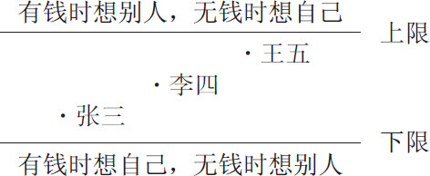
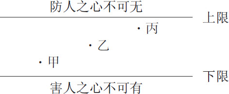
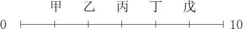

 第五章　向对走，弱点也是优点

有人说人是双重性格的动物，有时候喜欢拥有人群，有时候却又渴望疏离人群；有时候希望做美国人，觉得比较神气，有时又觉得做中国人比较实在。

人性的弱点也是如此，同样求生存，如果策略错误，就会表现出许多缺点；若是策略正确，便会表现出许多优点。有时呈现缺点，有时又呈现优点，这就是策略变换，摇摆不定的证明。

策略正确的人，拥有人群时很喜欢，疏离人群时也很高兴，各有适当的原则。做美国人也好，做中国人也好，都能普遍受到欢迎。

正确的策略很多，针对关键性的变项，如贫富、得失、尊卑、强弱、健衰、老少、进退、主从、施受、正误，提供主要原则，只要确实施行，人性的弱点就会变成优点。

“过两天放长假，我们出去走走吧！”王先生征求太太的意见。近来秋高气爽，似乎是出游的好时机。

“放长假大家都出门，人多车多，去凑热闹干什么？”王太太的顾虑不是没有道理，累次痛苦的旅游经历，提醒她凑热闹的结果常常是被弄得精疲力竭。

“那我们干脆留在家里休息好了！”

“在家多无聊！”

王太太所说的话都是对的。王先生实在难以反驳，但是一时又想不出两全其美的方法，因此反问太太：“那你想要怎么样？”

想不到王太太居然不假思索，脱口而出：“问你啊，怎么问我呢？”

“反正我说什么，你都有不同的意见，叫我怎么办？”王先生有一点儿委屈，好像摸不清楚太太的用意，弄得自己左右为难，拿不定主意。

“我有意见，并不表示我不赞成你的想法。我只是提出不同的方向，让你多做一些考虑而已！”王太太说。

“你这样泼冷水，使我不想管这些事情。我看干脆由你决定，我没有意见就是。”王先生赌气道。

“泼冷水才能够使你更加清醒，要考虑得周到一些。你现在说由我决定，你没有意见，也不过是说说而已。真的我做决定，你也会提出不同的看法，和我现在的表现一模一样，你相不相信？”王太太说。

“真的，好像就是这样。实在很矛盾，又每次都如此。”王先生有些无奈地道。

对于同一件事情，每个人都有不同的看法，有的人认为自己做得对，别人做的都是错的。也有的人认为自己对于人性的弱点的策略是最正确的，结果却将人性的弱点变成了缺点。实际上，==对待人性的弱点还有另外的方法，把错误的策略倒转过来便会成为正确的策略，于是所有缺点都能转化为优点==。

# 有钱时想别人，无钱时想自己

富有的时候，可以享受许多金钱创造的乐趣，却也同时感受到金钱带来的很多苦恼。例如出入隐秘并且要雇用私人保镖，慎重择友以防其窥窃财富，力求保持财富而牺牲与家人共聚的温暖等等。这时候只要多想想别人，多替别人设想，也许就容易减少这些苦恼。

一般人总以为陌生人比熟悉的人更可怕，因而对于不认识的人或者不属于自己家庭内部的外人，都格外用心防备。其实，==熟悉的人比陌生人更了解我们的情况，更容易找出有利的时机和地点下手，令人防不胜防。==据统计，谋财害命的凶手多半是自己人或者熟悉的内贼。富有的时候，要多想想自己的亲戚朋友，多少照顾他们一点儿，可能也是防范内贼的有效途径。

==有钱的人要记住舍得花小钱，才能免去花大钱的灾难。==舍不得花小钱的有钱人，终究要花大钱，算算更划不来。当然你也可以理直气壮地称：“自己的钱，都是自己费尽心血赚来的，既不是祖先留下来的，也不是偷来、抢来的，为什么要让别人花？”那么，等到有一天吃了大亏，弄得众叛亲离，你才领悟到不管你的钱是怎么来的，多少跟别人分享一些都是对的，因为你是他们的亲戚朋友，恐怕已经为时太晚，难以挽回了。

==没有钱的时候，反而要认定“人应该靠自己，不要老想依靠别人”，不应该有不劳而获的念头。==亲戚可以救急，不能救穷，偶尔周转一下，以解燃眉之急，人家还会同情你，要想靠人家长期援助或者养一辈子，谁也不愿意。长大以后就应该独立，不应该依赖性太强。这样才会自己反省，为什么同样是在工作，自己却弄得如此穷困？而且不会始终寄希望于他人，以致因失望而怀恨在心，甚至萌生恶念。对于亲朋好友的帮助也要感谢，不要得寸进尺，因为那样反而对自己有害。

富有时多想别人，才会懂得赚钱又懂得花钱，不会沦为钱财的奴隶，也不会因财富而被害。没钱时多反省自己，才能够及早悔悟，重新出发，建立健康积极乐观的人生观，不卑不亢，不怨天不尤人，不自怜也不厚颜。否则为了生存，自怜自叹自卑加上厚颜无耻，那就什么卑鄙龌龊的事情都做得出来了。

>  富有时多想别人，才会懂得赚钱又懂得花钱，不会沦为钱财的奴隶，也不会因财富而被害。

# 得意时不炫耀，失意时不诉苦

==得意的时候，要顾虑那些不得意的人对自己有嫉妒心、不平心，甚至去除心。==你不炫耀对他们来说，就已经让他们够不舒服的了，如果再炫耀自己的所有、吹嘘自己的本领、夸张自己的成果，岂不令他们更加难过？

做事顺利，不要说是自己有能力，要说是自己运气好，这样，比较==不会对别人的生存构成威胁==。夫妻相处得很好，要说是缘分够，大家听了也会觉得比较舒心。如果是虚假的喜怒不形于色，那是面具，若能发自内心不希望刺激别人，便是真的不炫耀。

==不对失败的人谈论自己的成功，不向失意的人夸耀自己的得意事。==这种涵养的功夫，称为含蓄，是一种谦虚、憨厚的表现。==为了保持含蓄，必须要有几位至亲好友能够分享我们的快乐。在这几位至亲好友之外，最好都有所保留，以免惹人讨厌、招人妒忌而种下祸根。==

> 不对失败的人谈论自己的成功，不向失意的人夸耀自己的得意事。这种涵养的功夫，称为含蓄，是一种谦虚、憨厚的表现。

==失意时千万要克制自己，不要到处诉苦。==就算真正关心你的至亲好友，听久了也会觉得厌烦，何况是一般朋友，他们根本听不进去，这种诉苦只会徒然让人取笑，无济于事。

一般人听人家炫耀，有时是为了探听虚实，有时是为了维持关系，或者是为了沾一点儿光彩，多少也会忍耐着听一些。==至于诉苦，大概很少有人有兴趣听，实在多说无益。==

失意的时候，最要紧的是情绪稳定，冷静地检讨一番，然后痛定思痛，反省警惕，以求重新出发，再走上成功的大道。这时候必须==十分忍耐，而且对自己要有坚定的信心。忍耐众人打落水狗、翻白眼、拒不见面、推三阻四和虚情假意，坚信自己有东山再起的一天。==

得意时不炫耀，失意时不诉苦。==必须把得失看作人生`必经`的过程，而不是最后的结果。==过程会改变，要使得意延长而失意逆转，需要含蓄而有涵养，有实力而不随便展现，能隐人所不能隐，藏人所不能藏。

> 得意时不炫耀，失意时不诉苦。必须把得失看作人生必经的过程，而不是最后的结果。

# 位尊时不虚妄，位卑时不讨好

职位尊贵、握有大权的时候，很容易虚妄，真的以为自己一言九鼎，说话算数，大家都应该绝对服从。历代枭雄生前大家都怕他、惧他，把他的指示当作颠扑不破的真理，一旦他死亡，他所说过的话，都一一被后人推翻。历代的官方记载，无不尽力为统治者歌功颂德，但==时过境迁==，都不免被揭穿。位尊时为自己树立铜像，将来才有被推倒的机会；位尊时到处题字，将来才有被更换的可能。凡是自己认为了不起，可以一言为天下法的念头，都是虚妄而不持久的，不足为法。

位尊的人必须自我警惕：我不是神，有时也会犯错。从而要虚心听取大众的批评，客观而冷静地接受大家的意见，以求下情得以上达，收到集思广益的效果。

==为人部属，必须以不讨好的态度，来获得上级的赏识与信任。==一般人所犯的错误，即认为上级喜爱部属听话、没有意见、主动猜测上级的意图而尽力配合、过年过节送礼、生日祝寿、陪同登山、唱卡拉OK，甚至打麻将，因而积极去做，以致做得过分而变成讨好，终于害了上级。

上下级之间是互动的，上级贪污舞弊，部属的过分配合是主要原因。而部属逢迎讨好，上级的暗示与默许也难辞其咎。

位尊时不妄自尊大，自以为了不起，位卑时不讨好，上下级之间才能够合理互动，彼此秉公行事。

> 位尊时不妄自尊大，自以为了不起，位卑时不讨好，上下级之间才能够合理互动，彼此秉公行事。

# 势强时多助人，势弱时要自持

势强的时候，不但不可以仗势欺人，而且应该趁势多帮助他人。帮助那些需要获得帮助的人，不是帮助那些对自己好的人，或者对自己有利的人。当然，最好是帮助那些能够自助的人。

有势而不用，等于势没有作用；有势而乱用，将来会作茧自缚，仍会自作自受。

助人的时候，要让对方觉得没有压力，对方才会持久地与我们合作。如果给予对方很大的压力，或者摆明是要讨回人情，对方就可能会拒绝接受帮助，甚至产生反感，反而得不到良好的回应。帮助应该得到帮助的人，原本没有人情，何必让人谨记在心，又何必一定要让对方感受到压力？

人在衙门好修行，指的是有势而用得正当即为造福，若是用得不正当，便成为造孽。造福造孽，在于自己一念之间，岂能不特别警惕？

人在形势不利的时候，最容易违背原则，做出令自己都不敢相信的举动。虽然说形势比人强，人在矮檐下，不得不低头，但是自持的功夫也在此时遭受着考验。能不能安然过关，端视自己平日的修养而定。

好死不如赖活着，是势弱时忍受万般委屈的一种生死观。蝼蚁尚且偷生，何况是人？当年司马迁受过宫刑，也是忍辱偷生，最后才能够完成《史记》这本巨著。身体受折磨、行动受限制、有志不能伸、想做不能做，都可以忍受，也应该忍耐，若是过分违背自己既定的原则，使自己良心不得安宁，那就应该宁死不屈，奋战到底。有时候不打不相识，坚持原则而不屈于形势，反而会赢得对方的敬佩，从而解除自己的困厄。

# 体健时应爱惜，体衰时多锻炼

身体的健壮或衰弱，固然有先天的条件影响，所谓先天不足，或者与生俱来的某些缺陷，这属于个人无法自主的部分。然而后天的调养与锻炼往往可以弥补先天的不足，甚至使缺陷变成特长。

健壮的时候最要紧的是爱惜自己，不要任意伤害自己的健康。贪生、怕死，往往到了紧要关头才会提高警惕，或者慌张失措。既然贪生、怕死，就应该在平日养成良好的起居习惯。追求刺激、快乐，应该以不伤身体为前提，也不宜采用不正当的方法，当然，最好也不必过分冒险。致力于求名、求利的时候，要常常提醒自己，即使获得盛名、厚利，若是赔上了生命或健康，恐怕也十分不值得。

身体衰弱的时候，最要紧是切勿自暴自弃，不能灰心丧气，必须鼓起勇气，坚定信心，展现毅力，有计划、有方法地勤加锻炼。相信方法正确、持之以恒，必然可以恢复健康。

锻炼，再锻炼，是体衰者的唯一法宝。心理上的配合也十分重要。有病就应该就医，诊治服药之后，就要忘病。有信心不断通过各种方式，暗示自己、鼓励自己，很快就会恢复健康。

>  
> 锻炼，再锻炼，是体衰者的唯一法宝。心理上的配合也十分重要。

# 年轻时要谦恭，年老时不固执

年纪轻的时候，要特别谦虚，对人恭敬有礼。学识固然重要，经验也很要紧。一般来说，科学技术日新月异，进展快速，愈年轻的人学的知识愈新颖尖端。但是社会、政治、教育、人文、历史等学科，则需要较多时间的历练与思考、经验的累积，这些学科上年长的人就十分值得重视。

老一辈的人，由于世故较深，往往比较含蓄，不像年轻人有话就说，有意见就发表。必须谦恭有礼向老一辈的人请教，他们才会吐露一二，愈有诚意就会挖愈多知识。年轻人看不起年老的人，常常如身入宝山却空手而还，不能把握良机及时请教。

年轻人的毛病，大概就是喜欢表现，随时随地想显露自己的才能，以致很快就露光了、泄底了，令人失望。

人总有年老的时候，年老不是任何人的问题，而是所有人的共同问题。特别是环境改善、医疗卫生进步之后，随着人口寿命增加，老年人的比例大幅度提升。老年人最大的问题便是固执己见，凭着自己丰富的人生历练，轻易否定新的变化，对革新形成莫大障碍。

既然都承认时代在不断改变，那么自己的某些习惯也应该随着时代变化有所调整，才能赶上时代而不为潮流所淘汰。因此年纪大的时候，要特别提醒自己，千万不要固执，必须以客观的眼光重新体认新的环境，及时合理地调整自己的步伐，以便随着时代而进步。

年轻要谦恭，年老忌固执，是对于年龄的一种因应策略。每一代人有每一代人不同的成长背景和时代经历，最好彼此尊重，不要勉强别人一定要与自己具有同样的感受和观点。

>  
> 年轻要谦恭，年老忌固执，是对于年龄的一种因应策略。

# 前进时想退路，后退时要救人

人在前进的时候，多半只看前面不看后面。特别是前进得愈顺利，就愈不会瞻前顾后，以致有意无意得罪许多人。一般而言，你正处于前进时大家都会对你忍耐，被惊动的人也会闪开，好像没有什么阻力。一旦事情告一段落，你会发现各方面的破坏力量开始逐渐展现：闪开的那些人，似乎又都恢复原位，形成强大的阻力。令人觉得处忧患比较容易，处安乐比较困难，果真成了“生于忧患，死于安乐”。要改变这种现象，唯有前进时考虑得更加周到，处处为将来设想退路，自然就减少了未来的灾难。

俗语云“上台容易下台难”，最好上台时就想好如何顺利下台。要记住“上台靠机会，下台靠艺术”，也可以说下台靠智慧，因而时常揣摩，怎样才能够既完成工作，又不得罪人，以兼顾做事和做人。

后退的时候自身难保，哪里还有余力救人？于是就不去救别人。结果，事过境迁之后，自己不想救的人反而是有能力救自己的人，这时才后悔当时没有伸出援手，恐怕已经无济于事了。后退时情况危急、条件很差，自己逃跟拉一两个同伴一起逃其实差不了多少，有时彼此互助，反而更加容易安全脱逃。

下台时对自己的班底撒手不管，大家一定会觉得心寒，觉得自己追随这样的主管很不幸。所以，下台时再艰辛，也要尽力照顾部属，大家有难同当。这样，将来有朝一日东山再起，大家才乐于追随你，才有可能做到有福同享。

>  
> 下台时再艰辛，也要尽力照顾部属，大家有难同当。这样，将来有朝一日东山再起，大家才乐于追随你，才有可能做到有福同享。

进时想退路，退时想东山再起，自然进退两可。

# 为主时不苛刻，附从时不逢迎

周公当年指派儿子伯禽去主管鲁国的政务，告诉他四个原则：第一，不要疏忽亲族；第二，不要忽视重臣对自己的不满；第三，不要随便抛弃故旧；第四，不可期待以一人之力解决所有问题。

为主的时候，要注意不可苛刻待人。就算别人有什么不是，朋友还是朋友，若是没有明显的背叛行为，不能够随便抛弃朋友。

小小恩惠有时会得到很大的回报，小小的轻忽有时也会遭到狠毒的报复。为主的人，必须了解每一个人可能有不同的感受，才能够判断他人真正的需要。因此在态度上，不可过分严厉，尽量促使下情上达，彼此沟通，互相了解。

当附从的时候，不可盲目顺从，也不能唯命是从，因为“乖乖牌”终将拖垮主人。应该合理地服从，对于不合理的部分，则应该据理力争，有几分把握，便做几分坚持。一个人的信用度，原本就是自己据理力争、合理坚持所得到的结果。毫不坚持，等于不用心、不负责任。盲目坚持，则是刚愎自用，很难与人合作。只有合理坚持，才是附从者应有的态度。

>  
> 当附从的时候，不可盲目顺从，也不能唯命是从，应该合理地服从，对于不合理的部分，则应该据理力争，有几分把握，便做几分坚持。

附从者如果不善于体会主人的意思，两者很难建立默契，不容易把事情办好。假如过分体会并且顺从主人的意思，也会在主人决策错误或自己会错意的时候造成不良的结果，而招致失败。

为主时要宽宏大量，附从的人才会尽心尽力；当附从的时候，不可自我主张过分强烈，必须合理地坚持自己的意见，巧妙地引例，使主人明白自己的意思，因而改变初衷，以免错误。

# 施舍时要舍得，受益时要感谢

在人生的过程中，过去和现在接续，现在也和未来连接着，不会间断。现在的种种，肇因于过去；而未来的发展，也奠基在今日。有办法施舍的时候要舍得，让对方不要承受压力，才不致种下未来不但不感谢，反而恩将仇报的恶果。施舍时即使不图回报，也应该谨防可能在态度上伤害对方，语言上侮辱对方，或者分配上激怒对方，未来反目成仇，对自己不利的情况发生。

施予的对象，除了亲朋好友之外，可以扩大到他人。由亲及疏，不致招来亲友的不平。施予之后即应忘记，不再提起，因为人情不讨，永远存在；人情一讨，也就不在了。

量力而为，慎重处理，过后即忘，是施舍的三大原则，缺一不可。人们常说：“救人不如救虫。”说的是救虫不会产生不良后果，救人则常常会因为被救者觉得受伤害、受侮辱而怀恨在心，伺机报复，造成可怕的后果，所以不得不慎重。

受人好处的时候，必须以感谢的心情来对待，不能存有这是自己“应该获得”的观念，甚至认为不足或不平而心生不满。对于人家的施舍，应该谨记在心，即使无力回报，也应该时常记起，至少要为施舍的人祈福求平安。

人与人之间原本就有借贷偿还的平衡活动，只要不赖皮，就不必认为羞耻。人既然要群居生活，多多少少都会从社会、从亲朋好友那里获得一些恩惠，如果能够合理地偿还或报答，也没有必要觉得惭愧。

给人好处，忘掉它！受人好处，谨记着，力求合理回报。施受之间，共同以善心为媒介，即为善有善报。

>  
> 给人好处，忘掉它！受人好处，谨记着，力求合理回报。施受之间，共同以善心为媒介，即为善有善报。

# 有理时能恕人，错误时要坦承

理直气壮比较适合法庭相见的场合，既然兴起诉讼，自无人情可言。一般情况下，仍以理直气和为宜，因为祸从口出，气壮时所说的话一定不如气和时的话来得圆满，难免伤了和气，种下招人怀恨的恶因。

还需记得，打人不打脸，骂人不揭短，即使理直，也应该留些余地，以免人急造反，对自己不利。

>  
> 打人不打脸，骂人不揭短，即使理直，也应该留些余地，以免人急造反，对自己不利。

得理不饶人，不如得理时还能够宽恕别人。给人一条生路，总比把人赶上绝路好。自己要生存，别人也要生存，退一步海阔天空，才能各得其所。

把情理摆在法理之前，先由情入理。这时候将不伤感情列为优先考虑条件，在不伤害对方的情况下把道理说清楚，所以要气和，不能气壮。

当道理说清楚之后，必须适可而止，不要一再乘胜追击。不打落水狗，才不致狗急跳墙或者狗咬人。

犯了错误的时候，最好的办法是坦率地承认错误。人非圣贤，孰能无过？只要记住教训，以后不再犯同样的错误，并且举一反三，不犯类似的错误，就已经十分难得了。所以犯错并不可怕，一而再，再而三地犯同样的错误才可怕，那才令人痛恨。

坦率承认错误，还需要诚恳地设法补救。否则光是口头上道歉，对方仍然会气愤不已，觉得一句“对不起”没有诚意。若是加上一些行动上的表示，真正对自己的过失负责，拿出诚意来补偿对方，效果就要好得多。

最好不要犯错，不小心犯错误时，就应该一方面向对方道歉，认真承认错误，一方面用心想办法，用行动来做—些实际的补救。

天下的事本来就是见仁见智的，公说公有理，婆说婆有理。两种策略，一正一反，都可以找出许多理由来加以支持，而且都可以说得头头是道，条条有理。

君子有君子之道，小人也有小人之道，大道虽然不同，却也各有各的生存之道。

刚开始与人相处要把人分辨得清清楚楚，以坚定信心。相互熟悉之后，可以依据事情的性质，因时、因人、因地制宜。

这种弹性的运用，并不是生于偏见或成见，而是采取了一种合理的不公平的做法，合乎中道的标准。

常言道：防人之心不可无，害人之心不可有，要在这防人与害人之间，寻找一条恰到好处的路。

赞成正确策略的人，可以讲出一大堆理由，来支持自己的选择，比如说：

没有钱帮助别人，说起来自己也觉得不光彩，混到这种地步，连一点帮助别人的能力都没有。赶快趁有钱的时候，想想别人，多少帮助一些，将来回想起来也会觉得安慰，总算有一些能力，可以帮助别人，而且想到做到，不像那些光说不练的人，整天只会吹牛。没有钱的时候，要记住人穷志不穷，只要反省自己，调整自己，相信总有一天会东山再起，那时候再来和人家较量也不迟。

得意的时候，千万不要忘形，得意忘形会带来不良的后果。失意时不怨天不尤人，甚至绝口不提失意的痛苦，才能够振作起来，从头开始，以毅力来证明失败为成功之母。面对失败合理反应，失败可以带来成功，若是反应过当，成功照样可以带来失败的恶果。

>  
> 面对失败合理反应，失败可以带来成功，若是反应过当，成功照样可以带来失败的恶果。

位尊时成为大家注意的目标，成为十手所指、十目所视的对象，稍有不慎，马上会被人抓住把柄，实在非常危险。这时候必须谦虚谨慎，不要随便发表意见，也不能任意做出决定。职位低的人愈讨好上级，愈让上级觉得这个人是奴才，其他的人也会看不起他。人的职位固然有高有低，但基本人格是平等的，用不着讨好任何人。大家互相尊重，彼此看得起，才能充分配合，扮演好各自的角色。

有势不用，有势也等于没有势。所以有势的时候，最好多多帮助别人，广结善缘，才可以成就更大的事业。势弱的时候不要埋怨别人的白眼，也不要责怪他人的落井下石，应该看开一些，认为人情世故，本来就是有冷有热，委屈一些，放低姿态，自然可以安然渡过难关，不至于乱了方寸。

身体健壮的时候，要明白岁月不饶人的道理，要趁早保养爱惜身体，才能够使生命维持得长久一些。养生之道，必须在健壮时开始注意，而不是到有病时才来救急。万一身体衰弱，更应该进行自我心理建设，认为已经如此了，慌张、焦急、忧虑、恐惧以及怨恨都无济于事，不如逆来顺受，安心调养，加强积极的生存意志来克服困难。

年轻时经验不足，阅历尚浅，不要自以为样样都有把握，以免经不起考验而贻笑大方。常常警惕山外有山、人外有人，谦虚一些，恭敬一些，多多学习才能不断进步。年纪大的时候，要跟上时代的变化，不可固执于以往的经验，应该不断调整自己，以新的观点来判断新事物，才不致一老就成贼，令人看不起。

前进时眼光只看前不看后，一旦面临山穷水尽的境况，又不知退路在哪里，就会进退两难，痛苦万分。一路向前，不留神其他人，也会有意无意得罪人，种下将来不知如何是好的祸根。后退时一心一意只求自己平安解脱，不顾同伴死活，同样得罪人。一旦风平浪静，这些同伴就会伺机报复，弄得自己灰头土脸。可见进时要想退路，退时要想到共患难的朋友，才不会对自己不利。

坐主位的人往往不了解部属所受的苦楚，任意支使，显得十分苛刻。坐车的人不明白司机的难处，常常对司机不满意，一旦自己去开车，才会发现怎么都找不到停车位，就算找到了也停不进去，这时候才会发现自己平日的过分苛求。这样的苛求，会使上级失去部属的信心和向心。部属如果逢迎上级，把上级捧得昏头昏脑，让上级以为真的可以对部属随意要求，结果还是部属自己倒霉。

一个人把所有的钱都放在自己的口袋里，势必十分危险，有时还会惹来杀身之祸。倒不如分一些放在别人的口袋，反而安全得多。所以施舍的时候，要抱着分散风险的心情，不要舍不得。而受益时却应该认为人家相信我、爱护我，才肯以我为受益对象，当然要心存感谢。

>  
> 施舍的时候，要抱着分散风险的心情，不要舍不得。

有理无理原本是变动的。现在看起来很有道理，说不定时过境迁，就会变得毫无道理。所以有理时不可以太过自信，认为自己永远是胜利的一方，不如以宽恕的心情和气一些，为自己留下更为宽广的退路，对自己更有利。自己不慎犯了错误，就算找理由搪塞，大家也是心知肚明，并不能长久隐瞒下去，如果坦然承认，大家反而会觉得不好意思，就会掉过头来安慰你，说这种错误其实没有什么了不起，好像大家都会如此，也经常犯错，岂不更加轻松？

# 人类最大的优点在于懂得根据目标选择策略

道理大部分是相对的，这样说对，那样说也没错。君子小人各有各的说辞，也都说得振振有词，表示各有各的生存之道。

人类为了求生存，不得不编造出一堆道理来为自己的行为辩护，为自己的言论寻找依据。

各种道理，只有一个共同的目的，那就是自圆其说。只要前后不矛盾，好像就相当有道理。

对于是非的判断在西方是科学的，在中国则需要相当的艺术。科学以分析为主，利用分析和实证的方法对事物做理智的了解，目的在于寻求真理。艺术以直觉为主，运用自己的感受或价值判断，目的在于欣赏和创造。西方求真，中国求善，所以在西方社会，道理比较好讲；而在中国社会，道理实在很难讲。

前面所说的错误策略和正确策略其实并不是绝对的，有时候运用错误的策略，反而会修成善果，得到善报。例如一个人年轻时显聪明，有能力也尽量表现出来，偏偏还遇到了喜欢表现的贵人，不但出钱资助，而且提供许多有利的机会让他表现。同时他自己也很争气，用心学习以充实自己，结果名实相副，获得很好的成就。因此对他来说，年轻时显聪明的策略不见得不好。当然，也有人运用正确的策略，结果却未尽理想的，例如形势有利时，大力帮助他人，不料这些被帮助的人却联合起来要争夺他的权势，正应着俗语说的“饲养老鼠，咬破布袋”，令他十分痛心。

既然不是绝对的，我们为什么区分得那么清楚？这些是错误的，哪些才是正确的策略呢？

第一，中国人的道理原本都是很难讲的，说不定这样，也说不定那样。在这种情况下，我们所说的，大抵都是站在很难讲的立场来讲，也就是不得不如此说的。因为很难讲还是要讲，所以才勉强进行了区分。

第二，我们很重视本末、轻重，站在这种标准来判定，很容易发现正确的策略，比较合乎根本要求，实施起来会显得人的分量比较重。而错误的策略则比较偏于末端，显得有些短视、近利、轻浮。

第三，天下事有常必有变，有规矩也常常出现例外，我们必须守经达变，才不致乱了根本，所以虽然正确的策略也可能出差错，但是一般说起来，差错的比例并不大，还是可以说是正确的。我们判断正确或错误的策略便是居于这种平均数。

> 天下事有常必有变，有规矩也常常出现例外，我们必须守经达变，才不致乱了根本。

其实，==要比较策略的正确与否，必须先确立自己的人生目标究竟是什么。==

同样是求生存，由于目标不同，态度也会不一样。动物求生存的方式大抵差不多，因为动物只按照本能活动，没有什么目标可言。猪和狗也许不相同，但是猪和猪之间或者狗和狗之间的个别差异相当小。狗主人往往认为自己所饲养的狗很特别，和其他的狗大不相同，这是一种十分主观的感觉。

人类和其他动物最大的不同在于会自己选择目标，自己选择策略以达成预期的目标。由于彼此的想法不一致，所以个别差异很大。

有些人的目标十分单纯，就是自己的生存高于一切，主张不求人也不助人，我行我素，只为自己而活，不顾他人的观感如何。同样，自己生存高于一切目标，也可能只求人而不助人，有利于己时我行我素，不利于己时求助他人，甚至可以不择手段。可见，同一目标实现的途径并不相同。同样的策略，实施起来，也有不同的花样。

确定目标之后，再来比较两种看起来相反的策略，就比较容易看出它们之间的差异性和可能产生的后果，也可以明显看出哪一种比较有利于自己。

有趣的是，人们刚开始会觉得两种策略完全相反，慢慢地却会发现彼此之间也有相反相成的作用，彼此可以互补，这时候就觉得两种策略竟然可以合而为一，形成一种动态的策略。

例如“有钱时想别人，无钱时想自己”和“有钱时想自己，无钱时想别人”，表面看起来完全相反，实际上可以合成一种策略，毫无矛盾。我们采用品质管制的观念，将“有钱时想别人，无钱时想自己”当作上限，而把“有钱时想自己，无钱时想别人”看作下限，如图13：

**图13　策略范围内的个别对策**

然后分析自己的朋友，对张三应该采取“有钱时想自己，无钱时想别人”的策略。因为张三向来有钱时独自享乐，避不见面，找他也没有回复，等到他口袋空空的时候，又会死缠活赖，一定要向别人借走一些钱，才肯离去。像这样的人，当然应该采取这种策略，以免自己吃了亏还要被他看成傻瓜，同时也宠坏了他，使他愈来愈自私自利。

对王五，应该采取“有钱时想别人，无钱时想自己”的策略。因为王五是一位正人君子，一向克己待人，而且安分守己，当然有钱时要想到他，尽量帮他的忙，无钱时宁可向别人开口借钱也不要找他，因为王五只要有办法，就一定会主动来帮忙，根本用不着你开口。对待王五这样的人，当然要以君子的态度来对待良心才得安宁。

至于李四嘛，五五分，有时候想到他，有时候也可以不关心他。因为李四对人是忽冷忽热的，随他自己高兴，我们也不必对他太认真。

这就是中国人最常用的“对待原理”，人家对我好，我应该对他更好；人家对我不好，我又有什么理由对他好呢？敬人者人恒敬之，才是彼此相处的依据。

这样看来，错误的策略和正确的策略不过是为了说明的方便，才勉强加以划分，真正了解以后，把两种策略合而为一，分别当成处世的上下限，然后在两种策略所构成的空间中，弹性运用，因人、因地、因时、因事而合理调整，应该是最合适的方式。

那么，我们前面所分析的正确和错误的策略是不是可以不必区分了呢？

我建议刚开始的时候，最好明辨正确的策略和错误的策略，并且一再重复思考，为什么这些策略是正确的，那些策略又是错误的。一方面坚定信心，一方面加强认识。等到真的弄清楚了应该怎样使用策略之后，进而对不同的对象做不相同的处置，才能得心应手，达到恰如其分的合理地步。

如果对某人的认识不深，我建议先往好处想，把他当作好人看，不要一下子就把他当坏人。但是，防人之心不可无，仍旧需要小心谨慎，以防上当。

斟酌的依据是把“防人之心不可无”和“害人之心不可有”当作上下限，如图14：

**图14　对人的弹性范围**

==事情不大，就算真的吃亏上当，也不致遭受太大的伤害，可以采用甲点的方式因应，以免防卫过当，失去友谊。事情十分重大，万一吃亏上当，就会承受不了，这时候最好采用丙点的方式因应，==因为谁教对方不考虑彼此的私交关系，一下子就把如此重大的事情丢出来？

事情不大不小，后果还可以承受得了，若是值得冒险，仍然可以采取甲点的方式；若是不值得冒险，就要以乙点的方式回应；万一这时候有好几个案件堆积在一起，那么采取丙点的方式回应也不为过。

最好的选择是不要从零开始，也不要立即给予满意的回应，而是在中间的位置找到一个合理点，如图15，这才叫作中庸之道。

**图15　不选择极端的回应方式**

==自甲至戊，有很多选择。大多数人都不必以0（完全不理会）来回应，也不必立即给予满意的回应，这样比较安全，而且较为合理。==

