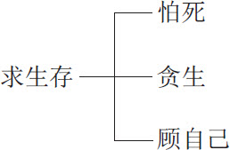
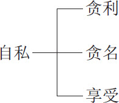
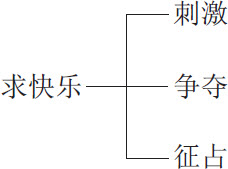
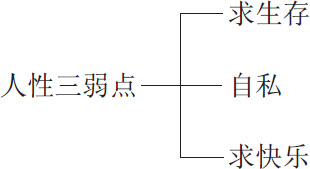
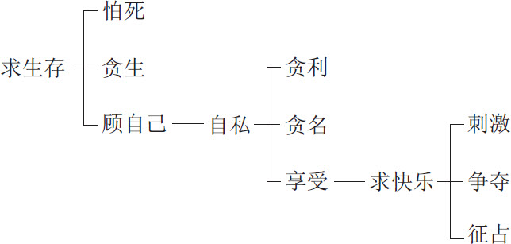

 第一章　人人都逃不开的人性弱点

人性弱点人性的第一个弱点是求生存。

出于求生存的目的，首先怕死，然后贪生，结果形成顾自己。

人性的第二个弱点是自私。

因为自私，既贪利又贪名，最后归结为贪图享受。

人性的第三个弱点是求快乐。

追求快乐的人找刺激，爱争夺，要征占自己喜爱的东西。

人性具有的这三个弱点，凡人都逃不掉。

弱点不一定是缺点，有时候弱点还可能变成优点。事在人为，一切靠自己运作。

# 人类有思想就会有弱点

人性的弱点，是与生俱来不可避免的。也是自古以来，一直存在，并且没有改变的。

只要人有思想，就会触及这些弱点。没有思想的人，不会因应这些弱点，反而令人担心。

植物求生存，但由于它们不能活动的缘故，只能就固定的位置吸取自己所需要的养分。植物的弱点相当单纯，就是不能活动，缺乏变换生存环境的能力。

动物求生存，具有活动的本能，可以变换生存的环境，却必须完全适应外界的种种变化，并没有能力来加以改造。动物的弱点在于不能创造，只能够适者生存。

人类就不是这样，我们能够活动，可以选择生存的环境。同时具有创造的能力，可以把生存环境改造得更加合乎我们的需要。然而，人类的弱点在于具有选择的能力，却缺乏判断的素养；有创造的能力，却往往走错了方向，把生存环境改造得愈来愈对人类的生存不利。

无家可归的人、穷人、妓女、酗酒者、吸毒者、谋杀者、抢劫者，基本上都是人类创造力的产物。烟草、毒品、酒类、枪支、性病、癌症、高血压、艾滋病、家庭暴力、精神失常、性侵害等等，又何尝不是人类求生存的选择、改造方向错误所带来的后遗症？

任何一个时代，人类都会为了求生存制造出许多器物，一代又一代地传承、改造。结果愈改造愈令人失去生存的信心。请问：这究竟代表人类文化的进步还是退化呢？宗教、政治、经济、军事、工业、商业、社会各方面，我们自认为愈来愈进步，而整个人类却愈来愈不安、紧张，而且孤立无援，这是什么原因？

人性弱点随着人类的生存而存在，自古以来，从没有消失过。我们应该怎样妥为因应，岂不是兹事体大？

>  人性弱点随着人类的生存而存在，自古以来，从没有消失过。

人类和其他动物最大的不同在于具有思想。因为有思想，人类把地球改造成了今日的样子，创造出许多事物。也因为有思想，人类将宇宙破坏成今日的样子，种下了许多危机。

首先看矿物，原本各安其位。但是人类想尽办法，把它们探勘、挖掘、采集、冶炼，然后充分利用，制造出种种物品或者开发出许多用途。一方面物尽其用，使它们的功能得以好好发挥；一方面则造成环境的破坏和污染，甚至濒临耗尽用完的厄运。矿物是自然形成的，但是种种变化、合成、用途，显然来自人类的思想。

其次看植物，热带植物生长在气候炎热的地区，寒带植物繁衍于寒冷的地带，温带、高山和沼泽，也各有其特殊的植物点缀其间。人类爱动脑筋，发现移植、育种等方法，把热带植物移到寒带，沼泽植物弄到室内，大的变小、高的变矮、瘦的变肥，搞得植物自己都莫名其妙，到底哪些植物才是“原住民”？人类的思想，已经把植物界的自然秩序破坏了。

再看动物，原来也是划地为界各有各的生存地区，而且一物降一物，各有各的生存方式。人类把狂野的动物训练成温驯的动物，将野生的动物饲养为家畜。不但改变了动物的生存地区，从高山移到平地，从深海移到陆上，而且改变了动物的食物和习性，运用改良品种的技术，将动物搞得忘记了自己原本的样子。

至于人类自己，情况也大致相同。远古时期，地球只是一大块土地的时候，由于科技不发达，自然的关山阻隔产生很大的作用。黄、白、黑各色人种分别在不同的地区，各自创造自己的生存花样，发展出各具特色的文化。

这种相安无事的情况到底被人类自己破坏了。动物，顾名思义，是会动的。既然会走动，而地球上纵然有高山也有大川，动物走来走去，难免会逾越原来的生存地区。越界的结果，如果能够适应，等于扩大自己族类的生存地区，继续繁衍下去。若是不能适应，就会退回原地或者死亡，等于自然的力量限制了自己族类的生存地区。人类就不是如此，凭着思想，不但要探险，对陌生地区很有兴趣，而且要适应新环境，不让环境的变化将自己难倒。在科技尚未发达的时候，人类善用自己的两条腿，已经东奔西跑，相当不安分了。路是人走出来的，越高山、渡大川，总是能走出一条路来。

大自然看到人类不安分，恐怕人类会弄乱自然秩序。为了保护自然，大地开始分裂，希望以茫茫大海来隔绝人类的到处流窜。然而人类用思想发明了飞机和轮船，可以飞越高山跨越大海，征服高山，能够乘风破浪，征服海洋。人们一方面积极向外发展，到处展示自己的花样，说是宣扬文化；一方面又热衷于长他人威风，吹嘘自己在别处的所见所闻，把别人的花样带回来，说是他山之石，可以攻玉。

当大自然的力量逐渐丧失对人类的约束作用时，有心人开始尝试“以毒攻毒”的策略，企图以人类的思想来约束人类，因此提出若干意识形态，以规范自己的同志，形成堡垒分明的两大阵营。意识形态的对抗已经证明人类冲破了血统、语言、宗教、生活习惯的限制，不再能够用单纯的血统、语言、宗教或生活习惯来证明彼此的不同，只好采取意识形态的标准，把世界勉强一分为二。

人类的思想，当然不是意识形态所能够限制的。资讯爆炸，又通过各种科技化媒体深入每个家庭。资讯交流结束了意识形态的抗争，也使人类再一次面对茫茫的前程不知如何是好。

意识形态好比上作文课时老师的命题，既然老师出了这么一个题目，学生心目中已经有了某种标准，只要尽量符合这个标准，不要文不对题，及格应该是相当有把握的。意识形态被打倒之后，老师在黑板（白板）上面，写下两个大字：无题。学生就既摸不清标准，也弄不清楚怎样写才能切合无题。

市场上产品的标准如果由厂商制定，顾客只能配合厂商的意识形态，称为“生产导向”，这样对厂商十分有利。现在顾客不愿意配合厂商，要自己制定产品标准，叫作“市场导向”，这对厂商十分不利。因为厂商难下决心，而顾客需求不一，难以捉摸。

意识形态对同志的要求十分明确，顺我者生，逆我者亡。意识形态解除界线之后，谁是同志，谁又是敌人，几乎难以分辨。

人类为什么会弄成今天这个样子？因为我们的思想过分集中在人性的弱点上面。

生物求生存，只是逐渐缓慢地演化，在适应中求变化。人类求生存，由于思想发达，要求快速进步，等于在变化中求适应。

> 生物求生存，在适应中求变化。人类求生存，在变化中求适应。

植物怕死，却勇敢地面对死亡而毫不逃避。动物怕死，于是极力逃避死亡，但在挣扎无效、逃脱不掉的时候，也会悲哀地面对死亡。人类怕死，凭着思想设计出很多花样。光是清晨起床以后可以从事的活动，就包括深呼吸、柔软操、太极拳、按摩穴道、慢跑、快走、登山等等，种类繁多难以枚举。至于求神拜佛，更是动植物难以想象的事情。

因为怕死，人类企图将责任推给别人，设法出卖朋友以嫁祸他人。因为怕死，人类研究各种药物延长寿命。

中国人怕死，于是经常服用补药。美国人怕死，于是在宪法中明确规定人民具有合法拥有枪支的权利。结果呢？中国人可能死于药物中毒，而美国人则会在一瞬间成为枪下的冤魂。俗语有云：愈怕死的人愈快死。是否如此？

动植物贪生，但它们要求得相当有限。人类贪生，却开发出很多难以实现的欲望。例如希望长生不老，希望返老还童。不幸遭遇死亡，又企求保存躯体以待复生，能够继续原来的生命。自己的五脏六腑出现问题，就设法移植别人的器官，并且不希望产生排斥的不良现象。甚至通过巫术，企图折减他人的寿命来延长自己的生命。动植物只是求生，人类却是贪生。

生存的条件，说起来不外乎物质和精神两方面。但是一般人总是先想到物质而后才想起精神，甚至为了物质可以委屈自己，即使精神受伤害也认为是一种应该的忍耐。同样依赖物质以维持生命，动物可能也会储蓄，却远不如人类那么贪得无厌。有东西吃还要求其精致美味，吃饱了还要求保持源源不断，唯恐无以为继。人类的贪婪，帮助媒体大幅发展，以致媒体反过来操纵人类的空间。就动植物而言，媒体再厉害，对它们也是无能为力，无计可施。

植物顾自己，只知道自己吸收二氧化碳放出氧气，吸取自己所需要的水分。动物顾自己之外，有时会照顾幼小的子女，比植物好像进步一些。人类顾自己，懂得戴上假面具，假公济私还不够，还要以私害公。原先人类还知道顾自己必须顾家庭，现在愈来愈弃家庭于不顾，仅仅顾自己。

动植物顾自己并没有发展到自私的地步。人类自私的表现，令人类自己也觉得十分气愤，却也无可奈何。利令智昏，为了贪利、争利，人类演变到子可以弑父、兄可以杀弟，最好的朋友也会翻脸不认人。媒体发达之后，将各种想象得到的贪财争利的伎俩，都描述得清楚仔细，令人觉得从媒体上获得学问好像十分困难，而从媒体学习一些不良伎俩、不正当行为，却似乎非常容易。

为了贪名，人类更是无所不用其极，将礼、义、廉、耻的相关事宜都置之不顾。为了争取学业成绩的排名，从小就知道补习，向老师求情、送礼，讨好老师，考试作弊甚至恶意中伤比自己成绩好的同学。为了争取运动成绩排名，从四五岁开始就整天训练。参加比赛时，服用药物以增强体力，乃至威胁利诱竞赛对手，使其放水称臣，这些都是贪名的表现。

# 求生存：活着才是硬道理

## 人人畏死

有一位老先生，家财万贯，事业十分成功。结婚四十多年的老伴既贤惠又善于教育子女。家庭美满幸福，是大家称羡的人士。

他原本也相当得意，认为自己事事顺遂，大有不虚此生的人性的满足感。但是，七十华诞的前夕，正当家人热烈讨论如何庆祝的时刻，他却满腹忧愁，显得十分悲哀，令人非常不解。老伴关起门来单独问他，到底是什么事情让他如此烦恼。

老先生面对相伴多年的老伴，说出他的心声：“小时候父亲找过一位算命先生给我批流年，批我到七十二岁便寿终正寝。当时年纪小，觉得七十二岁已经长得不得了。一方面很得意，觉得自己可以活那么长久；一方面实在是很不在意，因为还不明白寿命是什么东西。长大后一直忙于工作，把批流年这回事忘得一干二净。前几天找个文件，竟然把这本流年簿翻出来了，忽然发现今年我已经七十岁，只剩下两年的时间，怎么能不伤悲忧愁？”

老伴无论怎么规劝，老先生都想不开。他认为自己虽然事业有成，毕竟还需要继续奋斗。子女各有工作，也仍旧需要给予辅助。老伴尚在，自己怎么能先走？一大堆理由，都证明剩下两年的时间实在太短，不能了却自己这么多尚未完成的心愿，因此愈想愈觉得悲哀，忍不住痛哭起来。

从上面这个案例，我们很容易明白一件事，那就是人性的第一个弱点是求生存。

这位老先生活到七十岁，原本是十分值得庆贺的，不料他却想起自己余年不多，反而因为求生存而产生悲哀的感觉。

求生存原本是人类的天性，也是人生在世最基本的需要。人类的生活和文化几乎都因生存而产生，和求生存具有密切的关系，怎么能说这是人性的弱点呢？

回想石器时代时，人类的平均寿命只有十五岁。那时候人口稀少，人的寿命又不长，为了保持人类的生生不息，绵延不绝，求生存自然成为人类努力的第一目标。

十五年的时间，简直一转眼就过去。如此短暂的生命，能做些什么呢？个人求生存，并不能保持人类的生生不息；个人的存在，也无法维持人类的绵延不绝。因此传宗接代，便成为人类求生存的重大使命。

“不孝有三，无后为大”，在人口不多、寿命不长的时代，生存成为众人一致重视的大事。俗话说“添丁发财”，也是添丁摆在发财前面的，可见一斑。

既然无后那么重要，在尚未完成这件大事之前，人类最害怕的应该是死亡。求生存的第一特征，便是怕死，尤其害怕在无后之前死掉。

## 竭力延长生命

时代逐渐进步，环境和医疗保健的改善使得人类的寿命不断延长。现在的男性活到知天命，女性活过耳顺之年，已属轻而易举。发达国家99％的新生儿可以庆祝周岁，98％的儿童可以活过四分之一世纪。但是人类怕死的心理犹存，贪生的欲望又大幅度增强。自秦始皇以来，便积极追求长生不老。活得长久的人，还希望活得更久，最好永远不死。全世界的人，都追求长生，甚至永生。有的祈求宗教保护，有的寄希望于仙丹的功效，如今还有人借助科学的力量。

贪生是人类求生存的第二特征。人类一方面怕死，一方面贪生，所以做了很多事情，变出许多花样来延长寿命。使得人类在传宗接代的动物本能之外，又发展出其他动物望尘莫及的文化，使人类的生活更加多彩多姿。爱迪生如果只活到十五岁，那么不可能有那么多发明；爱因斯坦假若不是活得那么长久，怎么想得出相对论？孔子活不到七十多岁，就无法体验自由自在却能够中规中矩的生活乐趣；姜太公若是活不到那么大把年纪，遇不到周文王，一生的抱负便无法施展。古今中外的文明创造，无不得力于人类寿命的延长。

然而，人能不能长寿，不完全靠自己，还受到很多因素的影响。索马里的幼童病死、饿死，责任并不在天真无邪的小孩；美国儿童健康活泼，也不是出自美国孩童的努力。

饮食、运动、卫生习惯以及规律的生活可能决定人的寿命，也不是十分准确的说法。饮食方面，日本人偏爱低脂，瑞士人偏好多油，而两国人的平均寿命却大抵相同。运动方面，美国人的运动量大多低于非洲人，而现代人的运动量也比不上石器时代的人的运动量。卫生习惯方面，有不抽烟、不喝酒的人长寿的，也有抽烟、喝酒的人也活得很久的；有十分注重卫生却不幸早逝的人，也有周遭环境非常不卫生而相当长寿的人。至于生活规律，同样被证实不能够一概而论。

## 求人不如求自己

人的一生，不过是在证明自己到底具有什么样的命。如果根本懒得去证明，又怎么知道自己有没有那样的命呢？不努力去证明，便始终无法了解真相。

这样说来，自己努力也好，看天命也好，用努力来证明天命也好，总归是自己的事情。求人无益，不如回头求自己。既然如此，怕死、贪生都由于求人不如求己，而归结在顾自己上面，形成人类求生存的第三个特征。

讲求一套明哲保身的道理，先把自己保住，再怕死、贪生，这是人类求生存的不二法门。

>  
> 讲求一套明哲保身的道理，先把自己保住，再怕死、贪生，这是人类求生存的不二法门。

人类为了求生存，发展出三个特征，如图1：

**图1　求生存的三个特征**

请你问一问自己：

我怕死吗？

我贪生吗？

我顾自己吗？

其实，这些都是人之常情，没有什么好避讳的，用不着不好意思。人多少都有这样的倾向。怕死，固然有害怕亲人死亡，担心老板去世，气愤好人早死，甚至忧虑领袖老死、将领阵亡，但是，最恐惧的莫过于自己的濒临死亡。贪生，固然有祈求亲人长寿，好人长命，老板健康，领袖万寿无疆，而最关心的，莫过于自己的寿比南山。一切以自己为中心，顾自己顾到有己忘他，终于变成可怕的自私。

# 自私：人不为己，天诛地灭

人性的第二个弱点是自私。

如果生命没有限度，大限能够解除，人类就不必怕死。若是死亡的时候，觉得十分快乐，丝毫没有痛苦，大家对死亡便不至于那么害怕。

假若人类得以永远生存，人类也就不必贪生。事实上人必有一死，有生就有死，可以说没有谁能够例外。我们所不能确定的，只是什么时候会死。虽然知道迟早必定会死亡，却仍然衷心盼望能够活得更长久一些。

贪生怕死，是基于生命有限的事实。贪生，是因为希望把有限的生命延长，并且多多益善；怕死，是因为唯恐有限的生命缩短，而且觉得愈短愈可惜。若是生命无限，人类就不必贪生怕死，甚至可能会找死，唯恐求死无门。

顾自己，同样是基于生命有限的事实。

因为时间有限，原本想在顾自己之后，再推己及人，扩大到其他人。但是，时间转瞬而逝，来不及顾及其他人了，只好顾自己而不顾别人。其实也并非存心只顾自己，只是时间不容许罢了。

因为物质有限，原本希望自己享用之后，再由亲及疏，一路扩大出去，让其他人也能够享用。不料自己享用之后，发现物质已经耗尽，无法再提供给别人，不得已只能顾自己。非不顾他人也，实在是不能顾他人也。

因为精神也有限，虽然它看起来比时间和物质更具有弹性，可以同时分享给更多人，但毕竟也属于有限的资源而不是无限资源。唱一首歌能够供很多人欣赏，但是听的人如果这次听不到，以后还有没有机会听到，则谁也不敢担保。于是在能争取的时候便不放弃，优先顾自己，难道不也是人之常情吗？

顾自己固然无可厚非，但一旦顾得过分，逾越了应有的限度，便成为自私，由此就变成了人性的第二个弱点。

>  
> 顾自己固然无可厚非，但一旦顾得过分，逾越了应有的限度，便成为自私。

## 希望获得一切有利于自己的东西

自私的第一个特征是贪利。贪生怕死，都需要一定的物质条件才能够实现。而这些物质，好像都是金钱所能买到的，于是，人们就认为只要有钱便能够满足贪生怕死的欲求。但因为金钱难求，每人所拥有的都相当有限，于是让人更增强了贪图金钱、想要财物的念头。鸟为食亡，人为财死，多少人见财起贪念，只为了人无横财不富，便不顾一切，甚至舍身相求。

金钱、财物，再扩大下去，一切有利于个人的东西，无不希望获得，而且希望获得的愈多愈好，这种行为统称为贪利，这是自私的第一个显著特征。

获利之后，唯恐保持不住，担心利益不再持续增加。保持不住利益，万一在需要时没有利益，岂非等于白忙一场？利益不再持续增加，金钱可能会贬值，财物可能会失窃，房屋可能会倒塌，物质也可能被毁坏，那拥有的利益还不是等于没有？

世间的事很奇怪，能吃的时候没有钱购买；有钱购买的时候，似乎又什么东西都不能吃了；有钱的时候，衣服穿不旧、鞋子磨不破；没钱的时候，衣服不但陈旧而且破损，鞋子不但磨破了底，鞋面也起了裂痕。

贫贱夫妻百事哀，是使人增加贪利的决心。因为关系再好的夫妻都经不起贫贱的考验；生活在贫贱的日子里，再乐观的人也高兴不起来。屋漏偏逢连夜雨，也增强了贪利的信心，贪了还想贪，并非因为贪得无厌，而是担心自己使用的时候不够用，必须多贮藏财物以防万一。

>  
> 贪了还想贪，并非因为贪得无厌，而是担心自己使用的时候不够用，必须多贮藏财物以防万一。

## 希望获得众人羡慕的名气

冷静想一想，马上就会发现光贪利是不够的，不安全，而且不保险。有利，如果没有名来配合，好像神气不起来；商人再有钱，见了官便觉得矮了一大截，因为不如做官的人前后都有人簇拥，显得十分威风。有利，若是缺乏名来保护，好像利益随时可能被人掠夺；商人再有钱，也要巴结当官的，生怕当官的人改变政策，自己会损失钱财。何况因名得利，看起来比纯粹求利要方便得多。

后来，人更加好名。考状元很难，于是觉得用钱捐个“理事长”之类的虚职也算有名堂。在学术界想要出名不容易，就花钱买名牌衣服穿，照样也算是一种有名。于是造成人人自我膨胀，满街都是大师、名嘴、专家、权威、国际名流、酒廊名花，人们贪名的趋势愈来愈明显。

贪名是自私的第二个特征。

电影明星要争排名，争的是自己的名字必须挂头牌，放在别人的前面。

学生考试争名次，每个学生都希望自己每次都是第一名。

有些人有了一点小发明，马上就要申请专利；写过一些文章，立即去登记著作权，生怕自己的名被别人冒用、盗用。

电视节目上介绍某位歌星，一定要说是青春偶像、大众情人，而主持人也为了博得观众的回应，说自己是什么超级著名主持人。这些都是贪名的表现，觉得有了名气之后社会地位也会相应提升，说出去也更容易得到别人的尊重。其实这些名都是虚的，并不能永远流传下来。很多所谓的著名影星、歌星会过气，随着时间的推移，原本第一名的人也会被后来者赶上或超过。

## 希望享受别人没有的特权

贪名、贪利，原本是为了生存的需要，结果后来变本加厉，变成要满足个人的享受，非奢侈、华丽，誓不罢休。享受于是成为自私的第三个特征。

有利，要利于己而不利于人，已经是自私的行为。后来，发展到利于己还不满足，进而要求个人的荣华富贵，当然更加自私。一切向钱看，有了钱之后只想到自己还不是自私吗？

有名，想要自己的名越来越往上升而别人的名越来越向下沉，这也属于自私的表现。自己的名气大了之后，觉得这样还不够，还要炫耀个人的尊贵和享受特权，那就更加自私。

自私的三个特征，如图2：

**图2　自私的三个特征**

你可以问一问自己：

我贪利吗？

我贪名吗？

我贪图个人享受吗？

你会发现，如果你回答不是，好像有些违心。假若回答是，似乎又觉得有点不好意思。

# 求快乐：快意人生人人向往

享受的主要诉求在于求取快乐。起初是因享受而觉得快乐，后来却逐渐变成为了寻求快乐而享受。于是，求快乐就成为人性的第三个弱点。

>  
> 享受的主要诉求在于求取快乐。起初是因享受而觉得快乐，后来却逐渐变成为了寻求快乐而享受。

人有喜怒哀乐是很正常的事，然而人总是趋向于尽量求喜和乐，极力避免怒和哀。喜和乐经常是互相伴随出现的，又往往以乐为代表。

“人活着，只要快乐就好！”

“不管人家怎么讲，自己快乐，管他那么多做什么！”

这些话好像是至理名言一样影响着人们。

快乐在哪里？要向哪里去求？最基本的快乐是感官的快乐，要从个人感官需求的满足去寻求快乐。

## 追求感官刺激获得快乐

求快乐的第一个特征是刺激，从刺激感官来获得快乐。

在饮食上求新求变，旨在满足口和胃的刺激。山珍海味的营养未必胜过粗茶淡饭，却能够带来不同的感官刺激。

在娱乐方面极尽声色之娱，主要为满足耳朵、眼睛的刺激。五光十色，变化无穷还不够，还要在广度和深度上不断增强，而且希望刺激时时刻刻都有，最好不离身。

在运动方面，原本以健身为主，逐渐变成以高度刺激为先。练拳觉得不过瘾，还要互相击打才觉得够刺激。

觉得文字读起来很沉闷，就加一些插图；又觉得图画缺乏动感，于是改用电视；画面动起来了之后还觉得不够，还要加上彩色，并且配以音乐。一步一步，都是在通过刺激寻求快乐。

## 争夺得来的果实格外甜美

求快乐的第二个特征是争夺，通过竞争、夺取来求取快乐。

获得快乐的资源有限，引起众人以多逐少，形成争夺。例如山珍海味得来不易，于是以价制量，只让少数付得起钱的人享受；第一名只有一个，想得到这种快乐，就必须参与竞争。

争夺不一定快乐，然而人们却为了快乐而争夺。用“吃得苦中苦，方为人上人”来鼓励自己，以“山外有山，人外有人”来警示自己，更拿“竞争才能进步”来掩饰自己的争夺行为。

>  
> 争夺不一定快乐，然而人们却为了快乐而争夺。

人们认为争夺所得的果实是甜美的，可以带来无比的快乐，因而奋不顾身，全力以赴。

争夺的果实固然甜美，却往往是难以长期拥有的。今年勇夺冠军，明年可能败北；这一次考第一名，下一次可能考第十名；今天吃得到山珍海味，明天也可能只是粗茶淡饭。

胜利的果实不能长期拥有，所带来的快乐也就无法持久。获得冠军时人人称羡，快乐得很；败北时无人理睬，十分丧气。考第一名时受到大家称赞，非常快乐；考第十名时听到大家的冷言冷语，觉得难以承受。山珍海味吃在口中，乐在心中；一旦买不到吃不成，就难过之极。

## 占有美好事物获得极大快乐

一阵子快乐，一阵子不快乐，仍然是不快乐。因为快乐的时光好像很容易过去，而不快乐的时间一日如三秋，很是难挨。

于是人们就兴起了征占的念头。能占据的，就想办法长期占据；不能占据的，也要设法征收，强行占为己有。这种征占的行为，成为求快乐的第三个特征。

看见好的东西，只是欣赏就能产生快乐。但是，唯恐好的东西不久就会消失或被转移到别处，不得不进一步占为己有，以便长期欣赏，以带来更长时间的快乐。

求快乐的三个特征，如图3：

**图3　求快乐的三个特征**

请问问自己：

我寻求、追逐感官刺激吗？

我参与争夺以获取快乐的果实了吗？

我设法把喜欢的东西占为己有吗？

这三点多多少少都有，对吗？

这样，人性的三个弱点如图4：

**图4　人性的三个弱点**

把它们产生的过程和各自的特征列在一起，如图5。

**图5　人性三个弱点的特征**

一切都为了求生存，不料却产生不让别人生存的后果，最后也顾不了自己的生存，甚至产生为了快乐不惜牺牲生命的怪异后果，这是不是人性的弱点？

求生存原本是一件好事，怎么会变成人性的弱点呢？难道人类不应该求生存吗？

人类求生存是正当的，也是正确的念头。求生存本身没有问题，之所以演变成人性的弱点，是人的问题。

