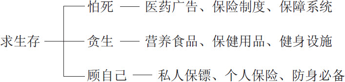
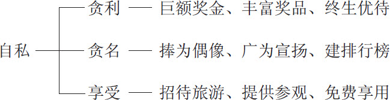
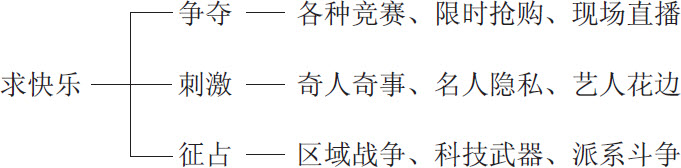
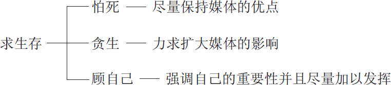
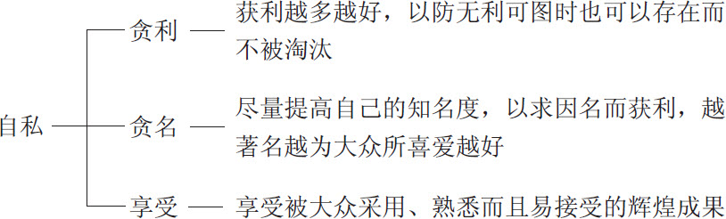
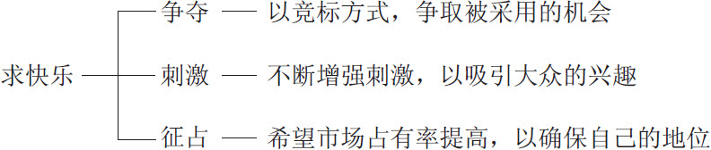

 第三章　人类历史就是彼此利用弱点的历史

历史就是人类彼此利用人性弱点的过程。看起来好像都是聪明人在利用愚蠢的人，实际上愚蠢的人同样在利用聪明的人。

神权时代，少数装神弄鬼的人为满足大家求生存的需求，用大家搞不懂的神鬼来增强个人的名和利。

君权时代，君王以文武百官来满足大家贪名、贪利的欲望，更以掌握生死大权来控制大众的生存弱点。

民权时代，大家各显神通，纷纷以专家、学者、政治家、资本家等头衔，企图利用大众的人性弱点，得到自己想要的东西。

网络时代，媒体的科技化、普遍化、深度化让大家对人性的弱点看得更清楚，更增加了对人性弱点的利用。

李老师把课文解释完毕，要学生猜一个谜，轻松一下。大家听说要猜谜，便异口同声地要求：“不要太难喔！”李老师循例回答：“保证很容易，一点儿也不难！”李老师拿起粉笔，先写上联：“二三四五。”转过头来问大家：“这几个数字，大家认识吧？”

大家热烈回应：“认识。”看来好像真的不难，大家都很兴奋，觉得老师没有骗人。

李老师继续写下联：“六七八九。”

大家不用说也都认识这几个数字，只是不明白老师要做什么。

“大家根据这一副对联，猜一件人生大事。”

大家猜来猜去，竟然没有一个人猜中。

“老师，谜底是什么？”

“非常简单，大家注意听，二三四五，缺什么？缺一对不对？六七八九缺什么？缺十对不对？合起来就是缺一少十，所以谜底是缺衣（一）少食（十）。”

“这和人生大事有什么关系？”

“人生的大事，就是穿衣、吃饭、生活嘛！缺衣少食，当然是人生大事了。”

“现代人丰衣足食，哪里还会缺衣缺食？难怪我们猜不到。”

“仔细想一想，大家在这里认真学习，主要目的还不是怕有一天会缺衣缺食，才提前做好准备？”老师说。

“对，衣食是人类的弱点，希望有一天我们找到好的‘衣食父母’，才对得起老师的教导之恩！”

# 神权时代利用鬼神让人敬畏

整部人类文明发展史就是人类彼此运用人性弱点的记录册。刚开始好像是聪明人在利用愚蠢的人，往深一层观察不难发现，愚蠢的人也在利用聪明的人。人与人互动才创造出了辉煌的历史。有人在幕前表演，有人则在幕后默默地工作，如此而已。

各种民族虽然发展出各自不同的文化。但是究其发端，似乎都摆脱不了“少数聪明的人，装神弄鬼以满足大家求生存的需求”。

古代民智未开，先民知识匮乏。当时人的生命很短，对于方生方死觉得惊奇、恐慌而不解。死亡的压力很大，周遭所发生的现象，诸如闪电、打雷、狂风、暴雨、山洪、火灾等等，他们都觉得好像和生死有相当大的关系，因而十分好奇，急于追问究竟。

问来问去，大家都茫然无知。于是聪明的人就提出假想，说是雷公、雷婆打架，山神、水神发怒，大家居然也都信以为真了。以后每逢看不懂的怪异现象，还会来向这些常常提出假想的人请教，更增强了这些人的信心。这种情形，有如现在写科幻小说的人凭着自己的想象编造一些故事，若是读者反应热烈，就会愈写愈起劲，用心假想更多的科幻故事来满足读者的需求。

满足顾客的需求和掌握顾客的弱点有没有不同？好像后者可以包括前者，前者反而不如后者范围那么宽广。例如一双皮鞋在鞋面上做出鳄鱼皮一样的花纹，或者一双高跟鞋将高跟的部分做成可以活动的，可以变换不同的颜色和式样，这是满足顾客求新求变的需求，也可以说是掌握顾客追求刺激的人性弱点。比如一双鞋定价为99.99元，很容易解释为针对顾客贪小利的人性弱点，却很难说明为满足顾客觉得这样比较便宜的需求。

神鬼代表“我们搞不懂的”东西，到现在仍然具有这样的意义。如果一个人投篮，他瞄得细心、投得用心，对这个球投进篮筐有信心，结果取得两分，我们会说：“真准。”其实这句话的意思是“一点儿也不神”。然而，如果一个人投篮，瞄也不瞄一下，顺手一投，居然投中，我们会说：“真神！”因为我们搞不懂球怎么会进篮筐。

初民时期，生活环境非常单纯，个性差异很小。任何人想要以“人”的身份来提高自己的价值，实在十分困难。用大家搞不懂的神鬼来神化个人的地位，就成为神权时期聪明人利用人类求生存的弱点而装神弄鬼的主要法宝。

借神之名，假鬼假怪，逐渐加强了某些人在人群中的地位。这些人希望群众做什么事，只要假借神鬼的旨意，大概都可以获得群众的认同。

“神要大家工作六天，休息一天。”果然形成了七日一周的作息制度。

“夜晚容易闹鬼，最好在家休息。”也成为某些地区“日出而作，日落而息”的生活习惯。

“月神比较温柔，不伤害人，不像太阳神那么暴虐。”造成某些地区以月出为一天的开始，而傍晚工作，白天躲在室内休息也成为一种可行的方式。

久而久之，群众对这些神鬼的代言人有了信心之后，这些人就开始尝试着不再借神之名，直接说出自己的意见，而群众居然也欣然接受。

把神鬼利用得差不多的时候，人们开始逐渐摆脱神鬼以建立个人的地位，由此进入了君权时代。

# 君权时代利用纪律让人服从

谁获得大众的信仰，谁就被视为君王，谁就可以发号施令，号召大众。

君王为了满足大众的需求，便用心利用植物和动物来促进人类的生存。教导大众从事游猎、畜牧或农耕，以减少死亡，延长生命。

刚开始君王也许并没有树立规矩、制定法律的意思，一心一意只想让大众各自安分地耕种自己的田园，饲养自己所需要的家畜，吃自己采摘的果菜，喝天然的河水，平静地过日子。

但是，寿命逐渐延长，一方面稍微减少了众人对死亡的恐惧，一方面又造成人们为了增长寿命而处心积虑，各出奇招，变出了很多花样。

聪明人当君王，另外一些聪明人则安分守己地自得其乐。偏偏有一些愚蠢的人，自作聪明而又自以为是，不但不安分守己，而且玩出许多花样，制造许多问题，迫使君王立下许多规矩，定下许多法律条文。

君王要求生存，必须设法控制群众，以维持群体的秩序，巩固自己的地位。某些愚蠢的人，好像在利用君王求生存的弱点，提出若干要求，结果使君王理直气壮地立法、定规矩。

立法、定规矩之后，就需要若干执行的人。于是君王不得不用掌握的生死大权来利用执法的人，以贪利、贪名、贪图享受来满足这些人的欲望。这样一来，就形成文武百官的种种制度。

自私的风气一旦形成，必定会愈演愈烈。即使少数贤明人士苦口婆心地警戒和劝告，也无济于事。

中国古代有一则寓言，说有一个地方人人都饮用“狂泉”的泉水，以致大家都疯疯癫癫的。有一位外来者，觉得这样很不正常，因此决定不饮用“狂泉”，以免自己也变得疯狂。结果，当地人都认为他们的举止行为是正常的，只有这位外来者显得很不正常。自私这件事也是同样道理，大家都自私，反而认为不自私的人很奇怪，这也是正常现象。

君王如果一本初衷，自己没有贪利、贪名、贪图享受乃至希望持久占有利益的弱点，就不会引起众人的反感以致被推翻。然而君王是人，也有人性的弱点。加上位高权势大，弱点更容易暴露无遗，结果就会专横霸道，导致犯众怒而被打倒，于是就进入了民权时代。

君权时代，大家因为怕死，不敢轻易冒犯上级，遑论造反。为了贪生，必须遵守规矩、按照制度，一切依令而行。为了顾自己，必要时就会告密以出卖亲友。为了贪利，坚持服从为负责之本。为了贪名，不惜十年寒窗苦读。为了贪图享受，考中状元后抛弃发妻，负心当驸马爷。虽然说弱点已大部分为君王所利用，毕竟他们也可以相当安全地获得一些报酬。

但是君王当然要比一般人享受更多，于是追求刺激，搞成酒池肉林。嗜好争夺，恨不得集天下珍品于一堂，供自己享用。企图征占，号召群众向外侵略以扩张势力。官员和百姓为了个人的名利和享受反过来利用君王的弱点，争先献策以求立功，身先士卒以求成名，结果民不聊生，把君王陷于不仁不义的境地。

可见君王运用人性的弱点只要不过分，大家就会乐于听命。君王克制自己的弱点，不要过分放纵自己，也可能会秦始皇、秦二世、秦三世，以至千百世。事实上人的欲望并无止境，简直一发不可收拾，以致号称始皇，却传至二世便告停止。

其实，君权时代并不是完全没有好处。我们之所以唾弃君王，是因为圣明、大公无私的君王可遇不可求，实在非常难得。就算有幸遇到这样的君王，恐怕也不会持久圣明，因为权力使人腐化，拥有权力之后不久，很多君王就会不圣不明而私心很重了。

# 民权时代利用观念控制自由

进入民权时代，情况如何呢？

孙中山先生首先提出要推翻清朝统治，目的是要使所有的人都当自己的皇帝。理想是很好，结果却愈来愈乱糟糟的。

人人都当皇帝，意思是不是谁的欲望都可以从君权时代只能求生存、自私，发展到以往只有君王才敢明目张胆去做的找刺激、搞争夺、强征占呢？

君权时代，许多人也偷偷地找刺激、搞争夺、强征占，但局面不敢太大、对象不敢显著，而且尽量不张扬，以免被揭发，被指为目无王法，而惨遭刑罚。

进入民权时代后，人人都当自己的皇帝。人们看得清楚，印象最深刻的反而不是圣明的君王，而是不折不扣的残酷的暴君。于是人人当皇帝就等于人人当暴君。法国当年推翻君王暴政之后，所产生的暴民比暴君还要厉害，更加残酷。

孙中山先生当然不是这个意思，但是孙中山先生如果是皇帝，大家会听他的解释，不敢随意曲解他的意思。结果孙中山先生既然放弃了自己当皇帝的机会，要人人都当皇帝，于是人人都可以随意解释他所说的话，丝毫不需要有所顾虑、有所畏惧。不然，怎么称得上“君权已成过去，民权已经到来”？

## 自由理解使权威不复存在

孔子当年向学生说“吾不如老圃”“吾不如老农”，以孔子的修养，这应该是一句谦虚的话，用现代的用语，相当于“对专家给予应有的尊重”。君权时代，君王利用了孔子思想，就没有人敢随意曲解孔子的言论。

民权时代，人人都有曲解孔子言论的自由。于是，有人这样说：“孔子整天讲治国平天下的大道理，对于技术、劳作却十分轻视。学生向孔子请教农业耕作的技术，孔子很不高兴，并不加以鼓励，只是淡淡地说‘吾不如老圃’‘吾不如老农’，充满了轻视和鄙视。”

谈到技术，孔子也曾说过：“虽小道，必有可观者焉，致远恐泥。”以孔子的素养，应该是说：“技术虽然只是小道，但是也有值得学习的地方。不过一个人如果专门注重技术，有许多地方就会行不通。处世行事，在技术之外，还有更多其他的东西值得我们学习。”

结果民权时代把这句话解释为：“技术只属于微不足道的小道，并不值得深入研究，以免不小心陷溺其中不能自拔。”

通过一首《钱来也》的歌词，也可以看出大家的观点是如何的不同。这首歌很简单，只有四句：

钱来也，免欢喜。

钱去也，免伤悲。

生不带来，死不带去。

有钱无钱，由在天。

有人解释为“小富由俭，大富由天”，所以必须节俭，注重储蓄，以便积少成多。有人指称“小富由俭，大富由天”，如果没有致富的命，再节俭也富有不了，何必储蓄，不如花掉算了。有人说这样的观念太消极，其实天下无难事，只怕有心人，要富并不难，只要用心就行。也有人说这样的观念十分积极，要人们不要因为目前没有财富而泄气，应该以乐观的心情，积极的努力，以期有朝一日，成为富有的人。

然而，不管怎样解释，总归都会成为一种念头。而每一种念头都会呈现出一种弱点，便于供人利用。

神权时代和君权时代，人性的弱点比较受制约，已经足够被利用。民权时代人性的弱点有更自由的发挥空间，当然更是因为大家竭尽心力，想出各种花样，来加以利用。

资本家鼓吹人应该自私，一切财产最好都由公有变成私有，这样大家才肯认真努力。以往大家只敢偷偷地争夺，如今有人公然号召“贪婪并非罪恶”，还逐年公布世界大富翁的大名，那么，人们为什么不全力以赴，为自己争夺财富呢？

政治家看到整个社会90％的人重视生存和安全保障，便提出要降低税收、提高养老保险水平、改善医疗保险制度，通过掌握广大民众的人性弱点而当选为人民的代表。

人人都是皇帝，人人所选出的代表当然都是皇帝的代表。民权既可以解释为“人民的权利”，也可以解释为“人民选举出来，用以代表人民行使权利”，更可以解释为“当选前尊重人民的权利，当选后人民就应该接受我的权力”。

思想家针对人性弱点，在君权解体之后，想出种种花样，言论众多而且花样百出。

## 自由其实不等于平等

一般人对于自由的层次分不清楚。以为自由就是自由，对什么人来说都一样，所以常常把自由和平等连在一起。

其实，人一开始是不由自主的。要不要生而为人，出生在什么样的家庭，孩童时期过什么样的生活，接受什么样的教育，甚至以哪一种语言为母语，完全是不自由的，任由他人安排，自己丝毫没有自主的余地。

长大以后，逐渐能够自行思考，自己独立，这时候才获得一些自主性。可以自己选择职业，能够自己决定行动，还可以追求自己喜爱的事物。虽然说自由的范围实在相当有限，但是和童年时期一切依赖父母或他人相比，当然要自由得多，感觉上好像真的能够自主了。

然而，人终究是会老的。老年人首先面临的问题是生理机能的衰退，逐渐难以自主。退休以后，种种问题随之产生，觉得愈来愈不能自主。

可见以人的年龄来划分，一个人由不能自由自主到获得自由自主，最终又将恢复不能自由自主而结束一生。

如果依社会地位的高低来区分，也不难发现同样的状况。社会地位低微的大众，哪里有什么自由自主的可能？社会地位高的人制定一些法律条文，就可以把大家的行动约束得动弹不得；轻易地用“法治”和“守法”这些动人的名词，便把社会大众管制得失去了自由。

西方人为了争取民权而掀起抗争，便是有感于社会上的种种规定实际上已经阻碍了自由。当政者多半用“合乎我的规定，便是自由”来妨害人权，却不承认他的这些规定已经使人不能自由。

往昔实行君主政治，君王可能拥有自由，可以爱怎么规定便怎么规定。现代民主政治，社会地位愈高的人愈不敢得罪社会大众，因而愈不敢自主，也就愈没有自由。

民主社会，一切诉之民意。民意有如流水，可以载舟，将一个人的地位不断推向高处；也可以覆舟，把一个在高位的人一下推向深渊。在这种民意高涨的时代，高阶人士无不小心翼翼，哪里还敢谈自由、自主呢？

基层大众为什么像流水呢？因为他们大多数缺乏理想，一会儿被鼓动得流向东边，一会儿又被操纵得流向西边。水能载舟，也能覆舟，实际上也不能自由自主。

高层和基层都不能自主，那么什么人能够自由自主地生活在现代社会中呢？分析起来，只剩下那些不负实际责任、只知道整天高呼口号、提出动听言论的人，他们假借争取言论自由、集会自由、思想自由、这个自由、那个自由，趁机鼓动水流，看看能不能兴起一些浪潮，把自己推向高处，然后紧紧抓住一个据点，再小心翼翼地维护自己的形象。

## 有理想才有真自由

现代人搞错了方向，自由是争不到的，愈争自由，结果愈不自由。因为自由不自由，是内部自发的，根本不是向外争取的。

>  
> 自由是争不到的，愈争自由，结果愈不自由。因为自由不自由，是内部自发的，根本不是向外争取的。

有理想的人才有自由。首先要决定自己要做什么样的人，然后才能够按照自己的理想走出自己所要走的路，这才是自由。

理想由别人决定，不自由；理想由自己决定，才自由。多元化时代，人人都可以有不同的理想。

自己的理想由自己决定，这是现代人所遭遇的最大困难。以自己的能力有时候不能够替自己找到真正的理想。许多人认为反正找不到理想，因而放弃了理想；许多人误以为眼前抓住的便是最好的理想；许多人认为新的理想才是好的理想，以致经常变换理想……不幸的是，这些人都没有理想。

现代人之所以出现这样的危机，实际上是科学发达的一种后遗症。一般人都相信科学万能，觉得科学可以解决一切问题，也能够满足人类享受的欲望。一谈到哲学，就以西洋哲学为皈依，把自己推入观念游戏的陷阱，弄得迷迷糊糊。对于中国哲学，却又执着于结构、概念、系统而无所得，同样是一片迷糊。

要挽救现代人的危机，摆在眼前的似乎只有一条路——将中国哲学和西方科技合理结合。至于怎样结合，各人有各人的主张，丝毫勉强不得，这才是真正的自由。我们只能建议，要小心谨慎地使用这种并不很大的自由，以免造成自己的痛苦，也增加别人的苦恼。

天下事本来就是见仁见智的，各种策略都有相当的道理。我们尊重各人应有的自由，不能明确地指出哪一种自由较优，哪一种自由较劣。所谓正确的或错误的策略，都不过是一种参考意见，必须各人有了自己的理想才能够自行判断其优劣，自己选定策略。额外加的规定和约束都是不自主的。

现代人的理想是什么呢？下面所描述的仅供参考。

第一，确定人至少拥有一些自由，可以自己决定向善或者作恶。我们一生到底有没有必要追求一些理想，同样可以由自己来决定。

第二，因为具有这种选择的自由，才会带来一些苦恼和危机。我们往往弄不清楚，究竟什么才叫作善，而什么又是恶？一个人连对错都搞不明白，又怎么能够分辨对错，怎么能够正确地选择呢？我们一方面具有选择的自由，一方面又产生不知道怎样选择的苦恼。要在这两难当中，找出一条出路，好像只有学习才是唯一的解决途径。然而，学习也是充满危险的，学对了固然可喜，万一学错了，岂不可悲？但是学对学错，我们又怎么知道呢？

过去的人，本着热心到处教人，已经教出很多毛病，所以孟子说“人之患在好为人师”，希望大家提高警惕，不要随便教人，因为误人子弟的罪恶相当深重。

想不到现代人变本加厉，不但明目张胆地到处乱教人，而且自己封自己为“国际级大师”“名嘴”，以不知为知，随时随地胡乱教导别人。

现代人有的不读书反而比读书人明白道理，而有的读书人十分用功，却由于读错了书而误入歧途。追究起来，便是因为误人子弟的老师太多。

尤其是资讯发达、知识爆炸之后，大家对很多事情刚一知半解，便以为完全透彻明白，更是不学还好，愈学愈受害。现代人普遍成为错误观念的受害者，大部分人并未觉察，少数已经觉察的人也是申诉无门。

于是有人主张实证，认为可验证的学问才是正确的，结果凭空抛弃很多不能验证的真学问，接受了一些验证无误的假学问。

人类虽然有一些自由，却苦于无法享用自由。主要原因在于学问不容易求取。没有学问，不明白道理，就算有一些自由，也不知如何是好。

>  
> 人类虽然有一些自由，却苦于无法享用自由。主要原因在于学问不容易求取。

第三，求取学问、明辨善恶，既然这么困难，我们希望自由自主，最可靠的途径只有慎选老师一条路。不要随便相信什么文凭、证件、著作、奖状，也不要单凭一两个人的推荐就下决心拜师。跟错了老师，一辈子倒霉。现代人崇拜偶像，年纪轻轻就立志向某人看齐，实在是害自己的可怕行为。慎选老师，多打听、多了解，用实际行为印证他的言论，看看效果如何。印证的时候，最好明白人既然要有理想，就应该尽一些义务、承担一些责任的道理。

有人称达尔文的进化论，其实并没有经过细心的印证，便为大家所欢迎。大家由此认为，人类由猿猴进化而来，大可以像其他动物一样，一切本着自然的本能，不需要再承担什么义务、再尽什么责任了。

现代人放弃理想，多少和怕承担责任与不愿尽义务有一些关系。请问：人固然可以不必承认自己是上帝创造的，难道不可以否认自己是猿猴变来的吗？

人类的起源和宇宙的起源一样，说不定不是人类的智能所能了解的，我们为什么那么轻易就相信各种学说了呢？

中国人的态度，是“既来之，则安之”，既然生而为人，那就要安心地把人做好，不必去追究自己到底是从哪里来的。安心地把人做好，就需要有理想、有目标。

>  
> 既然生而为人，那就要安心地把人做好，不必去追究自己到底是从哪里来的。

人的目标，实际上只有一个，那就是求生存。从目标的角度来看，人是没有自由的，大家都一样，无从选择。但是如何达成求生存的目标，各人都有选择的自由。人的自由，便是自己可以选择自己的理想。

选择理想的标准，不妨考虑以“心安理得”作为衡量的要素。凡是能够令人心安理得的理想，应该比较正确而有利；否则便是不正确、有害无利的理想。

用“心安理得”做标准，再来衡量、比较前面所说的两种策略，看看哪一种比较妥当，然后选用比较妥当的这种策略就是人的自由。

一切都由自己决定，并不是指求生存而言，而是指自己所寻找的理想别人无法干预，也不能硬性加以规定。

>  
> 一切都由自己决定，并不是指求生存而言，而是指自己所寻找的理想别人无法干预，也不能硬性加以规定。

一个人，要怎样生存，怎样做人？做什么样的人？各人可以拥有不同的理想，一切都由自己决定。

问一问自己：

人生需要理想吗？

为什么现代人缺乏理想呢？

自己的理想是什么？

人是怎么来的？人类的起源是什么？这种问题可能不是人类的智慧所能够了解的。但是，现代人很快就接受了达尔文的进化论，这主要是一种对义务、责任的逃避，承认人从猿猴进化而来，当然就没有义务，也没有责任。

现代人固然不迷信，但也失去了理想。因为没有理想，所以失去了自由。

# 网络时代利用媒体渲染弱点

古代社会相当单纯，“秀才不出门，能知天下事”，是出于适当的推理。因为人同此心，心同此理，很容易以“想当然耳”来论断，而且结果往往八九不离十，颇有把握。

现代社会科技发达，媒体深入到了每一个角落，“秀才不出门，能知天下事”，不再是依靠推理，而是依靠自己“看到、听到”的具体景象。

推理是自发的、自控的、自主的，一切可以由自己负责，也可以凭良心来加以决断。看到的和听到的属于他发的、他控的，他人做主的，到底是真是假常常变幻莫测，莫衷一是。

现代化科技使媒体既普遍化又深度化。不但深入每个家庭、各个角落，而且描绘得深刻而仔细，几乎巨细无遗。对知识的传授和资讯的传播具有很大的贡献；对意见的交流和经验的交换有很大助益。

但网络时代的媒体通过自己的策略，广泛利用人性弱点，弄得政府对媒体管制也不是，开放也不好。媒体自己也具有求生存的弱点，它们往往又企图反过来控制人的生存。

“有人抢加油站。”小李告诉小马和小吴。

小马急着问：“你怎么知道的？”

“还不是电视上看到的。”小李说。

“结果怎么样？”小吴问。

“抢到两千块钱，当场就被抓到。”小李说。

“怎么会？”小马和小吴感到惊讶。

“刚好后面有两个警察，骑着一辆摩托车来加油。那个坐在后座的警察一跃而下，紧跟着一扑而上，立刻就把抢钱的人抓回警察局。”小李说。

“怎么那么倒霉！好像是个生手吧，居然一点儿警觉性都没有。”小马说。

“你说什么啊？”小李不太明白。

“一个人抢，不如两个人合作。彼此互相掩护，就不会这么倒霉。”小吴说。

“对，两个人一前一后，远远看见警察来加油，还可以假装大声问事情来提出警告。”小马说。

“看样子我们三个人合作最好。”小李说。

“而且不要去抢什么加油站，不如去抢快餐店好了。快餐店里头收的钱应该也不少。”小马说。

“我看这样，我们再回去看看电视，看仔细一些，看看能不能看出一些心得。”小吴说。

“看出什么心得？难道我们真的去抢不成？”小李更不明白了。

“当然啦！看电视学东西，才不会浪费时间呀！”小马说。

“对，学习无罪，抢钱有理！”小吴表示赞同。

“他山之石，可以攻玉。把这个抢钱贼的缺失修正过来，我们必能安全得手。”小李也明白了。

## 媒体让人更加心浮气躁

古时候交通不便，信息也不发达。此地人对彼地人的生活状况并不是很清楚；即使住在同一地区，穷人对富人的生活也不是很了解，到底彼此之间的差距有多大，真正不同到怎样的地步更是弄不明白。

眼不见，心自然宁静；一些道听途说的传闻，顶多姑妄信之，印象不是很深刻，也不致产生太大的影响。由于种种限制，使得亲眼看得见的部分大致相同，差异不大；那些显著不相同、差异很大的部分，反而不容易看到。大家生存在这种环境里，比较安于现状，平静过日子，相安无事。

现代交通发达，资讯的流通既快速又普及，同时要求透明化、台面化、明确化。而各种科技化媒体更是处心积虑，充分针对人性的弱点渲染、夸大、重复强调，弄得大家不得安宁。

美国之所以会招来世界各地的偷渡客，好莱坞影片是一个重要原因。通过媒体的宣传，将美国描述得有如人间乐土，人人都有发达的机会，这才让那些人不惜牺牲一切，冒险犯难，也要到美国试一试自己的运气。

传播媒体的种类繁多，有印刷媒体，包括报纸、杂志、传单、空中气球、飞行广告、活动广告、路侧广告、书面广告以及各种小册子，还有电视、广播、录音带、录影带、电话、电脑、传真、网络等各种媒体。

在现代社会，传播媒体已经成为社会大众获取资讯的主要来源。电视机普遍深入家庭以后，在一定程度上甚至取代了父母的地位，成为家庭教育的主导力量。如果说现在的孩子缺乏家教，那么不应该一味指责父母的教导无方，电视的误导也难脱干系。由于电视、广播的商业化倾向，人们往往置伦理于不顾，将良心道德摆在一旁。父母若是说不过子女，就只好用某些学者专家“和子女做朋友”的主张来自我安慰，放弃为人父母的责任，更不敢奢谈什么家庭教育了。

>  
> 如果说现在的孩子缺乏家教，那么不应该一味指责父母的教导无方，电视的误导也难脱干系。

传播媒体经常操纵在政治或经济强者的手中，成为他们控制舆论的有效工具，间接或直接地影响人们求生存的欲望，因而变成现代人利用人性弱点的最普遍而有力的利器。

于是民众要求政府开放媒体，使弱势团体也能够拥有反击的工具，拥有新的言论自由所要求的权利。

## 媒体利用人性弱点的六大策略

打破报纸的垄断，要求广播或电视媒体设置降低设限标准，也是一般大众“防人之心不可无”的具体表现。然而，媒体自己同样要求生存，也建立了一套求生存的策略。就整体而言，不难发现各种媒体共同以“民众有知情的权利”为号召，针对人性的弱点，完成下述六大目标。

### 营造悲观气氛

媒体当然会提供一些乐观的观点，以提高人们生存的欲望，增加大家的生活乐趣。但是，媒体深知若是偏向乐观的报道，对人性的生存、自私和享乐不构成一定的威胁，大家就不会重视媒体的报道。因此媒体大多以悲观的预测为主，企图对大众的生存、自私和享乐给以严重的警告和不幸的期待，以刺激大众，制造众人注目的焦点。大众对于悲观的预测，总是相当关心。

南非大选由黑人当选总统，媒体马上预测南非将要发生内战，会出现黑人暴动问题。这样，大众才会持续关心南非的局势演变，每天留意媒体的报道。

美国观察家如果预测国务卿将继续留任，大家就会认为这种报道多此一举，说这些有什么用？于是，媒体每隔一段时间便要预测国务卿即将被撤换，这样大家才会拭目以待。

媒体指称经济繁荣、没有战争、股票稳定上涨，大家会将其视为平常话题，觉得这种消息不看也不会怎么样。媒体警告说经济指标向下调、币值有趋贬可能，某些地区即将爆发战争、股票面临再度崩盘的压力，大众就会奔走相告，提高警觉，重视媒体的各种猜测。

伊拉克战争期间，大家总是准时打开电视收看新闻节目。战争结束后，许多人就在新闻播报时段关掉电视机，让机器休息，以便观看后面的综艺节目。

2001年9月11日，美国纽约市举世闻名的两座高楼被恐怖分子劫持的飞机炸毁。各种媒体争相报道美国的军事动员行动，天天预测战争即将开始，以此吸引大家的注意，也凸显传播的重要性。

营造悲观气氛，使大家感受到生存、自私和享乐的压力，不停地向最坏的方向设想，媒体才能够持续吸引大家的注意力。

### 提供新奇事物

悲观气氛使得大众觉得活是活得下去，但是前途黯淡，希望十分渺茫，因而期待变化，对新奇事物特别容易产生兴趣。媒体掌握了这种需求，发现“狗咬人原来不是新闻，人咬狗才是新闻”的法则，极力发掘新奇事物，以奇人奇事来彼此竞争。

一头会计算数目的牛、一条喜欢抓老鼠的狗、一匹狂野的马、一只温驯的老虎……所有不寻常的东西，不但新奇，而且罕见，才值得大做文章。

某地民意代表互殴，消息马上会传播到全世界，一天播放数次，因为难得一见，唯恐有人不幸错过，遗憾终生。

选举时有人抬着棺材拜托民众惠赐一票、一丝不挂在大街上裸奔、儿子当街殴打老父亲、站在火车站前一动不动扮成蜡像人、真正的蜡像人却动来动去和真人一模一样……一向被认为是反常的事情，现在都被媒体介绍为新奇。大家争相传播，无不希望一睹为快。

儿子不邀请父母参加婚礼、妻子允许丈夫每逢周末外出与他人共宿、女儿不满意母亲留给她的结婚礼服、妻子抗议丈夫禁止她穿比基尼……都可以上电视，各说其是。

老夫少妻，丈夫的年龄比妻子大；娶大姐为妻，妻子的年纪比丈夫大。这两种情况都有，并没有什么值得大惊小怪的。偶尔抓住一对年龄相差比较悬殊的恋人大做文章，通过媒体的不断报道，延伸到两个家庭的不同意见，顺便请路人也发表一些看法，把这种事件当作新奇事物来炒作，居然成为重要的社会新闻，是不是网络时代大家都活得太无聊了？

大众迎合媒体求新求变的策略，竭尽心力玩出各种花样，以吸引媒体的高价收购或优先播出。有人在各种场合说出完全不合逻辑或不堪入耳的话，原因只是“不这样说，媒体就不会热心传播”。

### 塑造新的权威

大众不断接受新奇事物的刺激，一方面对寻常事物失去兴趣，一方面却又觉得无奇不有，不知道到底应该怎样才好。媒体看准大众在旧有权威被打倒之后需要新的权威，而且一元化的单一权威已经不符合时代潮流，因而致力于塑造多元化的各色各样的权威。

>  
> 大众不断接受新奇事物的刺激，一方面对寻常事物失去兴趣，一方面却又觉得无奇不有，不知道到底应该怎样才好。

“请听听专家的意见”成为媒体的常用字眼，暗示着“专家就是新的权威”。各行各业都有专家，古人说“行行出状元”，现在果然行行都有权威，至于权威是真是假，能维持多久，那都要问媒体才知道。

实在塑造不出什么权威的时候，媒体也可以塑造“丑闻权威”。想知道外国人在新加坡挨鞭子的滋味吗？问他，他是第一个亲身体验的美国青年，所以他的身价特别高。想知道在百货公司偷窃失手被抓到的真实过程吗？问他，这个人最清楚，因为他那种经验最丰富。

日本一家媒体票选“全国最令人厌恶的女明星”，由一位二十几岁的影视歌三栖明星高票当选。大家很有兴趣为什么她年纪轻轻就能够弄得让这么多人厌恶？她也认为既然获得这么多张选票，就表示有这么多人记得她，因而决定趁机推出新唱片，以求大发利市。

媒体的力量，足以将一位根本不够格的节目主持人，由“最具潜力”的明日之星，捧成最受欢迎的“知名主持人”。而媒体的策略，则是把最能配合的人捧成权威，配合的因素很多，包括人、时、地、物各方面，所以经常会有新的权威出现。

### 丑化权威人士

媒体一方面塑造能够配合的权威，以增进自身的影响力，一方面则极力丑化原有的某些权威人士，表示敢于挑战权威，使大众对其更为敬畏。

美国前总统克林顿自从当选以后，就不断遭受各种绯闻的困扰，弄得还要设立基金，准备公开募款以充当法律诉讼费用。前总统尼克松因为“水门事件”被媒体穷追猛打，提前下台。

权威人士只要有些微差错，媒体便会不断深入调查访问，加上各种猜测和分析，予以丑化。每一次旧有权威被粉碎，新的权威要建立，媒体都会展现出无比的力量，为自己的生存发展获得更有力的保障。

揭穿权威的底牌，揭露权威的隐私，以及打击权威的信誉，都是媒体的主要任务，借以显示“水能载舟，也能覆舟”的力量，使权威人士更加主动配合媒体，以收合则两利的效果。

一般大众眼见媒体把某人捧为权威，又将他击落下去，更觉得媒体具有生杀大权，因而更加重视媒体。

### 制造各种偶像

除了丑化权威人士之外，媒体更重视制造各种娱乐、运动、抗争的偶像，以增进相关的刺激。

超级篮球明星身价数千万美元，自然广受球迷崇拜。篮球教练也可以被塑造成偶像，身价高到甚至等于全队球员身价的总和，大众更是对其称赞不已。

歌星拥有歌迷，影星拥有影迷，各种球星也都拥有他们的球迷，媒体利用“有迷就有偶像”的原理，制造出各色各样的偶像，等到有一天这些fans了解到自己所崇拜的偶像原来具有如此这般的真面目时，即使痛哭流涕，痛心后悔浪费了时间金钱，恐怕也只能无可奈何，而媒体却从中获得了很大的好处。

许多人原本不关心影星的罗曼史，也不注意歌星新推出的歌曲，但经不起媒体的渲染，竟也不知不觉成为影迷或歌迷，对影星或歌星的点点滴滴格外感兴趣。

美国橄榄球明星O．J．辛普森涉嫌杀死前妻，媒体投入大量金钱和时间连续半个月都将这条新闻列为头条。其实，这种事情对很多人而言，根本不值得如此重视。但是媒体的扩大报道，驱使很多人购买有关辛普森的书籍和录影带，最终加入关心辛普森本人的行列。

当然，制造各种偶像也不是完全没有好处，比如随着运动偶像范围的扩大，使大众熟知的运动项目也跟着增加，登山、滑雪、骑自行车、打球、游泳、冲浪等等，都逐渐成为普及的运动，对这些运动的推广也确实起到了十分重要的作用。

### 凸显性与暴力

由于媒体激烈竞争，使得媒体为了生存，不得不采取凸显性与暴力的策略，以满足大多数人的感官刺激。

“性骚扰”这个话题由学校开始被重视，因为一般人总认为师道尊严，怎么可以让“狼”混迹其中？继而是企业和一般机构，拿“性”来增加业绩或者作为工作不力开除员工的借口。有时发展到家庭，女儿控告亲生父亲性虐待，那就更是清官难断家务事，谁也弄不清楚真相如何了。

至于暴力，也随着电影分级制度的建立而花样百出，到了惨不忍睹的地步。

暴力是用来对付别人的，对付自己的方法则称为自杀。日本有一位青年费尽心血研究各式各样的自杀方法，最后写成了一本书，通过媒体的宣传，竟也名列畅销书排行榜，成为最畅销的图书之一。

人生果然充满了矛盾，一方面喜欢暴力以满足刺激，一方面却又害怕暴力而重视安全。私人保镖的兴起，企图以暴防暴或以暴制暴，都离不开媒体凸显暴力的影响。

媒体充分因应人性的弱点，一方面斥责暴力，一方面却又唯恐对暴力描述不细致，唯恐拍摄不清晰，甚至添油加醋，生怕不够惨烈。

>  
> 人生果然充满了矛盾，一方面喜欢暴力以满足刺激，一方面却又害怕暴力而重视安全。

## 开放还是管制，选择对待媒体最好的方式

传播学者丹尼尔·勒纳（Daniel Lerner）说：“媒体乃社会制度的一个表征。”意思是说有什么样的社会制度就会产生什么样的媒体。

社会制度是自由开放的，媒体便呈现自由竞争、自由发展的样子。社会制度是计划管制的，媒体自然也受到限制，显得束缚甚多。但是，不论社会制度是自由还是管制，媒体为求生存，总是针对人性的弱点形成有利的策略。

地球是一个庞大的试验场，人类在这里不断进行各种不同的试验。以媒体为例，有的国家实施管制，也有的国家实行开放，结果是各有利弊。

但是，对媒体来讲，开放对媒体比较有利，所以媒体基于自身的利益，无不大声疾呼：开放、开放，这对大家有好处。平心而论，管制媒体其实也有许多好处，因为媒体的主要功能，是引导人类走上安居乐业的正道，而不是诱使人类步入求新奇、爱奢侈、企求不劳而获地享受荣华富贵的邪道。然而，在媒体太多、太强，已经管制不了的时候，也不得不开放。开放后的媒体为了应对生存竞争，几乎不择手段地利用人性的弱点，造成今日更加复杂化和多样化的世界。

有这样一段对话很耐人寻味：

“有白色粉末，会不会是炭疽热的病菌？”甲说。

“这是面粉，你想到哪里去了！”乙说。

“你看，又是电视看多了，疑神疑鬼。”丙说。

“你们很少看电视，没有接受到现代资讯，我们之间才会产生代沟。”甲说。

“代沟是那些专家虚构出来的东西，相信他们的话才会有代沟；如果不相信他们的话，哪里有什么代沟？”乙说。

“对啊！心中有代沟，自然有代沟；心中无代沟，当然就没有代沟。”丙说。

“这样说起来，传播媒体都是不好的？”甲问。

“依我的看法，开放的传播媒体，可以说是我们的神经破坏器。一天到晚想办法破坏我们的神经系统。不是叫我们迟早变成神经兮兮的病人，便是把我们搞成毫无智慧的知识接收器。”乙答。

“你的意思是传播媒体只能传播知识，无法启发智慧？”甲问。

“一点儿也不错，正是如此！”乙答。

“那要怎么办才好呢？”甲有些担忧。

“应该由有智慧的人来加以筛选、分析和整理。”丙说。

“那不就等于管制媒体，言论不自由吗？”甲说。

“合理的管制实际上就是合理的开放，关键看你怎么想。”乙说。

“合理不合理的标准很难定，我看还是开放的好。”甲说。

“这就是现代人的毛病，怕合理的情况难找，于是干脆放弃寻找合理。”丙说。

### 媒体深知人性的弱点

人性的弱点，自古迄今，并没有太大的改变，始终环绕着求生存、自私、求快乐三大方面而纠缠不清。发展出各自不同的内涵，而且程度也不一样。

媒体未发达之前，人类已经具有这些人性的弱点。我们不能把这些弱点都归罪于媒体。但是，媒体发达以后，更加凸显了人性的弱点，把它们运用得人人难逃被摆布的命运，这也是事实。

对于媒体的消息，不看，不安心；一看，很伤心；看得少，不清楚；看多了，愈加迷糊。大家对媒体，好像也无可奈何。

人性的弱点不可避免，媒体的存在也不可忽视，必须要找出一条共存共利的途径。

媒体瞄准人类求生存的弱点，以大幅医药广告，强调医疗、药品的效果；介绍各种保险制度，描述生育与患病时得到的照顾；宣传安全有效的保障系统，唤起人们怕死的潜在意识。大众在媒体广泛的报道之下，多服药、买保险、加强保障，以逃避死亡。在营养食品、保健用品以及健身设施方面，媒体同样大做文章，以诱发人们贪生的意念，重视营养的均衡、购置各种保健用品，并且积极参与健身活动。媒体又在私人保镖、个人保险以及防身必备方面大加鼓吹，以增强人们顾自己的欲望，尽量雇用私人保镖、购买有关个人权益的保险，学习各种防卫自己的方法，更加用心照顾自己的安全与健康，如图7。

**图7　媒体对求生存的因应**

为了因应大众的自私习性，媒体经常提供巨额奖金、丰富奖品，或者各种优惠甚至终生优待来吸引群众，满足其贪利的欲望。制造各种娱乐、文艺、运动、竞技偶像，介绍各行各业的杰出专家，设置各种排行榜，举办各种竞赛，推出各种“金像奖”“金龙奖”“金手奖”“金狮奖”，乃至“诺贝尔奖”，以激发大众贪名的意念，踊跃加入竞争的行列。更巧立名目，招待旅游、提供免费或低价参观，或者免费享用稀有的设施、不对外公开的资源，以刺激大众贪图享受的意识，对媒体的报道更加注意，对媒体的各种活动更有参与的兴趣，如图8。

**图8　媒体提供贪利、贪名、贪图享受的渠道**

尽管各人兴趣不同，生活水准也不一致，媒体针对不同的需求，提供不一致的求快乐途径。首先将各种竞赛细分，增加竞赛项目，以适应多样化的选择。又将各种竞赛按年龄划分为幼年组、少年组、青年组、中年组、老年组以及不分年龄组，以吸引更多的人。然后再将竞赛加以层级化，区分为社区、乡镇、省市、全国，以及洲际、全球，以制造不同的高潮。限时抢购、各色各样的拍卖，通过媒体的宣传及现场转播，更广泛地引起人们争夺的兴趣。

发掘各种奇人奇事、曝光名人的隐私、制造艺人的花边新闻，媒体尽力满足人们感官的刺激。将区域性战争报道到全世界，让各地的人都有机会体会到征占的感觉。即使不上战场，也可以充分了解甚至运用各种科技武器，在电视上借着银幕画面来满足自己的指挥欲望。各国的派系斗争，只要有兴趣，都能够突破时空的限制亲自参与，如图9。

**图9　媒体对求快乐的主要项目**

媒体不可能制造上述各种活动，但是各种活动显然都是通过媒体来实现目的。媒体其实是一种古老的工具，在现代化、科技化、多样化时代，更加快速而有效地给人类提供掌握人性弱点的媒介。

我们既不可能改变人性的弱点，也无法排斥或禁止媒体的持续发展。我们所能够做的，只是合理运用媒体，使其合理地因应人性的弱点。

>  
> 我们既不可能改变人性的弱点，也无法排斥或禁止媒体的持续发展。我们所能够做的，只是合理运用媒体，使其合理地因应人性的弱点。

## 管制媒体要适度

世界各国将媒体的运用都列为重要策略之一，因为它的影响力强大而且普及，不能等闲视之。但是，说起来似乎是一个笑话，带有一些无奈，以人类有限的智慧，政府面对强大的媒体压力，好像只有逐渐趋于开放这一种策略，别无选择。

然而，在现实的情况中，仍旧可以按照开放的程度，分为管制、局部开放及大部分开放三种不同的状态。

没有哪一个政府敢全面开放，因为毫无限制势必造成“只要我喜欢，有什么不可以”的结果。媒体在何时、何地、叙述何事、呈现何物，政府都不能加以干涉，这会造成令人怀疑“政府到底在做些什么”的后果。

同样，没有任何政府敢全面管制媒体，因为广大民众会愈来愈不能忍受，他们会以“其他国家能，我们为什么不能”而掀起反抗行动。由于媒体不论何时、何地、叙述何事、呈现何物，都必须受到严格的限制，大家会逐渐对媒体失去信心，丧失兴趣，令人不禁怀疑政府为什么要管这么多。

这样一来，世界各国自然不约而同地说，管制，其实也有很多自由；自由，难免也有很多管制。在管制与开放之间，找出自己认为合理的平衡点就可以了。

虽然大部分的人心中有数，知道媒体的运用应该列入管制。因为媒体的主要功能，必须适当因应人性的弱点，激起人们的兴趣，把大众引导到安居乐业的正道上，不应该过分利用人性的弱点，把大家的兴趣引导到求新奇、爱奢侈、企图不劳而获地享受荣华富贵上。要达到正常的功能，对媒体的管制，自然十分必要。

举一个明显的例子。读书的目的在于明白事理，而明白事理唯有通过文字这一种媒体才能够深入了解。读书明理，便是阅读书中的文字以明白其中的道理。但是文字媒体，认识比较困难，理解比较费力，阅读比较费时，不容易引起人们的兴趣。于是人们想出用图画媒体来诱导大家看图识字，希望大家识字以后，能够好好读书。不料图画媒体却利用大家浓厚的兴趣而喧宾夺主，把大家带上只看图画不认识文字的歧途，妨碍了读书明理的大道。我们不反对用部分时间欣赏连环图画，却不赞成某些人整天沉迷于连环图画而不务正业。图画是一种媒体，对于它的内涵和用途，是不是应该合理地加以限制呢？

某些媒体比图画更具有吸引力，比如录音带企图以有声读物来取代文字读物。事实上有声读物用以辅助文字十分有效，一旦用来取代文字，就会妨害更深入的学习。一个会听会说中国话而不懂中国文字的人，无论如何不可能深入了解中华文化。

电视比录音带更生动活泼而声情并茂，许多人因而只看电视不看书。希望从电视中获得一般知识，果然迅速而有效。但是从电视中要获得一门学问的精髓，恐怕如同缘木求鱼，实在困难。

媒体之间原本是互助的，不料为了求生存，引起激烈的竞争，甚至到了不择手段的地步。录音带、电视、广播、电脑等等，如果用来辅助大众读书明理，当然是好事。现在都各出奇招，把自己膨胀到要大小通吃，是不是容易把人们引入歧途呢？

合理的管制才能促使媒体自律，扮演合适的角色。然而，什么叫作合理，这永远是大家争论不休的焦点。媒体专家各有说辞，结果却建立了一种共识：政府不必管得太多。于是，大家都不说管制，改口说开放了。

## 媒体也要求生存

在美国，只要有理，什么人都可以骂，包括总统在内。在东方大部分国家里，只要有理，也是什么人都可以骂，但是不包括某些真正拥有权势的人。

在美国，一位年仅十五岁便已产下女婴的少女可以在电视节目里和她的母亲一起露面，接受现场观众的询问：“为什么母亲不知道女儿怀了身孕？”在中国，我们会认为这样做对母亲和少女都会产生很大的伤害，应该尽量避免这种画面。

欧美人士喜爱户外活动，媒体向大众展示如何在海边把自己晒成均匀发亮的古铜肤色，趁机鼓吹“人工日光浴机”的良好性能。中国人大多怕晒太阳，而且相信“一白遮百丑”，觉得皮肤白皙的人看起来比较漂亮，媒体介绍的休闲活动，自然偏向于静态的室内项目。

可见“媒体乃社会制度的一个表征”，也可以解释为有什么样的风土人情，就会产生什么样的媒体。媒体专家异口同声地宣称有市场自然有供应，意思是媒体没有过错，媒体的好坏，都是人造成的。

人性的弱点，其实是市场；媒体的因应，不过是一种供应。只要人性的弱点不改变，媒体的做法就会持续下去，而且越来越激烈，越来越深入。

其实，媒体也具有求生存的弱点。为了求生存，媒体也可以相当人性化，不但怕死，而且贪生，有时还十分重视顾自己。如图10。

**图10　媒体求生存的方式**

既然媒体和人性一样，具有不可避免的弱点，我们加以管制固然不好，采取放任的态度，让它自由开放发展也不见得好，那要怎么办呢？

竞争愈剧烈，媒体也愈自私。常常以“中性，无关善恶”为说辞来掩盖自己为达目标不择手段的真相，如图11。

**图11　媒体自私的表现**

>  
> 竞争愈剧烈，媒体也愈自私。常常以“中性，无关善恶”为说辞来掩盖自己为达目标不择手段的真相。

媒体的快乐，似乎也建立在争夺、刺激和征占的基础上，如图12。

**图12　媒体也爱争夺、刺激和征占**

首先，我们要看清楚，人性的弱点是人正常成长的一部分，而媒体的发展也是人类文明正常活动的一部分。两者都由于现代所处的环境更加复杂化和多样化。

其次，人愈来愈多，媒体的种类也愈来愈多，免不了激烈的竞争。媒体为求惊世骇俗以增加自己的生存力，不得不愈来愈粗俗化。

人性的弱点，属于人的问题；媒体的发展，同样是人的问题。人愈来愈多、媒体的种类愈来愈繁多，以及整个人类愈来愈粗俗化，也都是人的问题。宇宙间的一切，归根到底，都和人有关，而所有的问题，总结起来，不外乎人的问题。

人为万物之灵，却搞得万物都普受其干扰。改良品种，把动植物弄得乱了阵脚；嗜好美食，将生态网破坏得千疮百孔。

走遍全世界，你会发现“有人就有问题”，不同种族、语言、教育程度、生活习惯、宗教信仰、风土人情，都会产生不同的问题。具体问题不相同，有问题及问题带来的后果则完全相同。

为什么有人就有问题呢？因为人性具有不可避免的弱点。这些弱点被过分利用，当然会产生层出不穷的问题，增加人类的痛苦，也构成对地球的危害。

要解决人的问题，似乎只有从人性的弱点着手，加以合理地调整才有可能。

接下来，我们将分别讨论合理调整的可能性和有效的方式，希望我们生活在媒体广泛而深度发展的环境中，能够适当地因应人性的弱点，合理地运用各种媒体，以达到安居乐业的理想境界。唯有如此，我们研究人性的弱点才有意义，才更有价值。

### 寻求合理途径让媒体与弱点共存

媒体未发达以前，人类求名必须按部就班，十年寒窗苦，也被视为理所当然。媒体发达之后，人们成名的机会大幅增加。除了正规的出名之外，还有许多不正规的成名机会。媒体提供了许多一夜成名的榜样，使大家处心积虑，极力寻找一举成名的途径。做出一块世界上最大的月饼可以成名，把自己的脚印想办法印在白宫大门前也一定可以成名，甚至拿喷筒到处涂鸦，也能够涂出名来。

过去，人们只求成好名、成正名；现在，成恶名好像也是一条成名的坦途。过气的电影明星如果涉嫌将前妻杀掉，媒体就会把他报道得再度名满全国。在法院接受严正质询也会获得媒体青睐；摔杯子、拆麦克风、打别人耳光，媒体也会将其渲染得名闻天下。

学者要发现、发明，成名非常困难。不如用伪造、欺骗、假冒、诈骗等方式，说不定更容易成名。丑名、恶名也是出名的方式，而且比美名、正名更大众化与普及化。既然标准不再由政府或少数贤哲制定，大众欢迎的事物便是媒体争相报道的对象。人类的历史，自古以来就充满了争名夺利的血泪事实，如今加之媒体的推波助澜，更是激起大众争名夺利的勇气，个个当仁不让，不知廉耻为何物。

华尔街大亨在电视上大声疾呼：“贪婪不是罪恶！”他们为自己的贪婪找到了借口，一般人却被误导了，导致自己一辈子名利俱无，还要承认别人的贪婪不是罪恶。

动植物求生存、顾自己，顶多达到满足自己需要的程度。人类自私，个人的享受不但要满足需要，而且由奢侈到浪费，从享受中获得快乐到为求取快乐而贪图享受。求快乐似乎是人的专利，在这一方面作为万物之灵，好像当之而无愧。

在媒体未发达的时代，富人有富人求快乐的方式，穷人也有自己的方式自得其乐。一般老百姓对于富人怎样求快乐，如何奢侈、浪费，根本一无所知，就算道听途说，也所知有限，最多通过幻想，揣摩一番而已。现在媒体发达，对于富人的奢侈、浪费，描绘唯恐不精，报道唯恐不详尽，使得一般人羡慕之余，更心生怨恨。

看不懂棒球的人，并不觉得棒球有什么好看。媒体有计划地教导大家，投手和捕手之间的默契，外野和内野之间的互补，三振出局和全垒打的不同。逐渐增加观众的认识，也逐渐增强对观众的刺激。半夜现场直播少年棒球比赛，刺激人们趁机在比赛上面大下赌注，这样人还怕大家觉得不够刺激，还要把赌博的内幕揭发出来，让大家都输而媒体独赢。

不知道什么叫赌博的人，通过媒体的介绍，很快就明白了什么叫作牌九，什么叫作二十一点。媒体的现场感，使大家亲身体验到老千的手法，感受到赌场的刺激。

对争夺的教育，媒体更加有兴趣。以往我们只知道足球比赛能够吸引大量观众，产生很多与球队荣辱与共的球迷。而今在银幕上一次又一次、放大再放大地让观众看见球员之间的拉扯和袭击，观众自然就知道争夺需要勇猛和不顾对方的安危。对于明星球员，更是不惜对其犯规以求其情绪不稳而丧失应有的水准。

伊拉克占领科威特的时候，媒体日夜报道，引起许多地区人们的猜测，人们猜测自己所在的地区会不会也发生类似的情况。若干人的征占欲望也在银幕上暴露无遗。以往我们只知道军人为保卫国家安全而战，十分神圣。现在才觉得很多军人是为满足自己的征占欲望而不惜扩大战争，甚至杀害自己的伙伴。

我们不能将人类的为非作歹完全怪罪于媒体的传播和引诱。然而，由于媒体广泛而深入的传播，使更多人有机会学习原本只略知一二，无从学习的作恶伎俩却是真的。媒体认为自己没有过失，问题在于观众自己的选择。观众对媒体传播的信息到底应该引以为戒，还是随意模仿，责任理应由观众自负。但是，对本来不屑为或不愿为的人来说，他们看了这些信息可能不当一回事，而对原本想做只是不知如何去做的人来说，媒体就是良好的课本，让这些人心领神会，并且可能青出于蓝而胜于蓝。

人性的弱点既然不可避免，媒体的存在也已经是一种事实，我们唯有面对两者的实际存在，寻找一条合理的途径，以期进可以攻他人的弱点，退能够守自己的弱点，获得良性的效果。

从太古到现代，自洪荒至文明，无论哪一时期，都是“少数人愚弄多数人”的连续剧在不断地上演。少数人看准多数人的人性弱点，掌握他们求生存、自私自利、追寻快乐的若干特征，设计出各种制度，制定各种游戏规则，来驱使、引诱多数人实行，并形成习惯，自己饮“狂泉”，反而把不饮“狂泉”的人视为疯狂的落后分子。

洪荒时代，少数人看中多数人喜欢获得“大力士”称号的贪名弱点，塑造出了孔武有力，足以力搏野兽的大力士。神权时代，少数人击中多数人贪名又贪利的弱点，产生了一些能通鬼神的巫者。君权时代，少数人以名和利捧出了君王。民权时代，少数人更掌握多数人的争夺弱点，用选票来引诱他们争得你死我活，头破血流。网络时代资讯发达，大家对于人性弱点的运用，似乎变本加厉，更加多元化、多样化。

现代人又推出知识经济的概念，企图以知识之名，来愚弄那些比较没有知识的人，从而掌握经济的大权，同样是一种针对人性弱点的运用策略。

知识不普及时期，大家引以为憾。认为普及教育，使更多人获得知识，才是当务之急。知识普及的现代，我们却想尽办法，想要保障知识产权，强调使用者要付费，导致很多人不敢传播和应用。

人类的认知能力原本十分有限。今天认为正确的事，往往过不了多久就可能被证明是不正确的。在这种情况下，什么叫作知识，什么样的知识才值得大家相信？人们根本还弄不清楚。心急的人，早就已经高喊“知识经济”，而响应的人居然也在最短期间内写成专著。看过以及没有看过的人，观点此起彼伏。一片知识经济的呼声，无非在证明现代人的浅薄无知。

>  
> 人类的认知能力原本十分有限。今天认为正确的事，往往过不了多久就可能被证明是不正确的。

我们当然不反对知识经济，因为自古以来，人类的经济生活大多依赖于知识的指导。不过往昔重在知识的应用，把知识用在农、林、渔、牧等方面，为人们谋福利。而知识经济，似乎重在看不见的附加价值上。企求在土地、金钱、技术之外，创造出一种新奇的价值，让大家心甘情愿地接受新世纪的愚弄。

