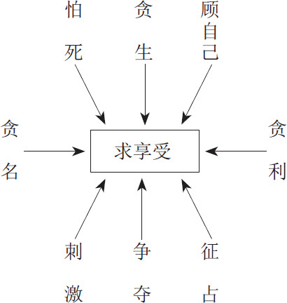

 第二章　人类何以有弱点

人性中有一些共同的弱点，成为大家攻击的目标。人类的历史实际上就是互相攻击弱点的过程。例如求生存，这可以说是人类的第一个人性弱点。人类求生存是一种天性。我们所有的创造、发明，一切的制度、方法，无非是为了适应人类求生存的弱点，才逐渐研究出来。求生存是人类共同的欲望，也是人类能够生生不息、绵延不绝的主要动力，为什么求生存会成为人性的第一弱点呢？因为从求生存中衍生出了很多问题，既令人头疼又摆脱不了，所以称其为弱点。

弱点并不是缺点，当然也不一定是优点。弱点因应得好，就成为优点；因应得不好，便成为缺点。因应的策略很要紧，用对了策略弱点成优点，用错了策略弱点变缺点。

> 弱点并不是缺点，当然也不一定是优点。弱点因应得好，就成为优点；因应得不好，便成为缺点。

例如人类求生存，必须觅食。于是觅食成为求生存的一种方式，设法获得若干食物，以维持生命。可是当我们有了食物之后，==常常忘记了食物只是为了维持生命的==，于是开始转移目标，==追求色、香、味，讲究烹调技巧和饮食气氛==，这就造成易受攻击的弱点。

==求生存演变到求美食==的程度，就会造成：妻子以独特的烹调口味来控制丈夫，餐厅以特殊的饮食情调来吸引顾客，而社会也以饮食配合节庆，以求塑造民俗风气。这些基本上都是针对人性求生存的弱点产生的种种花样。

需要饮食是人类的共性。采取哪一种饮食策略，则各人并不相同，从而形成各人不同的饮食习惯。==饮食策略正确，由饮食而获得生存、健壮而且均衡发展，当然是优点。饮食策略不正确，因为错误的饮食习惯带来若干不良后果，反而有害于身体，不利于生存，变成一种缺点。==人类为了求生存，饮食是必需的，这种人人共同的需要，既非优点，也不是缺点；可以形成优点，也可能变成缺点，所以称其为弱点。

人性的弱点很多，而且具有层次性。饮食、居住、衣着、交通设施，深入分析下去，都是为了求生存。人类所需要的饮食、居住、衣着、交通设施，在各地区、各民族，发展出不同的花样，但是基本目标、根本要求则一致都为了生存。我们如果在饮食、居住、衣着、交通设施这个层面上大做文章，当然也无不可。然而追根究底，一层一层深入，找出最为根本的弱点，不但容易记忆，便于应用，而且简单明了，化繁为简。

求生存并无不对，人人都需要求生存。过分怕死不好，不怕死也不好。贪生贪得合理，很好；贪生贪得不合理，就不好。人顾自己并没有什么不对，不顾自己顾谁？但是只顾自己完全不顾及别人就不好了。

> 人顾自己并没有什么不对，不顾自己顾谁？但是只顾自己完全不顾及别人就不好了。

自私也没有什么不对。人不自私，天诛地灭。贪利、贪名，只要不过分，也都属于人之常情。贪图享受，如果保持在合理的程度也是应该的。

求快乐有什么问题？人生本来就应该快快乐乐的。有刺激才会产生反应，才能维持生机。==争夺若能秉持君子风度，那么，有竞争才能有进步。==征占如果是形势所逼，相信也没有人会反对。

人性的弱点本身都没有问题，假若不正当、不恰当地运用人性的弱点，就会产生严重的问题。

王甲为了赴宴，排队等待公共汽车。由于正值下班的时间，等待坐车的人很多。王甲有一些心急，生怕挤不上车。

他的第一个期望是公共汽车来了之后务必要停。千万不要过站不停，让他一点机会都没有。

公共汽车来了，逐渐减速，好像真的要停下来。王甲的第一个愿望眼看就要如愿以偿。这时候他又有了第二个愿望：只要挤得上去，怎么挤都无所谓。大家挤一挤，彼此包容。

车停了下来，王甲顾不了那么多，低着头向前挤，好不容易挤上车，不由得抱怨：“怎么那么挤！”

没有人理他，却似乎同时在指责他：“是你挤上来之后，大家才挤的。不然你下去试试，我们哪里会挤。”

王甲当然没有听见这些人心中的话，他一心一意想找一个能站得稳当的地方，觉得自己只要双脚站妥，身体站直就行了。

站稳之后，王甲的眼睛到处溜，看座位有没有一点小缝可以挤进去，觉得哪怕只坐三分之一屁股也比站着好。

有两位好心乘客挪一挪，给他让开一个小空间。王甲坐下去，真的只坐了三分之一屁股，却也心满意足。

然而才过了不到一分钟，他就觉得很不舒服。为什么同样买一张车票，别人可以坐得那么舒适，自己却要如此委屈？于是心一狠，屁股一用力，把两旁的乘客挤开了。刚才还是好心人士，顷刻之间已经成为无情的竞争者，不如此，怎么能够做到适者生存呢？

==可见人的欲望是无限的，人的目标也会随周围环境的变化而发生变化。当没上车的时候，最大的目标就是上车，上了车之后，最大的目标就变成了想要个座位，有了座位以后，最大的目标又变成想坐得舒适了。==这个过程中体现出了人性中顾自己的一面。那么，人类为什么会有这些弱点呢？

# 生命有限而求长生

先从“求生存”说起。

人活着的意义是什么？各种宗教对此有不同的解释，各派哲学也有不同的主张。但是，对于人的一生来说，生命毕竟只有一次。只有一次的机会当然十分宝贵。

就算真的有轮回这回事，人死了可以重新投胎，再生为人，那也已经不是此生，而是来生。此生对此人而言，仅有一次，当然要求生存，以免来去匆匆。

然而，求生存并不一定要人人都重视传宗接代。今日世界之所以承受着巨大的人口压力，就是因为人人在这一方面都当仁不让，弄得人多问题也多。

站在优生的立场，有些人不但不应该生男育女，以免繁衍更多的人口，而且不需要活得那么辛苦，一定要活到什么阶段才死去。从这个角度看来，有些人应该怕死，有些人则简直连怕死的资格都没有。

贪生也是一样，人不应该一味追求活得长久，应该同时注重生活的品质。我们当然希望长寿，但要健康，不受老来开刀之苦，其实健康和长寿同等重要。大家都贪生，造成今日社会到处老龄化，带来许多麻烦，也产生很多问题。由此看来，对某些人来说，好像也不应该贪生。

> 人不应该一味追求活得长久，应该同时注重生活的品质。

顾自己呢？既然人有不同的天命，具有一些先天的不平等，例如智商、身高、寿命等等，若是各人只顾自己，岂不是好的更好而差的更差？再加上一些后天性的不平等，对人类社会并没有好处。

人有怕死、贪生、顾自己的本性，但是按照上面的分析，看起来似乎没有必要，是不是果真如此？

此生不论好坏、长短，总归是来了。既然来了，就应该留下一些痕迹，空来空去，好像不太好。留下什么呢？想来想去，人们觉得留下一男半女最实在。传宗接代被称为人生大事，想来十分有道理。

站在优生的立场看，谁又知道谁的素质比较高？而且有时优秀父母也会生出恶劣子女，有时歹竹却生出好笋。变数很大，谁又能够料定呢？自己再差，照样可能生龙生凤。你看，不是大部分的人都这样想吗？我又何苦妄自菲薄？在尚未留下一鳞半爪之前，当然应该怕死。

生活的品质其实并不客观，我认为良好，便属良好，其他的人不是我，怎能代替我来判断好与不好？健康的标准也不确定，多少人残而不废，谁敢说他们不健康？任何人都有生存的权利，老人社会也有它的好处，最起码不至于大家火气都那么大，那样好斗！

贪生，应该是人人平等的权利，没有人应该受到限制。今日的绝症，说不定过不了多少时间便有特殊药物问世能够治愈，不等行吗？不贪生岂不等于送死？

至于顾自己，那真是天经地义的事。干脆称其为自私吧，只要足够坦白，谁能否认自己多少都有一些自私的心理，甚至无事不自私？

求生存和它的三个特征见仁见智，各人有不同的认识，也有不同的评价，这是人的问题，只能各自解决。秦始皇那么厉害，也只能够求自己的长生，无法阻止他人为求生存而逃亡。

# 物质有限而谋利益

再说自私。虽然说人不自私，天诛地灭，但是人人自私，也必定天诛地灭。

时间有限，这只是针对个别人而言的。愚公移山的故事告诉我们，相信一个人终其一生不一定能够把山移走，但是这个人死亡之后，他人接续，只要不间断，终究会将山移走。真的有心推己及人，就不至于认为物质有限了。人多馒头少的时候，若是大家能够少吃馒头多喝水，撑撑肚子，不也就忍过去了？

精神当然是无限的，因为既然以精神为皈依，就不应该计较物质的有无、多少、轻重或先后。我精神上支持你，即使什么都没有，只有精神，这种精神也是无限的。精神上支持一个人、一个家庭、一个团体，乃至一个国家、整个世界，有什么作用？从个人角度看，作用非常有限；但从整体角度看，作用往往无限扩大。

石油用完了，还可以有其他替代品；所有运输工具都不能用的时候，双脚依然可以走路。在这种情况下，有贪的必要吗？

名和利，到最后都是一场空！

自古以来，大家只记着某人的过失，却很快忘记他的功劳。功没过存是“不求有功，但求无过”的主要依据。很多人汲汲功名，不惜牺牲他人以求建立自己的功劳，不知道为的是什么。

孔子非常伟大，但是孔子是谁，谁又是孔子？孔子生前，孔丘便是孔子，孔子即是孔丘。孔子逝世以后，孔子变成一个符号，代表曾经有那么一个人，现在只是活在人们的心中，却找不到具体人物的存在。就算孔子真的再生，清清楚楚地表现孔子的一切，我们也只能推崇他为“孔子再世”，并不会认定他就是孔子，所以孔子的高名相对于孔子本人来说也是空的。

快乐和悲哀，前者容易忘记而后者难以忘怀。享受周末，使许多人下周一上班时更加痛苦；享受假期，可能会增加财务的负担；双方对享受方法的意见不合时，也会增加彼此的苦恼。

何况人的欲望似乎永远没有止境。由俭入奢易，而要从奢侈的生活返回俭朴的日子非常困难。生活水准只能逐步提高，而提高之后，却仍然觉得不满足。

不过，以上的分析也不足以证明自私的三个特征都不值得追求。

好汉做事好汉当，每个人都要为自己所做的事负责。那么，愚公这一辈子没有把山移走，就算是功亏一篑，对愚公而言，毕竟不无遗憾。他既没有把握有没有人会继承他的遗志，也不知道继承的人会不会改变他的计划，或者将愚公的计划全部据为己有，让后世只知有他，不知有愚公。

>  
> 好汉做事好汉当，每个人都要为自己所做的事负责。

僧多粥少的时候，让少数僧人吃得饱些，可以活下去，也许比大家都分吃一些，最后都饿死要妥当得多。这少数人大概就是那些善于争名夺利的人，这样的人平时多用心于争名夺利，必要时就会获益不少。

精神也不一定无限，支持我就不能支持别人，否则怎么叫全力支持？精神会产生力量，就在于有我无他，不能支持所有人。从整体看精神固然无限，但“我”既然是个体，就有个体的立场。“我”只重视个体的部分，认定时间是有限的，“我”所能掌握的资源也十分有限，这根本是不可否认的事实。我只关心个体的部分，不关心整体的全部，从某一角度来看，相当守分，显然并无不妥。

谁都知道名和利最后都是一场空，但大家所追求的是未到最后时刻尚未成空的名和利。将来怎么样不去管它。现在有名，就可以接受电视台记者的访问，享受现在的人前风光。

功没过存，是由于一般人都患有嫉妒症，而且善于挑小毛病。如果大家都不求有功，但求无过，世界怎么会进步？功劳可能会被大家忘掉，但实际的贡献将永存人间，怎么可能“没”呢？人死留名，孔子已经逝世两千多年了，孔子的名却永远流传着，实实在在地留了下来。

与名利比起来，享受更为真实，好吃的东西，想起来就垂涎三尺；穿得华贵，到哪里人家都对你敬重备至；坐名贵车，注目的人自然多些；听好的音乐，也会让人觉得格外愉快。

# 本能需求而逐快乐

至于求快乐，同样是各有见地，而且好像怎么说都有道理。

先说快乐的定义，不但各有分歧，而且说法众多，简直是迄无定论。有人重视物质生活，认为物质可以带来快乐。有人偏重精神层面，也有人兼顾精神和物质双方面。同样是兼顾，也出现了很多不同的主张。

一般人总以为快乐和贫富有很密切的关联，认为金钱万能，金钱可以主宰一切，可以买到所需要的快乐。事实上，快乐和贫富并没有必然的因果关系，有快乐的穷人，也有不快乐的富翁。金钱至上，确实可以买到想要的空间、各种物质。但是拥有金钱的人也伴随着很大的危险，随时随地都可能被绑架、被撕票，赔掉健康甚至性命，哪里还有快乐可言？

>  
> 快乐和贫富并没有必然的因果关系，有快乐的穷人，也有不快乐的富翁。

追求感官的刺激好像是一般大众追求快乐最方便、最快捷的途径。但是，读书的快乐，只是少数有心得的人才求得到；为官的快乐，也不过是少数仕途得意的人才能得到。于是感官的刺激必须逐渐加重，否则普通大众很快就会觉得乏味而不快乐。追求感官的快乐反而产生很大的痛苦，恐怕是很多人始料不及的。有毒品就有人要用，于是引起警界的穷追严惩。就算会受到重罚，照样也有人推陈出新，不断开发出新花样，让更多的人冒险，也使得警察更加疲于奔命。

要争夺，谁不想只是君子之争，不用争得面红耳赤？然而一旦涉及争夺，必然会情绪高涨，理智退隐，不斗得你死我活，怎肯罢手？争夺什么？起初是争夺快乐，后来却变成以争夺为快乐。政客、大企业家、赌徒、杀手，都舍不得离开争夺，对争夺乐此不疲。

大家都退让而不争夺，似乎也不好。让来让去，某种东西如果大家都不要，到底要让给谁？甚至有人认为凡退让都是假的，不过是虚晃一招，最后还是当仁不让，这种以让为争的方式不过是多一重面具而已。

征占更是奇怪，轻易即能占有的东西人们往往不想要，想要的东西又占有不了。世界上最大的钻石，谁不希望占为己有？结果却什么人都占据不了，只能安放在博物馆里。谁都想要的东西，如果谁都得不到，大家还处心积虑，费尽苦心有什么意义呢？

退一步想，若是谁都不希望占有钻石，钻石还能成为宝贝吗？大家不要的土地，被称为荒岛，人人视而不见的东西就是废物。

人类求生存、自私、求快乐，原本都不是问题。但是由于脑筋不清楚、观念模糊，因而产生了很多困扰，终于成为人性的弱点。

凡是有生命的都会求生存。动物如此，植物亦然。生物具有生命，无不尽力求生存。人类的智慧使我们善于因应植物求生存的性质，对植物予取予求。希望某种植物多繁殖一些，就利用这种植物求生存所需要的因素，尽力给予满足，以达成人类的欲望。希望某种植物减少，也利用这种植物求生存所需的因素，尽量加以控制，使其失去作用，这种植物自然就会减少。

狗要求生存，狗主人利用狗求生存的本能来加以控制，教它看门、捡东西，甚至依仗主人的势来看扁别人。爱狗的人对狗求生存的本能十分熟悉，而狗从这些人身上的气味也嗅得出他们是爱狗的人，因而彼此喜欢，很容易拉近距离。

人类利用动物求生存的本能，还设计出各种捕捉动物的用具和陷阱。从这个角度来看，动物求生存有时候也成为一种弱点。

作为万物之灵的人类求生存的欲望，也被同类用来作为统治、领导、驾驭、控制的主要诉求，成为不可避免的弱点。当然，人类的观念、行为比动物更加复杂。我们求生存，随着时代的变迁、环境的改变，逐渐演变为自私，还以求快乐来替自己找借口，弄得比动物更苦恼。

白居易晚年写了一首七言绝句：“蜗牛角上争何事，石火光中寄此身，随贫随富且欢乐，不开口笑是痴人。”人生苦短，不管贫富，都应该笑口常开，快快乐乐度过一生。但是，白居易自己做到了吗？恐怕也未必。

>  
> 人生苦短，不管贫富，都应该笑口常开，快快乐乐度过一生。

美国有一首民谣，大意是：有人吞下一只苍蝇，赶快吞下一只蜘蛛去捉苍蝇。想想觉得并不妥当，于是赶快又吞下一只小鸟，去把蜘蛛吃掉。

小鸟怎么办，这首民谣没有给出答案。可是人类的欲望，似乎正是如此这般：求生存先是怕死，死不了就要贪生，怕死贪生造成只顾自己，顾自己过分了就成为自私。自私先是贪利，然后贪名，有名有利之后就贪图享受。享受由刺激入手，继以争夺，终于兴起征占的念头。原本只是单纯的求生存，最后演变成为征服别人占据喜爱的东西，甚至连生命都可以放弃，竟然违反了求生存的初衷。这样的人类，弱点是不是很明显而令人觉得怪异呢？这种明显而怪异的现象，是不是人的问题呢？

# 因为有理想，所以有弱点

根据《圣经·旧约·创世纪》记载，上帝创造宇宙万物，每造出一件物品，都点头称“善”。但是把人创造出来时，并没有称“善”，反而给了人三项祝福，那就是：

一、个性完成；

二、传宗接代；

三、统治世界。

个性完成就是完成自己的人性，属于独善其身。在所有动物中，人是唯一能够自我反省的动物，把自己当作研究的对象，不断认识自己，调整自己，乃至完成自己。人的自主性才是真正的人性尊严。

人在了解自己的过程中，发现上帝有意把自己造成一半，有意要这一半去追求另外那一半，因为唯有如此，才能够完成传宗接代的使命。

大家都热衷于传宗接代，人愈来愈多，秩序也就愈来愈乱，这时候需要有些人出来，想办法统治这个世界。怎么统治呢？想来想去，只有充分因应各人个性完成传宗接代、统治世界的愿望，在一步一步达成愿望的过程中，设法加以辅导，从而完成统治世界的使命。

但是上帝造人，并没有采用现代化品质管制的精神，将人性的素质加以严格控制，反而采取随机分配的方式，给人以不同的习性，造成各色各样、品质不一的人，也因此形成多彩多姿的人类世界。

这种随机分配，其实也不是真正的、完全的随机，还是有原则、有规律的。从各方面观察分析，上帝造人并不是按照二分法的方式，把人造成好人或坏人、善人或恶人、美人或丑人。而是采用了三分法，把人依上、中、下三大区隔来随机分配。

上人是人类最少的一种，这几乎是大家一致的见解。有一些人十分喜欢自称为“上人”，便是出于这种以稀为贵的心理。至于是中人较多，还是下人较多，那就有不同的看法。有人认为中人人数最多，下人反而和上人一样人数不多。有人则认为中人与上人相比人数较多，而下人人数最多，因为大多数人都是糊里糊涂过一辈子的。

长久以来，人类推崇上人，向上人学习。不管上人所使用的是宗教还是哲理，人们总虚心地接受。现代民主化潮流淹没了上人的光辉。大家把宗教势力浓厚的中古时期称为“黑暗时期”，将圣人的哲理看成“愚民政策”，动不动就指称以往民智未开，现代人知识丰富，见多识广，好像每一个人都已经是上人了。

不错，现代人很少迷信宗教，但是所有的理想也跟着消失了。大家只看到物质世界的繁荣奢侈，根本无视精神生活的贫乏肤浅。

>  
> 现代人的人性弱点，以求享受为重点，其他的一切都变成这一重点的附属品，形成扭曲的人性。

科技发达更凸显了物质的重要。大家对现实生活中物质的部分，看得清清楚楚，当然就会毫不犹豫地全力追求物欲的满足。现代人的人性弱点，以求享受为重点，其他的一切都变成这一重点的附属品，形成扭曲的人性，如图6。

**图6　现代人扭曲的人性弱点**

在经济上，拼命增加生产，造成激烈的竞争：为了降低成本而力求自动化，制造失业人口；所有艺术、文学、体育，都针对人们的声色口腹，不但商业化，而且粗俗化。一切讲求包装，样样都被广告左右了。

在生活上，为求享受，甚至可以不顾自身的安危；贪名、贪利的目的都为了享受；除了饮食男女的刺激以外，其他都不关心；所有争夺、征占，都没有理想，只求能够自己享用；奢侈不算罪恶，一切都以金钱为衡量标准。

凡此种种，都证明现代人把享受放在了第一位，忘记了下面两个事实：

一、人的欲望无穷，享受的满足永远难以达成；

二、愈享受，结果愈不满足。

现代人最好反省一下，享受应该是双方面的，一方面需要外在的物质条件，一方面需要内在的精神力量。而内在的精神力量来自人们的理想。缺乏理想的人，物质条件再充足，也不能获得真正的享受。

第一，享受是人类求生存的延续目标，不是单一目标。为了享受而吸毒，结果对自己的生存构成很大的威胁，这种享受便是缺乏理想的享受。人一生下来，便具有求生存的本能，这是人类痛苦的根源。人的一生，都离不开求生存的痛苦。享受的结果，如果是增加人类求生存的痛苦，那就不是良好的途径。享受的结果，必须能够减轻求生存的痛苦，对身心健康有益，那才是正途。

第二，享受的目的在于求得快乐，可见享受并不是最终的目标。快乐有内外两种途径，刺激、争夺、征占都在描述向外求取的方式，必须配合内心的宁静与安然自得，才能获得真正的快乐。内心的宁静与安然自得来自正确的理想。现代人缺乏理想，内心不得宁静，愈向外求取物质方面的享受，内心愈难以安然自得，什么疏离感、不安感，都因此产生了。

>  
> 快乐有内外两种途径，刺激、争夺、征占都在描述向外求取的方式，必须配合内心的宁静与安然自得，才能获得真正的快乐。

第三，人类无法单独求生存，必须与他人共同生活。个人的享受，对共同生活的正常发展有害无益。有钱人关起门来享受，好像穿着锦衣夜行；公开地享受，却又害怕引起别人的嫉妒，招来料想不到的伤害。不公开不好，公开也不好，怎么能够怡然自得呢？可见独乐乐还是赶不上众乐乐。一个人独自快乐，终究比不上大家一起快乐。而大家一起快乐，必须拥有共同的理想，才能乐得起来。一群人在一起，缺乏共同的理想，怎么能够乐在一起呢？这样说起来，现代人最大的缺失在于没有理想。大家盲目地追求享受，不去追究什么样的享受才合乎理想。总觉得是因为自己努力不够才不能获得快乐，以致努力再努力，却愈来愈感觉不到快乐。

>  
> 现代人最大的缺失在于没有理想。总觉得是因为自己努力不够才不能获得快乐，以致努力再努力，却愈来愈感觉不到快乐。

没有理想就不知道怎样选择正确的策略。现代交通发达，资讯快速交流的结果是各种言论、各种主张，听起来都有道理。缺乏理想的人很容易迷失在多元化的世界里，而不知道如何完成自我。

相信道理的人，面对形形色色的道理，不知道应该怎样去选择，因为各种道理，都在自我标榜，彼此否定，叫人难以分辨。

相信广告的人，面对五花八门的广告，更是看得眼花缭乱，轻易相信某一种广告就会上当。因为各种广告都在极力吹嘘，说得天花乱坠，谁也不知道真实性如何，可靠性又如何。

