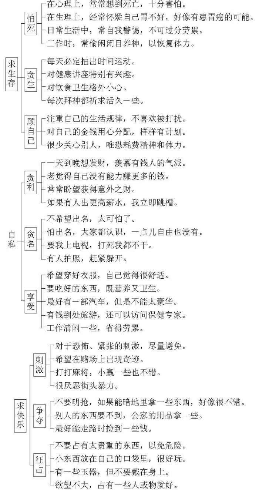

 第六章　主动显示弱点还是技巧隐藏弱点

一般人误以为人性的弱点即缺点，于是害怕自己的弱点暴露出来之后，被人利用。于是，尽量想办法把弱点隐藏起来。

隐藏人性的弱点固然有很多好处，但是，如果隐藏到连自己都忘掉或者使人完全看不到、摸不着、猜不透，因而放弃因应、互动的念头，那就十分不利。

站在隐藏的立场来显露，把自己的人性弱点暴露得恰到好处，既可以激励自己，也能够让别人有合理因应与适当互动的机会。

>  
> 站在隐藏的立场来显露，把自己的人性弱点暴露得恰到好处，既可以激励自己，也能够让别人有合理因应与适当互动的机会。

人性的弱点也可以看成人性的需求，要具有层次性。求生存是第一层，自私属第二层，而求快乐则是第三层。

“小华，你要好好用功，将来能做大事，我们一家人都很高兴。你很聪明，只要用功就好，明白吗？”

“明白。”小华这句话分明在利用父母希望他好好用功，将来光宗耀祖的弱点。虽然他幼小的心灵里根本没有这样的认知，但是他已经知道这样回答，要比其他任何一种说法更容易逃脱当前的难关。

父母用“将来做大事”来隐藏希望将来有名有利的弱点，以“我们一家人都很高兴”来掩饰“你应该为一家人争取荣誉”的盼望。“你很聪明”，更是进一步利用小华喜欢被赞赏的弱点。小华是不是懂得这些用意其实并不重要。但是他用简短的“明白”来满足父母的期待，同样是针对父母所暴露的人性弱点作出的有效回应。可见适当地暴露弱点给他人提供互动的着力点也是一种生活的必需品。如果换成这样的情形：

“小华，你要好好用功。”刚说到这里，小华已经跑掉了。父母紧跟在后边，只好改口说：“别跑，别跑，这样没有礼貌！”父母的心里一定很生气，小孩子完全不明白父母的心意，想好好说一些道理都这么困难。

人与人的互动实际上就是彼此弱点的相互作用。这一方有什么企图，另一方如何因应，说是互相利用很不好听，不如说彼此互助听起来更顺耳。如果换一种交流方式，变成：

“你在想什么？”甲问。

“没有。”乙说。

“你想要什么？”甲问。

“也没有。”乙说。

这样完全不暴露自己的弱点，简直就无法互动。过分理性的人大家会敬而远之，无法与人相处实在没有好处。

# 隐藏弱点有大智慧

人性的弱点并不是人性的缺点，只要适当控制，弱点也可以成为人性的优点。由于弱点很容易被利用、被攻击，因此很多人都希望把自己的弱点隐藏起来，装得若无其事，使人无从下手，不知如何攻击。这种隐藏的念头，其实也是一种求生存的策略，目的在于防人保己。

>  
> 人性的弱点并不是人性的缺点，只要适当控制，弱点也可以成为人性的优点。

有了“防人之心不可无”的观念，我们自然会处处提防，要把自己的弱点掩饰起来，隐藏起来。

明明是怕死，偏要说“留得青山在，不怕没柴烧”，忍得今日的气，明天才能够东山再起。因为怕被人看出贪生，就说“为了完成更重大的任务”必须忍辱偷生，其实活着比死还要痛苦。

顾自己的时候说“人应该学习独立，不应该依赖他人”。大事是义不容辞，小事则是“本来不想如此”，为了顾全大局，才勉强自己去做。

贪利的背后，有着无比的辛酸。午夜醒来，经常良心不安，辗转反侧难再入睡；贪得一些利益，却丧失了许多生活情趣。但是，这些情况有谁愿意从实招来？轻易以“说了人家也不会相信”掩饰过去。

贪名更是可怜。有些人住不安、食不好，也要煞有介事地搞什么投资计划，为的是可以出名。成名之后却更加辛酸，睡不安、吃不下，生怕被人绑架，或者遭人故意破坏名誉。媒体对这种事往往缺乏兴趣，却不断报道因名就利、出名很风光或者人死也应该留名的抱负以鼓励更多人参与逐名。

真正懂得享受的人其实为数不多。能赚得巨款却不知享用，只因人在江湖，身不由己，不得不继续投资所谓的伟大事业，一直要忙碌到进医院急救才肯暂时罢手。但是，当事人决不后悔，还说是“牺牲享受，享受牺牲”。少数真正懂得享受的人反而毫不声张，好像秘道探幽的人一样，严加保密，不希望有更多人来分享。何况精神层面的享受，各人有不同的标准，似乎要比物质层面的享受更难以说明，以致各取所需而不易引起共鸣。

贪利、贪名的结果，通常是成为富翁。财富容易满足物质方面的享受，却不可避免地带来一些精神方面的烦恼。富人为求确保财富，要夜以继日地工作，为了追求更多财富而不眠不休地付出更多的心血与时间，并且牺牲与家人共处的温暖和欢乐。然而，表面上又不得不装出一副得意扬扬的样子，尝试着要以金钱来主宰一切，购买所有的东西。

>  
> 财富容易满足物质方面的享受，却不可避免地带来一些精神方面的烦恼。

一般人只看到富翁的外表，财富排名世界第几，拥有的财富无数，到处都有人护卫，却不容易觉察隐藏在他们财富背后的心灵上的桎梏。媒体就算要揭开他们心中的秘密，恐怕也相当困难，因为没有成为富翁的人很难体会个中的滋味。甚至有人认为：如果让我也住广厦、坐豪车、锦衣玉食，果真精神上有些压力，也心甘情愿毫无怨言。

人类对动机、过程和结果都懂得隐藏，将真相掩盖起来。主要是因为经验告诉我们，善于隐藏的人，比一五一十全都吐露无遗的人更容易获得实际利益。换句话说，隐藏对自己比较有利，所以人们才乐此不疲。我们很不高兴别人对自己有所隐藏，却理直气壮地支持自己对他人的隐藏、掩饰。如果隐藏对自己不利而有利于他人，我们还有什么理由隐藏呢？

正由于隐藏对自己有利，所以容易引起他人的反感。我们索性把隐藏也隐藏起来。我们常听人说：“坦白告诉你。”其实那意思是除了隐藏一小部分事实之外，全都告诉你。先说“我不会骗你”，然后就会开始欺骗。时时不忘提醒人家自己在说实在的话，以此来掩饰自己的谎言。口口声声“钱财是身外之物”的人原来最重视金钱。

# 主动示弱有大好处

人类懂得隐藏弱点，享受隐藏的快乐，进而追求隐藏的快乐。凡是公开化、普遍化、大众化的快乐，都逐渐丧失刺激，让人觉得乏味。大家都打棒球，棒球就不够刺激了。大家喜欢打高尔夫球，只是因为一般人打不起，这样才显得打的人够体面。当高尔夫球也日趋普遍之后，人们开始喜欢深海潜水，觉得那才够刺激。隐藏性发展为稀罕性，新奇花样，别人没有的我有，众乐乐不如独乐乐。

>  
> 人类懂得隐藏弱点，享受隐藏的快乐，进而追求隐藏的快乐。

“带你去一个别人找不到的地方！”

“这种东西十分罕见，属于稀有物种，所以特别名贵。”

“好咖啡要与好朋友共享。”这是因为咖啡很便宜，再好也不贵。真正好的古董，就不可以随便拿出来展示了。看的人多了，就不稀罕，古董不值钱，大家也就不爱收藏了。

规定不能照相的地方，偷偷拍摄一张，觉得很刺激。不对外公开的场所或者入场费昂贵无比的场合，能够身临其境，那就更刺激。

争夺更是具有高度的隐藏性。没有一个国家公开声明要侵略其他国家，都是名正言顺地“为贸易而战”“为正义而战”或者“为自由而战”。没有一个人愿意承认自己蓄意争夺祖先的财产，处处标榜自己是白手起家。如果是争夺别人的财富造成的结果，就会说是运气好、赶上好时机了，而且得到贵人的提携。没有人说是自己争夺部属的功劳，反而认为是自己具有主管的魅力，部属是由于自己的领导才能够发挥潜力。

公开争夺的快乐，只存在于考试、选举、运动、竞技以及各种有规则的比赛中。然而考试作弊、选举买票、运动时犯规、竞技时使用禁药、各种比赛时私下买通裁判或对手，好像更加快乐。

十年寒窗苦读考中状元，会认为苦尽甘来获得理所当然的快乐。不学无术，凭借关系而获得高官职位，对很多人来说，虽属不劳而获，依然十分快乐。

比较起来，不公开争夺似乎更加快乐。派系斗争，帮派抢夺地盘，同事之间笑里藏刀互相较劲，都在否认声中默默地进行，而且永不休止。大家都乐于进行不公开的争夺，企图夺得原本不应该获得的东西。

征占也具有隐藏性，金屋藏娇比明媒正娶往往更容易引起大众的兴趣。高价购买珍品的新闻价值远不如偷窃集团用计偷取富翁的宝藏。同样据为己有，隐藏性的快乐胜过公开性的。在美国，拿多少薪水是十分隐秘的事，一般不能随便问人家赚多少钱。公司的会计部门也不会无意中透露这一类讯息。这就是老板针对人们喜欢隐藏性的征占设计出来的一种策略，使员工不至于因为薪酬比来比去而丧气，对老板十分有利。

# 根据具体情况采取具体做法

美国社会重视透明化、公开化、明朗化，为什么薪水却不能公开？中国社会几乎样样都有“暗盘”，相当重视隐藏性，为什么薪水反而是公开的？是不是美国老板比较聪明而中国员工比较高明？这正是我们所要讨论的问题。

有些公司的老板，心里明白薪水保密对老板有利，而且既然美国有这么一套现成的制度，把它移植过来，岂不轻易可以借刀杀人？于是规定员工必须签署一份文件，答应不把自己的工资告诉别人。结果呢？公司的员工出现了三种不同的反应。

第一种员工签署文件之后确实执行，不但不把自己领多少薪水告诉其他同事，也不打听别人领多少钱，并且认为这样才是诚实、正直的作风。

第二种员工签署文件之后，马上发现自己上当吃亏。不知道别人领多少钱，怎么知道自己所领的薪水合不合理？哲学家不是说“有比较才有鉴别，有鉴别才能够正确地判断”嘛。生意经也明言“不怕不识货，就怕货比货”，于是私底下打听同事的薪水，却在公开场合不透露自己的收入。

第三种员工拒绝签署这种文件，理由是签不签都一样，领这么少的薪水，自己都不好意思告诉别人，请老板放心。

哪一种员工的反应比较合理？我们非常尊重各人的价值观，也十分赞成各人的选择。下面只是就人性弱点的角度，来加以比较。

第一种员工不是自视甚高，便是警觉性很低。前者认为薪水本来就是各人自己的事情，比来比去有什么意思？自己认为合理，便留下来；自己觉得不合理，大可以跳槽而去。老板怎么想是他的事；我自己愿不愿意接受这种待遇最重要。后者并不觉得签署这种文件对老板有利而对自己不利，糊里糊涂就签下了名字，事后也不再思索，不把它当一回事。

当人们求生存的弱点逐渐提升到自私的层面时，领多少薪水已经和怕死、贪生没有多大关系。大家专心计较贪利（是不是每年加薪？有没有分红？能不能获取外快？会不会额外得到暗盘的给付？甚至自己所得甚高希望大家都能保密以免引起他人的不满）、贪名（待遇优厚，名义好听一些就好；和老板合作对将来升迁有利；公司名誉好，当然要服从）以及享受（上班自由最要紧、能够发挥个人理想最重要、不加班最好、工作轻松一些较理想、有更多假期最开心），这时候求生存的弱点被自己隐藏得成为潜在的欲望。自己并不在乎，或者不能觉察。直到有一天生存受到威胁，觉得薪水不能满足生活的需求时，才后悔自己自视太高或太过大意，那时已经来不及了。大凡生活安定，衣食不愁的时期，人们不重求生存而重自私与享乐，就会产生这一类型的反应。

第二种员工警觉性很高，而且深知“你攻击我的弱点，我也同样可以反击”的道理。老板用签署文件来约束员工，员工以阳奉阴违来应对。可是，我们每想及阳奉阴违，好像都觉得脸上无光，觉得似乎这么做不怎么光明磊落，总认为这样不够正直，也不够诚实。

我们不赞成阳奉阴违，却不反对特殊情况下的阳奉阴违，这是作为人的一大艺术。在正常情况下，也就是老板要求合理时，员工当然不可以阳奉阴违；但是老板的要求不合理时，员工以阳奉阴违来应对，实在是将伤害减到最小的一种方式，显然并无不可。

>  
> 在正常情况下，也就是老板要求合理时，员工当然不可以阳奉阴违；但是老板的要求不合理时，员工以阳奉阴违来应对，实在是将伤害减到最小的一种方式，显然并无不可。

请看第三种员工，有骨气、够坦白，说话也相当委婉客气，但是，揭穿老板的诡计对自己有什么好处？成为老板的眼中钉，还会有好日子过吗？

通过以上的分析，我们发现下面三个要点。

第一，人性的弱点可以隐藏，但是千万不要隐藏到自己都忘记弱点的地步。无论是求生存的怕死、贪生、顾自己，自私的贪利、贪名和享受，以及求快乐的刺激、争夺、征占，对自己都有相当的好处，否则不会存在得那么长久，表现得那么普遍。有人一旦生活有了着落，就忘记了求生存的必要，不怕死、不贪生，也不顾自己，弄得不知道照顾自己的身体，不知道保护自己的权益，也不重视打听和自己有关的事宜，这便是隐藏得过分了。相反，有人只牢牢记住求生存的怕死、贪生和顾自己，以致为了赚钱而不知享受，甚至忙碌到毫无生活情趣可言，同样也是和自己过不去。

人类最大的本领其实是“整自己”。想尽办法整别人，别人可以逃，可以不理会或者反击，不一定整得到。整自己最容易，一天二十四小时紧跟着自己，想逃也逃不掉，不理会也不可能，如果反击，也是再度整自己。整自己专家，似乎人人都当之无愧。整自己的第一步，就是忘记自己的人性弱点，不怕死、不贪生、不顾自己、不自私，也不求快乐。

第二，人性的弱点可以看成人性的需求，套用马斯洛的说法，也具有层次性。求生存是第一层，自私是第二层，而求快乐可以列为第三层。为了求生存，人们不敢有自私的念头和享乐的欲望。能够生存之后，自私的念头加强，享乐的欲望也逐渐显露出来。自私和享乐如果和求生存相提并论，同样受到重视，反而不容易危及生命、丧失自己的生活情趣。享乐到忘记自己求生存的弱点，便可能会为追求刺激而丧命，为争夺而牺牲自己，为征占而赔掉性命。

第三，人性的弱点应该重视，却不能完全明白地表露出来，否则很容易被利用、被击中。所以应该暗地里重视，表面上善于隐藏。但是一味隐藏也不好，隐藏到自己都忘记了更加糟糕。隐藏到别人气恼不堪，用不理会来因应，也是自己的损失。对于人性的弱点，最合理的态度，应该是适当地暴露，以求有效的互动，才能够获得互惠的效果。

站在隐藏的立场来暴露，而不是站在暴露的立场来隐藏。两者的差异在于前者可能暴露得恰到好处，而后者则很容易过度暴露，成为被攻击的目标，对自己不利。先想隐藏，然后适当地暴露人性的弱点，这才是隐藏的真正目的。虽然有人因过度隐藏反而受害，但是我们不主张因噎废食，仍然建议以隐藏的方式来显露，务求露得适当，露得恰到好处。

>  
> 先想隐藏，然后适当地暴露人性的弱点，这才是隐藏的真正目的。

# 人性的弱点原本相近

人与人之间的互动，可以说都在因应人性的弱点。例如教育，老师勤教严管，是基于自己求生存的需要。若是老师不这样做，恐怕饭碗都会保不住，同事和家长都有怨言，对自己的生存必然构成很大的威胁。学生愿意接受老师的管教，不论是主动或被动，同样是为了生存不得不如此。一旦提倡以学生为本，认为学生本位才符合教育精神，通过媒体的鼓吹，传播得尽人皆知，无人不晓，教师的任务就从教学变成维持秩序，因为此时此地，还在重视教学，自己的生存很可能会发生问题。唯有用心维持班级秩序，学生学习不学习都没关系，能安全回家最要紧。学生既然是本位，在学校高高兴兴，拥有一段欢乐时光最重要，学多少算多少，不必承受功课的压力。美国若干公立学校受到这种风气的影响，学校不教书、学生不识字的情况愈来愈严重，令人忧心忡忡。台湾地区是连环图画盛行，学生只看图不看字，这么做迟早也会成为文盲，电视上还在鼓吹这是一种风尚，属于另一种教育改革，真是害死人。

众人之事必须妥善管理，大家才能够生存得平安快乐。管理众人之事称为政治，也无非在因应人性的弱点。古今中外所采取的政策看起来好像千变万化，相当复杂，然而分析、归纳起来，似乎只有一种策略，那就是大家所熟悉的“一紧一松”。松了就紧，紧了便松，都是这种策略的活用。不过紧到什么程度才松，松到什么地步才紧，因人、因事、因时、因地而有所不同。

领导者要生存、自私、求快乐，必须设法满足群众求生存、自私、求快乐的需求。领导者和群众之间，互相运用彼此的人性弱点，发展出种种措施。当老师的人，应该坚定自己勤教严管的职责，不管专家学者提出什么理论，媒体如何鼓吹新奇观念，教学方法可以改变，而根本精神不能放弃。知道学生本位只是一种民主潮流下的偏道主张，也明白图画确实能够辅助学习，但不能取代文字。一个人只会说某一国家的语言，不能解读这一国家的文字，那么这个人对这一国家的文化，不可能有深入的了解。以如此清楚、正确的理念来选择自己的因应策略，便不致因求生存而被错误地运用，造成害己害人的后果。鼓吹学生本位的人，也应该明白“任何事情总有相当的道理，不过一直膨胀下去必然导致错误的结果”，不要过分强调这一套理论，以免为了自己求生存而危害他人，终究会引起良心的不安。

>  
> 领导者要生存、自私、求快乐，必须设法满足群众求生存、自私、求快乐的需求。

提倡图画辅助文字，以漫画求生存的人，同样应该克制自己，不要做得过分，否则误人子弟，也是罪在自己，因为误导他人，自己即使无心犯错，良心照样要承担后果。

为政者一松一紧，若是为公，对社会大众有利，便能受到大众的欢迎而生存；如果是为了私心或假公济私，大众也会识破而群起反对，结果必然生存不了。执政者和民众之间的求生存，必须找到合理的平衡点，否则不是执政者生存不下去，便是民众活不成，势必引起激烈的冲突而两败俱伤。

人与人之间，也是互相利用人性弱点建立各种微妙的关系，产生各种不同的行为，导致各种不同的结果的。所有人际关系都因此而形成。

>  
> 人与人之间，也是互相利用人性弱点建立各种微妙的关系，产生各种不同的行为，导致各种不同的结果的。

# 利用人性的弱点要适度

谚语说：“不吃一堑，不长一智。”并不是说人要长一智，就必须吃一亏。善于借用他人的经验，吸取其精华，才是事半功倍的好办法。现代人不喜欢读书，或者不知道选择而乱读书，那就只好委屈地吃一堑才能长一智了。古往今来，大家在人性弱点的攻防战之中已经有了好几千年的经验，现在归纳成下述三大原则，以供参考，希望大家可以少走弯路，少吃一些亏。

第一，弄清楚自己在人性弱点方面的真实程度如何。例如某甲自我检讨之后，列出图16。

**图16　某甲自我检讨的人性弱点**

知道自己的弱点主要在金钱和健康上面，如果适当加以调整，就不容易让人有机可乘而吃亏上当。

第二，揣摩他人的人性弱点，把各人的评量表也分别列表对照。久而久之，很快就能够看出每个人的弱点程度，发现个别的致命伤。这种功夫当然不是三五年就能够练成的。想要做到熟练的地步，至少要花十年、八年，才能迅速而准确地诊断出来。

第三，明白自己的弱点，也能够快速而正确地判断别人的弱点之后，必须慎选自己的策略，以免走入歪道，过分利用他人的弱点，反而毁坏了自己的信誉。

利用别人的人性弱点，固然要合理；防止自己的弱点被运用，同样也要讲求合理。适度地利用别人的人性弱点和适度地让别人利用自己的人性弱点，才能够获得和谐而良好的人际关系。

>  
> 适度地利用别人的人性弱点和适度地让别人利用自己的人性弱点，才能够获得和谐而良好的人际关系。

防人过甚，一点儿弱点都不肯让人家利用，或者存心害人，把别人的人性弱点利用得过度，迟早会引起大家的恐惧和反感，对自己非常不利。

利用他人的人性弱点要适可而止，他人利用我们的人性弱点，要若无其事地适度配合，这才是有效的策略。一天到晚动脑筋要利用别人的人性弱点，结果大家都能看明白，躲得远远的，最后一个人也不和你来往。经常提心吊胆，唯恐自己的人性弱点被利用，那就一点儿机会也没有，既没有朋友，也谈不上互动，一切事务都要自己动手，也十分不方便。

# 了解人性的弱点改变自己的命运

非要把人性的弱点看成优点或缺点，那是二元价值论的观点，并不恰当。

现代人最大的毛病在于看重有形的、看得见的、具体的事物，却严重地忽略了无形的、看不见的、不具体的事物。因此大家十分热衷于对物质的追求，对精神的提升则毫不留意。追求刺激以感官为主，不以心灵来体会、领悟，加上媒体商业化，使得人的享受低级化了。

人免不了互相利用人性弱点，但只要保持合理的程度，不但要运用他人的人性弱点，而且应该乐意接受他人的利用。

>  
> 人免不了互相利用人性弱点，但只要保持合理的程度，不但要运用他人的人性弱点，而且应该乐意接受他人的利用。

当一个人求生存的欲望受到最大的挑战时，世界上只剩下两样东西：一样是好的，能够满足生存的欲望，让人继续活下去；另一样是坏的，会阻碍生存的欲望，让人活不下去。例如一个人快饿死的时候，能吃的东西就是好的，不能吃的东西便是坏的，当此之际，世界上再也没有其他东西值得他思考和注意。

原始人生活简单，把一切事物划分成两大类：能吃的、不能吃的；好的、坏的；使我们痛苦的、带给我们快乐的；善神、恶魔；好人、坏人。一直以来，当人们讨论人性的弱点时，也习惯把它区分出好坏，某些是优点，而某些则是缺点。

其实，一切事物都是不好不坏、不善不恶、不贵不贱的，关键看我们怎样去面对，如何去运用。

二元价值论的偏差不应该继续为现代人所沿用。人性无所谓好坏、善恶、贵贱，要看我们怎样抉择运用策略。策略正确，人性的弱点会变成优点；策略错误，人性的弱点便会变成缺点。

人生在世，最基本的需要便是求生存，所以求生存成为每一个人的基本弱点。为了求生存，必须动脑筋、用智慧，于是贪生、怕死变成一般人的潜在弱点，由于环境的变迁和竞争的激烈，使得原先群体的贪生、怕死逐渐形成他人的责任，自己则更加专心寻求个人的贪生、怕死，以资源、能力有限为借口而更加自私。

在环境改善之后，生死问题变得有些遥远，至少不是眼前亟待解决的问题。于是贪利、贪名就成为生与死之间的最大欲望。

临死之际，没有人会贪利、贪名，甚至会对自己为贪名、贪利而失去性命感到非常后悔。但是只要有一口气在，尚未躺下去之前，不争名、不争利好像就表示没有企图心，别人不笑话，自己也不会原谅自己。

为名、为利令人暂时忘记贪生、怕死。虽然说人死留名，才不会空来一趟，但是留的是什么样的名更重要。人生的不朽，虽然有立德、立功、立言之分，但是立功、立言都必须有德才谈得上。可惜现代人重视立功、立言，却不重视立德。于是所立的功、所立的言，违反道德，不合伦理，只能达到个人享受的目的。

人要享受，若能目标正大、手段正确、途径光明，实在并无不妥。像孔子的自得其乐，才是人生最大的享受。为了享受所得的名，为了享受经商所得的利，牺牲了自己的生命，加速了自己的死亡，究竟得失如何？

然而一般人过分看重有形的、看得见的东西，过分轻视无形的、看不见的东西。享受，要吃好的、穿好的、住好房屋、坐好汽车。这些都是有形的、具体存在、看得见的东西，大家十分热衷，紧追不舍。

大富大贵、有钱有势是有形的，大家认为唯有如此才是真正的享受。殊不知，有德、有守、与人无争也是一种享受，只因为这是无形的，大家就忽略了。

因为看重有形的东西，注意具体的事物，所以享受变成向外追求快乐，寄希望于具体可见的东西。

赌场老板运用人类寻求刺激的弱点，以豪华的场所、新颖的设备、科学的计量、艺术的手法，将大批赌徒吸引进来，这些赌徒为了求取一时的快乐而种下遗恨终生的恶因。

烟、毒制造者运用人性喜欢刺激的弱点，用夸大的广告、赠送的小惠、丰富的奖品、巨额的利润来吸引商人和顾客。更由于政府的查禁，增强了刺激感，使得烟、毒贩卖者和使用者抓不胜抓，禁不胜禁。刺激以感官为主要对象，而感官受到刺激，就会产生一定的适应力，以致刺激一段时间之后，就不觉得有什么效果，必须增加刺激的强度，变化刺激的花样，才觉得够刺激。

原本投篮得分，已经够刺激了，看久了也会觉得没什么，觉得一定要灌篮看起来才过瘾。打得太斯文有什么看头？场上愈凶狠，观众愈觉得刺激。坐着旁观还不够，干脆挤进去打群架，觉得这样更加有参与感。

为了拥有刺激，有时必须争夺。何况优胜劣汰，人类好像总摆脱不了竞争的命运，不争夺怎么证明自己是优胜者？向歌手性骚扰够刺激，但是别人也可以仿效，于是就用武力挟持歌手，不许其他歌迷接近。或者以暴力驱散其他歌迷，不许他们同样有机会进行性骚扰。

短期拥有终究还会失去。打胜仗的时候，可以任意抢夺战败国的人力和资源，觉得很快乐，但是战胜只是一时的结果，很快就成为过去。于是想出殖民政策，以期长久掠夺殖民地的人力和资源。

个人也是一样。博物馆有一颗大珍珠，人们愈看愈觉得快乐。起初常常去看，也常常觉得快乐。忽然觉得刮风下雨还要去博物馆很不方便，而且听到博物馆展出的文物每隔一段时间就要更换，甚至外借到别的博物馆去交换展出。这时偷窃的念头越来越强烈，希望偷回来放置家中，自己天天把玩，岂不天天都快乐？

诸如此类的变化，是每个人都必须自我省察的课题，弄清楚自己的人性弱点究竟发展到什么地步，又呈现到何种程度，才能够约束自己，不受他人的任意运用。

自己的命运掌握在自己手中，真正的意思也就是了解自己的人性弱点，合理地加以调整，便可以掌握自己的命运。

>  
> 自己的命运掌握在自己手中，真正的意思也就是了解自己的人性弱点，合理地加以调整，便可以掌握自己的命运。

同时，我们为了自己的生存，常常动脑筋利用他人的人性弱点。某甲喜欢高帽子，捧他、抬举他，他便很快乐，人们自然尽量在他面前歌功颂德，报喜不报忧。某乙重视礼节，对他尊重他才会快乐，于是人们抱着礼多人不怪的心情和他交往。但是，人们一旦认为某种做法有效，往往会不知不觉地增加强度，终于因过度而导致无效，那时才悔之晚矣。所以对他人的掌握，同样需要合理地调整。过与不及，效果都会大打折扣。

老子早就指出，要排斥死亡是不可能的，自杀、求死，就更加不好。他认为人的生命中，生、死的因素各占三分，原本平分秋色，但是人为了求生，却步入了死路，使得死的因素无形中又增加了三分。所以人不应该过分贪生怕死，以免为人所用，增加死亡的概率。

最合适的心态还是老子那句话“万物将自化”。人是万物中的一种，也离不开“自化”的轨道。对生死持自然变化的顺应态度，应该比较合理。

人要活得逍遥自在，只有承认人性的弱点不好不坏，让它自然地、适度地、合理地展现和被人利用，自己自然而然地因应，做到动静相宜，就用不着再念念不忘人性的弱点，一天到晚做这方面的攻防战了。

