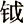

 *第十八章　孟子高风常在*

孟子确实了不起，他保存了儒家思想的命脉，发挥了孔子思想的精华，并有“温故而知新”的创见。他提出人性向善的观念，肯定每个人的内在价值，鼓励我们成就自己的人格。

孟子为后世树立了很多圣贤典范，提供了养心修身的一整套思想，影响至大。这位自信的语言天才，以儒家的智慧仁德和傲世风骨，感染着你我。

# 儒家的传世记录

自从北京奥运以来，儒家重新受到全面肯定，使我们又回到了中国正确的传统思想上。但是不要忘记两千多年以来的专制政体，基本上是采取阳儒阴法的策略，表面是儒家，里面是法家，虽然儒家思想在教育上、在社会上有广泛而深刻的影响，但是它并没有得到真正实践的机会。

孔子与孟子的遭遇，有两句话可以概括：孔子有他的遗憾，孟子有他的委屈。

说到孔子的遗憾，在《论语》里面有一段话。孔子有一天感叹，自己的理想没有得到别人的了解与重视，说“莫我知也夫”，没有人了解我呀。这时候学生子贡在旁边说，老师，为什么没有人了解你呢？孔子就说：“不怨天，不尤人，下学而上达，知我者其天乎。”可见，当时他虽然有三千弟子，精通六艺者七十二人，但他认为没有人了解他，只有天知道。

为什么没有人了解孔子呢？是孔子自己没有讲清楚，还是讲了之后别人听不懂？这两点都有可能，因为孔子教书是教古代的经典，不常谈自己当时的思想。整部《论语》里面有一个人可能了解孔子，是一位偏向道家的隐士，荷篑者。有一天他身上挑着竹篓子，经过孔子在卫国的住宅，听到孔子击磬，他就说：“有心哉，击磬乎！”，然后说：“莫己知也，斯己而已矣。”他从击磬声听出来，孔子在感叹没有人了解他。他说没有人了解你就算了，可以停下来了。只有这一个人可能了解孔子，偏偏不是儒家的学生，所以孔子很有遗憾。

>   
> 子击磬于卫，有荷蒉而过孔氏之门者，曰：“有心哉，击磬乎！”既而曰：“鄙哉！硁硁乎！莫己知也，斯己而已矣。深则厉，浅则揭。”子曰：“果哉！末之难矣。”   
> ——《论语·宪问》   
>   

幸好有孟子和他的学生设法“述仲尼之意”，把孔子的思想加以发挥，作成《孟子七篇》，总算将孔子的学说传承并发扬，不至于散失或者走样。

那么孟子有什么委屈呢？比如，被别人说成好辩。讲到辩才，古代人没有超过孟子的，他的思想与辩才是神奇的组合。道家也有位高手，跟孟子同一个时代的庄子，讲到寓言没有超过庄子的。《庄子》里的寓言故事，假托发挥，非常精彩，充满无限的想象力，到现在为止，古今中外很少有作品可以超过庄子的丰富想象。

庄子和孟子见过同一个国君梁惠王，不过两个人不曾见面。道不同不相为谋，庄子不会对孟子有兴趣，认为孟子你周游列国这么大的场面，其实是在表面上跑来跑去，没什么用。而庄子隐居起来过日子，孟子也没机会和他讲话。两个人的思想与境界截然不同，但很难说谁一定都对。只是儒家比较人世，道家比较出世，这简单的说法不见得恰当，不过可以帮助理解它们的基本区别。

*儒家主张人性向善，善是我和别人之间适当关系的实现，所以一定要入世，有对社会的责任感。道家以道为主，道是无所不在的，不一定要在这个时代努力做一些事，天下那么乱，我自己尽量明哲保身，过得自在轻松。对人性的看法不同，就有不同的生命态度。其实中国人很幸运，有儒家与道家这两派传下来，就在任何阶段、任何情况下都有路可走。*   

作为儒家，孟子必须面对世界的挑战，以他的思想和辩才周游列国，所以他说：“予岂好辩哉，予不得已也。”

孟子有见解有学问，他提出来的各种方案，有具体的政策。像仁政要配合经济方面的策略，“夫仁政，必自经界始”；王道很简单，就是与民同乐，等等。他的观念展开后实在是太丰富了太精彩了。像他这样的人，有资格说自己是备受委屈。但无论怎样，他用自己的辩才和文章，为儒家留下了传世记录，泽被后世。

# 修养的万世师表

我们梳理一下孟子的思想，总结一下孟子关于修养的整体观念。

首先孟子强调自我的修行，因为不修行怎么可能在社会上得到肯定呢？怎么可能对人群有所贡献呢？修行的方法用三个字来概括：第一个就是养，修养的养；第二个就是反，回到自己身上反省；第三个叫做化，能够大而化之。

首先，养最重要。有一次学生问孟子说，您跟别人有什么不同的地方？孟子说，我有两个特色，第一个我知言，第二个我“善养吾浩然之气”。养浩然之气的办法，有三个字值得注意，第一个叫直，第二个叫做义，第三个叫做道。

第一个直，代表真诚而正直，学儒家只要掌握真诚原则，很容易得到正面效果。对任何人都很真诚，但不是天真幼稚、无知上当。真诚是对自己的感情、分寸拿捏得好。人和人相处，见面三分情，各种恩怨情仇都会有，久了会非常复杂。所以你必须敏锐，感受自己和他人之间随时变化的情绪情感，了解别人的期许，进而遵守社会规范，只有这样，人的生命才能走上正路。第二个叫做义，义者宜也，随时做事是否正当，是否适当。第三个叫做道，道就是人类共同的正路。

孟子善养浩然之气，靠的是直、义、道，不断地掌握，可以集义，最后会出现一种浩然之气，从物质上的气变为精神上的力量，它可以充满在天地之间，得到完全的自由。

孟子还说，养其小体为小人，养其大体为大人，所以要养心。“养心莫善于寡欲”，因为人的欲望大部分来自身体的本能、需求，欲望越多心就越乱，最后生命就在糊里糊涂中过去了。

第二个，要能够反。孟子说“行有不得者皆反求诸己”，“反求诸己”四个字说得好。我们在社会上和别人来往，常常碰壁，常常和别人沟通不畅，做事情也做不好，这时如果只怪别人，这样自己永远得不到改善。孟子说如果懂得自反的话，他的错就很少很少了。

孔子就懂得自我反省，他说，德行没有好好修养，学问没有好好研究，听到该做的事没有跟着去做，有不对的事没有立刻改过，这是我的忧愁啊。老子说，圣人有这样的忧愁，所以没有这样的毛病；我们没有这样的忧愁，所以我们有这样的毛病。

孟子又说：“万物皆备于我矣，反身而诚，乐莫大焉。”现代人哪一个不希望快乐？那么学孟子吧，反省自己、发现自己能完全做到真诚，还有比这更大的快乐吗？像君子一样坦荡荡，有错误立刻就改过，这样多好，自己的命运掌握在自己的手上。儒家思想是有主体性的，每个人都是一个主体，人生最可贵的就是道德方面的自我实践，往上提升，因为人性向善。

第三个字是化。孟子提到人格修养时说：“大而化之之谓圣。”充实而有光辉之谓大；大而化之之谓圣，“化”是一种动态。我除了自己充实，发出光之外，还能感动人民，改善人民。“夫君子所过者化，所存者神，上下与天地同流”，讲君子经过任何地方都可以感化百姓，化民成俗，内心存有神妙无比的境界，在任何地方都非常自在。

>   
> 孟子曰：“爱人不亲，反其仁；治人不治，反其智；礼人不答，反其敬——行有不得者皆反求诸己，其身正而天下归之。《诗》云：‘永言配命，自求多福。’”   
> ——《离娄上》   
>   

>   
> 子曰：“德之不修，学之不讲，闻义不能徙，不善不能改，是吾忧也。”   
> ——《论语·述而》   
>   

>   
> 圣人不病，以其病病。夫唯病病，是以不病。   
> ——《道德经》   
>   

# 推崇的圣贤典范

孟子特别喜欢谈古代的一些典型，他“道性善，言必称尧舜”。但孟子说的何止是尧舜，尧舜之后还有禹、汤、文、武、周公，再加上伯夷、叔齐、伊尹、柳下惠这些人，最后还加上孔门最好的几个学生，如颜渊、子路、子贡、曾参，孔子的孙子子思等。孟子经常把他们的事迹拿来加以演绎，以他们为标准，衡量作为国君应该如何，作为大臣应该如何，作为百姓又应该如何，而一个读书人应该有什么样的志向，通过这些典型一一说明。

孟子说“人皆可以为尧舜”。尧舜和我们一样，都是人，但是他们经过修行成为尧舜。这句话是对人性最大的肯定，但是为什么很少人真正成为尧舜呢？

这就是所谓选择的问题。孟子曾经把舜和盗跖并列来议论。盗跖是一个很特别的传奇人物，是个大强盗，人们听到他的名字都会害怕，大国小国都觉得很恐怖。盗跖率领八九千人横行天下，他们不要命，谁碰到都会害怕。孟子说，早上起来念兹在兹想行善的，就是舜这一类人；念兹在兹想求利的，就是盗跖这一类人，就和强盗一样。孔子也说过，君子所能了解的是道义，小人所能了解的是利益。

义和利的分辨，从孔子到孟子一直延续下来。我们有时会觉得奇怪，难道活在世界上不要追求利益吗？其实儒家不是不要追求利益，只是希望做到见利思义，看到好处就要想该不该得。只要该得的就毫不客气。对不该得的东西，一点都不要，叫“一介不取”。这里有一个分辨利义的问题。

>   
> 孟子曰：“鸡鸣而起，孳孳为善者，舜之徒也；鸡鸣而起，孳孳为利者，蹠之徒也。欲知舜与蹠之分，无他，利与善之间也。”   
> ——《尽心上》   
>   

孟子还特别提到四种圣人，这是孟氏的绝学。孔子以前都没有这样分，因为孔子要求的标准很高，必须死而后已。孟子的“圣人之说”有自己的标准，比如第一种圣人是非常清高的，以伯夷为代表，他做官时，如果满朝文武里有一个坏人，他就立刻辞职。这实在是太清高了，伯夷最后下场也很悲惨。每个人看到这样的故事，都会觉得这人了不起，觉悟自己不应该这么贪婪。

孟子还把颜渊、子路抬出来。事实上，颜渊与子路活着的时候可以算作失败者。

颜渊是孔子最好的弟子，德行科第一名，好学惟一，所以他过世的时候孔子哭得非常伤心。他说，学生里只有颜渊一个人好学，不幸短命死了，现在没有好学的学生了。颜渊只活了四十岁，哪里有机会发挥抱负呢？

但是孟子说了一段话，充分肯定了颜渊的价值。他说：禹，治理洪水；稷，负责种植稻米五谷杂粮。大禹想到天下有人被水淹死，就好像自己让他淹死的一样，因为我治水没治好。稷呢？想到天下有人挨饿，好像我让他挨饿一样，因为我没有栽培好五谷。两个人功劳都很大。但是如果交换处境，颜渊与禹、稷做的事情也会是一样的。

我们都知道，颜渊没有做过官，没有任何具体成就，除了德行被人称颂。但是孟子居然将他和大禹、后稷并列，颜渊地下有知，会感激得不得了。他会说，我颜渊体弱多病，一箪食，一瓢饮，居陋巷，每一次周游列国都跑在后面，有时候老师遇难我还赶不上，这样的颜渊好像一事无成，没想到孟子口中却得到至高的评价。

这就是孟子的眼光。他作了个比喻。同一个房间的两个人打架，这个时候有个人衣服没穿整齐，帽子没戴正，就要立刻去劝架，因为同寝室的两个人打架，说不定放火一烧，会殃及池鱼。但是如果隔了几条街，有两个邻居吵架，他们吵他们的，说不清楚谁是谁非，儒家对于劝架比较谨慎，因为劝架很容易变成乡愿。

>   
> 孟子曰：“禹、稷、颜回同道。禹思天下有溺者，由己溺之也；稷思天下有饥者，由己饥之也，是以如是其急也。禹、稷、颜子易地则皆然。今有同室之人斗者，救之，虽被发缨冠而救之，可也； 乡邻有斗者，被发缨冠而往救之，则惑也；虽闭户可也。”   
> ——《离娄下》   
>   

这个比喻非常生动。大禹和后稷因为有洪水了或者人们没饭吃了，所以立刻去帮忙，有机会发挥他们的抱负。颜渊不一样，处在乱世没有机会，活的时间又不够长，所以只能自己修德。颜渊说过：“舜，何人也？予，何人也？有为者亦若是。”舜是什么样的人，我是什么样的人，有为的人就要跟舜学习，这是颜渊的志向——取法乎上。很了不起。

我们知道子路的下场也很凄惨。他到卫国做官，正好卷进父子争国的局面，两军对垒，父子相争 子路因为效忠儿子这一边，当父亲那边的军队过来时，他一个人对抗几十个人。别忘了子路比孔子小九岁而已，孔子过世前一年多子路过世，说明那时子路也已经六十二三岁，还要一个人对付几十个武士，结果是被杀了，还被剁成肉酱。这是子路的下场，实在是一个失败者的下场。

但孟子怎么说呢？他说，子路听到别人说他有过失，就很高兴；大禹听到有价值的言论，一定向人拜谢；接着说“大舜有大焉，善与人同”。先说子路，再说禹，再说舜，三个人并列。若子路地下有知，他一定会觉得：这个孟子真是我的知己啊，这就是孟子的历史眼光，不以成败论英雄。人的价值在内不在外，你有这样的志向，可惜没有机会实现，将来还是有人像孟子一样替你平反。

孟子的伟大就在这里，他对古代很多圣贤给以定位，对孔门弟子给以定位，将孔子的学说完整地传给后代。孔子的思想经过孟子的推广，才受到普遍的肯定。

>   
> 孟子曰：“子路，人告之以有过，则喜。禹闻善言，则拜。大舜有大焉，善与人同，舍己从人，乐取于人以为善。自耕稼、陶、渔以至为帝，无非取于人者。取诸人以为善，是与人为善者也。故君子莫大乎与人为善。”   
> ——《公孙丑上》   
>   

孟子特别强调，从有人类以来，没有像孔子这样的人。今天的孔庙里还有四个大字——“生民未有”，这句话就出《孟子》这本书。最早说这话的不是孟子，而是孔子的学生，有若与子贡。但是他们两个是孔子的学生，在孔子死后说些好听的、伟大的话，歌颂自己的老师是天下最伟大的人，自己当学生的地位也提高了。不过，他们知道孔子为什么伟大吗？不一定知道。但是孟子知道，他把孔子学生所说的话整合起来，下了定论：自有人类以来，确实没人像孔子那么伟大。

孟子看得非常深刻，说孔子作《春秋》，而乱臣贼子惧。孔子也说过，了解我的是《春秋》，责怪我的也是《春秋》。为什么？在古代，《春秋》代表对历史人物的评价，只有天子才有资格写，但当时天子已经失德，天下大乱了，所以孔子就不管这个，社会总要有正义，他写成了《春秋》传诸后代，使得中国人对历史特别重视。其他民族重视历史的不是很多，而我们中国人重视历史，这几年历史剧受到普遍欢迎就是证据之一，但很多历史剧都是出奇制胜，混淆是非的也很多。而孔子作《春秋》非常扼要，“一字之褒，荣于华衮，一字之贬，严于斧 ”。

>   
> 孟子曰：“世衰道微，邪说暴行有作，臣弑其君者有之，子弑其父者有之。孔子惧，作《春秋》。《春秋》，天子之事也；是故孔子曰：‘知我者其惟《春秋》乎！罪我者其惟《春秋》乎！’”   
> ——《滕文公下》   
>   

孟子对孔子的正确理解，在当时是独一无二的，至今也没有人超越。

# 自信的语言天才

从古至今，孟子的语言都算是第一流的。这主要体现在他和各国国君的对话和辩论中。他面对大国君主，更体现出自己的风采，分庭抗礼、不卑不亢，言谈之间让这些国君时而欣喜，时而沮丧，时而愤怒，时而盼望。简言之，孟子简直把他们的喜怒哀乐完全掌控了。

孟子的语言魅力充分展现，有两个特色。第一，充分使用《诗经》、《书经》。第二，善用比喻，还常常创造成语和格言。

在与国君互动的故事里，孟子表现出一种读书人的风骨。我读《孟子》的时候，总忍不住背上一段：“孟子曰：说大人则藐之，勿视其巍巍然，堂高数仞，榱题数尺，我得志，弗为也。食前方丈，侍妾数百人，我得志，弗为也。般乐饮酒，驱骋田猎，后车千乘，我得志，弗为也。在彼者，皆我所不为也；在我者，皆古之制也。吾何畏彼哉？”我为什么怕他呢？他当大官所做的事，我都不屑于做，我要是当了大官，得志就照顾百姓。“得志与民由之，不得志独行其道”，这叫做大丈夫。“富贵不能淫，贫贱不能移，威武不能屈”，这就是孟子。

自古以来，谁能说出这么有气魄的话？这种话不是写文章，写对联，读起来声势很浩大的样子，而是经过内在修养产生的具体心得。孟子同大国君主来往时的这种心态，两千多年以来很少能在读书人身上见到了。

可惜，孟子没有机会成就功业。孔子在鲁国做官也只有五年，五年之内，从中都县的县长一路做到大司寇，并且代理总理行摄相事。如果给孟子机会，相信他也会有一番作为的。但是那些国君不敢给他机会，因为他们都有自己的权力结构，如果让他国来的孟子大权在握，这些人会担心的。

因为不受重用，孟子决定离开齐国了。有人又为齐王做说客，劝孟子留下来，孟子不理他。他在外面等，孟子在里边假装打瞌睡。那个人生气了，说，我来见先生，先斋戒沐浴，见了先生之后，先生不理我，我以后不要理你了。孟子一听就说，你不要怪我，当初鲁国国君要安顿子思，怎么样呢？待以上宾之礼。你要安顿一个贤者在你的国家，你就要好好地把他当老师来看。他曾经说过“大有为之君，必有所不召之臣”，大有为的国君，一定有某些大臣不是谁说过来他就过来的，你必须亲自请教他。一个国家如果没有一个读书人值得领导亲自请教，这个国家没希望了。

>   
> 故将大有为之君，必有所不召之臣；欲有谋焉，则就之。其尊德乐道，不如是，不足与有为也。故汤之于伊尹，学焉而后臣之，故不劳而王；桓公之于管仲，学焉而后臣之，故不劳而霸。   
> ——《公孙丑下》   
>   

孟子说：“管仲且犹不可召，而况不为管仲者乎？”这句话说得多有气魄。不要忘记，管仲相桓公，“九合诸侯，一匡天下”，“不以兵车，管仲之力也”，这都是孔子的高度评价。可孟子说我不屑于当管仲。因为国君必定要有礼貌，读书人才能为你所用。

孟子快到边境的时候，又有人对他说，你要走就走，怎么在边境待上三天呢？孟子就说了，当初我来齐国，希望有一番作为，让齐国国君听我的建议采行仁政，照顾百姓，进而称王天下，让天下统一、和平。但是没想到和齐王讲不通，难道是我愿意走的吗？我总希望齐王觉悟又把我请回去，难道他请我我还跟他赌气吗？难道我和小人一样把生气摆在脸上，一离开就三天三夜奔跑不停，拼命跑出国境吗？只是我现在真的要走了。这是孟子的话，不卑不亢，义正词严。

读《孟子》真是人生非常幸福的事情，但要有耐心。这些文句，这些资料，念起来就觉得身为中国人多么荣幸，有这样的语文，有这样的气魄。

# 向善的人性观念

如果孟子没有人性论，他讲了半天也只是昙花一现，说明这个人很聪明，懂得怎么跟别人谈话，每一次都讲得很有道理，但是无法传给后代真正的智慧。

从哲学角度来看，《孟子》里《告子篇》最重要，前面八章全部讲人性问题。

我们都知道人性问题不好谈，第一，每一个人都是人；第二，人性看不到。每一个人都有发言权，每一个人也都没有决定权。但真正的哲学家有一种眼光叫做透视，英文叫做“Insight”，看到里面去了，一般人只能看表面。

以孔子、孟子这种大哲学家的眼光看，到底人性怎样？孟子有非常完整的叙述。我研究儒家超过三十年，很诚恳地向各位报告，孟子讲的就是人性向善。这见解和我的老师、同事们不一样，我的很多学生也不了解，也不谅解。但是我讲了将近二十年，因为我经过了仔细的文本阅读，孟子的每一个字我何止读过几十遍。我年轻的时候受西方哲学的训练，头脑里没有别的条件，就要合乎逻辑。我不能盲目崇拜权威，但是如果我发现孔孟讲得有道理，我就要虚心接受，没有第二条路可以选择。

人性向善，可是还有可能做坏事，因为环境太坏了，社会风气不好，外在的环境胜过了人性的趋向。一个人有偏差的观念，有错误的教育，加上有不良的社会风气，比如周围的人都认为赚钱第一，可以不择手段，他自然跟着做坏事。但是做坏事违背他人性的趋向，他内心还是不安，还是不忍的。

孟子苦口婆心一直讲各种比喻，让我们了解人的心有四端，是和四肢一样，但只有四端发展出来、实现出来才是善。换句话说，善在于行为，在于做不做。

他有个学生叫公都子，收集各种有关人性的信息来请教孟子。他讲，有人说性没有善恶，老师说性善，难道别人说的都错吗？孟子就说：“乃若其情，则可以为善矣，乃所谓善也。若夫为不善，非才之罪也。”后两句话很清楚，善与不善前都加“为”字，说明善与不善都是做出来，没做任何事就无所谓善恶，只有修养不修养的问题，要把善放在行为上。我行善，就合乎内心的要求，心里坦然自在，“反身而诚，乐莫大焉”。

>   
> 孟子曰：“乃若其情，则可以为善矣，乃所谓善也。若夫为不善，非才之罪也。……恻隐之心，仁也；羞恶之心，义也；恭敬之心，礼也；是非之心，智也。仁义礼智，非由外铄我也，我固有之也，弗思耳矣。”   
> ——《告子上》   
>   

孟子对人的肯定是非常充分的。心之四端可以存养充扩，每一个人都能“养其大者为大人”。他知道一个时代要改善，国家领导是一个关键角色，但他又说“若夫豪杰之士，虽无文王犹兴”，认为即使没有周文王这样的领袖，真正的豪杰照样可以振作起来。因为每个人内在都有自己的力量，都有自己的老师。

孔子说：“回也，其心三月不违仁。其余则日月至焉而已矣。”只有颜渊这个学生，他的心长期不违背仁的原则，别的学生有人一两天，有人一两个月，把握住的仁就又放弃了。这也说明人的心和仁可以分开。孔子还说：“仁远乎哉。我欲仁，斯仁至矣。”仁前有个字，叫做欲，说明人的心本身不是仁，但可以要这个仁。

*可见从孔子到孟子，都认为主动选择在于自己。孟子还强调，我们的心很容易陷溺，为很多物质欲望所陷溺，需要把这颗心找回来。最好在早上刚刚起床时，有新的机会重新开始。儒家对人性充满非常大的希望，对每一个人都抱着期望。*   

孟子只有一种人不教，就是自暴自弃者。一个人自暴自弃，就实在没有办法了，再怎么教，他内在的力量无法激发出来。孔子也有一种人不教，叫做乡愿，他说经过我门前不进来向我请教，而我不觉得遗憾的，只有乡愿吧。“乡愿，德之贼也”，乡愿是伤害道德的人啊。这是一种看起来不错、其实不真诚的人，见人说人话，见鬼说鬼话，没有原则，一般称作好好先生。孟子不教自暴自弃的人，因为这种人本身没有力量，心已经放弃了；孔子不教乡愿，因为这种人缺乏真诚。这是一贯的思想，代表了儒家思想的特色。

孟子确实了不起，他要把儒家思想命脉保存下来，发挥了孔子思想的精华，他做到了，后代通过孟子才对孔子有完全正确的理解。孟子本身也是一家之言，不只是照着孔子的思想说，还能够接着说，有“温故而知新”的创见。像心之四端，像仁政的整个规划，都是孟子的创见，孔子并没有讲得那么详细。

更让我们佩服的，是孟子对人格尊严的肯定。他说：“人人有贵于己者，弗思耳矣。”每个人生命里都有可贵的部分，只是你不去想而已。有这一句话就够了。古今中外每个人的人格尊严都一样，只要是人，都有不可替代的部分，不能被当做工具来使用的部分，应该作为目的被尊重。每个人也应该知道自己的价值在内不在外，要成就自己的人格，为什么？因为人性向善，一生只有这一条路可以走，从人性向善到择善固执，最后止于至善，这是儒家的理想。

在孟子故里介绍孟子的思想，对研究儒家的学者是莫大的荣幸，时间过得很快。两千多年下来，我们所介绍的孟子对不对呢？今天只能根据文本，就是《孟子》这本书，我反复读了不知道多少遍，我也不知道看过多少人的研究，才得出我的这些解释，得出人性向善的“向”字。

我要特别说明，没有一种善可以离开别人和我的关系，儒家没有关起门来的圣人，做儒家的学者也要打开门，与社会接触，与人群来往，对整个时代尽自己的责任。这是孟子对善的基本理解。对现代人普遍缺乏的快乐，他也讲得很多，每个人只要真诚，快乐就会由内而发；达到自我的要求，快乐就会由内而发。这些都值得我们好好体会。

>   
> 孟子曰：“欲贵者，人之同心也。人人有贵于己者，弗思耳矣。人之所贵者，非良贵也。”   
> ——《告子上》   
>

