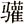

 *第十四章　学于圣人之门*

孟子说过，“观于海者难为水，游于圣人之门者难为言”。讲一个人在圣人门下听过课，就很难再对他说起别人的言论。我们学习时需要开拓眼界和心胸，取法乎上，学到最精彩的东西，让自己有不凡的见识。那么孟子有过什么样精彩的教学示范？从中我们可以得到什么样的启示和感悟呢？

# ｜爱之深，责之切｜

孟子有位好学生，叫做乐正子，这个学生固然不错，不过还是有一些问题，那么孟子怎么因材施教或者对症下药呢？

有一次，乐正子跟齐国的一位大臣王 到齐国，之后第二天才来看孟子。孟子知道他是昨天到的，今天就来看老师了，孟子居然说，你还知道来看我吗？乐正子吓了一跳，说，老师，我昨天才到，今天看您有什么不对吗？孟子说，那你昨天为什么不来看？乐正子说，昨天我旅馆还没找好，行李还没放好。孟子说，谁规定找好旅馆、放完行李之后才能看老师的？乐正子立刻说，我有错。他立刻认错了。换句话说，学生不可以安顿好了之后，现在没事了才去看老师，把老师排在后面是不对的。

当然，孟子这样要求学生，我们今天觉得很难想象。有一次我做了个实验，效果不是很好。我在学校教过一些外国学生，其中有一位女士，现在是比利时鲁汶大学汉学系的系主任。她读硕士班的时候上过我的课，后来又到我们学校开会，要离开之前她才来看我，我说，你还记得来看我吗？我学了孟子这一招。她吓了一跳，因为她对孟子兴趣不大，并不了解。她说，我以为老师会来开会，在会场能看到老师，所以就没有特别来看你，现在会议结束明天就要回国了，特地来看看老师。其实这样已经不错了，但是我心里想到孟子，就说，你还记得来看我吗？她后来就不太理我了。

>   
> 乐正子从于子敖之齐。乐正子见孟子。孟子曰：“子亦来见我乎？”曰：“先生何为出此言也？”曰：“子来几日矣？”曰：“昔者。”曰：“昔者，则我出此言也，不亦宜乎？”曰：“舍馆未定。”曰：“子闻之也，舍馆定，然后求见长者乎？”曰：“克有罪。”   
> ——《离娄上》   
>   

所以这一点不要跟古人学，因为古人一辈子恐怕只有一个老师，现在的人老师会有多少？所以有一句话很难再用了，“一日为师终身为父”，这是不可能的。很多时候老师不可单方面要求学生，要先反省自己是不是好老师，有没有好好教学生。学生如果感激你，你也要认为是多余的，自己非常幸运；学生如果不理你，应该认为是正常的，这样想心情也比较好。

孟子曾对一个学生说，没想到你读书读了半天，只是为了混一口饭吃，找个工作而已。可见孟子对这个学生爱之深责之切。一个学生能有这样的老师，自然就不太会犯错了，做事时就想到老师如何叮咛过我，老师知道之后会如何教训我。

*人总要有老师、有父母，才能够安安分分、快快乐乐地好好做人，为什么？因为上有老师和父母，自己做得好他们会很开心，觉得没白白教养我，这是很正常的想法。一个人最怕的是，老师也不在了，父母也不在了，自己要负责自己的事情。*   

# ｜温柔敦厚的诗经教育｜

有两个故事，是孟子利用《诗经》教导学生的例子。

《诗经》里有首诗叫做《小弁》，说的是什么呢？专家有不同解释，这一方面我不是专家，所以只是取其中一种。周幽王是西周的最后一位天子，他有一位太子叫做宜臼，但是后来他娶了褒姒，又生了一个儿子。他居然把太子废掉，甚至把太子杀掉。于是很多人就为太子打抱不平，写了一首诗，主题是抱怨父亲，就叫做《小弁》。可有人说，做子女的怎么可以抱怨父母亲呢？但有时父母有严重的过失，要另当别论。周幽王的过失确实严重，他宠爱褒姒，为了博她一笑，周幽王竟然下令燃起烽火，最终导致亡国。那么有人为那个太子被废甚至被杀，抱怨一下，有什么不对呢？因为做父亲的过失太大了，如果不抱怨，其实是让父亲继续犯错，当然不对。

第二首诗，叫做《凯风》。说的是有一个母亲生了七个儿子，但这个母亲还在交男朋友，有人就写诗了，说作为母亲应该记得子女的孝顺，不要再想个人的幸福。诗里描写子女怎样孝顺的事，希望这个母亲觉悟，因为自己年纪也不小了，又已经生了七个孩子。不过在古代结婚很早，也许她十八岁结婚，生了七个孩子，才三十几岁，还很年轻。《凯风》评论说，要看到子女的孝顺，一家人和和乐乐，不要再想东想西了。

孟子分析，按《小弁》这首诗所讲，这个父亲的过失太大，所以一定要抱怨，不然等于容许父亲继续犯错，对他不好，做子女的也不算尽到孝道。所谓尽孝道，有时候必然要对父母亲讲公理、正义，父母虽然不喜欢听，也该知道宁可子女劝我不要犯错，也不要将来犯错被别人笑话。比如周幽王果然犯大错了，国家亡了。孟子有时谈周幽王与周厉王，我们想一下，一个人当了天子却被封了“幽”与“厉”的谥号，“幽”代表黑暗，“厉”代表凶残，不会有国君说我要当幽王、当厉王的。孟子说，幽王与厉王死后，他的子孙再怎么孝顺，都不能改变别人给的封号。这说明祖先自己做得不好，就只能自己负责，子孙不可能改变历史。所以子女能做的倒是跟父母亲讲道理，劝告他们。

至于《凯风》之诗，那个母亲的过失并不大，只想过比较开心的生活，这时就不要抱怨了。孟子下结论说，父母的过失很大，如果不抱怨，是让父母继续犯错；父母的过失很小，如果抱怨，代表子女一点小事就跟父母计较，也是不孝，应该忍耐，甚至替父母补救过错。

>   
> 暴其民甚，则身弑国亡；不甚，则身危国削，名之曰“幽”、“厉”，虽孝子慈孙，百世不能改也。《诗》云：“殷鉴不远，在夏后之世。”此之谓也。   
> ——《离娄上》   
>   

>   
> 《凯风》，亲之过小者也；《小弁》，亲之过大者也。亲之过大而不怨，是愈疏也；亲之过小而怨，是不可矶也。愈疏，不孝也；不可矶，亦不孝也。   
> ——《告子下》   
>   

这是儒家的智慧，也是儒家的德行，是多么的温柔敦厚，就如《诗经》的教化。我们应该在很多地方体贴对方，考虑对方的各种情况，然后做一个适当的选择，做得恰到好处。

# ｜君子不可虚拘｜

有一次，孟子的学生屋庐子受到严厉的挑战。一个任国人对他说，请问，遵守社会礼仪和吃饭相比，哪个重要？你选一个。屋庐子说，当然是礼仪重要。接着再问，礼仪重要还是娶妻重要？当然是礼仪重要。任国人再问，那好，如果现在遵守礼仪就没饭吃饿死，不遵守就可以活命，你还要守礼吗？

这确实很难回答。守礼就会饿死，如果不照规矩抢东西吃，我就可以活命，这个时候还要求我守礼，好像太过分了吧。再说娶妻，照规矩就娶不到妻子，但不照规矩就可以，而娶妻子在古代是特别重要的事，因为“不孝有三，无后为大”。到底该怎么选择呢？

屋庐子不能回答。礼仪是社会规范，但饿死和娶不到妻子都很严重，为了礼仪而做这么大的牺牲，应该吗？他跑去请教孟子，孟子说，这道理很简单啊。譬如，不比较基础，只比较高度，一寸长的木头就会比一座高塔更高。为什么呢？把一寸长的木头放到塔尖上面，木头就比塔更高，那怎么比呢？一般来说金子比羽毛更重，但是三钱多的金子和一车羽毛比，哪个更重？当然是一车羽毛重。如果不讲清楚多少金子和多少羽毛，就没有比较的基础。

>   
> 任人有问屋庐子曰：“礼与食孰重？”曰：“礼重。”“色与礼孰重？”曰：“礼重。”曰：“以礼食，则饥而死；不以礼食，则得食，必以礼乎？亲迎，则不得妻；不亲迎，则得妻，必亲迎乎？”屋庐子不能对，明日之邹以告孟子。   

>   
> 孟子曰：“于答是也，何有？不揣其本，而齐其末，方寸之木可使高于岑楼。金重于羽者，岂谓一钩金与一舆羽之谓哉？取食之重者与礼之轻者而比之，奚翅食重？取色之重者与礼之轻者而比之，奚翅色重？往应之曰：‘紾兄之臂而夺之食，则得食；不紾，则不得食，则将紾之乎？逾东家墙而搂其处子，则得妻；不搂，则不得妻；则将搂之乎？’”   
> ——《告子下》   
>   

孟子接着举第二个例子，如果去扭哥哥的手就有东西吃，不扭就没有，难道我要扭哥哥的手吗？当然不行。前面说，遵守礼仪就饿死，不遵守礼仪就可以活命，后果太严重了。假设遵守礼仪就没有东西吃，但不至于饿死，那么仅仅为了吃东西就去扭哥哥的手，太无礼了。等哥哥吃完我再吃就好了。再如，只有翻过东邻的墙去偷抱别人家的处女，才能娶到妻子，那也翻墙去做吗？注意，古时候家里男孩子住东边的厢房，女孩子住西边的厢房，所以有东宫太子之称，也会出现《西厢记》这样的小说。孟子如此举例，这样做应该吗？当然不应该，需要凭父母之命、媒妁之言，嫁娶要合乎礼仪。

这是孟子的思考方法，做比较时不走极端。他的逻辑很简单：如果守礼仪就会饿死，当然先活下来再说，以后再改善再忏悔。孟子说过“君子不可虚拘”，即君子不可用虚伪的、空虚的条文来约束自己。因为规矩是人定的，也是为人而设的，如果为了守规矩而活不下去，就是本末倒置。这是儒家的思想，有原则也要有变通。

# ｜孝心如何实现｜

中国人有句老话，百善孝为先，孝是儒家的一个重点课题，但后人对此存在很多误解。比如说儒家讲孝顺，从三纲五常变成一种严格的规范，好像父母都是对的，子女必须听话，才是孝顺。其实不然，儒家态度很明确，很多父母不见得有正确的观念和行为。

当时齐国有一位将军叫做匡章，全国人都说他不孝，孟子却跟他做朋友。学生就问孟子，老师，您为什么要跟他做朋友呢？孟子说，别人说他不孝顺他就不孝顺吗？接着做了一番关于孝顺的经典议论。

匡章的父亲也是大官，但不知为了什么把匡章的母亲杀了，之后还不让安葬，就埋在马厩底下。也不知道是什么缘故，很可能是家庭纠纷，可能因为他母亲做了某些事情，让社会也不容，他父亲也受不了。不过他父亲杀了妻子之后居然没被关起来，说明他母亲确实有某些罪过，不然随便杀人是不得了的罪。但是匡章这个做儿子的当然痛苦不堪，就跟父亲说，人死为大，母亲既然过世了，好好把她安葬吧。父亲就把他赶出去，说不要管我的事。

对于父母之间的关系，做子女的有时候确实没法多说。我曾看到年轻的夫妻有个刚上幼儿园的小孩子，他们就在公开场合问孩子，你喜欢爸爸还是喜欢妈妈？小孩子这边看一眼，那边看一眼。这时我替小孩子难过，你让他怎么选择呢？我就建议他们分开问。爸爸问你喜欢爸爸还是喜欢妈妈，当然喜欢爸爸；下一次爸爸不在身边，可以回答是妈妈。这样才有活路让小孩子走。所以很多貌似有趣的事，太委屈人性了。

匡章碰到的这件事，怎么去了解父母之间的问题呢？他不能说父亲一定对，或母亲一定对。但是人死为大，他希望安葬母亲，结果还惹父亲生气，把他赶走了。之后他怎么做呢？他把自己的妻子孩子都送回娘家去了，一个人过日子。他想，我不能在旁边侍候我父亲，也就不让我的妻子孩子侍候我，只有这样才能让自己的心里好过点。对于这样的人能说他不孝吗？事实上他是努力做到孝顺的。

>   
> 公都子曰：“匡章，通国皆称不孝焉，夫子与之游，又从而礼貌之，敢问何也？”   

>   
> 孟子曰：“世俗所谓不孝者五：惰其四支，不顾父母之养，一不孝也；博弈好饮酒，不顾父母之养，二不孝也；好货财，私妻子，不顾父母之养，三不孝也；从耳目之欲，以为父母戮，四不孝也；好勇斗很，以危父母，五不孝也。章子有一于是乎？夫章子，子父责善而不相遇也。责善，朋友之道也；父子责善，贼恩之大者。夫章子，岂不欲有夫妻子母之属哉？为得罪于父，不得近，出妻屏子，终身不养焉。其设心以为不若是，是则罪之大者，是则章子而已矣。”   
> ——《离娄下》   
>   

孟子提到五种不孝。第一种就是好吃懒做，不顾父母之养；第二种是喜欢赌博，喜欢喝酒，不管奉养父母亲的事；第三种是喜欢自己存钱，把钱给妻子孩子，只注意自己的小家庭，而没有奉养父母亲。前三种不孝都是不奉养父母亲，说明古人观念里真是养儿防老。今天其实也差不多，至少养子为了老来作伴吧，生病了有子女送到医院，扶持一下。这些都很自然。现在有些年轻人被称作“啃老族”，专门啃父母亲的存款。有些人就问我对他们的意见，其实只要父母愿意，有什么不好呢？不过孩子到最后还得独立，万贯家财不如一技在身，再怎么爱护子女，让他衣食无缺，将来他还是要有一门技能，面对自己的生活和挑战。

第四种不孝，是自己放纵耳目之欲，吃喝玩乐不做好事，让父母觉得羞耻。第五种是好勇斗狠，在外面跟人家打架结仇，将父母亲陷于危险。古代很强调这一点。比如，有人在外面跟其他人打架，打赢了，别人可能会对付他的家人，半夜放一把火，那父母怎么办呢？因为好勇斗狠，危害了父母亲，自然也算不孝。

孟子说，这五种不孝匡章都没有，因为他愿意奉养父亲只是父亲不让他奉养，他也没有做坏事，也没有做危险的事。别人说他不孝只是因为他家里有问题。

孟子还说过“不孝有三，无后为大”，是另一种解释。那么“不孝有三”是哪三点呢？

第一种是对父母亲阿意屈从，陷亲不义。父母说什么子女都说好，结果父母反而做了不义的事情。儒家绝对不说“天下无不是的父母”，可以说天下父母都爱护子女，但也不见得方法都对。子女成长了、可以判断了，就要跟父母说，尽量不要犯太明显的错误。

第二种不孝，是家里很穷而父母老了，子女还不去做事、做官，让父母亲活不下去。第三种不孝才是不娶无子，绝先祖祀，让祖先的祭祀断绝了。

孟子认为“无后为大”，第三种最严重。为什么？孟子是要替舜找一个借口。舜的父亲和后母不让舜结婚，而尧是天子，天子把两个女儿嫁给舜，却没有经过舜的父亲与后母同意，这在古代是不可思议的。孟子公开谈这个，他说，如果舜向他的父母报告，他们一定不准，会说尧的两个女儿要嫁，就嫁给舜的弟弟。但是谁想嫁给舜的弟弟呢？他弟弟叫做象，是个坏蛋。可舜的父母很偏心，完全偏爱这个弟弟，而非常讨厌舜。所以，舜不告而娶，也是怕将来没有结婚没有孩子，也是不孝，不如先结婚再说。

>   
> 万章问曰：“《诗》云，‘娶妻如之何？必告父母’。信斯言也，宜莫如舜。舜之不告而娶，何也？”孟子曰：“告则不得娶。男女居室，人之大伦也。如告，则废人之大伦，以怼父母，是以不告也。”万章曰：“舜之不告而娶，则吾既得闻命矣；帝之妻舜而不告，何也？”曰：“帝亦知告焉则不得妻也。”   
> ——《万章上》   
>   

虽然有这句话，其实儒家不会勉强人。有些人没有生孩子，不是不愿意，是因为基因或身体上的问题，怎么能怪他们呢？人活在世界上，最重要的是把握自我，你的生命要自己负责，让自己向善的本性得以实现。每个人不能因为有其他成就，就推卸责任。

以上是关于不孝的观点，孟子也提出了一个孝顺的典范——曾参。

曾参是孔子的弟子，他是以孝顺出名的。但经过孟子的介绍，我们才知道什么叫真正的孝顺。

孟子说，曾参奉养父亲曾点，曾点又名曾皙。在孔子让学生谈志向的时候，一个人在那边鼓瑟，等三个同学讲完，他“鼓瑟希，铿尔。舍瑟而作，对曰，异乎三子者之撰”。我跟前面三位同学不一样，说出一段千古传诵的名言，“暮春者，春服既成，冠者五六人，童子六七人，浴乎沂，风乎舞雩，咏而归”。这是曾点的精彩杰作。

父子两代都跟孔子学习。曾参为人敦厚，因为孔子强调孝顺，就很努力地实践，他跟同学说，我可孝顺了，父亲打我我从来不跑，直到让父亲打到满意为止。孔子听到这话，有点担心，对曾参说，父亲打你，你让他打到满意为止，这不太好吧？曾参说，这难道不是孝顺吗？孔子说不是，大人出手比较重，他如果拿粗棍子一打，把你打伤了，别人又会嘲笑他。让父亲被人嘲笑，你就是不孝了。曾参问那怎么办。孔子说，父亲拿粗棍子打你就跑，反而是孝顺；父亲拿细棍子打，你就好好挨打吧，反正只是皮肉之苦。

曾参领悟了孝顺的真意，后来又有什么表现呢？孟子描写得很详细，他说曾点晚年的时候，眼睛也看不清楚了。曾参怎么孝顺呢？每一顿饭都是有酒有肉，让父亲吃得很满意，吃完之后父亲问还有剩的吗，曾参说还有，父亲就想做好事，所以曾参就主动问，剩下的酒肉父亲认为要送给谁呢？因为他们邻居有些人很穷，所以父亲就说好，今天剩下的菜送给隔壁张家吧。到下一次他又会吩咐送给李家。

这说明什么呢？父亲虽然年纪大了，也不能工作挣钱了，还是可以行善。这叫做养志，让父亲的心意得到实现的机会，这才是真正的孝顺。多年之后，曾参老了，儿子曾元也一样让他每顿饭有酒有肉，吃完之后，他问还有剩的吗，曾元回答说没有了，其实是准备下一顿热了再给父亲吃。差别就在这里。

*孟子以这祖孙三代的事例说明，曾参是真的孝顺，曾元只是奉养父亲的口体，曾参还能养志，让父亲行善的心意都能实现。这是孟子不凡的见识。从中我们也可以重新思考孝顺的真谛，会有所启示。*   

# ｜君子以友辅仁｜

人与人相处不可要求完美，因为每一个人都有缺点。当老师的也是一样，有时以为自己很大方，其实不然。

比如一个老师教了很多学生，硕士生博士生都有，他们有时希望老师对自己好一点，跑来说，老师，某某同学在背后批评你，你知道吗？老师很大方地说，背后批评的话不要理。过两天之后老师越想越不对，把学生找来问，到底谁批评我了？忍不住想知道，因为没人愿意当笨人，我对一个学生很好，他却在背后骂我。人都会有这种心理。比如，我送一本书给学生，学生却丢在一边，说有什么好的。我知道了会想，送他不是白送吗？对他好不是白好吗？有些人年轻时很可爱，长大些有学问了，就觉得老师不长进，把老师放一边，自己可以独立门户了。这样的态度确实不应该。不过如果真的比老师强了，老师倒会高兴的。

前面说孝与不孝的问题，需要注意不要用善来互相责备。那么对于老师和学生，还是要用善来互相责备，朋友之间也一定要用善来互相责备，不然就变成了酒肉之交、利害之交，吃喝玩乐而已。

真正的好朋友叫做“友直”，真诚而正直，一起相处叫做“君子以文会友，以友辅仁”。朋友之间来往，以文学艺术、文化素养互相交流，目的是互相帮助而走上人生的正路。而老师和学生见面就要问，最近有没有进步。学生向老师请教，会给老师压力，老师看到学生用功，他也会警惕。所以老师和学生、朋友和朋友之间都要互相责善。

为什么在家庭里对这一点要小心呢？一家人应以亲情为重。命中注定是一家人，就不要挑剔，不要说你这么笨，怎么可以做我的弟弟妹妹呢？我以前犯过这个错误。我父母有七个孩子，我读大学的时候一个妹妹才开始读初中，父亲对我说，你这个妹妹英文不好，做哥哥的教她吧。叫我这个大学生教妹妹“ABCD”。很奇怪，不知道为什么，我教妹妹没有耐心，要是教邻居的妹妹就很有耐心。我常常怪她说，一样的爸爸妈妈，怎么生出来这么笨的妹妹呢？结果，妹妹二三十年以来看到我就跑，她说，这个哥哥读书很厉害。就因为我教她英文时恨铁不成钢，讲过几句比较重的话，使这个妹妹和我的感情一直有点距离。我一直很内疚，觉得自己实在太幼稚了，不管聪不聪明都是自己的妹妹，又不能说不够聪明就开除，教她不要有太多压力，学多少算多少。

>   
> 公孙丑曰：“君子之不教子，何也？”孟子曰：“势不行也。教者必以正；以正不行，继之以怒。继之以怒，则反夷矣。‘夫子教我以正，夫子未出于正也’，则是父子相夷也。父子相夷，则恶矣。古者易子而教之，父子之间不责善。责善则离，离则不祥莫大焉。”   
> ——《离娄上》   
>   

对学生有耐心，对自己的弟妹反而没有，这是观念有偏差，也是修养太差。一家人相处不要勉强，不可用善来互相责备，一定要他成为圣人君子，万一不行怎么办？就算家里有一个小人，也只好接受，替他补过。伟大的舜一家四口，除了舜之外三个都是坏人，能怎么办呢？不能挑剔父亲、后母，也不能挑剔后母生的弟弟，因为是一家人。这是儒家的思想，教导我们要把做人的根本掌握住。

孟子精彩的教学示范还有很多。譬如，他提到“饥者易为食，渴者易为饮”，饥饿的人吃什么都好吃，口渴的人喝什么都好喝，没得挑了，什么都可以接受可以欣赏。我们的学习也类似。什么书都没看过的人，一旦到了书店，恐怕抓到什么书都看，这样肯定不好。因为这时的心很饥渴，会以为某本书很好，其实上当了，有些书看了只是浪费时间，所以“尽信《书》，则不如无《书》”。读书要有所判断，但这个判断是很难的，比如想分辨今天的菜好不好吃，一定要自己本身不太饥饿，慢慢分辨菜的味道是不是太咸太辣了，调味料怎么样。

我有一次到马来西亚的吉隆坡上课，当地有个朋友开中药店，也做一些药膳。他听我讲了庄子之后很开心，说，傅教授，一定要请你到我那边吃顿饭。我就和出版社的一个朋友一道去了，一坐下就给端来一大碗，说是燕窝，我就囫囵吞枣统统吃下去了，等于解渴。吃完后，出版社的朋友对我说，傅老师，刚刚那一碗燕窝你知道多少钱吗？我说，这和钱有关吗？他说，这一碗燕窝如果换算成人民币的话，大概值五千块钱。我听了真是很伤心，自己这么一下就把五千块人民币喝下去了，说，你早告诉我，折现给我多好，我不要喝这个。因为我刚刚上完课很口渴，给我燕窝和给矿泉水没有差别嘛。

读书也是一样，忽然之间想读书了，看书店介绍什么书就抓来看，却不能分辨什么是好的。我们需要让自己的心经常保持一种求知的状态，就越来越能分辨什么有价值，让自己不断地成长。

孟子说过，“孔子登东山而小鲁，登泰山而小天下”，后面是“观于海者难为水，游于圣人之门者难为言”。讲的是孔子登上东山就觉得鲁国很小；登上泰山，就会觉得天下很小了；看过大海的人，就很难再跟他说别的河流多么大，因为海最大了；一个人在圣人门下听过课，就很难跟他说别人的言论是有价值的。我们学习受教育是要开拓眼界和心胸的，你要取法乎上，学最好的，这样对于一般的东西就会判断。所以年轻时要把握时间、机会好好学习，学到最精彩的东西，将来让自己有不凡的见识。

>   
> 孟子曰：“孔子登东山而小鲁，登泰山而小天下，故观于海者难为水，游于圣人之门者难为言。观水有术，必观其澜。日月有明，容光必照焉。流水之为物也，不盈科不行；君子之志于道也，不成章不达。”   
> ——《尽心上》   
>   

