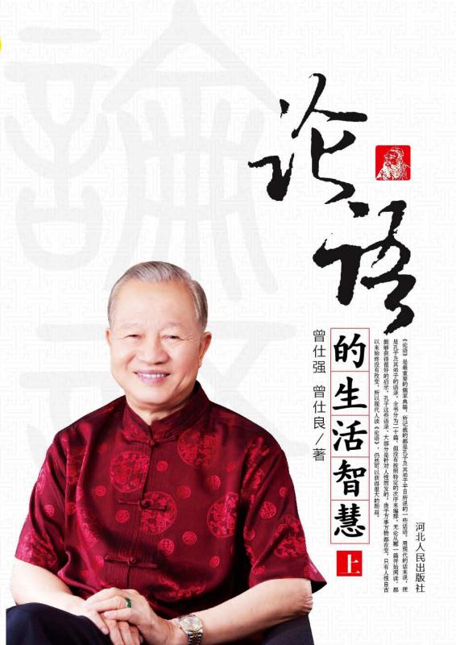
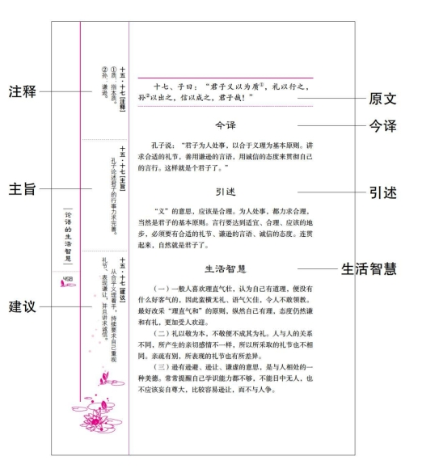

# 前言

宋代著名儒学家朱熹，选取儒家的四部重要经典，即《大学》《中庸》《论语》《孟子》，合起来称为“四书”。

《论语》是最重要的儒家典籍，所记载的都是孔子及其弟子平日所说的一些话语。用现代的话来说，便是==孔子及其弟子的语录==。

全书分为二十篇，但没有按照特定的次序来编排。无论从哪一篇开始阅读，都能够获得很好的启示。

孔子这些语录，大部分是==针对人性==而发的。由于==万事万物都在变，只有人性自古以来始终没有改变==，所以现代人读《论语》，仍然可以获得很大的助益。

==有一些针对当时某人、某事的特殊论说，由于时空的变迁，必须做出合理的调整，才能够符合现代的实际状况。== 在这些部分，我们提出若干建议，以供参考。

孔子名丘，字仲尼，==春秋时期鲁国人==，生于公元前551年，死于公元前479年，享年72岁。孔子3岁时，便失去了父亲，当时，他的母亲仅18岁。孔子24岁时，他的母亲也去世了，年仅42岁。在这么一个==孤儿寡母==的家庭里，能够培育出全人类所尊敬崇拜的导师，不得不说，母教的伟大，实在令人钦佩。

孔子学说的重心在“人”，并不在“神”，所以不重宗教，而==重视做人的道德修养==。把“儒家”说成“儒教”，相信孔子不会同意。

==孔子学说的精神在“行”，而不在“说”。== 说一大堆，不如亲自去做。所以==读《论语》，最好把《论语》的道理，践行于日常生活之中。==

只有真正践行了《论语》思想的人，才是真正了解《论语》的人。

孔子以其深邃的思想和伟大的人格魅力，掀起了一场影响世界几千年的道德自觉活动。很多==现代人重视物质生活而轻视道德修养==，重新了解《论语》的真义，应该可以归根复命，寻找心灵中光明的未来。

# 编者的话

本书是著名学者曾仕强和其弟曾仕良两位教授，关于《论语》现代应用的倾心之作。为增强读者对《论语》的理解和认知，本书对每一句原文从六个方面予以解读——==注释、主旨、今译、引述、生活智慧、建议==，以期更加贴近现代的社会状况，更好地指导我们的现实生活。

为方便读者阅读，特做图例说明如下：

据编者了解，目前所出版的《论语》方面的图书，多立足于词句的解释，如本书这般，==给出实际建议和生活应用==的为数不多。下面就请大家一起跟随曾仕强、曾仕良两位教授，穿越千年的时空，共同感受《论语》的智慧和魅力。

编者按

# 目　录

前言

编者的话

学天第一

为政第二

八佾第三

里仁第四

公冶长第五

雍也第六

述天第七

泰伯第八

子罕第九

乡党第十



