**第一卷 五帝本纪第一**

《五帝本纪》是《史记》全书一百三十篇中的第一篇。

《五帝本纪》记载的是远古传说中相继为帝的五个部落首领——黄帝、颛顼（zhuān xū）、帝喾（kù）、尧、舜的事迹，同时也记录了当时部落之间频繁的战争，以及部落联盟首领实行禅让，远古初民战猛兽、治洪水、开良田、种嘉谷、观测天文、推算历法、谱制音乐舞蹈等多方面的情况。这些虽为传说，但从人类历史发展的规律和地下文物的发掘来看，有些记载亦属言之有征，它为我们了解和研究中国远古社会，提供了某些颇有价值的线索或信息。事实上，中华民族五千年的悠久历史就是从这远古的传说开始的。黄帝和炎帝两个部落之间联合、战争，最后融为一体，在黄河流域定居繁衍，从而构成了华夏族的主干，创造了我国远古时代的灿烂文化。

五帝开创的事业是中华民族几千年文明史的开端，《五帝本纪》又是十二篇本纪的首篇。这篇本纪，在记事上确立了历史发展的根基，在写作上又为以后各篇的铺展设下了伏笔。司马迁利用了连环锁的叙写方式，一环紧扣一环。如在写尧时提出舜，而重在写尧的知人善任；写舜时一方面继续扣紧对尧的叙写，一方面又突出了对舜的刻画，同时还带出了禹、契、后稷等，为以后各篇的展开打下了基础。

五帝的传说，几千年来深深扎根于中华民族的意识深处，被当作贤君圣主的楷模历代传颂。“炎黄子孙”早已成为凝聚中华民族的亲切称呼，“人皆可以为尧舜”“六亿神州尽舜尧”也早已成为鼓励人们贤能为善的有力口号。

***【原文】***

**黄帝者**黄帝：传说为中原各民族的共同祖先。他是有熊部族（住于今河南省新郑市一带）的首领，故号有熊氏。以后，他成为中原各部族联盟的共同首领，号称黄帝。**，少典之子，姓公孙，名曰轩辕**轩辕：《汉书·律历志》说：“黄帝始垂衣裳，有轩辕之服，故天下号轩辕氏。”**。生而神灵**神灵：据神话传说，少典国君的妃子附宝在野外祈祷，见大雷电绕北斗枢星，感而怀孕，二十四个月后才在寿丘（今山东省曲阜市东北）生下黄帝。黄帝生下来便相貌出众，头额如太阳，眉宇如龙骨。**，弱**弱：年幼，又特指出生不久的婴儿。**而能言，幼而徇齐**徇齐：通“迅疾”，机灵的意思；或通“迅给”，指口才犀利。**，长而敦敏**敦：诚实。敏：勤劳敏捷。**，成而聪明。**

***【译文】***

黄帝，少典族的子孙，姓公孙，名叫轩辕。生下来就显出神灵，几个月就会说话，年少的时候就心智周遍而且口才敏捷，长大后就敦厚机敏，二十岁成年时就见多识广对事明辨了。

***【原文】***

轩辕之时，神农氏世衰[1]。诸侯相侵伐，暴虐百姓[2]，而神农氏弗能征。于是轩辕乃习用干戈，以征不享。诸侯咸来宾从[3]。而蚩尤最为暴，莫能伐。炎帝[4]欲侵陵诸侯，诸侯咸归轩辕。轩辕乃修德振兵[5]，治五气[6]，蓺五种[7]，抚万民，度四方[8]，教熊罴貔貅[9]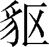虎，以与炎帝战于阪泉[10]之野。三战，然后得其志[11]。蚩尤作乱，不用帝命。于是黄帝乃征师诸侯，与蚩尤战于涿鹿之野[12]，遂禽杀蚩尤。而诸侯咸尊轩辕为天子，代神农氏，是为黄帝。天下有不顺者，黄帝从而征之，平者去之[13]。披山[14]通道，未尝宁居。

***【译文】***

[1]神农氏：传说中的古代帝王之一。世衰：指神农氏的后代衰败了。神农氏即炎帝族。

[2]百姓：郑玄注《诗经》，孔安国注《尚书》，都说“百姓”便是“百官”。

[3]咸：都。宾从：顺从；归复。

[4]炎帝：传说中的古代帝王之一。

[5]振兵：训练部队。

[6]五气：五行之气。古代以五行配四时，春为木，夏为火，季夏为土，秋为金，冬为水；亦指晴、雨、冷、热、风五种气象。

[7]蓺：耕种。五种：指黍（黄米）、稷（小米）、稻、麦、菽（豆）等谷物。

[8]度（duó）四方：规划丈量各地的土地。

[9]罴：熊的一种，又叫人熊、马熊。貔貅（pí xiū）：豹一类的猛兽。

[10]阪泉：地名。在今河北省涿鹿县东。

[10]得其志：指征服炎帝后代。

[11]涿（zhuō）鹿之野：涿鹿山前的大原野。涿鹿山在今河北省涿鹿县东南。

[12]平者去之：平定之后就率军离去。

[14]披山：开山。

***【原文】***

东至于海，登丸山[1]，及岱宗[2]。西至于空桐[3]，登鸡头[4]。南至于江，登熊、湘。北逐荤粥[5]，合符釜山[6]，而邑[7]于涿鹿之阿。迁徙往来无常处，以师兵为营卫[8]。官名皆以云命[9]，为云师。置左右大监[10]，监于万国。万国和，而鬼神山川封禅[11]与为多焉。获宝鼎、迎日推策。举风后、力牧、常先、大鸿[12]以治民。顺天地之纪[13]，幽明之占[14]，死生之说[15]，存亡之难[16]。时播百谷草木[17]，淳化鸟兽虫蛾[18]，旁罗日月星辰水波土石金玉[19]，劳勤心力耳目，节用水火材物[20]。有土德之瑞[21]，故号黄帝。

***【译文】***

[1]丸山：山名。位于今山东省昌乐县西南、临朐县东北。

[2]岱宗：即泰山。

[3]空桐：山名。在今甘肃省平凉市崆峒区西北。或作“崆峒”。

[4]鸡头：山名。或说即崆峒山，又名大垅山。

[5]荤粥（xūn yù）：部族名。即秦、汉时的匈奴。

[6]合符：验证符契。釜山：在今河北省怀来县北，一说在今保定市徐水区西，一说在今河南灵宝市境，又一说在今河南偃师市南。

[7]邑：都市。

[8]以师兵为营卫：叫军队在驻地周围筑营守卫。

[9]官名皆以云命：黄帝以云来命名官职。

[10]大监：官名。负责监察各地诸侯。

[11]封禅：古代帝王登名山，封土为坛曰封，扫地而祭曰禅，祭祀天地山川，来庆祝成功和太平。

[12]举：提拔，推举。风后、力牧、常先、大鸿：都是黄帝的大臣名。

[13]天地之纪：天地四季运行的程序或规律。

[14]幽明之占：对于阴阳变化的占卜。幽，指阴；明，指阳。

[15]死生之说：养生送死的仪制。

[16]存亡之难：国家存亡的规律。难，犹“说”。

[17]时播：按季节播种。或曰“时”通“莳”（shì），栽种。

[18]淳化：驯养。虫蛾：指蚕。传说黄帝的正妃嫘祖教民养蚕、缫丝、织帛。

[19]“旁罗”句：指黄帝广泛地观察日月星辰的运行和水流、土石、金玉的性能，使它们为人所利用。罗，观察，研究。或认为“旁罗”是一种测天的仪器。

[20]“节用”句：指爱护山林水产，按规定收采捕捉，节约用度。

[21]瑞：祥瑞，吉利的兆头。古代有以五行（木、火、土、金、水）配五色的说法。传说黄帝在位时有黄龙地螾（蚯蚓）出现，故有“土德之瑞”。

***【原文】***

黄帝二十五子，其得姓[1]者十四人。

黄帝居轩辕之丘[2]，而娶于西陵之女，是为嫘祖[3]。嫘祖为黄帝正妃，生二子，其后皆有天下[4]。其一曰玄嚣，是为青阳，青阳降居江水[5]；其二曰昌意，降居若水[6]。昌意娶蜀山氏[7]女，曰昌仆，生高阳，高阳有圣德焉。黄帝崩，葬桥山[8]。其孙昌意之子高阳立，是为帝颛顼也。

***【译文】***

[1]姓：表明家族系统的称号。得姓，即由子孙繁衍而发展成为独立氏族。

[2]轩辕之丘：地名。或说在今河南省新郑市西北。因黄帝居住在这里，故名。

[3]西陵：部族名。嫘（léi）祖：黄帝正妃。据说她发明养蚕。

[4]正妃：嫡妻。其后皆有天下：指黄帝的后代，都成为天下的君主。如颛顼和舜，都是昌意的后代；帝喾和尧，都是玄嚣的子孙后代。

[5]玄嚣（xiāo）：黄帝长子，号青阳。有的史书认为青阳（少昊）与玄嚣是两个人，都是黄帝的儿子。降居：下封为诸侯。江水：指江国。在今河南省安阳县。

[6]若水：地名。在今四川省。一说为水名，即今四川省雅砻江。

[7]蜀山氏：上古部族名。

[8]桥山：山名。在今陕西省黄陵县西北。

***【原文】***

帝颛顼高阳者[1]，黄帝之孙而昌意之子也。静渊[2]以有谋，疏通[3]而知事；养材以任地[4]，载时以象天[5]，依鬼神以制义[6]，治气以教化[7]，絜[8]诚以祭祀。北至于幽陵[9]，南至于交阯[10]，西至于流沙[11]，东至于蟠木。动静之物[12]，大小之神[13]，日月所照，莫不砥属[14]。

***【译文】***

[1]颛顼（zhuān xū）：传说中的古代部族头领名，号高阳氏。高阳：聚邑名，在今河南省杞县西，是颛顼部族所兴起的地方。得天下后便用作号。

[2]静渊：镇定自若。

[3]疏通：通达，有远见。

[4]养材：生产物质财富。任地：开发土地。

[5]载时以象天：按季节行事来顺应自然。

[6]依鬼神以制义：信奉鬼神并制定礼仪。古代迷信鬼神，认为鬼神是聪明正直的，所以信奉它，并依从它的启示来规范人的行为。

[7]治气以教化：用教化来陶冶人民的气质。

[8]絜：通“洁”。古人祭祀鬼神前要斋戒沐浴，清洁身心，以表示敬意。

[9]幽陵：即幽州。今河北省东北部与辽宁省西南部一带。

[10]交阯：阯，亦作“趾”。古地区名，泛指今五岭以南和越南北部地区。

[11]流沙：即古流沙泽，后称居延泽、居延海。由于淤塞，今分为两个湖（内蒙古的苏古诺尔湖和嘎顺诺尔湖）。

[12]动静之物：指动物与植物。

[13]大小之神：国中的大小神祇。大神指四岳（泰山、华山、衡山、恒山）和四渎（长江、黄河、淮河、济水）等名山大川之神，小神指小山小河之神。

[14]砥（dǐ）属：指四方都平服归属。砥，平定。

***【原文】***

帝颛顼生子曰穷蝉[1]。颛顼崩[2]，而玄嚣之孙高辛立，是为帝喾。

***【译文】***

[1]穷蝉：《世本》作“穷系”。

[2]颛顼崩：《帝王世纪》说：颛顼在位七十八年，年九十八。

***【原文】***

帝喾高辛[1]者，黄帝之曾孙也。高辛父曰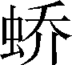极，极父曰玄嚣，玄嚣父曰黄帝。自玄嚣与极皆不得在位，至高辛即帝位[2]。高辛于颛顼为族子[3]。

***【译文】***

[1]帝喾（kù）高辛：喾是名，高辛是他兴起的地方（部族所在地），得天下后用作号。

[2]《帝王世纪》说，帝喾即位后都亳（bó），在今河南省偃师市境内。

[3]族子：侄子。

***【原文】***

高辛生而神灵，自言其名[1]。普施利物，不于其身。聪以知远，明以察微。顺天之义，知民之急[2]。仁而威，惠而信，修身而天下服。取地之材而节用之，抚教万民而利诲[3]之，历日月而迎送之[4]，明鬼神而敬事之。其色郁郁，其德嶷嶷[5]，其动也时，其服也士[6]。帝喾溉执中而遍天下[7]。日月所照，风雨所至，莫不从服。

***【译文】***

[1]自言其名：生下来便叫出自己的名字。

[2]顺天之义，知民之急：效法上天的德义，了解民众的迫切需要。

[3]利诲：因势利导。

[4]历日月而迎送之：根据日月运行制作历法来推算季节朔望。

[5]郁郁：通“穆穆”。端庄和悦的样子。嶷嶷：高峻的样子。指品德高尚。

[6]其服也士：衣着俭朴，像一般士人一样。

[7]溉执中而遍天下：指帝喾行政公平而不偏颇，使普天下都得到好处。中：中道，处理事情恰如其分。溉：或曰通“概”，平斗斛的木推，引申为公平；或曰如水灌溉，公平均一。

***【原文】***

帝喾娶陈锋氏[1]女，生放勋；娶娵訾氏[2]女，生挚。帝喾崩，而挚代立。帝挚立，不善[3]，而弟放勋立，是为帝尧。

***【译文】***

[1]陈锋氏：部族名。

[2]娵訾（jū zī）：部族名。

[3]不善：古本作“不著”。指帝挚在位无明显的政绩。

***【原文】***

帝尧[1]者，放勋。其仁如天，其知如神[2]。就之如日[3]，望之如云[4]。富而不骄，贵而不舒[5]。黄收纯衣[6]，彤车乘白马。能明驯德[7]，以亲九族[8]。九族既睦，便章[9]百姓。百姓昭明，合和万国。

***【译文】***

[1]尧：古代传说中的著名帝王。实为父系氏族社会后期（即禅让时期）部落联盟首领。号放勋，称陶唐氏，又称伊祁氏。

[2]知：通“智”。

[3]就之如日：形容其为人们所倾慕，就像人们想依附太阳一样。

[4]望之如云：形容其恩德就像云雨滋润万物一样，为人们所敬仰。

[5]舒：松懈；傲慢。

[6]黄收：黄色的帽子。收：古代帽子名。纯，一作才，通“缁”，黑色。又王引之《经义述闻》谓“纯”，当读“黗”（tún），黄浊色。故纯衣当为深黄色衣服。

[7]明：修明。驯德：恭顺高尚的品德。

[8]九族：指同族九代人，从自身算起，上推到四世高祖，下推至四世玄孙；一说指父族四，母族三，妻族二。

[9]便（pián）章：辨别明暗。

***【原文】***

乃命羲、和[1]，敬顺昊[2]天，数法日月星辰[3]，敬授民时[4]。分命羲仲，居郁夷[5]，曰旸谷[6]。敬道日出[7]，便程东作。日中，星鸟，以殷中春[8]。其民析[9]，鸟兽字微。申命羲叔，居南交[10]。便程南为，敬致[11]。日永，星火，以正中夏[12]。其民因[13]，鸟兽希革[14]。申命和仲，居西土，曰昧谷[15]。敬道日入，便程西成[16]。夜中，星虚，以正中秋[17]。其民夷易[18]，鸟兽毛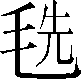[19]。申命和叔，居北方，曰幽都[20]。便在伏物[21]。日短，星昴，以正中冬[22]。其民燠[23]，鸟兽氄[24]毛。岁三百六十六日，以闰月正四时。信饬百官[25]，众功皆兴。

***【译文】***

[1]羲、和：羲氏、和氏。羲、和两部族都是世代掌管季节时令的，所以尧分别任命羲仲、羲叔、和仲、和叔掌管四方的季节时令。

[2]昊（hào）：深远广阔。

[3]数法日月星辰：观察日月星辰的运行来制定历数。

[4]敬授民时：慎重地教给民众农事季节。

[5]郁夷：极东的地方。

[6]旸（yánɡ）谷：传说是太阳升起的地方，或作“汤谷”。

[7]敬道日出：恭敬地迎接朝阳升起。日出，指春天的朝阳。

[8]日中，星鸟，以殷中春：指确定仲春的节候（春分）。日中：春分时昼夜一般长，故称日中（中指昼夜平分）。星鸟：观察鸟星。

[9]析：分散，分工。男女老幼各干各的农活；或说是分散到田野里干农活。

[10]微：通“尾”，交尾。申：重，又。南交：南方最远的边境。或说即古交阯。

[11]便程南为：有计划地分配夏天的农事；或说指辨别测定日道向南移动的时刻。敬致：恭敬地办事以获得成功；或说是恭敬地祭日而记下日影的长短，即所谓“昼测日影”。

[12]日永，星火，以正中夏：指确定仲夏的节候（夏至）。日永：夏至白昼最长。火：夏至黄昏时刻，见于中天的苍龙七宿中的“心宿”，特指其中的主星“大火”，又名商星。不是行星之一的火星。

[13]因：沿袭，指继续在田野里干农活。

[14]希革：夏天，鸟兽换毛，皮上羽毛稀少。希，通“稀”。

[15]昧谷：西方日落的地方。日落而天下昏黑，故曰昧谷。

[16]敬道日入：恭敬地送太阳落土。西成：安排好秋天收成的农事，或说指辨别测定日落时刻。

[17]夜中，星虚，以正中秋：指确定仲秋的节候（秋分）。夜中：秋分时昼夜一般长。

[18]夷易：舒适快乐。秋天丰收了，气候又凉爽，所以民众生活愉快。

[19]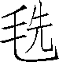（xiǎn）：鸟兽更生新毛。

[20]幽都：北方地名。

[21]便在伏物：注意安排好冬天积蓄储藏的事。在，有专注的意思。

[22]日短，星昴（mǎo），以正中冬：指确定仲冬的节候（冬至）。日短：冬至白昼最短。昴：冬至黄昏时刻见于中天的有白虎七宿，星昴指其中的第四星“昴宿”。

[23]燠（yù）：暖和。指人们穿上冬装，在屋子里避寒。

[24]氄（rǒnɡ）：细软的毛。指寒冬鸟兽都密密地生长出细软的毛。

[25]信饬（chì）百官：按时命令主管各种事务的官员。

***【原文】***

尧曰：“谁可顺此事[1]？”放齐曰：“嗣子丹朱开明[2]。”尧曰：“吁[3]！顽凶，不用。”尧又曰：“谁可者？”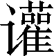兜曰：“共工旁聚布功[4]，可用。”尧曰：“共工善言，其用僻，似恭漫天[5]，不可。”尧又曰：“嗟，四岳[6]！汤汤洪水滔天，浩浩怀山襄陵[7]。下民其忧，有能使治者？”皆曰：“鲧[8]可。”尧曰：“鲧负命毁族[9]，不可。”岳曰：“异哉！试不可用而已。”尧于是听岳用鲧。九岁，功用不成[10]。

***【译文】***

[1]顺：继承。此事：指治理国家的大事。

[2]放齐：尧的大臣。嗣子：父亲的继承人。丹朱：尧的嫡长子。

[3]吁（xū）：感叹词。

[4]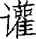兜（huān dōu）：尧的大臣。共工：人名；担任工师，或说担任水官。旁聚布功：广泛地聚集民众，开展各项事业；或说指防治水灾。

[5]用僻：办事乖僻无能，或解释为用意邪僻。似恭漫天：外貌好像恭顺，内心却骄傲。漫天，连对上天都怠慢不恭。

[6]四岳：分掌四方的诸侯首领。或认为四岳即太岳，为官名；或认为四岳即上文讲到的羲仲、羲叔、和仲、和叔。

[7]汤汤（旧读shānɡ shānɡ）：即“荡荡”，水波奔腾的样子。怀山：包裹山岭。襄陵：淹没高地。襄，上升。

[8]鲧（ɡǔn）：人名。夏禹的父亲。

[9]负命：违背教化命令。毁族：毁败同类的人。

[10]九岁：另本作“九载”。《尔雅·释天》云：“载，岁也。夏曰祀，周曰年，唐虞曰载。”功用不成：没有成就。指水害没有治好。

***【原文】***

尧曰：“嗟！四岳！朕在位七十载，汝能庸命，践朕位[1]？”岳应曰：“鄙德，忝[2]帝位。”尧曰：“悉举贵戚及疏远隐匿者[3]。”众皆言于尧曰：“有矜在民间[4]，曰虞舜。”尧曰：“然，朕闻之[5]。其何如？”岳曰：“盲者子。父顽，母嚚[6]，弟傲，能和以孝，烝烝治，不至奸[7]。”尧曰：“吾其试哉！”于是尧妻之二女，观其德于二女。舜饬下二女于妫汭[8]，如妇礼。尧善之，乃使舜慎和五典[9]，五典能从；乃遍入百官，百官时序[10]；宾于四门，四门穆穆，诸侯远方宾客皆敬[11]。尧使舜入山林川泽，暴风雷雨，舜行不迷[12]。尧以为圣，召舜曰：“女谋事至而言可绩[13]，三年矣。女登帝位。”舜让于德不怿[14]。正月上日[15]，舜受终于文祖[16]。文祖者，尧大祖也[17]。

***【译文】***

[1]庸命：用命；执行命令，忠于职守。践朕位：指继位作天子。

[2]鄙德：德行浅薄。忝：辱没。

[3]贵戚：显贵；亲近。疏远隐匿者：指地位低名声小的人。

[4]矜（ɡuān）：通“鳏”，无妻的男子。

[5]朕闻之：说给我听听；或理解为我听说过。

[6]嚚（yín）：内心险恶，爱说坏话。

[7]烝烝：上进，做好事。奸：干坏事。

[8]饬下二女：命令二女放下身份。妫：水名。黄河支流，源出于山西省历山，西流至蒲州入黄河。汭（ruì）：河道弯曲处或河流的北岸；有人认为汭也是水名，与妫水合流后进入黄河。

[9]五典：即五教，指父义、母慈、兄友、弟恭、子孝等伦理道德。

[10]遍入百官：总领百官职事。序：工作井井有条。

[11]宾：用如动词，迎接朝见的诸侯和远方的宾客。诸侯是隶属于中央的；远方宾客是没有隶属关系的异国客人。四门：明堂（天子朝会诸侯的地方）的四方之门。穆穆：庄敬肃穆的样子。

[12]入山林川泽：视察山林水泽。

[13]至：周到。言可绩：说了便能做到。绩：功效。这里用如动词，奏效。

[14]舜让于德不怿：舜用道德不能使人悦服来推辞。或断为：“舜让于德，不怿。”不怿（yì）：不悦，不愿继承帝位。

[15]上日：朔日；初一。

[16]受终：接受尧的禅让。文祖：帝尧的祖庙。文祖是对祖先的美称。

[17]大祖：即太祖，开国皇帝。

***【原文】***

于是，帝尧老，命舜摄行天子之政，以观天命[1]。舜乃在璇玑玉衡[2]，以齐七政[3]。遂类于上帝[4]，禋[5]于六宗，望于山川[6]，辩于群神[7]。揖五瑞[8]，择吉月日，见四岳诸牧，班瑞[9]。岁二月，东巡狩[10]，至于岱宗，祡[11]，望秩[12]于山川。遂见东方君长[13]，合时月，正日，同律度量衡[14]，修五礼[15]、五玉、三帛、二生、一死为挚[16]。如五器[17]，卒乃复[18]。五月，南巡狩；八月，西巡狩；十一月，北巡狩：皆如初。归，至于祖祢庙，用特牛礼[19]。五岁一巡狩，群后四朝[20]。遍告以言[21]，明试以功[22]，车服以庸[23]。肇十有二州[24]，决川[25]。象以典刑[26]，流宥五刑[27]，鞭作官刑[28]，扑作教刑[29]，金作赎刑[30]。眚灾过，赦[31]；怙终贼，刑[32]。钦哉，钦哉，唯刑之静哉[33]。

***【译文】***

[1]观天命：古人迷信天意。

[2]在：专注地观察。璇（xuán）玑玉衡：用玉装饰的观察天文的仪器（类似后世的浑天仪）。

[3]齐：整齐；规正。七政：指日月五星（金、木、水、火、土）。齐七政，即观察日月星辰来校正历法。或认为“七政”指下面讲的祭祀、班瑞、东巡、南巡、西巡、北巡、归祖七件政事。

[4]类于上帝：举行特殊祭礼，把事类报告上天。类，祭祀名。

[5]禋（yīn）：祭祀名。把祭品放在火上烧，使香味随烟上达于天，故名禋。

[6]望：祭祀名，遥望名山大川举行祭祀活动。

[7]辩：通“遍”，普遍地祭祀。

[8]揖：通“辑”，收回。五瑞：公、侯、伯、子、男五等爵位的诸侯所执的瑞信。

[9]见：召见。诸牧：各地长官；诸侯。班：颁发，将所取瑞信再颁发给诸侯。

[10]巡狩（shòu）：帝王巡察各地，检查诸侯政绩。

[11]祡（chái）：作“柴”，祭祀名。烧柴焚燎来祭祀天神。

[12]望秩：按次序遥祭。秩，次序，等级。

[13]君长：指诸侯（部族首领）。

[14]同：统一。律：音律。古代音乐用竹管定音，分十二律。度：长度（丈、尺等）。量：容量（斗、斛等）。衡：重量（斤、两等）。

[15]五礼：指吉礼（用于祭祀）、凶礼（用于丧葬）、宾礼（用于礼宾）、军礼（用于军事）和嘉礼（用于冠婚）。修明五礼是为了统一全国的风俗习惯。或说“五礼”指五等爵位诸侯的朝聘之礼。

[16]五玉：即“五瑞”。三帛：三种不同质地色彩的丝帛，挚：通“贽”，拜见时的礼物。

[17]五器：即五玉。器，玉器。

[18]卒乃复：礼仪完毕后便还给进见者，作为下次进见之用。

[19]祖祢（nǐ）：即文祖，指尧的始祖庙。何休说：“生曰父，死曰考，庙曰祢。”特牛礼：以一头公牛作祭品的祭礼。

[20]五岁一巡狩，群后四朝：五年当中，天子到各方巡视一次，其间四年，四方诸侯分别来京朝见一次。后：君长。此处指诸侯。

[21]遍告以言：诸侯普遍向天子报告治理天下的情况；亦可解释为天子向各方诸侯宣布治理国家的意见。

[22]明试以功：天子公开地考察检验诸侯的功绩。

[23]车服以庸：对于政绩卓著的诸侯，则用车服作赏赐。庸，慰劳。

[24]肇（zhào）：开始，这里指开始建立。

[25]川：疏通河道。

[26]象以典刑：把正常的刑律刻在器物上。象，刻画。典，常。有人把“象”解释为刑罚的象征性，即并没有真正受到刑罚的人，或处罚较轻。

[27]流宥五刑：用流放的办法来从宽处理因无知而触犯五刑的人。流：流放。宥（yòu）：宽恕；从宽发落。

[28]鞭作官刑：官府中用皮鞭施刑。

[29]扑作教刑：学校中犯法者，用扑（夏木或楚木做的戒尺一类的刑具）惩罚。

[30]金作赎刑：用金钱赎罪。

[31]眚（shěnɡ）灾过，赦：因无心或灾害造成的过失，则赦免。

[32]怙（hù）终贼，刑：坚持并多次作恶，便施以刑罚。怙：倚仗；坚持。终：终不改悔。贼：残贼，作恶。或认为“贼”通“则”，断句为：“怙终贼（则）刑。”

[33]钦：慎重的意思。唯刑之静：静刑，希望用刑得当。

***【原文】***

兜进言共工，尧曰“不可”，而试之工师，共工果淫辟[1]。四岳举鲧治鸿水，尧以为不可，岳强请试之，试之而无功，故百姓不便。三苗[2]在江淮、荆州数为乱。于是舜归而言于帝[3]，请流共工于幽陵，以变北狄；放兜于崇山[4]，以变南蛮；迁三苗于三危[5]，以变西戎；殛[6]鲧于羽山，以变东夷[7]。四罪而天下咸服。

***【译文】***

[1]进言：上奏推荐。试之工师：试用共工做工师（管理工程建筑的官）。淫辟：骄横邪恶。

[2]三苗：南方的一个部族，散居于今湘、鄂、赣、皖毗邻地区，可能是苗族的祖先。

[3]归：巡狩归来。帝：指帝尧。

[4]崇山：在今湖南省张家界市永定区西南；或说在今广西壮族自治区西林县、凌云县一带。

[5]三危：山名。在今甘肃省敦煌市东。

[6]殛（jí）：这里和“流”“放”“迁”同义，动词变化运用，都是流放的意思。

[7]东夷：夷、蛮、戎、狄，都是古代对东南西北四方的部族或少数民族的称呼。

***【原文】***

尧立七十年得舜；二十年而老，令舜摄行天子之政，荐之于天[1]。尧辟位[2]凡二十八年而崩。百姓悲哀，如丧父母。三年，四方莫举乐，以思尧[3]。尧知子丹朱之不肖[4]，不足授天下，于是乃权授舜。授舜，则天下得其利而丹朱病[5]；授丹朱，则天下病而丹朱得其利。尧曰：“终不以天下之病而利一人。”而卒授舜以天下。尧崩，三年之丧毕，舜让辟丹朱于南河[6]之南。诸侯朝觐者不之丹朱而之舜，狱讼者不之丹朱而之舜，讴歌者不讴歌丹朱而讴歌舜。舜曰：“天也！”夫而后之中国[7]践天子位焉，是为帝舜。

***【译文】***

[1]荐之于天：向上天推荐舜，参看前“观天命”注。

[2]辟位：退位；退让帝位。辟，通“避”。

[3]自“帝尧者，放勋”至此，多引自《尚书·尧典》与《尚书·舜典》。

[4]不肖（xiào）：不相似，一般指子弟品行不好，不似父兄。此处指尧知丹朱不像自己，即不贤。

[5]病：与利对举，指有害，困窘。

[6]南河：此指黄河自潼关以下西东流向的一段。

[7]中国：此指国都之中。

***【原文】***

虞舜者，名曰重华[1]。重华父曰瞽叟[2]，瞽叟父曰桥牛，桥牛父曰句望，句望父曰敬康，敬康父曰穷蝉，穷蝉父曰帝颛顼，颛顼父曰昌意，以至舜七世矣。自从穷蝉以至帝舜，皆微为庶人。

***【译文】***

[1]虞：传说中的部落名，即有虞氏。舜：传说中父系氏族社会部落联盟的领袖。重华：舜名。据说舜目为重瞳子，故号重华。

[2]瞽（ɡǔ）叟：舜父名。瞽是眼瞎的意思，结合前文“盲者子”看，瞽叟是个盲人。

***【原文】***

舜父瞽叟盲，而舜母[1]死。瞽叟更娶妻而生象，象傲。瞽叟爱后妻子，常欲杀舜，舜避逃；及有小过，则受罪。顺事父及后母与弟，日以笃谨，匪有解。

***【译文】***

[1]母：《帝王世纪》说舜母名握登，生舜于姚墟，因而舜姓姚。

***【原文】***

舜，冀州[1]之人也。舜耕历山[2]，渔雷泽[3]，陶[4]河滨，作什器于寿丘[5]，就时于负夏[6]。舜父瞽叟顽，母嚚，弟象傲，皆欲杀舜。舜顺适不失子道，兄弟孝慈[7]。欲杀，不可得；即求，尝在侧[8]。

***【译文】***

[1]冀州：古九州之一。相当于今山西、河南北部、河北省大部及辽宁西部。

[2]历山：山名。

[3]雷泽：一名雷水。古泽名。在今山西省永济市南。

[4]陶：烧窑，代指陶器。

[5]什器：饮食器皿。寿丘：在今山东省曲阜市东北。

[6]就时：乘时。乘时逐利，即作生意。负夏：邑名。在今山东省济宁市兖州区北。

[7]兄弟孝慈：对弟弟尽兄长之道，对父母尽孝道。为两个动宾结构。

[8]不可得：找不到机会。即：假如。侧：指身边。

***【原文】***

舜年二十以孝闻。三十而帝尧问可用者，四岳咸荐虞舜，曰可。于是尧乃以二女妻舜以观其内，使九男与处以观其外。舜居妫汭，内行弥谨，尧二女不敢以贵骄事舜亲戚[1]，甚有妇道。尧九男皆益笃。舜耕历山，历山之人皆让畔[2]；渔雷泽，雷泽上人皆让居；陶河滨，河滨器皆不苦窳[3]。一年而所居成聚，二年成邑，三年成都[4]。尧乃赐舜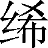[5]衣，与琴，为筑仓廪，予牛羊。瞽叟尚复欲杀之，使舜上涂[6]廪，瞽叟从下纵火焚廪。舜乃以两笠自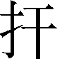而下，去，得不死。后瞽叟又使舜穿井，舜穿井为匿空，旁出[7]；舜既入深，瞽叟与象共下土实井，舜从匿空出，去。瞽叟、象喜，以舜为已死。象曰：“本谋者象。”象与其父母分，于是曰：“舜妻尧二女与琴，象取之。牛羊、仓廪予父母。”象乃止[8]舜宫居，鼓其琴。舜往见之。象鄂不怿[9]，曰：“我思舜正郁陶[10]。”舜曰：“然，尔其庶矣[11]！”舜复事瞽叟爱弟弥谨。于是尧乃试舜五典、百官，皆治。

***【译文】***

[1]内行：家内的行为。弥：更加。亲戚：指父母及兄弟姊妹。

[2]畔：田地的边界。

[3]苦窳（yǔ）：粗劣。

[4]聚：村落。邑、都：集镇、都市。

[5]（chī）：用葛纤维制成的细布。

[6]涂：涂抹；修理。

[7]匿空：在井壁上打的洞。旁出：从井壁旁通向外面。

[8]止：留居。

[9]鄂：通“愕”，惊讶。不怿：不高兴，这里有难为情的意思。

[10]郁陶：忧愁痛苦。

[11]尔其庶矣：你已经不错了（形容舜毫不介意）。庶：庶几；差不多。

***【原文】***

昔高阳氏有才子八人，世得其利，谓之“八恺[1]”。高辛氏有才子八人，世谓之“八元[2]”。此十六族[3]者，世济其美，不陨其名[4]。至于尧，尧未能举。舜举八恺，使主后土[5]，以揆[6]百事，莫不时序。举八元，使布五教于四方，父义，母慈，兄友，弟恭，子孝；内平外成[7]。

***【译文】***

[1]高阳氏：指颛顼的后代。恺（kǎi）：和善。

[2]高辛氏：指帝喾的后代。元：善良。

[3]十六族：指上述十六人的后代繁衍，形成十六个氏族。

[4]世济其美：世世代代都能成就他们的美德。济：成就；保全。不陨其名：陨（yǔn），坠落。没有损伤过他们祖先的美好名声。

[5]后土：掌管水土。

[6]揆（kuí）：管理；计划安排。

[7]内平：指诸侯各族（国内）团结安定。外成：指边境外族向往教化，归复华夏。

***【原文】***

昔帝鸿氏[1]有不才子，掩义隐贼[2]，好行凶慝，天下谓之“浑沌”[3]。少皞氏[4]有不才子，毁信恶忠，崇饰恶言[5]，天下谓之“穷奇”[6]。颛顼氏有不才子，不可教训，不知话言[7]，天下谓之“梼杌”[8]。此三族世忧之。至于尧，尧未能去。缙云氏[9]有不才子，贪于饮食，冒于货贿[10]，天下谓之“饕餮”[11]。天下恶之，比之三凶。舜宾于四门[12]，乃流四凶族，迁于四裔[13]，以御螭魅[14]，于是四门辟，言毋[15]凶人也。

***【译文】***

[1]帝鸿氏：即黄帝族。

[2]掩义隐贼：包庇奸邪。义，通“俄”，奸邪。

[3]浑沌：不开化、野蛮无序的意思。

[4]少皞（hào）氏：黄帝以后的一位帝王，又称金天氏。

[5]毁信恶忠：毁坏信义，憎恶忠直。崇饰恶言：宣扬和粉饰各种恶言恶语。

[6]穷奇：极其怪僻的意思。

[7]话言：指善长言辞。

[8]梼杌（táo wù）：顽凶无比的样子。

[9]缙云氏：炎帝的后代。黄帝时任缙云（赤云）之官。

[10]冒于货贿：贪恋财物。冒，贪。

[11]饕餮（tāo tiè）：贪婪的样子。

[12]舜宾于四门：舜在四门主持接待四方宾客。

[13]裔：衣边。引申为边远的地方。

[14]以御螭魅（chī mèi）：用以杜绝坏人坏事。含惩一儆百的意思。螭魅，传说为山林中害人的怪物，这里比喻坏人。

[15]四门辟：四门畅通无阻。辟，开。毋：通“无”。

***【原文】***

舜入于大麓[1]，烈风雷雨不迷，尧乃知舜之足授天下。尧老，使舜摄行天子政，巡狩。舜得举用事二十年，而尧使摄政。摄政八年而尧崩。三年丧毕，让丹朱，天下归舜。而禹、皋陶、契、后稷、伯夷、夔、龙、倕、益、彭祖，自尧时而皆举用，未有分职。于是舜乃至于文祖，谋于四岳，辟四门，明通四方耳目，命十二牧论帝德[2]：行厚德，远佞人，则蛮夷率服[3]。舜谓四岳曰：“有能奋庸美[4]尧之事者，使居官相事。”皆曰：“伯禹为司空[5]，可美帝功。”舜曰：“嗟，然！禹，汝平水土，维是勉哉！”禹拜稽首[6]，让于稷、契与皋陶。舜曰：“然，往矣！”舜曰：“弃，黎民始饥，汝后稷播时[7]百谷。”舜曰：“契，百姓不亲，五品[8]不驯，汝为司徒，而敬敷五教，在宽[9]。”舜曰：“皋陶，蛮夷猾夏[10]，寇贼奸轨[11]，汝作士[12]。五刑有服，五服[13]三就；五流有度，五度三居[14]。维明能信[15]。”舜曰：“谁能驯予工[16]？”皆曰垂可。于是以垂为共工[17]。舜曰：“谁能驯予上下[18]草木鸟兽？”皆曰益可。于是以益为朕虞[19]。益拜稽首，让于诸臣朱虎、熊罴[20]。舜曰：“往矣，汝谐[21]。”遂以朱虎、熊罴为佐。舜曰：“嗟！四岳，有能典朕三礼[22]？”皆曰伯夷可。舜曰：“嗟！伯夷，以汝为秩宗[23]。夙夜[24]维敬，直哉维静絜[25]。”伯夷让夔、龙。舜曰：“然。以夔为典乐[26]，教稚子[27]，直而温，宽而栗，刚而毋虐，简而毋傲；诗言意，歌长言[28]，声依永，律和声[29]，八音能谐[30]，毋相夺伦，神人以和。”夔曰：“於！予击石拊石，百兽率舞[31]。”舜曰：“龙，朕畏忌谗说殄伪[32]，振惊朕众。命汝为纳言[33]，夙夜出入[34]朕命，惟信。”舜曰：“嗟！女二十有二人[35]敬哉。惟时相天事[36]。”三岁一考功，三考绌陟[37]，远近众功咸兴。分北三苗[38]。

***【译文】***

[1]大麓：深山密林。

[2]明通四方耳目：使自己对四方的事无所不明白，无所不知。十二牧：十二州的长官。论帝德：讨论帝王应有的德行。

[3]厚：宽厚，仁慈。蛮夷：古代称南方民族为蛮，东方的为夷。这里泛指四方的部族。率服：相率归服。

[4]奋：奋发。庸：用；执行天命。美：作动词用，有发扬光大的意思。

[5]司空：掌平治水土的官。

[6]稽（qǐ）首：叩头致敬。

[7]弃：即前面说的“稷”，又叫“后稷”（事见《周本纪》）。后稷：掌管农事的官。时：通“莳”，种植。

[8]五品：即五伦，指君臣、父子、夫妇、兄弟、朋友五种伦常关系。

[9]司徒：掌管教化的官。敷：布，传播。在宽：注意宽和，即逐渐感化，不过激。

[10]猾：扰乱，侵犯。

[11]寇贼奸轨：指坏人作恶。抢东西叫寇；杀人叫贼。奸，在内作恶；轨，通“宄”，在外作恶。

[12]士：狱官（掌管刑法的官）之长。

[13]服：服从，指判处五刑时轻重适中。

[14]五流：五刑改为流放，仍分五等。即前文“流宥五刑”之意。度：指流放处所；《尚书》作“宅”。三居：三等流放区。大罪流放到四裔（四方边境）之外，次罪流放到九州之外，再次罪流放到国都之外。

[15]维明能信：明白宣布罪行，便能使人信服。

[16]工：百工，如金工、木工、石工、陶工等。

[17]共工：管理百工的官名。

[18]上：指高原山林。下：指低地川泽。

[19]虞：管理山林川泽的官。“朕”字用第一人称口气。

[20]朱虎、熊罴：人名。

[21]谐：合适。

[22]典：主管。三礼：祭天神、祭地祇（qí）、祭鬼的三种礼仪。

[23]秩宗：主管祭祀的礼官。

[24]夙夜：朝朝暮暮。

[25]直：正直。静絜：公正而清明。

[26]典乐：掌管音乐的官。

[27]稚子：小孩子，特指贵族子弟。《尚书》作“胄（zhòu）子”。

[28]诗言意：诗表达思想感情。歌长言：歌是能唱的诗。长言即拖长节拍。

[29]声依永：乐声要依照拖长了的歌词。永，长。律和声：用音律来使歌声协调。古代按乐声高低分为十二律吕。

[30]谐：和谐。八音：指各种乐器发出的声音。

[31]拊（fǔ）：拍打。百兽：各种兽类。率：相随；顺从。百兽率舞谓各种兽类顺着击磬的节拍跳起舞来。

[32]谗说：伤害正直善良者的言论。殄（tiǎn）伪：灭绝道德的行为。伪：通“为”，人的行为。

[33]纳言：主管传令和收集意见的官。

[34]出入：传出命令与收集意见；或侧重于“出”，复词偏义。

[35]二十有二人：指此次任命的禹、后稷、契、皋陶、垂、益、朱虎、熊罴、伯夷、夔、龙、彭祖等十人与十二牧。

[36]天事：指上天所要求的事，即治理天下的大事。

[37]考功：考察功绩，评定优劣。三考绌陟：根据三次考察的优劣而贬降或提升。陟（zhì）：提升。

[38]分北：把三苗的人根据情况分开，有的留在原地，有的流放。北，通“背”。

***【原文】***

此二十二人咸成厥功[1]：皋陶为大理[2]，平，民各伏[3]得其实；伯夷主礼，上下咸让；垂主工师[4]，百工致功；益主虞，山泽辟；弃主稷[5]，百谷时茂；契主司徒，百姓亲和；龙主宾客，远人至，十二牧行而九州莫敢辟违；唯禹之功为大，披九山，通九泽，决九河，定九州，各以其职来贡，不失厥宜[6]。方五千里，至于荒服[7]。南抚交阯、北发[8]，西戎、析枝、渠廋、氐、羌[9]，北山戎、发、息慎[10]，东长、鸟夷[11]，四海之内咸戴帝舜之功。于是禹乃兴《九韶》[12]之乐，致异物[13]，凤皇来翔。天下明德皆自虞帝始。

***【译文】***

[1]厥：其，他的。

[2]大理：主管刑法的官员。

[3]伏：拜伏；臣服。

[4]工师：官员，即共工。

[5]稷：这里以稷借代农业。

[6]“唯禹”等句：参看《夏本纪》有关各注。

[7]荒服：指距王畿最荒远的地方。参看《夏本纪》注。

[8]北发：地名。《索隐》认为当作北户。北户在今越南境内。

[9]戎、析枝、渠廋、氐、羌（qiānɡ）：皆西方部族名。

[10]山戎、发、息、慎：皆北方部族名。

[11]鸟夷：东方部族名，一说鸟夷指今日本。

[12]《九韶》：乐曲名。

[13]致异物：招致珍奇的动植物（凤凰即其中之一）。

***【原文】***

舜年二十以孝闻，年三十尧举之，年五十摄行天子事，年五十八尧崩，年六十一代尧践帝位；践帝位三十九年，南巡狩，崩于苍梧[1]之野。葬于江南九疑[2]，是为零陵[3]。

***【译文】***

[1]苍梧：地区名。指今湖南省南部、广西东北部和广东省西北部一带。

[2]九疑：山名。在今湖南省宁远县南。

[3]零陵：古地名。在今湖南省宁远县南。

***【原文】***

舜之践帝位，载天子旗，往朝父瞽叟，夔夔[1]唯谨，如子道。封弟象为诸侯[2]。舜子商均亦不肖，舜乃豫[3]荐禹于天。十七年而崩。三年丧毕，禹亦乃让舜子，如舜让尧子。诸侯归之，然后禹践天子位。尧子丹朱，舜子商均，皆有疆土，以奉先祀[4]。服其服，礼乐如之[5]。以客见天子；天子弗臣[6]，示不敢专也。

***【译文】***

[1]夔夔：顺从恭敬的样子。

[2]封弟象为诸侯：据《帝王世纪》记载，“舜弟象封于有鼻”。

[3]豫：通“预”，事先。

[4]奉先祀：奉行祖先的祭祀。

[5]服其服，礼乐如之：穿他们（唐或虞）自己的服饰，礼乐也同样用他们自己的。

[6]弗臣：不把他们当臣下对待。

***【原文】***

自黄帝至舜、禹，皆同姓[1]而异其国号[2]，以章明德[3]。故黄帝为有熊，帝颛顼为高阳，帝喾为高辛，帝尧为陶唐，帝舜为有虞。帝禹为夏后[4]而别氏，姓姒氏。契为商，姓子氏。弃为周[5]，姓姬氏。

***【译文】***

[1]同姓：同出一姓，都是少典的后裔。

[2]国号：指封为诸侯（独立成另一部族）时各有不同名号。

[3]章：光明。明德：光明的德行。

[4]夏后：禹的国号。

[5]契为商：契的国号是商。其后代子孙灭夏后建立商朝。弃为周：弃（后稷）的国号是周。其后代子孙灭商后建立周朝。

***【原文】***

太史公[1]曰：学者多称五帝，尚[2]矣。然《尚书》[3]独载尧以来；而百家言黄帝，其文不雅驯，荐绅[4]先生难言之。孔子所传《宰予问五帝德》及《帝系姓》[5]，儒者或不传[6]。余尝西至空桐，北过涿鹿，东渐于海，南浮江淮矣[7]；至，长老皆各往往称黄帝、尧、舜之处，风教固殊[8]焉。总之，不离古文[9]者近是。予观《春秋》《国语》[10]，其发明《五帝德》《帝系姓》章[11]矣，顾弟[12]弗深考，其所表见皆不虚[13]。《书》缺有间[14]矣，其轶乃时时见于他说[15]。非好学深思，心知其意，固难为浅见寡闻道也。余并论次，择其言尤雅者，故著为本纪书首[16]。

***【译文】***

[1]太史公：《史记》一百三十篇，每篇后面都有“太史公曰”加以评论，表明作者对有关历史人物与历史事件的看法。

[2]尚：通“上”，久远。

[3]《尚书》：我国最古老的史书，是儒家经典之一，保存了商、周时代的很多重要史料和远古传说。

[4]百家：指儒家以外的各家。雅驯：典雅合理。荐绅：通“缙绅”，指士大夫，此处指有学问的人。

[5]《宰予问五帝德》及《帝系姓》：即《五帝德》《帝系姓》，皆《大戴礼记》及《孔子家语》中的篇名。《史记》关于尧以前的记述主要采自这两篇。

[6]儒者或不传：《大戴礼记》不是正式儒家经典，因此汉儒一般不传授学习。

[7]“余尝”等句：司马迁二十岁以后曾漫游全国各地，此处提到的空桐、涿鹿，都是古地名。

[8]风教固殊：遗留各地的风俗习惯，有显著差异。

[9]古文：指古文《尚书》《春秋》《国语》等书。

[10]《春秋》：儒家经典之一，是春秋时期的编年史。《国语》：春秋时期的一部国别史。

[11]发明：发挥和阐明。章：明显。

[12]顾弟：但是。“弟”，一般写作“第”。

[13]其所表见：它们（指《春秋》等）的记述。虚：虚妄。

[14]《书》缺有间（jiàn）：古文《尚书》缺亡，留下很多空白。一说“有间”指时间很久。

[15]轶（yì）：散失。这里指《尚书》未记述的史料。时时：往往。他说：其他学说。

[16]论次：研究编排。书首：写在前面，作为全书的第一篇。

## 【译文】

黄帝，少典族的子孙，姓公孙，名叫轩辕。生下来就显出神灵，几个月就会说话，年少的时候就心智周遍而且口才敏捷，长大后就敦厚机敏，二十岁成年时就见多识广对事明辨了。

轩辕之时，神农氏的子孙后代道德衰薄，各地方的诸侯互相侵犯攻伐，祸害黎民。可是，神农氏没有能力征讨他们。在这种情况下，轩辕就时常动用军事力量，去征讨诸侯中不来朝享的人，四方诸侯所以都来称臣归顺。但是，蚩尤最为残暴，还没有谁能去讨伐他。炎帝想侵犯凌辱诸侯，四方诸侯都来归复轩辕。轩辕就修治德政，整肃军旅，顺应四时五方的自然气象，种植黍、稷、菽、麦、稻等农作物，抚慰千千万万的民众，丈量四方的土地使他们安居，教导以熊罴貔貅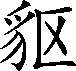虎为图腾的氏族习武，来和炎帝在阪泉的郊野作战。经过几番战斗，这之后黄帝就实现了要征服炎帝的愿望。蚩尤发动叛乱，不听从黄帝之命。于是，黄帝征调诸侯的军队，在涿鹿郊野与蚩尤作战，终于擒获并杀死了他。这样一来，诸侯都尊奉轩辕做天子，取代了神农氏，这就是黄帝。天下有不归顺的，黄帝就前去征讨，平定之后就率军离去。一路上劈山开道，从来没有在哪儿安宁地居住过。

黄帝往东到过东海，登上了丸山和泰山。往西到过空桐，登上了鸡头山。往南到过长江，登上了熊山、湘山。往北驱逐了荤粥部族，来到釜山与诸侯合验了符契，就在涿鹿山的山脚建起了都邑。黄帝四处迁徙，没有固定的住处，带兵走到哪里，就在哪里设置军营以自卫。黄帝所封官职都用云来命名，军队号称云师。他设置了左右大监，由他们督察各诸侯国。这时，万国安定。因此，自古以来，祭祀鬼神山川的要数黄帝时最多。黄帝获得上天赐给的宝鼎，于是观测太阳的运行，用占卜用的蓍草推算历法，预知节气日辰。他任用风后、力牧、常先、大鸿等治理民众。黄帝顺应天地四时的规律，推测阴阳的变化，讲解生死的道理，论述存与亡的原因，按照季节播种百谷草木，驯养鸟兽蚕虫，测定日月星辰以定历法，收取土石金玉以供民用，身心耳目，饱受辛劳，有节度地使用水、火、木材及各种财物。他做天子有土这种属性的祥瑞征兆，土色黄，所以号称黄帝。

黄帝有二十五个儿子，其中建立自己姓氏的有十四人。

黄帝居住轩辕之丘，并娶了西陵国的女子为妻，即嫘祖。嫘祖是黄帝的正妃，生了两个儿子，这两个人的后代都掌握过整个天下：其中第一子叫玄嚣，这就是青阳，青阳下封到地方，居住江水之滨；其中第二子叫昌意，下封到地方，居住若水。昌意娶了蜀山氏的女子为妻，她叫昌仆，生了儿子高阳，高阳是很有圣德的。

黄帝去世后，安葬在桥山。他的孙子、昌意的儿子高阳继位，这就是帝颛顼。

帝颛顼高阳，是黄帝的孙子，也即是昌意的儿子。宁静渊博因而很有智慧，疏旷通达因而知道各种道理，掌养财物以便发挥土地的作用，依照四时决定行动以便效法自然，依据对鬼神的尽心敬事来制订尊卑的义理，治理四时五行之气来教化民众，诚心诚意来进行祭祀。权力所及北边到了幽陵，南边到了交阯，西边到了流沙，东边到了蟠木。所有鸟兽草木，大大小小的山川神灵，凡是日月的光芒所能照射到的地方，没有不顺服而来归属的。

帝颛顼生了个儿子叫穷蝉。颛顼去世后，由玄嚣的孙子高辛继位，也就是帝喾。

帝喾高辛，是黄帝的曾孙。高辛的父亲叫极，极的父亲叫玄嚣，玄嚣的父亲就是黄帝。玄嚣和极都没有登上帝位，到高辛时才登上帝位。高辛是颛顼的侄子。

高辛生来就很有灵气，一出生就叫出了自己的名字。他普遍施恩泽于众人而不及其自身。他耳聪目明，可以了解远处的情况，可以洞察细微的事理。他顺应上天的意旨，了解下民之所急。仁德而且威严，温和而且守信，修养自身，天下归服。他收取土地上的物产，节俭地使用；他抚爱教化万民，把各种有益的事教给他们；他推算日月的运行以定岁时节气，恭敬地迎送日月的出入；他明识鬼神，慎重地加以侍奉。他仪表堂堂，道德高尚。他行动合乎时宜，服用如同士人。帝喾治民，像雨水浇灌农田一样不偏不倚，遍及天下。凡是日月照耀的地方，风雨所到的地方，没有人不顺从归服。

帝喾娶陈锋氏的女儿，生下放勋。娶娵訾氏的女儿，生下挚。帝喾死后，挚接替帝位。帝挚登位后，没有干出什么政绩，于是弟弟放勋登位。这就是帝尧。

帝尧，就是放勋。他仁德如天，智慧如神。接近他，就像太阳一样温暖人心；仰望他，就像云彩一般覆润大地。他富有却不骄傲，尊贵却不放纵。他戴的是黄色的帽子，穿的是黑色衣裳，朱红色的车子驾着白马。他能尊敬有善德的人，使同族九代相亲相爱。同族的人既已和睦，又去考察百官。百官政绩昭著，各方诸侯邦国都能和睦相处。

帝尧命令羲氏、和氏，遵循上天的意旨，根据日月的出没、星辰的位次，制定历法，谨慎地教给民众从事生产的节令。另外，命令羲仲，住在郁夷，那个地方叫旸谷，恭敬地迎接日出，分别步骤安排春季的耕作。春分日，白昼与黑夜一样长，朱雀七宿中的星宿初昏时出现在正南方，据此来确定仲春之时。这时候，民众分散劳作，鸟兽生育交尾。又命令羲叔，住在南交，分别步骤安排夏季的农活儿，谨慎地干好。夏至日，白昼最长，苍龙七宿中的心宿（又称大火）初昏时出现在正南方，据此来确定仲夏之时。这时候，民众就居高处，鸟兽毛羽稀疏。又命令和仲，居住在西土，那地方叫作昧谷，恭敬地送太阳落下，有步骤地安排秋天的收获。秋分日，黑夜与白昼一样长，玄武七宿中的虚宿初昏时出现在正南方，据此来确定仲秋之时。这时候，民众移居平地，鸟兽再生新毛。又命令和叔，住在北方，那地方叫作幽都，认真安排好冬季的收藏。冬至日，白昼最短，白虎七宿中的昴宿初昏时出现在正南方，据此来确定仲冬之时。这时候，民众进屋取暖，鸟兽长满细毛。一年有三百六十六天，用置闰月的办法来校正春夏秋冬四季。帝尧真诚地告诫百官各守其职，各种事情都办起来了。

尧说：“谁可以继承我的这个事业？”放齐说：“你的儿子丹朱通达事理。”尧说：“哼！丹朱嘛，他这个人愚顽、凶恶，不能用。”尧又问道：“那么，还有谁可以？”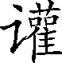兜说：“共工广泛地聚集民众，做出了业绩，可以用。”尧说；“共工好讲漂亮话，用心不正，貌似恭敬，欺骗上天，不能用。”尧又问：“唉，四岳啊，如今洪水滔天，浩浩荡荡，包围了高山，漫上了丘陵，民众万分愁苦，谁可以派去治理呢？”大家都说鲧可以。尧说：“鲧违背天命，毁败同族，不能用。”四岳都说：“就任用他吧，试试不行，再把他撤掉。”尧因此听从了四岳的建议，任用了鲧。鲧治水九年，也没有取得成效。

尧说：“唉！四岳：我在位已经七十年了，你们谁能顺应天命，接替我的帝位？”四岳回答说：“我们的德行鄙陋得很，不敢玷污帝位。”尧说：“那就从所有同姓异姓远近大臣及隐居者当中推举吧。”大家都对尧说：“有一个单身汉流寓民间，叫虞舜。”尧说：“对，我听说过，他这个人怎么样？”四岳回答说：“他是个盲人的儿子。他的父亲愚昧，母亲顽固，弟弟傲慢，而舜却能与他们和睦相处，尽孝悌之道，把家治理好，使他们不至于走向邪恶。”尧说：“那我就试试他吧。”于是，尧把两个女儿嫁给他，从两个女儿身上观察他的德行。舜让她们降下尊贵之心住到妫河边的家中去，遵守为妇之道。尧认为这样做很好，就让舜试任司徒之职，谨慎地理顺父义、母慈、兄友、弟恭、子孝这五种伦理道德，人民都遵从不违。尧又让他参与百官的事，百官的事因此变得有条不紊。让他在明堂四门接待宾客，四门处处和睦，从远方来的诸侯宾客都恭恭敬敬。尧让舜视察山林水泽，遇上暴风雷雨，舜也没有迷路误事。尧更认为他十分聪明，很有道德，把他叫来说道：“三年来，你做事周密，说了的话就能做到。现在你就登临天子位吧。”舜推让说自己的德行还不够，不愿接受帝位。正月初一，舜在文祖庙接受了尧的禅让。文祖也就是尧的太祖。

这时，尧年事已高，让舜代理天子之政事，借以观察他做天子是否合天意。舜于是通过观测北斗星，来考察日、月及金、木、水、火、土五星的运行是否有异常，接着举行临时仪式祭告上帝，用把祭品放在火上烧的仪式祭祀天地四时，用遥祭的仪式祭祀名山大川，又普遍地祭祀了各路神祇。他收集起公侯伯子男五等侯爵所持桓圭、信圭、躬圭、谷璧、蒲璧五种玉制符信，选择良月吉日，召见四岳和各州州牧，又颁发给他们。二月，舜去东方巡视，到泰山时，用烧柴的仪式祭祀东岳，用遥祭的仪式祭祀各地的名山大川。接着，他就召见东方各诸侯，协调校正四时节气、月之大小、日之甲乙，统一音律和长度、容量、重量的标准，修明吉、凶、宾、军、嘉五种礼仪，规定诸侯用五种圭璧、三种彩缯，卿大夫用羊羔、大雁二种动物，士用死雉作为朝见时的礼物，而五种圭璧，朝见典礼完毕以后仍还给诸侯。五月，到南方巡视；八月，到西方巡视；十一月，到北方巡视：都像起初到东方巡视时一样。回来后，告祭祖庙和父庙，用一头牛作祭品。以后每五年巡视一次，在其间的四年中，各诸侯国君按时来京师朝见。舜向诸侯们普遍地陈述治国之道，根据业绩明白地进行考查，根据功劳赐给车马衣服。舜开始把天下划分为十二个州，疏浚河川。规定根据正常的刑罚来执法，用流放的方法宽减刺字、割鼻、断足、阉割、杀头五种刑罚，官府里治事用鞭子施刑，学府教育用戒尺惩罚，罚以黄金可用作赎罪。因灾害而造成过失的，予以赦免；怙恶不悛、坚持为害的要施以刑罚。谨慎啊，谨慎啊，可要审慎使用刑罚啊！

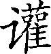兜曾举荐过共工，尧说“不行”，而兜还是试用他做工师，共工果然放纵邪僻。四岳曾推举鲧去治理洪水，尧说“不行”，而四岳硬说要试试看，试的结果是没有成效，所以百官都以为不适宜。三苗在江、淮流域及荆州一带多次作乱。这时舜巡视回来向尧帝报告，请求把共工流放到幽陵，以便改变北狄的风俗；把兜流放到崇山，以便改变南蛮的风俗；把三苗迁徙到三危山，以便改变西戎的风俗。把鲧流放到羽山，以便改变东夷的风俗：惩办了这四个罪人，天下人都悦服了。

尧在位七十年得到舜，又过二十年因年老而告退，让舜代行天子政务，向上天推荐。尧让出帝位二十八年后逝世。百姓悲伤哀痛，如同死了生身父母一般。三年之内，四方各地没有人奏乐，为的是悼念帝尧。尧了解自己的儿子丹朱不贤，不配传给他天下，因此才姑且试着让给舜。让给舜，天下人就都得到利益而只对丹朱一人不利；传给丹朱，天下人就会遭殃而只有丹朱一人得到好处。尧说：“我毕竟不能使天下人受害而只让一人得利。”所以，他最终还是把天下传给了舜。尧逝世后，三年服丧完毕，舜把帝位让给丹朱，自己躲到了南河的南岸。诸侯前来朝觐的不到丹朱那里去却到舜这里来，打官司的也不去找丹朱却来找舜，歌颂功德的不去歌颂丹朱却来歌颂舜。舜说“这是天意呀”，然后才到了京都，登上天子之位，这就是舜帝。

虞舜，名叫重华。重华的父亲叫瞽叟，瞽叟的父亲叫桥牛，桥牛的父亲叫句望，句望的父亲叫敬康，敬康的父亲叫穷蝉。穷蝉的父亲是颛顼帝，颛顼的父亲是昌意：从昌意至舜是七代了。自从穷蝉为帝之后一直到舜帝，中间几代地位低微，都是平民。

舜的父亲瞽叟是个盲人，舜的生母死后，瞽叟又续娶了一个妻子生下了象，象桀骜不驯。瞽叟喜欢后妻的儿子，常常想把舜杀掉，舜都躲过了；赶上有点小错儿，就会遭到重罚。舜很恭顺地侍奉父亲、后母及后母弟，一天比一天地忠诚谨慎，没有一点懈怠。

舜，是冀州人。舜在历山耕过田，在雷泽打过鱼，在黄河岸边做过陶器，在寿丘做过各种家用器物，在负夏跑过买卖。舜的父亲瞽叟愚昧，母亲顽固，弟弟象桀骜不驯，他们都想杀掉舜。舜却恭顺地行事，从不违背为子之道，友爱兄弟，孝顺父母。他们想杀掉他的时候，就找不到他；而有事要找他的时候，他又总是在身旁侍候着。

舜二十岁时，就因为孝顺出了名。三十岁时，尧帝问谁可以治理天下，四岳全都推荐虞舜，说这个人可以。于是，尧把两个女儿嫁给了舜来观察他在家的德行，让九个儿子和他共处来观察他在外的为人。舜居住妫水岸边，他在家里做事更加谨慎。尧的两个女儿不敢因为自己出身高贵就傲慢地对待舜的亲属，很讲究为妇之道。尧的九个儿子也更加笃诚忠厚。舜在历山耕作，历山人都能互相推让地界；在雷泽捕鱼，雷泽的人都能推让便于捕鱼的位置；在黄河岸边制作陶器，那里就完全没有次品了。一年的工夫，他住的地方就成为一个村落，两年就成为一个小城镇，三年就变成大都市了。见了这些，尧就赐给舜一套细葛布衣服，给他一张琴，为他建造仓库，还赐给他牛和羊。瞽叟仍然想杀他，让舜登高去用泥土修补谷仓，瞽叟却从下面放火焚烧。舜用两个斗笠保护着自己，像长了翅膀一样跳下来，逃开了，才得以不死。后来，瞽叟又让舜挖井，舜挖井的时候，在侧壁凿出一条暗道通向外边。舜挖到深处，瞽叟和象一起往下倒土填埋水井，舜从旁边的暗道出去，又逃开了。瞽叟和象很高兴，以为舜已经死了。象说：“最初出这个主意的是我。”象跟他的父母一起瓜分舜的财产，说：“舜娶过来尧的两个女儿，还有尧赐给他的琴，我都要了。牛羊和谷仓都归父母吧。”象于是住在舜的屋里，弹着舜的琴。舜回来后去看望他。象非常惊愕，继而又摆出闷闷不乐的样子，说：“我正在想念你呢，想得我好心闷啊！”舜说：“是啊，你可真够兄弟呀！”舜还像以前一样待奉父母，友爱兄弟，而且更加恭谨。这样，尧才试用舜去理顺五种伦理道德和参与百官的事，都干得很好。

从前，高阳氏有富于才德的子孙八人，世人得到他们的好处，称之为八恺，意思就是八个和善的人。高辛氏有有才德的子孙八人，世人称之为“八元”，意思就是八个善良的人。这十六个家族的人，世世代代保持着他们先人的美德，没有败落他们先人的名声。到尧的时候，尧没有举用他们。舜举用了八恺的后代，让他们掌管土地的官职，以处理各种事务，都办得有条有理。舜又举用了八元的后代，让他们向四方传布五教，使得做父亲的有道义、做母亲的慈爱、做兄长的友善、做弟弟的恭谨、做儿子的孝顺，于是国内太平，四周夷狄归化。

从前，帝鸿氏有个不成材的后代，掩蔽仁义，包庇残贼，好行凶作恶，天下人称他为浑沌。意思是说他野蛮不开化。少皞氏也有个不成材的后代，毁弃信义，厌恶忠直，喜欢邪恶的言语，天下人称他为穷奇，意思是说他怪异无比。颛顼氏有个不成材的后代，不可调教，不懂得好话坏话，天下人称他为梼杌，意思是说他凶顽绝伦。这三族，世人都害怕。到尧的时候，尧没有把他们除掉。缙云氏有个不成材的后代，贪于饮食，图于财货，天下人称之为饕餮，意思是说他贪得无厌。天下人憎恨他，将他与上面说的三凶并列称为四凶。舜在四门接待四方宾客时，流放了这四个凶恶的家族，把他们赶到了边远地区，去抵御害人的妖魔，从此开放了四门，大家都说没有恶人了。

舜进入深山密林的时候，遇到暴风雷雨也不迷路误事，尧于是才知道了凭着舜的才能是可以把天下传授给他的。尧年纪大了，让舜代行天子之政，到四方去巡视。舜被举用掌管政事二十年，尧让他代行天子的政务。代行政务八年，尧逝世了。服丧三年完毕，舜让位给丹朱，可是天下人都来归服舜。禹、皋陶、契、后稷、伯夷、夔、龙、倕、益、彭祖，从尧的时候就都得到举用，却一直没有职务。于是，舜就到文祖庙，与四岳商计，开放四门，了解沟通四方的情况。他让十二州牧讨论称帝应具备的功德，他们都说要办有大德的事，疏远巧言谄媚的小人，这样，远方的外族就都会归服。舜对四岳说：“有谁能奋发努力，建立功业，光大帝尧的事业，授给他官职辅佐我办事呢？”四岳都说：“伯禹为司空，可以光大帝尧的事业。”舜说：“嗯，好！禹，你去负责平治水土，一定要努力办好啊！”禹跪地叩头拜谢，谦让给稷、契和皋陶。舜说：“好了，去吧！”舜说：“弃，黎民正在挨饿受饥，你负责农业，去教他们播种百谷吧。”舜说：“契，百官不相亲爱，五伦不顺，你担任司徒，去谨慎地施行五伦教育，做好五伦教育，在于要宽厚。”舜又说：“皋陶，蛮夷侵扰中原，抢劫杀人，在我们的境内外作乱，你担任司法官，五刑要使用得当，根据罪行轻重，在市、朝、野三处施行；五刑宽减为流放的，流放的远近要有个规定，按罪行轻重分别流放到四境之外、九州之外和国都之外。只有公正严明，才能使人信服。”舜问：“那么，谁能管理我的各种工匠？”大家都说垂可以。于是，任命垂为共工，统领各种工匠。舜又问：“谁能管理我山上泽中的草木鸟兽？”大家都说益行。于是，任命益为朕虞，主管山泽。益下拜叩头，推让给朱虎、熊罴。舜说：“去吧，你行。”就让朱虎、熊罴做他的助手。舜说：“喂，四岳，有谁能替我主持天事、地事、人事三种祭祀？”大家都说伯夷可以。舜说：“喂，伯夷，我任命你担任秩宗，主管祭祀，要早晚虔敬，要正直，要肃穆清洁。”伯夷推让给夔、龙，舜说：“那好，就任命夔为典乐，掌管音乐，教育贵族子弟，要正直而温和，宽厚而严厉，刚正却不暴虐，简捷却不傲慢；诗是表达内心情感的，歌是用延长音节来咏唱诗的，乐声的高低要与歌的内容相配合，还要用标准的音律来使乐声和谐。八种乐器的声音协调一致，不要互相错乱侵扰，这样，就能通过音乐达到人与神相和的境界啦。”夔说：“呣，我轻重有节地敲起石磬，各种禽兽都会跟着跳起舞来的。”舜说：“龙，我非常憎恶那种诬陷他人的坏话和灭绝道义的行为，惊扰我的臣民。我任命你为纳言官，早晚传达我的旨命，报告下情，一定要诚实。”舜说：“喂，你们二十二个人，要谨守职责，时时辅佐我做好上天交付的治国大事。”此后，每三年考核一次功绩，经过三次考核，按照成绩升迁或贬黜。所以，不论远处近处，各种事情都振兴了。又根据是否归顺，分解了三苗部族。

这二十二人个个成就功业：皋陶担任大理，掌管刑法，断案平正，人们都佩服他能按情据实断理；伯夷主持礼仪，上上下下能都够礼让；垂担任工师，主管百工，百工都能做好自己的工作；益担任虞，主管山泽，山林湖泽都得到开发；弃担任稷，主管农业，百谷按季节茂盛成长；契担任司徒，主管教化，百官都亲善和睦；龙主管接待宾客，远方的诸侯都来朝贡；舜所置十二州牧做事，禹所定九州内的民众没有谁违抗。其中，禹的功劳最大，开通了九座大山，治理了九处湖泽，疏浚了九条河流，辟定了九州方界，各地都按照应缴纳的贡物前来进贡，没有不恰当的。纵横五千里的领域，都受到安抚，直到离京师最远的边荒地区。那时，南方安抚到交阯、北发，西方安抚到戎、析枝、渠廋、氐、羌，北方安抚到山戎、发、息慎，东方安抚到长、鸟夷，四海之内，共同称颂帝舜的功德。于是，禹创制《九招》乐曲歌颂舜的功德，招来了祥瑞之物，凤凰也飞来，随乐声盘旋起舞。天下清明的德政都从虞舜帝开始。

舜二十岁时因为孝顺而闻名，三十岁时被尧举用，五十岁时代理天子政务，五十八岁时尧逝世，六十一岁时接替尧登临天子之位。登位三十九年，到南方巡视，在南方苍梧的郊野逝世。葬埋在长江南岸的九疑山，这就是零陵。

舜登临帝位之后，乘着有天子旗帜的车子去给父亲瞽叟请安，和悦恭敬，遵循为子之孝道。又把弟弟象封在有鼻为诸侯。舜的儿子商均不成材，舜就事先把禹推荐给上帝。十七年后，舜逝世。服丧三年完毕，禹也把帝位让给舜的儿子，就跟舜让给尧的儿子时的情形一样。诸侯归服禹，这样，禹就登临了天子之位。尧的儿子丹朱、舜的儿子商均分别在唐和虞得到封地，来奉祀祖先。禹还让他们穿自己家族的服饰，用自己家族的礼乐仪式。他们以客人的身份拜见天子，天子也不把他们当臣下对待，以表示不敢专擅帝位。

从黄帝到舜、禹，都是同姓，但立了不同的国号，为的是彰明各自光明的德业。所以，黄帝号为有熊，帝颛顼号为高阳，帝喾号为高辛，帝尧号为陶唐，帝舜号为有虞。帝禹号为夏后，而另分出氏，姓姒氏。契为商始祖，姓子氏。弃为周始祖，姓姬氏。

太史公说：“学者们有很多人称说五帝，但五帝的时代已经很久远了。然而，《尚书》只记载尧以来的政事史料，而百家所叙说的黄帝，他们的文字都不是典雅的训释，缙绅先生们是很难照着说清楚的。孔子所记述的宰予问《五帝德》和《帝系姓》二篇，儒生们认为不是圣人的言论，所以大多不传习。我曾经西边到过空桐山，北边经过涿鹿，向东渐进到达大海，往南驾舟浮渡过长江、淮河，到那些被长老们都各自常常称说是黄帝、尧、舜遗迹的地方，知道风俗教化本来有所不同，总的来说还是没有背离古文记载的说法，比较接近正确。我研读《春秋》《国语》，其中内容有阐发《五帝德》《帝系姓》的地方是很显著的，只是人们没有深加考察就是了。其实，它们的记述都不虚妄。《尚书》缺失有许多内容早已遗漏了，它所散轶的就常常在其他的记述中可以看到。不是喜好学习，深加思考，心知其中的用意，这类事本来就很难对那些识见浅薄孤陋寡闻的人去说清楚的。我一并依据搜集的各种文献论说，选择其中记述得特别典雅的，以此编著成《五帝本纪》作为全书的首篇。”

