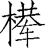
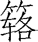
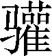
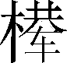
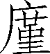

第二卷

 夏本纪第二

夏本是一个古老的部落，相传是由包括夏在内的十多个部落联合发展而来的，与古代其他部落交错分布于中国境内。到唐尧、虞舜时期，夏族的首领禹因治水有功，取得了帝位，并传给其子启，从而建立了我国历史上第一个奴隶制王朝。夏王朝约存在于前21世纪至前16世纪。

《夏本纪》根据《尚书》及有关历史传说，系统地叙述了由夏禹到夏桀约四百年间的历史，向人们展示了由原始部落联盟向奴隶制社会过渡时期的政治、经济、军事、文化及人民生活等方面的概貌，尤其突出地描写了夏禹这样一个功绩卓著的远古部落首领和帝王的形象。

《夏本纪》是一部夏王朝的兴衰史。夏禹的兴起，是由于他治理洪水拯民于灾难，勤勤恳恳地做人民的公仆，人民拥护他。夏朝的衰亡，则是由于孔甲、桀这样的统治者败德、伤民，人民怨恨他们。当然，夏禹还只是一个传说中的人物，这篇本纪的记载也未必完全真实，历史事实未必那么美好。但大禹治水的业绩早已在中华民族的历史上，树起了一座永不磨灭的丰碑；他十三年于外，三过家门而不入的伟大奉献精神，也早已千古传颂，作为我们祖先一种美德的代表，将永远值得学习和效法。

***【原文】***

夏[1]禹，名曰文命。禹之父曰鲧[2]，鲧之父曰帝颛顼，颛顼之父曰昌意，昌意之父曰黄帝。禹者，黄帝之玄孙而帝颛顼之孙也。禹之曾大父昌意及父鲧皆不得在帝位，为人臣。

***【译文】***

[1]夏：禹所封的国号。《帝王世纪》说：“禹受封为夏伯，在豫州外方之南，今河南阳翟是也。”阳翟，今禹州市。

[2]鲧（ɡǔn）：禹父。《帝王世纪》说：“帝颛顼之子，字熙。”

***【原文】***

当帝尧之时，鸿水滔天，浩浩怀山襄陵，下民其[1]忧。尧求能治水者，群臣四岳皆曰：“鲧可。”尧曰：“鲧为人负命毁族，不可。”四岳曰：“等之，未有贤[2]于鲧者，愿帝试之。”于是尧听四岳，用鲧治水。九年而水不息，功用不成。于是帝尧乃求人[3]。更得舜。舜登用[4]，摄行天子之政。巡狩，行视鲧之治水无状，乃殛鲧于羽山以死[5]。天下皆以舜之诛[6]为是。于是舜举鲧子禹，而使续鲧之业。

***【译文】***

[1]鸿：大。与“洪”为同源字。其：通“綦”，非常。

[2]等之：比较起来。贤：好；强。

[3]乃：才。求人：寻求继承天下事业的人。

[4]登用：提拔，重用。

[5]以死：而死。

[6]诛：责难，处罚。

***【原文】***

尧崩，帝舜问四岳曰：“有能成美尧之事者使居官？”皆曰：“伯禹为司空，可成美尧之功。”舜曰：“嗟，然！”命禹：“女平水土，维是勉之。”禹拜稽首，让于契、后稷、皋陶。舜曰：“女其往视尔事矣。”

禹为人敏给克[1]勤，其德不违[2]，其仁可亲，其言可信；声为律，身为度[3]，称以出[4]，亹亹穆穆[5]，为纲为纪[6]。

***【译文】***

[1]敏：聪明机灵。给：精力充沛；说话机警。克：能干。

[2]其德不违：不违背道德。

[3]声为律：说话语音和悦，等于音律。身为度：举止规矩，等于尺度。指禹的言行都可为人榜样。

[4]称以出：权衡再三才行动。指禹办事谨慎。

[5]亹亹（wěi wěi）：勤勉不倦的样子。穆穆：庄严肃敬的样子。

[6]纲：网的总绳。纪：丝束的头绪。用以比喻为人的规范。

***【原文】***

禹乃遂与益、后稷奉帝命，命诸侯百姓兴人徒[1]以傅土，行山表木，定高山大川[2]。禹伤先人父鲧[3]功之不成受诛，乃劳身焦思，居外十三年，过家门不敢入。薄衣食[4]，致孝于鬼神；卑宫室，致费于沟淢[5]。陆行乘车，水行乘船，泥行乘橇[6]，山行乘[7]。左准绳，右规矩[8]，载四时[9]，以开九州[10]，通九道[11]，陂九泽[12]，度九山[13]，令益予众庶稻，可种卑湿。命后稷予众庶难得之食。食少，调有余相给，以均诸侯[14]。禹乃行相地宜所有以贡[15]，及山川之便利。

***【译文】***

[1]兴人徒：调动服劳役的百姓。

[2]行山表木：指爬山实地勘察，立木作标记。定高山大川：标定高山大河的位置。或说，规定山河的名称；又旧说，规定对不同山河的祭祀等级。

[3]父鲧：《史记会注考证》引张文虎说：“父鲧疑衍。”

[4]薄衣食：节省自己的衣食。

[5]卑宫室：使自己住房简陋。致费于沟淢（yù）：把财物用在疏通水道方面。

[6]橇（qiāo）：古代在泥淖地带行走的一种泥船。

[7]（jú）：特制的爬山鞋。底下钉有锥形器物，以防滑倒，相当于后世的钉鞋、木屐。

[8]左：用作动词，指用左手拿着。准绳：定平直的绳索。右：右手拿着。规：圆规。矩：方尺。

[9]载四时：携带测量四季的仪器。或曰，指不违时宜。

[10]九州：即下文提到的冀、兖、青、徐、豫、荆、扬、雍、梁。

[11]九道：指九州的河道，与后文“九川”同义。

[12]陂（bēi）：堤岸。用如动词，修筑河岸。九泽：九个大湖泊，指大陆、雷夏、大野、彭蠡、震泽、云梦、荥泽、菏泽、孟诸。

[13]九山：九州的大山，或说指岍山、壶口、底柱、太行、西倾、蟠冢、内方、岐山、熊耳。

[14]调有余相给：调配有余地区的物产供给不足的地区。均诸侯：使诸侯各国的粮食相互平衡。

[15]相地宜所有以贡：审察土地所应有的出产，作为向中央的贡品。

***【原文】***

禹行自冀州始[1]。冀州：既载壶口[2]，治梁及岐[3]。既修太原[4]，至于岳[5]阳。覃怀致功[6]，至于衡漳[7]。其土白壤[8]。赋上上错，田中中[9]。常、卫既从[10]，大陆[11]既为。鸟夷皮服[12]。夹右碣石[13]，入于海。

***【译文】***

[1]冀州：古九州之一。管辖今山西省及河北大部、河南北部、辽宁西部等地。传说当时国都在冀州，所以治水定赋都从冀州开始。

[2]既：表示工作完结的副词。载：开始。既载，有刚完毕的意思。壶口：山名。在今山西省吉县西南。

[3]梁：梁山。在今陕西省韩城市东南。岐：岐山。在今陕西省岐山县东北。

[4]修：修筑。太原：高而平的大原野，指今太原地区的大片高原。

[5]岳：即今山西省太岳山。

[6]覃（tán）怀：古邑名。在今河南省武陟县西南。致功：治理完毕，收到成效。

[7]衡漳：即漳河。因为它横流入黄河，故名衡（横）漳；或说，衡漳指浊漳水，是漳河的支流。

[8]土：土质。白壤：白色而细柔松软的土地。汉孔安国注：“土无块曰壤。”

[9]赋上上错：田赋占全国第一等，杂有第二等。田中中：田的等级为全国第五等。

[10]常：常水，即恒水，源出恒山（今河北曲阳西北）。卫：古卫水。源出今河北省灵寿县，东入滹沱河。从：顺从，顺流而下（指疏通好了）。

[11]大陆：泽名。在今河北省邢台市任泽区、隆尧县、巨鹿县三地之间。

[12]鸟夷：冀州东北部的一个部族，当时以狩猎为生。皮服：兽皮衣服。指鸟夷用皮服作为贡品。

[13]碣石：山名。在今河北省昌黎县北。

***【原文】***

济、河维沇州[1]：九河[2]既道，雷夏既泽[3]，雍沮[4]会同，桑土既蚕，于是民得下丘居土[5]。其土黑坟，草繇木条[6]。田中下[7]，赋贞[8]，作十有三年乃同。其贡漆丝，其篚[9]织文。浮于济、漯[10]，通于河。

***【译文】***

[1]济、河维沇州：济水、黄河之间是溉州。济，济水，又名沇水，发源于今河南省济源王屋山。维，具有判断作用的语气词。沇：通“兖”（yǎn）。兖州在今山东省西北部与河北省南部，地域很小。

[2]九河：指黄河下游兖州境内的九条河道（徒骇、太史、马颊、覆釜、胡苏、简、絮、钩盘、鬲津）。

[3]雷夏既泽：雷夏正修筑堤防，成为蓄水湖泊。雷夏泽，即雷泽。注见《五帝本纪》。

[4]雍沮：二水名。均在今山东省荷泽市牡丹区境，旧道已湮没。

[5]得：能。下丘居土：从山冈搬到平地居住。

[6]坟：肥厚。繇（yáo）：茂盛。条：长大。

[7]田中下：第六等田。

[8]贞：很恰当。

[9]篚（fěi）：盛物的圆形竹器。

[10]浮：乘船。漯（tà）：黄河下游主要支流之一。

***【原文】***

海、岱维青州[1]：堣夷[2]既略，潍、淄其道[3]。其土白坟，海滨广澙[4]，厥田斥卤[5]。田上下，赋中上[6]。厥贡盐、[7]，海物维错，岱畎丝、枲、铅[8]、松、怪石；莱夷为牧[9]；其篚酓丝[10]。浮于汶，通于济[11]。

***【译文】***

[1]海、岱维青州：大海与泰山之间是青州。在今山东省东部。岱（dài）：泰山古名岱宗。

[2]堣（yú）夷：地名。在今辽宁省境。

[3]潍：潍水。源出今山东省莒县，东北流至昌邑市入渤海。淄：淄水。源出今山东省莱芜县往东北流入小清河出渤海。

[4]广澙（xì）：宽广而含盐质。澙：盐碱地。

[5]斥卤（lǔ）：盐碱地。

[6]田上下：田第三等。赋中上：赋第四位。

[7]（chī）：细葛布。

[8]畎（quǎn）：山谷。枲（xì）：大麻。铅：古时尚不能出产铅矿。这里的“铅”可能指一种可作颜料的矿石。

[9]莱：地名。在今山东省龙口市。为牧：作牧场。用牧产作为贡品。

[10]酓（yǎn）丝：即柞蚕丝。

[11]浮于汶（wèn），通于济：从汶水船运，通到济水，再运往京城。汶：汶水，济水的支流。

***【原文】***

海、岱及淮维徐州[1]：淮、沂[2]其治，蒙、羽[3]其蓺。大野既都[4]，东原厎平[5]。其土赤埴[6]坟，草木渐包[7]。其田上中，赋中中[8]。贡维土五色[9]、羽畎夏狄[10]、峄[11]阳孤桐、泗[12]滨浮磬。淮夷珠臮[13]鱼，其篚玄纤缟[14]。浮于淮、泗，通于河[15]。

***【译文】***

[1]海岱及淮维徐州：大海、泰山与淮水之间是徐州。

[2]淮：淮河。为古代四渎之一。沂（yí）：水名。源出今山东省沂水县，经江苏省邳州市入泗水。

[3]蒙：山名。在今山东省中部蒙阴县南。羽：山名。即舜流放鲧的地方。

[4]大野：泽名，即钜野泽。在今山东省巨野县北。都：通“潴”（zhū），水停蓄的地方。

[5]东原：地名。在今山东省东平县、泰安县一带。厎（zhǐ）：致。致平，即得到了平复。

[6]埴（zhí）：黏性土。

[7]包：茂盛的样子。

[8]田上中：第二等田。赋中中：赋第五位。

[9]土五色：即青、赤、白、黑、黄五色土，供天子筑大社之用。大社是祭祀大地之神的社坛。

[10]夏狄：彩色的野鸡。

[11]峄（yì）：山名。又名邹山或邹峄山。

[12]泗：水名。源出于山东省泗水县。

[13]淮夷：淮水边夷族聚居地。：珠母，产珍珠的蚌类。臮（jì）：古“暨”字，意为“及”。

[14]玄：黑色。纤：细。缟（ɡǎo）：白（丝绸）。

[15]通于河：《禹贡》作“达于河”。

***【原文】***

淮、海维扬州[1]：彭蠡[2]既都，阳鸟[3]所居。三江[4]既入，震泽[5]致定。竹箭既布[6]。其草惟夭，其木惟乔。其土涂泥[7]。田下下，赋下上上杂[8]。贡金三品[9]，瑶、琨[10]、竹箭，齿、革、羽、旄[11]，岛夷[12]卉服，其篚织贝[13]，其包橘柚锡贡[14]。均江海，通淮泗[15]。

***【译文】***

[1]淮、海维扬州：淮河以南，大海以西的一大片地区是扬州。

[2]彭蠡（lǐ）：今江西省鄱阳湖古名。

[3]阳鸟：指大雁。

[4]三江：众多水道的总称。汉以来旧注多认为指三条江水。

[5]震泽：今江苏太湖古名。

[6]竹箭：即箭竹。竹质坚韧，可以制箭。布：普遍生长。

[7]涂泥：土质湿润。

[8]田下下：第九等田。赋下上上杂：赋第七位，有时第六位。上杂：说“错”指下一位，说“上杂”指上一位。

[9]金三品：旧说指三种金属。一说指金、银、铜；一说指青铜、白铜、赤铜。

[10]瑶：美玉。琨：像玉的宝石。

[11]齿：象牙。革：兽皮。旄（máo）：牦牛尾，作旌旗上的装饰。

[12]岛夷：海岛上的夷民。

[13]织贝：像贝壳一样的五色丝织品。

[14]其包橘柚锡贡：有时根据命令进贡包着的橘子和柚子。锡贡：指有命令就进贡（无命令则不贡）。

[15]均江海，通淮泗：指贡赋沿江或沿海北运到淮河、泗水，再运往京城。

***【原文】***

荆及衡阳维荆州[1]：江、汉朝宗于海[2]，九江甚中[3]。沱、涔[4]已道，云土、梦[5]为治。其土涂泥。田下中，赋上下[6]。贡羽、旄、齿、革，金三品，杶、榦、栝[7]、柏，砺、砥、砮、丹[8]，维箘簬、楛[9]，三国[10]致贡其名，包匦菁茅[11]，其篚玄玑组[12]。九江入赐大龟[13]。浮于江、沱、涔、汉，逾于雒[14]，至于南河[15]。

***【译文】***

[1]荆及衡阳维荆州：北起荆山，南到衡山之南的地区是荆州。衡：山名。在今湖南省衡山县，五岳之一。

[2]朝宗于海：把海当作宗主朝见；奔腾入海的意思。

[3]九江甚中：指长江流到荆州后，共有九条支流，它们恰好处于长江中游。

[4]沱：此指今湖北省江陵县的夏水，为长江支流。涔（cén）：涔水，又名龙门水。

[5]云土、梦：二泽名，即江北的云泽和江南的梦泽。

[6]田下中：第八等田。赋上下：赋第三位。

[7]杶（chūn）：木名。即椿树，字或作“櫄”。榦（ɡàn）：即柘树。木质坚韧致密，可作弓。栝（ɡuā，又音kuò）：即桧树。树叶似柏，树干似松，木质坚硬。

[8]砺（lì）、砥（dǐ）：皆磨刀石，质地粗糙的称砺，细柔的称砥。砮（nǔ）：一种可作箭镞的石头。丹：丹砂。

[9]箘簬（jùn lù）：竹名。质坚硬：可作箭杆。或以为是两种竹子。簬，一作“”。楛（hù）：木名。荆类，可作箭杆。

[10]三国：指荆州的三个诸侯国。

[11]包匦（ɡuǐ）菁（jīnɡ）茅：包裹着的菁茅。用绳缠绕叫匦。菁茅是一种有刺的茅草，宗庙祭祀时用以滤酒。

[12]玄：黑色或浅绛色的绸布，垫在竹筐中承放珍珠，或说本身便是贡品。玑（jī）组：成串的珍珠；或说是珍珠装饰的组绶（拴玉和官印的绶带）。

[13]入赐：根据命令交纳的贡品（不常用，无命令则不纳贡）。

[14]逾（yú）于雒：指顺长江、汉水向北运，再经陆路，进入洛水。逾，由水运转为陆运，再由水运为逾。雒：即“洛”，洛水。

[15]南河：黄河自潼关以东在河南境内的一段。

***【原文】***

荆、河惟豫州[1]：伊、雒、瀍、涧[2]既入于河，荥播[3]既都。道荷泽[4]，被明都[5]。其土壤，下土坟垆[6]。田中上，赋杂上中[7]。贡漆、丝、、纻，其篚纤絮[8]，锡贡磬错[9]。浮于雒，达于河。

***【译文】***

[1]荆、河惟豫州：荆山以北、黄河以南的地区是豫州。

[2]伊：伊河，洛水支流，发源于今河南省卢氏县熊耳山，至偃师流入洛水。雒：通“洛”，洛水。黄河支流，发源于陕西省洛南县西北冢岭山，至河南巩义市入黄河。瀍（chán）、涧：二河名。都是洛水支流。瀍水源出于河南省洛阳市西北之芒山；涧水源如于河南省渑池县。

[3]荥播（xínɡ bō）：泽名，即古荥泽。已淤塞。故址在今河南省荥阳市。

[4]荷泽：泽名。今已湮塞。

[5]明都：即孟猪泽（明都、孟猪，古音相同）。故址在今河南省商丘市睢阳区东北。被：及。指治好荷泽后又治理到孟猪泽。

[6]下土：低洼地。垆：黑色。

[7]田中上：第四等田。赋杂上中：赋为第二位，杂出第一位。

[8]纤絮：细丝绵。

[9]锡贡磬错：按命令则进贡磨磬的错石（错是磨玉的石头）。

***【原文】***

华阳、黑水惟梁州[1]：汶、嶓既蓺[2]，沱、涔既道[3]，蔡、蒙旅[4]平，和夷[5]厎绩。其土青骊[6]。田下上，赋下中三错[7]。贡璆、铁、银、镂[8]、砮、磬，熊、罴、狐、狸、织皮[9]。西倾因桓[10]是来，浮于潜，逾于沔，入于渭，乱于河[11]。

***【译文】***

[1]华阳、黑水惟梁州：东至华山之南，西至黑水之滨的地区是梁州。大致辖今四川省全境及陕西、甘肃两省南部。华：华山。在陕西华阴市。五岳之一。

[2]汶（mín）：通“岷”，即岷山。嶓（bō）：嶓冢山。在甘肃省天水市与礼县之间，为西汉水发源地。蓺：种植。

[3]沱：沱江，长江支流，在泸州市入长江。涔（cén）：涔水，汉水支流。

[4]蔡：山名。在今四川省雅安市雨城区东。蒙：山名。在今四川省雅安市雨城区、名山区、芦山县三地交界处。旅：皆，都。

[5]和夷：地名。指大渡河一带的土著部族聚居地。

[6]骊：黑色。

[7]田下上：第七等田。赋下中三错：赋第八位，杂出第七位、第九位。

[8]璆（qiú）：美玉。镂（lòu）：坚铁。

[9]织皮：指地毯。

[10]西倾：山名。在今甘肃西南、青海东南两省交界处。桓：桓水，即今白龙江。

[11]潜：潜水。嘉陵江的北源。沔（miǎn）：沔水，一名沮水，源出陕西，汉水上游。乱：横渡。这几句指梁州所有贡物，都从潜水北运，翻过一段陆地进入沔水，再进入渭水，西渡黄河进入国都。

***【原文】***

黑水、西河惟雍州[1]：弱水[2]既西，泾属渭汭[3]。漆、沮[4]既从，沣水[5]所同。荆、岐已旅[6]，终南、敦物至于鸟鼠[7]。原隰[8]厎绩，至于都野[9]。三危[10]既度，三苗大序。其土黄壤。田上上，赋中下[11]。贡璆、琳、琅玕[12]。浮于积石[13]，至于龙门[14]西河，会于渭汭[15]；织皮昆仑、析支、渠搜[16]，西戎即序[17]。

***【译文】***

[1]黑水：详见下文“道九川”注。西河：指山西、陕西两省间的一段黄河，在冀州西面，故名西河，是冀、雍两州的界河。

[2]弱水：又名张掖河。往西北流入沙漠中的居延泽（即今甘肃省北部边境的苏古诺尔湖与嘎顺诺尔湖）。

[3]泾属渭汭：泾水自此流入渭水。泾，泾水，发源于宁夏自治区固原市原州区南，东南流至陕西省西安市高陵区入渭水。渭，渭水。

[4]漆、沮：二水名。都是渭水支流，在陕西省铜川市耀州区合流之后称石川河，再南流入渭水。

[5]沣（fēnɡ）水：源出陕西省西安市鄠邑区东南终南山，北流入渭水。今河道已湮没。

[6]荆：荆渠山，在今陕西省富平县（非荆州的荆山）。岐：岐山。旅：祭祀名。

[7]终南：山名。在今陕西省西安市南。敦物：山名。在今陕西省武功县境。一称垂山，又称武功山。鸟鼠：山名。在甘肃省渭源县，是渭水发源地。

[8]原：高地。隰：低洼地。

[9]都野：泽名。

[10]三危：山名。在甘肃省岷山西南，黑水流经其下。

[11]田上上：第一等田。赋中下，赋第六等。

[12]琳：玉名。琅玕（lánɡ ɡān）：像珠子一样的宝石。

[13]浮于积石：由积石山船运。

[14]龙门：即今禹门口。在今山西省河津市与陕西韩城市间之黄河边。

[15]会于渭汭：指从龙门沿河南下，达到渭水入黄河处（即潼关）。

[16]昆仑、析支、渠搜：三个西戎部落名。

[17]戎：对西方部族的总称。序：安定和睦。

***【原文】***

道九山[1]：汧及岐至于荆山，逾于河[2]；壶口、雷首[3]至于太岳；砥柱、析城至于王屋[4]；太行、常山[5]至于碣石，入于海；西倾、朱圉[6]、鸟鼠至于太华；熊耳、外方、桐柏至于负尾[7]；道嶓冢，至于荆山[8]；内方至于大别[9]；汶山之阳至衡山，过九江，至于敷浅原[10]。

***【译文】***

[1]道九山：开通九条山脉。

[2]汧（qiān）：山名。在今陕西省陇县西南。荆山：指在今陕西省富平县的荆山。逾于河：指汧山、岐山、荆山这几条山脉由西向东（与渭河平行），其余脉越过黄河。

[3]壶口：山名。在今山西省吉县西。雷首：山名。在今山西省永济市。

[4]砥柱：山名。在今河南省三门峡市陕州区与山西省平陆县之间的黄河三门峡中。析城：山名。在今山西省阳城县境。王屋：山名。在今山西省阳城、垣曲两县间，其山三重，其状如屋。

[5]太行：山名。是今山西、河北两省交界的山脉；主峰在山西晋城。常山：即恒山（北岳），在今河北省曲阳县西北。明人乃定今山西省浑源县之玄岳为恒山。

[6]朱圉（yù）：山名。在今甘肃省甘谷县西南。

[7]熊耳：山名。在今河南省卢氏县境。外方：即嵩山，在河南省登封市北；其东山叫太室山，西山叫少室山，统名嵩高山。桐柏：山名。在今河南省桐柏县北。负尾：山名。又名陪尾，在今湖北省安陆市。

[8]道嶓冢，至于荆山：由瑶冢到荆山。这条山脉沿汉水上游南下。

[9]内方：山名。在今湖北省钟祥市境。大别：山名。在今湖北省武汉市蔡甸区东北。或说即龟山。《禹贡》说汉水至大别山流入长江，可见这里的大别山，不是指鄂豫皖交界处的大别山脉。

[10]敷浅原：即今江西省庐山。

***【原文】***

道九川[1]：弱水至于合黎[2]，余波入于流沙[3]。道黑水[4]，至于三危，入于南海。道河积石[5]，至于龙门，南至华阴[6]，东至砥柱，又东至于盟津[7]，东过雒汭[8]，至于大邳[9]，北过降水[10]，至于大陆[11]，北播为九河[12]，同为逆河[13]，入于海[14]。嶓冢道[15]，东流为汉，又东为苍浪之水[16]，过三澨[17]，入于大别，南入于江[18]，东汇泽为彭蠡[19]，东为北江，入于海[20]；汶山道江[21]，东别为沱[22]，又东至于醴[23]，过九江，至于东陵[24]，东迤北会于汇[25]，东为中江，入于海；道沇[26]水，东为济，入于河，泆为荥[27]，东出陶丘[28]北，又东至于荷，又东北会于汶[29]，又东北入于海[30]；道淮自桐柏[31]，东会于泗、沂，东入于海；道渭自鸟鼠同穴[32]，东会于沣，又东北至于泾，东过漆、沮，入于河；道雒自熊耳[33]，东北会于涧、瀍，又东会于伊，东北入于河。

***【译文】***

[1]道：疏导。九川：指九条水系，包括弱水、黑水、黄河、漭水（汉水）、长江、沇水（济水）、淮水、渭水、洛水。

[2]合黎：山名。在今甘肃省张掖、酒泉诸地北，与南部之祁连山相对。山侧有合黎河，即弱水的上游。

[3]余波：进入沙漠地带后的弱水，水量减少，水势减弱，故称余波。流沙：此处指流沙泽（居延海）。

[4]黑水：《尚书·禹贡》与《史记·夏本纪》，在“梁州”“雍州”“道九川”三处提到黑水。有人认为三处的黑水是三条不同的河流。

[5]河：黄河。积石：小积石山在今甘肃省临夏西北。此指大积石山，在今青海南境，古人认为它是黄河发源地。

[6]华阴：华山北边。

[7]盟津：即孟津，即今河南省孟津县东，洛阳市东北黄河边。

[8]雒汭：洛水入黄河处。雒即洛水。

[9]大邳（pī）：山名。在今河南省浚县东南。

[10]降水：即今漳水，在今河北省南部。

[11]大陆：泽名，又名巨鹿、广阿、大麓。在今河北省邢台市任泽区及平乡、巨鹿县之间。当时黄河流经那里。

[12]播为九河：分为九条河道（支流）。

[13]同为逆河：同，合流。逆河，河流分而复合。指九条河道至下游沧州附近又合成一条河。

[14]入于海：古黄河在今河北省碣石山入渤海。

[15]（yànɡ）：水名，或写作“漾”。源出今陕西省宁强县嶓冢山，为汉水之源；东北流经勉县，合沔水；又东经褒城（褒城县撤销后，所属地域分划入汉中市汉台区、南郑区、勉县、留坝县）、南郑称汉水。

[16]苍浪之水：汉水在均州境内的一段，称苍（沧）浪水。《汉水记》：“武当县西四十里汉水中有洲，名沧浪洲也。”

[17]三澨（shì）：水名。在今湖北省汉川市入汉水。

[18]南入于江：汉水向南流，在汉阳、武昌间流入长江。

[19]东汇泽为彭蠡：汉水入长江后，古人还把它当作独立的一股水流，认为鄱阳湖是长江和汉水汇成的。

[20]东为北江，入于海：长江东流入海处，分为两道，主河道称中江；北边的支流称为北江。古人认为北江主要来自汉水，中江来自长江，此二水皆入于海，故有“江汉朝宗于海”的说法。

[21]汶山道江：自汶山开始疏导长江。古人认为岷江是长江上游，今甘肃、四川交界处的岷山（汶山）则是长江的发源地。汶，通“岷”。所以，导江自汶山开始。

[22]沱：水名。由北向南流至四川省沪州市进入长江。

[23]醴：当指今湖南境内的澧水。

[24]东陵，地名。即巴陵（岳阳古称）；或以为在今湖北省武穴市与黄梅县之间。

[25]东迤北：向东去并斜着往北。汇：作名词用，指所汇合成的彭蠡泽。

[26]沇（yǎn）：水名。别称济水。源出山西王屋山。济水古与长江、黄河、淮河并称四渎，为天下大川。它的故道在今巩义市与黄河交叉，穿过黄河南下，汇聚成荥泽，再往东流。后来，黄河改道、济水下流为黄河所夺。

[27]泆为荥：泆，通“溢”。济水潴为荥泽后，又溢出东流至定陶，最后入于海。

[28]陶丘：在今山东省菏泽市定陶区西南。

[29]汶（wèn）：汶水，当时是济水支流。

[30]入于海：在古代，济水本与黄河并行入海，济水、黄河之间的平原地区便是兖州。

[31]道淮自桐柏：疏导淮河，从桐柏山开始（桐柏山为淮河发源地）。淮，淮河，古为四渎之一，本是独立入海的；后因黄河改道，夺其下流，使淮河淤塞，不能入海。

[32]鸟鼠同穴：即鸟鼠山，是渭水发源处。传说该山鸟鼠同穴而处，故名。

[33]道雒自熊耳：从熊耳山开始疏导洛水。古代不知洛水发源于今陕西省洛南县西，而认为它发源于熊耳山。雒，通“洛”。

***【原文】***

于是九州攸同[1]，四奥[2]既居，九山刊旅[3]，九川涤原[4]，九泽既陂[5]。四海会同[6]，六府[7]甚修。众土交正[8]，致慎[9]财赋，咸则三壤[10]，成赋[11]。中国赐土、姓[12]：“祇台德先、不距朕行。”[13]

***【译文】***

[1]攸：既，已。同：同一。指经济、教化都统一了。

[2]奥：指边远地区。

[3]刊旅：开发治理。

[4]涤原：疏通水源，再无堵塞之患。原，通“源”。

[5]陂：堤防。作动词用，修好河堤。

[6]四海：指四海之内。古人以为中国四周都是海，故四海之内代表全国。会同：归服统一。

[7]六府：指各种生产生活资料，包括金、木、水、火、土、谷。

[8]众土：各处土地。交正：根据多种条件订正它们的等级。

[9]致慎：即慎致。恭敬地移交。

[10]咸则三壤：都以三等土壤为标准。三壤：指土地的上、中、下三种等级（细分为九等）。

[11]成赋：完成赋税，运往国都之中。

[12]赐土姓：指封置诸侯，赐给土地和姓氏（古代往往以官为姓氏）。

[13]祗台德先，不距朕行：这是两句告诫百官诸侯的话，要他们态度恭敬和悦，把德行摆在首位，不要违背命令。朕：我，大禹自称。行：行为，指大禹已经实行的各项措施。下文所记便是禹的具体措施。

***【原文】***

令天子之国以外五百里甸服[1]：百里赋纳总[2]，二百里纳铚[3]，三百里纳秸[4]服，四百里粟，五百里米[5]。甸服外五百里侯服[6]：百里采[7]，二百里任国[8]，三百里诸侯[9]。侯服外五百里绥服[10]：三百里揆文教[11]，二百里奋武卫[12]。绥服外五百里要服[13]：三百里夷[14]，二百里蔡[15]。要服外五百里荒服[16]：三百里蛮[17]，二百里流[18]。

***【译文】***

[1]天子之国：指国都。甸（diàn）服：指国都郊外的地方。

[2]百里：距国都百里以内的地区。纳总：缴纳禾稿，供饲马用，或曰缴纳带着稿秆与穗的整个谷物。

[3]铚（zhì）：短镰刀。

[4]秸（jiē）：指带稃的谷。

[5]粟：粗米。米：精米。这两句都承上省略了谓语“纳”。

[6]侯服：甸服外周围五百里的地区。那里的诸侯，必须为天子尽斥候（侦察）警戒的职责。侯，通“候”。

[7]百里：指侯服中贴近甸服周围百里以内的地区。采：采邑，给天子办事的卿大夫的封地。

[8]二百里：距甸服百里以外，二百里以内的地区。任国：给天子服役的小国。

[9]三百里：指距甸服二百里以外至五百里以内的地区。诸侯：指强大的诸侯国。它们负责斥候警戒，抵御外侮。

[10]绥服：侯服外周围五百里的地区。绥：安定，指服从中央。

[11]三百里：指绥服中靠近侯服周围三百里以内的地区。揆（kuí）文教：根据情况，实行中央的政令教化。揆，揣度意思。

[12]二百里：指绥服中三百里以外至五百里以内的地区。奋武卫：振奋武力保卫国土。绥服以外，已经不是当时华夏族的住地，所以绥服周围便是边疆。

[13]要（yāo）服：绥服以外周围五百里的地区。“要”有约束的意思。

[14]夷：夷族。古代称东方的少数民族为夷。

[15]蔡（cài）：法，指遵守王法。

[16]荒服：要服以外的荒远地区。荒，辽远。

[17]蛮：蛮族。古代指南方的少数民族为蛮。这里泛指与华夏族关系较疏远的落后民族。蛮、夷相比，夷比较开化、亲近。

[18]流：指游牧无定居。

***【原文】***

东渐于海[1]，西被于流沙[2]，朔、南暨：声教[3]讫于四海。于是帝锡禹玄圭[4]，以告成功于天下[5]。天下于是太平治[6]。

***【译文】***

[1]渐：濒临的意思。

[2]被：覆盖；包括。流沙：指流沙泽。

[3]朔、南暨声教：北方、南方都受到了声威与教化，服从中央。

[4]帝：或说指帝尧，禹治水成功时，舜摄政而尧仍然在世。但据《五帝本纪》推算，应为帝舜。

[5]以告成功于天下：《史记会注考证》引张照说：“下字当衍。”

[6]太平治：《群书治要》“太”作“大”。

***【原文】***

皋陶作士[1]以理民。帝舜朝，禹、伯夷、皋陶相与语帝前。皋陶述其谋曰：“信其道德，谋明辅和[2]。”禹曰：“然。如何？”皋陶曰：“於[3]！慎其身[4]，修思长[5]，敦序九族[6]，众明高翼[7]，近可远在己[8]。”禹拜美言，曰：“然。”皋陶曰：“於！在知人，在安民。”禹曰：“吁！皆若是，惟帝其难之[9]。知人则智，能官人[10]；能安民则惠，黎民怀之。能知能惠，何忧乎兜？何迁乎有苗？何畏乎巧言善色佞人？”皋陶曰：“然，於！亦行有九德，亦言其有德。”乃言曰：“始事事[11]，宽而栗[12]，柔而立[13]，愿而共[14]，治而敬[15]，扰而毅[16]，直而温，简而廉[17]，刚而实[18]，强而义[19]，章其有常[20]，吉哉。日宣三德，蚤夜翊明有家[21]。日严振敬六德，亮采有国[22]。翕受普施，九德咸事[23]，俊乂[24]在官，百吏肃谨。毋教邪淫奇谋。非其人居其官，是谓乱天事。天讨有罪，五刑五用[25]哉。吾言厎可行乎？”禹曰：“女言致可绩行。”皋陶曰：“余未有知，思赞道[26]哉。”

***【译文】***

[1]士：相当于后世的大理卿，管理天下刑狱的主官。

[2]信其道德，谋明辅和：果真按道德办事，便会谋划高明，大臣和协。信：真。

[3]於（wū）：叹词。

[4]慎其身：指严格要求自身。

[5]修思长：修养要长久不断。

[6]敦序九族：使九族亲厚而有顺序。

[7]众明高翼：许多贤明的人会努力辅佐。明：指贤明的人。翼：辅佐。《尚书·皋陶谟》作“庶明励翼”。义同。

[8]近可远在己：政令由近及远，在于自身的德行。即由修身而达到平治天下。

[9]惟帝其难之：即使帝尧也难办到啊。

[10]官人：任命适当的人作官。

[11]始事事：指验证一个人的德行必须从他的行事开始。前一个“事”是动词，后一个“事”是名词，“事事”即从事某项事情。下文即具体讲述办事所表现的九种德行。

[12]宽而栗：宽大而严格。

[13]柔而立：柔和而能独立从事。

[14]愿：诚实。共（ɡōnɡ）：通“恭”。

[15]治：办事有条理。敬：认真。

[16]扰：一作“柔”。驯服。毅：坚定。

[17]简：简约，不苛细烦琐。廉：方正，不敷衍、草率。

[18]刚：坚强果断。实：踏实。

[19]强：勇于任事。义：适宜，合理。

[20]章：修明。其：指以上九种德行。有常：有恒，坚持不懈。

[21]日宣三德，蚤夜翊明有家：大夫们能每天修明上述九德中的三种德行，并早晚庄敬努力，便可保有他们的家族。宣：修明。蚤：通“早”。翊（yì）：庄敬。明：通“勉”，努力。家：特指大夫统治的领地。

[22]日严振敬六德，亮采有国：诸侯们每天能够严肃振奋，恭行上述六种品德，并认真地办理事务，便可保有他们的封国。亮：信，认真。采：事。或将“亮采”解释为辅助办事。

[23]翕受普施，九德咸事：天子集九种德行而全面实行。翕：合，收集。事：从事。以上几句反映了古代以德行决定政治地位的理想，九德有其三者可为大夫，有六者可为诸侯，九德具备的人才可为天子。

[24]俊乂（yì）：有才能的人。有千人之才曰俊，有百人之才曰乂。

[25]五刑五用：五种刑罚（墨、劓、剕、宫、大辟）用以惩罚五种罪人。

[26]赞：助。道：指治理天下之道。

***【原文】***

帝舜谓禹曰：“女亦昌言[1]。”禹拜曰：“於，予何言！予思日孳孳[2]。”皋陶难[3]禹曰：“何谓孳孳？”禹曰：“鸿水滔天，浩浩怀山襄陵，下民皆服[4]于水。予陆行乘车，水行乘舟，泥行乘橇，山行乘，行山刊木。与益予众庶稻鲜食[5]。以决九川致四海，浚畎浍[6]致之川。与稷予众庶难得之食。食少，调有余补不足，徙居。众民乃定，万国为治。”皋陶曰：“然，此而美也。”

***【译文】***

[1]昌言：发表高明的言论。

[2]孳孳（zī）：努力不懈的样子。

[3]难（nàn）：责问。

[4]服：事。这里用作动词，活动或工作。

[5]鲜：刚杀死的鸟兽叫鲜。

[6]畎（quǎn）：田间的水沟。浍（kuài）：田间的大沟渠。

***【原文】***

禹曰：“於，帝！慎乃在位[1]，安尔止[2]，辅德[3]，天下大应清意[4]。以昭待上帝命，天其重命用休[5]。”帝曰：“吁，臣哉，臣哉！臣作朕股肱耳目[6]。予欲左右有民[7]，女辅之；余欲观古人之象，日月星辰，作文绣服色，女明之[8]；予欲闻六律五声八音[9]，来始滑[10]，以出入五言[11]，女听[12]。予即辟，女匡拂[13]予。女无[14]面谀，退而谤予。敬四辅臣[15]。诸众谗嬖[16]臣，君德诚施皆清矣。”禹曰：“然。帝即不时[17]，布同善恶则毋功[18]。”

***【译文】***

[1]慎乃在位：谨慎你所处的职位（天子）。

[2]安尔止：冷静思考你的行为。

[3]辅德：辅佐的大臣有德行。

[4]天下大应清意：天下就会非常顺应你的意志。或将“清意”二字断下。

[5]以昭待上帝命，天其重命用休：用光明的德行来等待上帝的命令，上天就会反复地把幸福赐给你。昭：明。其：语气副词。重（chónɡ）：反复。休：美好；幸福。

[6]股肱耳目：比喻臣下是君王的助手。

[7]左右：通“佐佑”，即辅佐。有民：民众。“有”是名词词头。

[8]“余欲”句：我想观察仿照古人的样子，按日月星辰等天象来制作绣上花纹色彩的服装。明之：使这些服装制作得明显地合乎等级。

[9]六律：定音的乐律。六律指黄钟、太簇、姑冼（xiǎn）、蕤宾、夷则、无射（yì）。六律亦可包举阴律林钟、南吕、应钟、大吕、夹钟、中吕等六吕而言。五声：古乐为五声音阶，宫、商、角、徵、羽。八音：八种乐音，即金、石、丝、竹、匏土、革、木八类乐器发出的乐音。

[10]来始滑：不详。《史记会注考证》引明人归有光语：“古书宜略会文意，疑者阙如可也。如‘来始滑’‘吊由灵’之类，自不可解。”《尚书·益稷》作“在治忽”，意思是通过音乐来考察政治上的好坏。在，考察；治，指办理得好。

[11]五言：符合五德（仁义礼智信）的言论。

[12]女听：即你要使我听到这一切并帮助判断审察。女，汝，你。听，使动用法。

[13]即：若。辟：邪僻，过失。匡：纠正。拂（bì）：通“弼”，辅佐。

[14]无：不要。

[15]四辅臣：四周的大臣。

[16]谗（chán）：说坏话陷害好人的人。嬖（bì）：受宠的人。

[17]时：通“是”，指能施行道德。

[18]布同善恶则毋功：不分善恶地普遍任用人就会没有功绩。

***【原文】***

帝曰：“毋若丹朱傲，维慢游是好，毋水行舟[1]，朋淫于家[2]，用绝其世[3]。予不能顺是。”禹曰：“予娶涂山[4]，辛壬癸甲[5]，生启予不子[6]，以故能成水土功。辅成五服，至于五千里，州十二师[7]，外薄四海，咸建五长[8]，各道有功[9]。苗顽不即功[10]。帝其念哉！”帝曰：“道吾德，乃女功序之也[11]。”

***【译文】***

[1]毋水行舟：在无水的陆地上行船。

[2]朋淫于家：在家中成群结伙地干淫乱的事。

[3]用：因而。绝其世：指丹朱不能继承尧的帝位。

[4]涂山：国（氏族）名。或说即今安徽省怀远县的当涂山。

[5]辛壬癸甲：指禹辛日娶妻，壬癸两日在家，甲日（第四天）便离家去治水。

[6]生启予不子：生下儿子启以后，禹不回家抚育。子，作动词用。

[7]州十二：《五帝本纪》：“肇十有二州。”马融曰：“禹平水土，置九州。舜以冀州之北广大，分置并州：燕、齐辽远，分燕置幽州，分齐为营州。于是为十二州也。”师，指在各州设立长官。

[8]五长：统率五个诸侯国的君长。

[9]各道有功：各地诸侯都遵从道德，做出事功、成绩。

[10]苗：三苗。顽：凶恶不听命。不即功：不尽职责。

[11]“道吾”句：能推行我的德行，是靠你的功劳逐步达到的。

***【原文】***

皋陶于是敬禹之德，令民皆则[1]禹。不如言，刑从之。舜德大明。

于是夔行乐，祖考至，群后相让，鸟兽翔舞[2]；《箫韶》九成，凤皇来仪[3]，百兽率舞，百官信谐。帝用此作歌，曰：“陟天之命，维时维几[4]。”乃歌曰：“股肱喜哉！元首起哉！百工熙[5]哉！”皋陶拜手稽首扬言曰：“念哉[6]！率为兴事，慎乃宪[7]。敬哉！”乃更为歌曰：“元首明哉，股肱良哉，庶事[8]康哉！”又歌曰：“元首丛脞[9]哉，股肱惰哉，万事堕哉！”帝拜曰：“然，往钦[10]哉！”于是天下皆宗[11]禹之明度数声乐，为山川神主。

***【译文】***

[1]则：效法，取法。

[2]祖考：祖先。后：君主。群后，指各地诸侯。鸟兽翔舞：鸟儿随着音乐飞翔，野兽随音乐起舞。以上几句写开始奏乐的感动力量。

[3]箫韶：舜时的乐曲名。成：每奏完一遍乐曲叫作一成。凤皇：传说中的百鸟之王。来仪：飞来飞去。仪：容貌举止适当。

[4]陟（zhì）天之命，维时维几：遵奉上天的命令，办事要顺时而慎微。时：指顺应时势。几：细微。这里作动词用，指事情刚出现苗头便要谨慎处理。

[5]元首：指天子。熙：兴盛。

[6]念：想念。指要注意做到歌词中所说的。

[7]慎乃宪：谨慎地遵循法度。

[8]庶事：各种事情。

[9]丛脞：烦琐苛细。

[10]往：往后，以后。钦：敬重；努力。

[11]宗：尊奉，推崇。

***【原文】***

帝舜荐禹于天，为嗣[1]。十七年而帝舜崩。三年丧毕，禹辞，辟舜之子商均于阳城[2]。天下诸侯皆去商均而朝禹，禹于是遂即天子位，南面[3]朝天下，国号曰夏后，姓姒[4]氏。

***【译文】***

[1]嗣：继承人。

[2]阳城：故址在今河南省登封市东南告城镇。

[3]南面：天子即位，坐北向南而接受群臣的朝拜。

[4]姒（sì）：传说禹的祖先是吞了薏苡而出生的，所以姓姒。

***【原文】***

帝禹立而举皋陶荐之，且[1]授政焉，而皋陶卒[2]。封皋陶之后于英、六[3]，或在许[4]。而后举益，任之政。

***【译文】***

[1]且：将要。

[2]卒：去世。

[3]英：不详；或说即春秋时的蓼国（今河南省固始县）；一说在今安徽省金寨县一带。六：今安徽省六安市金安区、裕安区。

[4]许：今河南省许昌市建安区。

***【原文】***

十年，帝禹东巡狩，至于会稽而崩。以天下授益。三年之丧毕，益让帝禹之子启，而辟居箕山[1]之阳。禹子启贤，天下属意[2]焉。及禹崩，虽授益，益之佐禹日浅，天下未洽[3]。故诸侯皆去益而朝启，曰：“吾君帝禹之子也。”于是启遂即天子之位，是为夏后帝启。

***【译文】***

[1]山：在今河南省登封市东南。

[2]属意：归心。

[3]洽：融洽。这里有人心归顺的意思。

***【原文】***

夏后帝启，禹之子，其母涂山氏之女也。

有扈氏[1]不服，启伐之，大战于甘[2]。将战，作《甘誓》[3]。乃召六卿申之[4]。启曰：“嗟！六事之人[5]，予誓告女：有扈氏威侮五行[6]，怠弃三正[7]，天用[8]剿绝其命。今予维共行天之罚[9]。左不攻于左，右不攻于右，女不共命[10]；御非其马之政[11]，女不共命。用命，赏于祖[12]；不用命，僇于社[13]，予则帑僇女[14]。”遂灭有扈氏，天下咸朝。

***【译文】***

[1]有扈氏：部族名（与夏后氏同姓）。其居地在今陕西省西安市鄠邑区一带。

[2]甘：地名。在今陕西省西安市鄠邑区南郊。

[3]《甘誓》：今存《尚书》中。甘誓即甘地战前誓词之谓。

[4]六卿：六军的首领。申之：申诫他们，即宣布誓词。

[5]六事之人：掌管六军事务的人，即六卿。

[6]五行：金、木、水、火、土。古代用五行生克的理论，作为帝位更替的依据，叫作“五德始终”。意谓五行循环不已，朝代应运而生。威侮五行：指有扈氏想用暴力推翻五德始终的规律，不服统治。

[7]三正：天、地、人的正道。

[8]用：因此。

[9]共行天之罚：恭敬地执行上天的惩罚。

[10]左：车左的人；或说左面的部队。右：车右的人；或说右面的部队。共命：恭敬地服从命令。

[11]御：驾车的人。非其马之政：不能正确地驾驭车马。政：通“正”，作动词用。其马之政，是“政（正）其马”的宾语前置式。

[12]祖：祖庙。或说是祖庙中的神主，天子亲征时，携带它一同走。

[13]社：祭土地神的地方。或说是社中的神主，天子亲征时，也是携带同行的。

[14]帑僇女：还要惩罚败退者（上述不用命者）的子女。帑，通“孥”（nú），将子女作奴婢。

***【原文】***

夏后帝启崩，子帝太康立。帝太康失国[1]，昆弟五人，须于洛汭[2]，作《五子之歌》[3]。

***【译文】***

[1]失国：据说太康耽于田猎和音乐，不理国政，被有穷氏国君后羿驱逐。

[2]须：等待。汭：水北岸。

[3]《五子之歌》：今存伪古文《尚书》中。

***【原文】***

太康崩，弟中康[1]立，是为帝中康。帝中康时，羲、和湎淫，废时乱日[2]；胤[3]往征之，作《胤征》。

***【译文】***

[1]中康：即仲康。

[2]羲、和：掌管四时的官。湎（miǎn）淫：沉湎在过度的饮酒中。废时乱日：把四季、日期都扰乱了。

[3]胤（yìn）：仲康的大臣。

***【原文】***

中康崩，子帝相立。帝相崩，子帝少康[1]立。帝少康崩，子帝予[2]立。帝予崩，子帝槐[3]立。帝槐崩，子帝芒[4]立。帝芒崩，子帝泄立。帝泄崩，子帝不降[5]立。帝不降崩，弟帝扃立。帝扃崩，子帝廑[6]立。帝廑崩，立帝不降之子孔甲，是为帝孔甲。帝孔甲立，好方鬼神，事淫乱[7]。夏后氏德衰，诸侯畔之。天降龙二，有雌雄，孔甲不能食[8]，未得豢龙氏[9]。陶唐既衰，其后有刘累[10]，学扰[11]龙于豢龙氏，以事孔甲。孔甲赐之姓曰御龙氏，受豕韦[12]之后。龙一雌死，以食夏后；夏后使求[13]，惧而迁去。

***【译文】***

[1]少康：据《左传》等书记载，少康为夏代中兴之主。

[2]予：《左传》作“杼”；《世本》作“季伫”。

[3]槐：《世本》作“芬”。

[4]芒：huánɡ或wánɡ。

[5]帝不降：《世本》作“帝降”。

[6]廑：jìn或qín。

[7]好方鬼神：迷信鬼神。事淫乱：做事没有节制，违反道德。

[8]食（sì）：喂养。

[9]豢龙氏：有养龙技术的部落。豢：饲养。

[10]刘累：唐尧的后代，其故地在今河南省偃师市东南。

[11]扰：驯养。

[12]豕韦：祝融氏的后代。贾逵曰：“刘累之后至商不绝，以代豕韦之后。祝融之后封于豕韦，殷武丁灭之，以刘累之后代之。”

[13]求：寻找，即命令刘累再寻找龙。

***【原文】***

孔甲崩，子帝皋立。帝皋崩，子帝发立。帝发崩，子帝履癸立，是为桀[1]。帝桀之时，自孔甲以来而诸侯多畔夏，桀不务德而武伤百姓[2]，百姓弗堪。乃召汤而囚之夏台[3]，已而释之。汤修德，诸侯皆归汤，汤遂率兵以伐夏桀。桀走鸣条[4]，遂放而死[5]。桀谓人曰：“吾悔不遂杀汤于夏台，使至此。”汤乃践天子位，代夏朝天下。汤封夏之后；至周，封于杞[6]也。

***【译文】***

[1]桀：夏帝名。据《世本》说桀是帝发的弟弟。

[2]武伤百姓：用暴力伤害百姓（指诸侯、百官）。

[3]夏台：监狱名。在今河南省禹州市南。

[4]鸣条：地名，又名高侯原。

[5]放：放逐。放逐地是南巢（今安徽省巢湖）；与郑玄所说的南夷之地鸣条，实际上是一个地方，音近而写法不同。

[6]杞：今河南省杞县。

***【原文】***

太史公曰：禹为姒姓，其后分封，用国为姓[1]，故有夏后氏、有扈氏、有男氏、斟寻氏、彤城氏、褒氏、费氏、杞氏、缯氏、辛氏、冥氏、斟戈[2]氏。孔子正夏时[3]，学者多传《夏小正》[4]云。自虞、夏时，贡赋备矣。或言禹会诸侯江南，计功而崩，因葬焉，命曰会稽。会稽[5]者，会计也。

***【译文】***

[1]其后分封，用国为姓：禹的后代，相继被分封为诸侯（独立的部族），于是各自以国名为姓，因而产生了下面提到的很多姓氏。

[2]有男：《世本》作“有南”。费：《世本》作“弗”。斟戈：《左传》《世本》皆作“斟灌”。

[3]夏时：记述夏代四时节气的书，《夏小正》即其中之一。

[4]《夏小正》：《大戴礼记》有《夏小正》篇，据说是夏朝的历书，它记载了四季节候。今日的农历仍称夏历，可见当时已具有相当水平的天文历法知识。

[5]会稽：地名。今有人据甲骨文推断：禹即位在前2183年，桀亡在前1752年，共432年。又有人列出夏代君主继承表：禹（8年）——启（9年）——太康（29年）——仲康（13年）——相（28年）——少康（22年）——杼（17年）——槐（26年）——芒（18年）——泄（16年）——不降（59年）——扃（21年）——（21年）——孔甲（31年）——皋（11年）——发（19年）——桀（52年），以禹继位为前2205年，桀亡在前1767年，17帝438年。

## 【译文】

夏禹，名叫文命。禹的父亲叫鲧，鲧的父亲叫帝颛顼，颛顼的父亲叫昌意，昌意的父亲叫黄帝。禹是黄帝的玄孙，也就是颛顼帝的孙。禹的曾祖父昌意和父亲鲧都没有登临帝位，只做了天子下面的臣民。

帝尧时，大水成灾浊浪滔天，浩浩荡荡包围了山冈，淹上了丘陵，下边的民众非常忧惧。尧寻求能够治理洪水的人，各个大臣和四方诸侯都说鲧可以。尧说：“鲧的为人是违背教化命令毁败同族，不可用。”四方诸侯说：“比较起来，没有比鲧更贤能的，希望帝试试他。”于是，尧听从四方诸侯，任用鲧治理洪水。经过九年，洪水仍然没有平息，治水事业没有成功。这时，尧帝去寻求继承帝位的人，才得到了舜。舜受到任用，代行天子的政事，到全国各地去巡回视察。在巡视行进途中看到了鲧治理洪水没有成功，就把鲧流放到羽山。天下的人都认为舜的惩罚是正确的。于是，舜提拔鲧的儿子禹，来让他继续鲧的治水事业。

尧逝世以后，舜帝问四岳说：“有谁能光大尧帝的事业，让他担任官职呢？”大家都说：“伯禹当司空，可以光大尧帝的事业。”舜说：“嗯，好！”然后，命令禹说：“你去平治水土，要努力办好啊！”禹叩头拜谢，谦让给契、后稷、皋陶。舜说：“你还是快去办理你的公事吧！”

禹为人聪敏机智，能吃苦耐劳，他遵守道德，仁爱可亲，言语可信。他的声音就是标准的音律，他的身躯就是标准的尺度，凭着他的声音和躯体就可以校正音律的高低和尺度的长短。他勤勤恳恳，庄重严肃，堪称百官的典范。

禹接受了舜帝的命令，与益、后稷一起到任，命令诸侯百官发动那些被罚服劳役的罪人分治九州土地。他一路上穿山越岭，树立木桩作为标志，测定高山大川的状貌。禹为父亲鲧因治水无功而受罚感到难过，就不顾劳累，苦苦地思索，在外面生活了十三年，几次从家门前路过都没敢进去。他节衣缩食，尽力孝敬鬼神。居室简陋，把资财用于治理河川。他在地上行走乘车，在水中行走乘船，在泥沼中行走就乘木橇，在山路上行走就穿上带金属齿的鞋。他左手拿着准和绳，右手拿着规和矩，还装载着测四时定方向的仪器，开发九州土地，疏导九条河道，修治九个大湖，测量九座大山。他让益给民众分发稻种，可以种植在低洼潮湿的土地上。又让后稷赈济吃粮艰难的民众。粮食匮乏时，就让一些地区把余粮调剂给缺粮地区，以便使各诸侯国都能有粮食吃。禹一边行进，一边考察各地的物产情况，规定了应该向天子交纳的贡赋，并考察了各地的山川地形，以便弄清诸侯朝贡时交通是否方便。

禹治水及考察是从帝都冀州开始的。在冀州先完成了壶口的工程，又治理梁山与岐山。治理好太原地区，一直到太岳山之南。修治好覃怀之后，又继续修治了衡水和漳水。冀州的土质色白而松软，这里的赋税属上上，即第一等，有时也杂有第二等，田地属于中中，即第五等。常水、卫水疏通了，大陆泽也修治完毕。东北鸟夷部族的贡品是皮衣。其进贡路线是绕道碣石山向西，进入黄河。

济水和黄河之间是兖州：兖州境内黄河下游的九条河道已经疏通，雷夏已经修筑堤防形成水泽，雍、沮两条河水就汇合流入这个湖泊，种有桑树的土地上已经能够养蚕，民众就从山丘上搬来居住在平地上。兖州属于黑色肥厚的土壤地带，花草茂盛树木高大。田土属于中下等级，田赋的等级也就相当，兖州整治了十三年才和其他八州收到相同的功效。它的贡赋是漆、丝，以及用圆形竹器盛着的有花纹的丝织品。运往京城的贡赋乘船先经济水、漯水，然后到达黄河。

渤海和泰山之间是青州：堣夷地区既已经略，潍水、淄水已疏导。青州的土质属白色肥厚一类，海滨一带却是宽广又含盐质，这里的田土是盐碱地。田地属上下等级，田赋属中上等级。青州的贡赋是盐和细葛布，有时也进贡一些海产品，还有泰山深谷的丝、大麻、矿石、松木、怪石，莱夷地区的牧产品，和用圆形竹器盛着可用来作琴弦的柞蚕丝。贡赋运往京城是乘船先入汶水，再达到济水。

东起大海、北至泰山、南到淮河的地带是徐州：淮河、沂水得到了治理，蒙山、羽山可以种植。大野泽整治后已经能够蓄水，东原一带在水去平复后可以耕种。青州的土质属红色黏性肥厚的一类，草木也生长得密集茂盛。这里的田地属上中等级，田赋属中中等级。缴纳的贡品是青、赤、白、黑、黄五色土，羽山深谷的大雉鸟羽毛，峄山南边作琴瑟用的优质桐木，泗水边浮石制的磬，淮水边上夷族聚居地产的珠蚌和鱼，以及用圆形竹器盛着的黑细丝绸。贡赋运往京城是乘船经过淮水、泗水，再进入黄河。

淮河以南和大海以西的大片地区是扬州：彭蠡泽（江西鄱阳湖古名）已经治好蓄水，大雁冬天就来这里停居。松江、钱塘江、浦阳江都已疏通入海，震泽地区就获得了安定。箭竹已经遍地生长。这里长的草鲜美柔嫩，这里长的树木非常高大。土质湿润。田地属下下等级，田赋属下上等级，有时杂出升到中下等级。贡品有三种金属，美玉、宝石、箭竹，象牙、兽皮、鸟的彩色羽毛、牦牛尾，海岛上夷民用草织的衣服，用圆形竹器盛着的五色染丝织成的贝锦，还有就是有时根据命令要进贡的包着的橘子和柚子。贡赋运往京城是先沿江或沿海向北，再进入淮河、泗水。

荆山到衡山的南面是荆州：这个地区有长江、汉水注入大海。长江的众多支流大都有了固定的河道，沱水、涔水业已疏导，云泽、梦泽也治理好了。这里的土质湿润，田地属下中，即第八等，赋税居上下，即第三等。进贡的物品是羽毛、牦牛尾、象牙、皮革、三色铜，以及椿木、柘木、桧木、柏木，还有粗细磨石，可做箭头的砮石、丹砂，特别是可做箭杆的竹子箘簬和楛木是汉水附近三个诸侯国进贡的最有名的特产，还有包裹着和装在匣子里的供祭祀时滤酒用的青茅，用竹筐盛着的彩色布帛，以及穿珠子用的丝带。有时根据命令进贡九江出产的大龟。进贡时，经由长江、沱水、涔水、汉水，转行一段陆路再进入洛水，然后转入南河。

荆州和黄河之间是豫州：伊水、洛水、瀍水、涧水都已疏通注入黄河，荥播也汇成了一个湖泊，还疏浚了菏泽，修筑了明都泽的堤防。这里的土质松软肥沃，低地则是肥沃坚实的黑土。田地属中上，即第四等，赋税居上中，即第二等，有时居第一等。进贡漆、丝、细葛布、麻，以及用竹筐盛着的细丝絮，有时按命令进贡治玉磬用的石头，进贡时走水路，经洛水进入黄河。

华山南麓到黑水之间是梁州：汶（岷）山、嶓冢山都可以耕种了，沱水、涔水也已经疏通，蔡山、蒙山的道路已经修好，在和夷地区治水也取得了成效。这里的土质是青黑色的，田地属下上，即第七等，赋税居下中，即第八等，有时也居第七等或第九等。贡品有美玉、铁、银、可以刻镂的硬铁、可以做箭头的砮石、可以制磬的磬石，以及熊、罴、狐狸、兽毛织成的地毯。贡品由西戎西倾山经桓水运出，再从潜水船运，进入沔水，然后走一段山路进入渭水，最后横渡黄河到达京城。

黑水与黄河西岸之间是雍州：弱水经治理已向西流去，泾水汇入了渭水。漆水、沮水跟着也汇入渭水，还有沣水同样汇入渭水。荆山、岐山的道路业已开通，终南山、敦物山一直到鸟鼠山的道路也已竣工。高原和低谷的治理工程都取得了成绩，一直治理到都野泽一带。三危山地区可以居住了，三苗族也大为顺服。这里的土质色黄而且松软肥沃，田地属上上，即第一等，赋税居中下，即第六等。贡品是美玉和美石。进贡时从积石山下走水路，顺流到达龙门山间的西河，会集到渭水湾里。织皮族居住昆仑山、枝支山、渠搜山等地，那时西戎各国也归服了。

禹开通了九条山脉的道路：一条从汧山和岐山开始一直开到荆山，越过黄河；一条从壶口山、雷首山一直开到太岳山；一条从砥柱山、析城山一直开到王屋山；一条从太行山、常山一直开到碣石山，进入海中与水路接通；一条从西倾山、朱圉山、鸟鼠山一直开到太华山；一条从熊耳山、外方山、桐柏山一直开到负尾山；一条从嶓冢山一直开到荆山；一条从内方山一直开到大别山；一条从汶山的南面开到衡山，越过九江，最后到达敷浅原山。

禹疏导了九条大河：把弱水疏导至合黎，使弱水的下游注入流沙（沙漠）。疏导了黑水，经过三危山，流入南海（青海）。疏导黄河，从积石山开始，到龙门山，向南到华阴，然后东折经过砥柱山，继续向东到孟津，再向东经过洛水入河口，直到大邳；转而向北经过降水，到大陆泽，再向北分为九条河，这九条河到下游又汇合为一条，叫作逆河，最后流入大海。从嶓冢山开始疏导水，向东流就是汉水，再向东流就是苍浪水，经过三澨水，到大别山，南折注入长江，再向东与彭蠡泽之水汇合，继续向东就是北江，流入大海。从汶山开始疏导长江，向东分出支流就是沱水，再往东到达醴水，经过九江，到达东陵，向东斜行北流，与彭蠡泽之水汇合，继续向东就是中江，最后流入大海。疏导沇水，向东流就是济水，注入黄河，两水相遇，溢为荥泽，向东经过陶丘北面，继续向东到达渮泽，向东北与汶水汇合，再向北流入大海。从桐柏山开始疏导淮水，向东与泗水、沂水汇合，再向东流入大海。疏导渭水，从鸟鼠同穴山开始，往东与沣水会合，又向东与泾水会合，再往东经过漆水、沮水，流入黄河。疏导洛水，从熊耳山开始，向东北与涧水、瀍水汇合，又向东与伊水汇合，再向东北流入黄河。

所有的山川河流都治理好了，从此九州统一，四境之内都可以居住了，九条山脉开出了道路，九条大河疏通了水源，九个大湖筑起了堤防，四海之内的诸侯都可以来京城会盟和朝觐了。金、木、水、火、土、谷六库的物资治理得很好，各方的土地美恶高下都评定出等级，能按照规定认真进贡纳税，赋税的等级都是根据三种不同的土壤等级来确定。还在华夏境内九州之中分封诸侯，赐给土地，赐给姓氏，并说：“要恭敬地把德行放在第一位，不要违背我天子的各种措施。”

禹下令规定天子国都以外五百里的地区为甸服，即为天子服田役纳谷税的地区：紧靠王城百里以内要交纳收割的整棵庄稼，一百里以外到二百里以内要交纳禾穗，二百里以外到三百里以内要交纳谷粒，三百里以外到四百里以内要交纳粗米，四百里以外到五百里以内要交纳精米。甸服以外五百里的地区为侯服，即为天子侦察顺逆和服侍王命的地区：靠近甸服一百里以内是卿大夫的采邑，往外二百里以内为小的封国，再往处二（原文作“三”）百里以内为诸侯的封地。侯服以外五百里的地区为绥服，即受天子安抚，推行教化的地区：靠近侯服三百里以内视情况来推行礼乐法度、文章教化，往外二百里以内要振兴武威，保卫天子。绥服以外五百里的地区为要服，即受天子约束服从天子的地区：靠近绥服三百里以内要遵守教化，和平相处；往外二百里以内要遵守王法。要服以外五百里的地区为荒服，即为天子守卫边远的荒远地区：靠近要服三百里以内荒凉落后，那里的人来去不受限制；再往外二百里以内可以随意居处，不受约束。

这样，东临大海，西至沙漠，从北方到南方，天子的声威教化达到了四方荒远的边陲。于是，舜帝为表彰禹治水有功而赐给他一块代表水色的黑色圭玉，向天下宣告治水成功。天下从此太平安定。

皋陶担任执法的士这一官职，治理民众。舜帝上朝，禹、伯夷、皋陶一块儿在舜帝面前谈话。皋陶申述他的意见说：“遵循道德确定不移，就能做到谋略高明，臣下团结。”禹说：“很对，但应该怎样做呢？”皋陶说：“哦，要谨慎对待自身修养，要有长远打算，使上自高祖下自玄孙的同族人亲厚稳定。这样一来，众多有见识的人就都会努力辅佐你，由近处可以推及远处，一定要从自身做起。”禹拜谢皋陶的善言，说：“对。”皋陶说：“哦，还有成就德业就在于能够了解人，能够安抚民众。”禹说：“呵！都像这样，即使是尧帝恐怕也会感到困难的。能了解人就是明智，就能恰当地给人安排官职；能安抚民众就是仁惠，黎民百姓都会爱戴你。如果既能了解人，又能仁惠，还忧虑什么兜，何必流放有苗，何必害怕花言巧语伪善谄媚的小人呢？”皋陶说：“对，是这样。检查一个人的行为要根据九种品德，检查一个人的言论也要看他是否有好的品德。”他接着说道：“开始，先从办事来检验，宽厚而又威严，温和而又坚定，诚实而又恭敬，有才能而又小心谨慎，善良而又刚毅，正直而又和气，平易而又有棱角，果断而又讲求实效，强有力而又讲道理，要重用那些具有九德的善士呀！能每日宣明三种品德，早晚谨行努力，卿大夫就能保有他的采邑。每日严肃地恭敬实行六种品德，认真辅佐王事，诸侯就可以保有他的封国。能全部具备这九种品德并普遍施行，就可以使有才德的人都居官任职，使所有的官吏都严肃认真办理自己的政务。不要叫人们胡作非为，胡思乱想。如果让不适当的人居于官位，就叫作扰乱上天所命的大事。上天惩罚有罪的人，用五种刑罚处治犯有五种罪行的罪人。我讲的大抵可以行得通吧？”禹说：“如果按你的话行事，一定会做出成绩的。”皋陶说：“我才智浅薄，只是希望有助于推行治天下之道。”

舜帝对禹说：“你也说说你的好意见吧。”禹谦恭地行了拜礼，说：“哦，我说什么呢？我只想每天勤恳努力地办事。”皋陶追问道：“怎样才叫勤恳努力？”禹说：“洪水滔天，浩浩荡荡，包围了高山，漫上了丘陵，下民都遭受着洪水的威胁。我在陆地上行走乘车，在水中行走乘船，在泥沼中行走乘木橇，在山路上行走就穿上带金属齿的鞋，翻山越岭，树立木桩，在山上作了标志。我和益一块，给黎民百姓稻粮和新鲜的肉食。疏导九条河道引入大海，又疏浚田间沟渠引入河道。和稷一起赈济吃粮困难的民众。粮食匮乏时，从粮食较多的地区调剂给粮食欠缺的地区，或者叫百姓迁到有粮食的地区居住。民众安定下来了，各诸侯国也都治理好了。”皋陶说：“是啊，这些是你的巨大业绩。”

禹说：“啊，帝！谨慎对待您的在位之臣，稳稳当当处理您的政务。辅佐的大臣有德行，天下人都会响应拥护您。您用清静之心奉行上帝的命令，上天会经常把美好的符瑞降临给您。”舜帝说：“啊，大臣呀，大臣呀！大臣是我的臂膀和耳目。我想帮助天下民众，你们要辅助我。我想要效法古人衣服上的图像，按照日月星辰的天象制作锦绣服装，你们要明确各种服装的等级。我想通过各地音乐的雅正与淫邪等来考察那里政教的情况，以便取舍各方的意见，你们要仔细地辨听。我的言行如有不正当的地方，你们要纠正我。你们不要当面奉承，回去之后却又指责我。我敬重前后左右辅佐大臣。至于那些搬弄是非的佞臣，只要君主的德政真正施行，他们就会被清除了。”禹说：“对。您如果不这样，好人坏人混而不分，那就不会成就大事。”

舜帝说：“你们不要学丹朱那样桀骜骄横，只喜欢怠惰放荡，在无水的陆地上行船，聚众在家里干淫乱之事，以致不能继承帝位。对这种人，我决不听之任之。”禹说：“我娶涂山氏的女儿时，新婚四天就离家赴职，生下启我也未曾抚育过，因此才能使平治水土的工作取得成功。我帮助帝王设置了五服，范围达到五千里，设置十二州的长官，一直开辟到四方荒远的边境，在每五个诸侯国中设立一个首领，他们恪尽职守，都有功绩，只有三苗凶顽，没有功绩，希望帝王您记着这件事。”舜帝说：“用我的德教来开导，那么凭你的工作就会使他们归顺的！”

皋陶此时敬重禹的功德，命令天下都学习禹的榜样。对于不听从命令的，就施以刑法。因此，舜的德教得到了大发扬。

这时，夔担任乐师，谱定乐曲，祖先亡灵降临欣赏，各诸侯国君相互礼让，鸟兽在宫殿周围飞翔、起舞，《箫韶》奏完九通，凤凰被召来了。群兽都舞起来，百官忠诚和谐。舜帝于是歌唱道：“奉行天命，施行德政，顺应天时，谨微慎行。”又唱道：“股肱大臣喜尽忠啊，天子治国要有功啊，百官事业也兴盛啊！”皋陶跪拜，先低头至手，又叩头至地，然后高声说道：“您可记住啊，要带头努力尽职，谨慎对待您的法度，认真办好各种事务！”于是也接着唱道：“天子英明有方啊，股肱大臣都贤良啊，天下万事都兴旺啊！”又唱道：“天子胸中无大略啊，股肱大臣就懈怠啊，天下万事都败坏啊！”舜帝拜答说：“对！以后我们都要努力办好各自的事务！”这时候，天下都推崇禹精于尺度和音乐，尊奉他为山川的神主，意思就是能代山川之神施行号令的帝王。

舜帝把禹推荐给上天，让他作为帝位的继承人。十七年之后，舜帝逝世。服丧三年完毕，禹为了把帝位让给舜的儿子商均，躲避到阳城。但天下诸侯都不去朝拜商均而来朝拜禹。禹这才继承了天子之位，南面接受天下诸侯的朝拜，国号为夏后，姓姒氏。

禹帝立为天子后，举用皋陶为帝位继承人，把他推荐给上天，并把国政授给他。但是，皋陶没有继任就死了。禹把皋陶的后代封在英、六两地，有的封在许地。后来，又举用了益，把国政授给他。

过了十年，禹帝到东方视察，到达会稽，在那里逝世。把天下传给益。服丧三年完毕，益又把帝位让给禹的儿子启，自己到箕山之南去躲避。禹的儿子启贤德，天下人心都归向于他。等到禹逝世，虽然把天子位传给益，但由于益辅佐禹时间不长，天下并不顺服他。所以，诸侯还是都离开益而去朝拜启，说：“这是我们的君主禹帝的儿子啊。”于是，启就继承了天子之位，这就是夏后帝启。

夏后帝启，是禹的儿子，他的母亲是涂山氏的女儿。

启登临帝位后，有扈氏不来归从。启前往征伐，在甘地大战一场。战斗开始之前，启作了一篇誓词叫作《甘誓》，召集来六军将领进行训诫。启说：“喂！六军将领们，我向你们宣布誓言：有扈氏蔑视仁、义、礼、智、信五常的规范，背离天、地、人的正道，因此上天要断绝他的国运。如今，我恭敬地执行上天对他的惩罚。战车左边的射手不从左边射击敌人，车右的剑手不从右边击杀敌人，就是不服从命令。驭手不能使车马阵列整齐，也是不服从命令。听从命令的，我将在祖先神灵面前奖赏他；谁不听从命令，就在社神面前杀掉他，而且要把他们的家属收为奴婢。”于是，消灭了有扈氏，天下都来朝拜。

夏后帝启逝世后，他的儿子帝太康继位。帝太康整天游玩打猎，不顾民事，结果被羿放逐，丢了国家，他的五个弟弟在洛水北岸等待他没有等到，作了《五子之歌》。

太康逝世后，他的弟弟中康继位，这就是中康帝。中康帝在位的时候，掌管天地四时的大臣羲氏、和氏沉湎于酒，把每年的四季、日子的甲乙都搞乱了。胤奉命去征讨他们，作了《胤征》。

中康逝世以后，他的儿子帝相继位。帝相逝世，儿子帝少康继位。帝少康逝世，儿子帝予继位。帝予逝世，儿子帝槐继位。帝槐逝世，儿子帝芒继位。帝芒逝世，儿子帝泄继位。帝泄逝世，儿子帝不降继位。帝不降逝世，弟弟帝扃继位。帝扃逝世，儿子帝廑继位。帝逝世，立帝不降的儿子孔甲为帝，这就是帝孔甲。帝孔甲继位后，迷信鬼神，干淫乱的事。夏后氏的威德日渐衰微，诸侯相继背叛了他。上天降下两条神龙，一雌一雄，孔甲喂养不了它们，也没有找到能够饲养的人。陶唐氏已经衰败，有个后代叫刘累，从会养龙的人那里学会了驯龙，就去侍奉孔甲。孔甲赐给他姓御龙氏，让他来接受豕韦氏后代的封地。后来，那条雌龙死了，刘累偷偷做成肉酱拿来献给孔甲吃。夏后孔甲吃了以后，又派人去找刘累要肉酱。刘累害怕了，就迁到鲁县去。

孔甲逝世，儿子皋帝登位。皋帝逝世，儿子发帝登位。发帝逝世，儿子履癸帝登位，这就是桀。

桀帝的时候，自从孔甲即位以来诸侯大多数背叛夏朝，桀不去致力建立德政却用暴力残害百官贵族，贵族们都承受不了。桀又召来汤并把他囚禁在夏台，不久又释放了汤。汤修治自己的德政，诸侯都归附到汤的名下，汤就领兵来讨伐夏桀。桀奔逃到鸣条，失败被放逐以后死去。桀曾对人说：“我后悔当初没有就地把汤杀死在夏台，以致使我落到这种地步。”汤就登临天子之位，代替夏来接受天下的朝拜。汤封土地给夏的后代；到了周朝，夏的后代是被封在杞这个地方。

太史公说：“禹是姒姓，它的后代分别受封，就各自用国名为姓，所以有夏后氏、有扈氏、有男氏、斟寻氏、彤城氏、褒氏、费氏、杞氏、缯氏、辛氏、冥氏、斟戈氏等的不同。孔子曾校正过夏朝的历书，学者中就有很多人传授《夏小正》。自从虞、夏的时代开始，贡赋制度就已经完备了。有人说禹是在江南会聚诸侯首领、考核他们功劳时逝世的，所以就安葬在那里，把安葬的地方命名叫作会稽。会稽是会集诸侯首领考核功劳的意思。”

