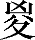
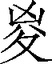

第三卷

 殷本纪第三

殷本来叫作商。商也是一个古老的部落，始祖契大约与夏禹同时，被封于商。到前17世纪或前16世纪，商族逐渐强大，商汤发动了灭夏战争。夏亡，商朝正式建立，定都于亳，成为我国历史上第二个奴隶制王朝。大约到前13世纪，商王盘庚迁都于殷。此后，直至商纣灭亡，共二百七十余年，一般称之为殷。整个商朝，后来或称商殷，或称殷商。

《殷本纪》系统地记载了商朝的历史，描画了一幅商部族兴起，商王朝由建立直至灭亡的宏伟图卷。

在殷王朝统治的约六百年中，几经兴衰，而成汤的兴起，盘庚、武丁的中兴，以及纣的灭亡，则是殷朝历史中起着关键作用的几个最重大的事件。司马迁饱含热情地歌颂了成汤、盘庚、武丁等贤君敬畏上天、修行德政、为民谋利的政治业绩，又无情地贬抑了殷纣的刚愎自用、拒谏饰非、荒淫无度、迫害贤良、残害百姓等。一个王朝的历史，历经十七代三十王（太丁早死不在内），而司马迁只抓住这几个典型关节，泼墨重彩，而其他则一带而过，使得全篇虚实相映，详略有当。

在刻画人物方面，司马迁抓住了能凸显人物个性的几个典型事例，加以叙述、描写，既体现了历史的真实，又使得人物形象丰满、栩栩如生。如成汤祝网、太甲思过、武丁得说等，就把各位贤君修行德政的宽厚形态表现得淋漓尽致。尤其对于纣的描写，几乎完全以叙述的口吻，一件一件地罗列史实，再加上有周文王、周武王的映衬，一个暴君的形象便跃然纸上，成为一个千古流传的暴君典型。

***【原文】***

殷契[1]，母曰简狄[2]，有娀氏[3]之女，为帝喾次妃。三人行浴，见玄鸟[4]堕其卵，简狄取吞之，因孕生契。契长而佐禹治水有功。帝舜乃命契曰：“百姓不亲，五品不训[5]，汝为司徒[6]而敬敷五教。五教在宽。”封于商[7]，赐姓子氏[8]。契兴于唐、虞、大禹之际，功业著于百姓。百姓以平[9]。

***【译文】***

[1]殷：地名。今河南省安阳市。商朝曾迁都于此，故又称殷商。契（xiè）：字或作“偰”，又作“卨”，殷商的始祖，故又称殷契。

[2]简狄：旧本作“简易”。古“易”“狄”音通。

[3]有娀氏：部族名。住地在今山西省运城市盐湖区一带。

[4]玄鸟：燕子。契的诞生情况，是一段神话。它反映了远古只知有母、不知有父的母系社会的情况；还和图腾崇拜有关。

[5]五品：五种伦理关系，指父义、母慈、兄友、弟恭、子孝。品：秩。训：《尚书》作“逊”，通“顺”。

[6]司徒：管教化的官。

[7]商：地名。在今河南省商丘市睢阳区南。

[8]子氏：因玄鸟所生子而赐氏。

[9]平：治，安定。

***【原文】***

契卒，子昭明立。昭明卒，子相土[1]立。相土卒，子昌若立。昌若卒，子曹圉[2]立。曹圉卒，子冥[3]立。冥卒，子振[4]立。振卒，子微[5]立。微卒，子报丁[6]立。报丁卒，子报乙立。报乙卒，子报丙立。报丙卒，子主壬[7]立。主壬卒，子主癸立。主癸卒，子天乙立，是为成汤[8]。

***【译文】***

[1]相土：商代有名先公。

[2]曹圉：《世本》作“粮圉”。

[3]冥：曾担任司空。

[4]振：《世本》作“核”。甲骨文中称“王亥”。

[5]微：庙号上甲，故又称上甲微。

[6]报丁：近人考证，微之子应为“报乙”，报丁为报丙之子。

[7]主壬：近人考证应为示壬。主癸应为示癸。

[8]汤：天乙的谥号。《谥法》：“除虐去残曰汤。”汤取得天下前，商世系为：契——昭明——相土——昌若——曹圉——冥——王亥——王恒（王亥弟）——上甲微（王亥子）——报乙——报丙——报丁——示壬——示癸——天乙（汤）。

***【原文】***

成汤[1]，自契至汤八迁。汤始居亳[2]，从先王[3]居，作《帝诰》[4]。

***【译文】***

[1]成汤：“成汤”二字专提，表示下文专记成汤时代的大事。

[2]亳（bó）：指南亳，在今河南省商丘市睢阳区南。

[3]先王：指帝喾。

[4]《帝诰》：今亡佚。

***【原文】***

汤征诸侯[1]。葛[2]伯不祀，汤始伐之。汤曰：“予有言：人视水见形，视民知治不。”伊尹[3]曰：“明哉！言能听，道乃进[4]。君国子民[5]，为善者皆在王官。勉哉，勉哉！”汤曰：“汝不能敬命，予大罚殛之，无有攸赦[6]。”作《汤征》。

***【译文】***

[1]汤征诸侯：言汤在夏代为方伯，有征伐邻近诸侯国的大权。

[2]葛：国名。在今河南省睢县北。《孟子·滕文公章句下》曾叙述此事。

[3]伊尹：汤的大臣。

[4]明哉！言能听，道乃进：或断句为“明哉言！能听，道乃进。”按第一种断句，“言”指臣下的话；按第二种断句，“言”指汤上面讲的话。

[5]君国：作国家的君主，治理国家。子民：以民为子，爱护百姓。

[6]汝：指葛伯。不能敬命：即“不祀”，对山川神祇宗庙不按时祭祀（古代把祭祀看作国家大事）。殛（jí）：诛罚。攸赦：赦免。攸，所，助词。

***【原文】***

伊尹名阿衡[1]。阿衡欲奸[2]汤而无由，乃为有莘氏媵臣[3]，负鼎俎，以滋味说汤，致于王道[4]。或曰：伊尹处士[5]，汤使人聘迎之，五反然后肯往从汤，言素王及九主[6]之事。汤举任以国政。伊尹去汤适夏。既丑有夏[7]，复归于亳。入自北门，遇女鸠，女房[8]，作《女鸠》《女房》[9]。

***【译文】***

[1]阿衡：有人认为伊尹名挚；阿衡是官名，相当于后世的宰相。

[2]奸：通“干”，求见。

[3]有莘（shēn）氏：部族名。其地在河南开封市祥符区东南陈留镇。一说在今山东省曹县北。媵（yìnɡ）臣：古代贵族女子出嫁时陪嫁的人（奴婢）。汤的妃子是有莘氏的女儿，所以伊尹自愿作陪嫁的男仆以便见汤。

[4]鼎：古代烹饪的器具，多为圆形三足两耳。鼎也作礼器或传国重器。这几句是说伊尹背着鼎俎，用烹调的滋味比喻施政方法，使汤了解王道（行仁政）。

[5]处士：有德才而隐居不当官的人。

[6]素王：此处指远古帝王。九主：作为不同的九类君主，即法君（行法的君主）、专君（专权独断的君主）、授君（授政给臣下的君主）、劳君（为天下勤劳的君主）、等君（分封功臣平均禄赏的君主）、寄君（崩溃在即的君主）、破君（国破身亡的君主）、国君（不详，或以为“国”乃“固”字之讹，指依靠坚固城池而不修德的君主）、三岁社君（年幼即位的君主）。

[7]丑有夏：认为有夏的政治丑恶。

[8]女鸠、女房：汤的两位忠臣。

[9]《女鸠》《女房》：已失传。《女房》亦作《汝方》。

***【原文】***

汤出，见野张网四面，祝曰：“自天下四方皆入吾网。”汤曰：“嘻，尽之矣！”乃去其三面，祝曰：“欲左，左；欲右，右；不用命[1]，乃入吾网。”诸侯闻之，曰：“汤德至矣，及[2]禽兽。”

***【译文】***

[1]左：向左逃跑。右：向右逃跑。不用命：不听从命令。

[2]及：推及。

***【原文】***

当是时，夏桀为虐政淫荒，而诸侯昆吾氏[1]为乱。汤乃兴师率诸侯，伊尹从汤，汤自把钺[2]以伐昆吾，遂伐桀。汤曰：“格女众庶[3]，来，女悉听朕言。匪台小子[4]，敢行举乱；有夏多罪。予维闻女众言，夏氏有罪，予畏上帝，不敢不正[5]。今夏多罪，天命殛之。今女有众，女曰：‘我君不恤我众，舍我啬事而割政[6]。’女其曰：‘有罪，其奈何[7]？’夏王率止众力[8]，率夺[9]夏国。有众率怠[10]不和，曰：‘是日何时丧？予与女皆亡！’夏德若兹，今朕必往。尔尚及予一人致天之罚[11]，予其大理[12]女。女毋不信，朕不食言[13]。女不从誓言，予则帑僇[14]女，无有攸赦。”以告令师[15]，作《汤誓》。于是汤曰：“吾甚武[16]。”号曰武王。

***【译文】***

[1]昆吾氏：部族名。住地在今河南省濮阳县一带，或曰在许昌市建安区一带。

[2]把：握住。钺（yuè）：圆口大斧。

[3]格：叹词，相当于“喂”“来”之类。众庶：众人。

[4]匪：非；不是。台（yí）：我。小子：自己的谦称。

[5]维：《尚书·汤誓》作“惟”，通“虽”。正：通“征”，征讨。这句是说殷民虽对出兵讨夏有怨言，但汤以上帝命令的执行者自居。

[6]恤：怜悯；爱护。割：古通“害”，大也。“割政”即发动大征战。“割政”也可解释为害损政事。这一句有两种解释：一说君指汤，参加战争的民众认为汤不爱护他们，侵夺了他们从事农业生产的时间。一说君指夏桀，指夏桀残害人民，使人民不能从事生产。

[7]其：可能，将要。其奈何：夏桀的罪行如何办？这句是汤代民众设问。

[8]率止众力：耗尽民众的力量。“率”，通“聿”，助词。止：绝，竭。

[9]夺：剥夺；掠夺。

[10]怠：懒惰；怠工。

[11]尚：语气副词，表示希望。及：跟从。予一人：成汤自谦之词。致天之罚：努力执行上天对夏桀的惩罚。

[12]理：《尚书》作“赉”。赏赐。

[13]食言：说了不算数。

[14]帑：通“孥”。妻子和儿女。这里用如动词，惩罚家属如充当奴婢之类。僇：通“戮”，杀。自“汤曰，格女庶众”至此，摘自《尚书·汤誓》。

[15]令师：疑为传令官。甲骨文、金文未见有此官名。

[16]武：勇武，能平定反乱。

***【原文】***

桀败于有娀之虚[1]，桀奔于鸣条，夏师败绩[2]。汤遂伐三[3]，俘厥宝玉，义伯、仲伯作《典宝》[4]。汤既胜夏，欲迁其社[5]，不可，作《夏社》[6]。伊尹报。于是诸侯毕服，汤乃践天子位，平定海内。

***【译文】***

[1]虚：通“墟”，旧址。

[2]鸣条：在今山西省夏县（古安邑）西北。败绩：大败。

[3]三（zōnɡ）：在今山东省菏泽市定陶区北。

[4]俘：缴获。厥：其。义伯、仲伯：汤的两个臣子。义伯，《尚书·汤誓》作“谊伯”。《典宝》：已亡佚。

[5]迁其社：搬掉夏朝的神社。古代以社稷代表国家。

[6]《夏社》：已亡佚。

***【原文】***

汤归至于泰卷陶[1]，中垒[2]作诰。既绌夏命，还亳，作《汤诰》[3]：“维三月，王自至于东郊。告诸侯群后：‘毋不有功于民，勤力乃[4]事，予乃大罚殛女，毋予怨。’曰：‘古禹、皋陶久劳于外，其有功乎民，民乃有安。东为江，北为济，西为河，南为淮，四渎[5]已修，万民乃有居。后稷降播，农殖百谷。三公[6]咸有功于民，故后有立。昔蚩尤与其大夫作乱百姓，帝乃弗予[7]，有状[8]。先王言不可不勉’。曰：‘不道，毋之在国[9]，女毋我怨。”’以令诸侯。伊尹作《咸有一德》[10]，咎单作《明居》[11]。

***【译文】***

[1]泰卷陶：即定陶。或说，“陶”字是衍文，“泰卷”即“大坰”（jiōnɡ），是由定陶还亳途中所经过的一个地方，在今山东省菏泽市定陶区。

[2]中垒：《尚书》作“仲虺”（huǐ）。垒：《正字通》古“雷”字。

[3]《汤诰》：古文《尚书》篇名。今本内容与《史记》此处所引不一致。

[4]乃：你的，你们的。

[5]为：修治。或认为应作“南为江，北为济，东为淮，西为河”。渎（dú）：大河。

[6]三公：指禹、皋陶、后稷。

[7]帝：上帝。予：与；赞助。

[8]有状：有样子；有先例。

[9]毋之在国：不允许前往你们所在的国家。意思是不准许再做诸侯。

[10]《咸有一德》：古文《尚书》篇名，作于伊尹归政于太甲之后，与《史记》记载不合。

[11]咎单：汤的司空（官名）。司空即司工，主管土木工程。

***【原文】***

汤乃改正朔[1]，易服色，上白[2]，朝会以昼。

***【译文】***

[1]改正朔：改变历法。正朔：新年的第一天（正，第一月；朔，第一日）。

[2]易服色：改变器物（包括车马、祭祀用的牲畜、官员服饰等）所崇尚的颜色。上白：崇尚白色。夏代崇尚黑色，殷代崇尚白色，周代崇尚赤色。

***【原文】***

汤崩[1]，太子太丁未立而卒，于是乃立太丁之弟外丙，是为帝外丙。帝外丙即位三年，崩，立外丙之弟中壬，是为帝中壬。帝中壬即位四年，崩，伊尹乃立太丁之子太甲[2]。太甲，成汤適[3]长孙也，是为帝太甲。帝太甲元年，伊尹作《伊训》，作《肆命》，作《徂后》。

***【译文】***

[1]《帝王世纪》：“即位十七年而践天子位，为天子十三年，年百岁而崩。”汤冢，或云在济阴亳县（今亳州市谯城区）；或云在偃师市。

[2]《尚书·伊训》：“成汤既没，太甲元年，伊尹作伊训。”没有提到外丙、中壬。

[3]適：通“嫡”，正宫妻子所生的儿子。太丁为汤適子，太甲为太丁適子。

***【原文】***

帝太甲既立三年，不明，暴虐，不遵汤法，乱德，于是伊尹放之于桐宫[1]。三年，伊尹摄[2]行政当国，以朝诸侯。

***【译文】***

[1]桐宫：离宫名。在今河南省偃师市西南五里汤冢附近。

[2]摄：暂时代理。

***【原文】***

帝太甲居桐宫三年，悔过自责，反[1]善。于是伊尹乃迎帝太甲而授之政。帝太甲修德，诸侯咸归殷，百姓以宁。伊尹嘉之，乃作《太甲训》三篇[2]，褒帝太甲，称太宗。

***【译文】***

[1]反：通“返”，归。

[2]古文《尚书》有《太甲》上中下三篇。

***【原文】***

太宗崩，子沃丁立。帝沃丁之时，伊尹卒。既葬伊尹于亳[1]，咎单遂训[2]伊尹事，作《沃丁》。

***【译文】***

[1]河南省偃师市西北八里有伊尹墓。

[2]训：训导，告诫别人。

***【原文】***

沃丁崩，弟太庚立，是为帝太庚。帝太庚崩，弟小甲立，帝小甲崩，弟雍己立，是为帝雍己。殷道衰，诸侯或不至。

帝雍己崩，弟太戊立，是为帝太戊。帝太戊立伊陟[1]为相。亳有祥，桑榖[2]共生于朝，一暮大拱。帝太戊惧，问伊陟。伊陟曰：“臣闻妖不胜德[3]。帝之政其有阙与？帝其修德。”太戊从之，而祥桑枯死而去[4]。伊陟赞言于巫咸[5]。巫咸治王家有成，作《咸艾》，作《太戊》。帝太戊赞伊陟于庙，言弗臣，伊陟让，作《原命》[6]。殷复兴，诸侯归之，故称中宗。

***【译文】***

[1]伊陟：伊尹的儿子。

[2]祥：本指吉凶征兆，这里指不祥之兆，有怪异的意思。榖（ɡǔ）：楮（chǔ）树。

[3]妖不胜德：古代相信天人感应的学说，认为自然现象与政治有关，君主有德行便可消除怪异的自然现象。

[4]去：离开，消失。

[5]巫咸：大臣名。

[6]《咸艾（yì）》：一作《咸荤》，与《太戊》《原命》今并亡佚。

***【原文】***

中宗崩，子帝中丁立。帝中丁迁于隞[1]，河亶甲居相[2]。祖乙迁于邢[3]。帝中丁崩，弟外壬立，是为帝外壬。《仲丁》书阙不具[4]。帝外壬崩，弟河亶甲立，是为帝河亶甲。河亶甲时，殷复衰。

***【译文】***

[1]隞（áo）：亦作“嚣”。地名。在今河南荥阳市境内。

[2]相：地名。在今河南省内黄县东南。

[3]邢：通“耿”，在今山西河津市。一说邢即今河北邢台。

[4]《仲丁》：篇名。当时已残缺不全，今已亡佚。具：完整。

***【原文】***

河亶甲崩，子帝祖乙立。帝祖乙立，殷复兴。巫贤任职。

祖乙崩，子帝祖辛立。帝祖辛崩，弟沃甲立，是为帝沃甲[1]。帝沃甲崩，立沃甲兄祖辛之子祖丁，是为帝祖丁。帝祖丁崩，立弟沃甲之子南庚，是为帝南庚。帝南庚崩，立帝祖丁之子阳甲，是为帝阳甲。帝阳甲之时，殷衰。

***【译文】***

[1]甲：《世本》作“开甲”。

***【原文】***

自中丁以来，废適而更[1]立诸弟子，弟子或争相代立，比[2]九世乱，于是诸侯莫朝。

***【译文】***

[1]更：交替，连续。

[2]比：接连。

***【原文】***

帝阳甲崩，弟盘庚立，是为帝盘庚。帝盘庚之时，殷已都河北，盘庚渡河南，复居成汤之故居，乃五迁[1]，无定处。殷民咨，胥[2]皆怨，不欲徙。盘庚乃告谕诸侯大臣曰[3]：“昔高后成汤与尔之先祖俱定天下，法则可修。舍而弗勉，何以成德！”乃遂涉河南，治亳，行汤之政，然后百姓由宁，殷道复兴。诸侯来朝，以其遵成汤之德也。

***【译文】***

[1]五迁：指汤至盘庚前后迁都五次。《正义》：“汤自南亳迁西亳，仲丁迁隞，河亶甲居相，相乙居耿，盘庚渡河，南居西亳，是五迁也。”《竹书纪年》：“盘庚即位，自奄（今山东省曲阜市）迁于北蒙（今河南省安阳市），曰殷。”据考古发现，殷墟在河南省安阳市小屯村，《竹书纪年》所记为是。

[2]咨：叹息；忧虑。胥：相。

[3]盘庚的告谕便是《尚书》中的《盘庚》上中下三篇。

***【原文】***

帝盘庚崩，弟小辛立，是为帝小辛。帝小辛立，殷复衰。百姓思盘庚，乃作《盘庚》三篇[1]。帝小辛崩，弟小乙立，是为帝小乙。

***【译文】***

[1]《史记》以百姓思念而作《盘庚》，与《尚书·盘庚》记载不合。《尚书》云：“盘庚五迁，将治亳殷。民咨胥怨，作《盘庚》三篇。”

***【原文】***

帝小乙崩，子帝武丁立。帝武丁即位，思复兴殷，而未得其佐。三年不言，政事决定于冢宰[1]，以观国风。武丁夜梦得圣人，名曰说[2]。以梦所见视群臣百吏，皆非也。于是乃使百工营求[3]之野，得说于傅险[4]中。是时，说为胥靡[5]，筑于傅险。见于武丁，武丁曰：“是也。”得而与之语，果圣人。举以为相，殷国大治。故遂以傅险姓之，号曰傅说。

***【译文】***

[1]冢宰：相当于后来的首相。

[2]说（yuè）：人名。

[3]百工：百官。营求：设法寻求。

[4]傅险：地名。一作“傅岩”。故址在今山西省平陆县东部。

[5]胥靡：犯法服劳役的犯人。

***【原文】***

帝武丁祭成汤，明日，有飞雉登鼎耳而呴[1]。武丁惧。祖己[2]曰：“王勿忧，先修政事。”祖己乃训王曰：“唯天监下典厥义[3]，降年[4]有永有不永，非天夭民，中绝其命[5]。民有不若德，不听罪，天既附命正厥德[6]，乃曰：‘其奈何？’呜呼！王嗣敬民，罔非天继[7]；常祀毋礼于弃道[8]。”武丁修政行德，天下咸欢，殷道复兴。

***【译文】***

[1]雉：野鸡。呴：通“雊（ɡòu）”，野鸡叫。

[2]祖己：大臣名。

[3]天监下：上天监视下民。典厥义：以他们的道义作标准。厥：其他的。

[4]降年：上天赐给人的年岁（寿命）。

[5]天民：使人的寿命夭折。中绝其命：人自己的行为使自己断送寿命。

[6]若：顺从；遵循。听罪：承认自己的罪过。附命正厥德：上天降下妖孽为符信，谴告他要纠正他的德行。附，《尚书》作“孚”，符信。

[7]嗣敬民：尽力为民众办事。嗣，通“司”，主。罔非天继：“罔非继天”的宾语前置式，意即给民众办事，没有不是继承天意的。

[8]常祀毋礼于弃道：祭祀有常规，不要信奉应该抛弃的方法。

***【原文】***

帝武丁崩，子帝祖庚立。祖己嘉武丁之以祥雉为德，立其庙为高宗，遂作《高宗肜日》及《训》[1]。

***【译文】***

[1]《高宗肜日》及《训》：都是《尚书》篇名。《尚书·高宗肜日》：“祖己训诸王，作《高宗肜日》《高宗之训》。”内容是祖己在高宗生前对高宗的规劝。肜（rónɡ），殷祭名。

***【原文】***

帝祖庚崩，帝祖甲立，是为帝甲，帝甲淫乱，殷复衰。

帝甲崩，子帝廪辛[1]立。帝廪辛崩，弟庚丁[2]立，是为帝庚丁。帝庚丁崩，子帝武乙立。殷复去亳，徙河北[3]。

***【译文】***

[1]廪辛：或作“冯辛”。

[2]庚丁：甲骨文作“康且（祖）丁”或“康丁”，庚为康之误。

[3]河北：指黄河以北的朝歌（今河南省淇县）。

***【原文】***

帝武乙无道，为偶人[1]，谓之天神。与之博，令人为行[2]。天神不胜，乃僇辱[3]之。为革囊，盛血，卬而射之[4]，命曰“射天”。武乙猎于河渭之间，暴雷，武乙震死。子帝太丁立。帝太丁崩，子帝乙立。帝乙立，殷益衰。

***【译文】***

[1]偶人：土木等制成的人像。偶，有相像的意思。

[2]博：古代一种赌输赢的游戏。行：通“衡”，评判。

[3]僇（lù）：通“戮”，杀害。辱：污辱。

[4]卬：通“仰”。

***【原文】***

帝乙长子曰微子启[1]，启母贱，不得嗣[2]。少子辛，辛母正后，辛为嗣。帝乙崩，子辛立，是为帝辛，天下谓之纣[3]。

***【译文】***

[1]微：启的封地名。在今山西省长治市潞城区东。子：爵位。启：名。

[2]贱：地位低，不是正妻。嗣：继位。

[3]纣（zhòu）：《谥法》“残义损善曰纣”。

***【原文】***

帝纣资辨[1]捷疾，闻见甚敏；材力过人，手格[2]猛兽；知足以距谏[3]，言足以饰非；矜人臣以能，高天下以声[4]，以为皆出己之下。好酒淫乐，嬖[5]于妇人。爱妲己[6]，妲己之言是从。于是使师涓作新淫声，北里之舞，靡靡之乐[7]。厚赋税以实鹿台之钱而盈钜桥[8]之粟。益收狗马奇物，充仞[9]宫室。益广沙丘苑台，多取野兽蜚[10]鸟置其中。慢于鬼神。大冣乐戏于沙丘，以酒为池，悬肉为林，使男女倮相逐其间，为长夜之饮。

***【译文】***

[1]资：资质；天生的才能。辨：通“辩”，口才好。

[2]格：格斗。

[3]知：通“智”。距：通“拒”。

[4]矜：夸耀。声：声名。

[5]嬖（bì）：宠爱。

[6]妲（dá）己：有苏氏的女儿，姓己名妲。

[7]师涓：名涓的乐官。北里：一种放荡的舞蹈。或以为北里即北鄙，朝歌北边的鄙野。靡（mǐ）靡之乐：颓废的音乐。

[8]鹿台：在朝歌城中筑的高坛。钜桥：仓名。在今河北省曲周县东北。

[9]仞：通“牣（rèn）”，满。

[10]沙丘：地名，在河北省广宗县西北太平台。纣当时到处修筑离宫别墅。苑（yuàn）：养禽兽、植花木以供帝王游乐的场所。蜚：通“飞”。

***【原文】***

百姓怨望而诸侯有畔者，于是纣乃重刑辟，有炮格之法[1]。以西伯昌、九侯、鄂侯为三公[2]。九侯有好女，入之纣。九侯女不憙淫，纣怒，杀之，而醢[3]九侯。鄂侯争之强，辨之疾，并脯[4]鄂侯。西伯昌闻之，窃叹。崇侯虎知之，以告纣，纣囚西伯羑里[5]。西伯之臣闳夭[6]之徒，求美女、奇物、善马以献纣，纣乃赦西伯。西伯出而献洛西之地[7]，以请除炮格之刑。纣乃许之，赐弓矢斧钺，使得征伐，为西伯[8]。而用费中[9]为政。费中善谀，好利，殷人弗亲。纣又用恶来[10]。恶来善毁谗，诸侯以此益疏。

***【译文】***

[1]辟：法。炮烙之法：一种残酷刑罚。

[2]九侯：一作“鬼侯”。鄂侯：一作“邘（yú）侯”。三公：辅助天子掌握军政大权的最高官员。

[3]憙：通“喜”。醢（hǎi）：肉酱，这里用如动词。

[4]脯（fǔ）：干肉。这里用如动词。

[5]崇侯虎：纣的诸侯。羑里：一作“牖里”。地名，在今河南省汤阴县北。

[6]闳（hónɡ）夭：人名。周文王大臣。

[7]洛西之地：洛河（指陕西渭水的支流洛河）西岸的一片土地，包括坊州（今黄陵县）等地。

[8]西伯：管理西方各诸侯国的方伯。

[9]费中：一作“费仲”，人名。

[10]恶来：人名。

***【原文】***

西伯归，乃阴修德行善。诸侯多叛纣而往归西伯，西伯滋大，纣由是稍失权重[1]。王子比干谏[2]，弗听。商容[3]贤者，百姓爱之，纣废之。及西伯伐饥国[4]，灭之，纣之臣祖伊[5]闻之而咎周；恐，奔告纣曰：“天既讫我殷命，假人元龟[6]，无敢知吉。非先王不相我后人，维王淫虐用自绝，故天弃我。不有安食[7]。不虞知天性[8]，不迪率典[9]，今我民罔不欲丧[10]，曰：‘天曷不降威，大命胡[11]不至？’今王其奈何？”纣曰：“我生不有命在天[12]乎。”祖伊反，曰：“纣不可谏矣。”西伯既卒，周武王之东伐，至盟津[13]，诸侯叛殷会周者八百。诸侯皆曰：“纣可伐矣。”武王曰：“尔未知天命。”乃复归。

***【译文】***

[1]滋：更加。稍：逐渐。权重：权势威力。

[2]比干：纣的庶兄（一说为叔父）。他与微子、箕子合称殷之“三仁”。

[3]商容：人名。

[4]饥：一作“阢”，又作“耆”，忠于纣的诸侯国。见《尚书·西伯戡黎》。黎：在今山西省长治市西南；一说在今山西省黎城县东北。

[5]祖伊：贤臣祖己的后代。

[6]讫：终止。假人：至人，眼光敏锐的人。假，通“格”，至。元龟：占卜用的大龟壳。

[7]不有安食：指纣的行为使得大家都不能安心吃饭。旧说指宗庙之神不能安食。

[8]不虞知天性：指纣不考虑和不了解天意。

[9]不迪率典：不遵循常法。迪，句中助词。

[10]罔不欲丧：没有谁不想让纣灭亡。

[11]降威：降下惩罚。大命：指适宜作王的人。曷、胡：何，为什么。

[12]有命在天：指纣以天子自居，不顾百姓的怨恨。

[13]盟津：又称孟津。黄河的重要渡口。

***【原文】***

纣愈淫乱不止。微子数谏不听，乃与大师、少师[1]谋，遂去。比干曰：“为人臣者，不得不以死争[2]。”乃强谏纣。纣怒曰：“吾闻圣人心有七窍。”剖比干，观其心。箕子惧，乃详[3]狂为奴，纣又囚之。殷之大师、少师乃持其祭乐器奔周。周武王于是遂率诸侯伐纣。纣亦发兵距之牧野[4]。甲子日[5]，纣兵败。纣走，入登鹿台，衣其宝玉衣，赴火而死。周武王遂斩纣头，县之大白旗[6]。杀妲己。释箕子之囚，封比干之墓，表商容之闾[7]。封纣子武庚禄父，以续[8]殷祀，令修行盘庚之政。殷民大说。于是周武王为天子。其后世贬[9]帝号，号为王。而封殷后[10]为诸侯，属周。

周武王崩，武庚与管叔、蔡叔作乱。成王命周公诛之，而立微子于宋，以续殷后焉[11]。

***【译文】***

[1]大师、少师：辅佐天子的大臣。大通“太”。

[2]争：通“诤”，劝谏。

[3]详：通“佯”，假装。

[4]牧野：朝歌（今河南省淇县）南郊。邑外为郊，郊外为牧，牧外为野。

[5]甲子日：旧注为周历二月四日。

[6]大白旗：太白旗；古时行军指挥用的大旗。白：或说通“帛”，白旗即帛旗。

[7]封：聚土筑坟。表：表彰。商容之闾：商容居住的里巷。

[8]武庚：字禄父，殷纣的儿子。续：继承。

[9]贬：降低。夏代、商代的天子本来都称帝，后世认为他们赶不上“五帝”，降低称号为王。夏禹、商汤、周文王称为“三王”（或包括周武王）。

[10]殷后：指武庚。

[11]参见《周本纪》《管蔡世家》《宋微子世家》。

***【原文】***

太史公曰：余以《颂》[1]次契之事，自成汤以来，采于《书》《诗》[2]。契为子姓，其后分封，以国为姓，有殷氏、来氏、宋氏、空桐氏、稚氏、北殷氏、目夷氏[3]。孔子曰：“殷路[4]车为善，而色尚白。”

***【译文】***

[1]颂：指《诗经》中的《商颂》。

[2]《书》：指《尚书》。《诗》：指《诗经》。

[3]《世本》没有稚氏，而有时氏、萧氏、黎氏；“北殷氏”作“髦氏”。

[4]路：车名。按：商代从汤到纣，共十七代三十王（太丁早死不在内），其中兄死弟继位的十四王。《竹书纪年》说共四百九十六年，《三统历》说六百二十九年，具体年代难以查考。

## 【译文】

殷家的始祖契，母亲名叫简狄，是有娀氏部落的女子，当了喾帝的第二个妃子。简狄等三个人有一次到河川中去洗浴，看见燕子掉下一个蛋。简狄捡起来吞食了，就这样，她怀了孕而生下契。契长大成人后，帮助禹治水有功，舜帝于是命令契说：“现在老百姓们不相亲爱，父子、君臣、夫妇、长幼、朋友之间五伦关系不顺。你去担任司徒，认真地施行五伦教育。施行五伦教育，要本着宽厚的原则。”契被封在商地，赐姓子。契在唐尧、虞舜、夏禹的时代兴起，为百姓做了许多事，功业昭著，百姓因而得以安定。

契死之后，他的儿子昭明继位。昭明死后，儿子相土继位。相土死后，儿子昌若继位。昌若死后，儿子曹圉继位。曹圉死后，儿子冥继位。冥死后，儿子振继位。振死后，儿子微继位。微死后，儿子报丁继位。报丁死后，儿子报乙继位。报乙死后，儿子报丙继位。报丙死后，儿子主壬继位。主壬死后，儿子主癸继位。主癸死后，儿子天乙继位。这就是成汤。

成汤，从契到汤，经过十四代，有八次迁徙国都。汤开始就定居南亳，这是追忆先王喾帝曾把这里做过国都才迁来的。为向帝喾报告来定居这件事，成汤就写了《帝诰》。

成汤在夏朝为方伯（一方诸侯之长），有权征讨邻近的诸侯。葛伯不祭祀鬼神，成汤首先征讨他。成汤说：“我说过这样的话：人照一照水就能看出自己的形貌，看一看民众就可以知道国家治理得好与不好。”伊尹说：“英明啊！善言听得进去，道德才会进步。治理国家，抚育万民，凡是有德行做好事的人都要任用为朝廷之官。努力吧，努力吧！”成汤对葛伯说：“你们不能敬顺天命，我就要重重地惩罚你们，概不宽赦。”于是，写下《汤征》，记载了征葛的情况。

伊尹名叫阿衡。阿衡想求见成汤而苦于没有门路，于是就去给有莘氏做陪嫁的男仆，背着饭锅砧板来见成汤，借着谈论烹调滋味的机会向成汤进言，劝说他实行王道。也有人说，伊尹本是个有才德而不肯做官的隐士，成汤曾派人去聘迎他，前后去了五趟，他才答应前来归从，向成汤讲述了远古帝王及九类君主的所作所为。成汤于是举用了他，委任他管理国政。伊尹曾经离开商汤到夏桀那里，因为看到夏桀无道，十分憎恶，所以又回到了商都亳。他从北门进城时，遇见了商汤的贤臣女鸠和女房，于是写下《女鸠》《女房》，述说他离开夏桀重回商都时的心情。

一天，成汤外出游猎，看见郊野四面张着罗网。张网的人祝祷说：“愿从天上来的，从地下来的，从四方来的，都进入我的罗网！”成汤听了说：“嗳，这样就把禽兽全部打光了！”于是，把罗网撤去三面，让张网的人祝祷说：“想往左边走的就往左边走，想向右边逃的就向右边逃。不听从命令的，就进我的罗网吧。”诸侯听到这件事，都说：“汤真是仁德到极点了，就连禽兽都受到了他的恩惠。”

就在这个时候，夏桀却施行暴政，荒淫无道，还有诸侯昆吾氏也起来作乱。商汤于是举兵，率领诸侯，由伊尹跟随。商汤亲自握着大斧指挥，先去讨伐昆吾，转而又去讨伐夏桀。商汤说：“来，你们众人，到这儿来，都仔细听着我的话：不是我个人敢于兴兵作乱，是因为夏桀犯下了很多的罪行。我虽然也听到你们说了一些抱怨的话，可是夏桀有罪啊，我畏惧上天，不敢不去征伐。如今夏桀犯下了那么多的罪行，是上天命令我去惩罚他的。现在，你们众人说：‘我们的国君不体恤我们，抛开我们的农事不管，却要去征伐打仗。’你们或许还会问：‘夏桀有罪，他的罪行究竟怎么样？’夏桀君臣推行大徭役，耗尽了夏国的民力；又重加盘剥，掠光了夏国的资财。夏国的民众都在怠工，不与他合作。他们说：‘这个太阳什么时候消灭，我宁愿和你一起灭亡！’夏王的德行已经到这种地步，现在我一定要去讨伐他！希望你们和我一起来奉行上天降下的惩罚，我会重重地奖赏你们。你们不要怀疑，我绝不会说话不算数。如果你们违抗我的誓言，我就要惩罚你们，概不宽赦！”商汤把这些话告诉传令长官，写下了《汤誓》。当时，商汤曾说“我很勇武”，因此号称武王。

夏桀在有娀氏旧地被打败，奔逃到鸣条，夏军就全军崩溃了。商汤乘胜追击，进攻忠于夏桀的三，缴获了他们的宝器、珠玉。义伯、仲伯二臣写下了《典宝》，因为这是国家的固定财宝。商汤灭夏之后，想换掉夏的社神。可是，社神是远古共工氏之子句龙，能平水土，还没有谁比得上他，所以没有换成。于是，写下《夏社》，说明夏社不可换的道理。伊尹向诸侯公布了这次大战的战绩，自此，诸侯全都听命归服了。商汤登上天子之位，平定了天下。

成汤班师回朝，途经泰卷时，中垒作了朝廷的诰命。汤废除了夏的政令，回到国都亳，作《汤诰》号令诸侯。《汤诰》这样记载：“三月，殷王亲自到了东郊，向各诸侯国君宣布：‘各位可不能不为民众谋立功业，要努力办好你们的事情。否则，我就对你们严加惩办。那时，可不要怪罪我。’又说：‘过去，禹、皋陶长期奔劳在外，为民众建立了功业，民众才得以安居乐业。当时，他们东面治理了长江，北面治理了济河，西面治理了黄河，南面治理了淮河。这四条重要的河道治理好了，万民才得以定居。后稷教导民众播种五谷，民众才知道种植各种庄稼。这三位古人都对民众有功，所以，他们的后代能够建国立业。也有另外的情况：从前，蚩尤和他的大臣们在百姓中发动暴乱，上帝就不降福于他们，这样的事在历史上是有过的。先王的教诲，可不能不努力照办啊！’又说：‘你们当中如果有谁干出违背道义的事，那就不允许他回国再当诸侯，那时你们也不要怨恨我。’”汤用这些话告诫了诸侯。这时，伊尹又作了《咸有一德》，说明君臣都应该有纯一的品德。咎单作了《明居》，讲的是民众应该遵守的法则。

商汤临政之后，修改了历法，把夏历的寅月为岁首改为丑月为岁首，又改变了器物服饰的颜色，崇尚白色，在白天举行朝会。

商汤逝世之后，因为太子太丁未能即位而早亡，就立太丁弟外丙为帝，这就是外丙帝。外丙即位三年，逝世，立外丙的弟弟中壬为帝，这就是中壬帝。中壬即位四年，逝世，伊尹就拥立太丁之子太甲为帝。太甲是成汤的嫡长孙，就是太甲帝。太甲元年，伊尹为谏训太甲，作了《伊训》《肆命》《徂后》。

太甲帝临政三年之后，昏乱暴虐，违背了汤王的法度，败坏了德业。因此，伊尹把他流放到汤的葬地桐宫。此后的三年，伊尹代行政务，主持国事，朝会诸侯。

太甲在桐宫住了三年，悔过自责，重新向善。于是，伊尹又迎接他回到朝廷，把政权交还给他。从此以后，太甲帝修养道德，诸侯都来归服，百姓也因此得以安宁。伊尹对太甲帝很赞赏，就作了《太甲训》三篇，赞扬帝太甲，称他为太宗。

太宗逝世后，儿子沃丁即位。沃丁临政的时候，伊尹去世了。在亳地安葬了伊尹之后，为了用伊尹的事迹垂训后人，咎单作了《沃丁》。

沃丁逝世，他的弟弟太庚即位，这就是太庚帝。太庚逝世，儿子小甲即位；小甲帝逝世，弟弟雍已即位，这就是雍已帝。到了这个时候，殷朝的国势已经衰弱，有的诸侯就不来朝见了。

雍已逝世，他的弟弟太戊即位。这就是太戊帝。太戊任用伊陟为相。当时，国都亳出现了桑树和楮树合生在朝堂上的怪异现象，一夜之间就长得非常粗。太戊帝很害怕，就去向伊陟询问。伊陟对太戊帝说：“我曾经听说，妖异不能战胜有德行的人，会不会是您的政治有什么失误啊？希望您进一步修养德行。”太戊听从了伊陟的规谏，那怪树就枯死而消失了。伊陟把这些话告诉了巫咸。巫咸治理朝政有成绩，写下《咸艾》《太戊》，记载了巫咸治理朝政的功绩，颂扬了太戊帝的从谏修德。太戊帝在太庙中称赞伊陟，说不能像对待其他臣下一样对待他。伊陟谦让不从，写下《原命》，为的是重新解释太戊之命。就这样，殷的国势再度兴盛，诸侯又来归服。因此，称太戊帝为中宗。

中宗逝世，儿子中丁继位。中丁帝迁都于隞。后来，河亶甲定都于相，祖乙又迁至邢。中丁帝逝世，他的弟弟外壬即位，这就是外壬帝。这些曾有《仲丁》加以记载，但现已残佚不存。外壬帝逝世后，他的弟弟河亶甲即位，这就是河亶甲帝。河亶甲时，殷朝国势再度衰弱。

河亶甲逝世，他的儿子祖乙即位。祖乙帝即位后，殷又兴盛起来，巫咸被任以重职。

祖乙逝世，他的儿子祖辛帝即位。祖辛帝逝世，他的弟弟沃甲即位，这就是沃甲帝。沃甲逝世，立沃甲之兄祖辛的儿子祖丁，这就是祖丁帝。祖丁逝世，立弟弟沃甲的儿子南庚，这就是南庚帝。南庚帝逝世，立祖丁帝的儿子阳甲，这就是阳甲帝。阳甲帝在位的时候，殷的国势衰弱了。

自中丁帝以来，废除嫡长子继位制而拥立诸弟兄及诸弟兄的儿子，这些人有时为取得王位而互相争斗，造成了连续九代的混乱。因此，诸侯没有人再来朝见。

阳甲帝逝世，他的弟弟盘庚继位。盘庚即位时，殷朝已在黄河以北的奄地定都。盘庚渡过黄河，在黄河以南的亳定都，又回到成汤的故居。因为自汤到盘庚，这已是第五次迁移了，一直没有固定国都，所以殷朝的民众一个个怨声载道，不愿再受迁移之苦。盘庚见此情况，就告谕诸侯大臣说：“从前，先王成汤和你们的祖辈们一起平定天下，他们传下来的法度和准则应该遵循。如果我们舍弃这些而不努力推行，那怎么能成就德业呢？”这样，最后才渡过黄河，南迁到亳，修缮了成汤的故宫，遵行成汤的政令。此后，百姓渐渐安定，殷朝的国势又一次兴盛起来。因为盘庚遵循了成汤的德政，诸侯也纷纷前来朝见了。

盘庚帝逝世，他的弟弟小辛即位，这就是小辛帝。小辛在位时，殷又衰弱了。百姓们思念盘庚，于是写下了《盘庚》三篇。小辛帝逝世以后，他的弟弟小乙即位，这就是小乙帝。

小乙帝逝世，他的儿子武丁即位。武丁帝即位后，想复兴殷朝，但一直没有找到称职的辅佑大臣。于是，武丁三年不发表政见，政事由冢宰决定，自己审慎地观察国家的风气。有一天夜里，他梦见得到一位圣人，名叫说。白天，他按照梦中见到的形象观察群臣百官，没有一个像是那圣人。于是，派百官到民间去四处寻找，终于在傅险找到了说。这时候，说正服刑役，在傅险修路。百官把说带来让武丁看，武丁说正是这个人。找到说之后，武丁和他交谈，发现果真是位贤圣之人，就举用他担任国相，殷国得到了很好的治理。因而用傅险这个地名来作说的姓，管他叫傅说。

有一次，武丁祭祀成汤。第二天，有一只野鸡飞来登在鼎耳上鸣叫，武丁为此惊惧不安。祖己说：“大王不必担忧，先办好政事。”祖己进一步开导武丁说：“上天监察下民是着眼于他们的道义。上天赐给人的寿运有长有短，并不是上天有意使人的寿运夭折，中途断送性命。有的人不遵循道德，不承认罪恶，等到上天降下命令纠正他的德行了，他才想起来说‘怎么办’。唉，大王您继承王位，努力办好民众的事，没有什么不符合天意的，还要继续按常规祭祀，不要根据那些应该抛弃的邪道举行各种礼仪！”武丁听了祖己的劝谏，修行德政，全国上下都高兴，殷朝的国势又兴盛了。

武丁帝逝世，他的儿子祖庚帝即位。祖己赞赏武丁因为象征吉凶的野鸡出现而行德政，给他立庙，称为高宗，写下了《高宗肜日》和《高宗之训》。

祖庚帝逝世，他的弟弟祖甲即位，这就是甲帝。甲帝淫乱，殷朝再度衰落。

甲帝逝世，他的儿子廪辛即位。廪辛逝世，他的弟弟庚丁即位，这就是帝庚丁。庚丁逝世，他的儿子武乙即位。这时，殷都又从亳迁到了黄河以北。

武乙暴虐无道，曾经制作了一个木偶人，称它为天神，跟它下棋赌输赢，让旁人替它下子。如果天神输了，就侮辱它。又制作了一个皮革的囊袋，里面盛满血，仰天射它，说这是“射天”。有一次，武乙到黄河和渭河之间去打猎，天空中突然打雷，武乙被雷击死。武乙死后，他的儿子太丁帝即位。太丁帝逝世，他的儿子乙帝即位，乙帝即位时，殷朝更加衰落了。

乙帝的长子叫微子启。启的母亲地位低贱，因而启不能继承帝位。乙帝的小儿子叫辛，辛的母亲是正王后，因而辛被立为继承人。乙帝逝世后，辛继位，这就是辛帝，天下都管他叫“纣”，因为谥法上“纣”表示残义损善。

纣天资聪颖，有口才，行动迅速，接受能力很强，而且力气过人，能徒手与猛兽格斗。他的智慧足可以拒绝臣下的谏劝，他的话语足可以掩饰自己的过错。他凭着才能在大臣面前夸耀，凭着声威到处抬高自己，认为天下所有的人都比不上他。他嗜好喝酒，放荡作乐，宠爱女人。他特别宠爱妲己，一切都听从妲己的。他让乐师涓为他制作了新的俗乐，北里舞曲，柔弱的歌。他加重赋税，把鹿台钱库的钱堆得满满的，把钜桥粮仓的粮食装得满满的。他多方搜集狗马和新奇的玩物，填满了宫室，又扩建沙丘的园林楼台，捕捉大量的野兽飞鸟，放置里面。他对鬼神傲慢不敬。他招来大批戏乐，聚集在沙丘，用酒当作池水，把肉悬挂起来当作树林，让男女赤身裸体，在其间追逐戏闹，饮酒寻欢，通宵达旦。

纣如此荒淫无度，百姓怨恨他，诸侯有的也背叛了他。于是，他就加重刑罚，设置了叫作炮烙的酷刑，让人在涂满油的铜柱上爬行，下面点燃炭火，爬不动了就掉在炭火里。纣任用西伯昌、九侯、鄂侯为三公。九侯有个美丽的女儿，献给了纣，她不喜淫荡，纣大怒，杀了她，同时把九侯也施以醢刑，剁成肉酱。鄂侯极力强谏，争辩激烈。结果，鄂侯也遭到脯刑，被制成肉干。西伯昌闻见此事，暗暗叹息。崇侯虎得知，向纣去告发，纣就把西伯囚禁在羑里。西伯的僚臣闳夭等人，找来了美女、奇物和好马献给纣，纣才释放了西伯。西伯从狱里出来之后，向纣献出洛水以西的一片土地，请求废除炮烙的酷刑。纣答允了他，并赐给他弓箭大斧，使他能够征伐其他诸侯。这样一来，他就成了西部地区的诸侯之长，就是西伯。纣任用费仲管理国家政事。费仲善于阿谀，贪图财利，殷国人因此不来亲近了。纣又任用恶来，恶来善于毁谤，喜进谗言，诸侯因此越发疏远了。

西伯回国，暗地里修养德行，推行善政，诸侯很多背叛了纣而来归服西伯。西伯的势力更加强大，纣因此渐渐丧失了权势。王子比干劝说纣，纣不听。商容是一个有才德的人，百姓敬爱他，纣却黜免了他。等到西伯攻打饥国并把它灭掉了，纣的大臣祖伊听说后既怨恨周国，又非常害怕，于是跑到纣那里去报告说：“上天已经断绝我们殷国的寿运了。不管是能知天吉凶的人预测，还是用大龟占卜，都没有一点好征兆。我想，并非先王不帮助我们后人，而是大王您荒淫暴虐，以致自绝于天，所以上天才抛弃我们，使我们不得安食，而您既不揣度了解天意，又不遵循常法。如今我国的民众没有不希望殷国早早灭亡的，他们说：‘上天为什么还不显示你的威灵？灭纣的命令为什么还不到来？’大王您如今想怎么办呢？”纣说：“我生下来做国君，不就是奉受天命吗？”祖伊从纣王那里离开后说：“纣已经无法规劝了！”西伯昌死后，周武王率军东征，到达盟津时，诸侯背叛殷纣前来与武王会师的有八百国。诸侯们都说：“是讨伐纣的时候了！”周武王说：“你们不了解天命。”于是，又班师回国了。

纣更加淫乱暴虐永无休止。微子多次进谏还是无用，于是和太师、少师一起谋划，就离去了。比干说：“做一个国王的臣子，不能不用死来谏诤。”比干就极力去向纣进谏。纣发怒说：“我听说圣贤的人心脏有七个孔。”就剖开比干的胸部，挖出心脏来看看。箕子恐惧，于是假装癫狂做奴隶，纣又把他囚起来。殷的太师、少师就抱着他们所用的祭器和乐器逃奔到了周。周武王在这种形势下，便率领四方诸侯讨伐纣。纣也发动军队在牧野进行抵抗。甲子这一天，纣的军队失败。纣逃跑进入王宫，登上鹿台，穿上用宝玉装饰缝制的衣服，跳到火中自焚而死。周武王就斩下纣王的头，把它悬挂在太白旗杆上。杀死妲己。把箕子释放出来，聚土重筑比干的坟墓，在商容居住过的里巷对他进行表彰。分封纣的儿子武庚禄父，来继续殷家的祭祀，令他们执行盘庚时代的政令规范。殷地的百姓非常喜悦。于是，周武王就做了天子。由于后世贬低帝的称号，改变称号叫作王。封殷的后代为诸侯国，隶属于周。

周武王逝世，武庚和武王的弟弟管叔、蔡叔一起举行叛乱，成王命令周公把他们诛杀，再在宋地立微子的家族，来延续殷家的后代。

太史公说：“我根据《诗经》中《颂》部分的文献依次记述契的事情，从成汤以后，材料就是采自《尚书》《诗经》。契是子姓，他的后代分封，用封地的国名作姓，这就有殷氏、来氏、宋氏、空桐氏、稚氏、北殷氏、目夷氏。孔子说过，殷人的路车最好，但殷在颜色方面是崇尚白色。”

