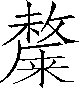
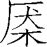
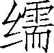
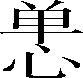
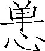

第四卷

 周本纪第四

《周本纪》概括地记述了周王朝兴衰的历史，勾画出一个天下朝宗、幅员辽阔的强大奴隶制王国的概貌，以及其间不同阶段不同君王厚民爱民或伤民虐民的不同政治作风，君臣之间协力相助共图大业或相互倾轧各执己见的不同政治气氛。

在这篇本纪里，司马迁明显地是以儒家的思想观点来看待周朝历史的，宣扬的是仁义兴邦的道理。这突出地表现在对文王、武王、成王、周公的叙写上。这几个人都是儒家理想中圣主贤臣的典范，周初那种君臣和睦、偃戈释旅的局面也正是儒家理想中的政治环境。篇中对武王着意进行了刻画，在叙写了他灭殷的过程之后，又写了他日不暇食、夜不安寐，立社稷、改正朔，实行分封、以殷制殷等安邦定国、攘边安内的政策策略，给读者展示了一个有宏图大略、有经营之术的古代政治家的形象。

这篇本纪选材精审，详略得当，间或用小说笔法渲染环境，烘托气氛，于细行微言之中突出人物性格，使得一篇约八百年的王朝史简明扼要，跌宕生姿，令人回味。

***【原文】***

周后稷[1]，名弃。其母有邰氏[2]女，曰姜原。姜原为帝喾元妃。姜原出野，见巨人迹，心忻然说[3]，欲践之，践之而身动如孕者。居期而生子，以为不祥，弃之隘巷，马牛过者皆辟[4]不践；徙置之林中，适会山林多人，迁之[5]；而弃渠中冰上，飞鸟以其翼覆荐[6]之。姜原以为神，遂收养长之。初欲弃之，因名曰弃。

***【译文】***

[1]后稷：周始祖。古公亶父曾大力开辟周原（今陕西省岐山南部大片原野），故以“周”为国号。

[2]有邰（tái）氏：部族名。邰是其居地，在今陕西省武功县西南。据说是炎帝之后，故姓姜。

[3]忻然：喜欢的样子。忻：通“欣”。说：通“悦”，高兴。

[4]居期（jī）：过了一周年。这里指怀胎足月。隘：狭小。辟：通“避”。

[5]迁之：变换丢弃他的地方。“迁”与上句“徙”同义。

[6]覆：覆盖。荐：垫上。

***【原文】***

弃为儿时，屹[1]如巨人之志。其游戏，好种树[2]麻、菽，麻、菽美。及为成人，遂好耕农，相[3]地之宜，宜谷者稼穑焉，民皆法则之。帝尧闻之，举弃为农师，天下得其利，有功。帝舜曰：“弃，黎民始饥，尔后稷播时百谷。”封弃于邰[4]，号曰后稷，别姓[5]姬氏。后稷之兴，在陶唐、虞、夏之际，皆有令[6]德。

***【译文】***

[1]屹（yì）：出类拔萃的样子。

[2]种树：栽种。

[3]相：观察。

[4]邰：一作“”（tái）。有邰氏的居地，在今陕西省武功县西南。

[5]别姓：独立为姓。

[6]令：美好。

***【原文】***

后稷卒，子不窋立。不窋末年，夏后氏政衰，去稷不务[1]，不窋以失其官而奔戎狄[2]之间。不窋卒，子鞠立。鞠卒，子公刘立。公刘虽在戎狄之间，复修后稷之业，务耕种，行地宜，自漆、沮[3]度渭，取材用。行者有资，居者有畜积，民赖其庆。百姓怀之，多徙而保归[4]焉。周道之兴自此始，故诗人歌乐思其德[5]。公刘卒，子庆节立，国于豳[6]。

***【译文】***

[1]夏后氏：指夏禹的后代帝王。去稷：废弃农事官。韦昭以为，去稷不务在“夏太康失国”之时。

[2]戎狄：指西北地区的部族。不窋所奔故地在今甘肃省庆阳市庆城县一带。

[3]漆、沮：皆渭水支流，在陕西省铜川市耀州区合流后称石川河，南流入渭水。

[4]保归：拥护归顺。

[5]诗人歌乐思其德：指《诗·大雅·公刘》。

[6]豳：通“邠”（bīn），邑名，在今陕西省旬邑县西南。

***【原文】***

庆节卒，子皇仆立。皇仆卒，子差弗立。差弗卒，子毁隃立。毁隃卒，子公非立。公非卒，子高圉立。高圉卒，子亚圉立。亚圉卒，子公叔祖类立。公叔祖类卒，子古公亶父立。

古公亶父复修后稷、公刘之业，积德行义，国人皆戴之。薰育[1]戎狄攻之，欲得财物，予之。已复攻，欲得地与民。民皆怒，欲战。古公曰：“有民[2]立君，将以利之。今戎狄所为攻战，以吾地与民。民之在我，与其在彼，何异？民欲以我故战，杀人父子而君之，予不忍为。”乃与私属遂去豳，度漆、沮，踰梁山[3]，止于岐[4]下。豳人举国扶老携弱，尽复归古公于岐下。及他旁国，闻古公仁，亦多归之。于是古公乃贬戎狄之俗[5]，而营筑城郭室屋，而邑别[6]居之。作五官有司[7]。民皆歌乐之，颂其德[8]。

***【译文】***

[1]薰育：通“獯鬻”，古代北方部族名。夏代称薰育，周代称猃狁，战国秦汉称匈奴。

[2]有民：民众。

[3]梁山：在今陕西省乾县西北。

[4]岐：岐山，在今陕西省岐山县与凤翔县一带。

[5]贬：损减。这里是部分地进行改变的意思。戎狄之俗：指西北部族的游牧风俗。

[6]邑别：分别成邑落。

[7]作五官有司：建立各种官职，使其各有管理的职责。《礼记·曲礼下》：“天子之五官曰司徒、司马、司空、司土、司寇，典司五众。”

[8]颂其德：指《诗》对古公亶父的称颂。

***【原文】***

古公有长子曰太伯，次曰虞仲。太姜[1]生少子季历，季历娶太任[2]，皆贤妇人；生昌，有圣瑞[3]。古公曰：“我世当有兴者，其在昌乎？”长子太伯、虞仲知古公欲立季历以传昌，乃二人亡如荆蛮[4]，文身断发[5]，以让季历。

***【译文】***

[1]太姜：太王之妃，有邰氏之女。

[2]太任：季历之妃，挚任氏之女，周文王之母。

[3]昌：即西伯姬昌（文王）。圣瑞：圣人出生的征兆。

[4]亡：逃走。荆蛮：即楚。吴越原属楚。秦灭楚后，改称荆，以避秦庄襄王子楚之讳。太伯、虞仲奔吴越事，详《吴太伯世家》。

[5]文身断发：在身上刻画花纹，削短头发。

***【原文】***

古公卒，季历立，是为公季。公季修古公遗道，笃于行义，诸侯顺之。

公季卒，子昌立，是为西伯。西伯曰文王。遵后稷、公刘之业，则古公、公季之法，笃[1]仁，敬老，慈少。礼下贤者，日中不暇食以待士，士以此多归之。伯夷、叔齐在孤竹，闻西伯善养老，盍往归之[2]。太颠、闳夭、散宜生、鬻子、辛甲大夫之徒皆往归之[3]。

***【译文】***

[1]则：法则。这里用如动词，效仿。笃：真诚，纯一。这里用作动词，专心实行。

[2]“伯夷”等三句：详见《伯夷列传》。盍：通“合”，一同，一起。“盍（何）往归之？”亦可理解为二人商量口气。

[3]刘向《别录》：“鬻子名熊，封于楚。辛甲，故殷之臣。事纣，盖七十五谏而不听，去至周，召公与语，贤之，告文王，文王亲自迎接，以为公卿，封长子。”长子：地名。在今山西省长治市西。以上诸人皆周贤臣。

***【原文】***

崇侯虎[1]谮西伯于殷纣曰：“西伯积善累德，诸侯皆向之，将不利于帝。”帝纣乃囚西伯于羑里[2]。闳夭之徒患之，乃求有莘氏[3]美女，骊戎之文马[4]，有熊九驷[5]，他奇怪物，因殷嬖臣费仲而献之纣。纣大说，曰：“此一物[6]足以释西伯，况其多乎？”乃赦西伯，赐之弓矢斧钺，使西伯得征伐。曰：“谮西伯者，崇侯虎也。”西伯乃献洛西之地，以请纣去炮烙之刑。纣许之。

***【译文】***

[1]崇侯虎：崇国的诸侯，名虎。崇国，在今陕西省西安市西南部鄠邑区东。

[2]羑里：一作“牖里”。在今河南省汤阴县北。

[3]有莘（shēn）氏：部族名。莘，姒姓。故都在今陕西省合阳县东南。

[4]骊戎：部族名。姬姓。居地在今陕西省西安市临潼区一带。文马：漂亮的骏马。

[5]有熊：部族名。居地在今河南省新郑市。驷：古代每辆车用四匹马，称为驷。九驷，九辆车三十六匹马。

[6]此一物：这样的一件东西。旧说，指有莘氏之美女。

***【原文】***

西伯阴行善，诸侯皆来决平[1]。于是，虞、芮[2]之人，有狱[3]不能决，乃如周。入界，耕者皆让畔，民俗皆让长。虞、芮之人未见西伯，皆惭相谓曰：“吾所争，周人所耻，何往为？只取辱耳。”遂还，俱让而去。诸侯闻之，曰：“西伯盖受命之君[4]。”

***【译文】***

[1]决平：对争端作公平裁决。

[2]虞：在今山西省平陆县境内。芮：在今陕西省大荔县东南。

[3]狱：诉讼，打官司。

[4]盖：语气词，表推断。受命之君：承受天命的君主。

***【原文】***

明年，伐犬戎[1]。明年，伐密须[2]。明年，败耆国[3]。殷之祖伊闻之，惧，以告帝纣。纣曰：“不有天命乎？是何能为？”明年，伐邘[4]。明年，伐崇侯虎，而作丰[5]邑。自岐下而徙都丰。明年，西伯崩。太子发立，是为武王。

***【译文】***

[1]犬戎：部族名。或作“畎戎”“畎夷”“昆夷”“绲夷”。居地在今陕西省彬州市、岐山一带。

[2]密须：部族名。姑姓。在今甘肃省灵台县西。

[3]耆国：即黎国。

[4]邘（yú）：诸侯国名。在今河南省沁阳市西北。

[5]丰：邑名。在今陕西省西安市鄠邑区东。

***【原文】***

西伯盖即位五十年。其囚羑里，盖益《易》之八卦为六十四卦[1]。诗人[2]道西伯。盖受命之年称王而断虞芮之讼[3]。后十[4]年而崩，谥为文王[5]。改法度，制正朔[6]矣。追尊古公为太王，公季为王季；盖王瑞自太王兴。

***【译文】***

[1]八卦：我国古代用以象征自然现象与人事现象的一套符号，即乾、坤、震、巽、离、坎、兑、艮。六十四卦：由八卦每两卦相配重合为一卦，共得六十四卦。

[2]诗人：指《诗》中歌颂文王诗篇的作者们。

[3]“盖受命”句：这句的意思是，文王在断虞芮讼狱的那年，便承受天命，受到诸侯拥护而称王。

[4]十：或为“九”之误，后文有“九年，武王上祭于毕”之说。

[5]《谥法》：“经纬天地曰文。”

[6]改法度、制正朔：这句话是说文王称王后，已完全脱离殷朝，建立了自己的法令制度，采用了周历。

***【原文】***

武王即位，太公望为师，周公旦[1]为辅，召公、毕公[2]之徒左右王，师修文王绪业。

***【译文】***

[1]太公望：姜姓，吕氏，名尚。周公旦：姓姬，名旦。文王之子。详见《鲁周公世家》。

[2]召公：姓姬，名奭。毕公：名高，文王之子，封于毕（今陕西省咸阳市西北，一名咸阳原）。

***【原文】***

九年，武王上祭于毕[1]，东观兵[2]，至于盟津。为文王木主，载以车，中军[3]；武王自称太子发。言奉文王以伐，不敢自专。乃告司马、司徒、司空，诸节[4]：“齐栗[5]，信哉！予无知，以先祖有德，臣小子[6]受先功。毕立赏罚，以定其功。”遂兴师。师尚父[7]号曰：“总尔众庶[8]，与尔舟楫，后至者斩。”武王渡河，中流，白鱼跃入王舟中，武王俯取以祭[9]。既渡，有火自上覆于下，至于王屋，流为乌[10]，其色赤，其声魄云。是时，诸侯不期而会盟津者八百诸侯。诸侯皆曰：“纣可伐矣。”武王曰：“女未知天命，未可也。”乃还师归。

***【译文】***

[1]九年：武王九年。文王于九年逝世后，武王继续采用文王年号（下同）。毕：有两说，一说是文王墓地毕原（今陕西省咸阳市东北），则是武王观兵前祭文王；一说是毕宿，毕宿主战争，则是武王祭毕星于出兵之前。

[2]观兵：军事演习，以观察殷纣的反应和民心。

[3]木主：为死者立的木制牌位。中军：主帅所在的部队。

[4]司马、司徒、司空：皆官名。诸节：各种接受符节的军事官员。

[5]齐栗：庄敬戒惧。

[6]臣小子：武王自称。

[7]师尚父：武王对太公望的尊称。

[8]总：集合。众庶：众人，指各自统领的军队。

[9]俯取以祭：殷尚白，武王斩白鱼祭天象征伐殷。

[10]乌：乌鸦。

***【原文】***

居二年[1]，闻纣昏乱暴虐滋甚，杀王子比干，囚箕子。太师疵、少师彊抱其乐器而奔周。于是武王遍告诸侯曰：“殷有重罪，不可以不毕伐[2]。”乃遵文王，遂率戎车[3]三百乘，虎贲三千人，甲士四万五千人，以东伐纣。十一年十二月戊午，师毕渡盟津，诸侯咸会。曰：“孳孳[4]无怠！”武王乃作《太誓》[5]，告于众庶：“今殷王纣乃用其妇人之言，自绝于天，毁坏其三正[6]，离逷[7]其王父母弟；乃断弃其先祖之乐，乃为淫声，用变乱正声，怡说妇人。故今予发维共行天罚。勉哉夫子[8]！不可再[9]，不可三！”

***【译文】***

[1]居二年：过了两年。据《尚书》记载，武王观兵孟津是十一年，伐纣是十三年。比《史记》所记载的迟两年。

[2]毕；迅速。伐：一作“灭”。

[3]戎车：兵车。

[4]孳孳：通“孜孜”，勤奋努力。

[5]《太誓》：即《泰誓》，《尚书》篇名。《尚书》有《泰誓》三篇。

[6]三正：疑指三位正直贤臣，即比干、微子、箕子。或说指天、地、人的正道。

[7]离逷（tì）：疏远。

[8]夫子：对各路诸侯的尊称。

[9]再：第二次。这句意即要一举成功。

***【原文】***

二月甲子昧爽[1]，武王朝至于商郊牧野，乃誓[2]。武王左杖黄钺，右秉白旄[3]，以麾。曰：“远矣，西土之人[4]！”武王曰：“嗟！我有国冢君[5]，司徒、司马、司空、亚旅、师氏、千夫长、百夫长[6]，及庸、蜀、羌、髳、微、、彭、濮[7]人，称[8]尔戈，比[9]尔干，立尔矛，予其誓。”王曰：“古人有言：‘牝鸡无晨。牝鸡之晨，惟家之索[10]。’今殷王纣维妇人言是用，自弃其先祖肆祀[11]不答，昏[12]弃其家国；遗其王父母弟不用，乃维四方之多罪逋逃是崇是长，是信是[13]使，俾[14]暴虐于百姓，以奸轨[15]于商国。今予发维共行天之罚。今日之事，不过六步七步，乃止齐焉[16]，夫子勉哉！不过于四伐[17]五伐六伐七伐，乃止齐焉，勉哉夫子！尚桓桓，如虎如罴，如豺如离[18]；于商郊，不御克奔，以役西土[19]，勉哉夫子！尔所不勉，其[20]于尔身有戮。”誓已，诸侯兵会者车四千乘，陈师牧野。

***【译文】***

[1]二月：周历二月，相当殷正月。昧爽：天微明而太阳尚未出来的时候。

[2]郊牧野：纣都朝歌郊外的大片原野。今河南省淇县以南、卫辉市一带。《尔雅·释地》：“邑外谓之郊，郊外谓之牧，牧外谓之野。”故郊牧野为同义复合。誓：誓师。

[3]钺（yuè）：大斧。旄（máo）：装饰有牦牛尾的大旗。

[4]西土之人：指西方远征来的战士。

[5]有国冢君：尊称各国诸侯。冢，大。

[6]司徒：民政长官。司马：军事长官。司空：管建筑、制造的长官。亚旅：各种大夫，位次于卿。师氏：带兵的大夫。千夫长：带领一千人的军官。百夫长：带领一百人的军官。

[7]庸：在今湖北省竹山县东南。蜀：今四川省北部一带。羌：在今陕甘一带。髳（máo）：山西南部沿黄河一带，一说在今南阳西南荆山、汉水一带。微：今陕西省眉县一带，一说为古西南夷，在今重庆市巴南区一带。卢（lú）：湖北襄阳以南、南漳县东北一带。彭：今重庆市彭水自治县一带。濮：今湖北省石首市南。以上八种人皆当时西南地区部族。

[8]称：举。

[9]比：排比。

[10]牝（pìn）：雌；母。索：尽，倾家荡产的意思。这一句是比喻妇人（妲己之流）干预朝政。

[11]肆祀：对宗庙祖先的一种祭祀。

[12]昏：惑乱。

[13]多罪逋（bū）逃：罪大而逃跑的人。逋，逃。崇，长（zhǎnɡ）：尊重。信：信任。使：使用。是：复指多罪逋逃的人，是宾语前置的标志。

[14]俾：使。

[15]奸轨：干各种坏事。轨：通“宄”（ɡuǐ），犯法作乱。

[16]不过六步七步，乃止齐焉：每前进六七步，便停下来整齐队伍。指遵守军纪，共同前进。

[17]伐：击刺，冲锋。

[18]尚：表示希望的语气词。桓桓：威武，勇猛。离（chī）：通“螭”，传说中的一种无角的龙。

[19]不御克奔：不拒绝能奔来投降的殷纣士兵；或说不强暴地杀戮战败奔跑的殷纣士兵。御，强暴。以役西土：以为我们西方（指周及其同盟诸侯）服役。

[20]所：若，如果。其：将。

***【原文】***

帝纣闻武王来，亦发兵七十万人距武王。武王使师尚父与百夫致师[1]，以大卒[2]驰帝纣师。纣师虽众，皆无战之心。心欲武王亟入，纣师皆倒兵以战，以开[3]武王。武王驰之，纣兵皆崩，畔纣。纣走，反入登于鹿台之上，蒙衣其殊玉[4]，自燔于火而死。武王持大白旗以麾诸侯，诸侯毕拜武王；武王乃揖诸侯，诸侯毕从。武王至商国[5]，商国百姓咸待于郊。于是武王使群臣告语商百姓曰：“上天降休[6]。”商人皆再拜稽首，武王亦答拜。遂入，至纣死所。武王自射之，三发而后下车，以轻剑[7]击之，以黄钺斩纣头，县大白之旗。已而至纣之嬖妾二女，二女皆经[8]自杀。武王又射三发，击以剑，斩以玄钺[9]，县其头小白之旗。武王已乃出复军[10]。

***【译文】***

[1]致师：大战开始前，让少数勇士冲入敌阵挑战。

[2]大卒：大部队。大卒有兵车三百五十乘、士兵二万六千二百五十人，虎贲三千人。

[3]亟：通“急”。倒兵：倒戈，掉转兵器攻击自己原来一方。开：开路。

[4]殊玉：特别珍贵的美玉。殊，亦作珠。

[5]商国：商的国都，指朝歌。故城在今河南省淇县东北。

[6]休：幸福。

[7]轻剑：《尚书》作“轻吕击之”。轻吕是宝剑名。

[8]嬖（bì）：宠爱。经：上吊。

[9]玄钺：黑色的大斧，铁制。

[10]复军：返回军中。

***【原文】***

其明日，除道，修社及商纣宫。及期，百夫荷罕旗[1]以先驱。武王弟叔振铎奉陈常车[2]，周公旦把大钺，毕公[3]把小钺，以夹[4]武王。散宜生、太颠、闳夭皆执剑以卫武王。既入，立于社南大卒之左，左右毕从。毛叔郑奉明水[5]，卫康叔封布兹[6]，召公奭[7]赞采，师尚父牵牲。尹佚策祝[8]曰：“殷之末孙季纣，殄废[9]先王明德，侮蔑神祇[10]不祀，昏暴商邑百姓，其章[11]显闻于天皇上帝。”于是武王再拜稽首，曰：“膺更大命[12]，革殷，受天明命。”武王又再拜稽首，乃出。

***【译文】***

[1]罕旗：即云罕旗。旗上有九条飘带。古代作为仪仗队的前驱。

[2]奉：献上。陈：陈列。常车：仪仗车。车上插有日、月图像的太常旗，以示王者的威仪。

[3]毕公：《史记志疑》认为毕公乃“召公”之误。

[4]夹：立于左右。

[5]毛叔郑：文王子毛伯明，名叔郑，封于毛（今河南宜阳）。明水：净水，月夜时用青铜镜所取得的露水，祭祀时作玄酒。《礼记·礼运》疏：“玄酒，谓水也。”

[6]卫康叔封：武王弟，名封。布：铺。兹：用公明草编的席子。

[7]奭（shì）：召公的名。

[8]尹佚：人名。武王相。策祝：读策书祝文。

[9]殄（tiǎn）废：抛弃干净。

[10]祇（qí）：地神。

[11]其章：指纣的罪恶。

[12]膺（yīnɡ）：承受。更大命：更改天命，即更换朝代。

***【原文】***

封商纣子禄父[1]殷之余民。武王为殷初定未集[2]，乃使其弟管叔鲜、蔡叔度[3]相禄父治殷。已而[4]命召公释箕子之囚；命毕公释百姓之囚，表商容之闾；命南宫括散鹿台之财，发钜桥之粟，以振贫弱萌隶[5]；命南宫括、史佚展九鼎保玉[6]；命闳夭封比干之墓；命宗祝享祠[7]于军。乃罢兵西归。行狩[8]，记政事，作《武成》。封诸侯，班赐宗彝[9]，作《分殷之器物》[10]。武王追思先圣王，乃褒封神农之后于焦，黄帝之后于祝，帝尧之后于蓟，帝舜之后于陈，大禹之后于杞[11]。于是封功臣谋士，而师尚父为首封。封尚父于营丘[12]，曰齐；封弟周公旦于曲阜，曰鲁；封召公奭于燕；封弟叔鲜于管；弟叔度于蔡。余各以次受封。

***【译文】***

[1]禄父：武庚的字。

[2]定：平定。集：安定，统一，成功。

[3]管叔鲜：周文王第三子。封地在管（今河南省郑州市）。蔡叔度：周文王第五子。封地在蔡（今河南省上蔡县）。

[4]已而：接着。

[5]振：通“赈”，救济。萌隶：普通民众。

[6]保玉：宝玉。保，通“宝”。

[7]宗祝：管祭祀的官名。享祠：祭祀鬼神，当指祭奠阵亡将士。

[8]行狩：巡视。

[9]班：通“颁”，分。宗彝：宗庙祭祀用的宝器。

[10]《分殷之器物》：根据《尚书·分器序》，“殷之”“物”三字当为衍文。

[11]焦：地名。在今河南省三门峡市陕州区。祝：祝其，又名夹谷。在今山东省济南市莱芜区东南。蓟（jì）：在今北京市大兴区西南，非今日天津市之蓟州区。陈：在今河南省周口市淮阳区。杞：在今河南省杞县。

[12]营丘：今山东省淄博市东北临淄区。

***【原文】***

武王征九牧之君[1]，登豳[2]之阜，以望商邑。武王至于周，自[3]夜不寐。周公旦即王所，曰：“曷为不寐？”王曰：“告女：维天不飨殷[4]，自发未生于今六十年[5]，麋鹿在牧，蜚鸿[6]满野。天不享殷，乃今有成[7]。维天建殷，其登名民三百六十夫[8]，不显亦不宾灭[9]，以至今。我未定天保[10]，何暇寐？”王曰：“定天保，依天室[11]。悉求夫恶，贬从殷王受[12]。日夜劳来，定我西土[13]，我维显服，及德方明[14]。自洛汭延于伊汭，居易毋固，其有夏之居[15]。我南望三涂[16]，北望岳[17]鄙，顾詹有河[18]，粤[19]詹雒、伊，毋远天室[20]。”营周居于雒邑[21]而后去。纵马于华山[22]之阳，放牛于桃林[23]之虚，偃干戈，振兵释旅[24]：示天下不复用也。

***【译文】***

[1]征：召集。九牧之君：九州的长官。

[2]豳：又作“邠”。原为武王祖先公刘的国都所在地。在今陕西省彬州市、旬邑县一带。

[3]自：虽。

[4]天不飨殷：上天不享用殷商的祭祀，意即上天抛弃了殷。

[5]六十年：指从帝乙至伐纣的六十年间。这是殷代日益衰亡的年代。

[6]麋鹿：一种角像鹿、尾像驴、蹄像牛、颈像骆驼的珍贵动物。蜚鸿：通“飞蛩（qiónɡ）”，蝗虫。蜚鸿满野形容灾害严重，民不聊生。一说，飞鸿指大雁，比喻贤臣遭到放逐。

[7]成：指周朝成功王业，统一天下。

[8]“维天建殷”句：指殷朝初建立时，曾任用贤人三百六十人。登：任用。名民：贤人。三百六十形容众多。

[9]不显：政绩不显著。不宾灭：不至于灭亡。宾，通“滨（濒）”，接近，走向。

[10]未定天保：不能确定上天对周是否保佑。

[11]依天室：使天下的人都服从周王室。天室指王室。

[12]“悉求”二句：把恶人全部找出来，像惩罚纣一样惩罚他们。夫：语气词，无义。受：殷纣的表字。

[13]日夜劳来，定我西土：不分日夜，犒劳百姓（或说为百姓操劳），招徕贤士，以使西土——周朝所在地安定。

[14]我维显服，及德方明：我要弄清各种事情，直到周朝的德行光照四方。服：事。

[15]汭（ruì）：河湾。居易毋固：地势平坦，没有险固。其有夏之居：正是夏代定居的地方。

[16]三涂：山名，在今河南省嵩县西南，伊水之北，俗称崖口或水门。

[17]岳：指太行山，或说指恒山。

[18]詹：通“瞻”，观望。有河：指黄河。

[19]粤：语首助词，无义。

[20]毋远天室：不要远离中央。或说，洛伊两岸之地是营建都城的好处所，不可放弃。据下文，以后说较长。

[21]雒邑：即今之洛阳（是西周的陪都）。

[22]华山：在陕西省华阴市南。

[23]桃林：塞名。在今河南省灵宝以西至陕西省潼关以东一带。

[24]偃：停息；放下。振兵释旅：指得胜后，整军返回国后，解散部队。

***【原文】***

武王已克殷，后二年，问箕子殷所以亡。箕子不忍言殷恶，以存亡国宜[1]告。武王亦丑[2]，故问以天道[3]。

***【译文】***

[1]存亡国宜：国家生存或灭亡的道理；或说即兴灭国、继绝世的道理。存：保存。宜：义理。

[2]丑：惭愧，难为情。

[3]天道：治理天下的大道理。

***【原文】***

武王病。天下未集，群公惧，穆卜[1]，周公乃祓斋[2]，自为质，欲代武王，武王有瘳[3]。后而崩[4]，太子诵代立，是为成王。

***【译文】***

[1]穆卜：恭敬虔诚地占卜。

[2]祓（fú）斋：斋戒沐浴，祭鬼神求福除灾。

[3]瘳（chōu）：病势痊愈。

[4]武王墓在陕西省西安市临潼区西南二十八里毕原之上。武王在位年数，有四年、六年、七年等不同说法。

***【原文】***

成王少，周初定天下，周公恐诸侯畔周，公乃摄行政当国[1]。管叔、蔡叔群弟疑周公，与武庚作乱，畔周。周公奉成王命，伐诛武庚、管叔，放蔡叔[2]。以微子开代殷后，国于宋[3]。颇收殷余民，以封武王少弟封为卫康叔[4]。晋唐叔得嘉谷[5]，献之成王，成王以归周公于兵所[6]。周公受禾东土，鲁[7]天子之命。初，管、蔡畔周，周公讨之，三年而毕定，故初作《大诰》，次作《微子之命》，次《归禾》，次《嘉禾》，次《康诰》《酒诰》《梓材》[8]。其事在周公之篇。周公行政七年，成王长，周公反政成王，北面[9]就群臣之位。

***【译文】***

[1]摄行政：暂时代理政务。当国：主持国家大事。

[2]伐诛……管叔，放蔡叔：事详见《管蔡世家》。

[3]以微子开代殷后，国于宋：事详见《宋微子世家》。徽子开，即徽子启。汉时避景帝刘启讳，以“开”代“启”。

[4]卫康叔：事详见《卫康叔世家》。

[5]唐叔：成王弟叔虞，封于唐（今山西省翼城县一带）。唐后改称晋。嘉谷：象征吉祥的谷物。

[6]归：通“馈”，赠送。兵所：打仗的地方（当时周公东征未回）。

[7]鲁：通“旅”。

[8]《大诰》《康诰》《酒诰》《梓材》：均《尚书》篇名。《微子之命》：见于古文《尚书》。《归禾》《嘉禾》：已亡佚。

[9]反政：归政。反，通“返”。北面：面朝北方。古代君王坐北朝南，群臣朝拜时则面北。

***【原文】***

成王在丰[1]，使召公复营洛邑，如武王之意。周公复卜，申视，卒营筑，居九鼎[2]焉。曰：“此天下之中，四方入贡道里均。”作《召诰》《洛诰》[3]。成王既迁殷遗民[4]，周公以王命告，作《多士》《无佚》[5]。召公为保[6]，周公为师，东伐淮夷[7]，残奄[8]，迁其君薄姑[9]。成王自奄归，在宗周，作《多方》[10]。既绌殷命，袭淮夷，归在丰，作《周官》[11]。兴正礼乐，度制于是改，而民和睦，颂声[12]兴。成王既伐东夷，息慎来贺，王赐荣伯，作《贿息慎之命》[13]。

***【译文】***

[1]丰：地名。即丰邑。在沣水西岸，周文王都城。后周武王迁都沣水东岸，称镐京。在今陕西省西安市长安区。

[2]居：安放。九鼎：我国古代国家政权的象征。相传夏禹铸九鼎，象征九州；商灭夏，迁九鼎于商邑；周灭商，又迁九鼎于洛邑。

[3]《召诰》《洛诰》：均《尚书》篇名。

[4]迁殷遗民：周公平定武庚叛乱后，把殷民迁往成周。

[5]《多士》《无佚》：《尚书》篇名。

[6]保：太保。

[7]淮夷：居住于今徐州一带的古代民族。

[8]残：灭。奄：古诸侯国。居地在今山东省曲阜附近。

[9]薄姑：地名，一名“蒲姑”。

[10]宗周：周王京都所在，指镐京（今陕西省西安市西）。《多方》：《尚书》篇名。

[11]《周官》：古文尚书篇名。

[12]颂声：即颂歌。当指《诗经》中《大雅》《周颂》等篇。

[13]息慎：《尚书》作“肃慎”，当时我国东北的部族。荣伯：人名。《贿息慎之命》：《尚书》篇名。今亡佚。“息慎来贺”等句，《尚书序》作“王俾荣伯作《贿息慎之命》”，文意较明。

***【原文】***

成王将崩，惧太子钊之不任[1]，乃命召公、毕公率诸侯以相太子而立之。成王既崩，二公率诸侯，以太子钊见于先王庙，申告以文王、武王之所以为王业之不易，务在节俭，毋多欲，以笃信临之，作《顾命》[2]。太子钊遂立，是为康王。康王即位，遍告诸侯，宣告以文武之业以申之，作《康诰》[3]。故成、康之际，天下安宁，刑错[4]四十余年不用。康王命作策毕公分居里，成周郊，作《毕命》[5]。

***【译文】***

[1]任：胜任。

[2]《顾命》：《尚书》篇名。

[3]《康诰》：古文《尚书）作《康王之诰》。

[4]刑错：刑法停止不用。形容民不犯法，社会安定。错：通“措”，废止。

[5]分居里，成周郊：分出成周的一部分民众迁往郊区居住，作为成周的屏藩。《毕命》：古文《尚书》篇名。

***【原文】***

康王卒，子昭王瑕立。昭王之时，王道微缺。昭王南巡狩不返，卒于江上[1]。其卒不赴告[2]，讳之也。立昭王子满，是为穆王。穆王即位，春秋[3]已五十矣。王道衰微，穆王闵文武之道缺，乃命伯臩申诫太仆国之政，作《臩命》[4]。复宁[5]。

***【译文】***

[1]《帝王世纪》：“昭王德衰，南征，济于汉，船人恶之，以胶船进王，王御船至中流，胶液船解，王及祭公俱没于水中而崩。”

[2]赴告：向诸侯报丧。

[3]春秋：这里指年龄。

[4]伯臩：人名。太仆：官名。管理周王生活和传达命令的官。《冏命》：古文《尚书》篇名。

[5]复宁：指国家恢复了安定的局面。

***【原文】***

穆王将征犬戎[1]，祭公谋父[2]谏曰：“不可。先王耀德不观兵[3]。夫兵戢而时动[4]，动则威；观则玩[5]，玩则无震。是故周文公[6]之颂曰：‘载戢干戈，载櫜[7]弓矢，我求懿德，肆于时夏[8]，允王保之[9]。’先王之于民也，茂正[10]其德而厚其性，阜[11]其财求而利其器用，明利害之乡[12]，以文修之，使之务利而辟害，怀德而畏威，故能保世以滋大[13]。昔我先王世后稷[14]，以服事虞、夏。及夏之衰也，弃稷不务，我先王不窋用失其官，而自窜于戎狄之间。不敢怠业，时序其德，遵修其绪[15]，修其训典[16]，朝夕恪勤[17]，守以敦笃，奉以忠信。奕世[18]载德，不忝前人。至于文王、武王，昭前之光明而加之以慈和，事神保民，无不欣喜。商王帝辛大恶于民，庶民不忍，沂载[19]武王，以致戎于商牧。是故先王非务武也，勤恤民隐而除其害也。夫先王之制，邦内甸服，邦外侯服，侯卫[20]宾服，夷蛮要服，戎翟荒服。甸服者祭[21]，侯服者祀[22]，宾服者享[23]，要服者贡，荒服者王[24]。日祭，月祀，时享[25]，岁贡，终王。先王之顺祀[26]也，有不祭则修意[27]，有不祀则修言[28]。有不享则修文[29]，有不贡则修名[30]，有不王则修德，序成而有不至则修刑[31]。于是有刑不祭，伐不祀，征不享，让[32]不贡，告不王。于是有刑罚之辟，有攻伐之兵，有征讨之备，有威让之命，有文告之辞[33]。布令陈辞而有不至，则增修于德，无勤民[34]于远。是以近无不听，远无不服。今自大毕、伯士[35]之终也，犬戎氏以其职来王[36]。天子[37]曰：‘予必以不享征之[38]。且观之兵。’无乃废先王之训，而王几顿[39]乎！吾闻犬戎树敦[40]，率旧德而守终纯固[41]，其有以御我[42]矣。”王遂征之，得四白狼、四白鹿以归。自是荒服者不至。

***【译文】***

[1]犬戎：居地在今陕西省西部，戎族的一支。

[2]祭（zhài）公谋父：人名。穆王大臣，封于祭，名谋父。

[3]耀德不观兵：显示德行而不炫耀武力。

[4]戢（jí）：收藏。时动：适时出动。韦昭说：“时动，谓三时务农，一时讲武，守则有财，征则有威。”

[5]玩：戏弄，轻视而不经心。

[6]周文公：指周公旦。“载戢于戈”等五句见于《诗·周颂·时迈》。这首颂诗，传说为周公旦所作。

[7]载：语首助词，无义。櫜（ɡāo）：古代收藏弓箭的袋子。这里用如动词。

[8]肆于时夏：推广全中国。肆：呈现；扩张。时：是，此。夏：华夏，指中国。

[9]允王保之：一定能用王道保有天下。允：信，一定。

[10]茂正：正大。茂：或说通“懋”，勉力。

[11]阜（fù）：丰富，多。

[12]利害之乡：利益或祸害之所在。

[13]滋大：增大。

[14]世后稷：世代作农官。后稷，这里泛指农官，不专指周始祖弃。

[15]序：继承。绪：事业。

[16]训典：教化法度。

[17]恪（kè）勤：恭谨而努力。

[18]奕（yì）世：累世。

[19]沂：通“欣”。载：拥护，尊奉。“载”或作“戴”。

[20]邦内：国都郊外五百里以内。侯卫：侯服的外卫。甸服、侯服等参看《夏本纪》注。

[21]祭：参与祭奠天子的祖父和父亲。

[22]祀：参与祭祀天子的高祖、曾祖。

[23]享：献，指献上祭品。

[24]王：承认周王的正统，表示臣服。

[25]日祭：每日参与祭祀。月祀：按月参加祭祀。时享：按季贡献祭品。

[26]顺祀：指推行以上祭祀的制度。

[27]修意：指自我反省，以示诚意。

[28]修言：检点语言号令。

[29]修文：注意政令教化。

[30]修名：注意尊卑名分。或说注意声威。

[31]序成：上面诸事都依次办到了。修刑：用刑罚。

[32]刑：惩治。征、伐：都是派兵进攻。但“征”限于上（天子）对下（诸侯），有道对无道；“伐”的范围较广。此处，征指出动周王朝的部队；伐指命令诸侯派兵讨伐。让，责备。

[33]辟：法律。辞：辞令，文辞。

[34]无：通“毋”，不要。勤民：使民众劳苦。

[35]大毕、伯士：犬戎的两个君主。

[36]以其职来王：按他们的职分尊奉周王，并来朝见。

[37]天子：指穆王。

[38]以不享征之：按不享的要求（对宾服的要求）来征伐它。

[39]训：教诲。王几顿：大王也要遭受劳顿。

[40]树敦：树立了敦厚的风尚。一说“树敦”为犬戎国主名。

[41]率旧德：遵循祖先传下的道德。守终纯固：始终如一地固守。

[42]有以御我：有抵御我们的东西（指道德风尚能得民心）。

***【原文】***

诸侯有不睦者，甫侯言于王，作修刑辟[1]。王曰：“吁，来！有国有土，告汝祥刑[2]。在今尔安百姓，何择非其人，何敬[3]非其刑，何居非其宜与？两造[4]具备，师听五辞[5]。五辞简信，正于五刑[6]。五刑不简，正于五罚[7]。五罚不服，正于五过[8]。五过之疵，官狱内狱。阅实其罪，惟钧其过[9]。五刑之疑有赦，五罚之疑有赦，其审克之[10]。简信有众，惟讯有稽[11]。无简不疑，共严天威[12]。黥辟疑赦，其罚百率[13]，阅实其罪。劓辟疑赦，其罚倍洒[14]，阅实其罪。膑辟疑赦，其罚倍差[15]，阅实其罪。宫辟[16]疑赦，其罚五百率，阅实其罪。大辟[17]疑赦，其罚千率，阅实其罪。墨罚之属[18]千，劓罚之属千，膑罚之属五百，宫罚之属三百，大辟之罚其属二百：五刑之属三千[19]。”命曰《甫刑》。

***【译文】***

[1]甫侯：穆王的相。刑辟：刑法。

[2]有国有土：即有国者有土者。指诸侯。祥刑：好的刑法。

[3]敬：慎重。

[4]两造：争论的两方都到达。造，至。

[5]师：狱官。五辞：审案的五种方法。

[6]简：检查核实。正于五刑：按五种刑律判决。

[7]罚：出款赎罪。

[8]不服：不能使犯者心服。五过：五种过失。

[9]疵（cī）：毛病，缺点。官狱：利用做官的权势以假公济私的罪行。内狱：求情行贿等罪行。阅实：察看核实。钧其过：使处罚与过失相当。钧：同等；相当。或据《尚书·吕刑》马融注，执法的人如果不按事实而随便加重或包庇，他的罪过便与犯人相等。

[10]疑：可疑之处。审克之：周密考虑便能得其理。

[11]简信有众，惟讯有稽：检核确实，取信民众，必须审讯有依据。

[12]无简不疑：没有检核确实，不能按可疑处理。共严天威：严敬天威。意思是不要轻易判决。表示对审判的极端重视。共，通“恭”。

[13]黥（qínɡ）辟：又叫墨刑，用刀刺刻犯人面额，再涂上墨。率：通“锾（huán）”。百锾为三斤，或说为六百两。这句是说，犯黥刑而有可疑之处，便处以一百锾罚金。

[14]劓（yì）辟：割掉鼻子的刑罚。倍洒（xǐ）：比墨刑加倍（即罚二百锾）。洒：通“蓰”，五倍。这里与“倍”连用时，只有加倍的意思。

[15]膑（bìn）辟：剔掉膝盖骨的刑罚。倍差：比劓刑加一倍而减去三分之一。

[16]宫辟：阉割生殖器官的刑罚。

[17]大辟：杀头的刑罚。

[18]属：种类；法律条文。

[19]五刑之属三千：综合上面所述五种刑罚，共计有三千条。

***【原文】***

穆王立五十五年，崩，子共王繄扈[1]立。共王游于泾上，密康公[2]从，有三女奔[3]之。其母[4]曰：“必致之王。夫兽三[5]为群，人三为众，女三为粲。王田不取群[6]，公行不下众[7]，王御不参一族[8]。夫粲，美之物也。众以美物归女，而何德以堪[9]之？王犹不堪，况尔之小丑[10]乎？小丑备物，终必亡。”[11]康公不献。一年，共王灭密。共王崩，子懿王囏立。懿王之时，王室遂衰，诗人作刺[12]。

***【译文】***

[1]繄扈：《世本》作“伊扈”。共王的名字。

[2]密康公：人名。密国诸侯。密国故城在泾水边，接近周王都城，是周同姓。

[3]奔：私自投奔。

[4]其母：《列女传》说密康公母姓隗。

[5]三：指多数。

[6]田：打猎。不取群：不猎取成群的野兽。

[7]下众：使众人下车致敬。一说不能诬众。

[8]御：娶嫔妃。参一族：取同一家族的三个女子。“参”用作动词，读同“三”。

[9]堪：受得住。

[10]尔之小丑：你这样的小辈人物。之：无义。丑：类，辈。

[11]密康母关于小丑备物终必亡的这段议论，出自《国语·周语上》。

[12]诗人作刺：诗人作诗讽刺。

***【原文】***

懿王崩，共王弟辟方立，是为孝王。孝王崩，诸侯复立懿王太子燮，是为夷王。

夷王崩，子厉王胡立。厉王即位三十年，好利，近荣夷公[1]。大夫芮良夫[2]谏厉王曰：“王室其[3]将卑乎？夫荣公好专利而不知大难。夫利，百物之所生也，天地之所载也，而有专之，其害多矣。天地百物皆将取焉[4]，何可专也？所怒[5]甚多，而不备大难。以是教王，王其能久乎？夫王人[6]者，将导利而布之上下[7]者也。使神人百物无不得极[8]，犹日怵惕，惧怨之来也。故《颂》[9]曰：‘思文[10]后稷，克[11]配彼天，立我蒸民[12]，莫匪尔极[13]。’《大雅》[14]曰：‘陈锡载周[15]。’是不布利而惧难乎？故能载周以至于今。今王学专利，其可乎？匹夫专利，犹谓之盗，王而[16]行之，其归鲜矣。荣公若用，周必败也。”厉王不听，卒以荣公为卿士，用事。

***【译文】***

[1]荣夷公：人名。封地在荣（今河南省巩义市西）。

[2]芮（ruì）良夫：人名。封地在芮（今陕西省大荔县东南）。

[3]其：大概。

[4]天地百物皆将取焉：指自然财物人人都可以取得一份。

[5]所怒：触怒的人，招来的怨恨。

[6]王人：作天下人的君王。

[7]导利：指奖励生产，开发资源。布之上下：公平地分配财货给全国上下的人。

[8]极：标准；适宜的位置。

[9]《颂》：指《诗·周颂·思文》。

[10]思：发语词。文：文德。

[11]克：能够。

[12]立我蒸民：使我们众人能够立足生存。蒸，《诗经》作“丞”，众。

[13]莫匪尔极：没有人不以你为标准（指学习后稷播种五谷）。

[14]《大雅》：指《诗·大雅·文王》。

[15]陈锡：普遍地赐给福利。陈，普遍地。载周：载成周道，指成就了周朝天下。

[16]而：如果。

***【原文】***

王行暴虐侈傲，国人谤[1]王。召公[2]谏曰：“民不堪命[3]矣！”王怒，得卫巫[4]，使监谤者，以告则杀之。其谤鲜矣，诸侯不朝。三十四年，王益严，国人莫敢言，道路以目[5]。厉王喜，告召公曰：“吾能弭[6]谤矣，乃不敢言。”召公曰：“是鄣之也。防民之口，甚于防水[7]。水壅[8]而溃，伤入必多；民亦如之。是故为水者决之使导，为民者宣[9]之使言。故天子听政[10]，使公卿至于列士献诗[11]，瞽献曲[12]，史献书[13]，师箴[14]，瞍赋[15]，矇[16]诵，百工[17]谏，庶人传语[18]，近臣尽规[19]，亲戚补察[20]，瞽史[21]教诲，耆艾[22]修之，而后王斟酌焉，是以事行而不悖[23]。民之有口也，犹土之有山川也，财用于是乎出；犹其有原隰衍沃[24]也，衣食于是乎生。口之宣言也，善败于是乎兴。行善而备败，所以产财用衣食者也。夫民虑之于心而宣之于口，成而行之[25]。若壅其口，其与能几何[26]？”王不听。于是国莫敢出言[27]，三年，乃相与畔，袭厉王。厉王出奔于彘[28]。

***【译文】***

[1]侈傲：放肆傲慢。谤：议论批评，指责别人的过失。

[2]召公：人名。周厉王大臣，召公奭的后裔，名虎，死后称穆公。

[3]堪：忍受。命：指暴虐的政令。

[4]卫巫：卫国的巫者。巫，从事迷信活动的人。

[5]道路以目：人们相见时，用交换眼色来示意。

[6]弭（mǐ）：止住；消除。

[7]障：防止。水：《国语·周语上》作“川”。

[8]壅（yōnɡ）：堵塞。

[9]为：治。宣：开放。

[10]听政：处理国事。

[11]公卿：三公九卿，朝廷大臣。诗：指议论朝政得失的诗篇。

[12]瞽（ɡǔ）：由盲人充当的乐官。曲：乐曲。

[13]史：史官。书：指记载前代政治的史书。

[14]师：乐师。箴（zhēn）：指进献箴言（寓有劝诫意义的文辞）。

[15]瞍（sǒu）：没有眸子的盲人。赋：朗诵，朗诵公卿列士献的诗篇。

[16]矇：有眸子而失明的人。

[17]百工：百官。

[18]庶人：众人。传语：把意见间接地传给国王。

[19]近臣：左右侍从。尽规：尽规谏的职责。

[20]亲戚：与国王同宗族的大臣。补察：弥补王的过失，监察王的举动。

[21]瞽：掌音乐的太师。史：掌礼法的太史。

[22]耆艾：老年人，指国王师傅与朝中其他老臣。古称五十岁为艾，六十岁为耆。

[23]悖（bèi）：违背常理。

[24]原：高峻而平坦的土地。隰：低下而潮湿的土地。沃：有水灌溉的土地。

[25]成而行之：心里想成以后便流露。

[26]与：赞同。几何：多少。

[27]《国语》公序本在“国”下有“人”字。

[28]彘（zhì）：在今山西省霍州市。

***【原文】***

厉王太子静匿召公之家，国人闻之，乃围之。召公曰：“昔吾骤谏王，王不从，以及此难也。今杀王太子，王其以我为仇而怼[1]怒乎？夫事君者，险[2]而不仇怼，怨[3]而不怒，况事王乎！”乃以其子代王太子[4]，太子竟得脱。

***【译文】***

[1]骤：多次。怼：怨恨。

[2]险：处于危险之中。

[3]怨：埋怨。

[4]代王太子：召公以其子代太子事。

***【原文】***

召公、周公[1]二相行政，号曰“共和”[2]。共和十四年，厉王死于彘。太子静长于召公家，二相乃共立之为王，是为宣王。宣王即位，二相辅之，修政，法文、武、成、康之遗风，诸侯复宗周。十二年，鲁武公来朝。

***【译文】***

[1]召公：即召虎。周公：周公旦次子的后代。周公长子伯禽就封于鲁国；次子留京都相周，世代为周公。

[2]“共和”：指周公、召公与诸侯和衷共济，共同管理国政。自共和元年（前841）开始，我国历史已有准确的纪年。

***【原文】***

宣王不修籍于千亩[1]，虢文公[2]谏曰：“不可。”王弗听。三十九年，战于千亩[3]，王师败绩于姜氏之戎[4]。

***【译文】***

[1]修籍：耕种籍田。古代，帝王在春耕前要亲执农具耕田，以表示重农。千亩：旧说指籍田亩数。应劭说：“古者天子耕籍田千亩，为天下先。”

[2]虢（ɡuó）文公：文王母弟虢仲之后。虢，国名，这里是指西虢。

[3]千亩：地名。在今山西省介休市境内。

[4]姜氏之戎：戎族的一支。

***【原文】***

宣王既亡南国之师[1]，乃料民于太原[2]。仲山甫[3]谏曰：“民不可料也。”宣王不听，卒料民。

***【译文】***

[1]韦昭《国语》注：“败于姜戎时所亡也。南国，江汉之间。”

[2]料民：计点民众数字，以便征兵。料：数。太原：地名。

[3]仲山甫：人名。辅佐宣王中兴的名臣。封地在樊（今河南省济源市西南）。

***【原文】***

四十六年，宣王崩[1]，子幽王宫湦立。幽王二年，西周三川[2]皆震。伯阳甫[3]曰：“周将亡矣。夫天地之气，不失其序；若过其序，民乱之也[4]。阳伏而不能出，阴迫而不能蒸[5]，于是有地震。今三川实震，是阳失其所[6]而填阴也。阳失而在阴[7]，原必塞；原塞，国必亡[8]。夫水土演[9]而民用也。土无所演，民乏财用，不亡何待？昔伊、洛[10]竭而夏亡，河竭[11]而商亡。今周德若二代之季[12]矣，其川原又塞，塞必竭。夫国必依山川，山崩川竭，亡国之征也。川竭必山崩。若国亡不过十年，数之纪[13]也。天之所弃，不过其纪。”是岁也，三川竭，岐山崩。

***【译文】***

[1]宣王崩：周宣王于前827年即位，死于前782年。

[2]三川：指周都城附近的三条河流，即渭水、泾水、洛水（陕西洛水）。

[3]伯阳甫：人名。周大夫。

[4]序：次序，常态或规律。民乱之也：人扰乱了它。这是一种天人感应观念。实际上，暗指幽王的政治举动扰乱了天序。

[5]阳：阳气。阳伏：阳气在下（阳气本应在上）。阴迫：阳气被阴气逼迫。蒸：上升。

[6]阳失其所：阳气失掉它应在的位置（指不在上）。填（zhèn）阴：为阴气所镇伏。

[7]阳失在阴：阳气失去其原来的所在而居于阴气之下。

[8]古人认为立国要依靠山河，山河的气运关系到国家的气运。

[9]演：通畅而湿润。泉源通畅，土气湿润，便可生长作物，供民众应用。

[10]伊：伊水。洛：洛水（河南洛水）。两水流域是夏王朝的活动中心。

[11]河竭：黄河水枯竭（可能是大干旱或改道）。

[12]二代之季：二代指夏朝和商朝。季，末世，末年。这是说幽王相当于夏桀与商纣。

[13]数之纪：数起于一，终于十，故以十为数的总头绪。

***【原文】***

三年，幽王嬖爱褒姒[1]。褒姒生子伯服，幽王欲废太子。太子母申[2]侯女，而为后。后幽王得褒姒，爱之，欲废申后，并去太子宜臼，以褒姒为后，以伯服为太子。周太史伯阳[3]读史记曰：“周亡矣。”昔自夏后氏之衰也，有二神龙止于夏帝庭而言曰：“余[4]，褒之二君。”夏帝卜：杀之，与去之，与止[5]之，莫吉。卜，请其漦[6]而藏之，乃吉。于是布币[7]而策告之，龙亡而漦在，椟[8]而去之。夏亡，传此器殷。殷亡，又传此器周。比三代，莫敢发之。至厉王之末，发而观之。漦流于庭，不可除。厉王使妇人裸而噪[9]之，漦化为玄鼋[10]，以入王后宫。后宫之童妾既龀而遭之，既笄而孕，无夫而生子[11]，惧而弃之。宣王之时童女谣[12]曰：“弧箕服[13]，实亡周国。”于是宣王闻之，有夫妇卖是器者，宣王使执而戮之。逃于道，而见乡者[14]后宫童妾所弃妖子出于路者，闻其夜啼，哀而收之。夫妇遂亡，奔于褒。褒人有罪，请入童妾所弃女子者于王以赎罪[15]。弃女子出于褒，是为褒姒。当幽王三年，王之后宫，见而爱之，生子伯服。竟废申后及太子，以褒姒为后，伯服为太子。太史伯阳曰：“祸成矣，无可奈何！”

***【译文】***

[1]褒：诸侯国名。褒姒是褒国进献的女子，故以国名和国姓称她。

[2]申：诸侯国名。故地在今河南省南阳市北，姓姜。

[3]伯阳：即伯阳甫。史记：历史书籍。

[4]余：龙自称。它自言是褒国的两位先君。

[5]去：赶跑。止：留住。

[6]漦（lí）：唾液。

[7]布：陈列。币：丝织品，作祭物用。

[8]椟：匣子。此处用如动词。

[9]噪：大声吵嚷。

[10]玄：黑色。鼋（yuán）：通“蚖”，即蜥蜴、蝾螈、娃娃鱼之类。

[11]童妾：小女婢。龀（chèn）：换乳牙，即六七岁左右。既笄：可以插簪子的年龄。指女子成年。子：古代男孩和女孩都称子。

[12]谣：歌谣。此处特指一种预示吉凶的歌谣，往往通过小儿之口唱出。

[13]（yǎn）弧：山桑木做的弓。箕服：箕木制成的箭袋。

[14]乡者：过去。乡，通“向”。

[15]据《国语》记裁，周幽王伐褒，褒人献出褒姒。

***【原文】***

褒姒不好笑，幽王欲其笑万方[1]，故不笑。幽王为烽燧[2]、大鼓，有寇至则举烽火。诸侯悉至，至而无寇，褒姒乃大笑。幽王说之，为数举烽火。其后不信，诸侯益亦不至。

***【译文】***

[1]万方：各种方法。

[2]烽燧（suì）：古代在边疆筑高台举火报警。白天燃烽（狼烟）以望火烟，夜晚举燧（火把）以望火光。

***【原文】***

幽王以虢石父为卿，用事，国人皆怨。石父为人佞巧[1]，善谀好利，王用之。又废申后，去太子也[2]。申侯怒，与缯[3]、西夷犬戎攻幽王。幽王举烽火征兵，兵莫至。遂杀幽王骊山[4]下，虏褒姒，尽取周赂[5]而去。于是诸侯乃即申侯而共立故幽王太子宜臼，是为平王，以奉周祀。

***【译文】***

[1]佞巧：会说话而奸诈。一作“谄巧”。

[2]此句指虢石父也是促成废申后与太子的人。

[3]缯：国名。在今河南省方城县。

[4]骊（lí）山：山名。在今陕西省西安市临潼区东南。

[5]赂：财物。《竹书纪年》：“自武王灭殷以至幽王，凡二百五十七年也。”以上为西周。

***【原文】***

平王立，东迁于雒邑，辟戎寇。平王之时，周室衰微，诸侯强并弱，齐、楚、秦、晋始大，政由方伯[1]。

四十九年，鲁隐公即位。

五十一年，平王崩，太子洩父蚤[2]死，立其子林，是为桓王。桓王，平王孙也。

桓王三年，郑庄公朝，桓王不礼[3]。五年，郑怨，与鲁易许田[4]。许田，天子之用事太山[5]田也。八年，鲁杀隐公，立桓公。十三年，伐郑，郑射伤桓王[6]，桓王去归。

***【译文】***

[1]方伯：诸侯中势力强大的首领。

[2]蚤：通“早”。

[3]不礼：不以礼相待。

[4]许田：在今河南许昌，周成王赐给鲁作朝见周王时住宿的邑田。

[5]用事太山：即祭祀泰山。

[6]郑射伤桓王：葛之役，郑国将领祝聃射中周桓王的肩。

***【原文】***

二十三年，桓王崩，子庄王佗立。庄王四年，周公黑肩欲杀庄王而立王子克[1]。辛伯[2]告王，王杀周公。王子克奔燕。

***【译文】***

[1]王子克：桓王之子，庄王之弟，名子仪。桓王宠爱子仪，命周公黑肩辅佐他。

[2]辛伯：周大夫。

***【原文】***

十五年，庄王崩，子釐王胡齐立，釐王三年，齐桓公始霸。

五年，釐王崩，子惠王阆[1]立。惠王二年，初，庄王嬖姬姚[2]，生子，有宠。及惠王即位，夺其大臣园以为囿[3]。故大夫边伯等五人作乱[4]，谋召燕、卫师，伐惠王。惠王奔温[5]，已居郑之栎[6]。立釐王弟为王。乐及遍舞[7]。郑、虢君怒。四年，郑与虢君伐杀王，复入惠王。惠王十年，赐齐桓公为伯[8]。

***【译文】***

[1]阆：《世本》作“毋蚇”。

[2]姚：姓。

[3]囿（yòu）：养动物的园地。

[4]据《左传》记载，五人是芳国、边伯、詹父、子禽、祝跪。

[5]温：地名。今河南省温县。

[6]栎（lì）：地名。今河南省禹州市。

[7]遍舞：各种音乐舞蹈。

[8]伯：诸侯的首领。

***【原文】***

二十五年，惠王崩，子襄王郑立。襄王母蚤死，后母曰惠后[1]。惠后生叔带，有宠于惠王，襄王畏之。三年，叔带与戎、翟谋伐襄王，襄王欲诛叔带，叔带奔齐。齐桓公使管仲平戎于周，使隰朋平戎于晋[2]。王以上卿礼管仲。管仲辞曰：“臣贱有司[3]也。有天子之二守国、高[4]在，若节春秋[5]来承王命，何以礼焉？陪臣[6]敢辞。”王曰：“舅氏[7]，余嘉乃勋[8]，毋逆朕命。”管仲卒受下卿之礼而还。九年，齐桓公卒。十二年，叔带复归于周。

***【译文】***

[1]惠后：惠王之后。

[2]齐桓公叫晋国伐戎救周，故派管仲使周，派隰朋使晋，平定戎乱。

[3]贱有司：地位低微的小臣。

[4]国、高：国氏与高氏，是周天子任命的齐国守臣，他两人都是上卿。

[5]节春秋：按春秋朝聘的时节。

[6]陪臣：诸侯的臣下。齐侯是天子的臣下，管仲又是齐侯的臣下，故称陪臣。

[7]舅氏：周武王娶齐太公女为后，故齐周世代为舅甥关系。这里是周王把管仲当作舅氏的使者。

[8]嘉：嘉奖。勋：功绩。

***【原文】***

十三年，郑伐滑[1]。王使游孙、伯服请滑[2]，郑人囚之。郑文公怨惠王之入不与厉公爵[3]，又怨襄王之与[4]卫滑，故囚伯服。王怒，将以翟伐郑。富辰[5]谏曰：“凡我周之东徙，晋、郑焉依[6]。子之乱，又郑之由定。今以小怨弃之！”王不听。十五年，王降翟师以伐郑。王德翟人，将以其女为后。富辰谏曰：“平、桓、庄、惠皆受郑劳，王弃亲亲翟，不可从。”王不听。十六年，王绌翟后，翟人来诛，杀谭伯[7]。富辰曰：“吾数谏不从，如是不出[8]，王以我为怼乎？”乃以其属死之[9]。

***【译文】***

[1]滑：姬姓小国，在今河南省偃师市南。

[2]游孙、伯服：皆周大夫。请滑：为滑讲情。

[3]爵：酒杯。据《左传》庄公二十一年（即周惠王四年）记载，惠王到郑、虢两国巡狩，把玉爵送给了虢公，而没有送给郑伯。

[4]与：偏向；赞助，友好。

[5]富辰：周大夫。

[6]东徙：指平王避难东迁洛邑。晋、郑焉依：依靠晋郑两国的力量。焉，帮助宾语前置的助词。

[7]十六年：《国语》中作“十八年”。谭伯：周大夫。

[8]如是不出：如果这时不挺身而出。

[9]其属；私人的部属。死之：与翟人作战而死。

***【原文】***

初，惠后欲立王子带，故以党开翟人[1]，翟人遂入周。襄王出奔郑，郑居王于氾[2]。子带立为王，取襄王所绌[3]翟后，与居温。十七年，襄王告急于晋，晋文公纳王而诛叔带。襄王乃赐晋文公珪、鬯[4]、弓矢，为伯，以河内地[5]与晋。二十年，晋文公召襄王，襄王会之河阳、践土[6]，诸侯毕朝。书讳曰：“天王狩[7]于河阳。”

***【译文】***

[1]以党开翟人：让自己的亲信为翟人开路。

[2]氾（fàn）：郑地。在今河南省襄城境内。

[3]取：通“娶”。绌：通“黜”，贬斥，废退。

[4]珪（ɡuī）：用作凭信的玉器，上圆下方，帝王诸侯在朝会、祭祀时，拿着它作为凭证。鬯（chànɡ）：祭祀用的香酒。

[5]河内地：黄河北岸的土地。

[6]河阳：晋地。在今河南省孟州市西。践土：郑地。在今河南原阳县东南。

[7]天王：指周天子。狩：巡视。

***【原文】***

二十四年，晋文公卒。

三十一年，秦穆公卒。

三十二年，襄王崩，子顷王壬臣立。顷王六年，崩，子匡王班立。匡王六年，崩，弟瑜立，是为定王。

定王元年，楚庄王伐陸浑之戎[1]，次[2]洛，使人问九鼎[3]。王使王孙满[4]应设以辞，楚兵乃去。十年，楚庄王围郑，郑伯降，已而复之。十六年，楚庄王卒。

***【译文】***

[1]陸浑之戎：戎族的一支，世居睦浑（在秦晋两国的西北），后徙居伊川（今河南省伊川县和嵩县东北一带）。

[2]次：临时驻扎。

[3]问九鼎：九鼎是夏、商、周三代象征中央王权的国宝。楚庄王问鼎，表现要取代周王朝的野心。

[4]王孙满：周大夫。

***【原文】***

二十一年，定王崩，子简王夷立。简王十三年，晋杀其君厉公，迎子周于周，立为悼公。

十四年，简王崩，子灵王泄心立。灵王二十四年，齐崔杼弑其君庄公。

二十七年，灵王崩，子景王贵立。景王十八年，后太子圣而蚤卒。二十年，景王爱子朝，欲立之。会崩[1]，子丐之党与争立。国人立长子猛为王，子朝攻杀猛。猛为悼王[2]。晋人攻子朝而立丐，是为敬王。

***【译文】***

[1]会崩：指正当景王要立子朝之时死去。会：正当其时。

[2]悼王：因在位不久即被杀，故谥悼王。

***【原文】***

敬王元年，晋人入敬王；子朝自立，敬王不得入，居泽[1]。四年，晋率诸侯入敬王于周，子朝为臣[2]。诸侯城周[3]。十六年，子朝之徒复作乱，敬王奔于晋。十七年，晋定公遂入敬王于周。

三十九年，齐田常杀其君简公。

四十一年，楚灭陈。孔子卒。

四十二年，敬王崩[4]，子元王仁[5]立。元王八年，崩，子定王[6]介立。

***【译文】***

[1]泽：地名。《集解》引贾逵语，认为是周地。实应为晋地。

[2]子朝为臣：《春秋》作“子朝奔楚”。

[3]诸侯城周：《春秋》记城周事在昭公三十二年，相当敬王十年。此记于敬王四年。

[4]四十二年，敬王崩：《帝王世纪》作“敬王四十四年”；《十二诸侯年表》作“四十三年，敬王崩”。均与此处记载不一。

[5]仁：《世本》作“赤”。

[6]定王：《世本》作“贞王”，《帝王世纪》作“贞定王”。

***【原文】***

定王十六年，三晋[1]灭智伯，分有其地。二十八年，定王崩[2]，长子去疾立，是为哀王。哀王立三月，弟叔[3]袭杀哀王而自立，是为思王。思王立五月，少弟嵬攻杀思王而自立，是为考王。此三王皆定王之子。

***【译文】***

[1]三晋：指韩、赵、魏。

[7]二十八年，定王崩：《帝王世纪》说，贞定王在位仅十年。

[3]叔：周思王的名字。

***【原文】***

考王十五年，崩，子威烈王午立。

考王封其弟于河南，是为桓公[1]，以续周公[2]之官职。桓公卒，子威公代立。威公卒，子惠公代立，乃封其少子于巩以奉王，号东周惠公[3]。

***【译文】***

[1]河南：即成周（今洛阳市）。桓公：名揭，封邑号西周。

[2]周公：周公旦的次子留在京城辅佐周王，世袭周公之职。周庄王杀周公黑肩之后，周公之职便空缺了很久。

[3]东周惠公：西周惠公的少子，承袭父号而居在今巩义市，巩义市在洛阳之东，故号东周惠公。

***【原文】***

威烈王二十三年，九鼎震。命韩、魏、赵为诸侯。

二十四年，崩，子安王骄立。是岁，盗杀楚声王。

安王立二十六年，崩，子烈王喜立。烈王二年，周太史儋见秦献公曰：“始周与秦国合而别，别五百载复合，合十七岁而霸王者出焉[1]”。

***【译文】***

[1]史儋（dān）的话是一段神秘的预言，解释不一。

***【原文】***

十年[1]，烈王崩，弟扁立，是为显王。显王五年，贺秦献公，献公称伯。九年，致文武胙[2]于秦孝公。二十五年，秦会诸侯于周。二十六年，周致伯[3]于秦孝公。三十三年，贺秦惠王。三十五年，致文武胙于秦惠王。四十四年，秦惠王称王。其后诸侯皆为王。

***【译文】***

[1]十：当作“七”。

[2]文武胙（zuò）：祭祀周文王、武王以后的祭肉。把这种祭肉送给诸侯，是周王的一种特殊礼遇。

[3]致伯：送给方伯（诸侯首领）的称号。

***【原文】***

四十八年，显王崩，子慎靓王定立。慎靓王立六年，崩，子赧王延立。王赧时，东西周分治[1]。王赧徙都西周[2]。

***【译文】***

[1]东西周分治：周赧王已成傀儡，东周公居今巩义市，西周公居洛阳，各自为政。

[2]王赧徙都西周：指周赧王由成周（瀍水东）西徙，迁回王城（瀍水西）。

***【原文】***

西周武公[1]之共太子死，有五庶子，毋適立[2]。司马翦[3]谓楚王曰：“不如以地资公子咎，为请太子。”左成[4]曰：“不可。周不听，是公之知困而交疏于周也。不如请周君孰欲立，以微告[5]翦，翦请令楚资之以地。”果立公子咎为太子。

***【译文】***

[1]西周武公：《战国策》作“东周武公”。

[2]毋適立：没有嫡子可立。

[3]司马翦：楚国大臣。

[4]左成：楚臣。

[5]微告：暗示。

***【原文】***

八年，秦攻宜阳[1]，楚救之。而楚以周为秦故，将伐之[2]。苏代[3]为周说楚王曰：“何以周为秦之祸也？言周之为秦甚于楚者，欲令周入秦也，故谓‘周秦[4]’也。周知其不可解，必入于秦，此为秦取周之精[5]者也。为王计者，周于秦因善之，不于秦亦言善之，以疏之于秦。周绝于秦，必入于郢[6]矣。”

***【译文】***

[1]宜阳：地名，属于韩国。今河南省宜阳县。

[2]楚以周为秦故，将伐之：秦攻韩，楚救之。周亦出兵，楚疑周出兵在助秦，因而伐周。

[3]苏代：著名策士。

[4]周秦：周秦相近，秦想并吞周而外表对周和睦，所以当时人都称“周秦”。

[5]精：精妙的策划。

[6]郢：楚都，在今湖北省江陵县东北。这里指代楚国。

***【原文】***

秦借道两周之间[1]，将以伐韩。周恐借之畏于韩，不借畏于秦。史厌谓周君[2]曰：“何不令人谓韩公叔[3]曰：‘秦之敢绝[4]周而伐韩者，信东周也。公何不与周地，发质使之楚？秦必疑楚，不信周，是韩不伐也。’又谓秦曰：‘韩强与周地，将以疑周于秦也。周不敢不受。’秦必无辞而令周不受，是受地于韩而听于秦[5]。”

***【译文】***

[1]两周之间：东周（巩义市）与西周（洛阳）之间。

[2]史厌：谋士。周君：指西周武公。

[3]韩公叔：一作“何公叔”，韩国当政者。

[4]绝：穿过。

[5]听于秦：取得秦国谅解。

***【原文】***

秦召西周君，西周君恶往，故令人谓韩王曰：“秦召西周君，将以使攻王之南阳[1]也，王何不出兵于南阳？周君将以为辞[2]于秦。周君不入秦，秦必不敢逾河而攻南阳矣。”

东周与西周战，韩救西周。或为东周说韩王曰：“西周故天子之国，多名器重宝。王案兵毋出，可以德东周，而西周之宝必可以尽矣[3]。”

***【译文】***

[1]南阳：在今河南省获嘉县。非指宛。

[2]以为辞：以此为借口。

[3]此句意为，韩兵不动，西周一定不断向韩交名器重宝以求帮助。

***【原文】***

王赧谓成君[1]。楚围雍氏[2]，韩征甲与粟于东周。东周君恐，召苏代而告之。代曰：“君何患于是？臣能使韩毋征甲与粟于周，又能为君得高都[3]。”周君曰：“子苟能，请以国听子。”代见韩相国曰：“楚围雍氏，期[4]三月也。今五月不能拔，是楚病[5]也。今相国乃征甲与粟于周，是告楚病[6]也。”韩相国曰：“善。使者已行矣。”代曰：“何不与周高都？”韩相国大怒曰：“吾毋征甲与粟于周亦已多矣，何故与周高都也？”代曰：“与周高都，是周折而入于韩[7]也。秦闻之必大怒忿周，即不通周使，是以獘高都得完周[8]也。曷为不与？”相国曰：“善。”果与周高都。

***【译文】***

[1]成君：意即名义上的周王。

[2]雍氏：韩地，即雍梁，今河南省禹州市东北。

[3]高都：韩地，今河南省洛阳市南。

[4]期：预料。

[5]病：疲敝。

[6]告楚病：把韩国的疲弊告知楚国。

[7]折而入于韩：转而投靠韩国。

[8]獘：通“弊”，疲惫，凋敝。得完周：得到一个完整的周国。

***【原文】***

三十四年，苏厉[1]谓周君曰：“秦破韩魏，扑师武[2]，北取赵蔺、离石[3]者，皆白起[4]也。是善用兵，又有天命。今又将兵出塞[5]攻梁，梁破则周危矣。君何不令人说白起乎？曰：‘楚有养由基者，善射者也。去柳叶百步而射之，百发而百中之。左右观者数千人，皆曰善射。有一夫立其旁，曰：“善，可教射矣！”养由基怒，释弓搤[6]剑，曰：“客安能教我射乎？”客曰：“非吾能教子支左诎右[7]也。夫去柳叶百步而射之，百发而百中之，不以善息，少焉气衰力倦，弓拨[8]矢钩，一发不中者，百发尽息。”今破韩、魏，扑师武，北取赵蔺、离石者，公之功多矣。今又将兵出塞，过两周，倍[9]韩，攻梁，一举不得，前功尽弃。公不如称病而无出。’”

***【译文】***

[1]苏厉：著名策士。

[2]扑：打败。师武：魏将名。

[3]蔺：地名。赵国的蔺邑，在今山西省吕梁市离石区西。离石：赵邑名。在今吕梁市离石区。

[4]白起：秦国名将。

[5]塞：指伊阙塞。在今洛阳市南十九里。

[6]搤（è）：握住。

[7]支左诎右：支撑左手，弯曲右手，指射箭的姿势。

[8]拨：不正。

[9]倍：通“背”，背对。

***【原文】***

四十二年，秦破华阳约[1]。马犯谓周君曰：“请令梁城周[2]。”乃谓梁王曰：“周王病若死，则犯必死矣[3]。犯请以九鼎自入于王，王受九鼎而图犯[4]。”梁王曰：“善。”遂与之卒，言戍周[5]。因谓秦王曰：“梁非戍周也，将伐周也。王试出兵境以观之。”秦果出兵。又谓梁王曰：“周王病甚矣，犯请后可而复之[6]。今王使卒之周，诸侯皆生心[7]，后举事且不信。不若令卒为周城，以匿[8]事端。”梁王曰：“善。”遂使城周。

***【译文】***

[1]秦破华阳约：周赧王四十二年，秦破坏与魏签订的条约，在华阳袭击魏将芒卯。

[2]城周：在周的国都筑城。

[3]病：指周君忧惧秦兵到来，生了重病。犯必死矣：马犯身为周臣，国破君亡，唯有一死。

[4]图犯：为我马犯谋出路。

[5]戍周：防守西周都城。

[6]后可而复之：等以后周君同意了再答应将九鼎给梁的事。

[7]生心：产生疑心，以为梁的真实目的是伐周，取九鼎。

[8]匿：隐匿；平息。

***【原文】***

四十五年，周君之秦客谓周冣[1]曰：“公不若誉秦王之孝，因以应为太后[2]养地。秦王必喜。是公有秦交。交善，周君必以为公功；交恶，劝周君入秦者必有罪矣。”秦攻周，而周冣谓秦王曰：“为王计者不攻周。攻周，实不足以利，声畏天下。天下以声畏秦，必东合于齐。兵弊[3]于周，合天下于齐，则秦不王矣。天下欲弊秦，劝王攻周。秦与天下弊，则令不行矣。”

***【译文】***

[1]周冣：人名。冣，一作“最”。周的公子。冣，通“聚”。

[2]应：地名。属西周。在今河南省鲁山县东，宝丰县南。太后：指秦昭王母宣太后芈氏。

[3]弊：疲劳，疲敝。

***【原文】***

五十八年，三晋距秦。周令其相国之秦，以秦之轻也，还其行[1]。客谓相国曰：“秦之轻重未可知也。秦欲知三国[2]之情，公不如急见秦王曰：‘请为王听东方之变’，秦王必重公。重公，是秦重周，周以取秦[3]也；齐重，则固有周聚[4]以收齐；是周常不失重国[5]之交也。”秦信周，发兵攻三晋。

***【译文】***

[1]还其行：中途返回。

[2]三国：指三晋（韩、赵、魏）。

[3]周以取秦：周因你而取得秦的重视。

[4]周聚：即周冣。他事齐，取得了齐国的欢心。

[5]重国：强国。

***【原文】***

五十九年，秦取韩阳城，负黍[1]。西周恐，倍秦，与诸侯约从[2]，将天下锐师出伊阙攻秦，令秦无得通阳城。秦昭王怒，使将军摎[3]攻西周。西周君奔秦，顿首受罪，尽献其邑三十六，口三万。秦受其献，归其君于周。

***【译文】***

[1]阳城：地名。在今河南省登封市东南告成镇。负黍：亭名。在阳城西南。

[2]从：通“纵”，合纵。

[3]摎（liú）：姓。

***【原文】***

周君、王赧[1]卒，周民遂东亡。秦取九鼎宝器，而迁西周公于狐[2]。后七岁，秦庄襄王灭东周。东西周皆入于秦，周既不祀[3]。

***【译文】***

[1]周君王赧：即周赧王，“君”字衍文。旧说指西周武公和周王赧。

[2]（dàn）狐：地名。在今河南省洛阳市南，汝州市西北。

[3]既：尽。不祀：无人主持祭祀，指亡国。

***【原文】***

太史公曰：学者皆称周伐纣，居洛邑，综[1]其实不然。武王营之，成王使召公卜居，居九鼎焉，而周复都丰、镐。至犬戎败幽王，周乃东徙于洛邑。所谓“周公葬于毕”，毕在镐东南杜[2]中。秦灭周。汉兴九十有余载[3]，天子将封泰山，东巡狩至河南，求周苗裔[4]，封其后嘉三十里地，号曰周子南[5]君，比[6]列侯，以奉其先祭祀。

***【译文】***

[1]综：综合考察。

[2]杜：地名。在今陕西省西安市长安区南。一作“社”。

[3]汉兴九十有余载：指汉武帝元鼎四年（前113）。

[4]求：访求。苗裔：后裔，后代。

[5]嘉：人名。子南：封邑名，在今河南汝州市东。

[6]比：并列，与……等同。

## 【译文】

周的始祖后稷，名叫弃。他的母亲是有邰氏的女儿，叫姜原。姜原是喾帝的原配夫人。姜原出门到野外，看见一只巨人的足迹，心里欣欣然特别喜悦，想用脚践踏巨人足迹。她一践踏巨人足迹，就身子震动，似乎怀孕了一样。经过怀孕期，就生下了儿子，认为不吉利，把儿子抛弃在狭小的巷子里，所有路过的马、牛都避开不践踏他；又把他移徙放置树林中，正好碰上山林里有很多人，就转移地方；再把他弃在水渠中所积的冰上，飞翔的鸟群用它们的羽翼来为他覆盖和铺垫。这样一来，姜原认为他很神，就收回来抚养他直到长大。最初想抛弃他，因此名字叫作弃。

弃小的时候，就很出众，有伟人的高远志向。他游戏的时候，喜欢种植麻、豆之类的庄稼，种出来的麻、豆长得都很茂盛。到他成人之后，就喜欢耕田种谷，仔细观察什么样的土地适宜种什么，适宜种庄稼的地方就在那里种植收获，民众都来向他学习。尧帝听说了这情况，就举任弃担任农师的官，教给民众种植庄稼，天下都得到他的好处，他做出了很大成绩。舜帝说：“弃，黎民百姓开始挨饿时，你担任了农师，播种了各种谷物。”把弃封在邰，以官为号，称后稷，另外以姬为姓。后稷的兴起，正在唐尧、虞舜、夏商的时代，这一族都有美好的德望。

后稷去世，儿子不窋即位。不窋在位的最后几年，夏后氏政治衰败，废弃农事官不再致力于耕种。不窋因为失却了他的世官，就奔逃到西方戎狄部族中去了。不窋去世，儿子鞠即位。鞠去世，儿子公刘即位。公刘虽然处在西方戎狄部族中间，重新修治后稷的事业，致力于耕种，根据土地的实际状况便宜行事，从漆水、沮水下游再通过渭水，到终南山取材加以利用。出行在外的人有财，居守在家的人有储蓄积聚，民众都依赖他的作为获得了福庆。各族的人都感怀他的恩惠，大都迁徙过来表现了顺服拥护。周家政治德业的兴隆从此开始，所以诗人作歌配上乐曲思念他的德行。公刘去世，儿子庆节即位，在邠邑建立国都。

庆节去世后，儿子皇仆继位。皇仆去世后，儿子差弗继位。差弗去世后，儿子毁隃继位。毁隃去世后，儿子公非继位。公非去世后，儿子高圉继位。高圉去世后，儿子亚圉继位。亚圉去世后，儿子公叔祖类继位。公叔祖类去世后，儿子古公亶父继位。

古公亶父重修后稷、公刘的大业，积累德行，普施仁义，国人都爱戴他。戎狄的薰育族来侵扰，想要夺取财物，古公亶父就主动给他们。后来又来侵扰，想要夺取土地和人口。人民都很愤怒，想奋起反击。古公说：“民众拥立君主，是想让他给大家谋利益。现在戎狄前来侵犯，目的是夺取我的土地和民众。民众跟着我或跟着他们，有什么区别呢？民众为了我的缘故去打仗，我牺牲人家的父子兄弟却做他们的君主，我实在不忍心这样干。”于是，带领家众离开豳地，渡过漆水、沮水，翻越梁山，到岐山脚下居住。豳邑的人全城上下扶老携幼，又都跟着古公来到岐下。以至于其他邻国听说古公这么仁爱，也有很多来归从他。于是，古公就废除戎狄的风俗，营造城郭，建筑房舍，把民众分成邑落定居下来。又设立各种官职，来办理各种事务。民众都谱歌作乐，歌颂他的功德。

古公的长子名叫太伯，次子叫虞仲。他的妃子太姜生下小儿子季历，季历娶太任为妻，她也像太姜一样是贤惠的妇人。生下昌，有圣贤的祥兆。古公说：“我们家族有一代要兴旺起来，恐怕就在昌身上应验吧？”长子太伯、次子虞仲知道古公想让季历继位以便传给昌，就一块逃到了南方荆、蛮之地，随当地的习俗，在身上刺上花纹，剪掉了头发，把王位让给季历。

古公去世后，季历继位，这就是公季。公季学习实行古公的政教，努力施行仁义，诸侯都归顺他。

公季去世，儿子昌继位，这就是西伯。西伯也就是文王，他继承后稷、公刘的遗业，效法古公、公刘的法则，一心一意施行仁义，敬重老人，慈爱晚辈。对贤士谦下有礼，有时到了中午都顾不上吃饭来接待贤士，士人因此都归附他。伯夷、叔齐在孤竹国，听说西伯非常敬重老人，就商量说为什么不去投奔西伯呢？太颠、闳夭、散宜生、鬻子、辛甲大夫等人都一起归顺了西伯。

崇侯虎向殷纣说西伯的坏话，他说：“西伯积累善行、美德，诸侯都归向他，这将对您不利呀！”于是，纣帝就把西伯囚禁在羑里。闳夭等人都为西伯担心，就设法找来有莘氏的美女，骊戎地区出产的毛色有斑纹的马匹，有熊国出产的三十六匹好马，还有其他一些珍奇宝物，通过殷的宠臣费仲献给纣王。纣见了这些非常高兴，说：“这些东西有了一件就可以释放西伯了，何况这么多呢！”于是，赦免了西伯，还赐给他弓箭斧钺，让他有权征讨邻近的诸侯。纣说：“说西伯坏话的是崇侯虎啊！”西伯回国之后就献出洛水以西的土地，请求纣废除炮烙的刑法。这种刑罚就是在铜柱上涂上油，下面烧起炭火，让受罚者爬铜柱，爬不动了就落在炭火里。纣答应了西伯的请求。

西伯暗中做善事，诸侯都来请他裁决争端。当时，虞国人和芮国人发生争执不能断决，就一块儿到周国来。进入周国境后，发现种田的人都互让田界，人们都有谦让长者的习惯。虞、芮两国发生争执的人，还没有见到西伯，就觉得惭愧了，都说：“我们所争的，正是人家周国人以为羞耻的，我们还找西伯干什么，只会自讨耻辱罢了。”于是，各自返回，都把田地让出，然后离去。诸侯听说了这件事，都说：“西伯恐怕就是那承受天命的君王。”

第二年，西伯征伐犬戎。下一年，征伐密须。又下年，打败了耆国。殷朝的祖伊听说了，非常害怕，把这些情况报告给纣帝。纣说：“我不是承奉天命的人吗？他这个人能干成什么！”次年，西伯征伐邘。次年，征伐崇侯虎。营建了丰邑，从岐下迁都到丰。次年，西伯逝世，太子发登位，这就是武王。

西伯在位大约五十年。他被囚禁羑里的时候，据说曾经增演《易》的八卦为六十四卦。诗人称颂西伯，说他断决虞、芮争执以后，诸侯们尊他为王，那就是他承受天命而称王的一年。后来，过了九年逝世，谥为文王。他曾改变了殷之律法制度，制定了新的历法。曾追尊古公为太王，公季为王季。那意思就是说，大概帝王的瑞兆是从太王时兴起的。

武王登位，太公望任太师，周公旦做辅相，还有召公、毕公等人辅佐帮助，以文王为榜样，承继文王的事业。

武王九年，在毕地祭祀文王。然后，往东方去检阅部队，到达盟津。制作了文王的牌位，用车载着，供在中军帐中。武王自称太子发，宣称是奉文王之命前去讨伐，不敢自己擅自作主。他向司马、司徒、司空等受王命执符节的官员宣告：“大家都要严肃恭敬，要诚实啊。我本是无知之人，只因先祖有德行，我承受了先人的功业。现在，已制定了各种赏罚制度，来确保完成祖先的功业。”于是发兵。师尚父向全军发布命令说：“集合你们的兵众，把好船桨，落后的一律斩杀。”武王乘船渡河，船走到河中央，有一条白鱼跳进武王的船中，武王俯身抓起来用它祭天了。渡过河之后，有一团火从天而降，落到武王住的房子上，转动不停，最后变成一只乌鸦，赤红的颜色，发出鸣声。这时候，诸侯们虽然未曾约定，却都会集到盟津，共有八百多个。诸侯都说：“纣可以讨伐了！”武王说：“你们不了解天命，现在还不可以。”于是，率领军队回去了。

过了两年，武王听说纣昏庸暴虐更加严重，杀了王子比干，囚禁了箕子。太师疵、少师彊抱着乐器逃奔到周国来了。于是，武王向全体诸侯宣告说：“殷王罪恶深重，不可以不讨伐了！”于是，遵循文王的遗旨，率领战车三百辆，勇士三千人，披甲战士四万五千人，东进伐纣。第十一年十二月戊午日，军队全部渡过盟津，诸侯都来会合。武王说：“要奋发努力，不能懈怠！”武王作了《太誓》，向全体官兵宣告：“如今，殷王纣竟听任妇人之言，以致自绝于天，毁坏天、地、人的正道，疏远他的亲族弟兄，又抛弃了他祖先传下的乐曲，竟谱制淫荡之声，扰乱雅正的音乐，去讨女人的欢心。所以，现在我姬发要恭敬地执行上天的惩罚。各位努力吧，不能再有第二次，不能再有第三次！”

二月甲子日的黎明，武王一早就来到商郊牧野，举行誓师。武王左手拿着黄色大斧，右手拿着有牦牛尾做装饰的白色旗帜，用来指挥。他说：“辛苦了，西方来的将士们！”武王说：“喂！我的友邦的国君们，司徒、司马、司空、亚旅、师氏各位卿大夫们，千夫长、百夫长各位将领们，还有庸人、蜀人、羌人、髳人、微人、人、彭人、濮人，高举你们的戈，排齐你们的盾，竖起你们的矛，让我们来发誓！”武王说：“古人有句老话：‘母鸡不报晓。母鸡报晓，就会使家毁败。’如今，殷王纣只听妇人之言，废弃祭祀祖先的事不加过问，放弃国家大政，抛开亲族兄弟不予任用，却纠合四方罪恶多端的逃犯，抬高他们，尊重他们，信任他们，使用他们，让他们欺压百姓，在商国为非作歹。现在，我姬发恭敬地执行上天的惩罚。今天我们作战，每前进六步七步，就停下来齐整队伍，大家一定要努力呀！刺击过四五次、六七次，就停下来齐整队伍，努力吧，各位将士！希望大家威风勇武，像猛虎，像熊罴，像豺狼，像蛟龙。在商都郊外，不要阻止前来投降的殷纣士兵，要让他们帮助我们西方诸侯，一定要努力呀，各位将士！你们谁要是不努力，你们自身就将遭杀戮！”誓师完毕，前来会合的诸侯军队，共有战车四千辆，在牧野摆开了阵势。

帝纣听说武王攻来了，也发兵七十万来抵抗武王。武王派师尚父率领百名勇士前去挑战，然后率领拥有战车三百五十辆、士卒两万六千二百五十人、勇士三千人的大部队急驱冲进殷纣的军队。纣的军队人数虽多，却都没有打仗的心思，心里盼着武王赶快攻进来。他们都掉转兵器攻击殷纣的军队，给武王做了先导。武王急驱战车冲进来，纣的士兵全部崩溃，背叛了殷纣。殷纣败逃，返回城中登上鹿台，穿上他的宝玉衣，投火自焚而死。武王手持太白旗指挥诸侯，诸侯都向他行拜礼，武王也作揖还礼，诸侯全都跟着武王。武王进入商都朝歌，商都的百姓都在郊外等待着武王。于是，武王命令群臣向商都百姓宣告说：“上天赐福给你们！”商都人全都拜谢，叩头至地，武王也向他们回拜行礼。于是进入城中，找到纣自焚的地方。武王亲自发箭射纣的尸体，射了三箭然后走下战车，又用轻吕宝剑刺击纣尸，用黄色大斧斩下了纣的头，悬挂在太白旗上。然后，又到纣的两个宠妃那里，两个宠妃都上吊自杀了。武王又向她们射了三箭，用剑刺击，用黑色的大斧斩下了她们的头，悬挂在小白旗上。武王做完这些，才出城返回军营。

第二天，清除道路，修治祭祀土地的社坛和商纣的宫室。开始动工时，一百名壮汉扛着有几条飘带的云罕旗在前面开道。武王的弟弟叔振铎护卫并摆开了插着太常旗的仪仗车，周公旦手持大斧，毕公手持小斧，侍卫在武王两旁。散宜生、太颠、闳夭都手持宝剑护卫着武王。进了城，武王站在社坛南大部队的左边，群臣都跟在身后。毛叔郑捧着明月夜取的露水，卫康叔封辅好了公明草编的席子，召公奭献上了彩帛，师尚父牵来了供祭祀用的牲畜。伊佚朗读祝文祝祷说：“殷的末代子孙季纣，完全败坏了先王的明德，侮慢鬼神，不进行祭祀，欺凌商邑的百姓，他罪恶昭彰，被天皇上帝知道了。”于是，武王拜了两拜，叩头至地，说：“承受上天之命，革除殷朝政权，接受上天圣明的旨命。”武王又拜了两拜，叩头至地，然后退出。

武王把殷朝的遗民封给商纣的儿子禄父。武王因为殷地刚刚平定，还没有安定下来，就命令他的弟弟管叔鲜、蔡叔度辅佐禄父治理殷国。然后，命令召公把箕子从牢狱里释放。又命令毕公释放了被囚禁的百姓，表彰商容的里巷，以褒扬他的德行。命令南宫括散发鹿台仓库的钱财，发放钜桥粮仓的粮食，赈济贫弱的民众。命令南宫括、史佚展示传国之宝九鼎和殷朝的宝玉。命令闳夭给比干的墓培土筑坟。命令主管祭祀的祝官在军中祭奠阵亡将士的亡灵。然后，才撤兵回西方去。路上，武王巡视各诸侯国，记录政事，写下了《武成》，宣告灭殷武功已成。又分封诸侯，颁赐宗庙祭器，写下《分殷之器物》，记载了武王的命令和各诸侯得到的赐物。武王怀念古代的圣王，就表彰并赐封神农氏的后代于焦国，赐封黄帝的后代于祝国，赐封尧帝的后代于蓟，赐封舜帝的后代于陈，赐封大禹的后代于杞。然后，分封功臣谋士。其中，师尚父是第一个受封的。把尚父封在营丘，国号为齐。把弟弟周公旦封在曲阜，国号为鲁。封召公奭于燕，封弟弟叔鲜于管，封弟弟叔度于蔡。其他人各自依次受封。

武王召见九州的长官，登上豳城附近的土山，远远地向商朝的国都眺望。武王回到周都镐京，直到深夜不能安睡。周公旦来到武王的住处，问道：“你为什么不能入睡？”武王说：“告诉你吧：上天不享用殷朝的祭品，从我姬发没出生到现在已经六十年了，郊外怪兽成群，害虫遍野。上天不保佑殷朝，才使我们取得了今天的成功。上天建立殷朝，曾经任用有名之士三百六十人，虽然说不上政绩显著，但也不至于灭亡，才使殷朝维持至今。我还不能使上天赐给周朝的国运永葆不变，哪里顾得上睡觉呢？”武王又说：“我要确保周朝的国运不可改变，让民众顺从周王室，要找出所有不顺从天命的恶人，惩罚他们，像对待殷王一样。我要日夜勤勉努力，确保我西方的安定，我要办好各种事情，直到功德在四方放光。从洛水湾直到伊水湾，地势平坦没有险阻，是从前夏朝定居的地方。我南望三涂，北望岳北，环视黄河，回望洛水、伊水地区，是建都的好地方，决定就在这一带建立周朝的都城。”于是，对在洛邑修建周都进行了测量规划，然后离去。把马放养在华山南面，把牛放养在桃林区域；让军队把武器放倒，进行整顿然后解散：向天下表示不再用兵。

武王战胜殷朝之后二年，向箕子询问殷朝灭亡的原因。箕子不忍心说殷朝的不好，就向武王讲述了国家存亡道理。武王也觉得不太好意思，所以又故意询问了天地自然规律的事。

武王生了病。这时，天下还没有统一，王室大臣非常担心，虔诚地进行占卜。周公斋戒沐浴，祷告上天，为武王消灾除邪，愿意用自己的身体去代替武王，武王病渐渐好了。后来，武王逝世了。太子诵继承了王位，这就是成王。

成王年纪小，周又刚刚平定天下，周公担心诸侯背叛周朝，就代理成王管理政务，主持国事。管叔、蔡叔等弟兄怀疑周公篡位，联合武庚发动叛乱，背叛周朝。周公奉成王的命令，平复叛乱，诛杀了武庚、管叔，流放了蔡叔。让微子开继承殷朝的后嗣，在宋地建国。又收集了殷朝的全部遗民，封给武王的小弟弟封，让他做了卫康叔。晋唐叔得到一种二苗同穗的禾谷，献给成王。成王又把它赠给远在军营中的周公。周公在东方接受了禾谷，颂扬了天子赐禾谷的圣命。起初，管叔、蔡叔背叛了周朝，周公前去讨伐，经过三年时间才彻底平定，所以先写下了《大诰》，向天下陈述东征讨伐叛逆的大道理；接着，又写下了《微子之命》，封命微子继续殷后；写下了《归禾》《嘉禾》，记述和颂扬天子赠送嘉禾；写下《康诰》《酒诰》《梓材》，那些事件的经过记载在《鲁周公世家》中。周公代行国政七年，成王长大成人，周公把政权交还成王，自己又回到群臣的行列。

成王住在丰邑，派召公再去洛邑测量，目的是遵循武王的遗旨。周公又进行占卜，反复察看地形，最后营建成功，把九鼎安放在那里。他说：“这里是天下的中心，四方进贡的路程都一样。”在测量和营建洛邑的过程中，写下了《召诰》《洛诰》。成王把殷朝遗民迁徙到那里，周公向他们宣布了成王的命令，写下了训诫殷民的《多士》《无佚》。召公担任太保，周公担任太师，往东征伐淮夷，灭了奄国，把奄国国君迁徙到薄姑。成王从奄国回来，在宗周写下了《多方》，告诫天下诸侯。成王消灭了殷朝的残余势力，袭击了淮夷，回到丰邑，写下了《周官》，说明周朝设官分职用人之法，重新规定了礼仪，谱制了音乐，法令、制度这时也都进行了修改，百姓和睦、太平，颂歌四处兴起。成王讨伐了东夷之后，息慎前来恭贺，成王命令荣伯写下了《贿息慎之命》。

成王临终，担心太子钊胜任不了国事，就命令召公、毕公率领诸侯辅佐太子登位。成王逝世之后，召公、毕公率领诸侯，带着太子钊去拜谒先王的宗庙，用文王、武王开创周朝王业的艰难反复告诫太子，要他一定厉行节俭，戒除贪欲，专心办理国政，写下了《顾命》，要求大臣们辅佐关照太子钊。太子钊于是登位，这就是康王。康王即位，通告天下诸侯，向他们宣告文王、武王的业绩，反复加以说明，写下了《康诏》（《康王之诰》）。所以，在成王、康王之际，天下安宁，一切刑罚都放置一边，四十年不曾使用。康王命令毕公写作策书，让民众分别村落居住，划定周都郊外的境界，作为周都的屏卫，为此写下《毕命》，记录了毕公受命这件事。

康王逝世之后，儿子昭王瑕继位。昭王在位的时候，王道衰落了。昭王到南方巡视，没有回来，因为当地人憎恶他，给他一只用胶粘合的船，结果淹死在江中。他死的时候没有向诸侯报丧，是因为忌讳这件事。后来，立了昭王的儿子满，这就是穆王。穆王继位时，已经五十岁了。国家政治衰微，穆王痛惜文王、武王的德政遭到损害，就命令伯臩反复告诫太仆，要管好国家的政事，写下了《臩命》。这样，天下才又得以安定。

穆王准备去攻打犬戎，祭公谋父劝他说：“不能去。我们先王都以光耀德行来服人，而不炫耀武力。军队平时蓄积力量，待必要时才出动，一出动就有威力。如果只是炫耀武力，就会漫不经心，漫不经心就没有人惧怕了。所以，歌颂周公的颂诗说：‘收起干与戈，藏起弓和箭。求贤重美德，华夏都传遍，王业永保全。’先王对待民众，努力端正他们的品德，使他们的性情淳厚，增加他们的财产，改善他们的器用，让他们懂得利和害的所在，用礼法来教育他们，使他们专心致力于有利的事情而躲避有害的事情，心怀德政而惧怕刑威，所以才能保住先王的事业世代相承日益壮大。从前我们的先祖世代担任农师，为虞舜、夏禹谋事。当夏朝衰落的时候，夏朝废弃农师，不务农事，我们的先王不窋因而失掉官职，自己流落到戎狄地区，但对农事不敢松懈，时时宣扬弃的德行，继续他的事业，修习他的教化法度，早晚恭谨努力，用敦厚笃实的态度来保持，用忠实诚信的态度来奉行。后来，世代继承这种美德，没有玷污前人。到文王、武王的时候，发扬先人的光明美德，再加上慈祥和善，侍奉鬼神，保护民众，普天之下没有不高兴的。商王帝辛对民众犯下了大罪恶，民众再也不能忍受，都高兴地拥戴武王，因此才发动了商郊牧野的战争。所以说，先王并不崇尚武力，而是勤勤恳恳地体恤民众的疾苦，为民除害。先王的制度规定：国都近郊五百里内地区是甸服，甸服以外五百里的地区是侯服，侯服至卫服共二千五百里内地区总称为宾服，蛮夷地区为要服，戎狄地区为荒服。甸服地区要供日祭，即供给天子祭祀祖父、父亲的祭品；侯服地区要供月祀，即供给天子祭祀高祖、曾祖的祀品；宾服地区要供时享，即供给天子祭祀远祖的祭品；要服地区要供岁贡，即供给天子祭神的祭品；荒服地区要来朝见天子。祭祀祖父、父亲，每日一次；祭祀高祖、曾祖，每月一次；祭祀远祖，每季一次；祭神，每年一次；朝见天子，终生一次。先王留下这样的遗训：有不供日祭的，就检查自己的思想；有不供月祀的，就检查自己的言论；有不供时享的，就检查自己的法律制度；有不供岁贡的，就检查上下尊卑的名分；有不来朝见的，就检查仁义礼乐等教化。以上几点都依次检查完了，仍然有不来进献朝见的，就检查刑罚。因此有时就惩罚不祭的，攻伐不祀的，征讨不享的，谴责不贡的，告谕不来朝见的，于是也就有了惩罚的法律，有了攻伐的军队，有了征讨的装备，有了严厉谴责的命令，有了告谕的文辞。如果宣布了命令，发出了文告，仍有不来进献朝见的，就进一步检查自己的德行，而不是轻易地劳民远征。这样一来，不论是近是远，就没有不服，没有不归顺的了。如今，自从大毕、伯士死后，犬戎各族按照荒服的职分前来朝见，而您却说‘我要用宾服不享的罪名征伐它，而且要让它看到我的军队的威力’，这岂不是违背先王的教诲，而您也将遭受劳顿吗？我听说犬戎已经建立了敦厚的风尚，遵守祖先传下来的美德，始终如一地坚守终生入朝的职分，看来他们是有力量来和我们对抗的。”穆王终究还是去征伐西戎了，结果只获得四只白狼和四只白鹿回来。从此以后，荒服地区就不来朝见天子了。

诸侯有不亲睦的，甫侯向穆王报告，于是制定了刑法。穆王说：“喂，过来！各位有国家的诸侯和有采邑的大臣，我告诉你们一种完善的刑法。现在你们安抚百姓，应该选择什么呢，不是贤德的人才吗？应该严肃对待什么呢，不是刑法吗？应该怎样处置各种事务，不是使用刑罚得当吗？原告和被告都到齐了，狱官通过观察言语、脸色、气息、听话时的表情、看人时的表情来审理案件。五种审讯的结果确凿无疑了，就按照墨、劓、膑、宫、大辟五种刑的规定来判决。如果五刑不合适，就按照用钱赎罪的五种惩罚来判决。如果用五刑不合适，就按照五种过失来判决。按照五种过失来判决会产生弊病，这就是依仗官势，乘机报恩报怨，通过宫中受宠女子进行干预，行贿受贿，受人请托。遇有这类情况，即使是大官贵族，也要查清罪状，与犯罪的人一样判他们的罪。判五刑之罪如果有疑点，就减等按五罚处理；判五罚之罪如果有疑点，就减等按五过处理；一定要审核清楚。要在众人中加以核实，审讯的结果要与事实相符。没有确凿的证据的就不要怀疑，应当共同尊敬上天的声威，不要轻易用刑。要判刺面的墨刑而有疑点的，可以减罪，罚以黄铜六百两，但要认真核实。如果确实有罪，还应施刑。要判割鼻的劓刑而有疑点的，可以减罪，罚以黄铜一千二百两，比墨刑加倍，但也要认真核实。如果确实有罪，还应施刑。判挖掉膝盖骨的膑刑而有疑点的，可以减罪，罚以黄铜三千两，比劓刑加一倍半，但也要认真核实。如果确实有罪，还应施刑。判破坏生殖机能的宫刑而有疑点的，可以减罪，罚以黄铜三千六百两，但也要认真核实。如果确实有罪，还应施行。判杀头之刑大辟而有疑点的，可以减罪，罚以黄铜六千两，但也要认真核实。如果确证有罪，还应施行。五刑的条文，墨刑类有一千条，劓刑类有一千条，膑刑类有五百条，宫刑类有三百条，大辟类有二百条，共计三千条。这套刑法因为是甫侯提出来的，所以叫作《甫刑》。

穆王在位五十五年逝世，儿子共王繄扈继位。共王出游到泾水边，密康公跟随着，有三个女子来投奔密康公。密康公的母亲说：“你一定要把她们献给国王。野兽够三只就叫‘群’，人够三个就叫‘众’，美女够三人就叫‘粲’。君王田猎都不敢猎取太多的野兽，诸侯出行对众人也要谦恭有礼，君王娶嫔妃不娶同胞三姐妹。那三个女子都很美丽。那么多美人都投奔你，你有什么德行承受得起呢？君王尚且承受不起，更何况你这样的小人物呢？小人物而拥有宝物，最终准会灭亡。”康公没有献出那三个女子，只一年，共王就把密国灭了。共王逝世后，他的儿子懿王囏登位。懿王在位的时候，周王室衰落了，诗人们开始作诗讥刺。

懿王逝世，共王的弟弟辟方登位，这就是孝王。孝王逝世后，诸侯又拥立懿王太子燮，这就是夷王。

夷王逝世后，儿子厉王胡继位。厉王登位三十年，贪财好利，亲近荣夷公。大夫芮良夫规谏厉王说：“王室恐怕要衰微了！那个荣公只喜欢独占财利，却不懂得大祸难。财利是从各种事物中产生的，是天地自然拥有的，而有谁想独占它，那危害就大了。天地间的万物谁都应得到一份，哪能让一个人独占呢？独占就会触怒很多人，却又不知防备大祸难。荣公用财利来引诱您，君王您难道能长久吗？做人君的人，应该是开发各种财物分发给上下群臣百姓，使神、人、万物都能得到所应得的一份。即使这样，还要每日小心警惕，恐怕招来怨恨呢。所以，《颂诗》说：‘我祖后稷有文德，功高能比天与地。种植五谷养万民，无人不向你看齐。’《大雅》说：‘广施恩泽开周业。’这不正是说要普施财利而且要警惕祸难来临吗？正是因为这样，先王才能建立起周朝的事业一直到现在。而如今，君王您却去学独占财利，这怎么行呢？普通人独占财利，尚且被人称为强盗。您如果也这样做，那归服您的人就少啦。荣公如果被重用，周朝肯定要败亡了。”厉王不听劝谏，还是任用荣公做了卿士，掌管国事。

厉王暴虐无道，放纵骄傲，国人都公开议论他的过失。召公劝谏说：“人民忍受不了您的命令了！”厉王发怒，找来一个卫国的巫师，让他来监视那些议论的人，发现后就来报告，立即杀掉。这样一来，议论的人少了，可是诸侯也不来朝拜了。三十四年，厉王更加严苛，国人没有谁再敢开口说话，路上相见也只能互递眼色示意而已。厉王见此非常高兴，告诉召公说：“我能消除人们对我的议论了，他们都不敢说话了。”召公说：“这只是把他们的话堵回去了。堵住人们的嘴巴，要比堵住水流更厉害。水蓄积多了，一旦决口，伤害人一定会多；不让民众说话，道理也是一样。所以，治水的人开通河道，使水流通畅，治理民众的人，也应该放开他们，让他们讲话。所以，天子治国理政，使公卿以下直到列士都要献讽喻朝政得失的诗篇，盲人乐师要献反映民情的乐曲，史官要献可资借鉴的史书，乐师之长要献箴诫之言，由一些盲乐师诵读公卿列士所献的诗，由另一些盲乐师诵读箴诫之言，百官可以直接进谏言，平民则可以把意思辗转上达天子，近臣要进行规谏，同宗亲属要补察过失，乐师、太史要负责教诲，师、傅等年长者要经常告诫，然后由天子斟酌而行，所以事情做起来很顺当，没有错误。民众有嘴巴，就如同大地有山川，财货器用都是从这里生产；民众有嘴巴，又好像大地有饶田沃野，衣服粮食也是从这里生产的。民众把话从嘴里说出来了，政事哪些好哪些坏也就可以从这里看出来了。好的就实行、坏的就防备这个道理，就跟大地出财物器用衣服粮食是一样的。民众心里想什么嘴里就说什么，心里考虑好了就去做。如果堵住他们的嘴巴，那能维持多久呢！”厉王不听劝阻。从此，国人都不敢说话。过了三年，大家就一起造反，袭击厉王。厉王逃到彘。

厉王的王太子静被藏在召公家里，国人知道了，就把召公家包围起来。召公说：“先前我多次劝谏君王，君王不听，以至于遭到这样的灾难。如果现在王太子被人杀了，君王将会以为我对他们记仇而在怨恨君王吧？侍奉国君的人，即使遇到危险也不该怨恨。即使怨恨也不该发怒，更何况侍奉天子呢？”于是，用自己的儿子代替了王太子，王太子终于免遭杀害。

召公、周公二辅相共理朝政，号称“共和”（前841）。共和十四年（前828），厉王死在彘地。太子静已在召公家长大成人，二辅相就一块儿扶立他为王，这就是宣王。宣王登位之后，由二相辅佐，修明政事，师法文王、武王、成王、康王的遗风，诸侯又都尊奉周王室了。十二年（前816），鲁武公前来朝拜天子。

宣王不到千亩去耕种籍田，这是专供天子带头亲耕以示重农的田地。虢文公劝谏说这样不行，宣王不听。三十九年（前789），在千亩打了一仗，宣王的军队被姜戎打得大败。

宣王丢掉了南方江、淮一带的军队，就在太原清点人口以备征兵。仲山甫劝谏说：“人口是不能清点的。”宣王不听劝阻，最终还是清点了。

四十六年（前782），宣王逝世，他的儿子幽王宫湦继位。幽王二年（前780），西周都城和附近泾水、渭水、洛水三条河的地区都发生了地震。伯阳甫说：“周快要灭亡啦。天地间的阴阳之气，不应该没有秩序。如果打乱了秩序，那也是有人使它乱的。阳气沉伏在下，不能出来，阴气压迫着它使它不能上升，所以就会有地震发生。如今，三川地区发生地震，是因为阳气离开了它原来的位置，而被阴气压在下面了。阳气不在上面却处在阴气的下面，水源就必定受阻塞，水源受到阻塞，国家一定灭亡。水土通气才能供民众从事生产之用。土地得不到滋润，民众就会财用匮乏。如果到了这种地步，国家不灭亡还等待什么！从前，伊水、洛水干涸夏朝就灭亡了，黄河枯竭商朝就灭亡了。如今，周的气数也像商、周两代末年一样了，河源的水流又被阻塞，水源被阻塞，河流必定要枯竭。一个国家的生存，一定要依赖于山川，高山崩塌，河川枯竭，这是亡国的征象。河川枯竭了，高山就一定崩塌。这样看来，国家的灭亡用不了十年了，因为十刚好是数字的一个循环。上天所要抛弃的，不会超过十年。”这一年，果然三川枯竭了，岐山崩塌了。

三年（前779），幽王宠爱褒姒。褒姒生的儿子叫伯服，幽王想废掉太子。太子的母亲是申侯的女儿，是幽王的王后。后来，幽王得到褒姒，非常宠爱，就想废掉申后，并把太子宜臼也一块儿废掉，好让褒姒当王后，让伯服做太子。周太史伯阳诵读历史典籍，感慨道：“周朝就要灭亡啦。”从前，还是夏后氏衰落时候，有两条神龙降落在夏帝的宫廷，说：“我们是褒国的两个先君。”夏帝不知道是该杀掉它们，还是赶跑它们，还是留住它们，就进行占卜，结果不吉利。又卜占要它们的唾液藏起来，结果才吉利。于是，摆设出币帛祭物，书写简策，向二龙祷告。两条龙不见了，留下了唾液。夏王让拿来木匣子把龙的唾液收藏起来。夏朝灭亡之后，这个匣子传到了殷朝。殷朝灭亡之后，又传到了周朝。连着三代，从来没有人敢把匣子打开。但到周厉王末年，打开匣子看了。龙的唾液流在殿堂上，怎么也清扫不掉。周厉王命令一群女人，赤身裸体对着唾液大声呼叫。那唾液变成了一只黑色的大蜥蜴，爬进了厉王的后宫。后宫有一个小宫女，六七岁，刚刚换牙，碰上了那只大蜥蜴，后到成年时竟然怀孕了，没有丈夫就生下孩子，她非常害怕，就把那孩子扔掉了。在周宣王的时代，小女孩们唱着这样的儿歌：“山桑弓，箕木袋，灭亡周国的祸害。”宣王听到了这首歌，有一对夫妻正好卖山桑弓和箕木制的箭袋，宣王命人去抓捕他们，想把他们杀掉。夫妇二人逃到大路上，发现了先前被小宫女扔掉的婴孩，听着她在深更半夜里啼哭，非常怜悯，就收留了她。夫妇二人继续往前逃，逃到了褒国。后来褒国人得罪了周朝，就想把被小宫女扔掉的那个女孩献给厉王，以求赎罪，因为当初这个被扔掉的女孩是褒国献出，所以叫她褒姒。周幽王三年，幽王到后宫去，一见到这女子就非常喜爱，后来和她生下儿子伯服，最后竟把申后和太子都废掉了，让褒姒当了王后，伯服做了太子。太史伯阳感慨地说：“祸乱已经造成了，没有法子可想了！”

褒姒不爱笑，幽王为了让她笑，用了各种办法，褒姒仍然不笑。周幽王设置了烽火狼烟和大鼓，有敌人来侵犯就点燃烽火。周幽王为了让褒姒笑，点燃了烽火。诸侯见到烽火，全都赶来了，赶到之后，却不见有敌寇。褒姒看了，果然哈哈大笑。幽王很高兴，因而又多次点燃烽火。后来，诸侯们都不相信了，也就渐渐不来了。

周幽王任用虢石父做卿，在国中当政，国人都愤愤不平。石父为人奸诈乖巧，善于阿谀奉承，贪图财利，周幽王却重用他。幽王又废掉了申后和太子。申侯很气愤，联合缯国、犬戎一起攻打幽王。幽王点燃烽火，召集诸侯的救兵。结果，诸侯们没有人再派救兵来。申侯就把幽王杀死在骊山脚下，俘虏了褒姒，把周的财宝都拿走才离去。于是，诸侯都靠拢向申侯了，共同立幽王从前的太子宜臼为王，这就是平王，由他来继承周朝的祭祀。

平王登位之后，把国都迁到东都洛邑，以躲避犬戎的侵扰。平王的时候，周王室衰微，各诸侯以强并弱，齐国、楚国、秦国、晋国势力开始强大，一切政事都要经由各方诸侯的首领。

四十九年（前722），鲁隐公登位。

五十一年（前720），周平王去世，而太子洩父死得早，立了他的儿子林，这就是桓王。桓王，是周平王的孙子。

桓王三年（前717），郑庄公前来朝见，桓王没有按礼节接待他。五年（前715），郑国因怨恨桓王，和鲁国调换了许地的田地。许地的田地，是天子用来祭祀泰山的专用田。八年（前712），鲁国人杀掉隐公，拥立桓公。十三年（前707），周桓王征伐郑国，郑国人祝聃射伤了桓王的肩膀，桓王就撤离回去了。

二十三年（前697），桓王去世，儿子庄王佗登位。庄王四年（前693），周公黑肩想杀掉庄王拥立王子克。辛伯把这个消息报告给庄王，庄王杀掉周公，王子克逃往燕国。

十五年（前682），庄王去世。儿子釐王胡齐登位。釐王三年（前679），齐桓公开始称霸诸侯。

五年（前677），釐王去世，儿子惠王阆登位。惠王二年（前675），起初，庄王宠爱姚姬，生下一子叫，很是宠爱。到惠王即位后，又夺了大臣的园林作为自己豢养牲畜的场所。因为这事，大夫边伯等五人就起来作乱，打算召集燕国、卫国的军队，攻打惠王。惠王逃到温邑，后来又住到郑国的栎邑去了。边伯等拥立釐王的弟弟为王。他们歌舞娱乐时竟然使用了全套六代的舞乐。郑国、虢国的国君知道了，很恼火。四年（前673），郑国和虢国一起发兵进攻，杀死了周王，又把惠王护送回朝廷。惠王十年（前667），赐封齐桓公为诸侯首领。

二十五年（前652），惠王逝世，儿子襄王郑登位。襄王的母亲早已去世。继母就是惠后。惠后生了叔带，很受惠王的宠爱，襄王不放心他。三年（前649），叔带和戎国、翟国商议攻打襄王，襄王想要杀掉叔带，叔带逃到了齐国。齐桓公派管仲去劝说戎和周讲和，派隰朋去劝说戎和晋讲和。襄王以上卿的礼节接待管仲。管仲辞谢道：“我身为下卿，不过是个低下的一般官吏，齐国还有天子您亲自任命的两位大臣上卿国氏、高氏在，如果他们届时在春、秋两季来朝见天子，您将怎样接见他们呢？我以天子和齐桓公的双重臣子的身份冒昧地辞谢了。”襄王说：“你是我舅父家的使臣，我赞赏你的功绩，请不要拒绝我的好意。”管仲最终还是接受了下卿的礼节，然后回国了。九年（前643），齐桓公逝世。十二年（前640），叔带又返回周朝。

十三年（前639），郑国攻打滑国。周襄王派游孙、伯服为滑说情，郑国拘禁了这两个人。郑文公怨恨惠王被护送回朝廷之后，送给虢公酒器玉爵而不送给郑厉公，又怨恨襄王帮助卫国和滑国，所以拘禁了伯服。襄王很生气，给予翟国军队去攻打郑国。富辰劝谏襄王说：“周东迁的时候，靠的是晋国和郑国的力量。子叛乱，又是依靠郑国得以平定，如今能因为一点小小的怨恨就抛弃它吗？”襄王不听劝阻。十五年（前637），襄王派翟国的军队前去攻打了郑国。襄王感激翟人，准备把翟王的女儿立为王后。富辰又劝谏说：“平王、桓王、庄王、惠王都曾受到郑国的好处，君王您抛开同姓之亲的郑国而去亲近翟国，这样做实在不可取。”襄王仍是不听。十六年（前636），襄王废黜了翟后，翟人前来诛讨，杀死了周大夫谭伯。富辰说：“我屡次劝谏君王，君王都不听。如今到了这个局面，我若不出去迎战，君王可能会以为我在怨恨他吧！”于是，就带领着他的属众出去与翟人作战，结果战死。

当初，惠后想立王子叔带为太子，所以用亲信给翟人做先导，翟人这才攻进了周都。襄王逃到郑国，郑国把他安置在氾邑。子带立为王，娶了襄王废黜的翟后和她一起住在温邑。十七年（前635），襄王向晋国告急。晋文公把襄王护送回朝，杀死了叔带。襄王就赐给晋文公玉珪、香酒、弓箭，让他担任诸侯的首领，并把河内的地盘赐给晋国。二十年（前632），晋文公召见襄王，襄王前往河阳、践土与他相会，诸侯都前去朝见。史书因避讳以臣召君这种事，就写成了“天王到河阳巡视”。

二十四年（前628），晋文公逝世。

三十一年（前621），秦穆公逝世。

三十二年（前620），周襄王逝世。儿子顷王壬臣登位。顷王六年（前613），顷王逝世，儿子匡王班登位。匡王六年（前607），匡王逝世，他的弟弟瑜登位，这就是周定王。

定王元年（前606），楚庄王征伐陆浑地方的戎族，军队驻扎洛邑，楚王派人询问九鼎的大小轻重。定王命王孙满用巧妙的辞令应付了他，楚兵这才离去。十年（前597），楚庄王包围了郑国，郑伯投降，不久又恢复了郑国。十六年（前591），楚庄王去世。

二十一年（前586），定王逝世，儿子简王夷登位。简王十三年（前573），晋人杀了他们的国君厉公，从周迎回了子周，立为悼公。

十四年（前572），简王逝世，儿子灵亡泄心登位。灵王二十四年（前548），齐国的崔杼杀了他们的君王庄公。

二十七年（前545），灵王逝世，儿子景王贵立。景王十八年（前527），王后所生的太子精明通达，却过早去世。二十年（前525），景王喜爱子朝，想立他为太子，正好这时景王逝世，子丐的党徒与子朝争夺王位，朝臣拥立长子猛为王，子朝攻杀猛。猛就是悼王。晋人攻打子朝，扶立丐为王，这就是敬王。

敬王元年（前519），晋人护送敬王回朝。因子朝已自立为王，敬王不能进入国都，就居住在泽邑。四年（前516），晋率领诸侯把敬王护送回周，子朝做了臣子，诸侯给周修筑都城。十六年（前504），子朝的党羽们又起来作乱，敬王逃奔到晋国。十七年（前503），晋定公终于把敬王护送回周了。

三十九年（前481），齐国田常杀了他们的国君简公。

四十一年（前479），楚灭掉了陈国。孔子在这一年去世。

四十二年（前478），周敬王逝世，儿子元王仁登位。元王八年（前469），元王仁逝世，儿子定王介登位。

定王十六年（前453），韩、赵、魏三家消灭了智伯，瓜分了他的土地。

二十八年（前441），定王逝世，长子去疾登位，这就是哀王。哀王登位三个月，他的弟弟叔袭杀了哀王，自己登上王位，这就是思王。思王登位五个月，他的小弟弟嵬攻杀思王，自立为王，这就是考王。这三个王都是定王的儿子。

考王十五年（前426），逝世，儿子威烈王午登位。

考王把他的弟弟封在河南，这就是桓公，让他承续周公这个官位职事。桓公死后，儿子威公继任。威公死后，儿子惠公继任，把他的小儿子封在巩地以护卫周王，号为东周惠公。

威烈王二十三年（前403），九鼎震动。这一年，周王命韩、魏、赵为诸侯。

二十四年（前402），威烈王逝世，儿子安王骄登位。这一年，盗贼杀了楚声王。

安王登位二十六年（前376），逝世，儿子烈王喜登位。烈王二年（前374），周太史儋拜见秦献公说：“当初，周和秦是合在一起的，后来分开了，分开五百年之后又合在一起，合在一起十七年后，将会有一位称霸统一天下的人出现。”

十年（前369），周烈王逝世，他的弟弟扁登位，这就是显王。显王五年（前364），祝贺秦献公，献公称霸。九年（前360），显王又送上了祭祀文王、武王的胙肉。二十五年（前344），秦在周国与诸侯会盟。二十六年（前343），周王把诸侯之长方伯这个名称送给秦孝公。三十三年（前336），祝贺秦惠王。三十五年（前334），又送上了祭祀文王、武王的胙肉。四十四年（前325），秦惠王称王。自此以后，诸侯都各自称王了。

四十八年（前321），周显王逝世，儿子慎靓王定登位。慎靓王登位六年，逝世，儿子赧王延登位。王赧在位时，东西周各自为政。赧王把国都迁到了西周。

西周武公的共太子死了，还有五个儿子都是庶出的，没有嫡子可以立为太子。司马翦对楚王说：“不如用土地资助公子咎，替他请求立为太子。”左成说：“不行。如果我们用土地资助了公子咎，而周却不听我们的，这样您的主意就行不通了，与周的交情也疏远了。不如去问问周君想要立谁为太子，悄悄地告诉给翦，然后翦再让楚国资助给他土地。”结果，西周真的立公子咎为太子。

八年（前307），秦攻打宜阳，楚派兵去援救。而楚国以为周是帮助秦国，所以想攻打周。苏代为周游说楚王说：“您怎么知道周是帮助秦国？说周帮助秦国比帮助楚国更出力的人，是想让周投到秦国方面去，所以人们都把周、秦放在一起说‘周秦’啊。周明白了自己解脱不了，就必定投向秦国一方，这真是帮助秦国取周的妙计呀。如果为大王考虑，周为秦出力，您要好好待它；不为秦出力，仍然好好待它，这样，才能让它与秦疏远。周与秦绝了交，就一定会投向楚国郢都的。”

秦向东周和西周借道，想通过两周之间的地区去攻打韩国。周担心借了会得罪韩，不借又会得罪秦。史厌对周君说：“为什么不派人去见韩公叔呢？就对韩公叔说：‘秦国敢穿过周地去攻打韩国，是由于信任东周。您为什么不给周一些土地，并派出人质前往楚国呢？’这样，秦国一定会怀疑楚国，不相信周君，也就不会攻打韩国了。您再派人去对秦国说：‘韩国非要给我们周一些土地，想以此来让秦国怀疑周君，周不敢不接受。’秦国也就没有说辞，而不让周接受韩国的土地了，这样就既得到了韩的土地，又是听命于秦国了。”

秦国召见西周君，西周君不愿意去，就派人对韩王说：“秦国召见西周君，他是想攻打大王的南阳，大王为什么不派兵驻守南阳？周君将以此为借口不到秦国去。周君不到秦国去，秦国就一定不敢渡河来攻打南阳了。”

东周和西周打仗，韩国派兵去救援西周。有人为东周游说韩王说：“西周原先是天子的国都，有许多钟鼎宝器和贵重的宝物。您如果控制住军队不出动，就可以让东周感激您，又可以使您尽得西周的宝物。”

周王赧被称作成君。楚包围了韩国的雍氏，韩国向东周要兵器和粮草，东周君害怕了，叫来苏代把这事告诉了他。苏代说：“您何必为这件事担忧呢！我能使韩国不向东周要兵器和粮草，又能让您得到高都。”周君说：“你如果能办到，我可以把国政交给你。”苏代会见了韩相国公仲侈说：“楚国包围了雍氏，原来计划三个月攻下。如今，五个月了，还攻不下来。这说明楚兵已经疲惫了。现在，您向周要兵器粮草，就是向楚宣告您自己已经疲惫了。”韩相国说：“对。可是，使者已经派出去了。”苏代于是说：“为什么不把高都送给周呢？”韩相国非常生气，说：“我不向周要兵器粮草也就够可以了，为什么还要把高都送给周呢？”苏代说：“把高都送给周，周会转过来投向韩国，秦国听了一定很恼火，怨恨周，与周断绝使者的往来，这样就等于是拿一个破烂的高都换来一个完整的周。为什么不给呢？”韩相国说：“好。”果然把高都送给周了。

三十四年（前281），苏厉对周君说：“秦攻克了韩国、魏国，打败了魏将师武，往北攻取了赵的蔺、离石二县，这些都是白起干的。这个人善于用兵，又有天命佑助。而今他又带兵出伊阙塞去攻打梁国，如果梁国被攻破，那么周就危险了。您为什么不派人去劝说白起呢？您可以说：‘楚国有个养由基，是个善于射箭的人。离柳叶百步之外射箭，可以百发百中。左右旁观的人有好几千，都说他箭射得好。可是，有一个汉子站在他的旁边，说：“好，可以教给他射箭了。”养由基很生气，扔掉弓，握住剑说：“你有什么本事教我射箭呢？”那个人说：“并不是说我能教你怎么伸直左臂撑住弓身，怎样弯曲右臂拉开弓弦。一个人在百步之外射柳叶，百发百中，如果不在射得最好的时候停下来，过一会儿力气小了，身体累了，弓摆不正，箭射出去不直，只要有一发射不中，那么一百发就全部作废了。”如今，您攻克了韩国、魏国，打败了师武，往北攻取了赵国的蔺、离石二县，您的功绩是很大了。现在，您又带兵出伊阙塞，过东西两周，背对韩国，攻打梁国。这一次如果打不胜，就会前攻尽弃。您不如假称有病，不要出伊阙塞去攻打梁国了。’”

四十二年（前273），秦国攻破了魏国的华阳。周的大臣马犯对周君说：“请允许我去让梁国给周筑城。”他去对梁王说：“周王病了，如果他真的死了，我也一定活不成。请让我把九鼎献给大王。您拿到了九鼎之后，希望能想办法救我。”梁王说：“好。”于是，给他一批士兵，声称去保卫周。马犯又去对秦王说：“梁并非想保卫周，而是要攻打周。您可以派兵到国境去看看。”秦果然出兵。马犯又去对梁王说：“周王现在病得厉害，九鼎的事没有办成，请您让我在以后找适当的机会再献九鼎吧。但是，现在您已经派兵到周去了，诸侯都起了疑心，怀疑您要伐周，以后您办事将不会有人相信了。不如让那些士兵为周筑城，借此把诸侯怀疑您要伐周的事端盖住。”梁王说：“好。”于是，就让那些士兵给周筑城。

四十五年（前270），周君的秦国宾客对周冣说：“您不如称赞秦王的孝道，趁便把应地献给秦国作为太后的供养之地，秦王一定很高兴，这样您和秦国就有了交情。交情好了，周君一定认为这是您的功绩；交情不好，劝周君归附秦国的人一定会获罪。”秦去攻打周，周冣对秦王说：“如果为大王您考虑，那就不应该去攻打周。攻打周，实在利益不多，却使您的名声让天下人都害怕。天下人都因为秦攻打周的名声而害怕，一定会往东边去与齐国联合。您的军队在周打得疲惫了，又使天下都去与齐联合，这样，秦国就称不了王统一不了天下了。天下正希望使秦国疲惫呢，所以鼓励您去攻打周。如果秦国和诸侯都疲惫了，那样您的教命就不会通行于诸侯了。”

五十八年，韩国、赵国、魏国抗拒秦国。周让它的相国到秦国去，因为秦国轻视周的相国，他中途而返。客人对相国说：“秦国究竟是轻视是重视相国，还不能知道。秦国想了解韩、赵、魏三国的形势。您不如赶快去见秦王说‘请求把东方的变化讲给王听’，秦王一定会重视您。重视您，这就是秦国重视周，周由于您取得了秦国的重视；齐国重视周，那本来就有周聚在和好齐国，这样周就能够经常不失掉强国的交往。”秦国相信周，发兵进攻韩、赵、魏。

五十九年，秦国攻取韩国的阳城、负黍，西周恐惧，背离秦，和东方诸侯国相约合纵，率领天下的锐利军队出伊阙塞攻打秦国。让秦国不能够通到阳城。秦昭王恼怒，派遣姓摎的将军进攻西周。西周君奔走到秦国，叩头接受处罚，完全献出他的土地三十六邑，人口三万。秦国接受他的贡地和人口，归还他的国君回周。

周君、王赧去世，周国百姓就向东逃亡。秦国收回九鼎宝器，把西周公迁移到狐地方。这以后的七年，秦国的庄襄王灭亡了东、西周。东、西周的土地都归入秦国，周朝的国运已经再无人主管祭祀了。

太史公说：“学者们都说周讨伐纣以后，就把京城设置在洛邑。综合考察它的实际情况，不是这样。武王营造洛邑，成王让召公占卜是否可以设置京城，结果只把九鼎安放在这里，而周王室重新设都城在丰、镐。到了犬戎族打败了幽王，周王室于是迁到洛邑。所说的周公‘安葬在我们京都的毕地’，毕地就在镐都东南的杜地当中。秦国灭亡了周。汉家兴起九十多年以后，天子将要到泰山封禅，往东方去视察到河南，寻求周家的后裔，封给它的后代姬嘉三十里地，称号叫周子南君，地位等同列侯，以便供奉他先祖的祭祀。”

