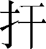

第七卷

 项羽本纪第七

《项羽本纪》通过秦末农民大起义和楚汉之争的宏阔历史场面，生动而又深刻地描述了项羽的一生。他既是一个力拔山、气盖世的“近古以来未尝有”的英雄，又是一个性情暴戾、优柔寡断、只知用武不谙机谋的匹夫。司马迁巧妙地把项羽性格中矛盾的各个侧面有机地统一于这一鸿篇巨制，虽然不乏深刻的挞伐，但更多的是由衷的惋惜和同情。

《项羽本纪》以描绘项羽这一人物的形象、刻画这一人物的性格为主，同时也生动地叙写了战争。披卷读之，既可以闻见战场的血腥，听到战马的嘶鸣和勇士们的猛吼，又可以看见项羽披甲持戟，瞋目而叱，大呼驰下，溃围、斩将、刈旗的神态与身姿。《项羽本纪》正是在广阔的历史背景下写人，在写人的过程中写战争，二者相得益彰。战争因人物而生动、壮观，人物因战争而更显生动、奇伟。

《项羽本纪》是《史记》传记中最精彩的一篇，达到了思想和艺术的高度统一。它犹如一幅逼真传神的英雄肖像画，色彩鲜明；又像一张秦汉之际的政治军事形势图，错综有序。通篇文章气势磅礴，情节起伏，场面壮阔，脉络清楚，疏密相间，语言生动，成为我国文学史上的一篇不朽佳作。文中破釜沉舟、鸿门宴、四面楚歌、乌江自刎等故事，早已家喻户晓，历代传诵。

***【原文】***

项籍者，下相[1]人也，字羽。初起时，年二十四。其季父[2]项梁，梁父即楚将项燕，为秦将王翦所戮者也[3]。项氏世世为楚将，封于项[4]，故姓项氏。

***【译文】***

[1]下相：县名。治所在今江苏省宿迁市宿城区西南。

[2]季父：小叔父。

[3]为秦将王翦所戮：始皇二十三年（前224），王翦破楚，虏楚王。项燕立昌平君为楚王，驻兵淮南反秦。第二年，王翦等破楚军，昌平君死，项燕自杀。

[4]项：春秋时国名。故城在今河南省沈丘县。

***【原文】***

项籍少时，学书[1]不成，去[2]，学剑，又不成。项梁怒之。籍曰：“书足以记名姓而已。剑一人敌[3]，不足学，学万人敌。”于是项梁乃教籍兵法，籍大喜，略知其意，又不肯竟学。项梁尝有栎阳[4]逮，乃请蕲狱掾曹咎书抵[5]栎阳狱掾司马欣，以故事得已[6]。项梁杀人，与籍避仇于吴中[7]。吴中贤士大夫皆出项梁下[8]。每吴中有大繇[9]役及丧，项梁常为主办，阴以兵法部勒[10]宾客及子弟，以是知其[11]能。秦始皇帝游会稽[12]，渡浙江[13]，梁与籍俱观。籍曰：“彼可取而代也。”梁掩其口，曰：“毋妄言，族矣！”梁以此奇籍。籍长八尺余，力能扛[14]鼎，才气过人，虽[15]吴中子弟皆已惮籍矣。

***【译文】***

[1]学书：学习认字和写字。

[2]去：放弃。

[3]敌：对抗；抵拒。

[4]栎（yuè）阳：县名。治所在今陕西省西安市临潼区东北。

[5]蕲（qí）：县名。治所在今安徽省宿州市埇桥区东南。狱掾（yuàn）：掌管监狱官吏的属员。掾，属员，相当今天的办事员。抵：致；送到。

[6]已：了结。

[7]吴中：县名，即吴县。治所在今江苏省苏州市，当时为会稽郡郡治。

[8]出项梁下：贤能在项梁之下。

[9]繇：通“徭”。

[10]部勒：部署，组织。

[11]其：指宾客及子弟。

[12]会稽（kuài jī）：山名。在今浙江省绍兴市柯桥区东南。

[13]浙江：即今浙江省的钱塘江。

[14]扛（ɡānɡ）：两手对举。

[15]虽：意思与“唯”同，句首语气词。

***【原文】***

秦二世元年七月[1]，陈涉[2]等起大泽中。其九月，会稽[3]守通谓梁曰：“江西[4]皆反，此亦天亡秦之时也，吾闻先即制人，后则为人所制。吾欲发兵，使公及桓楚[5]将。”是时桓楚亡在泽中。梁曰：“桓楚亡，人莫知其处，独籍知之耳。”梁乃出，诫籍持剑居外待。梁复入，与守坐，曰：“请召籍，使受命召桓楚。”守曰：“诺。”梁召籍入。须臾，梁眴[6]籍曰：“可行矣！”于是籍遂拔剑斩守头，项梁持守头，佩其印绶[7]。门下大惊，扰乱，籍所击杀数十百人。一府中皆慑伏[8]，莫敢起。梁乃召故所知豪吏，谕以所为起大事，遂举吴中兵。使人收下县[9]，得精兵八千人。梁部署吴中豪杰为校尉、候、司马[10]。有一人不得用，自言于梁。梁曰：“前时某丧使公主某事，不能办，以此不任用公。”众乃皆伏[11]。于是梁为会稽守，籍为裨将[12]，徇[13]下县。

***【译文】***

[1]秦二世元年：前209年。

[2]陈涉：即陈胜。

[3]会稽：郡名。地辖今江苏省南部、浙江省大部、安徽省南部，治所在吴县（今江苏省苏州市）。

[4]江西：泛指长江以西地区。

[5]桓楚：吴中奇士。

[6]眴（shùn）：使眼色。

[7]印绶：即印。绶，系印的丝绳。

[8]慑伏：惊吓得趴在地上。

[9]下县：郡以下所属各县。这里指下属各县的后备兵员。

[10]校尉：地位略次于将军的军官。候，即军候，军中的侦察官。司马：军中的司法官。

[11]伏：通“服”，佩服。

[12]裨将：副将。

[13]徇（xùn）：兼有夺取、招降和安抚的意思。

***【原文】***

广陵人召平于是为陈王徇广陵[1]，未能下。闻陈王败走，秦兵又且[2]至，乃渡江矫陈王命，拜梁为楚王上柱国[3]。曰：“江东已定，急引兵西击秦。”项梁乃以八千人渡江而西。闻陈婴已下东阳[4]，使使欲与连和俱西。陈婴者，故东阳令史[5]，居县中，素信谨，称为长者[6]。东阳少年杀其令，相聚数千人，欲置长，无适用[7]，乃请陈婴。婴谢不能，遂强立婴为长，县中从者得二万人。少年欲立婴便为王，异军苍头特起[8]。陈婴母谓婴曰：“自我为汝家妇，未尝闻汝先古[9]之有贵者。今暴得大名[10]，不祥。不如有所属，事成犹得封侯，事败易以亡，非世所指名[11]也。”婴乃不敢为王。谓其军吏曰：“项氏世世将家，有名于楚。今欲举大事，将非其人，不可。我倚名族，亡秦必矣。”于是众从其言，以兵属项梁。项梁渡淮，黥布、蒲将军[12]亦以兵属焉。凡六七万人，军下邳[13]。

***【译文】***

[1]召平：陈涉部属。广陵：县名。治所在今江苏省扬州市。

[2]且：将。

[3]上柱国：官名。楚国上卿，相当于相国，多系荣誉爵位。

[4]东阳：县名。治所在今江苏省盱眙县东南。

[5]令史：县令手下的书吏。

[6]长（zhǎnɡ）者：忠厚老实的人。

[7]无适用：没有恰当的人可以任用。

[8]苍头：用青色头巾裹头作为标记。特起：新起；崛起。

[9]先古：上世；祖先。

[10]暴：突然。大名：指称帝称王。

[11]指名：点名道姓。这里指被点名道姓的人。

[12]黥（qínɡ）布：英布。因曾受黥刑，所以称黥布。蒲将军：不详。

[13]军：驻扎。动词。下邳（pī）：县名。治所在今江苏省邳州市西南。

***【原文】***

当是时，秦嘉已立景驹[1]为楚王，军彭城[2]东，欲距[3]项梁。项梁谓军吏曰：“陈王先首事[4]，战不利，未闻所在。今秦嘉倍[5]陈王而立景驹，逆无道。”乃进兵击秦嘉。秦嘉军败走，追之至胡陵[6]。嘉还战一日，嘉死，军降。景驹走死梁地[7]。项梁已并秦嘉军，军胡陵，将引军而西。章邯军至栗[8]，项梁使别将朱鸡石[9]、馀樊君与战。馀樊君死。朱鸡石军败，亡走胡陵。项梁乃引兵入薛[10]，诛鸡石。项梁前使项羽别攻襄城[11]，襄城坚守不下。已拔，皆阬之。还报项梁。项梁闻陈王定死[12]，召诸别将会薛计事。此时沛公亦起[13]沛，往焉。

***【译文】***

[1]秦嘉：凌县（今江苏省宿迁市宿城区东南）人。景驹：战国末年楚王的同族。

[2]彭城：县名。即今江苏省徐州市。

[3]距：通“拒”。

[4]首事：首先起义。

[5]倍：通“背”。

[6]胡陵：县名。治所在今山东省鱼台县东南。

[7]梁地：指战国时的魏境，今河南省东部一带。

[8]章邯：秦将。栗：县名。治所在今河南省夏邑县。

[9]朱鸡石：符离（在今安徽省宿州市埇桥区）人。

[10]薛：县名。治所在今山东省滕州市南。

[11]襄城：县名。即今河南省襄城县。

[12]定死：陈涉于前208年在下城父被杀。定，确实。

[13]沛（pèi）公：刘邦起兵时，自称沛公。按：楚国县令称公。起：起兵。

***【原文】***

居鄛[1]人范增，年七十，素居家，好奇计，往说[2]项梁曰：“陈胜败固当。夫秦灭六国，楚最无罪。自怀王入秦不反[3]，楚人怜之至今，故楚南公[4]曰‘楚虽三户，亡秦必楚[5]’也。今陈胜首事，不立楚后而自立，其势不长。今君起江东，楚蜂午[6]之将皆争附君者，以君世世楚将，为能复立楚之后也。”于是项梁然其言，乃求楚怀王孙心民间，为人牧羊，立以为楚怀王[7]，从民所望也：陈婴为楚上柱国，封五县，与怀王都盱台[8]。项梁自号为武信君。

***【译文】***

[1]居鄛：一作居巢。县名，治所在今安徽省巢湖市西南。

[2]说（shuì）：游说。劝人听从自己意见。

[3]怀王入秦不反：前299年，楚怀王被欺入秦，被秦昭王扣留，客死秦国。反，通“返”。

[4]楚南公：战国时楚国的阴阳家，姓名不详。

[5]楚虽三户，亡秦必楚：是当时流行的谶语。楚虽三户，有三解：一指三户人家，极言其少；另二说指楚昭、屈、景三大姓；或地名。

[6]蜂午：纵横交错，蜂拥而起的意思。

[7]怀王：谥号。祖父为怀王，孙又称怀王，是要以祖父的名望来号召人民。这是顺从人民的愿望。

[8]盱台（xū yí）：即盱眙。县名。治所在今江苏省盱眙县东北。

***【原文】***

居数月，引兵攻亢父[1]，与齐田荣、司马龙且军救东阿[2]，大破秦军于东阿。田荣即引兵归，逐其王假[3]，假亡走楚。假相田角亡走赵。角弟田间故齐将，居赵不敢归。田荣立田儋子巿[4]为齐王。项梁已破东阿下[5]军，遂追秦军。数使使趣[6]齐兵，欲与俱西。田荣曰：“楚杀田假，赵杀田角、田间，乃发兵。”项梁曰：“田假为与国[7]之王，穷来从我，不忍杀之。”赵亦不杀田角、田间以市[8]于齐。齐遂不肯发兵助楚。项梁使沛公及项羽别攻城阳[9]，屠[10]之。西破秦军濮阳[11]东，秦兵收入濮阳。沛公、项羽乃攻定陶[12]。定陶未下，去，西略地至雝丘[13]，大破秦军，斩李由[14]。还攻外黄[15]，外黄未下。

***【译文】***

[1]亢父（ɡān fǔ）：县名。治所在今山东省济宁市南。

[2]田荣：原齐国王族，田儋之弟。龙且（jū）：齐国人，楚国骁将，当时任司马。东阿（ē）：地名。故城在今山东省阳谷县西南的阿城镇。

[3]假：田假。战国末年齐国国王田建的弟弟。

[4]巿（fú）：人名。

[5]下：这里是“附近”“一带”的意思。

[6]数（shuò）：屡次。趣（cù）：通“促”，催促。

[7]与国：友好国家。

[8]市：交易；讨好卖乖。

[9]城阳：也作“成阳”。县名。治所在今山东省鄄城县东南。

[10]屠：宰杀，引申为大规模的残杀。

[11]濮阳：县名。治所在今河南省濮阳县西南。

[12]定陶：县名。治所在今山东省菏泽市定陶区西北。

[13]雝丘：县名。治所在今河南省杞县。

[14]李由：李斯之子，当时为三川郡守。

[15]外黄：县名。治所在今河南省民权县西北。

***【原文】***

项梁起[1]东阿，西，比[2]至定陶，再破秦军，项羽等又斩李由，益轻秦，有骄色。宋义[3]乃谏项梁曰：“战胜而将骄卒惰者败。今卒少[4]惰矣，秦兵日益，臣为君畏[5]之。”项梁弗听。乃使宋义使于齐。道遇齐使者高陵君显[6]，曰：“公将见武信君乎？”曰：“然。”曰：“臣论武信君军必败。公徐行即免死，疾行则及祸。”秦果悉起兵益章邯，击楚军，大破之定陶，项梁死。沛公、项羽去外黄攻陈留[7]，陈留坚守不能下。沛公、项羽相与谋曰：“今项梁军破，士卒恐。”乃与吕臣[8]军俱引兵而东。吕臣军彭城东，项羽军彭城西，沛公军砀[9]。

***【译文】***

[1]起：起程；出发。

[2]比：及；等到。

[3]宋义：原为楚国的令尹，此时在项羽军中。

[4]少：稍微。

[5]畏：担心；担忧。

[6]显：人名，姓氏不详，高陵君是封号。

[7]陈留：县名。治所在今河南省开封市祥符区东南陈留镇。

[8]吕臣：楚将，后归顺刘邦，被封为宁陵侯。

[9]砀（dànɡ）：郡名。治所在砀县（今安徽省砀山县南）。

***【原文】***

章邯已破项梁军，则以为楚地兵不足忧，乃渡河[1]击赵，大破之。当此时，赵歇为王[2]，陈馀为将，张耳为相[3]，皆走入钜鹿[4]城。章邯令王离、涉间[5]围钜鹿，章邯军其南，筑甬道[6]而输之粟。陈馀为将，将卒数万人而军钜鹿之北，此所谓河北之军也。

***【译文】***

[1]河：黄河。

[2]赵歇为王：陈涉起义时，派武臣和陈馀、张耳到河北发动起义，武臣自立为赵王，后为人所杀。陈馀、张耳立赵歇为赵王。赵歇，赵国后裔。

[3]“陈馀为将”二句：陈馀、张耳本为刎颈之交，都是魏国大梁人，名士。陈涉起义后，二人随武臣到赵国。后张耳跟随项羽，复降汉，陈馀仍在赵国。

[4]钜鹿：县名。治所在今河北省平乡县西南。

[5]王离、涉间：都是秦将。

[6]甬道：两侧筑有墙垣的通道。

***【原文】***

楚兵已破于定陶，怀王恐，从盱台之[1]彭城，并项羽、吕臣军自将之。以吕臣为司徒[2]，以其父吕青为令尹[3]。以沛公为砀郡长，封为武安侯，将砀郡兵。

***【译文】***

[1]之：到……去。

[2]司徒：官名。西周始设，主管国家的土地和人民。这里指主管后勤的军需官。

[3]令尹：官名。

***【原文】***

初，宋义所遇齐使者高陵君显在楚军，见楚王曰：“宋义论武信君之军必败，居数日，军果败。兵未战而先见败征[1]，此可谓知兵矣。”王召宋义与计事而大说[2]之，因置以为上将军；项羽为鲁公，为次将，范增为末将，救赵。诸别将皆属宋义，号为卿子冠军[3]。行至安阳[4]，留四十六日不进。项羽曰：“吾闻秦军围赵王钜鹿，疾引兵渡河，楚击其外，赵应其内，破秦军必矣。”宋义曰：“不然。夫搏牛之虻不可以破虮虱[5]。今秦攻赵，战胜则兵罢，我承其敝[6]；不胜，则我引兵鼓行[7]而西，必举[8]秦矣。故不如先斗秦赵。夫被坚执锐[9]，义不如公；坐而运策，公不如义。”因下令军中曰：“猛如虎，很如羊[10]，贪如狼，强不可使者，皆斩之。”乃遣其子宋襄相齐，身送之至无盐[11]，饮酒高会。天寒大雨，士卒冻饥。项羽曰：“将戮力[12]而攻秦，久留不行。今岁饥民贫，士卒食芋菽[13]，军无见粮[14]，乃饮酒高会，不引兵渡河因[15]赵食，与赵并力攻秦，乃曰‘承其敝’。夫以秦之强，攻新造之赵，其势必举赵。赵举而秦强，何敝之承！且国兵新破[16]，王坐不安席，埽境内而专属于将军，国家安危，在此一举。今不恤士卒而徇其私[17]，非社稷之臣。”项羽晨朝上将军宋义，即其帐中斩宋义头，出令军中曰：“宋义与齐谋反楚，楚王阴令羽诛之。”当是时，诸将皆慑服，莫敢枝梧[18]。皆曰：“首立楚者，将军家也。今将军诛乱。”乃相与共立羽为假上将军[19]。使人追宋义子，及之齐，杀之。使桓楚报命[20]于怀王。怀王因使项羽为上将军，当阳君[21]、蒲将军皆属项羽。

***【译文】***

[1]征：征兆，象征。

[2]说（yuè）：通“悦”，高兴。

[3]卿子：当时对男子的美称，犹言公子。冠（ɡuàn）军：诸军之冠。

[4]安阳：地名。在今山东省曹县东北，非今日河南省的安阳。

[5]搏牛之虻（ménɡ）不可以破虮虱：意思是叮咬牛的牛虻其目的不可能是消灭虱子，而在叮牛。另一说认为拍击牛身上的虻虫，而不可以消灭毛里藏的虮虱。比喻志在大不在小，要想灭亡秦朝，不可立即与章邯交战去救赵。

[6]承：趁机利用。敝：困；疲惫。

[7]鼓行：击鼓前进，大张旗鼓前进。

[8]举：攻克。

[9]被：通“披”。坚：指铠甲。锐：指锐利的武器。

[10]很：违逆；执拗。

[11]无盐：地名。西汉置县。治所在今山东省东平县东南。

[12]戮力：并力，合力，协力。

[13]芋菽：芋头和豆类。

[14]见粮：存粮。见，通“现”。

[15]因：依靠；凭借。

[16]国兵新破：指楚军在定陶失利这件事。

[17]徇其私：指宋义派遣儿子宋襄辅助齐国这件事。

[18]枝梧：即“支吾”，抗拒；抵触。

[19]假：暂时代理。

[20]报命：本为奉命出使，回来汇报的意思。这里是受命报告的意思。

[21]当阳君：黥布的封号。当阳，县名，即今湖北省当阳市。

***【原文】***

项羽已杀卿子冠军，威震楚国，名闻诸侯。乃遣当阳君、蒲将军将卒二万渡河[1]，救钜鹿。战少利，陈馀复请兵。项羽乃悉引兵渡河，皆沉船，破釜甑[2]，烧庐舍，持三日粮，以示士卒必死，无一还心。于是至则围王离，与秦军遇，九战[3]，绝其甬道，大破之，杀苏角[4]，虏王离。涉间不降楚，自烧杀。当是时，楚兵冠诸侯，诸侯军救钜鹿下者十余壁[5]，莫敢纵兵。及楚击秦，诸将皆从壁上观[6]。楚战士无不一以当十，楚兵呼声动天，诸侯军无不人人惴恐。于是已破秦军，项羽召见诸侯将，入辕门[7]，无不膝行而前[8]，莫敢仰视。项羽由是始为诸侯上将军，诸侯皆属焉。

***【译文】***

[1]河：指漳河。

[2]釜甑（zènɡ）：锅和蒸饭用的瓦罐，泛指炊具。

[3]九战：多次作战。九，指多数。

[4]苏角：秦将。

[5]下：《汉书·陈胜项籍传》无“下”字，疑衍。壁：营垒；军营。

[6]壁上观：人家交战，自己站在营垒上观看。

[7]辕门：古代军队驻扎时以车为营，将车辕相向竖起为门，所以称“辕门”。

[8]膝行而前：跪着前进。

***【原文】***

章邯军棘原[1]，项羽军漳[2]南，相持未战。秦军数却，二世使人让[3]章邯。章邯恐，使长史[4]欣请事。至咸阳[5]，留司马门三日[6]，赵高不见，有不信之心。长史欣恐，还走其军，不敢出故道，赵高果使人追之，不及。欣至军，报曰：“赵高用事于中[7]，下无可为者。今战能胜，高必疾妒吾功；战不能胜，不免于死。愿将军孰计[8]之。”陈馀亦遗章邯书曰：“白起[9]为秦将，南征鄢郢[10]，北阬马服[11]，攻城略地，不可胜计，而竟赐死。蒙恬为秦将[12]，北逐戎人[13]，开榆中[14]地数千里，竟斩阳周[15]。何者？功多，秦不能尽封，因以法诛之。今将军为秦将三岁矣，所亡失以十万数，而诸侯并起滋益多。彼赵高素谀日久，今事急，亦恐二世诛之，故欲以法诛将军以塞责，使人更代将军以脱其祸。夫将军居外久，多内郤[16]，有功亦诛，无功亦诛。且天之亡秦，无[17]愚智皆知之。今将军内不能直谏，外为亡国将，孤特独立而欲常[18]存，岂不哀哉！将军何不还兵与诸侯为从[19]，约共攻秦，分王其地，南面称孤；此孰与身伏质，妻子为僇[20]乎？”章邯狐疑，阴使候始成[21]使项羽，欲约。约未成，项羽使蒲将军日夜引兵度三户[22]，军漳南，与秦战，再破之。项羽悉引兵击秦军汙水[23]上，大破之。

***【译文】***

[1]棘原：在今河北省平乡县南。

[2]漳：漳河。发源于山西省东南部，清漳、浊漳合流后，流经河北、河南两省边境，向东南汇入卫河。

[3]让：责备。

[4]长（zhǎnɡ）史：官名，相当于今天的秘书长职务。

[5]咸阳：在今陕西省咸阳市东北。

[6]司马门：皇宫的外门。宫墙里面到处设有卫士，外门都由司马指挥卫士把守，故称司马门。

[7]中：指朝廷中。

[8]孰计：仔细考虑。孰，通“熟”。

[9]白起：秦国著名将领，后昭王令其自杀。

[10]鄢郢（yān yǐnɡ）：战国时楚国国都，在今湖北省江陵东北。按：楚国曾建都郢，后迁鄢郢，此处鄢郢实指郢都。

[11]马服：指赵将赵括。他袭父亲赵奢封爵，为马服君。白起击败赵括大军后，坑其降卒四十万。

[12]蒙恬：秦朝名将。秦统一六国后，他带领三十万人屯戍北部边塞，防御匈奴入侵，后为赵高所害。

[13]戎人：指匈奴人。

[14]榆中：即榆林塞，要塞名。旧址在今内蒙古自治区准格尔旗。

[15]阳周：县名。在今陕西省子长市北。

[16]郤：通“隙”，裂缝，仇怨。

[17]无：无论。

[18]常：通“长”。

[19]还兵：倒戈。为从：联合。

[20]质：斩人的刑具。，通“斧”。僇：侮辱；又通“戮”，斩杀。

[21]候始成：名叫始成的军候。

[22]三户：漳河的一个渡口，在今河北省临漳县西。

[23]汙（yú）水：在今河北省临漳县西，源出河北省太行山，东南流入漳河，今已干涸。

***【原文】***

章邯使人见项羽，欲约。项羽召军吏谋曰：“粮少，欲听其约。”军吏皆曰：“善。”项羽乃与期洹水南殷虚[1]上。已盟，章邯见项羽而流涕，为言赵高[2]。项羽乃立章邯为雍王，置楚军中。使长史欣为上将军，将秦军为前行[3]。

***【译文】***

[1]期：约期会晤。洹（huán）水：即今河南省北部的安阳河。殷虚：殷盘庚建都的遗址，在今河南省安阳市西北小屯村。虚，通“墟”。

[2]为言赵高：指向项羽诉说赵高不信任自己的情况。

[3]前行：前锋。

***【原文】***

到新安[1]。诸侯吏卒异时故繇使屯戍过秦中[2]，秦中吏卒遇之多无状[3]，及秦军降诸侯，诸侯吏卒乘胜多奴虏使之，轻折[4]辱秦吏卒。秦吏卒多窃言曰：“章将军等诈吾属降诸侯，今能入关破秦，大善；即不能，诸侯虏吾属而东，秦必尽诛吾父母妻子。”诸将微[5]闻其计，以告项羽。项羽乃召黥布、蒲将军计曰：“秦吏卒尚众，其心不服，至关中不听，事必危，不如击杀之，而独与章邯、长史欣、都尉翳[6]入秦。”于是楚军夜击阬秦卒二十余万人新安城南[7]。

***【译文】***

[1]新安：县名。在今河南省渑池县东。

[2]繇使：服徭役。屯戍：驻守边疆。秦中：泛指原秦国地域，即关中。

[3]无状：无礼。

[4]轻：轻率；随便。折：折磨。

[5]微：暗地。

[6]都尉：比将军地位略低的武官名。翳：董翳。原为章邯部下，曾劝章邯投降项羽。

[7]时在汉元年十一月。

***【原文】***

行略定[1]秦地。函谷关有兵守关，不得入。又闻沛公已破咸阳[2]，项羽大怒，使当阳君等击关。项羽遂入，至于戏西[3]。沛公军霸上[4]，未得与项羽相见。沛公左司马曹无伤使人言于项羽曰：“沛公欲王[5]关中，使子婴为相[6]，珍宝尽有之。”项羽大怒，曰：“旦日飨[7]士卒，为击破沛公军！”当是时，项羽兵四十万，在新丰鸿门[8]，沛公兵十万，在霸上。范增说项羽曰：“沛公居山东[9]时，贪于财货，好美姬。今入关，财物无所取，妇女无所幸[10]，此其志不在小。吾令人望其气[11]，皆为龙虎，成五采，此天子气也。急击勿失。”

***【译文】***

[1]行：即将。略定：夺取，平定。

[2]沛公已破咸阳：楚怀王派宋义、项羽去河北救赵国时，又派刘邦从河南西进攻秦。刘邦进攻咸阳，子婴投降。

[3]戏西：戏水以西。

[4]霸上：即灞水西面的白鹿原，在今陕西省西安市东南。

[5]王（wànɡ）：动词，称王。

[6]使子婴为相：子婴投降后已被监视，并未为相。这是曹无伤的挑拨之词。

[7]飨：犒赏酒肉。

[8]新丰：秦时名郦邑，汉改名新丰。在今陕西省西安市临潼区东北。鸿门：山坡名。

[9]山东：战国时泛指六国或六国土地，因在崤山之东而得名。

[10]幸：亲近，同房。

[11]望其气：当时一些方士诡称通过观望云气，可以预测吉凶祸福。

***【原文】***

楚左尹项伯[1]者，项羽季父也，素善留侯张良[2]。张良是时从沛公，项伯乃夜驰之沛公军，私见张良，具告以事，欲呼张良与俱去。曰：“毋从俱死也。”张良曰：“臣为韩王送沛公[3]，沛公今事有急，亡去不义，不可不语。”良乃入，具告沛公。沛公大惊，曰：“为之奈何？”张良曰：“谁为大王为此计者？”曰：“鲰生说我曰‘距关[4]，毋内[5]诸侯，秦地可尽王也’。故听之。”良曰：“料大王士卒足以当[6]项王乎？”沛公默然，曰：“固不如也，且为之奈何？”张良曰：“请往谓项伯，言沛公不敢背项王也。”沛公曰：“君安与项伯有故？”张良曰：“秦时与臣游，项伯杀人，臣活之。今事有急，故幸来告良。”沛公曰：“孰与君少长？”良曰：“长于臣。”沛公曰：“君为我呼入，吾得兄事之[7]。”张良出，要[8]项伯。项伯即入见沛公。沛公奉卮酒为寿[9]，约为婚姻，曰：“吾入关，秋豪[10]不敢有所近，籍吏民[11]，封府库，而待将军。所以遣将守关者，备他盗之出入与非常[12]也。日夜望将军至，岂敢反乎！愿伯具言臣之不敢倍德[13]也。”项伯许诺。谓沛公曰：“旦日不可不蚤[14]自来谢项王。”沛公曰：“诺。”于是项伯复夜去，至军中，具以沛公言报项王。因言曰：“沛公不先破关中，公岂敢入乎？今人有大功而击之，不义也，不如因善遇之。”项王许诺。

***【译文】***

[1]左尹：楚国官名，令尹的副职。项伯：名缠，字伯。

[2]留侯张良：字子房，刘邦的重要谋臣，后被封为留侯。

[3]为韩王送沛公：张良先人五世相韩，他曾请项梁立韩成为韩王，自任司徒。刘邦西进时，韩成留守阳翟（今河南省禹州市），张良随刘邦西进。

[4]鲰（zōu）生：小鱼所生，引申为浅陋之人。古代骂人或自称之词。距关：把住关口。距，通“拒”。

[5]内：通“纳”。

[6]当：抵挡。

[7]兄事之：以待兄长之礼待之。

[8]要：通“邀”。

[9]卮（zhī）：酒器。为寿：向尊长者敬酒祝福。

[10]秋豪：鸟类秋天的毛最细，形容其细小。豪，通“毫”，毫毛。

[11]籍吏民：登记官吏和庶民的户籍。籍，登记户籍。

[12]非常：意外的事变。

[13]倍德：忘恩负义。倍，通“背”，德，恩德。

[14]蚤：通“早”。

***【原文】***

沛公旦日从百余骑来见项王，至鸿门，谢曰：“臣与将军戮力而攻秦，将军战河北，臣战河南，然不自意[1]能先入关破秦，得复见将军于此。今者有小人之言，令将军与臣有隙。”项王曰：“此沛公左司马曹无伤言之；不然，籍何以至此。”项王即日因留沛公与饮。项王、项伯东乡坐[2]，亚父[3]南乡坐。亚父者，范增也。沛公北乡坐，张良西乡侍。范增数目项王，举所佩玉玦[4]以示之者三，项王默然不应。范增起，出召项庄[5]，谓曰：“君王为人不忍[6]，若入前为寿，寿毕，请以剑舞。因击沛公于坐，杀之。不者[7]，若属皆且为所虏。”庄则入为寿。寿毕，曰：“君王与沛公饮，军中无以为乐，请以剑舞。”项王曰：“诺。”项庄拔剑起舞，项伯亦拔剑起舞，常以身翼蔽沛公，庄不得击。于是张良至军门，见樊哙[8]。樊哙曰：“今日之事何如？”良曰：“甚急。今者项庄拔剑舞，其意常在沛公也。”哙曰：“此迫矣，臣请入，与之同命[9]。”哙即带剑拥盾入军门。交戟之卫士欲止不内，樊哙侧其盾以撞，卫士仆地，哙遂入，披帷西乡立，瞋目[10]视项王，头发上指，目眦[11]尽裂。项王按剑而跽[12]曰：“客何为者？”张良曰：“沛公之参乘[13]樊哙者也。”项王曰：“壮士，赐之卮酒。”则与斗卮[14]酒。哙拜谢，起，立而饮之。项王曰：“赐之彘肩。”则与一生彘肩[15]。樊哙覆其盾于地，加彘肩上，拔剑切而啖[16]之。项王曰：“壮士，能复饮乎？”樊哙曰：“臣死且不避，卮酒安足辞！夫秦王有虎狼之心，杀人如不能举，刑人如恐不胜[17]，天下皆叛之。怀王与诸将约曰：‘先破秦入咸阳者王之。’今沛公先破秦入咸阳，毫毛不敢有所近，封闭宫室，还军霸上，以待大王来。故遣将守关者，备他盗出入与非常也。劳苦而功高如此，未有封侯之赏，而听细说[18]，欲诛有功之人。此亡秦之续耳，窃为大王不取也。”项王未有以应，曰：“坐。”樊哙从良坐。坐须臾，沛公起如厕，因招樊哙出。

***【译文】***

[1]意：自料。意，料；料想。

[2]东乡坐：即面向东坐。

[3]亚父：尊称，尊敬他仅次于父亲。一说亚父是范增的别名。

[4]玉玦（jué）：玉器名。圆形而有缺口。玦，与“决”谐音，范增举玉玦：是暗示项羽与刘邦决裂，杀掉刘邦。

[5]项庄：项羽的堂弟。

[6]不忍：不狠心。

[7]不者：不然的话。不，通“否”。

[8]樊哙：沛人。吕后的妹夫。

[9]与之同命：有两解：一是与刘邦同生死；二是跟项羽拼命。

[10]瞋（chēn）目：瞪着眼睛。

[11]眦（zì）：眼角。

[12]跽（jì）：古人席地而坐，两股贴在脚跟上，直身，股不着脚跟为“跽”，长跪。项羽按剑而跽，是以备不测。

[13]参乘：也叫陪乘，乘车时立于车右，相当于卫士。

[14]斗卮：大卮，大杯。

[15]生彘（zhì）肩：猪腿。《史记志疑》：“生，字疑误。”疑为“全”之坏字。

[16]啖（dàn）：吃。

[17]杀人如不能举，刑人如恐不胜：杀人唯恐不杀尽，用刑唯恐不够。举，完，全，遍。胜，尽。

[18]细说：小人的谗言。

***【原文】***

沛公已出，项王使都尉陈平[1]召沛公。沛公曰：“今者出，未辞也，为之奈何？”樊哙曰：“大行不顾细谨，大礼不辞小让[2]。如今人方为刀俎[3]，我为鱼肉，何辞为[4]。”于是遂去。乃令张良留谢。良问曰：“大王来何操[5]？”曰：“我持白璧一双，欲献项王，玉斗[6]一双，欲与亚父，会其怒，不敢献。公为我献之。”张良曰：“谨诺[7]。”当是时，项王军在鸿门下，沛公军在霸上，相去四十里。沛公则置车骑，脱身独骑，与樊哙、夏侯婴、靳强、纪信[8]等四人持剑盾步走，从骊山下，道芷阳间行[9]。沛公谓张良曰：“从此道至吾军，不过二十里耳。度我至军中，公乃入。”沛公已去，间至军中，张良入谢，曰：“沛公不胜桮杓[10]，不能辞。谨使臣良奉白璧一双，再拜[11]献大王足下；玉斗一双，再拜奉大将军足下。”项王曰：“沛公安在？”良曰：“闻大王有意督过[12]之，脱身独去，已至军矣。”项王则受璧，置之坐上。亚父受玉斗，置之地，拔剑撞而破之，曰：“唉！竖子[13]不足与谋。夺项王天下者，必沛公也，吾属今为之虏矣。”沛公至军，立诛杀曹无伤。

***【译文】***

[1]陈平：阳武（今河南省兰考县境）人。项羽的部下，后来成为刘邦的谋士，官至相国。

[2]大行，大礼：指大事。行，行为，作为。细谨：细枝末节；小节。辞：辞让；拒绝。让：责备。

[3]俎（zǔ）：砧板。

[4]为：表示疑问的语气助词。

[5]操：持执。此指带礼物。

[6]玉斗：玉制的大酒杯。

[7]谨诺：遵命的意思。

[8]夏侯婴：沛人。随刘邦起义，后封汝阴侯。靳强：曲沃人，刘邦部属，后封汾阳侯。纪信：刘邦的将领，后被项羽烧死。

[9]芷阳：县名。在今陕西省西安市东北。间（jiàn）行：抄小路走。

[10]桮杓（sháo）：酒器，这里借代酒。桮，通“杯”。

[11]再拜：先后拜两次，古代一种隆重的礼节。

[12]督过：责备。

[13]竖子：骂人的话，相当于“小子”。

***【原文】***

居数日，项羽引兵西屠咸阳，杀秦降王子婴，烧秦宫室，火三月不灭；收其货宝妇女而东。人或说项王曰：“关中阻山河四塞[1]，地肥饶，可都以霸。”项王见秦宫室皆以[2]烧残破，又心怀思欲东归，曰：“富贵不归故乡，如衣绣夜行，谁知之者！”说者[3]曰：“人言楚人沐猴而冠[4]耳，果然。”项王闻之，烹说[5]者。

***【译文】***

[1]关中：地区名。所指范围不一，秦、汉时称函谷关以西为关中。阻：依恃。四塞：指东面的函谷关，南面的武关（在今陕西省丹凤县东南），西面的散关（即大散关，在今陕西省宝鸡市西南），北面的萧关（在今甘肃省环县西北）。

[2]以：通“已”。

[3]说者：《楚汉春秋》《扬子法言》作“蔡生”，《汉书》作“韩生”。

[4]沐猴而冠：猴子戴人帽，像人样，却办不成人事。沐猴：猕猴。

[5]烹：古代以鼎镬煮杀人的酷刑。

***【原文】***

项王使人致命[1]怀王。怀王曰：“如约。”乃尊怀王为义帝[2]。项王欲自王，先王诸将相。谓曰：“天下初发难时，假立诸侯后[3]以伐秦。然身被坚执锐首事，暴露于野三年，灭秦定天下者，皆将相诸君与籍之力也。义帝虽无功，故[4]当分其地而王之。”诸将皆曰：“善。”乃分天下，立诸将为侯王。项王、范增疑沛公之有天下，业已讲解，又恶负约[5]，恐诸侯叛之，乃阴谋曰：“巴、蜀道险，秦之迁人皆居蜀[6]。”乃曰：“巴、蜀亦关中地[7]也。”故立沛公为汉王，王巴、蜀、汉中[8]，都南郑[9]。而三分关中[10]，王秦降将以距塞[11]汉王。项王乃立章邯为雍王，王咸阳以西，都废丘[12]。长史欣者，故为栎阳狱掾，尝有德于项梁；都尉董翳者，本劝章邯降楚。故立司马欣为塞王，王咸阳以东至河，都栎阳；立董翳为翟王，王上郡[13]，都高奴[14]。徙魏王豹为西魏王[15]，王河东[16]，都平阳[17]。瑕丘申阳[18]者，张耳嬖臣也，先下河南[19]，迎楚河上，故立申阳为河南王，都雒阳[20]。韩王成因故都，都阳翟[21]。赵将司马卬定河内[22]，数有功，故立卬为殷王，王河内，都朝歌[23]。徙赵王歇为代[24]王。赵相张耳素贤，又从入关，故立耳为常山[25]王，王赵地，都襄国[26]。当阳君黥布为楚将，常冠军，故立布为九江[27]王，都六[28]。鄱君吴芮率百越[29]佐诸侯，又从入关，故立芮为衡山[30]王，都邾[31]。义帝柱国共敖将兵击南郡[32]，功多，因立敖为临江王[33]，都江陵[34]。徙燕王韩广为辽东[35]王。燕将臧荼从楚救赵，因从入关，故立荼为燕王，都蓟[36]。徙齐王田巿为胶东王[37]。齐将田都从共救赵，因从入关，故立都为齐王，都临菑[38]。故秦所灭齐王建孙田安，项羽方渡河救赵，田安下济北数城，引其兵降项羽，故立安为济北王[39]，都博阳[40]。田荣者，数负项梁，又不肯将兵从楚击秦，以故不封。成安君陈馀弃将印去[41]，不从入关，然素闻其贤，有功于赵，闻其在南皮[42]，故因环封三县。番君将梅功多，故封十万户侯。项王自立为西楚霸王[43]，王九郡[44]，都彭城。

***【译文】***

[1]致命：即报命。有报告、请示的意思。

[2]义帝：意为名义上的皇帝。

[3]假：暂且；姑且。诸侯后：诸侯后裔，如韩成、田假、赵歇等。

[4]故：通“固”，本来。

[5]恶（wù）：嫌恶。约：指“先破秦入咸阳者王之”之约。这句是说项羽心想如果把刘邦杀掉或不封他在关中，又忌讳落个负约的罪名，致使诸侯背叛自己。

[6]巴：郡名。地在今四川省东北部。蜀：郡名。地在今四川省中部。迁人：被贬谪流放的人。

[7]巴、蜀亦关中地：地处函谷关以西，战国时即属秦，故云。

[8]汉中：郡名。地在今陕西省南部和湖北省西北部。

[9]南郑：县名。即今陕西省汉中市南郑区。

[10]三分关中：将关中分割为雍、塞、翟三国。

[11]距塞：抗拒，拦阻。

[12]废丘：县名。在今陕西省兴平市东南。

[13]上郡：郡名。地在今陕西省北部和内蒙古部分地区。郡治肤施，今陕西省榆林市榆阳区东南。

[14]高奴：县名。治所在今陕西省延安东北。

[15]魏王豹：魏王咎之弟。陈胜立魏公子宁陵君咎为魏王，魏咎被章邯战败自杀后，怀王使其弟复定梁地，立为魏王。

[16]河东：郡名。地在今山西省西南部。

[17]平阳：县名。治所在今山西省临汾市西南。

[18]瑕丘：县名。治所在今山东省济宁市兖州区东北。申阳：姓申名阳，曾为瑕丘令。

[19]河南：即指秦三川郡。地在今河南省西北部。

[20]雒（luò）阳：三川郡治，在今洛阳市东北。

[21]阳翟（zhái）：县名。治所在今河南省禹州市。

[22]司马卬（ánɡ）：姓司马名卬。卬，通“昂”。河内：郡名。地当今河南省黄河以北地区、山西省东南地区和河北省南部地区。

[23]朝歌：古都邑名。在今河南省淇县东北。

[24]代：郡名。跨今河北、山西两省北部。

[25]常山：地区名。汉置郡。地在今河北省中部，兼有山西省东、中部部分地区。

[26]襄国：县名。治所在今河北省邢台市西南。

[27]九江：郡名：地在今安徽、河南两省淮河以南，湖北省黄冈以东和江西省。郡治寿春（今安徽省寿县）。

[28]六：县名。约当今安徽省六安市金安区、裕安区北。

[29]鄱（pó）：县名。在今江西省鄱阳县东。百越：泛指居住在今江南各省的少数民族，因种类繁多，故统称百越，又称百粤。鄱，也作“番”。

[30]衡山：此指衡山国。地在今湖南省全部、湖北省东部、安徽省西部。

[31]邾：县名。地在今湖北省黄冈市黄州区西北。

[32]南郡：郡名。地在今湖北省洪湖以西和四川省巫山以东地区。

[33]临江王：共（ɡōnɡ）敖封地在南郡，而南郡地临长江，故名。

[34]江陵：县名。本楚国郢都，在今湖北省江陵县。

[35]辽东：郡名。地在今辽宁省大凌河以东。

[36]蓟（jì）：县名。在今北京市西南，非天津之蓟州区。

[37]胶东王：项羽瓜分齐地为三，称三齐，中为齐，东为胶东，西北为济北。

[38]临菑：即临淄。县名，在今山东省淄博市东北。

[39]济北：指当时济水以北地区。

[40]博阳：疑为今山东省聊城市茌平区西北的博平镇。一说即山东省泰安市泰山区东南的博县故城。

[41]成安：县名。治所在今河北省成安县东南。弃将印去：秦将章邯围攻钜鹿时，赵相张耳被围城中，将军陈馀领兵驻在漳河以北。钜鹿解围后，张耳责备陈馀不来救援，陈馀一怒之下，把将印交给张耳，领着数百人走往河上泽中渔猎。

[42]南皮：县名。在今河北省南皮县东北。

[43]西楚：古代楚国有南楚、东楚、西楚之分，项羽建都的彭城，地处西楚，所以自称“西楚霸王”。霸王：霸主，诸王的盟主。

[44]九郡：指梁、楚部分地区，约当今河南省东部、山东省西南部和江苏省、安徽省的部分地区。

***【原文】***

汉之元年[1]四月，诸侯罢戏下[2]，各就国[3]。项王出之国，使人徙义帝，曰：“古之帝者地方千里，必居上游。”乃使使徙义帝长沙郴县[4]。趣义帝行，其群臣稍稍[5]背叛之，乃阴令衡山、临江王击杀之江中[6]。韩王成无军功，项王不使之国，与俱至彭城，废以为侯，已又杀之。臧荼之国，因逐韩广之辽东，广弗听，荼击杀广无终[7]，并王其地。

***【译文】***

[1]汉之元年：前206年，这年刘邦被封为汉王。

[2]戏（huī）下：即麾下，帅旗之下。

[3]就国：赴封国就王位。

[4]长沙：郡名。约辖今湖南省资江以东以及广东省、广西壮族自治区一部分地区。郴（chēn）县：即今湖南省郴州市苏仙区。

[5]稍稍：渐渐。

[6]《黥布列传》记载：“布使将击义帝，建杀之郴县。”与此处记载不合。

[7]无终：县名。即今天津市蓟州区。

***【原文】***

田荣闻项羽徙齐王巿胶东，而立齐将田都为齐王，乃大怒，不肯遣齐王之胶东，因以齐反，迎击田都。田都走楚。齐王巿畏项王，乃亡之胶东就国。田荣怒，追击杀之即墨[1]。荣因自立为齐王，而西击杀济北王田安，并王三齐。荣与彭越[2]将军印，令反梁地。陈馀阴使张同、夏说说齐王田荣曰：“项羽为天下宰[3]，不平。今尽王故王于丑地[4]，而王其群臣诸将善地，逐其故主赵王[5]，乃北居代，馀以为不可。闻大王起兵，且不听不义，愿大王资馀兵，请以击常山，以复赵王，请以国为蔽[6]。”齐王许之，因遣兵之赵。陈馀悉发三县兵，与齐并力击常山，大破之。张耳走归汉。陈馀迎故赵王歇于代，反之赵。赵王因立陈馀为代王。

***【译文】***

[1]即墨：县名。在今山东省平度市东南。

[2]彭越：字仲。昌邑（在今山东省金乡县西北）人。

[3]夏说（yuè）：人名。宰：主宰。

[4]故王：项羽分封前自立的王。丑地：不好的地方。丑，恶，引申为不好，坏。

[5]《史记志疑》记：“赵王歇乃陈馀之故主也。

[6]蔽（hàn bì）：捍卫，掩护。

***【原文】***

是时，汉还定三秦[1]。项羽闻汉王皆已并关中，且东，齐、赵叛之，大怒。乃以故吴令郑昌为韩王，以拒汉。令萧公角[2]等击彭越。彭越败萧公角等。汉使张良徇韩，乃遗项王书曰：“汉王失职[3]，欲得关中，如约即止，不敢东。”又以齐、梁[4]反，书遗项王曰：“齐欲与赵并灭楚。”楚以此故无西意，而北击齐。征兵九江王布。布称疾不往，使将将[5]数千人行。项王由此怨布也。汉之二年冬，项羽遂北至城阳，田荣亦将兵会战。田荣不胜，走至平原[6]，平原民杀之。遂北烧夷齐城郭室屋，皆阬田荣降卒，系虏其老弱妇女。徇齐至北海[7]，多所残灭。齐人相聚而叛之。于是田荣弟田横收齐亡卒得数万人，反城阳。项王因留，连战未能下。

***【译文】***

[1]汉还定三秦：汉元年八月，刘邦用韩信计，攻入秦地，次年，统一三秦。

[2]萧公角：萧县县令角，姓氏不详。萧，在今安徽省萧县西北。按楚制，县令称为“公”。

[3]汉王失职：汉王失去了按规定应得的关中王职位。

[4]梁：指彭越。

[5]将将：前一“将”字，将领，名词；后一“将”字，率领，动词。

[6]平原：县名：地在今山东省平原县西南。

[7]北海：古代北方僻远地域的泛称。

***【原文】***

春，汉王部五诸侯[1]兵，凡五十六万人，东伐楚。项王闻之，即令诸将击齐，而自以精兵三万人南从鲁[2]出胡陵。四月，汉皆已入彭城，收其货宝美人，日置酒高会。项王乃西从萧，晨击汉军而东，至彭城，日中，大破汉军。汉军皆走，相随入穀、泗水[3]，杀汉卒十余万人。汉卒皆南走山，楚又追击至灵壁东睢水[4]上。汉军却，为楚所挤，多杀，汉卒十余万人皆入睢水，睢水为之不流。围汉王三匝[5]。于是大风从西北而起，折木发屋[6]，扬沙石，窈冥昼晦[7]，逢迎楚军。楚军大乱，坏散，而汉王乃得与数十骑遁去。欲过沛，收家室而西；楚亦使人追之沛，取汉王家；家皆亡，不与汉王相见。汉王道逢得孝惠、鲁元[8]，乃载行。楚骑追汉王，汉王急，推堕孝惠、鲁元车下，滕公常下收载之[9]。如是者三。曰：“虽急不可以驱，奈何弃之？”于是遂得脱。求太公、吕后不相遇。审食其[10]从太公、吕后间行，求汉王，反遇楚军。楚军遂与归，报项王，项王常置军中。

***【译文】***

[1]春：汉之二年春。因此时仍沿用秦历，以十月为岁首。五诸侯：一说指张耳、申阳、郑昌、魏豹、司马卬。一说“犹后言引天下兵耳”。

[2]鲁：县名。即今山东省曲阜市。

[3]穀、泗水：穀水和泗水，流经彭城东，南流入淮河。

[4]灵壁：邑名。故地在今安徽省淮北市西南。睢水：又名濉河。流经今安徽省灵璧、江苏省睢宁等地，至江苏省宿迁市宿城区南入古泗水。

[5]三匝（zā）：多层包围圈。三，表多数。匝：圈。

[6]发屋：掀去房屋。

[7]窈冥昼晦：形容天昏地暗。窈冥，幽暗的样子。

[8]孝惠、鲁元：刘邦嫡子惠帝刘盈和女儿鲁元公主。

[9]滕公：夏侯婴，曾为滕县令，故称。

[10]审食其（yì jī）：沛人，后为左丞相，封辟阳侯。

***【原文】***

是时吕后兄周吕侯为汉将兵居下邑[1]，汉王间往从之，稍稍收[2]其士卒。至荥阳[3]，诸败军皆会，萧何亦发关中老弱未傅[4]悉诣荥阳，复大振。楚起于彭城。常乘胜逐北[5]，与汉战荥阳南京、索[6]间，汉败楚，楚以故不能过荥阳而西。

***【译文】***

[1]周吕侯：吕泽。周吕是封号。下邑：县名。在今安徽省砀山县。

[2]收：收编。

[3]荥阳：县名。治所在今河南省荥阳市东北，是古代的军事要地。

[4]萧何：沛县人。秦末辅佐刘邦起义，对建立汉朝起了重要作用，是汉朝开国名相，封酂侯。未傅：指庶民不合服役年龄，没有列入征集名册的。

[5]逐北：追逐败军。

[6]京：邑名。在今荥阳市东南。索：索亭，即今荥阳市治。

***【原文】***

项王之救彭城，追汉王至荥阳，田横亦得收齐，立田荣子广为齐王。汉王之败彭城，诸侯皆复与[1]楚而背汉。汉军荥阳，筑甬道属[2]之河，以取敖仓[3]粟。汉之三年，项王数侵夺汉甬道，汉王食乏，恐，请和，割荥阳以西为汉。

***【译文】***

[1]与（yù）：结交：归附。

[2]属（zhǔ）：连接。

[3]敖仓：秦在敖山修建的谷仓。敖山在荥阳东北，下临黄河。

***【原文】***

项王欲听之。历阳[1]侯范增曰：“汉易与[2]耳，今释弗取，后必悔之。”项王乃与范增急围荥阳。汉王患之，乃用陈平计间项王。项王使者来，为太牢具[3]，举[4]欲进之。见使者，详[5]惊愕曰：“吾以为亚父使者，乃反项王使者。”更[6]持去，以恶食食项王使者。使者归报项王，项王乃疑范增与汉有私，稍夺之权。范增大怒，曰：“天下事大定矣，君王自为之。愿赐骸骨归卒伍[7]。”项王许之，行未至彭城，疽[8]发背而死。

***【译文】***

[1]历阳：县名。治所在今安徽省和县。

[2]与：对付。

[3]太牢具：丰盛的酒席。

[4]举：捧上；陈设。

[5]详：通“佯”，假装。

[6]更：更换。

[7]赐骸（hái）骨：古代官吏因年老请求退职的代词。归卒伍：古代军队编制以五人为伍，百人为卒。

[8]疽（jū）：毒疮。

***【原文】***

汉将纪信说汉王曰：“事已急矣，请为王诳[1]楚为王，王可以间出。”于是汉王夜出女子荥阳东门被甲二千人，楚兵四面击之。纪信乘黄屋车[2]，傅左纛[3]，曰：“城中食尽，汉王降。”楚军皆呼万岁。汉王亦与数十骑从城西门出，走成皋[4]。项王见纪信，问：“汉王安在？”曰：“汉王已出矣。”项王烧杀纪信。

***【译文】***

[1]诳（kuánɡ）：欺骗。

[2]黄屋车：天子乘坐的车，用黄绸做顶篷。

[3]左纛（dào）：皇帝座车的左边，插着用犛牛尾和雉尾做的装饰物。

[4]成皋：邑名，又名虎牢，在今河南省荥阳市汜水镇。

***【原文】***

汉王使御史大夫周苛、枞公[1]、魏豹守荥阳。周苛、枞公谋曰：“反国之王[2]，难与守城。”乃共杀魏豹。楚下荥阳城，生得周苛。项王谓周苛曰：“为我将，我以公为上将军，封三万户。”周苛骂曰：“若不趣[3]降汉，汉今虏若，若非汉敌也。”项王怒，烹周苛，并杀枞公。

***【译文】***

[1]御史大夫：官名，负责监察，相当于副丞相。枞（cōnɡ）公：姓枞，名不详。

[2]反国之王：魏豹原被项羽封为西魏王。

[3]趣（cù）：赶快。

***【原文】***

汉王之出荥阳，南走宛、叶[1]，得九江王布，行收兵。复入保成皋。汉之四年，项王进兵围成皋。汉王逃，独与滕公出成皋北门，渡河走脩武[2]，从张耳、韩信军。诸将稍稍得出成皋，从汉王。楚遂拔成皋，欲西。汉使兵距之巩[3]，令其不得西。

***【译文】***

[1]宛（yuān）：县名。即今河南省南阳市。叶（旧读shè）：邑名。在今河南省叶县南。

[2]脩武：邑名。指今河南省获嘉县的小修武。

[3]巩：县名。治所在今河南省巩义市西南。

***【原文】***

是时，彭越渡河击楚东阿，杀楚将军薛公。项王乃自东击彭越[1]。汉王得淮阴侯兵[2]，欲渡河南。郑忠[3]说汉王，乃止壁河内。使刘贾[4]将兵佐彭越，烧楚积聚[5]。项王东击破之，走彭越。汉王则引兵渡河，复取成皋，军广武[6]，就敖仓食[7]。项王已定东海[8]来，西，与汉俱临广武而军，相守数月。

***【译文】***

[1]《史记志疑》据《高祖本纪》及《汉书·高帝纪》《汉书·项籍传》考证：项羽击彭越是汉三年五月，在楚拔成皋前，这里记为在拔成皋后，误。

[2]汉王得淮阴侯兵：汉大将军韩信（淮阴侯是他最后的封号）原来率领一支部队在赵地作战，这时刘邦把他的军队夺了过来。

[3]郑忠：汉郎中。

[4]刘贾：刘邦的堂兄，后封为荆王。

[5]积聚：指为军队储备的粮草。

[6]广武：城名。旧址在今荥阳市东北广武山上。

[7]《史记志疑》说：“汉王则引兵渡河……就敖仓食”，是在败海春侯以后的事，当在下文“项王信任之”句下。

[8]东海：泛指东方。

***【原文】***

当此时，彭越数反梁地，绝楚粮食，项王患之。为高俎[1]，置太公其上，告汉王曰：“今不急下，吾烹太公。”汉王曰：“吾与项羽俱北面[2]受命怀王，曰‘约为兄弟’，吾翁即若翁，必欲烹而翁，则幸分我一杯羹。”项王怒，欲杀之。项伯曰：“天下事未可知，且为天下者不顾家，虽杀之无益，只益祸耳。”项王从之。

***【译文】***

[1]俎：古代祭祀用来盛放牲肉的高几。青铜制成，也有木制漆饰的。

[2]北面：古代臣子朝见君王面向北。

***【原文】***

楚汉久相持未决，丁壮苦军旅，老弱罢转漕[1]。项王谓汉王曰：“天下匈匈[2]数岁者，徒以吾两人耳，愿与汉王挑战决雌雄，毋徒苦天下之民父子为也[3]。”汉王笑谢曰：“吾宁斗智，不能斗力。”项王令壮士出挑战。汉有善骑射者楼烦[4]，楚挑战三合，楼烦辄射杀之。项王大怒，乃自被甲持戟挑战。楼烦欲射之，项王瞋目叱之，楼烦目不敢视，手不敢发，遂走还入壁，不敢复出。汉王使人间问[5]之，乃项王也。汉王大惊。于是项王乃即汉王相与临广武间[6]而语。汉王数之[7]，项王怒，欲一战。汉王不听，项王伏弩射中汉王。汉王伤，走入成皋。

***【译文】***

[1]转：陆运。漕：水运。

[2]匈匈：即汹汹，波涛汹涌，比喻动乱。

[3]毋徒苦天下之民父子为也：“毋为徒苦……”的倒装句式。民父子：老少几代的百姓。

[4]楼烦：西北边境的少数民族，擅长骑马射箭，因而称善射者为楼烦，不一定都是楼烦人。

[5]间问：暗中打听。

[6]即：就近；凑近。广武间：间，当作“涧”。

[7]汉王数（shǔ）之：汉王数落项羽十大罪状。详见《高祖本纪》。数，数落。

***【原文】***

项王闻淮阴侯已举河北，破齐、赵，且欲击楚，乃使龙且往击之[1]。淮阴侯与战，骑将灌婴击之，大破楚军，杀龙且。韩信因自立为齐王。项王闻龙且军破，则恐，使盱台人武涉往说淮阴侯[2]。淮阴侯弗听。是时，彭越复反，下梁地，绝楚粮。项王乃谓海春侯大司马曹咎等曰：“谨守成皋，则[3]汉欲挑战，慎勿与战，毋令得东而已。我十五日必诛彭越，定梁地，复从将军。”乃东，行击陈留、外黄。

***【译文】***

[1]楚将龙且击韩信事：详见《淮阴侯列传》。

[2]武涉往说淮阴侯：指武涉劝韩信背汉结楚。详见《淮阴侯列传》。

[3]则：即使。

***【原文】***

外黄不下。数日，已降，项王怒，悉令男子年十五已上诣城东，欲坑之。外黄令舍人[1]儿年十三，往说项王曰：“彭越强劫外黄，外黄恐，故且降，待大王。大王至，又皆坑之，百姓岂有归心？从此以东，梁地十余城皆恐，莫肯下矣。”项王然其言，乃赦外黄当坑者。东至睢阳[2]，闻之皆争下项王。

***【译文】***

[1]舍人：门客。

[2]睢阳：县名。

***【原文】***

汉果数挑楚军战，楚军不出。使人辱之，五六日，大司马怒，渡兵汜水[1]。士卒半渡，汉击之，大破楚军，尽得楚国货赂[2]。大司马咎、长史翳、塞王欣皆自刭汜水上[3]。大司马咎者，故蕲狱掾，长史欣亦故栎阳狱吏，两人尝有德于项梁，是以项王信任之。当是时，项王在睢阳，闻海春侯军败，则引兵还。汉军方围钟离昩[4]于荥阳东，项王至，汉军畏楚，尽走险阻。

***【译文】***

[1]汜（sì）水：水名。

[2]货赂：泛指珍宝财富。

[3]翳、塞王：《史记志疑》认为这三字是衍文，《高祖本纪》《汉书·高帝纪》《汉书·陈胜项籍传》都没有这三个字。

[4]钟离昩：姓钟离，名昩，项羽手下的猛将。

***【原文】***

是时，汉兵盛食多，项王兵罢食绝[1]。汉遣陆贾说项王[2]，请太公，项王弗听。汉王复使侯公[3]往说项王，项王乃与汉约，中分天下，割鸿沟以西者为汉[4]，鸿沟而东者为楚。项王许之，即归汉王父母妻子。军皆呼万岁。汉王乃封侯公为平国君。匿弗肯复见[5]。曰：“此天下辩士，所居倾国[6]，故号为平国君。”项王已约，乃引兵解而东归。

***【译文】***

[1]从“汉之四年”起到这里止，《史记志疑》指出：所叙之事，前后倒置，不但与《汉书》有异，并与《高祖本纪》不同，恐系错简。

[2]陆贾：汉王的辩士，后官至太中大夫。事详《郦生陆贾列传》。

[3]侯公：名成，字伯盛。山阳人。

[4]鸿沟：古运河名，又名狼汤渠。自今河南省荥阳市北引黄河水，曲折东流，经中牟至开封南折流至周口市淮阳区南入颍水。

[5]匿弗肯复见：一说刘邦避而不见侯公，一说侯公避而不见刘邦，表示不图赏赐。

[6]所居倾国：形容辩士口舌厉害，可毁坏别人的国家。

***【原文】***

汉欲西归，张良、陈平说曰：“汉有天下太半[1]，而诸侯皆附之。楚兵罢食尽，此天亡楚之时也，不如因其机而遂取之。今释弗击，此所谓‘养虎自遗患’也。”汉王听之。汉五年，汉王乃追项王至阳夏[2]南，止军，与淮阴侯韩信、建成侯彭越期会[3]而击楚军。至固陵[4]，而信、越之兵不会。楚击汉军，大破之。汉王复入壁，深堑而自守。谓张子房曰：“诸侯不从约，为之奈何？”对曰：“楚兵且破，信、越未有分地，其不至固宜。君王能与共分天下，今可立致[5]也。即[6]不能，事未可知也。君王能自陈以东傅[7]海，尽与韩信；睢阳以北至穀城[8]，以与彭越：使各自为战[9]，则楚易败也。”汉王曰：“善。”于是乃发使者告韩信、彭越曰：“并力击楚。楚破，自陈以东傅海与齐王，睢阳以北至穀城与彭相国[10]。”使者至，韩信、彭越皆报曰：“请今进兵。”韩信乃从齐往，刘贾军从寿春并行[11]，屠城父[12]，至垓下[13]。大司马周殷叛楚，以舒屠六[14]，举九江兵[15]，随刘贾、彭越皆会垓下，诣项王。

***【译文】***

[1]太半：大半。

[2]阳夏（jiǎ）：县名。治所在今河南省太康县。

[3]期（jī）会：约期会合。期，约定。

[4]固陵：聚（村落）名。

[5]致：招致。

[6]即：如果。

[7]陈：县名。治所在今河南省周口市淮阳区。傅：贴近。

[8]穀城：城名。旧址在今山东省平阴县西南东阿镇。

[9]各自为战：就是各为自战，为自己获取封地而战。

[10]彭相国：彭越曾任魏豹相国。

[11]寿春：县名。治所在今安徽省寿县。

[12]城父（fǔ）：邑名。故址在今安徽省亳州市东南城父村。

[13]垓（ɡāi）下：地名。在今安徽省灵璧县东南。

[14]六：县名。治所在今安徽省六安市裕安区东北。

[15]举：发动。九江兵：指黥布的军队。

***【原文】***

项王军壁垓下，兵少食尽，汉军及诸侯兵围之数重。夜闻汉军四面皆楚歌，项王乃大惊曰：“汉皆已得楚乎？是何楚人之多也！”项王则夜起，饮帐中。有美人名虞，常幸从[1]；骏马名骓[2]，常骑之。于是项王乃悲歌忼慨[3]，自为诗曰：“力拔山兮气盖世，时不利兮骓不逝[4]。骓不逝兮可奈何，虞兮虞兮奈若何！”歌数阕[5]，美人和[6]之。项王泣数行下，左右皆泣，莫能仰视。

***【译文】***

[1]幸从：因宠幸而侍从。

[2]骓（zhuī）：毛色苍白相杂的马。

[3]忼慨：通“慷慨”。

[4]逝：行，这里指向前行进。

[5]数阕（què）：几遍。阕，乐终。

[6]和（hè）：跟着唱。

***【原文】***

于是项王乃上马骑[1]，麾下[2]壮士骑从者八百余人，直夜[3]溃围南出，驰走。平明，汉军乃觉之，令骑将灌婴以五千骑追之。项王渡淮，骑[4]能属者百余人耳。项王至阴陵[5]，迷失道，问一田父，田父绐曰“左”[6]。左，乃陷大泽中[7]。以故汉追及之。项王乃复引兵而东，至东城[8]，乃[9]有二十八骑。汉骑追者数千人。项王自度不得脱。谓其骑曰：“吾起兵至今八岁矣，身七十余战，所当者破，所击者服，未尝败北，遂霸有天下。然今卒困于此，此天之亡我，非战之罪也。今日固决死，愿为诸君快战[10]，必三胜之，为诸君溃围，斩将，刈旗，令诸君知天亡我，非战之罪也。”乃分其骑以为四队，四乡。汉军围之数重。项王谓其骑曰：“吾为公取彼一将。”令四面骑驰下，期山东为三处[11]。于是项王大呼驰下，汉军皆披靡，遂斩汉一将。是时，赤泉侯[12]为骑将，追项王，项王瞋目而叱之，赤泉侯人马俱惊，辟易[13]数里。与其骑会为三处。汉军不知项王所在，乃分军为三，复围之。项王乃驰，复斩汉一都尉，杀数十百人，复聚其骑。亡其两骑耳。乃谓其骑曰：“何如？”骑皆伏曰：“如大王言。”

***【译文】***

[1]乃上马骑：《汉书·陈胜项籍传》作“遂上马”。

[2]麾（huī）下：指挥属下，意为部下。

[3]直夜：当夜。

[4]骑：骑兵。

[5]阴陵：县名。在今安徽省定远县西北。

[6]绐（dài）：欺骗。

[7]大泽：低洼沼泽地。今安徽省定远县西南迷沟，相传为当年项羽所陷入的大泽。

[8]东城：县名。治所在今安徽省定远县东南。

[9]乃：仅；才。

[10]快战：痛快地一战。

[11]期山东为三处：约定在山的东面分三处集合。山，相传是在今安徽省和县北的四溃山。

[12]赤泉侯：即杨喜。时为刘邦手下的郎中骑将。赤泉侯是他后来的封号。

[13]辟易：惊退。辟，躲避。易，换地方。

***【原文】***

于是项王乃欲东渡乌江[1]。乌江亭长[2]舣船待，谓项王曰：“江东虽小，地方千里，众数十万人，亦足王也。愿大王急渡。今独臣有船，汉军至，无以渡。”项王笑曰：“天之亡我，我何渡为！且籍与江东子弟八千人渡江而西，今无一人还，纵江东父兄怜而王我，我何面目见之？纵彼不言，籍独不愧于心乎？”乃谓亭长曰：“吾知公长者。吾骑此马五岁，所当无敌，尝一日行千里，不忍杀之，以赐公。”乃令骑皆下马步行，持短兵接战。独籍所杀汉军数百人。项王亦身被十余创。顾见汉骑司马[3]吕马童，曰：“若非吾故人乎？”马童面之[4]，指王翳[5]曰：“此项王也。”项王乃曰：“吾闻汉购我头千金，邑万户，吾为若德。”乃自刎而死。王翳取其头，余骑相蹂践争项王，相杀者数十人。最其后[6]，郎中骑杨喜，骑司马吕马童，郎中吕胜、杨武各得其一体。五人共会其体，皆是。故分其地[7]为五：封吕马童为中水[8]侯，封王翳为杜衍[9]侯，封杨喜为赤泉[10]侯，封杨武为吴防[11]侯，封吕胜为涅阳[12]侯。

***【译文】***

[1]乌江：即今安徽省和县东北的一段长江，江西岸有个渡口名乌江浦。

[2]亭长：亭是秦汉时乡以下的一种行政机构，十里设一亭，设亭长一人。（yǐ）：通“舣”，停船靠岸。

[3]骑司马：官名，骑兵将领。一说骑兵中掌管法纪的官员。

[4]面之：对面看。

[5]指王翳：指给王翳看。

[6]最其后：《汉书·陈胜项籍传》无“其”字，疑衍。

[7]其地：指悬赏的万户。

[8]中水：地名。在今河北省献县西北。

[9]杜衍：地名。在今河南省南阳市西南。

[10]赤泉：《索隐》称南阳有丹水县，疑赤泉后改。丹水故址在今河南省淅川县西南。

[11]吴防：即吴房。地名。在今河南省遂平县。

[12]涅（niè）阳：地名。在今河南省镇平县南。

***【原文】***

项王已死，楚地皆降汉，独鲁不下。汉乃引天下兵欲屠之，为其守礼义，为主死节，乃持项王头视[1]鲁，鲁父兄乃降。始，楚怀王初封项籍为鲁公，及其死，鲁最后下，故以鲁公礼葬项王穀城[2]。汉王为发哀[3]，泣之而去。

***【译文】***

[1]视：通“示”，给人看。

[2]穀城：在今山东平阴县西南东阿镇。

[3]发哀：发丧。

***【原文】***

诸项氏枝属[1]，汉王皆不诛。乃封项伯为射阳[2]侯。桃侯、平皋侯、玄武侯皆项氏[3]，赐姓刘。

***【译文】***

[1]枝属：宗族。

[2]射阳：地名。在今江苏省淮安市淮安区东南。

[3]桃侯：项襄。封地桃在今山东省汶上县东北。平皋侯：项佗。封地平皋在今河南省温县东。玄武侯：《高祖功臣侯者年表》中无此侯，不知指谁。

***【原文】***

太史公曰：吾闻之周生[1]曰，“舜目盖重瞳子[2]”，又闻项羽亦重瞳子。羽岂其苗裔邪？何兴之暴也！夫秦失其政，陈涉首难，豪杰蜂起，相与并争，不可胜数。然羽非有尺寸[3]，乘势起陇亩之中，三年，遂将五诸侯[4]灭秦，分裂天下，而封王侯，政由羽出，号为“霸王”，位虽不终，近古以来未尝有也。及羽背关怀楚[5]，放逐义帝而自立，怨王侯叛己，难矣。自矜功伐[6]，奋其私智而不师古，谓霸王之业，欲以力征[7]经营天下，五年卒亡其国，身死东城，尚不觉寤[8]而不自责，过矣。乃[9]引“天亡我，非用兵之罪也”，岂不谬哉！

***【译文】***

[1]周生：当时的儒生，姓周。

[2]盖：传疑副词。重瞳子：眼睛里有两个瞳子。

[3]尺寸：比喻少许、微薄。

[4]五诸侯：指齐、赵、韩、魏、燕五国的诸侯军。

[5]背关怀楚：背离关中，怀恋楚国。

[6]自矜（jīn）：自我夸耀。功伐：功劳。伐，积功，与“功”基本同义。

[7]力征：以武力征伐。

[8]寤：通“悟”。

[9]乃：竟然。

## 【译文】

项籍，是下相人，字羽。他开始创业的时候，年纪才二十四岁。他的叔父名叫项梁，项梁的父亲是楚国的将军项燕，就是为秦国将军王翦所杀的那位楚国将军。项氏世代任楚国的将军，所以被封在项城县，因此姓项。

项籍少年时代，学习认字写字没有什么成就，于是放弃了而去学习剑术，又没有学成。项梁对他发怒。项籍说：“认字写字不过书写姓名罢了。学好剑术也只能抵抗得住一个人，所以不值得学，我要学能够打败万人的本领。”因此，项梁就教授项籍学习用兵打仗的策略。项籍非常喜欢，略懂得其中的大意后，又不肯认真彻底地学。项梁曾经因犯罪受牵连在栎阳被捕入狱，于是就请蕲县狱掾曹咎写一封讲情的信给栎阳狱掾司马欣，所以犯罪的事能得到解脱。项梁又杀了人，就和项籍逃到吴中地区躲避仇家的报复。吴中地区的贤士大夫都推崇他。吴中地区每遇有大的徭役和丧葬的事，项梁经常是做主办人。他暗中用兵法部署组织客人和子弟，借此来了解他们的能力。秦始皇帝到会稽去巡视，在他渡过浙江的时候，项梁和项籍一起去观看。项籍说：“那个人我可以取而代之。”项梁掩住了他的嘴，说：“不要胡说，会被灭族的！”项梁因此认为项籍是一个不凡的奇人。项籍身高八尺有余，他的力气能够举起大鼎，才气过人，尽管吴中青年刚烈好斗，但都很畏惧项籍。

秦二世元年（前209）七月，陈涉等在大泽乡起义。这年九月，会稽郡守殷通对项梁说：“长江以西全都造反了，这也是上天要灭亡秦朝的时候啊。我听说，做事情占先一步就能控制别人，落后一步就要被人控制。我打算起兵反秦，让您和桓楚统领军队。”当时，桓楚正逃亡在草泽之中。项梁说：“桓楚正在外逃亡，别人都不知道他的去处，只有项籍知道。”于是，项梁出去嘱咐项籍持剑在外面等候，然后又进来跟郡守殷通一起坐下，说：“请让我把项籍叫进来，让他奉命去召桓楚。”郡守说：“好吧！”项梁就把项籍叫进来了。待了不大一会儿，项梁给项籍使了个眼色，说：“可以行动了！”于是，项籍拔出剑来斩下了郡守的头。项梁手里提着郡守的头，身上挂了郡守的官印。郡守的部下大为惊慌，一片混乱，项籍一连杀了有一百来人。整个郡府上下都吓得趴倒在地，没有一个人敢起来。项梁召集原先所熟悉的豪强官吏，向他们说明起事反秦的道理，于是就发动吴中之兵起事了。项梁派人去接收吴中郡下属各县，共得精兵八千人。又部署郡中豪杰，派他们分别做校尉、候、司马。其中有一个人没有被任用，自己来找项梁诉说。项梁说：“前些日子某家办丧事，我让你去做一件事，你没有办成，所以不能任用你。”众人听了都很敬服。于是，项梁做了会稽郡守，项籍为副将，去巡行占领下属各县。

这时候，广陵人召平为陈王去巡行占领广陵，广陵没有归服。召平听说陈王兵败退走，秦兵又快要到了，就渡过长江假托陈王的命令，拜项梁为楚王的上柱国。召平说：“江东之地已经平定，赶快带兵西进攻秦。”项梁就带领八千人渡过长江向西进军。听说陈婴已经占据了东阳，项梁就派使者去东阳，想要同陈婴合兵西进。陈婴，原先是东阳县的令史，在县中一向诚实谨慎，人们称赞他是忠厚老实的人。东阳县的年轻人杀了县令，聚集起数千人，想推举一位首领，没有找到合适的人选，就来请陈婴。陈婴推辞说自己没有能力，他们就强行让陈婴当了首领，县中追随的人有两万。那帮年轻人想索性立陈婴为王，为与其他军队相区别，用青巾裹头，以表示是新突起的一支义军。陈婴的母亲对陈婴说：“自从我做了你们陈家的媳妇，还从没听说你们陈家祖上有显贵之人。如今，你突然有了这么大的名声，恐怕不是吉祥的征兆。依我看，不如去归属谁，起事成功还可以封侯，起事失败也容易逃脱，因为那样你就不是为世所指名注目的人了。”陈婴听了母亲的话，没敢做王。他对军吏们说：“项氏世世代代做大将，在楚国是名门。现在我们要起义成大事，那就非得项家的人不可。我们依靠了名门大族，灭亡秦朝就确定无疑了。”于是，军众听从了他的话，把军队归属于项梁。项梁渡过淮河向北进军，黥布、蒲将军也率部队归属于项梁。这样，项梁总共有了六七万人，驻扎下邳。

这时候，秦嘉已经立景驹做了楚王，驻扎彭城以东，想要阻挡项梁西进。项梁对将士们说：“陈王最先起义，仗打得不顺利，不知道如今在什么地方。现在秦嘉背叛了陈王而立景驹为楚王，这是大逆不道。”于是，进军攻打秦嘉。秦嘉的军队战败而逃，项梁率兵追击，直追到胡陵。秦嘉又回过头来与项梁交战，打了一天，秦嘉战死，部队投降。景驹逃跑到梁地，死在那里。项梁接收了秦嘉的部队，驻扎胡陵，准备率军西进攻秦。秦将章邯率军到达栗县，项梁派别将朱鸡石、馀樊君去迎战章邯。结果，馀樊君战死，朱鸡石战败，逃回胡陵。项梁于是率领部队进入薛县，杀了朱鸡石。在此之前，项梁曾派项羽另外去攻打襄城，襄城坚守，不肯投降。项籍攻下襄城之后，把那里的军民全部活埋了，然后回来向项梁报告。项梁听说陈王确实已死，就召集各路别将来薛县聚会，共议大事。这时，沛公也在沛县起兵，应召前往薛县参加了聚会。

居鄛人范增，七十岁了，一向家居不仕，喜好琢磨奇计，他前来游说项梁说：“陈胜失败，本来就应该。秦灭六国，楚国是最无罪的。自从楚怀王被骗入秦没有返回，楚国人至今还在同情他。所以，楚南公说：‘楚国即使只剩下三户人家，灭亡秦国的也一定是楚国。’如今陈胜起义，不立楚国的后代却自立为王，势运一定不会长久。现在您在江东起事，楚国有那么多将士如众蜂飞起，争着归附您，就是因为项氏世世代代做楚国大将，一定能重新立楚国后代为王。”项梁认为范增的话有道理，就到民间寻找楚怀王的嫡孙熊心。这时，熊心正在给人家牧羊。项梁找到他以后，就袭用他祖父的谥号立他为楚怀王，这是为了顺应楚国民众的愿望。陈婴做楚国的上柱国，获封五个县，辅佐怀王建都盱台。项梁自己号称武信君。

过了几个月，项梁率兵去攻打亢父，又和齐将田荣、司马龙且的军队一起去援救东阿，在东阿大败秦军。田荣立即率兵返回齐国，赶走了齐王假。假逃亡到楚国。假的相田角逃亡到赵国。田角的弟弟田间本来是齐国大将，留住在赵国不敢回齐国来。田荣立田儋的儿子田巿为齐王。项梁击破东阿附近的秦军以后，就去追击秦的败军。他多次派使者催促齐国发兵，想与齐军合兵西进。田荣说：“楚国杀掉田假，赵国杀掉田角、田间，我才出兵。”项梁说：“田假是我们盟国的王，走投无路来追随我，我不忍心杀他。”赵国也不肯杀田角、田间来跟齐国做交易。齐国始终不肯发兵帮助楚军。项梁派沛公和项羽另外去攻打城阳，屠戮了这个县。又向西进，在濮阳以东打败了秦军，秦收拾败兵退入濮阳城。沛公、项羽就去打定陶。定陶没有打下，又离开定陶西进，沿路攻取城邑，直到雍丘，打败秦军，杀了李由。然后回过头来攻打外黄，没有攻下。

项梁自东阿出发西进，等来到定陶时，已两次打败秦军，项羽等又杀了李由，因此更加轻视秦军，渐渐显露骄傲的神态。宋义于是规谏项梁说：“打了胜仗，将领就骄傲，士卒就怠惰，这样的军队一定要吃败仗。如今士卒有点怠惰了，而秦兵在一天天地增加，我替您担心啊！”项梁不听，却派宋义出使齐国。宋义在路上遇见了齐国使者高陵君显，问道：“你是要去见武信君吧？”回答说：“是的。”宋义说：“依我看，武信君的军队必定要失败。您要是慢点儿走就可以免于身死，如果走快了就会赶上灾难。”秦朝果然发动了全部兵力来增援章邯，攻击楚军，在定陶大败楚军，项梁战死。沛公、项羽离开外黄去攻打陈留，陈留坚守，攻不下来。沛公和项羽一块儿商量说：“现在项梁的军队被打败了，士卒都很恐惧。”就和吕臣的军队一起向东撤退。吕臣的军队驻扎彭城东边，项羽的军队驻扎彭城西边，沛公的军队驻扎砀县。

章邯打败项梁军队以后，认为楚地的军队不值得忧虑了，于是渡过黄河北进攻赵，大败赵军。这时候，赵歇为王，陈馀为大将。张耳为国相，都逃进了钜鹿城。章邯命令王离、涉间包围了钜鹿，自己的军队驻扎钜鹿南边，筑起两边有墙的甬道给他们输送粮草。陈馀作为赵国的大将，率领几万名士卒驻扎钜鹿北边，这就是所谓的河北军。

楚军在定陶战败以后，怀王心里害怕，从盱台前往彭城，合并项羽、吕臣的军队亲自统率。任命吕臣为司徒，吕臣的父亲吕青为令尹。任命沛公为砀郡长，封为武安侯，统率砀郡的军队。

先前，宋义在路上遇见的那位齐国使者高陵君显正在楚军中，他求见楚王说：“宋义曾猜定武信君的军队必定失败，没过几天，就果然战败了。在军队没有打仗的时候，就能事先看出失败的征兆，这可以称得上懂得用兵了。”楚怀王召见宋义，跟他商计军中大事，非常欣赏他，因而任命他为上将军；项羽为鲁公，任次将，范增任末将，去援救赵国，其他各路将领都隶属于宋义，号称卿子冠军。部队进发抵达安阳，停留四十六天不向前进。项羽说：“我听说秦军把赵王包围在钜鹿城内，我们应该赶快率兵渡过黄河，楚军从外面攻打，赵军在里面接应，打垮秦军是确定无疑的。”宋义说：“我认为并非如此。能叮咬大牛的牛虻却损伤不了小小的虮虱。如今秦国攻打赵国，打胜了，士卒也会疲惫；我们就可以利用他们的疲惫；打不胜，我们就率领部队擂鼓西进，一定能歼灭秦军。所以，现在不如先让秦、赵两方相斗。若论披坚甲执锐兵，勇战前线，我宋义比不上你；若论坐于军帐，运筹决策，您比不上我宋义。”于是通令全军：“凶猛如虎，执拗如羊，贪婪如狼，顽固不听指挥的，一律斩杀。”又派儿子宋襄去齐国为相，亲自送到无盐，置备酒筵，大会宾客。当时天气寒冷，下着大雨，士卒一个个又冷又饿。项羽对将士说：“我们大家是想齐心合力攻打秦军，他却久久停留不向前进。如今正赶上荒年，百姓贫困，将士们吃的是芋头掺豆子，军中没有存粮，他竟然置备酒筵，大会宾客，不率领部队渡河去从赵国取得粮食，跟赵合力攻秦，却说‘利用秦军的疲惫’。凭着秦国那样强大去攻打刚刚建起的赵国，那形势必定是秦国攻占赵国。赵国被攻占，秦国就更加强大，到那时，还谈得上什么利用秦国的疲惫？再说，我们的军队刚刚打了败仗，怀王坐不安席，集中了境内全部兵卒粮饷交给上将军一个人，国家的安危，就在此一举了。可是上将军不体恤士卒，却派自己的儿子去齐国为相，谋取私利，这不是国家真正的贤良之臣。”项羽早晨去参见上将军宋义，就在军帐中，斩下了他的头，出来向军中发令说：“宋义和齐国同谋反楚，楚王密令我处死他。”这时候，将领们都畏服项羽，没有谁敢抗拒，都说：“首先把楚国扶立起来的，是项将军家。如今又是将军诛灭了叛乱之臣。”于是，大家一起立项羽为代理上将军。项羽派人去追赶宋义的儿子，追到齐国境内，把他杀了。项羽又派桓楚去向怀王报告。楚怀王无奈，让项羽做了上将军，当阳君、蒲将军都归属项羽。

项羽诛杀了卿子冠军，威震楚国，名扬诸侯。他首先派遣当阳君、蒲将军率领二万人渡过漳河，援救钜鹿。战争只有一些小的胜利，陈馀又来请求增援。项羽就率领全部军队渡过漳河，把船只全部弄沉，把锅碗全部砸破，把军营全部烧毁，只带上三天的干粮，以此向士卒表示一定要决死战斗，毫无退还之心。部队抵达前线，就包围了王离，与秦军遭遇，交战多次，阻断了秦军所筑甬道，大败秦军，杀了苏角，俘虏了王离。涉间拒不降楚，自焚而死。这时，楚军强大居诸侯之首，前来援救钜鹿的诸侯各军筑有十几座营垒，没有一个敢发兵出战。到楚军攻击秦军时，他们都只在营垒中观望。楚军战士无不一以当十，士兵们杀声震天，诸侯军人人战栗胆寒。项羽在打败秦军以后，召见诸侯将领。当他们进入军门时，一个个都跪着用膝盖向前走，没有谁敢抬头仰视。自此，项羽真正成了诸侯的上将军，各路诸侯都隶属于他。

章邯的军队驻扎棘原，项羽的军队驻扎漳河南，两军对阵，相持未战。由于秦军屡屡退却，秦二世派人来责问章邯。章邯害怕了，派长史司马欣回朝廷去请示公事。司马欣到了咸阳，被滞留宫外的司马门待了三天，赵高竟不接见，心有不信任之意。长史司马欣非常害怕，赶快奔回棘原军中，都没敢顺原路走。赵高果然派人追赶，没有追上。司马欣回到军中，向章邯报告说：“赵高在朝廷中独揽大权，下面的人不可能有什么作为。如今，仗能打胜，赵高必定嫉妒我们的战功；打不胜，我们更免不了一死。希望您认真考虑这情况！”这时，陈馀也给章邯写了封信，说：“白起身为秦国大将，南征攻陷了楚都鄢郢，北征屠灭了马服君赵括的军队，打下的城池，夺取的土地，数也数不清，最后还是惨遭赐死。蒙恬也是秦国大将，北面赶跑了匈奴，在榆中开辟了几千里的土地，最终也被杀害于阳周。这为什么呢？就是因为他们战功太多，秦朝廷不可能每个人都予以封赏，所以就从法律上找借口杀了他们。如今将军您做秦将已三年了，士卒伤亡损失以十万计，而各地诸侯一时并起，越来越多。那赵高一向阿谀奉承，时日已久，如今形势危急，他也害怕秦二世杀他，所以想从法律上找借口，杀了将军来推卸罪责，让别人来代替将军以免去他自己的灾祸。将军您在外时间长久，朝廷里跟您有嫌隙的人就多，有功也是被杀，无功也是被杀。而且，上天要灭秦，不论是智者，还是愚者，谁都明了。现在将军您在内不能直言进谏，在外已成亡国之将，孤身一人支撑着却想维持长久，难道不可悲吗？将军您不如率兵掉转回头，与诸侯联合，订立和约一起攻秦，共分秦地，各自为王，南面称孤，这跟身受刑诛、妻儿被杀相比，哪个上算呢？”章邯犹疑不决，秘密派军候始成，到项羽那里去，想要订立和约。和约没有成功，项羽命令蒲将军日夜不停地率兵渡过三户津，在漳河之南驻扎下来，与秦军交战，再次击败秦军。项羽率领全部军兵在汙水攻击秦军，把秦军打得大败。

章邯又派人来求见项羽，想订和约。项羽召集军官们商议说：“部队粮草不多，我想答应他们来订约。”军官们都说：“好。”项羽就和章邯约好日期在洹水南岸的殷墟上会晤。订完了盟约，章邯见了项羽，禁不住流下眼泪，向项羽述说了赵高的种种劣行。项羽封章邯为雍王，安置在项羽的军中。任命司马欣为上将军，统率所降秦军担当先头部队。

部队到了新安。诸侯军的官兵以前曾经被征徭役，驻守边塞，路过秦中时，秦中官兵很多人对待他们不像样子，等到秦军投降之后，诸侯军的官兵很多人就借着胜利的威势，像对待奴隶一样地使唤他们，随意侮辱。秦军官兵很多人私下议论：“章将军骗我们投降了诸侯军，如果能入关灭秦，倒是很好；如果不能，诸侯军俘虏我们退回关东，秦朝廷必定把我们父母妻儿全部杀掉。”诸侯军将领们暗地访知秦军官兵的这些议论，就报告了项羽。项羽召集黥布、蒲将军商议道：“秦军官兵人数仍很多，他们内心里还不服，如果到了关中不听指挥，事情就危险了。不如把他们杀掉，只带章邯、长史司马欣、都尉董翳进入秦地。”于是，楚军趁夜把秦军二十余万人击杀坑埋在新安城南。

项羽带兵西行，要去夺取平定秦地。到了函谷关，关内有士兵把守，没能进去。又听说沛公已经攻下了咸阳，项羽非常生气，就派当阳君等攻打函谷关。这样项羽才进了关，一直到戏水之西。当时，沛公的军队驻扎霸上，没能跟项羽相见。沛公的左司马曹无伤派人告诉项羽说：“沛公想在关中称王，让秦王子婴为相，珍奇宝物都占为己有了。”项羽大为愤怒，说：“明天准备酒食，好好犒劳士卒，给我把沛公的部队打垮！”这时候，项羽有兵卒四十万，驻扎新丰鸿门；沛公有兵卒十万，驻扎霸上。范增劝项羽说：“沛公住在山东的时候，贪图财货，宠爱美女。现在进了关，财物什么都不取，美女也没亲近一个。看这势头，他的志气可不小啊。我让人觇望他那边的云气，都呈现为龙虎之状，五色斑斓，这是天子的瑞气呀。希望您赶快进攻，不要错失良机！”

楚国的左尹项伯是项羽的叔父，一向跟留侯张良要好。张良这时正跟随沛公，项伯连夜驱马跑到沛公军中，私下会见了张良，把事情全都告诉了他，想叫张良跟他一起离开。项伯说：“不要跟沛公一块儿送死啊。”张良说：“我是为韩王来护送沛公的，沛公如今情况危急，我若逃走就太不仁不义了，不能不告诉他。”张良于是进入军帐，把项伯的话全部告诉了沛公。沛公大为吃惊，说：“该怎么办呢？”张良说：“是谁给您出的派兵守关这个主意？”沛公说：“是一个浅陋小人劝我说：‘守住函谷关，不要让诸侯军进来，您就可以占据整个秦地称王了。’所以，我听了他的话。”张良说：“估计您的兵力敌得过项王吗？”沛公沉默不语，过了一会儿说：“当然敌不过，那怎么办呢？”张良说：“请让我前去告诉项伯，就说沛公是不敢背叛项王的。”沛公说：“您怎么跟项伯有交情呢？”张良说：“还是在秦朝的时候，我们就有交往。项伯杀了人，我使他免了死罪。如今情况危急，幸好他来告诉我。”沛公说：“你们两人谁的年龄大？”张良说：“他比我大。”沛公说：“您替我请他进来，我要像对待兄长一样侍奉他。”张良出去请项伯。项伯进来与沛公相见。沛公捧着酒杯，向项伯献酒祝福，又定下了儿女婚姻。沛公说：“我进驻函谷关以后，连秋毫那样细小的东西都没敢动，登记了官民的户口，查封了各类仓库，只等着项将军到来。我之所以派将守关，是防备其他盗贼窜入和意外的变故。我们日夜盼着项将军到来，哪里敢谋反啊！希望您详细转告项将军，我是绝不敢忘恩负义的。”项伯答应了，对沛公说：“明天可千万要早点来向项王道歉。”沛公说：“好吧。”于是，项伯又乘夜离开，回到军营中，把沛公的话一一报告了项王。接着又说：“如果不是沛公先攻破关中，您怎么敢进关呢？如今，人家有大功反而要攻打人家，这是不符合道义的，不如就此好好对待他。”项王答应了。

第二天一清早，沛公带着一百多名侍从人马来见项王，到达鸿门，向项王赔罪说：“我跟将军合力攻秦，将军在河北作战，我在河南作战。却没想到我能先入关攻破秦朝，能够在这里又见到您。现在是有小人说了什么坏话，才使得将军和我之间产生了嫌隙。”项王说：“是您的左司马曹无伤说的，不然，我怎么会这样！”项王当日就让沛公留下一起喝酒。项王、项伯面朝东坐，亚父面朝南坐。亚父也就是范增。沛公面朝北坐，张良面朝西陪侍着。范增好几次给项王递眼色，又好几次举起身上佩戴的玉玦向他示意，项王只是沉默着，没有反应。范增起身出去，叫来项庄，对他说：“君王为人心肠太软，你进去上前献酒祝福，然后请求舞剑，趁机刺击沛公，把他杀死在坐席上。不然的话，你们这班人都将成为人家的俘虏啦。”项庄进来，上前献酒祝福。祝酒完毕，对项王说：“君王和沛公饮酒，军营中没有什么可以娱乐的，就让我来舞剑吧。”项王说：“那好。”项庄就拔剑起舞，项伯也拔剑起舞，常常用身体掩护沛公，项庄没有办法刺击沛公。见此情景，张良走到军门，找来樊哙。樊哙问道：“今天的事情怎么样？”张良说：“很危急！现在项庄正在舞剑，他一直在打沛公的主意呀！”樊哙说：“这么说，太危险啦！让我进去，我要跟沛公同生死！”樊哙带着宝剑拿着盾牌就往军门里闯。交叉持戟的卫士想挡住不让他进去，樊哙侧过盾牌往前一撞，卫士扑倒在地，樊哙于是闯进军门，挑开帷帐面朝西站定，睁圆眼睛怒视项王，头发根根竖起，两边眼角都要睁裂了。项王伸手握住宝剑，挺直身子，问：“这位客人是干什么的？”张良说：“是沛公的护卫樊哙。”项王说：“真是位壮士！赐他一杯酒！”手下的人给他递上来一大杯酒。樊哙拜谢，起身站着喝了。项王说：“赐他一只猪肘！”手下的人递过来一只整猪肘。樊哙把盾牌反扣在地上，把猪肘放在上面，拔出剑来边切边吃。项王说：“好一位壮士！还能再喝吗？”樊哙说：“我连死都不在乎，一杯酒又有什么可推辞的！那秦王有虎狼一样凶狠之心，杀人无数，唯恐杀不完；给人加刑，唯恐用不尽，天下人都叛离了他。怀王曾经和诸将约定说：‘先击败秦军进入咸阳，让他在关中为王。’如今，沛公先击败秦军进入咸阳，连毫毛那么细小的财物都没敢动，封闭秦王宫室，把军队撤回到霸上，等待大王您的到来。特地派遣将士把守函谷关，为的是防备其他盗贼窜入和意外的变故。沛公如此劳苦功高，没有得到封侯的赏赐，您反而听信小人的谗言，要杀害有功之人。这只能是走秦朝灭亡的老路，我私下认为大王您不会采取这种做法！”一番话说得项王无话回答，只是说：“坐！”樊哙挨着张良坐下来。坐了一会儿，沛公起身上厕所，顺便把樊哙叫了出来。

沛公出来后，项王派都尉陈平来叫沛公。沛公对樊哙说：“现在我出来，没有来得及告辞，怎么办？”樊哙说：“干大事不必顾及小的礼节，讲大节无须躲避小的责备。如今，人家好比是刀子砧板，而我们好比是鱼是肉，还告辞干什么！”于是一行人离开那里，让张良留下来向项王致歉。张良问：“大王来的时候带了什么礼物？”沛公说：“我拿来白璧一双，准备献给项王；玉斗一对，准备献给亚父。正赶上他们发怒，没敢献上。您替我献上吧。”张良说：“遵命。”这个时候，项王部队驻扎鸿门一带，沛公的部队驻扎霸上，相距四十里。沛公扔下车马、侍从，脱身而走，他独自一人骑马，樊哙、夏侯婴、靳强、纪信四人手持剑盾，跟在后面徒步奔跑，从骊山而下，顺着芷阳抄小路而行。沛公临行前对张良说：“从这条路到我们军营，超不过二十里。估计我们到了军营，您就进去。”沛公等一行离开鸿门，抄小路回到军营，张良进去致歉，说道：“沛公酒量不大，喝得多了点，不能跟大王告辞了。谨让臣下张良捧上白璧一双，恭敬地献给大王足下；玉斗一对，恭敬地献给大将军足下。”项王问道：“沛公在什么地方？”张良答道：“听说大王有意责怪他，他就脱身一个人走了，现在已经回到军营。”项王接过白璧，放在座位上。亚父接过玉斗，扔在地上，拔出剑来撞碎了，说：“唉！这小子不足以共谋大事，将来夺取项王天下的，一定是沛公了。我们这班人就要成为俘虏了！”沛公回到军中，立即杀了曹无伤。

过了几天，项羽率兵西进，屠戮咸阳城，杀了秦降王子婴，烧了秦朝的宫室，大火三个月都不熄灭；劫掠了秦朝的财宝、妇女，往东走了。有人劝项王说：“关中这块地方，有山河为屏障，四方都有要塞，土地肥沃，可以建都成就霸业。”但项王看到秦朝宫室都被火烧得残破不堪，又思念家乡想回去，就说：“富贵不回故乡，就像穿了锦绣衣裳而在黑夜中行走，别人谁知道呢？”那个劝项王的人说：“人说楚国人像是猕猴戴了人的帽子，果真是这样。”项王听见这话，把那个人扔进锅里煮死了。

项王派人向怀王禀报破关入秦的情况。怀王说：“就按以前约定的那样办。”于是，项王给怀王一个徒具虚名的尊贵称号叫义帝。项王打算自己称王，就先封手下诸将相为王，并对他们说：“天下发动起义之初，暂时立诸侯的后代为王，为的是讨伐秦朝。然而，身披坚甲，手持利兵，带头起事，暴露山野，三年在外，灭掉秦朝，平定天下，都是靠各位将相和我项籍的力量啊。义帝虽说没有什么战功，但分给他土地让他做王，本来也是应该的。”诸将都说：“好。”于是，就分封天下，立诸将为侯王。项王、范增担心沛公据有天下，然而鸿门之会已经和解了，又不乐意违背当初的约定，怕诸侯背叛，于是暗中谋划道：“巴、蜀两郡道路险阻，秦朝流放的人都居住在蜀地。”又说，“巴、蜀也算关中的地盘。”因此，就立沛公为汉王，统治巴、蜀、汉中之地，建都南郑。又把关中分为三块，封秦朝三名降将为王以阻断汉王的东出之路。项王立章邯为雍王，统治咸阳以西的地区，建都废丘。长史司马欣，以前是栎阳狱掾，曾经对项梁有恩；都尉董翳，当初曾劝章邯投降楚军。因此，立司马欣为塞王，统治咸阳以东到黄河的地区，建都栎阳；立董翳为翟王，统治上郡，建都高奴。改立魏王豹为西魏王，统治河东，建都平阳。瑕丘申阳，本是张耳的宠臣，首先攻下河南郡，在黄河岸边迎接楚军，所以立申阳为河南王，建都洛阳。韩王成仍居旧都，建都阳翟。赵将司马卬平定河内，屡有战功，因此立司马卬为殷王，统治河内，建都朝歌。改立赵王歇为代王。赵相张耳一向贤能，又跟随项羽入关，因此立张耳为常山王，统治赵地，建都襄国。当阳君黥布做楚将，战功在楚军中一直属第一，因此立黥布为九江王，建都六县。鄱君吴芮率领百越将士协助诸侯，又跟随项羽入关，因此立吴芮为衡山王，建都邾县。义帝的柱国共敖率兵攻打南郡，战功多，因此立共敖为临江王，建都江陵。改立燕王韩广为辽东王。燕将臧荼跟随楚军救赵，又随军入关，因此立臧荼为燕王，建都蓟县。改立齐王田巿为胶东王，齐将田都随楚军一起救赵，接着又随军入关，因此立田都为齐王，建都临菑。当初被秦朝灭亡的齐王建之孙田安，在项羽渡河救赵的时候，曾攻下济水之北的几座城池，率领他的军队投降了项羽，因此立田安为济北王，建都博阳。田荣多次有背于项梁，又不肯率兵跟随楚军攻打秦军，因此不封。成安君陈馀因与张耳有矛盾，抛弃将印而离去，也不跟随楚军入关，但他一向以贤能闻名，又对赵国有功，知道他在南皮，因此把南皮周围的三个县封给他。番君吴芮的部将梅战功多，因此封他为十万户侯。项王自立为西楚霸王，统治九个郡，建都彭城。

汉元年（前206）四月，诸侯受封已毕，在大将军的旗帜下罢兵，分别前往各自的封国。项王出了函谷关，来到自己的封国，派人去让义帝迁都，说：“古时候帝王拥有的土地是纵横各千里，而且一定要居住在河流的上游。”让使者把义帝迁徙到长沙郴县去。使者催促义帝起程，左右群臣渐渐叛离了他。项王于是秘密派衡山王、临江王把义帝截杀于大江之中。韩王成没有军功，项王不让他到封国去，带他一起到了彭城，废为侯，不久又杀了他。臧荼到了封国，就驱逐韩广去辽东，韩广不听从，臧荼在无终杀了他，把他的土地并为己有。

田荣听说项羽改封齐王巿到胶东，而立齐将田都为齐王，非常愤怒，不肯把齐王迁往胶东，就占据了齐地，起而反楚，迎头攻击田都。田都逃往楚国。齐王巿害怕项王，偷偷向胶东逃去，奔赴封国。田荣发怒，就追赶他，把他杀死在即墨。田荣于是自立为齐王，又向西进攻并杀死济北王田安，全部统治了三齐之地。田荣把将军印授给彭越，让他在梁地反楚。陈馀私下派张同、夏说劝齐王田荣说：“项羽主持天下事，不公道。现在把以前的诸侯王都封在坏地方，而把他自己的群臣诸将都封在好地方，驱逐了原来的君主赵王，让他往北徙居到代地，我认为这样是不合适的。听说大王您已起兵反楚，而且不听从项羽的不义之命，希望大王您接济我一部分兵力，让我去攻打常山，恢复赵王原有的地盘。我愿用我们的国土给你们齐国作屏障。”齐王答应了，就派兵赴赵。陈馀发动三县全部兵力，跟齐军合力攻打常山，把常山王打得大败。张耳逃走，去归附汉王。陈馀从代地把原赵王歇接回赵国。赵王因此立陈馀为代王。

这时，汉王回师，平定了三秦。项羽听说汉王已经兼并了关中，将要东进，齐国、赵国又都背叛了自己，非常生气。于是，用以前的吴县令郑昌为韩王，抵挡汉军。命令萧公角等攻打彭越，彭越打败了萧公角等。汉王派张良去夺取韩地，并送给项王一封信说：“汉王失去了做关中王的封职，所以想要得到关中。若能遵循以前的约定，就立即停下来，不再向东进。”又把齐、梁二地的反叛书送给项王，说：“齐国想要跟赵国一起灭掉楚国。”楚军因此就放弃了西进的打算，向北去攻打齐国了。项王向九江王黥布征调部队。黥布推托有病，不肯亲自去，只派部将率领几千人前往。项羽因此怨恨黥布。汉二年冬天，项羽向北到达城阳，田荣也带领部队来与项羽决战。田荣没有打胜，逃到平原，平原的百姓把他杀了。项羽于是北进，烧平了齐国的城市房屋，全部活埋了田荣手下投降的士兵，掳掠了齐国的老弱妇女。项羽夺取齐地直到北海，杀死了许多人，毁灭了许多地方。齐国人聚集起来，一起造项羽的反。这时候，田荣的弟弟田横收拢了齐军逃散的士卒共有几万人，在城阳反击楚军。项王因此而停下来，但一连打了几仗都没打下。

这一年春天，汉王率领五个诸侯国的兵马，共五十六万人，向东进兵讨伐楚国。项王听到这个消息，就命令诸将攻打齐国，他自己又率领精兵三万人向南从鲁县穿过胡陵。四月，汉军已全部进入彭城，掳掠那里的财宝、美人，每天摆酒席大会宾客。项王引兵西行奔向萧县，从早晨开始，一边攻打汉军，一边向东推进，打到彭城，已是中午时分，把汉军打得大败。汉军四处逃散，前后相随掉进穀水、泗水，楚军杀了汉兵卒十多万人。汉兵向南逃入山地，楚军又追击到灵壁东面的睢水边。汉军后退，由于楚军的逼挤，很多人被伤杀，汉军士卒十余万人都掉进睢水，睢水因被堵塞都不向前流动了。楚军把汉王里外围了三层。正在这个时候，狂风从西北方向刮起，摧折树木，掀毁房舍，飞沙走石，刮得天昏地暗，白天变成了黑夜，向着楚军迎面扑来。楚军大乱，队阵崩溃，这样，汉王才得以带领几十名骑兵慌忙逃离战场。汉王原打算从沛县经过，接取家眷向西逃，楚军也派人追到沛县，去抓汉王的家眷；但汉王家眷已经逃散，没有跟汉王见面。汉王在路上遇见了孝惠帝和鲁元公主，就把他们带上车，一块儿西逃。楚军骑兵追赶汉王，汉王感到情况危急，就把孝惠帝、鲁元公主推落车下，滕公夏侯婴每次都下车把他俩重新扶上车，这样推下扶上有好几次。滕公对汉王说：“虽然情况危急，马也不能赶得再快，可是怎么能把他们扔掉呢？”就这样，姐弟俩才得以脱险。汉王等人到处寻找太公、吕后，没有找见。审食其跟随着太公、吕后抄小路走，也在寻找汉王，却偏偏碰上了楚军。楚军就带着他们回来，向项王报告。项王一直把他们留置军中当作人质。

这时候，吕后的哥哥周吕侯为汉王带兵驻守下邑，汉王顺小路去投奔他，渐渐地收集汉军士卒。到荥阳时，各路败军都已会集在这里，萧何也把关中没有载入兵役名册的老弱人丁全部带到荥阳，汉军重又大振。楚军从彭城出发，一路上经常借着胜利的威势追击败逃的汉兵。可是，在荥阳南面的京邑、索邑之间与汉军打了一仗，汉军打败了楚军，楚军因此不能越过荥阳向西推进。

项王去援救彭城，追赶汉王到荥阳。这时，田横也得以恢复了齐地，立田荣的儿子田广为齐王。汉王在彭城失败的时候，诸侯又都归附楚而背叛了汉。汉王驻扎荥阳，筑起两边有墙的甬道，和黄河南岸相连接，用以取得敖仓的粮食。汉三年（前204），项王多次侵夺汉王的甬道，汉王粮食匮乏，心里恐慌，请求讲和，条件是把荥阳以西的地盘划归汉王。

项王打算接受这个条件。历阳侯范增说：“汉军容易对付，如果现在把它放走而不征服它，以后一定会后悔的！”项王和范增立即包围了荥阳。汉王很担心，就用陈平的计策离间项王。项王的使者来了，汉王让人准备了特别丰盛的酒筵，端过来刚要进献，一见使者又装作惊愕的样子说道：“我们以为是亚父的使者，没想到却是项王的使者。”把酒筵重又撤回，拿来粗劣的饭食给项王使者吃。使者回去向项王报告，项王竟真的怀疑范增和汉王有私情，渐渐地把他的权力剥夺了。范增非常气愤，说：“天下事大局已定，君王您自己看着办吧。希望您把这把老骨头赐还给我，让我回乡为民吧。”项王答应了他的请求。范增启程走了，还没走到彭城，由于背上毒疮发作而身亡。

汉将纪信给汉王出主意说：“形势危急，请让我假扮成大王去替您诓骗楚兵，您可以趁机逃走。”于是汉王趁夜从荥阳东门放出二千名身披铠甲的女子，楚兵立即从四面围打上去。纪信乘坐着天子所乘的黄屋车，车辕横木左方插着有毛羽装饰的旗帜，说：“城中粮食已经吃光了，汉王投降。”楚军一起欢呼万岁。汉王这时也带着几十名骑兵从城的西门逃出，逃到成皋。项王见到纪信，问道：“汉王在哪儿？”纪信说：“汉王已经出城。”项王把纪信烧死了。

汉王派御史大夫周苛、枞公、魏豹等把守荥阳。周苛、枞公商议道：“魏豹是已经叛变过的国家的君王，难以和他一块儿守城。”就一起杀了魏豹。楚军攻下荥阳城，活捉了周苛。项王对周苛说：“给我做将军吧，我任命你为上将军，封你为三万户侯。”周苛骂道：“你若不快快投降汉王，汉王就要俘虏你了，你不是汉王的对手。”项王发怒，煮死周苛，把枞公也一块儿杀了。

汉王逃出荥阳后，向南跑到宛县、叶县，九江王黥布前来归附，一边行进，一边收拢士兵，重又进入成皋固守。汉四年（前203），项王进兵包围成皋。汉王逃走，一个人带着滕公出了成皋北门，渡过黄河，逃向修武，去投奔张耳、韩信的部队。诸将也陆续逃出成皋，追随汉王。楚军因此拿下成皋，想要西进。汉王派兵在巩县抵抗，阻断了楚军西进的去路。

这时候，彭越渡过黄河，在东阿攻打楚军，杀了楚国将军薛公。项王于是亲自率兵东进攻打彭越。汉王得到淮阴侯的部队，想要渡黄河南进。郑忠劝阻汉王，汉王才停止南进，在黄河北岸修筑营垒驻扎。汉王派刘贾率兵去增援彭越，烧毁了楚军的粮草辎重。项王继续东进，打败了刘贾，赶跑了彭越。汉王这时就率领部队渡过黄河，又拿下了成皋，在广武扎营，就近取食敖仓的粮食。项王平定东海郡后回军向西，与汉军都面对广武涧扎营，对峙了几个月。

就在这个时候，彭越几次往返梁地，断绝了楚军的粮食，项王为此深感忧虑。他做了一张高腿案板，把汉王父亲太公搁置上面，向汉王宣告说：“现在你如果不赶快投降，我就把太公煮死。”汉王说：“我和项羽作为臣子一块儿接受了怀王的命令，曾说‘相约结为兄弟’，这样说来，我的老子也就是你的老子，如果你一定要煮了你的老子，就希望你能分给我一杯肉汤。”项王大怒，要杀太公。项伯说：“天下事还不知道怎么样，再说要夺天下的人是不顾及家的，即使杀了他也不会有什么好处，只会增加祸患罢了。”项王听从了项伯的话。

楚、汉长久相持，胜负未决。年轻人厌倦了长期的军旅生活，老弱也因水陆运输而十分疲惫。项王对汉王说：“天下纷纷乱乱好几年，只是因为我们两人的缘故。我希望跟汉王挑战，决一雌雄。再不要让百姓老老小小白白地受苦啦。”汉王笑着回绝说：“我宁愿斗智，不能斗力。”项王让勇士出营挑战，汉军有善于骑射的楼烦，楚兵挑战好几次，楼烦每次都把他们射死。项王大怒，就亲自披甲持戟出营挑战。楼烦搭箭正要射，项王瞪大眼睛向他大吼一声，楼烦吓得眼睛不敢正视，两只手不敢放箭，转身逃回营垒，不敢再出来。汉王派人私下打听，才知道原来是项王。汉王大为吃惊。这时，项王就向汉王那边靠近，分别站在广武涧东西两边互相对话。汉王一桩一桩地列举了项王的罪状，项王很生气，要和汉王决一战。汉王不听，项王埋伏下的弓箭手射中了汉王。汉王受了伤，跑进成皋。

项王听说淮阴侯韩信已经攻克了河北，打败了齐、赵两国，而且正准备向楚军进攻，就派龙且前去迎击。淮阴侯与龙且交战，汉骑将灌婴也赶来了，把楚军打得大败，杀了龙且。韩信趁此机会自立为王。项王听到龙且军败的消息，心里害怕了，派盱台人武涉前去游说淮阴侯，劝他联楚背汉，与楚汉三分天下。淮阴侯不听。这时候，彭越又返回梁地，断绝了楚军的粮食。项王对海春侯大司马曹咎等说：“你们要谨慎地守住成皋，如果汉军挑战，千万不要和他们交战，只要别让他们东进就行。十五天之内，我一定杀死彭越，平定梁地，回来再跟将军们会合。”于是带兵向东进发，一路上攻打陈留、外黄。

外黄起先不归顺。过了几天终于投降了，项王很生气，命令男子十五岁以上的全部到城东去，要把他们活埋了。外黄县令门客的儿子十三岁，前去劝说项王，说道：“彭越凭强力威胁外黄，外黄人害怕，所以才姑且投降，为的是等待大王。如今大王来了，又要全部活埋他们，百姓哪儿还会有归附之心呢？从这往东，梁地十几个城邑的百姓都会很害怕，就没有人肯归附您了。”项王认为他的话对，就赦免了准备活埋的那些人。项王东进睢阳县，睢阳人听到这情况都争着归附项王。

汉军果然多次向楚军挑战，楚军都没出来。汉军就派人去辱骂他们，一连五六天，大司马曹咎忍不住气愤，派兵渡汜水。士卒刚渡过一半，汉军出击，大败楚军，缴获楚军的全部物资。大司马曹咎、长史董翳、塞王司马欣等都在汜水边自刎了。大司马曹咎，就是原来的蕲县狱，长史司马欣就是以前的栎阳狱吏，两个人都曾经对项梁有恩德，所以项王信任他们。这时候，项王在睢阳，听说海春侯的军队被打败了，就带兵往回赶。汉军当时正把楚将钟离昩包围在荥阳东边，项王赶到，汉军害怕楚军，全部逃入附近的山地。

这时候，汉军士卒气盛，粮草充足，项王士卒疲惫，粮食告绝。汉王派陆贾去劝说项王，要求放回太公，项王不答应。汉王又派侯公去劝说项王，项王才跟汉王定约，平分天下，鸿沟以西的地方划归汉，鸿沟以东的地方划归楚。项王同意了这个条件之后，立即放回了汉王的家属。汉军官兵都呼喊万岁。汉王于是封侯公为平国君，让他隐匿起来，不肯再跟他见面。说：“这个人是天下的善辩之士，他待在哪国，就会使哪国倾覆，所以给他个称号叫平国君。”项王订约后，就带上队伍罢兵东归了。

汉王也想撤兵西归，张良、陈平劝他说：“汉已据天下的大半，诸侯又都归附于汉。而楚军已兵疲粮尽，这正是上天亡楚之时。不如索性趁此机会把它消灭。如果现在放走项羽而不打他，这就是所谓的‘养虎给自己留下祸患’。”汉王听从了他们的建议。汉五年（前202），汉王追赶项王到阳夏南边，让部队驻扎，并和淮阴侯韩信、建成侯彭越约好日期会合，共同攻打楚军。汉军到达固陵，而韩信、彭越的部队没有来会合。楚军攻打汉军，把汉军打得大败。汉王又逃回营垒，掘深壕沟坚守。汉王问张良道：“诸侯不遵守约定，怎么办？”张良回答说：“楚军快被打垮了，韩信和彭越还没有得到分封的地盘，所以，他们不来是很自然的。君王如果能和他们共分天下，就可以让他们立刻前来。如果不能，形势就难以预料了。君王如果把从陈县以东到海滨一带地方都给韩信、把睢阳以北到穀城的地方给彭越，使他们各为自己而战，楚军就容易打败了。”汉王说：“好。”于是，派出使者告诉韩信、彭越说：“你们跟汉王合力击楚，打败楚军之后，从陈县往东至海滨一带地方给齐王，睢阳以北至穀城的地方给彭相国。”使者到达之后，韩信、彭越都说：“我们今天就带兵出发。”于是，韩信从齐国起行，刘贾的部队从寿春和他同时进发，屠戮了城父，到达垓下。大司马周殷叛离楚王，以舒县的兵力屠戮了六县，发动九江兵力，随同刘贾、彭越一起会师垓下，逼向项王。

项王的部队在垓下修筑了营垒，兵少粮尽，汉军及诸侯兵把他团团包围了好几层。深夜，听到汉军在四面唱着楚地的歌，项王大为吃惊，说：“难道汉已经完全取得了楚地？怎么楚国人这么多呢？”项王连夜起来，在帐中饮酒。有美人名虞，一直受宠跟在项王身边；有骏马名骓，项王一直骑着。这时候，项王不禁慷慨悲歌，自己作诗吟唱道：“力量能拔山啊，英雄气概举世无双，时运不济呀骓马不再往前闯！骓马不往前闯啊可怎么办？虞姬呀虞姬，怎么安排你呀才妥善？”项王唱了几遍，美人虞姬在一旁应和。项王眼泪一道道流下来，左右侍者也都跟着落泪，没有一个人能抬起头来看他。

于是项王骑上马，部下壮士八百多人骑马跟在后面，趁夜突破重围，向南冲出，飞驰而逃。天快亮的时候，汉军才发觉，命令骑将灌婴带领五千骑兵去追赶。项王渡过淮河，部下壮士能跟上的只剩下一百多人了。项王到达阴陵，迷了路，去问一个农夫，农夫骗他说：“向左边走。”项王带人向左，陷进了大沼泽地中。因此，汉兵追上了他们。项王又带着骑兵向东，到达东城，这时就只剩下二十八人。汉军骑兵追赶上来的有几千人。项王自己估计不能逃脱了，对他的骑兵说：“我带兵起义至今已经八年，亲自打了七十多仗，我所抵挡的敌人都被打垮，我所攻击的敌人无不降服，从来没有失败过，因而能够称霸，据有天下。可是，如今终于被困在这里，这是上天要灭亡我，决不是作战的过错。今天肯定得决心战死了，我愿意给诸位打个痛痛快快的仗，一定胜它三回，给诸位冲破重围，斩杀汉将，砍倒军旗，让诸位知道的确是上天要灭亡我，决不是作战的过错。”于是，把骑兵分成四队，面朝四个方向。汉军把他们包围起几层。项王对骑兵们说：“我来给你们拿下一员汉将！”命令四面骑士驱马飞奔而下，约定冲到山的东边，分作三处集合。于是项王高声呼喊着冲了下去，汉军像草木随风倒伏一样溃败了，项王杀掉了一名汉将。这时，赤泉侯杨喜为汉军骑将，在后面追赶项王，项王瞪大眼睛呵斥他，赤泉侯连人带马都吓坏了，倒退了好几里。项王与他的骑兵在三处会合了。汉军不知项王的去向，就把部队分为三路，再次包围上来。项王驱马冲了上去，又斩了一名汉军都尉，杀死有百八十人，聚拢骑兵，仅仅损失了两个人。项王问骑兵们道：“怎么样？”骑兵们都敬服地说：“正像大王说的那样。”

这时候，项王想要向东渡过乌江。乌江亭长正停船靠岸等在那里，对项王说：“江东虽然小，但土地纵横各有一千里，民众有几十万，也足够称王啦。希望大王快快渡江。现在只有我这儿有船，汉军到了，没法渡过去。”项王笑了笑说：“上天要灭亡我，我还渡乌江干什么？再说我和江东子弟八千人渡江西征，如今没有一个人回来，纵使江东父老兄弟怜爱我让我做王，我又有什么脸面去见他们？纵使他们不说什么，我项籍难道心中没有愧吗？”于是对亭长说：“我知道您是位忠厚长者，我骑着这匹马征战了五年，所向无敌，曾经日行千里，我不忍心杀掉它，把它送给您吧。”命令骑兵都下马步行，手持短兵器与追兵交战。光项籍一个人就杀掉汉军几百人。项王身上也有十几处负伤。项王回头看见汉军骑司马吕马童，说：“你不是我的老相识吗？”马童这时才跟项王打了个对脸儿，于是指给王翳说：“这就是项王。”项王说：“我听说汉王用黄金千斤，封邑万户悬赏征求我的脑袋，我就把这份好处送你吧！”说完，自刎而死。王翳拿下项王的头，其他骑兵互相践踏争抢项王的躯体，由于相争而被杀死的有几十人。最后，郎中骑将杨喜，骑司马吕马童，郎中吕胜、杨武各争得一个肢体。五人到一块儿把肢体拼合，正好都对。因此。把项羽的土地分成五块；封吕马童为中水侯，封王翳为杜衍侯，封杨喜为赤泉侯，封杨武为吴防侯，封吕胜为涅阳侯。

项王死后，楚地全部归降汉王，只有鲁地不降。汉王于是率领天下的军队准备平灭鲁地，因为这个地区的人恪守礼义，为君王誓死守节，于是就拿来项王的头让鲁地人观看，鲁地的百姓才投降汉王。最初，楚怀王初次封项籍为鲁公，等他死后，鲁地又是最后投降，所以用鲁公的名义和葬礼把项王埋葬在穀城。汉王为他发丧致哀，哭祭一番然后离去。

项氏宗族各支属的人，汉王都没有诛杀。于是，封项伯为射阳侯。桃侯、平皋侯、玄武侯都是项氏的族人，汉王赐他们姓刘。

太史公说：“我从周生那里听说‘舜的眼睛是重瞳子’，又听说项羽也是重瞳子。难道项羽是舜的后代吗？不然，为何发迹得这样突然呢！秦朝失却了能治国的政道，陈涉首先起义，豪杰们蜂拥而起，相互之间争夺天下，数也数不清。可是，项羽没有尺寸的封地，乘势兴起于田间陇亩，经过三年的时间，结果率领五路诸侯的军队灭亡了秦朝，分割天下，而封王封侯，一切大政由项羽制定，号称‘霸王’，他的职位虽然没有好结果，但在近古以来也是未曾有过的。等到项羽离开关中而怀思楚地，放逐义帝而自立为王，又恨王侯们背叛自己，这样想成就大事就难了。他自己凭借着功劳而骄矜，按照他个人的想法办事而不效法古代，认为霸王的功业，要靠武力来治理天下。五年后终于使他的国家灭亡了，身死东城，仍然不能觉醒不能自责，这实在是极大的失误。他却用‘天要灭亡我，不是我用兵的过失造成的’作为借口，难道这不是很荒谬吗！”

