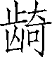

第八卷

 高祖本纪第八

在《高祖本纪》中，司马迁侧重叙写的是刘邦如何战胜项羽，最后建立汉帝国的过程，同时充分肯定了这位开国之君在统一天下过程中的重要作用。

这种作用，是司马迁运用鲜明、强烈的对比手法展示给读者的。比如，记叙项羽、刘邦两支军队分兵入关中击秦时，对项羽军的行动是这样描述的：“及项羽杀宋义，代为上将军，诸将黥布皆属，破秦将王离军，降章邯，诸将皆附。”读者看到的，只是单纯的军事方面的成功。而写刘邦军，除了写军事策略外，还写了刘邦的安民措施，“诸所过毋得掠卤”，于是“秦人憙，秦军解，因大破之”。这就一下子把“沛公遂先诸侯至霸上”的重要因由突出了。

这种对比又是从许多侧面展开的。例如，写刘邦、项羽对待各路诸侯的策略。项羽一听到有自立为王的消息，便“大怒”，便“发兵”；而当刘邦听到韩信自请立为“假王”时，开始头脑发热，打算攻打韩信，但一经张良提醒，立刻转变态度，“乃遣张良操印绶立韩信为齐王”。在天下大乱、群雄逐鹿的形势下，在争取同盟者方面，又是刘邦高出一筹。本篇还特别记下了刘邦在平定天下后所说的那段脍炙人口的话：“夫运筹策帷帐之中，决胜于千里之外，吾不如子房；镇国家，抚百姓，给馈饷，不绝粮道，吾不如萧何；连百万之军，战必胜，攻必取，吾不如韩信。此三者，皆人杰也，吾能用之，此吾所以取天下也。项羽有一范增不能用，此其所以为我擒也。”这是用人方面的对比。项羽刚愎自专，而刘邦则虚怀若谷，知人善任。正是通过这样层层对比，逐层推进，从而揭示了楚汉之争的必然结局。

《高祖本纪》在谋篇布局上也有特色。李景星说：“《项羽本纪》每事为一段，插入合来，犹好下手；《高纪》则将诸事纷纷抖碎，整中见乱，乱中见整，绝无痕迹。”（《史记评议》）这正是司马迁的高妙之处。

***【原文】***

高祖[1]，沛丰邑中阳里[2]人，姓刘氏，字季[3]。父曰太公[4]，母曰刘媪[5]。其先，刘媪[6]尝息大泽之陂，梦与神遇。是时雷电晦冥[7]，太公往视，则见蛟龙于其上。已而有身[8]，遂产高祖。

***【译文】***

[1]高祖：刘邦死后，庙号汉太祖。他的子孙和臣下因他功绩高，是汉的始祖，曾上尊号为高皇帝。习惯上称他为高祖。

[2]沛：县名。治所在今江苏省沛县。丰邑中阳里：邑和里都是当时地方行政单位。

[3]字季：汉高祖最初没有名字。做皇帝之后，才取名“邦”。这里的“季”不是他的字，而是他在兄弟中的排行最末位次。兄弟的排行顺序为伯、仲、叔、季。

[4]太公：对老年男子的尊称。

[5]媪（ǎo）：对老年妇女的通称。

[6]其先：原先；当初。

[7]晦冥：天色昏暗。

[8]有身：怀孕。身，通“娠”。古代帝王为了巩固自己的统治地位，常常编造某些迷信故事来神化自己，欺骗人民。

***【原文】***

高祖为人，隆准而龙颜[1]，美须髯[2]，左股有七十二黑子[3]。仁而爱人，喜施[4]，意豁如[5]也。常有大度，不事家人[6]生产作业。及壮，试为吏，为泗水亭[7]长，廷中吏无所不狎侮[8]。好酒及色。常从王媪、武负贳[9]酒，醉卧，武负、王媪见其上常有龙，怪之。高祖每酤留饮，酒雠数倍[10]。及见怪，岁竟，此两家常折券弃责[11]。

***【译文】***

[1]隆准：高鼻子。准，鼻梁。龙颜：上额凸起，像龙额。

[2]须髯（rán）：胡须。生在嘴下的叫须，生在两颊的叫髯。

[3]黑子：黑痣。

[4]施：施舍。

[5]意豁如：性情开朗。

[6]家人：平民百姓。

[7]泗水亭：在今江苏省沛县东。亭长：官名。秦时县下设乡，乡下每十里设亭。亭有亭长，掌管治安、诉讼等事。

[8]廷中吏：指衙门里的吏役。狎（xiá）侮：戏弄耍笑。

[9]武负：武大娘。负，通“妇”。贳（shì）：赊欠。

[10]酤：买酒。雠：售，卖出。酒雠数倍，指酒的销售量比平日多几倍。

[11]岁竟：年终。折券弃责：毁掉欠据，放弃债款。券，指赊欠的酒账。

***【原文】***

高祖常繇咸阳[1]，纵观[2]，观秦皇帝，喟然太息[3]曰：“嗟乎，大丈夫当如此也！”

***【译文】***

[1]常：通“尝”，曾经。繇：通“徭”，服徭役。咸阳：秦的都城，在今陕西省咸阳市东。

[2]纵观：任人观看。当时皇帝车驾出行，戒备森严，禁止老百姓观看。

[3]喟（kuì）然：叹气的样子。太息：叹息。

***【原文】***

单父人吕公善沛令[1]，避仇从之客，因家沛焉。沛中豪桀吏闻令有重客[2]，皆往贺。萧何为主吏，主进[3]，令诸大夫曰：“进不满千钱，坐之[4]堂下。”高祖为亭长，素易诸吏，乃绐为谒[5]曰“贺钱万”，实不持一钱。谒入，吕公大惊，起，迎之门。吕公者，好相人，见高祖状貌，因重敬之，引入坐。萧何曰：“刘季固多大言，少成事。”高祖因狎侮诸客，遂坐上坐，无所诎[6]。酒阑，吕公因目[7]固留高祖。高祖竟酒，后[8]。吕公曰：“臣少好相人，相人多矣，无如季相，愿季自爱[9]。臣有息女，愿为季箕帚妾[10]。”酒罢，吕媪怒吕公曰：“公始常欲奇此女，与贵人，沛令善公，求之不与，何自[11]妄许与刘季？”吕公曰：“此非儿女子[12]所知也。”卒与刘季。吕公女乃吕后也，生孝惠帝、鲁元公主[13]。

***【译文】***

[1]单父（shàn fǔ）：县名。治所在今山东省单县。善沛令：与沛县县令要好。令，汉时县的行政长官大县称“令”，万户以下小县称“长”。

[2]桀：通“杰”。重客：贵客。

[3]萧何（前257—前193）：刘邦同乡。辅佐刘邦统一天下后，任丞相，封为酂侯。主吏：即主吏掾（yuàn）：也称功曹掾，是协助县令管理人事考核的官职。主进：主持收纳贺礼的事宜。进，通“赆”，赠送的钱物。

[4]大夫：本爵位名。这里用作对贵客们的尊称，如同后来称“老爷”。坐之：使之坐。

[5]易：轻视。绐（dài）：欺骗。谒（yè）：名帖之类的东西，上面还写着贺礼的价值。

[6]诎（qū）：谦让。

[7]酒阑：酒尽席残。目：使眼色。

[8]竟酒：坚持到酒宴结束。后：走在最后。

[9]臣：自谦之词。爱：爱惜，保重。

[10]息女：亲生女儿。箕帚妾：打扫清洁的女仆。

[11]与：嫁给。自：原因。

[12]儿女子：相当于“妇孺之辈”，是蔑视人的话。

[13]吕后：事详见《吕太后本纪》。孝惠帝：刘邦长子刘盈。前194年继位，在位七年。鲁元公主：刘邦之女，后嫁给鲁元王张敖，所以称“鲁元公主”。

***【原文】***

高祖为亭长时，常告归之田[1]。吕后与两子居田中耨[2]，有一老父过请饮[3]，吕后因[4]之。老父相吕氏曰：“夫人天下贵人。”令相两子，见孝惠，曰：“夫人所以贵者，乃此男也。”相鲁元，亦皆贵。老父已去，高祖适从旁舍来，吕后具言客有过[5]，相我子母皆大贵。高祖问，曰：“未远。”乃追及，问老父。老父曰：“乡者[6]夫人、婴儿皆似君，君相贵不可言。”高祖乃谢曰：“诚[7]如父言，不敢忘德。”及高祖贵，遂不知老父处。

***【译文】***

[1]告归：请假回家。之：往；到。田：田间；乡下。

[2]耨（nòu）：除草。

[3]老父：老大爷。请饮：讨水喝。

[4]（bū）：拿饭食给人吃。

[5]具：详细，一一。客有过：有客人路过。

[6]乡者：刚才。乡，通“向”。

[7]诚：果真，的确。

***【原文】***

高祖为亭长，乃以竹皮为冠，令求盗之薛治[1]之，时时冠之。及贵常冠，所谓“刘氏冠”乃是也。

***【译文】***

[1]求盗：亭长手下专管追捕盗贼的小卒。薛：县名。治所在今山东省滕州市南。治：办理。

***【原文】***

高祖以亭长为县送徒郦山[1]，徒多道亡[2]。自度[3]比至皆亡之。到丰西泽[4]中，止饮[5]，夜乃解纵所送徒。曰：“公等皆去，吾亦从此逝[6]矣！”徒中壮士愿从者十余人。高祖被酒[7]，夜径[8]泽中，令一人行前。行前者还报曰：“前有大蛇当径，愿还。”高祖醉，曰：“壮士行，何畏！”乃前，拔剑击斩蛇。蛇遂分为两，径开。行数里，醉，因卧。后人来至蛇所，有一老妪[9]夜哭。人问何哭，妪曰：“人杀吾子，故哭之。”人曰：“妪子何为[10]见杀？”妪曰：“吾子，白帝[11]子也，化为蛇，当道，今为赤帝[12]子斩之，故哭。”人乃以妪为不诚，欲告[13]之，妪因忽不见。后人至，高祖觉[14]。后人告高祖，高祖乃心独喜，自负[15]。诸从者日益畏之。

***【译文】***

[1]徒：民夫。多为服劳役的犯人。郦（lí）山：即骊山。在今陕西省西安市临潼区东南。

[2]道亡：半路上逃跑。

[3]度（duó）：推测；估计。

[4]丰西：丰邑西面。泽：积水的洼地。

[5]止饮：停下来饮酒休息。

[6]逝：离去。指逃跑。

[7]被酒：带着酒意。被，加。

[8]径：小路。这里用如动词，抄小路走。

[9]老妪（yù）：老妇人。

[10]何为：为何，为什么。

[11]白帝：古代传说中的五天帝之一。位于西方，代表五行中的金德。秦襄公供奉白帝，自称白帝的子孙。

[12]赤帝：五天帝之一。位于南方，代表五行中的火德。汉朝人崇奉赤帝，自认是赤帝的子孙。

[13]告：告官。向政府告发其妖言惑众。一本作“笞”，《汉书·高帝纪》作“苦”，亦通。

[14]觉（jiào）：睡醒。

[15]自负：自有所恃，即自命不凡的意思。

***【原文】***

秦始皇帝常曰，“东南有天子气”[1]，于是因东游以厌[2]之。高祖即自疑，亡匿，隐于芒、砀[3]山泽岩石之间。吕后与人俱求[4]，常得之。高祖怪问之。吕后曰：“季所居上常有云气，故从往，常得季。”高祖心喜。沛中子弟[5]或闻之，多欲附者矣。

***【译文】***

[1]常：通“尝”。天子气：方士们认为皇帝所在的地方，天空有一种特殊的云气。

[2]东游：秦始皇称帝后，为了显示帝制的绝对权威，曾多次东巡，最后一次沿长江而下，一直到了会稽。厌：压制；镇压；制伏。

[3]芒、砀（dànɡ）：均为山名。在今安徽省砀山县东南。

[4]俱求：一同去寻找。

[5]子弟：这里指一班年轻人。

***【原文】***

秦二世元年[1]秋，陈胜等起蕲[2]，至陈[3]而王，号为“张楚”[4]。诸郡县皆多杀其长吏以应陈涉。沛令恐，欲以沛应涉。掾[5]、主吏萧何、曹参乃曰：“君为秦吏，今欲背之，率沛子弟，恐不听。愿君召诸亡在外者，可得数百人，因劫[6]众，众不敢不听。”乃令樊哙[7]召刘季。刘季之众已数十百人矣。

***【译文】***

[1]秦二世元年：即前209年。二世：嬴胡亥。前209至前207年在位。

[2]陈胜（？—前208）：秦末农民起义领袖。字涉，阳城（今河南省登封市东南）人。蕲（qí）：县名。治所在今安徽省宿州市埇桥区东南。

[3]陈：县名。治所在今河南省周口市淮阳区。

[4]张楚：张大楚国的意思。张是动词。陈胜自称楚王，而非张楚王。

[5]掾：县令属吏。曹参曾做过掌管刑狱的狱掾。

[6]因：依靠；凭借。劫：威胁，挟持。

[7]樊哙（kuài，前242—前189）：刘邦同乡。原以屠狗为业，后来成为刘邦的得力将领。曾任左丞相，封舞阳侯。

***【原文】***

于是樊哙从刘季来。沛令后悔，恐其有变，乃闭城城守[1]，欲诛萧、曹。萧、曹恐，逾城保刘季[2]。刘季乃书帛射城上，谓沛父老曰：“天下苦秦[3]久矣。今父老虽为沛令守，诸侯并起，今[4]屠沛。沛今共诛令，择子弟可立者立之，以应诸侯，则家室完[5]。不然，父子俱屠，无为也[6]。”父老乃率子弟共杀沛令，开城门迎刘季，欲以为沛令。刘季曰：“天下方扰，诸侯并起，今[7]置将不善，壹败涂地[8]。吾非敢自爱，恐能薄，不能完父兄子弟。此大事，愿更相推择可者[9]。”萧、曹等皆文吏，自爱，恐事不就，后秦种族[10]其家，尽让刘季。诸父老皆曰：“平生所闻刘季诸珍怪，当贵；且卜筮[11]之，莫如刘季最吉。”于是刘季数[12]让。众莫敢为，乃立季为沛公[13]。祠黄帝，祭蚩尤[14]于沛庭，而衅鼓旗[15]。帜，皆赤，由所杀蛇白帝子，杀者赤帝子，故上[16]赤。于是少年豪吏如萧、曹、樊哙等皆为收沛子弟二三千人，攻胡陵、方与[17]，还守丰。

***【译文】***

[1]城守：据城防守。

[2]保刘季：得到刘季的保护，指投靠刘季。

[3]苦秦：为秦所苦害。

[4]今：即将，马上就会。

[5]完：完全。指得以保全。

[6]无为：无意义；不值得。

[7]今：这里相当于“若”“如果”。

[8]壹败涂地：一旦战败就肝脑涂地。

[9]可者：能够胜任的人。

[10]种族：绝种灭族。“种”和“族”均用作动词。

[11]卜筮（shì）：占卜吉凶。

[12]数（shuò）：多次。

[13]沛公：楚人称县令为公，故名。

[14]蚩尤：传说中的部落首领，兵器的发明者。当时人认为，黄帝最善战略战术，蚩尤则首创各种兵器，所以作战前祭祀他们，以求取保佑。

[15]衅（xìn）鼓旗：用牲畜的血涂在战鼓战旗上。这是古代的一种祭礼。

[16]上：通“尚”，崇尚。

[17]胡陵：县名。治所在今山东省鱼台县东南。方与（fánɡ yù）：县名。治所在今山东省鱼台县西北。

***【原文】***

秦二世二年，陈涉之将周章军西至戏[1]而还。燕、赵、齐、魏[2]皆自立为王。项氏[3]起吴。秦泗川监平[4]将兵围丰，二日，出与战，破之。命雍齿[5]守丰，引兵之薛。泗川守壮败于薛，走至戚[6]，沛公左司马得[7]泗川守壮，杀之。沛公还军亢父[8]，至方与，未战。陈王使魏人周巿略地[9]。周巿使人谓雍齿曰：“丰，故梁徙[10]也。今魏地已定者数十城。齿今下[11]魏，魏以齿为侯守丰。不下，且屠丰。”雍齿雅[12]不欲属沛公，及魏招之，即反为魏守丰。沛公引兵攻丰，不能取。沛公病，还之沛。沛公怨雍齿与丰子弟叛之，闻东阳宁君、秦嘉立景驹为假[13]王，在留[14]，乃往从之，欲请兵以攻丰。是时秦将章邯从陈[15]，别将司马[16]将兵北定楚地，屠相[17]，至砀[18]。东阳宁君、沛公引兵西，与战萧[19]西，不利。还收兵聚留，引兵攻砀，三日乃取砀。因收砀兵，得五六千人。攻下邑[20]，拔之。还军丰。闻项梁在薛，从骑[21]百余往见之。项梁益沛公卒五千人、五大夫将[22]十人。沛公还，引兵攻丰。

***【译文】***

[1]周章（？—前209）：也叫周文。陈县（今河南省周口市淮阳区）人。陈胜起义军将领。率兵攻入关中，后被秦将章邯战败自杀。戏（xì）：水名。在今陕西省西安市临潼区东。

[2]燕（yān）：国名。辖今河北省北部和辽宁省西部地区，都城在蓟（今北京市西南隅）。赵：国名。在今山西省中部和河北省西南部地区，都城在邯郸（今河北省邯郸市）。齐：国名。辖今山东省泰山以北黄河流域和胶东半岛地区，都城在临淄（今山东省淄博市东北）。魏：国名。辖今河南省北部和山西省西南部，都城在大梁（今河南省开封市）。燕、赵、齐、魏都是战国时的诸侯强国，后为秦所灭。陈胜起义后，它们的后裔也纷纷起兵反秦。

[3]项氏：指项梁、项羽叔侄。项氏为战国末年楚将之后，流亡在吴（今江苏省苏州市）。陈胜起义后，他们起兵响应，于前208年渡江西进。

[4]泗川：即泗水，郡名。辖今安徽省北部和江苏省西北部地区，郡治在相县（今安徽省淮北市西北）。监：郡的监察官。秦时每郡设守、尉、监三官。守为行政首长，尉管军事，监管督察官吏，由中央所派的御史充任。平：和下文的“壮”都是人名。

[5]雍齿：刘邦同乡。随刘邦起兵后，一度背叛。汉初被封为什方侯。

[6]戚：县名。治所在今山东省滕州市南。

[7]左司马：官名。掌管军政。这里指曹无伤。得：这里是“俘获”的意思。

[8]亢父（fǔ）：县名。治所在今山东省济宁市南。

[9]陈王：指陈胜。他率领起义军攻下陈县之后，被推为王，所以称“陈王”。周巿（fú）：陈胜手下的将领。后降魏，迎魏咎为王，自任魏相。最后为秦将章邯所杀。略地：用武力扩充地盘。

[10]故梁徙：曾是梁的迁都之地。

[11]下：投降。

[12]雅：素来；向来。

[13]东阳宁君：东阳君（今江苏省金湖县西南、安徽省天长市西北）姓宁的某人。秦嘉：凌县（今江苏省泗阳县西北）人。响应陈胜，在郯（tán）县（今山东省郯城县北）起兵，自称大司马。景驹：战国时楚国王族的后裔，姓景名驹。假：暂时代理。

[14]留：县名。治所在今江苏省沛县东南。

[15]章邯（？—前205）：秦末大将。率军镇压以陈胜为首的农民起义军，后投降项羽。楚汉战争中被刘邦击败自杀。

[16]别将：配合主将在别处率军作战的将领。

[17]相：县名。当时是泗水郡的郡治。

[18]砀：县名。治所在今河南省夏邑县东南。

[19]萧：县名。治所在今安徽省萧县西北。

[20]下邑：县名。治所在今安徽省砀山县。

[21]从骑：随从的骑兵。

[22]益：增拨。五大夫将：五大夫级的将领。五大夫是秦朝爵位的第九级。

***【原文】***

从项梁月余，项羽已拔襄城[1]还。项梁尽召别将居薛。闻陈王定死[2]，因立楚后怀王孙心[3]为楚王，治盱台[4]。项梁号武信君。居数月[5]，北攻亢父，救东阿[6]，破秦军。齐军归[7]，楚独追北[8]，使沛公、项羽别攻城阳[9]，屠之。军濮阳[10]之东，与秦军战，破之。

***【译文】***

[1]襄城：县名。治所在今河南省襄城县西。

[2]定死：确实已死。

[3]怀王孙心（？—前206）：楚怀王熊槐的孙子熊心。

[4]盱台（xūyí）：即盱眙。县名。治所在今江苏省盱眙县东北。“治盱台”即定都盱台。

[5]居数月：“月”字或为“日”字之误。

[6]东阿（ē）：县名。治所在今山东省阳谷县西南之阿城镇。

[7]齐军归：东阿之围解除后，田荣引兵东归，驱逐了齐人所立的田假，另立田儋之子田巿为王。田假逃到楚地，受到保护，田荣从此与项梁、项羽生怨。

[8]追北：追击败退的敌军。

[9]城阳：县名。治所在今山东省鄄（juàn）城县东南。

[10]军：驻扎。濮阳：县名。治所在今河南省濮阳县西南。

***【原文】***

秦军复振，守濮阳，环水[1]。楚军去而攻定陶[2]，定陶未下。沛公与项羽西略地至雍丘[3]之下，与秦军战，大破之，斩李由[4]。还攻外黄[5]，外黄未下。

***【译文】***

[1]环水：环城挖沟引水，以防御敌军。

[2]定陶：县名。治所在今山东省菏泽市定陶区西北。

[3]雍丘：县名。治所在今河南省杞（qǐ）县。

[4]李由：秦丞相李斯之子。当时任三川郡守。

[5]外黄：县名。治所在今河南省民权县西北。

***【原文】***

项梁再破秦军，有骄色。宋义谏[1]，不听。秦益章邯兵，夜衔枚[2]击项梁，大破之[3]定陶，项梁死。沛公与项羽方攻陈留[4]，闻项梁死，引兵与吕将军[5]俱东。吕臣军彭城[6]东，项羽军彭城西，沛公军砀。

***【译文】***

[1]宋义：战国末年楚国的令尹。随项羽起兵伐秦，曾任上将军，号称“卿子冠军”。

[2]枚：形状像筷子之类的东西。古代军队秘密行动时，为了防止喧哗，命令士兵将枚横衔在嘴里，两头用绳子系在颈上，叫作“衔枚”。

[3]大破之：下面省略了介词“于”。

[4]陈留：县名。治所在今河南省开封市祥符区东南陈留镇。

[5]吕将军：即吕臣。

[6]彭城：县名。治所在今江苏省徐州市。

***【原文】***

章邯已破项梁军，则以为楚地兵不足忧，乃渡河[1]，北击赵，大破之。当是之时，赵歇[2]为王，秦将王离围之钜鹿[3]城，此所谓“河北之军”也。

***【译文】***

[1]河：古代黄河的专名。

[2]赵歇：战国时赵国的后裔。陈胜起义后，派部将武臣到赵地招抚。

[3]王离：秦朝名将王翦的孙子。钜鹿：县名。治所在今河北省平乡县西南。

***【原文】***

秦二世三年，楚怀王见项梁军破，恐，徙盱台，都彭城，并吕臣、项羽军自将之。以沛公为砀郡长，封为武安侯，将砀郡兵。封项羽为长安侯，号为鲁[1]公。吕臣为司徒[2]，其父吕青为令尹[3]。

***【译文】***

[1]鲁：县名。在今山东省曲阜市。

[2]司徒：楚官名。楚国的司徒职掌后勤事务，与一般所说的六卿之一的司徒（主管教化）不同。

[3]令尹：楚官名，相当于丞相。

***【原文】***

赵数请救，怀王乃以宋义为上将军，项羽为次将，范增[1]为末将，北救赵。令沛公西略地入关。与诸将约，先入定关中者王[2]之。

***【译文】***

[1]范增（前277—前204）：项氏叔侄的重要谋臣。居鄛（cháo，今安徽省安庆市北）人。曾劝项梁立楚怀王。项羽尊称他为“亚父”。

[2]关中：地区名。一般指函谷关以西、散关以东、萧关以南、武关以北为关中。周平王东迁后，秦国一直占据着这一地区，因此通常称秦地为关中。王：封为王。用作动词。

***【原文】***

当是时，秦兵强，常乘胜逐北，诸将莫利先入关[1]。独项羽怨秦破项梁军，奋[2]，愿与沛公西入关。怀王诸老将皆曰：“项羽为人僄悍猾贼[3]。项羽尝攻襄城，襄城无遗类[4]，皆坑之，诸所过无不残灭。且楚数进取，前陈王、项梁皆败。不如更遣长者扶义[5]而西，告谕秦父兄。秦父兄苦其主久矣，今诚得长者往，毋侵暴，宜可下。今项羽僄悍，今不可遣；独沛公素宽大长者，可遣。”卒不许项羽，而遣沛公西略地，收陈王、项梁散卒。乃道砀至成阳，与杠里秦军夹壁[6]，破秦二军。楚军出兵击王离，大破之。

***【译文】***

[1]莫利先入关：没有人认为先入关是有利的。

[2]奋：愤激。

[3]僄（piào）悍猾贼：勇猛凶残。

[4]无遗类：一个不留。

[5]更：改。长（zhǎnɡ）者：宽厚而老成的人。扶义：仗义；按照仁义行事。

[6]道：取道；经过。成阳：即城阳。在今山东省鄄城县东南。杠里：地名。在城阳西面。夹壁：对垒而阵。壁：营垒。

***【原文】***

沛公引兵西，遇彭越[1]昌邑，因与俱攻秦军，战不利。还至栗[2]，遇刚武侯[3]，夺其军，可[4]四千余人，并之。与魏将皇欣、魏申徒[5]武蒲之军并攻昌邑，昌邑未拔。西过高阳[6]。郦食其为监门[7]，曰：“诸将过此者多，吾视沛公大人长者。”乃求见说沛公。沛公方踞床[8]，使两女子洗足。郦生不拜，长揖，曰：“足下必欲诛无道秦[9]，不宜踞见长者。”于是沛公起，摄衣谢之，延[10]上坐。食其说沛公袭陈留，得秦积粟。乃以郦食其为广野君，郦商[11]为将，将陈留兵，与偕攻开封，开封未拔。西与秦将杨熊战白马，又战曲遇[12]东，大破之。杨熊走之荥阳[13]，二世使使者斩以徇。南攻颍阳[14]，屠之。因张良遂略韩地辕[15]。

***【译文】***

[1]彭越：陈胜起义后，起兵响应，依附刘邦。汉初被封为梁王，后为刘邦所杀。

[2]栗：县名。治所在今河南省夏邑县。

[3]刚武侯：姓名失传。

[4]可：大约。

[5]申徒：官名。即司徒。

[6]高阳：聚邑名。在今河南省杞县西南。

[7]郦食其（yì jī）：说客。监门：看守城门的吏卒。

[8]踞（jù）床：两脚岔开，坐在床上。这是一种极不礼貌的见客姿态。床，坐具。

[9]足下：敬称。

[10]摄：整理；提起。谢：道歉。延：引进。

[11]郦商：郦食其之弟。汉初封曲周侯。

[12]白马：县名。治所在今河南省滑县东。曲遇：聚邑名。在今河南省中牟县东。

[13]荥阳：县名。治所在河南省荥阳市东北。

[14]颍阳：县名。治所在今河南省许昌市西南。

[15]辕：山名。在今河南省偃师市东南。山路盘旋，形势险峻，是有名的要隘。

***【原文】***

当是时，赵别将司马卬[1]方欲渡河入关，沛公乃北攻平阴[2]，绝河津[3]。南，战雒阳东[4]，军不利，还至阳城[5]，收军中马骑，与南阳守[6]战犨东，破之。略南阳郡，南阳守走，保城守宛。沛公引兵过而西。张良谏曰：“沛公虽欲急入关，秦兵尚众，距险[7]。今不下宛，宛从后击，强秦在前，此危道也。”于是沛公乃夜引兵从他道还，更旗帜，黎明，围宛城三匝[8]。南阳守欲自刭[9]。其舍人[10]陈恢曰：“死未晚也。”乃逾城见沛公，曰：“臣闻足下约，先入咸阳者王之。今足下留守宛。宛，大郡之都也，连城数十，人民众，积蓄多，吏人自以为降必死，故皆坚守乘城[11]。今足下尽日止攻[12]，士死伤者必多；引兵去宛，宛必随足下后：足下前则失咸阳之约，后又有强宛之患。为足下计，莫若约降，封其守，因使止守[13]，引其甲卒与之西。诸城未下者，闻声争开门而待，足下通行无所累。”沛公曰：“善。”乃以宛守为殷侯，封陈恢千户。引兵西，无不下者。至丹水[14]，高武侯鳃、襄侯王陵降西陵[15]。还攻胡阳，遇番君别将梅，与皆，降析、郦[16]。遣魏人甯昌使秦[17]，使者未来。是时章邯已以军降项羽于赵矣。

***【译文】***

[1]司马卬（ánɡ）：原为赵将，后归项羽，被封为殷王。

[2]平阴：县名。治所在今河南省孟津县东北。

[3]绝：切断。河津：指黄河渡口。

[4]雒阳：雒，三国魏改作“洛”。县名。治所在今河南省洛阳市东北。

[5]阳城：县名。治所在今河南省登封市东南。

[6]南阳：郡名。辖今河南省西南部及湖北省北部地区。郡治在宛（今河南省南阳市）。（yǐ）：吕。犨（chōu）：县名。治所在今河南省鲁山县东南，属南阳郡。

[7]距险：依险固守，以拒敌人。

[8]匝：环绕一周。三匝：指重重包围。

[9]自刭：用刀割颈自杀。

[10]舍人：侍从于左右的亲信或门客。

[11]坚守乘城：即乘城坚守。乘，登。

[12]止攻：指停止前进，攻击宛城。

[13]止守：留守。

[14]丹水：县名。在今河南省淅川县西南、丹水北岸。

[15]西陵：地名，在今湖北省宜昌市西。但此地方位与史文不符，疑为衍文。

[16]胡阳：一作“湖阳”。县名。治所在今河南省唐河县西南。番（pó）君：即吴芮（ruì，？—前202）。秦时曾任番县令。皆：通“偕”。析：邑名。在今河南省西峡县。郦：县名。治所在今河南省南阳市西北。

[17]使秦：指入秦与赵高通谋。

***【原文】***

初，项羽与宋义北救赵，及项羽杀宋义，代为上将军，诸将黥布皆属[1]；破秦将王离军，降章邯，诸侯皆附。及赵高[2]已杀二世，使人来，欲约分王关中。沛公以为诈，乃用张良计，使郦生、陆贾[3]往说秦将，啖以利，因袭攻武关[4]，破之。又与秦军战于蓝田[5]南，益张疑兵旗帜，诸所过毋得掠卤，秦人憙，秦军解[6]，因大破之。又战其北，大破之。乘胜，遂破之。

***【译文】***

[1]黥布：原名英布。因受过黥刑，人称黥布。

[2]赵高（？—前207）：以宦官任中车府令。

[3]郦生：即郦食其。陆贾：刘邦的谋士。汉初拜太中大夫。

[4]啖：以食予人。引申为以利诱人。武关：在今陕西省丹凤县东南丹江上。

[5]蓝田：县名。治所在今陕西省蓝田县西。

[6]卤：通“虏”。憙：通“喜”。解：通“懈”。

***【原文】***

汉元年十月[1]，沛公兵遂先诸侯至霸上[2]。秦王子婴[3]素车白马，系颈以组[4]，封皇帝玺符节[5]，降轵道[6]旁。诸将或言诛秦王。沛公曰：“始怀王遣我，固以[7]能宽容；且人已服降，又杀之，不祥。”乃以秦王属吏[8]，遂西入咸阳。欲止宫休舍[9]，樊哙、张良谏，乃封秦重宝财物府库，还军霸上。召诸县父老豪桀曰：“父老苦秦苛法久矣，诽谤者族[10]，偶语者弃市[11]。吾与诸侯约，先入关者王之，吾当王关中。与父老约[12]法三章耳：杀人者死，伤人及盗抵罪[13]。余悉除去秦法。诸吏人皆案堵如故[14]。凡吾所以来，为父老除害，非有所侵暴[15]，无恐！且吾所以还军霸上，待诸侯至而定约束耳。”乃使人与秦吏行县乡邑，告谕之。秦人大喜，争持牛羊酒食献飨[16]军士。沛公又让不受，曰：“仓粟多，非乏，不欲费人[17]。”人又益喜，唯恐沛公不为秦王。

***【译文】***

[1]汉元年十月：即前206年阴历十月。这一年刘邦被封为汉王，所以称“汉元年”。为汉纪元的开始。秦朝历法建亥，以夏历十月为岁首，汉承秦制，元年十月即汉元年的第一个月，也就是正月。

[2]霸上：也作“灞上”。地名。在今陕西省西安市东，是古代咸阳、长安附近的军事要地，因地处灞水以西的高原而得名。

[3]子婴（？—前206）：秦朝末代王，秦二世兄之子。前207年，赵高杀二世后，他被立为王。

[4]系颈以组：用丝带系颈。组，丝织的宽带子。素车白马、颈上系带，表示自己该死，投降请罪。

[5]玺（xǐ）：本为印的通称，从秦代起专指皇帝用的印。符：古代朝廷派遣使者传达命令、征调兵将用的凭证。

[6]轵（zhǐ）道：一作“枳道”。亭名。在今陕西省西安市东北。

[7]固：本来；原来。以：认为。

[8]属（zhǔ）吏：交给主管官吏处理。属，交付。

[9]止宫休舍：留住宫中休息。

[10]诽谤者族：批评朝政的灭族。

[11]偶语：相聚在一起议论。弃市：刑法名。在闹市执行死刑，并将尸体暴露街头示众，表示为人所弃，称为“弃市”。

[12]约：约定，达成协议。

[13]抵罪：当其罪。意思是根据罪行大小来确定刑的轻重。

[14]案堵如故：一切照旧。案堵，即“安堵”，安定而不变动的意思。

[15]侵暴：侵犯残害。

[16]飨（xiǎnɡ）：用酒肉款待、慰劳。

[17]费人：叫人破费。

***【原文】***

或说沛公曰：“秦富十倍天下，地形强。今闻章邯降项羽，项羽乃号为雍王，王关中[1]。今则[2]来，沛公恐不得有此。可急使兵守函谷关[3]，无内[4]诸侯军，稍征关中兵以自益，距之。”沛公然其计[5]，从之。十一月中，项羽果率诸侯兵西，欲入关，关门闭。闻沛公已定关中，大怒，使黥布等攻破函谷关。十二月中，遂至戏。沛公左司马曹无伤闻项王[6]怒，欲攻沛公，使人言项羽曰：“沛公欲王关中，令子婴为相，珍宝尽有之。”欲以求封。亚父[7]劝项羽击沛公。方飨士，旦日合战[8]。是时项羽兵四十万，号百万。沛公兵十万，号二十万，力不敌。会项伯[9]欲活张良，夜往见良，因以文谕项羽，项羽乃止。沛公从百余骑，驱之鸿门[10]，见谢[11]项羽。项羽曰：“此沛公左司马曹无伤言之。不然，籍何以生[12]此！”沛公以樊哙、张良故，得解[13]归。归，立诛曹无伤。

***【译文】***

[1]“项羽乃号为雍王”二句：意思是项羽传出要封章邯为雍王的话，使之统辖关中之地。

[2]则：如果。

[3]函谷关：在今河南省灵宝市东北，是河南通往关中地区的门户。

[4]内：通“纳”。

[5]然其计：以其计为然，即赞同他的建议。

[6]项王：《汉书·高帝纪》作“项羽”。这时项羽尚未称王，而且本篇此文之前各处都称“项羽”，唯独此处称“项王”，疑误。

[7]亚父：即范增。

[8]旦日：明早。合战：会战。

[9]会：恰巧遇上。项伯（？—前192）：即项羽的叔父项缠，字伯。当时在项羽军中任左尹。汉初封射阳侯，赐姓刘。

[10]鸿门：在今陕西省西安市临潼区东。因项羽曾驻军于此，所以后来又称“项王营”。

[11]谢：赔罪。

[12]籍：项羽名籍，字羽。这里是以名谦称自己。按：“生”字疑为“至”字之误。“生此”应为“至此”。

[13]解：解脱。

***【原文】***

项羽遂西，屠烧咸阳秦宫室，所过无不残破。秦人大失望，然恐，不敢不服耳。

项羽使人还报怀王。怀王曰：“如约[1]。”项羽怨怀王不肯令与沛公俱西入关，而北救赵，后天下约[2]。乃曰：“怀王者，吾家项梁[3]所立耳，非有功伐[4]，何以得主约！本定天下，诸将及籍也。”乃详尊怀王为义帝[5]，实不用[6]其命。

***【译文】***

[1]如约：按原先的约定办，即“先入定关中者王之”。

[2]后天下约：失约而落在人后。

[3]吾家项梁：项羽这样直呼其叔，不大合情理。

[4]功伐：功劳。伐，积功，与“功”近义。

[5]详：通“佯”，假装；假意。义帝：有两种解释：一说“义”即“假”，义帝就是假皇帝；一说义帝即名义上的皇帝，相当于说“名誉皇帝”。二者都说明，项羽把怀王只是当作傀儡。

[6]用：采用；执行。

***【原文】***

正月，项羽自立为西楚霸王[1]，王梁、楚地九郡[2]，都彭城。负约[3]，更立沛公为汉王，王巴、蜀、汉中[4]，都南郑。三分关中，立秦三将：章邯为雍王，都废丘；司马欣为塞王，都栎阳[5]；董翳[6]为翟王，都高奴[7]。楚将瑕丘申阳[8]为河南王，都洛阳。赵将司马卬为殷王，都朝歌[9]。赵王歇徙王代[10]。赵相张耳[11]为常山王，都襄国[12]。当阳君黥布为九江王，都六[13]。怀王柱国共敖[14]为临江王，都江陵[15]。番君吴芮为衡山王，都邾[16]。燕将臧荼[17]为燕王，都蓟[18]。故燕王韩广徙王辽东[19]。广不听，臧荼攻杀之无终[20]。封成安君陈馀河间[21]三县，居南皮[22]。封梅十万户。

***【译文】***

[1]西楚霸王：古代楚国有南楚、东楚、西楚之分，项羽建都的彭城，地处西楚，所以这样自称。所谓“霸王”，大致相当于春秋时期作为诸侯之长的盟主（霸主）。

[2]梁、楚地九郡：指战国时梁国和楚国的部分地区，即今河南省东部、山东省西南部和江苏、安徽两省的大部及浙江省北部地区。至于九郡，说法不一。王先谦引全祖望说，认为是指黔中、南阳、东海、砀、薛、楚、泗水、会（kuài）稽、东郡，均秦所立。

[3]负约：指违背楚怀王关于先入关破秦者做关中王的约定。

[4]巴、蜀、汉中：均郡名。

[5]栎阳：县名。治所在今陕西省西安市临潼区东北。

[6]董翳（yì）：原为章邯部下，任都尉，曾劝说章邯投降项羽。

[7]高奴：县名。治所在今陕西省延安市东北。

[8]瑕丘申阳：即原瑕丘令申阳。瑕丘为秦县名。治所在今山东省济宁市兖（yǎn）州区东北。申阳为人名。

[9]朝歌：县名。治所在今河南省淇县。

[10]代：古国名。战国时属赵，秦置郡。

[11]张耳（前264—前202）：魏国名士，与陈馀齐名。大梁（今河南省开封市附近）人。陈胜起义后，先后拥立武臣、赵歇为赵王。初附项羽，封常山王；后归刘邦，封赵王。

[12]襄国：秦时为信都县，汉改襄国县，治所在今河北省邢台市西南。

[13]六：县名。治所在今安徽省六安市裕安区北，是黥布的故乡。

[14]柱国：楚官名。也称“上柱国”。共（ɡōnɡ）敖：人名。

[15]江陵：县名。治所在今湖北省江陵县。

[16]邾（zhū）：邑名。在今湖北省黄冈市黄州区西北。

[17]臧荼（tú）：原为燕王韩广的部将，曾领兵援赵，随项羽入关。后归附刘邦。

[18]蓟（jì）：县名。在今北京市西南。

[19]韩广：原为陈胜部将武臣的下属，后领兵攻取燕地，自立为燕王。辽东：郡名。辖今辽宁省大凌河以东、辽东半岛地区，郡治在襄平（今辽宁省辽阳市）。

[20]无终：县名。治所在今天津市蓟州区。臧荼杀韩广事在这年八月，这里连带叙及。

[21]成安：县名。治所在今河北省成安县东南。陈馀：魏国名士，与张耳齐名。大梁人。陈胜起义后，和张耳一起拥立赵歇为赵王，赵歇封他为代王。河间：汉置河间国，在乐成（今河北省献县东南）。《张耳陈馀列传》无“河间”二字，作“即以南皮旁三县以封之”。

[22]南皮：县名。在今河北省南皮县东北。

***【原文】***

四月，兵罢戏下[1]，诸侯各就国[2]。汉王之国，项王使卒三万人从[3]，楚与诸侯之慕从者数万人，从杜南入蚀[4]中。去辄烧绝栈道[5]，以备诸侯盗兵袭之，亦示项羽无东意。至南郑，诸将及士卒多道亡归，士卒皆歌思东归。韩信[6]说汉王曰：“项羽王诸将之有功者，而王独居南郑，是迁[7]也。军吏士卒皆山东[8]之人也，日夜跂而望[9]归，及其锋[10]而用之，可以有大功。天下已定，人皆自宁，不可复用。不如决策东乡[11]，争权天下。”

***【译文】***

[1]戏下：即“麾（huī）下”，大将的指挥旗下。戏，通“麾”，大旗。

[2]就国：到自己的封国去。

[3]使卒三万人从：刘邦入咸阳时有兵十万，这时仅使卒三万人从，说明项羽已削夺刘邦的兵力。

[4]杜：县名。治所在今陕西省西安市东南。蚀：谷道名。大约就是子午谷，在今陕西省西安市西南，是关中通往汉中的重要谷道。

[5]栈道：也叫“阁道”。指在山崖上凿石架木构成的通道。

[6]韩信（？—前196）：汉初著名军事家。淮阴（今江苏省淮安市清江浦区附近）人。

[7]迁：贬谪；流放。

[8]山东：泛指崤（xiáo）山或华（huà）山、函谷关以东广大地区。

[9]跂（qì）而望：踮起脚跟向前远望。

[10]锋：锐。这里指锐气。

[11]东乡（xiànɡ）：向东（进军）。乡，通“向”。

***【原文】***

项羽出关，使人徙义帝。曰：“古之帝者地方千里，必居上游。”乃使使徙义帝长沙郴县[1]，趣[2]义帝行，群臣稍倍[3]叛之，乃阴令衡山王、临江王击之，杀义帝江南[4]。项羽怨田荣[5]，立齐将田都[6]为齐王。田荣怒，因自立为齐王[7]，杀田都[8]而反楚；予彭越将军印，令反梁地[9]。楚令萧公角[10]击彭越，彭越大破之。陈馀怨项羽之弗王己也，令夏说[11]说田荣，请兵击张耳。齐予陈馀兵，击破常山王张耳，张耳亡归汉。迎赵王歇于代[12]，复立为赵王。赵王因立陈馀为代王。项羽大怒，北击齐。

***【译文】***

[1]长沙：郡名。辖今湖南省大部和江西省西北部地区，郡治在临湘（今湖南省长沙市）。郴（chēnɡ）县：县名。即今湖南省郴州市苏仙区。当时属长沙郡。

[2]趣（cù）：催促。

[3]稍：逐渐，陆续。倍：通“背”。

[4]“杀义帝江南”二句：这里说项羽暗令衡山王吴芮与临江王共敖杀义帝于江南。

[5]项羽怨田荣：田荣是齐国王族后裔。陈胜起义后，他随堂兄田儋起兵，重建齐国。曾被秦将章邯围困于东阿，经项梁解救得脱。田荣归齐后，立田儋之子田巿为王，驱逐齐王田假。田假逃归项梁。项梁击章邯于定陶，秦大军增援。项梁告急于齐，田荣不救，章邯大败楚军，项梁战死。

[6]田都：田假部将。曾随项羽救赵，入关，被项羽封为齐王。项羽同时又封原齐王田建的孙子田安为济北王，而改封田荣所立的齐王田巿为胶东王，使齐地一分为三。

[7]“田荣怒”二句：田荣恼恨项羽不封己为王，先后击败田都，击杀田安、田巿，尽并三齐之地，自立为齐王。

[8]杀田都：田都被田荣击败后，逃归项羽，未被杀。

[9]予彭越将军印，令反梁地：《汉书·韩彭英卢吴传》作“汉乃使人赐越将军印”，与此处记载不一。

[10]萧公角：原为萧县县令，名角。公，是楚对县令的称呼。

[11]夏说（yuè）：陈馀为代王时，曾任相国。

[12]迎赵歇于代：指陈馀打败张耳收复赵地之后，将已徙代郡的赵歇迎回。

***【原文】***

八月，汉王用韩信之计，从故道[1]还，袭雍王章邯。邯迎击汉陈仓，雍兵败，还走；止战好畤[2]，又复败，走废丘。汉王遂定雍地。东至咸阳，引兵围雍王废丘，而遣诸将略定陇西、北地、上郡[3]。令将军薛欧、王吸出武关[4]，因[5]王陵兵南阳，以迎太公、吕后于沛。楚闻之，发兵距之阳夏[6]，不得前。令故吴令郑昌[7]为韩王，距汉兵。

***【译文】***

[1]故道：县名。在今陕西省凤县东北，接甘肃省两当县。

[2]好畤（zhì）：县名。治所在今陕西省乾（qián）县东。

[3]陇西：郡名。辖今甘肃省东南部地区，郡治在狄道（今甘肃省临洮县）。北地：郡名。辖今内蒙古自治区、宁夏回族自治区和甘肃省、陕西省的部分地区，郡治在义渠（今甘肃省镇宁布依族苗族自治县西北）。上郡：郡名。辖今陕西省北部和内蒙古自治区西南部地区，郡治在肤施（今陕西省榆林市榆阳区东南）。

[4]薛欧：刘邦部将。以舍人身份随刘邦在丰邑起兵，后被封为广平侯。王吸：刘邦部将。后被封为清阳侯。

[5]因：随着。这里指会合王陵在南阳的几千驻军。

[6]阳夏（jiǎ）：县名。治所在今河南省太康县。

[7]郑昌：项羽部将。

***【原文】***

二年，汉王东略地，塞王欣、翟王翳、河南王申阳皆降。韩王昌不听，使韩信击破之[1]。于是置陇西、北地、上郡、渭南、河上、中地郡[2]；关外置河南[3]郡。更立韩太尉信[4]为韩王。诸将以万人若[5]以一郡降者，封万户。缮治[6]河上塞。诸故秦苑囿园池[7]，皆令人得田[8]之。正月，虏雍王弟章平，大赦罪人。

***【译文】***

[1]使韩信击破之：这句省略了主语“汉王”。

[2]渭南、河上、中地郡：这三个郡分别成为后来的京兆尹、左冯翊（pínɡ yì）、右扶风。

[3]河南：郡名。辖今河南省新安县以东、开封市以西地区，郡治在洛阳（今河南省洛阳市东北）。

[4]韩太尉信：战国时韩襄王的后代。

[5]若：或者。

[6]缮治：修整。河上塞（sài）：指河上郡北部一带防御匈奴的工事。

[7]苑囿（yuàn yòu）园池：古代畜养禽兽、种植花木的园林，这里指专供帝王与贵族游猎的风景区。

[8]田：开垦；耕种。用如动词。

***【原文】***

汉王之出关至陕[1]，抚关外父老，还，张耳来见[2]，汉王厚遇之。

***【译文】***

[1]陕：县名。治所在今河南省三门峡市西。

[2]张耳来见：指张耳被陈馀打败后，前来归附刘邦。

***【原文】***

二月，令除秦社稷[1]，更立汉社稷。

***【译文】***

[1]社稷（jì）：即社稷坛，是古代君主祭祀土神和谷神的场所。常用来作为国家的代称。除去秦的社稷坛，再立汉的社稷坛，表示改朝换代。

***【原文】***

三月，汉王从临晋[1]渡，魏王豹[2]将兵从。下河内，虏殷王，置河内郡[3]。南渡平阴津，至雒阳。新城三老董公遮[4]说汉王以义帝死故。汉王闻之，袒[5]而大哭。遂为义帝发丧，临[6]三日。发使者告诸侯曰：“天下共立义帝，北面[7]事之。今项羽放杀义帝于江南，大逆无道。寡人亲为发丧，诸侯皆缟素[8]。悉发关内兵，收三河[9]士，南浮江汉[10]以下，愿从诸侯王击楚之杀义帝者。”

***【译文】***

[1]临晋：关隘名。在今陕西省大荔县东黄河西岸，是古代秦晋间的重要通道。因关下有蒲津渡，所以又叫蒲津关。

[2]魏王豹：战国时魏国王族的后裔。

[3]河内：泛指今河南省黄河以北地区。河内郡：治所在怀县（今河南省武陟县西南）。

[4]新城：汉改为县。治所在今河南省伊川县西南。三老：官名。掌管一乡的教育与民俗。遮：拦住。

[5]袒（tǎn）：裸露。古代丧服有袒露左臂的规定。

[6]临：聚众举哀，祭吊死者。

[7]北面：古代君主面南而坐，臣下北面朝见。

[8]缟（ɡǎo）素：这里泛指白色的丧服。

[9]三河：河南、河东、河内三郡的合称。

[10]江汉：长江、汉水。

***【原文】***

是时项王北击齐，田荣与战城阳。田荣败，走平原[1]，平原民杀之。齐皆降楚。楚因焚烧其城郭，系虏[2]其子女。齐人叛之。田荣弟横立荣子广为齐王，齐王反楚城阳。项羽虽闻汉东[3]，既已连齐兵[4]，欲遂破之而击汉。汉王以故得劫五诸侯[5]兵，遂入彭城。项羽闻之，乃引兵去齐，从鲁[6]出胡陵，至萧，与汉大战彭城灵壁东睢水[7]上，大破汉军，多杀士卒，睢水为之不流。乃取汉王父母妻子于沛，置之军中以为质[8]。当是时，诸侯见楚强汉败，还皆去汉复为楚。塞王欣亡入楚。

***【译文】***

[1]平原：县名。治所在今山东省平原县南。西汉时改置郡。

[2]系虏：拘缚掳掠。

[3]汉东：汉军向东进军。东，用如动词。

[4]连齐兵：指与齐兵交战。

[5]五诸侯：指常山王张耳、河南王申阳、韩王郑昌、魏王魏豹、殷王司马卬。劫：控制，把持。

[6]鲁：县名。治所在今山东省曲阜市东古城。

[7]灵壁：邑名。在今安徽省淮北市西南。睢水：鸿沟支流之一。

[8]质：抵押品。此指人质。

***【原文】***

吕后兄周吕侯为汉将兵，居下邑[1]。汉王从之，稍收士卒，军砀。汉王乃西过梁地，至虞[2]。使谒者随何[3]之九江王布所，曰：“公能令布举兵叛楚，项羽必留击之。得留数月，吾取天下必矣。”随何往说九江王布，布果背楚。楚使龙且[4]往击之。

***【译文】***

[1]周吕侯：即吕泽。下邑：县名。治所在今安徽省砀山县东。

[2]虞：县名。治所在今河南省虞城县北。

[3]谒者：官名。为国君掌管传达等事务的侍从官。随何：刘邦的谋士。

[4]龙且（jū）：项羽的部将。

***【原文】***

汉王之败彭城而西，行使人求家室，家室亦亡[1]，不相得。败后乃独得孝惠，六月，立为太子，大赦罪人。令太子守栎阳，诸侯子在关中者皆集栎阳为卫。引水灌废丘，废丘降，章邯自杀。更名废丘为槐里。于是令祠官祠天地、四方、上帝[2]、山川，以时祀之。兴[3]关内卒乘塞。

***【译文】***

[1]行：将。亡：逃亡；失散。

[2]上帝：泛指天帝、天神。

[3]兴：发动，征调。

***【原文】***

是时九江王布与龙且战，不胜，与随何间行[1]归汉。汉王稍收士卒，与诸将及关中卒益出[2]，是以兵大振荥阳，破楚京、索[3]间。

***【译文】***

[1]间（jiàn）行：抄小路秘密而行。

[2]益出：大举出动。

[3]京：县名。治所在今河南省荥阳市东南。索：城名。故址在今荥阳市境内。

***【原文】***

三年，魏王豹谒归视亲[1]疾，至，即绝河津[2]，反为楚。汉王使郦生说豹，豹不听。汉王遣将军韩信击，大破之，虏豹。遂定魏地，置三郡，曰河东、太原、上党[3]。汉王乃令张耳与韩信遂东下井陉[4]击赵，斩陈馀、赵王歇。其明年，立张耳为赵王。

***【译文】***

[1]谒归：告假回家。亲：指父母。

[2]绝河津：断绝蒲津关的黄河渡口，以阻止汉军东渡。

[3]河东：郡名。辖今山西省阳城县以西、石楼县以南地区，郡治在安邑（今山西省夏县西北）。太原：郡名。辖今山西省雁门关以南、吕梁山与太行山之间地区，郡治在晋阳（今山西省太原市西南）。上党：郡名。辖今山西省沁源县与河北省涉县以西地区，郡治汉时在长子（今山西省长子县西）。

[4]井陉（xínɡ）：县名。治所在今河北省井陉县西北。

***【原文】***

汉王军荥阳南，筑甬道属之河[1]，以取敖仓[2]。与项羽相距岁余。项羽数侵夺汉甬道，汉军乏食，遂围汉王。汉王请和，割荥阳以西者为汉。项王不听。汉王患之，乃用陈平[3]之计，予陈平金四万斤，以间疏[4]楚君臣。于是项羽乃疑亚父。亚父是时劝项羽遂下荥阳，及其见疑，乃怒，辞老，愿赐骸骨归卒伍[5]，未至彭城而死。

***【译文】***

[1]甬道：两旁筑有高墙以防敌人劫夺的通道。属（zhǔ）之河：指从荥阳一直连通到黄河边。属，连接。

[2]敖仓：秦代修建的著名大粮仓。因地处荥阳以北的敖山上而得名。

[3]陈平（？—前178年）：刘邦的重要谋臣。

[4]间疏：挑拨离间，使之疏远。

[5]愿赐骸骨：古代臣子事君，看作以身许人，“愿赐骸骨”是请求辞职退休的客套话。卒伍：古代乡间基层编制，五人为伍，百人为卒。归卒伍，即辞职为民。

***【原文】***

汉军绝食，乃夜出女子[1]东门二千余人，被[2]甲，楚因四面击之。将军纪信乃乘王驾，诈为汉王，诳[3]楚，楚皆呼“万岁”[4]，之城东观，以故汉王得与数十骑出西门遁[5]。令御史大夫[6]周苛、魏豹、枞公守荥阳。诸将卒不能从者，尽在城中。周苛、枞公相谓曰：“反国之王[7]，难与守城。”因杀魏豹。

***【译文】***

[1]女子：妇女。

[2]被：通“披”。

[3]诳：欺骗，迷惑。

[4]万岁：原为古人欢呼、庆贺之词，后来专用以称皇帝。

[5]遁：逃。

[6]御史大夫：官名。

[7]反国之王：指魏豹。魏豹先依附项羽，后归顺刘邦，不久又叛变，反复无常。

***【原文】***

汉王之出荥阳入关，收兵欲复东。袁生[1]说汉王曰：“汉与楚相距荥阳数岁，汉常困。愿君王出武关，项羽必引兵南走，王深壁[2]，令荥阳[3]、成皋间且得休。使韩信等辑[4]河北赵地，连燕、齐[5]，君王乃复走荥阳，未晚也。如此，则楚所备者多，力分，汉得休，复与之战，破楚必矣。”汉王从其计，出军宛、叶[6]间，与黥布行收兵。

***【译文】***

[1]袁生：《汉书·高帝纪》作“辕生”。

[2]深壁：深沟高垒，指坚守不战。

[3]成皋：邑名。在今河南省荥阳市西北。

[4]辑：收拾；安抚。

[5]连燕、齐：以赵地为纽带，把燕地和齐地连成一片。

[6]宛（yuān）：邑名。在今河南省南阳市。叶（shè）：邑名。在今河南省叶县境内。

***【原文】***

项羽闻汉王在宛，果引兵南。汉王坚壁不与战。是时彭越渡睢水，与项声、薛公战下邳[1]，彭越大破楚军。项羽乃引兵东击彭越。汉王亦引兵北军成皋。项羽已破走彭越，闻汉王复军成皋，乃复引兵西，拔荥阳，诛周苛、枞公，而虏韩王信，遂围成皋。

***【译文】***

[1]项声：项羽部将。薛公：原为楚国令尹，后归附刘邦。黥布叛汉时，他曾为刘邦献策，因而被封为千户侯。下邳（pī）：县名。治所在今江苏省邳州市东。

***【原文】***

汉王跳[1]，独与滕公共车出成皋玉门[2]，北渡河，驰宿脩武[3]。自称使者，晨驰入张耳、韩信壁[4]，而夺之军。乃使张耳北益收兵赵地[5]，使韩信东击齐。汉王得韩信军，则复振。引兵临河南飨[6]，军小脩武南，欲复战。郎中郑忠乃说止[7]汉王，使高垒深堑，勿与战。汉王听其计，使卢绾、刘贾[8]将卒二万人，骑数百，渡白马津[9]，入楚地，与彭越复击破楚军燕[10]郭西，遂复下梁地十余城。

***【译文】***

[1]跳（táo）：通“逃”。

[2]滕公：即夏侯婴。刘邦同乡。玉门：成皋城的北门。

[3]脩武：秦县名。治所在今河南省修武县，是为大修武。城东小修武，即汉王所宿之地，在今河南省获嘉县境。

[4]壁：军营。

[5]益收兵赵地：到赵地征集更多的兵员。

[6]临河南飨：《史记志疑》认为，“南飨”当作“南乡”。乡，通“向”。

[7]郎中：官名。说（shuì）止：劝说阻止。

[8]卢绾（wǎn）：刘邦的同乡好友。跟随刘邦起兵，汉初封长安侯，后封燕王。因谋反逃入匈奴。刘贾：刘邦堂兄。汉初封荆王，后为黥布所杀。

[9]白马津：渡口名。在今河南省滑县东北，是当时黄河中下游的重要渡口。

[10]燕：县名。治所在今河南省延津县北、卫辉市东。

***【原文】***

淮阴已受命东[1]，未渡平原[2]。汉王使郦生往说齐王田广[3]，广叛楚[4]，与汉和，共击项羽。韩信用蒯通[5]计，遂袭破齐。齐王烹郦生，东走高密[6]。项羽闻韩信已举河北兵破齐、赵，且欲击楚，则使龙且、周兰往击之。韩信与战，骑将灌婴[7]击，大破楚军，杀龙且。齐王广奔彭越。当此时，彭越将兵居梁地，往来苦楚兵，绝其粮食。

***【译文】***

[1]淮阴：即淮阴侯韩信。淮阴是他后来的封地，在今江苏省淮安市淮阴区西南。

[2]平原：即平原津。在今山东省平原县南。

[3]田广：田荣之子。当时继位为齐王。

[4]广叛楚：田广向来未曾归楚，这里说“叛楚”，不当。

[5]蒯通：当时著名的说客。范阳（在今河北定兴县西南）人。

[6]高密：县名。治所在今山东省高密市西南。

[7]灌婴（？—前176）：刘邦的得力将领。睢阳（今河南省商丘市南）人。绸贩出身，跟随刘邦起兵，屡建奇功，汉初封颍阴侯。后与陈平、周勃诛灭诸吕，拥立文帝，不久任丞相。

***【原文】***

四年，项羽乃谓海春侯大司马曹咎[1]曰：“谨守成皋。若汉挑战，慎勿与战，无令得东而已。我十五日必定梁地，复从[2]将军。”乃行，击陈留、外黄、睢阳[3]，下之。汉果数挑楚军，楚军不出，使人辱之五六日，大司马怒，度兵汜水[4]。士卒半渡，汉击之，大破楚军，尽得楚国金玉货赂[5]。大司马咎、长史欣[6]皆自刭汜水上。项羽至睢阳，闻海春侯破，乃引兵还。汉军方围钟离昩[7]于荥阳东，项羽至，尽走险阻[8]。

***【译文】***

[1]大司马：官名。掌管军政的高级官员。曹咎：原为蕲县狱掾，项羽叔父项梁因罪在栎阳被捕时，他曾写信给该县狱掾司马欣，为项梁说情，使事情得以了结。

[2]从：这里是“会合”的意思。

[3]睢阳：县名。治所在今河南省商丘市南。

[4]度：通“渡”。汜（sì）水：水名。发源于河南省荥阳市西南的方山，北流注入黄河。

[5]货赂：财物。

[6]长（zhǎnɡ）史：官名。丞相、大将军等高级官员的属吏。因为诸吏之长而得名。欣：即司马欣。初为栎阳狱掾，后为秦将章邯的长史。入项羽军后，被封为塞王。

[7]钟离眜：姓钟离，名眜。项羽部将。

[8]险阻：指险要之地。

***【原文】***

韩信已破齐，使人言曰：“齐边[1]楚，权轻，不为假王，恐不能安齐。”汉王欲攻之[2]，留侯[3]曰：“不如因而立之，使自为守。”乃遣张良操印绶[4]立韩信为齐王。

***【译文】***

[1]边：邻近。

[2]韩信要称假王事，详见《淮阴侯列传》。

[3]留侯：即张良。留侯是他的封号。留，县名。在今江苏省沛县东南。

[4]印绶（shòu）：印和系印的丝带，即指印信。

***【原文】***

项羽闻龙且军破，则恐，使盱台人武涉往说韩信[1]。韩信不听。

***【译文】***

[1]武涉劝韩信联楚反汉，三分天下。

***【原文】***

楚汉久相持未决，丁壮苦军旅，老弱罢转馕[1]。汉王项羽相与临广武之间[2]而语。项羽欲与汉王独身挑战。汉王数[3]项羽曰：“始与项羽俱受命怀王，曰先入定关中者王之，项羽负约，王我于蜀汉，罪一。项羽矫杀卿子冠军[4]而自尊，罪二。项羽已救赵，当还报，而擅劫诸侯兵入关，罪三。怀王约入秦无暴掠，项羽烧秦宫室，掘始皇帝冢[5]，私收其财物，罪四。又强[6]杀秦降王子婴，罪五。诈坑秦子弟新安二十万，王其将[7]，罪六。项羽皆王诸将善地，而徙逐故主[8]，令臣下争叛逆，罪七。项羽出逐义帝彭城，自都[9]之，夺韩王地[10]，并王梁、楚[11]，多自予[12]，罪八。项羽使人阴[13]弑义帝江南，罪九。夫为人臣而弑其主，杀已降，为政不平，主约不信，天下所不容，大逆无道，罪十也。吾以义兵从诸侯诛残贼，使刑余罪人[14]击杀项羽，何苦乃与公[15]挑战！”项羽大怒，伏弩[16]射中汉王。汉王伤匈[17]，乃扪[18]足曰：“虏中吾指[19]！”汉王病创卧，张良强请汉王起行劳军，以安士卒，毋令楚乘胜于汉。汉王出行军[20]，病甚，因驰入成皋。

***【译文】***

[1]罢（pí）：通“疲”，疲惫；劳累。转馕：转运粮秣给养。

[2]广武：广武山。在今河南省荥阳市北。山上有东西二城，隔广武涧相对，据传分别为项羽、刘邦所建。间，通“涧”。

[3]数（shǔ）：这里指列举罪状。

[4]矫：假托名义。卿子冠军：指宋义。“卿子”为敬称；“冠军”谓地位冠于诸将之上。

[5]掘始皇帝冢：据《光明日报》1985年3月29日报道，秦始皇陵考古队历时十二年，通过大面积调查钻探，在始皇陵“只发现两个盗洞，位于陵西铜车马坑道部位，直径九十厘米至一米，深不到九米，未能接近地宫，整个封土的土层为秦时原状。考古队认为，封土堆的土层未被掘动，地宫宫墙没有被破坏痕迹，地宫水银分布有规律，均可成为地宫未被盗毁的证明”。从两个盗洞的广度和深度判断，盗洞似非项羽及其部下所为。

[6]强杀：不该杀而杀了。

[7]“诈坑秦子弟”二句：指项羽封秦降将章邯、司马欣为王，而将秦降卒二十万坑杀于新安（今河南省渑池县东）一事。

[8]“项羽皆王诸将善地”二句：指项羽赶走原来受封的诸侯王，而把这些好地方封给他们的部将。如封臧荼为燕王，而徙燕王韩广为辽东王；封田都为齐王，而徙齐王田巿为胶东王；封张耳为常山王，而徙赵王赵歇为代王。

[9]都：建都。用如动词。

[10]夺韩王地：在熊心被立为楚怀王后，原韩国王族后代韩成曾先后被项梁、项羽封为韩王。

[11]并王梁、楚：指项羽兼并了梁国和楚国的土地。

[12]多自予：多给自己。

[13]阴：暗地。

[14]刑余罪人：受过刑法的罪人。

[15]乃与公：似应为“与乃公”。乃公，相当于“你老子”。刘邦这样自称以骂人。

[16]弩：一种装有机关，利用机栝（kuò）发箭，射程很远的弓。

[17]匈：通“胸”。

[18]扪（mén）：按着；抚摸。

[19]虏：对敌人的蔑称。指：指脚趾。

[20]行（xìnɡ）军：巡行视察部队。

***【原文】***

病愈，西入关，至栎阳，存问[1]父老，置酒，枭故塞王欣头栎阳市[2]。留四日，复如[3]军，军广武。关中兵益出[4]。

***【译文】***

[1]存问：慰问。

[2]枭（xiāo）：悬头示众。塞王司马欣被汉军打败后，在汜水自杀。市：集市；闹市。

[3]如：往；到。

[4]关中兵益出：指汉军开出关中增援前线。

***【原文】***

当此时，彭越将兵居梁地，往来苦楚兵，绝其粮食。田横往从之[1]。项羽数击彭越等，齐王信又进击楚。项羽恐，乃与汉王约，中分天下，割鸿沟[2]而西者为汉，鸿沟而东者为楚。项王归汉王父母妻子，军中皆呼万岁，乃归而别去。

***【译文】***

[1]田横（？—前202）：田荣之弟。狄县（今山东省高青县东南）人。本齐国贵族。秦末随兄田儋起兵反秦。田儋死后，他立田荣之子田广为齐王，自任齐相。韩信破齐后，他自立为齐王。败投彭越。

[2]鸿沟：一作大沟。战国魏惠王时开凿沟通黄河与淮水的运河。

***【原文】***

项羽解而东归。汉王欲引而西归，用留侯、陈平计[1]，乃进兵追项羽，至阳夏南止军，与齐王信、建成侯彭越期会[2]而击楚军。至固陵[3]，不会。楚击汉军，大破之。汉王复入壁，深堑而守之。用张良计[4]，于是韩信、彭越皆往。及刘贾入楚地，围寿春[5]，汉王败固陵，乃使使者召大司马周殷举九江兵而迎武王[6]，行屠城父[7]，随刘贾、齐梁诸侯皆大会垓下[8]。立武王布为淮南王。

***【译文】***

[1]留侯、陈平计：张良、陈平认为汉已得天下大半，楚兵又兵疲粮尽，如果失此机会，将会养虎遗患。因此，他们向刘邦建议乘胜追击，消灭项羽。

[2]期会：约期会合。

[3]固陵：邑名。在今河南省太康县南。

[4]张良计：张良认为韩信、彭越失约，是因为分地的欲望未得到满足，因此劝刘邦答应将陈县至海滨之地、睢阳至穀城之地分别封给韩信、彭越，让他们为自己的封地而战。刘邦依计行事，韩信、彭越果然立即进兵。

[5]寿春：县名。即今安徽省寿县，当时为九江郡治。

[6]周殷：项羽部将。武王：即黥布。

[7]城父（fǔ）：地名。在今安徽省亳州市东南。

[8]垓（ɡāi）下：邑名。在今安徽省灵璧县东南沱河北岸。

***【原文】***

五年，高祖与诸侯兵共击楚军，与项羽决胜垓下。淮阴侯将三十万自当之，孔将军[1]居左，费将军[2]居右，皇帝[3]在后，绛侯[4]、柴将军在皇帝后。项羽之卒可十万。淮阴先合，不利，却。孔将军、费将军纵[5]，楚兵不利，淮阴侯复乘之，大败垓下[6]。项羽卒[7]闻汉军之楚歌，以为汉尽得楚地，项羽乃败而走，是以兵大败。使骑将灌婴追杀项羽东城[8]，斩首八万，遂略定楚地。鲁为楚坚守不下。汉王引诸侯兵北，示鲁父老项羽头，鲁乃降。遂以鲁公号葬项羽穀城[9]。还至定陶，驰入齐王[10]壁，夺其军。

***【译文】***

[1]孔将军：韩信部将孔熙。后封为蓼侯。蓼，县名。治所在今河南省固始县东北。

[2]费将军：韩信部将陈贺。后封为费侯。封地费县，治所在今山东省费县西北。

[3]皇帝：即汉王刘邦。刘邦与项羽决战垓下时尚未称帝，且此以前均称“沛公”“汉王”等，因此，这里与下文的“皇帝”都应作“汉王”。

[4]绛（jiànɡ）侯：即周勃（？—前169）。刘邦同乡。曾以编织蚕箔为业，后随刘邦起兵反秦，率军转战各地，成为刘邦的重要将领，汉初封绛侯。

[5]纵：纵兵伏击。

[6]大败垓下：承前句省主语“楚兵”。

[7]卒：《项羽本纪》和《汉书·高帝纪》均作“夜”，疑“卒”字误。

[8]东城：县名。治所在今安徽省定远县东南。

[9]穀城：邑名。在今山东省平阴县西南东阿镇。一说认为当在曲阜西北的小穀城。

[10]齐王：即韩信。

***【原文】***

正月，诸侯及将相相与[1]共请尊汉王为皇帝。汉王曰：“吾闻帝贤者有也，空言虚语，非所守[2]也，吾不敢当帝位。”群臣皆曰：“大王起微细[3]，诛暴逆，平定四海，有功者辄裂地而封为王侯。大王不尊号，皆疑不信[4]。臣等以死守[5]之。”汉王三让，不得已，曰：“诸君必以为便，便国家[6]。”甲午[7]，乃即皇帝位氾水之阳[8]。

***【译文】***

[1]相与：一起；共同。

[2]守：求取。

[3]微细：轻微细小。

[4]皆疑不信：意思是人心都会要疑虑不安。

[5]守：保持。这里指坚持自己的意见。

[6]诸君必以为便，便国家：意思是，大家坚持认为这样做好，是因为这样做有利于国家。

[7]甲午：甲午日。即夏历二月初三。这里缺“二月”两字，《汉书·高帝纪》有。

[8]氾水之阳：氾水的北岸。氾水，水名。故道在今山东省曹县北，由古济水分出，流经菏泽市定陶区北，注入古菏泽。此水今已堙没。

***【原文】***

皇帝曰：“义帝无后[1]。齐王韩信习楚风俗[2]，徙为楚王，都下邳。”立建成侯彭越为梁王，都定陶。故韩王信为韩王，都阳翟[3]。徙衡山王吴芮为长沙王，都临湘[4]。番君之将梅有功，从入武关，故德[5]番君。淮南王布、燕王臧荼、赵王敖[6]皆如故。

***【译文】***

[1]义帝无后：此句语意未完。刘邦说这么半句话，是为徙韩信为楚王张本。

[2]韩信习楚风俗：这是刘邦迁调韩信以孤立他的托词。

[3]阳翟：县名。治所在今河南省禹州市。

[4]临湘：县名。治所在今湖南省长沙市。当时为长沙郡治。

[5]德：感谢、报答人的恩德。用如动词。

[6]赵王敖：即赵王张耳之子张敖。

***【原文】***

天下大定。高祖都雒阳，诸侯皆臣属[1]。故临江王[2]为项羽叛汉，令卢绾、刘贾围之，不下。数月而降，杀之雒阳。

***【译文】***

[1]臣属：称臣归附。

[2]故临江王：临江王共敖之子共。

***【原文】***

五月，兵皆罢[1]归家。诸侯子在关中者复[2]之十二岁，其归者复之六岁，食[3]之一岁。

***【译文】***

[1]罢：遣散；复员。

[2]复：免除徭役赋税。

[3]食（sì）：供养。

***【原文】***

高祖置酒雒阳南宫。高祖曰：“列侯诸将无敢隐朕[1]，皆言其情。吾所以有天下者何？项氏之所以失天下者何？”高起、王陵对曰[2]：“陛下[3]慢而侮人，项羽仁而爱人。然陛下使人攻城略地，所降下者[4]因以予之，与天下[5]同利也。项羽妒贤嫉能，有功者害[6]之，贤者疑之，战胜而不予人功，得地而不与人利，此所以失天下也。”高祖曰：“公知其一，未知其二。夫运筹策帷帐之中[7]，决胜于千里之外，吾不如子房[8]；镇国家，抚百姓，给馈馕[9]，不绝粮道，吾不如萧何；连百万之军，战必胜，攻必取，吾不如韩信。此三者，皆人杰也，吾能用之，此吾所以取天下也。项羽有一范增而不能用，此其所以为我擒也。”

***【译文】***

[1]无敢隐朕（zhèn）：不要瞒我。朕，本为古人自称之词，从秦始皇起，专为皇帝自称。

[2]高起：人名。孟康说：“姓高名起。”

[3]陛（bì）下：本意是帝王宫殿的台阶之下，古代臣子不能与君主直接对话，由陛下侍从转达，故以“陛下”尊称帝王。

[4]降下者：指归降的和攻克的城池。

[5]天下：这里指刘邦的部属，相当于说“大家”。

[6]害；嫉恨。

[7]运筹策帷帐之中：在营中定计决策。

[8]子房：即张良，表字子房。

[9]馈（kuì）饷：粮饷。

***【原文】***

高祖欲长都雒阳，齐人刘敬[1]说，及留侯劝上入都关中，高祖是日驾，入都关中。六月，大赦天下。

***【译文】***

[1]刘敬：原姓娄，齐国人。最初只是一名戍卒，他求见高祖，主张定都关中。大臣们大都是山东人，反对西迁。由于张良劝说，刘邦采纳了娄敬的意见，并赐他姓刘。

***【原文】***

十月[1]，燕王臧荼反，攻下代地。高祖自将击之，得燕王臧荼。即立太尉[2]卢绾为燕王。使丞相哙[3]将兵攻代。

***【译文】***

[1]十月：《汉书·高帝纪》作“七月”，又据《秦楚之际月表》载，“八月，帝自将诛燕”，“十月”疑为“七月”之误。

[2]太尉：官名。

[3]哙：即樊哙。按：当时樊哙并未任丞相，《樊哙列传》也无樊哙率兵攻代之事。

***【原文】***

其秋，利几反，高祖自将兵击之，利几走。利几者，项氏之将。项氏败，利几为陈公[1]，不随项羽，亡降[2]高祖，高祖侯之颍川[3]。高祖至雒阳，举通侯籍召之[4]，而利几恐，故反。

***【译文】***

[1]陈公：陈县（今河南省周口市淮阳区）县令。

[2]亡降：逃来投降。

[3]侯：封为侯。用如动词。颍川：郡名。辖今河南省中部地区，郡治在阳翟（今河南省禹州市）。

[4]举通侯籍召之：即召集所有在名册上的通侯来洛阳。举，全部。通侯，即列侯。

***【原文】***

六年，高祖五日一朝太公，如家人父子礼。太公家令[1]说太公曰：“天无二日，土无二王[2]。今高祖[3]虽子，人主也；太公虽父，人臣也。奈何令人主拜人臣！如此，则威重不行[4]。”后高祖朝，太公拥彗迎门却行[5]。高祖大惊，下扶太公。太公曰：“帝，人主也，奈何以我乱天下法！”于是高祖乃尊太公为太上皇[6]。心善家令言，赐金五百斤。

***【译文】***

[1]家令：即家臣。管理家事的官吏。

[2]“天无二日”二句：语出《礼记·坊记》。

[3]高祖：与家令口吻不合，也与情理不符（“高祖”是刘邦死后的庙号），此处当依《汉书·高帝纪》作“皇帝”。

[4]威重不行：指天子贵重的权威不能推行于全国。

[5]拥彗迎门却行：手拿扫帚，面向门户倒退着行走以引进贵人，表示自己地位低贱，愿为人清扫道路。

[6]太上皇：帝王对父亲的尊称，始于秦始皇。

***【原文】***

十二月，人有上变事[1]告楚王信谋反，上问左右，左右争欲击之。用陈平计，乃伪游云梦[2]，会诸侯于陈，楚王信迎，即因执[3]之。是日，大赦天下。田肯贺，因说高祖曰：“陛下得韩信，又治秦中[4]。秦，形胜之国[5]，带河山之险，县隔千里[6]，持戟百万，秦得百二[7]焉。地势便利，其以下兵于诸侯，譬犹居高屋之上建瓴水[8]也。夫齐，东有琅邪、即墨[9]之饶，南有泰山之固，西有浊河之限[10]，北有勃海之利[11]。地方二千里，持戟百万，县隔千里之外，齐得十二焉。故此东西秦[12]也。非亲子弟，莫可使王齐矣。”高祖曰：“善。”赐黄金五百斤。

***【译文】***

[1]上变事：指上报揭发谋反情况的书状。

[2]云梦：泽名。

[3]执：拘捕。

[4]治：建都。秦中：即关中。因曾为古秦国之地，所以当时崤山以东之人又称其为“秦中”。

[5]形胜之国：形势险要，足以取胜的地方。

[6]县隔千里：形势险要，易守难攻，好像跟敌对诸侯隔绝千里一样。县，通“悬”。

[7]百二：众说纷纭，一般认为，古人以“二”为“倍”，“百二”也就是“百倍”。

[8]居高屋之上建瓴（línɡ）水：在高屋上让水从瓦沟中顺势流下，比喻居高临下，势不可挡。建，通“瀽”（jiǎn），倾倒。瓴，瓦沟。

[9]琅邪（yá）：郡名。辖今山东省东南部地区，郡治在东武（今山东省诸城市）。即墨：县名。治所在今山东省平度市东南。

[10]浊河：即黄河。因河水浑浊而得名。限：隔；断。

[11]勃海之利：指勃海出产鱼盐。

[12]东西秦：指齐地形胜而又富饶，可与秦地东西抗衡。

***【原文】***

后十余日，封韩信为淮阴侯，分其地为二国。高祖曰：“将军刘贾数有功，以为荆王，王淮东[1]。弟交为楚王，王淮西[2]。子肥为齐王，王七十余城，民能齐言者皆属齐。”乃论功，与诸列侯剖符行封[3]。徙韩王信太原[4]。

***【译文】***

[1]淮东：指今安徽省淮河东部和南部一带。

[2]淮西：指今安徽省淮河西部和北部一带。

[3]剖符行封：将符的一半给受封者，作为受封的凭证，以示信用。

[4]太原：郡名。辖今山西省中部地区，郡治在晋阳（今山西省太原市西南）。

***【原文】***

七年，匈奴攻韩王信马邑[1]，信因与谋反太原。白土曼丘臣、王黄[2]立故赵将赵利为王以反。高祖自往击之。会天寒，士卒堕指者什二三[3]，遂至平城[4]。匈奴围我平城，七日而后罢去[5]。令樊哙止定代地[6]。立兄刘仲[7]为代王。

***【译文】***

[1]匈奴：也称“胡”。先后叫“鬼方”“混夷”“猃狁”“山戎”。马邑：县名。治所在今山西省朔州市。当时为韩王信的国都。

[2]白土：县名。治所在今内蒙古自治区鄂尔罗斯市。曼丘臣：韩王信的将领。姓曼丘，名臣。王黄：韩王信的部将。

[3]什二三：十分之二三。什，通“十”。

[4]平城：县名。在今山西省大同市东北。

[5]“匈奴围我平城”二句：高祖被匈奴围于平城东南的白登山，七日不得食。后用陈平计，厚赂匈奴阏氏（yān zhī，匈奴语称王后），阏氏以“两主不相困”等语劝冒顿单于解围一角，汉军趁大雾突围，与大军会合；冒顿也收兵而去。

[6]止定代地：留下来平定代地。

[7]刘仲：刘邦的二哥。“仲”是他的排行。

***【原文】***

二月，高祖自平城过赵、雒阳，至长安[1]。长乐宫成[2]，丞相已下徙治长安[3]。

***【译文】***

[1]长安：西汉都城。在今陕西省西安市西北。

[2]长乐宫：宫名。在长安城内东南隅，即今阁老门村。

[3]丞相已下徙治长安：指丞相属下的整个中央政府机构，由栎阳迁至长安。已，通“以”。

***【原文】***

八年，高祖东击韩王信余反寇于东垣[1]。

***【译文】***

[1]余：残余。东垣（yuán）：县名。治所在今河北省石家庄市东北。

***【原文】***

萧丞相营作未央宫[1]，立东阙[2]、北阙、前殿、武库、太仓。高祖还，见宫阙壮甚，怒谓萧何曰：“天下匈匈[3]苦战数岁，成败未可知，是何治宫室过度也？”萧何曰：“天下方未定，故可因遂就[4]宫室。且夫天子以四海为家，非壮丽无以重威[5]，且无令后世有以加[6]也。”高祖乃说[7]。

***【译文】***

[1]未央宫：宫名。在长安城内西南隅，即今马家寨村。

[2]阙（què）：宫殿前的高台建筑物。

[3]匈匈：通“汹汹”，纷扰，动乱。

[4]因遂：趁此机会。就：建成。

[5]重威：使威重。即“充分显示威严”的意思。

[6]加：超过。

[7]说（yuè）：通“悦”。

***【原文】***

高祖之东垣，过柏人[1]，赵相贯高等谋弑高祖[2]，高祖心动，因不留[3]。代王刘仲弃国亡[4]，自归雒阳，废以为合阳侯[5]。

***【译文】***

[1]柏人：邑名。在今河北省隆尧县西。

[2]贯高等谋弑高祖：赵王张敖是高祖的女婿。高祖先前在平城脱围，路过赵都时，对赵王傲慢无礼。赵相贯高等气愤不平，请杀高祖，张敖不肯。

[3]高祖心动，因不留：据说高祖打算在柏人留宿时，心有所动。当得知县名为“柏人”时，便说：“柏人者，迫于人也。”因此不宿而去。

[4]刘仲弃国亡：当时匈奴攻代，代王刘仲不能守，便弃国而逃。刘仲名喜，刘邦次兄。

[5]废以为合阳侯：指取消刘仲的代王封爵，改封为合阳侯。合阳，即邰阳。县名。治所在今陕西省合阳县东南。

***【原文】***

九年，赵相贯高等事发觉，夷三族[1]。废赵王敖为宣平[2]侯。是岁，徙贵族楚昭、屈、景、怀、齐田氏[3]关中。

***【译文】***

[1]夷：灭。三族：其说不一，有说为父母、兄弟、妻子，有说为父族、母族、妻族，还有说为父、子、孙。

[2]宣平：为张敖封号，非封邑名。

[3]昭、屈、景、怀：都是战国时楚国王族后裔。田氏：战国时齐国王族后裔。

***【原文】***

未央宫成。高祖大朝诸侯群臣，置酒未央前殿。高祖奉玉卮[1]，起，为太上皇寿，曰：“始大人常以臣无赖[2]，不能治产业，不如仲力。今某之业所就孰与仲多[3]？”殿上群臣皆呼万岁，大笑为乐。

***【译文】***

[1]奉：恭敬地捧着。玉卮（zhī）：玉制的酒器。

[2]无赖：没有赖以谋生的本领。

[3]孰与仲多：即“与仲孰多”的倒装。意思是，与刘仲相比，究竟谁的产业多？

***【原文】***

十年十月，淮南王黥布、梁王彭越、燕王卢绾、荆王刘贾、楚王刘交、齐王刘肥、长沙王吴芮皆来朝长乐宫。春夏无事。

七月，太上皇崩[1]栎阳宫。楚王、梁王皆来送葬。赦栎阳囚。更命郦邑曰新丰[2]。

***【译文】***

[1]崩：古代称帝王死为“崩”。

[2]郦邑：县名。治所在今陕西省西安市临潼区东北。“新丰”，含义为“新的丰邑”。

***【原文】***

八月，赵相国[1]陈豨反代地。上曰：“豨尝为吾使，甚有信。代地吾所急[2]也，故封豨为列侯，以相国守代，今乃与王黄等劫掠[3]代地！代地吏民非有罪也，其赦代吏民。”九月，上自东往击之。至邯郸[4]，上喜曰：“豨不南据邯郸而阻漳水[5]，吾知其无能为也。”闻豨将皆故贾人也，上曰：“吾知所以与之。”乃多以金啖[6]豨将，豨将多降者。

***【译文】***

[1]赵相国：下文说“以相国守代”，又《汉书·高帝纪》也作“代相国陈豨反”，所以此处似应为“代相国”。

[2]急：认为紧要；看重。

[3]乃：竟然。劫掠：劫持，指胁迫他人一同造反。

[4]邯郸：都邑名。即今河北省邯郸市。汉初为赵国国都。

[5]漳水：水名。源出山西省，有清漳、浊漳二支，合流后流经河北、河南两省边境，东北注入古黄河。

[6]啖（dàn）：引诱；利诱。

***【原文】***

十一年，高祖在邯郸诛豨等未毕，豨将侯敞将万余人游行[1]，王黄军曲逆[2]，张春渡河击聊城[3]。汉使将军郭蒙[4]与齐将击，大破之。太尉周勃道[5]太原入，定代地。至马邑，马邑不下，即攻残之。

***【译文】***

[1]游行：游击；运动作战。

[2]曲逆（yù）：县名。治所在今河北省顺平县东南。

[3]张春：陈豨部将。河：黄河。聊城：县名。治所在今山东省聊城市东昌府区西北。

[4]郭蒙：汉将。曾以都尉为汉守敖仓，后封东武侯。

[5]道：从；由。

***【原文】***

豨将赵利守东垣，高祖攻之，不下。月余，卒骂高祖，高祖怒。城降，令出骂者斩之，不骂者原[1]之。于是乃分赵山北[2]，立子恒[3]以为代王，都晋阳[4]。

***【译文】***

[1]原：原宥；赦罪。

[2]分赵山北：将赵国常山（即恒山）以北地区划归代国。

[3]恒：即汉文帝刘恒，薄太后所生。

[4]晋阳：县名。治所在今山西省太原市西南古城晋源区晋源街道。当时为太原郡治。

***【原文】***

春，淮阴侯韩信谋反关中，夷三族。

夏，梁王彭越谋反[1]，废迁蜀；复欲反，遂夷三族。立子恢[2]为梁王，子友[3]为淮阳王。

***【译文】***

[1]彭越谋反：高祖领兵讨伐陈豨时，向彭越征兵，彭越称病不去。部将扈辄劝他叛变，彭越没有答应。

[2]恢：即刘恢。高祖第五子，后徙为赵共王。

[3]友：即刘友。高祖第六子，后徙为赵幽王。

***【原文】***

秋七月，淮南王黥布反[1]，东并荆王刘贾地，北渡淮，楚王交走入薛。高祖自往击之。立子长[2]为淮南王。

***【译文】***

[1]黥布反：高祖杀死彭越后，把他剁成肉酱分赐各诸侯。黥布见状大恐，便决定叛变。

[2]长：即刘长。高祖第七子。

***【原文】***

十二年十月，高祖已击布军会甀[1]，布走，令别将追之。

***【译文】***

[1]会甀（kuài chuí）：邑名。在今安徽省宿州市埇桥区西南。当时属蕲县。

***【原文】***

高祖还归，过沛，留。置酒沛宫，悉召故人父老子弟纵酒[1]，发沛中儿得百二十人，教之歌。酒酣，高祖击筑[2]，自为歌诗曰：“大风起兮云飞扬，威加海内兮归故乡，安得猛士兮守四方！”令儿皆和习之。高祖乃起舞，慷慨伤怀，泣数行下。谓沛父兄曰：“游子悲[3]故乡。吾虽都关中，万岁后吾魂魄犹乐思沛。且朕自沛公以诛暴逆，遂有天下，其以沛为朕汤沐邑[4]，复其民，世世无有所与[5]。”沛父兄诸母故人日乐饮极，道旧故为笑乐[6]。十余日，高祖欲去，沛父兄固请留高祖。高祖曰：“吾人众多，父兄不能给[7]。”乃去。沛中空县皆之邑西献[8]。高祖复留止，张饮三日[9]。沛父兄皆顿首[10]曰：“沛幸得复，丰未复，唯陛下哀怜之。”高祖曰：“丰吾所生长，极不忘耳，吾特[11]为其以雍齿故反我为魏。”沛父兄固请，乃并复丰，比[12]沛。于是拜沛侯刘濞[13]为吴王。

***【译文】***

[1]纵酒：开怀饮酒。

[2]筑：古代的一种弹拨乐器。外形像筝，有十三弦，演奏时左手按弦，右手以竹尺击弦发音。

[3]游子：行游之客。悲：这里是“想念”“眷恋”的意思。

[4]其：副词。表祈使。汤沐邑：原指古代天子在自己的领地内，赐给诸侯以供其朝拜天子时住宿、斋戒、沐浴的封地，后用以称天子、诸侯、皇后、公主等的私邑。

[5]无有所与（yù）：与徭役没有关系，即不服任何徭役。

[6]道旧故：谈论往事。

[7]给：供给。

[8]空县：意谓全县出动。献：指献酒食。

[9]张饮：在郊外搭起帐篷饯饮。张，通“帐”。

[10]顿首：叩头。

[11]特：只是。

[12]比：比照。

[13]刘濞（前216—前154）：刘仲次子。二十岁为骑将，随高祖破黥布有功。高祖为了加强对东南一带的统治，特封他为吴王。

***【原文】***

汉将别击布军洮水[1]南北，皆大破之，追得斩布鄱阳。

***【译文】***

[1]洮水：水名。在今湖南省永州市零陵区境内。《水经注》载：“洮水出洮阳县西南，东流注入湘水。”今广西全州，为汉洮阳县地。

***【原文】***

樊哙别将兵定代[1]，斩陈豨当城[2]。

***【译文】***

[1]樊哙别将兵定代：《汉书·高帝纪》作“周勃定代”，且《樊哙列传》中无定代之事，疑此处史文有误。

[2]当城：邑名。在今河北省蔚县东。

***【原文】***

十一月，高祖自布军[1]至长安。十二月，高祖曰：“秦始皇帝、楚隐王[2]陈涉、魏安釐王、齐缗王、赵悼襄王皆绝无后，予守冢各十家，秦皇帝二十家，魏公子无忌[3]五家。”赦代地吏民[4]为陈豨、赵利所劫掠者，皆赦之。陈豨降将言豨反时，燕王卢绾使人之豨所，与阴谋。上使辟阳侯[5]迎绾，绾称病。辟阳侯归，具言绾反有端[6]矣。二月，使樊哙、周勃将兵击燕王绾。赦燕吏民与反者。立皇子建[7]为燕王。

***【译文】***

[1]布军：指征讨黥布叛乱的大军。

[2]楚隐王：即陈涉。“隐”是他的谥号。

[3]魏公子无忌：即信陵君（？—前243）。魏安釐王异母弟，战国时著名“四公子”之一。

[4]赦代地吏民：下句既有“皆赦之”，这句的“赦”字当删。

[5]辟阳侯：即审食其（yì jī）：刘邦同乡。受吕后宠信，封辟阳侯，后官至左丞相。文帝时被淮南厉王刘长击杀。辟阳，县名。治所在今河北省衡水市冀州区东南。

[6]端：迹象；苗头。

[7]建：即刘建。高祖第八子。

***【原文】***

高祖击布时，为流矢所中，行道病[1]。病甚，吕后迎良医。医入见，高祖问医。医曰：“病可治[2]。”于是高祖嫚骂之曰：“吾以布衣提三尺剑取天下，此非天命乎？命乃在天，虽扁鹊何益[3]！”遂不使治病，赐金五十斤罢之。已而[4]吕后问：“陛下百岁后，萧相国即[5]死，令谁代之？”上曰：“曹参可。”问其次，上曰：“王陵可。然陵少戆[6]，陈平可以助之。陈平智有余，然难以独任。周勃重厚少文[7]，然安刘氏者必勃也，可令为太尉。”吕后复问其次，上曰：“此后亦非而[8]所知也。”

***【译文】***

[1]行道病：在途中患病。

[2]病可治：这是医生婉转的说法。

[3]扁鹊：战国时名医。姓秦，名越人。齐国勃海鄚（今河北省任丘市）人。因医术高明，人们便以传说中黄帝时的神医扁鹊相称。

[4]已而：随后；不久。

[5]即：倘若；如果。

[6]少：稍微。戆（zhuànɡ）：憨厚刚直。

[7]重厚少文：稳重厚道，但缺少文才。

[8]而：通“尔”。

***【原文】***

卢绾与数千骑居塞下候伺[1]，幸[2]上病愈自入谢。

***【译文】***

[1]候伺：侦察。这里是观望等待的意思。

[2]幸：希望。

***【原文】***

四月甲辰[1]，高祖崩长乐宫。四日不发丧。吕后与审食其谋曰：“诸将与帝为编户民[2]，今北面为臣，此常怏怏[3]，今乃事少主[4]，非尽族是[5]，天下不安。”人或闻之，语郦将军[6]。郦将军往见审食其，曰：“吾闻帝已崩，四日不发丧，欲诛诸将。诚如此，天下危矣。陈平、灌婴将十万守荥阳，樊哙、周勃将二十万定燕、代，此闻帝崩，诸将皆诛，必连兵还乡[7]以攻关中。大臣内叛，诸侯外反，亡可翘足而待[8]也。”审食其入言之，乃以丁未发丧[9]，大赦天下。

***【译文】***

[1]四月甲辰：即前195年夏历四月二十五日。

[2]编户民：编入户籍的平民。

[3]此：此辈；这班人。怏（yànɡ）怏：因不平或不满而闷闷不乐的样子。

[4]少主：小主子。指汉惠帝刘盈。

[5]族：族诛；灭族。是：这些人。指诸将。

[6]郦将军：即郦商。郦食其的弟弟。

[7]还乡：反向；回过头来。乡，通“向”。

[8]可翘（qiáo）足而待：指可在短时间内实现。翘足，跷起二郎腿。翘，通“跷”。

[9]丁未：夏历四月二十八日。

***【原文】***

卢绾闻高祖崩，遂亡入匈奴。

丙寅[1]，葬。己巳，立太子[2]，至太上皇庙。群臣皆曰：“高祖起微细[3]，拨乱世反之正[4]，平定天下，为汉太祖，功最高。”上尊号[5]为高皇帝。太子袭号为皇帝，孝惠帝也。令郡国诸侯各立高祖庙，以岁时祠[6]。

***【译文】***

[1]丙寅：夏历五月十七日。

[2]立太子：指立太子刘盈为皇帝。

[3]当时群臣尚在议论上尊号的事，不应先称庙号“高祖”。

[4]拨乱世反之正：治理好乱世，使之回到正轨。反，通“返”。

[5]尊号：即谥（shì）号。

[6]以岁时祠：每年按时祭祀。祠，通“祀”。

***【原文】***

及孝惠五年[1]，思高祖之悲乐[2]沛，以沛宫为高祖原庙[3]。高祖所教歌儿百二十人，皆令为吹乐，后有缺，辄[4]补之。

***【译文】***

[1]孝惠五年：即前190年。

[2]悲乐：想念和喜爱。

[3]原庙：即第二宗庙。

[4]辄（zhé）：即；就。

***【原文】***

高帝八男：长庶[1]齐悼惠王肥；次孝惠，吕后子；次戚夫人[2]子赵隐王如意；次代王恒，已立为孝文帝，薄太后[3]子；次梁王恢，吕太后时徙为赵共王；次淮阳王友，吕太后时徙为赵幽王；次淮南厉王长；次燕王建。

***【译文】***

[1]庶：旧时称姬妾所生之子。

[2]戚夫人：高祖宠姬。生赵王刘如意。高祖晚年曾想废掉太子刘盈，另立如意为太子，因遭大臣反对而止。高祖死后，吕后先后将戚夫人母子杀害。

[3]薄太后：高祖之姬。文帝刘恒即位后改称皇太后。

***【原文】***

太史公曰：夏之政忠[1]。忠之敝[2]，小人[3]以野，故殷人承之以敬。敬之敝，小人以鬼[4]，故周人承之以文[5]。文之敝，小人以僿[6]，故救僿莫若以忠。三王[7]之道若循环，终而复始[8]。周、秦之间，可谓文敝矣。秦政不改，反酷[9]刑法，岂不缪[10]乎？故汉兴，承敝易变[11]，使人不倦，得天统[12]矣。朝以十月。车服黄屋左纛。葬长陵[13]。

***【译文】***

[1]忠：忠厚朴实。

[2]敝：坏处。

[3]小人：本为古代统治者对劳动人民的蔑称，这里用以称平民百姓。

[4]鬼：迷信鬼神。

[5]文：讲究礼仪。

[6]僿：不诚。

[7]三王：指夏禹、商汤、周文王和周武王，即三代开国之王。

[8]“终而复始”二句：司马迁认为秦始皇应行夏政，严刑苛政是违反三王之道循环规律的，因而招致灭亡。

[9]酷：使之严酷。

[10]缪：通“谬”，错误。

[11]承敝易变：承受弊病，加以改变。指高祖废除秦朝苛法，与民约法三章，实行与民休息的各项政策。承，受。

[12]天统：天然的顺序、规律。

[13]朝以十月：以每年的十月作为诸侯王入京朝见皇帝的时间。黄屋：用黄色丝织物作顶篷的车，供帝王乘坐。长陵：高祖陵墓。在今陕西省咸阳市东北。按：“朝以十月”以下三句，文义不连贯，疑有脱误；且三句为叙事语气，与上文议论不合。从上句“得天统矣”的文气看，似为收束之语。

## 【译文】

高祖是沛郡丰邑县中阳里人，姓刘，字季。他的父亲是太公，母亲是刘媪。高祖未出生之前，刘媪曾经在大泽的岸边休息，梦中与神交合。当时，雷鸣电闪，天昏地暗，太公正好前去看她，见到有蛟龙在她身上。不久，刘媪有了身孕，生下了高祖。

高祖这个人，高鼻子，一副龙的容貌，一脸漂亮的胡须，左腿上有七十二颗黑痣。他仁厚爱人，喜欢施舍，心胸豁达。他平素具有干大事业的气度，不干平常人家生产劳作的事。到了成年以后，他试着去做官，当了泗水亭这个地方的亭长，对官署中的官吏，没有不加捉弄的。他喜欢喝酒，好女色。他常常到王媪、武负那里去赊酒喝，喝醉了躺倒就睡。武负、王媪看到他身上常有龙出现，觉得这个人很奇怪。高祖每次去买酒，留在店中畅饮，买酒的人就会增加，售出去的酒达到平常的几倍。等到看见了有龙出现的怪现象，到了年终，这两家就把记账的简札折断，不再向高祖讨账。

高祖曾经到咸阳去服徭役。有一次，秦始皇出巡，允许人们随意观看。他看到了秦始皇，长叹一声说：“唉，大丈夫就应该像这样！”

单父人吕公与沛县县令要好，为躲避仇人投奔县令这里来作客，于是就在沛县安了家。沛中的豪杰、官吏们听说县令有贵客，都前往祝贺。萧何当时是县令的属官，掌管收贺礼事宜，他对那些送礼的宾客们说：“送礼不满千金的，让他坐到堂下。”高祖做亭长，平素就看不起这帮官吏，于是在进见的名帖上谎称“贺钱一万”，其实他一个钱也没带。名帖递进去了，吕公见了高祖大为吃惊，赶快起身，到门口去迎接他。吕公这个人喜欢给人相面，看见高祖的相貌，就非常敬重他，把他领到堂上坐下。萧何说：“刘季一向满口说大话，很少做成什么事。”高祖就趁机戏弄那些宾客，干脆就坐到上座去，一点儿也不谦让。酒喝得尽兴了，吕公于是向高祖递眼色，让他一定留下来。高祖喝完了酒，就留在后面。吕公说：“我从年轻的时候就喜欢给人相面，经我给相面的人多了，没有谁能比得上你刘季的面相，希望你好自珍爱。我有一个亲生女儿，愿意许给你做你的洒扫妻妾。”酒宴散了，吕媪对吕公大为恼火，说：“你起初总是想让这个女儿出人头地，把她许配给个贵人。沛县县令跟你要好，想娶这个女儿你不同意，今天你为什么随随便便地就把她许给刘季了呢？”吕公说：“这不是女人家所懂得的。”他终于把女儿嫁给刘季了。吕公的女儿就是吕后，生了孝惠帝和鲁元公主。

高祖做亭长的时候，经常请假回家到田里去。有一次，吕后和孩子正在田中除草，有一老汉从这里经过讨水喝，吕后让他喝了水，还拿饭给他吃。老汉给吕后相面说：“夫人真是天下的贵人。”吕后又让他给两个孩子相面，他见了孝惠帝，说：“夫人之所以显贵，正在于这个男孩子。”他又给鲁元相面，同样是富贵面相。老汉走后，高祖正巧从旁边的房舍走来。吕后就把刚才那老人经过此地，给他们看相，说他们母子都是富贵之相的情况，原原本本地告诉了高祖。高祖问这个人在哪儿，吕后说：“还走不远。”于是，高祖就去追上了老汉，问他刚才的事。老汉说：“刚才我看贵夫人及子女的面相都很像您，您的面相简直是贵不可言。”高祖于是道谢说：“如果真的像老人家所说，我决不会忘记你的恩德。”等到高祖显贵的时候，始终不知道老汉的去处。

高祖做亭长时，喜欢戴用竹皮编成的帽子。他让掌管捕盗的差役到薛地去制作，经常戴着。到后来显贵了，仍旧经常戴着。人们所说的“刘氏冠”，指的就是这种帽子。

高祖以亭长的身份为沛县押送徒役去郦山，徒役们有很多在半路逃走了。高祖估计等到了郦山也就会都逃光了，所以走到丰西大泽中时，就停下来饮酒，入夜后，他解开役徒的绳索放役徒们走。高祖说：“你们都逃命去吧，从此我也要远远地走了！”徒役中有十多个壮士愿意跟随他一块儿走。高祖乘着酒意，夜里抄小路通过沼泽地，让一个在前边先走。走在前边的人回来报告说：“前边有条大蛇挡在路上，我们想往回走。”高祖已醉，说：“大丈夫走路，有什么可怕的！”于是，他赶到前面，拔剑去斩大蛇。大蛇被斩成两截，道路通了，继续往前走了几里，醉得厉害了，就躺倒在地上。后边的人来到斩蛇的地方，看见有一老妇在暗夜中哭泣。有人问她为什么哭，老妇人说：“有人杀了我的孩子，我在哭他。”有人问：“你的孩子为什么被杀呢？”老妇说：“我的孩子是白帝之子，变化成蛇，挡在道路中间，如今被赤帝之子杀了，我就是为这个哭啊。”众人以为老妇人是在说谎，正要打她，老妇人却忽然不见了。后面的人赶上了高祖，高祖醒了。那些人把刚才的事告诉了高祖，高祖心中暗暗高兴，更加自负。那些追随他的人也渐渐地畏惧他了。

秦始皇帝曾说：“东南方有象征天子的一团云气。”于是，他巡游东方，想借此把它压下去。高祖怀疑自己带着这团云气，就逃到外边躲避起来，躲在芒山、砀山一带的深山湖泽间。吕后和别人一起去找，常常能找到他。高祖奇怪地问她怎么能找到，吕后说：“你所在的地方，上空常有一团云气，顺着去找就常常能找到你。”高祖心里更加欢喜。沛县的年轻人中有人听说了这件事，因此许多人都愿意依附于他。

秦二世元年的秋天，陈胜等在蕲县起事，打到陈的时候，自称为王，定国号为“张楚”，取张大楚国之意，许多郡县都杀了他们的长官来响应陈涉。沛县县令非常惊恐，也想率领沛县的人响应陈涉。于是，主吏萧何、狱曹曹参说：“您作为秦朝的官吏，现在想背叛秦朝，率领沛县的子弟起义，恐怕没有人会听从命令。希望您召回那些在外逃亡的人，可召集到几百人，用他们来胁迫众人，众人就不敢不听从命令了。”于是，派樊哙去叫刘季。这时，刘季的追随者已经有几十人或者到一百人了。

樊哙跟着刘季一块儿回来了。沛令在樊哙走后后悔了，害怕刘季来了会发生什么变故，就关闭城门，据守城池，不让刘季进城，而且想要杀掉萧何、曹参。萧何、曹参害怕了，越过城池来依附刘季，以求得保护。于是，刘季用帛写了封信射到城上去，向沛县的父老百姓宣告说：“天下百姓为秦政所苦已经很久了。现在，父老们虽然为沛令守城，但是各地诸侯全都起来了，现在很快就要屠戮到沛县。如果现在沛县父老一起把沛令杀掉，从年轻人中选择可以拥立的人立他为首领，来响应各地诸侯，那么你们的家室就可得到保全。不然的话，全县老少都要遭屠杀，那时就什么也做不成了。”于是，沛县父老率领县中子弟一起杀掉了沛令，打开城门迎接刘季，想要让他当沛县县令。刘季说：“如今正当乱世，诸侯纷纷起事，如果安排将领人选不妥当，就将一败涂地。我并不敢顾惜自己的性命，只是怕自己能力小，不能保全父老兄弟。这是一件大事，希望大家一起推选能胜任的人。”萧何、曹参等都是文官，都顾惜性命，害怕起事不成遭到满门抄斩之祸，极力地推让刘季。城中父老也都说：“平素听说刘季那么多奇异之事，必当显贵，而且占卜没有谁比得上你刘季最吉利。”刘季还是再三推让。众人没有敢当沛县县令的，就立刘季做了沛公。于是，在沛县祭祀能定天下的黄帝和善制兵器的蚩尤，把牲血涂在旗鼓上，以祭旗祭鼓，旗帜都是红色的。这是由于被杀的那条蛇是白帝之子，而杀蛇那个人是赤帝之子，所以崇尚红色。那些年轻有为的官吏如萧何、曹参、樊哙等都为沛公去招收沛县中的年轻人，共招了二三千人，一起攻打胡陵、方与，然后退回驻守丰邑。

秦二世二年（前208），陈涉手下大将周章率军攻打到戏水，被章邯打败又退回去了。燕、赵、齐、魏各国都自立为王。项梁、项羽在吴县起兵，秦朝泗川郡监名叫平的率兵包围了丰邑。两天之后，沛公率众出城与秦军交战，打败了秦军。沛公命雍齿守卫丰邑，自己率领部队到薛县去。泗川郡守壮在薛县被打败，逃到戚县，沛公的左司马曹无伤抓获泗川郡守壮并杀了他。沛公把军队撤到亢父，一直到方与，没有发生战斗。陈王胜派魏国人周巿来夺取土地。周巿派人告诉雍齿说：“丰邑是过去魏国国都迁来的地方。现在，魏地已经平定的有几十座城。你如果归降魏国，魏国就封你为侯驻守丰邑。如果不归降，我就要屠戮丰邑。”雍齿本来就不愿意归属于沛公，等到魏国来招降了，立刻就反叛了沛公，为魏国守卫丰邑。沛公带兵攻打丰邑，没有攻下。沛公生病了，退兵回到沛县。沛公怨恨雍齿和丰邑的子弟背叛他，又听说东阳县的宁君、秦嘉立景驹做了代理王，驻守留县，于是前去投奔他，想向他借兵去攻打丰邑。这时候，秦朝将领章邯正在追击陈胜的军队，章邯的别将司马带兵向北平定楚地，屠戮了相县，到了砀县。东阳宁君、沛公领兵向西，和司马在萧县西交战，战事不利，就退回来收拢兵卒聚集在留县，然后带兵攻打砀县，攻了三天就攻下来了。于是，收集砀县的兵卒，共得到五六千人。攻打下邑，攻了下来。退兵驻扎丰邑。听说项梁在薛县，就带着一百多随从骑兵前去见项梁。项梁又给沛公增加了五千人，五大夫级的将领十人。沛公回来后，又带兵去攻打丰邑。

沛公跟从项梁一个多月，项羽已经攻下襄城回来了。项梁把各路将领全部召到薛县。听说陈王确实是死了，因而立楚国后代怀王的孙子熊心为楚王，建都盱台。项梁号称武信君。待了几个月，向北攻打亢父，援救东阿，击败了秦军。齐国军队回去了，只剩下楚军单独追击败逃之敌。另外，让沛公、项羽去攻打城阳，屠戮了城阳。军队驻扎濮阳县东边和秦军交战，打败了秦军。

秦军重新振作，守住濮阳，在城周围引水坚守。楚军撤兵去攻打定陶，没有攻下。沛公和项羽向西夺取土地，到了雍丘城下，和秦军交战，大败秦军，斩杀李由。又返回攻打外黄，没有攻下。

项梁两次打败秦军，露出骄傲的神色。宋义进谏，项梁不听。秦朝给章邯增派了军队，趁着黑夜袭击项梁军队。为了防止喧哗，让士兵口里都衔着一根横木棍，结果在定陶打败了项梁的军队，项梁战死。这时，沛公和项羽正在攻打陈留，听说项梁已死，就带兵和吕将军一起向东进军。吕臣的军队驻扎彭城的东面，项羽的军队驻扎彭城的西面，沛公的军队驻扎砀县。

章邯打败了项梁的军队之后，就以为楚地的军队不值得担忧，于是渡过黄河，向北进攻赵国，大败赵军。正当这个时候，赵歇立为赵王，秦将王离在钜鹿城包围了赵歇的军队，这就是所谓的河北军。

秦二世三年（前207），楚怀王看到项梁军已被打败，害怕了，就把都城从盱台迁到彭城，把吕臣、项羽的军队合在一起由他亲自率领。任命沛公为砀郡太守，封为武安侯，统率砀郡的部队。封项羽为长安侯，号称鲁公。吕臣担任司徒，他的父亲吕青担任令尹。

赵国几次请求援救，怀王就任命宋义为上将军，项羽为次将，范增为末将，向北进兵救赵。命令沛公向西攻取土地，进军关中。和诸将相约，谁先进入函谷关平定关中，就让谁在关中做王。

这时候，秦军强大，常常乘着胜利的威势追击败逃之敌，诸将中没有人认为先入关是有利的事。只有项羽恨秦军打败了项梁的军队，很激愤，愿意和沛公一起西进入关。怀王手下的老将们都说：“项羽这个人敏捷勇猛，却又奸猾伤人。项羽曾经攻下襄城，那里的军民没有一个活下来，都被他活埋了。凡是他经过的地方，没有不被毁灭的。再说，多次进攻，先前陈王、项梁都被打败了，不如改派忠厚老实的人，实行仁义，率军西进，向秦地的父老兄弟讲明道理。秦地父老兄弟因为他们的君主暴虐而受苦已经很久了，现在如果真的能有个忠厚老实的人前去，不欺压百姓，才会使秦地降服。项羽只是敏捷勇猛，不能派他去。现在，只有沛公一向忠厚老实，可以派他去。”怀王最终没有答应项羽，而派了沛公率领大军向西去夺取土地，一路收拢陈胜、项梁的散兵。沛公取道砀县到达成阳，与杠里的秦军对垒相持，结果击败了秦军的两支部队。楚军又出兵攻击王离，把王离打得大败。

沛公率兵西进，在昌邑与彭越相遇。于是，和他一起攻打秦军，战事不利。撤兵到栗县，正好遇到刚武侯，就把他的军队夺了过来，大约有四千人，并入了自己的军队。又与魏将皇欣、魏申徒武蒲的军队合力攻打昌邑，没有攻下。沛公继续西进，经过高阳。郦食其负责看管城门，他说：“各路经过此地的多了，我看只有沛公才是个德行高尚忠厚老实的人。”于是前去求见，游说沛公。沛公当时正岔开两腿坐在床上，让两个女子给他洗脚。郦食其见了并不叩拜，只是略微俯身作了个长揖，说：“如果您一定要诛灭没有德政的暴秦，就不应该坐着接见长者。”于是，沛公站起身来，整理衣服，向他道歉，把他请到上坐。郦食其劝说沛公袭击陈留，得到了秦军储存的粮食。沛公就封郦食其为广野君，任命他的弟弟郦商为将军，统率陈留的军队，与沛公一起攻打开封，没有攻下。继续向西，与秦将杨熊在白马打了一仗，又在曲遇东面打了一仗，大破秦军。杨熊逃到荥阳去了，秦二世派使者将他斩首示众。沛公又向南攻打颍阳，屠戮了颍阳。通过张良的关系，占领了韩国的辕险道。

这时候，赵国的别将司马卬正想渡过黄河，进入函谷关。沛公就向北进攻平阴，截断黄河渡口。又向南进军，与秦军在洛阳东面交战，战事不利，退回到阳城，聚集军中的骑兵，在南阳县东面和南阳太守吕交战，打败了秦军，攻取了南阳郡，南阳郡守吕逃跑了，退守宛城。沛公率兵绕过宛城西进，张良进谏说：“您虽然想赶快入关，但目前秦兵数量仍旧很多，又凭借险要地势进行抵抗。如果现在不攻下宛城，那么宛城的敌人从背后攻击，前面又有强大的秦军，这是一条危险的道啊。”于是，沛公连夜率兵从另一条道返回，更换旗帜，黎明时分，把宛城紧紧围住，围了好几圈。南阳郡守想要自刎。他的门客陈恢说：“现在自刎还太早。”于是，越过城墙去见沛公，说：“我听说您和诸侯约定，先攻入咸阳的就让他在那里做王。现在，您停下来攻打宛城。宛城是个大郡的都城，相连的城池有几十座，人民众多，积蓄充足，官民都认为投降肯定要被杀死，所以都决心据城坚守。现在，您整天停在这里攻城，士兵伤亡必定很多。如果率军离去，宛城军队一定在后面追出。这样一来，您向西前进就会错过先进咸阳在那里称王的约定，后面又有宛城强大军队袭击的后患。替您着想，倒不如约定条件投降，封赏南阳太守，让他留下来守住南阳，您率领宛城的士兵一起西进。那些还没有降服的城邑听到了这个消息，一定会争着打开城门等候您。您就可以通行无阻地西进，不必担心什么了。”沛公说：“好！”于是，封宛城郡守为殷侯，封给陈恢一千户。从此，沛公率兵继续西进，所经过的城邑没有不降服的。到了丹水，高武侯鳃、襄侯王陵也在西陵归降了。沛公又回转来攻打胡阳，遇到了番君的别将梅，就跟他一起，降服了析县和郦县。沛公派遣魏国人宁昌出使秦地，甯昌还没有回来。这时，秦将章邯已经在赵地率军投降项羽了。

当初，项羽和宋义向北去救赵，等到项羽杀了宋义，代替他做了上将军，各路将领如黥布等都归属了项羽；打败了秦将王离的军队，降服了章邯，诸侯都归附了项羽。赵高杀了秦二世之后，派人来求见，想和沛公定约在关中分地称王，沛公以为其中有诈，就用了张良的计策，派郦生、陆贾去游说秦将，并用财利进行引诱，乘此机会前去偷袭武关，攻了下来。又在蓝田南面与秦军交战。增设疑兵旗帜，命令全军，所过之处，不得掳掠，秦地的人都很高兴，秦军瓦解，因此大败秦军。接着，在蓝田的北面与秦军交战，又大败秦军。于是乘胜勇战，终于彻底打败了秦军。

汉元年（前206）十月，沛公的军队在各路诸侯中最先到达霸上。秦王子婴驾着白车白马，用丝绳系着脖子，封好皇帝的御玺和符节，在轵道旁投降。将领们有的说应该杀掉秦王。沛公说：“当初，怀王派我攻关中，就是认为我能宽厚容人。再说人家已经投降了，又杀掉人家，这么做不吉利。”于是，把秦王交给主管官吏，就向西进入咸阳。沛公想留在秦宫中休息，樊哙、张良劝阻，这才下令把秦宫中的贵重宝器财物和库府都封好，然后退回来驻扎霸上。沛公召来各县的父老和有才德有名望的人，对他们说：“父老们苦于秦朝的苛虐法令已经很久了，批评朝政得失的要灭族，相聚谈话的要处以死刑。我和诸侯们约定，谁首先进入关中就在这里做王，所以我应当当关中王。现在，我和父老们约定，法律只有三条：杀人者处死刑，伤人者和抢劫者依法治罪。其余凡是秦朝的法律全部废除。所有官吏和百姓都像往常一样，安居乐业。总之，我到这里来，就是要为父老们除害，不会对你们有任何侵害，请不要害怕！再说，我之所以把军队撤回霸上，是想等着各路诸侯到来，共同制定一个规约。”随即派人和秦朝的官吏一起到各县镇乡村去巡视，向民众讲明情况。秦地的百姓都非常喜悦，争着送来牛羊酒食，慰劳士兵。沛公推让不肯接受，说：“仓库里的粮食不少，并不缺乏，不想让大家破费。”人们更加高兴，唯恐沛公不在关中做秦王。

有人游说沛公说：“秦地的富足是其他地区的十倍，地理形势又好。现在听说章邯投降项羽，项羽给他的封号是雍王，在关中称王。如今要是他来了，沛公您恐怕就不能拥有这个地方了。可以赶快派军队守住函谷关，不要让诸侯军进来。并且逐步征集关中的兵卒，加强自己的实力，以便抵抗他们。”沛公认为他的话有道理，就依从了他的计策。十一月中旬，项羽果然率领诸侯军西进，想要进入函谷关。可是，关门闭着。项羽听说沛公已经平定了关中，非常恼火，就派黥布等攻克了函谷关。十二月中旬，到达戏水。沛公的左司马曹无伤听说项羽发怒，想要攻打沛公，就派人去对项羽说：“沛公要在关中称王，让秦王子婴做丞相，把秦宫所有的珍宝都据为己有。”曹无伤想借此求得项羽的封赏。亚父范增劝说项羽攻打沛公，项羽正在犒劳将士，准备次日和沛公会战。这时，项羽的兵力有四十万，号称百万；沛公的兵力有十万，号称二十万，实力抵不过项羽。恰巧项伯要救张良，使他不至于与沛公一起送死，趁夜来沛公军营见张良，因而有机会让项伯向项羽说了一番道理，项羽这才作罢。次日，沛公带了百余名随从骑兵驱马来到鸿门见项羽，向他道歉。项羽说：“这是沛公左司马曹无伤说的，不然我怎么会这样呢？”沛公因为是带着樊哙、张良去的，才得以脱身返回。回到军营，沛公立即杀了曹无伤。

项羽于是向西行进，一路屠杀，焚烧了咸阳城内的秦王朝宫室，所经过的地方，没有不遭毁灭的。秦地的人们对项羽非常失望，但又害怕，不敢不服从他。

项羽派人回去向怀王报告并请示。怀王说：“按原来约定的办。”项羽怨恨怀王当初不肯让他和沛公一起西进入关，却派他到北边去救赵，结果没能率先入关，落在了别人之后。他说：“怀王是我家叔父项梁拥立的，他没有什么功劳，凭什么能主持定约呢！平定天下的，本来就是各路将领和我项籍。”于是，他假意推尊怀王为义帝，实际上并不听从他的命令。

正月，项羽自立为西楚霸王，统治梁地、楚地的九个郡，建都彭城。又违背当初的约定，改立沛公为汉王，统治巴蜀、汉中之地，建都南郑。把关中分为三份，封给秦朝的三个降将：章邯为雍王，建都废丘；司马欣为塞王，建都栎阳；董翳为翟王，建都高奴。又封楚将瑕丘申阳为河南王，建都洛阳。封赵将司马卬为殷王，建都朝歌。把赵王歇改封到代地为代王。封赵相张耳为常山王，建都襄国。封当阳君黥布为九江王，建都六县。封怀王的柱国共敖为临江王，建都江陵。封番君吴芮为衡山王，建都邾县。封燕将臧荼为燕王，建都蓟县。把原燕王韩广改封到辽东为辽东王。韩广不接受，臧荼就率军去攻打，在无终把他杀了。项羽又封给成安君陈馀河间周围的三个县，让他住在南皮县。封给梅十万户。

四月，各路诸侯在项羽的大将军旗帜下罢兵，回各自的封国去。汉王也前往封国，项羽派了三万士兵随从前往，楚国和诸侯国中因为敬慕而跟随汉王的有几万人，他们从杜县往南进入蚀地的山谷中。军队过去以后，在陡壁上架起的栈道就全部烧掉，为的是防备诸侯或其他强盗偷袭，也是向项羽表示没有东进之意。到达南郑时，部将和士兵有许多人在中途逃跑回去了，士兵们都唱着歌，想东归回乡。韩信劝说汉王道：“项羽封有功的部将，却偏偏让您到南郑去，分明是流放您。部队中的军官、士兵大都是崤山以东的人，他们日夜踮起脚跟东望，盼着回归故乡。如果趁着这种心气极高的时候利用他们，可以建大功。如果等到天下平定以后人们都安居乐业了，就再也用不上他们了。不如立即决策，率兵东进，与诸侯争权夺天下。”

项羽出了函谷关，派人让义帝迁都，并对义帝说：“古代帝王拥有纵横各千里的土地，而且一定要居住在江河的上游。”派使者把义帝迁徙到长沙郡的郴县，催促他赶快起程，群臣于是渐渐背叛了他，项羽就秘密命令衡山王、临江王去杀义帝，把义帝杀死在江南。项羽怨恨田荣，就封齐将田都为齐王。田荣很生气，就自立为齐王，杀掉田都，反叛楚王；又把将军印授给了彭越，让他在梁地反楚。楚派萧公角去攻打彭越，被彭越打得大败。陈馀怨恨项羽不封自己为王，就派夏说去游说田荣，向他借兵攻打张耳。齐国给了陈馀一些兵力，打败了常山王张耳。张耳逃走，归附了汉王。陈馀从代地把赵王歇接回赵国，重新立为赵王。赵王因此立陈馀为代王。项羽大为恼怒，发兵向北攻打齐国。

八月，汉王采用韩信的计策，顺原路返回关中，袭击雍王章邯。章邯在陈仓迎击汉军，雍王的军队被打败，退兵逃走；在好畤停下来再战，又被打败，逃到废丘。汉王于是平定了雍地。汉王向东挺进咸阳，率军在废丘包围雍王，并派遣将领们去夺取土地，平定了陇西、北地、上郡。派将军薛欧、王吸带兵出武关，借着王陵兵驻南阳，到沛县去接太公、吕后。楚王听说后，派兵在阳夏阻截，汉军不能前进。楚又封原吴县县令郑昌为韩王，以抵拒汉军。

二年（前205），汉王向东夺取土地，塞王司马欣、翟王董翳、河南王申阳都归降了汉王。韩王昌不肯归降，汉王派韩信打败了他。于是，把攻占的土地设置为陇西、北地、上郡、渭南、河上、中地等郡；在关外设置了河南郡。改封韩国的太尉信为韩王。汉王下令各路将领，率领一万人或者献出一郡之地降汉的，封给他一万户。修筑河上郡的要塞。原先秦朝供帝王游玩打猎的园林，都允许人们去耕种。正月，俘虏了雍王的弟弟章平。大赦天下罪犯。

汉王出了函谷关到达陕县，抚慰关外的父老，回来后，张耳前来求见。汉王对他十分厚待。

二月，下令废除秦的社稷，改立汉的社稷。

三月，汉王从临晋渡黄河，魏王豹带兵跟随着。攻下河内，俘虏了殷王司马卬，设置了河内郡。又率军向南渡过平阴津，到达雒阳。新城县一位掌管教化的三老董公拦住了汉王，向他说了义帝被杀的情况。汉王听后，袒露左臂失声大哭。随即下令为义帝发丧，哭吊三天。派使者通告各诸侯说：“天下诸侯共同拥立义帝，称臣侍奉。如今，项羽在江南放逐并杀害了义帝，这是大逆不道。我亲自为义帝发丧，诸侯也都应该穿白戴素。我将发动关中全部军队，聚集河南、河东、河内三郡的士兵，向南沿长江、汉水而下，我希望与诸侯王一起去打楚国那个杀害义帝的罪人！”

这时候，项羽正在北方攻打齐国，田荣和他在城阳交战。田荣被打败，逃往平原县，平原县的民众杀了他。齐国各地也都归降楚国。楚军放火焚毁了齐国的城邑，掠走了齐人的子女，齐国人十分愤怒，又反叛楚国了。田荣的弟弟田横立田荣的儿子田广为齐王。齐王已在城阳举兵反楚。项羽虽然听说汉王已经到东方来了，但因为已经与齐军连续作战多日，就想在打败齐军之后再去迎击汉军。汉王因此得以挟持常山王张耳、河南王申阳、韩王郑昌、魏王魏豹、殷王司马卬五诸侯的军队，攻入彭城。项羽闻讯，立即率兵离开齐国，从鲁县穿过胡陵到达萧县，跟汉军在彭城灵壁以东的睢水上激战，大败汉军，杀了许多汉兵，睢水因此被阻塞不能畅流。项羽又派人从沛县掳来了汉王的父母妻子、儿女，把他们扣留在军中做人质。当时，诸侯们见楚军强大，汉军被打败，又都背离了汉王而去帮助楚王。塞王司马欣逃入楚国。

吕后的哥哥周吕侯为汉王率兵驻扎下邑。汉王去投奔他，逐渐聚拢士卒，驻扎砀县。然后率军向西，经过梁地，到达虞县。汉王派使者随何到九江王黥布那里去，汉王说：“您如果能说服黥布发兵反楚，项羽一定会暂停时留在那里攻击黥布。只要项羽军停留几个月，我就一定能取得天下。”随何前去游说九江王黥布。黥布果然反楚。楚派龙且前去攻打他。

汉王在彭城兵败向西撤退的时候，途中派人去寻找家室，家室都已逃走，没有找到他们。败退途中，只找到了孝惠。六月，立孝惠为太子，大赦罪犯。让太子守卫栎阳，把在吴中的各诸侯的儿子也都集中到栎阳来守卫。接着，引水灌废丘，废丘降汉，章邯自杀。把废丘改名为槐里。于是，命令掌管祭祀的祠官祭祀天地、四方、上帝、山川，要按时祭祀。又发动关内的士兵去防守边塞。

这时候，九江王黥布与龙且交战，没打胜，就跟随何一起抄小路而行来归附汉王。汉王又渐渐收拢士兵，跟各路将领及吴中军队频频出动，因而声威大振于荥阳，在京、索之间击败了楚军。

三年（前204），魏王豹请假回乡去探视父母的疾病，一到魏国，就毁绝了黄河的渡口，反汉助楚。汉王派郦食其去劝说魏豹，魏豹不听。汉王就派将军韩信前去攻打，把魏军打得大败，俘虏了魏豹，于是平定了魏地，设置了三个郡：河东郡、太原郡、上党郡。汉王随即命令张耳与韩信率兵攻取井陉，攻打赵国，杀了陈馀和赵王歇。第二年，封张耳为赵王。

汉王的军队驻扎荥阳南面，修筑了一条两旁筑墙的甬道，和黄河南岸相连接，以便取用敖仓的粮食。汉王跟项羽互相对峙，持续了一年多。项羽多次侵夺汉甬道，汉军粮食缺乏，项羽于是包围了汉王。汉王请求讲和，条件是把荥阳以西的地方划归汉王。项王不答应。汉王为此而忧虑，就用陈平的计策，给了陈平黄金四万斤，用以离间项羽和范增君臣之间的关系。项羽便对亚父范增产生了怀疑。范增当时是劝项羽务必攻下荥阳，当他遭到项羽猜疑后，非常愤怒，就托词年老，希望项羽准许他乞身告退回乡为民，结果还没有到彭城就死了。

汉军粮草断绝，就趁夜把两千多名身披铠甲的女子放出东门，楚军从四面追赶围打。这时，将军纪信乘坐着汉王的车驾，假扮成汉王的样子诳骗楚军。楚军一起高呼万岁，都到城东去观看。因此，汉王才得以带着几十名随从骑兵从城西门出去逃走。出城之前，汉王命令御史大夫周苛、魏豹、枞公守卫荥阳。那些不能随从汉王出城的将领和士兵，都留在城中。周苛、枞公商量说：“魏豹是已经反叛过的侯国之王，难以和他一起守城。”于是，把魏豹杀了。

汉王逃出荥阳进入关中，收拢士兵准备再次东进。袁生游说汉王说：“汉与楚在荥阳相持不下好几年，汉军常陷于不利的困境。希望汉王出武关，项羽一定率军南下，那时大王加高壁垒，不出战，让荥阳、成皋一带得以休息。派韩信等去安抚河北赵地，把燕国、齐国连接起来，那时大王再兵进荥阳也不晚。这样一来，楚军就要多方防备，力量分散，而汉军得到了休整，再跟楚军作战，打败楚军，就确定无疑了。”汉王听从了他的计策，出兵于宛县、叶县间，与黥布一路行进，一路收拢人马。

项羽听说汉王在宛县，果然率军南下。汉王加固壁垒，不跟他交战。这时候，彭越渡过睢水，和项声、薛公在下邳交战，彭越大败楚军。于是，项羽就率军东进去攻打彭越。汉王同时也就率军北进，驻扎成皋。项羽打跑了彭越，听说汉王又驻进了成皋，就率军向西，攻下了荥阳，杀死了周苛、枞公，并且俘虏了韩王信，接着包围了成皋。

汉王逃走，只和滕公共乘一车从成皋北面的玉门逃出，往北渡过黄河，驱马跑到夜晚，留宿在修武。他自称是使者，在第二天清晨，冲入张耳、韩信的军营，夺了他们的军权。又派张耳往北到赵地去大量收集兵卒，派韩信东进攻打齐国。汉王夺取韩信的军队后，重新振作起来。他率领军队到了黄河岸边，面向南方，在小修武城南驻扎下来，准备与项羽再度开战。郎中郑忠劝阻汉王，让他加深壕沟，增高壁垒坚守，不要跟楚军作战。汉王听从了他的计谋，派卢绾、刘贾率兵两万人、骑兵数百名，渡过白马津，进入楚地，跟彭越的军队一起在燕县西面再次打败了楚军，接着又攻下了梁地的十多座城池。

淮阴侯韩信已受命东进，还没有渡过平原津。这时，汉王却暗中派郦食其前去游说齐王田广。田广叛楚，与汉和好，共同进攻项羽。韩信见此，本想停止攻齐，蒯通劝他还是要攻下齐国。于是，听了蒯通的主意，袭击并打攻了齐军。齐王用大鼎把郦食其煮死，向东逃到高密。项羽听说韩信已率河北军攻占了齐国、赵国，将要进攻楚国，就派龙且、周兰前去攻打韩信。韩信跟他们交战，骑将灌婴出击，大败楚军，杀了龙且。齐王田广投奔彭越。这时候，彭越带兵驻在梁地，往来袭击骚扰楚军，断绝楚军的粮食供给。

四年（前203），项羽对海春侯大司马曹咎说：“你们谨慎地守住成皋。如果汉军挑战，千万不要应战，只要别让他们东进就可以了。我在十五天之内一定能平定梁地，回头再跟将军们会合。”便率兵去攻打陈留、外黄、睢阳，都攻下来了。汉军果然多次向楚军挑战，楚军都不出来。汉军派人辱骂他们，接连五六天。曹咎气愤至极，领兵横渡汜水。士兵刚刚渡过一半，汉军出击，大败楚军，缴获了楚国的全部金玉财物。大司马曹咎、长史司马欣都在汜水上自刎了。项羽到达睢阳，听说海春侯被打败，就率军赶回来。汉军这时把钟离眛围困在荥阳东面，项羽到来，汉兵已全部跑到深山险阻地带去了。

韩信攻下齐国后，派人去对汉王说：“齐国和楚国临界，我的权力太小，如果不立个代理之王，恐怕不能安定齐地。”汉王想去攻打韩信，留侯张良说：“不如趁此机会立他为齐王，让他自己为自己守住齐地。”于是，汉王派张良带着王印到齐国封韩信为齐王。

项羽听说龙且的军队被打败，就害怕了，派盱台人武涉去游说韩信反汉。韩信没有同意。

楚汉两军相持很久，胜负未决，年轻人厌倦了长期的行军作战，老弱者由于运送粮饷疲备不堪。汉王和项羽隔着广武涧对话。项羽要跟汉王单独决一雌雄，汉王则一项一项地列举项羽的罪状说：“当初，我和你项羽一同受怀王之命，说定了先入关中者在关中为王，你项羽违背了约定，让我在蜀汉为王，这是你的第一条罪状。你项羽假托怀王之命，杀了卿子冠军宋义，而自任上将军，这是你的第二条罪状。你项羽奉命援救了赵国，本应当回报怀王，而你项羽却擅自劫持诸侯的军队入关，这是你的第三条罪状。怀王当初约定入关后不准烧杀掳掠，你却焚毁秦朝宫室，挖了始皇帝坟墓，私自收取秦地的财物，这是你的第四条罪状。你硬是杀掉已经投降的秦王子婴，这是你的第五条罪状。你采用欺诈手段在新安活埋了二十万秦兵，却封赏他们的降将，这是你的第六条罪状。你项羽把各诸侯的将领都封在好地方，却迁移赶走原来的诸侯王田巿、赵歇、韩广等，使得他们的臣下为争王位而反叛，这是你的第七条罪状。你项羽把义帝赶出彭城，自己却在那里建都，又侵夺韩王的地盘，把梁、楚之地并在一起据为己有，这是你的第八条罪状。你项羽派人在江南秘密地杀了义帝，这是你的第九条罪状。你为人臣子却谋杀君主，杀害已经投降之人，你为政不公，不守信约，不容于天下，大逆不道，这是你的第十条罪状。如今，我率领义兵和诸侯们来诛讨你这个残害人的罪人，只让那些受过刑的罪犯就可以灭掉你项羽，又何必劳累我来跟你挑战呢？”项羽十分恼怒，埋伏好的带机关的箭射中了汉王。汉王伤的是胸部，却按着脚说：“这个强盗射中了我的脚趾！”汉王因受箭伤而病倒了，张良硬是请他起来出去巡行，慰劳部队，以便稳定军心，不让楚军占胜利的威势压过汉军。汉王出去巡视军营，病情加重，立即赶回了成皋。

汉王伤好后，西行入关，来到栎阳，慰问当地父老，摆设酒席，砍下原塞王司马欣的头悬挂在木杆上示众。汉王在栎阳停留了四天，又回到军中，部队驻扎广武。这时候，关中的军队出关参战的也增多了。

这时候，彭越带兵驻在梁地，往来袭击骚扰楚军，断绝楚军的粮食供给。田横前往梁地依附他。项羽多次攻击彭越等人，齐王韩信又进兵攻打楚军。项羽害怕了，就跟汉王约定，平分天下，鸿沟以西的地方划归汉，鸿沟以东的地方划归楚。项羽送回了汉王的家属，汉军官兵都呼喊万岁，然后项羽回营别去。

项羽于是撤兵东归。汉王想引兵西归，采用张良、陈平的计策，乘楚军兵疲粮尽，索性就消灭它，于是进兵追赶项羽，到阳夏南面让部队驻扎，和齐王韩信、建成侯彭越约定日期会合，共同攻击楚军。汉王到达固陵，韩信、彭越却没有来会合。楚军迎击汉军，汉军大败。汉王逃回营垒，深挖壕堑固守。又采用张良的计策派使者封给韩信、彭越土地，使他们各为自己而战，于是韩信、彭越都来会合了。黥布和刘贾进入楚地，围攻寿春，汉王却在固陵打了败仗，于是派人去招降项羽的大司马周殷，让他率领九江军队去迎接武王黥布，行军途中屠戮了城父，然后随刘贾、齐、梁诸侯的军队在垓下大会师。汉王封武王黥布为淮南王。

五年（前202），高祖和诸侯军共同进攻楚军，与项羽在垓下决战。淮阴侯韩信率领三十万大军与楚军正面对阵，他的部将孔将军在左边，费将军在右边，汉王领兵随后，绛侯周勃、柴将军跟在汉王的后面，项羽的军队大约有十万。淮阴侯首先跟楚军交锋，不利，向后退却。孔将军、费将军从左右两边纵兵攻上去，楚军不利，淮阴侯乘势再次攻上去，大败楚军于垓下。项羽的士兵听到汉军唱起了楚地的歌，以为汉军已经完全占领了楚地。项羽战败逃走，楚军因此全部崩溃。汉王派骑将灌婴追杀项羽，一直追到东城，杀了八万楚兵，终于攻占平定了楚地。只有鲁县人还为项羽坚守，不肯降服，因为怀王当初封项羽为鲁公。汉王就率领诸侯军北上，把项羽的头给鲁县的父老们看，鲁人这才投降。于是，汉王按照鲁公这一封号的礼仪，把项羽葬在穀城。然后回师定陶，驱马驰入齐王韩信的军营，夺了他的兵权。

正月，诸侯及将相们共同尊请汉王为皇帝。汉王说：“我听说皇帝的尊号，贤能的人才能据有，空言虚语，不是我所要的，我可承担不了皇帝的尊号。”大臣们都说：“大王从平民起事，诛伐暴逆，平定四海，有功的分赏土地封为王侯，如果大王不称皇帝尊号，人们对大王的封赏就都不会相信。我们这班人愿意以死相请求。”汉王辞让再三，实在推辞不过了，才说：“既然诸位认为这样合适，那我就为了国家的便利吧。”甲午日，汉王在氾水北面登临皇帝之位。

皇帝说：“义帝没有后代。因为齐王韩信熟悉楚地的风俗，就改封韩信为楚王，建都下邳。”封建成侯彭越为梁王，建都定陶。原韩王信仍旧为韩王，建都阳翟。改封衡山王吴芮为长沙王，建都临湘。番君的部将梅有功劳，曾经随汉军进入武关，所以皇帝感激番君。淮南王黥布、燕王臧荼、赵王张敖封号都不改变。

天下全都平定了，高祖定都在雒阳，诸侯都称臣归从于高祖。原临江王共为项羽效忠，反叛汉朝，高祖派卢绾、刘贾去包围了他，没有攻下。过了几个月，共才投降，在雒阳把他杀了。

五月，士兵都遣散回家了。各诸侯子弟留在关中的，免除赋税徭役十二年，回到封国去的免除赋税徭役六年，国家供养他们一年。

高祖在雒阳南宫摆设酒宴。高祖说：“列侯和各位将领，你们不能瞒我，都要说真心话。我之能取得天下，是因为什么呢？项羽之失去天下，又是因为什么呢？”高起、王陵回答说：“陛下傲慢而且好侮辱别人，项羽仁厚而且爱护别人。可是，陛下派人攻打城池夺取土地，所攻下和降服的地方就分封给人们，跟天下人同享利益。而项羽却妒贤嫉能，有功的就忌妒人家，有才能的就怀疑人家，打了胜仗不给人家授功，夺得了土地不给人家好处，这就是他失去天下的原因。”高祖说：“你们只知其一，不知其二。如果说运筹帷幄之中，决胜于千里之外，我比不上张子房；镇守国家，安抚百姓，供给粮饷，保证运粮道路不被阻断，我比不上萧何；统率百万大军，战则必胜，攻则必取，我比不上韩信。这三个人都是人中的俊杰，我却能够使用他们，这就是我能够取得天下的原因所在。项羽仅有的一位范增却还不信用，这就是他被我擒获的原因。”

高祖打算长期定都雒阳，齐人刘敬劝说，还有留侯张良也劝说高祖进入关中去定都，高祖当天就起驾入关，到关中去建都。六月，大赦天下。

十月，燕王臧荼造反，攻下了代地。高祖亲自率军前去讨代，擒获了燕王臧荼。当即封太尉卢绾为燕王。派丞相樊哙领兵去攻打代地。

这一年的秋天，利几造反，高祖又亲自带兵去讨伐，利几败逃。利几原先是项羽的部将。项羽失败时，利几是陈县县令，没有跟随项羽，逃出归降了高祖。高祖把他封在颍川为侯。高祖到达雒阳后，召见全部在名册的列侯，利几心里害怕，所以就造反了。

六年（前201），高祖每五天朝拜太公一次，按照一般人家父子相见的礼节。太公的家令劝说太公道：“天上不会有两个太阳，地上不应有两个君主。当今皇帝在家虽然是儿子，在天下却是万民之主。太公您在家虽然是父亲，对皇帝却是臣子，怎么能够叫万民之主拜见他的臣子呢！这样做，皇帝的威严就不能遍行天下了。”后来，高祖再去朝见太公，太公就抱着扫帚，面对门口倒退着走。高祖大为吃惊，急忙下车搀扶太公。太公说：“皇帝是万民之主，怎么能因为我而乱了天下的规矩呢！”于是，高祖就尊奉太公为太上皇，心里赞赏那个家令的话，赐给他五百斤黄金。

十二月，有人上书报告楚王韩信谋反作乱的事，高祖向左右大臣询问对策，大臣们都争着想去征讨。最后，高祖采用了陈平的计策，假装去游览云梦泽，在陈县召见诸侯，楚王韩信来迎接，就趁机拘捕他。当天，大赦天下。田肯来祝贺，趁便劝说高祖道：“陛下抓住了韩信，又在关中建都。秦地是形势险要之地，周围有山河环绕，与关东有千里长的疆界被山河阻隔。如果关东拥有百万军队，那么秦地只需兵力二万就可以抵挡住。秦地地势这样有利，如果对诸侯用兵，就像从高屋檐角的滴水器往下流水一样，居高临下，势不可挡。还有齐地，东有琅邪、即墨的富饶，南有泰山的险固，西有黄河的天险，北有渤海的地利。土地纵横各二千里，与诸侯的疆界被山水阻隔，超过千里，如果诸侯拥有百万军队，那么齐地只需二十万就可以抵挡住。所以说，齐地可以和秦地抗衡于东西。如果不是陛下的嫡亲子弟，就没有人可以派去做齐王。”高祖说：“好。”赏给他黄金五百斤。

十多天以后，封韩信为淮阴侯，把他原来的封地分为两个侯国。高祖说，将军刘贾屡次立功，就封他为荆王，统治淮水以东。又封他的弟弟刘交为楚王统治淮水以西。封皇子刘肥为齐王，统辖七十多座城，老百姓凡是能说齐国话的都属于齐国。高祖于是评定功绩，进行封赏，与各列侯剖开刻有封侯字样的符节，一半留在朝廷，一半交给受封者，以做凭证。让韩王信迁徙到太原郡。

七年（前200），匈奴在马邑攻打韩王信，韩王信就与匈奴在太原谋反。他的部将在白土城的曼丘臣、王黄拥立前赵将赵利为王，也反叛朝廷。高祖亲自率兵前往讨伐。正赶上天气寒冷，士兵们冻掉手指的有十分之二三，于是赶到平城。匈奴军队包围了平城，七天之后才撤围离去。高祖让樊哙留下平定代地。封哥哥刘仲为代王。

二月，高祖从平城出发，经过赵国、雒阳，抵达长安。长安的长乐宫建成了，丞相萧何以下的官员们都迁到长安治事了。

八年（前199），高祖又率军东进，在东垣一带追击韩王信的残余反寇。

丞相萧何主持营建未央宫，未央宫建东阙、北阙、前殿、武库、太仓。高祖回来，看到宫殿非常壮观，很生气，对萧何说：“天下动荡纷乱，苦苦争战好几年，成败还不可确知，为什么要把宫殿修造得如此过分豪华壮美呢？”萧何说：“正因为天下还没有安定，才可以利用这个时机建成宫殿。再说，天子以四海为家，宫殿不壮丽就无法树立天子的威严；而且让后世无法超过呀。”高祖这才高兴了。

高祖到东垣去，经过柏人县。赵相贯高等人设下埋伏，想要谋杀高祖。高祖本想在柏人留宿，可是心里一动，想到“柏人”字音与“迫人”相同，就没有住在那里。代王刘仲弃国逃亡，到雒阳投案自首。高祖废掉了他的王位，改封为合阳侯。

九年（前198），赵相贯高等人企图谋杀高祖的事情被发觉，灭了他们的三族。废掉了赵王敖的王位，改封为宣平侯。这一年，把原来楚国的贵族昭氏、屈氏、景氏、怀氏和原来齐国贵族田氏等贵族迁到关中。

未央宫建成了。高祖大会诸侯、群臣，在未央宫前殿摆设酒宴。高祖捧着玉制酒杯，起身向太上皇献酒祝福，说：“当初大人常以为我没有才能，无可依仗，不会经营产业，比不上刘仲勤苦努力。可是，现在我的产业和刘仲相比，谁的多呢？”殿上群臣都呼喊万岁，大笑取乐。

十年（前197）十月，淮南王黥布、梁王彭越、燕王卢绾、荆王刘贾、楚王刘交、齐王刘肥、长沙王吴芮都到长乐宫朝见高祖。春天和夏天，国家太平无事。

七月，太上皇在栎阳宫去世。楚王、梁王都来送葬。赦免栎阳的囚徒。把郦邑改名为新丰。

八月，赵相国陈豨在代地造反。皇上说：“陈豨曾经给我做事，很有信用。代地我认为是很重要的地方，所以封陈豨为列侯，以相国的身份镇守代地。如今，他竟然和王黄等人劫掠代地！但是，代地的官吏和百姓并没有罪，全都赦免他们。”九月，高祖亲自率军往东，前去讨伐陈豨。到达邯郸，皇上高兴地说：“陈豨不在南面据守邯郸，而阻断漳水。我就知道他没什么大出息了。”后又听说陈豨部将都是商贾出身，皇上就说：“我知道应该怎么对付他了。”于是，拿了许多黄金去利诱陈豨的部将，很多人都投降了。

十一年（前196），高祖在邯郸讨伐陈豨等人还没有完毕，陈豨的部将侯敞带领一万多人在各地往来游动作战，王黄驻扎曲逆，张春渡过黄河攻打聊城。汉派将军郭蒙和齐国的将领去攻打他们，把他们打得大败。太尉周勃从太原攻入，平定了代地。到马邑时，马邑叛军不肯降服，周勃就摧毁了马邑。

陈豨的部将赵利坚守东垣，高祖去攻打，没有攻下。攻了一个多月，东垣的士兵在城上辱骂高祖，高祖大怒。等到东垣被攻下以后，下令把辱骂过自己的人找出来斩了，不曾辱骂自己的人就宽恕了他们。随后，把赵国常山以北的地区划归代国，立皇子刘恒为代王，建都晋阳。

这年的春天，淮阴侯韩信在关中谋反，被夷灭三族。

夏天，梁王彭越谋反，废掉了他的王位，把他流放到蜀地。不久，他又想谋反，被夷灭三族。高祖就立皇子刘恢为梁王，皇子刘友为淮阳王。

秋季七月，淮南王黥布造反，向东吞并了荆王刘贾的地盘，又北渡淮河，楚王刘交被迫逃到薛国。高祖亲自率军前去讨伐。立皇子刘长为淮南王。

十二年（前195）十月，高祖在会甀击败了黥布的军队。黥布逃走，高祖派别将继续追击。

高祖回京途中，路过沛县时停留下来。在沛宫置备酒席，把老朋友和父老子弟都请来一起纵情畅饮。挑选沛中儿童一百二十人，教他们唱歌。酒喝得正痛快时，高祖自己弹击着筑琴，唱起自己编的歌：“大风刮起来啊云彩飞扬，声威遍海内啊回归故乡，怎能得到猛士啊守卫四方！”让儿童们跟着学唱。于是，高祖起舞，情绪激动心中感伤，洒下行行热泪。高祖对沛县父老兄弟说：“远游的赤子总是思念着故乡。我虽然建都关中，但是将来死后我的魂魄还会喜欢和思念故乡。而且我开始是以沛公的身份起兵讨伐暴逆，终于取得天下，我把沛县作为我的汤沐邑，免除沛县百姓的赋税徭役，世世代代不必纳税服役。”沛县的父老兄弟及同宗婶子大娘亲戚朋友天天快活饮酒，尽情欢宴，叙谈往事，取笑作乐。过了十多天，高祖要走了，沛县父老坚决要高祖多留几日。高祖说：“我的随从人众太多，父兄们供应不起。”于是，离开沛县。这天，沛县城里全空了，百姓都赶到城西来敬献牛、酒等礼物。高祖又停下来，搭起帐篷，痛饮三天。沛县父兄都叩头请求说：“沛县有幸得以免除赋税徭役，丰邑却没有免除，希望陛下可怜他们。”高祖说：“丰邑是我生长的地方，我最不能忘，我只是因为当初丰邑人跟着雍齿反叛我而帮助魏王才这样的。”沛县父老仍旧坚决请求，高祖才答应把丰邑的赋税徭役也免除掉，跟沛县一样。于是，封沛侯刘濞为吴王。

汉将军在洮水南北分别进击黥布，全部打败了叛军，追到鄱阳抓获了黥布，把他斩了。

樊哙另外带兵平定了代地，在当城杀了陈豨。

十一月，高祖从讨伐黥布的军中返回长安。十二月，高祖说：“秦始皇、楚隐王陈涉、魏安釐王、齐缗王、赵悼襄王等都没有后代，分别给予守墓人十户，给秦始皇二十户，给魏公子无忌五户。”代地的官吏、百姓，凡是为陈豨、赵利所劫持的，全部赦免。陈豨的降将说，陈豨造反时，燕王卢绾曾经派人到陈豨那里跟他密谋。高祖派辟阳侯审食其召卢绾进京，卢绾推说有病不来。辟阳侯回来后，详细报告说卢绾谋反，事有端绪。二月，高祖派樊哙、周勃带兵讨伐燕王卢绾。赦免了燕地参与造反的官吏与百姓。立皇子刘建为燕王。

高祖讨伐黥布的时候，被飞箭射中，在回来的路上生了病，病得很厉害。吕后为他请来了一位好医生。医生进宫拜见，高祖问医生病情如何。医生说：“可以治好。”于是，高祖骂他说：“就凭我一个平民，手提三尺之剑，最终取得天下，这不是由于天命吗？人的命运决定于上天，纵然你是扁鹊，又有什么用处呢！”说完，并不让他治病，赏给他五十斤黄金打发走了。不久，吕后问高祖：“陛下百年之后，如果萧相国也死了，让谁来接替他做相国呢？”高祖说：“曹参可以。”又问曹参以后的事，高祖说：“王陵可以。不过他略显迂愚刚直，陈平可以帮助他。陈平智慧有余，然而难以独自担当重任。周勃深沉厚道，缺少文才，但是安定刘氏天下的一定是周勃，可以让他担任太尉。”吕后再问以后的事，高祖说：“再以后的事，也就不是你所能知道的了。”

卢绾带着几千骑兵在边境等待机会，希望在高祖病愈以后，亲自到长安去请罪。

四月甲辰日，高祖在长乐宫逝世。过了四天，还不发布丧事消息。吕后和审食其商量说：“那些将领先前和皇帝同为登记在册的平民百姓，后来北面称臣，这些人就常常流露不满意不服气的样子，现在又要侍奉年轻的新皇帝了，如果不全部族灭他们，天下就安定不了。”有人听到了这个话，告诉了将军郦商。郦将军去见审食其，说：“我听说皇帝已驾崩四天了还不发布丧事消息，而且要杀掉所有的将领。如果真的这样做，天下可就危险了。陈平、灌婴率领十万大军镇守荥阳，樊哙、周勃率领二十万大军平定燕地和代地。如果他们听说皇帝驾崩了，诸将都将遭杀戮，必定把军队联合在一起，回过头来进攻关中。那时候，大臣们在朝廷叛乱，诸侯们在外面造反，覆亡的日子就举足可待了。”审食其进宫把他的话告诉了吕后，于是就在丁未日发布高祖逝世的消息，大赦天下。

卢绾听说高祖驾崩的消息，就逃到匈奴去了。

丙寅日，在长陵安葬皇帝。下棺安葬完毕，太子来到太上皇庙。大臣们都说：“高祖起事于平民，平治乱世，使之归于正道，平定了天下，是汉朝的开国皇帝，功劳最高。”献上尊号称为高皇帝。太子继承皇帝之号，就是孝惠帝。又下令让各郡国诸侯都建高祖庙，每年按时祭祀。

到孝惠帝五年（前190），皇上想到高祖生前思念和喜欢沛县，就把沛宫定为高祖的原庙。高祖所教过唱歌的儿童一百二十人，都让他们在原庙奏乐唱歌，以后有了缺员，就随时加以补充。

高祖有八个儿子：庶出的长子是齐悼惠王刘肥；次子孝惠皇帝，是吕后的儿子；三子是戚夫人的儿子赵隐王如意；四子代王刘恒，后来被立为孝文皇帝，是薄太后的儿子；五子梁王刘恢，吕太后当政时被改封为赵共王；六子淮阳王刘友，吕太后时被改封为赵幽王；七子是淮南厉王刘长；八子是燕王刘建。

太史公说：“夏朝的政治忠厚。忠厚的弊病是使得百姓粗野少礼，所以殷朝代之以恭敬。恭敬的弊病的是使得百姓相信鬼神，所以周朝代之以礼仪。礼仪的弊病是使百姓不诚恳。所以要救治不诚恳的弊病，就没有什么比得上忠厚。由此看来，夏、殷、周三代开国君主的治国之道就像循着圆圈转，终而复始。至于周朝到秦朝之间，其弊病可以说就在于过分讲究礼仪了。秦朝的政治不但没有改变这种弊病，反而使刑法更加残酷，难道不是很错误吗？所以，汉朝的兴起，虽然承继了前朝政治的弊端却有所改变，使老百姓不至于倦怠，这是符合循环终始的天道了。汉以十月为岁首，诸侯在每年的十月进京朝见皇帝。规定车服制度，皇帝乘坐的车驾，用黄缎子做车盖的衬里，车前横木的左上方要插用牦牛尾或野鸡尾做的装饰。高祖葬在长陵。”

