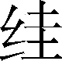
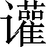
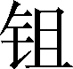

第十四卷

 齐**[1]**太公世家第二

《齐太公世家》记载了姜姓齐国自西周初太公建国起，至公元前379年齐康公身死国灭，总计近千年的历史。

姜姓齐国是春秋时代我国中原的一个重要诸侯国。在地理上有着良好的自然条件，“自泰山属之琅邪，北被于海，膏壤二千里”；自开国以来又十分注重发展经济，太公时期就“通工商之业，便鱼盐之利”，管仲相齐后，又“连五家之兵，设轻重鱼盐之利”，为齐国发展打下了良好的物质基础。在政治文化上，既不像鲁国一样死死拘束于彻底的宗法制，又不像秦、楚早期那样“以夷狄自置”。而是顺应“其民阔达多匿知”的原有文化，有条件地推行宗法制和集权制的结合，“因其俗，简其礼”，为政简而不苛，平易近民。所以，到齐桓公时，齐国终成为大国争霸斗争中的第一个霸主，一个名副其实的泱泱大国。

自桓公去世，齐国渐趋衰落。一方面，由于姜姓公室旧贵族日益腐败；另一方面，由于统治阶级内部斗争日益激烈。尤其经过崔杼、庆封之乱，大伤元气，终于被新兴的贵族集团田氏所替代。

本篇在艺术上的第一个特点是取材有法、详略得当。司马迁抓住最能代表齐国历史发展线索的几个时期，清晰地反映了它由盛而衰的历史过程。前半叶主要介绍了太公时期和桓公时期，中后叶则主要记叙了崔庆之乱与田氏代齐的详尽过程。这几部分作者运用浓墨重彩，生动形象地再现了斑斓多姿的历史画面。其余部分则仅仅记其大概，明其脉络，避免冲淡重点部分的思想意义，真正做到了“略小取大，举重明轻”。

本篇的第二个艺术特点是塑造了生动复杂立体的人物形象。作者从生活中的历史现实出发，把握历史人物的复杂心理，加以真实再现，使人感到可亲可信。例如，对于齐桓公，作者一方面极力写其机智果断、从谏如流、重义守信的明君风度，但另一方面也写了他晚年骄傲固执、好大喜功的思想变化。既写他九合诸侯、一匡天下的宏伟业绩，也写他好内多宠，以致死后虫出于户的性格弱点，给人留下深深的历史回味。即使是反面人物崔杼，作者也写了他两次不杀晏婴的微妙心理，表现出人物的复杂个性。

***【原文】***

太公望[2]吕尚者，东海上[3]人。其先祖尝为四岳[4]，佐禹平水土甚有功。虞夏之际封于吕[5]，或封于申[6]，姓姜氏。夏商之时，申、吕或封枝庶子孙[7]，或为庶人，尚其后苗裔[8]也。本姓姜氏，从其封姓，故曰吕尚。

***【译文】***

[1]齐：始建国于前11世纪。姜姓。领地在今山东省北部，后扩张到山东东部。建都营丘（后称临淄，故城在今山东省淄博市东北）。

[2]太公望：姓姜，名牙，周文王时号太公望，武王时号师尚父，祖先曾封于吕，又名吕尚。

[3]东海：东方滨海之地，约当今江苏、山东沿海一带。非指今东海。上：畔。

[4]四岳：传说为尧、舜时掌管四时的官长，主持方岳巡守之事。

[5]吕：古国名。相传为炎帝之裔，伯夷之后，掌四岳有功，封于吕。故城在今河南省南阳市西。

[6]申：古国名。

[7]枝庶：宗族旁出的支派：

[8]苗裔：后代子孙。

***【原文】***

吕尚盖尝穷困，年老矣[1]，以渔钓奸周西伯[2]。西伯将出猎，卜[3]之，曰“所获非龙非彲[4]，非虎非罴[5]，所获霸王之辅”。于是周西伯猎，果遇太公于渭[6]之阳，与语大说[7]，曰：“自吾先君太公曰‘当有圣人适[8]周，周以兴’。子真是邪？吾太公望子久矣。”故号之曰“太公望”，载与俱归，立为师[9]。

***【译文】***

[1]据传当时太公年七十二岁。

[2]奸（ɡān）：通“干”，求取。周西伯：即周文王姬昌。商末周族领袖。

[3]卜：古人用火灼龟甲取征兆来预测吉凶，叫卜。

[4]彲（chī）：通“螭”，传说中一种像龙的动物。

[5]罴（pí）：兽名。俗称人熊。

[6]渭：水名。即今渭河。在陕西省中部。

[7]说：通“悦”。

[8]适：往，到。

[9]师：统率军队的长官。

***【原文】***

或曰，太公博闻，尝事纣[1]。纣无道[2]，去之。游说诸侯，无所遇，而卒西归周西伯。或曰，吕尚处士[3]，隐海滨。周西伯拘羑里[4]，散宜生[5]、闳夭素知而招吕尚。吕尚亦曰：“吾闻西伯贤，又善养老，盍[6]往焉。”三人者为西伯求美女奇物，献之于纣，以赎西伯。西伯得以出，反[7]国。言吕尚所以事周虽异，然要之为文武师。

***【译文】***

[1]纣：商代最后一个君主。

[2]无道：暴虐，没有德政。

[3]处士：有才德而隐居不仕的人。

[4]羑（yòu）里：地名。故址在今河南汤阴县北。

[5]散宜生：西周初年大臣。

[6]盍（hé）：何不。副词。

[7]反：通“返”。

***【原文】***

周西伯昌之脱羑里归，与吕尚阴谋修德以倾[1]商政，其事多兵权[2]与奇计，故后世之言兵及周之阴权皆宗太公为本谋[3]。周西伯政平，及断虞芮[4]之讼，而诗人称西伯受命曰文王。伐崇、密须、犬夷[5]，大作丰邑[6]。天下三分，其二归[7]周者，太公之谋计居多。

***【译文】***

[1]阴谋：秘密计谋。倾：颠覆。

[2]兵权：用兵的权谋。

[3]阴权：阴谋权术。宗：尊崇。本谋：主要的策划者。

[4]虞：国名。姬姓。都城在今山西省平陆县北。芮（ruì）：国名。姬姓。都城在今陕省西大荔县东南。

[5]崇：国名。都城在今陕省沣水县东。密须：一作“密”，国名。都城在今甘肃省灵台县西南；一说在今河南省密县东。犬夷：也作犬戎。部族名。周初活动于今陕西省彬县、岐山一带。

[6]大作：大兴土木。丰邑：西周的京都。故城在今陕西省西安市西南。

[7]归：归顺。

***【原文】***

文王崩，武王即位。九年，欲修文王业，东伐以观诸侯集否[1]。师行，师尚父左杖黄钺[2]，右把白旄[3]以誓，曰：“苍兕[4]苍兕，总尔众庶，与尔舟楫，后至者斩！”逐至盟津[5]。诸侯不期而会者八百诸侯[6]。诸侯皆曰：“纣可伐也。”武王曰：“未可。”还师，与太公作此《太誓》[7]。

***【译文】***

[1]集否：指人心的向与背。集，聚集。

[2]杖：执持。黄钺（yuè）：以黄金为饰的钺斧。

[3]白旄（mào）：古代军旗的一种，竿顶用旄牛尾为饰。

[4]苍兕（sì）：水兽名。善奔突，能覆舟。以苍兕名官，职掌舟楫。

[5]盟津：地名。即孟津。故城在今河南省孟津县东北。

[6]不期：事先未约定。句末的“诸侯”二字是衍文。

[7]《大誓》：《尚书》篇名。

***【原文】***

居二年，纣杀王子比干[1]，囚箕子[2]。武王将伐纣，卜龟兆，不吉，风雨暴至。群公尽惧，唯太公强[3]之劝武王，武王于是遂行。十一年正月甲子[4]，誓于牧野[5]，伐商纣。纣师败绩。纣反走[6]，登鹿台[7]，遂追斩纣。明日，武王立于社[8]，群公奉明水[9]，卫康叔封布[10]采席，师尚父牵牲[11]，史佚策祝[12]，以告神讨纣之罪。散鹿台之钱，发钜桥[13]之粟，以振[14]贫民。封[15]比干墓，释箕子囚。迁九鼎[16]，修周政，与天下更始[17]。师尚父谋居多。

***【译文】***

[1]比干：殷末纣王的叔父，（一说是庶兄）。管少师。

[2]箕子：殷末纣王的诸父（同宗族的伯叔辈），一说是庶兄。官太师。

[3]强：坚决。

[4]甲子：古代用十天干相配以纪年。

[5]牧野：古地名。在今河南省淇县西南。

[6]反走：回头跑。反，通“返”。

[7]鹿台：台名。旧址在今河南省淇县。商纣所筑。

[8]社：祭祀土神之所。

[9]明水：祭祀所用的净水。

[10]布：铺展。

[11]牲：牺牲，做祭品用的牲口，如牛、羊之类。

[12]史佚：西周初期史官。策祝：向神诵祷告之文。

[13]钜桥：商代粮仓所在地。故址在今河北省曲周县东北。

[14]振：通“赈”，救济。

[15]封：筑土增高。

[16]九鼎：古代象征国家政权的传国之宝。

[17]更始：除旧布新。

***【原文】***

于是武王已平商而王天下，封师尚父于齐营丘[1]。东就[2]国，道宿行迟。逆旅[3]之人曰：“吾闻时难得而易失。客寝甚安，殆[4]非就国者也。”太公闻之，夜衣而行，犁明[5]至国。莱侯来伐，与之争营丘。营丘边莱[6]。莱人，夷也，会纣之乱而周初定，未能集[7]远方，是以与太公争国。

***【译文】***

[1]营丘：邑名。齐的都城。后改为临菑。故城在今山东省淄博市东北。

[2]就：趁；归。

[3]逆旅：客舍；旅馆。

[4]殆：大概；恐怕。

[5]犁明：即黎明。

[6]莱：即莱夷，古国名，都城在今山东省烟台市黄县东南。后为齐所灭，成为齐邑。

[7]集：通“辑”，辑睦；安定。

***【原文】***

太公至国，修政，因其俗，简其礼，通商工之业，便鱼盐之利，而人民多归齐，齐为大国。及[1]周成王少时，管蔡[2]作乱，淮夷[3]畔周，乃使召康公[4]命太公曰：“东至海，西至河，南至穆陵[5]，北至无棣[6]。五侯九伯[7]，实得征之。”齐由此得征伐，为大国，都营丘。

***【译文】***

[1]及：至；到。

[2]管蔡：即管叔、蔡叔。二人都是周武王的弟弟，因封于管（故城在今河南省郑州市）、蔡（故城在今河南省上蔡县），故称。

[3]淮夷：部族名。三代时分布在今淮河下游一带。

[4]召康公：姬奭，周代燕国的始祖。因封邑在召（今陕西省岐山西南），故称召公或召伯。成王时任太保，与周公旦分陕而治，陕以西由他治理。

[5]穆陵：邑名。在今山东省临朐县南。

[6]无棣（dì）：邑名。在今山东省无棣县北。

[7]五侯：指公、侯、伯、子、男五等诸侯。九伯：九州之长。

***【原文】***

盖太公之卒百有余年，子丁公吕伋立。丁公卒，子乙公得立。乙公卒，子癸公慈母立。癸公卒，子哀公不辰立。

哀公时，纪侯谮[1]之周，周烹[2]哀公而立其弟静，是为胡公。胡公徙都薄姑[3]，而当周夷王之时。

***【译文】***

[1]谮（zèn）：诬陷。

[2]烹：古代用鼎镬煮人的酷刑。

[3]薄姑：国名。一作“蒲姑”。

***【原文】***

哀公之同母少弟山怨胡公，乃与其党率营丘人袭攻杀胡公而自立，是为献公。献公元年，尽逐胡公子，因徙薄姑都，治临菑。

九年，献公卒，子武公[1]寿立。武公九年，周厉王出奔[2]，居彘[3]。十年，王室乱，大臣行政，号曰“共和”[4]。二十四年，周宣王初立。

***【译文】***

[1]武公：前850—前825年在位。

[2]奔：逃跑。

[3]彘（zhì）：地名。故城在今山西省霍县东北。

[4]共和：周厉王时，奴隶和自由民大暴动，厉王逃跑，至宣王执政，中间十四年，号共和。

***【原文】***

二十六年，武公卒，子厉公[1]无忌立。厉公暴虐，故胡公子复入齐，齐人欲立之，乃与攻杀厉公。胡公子亦战死。齐人乃立厉公子赤为君，是为文公[2]，而诛杀厉公者七十人。

***【译文】***

[1]厉公：前824—前816年在位。

[2]文公：前815—前804年在位。

***【原文】***

文公十二年卒，子成公[1]脱立。成公九年卒，子庄公[2]购立。

***【译文】***

[1]成公：前803—前795年在位。

[2]庄公：前794—前731年在位。

***【原文】***

庄公二十四年，犬戎杀幽王[1]，周东徙雒[2]。秦始列为诸侯。五十六年，晋弑其君昭侯。

***【译文】***

[1]犬戎：部族名。戎人的一支。商、周时游牧于泾渭流域（今陕西省境内）。幽王：姬宫涅（shēnɡ），前781—771年在位。任用虢石父执政，剥削严重，使人民流离失所。

[2]雒（1uò）：通“洛”，都邑名。故城在今河南省洛阳市西。

***【原文】***

六十四年，庄公卒，子釐公[1]禄甫立。

***【译文】***

[1]釐公：前730—前698年在位。

***【原文】***

釐公九年，鲁隐公[1]初立。十九年，鲁桓公弑其兄隐公而自立为君。

***【译文】***

[1]鲁隐公：姬息。前722—前712年在位。

***【原文】***

二十五年，北戎[1]伐齐。郑使太子忽来救齐，齐欲妻之。忽曰：“郑小齐大，非我敌[2]。”遂辞之。

***【译文】***

[1]北戎：又称山戎。部族名。春秋时分布在今河北省北部。

[2]敌：相当；匹配。

***【原文】***

三十二年，釐公同母弟夷仲年死。其子曰公孙无知，釐公爱之，令其秩服奉养比[1]太子。

***【译文】***

[1]秩：俸禄。服：指衣服、车马、宫室等。奉养：供养；赡养。比：按照；类似。

***【原文】***

三十三年，釐公卒，太子诸兒立，是为襄公[1]。

***【译文】***

[1]襄公：前697—前686年在位。

***【原文】***

襄公元年，始为太子时，尝与无知斗，及立，绌[1]无知秩服，无知怨。

***【译文】***

[1]绌：通“黜”，贬退；废除。

***【原文】***

四年，鲁桓公与夫人如[1]齐，齐襄公故尝私通[2]鲁夫人[3]。鲁夫人者，襄公女弟也，自釐公时嫁与鲁桓公妇，及桓公来而襄公复通焉。鲁桓公知之，怒夫人，夫人以告齐襄公。齐襄公与鲁君饮，醉之，使力士彭生抱上鲁君车，因拉杀[4]鲁桓公，桓公下车则死矣。鲁人以为让[5]，而齐襄公杀彭生以谢[6]鲁。

***【译文】***

[1]如：往；到。

[2]通：通奸。

[3]鲁夫人：文姜。齐襄公同父异母的妹妹。

[4]拉杀：打折其胁致死。

[5]让：责备。

[6]谢：认错，道歉。

***【原文】***

八年，伐纪[1]，纪迁去其邑。

***【译文】***

[1]纪：国名。都城在今山东省寿光市南。

***【原文】***

十二年，初，襄公使连称、管至父[1]戍葵丘，瓜时[2]而往，及瓜而代[3]。往戍一岁，卒[4]瓜时而公弗为发代。或为请代，公弗许。故此二人怒，因公孙无知谋作乱，连称有从妹在公宫，无宠，使之间[5]襄公，曰：“事成以女[6]为无知夫人。”冬十二月，襄公游姑棼[7]，遂猎沛丘[8]，见彘，从者曰“彭生”。公怒，射之，彘人立[9]而啼。公惧，坠车伤足，失屦[10]。反而鞭主屦者茀三百。茀出宫。而无知、连称、管至父等闻公伤，乃遂率其众袭宫。逢主屦茀，茀曰：“且无人惊官，惊官未易入也。”无知弗信，茀示之创[11]，乃信之。待宫外，令茀先入。茀先入，即匿襄公户间。良久，无知等恐，遂入宫。茀反与宫中及公之幸臣攻无知等，不胜，皆死。无知入宫，求公不得。或见人足于户间，发视，乃襄公，遂弑之，而无知自立为齐君。

***【译文】***

[1]连称、管至父：都是齐国大夫。

[2]瓜时：七月，指瓜熟的时候。

[3]及瓜：指第二年瓜熟的时候。代：替代。

[4]卒：终，尽。

[5]间（jiàn）：找空子。

[6]女（rǔ）：通“汝”，你。

[7]姑棼（fén）：齐地名。又名薄姑。在今山东省博兴县东南。

[8]沛丘：地名。或作丘、贝丘。在今山东省博兴县东南（薄姑东南）。

[9]人立：如人一般站立。

[10]屦（jù）：麻、葛等制成的鞋子。

[11]创：创伤。

***【原文】***

桓公[1]元年春，齐君无知游于雍林[2]。雍林人尝有怨无知，及其往游，雍林人袭杀无知，告齐大夫曰：“无知弑襄公自立，臣谨行诛。唯大夫更立公子之当立者，唯命是听。”

***【译文】***

[1]桓公：姜小白。前685—前643年在位。春秋时的第一个霸主。

[2]雍林：地名。齐临淄西门曰雍门，雍林当在临淄近郊。一本作“雍廪”，系人名，为渠丘大夫，故雍林也可理解为人名。

***【原文】***

初，襄公之醉杀鲁桓公，通其夫人，杀诛数[1]不当，淫于妇人，数欺大臣，群弟恐祸及，故次弟纠奔鲁。其母鲁女也。管仲[2]、召忽傅之。次弟小白奔莒[3]，鲍叔[4]傅之。小白母，卫女也，有宠于釐公。小白自少好善大夫高傒[5]。及雍林人杀无知，议立君，高、国[6]先阴召小白于莒。鲁闻无知死，亦发兵送公子纠，而使管仲别将兵遮莒道，射中小白带钩[7]。小白详[8]死，管仲使人驰报鲁。鲁送纠者行益迟，六日至齐，则小白已入，高傒立之，是为桓公。

***【译文】***

[1]数（shuò）：屡次，多次。

[2]管仲：（？—前645）管夷吾，字仲。齐颍上人。佐齐桓公成为五霸之首。

[3]莒（jǔ）：国名。都城在今山东省莒县。

[4]鲍叔：即鲍叔牙，齐国大夫。以知人著称。

[5]高傒：齐国正卿。

[6]国：国懿仲。齐国正卿。

[7]带钩：束腰革带上的金属钩。

[3]详：通“佯”，假装。

***【原文】***

桓公之中钩，详死以误管仲，已而载温车[1]中驰行，亦有高、国内应，故得先入立，发兵距[2]鲁。秋，与鲁战于乾时[3]，鲁兵败走，齐兵掩绝[4]鲁归道。齐遗鲁书曰：“子纠兄弟，弗忍诛，请鲁自杀之。召忽、管仲仇也，请得而甘心醢[5]之。不然，将围鲁。”鲁人患之，遂杀子纠于笙渎[6]。召忽自杀，管仲请囚。桓公之立，发兵攻鲁，心欲杀管仲。鲍叔牙曰：“臣幸得从君，君竟以立。君之尊，臣无以增君。君将治齐，即高傒与叔牙足也。君且欲霸王，非管夷吾不可。夷吾所居国国重，不可失也。”于是桓公从之。乃详为召管仲欲甘心，实欲用之。管仲知之，故请往。鲍叔牙迎受管仲，及堂阜[7]而脱桎梏，斋祓[8]而见桓公。桓公厚礼以为大夫，任政。

***【译文】***

[1]已而：不久；随后。温车：卧车。即有帐幕之车。温，一作“辒”。

[2]距：通“拒”，抵御。

[3]乾（ɡǎn）时：齐地名。在今山东省益都县境。

[4]掩绝：拦截；阻击。

[5]甘心：称心；快意。醢（hǎi）：将人剁成肉酱的酷刑。

[6]笙渎（dòu）：鲁地名。即“句渎”。在今山东省菏泽市北。

[7]堂阜：地名。在今山东省蒙阴县西北。

[8]斋：斋戒。即沐浴更衣素食以示诚敬。祓（fú）：古代除灾祈福的仪式。

***【原文】***

桓公既得管仲，与鲍叔、隰朋[1]、高傒修齐国政，连五家之兵[2]，设轻重[3]鱼盐之利，以赡[4]贫穷，禄[5]贤能，齐人皆说。

***【译文】***

[1]隰（xí）朋：齐国大夫。

[2]五家之兵：一种兵民结合的军事行政制度。

[3]轻重：指钱。设轻重之利是指铸货币，控制物价流通。

[4]赡（shàn）：赡养，救济。丰富，充足。

[5]禄：薪金。这里作动词用，意即使贤能的人得到俸禄，也就是起用优待贤能的人。

***【原文】***

二年，伐灭郯[1]，郯子奔莒。初，桓公亡时，过郯，郯无礼，故伐之。

***【译文】***

[1]郯（tán）：国名。都城在今山东省郯城县东北。

***【原文】***

五年，伐鲁，鲁将师败。鲁庄公请献遂邑[1]以平，桓公许，与鲁会柯[2]而盟。鲁将盟，曹沫以匕首劫桓公于坛[3]上，曰：“反[4]鲁之侵地！”桓公许之。已而曹沫去匕首，北面就臣位。桓公后悔，欲无与鲁地而杀曹沫。管仲曰：“夫劫许之而倍[5]信杀之，愈[6]一小快耳，而弃信于诸侯，失天下之援，不可。”于是遂与曹沫三败所亡地于鲁。诸侯闻之，皆信齐而欲附焉。七年，诸侯会桓公于甄[7]，而桓公于是始霸焉。

***【译文】***

[1]遂邑：鲁邑名。故城在今山东省宁阳县北。

[2]柯：齐邑名。故城在今山东省东阿县西南。

[3]劫：威逼；胁迫。坛：土筑的高台。

[4]反：通“返”，归还。

[5]倍：通“背”。

[6]愈（yú）：愉快，满足。

[7]甄：卫邑名。故城今山东省鄄城县西北。

***【原文】***

十四年，陈厉公子完[1]，号敬仲，来奔齐。齐桓公欲以为卿，让；于是以为工正[2]。田成子[3]常之祖也。

***【译文】***

[1]完：陈厉公之子。陈国内乱，出奔齐，改姓田，任齐国大夫，死谥敬仲。

[2]工正：官名。百工之长。

[3]田成子：即陈成子。春秋末齐国大臣。

***【原文】***

二十三年，山戎伐燕，燕告急[1]于齐。齐桓公救燕，遂伐山戎，至于孤竹[2]而还。燕庄公遂送桓公入齐境。桓公曰：“非天子，诸侯相送不出境，吾不可以无礼于燕。”于是分沟割燕君所至与燕，命燕君复修召公之政，纳贡于周，如成康之时。诸侯闻之，皆从齐。

***【译文】***

[1]告急：报告战事危急。

[2]孤竹：古国名。故城在今河北卢龙县东。

***【原文】***

二十七年，鲁湣[1]公母曰哀姜，桓公女弟也。哀姜淫于鲁公子庆父[2]，庆父弑湣公，哀姜欲立庆父，鲁人更立釐公[3]。桓公召哀姜，杀之。

***【译文】***

[1]湣（mǐn）：通“闵”，谥号用字。

[2]庆父：鲁桓公庶子，庄公庶弟。

[3]釐：谥号用字。

***【原文】***

二十八年，卫文公有狄[1]乱，告急于齐。齐率诸侯城楚丘[2]而立卫君。

***【译文】***

[1]狄：部族名。亦作“翟”。

[2]楚丘：卫国都城。故城在今河南省滑县东。城：筑城。卫都原在朝歌（故城在今河南省淇县）。

***【原文】***

二十九年，桓公与夫人蔡姬戏船中。蔡姬习水[1]，荡[2]公，公惧，止之，不止，出船，怒，归蔡姬，弗绝。蔡亦怒，嫁其女。桓公闻而怒，兴师往伐。

***【译文】***

[1]习水：会游泳。

[2]荡：摇动。

***【原文】***

三十年春，齐桓公率诸侯伐蔡[1]，蔡溃[2]。遂伐楚。楚成王兴师问曰：“何故涉[3]吾地？”管仲对曰：“昔召康公命我先君太公曰：‘五侯九伯，若实[4]征之，以夹辅[5]周室。’赐我先君履[6]，东至海，西至河，南至穆陵，北至无棣。楚贡包茅不入[7]，王祭不具，是以来责。昭王[8]南征不复，是以来问。”楚王曰：“贡之不入，有之，寡人罪也，敢不共[9]乎！昭王之出不复，君其问之水滨。”齐师进，次于陉[10]。夏，楚王使屈完将兵扞[11]齐，齐师退，次召陵[12]。桓公矜[13]屈完以其众。屈完曰：“君以道则可；若不[14]，则楚方城[15]以为城，江、汉以为沟[16]，君安能进乎？”乃与屈完盟而去。过陈，陈袁涛涂诈齐，令出东方，觉[17]。秋，齐伐陈。是岁，晋杀太子申生。

***【译文】***

[1]蔡：国名。

[2]溃：逃散。

[3]涉：到。

[4]若：你。实：是。

[5]夹辅：在左右辅佐。

[6]履（lǔ）：鞋；踩。此处指足迹所到的范围。

[7]包茅：楚国的特产植物。不入：没有进贡。

[8]昭王：周昭王，一作邵王。名瑕，在南征途中渡汉江溺死。

[9]共：通“供”，供给。

[10]次：停留。也指行军在一处停留超过一宿。陉（xínɡ）：楚地名。在今河南省郾城境。

[11]扞：保卫；抵御。

[12]召（shào）陵：楚邑名，故城在今河南省郾城东。

[13]矜：夸耀。

[14]不（fǒu）：通“否”。

[15]方城：春秋时楚国所筑长城，北起今之河南省方城县北，南至泌阳县东北。

[16]江：长江。汉：汉江。沟：指护城河。

[17]觉：发觉。

***【原文】***

三十五年夏，会诸侯于葵丘[1]。周襄王使宰孔赐桓公文武胙、彤弓矢、大路[2]，命无拜。桓公欲许之，管仲曰：“不可。”乃下拜受赐。秋，复会诸侯于葵丘，益有骄色。周使宰孔会。诸侯颇有叛者。晋侯[3]病，后，遇宰孔。宰孔曰：“齐侯骄矣。弟[4]无行。”从之。是岁，晋献公卒，里克杀奚齐、卓子，秦穆公以夫人[5]入公子夷吾为晋君。桓公于是讨晋乱，至高梁[6]，使隰朋立晋君，还。

***【译文】***

[1]葵丘：宋邑名。故城在今河南省兰考县境。

[2]宰孔：周朝太宰周公姬孔。胙（zuò）：祭祀用的肉。彤弓矢：朱红色的弓箭。大路：大车。路，通“辂”。

[3]晋侯：指晋献公。

[4]弟：通“第”，但，且。

[5]夫人：穆姬。夷吾的异母姐姐。

[6]高梁：晋地名。在今山西省临汾市东北。

***【原文】***

是时周室微，唯齐、楚、秦、晋为强。晋初与[1]会，献公死，国内乱。秦穆公辟[2]远，不与中国会盟。楚成王初收荆蛮有之，夷狄自置。唯独齐为中国会盟，而桓公能宣其德，故诸侯宾[3]会。于是桓公称[4]曰：“寡人南伐至召陵，望熊山[5]；北伐山戎、离枝[6]、孤竹；西伐大夏[7]，涉流沙[8]；束马悬车登太行[9]，至卑耳山[10]而还。诸侯莫违寡人。寡人兵车之会三[11]，乘车之会六[12]，九合[13]诸侯，一匡天下[14]。昔三代受命，有何以异于此乎？吾欲封泰山，禅梁父[15]。”管仲固谏，不听；乃说桓公以远方珍怪物至乃得封，桓公乃止。

***【译文】***

[1]与（yù）：参加。

[2]辟：通“僻”，偏僻。

[3]宾：归服；顺从。

[4]称：声称。

[5]熊山：山名。在今河南省西部卢氏县、洛宁县南。

[6]离枝：国名。又名令友，地在今河北省迁安市西。

[7]大夏：地名。在今山西省太原市南。

[8]流沙：沙漠。在今山西省平陆县东。

[9]束马悬车：山路险隘难行，包裹马脚，将车钩挂牢，以防滑跌。太行：山名。绵延山西、河北、河南三省间。

[10]卑耳山：即辟耳山。在今山西省平陆县西北。

[11]兵车之会三：为战争而举行的盟会有三次：鲁庄公十三年（前681），平宋乱；釐公四年（前656），侵蔡，伐楚；釐公六年（前654），伐郑，围新城。

[12]乘（shènɡ）车之会六：为和平而举行的盟会有六次：鲁庄公十四年，会于鄄（juàn）（卫邑，故城在今山东省鄄城县）；十五年，又会鄄；十六年，盟于幽（宋地）；釐公五年，会首止（卫地，故城在今河南省睢县东南）；八年，盟于洮（táo）（曹地，故城在今山东省鄄城西）；九年，会葵丘。

[13]合：会合。

[14]一匡天下：指洮之会确定了周襄王的继承权一事。

[15]梁父（fǔ）：山名。泰山南坡的一座小山，在山东省新泰市西。禅（shàn）：扫地而祭。

***【原文】***

三十八年，周襄王弟带与戎、翟合谋伐周，齐使管仲平戎于周。周欲以上卿礼管仲，管仲顿首曰：“臣陪臣[1]，安敢！”三让，乃受下卿礼以见。三十九年，周襄王弟带来奔齐。齐使仲孙请王，为带谢。襄王怒，弗听。

***【译文】***

[1]陪臣：诸侯的大夫，对天王自称陪臣。也可指大夫的家臣。陪，重；层叠。

***【原文】***

四十一年，秦穆公虏晋惠公，复归之。是岁，管仲、隰朋皆卒。管仲病，桓公问曰：“群臣谁可相者？”管仲曰：“知臣莫如君。”公曰：“易牙[1]如何？”对曰：“杀子以适君，非人情，不可。”公曰：“开方[2]如何？”对曰：“倍亲以适君，非人情，难近。”公曰：“竖刀[3]如何？”对曰：“自宫[4]以适君，非人情，难亲。”管仲死，而桓公不用管仲言，卒近用三子，三子专权。

***【译文】***

[1]易牙：齐桓公宠臣。一作狄牙。雍人，名巫，亦称雍巫。长调味，善逢迎。

[2]开方：齐桓公宠臣。卫懿公的儿子，他离开母亲在外十五年没有回去过。

[3]竖刀：齐桓公的近臣。

[4]宫：阉割生殖器。

***【原文】***

四十二年，戎伐周，周告急于齐，齐令诸侯各发卒戍[1]周。是岁，晋公子重耳[2]来，桓公妻之。

***【译文】***

[1]戍：军队驻防。

[2]重耳：前636—前628年在位，即晋文公。

***【原文】***

四十三年。初，齐桓公之夫人三：曰王姬、徐姬、蔡姬，皆无子。桓公好内[1]，多内宠[2]，如夫人[3]者六人，长卫姬，生无诡；少卫姬，生惠公元；郑姬，生孝公昭；葛嬴，生昭公潘；密姬，生懿公商人；宋华子[4]，生公子雍。桓公与管仲属[5]孝公于宋襄公，以为太子。雍巫有宠于卫共姬，因宦者竖刀以厚献于桓公，亦有宠，桓公许之立无诡。管仲卒，五公子皆求立。冬十月乙亥，齐桓公卒。易牙入，与竖刀因内宠[6]杀群吏，而立公子无诡为君。太子昭奔宋。

***【译文】***

[1]好（hào）内：贪女色。

[2]内宠：宠爱的姬妾。

[3]如夫人：意谓同于夫人，礼数与夫人无别，故称如夫人。

[4]宋华子：宋华氏之女，子姓。

[5]属：托付。

[6]内宠：此指有权势的内官。“多内宠”，指姬妾。指内宫之有权宠者。

***【原文】***

桓公病，五公子各树党[1]争立。及桓公卒，遂相攻，以故宫中空，莫敢棺[2]。桓公尸床上六十七日，尸虫出于户。十二月乙亥，无诡立，乃棺赴[3]，辛巳夜，敛殡[4]。

***【译文】***

[1]树党：培植党羽。

[2]棺：收尸入棺。动词。

[3]赴：通“讣”，报丧。

[4]敛殡：为死者装殓，将棺材停在堂上拜祭。

***【原文】***

桓公十有余子，要[1]其后立者五人：无诡立三月死，无谥；次孝公；次昭公；次懿公；次惠公。孝公元年三月，宋襄公率诸侯兵送齐太子昭而伐齐。齐人恐，杀其君无诡。齐人将立太子昭，四公子之徒攻太子，太子走宋，宋遂与齐人四公子战。五月，宋败齐四公子师而立太子昭，是为齐孝公[2]。宋以桓公与管仲属之太子，故来征之。以乱故，八月乃葬齐桓公。

***【译文】***

[1]要：总计。

[2]孝公：前642—前633年在位。

***【原文】***

六年春，齐伐宋，以其不同盟于齐也[1]。夏，宋襄公卒。七年，晋文公立。

***【译文】***

[1]齐孝公二年，诸侯在齐国举行盟会，宋襄公没有参加。

***【原文】***

十年，孝公卒，孝公弟潘因卫公子开方杀孝公子而立潘，是为昭公[1]。昭公，桓公子也，其母曰葛嬴。

***【译文】***

[1]昭公：前632—前613年在位。

***【原文】***

昭公元年，晋文公败楚于城濮[1]，而会诸侯践土[2]，朝周，天子使晋称伯[3]。六年，翟侵齐。晋文公卒。秦兵败于殽[4]。十二年，秦穆公卒。

***【译文】***

[1]城濮：卫地名。在今山东省鄄城县西南临濮集。

[2]践土：郑地名。在今河南省原阳县西南。

[3]伯（bà）：通“霸”。

[4]殽：山名，即崤山。

***【原文】***

十九年五月，昭公卒，子舍立为齐君。舍之母无宠于昭公，国人莫畏。昭公之弟商人以桓公死争立不得，阴交[1]贤士，附爱[2]百姓，百姓说[3]。及昭公卒，子舍立，孤弱，即与众十月即墓上弑齐君舍，而商人自立，是为懿公[4]。懿公，桓公子也，其母曰密姬。

***【译文】***

[1]阴交：暗中交结。

[2]附爱：抚爱。

[3]说：通“悦”。

[4]懿公：前612—前609年在位。

***【原文】***

懿公四年春，初，懿公为公子时，与丙戎之父猎，争获[1]不胜，及即位，断丙戎父足[2]，因使丙戎仆[3]。庸职之妻好，公内之宫[4]，使庸职骖乘[5]。五月，懿公游于申池[6]，二人浴，戏。职曰：“断足子！”戎曰：“夺妻者！”二人俱病[7]此言，乃怨。谋与公游竹中，二人弑懿公车上，弃竹中而亡去。

***【译文】***

[1]获：指猎得的禽兽。

[2]断丙戎父足：时其人已死，掘墓断其足。

[3]仆：驾车。

[4]内（nà）：通“纳”。

[5]骖乘：陪乘。乘车时居于车右。

[6]申池：齐南城门叫申门，此指申门外之池。

[7]病：以为耻辱。动词。

***【原文】***

懿公之立，骄，民不附。齐人废其子而迎公子元于卫，立之，是为惠公[1]。惠公，桓公子也。其母卫女，曰少卫姬，避齐乱，故在卫。

***【译文】***

[1]惠公：前608—前599年在位。

***【原文】***

惠公二年，长翟[1]来，王子城父[2]攻杀之，埋之于北门。晋赵穿弑其君灵公。

***【译文】***

[1]长翟：狄族的一支。身体高大。翟，通“狄”。

[2]王子城父：齐国大夫。

***【原文】***

十年，惠公卒，子顷公[1]无野立。初，崔杼有宠于惠公，惠公卒，高、国畏其逼[2]也，逐之，崔杼奔卫。

***【译文】***

[1]顷公：前598—前582年在位。

[2]高、国：齐国的两个大家族。世为齐卿。逼：侵逼；逼迫。

***【原文】***

顷公元年，楚庄王强，伐陈；二年，围郑，郑伯降，已复国郑伯。

六年春，晋使郤克于齐[1]，齐使夫人帷[2]中而观之。郤克上，夫人笑之。郤克曰：“不是报，不复涉河！”归，请伐齐，晋侯弗许。齐使至晋，郤克执齐使者四人河内[3]，杀之。八年，晋伐齐，齐以公子彊质晋，晋兵去。十年春，齐伐鲁、卫。鲁、卫大夫如晋请师，皆因郤克。晋使郤克以车八百乘为中军将，士燮将上军，栾书将下军，以救鲁、卫，伐齐。六月壬申，与齐侯兵合靡笄[4]下。癸酉，陈于鞌[5]，逄丑父为齐顷公右[6]。顷公曰：“驰之，破晋军会食。”射伤郤克，流血至履。克欲还入壁[7]，其御曰：“我始入，再伤，不敢言疾，恐惧[8]士卒，愿子忍之。”遂复战。战，齐急，丑父恐齐侯得[9]，乃易处，顷公为右，车[10]于木而止。晋小将韩厥伏齐侯车前，曰“寡君使臣救鲁、卫”，戏之。丑父使顷公下取饮，因得亡，脱去，入其军。晋郤克欲杀丑父。丑父曰：“代君死而见僇[11]，后人臣无忠其君者矣。”克舍之，丑父遂得亡归齐。于是晋军追齐至马陵[12]。齐侯请以宝器谢，不听；必得笑克者萧桐叔子[13]，令齐东亩[14]。对曰：“叔子，齐君母。齐君母亦犹晋君母，子安置之？且子以义伐而以暴为后，其可乎？”于是乃许，令反鲁、卫之侵地。

***【译文】***

[1]郤（xì）克：晋国大夫，是个驼子。

[2]帷：帐幕。

[3]河内：地区名。

[4]靡笄（jī）：山名。即今山东省济南市东北的华不注山；一说即历山，又叫千佛山。在今山东省济南市东南。

[5]陈：通“阵”。鞌：齐地名。在今山东省济南市。

[6]逄（pánɡ）丑父：齐国大夫。右：车右。古时乘车位于御者右边的武士。

[7]壁：营垒。

[8]恐：恐怕。惧：震惊；吓唬。使动用法。

[9]得：获得；俘虏。被动用法。

[10]（ɡuà）：通“挂”。

[11]见僇（lù）：僇，通“戮”。见，表被动，被杀戮。

[12]马陵：齐邑名。即马陉。故城在今山东省益都县西南。

[13]萧桐叔子：萧国君桐叔的女儿。实指齐顷公之母。萧，国名：桐叔，萧君的表字。子，古代兼指儿女。

[14]令齐东亩：要求齐国把田亩间的干道都改成东西向，以便晋国战车向齐国进军。

***【原文】***

十一年，晋初置六卿，赏鞌之功。齐顷公朝晋，欲尊王[1]晋景公，晋景公不敢受，乃归。归而顷公弛苑囿[2]，薄[3]赋敛，振[4]孤问疾，虚积聚以救民，民亦大说。厚礼诸侯。竟顷公卒，百姓附[5]，诸侯不犯[6]。

***【译文】***

[1]尊王：用朝见周王的礼节对待晋君。

[2]弛：开放。苑囿（yòu）：种植花木、畜养禽兽供王侯游玩打猎的风景园林。

[3]薄：减轻。

[4]振：通“赈”，救济。

[5]附：亲附。

[6]犯：侵犯；欺侮。

***【原文】***

十七年，顷公卒，子灵公[1]环立。

***【译文】***

[1]灵公：前581—前554年在位。

***【原文】***

灵公九年，晋栾书弑其君厉公。十年，晋悼公伐齐，齐令公子光质[1]晋。十九年，立子光为太子，高厚傅之，令会诸侯盟于钟离[2]。二十七年，晋使中行献子伐齐。齐师败，灵公走入临菑。晏婴[3]止灵公，灵公弗从。曰：“君亦无勇矣！”晋兵遂围临菑，临菑城守不敢出，晋焚郭[4]中而去。

***【译文】***

[1]质：作为抵押品的人或物。

[2]钟离：古邑名。故城在沂州承县界，即今山东枣庄市南。

[3]晏婴（？—前500）：字平仲，齐国大臣。

[4]郭：外城。

***【原文】***

二十八年，初，灵公取[1]鲁女，生子光，以为太子。仲姬，戎姬。戎姬嬖[2]，仲姬生子牙，属之戎姬。戎姬请以为太子，公许之。仲姬曰：“不可。光之立，列于诸侯[3]矣，今无故废之，君必悔之。”公曰：“在我耳。”遂东[4]太子光，使高厚傅牙为太子。灵公疾，崔杼迎故太子光而立之，是为庄公[5]。庄公杀戎姬。五月壬辰，灵公卒，庄公即位，执太子牙于句窦[6]之丘，杀之。八月，崔杼杀高厚。晋闻齐乱，伐齐，至高唐[7]。

***【译文】***

[1]取：通“娶”。

[2]嬖（bì）：宠爱。

[3]列于诸侯：指跟随灵公参加诸侯会盟征战。

[4]东：流放到齐国的东部边境。

[5]庄公：前553—前548年在位。

[6]句窦：古邑名。故城在今山东省菏泽市北。

[7]高唐：齐邑名。城故在今山东省高唐县东北。

***【原文】***

庄公三年，晋大夫栾盈奔齐，庄公厚客待之。晏婴、田文子谏，公弗听。四年，齐庄公使栾盈间入晋曲沃[1]为内应，以兵随之，上太行，入孟门[2]。栾盈败，齐兵还，取朝歌[3]。

***【译文】***

[1]间：私自；秘密。曲沃：晋邑名。故城在今山西省闻喜县东北。

[2]孟门：山名。为晋国要隘。在今河南省辉县西。

[3]朝（zhāo）歌：故城在今河南省淇县。原为卫邑，后归晋。

***【原文】***

六年，初，棠公妻[1]好，棠公死，崔杼取之。庄公通之，数如崔氏，以崔杼之冠赐人。侍者曰：“不可。”崔杼怒，因其伐晋，欲与晋合谋袭齐而不得间[2]。庄公尝笞宦者贾举，贾举复侍，为崔杼间公以报怨。五月，莒子朝齐，齐以甲戌飨[3]之。崔杼称病不视事[4]。乙亥，公问崔杼病，遂从崔杼妻。崔杼妻入室，与崔杼自闭户不出，公拥柱而歌。宦者贾举遮[5]公从官而入，闭门，崔杼之徒持兵从中起。公登台而请解[6]，不许；请盟，不许；请自杀于庙[7]，不许。皆曰：“君之臣杼疾病[8]，不能听命。近于公宫[9]。陪臣争趣[10]有淫者，不知二命[11]。”公逾墙，射中公股，公反坠，遂弑之。晏婴立崔杼门外，曰：“君为社稷死则死之，为社稷亡则亡之。若为己死己亡，非其私暱[12]，谁敢任之！”门开而入，枕公尸而哭，三踊[13]而出。人谓崔杼：“必杀之。”崔杼曰：“民之望[14]也，舍[15]之得民。”

***【译文】***

[1]棠公妻：齐国棠邑（在今山东省聊城市西北）大夫的妻子，叫棠姜。是崔杼的家臣东郭偃的姐姐。

[2]间（jiàn）：间隙；空隙。

[3]飨（xiǎnɡ）：用酒食款待。

[4]视事：办公；就职。

[5]遮：阻止；拦住。

[6]解：和解。

[7]庙：王宫的前殿；朝堂。

[8]疾病：病重。

[9]近于公官：意谓崔杼家邻近齐宫，淫犯可能冒称齐君。

[10]争趣：《左传》作扦趣。

[11]二命：其他命令。

[12]私暱（nì）：指所亲近、宠爱的人。

[13]三踊：三次往上跳。有表示痛定奋起的意思。

[14]望：仰望。

[15]舍：释放。

***【原文】***

丁丑，崔杼立庄公异母弟杵臼，是为景公[1]。景公母，鲁叔孙宣伯女也。景公立，以崔杼为右相，庆封[2]为左相。二相恐乱起，乃与国人盟曰：“不与崔庆者死！”晏子仰天曰：“婴所不获唯忠于君利社稷者是从[3]！”不肯盟。庆封欲杀晏子，崔杼曰：“忠臣也，舍之。”齐太史书[4]曰“崔杼弑庄公”，崔杼杀之。其弟复书，崔杼复杀之。少弟复书，崔杼乃舍之。

***【译文】***

[1]景公：前547—前490年在位。

[2]庆封：齐国大夫。

[3]婴所不获唯忠于君利社稷者是从：我所以不争取什么，就在于只有忠于君王利于社会的人才服从他。获，争取；得到。

[4]太史：官名。三代为史官和历官之长。

***【原文】***

景公元年，初，崔杼生子成及彊，其母死，取东郭女[1]，生明。东郭女使其前夫子无咎与其弟偃相[2]崔氏。成有罪，二相急治之，立明为太子。成请老于崔[3]，崔杼许之，二相弗听，曰：“崔，宗邑[4]，不可。”成、彊怒，告庆封。庆封与崔杼有郤[5]，欲其败也。成、彊杀无咎、偃于崔杼家，家皆奔亡。崔杼怒，无人，使一宦者御，见庆封。庆封曰：“请为子诛之。”使崔杼仇卢蒲嫳[6]攻崔氏，杀成、彊，尽灭崔氏，崔杼妇自杀。崔杼毋归，亦自杀。庆封为相国，专权。

***【译文】***

[1]东郭女：即棠姜，亦称东郭姜。

[2]相：辅佐。

[3]崔：齐地名，是崔杼的封邑。在今山东省济阳县东北。

[4]宗邑：宗庙所在的地方。

[5]郤：通“隙”，嫌隙。

[6]卢蒲嫳（piè）：齐大夫庆封的亲信。

***【原文】***

三年十月，庆封出猎。初，庆封已杀崔杼，益骄，嗜酒好猎，不听政令。庆舍用[1]政，已有内郤。田文子谓桓子[2]曰：“乱将作。”田、鲍、高、栾氏相与谋庆氏。庆舍发甲围庆封宫，四家徒共击破之。庆封还，不得入，奔鲁。齐人让鲁，封奔吴。吴与之朱方[3]，聚其族而居之，富于在齐。其秋，齐人徙葬庄公，僇崔杼尸于市以说众。

***【译文】***

[1]庆舍：庆封的儿子。用：执掌。

[2]田文子：田须无，谥文子。桓子：田无宇，谥桓子。

[3]朱方：吴邑名。故城在今江苏省丹徒境。

***【原文】***

九年，景公使晏婴之[1]晋，与叔向[2]私语曰：“齐政卒归田氏。田氏虽无大德，以公权私[3]，有德于民，民爱之。”十二年，景公如晋，见平公[4]。欲与伐燕。十八年，公复如晋，见昭公[5]。二十六年，猎鲁郊，因入鲁，与晏婴俱问鲁礼。三十一年，鲁昭公辟[6]季氏难，奔齐。齐欲以千社[7]封之，子家[8]止昭公，昭公乃请齐伐鲁，取郓[9]以居昭公。

***【译文】***

[1]之：往；到。

[2]叔向：晋国大夫，即羊舌肸（xī）。

[3]田氏虽无大德：指田氏祖先没有做出有大利于天下的德泽，如姜氏的太公辅佐周文王、武王灭纣兴周的业绩。以公权私：谓田氏为公事树私恩，如向百姓收赋税用小斗，私家贷给百姓粮食则用大斗之类。

[4]平公：晋国君。前557—前532年在位。

[5]昭公：晋国君。前531—前526年在位。

[6]辟：通“避”。

[7]社：古代地方基层行政单位。二十五家为一社。

[8]子家：鲁国公族，随同昭公出奔。

[9]郓（yùn）：鲁邑名。

***【原文】***

三十二年，彗星见[1]。景公坐柏寝[2]，叹曰：“堂堂！谁有此乎？”群臣皆泣，宴子笑，公怒。晏子曰：“臣笑群臣谀甚。”景公曰：“彗星出东北，当齐分野[3]，寡人以为忧。”晏子曰：“君高台深池，赋敛如弗得，刑罚恐弗胜，茀星[4]将出，彗星何惧乎？”公曰：“可禳[5]否？”晏子曰：“使神可祝[6]而来，亦可禳而去也。百姓苦怨以万数，而君令一人禳之，安能胜众口乎？”是时景公好治[7]宫室，聚狗马，奢侈，厚赋重刑，故晏子以此谏之。

***【译文】***

[1]见（xiàn）：通“现”。

[2]柏寝：台名。在今山东省广饶县东北。

[3]分野：古代占星术，把十二星次或二十八宿的位置跟地上州、国的位置相对应。

[4]茀（pèi）星：即孛星。

[5]禳（ránɡ）：祭祷消灾。

[6]祝：祈祷。

[7]治：修建；整治。

***【原文】***

四十二年，吴王阖闾伐楚，入郢[1]。

***【译文】***

[1]郢（yǐn）：楚都城。故城在今湖北省江陵县东北。按郢原在今江陵县西北纪南城。楚平王迁至今江陵县东北。

***【原文】***

四十七年，鲁阳虎[1]攻其君，不胜，奔齐，请齐伐鲁。鲍子[2]谏景公，乃囚阳虎。阳虎得亡，奔晋。

***【译文】***

[1]阳虎：一作阳货，或说字货。

[2]鲍子：鲍国。谥文子。齐大臣。

***【原文】***

四十八年，与鲁定公好会夹谷[1]。犁曰：“孔丘[2]知礼而怯，请令莱人[3]为乐。因执鲁君，可得志。”景公害[4]孔丘相鲁，惧其霸，故从犁之计。方会，进莱乐，孔子历阶[5]上，使有司[6]执莱人斩之，以礼让景公。景公惭，乃归鲁侵地以谢[7]，而罢去。是岁，晏婴卒。

***【译文】***

[1]好会：和平友好相会。夹谷：即祝萁。齐地名。在今山东省莱芜市东南。

[2]孔丘（前551—前479）：即孔子，字仲尼。

[3]莱人：即莱夷，部族名。当时居住在今山东半岛东部。

[4]害：妒忌。

[5]历阶：一脚踏一台阶急上。

[6]有司：古代设官分职，各有专司，因称官吏为有司。

[7]谢：认错，道歉。

***【原文】***

五十五年，范[1]、中行反其君于晋，晋攻之急，来请粟。田乞[2]欲为乱，树党于逆臣，说[3]景公曰：“范、中行数有德于齐，不可不救。”乃使乞救而输之粟。

***【译文】***

[1]范：晋国大夫范吉射。

[2]田乞：齐国大臣。田无宇之子。

[3]说（shuì）：劝说。

***【原文】***

五十八年夏，景公夫人燕姬適[1]子死。景公宠妾芮姬生子荼，荼少，其母贱，无行，诸大夫恐其为嗣，乃言愿择诸子长贤者为太子。景公老，恶言嗣事，又爱荼母，欲立之，惮[2]发之口，乃谓诸大夫曰：“为乐耳，国何患无君乎？”秋，景公病，命国惠子、高昭子[3]立少子荼为太子，逐群公子，迁之莱。景公卒，太子荼立，是为晏孺子。冬，未葬，而群公子畏诛，皆出亡。荼诸异母兄公子寿、驹、黔奔卫，公子驵[4]、阳生奔鲁。莱人歌之曰：“景公死乎弗与埋，三军事乎弗与谋[5]，师[6]乎师乎，胡党[7]之乎？”

***【译文】***

[1]適：通“嫡”。

[2]惮：怕。

[3]国惠子：国夏，谥惠子。高昭子：高张，谥昭子。

[4]驵：zǎnɡ。

[5]三军：周制，王设六军，诸侯大国设立三军，齐国设上、中、下三军，每军一万二千五百人。谋：计议；商量。

[6]师：众人。指群公子的部下。

[7]胡：何，哪。党：处所。

***【原文】***

晏孺子元年春，田乞伪[1]事高、国者，每朝，乞骖乘，言曰：“子得君[2]，大夫皆自危，欲谋作乱。”又谓诸大夫曰：“高昭子可畏，及未发[3]，先之。”大夫从之。六月，田乞、鲍牧[4]乃与大夫以兵入公宫，攻高昭子。昭子闻之，与国惠子救公。公师败，田乞之徒追之，国惠子奔莒，遂反杀高昭子。晏圉[5]奔鲁。八月，齐秉意兹[6]。田乞败二相，乃使人之鲁召公子阳生。阳生至齐，私匿[7]田乞家。十月戊子，田乞请诸大夫曰：“常之母[8]有鱼菽之祭，幸来会饮。”会饮，田乞盛阳生橐[9]中，置坐[10]中央，发[11]橐出阳生，曰：“此乃齐君矣！”大夫皆伏谒[12]。将与大夫盟而立之，鲍牧醉，乞诬[13]大夫曰：“吾与鲍牧谋共立阳生。”鲍牧怒曰：“子忘景公之命乎？”诸大夫相视欲悔，阳生前，顿首曰：“可则立之，否则已。”鲍牧恐祸起，乃复曰：“皆景公子也，何为不可！”乃与盟，立阳生，是为悼公[14]。悼公入宫，使人迁晏孺子于骀[15]，杀之幕[16]下，而逐孺子母芮子。芮子故[17]贱而孺子少，故无权，国人轻之。

***【译文】***

[1]伪：假装。

[2]得君：得到君主的宠信。

[3]发：发动。

[4]鲍牧：齐国大夫。

[5]晏圉：晏婴之子。

[6]秉意兹：齐国大夫。

[7]匿：躲藏。

[8]常之母：田乞的妻子。常，指田常，田乞的儿子。

[9]盛：装。橐（tuó）：无底的袋子。

[10]坐：通“座”。

[11]发：揭开。

[12]伏谒：伏地谒见。

[13]诬：欺骗。

[14]悼公：前488—前485年在位。

[15]骀（tái）：齐邑名。故城在今山东省临朐县境。

[16]幕：指途中临时设置的帐幕。

[17]故：原来，本来。

***【原文】***

悼公元年，齐伐鲁，取[1]、阐。初，阳生亡在鲁，季康子以其妹妻[2]之。及归即位，使迎之。季姬与季鲂侯[3]通，言其情，鲁弗敢与，故齐伐鲁，竟迎季姬。季姬嬖，齐复归鲁侵地。

***【译文】***

[1]（huān）：鲁邑名。故城在今山东省泰安县南。

[2]妻（qì）：嫁给。

[3]季鲂侯：季康子的叔父。

***【原文】***

鲍子与悼公有郤，不善。四年，吴、鲁伐齐南方。鲍子弑悼公，赴于吴。吴王夫差哭于军门外三日，将从海入讨齐。齐人败之，吴师乃去。晋赵鞅伐齐，至赖[1]而去。齐人共立悼公子壬，是为简公[2]。

***【译文】***

[1]赖：齐邑名。故城在今山东省章丘市西北。

[2]简公：前484—前481年在位。

***【原文】***

简公四年春，初，简公与父阳生俱在鲁也，监止[1]有宠焉。及即位，使为政。田成子惮之，骤顾[2]于朝。御鞅[3]言简公曰：“田、监不可并也，君其择焉。”弗听。子我夕[4]，田逆[5]杀人，逢之，遂捕以入。田氏[6]方睦，使囚病[7]而遗守囚者酒，醉而杀守者，得亡。子我盟诸田于陈宗[8]。初，田豹[9]欲为子我臣；使公孙言[10]豹，豹有丧而止。后卒以为臣，幸于子我。子我谓曰：“吾尽逐田氏而立女，可乎？”对曰：“我远[11]田氏矣。且其违者[12]不过数人，何尽逐焉！”遂告田氏。子行曰：“彼[13]得君，弗先，必祸子[14]。”子行舍[15]于公宫。

***【译文】***

[1]监止：即子我。

[2]田成子：即田常。骤顾：心情不安，东张西望。

[3]御：主管驾驶车马的官员。鞅：田鞅。齐国大夫。田常堂侄。

[4]夕：晚上上朝。

[5]田逆：即子行。田氏族人。

[6]田氏：指田氏家族。

[7]囚：指田逆。病：装病。

[8]陈宗：陈氏（即田氏）宗长（田常）之家。

[9]田豹：田氏族人。

[10]公孙：齐国大夫。言：介绍；推荐。

[11]远：疏远。指远房。

[12]违者：指不服从监止的田氏族人。

[13]彼：指监止。

[14]子：指田常。

[15]舍：住。

***【原文】***

夏五月壬申，成子兄弟四乘[1]如公。子我在幄[2]，出迎之，遂入，闭门。宦者[3]御之，子行杀宦者。公与妇人饮酒于檀台[4]，成子迁诸寝[5]。公执戈将击之，太史子馀[6]曰：“非不利也，将除害也。”成子出舍于库[7]，闻公犹怒，将出[8]，曰：“何所无君！”子行拔剑曰：“需[9]，事之贼也。谁非田宗？所不杀子者有如田宗。”乃止。子我归，属徒攻闱[10]与大门，皆弗胜，乃出。田氏追之。丰丘[11]人执子我以告，杀之郭关[12]。成子将杀大陆子方[13]，田逆请而免之。以公命取车于道，出雍门[14]。田豹与之车，弗受，曰：“逆为余请，豹与余车，余有私焉。事子我而有私于其仇，何以见鲁、卫之士？”

***【译文】***

[1]乘（shèuɡ）：车辆，四马一车为乘。

[2]幄：帐幕，听政之处。

[3]宦者：齐简公的宦官。

[4]檀台：台名。

[5]寝：宗庙的后殿。

[6]子馀：齐国大夫。

[7]库：储藏军械的处所。

[8]出：出奔；逃亡。

[9]需：迟疑；等待。

[10]属：集合；会合。闱：宫中小门。

[11]丰丘：田氏封邑。

[12]郭关：齐关名。一说外城门。

[13]大陆子方：齐国大夫。即东郭贾。

[14]雍门：齐城门。

***【原文】***

庚辰，田常执简公于俆州[1]。公曰：“余蚤[2]从御鞅言，不及此。”甲午，田常弑简公于俆州。田常乃立简公弟骜，是为平公[3]。平公即位，田常相之，专齐之政，割齐安平[4]以东为田氏封邑。

***【译文】***

[1]俆州：田氏封邑。在今山东省滕州市南。

[2]蚤：通“早”。

[3]平公：前480—前456年在位。

[4]安平：齐邑名。故城在今山东省淄博市东。

***【原文】***

平公八年，越灭吴。二十五年卒，子宣公[1]积立。

***【译文】***

[1]宣公：前455—前405年在位。

***【原文】***

宣公五十一年卒，子康[1]以贷立。田会反廪丘[2]。

***【译文】***

[1]康公：前404—前379年在位。

[2]田会：齐国大夫。廪丘：齐邑名。

***【原文】***

康公二年，韩、魏、赵始列为诸侯。十九年，田常曾孙田和始为诸侯，迁康公海滨。

二十六年，康公卒，吕氏遂绝其祀。田氏卒有齐国，为齐威王[1]，强于天下。

***【译文】***

[1]齐威王：田因齐。前356—前320年在位。

***【原文】***

太史公曰：吾适齐，自泰山属之琅邪[1]，北被[2]于海，膏壤[3]二千里，其民阔达多匿知[4]，其天性也。以太公之圣，建国本，桓公之盛，修善政，以为诸侯会盟，称伯，不亦宜乎？洋洋[5]哉，固[6]大国之风也！

***【译文】***

[1]属：附属；余脉。琅邪（lánɡ yá）：一作琅琊、瑯琊。山名。

[2]被：及；达到。

[3]膏壤：肥沃的土壤。

[4]阔达：胸怀开阔。匿知：智慧深沉。

[5]洋洋：广大宽宏的样子。

[6]固：诚然；的确。

## 【译文】

太公望吕尚是东海一带的人。他的祖先曾经做过四岳的官，佐夏禹治理水土，立有大功。在虞舜、夏禹时期被封在吕，有的被封在申，姓姜。夏、商时代，申、吕有的封给旁支子孙，有的变成了平民，吕尚就是他们远代的子孙。吕尚本姓姜，后以他的封地为姓，所以叫吕尚。

吕尚大约曾经穷困潦倒。年纪老了，因钓鱼而结识了周西伯。西伯将要出去打猎，卜了一卦，卦辞说：“所获得的不是龙不是螭，不是虎不是罴；获得的是霸王的辅佐。”于是，周西伯出去打猎，果然在渭水北面遇到太公，与他交谈后，非常高兴，说：“自从我的先君太公就说‘当有圣人到周家来，周家因此就会兴盛’。先生果真就是所说的这个人吧？我的太公盼望先生很久啦。”所以，称吕尚为“太公望”。西伯和他坐车一同回去，封他做军师。

有人说，太公博才多学，曾经侍奉过商纣王，纣王残酷无道，太公就离开了他。周游列国劝说诸侯，没有遇到知己的君王，最后向西去归附周西伯。有人说，吕尚是隐士，隐居在海滨。周西伯被纣王拘禁在羑里时，散宜生、闳天平常知道吕尚而招请他出来。吕尚也说：“我听说西伯贤明，又慈善地赡养老人，为什么不到他那里去呢？”他们三人合谋替西伯寻找美女和宝物，献给纣王，用以赎回西伯。西伯因此被释放，回到故国。记述吕尚归周的原因说法虽然不同，但重要的是都说他是周文王、周武王的军师。

周西伯昌从羑里脱身归来，暗中和吕尚修行德政，为推翻商朝做准备，其中大多是用兵的权谋和奇妙的计策，所以后世谈论兵策及周代的秘密权术都推崇太公为最初的谋划者。周西伯施政公平，和平解决了虞芮两国的争端以后，诗人称道西伯是受了天命的文王。他征伐崇国、密须、犬夷，大规模地兴建丰邑。当时，天下三分之二的诸侯归顺周朝，多半出于太公的计谋。

文王死后，武王即位。九年，武王想继续完成文王的大业，东征商纣察看诸侯是否云集响应。军队出师之际，被尊称为“师尚父”的吕尚左手拄持黄钺，右手握秉白旄誓师，说：“苍兕苍兕，统领众兵，集结船只，迟者斩首。”于是，兵至盟津。各国诸侯不召自来有八百之多。诸侯都说：“可以征伐商纣了。”武王说：“还不行。”班师而还，与太公同写了《太誓》。

又过二年，商纣杀死王子比干，囚禁了箕子。武王又将征伐商纣，占卜一卦，龟兆显示不吉利，风雨突至。群臣恐惧，只有太公强劝武王进军，武王于是出兵。十一年正月甲子日，在牧野誓师，进伐商纣。商纣军队彻底崩溃。商纣回身逃跑，登上鹿台，于是被追杀。第二天，武王立于社坛之上，群臣手捧明水，卫康叔封铺好彩席，师尚父牵来祭祀之牲，史佚按照策书祈祷，向神祇禀告讨伐罪恶商纣之事。散发商纣积聚在鹿台的钱币，发放商纣囤积在钜桥的粮食，用以赈济贫民。培筑加高比干之墓，释放被囚禁的箕子。把象征天下最高权力的九鼎迁往周国，修治周朝政务，与天下之人共同开始创造新时代。上述诸事多半是采用师尚父的谋议。

此时，武王已平定商纣，成为天下之王，就把齐国营丘封赏给师尚父。师尚父东去自己的封国，边行边住，速度很慢。客舍中的人说他：“我听说时机难得而易失。这位客人睡得这样安逸，恐怕不是去封国就任的吧。”太公听了此言，连夜穿衣上路，黎明就到达齐国。正遇莱侯带兵来攻，想与太公争夺营丘。营丘毗邻莱国。莱人是夷族，趁商纣之乱而周朝刚刚安定，无力平定远方，因此和太公争夺国土。

太公到齐国后，修明政事，顺其风俗，简化礼仪，开放工商之业，发展渔业盐业优势，因而人民多归附齐国，齐成为大国。到周成王年幼即位之时，管蔡叛乱，淮夷也背叛周朝，成王派召康公命令太公说：“东至大海，西至黄河，南至穆陵，北至无棣，此间五等诸侯，各地官守，如有罪愆，命你讨伐。”齐因此可以征讨各国，形成大国，定都营丘。

太公死时一百余岁，其子丁公吕伋继位。丁公死，其子乙公得继位。乙公死，其子癸公慈母继位。癸公死，其子哀公不辰继位。

哀公时，纪侯向周王诬陷哀公，周王用大鼎煮死哀公，而立其弟静为齐君，就是胡公。胡公迁都于薄姑，此时正当周夷王在位。

哀公同母少弟山怨恨胡公，就与自己党徒带领营丘人袭击杀死胡公自立为齐君，就是献公。献公元年，全部驱逐胡公诸子，借机把首都从薄姑迁到临菑。

九年，献公死，其子武公寿继位。武公九年，周厉王逃亡，住在彘邑。十年（前841），周王室大乱，大臣们主持国政，号称“共和”。二十四年（前827），周宣王即位。

二十六年（前825），武公死，其子厉公无忌继位。厉公残暴肆虐，所以胡公之子又返回齐国，齐人想立胡公之子为君，就一同攻杀厉公。胡公之子也战死。齐人于是立厉公之子赤为齐君，就是文公，斩掉七十多个攻杀厉公的人。

文公十二年（前804）死，其子成公脱继位。成公九年（前795）死，其子庄公购继位。

庄公二十四年（前771），犬戎杀死幽王，周王室东迁都到洛邑。秦国开始列位于诸侯。五十六年（前739），晋人杀死他们的国君晋昭侯。

六十四年（前731），庄公死，其子釐公禄甫继位。

釐公九年（前722），鲁隐公即位。十九年（前712），鲁桓公杀其兄隐公而自立为鲁君。

二十五年（前706），北戎攻伐齐国。郑国派太子忽来援救齐国，齐侯想把女儿嫁给他。忽说：“郑国小齐国大，我配不上。”就谢绝了。

三十二年（前699），釐公同母弟夷仲年死。其子名叫公孙无知，釐公宠爱他，给他的级别车服生活待遇和太子一样。

三十三年（前698），釐公死，太子诸儿立，就是襄公。

襄公元年（前697），襄公原来还是太子时，曾与无知争斗，即位以后，降低无知的俸禄车马服饰的等级，无知心中怨恨。

四年（前694），鲁桓公和夫人来到齐国。齐襄公过去曾与鲁夫人私通。鲁夫人是襄公的妹妹，在齐釐公时嫁给鲁桓公做夫人，此次与鲁桓公来齐国又与襄公通奸。鲁桓公发现此事，怒责夫人，夫人告诉了齐襄公。齐襄公宴请鲁桓公，把桓公灌醉，派大力士彭生把鲁桓公抱上车，接着折断桓公的肋骨杀死桓公，桓公被抬出车时已死掉了。鲁国人为此责备齐国，齐襄公杀死彭生以向鲁国谢罪赎过。

八年（前690），齐国征伐纪国，纪国被迫迁都。

十二年（前686），当初，襄公派连称、管至父驻守葵丘，约定七月瓜熟时前去，第二年瓜熟时派人去替换他们。他们前去驻守一年，瓜熟时期已过襄公仍不派人去替换。有人为他们要求派人，襄公不答应。所以二人生气，通过公孙无知策划叛乱。连称有一堂妹在襄公宫内，不被宠幸，就让她侦伺襄公，对她说：“事成以后，让你给无知当夫人。”冬十二月，襄公到姑棼游玩，又到沛丘打猎。见一大猪，侍从说“是彭生”，襄公大怒，用箭射去，大猪如人站立而叫。襄公害怕，从车上摔下伤了脚，鞋子也掉了。回去后把管鞋的名叫“茀”的人鞭打三百下。茀出宫。无知、连称、管至父等人闻知襄公受伤，就带领徒众来攻袭襄公宫。正遇管鞋的茀，茀说：“先不要进去以免惊动宫中，惊动宫中后就不易再攻进去了。”无知不信此言，茀让他验看自己的伤痕，才被相信。他们等在宫外，让茀先进去探听。茀先入后，马上把襄公藏在屋门后。过了好久，无知等害怕，就进宫去。茀反而和宫中之人以及襄公的亲信之臣反攻无知等人，未能得胜，全被杀死。无知进宫，找不到襄公。有人见屋门下露着人脚，开门一看，门后正是襄公，就杀死襄公，无知自立为齐君。

桓公元年（前685）春，齐君无知到雍林游玩。雍林有人曾怨恨无知，等到无知去游玩时，雍林人偷袭杀死无知，向齐国大夫宣告说：“无知杀死襄公自立为君，我已将他处死。请大夫们改立其他公子中该即位的，我唯命是听。”

当初，襄公将鲁桓公灌醉杀死，与鲁夫人通奸，还屡屡杀罚不当，沉迷女色，多次欺侮大臣，他的诸弟害怕祸患牵连，因此次弟纠逃亡鲁国，他母亲是鲁国之女。管仲、召忽辅佐他。次弟小白逃亡莒国，鲍叔辅佐他。小白母亲是卫国之女，很得齐釐公宠幸。小白从小与大夫高傒交好。雍林人杀死无知后，商议立君之事，高氏、国氏抢先暗中从莒国召回小白。鲁国闻知无知已死，也派兵护送公子纠返齐，并命管仲另带军队遏阻莒国通道，管仲射中小白衣带钩。小白假装死了，管仲派人飞报鲁国。鲁国护送公子纠的部队速度就放慢了，六天才至齐国，而小白已先入齐国，高傒立其为君，就是桓公。

桓公当时被射中衣带钩之后，装死以迷惑管仲，然后藏在温车中飞速行进，也因为有高氏国氏二大家族为内应，所以能够先入齐国即位，派兵抵御鲁军。秋天，齐兵与鲁兵在乾时作战，鲁兵败逃，齐兵又切断鲁兵的退路。齐国写信给鲁国说：“子纠是我兄弟，不忍亲手杀他，请鲁国将他杀死。召忽、管仲是我仇敌，我要求活着交给我，让我把他们剁成肉酱才甘心。不然，齐兵要围攻鲁国。”鲁人害怕，就在笙渎杀死子纠。召忽自杀而死，管仲要求囚禁。桓公即位时，派兵攻鲁，本欲杀死管仲。鲍叔牙说：“我有幸跟从您，您终于成为国君。您的尊贵地位，我已无法再帮助您提高。您如果只想治理齐国，有高傒和我也就够了。您如果想成就霸王之业，没有管夷吾不行。夷吾所居之国，其国必强，不能失去这个人才。”于是，桓公听从此言。他假装召回管仲以报仇雪恨，实际是想任他为政。管仲心里明白，所以要求返齐。鲍叔牙迎接管仲，一到齐国境内的堂阜就给管仲除去桎梏，让他斋戒沐浴而见桓公。桓公赏以厚礼，任管仲为大夫，主持政务。

桓公得到管仲后，与鲍叔、隰朋、高傒共同修治齐国政事，组织基层五家连兵之制，开发商业流通、渔业盐业优势，用以给赡贫民，奖励贤能之士，齐国人人欢欣。

二年（前684），齐国伐灭郯国，郯国国君逃亡莒国。当初，齐桓公逃亡国外时，曾经过郯国，郯国对桓公无礼，所以讨伐它。

五年（前681），征伐鲁国，鲁军眼看失败。鲁庄公请求献出遂邑来媾和，桓公允诺，与鲁人在柯地盟会。将要盟誓之际，鲁国的曹沫在祭坛上用匕首劫持齐桓公，说：“归还鲁国被侵占的土地！”桓公答应。然后，曹沫扔掉匕首，回到面向北方的臣子之位。桓公后悔，想不归还鲁国被占领土并杀死曹沫。管仲说：“如果被劫持时答应了人家的要求，然后又背弃诺言杀死人家，是满足于一件小小的快意之事，而在诸侯中却失去了信义，也就失去了天下人的支持，不能这样做。”桓公于是就把曹沫三次战败所丢的全部领土归还给鲁国。诸侯闻知，都认为齐国守信而愿意归附。七年（前679），诸侯与齐桓公在甄地盟会，齐桓公从此成为天下诸侯的霸主。

十四年（前672），陈厉公子陈完，号敬仲，逃亡来到齐国。齐桓公想任命他为卿，他谦让不肯。于是，让他做工正之官。这就是田成子田尝的祖先。

二十三年（前663），山戎侵伐燕国，燕向齐国告急。齐桓公派兵救燕，接着讨伐山戎，到达孤竹后才班师。燕庄王又送桓公进入齐国境内。桓公说：“除了天子，诸侯之间相送不出自己国境，我不能对燕无礼。”于是，把燕君所至的齐国领土用沟分开送给燕国，让燕君重修召公之政，向周王室进贡，就像周成王、康王时代一样。诸侯闻知后，都服从齐国。

二十七年（前659），鲁湣公之母叫哀姜，是齐桓公的妹妹。哀姜与鲁公子庆父私通，庆父杀死湣公，哀姜想立庆父为国君，鲁人改立起釐公。桓公把哀姜召回齐国，杀了哀姜。

二十八年（前658），卫文公被狄人侵伐，向齐国告急。齐国率领诸侯在楚丘筑成城池，安置卫君在那里。

二十九年（前657），桓公与夫人蔡姬乘船游玩。蔡姬熟悉水性，摇晃船只颠簸桓公。桓公害怕，命她停止，她仍不停，下船之后，桓公恼怒，把蔡姬送回娘家，但又不断绝婚姻关系。蔡侯也十分生气，就又把蔡姬另嫁给别人。桓公听说后更加生气，兴兵伐蔡。

三十年（前656）春，齐桓公率领诸侯讨伐蔡国，蔡国大败。接着伐楚。楚成王兴兵来问：“为什么进入我的国土？”管仲回答说：“过去召康公命令我国先君太公：‘五等诸侯，各地守官，你有权征伐，以辅佐周室。’赐给我先君有权征伐的疆界，东至大海，西至黄河，南至穆陵，北至无棣。楚国应该进贡的包茅没有进献，天子祭祀用品不全，因此来督责。昭王南征不归死在南方，因此前来问罪。”楚王说：“贡品没有进献，确实如此，是我之罪过，今后不敢不奉上。至于昭王一去不归，并未在我楚国领土，请您到汉水边上去问罪。”齐军进扎于陉地。夏，楚王命屈完领兵抗齐，齐军退驻召陵。桓公向屈完炫耀兵多将广。屈完说：“您合于正义才能胜利；如果不然，楚国就以方城山为城墙，以长江、汉江为护城河，您怎么能推进呢？”齐桓公就与屈完订立协约而回。途经陈国，陈国大夫袁涛塗欺骗桓公，让齐军走东线难行之路，被齐国发觉。秋天，齐国讨伐陈国。这一年，晋国君杀死其太子申生。

三十五年（前651）夏，桓公与诸侯在葵丘盟会。周襄王派宰孔赏赐给桓公祭祀文王武王的福肉、丹彩装饰的弓箭、天子乘用的车乘，而且特许桓公不要下拜谢恩。桓公本想答应，管仲说：“不可。”桓公于是下拜接受赏物。秋天，再次与诸侯在葵丘盟会，齐桓公愈发面有骄傲之色。周王派宰孔参加盟会。诸侯见桓公如此也使有些人离心。晋君病重，上路迟了，正逢宰孔。宰孔说：“齐桓公骄傲了，尽管不去也没什么关系。”晋君听从此言，未去盟会。此年，晋献公死，里克杀死献公少子奚齐和卓子，秦穆公因为自己夫人是晋公子夷吾的姐姐，所以武力护送夷吾返晋为君。桓公也讨伐晋国内之乱，到达高梁地方，派隰朋立起夷吾为晋国君，然后撤军。

此时，周朝王室衰微，天下只有齐、楚、秦、晋四国强盛。晋国刚刚参加盟会，晋献公便死去，国内大乱。秦穆公处地偏远，不参加中原诸侯的会盟。楚成王刚刚将荆蛮之地占为己有，认为自己是夷狄之邦。只有齐国能够召集中原诸侯盟会，齐桓公又充分宣示出其盛德，所以各国诸侯无不宾服而来会。因此，桓公宣称：“寡人南征至召陵，望到了熊耳山；北伐山戎、离枝、孤竹国；西征大夏，远涉流沙；包缠马蹄，挂牢战车登上太行险道，直达卑耳山而还。诸侯无人违抗寡人。寡人召集兵车盟会三次，乘车盟会六次，九次会合诸侯，匡正天下于一统。过去三代开国天子，与此有何不同？我想要封祭泰山，禅祭梁父。”管仲力谏，桓公不听。管仲于是介绍封禅之礼要等远方各种奇珍异物具备才能举行，桓公才作罢。

三十八年（前648），周襄王之弟带与戎人、翟人合谋侵周，齐国派管仲到周去为双方讲和。周天子想用上卿之礼接待管仲，管仲叩头而拜说：“我是陪臣，怎么敢受此礼遇！”谦让再三，才接受以下卿之礼拜见天子。三十九年（前647），周襄王之弟王子带逃亡到齐国。齐国派仲孙请求周襄王，替带谢罪。周襄王很生气，不答应。

四十一年（前645），秦穆公俘获晋惠公，又释放他归国。此年，管仲、隰朋都去世。管仲病重之后，齐桓公问他：“你死后群臣之中谁可做相国？”管仲说：“知臣莫如君。”桓公说：“易牙这人怎么样？”回答说：“他杀死自己的儿子来迎合国君，不合人情，不能任用。”桓公问：“开方这人怎么样？”回答说：“他抛弃双亲来迎合国君，不合人情，不可接近。”桓公说：“竖刀这人怎么样？”回答说：“阉割自己来迎合国君，不合人情，不可亲信。”管仲死后，桓公不听管仲之言，还是亲近任用这三人，三人专权。

四十二年（前644），戎人伐周，周向齐国告急，齐国命各诸侯分别派兵戍卫周王室。此年，晋公子重耳来齐国，齐桓公把本族之女嫁给重耳为妻。

四十三年（前643）。当初，齐桓公有三位夫人：名叫王姬、徐姬、蔡姬，都没生儿子。桓公好色，有很多宠幸的妾，其中地位等同于夫人的就有六个：长卫姬，生的无诡；少卫姬，生的惠公元；郑姬，生的孝公昭；葛嬴，生的孝公潘；密姬，生的懿公商人；宋华子，生的公子雍。齐桓公和管仲曾把孝公昭托付给宋襄公，立为太子。易牙受到桓公长卫姬的宠幸，又通过宦者竖刀送给桓公厚礼，所以也受到桓公宠幸，桓公答应易牙立无诡为太子。管仲死后，五位公子都要求立为太子。冬十月乙亥日，齐桓公死。易牙进宫，与竖刀借助宫内宠臣杀死诸大夫，立公子无诡为齐君。太子昭逃亡到宋国。

桓公病时，五公子各自结党要求立为太子。桓公死后，就互相攻战，以致宫中无人，也没人敢去把桓公装尸入棺。桓公尸体丢在床上六十七天，尸体爬满蛆虫以致爬出门外。十二月乙亥日，无诡即位，才装棺并向各国报丧。辛巳日夜，才穿衣入殓，停柩于堂。

桓公有子十余人，总计前后五人曾登君位：无诡即位三月死去，没有谥号；接着是孝公；接着是昭公；再接下去是懿公；最后是惠公。孝公元年（前642）三月，宋襄公率领诸侯军队送齐太子昭归国并伐齐。齐人害怕，杀死其君无诡。齐人将要立太子昭为齐君时，其余四公子的徒众又攻打太子，太子逃到宋国，宋国与齐国四公子的军队作战。五月，宋军打败四公子立太子昭为君，就是齐孝公。宋国因为曾受桓公与管仲之托照顾太子，所以前来征伐。因为战乱，到八月才顾上埋葬齐桓公。

六年（前637）春，齐国伐宋，因为宋国不参加在齐国的盟会。夏，宋襄公死。七年（前636），晋文公即位。

十年（前633），孝公死，孝公之弟潘让公子开方杀死孝公之子而立潘为君，就是昭公。昭公是桓公的儿子，其母名叫葛嬴。

昭公元年（前632），晋文公在城濮大败楚军，召集诸侯在践土盟会，朝见周天子，天子让晋做诸侯的霸主。六年（前627），狄人侵齐。晋文公死。秦兵在殽地兵败。十二年（前621），秦穆公死。

十九年（前614）五月，昭公死，其子舍立为齐君。舍之母不被昭公宠爱，齐国人都不怕他。昭公之弟商人因为桓公死后未能争立为君，暗中结交贤士，抚恤存爱百姓，百姓拥戴。昭公死后，其子舍继位，孤独软弱，商人就与众人于十月在昭公坟前杀死其君舍，商人自立为君，就是懿公。懿公是桓公之子，他的母亲名叫密姬。

懿公四年（前609）春，当初，懿公还是公子的时候，与丙戎的父亲一同打猎，互相争夺猎物，懿公未争到。即位以后，懿公斩断丙戎父亲的脚，却让丙戎为自己驾车。庸职的妻子漂亮，懿公抢入宫中，却让庸职骖乘。五月，懿公在申池游玩，丙戎和庸职洗澡，互相开玩笑。庸职说丙戎是“砍脚人的儿子”，丙戎说庸职是“被人夺妻的丈夫”。两人都为这些话感到耻辱，共同怨恨懿公。两个人谋划与懿公共同到竹林中游玩，二人在车上把懿公杀死，把尸体抛在竹林中逃跑。

懿公即位后，非常骄横，人民不归附。齐国人废黜懿公子之子而从卫国迎接公子元回齐，立为国君，就是惠公。惠公是桓公之子。他的母亲是卫国之女，名叫少卫姬，因躲避齐国内乱，所以逃往卫国。

惠公二年（前607），长翟来齐，王子城父攻杀长翟，把他埋在北门。晋国大夫赵穿杀死国君晋灵公。

十年（前599），惠公死，其子顷公无野继位。当初，崔杼曾得到惠公宠幸。等到惠公死后，高氏、国氏怕受他胁迫，把崔杼驱逐出国，崔杼逃到卫国。

顷公元年（前598），楚庄王强盛起来，征伐陈国。二年（前597），围攻郑国，郑伯投降，后又让郑伯复国。

六年（前593）春，晋国派郤克出使齐国，齐顷公让其母坐在帷幕中观看。郤克上阶，夫人笑话他。郤克说：“此辱不报，誓不再渡黄河！”回国后，请求晋君伐齐，晋君不答应。齐国使者至晋，郤克在河内捉住齐国使者四人，全部杀死。八年（前591），晋国伐齐，齐国让公子强到晋国做人质，晋军才离去。十年（前589）春，齐国征伐鲁国、卫国。鲁、卫二国大夫到晋国请兵，都是通过郤克。晋国派郤克率领战车八百乘，做中军之将，士燮率领上军，栾书率领下军，来救鲁、卫，讨伐齐国。六月壬申日，晋军与齐军在靡笄山下交兵。癸西日，在鞌地排列成阵。逄丑父做齐顷公的车右武士。顷公说：“冲上去，击破晋军后聚餐。”齐国射伤郤克，血流到脚。郤克想退回营垒，他战车的驭手说：“我从进入战斗后，已两次负伤，我不敢说疼痛，害怕使士卒恐惧，愿您忍痛继续战斗。”郤克又投入战斗。战斗进行中，齐军危急，逄丑父怕齐顷公被活捉，就互相交换了位置，顷公成为车右武士，战车绊在树上抛锚。晋国小将韩厥拜伏在齐顷公战车之前，说：“我们晋君派我来救援鲁、卫。”这样嘲笑顷公。丑父装成顷公，让装成车右武士的顷公下车取水来喝，顷公借此得以逃脱，跑回齐军阵中。晋国的郤克要杀丑父。丑父说：“我替国君死而被杀，以后为人臣子的就不会有忠于君主的人了。”郤克就放了他，丑父于是能逃归齐军。晋军追赶齐军直到马陵。齐顷公请求用宝器谢罪，郤克不答应，一定要得到耻笑郤克的萧桐叔子，还命令齐国把田垅一律改成东西方向。齐人回答说：“萧桐叔子，是齐顷公的母亲。齐君的母亲就犹如晋君的母亲一样地位，您怎么处置她？而且您是以正义之师伐齐，却以暴虐无礼来结束，怎么可以呢？”于是，郤克答应了他们，只让齐国归还侵占的鲁、卫二国的领土。

十一年（前588），晋开始设置六卿，用以封赏鞌地战争中的有功人员。齐顷公朝见晋君，想用朝见天子的礼节拜见晋景公，晋景公不敢承受，齐君乃回国。回国后，顷公开放自己游猎的园林，减轻赋税，赈济孤寡吊问残疾，拿出国家积蓄来解救人民，人民也十分高兴。齐顷公还给诸侯厚礼。直到顷公去世，百姓归附，诸侯没有侵犯齐国的。

十七年（前582），顷公死，其子灵公环继位。

灵公九年（前573），晋大夫栾书杀其国君晋厉公。十年（前572），晋悼公伐齐，齐让公子光到晋国做人质。十九年（前563），立公子光为太子，让高厚辅佐他，派他到钟离参加诸侯盟会。二十七年（前555），晋国派中行献子伐齐。齐军战败，灵公跑进临淄城。晏婴劝阻灵公，灵公不听。晏子说：“我们国君太没有勇气了。”晋兵合围临菑，齐人守内城不敢出击，晋军把外城内烧光后离去。

二十八年（前554），当初，灵公娶鲁国之女，生下儿子光，立为太子。后又娶仲姬、戎姬。戎姬受宠，仲姬生儿子名叫牙，托付给戎姬抚养。戎姬请求立牙为太子，灵公答应了。仲姬说：“不行。光立为太子，已经名列诸侯，现在无故废黜他，您必定会后悔。”灵公说：“废立全在于我。”于是，把太子光迁往东部，让高厚辅佐牙为太子。灵公患病，崔杼迎接原来的太子光立为国君，就是庄公。庄公杀死戎姬。五月壬辰日，灵公死，庄公即位，在句窦丘捉住太子牙杀死。八月，崔杼杀死高厚。晋国闻知齐国内乱，伐齐，到达高唐。

庄公三年（前551），晋国大夫栾盈逃亡到齐国，庄公待以隆重客礼。晏婴、田文子谏阻，庄公不听。四年（前550），齐庄公派栾盈秘密进入曲沃做齐国内应，齐国大兵随后，上太行山，进入孟门关口。栾盈败露，齐军还师，攻取朝歌城。

六年（前548），当初，棠公之妻美丽，棠公死后，崔杼娶了她。庄公又与她通奸，多次去崔杼家，还把崔杼的冠赏给别人。庄公的侍从说：“不能这样。”崔杼十分恼怒，借庄公伐晋之机，想与晋国合谋袭击庄公但未得机会。庄公曾经鞭打宦官贾举，贾举又被任为内侍，替崔杼寻找庄公的漏隙来报复仇怨。五月，莒国国君朝见齐君，齐庄公在甲戌日宴请莒君。崔杼谎称有病，不去上朝。乙亥日，庄公探望崔杼病情，接着追嬉崔杼妻子。崔妻入室，与崔杼同把屋门关上不出来，庄公在前堂抱柱唱歌。这时，宦官贾举把庄公的侍从拦在外面而自己进入院子，把院门从里边关上。崔杼的徒众手执兵器一拥而上。庄公登上高高的庭台请求和解，众人不答应。庄公又请求盟誓定约，众人也不答应。庄公最后请求让他到自己的祖庙里去自杀，众人仍不允许。大家说：“国君之臣崔杼病重，不能听你吩咐。这里离宫廷很近，我们只管捉拿淫乱之徒，没接到其他命令。”庄公跳墙想逃，被人射中大腿，反坠墙里，于是被杀。晏婴站在崔杼院门之外，说：“国君为社稷而死则臣子应为他殉死，国君为社稷而逃亡则臣子应随他流亡。国君为自己私利而死而逃，除了他的宠幸私臣，别人不会为此殉死逃亡的。”晏子等打开大门进入院内，把庄公之尸枕放在自己的大腿上抚尸而哭，起来后三次顿足以示哀痛然后走出院子。别人对崔杼说：“一定杀死晏婴！”崔杼说：“他深得众望，放过他我们会争取民心。”

丁丑日，崔杼立庄公异母弟杵臼为君，就是景公。景公母亲，是鲁国大夫叔孙宣伯之女。景公即位后，让崔杼当右相，庆封当左相。二位国相怕国内动乱不稳，就与国人盟誓说：“谁不跟从崔庆谁就别活！”晏子仰天长叹说：“我做不到，我只跟从忠君利国的人！”不肯参加盟誓。庆封想杀晏子，崔杼说：“他是忠臣，放过他。”齐太史记载在简策上“崔杼杀庄公”，崔杼把太史杀死。太史之弟又一次记载上，崔杼又杀了他。太史的小弟又记载上，崔杼放过了他。

景公元年（前547），当初，崔杼生有儿子成、彊，其母死去，崔杼又娶了东郭氏之女，生下明。东郭氏女让她前夫之子无咎、她自己的弟弟东郭偃做崔氏家族的相。成犯了罪过，无咎和东郭偃两位家相立即严治成，把明立为太子。成请求到崔邑告老还乡，崔杼答应，二相不肯，说：“崔邑是崔氏宗庙所在之地，成不许去。”成、彊恼怒，告知庆封。庆封与崔杼有矛盾，希望崔氏败落。成、彊在崔杼家中杀死无咎、偃，家人都奔逃。崔杼大怒，但没有家人，只好让一个宦官为他驾车，去见庆封。庆封说：“让我为您杀掉成、彊。”于是，派崔杼的仇人卢蒲嫳攻打崔氏，杀死成、彊，全部消灭崔氏一族，崔杼之妻自杀。崔杼无家可归，也自杀了。庆封当上相国，大权在握。

三年（前545）十月，庆封外出打猎。当初，庆封杀死崔杼以后，愈发骄横，酗酒游猎，不理政务。其子庆舍执政，内部已有矛盾。田文子对田桓子说：“动乱将起。”田、鲍、高、栾四家族联合谋划消灭庆氏。庆舍派出甲兵围护庆封的宫室，四家族的徒众共同击破庆氏之家。庆封归来，不能进家，逃亡到鲁国。齐人责备鲁国，庆封又逃到吴国。吴国把朱方之地赏给庆封，庆封与族人居此，比在齐国时还富有。此年秋，齐人移葬庄公，而把崔杼尸体示众于市，以泄民愤。

九年（前539），景公派晏婴出使晋国，晏婴私下对叔向说：“齐国政权最终将归田氏。田氏虽无大的功德，但能借公事施私恩，有恩德于民，人民拥戴。”十二年（前536），景公到晋国，会见晋平公，想共同伐燕。十八年（前530），景公又到晋国，会见晋昭公。二十六年（前522），景公在鲁国郊外打猎，接着进入鲁国都，同晏婴一起咨询鲁国的礼制。三十一年（前517），鲁昭公躲避季氏叛乱，逃亡到齐国。景公想封给昭公千社人家连同土地，子家劝阻昭公不要接受，昭公就要求齐国伐鲁，攻取郓邑，让昭公居住。

三十二年（前516），天空出现彗星。景公坐在柏寝台上叹息说：“堂皇的亭台，终归谁手呢？”群臣忧然泪下。晏子反而笑起来，景公很恼怒。晏子说：“我笑群臣过于谄谀了。”景公说：“彗星出现在东北天空，正是对着齐国的地域位置，寡人为此而担忧。”晏子说：“您筑高台凿深池，多收租税唯恐得的少，滥施刑罚唯恐不严苛，最凶的茀星将出现，您怕什么彗星呢？”景公说：“可以用祭祷禳除彗星吗？”晏子说：“如果祝祷可以使神明降临，那么祈禳也可以使它离去。但百姓愁苦怨恨的成千上万，而您让一个人去祈禳，怎么能胜过众口怨声呢？”当时，景公好大造宫室，多养狗马，奢侈无度，税重刑酷，所以晏子借机谏止齐景公。

四十二年（前506），吴王阖闾攻伐楚国，攻入楚都郢。

四十七年（前501），鲁国大夫阳虎攻打鲁君，失败，逃亡齐国，请求齐国伐鲁。鲍子谏止景公，景公乃把阳虎囚禁。阳虎逃脱，逃到晋国。

四十八年（前500），景公与鲁定公在夹谷盟会修好。犁说：“孔丘深通礼仪但怯懦不刚，请允许让莱人表演歌舞，借机捉住鲁君，可以让鲁满足我们的要求。”景公担心孔子做鲁相，害怕鲁国成就霸业，所以听从犁之计。盟会时，齐国献上莱人乐舞，孔子登阶上台，命有关人员捉住莱人斩首，用礼仪责备景公。景公心亏，就归还了侵占的鲁国领土以谢罪，然后离去。此年，婴晏死。

五十五年（前493），晋国大夫范氏、中行氏反叛其国君，晋君攻二氏吃紧，二氏来齐借粮。田乞想在齐国叛乱，想和晋国叛臣结党，劝景公说：“范氏、中行氏多次对齐国有恩，不可不救。”景公派田乞去救援并供给他们粮食。

五十八年（前490）夏，景公夫人燕姬的嫡子死去。景公的宠妾芮姬生有儿子荼，荼年幼，其母出身微贱，荼又行为不端，诸位大夫担心荼成为太子，都说愿意在诸公子中选择年长贤德者做太子。景公因年老，讨厌提立太子事，又宠爱荼的母亲，想立荼当太子，又不愿亲自主动提出，就对大夫们说：“及时行乐吧，还怕国家没有君主吗？”秋天，景公病重，命令国惠子、高昭子立幼子荼为太子，驱逐其他公子，迁居到莱地。景公死，太子荼为国君，就是晏孺子。冬天，齐景公还未埋葬，其他公子害怕被杀，都逃亡国外。荼的异母兄寿、驹、黔逃到卫国，公子驵、阳生逃到鲁国。莱人为此唱道：“景公葬礼不能参加，国家军事不让谋划。众公子的追随者呀，你们最终去何方？”

晏孺子元年（前489）春，田乞伪装忠于高氏、国氏，每次二氏上朝，田乞为他们骖乘，进言说：“您得到君王信任，群大夫都人人自危，想图谋叛乱。”又对群大夫说：“高昭子太可怕了，趁他还没开始行动迫害我们，我们抢先搞掉他。”大夫们都听从他。六月，田乞、鲍牧与众大夫带兵进入宫中，攻打高昭子。昭子听说，与国惠子共救国君。国君兵败，田乞的徒众追击，国惠子逃到莒国，田乞回来又杀死高昭子。晏圉逃到鲁国。八月，齐大夫秉意兹逃往鲁国。田乞击败高、国二相，就派人到鲁国迎回公子阳生。阳生到齐后，暗藏在田乞家中。十月戊子日，田乞邀请各位大夫说：“尝儿的母亲今天在家将操持菲薄的祭礼，敬请光临饮酒。”会餐饮酒时，田乞事先把阳生装在大口袋里，放在座席中央，然后打开口袋放出阳生，说：“这就是齐国之君！”众大夫就地拜见。接着，要与众大夫盟誓而立阳生为君，此时鲍牧已醉，田乞就欺骗大家说：“我和鲍牧谋划一致立阳生为君。”鲍牧恼怒说：“您忘记了景公立荼为君的遗命了吗？”众大夫面面相觑想反悔，阳生上前，叩头而拜说：“对于我可立则立，否则作罢。”鲍牧也怕惹起祸乱，就又说：“都是景公的儿子，有什么不可的。”就与众盟誓，立阳生为齐君，就是悼公。悼公进入宫中，派人流放晏孺子去骀，于途中设帐幕将晏孺子杀死在里面，驱逐了孺子之母芮子。芮子本来微贱而孺子又幼小，所以无权势，国人轻视他们。

悼公元年（前488），齐国伐鲁，攻取、阐二地。当初，阳生逃亡在鲁，季康子把妹妹嫁给他。阳生归国即位后，便派人迎接妻子。其妻季姬与季鲂侯私通，向家人说出真情，鲁人不敢把季姬给齐国，所以齐国伐鲁，终于把季姬接到齐。季姬受悼公宠爱，齐国就又把侵占的鲁国土地归还。

鲍子与悼公有矛盾，关系不睦。四年（前485），吴国、鲁国伐齐国南方。鲍子杀死悼公，向吴国报丧。吴王夫差按礼仪在军门外哭吊三日，将要从海路进军讨伐齐国。齐军战胜吴军，吴军撤退。晋国赵鞅伐齐，到达赖地后撤军。齐人一致立起悼公之子壬为齐君，就是简公。

简公四年（前481）春，当初，齐简公和其父悼公同在鲁国时，宠幸大夫监止。简公即位后，让监止执政。田成子怕他加害，在上朝时总戒备地回头看他。简公的御手田鞅向简公进言说：“田、监不能并存，你要选择其中一个。”简公不听。监止有次晚朝，田逆杀人，监止正遇上，就把田逆逮捕进宫。田氏宗族这时正非常团结，就让被囚禁的田逆伪装病重，借机由家人探监送酒给看守，看守醉后被杀掉，田逆逃脱。监止与田氏在田氏宗祠盟誓将此事和解。当初，田豹想给监止做家臣，让大夫公孙向监止荐举，正逢田豹服丧就作罢了。以后终于做了监止家臣，而且受到监止的宠任。监止对田豹说：“我要把田氏全部驱逐而让你当田氏之长，可以吗？”田豹回答说：“我只不过是田氏族中的疏远旁支，而且田氏族中不服从您的不过几个人，何必全都驱逐呢！”接着，田豹告知田氏。田逆说：“他正得君主宠任，你田常如不先下手，必遭其祸。”田逆就住在国君宫中以便接应。

夏季五月壬申日，田成子（田常）兄弟乘坐四辆车到简公住处。子我正在帐幕中，出来迎接，他们走进去，关上宫门。宦官们奋力抵抗，子行杀死宦者。简公和妇人们正在檀台饮酒，田成子把他们迁移到寝宫。简公拿起戈要刺田成子，太史子馀说：“不是对你不利，他们是为你除害的。”田成子出宫住进武器库，听说简公还在发怒，准备逃走，说：“哪里没有国王呢？”子行拔剑说：“迟疑，是成功的大敌。我们谁不是田氏宗族的子孙呢？你若逃走，不杀你，我就不姓田。”田成子只好留下来。子我回家，召集徒众攻打宫中的大门和小门，都不能胜利，就退出来了。田氏族人紧追不舍。丰丘人抓住子我来报告给田氏，在郭关把他杀死。田成子要杀大陆子方，在田逆请求下赦免了他。大陆子方以简公的名义在道上截了车，从雍门逃出。田豹要送他车辆，大陆子方不肯接受，说：“田逆已经为我求情，田豹再给我车辆，人家会说我跟你们有私交。我侍奉子我而竟然和他的仇人有私交，那还有什么脸面见鲁国、卫国的人士呢？”

庚辰日，田常在俆州逮住简公。简公说：“我早听从御者田鞅的话，不至于像现在这样。”甲午日，田常在俆州弑杀简公。田常拥立简公的弟弟骜，这就是平公。平公就国君位，田常辅佐他，而独揽齐国的大权，割占齐国安平以东的土地作为田氏的封邑。

平公八年，越国灭了吴国。二十五年，平公去世，儿子宣公积继位。

宣公在位五十一年去世，儿子康公贷继位。田会在廪丘反叛。

康公二年，韩、魏、赵开始被封为诸侯。十九年，田常的曾孙田和开始成为诸侯，把康公迁移到海滨。

二十六年，康公去世，吕氏就断绝了祭祀。田氏终于夺取了齐国。齐威王时，齐成为天下的强国。

太史公说：“我到齐国，沿着泰山山麓行至琅邪山，北到海边，肥沃的土地达二千里。那里的百姓胸怀豁达，深沉多智，这是他们的天性。靠太公的圣明，奠定了齐国的基础，桓公的强盛，推行德政，以此主持诸侯会盟，称霸天下，不也是顺理成章的吗？广阔博大，本来就是大国的风范啊！”

