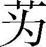
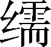
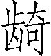
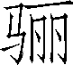
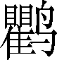
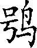

第十五卷

 鲁**[1]**周公世家第三

本篇内容主要是详细地记述了西周开国重臣周公的生平事迹，并择要记载了鲁国经历三十四代君主、历时一千余年的历史发展过程。

周公是我国政治史、文化史上的一个极为重要的人物。他帮助周武王开创了周王朝八百年的基业，从而也把我国的第一个文明社会形式推向了巅峰，为我国民族融合、政治统一做出了巨大贡献。同时，他所制定的“礼乐行政”，对我国民族文化传统的形成，也具有开山的意义。时至今日，中华民族的文化心理之中，仍涓涓流淌着西周时代那种重伦理、轻逸乐、好俭朴、乐献身的君子风度和集体精神。司马迁对周公不但有一种深厚的景仰之情，而且把周公作为“立德立功立言”的楷模来学习仿效，要为中国文化发展做出贡献。在《太史公自序》中，他激动地回忆了父亲临终时的嘱托：“夫天下称颂周公，言其能论歌文武之德，宣周邵之风，达太王王季之思虑，爰及公刘，以尊后稷也。”可见，周公的榜样力量是激励司马迁完成《史记》创作的重要因素之一。

但是，历史唯物主义地来看，周、孔所创立的儒家文化也有其消极的一面：泯灭个性，过于保守，强调等级，以及由此带来的繁缛的礼仪……凡此种种，要批判地对待。另外，司马迁对周公的极度褒扬之中，也表现出司马迁思想的局限。对此，古人今人多有指出，兹不赘述。下面谈谈本篇在艺术上的特点。

在本篇中，作者正是饱含着激情来塑造周公形象的。作者用四分之一的篇幅，详尽地叙述了周公的一生：幼年时代的笃仁纯孝，平定管蔡分裂叛乱时的坚定果断，牺牲个人时的义无反顾，代理国政时的忍辱负重……作者用与主人公性格相一致的深沉有力的语言娓娓道来，为我们树立了一个胸怀博大、深沉果断，为国家利益辛劳毕生、鞠躬尽瘁的高岸君子形象，感人至深。

***【原文】***

周公[2]旦者，周武王[3]弟也。自文王[4]在时，旦为子孝，笃仁[5]，异于群子。及武王即位，旦常辅翼武王，用事[6]居多。武王九年，东伐至盟津[7]，周公辅行。十一年，伐纣[8]，至牧野[9]，周公佐武王，作《牧誓》[10]。破殷[11]，入商宫。已杀纣，周公把大钺[12]，召公把小钺[13]，以夹武王，衅社[14]，告纣之罪于天，及殷民。释箕子之囚[15]。封纣子武庚[16]禄父，使管叔、蔡叔[17]傅之，以续殷祀。遍封功臣同姓戚者。封周公旦于少昊之虚曲阜[18]，是为鲁公。周公不就封，留佐武王。

***【译文】***

[1]鲁：始建国于前11世纪，其辖地在今山东省西南部，都城在曲阜（今山东曲阜）。前256年为楚所灭。

[2]周公：姬旦，亦称叔旦。

[3]武王：姬发。

[4]文王：姬昌。商末为西伯（即西方诸侯之长），亦称西伯昌。曾被商纣王囚禁于羑里（故城在今河南省汤阴县北）。都丰邑（故城在今陕西省西安市鄠邑区东），在位五十年。

[5]笃仁：忠厚仁爱。

[6]用事：执掌政事。

[7]盟津：即孟津，黄河渡口名。在今河南省孟津县东北。

[8]纣：名受，号帝辛。商代最后的君主。详见《殷本纪》。

[9]牧野：地名，在今河南省淇县西南。

[10]《牧誓》：《尚书》篇名，是武王伐纣到达牧野时向各部族将士发布的战斗动员令。

[11]殷：商朝第二十任国王盘庚从奄（故城在今山东省曲阜东）迁都到殷（故城在今河南省安阳市西北），故商亦称殷，或连称商殷、殷商。

[12]钺（yuè）：古代兵器。青铜制，圆刃，可以砍劈，似斧而大，盛行于商、西周时。

[13]召（shào）公：一作邵公。即召康公姬奭（shì）。因采邑在召（在今陕西省岐山县西南），故称为召公或召伯。

[14]衅（xìn）：杀牲血祭。社：土地神。

[15]箕子：纣王的叔父。官太师，封于箕（故城在今山西省太谷东北）。因劝谏纣王，被囚禁。

[16]武庚：字禄父，商纣王之子。周武王灭商后，封他为殷君。

[17]管叔、蔡叔：均为周武王之弟。因封于管（故城在今河南省郑州市）、蔡（故城在今河南省上蔡县），故称。

[18]少吴：一作少皞。传说中古代东夷族首领。名挚处所；旧址。曲阜：邑名。故城在今山东曲阜县。

***【原文】***

武王克殷二年，天下未集[1]，武王有疾，不豫[2]，群臣惧，太公、召公乃缪卜[3]。周公曰：“未可以戚我先王。”周公于是乃自以为质[4]，设三坛，周公北面立，戴璧秉圭[5]，告于太王、王季[6]、文王。史策祝[7]曰：“惟尔元孙[8]王发，勤劳阻[9]疾。若尔三王是有负子之责[10]于天，以旦代王发之身。旦巧能，多材多蓺，能事鬼神。乃王发不如旦多材多蓺，不能事鬼神。乃命于帝庭，敷[11]佑四方，用能定汝子孙于下地[12]，四方之民罔[13]不敬畏。无坠天之降葆命[14]，我先王亦永有所依归。今我其即命于元龟[15]，尔之许我，我以其璧与圭归，以俟[16]尔命。尔不许我，我乃屏璧与圭。”周公已令史策告太王、王季、文王，欲代武王发，于是乃即三王而卜。卜人皆曰吉，发书视之，信[17]吉。周公喜，开籥[18]，乃见书遇吉。周公入贺武王曰：“王其无害。旦新受命三王，维长终是图[19]。兹道能念予一人[20]。”周公藏其策金滕匮[21]中，诫守者勿敢言。明日，武王有瘳[22]。

***【译文】***

[1]集：通“辑”，安定。

[2]不豫：不安适。

[3]太公：即姜尚。缪（mù）：通“穆”，虔诚。卜：古人用火灼龟甲，取征兆以预测吉凶。

[4]质：指作为保证用以取信的人或物。

[5]璧、圭：古代贵族用的玉制礼器。璧，平圆形，正中有孔。圭，长条形。秉（bǐnɡ）：拿着。

[6]太王：古代周族的领袖，名古公直父，武王的曾祖。王季：名季历。

[7]史策祝：史官把周公祷告的祝词写在简策上诵读。

[8]元孙：长孙。

[9]阻：淹久。

[10]负子之责：承担保护子孙的责任。

[11]敷：普遍。

[12]下地：地上；人间。

[13]罔：无，无指代词。

[14]葆命：宝贵的生命。葆，通“宝”。

[15]元龟：占卜用的大龟。

[16]俟（sì）：等候。

[17]信：确实。

[18]籥（yuè）：通“钥”，锁钥。

[19]维长终是图：即“唯图长终”。维，通“唯”，只。

[20]予一人：指武王。

[21]金滕匮：用绳索缠绕再用金属缄封的匮子。滕（ténɡ）：封缄。匮（ɡuì）：“柜”的本字。

[22]瘳（chōu）：病愈。

***【原文】***

其后武王既崩，成王少，在强葆[1]之中。周公恐天下闻武王崩而畔[2]，周公乃践阼[3]代成王摄行政当国。管叔及其群弟流言于国曰：“周公将不利于成王。”周公乃告太公望、召公奭曰：“我之所以弗辟[4]而摄行政者，恐天下畔周，无以告我先王太王、王季、文王。三王之忧劳天下久矣，于今而后成。武王蚤[5]终，成王少，将以成周，我所以为之若此。”于是卒相成王[6]，而使其子伯禽[7]代就封于鲁。周公戒伯禽[8]曰：“我文王之子，武王之弟，成王之叔父，我于天下亦不贱矣。然我一沐三捉发[9]，一饭三吐哺[10]，起以待士，犹恐失天下之贤人。子之鲁，慎[11]无以国骄人。”

***【译文】***

[1]强葆：通“襁褓”，包裹婴儿的布带和被子。

[2]畔：通“叛”。

[3]践阼（zuò）：通“践祚”。古代称即位行事为“践阼”。践，踩踏。古代庙、寝堂前两阶，主阶在东，称阼阶。

[4]辟：通“避”。

[5]蚤：通“早”。

[6]相：辅佐。

[7]伯禽：周公的长子。

[8]戒：告诫。

[9]沐：洗头发。捉发；手握头发。

[10]吐哺（bǔ）：吐出口中咀嚼的食物。

[11]慎：禁戒之词。

***【原文】***

管、蔡、武庚等果率淮夷[1]而反。周公乃奉成王命，兴师东伐，作《大诰》[2]。遂诛管叔，杀武庚，放蔡叔。收[3]殷余民，以封康叔[4]于卫，封微子[5]于宋，以奉殷祀。宁淮夷东土，二年而毕定。诸侯咸服宗[6]周。

***【译文】***

[1]淮夷：部族名。

[2]《大诰》：周公东征时晓喻各诸侯国君及其官员的文告。

[3]收：降伏。

[4]康叔：周武王弟，姬封。初封于康（地在今河南省禹县西北），故称康叔。周公攻灭武庚后，把殷民七族和商故都地区封给他，国号卫，建都朝歌（故城在今河南省淇县）。

[5]微子：商纣王的庶兄，名启。周公平息武庚叛乱后，封他于宋，建都商丘（今河南省商丘市南）。

[6]宗：归向。

***【原文】***

天降祉[1]福，唐叔[2]得禾，异母同颖[3]，献之成王，成王命唐叔以馈周公于东土，作《馈禾》[4]。周公既受命禾，嘉天子命，作《嘉禾》[5]。东土以集，周公归报成王，乃为诗贻[6]王，命之曰《鸱鸮》[7]。王亦未敢训[8]周公。

***【译文】***

[1]祉（zhǐ）：福。

[2]唐叔：姬虞。

[3]颖：禾穗。

[4]《馈禾》：《归禾》，《尚书》篇名，已佚。

[5]《嘉禾》：《尚书》篇名，已佚。

[6]贻（yí）：赠送。

[7]《鸱鹗》（chī xiāo）：《诗经》篇名。

[8]训：《尚书》作“诮”，责备之意。

***【原文】***

成王七年二月乙未，王朝步自周[1]，至丰[2]，使太保召公先之雒[3]相土。其三月，周公往营成周雒邑[4]，卜居[5]焉，曰吉，遂国[6]之。

***【译文】***

[1]周：指镐京。

[2]丰：与镐京同为西周国都。

[3]太保：辅佐国君的高级大臣。雒（luò）：故城在今河南省洛阳市。

[4]成周雒邑：周公经营雒邑，分筑成周城和王城。

[5]卜居：择定建都之地。

[6]国：建为国都。

***【原文】***

成王长，能听政。于是周公乃还政于成王，成王临朝。周公之代成王治，南面倍依[1]以朝诸侯。及七年后，还政成王，北面就臣位，匔匔[2]如畏然。

***【译文】***

[1]南面：面向南。古代君主南面而坐，臣子朝见君主则北面。倍依：通“背扆”。依，又称斧依，斧扆，为古代帝王置于堂上类似屏风的器具，因上面画有斧形图案，故名。

[2]匔匔：恭敬的样子。

***【原文】***

初，成王少时，病，周公乃自揃其蚤[1]沉之河，以祝于神曰：“王少未有识，奸[2]神命者乃旦也。”亦藏其策于府。成王病有瘳。及成王用事，人或谮[3]周公，周公奔楚。成王发府，见周公祷书，乃泣，反[4]周公。

***【译文】***

[1]揃（jiǎn）：修剪。蚤：通“爪”。

[2]奸：通“干”，冒犯。

[3]谮（zèn）：进谗言，诬陷。

[4]反：通“返”。

***【原文】***

周公归，恐成王壮，治有所淫佚[1]，乃作《多士》，作《毋逸》[2]。《毋逸》称：“为人父母，为业至长久，子孙骄奢忘之，以亡其家，为人子可不慎乎！故昔在殷王中宗[3]，严恭敬畏天命[4]，自度[5]治民，震惧不敢荒宁[6]，故中宗飨国[7]七十五年。其在高宗[8]，久劳于外，为与小人[9]，作其即位，乃有亮[10]，三年不言，言乃欢，不敢荒宁，密靖[11]殷国，至于小大[12]无怨，故高宗飨国五十五年。其在祖甲[13]，不义惟王，久为小人于外，知小人之依[14]，能保施[15]小民，不侮鳏寡[16]，故祖甲飨国三十三年。”《多士》称曰：“自汤[17]至于帝乙，无不率祀明德[18]，帝无不配天[19]者。在今后嗣王纣，诞淫厥佚[20]，不顾天及民之从也。其民皆可诛。”“文王日中昃不暇食[21]，飨国五十年。”作此以诫成王。

***【译文】***

[1]淫佚（yì）：通“淫逸”，纵欲放荡。

[2]《多士》：《尚书》篇名。《书序》：“成周既成，迁殷顽民，周公以王命诰，作《多士》。”《毋逸》：亦作《无逸》，《尚书》篇名。为周公还政成王后对成王的告诫之词。

[3]殷王中宗：即帝太戊。

[4]天命：上天的命令。古代统治者自称承受了天命，或把自己的意志假托为天命。

[5]度：法制。

[6]荒宁：荒废政事，贪图安逸。

[7]飨（xiǎnɡ）国：拥有政权。指帝王在位或王朝传代的期限。飨，通“享”。

[8]高宗：即帝武丁。

[9]小人：西周、春秋时对被统治的劳动者的称呼。

[10]亮：指帝王守丧。

[11]密靖：安定。

[12]小大：指小事大事。

[13]“其在祖甲”三句：祖甲，武丁之子。据汉马融说：“祖甲有兄祖庚，而祖甲贤，武丁欲立之，祖甲以王废长立少不义，逃亡民间，故曰不义惟王，久为小人也。”

[14]依：爱，引申为要求。

[15]保施：保护，施与。

[16]鳏（ɡuān）寡：老而无妻叫鳏，老而无夫叫寡。

[17]汤：又称武汤、成汤。

[18]率祀明德：恭顺地祭祀鬼神，表彰任用有德者。率，遵循。明，显扬。

[19]配天：比配于天。

[20]诞淫厥佚：极度地放纵享乐。

[21]“文王”二句：出自《无逸》，应移到“故祖甲飨国三十三年”的下面。昃（zè）：日西斜。

***【原文】***

成王在丰，天下已安，周之官政未次序[1]，于是周公作《周官》[2]，官别其宜。作《立政》[3]，以便百姓。百姓[4]说。

***【译文】***

[1]官政：官制。次序：系统的等级职责。

[2]《周官》：《尚书》篇名。

[3]《立政》：《尚书》篇名。周公还政成王后，告成王以施政之道。

[4]百姓：百官；平民。

***【原文】***

周公在丰，病，将没[1]，曰：“必葬我成周，以明吾不敢离成王[2]。”周公既卒，成王亦让[3]，葬周公于毕[4]，从文王，以明予小子不敢臣[5]周公也。

***【译文】***

[1]没（mò）：通“殁”，死亡。

[2]以明吾不敢离成王：这句话不是周公说的，据说是汉代伏胜对周公“必葬我成周”的解说，后人把它改成了一人称。

[3]让：谦让。

[4]毕：地名。

[5]臣：以……为臣。

***【原文】***

周公卒后，秋未获，暴风雷，禾尽偃[1]，大木尽拔。周国大恐。成王与大夫朝服以开金縢书，王乃得周公所自以为功[2]代武王之说。二公及王乃问史[3]百执事，史百执事曰：“信[4]有，昔周公命我勿敢言。”成王执书，以泣，曰：“自今后其无缪卜乎！昔周公勤劳王家，惟予幼人弗及知。今天动威以彰[5]周公之德，惟朕[6]小子其迎，我国家礼亦宜之。”王出郊[7]，天乃雨，反风，禾尽起。二公命国人，凡大木所偃，尽起而筑[8]之。岁则大孰[9]。于是成王乃命鲁得郊祭文玉[10]。鲁有天子礼乐者，以褒[11]周公之德也。

***【译文】***

[1]偃：倒下。

[2]功：名，名义。

[3]二公：指太公、召公。史：官名。

[4]信：确实。

[5]彰：表彰；显扬。

[6]朕（zhèn）：古人自称之词。从秦始皇起，专用为皇帝自称。

[7]郊：在郊外祭天。

[8]筑：有两解，培土，收拾。

[9]孰：通“熟”。

[10]郊祭文王：按照周代礼制，只有周天子才能举行郊祀典礼和立庙祭文王。

[11]褒：嘉奖。

***【原文】***

周公卒，子伯禽固[1]已前受封，是为鲁公。鲁公伯禽之初受封之鲁，三年而后报政周公。周公曰：“何迟也？”伯禽曰：“变其俗，革其礼，丧三年然后除[2]之，故迟。”太公亦封于齐[3]，五月而报政周公。周公曰：“何疾[4]也？”曰：“吾简其君臣礼，从其俗为也。”及后闻伯禽报政迟，乃叹曰：“呜呼，鲁后世其北面事齐矣！夫政不简不易，民不有近；平易近民，民必归[5]之。”

***【译文】***

[1]固：原来，本来。

[2]除：免除。

[3]齐：周分封的诸侯国，在今山东省北部，开国君主是太公吕尚，建都营丘（今称临淄，在今山东省淄博市东北）。

[4]疾：快。

[5]归：归向；顺从。

***【原文】***

伯禽即位之后，有管、蔡等反也，淮夷、徐戎[1]亦并兴反。于是伯禽率师伐之于肸[2]，作《肸誓》[3]，曰：“陈尔甲胄[4]，无[5]敢不善。无敢伤牿[6]。马牛其风[7]，臣妾逋逃[8]，勿敢越逐[9]，敬复之。无敢寇攘[10]，逾墙垣。鲁人三郊三隧[11]，峙尔刍茭、糗粮、桢榦[12]，无敢不逮[13]。我甲戌筑[14]而征徐戎，无敢不及，有大刑[15]。”作此《肸誓》，遂平徐戎，定鲁。

***【译文】***

[1]徐戎：部族名。亦称徐夷或徐方。东夷之一。

[2]肸（bì）：鲁邑名。亦作“费”、。在今山东省费县西北。

[3]《肸誓》：即《费誓》，《尚书》篇名。过去认为这是伯禽伐淮夷的誓词。

[4]甲胄（zhòu）：古代士兵穿戴的铠甲和头盔。

[5]无：莫；不要。

[6]牿（ɡù）：牛马圈。

[7]风：走失。一说兽类雌雄相诱叫风。

[8]臣妾：男女奴隶。逋（bū）逃：逃亡。

[9]越逐：超越队伍追逐。

[10]寇攘：掠夺和偷取。

[11]三郊三隧：城外近处曰郊，郊外曰隧。三，指西南北三方。东郊要拒守，故不供应。

[12]峙（zhì）：准备；积储。刍（chú）茭：喂牲口的干草。糗（qiǔ）粮：干粮。桢榦（zhēn ɡàn）：通“贞斡”，筑墙用的木桩。

[13]逮：及，到。

[14]筑：指修筑战壕等工事。

[15]大刑：死刑。

***【原文】***

鲁公伯禽卒，子考公酋立。考公四年卒，立弟熙，是谓炀公。炀公筑茅阙门[1]。六年卒，子幽公宰立。幽公十四年，幽公弟溃[2]杀幽公而自立，是为魏公。魏公五十年卒，子厉公擢立。厉公三十七年卒，鲁人立其弟具，是为献公。献公三十二年卒，子真[3]公濞立。

***【译文】***

[1]茅阙门：宫门名。

[2]溃：fèi。

[3]真（shèn）：借作“慎”。

***【原文】***

真公十四年，周厉王[1]无道，出奔彘[2]，共和行政[3]。二十九年，周宣王[4]即位。

***【译文】***

[1]周厉王：姬胡。前878—前842年在位。因“虐而好利”，杀戮谤王者，被国人流放。

[2]彘（zhì）：地名。

[3]共和行政：周厉王出奔后，至周宣王即位前共十四年（前841—前828年），由大臣召公、周公共同行政，故称共和行政。

[4]周宣王：姬静。前828—前782年在位。

***【原文】***

三十年，真公卒，弟敖立，是为武公[1]。

***【译文】***

[1]武公：前825—前816年在位。

***【原文】***

武公九年春，武公与长子括，少子戏，西朝[1]周宣王。宣王爱戏，欲立戏为鲁太子。周之樊仲山父[2]谏宣王曰：“废长立少，不顺[3]；不顺，必犯王命；犯王命，必诛之：故出令不可不顺也。令之不行，政之不立；行而不顺，民将弃上[4]。夫下事上，少事长，所以为顺。今天子建诸侯，立其少，是教民逆也。若鲁从之，诸侯效之，王命[5]将有所壅；若弗从而诛之，是自诛王命也。诛之亦失，不诛亦失，王其图[6]之。”宣王弗听，卒立戏为鲁太子。夏，武公归而卒，戏立，是为懿公[7]。

***【译文】***

[1]朝：古代诸侯定期朝见帝王，叫朝。往后臣子见国君也叫朝。

[2]仲山父：周宣王时的大臣，食邑于樊（在今河南省济源市南），亦称樊仲，樊穆仲。

[3]顺：顺理；合理。

[4]上：长上，统治者。

[5]王命：指周代先王立嫡长子为继承人的制度。

[6]图：考虑。

[7]懿公：前815—前807年在位。

***【原文】***

懿公九年，懿公兄括之子伯御与鲁人攻弑[1]懿公，而立伯御为君。伯御即位十一年，周宣王伐鲁，杀其君伯御，而问鲁公子能道顺[2]诸侯者，以为鲁后。樊穆仲曰：“鲁懿公弟称，肃恭明神，敬事耆老[3]；赋事[4]行刑，必问于遗训而咨于固实[5]；不干[6]所问，不犯所咨。”宣王曰：“然，能训治其民矣。”乃立称于夷宫[7]，是为孝公[8]。自是后，诸侯多畔王命。

***【译文】***

[1]弑（shì）：古代称臣杀君、子杀父母为弑。

[2]道顺：《国语》作“导训”。引导，教训。

[3]耆老：老人。特指受尊敬的老人。

[4]赋事：授予任务。

[5]咨：询问。固实：《国语》作“故实”。指能供效法借鉴的旧事。

[6]干：冒犯；抵触。

[7]夷宫：周宣王祖父夷王之庙。

[8]孝公：前796年—前769年在位。

***【原文】***

孝公二十五年，诸侯畔周，犬戎[1]杀幽王。秦[2]始列为诸侯。

***【译文】***

[1]犬戎：部族名。

[2]秦：国名。嬴姓。相传为伯益的后代。非子做部落首领时，被周孝王封于秦（今甘肃省张家川东），作为附庸。秦襄公因护送周平王东迁有功，被封为诸侯。

***【原文】***

二十七年，孝公卒，子弗湟[1]立，是为惠公[2]。

***【译文】***

[1]弗湟：《十二诸侯年表》作弗生。

[2]惠公：前768—前723年在位。

***【原文】***

惠公三十年，晋人弑其君昭侯[1]。四十五年，晋人又弑其君孝侯[2]。

***【译文】***

[1]昭侯：姬伯。前745—前740年在位。

[2]孝侯：姬平。

***【原文】***

四十六年，惠公卒，长庶子[1]息摄当国，行君事，是为隐公[2]。初，惠公適[3]夫人无子，公贱妾[4]声子生子息。息长，为娶于宋。宋女至而好，惠公夺而自妻之。生子允。登[5]宋女为夫人，以允为太子。及惠公卒，为允少故，鲁人共令息摄政，不言即位。

***【译文】***

[1]庶子：妾所生子。

[2]隐公：前722—前712年在位。

[3]適：通“嫡”。

[4]贱妾：妾的地位低于正妻，故称。

[5]登：上升。

***【原文】***

隐公五年，观渔于棠[1]。八年，与郑[2]易天子之太山之邑祊及许田，君子讥之[3]。

***【译文】***

[1]渔：渔人捕鱼。棠：鲁邑名。故城在今山东省鱼台县北。

[2]郑：国名。姬姓。

[3]君子讥之：根据当时的礼制：“天子在上，诸侯不得以地相与。”

***【原文】***

十一年冬，公子挥谄[1]谓隐公曰：“百姓便[2]君，君其遂立。吾请为君杀子允，君以我为相。”隐公曰：“有先君命。吾为允少，故摄代。今允长矣，吾方营菟裘[3]之地而老焉，以授子允政。”挥惧子允闻而反诛之，乃反谮隐公于子允曰：“隐公欲遂立，去子，子其图之。请为子杀隐公。”子允许诺。十一月，隐公祭钟巫[4]，齐于社圃[5]，馆于氏[6]，挥使人弑隐公于氏，而立子允为君，是为桓公[7]。

***【译文】***

[1]公子挥：字羽父。鲁国大臣。谄（chǎn）：巴结奉承。

[2]便：方便；拥戴。

[3]菟（tú）裘：鲁邑名。故城在今山东省泰安县南。

[4]钟巫：神名。

[5]齐（zhāi）：通“斋”。社圃：园名。

[6]馆：住宿。（wěi）氏：鲁国大夫。

[7]桓公：前711—前694年在位。

***【原文】***

桓公元年，郑以璧易天子之许田[1]。二年，以宋之赂鼎[2]入于太庙，君子讥之。

***【译文】***

[1]隐公八年，郑请以枋邑交换鲁之许田，因枋小许田大，鲁未给，故郑再加璧。

[2]宋之赂鼎：宋华父督杀其君宋殇公，用大鼎贿赂鲁桓公。

***【原文】***

三年，使挥迎妇于齐为夫人[1]。六年，夫人生子，与桓公同日，故名曰同。同长，为太子。

***【译文】***

[1]夫人：文姜。齐僖公之女，襄公之妹。

***【原文】***

十六年，会于曹[1]，伐郑，入厉公[2]。

***【译文】***

[1]曹：国名。周初分封的诸侯国。姬姓。

[2]入：纳。使动用法。厉公：郑侯姬突。这时因与大臣祭仲发生矛盾而出奔，居于栎邑（今河南省禹县）。

***【原文】***

十八年春，公将有行，遂与夫人如齐。申[1]谏止，公不听，遂如齐。齐襄公通[2]桓公夫人。公怒夫人，夫人以告齐侯。夏四月丙子，齐襄公飨公，公醉，使公子彭生抱鲁桓公，因命彭生摺其胁[3]，公死于车。鲁人告于齐曰：“寡君畏君之威，不敢宁居，来修好礼。礼成而不反，无所归咎[4]，请得彭生以除丑于诸侯。”齐人杀彭生以说鲁。立太子同，是为庄公[5]。庄公母夫人因留齐，不敢归鲁。

***【译文】***

[1]申（xū）：鲁国大夫。

[2]通：私通、通奸。

[3]摺：通“折”，折断。胁：肋骨。

[4]归咎（jiù）：归罪。

[5]庄公：前693—前662年在位。

***【原文】***

庄公五年冬，伐卫，内卫惠公[1]。

***【译文】***

[1]内：通“纳”。卫惠公：姬朔。

***【原文】***

八年，齐公子纠[1]来奔。九年，鲁欲内子纠于齐，后桓公[2]，桓公发兵击鲁，鲁急，杀子纠。召忽[3]死。齐告鲁生致管仲[4]。鲁人施伯[5]曰：“齐欲得管仲，非杀之也，将用之，用之则为鲁患。不如杀，以其尸与之。”庄公不听，遂囚管仲与齐。齐人相管仲。

***【译文】***

[1]公子纠：齐襄公庶弟。

[2]桓公：指齐桓公小白。襄公庶弟，出奔莒国，后来齐襄公被公孙无知所杀，桓公从莒回国取得政权。前685—前643年在位。

[3]召（shào）忽：辅佐公子纠的大夫。公子纠被杀，他自杀。

[4]致：交给。管仲：管夷吾，字仲。随公子纠出奔鲁。桓公即位后，经鲍叔牙推荐，被任命为卿，使齐称霸诸侯。

[5]施伯：鲁惠公之孙。

***【原文】***

十三年，鲁庄公与曹沫[1]会齐桓公于柯，曹沫劫齐桓公，求鲁侵地，已盟而释桓公。桓公欲背约，管仲谏，卒归鲁侵地。十五年，齐桓公始霸。二十三年，庄公如齐观社[2]。

***【译文】***

[1]曹沫：一作曹刿。

[2]社：祭祀社神，同时举行军事检阅。

***【原文】***

三十二年，初，庄公筑台临党氏[1]，见孟女[2]，说而爱之，许立为夫人，割臂以盟。孟女生子斑。斑长，说梁氏[3]女，往观。圉人荦[4]自墙外与梁氏女戏。斑怒，鞭荦。庄公闻之，曰：“荦有力焉，遂杀之，是未可鞭而置也。”斑未得杀。会庄公有疾。庄公有三弟，长曰庆父，次曰叔牙，次曰季友。庄公取齐女为夫人曰哀姜。哀姜无子，哀姜娣[5]曰叔姜，生子开[6]。庄公无適嗣[7]，爱孟女，欲立其子斑。庄公病，而问嗣于弟叔牙。叔牙曰：“一继一及[8]，鲁之常[9]也。庆父在，可为嗣，君何忧？”庄公患叔牙欲立庆父，退而问季友。季友曰：“请以死立斑也。”庄公曰：“曩者[10]叔牙欲立庆父，奈何？”季友以庄公命命牙待于巫氏[11]，使季劫饮叔牙以鸩[12]，曰：“饮此则有后奉祀；不然，死且无后。”牙遂饮鸩而死，鲁立其子为叔孙氏。八月癸亥，庄公卒，季友竟立子斑为君，如庄公命。侍丧，舍[13]于党氏。

***【译文】***

[1]党氏：鲁国大夫。

[2]孟女：党氏的长女。

[3]梁氏：鲁国大夫。

[4]圉（yù）人：主管养马的人。荦（luò）：人名。

[5]娣（dì）：妹。

[6]开：本名启。作者避汉景帝刘启名讳，改作“开”。

[7]適嗣：即嫡子。

[8]一继一及：指君位世袭制。父死子继，兄死弟及。

[9]常：常规；法则。

[10]曩（nǎnɡ）者：先前。

[11]巫氏：即季。鲁国大夫。

[12]鸩（zhèn）：传说中的一种毒鸟，羽毛为紫绿色，放在酒中，能毒死人。

[13]舍：住宿。

***【原文】***

先时庆父与哀姜私通，欲立哀姜娣子开。及庄公卒而季友立斑，十月己未，庆父使圉人荦杀鲁公子斑于党氏。季友奔陈[1]，庆父竟立庄公子开，是为湣公[2]。

***【译文】***

[1]陈：国名。妫姓。开国君主胡公（妫满），为周武王灭商后所封。

[2]湣公：前661—前660年在位。“湣”通“闵”，谥号用字。

***【原文】***

湣公二年，庆父与哀姜通益甚。哀姜与庆父谋杀湣公而立庆父。庆父使卜袭杀湣公于武闱[1]。季友闻之，自陈与湣公弟申如邾[2]，请鲁求内之。鲁人欲诛庆父。庆父恐，奔莒。于是季友奉子申入，立之，是为釐公[3]。釐公亦庄公少子。哀姜恐，奔邾。季友以赂如莒求庆父，庆父归，使人杀庆父，庆父请奔，弗听，乃使大夫奚斯行哭而往。庆父闻奚斯音，乃自杀。齐桓公闻哀姜与庆父乱以危鲁，乃召之邾而杀之，以其尸归，戮[4]之鲁。鲁釐公请而葬之。

***【译文】***

[1]卜（yǐ）：鲁国大夫。武闱：宫中侧门名。

[2]邾（zhū）：国名。后改名“邹”。曹姓。

[3]釐公：前659—前627年在位。釐：谥号用字。

[4]戮（lù）：陈尸示众。

***【原文】***

季友母陈女，故亡在陈，陈故佐送季友及子申。季友之将生也，父鲁桓公使人卜之，曰：“男也，其名曰‘友’，间于两社[1]，为公室辅。季友亡，则鲁不昌。”及生，有文在掌曰“友”，遂以名之，号为成季。其后为季氏，庆父后为孟氏也。

***【译文】***

[1]鲁富有三门：库门（即外门）；雉门（即中门）；路门（即寝门）。雉门之外右有周社，左有亳（bó）社，两社之间为执政大臣治事之所。

***【原文】***

釐公元年，以汶阳[1]封季友。季友为相。

***【译文】***

[1]汶（wèn）阳：邑名。故城在今山东省泰安县西南。：邑名，或作“费”，故城在今山东省费县西北。

***【原文】***

九年，晋里克杀其君奚齐、卓子[1]。齐桓公率釐公讨晋乱，至高梁[2]而还，立晋惠公[3]。十七年，齐桓公卒。二十四年，晋文公[4]即位。

***【译文】***

[1]里克：晋国大夫。奚齐、卓子：均晋献公子。奚齐为骊姬所生，卓子为姬妹所生。献公宠骊姬，骊姬谮杀太子申生，并逐群公子。

[2]高梁：晋地。在今山西省临汾市东北。

[3]晋惠公：晋献公子，名夷吾。

[4]晋文公：晋献公子，名重耳。前636—前628年在位，为春秋五霸之一。

***【原文】***

三十三年，釐公卒，子兴立，是为文公[1]。

***【译文】***

[1]文公：前626—前609年在位。

***【原文】***

文公元年，楚太子商臣[1]弑其父成王，代立。三年，文公朝晋襄公[2]。

***【译文】***

[1]商臣：初立为太子，后因成王欲废长立少，故弑成王代立，是为穆王。

[2]晋襄公：晋文公子。

***【原文】***

十一年十月甲午，鲁败翟[1]于咸，获长翟乔如[2]，富父终甥舂[3]其喉以戈，杀之，埋其首于子驹之门[4]，以命宣伯[5]。

***【译文】***

[1]翟（dí）：通“狄”，部族名。

[2]乔如：长狄的首领。

[3]富父终甥：鲁国大夫。舂：通“冲”，抵住。

[4]子驹之门：鲁郭门名。

[5]宣伯：叔孙得臣之子。叔孙得臣是这次战役的主将。

***【原文】***

初，宋武公[1]之世，鄋瞒[2]伐宋，司徒[3]皇父帅师御之，以败翟于长丘[4]，获长翟缘斯[5]。晋之灭路[6]，获乔如弟棼如。齐惠公[7]二年，鄋瞒伐齐，齐王子城父[8]获其弟荣如，埋其首于北门。卫人获其季弟简如。鄋瞒由是遂亡。

***【译文】***

[1]宋武公：前765—前748年在位。

[2]鄋（sōu）瞒：部族名。

[3]司徒：官名。西周始设，负责管理土地和人民。

[4]长丘：宋地名。在今河南省封丘县西南。

[5]缘斯：乔如的先代。

[6]路：国名。赤狄的别种。在今山西省潞城县东北。

[7]齐惠公：前608—前599年在位。

[8]王子城父：齐国大夫。

***【原文】***

十五年，季文子[1]使于晋。

***【译文】***

[1]季文子：季友之子季孙行父，鲁国公族。后相鲁宣公、成公、襄公。

***【原文】***

十八年二月，文公卒。文公有二妃[1]：长妃齐女为哀姜[2]，生子恶及视；次妃敬嬴，嬖爱[3]，生子俀[4]。俀私事襄仲[5]，襄仲欲立之，叔仲[6]曰不可。襄仲请齐惠公，惠公新立，欲亲鲁，许之。冬十月，襄仲杀子恶及视而立俀，是为宣公[7]。哀姜归齐，哭而过市，曰：“天乎！襄仲为不道，杀適立庶！”市人皆哭，鲁人谓之“哀姜”。鲁由此公室[8]卑，三桓[9]强。

***【译文】***

[1]妃（fēi）：王侯之妻。长妃为正妻，次妃为妾。

[2]哀姜：此为另一哀姜，不是鲁庄公夫人。

[3]嬖（bì）爱：特别宠爱。

[4]俀（wéi）：一作“倭”。

[5]襄仲：即公子遂，鲁国大臣。

[6]叔仲：即叔仲惠伯，鲁国大夫。

[7]宣公：前608—前591年在位。

[8]公室：诸侯的家族，也指诸侯的政权。

[9]三桓：鲁国的三卿。孟孙（仲孙）、叔孙、季孙都是鲁桓公的后代，故称三桓。

***【原文】***

宣公俀十二年，楚庄王[1]强，围郑。郑伯[2]降，复国之。

***【译文】***

[1]楚庄王：熊侣。前613—前591年在位。

[2]郑伯：郑襄公。姬坚。前604年—前587年在位。

***【原文】***

十八年，宣公卒，子成公[1]黑肱立，是为成公。季文子曰：“使我杀適立庶失大援者，襄仲。”襄仲立宣公，公孙归父[2]有宠。宣公欲去三桓，与晋谋伐三桓。会宣公卒，季文子怨之，归父奔齐。

***【译文】***

[1]成公：前590—前573年在位。

[2]公孙归父：襄仲之子。

***【原文】***

成公二年春，齐伐取我隆[1]。夏，公与晋郤克败齐顷公于鞌[2]，齐复归我侵地。四年，成公如晋，晋景公[3]不敬鲁。鲁欲背晋合于楚，或谏，乃不[4]。十年，成公如晋。晋景公卒，因留成公送葬，鲁讳之[5]。十五年，始与吴王寿梦会钟离[6]。

***【译文】***

[1]隆：一作“龙”，鲁邑名。故城在今山东省泰安市东南。

[2]郤克：晋国执政大臣。齐顷公：姜无野。前598—前586年在位。鞌：齐邑名。故城在今山东省济南市。

[3]晋景公：姬据。前599—前581年在位。

[4]不（fǒu）：通“否”。

[5]鲁讳之：安葬晋景公时，除鲁成公外，其他诸侯均不在，鲁以为耻。

[6]吴王寿梦：吴自寿梦始称王。前585—前561年在位。钟离：楚邑名。故城在今安徽省凤阳县东。

***【原文】***

十六年，宣伯[1]告晋，欲诛季文子。文子有义[2]，晋人弗许。

***【译文】***

[1]宣伯：叔孙乔如。

[2]文子有义：晋国大臣范氏，栾氏认为季文子是鲁国的忠臣。

***【原文】***

十八年，成公卒，子午立，是为襄公[1]。是时襄公三岁也。

***【译文】***

[1]襄公：前572—前542年在位。

***【原文】***

襄公元年，晋立悼公。往年冬，晋栾书[1]弑其君厉公。四年，襄公朝晋。

***【译文】***

[1]栾书：晋国执政大臣。

***【原文】***

五年，季文子卒。家无衣帛之妾，厩无食粟之马，府无金玉，以相三君[1]。君子曰：“季文子廉忠矣。”

***【译文】***

[1]三君：指宣公、成公、襄公。

***【原文】***

九年，与晋伐郑。晋悼公冠[1]襄公于卫，季武子[2]从，相行礼。

***【译文】***

[1]冠：举行冠礼。

[2]季武子：季孙宿。季文子之子。继其父执政。

***【原文】***

十一年，三桓氏分为三军[1]。

***【译文】***

[1]按周制，天子设六军，诸侯大国三军。鲁国原有三军，后来减为二军。

***【原文】***

十二年，朝晋。十六年，晋平公[1]即位。二十一年，朝晋平公。

***【译文】***

[1]晋平公：姬彪。前557—前532年在位。

***【原文】***

二十二年，孔丘[1]生。

***【译文】***

[1]孔丘：前551—前479年，世称孔子。名丘，字仲尼。

***【原文】***

二十五年，齐崔杼弑其君庄公[1]，立其弟景公[2]。

***【译文】***

[1]崔杼（zhù）：齐国大臣。庄公：姜光。前553—前548年在位。

[2]景公：姜杵臼。前547—前490年在位。

***【原文】***

二十九年，吴延陵季子[1]使鲁，问周乐，尽知其意，鲁人敬焉。

***【译文】***

[1]延陵季子：吴王寿梦之子，封于延陵（今江苏省常州市），故称。

***【原文】***

三十一年六月，襄公卒。其九月，太子[1]卒。鲁人立齐归之子裯为君，是为昭公[2]。

***【译文】***

[1]太子：襄公子，姬子野。

[2]齐归：鲁襄公妾。裯：人名。昭公：前541—510年在位。

***【原文】***

昭公年十九，犹有童心[1]。穆叔[2]不欲立，曰：“太子死，有母弟可立，不即立长。年钧[3]择贤，义钧则卜之。今裯非適嗣，且又居丧意不在戚[4]而有喜色，若果立，必为季氏忧。”季武子弗听，卒立之。比及葬，三易衰[5]。君子曰：“是不终也。”

***【译文】***

[1]童心：孩子气。

[2]穆叔：鲁国大夫。

[3]钧：通“均”，相等。

[4]戚：忧伤。

[5]衰（cuī）：通“缞”。

***【原文】***

昭公三年，朝晋至河，晋平公谢还之，鲁耻焉。四年，楚灵王[1]会诸侯于申，昭公称病不往。七年，季武子卒。八年，楚灵王就章华台[2]，召昭公。昭公往贺，赐昭公宝器[3]；已而悔，复诈取之。十二年，朝晋至河，晋平公谢还之。十三年，楚公子弃疾[4]弑其君灵王，代立。十五年，朝晋，晋留之葬晋昭公[5]，鲁耻之。二十年，齐景公与晏子狩竟[6]，因入鲁问礼。二十一年，朝晋至河，晋谢还之。

***【译文】***

[1]楚灵王：熊国。前540—前529年在位。

[2]章华台：台名。旧址在今湖北省监利县西。

[3]宝器：这里指大曲弓。

[4]弃疾：楚平王。前528—前516年在位。

[5]晋昭公：姬夷。前531—前526年在位。

[6]晏子：名婴，字平仲。夷维（今山东省高密市）人。齐国大臣。狩竟：在鲁国边境打猎。竟：通“境”。

***【原文】***

二十五年春，鹆[1]来巢。师己[2]曰：“文成之世童谣曰：‘鹆来巢，公在乾侯[3]。鹆入处，公在外野。’”

***【译文】***

[1]鹆（qúyù）：鸟名，即八哥。

[2]师己：鲁国大夫。

[3]文成：指鲁文公、成公。乾（ɡān）侯：晋邑名。故城在今河北省成安县东南。

***【原文】***

季氏与郈[1]氏斗鸡，季氏芥[2]鸡羽，郈氏金距[3]。季平子怒而侵[4]郈氏，郈昭伯[5]亦怒平子。臧昭伯[6]之弟会伪谗臧氏，匿季氏，臧昭伯囚季氏人。季平子怒，囚臧氏老[7]。臧、郈氏以难告昭公。昭公九月戊戌伐季氏，遂入。平子登台请曰：“君以谗不察臣罪，诛之，请迁沂[8]上。”弗许。请囚于，弗许。请以五乘亡，弗许。子家驹[9]曰：“君其许之。政自季氏久矣，为徒者众，众将合谋。”弗听。郈氏曰：“必杀之。”叔孙氏之臣戾[10]谓其众曰：“无季氏与有，孰利？”皆曰：“无季氏是无叔孙氏。”戾曰：“然，救季氏！”遂败公师。孟懿子[11]闻叔孙氏胜，亦杀郈昭伯。郈昭伯为公使，故孟氏得之。三家共伐公，公遂奔。己亥，公至于齐。齐景公曰：“请致千社[12]待君。”子家曰：“弃周公之业而臣于齐，可乎？”乃止。子家曰：“齐景公无信，不如早之晋。”弗从。叔孙[13]见公还，见平子，平子顿首。初欲迎昭公，孟孙[14]、季孙后悔，乃止。

***【译文】***

[1]郈（hòu）：一作“厚”。

[2]芥：有两说。一说捣芥子为粉末，播散于鸡翼，以迷对方鸡之目；一说“芥”为“介”，为鸡着甲。

[3]金距：鸡爪上安金属套。距，鸡附足骨。

[4]季平子：季孙意如，季武子之孙。侵：侵占郈氏的宫地。

[5]郈昭伯：郈恶，鲁孝公的后代。

[6]臧昭伯：臧孙赐。

[7]老：大夫的家臣。

[8]沂：水名。鲁都城南有沂水，平子想要出城待罪。

[9]子家驹：仲孙驹，字子家。鲁国大夫。

[10]戾（lì）：叔孙氏的司马。

[11]孟懿子：仲孙何忌。鲁国大夫。

[12]社：地方基层行政单位。

[13]叔孙：叔孙婼（ruò）。鲁国大夫。

[14]孟孙：指孟懿子。

***【原文】***

二十六年春，齐伐鲁，取郓[1]而居昭公焉。夏，齐景公将内公，令无受鲁赂。申丰、汝贾许齐臣高龁、子将粟五千庾[2]。子将言于齐侯曰：“群臣不能事鲁君，有异[3]焉。宋元公[4]为鲁如晋，求内之，道卒。叔孙昭子[5]求内其君，无病而死。不知天弃鲁乎？抑[6]鲁君有罪于鬼神也？愿君且待。”齐景公从之。

***【译文】***

[1]郓（yùn）：鲁邑名。故城在今山东省郓城县东。

[2]申丰、汝贾：鲁国大夫。子将：梁丘据。齐景公的宠臣。庾（yǔ）：古容量单位。一庾等于十六斗。

[3]异：怪异。指特别的征兆。

[4]宋元公：子佐。前531—前517年在位。

[5]叔孙昭子：即叔孙蜡。

[6]抑：抑或；还是。

***【原文】***

二十八年，昭公如晋，求入。季平子私于晋六卿[1]，六卿受季氏赂，谏晋君，晋君乃止，居昭公乾侯。二十九年，昭公如郓。齐景公使人赐昭公书，自谓“主君”[2]。昭公耻之，怒而去乾侯。三十一年，晋欲内昭公，召季平子。平子布衣跣行[3]，因六卿谢罪。六卿为言曰：“晋欲内昭公，众不从。”晋人止。三十二年，昭公卒于乾侯。鲁人共立昭公弟宋为君，是为定公[4]。

***【译文】***

[1]晋六卿：晋之韩、赵、魏、范、中行及智氏等六族，世为晋卿，故称六卿。

[2]主君：当时人们对国君、卿、大夫的敬称，而齐景公以此自称，显示傲慢。

[3]布衣跣（xiǎn）行：表示忧伤。跣：赤脚。

[4]定公：前509—前495年在位。

***【原文】***

定公立，赵简子问史墨[1]曰：“季氏亡乎？”史墨对曰：“不亡。季友有大功于鲁，受为上卿，至于文子、武子，世增其业。鲁文公卒，东门遂[2]杀適立庶，鲁君于是失国政。政在季氏，于今四君[3]矣。民不知君，何以得国！是以为君慎器与名[4]，不可以假人。”

***【译文】***

[1]赵简子：即赵鞅。晋国大臣。史墨：晋国史官蔡墨。

[2]东门遂：即襄仲。

[3]四君：指宣公、成公、襄公、昭公。

[4]器：古代表示一定等级、地位的器物。名：爵号。

***【原文】***

定公五年，季平子卒。阳虎[1]私怒，囚季桓子[2]，与盟，乃舍之。七年，齐伐我，取郓，以为鲁阳虎邑以从政。八年，阳虎欲尽杀三桓適，而更立其所善庶子以代之；载季桓子将杀之，桓子诈而得脱。三桓共攻阳虎，阳虎居阳关。九年，鲁伐阳虎，阳虎奔齐，已而奔晋[3]赵氏。

***【译文】***

[1]阳虎：一作“阳货”。季孙氏的家臣。挟持季桓子，据有阳关（故城在今山东省泰安市东南），掌握国政。

[2]季桓子：季孙斯。季平子之子。鲁执政大臣。

[3]奔晋：指阳虎投奔晋赵鞅，为其家臣。

***【原文】***

十年，定公与齐景公会于夹谷[1]，孔子行相事[2]。齐欲袭鲁君，孔子以礼历阶，诛齐淫乐，齐侯惧，乃止，归鲁侵地而谢过。十二年，使仲由[3]毁[4]三桓城，收其甲兵。孟氏不肯堕城，伐之，不克而止。季桓子受齐女乐[5]，孔子去。

***【译文】***

[1]夹谷：齐地名。故城在今山东省莱芜市南。

[2]行相事：主持礼赞。

[3]仲由：字子路，卞（故城在今山东省济宁市泗水县）人，孔子的门生，为季氏家臣之长。

[4]毁：毁坏。

[5]女乐（yuè）：歌姬舞女。

***【原文】***

十五年，定公卒，子将立，是为哀公[1]。

***【译文】***

[1]哀公：前494—前467年在位。

***【原文】***

哀公五年，齐景公卒。六年，齐田乞[1]弑其君孺子。

***【译文】***

[1]田乞：齐国执政大臣。

***【原文】***

七年，吴王夫差[1]强，伐齐，至缯[2]，征百牢[3]于鲁，季康子使子贡说吴王及太宰嚭[4]，以礼诎之[5]。吴王曰：“我文身[6]，不足责礼。”乃止。

***【译文】***

[1]夫差：前495—前473年在位。

[2]缯：邑名。故城在今山东省枣庄市东。

[3]牢：指祭祀宴享用的牲畜猪、牛、羊各一头。百牢：指牛、羊、猪各百头。

[4]季康子：季孙肥。季桓子之子，鲁国执政大臣。子贡：卫国人，孔子的弟子。太宰嚭（pī）：伯豁。

[5]以礼诎（qū）之：根据礼制折服人。礼，指周礼。诎，折服。参见《吴太伯世家》。

[6]文身：身上刺画花纹，为古时吴越习俗。

***【原文】***

八年，吴为邹伐鲁[1]，至城下，盟而去。齐伐我，取三邑[2]。十年，伐齐南边。十一年，齐伐鲁。季氏用冉有有功[3]，思孔子，孔子自卫归鲁。

***【译文】***

[1]吴为邹伐鲁：因上年鲁国曾攻打邹国，所以吴国借此出兵。

[2]三邑：据《齐太公世家》和《左传》记载，只有二邑，即和阐。

[3]季氏用冉有有功：鲁与齐战，冉有帅左师，获甲首八十，齐人夜遁。冉有：冉求，字子有。鲁国人，孔子的弟子。为季氏宰。

***【原文】***

十四年，齐田常弑其君简公于俆州[1]。孔子请伐之，哀公不听。十五年，使子服景伯、子贡为介[2]，适齐，齐归我侵地。田常初相，欲亲诸侯。

***【译文】***

[1]田常：即田成子。俆州：齐地名。在今山东省滕州市南。

[2]子服景伯：鲁国大夫。介：助手；副使。

***【原文】***

二十七年春，季康子卒。夏，哀公患三桓，将欲因诸侯以劫[1]之，三桓亦患公作难，故君臣多间[2]。公游于陵阪[3]，遇孟武伯[4]于街，曰：“请问余及死乎？”对曰：“不知也。”公欲以越伐三桓。八月，哀公如陉氏[5]。三桓攻公，公奔于卫，去如邹，遂如越。国人迎哀公复归，卒于有山氏。子宁立，是为悼公[6]。

***【译文】***

[1]劫：以武力胁迫。

[2]间：间隙；仇怨。

[3]陵阪（bǎn）：鲁地名。

[4]孟武伯：即仲孙彘。鲁国大臣。

[5]陉（xínɡ）氏：即有山氏。

[6]悼公：前466—前429年在位。

***【原文】***

悼公之时，三桓胜，鲁如小侯，卑于三桓之家。

十三年，三晋灭智伯[1]，分其地有之。

***【译文】***

[1]三晋：晋国被赵、魏、韩三家瓜分晋国并各自立国，史称三晋。智伯：晋国执政大臣知瑶。

***【原文】***

三十七年，悼公卒。子嘉立，是为元公[1]，元公二十一年卒，子显立，是为穆公[2]。穆公三十三年卒，子奋立，是为共公[3]。共公二十二年卒，子屯立，是为康公[4]。康公九年卒，子匽立，是为景公[5]。景公二十九年卒，子叔立，是为平公[6]，是时六国[7]皆称王。

***【译文】***

[1]元公：前428—前408年在位。

[2]穆公：据《六国年表》载在位三十一年，前407—前377年。

[3]共公：据《六国年表》载在位二十四年，即前376—前353年。

[4]康公：前352—前344年在位。

[5]景公：前343—前315年在位。

[6]平公：前314—前296年在位。

[7]六国：秦惠王也于前324年称王。

***【原文】***

平公十二年，秦惠王[1]卒。二十年，平公卒，子贾立，是为文公[2]。文公元年，楚怀王[3]死于秦。二十三年，文公卒。子雠立，是为顷公[4]。

***【译文】***

[1]秦惠王：嬴驷。前337—前311年在位。

[2]文公：前295—前273年在位。

[3]楚怀王：熊槐。前328—前299年在位。

[4]顷公：前272—前250年在位。

***【原文】***

顷公二年，秦拔楚之郢[1]，楚顷王东徙于陈[2]。十九年，楚伐我，取俆州[3]。二十四年，楚考烈王[4]伐灭鲁。顷公亡，迁于下邑[5]，为家人[6]，鲁绝祀。顷公卒于柯[7]。

***【译文】***

[1]郢：楚都城，故城在今湖北省江陵县西北。

[2]楚顷王：即楚顷襄王。陈：地名。

[3]俆州：地名。在今山东省滕州市南。

[4]楚考烈王：熊元。前262—前238年在位。

[5]下邑：国外的小邑。

[6]家人：平民。

[7]柯：邑名。

***【原文】***

鲁起周公至顷公，凡三十四世。

太史公曰：余闻孔子称曰“甚矣鲁道之衰也！洙泗之间龂龂[1]如也”。观庆父及叔牙、闵公之际，何其乱也？隐、桓之事；襄仲杀適立庶；三家北面为臣，亲攻昭公，昭公以奔。至其揖让[2]之礼则从矣，而行事何其戾[3]也？

***【译文】***

[1]洙泗：洙水和泗水的合称。二水流经鲁国都城。龂龂（yǐn yín）：通“訚訚”，和悦有礼之貌。

[2]揖（yī）让：古代宾主相见的礼节。

[3]戾：暴戾，凶狠。

## 【译文】

周公旦是周武王之弟。从文王还在世时，旦作为儿子非常孝顺，忠厚仁爱，胜过其他兄弟。到武王即位，旦经常佐助辅弼武王，处理很多政务。武王九年，亲自东征至盟津，周公随军辅助。十一年，讨伐殷纣，军至牧野，周公佐助武王，发布了动员战斗的《牧誓》。周军攻破殷都，进入殷王宫。杀殷纣以后，周公手持大钺，召公手持小钺，左右夹辅武王，举行衅社之礼，向上天与殷民昭布纣之罪状。把箕子从监狱中释放出来。封纣子武庚禄父，命管叔、蔡叔辅助他，以承续殷之祭祀。遍封功臣、同姓及亲戚。封周公于少昊故墟曲阜，就是鲁公。但不让周公去自己的封国，而是留在朝廷辅佐武王。

武王灭商两年后，天下仍没有安定。又遇上武王患病，不舒服，群臣都很害怕，太公、召公就去文王庙虔诚地占卜吉凶。周公说：“不可以使我们的先王担忧。”周公于是就用自己的生命担保，设立三坛，周公面向北站着，胸前挂着璧，手里拿着圭，向太王、王季、文王祈祷。史官为他宣读写在简上的祷告词说：“你们的长孙武王发，积劳成疾。如果你们三王在上天现在有助祭的职责，就让我替代武王发的身子吧。我灵巧能干，多才多艺，能侍奉鬼神。你们的武王发不如我多才多艺，不会侍奉鬼神。他刚被上帝那儿任命，普遍保有四方，因而能够在世上安定你们的子孙，天下的百姓没有不敬仰和畏惧他的。不要毁坏上天赐给周家的宝贵使命，我们的先王也才能永远有所归依。现在我将听命于大龟，若你们答应我的请求，我就把这些璧和圭带回去，等待你们的命令。若你们不答应我的请求，我就把璧和圭收藏起来。”周公已经让史官把简册上的祝文告诉太王、王季、文王，要代替武王发死，于是就到三王神位前占卜。占卜的人都说吉利，打开占卜书一看，果然吉利。周公非常高兴，打开藏卜兆书的管子，所见卜辞也都吉利。周公进宫向武王道贺说：“王没有灾害。我刚领受了三王的命令，让你为周家作长久打算。这是上天让你很好地考虑天子的职责。”周公把策书藏在金属装束的匣子里，密封好，告诫看守人不准张扬。第二天，武王的病就好了。

这以后，武王已经逝世，成王年幼，还处在襁褓生活中。周公恐怕天下知道武王逝世而叛乱，周公就登上王位暂替成王行使王权，主持国政。管叔和其他弟弟纷纷在国内散布流言蜚语，说：“周公将对成王不利。”周公就告诉太公望、召公奭说：“我之所以不避嫌疑而代替成王行使王权，是怕天下的人背叛周朝，没法向我先王太王、王季、文王交代。三王为天下忧劳已经很久了，至今才算成功。武王去世早，成王年幼，为了完成周朝的大业，所以我才这样做。”于是，终于辅佐成王，而让他的儿子伯禽代替到鲁国去就封。周公告诫伯禽说：“我是文王的儿子，武王的弟弟，成王的叔父，我在天下的地位也算不低了。然而，我洗一次头三次握住头发，吃一顿饭三次吐出嘴里的食物，起身接待贤士，还怕失掉天下的贤人。你到了鲁国，千万不要因为是国君就骄傲看不起人。”

管叔、蔡叔、武庚等果然率领淮夷反叛。周公便奉成王的命令，兴师东征，并作了《大诰》。于是，诛杀了管叔，处死了武庚，流放了蔡叔。收服殷代的遗民，进而把康叔封于卫地，把微子封于宋地，叫他接续殷商的祭祀，安抚东方的淮夷，经过两年东方都安定了下来。诸侯都朝拜周室，尊周王为宗主。

上天降下福祉，唐叔得到了奇异的禾苗，异株同穗，将它奉献给成王，成王命令唐叔送到东方去赠给周公，周公作了《馈禾》。周公既已接受天子赏赐的特异禾稻，赞扬天子的恩宠，作了《嘉禾》。东部地区已经安定，周公回京师向成王报告，就作了一首诗送给成王，题名叫《鸱》。成王也不敢责问周公。

成王七年二月乙未日，成王在镐京朝拜武王庙，然后步行至丰京朝拜文王庙，命太保召公先行到洛邑勘察地形。三月，周公去洛邑营造成周京城，并进行占卜，得象大吉，于是就以洛邑为国都。

成王长大，能够处理国事了。于是，周公就把政权还给成王，成王临朝听政。过去周公代替成王治天下时，面向南方，背对扆壁，接受诸侯朝拜。七年之后，还政于成王，周公面向北站在臣子之位上，仍谨慎恭敬如履薄冰。

当初，成王幼小时，有病了，周公就剪下自己的指甲沉入河中，向神祝告说：“王年幼没有主张，冒犯神命的是旦。”也把那祝告册文藏于秘府，成王病果然痊愈。到成王临朝后，有人说周公坏话，周公逃亡到楚国。成王打开秘府，发现周公当年的祈祷册文，感动得泪流满面，即迎回周公。

周公归国后，怕成王年轻，为政荒淫放荡，就写了《多士》《毋逸》。《毋逸》说：“做父母者，经历长久时期创业成功，其子孙骄奢淫逸忘记了祖先的困苦，毁败了家业，做儿子的能不谨慎吗？因此，过去殷王中宗庄重恭敬地畏惧天命，治民时严以律己，兢兢业业不敢荒废事业自图逸乐，所以中宗拥有国家七十五年之久。殷之高宗久在民间劳碌，与小民共同生活，他即位后居丧，三年不言语，一旦说话就得到臣民拥戴，不敢荒淫逸乐，使殷国家安定，小民大臣均无怨言，所以高宗拥有国家五十五年。殷王祖甲，觉得自己并非长子，为王不宜，因此长时间逃避于民间，深知人民需要，他安定国家、施惠于民，不侮慢鳏寡孤独之人，所以祖甲拥有国家三十三年。”《多士》说：“自汤至帝乙，殷代诸王无不遵循礼制去祭祀，勉力向德，都能上配天命。后来到殷纣时，大为荒淫逸乐，不顾天意民心，万民都认为他该杀。”“周文王每天日头偏西还顾不上吃饭，拥有国家五十年。”周公写了这些用来告诫成王。

成王居于丰京，当时天下虽已安定，但周朝的官职制度尚未安排得当，于是周公写了《周官》，划定百官职责。写了《立政》，以利百姓，百姓欢悦。

周公在丰京患病，临终时说：“一定要把我埋葬在成周，以表明我不敢离开成王。”周公死后，成王也谦让，最后把周公葬于毕邑，伴随文王，来表示成王不敢以周公为臣。

周公去世那年秋后，庄稼尚未收割，一场暴风雷霆，禾稼倒伏，大树连根拔起。王都的人十分害怕。成王和众大夫穿好朝服，恭敬地打开用金丝封缄的装着祭神祷文的盒子，看到周公愿以己身代武王去死的祷文。太公、召公和成王于是问史官和有关人员，他们说：“确有此事，但过去周公命令我们不许说出去。”成王手执册文而泣，说：“今后不要笃行占卜了！过去周公为王室辛劳，但我年幼不理解。现在上天发威来彰明周公之德，现在我应设祭迎其神，亦合于我们国家之礼。”成王于是举行祭天之礼，果真天下雨，风向反转，倒伏之禾全部立起。太公、召公命国人，凡倒下的大树都扶起培实土基。当年大丰收。于是，成王特准鲁国可以行郊祭天和庙祭文王之礼。鲁国所以有周天子一样的礼乐，是因为褒奖周公的德行啊。

周公死时，其子伯禽早在以前接受封国，就是鲁公。鲁公伯禽当初受封至鲁，三年以后才向周公汇报施政情况。周公说：“为何如此迟晚？”伯禽说：“变其风俗，改其礼仪，要等服丧三年除服之后才能看到效果，因此迟了。”太公受封于齐国，五个月后就向周公汇报施政情况。周公说：“为何如此迅速？”太公说：“我简化其君臣之间的仪节，一切从其风俗去做。”等后来太公听说伯禽汇报政情很迟，叹息说：“唉！鲁国后代将要为齐国之臣了，为政不简约易行，人民就不会亲近；政令平易近民，人民必然归附。”

伯禽即位之后，有管、蔡等造反之事，淮夷、徐戎也一起兴兵造反。于是，伯禽率军至肸邑讨伐之，写了《肸誓》，说：“准备你们的战甲头盔，必须良好。不许毁坏牛栏马圈。马牛走失，奴隶逃跑，军士不得擅离职守去追捕，他人之马牛奴隶跑到自己处要归还。不许劫略侵扰，不许入户盗窃。鲁国西、南、北三方近郊远郊之人，备办干草、干粮和木桩，不许缺少。甲戌日我军修筑工事征伐徐戎，不许届时不至，否则处以极刑。”发布《肸誓》后，就讨平徐戎，安定了鲁国。

鲁公伯禽死后，其子考公酋继位。考公四年死，其弟熙继位，就是炀公。炀公修建了茅阙宫门。六年炀公死，其子幽公宰继位。幽公十四年，其弟杀幽公自立为君，就是魏公。魏公五十年死，其子厉公擢继位。厉公三十七年死，鲁人立其弟具为君，就是献公。献公三十二年死，其子真公濞继位。

真公十四年（前841），周厉王为政无道，出逃于彘邑，周公、召公共同执政。二十九年（前827），周宣王即位。

三十年（前826），真公死，其弟敖继位，就是武公。

武公九年（前817）春，武公和长子括、少子戏，西行朝拜周宣王。宣王喜欢戏，想立戏为鲁国太子。周之大夫樊仲山甫劝谏宣王说：“废弃长子而立少子，不符合于礼制；不符合礼制，必然触犯先王之命；触犯先王之命必被诛杀：所以，发令不可违背礼制。命令难以实行，政令就没有权威；命令被实行而又违背礼制，人民将不服从主上。而下级服务于上级，年轻者服务于年长者，这才符合礼制。现在，天子您立诸侯之继承人，而立其少子，是教给人民违反礼制。如果鲁国遵从您的命令，诸侯也仿效而行，先王之命必然阻塞难行；如果鲁国不遵从您废长立少的命令，您必要诛伐鲁国，您就等于自己诛伐先王之命。那时，您诛伐鲁国是错误，不诛伐也是错误，请您慎重考虑。”宣王不听，终于立戏为鲁太子。夏天，武公回鲁国后去世，戏继位，就是懿公。

懿公九年（前807），懿公之兄括的儿子伯御和鲁国人攻杀懿公，立起伯御为鲁相。伯御在位十一年，周宣王伐鲁，杀死其君伯御，而询问鲁国公子中谁能启发训导诸侯，让他做鲁国嗣君。樊穆仲说：“鲁懿公之弟称，庄重恭谨敬事神灵，敬重长者；处理事务执行法规时，必定咨询先王遗训和正确经验，不干犯先王遗训，不抵触正确经验。”宣王说：“好，这样就能训导治理其民众了。”于是，在夷宫立称为鲁君，就是孝公。此后，诸侯多有违抗王命的。

孝公二十五年（前771），诸侯背叛周室，犬戎人杀死幽王。秦开始列为诸侯。

二十七年（前769），孝公死，其子弗湟继位，就是惠公。

惠公三十年（前739），晋人杀其君昭侯。四十五年（前724），晋人又杀其君孝侯。

四十六年（前723），惠公死，长庶子息代理政务，执掌君权，就是隐公。当初，惠公正妻无子，其贱妾声子生儿子息。息长大后，惠公为息娶宋国女。宋女来到鲁国，惠公看她美丽，就夺为自己的妻子。生下儿子允。惠公将宋女升为正妻，立允为太子。到惠公死时，因为允太幼小，鲁人共同让息代理国政，不叫作即位。

隐公五年（前781），在棠地观看捕鱼。八年（前715），与郑国交换天子所赐之封邑太山的祊和许田，君子讥贬这件事。

十一年（前712）冬，公子挥向隐公献媚说：“百姓认为您当国君于民有利，您就不要代理而正式做国君吧。我请求您杀掉子允，您让我当国相。”隐公说：“先君有命在前。我是因为允幼小，所以代理国政。现在允已长大，我正营造菟裘这个地方准备养老，再把国政交给子允。”公子挥害怕子允听到自己的话而杀他，反而向子允说隐公的坏话诬陷说：“隐公想正式做国君，除掉你，你要考虑此事。请允许我为你杀死隐公。”子允答应了。十一月，隐公将要祭祀钟巫之神，在社圃斋戒，住在氏家中。公子挥派人在氏家杀死隐公，而立子允为鲁君，就是桓公。

桓公元年（前711），郑国用玉璧换取天子赐给鲁的封邑许田。二年（前710），鲁君命把宋国赂送的鼎放入太庙，君子讥贬此事。

三年（前709），派公子挥到齐国接娶齐女为桓公夫人。六年（前706），夫人生下一子，其生日与桓公相同，所以起名叫“同”。同长大，为太子。

十六年（前696），桓公与诸侯在曹国盟会，讨伐郑国，支持郑厉公回国执政。

十八年（前694）春，桓公准备外出，与夫人一同去齐国。申谏止，桓公不听，于是去了齐国。齐襄公与桓公夫人私通。桓公知道了怒责夫人，夫人把桓公责骂之事告诉了齐侯。夏四月丙子日，齐襄公宴请桓公，桓公酒醉后，齐襄公命公子彭生抱住桓公，又命彭生折断桓公肋骨，桓公死于车中。鲁人告于齐人说：“我们国君敬畏您的威严，不敢安居，到齐国修两国友睦之礼。礼成而人未归，罪责无法追究，只要求得到彭生以在诸侯面前洗掉丑闻。”齐人杀死彭生以向鲁解释。鲁国人立太子同为君，就是庄公。庄公之母桓公夫人于是留在齐国，不敢归鲁。

庄公五年（前689）冬，伐卫，武力支持卫惠公回国执政。

八年（前686）冬，齐公子纠逃亡来鲁国。九年（前685），鲁国想武力护送子纠返齐国为君，但落后于齐桓公，齐桓公发兵攻鲁，鲁国危急，只能杀了子纠，其臣召忽从死。齐人告知鲁国要生得管仲。鲁人施伯说：“齐想得到管仲，并非想杀他，而是将要任用他，他被任用后必为鲁之大患。不如杀死管仲，把他尸体给齐国。”庄公不听，把管仲押解到齐。齐人用管仲为相。

十三年（前681），鲁庄公和大夫曹沫在柯地与齐桓公盟会，曹沫武力劫持齐桓公，索要鲁被齐侵占的土地，盟誓后释放桓公。桓公想毁约，管仲谏止，终于归还给鲁国被侵之地。十五年（前679），齐桓公开始称霸于诸侯。二十三年（前671），庄公到齐国去观看社祭。

三十二年（前662），当初，庄公修筑一台正好俯临党氏之家，庄公见其孟女，十分喜爱，答应立她为夫人，割破胳膊订下盟誓。孟女生子斑。斑长大后，喜爱梁氏之女，前去她家看她。一个名叫荦的养马人从墙外戏弄梁氏女。斑大怒，鞭打荦。庄公听说此事，说：“荦很有膂力，应杀掉他，这人不能打完后就放了。”斑未来得及杀荦。正适庄公有病。庄公有三个弟弟，长名庆父，次曰叔牙，幼名季友。庄公娶齐女为夫人名哀姜。哀姜无子，哀姜之妹名叔姜，生子名开。庄公正夫人无子，因喜爱孟女，想立其子斑为太子。庄公病，向其弟叔牙问谁可继承君位。叔牙说：“父死子继，兄死弟及，这是鲁国常规。现有庆父，可为嗣君，您担忧什么？”庄公嫌恶叔牙想立庆父，无人时又问季友。季友说：“我昌死也要立斑为君。”庄公曰：“刚才叔牙想立庆父，怎么办？”季友就以庄公名义命令叔牙在巫氏家中待命，派季强迫叔牙喝毒酒，向叔牙说：“你喝了这个，可以不杀你的后人；不然，你死了，你的后人也将被杀。”叔牙于是饮毒酒而死，鲁国立叔牙之子为叔孙氏。八月癸亥日，庄公死，季友终于立子斑为君，合于庄公遗命。子斑有丧在身，住于党氏家。

当初庆父与哀姜私通，庆父想立哀姜妹之子开。结果，庄公死后季友立斑为君，十月己未日，庆父派圉人荦在党氏家杀死鲁公子斑。季友逃到陈国。庆父终立庄公子开，就是湣公。

湣公二年（前660），庆父与哀姜私通愈益严重。哀姜与庆父商量想杀死湣公而立庆父为鲁君。庆父派卜齮在武闱杀死湣公。季友闻知后，与湣公弟申从陈至邾，要求鲁国接他们回国。鲁人想杀庆父，庆父害怕，逃到莒。于是季友拥戴子申回到鲁国，立为国君，就是釐公。釐公也是庄公少子。哀姜害怕，逃到邾。季友送礼给莒人索要庆父，庆父被送回，季友派人杀庆父，庆父要求允许他流亡国外，季友不答应，派大夫奚斯哭着去告诉庆父。庆父听到奚斯的哭声，心中明白，只好自杀而死。齐桓公听到哀姜与庆父淫乱危害鲁国，就从邾国把哀姜召回杀死，把她尸体送归鲁国，陈尸示众。鲁釐公求情后，埋葬了哀姜。

季友母亲乃陈国之女，所以季友逃亡时去陈国，陈国帮助护送季友和子申。季友临降生时，桓公令人为之占卜，卜人说：“这是一个男孩，其名叫作‘友’，将来位于两社之间，定将成为公室重臣。季友死后，鲁国将衰。”到降生时，其掌中有纹路为‘友’字，就以友命名，取号叫成季。其后人就是季氏，庆父的后人为孟氏。

釐公元年（前659），把汶阳与邑封赐季友。季友为鲁相。

九年（前651），晋大夫里克杀死其君奚齐、卓子。齐桓公率领鲁釐公讨伐晋国之乱，到达高梁而返，立晋惠公为君。十七年（前643），齐桓公死。二十四年（前636），晋文公即位。

三十三年（前627），釐公死，其子兴继位，就是文公。

文公元年（前626），楚国太子商臣杀其父成王，自立为君。三年（前624），文公朝会晋襄公。

十一年（前616）十月甲午日，鲁人在咸大败狄人，俘虏长狄乔如，鲁大夫富父终甥用戈刺乔如之喉，杀死了他，把乔如的首级埋于子驹门，并以乔如二字为宣伯命名。

当初，宋武公之时，鄋瞒伐宋，司徒皇父率师抵抗，在长丘击败狄人，俘获长狄缘斯。晋国灭掉路国时，俘获乔如之弟棼如。齐惠公二年（前607），鄋瞒伐齐，齐王子城父俘获其弟荣如，埋其首级于北门。卫人俘获其弟简如。鄋瞒因此终于灭亡。

十五年（前621），季文子到晋国出使。

十八年（前609）二月，鲁文公死。文公有两个妃子：长妃齐女是哀姜，生儿子恶和视；次妃是敬嬴，甚受宠爱，生子俀。俀暗中笼络襄仲，襄仲想立俀为君，叔仲说不行。襄仲请求齐惠公，齐惠公刚即位，想拉拢鲁国，就答应了。冬十月，襄仲杀死恶与视而立俀为鲁君，就是宣公。哀姜回齐国，号哭而过闹市，说：“天哪！襄仲大逆不道，杀嫡立庶！”市上人都跟着哭泣，鲁国人都称她为“哀姜”。从此，公国室衰微，而孟孙氏、叔孙氏、季孙氏三桓之族强盛起来。

宣公俀十二年（前597），楚庄王强大，围攻郑国。郑伯投降，后庄王又恢复郑封国的地位。

十八年（前591），宣公死，其子成公黑肱继位，就是成公。季文子说：“使我国杀嫡立庶失去诸侯支持的人，是襄仲。”襄仲立起宣公后，襄仲之子公孙归父备受宣公宠爱。宣公想除掉三桓，与晋国商量讨伐三桓。适值宣公死去，季文子怨恨公孙归父，归父逃到齐国。

成公二年（前589）春，齐国讨伐鲁国占据隆邑。夏季，成公与晋国大夫郤克联军在鞌地大败齐顷公的军队，齐国归还占我之地。四年（前587），成公之晋国，晋景公不尊重成公。成公想背叛晋国与楚联盟，有人谏止，才作罢。十年（前581），成公至晋国。晋景公死，晋人留下成公送葬，鲁人讳言此事。十五年（前576），鲁第一次与吴国来往，与吴王寿梦在钟离盟会。

十六年（前575），宣伯请求晋国，想让晋人杀掉季文子。因为季文子是节义之人，晋人没有答应宣伯的请求。

十八年（前573），成公死，其子午继位，就是襄公。这时襄公才三岁。

襄公元年（前572），晋人立悼公为君。去年冬季，晋大夫栾书杀其君厉公。四年（前569），襄公到晋国朝会。

五年（前568），季文子死。其家中无穿丝绸之妾，马棚中没有吃谷子的马，府中无金玉之器，就这样俭朴地做了三代国君的相。君子说：“季文子真是廉洁忠正啊！”

九年（前564），鲁国与晋国共同伐郑。晋悼公在卫国为襄公举行冠礼，季武子随从，辅助举行冠礼仪式。

十一年（前562），三桓氏分别掌握鲁国三军。

十二年（前561），朝会晋国。十六年（前557），晋平公即位。二十一年（前552），朝会晋平公。

二十二年（前551），孔丘降生。

二十五年（前548），齐国大夫崔杼杀其君庄公，立庄公弟景公为齐君。

二十九年（前544），吴国的延陵季子出使鲁国，观周乐，能全部解说其意，鲁人十分敬重他。

三十一年（前542）六月，襄公死。其年九月，太子死。鲁人立襄公夫人妹齐归之子裯为鲁君，就是昭公。

昭公时年十九岁，还是幼稚顽皮。穆叔不想立他，说：“太子死，有他同母之弟可立为君，如无同母弟，才立庶子中的长子。年龄相同的就要择其才能，才能也相同则占卜以决定。现在裯不是嫡子，而且居丧时并不悲伤，反有喜色，若真的立了他，必为季氏之忧。”季武子不听，终于立裯为君。等到襄公下葬时，裯已因顽皮穿坏了三件丧服。君子说：“这人不得善终。”

昭公三年（前539），朝拜晋国到达黄河边，晋平公婉言拒绝，让昭公返回，鲁人以为耻辱。四年（前538），楚灵王要诸侯到申地盟会，昭公称病不去。七年（前535），季武子死。八年（前534），楚灵王建成章华台，召见昭公。昭公前往祝贺，灵王赐给昭公宝器；后又反悔，又骗取回来。十二年（前530），昭公朝会晋国至黄河，晋平公又辞谢，昭公返回。十三年（前529），楚公子弃疾杀死其君灵王，自立为楚王。十五年（前527），昭公朝会晋国，晋人留下他给晋昭公送葬，鲁人以为耻辱。二十年（前522），齐景公与晏子在边境巡狩，顺便到鲁国询问礼制。二十一年（前521），昭公朝会晋国至黄河，晋国辞谢，昭公返回。

二十五年（前517）春，有鹆鸟来鲁国巢居。师己说：“文公和成公有童谣说：‘鹆来巢到鲁国，国君出居到乾侯。鹆住进来，国君去野外。’”

季氏与郈氏斗鸡，季氏给鸡装上护甲，郈氏给鸡爪套上金属套。季平子一怒之下侵犯郈氏，郈氏也愤恨季平子。臧昭伯之弟臧会曾造伪诬陷臧氏，后藏在季氏家中，臧昭伯因此拘禁季氏家人。季平子大怒，把臧氏家臣囚禁。臧氏与郈氏向昭公告难。昭公九月戊戌日攻伐季氏，进入其家。平子登台请求说：“您因听信谗言而不能细察我之过错大小，就来诛伐我，请允许我迁居到沂上。”昭公不答应。季平子又请求把自己囚禁于邑，仍不答应。平子又请求带五乘车流亡国外，昭公还不答应。子家驹说：“您答应了吧。季氏掌握政权时间甚久，徒党极多，他们将合谋对付您。”昭公不听。郈氏说：“一定杀死季平子。”叔孙氏家臣戾对其徒众说：“季氏被灭亡或仍存在，哪样对我们有利？”大家都回答：“没有了季氏，叔孙氏也不能存在。”戾说：“对，马上救援季氏。”于是，他们击败昭公军队。孟懿子听到叔孙氏战胜，也杀死郈昭伯。郈昭伯正作为昭公使节派往孟氏，所以孟氏抓住了他。孟孙、叔孙、季孙三家共同讨伐昭公，昭公于是逃亡。己亥日，昭公至齐国。齐景公说：“我给你两万五千户人及土地来接待你。”子家说：“怎么能放弃周公之业而做齐国臣子？”昭公作罢。子家说：“齐景公不讲信用，不如早去晋国。”昭公不从。叔孙见昭公回国，就去见季平子，平子叩头至地表示惶愧。开始他们想迎回昭公，孟孙、季孙后又反悔，于是作罢。

二十六年（前516）春，齐伐鲁，占领郓邑让鲁昭公居住。夏季，齐景公想武力护送昭公回国，命部下不得接受鲁国的礼物。鲁大夫申丰、汝贾许诺给齐大夫高龁、子将粟谷八万斗。子将就向齐侯说：“鲁群臣不服从鲁君，有奇怪现象。宋元公为鲁昭公到晋国求援，想支持昭公回国，死于途中。叔孙昭子请求让鲁君回国，无病而死。不知是上天抛弃鲁君，还是他得罪了鬼神？请您再等等看吧。”齐景公听从了他的话。

二十八年（前514），昭公到晋国，要求支持他回国为君。季平子贿赂晋国的六卿，六卿接受了季氏礼物，就去谏止晋君，晋君也就不再坚持，只让昭公居住在乾侯。二十九年（前513），昭公至郓邑。齐景公派人给昭公送信，信中称昭公为“主君”。昭公以之为耻辱，一怒之下又去了乾侯。三十一年（前511），晋人想支持昭公回鲁，召见季平子。季平子身着布衣赤脚而行，通过六卿谢罪。六卿替季平子说话，说：“晋国虽支持昭公，但鲁人不愿意。”晋君也就作罢。三十二年（前510），昭公死在乾侯。鲁人一同立昭公之弟宋为君，就是定公。

定公即位时，赵简子问史墨说：“季氏会灭亡吗？”史墨回答说：“不会。季友为鲁国立过大功，受封于是国之上卿，至季文子、季武子时，累世增其功业。鲁文公死，东门逐杀嫡立庶，鲁国君丧失其权。权力掌在季氏手中，至今已历四代国君了。人民不知道他们的国君，这样的国君怎么能掌握国家！因此，做国君的一定要慎守礼器爵号，不能给予别人。”

定公五年（前505），季平子死。阳虎因私愤囚禁季桓子，季桓子与他订立盟约，才被释放。七年（前503），齐国伐鲁，占领郓邑，阳虎住在那里作为自己的奉邑，在那里处理政务。八年（前502），阳虎想把三桓之家嫡子全部杀掉，改立起与自己关系密切的庶子代替嫡子；阳虎派车接季桓子要杀掉他，季桓子用计脱身。三桓共攻阳虎，阳虎跑到阳关驻扎。九年（前501），鲁军讨伐阳虎。阳虎逃亡到齐，后又逃至晋国赵氏处。

十年（前500），定公与齐景公在夹谷相会，孔子主持礼仪。齐人想袭击定公，孔子按礼仪登阶而上，诛责齐国秦淫乐的乐人，齐侯害怕，未敢袭害定公，而且归还侵占的鲁国土地来谢罪。十二年（前498），派仲由拆毁三桓家族的城墙，没收他们的铠甲武器。孟氏不肯拆毁其城，定公派兵攻伐，不能战胜而作罢。季桓子接受齐国的美女乐工，孔子离开鲁国。

十五年（前495），定公死，其子将继位，就是哀公。

哀公五年（前490），齐景公死。六年（前489），齐大夫田乞杀其君孺子。

七年（前488），吴王夫差强盛，伐齐，到缯地，向鲁国素要牛、羊、猪各一百头。季康子派子贡说服吴王和吴太宰嚭，用礼制折服他们。吴王说：“我们是文身的蛮夷之人，不值得用礼制来要求。”于是停止索要。

八年（前487），吴国为邹国攻伐鲁，至城下，与鲁订盟约而离去，齐伐鲁，占领三邑。十年（前485），鲁伐齐国南部边境。十一年（前484），齐国又伐鲁。季氏任用冉有甚有成效，因此思念孔子，孔子就自卫国归返鲁国。

十四年（前481），齐国大夫田常在俆州杀死齐君简公。孔子要求哀公出兵征伐田常，哀公不从。十五年（前480），派子服景伯为使节，子贡为副手，去至齐国。齐归还侵鲁之地。田常初为齐国相，想要亲睦诸侯，所以如此。

十六年（前479），孔子逝世。

二十二年（前473），越王句践灭掉吴王夫差。

二十七年（前468）春天，季康子去世。夏天，哀公忧虑三桓作乱，想借诸侯的力量缴了他们的武装，三桓也怕哀公发难，所以君臣间的矛盾很深。哀公到陵阪游玩，在街衢上遇到孟武伯，说：“请问我能不能善终？”孟武伯回答说：“不知道。”哀公想利用越国攻打三桓。八月，哀公前往陉氏。三桓攻打哀公，哀公逃到卫国，又离开卫国，跑到邹国，最终到达越国。鲁国人迎接哀公，哀公重新回国时，死在有山氏家里。儿子宁即位，这就是悼公。

悼公的时候，三桓强盛，鲁君犹如一个很小的诸侯，势力比三桓之家弱。

十三年（前454），韩、赵、魏三晋灭掉智伯，瓜分其地为三家所有。

三十七年（前429），悼公死，其子嘉继位，就是元公。元公二十一年（前408）死，其子显继位，就是穆公。穆公三十三年（前376）死，其子奋继位，就是共公。共公二十二年（前353）死，其子屯继位，就是康公。康公九年（前344）死，其子匽继位，就是景公。景公二十九年（前315）死，其子叔继位，就是平公。此时六国皆自称为王。

平公十二年（前303），秦惠王死。二十年（前296），平公死，其子贾继位，就是文公。文公元年（前295），楚怀王死于秦国。二十三年（前273），文公死，其子雠继位，就是顷公。

顷公二年（前271），秦攻克楚国郢都，楚顷王向东迁都于陈。十九年（前254），楚伐鲁，夺取俆州。二十四年（前249），楚考烈王伐灭鲁国。顷公逃亡，迁居到都外小邑，成为平民，鲁国祭祀灭绝。顷公在柯邑死去。

鲁国自周公至顷公，总计三十四代。

太史公说：“我听说孔子曾说：‘鲁国的道德真是衰微至极了！洙水泗水之间人们争辩计较不已。’看看庆父、叔牙和闵公即位之时，鲁国多么混乱不堪！隐公桓公交替之事；襄仲杀嫡立庶；孟孙、叔孙、季孙三家本是臣子，却亲身攻打昭公，以致昭公逃亡。他们虽一直遵循礼仪揖让之节，但实际行事又多么与此违背啊！”

