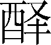

第十七卷

 管蔡世家第五

司马迁在本书《太史公自序》一篇中，介绍了本篇的主要内容和作者意图。他说：“管蔡相武庚，将宁旧商；及旦摄政，二叔不飨；杀鲜放度，周公为盟；太妊十子，周以宗强。嘉仲悔过，作《管蔡世家第五》。”本篇主要叙述周武王之弟管叔、蔡叔事迹及蔡、曹二国的兴灭历程，兼及武王兄弟的概括介绍。

西周立国，实行以血缘关系维系统治的宗法制度，即把王室宗族分封为诸侯国，作为辅弼国王统治的政治力量。但武王死后，成王年幼即位，周公旦摄政，引起了管叔、蔡叔的怀疑与不满。他们利用自己封地内殷族余民的力量叛周，后被武力平息。首先，在本篇里，司马迁既从维护统一的立场出发，批评了管叔、蔡叔的分裂行为，又委婉辩证地指出了二人叛国的真实思想根源：“疑周公之为不利于成王。”司马迁没有像那些极端的卫道者一样，把管蔡之乱完全归咎于管蔡个人品质的顽劣，表现出太史公尊重史实、不虚美不隐恶的实录精神和具有真知灼见的高度史识。

其次，本篇通过对曹、蔡两国几度兴亡的简练叙述，生动地再现出这两个小国在激烈兼并形势下的窘迫处境，以及两国统治阶级内部弑杀无已的尖锐斗争。这就从一个特定的侧面反映了春秋战国时代的剧烈动荡和破国亡家相继的残酷现实。

另外，本篇不拘成法，体圆用神，笔有繁简，表明了司马迁对历史编纂体例的灵活运用。本篇名为“世家”，原应记载流传数世的诸侯。太史公却把伯邑考、成叔武、霍叔处、冉季载、管叔鲜等无后或其后人不明的都连带介绍。一是因为这些人与蔡叔度、曹叔振铎均为武王兄弟；二是这些人又不同于武王的其他两个弟弟周公旦、卫康叔那样传国久远。从有利于记叙史实的角度看，把这些有一定联系（兄弟关系）而又史实不多、影响不大的人物论列在一起，以免失考，体现了太史公在结构设计上的匠心：以介绍十兄弟起，以管蔡之乱承，然后分述蔡曹两国以结。篇中照应十兄弟的下落。全篇脉络清晰、井然有序。

***【原文】***

管叔鲜、蔡叔度者[1]，周文王子而武王弟也。武王同母兄弟十人。母曰太姒[2]，文王正妃也。其长子曰伯邑考，次曰武王发，次曰管叔鲜，次曰周公旦，次曰蔡叔度，次曰曹[3]叔振铎，次曰成[4]叔武，次曰霍[5]叔处，次曰康[6]叔封，次曰冉[7]季载。冉季载最少。同母昆弟[8]十人，唯发、旦贤，左右[9]辅文王，故文王舍伯邑考而以发为太子。及文王崩[10]而发立，是为武王。伯邑考既已前卒[11]矣。

***【译文】***

[1]管、蔡：叔鲜、叔度受封国名。管，都城，在今河南省郑州市。蔡，都城，在今河南省上蔡县西南。鲜（xiān）、度：管叔、蔡叔的名，姓姬。

[2]太姒：姓姒。相传太姒治内，旦夕勤奋，教子有方，是古代贤王后的典范。

[3]曹：叔振铎受封国名，都曹（在今山东省菏泽市定陶区北）。

[4]成：一作“郕（chénɡ）”，叔武受封国名。都城在今山东省宁阳县东北。

[5]霍：叔处受封国名。都城在今山西省霍县西南。

[6]康：叔封初封国名。都城在现在的河南省禹县西北。

[7]冉：或作“酆（rǎn）”。季载受封国名。都城在今河南省平舆县北，一说在今山东省曹县东北。

[8]昆弟：兄弟。昆，兄。

[9]左右：通“佐佑”，辅佐；帮助。

[10]崩：古代讳称皇帝死为“崩”，如山陵崩。

[11]卒：古指卿大夫死，后为死的通称。

***【原文】***

武王已克殷纣，平天下，封功臣昆弟。于是封叔鲜于管，封叔度于蔡：二人相纣子武庚禄父[1]，治殷遗民。封叔旦于鲁而相周，为周公。封叔振铎于曹，封叔武于成，封叔处于霍。康叔封、冉季载皆少，未得封。

***【译文】***

[1]武庚禄父：商纣王的长子，名武庚，字禄父。相（xiànɡ）：辅佐。管、蔡名为相武庚，实是监视武庚。

***【原文】***

武王既崩，成王少，周公旦专王室[1]。管叔、蔡叔疑周公之为不利于成王，乃挟[2]武庚以作乱。周公旦承成王命伐诛武庚，杀管叔，而放[3]蔡叔，迁之，与车十乘，徒七十人从。而分殷余民为二：其一封微子启[4]于宋，以续殷祀；其一封康叔为卫君，是为卫康叔。封季载于冉。冉季、康叔皆有驯[5]行，于是周公举康叔为周司寇[6]，冉季为周司空[7]，以佐成王治，皆有令名[8]于天下。

***【译文】***

[1]专王室：即摄政，代行周王职权。

[2]挟：挟制；要挟。

[3]放：放逐；流放。

[4]微子启：宋国的始祖。

[5]驯：驯服；善良。

[6]司寇：官名。掌管刑律、纠察等事。

[7]司空：官名。主掌工程。

[8]令名：美名。

***【原文】***

蔡叔度既迁而死。其子曰胡，胡乃改行，率[1]德驯善。周公闻之，而举胡以为鲁卿士[2]，鲁国治。于是周公言于成王，复封胡于蔡[3]，以奉蔡叔之祀，是为蔡仲。余五叔[4]皆就国，无为天子吏者。

***【译文】***

[1]率：遵循；依照。

[2]卿士：官名。

[3]蔡：此指新蔡，即今河南省新蔡县。

[4]五叔：实为四叔，即蔡叔、曹叔、成叔、霍叔。

***【原文】***

蔡仲卒，子蔡伯荒[1]立。蔡伯荒卒，子宫侯立。宫侯卒，子厉侯立。厉侯卒，子武侯立。武侯之时，周厉王失国，奔彘[2]，共和行政[3]，诸侯多叛周。

***【译文】***

[1]蔡伯荒：蔡君，原为侯爵，荒独称伯。

[2]彘（zhì）：地名，在今山西省霍县。

[3]共和行政：周厉王奔彘后，由召公、周公共同理政，号共和行政；周厉王死，就归政给周宣王。

***【原文】***

武侯卒，子夷侯立。夷侯十一年，周宣王即位。二十八年，夷侯卒，子釐侯所事[1]立。

***【译文】***

[1]所事：釐侯名。

***【原文】***

釐侯三十九年，周幽王为犬戎所杀，周室卑而东徙[1]。秦始得列为诸侯。

***【译文】***

[1]周卑东徙：周幽王被杀后，太子宜臼被申、鲁、许等国拥立于申，就是周平王。平王时，周室衰微，故都残破，就东迁至洛邑（故城在今洛阳市西），依靠晋、郑等诸侯国辅佐。

***【原文】***

四十八年，釐侯卒，子共[1]侯兴立。共侯二年卒，子戴侯立。戴侯十年卒，子宣侯措父立。

***【译文】***

[1]共：通“恭”。

***【原文】***

宣侯二十八年，鲁隐公初立。三十五年，宣侯卒，子桓侯封人立。桓侯三年，鲁弑[1]其君隐公。二十年，桓侯卒，弟哀侯献舞立。

***【译文】***

[1]弑：封建时代称臣杀君、子杀父母为弑。

***【原文】***

哀侯十一年，初，哀侯娶陈[1]，息[2]侯亦娶陈。息夫人将归，过蔡，蔡侯不敬[3]。息侯怒，请楚文王：“来伐我，我求救于蔡，蔡必来，楚因击之，可以有功。”楚文王从之，虏蔡哀侯以归。哀侯留九岁，死于楚。凡立二十年卒。蔡人立其子肸[4]，是为缪[5]侯。

***【译文】***

[1]陈：国名。妫姓。建都宛丘（故城在今河南省淮阳县）。

[2]息：国名。一作“鄎”。姬姓。其地在现在的河南省息县西南。

[3]不敬：指轻佻的行为。

[4]肸：xī。

[5]缪：通“穆”。

***【原文】***

缪侯以其女弟[1]为齐桓公夫人。十八年，齐桓公与蔡女戏船中，夫人荡舟，桓公止之，不止，公怒，归蔡女而不绝[2]也。蔡侯怒，嫁其弟[3]。齐桓公怒，伐蔡；蔡溃[4]，遂虏缪侯，南至楚邵陵[5]。已而诸侯为蔡谢齐，齐侯归[6]蔡侯。二十九年，缪侯卒，子庄侯甲午立。

***【译文】***

[1]女弟：妹妹。

[2]不绝：没有断绝关系，指没有正式离婚。

[3]弟：指女弟。

[4]溃：溃败。

[5]邵陵：楚地名。在现在的河南省漯河市邵陵区东。《齐太公世家》作“召陵”。

[6]归：使动用法。

***【原文】***

庄侯三年，齐桓公卒。十四年，晋文公败楚于城濮[1]。二十年，楚太子商臣弑其父成王代立。二十五年，秦穆公卒。三十三年，楚庄王即位。三十四年，庄侯卒，子文侯申立。

***【译文】***

[1]城濮：在今山东省鄄城县西南临濮集。

***【原文】***

文侯十四年，楚庄王伐陈，杀夏徵舒[1]。十五年，楚围郑，郑降楚，楚夏[2]之。二十年，文侯卒，子景侯固立。

***【译文】***

[1]夏徵舒：陈国大夫，其母夏姬与陈灵公等通奸，陈灵公侮辱他，他杀死陈灵公，自立为君。

[2]：通“释”，释放。

***【原文】***

景侯元年，楚庄王卒。四十九年，景侯为太子般娶妇于楚，而景侯通[1]焉。太子弑景侯而自立，是为灵侯。

灵侯二年，楚公子围弑其王郏敖[2]而自立，为灵王。九年，陈司徒招[3]弑其君哀公。楚使公子弃疾灭陈而有之。十二年，楚灵王以灵侯弑其父，诱蔡灵侯于申[4]，伏甲饮[5]之，醉而杀之，刑[6]其士卒七十人。令公子弃疾围蔡。十一月，灭蔡，使弃疾为蔡公[7]。

***【译文】***

[1]通：通奸。

[2]楚王郏敖：熊员。

[3]司徒：官名，西周置，掌管国家的土地和人民。招：妫招，陈哀公之弟。

[4]申：楚邑名。故城在今河南省南阳市东北。

[5]饮（yìn）：给他酒喝。

[6]刑：割；杀。动词。

[7]蔡公：废蔡为县，楚国称县令为公。

***【原文】***

楚灭蔡三岁，楚公子弃疾弑其君灵王代立，为平王。平王乃求蔡景侯少子庐，立之，是为平侯。是年，楚亦复立陈。楚平王初立，欲亲诸侯，故复立陈、蔡后。

平侯九年卒，灵侯般之孙东国攻平侯子而自立，是为悼侯。悼侯父曰隐太子友。隐太子友者，灵侯之太子，平侯立而杀隐太子，故平侯卒而隐太子之子东国攻平侯子而代立，是为悼侯。悼侯三年卒，弟昭侯申立。

昭侯十年，朝楚昭王，持美裘二，献其一于昭王而自衣[1]其一。楚相子常[2]欲之，不与。子常谗蔡侯，留之楚三年。蔡侯知之，乃献其裘于子常；子常受之，乃言归蔡侯。蔡侯归而之晋，请与晋伐[3]楚。

***【译文】***

[1]衣（yì）：穿。动词。

[2]子常：即楚令尹囊瓦的别号。

[3]伐：讨伐；攻打。

***【原文】***

十三年春，与卫灵公会邵陵。蔡侯私于周苌弘以求长于卫[1]；卫使史言康叔之功德[2]，乃长卫。夏，为晋灭沈[3]，楚怒，攻蔡。蔡昭侯使其子为质于吴，以共伐楚。冬，与吴王阖闾遂破楚入郢。蔡怨子常，子常恐，奔郑[4]。十四年，吴去而楚昭王复国[5]。十六年，楚令尹为其民泣以谋蔡[6]，蔡昭侯惧。二十六年，孔子如[7]蔡。楚昭王伐蔡，蔡恐，告急于吴。吴为蔡远[8]，约迁以自近，易以相救；昭侯私许，不与大夫计。吴人来救蔡，因迁蔡于州来[9]。二十八年，昭侯将朝于吴，大夫恐其复迁，乃令贼利[10]杀昭侯；已而诛贼利以解过[11]，而立昭侯子朔，是为成侯。

***【译文】***

[1]私：隐秘；暗中活动。动词。苌（chánɡ）弘：人名。求长于卫：蔡国始祖蔡叔度为卫国始祖康叔封之兄，故要求列首位。长，盟会时列首位。

[2]史（qiū）言康叔之功德：史，卫国史官，名。

[3]沈：西周分封的诸侯国，姬姓。地在今河南平舆县北，楚属国。

[4]奔郑：子常率军队抵御吴、蔡兵，大败。

[5]楚昭王复国：吴入郢后，楚昭王逃避随国。申包胥到秦国求援，秦出兵救楚，大败吴师，昭王复归郢。

[6]楚令尹为其民泣以谋蔡：楚令尹子西，因为楚国被吴国打败，死伤人众多而流泪；吴入郢，由蔡所启导，蔡国小近楚，所以图谋伐蔡。

[7]如：前往。

[8]吴为蔡远：这蔡是指蔡国都邑新蔡。

[9]州来：又各下蔡。

[10]贼利：贼徒利。利，人名。

[11]解过：推脱过错。

***【原文】***

成侯四年，宋灭曹。十年，齐田常[1]弑其君简公。十三年，楚灭陈。十九年，成侯卒，子声侯产立。声侯十五年卒，子元侯立。元侯六年卒，子侯齐立。

***【译文】***

[1]田常：齐国大臣。

***【原文】***

侯齐四年，楚惠王灭蔡，蔡侯齐亡，蔡遂绝祀[1]。后陈灭三十三年。

***【译文】***

[1]绝祀：古代以祭祀为国家大事，立国必建宗庙，断绝宗庙祭祀，即亡国的表现。

***【原文】***

伯邑考，其后不知所封。武王发，其后为周，有本纪[1]言。管叔鲜作乱诛死，无后。周公旦，其后为鲁，有世家[2]言。蔡叔度，其后为蔡，有世家[3]言。曹叔振铎，其后为曹，有世家[4]言。成叔武，其后世无所见[5]。霍叔处，其后晋献公时灭霍[6]。康叔封，其后为卫，有世家[7]言。冉季载，其后世无所见。

***【译文】***

[1]本纪：指《周本纪》。

[2]世家：指《鲁周公世家》。

[3]世家：指本篇上文。

[4]世家：指本篇下文。

[5]见：通“现”，表现；显扬。

[6]灭霍：前61年，晋灭霍。

[7]世家：指《卫康叔世家》。

***【原文】***

太史公曰：管蔡作乱，无足载者。然周武王崩，成王少，天下既疑，赖同母之弟成叔、冉季之属十人为辅拂[1]：是以诸侯卒宗[2]周，故附之世家言。

***【译文】***

[1]属：等辈。辅拂（bì）：辅佐。拂，通“弼”。

[2]卒：终于；毕竟。宗：尊崇。

***【原文】***

曹叔振铎者，周武王弟也。武王已克殷纣，封叔振铎于曹。

叔振铎卒，子太伯脾立。太伯卒，子仲君平立。仲君平卒，子宫伯侯立。宫伯侯卒，子孝伯云立。孝伯云卒，子夷伯喜立。

夷伯二十三年，周厉王奔于彘。

三十年卒，弟幽伯彊立。幽伯九年，弟苏杀幽伯代立，是为戴伯。戴伯元年，周宣王已立三岁。三十年，戴伯卒，子惠伯兕[1]立。

惠伯二十五年，周幽王为犬戎所杀，因东徙，益卑，诸侯畔之。秦始列为诸侯。

***【译文】***

[1]兕（sì）：雌的犀牛。此为惠伯名。

***【原文】***

三十六年，惠伯卒，子石甫立，其弟武杀之代立，是为缪公。缪公三年卒，子桓公终生立。

桓公三十五年，鲁隐公立。四十五年，鲁弑其君隐公。四十六年，宋华父督弑其君殇公，及孔父。五十五年，桓公卒，子庄公夕姑立。

庄公二十三年，齐桓公始霸。

三十一年，庄公卒，子釐公夷立。釐公九年卒，子昭公班立。昭公六年，齐桓公败蔡，遂至楚召陵。九年，昭公卒，子共公襄立。

共公十六年，初，晋公子重耳[1]亡过曹，曹君无礼，欲观其骈胁[2]。釐负羁[3]谏，不听，私善[4]于重耳。二十一年，晋文公重耳伐曹，虏共公以归，令军毋入釐负羁之宗族闾[5]。或说晋文公曰：“昔齐桓公会诸侯，复异姓；今君囚曹君，灭同姓，何以[6]令于诸侯？”晋乃复归共公。

***【译文】***

[1]重耳：即晋文公，因受其父献公迫害，曾出奔各国十九年。

[2]骈（pián）胁：肋骨连成一片。

[3]釐负羁：春秋时期曹国大夫。

[4]善：表示好感。

[5]毋：莫；不要。闾：里巷大门。

[6]何以：以何，凭什么。

***【原文】***

二十五年，晋文公卒。三十五年，共公卒，子文公寿立。文公二十三年卒，子宣公彊立。宣公十七年卒，弟成公负刍立。

成公三年，晋厉公伐曹，虏成公以归，已[1]复释之。五年，晋栾书、中行偃[2]使程滑弑其君厉公。二十三年，成公卒，子武公胜立。武公二十六年，楚公子弃疾弑其君灵王代立。二十七年，武公卒，子平公须立。平公四年卒，子悼公午立。是岁，宋、卫、陈、郑皆火[3]。

***【译文】***

[1]已：随即；不久。

[2]栾书、中行（hánɡ）偃：晋国世袭的上卿。

[3]火：发生火灾。

***【原文】***

悼公八年，宋景公立。九年，悼公朝于宋，宋囚之；曹立其弟野，是为声公。悼公死于宋，归葬。

声公五年，平公弟通弑声公代立，是为隐公。隐公四年，声公弟露弑隐公代立，是为靖公。靖公四年卒，子伯阳立。

伯阳三年，国人有梦众君子[1]立于社宫，谋欲亡曹；曹叔振铎止之，请待公孙彊，许之。旦，求之曹，无此人。梦者戒其子曰：“我亡，尔闻公孙彊为政[2]，必去[3]曹，无离商[4]祸。”及伯阳即位，好田弋[5]之事。六年，曹野人公孙彊亦好田弋，获白雁而献之，且言田弋之说，因访[6]政事。伯阳大说[7]之，有宠，使为司城[8]以听政。梦者之子乃亡去。

***【译文】***

[1]君子：有位者；贵族。

[2]为政：施政；行政；掌握政权。

[3]去：离开。

[4]无：通“毋”。莫；不要。商：通“罹（lí）”，遭受。

[5]田弋（yì）：打猎。弋，以带绳的箭射鸟。

[6]访：咨询；商量。

[7]说：通“悦”。

[8]司城：官名，即司空。宋国因避宋武公之名，故改司空为司城。

***【原文】***

公孙彊言霸说[1]于曹伯。十四年，曹伯从之，乃背晋干[2]宋。宋景公伐之，晋人不救。十五年，宋灭曹，执曹伯阳及公孙彊以归而杀之。曹遂绝其祀。

***【译文】***

[1]霸说：称霸的理论。

[2]干：犯；冒犯。

***【原文】***

太史公曰：余寻[1]曹共公之不用釐负羁，乃乘轩者三百人，知唯[2]德之不建。及振铎之梦，岂不欲引[3]曹之祀者哉？如公孙彊不修厥政[4]，叔铎之祀忽诸[5]。

***【译文】***

[1]寻：探求；寻根究底。

[2]唯：以；因为。

[3]引：拉长；延长。

[4]厥：其；他的。政：指霸政。

[5]忽诸：突然绝灭。诸，“之乎”的合音词。

## 【译文】

管叔鲜和蔡叔度都是周文王的儿子、周武王的弟弟。武王一母同胞的兄弟共有十人。他们的母亲名叫太姒，是文王的正妻。她的长子是伯邑考，以下依次是武王发、管叔鲜、周公旦、蔡叔振、曹叔振铎、成叔武、霍叔处、康叔封，最小的是冉季载。十兄弟中只有武王发和周公旦德重才高，是辅助文王的左膀右臂，所以文王不立伯邑考，而立次子发为太子。文王死后，太子发即位，就是武王。这以前，伯邑考已经死了。

武王战胜商朝的纣王、平定天下以后，大封功臣和兄弟。于是把管地分封给叔鲜，把蔡地分封给叔度；并让二人做纣子武庚禄父的相，一起治理殷族遗民。把鲁地分封给叔旦，同时让叔旦做周王朝的相，故称周公。叔振铎封于曹地，叔武封于成地，叔处封于霍地。当时，康叔和冉季载年龄幼小，未受分封。

武王死后，成王年幼继位，周公旦掌握国家大权。管叔和蔡叔怀疑周公的作为不利于成王，于是扶持武庚一起叛乱。周公旦按成王旨意征伐叛军，诛斩武庚，杀死管叔而流放蔡叔，流放时只给了蔡叔十乘车和刑徒七十人为随从。又把殷遗民分为二部分：宋地一部分封给微子启，以接续殷人香火；卫地一部，命康叔做卫国国君，就是卫康叔。又把冉地分封给季载。冉季、康叔品行美善，因此周公举报康叔为周王的司寇，冉季做司空。二人辅佐成王治理国家，美名传于天下。

蔡叔度流放后死去。其子名胡，胡一改其父旧行，尊德向善。周公听说后，举荐他做鲁国的卿士，鲁国大治。周公向成王建议，又把胡封在蔡地，以行蔡叔的岁时祭祀之礼，就是蔡仲，其余五叔各回封国，没有在周朝廷做官的。

蔡仲死，其子蔡伯荒继位。蔡伯荒死，其子宫侯继位。宫侯死，其子厉侯继位。厉侯死，其子武侯继位。武侯时，周厉王丢了王位，逃到彘地，周公、召公共同执政，有许多诸侯背叛周室。

武侯死，其子夷侯继位。夷侯十一年（前827），周宣王即位。二十八年（前810），夷侯死，其子釐侯所事继位。

釐侯三十九年（前771），周幽王被犬戎杀死，周室衰落东迁。秦国开始被列为诸侯。

四十八年（前762），釐侯死，其子共侯兴继位。共侯二年（前760）死，其子戴侯继位。戴侯十年（前750）死，其子宣侯措父继位。

宣侯二十八年（前722），鲁隐公即君位。三十五年（前715），宣侯死，其子桓侯封人继位。桓侯三年（前712），鲁国人杀了鲁隐公。二十年（前695），桓侯死，其弟哀侯献舞继位。

哀侯十一年（前684），先前，哀侯从陈国娶的夫人，这一年，息侯也从陈国娶了夫人，息夫人出嫁路过蔡国，哀侯表现极不尊重。息侯怒，请求楚文王：“你带兵来征伐我国，我向蔡国求救，蔡兵必来援救，楚国借机攻打蔡国，必获胜利。”楚文王照计而行，把蔡哀侯俘获带回楚国。哀侯被扣留在楚九年，死于楚国。共在位二十年，蔡人拥立哀侯之子肸为国君，就是缪侯。

缪侯把妹妹嫁给齐桓公做夫人。十八年（前657），齐桓公和夫人蔡女乘船游玩，夫人使劲晃船，桓公制止她，她还是晃个不停。桓公大怒，把她送回娘家却并不断绝关系。蔡侯也很生气，把其妹嫁了别人。齐桓公一怒之下讨伐蔡国。蔡国大败，缪侯被俘，齐国向南进军至楚国邵陵。后来，诸侯替蔡侯向齐桓公道歉，齐桓公才放蔡侯回国。二十九年（前646），缪侯死，其子庄侯甲午继位。

庄侯三年（前643），齐桓公死。十四年（前632），晋文公在城濮大败楚军。二十年（前626），楚国太子商臣杀其父成王，代立为君。二十五年（前621），秦穆公死。三十三年（前613），楚庄王即位。三十四年（前612），庄侯死，其子文侯继位。

文侯十四年（前598），楚庄王讨伐陈国，杀夏徵舒。十五年（前597），楚围郑国，郑君投降，楚国又释放郑君。二十年（前592），文侯死，其子景侯固继位。

景侯元年（前591），楚庄王死。四十九年（前543），景侯给太子般从楚国娶来媳妇，景侯又与儿媳通奸，太子杀死景侯，自立为君，就是灵侯。

灵侯二年（前541），楚公子围杀国君郏敖自立为楚王，就是灵王。九年（前534），陈国司徒招杀死陈哀公。楚国派公子弃疾占领陈国，陈国灭亡。十二年（前531），楚灵王借口蔡灵侯杀父，诱骗蔡灵侯到申地，预先埋伏甲兵，用酒宴招待灵侯。灵侯醉后被楚人杀死，跟随灵侯的七十名士兵也遭刑受害。楚灵王又命公子弃疾围住蔡国。十一月，楚灭掉蔡国，任命弃疾做蔡公。

楚灭蔡三年后，楚国公子弃疾杀了楚灵王，代其为君，就是平王。平王找到蔡景侯的小儿子庐，立为蔡国国君，就是平侯。这一年，楚国也恢复了陈国。楚平王刚即位，打算亲近诸侯，所以让陈、蔡国君的后人继君位。

平侯九年（前522）死，蔡灵侯的孙子东国打跑平侯之子，自立为国君，就是悼侯。悼侯的父亲是隐太子友。友本是灵侯太子，平侯继位后杀了隐太子友。因此平侯一死，隐太子的儿子东国就攻打平侯的儿子，自立为君。悼侯三年（前519）死，其弟昭侯申继位。

昭侯十年（前509）时去朝见楚昭王，带着两件漂亮皮衣，一件献给昭王，一件自己穿。楚国令尹子常想要蔡昭侯那一件，昭侯不给。子常就向楚昭王说昭侯的坏话，把昭侯扣留在楚国达三年之久。后来，蔡昭侯知其中原因，就把自己那件皮衣献给子常。子常接受皮衣后，才向楚王建议把昭侯放回国。蔡侯回国后赶到晋国，请求晋国帮助蔡国攻楚。

十三年（前506）春，昭侯和卫灵侯都在邵陵盟会。蔡侯私下要求周大夫苌弘把蔡国在盟会上的位次排在卫国前面。卫则派史陈说卫康叔德高功大，于是卫国排位先于蔡国。夏天，蔡国按晋国意愿灭掉沈国，楚王大怒，发兵攻蔡。蔡昭侯派其子去吴国做人质，请吴国发兵共伐楚国。冬天，蔡侯与吴王阖闾攻破楚国，进入楚都城郢。因蔡侯痛恨子常，子常心中害怕，逃到郑国。十四年（前505），吴国撤军，楚昭王光复楚国。十六年（前503），楚国令尹计划攻蔡报仇，在向民众鼓动时泣不成声，蔡昭侯听说后十分恐惧。二十六年（前493），孔子到蔡国。楚昭王讨伐蔡国，蔡侯恐慌，向吴国告急。吴王认为蔡国都城距吴国太远，要求蔡侯将其国都迁得离吴国近一些，以便于出兵相救；蔡昭侯也不与大夫商量，暗中答应了。于是，吴国出兵救蔡，并把蔡国都城迁到州来。二十八年（前491），昭侯要去朝见吴王，蔡国大夫们怕他再次迁都，就指使一个名叫“利”的盗贼杀死昭侯，然后又杀掉利以推诿杀君之罪，于是拥立昭侯之子朔为国君，就是成侯。

成侯四年（前487），宋国灭掉曹国。十年（前481），齐国的田常杀死国君齐简公。十三年（前478），楚国灭掉陈国。十九年（前472），成侯死，其子声侯产继位。声侯十五年（前457）死，其子元侯继位。元侯六年（前451）死，其子侯齐继位。

侯齐四年（前447），楚惠王灭掉蔡国，蔡侯齐出逃，蔡国从此祭祀断绝，国家灭亡，比陈国晚灭亡三十三年。

伯邑考的后人不知分封何处。武王发的后人是周王，有本纪记载。管叔鲜叛乱被杀，没有后代。周公旦的后人是鲁国君主，有世家记载。蔡叔度的后人是蔡国君主，有世家记载。曹叔振铎的后人是曹国君主，有世家记载。成叔武的后人不知下落。霍叔处的后人分封于霍地，后被晋献公灭掉。康叔封的后人是卫国君主，有世家记载。冉季载的后代下落不明。

太史公说：“管叔、蔡叔造反的事情，没有什么值得记载的。但周武王死后，成王年幼，天下的人都怀疑周公，全仗成叔、冉季等同母兄弟十人的辅助，才使天下诸侯共尊周室，所以把他们的事迹附记在世家内。”

曹叔振铎是周武王之弟，武王战胜商纣后，就把曹地分封给叔振铎。

叔振铎死，其子太伯脾继位。太伯死，其子仲君平即位。仲君平死，其子宪伯侯继位。宪伯侯死，其子孝伯云继位。孝伯云死，其子夷伯喜继位。

夷伯二十三年（前842），周厉王逃往彘地。

夷伯三十年（前835）死，其弟幽伯彊继位。幽伯九年（前826），其弟苏杀死幽伯，自立为国君，就是戴伯。戴伯元年（前825），周宣王已即位三年。戴伯三十年（前796）死，其子惠伯兕继位。

惠伯二十五年（前771），周幽王被犬戎杀死，王室东迁，越发衰微，诸侯纷纷背叛王室。秦国在这一年开始被列为诸侯。

惠伯三十六年（前760）死，其子石甫继位，其弟武杀掉石甫代立为君，就是缪公。缪公三年（前757）死，其子桓公终生继位。

桓公三十五年（前722），鲁隐公继位为君。四十五年（前712），鲁人杀死隐公。四十六年（前711），宋国的华父督杀死宋殇公和大夫孔父。五十五年（前702），楚桓公死，其子庄公夕姑继位。

庄公二十三年（前679），齐桓公开始做诸盟主，称霸天下。

三十一年（前671），庄公死，其子釐公夷继位。釐公九年（前662）死，其子昭公班继位。昭公六年（前656），齐桓公战胜蔡国，顺势进军至楚国邵陵。九年（前653），昭公死，其子共公襄继位。

共公十六年（前637），当初，晋公子重耳逃亡时经过曹国，曹共公对待他很不礼貌，甚至想看重耳那长得连在一块儿的肋骨。釐负羁进谏，共公不听，釐负羁只得暗中对重耳表示友好。二十一年（前632），晋文公重耳讨伐曹国，把曹共公掳回晋国，却命令军队不得骚扰釐负羁一族所居之地。有人劝晋文公：“当年齐桓公大会诸侯，连异姓国家都帮助他们重新复国；现在您却囚禁曹君，消灭同姓国家。这样做，以后怎能号令诸侯？”晋文公才又把曹共公释放。

二十五年（前628），晋文公死。三十五年（前618），曹共公死，其子文公寿继位。文公二十三年（前595）死，其子宣公强继位。宣公十七年（前578）死，其弟成公负刍继位。

成公三年（前575），晋厉公攻伐曹国，俘获曹成公带回晋国，第二年又放归。五年（前573），晋国大夫栾书、中行偃指使程滑杀死晋厉公。二十三年（前555），成公死，其子武公胜继位。武公二十六年（前529），楚公子弃疾杀死楚灵王，代立为君。二十七年（前528），武公死，其子平公须继位。平公四年（前524）死，其子悼公午继位。这一年，宋、卫、陈、郑四国都发生了火灾。

悼公八年（前516），宋景公即位。九年（前515），曹悼公去宋国朝会，被宋囚禁；曹国大臣拥立悼公之弟野为君，就是声公。悼公最终死在宋国，后来归葬于曹。

声公五年（前510），曹平公之弟通杀声公自立，就是隐公。隐公四年（前506），曹声公之弟露又杀隐公自立，就是靖公。靖公四年（前502）死，其子伯阳继位。

伯阳三年（前499），曹国都城里有一人做梦，梦见许多君子站在社宫那里商议灭掉曹国；曹叔振铎制止了他们，让他们等待公孙彊，众君子答应了叔振铎的要求。做梦者天亮后找遍了曹国，也没有公孙彊这个人。做梦者就告诫他的儿子：“我死以后，你听说公孙彊执掌政事，一定离开曹国，免遭祸事。”等到伯阳即位后，喜好射猎。六年（前496），曹国有个农夫公孙彊也喜好射猎，猎得白雁献给伯阳，大谈射猎之道，借此商问政事。伯阳高兴之极，非常宠幸公孙彊，命他做司城来处理政务。做梦者之子听说后，逃离了曹国。

公孙彊向曹伯陈说称霸诸侯的主张。十四年（前488），曹伯听从公孙彊的主意，背叛晋国，进犯宋国。宋景公攻曹，晋国不救。十五年（前487），宋灭掉曹，抓曹伯阳和公孙彊回宋杀掉，曹国就灭亡了。

太史公说：“我通过探究曹共公不听信贤人釐负羁却宠幸后宫美女三百人高乘轩车的事，得知共公不树德政。至于曹叔振铎托梦于人，岂不是想延长曹国命运吗？无奈公孙彊却不好好治理国家，曹叔振铎的祭祀香烟终于灭绝了。”

