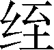
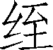

第十九卷

 卫康叔世家第七

本篇记述了卫国从建立到灭亡的整个历史。卫是周初姬姓封国，其封地在今河南北部即殷墟一带。先建都朝歌，后迁楚丘，再迁帝丘。

初封时，周公担心康叔年少，对付不了这一带复杂的形势，乃作《康诰》等谆谆教导之。殷朝遗民以后再无造反之迹，而卫国从西周末年起，中经整个春秋时期，贵族内部争权斗争迭起，父子相残、兄弟相杀屡屡发生，又加上齐、晋等大国的直接干预，卫国变得更加不稳和脆弱。一入战国，先受制于赵，再受制于魏，地位一降再降，最终灭亡于秦。

本篇震撼人心的是宣公杀害太子伋和太子异母弟子寿争死相让之事。宣公为人父、为人君，竟厚颜无耻地夺子之妻据为己有，反倒心恶太子，直至对太子下狠毒手。可见，古代君王全权在握时，就会毫无顾忌地为所欲为以致丧心病狂。太子伋面对亲生父亲的一系列恶行劣迹，毫无违逆之心、抗争之意，竟至自投罗网，束手就擒，成为刀下鬼。由此又可见，封建社会的忠孝意识能置人于愚昧混沌之中。而太子伋异母弟子寿在劝告、阻止太子伋无济于事后，竟以死相让，这种壮烈行为犹如一道闪电，划破充满父子相杀、兄弟相灭的腥风血雨的夜空。

***【原文】***

卫康叔[1]名封，周武王同母少弟也。其次尚有冉季，冉季最少。

***【译文】***

[1]卫康叔：叔封初封于康（在今河南省禹县西北。），故称康叔；后改封于卫，故称卫康叔。卫：始建国于前11世纪。领地在今河北省南部、河南省北部一带。建都朝歌（故城在今河南省淇县），后迁楚丘（故城在今河南省滑县），再迁帝丘（故城在今河南省濮阳县）。前254年为魏所灭。

***【原文】***

武王已克殷纣[1]，复以殷余民封纣子武庚禄父[2]，比诸侯，以奉其先祀勿绝。为武庚未集[3]，恐其有贼心[4]，武王乃令其弟管叔、蔡叔傅相[5]武庚禄父，以和其民。武王既崩，成王少。周公旦代成王治，当国。管叔、蔡叔疑周公，乃与武庚禄父作乱，欲攻成周[6]。周公旦以成王命兴师[7]伐殷，杀武庚禄父、管叔，放[8]蔡叔，以武庚殷余民封康叔为卫君，居河、淇间故商墟[9]。

***【译文】***

[1]克：战胜。殷纣：即商纣王。

[2]武庚禄父：名武庚，字禄父。

[3]集：通“辑”，和顺。

[4]贼心：图谋叛乱之心。

[5]傅相：辅佐。

[6]成周：即雒邑，故城在今河南省洛阳市。武庚叛乱时，雒邑还没有营为东都，但是把它当作“宗周”。

[7]师：军队。

[8]放：放逐。

[9]河、淇：河即黄河。淇指淇水，在河北省北部，古为黄河支流。商墟：商代末期京都朝歌遗址。在今河南省淇县。

***【原文】***

周公旦惧康叔齿少，乃申[1]告康叔曰：“必求殷之贤人君子长者，问其先殷所以兴，所以亡，而务[2]爱民。”告以纣所以亡者以淫于酒，酒之失，妇人是用，故纣之乱自此始。为《梓材》[3]，示君子可法则。故谓之《康诰》《酒诰》《梓材》以命[4]之。康叔之国，即以此命，能和集[5]其民，民大说[6]。

***【译文】***

[1]申：一再。

[2]务：必须。

[3]《梓材》：《尚书》篇名。梓，匠人。

[4]谓：称说。《康诰》《酒诰》：都是《尚书》篇名。命：教诲。

[5]和集：和顺安定。

[6]说：通“悦”。

***【原文】***

成王长，用事，举康叔为周司寇[1]，赐卫宝祭器[2]，以章[3]有德。

***【译文】***

[1]司寇：官名。掌管刑狱、纠察等事。

[2]宝祭器：宝器（指高级车辆、旗帜、乐器、玉饰等）和祭器（祭祀时用的礼器）。

[3]章：表彰。

***【原文】***

康叔卒，子康伯代立。康伯卒，子考伯立。考伯卒，子嗣伯立。嗣伯卒，子[1]伯立。伯卒，子靖伯立。靖伯卒，子贞伯立。贞伯卒，子顷侯立。

***【译文】***

[1]：jié。

***【原文】***

顷侯厚赂[1]周夷王，夷王命卫为侯[2]。顷侯立十二年卒，子釐侯立。

***【译文】***

[1]赂：行贿。

[2]命卫为侯：周制，诸侯分公、侯、伯、子、男五等，侯高于伯。但《史记索隐》认为：卫国从康叔起就是侯爵，不是伯爵。上文从“康伯”到“贞伯”六代称伯，是方伯（一方诸侯之长）而不是伯爵。

***【原文】***

釐侯十三年，周厉王出奔于彘[1]，共和行政[2]焉。二十八年，周宣王[3]立。

***【译文】***

[1]周厉王：姬胡。彘（zhì）：地名。在今山西省霍县东北。

[2]共和行政：周厉王暴虐，前841年，国人暴动，厉王逃到彘，由召公、周公共同行政，史称“共和行政”，凡十四年。

[3]周宣王：姬靖。厉王子。前828—前782年在位，废降籍田制度（一说废除在籍田上的奴隶集体耕作）。

***【原文】***

四十二年，釐侯卒，太子共伯馀立为君。共伯弟和有宠于釐侯，多予之赂[1]；和以其赂赂[2]士，以袭攻共伯于墓上，共伯入釐侯羡[3]自杀。卫人因葬之釐侯旁，谥[4]曰共伯，而立和为卫侯，是为武公。

***【译文】***

[1]赂：财物。

[2]赂赂：第一个“赂”字指所得的财物，第二个“赂”字指行贿。

[3]羡（yán）：墓道。

[4]谥：封建时代在人死后，按其生前行迹，评定褒贬所给予的称号。

***【原文】***

武公即位，修康叔之政，百姓和集。四十二年，犬戎[1]杀周幽王，武公将兵往佐周平戎，甚有功，周平王命武公为公[2]。五十五年，卒，子庄公扬立。

***【译文】***

[1]犬戎：中国古代部族名，戎人的一支。

[2]命武公为公：《史记志疑》认为周朝东迁以后，诸侯在他的国内都称公，从来没有天子命诸侯为公的。

***【原文】***

庄公五年，取齐女为夫人，好而无子。又取陈女为夫人，生子，蚤[1]死。陈女女弟亦幸[2]于庄公，而生子完。完母死，庄公令夫人齐女子[3]之，立为太子。庄公有宠妾，生子州吁。十八年，州吁长，好兵，庄公使将[4]。石碏[5]谏庄公曰：“庶子[6]好兵，使将，乱自此起。”不听。二十三年，庄公卒，太子完立，是为桓公。

***【译文】***

[1]蚤：通“早”。

[2]女弟：妹妹。幸：宠信。

[3]子：养他为子。

[4]将（jiànɡ）：带领军队。

[5]石碏（què）：卫国上卿。

[6]庶子：妾所生的儿子。

***【原文】***

桓公二年，弟州吁骄奢，桓公绌[1]之，州吁出奔。十三年，郑伯弟段攻其兄，不胜，亡，而州吁求与之友。十六年，州吁收聚卫亡人[2]以袭杀桓公，州吁自立为卫君。为郑伯弟段欲伐郑，请宋、陈、蔡与俱，三国皆许州吁。州吁新立，好兵，弑桓公，卫人皆不爱。石碏乃因桓公母家于陈，详[3]为善州吁。至郑郊，石碏与陈侯共谋，使右宰丑[4]进食，因杀州吁于濮[5]，而迎桓公弟晋于邢[6]而立之，是为宣公。

***【译文】***

[1]绌：通“黜”，贬退。

[2]亡人：逃亡在外的人。

[3]详：通“佯”，诈。

[4]右宰丑：卫大夫。

[5]濮：水名。即今安徽省芡河上游。

[6]邢：前11世纪周分封的诸侯国。姬姓。故地在今河北省邢台市一带。

***【原文】***

宣公七年，鲁弑其君隐公。九年，宋督弑其君殇公，及孔父[1]。十年，晋曲沃[2]庄伯弑其君哀侯。

***【译文】***

[1]宋督：宋国华父督。孔父：孔父嘉，宋国大夫。

[2]曲沃：邑名。旧址在今山西省闻喜县东北。东周初，晋昭侯封他的叔父姬成师于此。

***【原文】***

十八年，初，宣公爱夫人夷姜，夷姜生子伋，以为太子，而令右公子傅[1]之。右公子为太子取齐女，未入室，而宣公见所欲为太子妇者好[2]，说而自取之，更为太子取他女。宣公得齐女，生子寿、子朔，令左公子傅之。太子伋母死，宣公正夫人与朔共谗恶[3]太子伋。宣公自以其夺太子妻也，心恶[4]太子，欲废之。及闻其恶[5]，大怒，乃使太子伋于齐而令盗遮[6]界上杀之，与太子白旄[7]，而告界盗见持白旄者杀之。且行，子朔之兄寿，太子异母弟也，知朔之恶太子而君欲杀之，乃谓太子曰：“界盗见太子白旄，即杀太子，太子可毋[8]行！”太子曰：“逆[9]父命求生，不可。”遂行。寿见太子不止，乃盗其白旄而先驰至界。界盗见其验[10]，即杀之。寿已死，而太子伋又至，谓盗曰：“所当杀，乃我也。”盗并杀太子伋，以报宣公。宣公乃以子朔为太子。十九年，宣公卒，太子朔立，是为惠公。

***【译文】***

[1]右公子：左右媵（随嫁或陪嫁的女子）的儿子叫左公子、右公子。傅：教导。

[2]好：美丽。

[3]正夫人：指齐女。谗恶（wù）：说坏话。

[4]恶（wù）：厌恶，憎恶。

[5]恶（è）：坏处。

[6]于：往。遮：拦阻。

[7]白旄：指用白旄（白色牦牛尾）做装饰的使节（古代卿大夫聘于诸侯时所持的符信）。

[8]毋：莫，不要。

[9]逆：违背。

[10]验：证据，凭证。

***【原文】***

左右公子不平朔之立也，惠公四年，左右公子怨惠公之谗杀前太子伋而代立，乃作乱，攻惠公，立太子伋之弟黔牟为君，惠公奔齐。

卫君黔牟立八年，齐襄公率诸侯奉王命[1]共伐卫，纳卫惠公，诛左右公子。卫君黔牟奔于周，惠公复立。惠公立三年出亡，亡八年复入，与前通年凡十三年矣。

***【译文】***

[1]奉王命：《春秋》说诸侯纳惠公是逆王命，《史记》说奉王命，说法有出入。

***【原文】***

二十五年，惠公怨周之容舍[1]黔牟，与燕伐周。周惠王奔温[2]，卫、燕立惠王弟为王。二十九年，郑[3]复纳惠王。三十一年，惠公卒，子懿公赤立。

***【译文】***

[1]容舍：允许居留。

[2]温：西周时国名。地在今河南省温县境。

[3]郑：指郑厉公。

***【原文】***

懿公即位，好鹤，淫乐奢侈。九年，翟[1]伐卫，卫懿公欲发兵，兵或畔[2]。大臣言曰：“君好鹤，鹤可令击翟。”翟于是遂入，杀懿公。

***【译文】***

[1]翟：通“狄”，部族名。

[2]畔：通“叛”。

***【原文】***

懿公之立也，百姓大臣皆不服。自懿公父惠公朔之谗杀太子伋代立至于懿公，常欲败之，卒灭惠公之后而更立黔牟之弟昭伯顽之子申为君，是为戴公。

戴公申元年卒。齐桓公以卫数乱，乃率诸侯伐翟，为卫筑楚丘[1]，立戴公弟燬为卫君，是为文公。文公以乱故奔齐，齐人入[2]之。

初，翟杀懿公也，卫人怜之，思复立宣公前死太子伋之后，伋子又死，而代伋死者子寿又无子。太子伋同母弟二人：其一曰黔牟，黔牟尝代惠公为君，八年复去；其二曰昭伯。昭伯、黔牟皆已前死，故立昭伯子申为戴公。戴公卒，复立其弟燬为文公。

文公初立，轻赋平罪[3]，身自劳，与百姓同苦，以收卫民。

***【译文】***

[1]楚丘：卫都。故城在今河南省滑县东。

[2]入：纳；送进去。

[3]轻赋：减轻赋税。平罪：持平断狱。

***【原文】***

十六年，晋公子重耳[1]过，无礼。十七年，齐桓公卒。二十五年，文公卒，子成公郑立。

***【译文】***

[1]重耳：因受其父晋献公迫害，逃亡在外十九年，后回晋为君，即晋文公。前636—前628年在位。

***【原文】***

成公三年，晋欲假[1]道于卫救宋，成公不许。晋更从南河度[2]，救宋。征师于卫，卫大夫欲许，成公不肯。大夫元咺[3]攻成公，成公出奔[4]。晋文公重耳伐卫，分其地予宋，讨前过无礼及不救宋患也。卫成公遂出奔陈。二岁，如[5]周求入，与晋文公会。晋使人鸩[6]卫成公，成公私[7]于周主鸩，令薄，得不死。已而周为请晋文公，卒入之卫，而诛元咺，卫君瑕出奔。七年，晋文公卒。十二年，成公朝晋襄公[8]。十四年，秦穆公卒。二十六年，齐邴歜弑其君懿公[9]。三十五年，成公卒，子穆公遬 立[10]。

***【译文】***

[1]假：借。

[2]更（ɡēnɡ）：改变。南河：黄河的一段。度：通“渡”。

[3]咺：xuān。

[4]成公出奔：奔往楚国。

[5]如：往；去。

[6]鸩（zhèn）：以毒酒杀人。

[7]私：私下以财物收买。

[8]晋襄公：姬欢。前627—前621年在位。

[9]邴歜：齐国大夫。

[10]遬：sù。

***【原文】***

穆公二年，楚庄王[1]伐陈，杀夏徵舒。三年，楚庄王围郑，郑降，复释之。十一年，孙良夫[2]救鲁伐齐，复得侵地。穆公卒，子定公臧立。定公十二年卒，子献公衎[3]立。

***【译文】***

[1]楚庄王：熊侣。前613—前591年在位。春秋时霸主之一。

[2]孙良夫：卫国大夫。

[3]衎：kàn。

***【原文】***

献公十三年，公令师曹[1]教宫妾鼓琴，妾不善，曹笞之。妾以幸恶[2]曹于公，公亦笞曹三百。十八年，献公戒孙文子、宁惠子[3]食，皆往。日旰[4]不召，而去射鸿于囿[5]。二子从之，公不释[6]射服与之言。二子怒，如宿[7]。孙文子子[8]数侍公饮，使师曹歌《巧言》[9]之卒章。师曹又怒公之尝笞三百，乃歌之，欲以怒孙文子，报[10]卫献公。文子语蘧伯玉[11]，伯玉曰：“臣不知也。”遂攻出献公。献公奔齐，齐置卫献公于聚邑[12]。孙文子、宁惠子共立定公弟秋为卫君，是为殇公。

***【译文】***

[1]师曹：乐人名曹。

[2]恶（wù）：说人家的坏话。

[3]戒：命令，告请。孙文子：孙林父。卫国大夫。宁惠子：宁殖。卫国大夫。

[4]旰（ɡàn）：晏；晚。

[5]囿：王侯养禽畜兽的园林。

[6]释：脱下。

[7]宿：邑名。《左传》作“戚”。在今河南省濮阳县北。

[8]孙文子子：孙蒯。

[9]《巧言》：《诗·小雅》篇名。

[10]报：报复。

[11]语（yù）：告诉。蘧伯玉：卫国贤大夫。

[12]聚邑：齐邑名。今地不详。

***【原文】***

殇公秋立，封孙文子林父于宿。十二年，宁喜[1]与孙林父争宠相恶，殇公使宁喜攻孙林父。林父奔晋，复求入故卫献公。献公在齐，齐景公[2]闻之，与卫献公如晋求入。晋为伐卫，诱与盟。卫殇公会晋平公[3]，平公执殇公与宁喜而复入卫献公。献公亡在外十二年而入。

***【译文】***

[1]宁喜：卫国大夫。

[2]齐景公：姜杵臼。前547—前490年在位。

[3]晋平公：姬彪。前557—前532年在位。

***【原文】***

献公后元年，诛宁喜。

三年，吴延陵季子[1]使过卫，见蘧伯玉、史[2]，曰：“卫多君子，其国无故[3]。”过宿，孙林父为击磬[4]，曰：“不乐，音大悲，使卫乱乃此矣。”是年，献公卒，子襄公恶立。

***【译文】***

[1]吴：国名。姬姓。始祖是周太王的儿子太伯、仲雍。延陵：吴国邑名。在今江苏省常州市。延陵季子：吴公子季札。封于延陵（今江苏省常州市），故称延陵季子。

[2]史（qiū）：卫国贤大夫。，通“鳅”。

[3]故：事故；问题。

[4]磬：乐器。用玉或石制成。

***【原文】***

襄公六年，楚灵王会诸侯，襄公称病不往。

九年，襄公卒。初，襄公有贱妾，幸之，有身，梦有人谓曰：“我康叔也，令若[1]子必有卫，名而[2]子曰‘元’。”妾怪之，问孔成子[3]。成子曰：“康叔者，卫祖也。”及生子，男也，以告襄公。襄公曰：“天所置[4]也。”名之曰“元”。襄公夫人无子，于是乃立元为嗣，是为灵公。

***【译文】***

[1]若：你（们）。

[2]而：你（们）。

[3]孔成子：孔烝。卫国大夫。

[4]置：设立；安排。

***【原文】***

灵公五年，朝晋昭公[1]。六年，楚公子弃疾弑灵王自立，为平王。十一年，火。

***【译文】***

[1]晋昭公：姬夷。前531—前526年在位。

***【原文】***

三十八年，孔子来，禄[1]之如鲁。后有隙，孔子去[2]。后复来。

***【译文】***

[1]禄：俸禄；官吏的薪金。这里作动词用。

[2]事见《孔子世家》。

***【原文】***

三十九年，太子蒯聩与灵公夫人南子有恶[1]，欲杀南子。蒯聩与其徒戏阳遬[2]谋，朝，使杀夫人。戏阳后悔，不果。蒯聩数目[3]之，夫人觉之，惧，呼曰：“太子欲杀我！”灵公怒，太子蒯聩奔宋，已而之晋赵氏。

***【译文】***

[1]南子：宋国女子。恶：嫌怨。

[2]戏阳遬：蒯聩（kuì）的家臣。

[3]数：多次。目：以目示意。

***【原文】***

四十二年春，灵公游于郊，令子郢仆[1]。郢，灵公少子也，字子南。灵公怨太子出奔，谓郢曰：“我将立若为后。”郢对曰：“郢不足以辱[2]社稷，君更[3]图之。”夏，灵公卒，夫人命子郢为太子，曰：“此灵公命也。”郢曰：“亡人太子蒯聩之子辄在也，不敢当。”于是卫乃以辄为君，是为出公。

***【译文】***

[1]仆：驾驭车马。

[2]辱：玷辱；污辱。

[3]更：另。

***【原文】***

六月乙酉，赵简子欲入蒯聩，乃令阳虎诈命卫十余人衰归[1]，简子送蒯聩。卫人闻之，发兵击蒯聩。蒯聩不得入，入宿[2]而保，卫人亦罢兵。

***【译文】***

[1]衰（cuī dié）归：穿着丧服，伪装从卫国来迎接太子回去似的。

[2]宿：邑名。

***【原文】***

出公辄四年，齐田乞弑其君孺子。八年，齐鲍子弑其君悼公。

孔子自陈入卫。九年，孔文子[1]问兵于仲尼，仲尼不对。其后，鲁迎仲尼，仲尼反[2]鲁。

***【译文】***

[1]孔文子：孔圉（yǔ），卫国大夫。

[2]反：通“返”。

***【原文】***

十二年，初，孔圉文子取太子蒯聩之姊，生悝[1]。孔氏之竖[2]浑良夫美好，孔文子卒，良夫通于悝母。太子在宿，悝母使良夫于[3]太子。太子与良夫言曰：“苟能入我国，报子以乘轩[4]，免子三死[5]，毋所与[6]。”与之盟，许以悝母为妻。闰月，良夫与太子入，舍孔氏之外圃。昏，二人蒙衣[7]而乘，宦者罗[8]御，如孔氏。孔氏之老[9]栾宁问之，称姻妾[10]以告。遂入，适伯姬[11]氏。既食，悝母杖戈而先[12]，太子与五人介[13]，舆豭[14]从之。伯姬劫[15]悝于厕，强盟之，遂劫以登台[16]。栾宁将饮酒，炙[17]未熟，闻乱，使告仲由[18]。召护驾乘车[19]，行爵[20]食炙，奉出公辄奔鲁。

***【译文】***

[1]悝：kuī。

[2]竖：童仆。

[3]于：往；到……去。

[4]轩：大夫所乘的车。

[5]三死：三种死罪，即着紫衣（君服）、袒裘（天热偏袒裘为不敬）、带剑。

[6]与（yù）：在其中。

[7]蒙衣：穿着妇人的衣服，用头巾蒙着头。

[8]罗：人名。

[9]老：家臣。

[10]姻妾：亲戚家的小妻。

[11]伯姬：即孔文子之妻，孔悝之母。

[12]杖：执持。先：走在前面。

[13]介：甲；披甲。

[14]舆：扛；抬。豭（jiā）：公猪。舆豭：抬着公猪，将用来盟誓。

[15]劫：威逼。

[16]台：居高临下的建筑物，可凭以发号令。

[17]炙（zhì）：烤肉。

[18]仲由：字子路，孔子弟子。

[19]召（shào）护：卫国大夫。驾乘车：驾着坐人的车，不是兵车，以示不想作战。

[20]爵：酒器。

***【原文】***

仲由将入，遇子羔[1]将出，曰：“门已闭矣。”子路曰：“吾姑至[2]矣。”子羔曰：“不及[3]，莫践其难。”子路曰：“食焉不辟[4]其难。”子羔遂出。子路入，及门，公孙敢[5]阖门，曰：“毋入为也！”子路曰：“是公孙也？求利而逃其难。由不然，利其禄，必救其患。”有使者出，子路乃得入。曰：“太子焉用孔悝？虽杀之，必或继之。”且曰：“太子无勇。若燔台，必舍孔叔。”太子闻之，惧，下石乞、盂黡敌[6]子路，以戈击之，割缨[7]。子路曰：“君子死，冠不免[8]。”结缨而死。孔子闻卫乱，曰：“嗟乎！柴[9]也其来乎？由[10]也其死矣。”孔悝竟立太子蒯聩，是为庄公。

***【译文】***

[1]子羔：高柴字。卫国大夫，孔子弟子。

[2]姑：暂且。至：到门前去。

[3]不及：子羔认为子路要为国事而死难，这时出公已出奔，事情已来不及了。

[4]焉：于此。辟：通“避”。

[5]公孙敢：卫国大夫。

[6]石乞、盂黡（yǎn）：蒯聩的臣子。敌：当。

[7]缨：结冠的带子。

[8]免：脱落。

[9]柴：即高柴。

[10]由：即子路。

***【原文】***

庄公蒯聩者，出公父也，居外，怨大夫莫迎立。元年即位，欲尽诛大臣，曰：“寡人居外久矣，子亦尝闻之乎？”群臣欲作乱，乃止。

二年，鲁孔丘卒。

三年，庄公上城，见戎州[1]，曰：“戎虏何为是？”戎州病之。十月，戎州告赵简子，简子围卫。十一月，庄公出奔，卫人立公子斑师[2]为卫君。齐伐卫，虏斑师，更立公子起[3]为卫君。

***【译文】***

[1]戎州：戎人的城邑。

[2]斑师（般师）：卫襄公之孙。

[3]起：卫灵公子。

***【原文】***

卫君起元年，卫石曼尃[1]逐其君起，起奔齐。卫出公辄自齐复归立。初，出公立十二年亡，亡在外四年复入。出公后元年，赏从亡者。立二十一年卒[2]，出公季父黔攻出公子而自立，是为悼公。

***【译文】***

[1]石曼尃（fū）：卫大夫。《左传》作“石圃”。

[2]立二十一年卒：指前后共立二十一年，前十二年，后九年。

***【原文】***

悼公五年卒，子敬公弗立。敬公十九年卒，子昭公纠立。是时三晋[1]强，卫如小侯，属之[2]。

***【译文】***

[1]三晋：春秋末年，晋国大夫韩、赵、魏三家瓜分晋国，就是战国时的韩、赵、魏三国，历史上称为“三晋”。

[2]之：指赵氏。

***【原文】***

昭公六年，公子亹[1]弑之代立，是为怀公。怀公十一年，公子弑怀公而代立，是为慎公。慎公父，公子適；適父，敬公也。慎公四十二年卒，子声公训立。声公十一年卒，子成侯遬立。

***【译文】***

[1]亹：wěi。

***【原文】***

成侯十一年，公孙鞅[1]入秦。十六年，卫更贬号曰侯。

***【译文】***

[1]公孙鞅：卫国人，一称卫鞅。辅佐秦孝公变法，国以富强。以功封于商（今陕西省丹凤县），号商君，因称商鞅。

***【原文】***

二十九年，成侯卒，子平侯立。平侯八年卒，子嗣君立。

嗣君五年，更贬号曰君，独有濮阳[1]。

***【译文】***

[1]濮阳：卫国都城，在今河南濮阳县西南。卫原是个大国，都朝歌。后被北狄打败，靠齐的帮助，迁都楚丘，成为小国。春秋末年，又迁都帝丘（即濮阳），国土更狭小了。

***【原文】***

四十二年卒，子怀君立。怀君三十一年，朝魏，魏囚杀怀君。魏更立嗣君弟，是为元君。元君为魏婿，故魏立之。元君十四年，秦拔魏东地，秦初置东郡[1]，更徙卫野王县[2]，而并濮阳为东郡。二十五年，元君卒，子君角立。

***【译文】***

[1]东郡：郡名。治所在濮阳。

[2]野王县：其地为今河南省沁阳市。

***【原文】***

君角九年，秦并天下，立为始皇帝。二十一年，二世废君角为庶人，卫绝祀。

太史公曰：余读世家言，至于宣公之太子以妇见诛，弟寿争死以相让，此与晋太子申生不敢明骊姬[1]之过同，俱恶[2]伤父之志。然卒死亡，何其悲也！或父子相杀，兄弟相灭，亦独[3]何哉？

***【译文】***

[1]骊姬：春秋时骊戎的女子。晋献公攻克骊戎，夺之立为夫人，生奚齐。

[2]恶（wù）：厌恶。

[3]亦：语气助词，无义。独：犹“其”，这。

## 【译文】

卫国康叔名封，是周武王的同母弟，他们还有一个名冉季的弟弟，年龄最小。

周武王打败殷纣后，又把殷纣的遗民封给纣王的儿子武庚禄父，让他与诸侯同位，以便使其得以奉祀先祖，世代相传。因武庚还未完全顺从，武王担心武庚有叛逆之心，便派自己的弟弟管叔、蔡叔监视并辅佐武庚禄父，用以安抚百姓。武王逝世后，成王年幼，尚在襁褓之中。周公旦便代替成王主掌国事。管叔、蔡叔怀疑周公旦，就与武庚禄父发动叛乱，要攻打成周。周公旦托成王之命组织军队讨伐殷国，杀死武庚禄父和管叔，放逐了蔡叔，并把武庚殷的遗民封给康叔，立他为卫国君主，居住在黄河、淇水之间，即商朝的旧都殷墟。

周公旦担忧康叔年轻，难以维持统治，于是反复告诫康叔：“你一定找到殷朝有才德、有威望、有经验的人，向他们了解殷朝兴衰成败的历史，并务必关心爱护自己的百姓。”又告诫康叔纣灭亡的原因在于他饮酒无度，一味作乐，沉溺于女色之中，所以纣王时的混乱正从这里开始。周公旦还按照匠人制作木器必用规矩的道理，撰写了《梓材》，作为治国者用以效法的准则。所以称之为《康诰》《酒诰》《梓材》，并以之教导康叔。康叔使用这些准则治理封国，安定敦睦他的人民，人民非常高兴。

成王成人后，亲自主掌政权，任命康叔为周朝的司寇，把许多宝器祭器赐给他，用以表彰康叔的德行。

康叔逝世后，儿子康伯立为国君。康伯逝世后，儿子考伯立为国君。考伯逝世后，儿子嗣伯立为国君。嗣伯逝世后，儿子伯立为国君。伯逝世后，儿子靖伯立为国君。靖伯逝世后，儿子贞伯立为国君。贞伯逝世后，儿子顷侯立为国君。

因顷侯用厚礼贿赂周夷王，夷王便又命卫国君称侯爵。顷侯在立为国君十二年时逝世，儿子釐侯立为国君。

釐侯十三年（前841），周厉王逃亡到彘地，由召公、周公共同掌管政权，号为“共和”行政。釐侯二十八年（前827），周宣王立为天子。

四十二年（前813），釐侯逝世，太子共伯余立为国君。共伯之弟和曾被釐侯宠爱，釐侯给了和很多财物，和便用这些财物收买武士，在釐侯的墓地袭击共伯余，共伯被迫逃到釐侯墓道自杀。卫人把共伯埋葬在釐侯墓旁，称之为共伯，立和为卫国国君，这就是武公。

武公即位后，重新整饬康叔的政务，百姓和乐安定。四十二年（前771），犬戎杀死周幽王，武公亲自指挥部将辅佐周天子平定犬戎的侵袭，建立了战功，周平王命武公称公。五十五年（前758），武公逝世，儿子庄公扬立为国君。

庄公即位第五年（前753），娶齐国女为夫人，齐女貌美但无子。庄公便又娶陈国女为夫人，陈女生了个儿子，夭折了。陈女的妹妹亦被庄公宠幸，生了个儿子取名完。完的母亲去世后，庄公让夫人齐女抚养完，并立完为太子。庄公还有个宠妾，生了个儿子名州吁。庄公十八年（前740），州吁长大成人，喜好军事，庄公便派他做军队的将领。卫国的上卿石碏好心进谏庄公说：“妾生的儿子喜好军事，您便让他做将领，祸乱将从此兴起。”庄公不听，二十三年（前735），庄公逝世，太子完立为国君，这就是桓公。

桓公二年（前733），弟州吁骄奢淫逸，桓公罢黜了他，州吁逃到国外。十三年（前722），郑伯之弟段攻击哥哥，未能取胜，也逃走，州吁请求与他结为友好。十六年（前719），州吁聚集卫国逃亡的人袭击并杀死桓公，州吁自己立为卫国国君。因郑伯之弟段要讨伐郑国，州吁请求宋、陈、蔡共同支持段，三国都答应了这一请求。州吁刚刚即位，因喜好军事、杀死桓公，卫人都厌恶他。石碏因桓公母亲家在陈国，佯装与州吁友善，卫国军队行至郑国国都的郊野，石碏与陈侯共谋计策，派右宰丑向州吁进献食品，借机在濮击杀州吁，而从邢地把桓公弟晋迎回卫国立为国君，这就是宣公。

宣公七年（前712），鲁人杀害了自己的国君隐公。九年（前710），宋督杀死自己的国君殇公和大夫孔父。十年（前709），晋国曲沃庄伯也杀死了自己的国君哀侯。

十八年（前701），当初，宣公所宠爱的夫人夷姜生了儿子取名伋，伋被立为太子。宣公派右公子教导他。右公子为太子娶齐国美女，美女还未与伋拜堂成婚，被宣公所见，宣公见齐国女长得漂亮，很喜欢，就自娶此女，而为太子另娶了其他女子。宣公得到齐女后，齐女生了儿子子寿、子朔，宣公派左公子教导他们。太子伋母亲去世后，宣公正夫人与子朔共同在宣公面前中伤诬陷太子伋。宣公原本就因自己抢夺太子之妻而讨厌太子，早想把他废掉。等到听说太子的坏话后，怒气冲天，就派太子伋出使齐国，并暗中命令大盗在边境线上拦截击杀伋。宣公给太子白旄使节，告诫边境线上的大盗一见手持白旄使节的人就把他杀掉。太子伋将要启程前往齐国，子朔的哥哥子寿，即太子的异母弟，深知子朔憎恨太子与君王欲除掉太子之事，就对太子说：“边界上的大盗只要见到太子你手持白旄使节，就会杀死你，太子千万不要去！”太子说：“违背父辈之命保全自己，这绝对不行。”于是，毫不犹豫地前往齐国。子寿见太子不听劝告，只好偷取他的白旄使节先于太子驾车赶到边界。大盗见事先的约定应验了，就杀死了他。子寿被杀后，太子伋又赶到，对大盗说：“应当杀死的是我呀！”大盗于是又杀死太子伋，回报了宣公。宣公就立子朔为太子。十九年（前709），宣公逝世，太子朔立为国君，这就是惠公。

左右两公子对子朔立为国君愤愤不平。惠公四年（前696），左右公子因怨恨惠公中伤并谋杀太子伋而自立之事，便发起动乱，攻打惠公，立太子伋的弟弟黔牟为国君，惠公逃奔到齐国。

卫君黔牟八年（前689）时，齐襄公受周天子之命率领各诸侯国共同讨伐卫国，送卫惠公回国，诛杀了左右公子。卫君黔牟逃奔到周，惠公又重登君位。惠公在初立国君后三年（前696）逃亡，八年（前688）后又回归卫国，前后通共十三年。

二十五年（前675），惠公对周接纳安置黔牟心怀不满，与燕国共同伐周。周惠王逃奔到温，卫、燕共立惠王弟为王。二十九年（前671），郑国又护送惠王回周。三十一年（前669），卫惠公逝世，儿子懿公赤立为国君。

懿公登位后，喜欢养鹤，挥霍淫乐。九年（前660）时，翟攻伐卫国，卫懿公率军抵御，有些士兵背叛了他。大臣们说：“君王喜好鹤，就派鹤去抗击翟人吧！”于是，翟人侵入卫国，杀死懿公。

懿公立为国君，百姓大臣心都不服。从懿公父亲惠公朔攻讦谋杀太子伋自立为国君到懿公，百姓、大臣常想推翻他们。最后，终于灭了惠公的后代而改立黔牟的弟弟昭伯顽的儿子申为国君，他就是卫戴公。

戴公申于其元年（前660）逝世。齐桓公因卫国多次动乱，便率领诸侯讨伐翟，替卫在楚丘修筑城堡，立戴公弟燬为卫国国君，他就是文公。文公因卫动乱逃奔到齐国，齐人送他回国。

当初，翟人杀死懿公，卫人怜悯他，想再立被宣公谋害的太子伋的后代，但伋的儿子已去世，代替伋死的子寿又无子。太子伋有两个同母弟：一个叫黔牟，黔牟曾代替惠公做了八年国君，后又被惠公赶出卫国，另一个叫昭伯。昭伯、黔牟都早已去世，所以卫人又立了昭伯的儿子申为戴公，戴公逝世后，卫人又立他的弟弟燬为文公。

文公即位伊始，就减轻百姓的赋税，明断犯人的罪行，劳心劳力，和百姓同甘共苦，以此来赢得民心。

十六年（前644），晋公子重耳路过卫国，文公没有礼遇重耳。十七年（前643），齐桓公逝世。二十五年（前635）时，文公逝世，儿子成公郑立为国君。

成公三年（前632）时，晋国为了救宋想向卫借路，成公不答应。晋便改道渡南河救宋。晋国征兵于卫，卫大夫想同意，而成公却拒绝了。大夫元咺攻打成公，成公逃到了楚国。晋文公重耳为了报以前路过卫国而文公无礼和卫不援救宋国之仇，讨伐了卫国，并把卫国一部分土地分送给宋国。卫成公不得不逃亡到陈。两年后，成公到周天子处请求帮助回国，与晋文公相会。晋派人想用毒酒害死成公，成公贿赂了周王室主持毒杀的人，让他少放些毒药，才免于一死。不久，周王替成公请求晋文公，成公终于被送回卫国，杀死了元咺，卫君瑕奔逃。七年（前628）时，晋文公逝世。十二年（前623）时，成公朝见晋襄公。十四年（前621）时，秦穆公逝世。二十六年（前609）时，齐邴歜杀死他的国君懿公。三十五年（前600）时，成公逝世，儿子穆公遬立为国君。

穆公二年（前598）时，楚庄王攻打陈国，杀死夏徵舒。三年（前597）时，楚庄王围攻郑国，郑侯投降。楚庄王又释放了他。十一年（前589），孙良夫为援救鲁国而讨伐齐国，又收复被侵夺的领土。穆公逝世后，儿子定公臧立为国君。定公十二年（前577）逝世，儿子献公衎立为国君。

十三年（前576）时，献公让乐师曹教宫中妾弹琴，妾弹得很差，曹笞打了她，以示惩罚。妾以献公宠爱，就在献公面前说曹的坏话，故意中伤曹，献公也笞打曹三百下。十八年（前571）时，献公告请孙文子、宁惠子进宴，两人如期前往待命。天晚了，献公还未去召请他们，却到园林去射大雁。两人只好跟从献公到了园林，献公未脱射服就与他们谈话，对献公的这种无礼行为，两人非常生气，便到宿邑去了。孙文子的儿子多次陪侍献公饮酒，献公让乐师曹唱《诗·小雅》中《巧言》篇的最后一章。乐师曹本来就痛恨献公以前曾笞打他三百下，于是就演唱了这章诗，想以此激怒孙文子，来报复卫献公。孙文子把这件事告诉了卫大夫蘧伯玉，蘧伯玉说：“我不知道。”于是，孙文子赶走了献公。献公逃亡到了齐国，齐国把他安置在聚邑。孙文子、宁惠子共同立定公弟秋为卫国国君，这就是殇公。

殇公秋即位后，把宿封给孙文子林父。十二年（前547）时，宁喜与孙林父因争宠而互相攻讦，殇公让宁喜攻打孙林父。孙林父逃奔到晋国，又请求晋国护送卫献公回国。当时，献公在齐国。齐景公听到这个消息，和卫献公一起到晋国请求帮助返回卫国。晋国便去讨伐卫国，诱使卫与晋结盟。卫殇公前去会见晋平公，平公逮捕了殇公与宁喜，紧接着就送卫献公回国。献公在外逃亡十二年重又返回故国。

献公后元元年（前546），诛杀宁喜。

三年（前544），吴国延陵季子出使路过卫国，见到蘧伯玉和史说：“卫国君子很多，所以这个国家不会有患难。”他又路过宿地，孙林父为他击磬说：“不高兴，乐音很悲伤，使卫国动乱的就是这里呀！”同年，献公逝世，儿子襄公恶立为国君。

襄公六年（前538），楚灵王会见各诸侯，襄公托辞有病不去赴会。

九年（前535），襄公逝世。当初，襄公有个小妾，很受宠爱，有孕后曾梦见有人对她说：“我是康叔，一定让你的儿子享有卫国，你的儿子应取名‘元’。”妾醒后十分惊讶，询问孔成子。成子说：“康叔是卫国的始祖。”等到妾生下孩子，果真是个男孩，就把此梦告诉襄公。襄公说：“这是上天安排的！”于是，给男孩取名元，恰好襄公夫人未生儿子，便立元为嫡子，这就是灵公。

五年（前530），灵公朝见晋昭公。六年（前529），楚公子弃疾杀死灵王自立为国君，称平王。十一年（前524），卫发生了火灾。

三十八年（前498），孔子来到卫国，卫给他同在鲁国时一样多的俸禄。后来，孔子与卫国国君发生矛盾，便离去了。不久，又周游到卫国。

三十九年（前497），太子蒯聩和灵公夫人南子有仇，想杀掉南子。蒯聩与他的家臣戏阳遬商议，等朝会时，让戏阳遬杀死夫人。事到临头，戏阳后悔，没有动手。蒯聩多次使眼色示意他，被夫人察觉，夫人十分恐惧，大呼道：“太子想杀我！”灵公大怒，太子蒯聩逃奔到宋国，不久又逃到晋国赵氏那里。

四十二年（前494）春天，灵公郊游，让子郢驾车。郢是灵公的小儿子，字子南。灵公怨恨太子逃亡，就对郢说：“我将要立你为太子。”郢回答道：“郢不够格，不能辱没国家，您再想别的办法吧！”夏天，灵公逝世，夫人让子郢为太子，说：“这是灵公的命令！”郢答道：“逃亡太子蒯聩的儿子辄在，我不敢担当此重任。”于是，卫人就立辄为国君，这就是出公。

六月乙酉这一天，赵简子想送蒯聩回国，就让阳虎派十多个人装扮成卫国人，身穿丧服，假装从卫国来晋国迎接太子，简子为蒯聩送行。卫人听到消息，组织军队攻击蒯聩。蒯聩不能回卫，只好跑到宿地自保，卫人也停止了进攻。

出公辄四年（前489），齐田乞杀死自己的国君孺子。八年（前485），齐鲍子杀死自己的国君悼公。

孔子从陈国来到卫国。九年（前484），孔文子向孔仲尼请教军事，仲尼不予回答。之后，鲁侯派人迎接仲尼，仲尼返回鲁国。

十二年（前481）年初，孔圉文子娶了太子蒯聩的姐姐为妻，生了悝。孔文子的仆人浑良夫英俊漂亮，孔文子去世后，浑良夫与悝的母亲私通。太子在宿地，悝母便让浑良夫到太子那里。太子对良夫说：“假使你能协助我回国，我将以赐你大夫所乘的车报答你，还赦免你三种死罪。穿紫衣、袒裘服、带宝剑，都不在死罪之中。”二人订立了盟约，太子还允许悝母做良夫的妻子。闰十二月，良夫和太子回到国都，暂住孔氏的外园。晚上，两个人身着妇人衣服，头蒙围巾，乘车而来，由宦者罗驾车。孔氏的家臣栾宁盘问他们姓名，他们自称是姻戚家的侍妾，于是顺利地进入孔氏家，直抵伯姬住所。饭毕，悝母手持戈先到孔悝住所，太子与五人身穿甲胄，载着公猪随后而行。伯姬把悝逼到墙角里，强迫他订立同盟，并劫持悝登上台，逼他召集群臣。栾宁正要饮酒，烤肉还未熟，就听到一片乱糟糟的响声，派人告诉了仲由。召护驾着乘车，边饮酒边吃烤肉，护奉着出公辄逃奔到鲁国。

仲由闻讯后赶到，将进孔宅，遇刚刚逃出孔家的子羔。子羔说：“门已经关闭。”子路说：“我暂且去看看。”子羔说：“来不及了，你不要跟着悝去受难。”子路说：“享受悝的俸禄，不能看他受难不救。”于是，子羔逃走了。子路要进去，来到门前，公孙敢关紧大门说：“不要再进去了！”子路说：“你是公孙吧！拿着别人的利禄却躲避别人的危难。我不能这样，享受人家的俸禄，一定拯救人家的危难。”这时，有使者出来，子路才趁机进去。子路说：“太子怎么用得着孔悝做帮手？即使杀死他，也一定有人接替他进攻太子。”又说，“太子缺乏勇气，如果放火烧台，必然会释放孔叔。”太子听了，十分害怕，让石乞、盂黡下台阻挡子路，二人用戈击子路，割掉子路的帽缨。子路说：“君子死，帽子不能掉到地上。”说着，系好帽缨死去。孔子听到卫国动乱的消息后说：“唉！柴将会回来的吧？可由，却死去了。”孔悝终于立太子蒯聩为国君，这就是庄公。

庄公蒯聩是出公的父亲，逃亡在外时，怨恨大夫们不迎立他为国君。元年即位后，庄公想把大臣们尽数杀死，说：“我在外久了，你们也曾经听说了吗？”大臣们想作乱，庄公才不得不罢休。

二年（前479），鲁国孔丘去世。

三年（前478），庄公登上城墙，看见戎州，说：“戎虏干吗要建城邑？”戎州人对他的话十分忧虑。十月间，戎州人告诉赵简子，简子包围卫国。十一月，庄公逃奔，卫人立公子斑师做国君。齐国讨伐卫国，俘虏了斑师，改立公子起为国君。

卫君起元年（前477）时，卫石曼尃赶走起，起逃亡到齐国。卫出公辄又从齐返回卫国做国君。当初，出公即位十二年（前481）后逃亡，在外四年才得返回。出公后元元年（前476），赏赐了跟随他逃亡的人们。前后当政二十一年（前456）死去，出公叔父黔赶走出公儿子而自立为国君，这就是悼公。

悼公五年（前451）逝世，儿子敬公弗立为国君。十九年（前432），敬公逝世，儿子昭公纠立为国君。这时，三晋强盛起来，卫君如同小诸侯，附属于赵国。

昭公六年（前426），公子亹杀死昭公自立为国君，这就是怀公。怀公十一年（前415），公子杀死怀公自立为国君，这就是慎公。慎公的父亲是公子適。適的父亲是敬公。四十二年（前373），慎公逝世，儿子声公训立为国君。十一年（前362），声公逝世，儿子成侯遬立为国君。

成侯十一年（前351），公孙鞅进入秦国。十六年（前346），卫被贬称为侯。

二十九年（前333），成侯逝世，儿子平侯立为国君。平侯于八年（前325）逝世，儿子嗣君立为国君。

嗣君于五年（前320）时又被贬称为君，仅有濮阳一地。

四十二年（前283），嗣君逝世，儿子怀君立为国君。三十一年（前252），怀君朝拜魏国，魏囚禁并杀害了怀君。魏改立嗣君弟，这就是元君。元君是魏国的女婿，所以魏国立了他。元君十四年（前239）时，秦攻下魏国东部领土，秦国开始在这一带设置东郡。又把卫君迁徙到野王县，而把濮阳合并到东郡。二十五年（前228）元君去世，儿子君角立为君。

君角九年（前221）时，秦兼并天下，嬴政立为始皇帝。二十一年（前210），秦二世废掉卫君，君角成为普通平民，卫国世系彻底断绝。

太史公说：“我阅读世家的记载，读到卫宣公太子因妻被杀，弟弟子寿与太子互相推让，争着去死，这与晋太子申生不敢声明骊姬的过错相同，都害怕伤害父亲的情面。然而，终于死去了，这是多么悲哀呀！有的父子互相残杀，有的兄弟互相毁灭，这究竟是为什么呢？”

