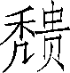
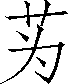

第二十四卷

 郑世家第十二

前806年，周宣王封其弟友于郑（今陕西省华县东），是为郑桓公。周幽王时，身为周王室司徒的郑桓公，看到西周行将灭亡，就在太史伯的建议下，将财产、部族、宗族连同商人迁移到东虢和郐之间（今河南省嵩山以东地区）。两年后，犬戎杀死周幽王，并杀郑桓公。继位的郑武公攻灭郐和东虢，建立郑国，都新郑。郑武公以和郑庄公相继为周平王卿士，且能控制内部卿大夫的势力，在春秋初年的历史上，郑国甚为活跃。但以后由于内乱迭起，国势逐渐衰弱，于前375年为韩国所灭。《郑世家》向人们介绍了这个夹在大国之间的小国的艰难曲折的发展历程。子产对于郑国的生存和发展做出了巨大贡献。

郑国在不长的历史中还产生了具有爱国行为的商人弦高。“秦缪公使三将将兵欲袭郑，至滑，逢郑贾人弦高”，弦高急中生智，拿出自己做生意用的十二头牛慰劳秦军，秦缪公竟误以为郑国早已获得秦军偷袭的消息而作好迎战的充分准备，便急率军回国。弦高的爱国行为使郑国免遭一场灭顶之灾。

***【原文】***

郑桓公友者，周厉王少子而宣王庶弟[1]也。宣王立二十二年，友初封于郑。封三十三岁，百姓皆便爱之。幽王以为司徒。和集[2]周民，周民皆说[3]，河洛之间，人便思之。为司徒一岁，幽王以褒后故，王室治多邪，诸侯或畔[4]之。于是桓公问太史伯曰：“王室多故，予安逃死[5]乎？”太史伯对曰：“独洛之东土，河济之南可居。”公曰：“何以？”对曰：“地近虢、郐，虢、郐之君而好利，百姓不附。今公为司徒，民皆爱公，公诚请居之，虢、郐之君见公方用事[6]，轻分公地。公诚居之，虢、郐之民皆公之民也。”公曰：“吾欲南之江上，何如？”对曰：“昔祝融为高辛氏火正，其功大矣，而其于周未有兴者，楚其后也。周衰，楚必兴。兴，非郑之利也。”公曰：“吾欲居西方，何如？”对曰：“其民贪而好利，难久居。”公曰：“周衰，何国兴者？”对曰：“齐、秦、晋、楚乎？夫齐，姜姓，伯夷之后也。伯夷佐尧典礼[7]。秦，嬴姓，伯翳之后也，伯翳佐舜怀柔[8]百物。及楚之先，皆尝有功于天下。而周武王克纣后，成王封叔虞于唐，其地阻险，以此有德与周衰并，亦必兴矣。”桓公曰：“善。”于是卒[9]言王，东徙民洛东，而虢、郐果献十邑，竟国之[10]。

二岁，犬戎杀幽王于骊山下，并杀桓公。郑人共立其子掘突，是为武公。

***【译文】***

[1]庶弟：《集解》云：“《年表》云母弟。”

[2]和集：通“和辑”，和协安抚。

[3]说：通“悦”。

[4]畔：通“叛”。

[5]逃死：死里逃生。

[6]用事：当权。

[7]典礼：制度和礼仪。

[8]怀柔：旧指统治者用政治手段笼络人心，使之归服。

[9]卒：通“猝”，急速，突然。

[10]据《国语》等载，桓公死幽王之难，其子武公与平王东徙，卒定下邑之地以为国，河南新郑是也。然则桓公始谋，非身得也。武公始国，非桓公也。武灭虢、郐，非王徙之而献邑也。十邑中八邑各为其国，非虢、郐之地，无由献之也。

***【原文】***

武公十年，娶申侯女为夫人，曰武姜。生太子寤生[1]，生之难，及生，夫人弗爱。后生少子叔段，段生易，夫人爱之。二十七年，武公疾。夫人请公，欲立段为太子，公弗听。是岁，武公卒，寤生立，是为庄公。

庄公元年，封弟段于京，号太叔。祭仲曰：“京大于国[2]，非所以封庶也。”庄公曰：“武姜欲之，我弗敢夺也。”段至京，缮[3]治甲兵，与其母武姜谋袭郑。二十二年，段果袭郑，武姜为内应。庄公发兵伐段，段走。伐京，京人畔段，段出走鄢。鄢溃，段出奔共。于是庄公迁其母武姜于城颍，誓言曰：“不至黄泉[4]，毋相见也。”居岁余，已悔思母。颍谷之考叔有献于公，公赐食。考叔曰：“臣有母，请君食赐臣母。”庄公曰：“我甚思母，恶[5]负盟，奈何？”考叔曰：“穿地至黄泉，则相见矣。”于是遂从之，见母。

***【译文】***

[1]寤生：逆生。寤，通“忤”。武姜生太子，脚先出母体，难产，故名之曰寤生。

[2]国：国都。

[3]缮：修补。

[4]黄泉：指人死后伏葬的地穴。下句“穿地至黄泉”的黄泉则是指地下的泉水。

[5]恶：厌恶。

***【原文】***

二十四年，宋缪公卒，公子冯奔郑。郑侵周地，取禾。二十五年，卫州吁弑其君桓公自立，与宋伐郑，以冯故也。二十七年，始朝周桓王。桓王怒其取禾，弗礼也。二十九年，庄公怒周弗礼，与鲁易祊、许田[1]。三十三年，宋杀孔父。三十七年，庄公不朝周，周桓王率陈、蔡、虢、卫伐郑。庄公与祭仲、高渠弥发兵自救，王师大败。祝聸射中王臂。祝聸请从[2]之，郑伯止之，曰：“犯长且难之，况敢陵天子乎？”乃止，夜令祭仲问王疾。

***【译文】***

[1]与鲁易祊（bēnɡ）、许田：《索隐》曰：“许田，近许之田，鲁朝宿之邑。祊者，郑所受助祭太山之汤沐邑。郑以天子不能巡宋，故以祊易许田，各从其近。”详见《鲁周公世家》注。

[2]从：追逐。

***【原文】***

三十八年，北戎[1]伐齐，齐使求救，郑遣太子忽将兵救齐。齐釐[2]公欲妻之，忽谢曰：“我小国，非齐敌[3]也。”时祭仲与俱，劝使取[4]之，曰：“君多内宠，太子无大援将不立，三公子皆君也。”所谓三公子者，太子忽，其弟突，次弟子亹也。

四十三年，郑庄公卒。初，祭仲甚有宠于庄公，庄公使为卿；公使娶[5]邓女，生太子忽，故祭仲立之，是为昭公。

庄公又娶宋雍氏女，生厉公突。雍氏有宠于宋。宋庄公闻祭仲之立忽，乃使人诱召祭仲而执[6]之，曰：“不立突，将死。”亦执以求赂焉。祭仲许宋，与宋盟。以突归，立之。昭公忽闻祭仲以宋要[7]立其弟突，九月丁亥，忽出奔卫。己亥，突至郑，立，是为厉公。

***【译文】***

[1]北戎：部族名，即山戎。

[2]釐：通“僖”。

[3]敌：匹敌。

[4]取：通“娶”。

[5]娶：迎娶。

[6]执：逮捕。

[7]要：要挟。

***【原文】***

厉公四年，祭仲专[1]国政。厉公患之，阴[2]使其婿雍纠欲杀祭仲。纠妻，祭仲女也，知之，谓其母曰：“父与夫孰亲？”母曰：“父一而已，人尽夫也。”女乃告祭仲，祭仲反杀雍纠，戮之于市。厉公无奈祭仲何，怒纠曰：“谋及妇人，死固宜哉！”夏，厉公出居边邑栎。祭仲迎昭公忽，六月乙亥，复入郑，即位。

秋，郑厉公突因栎人杀其大夫单伯，遂居之。诸侯闻厉公出奔，伐郑，弗克而去。宋颇予厉公兵，自守于栎，郑以故亦不伐栎。

***【译文】***

[1]专：专擅。

[2]阴：暗中。

***【原文】***

昭公二年，自昭公为太子时，父庄公欲以高渠弥为卿，太子忽恶之，庄公弗听，卒用渠弥为卿。及昭公即位，惧其杀己，冬十月辛卯，渠弥与昭公出猎，射杀昭公于野。祭仲与渠弥不敢入厉公，乃更立昭公弟子亹为君，是为子亹也，无谥[1]号。

子亹元年七月，齐襄公会诸侯于首止，郑子亹往会，高渠弥相[2]，从，祭仲称疾不行。所以然者，子亹自齐襄公为公子之时，尝会斗，相仇，乃会诸侯，祭仲请子亹无行。子亹曰：“齐强，而厉公居栎，即不往，是率诸侯伐我，内[3]厉公。我不如往，往何遽[4]必辱，且又何至是！”卒行。于是祭仲恐齐并杀之，故称疾。子亹至，不谢齐侯，齐侯怒，遂伏甲而杀子亹。高渠弥亡归，归与祭仲谋，召子亹弟公子婴于陈而立之，是为郑子。是岁，齐襄公使彭生醉拉杀鲁桓公。

***【译文】***

[1]谥：古代帝王及官僚死后，按生前的事迹，由统治阶级所给予的表示褒贬的称号。

[2]相：辅佐。

[3]内：通“纳”。

[4]遽：通“讵”，岂；不。

***【原文】***

郑子八年，齐人管至父等乱，弑其君襄公。二十年，宋人长万弑其君湣公。郑祭仲死。

十四年，故郑亡厉公突在栎者使人诱劫郑大夫甫瑕，要以求入。瑕曰：“舍我，我为君杀郑子而入君。”厉公与盟，乃舍之。六月甲子，假杀郑子及其二子而迎厉公突，突自栎复入即位。初，内蛇与外蛇斗于郑南门中，内蛇死。居六年，厉公果复入。入而让其伯父原曰：“我亡国外居，伯父无意入我，亦甚矣。”原曰：“事君无二心，人臣之职[1]也。原知罪矣。”遂自杀。厉公于是谓甫瑕曰：“子之事君有二心矣。”遂诛之。瑕曰：“重德[2]不报，诚然哉？”

***【译文】***

[1]职：本分，职分。

[2]重德：大德，厚德。

***【原文】***

厉公突后元年，齐桓公始霸。

五年，燕、卫与周惠王弟伐王[1]，王出奔温，立弟为王。六年，惠王告急郑，厉公发兵击周王子，弗胜，于是与周惠王归，王居于栎。七年春，郑厉公与虢叔袭杀王子而入惠王于周。

秋，厉公卒，子文公踕立。厉公初立四岁，亡居栎，居栎十七岁，复入，立七岁，与亡凡二十八年。

***【译文】***

[1]据《左传·庄公十九年》载：初，王姚得宠于庄王，生子。子有宠，国当他的老师。惠王即位后，夺取了国的圃作为自己的圃，夺了近于王宫的边伯的房产，又夺了子禽祝跪与詹父的田地，还没收了膳夫石速的俸禄。所以国、边伯、石速、詹父、子禽祝跪借着苏氏反对王室而作乱。秋天，五大夫奉子之命讨伐惠王，未取胜，逃到温。苏子又奉子之命逃到卫国。卫师、燕师共同讨伐周朝。冬，立子。

***【原文】***

文公十七年，齐桓公以兵破蔡，遂伐楚，至召陵。

二十四年，文公之贱妾曰燕姞，梦天与之兰，曰：“余为伯鯈。余，尔祖也。以是为而[1]子，兰有国香[2]。”以梦告文公，文公幸[3]之，而予之草兰为符[4]。遂生子，名曰兰。

三十六年，晋公子重耳过，文公弗礼。文公弟叔詹曰：“重耳贤，且又同姓，穷而过君，不可无礼。”文公曰：“诸侯亡公子过者多矣，安能尽礼之！”詹曰：“君如弗礼，遂杀之；弗杀，使即反[5]国，为郑忧矣。”文公弗听。

三十七年春，晋公子重耳反国，立，是为文公。秋，郑入滑，滑听命，已而反与[6]卫，于是郑伐滑。周襄王使伯犕请滑。郑文公怨惠王之亡在栎，而文公父厉公入之，而惠王不赐厉公爵禄，又怨襄王之与卫滑，故不听襄王请而囚伯犕。王怒，与翟人伐郑，弗克。冬，翟攻伐襄王，襄王出奔郑，郑文公居王于氾。三十八年，晋文公入襄王成周。

***【译文】***

[1]而：通“尔”，你。

[2]国香：极为浓烈的香气。后称兰花为国香。

[3]幸：宠爱。

[4]符：凭证。

[5]反：通“返”。

[6]与：亲附。

***【原文】***

四十一年，助楚击晋。自晋文公之过无，故背晋助楚。四十三年，晋文公与秦穆公共围郑，讨其助楚攻晋者，及文公过时之无礼也。初，郑文公有三夫人，宠子五人，皆以罪蚤死[1]。公怒，溉[2]逐群公子。子兰奔晋，从晋文公围郑。时兰事晋文公甚谨，爱幸之，乃私于晋，以求入郑为太子。晋于是欲得叔詹为僇[3]。郑文公恐，不敢谓叔詹言。詹闻，言于郑君曰：“臣谓君，君不听臣，晋卒为患。然晋所以围郑，以詹，詹死而赦郑国，詹之愿也。”乃自杀[4]。郑人以詹尸与晋。晋文公曰：“必欲一见郑君，辱之而去。”郑人患之，乃使人私于秦曰：“破郑益晋，非秦之利也。”秦兵罢。晋文公欲入兰为太子，以告郑。郑大夫石癸曰：“吾闻姞姓乃后稷之元妃[5]，其后当有兴者。子兰母，其后也。且夫人子尽已死，余庶子无如兰贤。今围急，晋以为请，利孰大焉！”遂许晋，与盟，而卒立子兰为太子，晋兵乃罢去。

四十五年，文公卒，子兰立，是为缪公。

***【译文】***

[1]据《左传·宣公三年》载，五子中二人以罪见杀，一人早卒，一人为楚酖死，其一子瑕见存，文公恶之，则非五人俱有宠也，亦非皆以罪早死也。蚤：通“早”。

[2]溉：《集解》曰：“溉，一作‘瑕’。”由此可见，瑕即子瑕，“溉”当属上。

[3]僇：通“戮”，杀。

[4]自杀：据《晋世家》载：叔詹未尝自杀。

[5]元妃：君主或诸侯的“原配”。

***【原文】***

缪公元年春，秦缪公使三将将兵欲袭郑，至滑，逢郑贾人弦高诈以十二牛劳军；故秦兵不至而还，晋败之于崤。初，往年郑文公之卒也，郑司城缯贺以郑情卖之，秦兵故来。三年，郑发兵从晋伐秦，败秦兵于汪[1]。

往年楚太子商臣弑其父成王代立。二十一年，与宋华元伐郑。华元杀羊食士[2]，不与其御羊斟，怒以驰郑，郑囚华元。宋赎华元，元亦亡去。晋使赵穿[3]以兵伐郑。

二十二年，郑缪公卒，子夷立，是为灵公。

***【译文】***

[1]败秦兵于汪：据梁玉绳《史记志疑》载，晋败秦彭衙，取秦汪邑，两事也，此误合为一。

[2]食（sì）士：犒劳士兵。

[3]赵穿：当作赵盾。

***【原文】***

灵公元年春；楚献鼋[1]于灵公。子家、子公将朝灵公，子公之食指动，谓子家曰：“佗[2]日指动，必食异物。”及入见灵公，进鼋羹，子公笑曰：“果然！”灵公问其笑故，具[3]告灵公。灵公召之，独弗予羹。子公怒，染其指，尝之而出。公怒，欲杀子公。子公与子家谋先。夏，弑灵公。郑人欲立灵公弟去疾，去疾让曰：“必以贤，则去疾不肖；必以顺，则公子坚长。”坚者，灵公庶弟，去疾之兄也。于是乃立子坚，是为襄公。

***【译文】***

[1]鼋：俗名脚鱼，又名团鱼。

[2]佗（tuó）：通“他”。

[3]具：通“俱”，都，完全。

***【原文】***

襄公立，将尽去缪氏。缪氏者，杀灵公子公之族家也。去疾曰：“必去缪氏，我将去之。”乃止。皆以为大夫。

郑襄公元年，楚怒郑受宋赂纵[1]华元，伐郑。郑背楚，与晋亲。五年，楚复伐郑，晋来救之。六年，子家卒，国人复逐族，以其弑灵公也。

七年，郑与晋盟鄢陵。八年，楚庄王以郑与晋盟，来伐，围郑三月，郑以城降楚。楚王入自皇门[2]，郑襄公肉袒掔[3]羊以迎，曰：“孤不能事边邑，使君王怀怒以及弊邑，孤之罪也。敢不惟命是听。君王迁之江南，及以赐诸侯，亦惟命是听。若君王不忘厉、宣王、桓、武公，哀不忍绝其社稷，锡[4]不毛之地，使复得改事君王，孤之愿也，然非所敢望也。敢布[5]腹心，惟命是听。”庄王为却三十里而后舍。楚群臣曰：“自郢至此，士大夫亦久劳矣。今得国舍之，何如？”庄王曰：“所为伐，伐不服也。今已服，尚何求乎？”卒去。晋闻楚之伐郑，发兵救郑。其来持两端[6]，故迟，比至河，楚兵已去。晋将率[7]或欲渡，或欲还，卒渡河。庄王闻，还击晋。郑反助楚，大破晋军于河上。十年，晋来伐郑，以其反晋而亲楚也。

***【译文】***

[1]纵：释放。

[2]皇门：郑国城门。

[3]掔：通“牵”。

[4]锡：赐。

[5]布：陈述。

[6]持两端：犹豫不决。

[7]率：通“帅”。

***【原文】***

十一年，楚庄王伐宋，宋告急于晋。晋景公欲发兵救宋，伯宗谏晋君曰：“天方开[1]楚，未可伐也。”乃求壮士得霍人解扬，字子虎，诓[2]楚，令宋毋降。过郑，郑与楚亲，乃执解扬而献楚。楚王厚赐与约，使反其言，令宋趣[3]降，三要乃许。于是登解扬楼车[4]，令呼宋。遂负楚约而致[5]其晋君命曰：“晋方悉国兵以救宋，宋虽急，慎毋降楚。晋兵今至矣！”楚庄王大怒，将杀之。解扬曰：“君能制命[6]为义，臣能承命[7]为信。受吾君命以出，有死无陨[8]。”庄王曰：“若之许我，已而背之，其信安在？”解扬曰：“所以许王，欲以成吾君命也。”将死，顾谓楚军曰：“为人臣无忘尽忠得死者！”楚王诸弟皆谏王赦之，于是赦解扬使归。晋爵之为上卿。

十八年，襄公卒，子悼公立。

悼公元年，公恶郑于楚，悼公使弟睔于楚自讼。讼不直[9]，楚囚睔。于是郑悼公来与晋平，遂亲。睔私于楚子反，子反言归睔于郑。

二年，楚伐郑，晋兵来救。是岁，悼公卒，立其弟睔，是为成公。

***【译文】***

[1]开：开拓，扩大。

[2]诓：骗。

[3]趣（cù）：赶快。

[4]楼车：古代兵车之一种，即设有望楼用以瞭望敌人的战车。又称“巢车”，状高如鸟巢，用以瞭望敌人。

[5]致：传达，表达。

[6]制命：制定与发布命令。

[7]承命：接受并贯彻命令。

[8]陨：坠落。

[9]直：伸。

***【原文】***

成公三年；楚共王曰“郑成公孤有德焉”，使人来与盟。成公私与盟。秋，成公朝晋，晋曰“郑私平于楚”，执之。使栾书伐郑。四年春，郑患晋围，公子如乃立成公庶兄为君。其四月，晋闻郑立君，乃归成公。郑人闻成公归，亦杀君，迎成公。晋兵去。

十年，背晋盟，盟于楚。晋厉公怒，发兵伐郑。楚共王救郑。晋楚战鄢陵，楚兵败，晋射伤楚共王目，俱罢而去。十三年，晋悼公伐郑，兵于洧上。郑城守，晋亦去。

十四年，成公卒，子恽立。是为釐公。

釐公五年，郑相子驷朝釐公，釐公不礼。子驷怒，使厨人药杀釐公[1]，赴[2]诸侯曰“釐公暴病卒”。立釐公子嘉，嘉时年五岁，是为简公。

简公元年，诸公子谋欲诛相子驷，子驷觉之，反尽诛诸公子。二年，晋伐郑，郑与盟，晋去。冬，又与楚盟。子驷畏诛，故两亲晋、楚。三年，相子驷欲立为君，公子子孔使尉止杀相子驷而伐之。子孔又欲自立。子产曰：“子驷为不可，诛之，今又效之，是乱无时息也。”于是子孔从之而相郑简公。

四年，晋怒郑与楚盟，伐郑，郑与盟。楚共王救郑。败晋兵。简公欲与晋平，楚又囚郑使者。

十二年，简公怒相子孔专国权，诛之，而以子产为卿。十九年，简公如晋请卫君还，而封子产以六邑。子产让，受其三邑。二十二年，吴使延陵季子于郑，见子产如旧交，谓子产曰：“郑之执政者侈[3]，难将至，政将及子。子为政，必以礼；不然，郑将败。”子产厚遇[4]季子。二十三年，诸公子争宠相杀，又欲杀子产。公子或谏曰：“子产仁人，郑所以存者子产也，勿杀！”乃止。

***【译文】***

[1]使厨人药杀釐公：《年表》云：“子驷使贼夜杀釐公。”

[2]赴：报丧。

[3]侈：邪行。

[4]厚遇：厚待。

***【原文】***

二十五年，郑使子产于晋，问平公疾。平公曰：“卜而曰实沈、台骀为祟，史官莫知，敢问？”对曰：“高辛氏有二子，长曰阏伯，季曰实沈，居旷林，不相能[1]也，日操干戈以相征伐。后帝弗臧[2]，迁阏伯于商丘，主辰[3]，商人是因[4]，故辰为商星。迁实沈于大夏，主参[5]，唐人是因，服事[6]夏、商，其季世[7]曰唐叔虞。当武王邑姜方娠大叔，梦帝谓己：‘余命而子曰虞，乃与之唐，属之参而蕃[8]育其子孙。’及生有文在其掌曰‘虞’，遂以命之。及成王灭唐而国[9]大叔焉。故参为晋星。由是观之，则实沈，参神也。昔金天氏有裔子曰昧，为玄冥师[10]，生允格、台骀。台骀能业[11]其官，宣[12]汾、洮，障[13]大泽，以处太原。帝用嘉之，国之汾川。沈、姒、蓐、黄实守其祀。今晋主汾川而灭之。由是观之，则台骀，汾、洮神也。然是二者不害君身。山川之神，则水旱之灾禜[14]之；日月星辰之神，则雪霜雨不时禜之；若君疾，饮食哀乐女色所生也。”平公及叔向曰：“善，博物君子也！”厚为之礼于子产。

***【译文】***

[1]能：亲善。

[2]臧：善。

[3]主：主持祭祀；辰：指心宿，二十八宿之一。

[4]因：沿袭。

[5]参：参宿，二十八宿之一。

[6]服事：诸侯定期进贡，各依服数以事天下。

[7]季世：末世。

[8]属：通“嘱”，托付。蕃：繁殖。

[9]国：古代侯王的封地，此为动词。

[10]师：长也。

[11]业：继承。

[12]宣：发泄，疏通。

[13]障：修筑堤防。

[14]禜：古代禳灾之祭。

***【原文】***

二十七年夏，郑简公朝晋。冬，畏楚灵王之强，又朝楚，子产从。二十八年，郑君病，使子产会诸侯[1]，与楚灵王盟于申，诛齐庄封。

三十六年，简公卒，子定公宁立。秋，定公朝晋昭公。

定公元年，楚公子弃疾弑其君灵王而自立，为平王。欲行德诸侯，归灵王所侵郑地于郑。

四年，晋昭公卒，其六卿强，公室卑。子产谓韩宣子曰：“为政必以德，毋忘所以立。”

六年，郑火，公欲禳[2]之。子产曰：“不如修德。”

八年，楚太子建来奔。十年，太子建与晋谋袭郑。郑杀建，建子胜奔吴。

十一年，定公如晋。晋与郑谋，诛周乱臣，入敬王于周。

十三年，定公卒，子献公虿立。献公十三年卒，子声公胜立。当是时，晋六卿强，侵夺郑，郑遂弱。

***【译文】***

[1]据《春秋·昭公四年》载，郑伯会于申，无病使子产事。

[2]禳：祭祷消灾。

***【原文】***

声公五年，郑相子产卒，郑人皆哭泣，悲之如亡亲戚。子产者，郑成公少子也。为人爱人，事君忠厚。孔子尝过郑，与子产如兄弟云。及闻子产死，孔子为泣曰：“古之遗爱也！”

八年，晋范、中行氏反晋，告急于郑，郑救之。晋伐郑，败郑军于铁。

十四年，宋景公灭曹。二十年，齐田常弑其君简公，而常相于齐。二十二年，楚惠王灭陈。孔子卒。

三十六年，晋知伯伐郑，取九邑。

三十七年，声公卒，子哀公立。哀公八年，郑人弑公而立声公弟丑，是为共公。共公三年，三晋灭知伯。三十一年，共公卒，子幽公已立。幽公元年，韩武子伐郑，杀幽公。郑人立幽公弟骀，是为公。

公十五年，韩景侯伐郑，取雍丘。郑城京。

十六年，郑伐韩，败韩兵于负黍。二十年，韩、赵、魏列为诸侯。二十三年，郑围韩之阳翟。

二十五年，郑君杀其相子阳。二十七年，子阳之党共弑公骀而立幽公弟乙为君，是为郑君。

郑君乙立二年，郑负黍反，复归韩。十一年，韩伐郑，取阳城。

二十一年，韩哀侯灭郑，并其国。

太史公曰：语有之，“以权利合[1]者，权利尽而交疏”，甫瑕是也。甫瑕虽以劫杀郑子内厉公，厉公终背而杀之，此与晋之里克何异？守节如荀息，身死而不能存奚齐。变所从来，亦多故矣！

***【译文】***

[1]合：融洽。

## 【译文】

郑桓公友是周厉王的小儿子，周宣王的弟弟。宣王即位二十二年，友才被封到郑地。封了三十三年，百姓都喜爱他。幽王任命他为司徒。他使周朝百姓和睦相处，百姓都十分高兴，黄河、洛水流域的人们都思念他。在他做司徒一年的时候，因为幽王宠爱褒姒，朝迁政事废弃不顾，问题积重难返，有些诸侯背叛了幽王。于是，桓公询问太史伯说：“王室灾难深重，我怎么才能死里逃生呢？”太史伯回答说：“只有洛水东、黄河南可以安居。”桓公问：“为什么？”太史伯回答说：“那一带邻近虢国、郐国，虢国、郐国的国君既贪婪又喜好占小便宜，百姓不顺从他们。现在，您是司徒，百姓都热爱您，您如真的请求住在那一带，虢国、郐国国君看到您正当权，会很容易地分给您土地。您如真的住在那一带，虢国、郐国的百姓都是您的百姓了。”桓公：“我想到南边的长江流域住，怎么样？”太史伯回答说：“过去祝融替高辛氏掌管火，功劳甚大，但他的后代在周朝也没有兴盛起来，楚国就是他的后代。周王室衰弱，楚国一定兴盛。楚国如果兴盛，对郑国绝对没有好处。”桓公说；“我想住在西方，怎么样？”太史伯回答说：“那里的百姓既贪婪又好利，难以久居。”桓公说：“周王室衰弱，哪国将兴盛呢？”太史伯回答说：“齐、秦、晋、楚吧？齐国，姓姜，是伯夷的后代，伯夷曾辅助尧掌管礼仪制度。秦国，姓嬴，是伯翳的后代，伯翳曾辅助舜使很多部落顺服。至于楚国祖先，也都曾为天下人建立了功业。周武王战胜纣王后，成王把唐封给叔虞，那里山川险阻，凭这些有德的后代与衰弱的周室并存，晋国也一定能兴盛了。”桓公说：“好吧。”于是，急速向幽王请示，把他的百姓迁移到洛水东部，虢、郐国国君果然向他贡献出十座城邑，他终于建立了郑国。

第二年（前771），犬戎在骊山下杀死了幽王，也杀死了桓公。郑人拥立桓公的儿子掘突，这是武公。

武公于十年（前761），娶了申侯的女儿做夫人，叫武姜。武姜生下太子寤生，生时是难产，等到生下后，夫人不喜欢寤生。后来，武姜又生下小儿子叔段，生段时是顺产，夫人十分喜爱叔段。二十七年（前744），武公生病了，夫人向武公请求，想立段为太子，武公未答应。当年，武公逝世了，寤生即位，这是庄公。

庄公于元年（前743），把他的弟弟叔段封到京城，号称太叔。祭仲说：“京城大于国都，不可以封给弟弟。”庄公说：“武姜想这样，我不敢反对。”叔段到了京，整顿军备，与他的母亲武姜阴谋袭击郑都。二十二年（前722），叔段果然袭击了郑都，武姜做内应。庄公派军攻打叔段，段逃跑庄公又攻打京城，京城的人们都背叛了叔段，叔段无奈逃跑到鄢。鄢邑的百姓溃逃了。叔段不得已逃亡到共国。于是，庄公把他的母亲武姜迁徙到城颍，发誓说：“不到黄泉，不与她见面。”过了一年多，庄公又后悔自己说过的话，很想念母亲。颍谷的考叔向庄公献礼，庄公赐给他食物。考叔说：“我有老母，请您把食物赐给我的母亲吧。”庄公说：“我很思念我的母亲，但又厌恶违背誓言，怎么办呢？”考叔说：“挖条地道到有泉水处，你们母子就可见面了。”于是，庄公依照他的办法，终于见到母亲。

二十四年（前720），宋缪公逝世，公子冯逃到郑国。郑国侵夺周室田地，攫取了田里的庄稼。二十五年（前719），卫国州吁杀死了自己的国君桓公即位，与宋国联合讨伐郑国，因为郑国接纳了公子冯的缘故。二十七年（前717），郑君才朝拜周桓王，桓王对郑攫取庄稼一事很生气，没有按礼仪对待他。二十九年（前715），庄公生气周桓王没有礼遇自己，故意用祊与鲁国交换了靠近许国的鲁国的田地。三十三年（前711），宋国杀死了孔父。三十七年（前707），庄公不朝拜周桓王，桓王率领陈、蔡、虢、卫国讨伐郑国。庄公和祭仲、高渠弥出兵迎击，大败桓王的军队，祝聸射中了桓王的手臂。祝聸请求继续追击桓王，郑庄公阻止他说：“侵犯长者尚且要遭到责难，何况欺辱天子呢？”于是，祝聸才停止追击。庄公深夜派祭仲询问桓王的箭伤。

三十八年（前706），北戎讨伐齐国，齐国派使者向郑国求援，郑国派太子忽领军救援齐国。齐釐公想把女儿嫁给太子忽。忽辞谢说：“我国是个小国，不宜和齐大国相匹配。”当时，祭仲与太子在一起，规劝太子答应娶亲，说：“我们郑国国君有很多宠爱的姬妾，太子得不到大国的援助将不能即位，三位公子都可以成为国君。”祭仲所说的三位公子，有太子忽及他的弟弟突、小弟弟子亹。

四十三年（前701），郑庄公逝世。当初，祭仲很受庄公宠信，庄公让他做上卿，庄公让祭仲为自己迎娶了邓国美女，生下了太子忽，所以祭仲立忽为君，这就是昭公。

庄公又曾娶宋国的雍氏女子，生下厉公突。雍氏女子很受国君宠爱。宋庄公听说祭仲拥立忽，就派人把祭仲骗来逮捕了他，威胁他说：“不立突为君，将处死你。”宋国君也逮捕了突求取贿赂。祭仲答应了宋国，并与宋国君盟誓。他准备带着突回国，拥立突为国君。昭公忽听说祭仲因宋国的要挟拥立自己的弟弟突为国君，九月丁亥日，忽逃到了卫国。己亥日，突来到郑都即位，这是厉公。

厉公四年（前697），祭仲专权。厉公担心此事，暗中让祭仲的女婿雍纠杀死祭仲。雍纠的妻子是祭仲的女儿，她知道此事后，问母亲：“父亲与丈夫哪一位更亲？”母亲说：“父亲只有一个，丈夫却是可以有很多选择的！”祭仲女就把此事告诉了祭仲，祭仲反而杀死了雍纠，并暴尸于闹市。厉公对祭仲无可奈何，对雍纠却很生气，说：“与妇人商量，死本来就活该了。”夏季，厉公被赶到边界的栎邑居住。祭仲迎来了昭公忽。六月乙亥日，忽又回到郑都即位了。

秋季，郑厉公依靠栎邑的人杀死了栎邑大夫单伯，于是就定居栎邑。诸侯们听说厉公逃跑了，就讨伐郑国，但没有战胜郑国就离去了。宋国赠给厉公很多军队，让他在栎邑坚守防备，郑国因此也不再讨伐栎邑。

昭公二年（前695），从昭公做太子时，父亲庄公就想拜高渠弥为上卿，太子忽厌恶高渠弥，庄公不听忽的意见，终于让渠弥做了卿。等到昭公即位，渠弥担心昭公杀害自己。冬季十月辛卯日，渠弥与昭公出外打猎，在郊野射杀了昭公。祭仲与渠弥不敢接纳厉公，便改立昭公的弟弟子亹做国君，就称子亹，他没有谥号。

子亹元年（前694）七月，齐襄公在首止会合诸侯。郑子亹赴会，高渠弥辅佐，跟从子亹前往，祭仲借口患病没去。祭仲这样做，是因为在齐襄公做公子时，子亹曾经与他相斗过，双方结仇。等到诸侯相会时，祭仲请求子亹不要去。子亹说：“齐国强大，厉公又住在栎，假使我不去，齐就会率领诸侯攻打我，并让厉公回到国都。我不如前往，去了为什么一定受辱呢，而且，又为何一定落到像你所设想的那步田地呢！”子亹终于前往了。祭仲担心齐国会杀死子亹及随从，所以声称患病。子亹到了首止，也未向齐侯道歉，齐侯十分生气，就设下伏兵杀死了子亹。高渠弥逃回了郑国，与祭仲商议，把子亹的弟弟公子婴从陈国叫来拥立成国君，这是郑子。这一年，齐襄公让公子彭生趁鲁公酒醉摧折其肋骨，杀死了鲁桓公。

郑子八年（前686），齐国管至父等人作乱，杀死了自己的国君襄公。十二年（前682），宋国人长万杀死了自己的国君湣公。这年，郑国祭仲去世了。

十四年（前680），从前随郑厉公突逃亡在栎邑的人派人诱骗劫持了大夫甫瑕，要挟甫瑕帮助厉公回国都复位。甫瑕说：“赦免我，我替你杀死郑子让你回到国都。”厉公与他订立盟约后，才释放了他。六月甲子日，甫假杀死了郑子和他的两个儿子，并迎来厉公突，突从栎又回来即位。当初，在郑都南门城内有一条蛇与城外一条蛇争斗，城内的蛇死去。过了六年，厉公果然又回来了。厉公回到郑都后，就责备自己的伯父原说：“我失去了国家到都外居住，伯父却无意接纳我，也太过分了。”原说：“侍奉国君不能有二心，这是做人臣的本分。我知道罪过了。”说完，竟自杀身亡。厉公于是又对甫瑕说：“你侍奉国君有二心。”于是，杀死了他。临死，甫瑕后悔地说：“对郑子的大德不去报答而有此下场，实在是应该啊！”

厉公突复位后元年（前679），齐桓公开始称霸。

五年（前675），燕国、卫国与周惠王的弟弟一起讨伐周惠王，惠王逃到温，弟弟即位为周王。六年（前674），惠王向郑国告急，厉公率军攻打周王子，未打胜，于是厉公与周惠王一起撤回郑国，惠王住在栎。七年（前673）的春天，郑厉公与虢叔共同袭击杀死了王子，护送惠王到周都。

秋季，厉公逝世，儿子文公踕即位。厉公刚刚即位四年，就逃到栎居住，在栎住了十七年，又回到郑都，在位七年，与逃亡的时间加在一起总共二十八年。

文公十七年（前656），齐桓公率军打败了蔡国，于是攻打楚国，一直打到召陵。

二十四年（前649），文公有一个名叫燕姞的贱妾，梦到天帝给她一株兰草说：“我是伯鯈。我是你的祖先。用这株兰草做你的儿子，兰草有浓烈醇正的香气。”燕姞把此梦告诉文公，文公便与她同房了，并赠送她兰草作为凭证。于是，燕姞生下了一个儿子，取名为兰。

三十六年（前637），晋公子重耳路过郑国，郑文公没有礼待他。文公的弟弟叔詹说：“重耳是贤人，又与咱们同姓，受穷困经过您处，您不能对他无礼。”文公说：“诸侯中逃亡的公子路过此处的有很多，怎么都能依礼招待他们呢！”叔詹说：“您如果不礼待他，就杀死他。不杀，他假使返回国内，就是郑国的忧患了。”文公不听从叔詹的意见。

三十七年（前636）的春天，晋公子重耳返回晋国，即位了，这就是晋文公。秋季，郑国攻入滑国，滑国唯郑命是听。不久，滑国又亲附卫国。于是，郑国又攻打滑国。周襄王让伯犕替滑国说情。郑文公怨恨惠王曾逃到栎，是文公的父亲厉公护送惠王回朝复位的，但惠王却没有赏赐厉公爵位俸禄，又怨恨襄王亲附卫国、滑国，所以文公不听从襄王为滑国的说情，反而囚禁了伯犕。襄王十分生气，联合翟人攻打郑国，没有获胜。冬季，翟人攻打周襄王，襄王逃到郑国，郑文公让襄王住在氾。三十八年（前635），晋文公把周襄王送回成周。

四十一年（632），郑国帮助楚国攻击晋国。因晋文公当年路过郑，郑对他无礼，所以郑国背叛晋国帮助楚国。四十三年（前630），晋文公与秦缪公共同包围郑都，讨伐郑君帮助楚国攻打晋国，以及文公路过郑君的无礼罪行。当初，郑文公有三位夫人，五个宠爱的儿子，都因罪早死。郑文公厌恶子瑕，赶走了各位公子。子兰逃到晋国，跟从晋文公包围郑都。当时，子兰侍奉晋文公很恭敬，晋文公十分宠幸他。他在晋暗中活动，借机要求回郑做太子。晋国这时想得到叔詹并杀死他。郑文公很害怕，不敢对叔詹说。叔詹听到这个情况，告诉郑君说：“我曾对您说，要杀死重耳，您却不听从我的意见，晋国终于成为我国的忧患了。可是，晋国之所以包围郑都，就是因为我，我死了而能赦免郑国，这是我的心愿。”于是，叔詹自杀了。郑人把叔詹尸首送给晋国。晋文公说：“一定想见一下郑君，侮辱他后再离去。”郑人担心这件事，就派人私下对秦国说：“打败了郑国对晋国有好处，并非对秦国有利。”秦军听后才撤军。晋文公送子兰到郑国做太子，借机通报了郑国。郑国大夫石癸说：“我听说姓姞的女儿是后稷的原配，她的后裔应当有兴发的，子兰的母亲就是他的后裔。况且夫人的儿子都已不在世了，剩下的儿子没有比得上兰贤能的。现在，晋国包围郑都很急迫，晋国替子兰请求回郑，没有比这个条件更好的了！”于是，郑国答应了晋国，与晋国订立盟约，终于立子兰为太子，晋军才撤走。

四十五年（前628），郑文公逝世了，子兰即位，这是缪公。

缪公元年（前627）的春天，秦缪公派三位将军率军想攻打郑国，到了滑国，遇上郑国商人弦高。弦高诈称奉郑君之命用十二头牛犒劳秦军，所以秦军没再继续进军就回国了，晋军在崤打败秦军。当初，郑文公逝世后，郑国都城的卫戍官缯贺把郑国的内情出卖给秦国，所以秦军才来攻打郑国。三年（前625），郑国派军跟从晋国攻打秦国，在汪打败秦军。

楚国太子商臣杀死了自己的父亲成王即位。二十一年（前607），楚国与宋国华元攻打郑国。华元宰羊犒劳士兵，却未给自己的驾车者羊斟肉食。羊斟十分恼怒，把车赶到郑国。郑国囚禁了华元，宋国用重金赎回华元而华元早已逃走。晋国让赵穿率军攻打郑国。

二十二年（前606），郑缪公逝世，儿子夷即位，这是灵公。

灵公元年（前605）的春天，楚国献给灵公鼋。子家、子公将要朝拜灵公，子公的食指颤动了一下，对子家说：“我的手指曾动过，一定要吃珍异食物了。”等到入宫后，见到灵公进食鼋汤，子公笑道：“果然如此。”灵公问子公为何笑，子公把以上情况告诉了灵公。灵公叫他过去，却唯独没把汤给他喝。子公很生气，手指在汤里蘸了一下，尝了尝就出了宫。灵公很生气，想杀死子公。子公与子家商议先下手。夏季，他们杀死了灵公。郑人想立灵公的弟弟去疾，去疾谦让说：“一定让贤能的人即位，而我去疾无才能；一定按长少顺序即位，那么公子坚比我年长。”坚是灵公的弟弟，去疾的哥哥。于是，就立了子坚为君，这是襄公。

襄公即位后，将要把缪氏家族斩尽杀绝。缪氏是杀死灵公的子公的家族。去疾说：“一定要杀死缪氏家族，我也将要离开郑国了。”襄公这才停止，并任命缪氏都为大夫。

襄公元年（前604），楚国生气郑国接受了宋国贿赂释放了华元，攻打郑国。郑国背叛楚国，与晋国亲近。五年（前600），楚国又攻打郑国，晋国来救助郑国。六年（前599），子家去世，郑都的人们又赶出了子家家族，因为他杀死了灵公。

七年（前598），郑国与晋国在鄢陵结盟。八年（前597），楚庄王因为郑国与晋国结盟，来讨伐郑国，包围郑都三个月，郑国献出国都投降了楚国。楚王从皇门入了城，郑襄公脱去上衣露出胳膊，手牵着羊迎接楚王说：“我不能在边城侍奉您，让您生气地来到我国国都，这是我的罪过。我不敢不唯命是听。您把我流放到江南，把郑赐给诸侯，我也唯命是听。如果君王没有忘记周厉王、周宣王、郑桓公、郑武公，可怜他们，不忍心断绝他们的祭礼，您就给我不毛之地，使我又能够侍奉您，这是我的愿望。可是，我不敢有所希望。我只不过冒昧地表露我的真心，对您将唯命是听。”庄王为此，让军队退却三十里后驻扎下来。楚国大臣们说：“我们千里迢迢来到这里，官兵们也长久地劳苦了。现在，已经打下的国家又放弃，为什么？”庄王说：“我们之所以讨伐，是讨伐不驯服的国君。今天，人家已经服服帖帖了，还有什么要求的呢？”楚军终于撤去。晋国听说楚国攻打郑国，派军救援。晋军出发时，晋国意见不统一，犹豫不决，所以来迟了。等到了黄河，楚军已经离去。晋国将帅有的想渡河追击，有的想班师回国，但终于渡过黄河。庄王听说后，反转身攻击晋军。郑国反而帮助楚国，在黄河上把晋军打得大败。十年（前595），晋国又来攻打郑国，因为它反对晋却亲近楚国。

十一年（前594），楚庄王讨伐宋国，宋国向晋国告急。晋景公想派军救助宋国，伯宗进谏晋君说：“上天正兴助楚国，不能攻打楚。”晋国于是找到一位壮士，是霍国人解扬，字子虎。晋国让解扬欺骗楚国，让宋国不要投降，解扬路过郑国，郑国和楚国关系亲密，就逮捕解扬献给楚国。楚王赏赐给解扬一份厚礼并与他立约，让他说反话，叫宋国赶快投降。楚王多次要挟解扬，解扬才勉强答应。于是，楚王让解扬登上观望敌军的巢车，让他向宋军喊话。但解扬竟违背与楚人的相约，传达了晋君给他的命令，大声喊：“晋国正聚集全国的军队来援救宋国，宋国虽然形势紧迫，但千万不要投降楚国，晋军马上就要赶到了！”楚王一听非常生气，将要杀死解扬。解扬说：“国君以制定命令为本分，臣民以执行命令为讲信用。我接受我国国君的命令出国办事，宁死也不让君命受损。”庄王说：“那么，你已经答应了我，尔后又背叛，你的信用在哪儿呢？”解扬说：“我之所以答应您，就是想用来完成我国国君的命令。”解扬将要受刑时，回头对楚军说：“做人臣的不要忘记竭尽忠诚尔后去死！”楚王的弟弟们都进谏楚王赦免解扬，于是楚王赦免了他，让他回晋国。晋国授予他上卿。

十八年（前587），襄公逝世，儿子悼公即位。

悼公元年（前586），公到楚国中伤郑国，悼公便让弟弟睔去楚自我申辩。申辩不成功，楚国囚禁了睔。于是，郑悼公来晋讲和两国言归于好。睔与楚国子反有交情，子反说情把他放回郑国。

二年（前585），楚国攻打郑国，晋军来救助。当年，悼公逝世，郑国立悼公的弟弟睔为君，这是成公。

成公三年（前582），楚共王说：“对郑成公来说，我是有恩德的。”便派人来郑与成公订立盟约。成公暗中与楚国结盟了。秋季，成公朝拜晋国，晋说：“郑国暗中与楚讲和了。”于是，逮捕了成公，并派栾书攻打郑国。四年（前581）的春季，郑国担心晋国来包围，公子如便立成公的哥哥做国君。当年四月，晋国听说郑国又立了新君，就让成公回国了。郑人听说成公回国，又杀死了迎接成公。晋军撤去。

十年（前575），郑国背叛了与晋国的盟约，与楚国结了盟。晋厉公很生气，派军攻打郑国。楚共王救助了郑国。晋楚在鄢陵交战，楚军失败了，晋军射伤楚共王的眼睛，双方才停战离去。十三年（前572），晋悼公攻打郑国，驻军洧上。郑军据城守卫，晋军也离去了。

十四年（前571），成公逝世，儿子恽即位，这是釐公。

釐公五年（前566），郑国国相子驷朝拜釐公，釐公没有礼遇他。子驷十分生气，让厨师用毒药杀死了釐公，向诸侯们报丧说“釐公患了急症病故”。立釐公儿子嘉，嘉当年五岁，这是简公。

简公元年（前565），公子们商议想杀死国相子驷，子驷发觉了，反而把公子们全部杀死了。二年（前564），晋国讨伐郑国，郑国与晋国结为盟好，晋国才离去。冬季，郑国又与楚国订立盟约。子驷害怕被杀，所以又亲近晋又亲近楚。三年（前563），宰相子驷想自己立为国君，公子子孔派尉止杀死了宰相子驷代替了他。子孔又想自立为国君。子产说：“子驷自立是不行的，所以你杀了他，今天你又仿效他，这样，内乱就没有平息的那一天了。”于是，子孔听从了子产的意见，仍然只做了郑简公的国相。

四年（前562），晋国生气郑国与楚国订立盟约，攻打郑国，郑国又与晋国结盟。楚共王救援郑国，打败了晋军。简公想和晋国讲和，楚国又囚禁了郑国使者。

十二年（前554），简公对国相子孔专揽大权很愤慨，杀死了子孔，让子产做上卿。十九年（前547），简公到晋，给卫君说情让他回国，并把六个邑封给子产。子产辞让，只接受了三个邑。二十二年（前544），吴国派延陵季子到郑国，延陵季子与子产一见如故，对子产说：“郑国执政的人多邪行，灾难将要降临，大权将落到你手中。你如果当政，一定按仪治国。否则，郑国将惨败。”子产厚遇了季子。二十三年（前543），各位公子竞争宠爱互相残杀，又想杀死子产。有的公子进谏说：“子产是仁爱之人，郑还能生存就是因为有子产，千万不要杀他！”公子们才罢手。

二十五年（前541），郑国派子产到晋国，询问平公的病情。平公问：“我占卜后说是实沈、台骀作祟，史官不了解他们的来历，冒昧地请问他们是什么神？”子产回答说：“高辛氏有两个儿子，长子叫阏伯，二子叫实沈。两人住在大森林里，互相不容，每天拿着干戈互相征伐。尧帝不喜欢他们，于是让阏伯迁到商丘住，主持祭祀辰星，商人因此沿袭下来。所以，辰星称为商星。尧帝让实沈到大夏住，主持祭祀参星，唐人因此沿袭下来，服侍夏朝、商朝，唐的末世君主叫唐叔虞。当武王夫人邑姜正怀大叔时，曾梦见天帝对夫人说：“我让你的儿子叫虞，就把唐封给他，委托他祭祀参星，在那里繁育后代。”等到大叔生出后，手掌心的纹理像“虞”字，于是用虞命名了。等到周成王灭亡了唐后，就把唐封给了大叔。所以，参星是晋国的星宿。从这了解到，实沈是参星神。过去，金天氏有个叫昧的后裔，做水官长，生了允格、台骀。台骀能继承前辈的官职，很好地疏通了汾水、洮水，给大泽修筑堤防，住在太原。颛顼帝因此嘉奖了他，把汾水封给他。沈、姒、蓐、黄国实际掌管着他的祭祀。现在，晋国统治了汾水流域，灭亡了这一带的国家。从这里看，台骀是汾水、洮水神。可是，这两位神灵都不会危害您的身体。对于山河神，在发生水旱灾时应祭祀。对于日月星辰神，在雪霜风雨不按时令来到时应祭祀。您有病，那是饮食哀乐女色所造成的。”平公及叔向听到子产这番议论后称赞说：“对，您真不愧为知识渊博的君子！”他送给子产丰厚的礼物。

二十七年（前539）的夏天，郑简公去朝拜晋君。冬季，郑国怕楚灵王强大，又朝拜楚国，子产都跟从了。二十八年（前538），郑君生病，派子产会见诸侯，与楚灵王在申订立盟约，楚王杀死了齐国庆封。

三十六年（前530），简公逝世了，儿子定公宁即位。秋季，定公朝拜了晋昭公。

定公元年（前529），楚国公子弃疾杀死了国君灵王自立为君，这是平王。平王想在诸侯中做仁义道德之事，把灵王侵占郑国的土地都还给了郑国。

四年（前526），晋昭公逝世了，晋国的六卿强盛起来，国家力量减弱了。子产对韩宣子说：“执掌政权一定凭仁义道德，不要忘记政权巩固的原因。”

六年（前524），郑国发生火灾，定公想祭祷消灾。子产说：“不如修行德政。”

八年（前522），楚国太子建逃到郑国。十年（前520），太子建与晋国商议袭击郑国。郑国杀死了太子建，太子建的儿子逃到吴国。

十一年（前519），定公到了晋国。晋与郑商议，杀死周王室作乱的臣子，送敬王回周。

十三年（前517），定公逝世了，儿子献公虿即位。献公十三年（前501）逝世，儿子声公胜即位。正在这时候，晋国六卿强盛了，侵夺郑国领土，郑于是衰落了。

声公五年（前496），郑国相子产逝世，郑人都哭泣，悲悼他如同悲悼自己的亲人。子产是郑成公的小儿子，为人仁慈关怀别人，侍奉君王忠诚老实。孔子曾经路过郑国，与子产亲如兄弟。听到子产死去，孔子悲哭道：“子产的仁爱，真是古代的遗风啊！”

八年（前493），晋国的范氏、中行氏反叛晋国，晋向郑国告急，郑国救助他们。晋国因而攻打郑国，在铁把郑军打得大败。

十四年（前487），宋景公亡了曹国。二十年（前481），齐国田常杀死了自己的国君简公，田常做了齐国国相。二十二年（前479），楚惠王灭亡了陈国。孔子逝世了。

三十六年（前465），晋国知伯讨伐郑国，攻取了九个城邑。

三十七年（前464），声公逝世了，儿子哀公即位。哀公八年（前455），郑人杀死了哀公，立了声公的弟弟丑为国君，这是共公。共公三年（前452），三晋消灭了知伯。三十一年（前424），共公逝世了，儿子幽公即位。幽公元年（前423），韩武子讨伐郑国，杀死了幽公。郑人立了幽公的弟弟为国君，这是公。

公十五年（前408），韩景侯讨伐郑国，攻取了雍丘。郑国修筑了京城。

十六年（前407），郑国讨伐韩国，在负黍打败了韩军。二十年（前403），韩、赵、魏成为诸侯国。二十三年（前400），郑国包围了韩国的阳翟。

二十五年（前398），郑君杀死了国相子阳。二十七年（前396），子阳的党羽一起杀死了公骀，立了幽公的弟弟乙为国君，这是郑君。

郑君乙即位两年，被郑国占领的负黍的人反叛，使负黍回归韩国。十一年（前385），韩国讨伐郑国，夺下了阳城。

二十一年（前375），韩哀侯灭亡了郑国，吞并了郑国。

太史公说：“有句俗话说：‘用权势和利害使关系密切的，权势利害终止了，关系就疏远了。’这句话说的是甫瑕。甫瑕虽然靠劫持杀死了郑子接纳厉公回国，但厉公终于背叛了他并杀死了他，与晋国的里克有什么区别呢？像荀息那样坚守节操，即使死了也不能保住奚齐。所以说，变乱的产生，原因也是很多的呀！”

