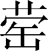

第二十六卷

 魏世家第十四

本篇记述战国时期魏国的世系及其兴衰。文中多简短记事，但在魏文侯、魏惠王和安釐王三代记事颇详。因为魏之兴在文侯之世，魏之衰从惠王开始，而安釐王的失策加速了魏的灭亡。由于作者紧紧抓住了魏国历史转折的关键，所以全文篇幅虽长，但纲目清晰，有条不紊，平而不淡，时有波澜。

魏文侯是战国初期颇有声望的国君。他礼敬贤人，以子夏、段干木、田子方为师；重用贤士，文臣有李克、西门豹，武将有军事家吴起。文侯支持李克实行政治改革，使魏国成为战国初期最强的国家。作者没有具体记述文侯的政绩，但引述了秦国人对魏文侯的看法：“魏君贤人是礼，国人称仁，上下和合，未可图也。”借敌国的看法来评价人物，这种评价更有客观性，胜过作者的主观评价。对李克的改革也没有具体记述，而是记载了他的两段谈话，中心是选相的五条标准。这两段谈话已充分显示了这位政治家之品格与才干。通过记言来表现人物是司马迁写人的主要手法之一。

魏惠王又称梁惠王，文中主要通过记事表现其为人。他在位三十六年，前十八年靠文侯打下的基础，与诸侯交战互有胜负。后十八年则连连败绩：一次是伐赵，被齐国派田忌、孙膑用计大败于桂陵；再一次是伐韩，又被田忌、孙膑大败于马陵；另一次是被商鞅率秦军打败，尽失河西之地。这几次大败使魏国兵力耗尽，国力空虚。惠王到晚年似乎有所觉悟，想广招贤士以挽回败局，但为时已晚。孟子的一席话给惠王作了总结：“为人君，仁义而已矣，何以利为！”尖锐地指出魏惠王的失败是只顾争利、不施仁义的结果。引用名人的话来评价人物，比作者直接评价更具有权威性。

对安釐王的记述篇幅较长，将近全文的三分之一。主要内容不在记事，而是用不同的方式，从不同的角度揭示了安釐王的严重失策。首先是通过苏代对安釐王的批评，指出了“以地事秦，譬犹抱薪救火”的道理。其次是通过秦国大臣中旗对形势的分析指出，魏如能与韩联合，其力量是不可轻视的。最后记述了无忌反对魏王伐韩的谈话，这段谈话长约千言，对亲秦之害、存韩之利的分析极为精辟。三段谈话虽然出自不同人之口，但联系起来恰似一篇完整的谈话，层层深入地揭示了问题的要害。作者对这些史料的选择与安排是颇具匠心的。

篇末的论赞，后人多所指摘，也有人把它看作太史公愤激之极的反语。如果我们把这里所说的“天”理解为大势所趋、形势发展的必然，是否更贴近太史公的本意呢？

***【原文】***

魏[1]之先，毕公高之后也。毕公高与周同姓。武王[2]之伐纣，而高封于毕[3]，于是[4]为毕姓。其后绝封，为庶人[5]，或[6]在中国，或在夷狄[7]。其苗裔[8]曰毕万，事[9]晋献公。

***【译文】***

[1]魏：原是西周分封的姬姓小国，在今山西芮城县北。

[2]武王：周武王姬发。

[3]毕：国名。地在今陕西咸阳市北。

[4]于是：表示承上接下的词组，现代汉语用作连词。

[5]庶人：平民。

[6]或：有的。虚指代词。中国：指中原地区。

[7]夷狄：古代对东、北两方各部族的泛称。

[8]苗裔：子孙；后代。

[9]事：服事；侍奉。

***【原文】***

献公之十六年，赵夙为御[1]，毕万为右[2]，以伐霍、耿[3]、魏，灭之。以耿封赵夙，以魏封毕万，为大夫[4]。卜偃[5]曰：“毕万之后必大[6]矣。万，满数[7]也；魏[8]，大名也。以是[9]始赏，天开之矣。天子曰兆民[10]，诸侯曰万民。今命[11]之大，以从满数，其必有众。”初，毕万卜事晋，遇《屯》之《比》[12]。辛廖[13]占之，曰：“吉。《屯》固，《比》[14]入，吉孰大焉[15]，其必蕃昌[11]。”

***【译文】***

[1]赵夙（sù）：晋国大夫。御：驾驶车马。亦指御者。

[2]右：右卫。古代车战时，主帅居中，御者居左，卫者居右。

[3]霍、耿：皆周初国名。霍在今山西省霍州西南。耿在今山西省河津市南。

[4]大夫：官名。周代有卿、大夫、士三级；大夫又分上、中、下三等。

[5]卜偃：晋国掌卜大夫郭偃。

[6]大：昌盛。

[7]满数：数从一至万为满，故称满数。

[8]魏：通“巍”，高大。

[9]是：此；这。

[10]兆民：亿万人民。

[11]命：名；起名。

[12]遇《屯（zhūn）》之《比》：得到《屯》卦变为《比》卦。

[13]辛廖：晋国大夫。

[14]屯：屯卦，卦象是云雷密结而不解，故屯有坚固之义。比：比卦，卦象是地上有水，水在地上渗入之象，故比有进入之义。

[15]焉：兼词，相当“于此”。“此”指前文《屯》《比》卦象。

[16]蕃昌：繁衍昌盛。

***【原文】***

毕万封十一年，晋献公卒，四子[1]争更立，晋乱。而毕万之世弥[2]大，从其国名为魏氏。生武子[3]。魏武子以魏诸子[4]事晋公子重耳。晋献公之二十一年，武子从重耳出亡。十九年反[5]，重耳立[6]为晋文公，而令魏武子袭[7]魏氏之后封，列为大夫，治于魏。生悼子。

***【译文】***

[1]四子：指奚齐、卓子、夷吾（后为晋惠公）、重耳（后为晋文公）。

[2]世：子孙。弥：更加。

[3]武子：魏犨，谥武子。

[4]诸子：庶子。

[5]反：通“返”。

[6]立：君主登位。

[7]袭：继承。

***【原文】***

魏悼子徙治[1]霍，生魏绛。

***【译文】***

[1]徙治：迁徙治所。

***【原文】***

魏绛事晋悼公。悼公三年，会诸侯[1]。悼公弟杨干乱行[2]，魏绛僇辱[3]杨干。悼公怒曰：“合诸侯以为荣，今辱吾弟！”将诛魏绛。或说[4]悼公，悼公止。卒[5]任魏绛政，使和戎、翟[6]，戎、翟亲附。悼公之十一年，曰：“自吾用魏绛，八年之中，九[7]合诸侯，戎、翟和，子之力也。”赐之乐，三[8]让，然后受之。徙治安邑[9]。魏绛卒，谥为昭子。生魏嬴。嬴生魏献子[10]。

***【译文】***

[1]会诸侯：晋悼公与诸侯在鸡津（今河北省邯郸市东北）会盟。

[2]乱行：军队行列混乱。古代军制，二十五人为一行。

[3]僇（lù）辱：侮辱。僇，辱。

[4]说（shuì）：劝说。

[5]卒：终于。

[6]戎、翟：古代对西北方部族的泛称。翟，通“狄”。

[7]九：泛指多数。

[8]三：多次，多数。

[9]安邑：都邑名。在今山西省夏县西北。

[10]献子：名荼，谥献子。

***【原文】***

献子事晋昭公。昭公卒而六卿[1]强，公室[2]卑。

***【译文】***

[1]六卿：范氏、中行氏、知氏、韩氏、赵氏、魏氏六大家族，数代都是晋卿，故称六卿。

[2]公室：诸侯的家族，也指诸侯国的政权。

***【原文】***

晋顷公之十二年，韩宣子[1]老，魏献子为国政[2]。晋宗室祁氏、羊舌氏[3]相恶，六卿诛之，尽取其邑为十县[4]，六卿各令其子为之大夫[5]。献子与赵简子、中行文子、范献子[6]并为晋卿。

***【译文】***

[1]韩宣子：韩起，谥宣子。

[2]为国政：执国政。

[3]宗室：同一祖宗的贵族，此指晋国国君的宗族。祁氏、羊舌氏：祁盈、杨食我，二人均以公族为大夫。

[4]邑：采邑；封地。县：古代地方行政区划名。

[5]之：其。大夫：当时县长称大夫。

[6]赵简子：即赵鞅。中行文子：即荀寅。范献子：即范吉射。

***【原文】***

其后十四岁而孔子相鲁[1]。后四岁，赵简子以[2]晋阳之乱也，而与韩、魏共攻范、中行氏。魏献子生魏侈。魏侈与赵鞅共攻范、中行氏。

***【译文】***

[1]孔子相鲁：《史记志疑》认为，孔子以司寇摄行人之职，掌傧相会盟之事，不是做鲁相。

[2]以：因为；由于。

***【原文】***

魏侈之孙曰魏桓子[1]，与韩康子、赵襄子共伐灭知伯[2]，分其地。

***【译文】***

[1]魏桓子：魏驹。

[2]韩康子：韩虔。晋国大夫。赵襄子：赵无恤。晋国大夫。知（zhì）伯：即荀瑶，一作知瑶。晋国大夫。

***【原文】***

桓子之孙曰文侯都[1]。魏文侯元年，秦灵公之元年也。与韩武子、赵桓子、周威王[2]同时。

***【译文】***

[1]都：当根据《六国年表》和《集解》、《索隐》转引《世本》改作“斯”。

[2]韩武子：韩启章。晋国大夫。赵桓子：晋国大夫。周威王：姬午。前425—前402年在位。

***【原文】***

六年，城少梁[1]。十三年，使子击围繁、庞[2]，出[3]其民。十六年，伐秦，筑临晋、元里[4]。

***【译文】***

[1]城：筑城。少梁：魏邑名。在今陕西省韩城市南。

[2]子击：魏文侯太子，即魏武侯。前395—前370年在位。繁、庞：即繁、庞城，邑名。

[3]出：迁走。

[4]临晋：地名。在今陕西省大荔县东。元里：地名。在今陕西省澄城县南。

***【原文】***

十七年，伐中山[1]，使子击守之，赵仓唐傅[2]之。子击逢文侯之师田子方于朝歌，引车避[3]，下谒[4]。田子方不为礼[5]。子击因问曰：“富贵者骄[6]人乎？且[7]贫贱者骄人乎？”子方曰：“亦[8]贫贱者骄人耳。夫诸侯而骄人则[9]失其国，大夫而骄人则失其家。贫贱者，行不合，言不用，则去[10]之楚、越，若脱然[11]，奈何其同[12]之哉！”子击不怿[13]而去。西攻秦，至郑[14]而还，筑雒阴、合阳[16]。

***【译文】***

[1]中山：春秋时白狄别种所建之鲜虞国，战国时号中山国。

[2]傅：辅佐。

[3]引车避：退车让路。

[4]下谒（yè）：下车进见。

[5]为礼：行礼；还礼。

[6]骄：傲慢。

[7]且：或者。

[8]亦：原本是；本来是。

[9]夫：发语词。则：即；就。

[10]去：离开。之：前往。

[11]（xǐ）：鞋。然：一般；一样。表比拟的语气助词。

[12]其：可以。同：同等看待。

[13]怿（yì）：喜悦；高兴。

[14]郑：地名。在今陕西省渭南市华州区东。

[15]雒（luò）阴：地名。在今陕西省大荔县南。合阳：地名在今陕西省合阳县东南。

***【原文】***

二十二年，魏、赵、韩列为诸侯[1]。

***【译文】***

[1]魏、赵、韩列为诸侯：前403年，周威烈王命晋大夫魏斯、赵籍、韩虔为诸侯，正式承认其三分晋国。

***【原文】***

二十四年，秦伐我[1]，至阳狐[2]。

***【译文】***

[1]我：指魏国。

[2]阳狐：地名。在今山西省垣曲县东南。

***【原文】***

二十五年，子击生子[1]。

***【译文】***

[1]子（yīnɡ）：魏惠王名。

***【原文】***

文侯受子夏[1]经艺，客段干木[2]，过其闾[3]，未尝不轼[4]也。秦尝欲伐魏，或曰：“魏君贤人是礼[5]，国人称[6]仁，上下和合[7]，未可图[8]也。”文侯由此得誉于诸侯。

***【译文】***

[1]子夏：卜商字。孔丘学生。晋国温（今河南省温县西南）人，一说卫国人。曾到魏国讲学，魏文侯尊他为师。

[2]客：以客礼相待。段干木：魏国人。姓段干，名木，子夏学生。

[3]闾：里巷的大门，因代称里巷。

[4]轼（shì）：设在车前供人凭依的横木。

[5]贤人是礼：礼遇贤人。是，表示宾语提前的结构助词。

[6]称：称颂。

[7]和合：和睦同心。

[8]图：谋取。

***【原文】***

任西门豹[1]守邺，而河内[2]称治。

***【译文】***

[1]西门豹：任邺守期间，曾开凿水渠十二条，引漳水灌溉，改良土壤，发展农业生产。守：地方长官。

[2]河内：地区名。春秋战国时期，以黄河以北为河内，以黄河以南为河外。

***【原文】***

魏文侯谓李克曰[1]：“先生尝教寡人曰‘家贫则思良妻，国乱则思良相’。今所置非成则璜[2]，二子何如？”李克对曰：“臣闻之，卑不谋尊，疏不谋戚[3]。臣在阙门[4]之外，不敢当命[5]。”文侯曰：“先生临事勿让。”李克曰：“君不察故也。居[6]视其所亲，富视其所与[7]，达[8]视其所举，穷视其所不为，贫视其所不取，五者足以定之矣，何待克哉！”文侯曰：“先生就舍[9]，寡人之相定矣。”李克趋[10]而出，过[11]翟璜之家。翟璜曰：“今者闻君召先生而卜[12]相，果谁为之？”李克曰：“魏成子为相矣。”翟璜忿然作色[13]曰：“以耳目之所睹记[14]，臣何负[15]于魏成子？西河[16]之守，臣之所进[17]也。君内以邺为忧[18]，臣进西门豹。君谋欲伐中山，臣进乐羊[19]。中山以[20]拔，无使守之，臣进先生。君之子无傅，臣进屈侯鲋。臣何以[21]负于魏成子！”李克曰：“且子之言[22]克于子之君者，岂将比周[23]以求大官哉？君问而置相‘非成则璜，二子何如’？克对曰：‘君不察故也。居视其所亲，富视其所与，达视其所举，穷视其所不为，贫视其所不取。五者足以定之矣，何待克哉！’是以知魏成子之为相也。且子安得[24]与魏成子比乎，魏成子以食禄千钟[25]，什九在外，什一在内，是以东得卜子夏、田子方、段干木。此三人者，君皆师之[26]。子之所进五人者，君皆臣之[27]。子恶[28]得与魏成子比也？”翟璜逡巡[29]再拜曰：“璜，鄙人[30]也，失对[31]，愿卒[32]为弟子。”

***【译文】***

[1]李克：为子夏弟子。

[2]置：设立。成：即魏成子。魏文侯弟。璜：即翟（zhái）璜。时为上卿。

[3]疏：远。戚：亲。

[4]阙门：代指朝廷。

[5]当命：承命；应命。

[6]居：常时；平时。

[7]与：亲附；交往。

[8]达：显贵。

[9]就舍：回府。舍，府第。

[10]趋：快走；小跑。

[11]过：访问。

[12]卜：选择。

[13]忿然：气愤的样子。作色：脸上变色。

[14]所睹记：所见所知。

[15]臣：古人表示谦卑的自称之词。负：弱。

[16]西河：地区名。

[17]进：举荐。

[18]以邺为忧：忧虑赵国进攻邺。

[19]乐羊：魏国将军。

[20]以：通“已”。

[21]以：衍文。

[22]且：提起连词。言：进言；介绍。

[23]比周：结党营私。

[24]安：哪；怎么。疑问副词。得：能；可。

[25]禄：俸禄。钟：古容量单位，六斛四斗或十斛为一钟。

[26]师之：以之为师。

[27]臣之：以之为臣。

[28]恶（wū）：哪；怎么。

[29]逡（qūn）巡：通“逡循”“逡遁”。

[30]鄙人：乡野之人。

[31]失对：回答不得当。

[32]卒：终身。

***【原文】***

二十六年，虢山[1]崩，壅[2]河。

***【译文】***

[1]虢（ɡuō）山：山名。在今河南省三门峡市西，临黄河。

[2]壅：堵塞。

***【原文】***

三十二年，伐郑[1]。城酸枣[2]。败秦于注[3]。三十五年，齐伐取我襄陵[4]。三十六年，秦侵我阴晋[5]。

***【译文】***

[1]郑：国名。前375年为韩所灭。

[2]酸枣：邑名。在今河南省延津西南。

[3]注：地名。在今河南省汝州市西北。

[4]襄陵：地名。在今河南睢县。

[5]阴晋：邑名。

***【原文】***

三十八年，伐秦，败我武下[1]，得其将识。是岁，文侯卒，子击立，是为武侯。

***【译文】***

[1]武下：武城之下。武城，魏地，在今陕西省渭南市华州区东北。

***【原文】***

魏武侯元年，赵敬侯[1]初立，公子朔[2]为乱，不胜，奔魏，与魏袭邯郸[3]，魏败而去。

***【译文】***

[1]赵敬侯：赵国君。

[2]公子朔：应据《六国年表》《赵世家》改作“公子朝”。

[3]邯郸：赵都城。

***【原文】***

二年，城安邑、王垣[1]。

七年，伐齐，至桑丘[2]。九年，翟败我于浍[3]。使吴起[4]伐齐，至灵丘[5]。齐威王[6]初立。

***【译文】***

[1]王垣：魏邑名。即垣县，因境内有王屋山，故又名王垣。在今山西省垣曲县东南。

[2]桑丘：邑名，本属燕，后为齐邑。在今河北保定市北。《史记会注考证》认为此桑丘在今山东省济宁市兖州区西。

[3]翟：通“狄”，部族名。浍（kuài）：水名。源出今山西翼城县东北，西流经侯马市，至新绛入汾河。

[4]吴起：战国时的政治家、军事家。卫国左氏（今山东省曹县北）人。初为鲁将，继为魏将，屡建战功。

[5]灵丘：邑名，在今山东省滕县东。一说在今山东省高唐县南。

[6]齐威王：齐国国君。

***【原文】***

十一年，与韩、赵三分晋地，灭其后。

十三年，秦献公[1]县栎阳。十五年，败赵北蔺[2]。

***【译文】***

[1]秦献公：嬴师隰。前384—前362年在位。秦国国君。

[2]北蔺：赵邑名。

***【原文】***

十六年，伐楚，取鲁阳[1]。武侯卒，子立，是为惠王。

惠王元年，初，武侯卒也，子与公中缓[2]争为太子。公孙颀自宋[3]入赵，自赵入韩，谓韩懿侯[4]曰：“魏与公中缓争为太子，君亦闻之乎？今魏得王错[5]，挟[6]上党，固半国也。因而除之，破魏必矣，不可失也。”懿侯说[7]，乃与赵成侯[8]合军并兵以伐魏，战于浊泽[9]，魏氏大败，魏君围[10]。赵谓韩曰：“除魏君，立公中缓，割地而退，我且利。”韩曰：“不可。杀魏君，人必曰暴；割地而退，人必曰贪。不如两分之。魏分为两，不强于宋、卫[11]，则我终无魏之患矣。”赵不听。韩不说，以其少卒[12]夜去。惠王之所以身不死，国不分者，二家谋不和也。若从一家[13]之谋，则魏必分矣。故曰：“君终无適子，其国可[14]破也。”

***【译文】***

[1]鲁阳：楚地名。在今河南省鲁山县。

[2]公中（zhònɡ）缓：魏武侯子，与惠王争位，后奔赵。

[3]公孙颀：魏国人。宋：国名。

[4]韩懿侯：韩国国君。

[5]王错：魏国大夫。后出奔韩。

[6]挟：控制。

[7]懿侯说：说，通“悦”。以下“韩不说”，说，亦通“悦”。

[8]赵成侯：赵国国君。

[9]浊泽：魏地名。在今山西省运城市盐湖区西南。

[10]围：被动用法。

[11]卫：国名。

[12]以：使，挥使。少卒：少壮士兵；精锐部队。

[13]一家：指韩国。

[14]可：大约；大概。

***【原文】***

二年，魏败韩于马陵[1]，败赵于怀[2]。三年，齐败我观[3]。五年，与韩会宅阳[4]。城武堵[5]。为秦所败。六年，伐取宋仪台[6]。九年，伐败韩于浍。与秦战少梁，虏我将公孙痤，取庞。秦献公卒，子孝公[7]立。

***【译文】***

[1]马陵：春秋卫地，战国属齐。在今河北省大名县东南。

[2]怀：战国魏邑。在今河南省武陟县西南。

[3]观：邑名。在今山东省阳谷县西南，河南省清丰县南。

[4]宅阳：即北宅。邑名，在今河南省郑州市北。

[5]武堵：地名。当是“武都”，《六国表》作“武都”，今地不详。

[6]仪台：台名。

[7]孝公：即秦孝公。

***【原文】***

十年，伐取赵皮牢[1]。彗星见[2]。十二年，星[3]昼坠，有声。

***【译文】***

[1]皮牢：地名。在今山西省翼城县东。

[2]见（xiàn）：通“现”。

[3]星：陨星。

***【原文】***

十四年，与赵会鄗[1]。十五年，鲁、卫、宋、郑[2]君来朝。十六年，与秦孝公会杜平[3]。侵宋黄池[4]，宋复取之。

***【译文】***

[1]鄗（hào）：赵地名。在今河北省柏乡北。

[2]鲁：指鲁恭侯。卫：指卫成侯。宋：指宋桓侯。郑：指郑釐（xī）侯，即韩昭侯。

[3]杜平：邑名。在今陕省西澄城县东。

[4]黄池：地名。在今河南省封丘县西南。

***【原文】***

十七年，与秦战元里，秦取我少梁。围赵邯郸。十八年，拔邯郸。赵请救于齐，齐使田忌、孙膑[1]救赵，败魏桂陵[2]。

***【译文】***

[1]田忌：齐国将。孙膑：军事家。

[2]桂陵：地名。在今山东省菏泽市牡丹区东北。一说在今河南省长垣市西北。

***【原文】***

十九年，诸侯围我襄陵。筑长城[1]，塞固阳[2]。

***【译文】***

[1]筑长城：魏筑长城，从郑（今陕西省渭南市华州区东）开始，沿洛水（今陕西省北洛河）东岸，向北直到上郡（今陕西省榆林市榆阳区东南），与秦为界。

[2]塞（sài）：关塞。作动词用。固阳：魏邑名。

***【原文】***

二十年，归赵邯郸，与盟漳水上。二十一年，与秦会彤[1]。赵成侯卒。二十八年，齐威王卒。中山君相[2]魏。

***【译文】***

[1]彤：秦地名。在今陕西省渭南市华州区西南。

[2]相：任相。

***【原文】***

三十年，魏伐赵，赵告急齐。齐宣王用孙子计[1]，救赵击魏。魏遂大兴师，使庞涓[2]将，而令太子申为上将军。过外黄[3]，外黄徐子[4]谓太子曰：“臣有百战百胜之术。”太子曰：“可得闻乎？”客曰：“固愿效[5]之。”曰：“太子自将攻齐，大胜并莒[6]，则富不过有魏，贵不益[7]为王。若战不胜齐，则万世无魏矣[8]。此臣之百战百胜之术[9]也。”太子曰：“诺，请[10]必从公之言而还矣。”客曰：“太子虽欲还，不得矣。彼劝太子战攻，欲啜汁[11]者众。太子虽欲还，恐不得矣。”太子因[12]欲还，其御曰：“将出而还，与北[13]同。”太子果与齐人战，败于马陵[14]。齐虏魏太子申，杀将军涓，军遂大破。

***【译文】***

[1]齐宣王：战国齐国君田辟彊。孙子计：指孙膑逐日减灶制造齐军大量逃亡的假象，引诱魏军追击的计策。

[2]庞涓：战国时魏将。

[3]外黄：宋地名。在今河南省民权县西北。

[4]徐子：宋国外黄人。

[5]效：呈；进献。

[6]莒：邑名。在今山东省莒县。

[7]益：超过。

[8]“若战不胜齐”二句：如果战不胜齐国，太子可能战死，子孙后代就没有魏国了。

[9]百战百胜之术：指回师，无战败之忧，最终能拥有魏国，故称百战百胜之术。

[10]请：谦敬副词。

[11]啜（chuò）汁：原意为仰食残汁，此处借喻邀功取利。

[12]因：就；便。

[13]北：败北；败逃。

[14]马陵：地名。

***【原文】***

三十一年，秦、赵、齐共伐我，秦将商君[1]诈我将军公子卬而袭夺其军，破之。秦用商君，东地至河，而齐、赵数[2]破我，安邑近秦，于是徙治大梁[3]。以公子赫为太子。

***【译文】***

[1]商君：姓公孙，名鞅。卫国人。

[2]数（shuò）：屡次。

[3]治：都治；国都所在地。大梁：魏都城，在今河南省开封市。

***【原文】***

三十三年，秦孝公卒，商君亡秦[1]归魏，魏怒，不入[2]。三十五年，与齐宣王会平阿[3]南。

***【译文】***

[1]亡秦：从秦国逃亡。

[2]入：纳；收留。

[3]平阿：齐邑名。在今安徽省怀远县西南。

***【原文】***

惠王数被于军旅[1]，卑礼厚币[2]以招贤者。邹衍、淳于髡[3]、孟轲皆至梁。梁惠王[4]曰：“寡人不佞[5]，兵三折于外[6]，太子虏[7]，上将死，国以[8]空虚，以羞先君宗庙[9]社稷，寡人甚丑[10]之。叟不远[11]千里，辱幸至弊邑[12]之廷，将何以利[13]吾国？”孟轲曰：“君不可以言利若是[14]。夫君欲利则[15]大夫欲利，大夫欲利则庶人欲利，上下争利，国则危矣。为人君，仁义而已矣，何以利为[16]！”

***【译文】***

[1]被：遭受。军旅：军队。引申指战争。

[2]卑礼：卑下谦恭之礼。厚币：原指用作礼物的丝织品，也可泛指礼物。

[3]邹衍（约前305—前240年）：齐国人。阴阳家的代表人物。淳于髡（kūn）：齐国学者，以博学著称。

[4]梁惠王；即魏惠王。

[5]不佞（nìnɡ）：不才；没有才能。

[6]兵三折于外：指被齐、秦、楚三国打败。

[7]虏：俘虏。被动用法。

[8]以：由此；从此。

[9]羞：耻辱。先君：先代君主。宗庙：帝王诸侯祭祀祖先的处所。

[10]丑：羞耻；惭愧。意动用法。

[11]叟：古代对长者的敬称。远：意动用法。

[12]辱幸：犹言屈尊光临。弊邑：称本国的谦词。

[13]将：打算；想要。何以：以何；用什么。利：有利。使动用法。

[14]若是：如此；像这样。

[15]夫：发语词。欲：想要；贪求。则：那么。连词。

[16]为：语气助词，表疑问。

***【原文】***

三十六年，复与齐王会甄[1]。是岁，惠王[2]卒，子襄王[3]立。

***【译文】***

[1]甄（juàn）：通“鄄”。

[2]惠王卒：据杨宽《战国史》考证，魏惠王到三十六年没有死，只是改元又称一年，又十六年才死。

[3]襄王：名嗣。

***【原文】***

襄王元年[1]，与诸侯会徐州[2]，相王[3]也。追尊父惠王为王[4]。

***【译文】***

[1]襄王元年：应为惠王后元元年。前文惠王卒应为惠王改元。

[2]徐州：齐地名。在今山东省滕州市南。

[3]相王：互相尊称为王。

[4]追尊父惠王为王：追尊，古代在人死后追加尊号。《孟子》一书多处称魏惠王为王，是其明证。

***【原文】***

五年，秦败我龙贾军四万五千于雕阴[1]，围我焦、曲沃[2]。予秦河西[3]之地。

***【译文】***

[1]龙贾：魏国大臣。雕阴：魏地名。在今陕西省甘泉县南。

[2]焦：魏地名。在今河南省三门峡市西北。曲沃：魏地名。在今河南省三门峡市西南。

[3]河西：地区名。当时称今山西、陕西两省间黄河南段之西为河西。

***【原文】***

六年，与秦会应[1]。秦取我汾阴、皮氏[2]、焦。魏伐楚，败之陉山[3]。七年，魏尽入上郡[4]于秦。秦降我蒲阳[5]。八年，秦归我焦、曲沃。

***【译文】***

[1]应：邑名。在今河南省鲁山县东。

[2]汾阴：魏邑名。在今山西省万荣县西南。皮氏：魏邑名。在今山西省河津市。

[3]陉山：楚地名。在今河南省漯河市东。

[4]入：交纳。上郡：魏地区名。

[5]降：降伏。蒲阳：魏邑名。在今山西省隰（xí）县。

***【原文】***

十二年，楚败我襄陵。诸侯执政与秦相张仪会啮桑[1]。十三年，张仪相魏。魏有女子化为丈夫[2]。秦取我曲沃、平周[3]。

***【译文】***

[1]啮桑：地名。在今江苏省沛县西南。

[2]丈夫：古称成年男子为丈夫。

[3]曲沃：古都邑名。春秋属晋，战国属魏，在今山西省闻喜县东北。此曲沃在魏北境。平周：魏邑名。在今山西省介休市西。

***【原文】***

十六年，襄王卒，子哀王立。张仪复归秦。

哀王元年，五国[1]共攻秦，不胜而去。

***【译文】***

[1]五国：指韩、魏、楚、赵、燕。

***【原文】***

二年，齐败我观津[1]。五年，秦使樗里子伐取我曲沃[2]，走犀首岸门[3]。六年，秦来立公子政为太子。与秦会临晋。七年，攻齐。与秦伐燕[4]。

***【译文】***

[1]观津：本赵邑，时属魏。在今河北省武邑县东南。

[2]樗（chū）里子：嬴疾。曲沃：此曲沃在今河南省三门峡市西南。

[3]走：逃跑。使动用法。犀首：魏官名。时任此职者为公孙衍。纵横家。岸门：魏邑名。在今山西省河津市南。

[4]燕：周初分封的诸侯国，姬姓。前222年为秦所灭。

***【原文】***

八年，伐卫，拔列城[1]二。卫君患[2]之。如耳[3]见卫君曰：“请罢[4]魏兵，免[5]成陵君可乎？”卫君曰：“先生果能，孤请世世以卫事先生。”如耳见成陵君曰：“昔者魏伐赵，断羊肠[6]，拔阏与[7]，约斩[8]赵，赵分而为二，所以不亡者，魏为从主也[9]。今卫已迫亡[10]，将西请事于秦。与其以秦醳[11]卫，不如以魏醳卫，卫之德[12]魏必终无穷。”成陵君曰：“诺。”如耳见魏王曰：“臣有谒于卫[13]。卫故周室[14]之别也，其称小国，多宝器[15]。今国迫于难而宝器不出者，其心以为攻卫醳卫不以王为主，故宝器虽出[16]必不入于王也。臣窃料之，先言醳卫者必受卫者也。”如耳出，成陵君入，以其言见魏王。魏王听其说，罢其兵，免成陵君，终身不见。

***【译文】***

[1]列城：相邻的城池。

[2]患：忧虑。

[3]如耳：魏国大夫。

[4]罢：停止。使动用法。

[5]免：罢免。

[6]羊肠：即羊肠坂。太行山上的坂道，在今山西省晋城市南。

[7]阏与：战国韩邑，后属赵。在今山西省和顺西北。

[8]约：图谋。斩：分割。

[9]从主：诸侯合纵之长。

[10]迫亡：迫近亡国。

[11]以：由。醳（shì）：通“释”，宽释。

[12]德：感激。

[13]臣有谒于卫：我替卫国有所说明。谒，说明，陈述。于，为，替。

[14]故：本来。周室：周王族。

[15]宝器：宝贵的器物。

[16]出：献出。

***【原文】***

九年，与秦王会临晋。张仪、魏章[1]皆归于魏。魏相田需死，楚害[2]张仪、犀首、薛公。楚相昭鱼谓苏代[3]曰：“田需死，吾恐张仪、犀首、薛公有一人相魏者也。”代曰：“然相者欲谁而君便[4]之？”昭鱼曰：“吾欲太子[5]之自相也。”代曰：“请为君北[6]，必相[7]之。”昭鱼曰：“奈何？”对曰：“君其为梁王，代请说[8]君。”昭鱼曰：“奈何？”对曰：“代也从楚来，昭鱼甚忧，曰：‘田需死，吾恐张仪、犀首、薛公有一人相魏者也。’代曰：‘梁王，长主[9]也，必不相张仪。张仪相，必右[10]秦而左魏。犀首相，必右韩而左魏。薛公相，必右齐而左魏。梁王，长主也，必不便也。’王曰[11]：‘然则寡人孰[12]相？’代曰：‘莫若[13]太子之自相。太子之自相，是[14]三人者皆以太子为非常相也，皆将务[15]以其国事魏，欲得丞相玺[16]也。以魏之强，而三万乘之国[17]辅之，魏必安矣。故曰莫若太子之自相也。’”遂北见梁王，以此告之。太子果相魏。

***【译文】***

[1]魏章：曾为魏将，后又相秦。

[2]害：忌刻；畏惧。

[3]苏代：游说之士，苏秦之弟。

[4]便：方便；有利。

[5]太子：指魏昭王。

[6]北：北行。动词，

[7]相：做相。使动用法。

[8]说：游说。

[9]长（zhǎnɡ）主：贤明的国君。

[10]右：古时尚右，故称所重为右，所轻为左。

[11]王曰：是苏代模拟魏王说。

[12]然则：既然如此，那么。孰：谁。

[13]莫若：莫如；不如。

[14]是：此；这。

[15]务：致力；尽力。

[16]欲得丞相玺（xǐ）：想获得丞相印。玺，印。

[17]万乘（shènɡ）之国：指大国。乘，一车四马。万乘，万辆车。

***【原文】***

十年，张仪死。十一年，与秦武王[1]会应。十二年，太子朝于秦。秦来伐我皮氏，未拔而解。十四年，秦来归武王后[2]。十六年，秦拔我蒲反、阳晋、封陵[3]。十七年，与秦会临晋。秦予我蒲反。十八年，与秦伐楚。二十一年，与齐、韩共败秦军函谷[4]。

***【译文】***

[1]秦武王：秦国国君荡。

[2]武王后：魏公室女。

[3]蒲反（bǎn）：亦作蒲坂。魏邑名。在今山西省永济市西。阳晋：应作“晋阳”。魏邑名。在今山西省永济市东。封陵：魏地名。在今山西省风陵渡东。

[4]函谷：即函谷关，在今河南省灵宝市东北。

***【原文】***

二十三年，秦复予我河外及封陵为和。哀王卒，子昭王立。

昭王元年，秦拔我襄城[1]。二年，与秦战，我不利。三年，佐韩攻秦，秦将白起败我军伊阙二十四万[2]。六年，予秦河东[3]地方四百里。芒卯以诈重[4]。七年，秦拔我城大小六十一。八年，秦昭王[5]为西帝，齐湣王[6]为东帝，月余，皆复称王归帝。九年，秦拔我新垣、曲阳[7]之城。

***【译文】***

[1]襄城：魏邑名。在今河南省襄城县。

[2]白起：一名公孙起。伊阙：山名。在今河南省洛阳市南。二十四万：指韩、魏两军共数。

[3]河东：地区名，约指今山西境内黄河以东地区。

[4]芒卯：魏国大臣。诈：智诈；智谋。重：见重；被重用。

[5]秦昭王：即秦昭襄王。

[6]齐湣王：亦作齐闵王、齐愍王。齐国君。

[7]新垣：魏邑名。与曲阳相近。曲阳：魏邑名。在今河南省济源市西南。

***【原文】***

十年，齐灭宋，宋王[1]死我温。十二年，与秦、赵、韩、燕共伐齐，败之济西[2]，湣王出亡[3]。燕独入临菑。与秦王会西周[4]。

***【译文】***

[1]宋王：宋康王偃。

[2]济西：济水以西。

[3]湣王出亡：此句当在下句“燕独入临菑”后。

[4]会西周：指会于西周国都河南（今河南省洛阳市西）。西周，战国时小国。

***【原文】***

十三年，秦拔我安城[1]。兵到大梁，去。十八年，秦拔郢[2]，楚王徙陈[3]。

***【译文】***

[1]安城：魏邑名。

[2]郢：此为鄢郢，在今湖北省宜城市南。

[3]楚王：王熊横。陈：楚邑名。

***【原文】***

十九年，昭王卒，子安釐王立。

***【原文】***

安釐王元年，秦拔我两城。二年，又拔我二城，军[1]大梁下，韩来救，予秦温以和。三年，秦拔我四城，斩首四万。四年，秦破我及韩、赵，杀十五万人，走我将芒卯。魏将段干子请予秦南阳[2]以和。苏代谓魏王曰：“欲玺[3]者段干子也，欲地者秦也。今王使欲地者制玺，使欲玺者制[4]地，魏氏地不尽则不知已[5]。且夫[6]以地事秦，譬犹抱薪救火，薪不尽，火不灭。”王曰：“是则然也。虽然，事始[7]已行，不可更矣。”对曰：“王独不见夫博之所以贵[8]枭者，便则食[9]，不便则止矣。今王曰‘事始已行，不可更’，是何王之用智不如用枭也？”

***【译文】***

[1]军：驻扎。

[2]南阳：魏地名。故城在今河南省获嘉县北。

[3]欲玺：指想获得秦国的封赏。玺，印章，借指官爵。

[4]制：控制；掌握。

[5]魏氏：指魏国。已：停止。

[6]且夫：用法同“夫”，发语词。

[7]始：开始；刚才。

[8]独：难道。夫：那；指示代词。博：古代博局戏，以五木为骰子，其上刻有枭、卢、雉、犊、塞等形。行博时掷骰子中采，然后行棋，得枭者为上采。贵：宝贵；看重。意动用法。

[9]食：吃掉棋子。

***【原文】***

九年，秦拔我怀。十年，秦太子外质于魏死。十一年，秦拔我郪丘[1]。

***【译文】***

[1]郪（qī）丘：魏邑名。在今安徽省太和县北宋王城。

***【原文】***

秦昭王谓左右曰：“今时韩、魏与始孰强？”对曰：“不如始强。”王曰：“今时如耳、魏齐[1]与孟尝、芒卯孰贤？”对曰：“不如。”王曰：“以孟尝、芒卯之贤，率强韩、魏以攻秦，犹无奈寡人何[2]也。今以无能之如耳、魏齐而率弱韩、魏以伐秦，其无奈寡人何亦明矣。”左右皆曰：“甚然[3]。”中旗冯[4]琴而对曰：“王之料天下过[5]矣。当晋六卿之时，知氏最强，灭范、中行，又率韩、魏之兵以围赵襄子于晋阳，决晋水以灌晋阳之城，不湛者三版[6]。知伯行[7]水，魏桓子御，韩康子为参乘[8]。知伯曰：‘吾始不知水之可以亡人之国也，今乃知之。’汾水可以灌安邑，绛水可以灌平阳[9]。魏桓子肘[10]韩康子，韩康子履[11]魏桓子，肘足接于车上[12]，而知氏地分，身死国亡，为天下笑。今秦兵虽强，不能过知氏；韩、魏虽弱，尚贤[13]其在晋阳之下也。此方其用肘足之时[14]也，愿王之勿易也！”于是秦王恐。

***【译文】***

[1]魏齐：魏国公子，为魏昭王相。

[2]无奈寡人何：不能把我怎么样。

[3]甚然：非常对。

[4]中旗：亦作中期。官名。掌琴瑟。一说，人名，即钟子期。冯（pínɡ）：通“凭”，倚靠。

[5]料：估量。过：错。

[6]湛（chén）：通“沉”。版：亦作“板”。筑墙用的夹板。一板高二尺。

[7]行：按视。

[8]参乘：亦作“骖乘”，陪乘。

[9]平阳：韩邑名。在今山西临汾市西南。

[10]肘：臂肘。此谓用臂肘碰人，暗示以心相应。

[11]履：踏。此谓用脚踩人，暗示所谋预合。

[13]肘足接于车上：意思是说，韩、魏联合，共灭知伯的协约已成默契。

[13]贤：胜过。

[14]用肘足之时：意思是说制订联合抗秦计划之际。

***【原文】***

齐、楚相约而攻魏，魏使人求救于秦，冠盖相望[1]也，而秦救不至。魏人有唐雎者，年九十余矣，谓魏王曰：“老臣请西说秦王，令兵先臣出。”魏王再拜，遂约车[2]而遣之。唐雎到，入见秦王。秦王曰：“丈人芒然乃[3]远至此，甚苦矣！夫魏之来求救数矣，寡人知魏之急已[4]。”唐雎对曰：“大王已知魏之急而救不发者，臣窃以为用策之臣[5]无任矣。夫魏，一万乘之国也，然所以西面而事秦，称东藩[6]，受冠带[7]，祠春秋[8]者，以秦之强足以为与[9]也。今齐、楚之兵已合于魏郊[10]矣，而秦救不发，亦将赖其未急也[11]。使之大急[12]，彼且割地而约从[13]，王尚何救焉？必待其急而救之，是失一东藩之魏而强[14]二敌之齐、楚，则王何利焉？”于是秦昭王遽[15]为发兵救魏。魏氏复定。

***【译文】***

[1]冠盖相望：道路上使臣往来不绝，他们所戴帽子和所乘车子的车盖互相能够望见。冠，帽子。盖，车盖。

[2]约车：备办车辆。

[3]丈人：对长者的尊称。乃：竟。

[4]已：用法同“矣”。

[5]用策之臣：筹策之臣。亦即执政大臣。

[6]东藩：东部藩属。

[7]受冠带：接受秦国法度。冠带，本指服制，引申指法度。

[8]祠春秋：春秋贡奉以助秦国祭祀。

[9]与：与国；盟国。

[10]合：会集。魏郊：魏都大梁城郊。

[11]亦将赖其未急也：不过是凭恃着魏国不危急罢了。亦，不过。将，句中助词。赖，恃。

[12]大急：极端危急。

[13]割地：割地给齐、楚两国。约从：即合纵。

[14]强：强大。使动用法。

[15]遽（jù）：就；立即。

***【原文】***

赵使人谓魏王曰：“为我杀范痤[1]，吾请献七十里之地。”魏王曰：“诺。”使吏捕之，围而未杀。痤因上屋骑危[2]，谓使者曰：“与其以死痤市[3]，不如以生痤市。有如[4]痤死，赵不予王地，则王将奈何？故不若与先定割地，然后杀痤。”魏王曰：“善。”痤因上书信陵君[5]曰：“痤，故魏之免相[6]也，赵以地杀痤而魏王听之，有如强秦亦将袭赵之欲，则君且奈何？”信陵君言于王而出之。

***【译文】***

[1]范痤（cuó）：一作范座。魏人，曾为魏相。

[2]危：屋脊。

[3]死痤：死范痤。市：交换。

[4]有如：假如。

[5]信陵君：魏无忌。魏安釐王之弟。

[6]免相：免职的宰相。

***【原文】***

魏王以秦救之故，欲亲秦而伐韩，以求故地。无忌谓魏王曰：

秦与戎翟[1]同俗，有虎狼之心，贪戾[2]好利无信，不识[3]礼义德行。苟有利焉，不顾亲戚兄弟，若禽兽耳，此天下之所识也，非有所施厚积德也。故太后[4]母也，而以忧死[5]；穰侯[6]舅也，功莫大焉[7]，而竟逐之[8]；两弟[9]无罪，而再夺之国[10]。此于亲戚若此[11]，而况于仇雠[12]之国乎！今王与秦共伐韩而益近秦患，臣甚惑之。而王不识则不明，群臣莫以闻[13]则不忠。

***【译文】***

[1]戎翟：古代对西北方各族的泛称。翟，通“狄”。

[2]贪戾（lì）：贪婪残暴。

[3]识：知。

[4]太后：宣太后。秦昭王之母。秦昭王十九岁即位，她掌握政权。

[5]而以忧死：秦昭王四十一年，用范雎之说，废宣太后，她忧虑而死。

[6]穰（ránɡ）侯：魏冉。宣太后异父弟。秦武王去世，秦内乱，他拥立昭王。

[7]焉：兼词。此处当“于他”讲。

[8]而竟逐之：秦昭王四十一年，任用范雎为相，驱逐魏冉，后死于陶。

[9]两弟：指泾阳君嬴（），秦昭王同母弟，封于泾阳（今陕西省泾阳县境）；高陵君嬴悝，秦昭王同母弟，封于高陵（今陕西省西安市高陵区）。

[10]再：一举而二叫“再”。之：其。国：封邑。泾阳君、高陵君封邑在关内。

[11]此：指秦国。

[12]仇雠（chóu）：仇敌。

[13]以闻：以此上闻。

***【原文】***

今韩氏以一女子奉一弱主[1]，内有大乱，外交强秦、魏之兵，王以为不亡乎？韩亡，秦有郑[2]地，与大梁[3]邻，王以为安乎？王欲得故地，今负强秦之亲，王以为利乎？

***【译文】***

[1]今韩氏以一女子奉一弱主：当时韩桓惠王年幼，母后专权。

[2]郑：指郑国旧地。韩哀侯二年（前375），韩灭郑，迁都新郑（今河南省新郑市），此后亦称韩为郑。

[3]大梁：指魏。

***【原文】***

秦非无事之国也，韩亡之后必将更事[1]，更事必就[2]易与利，就易与利必不伐楚与赵矣。是何也？夫越山逾河，绝[3]韩上党而攻强赵，是复阏与[4]之事，秦必不为也。若道河内，倍[5]邺、朝歌，绝漳、滏水，与赵兵决于邯郸之郊，是知伯之祸也，秦又不敢。伐楚，道涉谷[6]，行三千里而攻冥[7]之塞，所行甚远，所攻甚难，秦又不为也。若道河外[8]，倍大梁，右上蔡、召陵[9]，与楚兵决于陈郊，秦又不敢。故曰秦必不伐楚与赵矣，又不攻卫与齐矣。

***【译文】***

[1]更事：再起事端。

[2]就：趋；从。

[3]绝：越过；穿过。

[4]复：重蹈。阏与：韩邑名。

[5]倍：通“背”。

[6]涉谷：往楚之险路。

[7]冥厄：楚之险塞。

[8]河外：地区名。

[9]上蔡：楚邑名。在今河南省上蔡西南。召（shào）陵：楚邑名。在今河南省漯河市郾城区东。

***【原文】***

夫韩亡之后，兵出之日，非魏无攻已。秦固有怀、茅、邢丘，城垝津[1]以临河内，河内共、汲[2]必危；有郑地，得垣雍[3]，决荧泽[4]水灌大梁，大梁必亡。王之使者出过而恶安陵氏[5]于秦，秦之欲诛[6]之久矣。秦叶阳、昆阳[7]与舞阳邻，听使者之恶之，随[8]安陵氏而亡之，绕舞阳之北，以东临许[9]，南国[10]必危，国无害乎？

***【译文】***

[1]城：筑城。垝（ɡuǐ）津：地名。

[2]共：邑名。在今河南省辉县市。汲：邑名。在今河南省卫辉市西。

[3]垣雍：邑名。在今河南省原阳县西。

[4]荧泽：泽名。一作荥泽。故址在今河南郑州市西北，西汉以后渐淤为平地。

[5]出过：出访。恶：中伤。安陵氏：魏襄王封其弟为安陵君，后代以邑为氏，故称安陵氏。安陵，魏邑，在今河南省鄢陵县西北。

[6]诛：灭。

[7]叶（旧读shè）阳：秦邑名。在今河南省叶县南。昆阳：秦邑名。在今河南省叶县。

[8]随：听任。

[9]许：国名。在今河南省许昌市东。

[10]南国：指魏国的南部地区。此时属韩。

***【原文】***

夫憎韩不爱安陵氏可也，夫不患[1]秦之不爱南国非也。异日[2]者，秦在河西晋[3]，国去梁千里，有河山以阑[4]之，有周韩以间[5]之。从林乡军[6]以至于今，秦七攻魏，五入囿中[7]，边城尽拔，文台堕[8]，垂都[9]焚，林木伐，麋鹿[10]尽，而国继以围[11]。又长驱[12]梁北，东至陶、卫[13]之郊，北至平监[14]，所亡于秦者，山[15]南山北，河外河内，大县数十，名都数百。秦乃在河西晋，去梁千里，而祸若是矣。又况于使秦无韩，有郑地，无河山而阑之，无周、韩而间之，去大梁百里，祸必由此矣。

***【译文】***

[1]患：忧虑。

[2]异日：往日。

[3]河西晋：河西晋国故地。

[4]阑：阻隔。

[5]周：指周朝京畿。间：隔绝。

[6]林乡军：指秦进攻林乡的战役。林乡，邑名。在今河南省新郑市东。

[7]囿中：泽名。

[8]文台：台名。故址在今山东省菏泽市牡丹区西南。堕（huī）：通“隳”，毁坏。

[9]垂都：魏邑名。

[10]麇鹿：鹿科动物。

[11]国继以围：指安釐王二年秦军大梁下事。国，国都。

[12]长驱：毫不停顿地快速进军。

[13]卫：邑名。在今河南省滑县。

[14]监：通“阚（kàn）”，邑名，在今山东汶上县西南。

[15]山：指华山。

***【原文】***

异日者，从[1]之不成也，楚、魏疑而韩不可得也。今韩受兵[2]三年，秦桡之以讲[3]，识亡不听，投质[4]于赵，请为天下雁行顿刃[5]，楚、赵必集兵，皆识秦之欲[6]无穷也，非尽亡天下之国而臣[7]海内，必不休矣。是故臣愿以从事[8]王，王速受楚、赵之约[9]，而挟韩之质以存韩，而求故地，韩必效之。此士民不劳而故地得，其功多于与秦共伐韩，而又[10]与强秦邻之祸也。

***【译文】***

[1]从：合纵。

[2]受兵：指遭受秦军侵扰。

[3]桡（náo）：通“挠”。讲：媾和。

[4]投质：派出人质。

[5]为：与。雁行：谓按次序为行列前进。顿刃：指折坏兵器用来战。顿，通“钝”。

[6]欲：贪欲。

[7]臣：臣服。使动用法。

[8]从事：合纵事王。事，服务；效劳。

[9]约：盟约。

[10]又：当作“无”。

***【原文】***

夫存韩安魏而利天下，此亦王之天时[1]已。通韩上党于共、甯[2]，使道安成[3]，出入赋之[4]，是魏重质[5]韩以其上党也。今有其赋，足以富国。韩必德魏爱魏重魏畏魏，韩必不敢反魏，是韩则魏之县也。魏得韩以为县，卫[6]、大梁、河外必安矣。今不存韩，二周[7]、安陵必危。楚、赵大破，卫、齐甚畏，天下西乡[8]而驰秦入朝而为臣不久矣。

***【译文】***

[1]天时：天赐的时机。

[2]甯：魏邑名。在今河南省获嘉县。

[3]安成：魏邑名。在今河南省原阳县西南。

[4]出入赋之：征收往来商贾之税。

[5]重（chónɡ）：复；又。质：抵押。意动用法。

[6]卫：指残存的卫国，当时为魏国附庸。

[7]二周：指战国末期西周、东周二小国。

[8]乡：通“向”。

***【原文】***

二十年，秦围邯郸[1]，信陵君无忌矫[2]夺将军晋鄙兵以救赵，赵得全。无忌因留赵。二十六年，秦昭王卒。

***【译文】***

[1]秦围邯郸：前257年，秦军围赵都邯郸，赵求救于魏。魏派晋鄙领军十万救赵，驻军邺，对秦赵成败持观望态度。

[2]矫：假托君命。

***【原文】***

三十年，无忌归魏，率五国兵攻秦，败之河外，走蒙骜[1]。魏太子增质于秦，秦怒，欲囚魏太子增。或[2]为增谓秦王曰：“公孙喜[3]固谓魏相曰‘请以魏疾击秦，秦王怒，必囚增。魏王又怒，击秦，秦必伤’。今王囚增，是喜之计中也。故不若贵[4]增而合魏，以疑之于齐、韩。”秦乃止增。

***【译文】***

[1]走：逃跑。使动用法。蒙骜：秦国将领。

[2]或：有人。虚指代词。

[3]公孙喜：魏国将领。

[4]贵：厚遇。

***【原文】***

三十一年，秦王政初立。

三十四年，安釐王卒，太子增立，是为景湣王。信陵君无忌卒。

景湣王元年，秦拔我二十城，以为秦东郡。二年，秦拔我朝歌。卫徙野王[1]。三年，秦拔我汲。五年，秦拔我垣、蒲阳、衍[2]。十五年，景湣王卒，子王假立。

***【译文】***

[1]野王：邑名。在今河南沁阳市。本韩邑，后被秦国攻取。此时秦国迁徙卫元君于此。

[2]衍：魏邑名。在今河南省郑州市北。

***【原文】***

王假元年，燕太子丹使荆轲[1]刺秦王，秦王觉[2]之。

***【译文】***

[1]燕太子丹：燕王喜的太子。荆轲：卫国人。

[2]觉：发觉。

***【原文】***

三年，秦灌大梁，虏王假，遂灭魏以为郡县。

太史公曰：吾适故大梁之墟[1]，墟中人曰：“秦之破梁，引河沟[2]而灌大梁，三月城坏，王请降，遂灭魏。”说者皆曰魏以不用信陵君故，国削弱至于亡，余以为不然。天[3]方令秦平海内，其业未成，魏虽得阿衡之[4]佐，曷[5]益乎？

***【译文】***

[1]适：往。故：旧。墟：故城。

[2]河沟：即鸿沟。古运河名。

[3]天：有两解：天命，天意；指历史变革的事势。

[4]阿衡：即伊尹。

[5]曷（hé）：何；什么。

## 【译文】

魏国的祖先是毕公高的后代。毕公高和周同姓。周武王灭商以后，高被封在毕，于是就以毕为姓。他的后代断绝了封爵，变成平民，有的居住在中原，有的流落到夷狄地区。他的后代子孙有个叫毕万的，侍奉晋献公。

晋献公十六年，赵夙赶车，毕万为护卫，攻打霍、狄、魏，灭了它们。献公把耿封给赵夙，把魏封给毕万，二人都升为大夫。晋国掌管占卜的大夫郭偃说：“毕万的后代一定会昌盛。万，是满数；魏，是巍巍名号。用这样的名号开始封赏，是天意要他开拓帝业。天子统治亿万人民，诸侯统治万民。现在赐给他魏这样的大号，名字又是满数，他一定会拥有众多的百姓。”起初，毕万占卜到晋国做官的吉凶，得到“屯卦”变为“比卦”。辛廖推断说：“吉利。‘屯卦’象征坚固，‘比卦’象征进入，吉利还有比这更大的吗？他的后代一定会繁荣昌盛。”

毕万受封后十一年，晋献公去世，他的四个儿子争位，晋国内乱。而毕万的子孙繁衍增多，依照他的封邑改称魏氏。毕万生了魏武子。魏武子以魏氏诸子的身份侍奉晋公子重耳。晋献公二十一年，魏武子随从公子重耳出国逃亡。十九年后返回晋国，重耳即位为晋文公，让魏武子作为魏氏的后代袭封，列为大夫，治所在魏邑。魏武子生了魏悼子。

魏悼子把治所迁移到霍邑。魏悼子生了魏绛。

魏绛侍奉晋悼公。悼公三年，晋和诸侯会盟。悼公的弟弟杨干扰乱了队伍的行列，魏绛杀了杨干的仆人，以示惩罚他。悼公愤怒地说：“会合诸侯是为了显示荣耀，现在却侮辱我的弟弟！”将要诛杀魏绛。有人劝谏悼公，悼公才罢休。最终任用魏绛主持政事，派他联络戎、翟，戎、翟从此亲附晋国。悼公十一年，悼公说：“从我任用魏绛，八年当中，九次会合诸侯，戎、翟亲附，全靠你的努力呀。”赏赐给他乐器，魏绛再三谦让，然后才接受赏赐。魏绛把治所迁移到安邑。魏绛去世，谥号为昭子。魏绛生了魏嬴。魏嬴生了魏献子。

魏献子侍奉晋昭公。昭公去世后，晋国的六卿强盛，公室卑微。

晋顷公十二年（前514），韩宣子告老，魏献子主持国政。晋国宗族祁氏和羊舌氏互相诽谤，六卿把他们诛杀了，收回他们的全部封地分为十个县，六卿分别派他们的儿子去十县为大夫。魏献子与赵简子、中行文子、范献子同任晋国的卿。

此后十四年，孔子在鲁国代理宰相。再过四年，赵简子由于晋阳之乱，同韩氏、魏氏一起攻打范氏和中行氏。魏献子生了魏侈，魏侈同赵鞅一起攻打范氏和中行氏。

魏侈的孙子是魏桓子，他和韩康子、赵襄子一起讨伐除灭了知伯，并瓜分了他的领地。

桓子的孙子是文侯魏斯。魏文侯元年（应为二十二年），正是秦灵公元年。魏文侯和韩武子、赵桓子、周威烈王同时。

文侯六年（应为二十七年），在少梁筑城。十三年（应为三十四年），派子击去围攻繁和庞两地，迁出那里的百姓。十六年，进攻秦国，在临晋、元里筑城。

文侯十七年（应为三十八年），攻灭中山国，派子击在那里驻守，让赵仓唐辅佐他。子击在朝歌遇到了文侯的老师田子方，他退车让路，下车拜见。田子方却不还礼。子击就问他说：“是富贵的人对人傲慢呢，还是贫贱的人对人傲慢呢？”田子方说：“也就是贫贱的人对人傲慢罢了。诸侯如果对人傲慢就会失去他的封国，大夫如果对人傲慢就会失去他的家。贫贱的人，如果行为不相投合，意见不被采纳，就离开这里到楚、越去，好像脱掉草鞋一样，怎么能和富贵者相同呢！”子击很不高兴地离开了。向西进攻秦国，到郑国就回来了，在雒阴、合阳筑城。

文侯二十二年（应为四十三年），魏国、赵国、韩国被承认为诸侯。

文侯二十四年（应为四十五年），秦军攻伐魏国，打到了阳狐。

文侯二十五年（应为四十六年），子击生下儿子子。

文侯师从子夏学经书，以客礼对待段干木，经过他的乡里，没有一次不凭轼敬礼的。秦国曾想进攻魏国。有人说：“魏君对贤人特别敬重，魏国人都称赞他的仁德，上下和谐同心，不能对他有什么企图。”文侯因此得到诸侯的赞誉。

任命西门豹为邺郡郡守，因而河内号称清平安定。

魏文侯对李克说：“先生曾经教导寡人说：‘家贫就想得贤妻，国乱就想得贤相。’如今要安排宰相，不是成子就是翟璜，这两个人您看怎么样？”李克回答说：“我听说，卑贱的人不替尊贵的人谋划，疏远的人不替亲近的人谋划。我的职责在宫门以外，不敢承担这个使命。”文侯说：“先生面对此事就不要推辞了。”李克说：“这是您不注意考察的缘故。平时看他亲近哪些人，富有时看他结交哪些人，显贵时看他推举哪些人，不得志时看他不做哪些事，贫苦时看他不要哪些东西，有这五条就足能决定谁当宰相了，何需等我李克呢！”文侯说：“先生回家吧，我的宰相已经决定了。”李克快步走出去，到翟璜家中拜访。翟璜说：“今天听说君主召见先生去选择宰相，结果是谁当宰相呢？”李克说：“魏成子当宰相了。”翟璜气得变了脸色，他说：“就凭耳目的所见所闻，我哪一点比魏成子差？西河的守将是我推荐的。君主对内地最忧虑的是邺郡，我推荐了西门豹。君主计划攻伐中山国，我推荐了乐羊。中山攻灭以后，派不出人去镇守，我推荐了先生。君主的儿子没有师傅，我推荐了屈侯鲋。我哪一点比魏成子差！”李克说：“您向您的君主推荐我的目的，难道是结党营私来谋求做大官吗？君主询问安排宰相‘不是成子就是翟璜，两个人怎么样’，我回答说：‘这是您不注意考察的缘故。平时看他亲近哪些人，富有时看他结交哪些人，显贵时看他推举哪些人，不得志时看他不做哪些事，贫苦时看他不要哪些东西。有这五条就足能决定了，何需我李克呢？’因此，就知道魏成子要做宰相了。您怎么能跟魏成子相比呢？魏成子有千钟俸禄，十分之九用在外边，十分之一用在家里。因此，从东方聘来了卜子夏、田子方、段干木。这三个人，君主把他们都奉为老师。您所推荐的那五个人，君主都任他们为臣。您怎么能跟魏成子相比呢？”翟璜迟疑徘徊后再拜说：“我翟璜是个浅薄的人，说话很不得当，我愿终身做您的弟子。”

文侯二十六年（应为四十七年），虢山崩塌，堵塞了黄河。

文侯三十二年（应为武侯三年），魏军攻伐郑国。在酸枣筑城。在注城打败秦军。三十五年（应为武侯六年），齐军攻占了魏国的襄陵。三十六年（应为武侯七年），秦军侵入魏国的阴晋。

文侯三十八年（应为武侯九年），魏军攻秦，在武下被打败，魏俘虏了秦将识。这一年，魏文侯去世，子击即位，这就是魏武侯（按，文侯卒于周安王六年，此言误。）。

魏武侯元年（应为十年），赵敬侯刚刚即位，公子朔作乱，没有成功，逃到了魏国，与魏军一起袭击邯郸，魏军失败后撤离。

武侯二年（应为十一年），在安邑、王垣筑城。

武侯七年（应为十六年），魏军进攻齐国，打到了桑丘。九年（应为十八年），狄人在浍水打败魏军。魏侯派吴起进攻齐国，打到了灵丘。齐威王刚刚即位。（按，此事尚在二十二年之后。）

武侯十一年（应为二十年），魏与韩、赵三国瓜分了晋国领土，消灭了它的后代。

武侯十三年（应为二十二年），秦献公设置栎阳县。十五年（应为二十四年），魏军在北蔺打败赵军。

武侯十六年（应为二十五年），魏军进攻楚国，占领了鲁阳，武侯去世，子即位，这就是惠王。（按，武侯去世当在二十六年。）

惠王元年（应为武侯二十六年）。当初，武侯去世的时候，子和公中缓争做太子。公孙颀从宋国到赵国，又从赵国到韩国，对韩懿侯说：“魏与公中缓争做太子，您也听说这件事了吧？如今，魏得到了王错的辅佐，拥有上党，本来就算半个国家了。趁这个机会除掉他，打败魏国是一定的，不可失去这个机会。”懿侯很高兴，就跟赵成侯合兵一起攻魏国，在浊泽交战，魏国大败，魏君被围困。赵侯对韩侯说：“除掉魏君，让公中缓即位，割地后我们退兵，对我们有利。”韩侯说：“不能这样。杀死魏君，人们必定指责我们残暴，割地退兵，人们必定指责我们贪婪。不如把魏国分成两半，魏国分为两国，不会比宋国、卫国还强，我们就永远也不会有魏国的祸患了。”赵侯不听。韩侯不高兴，带领部分军队连夜离去。魏惠王之没有死，魏国没有被分裂的原因，就在于韩、赵两家的意见不合。如果听从一家的意见，魏国就一定被分裂了。所以说，“君主死了没有嫡子继承，这个国家就可能被攻破”。

惠王二年（应为元年），魏军在马陵打败韩军，在怀邑打败赵军。三年（应为二年），齐军在观城打败魏军。五年（应为四年），魏王与韩侯在宅阳相会。筑武堵城。魏军被秦军打败。六年（应为五年），攻占了宋国的仪台。九年（应为六年），在浍水进攻并打败了韩军。魏军在少梁与秦军交战，秦军俘虏了魏将公孙痤，并夺取了庞城。秦献公去世，他的儿子孝公即位。

惠王十年（应为九年），魏军攻占了赵国的皮牢。彗星出现。十二年（应为十一年），白天陨星坠落，有声响。

惠王十四年（应为十三年），魏王与赵侯在鄗邑相会。十五年（应为十四年），鲁国、卫国、宋国和郑国的君主来朝见魏惠王。十六年（应为十五年），魏惠王与秦孝公在杜平相会。侵占了宋国的黄池，宋国又把它夺回去了。

惠王十七年（应为十六年），魏军与秦军在元里交战，秦军攻占魏国的少梁。魏军包围赵国的邯郸。十八年（应为十七年），魏军攻下邯郸。赵国向齐国请救兵，齐国派田忌、孙膑救赵，在桂陵打败了魏军。

惠王十九年（应为十八年），诸侯联合包围魏国的襄陵。修筑长城，固阳成为要塞。

惠王二十年（应为十九年），魏国把邯郸归还赵国，魏王与赵侯在漳水之滨会盟。二十一年（应为二十年），与秦君在彤相会。赵成侯去世。二十八年（应为二十七年），齐威王去世。（按，此误，此年为齐威王十四年。）中山君任魏国宰相。

惠王三十年（应为二十九年），魏军进攻赵国，赵国向齐国告急。齐宣王（应为齐威王。宣王即位当在二十二年后）用孙子的计策，进击魏国援救赵国。魏国于是大量发兵，派庞涓率领，让太子申做上将军。魏军经过外黄的时候，外黄徐子对太子申说：“我有百战百胜的方法。”太子说：“可以让我听听吗？”徐子说：“本来就想要呈献给您的。”他接着说：“太子亲自领兵攻齐，即使大胜并占领莒地，富也不过就是拥有魏国，贵也不过就是做魏王。如果不能战胜齐国，那就会万世子孙也不能得到魏国了。这就是我的百战百胜的方法。”太子申说：“好吧，我一定听从您的意见回国去。”徐子说：“太子虽然想回去，已经不可能了。那些劝太子打仗，想从中得利的人太多了。太子虽然想回去，恐怕不可能了。”太子于是想回去，他的驾车人却说：“将军领兵刚出来就回去，和打败仗是一样的。”太子申果然同齐军作战，在马陵战败。齐军俘虏了魏太子申，杀死了将军庞涓，魏军终于大败。

惠王三十一年（应为三十年），秦、赵、齐一起进攻魏国，秦将商鞅诈骗并俘虏了魏国将军公子卬，然后又袭击夺取了他的军队，打败了魏军。秦国任用商鞅，东边的领土到了黄河，而齐国、赵国又屡次打败魏国，安邑又靠近秦国，于是魏国就把都城迁到大梁。公子赫被立为太子。

惠王三十三年（应为三十二年），秦孝公去世，商鞅从秦国逃出来投奔魏国。魏人恼怒，不收留他。三十五年（应为三十四年），魏王与齐宣王（应为齐威王）在平阳南边相会。

惠王屡次遭受军事上的失败，就用谦恭的礼节和优厚的礼物来招纳贤人，邹衍、淳于髡、孟轲都来到魏国。梁惠王说：“寡人没有才能，军队三次在国外受挫折，太子被俘，上将战死，国内因而空虚，以致使祖先的宗庙社稷受到羞辱，寡人非常惭愧。老先生屈尊亲临敝国朝廷，将用什么方法使我国得利呢？”孟轲说：“君主不可以像这样谈论利益。君主想得利，那么大夫也想得利；大夫想得利，那么百姓也想得利。上上下下都来争利，国家就危险了。作为一国君主，讲仁义就行了，为什么要讲利呢？”

惠王三十六年（应为三十五年），再次与齐王在甄邑相会。这一年，惠王去世，他的儿子襄王即位。（按，惠成王三十六年改元称一年，未卒。襄王即位在此十六年后。）

惠王后元元年（前334），魏王与诸侯在徐州相会，是为了互相称王。襄王追尊他的父亲惠王为王。（按，此为史公自圆之说。）

惠王后元五年（前330），秦军在雕阴打败魏国龙贾率领的军队四万五千人，并围困魏国的焦城和曲沃。魏国把河西之地割给秦国。

惠王后元六年（前329），魏王与秦王在应城相会。秦军夺取魏国的汾阴、皮氏和焦城。魏军征讨楚国，在陉山打败了楚军。七年（前328），魏国把上郡全部给了秦国。秦军占领了魏国的蒲阳。八年（前327），秦国把焦城、曲沃归还魏国。

惠王后元十二年（前323），楚军在襄陵打败魏军。各诸侯国的执政大臣与秦相张仪在啮桑相会。十三年，张仪任魏国宰相。魏国有女子变成男子。秦军攻取了魏国的曲沃、平周。

惠王后元十六年（前318），襄王（应为惠王）去世，他的儿子哀王（应为襄王）即位。张仪又回到秦国。

襄王元年（前318），五国联合攻秦，没有胜利就撤兵了。

襄王二年，齐军在观津打败魏军。五年，秦国派樗里子攻取魏国的曲沃，并在岸门赶跑了犀首公孙衍。六年，秦国派人来魏国立魏公子政为太子。魏王与秦王在临晋相会。七年，魏军进攻齐国。同秦军一起征讨燕国。

襄王八年，魏军进攻卫国，攻克两座城邑。卫国国君非常忧虑，魏大夫如耳去见卫君，他说：“让我去使魏国收兵，并免去成陵君，可以吗？”卫君说：“先生果真能做到，我愿意世世代代以卫国侍奉先生。”如耳见了成陵君说道：“从前魏军攻赵，断绝羊肠坂，攻克阏与，准备割裂赵国，把它分为两半，可是赵国之没有灭亡，是因为魏国是合纵的盟主。如今卫国已濒临灭亡，将向西方请求侍奉秦国。与其由秦国来解救卫国，不如由魏国来宽释卫国，这样，卫国一定会永远感激魏国的恩德。”成陵君说：“是的。”如耳又去见魏王说：“臣曾去觐见卫君。卫国本来是周王室的分支，它虽号称小国，但宝器非常多。如今国家濒临危难，可是宝器还不献出来，原因是他们心里认为进攻卫国或宽释卫国都不由大王做主，所以宝器即使献出来也一定不会到大王手里。臣私下里猜测，最先建议宽释卫国的人，一定是接受了卫国贿赂的人。”如耳出去后，成陵君进来，照如耳所说的话拜见魏王。魏王听了他的意见，撤回了魏军，同时也免去了成陵君的职位，终身不再见他。

襄王九年，魏王与秦王在临晋相会。张仪、魏章都归附魏国。魏国宰相田需去世，楚国唯恐张仪、犀首或薛公做魏相。楚国宰相昭鱼对苏代说：“田需死了，我恐怕张仪、犀首、薛公三人中有一人要做魏相了。”苏代说：“那么，做宰相的是谁对您才有利呢？”昭鱼说：“我想让魏国太子亲自做宰相。”苏代说：“请允许我为您北上，一定会让他做宰相。”昭鱼说：“怎么办？”苏代回答说：“您来做梁王，请让我向梁王游说。”昭鱼说：“你怎么说？”苏代回答说：“我从楚国来，昭鱼非常担忧，他说：‘田需去世了，我恐怕张仪、犀首、薛公三人中有一人要做魏相了。’我说：‘梁王是一位贤君，一定不会让张仪做宰相。张仪做了宰相，一定会偏向秦国，不助魏国。犀首做了宰相，也一定偏向韩国，不助魏国。薛公做了宰相，也一定偏向齐国，不助魏国。梁王是一位贤君，一定会知道这样对魏国不利。’魏王会说：‘那么，寡人应该让谁做宰相呢？’我说：‘不如让太子亲自做宰相。太子亲自做宰相，这三个人都会认为太子不是长期任宰相，都将尽力让他们原来的国家侍奉魏国，想借此得到丞相的地位。以魏国的强大，再加上三个大国的辅助，魏国一定会安定的。所以说不如让太子亲自做宰相。’”于是，北上见到魏王，把这些话告诉他。魏国太子果然做了宰相。

襄王十年，张仪去世。十一年，魏王与秦武王在应城相会。十二年，魏太子到秦国朝拜。秦军来进攻魏国的皮氏，没有攻克就撤兵了。十四年，秦国把秦武王王后送回魏国。十六年，秦军攻下魏国的蒲反、阳晋和封陵。十七年，魏王与秦王在临晋相会。秦国把蒲反还给魏国。十八年，魏国与秦国联合攻楚。二十一年，魏军与齐军、韩军联合在函谷关打败秦军。

襄王二十三年，秦国又把河外之地以及封陵还给魏国，同魏国讲和。哀王（应为襄王）去世，他的儿子昭王即位。

昭王元年（前295），秦军攻占魏国襄城。二年，魏军与秦军交战，魏军失利。三年，魏国帮助韩国进攻秦国，秦将白起在伊阙打败二十四万韩魏军。六年，魏国把河东四百里土地让给秦国。芒卯因善用诡诈之计被魏国重用。七年，秦军攻下魏国大小城邑六十一处。八年，秦昭王自称西帝，齐湣王自称东帝，过了一个多月，都重新称王收回了帝号。九年，秦军攻克魏国新垣、曲阳两城。

昭王十年，齐国灭了宋国，宋王死在魏国的温邑。十二年，魏国与秦、赵、韩、燕共同攻伐齐国，在济西把齐军打败，齐湣王出外逃亡。燕军单独进入临淄。魏王与秦王在西周国相会。

昭王十三年，秦军攻下魏国的安城。军队到了大梁，又撤离了。十八年，秦军攻陷楚国的郢都，楚王迁都到陈城。

昭王十九年，昭王去世，他的儿子安釐王即位。

安釐王元年（前276），秦军攻下魏国两座城。二年，又攻下魏国两座城，陈兵大梁城下，韩国派兵来援救；把温邑让给秦国求和。三年，秦军攻下魏国四座城，斩杀四万人。四年，秦军打败魏军和韩军、赵军、杀死十五万人，赶跑了魏将芒卯。魏将段干子请求把南阳让给秦国求和。苏代对魏王说：“想升官的是段干子，想得到土地的是秦国。如今大王让想得土地的人控制官印，让想升官的人控制土地，魏国的土地不送光了就不会终结。况且用土地侍奉秦国，就好像抱着干柴去救火，柴不烧完，火是不会灭的。”魏王说：“那是当然了，尽管如此，可是事情已经开始实行，不能更改了。”苏代回答说：“大王难道没见过玩六博的人特别看重枭子吗？有利的时候就出枭子吃掉对方的子，无利就停下来。如今，大王说‘事情已经开始实行，不能更改了’，大王使用智谋怎么还不如博戏时的用枭呢？”

安釐王九年，秦军攻下魏国怀邑，十年，在魏国作人质的秦国太子死了。十一年，秦军攻下魏国的郪丘。

秦昭王对左右侍臣说：“现在的韩、魏和它们初起时比，哪个阶段强？”回答说：“不如初起时强。”秦王说：“现在的如耳、魏齐和从前的孟尝君、芒卯相比，谁更贤能？”回答说：“如耳、魏齐不如孟尝君和芒卯。”秦王说：“靠孟尝君和芒卯的贤能，率领韩、魏的强兵来进攻秦国，还未能把寡人怎么样呢。如今，由无能的如耳、魏齐率领疲弱的韩、魏军队来攻打秦国，他们不可能把寡人怎么样也是很明显的了。”左右侍臣都说：“太对了。”中旗倚着琴却回答说：“大王对天下形势的估计错了。当初晋国六卿掌权的时候，知氏最强，灭了范氏和中行氏，又率领韩、魏的军队在晋阳围攻赵襄子，决开晋水淹灌晋阳城，只剩下三版高没有淹没。知伯巡察水势，魏桓子驾车，韩康子在车右陪侍。知伯说：‘我起初不知道水也可以灭亡别人的国家，如今才知道了。’既然晋水可以淹灌晋阳，汾水自然也可以淹灌魏都安邑，绛水也可以淹灌韩都平阳。于是，魏桓子用臂肘碰一碰韩康子，韩康子也用脚碰一碰魏桓子，两人在车上用肘和脚暗中示意。结果，知氏的领土被瓜分，知伯身死国亡，被天下人嘲笑。如今，秦兵虽然较强，但不会超过知氏；韩、魏虽然较弱，但还是要胜过当初在晋阳城下的时候。现在正是他们用肘和脚暗中互相联合的时候，希望大王不要把形势看得太简单了！”于是，秦王有些惊恐。

齐、楚两国联合起来攻魏，魏国派人到秦国求救，使臣络绎不绝，秦国的救兵却不来。魏国有个叫唐雎的人，九十多岁了，对魏王说：“老臣请求到西方去游说秦王，一定让秦国的军队在我离秦之前出发。”魏王再拜，就准备好车辆派他前去。唐雎到秦国，入宫拜见秦王。秦王说：“老人家疲惫不堪地远路来到秦国，太辛苦了！魏国来求救已是多次了，寡人知道魏国的危急了。”唐雎回答说：“大王既然已经知道魏国的危急却不发救兵，我私下以为是出谋划策之臣无能。魏国是有万辆战车的大国，之所以向西侍奉秦国，称为东方藩属，接受秦国赐给的衣冠，春秋两季都向秦国送祭品，在于秦国的强大足以成为盟国。如今，齐、楚的军队已经在魏都的郊外会合，可是秦国还不发救兵，也就是依仗魏国还不太危急吧。假如到了特别危急的时候，它就要割地来加入合纵集团，大王您还去救什么呢？一定要等到危急了才去救它，这是失去东边一个作为藩属的魏国，而增强了齐和楚两个敌国，那么大王您有什么利益呢？”于是，秦昭王马上就发兵援救魏国，魏国才恢复了安定。

赵国派人对魏王说：“为我杀了范痤，我们愿意献出七十里土地。”魏王说：“好。”于是，派官吏去逮捕范痤，包围了他的家但还没有杀他。范痤因而上了屋顶骑在屋脊上，对使臣说：“与其用死范痤去作交易，不如用活范痤去作交易。如果把我范痤杀死了，赵国却不给大王土地，那么大王将怎么办呢？所以，不如与赵国先把割让的土地划定了，然后再杀我。”魏王说：“很好。”范痤于是给信陵君上书说：“范痤是过去魏国免职的宰相，赵国用割地为条件要求杀我，而魏王竟听从了。如果强秦沿用赵国的办法对待您，那么您将怎么办？”信陵君向赵王进谏之后，范痤被释放了。

魏王因为秦国曾经援救的缘故，想要亲近秦国，攻伐韩国，以便收回原来的土地。信陵君无忌对魏王说：

秦人和狄戎的习俗相同，有虎狼一样的心肠，贪婪凶狠，好利而不讲信用，不懂得礼义德行。如果有利，连亲戚兄弟也不顾，好像禽兽一样，这是天下人都知道的。他们不曾施厚恩，积大德。所以，太后本是秦王的母亲，却由于忧愁而死去；穰侯是秦王的舅父，功劳没有比他大的，可是竟然把他驱逐了；秦王两个弟弟没有罪过，却一再被削夺封地。这是对亲戚尚且如此，何况对仇敌之国呢？如今，大王与秦国共同攻伐韩国就会更加接近秦国的祸害，臣特别感到迷惑不解。大王不懂此理就是不明，君臣没有来向您奏闻此理就是不忠。

如今韩国靠一个女人辅佐一个幼弱的君主，国内有大乱，外边要与秦魏的强兵交战，大王以为它还会不亡吗？韩国灭亡后，秦国将要占有原来郑国的土地，与大梁相邻，大王以为能安宁吗？大王想得到原来的土地，就要依靠和强秦的亲近，大王以为这会有利吗？

秦国不是一个安分的国家，韩国灭亡后必将另起事端，另起事端必定要找容易的和有利的目标，找容易的和有利的目标必定不去找楚国和赵国。这是为什么呢？如果越大山跨黄河，穿过韩国的上党去进攻强大的赵国，这是重复阏与那一仗的失败，秦国一定不会这样的。如果取道河内，背向邺城和朝歌，横渡漳水、滏水，与赵军决战于邯郸郊外，这就会遇到知伯那样的灾祸，秦国又不敢这样做。进攻楚国，要取道涉谷，行军三千里，去攻打冥关塞，走的路太远，攻打的地方太难，秦国也不会这样做的。如果取道河外，背向大梁，右边是上蔡、召陵，与楚军在陈城郊外决战，秦国又不敢。所以说，秦国一定不会进攻楚国和赵国，更不会进攻卫国和齐国了。

韩国灭亡之后，秦国出兵的时候，除去魏国就没有可进攻的了。秦国本来已占有怀邑、茅邑、邢丘，如在垝津筑城逼近河内，河内的共城、汲邑必定危险；秦国据有郑国故地，得到垣雍城，决开荧泽，水淹大梁，大梁必定失陷。大王的使臣去秦已成过失，而又在秦国毁谤安陵氏，秦国早就想诛灭它了。秦国的叶阳、昆阳与魏国的舞阳相邻，听任使臣毁谤安陵氏，听任安陵氏被灭亡，秦军就会绕过舞阳北边，从东边逼近许国故地，这样南方一定危急，这对魏国无害吗？

憎恶韩国、不喜爱安陵氏是可以的，可是不担心秦国不爱南方那就错了。从前，秦国在河西晋国故地，离大梁有千里之远，有黄河及高山阻挡，有周与韩把它隔开。自从林乡一战到现在，秦国七次进攻魏国，五次攻入囿中，边境城邑都被攻陷，文台被毁，垂都被烧，林木被砍伐，麋鹿被猎尽，国都接着被围。秦军又长驱到大梁以北，东边打到陶、卫两城的郊外，北边打到阚县。丧失给秦国的，有山南山北，河外河内，大县几十个，名都几百个。秦国还在河西晋国故地，离大梁一千里的时候，祸患就已经如此了。又何况让秦国灭了韩国，据有郑国故地，没有黄河大山阻拦它，没有周和韩间隔它，离大梁只有一百里，大祸必定由此开始的。

从前，合纵汉有成功，是由于楚、魏互相猜疑，而韩国又不可能参加盟约。如今，韩国遭受战祸已有三年，秦国使它屈从同它媾和，韩国知道要亡了可是不肯听从，反而送人质到赵国，表示愿做天下诸侯的先锋与秦国死战。楚国、赵国必定集结军队，它们都知道秦国的贪欲是无穷的，除非把天下各诸侯国完全灭亡，使海内之民都臣服于秦国，它是绝不会罢休的。因此，臣愿意用合纵的主张报效大王。大王应尽快接受楚国和赵国的盟约，挟持韩国的人质来保全韩国，然后再索取故地，韩国一定会送还。这样做军民不受劳苦就可得回旧地，其功效要超过与秦国一起去进攻韩国，而且没有与强秦为邻的祸害。

保存韩国从而安定魏国，而有利于天下，这是君王遇到的天时。开通韩国上党与共、宁的道路，使道路经过安成，对过路的商贾征收过境税，这等于魏国又把韩国的上党作了抵押。如今有了这些税收，足能使国家富裕。韩国定会感激魏国、亲近魏国、尊重魏国、害怕魏国，韩国必定不敢反叛魏国，这样，韩国就等于是魏国的郡县了。魏国获得韩国为郡县，大梁、河外一定能安宁。现在不保存韩国，东西二周、安陵一定危险，秦军大败楚、赵联军以后，卫国、齐国将很害怕，那样天下诸侯西向奔赴秦国，朝拜称臣为时就不远了。

二十年，秦军围攻邯郸，信陵君无忌假称王命，夺取将军晋鄙的军队去援救赵国，赵国得救。无忌因此留居赵国。二十六年，秦昭王去世。

三十年，无忌回归魏国，率领五国联军攻打秦国，在河外击败秦军，赶走秦将蒙骜。魏国太子增正在秦国作人质，秦王愤怒，想囚禁魏太子增。有人替增对秦王说：“公孙喜本来对魏相说：‘请派魏军急速攻打秦国，秦王恼怒，必定囚禁太子增。魏王又因此大怒，再攻打秦国，秦国一定会伤害太子增。’现在，君王囚禁太子增，正中了公孙喜的计。所以，不如尊重太子增，与魏国和好，使魏国被齐国、韩国猜疑。”秦王才释放了太子增。

三十一年，秦王嬴政刚即位。

三十四年，安釐王去世，太子增继位，这就是景湣王。信陵君无忌去世。

景湣王元年，秦军攻占魏国的二十座城，设为秦国的东郡。二年，秦军攻占魏国的朝歌。卫国迁到野王。三年，秦军攻占魏国的汲地。五年，秦军攻占我国的垣、蒲阳、衍。十五年，景湣王去世，儿子王假继位。

王假元年，燕太子丹派荆轲行刺秦王，秦王发觉了。

三年，秦军引水淹灌大梁，俘虏魏王假，于是灭了魏国，设为郡县。

太史公说：“我曾经到过大梁的故城，故城中的人说：‘秦军攻破大梁的时候，引河沟的水灌大梁城，三个月后城墙被水浸泡坏，王假请求投降，于是灭了魏国。’说话的人一致认为，魏王因为不重用信陵君的缘故，国家才削弱以至于灭亡。我认为不是这样。天意正要秦国平定天下，它的大业尚未完成，魏国即使得到阿衡一类的贤人辅佐，又有什么用呢？”

