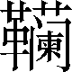
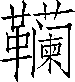

第五十九卷

 魏公子列传第十七

魏公子即信陵君，是“战国四公子”之一。他名冠诸侯，声震天下，其才德远远超过齐之孟尝、赵之平原、楚之春申，《魏公子列传》便是司马迁倾注了高度热情为信陵君所立的一篇专传。

传中详细地叙述了信陵君从保存魏国的目的出发，屈尊求贤，不耻下交的一系列活动，如驾车虚左亲自迎接门役侯嬴于大庭广众，多次卑身拜访屠夫朱亥以及秘密结交赌徒毛公、卖浆者薛公等；着重记写了他在这些“岩穴隐者”的鼎力相助下，不顾个人安危，不谋一己之利，挺身而出完成“窃符救赵”和“却秦存魏”的历史大业。这就歌颂了信陵君心系魏国、礼贤下士、救人于危难的思想品质。这也是本传的主旨所在。诚如《太史公自序》所言，“能以富贵下贫贱，贤能诎于不肖，唯信陵君为能行之”。值得注意的是，传中以大量笔墨描写了下层社会的几个人物（也可以看作附传）。特别是门役侯嬴，他身处市井心怀魏国，才智远非那般王侯公卿所能比。如果说，信陵君在历史舞台上演出了一幕“窃符救赵”的壮举而为人们所称颂的话，那么，门役侯嬴则是这幕壮举的总导演，他更令人敬佩、景仰。这反映了司马迁重视人民群众力量的进步历史观。信陵君的结局是不幸的，他才高遭嫉，竟被魏王废黜，以致沉湎酒色，终因“病酒”而死。这既真实地揭示了信陵君思想性格的弱点，更重要的是揭露了最高统治者嫉贤妒能、打击忠良的丑恶行径，可以说反映了那个时代的某种带有规律性的东西。

通篇洋溢着作者对信陵君的敬慕、赞叹和惋惜的感情，不独篇名直呼“公子”，就是文中称“公子”即有一百四十七次，所谓“无限唱叹，无限低徊”。茅坤说：“信陵君是太史公胸中得意人，故本传亦太史公得意文。”（《史记钞》）可算是知言了。

***【原文】***

魏公子无忌者，魏昭王[1]少子而魏安釐王异母弟也。昭王薨[2]，安釐王即位，封公子为信陵君[3]。是时范雎亡[4]魏相秦，以怨魏齐故[5]，秦兵围大梁，破魏华阳下军[6]，走芒卯[7]。魏王及公子患之。

***【译文】***

[1]魏昭王：魏遫（sù），战国时魏国第五个国君，魏襄王的儿子。前295—前277年在位。

[2]薨（hōnɡ）：周朝时诸侯死去叫薨，后来有封爵的大臣死去也叫薨。

[3]信陵君：封号，即封作信陵地方的领主。

[4]范雎（？—前255）字叔，魏国人。亡：逃亡。

[5]以……故：因……的缘故。

[6]大梁：魏国都城，在今河南省开封市西北。华阳下军：魏国驻扎华阳的军队。华阳，山名，在今河南省新密市境内。

[7]走：赶走。芒卯：魏军主将。

***【原文】***

公子为人仁而下士[1]，士无贤不肖[2]皆谦而礼交之，不敢以其富贵骄士。士以此方数千里争往归[3]之，致[4]食客三千人。当是时，诸侯以公子贤，多客，不敢加兵谋[5]魏十余年。

***【译文】***

[1]下士：尊重士人。

[2]不肖（xiào）：不像样；不贤。

[3]方数千里：见方几千里以内的地区。归：归附。

[4]致：招徕，延揽。

[5]加兵：用兵侵犯。加，施。谋：作侵犯的打算。十余年：大致指魏安釐王十二年—三十年（前265—前247）的情形。

***【原文】***

公子与魏王博[1]，而北境传举烽[2]，言“赵寇[3]至，且入界[4]”。魏王释[5]博，欲召大臣谋。公子止王曰：“赵王田猎[6]耳，非为寇也。”复博如故。王恐，心不在博。居顷[7]，复从北方来传言曰：“赵王猎耳，非为寇也。”魏王大惊，曰：“公子何以知之？”公子曰：“臣之客有能深得赵王阴事[8]者，赵王所为，客辄[9]以报臣，臣以此知之。”是[10]后魏王畏公子之贤能，不敢任公子以国政。

***【译文】***

[1]博：古代的一种棋。

[2]举烽：发警报。

[3]寇：侵犯。

[4]且：将要，快要。界：魏国北方的边界。

[5]释：放下，中止。

[6]田猎：在野外打猎。

[7]居顷：过了不久。

[8]深得：据《索隐》引：谯周作“探得”，也通，而且比“深得”浅显。阴事：隐秘的事情。

[9]辄：每每，经常。

[10]是：此，这。

***【原文】***

魏有隐士[1]曰侯嬴，年七十，家贫，为大梁夷门[2]监者。公子闻之，往请[3]，欲厚遗[4]之。不肯受，曰：“臣[5]修身洁行数十年，终不以监门困故而受公子财。”公子于是乃置酒[6]大会宾客。坐定，公子从[7]车骑，虚左[8]，自迎夷门侯生[9]。侯生摄敝[10]衣冠，直上载公子上坐[11]，不让，欲以观[12]公子。公子执辔[13]愈恭。侯生又谓公子曰：“臣有客在市屠[14]中，愿枉车骑过[15]之。”公子引车[16]入市，侯生下见其客朱亥，俾倪[17]故久立，与其客语，微察[18]公子。公子颜色愈和。当是时，魏将相宗室宾客满堂，待公子举酒[19]。市人皆观公子执辔。从骑皆窃骂侯生。侯生视公子色终不变，乃谢客就车[20]。至家，公子引侯生坐上坐，遍赞宾客[21]，宾客皆惊。酒酣，公子起，为寿[22]侯生前。侯生因谓公子曰：“今日嬴之为公子亦足矣[23]。嬴乃夷门抱关者[24]也，而公子亲枉车骑，自迎嬴于众人广坐之中，不宜有所过[25]，今公子故过之[26]。然嬴欲就[27]公子之名，故久立公子车骑市中[28]，过客以观公子，公子愈恭。市人皆以嬴为小人，而以公子为长者[29]能下士也。”于是罢酒，侯生遂为上客[30]。

***【译文】***

[1]隐士：古代指有学问、有政治才能，但隐居起来不愿参加政治活动的人。

[2]夷门：大梁城有十二个城门，东门叫夷门。

[3]请：问候，访问。

[4]厚：重，多。遗（wèi）：赠送。

[5]臣：侯嬴自称。古人对人表示谦卑，自称臣。

[6]置酒：办酒席。

[7]从：使车骑相从，即带着随从的车马。使动用法。

[8]虚左：空着左边的座位。

[9]侯生：指侯嬴。生，先生的省称。先秦时，“生”为士人的通称。

[10]摄：整理，整顿。敝：破旧。

[11]载：乘坐。上坐：上首座位。

[12]观：观察；考验；窥测。

[13]执辔（pèi）：握着驭马的缰绳。

[14]客：这里是朋友的意思。屠：屠宰牲畜的地方。

[15]枉：本作“曲”解，这里引申有“屈辱委屈”的意思。过：访问。

[16]引车：按着路线赶车。引，领着；带着。

[17]俾倪：通“睥睨”。

[18]微察：暗中观察。

[19]举酒：开宴。

[20]谢：辞谢；辞别。就车：登车。

[21]遍赞宾客：遍赞宾客于侯生，向侯生周遍地介绍宾客。

[22]为寿：向尊长者敬酒，致辞祝贺。

[23]为公子亦足矣：给公子尽力也够了。

[24]抱关者：抱门闩的人。关，门闩。

[25]不宜有所过：不应当去访问别人。另一种解释是，不宜对我有太过分的表示。下句的“故过之”是“诚然是太过分了”的意思。“过”作“过分”解。

[26]今公子故过之：今，应作“令”，意思是我令公子特意陪我去访问朋友。

[27]就：成就。

[28]立：使动用法。“市中”前面省介词“于”，全句意思是，故意使您的车马久久地停在市场上。

[29]长者：年长的人；有德行的人。

[30]上客：高级食客。

***【原文】***

侯生谓公子曰：“臣所过屠者[1]朱亥，此子贤者，世莫能知，故隐[2]屠间耳。”公子往数[3]请之，朱亥故不复谢[4]，公子怪之。

***【译文】***

[1]屠者：屠夫。

[2]隐：埋没的意思。

[3]数：多次；屡次。

[4]复谢：答谢；回拜。

***【原文】***

魏安釐王二十年，秦昭王[1]已破赵长平军，又进兵围邯郸。公子姊为赵惠文王弟平原君夫人，数遗魏王及公子书，请救于魏。魏王使将军晋鄙将[2]十万众救赵。秦王使使者[3]告魏王曰：“吾攻赵旦暮[4]且下，而诸侯敢救者，已[5]拔赵，必移兵先击之。”魏王恐，使人止晋鄙，留军壁邺[6]，名为救赵，实持两端[7]以观望。平原君使者冠盖相属[8]于魏，让魏公子曰：“胜所以自附为婚姻[9]者，以公子之高义[10]，为能急[11]人之困。今邯郸旦暮降秦而魏救[12]不至，安在公子能急人之困也！且公子纵[13]轻胜，弃之降秦，独不怜公子姊邪？”公子患之，数请魏王，及宾客辩士说[14]王万端。魏王畏秦，终不听公子。公子自度[15]终不能得之于王，计[16]不独生而令赵亡，乃请宾客，约[17]车骑百余乘，欲以客往赴[18]秦军，与赵俱死。

***【译文】***

[1]秦昭王（前324—前251）：战国时秦国国君，即秦昭襄王。前306—前251年在位。

[2]将（jiànɡ）：领兵。

[3]使使者：派遣使臣。

[4]旦暮：早晨或晚上。形容时间短。

[5]已：在……以后。

[6]留军：停止进军。壁：原义是营垒，这里作动词，驻扎的意思。邺：魏国邑名，在今河北省临漳县西南。

[7]持两端：比喻左右摇摆，拿不定主意。两端，两头，两方面。

[8]冠盖相属（zhǔ）：穿戴着礼服礼帽，坐着车子，连续地到来。冠，指使者穿戴的衣帽。盖，指使者乘坐的车。

[9]自附为婚姻：有婚姻关系的一种谦词，犹如说高攀结了亲。自附，自愿地依附。

[10]高义：行为高尚，讲义气。另一种解释是：高度的友谊。义，情谊。

[11]急：解救急难。动词。

[12]救：救兵。

[13]纵：纵令；即使。

[14]说（shuì）：劝说。端：理由。

[15]度（duó）：估量；推断。

[16]计：计划；盘算。引申有“决定”的意思。

[17]约：凑集，预备。

[18]赴：投入。

***【原文】***

行过夷门，见侯生，具告所以欲死秦军状[1]。辞决[2]而行，侯生曰：“公子勉之矣[3]，老臣不能从。”公子行数里，心不快，曰：“吾所以待侯生者备[4]矣，天下莫不闻，今吾且死而侯生曾[5]无一言半辞送我，我岂有所失[6]哉？”复引车还，问侯生。侯生笑曰：“臣固[7]知公子之还也。”曰：“公子喜士，名闻天下。今有难[8]，无他端[9]而欲赴秦军，譬若以肉投馁虎[10]，何功[11]之有哉？尚安事[12]客？然公子遇[13]臣厚，公子往而臣不送[14]，以是知公子恨之复返也。”公子再拜，因问。侯生乃屏人间语[15]，曰：“嬴闻晋鄙之兵符[16]常在王卧内，而如姬最幸[17]，出入王卧内，力能窃之。嬴闻如姬父为人所杀，如姬资之[18]三年，自王以下欲求报其父仇，莫能得。如姬为[19]公子泣，公子使客斩其仇头，敬进[20]如姬。如姬之欲为公子死，无所辞[21]，顾未有路[22]耳。公子诚一开口请如姬，如姬必许诺，则得虎符夺晋鄙军，北救赵而西却[23]秦，此五霸之伐[24]也。”公子从其计，请如姬。如姬果盗晋鄙兵符与公子。

***【译文】***

[1]具：通“俱”，都；全。状：情况。

[2]辞决：辞别。决，通“诀”，长别。

[3]勉之矣：好好努力吧。

[4]备：周到；完备。

[5]曾（cénɡ）：竟然。

[6]失：过失；错误。

[7]固：早已；本来就。

[8]难（nàn）：危难；困难。

[9]他：其他；别的。端：头绪；办法。

[10]馁（něi）虎：饿虎。

[11]功：功用；用处。

[12]尚：还。事：用。

[13]遇：待。

[14]送：不仅指送行，也指赠言。

[15]屏（bǐnɡ）人：遣开左右的人。间（jiàn）语：密谈；私语；悄悄地说。

[16]兵符：军事上用的符。

[17]如姬：魏安釐王最宠爱的妃子。幸：指得到帝王宠爱。

[18]资：积蓄。这里指含恨。之：指杀父的仇恨。

[19]为（wèi）：对。

[20]进：献给。

[21]无所辞：没有可推辞的。

[22]顾：但是。路：机会；方法。

[23]却：打退。

[24]五霸：春秋时先后称霸的五个诸侯，指齐桓公、晋文公、楚庄王、吴王阖闾、越王句践。伐：功业。

***【原文】***

公子行，侯生曰：“将在外，主[1]令有所不受，以便[2]国家。公子即合符，而晋鄙不授公子兵而复请[3]之，事必危矣。臣客屠者朱亥可与俱[4]，此人力士。晋鄙听，大善；不听，可使击之。”于是公子泣。侯生曰：“公子畏死邪？何泣也？”公子曰：“晋鄙嚄唶宿将[5]，往恐不听，必当杀之，是以泣耳，岂畏死哉？”于是公子请朱亥。朱亥笑曰：“臣乃市井鼓刀[6]屠者，而公子亲数存[7]之，所以不报谢者，以为小礼[8]无所用。今公子有急[9]，此乃臣效命之秋[10]也。”遂与公子俱。公子过谢侯生。侯生曰：“臣宜从，老不能。请数[11]公子行日，以至晋鄙军之日，北乡[12]自刭，以送[13]公子。”公子遂行。

***【译文】***

[1]主：国君。

[2]以便：以求便利于。

[3]而：通“如”，如果。请：请示，含有核对。

[4]俱：一同去。

[5]嚄唶（huò zé）：原意是大笑大呼，这里形容有威风、有气派的样子。宿将：有资格、有经验的老将。

[6]鼓刀：动刀宰杀。

[7]存：体恤慰问。

[8]小礼：指来往回拜一类的琐碎礼节。

[9]急：急难之事。

[10]效命：献出生命。秋：时机。

[11]数（shǔ）：计算。动词。

[12]北乡（xiànɡ）：面向北方。赵国在魏国的北方，所以这样说。乡，通“向”。

[13]送：这里是报答、报效的意思。

***【原文】***

至邺，矫[1]魏王令代晋鄙。晋鄙合符，疑之，举手视公子[2]曰：“今吾拥十万之众，屯[3]于境上，国之重任，今单车来代之[4]，何如哉？”欲无听。朱亥袖[5]四十斤铁椎，椎[6]杀晋鄙，公子遂将晋鄙军。勒[7]兵下令军中曰：“父子俱在军中，父归；兄弟俱在军中，兄归；独子无兄弟，归养[8]。”得选兵[9]八万人，进兵击秦军。秦军解去[10]，遂救邯郸，存赵。赵王[11]及平原君自迎公子于界，平原君负矢为公子先引[12]。赵王再拜曰：“自古贤人未有及公子者也。”当此之时，平原君不敢自比于人[13]。公子与侯生决，至军，侯生果北乡自刭。

***【译文】***

[1]矫（jiǎo）：假托；假称。

[2]举手视公子：晋鄙表示对信陵君轻慢不信任的态度。

[3]屯：驻防；驻扎。

[4]单车：指信陵君只有少数随从，没有护卫的军队。之：指晋鄙自己。

[5]袖：藏在衣袖里。

[6]椎：用椎子打。动词。

[7]勒：约束；统率；管辖。

[8]归养：回家奉养父母。

[9]选兵：经过挑选的精兵。

[10]解去：解围而去。

[11]赵王：指赵孝成王。

[12]负矢为公子先引：这是一种极隆重的礼节，是自居于奴仆地位的一种表示。，盛弩箭的皮革袋子。先引，在前面引路。

[13]自比于人：把自己比他人（指信陵君）。

***【原文】***

魏王怒公子之盗其兵符，矫杀晋鄙，公子亦自知也。已却秦存赵，使将将其军[1]归魏，而公子独与客留赵。赵孝成王德[2]公子之矫夺晋鄙兵而存赵，乃与平原君计，以五城封公子。公子闻之，意骄矜[3]而有自功之色。客有说公子曰[4]：“物[5]有不可忘，或有不可不忘。夫人有德于公子，公子不可忘也；公子有德于人，愿公子忘之也。且矫魏王令，夺晋鄙兵以救赵，于赵则有功矣，于魏则未为忠臣也。公子乃自骄而功之[6]，窃为公子不取也。”于是公子立自责，似若无所容者。赵王扫除[7]自迎，执主人之礼，引公子就西阶[8]。公子侧行辞让[9]，从东阶上。自言罪过，以负[10]于魏，无功于赵。赵王侍酒[11]至暮，口不忍献五城，以公子退让也。公子竟留赵。赵王以鄗为公子汤沐邑[12]，魏亦复以信陵奉公子。公子留赵。

***【译文】***

[1]使将将其军：前一个“将”，将领，部将。

[2]德：感德，感激。

[3]骄矜（jīn）：骄傲夸耀。

[4]客有说公子曰：这件事发生在前257年，以五城封公子之时。

[5]物：事情。

[6]功：意动用法。之：语尾助词。

[7]扫除：打扫台阶。除，台阶。古代迎接远道的贵宾，主人必须为客人洒扫道路。

[8]公子就西阶：古代宫室坐北朝南，升堂礼节是，主人从东阶上，客人从西阶上。赵王执行主人之礼，所以“引公子就西阶”。

[9]侧行辞让：侧着身子前进，表示谦退礼让。

[10]以：因为。负：违背；辜负。

[11]侍酒：陪着饮酒。

[12]鄗：赵国邑名。在今河北省柏乡县北。汤沐邑：春秋以前是天子赐给诸侯来朝时斋戒自洁的地方；战国以后，汤沐邑的名义还存在，实际上已成为国君赐给大臣的临时封邑。

***【原文】***

公子闻赵有处士[1]毛公藏于博徒，薛公藏于卖浆[2]家，公子欲见两人，两人自匿[3]不肯见公子。公子闻所在，乃间步往从此两人游[4]，甚欢。平原君闻之，谓其夫人曰：“始[5]吾闻夫人弟公子天下无双，今吾闻之，乃妄[6]从博徒卖浆者游，公子妄人[7]耳。”夫人以告公子。公子乃谢夫人去，曰：“始吾闻平原君贤，故负魏王而救赵，以称[8]平原君。平原君之游，徒豪举[9]耳，不求士也。无忌自在大梁时，常闻此两人贤，至赵，恐不得见。以无忌从之游，尚恐其不我欲也[10]，今平原君乃以为羞，其[11]不足从游。”乃装为去[12]。夫人具以语[13]平原君。平原君乃免冠谢[14]，固[15]留公子。平原君门下闻之，半去平原君归公子，天下士复往归公子，公子倾[16]平原君客。

***【译文】***

[1]处（chǔ）士：古代称有才德而隐居不做官的人。

[2]浆：酒的一种，略带酸味。

[3]自匿：主动地隐藏起来。

[4]间（jiàn）步：秘密地步行。游：来往；交游。

[5]始：当初；从前。

[6]妄：胡乱。

[7]妄人：荒唐的人。

[8]称（chèn）：顺遂；满足。

[9]豪举：气魄很大的举动。

[10]不我欲也：即“不欲我也”。否定句中的宾语前置。

[11]其：大概是、恐怕是的意思。

[12]装：整理行装。为去：准备动身离去。

[13]语（yù）：告诉。

[14]免冠谢：摘去帽子谢罪。古人脱帽露顶是赔礼认罪的表示。

[15]固：坚决。

[16]倾：超过；胜过。

***【原文】***

公子留赵十年[1]不归。秦闻公子在赵，日夜出兵东伐魏。魏王患之，使使[2]往请公子。公子恐其[3]怒之，乃诫[4]门下：“有敢为魏王使通[5]者，死。”宾客皆背魏之[6]赵，莫敢劝公子归。毛公、薛公两人往见公子曰：“公子所以重[7]于赵，名闻诸侯者，徒[8]以有魏也。今秦攻魏，魏急而公子不恤[9]，使秦破大梁而夷[10]先王之宗庙，公子当[11]何面目立天下乎？”语未及卒，公子立变色，告车趣驾[12]归救魏。

***【译文】***

[1]留赵十年：自赵孝成王九年—十九年（前257—前247）。

[2]使使：前面的“使”：派遣，命令。动词。后面的使：使者。名词。

[3]其：指魏王。代词。

[4]诫：警告；叮嘱。

[5]通：通报；传达。

[6]背：离开。之：到。

[7]重：尊重。

[8]徒：只；但。

[9]恤（xù）：顾惜；体恤。

[10]夷：平毁。

[11]当：将。

[12]告：吩咐。车：管车的人。趣（cù）：赶快；急促。驾：把马套上车。

***【原文】***

魏王见公子，相与泣，而以上将军[1]印授公子，公子遂将。魏安釐王三十年[2]，公子使使遍告诸侯。诸侯闻公子将，各遣将将兵救魏。公子率五国[3]之兵破秦军于河外，走蒙骜[4]。遂乘胜逐秦军至函谷关，抑[5]秦兵，秦兵不敢出。当是时，公子威振[6]天下，诸侯之客进兵法，公子皆名[7]之，故世俗称《魏公子兵法》[8]。

***【译文】***

[1]上将军：官名，统率军队的最高将领。

[2]魏安釐王三十年：前247年。

[3]五国：指赵、韩、齐、楚和燕。

[4]蒙骜（ào）：秦国的上卿，后为将。

[5]抑：压制；控制。

[6]振：通“震”。

[7]名：命名；署名。动词。称占田为“名田”。

[8]世俗：指社会上一般人。魏公子兵法：《汉书·艺文志》载有《魏公子》二十一篇、图十卷。已失传。

***【原文】***

秦王患之，乃行[1]金万斤于魏，求[2]晋鄙客，令毁[3]公子于魏王曰：“公子亡[4]在外十年矣，今为魏将，诸侯将皆属，诸侯徒闻魏公子，不闻魏王。公子亦欲因此时定南面而王[5]，诸侯畏公子之威，方欲共立之。”秦数使反间[6]，伪贺公子得立为魏王未也。魏王日闻其毁，不能不信，后果使人代公子将。公子自知再以毁废，乃谢病[7]不朝，与宾客为长夜饮，饮醇酒[8]，多近妇女。日夜为乐饮者四岁，竟病酒[9]而卒。其岁[10]，魏安釐王亦薨。

***【译文】***

[1]行：运送；使用。

[2]求：寻找；访求。

[3]毁：诋毁。

[4]亡：逃亡。

[5]南面而王：坐北面南，自立为王。

[6]反间（jiàn）：利用敌人的间谍使敌人获得虚假的情报。

[7]谢病：推说有病。

[8]醇（chún）酒：浓烈的酒。

[9]病酒：饮酒过多而害病。

[10]其岁：魏安釐王三十四年（前243）。

***【原文】***

秦闻公子死，使蒙骜攻魏，拔二十城[1]，初置东郡[2]。其后秦稍蚕食魏[3]，十八岁而虏魏王[4]，屠大梁[5]。

***【译文】***

[1]拔二十城：事在魏无忌死后一年，即魏景湣王（安釐王的儿子，前242—前228年在位）元年。

[2]东郡：在今河北省东南端和山东省西部一带，治所在濮阳（今河南省濮阳县西南）。

[3]稍蚕食魏：据《魏世家》记载：“二年（指魏景湣王二年，即公元前241年），秦拔我朝歌……三年，秦拔我汲。五年，秦拔我垣、蒲阳、衍。”就是秦国“稍蚕食魏”的具体事实。

[4]十八岁：指魏无忌死后十八年。魏王：名假。景湣王的儿子。前227—前225年在位。

[5]屠大梁：指秦国引河水淹大梁的事。屠，即毁坏城池，屠杀城中的军民。

***【原文】***

高祖始微少[1]时，数闻公子贤。及即天子位，每过大梁，常祠[2]公子。高祖十二年[3]，从击黥布[4]还，为公子置守冢[5]五家，世世岁以四时[6]奉祠公子。

***【译文】***

[1]高祖：汉高祖刘邦。始：当初。微少：贫贱。指没有当皇帝的时候。

[2]祠：祭祀。

[3]高祖十二年：前195年。

[4]黥（qínɡ）布（？—前195）：英布。

[5]冢（zhǒnɡ）：坟墓。

[6]四时：四季。

***【原文】***

太史公曰：吾过大梁之墟[1]，求问其所谓夷门。夷门者，城之东门也。天下诸公子[2]亦有喜士者矣，然信陵君之接岩穴隐者[3]，不耻下交[4]，有以[5]也。名冠[6]诸侯，不虚[7]耳。高祖每过之而令民奉祠不绝也。

***【译文】***

[1]墟（xū）：废址；遗址。

[2]诸公子：指孟尝君、平原君、春申君等。

[3]岩穴隐者：指居住山野的隐士。

[4]不耻下交：不以与学问较差或地位较低的人交朋友为可耻。

[5]以：道理；缘故。

[6]冠（ɡuàn）：居第一位；在前面。

[7]虚：虚假。

## 【译文】

魏公子无忌，是魏昭王的小儿子，魏安釐王的同父异母弟弟。魏昭王逝世后，魏安釐王即位，赐封公子为信陵君。这时候，范雎逃离魏国，做了秦国的宰相。因为怨恨魏齐的缘故，秦军围攻魏国，打败了魏国在华阳城下的军队，赶走了魏将芒卯。魏昭王和公子无忌都为这件事忧虑。

魏公子无忌为人仁厚，而又能礼贤下士，凡是士人，不论才能高低，都能谦虚地对他们以礼相待，不敢因为自己富贵怠慢士人。因此，纵横几千里地方的士人都争相前往归顺他。他招徕的食客有三千人。在这个时期，各诸侯国因为公子贤能，门客又多，十多年来不敢进军侵犯魏国。

有一次，魏公子跟魏王下棋时，从北方边境传来了烽火警报，说“赵国侵略军来了，快要进入边界”。魏王停止下棋，想要召集大臣来商议。魏公子劝止魏王说：“赵王打猎而已，不是进行入侵。”两人仍然下棋。魏王害怕，心不在下棋上。过了一会儿，又从北方传来消息说：“赵王打猎而已，不是进行入侵。”魏王非常吃惊，说：“公子为什么知道这回事呢？”魏公子说：“我的门客有人能够打听到赵王的秘密行动，赵王的所作所为，门客总是把它报告我，所以我知道。”从此以后，魏王害怕魏公子的贤能，不敢把国家的政治大事委任魏公子。

魏国有个隐士名叫侯嬴，七十岁了，家里贫困，担任大梁夷门的看门人。魏公子听说有这样一个人，前往访问，要丰厚地送他财物。侯嬴不肯接受，说：“我修身养性几十年，总不能由于看门贫困的原因而接受公子的财物。”魏公子当时就摆设酒席，大请宾客。客人坐定之后，魏公子让车马随从，并空着车子左边的座位，亲自到夷门迎接侯先生。侯先生整理了破旧的衣帽，直接登上魏公子乘坐的车的上位，毫不谦让，想以此来观察公子。魏公子握着马缰绳，显得更加恭敬。侯先生又对魏公子说：“我有个客人在市场的屠宰坊中，希望委屈您的车马，让我去访问他。”魏公子驾车到市场里，侯先生下车去会见他的客人朱亥，眼睛瞟看魏公子，故意久久地站着跟他的客人说话，暗中观察魏公子。魏公子脸色更加温和。正当这时候，魏国的将相、王族、宾客济济一堂，等待魏公子举杯祝酒。市场里的人都看到魏公子拿着马缰绳，随从人员都暗地里咒骂侯先生。侯先生看到魏公子的脸色始终不变，才辞别客人，登上车子。回到家里，魏公子领着侯先生就坐上位，并一一地介绍宾客，宾客都非常吃惊。正当酒喝得酣畅的时候，魏公子起立，来到侯先生面前敬酒祝福。侯先生便对魏公子说：“今天我侯嬴难为公子的也够多了。我只是夷门的看门人，公子却亲自委屈驾着车马，亲自在大庭广众之中迎接我。我本不该去访问客人，却故意委屈公子的车马去访问他。然而，我侯嬴想成全公子的名声，故意让公子的车马久久地站立在市场里，去访问客人，以此观察公子，公子更加恭敬。市民都以为我侯嬴是小人，而把公子看作能礼贤下士的长者。”酒席至此结束，侯先生于是成为魏公子的上宾。

侯先生对魏公子说：“我所访问的屠夫朱亥，这个人是个有才能的人，世人没有谁能了解他，所以隐在屠宰坊里罢了。”魏公子多次前往访问他，朱亥故意不回访致谢，魏公子对此感到奇怪。

魏安釐王二十年，秦昭王已经打破赵国在长平的驻军，又进军围攻邯郸。魏公子的姐姐是赵惠文王弟弟平原君的夫人，她数次送信给魏王和魏公子，向魏国求援。魏王派将军晋鄙带领十万军队去援救赵国。秦王派使者警告魏王说：“我进攻赵国，早晚就要拿下来。假如各诸侯国有敢援救赵国的，在我攻下赵国以后，一定要转移军队先进攻它。”魏王害怕起来，派人让晋鄙停止前进，把军队停留驻防在邺县，名义上是救援赵国，其实是抱着犹豫不决而观望的态度。平原君的使者冠盖相望，接踵而来魏国，责备魏公子说：“我赵胜之所以要高攀您，缔结婚姻关系，是由于您重义气，又能以别人的困难为急。现在，赵国早晚就要投降秦国，而魏国的救兵不来，您能以别人的困难为急的义气在哪里呢？况且您即使轻视我赵胜，抛弃我，让我去投降秦国，难道也不爱惜您的姐姐吗？”魏公子为此而忧愁，多次请求魏王，并请自己的宾客、辩士千方百计游说魏王。魏王害怕秦国，始终不肯听从魏公子。魏公子自己预计终究不能得到魏王的帮助，又想不能只让自己生存而使赵国灭亡，就请宾客准备一百多辆车马，想带领宾客去冲入秦军阵地，跟赵国共生死。

魏公子的队伍经过夷门，见到了侯先生，就把要同秦军决死的情况都告诉了他。告别以后，队伍就出发了。侯先生说：“公子努力吧，老臣我不能跟随了。”魏公子走了几里路，心里不愉快，心想：“我对待侯先生够周到的了，天下没有谁不曾听说。现在我将要死命，而侯先生竟然没有一言半语送给我，我难道有过失的地方吗？”魏公子又把车马掉转回头，追问侯先生。侯先生笑着说：“我本来就知道您会回来的。”他又说：“您喜爱士人，名声传闻天下。现在有了急难，没有别的办法而想冲入秦军阵地，这好比把肉投给饿虎，有什么功效呢？又何必供养门客？然而，您待我情深，您要往秦国而我不送行，因此知道您恨我而又回返。”魏公子拜了两拜，趁势请教侯先生。侯先生就屏退旁人秘密交谈。他说：“我听说晋鄙的兵符经常放在魏王的卧室里，而如姬最受宠幸，在魏王的卧室里进进出出，有办法可以偷到兵符。我还听说如姬的父亲被人谋杀，如姬怀恨三年，从魏王以下，都想寻找机会替她报杀父之仇，没有人能找到。如姬对魏公子哭诉，魏公子派人斩了她仇人的头，恭敬地献给如姬。如姬要替您效死而不会有推辞的时候，只因还没有找到机会罢了。您如果一开口请求如姬帮忙，如姬一定会答应，那么您就能得到虎符夺取晋鄙的军队，然后往北救援赵国，向西击退秦军，这是五霸一样的功业啊！”魏公子听从侯嬴的计谋，请求如姬帮忙。如姬果真偷了晋鄙的兵符给魏公子。

魏公子出发时，侯先生说：“将军在外，君命有时可以不接受，为的是有利于国家。公子如果合了兵符，但晋鄙把军队交给您，还要请示魏王，事情一定危险了。我的客人屠夫朱亥可跟您一起去，这人是个大力士。晋鄙如能听从，就太好了；如不能听从，就可以让朱亥击杀他。”这时候，魏公子哭了。侯先生说：“公子怕死吗？为什么哭呢？”魏公子说：“晋鄙是一位叱咤风云的老将，我去恐怕他不肯听从，必定要杀他。我因而哭泣罢了，难道是害怕死吗？”这时，魏公子请求朱亥同行，朱亥笑着说：“我只是市场里操刀的屠夫，公子却多次亲自问候。我之所以不回访致谢，是由于我认为那是小礼节，没什么实际意义。如今您有急难，这是我为您效命的时机啊！”朱亥就跟魏公子一起出发了。魏公子去向侯先生告别，侯先生说：“我本当随从您，可是我年老不行了。请让我计算您的行程，当您到了晋鄙军营的那一天，我面向北方割脖子自杀，来报答公子。”魏公子于是出发了。

魏公子到了邺县，假托魏王的命令取代晋鄙。晋鄙合了兵符，怀疑这件事，举起手来看了看魏公子，说：“现在我拥有十万大军，驻扎国境，这是国家的重任。现在，您独自驾车来接替我，这是怎么一回事呢？”晋鄙正想不服从，朱亥衣袖里藏着四十斤重的铁椎，用铁椎杀死了晋鄙。魏公子于是统率晋鄙的军队。他又整编队伍，向全军发布命令说：“父子都在军营里的，父亲回家；兄弟都在军营里的，为兄的回家；独生儿子没有兄弟的，回家养亲。”魏公子得到精兵八万人，进军击杀秦军。秦军解除包围撤离了，魏公子于是救了邯郸，保留了赵国。赵王和平原君亲自到边界迎接魏公子，平原君背着箭袋在前面给魏公子引路。赵王拜了两拜说：“自古以来，贤人没有赶得上公子的。”在这个时候，平原君不敢把自己和信陵君相比。魏公子和侯先生分别以后，到达军营时，侯先生果然面向北方引颈自杀了。

魏王怨恨魏公子偷他的兵符并假托命令杀死晋鄙，魏公子也自知有违君命。在击退秦军保存赵国以后，魏公子派了一个将领统率他们的军队回到魏国，而独自和宾客留在赵国。赵孝成王感激魏公子假托命令、夺取晋鄙的军队而保存了赵国，就跟平原君商议，要把五个县城赐封给魏公子。魏公子听说这件事后，内心骄傲自矜，并流露自以为有功劳的神色。宾客有人劝说公子道：“事物有的不可以忘记，有的不可以不忘记。别人对公子有恩德，公子不可以忘记；公子对别人有恩德，希望公子忘记它。况且公子假托魏王的命令夺取晋鄙的军队去救援赵国，对赵国来说就是有功劳了，但对于魏国来说公子就不是忠臣了。公子却骄傲地把它当作自己的功劳，我私下认为公子不应采取这样的态度。”这时，魏公子立即责备自己，似乎无地自容。赵王打扫台阶，亲自迎接，执行主人的礼节，指引魏公子走上西边的台阶。魏公子谦让地侧着身走，从东边的台阶上去。自己陈述罪过，认为辜负了魏国，对赵国也没有功劳。赵王陪酒一直到傍晚，口中避而不谈献出五个县城的事，这是因为公子太谦让了。魏公子终于留在赵国。赵王把鄗邑作为魏公子斋戒自洁所需的封邑，魏国也再把信陵献给魏公子。魏公子留在赵国。

魏公子听说赵国有隐士毛公隐居赌徒群中，又有薛公隐居卖酒浆人家里，便想要会见这两个人。两人自己躲起来，不肯会见魏公子。魏公子听说了他们所在的地方，就秘密地步行前往跟这两个人交往，彼此非常融洽。平原君听说这件事，对他的夫人说：“当初我听说夫人的弟弟公子是天下独一无二的，现在我听说他竟然随便跟赌徒和卖酒浆的人交往。公子是个糊涂人罢了。”平原君夫人把这些告诉了魏公子。魏公子就告别平原君夫人要离开，说：“当初我听说平原君贤能，所以辜负了魏王而救援赵国，来满足平原君的心意。但平原君和人们的交游，只是一种装饰门面的壮举罢了，并不是为了访求贤士。我无忌在大梁的时候，时常听说这两个人贤能。到了赵国以后，就怕不能见到他们。像我无忌这样的人跟他们交往，还恐怕他们不搭理我呢。如今，平原君竟然把跟他们交往当作羞耻的事情，实在是不值得跟他交往。”于是，整理行装准备离开赵国。平原君夫人把这些话告诉平原君，平原君就脱掉帽子谢罪，硬是挽留魏公子。平原君的门下客听说这件事，半数人离开平原君来依附魏公子。天下的士人又前往归附魏公子，魏公子的门客大大地超过平原君。

魏公子留居赵国十年不回国。秦国听说魏公子在赵国，夜以继日地派兵东去进攻魏国。魏王担心这件事，派遣使者去请魏公子回国。魏公子害怕魏王怨恨他，就告诫门下客：“有谁敢替魏王的使者通报的，处死。”宾客都是背弃魏国来到赵国的，没有谁敢劝告魏公子回国。毛公和薛公两人去见魏公子说：“公子之所以在赵国受到重视，声名传闻到各国，只因为有魏国。现在秦国进攻魏国，魏国危急而公子不同情，假使秦军攻破大梁，毁坏先王的宗庙，公子将有什么面目站立世上呢？”话还没有说完，魏公子立刻变了脸色，吩咐准备车马立即起程回去解救魏国。

魏王见到魏公子，相对哭泣，然后把上将军的印信授予魏公子，魏公子于是担任上将军。魏安釐王三十年，魏公子派使者通告各诸侯国。各国听说魏公子担任上将军，分别派遣将领统率军队来救援魏国。魏公子统率五国的军队，在河外打败了秦军，赶走了蒙骜。于是，乘胜把秦军驱逐到函谷关，堵住秦军，秦军不敢出关。正当这个时候，魏公子的威名震动天下，各国的宾客进献有关兵法的文章，魏公子把它们加以整理，以自己的名字给这部书命名，所以世俗称为《魏公子兵法》。

秦王为此感到担心，于是拿出大量钱财到魏国去行贿，寻找晋鄙的门客，让他们在魏王面前毁谤公子说：“公子流亡在国外十年了，现在担任魏国的上将军，各国的将领都隶属于他。各国只知有魏公子，不知有魏王。公子也想趁这个时候决定南面称王，各国害怕公子的声威，正想共同拥立他。”秦国多次派人行反间计，假装祝贺魏公子，看魏公子能否立为魏王。魏王每天都听到这些毁谤的话，不得不相信，后来果然派人取魏代公子上将军的职位。魏公子自己知道又因为毁谤而被废弃不用，就借口有病不上朝，跟宾客通宵达旦地宴饮，饮烈酒，经常接近女色。日夜进行狂饮达四年之久，终于因酒而病死了。这一年，魏安釐王也去世了。

秦国听说魏公子死了，就派蒙骜攻打魏国，占领了二十个城邑，开始设置东郡。这以后秦国逐渐蚕食魏国，十八年后俘虏了魏王，夷灭大梁。

汉高祖刘邦当初寒微的时候，屡次听说魏公子贤能。等到就任天子以后，每次经过大梁，常常祭祀魏公子。高祖十二年，从打败黥布的地方回来，给魏公子配备五户人家看守坟墓，世世代代每年按四季祭祀魏公子。

太史公说：我经过大梁故城，去访了那个所谓夷门。原来夷门就是城的东门。天下的几位公子，也有喜欢士人的，但像信陵君这样接待民间的隐士，不以与卑下的人交往为耻，是有道理的。他的声名在各国中排在首位，一点也不假啊！汉高祖每逢经过这里，都要人民不断地祭祀他。

