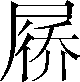

第六十一卷

 范雎蔡泽列传第十九

本篇是战国末期秦国两位国相范雎和蔡泽的合传。

范雎和蔡泽同是辩士出身，在任秦相之前都曾走过一段坎坷的道路。范雎在魏国被魏相魏齐屈打几乎致死，蔡泽游说诸侯四处碰壁，但他们并不因此而气馁，后来“羁旅入秦”，凭着能言善辩，足智多谋，终于成为秦相。范雎任相后，在外交上提出远交近攻的策略，在国内打击外戚势力加强王室集权，为秦国成就帝业奠定了基础，在秦国历史上有一定的功绩。但他的致命弱点是“一饭之德必偿，睚眦之怨必报”，感情用事，因小失大，以致害死名将白起，又任用亲信，造成恶果。蔡泽说服范雎让位后被命为国相，他的志向是个人长享富贵，因而一旦得到满足便不再进取，所以难有大的作为。作者全面地记述了他们的事迹，而为其立传的主旨则取“能忍訽〔诟〕于魏齐，而信威于强秦”这一角度，颂扬他们不因遭受困辱而沮丧，能够激励意志以奋发的精神，这或许是“太史公寓主意于客位”（刘熙载《艺概》）吧。

这是一篇相当生动、富于艺术魅力的传记作品，它的写法几乎近于小说。首先，叙事波澜起伏，具有很强的故事性。如写范雎脱险一节，由范雎遭到毒打到他佯装死去，再到他被抛到荒野，最后隐姓埋名躲藏起来，情节一波三折，而范雎顽强、机智的性格便在情节的展开中刻画出来。再如，写范雎入秦巧避穰侯，以及他乔装引诱须贾入宫等也都极尽曲折之妙，读来引人入胜。其次，运用肖像、心理等描写手法刻画形象。如唐举为蔡泽看相，戏言其貌不扬，寥寥几笔，朝天鼻、凸额头、塌鼻梁、端肩膀、罗圈腿的容貌体态便漫画般地活现读者面前。再如，范雎与蔡泽互相辩难，各自揣摩对方心理，你来我往，争长论短，从中不难看出范雎故意狡辩以逞其强，而蔡泽胸有成竹必欲战而胜之的各自心态。阅读时，简直无异于读一篇小说。

***【原文】***

范雎[1]者，魏[2]人也，字叔。游说诸侯，欲事[3]魏王，家贫无以自资[4]，乃先事魏中大夫[5]须贾。

***【译文】***

[1]范雎：当根据清代钱大昕《通鉴注辨正》和王先慎《韩非子集解》改作范雎。

[2]魏：详见《魏世家》。

[3]事：服事；侍奉。

[4]自资：自己供给费用。

[5]中大夫：官名。

***【原文】***

须贾为魏昭王[1]使于齐，范雎从。留数月，未得报[2]。齐襄王闻雎辩口[3]，乃使人赐雎金十斤及牛酒，雎辞谢不敢受。须贾知之，大怒，以为雎持魏国阴事[4]告齐，故得此馈[5]，令雎受其牛酒，还其金。既归，心怒雎，以告魏相。魏相，魏之诸公子[6]，曰魏齐。魏齐大怒，使舍人笞[7]击雎，折胁[8]摺齿。雎详[9]死，即卷以箦[10]，置厕中。宾客饮者醉，更溺[11]雎，故僇辱[12]以惩后，令无妄言者。雎从箦中谓守者曰：“公[13]能出我，我必厚谢公。”守者乃请出弃箦中死人。魏齐醉，曰：“可矣。”范雎得出。后魏齐悔，复召求之。魏人郑安平闻之，乃遂操[14]范雎亡，伏匿[15]，更名姓曰张禄。

***【译文】***

[1]魏昭王：名遫。魏襄王的儿子。前295—前277年在位。

[2]报：答复。

[3]齐襄王：田法章，前283—前265年在位。辩口：口才好；善于辩论。

[4]阴事：隐秘的事情。

[5]馈（kuì）：赠送的财礼。

[6]诸公子：指国君的庶子们。

[7]笞（chī）：击；抽打。

[8]胁（xié）：从腋下到腰上的部分。

[9]详：通“佯”，假装。

[10]箦（zé）：用竹篾或苇草编成的席子。

[11]更（ɡēnɡ）：连续；交替。溺：通“尿”。

[12]僇辱：侮辱；糟蹋。

[13]公：对尊长或平辈的敬称。

[14]操：持；携带。

[15]伏匿：躲藏。

***【原文】***

当此时，秦昭王使谒者[1]王稽于魏。郑安平诈为卒[2]，侍王稽。王稽问：“魏有贤人可与俱[3]西游者乎？”郑安平曰：“臣里[4]中有张禄先生，欲见君，言天下事。其人有仇，不敢昼见[5]。”王稽曰：“夜与俱来。”郑安平夜与张禄见王稽。语未究[6]，王稽知范雎贤，谓曰：“先生待我于三亭[7]之南。”与私约[8]而去。

***【译文】***

[1]秦昭王：嬴稷，即秦昭襄王。前306—前251年在位。谒者：官名。

[2]诈：假装。卒：勤务兵。

[3]俱：一起。

[4]臣：表示谦卑的自称。里：古代居民区。

[5]见（xiàn）：通“现”，露面，出来。

[6]究：尽；完。

[7]三亭：冈名。在今河南省尉氏县西南。

[8]私约：暗地里约定。

***【原文】***

王稽辞魏去，过载[1]范雎入秦。至湖[2]，望见车骑从西来。范雎曰：“彼[3]来者为谁？”王稽曰：“秦相穰侯东行[4]县邑。”范雎曰：“吾闻穰侯专[5]秦权，恶内诸侯客[6]，此恐辱我，我宁且[7]匿车中。”有顷，穰侯果至，劳[8]王稽，因立车[9]而语曰：“关东[10]有何变？”曰：“无有。”又谓王稽曰：“谒君得无与诸侯客子[11]俱来乎？无益，徒乱人国耳。”王稽曰：“不敢。”即别去。范雎曰：“吾闻穰侯智士[12]也，其见事迟[13]，乡者[14]疑车中有人，忘索[15]之。”于是范雎下车走，曰：“此必悔之。”行十余里，果使骑[16]还索车中，无客，乃已。王稽遂与范雎入咸阳[17]。

***【译文】***

[1]过：经过约定的地点。载：装载。

[2]湖：县名。在函谷关西侧，今河南省灵宝市境内。

[3]彼：那。

[4]穰（ránɡ）侯：秦昭王母宣太后的同母胞弟魏冉。行（xínɡ）：巡视；考察。

[5]专：单独掌握或占有；独断专行。

[6]恶（wù）：憎恨；讨厌。内：通“纳”。诸侯客：指六国的游说之士。

[7]宁（nìnɡ）：宁可；宁愿。且：暂且。

[8]劳（lào）：慰问。

[9]立车：停车。

[10]关东：函谷关以东，指秦以外的各国。

[11]谒君：对谒者的敬称。客子：旅居异地的人。

[12]智士：聪明人。

[13]见事迟：遇到事情反应迟钝。

[14]乡者：早先；刚才。乡，通“向”。

[15]索：搜寻。

[16]骑：骑兵。

[17]咸阳：秦国都城，在今陕西省咸阳市东北。

***【原文】***

已报使，因言曰：“魏有张禄先生，天下辩士也。曰‘秦王之国危于累卵[1]，得臣则安。然不可以书传也’。臣故载来。”秦王弗信，使舍食草具[2]。待命岁余。

***【译文】***

[1]累卵：比喻形势极其危险，像摞起来的蛋很容易倒下打碎一样。

[2]舍：居住。草具：粗劣的食物。

***【原文】***

当是时，昭王已立三十六年[1]。南拔楚之鄢郢[2]，楚怀王[3]幽死于秦。秦东破齐[4]。湣王尝称帝[5]，后去之。数困三晋[6]。厌天下辩士，无所信。

***【译文】***

[1]昭王已立三十六年：下文所写楚国、齐国和三晋与秦国发生的事情，是先后发生在秦昭王即位的三十六年之中，而不是指都发生在这一年。

[2]鄢郢：楚都。在今湖北宜城市南。

[3]楚怀王：熊槐。前328—前299年在位。前296年死在秦国。

[4]东破齐：发生在秦昭王二十二年（前285）。

[5]湣王尝称帝：秦昭王十九年（前288）十月，昭王自立为西帝，派魏冉到齐国尊湣王为东帝。十二月，湣王接受苏代建议，将帝号退还给秦国，昭王也去帝号仍旧称王。

[6]三晋：战国初年，晋国大臣韩、赵、魏三家瓜分晋国，分别建国，历史上称它们为“三晋”，有时也可以单指其中的一国或两国。

***【原文】***

穰侯、华阳君[1]，昭王母宣太后[2]之弟也；而泾阳君、高陵君[3]皆昭王同母弟也。穰侯相，三人者更将[4]，有封邑，以太后故，私家富重[5]于王室。及穰侯为秦将，且欲越韩、魏而伐齐纲、寿[6]，欲以广[7]其陶封。范雎乃上书曰：

***【译文】***

[1]华（huà）阳君：芈戎，又号新城君。

[2]宣太后：芈八子。楚国贵族出身。

[3]泾阳君：嬴芾。封邑在泾阳（今陕西省泾阳县西北）。高陵君：嬴悝。封邑在高陵（今陕西省西安市高陵区）。

[4]更将：轮流更替担任将领。

[5]重：多。

[6]纲：也作“刚”，在今山东省宁阳县东北。寿：在今山东省东平县西南。

[7]广：增广；扩大。陶：齐邑名。在今山东省菏泽市定陶区西北。

***【原文】***

臣闻明主立政[1]，有功者不得不赏，有能者不得不官[2]，劳大者其禄[3]厚，功多者其爵[4]尊，能治众者其官大。故无能者不敢当职[5]焉，有能者亦不得蔽隐[6]。使以臣之言为可，愿行而益利其道[7]；以臣之言为不可，久留臣无为[8]也。语曰：“庸主赏所爱而罚所恶；明主则不然，赏必加于有功，而刑必断[9]于有罪。”今臣之胸不足以当椹质[10]，而要[11]不足以待斧钺，岂敢以疑事[12]尝试于王哉！虽[13]以臣为贱人而轻辱，独不重任臣者之无反复[14]于王邪？

***【译文】***

[1]立政：制定政治原则。

[2]官：给官做。

[3]禄：古代官吏的薪给。

[4]爵：爵位。

[5]当职：担任职务。

[6]蔽隐：埋没。

[7]道：治国之道。

[8]无为：没有意义；没有作用。

[9]断：判断；决断。

[10]椹（zhēn）质：也作“砧锧”，古代杀人用的垫板。

[11]要：通“腰”。

[12]疑事：游移不定的事情。

[13]虽：纵令；即使。

[14]重：重视。任臣者：保荐我的人，指王稽。反复：这里有虚伪欺骗的意思。

***【原文】***

且臣闻周有砥砨[1]，宋有结绿[2]，梁有县藜[3]，楚有和朴[4]，此四宝者，土之所生，良工之所失[5]也，而为天下名器。然则圣王之所弃者[6]，独不足以厚[7]国家乎？

***【译文】***

[1]砥砨：美玉名。

[2]结绿：美玉名。

[3]县（xuán）藜：也作“悬黎”“玄黎”，美玉名。

[4]和朴：也作“和璞”“和璧”。

[5]工：古代指从事手工技艺劳动的人。失：失误。

[6]圣王之所弃者：隐指自己不被秦王理解、重视。

[7]厚：有利；有益。

***【原文】***

臣闻善厚家[1]者取之于国，善厚国[2]者取之于诸侯。天下有明主则诸侯不得擅厚[3]者，何也？为其割荣[4]也。良医知病人之死生，而圣主明于成败之事，利则行之，害则舍之，疑则少尝[5]之，虽舜[6]禹复生，弗能改已。语之至者[7]，臣不敢载之于书，其浅者又不足听也。意者臣愚而不概[8]于王心耶？亡其言臣者[9]贱而不可用乎？自[10]非然者，臣愿得少赐游观之间[11]，望见颜色。一语无效[12]，请伏斧质[13]。

***【译文】***

[1]厚家：使一家富裕。厚，使动用法。家，大夫的领地。

[2]厚国：使国家富强。

[3]擅厚：独占利益。

[4]割：划分；分割。荣：光荣；荣耀。

[5]少：稍；略微。尝：尝试。

[6]舜：传说中父系氏族社会后期部落联盟领袖。

[7]语之至者：最深切的话。

[8]意：猜想。概：系念；关切。

[9]亡（wú）其：抑或；还是。言臣者：指王稽。

[10]自：如果。

[11]间（jiàn）：空隙。

[12]效：作用；功用。

[13]伏：通“服”，受到应得的惩处。斧质：斧子和砧板。古代杀人的刑具。

***【原文】***

于是秦昭王大说[1]，乃谢[2]王稽，使以传车[3]召范雎。

***【译文】***

[1]说（yuè）：通“悦”。

[2]谢：表示歉意和谢意，也有告诉的意思。

[3]传（zhuàn）车：载送宾客的专用车辆。

***【原文】***

于是范雎乃得见[1]于离宫，详为不知永巷[2]而入其中。王来而宦者怒，逐之，曰：“王至！”范雎缪为[3]曰：“秦安得王？秦独有太后、穰侯耳。”欲以感怒[4]昭王。昭王至，闻其与宦者争言，遂延迎[5]，谢曰：“寡人宜以身受命[6]久矣，会义渠之事[7]急，寡人旦暮自请太后；今义渠之事已，寡人乃得受命。窃闵然[8]不敏，敬执[9]宾主之礼。”范雎辞让。是日观范雎之见者，群臣莫不洒然[10]变色易容者。

***【译文】***

[1]见（xiàn）：引见。

[2]永巷：宫中长巷，通往后宫的巷道。

[3]缪（miù）为：随便乱说。缪，通“谬”。为，通“谓”。

[4]感怒：激怒。

[5]延迎：迎接；接待。

[6]受命：领教；接受教导。

[7]义渠之事：义渠是西戎的一个部落。

[8]闵然：昏昧糊涂的样子。

[9]执：执行；行。

[10]洒然：严肃敬畏的样子。

***【原文】***

秦王屏[1]左右，宫中虚无人。秦王跽[2]而请曰：“先生何以幸教[3]寡人？”范雎曰：“唯唯[4]。”有间[5]，秦王复跽而请曰：“先生何以幸教寡人？”范雎曰：“唯唯。”若是者三。秦王跽曰：“先生卒不幸教寡人邪？”范雎曰：“非敢然也。臣闻昔者吕尚之遇文王[6]也，身为渔父而钓于渭[7]滨耳。若是者，交疏[8]也。已说而立为太师[9]，载与俱归者，其言深也。故文王遂收功[10]于吕尚而卒王天下。乡使[11]文王疏吕尚而不与深言，是周无天子之德，而文、武无与成其王业也。今臣羁旅[12]之臣也，交疏于王，而所愿陈者皆匡[13]君之事，处[14]人骨肉之间，愿效愚忠[15]而未知王之心也。此所以王三问而不敢对者也。臣非有畏而不敢言也。臣知今日言之于前，而明日伏诛[16]于后，然臣不敢避也。大王信[17]行臣之言，死不足以为臣患[18]，亡[19]不足以为臣忧，漆身为厉[20]，被[21]发为狂，不足以为臣耻。且以五帝[22]之圣焉而死，三王[23]之仁焉而死，五伯[24]之贤焉而死，乌获、任鄙[25]之力焉而死，成荆、孟贲、王庆忌、夏育[26]之勇焉而死。死者，人之所必不免也。处必然之势[27]，可以少有补于秦，此臣之所大愿也，臣又何患哉！伍子胥橐载而出昭关[28]，夜行昼伏，至于陵水[29]，无以糊其口[30]，膝行蒲伏[31]，稽首肉袒[32]，鼓腹吹篪[33]，乞食于吴市，卒兴吴国，阖闾为伯[34]。使臣得尽谋[35]如伍子胥，加之以幽囚[36]，终身不复见，是臣之说行也，臣又何忧？箕子、接舆[37]漆身为厉，被发为狂，无益于主。假使臣得同行于箕子，可以有补于所贤之主，是臣之大荣也，臣有[38]何耻？臣之所恐者，独恐臣死之后，天下见臣之尽忠而身死，因以是杜口裹足[39]，莫肯乡[40]秦耳。足下上畏太后之严，下惑于奸臣之态[41]，居深宫之中，不离阿保[42]之手，终身迷惑，无与昭[43]奸。大者宗庙[44]灭覆，小者身以孤危，此臣之所恐耳。若夫[45]穷辱之事，死亡之患，臣不敢畏也。臣死而秦治，是臣死贤[46]于生。”秦王跽曰：“先生是何言也！夫秦国辟[47]远，寡人愚不肖，先生乃幸辱至于此，是天以寡人，恩先生而存先王之宗庙[48]也。寡人得受命于先生；是天所以幸先王，而不弃其孤[49]也。先生奈何而言若是！事无小大，上及太后，下至大臣，愿先生悉以教寡人，无疑寡人也。”范雎拜[50]，秦王亦拜。

***【译文】***

[1]屏（bǐnɡ）：退避。使动用法。

[2]跽（jì）：长跪。两膝跪在地上，上身挺直，表示庄重、恭敬。

[3]教：指点；教导。

[4]唯唯（wěi wěi）：连声答应。

[5]有间：隔一会儿。

[6]文王：姬昌。商纣时为西伯，也称西伯昌。商末周族领袖。

[7]渭：渭河。在陕西省中部，黄河最大支流之一。吕尚与文王相遇在渭河旁的磻（pán）溪（今陕西省宝鸡市东南）。

[8]疏：疏远。

[9]太师：官名。

[10]收功：得力。

[11]乡（xiànɡ）使：假使。乡，通“向”。

[12]羁旅：指的是长久寄居他乡，也指客居异乡的人。

[13]陈：陈述；说。匡：纠正；帮助。

[14]处：对待；处理。

[15]效：献出。愚忠：臣子对帝王尽忠，自称“愚忠”。

[16]伏诛：受死刑。

[17]信：诚然；果真。

[18]患：忧虑；担心。

[19]亡：流亡；放逐。

[20]漆身为厉（lài）：用漆汁涂在身上，生疮，像得了癞病一样。厉，通“癞”，麻风。

[21]被：通“披”。

[22]五帝：传说中的上古帝王，即黄帝、颛顼、帝喾、唐尧和虞舜。

[23]三王：指夏禹、商汤和周文王；一说指夏禹、商汤和周文王、武王。

[24]五伯（bà）：五霸。

[25]乌获：秦国大力士，传说能举起百钧（三千斤）。任鄙：秦国大力士。

[26]成荆：勇士。孟贲（bēn）：卫国勇士。王庆忌：春秋时吴王僚的儿子，也是勇士。夏育：卫国勇士。

[27]必然之势：指人人都有一死。

[28]伍子胥：春秋时吴国大夫。详见《伍子胥列传》。橐（tuó）：有底的袋子。昭关：在今安徽省含山县北小岘山。

[29]陵水：即溧水，又名濑水。东流为永阳江，江中有小洲，叫濑渚，是伍子胥乞讨的地方。

[30]糊其口：本是吃粥的意思。比喻胡乱弄到食物，勉强地维持生活。

[31]蒲伏：即“匍匐”。爬行。

[32]稽（qǐ）首：磕头至地。肉袒（tǎn）：脱衣露体。形容十分困苦。

[33]鼓腹：袒露胸腹，鼓起肚皮。篪（chí）：古代管乐器。

[34]阖闾：春秋末年吴国国君。详见《吴太伯世家》。伯：通“霸”。

[35]尽谋：尽情施展计谋。

[36]幽囚：囚禁。

[37]箕子：商代贵族。接舆：春秋时楚国隐士，假装狂人，逃避世事。

[38]有（yòu）：通“又”。

[39]杜口：闭口不说话。裹足：缠住脚不走路。

[40]乡：通“向”，向往；向着。

[41]态：指奸臣谄媚、蒙蔽的态度。

[42]阿（ē）保：古代教育抚养贵族子女的妇女，即保姆。

[43]昭：显明；辨别。

[44]宗庙：这里借指王室、国家。

[45]若夫：至于。

[46]贤：胜过。

[47]辟：通“僻”，偏僻。

[48]宗庙：指帝王、诸侯祭祀祖宗的处所。

[49]孤：遗孤。秦昭王指自己。

[50]拜：古代为下跪叩头及打躬作揖的通称。

***【原文】***

范雎曰：“大王之国，四塞[1]以为固，北有甘泉、谷口[2]，南带泾[3]、渭，右陇、蜀[4]、左关[5]、阪，奋击[6]百万，战车千乘，利则出攻，不利则入守，此王者之地也。民怯[7]于私斗而勇于公战，此王者之民也。王并[8]此二者而有之。夫以秦卒之勇，车骑之众，以治[9]诸侯，譬若施韩卢而搏蹇兔[10]也，霸王之业可致[11]也，而群臣莫当[12]其位。至今闭关十五年，不敢窥[13]兵于山东者，是穰侯为秦谋[14]不忠，而大王之计有所失也。”秦王跽曰：“寡人愿闻失计。”

***【译文】***

[1]塞（sài）：边界险要的地方。

[2]甘泉：山名。在今陕西省淳化县西北。谷口：寒门，在今陕西省礼泉县东北。

[3]带：围绕。泾：泾河，渭水的支流，在陕西省中部。

[4]陇：指陇坂，即今六盘山的南段，绵延于陕、甘边境。蜀：泛指当时蜀地（今四川省中西部）的崇山峻岭。

[5]关：函谷关。

[6]奋击：指精锐的士兵。

[7]怯：胆小；畏缩不前。

[8]并：兼。

[9]治：对付。

[10]施：驱使。韩卢：韩国著名的猎狗，颜色黑，所以叫“卢”。蹇免：跛腿兔子。

[11]致：得到；达成。

[12]当：担任；相称。

[13]窥：暗中察看。

[14]谋：出谋划策。

***【原文】***

然左右多窃听者，范雎恐，未敢言内[1]，先言外事[2]，以观秦王之俯仰[3]。因进曰：“夫穰侯越韩、魏而攻齐纲、寿，非计也。少出师则不足以伤齐，多出师则害于秦。臣意[4]王之计，欲少出师而悉[5]韩、魏之兵也，则不义矣。今见与国[6]之不亲也，越人之国而攻，可乎？其于计疏[7]矣。且昔齐湣王南攻楚，破军杀将，再辟地千里，而齐尺寸之地无得焉者，岂不欲得地哉，形势[8]不能有也。诸侯见齐之罢弊[9]，君臣之不和也，兴兵而伐齐，大破之。士辱兵顿[10]，皆咎[11]其王，曰：‘谁为此计者乎？’王曰：‘文子[12]为之。’大臣作乱，文子出走。故齐所以大破者，以其伐楚而肥[13]韩、魏也。此所谓借贼兵而赍[14]盗粮者也。王不如远交而近攻，得寸则王之寸也，得尺亦王之尺也。今释[15]此而远攻，不亦缪乎！且昔者中山[16]之国地方五百里，赵独吞之，功成名立而利附焉，天下莫之能害[17]也。今夫韩、魏，中国之处而天下之枢[18]也，王其欲霸，必亲中国以为天下枢，以威[19]楚、赵。楚强则附赵，赵强则附楚，楚、赵皆附，齐必惧矣。齐惧，必卑辞重币以事秦[20]。齐附而韩、魏因可虏[21]也。”昭王曰：“吾欲亲魏久矣，而魏多变[22]之国也，寡人不能亲。请问亲魏奈何？”对曰：“王卑词重币以事之；不可，则割地而赂之；不可，因举兵而伐之。”王曰：“寡人敬闻命矣。”乃拜范雎为客卿，谋兵事。卒听范雎谋，使五大夫[23]绾伐魏，拔怀[24]。后二岁，拔邢丘[25]。

***【译文】***

[1]内：指太后、穰侯等专权的事。

[2]外事：指穰侯的对外策略。

[3]俯仰：本意是低头和抬头，借指秦王的喜怒颜色、可否态度等，即他的意旨所在。

[4]意：猜测；估计。

[5]悉：全部出动。

[6]与国：结盟的国家。

[7]疏：疏忽；粗心大意。

[8]形势：指当时的国际关系和地理环境。

[9]罢（pí）弊：疲惫困顿。

[10]顿：挫折；困厄。

[11]咎：责怪。

[12]文子：指田文。

[13]肥：给好处。

[14]兵：武器。赍（jī）：送给；资助。

[15]释：通“舍”，舍弃；放弃。

[16]中山：国名，又名鲜虞。地在今河北省正定县东北。

[17]害：妨害。

[18]中国：指中原地区。枢：门轴，门户的转轴。

[19]威：示威。

[20]卑辞重币：谦卑的语言，丰厚的礼物。

[21]虏：俘虏；收服。

[22]多变：变化多端。

[23]五大夫：爵位名。

[24]怀：春秋属郑，战国属魏。故城在今河南省武陟县西南。

[25]邢丘：邑名。即今河南省温县东平阜旧城。

***【原文】***

客卿范雎复说昭王曰：“秦、韩之地形，相错如绣[1]。秦之有韩也，譬如木之有蠹[2]也，人之有心腹之病[3]也。天下无变则已，天下有变，其为秦患者孰大于韩乎？王不如收[4]韩。”昭王曰：“吾固欲收韩，韩不听，为之奈何？”对曰：“韩安得无听乎？王下兵而攻荥阳[5]，则巩、成皋[6]之道不通；北断太行之道，则上党[7]之师不下。王一兴兵而攻荥阳，则其国断而为三[8]。夫韩见必亡，安得不听乎？若韩听，而霸事因可虑[9]矣。”王曰：“善。”且欲发使于韩。

***【译文】***

[1]相错：交错；错杂。绣：锦绣。

[2]蠹（dù）：蛀虫。

[3]心腹之病：指人体心腹内脏严重的疾病。

[4]收：联络；交结。

[5]荥（xínɡ）阳：韩邑名。在今河南荥阳市东北。

[6]巩：即今河南省巩义市。成皋（ɡāo）：邑名，又名虎牢，在今河南省荥阳市汜水镇西北。

[7]上党：郡名。治所在壶关（今山西省长治市北）。

[8]断而为三：新郑以南为一片，宜阳一带为一片，上党一带为一片。三个地区彼此孤立，不能联络。

[9]虑：思考；谋划。

***【原文】***

范雎日益亲，复说用[1]数年矣，因请间说[2]曰：“臣居山东时，闻齐之有田文，不闻其有王也；闻秦之有太后、穰侯、华阳、高陵、泾阳，不闻其有王也。夫擅国[3]之谓王，能利害[4]之谓王，制杀生之威[5]之谓王。今太后擅行不顾，穰侯出使不报[6]，华阳、泾阳等击断[7]无讳，高陵进退[8]不请。四贵[9]备而国不危者，未之有也。为此四贵者下，乃所谓无王也。然则权安得不倾[10]，令安得从王出乎？臣闻善治国者，乃内固其威而外重[11]其权。穰侯使者操王之重[12]，决制[13]于诸侯，剖符[14]于天下，政適[15]伐国，莫敢不听。战胜攻取则利归于陶，国弊御[16]于诸侯；战败则结怨于百姓，而祸归于社稷[17]。诗曰‘木实繁者披其枝[18]，披其枝者伤其心；大其都者危其国[19]，尊其臣者卑[20]其主’。崔杼、淖齿[21]管齐，射王股[22]，擢王筋[23]，县之于庙梁[24]，宿昔[25]而死。李兑[26]管赵，囚主父[27]于沙丘，百日而饿死。今臣闻秦太后、穰侯用事[28]，高陵、华阳、泾阳佐之，卒无秦王，此亦淖齿、李兑之类也。且夫三代[29]所以亡国者，君专授[30]政，纵酒驰骋弋猎[31]，不听[32]政事。其所授者，妒贤嫉能，御[33]下蔽上，以成其私，不为主计，而主不觉悟，故失其国。今自有秩[34]以上至诸大吏，下及王左右，无非相国之人者。见王独立[35]于朝，臣窃为王恐，万世之后，有秦国者非王子孙也。”昭王闻之大惧，曰：“善。”于是废太后，逐穰侯、高陵、华阳、泾阳君于关外[36]。秦王乃拜范雎为相。收穰侯之印，使归陶，因使县官给车牛以徙[37]，千乘有余。到关[38]，关[39]阅其宝器，宝器珍怪多于王室。

***【译文】***

[1]用：信用；任用。

[2]请间（jiàn）：请求空隙时间单独接见。说（shuì）：劝说。

[3]擅国：独揽国家权力，掌握国家命运。

[4]利害：兴利除害。

[5]制：控制；掌握。威：威权。

[6]报：报告；回报。

[7]击断：决定惩罚和诛杀吏民。

[8]进退：指政令的兴革、人员的任免等。

[9]四贵：四类贵人。

[10]倾：倾覆；破坏。

[11]重：重视。

[12]操：把持；操纵。重：威权。

[13]决制：决断和控制。

[14]剖符：古代帝王授予诸侯或功臣的凭证，把符剖分为两半，双方各执一半，以昭信守，叫作剖符。

[15]政適：通“征敌”。

[16]弊：损害。御：施加。

[17]社稷：古代帝王、诸侯祭祀的土神和谷神，常用以代称国家。

[18]诗曰：引诗出处不明，可能是当时的成语，说明末大则本伤、臣强则主弱的道理。木实：果实。披：分裂；屈折。

[19]都：国君分封诸侯国的首府。国：国君的国都。

[20]卑：卑微，使动用法。

[21]崔杼（zhù）：春秋时齐国大臣。淖（zhuō）齿：楚国人。济西之役时（前284），湣王逃到莒，楚国派淖齿去援助齐国，湣王命令他为相。

[22]射王股：指崔杼射杀齐庄公的事。

[23]擢（zhuó）王筋：指淖齿杀齐湣王的事。擢，抽；拔。

[24]县（xuán）：通“悬”。庙梁：庙堂的梁木。

[25]宿昔：一夕，指一夜的时间。昔，通“夕”。

[26]李兑：赵国大臣。详见《赵世家》。

[27]主父：赵武灵王。武灵王初立时自称为君。二十七年（前299）五月，立公子何为王，自称为主父。详见《赵世家》。

[28]用事：当权。

[29]三代：指夏、商、周三代。

[30]授：交给。

[31]纵酒：任意饮酒，不加节制。弋（yì）猎：打猎。弋，用绳子系在箭上射。

[32]听：处理。

[33]御：控制；欺压。

[34]有秩：有职位的人。

[35]独立：孤立。

[36]关外：指都门之外。

[37]县官：指朝廷、官府。徙：迁移。

[38]关：指边境的关口。

[39]关：指关吏。

***【原文】***

秦封范雎以应[1]，号为应侯。当是时，秦昭王四十一年也。

***【译文】***

[1]应（yīnɡ）：在今河南省鲁山县东。

***【原文】***

范雎既相秦，秦号[1]曰张禄，而魏不知，以为范雎已死久矣。魏闻秦且东伐韩、魏，魏使须贾于秦。范雎闻之，为微行[2]，敝衣间步[3]之邸，见须贾。须贾见之而惊曰：“范叔固无恙[4]乎！”范雎曰：“然。”须贾笑曰：“范叔有说于秦邪？”曰：“不也。雎前日得过[5]于魏相，故亡逃至此，安敢说乎！”须贾曰：“今叔何事[6]？”范雎曰：“臣为人庸赁[7]。”须贾意哀[8]之，留与坐饮食，曰：“范叔一[9]寒如此哉！”乃取其一绨袍[10]以赐之。须贾因问曰：“秦相张君，公知之乎？吾闻幸于王，天下之事皆决于相君[11]。今吾事之去留[12]在张君。孺子岂有客习[13]于相君者哉？”范雎曰：“主人翁[14]习知之，唯[15]雎亦得谒，雎请为见君于张君。”须贾曰：“吾马病，车轴折，非大车驷马[16]，吾固[17]不出。”范雎曰：“愿为君借大车驷马于主人翁。”

***【译文】***

[1]号：称。

[2]微行：旧时帝王或高官隐瞒自己的身份改装出行。

[3]敝：破旧。间（jiàn）步：从小路走。

[4]固：原来。无恙：没有疾病、灾祸等。

[5]得过：得罪。

[6]事：从事；干；做。

[7]庸赁（lìn）：受雇给人家做工。庸，通“佣”，雇工。赁：被人雇佣。

[8]哀：可怜；怜悯。

[9]一：乃；竟。

[10]绨（tí）袍：厚绸做的袍子。

[11]相（xiànɡ）君：当时对宰相的敬称。

[12]去留：或走或留，比喻成功或失败。

[13]孺子：后生；小家伙。客：朋友。习：熟悉。

[14]主人翁：主人。

[15]唯：虽；即使。谒：请见；进见。

[16]大车驷（sì）马：四匹马驾的大车。

[17]固：坚决；硬是。

***【原文】***

范雎归取大车驷马，为须贾御[1]之，入秦相府。府中望见，有识者[2]皆避匿。须贾怪之。至相舍门，谓须贾曰：“待我；我为君先入通[3]于相君。”须贾待门下，持车[4]良久，问门下曰：“范叔不出，何也？”门下曰：“无范叔。”须贾曰：“乡者与我载而入者。”门下曰：“乃吾相张君也。”须贾大惊，自知见卖[5]，乃肉袒膝[6]行，因门下人谢罪。于是范雎盛[7]帷帐，侍者甚众，见之。须贾顿首[8]言死罪，曰：“贾不意君能自致于青云[9]之上，贾不敢复读天下之书，不敢复与[10]天下之事。贾有汤镬[11]之罪，请自屏于胡貉[12]之地，唯君死生之！”范雎曰：“汝罪有几？”曰：“擢贾之发以续[13]贾之罪，尚未足。”范雎曰：“汝罪有三耳。昔者楚昭王[14]时而申包胥为楚却吴军，楚王封之以荆[15]五千户，包胥辞不受，为丘墓[16]之寄于荆也。今雎之先人丘墓亦在魏，公前以雎为有外心于齐而恶[17]雎于魏齐，公之罪一也。当魏齐辱我于厕中，公不止[18]，罪二也。更醉而溺我，公其何忍[19]乎？罪三矣。然公之所以得无死者，以绨袍恋恋[20]，有故人之意，故释[21]公。”乃谢罢[22]。入言之昭王，罢归[23]须贾。

***【译文】***

[1]御：驾车赶马。

[2]识者：指认识张禄（范雎）的人。

[3]通：通报。

[4]持车：拉着驾驭车马的缰绳，指停车。

[5]见卖：指受骗上当。

[6]膝：跪着。

[7]盛：丰盛地设置。

[8]顿首：叩头。

[9]青云：比喻高官显爵。

[10]与（yù）：参与。

[11]汤镬（huò）：古代的一种酷刑，把人扔到滚汤中煮死。

[12]胡：古代对北方和西方各部族的泛称。貉（mò）：通“貊”。古代北方部族名。

[13]续：指数数。

[14]楚昭王：熊轸，春秋时楚国国王。前515—前489年在位。

[15]荆：地名。在今湖北省南漳县一带。

[16]丘墓：坟墓。

[17]外心：异心；叛变的意图。恶：说人坏话；中伤。

[18]止：制止；劝阻。

[19]忍：忍心；残忍。

[20]恋恋：留恋；顾恋。

[21]释：放下；释放。

[22]谢罢：有礼貌地结束接见仪式。

[23]罢归：打发回去。

***【原文】***

须贾辞于范雎，范雎大供具[1]，尽请诸侯使[2]，与坐堂上，食饮甚设[3]。而坐须贾于堂下，置莝豆[4]其前，令两黥徒夹而马食[5]之。数[6]曰：“为我告魏王[7]，急持魏齐头来！不然者，我且屠[8]大梁。”须贾归，以告魏齐。魏齐恐，亡走赵，匿平原君所[9]。

***【译文】***

[1]供具：供设酒器食具，引申为摆筵席。

[2]诸侯使：各国使节。

[3]设：完备；丰富整齐。

[4]莝（cuò）豆：铡碎的草与豆拌在一起的饲料。莝：铡碎的草。

[5]黥（qínɡ）徒：受过黥刑的人。马食（sì）：像喂马一样地喂。

[6]数（shǔ）：数落；指责。

[7]魏王：指魏安釐王。

[8]屠：毁坏城池，屠杀城中居民。

[9]平原君：赵胜。所：处所。

***【原文】***

范雎既相，王稽谓范雎曰：“事有不可知者三，有不可奈何[1]者亦三。宫车一日晏驾[2]，是事之不可知者一也。君卒然捐馆舍[3]，是事之不可知者二也。使臣卒然填沟壑[4]，是事之不可知者三也。宫车一日晏驾，君虽恨[5]于臣，无可奈何。君卒然捐馆舍，君虽恨于臣，亦无可奈何。使臣卒然填沟壑，君虽恨于臣，亦无可奈何。”范雎不怿[6]，乃入言于王曰：“非王稽之忠，莫能内[7]臣于函谷关；非大王之贤圣，莫能贵[8]臣。今臣官至于相，爵在列侯[9]，王稽之官尚止于谒者，非其内臣之意也。”昭王召王稽，拜为河东守[10]，三岁不上计[11]。又任[12]郑安平，昭王以为将军[13]。范雎于是散家财物，尽以报所尝困厄[14]者。一饭之德必偿，睚眦[15]之怨必报。

***【译文】***

[1]不可奈何：即“无可奈何”。不得已；没有办法。

[2]宫车一日晏驾：比喻君王一旦死亡。宫车，王车，指代君王。

[3]卒（cù）然：突然；忽然。卒，通“猝”。捐馆舍：舍弃住所，对死亡的讳词。

[4]使：假使。臣：古人自称的谦词。填沟壑：称自己死亡的谦词。壑，山沟。

[5]恨：遗憾；悔恨。

[6]怿（yì）：高兴。

[7]内（nà）：通“纳”，接纳。这里是带进来的意思。

[8]贵：显贵；重用。使动用法。

[9]列侯：也称彻侯、通侯。爵位名。秦国二十个等爵中的最高一级。

[10]河东守：河东郡守。河东，魏国献出安邑后，秦国置郡。治所在安邑（今山西省夏县西北）。辖境相当今山西省沁水以西，霍山以南地区。守（shòu）：官名。原为边防军事长官，后来成为行政长官。

[11]上计：向政府报告施政情形。按照当时制度，每到年终，地方应将一年内治民、决狱等大事，派遣官吏向中央汇报，叫作上计。

[12]任：保举；保荐。

[13]将军：武官名。

[14]困厄：窘迫；穷困。

[15]睚眦：瞪眼睛；怒目而视。

***【原文】***

范雎相秦二年，秦昭王之四十二年，东伐韩少曲、高平[1]，拔之。

***【译文】***

[1]少曲：地名。少水（今沁水）弯曲处，在今河南省济源市东北。高平：韩邑名，在今河南省孟州市西北。

***【原文】***

秦昭王闻魏齐在平原君所，欲为范雎必报其仇，乃详为好书[1]遗平原君曰：“寡人闻君之高义[2]，愿与君为布衣之友[3]，君幸过[4]寡人，寡人愿与君为十日之饮。”平原君畏秦，且以为然[5]，而入秦见昭王。昭王与平原君饮数日，昭王谓平原君曰：“昔周文王得吕尚以为太公[6]，齐桓公得管夷吾以为仲父[7]，今范君亦寡人之叔父也。范君之仇在君之家，愿使人归取其头来；不然，吾不出君于关[8]。”平原君曰：“贵而为交[9]者，为[10]贱也；富而为交者，为贫也。夫魏齐者，胜之友也，在，固不出也，今又不在臣所。”昭王乃遗赵王书曰：“王之弟在秦，范君之仇魏齐在平原君之家。王使人疾[11]持其头来；不然，吾举兵而伐赵，又不出王之弟于关。”赵孝成王乃发卒围平原君家，急，魏齐夜亡去，见赵相虞卿[12]。虞卿度赵王终不可说，乃解其相印，与魏齐亡，间行，念诸侯莫可以急抵[13]者，乃复走大梁，欲因信陵君[14]以走楚。信陵君闻之，畏秦，犹豫未肯见，曰：“虞卿何如人也？”时侯嬴[15]在旁，曰：“人固未易知，知人亦未易也。夫虞卿蹑檐簦[16]，一见赵王[17]，赐白璧一双，黄金百镒[18]；再见，拜为上卿；三见，卒受相印，封万户侯。当此之时，天下争知[19]之。夫魏齐穷困[20]过虞卿，虞卿不敢重爵禄之尊[21]，解相印，捐万户侯而间行。急[22]士之穷而归公子，公子曰：‘何如人。’人固不易知，知人亦未易也！”信陵君大惭，驾如[23]野迎之。魏齐闻信陵君之初难[24]见之，怒而自刭。赵王闻之，卒取头予秦。秦昭王乃出平原君归赵。

***【译文】***

[1]好书：表示友好的书信。

[2]高义：崇高的道义感。

[3]布衣之友：同平常人一样地往来交好，不因君臣地位的不同而分高低。

[4]幸：荣幸。过：访问。

[5]然：这样。

[6]太公：尊敬的称呼。

[7]管夷吾：管仲。仲父：尊敬的称呼。仲，管夷吾的字；父，待他像父亲一样。

[8]出：放出。关：指函谷关。

[9]交：结交。

[10]为（wèi）：因为。

[11]疾：迅速；赶快。

[12]赵相虞卿：见《平原君虞卿列传》。

[13]抵：冒昧要求。

[14]信陵君：见《魏公子列传》。

[15]侯嬴：信陵君的上客，是个有智谋、讲义气的人。详见《魏公子列传》。

[16]蹑：穿着草鞋。檐（dàn）：通“担”，扛。簦（dènɡ）：古代有长柄的笠，一即伞。

[17]赵王：指赵孝成王。

[18]镒：古代重量单位，二十两或二十四两为一镒。

[19]争知：争先了解。

[20]穷困：走投无路。

[21]尊：指地位高、俸禄多。

[22]急：着急，意动用法。

[23]如：往；到。

[24]难：难为人，使人感困难。

***【原文】***

昭王四十三年，秦攻韩汾陉[1]，拔之，因城河上广武[2]。

***【译文】***

[1]汾陉（xínɡ）：也作汾丘。在今河南省襄城县东北。

[2]城：筑城。广武：山名。在今河南省荥阳东北。

***【原文】***

后五年，昭王用应侯谋，纵反间卖[1]赵，赵以其故，令马服子[2]代廉颇将。秦大破赵于长平，遂围邯郸。已而与武安君白起有隙[3]，言而杀之[4]。任郑安平，使击赵。郑安平为赵所围，急，以兵二万人降赵。应侯席稿[5]请罪。秦之法，任人而所任不善者，各以其罪罪[6]之。于是应侯罪当收三族[7]。秦昭王恐伤应侯之意[8]，乃下令国中：“有敢言郑安平事者，以其罪罪之。”而加赐相国应侯食物日益厚，以顺适其意。后二岁，王稽为河东守，与诸侯通[9]，坐法[10]诛。而应侯日益以不怿。

***【译文】***

[1]反间（jiàn）：原指利用敌方的间谍为己方服务，后多指用计离间敌人，使起内讧。卖：害人以利己；欺骗。

[2]马服子：赵国将领马服君赵奢的儿子赵括。

[3]有隙：有裂痕；有嫌隙。

[4]言而杀之：秦昭王五十年（前257），范雎与白起有仇怨，秦昭王听信范雎谗言，赐白起死。详见《白起王翦列传》。

[5]席稿：坐在草垫上，表示有罪听候发落。稿，麦、稻的秆子。

[6]罪：惩罚。

[7]收：拘捕。三族：指父母、兄弟、妻子；一说为父族，母族，妻族；一说为父，子，孙。

[8]意：心意；心绪。

[9]通：私通；勾结。

[10]坐法：因犯法而获罪。坐，指办罪的因由。

***【原文】***

昭王临朝叹息，应侯进曰：“臣闻‘主忧臣辱，主辱臣死’。今大王中朝[1]而忧，臣敢请其罪。”昭王曰：“吾闻楚之铁剑利而倡优[2]拙。夫铁剑利则士勇，倡优拙则思虑[3]远。夫以远思虑而御[4]勇士，吾恐楚之图[5]秦也。夫物不[6]素具，不可以应卒[7]，今武安君既死，而郑安平等畔[8]，内无良将而外多敌国，吾是以[9]忧。”欲以激励应侯。应侯惧，不知所出。蔡泽闻之，往入秦也。

***【译文】***

[1]中朝：当朝；朝会进行中。

[2]倡（chānɡ）优：古代以歌唱、舞蹈和戏谑为业的艺人。

[3]思虑：考虑；打算。

[4]御：统率；率领。

[5]图：图谋。

[6]物：事。

[7]应：应付。卒（cù）：通“猝”，指突然的事变。

[8]畔：通“叛”，叛变。

[9]是以：以是；因此。

***【原文】***

蔡泽者，燕人也。游学干诸侯小大[1]甚众，不遇[2]。而从唐举相[3]，曰：“吾闻先生相李兑，曰‘百日之内持国秉[4]’，有之乎？”曰：“有之。”曰：“若臣者何如？”唐举孰视[5]而笑曰：“先生曷鼻[6]，巨肩[7]，魋颜[8]，蹙齃[9]，膝挛[10]。吾闻圣人不相[11]，殆[12]先生乎？”蔡泽知唐举戏[13]之，乃曰：“富贵吾所自有，吾所不知者寿也，愿闻之。”唐举曰：“先生之寿，从今以往者四十三岁。”蔡泽笑谢而去，谓其御者[14]曰：“吾持粱刺齿肥[15]，跃马疾驱，怀黄金之印，结紫绶[16]于要，揖让[17]人主之前，食肉富贵，四十三年足矣。”去之赵，见逐。之韩、魏，遇夺釜鬲[18]于涂。闻应侯任郑安平、王稽皆负重罪于秦，应侯内惭，蔡泽乃西入秦。

***【译文】***

[1]游学：以自己所学游说诸侯，求取官职。小大：有两解：一作定语，省略中心词，指大大小小的请托要求；二、作“诸侯”的后置定语，指大大小小的诸侯。

[2]遇：遇合；受到赏识。

[3]唐举：魏国人，当时著名的相士。相（xiànɡ）：看相，观察人的体态面貌，以推测人的吉凶祸福的迷信活动。

[4]持：掌握。国秉：国家权力。秉，通“柄”，权力。

[5]孰视：仔仔细细地看。

[6]曷鼻：有两解：一、曷，通“蝎”，鼻子长得像蝎虫，向上翻；二、塌鼻子。

[7]巨肩：肩胛耸起，颈项短。

[8]魋（tuí）颜：面庞大。魋，大。

[9]蹙齃（cùè）：凹鼻梁。蹙，收缩。齃，鼻梁。

[10]膝挛：双膝蜷曲。挛，蜷曲不能伸。

[11]圣人不相：当时的成语，意思是圣人不在乎相貌。

[12]殆：大概；恐怕。

[13]戏：嘲笑。

[14]御者：驾车的人。

[15]持粱：端着精美的饭食。刺齿肥：吃肥肉。

[16]紫绶（shòu）：紫色的绶带。绶，古代系印纽的丝带。

[17]揖让：古代宾主相见的礼节。揖，行拱手礼。

[18]釜（fǔ）：古代炊具，相当于现在的锅。鬲：古代炊具，样子像鼎，足部中空。

***【原文】***

将见昭王，使人宣言[1]以感怒应侯曰：“燕客蔡泽，天下雄俊[2]弘辩智士也。彼一见秦王，秦王必困君而夺君之位。”应侯闻，曰：“五帝三代之事，百家之说，吾既知之，众口之辩，吾皆摧[3]之，是恶[4]能困我而夺我位乎？”使人召蔡泽。蔡泽入，则揖应侯。应侯固不快，及见之，又倨[5]，应侯因让之曰：“子尝宣言欲代我相秦，宁有之乎？”对曰：“然。”应侯曰：“请闻其说。”蔡泽曰：“吁[6]，君何见之晚也！夫四时之序[7]，成功者去。夫人生百体[8]坚强，手足便利[9]，耳目聪明而心圣智，岂非士之愿与？”应侯曰：“然。”蔡泽曰：“质[10]仁秉义，行道施德，得志于天下，天下怀乐敬爱而尊慕之，皆愿以为君王，岂不辩智之期与[11]？”应侯曰：“然。”蔡泽复曰：“富贵显[12]荣，成理[13]万物，使各得其所；性命寿长，终其天年[14]而不夭伤；天下继其统[15]，守其业，传之无穷；名实纯粹[16]，泽流[17]千里，世世称之而无绝，与天地终始：岂道德之符而圣人所谓吉祥善事[18]者与？”应侯曰：“然。”

***【译文】***

[1]宣言：扬言。

[2]雄俊：见识高超。

[3]摧：挫败；折服。

[4]恶（wū）：何；怎么。

[5]倨：傲慢。

[6]吁（xū）：叹词。表示疑怪。

[7]四时：四季。序：次第。

[8]百体：身体各部分。百：泛指多数。

[9]便利：敏捷。

[10]质：本质；本体。

[11]不：非；不是。辩智：辩智之士。期：期望。与（yú）：通“欤”。表疑问的语气助词。

[12]显：显赫；显达。

[13]成理：处理。

[14]天年：指人的自然的寿命。

[15]统：传统。

[16]纯粹：纯正不杂。

[17]泽：恩泽。流：流传；传布。

[18]符：效果。吉祥善事：当时表示颂祷的吉祥话。

***【原文】***

蔡泽曰：“若夫秦之商君，楚之吴起，越之大夫种[1]，其卒然[2]亦可愿与？”应侯知蔡泽之欲困己以说，复谬[3]曰：“何为不可？夫公孙鞅之事孝公[4]也，极身[5]无贰虑，尽公而不顾私；设刀锯以禁奸邪，信赏罚以致[6]治；披腹心[7]，示情素[8]，蒙怨咎[9]，欺旧友[10]，夺魏公子卬，安秦社稷，利百姓，卒为秦禽[11]将破敌，攘[12]地千里。吴起之事悼王[13]也，使私不得害公，谗不得蔽[14]忠，言不取苟合[15]，行不取苟容[16]，不为危易[17]行，行义不辟[18]难，然为霸主强国，不辞祸凶。大夫种之事越王也，主虽困辱，悉忠而不解[19]，主虽绝亡，尽能[20]而弗离，成功而弗矜[21]，贵富而不骄怠。若此三子者，固义之至也，忠之节[22]也。是故君子以义死难，视死如归；生而辱不如死而荣。士固有杀身以成名，唯义之所在，虽死无所恨。何为不可哉？”

***【译文】***

[1]商君（约前390—前338）：姓公孙，名鞅。吴起（？—前381）：卫国左氏（今山东省曹县）人。大夫种：文少禽，楚国郢（今湖北省江陵县西北）人。

[2]卒然：指意外的不幸的事件。

[3]谬：诡辩。

[4]孝公：秦孝公。详见《秦本纪》。

[5]极身：终身。

[6]信：必。致：达到。

[7]披：披露。腹心：真诚的心意。

[8]情素：本心；真情实意。

[9]蒙：遭受。怨咎：责怪。

[10]欺旧友：公孙鞅欺骗旧友魏国将军公子卬，用计诱捕公子卬，使他全军覆灭。

[11]禽：通“擒”。

[12]攘（ránɡ）：侵夺；开拓。

[13]悼王：楚悼王。前401—前381年在位。

[14]蔽：壅蔽。

[15]苟合：无原则地随声附和。

[16]苟容：苟且求得容身。

[17]易：改变。

[18]辟（bì）：通“避”。

[19]悉：尽。解（xiè）：通“懈”。

[20]能：能力。

[21]矜（jīn）：骄傲自夸。

[22]节：节概；标准。

***【原文】***

蔡泽曰：“主圣臣贤，天下之盛福也；君明臣直，国之福也；父慈子孝，夫信[1]妻贞，家之福也。故比干忠而不能存殷[2]，子胥智而不能完[3]吴，申生[4]孝而晋国乱。是皆有忠臣孝子，而国家灭乱者，何也？无明君贤父以听之，故天下以其君父为僇辱而怜其臣子。今商君、吴起、大夫种之为人臣，是也；其君，非也。故世称三子致功而不见德[5]，岂慕不遇世死乎？夫待死而后可以立忠成名，是微子[6]不足仁，孔子[7]不足圣，管仲不足大也。夫人之立功，岂不期于成全邪？身与名俱全者，上也。名可法[8]而身死者，其次也。名在僇辱而身全者，下也。”于是应侯称善。

***【译文】***

[1]信：诚实可信。

[2]比干：商纣叔父。因多次劝谏，被商纣剖心而死。殷：朝代名，即商。

[3]子胥：伍子胥。完：完整地保全。

[4]申生：春秋时晋献公太子，因遭骊姬诬陷而自杀。

[5]德：感德。动词。

[6]微子：名启。商纣的庶兄，周代宋国的始祖。

[7]孔子：详见《孔子世家》。

[8]法：效法；景仰。

***【原文】***

蔡泽少得间[1]，因曰：“夫商君、吴起、大夫种，其为人臣尽忠致功则可愿矣，闳夭[2]事文王，周公[3]辅成王也，岂不亦忠圣乎？以君臣论之，商君、吴起、大夫种其可愿孰与[4]闳夭、周公哉？”应侯曰：“商君、吴起、大夫种弗若也。”蔡泽曰：“然则君之主[5]慈仁任忠，惇厚[6]旧故，其贤智与有道之士[7]为胶漆，义不倍[8]功臣，孰与秦孝公、楚悼王、越王乎？”应侯曰：“未知何如也。”蔡泽曰：“今主亲忠臣，不过秦孝公、楚悼王、越王，君之设[9]智，能为主安危修政，治乱强兵，批患折[10]难，广地殖谷，富国足家，强主，尊社稷，显宗庙，天下莫敢欺犯其主，主之威盖震[11]海内，功彰[12]万里之外，声名光辉传于千世，君孰与商君、吴起、大夫种？”应侯曰：“不若。”蔡泽曰：“今主之亲忠臣不忘旧故不若孝公、悼王、句践，而君之功绩爱信亲幸又不若商君、吴起、大夫种，然而君之禄位贵盛，私家之富过于三子，而身不退者，恐患之甚于三子，窃为君危之。语曰‘日中[13]则移，月满则亏[14]’。物盛则衰，天地之常数[15]也。进退盈缩，与时变化，圣人之常道也。故‘国有道则仕[16]，国无道则隐’。圣人曰‘飞龙在天，利见大人[17]’。‘不义而富且贵，于我如浮云[18]’。今君之怨已雠[19]而德已报，意欲至矣，而无变计，窃为君不取也。且夫翠、鹄[20]、犀、象，其处势非不远死也，而所以死者，惑于饵[21]也。苏秦、智伯[22]之智，非不足以辟辱远死也，而所以死者，惑于贪利不止也。是以圣人制礼节欲，取于民有度[23]，使之以时，用之有止，故志不溢，行不骄，常与道俱而不失，故天下承而不绝。昔者齐桓公九合诸侯，一匡天下[24]，至于葵丘之会[25]，有骄矜之志，畔者九[26]国。吴王夫差兵无敌于天下，勇强以轻诸侯，陵[27]齐、晋，故遂以杀身亡国。夏育、太史噭[28]叱呼骇三军，然而身死于庸夫。此皆乘至盛而不返道理，不居卑退处俭约之患也。夫商君为秦孝公明法令，禁奸本[29]，尊爵必赏，有罪必罚，平权衡[30]，正度量，调轻重[31]，决裂阡陌[32]，以静[33]生民之业而一其俗，劝民耕农利土，一室无二事，力田稸[34]积，习战陈[35]之事，是以兵动而地广，兵休而国富，故秦无敌于天下，立威诸侯，成秦国之业。功已成矣，而遂以车裂[36]。楚地方数千里，持戟[37]百万，白起率数万之师以与楚战。一战举鄢郢以烧夷陵[38]，再战南并蜀、汉[39]。又越韩、魏而攻强赵，北阬马服[40]，诛屠四十余万之众，尽之于长平[41]之下，流血成川，沸声若雷，遂入围邯郸，使秦有帝业。楚、赵天下之强国而秦之仇敌也，自是之后，楚、赵皆慑伏[42]不敢攻秦者，白起之势也。身所服者七十余城，功已成矣，而遂赐剑死于杜邮[43]。吴起为楚悼王立法，卑减[44]大臣之威重，罢无能，废无用，损不急之官[45]，塞私门之请，一楚国之俗，禁游客之民，精耕战之士，南收杨越[46]，北并陈、蔡[47]，破横散从[48]，使驰说之士无所开其口，禁朋党[49]以励百姓，定楚国之政，兵震天下，威服诸侯。功已成矣，而卒枝解[50]。大夫种为越王深谋远计，免会稽之危[51]，以亡为存，因辱为荣，垦草入[52]邑，辟地殖谷，率四方之士，专[53]上下之力，辅句践之贤，报夫差之雠，卒擒劲[54]吴，令越成霸。功已彰而信矣，句践终负而杀之。此四子者，功成不去，祸至如此。此所谓信而不能诎[55]，往而不能返者也。范蠡知之[56]，超然[57]辟世，长为陶朱公。君独不观乎博者[58]乎？或欲大投[59]，或欲分功[60]，此皆君之所明知也。今君相秦，计不下席[61]，谋不出廊庙[62]，坐制诸侯，利施三川[63]，以实宜阳[64]，决羊肠[65]之险，塞太行[66]之道，又斩范、中行[67]之涂，六国不得合从，栈道[68]千里，通于蜀、汉，使天下皆畏秦，秦之欲得矣，君之功极矣，此亦秦之分功之时也。如是而不退，则商君、白公、吴起、大夫种是也。吾闻之，‘鉴[69]于水者见面之容，鉴于人者知吉与凶’。《书》[70]曰‘成功之下，不可久处’。四子之祸，君何居焉？君何不以此时归相印，让贤者而授之，退而岩居川观，必有伯夷[71]之廉，长为应侯，世世称孤[72]，而有许由、延陵季子[73]之让，乔松[74]之寿，孰与以祸终哉？即君何居焉？忍不能自离，疑不能自决，必有四子之祸矣。《易》曰‘亢龙有悔[75]’，此言上而不能下，信而不能诎，往而不能自返者也。愿君孰计之！”应侯曰：“善。吾闻‘欲而不知足，失其所以欲；有而不知止，失其所以有’。先生幸教，雎敬受命。”于是乃延入坐[76]，为上客[77]。

***【译文】***

[1]间（jiàn）：空子，引申为弱点。

[2]闳（hónɡ）夭：周文王谋臣。

[3]周公：姬旦。周武王之弟。

[4]孰与：何如。表示前后相比怎么样。

[5]君之主：指秦昭王。

[6]惇（dūn）厚：诚实宽厚待人。

[7]贤：尊重。有道之士：有才德的人。

[8]倍：通“背”。

[9]设：建立，引申为发挥。

[10]批：排除。折：消灭。

[11]盖震：笼罩，震动。

[12]彰：显明；显著。

[13]中：中天。

[14]满：满圆。亏：亏缺。

[15]常数：通常的道理。

[16]仕：做官。

[17]飞龙在天，利见大人：语出《易·乾》。比喻有明君在位，出来做官是适宜的。飞龙，比喻帝王。大人：指做官的人。

[18]不义而富且贵，于我如浮云：语出《论语·述而》。规劝范雎要把眼前的利益看得淡薄些。

[19]雠：应答，引申为报复。

[20]翠：翠鸟。鹄（hú）：天鹅。

[21]饵：引诱的食物。

[22]苏秦：见《苏秦列传》。智伯：春秋时晋国世卿，胁迫韩、魏国攻赵，后韩、魏与赵合谋，共同杀死智伯。

[23]度：限度。

[24]九合诸侯，一匡天下：指齐桓公以“尊王攘夷”为号召，九次会合诸侯，一次平定东周王室内乱的功绩。

[25]葵丘之会：齐桓公三十五年（前651），齐、鲁、宋、卫、郑、许、曹等国在葵丘（今河南省兰考县东北）会盟，目的是修好诸侯，共尊周室。

[26]九：泛指多数。

[27]陵：欺侮。

[28]太史噭（jiào）：古代勇士。

[29]奸本：邪恶的根源。

[30]平：划一；均等。权：秤锤。衡：秤杆。

[31]轻重：指调节商品、货币流通和控制物价等政策。

[32]决裂：破坏。阡陌：田间的小路。

[33]静：通“靖”，安定。

[34]稸（xù）：通“蓄”，积聚。

[35]陈（zhèn）：通“阵”。

[36]车裂：俗称五马分尸，古代的一种酷刑。将人头和四肢分别拴在五辆车上，用五匹马驾车，分裂肢体。

[37]持戟：武装士兵。

[38]夷陵：楚邑名。在今湖北省宜昌市东南。楚先王陵墓在此。

[39]蜀：国名，在今四川省中部偏西。汉：郡名。在今陕西省西南部。

[40]马服：赵国将军赵括的封号。

[41]长平：城名。在今山西省高平市西北。

[42]慑伏：也作“慑服”，因畏惧而屈服。

[43]杜邮：亭名。在今陕西省咸阳市东北。

[44]卑减：削减。

[45]损：裁减。不急之官：无关紧要的冗员。

[46]杨越：部族名。

[47]陈：国名。地在今河南省东部和安徽省的一部分。详见《陈杞世家》。蔡：国名。在今河南省中部。详见《管蔡世家》。

[48]横：以威力相胁。从：通“纵”，以利相结合。战国初魏强秦弱，当时尚无以反秦联秦为内容的合纵连横说。

[49]朋党：指同类的人为自私的目的而互相勾结成小集团。

[50]枝解：也作“支解”“肢解”。指代分裂肢体的酷刑。

[51]会稽之危：越王句践被吴王夫差打败后，只剩五千士兵退守会稽（今浙江省绍兴市），夫差紧追不放，情况万分危急，大夫种用厚礼向吴国求降，用计解救了句践，句践才能卧薪尝胆，图谋报复。

[52]入：充实。

[53]专：专一，引申为团结。

[54]劲：强。

[55]信：通“伸”。诎：通“屈”，弯曲。

[56]范蠡：字少伯。详见《越王句践世家》。

[57]超然：脱离世俗。

[58]博者：赌博的人。

[59]大投：押大注，博取全胜。

[60]分功：分次下注，积小胜而成大胜。

[61]席：座席。

[62]廊庙：朝堂。

[63]施：延及。三川：地区名，辖境相当于今河南省西北部。

[64]宜阳：韩邑名。在今河南省宜阳县西。

[65]羊肠：险塞名。在今山西晋城市南。今山西壶关县东南也有羊肠坂。

[66]太行：绵延今山西、河南和河北三省的边境，其横谷多为交通要道。

[67]范、中行：原为晋国六卿中的两大家族，其领地先后被韩、赵、魏三国兼并。

[68]栈道：也称阁道。古代在峭岩陡壁上凿孔架桥连成的道路。

[69]鉴：照，引申有检验、考验的意思。

[70]《书》：指已经散失的古书。

[71]伯夷：商朝末年孤竹君的长子，与其弟叔齐互相推让王位而隐居首阳山。

[72]称孤：古代王侯自称为孤。

[73]许由：唐尧时隐士。延陵季子：季札，吴王寿梦的第四子。

[74]乔：指王子乔。相传是周灵王的太子，后来成了神仙。松：指赤松子。古代神话中的仙人。

[75]《易》：也称《周易》《易经》。儒家经典之一。亢龙有悔：语出《易·乾》。亢龙，比喻地位很高的人。

[76]延：邀请。坐：通“座”。

[77]上客：上等宾客。

***【原文】***

后数日，入朝，言于秦昭王曰：“客新有从山东来者曰蔡泽，其人辩士，明于三王之事，五伯之业，世俗之变，足以寄[1]秦国之政。臣之见人甚众，莫及，臣不如也。臣敢以闻。”秦昭王召见，与语，大说之，拜为客卿。应侯因谢病[2]请归相印。昭王强[3]起应侯，应侯遂称病笃[4]，范雎免相，昭王新说蔡泽计画[5]，遂拜为秦相，东收周室[6]。

***【译文】***

[1]寄：付托；委托。

[2]谢病：托病请求退职。

[3]强（qiǎnɡ）：竭立，极立。

[4]病笃：病重。

[5]计画：计虑，谋画。

[6]周室：周王朝廷。

***【原文】***

蔡泽相秦数月，人或恶之，惧诛，乃谢病归相印，号为纲成君。居秦十余年，事昭王、孝文王、庄襄王[1]。卒事始皇帝，为秦使于燕，三年而燕使太子丹[2]入质于秦。

***【译文】***

[1]孝文王：嬴柱。前250年在位。庄襄王：嬴异人。前249—前247年在位。

[2]燕太子丹：燕王喜的太子，燕王喜二十八年（前227），派荆轲刺杀秦始皇，不中，逃奔到辽东，被燕王喜斩首献给秦国。

***【原文】***

太史公曰：韩子[1]称“长袖善舞，多钱善贾”，信哉是言也！范雎、蔡泽世所谓一切[2]辩士，然游说诸侯至白首无所遇者，非计策之拙，所为说力[3]少也。及二人羁旅入秦，继踵[4]取卿相，垂功[5]于天下者，固强弱之势异也。然士亦有偶合，贤者多如此二子，不得尽意[6]，岂可胜[7]道哉！然二子不困厄，恶能激乎？

***【译文】***

[1]韩子：韩非。见《老子韩非列传》。

[2]一切：一般。

[3]说力：说服力；游说效果。

[4]继踵：相继；接连。

[5]垂功：功绩流传。

[6]尽意：尽量施展才能。

[7]胜（shēnɡ）：尽。

## 【译文】

范雎是魏国人，字叔。他曾经在各诸侯国中游说，想侍奉魏王，但因为家里贫穷，无法自助，就先侍奉魏国中大夫须贾。

须贾为魏昭王出使齐国，范雎也随从前往。住了好几个月后，也没有什么结果回复朝廷。齐襄王听说范雎能言善辩，就派人赏赐范雎十斤黄金，还有牛肉、酒食，范雎辞让不敢接受。须贾知道了这件事，十分生气，以为范雎把魏国的秘密告诉了齐国，所以才能得到这些礼物。他让范雎接受齐王的牛肉、酒食，退还他的黄金。回国以后，须贾内心怨恨范雎，把这件事告诉了魏国的宰相。魏国的宰相是魏国的一位公子，叫魏齐。魏齐非常生气，让家臣鞭打范雎，打断了肋骨，打落了牙齿。范雎假装死了，魏齐就叫人用席子把他卷起来，抛弃在厕所里。宾客喝醉酒的人，轮流把尿撒在范雎身上，故意侮辱他来警告后人，使他们不敢乱说。范雎从席子中对看守的人说：“您能让我出来，我一定重重地答谢您。”看守的人就请求放出弃置席子里的死人。魏齐喝醉了，说：“行啦。”范雎得以脱身。后来，魏齐反悔，又叫人寻找他。魏国人郑安平听说了这件事，就携持范雎逃跑，隐藏起来。范雎改名换姓，叫作张禄。

正当这个时候，秦昭王派遣谒者王稽出使到魏国。郑安平就装成兵卒，侍候王稽。王稽问：“魏国有贤能的人可以跟我一起到西方游历的吗？”郑安平说：“我同乡中有位张禄先生，想会见您，谈论天下大事。这个人有仇人，不敢白天来见您。”王稽说：“夜里您跟他一道来。”郑安平夜里跟张禄去见王稽。话没有说完，王稽就知道范雎贤能，对他说：“请先生在三亭的南面等我。”范雎和王稽私下约定以后，便离开了。

王稽告别魏国而走了，经过约定的地点，就用车子载着范雎回秦国。到了湖县，远远看到有车马从西边来。范雎说：“那边来的人是谁？”王稽说：“是秦国宰相穰侯到东部巡视县邑。”范雎说：“我听说穰侯独揽秦国的政权，厌恶接纳各国的说客。这个人恐怕要侮辱我，我宁可暂且匿在车子里。”过了一会儿，穰侯果然来到，他慰问王稽，便停下车来交谈说：“关东有什么变化？”王稽说：“没有。”穰侯又对王稽说：“谒君该不会和诸侯国的说客一起来吧？他们毫无作用，只会扰乱别人的国家罢了。”王稽说：“不敢。”两人很快就分别离开。范雎说：“我听说穰侯是个有智谋的人，只是对事反应慢。刚才，他怀疑车子里有人，却忘记搜索了。”就在这时，范雎下车步行，说：“这样他一定后悔的。”范雎走了十几里，穰侯果然派骑兵回头搜查车子，见没人，才作罢。王稽就和范雎进入咸阳。

王稽向秦昭王报告出使情况以后，趁机说：“魏国有位张禄先生，是天下能言善辩的人。他说：‘秦王的国家比重叠起来的鸡蛋还危险，能够任用我就安全，可是这不能用书面传达。’所以，我用车子载他回来。”秦王不相信，但还是让他住下来，给吃粗劣的饭菜。范雎待命一年多。

当这个时候，秦昭王已登位三十六年。秦国向南攻克了楚国的鄢城和郢都，楚怀王在秦国被幽禁身亡。泰国向东打败了齐国，齐湣王曾经称帝，后来去掉帝号。秦国多次困扰三晋。秦昭王厌恶天下的说客，不相信他们。

穰侯和华阳君是秦昭王母亲宣太后的弟弟，而泾阳君和高陵君都是秦昭王的同母弟弟。穰侯当宰相，其余三人轮流当将领，都有封地，由于太后的缘故，私人的财产比王室还多。到了穰侯担任秦国将领的时候，将要越过韩国、魏国去攻打齐国的纲、寿，想用来扩大他在陶邑的封地。范雎就上书说：

我听说英明的君主这样确立政治原则：有功劳的人不能不奖赏，有才能的人不能不当官；功劳大的人，他的俸禄多，功劳多的人，他的爵位高；能够治理众人的人，他当的官就大。所以，没有才能的人不敢担任官职，有才能的人也不会埋没。如果认为我的话是对的，希望您实行它，以便更有利于您的政治措施；如果认为我的话是不对的，久留我也没有用。俗话说：“昏庸的君主奖赏他所喜爱的人，而惩罚他所厌恶的人；英明的君主却不是这样，奖赏一定落在有功的人身上，而刑罚一定判给有罪的人。”如今，我的胸部无法当砧板，而腰部无法对付斧钺，难道敢用没把握的事情来试探大王吗？即使您认为我是卑贱的人而轻易地侮辱我，难道就不重视任用我的人对大王是义无反顾的吗？

而且我听说周朝有砥砨，宋国有结绿，魏国有县黎，楚国有和璞，这四种宝玉都是地里所生长的，又是名匠所错过的，却成为天下有名的宝贝。这样说来，大王所遗弃的人难道无法有利于国家吗？

我听说善于使个人富裕的是向国家索取，善于使国家富裕的是向诸侯索取。天下有英明的君主，那么诸侯就不能擅自富裕，为什么呢？因为他们篡夺了权势。高明的医生知道病人的死活，而圣明的君主明白事情的成败。有利的就实行它，有害的就抛弃它，没把握的就少试它。即使虞舜和夏禹复活，也不能改变了。深刻的话，我不敢写在书面上。那些浅薄的话，又不值得大王听取。我想，是因为我愚蠢而不符合大王的心意呢，还是因为大王轻视那推荐我的人地位卑贱而不能听我呢？如果不是这样的话，我希望得到大王稍微赏赐游览观光的空闲，让我能远远地见到大王一面。如果我说了一句没用的话，请让我伏在刀斧和砧板之间受刑。

当时，秦昭王非常高兴，就向王稽致谢，派人用专车去召见范雎。

就这样，范雎才能够在离宫和秦昭王见面。范雎假装不知道幽禁有罪宫女的长巷而进入里面。秦昭王来了，宦官非常生气，要驱逐他，说：“秦王到！”范雎装糊涂地说：“秦国哪来的王？秦国只有太后和穰侯罢了。”他想以此激怒秦昭王。秦昭王一到，听到他和宦官争论，就邀请他进宫，并自我批评说：“我早就应当亲自接受您的教导了，但碰上义渠的事情很急，我得早晚亲自请示太后；现在义渠的事情完了，我才能来接受教导。我自觉愚昧，所以让我恭敬地履行宾主的礼节。”范雎推辞着。这一天，看到范雎被接见的情形的，大臣们没有谁不肃然改变容颜的。

秦王屏退身边的臣子，宫里空无一人。秦王长跪着请问：“先生怎样指教我？”范雎说：“嗯嗯。”过了一会儿，秦王又长跪着请问：“先生怎样指教我？”范雎说：“嗯嗯。”一连三次都是这样子。秦王说：“先生始终不肯指教我吗？”范雎说：“不敢这样的。我听说，从前吕尚遇到周文王的时候，以渔翁的身份在渭水边钓鱼罢了。之所以这样子，是关系疏远。当周文王悦服他之后，就任用他作太师，用车子载他一起回去，这是由于他的话说得深刻。所以，周文王就得力于吕尚，终于称王于天下。如果周文王疏远吕尚而不跟他深刻地交谈，这样周朝就没有天子的美德，而周文王和周武王也就无法成就他们的王业。如今，我是一个旅居外地的臣子，和大王关系疏远，而我所希望陈述的都是匡正国君的事，我处在别人骨肉关系的中间，希望竭尽忠诚，只是不知大王的心意。这就是为什么大王三次发问我却不敢回答的原因。我并不是有所畏惧而不敢说话。我知道今日说话在前，明日就会被杀在后，但我不敢回避。大王如果听取我的话，即使我被处死也不值得我发愁，即使我被流放也不值得我担心，用漆涂身，变成癞子，披头散发，变成疯子，不值得我羞耻。况且像五帝这样的圣明也得死；三王这样的仁义也得死；五霸这样的贤能也得死；乌获、任鄙这样的强力也得死；成荆、孟贲、王庆忌、夏育这样的勇猛也得死。死亡，是人们一定不能避免的。处在必然的形势之中，只要稍微对秦国有补益，这就是我最大的希望，我又担忧什么呢！伍子胥被用袋子装着逃出了昭关，夜晚行进，白天藏匿，走到陵水的时候，没有什么可以糊口，只好用膝盖匍匐行走，袒露上身向上叩头，鼓起肚皮吹篪，在吴国的市井里讨饭，终于复兴吴国，使阖闾成为霸主。假如我能像伍子胥一样竭尽智谋，再把我囚禁起来，一辈子不再相见，然而我的主张实行了，我又担忧什么？箕子、接舆用漆涂身，变成癞子，披头散发，变成疯子，对他们的君主没有好处。如果我能够和箕子一样地行动，能够对自己所认为贤明的君主有帮助，这是我莫大的光荣，我有什么羞耻？我所害怕的是，只害怕我死了以后，天下人看到我竭尽忠诚却自取灭亡，便因此闭口裹足，没有谁愿意投向秦国罢了。您上畏惧太后的威严，下为奸臣所迷惑，居住在深宫，离不开保姆之手，终身受迷惑，无法辨别奸邪。大则国家被覆灭，小则自身因此孤立危险，这是我最恐惧的啊。至于困辱的事情，死亡的忧患，我不会畏惧的。我死了而秦国安定，这样我死了比活着还好。”秦王长跪着说：“先生这是哪里话呢？秦国偏僻遥远，我愚蠢没有才能，竟幸蒙先生屈辱来到这里，这是上天让我打扰先生来保存先王的宗庙。我能够向先生领教，这是由于上天宠爱先王，不抛弃他的遗孤。先生怎能说这样的话！事情不论大小，上自太后，下至大臣，希望先生都拿来教导我，不要怀疑我呀。”范雎跪拜，秦王也跪拜。

范雎说：“大王的国家，以四周有要塞为牢固，北面有甘泉、谷口，南面有泾河和渭水环绕，右面有陇山、蜀山，左面有幽谷关、商阪，奋力击杀之士百万，战车千辆，有利时就出兵攻打，不利时就退兵防守，这是称王者的基地。人民对于私斗胆怯，但对于公战就勇敢，这是称王者的人民。大王同时兼有这两方面的条件。凭借秦国士兵的勇敢，车马的众多，去对付诸侯国，譬如驱使韩国的大狗去搏击跛脚的兔子一样。称霸当王的大业可以实现，但群臣没有谁能称其职。到现在闭关十五年了，不敢向山东各国秘密用兵的原因，就在于穰侯为秦国谋事不太忠诚，并且大王的计谋也有失误的地方。”秦王长跪着说：“我希望听到我的计谋失误的地方。”

但大王左右有很多偷听的人，范雎害怕，不敢论列国内的事情，首先说到国外的事情，以观察秦王的反应。他趁机上前说：“穰侯越过韩国、魏国去攻打齐国的纲邑、寿邑，不是办法。出兵少就不能伤害齐国，出兵多就对秦国不利。我心想大王的计划是，希望少出兵却让韩国、魏国的士兵全部出动，那就不合理了。如今，已经发现盟国并不亲密，却要越过它们的国境去攻打另一个国家，行吗？这在策略上太疏忽了。再说，从前齐湣王向南攻打楚国，打败了楚军，杀死了楚将，又开辟千里之地，但是最终齐国连尺寸的地也得不到，难道齐国不想得到土地吗？是形势不能让它占有。各诸侯国看到齐国疲惫，君臣不和睦，就起兵攻打齐国，一举而打败了它。齐国士兵受到侮辱，军队受到挫折，就都责怪他们的国王说：‘是谁出了这个主意的呢？’齐王说：‘是文子出这个主意。’大臣作乱，文子出走。所以，齐国之所以大败，是它攻打楚国反而有利于韩国、魏国。这就是所谓借兵器给盗贼，送粮食给盗贼。大王不如结交远邦而进攻近邻，得到寸土就是大王的寸土，得到尺地也是大王的尺地。如今，放弃这近邻，却去进攻远方的国家，不也荒谬吗？再说，从前中山国土地有纵横五百里，赵国单独吞占了它，功成名就以后，利益跟着而来，天下没有谁能损害它。现在，韩国和魏国地处中原又是天下的枢纽，大王如果想称霸，一定要亲近中原地区的国家，成为天下的枢纽，以便威胁楚国、赵国。楚国强盛，就让赵国归附；赵国强盛，就让楚国归附。楚国、赵国都归附，齐国一定畏惧了。齐国畏惧，必然用谦卑的言辞、厚重的礼物来侍奉秦国。齐国归附了，韩国、魏国就趁机能收服了。”秦昭王说：“我想亲近魏国很久了，但魏国是个多变的国家，我无法亲近它。请问，亲近魏国该怎么办？”范雎回答说：“大王用谦卑的言辞、厚重的礼物去侍奉它；不行的话，就割让土地去贿赂它；不行的话，就出兵去征伐它。”秦王说：“我恭敬地听命了。”秦王就任命范雎作客卿，谋划军事。终于听取范雎的计谋，派遣五大夫绾征讨魏国，拔取了怀城。两年后，拔取了邢丘。

客卿范雎又游说秦昭王道：“秦国、韩国的地形，互相交错着，就像刺绣一样。秦国因韩国的存在，就像树木有蛀虫、人体有心腹的疾病一样。天下没有变化也就罢了，天下若有变化，那成为秦国隐患的还有哪一个比韩国更大的呢？大王不如收服韩国。”秦昭王说：“我本来就想收服韩国，但韩国不服从，对它该怎么办？”范雎回答说：“韩国怎能不服从呢？大王出兵攻打荥阳，那么巩邑和成皋的道路就不通了；向北切断太行山的通道，那么上党的军队就不能南下。大王一起兵进攻荥阳，那么韩国就会一分为三。韩国眼看定会灭亡，怎能不服从呢？如果韩国服从了，那么称霸的大业就可以考虑了。”秦王说：“好。”便要打发使者到韩国。

范雎日益亲近秦王，又被宠幸和任用几年了，便寻机会游说秦王道：“我在山东时，只听说齐国有田文，没听说齐国有齐王；只听说秦国有太后、穰侯、华阳君、高陵君、泾阳君，没听说秦国有秦王。独揽国家大权才叫作王，能够兴利除害才叫作王，能控制死生的威势才叫作王。如今，太后独断专行，不顾后果；穰侯出使国外，不报告大王；华阳君、泾阳君等人刑罚毫无顾忌；高陵君任免官吏，不向大王请示。四种权贵具备，而国家不危亡的，是未曾有过的事。在这四种权贵之下，就是所谓没有国王。这样一来，政权怎能不旁落？政令怎能由大王发出呢？我听说，善于治理国家的，就是对内树立自己的威信，对外重视自己的权力。穰侯出使时挟持大王的威权，对各诸侯国发号施令，在天下缔结盟约，征伐敌国，没有谁敢不听从。战争胜利，攻有所得，那么利益就归于陶县；国家一垮台，就归罪于各诸侯国；战争失败，就与百姓结下怨仇，而灾难归于国家。有首诗说：‘果实太多就会压折树枝，压折树枝就会伤害果树的主干；扩大了都城就会危害它的国家，尊崇了它的臣子就会使它的君主卑微。’崔杼、淖齿掌管齐国的时候，崔杼射伤齐庄公的大腿，淖齿抽掉湣王的筋骨，把他悬挂在庙堂的横梁上，很快就死了。李兑掌管赵国的时候，把主父囚在沙丘，百天后就饿死了。现在，我听说秦太后和穰侯当权，高陵君、华阳君和泾阳君辅佐他们，最终会取代秦王，这些人也是淖齿、李兑的同类。再说夏、商、周三代之所以灭亡，就在于君主把政权完全授予臣下，自己放任喝酒，骑马打猎，不理政事。他所授权的人，是妒贤嫉能的人，凌驾下属，蒙蔽主上，以便达到他们的个人目的，他们不替君主着想，而君主又不能觉察、醒悟，所以丧失了他的国家。如今，从一般官吏到各大官吏，下到大王左右的侍从，没有不是相国的人的。眼看大王在朝廷很孤立，我私下替大王害怕，千秋万代以后，占有秦国的怕不是大王的子孙了。”秦昭王听了这话很害怕，说：“好。”于是，废弃了太后，把穰侯、高陵君、华阳君和泾阳君驱赶到关外。秦王就任命范雎作宰相，收回穰侯的相印，让他回到陶县去，于是让县官提供车子和牛马以便搬家，车辆有一千多。到了关口，关上的官吏检查他的宝物，宝物珍品比王室还多。

秦昭王把应城封给范雎，号称应侯。这个时候，是秦昭王四十一年。

范雎已经担任秦国的宰相，秦国人称他为张禄，但魏国人不知道，以为范雎已经死去很久了。魏国听说秦国将向东征伐韩国、魏国，魏国就派须贾到秦国。范雎听了这回事，就秘密出发，穿着破衣，抄小路到宾馆，会见须贾。须贾一见到他，就惊讶地说：“范叔原来平安无事啊！”范雎说：“是。”须贾笑着说：“范叔是来游说秦国的吗？”范雎说：“不是。我范雎前些时候得罪了魏国的宰相，因此逃亡到这里，怎敢来游说呢？”须贾说：“现在范叔做什么事？”范雎说：“我做人家的雇工。”须贾心里哀怜他，就留他跟自己吃喝，说道：“范叔竟然贫寒到这样啊！”就拿出自己的一件厚绸袍子来送给他。须贾趁机问道：“秦国宰相张先生，你了解他吗？我听说他受秦王宠爱，天下的事情都由宰相先生决定。如今，我的事情的取舍全在于张先生。你小子可有朋友熟悉宰相先生的吗？”范雎说：“我的主人熟悉他。就是我也能够拜见他，我范雎愿意替您引见张先生。”须贾说：“我的马病了，车轴断了。假如没有四匹马拉的大车，我就决不出门。”范雎说：“我愿意替您向我的主人借用四匹马拉的大车。”

范雎回去带来四匹马拉的大车，自己给须贾驾车，进入秦国宰相府。相府里的人望见了，有认识范雎的都回避躲开。须贾觉得奇怪。到了宰相住所门口，范雎对须贾说：“您等着我，我替您先进去向宰相通报。”须贾在门口等着，停车许久，问看门的人说：“范叔还不出来，为什么呢？”看门的人说：“这里没有范叔。”须贾说：“就是刚才同我一道坐车进来的。”看门的人说：“那是我们的宰相张先生。”须贾大吃一惊，自己知道受骗了，就袒露上身，用膝盖跪着走，通过看门的人认罪求情。这时，范雎坐在华丽的帷幕中，随从的人很多，接见了须贾。须贾磕头，声称死罪，说：“我须贾没想到您能自己达到青云之上，我不敢再读天下的书，不敢再参与天下的大事。我须贾犯了该烹煮的死罪，请求独自隔离到胡貉少数民族地区，是死是活，唯您之命是从。”范雎说：“你的罪过有多少？”须贾说：“拔下我的头发相连接，还没有我的罪过深长。”范雎说：“你的罪状有三条罢了。从前，楚庄王的时候，申包胥替楚国打退了吴军，楚王把荆地五千户封赏给他，申包胥辞谢不肯接受，因为他祖宗的坟墓寄托在荆地。现在，我范雎的祖宗坟墓也在魏国，您从前以为我对外私通齐国，因而在魏齐面前说我的坏话，这是您的第一条罪状。当时，魏齐使我在厕所里遭受侮辱，您不制止，这是第二条罪状。又在醉后往我身上撒尿，您是多么忍心啊！罪状三条了。然而，您之所以免死，是一件厚绸袍子还有恋恋不舍的老朋友的情意，所以我放过您。”须贾就谢恩告别。范雎进宫向秦昭王报告了这件事，然后让须贾回去。

须贾向范雎辞别，范雎大摆筵席，把各国使者都请来，跟他们一起坐在大堂上，酒菜非常丰盛。而让须贾坐在堂下；把一盆料豆放在他面前，让两个受过黥刑的囚徒夹着他，像喂马一样地喂他。范雎数落他说：“替我告诉魏王，赶快拿魏齐的头来！否则，我将要屠杀大梁。”须贾回去，把这些话告诉了魏齐。魏齐恐惧，逃跑到赵国，躲藏在平原君家里。

范雎担任宰相以后，王稽对范雎说：“事情有不能预料的三种，有无可奈何的也是三种。君王一旦去世，这是事情不能预料的第一种情况。您突然死去，这是事情不能预料的第二种情况。假使我突然死去，这是事情不能预料的第三种情况。君王一旦去世，您尽管对我感到遗憾，也无可奈何。您突然死去，您尽管对我感到遗憾，也没有办法。假使我突然死去，您尽管对我感到遗憾，也无可奈何。”范雎不高兴，就进宫对秦昭王陈言道：“如果不是王稽的忠心，没有谁能把我接纳到函谷关。如果不是大王这样贤明圣哲，没有谁能重视我。现在，我的官职达到了宰相，爵位排在列侯，王稽的官职还停留在一名谒者上，这不是他接纳我的本意。”秦昭王召见王稽，任命他作河东郡守，三年之内不用上报。又保举郑安平，秦昭王用他作将军。范雎这时散发家里的财物，都用来施舍给曾经困苦的人。对于一饭之恩的人一定报答，对于怒目相视的怨仇一定报复。

范雎担任宰相两年。秦昭王四十二年，向东讨伐韩国的少曲、高平，拔取了它们。

秦昭王听说魏齐在平原君家里，一定要替范雎报他的仇，就虚情假意地写了一封友好的信送给平原君说：“我听说您的崇高正义，希望同您结成平民般的朋友。如有幸得到您拜访我，我愿意同您作十天的长饮。”平原君害怕秦国，又认为信中所言为是，就进入秦国会见秦昭王。秦昭王同平原君喝了几天酒，对平原君说：“从前，周文王得到吕尚，把他当作太公，齐桓公得到管夷吾，把他当作仲父。现在，范先生也是我的叔父。范先生的仇人在您的家，希望您派人回去拿他的头来。不然的话，我不让您出关。”平原君说：“显贵以后结交朋友，是为了不忘卑贱的时候；富裕以后结交朋友，是为了不忘贫穷的时候。魏齐是我赵胜的朋友，就是在我家里，我当然不会交出来，况且现在又不在我家里。”秦昭王就写信给赵王说：“大王的弟弟在秦国，范先生的仇人魏齐在平原君家里。大王派人马上拿魏齐的头来；不然的话，我就起兵进攻赵国，又不让大王的弟弟出关。”赵孝成王就出兵包围平原君的家，情况危急。魏齐连夜逃亡出去，见到赵国的宰相虞卿。虞卿估计赵王终究不能说服，就解下他的相印，同魏齐一道抄小路逃跑，考虑到各诸侯国没有一个能够马上抵达的，就又跑回大梁，想通过信陵君而逃到楚国。信陵君听说这件事，害怕秦国，犹豫不决，不肯接见，他说：“虞卿是怎样的人呢？”这时，侯嬴在旁边，说：“人本来不容易了解，了解人也是不容易的。虞卿穿着草鞋，打着伞，第一次见赵王，赵王赏赐他一双白璧，一百镒黄金；第二次见面，赵王任命他作上卿；第三次见面，赵王终于授给他相印，封他为万户侯。就在这个时候，天下争相了解他。魏齐在穷困的时候拜访虞卿，虞卿不敢以爵位俸禄为重，解下相印，放弃万户侯而秘密外逃。他以士人的穷困为急来归附公子，公子说‘是怎样的人’。人本来不容易了解，了解人也是不容易的！”信陵君非常惭愧，驾车到郊外迎接他们。魏齐听说信陵君起初要见他感到为难，愤怒地割脖子自杀了。赵王听说这件事，终于割下魏齐的头送给秦国。秦昭王于是释放平原君回国。

秦昭王四十三年，秦国进攻韩国的汾陉，攻占了它，趁机在黄河边的广武山上筑城。

五年以后，秦昭王采用应侯的计谋，用反间计欺骗赵国，赵国由于这个原因，命令马服君赵奢的儿子赵括代替廉颇担任将军。秦军在长平把赵军打得大败，接着包围了邯郸。不久，应侯同武安君白起有嫌隙，进谗言而杀了白起。应侯举荐郑安平，让他去进攻赵国。郑安平被赵军包围，情急之下，带着士兵两万人投降了赵军。应侯坐在草垫上请罪。依照秦国的法律，举拔了人而被举荐的人如果犯了罪，分别根据被举荐人的罪状给他们定罪。于是，应侯罪当收捕三族。秦昭王害怕伤害了应侯的心，就下令全国：“有敢于谈论郑安平事件的，就按郑安平的罪给他定罪。”而且增加赏赐相国应侯的食物日益丰厚，以便顺应他的心意。两年后，王稽担任河东郡守，由于跟外国勾结，犯法被处死，因而应侯一天天地不悦。

秦昭王坐朝时唉声叹气，应侯上前说：“我听说‘君主有忧愁，臣子感到耻辱；君主受耻辱，臣子应当身死’。今天大王在朝中发愁，我愿意请求给我定罪。”秦昭王说：“我听说楚国的铁剑锋利，但艺伎笨拙。艺伎笨拙，那么谋略就深远。用深远的谋略统率勇敢的士兵，我怕楚国要图谋秦国。事情如果不在平常作好准备，就不能够应付突然的事变。现在，武安君已经死去，而郑安平等人反叛，国内没有良将，而国外多敌国。我因此发愁。”秦昭王想以此激励应侯。应侯恐惧，想不出办法来。蔡泽听说这件事，就到秦国去了。

蔡泽是燕国人。他通过游学向许多大大小小的诸侯国谋求官职，都不能得到赏识。他就找唐举看相，说：“我听说先生给李兑看相，说他‘百日之内会掌握国家政权’，有这回事吗？”唐举说：“有这回事。”蔡泽说：“像我这样的人怎么样？”唐举仔细地看了他以后笑着说：“先生的鼻子向上翘，肩膀耸起脖子短，大面孔，凹鼻梁，双膝蜷曲。我听说圣人是不以相貌为然的，大概是说的先生吧。”蔡泽知道唐举是取笑他，就说：“富贵是我本来就有的，我所不知道的是年寿，希望听到这一点。”唐举说：“先生的年寿，从现在起而往后还有四十三年。”蔡泽笑着辞谢后离开了，对他的驾车人说：“我端着精米饭，吃着肥肉，骑马奔驰，藏着黄金印，把紫色印绶结在腰上，在君王面前打躬作揖，吃肉富贵的日子，四十三年够了。”他离开后就到赵国去，但被赶走。又前往韩国、魏国，所带行厨炊具又都给别人抢去了。听说应侯举荐的郑安平、王稽在秦国都犯了大罪，应侯内心羞愧，蔡泽就向西进入秦国。

蔡泽准备会见秦昭王，就派人扬言来激怒应侯说：“燕国游客蔡泽，是天下英俊、善辩、明智之士。他一见到秦王，秦王一定会难为您，然后夺取您的职位。”应侯听了说：“五帝三代的事情，百家的学说，我已经知道了；众人的辩言，我都能驳斥它们。这个人怎能难为我并夺取我的职位呢？”应侯派人召见蔡泽。蔡泽进来了，便向应侯作揖。应侯本来就不高兴，待见到他，又很傲慢，应侯便指责他说：“您曾经扬言要代替我当秦国的宰相，可有这回事吗？”蔡泽回答说：“是这样。”应侯说：“请让我听听您的说法。”蔡泽说：“唉，您的见识多么落后啊！四季的交替，有了成效就过去了。人活着全身结实强壮，手脚利索，耳聪目明，心灵贤慧，难道不是士人的愿望吗？”应侯说：“是。”蔡泽说：“以仁为本，秉持正义，遵循公道，广施恩德，在天下实现自己的理想，天下人心里高兴、敬爱和拥戴他，都希望他做君王，难道不是雄辩明智者的希望吗？”应侯说：“是。”蔡泽又说：“富贵荣耀，治理一切事物，使它们各得其所；生命长寿，享尽自己的天年，而不夭折；天下继承他的传统，保守他的事业，使它永远流传；名声和实际一致，德泽流传千里，世世代代称赞他个不停，简直跟天地同终始：这也许是符合道德又是圣人所说的吉祥善事吧？”应侯说：“是。”

蔡泽说：“至于像秦国的商君、楚国的吴起、越国的大夫种，他们的结局也可以希望吗？”应侯知道蔡泽想使自己困窘来说服自己，又诡辩地说：“为什么不可以？公孙鞅侍奉秦孝公时，终身没有二心，尽忠于公益而不顾私利；设置刀锯来禁止奸邪，落实赏罚来达到安定；披肝沥胆，显示情怀，蒙受怨恨，欺骗老友，活捉魏公子卬，安定秦国，有利于百姓，终于替秦国擒获敌将，大败敌军，拓地千里。吴起侍奉楚悼王时，使私利不能妨害公益，谗言不能蒙蔽忠心，说话不采取附和的态度，行为不采取苟且取容的态度，不由于危险而改变自己的行为，履行正义而不回避困难，这样为了使君王称霸，国家强大，不躲避祸害。大夫种侍奉越王的时候，君王虽然遭受困厄凌辱，但是他竭尽忠诚而不懈怠，君王虽然绝代亡国，然而他竭尽所能而不离开，成功了不矜持，富贵了不傲慢。像这三个人，真是正义至极，又是忠诚的楷模。因而君子为了正义而殉难，视死如归；活着蒙受耻辱，不如死后光荣。士人本当杀身以成全名节，只要是正义之所在，即使是死了，也没有遗憾的地方。为什么不可以呢？”

蔡泽说：“君王圣明，臣子贤良，是天下最大的幸运；君主英明，臣子正直，是国家的幸运；父亲慈祥，儿子孝顺，丈夫诚信，妻子贞节，是家庭的幸福。因而比干忠诚却不能保存殷朝；子胥明智却不能保全吴国；申生孝顺，可是晋国大乱。这些都是忠臣孝子，可是国亡家乱，是什么原因呢？由于没有英明的君主和贤良的父亲听从他们，因此天下认为他们的君主、父亲可耻，而怜惜这些臣子和儿子。商君、吴起、大夫种作为人臣，是对的；他们的君王，是错的。所以，世人说这三个人成就功业却不得好报，难道羡慕他们生不逢时而死吗？等待死了以后才能够立忠成名，这样微子不配是仁人，孔子不配是圣人，管仲不够伟大。人们建立功业，难道不期望成全吗？性命和功名都能成全的，是上等。功名可以效法，但牺牲了性命的，是次一等。声名蒙受耻辱，但性命保全的，是下等。”这时，应侯称是。

蔡泽略微得到机会，就趁机说：“商君、吴起、大夫种，他们作为人臣，竭尽忠诚，成就功业，当然值得羡慕了，闳夭侍奉周文王，周公辅助周成王，难道不也忠诚圣明吗？就君臣关系而论，商君、吴起、大夫种同闳夭、周公哪一个值得羡慕呢？”应侯说：“商君、吴起、大夫种比不上。”蔡泽说：“这样，那么您的君王慈善仁爱，任用忠良，纯朴厚道地对待老朋友，他贤能明智，同有道德的人亲如胶漆，坚持正义，不背弃功臣，跟秦孝公、楚悼王、越王相比，怎么样呢？”应侯说：“不知怎么样呢。”蔡泽说：“如今，您的君王亲近忠臣，不超过秦孝公、楚悼王、越王。您施展才智，能替君主转危为安、修明政治；拨乱反正，加强军队；排除忧患，解决困难；扩大耕地，种植稻谷；使国家强盛、家庭充足；加强君王，尊崇社稷，显扬宗庙，天下没有谁敢欺骗、冒犯您的君王。君王的声威可震撼四海之内，声名光辉流传千秋万代，您跟商君、吴起、大夫种相比怎么样呢？”应侯说：“我不如他们。”蔡泽说：“现在，君王亲近忠臣、不忘老友比不上秦孝公、楚悼王、越王句践，而您的功劳和受到的宠爱、信任又比不上商君、吴起、大夫种，然而您的俸禄盛多，职位高贵，私人的财富超过他们三个人，若自身不退，可能后患会比他们三个更厉害，我私下替您感到危险。俗话说：‘太阳正中以后就偏斜，月亮满圆以后就亏缺。’事物极盛以后就要衰落，这是天地间的自然规律。进退伸缩，随着时势变化，这是圣人通用的办法。因此，‘国家政治清明就做官，国家政治黑暗就隐居’。圣人说：‘龙飞腾在天，利益就会出现在伟人面前。’‘不合道义而得来的富贵，对于我来说如同浮游的云彩一样。’现在，您的怨仇已经报复，恩德已经报答，心愿已经实现，可是没有应变的计谋，我私下认为这是您不可取的地方。再说翡翠、鸿鹄、犀牛、大象，它们所处的形势并不是不远离死地，但之所以死亡，是被钓饵迷惑。苏秦、智伯的智慧，不是不足够来避免侮辱，远离死亡，但之所以死亡，是他们不断地为利所惑。因此，圣人制订礼法，节制欲望，向人民索取而有限度，使用民力而根据时节，征用民财而有止境，所以心志不自满，行为不骄横，总是同道义相符而不失去道义，所以得天下而能传承不断。从前齐桓公多次会合诸侯，一举匡正天下，到了葵丘会盟的时候，因为有骄傲自满的心志，背叛他的国家有好几个。吴王夫差的军队无敌于天下，自恃勇敢强大而轻视各诸侯国，欺凌齐国和晋国，所以最终导致自己被杀，国家灭亡。夏育、太史噭一声叱咤呼唤，惊骇三军，然而自己死在一个平常人手下。这些都是由于他们处于极强盛的地位而不顾道义，不保持谦卑，不厉行节约的祸患。商君替秦孝公申明法令：禁止奸邪的根源，尊贵的爵位一定要用来奖赏，有罪的人一定要受到处罚；统一权衡、平正度量，调整轻重，废除田间小道，以便安定人民的事业，统一人民的习俗；勉励人民从事农耕，使地尽其利；一个家庭没有两种职业，大家都勤于种田，积蓄粮食，练习攻战兵阵的军事，因此军队一出动，土地就扩大，按兵不动，国家也能强盛。因此，秦国无敌于天下，在各诸侯树立了威望，成就了秦国霸业。功业已经完成了，商鞅却终于受到五马分尸的刑罚。楚国土地纵横几千里，武装士兵上百万，白起率领几万军队来跟楚军交战，第一战役就攻下了鄢郢，并烧毁了夷陵，第二战役南下兼并了蜀国和汉中。又越过韩国和魏国去进攻强大的赵国，北上活埋了马服君的军队，屠杀了四十多万士兵，将他们全部歼灭在长平城下，血流成河，声沸如雷，接着入侵围攻邯郸，使秦国拥有帝业。楚国、赵国是天下的强国，也是秦国的仇敌。从此以后，楚国、赵国都畏惧服从秦国，不敢进攻秦国的原因，在于白起的威势。白起亲身征服七十多个城邑，功业已经完成了，却受赐用剑自杀而死在杜邮。吴起替楚悼王制订法令，削弱大臣的权势，罢免无能的，废黜无用的，裁减无关紧要的官员，杜塞私家的请托，规范楚国的习俗，禁止游荡的人，奖励务农力战的士民，南下收服杨越，北上吞并陈国、蔡国，破坏离间合纵连横的主张，使游说的人无法开口，禁止朋党，勉励百姓，安定了楚国的政局，军队震撼天下，声威慑服各诸侯国。功业已经完成，吴起却终于被肢解。大夫种替越王深谋远虑，避免了会稽亡国的危险。化危亡为生存，变耻辱成光荣，开垦荒地，扩充城邑，开辟土地，种植五谷，率领四方的士民，团结上下的力量，辅佐贤能的句践，向夫差报了仇，最终征服了强大的吴国，使越国成为霸主。功勋已经显著确凿了，但句践终于负心杀了他。这四个人，功业完成之后不离去，祸害到这个地步。这就是人们所说的能伸而不能屈、能进而不能退。范蠡明白这一点，超脱地回避世俗，长期作陶朱公。您难道没见过那赌博的人吗？有时要下大赌注，有时要分次下注，这都是您所清楚明白的。现在，您作秦国的宰相，出计谋不用离开座位，定策略不用走出朝堂，坐着就能控制各诸侯国，展拓三川地区，来充实宜阳，截断羊肠坂的险塞，阻塞太行山的要道，又斩断范氏、中行氏的通途，使六国不能合纵相亲，栈道千里之远，直通蜀国和汉中，使天下都畏惧秦国，泰国的欲望实现了，您的功劳到极点了，这也是秦国分次下注的时候了。若这个时候还不退，那么就是商君、白起、大夫种之类了。我听说，‘借水为镜的人只见到自己的面容，借人为镜的人知道自己的吉凶’。古书上说：‘成功下面，不能长久停留。’面临四人的灾祸，您怎样选择呢？您为何不在这个时候归还相印，让贤能的人来接受它？自己隐退以后，居住山岩，观赏流水，一定有伯夷一样的廉洁美名，长期做应侯，世世代代为王，又有许由、延陵季子一样辞让的美名，王子乔和赤松子一样的长寿。这跟以灾祸为终局相比怎么样呢？那么，您怎样选择呢？如果忍受着自己不能离开，迟疑而自己不能决断，一定有四人一样的灾祸了。《易经》说‘高飞的龙一定有后悔’，这是说能上却不能下，能伸却不能屈，能进却不能退的人。希望您仔细考虑！”应侯说：“好。我听说‘欲望假如不知道满足，就会失去构成欲望的条件，占有如果不知道休止，就会失去构成占有的条件’。幸蒙先生指教，我范雎恭敬地听命。”这时，他就请蔡泽入席，尊为上宾。

几天后，范雎上朝，对秦昭王说：“有个刚从山东来的客人叫蔡泽，这个人是个能言善辩的人，明了三王的事情，五霸的业绩，世俗的变化，可以把秦国的政事委托给他。我见过的人很多，没有人比得上他，我也比不上他。我冒昧地向您报告。”秦昭王召见蔡泽，跟他交谈后，很喜欢他，任命他作客卿。应侯趁机借病请求归还相印。秦昭王竭力挽留应侯，应侯就借口病重。范雎免去了相位，秦昭王刚刚喜欢蔡泽的计划，就任命他作秦国的宰相，向东收服了周朝。

蔡泽担任秦国的宰相几个月，有人厌恶他，他害怕被杀，就托病归还相印，被封为纲成君。在秦国居留十多年，侍奉过昭王、孝文王、庄襄王。最后侍奉秦始皇帝，替秦国出使到燕国，三年后燕国让太子丹到秦国作人质。

太史公说：“韩非子说‘衣袖长的人善于舞蹈，钱财多的人善于买卖’，这话说得实在啊！范雎、蔡泽等世人所说的一般能言善辩的人，然而他们游说诸侯直到头发白了也没有碰上机会的，并不是计谋策略的笨拙和进行游说所作出的努力太少。等到两人旅居秦国，就能相继取得卿相的职位，垂功名于天下的道理，本来就是由于强弱的形势不同。然而，说客也有偶然碰到机会的，贤能的人有很多都像这两个人一样，却不能完全满足自己心意的，难道能说得完吗？但这两人如果不困苦，又怎能激发起成事的行为呢！”

