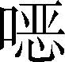

第七十四卷

 淮阴侯列传第三十二

本传记载了韩信一生的事迹，突出了他的军事才能和累累战功。功高于世，却落个夷灭宗族的下场，注入了作者无限同情和感慨。

本文细节描写非常精彩。韩信受胯下之辱的细节，不仅活化了屠中少年的个性特征，而且也很好地描写出韩信的心理特征。大量的心理活动，都在他“孰视”“蒲伏”之中表现。而刘邦见到韩信请求为假齐王的上书时，骂道：“吾困于此，旦暮望若来佐我，乃欲自立为王！”张良、陈平用脚踩他以示意并耳语告知时，他突然醒悟，因复骂曰：“大丈夫定诸侯，即为真王耳，何以假为！”这一戏剧性的细节描写生动而又风趣地把刘邦不拘礼节，流氓成性，头脑绝顶聪明，以及他随机应变的能力、情态都画活了。刘邦的形象不是呼之欲出了吗？

***【原文】***

淮阴侯[1]韩信者，淮阴人也。始为布衣[2]时，贫，无行[3]，不得推择[4]为吏，又不能治生商贾[5]，常从人寄[6]食饮，人多厌之者。常数从其下乡南昌亭长[7]寄食，数月，亭长妻患[8]之，乃晨炊蓐食[9]。食时信往，不为具食[10]。信亦知其意，怒，竟绝[11]去。

***【译文】***

[1]淮阴：县名。在今江苏省淮安市淮阴区西南。淮阴侯：韩信最后的封爵。

[2]始：当初。布衣：平民。

[3]无行：没有好的品行。

[4]推择：推选。

[5]治生：谋生。商贾（ɡǔ）：运货贩卖的叫“商”，囤积营利的叫“贾”。

[6]从人：到人家那里去。寄：依附。

[7]常：通“尝”，曾经。数（shuò）：多次。下乡：淮阴县的一个乡。南昌亭长：亭，秦、汉时乡以下的一种行政机构，每十里设一亭，置亭长一人，负责治安警卫，兼管过往停留旅客，治理民事。

[8]患：嫌恶；讨厌。

[9]蓐（rù）食：端到床上吃掉。蓐，草席。

[10]具食：准备饭食。

[11]竟：终于。绝：断绝关系。

***【原文】***

信钓于城下，诸母[1]漂，有一母见信饥，饭[3]信，竟[3]漂数十日。信喜，谓漂母曰：“吾必有以[4]重报母。”母怒曰：“大丈夫不能自食[5]，吾哀[6]王孙而进食，岂望报乎！”

***【译文】***

[1]母：古代对年老妇女的尊称。

[2]饭：给……饭吃。用作动词。

[3]竟：完毕。

[4]有以：“有所以”的省略。

[5]大丈夫：泛指有大志、有作为、有气节的男子。自食（sì）：自己养活自己。

[6]哀：怜悯。

***【原文】***

淮阴屠[1]中少年有侮信者，曰：“若[2]虽长大，好带刀剑，中情怯[3]耳。”众辱之[4]曰：“信[5]能死，刺我；不能死，出我袴[6]下。”于是信孰[7]视之，俯出袴下，蒲伏[8]。一市人皆笑信，以为怯。

***【译文】***

[1]屠：屠夫；宰杀牲畜的人。

[2]若：你。

[3]中情：内心。怯（qiè）：怯懦；胆小。

[4]众辱之：当众侮辱他（指韩信）。

[5]信：有两解：一、指韩信；二、诚然。

[6]袴：有两解：一、通“胯（kuà）”，指两腿间。后文“召辱己之少年令出胯下者”正用“胯”。二、同“裤”。

[7]孰：通“熟”，仔细。

[8]蒲伏：通“匍匐”，在地上用手脚爬行。

***【原文】***

及项梁[1]渡淮，信杖[2]剑从之，居戏下[3]，无所知名[4]。项梁败，又属项羽[5]，羽以为郎中[6]。数以策干[7]项羽，羽不用。汉王[8]之入蜀，信亡楚[9]归汉，未得知名，为连敖[10]。坐法[11]当斩，其辈[12]十三人皆已斩，次[13]至信，信乃仰视，适见滕公[14]，曰：“上不欲就[15]天下乎？何为斩壮士！”滕公奇[16]其言，壮其貌，释而不斩。与语，大说[17]之。言于上，上拜以为治粟都尉[18]，上未之奇[19]也。

***【译文】***

[1]项梁（？—前208）：秦末起义将领之一。下相（今江苏省宿迁市宿城区西南）人。

[2]杖：持，执。

[3]戏（huī）下：通“麾下”，即部下。戏，通“麾”。

[4]知名：出名。

[5]项羽（前232—前202）：名籍。

[6]郎中：官名。负责警卫工作。

[7]干：求。

[8]汉王：汉高祖刘邦。

[9]亡楚：“亡于楚”，从楚军逃出。

[10]连敖：典客。指接待宾客的官员。

[11]坐法：犹坐罪。因犯法而获罪。

[12]其辈：指韩信的同案犯人。

[13]次：按次序。

[14]适：恰好。滕公：夏侯婴，刘邦的同乡好友。

[15]上：秦、汉以来对皇帝的通称，这里指汉王。就：成就；得到。

[16]奇：意动用法。

[17]说（yuè）：通“悦”。

[18]拜：授予官职。治粟都尉：管理粮饷的军官。

[19]未之奇：即“未奇之”。否定句中代词宾语前置。

***【原文】***

信数与萧何[1]语，何奇之。至南郑[2]，诸将行道亡者[3]数十人，信度[4]何等已数言上，上不我用[5]，即亡。何闻信亡，不及以闻[6]，自追之。人有言上曰：“丞相何亡。”上大怒，如失左右手。居[7]一二日，何来谒[8]上，上且[9]怒且喜，骂何曰：“若亡，何也？”何曰：“臣不敢亡也，臣追亡者。”上曰：“若所追者谁？”何曰：“韩信也。”上复骂曰：“诸将亡者以十数[10]，公[11]无所追；追信，诈[12]也。”何曰：“诸将易得耳。至如信者，国士[13]无双。王必欲长王汉中[14]，无所事[15]信；必欲争天下，非信无所与计事者[16]。顾王策[17]安所决耳。”王曰：“吾亦欲东[18]耳，安能郁郁久居此乎？”何曰：“王计必欲东，能用信，信即留；不能用，信终亡耳。”王曰：“吾为公[19]以为将。”何曰：“虽为将，信必不留。”王曰：“以为大将。”何曰：“幸甚！”于是王欲召信拜之。何曰：“王素慢[20]无礼，今拜大将如呼小儿耳，此乃信所以去也。王必欲拜之，择良日，斋戒[21]；设坛场[22]，具礼[23]，乃可耳。”王许之。诸将皆喜，人人各自以为得大将。至拜大将，乃韩信也，一军皆惊。

***【译文】***

[1]萧何（？—前193）：刘邦的重要谋臣，西汉王朝第一任丞相，封酂（zàn）侯。

[2]南郑：县名。当时为汉的都城，今陕西省汉中市。

[3]行（hánɡ）：等；辈。道亡者：半路逃跑的。

[4]度（duó）：估计；推测。

[5]不我用：即“不用我”。

[6]闻：让人闻知。使动用法。

[7]居：停留；过。

[8]谒（yè）：拜见。

[9]且：又。

[10]以十数（shǔ）：用十来计算。

[11]公：对人的尊称。

[12]诈：扯谎。

[13]国士：一国中的杰出人物。

[14]必：果真；假使。王（wànɡ）：称王。汉中：郡名。

[15]事：用。

[16]计事者：商议大事的人。

[17]顾：但。策：指“长王汉中”和“争天下”两种计划。

[18]东：向东。动词。指出关与项羽争夺天下。

[19]为公：看在您的分上。为，因为。

[20]素慢：向来傲慢。

[21]斋戒：古代在祭祀或举行典礼前，沐浴更衣、独宿、不饮酒、不吃荤，清心洁身，表示诚敬。

[22]坛场：指拜将的场所。

[23]具礼：准备仪式。

***【原文】***

信拜礼毕，上[1]坐。王曰：“丞相数言将军，将军何以教寡人[2]计策？”信谢[3]，因问王曰：“今东乡[4]争权天下，岂非项王邪[5]？”汉王曰：“然。”曰：“大王自料勇悍仁强[6]孰与项王？”汉王默然良久，曰：“不如也。”信再拜贺[7]曰：“惟信亦为[8]大王不如也。然臣尝事之，请[9]言项王之为人也。项王喑叱咤[10]，千人皆废[11]，然不能任属[12]贤将，此特匹夫之勇[13]耳。项王见人恭敬慈爱，言语呕呕[14]，人有疾病，涕泣分食饮，至使人有功当封爵[15]者，印邧敝[16]，忍[17]不能予，此所谓妇人之仁[18]也。项王虽霸天下而臣[19]诸侯，不居关中而都彭城[20]。有背义帝[21]之约，而以亲爱王，诸侯不平。诸侯之见项王迁逐义帝置江南[22]，亦皆归逐其主而自王善地。项王所过无不残灭者，天下多怨，百姓不亲附，特劫[23]于威强耳。名虽为霸，实失天下心。故曰其强易弱。今大王诚[24]能反其道：任[25]天下武勇，何所不诛！以天下城邑封功臣，何所不服！以义兵从思东归之士[26]，何所不散！且三秦王[27]为秦将，将秦子弟数岁矣，所杀亡不可胜[28]计，又欺其众降诸侯[29]，至新安[30]，项王诈坑秦降卒二十余万[31]，唯独邯、欣、翳得脱，秦父兄怨此三人，痛[32]入骨髓。今楚强以威王此三人，秦民莫爱也。大王之入武关[33]，秋豪[34]无所害，除秦苛法，与秦民约，法三章[35]耳，秦民无不欲得大王王秦者。于诸侯之约[36]，大王当王关中，关中民咸[37]知之。大王失职[38]入汉中，秦民无不恨者。今大王举而东，三秦可传檄而定[39]也。”于是汉王大喜，自以为得信晚。遂听信计，部署[40]诸将所击。

***【译文】***

[1]上：指韩信坐上位。

[2]寡人：古代帝王或诸侯对下的自称。

[3]谢：表示谦让。

[4]东乡（xiànɡ）：向东方。乡，通“向”。

[5]邪（yé）：通“耶”，语气助词。

[6]仁强：兼有精良和强盛的意思。孰：谁。

[7]贺：嘉许；赞同。

[8]惟：通“虽”。为：认为。

[9]请：表示谦敬。

[10]喑叱咤（yīn ě chì zhà）：厉声怒喝。

[11]废：偃伏，不敢动弹。

[12]任属：任用委托。

[13]匹夫之勇：指不用智谋，单凭个人的血气之勇。匹夫，本指一个男子，引申为极平常的人。

[14]呕（xū）呕：温和的样子。

[15]使人：所任用的人。爵：爵位。贵族、功臣的封位。

[16]邧（wán）敝：亦作“刷弊”，在手里磨损的意思。刓，通“玩”。

[17]忍：有舍不得的意思。

[18]妇人之仁：意思是说，不能明大局、识大体，只懂得婆婆妈妈的小恩小惠。

[19]臣：使之臣服。

[20]关中：古地区名。一般指函谷关以西、散关以东为关中。都：建都。彭城：县名。即今江苏省徐州市。

[21]有（yoù）：通“又”。义帝（？—前205）：战国时楚怀王的孙子，名熊心。

[22]江南：秦、汉时一般指今湖北省南部和湖南省、江西省一带。

[23]特：只不过。劫：被逼迫。

[24]诚：果真。

[25]任：任用，信任。

[26]思东归之士：指刘邦的将士。

[27]且：况且。三秦王：指章邯、司马欣、董翳。

[28]胜（shēnɡ）：尽。

[29]降诸侯：指向项羽的投降。

[30]新安：县名。在今河南省渑池县东。

[31]“项王”句：章邯等投降项羽时，手下有秦兵二十万。

[32]痛：恨。

[33]武关：古代通往关中的重要关口，在今陕西商南县东南丹江上。

[34]秋豪：通“秋毫”，鸟兽在秋天新长出来的细毛，比喻极细微的东西。

[35]法三章：刘邦进驻咸阳后，废除秦朝的苛法，与关中父老约法三章，即“杀人者死，伤人及盗抵罪”。

[36]于诸侯之约：指“先入关中者王之”的约言。

[37]咸：都；全。

[38]失职：失去应得的封地和爵位。

[39]传檄（xí）而定：指不必用兵，只要下一道文书就可以平定。传，从驿站递送。

[40]部署：布置。

***【原文】***

八月，汉王举兵东出陈仓[1]，定三秦[2]。汉二年[3]，出关[4]，收魏[5]、河南，韩、殷王[6]皆降。合齐、赵[7]共击楚。四月，至彭城，汉兵败散而还。信复收兵与汉王会荥阳[8]，复击破楚京[9]、索之间。以故，楚兵卒不能西[10]。

***【译文】***

[1]陈仓：县名。在今陕西省宝鸡市东。

[2]定三秦：前206年，刘邦采用韩信的计策，暗度陈仓，击败雍王章邯，进入咸阳，塞王司马欣、翟王董翳投降。

[3]汉二年：前205年。

[4]关：指函谷关。在今河南省灵宝市东北。

[5]魏：指魏王魏豹。

[6]韩、殷王：指韩王郑昌和殷王司马卬。

[7]齐、赵：齐，指齐王田荣；赵，指赵王歇及赵相陈馀。这时都已叛楚从汉。

[8]荥阳：县名。在今河南省荥阳市东北。

[9]京：县名。在今河南省荥阳市东南。

[10]西：西进。

***【原文】***

汉之败却彭城[1]，塞王欣、翟王翳亡汉降楚，齐、赵亦反汉与楚和。六月，魏王豹谒归视亲[2]疾，至国，即绝河关[3]反汉，与楚约和。汉王使郦生[4]说豹，不下。其八月，以信为左丞相，击魏。魏王盛兵蒲坂[5]，塞[6]临晋，信乃益为疑兵[7]，陈船欲度[8]临晋，而伏兵从夏阳以木罂缻[9]渡军，袭安邑[10]。魏王豹惊，引兵迎[11]信，信遂虏豹，定魏为河东郡[12]。汉王遣张耳与信俱[13]，引兵东，北击赵、代[14]。后九月[15]，破代兵，禽夏说阏[16]。信之下魏破代，汉辄[17]使人收其精兵，诣荥阳以距[18]楚。

***【译文】***

[1]却：退。

[2]谒归：请假回家。谒，请求。亲：母亲。

[3]河关：黄河的渡口临晋关，后来改名蒲津关。

[4]郦生：郦食其（lì yì jī）。刘邦的谋士。

[5]盛：聚集很多。蒲坂：邑名。即今山西省永济市西蒲州镇，隔黄河与临晋关相对。

[6]塞：封锁。

[7]疑兵：虚张旗鼓，以迷惑敌人。

[8]度：通“渡”。

[9]夏阳：县名。在今陕西省韩城市南。木罂缻（yīnɡ fǒu）：木制的盆瓮，用来缚在身上渡河。罂，小口大腹的盛酒器。缻，通“缶”，盛酒器，形状像罂而较小。

[10]安邑：县名。在今山西省夏县西北。

[11]迎：迎击。

[12]《高祖本纪》作“遂定魏地，置三郡，曰河东、太原、上党”。

[13]俱：通行。

[14]赵、代：指赵王歇和代王陈馀。

[15]后九月：即汉二年的闰九月。

[16]禽：通“擒”。阏（yù）：古邑名。在今山西省和顺县西北。

[17]辄：就，总是。

[18]诣（yì）：前往。距：通“拒”。

***【原文】***

信与张耳以兵数万，欲东下井陉[1]击赵。赵王、成安君陈馀闻汉且袭之也，聚兵井陉口，号称二十万。广武君李左车[2]说成安君曰：“闻汉将韩信涉西河[3]，虏魏王，禽夏说，新喋血[4]阏，今乃辅以张耳，议欲下赵，此乘胜而去国远斗，其锋不可当。臣闻‘千里馈[5]粮，士有饥色；樵苏后爨，师不宿饱[6]’。今井陉之道，车不得方轨[7]，骑不得成列，行数百里，其势粮食必在其后。愿足下假臣奇兵[8]三万人，从间道绝其辎重[9]；足下深沟高垒[10]，坚营勿与战。彼前不得斗，退不得还，吾奇兵绝其后，使野无所掠，不至十日，而两将之头可致[11]于戏下。愿君留意臣之计。否，必为二子所禽矣。”成安君，儒者[12]也，常称义兵不用诈谋奇计，曰：“吾闻兵法‘十则围之，倍则战[13]’。今韩信兵号数万，其实不过数千。能[14]千里而袭我，亦已罢[15]极。今如此避而不击，后有大者，何以加[16]之！则诸侯谓吾怯，而轻[17]来伐我。”不听广武君策。

***【译文】***

[1]井陉：井陉口。在现在的河北省井陉县东北的井陉山上，称井陉关，又叫土门关。

[2]李左车：赵国的谋士。

[3]涉：渡。西河：指今山西、陕西间龙门以南一段黄河。

[4]喋血：踩着血走。

[5]馈（kuì）：运送。

[6]樵苏后爨（cuàn），师不宿饱：意思是说，靠临时打柴割草来点火做饭，部队就不可能安饱。

[7]方轨：两车并行。方，并列；轨，车子两轮间的距离。

[8]足下：称对方的敬词。古时下称上或同辈相称，都可用“足下”。假：暂时拨给。奇兵：从事偷袭的突击部队。

[9]间（jiàn）道：偏僻抄近的小路。绝：拦截。辎（zī）重：泛指一切军需物资。这里主要指粮草。

[10]深沟高垒：挖深护营的壕沟，加高军营的围墙，用以固守。

[11]致：送到。

[12]儒者：信奉儒家学说的书生。

[13]十则围之，倍则战：语出《孙子·谋攻篇》，文字略有出入。

[14]能：乃；竟。

[15]罢（pí）：通“疲”。

[16]加：胜过；压倒。

[17]轻：轻易。

***【原文】***

广武君策不用。韩信使人间视[1]，知其不用，还报，则大喜，乃敢引兵遂下。未至井陉口三十里，止舍[2]。夜半传发[3]，选轻骑[4]二千人，人持一赤帜，从间道萆山[5]而望赵军，诫[6]曰：“赵见我走[7]，必空壁[8]逐我，若[9]疾入赵壁，拔赵帜，立汉赤帜。”令其裨将[10]传飧，曰：“今日破赵会食！”诸将皆莫信，详[11]应曰：“诺。”谓军吏曰：“赵已先据便地[12]为壁，且彼未见吾大将旗鼓[13]，未肯击前行[14]，恐吾至阻险而还。”信乃使万人先行，出[15]，背水陈[16]。赵军望见而大笑。平旦[17]，信建大将之旗鼓，鼓行[18]出井陉口，赵开壁击之，大战良久。于是信、张耳详弃鼓旗，走水上军。水上军开入[19]之，复疾战。赵果空壁争汉鼓旗，逐韩信、张耳。韩信、张耳已入水上军，军皆殊死战[20]，不可败。信所出奇兵二千骑，共候赵空壁逐利[21]，则驰入赵壁，皆拔赵旗，立汉赤帜二千。赵军已不胜，不能得[22]信等，欲还归壁，壁皆汉赤帜，而[23]大惊，以为汉皆已得[24]赵王将矣，兵遂乱，遁走[25]，赵将虽斩之，不能禁也。于是汉兵夹击，大破虏赵军，斩成安君泜[26]水上，禽赵王歇。

***【译文】***

[1]间（jiàn）视：探听。

[2]止舍：停止行军，驻扎宿营。舍，古代称住一夜为舍。

[3]传发：传令军队出发。

[4]轻骑（jì）：轻装的骑兵。

[5]萆（bì）山：在山上隐蔽。萆，通“蔽”。

[6]诫：告诫；命令。

[7]走：败逃。

[8]空壁：全军出动。壁，营垒；空，使动用法。

[9]若：你们。

[10]裨将：副将。

[11]详（yánɡ）：通“佯”，假装。

[12]便地：有利的地形。

[13]大将旗鼓：军中主将的旗帜和仪仗鼓吹。

[14]前行：先遣部队。

[15]出：指出井陉口。

[16]背水陈：背水列阵。水，指绵蔓水，发源于今山西省寿阳县东，东经河北省井陉县，流入滹沱河。

[17]平旦：太阳刚露出地面。

[18]鼓行：击鼓前进。

[19]入：使动用法。

[20]殊死战：拼命战斗。殊，决绝，竭尽。

[21]逐利：追夺战利品。

[22]得：捉住。

[23]而：通“乃”，始，才。

[24]得：收降。

[25]遁（dùn）走：逃跑。

[26]泜水：今槐河。发源于今河北省赞皇县西南，东经元氏县向南流入滏阳河。

***【原文】***

信乃令军中毋杀广武君，有能生得者购[1]千金。于是有缚广武君而致戏下者，信乃解其缚，东乡坐[2]，西乡对，师事之。

***【译文】***

[1]生得：活捉。购：悬赏征求。

[2]东乡坐：当时接见宾客以向东的座位为尊贵。

***【原文】***

诸将效首虏[1]，毕[2]贺，因问信曰：“兵法‘右倍山陵，前左水泽[3]’。今者将军令臣等反背水陈，曰‘破赵会食’，臣等不服。然竟以胜，此何术也？”信曰：“此在兵法，顾诸君不察耳。兵法不曰‘陷之死地而后生，置之亡地而后存[4]’？且信非得素拊循士大夫[5]也，此所谓‘驱市人[6]而战之’，其势非置之死地，使人人自为战[7]；今予之生地[8]，皆走，宁[9]尚可得而用之乎？”诸将皆服，曰：“善。非臣所及也。”

***【译文】***

[1]效：呈献。首虏：首级和俘虏。

[2]毕：都。

[3]“右倍”二句：语出《孙子·行军篇》：“丘陵堤防，必处其阳（南）而右背之。”倍，背向，背着。

[4]“陷之死地”二句：语出《孙子·九地篇》：“投之亡地然后存，陷之死地然后生，夫众陷于害，然后能为胜败。”意思是，必须把士兵置于生死关头，才能拼死作战，然后死中求生，获得胜利。

[5]素：平素。拊：通“抚”，抚爱。循：顺从。士大夫：指将士。

[6]市人：集市上的老百姓。

[7]“其势非置之”二句：意思是，非置之死地，使人人自为战不可。人人自为战，每个人都主动独立作战。

[8]予：给；置。生地：有活路的地方。

[9]宁：怎么；哪里。

***【原文】***

于是信问广武君曰：“仆欲北攻燕[1]，东伐齐，何若[2]而有功？”广武君辞谢曰：“臣闻‘败军之将不可以言勇，亡国之大夫不可以图存[3]’。今臣败亡之虏，何足以权[4]大事乎！”信曰：“仆闻之，百里奚[5]居虞而虞亡，在秦而秦霸，非愚于虞而智于秦也，用与不用，听与不听也。诚令成安君听足下计，若信者亦已为禽矣。以不用足下，故信得侍[6]耳。”因固问曰：“仆委心归计[7]，愿足下勿辞。”广武君曰：“臣闻‘智者千虑，必有一失；愚者千虑，必有一得’。故曰‘狂夫之言，圣人择焉’。顾恐臣计未必足用，愿效愚忠。夫成安君有百战百胜之计，一旦而失之，军败鄗[8]下，身死泜上。今将军涉西河，虏魏王，禽夏说阏，一举而下井陉，不终朝[9]破赵二十万众，诛成安君。名闻海内，威震天下。农夫莫不辍耕[10]释耒，褕衣甘食[11]，倾耳以待命者[12]。若此，将军之所长也。然而众劳卒罢，其实难用。今将军欲举倦弊[13]之兵，顿[14]之燕坚城之下，欲战恐久力不能拔，情见势屈[15]，旷日[16]粮竭，而弱燕不服，齐必距境[17]以自强也。燕、齐相持而不下[18]，则刘、项之权[19]未有所分也。若此者，将军所短也。臣愚，窃以为亦过[20]矣。故善用兵者不以短击长，而以长击短。”韩信曰：“然则何由[21]？”广武君对曰：“方今为将军计，莫如案[22]甲休兵，镇赵抚其孤，百里之内，牛酒日至，以飨士大夫[23]兵，北首[24]燕路，而后遣辩士奉咫尺[25]之书，暴[26]其所长于燕，燕必不敢不听从。燕已从，使喧言者[27]东告齐，齐必从风而服，虽有智者，亦不知为齐计矣。如是，则天下事皆可图也。兵固有先声[28]而后实者，此之谓也。”韩信曰：“善。”从其策，发使使燕，燕从风而靡[29]。乃遣使报汉，因请立张耳为赵王，以镇抚其国。汉王许之，乃立张耳为赵王。

***【译文】***

[1]仆：自称谦词。燕：项羽封燕将臧荼为燕王，都蓟（今北京市西南）。

[2]何若：若何；如何。

[3]“败军之将”两句：当时流行的成语。图存：图谋国家存亡的大事。

[4]权：权衡。

[5]百里奚：春秋时虞国人。

[6]侍：侍奉。这里韩信不说广武君被俘，而说自己能有机会侍奉他，以表示对广武君的敬重。

[7]委心归计：完全听从您的计策。委，丢弃；委心，自己不作主张。归，依从。

[8]鄗（hào）：古邑名。在今河北省高邑县东。

[9]不终朝：不到一上午。

[10]辍（chuò）耕：停止耕作。

[11]褕（yú）衣甘食：美好的衣服，香甜的食物。褕，美。

[12]倾耳：侧耳静听，表示专心。以上三句，意思是说农民预感到兵灾的到来，十分害怕，因而停止耕作，只顾眼前享受，不作长远打算，专心倾听韩信下令进军的消息。

[13]倦弊：疲惫劳乏。弊，仆倒，引申为疲乏。

[14]顿：停顿。使动用法。

[15]情见（xiàn）势屈：军队的实情暴露给敌方，自己的威势就削弱了。见，通“现”。

[16]旷日：空废时日。旷，耽误，荒废。

[17]距境：在边境拒守。距，通“拒”。

[18]燕、齐相持：指韩信同燕、齐相持。不下：指燕、齐不肯降服。

[19]权：秤锤。这里比喻胜负的比重。

[20]窃：私下。谦词。过：过失；失策。动词。

[21]由：遵循。

[22]案：通“按”。

[23]飨（xiǎnɡ）：宴请。：醇酒。使动用法。

[24]首（shòu）：向着。

[25]咫（zhǐ）尺：指当时写信使用的木简的尺寸，或八寸或一尺。咫，八寸。

[26]暴：显露。

[27]喧言者：善于诡辩的人，即说客、辩士。喧：通“谖”，诡诈。

[28]声：虚张声势。

[29]从风而靡：听到消息，立即投降。靡，倒下，这里指降服。

***【原文】***

楚数使奇兵渡河击赵，赵王耳、韩信往来救赵，因行定赵城邑，发兵诣汉。楚方急围汉王于荥阳，汉王南出，之宛、叶[1]间，得黥布[2]，走入成皋[3]，楚又复急围之。六月，汉王出成皋，东渡河，独与滕公俱，从张耳军修武[4]。至，宿传舍[5]。晨自称汉使，驰入赵壁。张耳、韩信未起，即其卧内，上[6]夺其印符，以麾[7]召诸将，易置之。信、耳起，乃知汉王来，大惊。汉王夺两人军，即令张耳备守赵地，拜韩信为相国，收赵兵未发者击齐。

***【译文】***

[1]宛（yuān）：县名。即今河南省南阳市。叶（shè）：县名。在今河南省叶县南。

[2]黥（qínɡ）布：原名英布，详见《黥布列传》。

[3]成皋：古邑名。即今河南省荥阳市西汜水镇。

[4]修武：县名。在今河南省获嘉县境。

[5]传（zhuàn）舍：客馆。

[6]上：指汉王。

[7]麾（huī）：旌麾，军队中用来召唤将领的旗子。

***【原文】***

信引兵东，未渡平原[1]，闻汉王使郦食其已说下齐，韩信欲止。范阳辩士蒯通[2]说信曰：“将军受诏击齐，而汉独发间[3]使下齐，宁有诏止将军乎？何以得毋行也！且郦生一士，伏轼掉[4]三寸之舌，下齐七十余城，将军将数万众，岁余乃下赵五十余城，为将数岁，反不如一竖儒[5]之功乎？”于是信然之[6]，从其计，遂渡河。齐已听郦生，即留纵酒，罢[7]备汉守御。信因袭齐历下[8]军，遂至临菑[9]。齐王田广[10]以郦生卖己，乃亨[11]之，而走高密[12]，使使之楚请救。

***【译文】***

[1]平原：平原津，当时黄河渡口。在今山东省平原县境。

[2]范阳：县名。在今河北省定兴县南。蒯（kuǎi）通：楚、汉之际有名的辩士。

[3]独：只不过。间使：密使。

[4]伏轼：为了表示敬意，乘车的人将身子伏在车前的横木上。掉：摇；鼓弄。

[5]竖儒：鄙贱的称谓，犹“侏儒”。

[6]然之：即“以之为然”。认为蒯通的话正确。然，对。

[7]罢：撤除。

[8]历下：古邑名。即今山东省济南市。

[9]临菑（zī）：即临淄，古邑名，当时齐国的都城。在今山东省淄博市东北。

[10]田广：齐国贵族的后裔，田荣的儿子。

[11]亨（pēnɡ）：通“烹”。

[12]高密：县名。在今山东省高密市西南。

***【原文】***

韩信已定临菑，遂东追广至高密西。楚亦使龙且将[1]，号称二十万，救齐。齐王广、龙且并军与信战，未合。人或说龙且曰：“汉兵远斗穷战[2]，其锋不可当。齐、楚自居其地战，兵易败散[3]。不如深壁[4]，令齐王使其信臣招所亡城，亡城闻其王在，楚来救，必反汉。汉兵二千里客居，齐城皆反之，其势无所得食，可无战而降也。”龙且曰：“吾平生知韩信为人，易与耳。且夫救齐，不战而降[5]之，吾何功？今战而胜之，齐之半可得[6]，何为止！”遂战，与信夹潍水[7]陈。韩信乃夜令人为万余囊，满盛沙，壅[8]水上流，引军半渡，击龙且。详不胜，还走。龙且果喜曰：“固知信怯也。”遂追信渡水。信使人决壅囊，水大至。龙且军大半不得渡，即急击，杀龙且。龙且水东军散走，齐王广亡去[9]。信遂追北至城阳[10]，皆虏楚卒。

***【译文】***

[1]龙且（jū）：项羽部下将领。

[2]穷战：尽力战斗。穷，尽、极。

[3]兵易败散：是说齐、楚兵士在自己乡土作战，眷恋家室，容易逃散。

[4]深壁：深沟高垒，坚守不战。

[5]降：使动用法。

[6]齐之半可得：意思是说，如果战胜了韩信，就可以受封而得到半个齐国。

[7]潍水：指今山东省的潍河。

[8]壅：堵塞。

[9]齐王广亡去：《高祖本纪》和本传说田广在这次战役中逃跑，而《秦楚之际月表》和《田儋列传》说田广在这次战役中被杀。

[10]追北：追赶败兵。北，败。城阳：古地名。在今山东省菏泽市牡丹区东北。

***【原文】***

汉四年[1]，遂皆降，平齐。使人言汉王曰：“齐伪诈多变，反覆之国也。南边[2]楚。不为假王[3]以镇之，其势不定。愿为假王便[4]。”当是时，楚方急围汉王于荥阳，韩信使者至，发书[5]，汉王大怒，骂曰：“吾困于此，旦暮望若来佐我，乃欲自立为王！”张良、陈平[6]蹑汉王足，因附耳语曰：“汉方不利，宁能禁信之王乎？不如因而立，善遇之，使自为守；不然，变生[7]。”汉王亦悟，因复骂曰：“大丈夫定诸侯，即为真王耳，何以假为！”乃遣张良往，立信为齐王，征其兵击楚。

***【译文】***

[1]汉四年：公元前203年。

[2]边：接近；连接。

[3]假王：暂时代理的王。

[4]便：便利。

[5]发书：打开书信。

[6]张良：字子房，韩国贵族的后裔。秦末农民战争中，聚众归刘邦，为刘邦重要谋士。汉朝建立后，被封为留侯。陈平：陈胜起义时，他依附魏咎，为太仆。后从项羽入关，任都尉。不久投奔刘邦，是刘邦的重要谋士。汉朝建立后，封曲逆侯。

[7]变生：发生变乱。

***【原文】***

楚已亡龙且，项王恐，使盱眙[1]人武涉往说齐王信曰：“天下共苦秦久矣，相与勠力[2]击秦。秦已破，计功割地，分土而王之[3]，以休士卒。今汉王复兴兵而东，侵人之分[4]，夺人之地；已破三秦，引兵出关，收诸侯之兵以东击楚，其意非尽吞天下者不休，其不知厌足如是甚也！且汉王不可必[5]，身居项王掌握中数矣，项王怜而活之[6]；然得脱，辄倍约，复击项王，其不可亲信如此。今足下虽自以与汉王为厚交，为之尽力用兵，终为之所禽矣。足下所以得须臾[7]至今者，以项王尚存也。当今二王之事，权在足下：足下右投则汉王胜，左投则项王胜[8]。项王今日亡，则次取足下。足下与项王有故[9]，何不反汉与楚连和，参[10]分天下王之？今释此时，而自必于汉以击楚，且为智者固若此乎！”韩信谢曰：“臣事项王，官不过郎中，位不过执戟[11]，言不听，画[12]不用，故倍楚而归汉。汉王授我上将军印，予我数万众，解衣衣我[13]，推[14]食食我，言听计用，故吾得以至于此。夫人[15]深亲信我，我倍之不祥，虽死不易。幸[16]为信谢项王！”

***【译文】***

[1]盱眙（xū yí）：县名。

[2]勠力：合力。

[3]“计功”二句：指项羽分封诸侯王。

[4]分：职分；职权。

[5]必：信任；靠得住。

[6]活之：使刘邦活。活，使动用法。

[7]须臾：一会儿。这里引申为“苟延”“从容”。

[8]“足下”二句：右投，指依附刘邦；左投，指依附项羽。右，指向西方；左，指向东方。

[9]故：老交情。

[10]参：古“三”字，今写作“叁”。

[11]执戟（jǐ）：与上句“郎中”为互文。

[12]画：计谋。

[13]衣（yì）我：给我穿。衣，动词。

[14]推：让。

[15]夫（fú）人：那个人。指刘邦。夫，指示代词。

[16]幸：希望。

***【原文】***

武涉已去，齐人蒯通[1]知天下权在韩信，欲为奇策而感动之，以相人[2]说韩信曰：“仆尝受相人之术。”韩信曰：“先生相人何如？”对曰：“贵贱在于骨法[3]，忧喜在于容色[4]，成败在于决断，以此参[5]之，万不失一。”韩信曰：“善。先生相寡人何如？”对曰：“愿少间[6]。”信曰：“左右去矣。”通曰：“相君之面[7]，不过封侯，又危不安；相君之背，贵乃不可言。”韩信曰：“何谓也？”蒯通曰：“天下初发难也，俊雄豪桀建号壹[8]呼，天下之士云合雾集[9]，鱼鳞杂遝[10]，熛至风起[11]。当此之时，忧在亡秦而已。今楚、汉分争，使天下无罪之人肝胆涂地[12]，父子暴骸骨于中野，不可胜数。楚人起彭城，转斗逐北，至于荥阳，乘利席卷，威震天下。然兵困于京、索之间，迫西山[13]而不能进者，三年于此矣。汉王将数十万之众，距巩、雒[14]，阻山河之险，一日数战，无尺寸之功，折北不救[15]，败荥阳[16]，伤成皋[17]，遂走宛、叶之间——此所谓智、勇[18]俱困者也。夫锐气挫于险塞[19]，而粮食竭于内府[20]，百姓罢极怨望[21]，容容[22]无所倚。以臣料之，其势非天下之贤圣固不能息天下之祸。当今两主之命县[23]于足下：足下为汉则汉胜，与楚则楚胜。臣愿披腹心，输肝胆[24]，效愚计，恐足下不能用也。诚能听臣之计，莫若两利而俱存之，参分天下，鼎足[25]而居，其势莫敢先动。夫以足下之贤圣，有甲兵之众，据强齐，从[26]燕、赵，出空虚之地而制其后，因民之欲，西乡为百姓请命，则天下风走而响应矣，孰敢不听！割大弱[27]强，以立诸侯；诸侯已立，天下服听而归德于齐。案齐之故[28]，有胶、泗之地[29]，怀[30]诸侯以德，深拱揖让[31]，则天下之君王相率而朝于齐矣。盖闻‘天与弗取，反受其咎；时至不行，反受其殃[32]’。愿足下孰虑之！”

韩信曰：“汉王遇我甚厚，载我以其车，衣我以其衣，食我以其食。吾闻之，乘人之车者载人之患，衣人之衣者怀人之忧，食人之食者死人之事；吾岂可以乡利倍义乎！”蒯生曰：“足下自以为善汉王，欲建万世之业，臣窃以为误矣。始常山王、成安君为布衣时，相与为刎颈之交[33]，后争张黡、陈泽之事，二人相怨[34]。常山王背项王，奉项婴头而窜，逃归于汉王。汉王借兵而东下，杀成安君泜水之南，头足异处，卒为天下笑。此二人相与，天下至欢也。然而卒相禽者，何也？患生于多欲而人心难测也。今足下欲行忠信以交于汉王，必不能固于二君之相与也，而事多大于张黡、陈泽。故臣以为足下必汉王之不危己，亦误矣。大夫种、范蠡[35]存亡越，霸[36]句践，立功成名而身死亡[37]。野兽已尽而猎狗亨。夫以交友言之，则不如张耳之与成安君者也；以忠信言之，则不过大夫种、范蠡之于句践也。此二人[38]者，足以观矣。愿足下深虑之！且臣闻勇略震主者身危，而功盖天下者不赏。臣请言大王功略：足下涉西河，虏魏王，禽夏说，引兵下井陉，诛成安君，徇[39]赵，胁燕，定齐，南摧楚人之兵二十万[40]，东杀龙且，西乡以报。此所谓功无二于天下，而略不世出[41]者也。今足下戴[42]震主之威，挟不赏之功，归楚，楚人不信；归汉，汉人震恐。足下欲持是[43]安归乎？夫势在人臣之位而有震主之威，名高天下，窃为足下危之！”韩信谢曰：“先生且休矣，吾将念之。”

***【译文】***

[1]齐人蒯通：蒯通原是燕国人，后游于齐，故又称齐人。

[2]相人：给人相面。

[3]骨法：骨格；骨相。

[4]容色：容貌，气色。

[5]参：参验。

[6]愿少间（jiàn）：希望稍稍屏退从人。

[7]“相君之面”与下文的“相君之背”都是双关语，意即依附刘邦和背叛刘邦。

[8]桀（jié）：通“杰”。建号：建立名号，自立为侯王。壹：通“一”。

[9]云合雾集：像云雾那样地聚拢来。

[10]杂遝（tà）：众多而杂乱的样子。遝，通“沓”。

[11]熛（biāo）至风起：“熛”和“风”都用作状语，形容响应起义的人的迅速。

[12]肝胆涂地：到处是惨死的死尸。

[13]迫西山：在成皋以西的山地被阻。迫，阻。

[14]巩：县名。在今河南省巩义市西南。雒（luò）：即雒阳（洛阳）。在今洛阳市东北。

[15]折北不救：屡战屡败，无法自救。折，挫败；北，败逃。

[16]败荥阳：汉三年（前204）四月，项羽将刘邦围困在荥阳。刘邦采用纪信的计策，率数十骑从城西门逃往成皋。

[17]伤成皋：汉四年十月。刘邦驻广武（成皋附近）西城。楚、汉两军隔着广武涧对话。刘邦数项羽十大罪状，项羽伏弩射中刘邦胸部，刘邦回成皋养伤。

[18]智：指刘邦。勇：指项羽。意思是，双方相持不下，结果两败俱伤。

[19]锐气挫于险塞：照应上文“迫西山而不能进”，指项羽。锐气，勇气。

[20]粮食竭于内府：荥阳一战，刘邦因缺粮而败北。内府，仓库。

[21]怨望：怨恨。

[22]容容：飞扬貌，动荡不安的样子。

[23]命：命运。县：通“悬”。

[24]披腹心，输肝胆：比喻竭尽忠诚，后来也说“披肝沥胆”。披，披露。输，献出。

[25]鼎足：鼎是古时煮东西的器物，有三只脚。

[26]从：迫使……服从。使动用法。

[27]弱：削弱。使动用法。

[28]案：通“按”，占据。故：指故土。

[29]胶、泗之地：指胶河和泗水流域，即今山东省的东部和南部。

[30]怀：怀柔；安抚。

[31]深拱：两手拱得很高，引申为无所事事。揖让：外表作出谦逊的样子。

[32]“天与弗取”四句：这是当时流行的谚语。与，赐与；咎，追究罪责。

[33]刎颈之交：虽割颈也不反悔的交情，即同生死、共患难的朋友。

[34]“后争张黡”二句：张耳和陈馀原是生死与共的朋友。秦二世元年闰九月，秦将章邯攻赵，将赵歇和张耳围困在钜鹿城中。当时，陈馀带领几万军队驻扎钜鹿城以北，章邯军驻扎钜鹿城以南。章邯急攻钜鹿，城中食尽兵少，张耳多次派人催陈馀救援，而陈馀以为力量单薄，不敢出兵。于是张耳派张黡、陈泽去责备陈馀。陈馀不得已，给张黡、陈泽五千人去对秦军作试探性进攻，结果全军覆没。第二年，项羽解钜鹿之围后，张耳责怪陈馀不肯救援，并一再追问张黡、陈泽的下落。陈馀以实情相告，张耳不信。陈馀一怒之下，交还将印，离开张耳，张耳也就收编了陈馀的军队，从此二人结下怨仇。

[35]大夫种、范蠡（lǐ）：文种和范蠡都是春秋末年越王句践的大臣。

[36]霸：使动用法。

[37]死：指文种。亡：逃亡。指范蠡。

[38]二人：指陈馀和文种。

[39]徇：攻取；占领。

[40]“南摧”二句：“南摧”和“东杀”虽措辞不同，实际都是指潍水之战。

[41]略不世出：谋略在当世不再出现，意即谋略是世上少有的。

[42]戴：拥有。

[43]是：指代“震主之威”和“不赏之功”。

***【原文】***

后数日，蒯通复说曰：“夫听者事之候[1]也，计者事之机[2]也；听过计失[3]而能久安者，鲜[4]矣！听不失一二者，不可乱以言[5]；计不失本末者[6]，不可纷[7]以辞。夫随厮养之役[8]者，失万乘之权[9]；守儋石之禄[10]者，阙[11]卿相之位。故知者决之断[12]也，疑者事之害也。审豪氂之小计[13]，遗天下之大数[14]，智诚知之，决弗敢行者[15]，百事之祸也。故曰‘猛虎之犹豫，不若蜂虿之致螫[16]；骐骥之局躅[17]，不如驽马[18]之安步；孟贲[19]之狐疑，不如庸夫之必至[20]也；虽有舜禹之智，吟[21]而不言，不如喑聋之指麾[22]也’。此言贵[23]能行之。夫功者，难成而易败；时[24]者，难得而易失也。时乎时，不再来。愿足下详察之！”韩信犹豫，不忍倍汉，又自以为功多，汉终不夺我齐。遂谢蒯通。蒯通说不听，已详狂为巫[25]。

***【译文】***

[1]听者事之候：善于听取意见，就容易预见事物的征兆。候，征候，先兆。

[2]计者事之机：反复思考，就容易掌握事情成败的关键。

[3]听过：听取意见产生错误，即不善于听取意见。计失：考虑问题失误，即不善于思考问题。

[4]鲜（xiǎn）：少。

[5]乱以言：即“以言乱之”。用言语来迷惑他。

[6]计不失本末者：考虑问题不至于不周到的人。

[7]纷：乱。

[8]随：顺从。引申为安心。厮养之役：旧指侍候他人的下贱工作。厮，劈柴养马；养，烧柴做饭。

[9]万乘之权：即君权。万乘，指天子；战国时代的大国也叫万乘。

[10]儋石：形容米粟不多。儋，通“担”。禄：官俸。

[11]阙：今通写作“缺”，失掉的意思。

[12]知者决之断：王念孙说，应作“决者知之断”。意思是，做事坚决不疑，是聪明果断的表现。

[13]审豪氂之小计：在一毫一厘的小事情上用心思。豪，通“毫”。氂，通“厘”。

[14]遗：漏掉。大数：大计；大事。

[15]“智诚”二句：明明知道事情应该怎样做，但决定了不敢去执行。

[16]虿（chài）：蝎子一类的毒虫。致螫（shì）：用毒刺刺人。螫，毒刺。

[17]骐骥：骏马。局躅（jú zhú）：徘徊不前。

[18]驽马：劣马。

[19]孟贲（bēn）：战国时著名的勇士。

[20]必至：一定达到目的。

[21]吟（jìn）：通“噤”，不开口。

[22]喑（yīn）：哑巴。指麾：用手势比画来表达意思。麾，通“挥”。

[23]贵：意动用法。

[24]时：时机；机会。

[25]已：已而；后来。巫：古代装神弄鬼，为人求福或治病的迷信职业者。

***【原文】***

汉王之困固陵[1]，用张良计召齐王信[2]，遂将兵会垓下[3]。项羽已破，高祖袭夺齐王军[4]。汉五年正月[5]，徙齐王信为楚王，都下邳[6]。

***【译文】***

[1]汉王之困固陵：汉四年（前203）八月，刘、项讲和，以鸿沟（古运河名。魏惠王时修成）为界。

[2]“用张良计”句：刘邦采用张良计策，将陈（今河南省周口市淮阳区）以东至沿海地区划给韩信，诱使韩信等用兵共灭项羽。

[3]垓（ɡāi）下：古地名。

[4]汉五年十二月，刘邦灭项羽后，回军定陶，夺了韩信的军权。

[5]汉五年正月：当时汉以十月为岁首，因此汉五年正月实为五年的第四个月。

[6]下邳：县名。在今江苏省邳州市西南。

***【原文】***

信至国[1]，召所从食漂母，赐千金。及下乡南昌亭长，赐百钱，曰：“公，小人也，为德不卒。”召辱己之少年令出胯下者以为楚中尉[2]。告诸将相曰：“此壮士也。方辱我时，我宁不能杀之邪？杀之无名[3]，故忍而就于此。”

***【译文】***

[1]国：都城。指下邳。

[2]中尉：这里指诸侯王国的中尉，是掌握巡城、捕盗等治安工作的武官。

[3]无名：没有理由。名，名义，名目。

***【原文】***

项王亡将钟离眜家在伊庐[1]，素与信善。项王死后，亡归信。汉王怨眜，闻其在楚，诏楚捕眜。信初之国，行[2]县邑，陈兵出入。汉六年[3]，人有上书告楚王信反。高帝以陈平计，天子巡狩会诸侯[4]，南方有云梦[5]，发使告诸侯会陈[6]：“吾将游云梦。”实欲袭信，信弗知。高祖且[7]至楚，信欲发兵反，自度无罪；欲谒上，恐见禽。人或说信曰：“斩眜谒上，上必喜，无患。”信见眜计事。眜曰：“汉所以不击取楚，以眜在公所。若欲捕我以自媚于汉，吾今日死，公亦随手亡矣。”乃骂信曰：“公非长者[8]！”卒自刭。信持其首，谒高祖于陈。上令武士缚信，载后车[9]。信曰：“果若人言：‘狡兔死，良狗亨；高鸟尽，良弓藏；敌国破，谋臣亡。’天下已定，我固当亨！”上曰：“人告公反。”遂械系[10]信。至雒阳，赦信罪，以为淮阴侯。

***【译文】***

[1]钟离眜（mò）：复姓钟离，名眜。项羽手下的名将。伊庐：邑名。

[2]行（xínɡ）：巡视。

[3]汉六年：前201年。

[4]巡狩会诸侯：古代天子亲自到诸侯所守备的地区巡视叫“巡狩”。

[5]云梦：古泽名。

[6]陈：县名。即今河南省周口市淮阳区。

[7]且：将要。

[8]长者：忠厚诚实的人。

[9]后车：跟随皇帝出行的副车。

[10]械系：用刑具锁绑。

***【原文】***

信知汉王畏恶其[1]能，常称病不朝从[2]。信由此日夜怨望，居常鞅鞅[3]，羞与绛、灌[4]等列。信尝过樊将军哙[5]，哙跪拜送迎，言称臣，曰：“大王乃肯临[6]臣！”信出门，笑曰：“生乃与哙等为伍[7]！”上常从容与信言诸将能不[8]，各有差[9]。上问曰：“如我，能将几何？”信曰：“陛下[10]不过能将十万。”上曰：“于君何如？”曰：“臣多多而益善耳。”上笑曰：“多多益善，何为为我禽？”信曰：“陛下不能将兵，而善将将，此乃信之所以为陛下禽也。且陛下所谓天授，非人力也。”

***【译文】***

[1]其：指代韩信自己。

[2]朝从：朝见和从行。

[3]居：平日在家。鞅鞅（yànɡ）：通“怏怏”，愁闷失意的样子。

[4]羞：意动用法。绛：指绛侯周勃（？—前169），秦末从刘邦起义，以军功为将军，封绛侯，后来曾任太尉、丞相。灌：指灌婴（？—前176），秦末从刘邦起义，转战各地，汉朝建立后，任车骑将军，封颍阴侯，后来曾任太尉、丞相。

[5]过：拜访。樊哙（kuài）：刘邦的同乡，随刘邦起义，以军功封贤成君，后封舞阳侯，汉初曾任左丞相。

[6]临：有居高视下的意思。

[7]生：活着。引申为一生。为伍：同列。

[8]从（cōnɡ）容：闲暇无事的样子。能：有才能。形容词。不（fǒu）：通“否”。

[9]差（cī）：等差；参差，高低不齐。

[10]陛（bì）下：臣下对皇帝的尊称。

***【原文】***

陈豨拜为钜鹿守[1]，辞于淮阴侯。淮阴侯挈[2]其手，辟[3]左右与之步于庭，仰天叹曰：“子可与言乎？欲与子有言也。”豨曰：“唯将军令之！”淮阴侯曰：“公之所居，天下精兵处也；而公，陛下之信幸臣也。人言公之畔[4]，陛下必不信；再至，陛下乃疑矣；三至，必怒而自将。吾为公从中[5]起，天下可图也。”陈豨素知其能也，信之，曰：“谨奉教！”汉十年[6]，陈豨果反。上自将而往，信病不从。阴[7]使人至豨所，曰：“弟[8]举兵，吾从此助公。”信乃谋与家臣夜诈诏赦诸官徒奴[9]，欲发以袭吕后、太子[10]。部署已定，待豨报。其舍人[11]得罪于信，信囚，欲杀之。舍人弟上变[12]，告信欲反状于吕后。吕后欲召，恐其党[13]不就，乃与萧相国[14]谋，诈令人从上所来，言豨已得[15]死，列侯群臣皆贺。相国绐[16]信曰：“虽疾，强入贺。”信入，吕后使武士缚信，斩之长乐钟室[17]。信方斩，曰：“吾悔不用蒯通之计，乃为儿女子[18]所诈，岂非天哉！”遂夷信三族[19]。

***【译文】***

[1]陈豨（xī）：宛句（今山东省菏泽市牡丹区西南）人。汉建国后曾多次随刘邦平定叛乱，因功封阳夏侯，为代相国。钜鹿守：钜鹿郡郡守。陈豨任钜鹿郡守一事，《史记》前后说法不一，据《汉书·高帝纪》和《韩信传》，当指担任代相国监边兵。钜鹿，郡名，地在今河北省南部，郡治钜鹿（今平乡县西南）。

[2]挈（qiè）：携着；拉着。

[3]辟：通“避”，使动用法。

[4]畔：通“叛”。

[5]中：指京城中。

[6]汉十年：公元前197年。

[7]阴：暗中。

[8]弟：通“第”，只管。

[9]诸官徒奴：各官府的罪犯和奴隶。

[10]吕后（前241—前180）：刘邦的妻子吕雉。太子：指刘邦的儿子刘盈，即汉惠帝。

[11]舍人：派有差使的门客。

[12]上变：上书报告急变的事情。

[13]党（tǎnɡ）：通“倘”，倘若；万一。

[14]萧相国：萧何，当时任相国（丞相）。

[15]得：指陈豨被擒。

[16]绐（dài）：欺骗。

[17]长乐：汉宫名。故址在今陕西省西安市西北郊。钟室：悬挂钟（乐器）的房子。

[18]儿女子：即“妇人”，有轻视的意思。这里指吕后。

[19]夷：诛灭。三族：指父母、兄弟、妻子。一说指父族、母族、妻族。

***【原文】***

高祖已从豨军来，至[1]，见信死，且喜且怜之，问：“信死亦何言？”吕后曰：“信言恨不用蒯通计。”高祖曰：“是齐辩士也。”乃诏齐捕蒯通。蒯通至，上曰：“若教淮阴侯反乎？”对曰：“然，臣固教之。竖子不用臣之策，故令自夷[2]于此。如彼竖子用臣之计，陛下安得而夷之乎！”上怒曰：“亨之！”通曰：“嗟乎，冤哉亨也！”上曰：“若教韩信反，何冤？”对曰：“秦之纲绝而维弛[3]，山东[4]大扰，异姓[5]并起，英俊乌集[6]。秦失其鹿[7]，天下共逐之，于是高材疾足者先得焉。跖之狗吠尧[8]，尧非不仁，狗因吠非其主。当是时，臣唯独知韩信，非知陛下也。且天下锐精持锋[9]欲为陛下所为者甚众，顾[10]力不能耳。又可尽亨之邪？”高帝曰：“置[11]之。”乃释通之罪。

***【译文】***

[1]至：到了京城。

[2]自夷：自己诛杀自己，即自寻死路。夷，灭尽。

[3]纲绝而维弛：纲，网上的总绳；维，系物的大绳。

[4]山东：指战国时秦以外的六国领土。

[5]异姓：指与秦不同姓的各国诸侯。

[6]乌集：像乌鸦那样聚集在一起。

[7]鹿：与“禄”（禄位）同音，用来比喻帝位。

[8]跖（zhí）：人名。相传为春秋时柳下惠之弟，是率九千人横行天下之大盗，故谓之盗跖。尧：唐尧。传说中上古五帝之一。

[9]锐精持锋：磨快武器，拿着利刃。锐，使动用法；精，精铁。锋，利刃。

[10]顾：但；只不过。

[11]置：饶恕；赦免。

***【原文】***

太史公曰：吾如[1]淮阴，淮阴人为余言，韩信虽为布衣时，其志与众异。其母死，贫无以葬，然乃行营[2]高敞地，令其旁可置万家[3]。余视其母冢[4]，良然。假令韩信学道谦让，不伐[5]己功，不矜[6]其能，则庶几[7]哉于汉家勋可以比周、召、太公之徒[8]，后世血食[9]矣。不务出此[10]，而天下已集[11]，乃谋畔[12]逆，夷灭宗族，不亦宜乎！

***【译文】***

[1]如：往；去。

[2]行营：到处寻求。

[3]令其旁可置万家：使坟墓旁边能住下万户人家。

[4]冢（zhǒnɡ）：高大的坟墓。

[5]伐：夸耀。

[6]矜：骄傲。

[7]庶几：差不多。

[8]周、召（shào）：指周公姬旦和召公姬奭（shì）。太公：吕尚，传说中的姜太公，曾辅佐周武王灭商，后封于齐。徒：一辈人物。

[9]血食：受享祭。古代祭祀时要宰杀牲畜做祭品，所以叫“血食”。

[10]此：指“学道谦让”。

[11]集：通“辑”，和睦；安定。

[12]畔：通“叛”。

## 【译文】

淮阴侯韩信是淮阴人。当初他还是平民的时候，贫穷而又没有好的德行，不能被推选去做官；又不会做买卖谋生，经常投靠人家饮食，人们大多讨厌他。他曾经多次投靠那下乡南昌亭亭长家食宿，几个月以后，亭长的妻子嫌弃他，于是清早做好饭，就在床蓐上把饭吃掉。到了开饭的时候，韩信去了，没有给他准备饭食。韩信也知道他们的用意，一气之下，竟然跟他们断绝关系，离开了。

韩信在城下钓鱼，有很多妇女在漂洗丝絮。有位老大娘看见韩信饿了，就把饭给韩信吃，一直到漂洗完毕，几十天都是这样。韩信很高兴，对那老大娘说：“我将来一定要很好地报答您老人家。”老大娘生气地说：“大丈夫不能养活自己，我是可怜公子才给你饭吃，难道是希望报答吗！”

淮阴屠户中有个侮辱韩信的年轻人，说：“你虽然个子高大，喜好佩带刀剑，内心却是胆小的。”当众侮辱他说：“韩信如果不怕死，就刺我；如果怕死，就从我的裤裆下爬过去。”当时，韩信仔细地打量他以后，就俯身从他裤裆下伏地爬过去。满街的人都嘲笑韩信，认为他胆小怕事。

待项梁渡过淮水的时候，韩信带着宝剑去投奔他，在项梁的部下，默默无闻。项梁失败后，韩信又隶属项羽，项羽让他做了郎中。他屡次献策以求项羽重用，项羽没有采纳。汉王入蜀时，韩信逃离楚军而归附汉王，依然默默无闻。担任接待宾客的小官时，犯了法，判处斩刑，同案的十三个人都已经被斩，轮到韩信，韩信就抬头仰视，恰好看见滕公，说：“汉王不想成就统一天下的大业吗？为何要斩杀壮士！”滕公惊奇他的话，又见他相貌威武，就放了他不斩。和韩信交谈，非常喜欢他。报告汉王以后，汉王就任命韩信作治粟都尉，但汉王还没有看出他是奇才。

韩信多次跟萧何交谈，萧何感到惊奇。到达南郑，将领们半路逃跑的有好几十人，韩信估计萧何等人已屡次向汉王推荐过，汉王不重用自己，就逃走了。萧何听说韩信跑了，来不及将情况报告汉王，就亲自去追赶他。有人向汉王报告说：“丞相萧何逃跑了。”汉王非常恼怒，由于失去了萧何就如同失去了左右手。过了一两天，萧何来拜见汉王，汉王又生气又高兴，骂萧何说：“你逃跑，是什么缘故？”萧何说：“我是不敢逃跑的，我是去追逃跑的人。”汉王说：“你去追的人是谁？”萧何说：“是韩信。”汉王又骂道：“将领们逃跑的数以十计，你不去追任何人，却去追韩信，是假的。”萧何说：“其他将领容易得到啊，至于像韩信这样的人，天下人士没有第二个。大王假如想长期只在汉中称王，就没有地方用得着韩信；假如想要争夺天下，除了韩信，就再没有和您商量大事的人了。就看大王怎样决策罢了。”汉王说：“我当然也想向东方发展啊，怎么能够郁郁不乐地长期留在这里呢？”萧何说：“大王如果想向东推进，能够任用韩信，韩信就留下来；不能任用，韩信最终还是要跑的。”汉王说：“我看在你的情面上，用他作将领吧。”萧何说：“即使让他作将领，韩信也一定不会留下来的。”汉王说：“用他作大将。”萧何说：“很好！”当时，汉王就要召见韩信来任命他。萧何说：“大王向来傲慢，不讲礼节，如今任命大将就像唤小孩子似的，这就是韩信要离去的原因。大王如果想任命他，就选择吉日良辰，进行斋戒，在广场上设置高坛，举行完备的仪式，那样才行啊。”汉王同意了。将领们都很欢喜，人人都以为自己能做大将了。等到任命大将时，居然是韩信，全军都惊奇。

韩信授任仪式结束，汉王就座。汉王说：“丞相多次谈起将军，将军用何谋划策略来指教我？”韩信谦让之后，趁势问汉王说：“如今向东去争夺天下，难道不就是项王吗？”汉王说：“是的。”韩信说：“大王自己估计在勇敢、悍厉、仁慈和强力各方面，跟项王相比怎么样？”汉王沉默了好久，说：“我是不如项王的。”韩信拜了两拜，赞同地说：“我韩信也以为大王是不如他的。不过，我曾经侍奉过他，请让我谈谈项王的为人吧。项王立声怒喝时，很多人都吓倒了，但不能任用有才能的将领，这只不过是个人的勇气罢了。项王待人仁慈有礼，言语温和，部下有人生了病，流着泪把自己的饮食分给病员；当受用的人有了功劳应当加封爵位时，却把刻好了的印章拿在手里，玩弄得磨去了棱角，舍不得给人家，这就是所谓妇人的仁慈啊。项王虽然称霸天下，使诸侯臣服，但不占据关中却定都彭城。又违背义帝的约言，而让自己亲信喜爱的人称王，诸侯不服。诸侯看到项王迁徙、驱逐义帝，把他安置在江南，也都回去驱逐原来的国君，然后自己在好的地方称王。项王的军队所路过的地方，没有不遭受摧残毁灭的，天下的人都怨恨他，老百姓不愿亲附，只不过是被威势和强大胁逼罢了。名义上虽然是霸主，实际上却丢失了天下人的心。因此，他的强大容易变为弱小。现在大王如果能够采取和他相反的做法：任用天下英勇的人，有什么敌人不能诛灭！把天下的城邑封赏给有功的臣子，有什么人会不心服！用正义的战争，顺从想东归的战士，有什么敌人不能打败！况且三秦之王原是秦将，率领秦地的子弟兵作战好几年了，被杀死和逃跑的多得无法计算，又欺骗他们的部下向诸侯投降。到达新安以后，项王用欺诈的手段活埋了秦军已经投降的士兵二十多万，唯独章邯、司马欣和董翳得以脱身。秦地的父老乡亲怨这三个人，恨到入骨。如今，项羽硬借威势让这三个人称王，秦地的百姓没有谁拥护他的。大王进入武关之后，没有丝毫的侵犯行为，废除了秦朝的苛刻法令，与秦地的百姓立约，法令只有三条罢了。秦地的百姓，没有谁不希望大王能够在秦地当王的。按照诸侯的约定，大王应该在关中做王，关中的百姓都知道这件事。大王失掉应得的封爵进入汉中，秦地的百姓没有谁不感到遗憾的。现今大王起兵东进，三秦之地可以发布檄文平定它。”这时，汉王十分高兴，自认为得到韩信太迟了。他就听从了韩信的计谋，部署各将领的攻击目标。

八月，汉王起兵东进经过陈仓，平定了三秦。汉二年，路过函谷关，收服了魏地和河南一带，韩王、殷王都投降了。于是，联合齐国、赵国共同攻打楚军。四月，到达彭城，汉兵战败逃散而回。韩信收编士兵跟汉王在荥阳会师，又在京县、索亭之间打败了楚军。因此，楚军始终不能向西进攻。

汉军在彭城败退以后，塞王司马欣、翟王董翳从汉军中逃跑，投降了楚军，齐国和赵国也背叛汉王跟楚国讲和。六月，魏王豹请假回去探望母亲的病，一到封国，立即封锁了黄河西岸临晋关的交通，反对汉王，跟楚国订约讲和。汉王派郦食其游说魏豹，没有成功。这年八月，用韩信作左丞相，攻打魏国。魏王在蒲坂驻重兵，封锁临晋关的通路。韩信就增设疑兵，陈列船只，好像欲在临晋渡河，却埋伏军队从夏阳用木盆使军队渡河，袭击安邑。魏王魏豹惊慌失措，带兵迎击韩信，韩信就俘虏了魏豹，平定了魏国，改置河东郡。

汉王派遣张耳和韩信一起，带兵东进，向北进攻赵国和代国。这年闰九月，打败了代军，在阏擒获了代相夏说。当韩信占领魏国，打败代国的时候，汉王就派人来调走他的精锐部队，开赴荥阳抵抗楚兵。

韩信和张耳带着几万军队，想要向东占领井陉关，攻打赵国。赵王歇和成安君陈馀听说汉军将要袭击他们，就把很多兵力聚集在井陉口，号称二十万。广武君李左车就劝成安君说：“听说汉将韩信渡过西河，俘虏了魏王，擒获了夏说，新近又血洗阏；现今又用张耳辅佐，商议如何攻下赵国，这样乘胜离国远征，它的锋芒不可抵挡。我曾听说‘从千里之外运送军粮，士兵就会面有饥色；临时取柴草然后做饭，军队就不可能经常吃饱’。如今，井陉口的道路非常狭隘，战车不能并列行进，战马不能排成行。行军几百里，这样军粮势必落在队伍的后面。希望您暂且给我精兵三万人，从小路去拦截他们的军需物资。您就深挖战壕，高筑营垒，坚守阵地，不跟他们交战。他们向前无法战斗，后退无法撤兵，我用奇兵断绝他们的后路，使他们在野外没有什么可以掠夺的。不到十天，韩信和张耳两位将领的头颅，就可以送到将军的军帐前了。万望您考虑我的计谋。否则，我们一定被他俩擒获了。”

成安君是一个迂腐的书生，常常声称正义的军队不用阴谋诡计。他说：“我听说兵书上这样讲：十倍于敌人的兵力，就包围它；加倍于敌人的兵力，就和它交战。如今，韩信的兵力号称有几万，其实不过几千。他们居然跋涉千里来攻击我们，也已经精疲力竭了！现在像这样的情况我还退避而不迎击他们，以后有大敌来临，怎能战胜他们？那么，诸侯会认为我们胆怯，就轻易地来攻打我们。”成安君不听从广武君李左车的计策。广武君的计策没有被采用。

韩信派人暗地里侦察，知道广武君的计策没有被采用。侦探回来报告韩信，韩信就十分高兴，才敢带领军队勇往直前。在距离井陉口不到三十里的地方，停下来宿营。半夜里传令出发，挑选两千人，每人拿着一面红旗，抄小路上山隐蔽起来观察赵军，并约定说：“赵军看见我们逃跑，必定全营出动来追逐我们，你们就快速冲入赵军营中，拔去赵军的旗帜，插上汉军的旗子。”又下令副将们分头传令小食，说：“今天攻破赵军以后会餐！”将领们都不相信，假心假意地回答说：“好吧。”韩信对军官说：“赵军已经先占了有利的地形安营扎寨，而且他们没有看到我军主将的旗鼓，就不会出来攻打我们的先头部队，怕我们到了险要的地方就回头。”韩信就派遣一万人先走，经过井陉口，背向着河水排开阵势。赵军远远看到了就大笑起来。天亮时，韩信树立主将的旗鼓，敲着鼓经过井陉口。赵军敞开营垒，迎击汉军，两军对战了很久。这时，韩信、张耳假装丢弃了旗鼓，逃到河边的军阵之中。河边的部队敞开营门，让他们进入阵地，又进行激战。赵军果然倾巢出动，争夺汉军的旗鼓，追逐韩信、张耳。

韩信和张耳已经进入水边的军阵，全军都拼死作战，不可打败。韩信先派出的两千轻骑兵，都等候赵军倾巢而出追夺战利品的时候，就冲入赵军营垒，把赵军的旗帜全都拔去，竖起了两千面汉军的红旗。赵军已经不能取胜，也无法捕获韩信、张耳等人，想收兵回营，但营垒上全是汉军的红旗，因而大为惊恐，认为汉军都已经擒获赵王的将领了，士兵就一个个逃跑，赵将尽管斩杀他们，也不能禁止。这时候，汉军前后夹攻，彻底战胜赵军，在泜水边斩杀成安君，擒获赵王赵歇。

韩信于是传令军中不要杀死广武君，有能活捉他的奖赏一千金。这时，有人捆绑上广武君送到韩信的军帐前，韩信就解开他身上的绳子，请他向东坐下，自己向西对坐着，像对待老师一样服事他。

将领们呈献首级和俘虏之后都向韩信称贺，顺便问韩信说：“按照兵法，应当右边和背后靠山陵，前方和左边靠水泽。这一次将军反而让我们背水列阵，又说‘打败赵军再会餐’，我们都不理解。然而终于打了胜仗，这是什么战术呢？”韩信说：“这些都在兵法上，只是诸位没有留意罢了！兵法上不是说过吗？‘困于死地而后生，处于亡地而后存’，况且我韩信并没有得到训练有素的将士，这就是所说的‘驱赶市民去作战’！在这种形势之下，如果不把军队安排在死地，使人人都各自作战；如果让他们处在可以逃生的地方，大家都逃跑了，岂能够得到并使用他们吗？”将领们都佩服地说道：“好，将军的计谋不是我们所能比得上的。”

这时，韩信问广武君：“我欲向北进攻燕国，向东攻打齐国，怎样才能成功？”广武君谦让地说：“我听说：‘败军的将领，不能跟他谈论勇敢；亡国的大夫，不能跟他谋划国家的存亡。’如今，我是个败军亡国的俘虏，怎敢配得上商量国家大事呢！”韩信说：“我听说，百里奚在虞国而虞国灭亡了，在秦国而秦国称霸，并不是他在虞国就愚笨了，而在秦就聪明起来，关键在于国君用不用他，采纳不采纳他的意见。假如成安君听从您的计策，像我韩信这样的人也早被擒获了。由于他不听从您，我韩信才能侍奉您。”韩信多次试问道：“我是推心置腹听从您的计谋，希望您不要推辞。”广武君说：“我听说，聪明的人多次考虑问题，难免有一次失误；愚蠢的人多次考虑问题，也会有一次正确。因此说，狂人的话，圣人也可以从中选择。但是，恐怕我的计谋不一定值得采纳，不过我希望献上我的愚蠢而忠诚的见解。至于成安君有百战百胜的计谋，一旦失算，军队在鄗地附近失败了，自己也死在泜水边。现在将军渡过西河，俘虏了魏王，在阏擒获了夏说，一举攻占了井陉，不到一个上午就打败了二十万赵军，杀死了赵相成安君。声名传闻海内，威望震撼天下，农民没有谁不放下农具停止耕作，只图穿得好、吃得好，侧耳倾听，等待命令。如此，都是将军的长处。然而，百姓劳苦，士兵疲惫，其实难以使用。如今，将军想要发动疲倦的军队，驻扎燕国坚固的城池下，想要作战，恐怕时间长了，力不能敌，真实地暴露了劣势；旷日以久，粮草竭尽，而弱小的燕国不肯降服，齐国必然拒守边境，使自己强大起来。燕国和齐国都坚持不肯降服，那么刘邦和项羽的抗衡就不见分晓。如此，是将军的短处。我愚笨，但私下认为您攻燕伐齐的打算是错误的。所以，善于用兵的人不拿自己的短处攻击别人的长处。”韩信说：“既然这样，那该怎么办呢？”广武君回答说：“现在替将军着想，不如按甲息兵，镇守赵国，安抚赵国的遗孤。使百里之内，每天都可以送牛肉和美酒，宴请军官，慰劳士兵。北向移军燕国，然后派说客送信到燕国，向燕国显示您的长处，燕国一定不敢不听从。燕国顺从以后，再派说客东去劝告齐国，齐国一定见风使舵地臣服。即使是聪明的人，也不知道怎样替齐国打算了。这样，那么天下的大事就都好办了。用兵之道，本来就有先虚张声势，然后付诸实际行动的，指的正是这种情况。”韩信说：“好！”听从广武君的计策，派使者去出使燕国，燕国人一听，像草一样随风而倒。于是派人去报告汉王，并且请求立张耳做赵王，来镇守赵国。汉王答应了，就封张耳为赵王。

楚国多次派奇兵渡过黄河去攻打赵国，赵王张耳和韩信来回救援赵国，趁行军时平定了赵国的城邑，再出兵去援助汉王。楚军正在荥阳紧紧地围困汉王，汉王从南面突围，前往宛县和叶县一带，得到黥布以后，逃到成皋，楚军又加紧围攻他。六月，汉王逃出成皋，向东渡过黄河，单独跟滕公一起，投奔到张耳的驻地修武。到达修武，就住在客馆中。第二天早晨，自称是汉王的使臣，奔驰直进赵军的营垒。张耳和韩信还没起床，汉王就在他们的卧室里夺取了他们的印信和兵符，用来指挥和召令将领们，重新安排他们的职务。韩信和张耳起床以后，才知道汉王来了，大吃一惊。汉王夺取了两人的军队，就命令张耳防守赵地，任命韩信为赵国相，收编还没有出发的赵国士兵去攻打齐国。

韩信率领军队向东出发，还没有渡过平原津，听说汉王的使臣郦食其已说服了齐国，韩信就想按兵不动。范阳籍的说客蒯通就劝韩信说：“将军奉命攻打齐国，而汉王只不过派密使说服了齐王，难道有诏令要将军停止前进吗？凭什么不能行进呢！何况郦食其是一介之士，乘车到处摇动三寸不烂之舌，降服了齐国七十多个城邑；而将军率领着几万大军，一年多才攻下赵国的五十多个城邑，反而比不上一个小书生的功劳吗？”这时，韩信认为蒯通说得对，听从了他的计策，于是领兵渡过了黄河。齐国已经接受了郦食其的劝说，就留郦食其纵情饮酒，撤除了对付汉军的防御。韩信乘机袭击了齐国历下的驻军，于是直达临淄。齐王田广以为郦食其出卖了自己，就烹杀了他，然后逃往高密，派使者到楚国请求援救。

韩信平定临淄以后，就向东追赶田广，一直追到高密县的西部。楚王也派龙且带领兵马，号称二十万，来救援齐国。

齐王田广和楚将龙且会师跟韩信作战，尚未交锋。有人劝龙且说：“汉军远离本土，拼死作战，其势不可挡。齐、楚两军，在自己的土地上作战，士兵容易失散。不如高筑防御工事，叫齐王派他的亲信大臣去招那些已经沦陷的城邑。沦陷城邑里的人听说自己的国王还在，又有楚兵来救援，一定会反叛汉军的。汉军客居两千里以外，齐国的城邑都背叛他们，这样势必没有办法得到粮食，可以不用作战就使他们投降。”龙且说：“我向来了解韩信的为人，容易对付他。何况我来救齐国，不交战就使他投降，那我有何功劳？如果交战后胜了他，齐国的一半土地能归我所有，为何不交战？”于是出战，跟韩信隔着潍水摆开阵势。韩信就连夜派人做了一万多个袋子，装满沙子，堵住潍水的上游，带领一半军队渡河，袭击龙且，假装战败往回逃。龙且果然高兴地说：“我早就知道韩信胆怯！”于是，渡过潍水追击韩信。韩信派人挖开堵水的沙袋，河水倾泻而来。龙且的军队大半不能渡过，韩信立即猛烈截击，杀死了龙且。龙且在潍水东岸的军队溃散逃跑。齐王田广也逃跑了。韩信就追赶败兵，一直追到城阳，把楚军的士兵全部俘虏了。

汉王四年，韩信就降服和平定了整个齐国。他派人对汉王说：“齐国是个虚伪狡诈、变化多端、反复无常的国家，南面邻近楚国，假如不设置一个代理国王来镇守它，齐国的局势就不稳定。我希望当代理国王，有利于局势。”当这个时候，楚军正在荥阳紧紧围困汉王。韩信的使者到达汉营，打开他送来的信一看，汉王勃然大怒，骂道：“我被围困在这里，日夜盼望你来帮助我，你倒要自立为王！”张良、陈平暗中踩了一下汉王的脚，并贴近他的耳边小声说：“汉军正当不利的时候，难道能阻止韩信称王吗？不如乘机立他为王，好好地待他，让他自己设法镇守齐国。不这样，恐怕就要发生变乱。”汉王也明白了，接着又骂道：“大丈夫既然平定了诸侯，就要做真王才行，为什么做代理的呢！”于是，派遣张良前去立韩信为齐王，并征调他的部队攻打楚军。

楚国已经失掉了大将龙且，项王恐慌，就派盱眙人武涉去游说齐王韩信道：“天下人都苦于秦的暴政很久了，因而同心协力攻打秦国。秦国已经被打败了，大家按功劳大小分割土地，各自在封地上称王，来使士兵得到休息。现在汉王又兴兵东进，侵犯别人的主权，抢夺别人的封地，已经打败了三秦，又带兵出函谷关，收编诸侯的士兵来向东进攻楚国，汉王的意图如不吞并天下就不罢休。他这样不知满足，也太过分了。何况汉王不可靠，他落在项王手里好几次了，项王同情他而让他活下来。但他一脱身，就违背盟约，又来攻打项王，他的不可亲近不可信赖就这样。现在您虽然以为跟汉王是深交，替他尽力打仗，但最终会被他擒拿的。您之所以能苟延性命到今天，是项王还活着。当前汉王和楚王的成败，关键就在您了。你投靠西边，就是汉王胜利；投靠东边，就是项王胜利。如果项王今天被消灭，就会接着来收拾您了。您和项王有交情，为什么不反叛汉国而跟楚国联合，三分天下而称王呢？如果您放弃了这个机会，自己一定要投靠汉王，去攻打楚王，那么作为一个聪明人，原来就是这样吗！”韩信推辞说：“我侍奉项王，官阶不过是个郎中，职位不过是卫士，言不听，计不从，所以才背叛楚王而投靠汉王。汉王授给我上将军的印章，交给我几万人马；脱衣服给我穿，分食物给我吃，言听计从，因此我才能有今天这个样子。人家这样依靠和信任我，我背叛他是不好的，就是死了我也不会改变主意。希望您替我向项王道歉。”

武涉离开以后，齐国人蒯通知道天下局势的关键在于韩信，想用奇妙的计谋来打动他，就用看相人的身份游说韩信道：“我曾经学过给人看相的技艺。”韩信说：“先生给人看相是怎么样的？”蒯通回答说：“一个人的高贵和卑贱在于骨相，忧愁和喜悦在于脸色，成功和失败在于判断。用这三条来参验相人，万无一失。”韩信说：“好！先生看我如何？”蒯通回答说：“希望稍微隔离手下的人。”韩信说：“手下的人离开吧。”蒯通说：“看您的‘面’不过封侯，又危险不安全。看您的‘背’，真是贵不可言。”韩信说：“指的是什么呢？”蒯通说：“天下刚发难的时候，英雄豪杰建号称王，一呼百应，天下有志之士，像云雾那样聚集，像鱼鳞那样排列，像火花那样迸发，像狂风那样骤起。当这个时候，担心的在于消灭暴秦罢了！现在，楚王跟汉王双方在争夺天下，使得天下无辜的百姓肝胆涂地，父子老少的尸骨暴露在荒野中，数也数不完。楚国人从彭城出发，辗转战斗追袭败兵，直到荥阳，乘胜前进，易如卷席，威震天下。然而，军队被困在京、索二地之间，被阻在成皋西部山区而不能前进，到现在有三年了！汉王率领几十万的人马，在巩县和洛阳一带抗拒楚军，仗着山河的天险，一天交战数次，可是没有一点功绩；折兵败北，不能自救，在荥阳战败，在成皋受伤，于是逃到宛城和叶县之间，这就叫作智、勇都困了啊！锐气在险要的边塞受到挫伤，而国库里的粮食消耗殆尽，老百姓因疲惫而记恨，人心浮动，无所归宿。照我的估量，这种情势下，不是天下的圣贤，肯定不能平息天下的祸乱。当今刘、项两王的命运，就悬在您的手上，您替汉王出力，就是汉王胜利；替项王出力，就是项王胜利。我希望推心置腹、披肝沥胆，奉献我的计策，唯恐您不能采纳。假如能够听取我的计谋，不如双方两利地让他们一起存在下去，跟他们三分天下，鼎足而立，这种形势谁都不敢先动手。凭着您的聪明才智，拥有众多的人马和装备，占据着强大的齐国，牵制着燕国和赵国，出兵到刘、项双方兵力薄弱的地方，来牵制他们的后方，顺应百姓的愿望，向西阻止楚、汉纷争，为百姓请命，那么天下百姓就会闻风而动地响应您了，谁敢不听从！分割大国削弱强国，用来分封诸侯。诸侯割地复国以后，天下就会信服听从您，并归功于齐国，您稳守齐国的故土，拥有胶河、泗水一带的土地，用恩德安抚诸侯，谦让恭谨，那么天下的君王就会相继来朝拜齐国了！因为听说‘上天赐给的不接受，反而受到它的惩罚；时机来了不行动，反而遭受它的灾难’。希望您仔细地考虑这件事！”

韩信说：“汉王待我很优厚，把他的车给我坐，把他的衣服给我穿，把他的食物给我吃。我听说：‘乘人家车子的，要分担人家的祸患；穿人家衣服的，要想到人家的忧虑；吃人家食物的，要死在人家的事业上。’我难道能够唯利是图、背信弃义吗？”蒯通说：“您自以为跟汉王刘邦友好，欲建立千秋万代的功业，我私下认为错了。当初，常山王张耳和成安君陈馀还是平民的时候，彼此结成至死不忘的朋友，后来因为张黡、陈泽事件而争执，两人相互记恨。常山王背叛项王，捧着项王使者项婴的头逃跑，归顺了汉王。汉王借兵给他向东进军，在泜水南边杀死了成安君，头脚分尸两地，终于为天下人所耻笑。这两个人的交情，是天下最深厚的了。然而终于相互残杀，为何呢？祸根就产生在太贪，而且人心难以预料。现在您要用忠诚和信义来和汉王交往，肯定不可能比陈馀、张耳二君的交情更可靠，而你们之间的事情有很多比张餍、陈泽的事情重大得多。所以，我认为您肯定汉王不会危害您，也错了。大夫文种和范蠡使濒临灭亡的越国保存下来，使句践称霸，但句践功成名就，文种身死，范蠡逃亡。野兽已经打尽了，因而猎狗被烹杀。就交往而论，您跟汉王是比不上张耳和陈馀的；就忠诚而论，是不会超过大夫文种和范蠡对于句践的。这两种人足够您借鉴了。希望您深入地考虑这个问题。而且我听说，勇敢和谋略震动君主的人，自身危险；功业是天下第一的人，无法赏赐。请让我来说说大王的功绩和谋略吧：您渡过西河，俘虏了魏王，擒获了夏说，带兵攻占井陉口，杀死成安君，攻取赵国，制服燕国，平定齐国，南下摧毁了楚国二十万大军，东去杀死楚将龙且，西向而报捷，可以说功绩之大在天下是没有第二个人的，而谋略也是世人不能够超出的。如今，您具有震动君主的威势，拥有无法赏赐的功绩。您归附楚国，楚国人不会相信；您归顺汉国，汉国人恐惧。您持这样的威势和功绩，将归顺哪一边呢？您处在臣子的地位，却有震动君主的威势，声名比天下人都高，我私下为您感到危险。”韩信辞谢说：“先生暂且别说了，我得好好想想！”

几天以后，蒯通又劝韩信说：“善于听取意见，是事情成功的征兆；善于计划，是事情成功的关键。不善于听取建议，不善于计谋策划，而能够长久安稳的人，可就少了。在听取意见中，没有一两次失误的人，旁人无法用言论迷惑他；在计谋策划中不至于本末倒置的人，旁人也无法用语词干扰他。安于伙夫这种杂役的人，就会失去掌握万乘大国君权的机会；保证斗石俸禄的人，就会失却公卿宰相的地位。所以，聪明的人就会当机立断；犹豫不决，是成事的灾祸。明察毫厘的小计，却遗忘天下的大计，理智上明知如何做，决策时却不敢实行，这是一切事情的祸根。因此说：‘猛虎的犹豫，不如黄蜂、蝎子的敢于用刺；骏马的踌躇，不如劣马的稳步；勇士的狐疑，不如庸夫的必达。虽然有舜、禹的智慧，但闭口不说，就不如聋哑人的比手画脚。’这说明可贵的在于能实行。功业难以成功却容易失败，时机难以得到却容易失去。时机啊时机，不会再次到来。希望您仔细考虑这件事。”韩信犹豫不决，不忍心背叛汉王，又自以为功劳很多，汉王终究不会夺走自己的齐国，于是谢绝了蒯通。蒯通的劝说不被采纳，后来就假装疯癫做了巫师隐迹而去。

汉王被围困在固陵的时候，采用张良的计策，征召齐王韩信。韩信就带兵到垓下会师。项羽被打败以后，汉高祖突然袭击，夺去了齐王韩信的兵权。汉王五年正月，改封齐王韩信为楚王，定都于下邳。

韩信到了自己的封地，召见了曾经给饭吃的漂洗丝絮的老大娘，送给她千金。还召见了下乡的南昌亭长，给他一百钱，说：“您是个小人，做好事有始无终。”又召见曾经侮辱过自己、叫从他裤裆下爬过去的那个年轻人，任他做楚国的中尉。韩信告诉各位将相说：“这位是壮士。当初侮辱我的时候，我难道不能杀死他吗？但杀了他毫无意义，我之所以隐忍着，就是为了成就今天的事业。”

项王的一员逃亡将领钟离眜，家住伊庐县，一向跟韩信友好。项王死后，他就投奔了韩信。汉王记恨钟离眜，听说钟离眜在楚国，就下令叫楚国逮捕他。韩信刚到楚国时，巡视各县邑，都列兵进出。汉王六年，有人上书揭发楚王韩信谋反。汉高祖采用陈平的计策，天子外出巡视会见诸侯，南方有个云梦泽，派使臣通告各诸侯到陈县集会，说：“我将要巡视云梦泽。”其实是要袭击韩信，韩信不知。汉高祖将要到达楚国时，韩信想出兵反叛，自己心里想没有罪过，要朝见皇上，又怕被擒获。有人劝韩信说：“您杀了钟离眜去见皇上，皇上一定高兴，无后患。”韩信召见钟离眜来商量这件事。钟离眜说：“汉王之所以不来围攻楚国，是有我钟离眜在您这儿。假如要逮捕我去私自讨好汉王，我今天死了，您也会紧跟着灭亡了。”于是，破口大骂韩信说：“你不是一个厚道的人！”终于自杀了。韩信拿着钟离眜的头，到陈县朝拜汉高祖。皇上命令武士捆绑韩信，放在后面的副车上。韩信说道：“果真像人家所说：‘狡猾的兔子死了，好的猎狗遭烹杀；高飞的鸟完了，好的弓箭被收藏；敌国破灭，谋臣死亡！’天下已经安定，我当然该烹杀！”皇上说：“有人告发你谋反！”于是给韩信戴上刑具。到达洛阳时，赦免了韩信的罪，让他做淮阴侯。

韩信知道汉王害怕和妒忌自己的才能，常常假装生病不朝见，也不随从。韩信从此日夜怨恨，常常闷闷不乐，耻于跟周勃、灌婴一辈人处在同等地位。韩信曾经拜访樊哙将军，樊哙用跪拜的礼节迎来送往，口口声声自称臣子，说：“大王竟肯光临臣下！”韩信出门时，笑着说：“我这一生，竟然和樊哙等人处在一个行列！”皇上曾经跟韩信闲谈各位将领有无才能，认为他们各有长短。皇上问：“像我能带多少兵？”韩信说：“陛下不过能带十万兵！”皇上问：“对你来说怎么样？”韩信说：“我是越多越好。”皇上笑着说：“越多越好，为什么被我擒获？”韩信说：“陛下不善于带兵，却善于驾驭将领，这就是我韩信之所以被陛下擒获的缘故。况且陛下的地位是上天赐予的，不是人力所做到的。”

陈豨被任命为钜鹿郡守，向淮阴侯辞行时，淮阴侯拉着他的手，让左右的人回避，同他在院子里散步，抬头对着天叹息说：“可以和您说话吗？我有话想跟您说。”陈豨说道：“一切听从将军的吩咐！”淮阴侯说：“您的所在地，是天下精兵所积聚之处；而您又是陛下亲信宠爱的臣子。如果有人说您反叛，陛下必定不相信；再有人来告您造反，陛下就会猜疑了；第三次有人告您造反，陛下必定大怒而自己带兵讨伐。我替您从中起兵呼应，天下是可以图谋的。”陈豨一向了解韩信的才干，相信他，说：“恭敬领教！”汉王十年，陈豨果真反叛。皇上亲自领兵前往平乱。韩信称病，没有随从出征。暗中派人到陈豨的住所说：“只管发兵，我会从这里帮助您！”韩信就跟家臣们谋划，乘黑夜里假传诏令，赦免各官府里的囚徒和奴隶，欲领着这批人去袭击吕后和太子刘盈。部署妥当以后，等待陈豨回报。韩信的家臣得罪了韩信，韩信把他囚禁起来，想杀死他。家臣的弟弟就上告，向吕后揭发韩信准备谋反的情况。吕后想召见韩信，怕韩信的党羽不肯就范，就跟萧相国商议，派人装作是从皇上处来，声称陈豨已经被捉住杀了，列侯、群臣都要去朝贺。萧相国欺骗韩信说：“您尽管患病，也得勉强进宫朝贺。”韩信一进宫，吕后就命令武士绑架韩信，在长乐宫的悬钟室中，把他杀了。韩信正要被斩首的时候说：“我后悔没有采纳蒯通的计谋，竟为妇人小子所欺诈，难道不是天意吗！”于是杀了韩信一家三族。

汉高祖从征讨陈豨的部队中回来后，到了京城，得知韩信已死，又高兴又怜惜，问道：“韩信死时说了什么话？”吕后说：“韩信说后悔没有采用蒯通的计策。”汉高祖说：“这人是齐国的说客。”于是，下令齐国逮捕蒯通。蒯通捉来了，皇上说：“你教唆淮阴侯谋反是吗？”蒯通回答说：“是的，我本来教他。小子不采纳我的计谋，所以如今自取灭亡。假如那小子采纳我的计策，陛下怎能够杀害他呢？”皇上恼怒地说：“烹杀他！”蒯通说道：“哎呀，冤枉呀！烹杀我！”皇上说道：“你教唆韩信谋反，有什么冤枉？”蒯通回答说：“秦王朝纲维松弛，山东大乱，异姓诸侯纷纷自立，英雄俊杰像群鸦一样聚集。秦王失去了帝位，天下共同追逐它，因此高才捷足的人先得到它。盗跖所养的狗，对着唐尧狂叫，并不是唐尧不仁，狗叫是由于他不是它的主人。正当这个时候，我只知道有韩信，不知道有陛下。况且天下精英，手持利刀，想做陛下所做事业的人很多，只不过能力不行罢了！您又能够全部烹杀他们吗？”高祖说：“放了他！”于是赦免了蒯通的罪过。

太史公说：“我到淮阴去，淮阴人对我说：韩信即使是平民的时候，他的志向也和众人不同。他母亲死的时候，穷得无法安葬，却又经营宽敞的坟地，让坟地旁边能安置一万户人家。我看了他母亲的坟墓，确实是这样子。假如韩信能够谦让地学习圣贤的道理，不炫耀自己的功劳，不矜夸自己的才能，那就差不多了。他对汉朝的功勋，可以跟周公、召公、姜太公这些人相比，享用后世的祭祀了。可是他不从事这个，而在天下大局已经安定的时候，反而图谋反叛，杀灭他的宗族，不也是应该的吗！”

