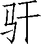

第一百零三卷

 儒林**[1]**列传第六十一

本篇记叙西汉前期多位五经儒学大师的事迹，并附带言及大师们的传承弟子数十人，主要反映了汉武帝时期儒学兴盛的局面。它是合写众多儒学之士的专题性类传，因此以“儒林”标题。

文章最精彩处是传前的长篇序言，它是一篇出色的史论。作者以深沉的慨叹发端，自然地引出了对几百年儒学兴衰史的回顾。在他扼要讲述自孔子以来儒学所走过的坎坷途程时，着重表现的是儒学虽历经劫难，但在其诞生地鲁国及其毗邻的齐国一带深入人心，相沿不废。这说明，一种文化传统一旦形成，便具有暴力亦无法绝灭它的坚韧的生命力。后面传文写到的汉儒经学大师及其有成就的弟子不是大多为齐鲁间人吗？这也正说明汉代儒学的复兴乃是直接依靠历史文化传统的遗留，是它在新的社会条件下的恢复和弘扬。那么，促使儒学迅速复兴的现实条件又是什么呢？作者不惜笔墨，在序的后半部以详载丞相公孙弘的奏章做了不言而喻的回答。就这样，作者以“通古今之变”的深邃眼光，从历史与现实两方面说明了汉代儒学在武帝朝勃然兴盛的原因。不过，这种“说明”是比较隐蔽的。综观序言的写法，是寓论于史，亦叙亦议，作者的分析评判就融合在富于感情、要言不烦的叙述文字中，似水乳一体而莫辨。这和其他类传序言往往直接阐发思想观点的做法，颇为不同。

本传按五经《诗》《书》《礼》《乐》《易》《春秋》的顺序逐一记人叙事，人物纷繁却秩序井然。其中着墨多寡不一，凡述之详者，往往触及儒学内部的问题。如写辕固生和黄生的争论，暴露了儒家学说自身的矛盾和缺欠；写董仲舒先后遭到主父偃和公孙弘的排挤陷害，反映了一些儒者的卑鄙和儒林人际关系的复杂；写兒宽善以经义断狱而位至三公，却从不匡谏天子，说明在重用儒生的新政策下潜伏着某些令人担忧的弊病。这些都颇有耐人玩味的深意。

***【原文】***

太史公曰：余读功令[2]，至于广厉学官[3]之路，未尝[4]不废书而叹也。曰：嗟乎！夫周室衰而《关雎》[5]作，幽、厉微[6]而礼乐坏，诸侯恣[7]行，政[8]由强国。故孔子闵[9]王路废而邪道兴，于是论次《诗》《书》[10]，修起[11]礼乐。适齐闻《韶》[12]，三月不知肉味。自卫返鲁[13]，然后乐正[14]，《雅》《颂》[15]各得其所。世以[16]混浊莫能用，是以仲尼干七十余君[17]无所遇，曰“苟有用我者，期月[18]而已矣”。西狩获麟[19]，曰“吾道穷矣”。故因史记作《春秋》[20]，以当王法，其辞微而指博[21]，后世学者多录焉。

***【译文】***

[1]儒林：儒者之林。形容众多儒者。

[2]功令：古时国家考核和选用学官的法规。

[3]厉：通“励”，劝勉。学官：又称“教官”，指主管学务的官员和官学教师。如汉代开始设置的五经博士。

[4]未尝：未曾，不曾。

[5]夫：提起连词。周室：周朝王室。《关雎》：《诗·周南》篇名，为《诗经》首篇。

[6]幽：指周幽王（姬宫湦），前781—前771年在位。为犬戎所杀，西周亡。厉：指周厉王（姬胡），贪狠好利，横征暴敛，钳制言论。微：衰败。

[7]恣（zì）：放纵。

[8]政：政令。

[9]闵：通“悯”，忧伤。

[10]论次：论定编次；整理。《书》：亦称《尚书》《书经》。上古历史政治文献汇编。儒家经典之一。

[11]修起：修订兴起。

[12]适：往；去到。《韶》：虞舜乐名。

[13]卫：国名。地在今河南省淇县一带。鲁：国名。地在今山东省西南部，建都曲阜（今曲阜市），是孔子的家乡。

[14]乐正：音乐端正。

[15]《雅》《颂》：《诗经》的内容，《诗经》按作品性质和乐调不同，分为“风”“雅”“颂”三类。“风”是各国的民歌，“雅”是周王畿的乐歌。“颂”是朝廷祭祀鬼神、赞美功德的乐歌。

[16]以：通“已”。

[17]干：求取。七十余君：据《家语》等记载，孔丘曾历游周、郑、齐、宋、曹、卫、陈、楚、杞、莒、匡等国。

[18]期月：一年。引语见《论语·子路》。

[19]西狩获麟：古代传说，麟是一种仁兽，是圣王的祥瑞。

[20]《春秋》：编年体史书。儒家的经典之一。

[21]辞微：言辞精微。指博：意旨广博。指，通“旨”。

***【原文】***

自孔子卒[1]后，七十子之徒散游诸侯，大者为师傅[2]卿相，小者友教[3]士大夫，或隐而不见[4]。故子路[5]居卫，子张[6]居陈，澹台子羽居楚[7]，子夏[8]居西河，子贡终[9]于齐。如田子方、段干木、吴起、禽滑釐之属[10]，皆受业于子夏之伦[11]，为王者师。是时独魏文侯[12]好学。后陵迟以至于始皇[13]，天下并争于战国，儒术既绌[14]焉，然齐、鲁之间，学者独不废也。于威、宣之际，孟子、荀卿之列[15]，咸遵夫子之业而润色[16]之，以学显于当世。

***【译文】***

[1]卒：古代称士大夫死亡或年老寿终。

[2]师傅：官名。

[3]友教：交结和教育。

[4]隐：隐居。见：通“现”。

[5]子路：孔丘的学生。鲁国卞（今山东泗水）人，姓仲，名由，字子路。

[6]子张：孔丘的学生。陈国人。姓颛孙，名师，字子张。陈：国名。地在今河南省东部和安徽省一部分。建都宛丘（今河南淮阳）。

[7]澹（tán）台子羽：孔丘的学生。楚：国名。地在今长江中下游一带，建都于丹阳、郢（今湖北省江陵县西北）、鄀、陈、寿春等地。

[8]子夏：孔丘的学生。晋国温（今河南省温县西南）人。姓卜，名商，字子夏。曾在卫国西河（今河南省安阳市）一带讲学，魏文侯亲咨国政，待以师礼。相传《诗》《春秋》等儒家经典是由他传授下来的。

[9]子贡：孔丘的学生。卫国人。姓端木，名赐，字子贡。善于辞令，曾游说齐、吴等国。终：老死。

[10]田子方：魏国人。曾为魏文侯所优礼。段干木：姓段干，名木。魏国人。吴起：兵家。卫国左氏（今山东曹县北）人。禽滑釐：后来成为墨家代表人物。属：等辈。

[11]伦：同类、同辈。

[12]是：这。魏文侯：魏斯。战国时魏国的建立者。前445—前396年在位。

[13]陵迟：像丘陵逶迤逐渐卑下，意为走下坡路。始皇：指秦始皇。

[14]绌：通“黜”，贬退；排除。

[15]威、宣：指齐威王、齐宣王。齐国国君。孟子（约前372—前289）：孟轲，字子舆。邹（今山东省邹城市东南）人。儒家著名代表。荀卿（前313—前238）：荀况，赵国人。列：行列。

[16]咸：皆；都。润色：修饰，使之更有文采。

***【原文】***

及至秦之季世[1]，焚《诗》《书》，坑术士[2]，六艺[3]从此缺焉。陈涉之王[4]也，而鲁诸儒持孔氏之礼器往归陈王。于是孔甲为陈涉博士[5]，卒与涉俱死。陈涉起匹夫[6]，驱瓦合適戍[7]，旬月[8]以王楚，不满半岁竟灭亡，其事至微浅[9]，然而缙绅先生之徒负孔子礼器往委质[10]为臣者，何也？以秦焚其业[11]，积怨而发愤[12]于陈王也。

***【译文】***

[1]季世：末世。

[2]焚《诗》《书》，坑术士：秦始皇三十四年（前213），博士淳于越反对中央集权的郡县制，要依据古制，分封子弟。丞相李斯加以驳斥，主张禁止儒生以古非今，以私学诽谤朝政。秦始皇采纳李斯的建议，下令：焚烧《秦记》以外的列国史记，对不属于博士官的私藏《诗》《书》等限期缴出烧毁；有敢谈论《诗》《书》的处死，以古非今的灭族；禁止私学，要学法令以吏为师。次年，卢生、侯生等方士、儒生攻击秦始皇。秦始皇派御史查究，将四百六十名方士和儒生坑死在咸阳。史称“焚书坑儒”。

[3]六艺：即《诗》《书》《易》《礼》《乐》《春秋》。

[4]王（wànɡ）：称王。

[5]孔甲：孔鲋，字甲。孔丘八代孙。博士：古代学官名，源于战国。

[6]匹夫：寻常的个人。

[7]瓦合：如破瓦之相合，虽说聚合，而不齐同。形容不相亲附。適（zhé）戍：指封建时代官吏或人民有罪被遣戍远方。適，通“谪”。

[8]旬月：一个月。旬，训为“遍”，所以满一月叫“旬月”。

[9]微浅：（事情的规模）细小。

[10]缙绅：通“搢绅”“荐绅”。古时原指高级官吏的装束。委质：古代臣下向君主献礼，表示献身。质，通“贽”。另一说为下拜，表示恭敬承奉之意，引申为归顺。

[11]业：古时的书版，此处指《六经》等书籍。

[12]发愤：发泄愤懑。

***【原文】***

及高皇帝诛项籍[1]，举兵围鲁，鲁中诸儒尚讲诵习礼乐，弦歌之音不绝，岂非圣人之遗化[2]，好礼乐之国哉？故孔子在陈，曰“归与归与[3]！吾党之小子狂简[4]，斐然成章[5]，不知所以裁之[6]”。夫齐、鲁之间于文学[7]，自古以来，其天性[8]也。故汉兴，然后诸儒始得修其经艺[9]，讲习大射乡饮[10]之礼。叔孙通[11]作汉礼仪，因为太常[12]，诸生弟子共定者，咸为选首[13]，于是喟然叹兴于学。然尚有干戈，平定四海，亦未暇遑庠序[14]之事也。孝惠、吕后[15]时，公卿皆武力有功之臣。孝文时颇征用[16]，然孝文帝本好刑名[17]之言。及至孝景[18]，不任儒者，而窦太后又好黄老之术[19]，故诸博士具官[20]待问，未有进者。

***【译文】***

[1]高皇帝（前256—前195）：刘邦。沛（今江苏省沛县）人。秦末农民起义领袖，西汉开国皇帝。前202—前195年在位。详见《高祖本纪》。项籍（前232—前202）：即项羽。

[2]遗化：遗留的教化。

[3]与（yú）：通“欤”。

[4]党：乡党，泛指乡里。小子：旧时长辈称晚辈，或老师称学生。狂简：急于进取而流于疏阔，致行事不切实际。

[5]斐然成章：文采斐然可观。斐，有文采的样子。

[6]不知所以裁之：这句省略了主语“吾”。裁：剪裁。比喻为“指导”的意思。

[7]文学：先秦时期曾将哲学、历史、文学等著作统称为文学。

[8]天性：先天之本性。

[9]修：学习，研究。经艺：儒家经典“六经”又称“六艺”，因亦称“经艺”。

[10]大射：为祭祀而举行的射礼。数中者得与于祭；不数中者，不得与于祭。乡饮：又称饮酒礼。古之乡学，三年业成，举其贤能者以升于君。将升之时，乡大夫为主人，与之饮酒而后升之。

[11]叔孙通：姓叔孙，名通，薛县（今山东省滕州市南）人，曾为秦博士。后归刘邦，任博士，称稷嗣君。汉朝建立，与儒生共立朝仪。后任太子太傅。

[12]太常：官名。

[13]选首：选用的对象。

[14]暇遑（huánɡ）：空闲。庠序：古代学校名。夏曰校，殷曰庠，周曰序。

[15]孝惠：汉惠帝刘盈，前195—前188年在位。详见《孝惠本纪》。吕后（前241—前180）：吕雉。汉高帝皇后。刘邦死，子刘盈即位，她掌握实权。刘盈死，她临朝称制。前后执政共十六年。详见《吕太后本纪》。

[16]孝文（前203—前157）：汉文帝刘恒。前180—前157在位。征用：征召任用。

[17]刑名：通“形名”。原指形体（或实际）和名称。先秦法家则把“刑名”和“法术”联系起来，把“名”引申为法令、名分、言论等，主张循名责实，慎赏明罚。

[18]孝景（前188—前141）：汉景帝刘启。前157—前141年在位。

[19]黄老之术：道家祖黄帝、老子，所以道家学说叫作黄、老之术。

[20]具官：配备应有的官员。形式上有此种官员的设置，但不被信用。

***【原文】***

及今上[1]即位，赵绾、王臧[2]之属明儒学，而上亦乡[3]之，于是招方正贤良文学之士[4]。自是之后，言《诗》于鲁则申培公[5]，于齐则辕固生[6]，于燕则韩太傅[7]。言《尚书》自济南伏生[8]。言《礼》自鲁高堂生[9]。言《易》自菑川[10]田生。言《春秋》于齐鲁自胡毋生[11]，于赵自董仲舒[12]。及窦太后崩[13]，武安侯田蚡[14]为丞相，绌黄老、刑名百家之言，延[15]文学儒者数百人，而公孙弘以《春秋》白衣[16]为天子三公，封以平津侯。天下之学士靡然乡风[17]矣。

***【译文】***

[1]今上：指汉武帝刘彻。前141—前87年在位。

[2]赵绾、王臧：都是当时著名的儒者。

[3]乡（xiànɡ）：通“向”，向往；亲近。

[4]招方正贤良文学之士：汉武帝为了询访政治得失，始下诏“举贤良方正能直言极谏者”，中选者授予官职。

[5]申培公：姓申，名培。“公”是敬称。鲁（今山东省曲阜市一带）人。今文《诗》学“鲁诗学”的开创者。文帝时为博士。

[6]辕固生：姓辕，名固，“生”是敬称。齐（今山东省淄博市一带）人。今文《诗》学“齐诗学”的开创者。景帝时任博士。

[7]韩太傅：姓韩，名婴。燕（今北京市一带）人。今文《诗》学“韩诗学”的开创者。文帝时任博士。景帝时为常山王刘舜的太傅。著有《韩诗内传》和《韩诗外传》。

[8]伏生：姓伏，名胜，“生”是敬称。济南（今山东省济南市章丘区一带）人。今文《尚书》的最早传授者。西汉的《尚书》学者，都出于他的门下。今本今文《尚书》二十八篇，即由他传授而存。

[9]《礼》：又名《仪礼》《礼经》。儒家经典之一。是春秋战国时一部分礼制的汇编。高堂生：姓高堂，字伯。鲁人。今文《礼》学的最早传授者。今本《仪礼》十七篇即出于他的传授。

[10]《易》：又名《周易》《易经》。儒家经典之一。由“传”和“经”两部分构成。经文部分由卦、爻两种符号和卦辞（说明卦的）、爻辞（说明爻的）两种文字构成，都是为着占卜用的。在宗教迷信的外表下，保存了古代人的某些朴素辩证法的观点。菑川：封国名。在今山东省寿光市境。

[11]胡毋生：姓胡毋，字子都。齐人。今文经学家，治《春秋公羊传》。景帝时为博士。

[12]董仲舒（前179—前104）：广川（今河北省枣强县东）人。今文经学大师，专治《春秋公羊传》。汉武帝举贤良文学之士，他对策建议：“诸不在《六艺》之科，孔子之术者，皆绝其道，勿使并进。”为武帝所采纳，开此后两千余年封建社会以儒学为正统的先声。

[13]崩：古代称帝王死为崩。如山陵崩的意思。

[14]田蚡（fén）：长陵（今陕西省咸阳市东北）人。

[15]延：聘请；邀请。

[16]公孙弘（前200—前121）：菑川薛人。治《春秋公羊传》，曾建议设五经博士，置弟子员。以熟悉文法吏治。任丞相，封平津侯。白衣：古代平民着白衣，因以为平民的代称。

[17]靡（mǐ）然：一边倒下的样子。乡风：顺风归化。

***【原文】***

公孙弘为学官，悼道之郁滞[1]，乃请曰：“丞相、御史[2]言：制[3]曰‘盖[4]闻导民以礼，风[5]之以乐。婚姻者，居室之大伦[6]也。今礼废乐崩，朕甚愍[7]焉。故详[8]延天下方正博闻之士，咸登诸[9]朝。其令礼官劝学，讲议洽闻[10]兴礼，以为天下先。太常议，与博士弟子[11]，崇乡里之化，以广[12]贤材焉’。谨与太常臧[13]、博士平[14]等议曰：闻三代[15]之道，乡里有教[16]，夏曰校，殷曰序，周曰庠。其劝善也，显[17]之朝廷；其惩恶也，加[18]之刑罚。故教化[19]之行也，建首善[20]自京师始，由内及外。今陛下昭[21]至德，开大明[22]，配[23]天地，本人伦[24]，劝学修礼，崇化厉贤，以风四方，太平之原[25]也。古者政教未洽[26]，不备其礼，请因旧官[27]而兴焉。为博士官置弟子五十人，复[28]其身。太常择民年十八已上，仪状端正者，补[29]博士弟子。郡国县道邑有好文学，敬长上，肃政教，顺乡里，出入不悖[30]所闻者，令相长丞上属所二千石，二千石谨察可者，当与计偕[31]，诣太常，得受业如弟子。一岁皆辄[32]试，能通一艺[33]以上，补文学掌故[34]缺；其高弟[35]可以为郎中者，太常籍奏[36]。即有秀才[37]异等，辄以名闻。其不事学若下材及不能通一艺，辄罢之，而请诸不称者罚。臣谨案诏书律令[38]下者，明天人分际[39]，通古今之义，文章尔雅[40]，训辞[41]深厚，恩施甚美。小吏浅闻，不能究宣，无以明布谕下。治礼次治掌故[42]，以文学礼义为官迁[43]留滞。请选择其秩比二百石[44]以上，及吏百石通一艺以上，补左右内史、大行[45]卒史；比百石已下，补郡太守[46]卒史：皆各二人，边郡一人。先用诵多者，若不足，乃择掌故补中二千石属[47]，文学掌故补郡属，备员[48]。请著功令。佗[49]如律令。”制曰：“可。”自此以来，则公卿大夫士吏斌斌[50]多文学之士矣。

***【译文】***

[1]悼：担忧；忧伤。道：一定的世界观、人生观、政治主张或思想体系。这里指儒家的道理和主张。郁滞：闭结滞留而不向前发展。

[2]丞相：官名。始于战国时，为百官之长。御史：官名。此指御史大夫，职务仅次于丞相。

[3]制：帝王的命令。

[4]盖：发语词。

[5]风：感化。

[6]居室：指夫妇同居。大伦：伦常大道。

[7]朕：古人自称代词。从秦始皇起专作为皇帝的自称。愍：忧伤。

[8]详：周遍。

[9]咸：都、全。诸：“之于”的合音词。

[10]礼官：掌教化、礼仪的官。洽闻：多闻博识。

[11]与：给予；授予。博士弟子：汉代以在太学学习者为博士弟子。

[12]崇：崇尚。化：教化；教育。广：扩大。

[13]臧：孔臧。人名。

[14]平：人名。

[15]三代：指夏、商（殷）、周三个朝代。

[16]教：指教育的组织形式。

[17]显：彰显，显扬。

[18]加：施加。

[19]教化：政教风化。

[20]首善：实施教化的开始和榜样。

[21]昭：彰明；显扬。

[22]开：显示。大明：指日月的光辉。

[23]配：匹敌，媲美。

[24]本：根本；根据。人伦：指人与人之间的关系和应当遵守的行为准则。

[25]原：本原；根本。

[26]洽：周遍；普及。

[27]因：依据。旧官：指原有的学官。

[28]复：免除租税或徭役。

[29]补：补充。

[30]悖（bèi）：违背，违反。

[31]二千石：汉代对郡太守及王国相的通称，因其俸禄为二千石（月俸为一百二十斛谷）。郡国上计簿（报告地方政情的文书）的官吏。偕：俱；同。

[32]辄（zhé）：即，就。

[33]一艺：一种经学。

[34]文学掌故：官名。掌管学术故实。

[35]弟：通“第”，考试及格的等次。

[36]籍奏：造册上奏。籍，簿籍。

[37]秀才：本系通称才之秀者。汉以来成为荐举人员科目之一。这里指才能特别优秀。

[38]案：通“按”，依据。律令：法令。

[39]天人：天道和人道；自然和人事。分（fèn）际：区别与联系。

[40]尔雅：正。

[41]训辞：教导的言辞。

[42]治：研究。掌故：国家典章制度或学术方面的故实。

[43]迁：升迁；提拔。

[44]秩：官吏的俸禄。比二百石：汉代官吏俸禄等级，下文的中（zhònɡ）二千石、百石、比百石也同。

[45]左右内史：汉代京畿地方长官，后改名左冯翊、京兆尹。大行：官名。掌接待宾客。

[46]太守：郡的最高行政长官。

[47]属：泛指官署的各种吏员。

[48]备员：担任官吏而无职权。

[49]佗：通“他”，其他，其余。

[50]斌斌：通“彬彬”，文质兼备的样子。

***【原文】***

申公者，鲁人也。高祖过鲁，申公以弟子从师[1]入见高祖于鲁南宫。吕太后时，申公游学[2]长安，与刘郢[3]同师。已而郢为楚王，令申公傅[4]其太子戊。戊不好学，疾[5]申公。及王郢卒，戊立为楚王，胥靡[6]申公。申公耻[7]之，归鲁，退居家教，终身不出门，复谢绝宾客，独王[8]命召之乃往。弟子自远方至受业者百余人。申公独以《诗》经为训[9]以教，无传[10]，疑者则阙[11]不传。

***【译文】***

[1]师：指浮丘伯。

[2]游学：远游异地，从师求学。

[3]刘郢（yǐnɡ）：汉高帝之弟，楚元王刘交之子。

[4]傅：教育，辅导。

[5]疾：厌恶、憎恨。

[6]胥（xū）靡：通“縻”，古代对一种奴隶的称谓，因被绳索牵连着强迫劳动，故名。汉代用作一种罚做苦工的罪犯的名称。

[7]耻：意动用法。

[8]王：指鲁恭王刘馀。

[9]训：解释。

[10]传（zhuàn）：阐述经义的文字。

[11]阙（quē）：通“缺”。

***【原文】***

兰陵[1]王臧既受《诗》，以事孝景帝为太子少傅[2]，免去。今上初即位，臧乃上书宿卫[3]上，累迁，一岁中为郎中令[4]。及代赵绾亦尝受《诗》申公，绾为御史大夫[5]。绾、臧请天子，欲立明堂[6]以朝诸侯，不能就[7]其事，乃言师申公。于是天子使使束帛加璧安车驷马[8]迎申公，弟子二人乘轺传[9]从。至，见天子。天子问治乱之事[10]，申公时已八十余，老，对曰：“为治者不在多言，顾力行[11]何如耳。”是时天子方好文词[12]，见申公对，默然。然已招致，则以为太中大夫[13]，舍鲁邸[14]，议明堂事。太皇窦太后好老子言，不说[15]儒术，得赵绾、王臧之过以让[16]上，上因废明堂事，尽[17]下赵绾、王臧吏，后皆自杀。申公亦疾[18]免以归，数年卒。

***【译文】***

[1]兰陵：县名。在今山东省枣庄市东南。

[2]太子少傅：官名，为辅导太子的官。

[3]宿卫：在宫禁中值宿警卫。

[4]郎中令：官名。始于秦，汉初沿设。

[5]代：国名。地在今山西省北部、河北省西北部和内蒙古自治区东南部一带，原都代（今河北省蔚县东北），汉文帝为代王时改都中都（今山西省平遥县西南）。御史大夫：官名。秦、汉时仅次于丞相的中央最高长官，主要职务为监察、执法，兼掌重要文书图籍。

[6]明堂：古代帝王宣明政教的地方，凡朝会及祭祀、庆赏、选士、养老、教学等大典，均在此举行。

[7]就：成就；完成。

[8]束帛：古代聘问、赏赐的礼物。安车：一种可以安坐的小车。这是敬老尊贤的一种优待。驷马：古代一车套四马，因以称一车所驾之四马或驾四马之车。

[9]轺传（yáo zhuàn）：古代驿站车子的一种，驾一匹或两匹马。

[10]治乱之事：指国家政治太平或混乱的关键。

[11]顾：但，只。力行：尽力去做。

[12]文词：文章辞藻。

[13]太中大夫：官名。掌议论。

[14]舍：住宿。邸（dǐ）：古时朝觐京师者在京的住所。

[15]说：通“悦”。

[16]让：责备。

[17]尽：都，全部。

[18]疾：急速。

***【原文】***

弟子为博士者十余人：孔安国至临淮[1]太守，周霸至胶西内史[2]，夏宽至城阳[3]内史，砀鲁赐至东海[4]太守，兰陵缪生至长沙[5]内史，徐偃为胶西中尉[6]，邹人阙门庆忌为胶东[7]内史。其治官民皆有廉节，称其好学。学官弟子行[8]虽不备，而至于大夫、郎中、掌故以百数。言《诗》虽殊，多本于申公。

***【译文】***

[1]孔安国：经学家。临淮：郡名。地在今安徽、江苏交界地区，治所在徐县（今江苏省泗洪县南）。

[2]周霸：鲁人。胶西：郡、国名。地在今山东省胶河以西一带，治所在高密（今高密西南）。内史：西汉初，诸侯王国设内史，掌民政。

[3]城阳：郡、国名。地在今山东省莒县一带，治所在莒县（今莒县）。

[4]砀（dànɡ）：郡、县名。东海：郡名。地在今山东省南部、江苏省北部，治所在郯县（今山东省郯城县北）。

[5]长沙：国名。地在今湖南省东部、南部和广东省、广西壮族自治区交界地区。治所在临湘（今湖南省长沙市）。

[6]中尉：官名。主管王国军事。

[7]邹：县名。即今山东省邹城市。阙门庆忌：姓阙门，名庆忌。胶东：国名。地在今山东省平度市一带。

[8]行：造诣；德行。

***【原文】***

清河[1]王太傅辕固生者，齐人也。以治《诗》，孝景时为博士。与黄生争论景帝[2]前。黄生曰：“汤、武非受命，乃弑[3]也。”辕固生曰：“不然。夫桀、纣[4]虐乱，天下之心皆归汤、武，汤、武与天下之心而诛桀、纣，桀、纣之民不为之使而归汤、武，汤、武不得已而立，非受命为何？”黄生曰：“冠虽敝，必加于首；履虽新，必关于足。何者，上下之分也。今桀、纣虽失道，然君上也；汤、武虽圣，臣下也。夫主有失行，臣下不能正言匡过[5]以尊天子，反因过而诛之，代立践[6]南面，非弑而何也？”辕固生曰：“必若所云，是高帝代秦即天子之位，非邪？”于是景帝曰：“食肉不食马肝[7]，不为不知味；言学者无言汤、武受命，不为愚。”遂罢。是后学者莫敢明受命放杀[8]者。

***【译文】***

[1]清河：国名。地在今河北省、山东省交界地区。治所在清阳（今河北省清河县东南）。这时的国王是汉景帝的儿子刘乘。

[2]景帝（前188—前141）：刘启。前157—前141年在位。

[3]受命：受天之命。弑（shì）：古代称臣杀君、子杀父母等行为。

[4]桀：夏朝末代君主。纣（zhòu）：商朝末代君主。

[5]正言：正直的话。匡过：纠正过错。

[6]践：帝王登位。

[7]马肝：马的肝脏。相传马肝有毒，食之能致人于死。

[8]放杀：放逐而杀之。杀，通“弑”。

***【原文】***

窦太后好《老子》[1]书，召辕固生问《老子》书。固曰：“此是家人[2]言耳。”太后怒曰：“安得司空城旦[3]书乎！”乃使固入圈刺豕。景帝知太后怒而固直言无罪，乃假固利兵[4]，下圈刺豕，正中其心，一刺，豕应手而倒。太后默然，无以复罪，罢之。居顷[5]之，景帝以固为廉直，拜为清河王太傅。久之，病免。

***【译文】***

[1]《老子》：书名。亦称《道德经》。道家的主要经典。

[2]家人：普通平民。

[3]安：哪；怎么。司空：主管刑狱之官。城旦：秦汉时的一种刑罚。

[4]假：给予，授予。利兵：锋利的刀枪。

[5]居：处；经过。顷：短时间，不久。

***【原文】***

今上初即位，复以贤良征[1]固。诸谀儒多疾毁[2]固，曰“固老”，罢[3]归之。时固已九十余矣。固之征也，薛[4]人公孙弘亦征，侧目[5]而视固。固曰：“公孙子，务正学[6]以言，无曲学以阿世[7]！”自是之后，齐言《诗》皆本辕固生也。诸齐人以《诗》显贵，皆固之弟子也。

***【译文】***

[1]征：征聘。

[2]谀儒：喜欢阿谀奉承他人的儒生。疾毁：嫉妒诽谤。疾，通“嫉”。

[3]罢：罢免。

[4]薛：邑名。

[5]侧目：因为敬畏而不敢直视。

[6]正学：汉武帝时排斥百家，独尊儒术，以儒家学说为正学。

[7]曲学：指邪僻之学，以别于当时的所谓正学。阿（ē）世：迎合当世。

***【原文】***

韩生[1]者，燕人也。孝文帝时为博士，景帝时为常山[2]王太傅。韩生推《诗》之意而为《内外传》[3]数万言，其语颇与齐、鲁[4]间殊，然其归一[5]也。淮南贲生[6]受之。自是之后，而燕、赵间言《诗》者由[7]韩生。韩生孙商为今上博士。

***【译文】***

[1]韩生：名婴。燕（在今北京市一带）人。

[2]常山：国名。地在今河北省西部，治所在元氏（今元氏县西北）。这时的国王是汉景帝的儿子刘舜。

[3]推：推衍。《内外传》：指《韩诗内传》和《韩诗外传》。

[4]齐、鲁：指齐诗学和鲁诗学。

[5]归一：趋向一致。谓所得结果相同。

[6]贲生：姓贲，名不详。

[7]由：出于。

***【原文】***

伏生者，济南人也。故为秦博士。孝文帝时，欲求能治《尚书》者，天下无有，乃闻伏生能治，欲召之。是时伏生年九十余，老，不能行，于是乃诏太常使掌故朝错[1]往受之。秦时焚书，伏生壁藏之。其后兵大起，流亡，汉定，伏生求其书，亡数十篇，独得二十九篇，即以教于齐、鲁之间。学者由是颇能言《尚书》，诸山东大师无不涉[2]《尚书》以教矣。

***【译文】***

[1]太常：官名。朝错（前200—前154）：即“晃错”，颍川（今河南省禹州市）人。后为太子（即景帝）家令，深得宠信，号为“智囊”。

[2]山东：地区名。战国、秦、汉时代，通称崤山或华山以东为山东，与当时所谓关东（函谷关以东）含义相同。大师：指有巨大成就而为人所崇仰的学者或艺术家。涉：涉猎。

***【原文】***

伏生教济南张生及欧阳生[1]，欧阳生教千乘兒宽[2]。兒宽既通《尚书》，以文学应郡举，诣[3]博士受业，受业孔安国。兒宽贫无资用，常为弟子都养[4]，及时时间行佣赁[5]，以给[6]衣食。行常带经，止息则诵习之。以试第次，补廷尉史[7]。是时张汤方乡学，以为奏谳掾[8]，以古法议决疑大狱[9]，而爱幸宽。宽为人温良，有廉智，自持，而善著书。书奏[10]，敏于文[11]，口不能发明也。汤以为长者，数称誉之。及汤为御史大夫，以兒宽为掾，荐之天子。天子见问，说之。张汤死后六年，兒宽位至御史大夫，九年而以[12]官卒。宽在三公位，以和良承意[13]从容得久，然无有所匡谏[14]；于官，官属易[15]之，不为尽力。张生亦为博士。而伏生孙以治《尚书》征，不能明也。

***【译文】***

[1]欧阳生：姓欧阳，字和伯。千乘人。西汉今文《尚书》学“欧阳学”的开创者。

[2]兒（ní）宽：后任左内史、御史大夫。曾在郑国沿岸开发“六辅渠”，扩大灌溉效益。又曾与司马迁共制定《太初历》。

[3]诣：前往；去到。

[4]都养：集体的炊事员。

[5]间（jiàn）行：行动隐秘。佣赁：受雇为人劳动。

[6]给（jǐ）：供给。

[7]廷尉史：廷尉属官，秘书之类。廷尉，官名。

[8]奏：臣子向君主进言、上书。谳：审判定案。掾：古代属官的通称。

[9]议决：朝议决定。疑大狱：案情不明、难以判决的大案件。

[10]著书：写作文章。书奏：书写奏章。

[11]敏于文：文思敏捷。

[12]以：于；在。

[13]和良：谦和温良。承意：顺从人意。

[14]匡谏：匡正，谏诤。

[15]官属：主官的属吏。易：轻视。

***【原文】***

自此之后，鲁周霸、孔安国，雒阳贾嘉[1]，颇能言《尚书》[2]事。孔氏有古文《尚书》，而安国以今文[3]读之，因以起其家[4]。逸《书》[5]得十余篇，盖《尚书》滋[6]多于是矣。

***【译文】***

[1]雒（luò）阳：县名。在今河南省洛阳市东北。贾嘉：贾谊孙。后为郡守、九卿。

[2]古文《尚书》：儒家经典《尚书》的一种。

[3]今文：专指隶书。隶书是汉代通行的文字，当时称为“今文”或“今字”。

[4]起其家：从家中征召出来，授以官职。

[5]逸《书》：即古文《尚书》。

[6]滋：增益；加多。

***【原文】***

诸学者多言《礼》，而鲁高堂生最本[1]。《礼》[2]固自孔子时而其经不具，及至秦焚书，书散亡益多，于今独有《士礼》[3]，高堂生能言之。

***【译文】***

[1]本：原始；本原。

[2]《礼》：《礼经》。

[3]《士礼》：即《仪礼》。简称《礼》，亦称《礼经》，儒家经典之一。春秋、战国时代一部分礼制的汇编，十七篇。

***【原文】***

而鲁徐生善为容[1]。孝文帝时，徐生以容为礼官大夫[2]。传子至孙徐延、徐襄[3]。襄，其天姿善为容，不能通《礼经》；延颇能，未善也。襄以容为汉礼官大夫，至广陵[4]内史。延及徐氏弟子公户满意、桓生、单次[5]，皆尝为汉礼官大夫。而瑕丘萧奋以《礼》为淮阳[6]太守。是后能言《礼》为容者，由徐氏焉。

***【译文】***

[1]容：指礼仪、仪式。

[2]礼官大夫：官名。

[3]徐延为徐生子，徐襄为徐生孙。

[4]广陵：国名。

[5]公户满意：姓公户，名满意。单（shàn）次：姓单，名次。

[6]瑕丘：县名，春秋鲁负瑕邑。淮阳：郡名。

***【原文】***

自鲁商瞿[1]受《易》孔子，孔子卒，商瞿传《易》，六世至齐人田何[2]，字子庄，而汉兴。田何传东武[3]人王同子仲，子仲传菑川人杨何。何以《易》，元光[4]元年征，官至中大夫[5]。齐人即墨成以《易》至城阳[6]相。广川人孟但以《易》为太子门大夫[7]。鲁人周霸，莒人衡胡，临菑人主父偃[8]，皆以《易》至二千石。然要[9]言《易》者本于杨何之家。

***【译文】***

[1]商瞿：春秋时鲁国人。孔丘学生。

[2]六世：商瞿传桥庇，再传臂子弓，再传周虞，再传孙虞，田何，共为六代。田何：西汉今文《易》的开创者。

[3]东武：县名。在今山东省诸城市。

[4]元光：汉武帝年号（前134—前129）。

[5]中大夫：官名。掌议论。

[6]即墨成：姓即墨，名成。城阳：国名。

[7]广川：国名。地在今河北省南部和山东省交界地区，治所在信都（今河北省衡水市冀州区）。太子门大夫：官名。

[8]主父偃（？—前126）：姓主父，名偃。任中大夫。

[9]要：精要。

***【原文】***

董仲舒，广川人也。以治《春秋》，孝景时为博士。下帷[1]讲诵，弟子传以久次[2]相受业，或莫见其面，盖三年董仲舒不观于舍园，其精如此。进退容止[3]，非礼不行，学士[4]皆师尊之。今上即位，为江都相。以《春秋》灾异之变推阴阳所以错行[5]，故求雨闭诸阳，纵诸阴，其止雨反是[6]。行之一国，未尝不得所欲。中废[7]为中大夫，居舍，著《灾异之记》。是时辽东[8]高庙灾，主父偃疾之，取其书奏之天子。天子召诸生示其书，有刺讥[9]。董仲舒弟子吕步舒不知其师书，以为下愚[10]。于是下董仲舒吏，当死[11]，诏赦之。于是董仲舒竟不敢复言灾异。

***【译文】***

[1]下帷：放下室内悬挂的帷幕。

[2]传：依次轮流。久次：以时间长短为次序。

[3]容止：仪容举止。

[4]学士：在学之士。

[5]灾异：指自然灾害和某些特异的自然现象。阴阳：中国哲学的一对范畴。错行：更替运行。

[6]反是：与这相反。是，指“闭诸阳，纵诸阴”。

[7]废：废黜。

[8]辽东：郡名。

[9]刺讥：指责，讥讽。

[10]下愚：至愚之人。

[11]当死：判处死刑。当，判罪。

***【原文】***

董仲舒为人廉直。是时方外攘[1]四夷，公孙弘治《春秋》不如董仲舒，而弘希世[2]用事，位至公卿。董仲舒以弘为从谀[3]。弘疾之，乃言上曰：“独董仲舒可使相胶西王[4]。”胶西王素闻董仲舒有行[5]，亦善待之。董仲舒恐久获罪，疾免居家。至卒，终不治产业[6]，以修学著书为事。故汉兴至于五世[7]之间，唯董仲舒名[8]为明于《春秋》，其传公羊[9]氏也。

***【译文】***

[1]攘：排除。

[2]希世：迎合世俗。

[3]从谀：怂恿谄谀。

[4]胶西王：汉景帝的儿子刘端，为人阴险狠毒，曾杀害胶西国的许多相和高级官吏。

[5]行：指道德学问。

[6]产业：家产。

[7]五世：指汉高帝、吕后、文帝、景帝、武帝五代。

[8]名：著名。

[9]公羊：复姓。

***【原文】***

胡毋生，齐人也。孝景时为博士，以老归教授[1]。齐之言《春秋》者多受[2]胡毋生，公孙弘亦颇受焉。

***【译文】***

[1]教授：把知识传授给学生。

[2]受：接受；受业。

***【原文】***

瑕丘江生为《穀梁春秋》[1]。自公孙弘得用，尝集比[2]其义，卒用董仲舒。

***【译文】***

[1]穀（ɡǔ）梁：复姓。

[2]集比：收集，比较。

***【原文】***

仲舒弟子遂[1]者：兰陵褚大，广川殷忠，温[2]吕步舒。褚大至梁[3]相。步舒至长史[4]，持节[5]使决淮南狱，于诸侯[6]擅专断，不报，以《春秋》之义正[7]之，天子皆以为是。弟子通[8]者，至于命大夫[9]；为郎、谒者、掌故者以百数。而董仲舒子及孙皆以学至大官。

***【译文】***

[1]遂：通达，有成就。

[2]温：县名，即今河南省温县。

[3]梁：国名，地在今河南省、安徽省交界地区，治所在睢阳（今河南省商丘市南）。

[4]长（zhǎnɡ）史：官名。

[5]节：使者所持以作凭证的信物，用竹、木制成。

[6]诸侯：汉代分封的各国王，类似古代的诸侯，此指淮南王。

[7]正：治罪。

[8]通：处境顺利，做官显达。

[9]命大夫：受皇帝赐命的大夫，如光禄大夫、太中大夫、谏大夫等。

## 【译文】

太史公说：“我读朝廷考核和选用学官的法规，读到广泛游励学官成长的道路时，总是禁不住放下书而叹惜。说：唉！周朝王室衰亡而《关雎》诗就出现了，周幽王、周厉王统治衰颓而礼崩乐坏，诸侯放纵骄横，政令由强大的诸侯国家发布。所以，孔子忧伤王道废弛而邪道兴起，于是论定编次《诗》《书》，修订兴起礼乐。他到齐国听《韶》乐，沉迷其中，三个月品尝不出肉的美味。他从卫国回到鲁国，然后端正音乐，使《雅》《颂》乐歌各归其位，有条不紊。世道由于混乱污浊，没有人起用他，所以孔子向七十多个国君求官都没有得到知遇，他说：‘如果有任用我的，一年就足够了。’鲁国西郊有人猎获了麒麟，孔子说：‘我的思想不能实现了。’因此，他借助鲁国的历史记录撰写《春秋》，来代表天子的王法。由于文辞精深而意义博大，后代学者很多人都学习传录它。”

自从孔子去世后，他的七十多名弟子四散交游诸侯，成就大的当了国君的老师和卿相，成就小的交结和教育士大夫，有的则隐居不出现。所以，子路在卫国，子张在陈国，澹台子羽在楚国，子夏在西河，子贡在齐国，一直到死。像田子方、段干木、吴起、禽滑釐一辈人，都曾受教于子夏等人，成为诸侯国君的老师。这时，只有魏文侯爱好儒学。后来，儒学渐渐衰落一直到秦始皇时代。在战国时期天下人一起争战，儒学已经不受重视。但在齐、鲁一带，学者们独守儒学，没有放弃。在齐威王、齐宣王时期，孟子、荀子等人，都继承孔子的事业并使之发扬光大，凭着学说在当代显扬名声。

到了秦朝末年，焚毁《诗》《书》，坑杀儒生，儒家典籍六艺从这时开始残缺。陈涉自立为王，鲁地的儒生携带着孔子家传的礼器去归顺陈王。于是，孔甲当了陈涉的博士，最后和陈涉一同死了。陈涉兴起自平民，驱使一群乌合的戍守边境的士兵，一个月内就在楚地称了王，不足半年就竟又灭亡，他的事业十分微小浅薄，可是士大夫背着孔子的礼器去委身归顺作他的臣下，为什么呢？因为秦朝焚毁他们的书籍，积下仇怨而借助于陈王来发泄愤懑。

到高祖皇帝杀死项籍，带领军队包围鲁国，鲁国中的儒生还在讲诵经书练习礼乐，歌声乐声不断，难道不是圣人遗留的风范，喜欢礼乐的国家吗？所以，孔子出游在陈地，说：“回去吧！回去吧！我们乡里的年轻人志向高远，文采斐然可观，不知道如何去教导他们。”齐鲁一带对于文化礼仪，从古以来就这样，这是他们的天性。所以，汉朝建立，然后儒生们才能开始研究他们的经术，讲授演习起大射和乡饮的礼仪。叔孙通制定汉廷礼仪后，因而做了太常官，那些与他一起制定礼仪的儒生弟子们都成了朝廷首先录用的对象。于是，人们感慨地说儒学开始兴起了。但这时还有战争，还在平定全国，也没有时间顾及兴办学校的事。孝惠帝、吕后当政时，公卿大臣都是靠武力起家的功臣。孝文帝时，稍微征用了儒生。但是，孝文帝本来就喜欢刑名学说。到了孝景帝时，不任用儒生，而且窦太后又喜欢道家黄、老思想，因此那些博士空有官位以备顾问，没有晋升的。

到了当今皇上即位，赵绾、王臧等人懂得儒学，而皇上也偏向儒学，于是招方正贤良文学的士人。从这以后，讲《诗》的在鲁地有申培公，在齐的有辕固生，在燕的有韩太傅。宣讲《尚书》有济南人伏生，宣讲《礼》的有鲁地高堂生，宣讲《易》的有菑川的田生。宣讲《春秋》在齐地、鲁地出于胡毋生，在赵地出于董仲舒。到了窦太后去世，武安侯田蚡任丞相，罢黜黄、老、刑名等百家的学说，延请文学儒生几百人为官，而公孙弘由于精通《春秋》而从平民升为皇帝身边的三公，封为平津侯。天下的学者像风吹一边倒一样倾向儒学。

公孙弘当了学官，担忧儒道滞结不畅通，于是奏请皇上说：“丞相和御史大夫说：诏书说：‘听说用礼来引导人民，用乐来教化人民。婚姻是夫妇的伦理大道。现在礼乐废坏，朕很忧虑。因此，普遍地延请天下品行端正、见识广博的人士，都到朝廷上来做官。应当命令礼官勤奋学习，宣讲议论见闻广博，崇尚礼仪，作为天下的表率。太常提议，给博士配备弟子，振兴民间的教育，来开拓培养贤才的道路。’我谨和太常孔臧、博士平等商议说：听说夏、商、周三代的制度，乡村有教育，夏代叫校，商代叫序，周代叫庠。劝勉人们为善，让他们在朝廷上显扬名声；惩戒作恶的人，给他们施加处罚。所以，政教风化的推行，建立好的榜样从京师开始，从内到外。如今，陛下昭明最高的德行，发出日、月的光辉，与天地相配，推本人伦关系，劝勉学习，研习礼仪，崇尚教化，奖励贤才，来风教四面八方的民众，作为太平盛世的本源。古代政治教化没能普遍，礼制不备，请求利用原有的学官来振兴。替博士官配置弟子五十人，免除他们的赋税徭役。太常选择十八岁以上、仪表端正的人，充当博士弟子。各郡、各国、各县、各道、各邑有爱好经学、尊敬长辈、上级，严守政教，友爱乡里，出入言行都不违反所学的人，县令、侯国相、县长、县丞上报所属郡太守和王国相，郡太守、王国相谨慎考察认为可以的人，应当和上计吏一同到太常那里，可以像弟子一样参加学习。一年后都要考试，能精通一门经书以上的，可以补充文学掌故的缺官；其中成绩名列前茅的可以担任郎中，太常造册上奏。假如有才能特别优秀的，就把名字上报。那些不认真学习或者才能低下以及不能通晓一种经书的，就开除他，而惩罚那些举荐他们的不称职的官吏。臣认真地推敲诏书法令下达的目的，在于明辨天道和人道的关系，贯通古今的道理，文辞雅正，教诲之词含义深刻丰富，恩泽十分优厚。下级官吏见识浅薄，不能深究宣传，无法明白地晓喻天下。现在，首先要选拔研究礼制的人才，其次是选拔研究历史典籍的人才，用懂文学礼义的人做官，提升被压抑的人才。请挑选那些俸禄比同二百石以上的人，和百石以上能通晓一种经学的小吏，升补左右内史、大行卒史；选拔比同百石以下的人补郡太守卒史：各郡定员二人，边郡定员一人。优先选用熟知经书能大量讲诵的人，如果人数不够，就选用掌故补中二千石的属吏，选用文学掌故补郡国的属吏，作为缺额充数。请把这些记入考选学官的法规。其他仍依据律令。”皇上批示：“可行。”从这以后，公卿大夫和一般士吏中就有了很多文质彬彬的经学儒生。

申培公是鲁国人。高祖经过鲁国，申培公以弟子的身份跟随老师在鲁地的南宫拜见高祖。吕太后时期，申公到长安交游求学，和刘郢同拜一个老师。不久，刘郢立为楚王，让申公做他太子刘戊的老师。刘戊不好学习，恨申公。到楚王刘郢死后，刘戊立为楚王，把申公禁锢起来。申公觉得羞耻，回到鲁地，回到家中教书，终身不出家门，又谢绝宾客交往，只有鲁王传令召见才去。从远方来学习的学生有一百多人。申公只对《诗经》作解释来教学，没有阐发经义的著述，有疑义的地方就留下来不讲授。

兰陵人王臧向申公学习《诗经》后，来侍奉孝景帝，任太子少傅，后来免职离去。现今皇上刚即位，王臧就上书请求为皇上当宫禁中值宿警卫，多次升迁，一年里就当了郎中令。而代国的赵绾也曾向申公学习《诗经》，赵绾任御史大夫。赵绾、王臧请求天子，欲修建明堂召集诸侯来朝会，未能办成这件事，就引荐老师申公。于是，天子派使者带着束帛和玉璧，驾着四马所拉可以安坐的车，去迎接申公，学生二人乘着轻便车跟随申公。到了京师，拜见天子。天子问他国家安危的事，申公当时已八十多岁，年事已高，回答说：“当政的人不在于多说话，只看尽力实干怎么样罢了。”这时，天子正喜欢文辞，看到申公这样回答，沉默不语。但已经把他召来，就任命他为太中大夫，让他住在鲁王在京城的公馆里，商讨建立明堂的事。太皇窦太后喜欢老子的学说，不喜欢儒学，找到赵绾、王臧的过错，用它来责备皇上。皇上于是停止了修建明堂的事，把赵绾、王臧都交给司法官，后来他们都自杀。申公也因为生病免官回家，几年后去世。

申公的学生当博士的有十多人：孔安国官至临淮太守，周霸官至胶西内史，夏宽官至城阳内史，砀县鲁赐官至东海太守，兰陵人缪生官至长沙内史，徐偃任胶西中尉，邹人阙门庆忌任胶东内史。他们治理官民都有廉洁的节操，人们称赞他们喜欢学习。其余学官弟子们，品行尽管不完美，但做官至大夫、郎中、掌故的要用百来计算。他们讲论《诗经》虽然有所不同，但大多依循申公的见解。

清河王的太傅辕固生是齐国人。他因为研究《诗经》，在孝景帝时任博士。有一次，他和黄生在景帝面前争论。黄生说：“商汤、周武王不是秉承天命做天子，是弑君篡位。”辕固生说：“不对。夏桀、商纣暴虐淫乱，天下人心都归向于商汤、周武王，商汤、周武王顺应天下人心而诛杀夏桀、商纣，夏桀、商纣的百姓不为他们所用而归顺商汤、周武王，商汤、周武王不得已而立为天子，不是秉承天命是什么呢？”黄生说：“帽子虽然破，一定戴在头上；鞋子虽然新，一定穿在脚上。这是为什么呢？是上下的制度名分。如今，夏桀、商纣虽然无道，却是君主；商汤、周武王虽然圣明，却是臣下。君主有错误行为，臣下不能够用正直的话匡正过失来尊奉天子，反而趁其过失而诛杀他们，取而代之，南面称王，不是弑君是什么呢？”辕固生说：“若一定像你所说，那么高祖代替秦朝登上天子的位置，不对吗？”于是，景帝说：“吃肉不吃马肝，不能算不知道味道；谈论学问的人不谈论商汤、周武王受命的事情，不能算是愚蠢。”就停止了争论。此后，学者没人敢讲清是受命是弑君这个问题。

窦太后喜欢《老子》一书，召来辕固生问《老子》一书的问题。辕固生说：“这是普通人的言论罢了。”太后生气地说：“怎么能比得上狱吏囚徒的书呢？”因此，让辕固生进入猪圈刺杀猪。景帝知道太后生气而辕固生是直言无罪，于是给辕固生锋利的兵器，到猪圈里刺杀猪，正好刺中它的心脏，只一刺，猪应手倒地。太后默不作声，无法再加罪于他，就作罢了。过了不久，景帝认为辕固生廉洁清正，任命他为清河王的太傅。过了很长时间，他因病罢官。

当今皇上刚登位，又用征召贤良的名义征召辕固生。那些谄谀的儒生大多嫉妒诋毁辕固生，说：“辕固生老了。”于是，被罢官回家。这时，辕固生已经九十多岁了。辕固生被召时，薛邑人公孙弘也被征召，他斜着眼睛不敢正视辕固生。辕固生说：“公孙先生，务必以正直学问来论事，不要用邪曲之说来迎合时世！”从这以后，齐地谈论《诗经》都依循辕固生的见解。那些由研究《诗经》而显贵的齐人，都是辕固生的学生。

韩生是燕国人。孝文帝时期任博士，景帝时期任常山王的太傅。韩生推究《诗经》的意旨而撰写《内传》《外传》几万字，书中的用语和齐、鲁地区解释《诗经》的语言很不同，但宗旨是一致的，淮南贲生向他学习。从这以后，燕、赵一带讲论《诗经》的人都出自韩生门下。韩生的孙子韩商是当今皇上的博士。

伏生是济南郡人。以前做过秦朝的博士。孝文帝时期，要寻求能够研究《尚书》的人，天下没有，就听说伏生能讲授，要征召他。这时，伏生九十多岁，年纪太大，不能行走，于是就下诏令太常派掌故晁错去向他学习。秦朝焚烧儒书，伏生把《尚书》藏在墙壁里。后来战乱大起，人们四处逃亡，汉朝平定天下，伏生寻找他的书，丢失了几十篇，只找到二十九篇，就拿这些在齐、鲁一带进行讲授。学者们从此大多能讲解《尚书》，那些山东的经学大师无不涉猎《尚书》来教授。

伏生教授济南人张生和欧阳生，欧阳生教授千乘人兒宽。兒宽通晓《尚书》后，凭借文学的资格接受郡里的推荐，到博士门下学习，从师于孔安国。兒宽家贫没有资财，时常当学生们的厨工，并且时时偷偷出外给人做工，来供给衣食。他外出经常带着经书，休息时就诵读温习它。依照考试成绩的名次，他补了廷尉史的缺官。这时，张汤正爱好儒学，让兒宽做呈报案情的属官，根据古法论事判决疑难大案，因此爱宠兒宽。兒宽为人温和善良，清廉聪明，能坚持节操，而且擅长著书、起草奏章，文思敏捷，但是口头不会阐述。张汤认为他是忠厚人，屡次称赞他。到张汤任御史大夫，让兒宽当属官，向天子举荐他。天子召见并询问他，很喜欢他。张汤死后六年，兒宽官位升到御史大夫。在职九年后死去。兒宽位列三公，因为和顺温良、顺从皇上心意、办事从容，得以长时间任职，但他从没有匡正劝谏皇上的过失。居官期间，属下轻视他，不给他尽力办事。张生也担任博士。而伏生的孙子由于研究《尚书》被征召，但他对《尚书》不能阐述清楚。

从这以后，鲁地的周霸、孔安国和洛阳的贾嘉都很能讲解《尚书》的内容。孔家有古文《尚书》，而孔安国用隶书字体来改写它，因此兴起了他的学术流派。孔安国得到了十多篇失传的《尚书》，《尚书》大概从这时起逐渐增多篇目了。

那些学者很多讲论《礼经》，而鲁地人高堂生最接近原本。《礼经》本来从孔子时起经书就不完整，到了秦朝焚书，这经书散失的篇目更多，如今只有《士礼》，高堂生能够讲解它。

鲁地人徐生善于演示礼仪。孝文帝时期，徐生凭懂得礼仪任礼官大夫。他传习礼仪给儿子，又传到了他的孙子徐延、徐襄。徐襄天性便善于演习礼仪，但不懂《礼经》；徐延稍微能懂《礼经》，但还不够精通。徐襄凭借懂礼仪任汉朝廷的礼官大夫，官至广陵内史。徐延和徐家弟子公户满意、桓生、单次都曾经任汉朝廷礼官大夫。而瑕丘人萧奋因为通晓《礼经》而当了淮阳太守。这以后，能够讲论《礼》来演习礼仪的人都出自徐家门下。

自从鲁国商瞿向孔子学习《易》，孔子去世后，商瞿就教授《易》，历经六代而传到齐地人田何，田何字子庄，而这时汉朝建立。田何传授给东武人王同——字子仲，王子仲传授给菑川人杨何。杨何因为精通《易》元光元年被征召，官做到中大夫。齐地人即墨成因为精通《易》官至城阳国相。广川人孟但因为通晓《易》任太子门大夫。鲁地人周霸、莒地人衡阳、临菑人主父偃都因为通晓《易》而官至二千石。但是，精于解说《易》的，都源于杨何这一家。

董仲舒是广川人。他由于研究《春秋》，在孝景帝时期任博士。他放下帷幕讲授《春秋》，弟子们根据入学时间的长短来依次辗转相传授，有的甚至没见过他的面。董仲舒三年不到后园游玩，他专心到这个地步。他出入时的仪容举止，不合礼仪的就不做，学者们都师法、尊敬他。当今皇上登位，董仲舒任江都国相。他依靠《春秋》中自然灾害和特异现象的变化来推究阴阳交替运行的缘故，因而求雨时就关闭各种阳气，放纵各种阴气，消雨时的方法与此相反。在江都全国推行，无不实现了预期的效果。他任职期间被贬为中大夫，住在家里，撰写《灾异之记》。这时，辽东高帝庙发生火灾，主父偃妒忌他，窃取他的书上奏天子。天子召集众儒生把书展示给他们，书中有指责讥讽的内容。董仲舒的弟子吕步舒不知道这是他老师的书，认为十分愚蠢。于是，把董仲舒交给司法官处办，判处死刑，下诏赦免了。于是，董仲舒终于不敢再谈论灾异。

董仲舒为人廉洁正直。这时，朝廷正好要排除四方外族的侵犯，公孙弘研究《春秋》比不上董仲舒，而公孙弘迎合世俗处理事情，官至公卿。董仲舒认为公孙弘为人阿谀逢迎。公孙弘憎恨他，就对皇上说：“只有董仲舒可以派去做胶西王的国相。”胶西王平时听说董仲舒有德行，也很好地对待他。董仲舒怕时间长了会获罪，很快就辞职回家。到去世为止，他始终不置办家产，专门从事研究学问、著书立说。所以，汉朝建立直到第五代期间，只有董仲舒以精通《春秋》出名，他阐述的是《公羊春秋》。

胡毋生是齐郡人。在孝景帝时任博士，因年纪大回家教授《春秋》。齐地讲论《春秋》的人大多受教于胡毋生，公孙弘也向他学习过许多。

瑕丘人江生研究《穀梁春秋》。自从公孙弘受到重用，他曾经收集比较穀梁学和公羊学的经义，最后采用了董仲舒的解说。

董仲舒的弟子中有成就的：兰陵人褚大，广川人殷忠，温人吕步舒。褚大官至梁王国相。吕步舒官至长史，手持符节出使去判决淮南王罪案，对诸侯王敢于自行裁决，而不加请示，根据《春秋》的义理来公正断案，天子都认为很对。弟子中官运亨通的，做到了皇帝任命的大夫；担任郎官、谒者、掌故的要用百来计算。而董仲舒的儿子和孙子都因为精通儒学而做到高官。

