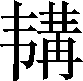

第一百零八卷

 滑稽**[1]**列传第六十六

这是专记滑稽人物的类传。滑稽是言辞流利，正言若反，思维敏捷，没有阻难之意。后世用作诙谐幽默之意。《太史公自序》曰：“不流世俗，不争埶利，上下无所凝滞，人莫之害，以道之用。作《滑稽列传》。”此篇的主旨是颂扬淳于髡、优孟、优旃一类滑稽人物“不流世俗，不争埶利”的可贵精神，及其“谈言微中，亦可以解纷”的非凡讽谏才能。他们出身虽然微贱，却机智聪敏，能言多辩，善于缘理设喻，察情取譬，借事托讽，因而其言其行起到了与“‘六艺’于治一也”的重要作用。

全传貌似写极鄙极亵之事，而开首却从“六艺”入笔，可谓开宗明义。以下相继写“齐髡以一言而罢长夜之饮，优孟以一言而恤故吏之家，优旃以一言而禁暴主之欲”，均紧扣全文主旨，多用赋笔，布局精巧，句法奇秀，妙趣横生，读来令人击节。李景星评论本篇：“赞语若雅若俗，若正若反，若有理，若无理，若有情，若无情，数句之中，极嬉笑怒骂之致，真是神品。”（《史记评议》卷四）可谓深得该传之精髓。

至于褚少孙先生增补进去的文字，历来方家学者褒贬不一，大多以为较之太史公，显得“蔓弱”。不过，也应指出，篇中西门豹治邺一段，叙来有条不紊，栩栩如生，历历如画，它在众多读者心目中留下了难以磨灭的印象。

***【原文】***

孔子曰：“‘六艺’[2]于治一也。《礼》以节人[3]，《乐》以发和[4]，《书》以道事[5]，《诗》以达意[6]，《易》以神化[7]，《春秋》以义[8]。”太史公曰：天道恢恢[9]，岂不大哉！谈言微中[10]，亦可以解纷[11]。

***【译文】***

[1]这是记叙滑稽人物的类传。滑（ɡǔ）稽：指能言善辩，言辞流利无滞竭。

[2]六艺：儒家六部经典，指《礼》《乐》《书》《诗》《易》《春秋》。

[3]节人：节制、规范人的言行。

[4]发和：促进人们和睦融洽。发，诱导、促进。

[5]道事：记述往古的事迹，以供人们效法、借鉴。

[6]达意：传达前代圣贤的感情意旨。

[7]神化：表现事物的神妙变化。

[3]以义：用正义来衡量是非。

[9]天道恢恢：意谓世上的道理很多，解决问题的办法不止一种。恢恢，宽广的样子。

[10]谈言微中（zhònɡ）：谈话偶尔说到点子上。

[11]解纷：解开纠纷；解决问题。

***【原文】***

淳于髡[1]者，齐之赘婿[2]也。长不满七尺，滑稽多辩，数[3]使诸侯，未尝屈辱。齐威王之时喜隐[4]，好为淫乐[5]长夜之饮，沉湎不治[6]，委政卿大夫。百官荒乱，诸侯并侵[7]，国且[8]危亡，在于旦暮[9]。左右莫[10]敢谏。淳于髡说[11]之以隐曰：“国中有大鸟，止王之庭，三年不蜚[12]又不鸣，王知此鸟何也？”王曰：“此鸟不飞则已[13]，一飞冲天；不鸣则已，一鸣惊人。”于是乃朝[14]诸县令长七十二人，赏一人，诛一人[15]，奋兵而出。诸侯振[16]惊，皆还齐侵地。威行三十六年。语[17]在《田完世家》中。

***【译文】***

[1]淳于髡（kūn）：淳于，复姓。髡，名。

[2]齐：国名。国君田姓：战国七雄之一。赘婿：当时的一种卖身奴隶，社会地位很低。

[3]数（shuò）：屡次。

[4]齐威王：田因齐。前356—前320年在位。隐：隐语，即谜语。

[5]淫乐：没有节制地追求享乐。淫，过分。

[6]沉湎（miǎn）：沉溺，指好酒无限制。不治：不理政事。

[7]并侵：都来侵犯。

[8]且：将要。

[9]旦暮：早晚。指很短的时间。

[10]莫：不。

[11]说（shuì）：劝说；说服。

[12]蜚：通“飞”。

[13]已：罢了；算了。

[14]朝：臣下进见君主。使动用法。

[15]赏一人，诛一人：赏即墨大夫，因此人治县有实效，由于不奉承齐王左右的人，反而蒙受恶名；诛阿（ē）大夫，此人治县的成绩极坏，但由于会拉拢齐王左右的人，所以名声一向很好。

[16]振：通“震”。

[17]语：指关于这些事情的记载。

***【原文】***

威王八年[1]，楚大发兵加[2]齐。齐王使淳于髡之赵[3]请救兵，赍[4]金百斤，车马十驷[5]。淳于髡仰天大笑，冠缨[6]索绝。王曰：“先生少[7]之乎？”髡曰：“何敢！”王曰：“笑岂有说乎？”髡曰：“今者臣从东方来，见道傍有禳田者[8]，操一豚蹄[9]，酒一盂，祝曰：‘瓯窭满篝[10]，污邪[11]满车，五谷蕃[12]熟，穰穰[13]满家。’臣见其所持者狭[14]而所欲者奢，故笑之。”于是齐威王乃益赍黄金千溢[15]，白璧[16]十双，车马百驷。髡辞而行，至赵。赵王[17]与之精兵十万，革车千乘[18]。楚闻之，夜引兵[19]而去。

***【译文】***

[1]威王八年：相当于前349年。

[2]楚：国名。战国七雄之一。加：凌驾；进攻。

[3]之：往；到。赵：国名。战国七雄之一。地在今陕西省东北角、山西省中北部、河北省西南部，建都邯郸（今河北省邯郸市西南）。

[4]赍：付给；携带。

[5]驷（sì）：古代一车四马叫一驷。

[6]冠缨：帽带。

[7]少：嫌少。

[8]傍（pánɡ）：通“旁”。禳（ránɡ）田者：祈祷田神求丰收的人。

[9]操：持。豚（tún）蹄：猪蹄。

[10]瓯窭（ōu1óu）：狭小的高地。篝（ɡōu）：竹笼。

[11]污邪：低洼易涝的劣田。

[12]蕃：茂盛。

[13]穰穰：丰盛的样子。

[14]狭：少。

[15]溢：通“镒”，重量单位，二十两或二十四两为一镒。

[16]璧：玉制的礼器，也作装饰品，平圆形，正中有孔。

[17]赵王：指赵成侯赵种。

[18]革车：重战车。乘（shènɡ）：一车四马为一乘。

[19]引兵：退兵。引，退却。

***【原文】***

威王大说[1]，置酒后宫，召髡赐之酒，问曰：“先生能饮几何而醉？”对曰：“臣饮一斗亦醉，一石[2]亦醉。”威王曰：“先生饮一斗而醉，恶[3]能饮一石哉！其说可得闻乎？”髡曰：“赐酒大王之前，执法[4]在傍，御史[5]在后，髡恐惧俯伏而饮，不过一斗径[6]醉矣。若亲[7]有严客，髡帣鞠[8]，侍酒于前，时赐余沥[9]，奉觞上寿[10]，数起，饮不过二斗径醉矣。若朋友交游，久不相见，卒然[11]相睹，欢然道故[12]，私情相语[13]，饮可[14]五六斗径醉矣。若乃州闾[15]之会，男女杂坐，行酒稽留[16]，六博投壶[17]，相引为曹[18]，握手无罚[19]，目眙[20]不禁，前有堕珥[21]，后有遗簪[22]，髡窃乐[23]此，饮可八斗而醉二参[24]。日暮酒阑[25]，合尊促坐[26]，男女同席，履舄交错[27]，杯盘狼藉[28]，堂上烛灭，主人留髡而送客，罗襦[29]襟解，微闻芗泽[30]，当此之时，髡心最欢，能饮一石。故曰酒极则乱，乐极则悲；万事尽然，言不可极，极之而衰。”以讽谏[31]焉。齐王曰：“善。”乃罢长夜之饮，以髡为诸侯主客[32]。宗室[33]置酒，髡尝[34]在侧。

***【译文】***

[1]说（yuè）：通“悦”。

[2]斗、石：都指饮器容量。石是斗的十倍。

[3]恶：如何；怎么。

[4]执法：指执法的官吏。

[5]御史：官名。掌管文书和记事。

[6]径：直；就。

[7]亲：指父亲。

[8]帣（juàn ɡōu）：扎起袖子。帣，通“豢”，束扎；，袖套。鞠（jì）：弯腰跪着。，跪。

[9]余沥：剩余的酒。

[10]奉：捧；进献。觞（shānɡ）：盛酒器。上寿：敬酒祝福。

[11]卒（cù）然：突然。卒，通“猝”。

[12]道故：追述往事。

[13]私情相语：互相倾吐衷心话。

[14]可：大约；差不多。

[15]若乃：至于。州闾：乡里。

[16]行酒：依次饮酒。稽留：停留。

[17]六博投壶：两种赌输赢的游戏。

[18]曹：侪辈；伙伴。

[19]握手无罚：古时礼教很严，男女授受不亲，但乡里宴会饮酒，男女可以互相握手，不受拘束。

[20]眙（chì）：瞪眼直视。

[21]堕珥：坠落地上的耳环。

[22]遗簪：失落地上的发簪。

[23]窃：私下；暗自。乐：喜欢。动词。

[24]醉二参（sān）：两三分醉意。参，通“三”。

[25]阑：尽。

[26]合尊：把剩余的酒合盛一樽。尊，即樽，盛酒器。促坐：大家靠近坐在一起。

[27]履舄（xì）交错：男人女人的鞋子错杂地放在一起。

[28]狼藉：形容乱七八糟。

[29]罗襦（rú）：薄罗短衣。罗，有花纹而轻薄的丝织物。

[30]芗泽：香气。芗，通“香”。

[31]讽谏：用委婉曲折的话去规劝别人。

[32]诸侯主客：主持接待各国宾客的官。

[33]宗室：王族。

[34]尝：通“常”。

***【原文】***

其后百余年，楚有优孟[1]。优孟，故楚之乐人[2]也。长八尺，多辩，常以谈笑讽谏。楚庄王[3]之时，有所爱马，衣以文绣[4]，置之华屋[5]之下，席[6]以露床，啖以枣脯[7]。马病肥死，使群臣丧之[8]，欲以棺椁[9]大夫礼葬之。左右争[10]之，以为不可。王下令曰：“有敢以马谏者，罪至死。”优孟闻之，入殿门，仰天大哭。王惊而问其故。优孟曰：“马者王之所爱也，以楚国堂堂之大，何求不得，而以大夫礼葬之，薄[11]，请以人君礼葬之。”王曰：“何如？”对曰：“臣请以雕玉为棺，文梓[12]为椁，楩枫豫章为题凑[13]，发甲卒为穿圹[14]，老弱负土[15]，齐、赵陪位[16]于前，韩、魏翼卫[17]其后，庙食太牢[18]，奉[19]以万户之邑。诸侯闻之，皆知大王贱人而贵马也。”王曰：“寡人之过一[20]至此乎！为之奈何？”优孟曰：“请为大王六畜[21]葬之。以垅灶[22]为椁，铜历[23]为棺，赍[24]以姜枣，荐以木兰[25]，祭以粮稻，衣[26]以火光，葬之于人腹肠。”于是王乃使以马属[27]太官，无令天下久闻也。

***【译文】***

[1]优孟：优者名孟。

[2]乐（yuè）人：艺人。

[3]楚庄王：熊侣，前613—前591年在位。

[4]衣：穿。文绣：锦绣。

[5]华屋：画栋雕梁的屋宇。

[6]席：垫着。

[7]啖：喂。脯（fǔ）：蜜渍的果干。

[8]丧：治丧。

[9]棺椁（ɡuǒ）：古代贵族的棺木常有好多层，内层叫棺，外套叫椁。

[10]争：谏诤；劝阻。

[11]薄：嫌礼不厚。

[12]文梓：有纹理的梓木。

[13]楩（pián）、枫、豫、章：都是贵重的木名。章，通“樟”。题凑：护棺的木块。

[14]甲卒：武装士兵。穿圹（kuànɡ）：挖掘墓穴。

[15]负土：背土筑坟。

[16]陪位：列于从祭之位。

[17]翼卫：护卫。

[18]庙食太牢：为死马立庙，并用太牢祭祀。太牢，牛、羊、猪各一头，是最高的祭礼。

[19]奉：指供给祭祀。

[20]一：乃；竟。

[21]六畜：指马、牛、羊、鸡、犬、猪。

[22]垅灶：用土堆成的灶。

[23]铜历：铜锅。历，通“鬲”，三足锅。

[24]赍：通“剂”，调配。

[25]荐：加进。木兰：香料。

[26]衣：给人穿衣。

[27]属（zhǔ）：交付；交给。

***【原文】***

楚相孙叔敖[1]知其贤人也，善待之。病且死，属[2]其子曰：“我死，汝[3]必贫困。若[4]往见优孟，言我孙叔敖之子也。”居[5]数年，其子穷困负薪[6]，逢优孟，与言曰：“我，孙叔敖子也。父且死时，属我贫困往见优孟。”优孟曰：“若无[7]远有所之。”即为孙叔敖衣冠，抵掌[8]谈语。岁余，像孙叔敖，楚王及左右不能别也。庄王置酒，优孟前[9]为寿。庄王大惊，以为孙叔敖复生也，欲以为相。优孟曰：“请归与妇计[10]之，三日而为相。”庄王许之。三日后，优孟复来。王曰：“妇言谓何？”孟曰：“妇言慎[11]无为，楚相不足为也。如孙叔敖之为楚相，尽忠为廉以治楚，楚王得以霸。今死，其子无立锥之地[12]，贫困负薪以自饮食[13]。必如孙叔敖，不如自杀。”因歌曰：“山居耕田苦，难以得食。起[14]而为吏，身贪鄙者余财，不顾耻辱。身死家室富，又恐受赇[15]枉法，为奸触大罪，身死而家灭。贪吏安[16]可为也！念为廉吏，奉法守职，竟[17]死不敢为非。廉吏安可为也！楚相孙叔敖持廉[18]至死，方今妻子穷困负薪而食，不足为也[19]！”于是庄王谢[20]优孟，乃召孙叔敖子，封之寝丘[21]四百户，以奉其祀。后十世不绝。此知可以言时[22]矣。

***【译文】***

[1]孙叔敖：楚庄王的贤相。

[2]属（zhǔ）：通“嘱”，吩咐。

[3]汝：你（们）。

[4]若：你（们）。

[5]居：经过（的时间）。

[6]负薪：背柴出卖。

[7]无：通“毋”，莫；不要。

[8]抵掌：拍掌；两手交叉合掌。

[9]前：上前。

[10]计：计议；商量。

[11]慎：警戒之词。

[12]立锥（zhuī）之地：形容地方极小。锥，钻子。

[13]自饮食：自己给自己吃喝。

[14]起：出去；出来。

[15]赇（qiú）：贿赂。

[16]安：怎么；哪。

[17]竟：由此及彼。

[18]持廉：保持廉正。

[19]据宋代洪适《隶释·延熹碑》所载优孟歌与此文稍异而意较显，附录于下：“贪吏而不可为而可为，廉吏而可为而不可为。贪吏而不可为者，当时有污名；而可为者，子孙以家成。廉吏而可为者，当时有清名；而不可为者，子孙困穷，披褐而卖薪。贪吏常苦富，廉吏常苦贫。唯独不见楚相孙叔敖，廉洁不受钱。”

[20]谢：认错。

[21]寝丘：楚邑名。在今安徽省临泉县。

[22]知（zhì）：通“智”。时：及时；恰中时机。

***【原文】***

其后二百余年，秦有优旃[1]。优旃者，秦倡侏儒[2]也。善为笑言，然合于大道。秦始皇[3]时，置酒而天雨，陛楯者[4]皆沾寒。优旃见而哀之。谓之曰：“汝欲休乎？”陛楯者皆曰：“幸甚。”优旃曰：“我即[5]呼汝，汝疾[6]应曰诺。”居有顷[7]，殿上上寿呼万岁。优旃临槛[8]大呼曰：“陛楯郎[9]！”郎曰：“诺。”优旃曰：“汝虽长，何益，幸雨立[10]。我虽短也，幸休居。”于是始皇使陛楯者得半相代[11]。

***【译文】***

[1]优旃（zhān）：优者名旃。

[2]秦：朝代名。倡：歌舞演员。侏儒：身材特别矮小的人。

[3]秦始皇（前259—前210）：嬴政。前246—前210年在位。

[4]陛楯者：在殿陛下面拿着武器警卫的武士。

[5]即：如果。

[6]疾：快速。

[7]有顷：不久；一会儿。

[8]槛：殿阶上面的栏杆。

[9]郎：帝王侍从官的通称。

[10]幸雨立：据清代王念孙《读书杂志》考证“幸”是衍文，“雨”下脱“中”字。

[11]半相代：半数值班，半数休息，更番接替。

***【原文】***

始皇尝议欲大苑囿[1]，东至函谷关[2]，西至雍[3]、陈仓。优旃曰：“善。多纵禽兽于其中，寇从东方来，令麋鹿触[4]之足矣。”始皇以故辍[5]止。

***【译文】***

[1]大：扩大。苑囿：种植林木和畜养禽兽的地方，多为帝王贵族的风景园林。

[2]函谷关：关名。故址在今河南省灵宝市东北。

[3]雍：县名。在今陕西省凤翔县南。

[4]麋（mí）：麋鹿，也叫四不像。触：角触。

[5]辍：停止。

***【原文】***

二世[1]立，又欲漆[2]其城。优旃曰：“善。主上虽无言，臣固[3]将请之。漆城虽于百姓愁费[4]，然佳哉！漆城荡荡[5]，寇来不能上。即欲就之，易为漆耳，顾[6]难为荫室。”于是二世笑之，以其故止。居无何[7]，二世杀死[8]，优旃归汉[9]，数年而卒。

***【译文】***

[1]二世：指秦二世嬴胡亥。前210—前207年在位，为宦官赵高所杀。

[2]漆：用漆涂饰。

[3]固：本来。

[4]愁费：愁怨耗费。

[5]荡荡：宏伟壮丽的样子。

[6]顾：但是。

[7]无何：不久；不多时。

[8]杀死：被动用法。

[9]汉：朝代名。

***【原文】***

太史公曰：淳于髡仰天大笑，齐威王横行[1]。优孟摇头而歌，负薪者以封。优旃临槛疾呼，陛楯得以半更[2]。岂不亦伟哉！

***【译文】***

[1]横行：谓所向无敌。

[2]更：替代；替换。

***【原文】***

褚先生[1]曰：臣幸得以经术[2]为郎，而好读外家传语[3]。窃不逊让[4]，复作故事滑稽之语六章，编之于左[5]。可以览观扬意[6]，以示后世好事者[7]读之，以游心骇耳[8]，以附益上方太史公之三章。

***【译文】***

[1]褚先生：褚少孙。西汉元帝、成帝时为博士。因《史记》有残缺，曾为补作。但究竟哪些是他补作的，哪些是另外的人伪托的，这是个有争议的问题。

[2]经术：儒术。

[3]外家传（zhuàn）语：当时以《六经》为正经，其他一切史传杂说都被称为“外家传语”。

[4]逊让：谦逊退让。

[5]编之于左：犹言“编之于下”。

[6]扬意：扩大见闻。

[7]好（hào）事者：喜欢多事的人。

[8]游心骇耳：愉悦心目，耸动视听。

***【原文】***

武帝[1]时，有所幸倡郭舍人[2]者，发言陈辞虽不合大道，然令人主[3]和说。武帝少时，东武侯母常[4]养帝，帝壮时，号之曰“大乳母”。率一月再朝[5]。朝奏[6]入，有诏使幸臣马游卿以帛五十匹赐乳母，又奉饮糒飧[7]养乳母。乳母上书曰：“某所有公田，愿意假倩[8]之。”帝曰：“乳母欲得之乎？”以赐乳母。乳母所言，未尝不听。有诏得令乳母乘车行驰道[9]中。当此之时，公卿大臣皆敬重乳母。乳母家子孙奴从者[10]横暴长安中，当道掣顿[11]人车马，夺人衣服。闻于中[12]，不忍致之法[13]。有司[14]请徙乳母家室，处之于边。奏可[15]。乳母当入至前，面见辞。乳母先见郭舍人，为下泣。舍人曰：“即入见辞去，疾步数还顾[16]。”乳母如其言，谢去，疾步数还顾。郭舍人疾言骂之曰：“咄！老女子！何不疾行！陛下已壮矣，宁尚须汝乳而活邪[17]？尚何还顾！”于是人主怜焉悲[18]之，乃下诏止无徙乳母，罚谪[19]谮之者。

***【译文】***

[1]武帝（前156—前87）：汉武帝刘彻。前141—前87年在位。

[2]舍人：家臣。

[3]人主：人君。

[4]东武侯母：有两说：一、东武县（在今山东省诸城市）的侯大妈；二、东武侯（郭他）的母亲。常：通“尝”，曾经。

[5]率：大概；一般。再朝：入朝两次。

[6]朝奏：指上给皇帝的报告，这里指请求接见的名片之类。

[7]饮：饮料。糒（bèi）：干粮。这里疑为“备”，动词。飧（sūn）：熟食。

[8]假倩：犹言“借用”，其实是讨要。假，借；倩，请。

[9]驰道：帝王车马行走的道路。

[10]奴从者：随从的奴仆。

[11]掣（chè）顿：掠夺；扣押。

[12]中：指宫内。

[13]致之法：把他们交给司法处理。

[14]有司：官吏。设官分职，各有专司，故称官吏为“有司”。

[15]奏可：奏章被批准。

[16]还顾：回头看。

[17]宁：难道。须：等待。乳：哺乳。邪：通“耶”。

[18]悲：怜悯。

[19]谪（zhé）：谴责；惩罚。

***【原文】***

武帝时，齐人有东方生[1]名朔，以好古传书，爱经术，多所博观外家之语[2]。朔初入长安，至公车[3]上书，凡用三千奏牍[4]。公车令两人共持举[5]其书，仅然能胜[6]之。人主从上方[7]读之，止，辄乙[8]其处，读之二月乃尽。诏拜[9]以为郎，常在侧侍中[10]。数召至前谈语，人主未尝不说也。时[11]诏赐之食于前。饭已，尽怀其余肉持去，衣尽污。数赐缣帛[12]，檐揭[13]而去。徒用所赐钱帛，取[14]少妇于长安中好女。率取妇一岁所[15]者即弃去，更取妇。所赐钱财尽索[16]之于女子。人主左右诸郎半呼之“狂人”。人主闻之，曰：“令[17]朔在事无为是行者，若等安能及之哉！”朔任其子为郎，又为侍谒者[18]，常持节[19]出使。朔行殿中，郎谓之曰：“人皆以先生为狂。”朔曰：“如朔者，所谓避世[20]于朝廷间者也。古之人，乃避世于深山中。”时坐席中，酒酣，据地[21]歌曰：“陆沉[22]于俗，避世金马门[23]。宫殿中可以避世全身，何必深山之中，蒿庐[24]之下。”金马门者，宦者署门也，门傍有铜马，故谓之曰“金马门”。

***【译文】***

[1]东方生：东方先生，东方朔。西汉著名的文学家，《汉书》有传。

[2]外家之语：即“外家传语”。

[3]公车：官署名。设公车令掌管宫殿中司马门的警卫。凡吏民上书言事和朝廷征召等事都由其管理。

[4]奏牍：给皇帝上书所用的木片。

[5]持举：扛抬。

[6]仅然：恰恰；刚好。胜：胜任。

[7]上方：官署名。即尚方，掌管制造皇家所用的器物。

[8]乙：这里作一个画断的记号“L”，并非甲乙的乙。

[9]拜：授予官职或爵位。

[10]侍中：在宫廷中听候支使。

[11]时：时常。

[12]缣帛：绸绢的通称。

[13]檐（dàn）：通“担”。揭：扛。

[14]取：通“娶”。

[15]所：通“许”，约计之词。

[16]尽：皆；全。索：竭；尽。

[17]令：假使。

[18]侍谒者：官名。

[19]节：使者所持以作凭证的信物，用竹、木制成。

[20]避世：逃避世事而隐居。

[21]据地：趴在地上。

[22]陆沉：陆地无水而下沉。

[23]金马门：汉武帝得大宛马，以铜铸像，立于宦者署门，因以为名。

[24]蒿庐：茅屋。

***【原文】***

时会聚宫下博士[1]诸先生与论议，共难[2]之曰：“苏秦、张仪一当万乘[3]之主，而都[4]卿相之位，泽及后世。今子大夫[5]修先王之术，慕圣人之义，讽诵[6]《诗》《书》百家之言，不可胜数。著于竹帛[7]，自以为海内无双，即[8]可谓博闻辩智矣。然悉力[9]尽忠以事圣帝，旷日持久，积数十年，官不过侍郎[10]，位不过执戟[11]，意者尚有遗行[12]邪？其故何也？”东方生曰：“是固非子所能备[13]也。彼一时也，此一时也，岂可同哉！夫张仪、苏秦之时，周室大坏，诸侯不朝，力政[14]争权，相禽[15]以兵，并[16]为十二国，未有雌雄[17]，得士者强，失士者亡。故说听行通[18]，身处尊位，泽及后世，子孙长荣。今非然[19]也。圣帝在上，德流天下，诸侯宾服[20]，威振四夷，连四海之外以为席[21]，安于覆盂[22]，天下平均，合为一家，动发举事，犹如运之掌中。贤与不肖，何以异哉？方今以天下之大，士民之众，竭精驰说，并进辐凑[23]者，不可胜数。悉力慕义，困于衣食，或失门户[24]。使张仪、苏秦与仆并生于今之世，曾不能得掌故[25]，安敢望常侍侍郎[26]乎！传[27]曰：‘天下无害灭，虽有圣人，无所施其才；上下和同，虽有贤者，无所立功。’故曰‘时异则事异[28]’。虽然，安可以不务修身乎？《诗》曰：‘鼓钟于宫，声闻于外[29]。’‘鹤鸣九皋，声闻于天[30]。’苟能修身，何患不荣！太公[31]躬行仁义七十二年，逢文王[32]，得行其说，封于齐[33]，七百岁而不绝。此士之所以日夜孜孜[34]，修学行道，不敢止也。今世之处士[35]，时虽不用，崛然[36]独立，块然[37]独处，上观许由[38]，下察接舆[39]，策同范蠡[40]，忠合子胥[41]，天下和平，与义相扶[42]，寡偶少徒[43]，固其常也。子何疑于余哉！”于是诸先生默然无以应也。

***【译文】***

[1]博士：学官名。

[2]难（nàn）：驳问；辩难。

[3]苏秦、张仪：战国时纵横家代表人物。当：遇。万乘（shènɡ）：万辆兵车。借指大国。

[4]都：居。

[5]子大夫：子，对人的敬称；大夫，官位。

[6]讽诵：背诵；熟习。

[7]竹帛：竹简和白绢，古代书写用具。

[8]即：通“则”。

[9]悉力：竭力。

[10]侍郎：官名。侍从官员，属于郎中令。

[11]执戟：即指郎官。

[12]意者：猜测；猜想。遗行：不检点的行为。

[13]备：备悉；完全了解。

[14]力政：以武力相征伐。政，通“征”。

[15]禽：通“擒”。

[16]并：兼并。

[17]雌雄：比喻胜负。

[18]说听行通：意见被采纳，事情办成了。

[19]然：如此。

[20]宾服：指诸侯或藩属按时朝贡，表示服从。

[21]连四海之外以为席：极言所辖地域之广，控制之严。席，坐垫。

[22]覆盂：覆置的盂。

[23]辐凑：车辐凑集到毂上，比喻从四面八方聚集一处。

[24]或：有人；有的。门户：指进身做官的门路。

[25]掌故：官名。掌管礼乐制度等的故事。

[26]常侍侍郎：官名。即常侍郎。经常在宫内侍奉皇帝。

[27]传：泛称古书。

[28]时异则事异：语出《韩非子·五蠹》。

[29]鼓钟于宫，声闻于外：语出《诗·小雅·鱼藻之什·白华》。

[30]鹤鸣九皋，声闻于天：语出《诗·小雅·鸿雁之什·鹤鸣》。九皋，幽深遥远的沼泽。

[31]太公：指齐太公吕尚。

[32]文王：指周文王，姬昌。周朝的奠基者。

[33]齐：国名。

[34]孜孜：勤勉不倦的样子。

[35]处士：隐士。即指自己。

[36]崛然：特起突立的样子。

[37]块然：孤独而安定的样子。

[38]许由：唐尧时隐士。

[39]接舆：春秋时楚国隐士。曾唱着《凤兮歌》嘲笑孔丘。

[40]范蠡（lǐ）：春秋末期越国的谋臣，曾辅佐句践灭吴称霸。事见《越世家》。

[41]子胥：伍子胥。

[42]与义相扶：指修身自持。义，正义、原则。扶，持。

[43]偶：伴侣。徒：徒众。

***【原文】***

建章宫后阁重栎中有物出焉[1]，其状似麋。以闻，武帝往临视之。问左右群臣习事通经术者，莫[2]能知。诏东方朔视之。朔曰：“臣知之，愿赐美酒粱饭大飧臣[3]，臣乃言。”诏曰：“可。”已[4]，又曰：“某所有公田鱼池蒲苇数顷，陛下以赐臣，臣朔乃言。”诏曰：“可。”于是朔乃肯言，曰：“所谓驺牙[5]者也。远方当来归义，而驺牙先见[6]。其齿前后若一，齐等无牙[7]，故谓之驺牙。”其后一岁所，匈奴混邪王[8]果将十万众来降汉。乃复赐东方生钱财甚多。

***【译文】***

[1]建章宫：汉宫名。故址在今陕西省西安市西北郊。重栎（lì）：双重栏杆。焉：于是。兼词。

[2]莫：没有人。

[3]粱饭：精米饭。飧：给吃。

[4]已：终了；过后。这里指吃喝过后。

[5]驺（zōu）牙：兽名。也叫驺虞、驺吾。

[6]见（xiàn）：通“现”。

[7]齐等无牙：谓该兽口中的牙齿完全相同，只有门牙，而无臼齿。

[8]混邪（yé）王：即浑邪王。

***【原文】***

至老，朔且死时，谏曰：“《诗》云[1]：‘营营[2]青蝇，止于蕃[3]。恺悌[4]君子，无信谗言。谗言罔极[5]，交乱四国[6]。’愿陛下远巧佞，退谗言。”帝曰：“今顾[7]东方朔多善言？”怪之。居无几何，朔果病死。传曰[8]：“鸟之将死，其鸣也哀；人之将死，其言也善。”此之谓也[9]。

***【译文】***

[1]引诗出于《诗·小雅·甫田之什·青蝇》。

[2]营营：往来盘旋的样子。

[3]蕃：通“藩”。

[4]恺悌：和易近人。

[5]罔极：没有止境。

[6]交乱四国：构成四方国家与华夏的战乱。交，构。

[7]顾：反而。

[8]引语出于《论语·泰伯》。

[9]此之谓也：说的就是这个呢。

***【原文】***

武帝时，大将军卫青[1]者，卫后[2]兄也，封为长平侯。从军击匈奴，至余吾水[3]上而还，斩首捕虏，有功来归，诏赐金千斤。将军出宫门，齐人东郭先生以方士[4]待诏公车，当道遮[5]卫将军车，拜谒曰：“愿白[6]事。”将军止车，前[7]东郭先生。旁[8]车言曰：“王夫人[9]新得幸于上，家贫。今将军得金千斤，诚以其半赐王夫人之亲[10]，人主闻之必喜。此所谓奇策便计[11]也。”卫将军谢之曰：“先生幸[12]告之以便计，请奉教。”于是卫将军乃以五百金为王夫人之亲寿[13]。王夫人以闻武帝。帝曰：“大将军不知为此。”问之安所[14]受计策，对曰：“受之待诏者东郭先生。”诏召东郭先生，拜以为郡都尉[15]。东郭先生久待诏公车，贫困饥寒，衣敝[16]，履不完[17]。行雪中，履有上无下，足尽践地。道中人笑之，东郭先生应之曰：“谁能履行[18]雪中，令人视之，其上履也，其履下处乃似人足者乎？”及其拜为二千石，佩青绢[19]出宫门，行谢主人[20]。故所以同官待诏者，等比祖道[21]于都门外。荣华道路，立名当世。此所谓衣褐怀宝[22]者也。当其贫困时，人莫省视[23]；至其贵也，乃争附之。谚曰：“相马失[24]之瘦，相士失之贫。”其此之谓邪？

***【译文】***

[1]大将军：武官名。为将军的最高称号，掌管统兵征战，位比三公。卫青：河东平阳（今山西省临汾市西南）人。

[2]卫后：卫子夫。

[3]余吾水：水名。在今蒙古国北部。

[4]东郭：复姓。方士：江湖术士；好讲神仙方术的人。待诏：犹言候命。

[5]遮：拦住。

[6]白：禀告；告语。

[7]前：前进。

[8]旁（bànɡ）：通“傍”。

[9]王夫人：汉武帝的宠姬，生子闳。

[10]诚：如果。亲：父母。

[11]奇策便计：巧妙而便捷的计策。

[12]幸：幸喜；幸亏。

[13]寿：祝寿；敬酒或赠送。

[14]安所：何处；哪里。

[15]郡都尉：官名。

[16]敝：坏；破旧。

[17]不完：不完整；破烂。

[18]履行：穿着鞋子走路。从此以下四句，是东郭先生解嘲之词。

[19]青绢：青绶。

[20]谢：告辞。主人：指房东。

[21]等比：依次。祖道：为出行者祭祀路神，并设宴送行。

[22]衣褐（hè）怀宝：比喻境遇贫寒而实有才干的人。褐，粗布短衣，贫贱者所穿。

[23]省（xǐnɡ）视：存问；理睬。

[24]失：漏失；看错。

***【原文】***

王夫人病甚，人主至自往问之曰：“子当为王，欲安所置[1]之？”对曰：“愿居雒阳[2]。”人主曰：“不可。雒阳有武库、敖仓[3]，当关口[4]，天下咽喉。自先帝以来，传[5]不为置王。然关东国莫大于齐，可以为齐王。”王夫人以手击头[6]，呼“幸甚”。王夫人死，号曰“齐王太后薨”[7]。

***【译文】***

[1]置：安排。

[2]雒阳：都邑名。

[3]敖仓：秦汉时代国家的大粮仓，旧址在今河南省郑州市西北邙山上。

[4]当关口：谓由长安出函谷关东行，洛阳首当其冲。

[5]传：相沿；历来。

[6]以手击头：因病倒在床，不能起身叩谢，故以此示意。

[7]号曰“齐王太后薨（hōnɡ）”：这时齐王尚未受封，葬礼就如此称呼，表明她深受宠幸。

***【原文】***

昔者，齐王使淳于髡献鹄[1]于楚。出邑门[2]，道飞其鹄，徒[3]揭空笼，造诈成辞，往见楚王曰：“齐王使臣来献鹄，过于水上，不忍鹄之渴，出而饮[4]之，去我飞亡[5]。吾欲刺腹绞颈而死，恐人之议吾[6]王以鸟兽之故令士自伤杀也。鹄，毛物[7]，多相类者，吾欲买而代之，是不信[8]而欺吾王也。欲赴佗[9]国奔亡，痛吾两主使不通。故来服过，叩头受罪大王[10]。”楚王曰：“善，齐王有信士[11]若此哉！”厚赐之，财倍鹄在也。

***【译文】***

[1]鹄（hú）：鸟名。即天鹅。

[2]邑门：都门。这里指齐国都城临淄的城门。

[3]徒：只。

[4]饮（yìn）：给喝。

[5]亡：逃失。

[6]议：讥笑。吾：我（们）。

[7]毛物：长羽毛的东西。

[8]信：诚实。

[9]佗（tuō）：通“他”。

[10]受罪：接受惩罚。大王：前面省略了介词“于”。

[11]信士：讲究忠信的人。

***【原文】***

武帝时，征北海太守诣行在所[1]。有文学卒史[2]王先生者，自请与太守俱[3]：“吾有益于君。”君许之。诸府掾功曹[4]白云：“王先生嗜酒，多言少实，恐不可与惧。”太守曰：“先生意欲行，不可逆。”遂与俱。行至宫下，待诏宫府门。王先生徒怀钱沽[5]酒，与卫卒仆射[6]饮，日醉，不视其太守。太守入跪拜。王先生谓户郎[7]曰：“幸为我呼吾君至门内遥语[8]。”户郎为呼太守。太守来，望见王先生。王先生曰：“天子即问君何以治北海，令无盗贼，君对曰何哉？”对曰：“选择贤材，各任之以其能，赏异等[9]，罚不肖[10]。”王先生曰：“对如是，是自誉自伐[11]功，不可也。愿君对言，非臣之力，尽陛下神灵威武所变化也。”太守曰：“诺。”召入，至于殿下，有诏问之曰：“何于治北海，令盗贼不起？”叩头对言：“非臣之力，尽陛下神灵威武之所变化也。”武帝大笑，曰：“於呼[12]！安得长者[13]之语而称之！安所受之？”对曰：“受之文学卒史。”帝曰：“今安在？”对曰：“在宫府门外。”有诏召拜王先生为水衡丞[14]，以北海太守为水衡都尉[15]。传曰：“美言可以市，尊行可以加人[16]。君子相送以言，小人相送以财[17]。”

***【译文】***

[1]征：召。北海：郡名。地在今山东省中部，治所在营陵（今潍坊市西南）。行在所：简称行在。指皇帝所在的地方，后专指皇帝临时驻在的地方。

[2]文学卒史：掌管文书的小吏。

[3]俱：同行；随行。

[4]府掾（yuàn）：太守府中的属吏。掾，属吏的通称。功曹：官名。也称功曹史。

[5]沽：买；卖。

[6]仆射（yè）：官名。卫卒仆射是管带卫卒的长官。

[7]户郎：看守宫门的郎官。

[8]遥语：隔着一段距离讲话。

[9]异等：特等；超越寻常的。

[10]不肖：不贤。

[11]伐：夸耀。

[12]於呼：通“呜呼”。表示惊讶的叹词。

[13]长者：厚道、有修养的人。

[14]水衡丞：官名。

[15]水衡都尉：官名。掌管上林苑。

[16]美言可以市，尊行可以加人：引语出于《老子》。说它有价值。加人，高出别人；受人尊敬。

[17]君子相送以言，小人相送以财：引语本于《晏子春秋》。

***【原文】***

魏文侯[1]时，西门豹为邺[2]令。豹往到邺，会长老[3]，问之民所疾苦[4]。长老曰：“苦为河伯[5]娶妇，以故贫。”豹问其故，对曰：“邺三老、廷掾常岁[6]赋敛百姓，收取其钱得数百万，用其二三十万为河伯娶妇，与祝巫[7]共分其余钱持归。当其时，巫行视[8]小家女好者，云是当为河伯妇，即娉取[9]。洗沐之，为治新缯绮縠[10]衣，闲居[11]斋戒；为治斋宫河[12]上，张缇绛帷[13]，女居其中。为具[14]牛酒饭食，十余日。共粉饰[15]之，如嫁女床席[16]，令女居其上，浮之河中。始浮，行数十里乃没。其人家有好女者，恐大巫祝为河伯取之，以故多持女远逃亡。以故城中益空无人，又[17]困贫，所从来久远矣。民人俗语曰‘即[18]不为河伯娶妇，水来漂没，溺其人民’云[19]。”西门豹曰：“至为河伯娶妇时，愿三老、巫祝、父老送女河上，幸[20]来告语之，吾亦往送女。”皆曰：“诺。”

***【译文】***

[1]魏文侯：魏斯。战国时魏国国君。前445—前396年在位。

[2]西门豹：姓西门，名豹。邺（yè）：魏邑名。

[3]长（zhǎnɡ）老：年高有德望的人。

[4]所疾苦：所痛苦的事。疾，痛。

[5]河伯：河神。

[6]三老：官名。职掌教化。廷掾：县吏。常岁：每年。

[7]祝巫：以祭祀鬼神为职业的人。古代多为妇女。

[8]行视：巡视。

[9]娉（pìn）取：通“聘娶”。

[10]治：缝制。缯：丝织品的总称。绮：有花纹的丝织品。縠（hú）：绉纱一类的丝织品。

[11]闲居：独自居住。

[12]治斋宫：建造斋戒的房子。河：古代黄河的专名。

[13]缇：红黄色的丝织品。绛（jiànɡ）：大红色。帷：帐子。

[14]具：备办。

[15]粉饰：装饰；打扮。

[16]床席：指床帐枕席等物。

[17]又：更加。

[18]俗语：相传如此说。即：假使。

[19]云：那么说。

[20]幸：希望。

***【原文】***

至其时，西门豹往会之河上。三老、官属、豪长者、里父老[1]皆会，以[2]人民往观之者三二千人。其巫，老女子也，已年七十。从弟子女十人所[3]，皆衣[4]缯单衣，立大巫后。西门豹曰：“呼河伯妇来，视其好丑。”即将女出帷中，来至前。豹视之，顾谓三老、巫祝、父老曰：“是[5]女子不好，烦大巫妪[6]为入报河伯，得更求好女，后日送之。”即使吏卒共抱大巫妪投之河中。有顷，曰：“巫妪何久也？弟子趣[7]之！”复以弟子一人投河中。有顷，曰：“弟子何久也？复使一人趣之！”复投一弟子河中。凡[8]投三弟子。西门豹曰：“巫妪弟子是女子也，不能白事，烦三老为人白之。”复投三老河中。西门豹簪笔磬折[9]，向河立待良久。长老、吏傍观者皆惊恐。西门豹顾曰：“巫妪、三老不来还，奈之何？”欲复使廷掾与豪长者一人入趣之。皆叩头，叩头且破，额血流地，色如死灰。西门豹曰：“诺，且留待之须臾[10]。”须臾，豹曰：“廷掾起矣。状[11]河伯留客之久，若皆罢去归矣。”邺吏民大惊恐，从是以后，不敢复言为河伯娶妇。

***【译文】***

[1]官属：指廷掾。里父老：乡里间有点名望的老人。

[2]以：与，及。

[3]弟子女：即女弟子。十人所：十来个人。所，许。

[4]衣（yì）：穿。

[5]是：此；这。

[6]妪（yù）：老妇的通称。

[7]趣（cù）：通“促”，催促。

[8]凡：总计。

[9]簪笔磬折：描述他故作恭敬的样子。磬折，弯腰鞠躬像石磬（作钝角曲尺形）那样弯折。

[10]须臾：片刻；一会儿。

[11]状：看情况。推测之词。

***【原文】***

西门豹即发民[1]凿十二渠，引河水灌民田，田皆溉[2]。当其时，民治渠少[3]烦苦，不欲也。豹曰：“民可以乐成[4]，不可与虑始[5]。今父老子弟虽患苦[6]我，然百岁后期[7]令父老子孙思我言。”至今皆得水利，民人以给足富[8]。十二渠经绝[9]驰道，到汉之立，而长吏[10]以为十二渠桥绝驰道，相比近[11]，不可。欲合渠水，且至驰道合三渠为一桥。邺民人父老不肯听长吏，以为西门君所为也，贤君之法式[12]不可更也。长吏终听置[13]之。故西门豹为邺令，名闻天下，泽流后世，无绝已[14]时，幾[15]可谓非贤大夫哉！

***【译文】***

[1]发民：征发老百姓。

[2]溉：得到灌溉。

[3]少：通“稍”，略微。

[4]以：与。乐成：安享现存事物。

[5]虑始：商量新事物的创造。

[6]患苦：憎恨；厌恶。

[7]期：必；一定。

[8]给足：衣食丰足。

[9]经绝：横断。

[10]长（zhǎnɡ）吏：指县级主要官吏（令、长、丞、尉）。

[11]比近：靠近；挨近。比，邻近。

[12]法式：制度；典范。

[13]置：搁置。

[14]绝已：断绝；完了。

[15]幾：通“岂”，难道。

***【原文】***

传曰：“子产治郑[1]，民不能欺；子贱治单父[2]，民不忍欺；西门豹治邺，民不敢欺。”三子之才能谁最贤哉？辨治者[3]当能别之。

***【译文】***

[1]子产：公孙侨，字子产。春秋时郑国的贤相。郑：国名。

[2]子贱：宓（fù，又音mì）子齐，字子贱。春秋时鲁国人，曾任单父宰（县长）。单父（shànfǔ）：鲁邑名。在今山东省单县。

[3]辨治者：分辨治道的人。

## 【译文】

孔子说：“六经对于治理国家，作用是一样的。《礼》用来规范人的言行，《乐》用来启发人的和谐，《书》用来叙述古往的事迹，《诗》用来表达人的情意，《易》可以表现事物的神奇变化，《春秋》用来阐明人世间的道义。”太史公说：“天地之间的道义宽广无边，难道不伟大吗！言谈如能稍微切中事理，也能排解纠纷。”

淳于髡是齐国的一个赘婿。身高不到七尺，为人滑稽，擅长辩论，多次出使诸侯各国，未尝受过屈辱。齐威王当政的时候，喜欢隐语，爱好进行荒淫无度的彻夜宴饮，沉溺在酒中，不治理国事，把国事委托给了公卿大夫。文武百官荒废紊乱，诸侯各国都来侵犯，国家危难，灭亡就在这旦夕之间，国王身边的大臣没有人敢于进谏。淳于髡用隐语劝齐威王说：“国都中有一只大鸟，栖息在大王的庭院里，它三年不飞又不叫，大王知道这只鸟是为什么吗？”威王说：“这只鸟不飞则罢，一飞就直冲天际；不叫则罢，一叫就使人吃惊。”当时就命令各县长官七十二人入朝觐见，奖赏了一人，诛杀了一人，又振奋军队，出兵迎敌。诸侯各国大为震惊，都把侵占的土地归还齐国。齐威王的声威持续了三十六年。这些事迹记载在《田完世家》中。

齐威王八年，楚国大举发兵侵犯齐国。齐威王派淳于髡出使赵国请求救兵，让他带上礼品黄金百斤，驷马车十辆。淳于髡仰天大笑，把帽带子都笑断了。威王说：“先生嫌礼物太少了吗？”淳于髡说：“哪里敢！”威王又问：“您的大笑难道有什么说法吗？”淳于髡答道：“今天我从东方来，看到路旁有一个祭祀田神的人，他拿着一只猪蹄，端着一杯酒，祝祷着说：‘狭小高地的谷物盛满筐笼，低洼田地的庄稼装满车辆，五谷丰登，穰穰满家。’我看见他拿的祭品很少，想要的东西却太多，所以笑他。”于是，齐威王就把礼品增加到黄金一千镒、白璧十对、驷马车一百辆。淳于髡告辞启程，到了赵国。赵王派给他精兵十万，战车一千辆。楚军听到了这个消息，连夜退兵离去。

齐威王很愉快，在后宫摆下酒宴，召见淳于髡，赏赐给他酒。威王问道：“先生能喝多少才醉？”淳于髡回答：“我喝一斗也会醉，喝一石也会醉。”威王说：“先生喝一斗就会醉，怎么能喝一石呢！其中的道理可以说来听听吗？”淳于髡说：“在大王面前承蒙赐酒，执法官在旁边，御史在身后，我惊恐不安，俯地而饮，不过一斗就醉了。如果双亲有尊贵的客人，我卷起衣袖，曲身跪坐，在席前侍奉酒菜，客人不时赏给我残酒，我高举酒杯，敬酒祝寿，连连起身，喝不到两斗就醉了。如果朋友交游，久不相见，突然会面，愉快地追述着往事，相互倾谈着私人的情谊，可以喝上五六斗就醉了。至于乡里的聚会，男女杂坐，巡行酌酒劝饮，流连不去，玩六博，赛投壶，相互称兄道弟，男女之间握手不受惩罚，双目相视也没有禁忌，地面前有坠落的耳环，后有遗失的发簪，我内心喜欢这些，可以喝上八斗酒，才有两三分醉意。日暮酒残，把剩下的酒合为一樽，大家促膝而坐，男女同席，鞋子木屐交错相混，杯盘狼藉，堂上的火烛熄灭了，主人留下了我，送走了其他客人，绫罗短衣的衣襟解开了，微微闻到阵阵香气，在这个时候，我心里最欢畅，能喝上一石。因此说，酒喝到极点就会乱了，快乐到了极点就会悲哀，一切事物都是这样，就是说做事不能做到极点，做到极点就会走向衰败。”淳于髡用这些话委婉地劝谏齐威王。威王说：“好！”就停止了通宵达旦的宴饮，任命淳于髡为接待各国宾客的主客。皇家宗室举行酒宴，淳于髡常常在旁作陪。

从这以后一百多年，楚国有一个优孟。

优孟原来是楚国的艺人，身高八尺，富有辩才，常常用谈笑的方法委婉地进行劝谏。楚庄王的时候，他有一匹喜爱的好马，给马穿上锦绣衣服，把它安置在华丽的房子里，用没有帷帐的露床给它作卧席，拿枣脯喂养它。马由于肥胖而得病死亡，楚庄王派大臣们为马治丧，准备用棺椁盛殓，按大夫的葬礼来安葬它。庄王身边的大臣争着为这件事进行劝谏，认为不能这样做。庄王下令说：“如有胆敢为葬马的事来进谏的，罪当处死。”优孟听说了这件事，就走进宫殿大门，仰天大哭。庄王很是吃惊，问他哭的原因。优孟说：“马是大王的心爱之物，凭着堂堂的大楚国，有什么要求办不到，大王却用大夫的葬礼来安葬它，太薄待它了，请按君王的礼仪来安葬它。”庄王问：“那怎么办呢？”优孟回答说：“我请求用雕花的美玉做棺材，用纹理秀丽的梓木做外椁，拿楩、枫、豫、樟等贵重木材做护棺的题凑，派遣士兵挖掘墓穴，老人和孩子背土筑坟，齐国和赵国的使节在前面陪祭，韩国和魏国的使节在后面护卫，为马建立祠庙，用猪、牛、羊各一头的太牢礼来祭祀它，并且拨一个万户的城邑进行供奉。诸侯各国听说了这种情况，都知道大王把人看得很低贱，却把马看得很贵重了。”庄王说：“我的过失竟然到了这种地步吗！那该怎么办呢？”优孟说：“请让我替大王用对待六畜的方法来埋葬它。用土灶做外椁，用铜锅作棺材，拿姜枣调味，再加进木兰，用稻米作祭品，火光作衣服，把它埋葬在人们的肠胃中。”于是，庄王就派人把马交给主管膳食的太官，不要让天下人长久地传扬这件事。

楚国的宰相孙叔敖了解优孟是个贤人，对他很好。孙叔敖病重快要去世的时候，嘱咐自己的儿子说：“我死了以后，你一定会贫困。你就前去拜见优孟，说‘我是孙叔敖的儿子’。”过了几年，孙叔敖的儿子穷困得靠背柴度日，遇见了优孟，对他说：“我是孙叔敖的儿子。父亲将要去世的时候，嘱咐我贫困时就拜见您。”优孟说：“你不要到远处去。”随即就缝制了类似孙叔敖的衣服、帽子穿戴上，和他的儿子抵掌而谈，来模仿孙叔敖的言谈举止。一年多以后，优孟活像孙叔敖，楚王和他左右的大臣们都不能分别出来。庄王举行酒宴，优孟上前敬酒祝寿。庄王大吃一惊，认为孙叔敖复活了，要命他为宰相。优孟说：“请允许我回去和妻子商量一下这件事，三天以后再来就任宰相。”庄王同意了他的请求。三天以后，优孟又来了。庄王说：“你妻子说了些什么呢？”优孟说：“我妻子说千万不要做，楚国的宰相不值得去做。像孙叔敖身为楚国的宰相，尽忠廉洁来治理楚国，楚王得以称霸。如今死了，他的儿子身无立锥之地，贫困得靠背柴来维持自己的生活。假如一定要像孙叔敖那样，不如自杀。”优孟接着又唱道：“居住在山野，耕田受苦，难以生活。奋起做官，自身贪婪卑鄙的人积存了钱财，但不顾羞耻。自己死后家庭虽然富裕，又害怕受贿枉法，为非作歹，犯了大罪，自己被处死，家室遭诛灭。贪官怎么可以做呢！想做个清官，奉公守法，尽忠尽职，到死也不敢做违法的事情。可清官又怎么能做呢！楚国宰相孙叔敖保持廉洁直至去世，现在妻子儿子穷困得靠背柴为生，清官不值得做啊！”于是，庄王便向优孟道歉，就召见了孙叔敖的儿子，把寝丘的四百户封给他，用来供奉孙叔敖的祭祀。后来，传了十代都不曾断绝。优孟这种智慧，可以说是说话能抓住机会了。

从这以后两百多年，秦国有一个优旃。

优旃是秦国的侏儒艺人。他善于说笑话，然而都符合大道理。秦始皇的时候，有一次举行酒宴而天下着雨，殿阶下的执盾卫士们都淋雨受寒。优旃看见了很可怜他们，对他们说：“你们想休息吗？”殿阶下的执盾卫士们都说：“非常希望。”优旃说：“我如果喊你们，你们要赶快回答说‘有’。”过了一会，宫殿上的人们向秦始皇敬酒祝寿，高呼万岁。优旃走到栏杆边，大声喊道：“殿阶下执盾的儿郎们！”儿郎们答：“有！”优旃说：“你们虽然身材高大，但有什么好处，只能在雨中站立。我虽然矮小，反而有幸在屋里休息。”于是，秦始皇就让殿下的执盾卫士们一半值班，一半休息，轮流替代。

秦始皇曾经计划要扩大畜养禽兽的苑囿，向东扩至函谷关，西边扩至雍县、陈仓。优旃说：“好啊！多多在里面放养禽兽，敌寇从东方来，命令麋鹿用角去顶撞他们就足够的了。”秦始皇因而便停止了。

秦二世即位，又想要油漆城墙。优旃说：“好啊，主上即使不说，我原本就要请求您这样做了。油漆城墙虽然给百姓带来愁苦耗费，但很美啊！油了漆的城墙滑溜溜的，敌寇来了爬也爬不上。就是要做成这事，油漆倒也容易，不过建造一个给漆过的城墙遮蔽太阳的荫室就很难了。”当时二世笑了起来，由于这个原因就停止了。过了不久，二世被杀死，优旃归顺了汉朝，几年以后就死了。

太史公说：“淳于髡仰天大笑，齐威王从而横行天下。优孟摇头唱歌，背柴为生的人因此得到封地。优旃凭栏高呼，殿阶下执盾的卫士们得以减半轮值。这难道不也是非常伟大的吗！”

褚先生说：“我幸运地因精通儒家经术而做了郎官，但爱好阅读六经以外的史传杂说。我不能谦恭退让，又写下六章有趣故事，把它们编排在下面。可以浏览一下，扩大见闻，把它们留给后世的好事之徒读了，用以愉悦心胸，刺激耳目。我把它们增附在以上太史公三章滑稽故事的后面。”

汉武帝的时候，有一个被宠幸的艺人叫郭舍人。他说话陈词虽然不符合大道理，但是能使国君和顺愉快。武帝小时候，东武侯的母亲曾经给武帝喂过奶。武帝长大后，称她为“大乳母”。大乳母大约每月上朝两次，上朝的奏章一送进宫，武帝就会有诏令派亲信侍臣马游卿拿五十匹丝帛赐给乳母，又送上酒菜食物奉养乳母。乳母呈上奏书说：“某处有公田，希望能把它借给我。”武帝说：“乳母想得到它吗？”便把公田赐给了乳母。乳母说的话，武帝没有不听从的。还下有诏令让乳母乘车在御道上行走奔驰。在这个时候，公卿大臣都敬重乳母。乳母家里的子孙奴仆侍从们在长安城中横行霸道，当街拦截别人的车马，抢夺人家的衣服。消息传到宫中，武帝不忍心用法律处罚他们。主管的官员请求把乳母的家室迁走，到边疆安置他们。奏章被批准了。乳母应当入宫到武帝跟前，当面辞行。乳母先拜见了郭舍人，对着他流泪哭泣。舍人说：“您立即进宫面见武帝，辞行后就离去，快步退出而多次转身回头看。”乳母按照他的话，向武帝辞行后离去，快步退出却多次转身回头看。郭舍人恶狠狠地骂她说：“呸！老太婆！为什么不快走！皇帝陛下已经长大了，难道还要靠你的乳汁来活命吗？还回头看什么！”于是，武帝可怜乳母，为她悲伤，就下诏令制止，不准迁徙乳母，并处罚了说她坏话的人。

汉武帝的时候，齐地有位东方先生名朔，因爱好古代的史传书籍，喜好儒家经术，大量地阅读了诸子百家的著作。东方朔初到长安时，到公车府呈上奏书，一共用了三千枚书写奏书的木简。公车府派了两个人一起去抬他的奏书，刚刚能抬得起。皇上到尚方府读东方朔的奏书，每次告一段落，就在那里作个记号，读了两个月才读完。武帝下诏任命东方朔为郎官，经常在皇上身边听候差遣。皇上多次召他至跟前谈话，没有不高兴的。时常下诏令赏赐东方朔在他面前吃饭。吃完饭，东方朔把剩下的肉全部揣在怀里拿回家，衣服全被油污了。武帝多次赐给他绸绢，他扛着、挑着搬回去。东方朔专门用那赏赐的钱财丝帛，聘娶长安城中年轻美貌的女子为妻，大多娶了一年左右就抛弃了，重新再娶妻。赏赐得来的钱财全部花在女人身上。皇上身边的郎官有一半叫东方朔为“狂人”。皇上听说了这件事，说：“如果东方朔为人做事没有这种行为的话，你们这班人哪能比得上他呢！”东方朔命自己的儿子为郎官，又升迁为侍中的谒者，经常手持符节出使各国。东方朔在殿上行走，有个郎官对他说：“人们都认为先生是狂人。”东方朔说：“像我这样的人，就是所谓在朝廷里避世隐居的人。古代的人，只是在深山里避世隐居。”他时常坐在酒席上，酒酣之后，趴在地上唱道：“隐居于尘俗中，避世在金马门。在宫殿中可以避世隐居，使自身得以保全，何必要到深山之中，茅庐之下。”金马门是宦官署的大门，大门旁边立有铜马，所以叫它“金马门”。

有一次，朝廷会集了学宫的博士先生们参与商议国事，他们共同责难东方朔说：“苏秦、张仪一遇上拥有万辆战车的大国君主，就高居卿相的位置，恩泽施及后代。如今，先生您学习了先王的法术，仰慕圣人的仁德，背诵着《诗经》《尚书》等诸子百家的言论，多得不能一一列举。在竹简丝帛上撰著文章，自以为海内无双，又可以说是见闻广博，聪明善辩了。然而，您竭力尽忠来侍奉圣明的皇帝，旷日持久，搞了几十年，官职不过侍郎，地位不过执戟，想来您还有什么不好的行为吧？其中的原因是什么呢？”东方先生说：“这本来就不是你们所能完全了解的。那是一个时代，这又是一个时代，如何可以相提并论呢！再说张仪、苏秦的时候，周王室十分衰败，诸侯们不去朝觐，凭借武力相互征伐，争夺权势，使用兵器相互擒拿，兼并为十二个诸侯国，还没有雌雄胜负之分，得到智士的国家就强大，失去智士的国家就败亡，所以智士的意见得以听从，计划能够实行，身居尊贵的地位，恩泽施及后代，子子孙孙长久地荣华。现在就不是这样了，圣明的皇帝在朝廷之上，恩德遍及天下，诸侯们朝贡臣服，威势震慑四方夷狄，把四海之外的疆土像席子般地连接起来，比覆置的盘盂还要安稳，天下统一平均，合为一家，凡是发动举事，就好像在手掌中运转似的。贤和不贤，凭什么来区别呢？现在由于天下广大，士民众多，那些竭尽精力，驰骋游说，像车幅同时凑集到车毂似的向朝廷进献谋略的人，多得数不清。虽然竭力仰慕道义，却为衣食所困，有的人失去了进身做官的门路。假如张仪、苏秦和我同时生活在当今的时代，他们连一个小小的掌故官都得不到，怎么还敢奢望当常侍侍郎呢！古书记载说：‘天下没有灾害，即使有圣人，也没有施展他的才能的地方；君臣上下和睦同心，即使有贤人，也没有立功的机会。’所以说，时代不同了，事情就会起变化。虽然如此，怎么可以不努力修养自身呢？《诗经》说：‘在宫中敲钟，钟声传到宫外。’‘白鹤在幽深的沼泽鸣叫，鸣声传到天外。’如果能够修养自身，还担忧什么不会显荣呢！姜太公身体力行仁义七十二年，遇上了周文王，得以施行自己的学说主张，受封在齐国，传国七百年而没有断绝。这就是士人之所以日日夜夜，孜孜不倦，研究学问，推行道义而不敢停止。现在世上的隐士，当代虽然不被任用，但能孤高突起地自立，安然自得地独处，远观许由，近察接舆，谋略如同范蠡，忠诚符合子胥。天下和平，修身自持，缺少同道，本来就是很平常的事情。你们对我还有什么疑问呢！”于是，那些先生们默不作声，无言以对。

建章宫后阁的双重栏杆中，有一只动物从那里钻了出来，它的样子像麋鹿。把这个情况向皇帝报告了，汉武帝前往那里观看，询问身边群臣中熟习各种事物并且精通经术的人，但没有一个人能知道那是什么动物。武帝下令让东方朔去看它。东方朔说：“我知道这个动物，希望赏赐美酒好饭，让我大吃一顿，我才说。”武帝下诏说：“可以。”东方朔吃饱喝足了，又说：“某地有几顷公田、鱼池和蒲苇地，陛下把它们赏赐给我，我东方朔才说。”武帝又下诏说：“可以。”这时候，东方朔才肯讲，说：“这就是人们通常说的驺牙。远方的人当来归顺仁义，驺牙就会事先出现。它的牙齿前后一样，大小整齐相等，没有臼齿，所以叫它驺牙。”大约一年以后，匈奴混邪王果然带领了十万民众来归降汉朝。武帝再次赏赐东方朔很多钱财。

到了老年，东方朔将要去世的时候，进谏武帝说：“《诗经》说：‘嗡嗡乱飞的苍蝇，落在篱笆上。和乐近人的君子，不要听信谗言。谗言没有法则，扰乱四方的国家。’希望陛下远离奸诈谄媚的小人，斥退他们的谗言。”武帝说：“东方朔现在反而多说好话了吗？”对此感到奇怪。过了不久，东方朔果然病死。古书记载：“鸟儿将要死了，它的鸣声很悲哀；人将要死了，他的言谈很有善意。”说的就是这个情况。

汉武帝的时候，大将军卫青是卫皇后的哥哥，被封为长平侯。卫青从军出击匈奴，打到余吾水边才折返，斩敌首，抓俘虏，有功归来，武帝下诏赏赐黄金千斤。卫将军走出宫门，齐地人东郭先生以方术之士的身份在公车府待诏候命。他当道挡住卫将军的车，拜见说：“希望能禀告一件事。”将军停下车，把东郭先生请到车前，东郭先生靠近车旁说：“王夫人最近得到皇上的宠爱，她家里贫穷。现在将军得到黄金千斤，如果把其中的一半赐给王夫人的父母，皇上听说了这件事必定喜欢。这就是人们所说的奇妙而便捷的计策。”卫将军感激他说：“幸亏先生把这便捷的计策告诉我，请允许我遵从您的指教。”于是，卫将军就拿出五百斤黄金作为送给王夫人双亲的祝寿礼物。王夫人把这件事告诉了武帝。武帝说：“大将军不懂得做这种事情。”询问卫青从谁那里得来的计策，卫青回答说：“从待诏候命的东郭先生那里得来的。”武帝下诏召见东郭先生，任命他为某郡的都尉。东郭先生常在公车府中待诏候命，贫困饥寒，衣服破烂，鞋子不完整。在雪地中行走，鞋子有面无底，脚板完全踩在地上。路上的行人讥笑他，东郭先生回答他们说：“谁能够穿着鞋子在雪地中行走，让别人看上去，他的脚上面是鞋子，他的鞋子下面却像人脚的呢？”等到他受任为俸禄二千石的高官，佩带着银印青绶走出宫门，去房东那里辞行，过去在公车府跟他一块待诏候命的人，分批依次在都门外为他设宴送行。一路上荣华显耀，在当代立了大名。这就是通常所说的身穿粗布衣裳，怀里却揣着珍宝的人。当他贫穷的时候，人们没有谁去理睬他；等到他富裕了，就争着依附他。俗话说：“相马因外表消瘦而漏掉良马，相士因生活贫穷而丧失英才。”大概说的就是这种情况呢。

王夫人病重，皇上亲自前往问候她说：“你的儿子应当封王，你想把他安置在哪里？”王夫人回答说：“希望安居在洛阳。”皇上说：“不可以。洛阳有武器仓库、储藏粮食的敖仓，又当关口，是天下的咽喉要道。自从先帝以来，相传不在洛阳安置王位。不过，关东地区的封国没有哪一个比齐国更大的了，可以封为齐王。”王夫人用手拍击额头，呼喊道“非常幸运”。王夫人死了，号称为“齐王太后去世”。

从前，齐王派淳于髡出使到楚国贡献天鹅。出了都邑城门，半道上那只天鹅飞走了，只好举着空笼子，编造了一套假话，前往拜见楚王说：“齐王派我来敬献天鹅，从河上经过，不忍心天鹅口渴，放它出来喝水，天鹅就离开我高飞逃跑了。我想要剖腹上吊自杀而死，又恐怕别人议沦大王以鸟兽的原因，使得士人自己杀伤。天鹅是个长羽毛的动物，有很多相类似的，我想买一个来代替它。但这是不诚实，而且骗了大王。我想逃亡到别的国家，又痛惜我们楚、齐两国国君的这次使命不能完成。所以，我前来服罪，向大王叩头认罚。”楚王说：“好啊，齐王有像你这样忠信的贤士！”就丰厚地赏赐了淳于髡，赏赐的钱财比有天鹅进献的还多一倍。

汉武帝的时候，下令召北海郡的太守到皇帝行宫。有一位掌管文书的小吏王先生，自己请求跟太守同行：“我对您有好处。”太守答应了他。太守府中许多属吏功曹向太守报告说：“王先生嗜酒，吹牛多，实干少，恐怕不宜与他同行。”太守说：“先生很想同行，不可违逆。”终究和王先生同行。来到宫门外，在宫府门待诏候命。王先生只管怀里揣着钱去买酒，和卫队的长官一起喝，每天醉醺醺的，不去看他的太守。太守进宫跪拜。王先生对守门的郎官说：“请帮我叫我的太守到宫门内，我远远地跟他说话。”守门的郎官替他叫了太守，太守出来，望着王先生。王先生说：“天子假如问您用什么方法治理北海郡，使得那里没有盗贼，您回答些什么呢？”太守回答说：“选择有才能的人才，根据他们的才能分别任用他们，奖赏成绩优异的，惩罚不贤的。”王先生说：“如此回答，这是自我赞誉、自我夸功，不可以的。希望您回答说：不是我的力量，都是陛下神灵威武引起变化的结果。”太守说：“好吧。”太守受召入宫，来到殿阶下面，武帝有诏问他说：“用什么方法治理北海，使得盗贼不出现？”太守叩头回答说：“不是我的力量，都是陛下神灵威武引起变化的结果。”武帝大笑，说：“哈！你怎么得到忠厚长者的话从而把它称述出来，是从谁那里得到的？”太守回答说：“从掌管文书的小吏那里得到的。”武帝说：“他现在在哪里？”太守回答：“在宫府门外。”武帝下诏任命王先生为水衡丞，把北海太守任为水衡都尉。古书上说：“美好的言辞有金玉般的价值，高尚的品行可以施加他人。君子用美言相赠，小人用钱财相送。”

魏文侯的时候，西门豹就任邺县令。西门豹来到邺县，会见长老，询问他们百姓感到疾苦的事情。长老说：“苦于给河神娶媳妇，以这个缘故民众贫穷。”西门豹询问其中的原因，他们回答说：“邺县的三老、廷等官吏每年向百姓征收赋税，获取百姓的钱财达数百万，用其中的二三十万给河神娶媳妇，和巫婆共同瓜分那些剩余的钱财，把它拿回家去。当要给河神娶媳妇的时候，巫婆就巡行查看小户人家中女孩长得俊美的，就说这个女子应当做河神的媳妇，随即下聘带走。给她洗头洗澡，为她缝制新的丝绸彩衣，独居斋戒；替她在黄河岸边建造斋戒的房子，张挂起赤黄色和大红色的帷帐，女子居住在里面。给她准备了牛肉美酒的饭食。过了十几天，大家共同替她梳妆打扮，如同嫁女儿那样的床帐枕席，让那女子坐在床上，把床漂浮在河中。开始，床还浮在水面，漂流了几十里就沉没了。那些有漂亮女孩子的人家，恐怕大巫婆替河神娶了她，以这个原因大多带着女孩子远远地逃亡。因此，城中渐渐地空虚无人，更加贫困了，这种情况从开始到现在已经很久远了。老百姓的俗话说：‘假如不给河神娶媳妇，洪水来了漂流吞没一切，会淹死那里的人民。’”西门豹说：“等到给河神娶媳妇的时候，希望三老、巫婆、父老们都去河边送那女子，还请来告诉我，我也要去送那女子。”大家都说：“好。”

到了那天，西门豹到河边和大家会合。三老、官吏、豪绅、乡里的父老们都聚集在一起，前来观看这事的百姓有二三千人。那个巫婆是个老女子，已经有七十岁，跟从的女弟子有十来个人，都穿着丝绸的祭祀礼服，站在大巫婆的身后。西门豹说：“叫河神的媳妇出来，看看她长得漂亮还是丑陋。”巫婆就扶着女子从帷帐中出来，来到西门豹跟前。西门豹认真地看了那女子，回头对三老、巫婆、父老们说：“这个女子不漂亮，麻烦大巫婆替我入河官报告河神，要重新寻求漂亮的女子，后天就送她去。”于是，派官吏士卒一道抱起大巫婆，把她投进河中。过了一会儿，西门豹说：“巫婆怎么去了那么久？弟子去催催她！”又把一个弟子投进河中。过了一会儿，说道：“弟子怎么去了那么久？再派一个人去催催她们！”又投了一个弟子到河中。一共投了三个弟子。西门豹说：“巫婆和她的弟子都是女子，不会报告事情，麻烦三老替我进去禀告此事。”又把三老投进河中。西门豹把毛笔似的簪子插在头上，像石磬似的弯腰作揖，面对黄河站立等待了很久。长老、官吏和旁观的人们都很害怕。西门豹回过头说：“巫婆、三老还不回来，怎么办呢？”要再派廷和一个豪绅进去催催他们。廷和豪绅都叩头，把头都叩破了，额头上的血流到地上，脸色像死灰一样苍白。西门豹说：“好吧，姑且留下再等他们一会儿。”过了一会，西门豹说：“廷起来吧。看样子河神留客要很久的，你们把这仪式结束，都离开这里回家去吧。”邺县的官吏和百姓大为惊恐，从此以后，不敢再提给河神娶媳妇。

西门豹随即征发百姓开挖十二条渠道，引黄河水灌溉百姓的农田，农田都得到了灌溉。在挖渠的时候，百姓对治理渠道稍感厌烦劳苦，不想干了。西门豹说：“百姓可以和他们享受成功的快乐，但不能和他们考虑事情的开始。现在，父老兄弟虽然会憎恨厌恶我，然而百年以后，一定要让父老的子孙们想起我说的话。”直至现在，那里都得到水渠的利益，百姓因此丰足富裕。十二条水渠横穿御道，到了汉朝建立，县里的官吏们认为十二条渠上的桥梁阻绝了御道，彼此之间又靠得很近，不行。打算合并一些渠道，并且把靠近御道的三条渠道合并为一条，再架设一座桥梁。邺县的百姓父老不愿听从长官们的意见，认为那是西门先生所设计的，前贤明君的法式制度不可以更改。官吏们终于听从了百姓的意见，把合并渠道的计划搁置。所以，西门豹担任邺县的县令，名声传遍天下，恩泽流传后代，没有断绝终止的时候，难道可以说他不是一位贤良的大夫吗！

古书上记载：“子产治理郑国，百姓不能欺骗他；子贱治理单父，百姓不忍心欺骗他；西门豹治理邺县，百姓不敢欺骗他。”三位先生的才能谁最贤明呢？治理国家的人当然能够分别他们。

