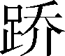
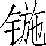
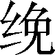
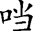

第一百一十三卷

 礼书第一

书是司马迁创行的史体之一。《索隐》说：“书者，五经六籍总名也。”《正义》说：“五经六籍，咸谓之书。”其实，司马迁《史记》中的八书之书，与五经六籍之书完全不同。后者是名词；前者是动词，为书写之书，是记录的意思。班氏《汉书》改称为志，志、誌在古代通用，也是记录的意思。本来，十二本纪、十表、八书、三十世家、七十列传都是记录，唯因内容和形式有所不同，故以不同名目区别之：史以帝王为中心，名为本纪；人物为传记，名列传；诸侯以世袭，名世家；大事系以年月，列成表格，名之为表；余无所属，便径以书名之。

书体的由来，多数人承认是司马迁独创，同时又以为，虽曰独创，必有所本。于是，有人以为仿自《礼经》（如刘知几《史通·书志篇》），有人以为原于《尔雅》（如郑樵《通志序》），或以为仿自《吕览》《淮南子》诸子书（如章学诚《文史通义·亳州志掌故例义》）等。

史以纪事，事关人物及其言论、行动者，司马迁分别以本纪、列传、表、世家贯穿之，此外不能及者，按类分篇，以书名之。若从按类分篇看，与诸子书颇相似，但内容绝不能侔；若从内容与《礼经》《尚书》《尔雅》有相似处看，其轻重、繁简、体例又绝不相同。因此，只能说史之有书体，创自司马迁，仅此而已。

***【原文】***

太史公曰：洋洋[1]美德乎！宰制[2]万物，役使群众，岂人力也哉[3]？余至大行礼官[4]，观三代损益[5]，乃知缘[6]人情而制礼，依人性而作仪，其所由来尚[7]矣。

***【译文】***

[1]洋洋：盛大的样子。

[2]宰制：主宰，控制。

[3]岂人力也哉：难道是靠着人们的强制力量吗？意思是说人类社会的维持，不能靠强力的压迫，而必须用礼乐来感化。

[4]大行：大行令。官名。主持礼仪、接待宾客的官。官：官府。

[5]三代损益：夏、商、周三代对礼制所作的减增。

[6]缘：顺随；顺着。

[7]尚：久远。

***【原文】***

人道经纬万端[1]，规矩[2]无所不贯，诱进以仁义，束缚以刑罚，故德厚者位尊，禄[3]重者宠荣，所以总一[4]海内而整齐万民也。人体安驾乘，为之金舆错衡[5]以繁其饰；目好五色，为之黼黻文章以表其能[6]；耳乐钟磬[7]，为之调谐八音以荡[8]其心；口甘[9]五味，为之庶羞[10]酸咸以致其美；情好珍善[11]，为之琢磨圭璧[12]以通其意。故大路越席[13]，皮弁[14]布裳，朱弦洞越[15]，大羹玄酒[16]，所以防其淫侈[17]，救其雕敝[18]。是以君臣朝廷尊卑贵贱之序[19]，下及黎庶车舆衣服宫室饮食嫁娶丧祭之分[20]，事有宜适，物有节文[21]。仲尼[22]曰：“禘[23]自既灌而往者，吾不欲观之矣！”

***【译文】***

[1]人道：人类社会活动的道德规范。经纬万端：像织物一样纵横交错，相错贯通。经纬，织物的纵线和横线。

[2]规矩：规则；礼法。

[3]禄：俸禄；禄位（官位）。

[4]总一：合而为一。

[5]金舆：装有金饰的车子。错衡：饰有花纹色彩的车辕头的横木（轭）。错，镶嵌。

[6]黼黻（fǔ fú）：古代礼服上绣的花纹。文章：文采。表其能（tài）：美化他的仪表。能，通“态”，仪容。

[7]乐：喜爱。钟：古代一种用青铜制作的乐器。磬（qìnɡ）：古代一种用玉石或金属制的乐器。

[8]调谐：调合。八音：古代乐器的统称，指金、石、土、革、丝、木、匏、竹八类。荡：涤荡，廓清。

[9]甘：觉得甜美。

[10]庶羞：多种佳肴。羞，今作馐。

[11]珍善：美好的东西。

[12]圭璧：古代贵族常用的玉质礼器。璧，也作美玉的通称。

[13]大路：即“大辂（lù）”。古代天子乘坐的一种车。越席：织蒲草作席。越，编结。

[14]皮弁（biàn）：国王临朝戴的一种鹿皮做的帽子。

[15]朱弦：指琴瑟上用的红色丝弦。洞越：瑟底开着小孔，使声浊而迟。

[16]大羹：古代祭礼上用的没加调味的肉汤。玄酒：上古没有酒，祭时用白水。后来有了酒，为了遵循古制，祭时也用水，叫作“玄酒”“玄尊”。

[17]淫侈：过度放纵。

[18]雕敝：衰败。

[19]朝廷：国君接受朝见和处理政事的地方。序：等第；次序。

[20]黎庶：百姓。分：名分。

[21]节文：节制；修饰。

[22]仲尼（前551—前479）：孔丘，字仲尼。春秋时鲁国陬邑（今山东省曲阜市）人，儒家学派的创始者。

[23]禘（dì）：祭名。一、天子、诸侯祭祀祖先。分殷祭，三年一次；时祭，每年夏季举行。二、祭天。

***【原文】***

周[1]衰，礼废乐坏，大小相逾[2]，管仲[3]之家，兼备三归[4]。循法守正者见[5]侮于世，奢溢僭差[6]者谓之显荣。自[7]子夏，门人之高弟[8]也，犹云“出见纷华盛丽而说[9]，入闻夫子[10]之道而乐，二者心战[11]，未能自决”，而况中庸[12]以下，渐渍[13]于失教，被服[14]于成俗乎？孔子曰“必也正名[15]”，于卫所居不合[16]。仲尼没[17]后，受业之徒沉湮而不举[18]，或适齐、楚[19]，或入河[20]、海，岂不痛哉！

***【译文】***

[1]周：朝代名。公元前11世纪周武王所建立。

[2]大小：各种不同身份的人。逾：超过。

[3]管仲（？—前645）：字夷吾。辅佐齐桓公，在政治经济方面采取了一些改革措施，使齐国富强起来，成为五霸之首。

[4]三归：汉以来有三说：一、藏钱币的府库；二、管仲家里一座台的名称；三、娶了三姓女子。

[5]循：遵行。见：被。

[6]奢溢：过度。僭差（jiàn cī）：越分。

[7]自：即使。

[8]门人：弟子；学生。高弟：弟子中的高明的。

[9]纷华盛丽：华丽多姿的事物。说（yuè）：通“悦”。

[10]夫子：孔门弟子对孔丘的尊称。

[11]心战：几种矛盾想法在思想上交锋。

[12]中庸：中等材质的人。

[13]渐渍：沾染。

[14]被服：感受。

[15]必也正名：首先一定要辨正名分。

[16]不合：不融洽；不投契。

[17]没：通“殁”，死去。

[18]受业：跟从师父学习。沉湮（yīn）：埋没。举：选拔；任用。

[19]或：有的人。适：去；往。齐：国名。在今山东省北部。楚：国名。在今长江中游一带。

[20]河：黄河。《论语·微子》说，鼓方叔到黄河边去了，少师阳和击磬襄到海滨去了。

***【原文】***

至秦[1]有天下，悉内六国[2]礼仪，采择其善，虽不合圣制，其尊君抑臣，朝廷济济[3]，依古以来。至于高祖[4]，光有四海[5]，叔孙通[6]颇有所增益减损，大抵皆袭秦故[7]。自天子称号下至佐僚[8]及官室官名，少所变改。孝文[9]即位，有司[10]议欲定仪礼。孝文好道家[11]之学，以为繁礼饰貌，无益于治，躬化[12]谓何耳，故罢去之。孝景[13]时，御史大夫晁错[14]明于世务刑名，数干谏孝景曰：“诸侯藩辅[15]，臣子一例，古今之制也。今大国专治异政[16]，不禀京师[17]，恐不可传后。”孝景用其计，而六国畔逆[18]，以错首名，天子诛错以解难[19]。事在《袁盎》语中[20]。是后官者养交安禄而已，莫敢复议。

***【译文】***

[1]秦：公元前221年，秦王独揽大政统一六国，自称始皇帝，建都咸阳（今陕西省咸阳市东北），建立我国历史上第一个专制主义中央集权的封建王朝。前206年为刘邦领导的农民起义军所灭亡。

[2]内：通“纳”，采纳。六国：指秦以外的韩、赵、魏、齐、楚、燕六国。

[3]济济：庄严恭敬的样子。指朝廷君臣名分之严。

[4]高祖（前256—前195）：汉高祖刘邦。

[5]光：广阔。四海：古人认为中国四面环海，故以四海代指“天下”。

[6]叔孙通：薛（今山东省枣庄市薛城区）人。刘邦称帝，叔孙通采择古礼，结合秦制，制定朝仪。由博士做到太子太傅。详见《叔孙通列传》。

[7]大抵：大都。袭：继承。故：旧例。

[8]佐僚：官吏的通称。

[9]孝文（前203—前157）：汉文帝刘恒。刘邦的儿子。前180—前157年在位。

[10]有司：古代设官分职，各有专司，因称官吏为有司。

[11]道家：先秦的一个学派。以老聃关于“道”学说为中心，政治上主张归真返璞，无为而治。

[12]躬化：以自身的模范行为来进行感化。

[13]孝景（前188—前141）：汉景帝刘启。刘恒的儿子。前157—前141年在位。

[14]御史大夫：官名。主管弹劾纠察，掌管图书典籍，官位仅次于丞相。晁（cháo）错（前200—前154）：颍川（今河南省禹州市）人。西汉政论家，得到汉景帝信任，有“智囊”之称。

[15]藩辅：古代称分封及臣服的诸侯国。

[16]专：专擅。不经请示擅自行事。异政：和朝廷政令相违背的行政措施。

[17]京师：首都。

[18]六国畔逆：指吴、楚、赵、胶西、胶东、齐、淄川七国之乱。

[19]汉景帝采用了晁错逐渐削夺诸侯国封地的建议，以吴王刘濞为首，纠集楚、赵等六国，以诛杀晁错为名，发动武装叛乱。景帝又听信袁盎的谗言，杀了晁错。后来还是派大将周亚夫领兵征讨，叛乱才得平息。

[20]事在袁盎语中：此事除载在《袁盎晁错列传》外，还载在《吴王濞列传》。

***【原文】***

今上[1]即位，招致儒术[2]之士，令共定仪，十余年不就[3]。或言古者太平，万民和喜，瑞应辨[4]至，乃采风俗，定制作。上闻之，制诏[5]御史曰：“盖受命[6]而王，各有所由兴，殊路而同归，谓因[7]民而作，追[8]俗为制也。议者咸称太古[9]，百姓何望[10]？汉亦一家之事，典法[11]不传，谓子孙何？化隆者闳博[12]，治浅者褊狭[13]，可不勉与[14]！”乃以太初之元改正朔[15]，易服色[16]，封太山[17]，定宗庙百官之仪，以为典常[18]，传之于后云[19]。

***【译文】***

[1]今上：现今的皇上。指汉武帝刘彻（前156—前87）。刘启的儿子。前141—前87年在位。

[2]儒术：儒家的政治理论和学说。

[3]就：成就功业。

[4]瑞应：古代迷信认为上天降赐祥瑞是人君德行的感应。辨：通“遍”。

[5]制诏：皇帝的两种文告。这里作动词用。

[6]盖：表示下文有所推论的发语词。受命：古代帝王假托神权来巩固自己的统治地位，自称接受了上天的命令。

[7]因：顺从。

[8]追：追随。

[9]太古：上古；远古。

[10]望：仰望。这里有“取法”的意思。

[11]典法：常法；永远施行的法则。

[12]闳（hónɡ）博：宏大广博。

[13]褊（biǎn）狭：狭小。

[14]与：通“欤”。

[15]太初：汉武帝的年号。为前104—前101年。正朔：指一年的第一天。正，阴历每年的第一个月。朔，阴历的每月初一。汉以前各代的历法各不相同，如夏代以孟春（正月，建寅之月）为正，商代以季冬（十二月，建丑之月）为正，周代以仲冬（十一月，建子之月）为正，秦和汉太初元年以前以孟冬（十月，建亥之月）为正。改正朔，就是改变历法。

[16]服色：古代各个王朝所定的车马服饰的颜色。

[17]封太山：帝王在泰山上筑坛祭天。

[18]典常：常法；常规。

[19]云：语助词。无义。

***【原文】***

礼由人起[1]。人生有欲，欲而不得则不能无忿，忿而无度量则争，争则乱。先王恶其乱，故制礼义以养人之欲，给人之求，使欲不穷[2]于物，物不屈[3]于欲，二者相待而长，是礼之所起也。故礼者养也。稻粱五味，所以养口也；椒兰芬茝[4]，所以养鼻也；钟鼓管弦，所以养耳也；刻镂文章[5]，所以养目也；疏房床笫[6]几席，所以养体也：故礼者养也。

***【译文】***

[1]从本段到篇末，除了中间“治辨之极”至“刑措而不用”是《荀子·议兵》答李斯语外，基本内容出自《荀子·礼论》。

[2]穷：尽。

[3]屈：竭。

[4]茝：一种香草。

[5]刻镂（lòu）：雕刻。文章：文采；错综华丽的色彩花纹。

[6]疏房：通明的房间；或说是有窗的房间。床笫（zǐ）：床铺。

***【原文】***

君子既得其养，又好其辨[1]也。所谓辨者，贵贱有等[2]，长少有差[3]，贫富轻重皆有称[4]也。故天子大路越席，所以养体也；侧载臭[5]茝，所以养鼻也；前有错衡，所以养目也；和鸾[6]之声，步中《武》《象[7]》，骤中《韶》《濩[8]》，所以养耳也；龙旂九斿[9]，所以养信也；寝兕持虎[10]，鲛韅弥龙[11]，所以养威也。故大路之马，必信至教顺，然后乘之，所以养安也。孰知夫出死要节[12]之所以养生也，孰知夫轻[13]费用之所以养财也，孰知夫恭敬辞让之所以养安也，孰知夫礼义文理之所以养情也。

***【译文】***

[1]辨：别；差别。

[2]等：等级；次序。

[3]差：等差；差别。

[4]称（chèn）：适合；相副。

[5]臭（xiù）：气味。此指香味。

[6]和鸾：古代车马上的铃铛。挂在车前用作扶手的横木（轼）上的叫和，挂在马嚼子（镳）上的叫鸾。鸾，通“銮”。

[7]步：缓行。武：乐名。象：周代一种舞名。

[8]骤：马奔驰。韶：虞舜时的乐名。濩（huò）：商汤时的乐名。

[9]旂（qí）：古代一种绣龙带铃的旗子。斿（liú）：古代旌旗上垂着的装饰物。

[10]寝兕（sì）：伏着的兕牛。寝，伏。兕，雌性犀牛。持虎：蹲着的虎。持读作畤（zhì），蹲或坐着。兕、虎，都是画在天子车轮上的装饰。

[11]鲛韅（xiǎn）：鲛皮制的马腹带。鲛，鲨鱼。弥（mǐ）龙：车的衡木上雕绘着金龙。

[12]孰知：审知。孰，通“熟”。夫：句中助词。要（yāo）节：成名立节。

[13]轻：减少。

***【原文】***

人苟[1]生之为见，若[2]者必死；苟利之为见，若者必害；怠惰之为安，若者必危；情胜之为安，若者必灭。故圣人一之于礼义，则两得之矣；一之于情性，则两失之矣。故儒者[3]将使人两得之者也，墨者[4]将使人两失之者也。是儒墨之分[5]。

***【译文】***

[1]苟：如；如果。

[2]若：如若；这样。

[3]儒者：信奉儒家学说的人。

[4]墨者：信奉墨家学说的人。

[5]分：分野，差等。

***【原文】***

治辨之极[1]也，强固之本[2]也，威行之道[3]也，功名之总[4]也。王公由[5]之，所以一天下，臣[6]诸侯也；弗由之，所以捐[7]社稷也。故坚革利兵[8]不足以为胜，高城深池不足以为固，严令繁刑不足以为威。由其道则行，不由其道则废。楚[9]人鲛革犀兕，所以为甲，坚如金石；宛之钜铁施[10]，钻如蜂虿[11]，轻利剽遬[12]，卒如熛[13]风。然而兵殆于垂涉[14]，唐眜[15]死焉；庄[16]起，楚分而为四参[17]。是[18]岂无坚革利兵哉？其所以统之者非其道故也。汝、颍[19]以为险，江、汉以为池[20]，阻之以邓林[21]，缘之以方城[22]。然而秦师至，鄢郢举[23]，若振槁[24]。是岂无固塞险阻哉？其所以统之者非其道故也。纣剖比干[25]，囚箕子[26]，为炮格[27]，刑[28]杀无辜，时臣下懔然[29]，莫必[30]其命。然而周师至，而令不行乎下，不能用其民。是岂令不严，刑不陖[31]哉？其所以统之者非其道故也。

***【译文】***

[1]治辨：治理国家，辨正名分。极：最高原则。

[2]强固之本：指是“用礼制治国，就能使邻国敬畏，所以是国家强大巩固的根本办法”。

[3]威行之道：意思是“用礼制劝导感化，人民就仰慕悦服，所以是推行威权的有效措施”。

[4]功名之总：意思是“用礼制统治人民，是成就功名事业的总纲”。

[5]由：顺着；遵从。

[6]臣：使臣服。

[7]捐：舍弃；丧失。

[8]坚革：坚硬的甲盾。利兵：锋利的兵器。

[9]楚：国名。

[10]宛（yuān）：楚邑名。即今河南省南阳市。钜铁：刚硬的铁。施：《荀子·议兵》作“”。矛。

[11]钻：发挥穿刺力量。趸：蝎类毒虫。

[12]剽遬：轻捷快速。

[13]卒：通“猝”，突然。熛（biāo）：疾速。

[14]兵殆：兵败。垂涉：楚地名。今地不详。《荀子·议兵》《战国策·楚策》《淮南子·兵略》作垂沙。

[15]唐眜：楚将。

[16]庄跻：楚将。楚顷襄王派他西征，深入滇池（今云南省昆明市西南）一带。遇上秦军进攻，被截断了归路，他就在滇称王。

[17]楚分而为四参：楚国因无力抵御邻国的侵犯，曾三次被迫迁都。

[18]是：此；这。

[19]汝：汝水。在河南省境内。颍：颍水。经河南、安徽两省流入淮水。

[20]江汉：指岷江、汉江。池：护城河。

[21]邓林：地名。在今湖北省襄阳市襄州区南。

[22]方城：春秋时楚国的长城。由今河南省方城县北延至邓州市。

[23]鄢郢：楚之别都，即都，故城今湖北省宜城市东南。这里指楚都。举：攻下；占领。被动用法。

[24]振：通“震”，动；击。槁：枯叶。

[25]纣：商朝最末的君主。比干：纣的叔父。

[26]箕子：纣的叔父。因劝谏被囚，为求避祸，假装疯狂。

[27]炮格：即炮烙之刑。商纣用的一种酷刑。用铜器作格，下面烧炭，令犯者在上面赤脚行走，跌下烧死。

[28]刑：处罚，杀戮。

[29]懔然：恐惧的样子。

[30]必：保证，保住。

[31]陖：通“峻”，严厉。

***【原文】***

古者之兵，戈矛弓矢而已，然而敌国不待试而诎[1]。城郭不集[2]，沟池不掘，固塞不树，机变[3]不张，然而国晏然[4]不畏外而固者，无他故焉，明道而均分之，时使而诚爱之，则下应之如景响[5]。有不由命者，然后俟[6]之以刑，则民知罪矣。故刑一人而天下服。罪人不尤[7]其上，知罪之在己也。是故刑罚省而威行如流，无他故焉，由其道故也。故由其道则行，不由其道则废。古者帝尧[8]之治天下也，盖杀一人刑二人[9]而天下治。传[10]曰：“威厉而不试，刑措[11]而不用。”

***【译文】***

[1]试：用。诎：通“屈”，屈服；降顺。

[2]城郭：内城外城。外城为郭。集：积累。此处有“高筑”的意思。

[3]机变：弓弩上的发射器。

[4]晏然：安逸；平静。

[5]如景响：如影的随形，如响的应声，比喻效验很快。

[6]俟：待；对待。

[7]尤：埋怨。

[8]帝尧：远古部落联盟的领袖。

[9]杀一人刑二人：意思是刑杀的极少，不是确数。

[10]传（zhuàn）：古人称先人的书传、记载，统名之曰“传”。

[11]措：设置。

***【原文】***

天地者，生之本[1]也；先祖者，类之本[2]也；君师者，治之本也。无天地，恶[3]生？无先祖，恶出？无君师，恶治？三者偏亡[4]，则无安人。故礼，上事天，下事地，尊先祖而隆[5]君师，是礼之三本也。

***【译文】***

[1]生之本：古时认为天地是造物主，世间万物是天地创造的，所以说天地是生命的根本。

[2]类之本：人类的根本。

[3]恶（wū）：怎么。

[4]三者偏亡：三者缺一。

[5]隆：尊崇。

***【原文】***

故王者天太祖[1]，诸侯不敢怀，大夫士有常宗[2]，所以辨贵贱。贵贱治，得[3]之本也。郊畴[4]乎天子，社至乎诸侯[5]，函[6]及士大夫，所以辨尊者事尊，卑者事卑，宜钜者钜，宜小者小。故有天下者事七世[7]，有一国者[8]事五世，有五乘之地[9]者事三世，有三乘之地者事二世，有特牲而食者[10]不得立宗庙。所以辨积[11]厚者流泽广，积薄者流泽狭也。

***【译文】***

[1]天太祖：以太祖配天。太祖，对开国君主的尊称。

[2]大夫士有常宗：诸侯的庶子（嫡长子以下的儿子）受封，他的后代大夫士就永远尊崇他为始祖。

[3]得：通“德”。

[4]郊：周朝于冬至日在南郊祭天称为“郊”。畴：止。

[5]社至乎诸侯：社，祭祀土神的场所。

[6]函：包含，包括。

[7]有天下者：指天子。事七世：建立七座宗庙祭祀七代祖先。

[8]有一国者：指诸侯。

[9]五乘（shènɡ）之地：能出兵车五乘的土地。古制，纵横十里，其中六十四井（八户叫“井”），出兵车一乘（四马一车）。

[10]特牲而食者：用一头熟牲进献鬼神的人。指百姓。

[11]积：通“绩”，功业。

***【原文】***

大飨上玄尊，[1]俎[2]上腥鱼，先大羹，贵食饮之本[3]也。大飨上玄尊而用薄酒[4]，食先黍稷而饭[5]稻粱，祭哜[6]先大羹而饱庶馐，贵本而亲用[7]也。贵本之谓文，亲用之谓理，两者合而成文，以归太一[8]，是谓大隆。故尊之上玄尊也，俎之上腥鱼也，豆[9]之先大羹，一[10]也。利爵[11]弗啐也，成事[12]俎弗尝也，三侑[13]之弗食也，大昏[14]之未废齐也，大庙之未内尸[15]也，始绝[16]之未小敛，一也。大路之素帱[17]也，郊之麻[18]，丧服之先散麻[19]，一也。三年哭之不反[20]也，《清庙》之歌[21]一倡而三叹，县一钟尚拊膈[22]，朱弦而通越，一也。

***【译文】***

[1]大飨（xiǎnɡ）：又叫“大祫（xiá）”。古代天子或诸侯一种合祭祖先的祭礼。玄尊：盛玄酒（白水）的器皿，即指玄酒。

[2]俎（zǔ）：古代祭祀时盛食物的器皿。

[3]贵：认为珍贵。食饮之本：先祖原始的饮食。

[4]《荀子·礼论》作“飨尚玄尊而用酒醴”，文意较合。

[5]饭：把饭给人吃。

[6]哜（jì）：微微尝一点，古代行礼时的仪节之一。

[7]用：实用。

[8]太一：原指天地形成前的混沌元气。这里是指返璞归真到太古原始时的状态。

[9]豆：古代盛食物的器皿。

[10]一：一样的道理。

[11]利爵：祭祀将毕时再次向尸敬酒。古代祭祀祖先，由一活人代表死者受祭，叫“尸”。这段里所说的“啐、尝、食”，都是指尸按照仪式规定的动作。

[12]成事：祭祀告成。

[13]侑：劝食。根据《荀子·礼论》，“三侑之弗食也”一缺“一也”二字。

[14]大昏：帝王的婚礼。

[15]大庙：即“太庙”，君主的祖庙。未内尸：祭时，迎尸之前先在室内西南角举行一项仪式。内，通“纳”，使进入。

[16]绝：绝气；死。

[17]素帱（chóu）：素色车帷。

[18]麻（miǎn）：麻质的礼帽。，通“冕”。

[19]散麻：用粗麻布制成的丧服，上下左右不缝。

[20]三年哭：指死了父母丧时的哀哭。不反：一恸失声。反，通“返”。

[21]《清庙》之歌：《诗经·周颂》有《清庙篇》，说是祭祀周文王的乐章。

[22]县：“悬”的本字。拊（fǔ）：击；拍。膈：通“隔”，悬钟的支架。

***【原文】***

凡礼，始乎脱[1]，成乎文[2]，终乎税[3]。故至备，情[4]文俱尽；其次，情文代[5]胜；其下，复情以归太一。天地以合，日月以明，四时以序，星辰以行，江河以流，万物以昌，好恶以节，喜怒以当。以为下[6]则顺，以为上[7]则明。

***【译文】***

[1]脱：脱略；粗疏。

[2]文：修饰。

[3]税（yuè）：通“悦”。

[4]情：指礼意，如居丧必哀，临祭必敬。

[5]代：更代。

[6]下：在下者，指臣民。

[7]上：在上者，指君主。

***【原文】***

太史公曰：至矣哉！立隆以为极[1]，而天下莫之能益损也。本末相顺，终始相应，至文有以[2]辨，至察有以说。天下从之者治，不从者乱；从之者安，不从者危。小人不能则[3]也。

***【译文】***

[1]立隆以为极：制定隆重的礼仪，作为事物、行为的最高准则。

[2]有以：《荀子·礼论》作“以有”，义较长。

[3]则：取法。

***【原文】***

礼之貌[1]诚深矣，坚白同异[2]之察，入焉而弱[3]；其貌诚大矣，擅作典制褊陋之说，入焉而望[4]；其貌诚高矣，暴慢恣睢[5]，轻俗以为高之属[6]，入焉而队[7]。故绳诚陈[8]，则不可欺以曲直；衡[9]诚悬，则不可欺以轻重；规矩诚错[10]，则不可欺以方员[11]；君子审[12]礼，则不可欺以诈伪。故绳者，直之至也；衡者，平之至也；规矩者，方员之至也；礼者，人道之极也。然而不法礼者不足礼，谓之无方之民；法礼足礼，谓之有方之士。礼之中，能思索，谓之能虑；能虑勿易，谓之能固。能虑能固，加好之焉，圣矣。天者，高之极也；地者，下之极也；日月者，明之极也；无穷者，广大之极也；圣人者，道之极也。

***【译文】***

[1]礼之貌：《荀子·礼论》作“礼之理”。

[2]坚白同异：战国时名家公孙龙所创的“离坚白”和惠施所创的“合同异”的学说。

[3]弱：通“溺”，淹没。

[4]望：羞愧。

[5]暴慢恣睢：粗暴强横。

[6]属：类；那一类人。

[7]队：通“坠”。

[8]绳：木工用的墨线。诚：如果。

[9]衡：秤。

[10]错：通“措”，置备。

[11]员：通“圆”。

[12]审：认真观察、研究。

***【原文】***

以财物为用[1]，以贵贱为文[2]，以多少[3]为异，以隆杀为要[4]。文貌繁，情欲省，礼之隆也；文貌省，情欲繁，礼之杀也。文貌情欲相为内外表里，并行而杂[5]，礼之中流[6]也。君子上致其隆，下尽其杀，而中处其中。步骤驰骋广骛不外，是以君子之性守宫庭[7]也。人域是域[8]，士君子也；外是，民也；于[9]是中焉，房皇周浃[10]，曲[11]得其次序，圣人也。故厚者，礼之积也；大者，礼之广也；高者，礼之隆也；明者，礼之尽也。

***【译文】***

[1]根据《荀子·礼论》，此句上面缺“礼者”二字。

[2]以贵贱为文：各种贵贱尊卑的身份，用不同文彩装饰的车服旗章来表示。

[3]多少：用财物的多少。

[4]隆：隆盛。杀：减少；降等。要：要点。这句意思是该隆就隆，该杀就杀。

[5]杂：通“集”，会合。

[6]中流：适中。

[7]君子之性守宫庭：意思是君子常像身处宫庭，守礼不离。

[8]人域是域：以人生行为的规范为规范。

[9]于：介词。

[10]房皇周浃：意思是周旋进退，言谈举止。房（pánɡ）皇：通“彷徨”，徘徊；盘旋。周浃（jiā）：周匝；遍及。

[11]曲：周遍。

## 【译文】

太史公说：“伟大崇高是礼的美德啊！主宰制约天地万物，役使民众，难道只是人的力量吗？我到过主管礼仪的大行官署，考察夏、商、周三代礼制减少或增加的情况，才知道根据人情来制定礼节，依据人性来制定仪式，这种情形由来已久了。”

做人的道理驾驭着人们千头万绪的行为，礼仪规矩没有一处是不存在的。用仁义来诱导人们上进，用刑罚来限制人们越轨。因此，道德修养高的人地位尊贵，俸禄优厚的人备受荣耀恩宠，这是统一四海，使万众步调一致的方法呀。人的身体以安然地坐乘车马为舒适，就因此在车子上装饰黄金，在横木上绘画彩纹，用来增加繁多饰物；人的眼睛喜欢五彩缤纷的颜色，为此在服装上刺绣花纹和图案，用来满足视觉功能；人的耳朵爱听钟磬的音响，为此调和金石丝竹匏土革木八种音响，用来激励追求的心愿；人的口爱好五味，为此调制甜辣酸咸各种滋味，用来达到享受美食的目的；人的常情喜好珍贵美好的东西，为此雕琢打磨圭璧等玉器，用来舒通自己的旨意。所以，古代帝王祭天用大路车蒲草席，戴鹿皮帽穿布衣裳，演奏用底部有孔的红弦瑟，祭祀用清肉汤、淡水酒，这是因为要防止淫滥奢侈，挽救过于讲求雕饰排场的弊病。因此，上自朝廷君臣的礼仪，尊卑贵贱的秩序，下至平民百姓的车马、衣服、住房、饮食，嫁娶、丧祭的等级区分，万事都有恰当的分寸，万物都有节制条文。孔子说：“鲁国的禘祭礼，从第一项献酒往下，我就不想看它啦。”

周朝衰落后，礼制废弃，乐制破坏，大小不按等级，以至管仲家中娶三姓妇女为妻。世上遵法律、守正道的人受侮辱，奢侈逾制的人名显身荣。上自子夏这样的孔门高弟，犹且说：“出门见到纷纭华丽盛美的事物而欢喜，回来听到夫子的学说而欢喜，二者常在心中斗争，不能决定取舍。”更何况中材以下的人，长期处在失于教导的习俗、环境中？孔子论卫国政治说：“必先正其名分。”但在卫国终于无法做到。孔子死后，受业门人沉沦星散，有的到了齐、楚，有的遁入河北、海内。岂不令人痛惜！

至秦统一天下，全部收罗六国礼仪制度，择其善者而用之，虽与先圣先贤的制度不合，却也尊君抑臣，使朝廷威仪，庄严肃穆，与古代相同。到汉高祖光复四海，拥有天下，儒者叔孙通增损秦制，制定了汉代制度。主体却是沿袭秦制，上自天子称号，下至僚佐和宫殿、官名，都很少变更。孝文帝即位后，政府有关部门建议，要重定礼仪制度。那时，孝文帝喜爱道家学说，以为烦琐的礼节只能粉饰外表，无益于天下治乱，没有采纳。孝景帝时期，御史大夫晁错明于世务，深通刑名之学，屡屡建议说：“诸侯是天子的屏藩、辅佐，与臣子相同，古往今来都是如此。如今却是诸侯大国专治其境，与朝廷政令不同，诸事又不向京城禀报，此事断然不可持续下去，流毒后世。”孝景帝采纳他的计策，削弱诸侯，导致了六国叛乱，首以诛晁错为名，天子不得已，杀晁错以解时局的危难。此事详载于《袁盎列传》中。自此以后，为官者但务结交诸侯、安享俸禄而已，无人敢再倡此议。

今上（汉武帝）即位后，招纳罗致通儒学的人才，命他们共同制定礼仪制度，搞了十余年，不能成功。有人说，古时天下太平，万民和乐欢喜，感应上天，降下各种祥瑞征兆，才能够采择风俗，制定制度。如今不具备这些条件。皇帝向御史下诏书道：“历朝受天命而为王，虽然各有其兴盛的原因，却是殊途而同归，即因民心而起，随民俗确定制度。如今议者都厚古而薄今，百姓还有何指望？汉朝也是一家帝王，典法制度不能流传，如何对后世子孙解释？治化隆盛的对后世影响也自博大闳深，治化浅的影响就偏窄狭小，怎可不自勉励！”于是，以“太初”为元年改定历法，变易服色，封祭泰山，制定宗庙、百官礼仪，作为不变的制度，流传后世。

礼是由人产生的，人生而有欲望，欲望达不到则不能没有怨愤，愤而不止就要争斗，争斗就生祸乱。古代帝王厌恶祸乱，才制定礼仪来滋养人的欲望，满足人的需求，使欲望不致因物不足而受抑制，物也不致因欲望太大而枯竭，物、欲二者相得而长，这样礼就产生了。所以，礼就是养的意思。稻粱等五味是养人之口的，椒、兰、芬芳的芷草是养人之鼻的，钟、鼓及各种管弦乐器的音声是养人之耳的，雕刻花纹是养人眼目的，宽敞的房屋以及床箦几席是养人身体的。所以说，礼就是养的意思。

君子欲望既得到滋养而满足，又愿受到“辨”的限制。所谓辨，就是辨别贵贱使有等级，长少使有差别，贫富轻重都能得到相称的待遇。因此，天子以大路越席保养身体；身旁放着香草，用来养鼻；前面的车衡经过嵌错装饰，用来养目；车动时，鸾铃叮，节奏缓和如《武》《象》二舞的乐曲，急骤如《韶》《濩》舞曲，是用来养耳的；龙旗下，九旒低垂，是用来养信用的。战阵上，以兕牛皮为席，车上手握处，雕成虎文，用鲛鱼皮蒙马腹，雕龙文饰车轭，是用来养威的。驾驭大路的马，之所以必须调教顺驯才能乘坐，是为了养安。谁能知道，士人出生入死，邀立名节，正是为了养护他们的生命？谁能知道，轻财好施，挥金如土，是为了养护钱财？谁能知道，谦恭辞让、循循多礼，是为了养护平安？谁能知道，知书达礼，温文儒雅，是可以安养性情的？

人若一意苟且求生，如此必死；一意苟且图利，如此必受害；安于懈怠、懒惰的必危，固执情性的必亡。因此，圣人一概处之以礼义，就能获生避死、近利远害、居安离危，事事得两全其美了。反之，若一概任情尽性，就会两者齐失。而儒者的学说使人两全其美，墨家学说使人两皆有失，这是儒墨两家的分别。

礼义是治理国家，辨别名分的最高准则；是使国家富强巩固的根本办法；是天子威行天下的途径；是功业集其大成的重要因素。帝王遵循礼义，可以统一天下，臣服诸侯；不奉行就会捐弃社稷，破家亡国。所以，坚韧的甲胄、犀利的兵器，不足以获得胜利，高大的城墙、宽深的沟池，不足以为险固，严酷的号令、繁苛的刑罚，不足以增加威严。按礼办事，就事事成功，不按礼办事，就诸事皆废。楚人以鲛鱼革，犀牛、兕牛皮为衣甲，坚韧如同金石；又有宛城制造的大铁矛，钻刺时犀利如蜂虿之尾；军队轻捷快速，士卒像疾风骤雨般迅捷。然而，兵败于垂涉，将军唐眜战死；庄起兵，楚国分而为四。这能说是由于没有坚甲利兵吗？是统领的方法不对头啊。楚国以汝水、颍水为险阻，以岷江、汉水为沟池，以邓林与中原相阻隔，以方城山为边境。然而，秦国军队直攻到鄢郢，一路如摧枯拉朽。怎能说是因它无险可守呢？是统驭的方法不对啊。殷纣王剖比干之心，囚禁箕子，造炮烙刑具，杀害无罪之人，当时臣民凛然畏惧，生死不保。周朝军队一到，纣王命令无人奉行，百姓不为所用，怎能说是号令不严、刑罚不峻呢？是统领的方法不对头啊。

古时的兵器，不过戈、矛、弓矢罢了，然而，不待使用敌国已窘迫屈服。城郊百姓不需聚集起来守城，城外也不需挖掘防守用的沟池，不需建立坚固的阨塞要地，不用兵机谋略，而国家平安，不畏外敌，坚固异常。没有其他原因，只不过是懂得礼义之道，对百姓分财能均，役使有时，并且推诚相爱。所以，百姓听命，如影随形，如响应声。间有不服从命令的，以刑罚处治他，老百姓也就知罪了。所以，一人受刑，天下皆服。犯罪的人对上级无怨无尤，知道是自己罪有应得。因此，刑罚简省而威令推行无阻。没有其他原因，按礼义之道办事罢了。所以，遵行礼义之道，万事能行；不遵此道，诸事皆废。古时帝尧治理天下，杀一人、刑二人而天下大治，书传说是“威虽猛厉而不使，刑罚厝置而不用”。

天地是生命的根本，先祖是种族的根本，君主与业师是国家治理、安定的根本。无天地哪里会有生命？无先祖你如何能来到这个世上？无君主和业师，国家怎能得到治理？三者缺一，则无人能安。所以，礼上侍奉天、下侍奉地，尊敬先祖而隆遇恩师，是礼的三项根本问题。

所以，帝王得以太祖配天而祭之，诸侯不敢怀想，大夫、士也各有常宗，不敢祭先祖，以此来区别贵贱。贵贱有别，就得到礼的根本了。只有天子有郊天、祭太祖的权力，自立社以祭地则至于诸侯，下及士大夫各有定制，以此表现尊者侍奉尊者、卑者侍奉卑者，应大则大、应小则小的原则。所以，统治天下的侍奉七世宗庙，有二乘采地的侍奉二世宗庙，待耕而食的人不得立宗庙，以此来表现德厚的恩泽流布广、德薄的恩泽流布狭的原则。

大祭祀飨神，樽酒崇尚玄酒，俎实崇尚腥鱼，羹以大羹为先，是饮食贵本原的意思。飨神虽崇尚玄酒，饮用的却是薄酒；食尚黍稷，所饭还要加稻粱；祭尸先上大羹，饱腹的却是各种肴核杂膳，这是贵本亲用的意思。贵本是形式，所以叫作文；亲用符合实际，所以叫作理。两者相合还是文。只有再加入礼的初始状态那种质朴性，才算有文有质，达到礼最隆盛完美的阶段了，称为大隆。因此，樽酒尚玄酒，俎实尚腥鱼，羹尚大羹，道理是一样的。祭祀时，佐食不啐酒，一饮而尽；卒哭之祭有献无酢，参加祭祀的人除尸之外，不尝俎实；祝与佐食劝尸用饭，因礼成于三，三劝之后，礼数已成，尸停止用饭，虽再劝侑，亦不再食。以上三事道理相同，都是表示礼好其辨、有节制、贵本原的意思。大婚时祭神以前，祭祀时迎尸入太庙以前，丧礼从始绝气到小敛之间，礼的性质相同，都保留了原始的质朴性。天子大路用素色帷盖，郊祭时服麻布冕，丧服最重散麻带，道理相同，都是礼尚质不尚文的意思。斩衰之丧，哭声哀痛，不重形式；《清庙》这首祭歌，一人唱，三人叹和，情致殷殷，溢于歌词之外；乐钟在架，却有时悬而不击，拊击钟架以为节拍；大瑟练丝制成朱红色弦，音质清越，却于瑟底穿孔，使声音重浊，道理也都相同，是重情不重声，亦重本原的意思。

大凡礼在初始时粗疏简略，形成后仪文增加，最后达到使人喜悦的效果。所以，最完美的礼制，是情文并茂的；次一等的是文胜于情，或者情胜于文，二者具其一；最下等的违背情性，浑浑噩噩，有如同无，回复到了太一原始的状态。完备的礼能使天地和谐，日月光明，四时有秩序，星辰运行，江河流动，万物昌盛，好恶有所节制，喜怒无不适当。在下位者则顺从，处上位者则贤明。

太史公说：“完美极了！建立礼制作为事物、行为的最高准则，人们就不能随便地增减它。它情文相符，首尾呼应，富于文采而不繁缛、有节制，明察秋毫而不苛细、使人心悦服。天下遵从就能得到治理，否则就生祸乱；遵从者得安定，不从则危亡。平民百姓靠自身是不能守礼的。”

礼制的仪文形式是深厚的，关于“坚百”与“同异”的分辨，进入礼的范围来讨论问题就显得软弱无力了。那礼的内涵非常丰富呀，擅自制作典章制度坚持偏狭浅陋理论的人，进入礼的范围来讨论问题就望而却步了。礼的内涵非常高远啊，粗暴、傲慢、任性、放纵、轻视礼俗自己认为了不起的人，进入礼的范围来比较就显得渺小卑微了。所以，墨绳弹画以后，就不能进行欺骗说曲道直了；秤锤挂平以后，就不能进行欺骗说轻论重了；圆规曲尺摆在那里，就不能进行欺骗说方论圆了；有道德修养的人小心地按礼办事，就不可能受欺诈虚伪的蒙骗。因此，墨绳是直的最高尺准，秤是公平的最高标准，圆规曲尺是圆和方的最高标准，礼是做人处事的最高标准。然而，那些不遵礼法的人不懂得满足礼仪的要求，叫作无道的流氓；遵循礼法懂得礼的要求，叫作有道的人士。切合礼义，能够思考探究，可以说能考虑问题了；能考虑问题又不轻易改变观点，可以说能固守信义了。能考虑问题又能固守信义，加上由衷的爱好，那就是圣人了。天是高的顶点，地是低的顶点，太阳月亮是光明的顶点，无边的宇宙是广大的顶点，圣人是遵行礼道的顶峰了。

礼用钱财物质表现馈赠，用服饰文彩表现贵贱，用多少区别等级不同，用厚薄表示远近。仪文形式繁富，人情欲望收敛，这是礼隆重的表现；仪文内容简约，人情欲望繁多，这是礼薄的表现；仪文和人情互相作为里外的形式和内容，有机地结合，这便合乎礼仪的要求，就可不息了。有道德修养的人用大礼达到隆重，用小礼尽力简约微薄，用中礼又能合乎情理要求。轻重缓急都不超出礼仪的范围，所以有道德修养的人才能常守礼义呀。在普通人住的地方才能知道礼义的界限，这种人士就是有道德修养的人了。行为超出礼义的限制，就是一般的人了。在这样的普通人中间，徘徊周旋，对错都能依礼的程序去做，这就是圣人了。所以，道德修养高深的人，是平时积累礼义的结果；伟大的人，是平时广施礼义的结果；崇高的人，是平时重视隆重礼义的结果；聪明精细的人，是平时对礼义尽心研究的结果。

