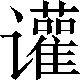
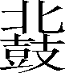

第一百一十四卷

 乐书**[1]**第二

什么是乐？《正义》认为：“天有日月星辰，地有山陵河海，岁有万物成熟……咸谓之乐。”意思是，大凡自然界中事物的一切差异与和谐，通通叫作乐。这与礼的定义一样，是后世儒者故弄玄虚，非司马迁书的本意。司马迁所说的乐与如今所说的音乐之乐大致是相通的，它包括歌、舞和有关的器具（乐器和舞具）三部分。还认为乐是由于客观事物被人感知以后产生的，这也是正确的。但也有所不同，首先，他把乐与音、声做了严格区分，认为心感于物而动，产生声；声与声相感应，发生有规律的变化，叫作音；人因音而生欢乐，甚至翩翩而舞，都叫作乐。

在儒家看来，礼乐互为表里、同为治国安邦的重要手段，故《乐书》与《礼书》蝉联，在“八书”中序列第二。据前人考证，《史记·乐书》亡佚，今本《史记·乐书》系后人割取《礼记》中《乐记》的部分内容拼凑而成。但其序文部分从篇首至“世多有，故不论”共604字当为太史公手笔。《乐书》虽抄自《乐记》，但段落次第不与《乐记》全同，行文亦略有差异，加上内容庞杂、涉及面广，因此段落内容显得错杂松散，全篇结构把握起来确有一定困难。

概括起来，《乐书》主要论述了以下几个方面的问题：一、序文部分概括介绍了乐的历史演变；二、论述了乐的本源问题；三、论述了乐与礼之间的关系及其社会作用；四、论述了先王制乐的目的；五、揭示了礼、乐的本质，提出了把握礼乐精神实质与技艺形式的基本原则；六、论述了乐对于施行教化、提高道德修养的重要作用；七、举例说明音乐具有深沉的内涵并且直接关系到国家的治乱兴衰。尽管作者关于乐的作用的论述未免有强调失当的地方，但是作为推行政治教化的重要工具，音乐确实具有不容低估的巨大力量。由于《乐书》内容十分丰富，所论涉及天地、人情、政治、礼乐等许多方面的问题，因此还可以将它看作研究秦汉时期社会风情以及上层建筑理论的重要资料。

***【原文】***

太史公曰：余每读《虞书》[2]，至于君臣相敕[3]，维是几安[4]，而股肱[5]不良，万事堕坏[6]，未尝不流涕也。成王作《颂》[7]，推己惩艾[8]，悲彼家难，可不谓战战恐惧，善守[9]善终哉？君子不为约[10]则修德，满则弃礼[11]，佚[12]能思初，安能惟始[13]，沐浴膏泽[14]而歌咏勤苦，非大德谁能如斯[15]！《传》[16]曰“治定功成，礼乐乃兴”。海内人道[17]益深，其德益至[18]，所乐者益异。满而不损则溢，盈而不持[19]则倾。凡作乐者，所以节乐。君子以谦退为礼，以损减为乐，乐其如此也。以为州异国殊，情习[20]不同，故博采风俗，协比声律[21]，以补短移化[22]，助流[23]政教。天子躬于明堂[24]临观，而万民咸荡涤邪秽，斟酌[25]饱满，以饰厥[26]性。故云《雅》《颂》之音理[27]而民正，噭[28]之声兴而士奋，郑卫之曲[29]动而心淫。及其调和谐合，鸟兽尽感[30]，而况怀五常[31]，含好恶，自然之势也！

***【译文】***

[1]《乐书》：据《史记志疑》考证，《史记》中《乐书》全缺，这是后人取《乐记》穿靴戴帽而成。

[2]《虞书》：《尚书》的一部分，今本共五篇，是记载传说中的唐尧、虞舜、夏禹等人的事迹的书。

[3]敕（chì）：告诫：鼓励。

[4]维是几（jī）安：考虑着如何化险为夷。

[5]股肱（ɡōnɡ）：大腿和胳膊。比喻帝王左右辅助得力的大臣。

[6]堕坏：败坏。堕，通“隳”，毁坏。

[7]成王：周成王。姬诵。西周国王。周武王之子。《颂》：指《诗经·周颂》，是古代宗庙祭典时的一种歌舞。周武王死时，成王年幼，由周公旦摄政。

[8]推己惩艾：责备告诫自己，吸取失败教训。艾，惩戒，警惕。

[9]守：指守礼。

[10]约：穷困。

[11]满：充足富裕。礼：泛指古代等级制社会的行为法则、道德规范和各种仪式等。

[12]佚（yì）：通“逸”，安乐。

[13]惟始：想着开始时的危险。

[14]膏泽：滋润作物的雨。比喻恩惠、幸福。

[15]如斯：如此。

[16]《传（zhuàn）》：解释经义的文字。

[17]人道：犹“仁道”，其主要内容指人与人互相亲爱。

[18]至：指最高尚。

[19]持：握住。引申为制约。

[20]情习：人情习性。

[21]协比：排列，组合。声律：指宫、商、角、徵（zhǐ）、羽五声和黄钟、太簇、姑洗（xiǎn）、蕤（ruí）宾、夷则、无射（yì）六律，这里泛指音乐。

[22]补短：补救短缺。移化：改变风俗教化。

[23]助流：帮助推行。

[24]明堂：古代帝王宣明政教的地方，凡朝会、祭祀、庆赏、选士、教学等大典，都在此举行。

[25]斟酌：取酒饮用。

[26]饰：修整。厥：他（们）的。

[27]《雅》《颂》：《诗》篇名，也是古代乐曲的分类名称。雅乐是朝廷的乐曲，颂乐是宗庙祭祀的乐曲，二者都被古代统治者称为“正乐”。理：演奏。

[28]噭（jiào）：高亢的声音。

[29]郑卫之声：指春秋战国时郑国（在今河南省中部地区）、卫国（在今河南省北部地区）的民间音乐。

[30]鸟兽尽感：相传尧舜时命夔（kuí）为乐官主持音乐，演奏时乐声和谐动听，曾引得凤凰来鸣，百兽起舞。

[31]五常：又称“五伦”，是儒家所提倡的阶级社会的五种伦理关系，即君臣、父子、夫妇、兄弟、朋友。

***【原文】***

治道亏缺[1]而郑音兴起，封君[2]世辟，名显邻州，争以相高[3]。自仲尼不能与齐优遂容于鲁，虽退正乐以诱世[4]，作五章[5]以刺时，犹莫之化[6]。陵迟[7]以至六国，流沔沉佚[8]，遂往不返，卒于丧身灭宗，并国于秦。

***【译文】***

[1]治道亏缺：指政治败坏。

[2]封君：领受封邑的贵族。世辟：世代相承的君主。辟，君主。

[3]高：抬高郑音的地位。

[4]正乐：整理音乐。诱世：劝导世人。

[5]五章：《索隐》认为是歌词，即“彼妇人之口，可以出走；彼妇人之谒，可以死败。优哉游哉，聊以卒岁”。但与五章之名不符。

[6]莫之化：即“莫化之”，没能改变这种风气。

[7]陵迟：衰落。

[8]流沔（miǎn）：放纵；沉迷。沔，通“湎”。沉佚：指沉溺游荡于歌乐而不加节制。

***【原文】***

秦二世尤以为娱。丞相李斯进谏曰：“放弃《诗》[1]《书》，极意声色，祖伊[2]所以惧也；轻[3]积细过，恣心长夜[4]，纣[5]所以亡也。”赵高[6]曰：“五帝[7]、三王乐各殊名，示不相袭。上自朝廷，下至人民，得以接欢喜，合殷勤，非此和说[8]不通，解泽[9]不流，亦各一世之化[10]，度时之乐，何必华山之耳[11]而后行远乎？”二世然[12]之。

***【译文】***

[1]《诗》：即《诗经》。我国最早的诗歌总集，先秦称为《诗》，汉儒尊为经典，始称《诗经》。收西周初年至春秋中叶各国民歌和朝庙乐章三百零五篇，分风、雅、颂三大类。这些诗歌以四言为主，普遍运用赋、比、兴的手法，生动地反映了当时的社会生活。

[2]祖伊：商纣时贤臣。

[3]轻：蔑视。

[4]长夜：指通宵宴饮。

[5]纣（zhòu）：商代最末的君主。名受，号帝辛。

[6]赵高（？—前207）：秦时宦官，本赵国人。任中车府令，兼行符玺令事。秦始皇死后，他与李斯伪造遗诏，逼使公子扶苏自杀，立胡亥为皇帝，被任为郎中令。后杀李斯，自任丞相。不久又逼杀二世，立子婴为秦王，终为子婴所杀。

[7]五帝：相传为古代五个部落联盟的领袖。

[8]说：通“悦”，喜悦。

[9]解泽：散布恩泽。

[10]一世之化：一个时代的风尚。

[11]华（huà）山：山名。五岳中的西岳，在今陕西省华阴市南。（lù）耳：也作“绿耳”，良马名。周穆王的八骏之一。引申为劣马也可以行远。用以比喻郑声虽俗，也可以作为娱乐。

[12]然：赞同。动词。

***【原文】***

高祖[1]过沛，诗《三侯之章》[2]，令小儿歌之。高祖崩，令沛得以四时歌儛宗庙[3]。孝惠[4]、孝文、孝景无所增更，于乐府习常肄[5]旧而已。

***【译文】***

[1]高祖：即汉高帝刘邦。

[2]诗：作诗。《三侯之章》：即《大风歌》。歌词为：“大风起兮云飞扬，威加海内兮归故乡，安得猛士兮守四方。”因诗中有三“兮”，而“兮”与“侯”同为语助词，因此这里称《大风歌》为《三侯之章》。

[3]儛；通“舞”。宗庙：古代天子、诸侯祭典祖先的处所。

[4]孝惠（前210—前188）：即汉惠帝刘盈。

[5]乐府：古代主管音乐的官署。始于秦代，盛行于汉武帝之时。肄（yì）：研习；训练。

***【原文】***

至今上[1]即位，作十九章[2]，令侍中李延年[3]次序其声，拜为协律都尉[4]。通一经之士不能独知其辞，皆集会五经[5]家，相与[6]共讲习读之，乃能通知[7]其意，多尔雅[8]之文。

***【译文】***

[1]今上：这里指汉武帝。前140—前87年在位。

[2]十九章：即《郊祀歌》（共十九章）。

[3]侍中：官名。侍从于皇帝左右，出入宫廷，应对顾问，地位贵重，是皇帝的亲信人员。李延年（？—约前87）：西汉著名音乐家。

[4]协律都尉：又称“协律郎”，官名。职掌校正乐律等音乐方面的事务。

[5]五经：指《易》《书》《诗》《礼》《春秋》这五部儒家经典。汉武帝建元五年（前136）置五经博士之职，始有“五经”之称。

[6]相与：共同；一起。

[7]通知：知晓；完全理解。

[8]尔雅：近乎雅正。指文辞典雅纯正。

***【原文】***

汉家常以正月上辛祠太一甘泉[1]，以昏时夜祀，到明而终。常有流星经于祠坛上。使僮男僮女七十人俱歌。春歌《青阳》，夏歌《朱明》，秋歌《西暤》，冬歌《玄冥》[2]。世多有，故不论。

***【译文】***

[1]上辛：上旬的辛日。太一：也指“泰一”。传说中的天神。甘泉：宫名。旧址在今陕西省淳化县西北甘泉山。

[2]《青阳》《朱明》《西暤》《玄冥》：都是《郊祀歌》中的歌名。以每首歌词中的开头二字命题。

***【原文】***

又尝得神马渥洼水中[1]，复次[2]以为《太一之歌》。歌曲曰：“太一贡兮天马下，沾赤汗兮沫流赭。骋容与兮跇[3]万里，今安匹[4]兮龙为友。”后伐大宛[5]得千里马，马名蒲梢，次作以为歌。歌诗曰：“天马来兮从西极[6]，经万里兮归有德[7]。承灵威兮降外国，涉流沙兮四夷[8]服。”中尉汲黯[9]进曰：“凡王者作乐，上以承祖宗，下以化兆民[10]。今陛下[11]得马，诗以为歌，协[12]于宗庙，先帝百姓岂能知其音邪[13]？”上默然不说。丞相公孙弘[14]曰：“黯诽谤圣制[15]，当族[16]。”

***【译文】***

[1]得神马渥（wò）洼水中：汉武帝时南阳郡新野县（今属河南省）人暴利长，因判刑被发配到敦煌（现甘肃省敦煌市附近）屯田，曾得一宝马，献给官府。为了神化此马，说它是从渥洼水（在今甘肃省敦煌市西南）中出来的。

[2]次：编次，这里指作诗。

[3]容与：放任。跇：越过：逾越。

[4]匹：匹配；相比。

[5]大宛（yuān）：西域国名。在今中亚费尔干纳盆地，都城在贵山城（今卡散赛），以产汗血马著名。

[6]西极：西方极远之处。

[7]有德：指有德之人。

[8]流沙：指流沙泽。后称居延泽、居延海，因淤积分为二湖，即今内蒙古额济纳旗之嘎顺诺尔与苏古诺尔湖。四夷：即东夷、西戎、南蛮、北狄。是古代统治者对华夏族以外各族的蔑称。

[9]中尉：官名。掌管京城治安。汲黯（？—前112）：濮阳（今河南省濮阳县西南）人。武帝时任东海太守，后召为九卿，敢于直言切谏。

[10]兆民：众百姓。

[11]陛下：臣下对帝王的尊称。

[12]协：协和音律。引申为演奏。

[13]先帝：指当朝已去世的皇帝。邪（yé）：表疑问语气的词，相当于“吗”“呢”。

[14]公孙弘（前200—前121）；西汉大臣。茁川（今山东省寿光市南）薛人。先后任御史大夫、丞相，封平津侯。

[15]圣制：这里指武帝创作的诗歌。

[16]族：灭族。

***【原文】***

凡音[1]之起，由人心[2]生也。人心之动，物[3]使之然也。感于物而动，故形[4]于声；声相应[5]，故生变；变成方[6]，谓之音；比音而乐[7]之，及干戚羽旄[8]，谓之乐也。乐者，音之所由生也，其本[9]在人心感于物也。是故其哀心[10]感者，其声噍以杀[11]；其乐心感者，其声啴以缓[12]；其喜心感者，其声发以散[13]；其怒心感者，其声粗以厉[14]；其敬心感者，其声直以廉[15]；其爱心感者，其声和以柔。六者非性[16]也，感于物而后动，是故先王[17]慎所以感之。故礼以导其[18]志，乐以和[19]其声，政以壹[20]其行，刑以防其奸[21]。礼乐刑政，其极[22]一也，所以同民心而出治道[23]也。

***【译文】***

[1]音：该处指的“音”，是与“声”“乐”相比而言的概念。按：从本段以下至《师乙篇》，都是《乐记》上的话，只是篇次和个别文字略有差异。

[2]心：古人认为，人的思想感情、理智、道德等是由人体内的一个物质器官“心”所统管的，这与现在所说的思维器官是不同的。

[3]物：外界事物和环境。

[4]形：显露；表现。

[5]相应：互相应和。

[6]方：指一定的组织形式，即构成的音阶、曲调等。

[7]比：依次连缀，排列。乐（yuè）：演奏、演唱。

[8]及：加上；配合上。干（ɡān）：盾牌。戚：斧头。羽：鸟毛，这里指野鸡毛。旄（máo）：牦牛尾。

[9]本：本源。

[10]是故：因此；所以。哀心：悲哀的心情。这里的“心”，指心情、感情，下文的“乐心”“喜心”“怒心”“敬心”“爱心”类此。

[11]噍（jiāo）以杀：忧伤而急促。

[12]啴（chǎn）以缓：宽和而舒缓。

[13]发以散：奋发而开朗。

[14]粗以厉：粗犷而严厉。

[15]直以廉：爽直而庄重。

[16]性：天性。

[17]先王：古代帝王，统指夏、商、周三代开国的禹、汤、文武等帝王。

[18]其：指民众。

[19]和：调和。当据刘向《说苑》改作“性”。

[20]壹：统一。

[21]奸：奸诈。

[22]极：最终目标。

[23]同：齐一。治道：指政治清明、社会安定的太平世道。

***【原文】***

凡音者，生人心者也[1]。情动于中[2]，故形于声，声成文[3]谓之音。是故治世之音安以乐，其正和[4]；乱世之音怨以怒，其正乖[5]；亡国之音哀以思[6]，其民困。声音[7]之道，与正通矣。宫为君，商为臣，角为民，徵为事，羽[8]为物。五者不乱，则无惉懘[9]之音矣。宫乱则荒[10]，其君骄；商乱则搥[11]，其臣坏；角乱则忧，其民怨；徵乱则哀，其事勤[12]；羽乱则危[13]，其财匮[14]。五者皆乱，迭相陵[15]，谓之慢[16]。如此则国之灭亡无日[17]矣。郑卫之音，乱世之音也，比[18]于慢矣。桑间濮上[19]之音，亡国之音也，其政散[20]，其民流[21]，诬上[22]行私而不可止。

***【译文】***

[1]生人心者：即“生于人心者”的省文。

[2]中：内心。

[3]文：指交织组成的乐典。

[4]正：通“政”，政治。下文“其正乖”“与正通矣”的“正”，同此。和：和顺。指君臣上下和谐协调。

[5]乖：背离；不一致。指君臣上下失序，政治混乱。

[6]思：哀伤。

[7]声音：代指音乐。

[8]宫、商、角、徵、羽：我国古代五声音阶的五个阶名，合称“五音”或“五声”。

[9]惉懘（zhān chì）：声音不和谐。

[10]荒：迷乱；散漫。

[11]槌：当据《礼记·乐记》作“陂”，为不正、邪佞之意。

[12]事勤：指劳役繁重。

[13]危：恐惧不安。

[14]匮（kuì）：贫乏。

[15]迭相陵：互相排斥，倾轧。

[16]慢：过分放纵。

[17]无日：不要多少时间。犹言不久。

[18]比：接近。

[19]桑间：地名。在古代濮水之滨。濮上：濮水（古代黄河与济水的支流）一带。

[20]散：混乱。

[21]流：放荡。

[22]诬：诽谤。上：在上者。指君主。

***【原文】***

凡音者，生于人心者也；乐者，通于伦理[1]者也。是故知声而不知音者，禽兽是也；知音而不知乐者，众庶[2]是也。唯君子为能知乐。是故审[3]声以知音，审音以知乐，审乐以知政，而治道[4]备矣。是故不知声者不可与言音，不知音者不可与言乐。知乐则几[5]于礼矣。礼乐皆得，谓之有德。德者得也。是故乐之隆[6]，非极音[7]也；食飨[8]之礼，非极味[9]也。清庙之瑟[10]，朱弦而疏越[11]，一倡而三叹[12]，有遗音[13]者矣。大飨之礼，尚玄酒而俎[14]腥鱼，大羹[15]不和，有遗味者矣。是故先王之制礼乐也，非以极口腹耳目之欲也，将以教民平好恶而反人道之正[16]也。

***【译文】***

[1]伦理：事物的条理、秩序，指人与人之间的道德关系。

[2]众庶：百姓；普通老百姓。

[3]审：审察；辨别。

[4]治道：治国的道理。

[5]几（jī）：接近；差不多。

[6]隆：隆重；盛大。

[7]极音：极度满足听觉上的享受。

[8]食飨（sì xiǎnɡ）之礼：古代合祭祖先的一种隆重礼仪。

[9]极味：极力满足味觉上的享受。

[10]清庙：祭祀周文王的宗庙。也可作宗庙的通称。清，肃穆清静的意思。瑟：古代的一种拨弦乐器，形似古琴，通常为二十五弦。

[11]朱弦：朱红色的丝弦。疏越：稀疏的小孔。越，瑟底的孔穴。

[12]倡：通“唱”。叹：跟着歌声和唱。“三叹”，形容和唱的人不多。

[13]遗音：余音。以上所说的清庙之瑟，底孔疏朗，乐音舒畅，和唱的人也不多，但听完之后，犹余音在耳，令人久久不忘。这反映了儒家提倡以“温柔敦厚”“平和中正”“淡和”为特色的音乐主张，是其“中庸之道”在音乐观上的体现。

[14]尚：通“上”。玄酒：古代祭典时当酒用的水。上古无酒，以水代替；水本无色，但古人习以为玄（黑色），所以称之为“玄酒”。俎（zǔ）：古代祭祀时用以盛放牲口的礼器。这里作动词用，陈设的意思。

[15]大（tài）羹：不和五味的肉汁，古代祭祀时用。

[16]平：平衡。引申为调节，控制。反：通“返”，返回；恢复。人道之正：即“人之正道”，指为人的正确规范或准则。

***【原文】***

人生而静[1]，天之性[2]也；感于物而动，性之颂[3]也。物至知知[4]，然后好恶形焉。好恶无节于内，知诱于外[5]，不能反己[6]，天理[7]灭矣。夫物之感人无穷，而人之好恶无节，则是物至而人化物[8]也。人化物也者，灭天理而穷人欲[9]者也。于是有悖逆[10]诈伪之心，有淫佚[11]作乱之事。是故强者胁[12]弱，众者暴[13]寡，知者诈[14]愚，勇者苦[15]怯，疾病[16]不养，老幼孤寡不得其所，此大乱之道也。是故先王制礼乐，人为之节：衰麻[17]哭泣，所以节丧纪[18]也；钟[19]鼓干戚，所以和安乐也；婚姻冠笄[20]，所以别男女也；射乡食飨[21]，所以正交接[22]也。礼节民心，乐和民声，政以行之，刑以防之。礼乐刑政四达[23]而不悖，则王道[24]备矣。

***【译文】***

[1]静：指人的感情、理智和天性、道德等本性未曾表现时的状态。

[2]天之性：即天性，天然的品质或特性。

[3]颂（rónɡ）：通“容”，仪容；样子。

[4]知（zhì）知：指通过人的理智去了解外物，认识外物。

[5]知诱于外：理智为外物所引诱。

[6]反己：指恢复自己原来的天性。反，通“返”。

[7]天理：即天性。

[8]人化物：指人被外物同化，即失去人的善性而混同于禽兽一般。

[9]穷人欲：极力完全满足人的欲望。

[10]悖（bèi）逆：违乱忤逆。

[11]淫佚（yì）：也作“淫泆”，纵欲放荡。

[12]胁：威逼。

[13]暴：欺侮；糟蹋。

[14]诈：欺骗。

[15]苦：使之痛苦。

[16]疾病：指患有疾病的人。

[17]衰（cuī）麻：麻布制成的丧服。

[18]丧纪：丧事。纪，事。

[19]钟：乐器名。铜制而中空。古代祭典或宴享时用。悬挂于架上，用木槌击之发声。单独悬挂的称特钟，大小依次成组悬挂的称编钟。

[20]冠笄：古代男子二十岁举行加冠仪式，女子十五岁举行加笄仪式，表示男女已经成年。

[21]射：射礼。古代集会练习比武的典礼，有四种：祭祀或选士时举行的为大射，诸侯来朝时举行的为宾射，宴饮时举行的为燕射，卿大夫举士后举行的为乡射。乡：乡饮酒礼。古代地方上为被推荐给朝廷的乡学毕业生举行的送行之礼。食飨：用酒食宴请宾客。

[22]正：端正。交接：指人与人的交往。

[23]达：通行无阻。指充分发挥作用。

[24]王道：用儒家学说的“仁义”治理天下的一种政治主张，与“霸道”相对。

***【原文】***

乐者为同[1]，礼者为异[2]。同则相亲，异则相敬。乐胜则流[3]，礼胜则离[4]。合情饰貌[5]者，礼乐之事也。礼义立，则贵贱等[6]矣；乐文[7]同，则上下和矣；好恶著[8]，则贤不肖[9]别矣；刑禁暴，爵[10]举贤，则政均[11]矣。仁以爱之，义以正[12]之，如此则民治[13]行矣。

***【译文】***

[1]同：和；调和。

[2]异：区别。

[3]胜：超过；过分。流：放任，放纵；没有节制。

[4]离：隔离；疏远。

[5]合情：符合人们内心的感情。饰貌：端正人们的仪态。

[6]等：次序；等级。

[7]乐文：乐的形式，指乐曲。

[8]著：显明。

[9]不肖（xiào）：不贤；不正派。这里指坏人。

[10]爵：爵位。国君给贵族封号的等级。

[11]均：均匀；公平。指政治清明。

[12]正：纠正，引申为教导。

[13]民治：治理百姓之事。

***【原文】***

乐由中出[1]，礼自外作[2]。乐由中出，故静；礼自外作，故文[3]。大乐必易[4]，大礼必简[5]。乐至[6]则无怨，礼至则不争。揖让[7]而治天下者，礼乐之谓也。暴民[8]不作，诸侯宾服[9]，兵革不试[10]，五刑[11]不用，百姓无患[12]，天子不怒[13]，如此则乐达矣。四海之内[14]，合父子之亲，明长幼之序，以敬四海之内，天子如此，则礼行矣。

***【译文】***

[1]中：指内心世界。出：发出；产生。

[2]作：兴起；表现。

[3]文：文饰；文理。指礼仪形式等方面的规章制度。

[4]大乐：伟大、高尚的音乐。易：平易。

[5]大礼：伟大、隆重的礼仪。简：简朴。

[6]至：到达。这里指深入人心，发挥作用。下句的“至”，同此。

[7]揖让：古代宾主相见表示谦让的一种礼仪，用来比喻文德。

[8]暴民：强暴不法的人。

[9]宾服：即臣服。指诸侯或边远部落按时向皇帝进贡，表示服从、归顺。

[10]兵革：兵器衣甲的总称，泛指武器。不试：不动用。

[11]五刑：古代的五种刑罚，即墨（在面额上刺字，染上黑色）、劓（割去鼻子）、刖（断足）、宫（男子切割生殖器，女子幽闭）、大辟（死刑）。

[12]患：忧患；灾祸。

[13]不怒：没有生气。

[14]四海之内：相当于“天下”。古代以为中国四周都是海，因此称中国为“四海之内”，简称“海内”，称外国则为“海外”。

***【原文】***

大乐与天地同和[1]，大礼与天地同节[2]。和，故百物不失；节，故祀天祭地。明[3]则有礼乐，幽[4]则有鬼神，如此则四海之内合敬同爱矣。礼者，殊事[5]合敬者也；乐者，异文[6]合爱者也。礼乐之情[7]同，故明王[8]以相沿也。故事与时并[9]，名[10]与功偕。故钟鼓管磬羽籥干戚[11]，乐之器也；诎信俯仰级兆舒疾[12]，乐之文也。簠簋俎豆[13]制度文章，礼之器也；升降上下周旋裼袭[14]，礼之文也。故知礼乐之情者能作，识礼乐之文者能术[15]。作者之谓圣，术者之谓明。明圣者，术作之谓也。

***【译文】***

[1]和：指调和万物。

[2]节：调节。

[3]明：与“幽”相反，指人世间。

[4]幽：幽冥，指鬼神世界。

[5]殊事：不同的人和事。指不同的礼节规定。

[6]异文：不同的乐文，即不同的乐曲形式。

[7]情：情理；道理。

[8]明王：圣明的君主。

[9]事：指所制定的礼乐。并：相比；齐等。引申为符合。

[10]名：指乐曲的命名。

[11]钟鼓管磬（qìnɡ）羽籥干戚：都是古代乐器。

[12]诎信（qū shēn）俯仰：指舞蹈时舞者的各种姿势。诎，通“屈”，弯曲；信，通“伸”，伸直。级兆舒疾：指舞蹈时的队列和速度。级，一作“缀”，指行列的位置；兆，界域，范围；舒，徐缓的动作；疾，急速的动作。

[13]簠簋（ɡuǐ）俎豆：都是古代祭祀时用来盛祭品的器具。

[14]升降上下周旋裼袭：都是行礼的动作。升降上下指登堂拜退等迎送之礼。裼是敞开外衣，袭是放不放袖。

[15]术：通“述”，阐述。

***【原文】***

乐者，天地之和也；礼者，天地之序也。和，故百物皆化[1]；序，故群物皆别。乐由天[2]作，礼以地[3]制。过[4]制则乱，过作则暴[5]。明于天地，然后能兴[6]礼乐也。论伦无患[7]，乐之情也；欣喜欢爱，乐之官[8]也。中正无邪，礼之质也[9]；庄敬恭顺，礼之制[10]也。若夫礼乐之施于金石[11]，越[12]于声音，用于宗庙社稷[13]，事于山川鬼神，则此所以与民同[14]也。

***【译文】***

[1]化：融化；融合。

[2]天：指天的道理，即和气化物的功能。

[3]地：指地的道理，即高低贵贱的区别。

[4]过：过分。

[5]暴：急，猛；过激放纵。

[6]兴：制作。

[7]论伦无患：指歌词内容合乎伦理而无害于礼义。

[8]官：官能；功用。

[9]质：本质。

[10]制：体制。

[11]若夫：发语词，相当于“至于”。金石：指钟。

[12]越：发扬；传播。

[13]社稷（jì）：古代帝王、诸侯所祭奠的土神和谷神，泛指祭祀祖先鬼神的场所。

[14]与民同：指从君主到百姓同样适用。按：以上四段论述礼乐的社会作用及其相互关系，是《乐记》中的《乐论篇》。

***【原文】***

王者功成作乐，治[1]定制礼。其功大者其乐备[2]，其治辨[3]者其礼具。干戚之舞，非备乐也[4]；亨孰而祀[5]，非达礼[6]也。五帝殊时，不相沿乐；三王异世，不相袭礼。乐极[7]则忧，礼粗则偏[8]矣。及夫敦[9]乐而无忧，礼备而不偏者，其唯大圣[10]乎！天高地下，万物散殊，而礼制行也；流而不息[11]，合同而化[12]，而乐兴也。春作[13]夏长，仁也；秋敛[14]冬藏，义也。仁近于乐，义近于礼。乐者敦和[15]，率神[16]而从天；礼者辨宜[17]，居[18]鬼而从地。故圣人作乐以应天[19]，作礼以配地[20]。礼乐明备[21]，天地官矣[22]。

***【译文】***

[1]治：政治；社会秩序。

[2]备：完善。

[3]辨：明察。

[4]干戚之舞，非备乐也：古乐以文德为贵，采用朱弦疏越，因此用干戚为舞，不可以算是完美的音乐。

[5]亨（pēnɡ）孰而祀：用丰盛精美的熟食来祭奠。

[6]达礼：通礼；最隆重的礼仪。古代祭品追求生牲，所以说烹熟而祀不能算是最好的祭礼。

[7]极：过分。

[8]粗：粗疏；不仔细。偏：偏失。

[9]及夫：至于。敦：厚；盛。引申为完善。

[10]其：表揣测的副词，相当于“大概”。大圣：至圣。指道德高尚完备、智能超凡的人。

[11]流而不息：指天地间的阴阳二气流行不止。

[12]化：化育万物。

[13]作：兴起；发生。

[14]敛：收获。

[15]敦和：促进和合。

[16]率神：属于神的范围。

[17]辨宜：指区分不同的事物。

[18]居：处于；属于。

[19]应天：顺应天意。

[20]配地：配合地道。

[21]明备：明达完备。

[22]天地官矣：天地的功用就能发挥了。

***【原文】***

天尊地卑，君臣定矣。高卑已陈[1]，贵贱位[2]矣。动静有常[3]，小大[4]殊矣。方[5]以类聚，物以群分，则性命[6]不同矣。在天成象[7]，在地成形[8]，如此则礼者天地之别也。地气上[9]，天气下降，阴阳相摩[10]，天地相荡[11]，鼓[12]之以雷霆，奋[13]之以风雨，动[14]之以四时，煖[15]之以日月，而百化兴[16]焉，如此则乐者天地之和也。

***【译文】***

[1]陈：陈设；分布。

[2]位；指确定名位。

[3]动静：指天地间阴阳二气的运行与静止状态。常：常规。

[4]小大：指大大小小的事物。

[5]方：解释不一，以指事物中的同类一说为妥。

[6]性命：指事物的天性、特性。

[7]象：指日月星辰发光的现象。

[8]形：指山川人物各异的形状。

[9]：登；升。

[10]摩：摩擦；接触。

[11]荡：震动；激荡。

[12]鼓：震响。

[13]奋：飞动；起落。

[14]动：移动变化；交替运转。

[15]煖：温暖。

[16]百化：百物。兴：兴起；生长。

***【原文】***

化不时[1]则不生，男女无别则乱登[2]，此天地之情也。及夫礼乐之极乎天而蟠[3]乎地，行乎阴阳而通乎鬼神，穷高极远而测[4]深厚，乐著太始而礼居成物[5]。著[6]不息者天也，著不动者地也。一动一静者，天地之间[7]也。故圣人曰“礼云乐云[8]”。

***【译文】***

[1]化不时：化育不符合天时。

[2]乱登：指放纵淫乱的行为就会产生。登，造成，发作。

[3]极：至；达到。蟠（pán）：充满。

[4]穷：极；尽。测：测量。

[5]著：附着。成物：指地。因为地能使万物生长，所以称“成物”。

[6]著：明白；显示。

[7]天地之间：指天地之间的万物。

[8]礼云乐云：礼所说的和乐所说的。

***【原文】***

昔者舜[1]作五弦之琴，以歌《南风》[2]；夔[3]始作乐，以赏诸侯。故天子之为乐也，以赏诸侯之有德者也。德盛而教尊[4]，五谷时孰[5]，然后赏之以乐。故其治民劳者[6]，其舞行级[7]远；其治民佚者，其舞行级短[8]。故观其舞而知其德，闻其谥[9]而知其行。《大章》[10]，章[11]之也；《咸池》[12]，备[13]也；《韶》[14]，继[15]也；《夏》[16]，大[17]也；殷、周之乐[18]尽也。

***【译文】***

[1]舜：相传父系社会后期部落联盟领袖。

[2]《南风》：歌名。

[3]夔（kuí）：传说为舜的臣子，掌管音乐。

[4]德盛：品德高尚。教尊：教化尊严。

[5]时孰：按时成熟。指粮食丰收。

[6]治民劳者：指诸侯治国使人民劳苦的。

[7]舞行（hánɡ）级：舞蹈的行列位置。这里指舞队行列的间隔距离。级，一作。“缀”，义同。

[8]短：指间隔距离小。

[9]谥（shì）：古时君主、贵族、大官僚死后，朝廷根据其生前事迹所给予的表示褒贬的称号。

[10]《大章》：乐名。相传是歌颂尧的圣明大德的音乐。

[11]章：通“彰”，表彰；显扬。

[12]《咸池》：乐名。

[13]备：完备。

[14]《韶》：乐名。相传为虞舜时所作。

[15]继：继承。指舜能继承尧的美德。

[16]《夏》：乐名。相传为禹时所作，后成为周代祭祀山川的乐舞。

[17]大：光大。指禹能发扬光大尧舜的功德。

[18]殷、周之乐：指殷代的《大濩》（纪念商汤伐桀功绩的乐舞）和周代的《大武》（表现周武王伐纣武功的乐舞）等音乐。

***【原文】***

天地之道，寒暑不时则疾[1]，风雨不节则饥[2]。教[3]者，民之寒暑也，教不时则伤世[4]。事[5]者，民之风雨也，事不节则无功。然则先王之为乐也，以法治[6]也，善[7]则行象德矣。夫豢豕为酒[8]，非以为祸也；而狱讼[9]益烦，则酒之流[10]生祸也。是故先王因为酒礼，一献[11]之礼，宾主百拜[12]，终日饮酒而不得醉焉，此先王之所以备[13]酒祸也。故酒食者，所以合欢[14]也。

***【译文】***

[1]不时：不符合时令。疾：发病。

[2]节：节制；调节。饥：发生饥荒。

[3]教：指包括音乐在内的教化。

[4]伤世：妨害社会生活的正常秩序。

[5]事：指包括礼在内的政令制度。

[6]以法治：取法于天地之道来进行治理。

[7]善：指乐的教化得当。

[8]夫：发语词。豢豕（shǐ）为酒：指为祭神、宴客而饲养牲畜，酿造酒醴。

[9]狱讼：指各种诉讼案件。

[10]酒之流：指饮酒无度。

[11]献：指进酒。

[12]百拜：多次拜礼。

[13]备：防备；防止。

[14]合欢：联欢。

***【原文】***

乐者，所以象德也；礼者，所以闭[1]淫也。是故先王有大事[2]，必有礼以哀之；有大福[3]，必有礼以乐之：哀乐之分[4]，皆以礼终[5]。

***【译文】***

[1]闭：堵塞，制止。

[2]大事：指丧事。

[3]大福：指吉庆之事。

[4]分：分寸；限度。

[5]以礼终：用礼来加以制约。

***【原文】***

乐也者，施[1]也；礼也者，报[2]也。乐，乐其所自生[3]；而礼，反其所自始[4]。乐章德[5]，礼报情[6]反始也。所谓大路者[7]，天子之舆也[8]；龙旂九旒[9]，天子之旌[10]也；青黑缘[11]者，天子之葆龟[12]也；从之以牛羊之群，则所以赠诸侯也。

***【译文】***

[1]施：施予。

[2]报：回报。指统治者以礼制定人们之间的等级关系，有往有来，有恩必报。

[3]乐：快乐。所自生：从人的内心而产生。

[4]反：通“返”，还；回报。所自始：指恩惠所来之处。

[5]章德：表彰功德。

[6]报情：报答恩情。

[7]大路：大车，又称“大辂（lù）”。

[8]舆：车。

[9]龙旂：绣有龙形的旗帜，是帝王出行时的仪仗。九旒（liú）：九条穗子。

[10]旌：旗的通称。

[11]缘：边缘。

[12]葆龟：即宝龟。古代用龟甲占卜吉凶，所以龟为宝。葆，通“宝”。

***【原文】***

乐也者，情之不可变者[1]也；礼也者，理之不可易[2]者也。乐统[3]同，礼别异，礼乐之说[4]贯乎人情矣。穷[5]本知变，乐之情[6]也；著[7]诚去伪，礼之经[8]也。礼乐顺天地之诚[9]，达神明[10]之德，降兴[11]上下之神，而凝[12]是精粗之体，领父子君臣之节[13]。

***【译文】***

[1]情之不可变：指当感情一定时，乐也一定。

[2]理之不可易：指当事理一定时，礼也一定。

[3]统：统一；总管。

[4]说：道理。

[5]穷：寻根究源的意思。

[6]情：本性；本质。

[7]著：显示；发扬。

[8]经：规则；典范。

[9]诚：情感；意志。

[10]神明：神灵。

[11]降兴：下降和上升。

[12]凝：形成。

[13]领：统管；治理。节：礼节。引申为关系。

***【原文】***

是故大人[1]举礼乐，则天地将为昭[2]焉。天地欣合[3]，阴阳相得[4]，煦妪覆育[5]万物，然后草木茂，区萌[6]达，羽翮奋[7]，角觡[8]生，蛰虫昭稣[9]，羽者妪伏[10]，毛者孕鬻[11]，胎生者不而卵生者不殈[12]，则乐之道[13]归焉耳。

***【译文】***

[1]大人：德行高尚的人，即前文所说的圣人。

[2]为昭：因此而显得光明。

[3]欣合：欣然相合。

[4]相得：互相得到合适的调节。

[5]煦妪：天降气以养物叫煦，地赋物以形体叫妪。覆育：天覆盖万物，地生育万物，合称“覆育”。

[6]区（ɡōu）萌：区，指豆类屈曲而生，萌，指谷类竖直而生。区，通“勾”，弯曲。

[7]羽翮：羽翼，代指飞鸟。奋：指鸟类张开翅膀。

[8]角觡（ɡé）：无分枝的角（如牛羊）和有分枝的角（如麋鹿）。

[9]蛰虫：冬眠在土里的昆虫。昭稣：指蛰伏之虫从地里出来。

[10]羽者：指鸟类。妪伏：孵卵。

[11]毛者：指兽类。鬻（yù）：通“育”，生育。

[12]（dú）：胎未出生而死，即流产。殈（xù）：鸟卵未孵成而破裂。

[13]道：道理。这里指功能。

***【原文】***

乐者，非谓黄钟大吕弦歌干扬[1]也，乐之末节也，故童者舞之；布筵席，陈樽俎[2]，列笾豆[3]，以升降为礼者，礼之末节也，故有司[4]掌之。乐师辩[5]乎声诗，故北面而弦[6]；宗祝[7]辩乎宗庙之礼，故后尸[8]；商祝[9]辩乎丧礼，故后主人[10]。是故德成[11]而上，艺成[12]而下；行成[13]而先，事成[14]而后。是故先王有上有下，有先有后，然后可以有制于天下[15]也。

***【译文】***

[1]黄钟、大吕：乐律名。黄钟为六律之首，大吕为六吕之首。干扬：盾和大斧，泛指舞蹈用的道具。扬，钺（yuè）的别称，形状像斧头。

[2]樽俎：通“尊俎”，古代盛酒和盛肉的器皿，常用为宴席的代称。

[3]笾（biān）豆：古代举行祭祀或宴会时盛果脯和盛酱菜等的礼器。

[4]有司：古代设官分职，各有专司，所以称主管某一职事的官吏为“有司”。这里指司礼的官吏。

[5]辩：通“辨”，辨别；了解。

[6]北面而弦：坐南向北弹琴奏乐。古代座席，以坐北向南为尊，坐南向北为卑。

[7]宗祝：官名。

[8]尸：古代祭祀时，代替死者受祭的人，以臣下或死者的晚辈充任。后世则逐渐改用神主牌位或画像代替。

[9]商祝：官名。职掌祭祀、治丧等礼仪。因周代丧礼基本上承袭商礼，所以称为“商祝”。

[10]后主人：指商祝虽懂得丧葬之礼，但不是发丧之主，他只能处于卑位，站在主人之后唱礼司仪。

[11]德成：指掌握礼乐的精神实质。

[12]艺成：指懂得礼乐仪式等技艺。

[13]行成：指德行修养方面的成就。

[14]事成：指处理事物方面的成就。

[15]有制于天下：指制礼定乐，推行到整个社会。

***【原文】***

乐者，圣人之所乐[1]也，而可以善[2]民心，其感人深，其风移俗易，故先王著其教[3]焉。

***【译文】***

[1]乐：喜欢。

[2]善：使之行善。

[3]著：立。指设置乐官。教：指乐教。

***【原文】***

夫人有血气心知[1]之性，而无哀乐喜怒之常[2]，应感起物[3]而动，然后心术形[4]焉。是故志微[5]焦衰之音作，而民思忧；啴缓慢易[6]繁文简节之音作，而民康乐；粗厉猛起奋末广贲[7]之音作，而民刚毅；廉直经正[8]庄诚之音作，而民肃敬；宽裕肉好顺成和动[9]之音作，而民慈爱；流辟邪散狄成[10]涤滥之音作，而民淫乱。

***【译文】***

[1]血气：本指血液和气息，这里指人的感情。心知：指人的理智。

[2]常：常情；常态。

[3]应感起物：指受到外界事物的刺激感染。

[4]心术：指内在的思想感情。形：显露；表现。

[5]志微：志意细小；情调低沉。

[6]啴（chǎn）缓：和缓。慢易：舒缓平和。

[7]奋末：鼓起四肢的力气。末，四肢。广贲（fèn）：高亢激越。贲，通“愤”。

[8]经正：刚强正直。

[9]肉好：圆润悦耳。顺成和动：流畅和谐，活泼动听。

[10]流辟邪散：放荡虚伪，邪恶散乱。辟，通“僻”，不诚实。狄成：节奏疾速。

***【原文】***

是故先王本[1]之情性，稽之度数[2]，制之礼义，合生气[3]之和，道五常[4]之行，使之阳而不散[5]，阴而不密[6]，刚气不怒，柔气不慑[7]，四畅交于中[8]而发作于外，皆安其位而不相夺[9]也。然后立之学等[10]，广[11]其节奏，省[12]其文采，以绳德厚[13]也。类[14]小大之称，比[15]终始之序，以象事行[16]，使亲疏贵贱长幼男女之理皆形见[17]于乐：故曰“乐观其深矣”。

***【译文】***

[1]本：根据。

[2]稽（jī）：考核；审定。度数：即律度，音律的法度标准。

[3]生气：指使万物生长发育的阴阳二气。

[4]道：遵循。五常：指君臣、父子、兄弟、夫妇、朋友之间的五种关系。

[5]阳：与“阴”相对，指人的气质。下文的“刚”与“柔”同此。散：散漫。

[6]密：缜密；闭塞。

[7]慑：畏惧；恐惧。

[8]四畅交于中：指阴、阳、刚、柔四种气质在人的内心畅通交流。

[9]不相夺：互不侵犯。

[10]立之学等：指根据各人气质的差别制定学习的进度。

[11]广：扩大。这里指逐步增加。

[12]省（xǐnɡ）：审查；研究。

[13]绳：衡量。德厚：仁厚。

[14]类：法度；标准。

[15]比：按次序排列组合。

[16]象：象征；表现。事行：指君臣等伦理关系。

[17]形见（xiàn）：表现。见，通“现”。

***【原文】***

土敝[1]则草木不长，水烦[2]则鱼鳖不大，气[3]衰则生物不育，世乱则礼废而乐淫。是故其声哀而不庄，乐而不安，慢易[4]以犯节，流湎以忘本[5]。广则容奸[6]，狭则思欲[7]，感[8]涤荡之气而灭平和之德，是以君子贱[9]之也。

***【译文】***

[1]敝：疲敝，这里指土地贫瘠。

[2]烦：烦扰；搅扰。

[3]气：元气。指自然力。

[4]慢易：简慢草率的意思。

[5]流湎（miǎn）：流连沉迷，放纵无度。忘本：忘了根本，失去归宿。

[6]容奸：包藏邪恶。

[7]思欲：挑动欲望。

[8]感：通“撼”，动摇。

[9]贱：轻视；看不起。

***【原文】***

凡奸声感人而逆气[1]应之，逆气成象[2]而淫乐兴焉。正声感人而顺气[3]应之，顺气成象而和乐兴焉。倡和[4]有应，回邪[5]曲直各归其分，而万物之理以类相动[6]也。

***【译文】***

[1]奸声：邪恶的声音，与下文的“正声”相对而言。逆气：违乱忤逆之气。

[2]成象：指通过音乐、舞蹈等方式表现。

[3]正声：纯正的声音。顺气：平和顺畅之气。

[4]倡和（hè）：一唱一和，互相呼应。

[5]回邪：枉曲；不正。

[6]以类相动：同类事物互相应和。

***【原文】***

是故君子反情[1]以和其志，比类以成其行[2]。奸声乱色不留聪明[3]，淫乐废礼不接于心术[4]，惰慢邪辟之气不设[5]于身体，使耳目鼻口心知百体皆由[6]顺正，以行其义[7]。然后发[8]以声音，文[9]以琴瑟，动[10]以干戚，饰以羽旄，从[11]以箫管，奋至德[12]之光，动[13]四气之和，以著万物之理[14]。是故清明象天[15]，广大[16]象地，终始[17]象四时，周旋[18]象风雨；五色成文[19]而不乱，八风从律而不奸[20]，百度[21]得数而有常；大小[22]相成，终始[23]相生，倡和清浊，代相为经[24]。故乐行而伦清，耳目聪明，血气和平，移风易俗，天下皆宁。故曰“乐者乐也[25]”。君子乐得其道[26]，小人乐得其欲[27]。以道制欲，则乐而不乱；以欲忘道，则惑[28]而不乐。是故君子反情以和其志，广乐以成其教，乐行而民乡[29]方，可以观德矣。

***【译文】***

[1]反情：恢复人的天赋善性，即前文所说的“反人道之正”。反，通“返”。

[2]比：比照；依照。类：事物的类别，这里指正类，好的榜样。成其行：成就自己的德行。

[3]乱色：淫乱之色。聪明：指耳和目。

[4]废礼：邪恶之礼。心术：心灵。

[5]惰慢：轻薄下流。邪辟：古怪而不正派。设：存在。这里是沾染的意思。

[6]百体：身体的各部分。由：从；随着。

[7]行其义：得到正当的发展。义，宜，适当，合理。

[8]发：显出；表现。

[9]文：交错；修饰。

[10]动：舞动，指舞蹈。

[11]从：伴随，指伴奏。

[12]奋：振作；发扬。至德：最高尚的道德，借指天地之理。

[13]动：调度；协调。

[14]著：显明；显示。万物之理：即天地万物发展的自然规律。

[15]清明象天：用格调清澈明朗的乐曲来表现天的清明。

[16]广大：指格调开阔宏亮的乐曲。

[17]终始：指终而复始的乐曲形式。

[18]周旋：指反复回旋的舞蹈姿态。

[19]五色：统指五音（宫、商、角、徵、羽）及相对应的五行（金、木、水、火、土）。成文：交错组织成曲。

[20]八风：统指八音（金、石、丝、竹、匏、土、革、木八类乐器）和八风（炎、滔、熏、巨、凄、飓、厉、寒八方之风）。从律：合乎音律。奸：干扰；杂乱。

[21]百度：即百刻。古代以刻漏计时，一昼夜分为一百刻。

[22]小大：泛指包括乐律在内的大小不同的各种事物。

[23]终始：泛指包括乐律在内的迭相为终始的事物。

[24]代相为经：相互循环交错，形成一定的规律。

[25]乐者乐也：语见《论语》。两个“乐”字，前一个指音乐，后一个指快乐。

[26]道：指道德修养。

[27]欲：指声色等欲望。

[28]惑：迷惑；惑乱。

[29]乡：通“向”，归向；向往。

***【原文】***

德者，性之端[1]也；乐者，德之华[2]也；金石丝竹[3]，乐之器也。诗，言其志也；歌，泳其声也；舞，动其容也：三者[4]本乎心，然后乐气[5]从之。是故情深而文明[6]，气盛而化神[7]，和顺积中而英华[8]发外，唯乐不可以为伪。

***【译文】***

[1]端：首；根本。

[2]华：通“花”。

[3]金石丝竹：指金、石、丝、竹制成的钟、磬、琴、箫等。

[4]三者：指上文所说的“志”“声”“容”。

[5]乐气：指乐器。一说指诗、歌、舞。

[6]文明：文采光明；文德辉煌。

[7]化神：变化神妙。

[8]积：蓄积；蕴藏。英华：指神采之美。

***【原文】***

乐者，心之动也；声者，乐之象[1]也；文采节奏，声之饰[2]也。君子动其本[3]，乐其象[4]，然后治其饰。是故先鼓以警戒[5]，三步以见方[6]，再始以著往[7]，复乱以饬归[8]，奋疾而不拔[9]，极幽[10]而不隐。独乐其志，不厌其道[11]；备举[12]其道，不私其欲。是以情见而义[13]立，乐终而德尊[14]；君子以好善[15]，小人以息过[16]：故曰“生民[17]之道，乐为大焉”。

***【译文】***

[1]象：表象。

[2]文采节奏：指乐曲的章法结构。饰：修饰。指乐曲的编排组织。

[3]动其本：指君子之心被作为外物之德这个本源所感动。

[4]乐其象：用乐曲来表现音乐形象。乐，用如动词。

[5]为了论证君子制乐先动其本后治其饰的观点，以下引用反映周武王伐纣的《武乐》为例来加以说明。警戒：指促使注意，作好准备。

[6]三步：三次顿足。见方：表示即将开始。方，将要。

[7]再始以著往：再次开始起舞，表示周武王是第二次才正式出兵的。

[8]复乱以饬（chì）归：再次奏起尾声，表示周武王第二次伐纣胜利，整装而归。乱，古代乐曲的最后一章，相当于现在歌曲的“尾声”。饬，整顿。

[9]奋疾：指舞蹈动作极快。拔：倾倒。

[10]幽：指乐曲精深含蓄。

[11]独乐其志，不厌其道：指《武乐》表现了周武王既以讨伐暴虐之志为乐，又不厌弃仁义之道的德行。

[12]备举：全面推行。

[13]义：义理；道德。

[14]尊：受到尊敬。

[15]好善：注意修养善德。

[16]息过：改过。

[17]生民：养民，这里指治理民众。

***【原文】***

君子曰：礼乐不可以斯须去[1]身。致[2]乐以治心，则易直子[3]谅之心油然生矣。易直子谅之心生则乐[4]，乐则安[5]，安则久[6]，久则天[7]，天则神。天则不言而信[8]，神则不怒而威[9]。致乐，以治心者也；致礼，以治躬[10]者也。治躬则庄敬，庄敬则严威。心中斯须不和不乐，而鄙诈[11]之心入之矣；外貌斯须不庄不敬，而慢易[12]之心入之矣。故乐也者，动[13]于内者也；礼也者，动于外者也。乐极和，礼极顺。内和而外顺，则民瞻其颜色而弗与争也，望其容貌而民不生易慢焉。德辉动乎内而民莫不承听[14]，理发乎外而民莫不承顺，故曰“知礼乐之道[15]，举而错之天下无难矣”[16]。

***【译文】***

[1]斯须：须臾；片刻。去：离开。

[2]致：求得。引申为审察，研究。

[3]易：平易。直：正直。子（cí）：通“慈”，慈爱。

[4]乐：快乐。

[5]安：指内心安定，舒适。

[6]久：长久，指长寿。

[7]天：和下句的“神”，都借以指人们修养的最高理想境界。

[8]信：信用；威信。

[9]威：威严。

[10]治躬：治理身体。指端正人们的仪表、举止。

[11]鄙诈：卑鄙欺诈。

[12]慢易：轻忽怠慢。

[13]动：变动。引申为影响。

[14]德辉：道德的光辉。承听：接受；服从。

[15]道：道理；规律。这里指功效。

[16]举而错之：采用并推行。

***【原文】***

乐也者，动于内者也；礼也者，动于外者也。故礼主其谦[1]，乐主其盈[2]。礼谦而进[3]，以进为文[4]；乐盈而反[5]，以反为文。礼谦而不进，则销[6]；乐盈而不反，则放[7]。故礼有报[8]而乐有反。礼得其报则乐，乐得其反则安。礼之报，乐之反，其义[9]一也。

***【译文】***

[1]主：注重；着重。谦：谦逊退让。

[2]盈：丰富充实。

[3]进：进取。指努力向前，有所作为。

[4]文：美；善。

[5]反：反躬自省。

[6]销：通“消”，消散；消沉。

[7]放：放任；恣纵。

[8]报：通“褒”，有进取的意思。

[9]义：意义；道理。

***【原文】***

夫乐者，乐也，人情之所不能免也。乐必发诸声音[1]，形[2]于动静，人道[3]也。声音动静，性术[4]之变，尽于此矣。故人不能无乐，乐不能无形。形而不为道[5]，不能无乱。先王恶[6]其乱，故制《雅》《颂》之声以道之，使其声足以乐[7]而不流，使其文足以纶而不息[8]，使其曲直繁省廉肉节奏[9]，足以感动人之善心而已矣，不使放心[10]邪气得接焉，是先王立乐之方[11]也。是故乐在宗庙之中，君臣上下同听之，则莫不和敬；在族长乡里[12]之中，长幼同听之，则莫不和顺；在闺门[13]之内，父子兄弟同听之，则莫不和亲。故乐者，审一[14]以定和，比物以饰节[15]，节奏合以成文[16]，所以合和父子君臣，附亲[17]万民也，是先王立乐之方也。故听其《雅》《颂》之声，志意[18]得广焉；执其干戚，习其俯仰诎信，容貌得庄焉；行其缀兆[19]，要[20]其节奏，行列[21]得正焉，进退得齐焉。故乐者天地之齐[22]，中和[23]之纪，人情之所不能免也。

***【译文】***

[1]发诸声音：通过声音发露。

[2]形：表现。

[3]人道：指人的禀性。

[4]性术：指性情和它的表现方式。

[5]道：通“导”，疏导；引导。

[6]恶：厌恶；憎恨。

[7]乐：使人快乐。

[8]文：文辞，指乐章。纶：理丝。引申为有条理。息：止息。引申为死板。

[9]曲直：指曲调的曲折与平直。繁省：复杂与简单。廉肉：清淡简约与丰满圆润。节奏：高低与缓急。

[10]放心：放纵之心。

[11]立乐：制定音乐。方：原则。

[12]族、长、乡、里：都是古代地方行政编制单位。

[13]闺门：内室之门。借指家庭。

[14]审：审定；选择。一：指人们某一高低适中的音。

[15]比物：配合上各种乐器。物，指乐器。饰节：体现节奏。饰，修饰。这里是表现的意思。

[16]合以成文：组合而构成乐曲。

[17]附亲：依附和亲近。

[18]志意：志向和思想。这里指心胸，心境。

[19]缀兆：通“级兆”。

[20]要（yāo）：会；合着。

[21]行列：和下句的“进退”，都是借指人们的行为举止。

[22]齐：和合。

[23]中和：调和；和谐。

***【原文】***

夫乐者，先王之所以饰[1]喜也；军旅钺[2]者，先王之所以饰怒也。故先王之喜怒皆得其齐[3]矣。喜则天下和[4]之，怒则暴乱者畏之。先王之道礼乐可谓盛[5]矣。

***【译文】***

[1]饰：装饰。这里是寄托、表露的意思。

[2]军旅：军队。钺（yuè）：古代军法用以杀人的斧子，泛指刑戮。

[3]齐：指同样得到相应的表现。

[4]和（hè）：应和。

[5]道：即治世之道。盛：盛大，指体现得非常充分。

***【原文】***

魏文侯[1]问于子夏曰：“吾端冕而听古乐[2]则唯恐卧，听郑卫之音则不知倦。敢问[3]古乐之如彼，何也？新乐[4]之如此，何也？”

***【译文】***

[1]魏文侯（？一前396）：魏斯。战国时魏国的建立者。前445—前396年在位。

[2]端冕（miǎn）：古代朝服。这里指穿端戴冕，用如动词。端，玄端，是黑色的祭服；冕，大冠，是古代贵族所戴的一种礼帽。穿戴端冕，用以表示庄严、肃敬。古乐：古代帝王祭祀、朝会时奏的音乐，又称“雅乐”，以别于民间音乐。

[3]敢问：冒昧相问。

[4]新乐：这里指与古乐相对的郑卫等国的民间音乐。

***【原文】***

子夏答曰：“今夫古乐，进旅而退旅[1]，和正以广，弦匏笙簧[2]合守拊鼓，始奏以文[3]，止乱以武[4]，治乱以相，讯疾以雅[5]。君子于是语[6]，于是道古[7]，修身及家，平均天下[8]：此古乐之发[9]也。今夫新乐，进俯退俯[10]，奸声以淫[11]，溺[12]而不止，及优侏儒[13]，獶杂子女[14]，不知父子。乐终不可以语，不可以道古：此新乐之发也。今君之所问者乐也，所好者音也。夫乐之与音，相近而不同。”

***【译文】***

[1]进旅、退旅：舞蹈时众人同进同退，动作整齐划一。旅，共同。

[2]弦匏笙簧：泛指各种乐器。

[3]文：指鼓。

[4]乱：乐曲的结尾。武：指铙。

[5]讯疾：迅急。讯，通“迅”。雅：一种打击乐器，外形如竹筒，口小身大，大约二围，长五尺六寸，用羊皮蒙口，筒身刻有图案，系有两根带子。

[6]于是语：在这时发表议论。

[7]道古：称颂古代的事迹。

[8]修身及家，平均天下：即“修身齐家治国平天下”的意思。

[9]发：发表。

[10]俯：弯曲；不整齐。

[11]淫：过度；放纵。

[12]溺：沉迷。

[13]优：俳（pái）优；倡优。侏（zhū）儒：身材矮小的人。古代杂技滑稽演员多由身材矮小者充当，所以也称艺人为“侏儒”。

[14]獶（náo）杂：通“猱杂”，混杂。子女：男女。

***【原文】***

文侯曰：“敢问如何？”

子夏答曰：“夫古者天地顺而四时当，民有德而五谷昌，疾疢不作而无祅祥[1]，此之谓大当[2]。然后圣人作为父子君臣以为之纪纲[3]，纪纲既正，天下大定，天下大定，然后正六律[4]，和五声[5]，弦歌《诗·颂》，此之谓德音[6]，德音之谓乐。《诗》曰：‘莫[7]其德音，其德克明[8]，克明克类[9]，克长[10]克君。王此大邦[11]，克顺克俾[12]。俾于[13]文王，其德靡悔[14]。既受帝祉[15]，施于孙子。’[16]此之谓也。今君之所好者，其溺音[17]与？”

***【译文】***

[1]疾疢（chèn）：疾病。祅（yāo）祥：即妖祥。

[2]大当：完全合适；极得其所。

[3]纪纲：法则；纲领。

[4]六律：六种音律，即黄钟、大簇、姑洗、蕤宾、夷则、无射。

[5]五声：即五音。

[6]德音：指歌颂崇高美德的音乐。

[7]莫：通“寞”，安定，宁静。

[8]克明：能够普施光明。克，能够。

[9]克类：能够带来好处。类，善。

[10]克长：能够为人师长。

[11]王：称王。引申为统治。邦：古代称诸侯的封国，后泛指国家。

[12]克顺：能够顺应人心。克俾：能使上下亲近。俾，通“比”，相近，相亲。

[13]俾于：至于。

[14]靡悔：没有遗憾，即完美无缺的意思。

[15]帝祉（zhǐ）：上天的福泽。

[16]以上诗句引自《诗·大雅·文王之什·皇矣》。

[17]溺音：使人沉迷惑乱的音乐。

***【原文】***

文侯曰：“敢问溺音者何从出也？”

子夏答曰：“郑音好滥淫志[1]，宋音燕女溺志[2]，卫音趣数烦志[3]，齐音骜辟骄志[4]，四者皆淫于色而害于德，是以祭祀不用也。《诗》曰：‘肃雍和鸣[5]，先祖是听。’夫肃肃，敬也；雍雍，和也。夫敬以和，何事不行？为人君者，谨其所好恶而已矣。君好之则臣为之，上行之则民从之。《诗》曰‘诱民孔[6]易’，此之谓也。然后圣人作为鞉、鼓、椌、楬、埙、篪[7]，此六者，德音之音[8]也。然后钟、磬、竽[9]、瑟以和之，干、戚、旄、狄[10]以舞之。此所以祭先王之庙也，所以献酬酳酢[11]也，所以官序贵贱[12]各得其宜也，此所以示后世有尊卑长幼序也。钟声铿[13]，铿以立号[14]，号以立横[15]，横以立武[16]。君子听钟声则思武臣。石声硁[17]，硁以立别[18]，别以致死[19]。君子听磬声则思死封疆之臣[20]。丝声哀，哀以立廉，廉以立志。君子听琴瑟之声则思志义之臣。竹声滥[21]，滥以立会，会以聚众。君子听竽笙箫管之声则思畜聚之臣[22]。鼓鼙之声[23]，以立动，动以进众[24]。君子听鼓鼙之声则思将帅之臣。君子之听音，非听其铿锵[25]而已也，彼亦有所合之[26]也。”

***【译文】***

[1]好滥淫志：形容音调十分放荡，使人心志惑乱。

[2]燕女溺志：形容音调安逸柔媚，使人心志沉溺。

[3]趣数烦志：形容音调急促多变，使人心志烦躁。

[4]骜辟骄志：形容音调傲慢怪僻，使人心志骄纵。骜，通“傲”。辟，通“僻”，偏颇，不实在。

[5]和（hè）鸣：指鸣声相应。按：这两句诗引自《诗·周颂·臣工之什·有瞽》。《有瞽》是周成王时的一首祭祀乐歌。

[6]诱：诱导；教导。孔：甚；很。按：这句诗引自《诗·大雅·生民之什·板》。

[7]鞉（táo）：“”之异体，乐器名。一种有柄的小鼓，用手摇动发声，类似现在的拨浪鼓。椌（qiānɡ）：即“”，乐器名。木制，外形像方斗，上宽下窄，一面正中开圆孔，中间插有椎柄，用小椎敲击左右发声。楬（qià）：乐器名。木制，外形像伏虎，背上有二十七道锯齿状突起物，用木棒敲击发声。椌和楬都用于雅乐演奏，开始时击椌，结束时击楬。埙：乐器名。陶制，也有用石、骨或象牙制成的。大如鹅蛋，外形像秤锤，上尖下平中空。顶上一孔为吹口，前面四孔，后面二孔。篪（chí）：乐器名。竹制，外形像笛，单管横吹。埙和篪都是吹奏乐器，合奏时声音相应，十分和谐。

[8]德音之音：发出德音的乐器。后“音”字，指乐器。

[9]竽：乐器名。外形像笙而稍大，有三十六支簧管。

[10]狄（dí）：通“翟”，野鸡尾巴上的长羽，文舞时用作舞具。

[11]献酬酳酢（zuò）：泛指宴饮宾客的各种礼仪。献酬，指饮酒时相酬劝。酳，宴会时食毕用酒漱口的一种礼节。酢，客人以酒回敬主人的一种礼节。

[12]序贵贱：古代作乐时，乐器和舞列的多少，都按照尊卑贵贱等级有一定的规定，所以演奏古乐可以“序贵贱”。

[13]铿：象声词。形容钟声洪亮。

[14]立号：作为号令。

[15]横：充满。这里形容气势雄壮。

[16]立武：指成就用武之事。

[17]石：乐器名。指石制的磬。硁（kēnɡ）：象声词。形容击石声坚定强劲。

[18]别：区分。

[19]致死：舍弃生命，为正义而死。

[20]死封疆之臣：为国死守疆土的忠臣良将。

[21]滥：广泛，会合。

[22]畜聚之臣：指爱抚百姓、体恤民情的官吏。

[23]鼓鼙：大鼓和小鼓，古代军中常用的乐器。（xuān）：通“喧”，喧腾。

[24]进众：指挥兵众前进。

[25]铿锵（qiānɡ）：象声词。形容金石声响亮和谐。

[26]有所合之：指能从乐声中听到与自己志趣相契合的东西。

***【原文】***

宾牟贾[1]侍坐于孔子，孔子与之言，及乐[2]，曰：“夫《武》[3]之备戒之已久，何也？”

***【译文】***

[1]宾牟贾：人名。

[2]及乐：谈到音乐方面的事情。

[3]《武》：即《大武》。周代六舞之一。以反映周武王伐纣的武功为内容，带有戏剧性。

***【原文】***

答曰：“病不得其众也[1]。”

***【译文】***

[1]病：忧虑。不得其众：武王伐纣时，担心得不到士众拥护，酝酿、准备了很长时间才正式出兵。

***【原文】***

“永叹[1]之，淫液[2]之，何也？”

***【译文】***

[1]永叹：长声歌唱。永，通“咏”，曼声长吟。

[2]淫液：形容乐声连绵不绝，拖得很长。

***【原文】***

答曰：“恐不逮事[1]也。”

***【译文】***

[1]不逮事：赶不上战机。逮，及，赶上。事，指战事。

***【原文】***

“发扬蹈厉之已蚤[1]，何也？”

***【译文】***

[1]发扬蹈厉：举手以示奋发，顿足以示猛厉。已蚤：指演出一开始就举手顿足，针对上文的“已久”而言。蚤，通“早”。

***【原文】***

答曰：“及时事[1]也。”

***【译文】***

[1]及时事：把握时机，进行战事。

***【原文】***

“《武》坐致右宪[1]左，何也？”

***【译文】***

[1]《武》：这里指表演《武舞》的演员。坐：跪。致右：右膝着地。致，至，达到。宪：通“轩”，提起。

***【原文】***

答曰：“非《武》坐[1]也。”

***【译文】***

[1]非《武》坐：《武舞》要表现激战情景，其动作猛烈急速，所以宾牟贾说这种动作不是《武舞》所应有的。

***【原文】***

“声淫及商[1]，何也？”

***【译文】***

[1]声淫及商：这种声音的寓意，当时有人解释为象征周武王贪图商纣的政权，故孔丘以此发问。

***【原文】***

答曰：“非《武》音[1]也。”

***【译文】***

[1]非《武》音：宾牟贾认为周武王伐纣除暴是顺应天意民心，不得已而为之，并非贪图权力，所以他认为这不是《武乐》所应有的。

***【原文】***

子曰：“若非《武》音，则何音也？”

答曰：“有司[1]失其传也。如非有司失其传，则武王之志荒[2]矣。”

***【译文】***

[1]有司：指乐官、乐师。

[2]荒：迷乱；糊涂。

***【原文】***

子曰：“唯丘之闻诸苌弘[1]，亦若吾子[2]之言是也。”

***【译文】***

[1]唯：语助词。用在句首，无实在意义。苌（chánɡ）弘：周景王、敬王时的大夫。

[2]吾子：对人的爱称。

***【原文】***

宾牟贾起，免席[1]而请曰：“夫《武》之备戒之已久，则既闻命[2]矣。敢问迟之迟而又久[3]，何也？”

***【译文】***

[1]免席：避席；离席。古人席地而坐，离席而起，表示恭敬。

[2]闻命：遵命领教。指自己的回答得到了孔丘的肯定。

[3]迟之迟而又久：指演出时站在舞位上久久不动。迟，等待。

***【原文】***

子曰：“居[1]，吾语[2]汝。夫乐者，象成[3]者也。总干而山立[4]，武王之事[5]也；发扬蹈厉，太公[6]之志也；《武》乱[7]皆坐，周召[8]之治也。且夫[9]《武》，始而北出[10]，再成[11]而灭商，三成而南[12]，四成而南国是疆[13]，五成而分陕[14]，周公左，召公右，六成复缀[15]，以崇天子，夹振之而四伐[16]，盛威于中国[17]也。分夹而进，事蚤济也。久立于缀，以待诸侯之至也。且夫女独未闻牧野之语[18]乎？武王克殷反商[19]，未及下车，而封黄帝之后于蓟[20]，封帝尧之后于祝[21]，封帝舜之后于陈[22]；下车而封夏后氏之后于杞[23]，封殷之后于宋[24]，封王子比干[25]之墓，释箕子[26]之囚，使之行商容[27]而复其位。庶民弛政[28]，庶士倍禄[29]。济河[30]而西，马散华山之阳[31]而弗复乘；牛散桃林[32]之野而不复服；车甲弢而藏之府库[33]而弗复用；倒载干戈[34]，苞[35]之以虎皮；将率之士，使为诸侯，名之曰‘建橐[36]’：然后天下知武王之不复用兵也。散军而郊射[37]，左射《狸首》[38]，右射《驺虞》[39]，而贯革之射息[40]也；裨冕搢笏[41]，而虎贲之士[42]税剑也；祀乎明堂[43]，而民知孝；朝觐[44]，然后诸侯知所以臣[45]；耕藉[46]，然后诸侯知所以敬：五者天下之大教也。食[47]三老五更于太学，天子袒而割牲[48]，执酱而馈[49]，执爵[50]而酳，冕[51]而总干，所以教诸侯之悌[52]也。若此，则周道[53]四达，礼乐交通[54]，则夫《武》之迟久，不亦宜乎？”

***【译文】***

[1]居：坐下。

[2]语（yù）：告诉。汝：你（们）。

[3]象成：表现已经成功的事迹。

[4]总：持；拿着。干：盾牌。山立：立定如山。

[5]武王之事：象征武王伐纣时持盾而立，指挥各路诸侯兵马。

[6]太公：姜姓，吕氏，名尚，字子牙，号太公望，俗称姜太公。

[7]《武》乱：指《武》舞将要结束时。

[8]周：指周公姬旦。周武王弟。因采邑在周（今陕西省岐山县东北）而称为“周公”。曾辅佐武王灭纣。召（shào）：指召公姬奭。因采邑在召（今陕西省岐山县西南）而称为召公或召伯。曾辅佐周武王灭商。成王时与周公分治陕地（今河南省三门峡市陕州区）西东。后封于燕（今河北省北部）。这里所说的“周召之治”，指息武修文的统治。

[9]且夫：语助词。用在句首，表示推进一层或另提一事。

[10]始：指《武舞》的第一段。下文的再、三、四、五、六都是指舞的段数。北出：指表现周武王出师北上，讨伐商纣的情形。

[11]成：古代称乐曲的段落。“再成”即第二段。

[12]南：指表现周武王灭纣胜利南还镐京的情形。

[13]南国是疆：指表现南方各族都来归服周朝，这些地方因而成了周的疆土的史事。

[14]分陕：指舞队分成左右两队，表示周公、召公分陕而治。

[15]复缀：回到原来的舞位。缀，指表演者所处的位置。

[16]夹振：指舞队两边有人夹着舞者摇动金铎（古代用来传布命令的大铃），以表示周武王伐纣时鼓动士气的情节。四伐：指舞者按铎声的节奏向四方击刺，以表示周武王东讨西伐，南征北战，威震四方。伐，一刺一击叫一伐。

[17]盛威于中国：向全国显示军威的强盛。中国，上古时代，我国华夏族建国于黄河流域，以为居天下之中，因而自称“中国”，而称周围各族所居之地为“四方”。

[18]牧野之语：指关于牧野之事的传说。

[19]殷：指殷纣。商朝自从盘庚迁都殷以后时期很长，因此也称殷朝。反：“及”的误字。商：指商朝都城。

[20]黄帝：传说中中原各族的共同祖先。姓姬，号轩辕氏。蓟（jì）：地名。在今北京市西南。非今天津省蓟州区。

[21]祝：国名。在今山东省济南市长清区东北。

[22]陈：国名。在今河南省周口市淮阳区与安徽省亳州市谯城区一带。相传周武王封虞舜后代妫满于此。

[23]夏后氏：上古部落名，后指夏朝。杞（qǐ）：国名。在今河南省杞县。相传周武王封夏禹后代东楼公于此。

[24]宋：国名。在今河南省商丘市。相传周武王封殷纣庶兄微子启于此。

[25]封：堆土筑坟。王子比干：殷纣的叔伯父（一说为庶兄）。任少师。

[26]箕（jī）子：殷纣的叔伯父（一说为庶兄）。任太师，封于箕（今山西省晋中市太谷区东北）。传说曾因规劝纣而遭囚禁。后被周武王释放留镐京。

[27]行：巡视。引申为察访。商容：商代贵族，任礼乐官。

[28]弛政：指废除殷纣的暴政。

[29]倍禄：成倍地增加俸禄。

[30]济河：指周武王灭商之后，率军南渡黄河，西还镐京。济，渡。河，黄河。

[31]华（huà）山：山名。在今陕西省华阴市南。阳：古代称山的南面或水的北面。

[32]桃林：地名。约在今陕西省潼关县与河南省灵宝市之间。

[33]车甲：战车和铠甲。弢（tāo）：弓套。用作动词，有蒙盖、包裹的意思。府库：官府储存财物兵甲的仓库。

[34]倒（dào）载干戈：把兵器的锋刃向内或向下放置。

[35]苞：通“包”，包裹。

[36]建櫜（ɡāo）：将兵器包裹收藏，建，通“键”，锁闭。櫜，古代收藏衣甲或弓箭的袋子。按：名之曰“建櫜”似当接在“苞之以虎皮”一句之下，文意才顺。

[37]散军：解散军队。郊射：指帝王在郊外祭天，并在射宫练习射箭以选拔贤士的典礼。

[38]左：指东郊的射宫。下句的“右”，指西郊的射宫。《狸首》：逸诗篇名。行射礼时，诸侯演奏此诗。

[39]《驺虞》：《诗·召南》篇名。行射礼时帝王演奏此诗。

[40]贯革：穿透革制的铠甲。息：停止。

[41]裨（pí）冕：古代臣下朝见帝王时穿戴的礼服和礼帽。这里指穿戴这种礼服礼帽。搢笏（hù）：指将笏板插在礼服外面的腰带上。搢，插。笏，古代君臣朝见时手中所执的狭长板子，用来记事，以备遗忘。帝王、诸侯、大夫等按地位尊卑分执玉笏、象牙笏和竹笏。

[42]虎贲（bēn）之士：勇猛的武士。

[43]明堂：这里指周文王的庙。

[44]朝觐：诸侯朝见帝王。春季来朝为“朝”，秋季来朝为“觐”。

[45]臣：指为臣之道。

[46]耕藉：指举行耕藉之礼。古代帝王、诸侯都有征用民力来耕种的公田，称为“藉田”。每逢春耕之前，由帝王或诸侯率领群臣用犁具在藉田上来回推几次，表示重视农业或敬仰祖先（亲自耕作，以供奉祭祖的谷物），称为“藉礼”。

[47]食（sì）：通“饲”，拿食物给人吃。

[48]袒：解开上衣，露出左臂；或脱去外衣，露出短衣。牲：指供食用的牲畜。天子袒衣，亲自切割牲肉，是古代敬老、养老的一种礼节。

[49]馈（kuì）：进献食物。

[50]爵：酒器名。青铜制，有三足，用以温酒和盛酒，盛行于商代及西周。

[51]冕：戴帽。

[52]悌（tì）：敬爱兄长；顺从长上。

[53]周道：周朝的治道、教化。

[54]交通：彼此相通。

***【原文】***

子贡见师[1]乙而问焉，曰：“赐闻声歌各有宜[2]也，如赐者宜何歌也？”

***【译文】***

[1]子贡：孔丘弟子。姓端木，名赐，字子贡。卫国人。善于经商，富至千金。师：乐官。乙：人名。

[2]各有宜：指适合各自的性情。

***【原文】***

师乙曰：“乙，贱工也，何足以间所宜。请诵其[1]所闻，而吾子自执[2]焉。宽而静，柔而正者宜歌《颂》；广大[3]而静，疏达而信者宜歌《大雅》[4]；恭俭而好礼者宜歌《小雅》[5]；正直清廉而谦者宜歌《风》[6]；肆直而慈爱者宜歌《商》[7]；温良而能断者宜歌《齐》[8]。夫歌者，直己而陈德[9]；动己[10]而天地应焉，四时和焉，星辰理[11]焉，万物育焉。故《商》者，五帝之遗声也，商人志[12]之，故谓之《商》；《齐》者，三代之遗声也，齐人志之，故谓之《齐》。明乎《商》之诗者，临事而屡断；明乎《齐》之诗者，见利而让也。临事而屡断，勇也；见利而让，义也。有勇有义，非歌孰[13]能保此？故歌者，上如抗，下如队，曲如折[14]，止如槁木[15]，居中矩[16]，句中钩[17]，累累乎殷如贯珠[18]。故歌之为言[19]也，长言[20]之也。说[21]之，故言之；言之不足，故长言之；长言之不足，故嗟叹之；嗟叹之不足，故不知手之舞之足之蹈之。”

***【译文】***

[1]诵：述说。其：代指师乙自己。

[2]自执：自己斟酌决定。

[3]广大：指性格开朗。

[4]疏达：通明畅达。信：诚实。《大雅》：《诗》组成部分之一。共三十一篇。

[5]恭俭：谦恭谨慎。《小雅》：《诗》组成部分之一。共七十四篇。大部分是西周后期及东周初期贵族宴会的乐歌，小部分是批评当时朝政过失或抒发怨愤的民间歌谣。

[6]《风》：《诗》组成部分之一。包括十五国风，共一百六十篇。大约为周初至春秋中叶的各国民歌，较为广泛地反映了当时的社会生活面貌。

[7]肆直：爽直；坦率。《商》：指《诗·商颂》，共五篇。

[8]《齐》：指《诗·齐风》共十一篇。

[9]直己：率直地表白自己的心意。陈德：表现一定的德行。

[10]动己：激发自己的情感、德行。

[11]理：有条理。指星辰运行有序。

[12]志：记录。

[13]孰：怎么。

[14]曲：转折。折：形容声调转折像折断东西一样干脆利落。

[15]槁木：枯木。

[16]居：通“倨”，微曲。中（zhònɡ）：适合；合乎。矩：古代画方形或直角的用具，如同现在的曲尺。

[17]句（ɡōu）：通“勾”，弯曲。钩，古代画圆的用具，如同现在的圆规。以上两句都是形容声调的曲折变化合乎规矩。

[18]累累：形容接连不断，联贯成串的样子。乎：助词。大致相当于“的”“地”。殷：丰富；充实。贯珠：成串的珠子。

[19]言：言辞；说话。

[20]长言：拖着长声说话。

[21]说（yuè）：通“悦”。

***【原文】***

凡音由于[1]人心，天之与人有以相通，如景[2]之象形，响[3]之应声。故为善者天报之以福，为恶者天与之以殃，其自然[4]者也。

***【译文】***

[1]由于：发自；产生于。

[2]景（yǐnɡ）：通“影”，影子。

[3]响：回声。

[4]自然：指天然的道理。

***【原文】***

故舜弹五弦之琴，歌《南风》之诗而天下治；纣为朝歌北鄙[1]之音，身死国亡。舜之道何弘[2]也？纣之道何隘[3]也？夫《南风》之诗者生长之音也，舜乐好[4]之，乐与天地同意，得万国[5]之欢心，故天下治也。夫“朝歌”者不时[6]也，北者败[7]也，鄙者陋[8]也，纣乐好之，与万国殊心，诸侯不附，百姓不亲，天下畔之，故身死国亡。

***【译文】***

[1]朝歌北鄙：都城朝歌北方偏远地区。

[2]弘：通“宏”，宏大。

[3]隘：狭小。

[4]乐好（hào）：爱好；喜欢。

[5]万国：相传上古时有诸侯国上万。这里泛指诸侯国。

[6]不时：不是时候。

[7]败：衰落；腐败。

[8]陋：僻陋；粗劣。

***【原文】***

而卫灵公[1]之时，将之晋[2]，至于濮水之上舍[3]。夜半时闻鼓琴声，问左右，皆对曰“不闻”。乃召师涓[4]曰：“吾闻鼓琴音，问左右，皆不闻。其状似鬼神，为我昕而写之。”师涓曰：“诺。”因端坐援[5]琴，听而写之。明日，曰：“臣得之矣，然未习[6]也，请宿习之。”灵公曰：“可。”因复宿。明日，报曰：“习矣。”即去[7]之晋，见晋平公[8]。平公置酒于施惠[9]之台。酒酣，灵公曰：“今者来，闻新声，请奏之。”平公曰：“可。”即令师涓坐师旷[10]旁，援琴鼓之。未终，师旷抚而止之曰：“此亡国之声也，不可遂[11]。”平公曰：“何道出？”师旷曰：“师延[12]所作也。与纣为靡靡之乐，武王伐纣，师延东走，自投濮水之中，故闻此声必于濮水之上，先闻此声者国削。”平公曰：“寡人所好者音也，愿遂闻之。”师涓鼓而终之。

***【译文】***

[1]卫灵公：姬元。春秋时卫国国君。前534—前493年在位。

[2]之：前往；去到。晋：国名。开国君主为周成王弟姬叔虞。春秋时据有今山西省大部与河北省西南地区，地跨黄河两岸。这时的晋国是大国，都新绛（今山西省曲沃县西北）。

[3]舍：住宿；止宿。

[4]师涓：乐官，名涓。

[5]援：持；操。

[6]习：熟悉。

[7]去：离开。

[8]晋平公：姬彪。

[9]施惠：即“虒祁”，宫殿名。晋平公所建。故址在今山西省侯马市附近。

[10]师旷：春秋时晋国乐师名旷。字子野。

[11]遂：终；竟。指弹奏完毕。

[12]师延：乐官，名延。

***【原文】***

平公曰：“音无此最悲[1]乎？”师旷曰：“有。”平公曰：“可得闻乎？”师旷曰：“君德义薄，不可以听之。”平公曰：“寡人所好者音也，愿闻之。”师旷不得已，援琴而鼓之。一奏之，有玄鹤二八集乎廊门[2]；再奏之，延颈[3]而鸣，舒翼[4]而舞。

***【译文】***

[1]最：极，这里是更的意思。悲：指感染力。

[2]玄鹤：黑鹤。廊门：走廊通往室内的门。

[3]延颈：伸长脖子。

[4]舒翼：展开翅膀。

***【原文】***

平公大喜，起而为师旷寿[1]。反坐[2]，问曰：“音无此最悲乎？”师旷曰：“有。昔者黄帝以大合[3]鬼神，今君德义薄，不足以听之，听之将败[4]。”平公曰：“寡人老矣，所好者音也，愿遂闻之。”师旷不得已，援琴而鼓之。一奏之，有白云从西北起；再奏之，大风至而雨随之，飞[5]廊瓦，左右皆奔走。平公恐惧，伏于廊屋之间。晋国大旱，赤地[6]三年。

***【译文】***

[1]寿：祝寿；祝福。

[2]反坐：返回席位坐下。反，通“返”。

[3]合：汇集。

[4]败：使国家招致衰败之祸。

[5]飞：刮走。

[6]赤地：形容旱灾严重，地上寸草不生。

***【原文】***

听者或吉或凶[1]。夫乐不可妄[2]兴也。

***【译文】***

[1]或吉或凶：同是听到这支乐曲，黄帝可用它来大会鬼神，平公却使晋国遭受大旱之祸，所以这里说“听者或吉或凶”。

[2]妄：胡乱；随便。

***【原文】***

太史公曰：夫上古明王举乐者，非以娱心自乐，快意恣欲，将欲为治也。正教[1]者皆始于音，音正而行正。故音乐者，所以动荡血脉，通流精神而和正[2]心也。故宫动脾而和正圣，商动肺而和正义，角动肝而和正仁，徵动心而和正礼，羽动肾而和正智。故乐所以内辅正心而外异[3]贵贱也；上以事宗庙，下以变化[4]黎庶也。琴长八尺一寸[5]，正度[6]也。弦大者为宫，而居中央，君也。商[7]张右傍，其余大小相次[8]，不失其次序，则君臣之位正矣。故闻宫音，使人温舒[9]而广大；闻商音，使人方正[10]而好义；闻角音，使人恻隐而爱人；闻徵音，使人乐善而好施[11]；闻羽音，使人整齐[12]而好礼。夫礼由外入，乐自内出。故君子不可须臾离礼，须臾离礼则暴慢之行穷[13]外；不可须臾离乐，须臾离乐则奸邪之行穷内。故乐音[14]者，君子之所养义也。夫古者，天子诸侯听钟磬未尝离于庭[15]，卿[16]大夫听琴瑟之音未尝离于前，所以养行义而防淫佚也。夫淫佚生于无礼，故圣王使人耳闻《雅》《颂》之音，目视威仪之礼，足行恭敬之容[17]，口言仁义之道。故君子终日言而邪辟无由[18]入也。

***【译文】***

[1]正教：端正教化。

[2]和正：调和修养。

[3]异：分别；区分。

[4]变化：转变感化。

[5]八尺一寸：这是黄钟律管十倍的长度。古代的尺寸要比现代的短。

[6]正度：标准的尺度。

[7]商：指能发出商音的弦。

[8]相次：指五音依次排列。

[9]温舒：平和舒畅。

[10]方正：端方正直。

[11]善：行善；做好事。施：施舍财物，接济别人。

[12]整齐：指衣饰整齐，仪表端庄。

[13]暴慢：凶恶傲慢。穷：侵蚀；腐蚀。

[14]乐音：即音乐。

[15]钟磬：指钟磬之音。庭：厅堂。下句的“前”同此。

[16]卿：官名。后来成为一般官员的称呼。

[17]容：仪容。这里指合乎法度的仪表举止。

[18]无由：无从；没有门径，没有机会。

## 【译文】

太史公说：“我每次读《虞书》，读到舜、禹、皋陶君臣互相告诫，只有往常想到天下安危，才接近平安；而左右的辅佐大臣不好，所有的事业都会垮台败坏的文字时，没有一次不流泪的。成王作《周颂》，检查自己谴责过错，为那家族的危难深深地感到悲哀，可以说这不是小心谨慎、担惊受怕、善始善终、守成家业的帝王吗？有道德修养的人不因穷困才修养德行，或志得意满就抛弃礼义，而在安逸的境遇能思念当初创业的艰难，在安定的环境能想到开始的不容易；生活在幸福当中，不忘歌唱吟咏辛勤劳作的诗篇，不是有崇高道德的人谁能像这样啊！古书传文上说：‘统治安定大功告成，礼乐制度才能产生。’天下做人的道理越深刻，他的品德修养越高，他认为欢乐的事物越特殊。水满了不减少就流淌出来，充盈了而不能把握就会倾倒。一般来说，创作音乐的目的，是用来节制过分逸乐的。有道德修养的人把谦虚礼让作为礼的要求，把减损过高的欲望作为乐事，音乐的实质大概就是像这样的吧。认为州与州不同，国和国特殊，人的性情习俗不相同，因此广博地采集各地风俗人情，协调配备音律，用来弥补政治的短缺，移风易俗进行教化，帮助推行政治教育。天子亲自在明堂观看民歌演奏，可以使所有的百姓都除掸邪恶污秽，有选择地吸收音乐的精神，用来培养自己的性情。因此说，整理好《雅》《颂》的音乐，那么，百姓就走正道了，响亮高亢的音乐演奏起来，将士就振奋，郑国、卫国的靡婉小曲一演奏，人的心意就迷乱了。等到把音乐和谐协调以后演奏，飞鸟走兽也全会感动，何况心里装着五常人伦、具备爱憎情感的人呢，这是自然的情势吧？”

治民的规则破坏、短缺，郑国的靡乱音乐就流行了，诸侯国君为了在邻近州郡显示声望，争着欣赏郑国的音乐互相比高低。自从孔子不能和齐国的歌女一起在鲁国并存以后，虽然退居整理音乐用来诱导世人，作五章诗歌来讥刺当时社会政治，还是没有办法使民风转化。逐渐衰败到六国时代，人们随波逐流，沉湎逸乐，于是一去不回头，最后丧失自身生命，宗族被消灭了，国家也被秦吞并了。

秦二世更加喜好以音声为娱乐。丞相李斯谏说道：“放弃《诗》《书》所载道理，极力肆意于音声和女色，是引起殷代贤臣祖伊忧惧的原因；轻视细小过失的积累，恣意于长夜的欢乐，是殷纣王灭亡的原因。”赵高说：“五帝、三王的乐曲各不相同，表明彼此不相沿袭。而上自朝廷，下到百姓，得以同欢喜、共勤劳，非音乐上下的和顺欢悦不能相通，推行的恩泽不能流布，各自同样是一世的教化，超度时俗的音乐。难道一定要有产自华山的骏马，然后才能远行吗？”秦二世以为赵高说得对。

汉高祖讨平淮南王黥布的叛乱，回兵路过沛郡时，作了《三侯之章》的诗歌，命儿童歌唱。高祖死后，命沛郡得以四时祭祀宗庙时，以此诗为歌舞乐曲。历孝惠、孝文、孝景帝无所变更，乐府中不过是演习旧有乐曲罢了。

当今皇帝即位后，作《郊祀歌》十九章，命侍中李延年次第配曲，因封拜李为协律都尉官。当时通一经的儒士们不能单独解释歌词含义，必会集五经各名家，共同讲习、研读，才能贯通、明了词的含义，因为歌词中使用了许多古雅纯正的文字。

汉代朝廷常常在正月的第一个辛日祭祀太一神于甘泉宫，从黄昏开始夜祀，到黎明时结束。时常有流星划过祠坛上的夜空。男女儿童共七十人一起歌唱。春季唱《青阳》歌，夏季唱《朱明》歌，秋天唱《西暤》歌，冬天唱《玄冥》歌。歌辞世间多有流传，所以不再记述。

又曾在渥洼水中得神马，复配曲为《太一之歌》。歌曲说：“太一神的赐与哟有天马降下，汗流如血哟口吐赭色涎沫，从容驰骋哟已过万里，谁能匹敌哟唯有与龙为友。”此后，兵伐大宛得到千里马，名为蒲梢，次序其韵作成歌曲。歌词是：“天马来哟远自西极，经万里哟归于有德，承神灵之威哟收降外国，涉过流沙哟四夷臣服。”中尉汲黯进谏说：“凡王者作乐，上以继承祖宗功业，下以感化亿万百姓。如今陛下得到一匹马，又是作诗又是作歌，还要作为祭祖的郊祀歌，先帝和百姓怎能知道这乐歌的含义呢？”今皇帝听了默默无言，心中不悦。丞相公孙弘说：“汲黯诽谤圣朝制度，罪当灭族。”

大凡音的起始，是由人心产生的。而人心的变动，是物造成的。心有感于物而变动，由声表现；声与声相应和，才发生变化；按照一定的方法、规律变化，就叫作音；随着音的节奏用乐器演奏之，再加上干戚羽旄以舞之，就叫作乐了。所以说，乐是由音产生的，而其根本是人心有感于物造成的。因此，为物所感而生哀痛心情时，其声急促而且由高而低，由强而弱；心生欢乐时，其声舒慢而宽缓；心生喜悦时，其声发扬而且轻散；心生愤怒时，其声粗猛严厉；心生敬意时，其声正直清亮；心生爱意时，其声柔和动听。以上六种情况，不关性情，任谁都会如此，是感于物而发生的变化。所以，先王对于外物的影响格外慎重。因此说，礼用以诱导人的意志，乐用以调和人的声音，政用来统一人的行动，刑用来防止奸乱。礼乐刑政，其终极目的是相同的，都是齐同民心而使出现天下大治的世道啊。

凡是音，都是在人心中生成的。感情在心里冲动，表现为声，片片段段的声组合变化为有一定结构的整体称为音。所以，世道太平时的音中充满安适与欢乐，其政治必平和；乱世时候的音里充满了怨恨与愤怒，其政治必是倒行逆施的；灭亡及濒于灭亡的国家其音充满哀和愁思，百姓困苦无望。声音的道理，是与政治相通的。五声中宫为君，商为臣，角为民，徵为事，羽为物。君、臣、民、事、物五者不乱，就不会有敝败不和的音声。宫声乱则五声废弃，其国君必骄纵废政；商声乱则五声跳掷不谐调，其臣官事不理；角声乱五音谱成的乐曲基调忧愁，百姓必多怨愤；徵音乱则曲多哀伤，其国多事；羽声乱曲调倾危难唱，其国财用匮乏。五声全部不准确，就是迭相侵凌，称为慢。这样国家的灭亡也就没有多少日子了。郑国、卫国的音声，是乱世之音，可与慢音相比拟；桑间濮上的音声，是亡国之音，其国的政治放散，百姓流荡，臣子诬其君，在下位者不尊长上，公法废弃，私情流行而不可纠正。

凡音，是在人心中产生的；乐，是与伦理相通的。所以，单知声而不知音的，是禽兽；知音而不知乐的，是普通百姓。唯有君子才懂得乐。所以，详细审察声以了解音，审察音以了解乐，审察乐以了解政治情况，治理天下的方法也就完备了。因此，不懂得声的不足以与他谈论音，不懂得音的不足以与他谈论乐，懂得乐就近于明礼了。礼乐的精义都能得之于心，称为有德，德就是得的意思。所以说，大乐的隆盛不在于极尽音声的规模，宴享礼的隆盛不在于肴馔的丰盛。周庙太乐中用的瑟，外表是朱红色弦，下有两个通气孔，毫不起眼；演奏时一人唱三人和，形式单调简单，然而于乐声之外寓意无穷。大飨的礼仪中崇尚玄酒，以生鱼为俎实，大羹用味道单一的咸肉汤，不具五味，然而在实际的滋味之外另有滋味。所以说，先王制定礼乐的目的，不是满足口腹耳目的嗜欲，而是要以此教训百姓，使其拥有正确的好恶之心，从而归于人道的正路上来。

人生来好静，是人的天性；受客观事物刺激而萌动，这是本性贪欲的表现。客观事物出现了，心中就有反应，然后喜好、厌恶的情绪就会表现。喜欢、厌恶在内心没有节制，心智被外界事物诱惑，不能回到自己平静的心态，先天的理性就泯灭了。那外界事物感动人是没有穷尽的，而人的喜好、厌恶没有节制，那么就形成外界事物一来到，人就跟着受影响了。人跟着外界事物变化，便泯灭了先天的理性，满足人心的欲望了。这样就有了违背正道叛逆欺诈虚伪的思想，有了淫乱逸乐为非作歹的事。所以，强大的胁迫弱小的，众多的欺负寡少的，聪明的欺骗愚昧的，勇敢的折磨怯懦的，有疾病的人得不到疗养，老年幼孩孤儿寡妇得不到应有的安置，这是天下大乱的道路啊。所以，古代帝王制订礼乐，人们遵循它节制欲望。办丧事时服饰缞麻、哭泣的礼仪，是为了节制哀痛设置的；敲钟打鼓挥动盾牌、斧头的舞蹈，是为了调和安乐设置的；婚姻嫁娶男冠女笄，是为了区别男女而设置的；乡射礼、乡饮酒礼、宴会宾客礼，是为了正常交往待人接物而设立的。礼仪节制百姓的思想，音乐调和百姓的心声，政的作用是推行国家的政令，刑的作用是防止邪恶的事情发生。礼仪、音乐、刑罚、政令四项通达而不背乱，那么王者的治道就具备啦。

音乐是为了协同好恶的，礼仪是为了区别贵贱的。协同了好恶就会互相亲善，区别了贵贱等级就会互相尊敬。乐的作用超过礼就会随波逐流，礼的作用超过乐就会骨肉分离。调和人们的内心情感，修饰人们的外表行为，是礼乐共同的事情。礼义确立，那么贵贱等级便明确了；乐曲和谐，那么上下便协调欢畅了；喜好、厌恶分明，那么好人坏人就区别开了；刑罚禁止强暴，封赏爵位推举贤能，那么政治就公正了。用仁慈的心爱护百姓，用理义来端正百姓，像这样做，那么百姓的治理就以利施行了。

音乐从人们内心产生，礼仪从规范外在行为兴起。音乐从内心产生，所以安心静气；礼仪从外在行为兴起，所以形式严肃。盛大的音乐一定要平易，盛大的礼仪一定要简约。音乐达到效果就没有仇恨，礼仪达到效果就没有斗争。作揖谦让而能治理天下的，是因为达到了礼乐的效果。强暴的百姓不作乱，诸侯诚心服从，兵刃铠甲不用，五种刑罚不施行，百姓没有祸患，天子没有恼怒，像这样就达到乐的效果了。促进父子的亲情，明确长幼的次序，使四海之内互相尊敬，天子这样做，礼的功效就完全显露出来了。

盛大的音乐和天地阴阳调和协同，盛大的礼仪和天地高低有节度相合。和合才使诸物生长不失；节制，才有了祭祀天地的不同仪式。人间有礼乐，阴司有鬼神，以此二者教民，就能做到普天之下互相敬爱了。礼，是要在各种场合都做到互相尊敬；乐，则是不论采用何种形式都体现同样的爱心。礼乐这种合敬合爱之情永远相同，是以古代贤明帝王一代代因袭下来。使得礼乐之事与时代相符，盛名与功德相副。所以，钟鼓管磬羽籥干戚，只是乐所用器具；屈伸俯仰聚散舒疾，是乐的表面形式。而簠簋俎豆制度文章，是礼所用器具；升降上下周旋袒露或放下衣袖，是礼的表面形式。知礼乐之情的才能制礼作乐，识得礼乐表面形式的只能记述修习先王所作不能自制。能自制作的称为圣，记述修习先王制作的称为明。谓明谓圣，就是传授和制定的意思。

乐是模仿天地的和谐产生的，礼是模仿天地的有序性产生的。和谐，才能使百物都化育生长；有序，才使群物都有区别。乐是按照天作成，礼是仿照地所制。所制过分了就会由于贵贱不分而生祸乱，所作过分则会因上下不和而生强暴。明白了天地的这些性质，然后才能制礼作乐。言与实和合不悖，是乐的主旨；欣喜欢爱，是乐的功用。而中正无邪曲，是礼的实质，庄严恭敬顺从则是礼的形制。至于礼乐加于金石，度为乐曲，用于祭祀宗庙社稷和山川鬼神的形式，天子与众民都是一样的。

帝王在功业有成后才会作乐，在国家安定后才会制礼。功业成就大的，所作的乐就完备；政教广被四方的，所制的礼就周全。手持盾、斧的歌舞，不能算是完备的乐；用烹熟的食物祭祀，不能算是周全的礼。五帝在位不同时，所作乐不相沿袭；三王不同世，也各自有礼，互不相同。乐太过则废事，后必有忧患，礼太简则不易周全，往往有偏漏。至于乐敦厚而无有忧患，礼完备又没有偏漏的，岂不是唯有大圣人才能如此吗？天空高远，地面低下，万物分散又各不相同，仿照这些实行了礼制；万物流动，变化不息，相同者合，不同者化，仿照这些兴起了乐。春天生，夏天长，化育万物，这就是仁；秋天收敛，冬天贮藏，敛藏决断，这就是义。乐能陶化万物，与仁相近，礼主决断，所以义与礼相近。乐使人际关系敦厚和睦，尊神而服从于天；礼能分别宜贵宜贱，敬鬼而服从于地。所以，圣人作乐以与天相应，制礼与地相应。礼乐详明而完备，天地也就各得其职了。

按照天尊贵、地卑下的道理，君臣像天地，其地位高下就确定了。山泽高卑不同，布列在那里，公卿像山泽，其地位就有了贵贱之分。天地万物，或动或静，各有常态；或大或小，各自不同。万事万物，同类的相聚合，不同类的相分离，它们的本质特征是不同的。在天上出现日月星辰的现象，在地上出现山川人物的形体，如此说，礼就是天地间万物的界限和区别。地上的气上升，天上的气下降，地气为阴，天气为阳，所以阴阳之气相促迫，天地之气相激荡，以雷霆相鼓动，以风雨相润泽，于是万物奋迅而出，并随四时而变动，再以日月的光泽相温暖，就变化、生长了。如此说，乐就是天地万物间的和合与谐调。

化育不时万物就不能产生，男女没有分别就会产生祸乱，这是天地的情趣或意志。并且礼乐充斥天地之间，连阴阳鬼神也与礼乐之事相关，高远至于日月星三辰，深厚如山川，礼乐都能穷尽其情。乐产生于万物始生的太始时期，而礼则产生于万物形成以后。生而不停息者是天，生而不动者是地。有动有静，是天地间的万物。礼乐像天地，所以圣人才有以上关于礼乐的种种论述。

舜曾经作五弦琴，用来歌唱《南风》的乐章；自夔开始作乐以赏赐诸侯。所以天子作乐，是为了赏赐那些有德行的诸侯的。德行隆盛而又教化尊显，五谷丰登，不失季节，然后赏给乐舞。因此，治化使民劳苦者，赏给的乐队人数少，行短，相互连缀的距离远；治化使民安逸的，赏给的乐队人数多，行长而缀距短，所以只要看诸侯的乐舞就能知道他德行的大小，听他的谥号就能知道他行为的善恶。乐名《大章》，是表彰尧德盛明的意思；乐名《咸池》，是说黄帝施德咸备，无有不及；乐名为《韶》，表示舜能绍继尧的功德；夏就是大，所以《夏》乐表示禹能光大尧舜的功德；殷乐《大濩》、周乐《大武》，也都是各自尽述其人事的。

天地的规律是，寒暑不按时而至就产生疾病，风雨无节制就产生饥荒。政治、教化，犹如百姓的寒暑，教化不合时宜就会伤害世道。劳役工事，犹如老百姓的风雨，不加节制就劳而无功。这样先王作乐，用来作为治化的象征。好的乐舞，其行长短就象征着治化之德的大小。养猪造酒，不是为了惹是生非，但有了酒肉以后，由于酗酒斗殴，刑狱诉讼的事更加繁多了。所以，先王制定了饮酒的礼节制度，有献有酬，一献之间，宾主互拜不计其数，以致终日饮酒也不会醉倒，以此对付酒食造成的祸端。有了酒礼才可以说：酒食，是用来合众而欢乐的。

乐是用来象征德行的，礼是用来防止行为过分的。所以，先王有死丧大事，必有相应的礼以表示哀痛之情；有祭祀等祈福喜庆大事，必有相应的礼以遂顺其欢乐的心情。哀痛、欢乐的程度，都视礼的规定为准。

乐的性质是施予；礼的性质是报答。乐是内心产生快乐的结果，而礼则是追反原始，对原施恩者予以报答。乐的作用是张扬功德，礼却是要反映自身得民心的情况，并追思其原因。所谓大路，是天子乘坐的车舆；车上装饰着缀有九条流苏的龙旗，是天子专有的旌旗；有青黑色的须髯的宝龟，是天子用于占卜的宝龟，原是天子之龟；还附带有成群的牛羊，所有这些都是天子回报来朝诸侯的礼品。

乐歌颂的是人情中永恒不变的主题，礼表现的则是世事中不可移易的道理。乐在于表现人情中的共性部分，礼则是要区别人们之间的不同，礼乐相合就贯穿人情的终始了。深得本源，又能随时而变，是乐的内容特征；彰明诚实，去除诈伪，是礼的精义所在。礼乐相合就能顺从天地的诚实之情，通达神明变化的美德，以感召上下神祇，成就一切事物，统领父子君臣的大节。

所以，在上位的贤君明臣若能按礼乐行事，天地将为此而变得光明。至于使天地之气欣然和合，阴阳相从不悖，熏陶母育万物，然后使草木茂盛，种子萌发，飞鸟奋飞，走兽生长，蛰虫复苏，披羽的孵化，带毛的生育，胎生者不死胎，卵生者不破卵。乐的全部功能就在于此了。

乐不是指的黄钟大吕和弦歌舞蹈，这只是乐的末节，所以只命童子奏舞也就够了；布置筵席，陈列樽俎笾豆，进退拜揖，这些所谓的礼，也只是礼的末节，命典礼的职役掌管也就够了。乐师熟习声诗，只让他在下首演奏；宗祝熟习宗庙祭礼，地位却在尸的后面；商祝熟习丧礼，地位也在主人后面。所以说是道德成就的居上位，技艺成就的居下位；功行成就的在前，职任琐事的在后。因此，先王有了上下先后的分别，然后才制礼作乐，颁行于天下。

乐是圣人娱乐的一种方式，而它可以使民心向善。乐对人感化很深，可以移风易俗，所以先王明令乐为教育的内容之一。

人都有情感和理智的本性，却没有不变的喜怒哀乐等常情，人心受外物的感应而产生波动，然后其心术邪正才显现。所以，人君心志细小而笃好繁文缛节的，促迫而气韵微弱的乐声产生，其民多悲思忧愁；人君舒缓大度、不拘细行的，简易而有节制的乐声产生，治下的百姓也必享安乐；人君粗疏刚猛的，亢奋急疾而博大的乐声产生，其民气刚毅；人君廉正不阿的，庄重诚挚的乐声产生，其民气整肃，相互礼敬；人君宽裕厚重，谐和顺畅的乐声产生，其治下的百姓多慈爱亲睦；人君放纵淫邪不正派的，乐声也必猥滥琐屑，不能永久，其国百姓也多淫乱。

因此，先王以人的性情为本，制成乐。以日月行度相考察，礼义制度相节制，使与调和的阴阳二气相符合，引导诱发人们合于礼义仁智信五常的行为，使性刚的人阳刚之气不散，性柔的人阴柔之性不密，刚而不暴怒，柔而不胆小畏惧，阴阳刚柔四者交融于心中表现于外之行动，各自相安不相凌夺。然后根据个人的禀赋气质制订学习音乐的进度，增加乐曲节奏方面的训练，审查他们演奏乐曲的组织结构，以此来衡量他们的仁德与忠厚。以小大不同分类，制为乐器，与音律高低相称，与五音终始的次序相合，作为行事善恶的象征，使亲疏贵贱、长幼男女的关系都反映在乐声音之中。所以，古语说“乐的道理太深奥了”。

土壤瘠薄草木就不能生长，水域烦扰鱼鳖就难以长大，时气衰微有生命之物就不能生长发育，世道丧乱则会礼制废弃，音乐就会放荡。所以，这时的乐声悲哀而不庄重，虽以乐为乐，实不能自安，漫涣不敬而失于节奏，流连沉湎而不能返璞归真。声太缓是酝酿奸情，急则是思逞其欲，有损善良的气质，灭杀平和的德行，因此君子鄙视这样的乐声。

人的气质都有顺、逆两个方面，所感不同有不同表现。受奸邪不正派的乐声所感，逆气就反映，逆气造成恶果，又促使淫声邪乐产生。受正派的乐声所感，顺气就反映，顺气造成影响，又促使和顺的乐声产生。奸正与逆顺相互唱和呼应，使正邪曲直各得其所，而世间万物的道理也都与此一般是同类互相感应的。

所以，居上位的君子才约束情性，和顺心志，比拟善类以造就自己美善的德行情操。务使不正当的声色不入心田，以免迷惑自己的耳目聪明；淫乐秽礼不与心术相接触，怠惰、轻慢、邪僻的气质不加于身体，使耳、目、口、鼻、心智等身体的所有部分都按照“顺”“正”二字的原则，执行各自的官能功用。然后，以如此美善的身体、气质发为声音，再以琴瑟之声加以文饰美化，以干戚谐调其动作，以羽旄装饰其仪容，用箫管伴奏，奋发神明至极恩德的光耀，以推动四时阴阳和顺之气，从而使天地万物自然和谐的变化规律显著地表现出来。因而这种音乐歌声朗朗，音色像天空一样清明；钟鼓铿锵，气魄像地一样广大；五音终始相接，如四时一样的循环不止；舞姿婆娑，进退往复如风雨一般地周旋。以致与它相配的五色也错综成文而不乱，八风随月律而至没有失误，昼夜得百刻之数，没有或长或短的差失，大小月相间而成岁，万物变化终始相生，清浊相应，迭为主次。所以，乐得以施行，就能使人沦类分明，不相混淆；耳聪目明，不为恶声恶色所乱；血气平和，强暴止息；风俗移易，归于淳朴，天下皆得乐享安宁。所以说就是欢乐的意思。居上位的君子为从乐中得到正天下的道理而欢乐，士庶人等为从乐中满足了自己的私欲而欢乐。若以道德节制私欲，就能得到真正的欢乐而不会以乐乱性；若因私欲遗忘了道德，就会因真性惑乱得不到真正的快乐。因此，君子约束情性以使心志和顺，推广乐治以促成其教化。乐得以施行而百姓心向道德，就可由此以观察人君的道德了。

道德是端正了的人性，乐是道德发于外产生的光华，金石丝竹则是奏乐用的器具。诗是表述心志的，歌是对诗词声调的咏唱，舞则只改变歌者的容色。志、声、容三者都以心为根本，再由诗、歌、舞加以表现，所以情致深远而又文明，气势充盛而能变化神通，心志的善美化成的和顺之气积于心中，才有言辞声音等英华发于身外，只有乐不可能做假骗人。

音乐，是内心活动的表现；声音，是音乐的表现形式；乐舞的结构编排和节奏快慢，是声音的加工修饰。君子之心被作为外物之德这个本源所感动，又为它的外部形象声而欢乐，然后下功夫对声加以文饰，这就产生了乐。所以，《武》乐先击鼓以警众，然后三举步表示伐纣开始、军至孟津而归，复又开始，表明第二次伐纣，舞毕整饬队形，鸣铙而退。舞姿奋疾而不失节，气势坚毅而不可拔，含意幽深而不隐晦。可见《武》乐作者（武王）对伐纣的志意独乐于心，而又不厌弃实现此志意的道德方法；他将这些道德方法全都做到了，并不为私欲所动。因而乐中不但伐纣的情形历历可见，其以有道伐无道的义旨也表现了，乐毕，武王之德更加尊显了；在上位的君子观后心慕武王更加好善，士庶人观后痛惩纣恶而改正自己的过失。所以说，“治理百姓的方法，乐是最重要的”。

大人君子说：礼乐片刻不可以离身。追求用乐治理人心，和易、正直、亲爱、诚信的心地就会油然而生。和易、正直、亲爱、诚信的心地产生就会感到快乐，心中快乐身体就会安宁，安宁则长寿，长寿就会使人像对天一样地信从，信极生畏，就会如奉神灵。以乐治心，就能如天一样不言不语，民自信从；如神一样从不发怒，民自敬畏。制乐是用来治理人心的；治礼，则是用来治身的。治身则容貌庄重恭敬，庄重恭敬则生威严。心中片刻不和不乐，卑鄙欺诈之心就会乘虚而入；外貌片刻不庄不敬，轻慢简易之心就会乘虚而入。所以，乐是对内心起作用的；礼是对外貌起作用的。乐极平和，礼极恭顺。心中平和而又外貌恭顺，百姓瞻见其容颜面色就不会与他争竞，望见他的容貌就不会生简易怠慢之心。乐产生的道德的光耀在心中起作用，百姓无不承奉听从；礼产生的容貌举止的从容入理在外表起作用，百姓无不承奉顺从，所以说“懂得礼乐的道理，把它举而用之于天下，不会遇到难事”。

乐是在心中起作用的，礼则是对人的容貌举止起作用。所以说礼主谦抑，乐主盈满。礼主谦抑而须自勉力进取，以进取为美德；乐主盈满须自加抑制，以抑制为美德。礼若一味谦抑，不自勉力进取，礼就会消亡，难以实行下去；乐只一味盈满，不知自加抑制，就会流于放纵。所以礼尚往来，讲究报答；乐有反复，曲终而复奏。行礼得到报答心里才有快乐，奏乐有反复，心中才得安宁。礼的报答，乐的反复，意义是相同的。

乐就是快乐的意思，是人情不可缺少的。心中快乐就会发出声音，在行动中表现，这是人之必然。人性情心术的变化全都表现在声音与行动。所以，人不能没有快乐，快乐不能没有形迹，有形迹而不为它确定某种规范，不能不发生混乱。先王厌恶这种混乱，才制定《雅》《颂》一类的音乐来加以引导，使它的声音足以做到欢乐而不流漫放纵，使乐的美善足以维系不绝，使它的曲直繁简、表里节奏，足以感发人的善心而已。不使人的放纵之心、淫邪之气与音声接触，是先王立乐的基本方法。所以，乐在宗庙中施行，君臣上下一同听了，则无不和顺恭敬；在族长乡里之中施行，长幼一起听了，无不和睦顺从；在家中演奏，父子兄弟听了，无不和睦亲爱。所以乐就是详审人声，以确定调和之音，并与金石匏木等乐器相比类，以装饰音声的节奏，使节奏调合，成为优美的乐章，以此和合父子君臣，使万民亲附，这是先王制乐的基本道理和手法。所以听《雅》《颂》这种音乐，人们的志向和思想就会变得宽广了；手持干戚，演习俯仰屈伸等舞姿，容貌变得庄严了；若标明行列位置，求得舞步与音声的节奏相合，则舞者行列方正，进退整齐。因此说，乐就是天地的齐同，是求得心中和美的纪纲，是人情断不可缺少的。

乐是先王用来文饰喜乐的，军队武器则是先王用来文饰愤怒的。所以，先王喜怒不妄发，整齐有规。喜则天下和乐，怒则暴乱者生畏，先王可说是把礼乐发展到了极盛的地步。

魏文侯问子夏说：“我身服兖冕，恭恭敬敬地听古乐，却唯恐睡着了觉，听郑卫之音就不知道疲倦。请问古乐那样令人昏昏欲睡，原因何在？新乐这样令人乐不知疲，又是为何？”

子夏回答说：“如今所指的古乐，齐进齐退，整齐划一，乐声谐和、雅正，而且气势宽广，弦匏笙簧一应管弦乐器都听拊鼓节制，以擂鼓开始，以鸣金铙结束，将终以相理其节奏，舞姿迅捷且又雅而不俗。君子由这些特征称说古乐，谈论制乐时所含深意，近与自己修身、理家、平治天下的事相联系。这是古乐所起作用。如今的新乐，进退曲折，或俯或偻，但求变幻，不求整齐，乐声淫邪，沉溺不反，并有俳优侏儒，侧身其间，男女无别，不知有父子尊卑，如猕猴群聚。乐终之后无余味可寻，又不与古事相连，这是新乐的作用。现在您所问的是乐，所喜好的却是音。乐与音虽然相近，其实不同。”

文侯说道：“请问音与乐有何不同？”

子夏答道：“古时候天地顺行，四时有序，民有道德，五谷丰盛，疾病不生，又无凶兆，一切都适当其时，恰到好处，这就称为大当。然后，圣人制作了父子君臣之类的礼仪作为纪纲法度，纪纲既立，天下真正安定了。天下安定，然后考正六律，调和五声，弹琴吟唱《诗·颂》，这就是有德之音，有德之音才叫作乐。《诗经·大雅·文王之什·皇矣》说：‘肃静宁定的德音啊，其德行能光照四方，既能光照四方又能施惠同类，能为人之长又能为人之君。如今做了大邦之王，能慈和服众能择善而从，与文王相比，德行毫不逊色。既受了上帝的赐福，又施于其子子孙孙。’就是这个意思。如今您所喜好的不是这种属于德音的乐，岂不是那种沉溺难反的溺音吗？”

文侯说：“请问溺音是怎样产生的？”

子夏说：“溺音有几种：郑音是由于好违礼法而浸淫人志产生的，宋音是由于耽于女色而志气丧失产生的，卫音是由于促速劳顿而使人心志烦劳产生的，齐音是由于傲慢邪僻使人心志骄纵产生的，这四者都沉溺于女色而损害德行，所以祭祀时不使用它们。《诗经·周颂·臣工之计·有瞽》说：‘肃雍相和而鸣的声音，才是先祖之所听。’肃肃，是尊敬的意思；雍雍，是和谐的意思。尊敬而又和谐，何事不能成功？作为百姓的君主，不过是要对自己好恶之心的流露谨慎一些罢了。君主喜好，臣子就会去实行，上行则下效。古《诗》说：‘诱导百姓，十人容易。’就是这个意思。既能谨其好恶，然后圣人又制作了鞉鼓椌楬埙箎，这六种乐器音色质素无华，是属于德音一类的音声。然后又制成钟磬竽瑟等华美的音声，与它们相赞和，就文质兼备了，再以干戚旄羽等舞动之。这种乐被用来祭祀先王宗庙，用于主客之间的献酬酳酢，用于序明官职大小、身份贵贱，使各得其宜，不相悖乱，用来向后世表示有尊卑长幼的次序。钟声铿然，以此立为号令以警众，以号令的威严树立军士勇敢横充的气概，有此横充的气概则武事可立了。所以，君子听钟声就会思念武臣。石类乐器声音硁直有力，硁直的音声用来辨别万物，万物有别，心怀节义者就会效死不顾了。所以，君子听磬声就会思念死守封疆的大臣。丝弦乐的声音悲哀，悲哀可以树立廉直的作风，廉直可以使人树立志向。所以，听琴瑟的声音就会思念有志重义的大臣。竹类乐器声音滥杂，滥杂使人产生会聚的意向，有会聚之心就能把众多的事物聚集起来。所以，君子听竽笙箫管的声音就会思念善于畜聚的大臣。鼓鼙声音喧嚣，听了就会意气感动，感动则使众人奋进。所以，君子听了鼓鼙的声音就会思念将帅之臣。君子听音声，并不是徒然听它的铿铿锵锵而已，必与自己心志有所合，并促成相应心志的产生。”

宾牟贾陪孔子坐，孔子与他闲聊，说到乐，孔子问道：“《武》乐开始时击鼓警众，与别的乐相比，持续时间忒长，这有什么含义？”

宾牟贾答道：“表示武王伐纣之初，担心得不到众诸侯的拥护，迟迟不肯发动。”

“其歌声反复咏叹，漫声长吟，是什么意思？”

答道：“那是心有疑虑，生恐事不成功的缘故。”

“《武》舞一开始便发扬蹈厉，气势威猛，是什么意思？”

答说：“表示时至则动，当机立断，不要错过了时机。”

“《武》舞坐的动作与他舞不同，是右腿单膝着地，那是什么意思？”

答道：“这不是《武》舞原有的动作。”

“歌声淫靡，表现有贪图商王政权的不正当目的，这是什么原因？”

答道：“这不是《武》舞原有的曲调。”

孔子说：“不是《武》舞原有的曲调，那是什么曲调？”

答道：“掌管《武》乐的机构已失其传说了。若非如此，就表示武王作乐时，心志已经荒耄昏聩了。”

孔子道：“对，对。我曾听苌弘说过，他的话与您所说一般无二。”

宾牟贾起身，离开自己的座席请教说：“《武》乐击鼓警众，迟迟不肯开始，我所知仅限于此。承蒙您所说，苌弘也这样解释，知道的确是那样了。但我不明白的是，稍迟些就是了，为何竟拖得那样久？”

孔子道：“您先请坐，我慢慢告诉您。乐是对已发生过的事的形象化再现，如《武》乐开始时，舞者手持盾牌，山立不动，象征当时武王的行事：命部下全副武装，只待诸侯响应，就要出击了；《武》舞一开始就发扬蹈厉，威猛异常，象征太公吕望指挥战斗，欲一举而灭商的决心；结束时，武事已毕，舞者单膝跪地，象征周公、召公战后治理国家归于安定。再者，《武》乐开始时，舞者自南而北，象征北出朝歌，曲奏第二遍，舞者的动作象征灭商时的殊死决斗，第三遍象征凯旋，第四遍象征南方诸国归入版图，第五遍象征分陕而治，周、召二公为左右二伯，周公居左，治陕以东，召公居右，治陕以西，第六遍舞者重又相缀成行，表示对天子的崇敬，天子与大将夹舞者而立，振动铎铃，以增士气，出兵四面讨伐，威势盛于中国。夹舞者分进出击，是为了战事早些成功。成行以后久立不动，是为了等待诸侯兵的到来。您难道没有听说过武王在牧野誓师时说过的话吗？武王克殷以后，恢复商初的政治，不及下车，就封黄帝的后人于蓟，封帝尧的后人于祝，封帝舜的后人于陈；下车后封夏禹的后人于杞，封殷汤的后人于宋，给殷代贤臣比干的坟墓添土，释放被纣王囚禁的贤臣箕子，使他检视商朝掌管礼乐的官员，有贤者就恢复原来的官位。废除殷纣王的苛政，增加士人俸禄。渡过黄河，西行入陕，把战马散于华山南坡，不再乘骑；把役牛分散于华山以东桃林地区的荒野，不再用以驮载战具军需；战车、衣甲收藏于府库，不再使用；倒载干戈等兵器，使刃向里，外面裹上虎皮，表示定能以武力止息兵事；有功将帅，建立为诸侯，使他们像櫜弓一样，把天下的战乱也从此櫜藏起来，不再发生，因称建立诸侯为‘建櫜’。然后，天下知武王不再用兵了。遣散军队而行郊射求贤之礼，东郊射礼歌唱《狸首》的曲子，西郊射礼唱《驺虞》的曲子，军中那种旨在角力比武的贯穿革甲的射击停止了；使天下贤者人人穿着裨衣冕冠等礼服，衣带上插着笏板，勇武的士人就会解下长剑，弃武从文；天子于明堂中祭祀先祖，百姓就由此懂得了为人子者应该行孝；朝廷行朝觐之礼，使诸侯知道怎样做个贤臣；天子亲耕藉田，然后诸侯知道怎样敬奉先祖。以上五项（郊射、裨冕、祀明堂、朝觐、耕藉田）是教化天下最重要的方法。此外，在太学奉养三老五更，天子亲自袒衣，切割牲肉，执酱请三老五更食肉，执爵请三老五更饮酒洗漱，头戴冠冕、手执干盾，亲自舞蹈，使他们能欢乐快活，以此教化诸侯，尊长敬老，懂得悌道。这样，周朝的教化达于四方，礼乐相辅相成，为了这些，《武》舞初的迟久，不是应该的吗？”

子贡见乐师乙问道：“我听说不同的声歌适合于不同禀赋的人，像我这样的人适合唱什么歌呢？”

师乙说：“我不过是个低贱的乐工，不配说谁适宜唱什么歌。请允许我把我所知道的说出来，先生自己决定适合唱什么歌吧。为人宽大好静、柔顺而又正派的适合唱《颂》歌；心胸宽广而好静，疏脱、豁达而守信用的人适合唱《大雅》；恭敬、俭朴而又好礼的，适宜唱《小雅》；为人正直、清正廉洁而又谦虚的人，适于唱《风》；恣肆爽直又心慈友爱的，适宜唱《商》；温顺良善而能决断的，适合唱《齐》。歌，是披露自己的心胸，陈述自己品德的；自己动于情感，真情流露，那么天地就会受感应，四时来相和，星辰不逆行，万物得以繁育生长。因此，《商》这首歌虽是五帝留传下来的，但商人记述下来，用以摅己心胸，陈己品德，所以叫作《商》歌；《齐》这首歌是三代留传下来的，齐人记述下来，所以称为《齐》歌。真正懂得《商》这首诗歌含义的，临事屡屡决断；懂得《齐》这首诗歌含义的，见利能够让人。临事屡断的，表现了勇气；见利能让人的，表现了义气。有勇有义，除了歌还有什么能使人保持这样的品格？所以歌声高亢处，如人扛举而上，音低处如直坠而下，屈曲处如被弯折，静止处如同槁木，小曲如矩，大曲如钩，殷殷然如累珠落盘。歌也是一种语言，是种长声调的语言。有可说的东西了，才言说出来；言语表达得不充分，才用长声的语言表达；仍不充分，才相续相和，反复吟唱；还不充分，就不知不觉地手舞足蹈起来了。”《子贡问乐》。

凡音都是由于人心产生的，天与人是有某种关联的，两者就像镜中的影子与物形那样相像，响与应声那样相应和。所以，行善的人天就以福回报他，作恶的人天就使他遭祸殃，这是很自然的事。

所以，舜弹奏五弦琴，歌唱《南风》的诗篇而天下得到治理；纣王根据都城朝歌北方偏远地区的音乐创作歌曲，落得个身死国亡。舜的作为有什么弘大？纣王的作为有什么狭隘之处呢？原来，《南风》的诗篇是生长性质的音乐，而舜喜乐爱好它，这种喜乐爱好与天地的意旨相同，得天下人的欢心，所以天下能治理得很好。而朝歌就是早晨的歌，是不时之歌，北就是败北，鄙就是鄙陋的意思，纣王喜爱这样的音乐，与天下人的心意不同，诸侯不肯顺附于他，老百姓不与他亲近，天下人都背叛他，所以才身死国亡。

而卫灵公在位的时候，有一次他将要去晋国，走到濮水流域，住在一个上等馆舍中。半夜里突然听到抚琴的声音，问左右跟随的人，都回答说：“没有听到。”于是，召见乐师名叫涓的人，对他说道：“我听到了抚琴的声音，问身边的从人，都说没有听到。这样子好像有了鬼神，你为我仔细听一听，把琴曲记下来。”师涓说：“好吧。”于是端坐下来，取出琴，一边听卫灵公叙述一边拨弄，随手记录下来。第二天，说道：“臣已每句都记下了，但还没有串习，难以成曲，请允许再住一宿，熟习几遍。”灵公说：“可以。”于是又住一宿。第二天说：“练习好了。”这才动身到晋国，见了晋平公。平公在施惠之台摆酒筵招待他们。饮酒饮到酣畅痛快的时候，卫灵公道：“我们这次来时，得了一首新曲子，请为您演奏以助酒兴。”平公道：“好极了。”即命师涓在晋国乐师旷的身边坐下来，取琴弹奏。一曲没完，师旷甩袖制止说：“这是亡国之音，不要再奏了。”平公说：“为什么说出这种话来？”师旷道：“这是师延作的曲子，他为纣王作了这种靡靡之音，武王伐纣后，师延向东逃走，投濮水自杀，所以这首曲子必是得之于濮水之上，先听到此曲的国家就要削弱了。”平公说：“寡人所喜好的，就是听曲子这件事，但愿能够听完它。”这样师涓才把它演奏完毕。

平公道：“这是我听到过的最动人的曲子了，还有比这更动人的吗？”师旷说：“有。”平公说：“能让我们听一听吗？”师旷说：“必须修德行义深厚的才能听此曲，您还不能听。”平公说：“寡人所喜好的，只有听曲子一件事，但愿能听到它。”师旷不得已，取琴弹奏起来。奏第一遍，有十六只黑鹤聚集到廊门；第二遍，这些黑鹤伸长脖子鸣叫，展开翅膀起舞。

晋平公非常高兴，站起来给师旷敬酒。又返回座位，问师旷说：“音乐没有比这个曲子更感动人的吗？”师旷说：“有。过去黄帝用那种音乐，大举合祭鬼神，现在您的德行仁义浅薄，不配听这种音乐，听了这种音乐将会灭亡。”晋平公说：“寡人年纪老了，所爱好的是音乐，希望实现心愿听听它。”师旷不得已，抚琴弹奏那支曲予，第一遍演奏时，有白云从西北涌起；第二遍演奏时，大风刮来并有雨随着下起来，掀飞回廊屋顶的瓦片，左右的人都奔走逃命。晋平公恐惧，伏在回廊正屋中间的地面。这件事以后，晋国大旱，光秃秃的土地，三年寸草不生。

听音乐，有的吉祥，有的灾凶。那音乐不是可以随便演奏的啊。

太史公说：“那远古圣明的君王创作音乐的人，不是要使内心娱乐自己高兴、心情愉快欲望满足，而是想要用音乐帮助治理国家。正确的教化都从音乐开始，音乐正确，人的行为就正派。所以，音乐是感动激荡血脉、流通精神而调和整理人心的东西。所以，宫声感动脾并调和修正诚信，商声感动肺并调和修正道义，角声感动肝并调和修正仁德，徵声感动心并调和修正礼节，羽声感动肾并调和修正智慧。所以，音乐是用来在内辅佐修心正意，对外区别尊贵卑贱的；上可以侍奉祭祀宗庙鬼神，下可以改变感化黎民百姓。琴长八尺一寸，是正规的尺度。弦粗大的发宫声，放在中央，象征君主。发商声的弦张设在右旁附近，其余大小乐器依次序排列，不破坏排列次序，那么君臣的位置就摆正啦。所以听宫音，使人温和舒畅，胸襟开阔；听商音，使人方正，喜欢义理；听角音，使人怜悯而慈爱人；听徵音，使人愿意行善而喜欢施舍；听羽音，使人整齐庄重崇尚礼节。那礼节从外面来约束人，音乐从内心产生影响。所以有道德修养的人，不能片刻离开礼仪，片刻离开礼仪，那么强暴傲慢的行为就在外表充分表现了；不可以片刻离开音乐，片刻离开音乐，那么奸邪的行为就在内心大量产生。所以说，音乐是有道德修养的人用来培养礼义的。在古代，天子诸侯听钟磬不曾离开庭院，卿大夫听琴瑟的音乐不曾离开堂前；用这种方式培养行为义理而预防淫乱逸乐。那淫乱逸乐产生于缺乏礼仪，因此圣王让人们耳朵听《雅》《颂》的音乐，眼睛看威严的礼仪，脚下走路表现恭敬的姿态，嘴里讲着仁义的道理。所以，有道德修养的人整天讲话，奸邪乖僻也没有空子钻入。

