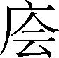
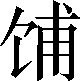
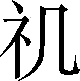
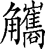

第一百一十七卷

 天官书**[1]**第五

《汉书·艺文志》记载的古代天文著作凡二十一家，多达四百五十卷。但是，到了著录《隋书·经籍志》的唐代，大约全都失传了。今知年代较古远的天文著作如甘氏、石氏、巫咸三家《星经》《黄帝天文占》等最早见于《隋书·经籍志》中，《汉书·艺文志》不载其名，显然属于后人整理、辑佚一类著作。其他如《淮南子·天文训》等失之芜杂，近年来考古发现的如马王堆出土《天文气象杂占》等又不能作为综合性的天文著作。所以，今知的系统、全面的天文学专著以《史记·天官书》为最古。

《史记·天官书》与《历书》一样，也不在《史记》十篇亡书之数，必为太史公原著（也有人以为是“妄人录《汉书·天文志》而成”，可不论），当然不排斥其中有错简以及后人窜入的成分，这是古书难以避免的，也不影响它的真正价值。

天官书的内容大体可分作七章：一为经星，分作五宫记述三垣二十八宿等恒星；二为五纬，记木、火、土、金、水五行星；三为二曜，记日与月；四为异星；五为云气；六为候岁；七是总论。前二章是记述的重点。第三章对日、月的记述最为简略，日只讲了晕、虹与食，而且偏重于占卜。日的其他天文知识，如运行失常、黑子（《晋书·天文志》黑子之外，还记有日乌、黑气、黑云等名）、日珥（《周礼·视》称为监，郑玄等称为冠珥）、光斑（《宋史·天文志》记为“日生牙”等）、色变、“乍三乍五”等，都没有记载，对月的记述同样有许多当有而无的地方。（清）王元启解释说：“《天官书》前无所承，史公首创为之，不能如后代测验之详，故约举大纲以存占候之旧。”

***【原文】***

中宫天极星[2]，其一明者，太一[3]常居也；旁三星三公[4]，或曰子属[5]。后句四星[6]，末大星正妃[7]，余三星后宫[8]之属也。环之匡卫[9]十二星，藩臣[10]。皆曰紫宫[11]。

***【译文】***

[1]天官书：讲述古代天文学的专著，但是其中夹杂着很多占星、望气、候岁之类的占卜术，使得精华与糟粕混杂，披沙拣金，读者须得深思。

[2]中宫：古代把北极星所在的天区看作天空的正中，所以把北极星当作天空的中官。宫，当据《索隐》和王念孙《读书杂志》改作“官”，后文的“东官”“南官”“西官”“北官”与这里相同。天极星：就是北极星，又叫北辰，包括五颗星，属于紫微垣。现代所称的北极星是指勾陈一星，跟古代所指不同。

[3]太一：天帝的别名，是最尊贵的天神。

[4]三星三公：三颗星象征人世间的三公。周代把太师、太傅、太保称为三公，西汉把丞相、御史大夫、太尉称作三公。

[5]子属：指太子星、庶子星。属，种类，等辈。

[6]句（ɡōu）：通“勾”，弯曲。四星：据《星经》说，这四颗星叫作四辅。

[7]正妃：帝王的正妻。

[8]后宫：宫中妃嫔居住的地方。借指妃嫔、姬妾。

[9]匡卫：辅助，保卫。

[10]藩臣：保卫帝王的诸侯。

[11]紫宫：就是紫微宫或紫微垣。既是星官名，又是天区名。这里指星官。

***【原文】***

前列直斗口[1]三星，随北端兑[2]，若见若不[3]，曰阴德[4]，或曰天一[5]。紫宫左三星日天枪[6]，右五星曰天棓[7]，后六星绝汉抵营室[8]，曰阁道[9]。

***【译文】***

[1]直：通“值”，挡。斗口：北斗星的开口。

[2]随：当据《索隐》《史记志疑》改作“隋”，通“堕”，下垂。端：尖端；前端。兑（ruì）：通“锐”，尖锐。

[3]若：如；像。见（xiàn）：显现。不（fuǒ）：通“否”，表示对上文的否定。

[4]阴德：星官名。

[5]天一：阴德的另一名称。

[6]左：据清代方苞《史记注补正》说，应当跟下句的“右”字互换。天枪：星官名。

[7]天棓：星官名。棓，同“棒”。

[8]绝：度过；跨越。汉：指天汉。就是银河，俗称天河。营室：星官名。原来包括室宿和壁宿，后来专指室宿。室宿是二十八宿之一，北方七宿的第六宿，包括两颗星，现在属于飞马座。壁宿又叫东壁，也是二十八宿之一，北方七宿的第七宿，包括两颗星，现在分属于飞马座和仙女座。

[9]阁道：星官名。包括六颗星。

***【原文】***

北斗七星[1]，所谓“旋玑、玉衡[2]以齐七政”。杓携龙角[3]，衡殷南斗[4]，魁枕参[5]首。用昏建者杓[6]；杓，自华[7]以西南。夜半建者衡[8]；衡，殷中州河、济[9]之间。平旦[10]建者魁；魁，海岱[11]以东北也。斗为帝[12]车，运于中央[13]，临制四乡[14]。分阴阳[15]，建[16]四时，均五行[17]，移节度[18]，定诸纪[19]，皆系[20]于斗。

***【译文】***

[1]北斗：星官名。在北天排斗形的七颗亮星。

[2]旋玑：又作“璇玑”。北斗星的这一部分象征浑天仪或浑天仪的横筒。玉衡：象征浑天仪的横筒或圆形外壳。

[3]杓：指北斗星的柄。携：连接。龙角：星官名。就是角宿。

[4]衡：指北斗星的斗中央。殷：居中；当于。南斗：星官名。就是斗宿，亦名北斗（非指北斗七星）。二十八宿之一，北方七宿的第一宿，包括六颗星，现在属于人马座。

[5]魁：指北斗星的第一星。枕：临；靠近。参（shēn）：星官名。二十八宿之一，西方七宿的第七宿，包括七颗星，现在属于猎户座。

[6]用：以；于。昏：黄昏。指戌时。相当于现在的十九点至二十一点。建：北斗星的斗柄（或斗魁、或斗衡）所指叫作建，并以建寅（指向东偏北方向）作为基点。杓：指北斗星的第七星。

[7]华（huà）：山名。在陕西省东部，属于秦岭山脉东段。

[8]夜半：指子时。相当于现在的二十三时至一时。衡：指北斗星的第五星。

[9]中州：古代豫州位处九州的中央，称为中州。有时也泛指黄河中游地区。河：古代黄河的专名。济：水名。发源于河南省济源市王屋山，古代分为黄河南、北两部分，下游河道变化很多。

[10]平旦：指寅时。相当于现在的三时至五时。

[11]海岱（dài）：指东海（今渤海）和泰山之间的地区，就是古代的青州，现在的山东省一带。岱，泰山的别名。

[12]帝：天帝。也可象征皇帝。

[13]运：运转；转动。中央：天空的正中。

[14]临制：统制。临，站在上面俯看下面。四乡：四方。

[15]阴阳：昼夜。

[16]建：制定。四时：四季。

[17]均：调和；调节。五行：指水、火、木、金、土，古代称构成各种物质的五种元素。

[18]移：改变。节度：节序度数。

[19]诸纪：指岁、日、月、星辰、历数。

[20]系：联属依附。

***【原文】***

斗魁戴匡六星曰文昌宫[1]：一曰上将[2]，二曰次将，三曰贵相，四曰司命，五曰司中，六曰司禄。在斗魁中[3]，贵人之牢。魁下六星，两两相比[4]者，名曰三能[5]。三能色齐[6]，君臣和；不齐，为乖戾[7]。辅星明近[8]，辅臣[9]亲强；斥小[10]，疏弱[11]。

***【译文】***

[1]匡：通“筐”，文昌宫的六颗星排列成为筐形。

[2]上将：星名。下文的次将、贵相、司命、司中、司禄都是星名。

[3]在斗魁中：指天理四星。这句上面有缺文。

[4]比（bì）：并列；靠近。动词。

[5]三能：星官名。就是三台。

[6]色齐：颜色平和。指亮度正常稳定。

[7]乖戾：抵触，不一致。

[8]辅星：星名。靠近开阳星的伴星。明近：明亮而接近观测者。

[9]辅臣：辅佐皇帝的大臣。

[10]斥小：远离观测者而微小。

[11]疏弱：疏远而无能。

***【原文】***

杓端有两星：一内为矛[1]，招摇；一外为盾[2]，天锋。有句圜十五星[3]，属[4]杓，曰贱人之牢。其牢中星实[5]则囚多，虚则开出[6]。

***【译文】***

[1]内：接近。矛：天矛星。

[2]外：远离。盾：天盾星。又叫天锋星。

[3]句圜（yuán）十五星：句指七公星，包括七颗星；圜指贯索星，包括九颗星，但其中正北的一颗星一般隐而不显，因此在观测者看来总计有十五颗星。它们排列成为连环形。句，通“勾”；圜，通“圆”。

[4]属（zhǔ）：接连。

[5]其：那。指示代词。实：充满。

[6]开出：开放；释放。

***【原文】***

天一、枪、棓、矛、盾动摇，角[1]大，兵[2]起。

***【译文】***

[1]角：芒角；光芒。

[2]兵：军事；战争。

***【原文】***

东宫[1]苍龙，房、心[2]。心为明堂[3]，大星天王[4]，前后星子属。不欲直[5]，直则天王失计[6]。房为府[7]，曰天驷。其阴[8]，右骖[9]。旁有两星曰衿[10]；北一星曰辖[11]。东北曲十二星曰旗[12]。旗中四星曰天市[13]；中六星曰市楼[14]。市中星众者实[15]；其虚则耗[16]。房南众星曰骑官[17]。

***【译文】***

[1]东宫：当作“东官”。

[2]房：房宿。星官名。又叫天驷。二十八宿之一，东方七宿的第四宿，包括四颗星，现在属于天蝎座。心：心宿。星官名。又叫商星。二十八宿之一，东方七宿的第五宿，包括三颗星，现在属于天蝎座。

[3]明堂：古代君王宣明政教的大会堂，所有朝会、祭祀、庆赏等盛大典礼都在这里举行。

[4]天王：春秋时代称周天子为天王，后世泛指皇帝。

[5]直：三星排列直线。

[6]失计：失策；

[7]府：当据《索隐》和《史记志疑》补作“天府”。

[8]阴：北边。

[9]右骖（cān）：当据《史记志疑》作“左、右骖”。左骖、右骖都是星名。

[10]衿：当据《索隐》《正义》作“钩衿”。钩、衿皆星名。衿，通“钤”。

[11]辖：星名。

[12]旗：天旗。星官名。

[13]天市：星官名。

[14]市楼：星官名。

[15]实：经济繁荣。

[16]耗：经济枯竭。

[17]骑官：星官名。

***【原文】***

左角[1]，李[2]；右角，将。大角[3]者，天王帝廷[4]。其两旁各有三星，鼎足[5]句之，曰摄提[6]。摄提者，直斗杓所指，以建时节[7]，故曰“摄提格[8]”。亢为疏庙[9]，主疾。其南北两大星，曰南门[10]。氐为天根[11]，主疫。

***【译文】***

[1]角：角宿。星官名。二十八宿之一，东方七宿的第一宿，包括两颗星，现在属于室女座。

[2]李：通“理”，法官。

[3]大角：星名。

[4]帝廷：朝廷，朝见的地方。

[5]鼎足：比喻三方并立。鼎，古代炊煮用的器具，有三只脚。

[6]摄提：星官名。包括六颗星。

[7]时节：四季的次序。

[8]摄提格：摄提星随着斗柄指向寅位是一年的开始。格，起始。

[9]亢：亢宿，星官名。二十八宿之一，东方七宿的第二宿，包括四颗星，现在属于室女座。疏庙：外朝。天帝处理政事的地方。

[10]南门：星官名。

[11]氐：氐宿，星官名。二十八宿之一，东方七宿的第三宿，包括四颗星，现在属于天秤座。天根：它是角、亢两宿的根柢。

***【原文】***

尾[1]为九子，曰君臣；斥绝[2]，不和。箕为敖客[3]，曰口舌[1]。

***【译文】***

[1]尾：尾宿，星官名。二十八宿之一，东方七宿的第六宿，包括九颗星，现在属于天蝎座。

[2]斥绝：相距很遥远。

[3]箕：箕宿。星官名。二十八宿之一，东方七宿的第七宿，包括四颗星，现在属于人马座。敖客：挑拨是非的人们。

[4]口舌：口角；争吵。

***【原文】***

火犯守[1]角，则有战。房、心[2]，王者恶[3]之也。

***【译文】***

[1]火：火星。又叫荧惑。犯守：古人观测天象时的术语。甲星从下往上光芒接触到乙星的光芒，叫作甲星犯乙星；甲星停留在乙星通常所在的位置，叫作甲星守乙星。

[2]房、心：紧承上句，省略了主语和谓语“火犯守”。

[3]恶（wù）：憎恨；厌恶。

***【原文】***

南宫朱鸟，权、衡[1]。衡，太微，三光[2]之廷。匡卫十二星，藩臣：西，将；东，相；南四星，执法[3]一中，端门[4]；门左右，掖门[5]——门内六星，诸侯[6]。其内五星，五帝坐[7]。后聚一十五星，蔚然[8]，曰郎位[9]；傍[10]一大星，将位[11]也。月、五星顺入[12]，轨道，司其出[13]，所守[14]，天子所诛也。其逆入[15]，若[16]不轨道，以所犯命[17]之；中坐[18]，成形[19]，皆群下从谋[20]也。金[21]、火尤甚。廷藩西有隋[22]星五，曰少微[23]，士大夫。权，轩辕。轩辕，黄龙体[24]。前大星，女主象[25]；旁小星，御者[26]后官属。月、五星守犯者，如衡占[27]。

***【译文】***

[1]南宫：当作“南官”。权、衡：都是星官名。权，又叫轩辕，包括十七颗星。衡，又叫太微，包括十颗星。

[2]三光：指日、月、五星。

[3]执法：官名。跟上两句的将、相一样，可以看成这些星辰的职务，也可以看作它们的名称。

[4]端门：正门。天空门名。

[5]掖门：旁门。天空门名。

[6]诸侯：星官名。

[7]五帝坐：星官名（坐，通“座”）。它们的名称是：中央黄帝坐，神名含枢纽；东方苍帝坐，神名灵威仰；南方赤帝坐，神名赤熛（biāo）怒；西方白帝坐，神名白招拒；北方黑帝坐，神名叶光纪。

[8]蔚然：密密麻麻的样子。

[9]郎位：星官名。

[10]傍（pánɡ）：通“旁”，

[11]将位：星名。

[12]五星：五大行星。顺入：从西方进入太微廷。

[13]司（sì）：通“伺”，等候，观察。出：从太微廷经过五帝坐向东运行。

[14]所守：指被月或五星侵占了位置的星辰所象征的大官员。

[15]其：倘若；如果。假设连词。逆入：从东方进入太微廷。

[16]若：或；或者。

[17]以：根据；针对。所犯：指被月或五星侵犯了的星辰所象征的大官员。命：给定罪名。

[18]中坐：有两种解释：一是侵犯或侵占五帝坐。中（zhònɡ），冲击。二是指五帝坐的中央黄帝坐。

[19]成形：有两解：一是灾祸已经明显地表现；二是一定会要施以刑罚。形，通“刑”。

[20]从谋：勾结起来图谋犯上作乱。

[21]金：金星。又叫太白、启明、长庚。

[22]廷藩：指作为太微廷的藩臣的各个星官。隋（duò）：通“堕”，下垂。

[23]少（shào）微：星官名。

[24]黄龙体：比喻轩辕星的形状。

[25]女主：指皇后。象：象征；形象。

[26]御者：指宫内侍女。

[27]占：看兆头以预知吉凶。

***【原文】***

东井为水事[1]。其西曲星曰钺[2]。钺北，北河[3]；南，南河[4]；两河、天阙间为关梁[5]。舆鬼[6]，鬼[7]祠事；中白者为质[8]。火守南北河，兵起，谷不登[9]。故德成衡[10]，观成潢[11]，伤成钺[12]，祸成井[13]，诛成质[14]。

***【译文】***

[1]东井：就是井宿。星官名。二十八宿之一，南方七宿的第一宿，包括八颗星，现在属于双子座。为水事：掌握法令制度的准则。水最平，可以作为制法和执法者的榜样。

[2]钺：星名。

[3]北河：星官名。包括三颗星。

[4]南河：星官名。包括三颗星。

[5]两河：指北河星、南河星。天阙（què）：星官名。包括两颗星。关梁：关卡和桥梁。比喻交通要冲。

[6]舆鬼：就是鬼宿。星官名。二十八宿之一，南方七宿的第二宿，包括四颗星，现在属于巨蟹座。

[7]鬼：当据《正义》《史记志疑》改作“主”，或依王先谦说作“为”。

[8]质：鬼宿四星中央有一个附座星官，名叫质，又叫积尸气或鬼星团。

[9]登：成熟。

[10]德成衡：帝王施行德政，就会预先从衡星表现征兆。

[11]观成潢（huánɡ）：帝王外出游览，就会预先从潢星表现征兆。潢星是天帝的车舍，因此可以看出帝王车马的行踪。潢，又叫天潢或天横，星官名，包括八颗星。

[12]伤成钺：帝王胡作非为，就会预先从钺星表现征兆。

[13]祸成井：帝王有灾祸，就会预先从井宿表现征兆。井宿主水事，有帝王的征象。

[14]诛成质：帝王执行诛杀，就会预先从质星表现征兆。

***【原文】***

柳为鸟注[1]，主木草。七星[2]，颈，为员官[3]，主急事。张[4]，素[5]，为厨，主觞[6]客。翼[7]为羽翮，主远客。

***【译文】***

[1]柳：柳宿。星官名。二十八宿之一，南方七宿的第三宿，包括八颗星，现在属于长蛇座。注：通“咮”，鸟口；鸟嘴。

[2]七星：就是星宿。星官名。二十八宿之一，南方七宿的第四宿，包括七颗星，现在属于长蛇座。

[3]员官：喉咙。员，通“圆”。

[4]张：张宿，又叫鹑尾。星官名。二十八宿之一，南方七宿的第五宿，包括六颗星，现在属于长蛇座。

[5]素：通“嗉（sù）”，嗉囊。

[6]觞（shānɡ）：盛酒器。敬酒或喝酒。

[7]翼：翼宿。星官名。二十八宿之一，南方七宿的第六宿，包括二十二颗星，现在分属巨爵座和长蛇座。

***【原文】***

轸[1]为车，主风。其旁有一小星，曰长沙[2]，星星[3]不欲明；明与四星等，若五星入轸中，兵大起。轸南众星曰天库、楼[4]；库有五车[5]。车星角[6]，若益众，及不具[7]，无处[8]车马。

***【译文】***

[1]轸（zhěn）：轸宿。星官名。二十八宿之一，南方七宿的第七宿，包括四颗星，现在属于乌鸦座。

[2]长沙：星名。

[3]星星：细小。

[4]天库：星官名。包括六颗星。楼：天楼。星官名。包括四颗星。

[5]五车：星名。

[6]角：光芒。

[7]不具：隐而不见。

[8]无处：没法安排。

***【原文】***

西宫咸池[1]，曰天五潢[2]。五潢，五帝车舍。火入，旱；金，兵；水[3]，水。中有三柱[4]；柱不具，兵起。

***【译文】***

[1]西宫：当作“西官”。咸池：星官名。

[2]“曰”上面疑有缺文。

[3]水：水星。又叫辰星。

[4]三柱：星官名。

***【原文】***

奎[1]曰封豕，为沟渎[2]。娄[3]为聚众。胃[4]为天仓。其南众星曰积[5]。

***【译文】***

[1]奎（kuí）：奎宿。又叫天豕、封豕。星官名。二十八宿之一，西方七宿的第一宿，包括十六颗星，现在分属仙女座和双鱼座。

[2]沟渎（dú）：沟渠。

[3]娄：娄宿。星官名。二十八宿之一，西方七宿的第二宿，包括三颗星，现在属于白羊座。

[4]胃：胃宿。星官名。二十八宿之一，西方七宿的第三宿，包括三颗星，现在属于白羊座。

[5]积：星官名。包括六颗星。

***【原文】***

昴[1]曰髦头，胡星[2]也，为白衣会[3]。毕[4]曰罕车，为边兵，主弋[5]猎。其大星旁小星为附耳[6]。附耳摇动，有谗乱[7]臣在侧。昴、毕间为天街[8]。其阴，阴国[9]；阳[10]，阳国[11]。

***【译文】***

[1]昴（mǎo）：昴宿。星官名。二十八宿之一，西方七宿的第四宿。昴宿是一个星团，又叫髦头、昴星团，有七颗较亮的星，现在属于金牛座。

[2]胡星：象征胡人的星辰。

[3]白衣会：古代占卜说是丧事的征兆。白衣，丧服。会，吉凶的遭遇。

[4]毕：毕宿。又叫天浊、罕车。星官名。二十八宿之一，西方七宿的第五宿，包括八颗星，现在属于金牛座。

[5]弋（yì）：用绳子系着箭发射。

[6]附耳：星名。

[7]谗乱：颠倒是非，进行捣乱。

[8]天街：星官名。包括两颗星。

[9]阴国：指野蛮落后的外族国家。

[10]阳：南边。

[11]阳国：指文明先进的华夏族国家。

***【原文】***

参[1]为白虎。三星直者，是为衡石[2]。下有三星，兑，曰罚[3]，为斩艾[4]事。其外四星，左右肩股也。小三星隅置[5]，曰觜觿[6]，为虎首，主葆旅[7]事。其南有四星，曰天厕[8]。厕下一星，曰天矢[9]。矢黄则吉；青、白、黑，凶。其西有句曲九星，三处罗[10]：一曰天旗[11]，二曰天苑[12]，三曰九游[13]。其东有大星曰狼[14]。狼角变色，多盗贼。下有四星曰弧[15]，直狼。狼[16]比地有大星，曰南极老人[17]。老人见，治安；不见，兵起。常以秋分时候之于南郊[18]。

***【译文】***

[1]参（shēn）：参宿。星官名。

[2]衡石：衡，秤杆，秤；石，古代重量单位，等于四钧、一百二十斤。

[3]罚：也作“伐”，星官名。

[4]艾（yì）：通“刈”，割；杀。

[5]隅（yú）置：排列在角落。

[6]觜觿（zīxī）：就是觜宿。星官名。二十八宿之一，西方七宿的第六宿，包括三颗星，现在属于猎户座。

[7]葆旅：两解：一是保护军需运输。二是收取野生食物。

[8]天厕：星官名。

[9]天矢：星名。矢，通“屎”。

[10]罗：分布；排列。

[11]天旗：星官名。

[12]天苑：星官名。

[13]九游：星官名。据《正义》说，天旗星包括九颗星，天苑星包括十六颗星，九游星包括九颗星，跟上句“九星”不合。

[14]狼：天狼。星名。天空最亮的恒星，现在属于大犬座。

[15]弧：星官名。

[16]狼：衍文。当据《汉书·天文志》和《史记志疑》删。

[17]南极老人：星名。又叫寿星。天空次亮的恒星，现在属于船底座。

[18]以：于；在。候之于南郊：南极星只出现在南天地平线附近，我国中部地区很难见到。

***【原文】***

附耳入毕中，兵起[1]。

***【译文】***

[1]这两句话应当移到前文“附耳”句下面。

***【原文】***

北宫玄武[1]，虚、危[2]。危为盖屋；虚为哭泣之事。

***【译文】***

[1]北宫，当作“北官”。玄武：指龟或龟蛇合体的形象。武，龟蛇身有鳞甲，有勇武象。

[2]虚：虚宿。星官名。二十八宿之一，北方七宿的第四宿，包括两颗星，现在分属宝瓶座和小马座。危：危宿。星官名。

***【原文】***

其南有众星，曰羽林天军[1]。军西为垒[2]，或曰钺。旁有一大星为北落[3]。北落若微亡[4]，军星动角益希[5]，及五星犯北落，入军，军起。火、金、水尤甚。火，军忧；水，水患；木、土[6]，军吉。危东六星，两两相比，曰司空[7]。

***【译文】***

[1]羽林天军：星官名。

[2]垒：又叫钺。星官名。

[3]北落：星名。

[4]微亡：隐而不显。微，隐蔽，藏匿；亡，消失。

[5]希：通“稀”，稀疏；稀少。

[6]木：木星，又叫岁星。土：土星，又叫填星、镇星。

[7]司空：星官名。

***【原文】***

营室为清庙[1]，曰离宫[2]阁道。汉中四星，曰天驷[3]。旁一星，曰王良[4]。王良策[5]马，车骑[6]满野。旁有八星，绝汉，曰天潢。天潢旁，江星[7]。江星动，人涉水。

***【译文】***

[1]清庙：帝王诸侯祭祀祖宗的祠庙。

[2]离宫：帝王临时居住的宫殿。

[3]天驷：星官名。与房宿的别名“天驷”是两码事。

[4]王良：星名。本是春秋时晋国的一个善于驭马的人。

[5]策：星名。策本是马鞭或鞭打的意思，这里借星名作动词用，语意双关。

[6]车骑：车和驾车的马。

[7]江星：又叫天江。星官名。

***【原文】***

杵、臼[1]四星，在危南。匏瓜[2]，有青黑星[3]守之，鱼盐贵。

***【译文】***

[1]杵臼：星官名。

[2]匏瓜：星官名。包括五颗星。

[3]青黑星：指天空新出现的客星。

***【原文】***

南斗[1]为庙，其北建星[2]。建星者，旗也。牵牛为牺牲[3]。其北河鼓[4]。河鼓大星，上将；左右[5]，左右将。婺女[6]，其北织女[7]。织女，天女孙[8]也。

***【译文】***

[1]南斗：就是斗宿。星官名。二十八宿之一，北方七宿的第一宿，包括六颗星，现在属于人马座。

[2]建星：星官名。包括六颗星。也叫天旗，跟房宿的“天旗”是两码事。

[3]牵牛：就是牛宿。星官名。二十八宿之一，北方七宿的第二宿，包括六颗星，现在属于摩羯（jié）座。牺牲：古代供祭祀用的牲畜的通称。

[4]河鼓：星官名。包括三颗星，现在属于天鹰座。古代天文书籍大都称牛宿为牵牛星，而在诗文中常常称河鼓星为牵牛星，一般人称它为牛郎星。

[5]左右：分别指大星南边和北边的星。

[6]婺（wù）女：就是女宿。星官名。二十八宿之一，北方七宿的第三宿，包括四颗星，现在属于宝瓶座。

[7]织女：星官名。包括三颗星，现在属于天琴座。

[8]天女孙：晋代以后的天文书籍中多作“天女”，在诗文中常简称“天女”或“天孙”。

***【原文】***

察曰、月之行以揆岁星顺逆[1]。曰东方木[2]，主春[3]，曰甲、乙[4]。义失者，罚出岁星[5]。岁星赢缩[6]，以其舍命[7]国。所在国不可伐，可以罚[8]人。其趋舍[9]而前曰赢，退舍[10]曰缩。赢，其国有兵不复[11]；缩，其国有忧，将[12]亡，国倾败[13]。其所在，五星皆从而聚于一舍[14]，其下之国可以义致[15]天下。

***【译文】***

[1]揆（kuí）：测度；度量。顺逆：顺入或逆入。五大行星围绕太阳运行的轨道是椭圆的，跟黄道斜交。

[2]东方木：根据五行说，把五行跟五方配合：东方木，南方火，西方金，北方水，中央土。

[3]主春：根据五行说，把五行跟四季配合：木主春，火主夏，金主秋，水主冬；还剩下土怎么办呢？于是就从一年四季的中间划出季夏来跟它配合：土主季夏。

[4]曰甲、乙：根据五行说，把五行跟纪日的十干配合：甲乙木，丙丁火，戊己土，庚辛金，壬癸水。

[5]义失者，罚出岁星：本文把五行跟道德规范或政治措施配合：木主义，火主礼，土主德，金主杀，水主刑。

[6]赢缩：五大行星出现得早叫作赢，出现得晚叫作缩。赢缩就是进退的意思。

[7]舍：就是“宿”，侧重指天空区划。命：命名；起名。

[8]罚：通“伐”。

[9]趋舍：超过正常达到的天区。

[10]退舍：落后于正常达到的天区。

[11]复：兴复；恢复。

[12]将（jiànɡ）：将帅。

[13]倾败：危险，灭亡。

[14]五星皆从而聚于一舍：指五大行星同时出现于同一天区，古代称为“五星聚”或“五星连珠”。

[15]致：招致；招来。

***【原文】***

以摄提格[1]岁：岁阴[2]左行在寅，岁星右转[3]居丑。正月，与斗、牵牛晨出东方，名曰监德[4]。色苍苍[5]有光。其失次[6]，有应[7]见柳。岁早[8]，水；晚，旱。

***【译文】***

[1]摄提格：万物秉承阳气兴起。古代用岁阴的名目纪年，它们的名称是：摄提格、单阏（chán yān）、执徐、大荒落、敦牂（zānɡ）、协洽、涒（tūn）滩、作噩、阉茂、大渊献、困敦、赤奋若。分别相当于十二支的寅、卯、辰、巳、午、未、申、酉、戌、亥、子、丑。

[2]岁阴：古代天文学中假设的天体名称，又叫太岁或太阴。

[3]右转：从西向东运行。

[4]监德：给正月间每天早晨出现在东方的木星起的特定名称。下文的“降人”“青章”等名称跟这相类似。

[5]苍苍：深青色。

[6]次：也称星次。古代为了测量日、月、五星的位置和运动，把黄道带分成十二个部分，叫作十二次。但因为它们是按赤道经度等分的，所以跟现代的黄道十二宫有出入。

[7]应：效应；占验。

[8]岁早：指一年的前半段；下面的“晚”指后半段。

***【原文】***

岁星出，东行十二度，百日而止，反[1]逆行；逆行八度，百日，复东行。岁行三十度十六分度之七[2]，率[3]日行十二分度之一，十二岁而周天[4]。出常东方，以晨；入于西方，用昏。

***【译文】***

[1]反：通“返”。

[2]三十度十六分度之七：就是三十又十六分之七度。

[3]率：大概；通常。

[4]十二岁而周天：根据现代实测，木星的公转周期是11.86年。古代把周天分为三百六十五又四分之一度，现在分为三百六十度。这里作动词用，是绕天一周的意思。

***【原文】***

单阏[1]岁：岁阴在卯，星[2]居子。以二月与婺女、虚、危晨出，曰降入。大有光。其失次，有应见张。其岁大水。

***【译文】***

[1]单阏：阴气尽止，阳气推动万物兴起。

[2]星：承上文，指岁星。

***【原文】***

执徐[1]岁：岁阴在辰，星居亥。以三月与营室、东壁晨出，曰青章。青青甚章[2]。其失次，有应见轸。岁早，旱；晚，水。

***【译文】***

[1]执徐：蛰伏的动物缓慢地开始活动。

[2]章：通“彰”，明显，显著。

***【原文】***

大荒骆[1]岁：岁阴在巳，星居戌。以四月与奎、娄晨出，曰跰踵[2]。熊熊[3]赤色，有光。其失次，有应见亢。

***【译文】***

[1]大荒骆：万物都勃然兴起，十分活跃。

[2]跰（pián）踵：踉跄前行。

[3]熊熊：火焰旺盛的样子。

***【原文】***

敦牂[1]岁：岁阴在午，星居酉。以五月与胃、昴、毕晨出，曰开明。炎炎有光。偃[2]兵；唯利公王[3]，不利治兵[4]。其失次，有应见房。岁早，旱；晚，水。

***【译文】***

[1]敦牂：万物壮盛。

[2]偃（yǎn）：止息；停止。

[3]公王：指太平盛世的帝王诸侯。

[4]治兵：练兵；用兵。

***【原文】***

叶洽[1]岁：岁阴在未，星居申。以六月与觜觿、参晨出，曰长列。昭昭[2]有光。利行兵。其失次，有应见箕。

***【译文】***

[1]叶洽：阳气化生，万物和合。叶，也作“协”。

[2]昭昭：明亮；清朗。

***【原文】***

涒滩[1]岁：岁阴在申，星居未。以七月与东井、舆鬼晨出，曰大音。昭昭白。其失次，有应见牵牛。

***【译文】***

[1]涒滩：万物成熟。

***【原文】***

作鄂[1]岁：岁阴在酉，星居午。以八月与柳、七星、张晨出，曰长王。作作[2]有芒。国其[3]昌，熟谷。其失次，有应见危。有旱而昌，有女丧，民疾。

***【译文】***

[1]作鄂：植物芒角尖锐。

[2]作作：形容光芒四射。

[3]其：将要。

***【原文】***

阉茂[1]岁：岁阴在戌，星居巳。以九月与翼、轸展出，曰天睢[2]。白色大明。其失次，有应见东壁。岁水，女丧。

***【译文】***

[1]阉茂：万物都隐蔽起来。

[2]睢：抬眼看。

***【原文】***

大渊献[1]岁：岁阴在亥，星居辰。以十月与角、亢晨出，曰大章。苍苍然，星若跃而阴[2]出旦，是谓“正平”。起师旅[3]，其率[4]必武；其国有德，将有四海[5]。其失次，有应见娄。

***【译文】***

[1]大渊献：万物大量深藏。

[2]阴：暗淡；隐约。

[3]师旅：军队；战争。

[4]率：通“帅”。

[5]有：取得；占有。四海：天下。

***【原文】***

困敦[1]岁：岁阴在子，星居卯。以十一月与氐、房、心晨出，曰天泉。玄色[2]甚明。江池其昌，不利起兵。其失次，有应见昴。

***【译文】***

[1]困敦：万物刚刚萌发，处于混沌状态。

[2]玄色：天青色；浅黑色。

***【原文】***

赤奋若[1]岁：岁阴在丑，星居寅。以十二月与尾、箕晨出，曰天皓[2]。黫[3]然黑色甚明。其失次，有应见参。

***【译文】***

[1]赤奋若：阳气振起万物，顺应它们的天性。

[2]皓：光明。

[3]黫（yān）：黑色的样子。

***【原文】***

当居[1]不居，居之又左右摇，未当去[2]去之，与他星会，其国凶。所居久，国有德厚[3]。其角动，乍小乍大，若色数[4]变，人主有忧。

***【译文】***

[1]居：停留。

[2]去：离开。

[3]德厚：道德高厚。

[4]数（shuò）：屡次；频繁。

***【原文】***

其失次舍[1]以下，进而东北，三月生天棓，长四丈，末兑。进而东南，三月生彗星[2]，长二丈，类[3]彗。退而西北，三月生天欃[4]，长四丈，末兑。退而西南，三月生天枪，长数丈，两头兑。谨视其所见之国，不可举事[5]用兵。其出如浮如沉，其国有土功[6]；如沉如浮，其野[7]亡。色赤而有角，其所居国昌。迎[8]角而战者，不胜。星色赤黄而沉，所居野大穰[9]。色青白而赤灰，所居野有忧。岁星入月[10]，其野有逐相；与太白斗[11]，其野有破军。

***【译文】***

[1]次舍：行星运行过程中一定时期在十二次和二十八舍（宿）的位置。

[2]彗星：绕太阳运行的一种天体。形状很特别，远离太阳时，是一个云雾状小斑点；接近太阳时，由彗头和彗尾两部分组成，彗尾像扫帚，所以通常叫扫帚星。

[3]类：相似。

[4]天欃（chán）：星名。它和上文的天棓、下文的天枪都是彗星一类的天体。

[5]举事：兴办国家大事。

[6]土功：土木水利等建筑工程。

[7]野：指分野。古代天文学说，把天上星宿的位置跟地上州、国的位置相对应。就天文说，称分星；就地域说，称分野。

[8]迎：正对着。

[9]穰（ránɡ）：丰收；繁荣。

[10]岁星入月：当木星运行到跟月亮、地球成为一直线时，观测者的视线被月球遮断，看不见木星。这种现象古人叫作月食星。

[11]斗：斗争。意谓两星的光芒相接触。

***【原文】***

岁星一曰摄提，曰重华，曰应星，曰纪星。营室为清庙，岁星庙[1]也。

***【译文】***

[1]庙：宫室；朝堂。

***【原文】***

察刚气以处[1]荧惑。曰南方火，主夏，日丙、丁。礼[2]失，罚出荧惑，荧惑失行[3]是也。出[4]则有兵，入[5]则兵散。以其舍命国。荧惑为勃[6]乱，残贼、疾、丧[7]、饥、兵。反道[8]二舍以上，居之，三月有殃，五月受兵，七月半亡地，九月太半[9]亡地。因与俱出入[10]，国绝祀[11]。居之，殃还[12]至，虽大当小；久而至，当小反大。其南为丈夫[13]丧，北为女子丧。若角动绕环之，及乍前乍后，左右[14]，殃益大。与他星斗，光相逮[15]，为害；不相逮，不害。五星皆从而聚于一舍，其下国可以礼致天下。

***【译文】***

[1]刚气：刚毅之气。因为古人认为火星象征执法者，所以这样说。处：位置；判断位置。

[2]礼：规定社会行为的法则、规范、仪式的总称。

[3]失行：火星在天空中运行，时隐时现时东时西，情况复杂。

[4]出：出现；显现。

[5]入：隐没。

[6]勃（bèi）：通“悖”，违反；迷惑。

[7]残贼：凶杀，暴乱。疾：疾病；瘟疫。丧：死亡；灾祸。

[8]反道：回转轨道运行。

[9]太半：大半；多半。

[10]因与俱出入：承上文而言，意思是说：到了九个月以后，仍然在那里时而出现，时而隐没。

[11]绝祀：断绝祭祀。指国家（王朝）灭亡。

[12]还（xuán）：通“旋”，随即；不久。

[13]丈夫：男子。

[14]左右：乍左乍右。状语。

[15]逮：及；到。

***【原文】***

法[1]，出东行十六舍而止；逆行二舍；六旬[2]，复东行，自所止数十舍，十月而入西方；伏行[3]五月，出东方。其出西方曰“反明”，主命者[4]恶之。东行急，一日行一度半。

***【译文】***

[1]法：法则；常规。

[2]旬：十日。

[3]伏行：潜伏运行。

[4]主命者：发号施令的人。指帝王诸侯。

***【原文】***

其行东、西、南、北疾[1]也。兵各聚其下；用[2]战，顺之[3]胜，逆之败。荧惑从太白，军忧；离之，军却[4]。出太白阴，有分军[5]；行其阳，有偏将战[6]。当其行，太白逮之，破军杀将。其入守犯太微、轩辕、营室，主命[7]恶之。心为明堂，荧惑庙也。谨候此[8]。

***【译文】***

[1]疾：快速。

[2]用：需要。

[3]顺之：顺着火星运行的方向行进。

[4]却：倒退；退却。

[5]分军：别部；奇兵。

[6]偏将战：敌对双方约定时间和地点，各据一面，正式交战。

[7]主命：就是主命者。

[8]候：占验星象。依据天象的变化来预测吉凶。

***【原文】***

历斗之会[1]以定填星之位。曰中央土，主季夏[2]，日戊、己，黄帝[3]，主德，女主象也。岁填[4]一宿，其所居，国吉。未当居而居，若已去而复还，还居之，其国得土，不[5]，乃得女。若当居而不居，既已居之，又西东去，其国失土，不，乃失女，不可举事用兵。其居久，其国福厚；易[6]，福薄。

***【译文】***

[1]历：跟踪观测。斗：指斗宿。会：聚合；会合。

[2]季夏：夏季的最后一个月。

[3]黄帝：指中央天帝。

[4]岁填一宿：土星约二十八年运行一周天（根据现代实测，土星的公转周期是29~46年），每年行程大概相当于一宿的天区。

[5]不：通“否”，不然。

[6]易：随便；迅速。

***【原文】***

其一名曰地侯[1]，主岁[2]。岁行十三度百十二分度之五，日行二十八分度之一，二十八岁周天。其所居，五星皆从而聚于一舍，其下之国可以重[3]致天下。礼、德、义、杀[4]、刑尽失，而填星乃为之动摇。

***【译文】***

[1]地侯：也是土星的别名。

[2]岁：年景；一年的收成。

[3]重：庄严质朴的品行。

[4]杀：杀伐；征战。

***【原文】***

赢，为王不宁；其缩，有军不复[1]。填星，其色黄，九芒，音曰黄钟宫[2]。其失次上二三宿曰赢，有主命不成[3]，不，乃大水。失次下二三宿曰缩，有后戚[4]，其岁不复[5]，不，乃天裂若地动。

***【译文】***

[1]复：还转；返回。

[2]黄钟宫：黄钟律，十二律的第一律；宫声，五声的第一声。

[3]主命不成：君主的命令不能够贯彻执行。

[4]有后戚：王后忧戚。

[5]不复：阴阳不调和。

***【原文】***

斗为文太室[1]，填星庙，天子之星也。

***【译文】***

[1]文太室：有文采的帝王祖庙的中室。

***【原文】***

木星与土合[1]，为内乱，饥，主[2]勿用战，败；水则变谋而更事[3]；火为旱；金为白衣会若水。金在南曰牝牡[4]，年谷熟。金在北，岁偏[5]无。火与水合为焠[6]，与金合为铄[7]，为丧，皆不可举事，用兵大败。土为忧，主孽卿[8]；大饥，战败，为北军[9]，军困，举事大败。土与水合，穰而拥阏[10]，有覆军[11]，其国不可举事。出，亡地；入，得地。金为疾，为内兵[12]，亡地。三星若合，其宿地国外内有兵与丧，改立公王。四星合，兵丧并起，君子[13]忧，小人[14]流。五星合，是为易行[15]，有德，受庆，改立大人[16]，掩[17]有四方，子孙蕃昌[18]；无德，受殃若亡。五星皆大，其事[19]亦大；皆小，事亦小。

***【译文】***

[1]木星与土合：当据《汉书·天文志》和《史记志疑》作“凡五星，木与土合”。

[2]主：注重；着重。

[3]更（ɡēnɡ）事：更改工作。

[4]金在南曰牝（pìn）牡：木星代表阳，金星代表阴。牝，雌性，阴；牡，雄性，阳。

[5]偏：特别；意外。

[6]焠：通“淬（cuì）”，锻炼；磨炼。

[7]铄（shuò）：熔化；销熔。

[8]孽（niè）卿：庶子担任大臣。

[9]北军：战败的军队。

[10]拥阏（è）：阻塞；不流畅。

[11]覆军：覆灭的军队。

[12]内兵：内战；内部变乱。

[13]君子：古时指统治阶级，后用以称有才德的人。

[14]小人：古时指劳动人民，后用以称无才德的人。

[15]易行：改变了正常的行程。

[16]大人：指帝王。

[17]掩：通“奄（yǎn）”，覆盖；包括。

[18]蕃（fán）昌：繁荣昌盛。

[19]其事：指吉庆或灾祸。

***【原文】***

蚤出[1]者为赢，赢者为客。晚出[2]者为缩，缩者为主人。必有天应见于杓星。同舍为合。相陵[3]为斗，七寸以内[4]必之矣。

***【译文】***

[1]蚤出：指超舍而前的现象。

[2]晚出：指退舍以下的现象。

[3]陵：遮掩；冒过。

[4]七寸以内：指观测者所看到的相斗两星间的距离。

***【原文】***

五星色白圜，为丧旱；赤圜，则中不平，为兵；青圜，为忧水；黑圜，为疾，多死；黄圜，则吉。赤角[1]犯我城，黄角地之争，白角哭泣之声，青角有兵忧，黑角则水。意行穷兵之所终[2]。五星同色，天下偃兵，百姓宁昌。春风秋雨，冬寒夏暑。动摇常以此[3]。

***【译文】***

[1]赤角：发出红色光芒。

[2]意行穷兵之所终：《史记三书正讹》和《史记志疑》认为是衍文。

[3]动摇常以此：跟上下文不相衔接，当是脱文。

***【原文】***

填星出百二十日而逆西行，西行百二十日反东行。见三百三十日而入，入三十日复出东方。太岁在甲寅，镇星在东壁，故在营室[1]。

***【译文】***

[1]这一段应该放到前面有关填星的那段。

***【原文】***

察日行以处位[1]太白。曰西方[2]，秋，日庚辛，主杀。杀失者，罚出太白。太白失行，以其舍命国。其出行十八舍二百四十日而入。入东方，伏行十一舍百三十日；其入西方，伏行三舍十六日而出。当出不出，当入不入，是谓失舍，不有破军，必有国君之篡[3]。

***【译文】***

[1]处位：定位；判断位置。

[2]曰西方：根据五行说，此下缺“金”字。

[3]国君之篡：国君被夺权。

***【原文】***

其纪《上元》[1]，以摄提格之岁，与营室晨出东方，至角而入；与营室夕出西方，至角而入；与角晨出，入毕；与角夕出，入毕；与毕晨出，入箕；与毕夕出，入箕；与箕晨出，入柳；与箕夕出，入柳；与柳晨出，入营室；与柳夕出，入营室。凡出入东西各五，为八岁二百二十日，复与营室晨出东方。其大率[2]，岁一周天[3]。其始出东方，行迟，率日半度，一百二十日，必逆行一二舍；上极而反，东行，行[4]日一度半，一百二十日入。其庳[5]，近日，曰明星[6]，柔；高，远日，曰大嚣，刚。其始出西方，行疾，率日一度半，百二十日；上极而行迟，日半度，百二十日，旦入，必逆行一二舍而入。其庳，近日，曰大白，柔；高，远日，曰大相，刚。出以辰[7]、戌，入以丑[8]、未。

***【译文】***

[1]《上元》：古代历法名。

[2]大率：大约；大概。

[3]岁一周天：根据现代实测，金星的公转周期约225日。

[4]行：衍文，当删。

[5]庳（bēi）：低下。

[6]明星：金星的特定名称。

[7]辰：辰时。相当于现在的七时至九时。

[8]丑：丑时。相当于现在的一时至三时。

***【原文】***

当出不出，未当入而入，天下偃兵，兵在外，入。未当出而出，当入而不入，天下起兵，有破国。其当期出也，其国昌。其出东为东[1]，入东为北方；出西为西，入西为南方。所居久，其乡[2]利；易，其乡凶。

出西至东，正西国吉。出东至西，正东国吉。其出不经天[3]；经天，天下革政[4]。

***【译文】***

[1]其出东为东：它在东方出现，占验在东方。以下三句类推。

[2]乡：处所；方位。

[3]经天：指金星最亮时白昼当空出现。

[4]革政：改变政权。指改朝换代。

***【原文】***

小以[1]角动，兵起。始出大，后小，兵弱；出小，后大，兵强。出高，用兵深[2]吉，浅[3]凶；庳，浅吉，深凶。日方南[4]金居其南，日方北[5]金居其北，日赢，侯王[6]不宁，用兵进吉退凶。日方南金居其北，日方北金居其南，日缩，侯王有忧，用兵退吉进凶。用兵象[7]太白：太白行疾，疾行；迟[8]，迟行。角，敢战。动摇躁[9]，躁。圜以静，静。顺角所指，吉；反之，皆凶。出则出兵，入则入兵[10]。赤角，有战；白角，有丧，黑圜角，忧，有水事[11]；青圜小角，忧，有木事[12]；黄圜和角，有土事[13]，有年[14]。其已出三日而复有微入[15]，入三日乃复盛出[16]，是谓耎[17]，其下国有军败将北[18]。其已入三日又复微出，出三日而复盛入，其下国有忧：师有粮食兵革[19]，遗[20]人用之；卒[21]虽众，将为人虏[22]。其出西失行，外国败；其出东失行，中国败。其色大圜黄滜[23]，可为好事[24]；其圜大赤，兵盛不战。

***【译文】***

[1]以：通“而”。

[2]深：周密深入。

[3]浅：冒失轻进。

[4]日方南：指夏至过后，太阳直射光线向南移动。

[5]日方北：指冬至过后，太阳直射光线向北移动。

[6]侯王：帝王诸侯。

[7]象：取法；效法。

[8]迟：慢行；缓慢。

[9]躁：急躁；不安静。

[10]入兵：退兵；收兵。

[11]水事：治水之事。

[12]木事：斫木的事。

[13]土事：动土之事。

[14]年：年成；五谷成熟。

[15]有：衍文。微入：逐渐隐没。

[16]盛出：突然出现。

[17]耎（ruǎn）：软弱；退缩。

[18]将北：将帅败亡。

[19]兵革：兵器和盔甲。泛指武器装备。

[20]遗（wèi）：致送；留给。

[21]卒：步兵；士兵。

[22]将为人虏：两解：一是将要被人家俘虏。二是将要做人家的俘虏。

[23]滜（zé）：通“泽”，光润。

[24]好事：指各国和平交往的事。

***【原文】***

太白白，比[1]狼；赤，比心[2]；黄，比参左肩[3]；苍，比参右肩[4]；黑，比奎大星[5]。五星皆从太白而聚乎[6]一舍，其下之国可以兵从[7]天下。居实[8]，有得也；居虚[9]，无得也。行胜色[10]，色胜位[11]，有位胜无位，有色胜无色，行得尽胜之。出而留桑榆间[12]，疾[13]其下国。上而疾，未尽其日过参天[14]，疾其对国[15]。上复下，下复上，有反将。其入月[16]，将僇[17]。金、木[18]星合，光[19]，其下战不合[20]，兵虽起而不斗；合相毁[21]，野有破军。出西方，昏而出阴，阴兵[22]强；暮食[23]出，小弱；夜半出，中弱；鸡鸣出[24]，大弱：是谓阴陷[25]于阳。其在东方，乘明而出阳，阳兵[26]之强；鸡鸣出，小弱；夜半出，中弱；昏出，大弱：是谓阳陷于阴。太白伏也[27]，以出兵，兵有殃。其出卯[28]南，南胜北方；出卯北，北胜南方；正在卯，东国利。出酉北，北胜南方；出酉南，南胜北方；正在酉，西国胜。

***【译文】***

[1]比：比拟，类似。

[2]心：指心宿的商星。

[3]参左肩：指参宿三颗亮星的左侧一星。

[4]参右肩：指参宿三颗亮星的右侧一星。

[5]奎大星：指奎宿的西南大星，古代称作天豕目。

[6]乎：通“于”。

[7]从：服从；归顺。

[8]居实：处在正常出现的天区。

[9]居虚：处在非正常出现的天区。

[10]行：指运行的方向（顺行或逆行）或速度（正常或超舍、退舍）。色：指光色的变化和季节的对应关系（春苍、夏赤、季夏黄、秋白、冬黑）。

[11]位：指所在次舍。

[12]出而留桑榆间：傍晚正常出现应当在视平线上，而停留在桑树、榆树的顶端，是出现得太早了。

[13]疾：损害。

[14]参天：三分之一的天空。参，通“三”。

[15]疾：《汉书·天文志》作“病”。对国：正对着的国家。

[16]其入月：指月掩金星。

[17]僇（lù）：通“戮”，杀。

[18]木：当据《史记三书正讹》《史记志疑》改作“水”。

[19]光：有光。两星会合，但水星的光辉并没有被遮掩。

[20]战不合：敌对双方对阵而不交战。

[21]合相毁：两星会合，金星遮掩了水星的光辉。

[22]阴兵：奇兵；秘密偷袭的军队。

[23]暮食：就是日入。指酉时。

[24]鸡鸣：指丑时。

[25]陷：沦陷。

[26]阳兵：正兵；公开宣战的军队。比照上文“阴兵强”可以推知。

[27]伏也：隐没到了地平线以下。

[28]卯：古代用十二支代表方位：子正北，午正南，卯正东，酉正西，以此类推。

***【原文】***

其与列星[1]相犯，小战；五星，大战。其相犯，太白出其南，南国败；出其北，北国败。行疾，武；不行，文。色白五芒，出蚤为月蚀[2]，晚为天夭[3]及彗星，将发[4]其国。出东为德，举事左之迎之[5]，吉。出西为刑，举事右之背之[6]，吉。反之皆凶。太白光见景[7]，战胜。昼见而经天，是谓争明，强国弱，小国强，女主昌。

***【译文】***

[1]列星：众星。

[2]蚀：侵蚀；污损。

[3]天夭：古人把不是正常出现的天体如彗星等统称为妖星。

[4]发：震动。

[5]迎之：面对着它。

[6]背之：背向着它。

[7]太白光见景（yǐnɡ）：金星的亮度仅次于太阳和月亮，它的光辉照在地物上，有时可以现出影子。

***【原文】***

亢为疏庙，太白庙也。太白，大臣也，其号上公[1]。其他名殷星、太正、营星、观星、宫星、明星、大衰、大泽、终星、大相、天浩、序星、月纬。大司马[2]位谨候此。

***【译文】***

[1]上公：周代官制，三公（太师、太傅、太保）中有特殊功德者，加荣衔称上公。

[2]大司马：周代官制，有大司马掌管庶政。秦代和汉代初期，设太尉掌管军事，为三公之一。到汉武帝时，废太尉，改设大司马，作为权力最大的将军的加衔。

***【原文】***

察日、辰之会，以治[1]辰星之位。曰北方水，太阴[2]之精，主冬，日壬、癸。刑失者，罚出辰星，以其宿[3]命国。

***【译文】***

[1]日辰之会：指太阳和列宿的会合。治：研究；确定。

[2]太阴：极盛的阴气。

[3]宿：就是“舍”。也是指所停留的天区。

***【原文】***

是正[1]四时：仲春[2]春分，夕出郊奎、娄、胃东[3]五舍，为齐[4]；仲夏[5]夏至，夕出郊东井、舆鬼、柳东七舍，为楚[6]；仲秋秋分[7]，夕出郊角、亢、氐、房东四舍，为汉[8]；仲冬[9]冬至，晨出郊东方，与尾、箕、斗、牵牛俱西[10]，为中国[11]。其出入常以辰、戌、丑、未。

***【译文】***

[1]是正：审定；校正。

[2]仲春：春季的中间一个月。

[3]出郊：出现。郊，当据清代钱大昕《廿二史考异》和《史记志疑》改作“效”。东：东行。下文两“东”字都相同。

[4]齐：指战国时代的齐国地区，约当今山东省。

[5]仲夏：夏季的中间一个月。

[6]楚：指战国时代的楚国地区，约当今湖北省、湖南省、江西省、安徽省一带。

[7]仲秋：秋季的中间一个月。秋分：二十四节气之一。约在公历九月二十三日前后，这时太阳到达黄经一百八十度，阳光直射赤道。

[8]汉：指汉朝京都长安附近的三辅地区，约当今陕西省。

[9]仲冬：冬季的中间一个月。

[10]俱：偕同。西：西行。

[11]中国：指中原地区，约当今河南省。

***【原文】***

其蚤为月蚀，晚为彗星及天夭。其时宜效不效[1]为失，追兵在外不战。一时[2]不出，其时不和[3]；四时不出，天下大饥。其当效而出也，色白为旱，黄为五谷[4]熟，赤为兵，黑为水。出东方，大而白，有兵于外，解[5]。常在东方，其赤，中国[6]胜；其西而赤，外国利。无兵于外而赤，兵起。其与太白俱出东方，皆赤而角，外国大败，中国胜；其与太白俱出西方，皆赤而角，外国利。五星分天之中，积[7]于东方，中国利；积于西方，外国用兵者利。五星皆从辰星而聚于一舍，其所舍之国可以法[8]致天下。辰星不出，太白为客；其出，太白为主。出而与太白不相从，野虽有军，不战。出东方，太白出西方；若出西方，太白出东方，为格[9]，野虽有兵，不战。失其时而出，为当寒反温，当温反寒。当出不出，是谓击卒[10]，兵大起。其入太白中[11]而上出，破军杀将，客军胜；下出，客亡地。辰星来抵[12]太白，太白不去，将死。正旗上出，破军杀将，客胜；下出，客亡地[13]。视旗所指，以命破军。其绕环太白，若与斗，大战，客胜。兔[14]过大白，间可椷[15]剑，小战，客胜。兔居太白前，军罢；出太白左，小战；摩[16]太白，有数万人战，主人吏[17]死；出太白右，去三尺，军急约战[18]。青角，兵忧；黑角，水。赤行穷兵之所终[19]。

***【译文】***

[1]效：显现。

[2]时：季节。

[3]不和：晴雨寒暑不调和。

[4]五谷：五种谷物。

[5]解：消弭；罢退。

[6]中国：指华夏族各国或它的统一王朝。

[7]积：聚集；集合。

[8]法：法制。

[9]格：抗拒；抵触。

[10]击卒：斩杀士兵。

[11]其入太白中：指水星被金星遮掩。

[12]抵：靠近。

[13]正旗上出……客亡地：跟上文重复，根据《史记志疑》怀疑是衍文，当是。

[14]兔：兔星。水星的又一别名。

[15]间（jiàn）：距离。椷（hán）：通“含”，容纳。

[16]摩：接近；迫近。

[17]主人吏：指主方的将校。

[18]约战：预先挑战。

[19]赤行穷兵之所终：衍文，据《史记三书正讹》《史记志疑》当删。

***【原文】***

兔七命[1]，曰小正、辰星、天欃、安周星、细爽、能星、钩星。其色黄而小，出而易处[2]，天下之文[3]变而不善矣。兔五色，青圜忧，白圜丧，赤圜中不平，黑圜吉。赤角犯我城，黄角地之争，白角号泣[4]之声。

***【译文】***

[1]命：名称。

[2]易处：移动位置。

[3]文：礼乐制度。

[4]号（háo）泣：哭泣。

***【原文】***

其出东方，行四舍四十八日，其数[1]二十日而反，入于东方；其出西方，行四舍四十八日，其数二十日而反，入于西方。其一[2]候之营室、角、毕、箕、柳。出房、心间，地动。

***【译文】***

[1]其数：概率；约数。

[2]其一：其他一种情况。

***【原文】***

辰星之色：春，青黄；夏，赤白；秋，青白，而岁熟；冬，黄而不明。即[1]变其色，其时不昌。春不见，大风，秋则不实[2]。夏不见，有六十日之旱，月蚀。秋不见，有兵，春[3]则不生。冬不见，阴雨六十日，有流邑[4]，夏[5]则不长。

***【译文】***

[1]即：假若；如果。

[2]不实：谷物不成熟。

[3]春：指第二年春季。

[4]流邑：被冲毁的城邑。

[5]夏：指第二年夏季。

***【原文】***

角、亢、氐，兖州[1]。房、心，豫州[2]。尾、箕，幽州[3]。斗，江、湖[4]。牵牛、婺女，扬州[5]。虚、危，青州[6]。营室至东壁，并州[7]。奎、娄、胃，徐州[8]。昴、毕，冀州[9]。觜觿、参，益州[10]。东井、舆鬼，雍州[11]。柳、七星、张，三河[12]。翼、轸，荆州。

***【译文】***

[1]本节记载的是分星、分野的对应关系，应该移至第一大段“五官”末了。

[2]豫州：古州名。汉代豫州约现在河南省东部和安徽省北部。

[3]幽州：古州名。汉代幽州约现在河北省北部、辽宁省大部和朝鲜大同江流域。

[4]江：指长江下游地区。湖：指太湖流域一带。

[5]扬州：古州名。汉代扬州约当今安徽省南部、江苏省南部和江西省、浙江省、福建省一带。

[6]青州：古州名。汉代青州约当今山东省中部和东部、北部。

[7]并（bīnɡ）州：古州名。汉代并州约当今山西省大部、河北省西部和内蒙古自治区东南部。

[8]徐州：古州名。汉代徐州约当今江苏省北部和山东省东南部。

[9]冀州：古州名。汉代冀州约当今河北省中南部和山东省西端、河南省北端地区。

[10]益州：汉代州名，约当今四川省东部、甘肃省南端、陕西省南部、湖北省西北部和贵州省大部。

[11]雍州：古州名。

[12]三河：指河东、河内、河南三郡，约当今山西省西南部和河南省大部。

***【原文】***

七星为员官，辰星庙，蛮夷[1]星也。

***【译文】***

[1]蛮夷：古时华夏族统治者对四方外族的贬称。

***【原文】***

两军相当[1]，日晕[2]。晕等，力钧[3]；厚长大，有胜；薄短小，无胜。重抱大破无[4]。抱为和，背[5]为不和，为分离相去。直为自立[6]，立侯王；破军若曰杀将。负且戴[7]，有喜。围在中[8]，中[9]胜；在外[10]，外[11]胜。青外赤中，以和相去；赤外青中，以恶相去。气晕[12]先至而后去，居军[13]胜。先至先去，前利后病[14]；后至后去，前病后利；后至先去，前后皆病，居军不胜。见而去，其发疾，虽胜无功。见半日以上，功大。白虹屈[15]短，上下兑，有者下大流血。日晕制胜[16]，近期三十日，远期六十日。

***【译文】***

[1]相当：相互敌对。

[2]日晕：太阳光线经过云层中冰晶的折射或反射而形成的光学现象，常见的是围绕太阳内红外紫的彩色光环和通过太阳的白色光带（后者古人称为“白虹贯日”）。

[3]力钧：势均力敌。钧，通“均”。

[4]重（chónɡ）抱大破无：指日晕形成、变化和消失的整个过程。

[5]背：光晕背日向外。

[6]直：光带笔直。自立：指分裂势力或反对势力宣告独立。

[7]负：背着。指云气发生在太阳背后。戴：顶着。指云气发生在太阳顶上。

[8]围在中：云气的外层有光芒。

[9]中：指处于内线态势的军队。

[10]在外：云气的内层有光芒。

[11]外：指处于外线态势的军队。

[12]气晕：指日晕时出现的光环、光带等。

[13]居军：驻守的军队。

[14]病：困难；不顺利。

[15]屈：弯曲。

[16]制胜：制服对方以取得胜利；决断胜败。

***【原文】***

其食[1]，食所不利；复生[2]，生所利；而食益尽[3]，为主位[4]。以其直[5]及日所宿，加以日时[6]，用命其国也。

***【译文】***

[1]其食：指日食。

[2]复生：指食甚以后生光或增光。

[3]而食益尽：《史记三书正讹》《史记志疑》认为“而”“益”二字是衍文，当删。

[4]为主位：占验在帝王或诸侯身上。

[5]其直：日食部位所当。古人认为地球是天球的中心，太阳围绕地球运行，观测者向着哪个天区看到太阳，就认为太阳经过哪个天区。再根据太阳所在的星次或列宿来确定分野，如星纪次应在扬州，角宿、亢宿、氐宿都应在兖州之类。

[6]日时：日食发生的日期（甲、乙……）和时辰（子、丑……），它们都各跟一定的地区对应，如甲应在齐地、乙应在东夷、子应在周地、丑应在北狄之类。

***【原文】***

月行中道[1]，安宁和平。阴间[2]，多水，阴事[3]。外北[4]三尺，阴星[5]。北三尺，太阴[6]，大水，兵。阳间[7]，骄恣[8]。阳星[9]，多暴狱。太阳[10]，大旱丧也。角天门[11]，十月为四月[12]，十一月为五月，十二月为六月，水发，近三尺，远五尺。犯四辅[13]，辅臣诛。行南、北河，以阴阳[14]，旱水兵丧。

***【译文】***

[1]中道：运行线路的名称。指房宿四星的中间。

[2]阴间：指房宿北二星的中间。

[3]阴事：秘密的事情；变乱的事情。

[4]外北：指房宿最北一星。

[5]阴星：指房宿最北一星。

[6]太阴：太阴道。

[7]阳间：指房宿南二星的中间。

[8]骄恣：骄傲，放纵。

[9]阳星：指房宿最南一星的南边三尺处。

[10]太阳：极盛的阳气。不是指日球。路线在阳星道以南三尺。

[11]角天门：角宿二星是天关，二星的中间是天门。

[12]四月：指第二年四月。下文的“五月”“六月”以此类推。

[13]四辅：房宿四星是心宿的四个辅佐。

[14]阴阳：指北河星之北和南河星之南。

***【原文】***

月蚀[1]岁星，其宿地[2]，饥若亡。荧惑[3]也乱，填星也下犯上，太白也强国以战败，辰星也女乱[4]。蚀大角，主命者恶之；心，则为内贼乱[5]也；列星，其宿地忧。

***【译文】***

[1]蚀：《汉书·天文志》都作“食”，可以互通。

[2]宿地：指分野。

[3]荧惑：与上句相连，省略了主谓结构“月蚀”。下几句类推。

[4]女乱：指由于帝王宠信后妃或女主掌握政权而导致的动乱。

[5]内贼乱：指统治集团内部的变乱。

***【原文】***

月食始日[1]，五月者六[2]，六月者五，五月复六，六月者一，而五月者五，凡百一十三月而复始[3]。故月蚀，常也；日蚀，为不臧[4]也。甲、乙，四海之外，日月不占[5]。丙、丁，江、淮[6]、海岱也。戊、己，中州、河、济也。庚、辛，华山以西。壬、癸，恒山[7]以北。日蚀，国君；月蚀，将相当之。

***【译文】***

[1]月食始日：指某种历法（如《太初历》）开始出现月食的那天。

[2]五月者六：每过五个月出现月食，如此连续六次。以下四句类推。

[3]凡百一十三月而复始：根据上文合计，应当是一百二十一月，数目有错误。根据现代测算，日月食的周期是十八年零十一日（或十日），一个周期内平均出现日食四十三次，月食二十八次。

[4]不臧（zānɡ）：不好。

[5]日月不占：日食月食不能预测，因为灾祥无法验证。

[6]淮：淮河。起源于河南省桐柏山，东流经安徽省到江苏省汇入洪泽湖，洪泽湖以下分道流入长江。

[7]恒山：古山名。在今河北省曲阳县西北，古时称为“北岳”。

***【原文】***

国皇星[1]，大而赤，状类南极[2]。所出，其下起兵，兵强；其冲[3]不利。

***【译文】***

[1]国皇星：星名。

[2]南极：就是南极老人。

[3]冲：指相互对立的方向。

***【原文】***

昭明星[1]，大而白，无角，乍上乍下。所出国，起兵，多变。

***【译文】***

[1]昭明星：星名，又称笔星。

***【原文】***

五残星[1]，出正东东方之野。其星状类辰星，去地可[2]六丈。

***【译文】***

[1]五残星：星名。

[2]可：大约。

***【原文】***

大贼星[1]，出正南南方之野。星去地可六丈，大而赤，数动，有光。

***【译文】***

[1]大贼星：星名。

***【原文】***

司危星[1]，出正西西方之野。星去地可六丈，大而白，类太白。

***【译文】***

[1]司危星：星名。

***【原文】***

狱汉星[1]，出正北北方之野。星去地可六丈，大而赤，数动，察之中青。此四野星[2]所出，出非其方，其下有兵，冲不利。

***【译文】***

[1]狱汉星：星名，又名咸汉星。

[2]四野星：指五残星、大贼星、司危星、狱汉星。

***【原文】***

四填星[1]，所出四隅[2]，去地可四丈。

***【译文】***

[1]四填星：星名。

[2]四隅：指东南、西南、东北、西北四个方位。

***【原文】***

地维咸光[1]，亦出四隅，去地可三丈，若月始出。所见下，有乱乱[2]者亡，有德者昌。

***【译文】***

[1]地维：星名。咸光：当从《汉书·天文志》《史记志疑》改作“臧（cánɡ）光”，隐藏着光芒。

[2]乱乱：下“乱”字为衍文，根据同上当删。

***【原文】***

烛星[1]，状如太白，其出也不行，见则灭。所烛[2]者，城邑[3]乱。

***【译文】***

[1]烛星：星名。

[2]烛：照。

[3]城邑：城市。借指有中心城市的政区或国家。

***【原文】***

如星非星，如云非云，命曰归邪[1]。归邪出，必有归国者[2]。

***【译文】***

[1]归邪：与彗星相似的天体名称。

[2]归国者：有两种解释：一、回到本国的。指逃亡的国君或大臣而言。二、投降本国的。

***【原文】***

星者，金之散气，其本曰火[1]。星众，国吉；少则凶。

***【译文】***

[1]星者，金之散气，其本曰火：星球是金属的液态或气态，它的实质是热能。

***【原文】***

汉者，亦金之散气，其本曰水[1]。汉，星多，多水，少则旱，其大经[2]也。

***【译文】***

[1]其本曰水：它的本质是水蒸气。这是古代对银河的初步认识。现在对银河的认识，究竟是天体的投影还是密集的天体，似乎还没有定论。

[2]大经：大法；常规。

***【原文】***

天鼓[1]，有音如雷非雷，音在地而下及地[2]。其所往者，兵发其下。

***【译文】***

[1]天鼓：星名。

[2]上“地”字当依据清代张文虎《校刊史记集解索引正义札记》改作“天”。

***【原文】***

天狗[1]，状如大奔星[2]，有声，其下止地，类狗。所堕[3]及，望之如火光炎炎冲天。其下圜如数顷田处，上兑者则有黄色，千里破军杀将。

***【译文】***

[1]天狗：实际上是陨星。

[2]奔星：流星。

[3]堕：落下。

***【原文】***

格泽星[1]者，如炎火之状，黄白，起地而上，下大上兑。其见也，不种而获；不有土功，必有大害[2]。

***【译文】***

[1]格泽星：星名。

[2]大害：依据《汉书·天文志》和《史记志疑》作“大客”，大客是周代称大诸侯国派出的卿一级的使臣，后来用作对宾客的尊称。

***【原文】***

蚩尤之旗[1]，类彗而后曲，象旗。见则王者征伐[2]四方。

***【译文】***

[1]蚩（chī）尤之旗：星名。蚩尤，相传东方九黎族的首领，后来跟黄帝交战，失败被杀。

[2]征伐：用军事手段惩治有罪者。

***【原文】***

旬始[1]，出于北斗旁，状如雄鸡。其怒[2]，青黑，象伏鳖。

***【译文】***

[1]旬始：星名。

[2]怒：光芒四射。

***【原文】***

枉矢[1]，类大流星，蛇行而仓[2]黑，望之如有毛羽然。

***【译文】***

[1]枉矢：星名。

[2]蛇行：蜿蜒曲折地行进。仓：通“苍”。

***【原文】***

长庚[1]，如一匹布著天[2]。此星见，兵起。

***【译文】***

[1]长庚：星名。不是指金星。

[2]著（zhuó）天：挂在天空。著，通“着”，附着。

***【原文】***

星坠[1]至地，则石也。河、济之间，时有坠星。

***【译文】***

[1]星坠：星体陨落。

***【原文】***

天精而见景星[1]。景星者，德星也。其状无常，常出于有道之国。

***【译文】***

[1]精：清亮；明朗。景星：也叫瑞星、德星。

***【原文】***

凡望云气[1]，仰而望之，三四百里；平望，在桑榆上，千余二千里；登高而望之，下属地者三千里。云气有兽居上者，胜。

***【译文】***

[1]望云气：观察云气，与人间万事相附，预测吉凶。这是一种迷信占卜方法。

***【原文】***

自华以南，气下黑上赤。嵩高[1]、三河之郊，气正赤。恒山之北，气下黑上青。勃、碣[2]、海、岱之间，气皆黑。江、淮之间，气皆白。

***【译文】***

[1]嵩高：山名。也叫嵩山。在河南省登封市北。

[2]勃：勃海。就是渤海。碣（jié）：碣石。山名，在河北省昌黎县西北。

***【原文】***

徒气[1]白。土功气[2]黄。车气[3]乍高乍下，往往而聚。骑气[4]卑而布。卒气抟[5]。前卑而后高者，疾；前方[6]而后高者，兑；后兑而卑者，却。其气平者其行徐[7]。前高而后卑者，不止而反。气相遇[8]者，卑胜高，兑胜方。气来卑而循车通[9]者，不过三四日，去之五六里见[10]。气来高七八尺者，不过五六日，去之十余里见。气来高丈余二丈者，不过三四十日，去之五六十里见。

***【译文】***

[1]徒气：预兆备战的气。

[2]土功气：预测修筑防御工事的气。

[3]车气：预兆车战的气。

[4]骑气：预测骑战的气。

[5]卒气：预兆步战的气。卒，步兵。抟（tuán）：收拢；团聚。

[6]方：形状平正。

[7]徐：缓慢。

[8]气相遇（ǒu）：两股气相遇时。

[9]通：当据《汉书·天文志》和《史记志疑》改作“道”。

[10]不过三四日，去之五六里见：意指，在出现这种气的三四天时间，在距离这种气的五六里范围预兆的事件会出现。

***【原文】***

稍云精白[1]者，其将悍，其士怯。其大根[2]而前绝远者，当战。青白，其前低者，战胜；其前赤而仰者，战不胜。阵云如立垣[3]。杼云[4]类杼。轴云[5]抟两端兑。杓云[6]如绳者，居前亘[7]天，其半半天[8]。其蛪者[9]类阙旗[10]故兑[11]。钩云[12]句曲。诸此云见，以五色合[13]占。而泽抟密，其见动人[14]，乃有占；兵必起，合斗[15]其直。

***【译文】***

[1]稍云精白：依据《汉书·天文志》和《史记志疑》作“捎云青白”。捎云，飘拂的云。

[2]大根：云的基部大。

[3]阵云：形状似战阵的云。立垣：高耸的城墙。

[4]杼（zhù）云：形状像织梭的云。杼，织布的梭子。

[5]轴云：形状像滚筒的云。

[6]杓（sháo）云：形状像杓子的云。杓，舀取液体的器具，像半球形，有柄。

[7]亘（ɡèn）：横贯；从这端直到那端。

[8]半天：绵延半个天空。半，占了一半。

[9]蛪（ní）者：形状像虹的云。蛪，通“霓”。

[10]阙旗：城阙上飘动的战旗。

[11]兑：原本缺文，根据同上补。

[12]钩云：形状像钩的云。

[13]合：衍文，当据《汉书·天文志》和《史记志疑》删。

[14]动人：引人注意；打动人心。

[15]合斗：交战。

***【原文】***

王朔[1]所候，决于日旁。日旁云气，人主象[2]。皆如其形以占。

***【译文】***

[1]王朔：汉武帝时擅长望气的人。

[2]人主象：帝王的征兆。

***【原文】***

故北夷之气如群畜穹闾[1]，南夷之气类舟船幡旗[2]。大水处，败军场，破国之虚[3]，下[4]有积钱金宝，之[5]上皆有气，不可不察。海旁蜃气[6]像楼台，广野气成宫阙[7]然。云气各像其山川人民所聚积[8]。

***【译文】***

[1]北夷：古时对北方外族的称呼，含有轻贬的意味。穹（qiónɡ）闾：游牧民族的帐篷。

[2]幡旗：直着挂的长方形旗子。这里指帆。

[3]虚：通“墟”，废址。

[4]下：指地底下。

[5]之：衍文，当据《汉书·天文志》和《史记志疑》删。

[6]蜃（shèn）气：蜃景。

[7]宫阙（què）：指宫殿。阙，宫门外两侧的牌楼。

[8]所聚积：指山川的形势和百姓的气质。聚积，指这些特征的形成和获得的过程。

***【原文】***

故候息耗[1]者，入国邑[2]，视封疆田畴之正治[3]，城郭[4]室屋门户之润泽，次至车服畜产精华[5]。实息[6]者，吉；虚耗[7]者，凶。

***【译文】***

[1]息耗：情况的好坏。

[2]国邑：国家和行政区域。古时从居民点到封国都可以称邑。

[3]封疆：边界。田畴：耕种的田地。种谷地称田，种麻地称畴。正治：疆界明确；田地耕作得好。

[4]城郭：内城和外城。

[5]车服：车马，服饰。精华：华美。指车服的华美和牲畜的肥壮。

[6]实息：充实，繁荣。

[7]虚耗：空虚，消耗。

***【原文】***

若烟非烟，若云非云，郁郁[1]纷纷，萧索轮囷[2]，是谓卿云[3]。卿云，喜气也。若雾非雾，衣冠而不濡[4]，见则其域被甲而趋[5]。

***【译文】***

[1]郁郁：文采明盛的样子。

[2]萧索：云气散开的样子。轮囷（qūn）：弯曲的样子。

[3]卿云：一种彩云。

[4]濡（rú）：沾湿。

[5]被（pī）甲而趋：披着铠甲奔走。被，通“披”。

***【原文】***

夫雷电、虾虹、辟历、夜明[1]者，阳气之动者也，春夏则发，秋冬则藏，故候者无不司之。

***【译文】***

[1]夫：指示代词。虾（xiá）虹：虹霓。虾，通“霞”。辟历：通“霹雳”，惊雷。夜明：就是夜气辉。

***【原文】***

天开县物[1]，地动坼绝[2]；山崩及徙，川塞溪垘[3]；水澹[4]地长，泽竭见象[5]。城郭门闾[6]，润臬[7]槁枯；宫庙邸[8]第，人民所次[9]；谣俗[10]车服，观民饮食；五谷草木，观其所属[11]；仓府厩库[12]，四通之路；六畜[13]禽兽，所产去就[14]；鱼鳖鸟鼠，观其所处[15]；鬼哭若呼，其人逢俉[16]，化言[17]，诚[18]然。

***【译文】***

[1]天开县（xuán）物：天空裂开，出现悬空的物象。

[2]坼（chè）绝：断裂。

[3]垘（fú）：堵塞。

[4]水澹（dàn）：波浪起伏，流水回旋。

[5]泽竭：湖沼干涸。象：征兆；迹象。

[6]闾：里巷的大门。

[7]润臬：当据《汉书·天文志》和《史记志疑》作“润泽”，潮湿的意思。

[8]宫：古代是房屋的通称，秦、汉以后专指君主居住的房屋。邸（dǐ）：封国王侯在京城的住所。

[9]次：止宿；居住。

[10]谣俗：风俗。谣，民间歌谣，歌谣可以反映百姓的风俗习惯。

[11]属（zhǔ）：聚会；汇集。

[12]府：储藏财物的地方。库：储藏武器战车的地方。

[13]六畜：指牛、马、羊、猪、狗、鸡。

[14]去就：去或留；退或进。

[15]处（chǔ）：居止；栖息。

[16]逢俉（wǔ）：意外相逢，感到惊怪。俉，通“迕（wǔ）”，偶然相遇。

[17]化言：谣言；妖言。

[18]诚：真是；的确。

***【原文】***

凡候岁[1]美恶，谨候岁始。岁始或[2]冬至日，产气始萌[3]；腊明日[4]，人众卒岁[5]，一会[6]饮食，发阳气，故曰初岁；正月旦[7]，王者岁首；立春[8]日，四时之始也。四始[9]者，候之日。

***【译文】***

[1]候岁：占卜年岁的吉凶。

[2]或：有。

[3]产气：生气。萌：开始；萌生。

[4]腊明日：腊祭的次日，古人称为小岁，举行庆贺。

[5]卒岁：过年。卒，终止，结束。

[6]一会：一齐集合。

[7]正月旦：正月一日。

[8]立春：二十四节气之一。

[9]四始：指冬至日、腊明日、正月旦、立春日。

***【原文】***

而汉魏鲜集腊明、正月旦决八风[1]。风从南方来，大旱；西南，小旱；西方，有兵；西北，戎菽为[2]，小雨[3]，趣兵[4]；北方，为中岁[5]；东北，为上岁[6]；东方，大水；东南，民有疾疫，岁恶。故八风各与其冲对[7]，课[8]多者为胜。多胜少，久胜亟[9]，疾胜徐。旦至食[10]，为麦；食至日昳[11]，为稷[12]；昳至[13]，为黍；至下[14]，为菽；下至日入[15]，为麻。欲[16]终日有云，有风，有日。日当其时者[17]，深而多实；无云有风日，当其时，浅而多实；有云风，无日，当其时，深而少实；有日，无云，不风，当其时者稼有败[18]。如食顷[19]，小败；熟五斗米顷[20]，大败。则[21]风复起，有云，其稼复起。各以其时用云色占种[22]所宜。其雨雪若寒，岁恶。

***【译文】***

[1]魏鲜：汉代善于占候星象的人。八风：八个方面的风。

[2]戎菽：大豆；豌豆；蚕豆。为：成熟。

[3]小雨：衍文，据《史记三书正讹》《史记志疑》当删。

[4]趣（cù）兵：迅速发生战争。

[5]中岁：中等年成。

[6]上岁：上等年成。

[7]对：敌对，抵消。

[8]课：考察；比较。

[9]亟（jí）：迅速、快速；短暂。

[10]旦：平旦。指寅时。食：食时。指辰时。相当于现在的七时至九时。

[11]日昳：指未时。昳，午后日偏斜。

[12]稷（jì）：古代常用的粮食作物，黍的一个变种；有时也作为粟或粱的别名。

[13]（bū）：时，也作“晡（bū）时”，指申时。相当于现在的十五时至十七时。

[14]下：申时过后五刻。相当于现在的十八时过后。

[15]日入：指酉时。

[16]欲：希望。

[17]衍文，当据《汉书·天文志》和《史记志疑》删。当其时者：意思是说，希望整天三有，那就五谷丰登。不然的话，哪一段时间三有，相应的那种作物就能够丰收。如平旦至食时三有，麦子就能够丰收。以下三句类推。

[18]稼：庄稼；作物。有：助词。败：歉收。

[19]食顷：吃一顿饭的时间。形容时间较短。

[20]熟五斗米顷：煮熟五斗米的时间。

[21]则：假如；如果。

[22]种：指五谷中的某一种。

***【原文】***

是日[1]光明，听都邑人民之声[2]。声宫[3]，则岁善，吉；商，则有兵；徵，旱；羽，水；角，岁恶。

***【译文】***

[1]是日：指正月一日。

[2]都邑：都市，集镇。声：指乐声和歌声。

[3]宫：古乐五声音阶的名称依次是：宫、商、角、徵（zhǐ）、羽。

***【原文】***

或从正月旦比数[1]雨。率日食一升，至七升而极[2]；过之，不占。数至十二日，日直其月，占水旱[3]。为其环域[4]千里内占，则为天下候，竟[5]正月。月所离[6]列宿，日、风、云，占其国。然必察太岁所在。在金[7]，穰；水，毁；木，饥；火，旱。此其大经也。

***【译文】***

[1]比（bì）：排列；接连。数（shǔ）：计算。

[2]率（lǜ）日食一升，至七升而极：计算正月开初一天下雨，百姓会有一升粮食；两天下雨，会有两升粮食……到七日为止，假如天天有雨，会有七升粮食，这就达到了最高限度。

[3]数至十二日，日直其月，占水旱：数到十二日，日期应在跟它相当的月份，占候水旱。就是正月一日下了雨，正月有雨水，否则干旱；二日下了雨，二月有雨水，否则干旱；以下数到十二日为止。

[4]环域：环绕国境；周围。

[5]竟：自始至终。

[6]离：经历。

[7]金：指西方。

***【原文】***

正月上甲[1]，风从东方，宜蚕；风从西方，若旦黄云，恶。

***【译文】***

[1]上甲：上旬的甲日。

***【原文】***

冬至短极，县土炭[1]，炭动，鹿解角[2]，兰根出，泉水跃，略以知日至[3]，要决晷[4]景。岁星所在，五谷逢昌[5]。其对为冲[6]，岁乃有殃。

***【译文】***

[1]县土炭：在平衡器的两端，分别悬挂土和炭，让它们平衡轻重。

[2]鹿解角：牡鹿的角，每年初春脱落，到春末复生。解，脱落。

[3]日至：太阳运行到达极南或极北的地方，即指太阳直射南回归线即往北运行，直射北回归线即往南运行。

[4]要：总；总要。晷（ɡuǐ）：日规。测量日影以判定时刻的仪器。

[5]逢昌：大丰收。逢，大。

[6]其对为冲：跟木星所在的星次相对的星次叫作冲。例如：木星在星纪次，鹑首次就是冲；木星在玄枵（xiāo）次，鹑火次就是冲。在这种情况下，鹑首次和鹑火次的分野就有灾殃。

***【原文】***

太史公曰：自初生民[1]以来，世主曷尝不历日月星辰[2]？及至五家[3]、三代，绍[4]而明之，内冠带[5]，外夷狄[6]，分中国为十有二州[7]，仰则观象[8]于天，俯则法类[9]于地。天则有日月，地则有阴阳[10]。天有五星，地有五行。天则有列宿，地则有州域[11]。三光[12]者，阴阳之精，气本在地，而圣人统理[13]之。

***【译文】***

[1]生民：人类；出现人类。

[2]世主：君主。星辰：有两解：一、众星的总称。二、星指五星，辰指二十八宿。

[3]五家：就是五帝。

[4]绍：继承。

[5]内：亲近。冠带：礼帽和腰带。

[6]外：疏远。夷狄：古代对西方外族的贬称，夷，主要指东方外族；狄，主要指北方外族。

[7]十有（yòu）二州：《书·尧典》有“肇十有二州”的话，但并没有记载州名，后人根据《书·禹贡》《周礼·职方》《尔雅·释地》三种“九州”名称，拼凑成为冀、幽、并、兖、青、营、徐、扬、荆、豫、梁、雍十二州名。有，通“又”，用在整数和零数之间。

[8]观象：观察天象（如日月星辰的运行等）。

[9]法类：取法各种事物。

[10]阴阳：一种中国古代的哲学思想。

[11]州域：州界。

[12]三光：指日、月、星。

[13]统理：统一调理。

***【原文】***

幽厉以往[1]，尚[2]矣。所见天变[3]，皆国殊窟穴[4]，家占物怪[5]，以合时应[6]，其文图籍祥不法[7]。是以孔子[8]论《六经》，纪异而说不书。至天道命[9]，不传；传其人[10]，不待告；告非其人，虽言不著[11]。

***【译文】***

[1]幽、厉：周厉王，前877—前842年在位。周幽王，厉王的孙子，前781—前771年在位。以往：以后；以下。

[2]尚：久远。

[3]天变：天象的变化，指日月食、地震之类。

[4]殊：异；不同。窟穴：洞穴。借指灾异现象和它的遗迹。

[5]物怪：怪异的事物。

[6]合时应：符合当时的应验。

[7]文图籍：文字图画的书籍。（jī）祥：一、祈祷鬼神求福。二、吉凶的征兆。不法：不可以作为法则。

[8]孔子（前551—前479）：孔丘。春秋末期鲁国陬（zōu）邑（今山东省曲阜市）人。我国历史上伟大的思想家、教育家，儒家学派的创始者。

[9]命：天命。就是天神的意旨。

[10]其人：指懂得天道、天命的哲人。

[11]著：明白；通晓。

***【原文】***

昔之传天数[1]者：高辛[2]之前，重、黎[3]；于唐、虞[4]，羲、和[5]；有夏[6]，昆吾[7]；殷商[8]，巫咸[9]；周室[10]，史佚、苌弘[11]；于宋[12]，子韦[13]；郑则裨灶[14]；在齐[15]，甘公[16]；楚[17]，唐眜[18]，赵[19]，尹皋[20]，魏[21]，石申[22]。

***【译文】***

[1]天数：天文历法。

[2]高辛：传说中古代部族领袖帝喾的国号。

[3]重：人名。黎：人名。

[4]唐：陶唐氏，帝尧的国号。虞：有虞氏，帝舜的国号。

[5]羲、和：羲氏，和氏，两个掌管天地四时的官名。

[6]有夏：夏代，我国历史上第一个朝代，约当公元前21世纪至前16世纪。有，用在名词之前的助词。

[7]昆吾：夏代部落名。这里指它的君长己樊。

[8]殷商：指商、殷、商殷朝代。约当公元前16世纪至前11世纪。

[9]巫咸：殷中宗时吴地人。

[10]周室：周朝。公元前11世纪建立，建都镐（hào）京（今陕西省西安市西南），前770年迁都洛邑（今河南省洛阳市），前256年灭亡。历史上称建都镐京时期为西周，迁都洛邑以后为东周，东周又分为春秋、战国两个时期。

[11]史佚（yì）：周武王时的太史尹佚。苌（chánɡ）弘：周敬王时的大夫，在晋国大夫内讧中帮助了范氏，因此被杀。

[12]宋：古国名。公元前11世纪周朝分封的诸侯国，现在河南省东部和山东省、江苏省、安徽省交界地区，前286年被齐国灭亡。

[13]子韦：宋景公时人，天文历算家。

[14]郑：古国名。公元前806年周朝分封的诸侯国，地在今河南省境，前375年消亡。裨（pí）灶：郑国的大夫。

[15]齐：古国名。公元前11世纪周朝分封的姜姓诸侯国，春秋末年大臣田和夺取了政权，仍沿用齐国号，前221年灭亡。

[16]甘公：甘德。战国末人。

[17]楚：古国名。西周时开始建国，前223年灭亡。

[18]唐眜（mò）：人名。

[19]赵：国名。战国初年建国，现在河北省西南部、山西省中北部和内蒙古自治区河套地区，前222年灭亡。

[20]尹皋（ɡāo）：人名。

[21]魏：国名。战国初年建国，地在今河南省中北部和山西省、陕西省交界地区，前225年消亡。

[22]石申：战国末人。

***【原文】***

夫[1]天运，三十岁一小变，百年中变，五百载[2]大变；三大变一纪，三纪而大备[3]：此其大数[4]也。为国者必贵三五[5]，上下各千岁，然后天人之际[6]续备。

***【译文】***

[1]夫：提起连词。

[2]载（zǎi）：年。唐、虞时代称载，夏代称岁，商代称祀，周代称年。

[3]大备：经过四千五百年，经历了一切变化。

[4]大数：自然的分限。气数，命运。

[5]三五：统指三十年至四千五百年这些变化周期。

[6]天人之际：天道和人事的相互关系。

***【原文】***

太史公推[1]古天变，未有可考[2]于今者。盖略以春秋[3]二百四十二年之间，日蚀三十六，彗星三见，宋襄公时星陨如雨[4]。天子微[5]，诸侯力政[6]，五伯[7]代兴，更[8]为主命。自是之后，众暴[9]寡，大并[10]小。秦、楚、吴、越[11]，夷狄也，为强伯。田氏篡齐[12]，三家分晋[13]，并为战国[14]。争于攻取，兵革[15]更起，城邑数屠[16]，因以饥馑[17]疾疫焦苦，臣主共忧患，其察祥候星气[18]尤急。近世十二诸侯七国相王[19]，言从衡者继踵[20]，而皋、唐、甘、石因时务论其书传[21]，故其占验凌杂米盐[22]。

***【译文】***

[1]推：推测。

[2]考：验证；占验。

[3]盖：表示推原的承接连词。春秋：时代名。根据鲁国编年史《春秋》得名。

[4]宋襄公时星陨如雨：《春秋》记载陨星事有两次：一次是鲁庄公七年发生在鲁国，这时是宋闵公五年，原文为“夜中星陨如雨”。一次是鲁僖公十六年发生在宋国，这时是宋襄公七年，原文为“陨石于宋五”。

[5]天子微：指周王朝势力减弱。

[6]力政（zhēnɡ）：用武力征伐。政，通“征”。

[7]五伯（bà）：就是五霸。伯，通“霸”。指春秋时期先后称霸的五个诸侯，有三说：一、齐桓公、晋文公、秦穆公、宋襄公、楚庄王。二、齐桓公、晋文公、秦穆公、楚庄王、吴王阖（hé）阊。三、齐桓公、晋文公、楚庄王、吴王阖闾、越王句践。

[8]更（ɡēnɡ）：连续；交替。

[9]暴：欺侮；糟蹋。

[10]并：兼并；并吞。

[11]秦：古国名。西周时建国，现在陕西省和甘肃省、四川省一带，前221年秦始皇统一中国，建立秦朝。吴：古国名。西周初年建国，地在今江苏省和安徽省、浙江省的一部分，前473年灭亡。越：古国名。传说于夏代建国，地在今浙江省北部和江苏省、安徽省、江西省交界地区，约前306年灭亡。

[12]田氏篡齐：齐国国君原来姓姜，前672年田完从陈国逃奔到齐国，以后他的子孙世代担任齐国的大臣，逐渐夺得齐国政权，前386年田和正式自立为齐君。

[13]三家分晋：晋国原有六家大臣，经过长期的争夺兼并剩下了三家，前376年，魏斯、韩虔、赵籍三人最后瓜分晋国，分别建立魏国、韩国、赵国。

[14]战国：时代名。

[15]兵革：借指战争。

[16]屠：宰杀牲畜；杀害人命。

[17]因：连接。饥馑（jǐn）：灾荒。饥，五谷不成熟；馑，蔬菜不成熟。

[18]星气：星象和云气。

[19]十二诸侯：指春秋时期的鲁、齐、晋、秦、楚、宋、卫、陈、蔡、曹、郑、燕十二个诸侯国。七国：指战国时期的秦、楚、齐、燕、韩、赵、魏七个强国，通称“七雄”。相王（wànɡ）：互相尊称为王。王，动词。

[20]从衡：通“纵横”，指合纵连横的外交斗争。继踵：前后相接。

[21]因：就；针对。时务：当时的各种事物。常指国家社会的形势。书传（zhuàn）：文书典籍。这里指占候的书籍。

[22]米盐：比喻微小琐碎。

***【原文】***

二十八舍主十二州[1]，斗秉[2]兼之，所从来久矣。秦之疆[3]也，候在太白，占于狼、弧。吴、楚之疆，候在荧惑，占于鸟[4]、衡。燕[5]、齐之疆，候在辰星，占于虚、危。宋、郑之疆，候在岁星，占于房、心。晋[6]之疆，亦候在辰星，占于参、罚。

***【译文】***

[1]十二州：联系前文关于分星、分野的记载来看，本文的所指十二州是：兖、豫、幽、扬、青、并、徐、冀、益、雍、三河、荆。这跟汉代学者关于古代十二州的看法和汉代的政区实际都有较大的出入。

[2]斗秉：指北斗星。秉，通“柄”。

[3]疆：国界：国土。

[4]鸟：指柳宿。

[5]燕（yān）：古国名。

[6]晋：古国名。

***【原文】***

及秦并吞三晋、燕、代[1]，自河山[2]以南者中国。中国于四海内则在东南，为阳；阳则日、岁星、荧惑、填星；占于街[3]南，毕主之。其西北则胡、貉、月氏诸衣旃裘引弓之民[4]，为阴；阴则月、太白、辰星；占于街北，昴主之。故中国山川东北流，其维[5]，首在陇、蜀[6]，尾没[7]于勃、碣。是以秦、晋好用兵，复占太白，太白主中国；而胡、貉数侵掠，独占辰星，辰星出入躁疾[8]，常主夷狄：其大经也。此更为客、主人。荧惑为孛[9]，外则理[10]丘，内则理政。故曰“虽有明天子，必视荧惑所在”[11]。诸侯更强，时灾异记，无可录者。

***【译文】***

[1]代：战国时国名。现在河北省蔚县一带，后来归属赵国。这里指后者。

[2]河：指黄河。山：指秦岭山系。一说指华山。

[3]街：指天街星。

[4]貉（mò）：也作“貊（mò）”。古代对东北部族的贬称。月氏：也作“月支”。衣（yì）：穿（衣）。旃（zhān）裘：也作“毡裘”。引弓之民：指以射猎为生的民族。引弓，开弓。

[5]维：系统；脉络。

[6]陇：陇山。古代称为陇坂，就是六盘山的南段，绵延于陕西省、甘肃省边境地区，因而称这个地区为陇。蜀：古国名。现在四川省中西部，后来称为蜀。

[7]没（mò）：沉入水中。

[8]躁疾：急躁，快速。

[9]孛（bó）：星球光芒四向扫射的现象，也就用作彗星的别称。

[10]理：治理；主宰。

[11]从“荧惑为孛”起这两句话，根据《汉书·天文志》和《史记志疑》应当移到前面“荧惑”节的末了。

***【原文】***

秦始皇之时，十五年彗星四见，久者八十日，长或竟天。其后秦遂以兵灭六王[1]，并中国，外攘四夷[2]，死人如乱麻，因以张楚[3]并起，三十年之间兵相骀藉[4]，不可胜[5]数。自蚩尤以来，未尝若斯也。

***【译文】***

[1]六王：韩王韩安、赵王赵迁、魏王魏假、楚王熊负刍、燕王姬喜、齐王田建。

[2]攘（rǎnɡ）：排斥；排除。四夷：古代对华夏族以外四方各民族的统称。分开来说，就称为东夷、西戎、南蛮、北狄。

[3]张楚：秦代末年农民起义领袖陈胜于公元前209年在陈县（今河南省周口市淮阳区）建立楚政权，号为张楚。

[4]骀藉（tái jí）：践踏。

[5]胜（shēnɡ）：尽。

***【原文】***

项羽[1]救钜鹿，枉矢西流，山东遂合从[2]诸侯，西坑秦人[3]，诛屠咸阳[4]。

***【译文】***

[1]项羽（前232—前202）：名籍，字羽。泗水郡下相县（今江苏省宿迁市宿城区西南）人。

[2]山东：战国、秦、汉时代，通称崤（xiáo）山或华山以东为山东，一般专指黄河流域，有时也泛指战国时秦国以外的六国领土。合从：通“合纵”。联合从南到北的许多势力。

[3]西坑秦人：项羽在巨鹿之战中摧毁了秦军主力，章邯率余部投降。项羽率领诸侯联军和投降的秦军西进到达新安（今河南省渑池县东），秦军谋划暴乱。项羽命令楚军夜袭秦军，坑杀秦军士兵二十多万人。坑，活埋。

[4]诛屠：杀戮。咸阳：秦朝的都城，在今陕西省咸阳市东北。

***【原文】***

汉之兴，五星聚于东井。平城之围[1]，月晕[2]参、毕七重。诸吕作乱[3]，日蚀，昼晦[4]。吴、楚七国叛逆[5]，彗星数丈，天狗过梁[6]野；及兵起，遂伏尸[7]流血其下。元光、元狩[8]，蚩尤之旗再见，长则[9]半天。其后京师[10]师四出，诛夷狄者数十年[11]，而伐胡尤甚。越之亡[12]，荧惑守斗；朝鲜之拔[13]，星茀于河戍[14]；兵征大宛[15]，星茀招摇：此其荦荦[16]大者。若至委曲[17]小变，不可胜道。由是观之，未有不先形见而应随[18]之者也。

***【译文】***

[1]平城之围：公元前200年（汉高帝七年），刘邦亲自率领大军出击匈奴，刚到平城（今山西省大同市东北），被匈奴突击部队围困在白登山（在今大同市东北），七天才突围。

[2]月晕：现象和原理都同日晕。

[3]诸吕作乱：公元前180年（汉高后八年），吕雉死后，她的侄儿吕产、吕禄等企图夺取政权，被太尉周勃等平定。

[4]昼晦：白天昏暗。

[5]吴、楚七国叛逆：公元前154年（汉景帝前元三年），吴王刘濞（bì）联合楚王刘戊、赵王刘遂、胶西王刘卬（ánɡ）、胶东王刘雄渠、济南王刘辟光、菑（zī）川王刘贤，为了反对朝廷的“削藩”政策，发动大规模动乱，随即被太尉周亚夫等平定。

[6]梁：汉初封国，现在河南省、安徽省交界地区。

[7]伏尸：尸体倒地。

[8]元光：汉武帝的年号，前134—前129年。元狩：汉武帝的年号，相当于前122—前117年。

[9]则：乃至；竟达。

[10]京师：首都。借指朝廷。

[11]诛夷狄者数十年：指汉武帝时期对匈奴、西南夷、百越、朝鲜、西域的历次战争。

[12]越之亡：公元前112年（汉武帝元鼎五年），南越相吕嘉反，武帝派兵征讨，平定南越，设置南海等九郡。越，指南越。

[13]朝鲜之拔：公元前109年（汉武帝元封二年），朝鲜王卫右渠攻掠辽东，武帝派兵进击，平定朝鲜，设置乐浪等四郡。

[14]茀（bó）：通“孛”，像彗星出现。河戍：河，指南河星、北河星。因为它们的位置是天帝的关梁，是需要守卫的交通要冲，所以称为河戍。

[15]兵征大宛（yuān）：前104—前101年（汉武帝太初元年至四年），武帝派兵征服大宛，夺得名马。大宛，西域国名，在今中亚费尔干纳盆地。

[16]荦荦：分明的样子。

[17]委曲：隐微曲折。委，微末；曲，曲折。

[18]形见：指天象变化的出现。应随：指人间灾祸的发生。

***【原文】***

夫自汉之为天数者，星则唐都[1]，气则王朔，占岁则魏鲜。故甘、石历五星法，唯独荧惑有反逆行；逆行所守，及他星逆行，日月薄[2]蚀，皆以为占。

***【译文】***

[1]唐都：汉武帝时方士，通晓天文。

[2]薄：太阳或月亮被观测不到的高空云气遮挡，因而昏暗无光。

***【原文】***

余观史记[1]，考行事[2]，百年之中，五星无出而不反逆行，反逆行，尝盛大[3]而变色；日月薄蚀，行南北[4]有时：此其大度[5]也。故紫宫、房心、权衡、咸池、虚危列宿部星[6]，此天之五官坐[7]位也，为经[8]，不移徙[9]，大小有差[10]，阔狭[11]有常。水、火、金、木、填星，此五星者，天之五佐，为纬[12]，见伏[13]有时，所过行[14]赢缩有度。

***【译文】***

[1]史记：泛指古代史书。

[2]考：稽考；考察。行事：事迹；事实。

[3]盛大：光辉强烈闪耀。

[4]南北：指天球黄道的南北。

[5]大度：一般规律。

[6]列宿：分出星空区划；划分星座。部星：分区管辖众星。

[7]五官：中官、东官、南官、西官、北官。坐：通“座”。

[8]经：经星。

[9]不移徙：相对位置不移动。

[10]差（cī）：次序；等级。

[11]阔狭：宽窄。

[12]纬：纬星。就是行星。

[13]见伏：出现和隐没。

[14]过行：运行；经过。

***【原文】***

日变修德[1]，月变省刑[2]，星变结和[3]。凡天变，过度[4]乃占。国君强大有德者昌，弱小饰诈[5]者亡。太上修德，其次修政[6]，其次修救[7]，其次修禳[8]，正下无之[9]。夫常星[10]之变希见，而三光之占亟[11]用。日月晕適[12]，云风，此天之客气[13]，其发见亦有大运[14]。然其与政事俯仰[15]，最近天人之符[16]。此五者，天之感动。为天数者，必通三五[17]，终始[18]古今，深观时变[19]，察其精粗[20]，则天官[21]备矣。

***【译文】***

[1]修德：修养品德。

[2]省刑：减省刑罚。

[3]结和：团结起来，实现和睦。

[4]过度：指天变的程度严重或出现次数多。

[5]饰诈：虚伪欺骗。

[6]修政：修明政治。

[7]修救：采取补救措施。

[8]修禳（ránɡ）：祈祷鬼神。

[9]正下：最下。无：无视。之：指天变。

[10]常星：恒星。

[11]亟（qì）：一再；多次。

[12]適（zhé）：通“谪”，变异现象。指日食、月食。

[13]客气：指非常见的自然力量。

[14]大运：就是天运。

[15]俯仰：上下变化。

[16]天人之符：天道和人事的同一性。

[17]三五：有两解：一、指天运的变化周期。二、指三光和五星。

[18]终始：从头至尾贯通。

[19]时变：时势的变迁。

[20]精粗：精髓和皮毛。

[21]天官：指天文学的理论体系。

***【原文】***

苍帝行德，天门为之开。赤帝行德，天牢为之空。黄帝行德，天夭为之起。风从西北来，必以庚、辛。一秋中五至，大赦；三至，小赦。白帝行德。以正月二十日、二十一日，月晕围，常大赦。载，谓有太阳也。一曰：白帝行德，毕、昴为之围。围三暮，德乃成；不三暮及围不合，德不成。二曰：以辰围，不出其旬。黑帝行德，天关为之动。天行德，天子更立年；不德，风雨破石。三能、三。衡者，天廷也。客星出天廷，有奇令。

***【译文】***

以上字句是一些残简，在长期的传抄、转刻过程中积存下来了。字句错杂，事理紊乱，不好理解。《史记三书正讹》曾经作过一番校对和解说，以下解释供读者参考。

“苍帝行德，天门为之开；赤帝行德，天牢为之空；黄帝行德，天夭为之起；［白帝行德，毕、昴为之围；］［黑帝行德，天关为之动。］”这十句应该移到上文末节“此五者，天之感动”的前面，分别说明五方星官发出明亮光辉的不同影响。意指：东方星官发出明亮的光辉，天门因此开启；南方星官发出明亮的光辉，天牢因此空虚；中央星官发出明亮的光辉，天矢因此兴起；西方星官发出明亮的光辉，毕宿、昴宿天区因此月晕环绕；北方星官发出明亮的光辉，天关因此开闭。

“风从西北来，必以庚、辛。一秋中五至，大赦；三至，小赦。”这几句应当移到上文“候岁”段中，但跟魏鲜的说法不同。意指：风从西北吹来，一定在庚日或辛日。一个秋季里出现五次，会宣布大赦；出现三次，会宣布局部赦免。

“白帝行德”一句是衍文。

“以正月二十日、二十一日，月晕围，常大赦。”这两句是“白帝行德，毕、昴为之围”的旁注，后人误入正文。

“载”字是衍文。

“谓有太阳也。”这一句是“候岁”段中的旁注。

“一曰：围三暮，德乃成；不三暮及围不合，德不成。二曰：以辰围，不出其旬。”这几句是别的占星家的异说。

“白帝行德，毕、昴为之围。”“黑帝行德，天关为之动。”这四句移至前面。

“天行德，天子更立年；不德，风雨破石。”这四句说明全天星官都发出明亮的光辉，皇帝应当改定年号；如果都发光暗淡，那就会发生巨大的灾害。

“三能、三……”下面有缺文。

“衡者，天廷也。客星出天廷，有奇令。”这三句申述上文“南官朱鸟”段的一层意思。

## 【译文】

中宫以天极星为中心，在中间明亮的那颗星，好像常居正北不动，名为太一，是天帝的意思。旁边三颗星名三公，或名太子、庶子，后面弯曲的四颗星中末尾较为明亮的星叫正妃，其余三颗星为后宫嫔妃之属。环绕守卫着中央的十二颗星，是护卫的藩臣，它们合起来就构成紫宫。

挡在紫宫门口内的三星，呈向北尖锐的形态，尖端的那颗星若隐若现，称为阴德，或称天一。紫宫左前方有三颗星是天枪，右前方有五星是天棓，后面有六颗星越过银河可抵达营室的，就是阁道。

北斗七星，即《尚书》说的“璇、玑、玉衡以齐七政”。斗杓延长线上的亮星是东宫苍龙的龙角叫大角星，玉衡和前后两星连线延伸向南可见南斗，斗魁四星顺着杓的方向向北延伸是参宿的头。用黄昏后斗杓所指十二辰方位名为该月月名的月建方法叫昏建；杓还可用于分野，斗杓指向为华山及其西南地域；以子夜玉衡所指为月建的叫夜半建，玉衡指向为中州黄河、济水之间的地域；以平旦斗魁所指为月建就是平旦建，魁的指向为东部及东北部地域。斗就像天帝乘坐的车子，运行于靠近天极的中央，它可主管四方地域分野，区分阴阳，分辨月建，配合五行均分五个节气，计量节气度数，确定历法的章、部纪元，这些重大的事都要依靠斗。

在斗魁之上有六颗星，形状如筐，名为文昌宫：六颗星的名称一是上将，二是次将，三是贵相，四是司命，五是司中，六是司禄。在斗魁四颗星中间，有星名贵人之牢。魁下有六颗星，每两颗相邻成对，共三对，称为三能。三能星颜色明暗相同，象征君臣和合；不同，表示君臣乖戾。北斗旁的辅星明而近，则辅佐的大臣受信任而且权重；离北斗远而小，则不受信任，权轻而弱。

斗杓的末端有二星，靠近北斗的称为天矛，就是招摇星，离北斗较远的为盾星，又名天锋。靠近斗杓有十五颗星，形状上如钩下如环，名为贱人之牢。牢中星多，象征尘世的囚犯多，星少囚犯也少。

天一、天枪、天棓、天矛和盾星动摇，星光的芒角大，预示世乱兵起。

东官名苍龙，包括以下星宿：房宿、心宿。心宿是天帝发布政令的明堂，其中一颗大星为天王，前后二小星为诸子。心宿的三颗星排列形状不宜于直，直则表示天王政令失宜。房宿为天府，又名为天驷。房宿以北有星名右骖。旁有二星名为衿；北有一星名为舝。东北有弯曲排列的十二颗星，名为旗。旗中有四星名为天市；六星名为市楼。天市中星数多表示世间富足殷实；星数少则国虚民贫。房宿以南有许多星，总名为骑官。

角宿有二颗；左边的为李，右边的为将。大角一星，为天王大帝的公廷。两旁各有三颗星，鼎足而立如钩状，名为摄提。之所以称为摄提，是它们正当斗杓所指的方向之下，为斗杓所提携，以建明时节，所以又有“摄提格”的名号。亢宿是天神的外朝，主疾病。在它南边有南北两颗大星，名为南门。氐宿就是天的根柢的意思，主疫气。

尾宿九星，为天帝九子，又有的说它象征君臣；各星间相距绝远，就表示君臣不和。箕宿为敖客，又称为天的口舌。

火星凌犯或者守在角宿附近，预示有战争发生。守在房宿、心宿附近，不利于帝王。

南宫名朱鸟，包括以下星宿：权、衡。衡指太微垣，是日、月、五星三光的宫廷。周围有匡辅和守卫的十二颗星，代表藩臣：西边是将；东边是相；南边四颗星，中间两颗名为执法，执法之间为端门；端门左右，为掖门。门内有六个星座，都是诸侯。其中一个有五颗星，为五帝坐。诸侯、五帝坐之后聚集着十五颗星，蔚然丛杂，名为郎位；郎位旁有一大星，是将位。月与五星自西而东顺入于太微垣中，循轨道运行。察看它们走过的路径，停留某星旁，世间与该星对应的官员就会被天子杀掉。月与五星自东而西逆入于太微垣，若不循轨道运行，按照它们所凌犯的星名占卜吉凶；若犯于中间的五帝坐，表示祸福已成，无法可解，是群下相从而谋、共同作乱的结果。金星、火星犯帝坐尤为严重。在太微垣西部藩卫星的西面，有五颗相垂而下的星，名为少微，是士大夫的象征。权，就是轩辕座，形体如黄龙。前面一颗大星，是女主的象征；其他小星代表后宫奉御妃嫔之属。月与五星犯守，占卜与衡相同。

东井宿主占卜与水有关的事宜。它的西面偏曲处有一颗星名为钺。钺以北，有北河，以南，有南河；两河与天阙星之间为三光所经的关梁。舆鬼宿，主占卜鬼神祭祀事；其中一颗白色星名叫质星。火星守南北河，有兵祸起，粮食歉收。所以说观道德于衡，天子游观占于潢，王者伤败表现于钺，有祸乱表现于井，有诛杀则表现于质星。

柳宿是朱雀的嘴巴，主占草木事。七星宿为朱雀颈，是员官，主占卜紧急事。张宿为朱雀的嗉囊，是天庭的厨房，主占卜宴客事。翼宿是朱雀的羽翮，主占卜远客事。

轸宿是天神的车子，主管风事。旁边有一颗小星，名叫长沙星，星不宜明，若与轸宿的四颗星一样明亮，与五星入于轸宿之中一样，表示将有大的战争发生。轸宿南面的众星名为天库、楼；库旁有五个车星。车星有芒角或星数太多、太少，都预示天下将出现兵车骚动，无有宁处。

西官名为咸池，包括的星宿有：天五潢。五潢，是五帝的车舍。火星入其中，天有旱灾；金星入，有兵灾；水星入，有水灾。其中又有三个柱星；一个不见，就表示有战争发生。

奎宿又名封豕，主占卜有关沟渎的事。娄宿主占卜聚众的事。胃宿主占卜仓廪的事。胃宿南有许多星，名为积。

昴宿又名髦头，是一个与胡人有关的星，又主丧事，称为白衣之会。毕宿又名为罕车，象征边兵，主占卜弋猎等事。在毕宿中最大一颗星的旁边有一颗小星，名为附耳，附耳星摇动，表示天子身边有谗乱之臣。昴宿、毕宿之间的两颗星是天街。街北，象征夷狄人的国家；街南，象征华夏建立的国家。

参宿形状如同白虎。中间三颗东西直立的星，其平如衡，称为衡石。衡石下有三颗星，直立如锥，名为罚，主占卜有关斩杀的事。衡石外的四颗星，是参宿的左右肩、左右股。参宿上面边隅处有三颗小星排成三角形，名为觜觽，如同参宿这头白虎的虎头，主占卜军旅事。参宿以南有四颗星，名为天厕。厕下有一颗星，名为天矢。矢星为黄色则吉利；若为青色、白色、黑色则凶。参宿以西有弯弯曲曲的九颗星，分三处罗列，一处名为天旗，第二处名为天苑，第三处名为九游。参宿以东有一颗大星名为狼。狼星星光的芒角变色，天下多盗贼。下有四颗星名为弧，正对着狼星。下面与地相接处有一颗大星，名为南极老人。老人星出现，世道安宁；不出现，有战事。常常在秋分时的黎明，于城南郊对它进行观测。

附耳星进入毕宿之中，有兵事兴起。

北官名为玄武，包括的星宿有：虚宿、危宿。危宿主天府、天市盖房等土功事；虚宿主占卜丧事。

虚、危二宿以南有一大群星，总名为羽林天军，羽林天军西部诸星名垒星，或者称为钺星。钺星旁有一颗大星名为北落。倘若北落星暗而不明或隐而不显，羽林天军星动摇、有芒角、星数不备，以及五星凌犯北落，入于羽林天军，有战事发生。火星、金星、水星入羽林天军就更为严重：火入，不利于军；水入，有水灾；木星、土星入，对军事有利。危宿以东有六颗星，每两颗相邻成对，名为司空。

营室宿是天上的清庙，附近有离宫、阁道。营室以北的天汉之中有四颗星，名为天驷。天驷旁一星，名为王良。王良旁一星为策，策星动摇，天下兵起。旁有八星，横跨天汉，名为天潢，天潢旁有一颗星，名为江星。江星动摇，有大水灾。

杵臼有四颗星，在危宿南面。又有匏瓜星，若有青色、黑色星停留附近，天下鱼盐价贵。

南斗宿是天庙，它的北边有建星。建星，如同天庙前的旗。牵牛宿就是庙前祭祀的牺牲。牵牛以北是河鼓宿，河鼓中的大星，代表上将；左右小星，代表左右将。又有婺女宿，它的北边是织女星。织女，是天帝的孙女。

观察日、月的运行，以揆度岁星的运行是否正常。按五行说，岁星于五方主东方，于五行为木，于四季主春，于十天干为甲乙。多行不义，天降惩罚就会由岁星表现。岁星运动有了赢缩，就按它在天球所处的次舍，检查与地面的什么国相对应，岁星所在次舍对应的国家不可征伐，而该国可以征伐别国。岁星运行超过了应处的次舍称为赢，不到应处的次舍称为缩。赢，所对应的国家有兵事，人不得息；缩，对应的国家有忧患，军将死亡，国家倾败。岁星所在次舍，若五星也都聚集在此舍，下面对应的国家可以义取天下。

在摄提格岁：岁阴在寅位从东向西行，岁星在丑位从西向东行。正月时，岁星与斗宿、牵牛宿黎明前出现于东方，名为监德。星色青苍而明亮。如岁星失次运动，在它出现时，犹能看到柳宿。岁星早出，有水灾；晚出，天旱。

岁星出现后，先自西向东行十二度，需要一百天的时间，然后开始向西逆行；逆行八度，也是要一百天，重又向东行。一岁共行三十度又十六分之七度，平均每天行十二分之一度，十二年绕天一周。出时常在东方，时间为早晨；隐入地下在西方，黄昏时候。

单阏岁的时候：岁阴在卯位，岁星在子位。二月时，岁星与婺女、虚、危三宿早晨出现于东方，名为降入。星大而且明亮。若运行失次，出现时能够见到张宿。这样的年份有大水灾。

执徐岁时：岁阴在辰位，岁星在亥位。在三月份时，岁星与营室、东壁二宿一起，早晨时出现于东方，名为青章。星光青青而彰明，所以得名。如果运行失次，出现时应能见到轸宿。岁星早出，天旱；晚出，有水灾。

大荒骆岁时：岁阴在巳位，岁星在戌位。四月份时，岁星与奎、娄二宿一起，早晨出现在东方，名为跰踵。星光熊熊呈赤色，有光芒。若失次运行，出现时应能见到亢宿。

敦牂岁时：岁阴在午位，岁星在酉位。五月份，岁星与胃、昴、毕三宿一起，早晨出现于东方，名为天明。星炎炎有光。这一年应该停止兵事，只对帝王有利，不利于治军弄武。若岁星失次，出现时应能见到房宿。岁星早出，有旱灾；晚出，有水灾。

叶洽岁时：岁阴在未位，岁星在申位。六月份，岁星与觜、参宿一起，早晨出现于东方，名为长列。星体昭昭有亮光。当年利于出兵行武事。岁星若运行失次，出现时应能见到箕宿。

涒滩岁时：岁阴在申位，岁星在未位。七月份，岁星与东井、舆鬼二宿一起，早晨出现于东方，名为大音。星体昭昭，光呈白色。若运行失次，出现时应能见到牵牛宿。

作鄂岁时：岁阴在酉位，岁星在午位。八月份，岁星与柳宿、七星、张宿一起，早晨时出现于东方，名为长王。星光明亮而有芒角。当年，所出国大吉利，五谷丰熟。若运行失次，出现时应能见到危宿。这时若有旱灾算是吉利事了，再不就是有女主的丧事，民间有疾疫流行。

阉茂岁时：岁阴在戌位，岁星在巳位。九月份，岁星与翼、轸二宿一起，早晨时出现于东方，名为天睢。星光呈白色，大而明亮。若运行失次，出现时应能见到东壁宿。这样的年岁便有水灾或有女主的丧事。

大渊献时：岁阴在亥位，岁星在辰位。十月份，岁星与角宿、亢宿一起，早晨时出现在东方，名为大章。星光苍苍然。如同星欲提前跃出黎明前的黑暗。名为正平。这样的年岁，宜于兴兵用武，其将帅必有武功；岁星所在国有德，将要拥有四海，成为普天下人共同的君主。岁星运行失次，应能见到娄宿。

困敦岁时：岁阴在子位，岁星在卯位。十一月份，岁星与氐宿、房宿、心宿一起，早晨出现于东方，名为天泉。星光玄色，很是明亮。当年，有事于江和池沼则吉利，不利于起兵。岁星运行失次，应能见到昴宿。

赤奋若岁时：岁阴在丑位，岁星在寅位。十二月份，岁星与尾宿、箕宿一起，早晨时出现于东方，名为天皓。星光殷然，色黑而明亮。岁星运行失次，应能见到参宿。

岁星有一定的行度，如果按推算它应当留于某一宿而没有留，或留在那里又左右摇动，不该离去又提早离去了，与其他星会合，那么该宿相应国家有大灾难。在某处停留得久，相应国德泽深厚。岁星光的芒角动摇，或乍大乍小，颜色屡变，都预示人主有忧患。

岁星失次超过一宿，进而向东北行，不出三月就会出现天棓星，其长四丈，末端尖锐。进而向东南行，不出三月就会出现彗星，其长二丈，和彗星很类似。退而向西北行，不出三月就会出现天棓星，其长四丈，末端尖锐。退而向西南方行，不出三个月就会出现天枪星，其长数丈，两头尖锐。认真观察与这些星出现的天宇相对应的国家，该国不可以举办大事、出兵用武。岁星出时如浮如沉，该国有土功；如沉如浮，分野之国亡。岁星颜色赤红而且有芒角，所在国必昌盛。与该国作战的，必不胜。岁星颜色赤黄而浓重，所在国五谷大熟，得大丰收。岁星颜色青白或赤灰，所在国有忧患。岁星隐于月亮之后，分野国有被放逐的宰相；岁星与太白星往复离合，所在分野有军队被击败。

岁星又名摄提，名重华，名应星，名纪星等。前面说营室是天上的清庙，就是指岁星的清庙。

荧惑就是火星，表现了一种刚正执法的气概。主管南方，五行属火，四时主夏，十干为丙丁。有失礼的国家，天降惩罚可以从火星不规则的运行看出来。火星出现就有战争，隐没战争就会停止。以火星所在的分野占卜该国的吉凶。火星主管惩罚，所以它的出现意味着动乱、流寇、疾病、死丧、饥饿、战争等灾难的发生。火星逆行二次以上，停留下来，所停处相应的国度三月内有祸殃，五月内有外兵入侵，七月内国土半数丧失，九月内大半丧失。九月以后仍留而不去，该国灭亡。火星停留不去的地方，祸殃不旋踵而至，看似大，反而小；若缓缓而来，所受祸殃看似小反而大。火星停留在舆鬼宿以南，预示男子死丧；在舆鬼以北，则女子死丧。若火星有芒角、动摇、原地旋转，以及忽前忽后、忽左忽右，祸殃更大。与其他星复离复合，若亮度相差不多，有危害；星的亮度相差悬殊，不能为害。连同火星一起的五星相从聚集在同一舍，对应的国度可以礼让得天下。

火星运行的规律是：晨出来方后向东顺行十六宿后留；经留后向西逆行两宿；共用时六十天，再向东顺行，数十宿留，约十个月后从西方隐入地下；在地下伏行五个月后，从东方出现。若自西方出现名为“反明”，对人君不利。火星顺行时速度比较快，一天移动一度半。

火星向东行急，有兵聚于东；向西行急，有兵聚于西；向南北行急，有兵聚于南北。兵所聚在火星下相应的地区。用于占卜战争，顺火星所行用兵的必胜，逆火星所行用兵的则败。火星随太白而行，军事有忧患；离太白而去，主退军。行于太白以北，有军队分营；行于太白以南，有偏将出战。当火星运行时，太白星自后追及火星，有军队被击败，将军被杀的事发生。火星停留或凌犯太微垣、轩辕座、营室宿，对人君不利。心宿是行政殿堂，是火星执法的庙堂，对火星的占候谨撰于上。

由历法中与南斗交会的年份判定填星的位置。按五行说，填星于五方为中央，于五行属土，于四时主季夏，于十天干为戊、己，于五帝配黄帝，主道德，是女主的象征。每年行过一宿，二十八年绕一周，停留处，对相应国有利。不应当停留而停留，或者已经离去重又返回来，返回之后便停留，是相应国领土扩大的征兆，否则，得子女玉帛。若填星应当停留而不停留，既已停留，又东西来去，相应国有丧失领土的灾祸，否则，失子女玉帛，不可以举办大事，用兵于敌。填星停留得久，相应国的福气大；短暂，福气小。

填星又名地侯，主占卜收成好坏。每年在恒行间运行十三度又一百一十二分之五，每日运行二十分之一度，二十八年在天空运行一周。填星停留的地方，五星都相从聚集于同一舍，下面相应的国家可以重厚之德得天下。礼、德、义、杀戮、刑罚全都失当，填星就会为此而动摇不定。

填星早出，为王者不安；晚出，有战事不得息。填星色黄，有九芒，五音与黄钟宫相配。若失次而行超前二三宿称为赢，象征君主有令不能实行，否则预示有大水灾。若失次而行落后二三宿称为缩，王后忧戚，当年阴阳失和，不然这个国家就将发生天崩地动的大灾难。

斗宿是文太室，是填星之庙，填星是占卜天子吉凶的星宿。

木星与土星会合，象征有内乱和饥荒发生，人君不可发动战争，战必失败；木星与水星会合象征谋事不终，半途而废；与火星会合，象征有旱灾；与金星会合象征有死丧事或有水灾。金星在南，木星（岁星）在北，称为牝牡，预兆五谷丰收；金星在北，木星在南，五谷有收有歉。火星与水星会合称为焠，与金星会合称为铄，预兆有丧事，都不可举行大事，对敌用兵则大败。火与土会合有忧患，庶子担任大臣；表示有大饥，战败、成为败北之军，军被困，举事遭大失败等。土星与水星会合，五谷熟而壅蔽不能流通，有全军覆灭的征兆，相应的国度不可以举办大事。星出现，则丧失国土；星入地隐而不见，失地可复。土星与金星会合为疾病，为外兵入侵，为丧失国土。五星中有三星会合，于会合处相应的国度，内外有战事和丧事，要改立王公。四星会合，预示有兵丧并起，人君有忧患、百姓有流离的灾难。五星会合，表示要易世而行，改朝换代了，有德者，受喜庆，改立君主，占有天下，子孙繁衍昌盛；无德者，受祸殃以致灭亡。五星星体都大，预兆的事体也大；都小，预兆的事体也小。

五星早出的称为赢，赢者为客星。晚出者称为缩，缩者为主人星。五星赢缩失次，天必有反应，由北斗的杓星失常显示。星同舍为会合。相凌犯为斗，斗者相距七寸以内，预示的祸事必然发生。

五星色白体圆，表示有丧事和旱灾；色赤体圆，边沿与中部有不平状，表示有战争；色青体圆，表示有忧患和水灾；色黑而圆，表示有疾病，多死亡；色黄而圆，则吉利。五星有赤色芒角表示有敌兵犯我城池；有黄色芒角表示有争夺土地的战争，有白色芒角表示有丧事，有青色芒角表示军队有忧患，有黑色芒角则有水灾。有赤角，坚守以待敌力穷、兵事自解。五星同色，天下兵戈止息，百姓安宁昌盛。春风秋雨，冬寒夏热，时令正常与否，五星的动摇常在这些方面表现。

填星出现以后，经过一百二十天开始向西逆行，又经过一百二十天重又向东行。再经过九十天，总计三百三十日然后隐于地下，隐三十日后重新在东方出现。太初历开始的年份，太岁在甲寅位，镇（填）星在东壁宿，所以说是在营室宿。

观察太阳的运行以判断太白星的位置。按照五行说，太白星于五方配西方，于四季属秋，于十天干为庚辛，主刑杀。刑杀失当，天降惩罚就由太白星表现。太白星运行失常，按照所经行的次舍推断对应国家的吉凶。太白星出现后行经十八舍，凡需二百四十日而隐入地下。若从东方隐入地下，在地下行经十一舍，需一百三十日；从西方隐入地下，则在地下行经三舍，需十六日，然后重新出现。应当出现而不出现，或者应当隐入地下而不入，都称为失舍。与太白失舍相应的国度，若没有军队被击败，必有国君被篡位的事件发生。

按上元历法，在寅年时，太白星与营室宿，晨时同出于东方，行到角宿时隐入地下；然后与营室宿黄昏时同出于西方，至角宿隐入地下。再与角宿晨时同出于东方，行到毕宿时入于地下；然后与角宿黄昏时同出于西方，行到毕宿时入于地下。再与毕宿晨时同出于东方，行到箕宿时入于地下；然后与毕宿黄昏时同出于西方，到箕宿时入于地下。再与箕宿晨时同出于东方，行到柳宿时入于地下，然后与箕宿黄昏时同出于西方，到柳宿时入于地下。再与柳宿晨时同出于东方，行到营室宿时入于地下；然后与柳宿黄昏时同出于西方，行到营室宿时入于地下。凡出入东西各五次为一周，经八年零二百二十天，重新与营室宿晨时同出于东方。平均起来大约每年行一周天。开始出现于东方的时候，运行较慢，大约每天行半度，一百二十天以后，必然逆行一二舍；星位极高，而后反向东行，每天行一度半，经一百二十日后入于地下。星位最低时，距日最近，称为明星，性柔；星位最高时，距日最远，名为大嚣，性刚。太白星开始出现于西方的时候，运行较快，大约每天行一度半，经一百二十天，星位极高而后运行变慢，每天行半度，一百二十天以后，将入于地下时，必逆行一二舍然后入地下。星位最低时，距日最近，名为大白，性柔；星位最高时，距日最远，名为大相，性刚。出与辰位、戌位，入与丑位、未位相对应。

应当出现时不出现，不应当隐入时隐入地下，预兆着天下将干戈停息，不再有战争了。兵若在外，应该返回本国。不应当出现而出现，应当隐入地下而不隐入，预兆天下将要发生战争，有国家为战争所击破。太白星按期出现，对应的国家必昌盛。出于东方与东方国相对应，入于东方与北方国相对应；出于西方与西方国相对应，入于西方与南方国相对应。在某处停留得久，对应方向获吉利；停留得短暂，对应方向不吉利。

太白星从西方出现向东运行，正西方向上的国家获吉利。从东方出现向西运行，在正东方向上的国家获吉利。太白星出现后不会经过整个天空（按：指出东落西，或出西落东），如若经过整个天空，预示天下就要改朝换代了。

太白星光的芒角稍微有动摇，兵起有战争。始出的星大，后变小，兵弱；出时小，后变大，兵强。出时太白星高，用兵一方进入敌国境内愈深愈吉利，浅者凶；出时星低，用兵一方进入敌国境内浅者吉利，深则凶险。日向南行，金星在日南方，或者日向北行而金星在日北方，称为赢，预示侯王不得安宁，如正在用兵，进兵吉利，退兵凶。日向南行金星在日以北，或者日向北行金星在日以南，称为缩，预示侯王有忧患，如正在用兵，退兵吉利，进兵凶。用兵应该模仿太白星：太白星运行得快，用兵应速战速决；太白星运行慢，用兵也应持重缓行，静以待变。太白星有芒角，兵也有锋芒敢战。太白星动摇为躁动，兵也宜动。太白星圆而静，兵也宜静。顺太白星芒角所指方向用兵吉利；逆芒角方向用兵凶。太白星出则出兵，太白星隐入地下则应收兵。太白星有赤色芒角，预示有战争发生；白色芒角，预示有丧事；黑色芒角而且钝，国有忧患，或有水灾；青色芒角而且既小又钝，国有忧患，或者于五行属木的祸事；黄色芒角而且颜色平和，芒角圆钝，国有于五行属土的事发生，有好年成。太白星已经出现三日而又稍微隐入，或者隐入已经三日又大出，称作耎，对应国有军队失败，将军败北的事发生。太白星已入三日又稍有所出，或者已出现三日又复大入，对应国有忧患；军队的粮食辎重，为敌人所用；士卒虽多，将军做了敌军的俘虏。太白星在西方出现时运行失常，预示外国失败；在东方出现时运行失常，预示中国失败。太白星大而且圆，色黄而又润泽，可做一些通使、会盟之类的和好之事；圆大而色赤，象征兵势虽盛而无战争。

太白星色白，与天狼星相似；色赤，与心星相似；色黄，与参宿左肩上的大星相似；色苍，与参宿右肩上的大星相似；色黑，与奎宿中的大星相似。五星随大白聚集在同一舍，与所聚处对应的国家可以兵纵横于天下。太白星所停留处为应当停留的地方，对应国有实利可得；所停留处若是不应停留的地方，对应国虽吉而无所得。由太白星卜吉凶，有关诸因素中，太白星运行的迟疾伏现等状况比星的颜色更重要，星的颜色比所在方位更重要，而有方位吉利的条件胜于无方位吉利的条件，有颜色吉利的条件胜于没有此条件者，若得到运行吉利的条件胜过其他所有条件，即运行有利，色、位全都不利也毫无关系。太白星出以后，迟迟停留于树梢之间，对应国不利。向上行，速度极快，行期未尽，其行已超过了星空的三分之一，对于对应国的敌对国不利。太白星忽上忽下，上下反复，预示对应国有反叛的将军。太白入月中，预示将军遭杀戮。金星与木［水］星会合而有光，对应的地区有战争而兵不相遇，兵虽起而不战；会合而无光，预示双方大战，一方被击破。太白星自西方出，时在昏时为阴，西方也属阴，所以象征阴兵强盛。阴兵晚饭时出动，兵势小弱；夜半时出动，势中弱；鸡鸣时出动，最弱，这叫作阴陷于阳。太白星在东方出现，时在黎明，为阳，东方也属阳，所以象征阳兵强。阳兵倘若鸡鸣时出动，兵势小弱；夜半时出动，势中弱；黄昏时出动，势大弱，这叫作阳陷于阴。太白星在地下伏行的时候出兵，兵必有祸殃。太白星出于卯位以南，象征南方胜北方；出于卯位以北，象征北方胜南方；正好出现在卯位（正东方向），对东方国有利。太白星出于酉位以北，北方胜南方；出于酉位以南，南方胜北方；正好出现在酉位，对西方国有利。

太白星与诸恒星相凌犯，预示有小规模的战争发生；与行星相凌犯，有大战发生。相犯时，太白星位在所犯星以南，预示南方国失败；在所犯星以北，北方国失败。运行得快，象征对应国有武勇；停留不动，象征对应国多礼有文。太白星色白有五芒角，早出必为月所食，晚出就会变成天夭星或彗星，祸事将会发生在对应国。太白星从东方出为德星，行事若居太白左方或者面对太白星，吉。从西方出为刑星，行事若居太白右方或背向太白，吉。相反则凶。太白星光能够见影，战则能胜。昼见太白过午位，称为争明，预示强国要变弱，弱国将要变强，女主势力将要昌盛。

亢宿是天神的外朝，是指为太白星神的外朝。太白，又是大臣的象征，号为上公，还有其他名称，如殷星、太正、营星、观星、宫星、明星、大衰、大泽、终星、大相、天浩、序星、月纬等。官位为大司马者欲知吉凶应仔细观察太白星的运行。

观察太阳与其他星辰的交会以判定辰星的位置。按五行说，辰星于五方属北方，于五行属水，是太阴月亮的精华聚成，于四时为冬，于十天干为壬癸。刑罚失当者，天降惩罚于辰星中表现，由辰宿的状况判断对应国的吉凶。

由辰星以正四时季节：二月春分，黄昏时出于西郊外奎、娄、胃以东五宿的范围，对应的分野为齐；五月夏至，黄昏时出于西郊外东井、舆鬼、柳以东七宿范围，对应的分野为楚；八月秋分，黄昏时出于西郊外角、亢、氐、房以东四宿范围，对应分野为汉；十一月冬至，清晨出于东方郊外，与尾宿、箕宿、南斗宿、牵牛宿一起随天球西行，对应分野是中国。辰星出现与隐没常常是在辰、戌、丑、未四个方位间。

辰星越次早出，会为月所掩成为星食；晚出，就会变成彗星或其他妖星。某时辰星应当出现而没出现是罚有失当的表现，虽追兵在外没有战斗。一季不出，该季阴阳不和，四季不出，天下五谷不收，有大饥荒。辰星按时出现了，星色白预兆有旱灾，色黄为五谷丰收，色赤有战争，色黑为水灾。出于东方，星大而色白，表示有敌兵在外，得解兵而去。辰星常在东方，星色赤，表示中国胜利；常在西方，星色赤，表示对外国有利。外无敌兵而辰星色赤，将有兵起。辰星与太白星都从东方出现，都是星色赤红而有芒角，预兆外国将有大败，中国得胜利；都从西方出现，而且星色赤红有芒角，对外国有利。若将天球从子午位中分，五星聚集于子午位以东，对中国有利，聚集于子午位以西，对外国用兵的一方有利。五星都随辰星聚于某一星舍，相应国可以法取天下。辰星不出现时，太白为客星；与辰星一起出现，太白为主星，辰星为客星。辰星出现而与太白星不在同一方位，郊外虽有敌兵而没有战斗。辰星出东方，太白星出西方；或者辰星出西方，太白星出东方，都称为格，预示郊外有兵而没有战斗。辰星不按时出现，表示气候应当寒冷反而温暖，应当温暖反而寒冷。应当出现而不出现，称为击卒，预兆有大规模的乱兵兴起。辰星入太白之中并从太白星上边离去，预兆有军队被击破、将军被杀的大事发生，客军为胜利的一方；自太白星下边离去，客军失败，丧失领土。辰星追及太白，太白仍停留不动，预兆有将军死。辰星自旗星上出，预兆有破军杀将的事发生，客军胜利；下出，客军失败，丧失领土。观察芒角所指方向，以判定何方军队失败。辰星环绕太白，如同与太白相斗，预示有大战发生，客军得胜。辰星从太白星旁经过，其间距离约一剑宽，预示有小规模的战争发生，客军得胜。辰星在太白星前，罢军休战；从太白左方经过，有小战发生；与太白星光相触而过，有数万人规模的战争发生，主人一方的官吏被杀；从太白右方经过，相去三尺，象征军情紧急，双方相约而战。辰星有青色芒角，军队有忧患；黑色芒角，有水灾；颜色赤红且运行，败军的末日来临。

兔星有七个名字，叫做小正、辰星、天欃、安周星、细爽、能星、钩星等。星色黄而且小，出现时又不按正常的方位，表示天下有大的政策变化，是不吉利的象征。兔星有五色：青而圆预示忧患，白而圆预示丧事，赤而圆预示中有不平事，黑而圆则吉利。兔星有赤色芒角预示有敌军来犯我城，黄色芒角预示有争夺土地的事发生，白色芒角预示丧事，有号哭之声。

辰星出东方，运行四舍，经四十八日，其中快行二十日，然后反方向从东方入于地下；辰星出于西方，运行四舍，经四十八日，其中快行二十日，然后反方向自西方入于地下。观测辰星应在营室、角宿、毕宿、箕宿、柳宿之中的某一宿之旁。辰星出于房、心二宿之间，有地震发生。

辰星的颜色：春季，青黄色；夏季，赤白色；秋季，青白色，预兆年岁丰熟；冬季，黄色，星不明亮。某季改变颜色，该季不得顺昌。辰星春季不出现，有大风，秋天物不结实。夏季不出现，有六十天的旱灾，有月蚀发生。秋季不出现，有战争，春天物不萌发。冬季不出现，有阴雨六十天，有被冲毁的城邑，来年夏天谷物不生长。

角、亢、氐三宿，分野为兖州。房、心二宿，为豫州。尾、箕，分野为幽州。南斗为江、湖地区。牵牛、婺女，为扬州。虚、危，分野为青州。营室到东壁，为并州。奎、娄、胃三宿，分野为徐州。昴、毕二宿为冀州。觜、参宿的分野为益州。东井、舆鬼为雍州。柳、七星、张宿的分野为三河地区。翼、轸二宿为荆州。

七星是天上的员官，是辰星的庙廷，是象征着蛮夷外族的星宿。

两军对阵时，应看日晕。若日晕各处大小厚薄相同，表示两军势均力敌；某方肥厚长大，某方有获胜的希望；某方薄而短小，该方必无胜利的希望。光晕向日为抱，抱晕出现两军修和；光晕背日向外，两军不能修和但会撤军。有直气，象征有自立事，指自立为侯王；也象征有破军杀将的事发生。日旁有负有戴，象征有喜庆事。日晕外有芒，被围者胜；晕内有芒，围敌者胜。日晕外圈青色里圈红色者，双方言和而去；外圈红里圈青者，双方怀愤而去。日旁气或晕出现早消失得晚，主军胜利。出现早消失得也早，对主军起初有利，后来不利；出现晚消失也晚，对主军起初不利，后来有利；出现晚消失早，对主军前后都不利，主军必不能胜。出现后很快消失了，虽胜不会有大功。出现在半日以上的才有大功。白虹的形状短而屈，上、下端尖锐，见则预失相应地区有大流血事发生。由日晕判定吉凶，应验的日期近在三十日之内，远在六十日之内。

日食，象征不吉利；食后复生，象征吉利；日全食，吉凶的承担者是君主，非全食，吉凶的承担者为臣下。用太阳的方位及所在星宿，再配合日期干支，可以判定对应国的吉凶。

月亮运行在黄道附近，安宁和平。运行在黄道北，象征多雨水，多恶事。黄道北三尺，有阴星。阴星北三尺，为太阴道，月行于太阴道象征有大水和兵事。同样，中道以南为阳间，阳间以外三尺处为阳星，阳星以北三尺之间为太阳道，月行于阳间，象征君主骄横恣肆。行于阳星间，象征国中多以暴虐凶残治刑狱。行于太阳道，象征将有大旱和丧事。月行于角宿和天门之间，若事在十月，来年四月成灾，事在十一月，来年五月成灾；事在十二月，来年六月成灾，灾是发大水，少说水深三尺，多说深可达五尺。月与房四星中的任一颗相凌犯，预示有辅佐大臣被诛杀。月行于南河、北河附近，在北河星之北或南河星之南的分野，有水旱兵丧的大祸。

由于月掩蔽岁星发生岁星星蚀，预示对应地区有饥荒或死亡。月蚀荧惑星预示世道混乱，月蚀填星预示有臣下犯上作乱，月蚀太白星预示强国由于战争而衰败，月蚀辰星预示有女子作乱。月蚀大角星，对于执掌命令的君主不利；月蚀心宿，预示有内贼作乱；其他诸星被蚀，预示相应地区有忧患。

自月食开始的日子算起，每隔五个月一次的月食连续发生六次，每隔六个月一次的月食连续发生五次，重又每隔五个月发生一次，连续食六次，隔六个月一次的月食发生一次，每隔五个月一次的月食发生五次，总计凡经一百一十三个月上述月食的过程重复发生一遍。所以说，月蚀是很平常的事，日蚀才是不吉利的。甲、乙主东方，对应的地区是海外，所以不由日月占吉凶。丙、丁主南方，对应地区为江、淮、海岱。戊、己主中央，对应地区是中州、河、济一带。庚、辛主西方，对应地区为华山以西。壬、癸主北方，对应地区为恒山以北。日蚀，吉凶由国君承当；月蚀，由将相承当。

国皇星，星大而红，形状类似南极老人星。国皇星出现，象征对应的地区有兵兴起，而且兵势强盛，对于兵所向的一方不利。

昭明星，星大而色白，没有芒角，忽上忽下，昭明星出现，象征相应地区有兵兴起，而且形势多变。

五残星，出现于正东方向，在东方分野的上空。形状类似于辰星，距地面高约六丈。

大贼星，出现于正南方向，在南方分野的上空。距地面高约六丈，星大而色红，时常摇动，有光芒。

司危星，出现于正西方向，在西方分野的上空。距地面高约六丈，星大而色白，类似于太白星。

狱汉星，出现于正北北方的分野。距地面高约六丈，星大而色红，时常摇动，仔细观察可以发现星中微带青色。以上是四方分野星出现的天区。如果它出现在不应出现的方位，对应的地区都有兵兴起，于相对的一方不利。

四填星，出现于天球四宫相连处的东北、西北等四隅地区，距地面高约四丈。

地维咸光，也出现于上述的四隅地区，距地面高约三丈，星光朦胧，如同月亮刚出现时的样子一样。与星出对应的地区若有乱，乱必灭亡；若有德，有德必昌。

烛星，形状如同太白星，出现后不行不动。出现不久则消失，对应的地区城邑有乱。

样子似星非星，似云非云，称为归邪。归邪出现，预兆必有归降于中国者。

星，是五行中金气的离散之气，本身是一团火。星众多，对应的国家吉利；少则凶险不利。

天汉，也是离散的金气，本身是水，天汉中星数多，预兆地上多水；星数少，预兆地上水少有旱灾，以上是以星占卜吉凶的大致情形。

天鼓，有声音大如雷又不是雷，音响在地上传播，发声处又不在地上，声音所往的方向，有兵兴起。

天狗，形状如同一颗大流星，伴随有隆隆声，落在地上，形状如狗。远望去火光炎炎，上冲天际。方圆有数顷地大小，上端尖锐处呈黄色，象征千里之内有破军杀将的事发生。

格泽星，形状如同炎火。黄白色，从地上升起，下大上尖。格泽星出现，不耕种而有收获；再者，如若没有土木工程方面的成就，必有大害。

蚩尤旗，形状如同彗星，不同的是后端弯曲如旗。蚩尤旗出现，表示将有王者征伐四方。

旬始，出现于北斗星旁，形状如同雄鸡。星怒时有芒角，星为青黑色，形状如同伏鳖。

枉矢，如同大流星，弯弯曲曲如蛇行走，呈苍黑色，看上去像是有羽毛一样。

长庚星，如同一匹布挂在天上，此星出现，预示有战事兴起。

星落在地上，则是石头。在黄河、济水流域间，时常有坠落的星石。

天空清朗而明亮时，有时能见到景星。景星，就是德星。它的形状不固定，常常出现于治理得好的国家。

凡是望云气，若仰面才能望见，云气距人不过三四百里；若平望过去，见云气在树梢之间，相距千余里到二千里；若登高而望，才能见到云气与地相连，距人约有三千里远近。云气形状，上边如同兽类的，吉利。

自华山以南的云气，下为黑色上赤色。嵩高山、三河一带野外的云气，是正红色。恒山以北的云气，下边黑色上边为青色。勃海、碣石和海岱之间的云气，都是黑色。江、淮之间的云气，都是白色。

备战是白色。修筑备战工事之气是黄色。车战之气忽高忽低，经常聚拢。骑战之气低矮平铺。步战之气团团聚集。云气前边低后边高，表示奔行急，速度快；前边方形后边高，表示士卒精锐；云气后端尖锐而矮，表示退却。云气平表示军行慢，前端高后端低，表示不停地退却。两服气相遇时，低矮的一方胜，高的一方败；尖锐的一方胜，圆平的一方败。敌气低矮行疾，若向我方移动，且是循车辙而来，不过三四日可至，距我五六里可见敌踪。敌气高七八尺，不过五六日可至，距我十余里可见敌踪。敌气高一丈多到二丈的，不过三四十日可至，距我五六十里可见敌踪。

稍云呈青白色的，将军勇悍，士卒怯懦。云气根柢大而前方延伸得很远的，应当战。云气青白色，前端低矮者，战则能胜；前端红色而上仰的，战不能胜。此外，兵阵形成的云气就像直立的墙垣一样；杼云形状像织布木梭一样；轴云抟直而上，两端尖锐，杓云有一种细长如绳的，长可亘天，一半也有半个天空长；另一种如虹霓的形如城阙上飘动的战旗，所以边角尖锐。还有钩云像钩一样弯曲。诸如以上云出现后，以所具五色综合考察。云气润泽、抟成团而且密，出现后足以动人的，才是某种事务的预兆而可资占卜；以上云气预兆有兵兴起，对应的地区有战争。

善望气者王朔所候望的云气，都取自日旁。日旁的云气与其他云气相比有人主的气象。卜时按云气所成的形象直接判定吉凶。

所以，北方夷人所成的云气如同畜群和居住的毡包群，南方夷人所成的云气如同舟船和旗幡。有大水的地方，败军被击败的战场，破国留下的废墟，以及地下埋藏有积钱、金宝之上等都有云气，不可不仔细观察。海边的蜃气形状像楼台；广阔的原野上所成云气像宫殿城阙，总之云气各自与所在地的山川人民聚积的气象相同。

所以，候望某国虚实的人，可以到该国的城邑中去，观察封疆、田畴治理得是否平正，城郭房屋门户是否润泽，其次观察车辆、衣着、畜产等项是朴陋还是华美。殷实而繁息者吉利，虚竭耗损的凶。

似烟非烟，似云非云，萧索迷蒙，纷郁一团的称为卿云。卿云是喜气化成。此外有一种样子像雾又不是雾，人在其中，衣冠不潮不湿。出现则域内人都披甲趋走，有征战城守事。

雷电、霞光与飞虹、霹雳、夜明等现象，是阳气发动形成的，春、夏二季发生，秋、冬二季隐藏，所以观察测候的人无不等待季节进行观测。

天开裂而见物象，地震动而有裂缝，山崩摧和移动，河川堵塞，溪谷崩壅，水动荡、地长高，沼泽涸竭，都是吉凶的象征。此外对城郭家门闾巷，观察它们是润泽还是枯槁；对宫室庙宇、官邸宅第，观察普通人民所处的等次。对于谣谚、风俗、车辆、衣着等，重在观察百姓的饮食。对五谷草木，首先观察它们所属的类别。对仓廪、马厩、库藏等，首先观察四周的交通道路。对六畜禽兽，重在观察它们的产地和用场，对鱼鳖鸟鼠，重在观察其居处的环境如何。有鬼哭泣，如同呼叫，人逢必有惊貌。万物都与此一般，遇异必有表现，所以可以望气知吉凶。此虽俚俗传言，理实不虚。

大凡测候年成好坏，一定要谨慎地占候岁首。岁首有四种，一为冬至日，是一年生气萌发之时。二为腊祭的第二天，腊祭是由于岁事已毕，众人在一起会餐一顿，以引发阳气，所以称第二天为初岁。三为正月初一，这是帝王颁用年历的起始日。四为立春日，这一日是四季开始的第一天。以上四种岁始，都是占候的日子。

而汉朝人魏鲜，集中在腊祭的第二日与正月初一黎明时由八方所起的风，判定当年的吉凶美恶。风从南方来，有大旱灾；从西南来，有小旱；从西方来，有战争；从西北方来，豆类的收成好，多小雨，促兵兴起；从北方来，是中等年成；从东北来，丰收年；从东方来，有大水；从东南来，百姓多疾病、时疫，年成不好。所以，八风吉凶各与它们相对方向的风相比较，以多少、久亟、疾徐决胜负：多胜少，时间长久胜短暂，风速快疾胜于舒缓。黎明到早饭之间的风与麦子收成相对应；早饭到日偏西之间与稷对应；日偏西到晚饭间与黍对应；晚饭后与豆对应，日入时与麻对应。在这两日里，希望终日有云、有风，有太阳。如果是这样，本年农作面积大结实多；无云、有风，又有太阳，对应的作物株浅而多实；有云、有风，无太阳，对应的作物只长秸秆又少结籽实；只有太阳，无云、无风，本年庄稼歉收。无风的时间只有一顿饭的工夫，庄稼损失小；无风的时间能煮熟五斗米，庄稼有大损失。此后重又有云、有风，那么被伤败的作物也恢复，此外还可以由以上所说各时段的云气颜色占卜一年之中种植何种作物最为适宜。若岁首有雨雪，天气寒冷，当年的年成不好。

岁首时若天气晴朗，可由都城人民的声音占卜一岁吉凶。若是宫声，则年岁好，吉利；商声，有兵事；徵声，天旱少雨；羽声，有水灾；角声，年成最坏。

还可以正月初一日开始依次数雨多少，卜年成好坏：初一有雨，当年百姓每人每天可得一升的口粮，初二日有雨，每人每天有两升的口粮，一直数到七升为止。初八日以后，不再占卜。若欲自初一占卜到十二日，卜法又有不同，每日与月相对应，占卜水旱灾情。以上是为小国卜。所占卜的地区若至方圆千里，由于地域广大，应该按占卜天下的方法，卜尽整个正月，由正月之内，月在周天绕行，经过某宿时是否有太阳、有风、有云，由此判定对应地区的年成好坏吉凶。但是，必须同时观察太岁的位置。太岁在金位，当年丰收；在水位，庄稼受毁损，收成不好；在木位，有饥荒；在火位，岁旱少雨。以上是大致情形。

正月上旬，多东风，宜于养蚕；多西风，而且初一日有黄云，岁恶不吉利。

冬至这一天白昼极短，可把土和炭分别悬挂在衡的两端，若悬挂炭的一端开始仰起，此后鹿换新角，兰根生芽，泉水涌出，便能约略判定冬至这一天是否到来，但最终还要用日晷测定日影长短，才能做出准确判断。与岁星所在辰次对应的地区五谷丰熟，吉利昌盛，相对的辰次称为衡，与衡对应的地区则有灾殃。

太史公说：“自从有生民以来，世间君主何尝不推步日月星辰的运行以定历法？直到五帝和三代时期，才把这件事继承而又发扬光大了：内为冠带，外为夷狄，使内外有别，把中国划分为十二州，仰则观察天上的星象，俯则模仿、效法地面的事物，然后知天上有日月，地上则有阴阳；天上有五星，地上则有五行；天上有列宿，地上则有州郡，一一相对应。天上的日、月、星三光，是地上的阴阳二气精华凝聚而成，三光之气是以地为本原的，所以圣人得以统一天地而加以治理。”

周幽王、厉王以前，时日太遥远了。由所观察到的天象变化，各国所卜吉凶均不相同；各家取为占卜的物怪，也都是与当时情事相符合的。所以遗留的文字图书记载的灾祥征兆之类，都不可取为法则。因此，孔子论述六经，虽记灾异而有关灾异的理论不予记载，至于天道性命之类，更不相传授。这是由于传得其人，不待告而知之；若不得其人，虽告犹不能明。

往昔得传授而知天数的人：高辛氏以前，有重和黎；唐、虞时期，有羲氏、和氏；夏朝时，为昆吾；殷商时，有巫咸；周朝时，有史佚、苌弘；列国时宋有子韦；郑有裨灶；齐有甘公；楚有唐眛；赵有尹皋；魏有石申。

天体运行，三十年有一小变，百年有一中变，五百年有一大变；每三次大变为一纪，三纪之中所有变化都经历一遍了，这是天体运行的大致规律。作为一个国家的君主必然重视三、五这两个数字，就是基于以上原因。经过上下各一千年，然后天人之间的关系才能接续完备。

太史公推求古代天象的变化，发现没有今天可资考证的资料。约略以春秋二百四十二年之间的历史为例，据记载其间日蚀有三十六次，彗星出现三次，宋襄公时星体陨落如同降雨，当时，天子微弱，诸侯有力者主政事，五霸相继兴起，迭次主掌天下的政令。从此以后，人众多的对寡少者横施强暴，国大的对小国加以兼并。秦、楚、吴、越诸国都是夷狄之国，也成了强有力的霸主。自田氏篡夺了齐国政权，韩、赵、魏三家分割晋国以后，进入战国时期。各国间争相攻取掠夺，战争相继而起，城镇屡次遭屠灭，加上灾荒、疾疫与火焚所致的焦土之痛，各国君臣无不以此为忧患，所以观察祥征兆、测候星气以预见吉凶更成了当务之急。近世以来十二诸侯、七国争相为王，倡言纵横的人接踵而至，何去何从，骤难判定，在这种情况下，皋、唐、甘、石等人各自根据当时事务解释他们的占卜书籍，这就使他们的占验杂乱琐碎得如同米、盐一般。

占卜以二十八舍分主十二州，而北斗兼主十二州，自很久以前就是这样了。秦国疆域的吉凶，候望于太白星，占卜于狼、弧星。吴国、楚国疆域的吉凶，候望于荧惑星，占卜于鸟、衡星。燕国、齐国疆域的吉凶，候望于辰星，占卜于虚、危星。宋国、郑国疆域的吉凶，候望于岁星，占卜于房、心星。晋国疆域的吉凶，也是候望于辰星，占卜于参、罚星。

秦国并吞三晋和燕、代地区以后，华山与黄河以南的地区称为中国。中国在四海之中为东南方向，东南方属阳；阳则与日、岁星、荧惑、填星相对应；占于天街星以南诸星，以毕宿为主。中国西北是胡、貉、月氏等穿毡裘、以射猎为生的百姓，西北为阴，阴则与月、太白、辰星相对应，占于天街星以北诸星，以昴星为主。所以，中国的山脉、河流多是自西南向东北的走向，山川的源头在陇蜀地区，而末尾消失在渤海、碣石一带。秦、晋好用兵，有夷狄风，复占太白星，而秦、晋为中国地，所以，中国不但占日、岁等星，也占太白星，太白星也主中国域内的祸福吉凶；而胡、貉经常侵掠中国，只占辰星，因为辰星出入轻躁、疾速，类夷狄，所以常主夷狄人的吉凶。这是大致情形。是前文所说辰星与太白星更相为客、主人的原因。（荧惑星为李星，李与理同音，外理兵事，内理政事。所以文献说：“虽然有明天子在位，也必须时常观察荧惑星的位置。”）诸侯更为强大，当时记录的灾异等事，没有可以录用的。

秦始皇在位时，十五年之间彗星出现四次，存在时间长的达到八十多天，彗星之长有横空而过的。后来，果然秦朝灭掉六国，统一天下，对外又攘除四周围的夷人，死人枕藉，如同乱麻，因而有张楚王等人共同起兵。前后三十多年间，士兵相互践踏，死伤不可胜数。自蚩尤以来，还没有出现过这样的大乱。

项羽援救钜鹿时，枉矢星西流，此后，山东诸侯兵联合起来，西行破秦，坑杀秦朝降兵，屠灭咸阳城。

汉朝兴起时，五星会聚于东井宿。匈奴兵围汉高祖于平城，在参、毕二宿附近，月晕多至七重。诸吕作乱，发生日食，虽白昼也黑暗无光。吴、楚等七国叛乱，有彗星长达数丈，天狗星经过梁国郊野。七国兵起以后，以致尸横血流于梁国城下。元光、元狩年间，蚩尤旗星两次出现，其长横过半个天空。以后京城四处出兵，与夷狄作战前后数十年，其中与胡人的战争最为激烈。越国灭亡的征兆，是荧惑星守于南斗；攻拔朝鲜的征兆是彗星出现于南河、北河；出兵征讨大宛前，有彗星出现于招摇附近。以上是最为明显的例证。至于一些小的、较为间接的例证，更是多不胜数。由此看来，没有一件事不是先由天象表现，然后才在世间看到应验。

汉代以来研究天数的，占候星象有唐都，占候云气有王朔，占候年岁收成的有魏鲜。从前甘德、石申使用五星作占，认为其中只有火星才会出现反方向运动的逆行；他们根据火星逆行停留所在位置，其他行星的逆行、日食月食，进行占卜。

但我读过的历史记载和我自己的观察实践，证明近百年来，五颗行星没有不在出现后有逆行运动的，并且当出现逆行的时候，这些行星往往比平常亮并改变颜色；日月接近的时候是否出现交食，和它们在南北方向的相对位置有关，这是一般的法则。占候时通常以紫宫、房宿和心宿、轩辕和太微、咸池、虚宿和危宿等列宿，作为五官的固定位置，为经，不移动，各宿的东西方向大小不同，每宿的宽窄各有定数。水、火、金、木、土星，这五颗星是天帝的五个辅佐，为纬，在经向分布的列宿中间穿梭时出现和隐没都是有规律的，它们运行的赢缩有一定的限度。

做君主的在发生日变时要行修德政，发生月变时要反省刑罚是否得当，发生星变时要对外睦邻对内人和。凡是发生天变，只有超出常规的才用来作占。国君强大而有德行，他的国家才能繁荣；国君虚弱而伪诈狡猾，他的国家会灭亡。一个国君提高自己的德行修养是最为重要的；其次是要制定和执行好的政策；不然也要能在发现错误的时候，提出及时的补救措施；再不然也要在出现灾害后，虔诚祈祷求上天结束和减轻灾害；最糟糕的就是不闻不问，无视出现的问题。人们罕见恒星的变化，日月五星因为不停地运动变化而常常被用于占候。日晕、月晕、日月交食、云气和风这五种现象不是天体自身的变化，对天来说都是过客，然而它们的出现和变化也是应当极为关注的，因为它们和国家政治有联系，是最能沟通天人之间关系的媒介。这五气都是天对人间政治行为反映的表象，所以研究天数的人，必须精通三光和五气的占候，要能纵观古今上下历史，深入了解当前时事的变化，考察其间的应验关系，这样才算掌握了天官这门学问。

苍帝主政，可见天门打开的天象，赤帝主政，可见天牢中无星。黄帝当政，可见到妖异天象。有风从西北来，必在庚日、辛日。一季之内风来五次，有大赦；来三次，有小赦。白帝主政，可在正月二十日、二十一日，见到残月外围有晕包围，常有大赦令出现，因为再过一会儿天亮就见到太阳了。另一种说法是白帝主政，月行于毕宿昴宿而为月晕所围，围三个晚上，政德人和；围不到三个晚上，或围得不合拢，没有德政。还有的说，破晓前见月晕不能连续十日看到，也是无德政的兆头。黑帝主政，可见到天关星动摇的表象。随着五帝更换着主政，君主要更换他的年号；不顺应五帝主政的变化，就会有石破天惊的大灾害。三能、三衡，都是天王帝廷。若有客星在天庭出现，就会有奇异的兆应和它对应。

