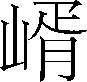
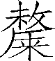
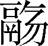
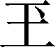

第一百一十八卷

 封禅书**[1]**第六

按照《正义》解释，“封禅”的意思有两种说法。一是在泰山上封土为坛以祭天，称为封；在泰山下一处小山上清理出一块地面以祭地，称为禅。合称封禅。二是认为祭天的册文（符）要用银绳缠束，打结的地方封以金泥，加盖印玺，称为封，其余相同。不论何种解释，封禅的意思总的是指封泰山、禅梁父（或其他泰山下的小山）的祭祀天地活动。但《封禅书》的实际内容几乎包括了所有的神祀，司马迁在《太史公自序》中解释说：“受命而王，封禅之符罕用，用则万灵罔不禋祀，追本诸神名山大川礼，作《封禅书》第六。”禋祀就是祭祀。封禅时，万灵同时受祀，因论封禅而追论诸神及名山大川的祭祀，这是司马迁写《封禅书》的基本设想。清梁玉绳指责说：“牵引郊社巡狩诸典礼，未免黩经。”这是对司马迁本意缺乏了解的缘故。

《封禅书》的意义还在于，司马迁以愤懑之情，对汉代统治者，尤其是对汉武帝的滥祭淫祀，进行了委婉而充分的揭露和嘲笑，为后世治史者留下了光辉的典范。由《封禅书》的命题不难看出，司马迁的本意不在于记述祭祀等礼制，而是为了对汉代弊政——围绕封禅的诸种活动——加以抨击。而班固《汉书》易名为《郊祀志》，如前所述，它的文既不限于郊祀（祭天为郊祀），于揭露封禅活动的主题也因而变得隐而不彰，可说是文、意两失，史、汉优劣，于此可见。至《晋书》定名为《礼志》，才算是正规的记述礼仪制度的篇名，从此可以看出，过去史家把制度史体的创始之功全部归于司马迁的八书，并不是贴切的说法，这原是一个不断摸索的过程。

***【原文】***

自古受命[2]帝王，曷[3]尝不封禅？盖有无其应而用事者矣[4]，未有睹符瑞见而不臻[5]乎泰山者也。虽受命而功[6]不至，至梁父矣而德不洽[7]，洽矣而日有不暇给[8]，是以即事用[9]希。《传》[10]曰：“三年不为礼[11]，礼必废；三年不为乐[12]，乐必坏。”每世之隆[13]，则封禅答[14]焉，及衰而息。厥旷[15]远者千有余载，近者数百载，故其仪阙然堙[16]灭，其详不可得而记闻云。

***【译文】***

[1]封禅书：古代君王即位后，在泰山上筑土为坛以祭天，表示报答上天之功，叫作封；在泰山下面小山梁父上划定地区以祭地，表示报地之功，叫作禅。

[2]受命：接受天命。

[3]曷（hé）：何。

[4]盖：推原之词。应（yìnɡ）：感应；灵应。者矣：表示已然的语助词。

[5]符瑞：古代以所谓祥瑞征兆，附会为君主获得上天赐予符命的象征。见（xiàn）：同“现”，显露。臻（zhēn）：至；及。

[6]功：事有成效叫作功。

[7]梁父（fǔ）：一作“梁甫”。泰山支脉，在今山东省泰安市东南。洽：和协；周遍。

[8]日有（yòu）不暇给：指事务繁多没有空闲时间。有，通“又”。暇，空闲。

[9]即事：当前的事。这里指当前封禅之事。用：施行；举行。

[10]《传（zhuàn）》：古时典籍都称“传”，此处指《论语·阳货》。

[11]礼：泛指古代贵族等级社会的一切礼仪法度，道德规范。如婚姻之礼，乡饮之礼，丧祭之礼，朝觐（jìn）之礼等。

[12]乐：音乐。古代五声（宫、商、角、徵、羽）、八音（金、石、丝、竹、匏、土、革、木）的总称。

[13]隆：兴隆旺盛。

[14]答：报答。

[15]厥：其。旷：空阔。

[16]阙：空缺。堙：埋没。

***【原文】***

《尚书》[1]曰，舜在璇玑[2]玉衡，以齐七政[3]。遂类于上帝[4]，禋于六宗[5]，望山川[6]，遍群神。辑[7]五瑞，择[8]吉月日，见四岳诸牧[9]，还瑞[10]。岁二月，东巡狩[11]，至于岱宗[12]。岱宗，泰山也。柴，望秩[13]于山川。遂觐[14]东后。东后者，诸侯也。合时月正日[15]，同律[16]度量衡，修五礼[17]，五玉三帛二生一死贽[18]。五月，巡狩至南岳。南岳，衡山[19]也。八月，巡狩至西岳。西岳，华山[20]也。十一月，巡狩至北岳。北岳，恒山[21]也。皆如岱宗之礼。中岳，嵩高[22]也。五载一巡狩。

***【译文】***

[1]《尚书》：儒家经典之一。尚，上古。由于其记载为上古典、谟、训、诰之文，所以称《尚书》。

[2]舜：传说中古代部落联盟首领。受尧禅为共主，建都蒲阪（今山西省永济市境），死后禅位于禹。详见《五帝本纪》。在：停留；观察。璇（xuán）：美玉。玑（jī）：古代观测天象的仪器，可以运转，汉代以来叫浑天仪。

[3]七政：日、月五星。古代认为观察天象吉凶，可知政治得失，故曰七政。

[4]类：通“”，祭天。一说指有大事临时举行的祭祀。上帝：天帝；天神。

[5]禋（yīn）：烟。升烟祭祀，使气上达神灵，为古代祭神之礼。六宗：指六种尊崇之神，各家说法不一：一说指四时、寒暑、水旱、日、月、星；一说指水、火、雷、风、山、泽；一说指天上日、月、星，地上河、海、岱；一说指天、地、春、夏、秋、冬。

[6]望山川：遥望祭祀九州名山大山。

[7]辑：聚集；验视。

[8]择：挑选。

[9]四岳：古代分管四季四方的长官。牧：一州的长官。

[10]还瑞：指舜验视诸侯所奉之圭璧后，再赐还之；以示瑞物虽受之于尧，经舜验视赐还，今后即为舜臣。

[11]巡狩（shòu）：古时天子视察诸侯叫巡狩，意谓巡视诸侯守土之责。狩，通“守”。

[12]岱宗：泰山别称岱。

[13]柴：祭祀的一种。秩：按次序而祭。

[14]觐（jìn）：朝见；接受朝见。

[15]合时月正日：谓四时气节，月份大小，日子的变动，都能配合齐整。时，四时；月，十二月；日，三百六十日。

[16]同：统一。律：音律。一说指法制。

[17]修：整治。五礼：指吉礼（祭祀）、凶礼（丧葬）、宾礼（朝会）、军礼（军事）、嘉礼（婚冠）。

[18]五玉：即五瑞。三帛：三公述职所持的礼物。二生：指活的羔羊与雁，是卿、大夫所持的礼物。一死：一只死雉，是士所持的礼物。贽（zhì）：古代会见时所送的礼物；也可指这种会见。

[19]衡山：此指今安徽霍山县西南之天柱山。

[20]华山：在今陕西省华阴市南。

[21]恒山：在今河北省曲阳县西北，不是现在山西的恒山。

[22]嵩高：即嵩山，亦作崧山，又名太室山。现在河南省登封市北。

***【原文】***

禹[1]遵之。后十四世，至帝孔甲[2]，淫[3]德好神，神渎[4]，二龙去之[5]。其后三世，汤[6]伐桀，欲迁夏社[7]，不可，作《夏社》。后八世[8]，至帝太戊[9]，有桑榖[10]生于廷，一暮大拱[11]，惧。伊陟[12]曰：“妖不胜[13]德。”太戊修德，桑榖死。伊陟赞巫咸[14]，巫咸[15]之兴自此始。后十四世，帝武丁得傅说[16]为相，殷复兴焉，称高宗。有雉登鼎耳雊[17]，武丁惧。祖己[18]曰“修德”。武丁从之，位以永宁。后五世，帝武乙慢[19]神而震死。一后三世，帝纣[20]淫乱，武王[21]伐之。由此观之，始未尝不肃祗[22]，后稍怠慢也。

***【译文】***

[1]禹：传说中古代部落联盟首领。姓姒，名文命，也称大禹、夏禹。

[2]孔甲：夏朝第十四代国君，在位三十一年。

[3]淫：邪恶。

[4]渎（dú）：怠慢；不敬。

[5]二龙去之，相传孔甲在位，天赐二龙，与之骑乘，后因孔甲对神怠慢不敬，二龙飞去，夏廷遂衰。

[6]汤：又名成汤。商代开国君主。子姓，名履，一名天乙。

[7]夏社：上文指夏代国家土神祠，下文《夏社》，《尚书》篇名，今已亡逸。

[8]后八世：指商汤以后第八世。

[9]太戊：商代第十代国君，在位时任用贤臣伊陟辅政，国事日治。

[10]桑榖：桑树和楮树。

[11]拱：两手合围。

[12]伊陟（zhì）：太戊臣，伊尹之子。

[13]胜：占优势。

[14]赞：陈说；告诉。巫咸：殷臣，主管祈神消灾之事。

[15]巫咸：指祈祷神灵消除灾祸的事情。

[16]武丁：即殷高宗。用傅说为相，殷政复兴，在位五十九年。傅说（yuè）：殷高宗贤相。初隐居傅岩（今山西省平陆县东），从事版筑操作，高宗梦说，访得之，举以为相，国事大治。

[17]雉：野鸡。鼎：古代炊器，金属制成，三足两耳。相传夏禹铸九鼎，作为传国重器。雊（ɡòu）：野鸡叫。

[18]祖己：殷代贤臣，曾进谏武丁治理民事要兢兢业业，用德化民，祭祀有常，不丰不薄。

[19]武乙：在位35年，昏乱无道。慢：通“嫚”，轻侮；傲慢。

[20]纣：商末代君主，子姓，名受（一作受德）。

[21]武王：姓姬，名发，周文王子。

[22]肃祗：恭敬；谨慎；兢兢业业。

***【原文】***

《周官》[1]曰，冬日至[2]，祀天于南郊[3]，迎长日[4]之至；夏日至[5]，祭地祇[6]。皆用乐舞[7]，而神乃可得而礼[8]也。天子祭天下名山大川，五岳视三公[9]，四渎视诸侯[10]，诸侯祭其疆[11]内名山大川。四渎者，江、河、淮、济也。天子曰明堂、辟雍[12]，诸侯曰泮宫。

***【译文】***

[1]《周官》：即《周礼》。儒家经典之一。周朝官制和战国时代各国制度的汇编。

[2]冬日至：即“冬至”。

[3]南郊：古时每年冬至日，于南郊建圜丘，即天坛，大祀皇天，所以也称南郊大祀。

[4]长日：指冬至以后，白天一天比一天长，故称长日。

[5]夏日至：指“夏至”。

[6]地祇（qí）：地神。

[7]乐舞：依据乐曲节拍而起舞。

[8]礼：致敬献礼于神灵。

[9]五岳：指东岳泰山、南岳衡山、北岳恒山、西岳华山、中岳嵩山。三公：周朝太师、太傅、太保称三公。

[10]四渎：古人当时对四条入海的大川的总称，即长江、黄河、淮水、济水。诸侯：这里特指仅次于三公而具有侯爵称号的诸侯，不是泛指五等诸侯。

[11]疆：疆界。

[12]明堂：古代阐明政教的厅堂。凡祭祀、朝会、敬老、尊贤等大典，都在这里举行。辟雍：周朝所设大学的名称。

***【原文】***

周公既相成王[1]，郊祀[2]后稷以配天，宗祀文王[3]于明堂以配上帝。自禹兴而修社祀[4]，后稷稼穑，故有稷祠，郊社所从来尚[5]矣。

***【译文】***

[1]周公：西周初期政治家。姓姬，名旦。相（xiànɡ）：辅助。成王：西周君主，姬诵。武王儿子。年幼即位，由叔父周公旦摄政。亲政后，继续分封诸侯，加强对地方的控制，奠定了西周统治的基础。

[2]郊祀：在郊外祭祀。

[3]宗祀：在宗庙祭祀。后凡祭祀祖宗，统称宗祀。文王：商末时周族领袖。姓姬，名昌。

[4]社祀：祭土神。

[5]郊社：冬至祭天叫“郊”，夏至祭地叫“社”。也泛指祭天地。尚：久远。

***【原文】***

自周克殷[1]后十四世，世益衰，礼乐废，诸侯恣[2]行，而幽王为犬戎[3]所败，周东徙雒邑[4]。秦襄公[5]攻戎救周，始列为诸侯。秦襄公既侯，居西垂[6]，自以为主少皞[7]之神，作西畤[8]，祠白帝[9]，其牲用驹黄牛羝羊[10]各一云。其后十六年，秦文公[11]东猎汧渭之间，卜居[12]之而吉。文公梦黄蛇自天下属[13]地，其口此于鄜[14]衍。文公问史敦[15]，敦曰：“此上帝之征，君其祠之。”于是作鄜畤[16]，用三牲[17]郊祭白帝焉。

***【译文】***

[1]周：朝代名。公元前11世纪，周武王灭商后建立，定都镐京。平王东迁以前称西周，东迁以后称东周。前256年为秦所灭。殷：朝代名。商王盘庚从奄（今山东省曲阜市境）迁到殷（今河南省安阳市西北的小屯村），因而商也称殷。从盘庚迁殷到纣亡国，一般称为殷，又整个商代也称商殷、殷商。

[2]恣：放纵；没有约束。

[3]幽王：西周国王，姬宫湦。犬戎：古代西戎部族名。

[4]雒（luò）邑：都邑名。周成王为了巩固对东方殷故土的统治，在周公主持下所筑。

[5]秦襄公：春秋时秦国君主。姓嬴。前777—前766年在位。西周消亡时，护送周平王东迁，被封为诸侯，赐给岐（今陕西省岐山县）以西地。

[6]垂：通“陲”，边境。

[7]少皞（hào）：亦作“少昊”。传说中古代东夷族首领，名挚。国号金天氏。

[8]西畤（zhì）：祭祀坛址的名称。畤，祭祀天地五帝的坛址。

[9]白帝：神话中的西方天帝，神名白招拒。

[10]（liú，也作“骝”）驹：赤身黑鬣的少壮马。羝（dī）羊：公羊。

[11]秦文公：东周初年秦国君主。前765—前716年在位，建都于汧。

[12]卜居：用占卜选择居地。

[13]黄蛇：古多以蛇神为白帝。属（zhǔ）：连接；附着。

[14]鄜（fū）：古地名，后设县。在今陕西省，改名富县。衍：山坡低平之处。

[15]史敦：秦之太史，名敦。

[16]鄜畤：坛址名称。

[17]三牲：牛、羊、猪。

***【原文】***

自未作鄜畤也，而雍旁故有吴阳武畤[1]，雍东有好畤[2]，皆废无祠。或曰：“自古以雍州[3]积高，神明之隩[4]，故立畤郊上帝，诸神祠皆聚云。盖黄帝[5]时尝用事，虽晚周亦郊焉。”其语不经[6]见，缙绅[7]者不道。

***【译文】***

[1]雍（yōnɡ）：邑名。秦德公建都于此。治所在今陕西省凤翔县南。吴阳：地名。在雍邑附近。武畤：秦时所建祭地神的处所。

[2]好畤：祭天的地方。

[3]雍州：古九州之一。现在陕西省北部、甘肃省西北部及青海省部分地区。

[4]隩：通“墺”，可居住的地方。

[5]黄帝：传说为上古中原各族共同的祖先。

[6]经：正常；时常。

[7]缙（jìn）绅：通“搢绅”“荐绅”。搢，插。绅，大带。意谓插笏于绅。将笏插于大带与革带之间，官吏的装束。

***【原文】***

作鄜畤后九年，文公获若石[1]云，于陈仓北阪[2]城祠之。其神或岁不至，或岁数来，来也常以夜，光辉若流星，从东南来集于祠城，则若雄鸡，其声殷云[3]，野鸡夜雊。以一牢[4]祠，命[5]曰陈宝。

***【译文】***

[1]若石：指其质像玉石。

[2]陈仓：山名。现在陕西省宝鸡市东。阪（bǎn）：山坡；斜坡。

[3]其声：指雄雉之神叶君，每一、二岁来与雌雉之神宝夫人会合，来时天空发出殷殷雷鸣之声，雌雉高声长鸣。

[4]一牢：牛羊猪各一头。

[5]命：称名；称呼。

***【原文】***

作鄜畤后七十八年，秦德公[1]既立，卜居雍，后子孙饮马于河，遂都[2]雍。雍之诸祠自此兴。用三百牢[3]于鄜畤。作伏祠[4]。磔狗邑[5]四门，以御蛊[6]灾。

***【译文】***

[1]秦德公：前677—前676年在位，建都于雍。

[2]都：定都；建都。

[3]三百牢：牛羊猪各三百头。

[4]伏祠：伏日祭祀的祠庙。夏至到立秋有三伏，即初伏、中伏、末伏。

[5]磔（zhé）：分裂牲畜肢体以祭神。邑：城邑。

[6]蛊（ɡǔ）：极毒之虫。聚集百虫于器皿中，半年打开后，别的虫都被一虫食尽。这种虫极毒，名之曰蛊。

***【原文】***

德公立二年卒。其后四年，秦宣公作密畤[1]于渭南，祭青帝[2]。

***【译文】***

[1]秦宣公：前675—前664年在位。密畤：祭祀坛址的名称。

[2]青帝：神话中的东方天帝，神名灵威仰。一说即太昊氏。

***【原文】***

其后十四年，秦缪公[1]立，病卧五日不寤[2]；寤，乃言梦见上帝，上帝命缪公平晋乱[3]。史书而记藏之府[4]。而后世皆曰秦缪公上天。

***【译文】***

[1]秦缪公：春秋时秦国君，姓嬴名任好。前659—前621年在位。任用百里奚、蹇叔为谋臣，称霸西戎。缪，通“穆”。

[2]寤（wù）：睡醒。

[3]晋：国名。公元前11世纪周朝分封的诸侯国。晋乱：晋献公宠幸骊姬，杀太子申生。献公死后群公子争立，相互残杀，致使晋国陷于混乱。

[4]史：官名。在君王左右掌管祭典和记事等。府：古代国家收藏财物、图书的处所。

***【原文】***

秦缪公即位九年，齐桓公[1]既霸，会诸侯于葵丘[2]，而欲封禅。管仲[3]曰：“古者封泰山禅梁父者七十二家[4]，而夷吾所记者十有[5]二焉。昔无怀氏封泰山，禅云云[6]；虙羲[7]封泰山，禅云云；神农[8]封泰山，禅云云；炎帝[9]封泰山，禅云云；黄帝封泰山，禅亭亭[10]；颛顼[11]封泰山，禅云云；帝俈[12]封泰山，禅云云；尧[13]封泰山，禅云云；舜封泰山，禅云云；禹封泰山，禅会稽[14]；汤封泰山，禅云云；周成王封泰山，禅社首[15]：皆受命然后得封禅。”桓公曰：“寡人北伐山戎[16]，过孤竹[17]，西伐大夏[18]，涉流沙[19]，束马悬车[20]，上卑耳之山[21]；南伐至召陵[22]，登熊耳山[23]以望江、汉。兵车之会三[24]，而乘车之会六[25]，九合[26]诸侯，一匡天下[27]，诸侯莫违我。昔三代[28]受命，亦何以异乎？”于是管仲睹桓公不可穷[29]以辞，因设之以事，曰：“古之封禅，鄗上之黍[30]，北里之禾[31]，所以为盛[32]；江、淮[33]之间，一茅三脊[34]，所以为藉[35]也。东海致比目之鱼[36]，西海致比翼之鸟[37]，然后物有不召而自至者十有五焉。今凤皇麒麟[38]不来，嘉谷不生，而蓬蒿藜莠[39]茂，鸱枭[40]数至，而欲封禅，毋乃[41]不可乎？”于是桓公乃止。是岁，秦缪公内晋君夷吾[42]。其后三置晋国之君[43]，平其乱。缪公立三十九年而卒。

***【译文】***

[1]齐桓公（？—前643）：春秋时齐国君主，姜小白。前685—前643年在位。

[2]葵丘：邑名。现在河南省兰考县东北。齐桓公于前651年，邀集鲁、宋、卫、郑、许、曹等国诸侯，在这里结盟，倡导尊贤育才，选拔贤能，永结盟好，借以巩固政权。

[3]管仲（？—前645年）：即管敬仲，名夷吾，字仲。春秋初期政治家，由鲍叔牙推荐，被齐桓公任命为卿。

[4]七十二家：指孔子登泰山，考察古代新建王朝前来泰山祭天的有七十多个，其他曾来泰山祀天而无从查考者，不可胜数。

[5]有：通“又”，用在整数与零数之间。

[6]无怀氏：古帝号，在太昊氏（仗羲）前。云云：山名。泰山支脉，在今山东省泰安市泰山区东南。一说在今山东省蒙阴县。

[7]虙羲：即伏羲。神话传说中人类的始祖。相传人类由他和女娲氏即兄妹相婚而产生。

[8]神农：相传我国远古时代农业和医药的发明者。生于姜水，以姜为姓。起于烈山，又号烈山氏（一作厉山氏）。以火德王，故又称炎帝。传说中远古人民过着渔猎、采集生活。他教民用木制作耒耜，从事农业生产。又说他曾亲尝百草，发现药材，教民治病。

[9]炎帝：此指传说中神农氏之后代。

[10]亭亭：泰山支脉。在今山东省泰安市泰山区西。

[11]颛顼：传说中古代部族首领。号高阳氏。

[12]帝俈：即帝喾。传说中古代部族首领，号高辛氏。

[13]尧：传说中父系氏族社会后期部落联盟首领。称陶唐氏，名放勋，史称唐尧。

[14]会（kuài）稽：山名。在今浙江省绍兴市南，本名防山、茅山、苗山。相传夏禹曾在此大会诸侯，计功封爵，始名会稽。

[15]社首：山名。在今山东省泰安市泰山区西南。一说在巨平（今山东省宁阳县境）。

[16]山戎：亦称北戎，即鲜卑族。现在今河北省迁安市一带，春秋时常为齐、郑、燕的祸患。

[17]孤竹：国名。姓墨胎氏。在今河北省卢龙县。

[18]大夏：古并州晋阳。在今山西太原市西南。

[19]流沙：在今山西境，平陆县东。

[20]束马悬车：包裹马脚，挂牢车辆，以防跌滑。

[21]卑耳之山：即辟耳山。在今山西省平陆县西北。

[22]召（shào）陵：地名。在今河南省漯河市郾城区东。齐桓公率诸侯伐楚，楚使屈完来盟于此。

[23]熊耳山：在河南省西部卢氏县南，秦岭东段支脉，主峰名全宝山。

[24]兵车之会三：指鲁庄公十三年（前681），齐桓公会盟鲁、宋、陈、蔡、邾等国于北杏（今山东省东阿县北），平定宋动乱；鲁釐公四年（前656），齐桓公率领诸侯之师，进军蔡国（今河南省新蔡县），蔡军溃败，又乘胜讨伐楚；鲁釐公六年（前654年），齐桓公会宋、陈、卫、曹等国伐郑。

[25]乘车之会六：鲁庄公十四年（前680）冬，桓公与鲁公、宋公、卫侯、郑伯会盟于鄄（今山东省鄄城县北）；十五年（前679）又会盟于鄄；十六年（前678）冬，桓公与鲁、宋、陈、卫、郑、许、滑、滕等国诸侯会盟于幽（今河北省北部及辽宁省一带）；釐公五年（前655），桓公率鲁、宋、陈、卫、郑、许、曹等国诸侯，会于首止（今河南省睢县东南），确定周惠王长子襄王的继承权；釐公八年（前652），桓公与鲁、宋、卫、许、曹、陈等国诸侯会盟于洮（今山东省鄄城县西），表示效忠周王朝；釐公九年（前651），会于葵丘。

[26]九合：指三次兵车会，六次乘车会。

[27]一匡天下：有两说，一、概括地说，拯救了天下；二、具体指确定周襄王的继承权。

[28]三代：指夏、商、周。

[29]穷：穷尽。指使其感到理屈词穷。

[30]鄗（hào）上：山名。现在河南省荥阳市有鄗山，疑即指此。又地名，在今河北省高邑县东。黍：黍子。子粒叫黄米，可供食用及酿酒。

[31]北里：地名。今不详。禾：粮食作物总称。又专指粟。

[32]盛（chénɡ）：装进祭器的粮食祭品。

[33]江淮：长江、淮河。

[34]茅：草名。有白茅、黄茅、青茅等。三脊：指茅草秆有三条棱，古称灵茅。

[35]藉（jiè）：以物衬垫。

[36]东海：古代泛指东方极远的海域。比目之鱼：鲽形目鱼类的总称。

[37]西海：古代泛称西方极远的海域。比翼之鸟：传说中的鸟名。一目一翼，互相辅助而飞。

[38]凤皇：相传详瑞之鸟。雄曰凤，雌曰凰。皇，通作“凰”。麒麟：传说中的神兽。似鹿而大，有一角，牛尾马蹄，腹毛黄，背毛五彩，不践生草，不食生物。

[39]蓬：草名。秋枯根拔，随风飘卷，故称飞蓬。蒿：草名。藜：一年生草本植物。莠：恶草的通称。蓬、蒿、藜、莠，皆秽恶之草。

[40]鸱（chī）：鹞鹰；猫头鹰之类。枭（xiāo）：通“鸮”，鸱鸮科鸟类的通称。

[41]毋乃：岂不。

[42]内：通“纳”，纳入。夷吾：即晋惠公。

[43]三置晋国之君：指秦穆公相继安置晋惠公、晋怀公、晋文公为君。

***【原文】***

其后百有余年，而孔子[1]论述六艺，传略[2]言易姓而王，封泰山禅乎[3]梁父者七十余王矣，其俎豆之礼不章[4]，盖难言之。或问禘[5]之说，孔子曰：“不知。知禘之说，其于天下也视其掌。”诗[6]云纣在位，文王受命，政不及泰山。武王克殷二年，天下未宁而崩[7]。爰周德之洽维[8]成王，成王之封禅则近之矣。及后陪臣[9]执政，季氏[10]旅于泰山，仲尼讥之。

***【译文】***

[1]孔子（前551—前479）：名丘，字仲尼。鲁国陬邑（今山东省曲阜市）人。

[2]传：阐述儒家经义的文字。一般文字记载也可称传。略：记载事迹大略的文字。

[3]乎：通“于”。

[4]章：彰明。

[5]禘（dì）：祭名。有时禘、殷禘、大禘三种。时禘，宗庙四时祭祀的一种。殷禘，帝王诸侯宗庙的大祭。大禘，帝王祭天，并以始祖和远祖配享。

[6]诗：疑为衍文。

[7]崩：旧称帝王死叫崩。

[8]爰：于是；因此。维：为；是。

[9]陪臣：诸侯的大夫对天子自称陪臣，大夫的家臣也叫陪臣。

[10]季氏：春秋鲁国季孙氏为鲁庄公弟季友后代，子孙世为鲁大夫，把持国政，权势很大。这里指季桓子。

***【原文】***

是时苌弘以方事周灵王[1]，诸侯莫朝周，周力少，苌弘乃明鬼神事，设射狸首[2]。狸首者，诸侯之不来者。依物怪[3]欲以致诸侯。诸侯不从，而晋人执杀苌弘[4]。周人之言方怪者自苌弘。

***【译文】***

[1]苌弘：周大夫，有方术，能招致神异。方：方术。指卜筮、星占等。周灵王：姬泄心。前571—前545年在位。

[2]狸首：本为逸诗篇名。狸，一名“不来”；首，先。

[3]物怪：奇异的动物。

[4]晋人执杀苌弘：周晋王时晋大夫范吉射、中行寅作乱，事情牵涉苌弘。晋人因此兴师进犯周室，捕杀苌弘。

***【原文】***

其后百余年，秦灵公[1]作吴阳上畤，祭黄帝[2]；作下畤[3]，祭炎帝[4]。

***【译文】***

[1]秦灵公：前424—前415年在位。

[2]黄帝：神话中的中央天帝，神名含枢纽。

[3]下畤：祭祀坛址的名称。

[4]炎帝：神话中的南方天帝，神名赤熛怒，一说即神农炎帝。

***【原文】***

后四十八年，周太史儋[1]见秦献公曰：“秦始与周合[2]，合而离[3]，五百岁当复合[4]，合十七年而霸王出[5]焉。”栎阳[6]雨金，秦献公自以为得金瑞，故作畦畤[7]栎阳而祀白帝。

***【译文】***

[1]太史：西周春秋时期管理起草文书，策命诸侯卿大夫，记载史事，编写史书，掌管国家典籍、天文、历法、祭祀等职的官。儋（dān）：人名。秦献公：嬴师隰。前384—前362年在位。

[2]秦始与周合：谓周、秦同为黄帝之后，在周朝别封非子于秦之前这段时间为合。

[3]合而离：谓周别封非子于秦为其附庸国之后，周秦分离。

[4]五百岁当复合：谓自非子封于秦，至秦孝公二年（前360）周显王分赠祭肉，周秦相亲，是为复合。

[5]合十七年而霸王出：指自秦孝公三年至十九年，周显王封秦孝公为霸王，则为霸者出现；至惠文王称王，则为王者出现。

[6]栎阳：地名。秦献公建都于此。现在陕西省西安市临潼区东北。

[7]畦（qí）畤：祭祀坛址的名称。

***【原文】***

其后百二十岁而秦灭周，周之九鼎[1]入于秦。或曰宋太丘[2]社亡，而鼎没于泗水彭城[3]下。

***【译文】***

[1]九鼎：传说夏禹铸了九只鼎，象征九州，三代时奉为传国之宝。秦灭周取了九鼎，其中一只沉于泗水，其余无考。

[2]太丘：地名。现在河南省永城市西北。

[3]泗水：在山东省中部，源出泗水县东蒙山南麓。彭城：县名。在今江苏省徐州市。

***【原文】***

其后百一十五年而秦并天下。

秦始皇既并天下而帝，或曰：“黄帝得土德，黄龙地螾见[1]。夏得木德，青龙止[2]于郊，草木畅茂。殷得金德，银自山溢。周得火德，有赤乌之符[3]。今秦变周，水德之时。昔秦文公出猎，获黑龙，此其水德之瑞。”于是秦更命河[4]曰“德水”，以冬十月为年首，色上[5]黑，度以六为名[6]，音上大吕[7]，事[8]统上法。

***【译文】***

[1]地螾（yǐn）：蚯蚓。见（xiàn）：通“现”，出现。

[2]止：居住；栖息。

[3]赤乌之符：相传周武王时有火从天而降，形如赤乌。

[4]更（ɡēnɡ）命：改名。河：指黄河。

[5]上：通“尚”，崇尚。

[6]度：度制。以六为名：如符规定为方六寸，长度规定为六尺为一步之类。

[7]大吕：十二律之一。

[8]事：国家一切政事。

***【原文】***

即帝位三年，东巡郡县，祠驺峄山[1]，颂秦功业。于是征从齐[2]、鲁之儒生博士七十人，至乎泰山下，诸儒生或议曰：“古者封禅为蒲车[3]，恶伤山之土石草木；埽地而祭，席用葅秸[4]，言其易遵也。”始皇闻此议各乖异[5]，难施用，由此绌[6]儒生。而遂除[7]车道，上自泰山阳[8]至巅，立石颂秦始皇帝德，明其得封也。从阴[9]道下，禅于梁父。其礼颇采太祝[10]之祀雍上帝所用，而封藏皆秘[11]之，世不得而记也。

***【译文】***

[1]驺峄山：山名。又名驺山或峄山。现在山东省邹城市东南。

[2]齐：国名。前11世纪周分封的诸侯国。姜姓。现在山东省北部。

[3]蒲车：用蒲草裹着车轮的车子。这种车子常用于祭告天地或者迎接贤士。

[4]葅（zū）：通“菹”，枯草。秸：农作物的茎秆，去皮可以做席。

[5]乖异：违背；不和睦。

[6]绌（chù）：通“黜”，贬退；排除。

[7]除：修治；修建。

[8]阳：山的南面，水的北面。

[9]阴：山的北面，水的南面。

[10]太祝：官名。

[11]秘：隐秘。

***【原文】***

始皇之上泰山，中阪[1]遇暴风雨，休于大树下。诸儒生既绌，不得与[2]用于封事之礼，闻始皇遇风雨，则讥之。

***【译文】***

[1]中阪：山坡中段。

[2]与（yù）：参与。

***【原文】***

于是始皇遂东游海上，行礼祠名山大川及八神，求仙人羡门[1]之属。八神将自古而有之，或曰太公[2]以来作之。齐所以为齐，以天齐也。其祀绝，莫知起时。八神：一曰天主，祠天齐。天齐渊水[3]，居临菑[4]南郊山下者。二曰地主，祠泰山梁父。盖天好阴，祠之必于高山之下，小山之上，命曰“畤”；地贵阳，祭之必于泽中圜丘[5]云。三曰兵主，祠蚩尤[6]。蚩尤在东平陆监乡[7]，齐之西境也。四曰阴主，祠三山[8]。五曰阳主，祠之罘[9]。六曰月主，祠之莱山[10]。皆在齐北，并[11]勃海。七曰日主，祠成山[12]。成山斗[13]入海，最居齐东北隅[14]，以迎日出云。八曰四时主，祠琅邪[15]。琅邪在齐东方，盖岁之所始。皆各用一牢具[16]祠，而巫祝[17]所损益，珪币[18]杂异焉。

***【译文】***

[1]羡门：古时仙人，名子高。

[2]太公：指姜太公。

[3]天齐渊水：泉水名。在临淄城南。

[4]临菑：都邑名。亦作“临淄”。齐国国都。在今山东省淄博市东北。

[5]圜丘：圆形高坛。

[6]蚩（chī）尤：相传为黄帝时诸侯，好兵喜乱，为黄帝所杀，其冢在东平陆监乡。

[7]东平陆：县名。在今山东省东平县东。监乡：乡名。

[8]三山：即参山。汉时在东莱郡曲成县境。在今山东省东莱市北。

[9]之罘：山名。也作芝罘。现在山东省烟台市北。

[10]莱山：在今山东省龙口市东南。

[11]并（bànɡ）：通“傍”，挨着。

[12]成山：现在山东省荣成市东北。

[13]斗：通“陡”。

[14]隅：角落。

[15]琅邪：山名。在山东省青岛市黄岛区西南。

[16]牢具：指盛在器皿中的牲畜。

[17]巫祝：祠庙中司祭礼的人。

[18]珪币：祭祀用的玉和帛。

***【原文】***

自齐威、宣[1]之时，驺子[2]之徒论著终始五德之运，及秦帝[3]而齐人奏之，故始皇采用之。而宋毋忌、正伯侨、充尚、羡门高[4]最后，皆燕人，为方[5]仙道，形解销化[6]，依于鬼神之事。驺衍以阴阳主运[7]显于诸侯，而燕齐海上之方士[8]传其术不能通，然则怪迂阿谀苟合[9]之徒自此兴，不可胜数[10]也。

***【译文】***

[1]齐威、宣：指齐威王、齐宣王。

[2]驺（zōu）子：即驺衍。驺，亦作“邹”。战国时的阴阳五行家。

[3]秦帝：秦国统一天下称帝。帝，动词。

[4]宋毋忌、正伯侨、充尚、羡门高：都是所谓仙人的名字。

[5]方：通“仿”，比拟；模仿。

[6]形解销化：古代方士说修道可以成仙，把死叫作“形解”，亦作“尸解”。意指解脱形体。

[7]阴阳主运：邹衍把古代关于“阴阳交替”的朴素辩证法思想和“天人感应”说结合，用它来比附新旧王朝的变更，说它可以主宰一个王朝的命运。

[8]方士：古代通晓神仙方术的人。

[9]怪迂：奇异脱离实际。苟合：无原则地附和。

[10]胜数（shēnɡ shǔ）：尽数。

***【原文】***

自威、宣、燕昭使人入海求蓬莱、方丈、瀛洲[1]。此三神山者，其傅[2]在勃海中，去人不远，患且至，则船风引而去。盖尝有至者，诸仙人及不死之药皆在焉。其物禽兽尽白，而黄金银为宫阙。未至，望之如云；及到，三神山反居水下。临之，风辄引去，终莫能至云。世主莫不甘心[3]焉。及至秦始皇并天下，至海上，则方士言之不可胜数。始皇自以为至海上而恐不及矣，使人乃赍[4]童男女入海求之。船交[5]海中，皆以风为解，曰未能至，望见之焉。其明年，始皇复游海上，至琅邪，过恒山，从上党[6]归。后三年，游碣石[7]，考入海方士，从上郡[8]归。后五年，始皇南至湘山[9]，遂登会稽，并海上，冀[10]遇海中三神山之奇药。不得，还至沙丘[11]崩。

***【译文】***

[1]燕昭：指战国时期的燕昭王。蓬莱、方丈、瀛洲：古代传说东海中有此三山，为神仙所居，总称“三神山”。

[2]傅：《汉书·郊祀志》作“传”。

[3]甘心：羡慕。

[4]赍（jī）：携带。

[5]交：开始进入。

[6]上党：郡名。治所在壶关（现在山西省长治市北），辖境相当今山西省东南部。

[7]碣石：山名。在河北省昌黎县北。

[8]上郡：郡名。治所在肤施（今陕西省榆林市榆阳区东南），地在今陕西省北部和内蒙古南端。

[9]湘山：一名君山，又名洞庭山。在湖南省岳阳县西洞庭湖中。

[10]冀：希望。

[11]沙丘：在今河北省广宗县西北大平台。

***【原文】***

二世[1]元年，东巡碣石，并海南，历泰山，至会稽，皆礼祠之，而刻勒始皇所立石书旁，以章[2]始皇之功德。其秋，诸侯畔秦。三年而二世弑[3]死。

***【译文】***

[1]二世：指秦二世嬴胡亥。二世元年，前209年。

[2]章：表彰；表扬。

[3]弑：古代称子杀父、臣杀君为“弑”。此处指秦二世为赵高所杀。

***【原文】***

始皇封禅之后十二岁，秦亡。诸儒生疾[1]秦焚《诗》《书》，诛僇[2]文学，百姓怨其法，天下畔之，皆讹曰：“始皇上泰山，为暴风雨所击，不得封禅。”此岂所谓无其德而用事者邪？

***【译文】***

[1]疾：厌恶；憎恶。

[2]僇（lù）：通“戮”，杀戮。

***【原文】***

昔三代之居皆在河、洛[1]之间，故嵩高为中岳，而四岳各如其方，四渎咸在山东[2]。至秦称帝，都咸阳[3]，则五岳、四渎皆并在东方。自五帝[4]以至秦，轶[5]兴轶衰，名山大川或在诸侯，或在天子，其礼损益世殊，不可胜记。及秦并天下，令祠官所常奉天地名山大川鬼神可得而序[6]也。

***【译文】***

[1]河、洛：指黄河、洛河。

[2]山东：战国、秦、汉时称崤山或华山以东为山东，也指战国时秦以外的六国地域。

[3]咸阳：都邑名。战国时秦孝公开始建都于此。现在陕西省咸阳市东北。

[4]五帝：相传中的中国原始社会末期部落或部落联盟的领袖。指黄帝、颛顼、帝喾、唐尧、虞舜。

[5]轶（dié）：通“迭”，交替地；轮流地。

[6]序：依次序排列。

***【原文】***

于是自殽[1]以东，名山五，大川祠二。曰太室。太室，嵩高也。恒山，泰山，会稽，湘山。水曰济，曰淮。春以脯酒为岁[2]祠，因泮[3]冻，秋涸冻[4]，冬塞祷[5]祠。其牲用牛犊各一，牢具珪币各异。

***【译文】***

[1]殽：即崤山。现在河南省西部。

[2]脯（fǔ）：干肉。岁：一年的农事收成。

[3]泮（pàn）：解；散。

[4]涸（hé）冻：结冻。涸，凝结。

[5]塞（sài）：通“赛”。祷：祷告；讫求神保佑。

***【原文】***

自华以西，名山七，名川四。曰华山，薄山[1]。薄山者，衰山也。岳山[2]，岐山[3]，吴岳[4]，鸿冢[5]，渎山[6]。渎山，蜀之汶[7]山。水曰河，祠临晋[8]；沔[9]，祠、汉中[10]；湫渊[11]，祠朝[12]；江水[13]，祠蜀[14]。亦春秋泮涸祷塞，如东方名山川；而牲牛犊牢具珪币各异。而四大冢[15]鸿、岐、吴、岳，皆有尝禾[16]。

***【译文】***

[1]薄山：即襄山。在今山西省永济市南。

[2]岳山：山名。在陕西省武功县境。

[3]岐山：山名。在陕西省岐山县东北。

[4]吴岳：又名吴山。在陕西省陇县西南。

[5]鸿冢：山名。现在陕西省凤翔县东。

[6]渎山：即四川岷山。

[7]汶：通“岷”。

[8]临晋：县名。现在陕西省大荔县东。

[9]沔（miǎn）：水名。源头出自陕西省略阳县，是汉水的上游。

[10]汉中：郡名。这里指郡治南郑（今陕西省汉中市东）。

[11]湫（jiǎo）渊：湖名。现在宁夏回族自治区固原市原州区。

[12]朝：县名。现在宁夏回族自治区固原市原州区东南。

[13]江水：指长江。

[14]蜀：郡名。这里指郡治成都。

[15]冢：山顶。指高大的山。

[16]尝禾：用新谷举行祭祀。尝，祭名。

***【原文】***

陈宝节来祠。其河加有尝醪[1]。此皆在雍州[2]之域，近天子之都，故加车一乘，驹四。

***【译文】***

[1]醪：汁滓混合的酒，即酒酿。

[2]雍州：古九州之一。地域约当今陕西、甘肃、宁夏、青海等省区。

***【原文】***

霸、产、长水、沣、涝、泾[1]、渭皆非大川，以近咸阳，尽得比山川祠，而无诸加。

***【译文】***

[1]霸：灞水，古滋水。现在陕西省西安市东入渭水。产：水。源出自陕西蓝田县西南山谷中，至西安市东南合灞水入渭。长水：源出陕西省蓝田县境，至西安市长安区东南流入浐水。沣：水名。源出陕西省西安市鄠邑区东南终南山，北流至咸阳市东南入渭河。涝：水名。源出自陕西省西安市鄠邑区西南，流入水后再入渭河。泾：水名。源出宁夏固原市原州区南六盘山，往东南流至陕西西安市高陵区入渭河。

***【原文】***

汧、洛[1]二渊，鸣泽、蒲山、岳山[2]之属，为小山川，亦皆岁祷塞泮涸祠，礼不必同。

***【译文】***

[1]洛：洛水有二：一、今名北洛河。在陕西省北部，发源于定边县南梁山，流入渭河。二、今名洛河，本名雒水。在河南省西部，源出自陕西省华山，流入黄河，这里可能是指前者。

[2]鸣泽：泽名。在河北省涿州市北。蒲山：山名。无考。岳（xū）山：山名。在华山西。

***【原文】***

而雍有日、月、参、辰、南北斗、荧惑、太白、岁星、填星、辰星[1]、二十八宿、风伯、雨师、四海、九臣、十四臣、诸布、诸严、诸逑之属，百有余庙。西[2]亦有数十祠。于湖[3]有周天子祠。于下邽有天神[4]。沣、滈有昭明、天子辟池[5]。于杜、亳有三社主之祠、寿星[6]祠；而雍菅庙亦有杜主[7]。杜主，故周之右将军，其在秦中[8]，最小鬼之神者。各以岁时奉祠。

***【译文】***

[1]参（shēn）：星官名。二十八宿之一。辰：即心宿。二十八宿之一。南北斗：南斗、北斗，都是斗宿的别名，二十八宿之一。荧惑：即火星。太白：即金星。岁星：即木星。填（zhèn）星：即土星。辰星：即水星。

[2]西：县名。现在甘肃省天水市麦积区西南。

[3]湖：县名。在今河南省灵宝市境。

[4]下邽（ɡuī）：县名。在今陕西省渭南市临渭区东北。天神：古人所想象的天上日、月、星辰、风雨的主宰。

[5]滈（hào）：水名。在陕西省西安市西。今已废绝。昭明：火星的又一别名。辟池：即滈池。

[6]杜：县名。现在陕西省西安市东南。亳（bó）：亭名。在杜县境。社主：《汉书·郊祀志》作“杜主”，照应下文以“杜主”为是。寿星：南极老人星。

[7]菅（jiān）：茅草。杜主：杜伯，周宣王的大夫，封于杜地，无罪被杀，人以为神。

[8]秦中：地区名。现在陕西省中部，因春秋、战国时为秦国而得名。

***【原文】***

唯雍四畤上帝[1]为尊，其光景动人民唯陈宝。故雍四畤，春以为岁祷，因泮冻，秋涸冻，冬塞祠，五月尝驹[2]，及四仲之月[3]月祠，若陈宝节来一祠。春夏用骍[4]，秋冬用。驹四匹，木禺龙栾车[5]一驷，木禺车马一驷[6]，各如其帝色。黄犊羔[7]各四，珪币各有数，皆生瘗[8]埋，无俎豆[9]之具。三年一郊。秦以冬十月为岁首，故常以十月上宿[10]郊见，通权火[11]，拜于咸阳之旁，而衣上白，其用如经[12]祠云。西畤、畦畤，祠如其故，上不亲往。

***【译文】***

[1]四畤上帝：在鄜畤祭典白帝，在密畤祭典青帝，在吴阳上畤祭典黄帝，在吴阳下畤祭典炎帝（赤帝）。鄜畤在咸阳东，其他三鄜畤在咸阳西。

[2]尝驹：用少壮的骏马举行祭祀。

[3]四仲之月：四季的中间一个月，即二、五、八、十一月。

[4]骍（xīnɡ）：赤色马。

[5]木禺（ǒu）龙：木头雕的龙。栾（luán）车：有铃的车。栾，通“銮”，车辆的马铃。

[6]驷（sì）：古代四马一车，因以称一车所驾之四马或驾四马之车。这里指四条龙。

[7]羔：小羊。

[8]瘗（yì）：埋葬。

[9]俎豆：祭祀宴享的祭品。俎，祭祀时用以盛祭品的礼器，青铜制，也有木制漆饰的。豆，盛干肉一类食物的器皿。

[10]上宿：皇上斋戒，以示崇敬。

[11]权火：烽火。

[12]经：经常。指常行的仪式。

***【原文】***

诸此祠皆太祝常主，以岁时奉祠之。至如他名山川诸鬼及八神之属，上过则祠，去则已[1]。郡县远方神祠者，民各自奉祠，不领于天子之祝官[2]。祝官有秘祝[3]，即有灾祥[4]，辄[5]祝祠移过于下。

***【译文】***

[1]已：停止。

[2]祝官：主管祭祀的官员。

[3]秘祝：官名。

[4]灾祥：灾异和吉祥。这里指灾异。

[5]辄：就；总是。

***【原文】***

汉兴，高祖之微[1]时，尝杀大蛇。有物[2]曰：“蛇，白帝子也，而杀者赤帝[3]子。”高祖初起，祷丰枌榆社[4]。徇沛[5]，为沛公，则祠蚩尤，衅[6]鼓旗。遂以十月至灞上[7]，与诸侯平[8]咸阳，立为汉王。因以十月为年首，而色上赤。

***【译文】***

[1]高祖：汉高帝刘邦的庙号。微：卑贱。

[2]物：指鬼神。

[3]赤帝：神话中的南方天帝。

[4]丰枌榆社：指汉高帝故乡丰邑枌榆乡的土地神。

[5]徇（xùn）：攻取；巡行。沛（pèi）：现在江苏省沛县。

[6]衅：古代新制器物成功，杀牲以祭，用血涂缝隙之称。

[7]灞（bà）上：地名。现在陕西省西安市东南。

[8]平：平定。

***【原文】***

二年，东击项籍[1]而还入关，问：“故秦时上帝祠何帝也？”对曰：“四帝，有白、青、黄、赤帝之祠。”高祖曰：“吾闻天有五帝，而有四，何也？”莫知其说。于是高祖曰：“吾知之矣，乃待我而具五也。”乃立黑帝[2]祠，命曰北畤[3]。有司进祠，上不亲往。悉召故秦祝官，复置太祝、太宰[4]，如其故仪礼。因令县为公社[5]。下诏曰：“吾甚重祠而敬祭。今上帝之祭及山川诸神当祠者，各以其时礼祠之如故。”

***【译文】***

[1]二年：汉王二年，前205年。项籍（前232—前202）：名籍，字羽。秦末农民起义军首领。下相（今江苏省宿迁市宿城区西南）人。

[2]黑帝：神话传说中的北方天帝，神名叶光纪。一说即颛顼。

[3]北畤：祭祀坛址的名称。

[4]太宰：官名。掌管祭祀贡享。

[5]公社：官府祭奠天地神鬼的地方。

***【原文】***

后四岁，天下已定，诏御史[1]，令丰谨治枌榆社，常以四时春以羊彘[2]祠之。令祝官立蚩尤之祠于长安。长安置祠祝官、女巫。其梁[3]巫，祠天、地、天社、天水、房中、堂上[4]之属；晋[5]巫，祠五帝、东君、云中君、司命、巫社、巫祠、族人、先炊[6]之属；秦[7]巫，祠社主、巫保、族纍[8]之属；荆[9]巫，祠堂下、巫先、司命、施糜[10]之属；九天巫[11]，祠九天；皆以岁时祠宫中。其河巫[12]祠河于临晋，而南山巫祠南山秦中[13]。秦中者，二世皇帝。各有时日。

***【译文】***

[1]御史：官名。秦以前本为史官。

[2]彘（zhì）：猪。

[3]梁：指战国时的魏地。因魏国从惠王以后一直建都大梁，故又别称梁国。

[4]天社、天水、房中、堂上：都是神名。

[5]晋：指春秋时的晋地。

[6]东君：日神。云中君：云神。司命、巫社、巫祠、族人、先炊：都是神名。

[7]秦：指战国时的秦地。

[8]社主：仍以作“杜主”为宜。巫保、族纍：神名。

[9]荆：指春秋战国时的楚地。楚国建国于荆山一带，故又别称荆。

[10]堂下、巫先、施糜：都是神名。

[11]九天巫：专管祭祀九天的巫师。九天，指中央和八方之天。

[12]河巫：专管祭奠黄河的巫师。

[13]南山：山名。现在秦岭终南山。秦中：这里借指秦二世。因他为赵高所杀，魂魄变成了厉鬼。

***【原文】***

其后二岁，或曰周兴而邑邰[1]，立后稷之祠，至今血食[2]天下。于是高祖制诏[3]御史：“其令郡国[4]县立灵星祠，常以岁时祠以牛。”

***【译文】***

[1]邰（tái）：一作“”。邑名。现在陕西省武功县西南。

[2]血食：享受祭祀。因祭祀宰牲牢。

[3]制诏：汉代皇帝文告的两种形式：制书命令三公，传达州郡；诏书布告臣民。

[4]郡国：汉初，郡和王国同为地方高级行政区划。

***【原文】***

高祖十年春，有司请令县常以春二月及腊祠社稷[1]以羊豕，民里社[2]各自财以祠。制曰：“可。”

***【译文】***

[1]有司：主管官吏。腊：夏历十二月祭名，因借以指十二月。社稷：古代帝王、诸侯所祭祀的土神和谷神。

[2]里社：古时里中供奉土地神的处所。

***【原文】***

其后十八年，孝文帝[1]即位。即位十三年，下诏曰：“今秘祝移过于下，朕[2]甚不取。自今除之。”

***【译文】***

[1]孝文帝：刘恒。前179—前157年在位。

[2]朕（zhèn）：从秦始皇起专用为皇帝的自称。

***【原文】***

始名山大川在诸侯，诸侯祝各自奉祠，天子官不领[1]。及齐、淮南国[2]废，令太祝尽以岁时致礼如故。

***【译文】***

[1]领：管领。

[2]齐：汉初封国名。始王为汉高帝长子刘肥。境内有泰山。淮南国：汉初封国名。

***【原文】***

是[1]岁，制曰：“朕即位十三年于今，赖宗庙之灵，社稷之福，方内艾安[2]，民人靡[3]疾。间者比年登[4]，朕之不德，何以飨[5]此？皆上帝诸神之赐也。盖闻古者飨其德必报其功，欲有增诸神祠。有司议增雍五畤路车[6]各一乘，驾被[7]具；西畤畦畤禺车各一乘，禺马四匹，驾被具；其河、湫、汉水[8]加玉各二；及诸祠，各增广坛场，珪币俎豆以[9]差加之。而祝釐[10]者归福于朕，百姓不与[11]焉。自今祝致敬，毋[12]有所祈。”

***【译文】***

[1]是：此；这。

[2]方内：四境之内；国内。艾（yì）安：太平安定。

[3]靡：无；不。

[4]间者：近来。登：庄稼成熟。

[5]飨（xiǎnɡ）：通“享”，享受。

[6]路车：亦作“辂车”。帝王诸侯乘坐的车子。

[7]被：通“披”。

[8]汉水：即汉江。发源于陕西省西南部宁强县，东南流经陕西省南部，湖北省西北部和中部，在武汉市汇入长江。

[9]以：按照。

[10]釐（xī）：通“禧”，福。

[11]与（yù）：在其中。

[12]毋：莫；不要。

***【原文】***

鲁人公孙臣[1]上书曰：“始秦得水德，今汉受之，推终始传，则汉当土德，土德之应黄龙见。宜改正朔[2]，易服色[3]，色上黄。”是时丞相张苍[4]好律历，以为汉乃[5]水德之始，故河决金堤[6]，其符[7]也。年始冬十月，色外黑内赤，与德相应。如公孙臣言，非也。罢之。后三岁，黄龙见成纪[8]。文帝乃召公孙臣，拜为博士，与诸生草[9]改历服色事。其夏，下诏曰：“异物之神见于成纪，无害于民，岁以有年。朕祈郊上帝诸神，礼官议，无讳[10]以劳朕。”有司皆曰：“古者天子夏亲郊，祀上帝于郊，故曰郊。”于是夏四月，文帝始郊见雍五畤祠，衣皆上赤。

***【译文】***

[1]鲁：指春秋时的鲁地，现在山东省泰山以南地区。公孙臣：方士。

[2]正朔：指每年的第一天。我国古代夏历以孟春之月（建寅之月）为岁首，商、周两代各向上推一月，即商以季冬之月（建丑之月，夏历十二月）为岁首，周以仲冬之月（建子之月，夏历十一月）为岁首，秦代改以夏历十月（孟冬之月，建亥之月）为岁首，汉初沿用秦历。正，阴历每年的第一个月。朔，每月的初一。

[3]易：改变。服色：古时每一朝代所定的车马祭祀的颜色。如夏尚黑色，商尚白色，周尚赤色，各代以其所崇尚之色为正色。

[4]丞相：官名。始于战国时，是百官之长。张苍：阳武（今河南省原阳县东南）人。秦时为御史，后归汉。精通律历，历任御史大夫、丞相，封北平侯。

[5]乃：是；就是。

[6]决：冲破堤岸。金堤：指修筑得很坚固的江河堤塘。这里指西汉时东郡一带黄河两岸石筑的金堤。

[7]符：符应。

[8]成纪：县名。即今甘肃省秦安县北。

[9]草：草拟；起稿。

[10]讳：隐瞒；忌讳。

***【原文】***

其明年，赵人新垣平[1]以望气见上，言“长安东北有神气，成五采，若人冠[2]焉。或曰东北神明之舍，西方神明之墓也。天瑞[3]下，宜立祠上帝，以合符应”。于是作渭阳五帝庙[4]，同宇，帝一殿，面各五门，各如其帝色[5]。祠所用及仪亦如雍五畤。

***【译文】***

[1]赵：指战国时的赵地。新垣平：方士。姓新垣，名平。

[2]冠：官吏所戴的帽子。，通“冕”。

[3]天瑞：天降吉祥。

[4]渭阳五帝庙：旧址在今咸阳市东北。

[5]各如其帝色：东方青色，南方赤色，西方白色，北方黑色，中央黄色。

***【原文】***

夏四月，文帝亲拜霸、渭之会[1]，以郊见渭阳五帝。五帝庙南临渭，北穿蒲池[2]沟水，权火举而祠，若光辉然属[3]天焉。于是贵平上大夫[4]，赐累千金。而使博士诸生刺《六经》中作《王制》[5]，谋议巡狩封禅事。

***【译文】***

[1]霸：灞水。渭：渭水。会：汇合口。

[2]蒲池：可能就是秦始皇修建的人工湖——兰池，旧址在今咸阳市东北。

[3]属：连接。

[4]贵：尊宠，宠信。上大夫：官名。

[5]刺：采取。《王制》：书名。

***【原文】***

文帝出长门[1]，若见五人于道北，遂因其直[2]北立五帝坛，祠以五牢具。

***【译文】***

[1]长门：亭名。现在陕西省西安市临潼区。

[2]因：根据；就着。直：通“值”，当其处。

***【原文】***

其明年，新垣平使人持玉杯，上书阙下[1]献之。平言上曰：“阙下有宝玉气来者。”已视之，果有献玉杯者，刻曰：“人主延寿”。平又言“臣候日再中[2]”。居顷之，日却[3]复中。于是始更[4]以十七年为元年，令天下大酺[5]。

***【译文】***

[1]阙下：指君王宫殿之下。

[2]日再中：太阳再次在天当中。

[3]却：退。

[4]更：调换；改变。

[5]大酺（pú）：盛大聚饮。皇帝准许臣民盛大聚会饮宴。

***【原文】***

平言曰：“周鼎亡在泗水中，今河溢通泗，臣望东北汾阴[1]直有金宝气，意[2]周鼎其出乎？兆[3]见不迎则不至。”于是上使使治庙汾阴南，临河，欲祠出周鼎。

***【译文】***

[1]汾阴：县名。在今山西省万荣县西南。

[2]意：意料。

[3]兆：征象；预兆。

***【原文】***

人有上书告新垣平所言气神事皆诈[1]也。下平吏治，诛夷[2]新垣平。自是之后，文帝怠于改正朔服色神明之事，而渭阳、长门五帝使祠官领，以时致礼，不往焉。

***【译文】***

[1]诈：欺诈。

[2]诛夷：杀戮；消灭。除灭其家室宗族。

***【原文】***

明年，匈奴数入边，兴兵守御。后岁少[1]不登。

***【译文】***

[1]少：稍；稍微。

***【原文】***

数年而孝景即位。十六年，祠官各以岁时祠如故，无有所兴，至今天子。今天子初即位，尤敬鬼神之祀[1]。

***【译文】***

[1]本篇以本段以下内容与《今上（孝武）本纪》完全相同，只是个别字句有出入。

***【原文】***

元年，汉兴已六十余岁矣，天下艾安，搢绅之属皆望天子封禅改正度[1]也，而上乡[2]儒术，招贤良[3]，赵绾、王臧等以文学为公卿[4]，欲议古立明堂城南，以朝诸侯。草巡狩、封禅、改历服色事未就。会[5]窦太后治黄老言，不好儒术，使人微伺得赵绾等奸利[6]事，召案[7]绾、臧，绾、臧自杀，诸所兴为皆废。

后六年，窦太后崩。其明年，征文学之士公孙弘[8]等。

***【译文】***

[1]正度：正朔和服色制度。

[2]乡：通“向”，趋向；向往。

[3]贤良：汉代选拔官吏的科目之一。

[4]赵绾（wǎn）：著名的儒者，这时任御史大夫。王臧：著名的儒者，这时任郎中令。公卿：原指三公九卿，后泛指朝廷的高级官员。

[5]会：恰逢。窦太后（？—前135或129）：汉文帝皇后。景帝继位后，被尊为皇太后。

[6]奸利：以奸诈方法谋求私利。

[7]案：通“按”，审查；拷问。

[8]公孙弘（前200—前121）：姓公孙，名弘，菑川薛（在今山东省寿光市南）人。

***【原文】***

明年，今上初至雍，郊见五畤。后常三岁一郊[1]。是时上求神君[2]，舍之上林中蹏氏观[3]。神君者，长陵[4]女子，以子死，见神于先后宛若[5]。宛若祠之其室，民多往祠。平原君[6]往祠，其后子孙以尊显。及今上即位，则厚礼置祠之内中，闻其言，不见其人云。

***【译文】***

[1]三岁一郊：三年中第一年祭天，第二年祭地，第三年祭五畴。每三年轮流一遍。

[2]神君：对神灵的敬称。

[3]上林：苑名。旧址在陕西省西安市西南鄠邑区、周至县界。蹏氏观：上林苑中宫观名。

[4]长陵：县名。西汉五陵之一的高祖陵墓所在地。故城在今西安市北。

[5]先后：兄弟妻相互称“先后”，即妯娌。宛若：人名。

[6]平原君：武帝外祖母。

***【原文】***

是时，李少君亦以祠灶、谷道[1]、却老方见上，上尊之。少君者，故深泽侯舍人[2]，主方[3]。匿其年及其生长[4]，常自谓七十，能使物[5]，却老。其游以方遍诸侯。无妻子。人闻其能使物及不死，更馈遗[6]之，常余金钱衣食。人皆以为不治生业[7]而饶给，又不知其何所人，愈信，争事[8]之。少君资[9]好方，善为巧发奇中[10]。尝从武安侯[11]饮，坐中有九十余老人，少君乃言与其大父游射[12]处，老人为儿时从其大父，识其处，一坐尽惊。少君见上，上有故[13]铜器，问少君。少君曰：“此器齐桓公十年陈于柏寝[14]。”已而案其刻[15]，果齐桓公器。一官尽骇，以为少君神，数百岁人也。

***【译文】***

[1]灶：灶神。谷道：一说是种谷得金的方法，一说是长生不老的方法。

[2]故：死亡。深泽侯：指赵将夜。舍人：家臣。战国及汉初王公贵官都有舍人。

[3]主方：主管方术、医药之事。

[4]匿：隐瞒。生长：指生平经历。

[5]使物：一、驱使鬼神；二、使用药物。

[6]更：连续；相继。馈遗（wèi）：赠予。

[7]治：管理。泛指进行某种工作。生业：职业；产业。

[8]事：侍奉。

[9]资：资质，即人的天资禀赋。

[10]巧发奇中（zhònɡ）：善于伺机发言，且每能猜中、应验。

[11]武安侯：田蚡（fén）。

[12]大父：祖父。游射：游乐射击。

[13]故：古旧。

[14]陈：陈放。柏寝：春秋时齐国的台名。

[15]已而：随即。案：通“按”。刻：指刻在上面的文字。

***【原文】***

少君言上曰：“祠灶则致[1]物，致物而丹沙[2]可化为黄金，黄金成以为饮食器则益寿，益寿而海中蓬莱仙者乃可见，见之以封禅则不死，黄帝是也。臣尝游海上，见安期生[3]，安期生食巨枣[4]，大如瓜。安期生仙者，通蓬莱中，合[5]则见人，不合则隐。”于是天子始亲祠灶，遣方士入海求蓬莱安期生之属[6]，而事化丹沙诸药齐[7]为黄金矣。

***【译文】***

[1]致：招引；招来。

[2]丹沙：即丹砂（硫化汞）。古代方士说可用它炼制长生不老药，又说可用它炼制黄金。

[3]安期生：先秦时方士。后代传说为道家仙人。

[4]巨枣：《今上本纪》和《汉书·郊祀志》作“臣枣”。相传中的仙果，后因有安期枣之称。

[5]合：和合；融洽。此指道相合。

[6]属（shǔ）：种类；等辈。

[7]事：从事。齐：通“剂”。

***【原文】***

居久之，李少君病死。天子以为化去不死，而使黄锤史宽舒[1]受其方。求蓬莱安期生莫能得，而海上燕、齐[2]怪迂之方士多更来言神事矣。

***【译文】***

[1]黄：县名。治所在今山东省龙口市东。锤：县名。治所在今山东省烟台市福山区。《秦始皇本纪》“过黄锤”。疑初为一县，后乃分治。史：掌管文书的小吏。宽舒：后任祠官。

[2]燕（yān）：国名。前11世纪分封的诸侯国。辖今河北省北部和辽宁省西端。齐：国名。前11世纪周分封的诸侯国。辖今山东省北部，后又扩充到山东省东部。此指原齐国地区。

***【原文】***

亳人谬忌奏祠太一方，曰：“天神贵者太一，太一佐[1]曰五帝。古者天子以春秋祭太一东南郊，用太牢[2]，七日，为坛开八通之鬼道[3]。”于是天子令太祝[4]立其祠长安东南郊，常奉祠如忌方。其后人有上书，言“古者天子三年壹用太牢祠神三一[5]：天一、地一[6]、太一”。天子许之，令太祝领[7]祠之于忌太一坛上，如其方。后人复有上书，言“古者天子常以春解祠[8]，祠黄帝用一枭破镜[9]；冥羊[10]用羊祠；马行[11]用一青牡马；太一、泽山君地长[12]用牛；武夷君[13]用干鱼；阴阳使者[14]以一牛”。令祠官领之如其方，而祠于忌太一坛旁。

***【译文】***

[1]亳（bó）：地名。有南亳、北亳、西亳；南亳在今河南省商丘市西南；北亳在今山东省曹县南，西亳在河南省偃师市西。谬忌：方士。济阴郡薄县人。太一：也作“泰一”神。佐：辅佐。这里指辅佐太一的神。

[2]太牢：指牛、羊、猪三牲。

[3]坛：土筑的高台，古代用于祭祀、朝会、盟誓等大事。八通之鬼道：八面筑有台阶的坛，作为神鬼来往的通道。

[4]太祝：掌管祭祀的官。

[5]壹：通“一”。

[6]天一、地一：都是神名。

[7]领：管领。指祀天地于太一坛。

[8]解祠：为了消灾解祸而祭奠。

[9]枭（xiāo）：传说中吃母的恶鸟。破镜：也称“獍”（jìnɡ）。相传吃父的猛兽，似虎豹而小。

[10]冥羊：神名。

[11]马行：神名。

[12]泽山君地长（zhǎnɡ）：神名。

[13]武夷君：武夷山神。武夷山在福建省武夷山市崇安街道境。

[14]阴阳使者：主司阴阳之神。

***【原文】***

其后，天子苑[1]有白鹿，以其皮为币[2]，以发瑞应[3]，造白金[4]焉。

***【译文】***

[1]苑：养禽兽、植树木的地方，后多指帝王游乐打猎的园林。

[2]币：皮币。既作货币，又作用以垫璧的礼品。

[3]瑞应：吉祥的征象。

[4]白金：本指银，这里指银锡合金。

***【原文】***

其明年，郊雍，获一角兽[1]，若麃[2]然。有司曰：“陛下肃祗郊祀，上帝报享[3]，锡一角兽，盖麟[4]云。”于是以荐[5]五畤，畤加一牛以燎[6]。锡诸侯白金，风符应[7]合于天也。

***【译文】***

[1]一角兽：有一只角的兽。

[2]麃：通“麅（狍）”。鹿一类的动物，形似獐，牛尾，一角。

[3]报享：酬报祭享之德。

[4]锡：赐。麟：即麒麟。传说外形像鹿，一只角，全身有鳞甲，牛尾。

[5]荐：进献。

[6]燎：烧柴火祭天的祭礼。

[7]风：示意；暗示。符应：以所谓天降祥瑞来附会人事。

***【原文】***

于是济北王[1]以为天子且封禅，乃上书献太山及其旁邑[2]，天子以他县偿之。常山王[3]有罪，迁[4]，天子封其弟于真定[5]，以续先王祀[6]，而以常山为郡，然后五岳皆在天子之郡。

***【译文】***

[1]济北王：刘胡。汉高祖曾孙。国都故城在现在的山东省济南市长清区南。

[2]太山：即泰山。邑：指县。

[3]常山王：刘勃。汉景帝孙。国都故城在今河北省元氏县西北。

[4]迁：贬谪；流放。

[5]真定：县名。治所在现在的河北省正定县南。汉武帝元鼎四年（前113年）更常山国为真定国。

[6]续：延续；继续。祀：祭祀。

***【原文】***

其明年，齐人少翁[1]以鬼神方见上。上有所幸王夫人[2]，夫人卒，少翁以方盖夜致王夫人及灶鬼之貌云[3]，天子自帷[4]中望见焉。于是乃拜[5]少翁为文成将军，赏赐甚多，以客礼礼之。文成言曰：“上即欲与神通[6]，宫室被服非象神，神物不至。”乃作画云气车，及各以胜日驾车辟[7]恶鬼。又作甘泉宫[8]，中为台室，画天、地、太一诸鬼神，而置祭具以致天神。居岁余，其方益衰，神不至。乃为帛书以饭牛，详[9]不知，言曰此牛腹中有奇。杀视得书，书言甚怪。天子识其手书[10]，问其人，果是伪书，于是诛文成将军，隐之。

其后则又作柏梁、铜柱、承露仙人掌[11]之属矣。

***【译文】***

[1]少翁：方士。隐含“少年老头”的意思。

[2]王夫人：《汉书·郊祀志》《外戚传》都认为是李夫人。

[3]云：句末助词。

[4]帷：帷幕。

[5]拜：授予官职。

[6]即：如果；假如。通：会遇。

[7]胜日：指干支五行相胜（克）之日。如甲乙日驾青车，丙丁日驾赤车占据优势；又驾青车办土事，驾赤车办金事占据优势之类。辟：排除；驱走。

[8]甘泉宫：又名云阳宫。

[9]帛书：指在帛上书写文字。详：通“佯”。

[10]手书：书写的手迹；笔迹。

[11]柏梁：台名，相传台高二十丈，又以香柏为梁，故名。旧址在西安城中。承露仙人掌：武帝迷信神仙，在建章宫神明台立铜柱，高二十丈，大七围，上有仙人掌举盘以承接甘露。

***【原文】***

文成死明年，天子病鼎湖[1]甚，巫医无所不致，不愈。游水发根[2]言上郡有巫，病而鬼神下之。上召置祠之甘泉。及病，使人问神君。神君言曰：“天子无[3]忧病。病少愈，强与我会甘泉。”于是病愈，遂起，幸[4]甘泉，病良已。大赦，置寿宫[5]神君。寿宫神君最贵者太一，其佐曰大禁[6]、司命之属，皆从之。非可得见，闻其言，言与人音等。时去时来，来则风肃然。居室帷中。时昼言，然常以夜。天子祓[7]，然后入。因巫为主人，关[8]饮食。所以言，行下。又置寿官北宫[9]，张羽旗[10]，设供具[11]，以礼神君。神君所言，上使人受书其言，命之曰“画法”[12]。其所语，世俗之所知也，无绝[13]殊者，而天子心独喜。其事秘，世莫知也。

***【译文】***

[1]鼎湖：宫名。故址在今陕西省蓝田县西。

[2]游水发根：姓游水，名发根。一说游水即“油水”，水名。发根，人名。

[3]无：莫；不用。

[4]幸：封建社会称帝王亲临某地。

[5]寿宫：神庙。

[6]大禁：神名。

[7]祓（fú）：灭灾祈福的仪式。

[8]因：依靠。关：领取。

[9]北宫：宫名。故址在今陕西省西安市长安区境。

[10]张：陈设。羽旗：用羽毛装饰的旗帜。

[11]供具：摆设酒食的器具。

[12]画法：记下法术。

[13]绝：独特。

***【原文】***

其后三年，有司言元宜以天瑞[1]命，不宜以一、二数。一元曰“建[2]”，二元以长星曰“光[3]”，三元以郊得一角兽曰“狩”云[4]。

***【译文】***

[1]元：开始。这里指纪元。天瑞：天降的祥瑞。

[2]建：指汉武帝的第一个年号“建元”。

[3]长星：彗星。光：指汉武帝的第二个年号“元光”。

[4]三元……曰“狩”：汉武帝元朔七年冬十月，在雍县祭祀五帝时，获得了一只独角兽，附会为所谓“白麟”，因即改年号为“元狩”，这是汉武帝的第四个年号。“三元”的说法有错误，中漏武帝的第三个年号“元朔”。

***【原文】***

其明年冬，天子郊雍，议曰：“今上帝朕亲郊，而后土无祀，则礼不答[1]也。”有司与太史公[2]、祠官宽舒议：“天地牲角茧栗[3]。今陛下亲祠后土，后土宜于泽中圜丘为五坛，坛一黄犊太牢具，已祠尽瘗，而从祠[4]衣上黄。”于是天子遂东，始立后土祠汾阴脽丘[5]，如宽舒等议。上亲望拜，如上帝礼。礼毕，天子遂至荥阳[6]而还。过雒阳[7]，下诏曰：“三代邈[8]绝，远矣难存。其以三十里地封周后为周子南君，以奉其先祀焉[9]。”是岁，天子始巡郡县，侵寻于泰山矣[10]。

***【译文】***

[1]后土：古时称地神或土神。答：回报；引申为周全。

[2]太史公：指司马谈（司马迁之父）。

[3]牲角茧栗：牛角的形状有的小如蚕茧，有的小如板栗。

[4]圜（yuán）丘：祭天的坛。其外形圆如天体，高如小丘。圜，通“圆”。瘗（yì）：埋葬。从祠：陪祭。这里指陪祭者。

[5]脽丘：汾阴土丘名。在现在的山西省万荣县西南。

[6]荥阳：县名。治所在现在的河南省荥阳市东北。

[7]雒阳：都城名。在现在的洛阳市东北。

[8]邈（miǎo）：遥远。

[9]周子南君：即周朝后代姬嘉。子南，封邑名。

[10]侵寻于泰山：指武帝将有泰山之行。

***【原文】***

其春，乐成侯[1]上书言栾大。栾大，胶东[2]宫人，故尝与文成将军同师，已而为胶东王尚方[3]。而乐成侯姊为康王后，无子。康王死，他姬子立为王。而康后有淫行，与王不相中[4]，相危以法。康后闻文成已死，而欲自媚于上，乃遣栾大因[5]乐成侯求见言方。天子既诛文成，后悔其蚤死，惜其方不尽，及见栾大，大说[6]。大为人长美，言多方略，而敢为大言，处之不疑[7]。大言曰：“臣常往来海中，见安期、羡门[8]之属。顾以臣为贱，不信臣。又以为康王诸侯耳，不足与方。臣数言康王，康王又不用臣。臣之师曰：‘黄金可成，而河决可塞，不死之药可得，仙人可致[9]也。’然臣恐效文成，则方士皆奄口，恶[10]敢言方哉！”上曰：“文成食马肝[11]死耳。子诚能修其方，我何爱[12]乎！”大曰：“臣师非有求人，人者求之。陛下必欲致之，则贵其使者，令有亲属，以客礼待之，勿卑，使各佩其信印[13]，乃可使通言于神人。神人尚肯邪不邪[14]。致尊[15]其使，然后可致也。”于是上使验小方，斗棋[16]，棋自相触击。

***【译文】***

[1]乐成侯：丁义。

[2]胶东：汉初封国名。景帝之子刘寄为王。

[3]故：以往。尚方：官名。

[4]中：投合；和谐。

[5]因：凭借；通过。

[6]蚤：通“早”。说：通“悦”。

[7]方略：计谋策略。处之不疑：指说谎话时神态镇定。

[8]安期、羡门：即安期生、羡门高。

[9]致：求得。

[10]奄：通“掩”。恶（wū）：何；怎么。

[11]马肝：相传马肝有毒，人吃了会死。

[12]诚：果真；如果。修：学习；研修。爱：吝惜。

[13]信印：即印信。

[14]尚：犹；还。邪（yé）：语气助词。表疑问。不（fǒu）：同“否”。

[15]致尊：表示尊敬之意。

[16]斗棋：方士利用磁力作用，使棋子在棋盘上自相触击，用这种魔术手段来欺骗人。

***【原文】***

是时上方[1]忧河决，而黄金不就，乃拜大为五利将军。居月余，得四印，佩天士将军、地士将军、大通将军印。制诏御史：“昔禹疏九江[2]，决四渎[3]。间者河溢皋陆[4]，堤繇[5]不息。朕临天下二十有八年，天若遗朕士而大通[6]焉。《乾》称‘蜚龙[7]’，‘鸿渐于般[8]’，朕意庶几与[9]焉。其[10]以二千户封地士将军大为乐通侯。”赐列侯甲第[11]，僮[12]千人。乘舆斥车马帷幄[13]器物以充其家。又以卫长公主妻[14]之，赍[15]金万斤，更命其邑曰当利[16]公主。天子亲如[17]五利之第。使者存[18]问供给，相属[19]于道。自大主[20]将相以下，皆置酒其家，献遗之。于是天子又刻玉印曰“天道将军”，使使衣[21]羽衣，夜立白茅[22]上，五利将军亦衣羽衣，夜立白茅上受印，以示不臣[23]也。而佩“天道”者，且为天子道[24]天神也。于是五利常夜祠其家，欲以下神。神未至而百鬼集矣，然颇能使之。其后装治行[25]，东入海，求其师云。大见[26]数月，佩六印，贵震天下，而海上燕、齐之间，莫不扼捥而自言有禁方[27]，能神仙矣。

***【译文】***

[1]方：正当。

[2]九江：指在今湖北省境内长江的九条水道。《汉书·郊祀志》作“九河”，则是指黄河在今河北省境内的九条水道。

[3]决：开道引水。四渎：指长江、黄河、淮河、济水。

[4]皋（ɡāo）：岸；水旁地。陆：广阔的平原。

[5]堤繇：修筑堤防的劳役。繇，通“徭”，劳役。

[6]临：统管；治理。通：通晓。

[7]乾（qián）：《易》卦名。蜚（fēi）龙：语本《易·乾》“飞龙在天”。意指获得了道术，就像天上的飞龙。蜚，通“飞”。

[8]鸿渐于般（pán）：语出《易·渐》。意指得到了栾大，就像大雁进到了涯岸，可以高飞远翔了。渐，进。般：水边高岸。

[9]庶几：也许；差不多。与：赞许。

[10]其：应当。

[11]列侯：秦、汉二十等爵的最高一级为彻侯，后避武帝讳，改为通侯，或称列侯。甲第：上等房屋。原指封侯者的住宅，后泛指显贵者的豪华住宅。

[12]僮：奴隶。

[13]乘（shènɡ）舆：帝王所用的车马、衣服、器械、百物曰乘舆。斥：指；指视。《后汉书·孔融传》：“凝斥乘舆。”李贤注：“斥，指也。”帷幄：宫室的帐幕。借指宫廷。

[14]卫长（zhǎnɡ）公主：卫皇后的长女。妻：以女嫁人。

[15]赍：赠送。

[16]邑：封地。当利：县名。治所在今山东省东莱市西南。

[17]如：往；到。

[18]存：问候；省视。

[19]属：连接；跟随。

[20]大主：即大长公主。窦太后之女，武帝姑母。

[21]衣（yì）：穿。羽衣：用羽毛做成的服装。

[22]白茅：多年生草本。

[23]臣：看作臣子。

[24]道：通“导”，引导。

[25]装治行：整理行装，准备出行。

[26]见：引见。

[27]扼捥：握住手腕，表示激动、振奋的动作。禁方：秘方。

***【原文】***

其夏六月中，汾阴巫锦为民祠魏脽后土营[1]旁，见地如钩状，掊[2]视得鼎。鼎大异于众鼎，文镂无款识[3]，怪之，言吏。吏告河东太守胜[4]，胜以闻[5]。天子使使验问巫得鼎无奸诈，乃以礼祠，迎鼎至甘泉，从行，上荐之。至中山[6]，曣[7]，有黄云盖焉。有麃过，上自射之，因以祭云。至长安，公卿大夫皆议请尊宝鼎。天子曰：“间者河溢，岁数不登，故巡祭后土，祈为百姓育谷。今岁丰庑未报，鼎曷[8]为出哉？”有司皆曰：“闻昔泰帝[9]兴神鼎一；一者壹统，天地万物所系终[10]也。黄帝作宝鼎三，象[11]天地人。禹收九牧[12]之金，铸九鼎。皆尝亨[13]上帝鬼神。遭圣则兴，鼎迁于夏商。周德衰，宋之社[14]亡，鼎乃沦没，伏而不见。《颂》[15]云：‘自堂徂基[16]，自羊徂牛；鼐鼎及鼒[17]，不吴不骜[18]，胡考之休[19]。’今鼎至甘泉，光润龙变[20]，承休无疆[21]。合兹[22]中山，有黄白云降，盖若兽为符[23]，路弓乘[24]矢，集[25]获坛下，报祠大享。唯受命而帝者心知其意而合德[26]焉。鼎宜见于祖祢[27]，藏于帝廷[28]，以合明应[29]。”制曰：“可。”

***【译文】***

[1]锦：人名。魏：指战国时期魏地。脽：即脽丘。营：祠庙四周的界限。

[2]掊（póu）：用手扒土。

[3]文镂：雕刻的花纹。款识（zhì）：钟鼎等器物上刻的文字。阴文叫款，阳文叫识。

[4]河东：郡名。地位于现在的山西省西南部。治所在安邑（今夏县西北）。胜：人名。

[5]以闻：把这件事上报。

[6]中（zhònɡ）山：山名。在陕西省淳化县东南。

[7]曣（yàn wēn）：天气晴和温暖。

[8]丰庑（wú）：丰收。庑，通“芜”，草本茂盛。报：即报赛。一年的农事完毕后举行的祭典。曷：何；什么。

[9]泰帝：传说中的太昊伏羲氏。

[10]系终：归结。

[11]象：象征。

[12]九牧：九州。牧，原指州的长官。

[13]亨（pēnɡ shānɡ）：烹煮，特指烹煮牲畜以祭祀。亨，通“烹”。

[14]社：祭祀土神的场所。宋之社：指亳社。

[15]《颂》：指《诗经·周颂·丝衣》。

[16]堂：正屋。徂（cú）：往；到。基：指门外两侧房屋的地基。

[17]鼐（nài）：最大的鼎。鼒（zī）：口小肚大的鼎。

[18]吴：喧哗。骜（ào）：通“傲”，傲慢。

[19]胡考：长寿。休：福。

[20]龙变：龙是古代传说中的神异动物，它能大能小，能上天下海，变化莫测，所以龙变就是变幻神奇的意思。

[21]疆：极限；尽头。

[22]兹：此；这。

[23]符：符瑞；瑞应。

[24]路：大。乘：“四”的代称。

[25]集：会聚；纷杂。

[26]合德：天人互相感应。迷信的人认为，天控制着人事，人的言行也能感动上天。

[27]祖祢（nǐ）：祖先。祢，父死，牌位进入宗庙以后称祢。

[28]帝廷：指甘泉宫天帝殿廷。

[29]明应：上天降赐的神明符应。

***【原文】***

入海求蓬莱者，言蓬莱不远，而不能至者，殆[1]不见其气。上乃遣望气佐候[2]其气云。

***【译文】***

[1]殆：大概。

[2]望气佐：望气的官吏。望气，一种迷信活动。候：等着观察。

***【原文】***

其秋，上幸雍，且郊。或[1]曰“五帝，太一之佐也，宜立太一而上亲郊之”。上疑未定。齐人公孙卿[2]曰：“今年得宝鼎，其冬辛巳朔旦冬至[3]，与黄帝时等[4]。”卿有札书[5]曰：“黄帝得宝鼎宛朐[6]，问于鬼臾区[7]。鬼臾区对曰：‘帝得宝鼎神策[8]，是岁己酉朔旦冬至，得天之纪[9]，终而复始。’于是黄帝迎日推策[10]，后率二十岁复朔旦冬至，凡二十推[11]，三百八十年，黄帝仙登于天。”卿因所忠[12]欲奏之。所忠视其书不经，疑其妄书，谢曰：“宝鼎事已决矣，尚何以为！”卿因嬖人[13]奏之。上大说，乃召问卿。对曰：“受此书申公，申公[14]已死。”上曰：“申公何人也？”卿曰：“申公，齐人。与安期生通，受黄帝言，无书，独有此鼎书。曰‘汉兴复当黄帝之时’。曰‘汉之圣者在高祖之孙且[15]曾孙也。宝鼎出而与神通，封禅。封禅七十二王，唯黄帝得上泰山封’。申公曰：‘汉主亦当上封，上封则能仙登天矣。黄帝时万诸侯，而神灵之封[16]居七千。天下名山八，而三在蛮夷，五在中国[17]。中国华山、首山、太室、泰山、东莱[18]，此五山黄帝之所常游，与神会。黄帝且战且学仙。患百姓非[19]其道者，乃断斩[20]非鬼神者。百余岁然后得与神通。黄帝郊雍上帝，宿三月。鬼臾区号[21]大鸿，死葬雍，故鸿冢是也。其后黄帝接万灵明廷[22]。明廷者，甘泉也。所谓寒门者，谷口[23]也。黄帝采首山铜，铸鼎于荆山[24]下。鼎既成，有龙垂胡[25]髯下迎黄帝。黄帝上骑，群臣后宫从上者七十余人，龙乃上去。余小臣不得上，乃悉[26]持龙髯，龙髯拔，堕，堕黄帝之弓。百姓仰望黄帝既上天，乃抱其弓与胡髯号[27]，故后世因名其处曰鼎湖，其弓曰乌号。”于是天子曰：“嗟乎[28]！吾诚得如黄帝，吾视去妻子如脱[29]耳。”乃拜卿为郎[30]，东使候神于太室。

***【译文】***

[1]或：有人。

[2]公孙卿：方士。

[3]其冬辛巳朔旦冬至：这年仲冬月辛巳日是朔日，凌晨交冬至中气。

[4]等：相同。

[5]札书：写在木简上的文书。

[6]宛朐：县名。治所在现在的山东省菏泽市牡丹区西南。

[7]鬼臾区：相传为黄帝的臣子。

[8]神策：即神蓍（shī）。草名。

[9]纪：历数。

[10]迎日推策：推算历法，预知朔、望、节气等。

[11]率：大致；一般。推：推算。

[12]所忠：汉武帝近臣。

[13]嬖（bì）人：宠信的人。

[14]申公：方士名。《今上本纪》作“申功”。

[15]且：抑；或。

[16]神灵之封：举行过名山大川祭祀的封国。

[17]蛮夷：指中原华夏族以外的外族地区。中国：指华夏族居住的中原地区。

[18]首山：在今山西省永济市南。太室：即嵩山。在今河南省登封市北。东莱：即莱山。在山东省龙口市东南。

[19]患：忧虑。非：非难；反对。

[20]断斩：斩杀；审判斩杀。

[21]号：别号。

[22]明廷：即明堂。

[23]寒门：一作“塞门”。谷口：地名。在现在的陕西省礼泉县东北。

[24]荆山：在今河南省灵宝市境。

[25]胡：颈项下垂的肉。

[26]悉：全；都。

[27]号（háo）：大声哀号。

[28]嗟乎：感叹声。

[29]（xǐ）：鞋子。

[30]郎：皇帝侍从官，议郎、中郎、侍郎、郎中等的称呼。

***【原文】***

上遂郊雍，至陇西[1]，西登崆峒[2]，幸甘泉。令祠官宽舒等具[3]太一祠坛，祠坛放薄忌[4]太一坛，坛三垓[5]。五帝坛环居其下，各如其方，黄帝西南，除[6]八通鬼道。太一，其所用如雍一畴物，而加醴[7]枣脯之属，杀一狸[8]牛以为俎豆牢具。而五帝独有俎豆醴进。其下四方地，为醊[9]食群神从者及北斗云。已祠，胙余皆燎[10]之。其牛色白，鹿居其中，彘[11]在鹿中，水而洎[12]之。祭日以牛，祭月以羊彘特[13]。太一祝宰[14]则衣紫及绣。五帝各如其色，日赤，月白。

***【译文】***

[1]陇西：郡名。

[2]崆峒（kōnɡ tónɡ）：山名。在甘肃省平凉市西。

[3]具：备置；供设。

[4]放（fǎnɡ）：通“仿”，模仿；仿效。薄忌：亳人谬忌。薄，通“亳”。

[5]垓（ɡāi）：层。一说台阶的阶层。

[6]除：修治。

[7]醴：甜酒。

[8]狸（1ǐ）牛：身上长着长毛的牦牛。

[9]醊（zhuì）：连续祭祀。

[10]胙（zuò）：祭肉。燎（liáo）：焚化以祭神。

[11]彘（zhì）：猪。

[12]洎（jì）：浸润。

[13]特：牲一头。

[14]祝宰：掌管祭祀的官员。

***【原文】***

十一月辛巳朔旦冬至，昧爽[1]，天子始郊拜太一。朝朝日[2]，夕夕月[3]，则揖；而见太一如雍郊礼。其赞飨[4]曰：“天始以宝鼎神策授皇帝，朔而又朔[5]，终而复始，皇帝敬拜见焉。”而衣上黄。其祠列火[6]满坛，坛旁亨[7]炊具。有司云“祠上有光焉”，公卿言“皇帝始郊见太一云阳，有司奉瑄玉[8]嘉牲荐飨。是夜有美光，及昼，黄气上属天”。太史公[9]、祠官宽舒等曰：“神灵之休[10]，祐福兆祥，宜因此地光域[11]立太畴坛以明应。令太祝领，秋及腊间祠。三岁天子一郊见。”

***【译文】***

[1]昧爽：拂晓。

[2]朝（zhāo）朝（cháo）日：早晨朝拜太阳。

[3]夕月：祭祀月亮。夕，动词。

[4]赞飨（xiǎnɡ）：祝词。

[5]朔：月球运行到地球与太阳之间，和太阳同时没时所呈现的新月月相，叫朔。夏历把这天定为初一。

[6]列火：陈列火炬。

[7]亨：通“烹”，烹饪。

[8]瑄（xuān）玉：六寸大的玉璧。

[9]太史公：指司马谈。

[10]休：美善，指美好的景象。

[11]光域：指华光所出现的地域。

***【原文】***

其秋，为伐南越[1]，告祷太一。以牡荆[2]画幡日月北斗登龙，以象太一三星，为太一锋[3]，命曰“灵旗”。为兵祷，则太史奉[4]以指所伐国。而五利将军使[5]不敢入海，之泰山祠。上使人随验，实毋所见。五利妄言见其师，其方尽，多不雠[6]。上乃诛五利。

***【译文】***

[1]南越：通“南粤”。指现在的广东、广西一带。当时，南越相国吕嘉谋反，杀南越王赵兴、王太后、汉使者终军等，武帝因此率兵讨伐。

[2]牡荆：灌木名。以牡荆为幡竿。

[3]太一：星官名。锋：指竖在最前面的旗帜。

[4]奉：通“捧”。

[5]使：被派遣出使。

[6]雠（chóu）：应验。

***【原文】***

其冬，公孙卿候神河南，言见仙人迹缑氏[1]城上，有物如雉[2]，往来城上。天子亲幸缑氏城视迹。问卿：“得毋效文成、五利乎？”卿曰：“仙者非有求人主，人主者求之。其道非少[3]宽假，神不来。言神事，事如迂诞[4]，积以岁乃可致也。”于是郡国各除道，缮治宫观[5]名山神祠所，以望幸矣。

***【译文】***

[1]缑（ɡōu）氏：县名。在现在的河南省偃师市东南。

[2]雉（zhì）：野鸡。

[3]少（shǎo）：略微。宽假：宽容。

[4]迂诞：迂阔荒诞。

[5]除道：修筑和清扫道路。缮治：修补；修整。宫观：供君主临时居住的宫馆。

***【原文】***

其春，既灭南越，上有嬖臣李延年[1]以好音见。上善[2]之，下公卿议，曰：“民间祠尚有鼓舞乐，今郊祀而无乐，岂称[3]乎？”公卿曰：“古者祠天地皆有乐，而神祇[4]可得而礼。”或曰：“太帝使素女[5]鼓五十弦瑟，悲，帝禁不止，故破其瑟为二十五弦。”于是塞[6]南越，祷祠太一、后土，始用乐舞，益召歌儿[7]，作二十五弦及空侯[8]琴瑟自此起。

***【译文】***

[1]李延年：汉武帝李夫人之兄。

[2]善：喜爱；赞许。

[3]称（chèn）：相当；适合。

[4]神祇（qí）：指天神和地神。

[5]素女：神女名。

[6]塞（sài）：酬神报功。

[7]益：更加。歌儿：这里泛指歌手。

[8]空侯：通“箜篌”。乐器名，似瑟而较小。传为武帝令乐人侯调所作。

***【原文】***

其来年冬，上议曰：“古者先振兵泽旅[1]，然后封禅。”乃遂北巡朔方[2]，勒[3]兵十余万，还祭黄帝冢桥山[4]，释兵须如[5]。上曰：“吾闻黄帝不死，今有冢，何也？”或对曰：“黄帝已仙上天，群臣葬其衣冠。”既至甘泉，为且用事[6]泰山，先类祠[7]太一。

***【译文】***

[1]泽（shì）：通“释”，遣散。旅：指军队。

[2]朔方：郡名。管辖地在现在的内蒙古自治区西南部，治所在朔方（今杭锦旗北）。

[3]勒：统率。

[4]桥山：在现在的陕西省黄陵县北。

[5]须如：地名。在现在的陕西陇县西北。

[6]用事：行事。

[7]类祠：为特定目的而举行祭典。类，通“”。

***【原文】***

自得宝鼎，上与公卿诸生[1]议封禅。封禅用希[2]旷绝，莫知其仪礼，而群儒采封禅《尚书》《周官》《王制》之望祀射牛[3]事。齐人丁公年九十余，曰：“封禅者，合不死之名也。秦皇帝不得上封。陛下必欲上，稍上即无风雨，遂上封矣。”上于是乃令诸儒习射牛，草封禅仪。数年，至且行。天子既闻公孙卿及方士之言，黄帝以上封禅，皆致怪物与神通，欲放黄帝以上接神仙人蓬莱士，高世比德于九皇[4]，而颇采儒术以文[5]之。群儒既已不能辨明封禅事，又牵拘于《诗》《书》古文而不能骋[6]。上为封禅祠器示群儒，群儒或曰“不与古同”，徐偃又曰“太常[7]诸生行礼不如鲁善”，周霸属图[8]封禅事，于是上绌偃、霸，而尽罢诸儒不用。

***【译文】***

[1]诸生：众儒生。

[2]希：通“稀”。

[3]《周官》：即《周礼》。《王制》：《礼记》篇名。射牛：旧时君主祭天地宗庙，亲自射杀牲牛，以示隆重。

[4]高世：高出世俗。九皇：相传为远古帝王。

[5]文：修饰。

[6]骋：自由发挥。

[7]徐偃：博士。太常：官名。为九卿之一，掌礼乐郊庙社稷事宜。

[8]周霸：生平不详。属图：串联策划。

***【原文】***

三月，遂东幸缑氏，礼登中岳太室。从官在山下闻若有言“万岁”云。问上，上不言；问下，下不言。于是以三百户封太室奉祠，命曰崇高邑。东上泰山，泰山之草木叶未生，乃令人上[1]石立之泰山巅。

***【译文】***

[1]上：运上去。

***【原文】***

上遂东巡海上，行礼祠八神[1]。齐人之上疏言神怪奇方者以万数，然无验者。乃益发船，令言海中神山者数千人求蓬莱神人。公孙卿持节常先行候名山，至东莱，言夜见大人，长数丈，就[2]之则不见，见其迹甚大，类禽兽云。群臣有言见一老父牵狗，言“吾欲见巨公[3]”，已忽[4]不见。上即见大迹，未信，及群臣有言老父，则大以为仙人也。宿留[5]海上，予方士传车[6]及间使求仙人以千数。

***【译文】***

[1]八神：指天主、地主、兵主、阴主、阳主、月主、日主、四畤主共八位神灵。

[2]节：古时使者用作凭证的信物。就：接近。

[3]巨公：指天子。

[4]已忽：随即。

[5]宿（sù）留：停留；逗留。

[6]传（zhuàn）车：官府载人的车。

***【原文】***

四月，还至奉高[1]。上念诸儒及方士言封禅人人殊[2]，不经，难施行。天子至梁父，礼祠地主。乙卯，令侍中儒者皮弁荐绅[3]，射牛行事。封泰山下东方，如郊祠太一之礼。封广丈二尺，高九尺，其下则有玉牒书[4]，书秘。礼毕，天子独与侍中奉车[5]子侯上泰山，亦有封。其事皆禁。明日，下阴道[6]。丙辰，禅泰山下址东北肃然山[7]，如祭后土礼。天子皆亲拜见，衣上黄而尽用乐焉。江淮间一茅三脊为神藉[8]。五色土益杂[9]封。纵远方奇兽蜚禽[10]及白雉诸物，颇以加礼。兕[11]牛犀象之属不用，皆至泰山祭后土。封禅祠，其夜若有光，昼有白云起封中。

***【译文】***

[1]奉高：县名。治所在现在的山东省泰安市东。

[2]殊：异；差异。

[3]侍中：官名。皮弁（biàn）：用白鹿皮制作的帽子。荐绅：在腰带间插着笏。荐，通“搢”，插。

[4]玉牒书：帝王封禅所用的文书，写在简牒上，用玉作装饰。

[5]奉车：官名。即奉车都尉。掌管皇帝车马。

[6]阴道：山北的道路。

[7]下址：山脚下。肃然山：山名。为泰山东麓，在现在的山东省济南市莱芜区东北。

[8]藉：垫席。

[9]杂：五颜六色相错杂。

[10]蜚禽：飞鸟。蜚，通“飞”。

[11]兕（sì）：兽名。古书中常将兕与犀对举。

***【原文】***

天子从禅还，坐明堂，群臣更[1]上寿。于是制诏御史：“朕以眇眇之身承至尊[2]，兢兢[3]焉惧不任。维德菲薄[4]，不明于礼乐。修祠太一，若有象景光[5]，屑[6]如有望，震于怪物，欲止不敢，遂登封太山；至于梁父，而后禅肃然。自新，嘉[7]与士大夫更始，赐民百户牛一酒十石[8]，加年八十孤寡布帛二匹。复博、奉高、蛇丘、历城[9]，无出今年租税。其大赦天下，如乙卯赦令。行所过毋有复作[10]。事在二年前，皆勿听治[11]。”又下诏曰：“古者天子五载一巡狩，用事泰山，诸侯有朝宿地。其令诸侯各治邸[12]泰山下。”

***【译文】***

[1]更：接连；轮流。

[2]眇眇：微小。至尊：最尊贵的地位。

[3]兢兢：小心谨慎的样子。

[4]菲薄：微薄。

[5]景光：吉祥之光。

[6]屑：轻快的样子。

[7]嘉：希望。

[8]石：容量单位。十斗为一石。

[9]复：免除赋税或徭役。博：即博阳县。治所在现在的山东省泰安市东南。蛇（yí）丘：县名。今山东省肥城市南。历城：县名。治所在今山东省济南市郊。

[10]复作：监外劳役。

[11]事：指触犯法令的事。听治：判决；处理。

[12]邸（dǐ）：王侯府第。

***【原文】***

天子既已封泰山，无风雨灾，而方士更言蓬莱诸神若将可得，于是上欣然庶几[1]遇之，乃复东至海上望，冀[2]遇蓬莱焉。奉车子侯暴病，一日死。上乃遂去，并海上，北至碣石[3]，巡自辽西[4]，历北边至九原[5]。五月，反至甘泉。有司言宝鼎出为元鼎，以今年为元封[6]元年。

***【译文】***

[1]若：或许。庶几：几乎，或许。表示希望。

[2]冀（jì）：希望。

[3]并（bànɡ）：通“傍”，沿着。碣石：山名。在河北省昌黎县北。

[4]辽西：郡名。管辖地当今河北省东部辽宁省西部的部分地区。

[5]九原：县名。

[6]元鼎：为武帝时第五个年号（前116—前111）。元封：为武帝时第六个年号（前110—前105）。

***【原文】***

其秋，有星茀于东井[1]。后十余日，有星茀于三能[2]。望气王朔[3]言：“候[4]独见填星出如瓜，食顷[5]复入焉。”有司皆曰：“陛下建汉家封禅，天其报德星[6]云。”

***【译文】***

[1]茀：通“孛”。星球光芒四射的现象，因此为彗星的别称。东井：星官名。即井宿。二十八宿之一。

[2]三能（tái）：星官名。即三台。

[3]王朔：方士名。

[4]候：伺望；观测。“填”应为“旗”，当据《索隐》改。

[5]食顷：吃一顿饭的时间。

[6]德星：迷信者称主祥瑞的星为德星。方士虚诞之言，不必据岁星为德星。

***【原文】***

其来年冬，郊雍五帝。还，拜祝祠太一。赞飨曰：“德星昭衍[1]，厥维休祥[2]。寿星仍[3]出，渊耀光明。信星[4]昭见，皇帝敬拜太祝之享。”

***【译文】***

[1]德星：即“旗星出如瓜”。昭衍：光明广布。

[2]厥：其；那。维：是。休祥：吉祥。

[3]寿星：即南极老人星。仍：接着。

[4]信星：即土星，古又名镇星。

***【原文】***

其春，公孙卿言见神人东莱山，若云“欲见天子”。天子于是幸缑氏城，拜卿为中大夫[1]。遂至东莱，宿留之数日，无所见，见大人迹云。复遣方士求神怪采芝[2]药以千数。是岁旱，于是天子既出无名，乃祷万里沙[3]，过祠泰山。还至瓠子[4]，自临塞决河，留二日，沉祠[5]而去。使二卿[6]将卒塞决河，徙二渠[7]，复禹之故迹焉。

***【译文】***

[1]中大夫：官名。

[2]芝：即灵芝草。

[3]万里沙：神祠。旧址在现在的山东省东莱市东北。

[4]瓠（hú）子：地名。在河南省濮阳县西南，也称瓠子口。是黄河在元光三年（前132）的决口。元封二年（前109），武帝遣兵填塞，作《瓠子歌》。

[5]沉祠：祭祀河神时，把祭品沉入河中。这次沉的是白马和玉璧。

[6]二卿：指汲仁、郭昌。

[7]徙二渠：疏浚两条支流，使黄河改道。二渠指大河（在今河南省滑县境内）和漯水（在今河南省南乐县附近），分别在瓠子口的上游和下游。

***【原文】***

是时既灭两越[1]，越人勇之[2]乃言：“越人俗鬼，而其祠皆见鬼，数有效。昔东瓯王[3]敬鬼，寿百六十岁。后世怠慢，故衰秏[4]。”乃令越巫立越祝祠，安台无坛，亦祠天神上帝百鬼，而以鸡卜[5]。上信之，越祠鸡卜始用。

***【译文】***

[1]两越：指南越、东越。

[2]勇之：人名。

[3]东瓯王：汉惠帝三年（前192），封东越族首领摇为东海王，建都东瓯（在今浙江省永嘉县西南），所以又称东瓯王。

[4]衰秏：衰败。秏，通“耗”。

[5]鸡卜：用鸡骨占卜。

***【原文】***

公孙卿曰：“仙人可见，而上往常遽[1]，以故不见。今陛下可为观[2]。如缑城，置脯枣，神人宜可致也。且仙人好楼居。”于是上令长安则作蜚廉桂观[3]，甘泉则作益延寿观[4]，使卿持节设具而候神人。乃作通天茎台[5]，置祠具其下，将招来仙神人之属。于是甘泉更置前殿，始广[6]诸宫室。夏，有芝生殿房内中。天子为塞河，兴通天台，若见有光云，乃下诏：“甘泉房中生芝九茎，赦天下，毋有复作。”

***【译文】***

[1]遽（jù）：迅。

[2]观（ɡuàn）：楼台；庙宇。

[3]蜚廉桂观：二观名。

[4]益延寿观：指益寿、延寿二观。

[5]通天茎台：《今上本纪》《汉书·武帝纪》《汉书·郊祀志下》均作“通天台”。

[6]广：扩大；扩充。

***【原文】***

其明年，伐朝鲜[1]。夏，旱。公孙卿曰：“黄帝时封则天旱，干封[3]三年。”上乃下诏曰：“天旱，意[3]干封乎？其令天下尊祠灵星[4]焉。”

***【译文】***

[1]朝鲜：国名。相传周初箕子封于此。汉初卫满自立为朝鲜王，其南部为三韩诸国。

[2]干封：晒干封坛的土。

[3]意：意料；猜测。

[4]灵星：星名。又称天田星。

***【原文】***

其明年，上郊雍，通回中道[1]，巡之。春，至鸣泽，从西河[2]归。

***【译文】***

[1]回中道：道路名。

[2]西河：郡名。管辖地为今内蒙古、山西、陕西三省交界处的部分地区。

***【原文】***

其明年冬，上巡南郡[1]，至江陵而东。登礼灊之天柱山[2]，号曰南岳[3]。浮江，自寻阳出枞阳[4]，过彭蠡[5]，礼其名山川。北至琅邪[6]，并海上。四月中，至奉高修封焉。

***【译文】***

[1]南郡：郡名。辖今湖北省西部、中部，治所在江陵（今江陵县）。

[2]灊：县名。治所在今安徽省霍山县。天柱山：又名皖山，一名潜山。现在的安徽省潜山市西北。

[3]南岳：古时本以湖南省的衡山为南岳，汉武帝改以天柱山为南岳，隋以后仍以衡山为南岳。

[4]寻阳：县名。治所在今湖北省黄梅县西南。枞阳：县名。治所在今安徽省枞阳县。

[5]彭蠡（lǐ）：湖名。即今江西省的鄱阳湖。

[6]琅邪：山名、县名、郡名。山在今山东省青岛市黄岛区南，县治所在今琅琊台西北；郡以东武（在今诸城市）为郡所，管辖地为今山东半岛东南部。

***【原文】***

初，天子封泰山，泰山东北址古时有明堂处，处险不敞[1]。上欲治明堂奉高旁，未晓其制度。济南人公带[2]上黄帝时明堂图。明堂图中有一殿，四面无壁，以茅盖，通水，圜宫垣为复道[3]，上有楼，从西南入，命曰昆仑，天子从之入，以拜祠上帝焉。于是上令奉高作明堂汶[4]上，如带图。及五年修封，则祠太一、五帝于明堂上坐，令高皇帝祠坐对之。祠后土于下房，以二十太牢。天子从昆仑道入，始拜明堂如郊礼。礼毕，燎堂下。而上又上泰山，自有秘祠其巅。而泰山下祠五帝，各如其方，黄帝并赤帝，而有司侍祠焉。山上举火，下悉应之。

***【译文】***

[1]敞：宽广；高朗。

[2]公带：方士。姓公，名带。

[3]圜：通“环”，围绕。复道：高楼间或山岩险要处的架空通道。

[4]汶（wèn）：水名。即现在的大汶河。在今山东省济南市莱芜区至梁山县一带，中经奉高城西南。

***【原文】***

其后二岁[1]，十一月甲子朔旦冬至，推历者以本统。天子亲至泰山，以十一月甲子朔旦冬至日祠上帝明堂，毋修封禅。其赞飨曰：“天增授皇帝太元神策[2]，周而复始。皇帝敬拜太一。”东至海上，考入海及方士求神者，莫验，然益遣，冀遇之。

***【译文】***

[1]其后二岁：指元封七年，亦即太初元年（前104）。本篇下文说，这一年五月，汉武帝诏令改历。

[2]太元：《今上本纪》作“泰元”。天的别称。策：蓍（shī）草。

***【原文】***

十一月乙酉，柏梁灾[1]。十二月甲午朔，上亲禅高里[2]，祠后土。临勃海[3]，将以望祀蓬莱之属，冀至殊廷[4]焉。

***【译文】***

[1]灾：发生火灾。

[2]高里：山名。

[3]勃海：即当今渤海。

[4]殊廷：指蓬莱中仙人之庭。

***【原文】***

上还，以柏梁灾故，朝受计[1]甘泉。公孙卿曰：“黄帝就青灵台，十二日[2]烧，黄帝乃治明廷。明廷，甘泉也。”方士多言古帝王有都甘泉者。其后天子又朝诸侯甘泉，甘泉作诸侯邸。勇之乃曰：“越俗有火灾，复起屋必以大，用胜服[3]之。”于是作建章宫[4]，度为千门万户。前殿度高未央[5]。其东则凤阙[6]，高二十余丈。其西则唐中[7]，数十里虎圈。其北治大池，渐台高二十余丈，命曰太液池[8]，中有蓬莱、方丈、瀛洲、壶梁[9]，象海中神山龟鱼之属。其南有玉堂、璧门[10]、大鸟之属。乃立神明台、井幹楼[11]，度五十丈，辇道[12]相属焉。

***【译文】***

[1]受计：接受郡国所呈上的计簿（指包括户口登记在内的会计簿册）。

[2]就：建成。十二日：徐广曰：“日，一作月。”

[3]胜服：制服。

[4]建章宫：宫名。故址在今陕西省西安市长安区西。

[5]未央：宫名。故址在今陕西省西安市西北。

[6]凤阙：阙名。上有铜凤凰，故名。

[7]唐中：池名。

[8]渐台：台名。渐，浸。台建于池中，故名。太液池：池名。相传面积达一千亩（汉制）。

[9]蓬莱、方丈、瀛洲、壶梁：都是模拟海上仙山的人造山。

[10]玉堂：宫名。璧门：建章宫正门的名称。

[11]神明台：台名。台上立铜仙人，有承露盘。井幹楼：楼名。

[12]辇（niǎn）道：供辇车通行的天桥。辇，秦汉以后专指皇帝的车子。

***【原文】***

夏，汉改历，以正月为岁首，而色上黄，官名更印章以五字[1]，为太初元年。是岁，西伐大宛[2]。蝗大起。丁夫人、雒阳虞初等以方祠诅匈奴[3]、大宛焉。

***【译文】***

[1]更印章以五字：据方士推算，汉为土德，而在五行中，土的序数为五，因此将官印改为五字。

[2]大宛（yuān）：西域国名。

[3]丁夫人：方士名。姓丁，名夫人。虞初：方士名。匈奴：部族名。秦汉时也称“胡”。

***【原文】***

其明年，有司上言雍五畤无牢熟具，芬芳不备。乃令祠官进畤犊牢具，色食所胜[1]，而以木禺马代驹[2]焉。独五月尝驹，行亲郊用驹。及诸名山川用驹者，悉以木禺马代。行过，乃用驹。他礼如故。

***【译文】***

[1]色食所胜：祭牲的毛色，按五行相克的原则，加以选择。

[2]禺：通“偶”。驹：两岁以下的幼马或少壮的骏马。

***【原文】***

其明年，东巡海上，考神仙之属，未有验者。方士有言“黄帝时为五城十二楼[1]，以候神人于执期，命曰迎年[2]”。上许作之如方，命曰明年[3]。上亲礼祠上帝焉。

***【译文】***

[1]五城十二楼：传说，黄帝在昆仑山上建有金台五座，玉楼十二座。

[2]迎年：祠名。

[3]明年：祠名。

***【原文】***

公带曰：“黄帝时虽封泰山，然风后、封巨、岐伯令黄帝封东泰山[1]，禅凡山[2]，合符[3]，然后不死焉。”天子既令设祠具，至东泰山，东泰山卑小，不称其声，乃令祠官礼之，而不封禅焉。其后令带奉祠候神物。夏，遂还泰山，修五年之礼如前，而加以禅祠石闾[4]。石闾者，在泰山下址南方，方士多言此仙人之闾也，故上亲禅焉。

***【译文】***

[1]风后、封巨、岐伯：传说都是黄帝的臣子。东泰山：山名。在现在的山东省临朐县南。

[2]凡山：山名。在现在的山东省临朐县东北。

[3]合符：指神灵降赐的瑞应。

[4]石闾：山名。在山东省泰安市南。闾：里巷的大门；里巷。

***【原文】***

其后五年，复至泰山修封，还过祭恒山。

今天子所兴祠，太一、后土，三年亲郊祠，建汉家封禅，五年一修封。薄忌太一及三一、冥羊、马行、赤星[1]，五，宽舒之祠官以岁时致礼。凡六祠[2]，皆太祝领之。至如八神诸神，明年、凡山他名祠，行过则祠，行去则已。方士所兴祠，各自主，其人终则已，祠官不主[3]。他祠皆如其故。今上封禅，其后十二岁而还，遍于五岳、四渎矣。而方士之候祠神人，入海求蓬莱，终无有验。而公孙卿之候神者，犹以大人之迹为解，无有效。天子益怠厌方士之怪迂语矣，然羁縻[4]不绝，冀遇其真。自此之后，方士言祠神者弥众，然其效可睹矣。

***【译文】***

[1]薄忌太一及三一、冥羊、马行、赤星：都是神祠名。

[2]凡六祠：上文所言五祠，加上后土祠，共六。

[3]主：主持致祭。

[4]羁縻（jī mí）：笼络。

***【原文】***

太史公曰：余从巡祭天地诸神、名山川而封禅焉。入寿宫侍祠神语，究观[1]方士祠官之意，于是退而论次[2]自古以来用事于鬼神者，具见其表里[3]。后有君子，得以览焉。若至俎豆珪币之详，献酬[4]之礼，则有司存[5]。

***【译文】***

[1]究观：仔细观察。

[2]论次：按次序论述。

[3]表里：内外。

[4]献酬：献祭神灵，酬报神功。

[5]存：保存；记载在卷。

## 【译文】

从古以来接受天命就位的帝王，哪个人曾经不是想要进行封禅活动？大概有由于没有相应的德行灵验而要去从事这种活动的，却没有是看到了符瑞显现而不奔赴梁父、泰山进行封禅的。虽然是接受了天命但自己的功绩没有达到应有的程度，功绩达到了但自己的恩泽在天下布施还不融洽，布施恩泽即使融洽了但是时日又没有空闲，所以真正能够去进行封禅活动的实在是很少。《传》中说：“三年不采用礼制，礼制一定会废弃；三年不演奏乐曲，乐曲一定会毁坏。”每一个世代兴隆的时候，就会进行封禅典礼答谢天地。等到这个世代衰败了，这种活动也自然停息。这些世代有长久的达到了一千多年，短些的也有几百年，所以进行封禅的礼仪因为残缺而遭到湮灭，有关它的详细情况不能加以记载并使之传闻。

《尚书》当中说，舜帝通过璇玑玉衡这样的天文仪器进行观测，来调整四时节气和历法。就对上帝进行祭，对六宗进行禋祭，对山川之神进行望祭，并普遍祭祀各种神灵。验视五等诸侯所执作为符信用的瑞玉，选择吉祥的月日，会见分管四方和各州的长官，给诸侯发还瑞玉。每年二月，到东方去巡行视察，一直到达岱宗。岱宗，就是泰山。举行柴祭，按次序望祭山川之神。于是，接受东后们的朝见。东后，就是诸侯。协调四时气节和月份大小，校正日的甲乙，统一音律和度量衡，修正吉、凶、宾、军、嘉五种礼仪，规定在进见时五等诸侯各自应执的瑞玉和三公所执荐玉的缯帛、卿和大夫所执的两种生物、士所执的一种死物等的礼品。五月，巡行视察到达南岳。南岳，就是衡山。八月，巡行视察到达西岳。西岳，就是华山。十一月，巡行视察到达北岳。北岳，就是恒山。都举行到达岱宗时候一样的礼仪。中岳，就是嵩山。每五年去进行一次巡行视察。

禹遵循舜帝的做法。他以后的第十四世，到了孔甲帝在位时期，品德淫乱喜好鬼神，对天神怠慢不敬，天赐给他骑乘的两条龙就飞去了。孔甲以后的第三世，商汤讨伐夏桀，想迁移夏家的社神，后来认为不可以这么做，就写下了一篇文字叫《夏社》。以后的第八世，到了太戊帝在位的时期，有桑树和楮树合生在朝廷堂前，一天内从早到晚就长成两手合抱这么大，太戊帝惧怕。贤臣伊陟说：“妖孽不会胜过德行。”太戊修善德行，桑树和楮树的合生树就死了。伊陟告诉太戊的另一个臣子巫咸，巫咸所主管的祈祷神灵消除灾祸这种事情的兴盛从这个时候就开始了。太戊以后的第十四世，武丁帝因为得到傅说做辅相，殷家重新兴盛了，号称高宗。有只野鸡飞来停在鼎器的耳子上鸣叫，武丁害怕。贤臣祖己劝谏说：“修善德行。”武丁依着去做，他在帝位上因而得以长期安宁。以后的第五世，武乙帝因为怠慢天神被雷震死了。武乙以后的第三世，纣帝淫虐暴乱，武王去讨伐他。从这些事情看起来，开始的时候未尝不是肃敬恭谨，以后慢慢地就怠惰轻侮了。

《周官》说，冬至那一天，祭天于城南郊，以迎接夏至日的到来；夏至那一天，祭地祇。都用音乐、舞蹈，神才会接受你的礼敬。天子祭祀天下的名山大川，视五岳如同对待三公礼，视四渎如同对诸侯礼，诸侯只祭境内的名山大川。四渎，就是指长江、黄河、淮水、济水。天子祭天的地方称为明堂、辟雍，诸侯祭祀的地方称为泮宫。

周公既做了成王的相国，定下制度：郊祀时以后稷配天，宗庙祭祀时在明堂中祭文王以配上帝。自从夏禹兴起时从事社神的祭祀，后稷稼穑有功，才有后稷的神祠，郊祭与社祭都有很悠久的历史了。

自周朝灭殷以后十四世，世道更加衰落，礼乐废弃，诸侯恣意行事，而周幽王被犬戎战败，周朝都城东迁到雒邑。秦襄公攻犬戎救周，以功劳开始列为诸侯。秦襄公既为诸侯，居住在西部边陲，自以为是少皞神的代表，作西畤祭祀白帝，牺牲用马驹、黄牛、羝羊各一头。过了十六年，秦文公往东方打猎，来到汧、渭二水之间，想留居下来，卜得吉兆。文公梦见有一条黄蛇，身子从天上下垂到地面，嘴巴一直伸到鄜城一带的田野中。文公以梦中的事问史敦，史敦回答说：“这是上帝的象征，请君祭祀它。”于是建立了鄜畤，用三牲大礼郊祭白帝。

在立鄜畤以前，雍城旁原有吴阳武畤，雍城东有好畤，都已废弃无人祭祀。有人说：“自古以来，由于雍州地势高，为神明聚居处，所以立畤郊祀上帝，其他诸神的祠庙也都聚集在这里。大约黄帝时曾加祭祀，直到晚周还举行郊祭。”这些话不见于经典，为缙绅大人所不言。

作鄜畤以后九年，秦文公得到一块质似石头的东西，在陈仓山北坡的城邑中祭祀它。它的神灵有时经岁不至，有时一年之中数次降临，降临常在夜晚，有光辉似流星，从东南方来，汇集在祠城中，形状像雄鸡一样，鸣叫声殷殷然，引得四方野鸡纷纷夜啼。祭祀这位神灵的供品，是用牛、羊、猪各一头，这位神灵称为陈宝。

作鄜畤后七十八年，秦德公既立为帝，经占卜居住在雍城，后来子孙把疆域扩展到黄河沿岸，便定都于雍城，雍城的许多祠庙都是这时期建立的。开始用牛、羊、猪各三百头在鄜畤祭天。又开始在夏天入伏时进行祭祀。还磔裂狗于城邑四方，以防御热毒恶气。

德公立二年而死。又过四年，秦宣王在渭水以南作密畤，祭祀青帝。

过了十四年，秦缪公即位，病卧五天不省人事；醒来后，自说梦见上帝了，上帝命缪公平定晋国内乱。史官记载下来藏于内府。而后世都说秦缪公上天了。

秦缪公即位九年，齐桓公既为霸主，在葵丘召集诸侯会盟，产生了封禅的念头。管仲说：“古时候封泰山禅梁父的有七十二家，而我记得的只有十二家。以往无怀氏封泰山；禅云云；虙羲封泰山，禅云云；神农封泰山，禅云云；炎帝封泰山，禅云云；黄帝封泰山，禅亭亭；颛顼封泰山，禅云云；帝俈封泰山，禅云云；尧封泰山，禅云云；舜封泰山，禅云云；禹封泰山，禅会稽；汤封泰山，禅云云；周成王封泰山，禅社首。都是受天命为帝王以后才得以封禅。”齐桓公说：“寡人向北征伐山戎，兵过孤竹；向西伐大夏，远涉流沙，勒马停车，登上卑耳山；向南征伐到召陵，登上熊耳山以眺望长江、汉水。为平乱伐叛等武事召集诸侯会兵三次，为政治、外交等文事集会了六次，前后九次集会诸侯，一统天下，诸侯无一人敢违背我。与以往三代受天命为帝王，又有什么两样？”于是，管仲看出对桓公不可能以言辞相说服，因此设置些难办的事情阻止他，说道：“古时候封禅，需要用鄗上地区的黍，北里地区的禾，做祭天用的粢盛；用江淮之间生长的三脊茅，编织荐神的席子。东海来贡比目鱼，西海来贡比翼鸟，然后还有不求自至的十五种吉祥物出现。如今什么祥瑞也没有，凤凰麒麟没有降临，嘉谷没有产生，而田野中的蓬蒿杂草茂盛，鸱枭等恶鸟数次出现于朝堂，在这种情况下想要封禅，是否有点儿不太合适？”于是，桓公打消了封禅的念头。这一年，秦缪公送夷吾回国立为晋君。此后先后三次为晋国立君主，平定晋国的内乱。缪公在位三十九年而死。

此后过了一百多年，有孔子论述六艺。书传中曾简略地记述说天下改姓而出现的新王，封泰山禅梁父的有七十多人，而孔子论述中却看不到有关封禅的俎豆之礼，大约是难以记述的缘故。曾有人问及有关谛祭的事，孔子说：“不知道。倘若知道谛祭的事，对天下任何事都如同观察自己的掌纹一样明白了。”古诗说，纣王在位，文王受天命后，政事中没有封泰山的事。武王于灭殷以后二年，天下尚未安宁而死。所以，周朝唯有到成王时才说得上德政融洽，成王要封泰山才接近于合乎道理。然而，此后诸侯各国陪臣执政，鲁国季氏旅祭于泰山，孔子曾嘲笑这种事。

这时期，苌弘以法术效力于周灵王，诸侯不肯朝见周王，周朝微弱，无力治其罪，于是苌弘就明目张胆地搞起了鬼神活动，设置了射狸首的仪式。狸首，代表那些不来朝见的诸侯。想凭借神怪的力量招致诸侯来朝。诸侯不从，而晋人捕杀了苌弘。周朝人谈论方术神怪自苌弘开始。

百余年后，秦灵公在吴阳设上畤，祭祀黄帝；设下畤，祭祀炎帝。

此后四十八年，周朝太史儋见秦献公说：“起初秦与周联合，联合后又分离，五百年后该当重新联合，联合十七年就会有霸王出现了。”栎阳下雨，有黄金随雨而落，秦献公自认为是得了五行中属于金的祥瑞，因而在栎阳作畦畤祭祀白帝。

此后过了一百二十年，秦灭周朝，周朝的九鼎流入秦国。有人说宋国的太丘社坛被毁以后，九鼎在彭城下的泗水中沉没了。

又过了一百一十五年，秦国统一天下。

秦始皇既统一天下为帝，有人说：“黄帝于五行得土德，有黄龙和大蚯蚓出现。夏朝得木德，有青龙降落都城郊外，草木长得格外茁壮茂盛。殷朝得金德，所以才从山中流出银子来。周朝得火德，有红色乌鸦这种符瑞产生。如今秦朝改变了周朝天下，是得水德的时代。以前，秦文公出外打猎，曾得到一条黑龙，这就是水德的吉祥物。”于是，秦把黄河的名字改为“德水”，以冬季十月为每年的开头，颜色崇尚黑色，尺度以六为数，音声崇尚大吕，政事崇尚法令。

秦始皇即帝位的第三年，向东方巡察郡县，祭祀了驺峄山，在石头上刻字来颂扬秦朝的功业。于是征发齐鲁的儒生、博士七十人为随从，来到泰山下。众儒生有的建议说：“古时候封禅，乘坐用蒲草包裹车轮的车子，是怕伤害了山上的土石草木；把地面打扫一下，就作为祭祀场地，席子用草、禾秸秆编成，是容易办到、易于遵行的缘故。”始皇听到这些议论各不相同，而且于情理不合，难以实行，由此不用儒生。而命人修理、打扫行车道路，自阳坡登上泰山的顶峰，立石碑歌颂秦始皇的功德，表明他应该封禅的道理。从阴坡下山，在梁父山禅祭地神。封禅的仪式有许多是采用在雍城祭祀上帝所用的仪式，而所封所藏都秘而不宣，世人无法知晓并记录。

秦始皇上泰山时，于山腰中遇到暴风雨，曾在大树下避雨。诸儒生既被贬退，不能参与封禅的礼仪，听说始皇遇风雨，就讥笑他。

封禅既毕，秦始皇继续东行到海上游览，一路祭祀名山、大江河以及八神，向仙人羡门子高等祈求福佑。八神名目自古就有，有的说是齐太公以来制造的。齐国之名为齐，就是八神之一的天齐神的缘故。天齐的祭祀已经废绝，不知起自何时。八神：一是天主，祀于天齐，有天齐渊水，在临淄城南郊的山脚下。二是地主，祀于泰山下的梁父山。这是由于天性喜阴，祭祀它必须在高山的下面，小山的上面，称为畤；地性喜阳，祭祀它必须在低洼地区的圆丘上。三是兵主，祭蚩尤。蚩尤祠在东平陆的监乡，为齐国西境。四是阴主，祭于参山。五是阳主，祭于之罘山。六是月主，祭于莱山。以上六项在齐国北部，临近勃海。七是日主，祀于成山。成山绝壁回曲，入于海中，在齐东北部的最为边隅的地区，据说是迎接日出的地方。八是四时主，祀于琅邪山。琅邪在齐国东部，为太岁开始运行的地方。祭祀八神都用牺牲一头，而巫祝的数目有多有少，珪币的名目、数目也各不相同。

自从齐威王、宣王的时候，驺衍等人著书立说，论述五德终始变化，到秦称帝后有齐人把这套理论奏明秦王，所以秦始皇采用了它。而自宋毋忌、正伯侨、充尚、羡门高以后都是燕国人，实行神仙道家的法术，如形解销化、依托鬼神等事。驺衍以阴阳迭主运数的理论显名诸侯，而燕齐地区海上的方士传习他的理论又不能通达，因此一些荒诞奇怪、阿谀逢迎、苟且求合的人从此兴起了，其人数之多不可胜计。

自从齐威王、齐宣王、燕昭王以来，就使人入海寻找蓬莱、方丈、瀛州三神山。这三座神山，相传在渤海之中，路程并不算远，困难在于将到山侧时，就会有海风吹引船只离山而去。据说曾有人到过那里，众仙人以及长生不老药那里都有。山上的东西凡禽兽都是白色的，以黄金和白银建造宫阙。到山上以前，望过去如同一片白云；来到跟前，见三神山反而在海水以下。想要登上山，则每每被风吹引离去，终究不能到达。世俗间的君主帝王无不钦羡非常。及秦始皇统一天下后，到海上游览，向始皇谈及这些事的方士不计其数。始皇自以为亲到海上不见得就能找到三神山，于是派人带着童男童女到海上寻找。船从海中回来，都以遇风不能到达为词，说道虽没到达，但确实看到了三神山。第二年，始皇重游海上，到琅邪，路过恒山，取道上党而回。三年后，巡游碣石山，考察被派遣入海寻找三神山的方士，从上郡返回京城。过了五年，始皇南游到湘山，于是登上会稽山，并来到海上，希望能得到海中三神山中的长生不老药，没能如愿，回来的路上在沙丘宫病死。

二世元年，秦二世向东巡游到碣石山和海南，经过泰山，到达会稽，每处都按礼仪祭祀神祇，在始皇所立石上勒文纪事，以颂扬始皇的功德。这年秋天，诸侯起兵背叛秦朝。三年后，二世遇弑而死。

始皇封禅以后十二年，秦朝灭亡。那些儒生疾恨秦朝焚毁诗书，屠杀、侮辱文学士人，百姓怨恨秦朝法律，天下人都背叛秦朝，因而都讹传说：“始皇上泰山，为暴风雨所阻，没能行封禅礼。”既没封禅，怎能如方士们所说是无封禅之德而行封禅之礼呢？

以往三代建国都在河、洛二水之间，所以，以嵩高山为中岳，其他四岳名也都与各自的方位相合，而四渎都在崤山以东。到秦称帝，建都咸阳，则五岳、四渎都在都城东方。自五帝到秦朝一代代的迭兴迭衰，名山大川或在诸侯境内，或在天子国中，祭祀的礼仪有损有益，随世而异，不可胜计。及秦朝统一天下后，命令祠官将经常供奉的天地名山大川诸鬼神按次序记述。

当时从崤山以东，所祭祀的大山有五座，大河有两条。五座大山分别为太室山（又叫嵩山）、恒山、泰山、会稽山、湘山。两条大河，一叫济水，一叫唯河。春季以干肉、酒醴举行岁祭，此外由于岁暖不能封冻，或秋季因干旱而河床涸落、因早寒而冰冻，或冬季寒冷冰雪塞途等异常现象，随时祈祷祭祀。祭祀牺牲用牛犊各一头，与牛犊相配的礼器以及珪币等各不相同。

自华山以西，大山有七座，大河有四条。七座大山名为华山、薄山（薄山，就是衰山）、岳山、岐山、吴岳、鸿冢、渎山（渎山，就是蜀中的汶山）。四条大河为黄河，祀于临晋；沔河，祭祀于汉中；湫渊，祭祀于朝；长江，祭祀于蜀郡。也是在春秋天不结冰、河川干涸及冰雪塞途时祷祭，与东方名山川相同，但祭祀所用牺牲牛犊以及配用礼具和珪币等各不相同。此外，四大冢鸿冢、岐冢、吴冢、岳冢都有尝禾的祭祀。

陈宝神也应节日来享受祭祀，祭祀华山以西的河流时还要增献新酒酿。这些山河都在雍州地域以内，靠近天子的都城，所以祭祀增加车一辆，马驹四匹。

霸水、产水、长水、沣水、涝水、泾水、渭水都不是大川，由于邻近咸阳，都得到与名山川相同的祭祀，但没有加祭的诸项内容。

汧水、洛水二渊，鸣泽、蒲山、岳山之类，是小山川，也都有每年的祷祭、冰雪塞途、河川干涸、不封冻等祀，但礼仪不必相同。

而雍州有日、月、参、辰、南北斗、荧惑星、太白星、岁星、填星、辰星、二十八宿、风伯、雨师、四海、九臣、十四臣、诸布、诸严、诸逑之类，共一百多个祠庙。西县也有数十座祠庙。在湖县有周天子祠，下邽有天神祠，沣县、滈县有昭明庙，天子辟池庙。在杜、亳二县有三社主的祠庙、寿星庙；而雍城的菅庙中也有杜主庙。杜主，原是周朝的右将军，在秦中地区，是小庙中最有灵验的庙宇。以上种种各自都按年岁、季节供奉和祭祀。

诸神祠中唯有雍州四畤的上帝祠地位最尊，祭祀场面最激动人心的要数陈宝祠。所以，雍州四畤，春季举行岁祷，此外还有由于不封冻、秋季河川干涸和早寒冰冻，冬季寒冷引起的冰雪塞途的祭祀，五月的尝驹，以及四仲月举行的月祀；而陈宝神祠只有陈宝神应节降临时的一次祭祀。祭礼春夏季用骍牛，秋冬季用驹。每用驹四匹，由四匹木偶龙拉的木偶栾车一乘，四匹木偶马拉的木偶马车一乘，颜色与各帝相应的五方色相同。黄牛犊和羔羊各四只，珪币各有定数，牛、羊等都是活埋于地下，没有俎豆等礼器。三年郊祭一次。秦以冬季十月为每年的开头，所以常以十月斋戒后郊祀上帝，由祭的地方以权火直达宫禁，皇帝拜于咸阳宫旁，衣服崇尚白色，其他用具与通常祭祀相同。西畤、畦畤的祭祀与秦统一前相同，皇帝不亲身往祭。

此类祠庙都由太祝主持常务，按年岁季节加以祭祀。至于其他名山川、诸鬼神以及八神之类，皇帝路过它们的祠庙时就加祭祀，离去则停祭。郡县以及边远地区的神祠，百姓各自供奉祭祀，不归天子设置的祝官管辖。祝官中有一种秘祝，即遇有灾祸，每每祝祷祭祀，把过失转归臣下身上。

汉朝兴起了。汉高祖贫贱时，曾经杀死一条大蛇，有神物化作人形说：“这条蛇，是白帝的儿子，杀它的是赤帝的儿子。”高祖初起兵时，曾祷于丰县的枌榆社坛。攻下沛县后，称为沛公，就祭祀蚩尤神，以血衅鼓旗染成红色。终于在十月兵至灞上，与诸侯兵共同平定咸阳，自立为汉王。因此，以十月为一年的开头，颜色崇尚赤色。

第二年，向东攻打项籍，还兵入关后，问道：“过去秦朝时祭祀的上帝是什么帝呢？”左右回答说：“共四帝，有白帝、青帝、黄帝、赤帝等祠庙。”高祖说：“我听说天有五帝，只有四庙，是什么原因呢？”谁也回答不出来。于是，高祖说：“我知道了，是等待我来凑足五帝之数的。”于是又建立了黑帝祠，命名为北畤。由有关机构主持祭祀，皇帝不亲自往祭。全部录用往时秦朝的祝官，又设置了太祝、太宰，仪礼也与以往相同。因命各县设置公用社坛，下诏书说：“我很重视祠庙而敬重祭祀。如今，上帝的祭祀以及山川诸神应当祭祀的，各州县及有关机构按时礼像往常一样加以祭祀。”

四年后，天下已经平定，诏命御史，令丰县整修枌榆社坛，恭谨祭祀，四时祭常于春季用羊猪祭祀。令祝官在长安建立蚩尤祠。在长安设置祠祝官、女巫。其中梁巫，祭祀天、地、天社、天水、房中、堂上之类；晋巫，祭祀五帝、东君、云中君、司命、巫社、巫祠、族人、先炊之类；秦巫，祭祀社主、巫保、族纍之类；荆巫，祭祀堂下、巫先、司命、施糜之类；九天巫，祭祀九天。都按年岁、季节祭于宫中。其河巫祭河神于临晋，而南山巫祭祀南山和秦中。秦中，是祭祀二世皇帝的。祭祀各有定时。

此后二年，有人说周朝兴起就建立了邰邑，立了后稷庙，所以至今受天下人祭祀。于是，高祖命令御史：“下令各郡、诸侯国和县建立灵星庙，经常按岁时用牛祭祀。”

汉高祖十年春天，主管机构请求，命各县常以春二月和腊月祀社稷，牺牲用羊猪，百姓按里社各自集资加以祭祀。高祖以制书批复说：“可。”

此后十八年，孝文帝即皇帝位。即位的第十三年，下诏书说：“如今的秘祝把过失转移到臣下身上，朕很不喜欢这种法子，从今日起，取消秘祝。”

起初名山大川在诸侯国境内的，由诸侯的祝官各自供奉祭祀，天子的祝官不领其事。及废除了齐、淮南国后，命令由太祝官负责，一律像往常一样按岁时加以祭祀。

这一年，颁制书说：“朕即皇帝位至今已十三年，依赖宗庙的神灵，社稷的福报，境内安定，疾疫不兴。其间连年丰收，如朕这般无德，为何能享受这样的福报？这都是上帝诸神的赐予啊。听说古时候享受神的恩德必报答它的功劳，所以想增加对诸神的祭祀礼数。经主管机构议定，雍州五畤增加路车各一乘，连同驾车以及车上各种装具；西畤、畦畤增加木偶车各一乘，木偶马各四匹，连同驾车和车上的各种装具；河、湫、汉水的祭祀增加玉各二枚；并且所有祠庙，各增大其祭坛场地，珪币俎豆也按等级有所增加。而祝福者把这些都归福于朕，百姓得不到好处。从今以后祝官向神致礼，不得为了朕再对神有所祈求。”

鲁人公孙臣上书说：“起初秦朝得水的福德，如今汉承受了它。若推求五德终始的传受，汉朝应当受土德，受土德的感应是出现黄龙。应该更改岁正和月朔，变易服色，于五色崇尚黄色。”当时，丞相张苍爱好律历的学问，认为汉朝是水德的开始，河水决口于金堤，便是水德的符兆。以上年十月为开始，颜色崇尚外黑内赤，能与五行之德相符合。公孙臣所说，是错误的。于是，公孙臣的上书就被否决了。此后三年，黄龙出现于成纪地区。于是，文帝召见公孙臣，拜他为博士官，与诸儒生一起起草更改历法和服色的事宜。当年夏天，颁下诏书说：“今有异类的神灵出现于成纪，对百姓不加伤害，且使每年得到好收成。朕欲郊祀上帝诸神，礼官商议一下具体事宜，不要因有所忌讳以劳朕思。”主管官员都说：“古时候天子在夏季亲自郊祀，在郊外祭祀上帝，所以称为郊。”于是，夏季四月，文帝首次亲自郊祀雍城的五畤祠，礼服崇尚赤色。

第二年，赵人新垣平以善望气得以朝见皇帝，说道：“长安城的东北方有神气，色呈五彩，形状与人的冠冕相同。有人说，东北方是神明居住的地方，西方是神明的坟墓。今东北方出现神气，是天降的祥瑞，应该立祠庙祀上帝，以与这天降的祥瑞相应合。”于是，在渭阳作五帝庙，五帝同庙而居，每帝居一殿，庙的每一面有五个门，颜色各与殿内所祭帝的五方色相同。祭祀所用以及诸仪式也都与雍城的五畤相同。

夏季四月，文帝亲自在霸、渭二水汇合处拜神，以郊祀渭阳五帝。五帝庙南临渭水，北部横跨蒲地池水，权火燃烧起来时开始祭祀，火光辉然上烛于天。于是，封新垣平为上大夫，赏赐累计达千金之多。而命博士和诸生员搜辑六经中有关资料撰成《五制》，打算商讨巡狩和封禅的事宜。

文帝出游到长门，仿佛见到五人立于道路以北，于是在道路以北就其所立处建立了五帝坛，以五牢和相应的礼具祭祀。

第二年，新垣平使人带着玉杯，到天子阙下上书进献。新垣平自己预先对皇帝说：“有宝玉气来到了天子阙下。”事后，检查各处给皇帝的进献，果然发现有献玉杯的，上面刻着“人主延寿”四个字。新垣平又说：“就为臣观测，太阳在一日之内将会出现两个中午。”过了不久，太阳过午以后，向东逆行，重又出现一个中午。于是，把文帝十七年改为元年，命令天下人得以聚饮庆贺。

新垣平对皇帝说：“周鼎失落在泗水之中，如今河水泛滥通于泗水，臣望见东北方汾阴地区有金宝气，推想难道是周鼎要出现了吗？虽然征兆已经出现，若不争取它还是不能自己来到人间。”于是，皇上命人在汾阴南修了一座庙，临河而立，希望通过祭祀祈求周鼎的出现。

有人上书告发新垣平所说的种种望气事都是骗局，把新垣平交给司法官员审理，杀新垣平，夷灭其族。从此以后，文帝对于更改岁正、服色、神明等事再也没有兴趣了，把渭阳、长门的五帝庙交给祠官管领，按时祭祀，自己不再亲往行礼了。

第二年，匈役数次侵入边境，汉朝发兵守卫，此后几年收成稍差一些。

数年后孝景帝即皇帝位，在位十六年，祠官像以往一样各自按照岁时祭祀，没有什么兴革，一直到本朝天子。

本朝天子即位之初，就特别注重对鬼神的祭祀。

到武帝元年时，汉朝建国已经六十多年了，天下安定，官绅等辈都希望天子行封禅礼并改定岁正、度数。而皇帝心向儒术，招揽贤良士人。赵绾、王臧等是以文学升任为公卿的官员，打算按古制在城南建立明堂，以朝见诸侯；起草了皇帝巡狩、封禅的礼仪制度和改正历法、服色等事项，尚未完成。正赶上窦太后专攻黄老学说，不喜欢儒术，派人私下里搜集、访察赵绾等人干过的违法事，召集官员审理绾、臧的案件。赵绾、王臧自杀，他们主持兴办的各项事务也都随之废止。

此后六年，窦太后死。第二年，武帝征召文学人士公孙弘等人为官。

又过了一年，本朝皇帝初次到雍城，郊祀、礼见五畤神灵。以后常常是每隔三年郊祀一次。当时皇帝求得神君偶像，供奉在上林苑中的蹏氏观。神君，原是长陵一女子，因儿子的原因而死，显神灵于字为宛若的妯娌二人。宛若在家中供奉它，百姓多到他家里来祭祀。平原君曾去祭祀过她，平原君的后世子孙因此而位尊名显。到本朝天子即位，就以隆重的礼节在宫中设庙祭祀。能听到神君的说话声，看不到它的形象。

当时，李少君也以祭灶、辟谷、长生不老等法术见皇帝，受到皇帝的尊重。李少君，原来是深泽侯的舍人，主管方术。这时，他隐瞒了自己的年龄和经历，经常自称是七十岁，能驱使鬼物，长生不老。他用自己的法术遍交诸侯。无妻无子。人们听说他能驱使鬼物还能长生不死，不断赠送给他一些礼物，因此金钱衣食时常有余，不知情者都以为他不从事任何生业反而很富裕，又不知道他的来历出身，对他更加信奉，争相尊崇他。少君天生好法术，善于巧发奇中。曾经随武安侯赴宴，宴席中有一位九十多岁的老人，少君就与他谈论早先与他祖父一起游玩射猎的地方。这位老人年幼时与祖父住在一起，还能记得这些地方，宴会上所有的人都惊讶不止。少君见皇帝，皇帝有一件古铜器，问少君，少君说：“这件铜器是齐桓公十年时在柏寝台上的陈设品。”过后考察铜器上的铭文，果然是齐桓公时的器物，举宫上下，尽都惊骇，以为少君是活神仙，是数百岁人了。

少君对皇帝说：“祭灶能招致鬼物，招致来鬼物后丹砂就能炼成黄金，用变化来的黄金打造饮食器，使用后能延年益寿。益寿才能见到蓬莱山的仙人，见仙人后再行封禅礼就能长生不老了。黄帝就是一个例证。为臣曾经在海中游历，见到安期生，他正吃着一种枣，像瓜一样大。仙人安期生往来于蓬莱山中，缘分合就与人相见，不合就隐而不见。”于是，天子开始亲自行祭灶礼，派遣方士到海中寻找安期生等仙人，并从事于炼丹砂等药剂为黄金的事情了。

过了很久，李少君病死。天子认为没有死，是化去成仙了，指命黄锤县史名为宽舒的人学习他的方术。蓬莱安期生寻找不到，而燕齐两地海上怪诞、迂腐的方士们一拨又一拨地相继前来讲述修炼神仙的事了。

亳县人谬忌以祭祀太一神的方法上秦朝廷，说：“天神之中以太一为贵，太一的辅佐名为五帝。古时候，天子在春秋两季祭太一神于东南郊，礼用太牢，祭祀凡用七天，建造神坛，于八方设立阶梯，开门为鬼道。”于是，天子命太祝在长安东南郊建祠庙，经常按谬忌的方法供奉和祭祀。后来有人上书，说：“古时候的天子，每三年一次用太牢祭祀三一神：就是天一、地一、太一神。”天子准其奏，命太祝负责在谬忌奏请建立的太一神坛上祭祀三一神，祭法按上书人所说的方法。以后又有人上书，说：“古时候天子常在春季举行解除灾殃的祭祀，祀黄帝用枭、破镜各一只；祀冥羊用羊；祀马行用一匹青色牡马；祀太一、泽山君地长用牛；祀武夷君用干鱼；祀阴阳使者用牛一头。”命祠官负责，都按上书人说的方法，在谬忌太一神坛的旁边祭祀。

后来，天子苑中有白鹿，用白鹿皮作为货币，为了引发祥瑞征兆的产生，制造了白金。

第二年，在雍城郊祭，猎获一只一角兽，样子像麃。主管官员说：“陛下恭恭敬敬地进行郊祀，上帝作为报答，赐给一角兽，这大约就是麒麟。”于是，把它献给五畤，每畤的祭物增加牛一头，在燎火中焚祭。由于这是造白金引发天降下的祥瑞，所以赐给诸侯白金，向他们暗示，造白金为瑞应是与天意相合的。

于是，济北王以为天子将要封禅了，就上书把太山以及附近的城邑献给天子，天子赏给他其他县城作为报答。常山王有罪，贬除王爵，天子另封他的弟弟为真定王，以继续对先王的祭祀，而把常山国改为郡，这样五岳都在天子直接管辖的郡县之内了。

第二年，齐人少翁以能与鬼神相通的法术来见皇帝。皇帝有一位宠爱的妃嫔王夫人，王夫人死，少翁用法术使王夫人和灶鬼的形貌在黑夜中重现，天子隔着帷幕看到了她。于是就封少翁为文成将军，赏赐他很多东西，以客礼对待他。文成向皇帝进言说：“皇帝想与神交往，宫殿居室衣服用具没有神的样子，神就不会降临。”于是，制造了画着云气的车子，并且所驾车的颜色必与干支相胜的日子合，以避恶鬼。又建造甘泉宫，在宫中起高台，台上建宫室，室内画着天、地、太一等鬼神像，而且摆上祭祀用具，以此召致天神。过了一年多，他的法术更加不灵了，天神总也不降临。于是，用帛写上字让牛吃到肚子里，假装预先不识，说这头牛肚子里必有古怪。杀牛得帛，上面写的尽是怪里怪气的话。但天子认识他的笔迹，经过追查，果然是假的，于是杀文成将军，并把这事掩盖起来。

此后，又建造了柏梁殿、铜柱、承露仙人掌之类。

文成死后的第二年，天子在鼎湖宫病得很厉害，巫和医都千方百计加以治疗，始终不见好转。游水发根推荐说，上郡有一个巫师，曾经有病，有鬼神附在身上，因而很灵验。皇帝召来巫师，为附在他身上的鬼神在甘泉宫建立了祠庙，称为神君。这一次得病，使人问神君吉凶如何。神君说道：“天子不要为病担心，等你病体稍愈，强起与我在甘泉宫相会。”于是病体见轻，就起身，驾幸甘泉宫，病也完全好了。因此，颁布大赦，为神君建造寿宫。在寿宫神君之中最尊贵的是太一神，他的辅佐是大禁、司命之类，都跟随着他。人们看不到他的样子，能听到他的说话声，与人的声音相同。有时去有时来，来的时候则风声肃然。住在室内帷帐中，有时白昼说话，然而经常是在夜间说话。天子祓除以后才进入庙中。庙以巫为主人，关照、领取神君饮食。神君有什么话，由巫传递到下面。又建造了寿宫的北宫，在宫中张挂羽旗，设置供具，以礼敬神君。神君说的话，皇帝使人记录下来，称为“画法”。它说的话，都是世俗人所知道的，没有特别不同处，然而独有天子心里喜爱。事情很隐秘，世间无人知晓。

此后三年，主管官员说，纪元应该按天降的符瑞命名，不应该按一元二元的顺次数。一元称为“建”，二元因有长星出现称为“光”，如今郊祀得到一角兽，应称为“狩”。

第二年冬，天子郊祀于雍城，说：“如今上帝由朕亲自祭祀，却不祭后土，于礼不合。”负责官员与太史令司马谈、祠官宽舒商议后说：“祭天地用牛角像茧栗那样大的牲牛。如今陛下要亲自祭祀后土，祭后土应在低洼地区建圆丘，在圆丘上设五个祭坛，每坛的祭牲用黄牛犊一头以及连带的太牢礼具，祭过以后全部埋掉，随从祭祀的人衣服用黄色。”于是，天子遂东行，首次在汾阴脽丘建起了后土祠，祭仪按宽舒等议定的执行。皇帝亲自望祭礼拜，与祭天帝的礼仪相同。祭祀结束后，天子经荥阳回京。路过雒阳时下诏书说：“三代年代渺远，如今连一点影子也不存在了。可划出三十里的地区封周王的后人为周子南君，以供奉他们祖先的祭祀。”这一年，天子第一次巡察郡县，逐渐到了泰山下。

这年春天，乐成侯上书皇帝，介绍栾大事迹。栾大是胶东王的宫人，以前曾与文成将军同师学习方术，后来做了胶东王的尚方。而乐成侯的姐姐是康王的王后，没有生子。康王死后，其他姬妾的儿子继承了王位。康王后作风淫乱，与新王合不来，相互间明争暗斗。康后听说文成将军已死，想对皇上谄媚，就派栾大通过乐成侯求见皇帝讲述自己的法术。天子既已杀掉文成将军，后悔他死得太早，惋惜他的法术没有全部使用出来，及至见到栾大，很是高兴。栾大这个人身材高大俊美，言谈中有许多机巧，而又敢于说大话，像真有其事一样。他曾自吹说：“臣经常往来于海中，会见安期生、羡门高这些仙人。他们因为臣的地位低贱，不相信臣的话。又以为康王不过是一个诸侯，不足以把神仙方术交给他。臣曾数次对康王说，康王又不采用臣的话。为臣的师父说：‘黄金可以炼成，河水的决口可以堵塞，长生不死药可以得到，仙人可以招致而来。’但是，臣恐怕再走文成的老路，被诛而死，就会使方士人人掩口不言，怎么还敢再谈方术！”皇帝说：“文成是吃马肝死的，不是朕杀了他。先生倘若真有修成神仙的方术，我对爵禄等赏赐有何吝惜呢！”栾大说：“臣的师父不是有求于人，而是人们有求于他。陛下若一定要招他来，就要让招聘的使者地位更尊贵，使他做天子的亲属，以客礼对待他，不要卑视他，让他佩带各种印信，才可使他传话给神人。即便这样，神人来与不来，尚在两可。总之，尊崇求访神人的使者，然后才有可能招致神人降临。”于是，皇帝要他演示小方术，看有无效验。演示斗棋，棋子能自相撞击。

那时，皇帝正为黄河决口而忧虑，而炼黄金又不成功，就封栾大为五利将军。过了一月多，他得到四颗官印，五利将军印之外，还佩有天士将军、地士将军、大通将军印。皇帝颁诏书给御史说：“以前大禹能够疏导九江，决通四渎。近些日子河水泛滥于大陆，筑堤的徭役久不能息。朕在帝位二十八年，如果天委派士人辅佐我，栾大就是其中之一。《乾》卦称‘飞龙’，又有所谓‘鸿渐于般’，朕以为栾大的境遇接近于这个样子。你们给办理一下，以二千户的租税封地士将军栾大为乐通侯。”赐给列侯的宅第一区，僮仆千人。从皇帝的乘骑用物中分出车马帷帐器物布置他的新居。又把卫长公主嫁给他做妻子，送给黄金万斤，把他住的城邑改名为当利公主邑。天子亲自到五利家里做客。到他家里慰问、赏赐物品的天子使者，络绎不绝。自大长公主、将相以下，都在他家摆酒庆贺，献给物品。于是，天子又刻了一颗“天道将军”的玉印，命使者穿着羽衣，夜间站在白茅草的上面，把印赐给五利将军，五利将军也穿着羽衣，夜间站在白茅上受印，以此表示不是天子的臣子。而佩带“天道”将军印，只是姑且为了与天子引导天神。于是，五利时常夜间在家中祭祀，欲请神仙下降。神没有降临，各种鬼却聚集来了。然而，五利善能驱使诸鬼。此后，他治理行装上路，东行到海中，说是要寻找他的师父。栾大见皇帝后几个月的时间，佩带六颗大印，其尊贵使天下震动，而海上的燕齐众方士无不以手扼腕表示振奋，并自言有祝禁的方术，能够修炼成神仙。

这年夏季六月中旬，一个名为锦的汾阴巫师在魏脽后土祠旁为民祭祀，见地下有个像钩一样的东西，挖开来看是一个鼎，尺寸很大，与普通大多数鼎都不同，刻有花纹，没有款识，觉得奇怪，告诉了小吏。吏上报给河东太守胜，胜上报朝廷。天子派使者检查并询问巫师得鼎的经过，确认中间没有奸诈作伪事以后，就按礼祭祀，迎接鼎到甘泉宫，天子从行，将要把它上献给天。行到中山，鼎的上空出现一片黄云，氤氲缭绕如同车盖。恰有一头麃子经过，皇帝射死它，就势用来做了祭鼎的牲礼。到长安以后，公卿大夫都议论请求尊奉宝鼎。天子说：“最近以来，河水泛滥，一连数年收成不好，所以朕才巡察郡县，祭祀后土，为百姓祈求有个好年成。今年丰收与否尚不可知，鼎究竟是为什么原因才出现的呢？原因不明，就不知是何兆头，怎可盲目尊奉？”有关官员都说：“听说过去泰帝制神鼎一个，一就是壹统的意思，天地万物都统于宝鼎，与宝鼎所示现象相联系。黄帝作宝鼎三个，象征天地人。禹收集九州的铜，铸成九鼎，象征九州，都曾经用来烹煮牺牲祭祀上帝和鬼神。遭逢圣主盛世鼎就会出现，迁延经过了夏商二朝，到周末世德衰败，宋国社坛被毁以后，鼎就沦没了。从此隐伏不再出现。《诗经·周颂》中说：‘自堂上至于门塾，自牲羊至于牲牛，大鼎小鼎，全都验过，牲肥鼎洁，祭事绸缪……不喧哗不倨傲，恭慎又肃穆，神必降福，得享寿考，休美征候。’如今鼎已到甘泉宫，看它色泽光润。变化如神，朝廷必承无疆之福。这与行到中山时，有黄白云盖降落鼎上的征兆相符，还有麃兽这种符瑞，以及大弓和四支一套的箭，都是在神坛下得到的，这全是上天对于祭祀大享的回报。只有受天命而为帝的人才能心知其意而与天德相合。鼎应该献给祖祢庙，藏于帝王宫廷，以与上述各种明显的瑞应相合。”皇帝下制书说道：“就这么办。”

到海中寻找蓬莱山的人，说蓬莱山路程不远，而总也不能到达的原因，大约是看不到仙山的云气。于是，皇上派遣善于望气者帮助他们观察云气。

这年秋天，皇上来到雍城，将要行郊祀五帝礼。有人说：“五帝是太一神的辅佐，应该建立太一庙，皇上亲自郊祀。”皇上犹豫未决。齐人公孙卿说：“今年得到宝鼎，冬季辛巳日十一月初一是冬至节，与黄帝时完全一样。”公孙卿有一本札记书说：“黄帝在宛朐城得到宝鼎，向鬼臾区询问，鬼臾区回答说：‘帝得到了宝鼎和神策，这一年己酉日的月朔是冬至节，从此进入天纪，终而复始，循环不止。’于是，黄帝按日影用神策推算，以后大率每二十年重又出现月朔黎明时为冬至节，到二十周，第三百八十年，黄帝成仙上天而去。”公孙卿想通过所忠把此事上奏皇上，所忠看他的书荒诞不经，怀疑是他妄造的假书，辞谢说：“宝鼎的事已经定下来了，还有什么文章可做？”公孙卿又通过皇帝的私宠上奏，皇上很是高兴，就召问公孙卿。公孙卿回答说：“这本书是申公传授给我的，如今申公已然去世。”皇上说：“申公是个什么样的人？”公孙卿说：“申公是齐人。与安期生相交往，接受黄帝的教言，没有书，只有这本关于鼎的书。其中说：‘汉朝兴盛于黄帝时的年名重新出现的时候。汉朝的圣人出现在于高祖皇帝的孙和曾孙之中。宝鼎出现后就能与神沟通，并行封禅礼。古来行封禅礼的共有七十二个帝王，唯有黄帝得以登上泰山顶行封祭礼。’申公说：‘汉朝皇帝也应当上泰山行封祭礼，登上泰山封祭就能成仙登天了。黄帝时诸侯上万数，而举行过名山大川祭祀的封国占了七千。天下有名山八座，其中三座在蛮夷境内，五座在中国。在中国的有华山、首山、太室、泰山、东莱山，这五座是黄帝经常游观的地方，在那里与神相会。黄帝一边作战一边学习修仙，恐怕百姓有对仙道非议者，就断然把非难鬼神的人杀掉。经过百多年的修炼，然后能与神仙往来了。黄帝在雍城郊祭上帝，住了三个月。鬼臾区号称大鸿，死后葬在雍城，所以那里才有鸿冢这个地方。此后，黄帝在明廷与万千神灵相见。明廷，就是甘泉山。黄帝升仙的地方为寒门，就是今天的谷口。黄帝采掘首山的铜矿，铸鼎于荆山脚下。鼎既铸成，云端里有一条龙垂下长长的胡须，迎接黄帝。黄帝攀缘而上骑在龙背上，群臣以及后宫妃嫔随他登上龙背的有七十多人，龙就向天上飞去。其余级别低的官员不得上，都抓住龙须不放手，龙须被拉断，从空中落下，匆忙间黄帝的弓也落了下来。百姓仰面望见黄帝慢慢飞上天去，于是抱着他失落的弓以及拉断的龙须哭号，所以后世把这个地方称为鼎湖，弓的名字叫作乌号’。”于是天子说：“呀！要是能像黄帝那样，我把离开妻子只当作扔掉一只鞋子一样容易。”于是，就封公孙卿为郎官，让他到东面太室山去迎候神仙。

皇上遂到雍城郊祀，后来到陇西，向西行登上崆峒山，又回到甘泉宫。命祠官宽舒等人准备好太一神的祭坛，祭坛仿照薄忌的太一坛建造，坛分三层。第一层是太一坛，五帝坛环绕在太一坛下，五帝各自所在方位与所主方位相同，只有主中央方位的黄帝处在西南方，除去这个方向上的八通鬼道，以立黄帝坛位。太一坛，祭祀所用与雍城五畤中的一畤相同，而增加酒醴、枣和肉脯之类，宰杀一头狸牛作为俎豆和其他与牲牢相配的礼器中的供奉物。而五帝坛只有酒醴和俎豆供奉。最下一层坛是一块四方形地面，作为供奉配祭群神和北斗的地方。祭祀完毕，剩余的胙肉都付之燎火。牲牛用白色，把宰杀好的鹿塞入牛的腹腔，再把猪塞入鹿的腹腔，一起放在釜中加水烹煮。祭日的牺牲用牛，祭月用羊猪，都用一只，雄性。太一坛的祝宰礼服用紫色以及五彩绣衣，五帝坛祝宰的礼服则各按帝所主方位的颜色，日坛祝宰礼服为赤色，月坛的为白色。

十一月初一黎明冬至这一天，天刚拂晓，天子开始祭祀太一神，行跪拜礼。早晨朝见日神，傍晚朝见月神，都揖而不跪；而朝见太一神则和雍城的郊祭礼相同。其赞礼者念道：“天开始把宝鼎神策授给皇帝，此后朔日一次接着一次，终而复始，永无穷尽，皇帝恭敬拜见天神。”礼服崇尚黄色。祭祀时满坛是一堆堆的燎火，坛旁边放着烹煮等炊具。主管官员说：“祀坛上有光出现了。”公卿说：“皇帝最初在云阳郊祭，朝见太一神，主管官员供奉着瑄玉，嘉牲献给太一神享食。当夜就有很美的光辉出现，到天亮时，黄气上腾，与天相连。”太史公、祠官宽舒等说：“这是神灵的美意，保祐降福于人的吉兆祥瑞，应该按照这里神光所照的地区建立太畤坛以与神光的祥瑞吉兆相呼应。命太祝管领此事，每年秋天和腊月间祭祀，隔三年天子郊祭朝见一次。”

这年秋天，为了讨伐南越，向太一神祷告祈求福佑。以牡荆为幡竿，幡上画日月、北斗、升龙等图案，以象征太一座的三星，作为太一锋旗，命名为“灵旗”。在出兵祷告时，由太史官手捧灵旗指向被伐的国家。五利将军作为使者不敢入海求神，却来到泰山祭祷。皇上派人尾随着他察看他的行踪，知道他实际上什么也没见到。五利却妄言说见到他师父了。他的方术已经用尽，大多没有效验。于是，皇上杀掉五利。

这年冬天，公孙卿在河南迎候神仙，说在缑氏城上看到了仙人足迹，还有个东西样子像山鸡一样，往来于城上。天子亲自到缑氏城看了仙人足迹。问公孙卿：“莫非你是仿效文成、五利吗？”公孙卿说：“仙人不是有求于皇帝，是皇帝求仙人。所以，这事非得宽限时日，神就不会降临。谈论神仙事，似乎迂腐怪诞，然而积以年岁就能办成。”于是，郡国各自清扫道路，修治宫殿、列观、名山、神庙等，以等待皇帝到来。

这年春天，既已灭掉南越，皇上有位宠爱的官员李延年献上一首优美的乐曲。皇上称善不止，命公卿商议说：“民间祠庙还有鼓舞乐曲，如今郊祭反而无乐，如何相称。”公卿说：“古时候祭祀天地都有乐，神祇才来享受祭祀。”还有人说：“太帝命素女奏五十弦瑟，由于太过悲哀，太帝禁而不能止，所以把她的瑟分为两半成二十五弦瑟。”当时，为了庆祝、酬贺攻打南越的胜利，开始用乐舞祷祭太一、后土，广召歌儿，并从这时期开始制作二十五弦瑟和空侯。

来年冬天，臣下进言说：“古时候，先振兵释旅，专力于农，然后行封禅礼。”于是，皇帝巡察北方到朔方，布勒军队十多万人，回来时祭黄帝冢于桥山，在须如遣散军队。皇上说：“我听说黄帝没有死，如今有黄帝冢，是何原因？”有人回答说：“黄帝成仙后飞升上天，群臣把他的衣冠埋葬起来，因而有黄帝冢。”既已回到甘泉宫，由于不久就要到泰山行封禅礼，先类祭了太一神。

自从得到宝鼎以后，皇上与公卿、诸经生员商议封禅事。封禅由于以往很少举行，有关资料已旷废绝灭，无人知道礼仪的详细情形，而众儒者从《尚书》《周官》《王制》等书中摘引了封禅时望祭射牛的故事。齐人丁公年已九十多岁，说：“封禅，就是合当不死的意思。秦始皇没有这种造化，所以没能够登上山顶行封祭礼。陛下若一定上山，上到一定高度，乘无风雨的时候，即刻行礼就算是上山封祭了。”皇上于是命诸儒者演习射牛的礼仪，起草封禅的程式。数年以后，终于到了将要封禅的日子。天子既然听了公孙卿以及方士的话，说黄帝以前的帝王封禅，都招徕异类以与神相通。所以，想仿照黄帝以前的帝王招徕蓬莱士人以迎神仙，对世人抬高自己的身价以与九皇相比德，而又稍稍采用儒者的一套作为文饰。众儒者既不能把封禅的仪式搞明白，又牵缠拘泥于《诗》《书》等古文的记载，不能骋其想象。皇上亲自设计了封禅用的祭器让群儒观看，这些儒者有的说：“与古时候不同。”一个名叫徐偃的人又说：“太常诸生演习的礼不如鲁礼好。”周霸嘱咐他另绘封禅礼图。于是，皇上把徐偃、周霸免官，所有儒生也被停止使用。

三月，东行到缑氏，登上中岳太室山行祭礼。随从官员在山下听到像有呼喊“万岁”的声音。问皇上，皇上不答；问下官，下官也不言语。于是，将三百户人家封为太室奉祠，以他们的租税作为太室山祭祀的费用，把他们的居住区命名为崇高邑。继续东行到泰山。那时候，泰山上的草木还没有长出叶子，乘机命人将大石运上泰山绝顶，备封禅时用。

皇上随即向东巡游来到海上，行礼祭祀八神。齐人纷纷上书谈论神怪和奇异方术，数以万计，然而没有一件能得到证实。于是，调发了更多的船只，让那些谈论海中神山的数千人下海寻求蓬莱山的神人。天子出行，常常由公孙卿持天子符节先行到达，在名山胜境迎候天子车驾，他到东莱后，说夜间看到一个异常高大的人，身长数丈，走近后却看不到了，只留下一个很大的足迹，形状像是禽兽的足印。群臣还有的说见到一个老人牵着狗，说：“我想见一见巨公。”说完，忽然不见踪影。皇上亲自看了大足印，尚不肯相信，等到又听群臣讲述牵狗老人的事，才深信这就是仙人了。特意在海上留宿以待仙人，准予方士乘坐驿传的车子以来往报信，陆续派出的求仙人已有千数以上。

四月，从海上归来，到奉高县。皇上认为众儒生和方士所说的封禅事各自不同，荒诞不经，难以施行。天子到了梁父山，以礼祭祀地主。乙卯日，命侍中和儒者穿着隆重的礼服：头戴皮弁，插笏垂绅，行射牛的礼仪。在泰山东面的山脚封土行礼，礼仪程式与郊祭太一相同。所封土宽一丈二尺，高九尺。下面埋有玉牒书，书的内容隐秘无人知。行礼毕，天子独自带了侍中奉车霍子侯登上泰山，在山顶同样行了封土礼，只是在山顶事禁止外传。第二天，从山后阴道下山。丙辰日，在泰山脚下东北的肃然山上行禅祭礼，与祭后土仪式相同。封祭、禅祭天子都亲行拜见礼。礼服尚黄色，都用乐伴奏。荐神用的草席是用江淮间的三脊茅编织而成，封土用杂土石，上面加盖五色土。将远方进贡来的奇兽、飞禽以及白山鸡等物纵还山林，比起雍畤的祭祀礼数颇有增加。兕牛犀象之类不宜放还山林的，都到泰山下祭祀后土。行封禅礼的地方，当夜仿佛有光出现，白天有白云从封土中升起。

天子从禅祭的地方回来后，坐于明堂，群臣轮番入见道贺，恭祝天子圣寿无疆。于是降下制书，诏告于御史说：“朕以渺小之身继承至尊大位，终日战战兢兢深恐不能胜任。由于德行微薄，不明礼乐。所以，重修祭祀太一的盛典时，仿佛有霞光出现，又隐然见到一些奇怪物事，恐怕是怪物出现，欲停止行礼而又怕得罪神灵，于是强自支撑，登上太山行封祭礼，到梁父，而后在肃然山行禅祭礼。欲从此自新，与士大夫一起重新做起，特赐给百姓每百户牛一头、酒十石，年八十岁以上的孤寡老人赠赐布帛二匹。博县、奉高、蛇丘、历城四县免除徭役和今年租税。大赦天下，细则与乙卯日赦令相同。所经过处不得再有复作者。凡二年以前所犯过失，都不再治罪。”又下诏说：“古时候，天子每隔五年外出巡狩一次，到泰山行礼，诸侯都有朝见留宿的处所。今命诸侯各自在泰山下构筑邸舍房屋。”

天子既已封泰山，没有遇到风雨灾，因而方士纷纷说蓬莱山诸神不久将能见到，皇上也欣然以为差不多，就重新东行到海上观望，希望能遇到蓬莱山诸神。奉车霍子侯突然得急病，才一天就死了。皇上这才离去。沿海而上，北行到碣石，自辽西开始巡察，历经北部边塞来到九原县。五月，返回到甘泉宫。主管官员说宝鼎出现年号定为元鼎，今年封禅年号应为元封元年。

这年秋天，有彗星出现于东井宿中。十多天后，又有彗星出现于三台附近。有个望气的人名叫王朔的说：“测候时，独有我看到填星出现时像瓜一样大，约一顿饭的工夫隐去不见了。”有关官员都说：“陛下创建了汉朝封禅的礼仪，大约是上天以德星的出现作为报答。”

来年冬天，郊祭雍城的五帝祠，回来后拜祝并祭祀了太一神。赞礼官念道：“德星明亮，其是吉祥。又出寿星，渊耀光明。信星光见，皇帝敬拜太祝之享食。”

这年春天，公孙卿说在东莱山见到神人，隐约听到神人说：“要见天子。”天子于是来到缑氏城，封公孙卿为中大夫。随后到达东莱，住了数日，什么也没看到，有的说见到了大人的足印。重又派遣方士寻访神仙、采掘灵芝达千余人。这一年天旱，天子既已出游，没有出游的理由，就借口说往万里沙祷神求雨，顺道祭祀泰山。回来时到达瓠子县，亲自到河水决口处堵塞决口，住了两日，沉祭河神以后离去。命上卿二人率领兵卒堵塞河水的决口，将两条渠水移位，以恢复禹时的旧迹。

当时既已灭掉两越，一个名为勇之的越人说道：“越人风俗是信鬼，祭祀时都能见到鬼，常常很有效验。过去东瓯王敬鬼，活了一百六十岁。后世人怠慢鬼神，所以很早就衰老了。”于是命越巫建立越祝庙，其中有台而无坛，同样是祭祀上帝百鬼，而用鸡卜吉凶。皇上极为信任，越祭和鸡卜从此开始在天下行用。

公孙卿说：“仙人本来可以看到，而皇上来往急促，匆匆忙忙，因此才看不到。如今，陛下可以建一座楼观，像缑氏城楼一样，上面摆上肉脯、枣，神人理应可以请到。而且仙人喜欢住在楼上。”于是，皇上命在长安建造蜚廉观和桂观，在甘泉则建造益寿观和延寿观，使公孙卿持天子符节在上面设立供具，迎候神人。又作通天台，台下设置祭祀礼具，用来招致仙人、神人之属。于是，在甘泉宫又建了前殿，开始扩建各处的宫殿。夏季，在甘泉殿的房中长出了灵芝草。天子以为是由于亲自塞决河，建通天台，产生的祥瑞感应，就下诏书说：“甘泉宫房中长出一株九茎灵芝，为此天下大赦，免去复作者刑。”

第二年，出兵伐朝鲜。夏季，天旱。公孙卿说：“黄帝时只要封祭就会出现天旱，是由于天要把封土晒干，一直晒上三年。”皇上就下诏书说：“天旱，推想是天要晒干封土吗？兹令天下人都尊奉、祭祀灵星。”

第二年，皇上在雍城郊祭，打通了去回中的道路，到那里去巡察。春季，到达鸣泽，从西河县而归。

第二年冬天，皇上巡察南郡，到江陵后向东行。登上灊县境内的天柱山并且行了祭礼，此山号为南岳。然后乘船沿江而下，自寻阳起程，出枞阳，经过彭蠡湖，沿途祭奠了名山大河。再向北行到琅邪，是循海路而上。四月中旬，到奉高县修整了泰山上的封土。

起初，天子封泰山，在泰山的东北方向有一处古时候的明堂旧址，周围地势险而且不宽敞。皇上想在奉高邑旁另建一座明堂，而不知道该建成什么样子。济南人公带献上一幅黄帝时的明堂图。于明堂正中是一座殿，四周无墙，以茅草复顶。与水相通，水环绕宫垣一周。又建有复道。殿上有楼，从西南方的复道进入大殿，称为昆仑道。天子从这里入殿，就可拜祀上帝了。于是皇上命奉高邑在汶水旁建造明堂，形制与公玊带的明堂图相同。到元封五年重到此处修整封土的时候，就在明堂的上层祭祀太一和五帝，命高皇帝庙的神座与它们相对，在明堂下层祭奠后土，用牢牛共二十头。天子从昆仑道进入，开始祭拜明堂，礼数与郊祭相同。行礼毕，在堂下点燃燎火。皇上又登上泰山，在山顶又有一番外人不知详情的秘祭。而在泰山下祭祀五帝，则各按其方位进行，只有黄帝与赤帝合并祭祀，祭时都有主管官员辅助侍候。山上燃起燎火，山下各处都举火响应。

两年以后，适逢十一月甲子日朔旦为冬至节，推算历法的人认为这一天是进入统岁的开始，所以天子亲自到泰山下，在这一天于明堂祭祀上帝，但不行封禅礼。其赞礼官念道：“天增授给皇帝太初历法，周而复始，无有穷尽。皇帝敬拜太一。”然后东行到海上，询问访求神仙的方士和其他下海人，没见有何效验，然而非但不停止这些活动，反正增派人员，希望能侥幸与神仙相遇。

十一月乙酉日，柏梁殿发生火灾。十二月甲午初一日，皇上亲自到高里禅祭，祭祀后土。来到勃海岸边，将要望祭蓬莱山的仙人之属，希望自己终有一日到达仙人之庭。

皇上回到京都，由于柏梁殿发生火灾的缘故，改在甘泉宫朝见天下郡国的上计吏，并接受他们献上的计簿。公孙卿说：“黄帝建造成青灵台，才十二天被火烧掉，黄帝就又建造了明廷。明廷，就是甘泉宫。”方士大都说古时帝王有建都于甘泉的。后来天子又在甘泉宫朝见诸侯，在甘泉建造诸侯的邸舍。勇之就说：“越地的风俗是发生火灾后，重新盖屋必须比原来的更大，用以镇服、胜过原屋，以避灾害。”于是建造了建章宫，计有千门万户。前殿比未央宫还高。建章宫以东建有凤阙，二十多丈高。以西则是唐中，方圆数十里辟为虎圈。以北开凿了一个很大的池沼，其中有渐台，高二十多丈，名为太液池，池中有蓬莱、方丈、瀛洲、壶梁诸岛屿，以象征海中的神山龟鱼之类。以南有玉堂、璧门等建筑以及大鸟的塑像。又建造了神明台、井幹楼，高度为五十丈，以辇道彼此相连属。

夏季，汉朝改变历法，以每年正月为一年的开头，五色中崇尚黄色，刻着官名的印章改为五字，以当年为太初元年。这一年，向西出兵讨伐大宛。遍地生蝗虫。丁夫人、雒阳虞初等人以方术祷祀诅咒匈奴和大宛。

第二年，主管机构说雍城五畤没有煮熟的牲牢等祭品，祭祀时芬芳之味不能齐备。于是命祠官给五畤煮牺牲的器具，颜色按照五行相胜配置。牲礼中的驹以木偶马代替。只有五月的尝驹祭以及天子亲行郊祀礼时才用真正的驹作牺牲。所有名山川的祭祀有用驹的，也一律改用木偶马代替。天子出行路过该地祭祀时用真驹。其他礼数不变。

第二年，东行巡察来到海上，考察方士们关于神仙之类的话，没有一件有效验的。方士有的说：“黄帝时候建造了五个城邑十二座楼，在执期迎接、等候神人，称为迎年。”皇上准许按他所说的办，称为明年。皇上亲自行礼祭祀上帝。

公带说：“黄帝的时候虽然封祭泰山，然黄帝的臣子风后、封巨、岐伯让黄帝到东泰山去行封礼，到凡山去行禅礼，来契合神灵降赐的符应，然后就长生不死了。”天子下令准备祭礼，到达东泰山，东泰山矮小，和它的声誉不相称，就下令祠官以礼祭祀，而不举行封禅大典了。这以后，令公带供奉祭祀来恭候神物。夏天，就回到泰山，和从前一样，举行五年一次的封禅大典，再加上一次禅祭石闾山。石闾在泰山山脚的南面，方士们很多人说这是仙人的居住地，所以皇上亲临举行禅礼。

以后的第五年，重新来到泰山举行封禅典礼。回程路过的时候，祭祀了恒山。

当今天子所兴起的祭祀，太一、后土，每三年亲临郊外祭祀，创建的汉家封禅大典，每五年一次举行祭祀。薄忌建议设立的太一祠以及三一、冥羊、马行、赤星，五处神祠，并由祠官宽舒负责掌管，每年按时置办祭礼。以上总共六处的祭祀，都由太祝官统领。至于像八神中的各种神仙，明年、凡山等其他有名的神祠，皇上出行经过时就给祭祀，出行中离开以后就停止。方士们所兴起的祭祀，由各自主管，兴起的人去世就停止，祠官不再负责主持。其他种类的祭祀都像往常一样办理。当今皇上举行过封禅大典，这以后的第十二年再来回顾，祭祀就已经遍及五岳、四渎了。而方士们恭候祭祀神仙，进入大海寻求蓬莱，最终还是没有应验。而公孙卿的恭候神人，还是得拿大人的足迹作借口，也没有效应。天子更加倦怠厌恶方士们怪诞迂阔的言论了，然而笼络他们的办法仍然不断，总是希望遇见真正的神仙。从这以后，方士们谈论神人祭祀的更多了，然而它的效果是可想而知了。

太史公说：“我随从巡行祭祀天地间各种神到过有名的山川并参加了封禅大典。进入寿宫旁听了祭神的祝词，考究观察方士和祠官们的用意，于是坐下来依次论述自古以来对鬼神进行祭祀的情状，完备地表现它的外部形式和内中缘由。以后如有君子，能够借此进行考察。至于像俎豆玉帛等祭品的详细内容，献飨酬报的各种礼仪，那么官府的档案中是保存着的。”

