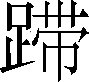

第一百二十卷

 平准书**[1]**第八

《平准书》所述是汉代平准政策产生的由来，实际上系统介绍了汉武帝以前的富国政策。从中可以看到一个大一统的封建集权政府是如何利用权力，扼杀、限制工商业的发展，以求解决自身财政危机的。其主要措施是改变钱法、卖官爵和卖复徒法、官卖政策（由官卖盐铁发展到平准法的确立）、强制征商等。对于整个封建制度，这是一个探索过程，也给后人留下了深刻教益。

本文反映了司马迁的政治思想是主张节俭政治的，虽然本质上仍属于那种主张礼乐治天下的儒学思想。在篇末的评论中，他说：“安宁则长庠序，先本绌末，以礼义防于利；事变多故而亦反是。”对于汉武帝的尚武开边、祭神、封禅、巡游等“事变”之多极为不满，认为汉代重用“兴利之臣”，是搞得国耗民贫、天下骚然的主要原因，这是一种杂糅了黄老色彩的儒学思想。

***【原文】***

汉兴[2]，接秦之弊[3]，丈夫从军旅[4]，老弱转粮饷[5]，作业剧而财匮[6]，自天子不能具钧驷[7]，而将相或[8]乘牛车，齐民无藏盖[9]。于是[10]为秦钱重难用，更令民铸钱[11]，一黄金一斤[12]，约法省禁[13]。而不轨逐利之民[14]，蓄积余业以稽市物[15]，物踊腾粜[16]，米至石[17]万钱，马一匹则百金[18]。

***【译文】***

[1]平准书：本篇论述汉初到武帝时一百多年财政经济的发展变化过程，是我国史籍中最早的经济史专门著作。内容主要是阐述财政经济政策的变动和得失。

[2]汉兴：指汉高祖刘邦初为汉王之时。

[3]弊：凋敝；衰败。指社会经济。

[4]丈夫：指成年男子。从：参加。军旅：军队。

[5]转：转运。粮饷：指军粮。

[6]作业：所从事的谋生之业。这里指社会生产。剧：难；不易。这里有停滞的意思。财：指物资。匮（kuì）：缺乏。

[7]自：即使。天子：指刘邦。钧驷：古代一车套四马。四匹马的毛色一样，叫作钧驷。钧，同，这里指马色相同。驷，四马。

[8]或：有的人。

[9]齐民：平民；百姓。藏盖：储蓄。

[10]于是：当时。“于”为介词，是“在”“当”的意思；“是”为“时”的假借字。本文中的“于是”，除少数是口语中的承接连词以外，多数作“当时”讲。这从上下文中可以辨别。

[11]更令民铸钱：秦以“半两钱”为全国统一的货币。每枚重量为当时的半两，即十二铢，合今二钱。汉初由于铜料缺乏，故托秦钱太重，令民改铸轻钱。

[12]一黄金一斤：一黄金又称一金，是黄金单位，犹言黄金一锭。秦以一镒（二十两，一说二十四两）为一金，汉初为了以少量之金，当多量之用，规定以一斤（十六两）为一金。

[13]约法省禁：简约法令，减省禁律。

[14]不轨逐利之民：指富商大贾（ɡǔ）。不轨，不遵守法度，越出常轨。逐利，追逐商贾之利。

[15]蓄积：聚积。余业：丰厚的产业，指钱财。稽（jī）：囤积。市物：市场上的货物。

[16]物踊腾粜：《史记志疑》认为“踊”“粜”都是误字，当依《汉书·食货志》作“物痛腾跃”。痛，大大地。腾跃，跳跃，表示物价上涨。

[17]石：十斗为一石。

[18]百金：在汉代，凡说“黄金”若干“斤”指的是真金；不言“黄”字“斤”字，如十金、百金，指的是钱。一金万钱，十金十万，百金百万。

***【原文】***

天下已平[1]，高祖乃令贾人不得衣丝[2]乘车，重租税以困辱之[3]。孝惠、高后[4]时，为[5]天下初定，复弛商贾之律[6]，然市井之子孙亦不得仕宦[7]为吏。量吏禄[8]，度官用[9]，以赋[10]于民。而山川园池市井租税[11]之入，自天子以至于封君汤沐邑[12]，皆各为私奉养[13]焉，不领于天下之经费[14]。漕转山东[15]粟，以给中都官[16]，岁[17]不过数十万石。

***【译文】***

[1]天下已平：天下太平以后。前202年，汉高祖刘邦战胜项羽，统一天下，即皇帝位。

[2]贾（ɡǔ）人：指商人。衣（yì）丝：穿丝织品的衣服。衣，穿（衣服）。

[3]重租税：加重租税。之：他们。指商人。

[4]孝惠（前210—前188）：即刘邦的儿子汉惠帝刘盈，前194—前188年在位。高后（前241—前180）：即高祖刘邦的皇后吕雉。

[5]为：由于。

[6]弛：放松。商贾之律：指困辱商贾的法律。

[7]市井：原指做买卖的地方，犹言市场，这里用来指商贾。仕宦：做官。

[8]量：估量。吏禄：官吏的俸给。

[9]度（duó）：估计。官用：政府的经费。

[10]赋：征收赋税。

[11]山川园池市井租税：汉代所谓山、川、园、池、市井租税，包括盐铁税；海租（即渔税）；假税（天子或诸侯的园囿池苑佃给人民所收之税）；工税（向手工业者征收的税）；市租（商品交易税）等。

[12]封君：受有封邑的公主及列侯之属。汤沐邑：这里指公主、列侯的封邑。意思是说，邑内收入供封君朝见天子时斋戒沐浴之用，故名。

[13]私奉养：私人的生活费用。

[14]不领于天下之经费：不属于国家的经费。领，属。天下，国家。汉代的赋税管理制度是，田租和算赋等的收入，归治粟内史（后改称大农令、大司农）掌管，属于国家经费。“山川园池市井租税之入”则归少府掌管，属于皇帝的私奉养，供皇室享用，不属于国家的经费。诸侯的封国和公主、列侯的封邑，也是一样。

[15]漕转：从水道运输粮食。漕，水道运粮。转，车运。山东：战国秦汉时称崤山或华山以东为山东。也称关东。

[16]中都官：京师各官府。中都，古代对京师的通称。

[17]岁：年。

***【原文】***

至孝文[1]时，荚钱[2]益多，轻，乃更铸四铢钱，其文[3]为“半两”，令民纵得自铸钱[4]。故吴[5]，诸侯也，以即[6]山铸钱，富埒[7]天子，其后卒[8]以叛逆。邓通[9]，大夫也，以铸钱财过王者。故吴、邓氏钱布[10]天下，而铸钱之禁生焉[11]。

***【译文】***

[1]孝文：即汉文帝刘恒（前203—前157），高祖刘邦的中子，是西汉第三代皇帝，前180—前157年在位。

[2]荚钱：即上文高祖刘邦“更令民铸钱”以来民间私铸之轻钱。

[3]文：钱文，钱上铸的文字。

[4]令民纵得自铸钱：纵，随意、任意。

[5]吴：西汉初期的一个诸侯王国。吴王刘濞（bì），是刘邦的侄儿，高帝十二年（前195）封。他在封国内铸钱、煮盐，招纳亡人，扩张势力。景帝前三年（前154），他联合楚、赵等六个诸侯国，发动叛乱，史称“吴楚七国之乱”。不久失败，逃到东越被杀。

[6]以：凭；依靠。即：就。

[7]埒（liè）：等于；相等。

[8]卒：终于。

[9]邓通：西汉蜀郡南安（今四川省乐山市）人。文帝时初为黄头郎（掌管船舶行驶的吏员。戴黄帽，故名），后得宠幸，官至上大夫。

[10]布：流传。

[11]而铸钱之禁生焉：连上句是说，自从文帝放铸以后，吴、邓之钱布天下，而景帝时禁止民间铸钱的原因就产生于此。

***【原文】***

匈奴数侵盗北边，屯戍[1]者多，边粟不足给食当食者[2]。于是募民能输及转粟于边者拜爵[3]，爵得至大庶长[4]。

***【译文】***

[1]屯戍：驻防边境。

[2]给食（sì）：给养。食，通“饲”，给人吃。当食者：指驻防边境的士卒。

[3]募：招募。能输：能向国家捐献粮食。输，献纳。转粟于边：把国家的粮食转运到边境。拜爵：封爵。

[4]爵得至大庶长：是说买爵可以买到大庶长这一级。汉爵二十等，大庶长为第十八等爵。文帝前十二年（前168）采用晁错建议，实行卖爵政策。入粟六百石爵上造（第二等爵），累增至四千石为五大夫（第九等爵），再累增至一万二千石为大庶长。

***【原文】***

孝景[1]时，上郡以西旱[2]，亦复修[3]卖爵令，而贱其价[4]以招民；及徒复作[5]得输粟县官以除罪。益造苑马以广用[6]，而宫室列观舆马益增修[7]矣。

***【译文】***

[1]孝景：即汉景帝刘启（前188—前141），汉文帝的儿子，西汉第四代皇帝，前157—前141年在位。

[2]上郡以西旱：事在景帝中元三年（前147）。上郡，治肤施（今陕西省榆林市榆阳区东南），辖境当今无定河流域及内蒙古鄂托克旗等地。

[3]修：修订。

[4]贱其价：使其价贱。

[5]徒复作：刑名。遇赦令，对判了刑的人，免除其罪犯身份，但仍令其在官府服劳役，服完原定刑期。这样的人，叫“徒复作”，也叫“免徒复作”。

[6]益：增。造苑马：造苑养马。苑，牧场。汉西北边郡有六牧师苑，养马三十万匹。广用：宽裕军用；使军用宽裕。

[7]列观：各观。观，供皇帝游憩的宫馆。舆马：车马。益增修：逐渐增建和修饰。

***【原文】***

至今上[1]即位数岁，汉兴七十余年之间，国家无事，非遇水旱之灾，民则人给家足，都鄙廪庾[2]皆满，而府库余货财。京师之钱累巨万[3]，贯朽而不可校[4]。太仓之粟陈陈相因[5]，充溢露积[6]于外，至腐败不可食。众庶[7]街巷有马，阡陌[8]之间成群，而乘字牝者傧[9]而不得聚会。守闾阎者食粱肉[10]，为吏者长子孙[11]，居官者以为姓号[12]。故人人自爱而重[13]犯法，先行义[14]而后绌耻辱焉。当此之时，网疏而民富[15]，役财骄溢[16]，或至兼并[17]；豪党之徒，以武断于乡曲[18]；宗室有土[19]公卿大夫以下，争于奢侈，室庐舆服僭[20]于上，无限度。物盛而衰，固其变也。

***【译文】***

[1]今上：当今皇上，指汉武帝刘彻（前156—前87）。

[2]都鄙：指郡县政府所在的地邑。廪庾（yǔ）：米仓。

[3]累：累积；积聚。巨万：万万。

[4]贯：穿钱的绳索，即钱串。校（jiào）：计点；计数。

[5]太仓：汉代京城储粮的大仓。陈陈相因：是说太仓的粮食吃不完，陈粮加陈粮，层层积累。

[6]充溢：米装得太满，溢出仓外。露积：露天堆积。

[7]众庶：庶民；众民。

[8]阡陌（qiān mò）：田间小路。

[9]字牝（pìn）：母马。傧（hìn）：通“摈”，排斥。

[10]闾阎：里巷的门。粱肉：指精美的膳食。粱，小米。

[11]为吏者长子孙：是说当时太平无事，官吏不轻易调动，以至于在任所使子孙长大。“长”字在这里是使动用法。

[12]居官者以为姓号：是说做官的人久任其职，便以官名作为自己的姓氏。

[13]重：难；不轻易。

[14]先行义而后绌耻辱焉：《汉书补注》及《史记会注考证》都认为“先”“绌”对文，《汉书·食货志》无“后”字，“后”字是衍文，当删。先行义，把品行端正看作首要的事。先，首要的事情，意动用法。

[15]网疏而民富：是说当时“约法省禁”，法网宽疏，谋生之途广，百姓殷富。当然，这里所谓“民”以及上面所谓“众庶”，都不是指农民，而是指地主阶级和富商大贾。一般农民不是荒年也仅能自给而已。

[16]役：使用，有“凭借”的意思。骄溢：骄傲放纵。

[17]或：有的人。至：甚至。兼并：指兼并土地。

[18]以：用法同“则”。武断：横行霸道。乡曲：乡里；乡间。

[19]宗室：与皇帝同宗的贵族。有土：有封邑的列侯。

[20]僭（jiàn）：超越本分。

***【原文】***

自是之后，严助、朱买臣等招来东瓯[1]，事两越[2]，江淮之间萧然[3]烦费矣。唐蒙、司马相如开路西南夷[4]，凿山通道千余里，以广巴、蜀[5]，巴、蜀之民罢[6]焉。彭吴[7]贾灭朝鲜，置沧海之郡[8]，则燕、齐之间靡然发动[9]。及王恢设谋马邑[10]，匈奴绝和亲[11]，侵扰北边，兵连[12]而不解，天下苦[13]其劳。而干戈日滋[14]，行者赍[15]，居者送，中外骚扰而相奉[16]，百姓抏弊以巧法[17]，财赂衰秏而不赡[18]。入物者补官[19]，出货[20]者除罪，选举陵迟[21]，廉耻相冒[22]，武力进用[23]，法严令具[24]。兴利之臣[25]自此始也。

***【译文】***

[1]招来东瓯：东瓯为古代越族的一支，秦汉时分布今浙江南部瓯江、灵江流域。

[2]事两越：两越指南越和闽越。闽越也是古代越族的一支，秦汉时分布今福建北部、浙江南部的部分地区。其首领无诸，相传与东瓯王摇同是越王句践的后裔。汉初受封为闽越王，治东冶（今福建福州）。后分为繇和东越两部。武帝元鼎六年（前111），东越王余善反抗汉朝，武帝拜侍中朱买臣为会稽太守，在会稽郡预治楼船、储备粮食。元封元年（前110），朱买臣受诏将兵，与横海将军韩说等一同击破东越，徙东越人于江淮地区。南越是南方越人的一支。秦于其地置桂林、南海和象郡。秦末，龙川令赵佗兼并三郡，建立南越国。汉武帝建元六年（前135），闽越兴兵击南越，南越向汉朝求援，武帝派兵攻闽越。闽越王郢弟余善杀闽越王以降，汉乃罢兵。武帝令严助讽谕南越，南越王即遣太子随严助入侍。元鼎五年（前112），南越相吕嘉反，武帝出兵于次年平定越地，置九郡。

[3]萧然：即骚然，动乱不安的样子。

[4]开路西南夷：开通西南夷始自唐蒙、司马相如，因此这里说“唐蒙、司马相如开路西南夷”。

[5]巴、蜀：巴郡，治江州（今重庆市北嘉陵江北岸）；蜀郡，治成都（今成都市）。

[6]罢（pí）：通“疲”。

[7]彭吴：人名。贾：当依《汉书·食货志》作“穿”。

[8]置沧海之郡：武帝元朔元年（前128）秽君降汉。

[9]燕、齐：燕，指今河北省北部和辽宁省西端，是战国时燕国之地，汉代仍沿称为燕。齐，指今山东省泰山以北黄河流域及山东半岛地区，为战国时齐国之地，汉代仍沿称为齐。靡然：随风披靡貌。发动：动作起来。元封二年（前109），汉遣楼船将军杨仆从齐地渡海，左将军荀彘从燕地出辽东，攻打朝鲜，因此这里说“燕、齐之间靡然发动”。

[10]王恢设谋马邑：元光二年（前133），武帝采用大行王恢所设的计谋，在马邑（今山西省朔州市朔城区）旁伏兵三十万，欲诱致匈奴邀击之。单于入塞，在距马邑百余里的地方发觉，乃引兵还。

[11]和亲：从高祖刘邦时开始，以宗室女嫁给匈奴单于，并年年送给匈奴大批礼物，以换取匈奴的不来侵扰，叫作“和亲”。直到文帝、景帝时，对匈奴仍是继续采取和亲政策。

[12]兵连：一个战争接连一个战争。

[13]苦：痛苦。

[14]干戈：干，盾；戈，平头戟。滋：增多。

[15]赍：携带。指出征的人携带衣食等物。

[16]奉：供应。

[17]抏（wán）弊：贫敝；穷乏。巧法：用欺骗取巧的办法来抵制朝廷的法令。

[18]财赂（lù）：财物。赡：足。

[19]入物：向政府缴纳财物。补官：做官。

[20]出货：拿出财货给政府。

[21]选举：选拔任用官吏的制度。陵迟：衰颓、败坏。

[22]廉耻相冒：是“不顾廉耻”的意思。冒，有所干犯而不顾叫“冒”。

[23]武力进用：武勇有力的人得到提升重用。

[24]法严令具：法令苛细。严，密；具，完备。

[25]兴利之臣：指东郭咸阳、孔仅、桑弘羊之类为汉武帝谋利之臣。

***【原文】***

其后汉将岁以数万骑出击胡[1]，及车骑将军卫青[2]取匈奴河南地，筑朔方[3]。当是时，汉通西南夷道，作者[4]数万人。千里负担馈[5]粮，率十余钟致[6]一石。散币于邛、僰以集[7]之。数岁道不通，蛮夷因以数[8]攻，吏发兵诛[9]之，悉巴、蜀租赋不足以更[10]之。乃募豪民[11]田南夷，入粟县官[12]，而内受钱于都内[13]。东至沧海之郡，人徒之费拟[14]于南夷。又兴十万余人筑卫朔方[15]，转漕[16]甚辽远，自山东咸被[17]其劳，费数十百巨万[18]，府库益虚。乃募民能入奴婢得以终身复[19]，为郎增秩[20]，及入羊为郎[21]，始于此。

***【译文】***

[1]岁：年；每年。骑：骑兵。胡：指匈奴。

[2]卫青（？—前106）：西汉名将。河东平阳（今山西省临汾市西南）人。卫皇后弟。本平阳公主家奴，后为汉武帝重用。初拜车骑将军，后为大将军。元朔二年（前127），他率军大败匈奴，取得了匈奴占领下的河套地区，在那里设置了朔方郡。元狩四年（前119），与霍去病共同击垮匈奴主力。他前后七次出击匈奴，解除了匈奴对西汉王朝的威胁。

[3]朔方：朔方城在今内蒙古杭锦旗北。元朔三年（前126）筑朔方城。

[4]作者：指被征发修筑道路的人。

[5]负担：负，背（bēi）；担，挑。馈：送。

[6]率（shuài）：大率；大致。钟：古量器名。六斛四斗为一钟。致：送到。

[7]币：指财物。邛：古族名，分布今四川省西昌地区。僰（bó）：古族名，分布今四川省宜宾一带。集：安定。

[8]蛮夷：指西南夷。数（shuò）：屡次。

[9]诛：讨伐。

[10]悉：尽。更：抵偿。

[11]豪民：豪富之民。

[12]入粟：缴纳粮食。县官：指巴、蜀各县政府。

[13]都内：官名。西汉大司农属官有都内令、丞，是主管国库的官。

[14]拟：相等。

[15]筑卫朔方：既修筑朔方城又守卫朔方城。

[16]转漕：车运叫“转”，水运叫“漕”。

[17]被：蒙受；遭受。

[18]数十百巨万：数十万万以至百万万。巨万，万万。

[19]复：免除徭役。

[20]秩：官吏的品级。

[21]入羊为郎：畜牧主卜式，屡以家财捐助政府，武帝任为中郎，借以鼓励其他富商大贾出钱。

***【原文】***

其后四年[1]，而汉遣大将[2]将六将军，军十余万，击右贤王[3]，获首虏万五千级[4]。明年[5]，大将军将六将军仍再出击胡，得首虏万九千级。捕斩首虏之士受赐黄金二十余万斤[6]，虏数万人皆得厚赏[7]，衣食仰给县官[8]；而汉军之士马[9]死者十余万，兵甲[10]之财，转漕之费，不与焉[11]。于是大农陈藏钱经秏[12]，赋税既竭[13]，犹不足以奉[14]战士。有司[15]言：“天子曰：‘朕闻五帝之教不相复[16]而治；禹汤之法不同道而王[17]。所由殊路[18]，而建德一[19]也。北边未安，朕甚悼[20]之。日者[21]，大将军攻匈奴，斩首虏万九千级，留[22]无所食。议令民得买爵及赎禁锢[23]免减罪。’请置赏官[24]，命[25]曰武功爵。级十七万，凡直三十余万金[26]。诸买武功爵官首者试补吏[27]，先除[28]；千夫如五大夫[29]；其有罪又减二等[30]；爵得至乐卿[31]：以显[32]军功。”军功多用越等[33]，大者封侯卿大夫，小者郎吏[34]。吏道[35]杂而多端，则官职[36]秏废。

***【译文】***

[1]其后四年：元朔五年（前124）。

[2]大将：当作“大将军”。

[3]右贤王：匈奴官名。是单于下的最高官职。冒顿单于（mò dú chán yú）时，除自领中部外，设左、右贤王，分领东西二部，由单于子弟担任。

[4]级：战国时期秦国规定；斩下敌人一个人头，赐爵一级。因此“级”字便用来作为计数单位。如“斩首数十级”，即斩下人头数十个。这里说“获首虏万五千级”，是说斩首和俘虏的数目共计一万五千。俘虏应说若干“人”，不应说“级”，这是古人行文不嫌疏略，从一而省的写法。

[5]明年：元朔六年（前123）。

[6]黄金二十余万斤：指的是真金。

[7]虏数万人皆得厚赏：俘虏得厚赏，这是汉武帝对待匈奴的俘虏政策。

[8]县官：指朝廷，中央政府。

[9]士马：士卒和马匹。

[10]兵甲：兵，兵器；甲，战士的护身衣，用皮革或金属制成。

[11]不与（yù）焉：不计算在内。焉，于此，在这里面。

[12]大农：即大司农。官名。九卿之一。掌管国家租税钱谷盐铁的财政收支。陈藏钱：库藏旧存之钱。上文说武帝初年“府库余财”，“贯朽而不可校”，就是指的陈藏钱。陈，久、旧。经：已经。秏：尽。

[13]既：已。竭：尽。

[14]奉：供给。

[15]有司：古代设官分职，各有专司，因称官吏为“有司”。

[16]朕：从秦始皇开始，皇帝自称“朕”。五帝：传说中上古时期的五个帝王。据《五帝本纪》说是黄帝、颛顼、帝喾、唐尧、虞舜。教：教化。相复：递相重复。

[17]禹：夏朝第一代君主。汤：商朝的建立者。法：法令、制度。王（wànɡ）：称王，统治天下。

[18]所由殊路：所经的道路不同。由，经过。

[19]建德：立德，树立德业。古人把创立一种能使百姓得到好处的法令制度，叫作“立德”。一：一致。

[20]悼：悲伤。

[21]日者：往日；从前。

[22]留（zhì）：滞留，停留。

[23]禁锢：不准做官。据《汉书·贡禹传》说，文帝时，贾人、赘壻［婿］和官吏贪污的，都禁锢不准做官，而且没有赎罪之法。

[24]赏官：用于赏赐的官爵。

[25]命：命名；起名。

[26]凡直三十余万金：是说武功爵每级卖价十七万钱，卖爵总值是三十余万万钱（用胡三省说）。万金，万万钱。

[27]试补吏：官首为吏称“试”，有试用的意思。补，补缺任用。

[28]先除：优先任命。除，任命、授职的意思。

[29]千夫如五大夫：武帝时除武功爵外，尚有旧二十等爵并行。

[30]其有罪又减二等：是说有罪的人买爵要减二等。如每级十七万出至五十一万者当得三等爵良士，因有罪，故只授一等爵造士。余类推。

[31]爵得至乐卿：是说不管什么人，买爵只能买到第八级乐卿为止，第九级执戎以上，只有立下军功的人才能得到。

[32]显：显扬。

[33]越等：越级。这里是越级提拔的意思。

[34]郎吏：郎，郎官，皇帝侍从官的通称；吏，指官府中的低级官员。

[35]吏道：做官的途径。

[36]官职：官吏的职务。

***【原文】***

自公孙弘以《春秋》之义绳[1]臣下取蹛汉相，张汤用峻文决理为廷尉[2]，于是见知之法[3]生，而废格沮诽穷治之狱用[4]矣。其明年[5]，淮南、衡山、江都王[6]谋反迹见，而公卿寻端[7]治之，竟其党与[8]，而坐死者[9]数万人，长吏益惨急而法令明察[10]。

***【译文】***

[1]公孙弘（前200—前121），西汉菑川（郡治今山东省寿光市南）薛人。少为狱吏。年四十余始治《春秋公羊传》。绳：纠正。

[2]张汤（？—前116）：西汉杜陵（今陕西省西安市东南）人。武帝时历任廷尉、御吏大夫等职。建议铸造白金及五铢钱，并支持盐铁官营政策，制订“告缗令”，以打击富商大贾。主办许多重大审判案件，用法严峻。曾与赵禹共同编订律令。峻文：严峻的法律条文。决理：断狱；判案。廷尉：官名，九卿之一，掌刑狱。张汤为廷尉在元朔三年（前126）。

[3]见知之法：官吏明明见到、知道某人犯法的事而不予处理，要判以故纵之罪。

[4]废格：废阁的假借。阁，通“搁”，搁置；拖延。沮诽：指对抗、毁谤皇帝诏令的行为。沮，阻止；诽，毁谤。穷治：追根到底地处理。狱：罪案。用：行；流行。

[5]其明年：元狩元年（前122）。

[6]淮南、衡山、江都王：三王都是汉武帝时代的同姓诸侯王。淮南王刘安，衡山王刘赐，江都王刘建。

[7]端：头绪；线索。

[8]竟：追究。党与：朋党；参与其事的人。

[9]坐死者：因为犯牵连罪而被处死的人。

[10]长吏：六百石以上的官吏称长吏，一说二百石至四百石的县吏称长吏。这里指一般审理案件的官吏。惨急：惨酷峻急，指用法严酷。明察：苛细。

***【原文】***

当是之时，招尊方正贤良文学[1]之士，或至公卿大夫。公孙弘以汉相，布被，食不重味[2]，为天下先[3]。然无益于俗，稍[4]骛于功利矣。

***【译文】***

[1]方正贤良文学：汉代选拔官吏的科目之一。文帝前二年（前178），为了询访政治得失，始诏举贤良方正能直言极谏者。凡中选者，皆授以官职。武帝时，或诏举贤良，或诏举贤良方正，或昭举贤良文学，名目时有不同，性质无异。

[2]食不重（chónɡ）味：每顿饭只吃一个菜。

[3]先：先导；表率；榜样。

[4]稍：渐渐。

***【原文】***

其明年[1]，骠骑[2]仍再出击胡，获首四万。其秋，浑邪王[3]率数万之众来降，于是汉发车二万乘迎之[4]。既至，受赏[5]，赐及有功之士。是岁费凡百余巨万。

***【译文】***

[1]明年：元狩二年（前121）。

[2]骠骑：指骠骑将军霍去病。霍去病（前140—前117），西汉名将。河东平阳（今山西省临汾市西南）人。官至骠骑将军。他在元狩二年春天和夏天接连两次大败匈奴，控制了河西地区，断了匈奴的“右臂”，打开通往西域的道路。元狩四年（前119），又和卫青共同击垮匈奴主力。他前后六次出击匈奴，解除了西汉初年以来匈奴对汉王朝的威胁。

[3]浑邪（yé）王：浑邪与休屠（chú）是匈奴的两个部落，同居于今甘肃河西地区。元狩二年夏天，霍去病击败匈败，取得焉支山、祁连山。同年秋天，浑邪王杀休屠王，并其众降汉，共四万人。汉以其地置武威、酒泉两郡。

[4]汉发车二万乘迎之：浑邪王率四万众来降，汉恐其有诈，故命霍去病征发战车二万乘迎接。乘（shènɡ），古时一车四马为一乘。

[5]受赏：是说来降的浑邪王部众四万人受到汉朝的赏赐。

***【原文】***

初，先是往十余岁河决[1]，观[2]梁、楚之地，固已数困[3]，而缘河之郡堤塞[4]河，辄[5]决坏，费不可胜计。其后番係欲省厎柱[6]之漕，穿汾、河渠以为[7]溉田，作者数万人；郑当时为渭漕渠回[8]远，凿直渠自长安至华阴，作者数万人；朔方[9]亦穿渠，作者数万人：各历二三期[10]，功未就，费亦各巨万十数[11]。

***【译文】***

[1]往十余岁河决：指元光三年（前132）黄河在瓠子（堤名，在今河南省濮阳县境古黄河南岸）决口。从浑邪王来降之元狩二年（前121）算起，首尾共十二年，故云“往十余岁”。

[2]观：古县名，本属上句。《史记志疑》《廿二史考异》和李慈铭《汉书札记》都考证黄河决口的瓠子在濮阳，不在观县，“观”乃“灌”字之讹，当从《汉书·食货志》作“灌”，属下句。今据改。

[3]固：本来。数（shuò）困：数，屡次，频繁；困，贫困，穷困。

[4]堤塞：筑堤堵塞。

[5]辄：每每，往往，常常。

[6]番（pó）係：是武帝时的河东郡太守，姓番名係。他认为当时每年从山东地区往京师长安运粮一百多万石，经过厎柱险流，损失很大，也太耗费，向武帝建议在河东地区修渠，引汾水和黄河水灌溉皮氏（今山西省河津市西）、汾阴（今山西省万荣县西南宝鼎）、蒲坂（今山西省永济市蒲州镇）一带，估计可溉田五千顷，每年可得谷二百万石以上。这样就可以不再从厎柱以东运粮了。武帝采纳了他的建议，征发数万人修渠。渠成之后不久，因黄河改道，渠废。厎柱：即砥柱山，又名三门山。

[7]以为：同义词连用，“为”也当“以”讲，介词。

[8]郑当时：武帝时为大司农。元光六年（前129），在他的建议并主持下，征发数万人，由水工徐伯督率，自昆明池（故址在今西安市西南斗门镇东南一片洼地）南傍南山（秦岭）开渠，东至华阴（今为县级市）通黄河。三年而成。当时此渠既便漕运关东粟，又可溉田。今已无水。为：因为。渭漕渠：渭水漕运的河道。回：弯弯曲曲。

[9]朔方：指河套地区。

[10]期（jī）：整年。

[11]巨万十数：以十万万为单位来计算。数，计。

***【原文】***

天子为伐胡，盛[1]养马，马之来食[2]长安者数万匹。卒牵掌者[3]关中不足，乃调旁近郡。而胡降者皆衣食县官，县官不给[4]，天子乃损膳[5]，解乘舆驷[6]，出御府禁藏以赡[7]之。

***【译文】***

[1]盛：多。

[2]食（sì）：通“饲”，饲养。

[3]卒牵掌者：卒之牵马掌马者，即马夫。

[4]县官不给：政府经费不足，不能供给。

[5]损膳：即减膳。膳，饭食。减膳是吃素或减少鱼肉之类的菜肴。

[6]解乘舆驷：意思是武帝解下自己用的车上的四匹马，来补助国家的经费。乘舆，皇帝坐的车。驷，四马，古时一车四马。

[7]御府禁藏：内廷的库藏。赡（shàn）：供给。

***【原文】***

其明年[1]，山东被[2]水灾；民多饥乏。于是天子遣使者虚郡国仓[3]，以振[4]贫民。犹[5]不足，又募豪富人相贷假[6]。尚不能相救，乃徙贫民于关[7]以西，及充朔方以南新秦[8]中，七十余万口，衣食皆仰[9]给县官。数岁，假予产业[10]，使者[11]分部护之，冠盖相望[12]。其费以亿计，不可胜数。

***【译文】***

[1]明年：元狩三年（前120）。

[2]被：遭受。

[3]仓（kuài）：粮仓。

[4]振：救济。

[5]犹：还；仍。

[6]贷假：借贷。这里是把粮食借给贫民的意思。

[7]关：指函谷关或潼关。

[8]新秦：秦始皇遣蒙恬击匈奴，得其河南地，名曰“新秦”，汉代仍沿称，即今河套地区。

[9]仰：依靠。

[10]产业：指土地、房屋、牲畜、农具等。

[11]使者：指朝廷派去管理移民的官吏，名义上是皇帝的使者。

[12]冠盖相望：冠是官吏的礼帽，盖是车盖，相望，互相看得见。这是形容朝廷的使者来往不绝，他们坐着车子，前后都能互相看见。

***【原文】***

于是县官大空，而富商大贾或财役贫[1]，转毂[2]百数，废居居邑[3]，封君皆低首仰给[4]。冶铸[5]煮盐，财或累万金，而不佐国家之急，黎民重[6]困。于是天子与公卿议，更钱造币以赡用[7]，而摧浮淫并兼[8]之徒。是时禁苑有白鹿而少府[9]多银锡。自孝文更造四铢钱[10]，至是岁四十余年[11]。从建元[12]以来，用少，县官往往即[13]多铜山而铸钱，民亦间盗铸钱[14]，不可胜数。钱益多而轻[15]，物益少而贵[16]。有司言曰：“古者皮币[17]，诸侯以聘享[18]。金有三等，黄金为上，白金[19]为中，赤金[20]为下。今半两钱法[21]重四铢，而奸或盗摩钱里取[22]，钱益轻薄而物贵，则远方用币烦费不省。”乃以白鹿皮方尺，缘以藻缋[23]，为皮币，直[24]四十万。王侯宗室朝觐[25]聘享，必以皮币荐璧[26]，然后得[27]行。

***【译文】***

[1]财役贫：这是说富商大贾积贮财货，役使贫民，远途贩卖。，通“滞”，贮。役，役使。

[2]转毂：载运货物的车子。“财役贫，转毂百数”指行商。

[3]废居：废，舍弃，在这里是“出卖”的意思。居，囤积。居邑：居，住。邑，城市。居邑，住在城市中。废居居邑指坐贾。

[4]封君皆低首仰给：是说有封邑的公主列侯都低下头来向富商大贾告贷，靠富商大贾借钱给他们。

[5]冶铸：冶铁，铸造铁器。

[6]重：益加。

[7]更：改。赡：充裕。用：财用，犹今言“经费”。

[8]摧：抑；压制；打击。浮淫：骄溢不法。并兼：兼并土地。

[9]禁苑：皇家园囿。少府：官名，九卿之一。掌山川园池市井租税之入和皇室手工业制造，是皇帝的私府。

[10]孝文更造四铢钱：文帝前元五年（前175）改铸四铢重的“半两”钱为法钱。

[11]至是岁四十余年：是岁，指元狩三年（前120）。

[12]建元：汉武帝的第一个年号，前140年至前135年。

[13]即：就。

[14]间（jiàn）：暗暗地，偷偷地。盗铸钱：私自铸钱。自景帝中元六年（前144）下令禁止民间私自铸钱。

[15]轻：贱，指币值，不是指重量。

[16]贵：指物价昂贵。

[17]皮币：用皮做的货币。

[18]聘享：聘问献纳。

[19]白金：银。

[20]赤金：铜。

[21]半两钱：指文帝前五年铸的四铢重的“半两”钱。法：标准。

[22]摩：通“磨”，磨损。里：铜钱有字的一面称“文”，无字的一面称“里”。：铜屑。

[23]缘以藻缋：用彩绣来饰边。缘，绕。藻缋，彩绣。

[24]直：通“值”。

[25]朝觐：王侯朝见天子叫朝觐。

[26]荐：垫。璧：平圆形中心有孔的玉器。古代朝聘、祭祀、丧葬时用为礼器。

[27]得：可以。

***【原文】***

又造银锡为白金[1]。以为天用莫[2]如龙，地用[3]莫如马，人用[4]莫如龟，故白金三品：其一曰重八两[5]，圜[6]之，其文[7]龙，名曰“白选”，直[8]三千；二曰以[9]重差小，方之，其文马，直五百；三曰复小，捕[10]之，其文龟，直三百。令县官销半两钱[11]，更铸三铢钱，文如其重[12]。盗铸诸金钱罪皆死，而吏民之盗铸白金者不可胜数。

***【译文】***

[1]又造银锡为白金：以银锡为原料造白金。据《汉书·武帝本纪》，造白金、皮币和改铸三铢钱都在元狩四年（前119）。

[2]用：行；飞行。莫：没有哪一种东西。

[3]用：行；奔驰。

[4]用：使用。

[5]其一曰重八两：不少学者认为此句以下文字有脱误。

[6]圜：通“圆”。

[7]文：花纹；图案。

[8]直：通“值”。

[9]以：他本《史记》无“以”字。细按上下文，其一“重八两”，二则“重差小”，三则“复小”，文从字顺，若加“以”字，不仅多余，而且费解，宜删。

[10]捕：是“椭”的讹字，当改。椭，椭圆形。

[11]县官：指各郡国政府。半两钱：指四铢重的半两钱。

[12]文如其重：钱重三铢，钱上的文字也是“三铢”，钱文和钱重相符。

***【原文】***

于是以东郭咸阳、孔仅为大农丞[1]，领[2]盐铁事；桑弘羊以计算用事[3]，侍中[4]。咸阳，齐之大煮盐[5]，孔仅，南阳大冶[6]，皆致生[7]累千金，故郑当时进言[8]之。弘羊，雒阳[9]贾人子，以心计[10]，年十三侍中。故三人言利事析秋豪[11]矣。

***【译文】***

[1]东郭咸阳：姓东郭，名咸阳。大农丞：大农令（后改大司农）的属官。

[2]领：管领。

[3]用事：当权。

[4]侍中：在宫中侍从皇帝左右。

[5]大煮盐：大盐商。

[6]大冶：大铁商。

[7]致：获得。生：产业。

[8]进言：向皇帝进言，这里是“推荐”的意思。

[9]雒（luò）阳：即洛阳。

[10]心计：心算。

[11]利事：赢利的事。秋豪：鸟兽在秋天新长出来的细毛。比喻细微。

***【原文】***

法既益严，吏多废免[1]。兵革[2]数动，民多买复及五大夫[3]，征发之士益鲜[4]。于是除千夫、五大夫为吏[5]，不欲者出马；故吏皆適令伐棘上林[6]，作昆明池[7]。

***【译文】***

[1]废：罢官。免：免官。

[2]兵革：是兵器和衣甲的总称，引申指战争。

[3]买复及五大夫：向政府缴纳一定数量的财物，可以免除徭役，叫“买复”，如晁错《贵粟疏》说，献马一匹，免除三个人的徭役。

[4]鲜（xiǎn）：少。

[5]除千夫、五大夫为吏：本来在元朔六年（前123）就规定，买爵至千夫的和五大夫一样，可以做官，是一种优待，但由于法令越来越严峻，做官容易获得罪谴，因此那些买得千夫爵和五大夫爵的人宁肯不去做官，现在下令“除千夫、五大夫为吏”，强迫他们去做官。

[6]故吏：因为有罪被废免的官吏。適：通“谪”，责罚。棘：有刺草木的通称。上林：即上林苑。故址在今西安市西及鄠邑区、周至县界，周围二百多里。

[7]昆明池：故址在今西安市西南斗门镇东南一片洼地。元狩三年（前120），武帝为准备与昆明国作战、训练水军和解决长安水源不足的困难而开凿。周围四十里。

***【原文】***

其明年[1]，大将军、骠骑[2]大出击胡，得首虏八九万级，赏赐五十万金，汉军马死者十余万匹，转漕车甲之费不与焉。是时财匮，战士颇不得禄[3]矣。

***【译文】***

[1]明年：指元狩四年（前119）。

[2]大将军：指大将军卫青。骠骑：指骠骑将军霍去病。

[3]颇：间或，有时。禄：俸禄。

***【原文】***

有司言三铢钱轻，易奸诈，乃更请诸郡国铸五铢钱[1]，周郭其下[2]，令不可磨取焉。

***【译文】***

[1]诸郡国铸五铢钱：据《汉书·武帝纪》，元狩五年（前118）行五铢钱。

[2]周郭其下：周郭，铜钱的轮廓（外框）。下，铜钱无字的一面，也称“里”。原来铜钱的下面无周郭，磨与否不易发现；现在在钱的下面铸以周郭，可以防止磨，因为磨则郭灭，容易发现。

***【原文】***

大农上盐铁丞孔仅、咸阳言：“山海，天地之藏[1]也，皆宜属少府[2]，陛下不私，以属大农佐赋。愿募民自给费[3]，因官器作[4]；煮盐，官与牢盆[5]。浮食奇民欲擅管山海之货[6]，以致富羡[7]，役利[8]细民，其沮事[9]之议，不可胜听。敢私铸铁器煮盐者，左趾[10]，没入其器物。郡不出铁者，置小铁官[11]，便属在所县[12]。”使孔仅、东郭咸阳乘传举行[13]天下盐铁，作[14]官府，除故盐铁家富者为吏。吏道益杂，不选[15]，而多贾人矣。

***【译文】***

[1]天地：天地之间；世界上。藏：储存东西的地方，如库藏、府藏。

[2]宜属少府：山海池泽之税本来是天子的“私奉养”，归少府管领，不属于政府的经费，所以孔仅、咸阳说“宜属少府”。

[3]自给费：自己拿本钱。

[4]因：用。作：指冶铁铸器。

[5]牢盆：煮盐用的铁盆名牢盆。

[6]浮食奇民：浮食即浮末，指商贾等业。奇（jī）民，奇邪之民。浮食奇民指垄断盐铁业的富商大贾和地方豪强。擅管；犹今言“垄断”。山海之货：指盐铁。

[7]富羡：富饶。

[8]役利：役使。

[9]沮（jǔ）事：阻止破坏已成之事。

[10]：足钳，重六斤，着左足下，类似后世的“脚镣”。趾：脚。

[11]小铁官：汉武帝为了实行盐铁官营，据《汉书·地理志》记载，在全国设铁官者凡四十郡，共五十处。产铁地方置铁官，主铸造铁器，不出铁的地方置小铁官，铸旧铁。

[12]便属在所县：是说铁官、小铁官即管辖所在郡之各县铁器。便，即。属，管辖。

[13]乘传（zhuàn）：驿站传车的一种。举行：举办。

[14]作：设立。

[15]选：选举。

***【原文】***

商贾以[1]币之变，多积货逐利。于是公卿言：“郡国颇被灾害[2]，贫民无产业者，募徙广饶之地[3]。陛下损膳省用，出禁钱以振元元[4]，宽贷[5]赋，而民不齐出于南亩[6]，商贾滋[7]众。贫者畜积[8]无有，皆仰县官。异时算轺车贾人缗钱皆有差[9]，请算如故。诸贾人末作[10]，贳贷卖买[11]，居邑稽诸物[12]，及商以取利者，虽无市籍[13]，各以其物自占[14]，率缗钱二千而一算[15]。诸作有租及铸[16]，率缗钱四千一算。非吏比者、三老、北边骑士[17]，轺车以一算；商贾人轺车二算；船五丈以上一算。匿不自占，占不悉，戍边一岁，没入缗钱[18]。有能告者，以其半[19]畀之。贾人有市籍者，及其家属，皆无得籍名田[20]，以便农。敢犯令，没入田僮[21]。”

***【译文】***

[1]以：借。

[2]郡国颇被灾害：指上文“其明年，山东被水灾”。

[3]募徙广饶之地：指上文“乃徙贫民于关以西，及充朔方以南新秦中，七十余万口”。

[4]禁钱：内廷库藏的钱，也就是少府掌管的钱。元元：庶民；众民。

[5]宽贷：宽缓。

[6]出于南亩：意思是到田地里去耕种。南亩，泛指农田。

[7]滋：益加。

[8]畜（xù）积：积蓄。

[9]异时：往时；从前。算轺车：征收轺车税。算，本义是计算，引申为“征税”。缗钱：缗是穿钱的丝绳，一缗千钱。缗钱即俗所谓“贯钱”，是汉代向工商业者征收财产税时计算其资产的单位名称，同时也是工商业资产税名称。算缗钱即征收工商业资产税。据《武帝纪》，“元狩四年初算缗钱”。这里说过去就曾算缗钱，《史记》《汉书》的本纪和列传均无记载，可能指汉武帝以前向商人征收的“訾算”（财产税）。有差：是说征税有差等。

[10]末作：即末业，指工商业。“诸贾人末作”总冒以下“贳贷卖买，居邑稽诸物，及商以取利者”诸句。

[11]贳贷卖买：贳贷，指高利贷者。卖买，指贱买贵卖的商人，行商坐贾全部包括在内。

[12]居邑稽诸物：指囤户。

[13]市籍：商贾的户籍。

[14]自占：犹自报。

[15]率（shuài）：一概；一律。缗钱二千而一算：商人财产以“缗钱”为单位计算，值缗钱二千出一算。算是税额单位名称，每算一百二十文。

[16]诸作有租及铸：是“诸作及铸有租”的倒装。诸作指各种手工业。铸，指铸造铜锡合金器物的行业。这个行业本来也属于手工业，因其较为突出，故特为标出，与“诸作”平列。

[17]吏比者：与官吏相等的人。指那些有千夫、五大夫以上爵位的人。三老：掌教化的乡官。西汉有乡三老、县三老。北边骑士：北部边郡做骑士的人。

[18]没入缗钱：据《汉书·昭帝纪》如淳注，商人自报财产不实，没收其隐匿不报的财产。

[19]畀（bì）：给予。

[20]籍：衍文，当删。名田：以个人名义占有田地。

[21]田僮：田地和僮仆。

***【原文】***

天子乃思卜式之言[1]，召拜式为中郎[2]，爵左庶长[3]，赐田十顷[4]，布告天下，使明知之。

***【译文】***

[1]卜式之言：指下段卜式回答使者的话：“天子诛匈奴，愚以为贤者宜死节于边，有财者宜输委，如此而匈奴可灭也。”

[2]召：呼唤使之来。拜：授予官职叫“拜”。中郎：皇帝的侍从官。

[3]左庶长：二十等爵的第十等。

[4]顷：田百亩为顷。

***【原文】***

初，卜式者，河南[1]人也，以田畜[2]为事。亲死[3]，式有少弟。弟壮[4]，式脱身出分[5]，独取畜羊[6]百余，田宅财物尽予弟。式入山牧十余岁，羊致千余头，买田宅。而其弟尽破其业[7]，式辄复分予弟者数[8]矣。是时汉方数使将击匈奴[9]，卜式上书，愿输家之半县官助边[10]。天子使使[11]问式：“欲官乎？”式曰：“臣少牧，不习仕宦[12]，不愿也。”使问曰：“家岂[13]有冤，欲言事乎？”式曰：“臣生与人无分争[14]。式邑人贫者贷[15]之，不善者教顺[16]之，所居人皆从[17]式，式何故见[18]冤于人！无所欲言也。”使者曰：“苟[19]如此，子[20]何欲而然？”式曰：“天子诛[21]匈奴，愚以为贤者宜死节[22]于边，有财者宜输委[23]，如此而匈奴可灭也。”使者具其言入以闻[24]。天子以语丞相弘[25]。弘曰：“此非人情。不轨[26]之臣，不可以为化[27]而乱法，愿陛下勿许。”于是上久不报[28]式，数岁，乃罢[29]式。式归，复田牧。岁余，会[30]军数出，浑邪王等降，县官费众，仓府[31]空，其明年[32]，贫民大徙[33]，皆仰给县官，无以[34]尽赡，卜式持钱二十万予河南守，以给徙民。河南上富人助贫人者籍[35]，天子见卜式名，识[36]之，曰“是[37]固前而欲输其家半助边”，乃赐式外繇四百人[38]。式又尽复予县官。是时富豪皆争匿财[39]，唯式尤[40]欲输之助费。天子于是以式终长者[41]，故尊显以风百姓[42]。

***【译文】***

[1]河南：河南郡，治雒阳（今洛阳市东北）。

[2]田：耕田。畜：畜牧。

[3]亲：父母。

[4]壮：壮年。

[5]脱身出分：从家庭里抽身份出来。

[6]畜羊：所畜养的羊。

[7]业：产。

[8]辄：每每；总是。数（shuò）：多次。

[9]方：正在。数使将击匈奴：指元光六年（前129）至元朔六年（前123），汉不断遣将出击匈奴，特别是元朔五年和六年，大将军卫青接连两次将六将军兵十余万，出击匈奴。

[10]助边：补助边防的军费。

[11]使使：派使者。

[12]习：熟悉。仕宦：做官。

[13]岂：难道；莫非。

[14]分争：即纷争。

[15]邑人：同邑的人。贷：救济。

[16]教顺：即教训。“顺”是“训”的假借字。

[17]从：顺从。

[18]见：被。

[19]苟：假如，如果。

[20]子：表敬意的对称，相当于“您”。

[21]诛：讨伐。

[22]死节：尽节义而死。

[23]输委：献纳其所蓄财物。

[24]具其言：把他的话全部写出来。闻：使皇上听见；向皇上报告。

[25]弘：公孙弘。

[26]轨：法。

[27]化：教化。

[28]不报：吏民上书后，皇上置之不理，不予答复叫“不报”。

[29]乃：才。罢：即报罢。吏民上书言事，皇上拒不采纳，宣令退去叫“报罢”。

[30]会：恰巧；适逢。

[31]仓府：仓指存粮的米仓，借指存钱的府库。

[32]明年：元狩三年。

[33]贫民大徙：指元狩三年徙贫民七十余万口于关以西及朔方以南。

[34]无以：犹无从，无法。

[35]籍：名册。

[36]识（zhì）：通“志”，记得。

[37]是：此人。

[38]赐式外繇四百人：汉法规定，每个成年男子都要用一定时间为国家戍边。不愿戍边的，一人出三百钱由政府雇人代役。这代役钱即“过更”。赐式外繇四百人，即赐给卜式每年四百人的过更钱，共为十二万钱。一说是免除其家四百人的徭役。繇，通“徭”。

[39]匿财：隐藏财产。

[40]尤：通“犹”，却。

[41]终：终归。长者：性情谨厚，有德行的人。

[42]尊显：尊贵显达。风百姓：教化百姓，希望他们效法卜式，向国家输财助边。

***【原文】***

初，式不愿为郎。上曰：“吾有羊上林中[1]，欲令子牧之。”式乃拜为郎，布衣[2]而牧羊。岁余，羊肥息[3]。上过见其羊，善之[4]。式曰：“非独羊也，治民亦犹是[5]也。以时起居；恶者辄[6]斥去，毋[7]令败群。”上以式为奇，拜为缑氏令[8]试之，缑氏便之[9]。迁为成皋[10]令，将漕最[11]。上以为式朴忠[12]，拜为齐王太傅[13]。

***【译文】***

[1]吾有羊上林中：《汉书·卜式传》“羊”后有“在”字。王念孙说：“《类聚》《御览》引《史记》并有‘在’字，今本脱去。”当据补。

[2]（juē）：草鞋。

[3]息：繁殖。

[4]善之：以之为善；认为他放牧得很好。

[5]犹是：如此。

[6]辄：立即；立刻：

[7]毋（wú）：不要。

[8]缑（ɡōu）氏：汉县，治今河南省洛阳市偃师区东南。令：县令。汉代万户以上的县官称“令”，万户以下的县官称“长”。

[9]便之：以之为便。

[10]成皋：汉县，治今河南省荥阳市汜水镇。

[11]将：领；管领。漕：漕运。最：指成绩最好。

[12]朴忠：忠诚老实。

[13]齐王：元狩六年（前117），武帝封皇子刘闳为齐王。太傅：辅导诸侯王的官。

***【原文】***

而孔仅之使天下铸作器[1]，三年中拜为大农[2]，列于九卿[3]。而桑弘羊为大农丞[4]，管诸会计[5]事。稍稍置均输[6]以通货物矣。

***【译文】***

[1]孔仅之使天下铸作器：指上文元狩四年“孔仅、东郭咸阳乘传举行天下盐铁，作官府，除故盐铁家富者为吏”，实行盐铁官营。使，出使。铸作器，铸作铁器。

[2]三年中拜为大农：孔仅于元鼎二年（前115）任大农令。

[3]九卿：汉以太常、光禄勋、卫尉、太仆、廷尉、鸿胪、宗正、大农（大司农）、少府为九卿。

[4]桑弘羊为大农丞：元鼎二年，桑弘羊为大农中丞。

[5]会计：古代所谓会计，是指为朝廷掌管财物赋税，进行月计、岁会的工作。每月计算为“计”，年终合算为“会”。

[6]稍稍：渐渐；逐渐。均输：汉武帝实行的一项经济措施。元鼎二年开始在一些地区置均输官，元封元年（前110）在全国遍设均输官。

***【原文】***

始令吏得入谷补官[1]，郎至六百石[2]。

***【译文】***

[1]吏得入谷补官：谓已试为吏者入赀补官，由二百石至六百石。汉郎吏二百石至六百石，郡丞及减（不足）万户的县长及诸曹丞皆六百石。

[2]郎至六百石：为郎者入谷可以提高级别，到六百石为止。

***【原文】***

自造白金五铢钱后五岁[1]，赦吏民之坐[2]盗铸金钱死者数十万人。其不发觉相杀者[3]，不可胜计。赦自出[4]者百余万人，然不能半自出。天下大抵无虑[5]皆铸金钱矣。犯者众，吏不能尽诛取[6]。于是遣博士褚大、徐偃等分曹循行郡国[7]，举兼并之徒守相为利者[8]。而御史大夫张汤[9]方隆贵用事，减宣、杜周等为中丞[10]，义纵、尹齐、王温舒等用惨急刻深[11]为九卿，而直指夏兰[12]之属始出矣。

***【译文】***

[1]自造白金五铢钱后五岁：据《汉书·武帝纪》，元狩四年（前119）造白金，五年行五铢钱，元鼎元年（前116）赦天下，首尾只有四年，应该说“后三年”。

[2]坐：犯……罪。

[3]不发觉相杀者：此句费解。可能是指有的盗铸者被官府严刑拷问致死，而始终没有得到盗铸实证的。“相杀”犹“杀之”。

[4]自出：自首。

[5]大抵：大都；大致。无虑：大略；大约。

[6]诛取：捕杀。

[7]褚大：胡母生弟子，治《公羊春秋》。分曹：分批。循行郡国：循，通“巡”，往来视察的意思。

[8]举：检举。兼并：指兼并土地。守：郡守。相：诸侯国的相。为利者：贪污受贿的。

[9]御史大夫：是当时仅次于丞相的最高长官，主要职务为监察、执法，兼管重要文书图籍。

[10]减宣：杨县（今山西省洪洞县东南）人。初以佐史给事河东太守，逐渐迁升至中丞。使治主父偃及淮南王案件，论杀甚众，称为敢决疑。杜周：南阳杜衍（今河南省南阳市西南）人。义纵为南阳守，以杜周为爪牙。后事张汤，升为御史。办案多杀人，奏事中上意，故见任用，与减宣轮流为中丞十余年。中丞：御史大夫属官，受公卿奏事，举劾案章。

[11]义纵：河东（治今山西省夏县北）人。群盗出身。武帝时任长陵和长安令，执法严峻。继迁河内都尉，族灭豪强穰氏之属。尹齐：东郡茬平（在今山东省聊城市茌平区西南）人。以刀笔吏渐升至御史。事张汤，斩伐不避贵戚。武帝以为能，迁为中尉。王温舒：阳陵（治今陕西省西安市高陵区西南）人。盗墓出身。事张汤，为御史。督“盗贼”，杀伤甚多。迁为河内太守，捕杀郡中豪强，连坐千余家，“至流血十余里”。武帝以为能，迁为中尉。张汤败后，徙为廷尉，又拜为少府。惨急刻深：惨酷峻急，苛刻严峻。指用法严酷。

[12]直指：汉朝政府特派官员，衣绣衣，持节发兵，有权诛杀办事不力的官员，称绣衣直指，或称直指绣衣使者。夏兰：人名。

***【原文】***

而大农颜异诛[1]。初，异为济南亭长[2]，以廉直稍迁至九卿。上与张汤既造白鹿皮币，问异。异曰：“今王侯朝贺以苍璧[3]，直数千，而其皮荐反四十万，本末不相称[4]。”天子不说[5]，张汤又与异有郤[6]，及有人告异以它议[7]，事下张汤治异[8]。异与客语，客语初令[9]下有不便者，异不应，微反唇[10]。汤奏当[11]异九卿见令不便，不入言而腹诽[12]，论[13]死。自是之后，有腹诽之法比[14]，而公卿大夫多谄谀取容[15]矣。

***【译文】***

[1]大农颜异诛：据《汉书·百官表》，颜异诛在元狩六年（前117）。

[2]济南：济南郡，治东平陵（今山东省济南市章丘区西北）。亭长：西汉时在乡村每十里设一亭，亭有亭长，掌治安警卫，兼管停留旅客，治理民事。

[3]苍璧：青色的璧。

[4]称（chèn）：适合；相副。

[5]说（yuè）：通“悦”。

[6]郤（xì）：通“隙”，嫌隙。

[7]它议：犹“非议”。

[8]治：审理。异：杨树达《汉书窥管》说，此文当以“事下张汤治”为句，“异”字是衍文，当删。

[9]初令：新令。

[10]反唇：翻其唇，表示心有所不服。

[11]当：判（罪）。

[12]腹诽：口里不说，心里不以为然。

[13]论：定罪。

[14]比：则例。

[15]谄谀取容：巴结奉承，讨别人的喜欢。

***【原文】***

天子既下缗钱令[1]而尊卜式，百姓终莫[2]分财佐县官，于是告缗钱纵[3]矣。

***【译文】***

[1]缗钱令：指元狩四年（前119）颁布的算缗钱（向工商业征收资产税）的法令。

[2]莫：没有人。

[3]告缗钱：告发商人自报缗钱不实者。据《汉书·武帝纪》，元鼎三年（前114）十一月曾下告缗令，鼓励百姓告缗，以没收缗钱的一半给予告发者。纵：放；放令百姓告发。

***【原文】***

郡国多奸铸[1]钱，钱多轻[2]，而公卿请令京师铸钟官赤侧[3]，一当五，赋官用[4]非赤侧不得行。白金稍贱，民不宝[5]用，县官以令禁之，无益。岁余，白金终废不行。

***【译文】***

[1]奸铸：用奸巧的办法，杂以铅锡铸钱，不合规格。

[2]轻：指重量轻。

[3]而：所以。钟官赤侧：钟官是水衡都尉属官，掌铸钱。元鼎二年（前115年）由钟官铸赤侧钱。其钱以赤铜为郭（外框），故名钟官赤侧。

[4]赋：缴纳赋税。官用：给官用；给政府缴钱。

[5]宝：爱。

***【原文】***

是岁[1]也张汤死而民不思。

***【译文】***

[1]是岁：元鼎二年。

***【原文】***

其后二岁[1]，赤侧钱贱，民巧法用之[2]，不便[3]，又废。于是悉禁郡国无[4]铸钱，专令上林三官[5]铸。钱既多，而令天下非三官钱不得行，诸郡国所前铸钱皆废销[6]之，输[7]其铜三官。而民之铸钱益[8]少，计其费不能相当[9]，唯真工大奸乃[10]盗为之。

***【译文】***

[1]其后二岁：张汤死后二岁，应是元鼎四年，实际以下记事，都在元鼎三年（前114年）。

[2]巧法用之：用巧诈的手段抵制法令，不按政府规定的一当五来使用。

[3]不便：意思是赤侧钱行不通。

[4]无：通“毋”，不要。

[5]上林三官：指钟官、辨铜、技巧三令丞。三官皆属水衡都尉，而水衡都尉设在上林苑，故称上林三官（用陈直《史记新证》说）。

[6]销：熔化。

[7]输：运送。

[8]益：逐渐。

[9]计其费不能相当：是说盗铸者计算一下铸钱的费用超过钱值，无利可图。

[10]真工大奸：技术巧妙的豪民。真工，谓技术巧妙，能以伪乱真。乃：才。

***【原文】***

卜式相齐，而杨可告缗遍天下[1]，中家以上大抵[2]皆遇告。杜周治之，狱少反者[3]。乃分遣御史廷尉正监[4]分曹往，即治郡国缗钱[5]。得民财物以亿计，奴婢以千万数，田大县数百顷，小县百余顷，宅亦如之[6]。于是商贾中家以上大率[7]破，民偷[8]甘食好衣，不事畜藏之[9]产业。而县官有[10]盐铁缗钱之故，用益[11]饶矣。

***【译文】***

[1]杨可告缗遍天下：是说武帝命杨可主持告缗的事，告缗的案件遍于天下，所在皆有。这一句和上文“告缗钱纵矣”，说的是同一年的同一回事。

[2]中家：中产之家。在当时有十万钱财产的算是中产之家。大抵：大概；大都。

[3]狱：罪案；案件。少反者：很少有翻案的。

[4]御史：西汉御史大夫之下有御史中丞，御史中丞之下有侍御史十五人，通称御史。其职掌或给事殿中，或举劾非法，或督察郡县，或奉使出外执行指定的任务。廷尉正监：西汉廷尉之下有廷尉正和左右监，都是司法官。

[5]即：就。缗钱：指告缗钱的案件。

[6]如之：像财物、奴婢和田一样，相当多。

[7]大率：大概；大都。

[8]偷：苟且；只图眼前，得过且过。

[9]之：其。

[10]而：然而。有：以；因。

[11]用：财用。益：逐渐。

***【原文】***

益广关[1]，置左右辅[2]。

***【译文】***

[1]益广关：把函谷关东移。益，加；广，东西为广。函谷关原在今河南省灵宝市东北。因关在谷中，深险如函得名。现尚存关门。

[2]置左右辅：据《汉书·百官公卿表》，元鼎四年（前113）置三辅都尉。左辅都尉治高陵（今陕西省西安市高陵区），右辅都尉治郿（今陕西省眉县），京辅都尉治华阴（今陕西省华阴市）。这里只说置左右辅，可能是省略的说法。

***【原文】***

初，大农筦盐铁官布[1]多，置水衡[2]，欲以主盐铁。及杨可告缗钱，上林财物众，乃令水衡主上林。上林既充满，益广。是时越欲与汉用船战逐[3]，乃大修昆明池[4]，列观[5]环之。治[6]楼船，高十余丈，旗帜加其上，甚壮。于是天子感之[7]，乃作柏梁台[8]，高数十丈。宫室之修，由此日[9]丽。

***【译文】***

[1]布：分布。

[2]水衡：元鼎二年（前115）置水衡都尉，掌上林苑，兼管皇室财物及铸钱。

[3]战逐：战斗驰逐。

[4]大修昆明池：元狩三年（前120）开始修昆明池，是为准备与滇王战；元鼎二年又大修昆明池，是为准备与南越战。

[5]观（ɡuàn）：楼、馆一类的建筑。

[6]治：修造。

[7]感之：是说武帝对楼船之宏伟，有感于中，于是思作高台以登临。

[8]柏梁台：据《汉书·武帝纪》，元鼎二年作柏梁台。以香柏为之，故名。

[9]日：更加。

***【原文】***

乃分缗钱[1]诸官，而水衡、少府、大农、太仆[2]各置农官，往往即郡县比没入田田[3]之。其没入奴婢，分诸苑[4]养狗马禽兽，及与诸官。诸官益杂置[5]多，徒奴婢[6]众，而下河漕度[7]四百万石，及官自籴[8]乃足。

***【译文】***

[1]缗钱：指没收的财物。

[2]太仆：掌皇帝的舆马和马政，为九卿之一。

[3]往往：处处；到处。比：近来。第二个“田”：通“佃”，耕种。

[4]诸苑：武帝时除上林苑外，还有博望苑，边郡又有六牧师苑养马。

[5]杂置：杂设分管各种事情的官员。

[6]徒奴婢：指没入官的奴婢。其身份有如囚徒，故称“徒奴婢”。

[7]下河：指潼关以东的黄河。度：运。

[8]官自籴：政府自己出钱买粮食。

***【原文】***

所忠[1]言：“世家子弟富人或斗鸡走狗马[2]，弋猎博戏[3]，乱[4]齐民。”乃征[5]诸犯令，相引[6]数千人，命[7]曰“株送徒”。入财者得补郎，郎选[8]衰矣。

***【译文】***

[1]所忠：人名，武帝的近臣。

[2]世家：世代做官的人家。斗鸡走狗马：游手好闲不务正业者的嬉戏。

[3]弋（yì）猎：射猎。博戏：棋弈之类的游戏。

[4]乱：惑乱。

[5]征：通“惩”。

[6]引：牵引；牵连。

[7]命：名。

[8]郎选：选拔郎官的制度。

***【原文】***

是时山东被河灾[1]，及岁不登[2]数年，人或相食[3]，方一二千里。天子怜[4]之，诏曰[5]：“江南火耕水耨[6]，令饥民得流[7]就食江淮间，欲留[8]，留处[9]。”遣使冠盖相属[10]于道，护[11]之，下[12]巴、蜀粟以振之。

***【译文】***

[1]山东被河灾：据《汉书·武帝纪》，事在元鼎二年（前115）。

[2]岁：年成；年景。登：庄稼成熟。

[3]人或相食：据《武帝纪》，人相食在元鼎三年（前114）。

[4]怜：哀怜。

[5]诏曰：据《武帝纪》，诏书下在元鼎二年，其内容是专就江南地区水潦说的，与本文所说“山东被河灾”，不是一回事。

[6]江南：当时指今湖北省的长江以南部分和湖南、江西省一带。火耕水耨：是古代一种粗放的耕作方法。先用火烧掉田里的杂草，作为肥料，然后下水种稻。等到杂草又生出来，再加以芟除。

[7]流：迁徙。

[8]留：留住；定居。

[9]留处：留住下来，加以安排。处，安排。

[10]属（zhǔ）：接连。

[11]护：监领；管理。

[12]下：当时运巴、蜀的粮食到江南赈济饥民，是从长江顺流而下，所以说“下”。

***【原文】***

其明年[1]，天子始巡郡国。东度河，河东守[2]不意行至，不辨[3]，自杀。行西逾陇[4]，陇西守以行往卒[5]，天子从官不得食，陇西守自杀。于是上北出萧关[6]，从数万骑[7]，猎新秦中[8]，以勒边兵[9]而归。新秦中或千里无亭徼[10]，于是诛北地[11]太守以下，而令民得畜牧边县，官假马母[12]，三岁而归[13]，及息什一[14]，以除告缗[15]，用充仞[16]新秦中。

***【译文】***

[1]其明年：据《汉书·武帝纪》，武帝始巡郡国在元鼎四年（前113）。

[2]河东守：河东郡太守。河东郡治安邑，今山西省夏县东北。

[3]不辨：不办，食宿的事情没有办好。辨，通“办”。

[4]西逾陇：据《武帝纪》，武帝西逾陇在元鼎五年（前112）。逾，越过。陇，陇山，在今陕西省陇县西北，跨甘肃省清水县，亦名陇坻、陇坂、陇首。

[5]行往卒：天子到得突然。卒，通“猝”

[6]萧关：故址在今宁夏回族自治区固原市原州区东南，为关中通向塞北的交通要冲。

[7]骑：骑兵。

[8]猎新秦中：在新秦地区围猎，实际是军事演习性质。

[9]以勒边兵：以围猎检阅边兵。勒，训练；检阅。

[10]亭：亭障，古时建筑在边境的烽火亭。徼（jiào）：关塞。

[11]北地：北地郡，治马岭（今甘肃省庆城县西北）。

[12]马母：母马。

[13]三岁而归：三年后归还官假母马。

[14]息什一：借官家母马十匹，三年后还官家一驹，这叫作利息十分之一。

[15]除告缗：对于在边县畜牧的人，废除告缗。

[16]充仞：充实。仞，通“牣”。

***【原文】***

既得宝鼎[1]，立后土、太一[2]祠，公卿议[3]封禅事，而[4]天下郡国皆豫治道桥，缮故宫，及当驰道[5]县，县治官储[6]，设供具[7]，而望以待幸[8]。

***【译文】***

[1]得宝鼎：据《汉书·武帝纪》和《郊祀志》，元鼎四年（前113）十一月立后土祠于汾阴（治今山西省万荣西南宝鼎）脽上（地名），同年六月，得宝鼎于后土祠旁。

[2]后土：土地神。太一：亦作“泰一”。天神。据《武帝纪》，元鼎五年（前112）十一月立泰一祠于甘泉（宫名，故址在今陕西省淳化西北甘泉山）。

[3]议：计议。

[4]而：所以。

[5]驰道：秦代修筑的专供帝王行驶马车的道路。道广五十步，每隔三丈种树。

[6]官储：官府贮存的物资叫官储。这里指粮食酒肉等饮食之物。

[7]设：设置。供具：供天子及从官酒食用器皿等物。

[8]以：语气助词，无义。幸：帝王驾临曰“幸”。

***【原文】***

其明年[1]，南越反[2]，西羌侵边[3]为桀。于是天子为山东不赡[4]，赦天下囚[5]，因南方楼船卒二十余万人击南越[6]，数万人发三河以西[7]骑击西羌，又数万人度河筑令居[8]。初置张掖、酒泉郡[9]，而上郡[10]、朔方、西河、河西开田官[11]，斥塞卒六十万人戍[12]田之。中国缮道馈[13]粮，远者三千，近者千余里，皆仰给大农。边兵[14]不足，乃发武库工官兵器以赡[15]之。车骑马[16]乏绝，县官钱少，买马难得，乃著令[17]，令封君以下至三百石以上吏，以差出牝马[18]天下亭，亭有畜牸马[19]，岁课息[20]。

***【译文】***

[1]明年：元鼎五年（前112）。

[2]南越反：据《汉书·武帝纪》，元鼎五年南越相吕嘉反，杀汉使者及其王、太后。

[3]西羌侵边：据《武帝纪》，元鼎五年九月，西羌与匈奴勾结，十余万人反，攻故安（在今甘肃省兰州市南）、袍罕（在今甘肃省临夏县东北）。

[4]为：因为。不赡：不充裕。指山东地区遭水灾，连年收成不好。

[5]赦天下囚：据《武帝纪》，元鼎五年赦天下，使罪人从军击南越。

[6]因：就。楼船卒：西汉根据地方特点训练各兵种，江淮以南训练水军，称为楼船士。二十余万人击南越：《南越列传》《汉书·武帝纪》《五行志》都说是令罪人及江淮以南楼船士十万人击南越，不是二十余万。

[7]数万人：几万人。三河以西：《武帝纪》说，元鼎六年（前111）“发陇西、天水、安定骑士及中尉、河南、河内卒十万人”征西羌。汉以河内、河南、河东为三河。陇西、天水、安定在三河以西，所以这里说“三河以西”。

[8]令（línɡ）居：令居故城在今甘肃省永登县西北，地当自湟水流域通向河西走廊的要冲。

[9]初置张掖、酒泉郡：据《武帝纪》，元狩二年（前121）置武威、酒泉二郡，元鼎六年分武威郡为张掖郡，分酒泉郡为敦煌郡。此处酒泉当作敦煌。

[10]上郡：治肤施，在今陕西省榆林市榆阳区东南。

[11]西河：西河郡，治平定，在今内蒙古自治区鄂尔多斯市东胜区境。河西：地区名，指今甘肃、青海两省黄河以西，即河西走廊与湟水流域。开田官：当时在四地区普设田官主持屯田，统名“开田官”。

[12]斥塞卒：当时在四地区有卒六十万人，且田且戍，称“斥塞卒”。戍：防守边疆。

[13]馈：送。

[14]兵：兵器。

[15]武库工官：汉代各郡国皆有武库，储存武器；有的还设有工官，制造武器。赡（shàn）：供给。

[16]车骑马：指战马。

[17]著令：制定法令。

[18]差：等级。牝马：母马。

[19]牸马：母马。

[20]课息：征收利息。利息不是要钱，而是要马。

***【原文】***

齐相卜式上书曰：“臣闻主忧臣辱。南越反，臣愿父子与齐习船者[1]往死之。”天子下诏曰：“卜式虽躬[2]耕牧，不以为[3]利，有余辄[4]助县官之用。今天下不幸有急，而式奋愿父子死之。虽未战，可谓义形于内[5]。赐爵关内侯[6]，金六十斤，田十顷。”布告天下，天下莫[7]应。列侯[8]以百数，皆莫求从军击羌、越。至酎[9]，少府省金[10]，而列侯坐酎金失侯者百余人。乃拜式为御史大夫。

***【译文】***

[1]习船者：善于行船的人。

[2]躬：亲自。

[3]以为：同义词连用，只等于“为”，当“为了”讲。

[4]辄：往往；每每。

[5]义形于内：事君报国的正义之情，发自于内心。

[6]关内侯：二十等爵的第十九级。

[7]莫：没有人；没有谁。

[8]列侯：二十等爵的最高级。原称“彻侯”，避武帝讳改称“通侯”，又改“列侯”。列侯均有封邑，关内侯一般无封邑。

[9]酎（zhòu）：经过三次重酿的醇酒。汉律，每年八月，天子以酎酒祭宗庙，诸侯王、列侯都必须按规定献金助祭，叫“酎金”。

[10]省金：省察酎金的好坏多少。

***【原文】***

式既在位，见郡国多不便县官作盐铁[1]，铁器苦恶[2]，贾[3]贵，或强令民卖买之[4]。而船有算[5]，商者少，物贵。乃因[6]孔仅言船算事。上由是[7]不悦卜式。

***【译文】***

[1]不便：不宜；不方便。县官作盐铁：由政府煮盐、铸铁器。指盐铁官营。

[2]苦恶：粗制滥造，质量不好。苦，粗劣。

[3]贾（jià）：通“价”。

[4]卖买：交易。“强令民卖买之”，是说强迫百姓交易，买官作铁器。

[5]船有算：即上文所说“船五丈以上一算”。

[6]因：通过。

[7]由是：因此。

***【原文】***

汉连兵三岁[1]，诛[2]羌，灭南越，番禺[3]以西至蜀南者置初郡十七，且[4]以其故俗治，毋赋税[5]。南阳、汉中以往[6]郡，各以地比给初郡吏卒奉[7]食币物，传车马被具[8]。而初郡时时小反，杀吏。汉发南方吏卒往诛之，间岁[9]万余人，费皆仰给大农。大农以均输调盐铁助赋[10]，故能赡之。然兵所过县，为以訾给[11]毋乏而已，不敢言擅赋法[12]矣。

***【译文】***

[1]连兵三岁：元鼎五年（前112）击南越，六年征西羌，又击东越，至元封元年（前110）东越杀其王余善降，一连用兵首尾共三年。

[2]诛：讨伐。

[3]番（pān）禺：秦置县，在今广州市南部。

[4]且：姑且；暂且。

[5]毋赋税：不征赋税。

[6]南阳：郡名，治宛县，今河南省南阳市。汉中：郡名，治南郑，今陕西省汉中东。以往：指南阳、汉中以南。

[7]各以地比：各就地之所近。比，近。奉：俸禄。

[8]传（zhuàn）车马：传车传马。古代驿站上的车称“传车”，马称“传马”。被具：泛指驾车乘马之物。

[9]间岁：隔一年。

[10]以均输调盐铁：由政府统一运销盐铁，以调剂各地盐铁的供应。助赋：补助赋税的收入。

[11]为以：同义词连用，只相当于“以”。以，则。訾给：供给。訾，通“资”。

[12]擅赋法：大概当时有擅赋法，禁止在政府规定的赋税以外另征赋税。

***【原文】***

其明年，元封元年，卜式贬秩[1]为太子太傅。而桑弘羊为治粟都尉[2]，领[3]大农，尽代仅[4]筦天下盐铁。弘羊以诸官各自市[5]，相与争，物故腾跃[6]，而天下赋输或不偿其僦费[7]，乃请置大农部丞[8]数十人，分部主郡国，各往往县置均输、盐、铁官[9]，令远方各以其物贵时商贾所转贩者为赋[10]，而相灌输[11]。置平准[12]于京师，都受天下委输[13]。召工官治车诸器[14]，皆仰给大农。大农之诸官尽笼[15]天下之货物，贵即卖之，贱则买之。如此，富商大贾无所牟大利则反本[16]，而万物不得腾踊[17]。故抑天下物[18]，名曰“平准”。天子以为然[19]，许之[20]。于是天子北至朔方[21]，东到太山[22]，巡海上[23]，并北边以归[24]。所过赏赐，用帛百余万匹，钱金以巨万计，皆取足大农。

***【译文】***

[1]贬秩：降职。

[2]治粟都尉：治粟都尉唯汉初有之，武帝时无此官。武帝时设搜粟都尉，掌太常三辅饲马之粟。

[3]领：兼领；兼管。

[4]仅：孔仅。

[5]诸官：即上文分受缗钱的各官府。各自市：各自经商，贱买贵卖。

[6]腾跃：指物价上涨。

[7]赋输：各地作为赋税缴纳的各种物品。僦（jiù）费：雇人运输的费用。

[8]大农部丞：大农令的属官。

[9]往往：处处。置均输、盐、铁官：均输官大概只设在郡国，可考者有千乘、辽东、河东三郡，想来不止这三郡。设盐官者，据《汉书·地理志》有三十六郡县；设铁官者，据《地理志》有五十郡县。

[10]以其物贵时商贾所转贩者为赋：按照当地作为赋税应缴之物最贵的时候商贾所卖的价钱来缴纳赋税。

[11]相灌输：均输官以所收赋税购当地所产之物，运销外地；又以外地所产之物，运销本地，这就是互相灌输。

[12]平准：大农属官有平准令、丞，掌物价调节。

[13]都：总。委输：郡国所贮积的货物随时输送京师曰委输。委，积。

[14]工官：官名。西汉京师各官署多设有工官，或主造武器，或主造御用冠服，或主造日用器物，或主造各种手工艺品。车诸器：车及各种车器，造之以供运输之用。

[15]笼：收揽；掌握。

[16]牟：取；求取。反本：回到农业上去。反同“返”。本，本业，指农业。

[17]腾踊：涨价。

[18]抑天下物：压平天下的物价。

[19]然：是；对。

[20]许之：允许其施行。

[21]北至朔方：据《汉书·武帝纪》记载，元封元年（前110），武帝自云阳（今陕西省淳化县西）出发，经过上郡、西河、五原（今内蒙古包头市西北），出长城，北登单于台（在今呼和浩特市西），至朔方，北临黄河，勒兵十八万骑，旌旗千余里，威震匈奴。

[22]东到太山：据《武帝纪》，元封元年四月，武帝登封泰山。

[23]巡海上：据《武帝纪》，武帝登封泰山以后，自泰山出发，东巡海上，至碣石（山名，在河北省昌黎县北）。

[24]并（bànɡ）北边以归：并，通“傍”，挨着，沿着。以，而。

***【原文】***

弘羊又请令吏得入粟补官[1]，及罪人赎罪。令民能入粟甘泉各有差[2]，以复终身，不告缗[3]。他郡各输急处[4]，而诸农[5]各致粟，山东漕益[6]岁六百万石。一岁之中，太仓、甘泉仓满，边余谷；诸物均输[7]，帛五百万匹[8]。民不益赋[9]而天下用饶。于是弘羊赐爵左庶长[10]，黄金再百斤[11]焉。

***【译文】***

[1]吏得入粟补官：《汉书·食货志》作“民得入粟补吏”。

[2]甘泉：指甘泉仓，在今陕西省淳化西北甘泉山。有差：有差次，有差别。

[3]不告缗：对于入粟甘泉买复的人废除告缗，这实际上是鼓励商人入粟买复。

[4]他郡各输急处：其他各郡入粟，各就近输送紧急需要处。这里既说“他郡各输急处”，可见入粟甘泉者限于甘泉旁近各郡。

[5]诸农：指上文“水衡、少府、太仆、大农各置农官，往往即郡县比没入田田之”的各农官。

[6]益：增加。

[7]诸物均输：是说各种货物用均输法统一运销以营利。

[8]帛五百万匹：是均输赢利所得。

[9]民不益赋：此“赋”指田租口赋，商贾之算缗不计在内。

[10]左庶长：二十等爵的第十级。

[11]再百斤：两次各赐百斤。再，两次。

***【原文】***

是岁小旱，上令官求雨。卜式言曰：“县官当食租衣税而已，今弘羊令吏坐市列肆[1]，贩物求利。亨[2]弘羊，天乃雨。”

***【译文】***

[1]市列肆：市中商店。王念孙《读书杂志》说“肆”为衍文。《汉书·食货志》无“肆”字。

[2]亨：今作烹。古代用鼎镬煮人的酷刑。

***【原文】***

太史公曰[1]：农工商交易之路通，而龟贝金钱刀布[2]之币兴焉。所[3]从来久远。自高辛氏之前尚[4]矣，靡得而记[5]云。故《书》[6]道唐虞之际，《诗》[7]述殷周之世，安宁则长庠序[8]，先本绌末[9]，以礼义防于[10]利；事变多故而亦反是[11]。是以[12]物盛则衰，时极[13]而转，一质一文[14]，终始之变也。

《禹贡》九州[15]，各因其土地所宜[16]，人民所多少，而纳职[17]焉。汤武承弊易变[18]，使民不倦[19]，各兢兢所以为[20]治，而稍陵迟[21]衰微。齐桓公用管仲[22]之谋，通轻重之权[23]，徼山海之业[24]，以朝[25]诸侯，用区区[26]之齐，显成霸名[27]。魏用李克[28]，尽地力[29]，为强君[30]。自是之后，天下争于战国[31]，贵诈力[32]而贱仁义，先富有而后推让[33]。故庶人之富者或累巨万，而贫者或不厌糟糠[34]；有国强者或并群小以臣[35]诸侯，而弱国或绝祀而灭世[36]。以至于秦，卒并海内[37]。

虞夏[38]之币，金为三品[39]，或黄[40]，或白[41]，或赤[42]；或钱，或布，或刀，或龟贝。及至秦，中一国[43]之币为二等，黄金以溢名[44]，为上币；铜钱识[45]曰“半两”，重如其文，为下币。而珠玉、龟贝、银锡之属为器饰宝藏，不为币。然各随时而轻重[46]无常。于是外攘夷狄[47]，内兴功业[48]，海内之士[49]力耕不足粮饷，女子纺绩不足衣服。古者尝竭[50]天下之资财以奉其上，犹自以为不足也。无异故云，事势[51]之流，相激使然[52]，曷[53]足怪焉！

***【译文】***

[1]太史公曰：史书在每篇的结尾部分，作者往往要写一段评论的话，《史记》以“太史公曰”开始，班固《汉书》、范晔《后汉书》以“赞曰”开始，陈寿《三国志》以“评曰”开始，荀悦《汉纪》以“论曰”开始。

[2]龟：指龟甲，古代用作货币。贝：指贝壳，古代用作货币。金：指黄金、白银、赤铜。刀：刀币。形似刀，故名。布：布币。形似铲，故又名铲币。

[3]所：近指代词，相当于“此”。

[4]高辛氏：即帝喾。传说中的五帝之一。尚：久远。

[5]靡：不。记：记述。

[6]故：语气助词，用在句首，和“夫”差不多，表议论的开始。《书》：指《尚书》。

[7]《诗》：指《诗经》。

[8]安宁：安定，指天下太平，社会稳定。长（zhǎnɡ）：崇尚。庠（xiánɡ）序：古代地方学校名。

[9]先：首要的事情。本：指农业。末：指工商业。

[10]于：语气助词，用在单音动词后面补凑音节，没有实义。

[11]事变多故：指社会动乱不安。而：则。反是：相反于此；与此相反。是，此。

[12]是以：语气助词。用在句首，与“夫”差不多，不当“因此”讲。

[13]时：时世；时代。极：极点；尽头。

[14]一质一文：是说时代风尚一时质朴，一时文采。

[15]《禹贡》：《尚书》篇名。九州：指冀州、兖州、青州、徐州、扬州、荆州、豫州、梁州、雍州。

[16]因：根据；按照。所：之。宜：指宜于种植之物。

[17]职：贡。

[18]汤：商汤，商王朝的建立者。武：周武王，西周王朝的建立者。弊：流弊；弊病。易变：改变；交通。

[19]使民不倦：连上句是说，汤、武各承前代制度上的流弊，加以改革变通，使百姓各乐其业而不懈怠。

[20]兢兢：小心谨慎貌。以为：同义词连用，只相当于“为”。

[21]陵迟：衰颓。

[22]齐桓公（？—前643）：春秋时齐国的国君。前685一前643年在位。管仲（？—前645）：春秋初期政治家。

[23]通轻重之权：指实行稳定物价、调节民食的政策。据《管子·国蓄》说，其办法是，政府掌握粮价的涨落，贱时籴入，贵时粜出，使粮价保持稳定，富商大贾无法囤积居奇。通，行。轻重，指粮食与货币的轻重关系。权，权衡，均平。

[24]徼（yāo）：通“邀”，求取。山海之业：指盐铁业。

[25]以：而。朝：朝见。

[26]区区：小小。

[27]显成霸名：成就霸业，显扬名声。

[28]李克：《史记·孟子荀卿列传》说“魏有李悝尽地力之教”，《汉书·食货志》亦说“李悝为魏文侯作尽地力之教”。《汉书·艺文志》李克七篇在儒家，李悝三十二篇在法家。故王应麟《困学纪闻》、梁玉绳《史记志疑》、周寿昌《汉书注校补》都认为尽地力者是李悝，不是李克，故当改。

[29]尽地力：尽量发掘土地潜力，发展农业生产。

[30]强君：强国之君。

[31]于：为。战国：好战之国。

[32]贵：意动用法。诈力：欺诈与武力。

[33]先：意动用法。后：意动用法。推让：谦让。

[34]厌：饱。糟糠：酒渣糠皮之类的东西。

[35]有国：即国。“有”字语气助词，无义。群小：指众小国。臣：臣服。使动用法。

[36]绝祠：断绝祭祀。灭世：诸侯封国由子孙世世享有，灭世谓诸侯子孙失去世禄。

[37]卒：终于。海内：古人认为我国疆域四面环海，故称国境以内为海内。

[38]夏：夏朝。

[39]品：等级。

[40]黄：指黄金。

[41]白：指白银。

[42]赤：指赤铜。

[43]中：分。一国：全国。

[44]溢：通“镒”。《集解》引孟康说，二十两为溢。名：计算单位之名。

[45]识：标记。指铜钱上的文字。

[46]轻重：贵贱。

[47]外攘夷狄：指秦始皇北击匈奴，南定百越。

[48]内兴功业：指秦始皇统一六国后，车同轨，书同文，统一度量衡，筑长城，修驰道，动员七十多万人修阿房宫及骊山陵等事。

[49]士：男子。

[50]古者：古代。尝：曾经。竭：尽。使动用法。

[51]事势：事物发展的趋势。

[52]相激使然：激，阻遏水势。然，如此。此连上文是说“竭天下之资财以奉其上，犹自以为不足”的原因在于事物发展的趋势像流水一样受到阻遏，以致如此。这是作者讥评汉武帝连年用兵，挥霍无度，以致财政耗竭，不得不实行一系列搜括民财的财经政策，但往往愈是搜括民财，愈是感到不足。

[53]曷：何。

## 【译文】

汉朝兴起，承接秦朝衰败的局面，成年男子参军打仗，老弱也被征去转运粮饷，要干的事业繁多急剧但是财政匮乏，就是皇帝坐的车子也配不齐四匹相同颜色的马，将军、宰相有的人还要乘坐牛拉的车，平民百姓没有储存的粮食。当时，因为秦朝铸的钱币重，流通使用比较困难，就改令百姓新铸榆荚钱，又规定一方寸黄金的重量为一斤，简约法律省减禁令。但是，那些不守规矩、追逐财利的人蓄积货物以考校市价贱买贵卖，以致物价粮价飞涨，一石米达到一万钱，一匹马就价高一百金。

天下平定以后，高祖就下令商人不允许穿丝织的衣服不准乘车，并加重租税来逼迫羞辱他们。孝惠帝、高后执政的时候，因为天下刚刚安定，重新放松了抑制商人的条令，可是商人的子孙仍然不允许做官当公差。衡量官吏的俸禄，估计官府的费用，来向百姓征收赋税。山川、园池、街市上租税的收入，从天子到大小封君汤沐邑地区内的，都各自作为他们私家的供养费用，不归入国家的常年经费。水陆运送崤山以东的粮食，用来供给京师官府使用，每年不过几十万石。

到孝文帝时，榆荚钱越来越多了，但是分量很轻，就改铸为四铢钱，钱面上标着“半两”的字样。让百姓随便可以自己造钱。吴国虽然只是一个诸侯国，因为靠近铜山采矿铸钱，富得可以和皇帝相比，后来终于凭仗富有造反了。邓通是一个大夫，也靠铸铜钱发财胜过诸侯王。所以，当时吴国及邓通铸的钱通行遍及全国，便产生了禁止私人铸钱的法令。

匈奴多次侵犯掠夺北部边境地区，汉朝驻扎边境的士兵有许多，边境的粮食供应都不能满足食用的人的需要。于是，招募百姓凡能给边境驻军捐献和运送粮食的人授予爵位，最高的能达到大庶长爵位。

孝景皇帝在位的时候，上郡以西的地区发生干旱，就修订了出卖爵位的法令，并且降低爵位价格用来吸引人们用钱买；以及囚犯和在监外劳作的人，可以通过向官府交纳粮谷赎罪。又增加修建牧场养马以便准备战争需用。同时，殿屋居室各种宫观建筑以及马拉的车舆等增加修造得也越来越多了。

今上即位不几年，那时自汉朝建国七十多年之间，国家无大事，除非遇到水旱灾害，老百姓家给人足，天下粮食堆得满满的，少府仓库还有许多布帛等货材。京城积聚的钱币千千万万，以致穿钱的绳子朽烂了，无法计数。太仓中的粮食大囤小囤如兵阵相连，有的露积在外，以致腐烂不能食用。普通街巷中的百姓也有马匹，田野中的马匹更是成群，以致乘年轻母马的人受排斥不许参加聚会。居住里巷的普通人也吃膏粱肥肉，为吏胥的老死不改任，做官的以官为姓氏名号。因此，人人知道自爱，把犯法看得很重，崇尚行义，厌弃做耻辱的事。那时候，法网宽疏而百姓富实，因而产生了利用财物作骄奢不法事的人，兼并土地的人家以及土豪巨党，以威势武力横行于乡里。宗室有封地的以至公卿大夫以下，争相奢侈，房屋车服超过了自身等级，没有限度。物盛则衰，本来是事物应有的变化。

从此以后，严助、朱买臣等招徕东瓯，发生了对两越的战事，江淮之间费用浩大，从而变得萧条而烦乱。唐蒙、司马相如开通西南夷的道路，为此凿山劈岭，修路一千多里，以扩大巴蜀与外界的联系，巴蜀的百姓疲惫不堪了。彭吴开通入秽貊、朝鲜的道路，设置了沧海郡，燕齐之间如风靡草偃一般骚动起来。及至王恢在马邑设计谋袭击匈奴，匈奴与汉断绝和亲关系，不断侵扰北部边境，兵连祸结，无法和解，天下人为此烦劳，叫苦不迭，而战争还是日甚一日。行人为战事运载物资，留守的则忙于送行，内外扰攘骚动，都为战争而忙碌，百姓舞弊钻法律的空隙，财物衰竭消耗而不足于用。缴纳财物的做官，出具货赂的除罪，选官制度被破坏，廉耻不分，有武力者被重用，法律严酷而命令烦琐，善于为国刮财谋利的官员从此产生了。

后来，汉将每年以数万骑出击胡人，终至车骑将军卫青攻占匈奴河套以南的土地，修筑了朔方城。那时候，汉朝正在打通西南夷的道路，动用数万人，从千里之外肩扛担挑运送粮食，每十余钟运到的只有一石，将钱币散于邛、僰地区以招徕那里的人民。一连数年道路不通，那里的蛮夷人乘机屡次进攻，官吏发兵诛杀他们。以巴蜀地区的全部租税不足以维持这种局面，于是招募豪民在南夷地区种田，将收获的粮食卖给当地县官，而到京都内府支取粮款。向东开凿通向沧海郡的道路，人工的费用与南夷相仿佛。又调发十万多人修筑并守卫朔方郡，水陆运输的路程极为辽远，自山以东都承受了这个负担，花费数十万万以至百万万，府库更加空虚。于是，招募百姓能向政府缴纳奴婢的，得以终身免除租赋徭役，原是郎官的增加品级，以及纳羊者得郎官，就始于此时。

过了四年，汉派遣大将率领六位将军、十多万军队出击匈奴右贤王，杀死及俘获共一万五千人。第二年，大将军率六将再次出击胡人，杀死及俘获一万九千人。赏赐给杀获敌人的将士黄金多达二十多万斤，投降的胡虏数万人也得到很厚的赏赐，衣服、食物全都仰仗县官供给。而汉军士、马匹死了十多万，兵器甲仗等物水陆运输的费用还都不计算在内。于是，大司农报告，倾尽库藏钱和赋税收入仍不足以供给战士的费用。负责人员道：“天子说：‘朕听说五帝的教命不相重复天下同样得到治理，禹和汤法律不同都是一代之王，走的路子不同，建立的功德则完全相同。北部边境未得安宁，朕深念于此。这些日子以来，大将军攻匈奴，斩首并俘获一万九千人，而富人囤积财物，贫者没有粮食吃。你们商量一下，命百姓出钱买爵并得以缴纳赎金减免禁锢等罪刑。’据此，请准于设置赏官，名为武功爵。每级价十七万，共值三十多万金。凡买武功爵到官首一级的，可通过测试补为吏，并优先除授；千夫一级与五大夫相当；有罪的降二等；武功爵最高可至乐卿。以此使军功显荣。”而实际军功爵有许多超过了这个等级，大者封侯或封卿大夫，小者为郎为吏。吏制杂乱多端，官员名位变轻，职任也荒废了。

自从公孙弘以《春秋》大义绳治官民，从而取得汉丞相的职位，张汤以峻文苛法断事当上了廷尉，于是产生了因“见知不举报”“不遵天子之命”“沮格、诽谤”等罪名，便穷治不休，以致入监入狱的事。第二年，出现了淮南、衡山、江都王谋反的事。公卿寻根究底，审理此案，把他们的党羽一网打尽，获罪而死的达到数万人。从此，官吏执法更加平峻，法令条文更加苛细了。

那时候，朝廷正在招揽、尊崇方正、贤良、文学等士人，有的升任为卿大夫。公孙弘以汉朝丞相的身份，盖布被，饭食也很简单，欲以此作天下人的榜样。但是，对世人影响很小，从此便渐渐以功利为务了。

过了一年，骠骑将军再次出击胡人，斩敌首四万级。当年秋天，匈奴浑邪王率领数万人投降。于是，汉朝廷调发二万辆车迎接。降人到京城后，受到赏赐，连同有功将士也一并受了赏。这一年花费达一百多万万钱。

当初，十多年前黄河在观县决口，梁楚地区原已数次遭困，而缘河诸郡筑堤塞河，每每重又堤坏河决，费用之多无法计算。此后，番係为了避开厎柱山一段艰难的水运，开渠引汾水、黄河用以灌溉农田，开渠的达数万人；郑当时因渭水漕运曲折路远，自长安到华阴开凿一条直渠，有数万人施工，朔方郡也开凿水渠，数万人参加。各自都历时两三年之久，功且未成，花费也都达到数十万万。

天子为讨伐胡人，大量养马，到长安就食的马多达数万匹，养马士卒关中不足，就从附近诸郡调发。而投降的胡人都靠县官供给衣食，县官财力不足，天子就减少膳食费用，解下自己乘车上的马匹，从私人仓库御府中拿出钱财养活他们。

第二年，崤山以东地区遭受水灾，老百姓大多陷于饥饿困乏，于是天子派遣使者，尽出郡国仓库中的物资赈济贫民。仍不够用，又招募豪富人家借贷予贫民，还是不能救灾民脱困境，就把贫民迁徙到关西，或充实到朔方郡以南的新秦，有七十余万人，衣食都靠县官供给。数年之间，借给他们产业，派使者分部保护他们，一批批的天子使者，冠盖相望，道路不绝。费用以亿计，多到不可计算。

这时国库空虚了，而富商大贾有的蓄积财物，奴役贫民；前呼后拥，车乘百余辆；囤积居奇，封君对他们也都俯首低眉，仰仗他们供给物资。有的冶铸煮盐，家财积累到万金，而不解国家之急难，黎民百姓陷于重困。于是，天子与公卿商议，另造钱币以足用，并打击摧折那些浮华荒淫的兼并之徒。那时，皇帝苑囿中有白鹿，少府有许多银锡。自孝文帝另造四铢钱以来，已有四十多年，从建元年间以来，钱财少，县官往往在产铜多的山旁冶铜铸钱，豪强之家也乘机偷铸，数目很大。钱越来越多，却越来越不值钱，货物越来越少而且贵。有关机构的官员说：“古时候有皮币，诸侯骋享时使用。金有三等，黄金是上等，白金为中等，赤金为下等。如今的半两钱法定重量是四铢，而奸盗人等摩钱里以取铜屑，钱更轻薄物价更贵，远方用钱很不方便。”于是，以白鹿皮一尺见方，饰以绣文，制成皮币，值四十万钱，规定王侯宗室来朝觐聘享，玉璧都必须以皮币作衬垫进献，然后礼仪得行。

又杂铸银锡制成白金，认为天所用最重要的是龙，地所用最重要的是马，人所用最重要的是龟，所以把白金分作三品，第一品重八两，圆形，花纹为龙，名为“白选”，值三千钱；第二品重量较小，方形，花纹是马，值五百钱；第三品又小一些，椭圆形，花纹是龟，值三百钱。命令县官销毁半两钱，另铸三铢钱，钱文与重量相同。盗铸各种金钱的一律是死罪，但是盗铸白金的吏民仍是不可胜数。

于是任命东郭咸阳、孔仅为大农丞，兼领盐铁事；桑弘羊以计算被任命为侍中。咸阳，是齐地煮盐的大商人，孔仅是南阳地区冶铸业的首户，产业都积累到千金以上的规模，所以郑当时才向朝廷推荐他们。弘羊是雒阳商人的儿子，因善于心算，十三岁就当了侍中。这三人讲求财利的事那真可说是精细入微、察见毫末了。

法律既然越来越严酷，官吏多因罪免官。加上不断打仗，百姓买爵以求免赋役，大多买到五大夫一级，官府可征发的人越来越少了。于是，除授有千夫、五大夫爵位的人为吏，不愿为吏的向官府交马匹求免；原来为吏的都免去职务，责令到上林苑砍伐荆棘，或去开凿昆明池。

第二年，大将军、骠骑将军大规模出兵与胡人作战，捕获斩杀敌人八九万，赏赐有功将士五十万金，汉军死于战场的马多达十余万匹，运输和制造兵车衣甲的费用还不计算在内。当时财政匮乏，战士有许多人得不到俸禄。

有关机构的人说三铢钱重量小，容易从中舞弊，于是请准于诸郡铸五株钱，将钱背面四周加厚为钱郭，使人无法磨取铜屑。

大农奏上盐铁丞孔仅、东郭咸阳的意见说：“山海是天地藏物的大仓库，都应该属于少府，陛下不为私有，命属于大农作为赋税的补充。请准于招募百姓自备经费，使用官府器具煮盐，官府供给牢盆。一些浮游无籍的人欲独占山海的利益，求取财富，奴役贫民取利。他们阻挠此事的议论，听不胜听。建议敢于私铸铁器、煮盐的，其左脚，没收其器物用具。不产铁的郡设置小铁官，隶属于所在县。”于是，使孔仅、东郭咸阳乘着传舍的车子到各地去督促实行官办盐铁，建立官府，除授原来经营盐铁的富家为吏。吏制更加杂乱，不再行选举制，官吏中有许多是商人。

商人因币制多变，大量存贮货物以牟取利润。于是，公卿建议说：“郡国颇受灾害，贫民没有产业的，招募他们迁徙到地多而富饶的地方。陛下为此降低膳食等级、节省费用，拿出皇宫中的钱来赈济百姓，减缓赋税，百姓仍不能都去田亩中耕作，商人数目不断增加。贫民没有积蓄，都仰赖县官供给衣食。以前，轺车、商人所有的缗钱都要征收多少不等的算赋，请准许像往时一样出算赋。那些属于末作的商人凡赊贷买卖，囤积居奇，以及营商取利的人，即使没有市籍，也要各自按自己的货物、资产认定应占的算赋等级，通常是缗钱二千为一算。诸种手工行业有租税以及冶铸业的人家，大抵四千缗为一算。不属于官吏的三老、北部边境的骑士，有轺车一辆为一算；商人有轺车一辆为二算；有船长五丈以上的为一算。有隐匿不自度资产，或隐瞒部分资产的，罚到边境戍守一年，没收资产。有能告发的，给予被告发者资产的一半。商人有市籍的，连同他的家属，都不许占有土地，以有利于农民。有敢违犯此令的，没收为他种田的田仆入官。

天子于是想起卜式的话，封他官为中郎，爵为左庶长，赐给农田十顷，还布告天下，使每个人都知道这件事。

卜式是河南人，以种田养畜为业。当初，父母去世后，留下一个年少的弟弟。等弟弟长大成人，就与他分了家，自己只要了百余只羊，其余田地、房屋等全都留给弟弟。从此，卜式入山牧羊，经过十多年，羊繁育到一千多只，买了田地宅舍。他的弟弟却家业尽破，卜式每每再分给他一些。这时候，汉朝廷正数次遣将出兵对匈奴作战。卜式上书说，愿意把一半家产交给官府作为边境作战费用。天子派使者问他：“你是想做官吗？”卜式说：“为臣自幼放牧，不熟习官场的事，不愿做官。”使者问：“是家中有冤屈，有话要对天子说？”卜式道：“臣生来与人无争，同邑人有贫穷的我就借贷给他，不善良的我就教导他，使他驯良，邻里人都愿听我的话，我怎会受人冤屈！没有要对天子说的话。”使者说：“那么，你捐了这么多家产，究竟为了何事？”卜式道：“天子要讨伐匈奴，我认为应该有力的出力、有钱的出钱，这样才能灭掉匈奴。”使者把他的话回报了天子。天子又转告公孙弘丞相。公孙弘说：“这不合人情。不守法度的人，不可以作天下楷模以扰乱了法纪，希望陛下不要再去理会他。”于是，天子很久没给卜式答复。数年后，打发他离开京城。卜式回家后，依旧种田放牧。过了一年多，正赶上汉军屡次出征，浑邪王等人投降，县官花费很大，仓库空虚。第二年，贫民大迁徙，都靠县官供给，县官没有力量全部负担起来。卜式拿着二十万钱交给河南太守，作为被迁百姓的花费。河南呈上富人资助贫人的籍账，天子见到上面卜式的名字，尚能记得，说道：“这是前些日子，要献一半家产助边的那个人。”于是，赐给卜式免戍边徭役四百人的权利。卜式又把它全都交给县官。那时，富豪人家为了逃税争着隐匿家产，唯有卜式热衷于输资帮助官府。天子于是认为卜式的确是位有德长者，才给他显官尊荣以诱导百姓。

起初，卜式不愿做郎官。天子说：“我有羊在上林苑中，想请你替我放牧。”卜式才做了郎官，却是穿着布衣草鞋的放羊郎。一年多后，羊群肥壮且繁殖了很多。天子路过这里看到羊群，夸奖他一番。卜式道：“不但是羊，治理百姓与这是同一道理：让他们按时起居，不断把凶恶的除掉，不要让他败了群。”天子听了很是惊奇，封他为缑氏令试一试他的本领，果然缑氏百姓反映很好。升任为成皋令，办理漕运的政绩又被评为“最”好。天子认为卜式为人朴实忠厚，封他做了齐王太傅。

而孔仅由于出使各地铸作铁器，三年之中升任为大农令，位列于九卿。而桑弘羊当上了大农丞，管理有关会计事务，慢慢设置起均输制度来流通货物了。

这时期，开始允许吏缴纳谷物补为官，补为郎官缴纳的谷物多至六百石。

自从制造白金和五铢钱以后五年，赦免官民因盗铸金钱获死罪的数十万人，天子没有发觉而被地方处死的，不可胜数。自出赎金经赦免罪的有百余万人。然而，犯罪又能出得起赎金的连一半人也没有，普天之下大约所有人都无顾忌地盗铸金钱了。犯罪的人太多，官吏不可能把他们全都诛杀，于是派遣博士褚大、徐偃等人按照尚书诸曹职司的不同划分权限，巡察郡国，揭发、举报兼并之徒，以及身为郡守、国相等职却利用职权图谋私利的人。而御史大夫张汤这时正处在官势显赫、大权在握的时候，减宣、杜周等人任御史中丞，义纵、尹齐、王温舒等人以执行法律惨急刻深被提升为九卿，在这种局面下，如直指夏兰这类人开始出现了。

而大农令颜异被诛杀了。起初，颜异是济南的一个亭长，因办事清廉直率慢慢升迁到九卿的地位。天子与张汤既已制造了白鹿皮币，问颜异有什么看法。颜异说：“如今诸侯王朝见天子有苍璧，价值不过数千钱，而作为垫衬的皮币反而值四十万，本末不相称。”天子听了很不高兴。张汤又与颜异平素有些过节，适巧有人以其他事告发颜异，此事交给张汤审理。颜异曾经与客人闲谈，客人说到某法令初颁下时有些弊病，颜异没有说话，客人以为他与己见不同，反唇讥刺几句。张汤知道此事后上奏天子说，颜异身为九卿，见法令有不妥处，不向朝廷进言，只在心中诽谤非难，其罪当死。从此之后，有了“腹诽”的罪名，而公卿大夫多以谄媚逢迎、阿谀奉承取悦于人了。

天子既颁发了算缗钱令并尊崇卜式为天下人的榜样，而百姓终究不肯拿出钱财帮助县官，于是发生了怂恿告缗钱的事。

郡国有许多盗铸的金钱，大多不够分量，因而公卿请求命京城铸造钟官赤侧钱，一个当五个，向官府缴纳赋税以及其他对官方使用的场合，不是赤侧钱不许使用。从此，白金的价值降低了，百姓不再珍视它，县官下令禁止，仍无作用。一年多后，白金终于废止不用。

这一年，张汤死，而百姓对他毫无思念之情。

此后两年，赤侧钱又贱，老百姓千方百计把它花出去，这对市场很不利，赤侧钱又废弃了。于是，下令所有郡国都不许再铸钱，专门命上林苑三官铸造。流行的钱既已很多，下令天下，凡不是三官铸造的钱币不许使用，诸郡国以前铸造的钱币全都销毁，把销钱得到的铜上缴三官。百姓铸钱的事更少了，铸钱所获利益还没有花费大，只有巧工匠和大奸商才有能力盗铸。

卜式做了齐国诸侯相，而杨可掀起的告发隐匿缗钱的事遍及天下，中等人家以上大约都被告发。由杜周加以审理，很少有能翻案的。于是，分别派遣御史、廷尉、正监等官员按不同使命出使诸国，顺便治理郡国隐匿缗钱的案子，所得没收老百姓的钱物以亿计，奴婢上千万，田地大县数百顷，小县百余顷，房产也与这些数字相当。于是商人中等以上人家全都破了家，从此老百姓满足于美衣美食，得吃就吃，得喝就喝，谁也不再经营买卖、蓄藏等事业了，而县官因为有官办盐铁和告缗钱这两件事，财政宽裕多了。

接着，把函谷关东迁三百多里扩大关中地域，设置了京都左右辅都尉。

起初，大农主管的盐铁官分布很多，因而设置了水衡都尉，想让他主管盐铁事。等到杨可告发隐匿缗钱的事发生后，上林有许多财物，就命水衡主管上林。上林财物既满，便扩大上林的规模。这时因越国打算与汉朝用船决战，于是大规模修建昆明池，池周筑观宇环绕。建造楼船，有十丈多高，上面插着旗子，很是壮观。天子受这气派的感染，建造了柏梁台，高达数十丈。修建的宫室，也从此日趋于富丽。

于是把缗钱分给各官府，而水衡、少府、大农、太仆还各自设置了农官，往往就地在各郡县整治没收来的土地，加以耕种。没收来的奴婢，则分给诸苑囿，使之喂养狗马禽兽，或者分给诸官府。诸官府更设置了做各种事情的奴婢，罪徒奴婢众多，因而由黄河漕运至京的粮食大约增加到每年四百万石，并且要官府自籴一部分粮食才能足用。

所忠上书说：“世家子弟和富人或斗鸡赛狗赛马，或射猎赌博游戏，扰乱齐民的生活。”于是惩罚诸罪犯，命他们互相攀引，牵连达到数千人，称为“株送徒”。入财的既得以补为郎官，郎官的选拔从此衰退了。

这时，崤山以东遭受黄河水灾，并且一连数年没有收成，方圆一二千里间，易子而食。天子心中怜悯，下诏书说：“江南火耕水耨，命饥民可流亡到江淮之间寻口饭吃，想留在那里的，可在那里定居。”派遣的使者冠盖相连，来往于道路，护送这些饥民，并从巴蜀运来粮食赈济他们。

第二年，天子开始巡察郡国。东渡黄河，河东太守没有想到天子的车驾会来到这里，供具不备，失了礼数，畏罪自杀。西行穿过陇山，陇西太守因车驾来去仓促，准备不足，以致天子从官连饭也吃不上，陇西太守自杀。于是，天子北出萧关，随从数万骑，在新秦中射猎，以此布勒边兵，然后回到京城。见新秦中有的地方千里之间没有一名亭兵徼卒，于是尽杀北地太守以下官员，并命百姓，得以到边境诸县放牧牲畜，官府贷给母马，三年归还，利息十分之一，废除告缗令，以此充实新秦中地区。

既得宝鼎以后，设立了后土祠、太一祠，公卿在讨论在关封禅的事宜，而天下郡国都在预先修桥铺路，缮治原有的宫室，那些临近驰道的县份，在准备官库，储藏物品，设置需供给的用具，巴望并等待着天子车驾的幸临。

第二年，南越反叛，西羌侵犯边境以逞凶暴。于是，天子因山以东年成不好，赦免天下囚犯的罪行，就南方的楼船士卒二十多万人一起进攻南越，数万人调发三河以西的马匹为坐骑进攻西羌，还有数万人西渡黄河修筑令居城。这一年设置了张掖、酒泉郡，而在上郡、朔方、西河、河西等地设置田官，使在这里戍守的候卒逻兵六十万人一面戍守，一面耕种。中国内地则缮治道路以馈运粮饷，路远的达三千里，近的也有一千多里，全都仰仗大农供给。边境的兵器不足，就调发武库和工官的兵器来满足那里的需要。兵车和战马不够，县官钱少，很难买到马匹，就制定一项命令：封君以下至于年俸三百石以上的官吏，按等级不同缴纳不同数目的母马，分给天下驻兵的亭牧养，使每亭都有母马，每年考核其喂养繁息的成绩以定赏罚。

齐国相卜式上书说：“为臣曾闻说天子有忧虑，是臣子的耻辱。如今南越反叛，臣父子情愿与从齐国发来的操船兵卒一起战死于南越战场。”天子下诏说：“卜式虽然是个耕田放牧人，并不以此求利，每有剩余就帮助县官缓解经费的困难。如今，天下不幸有危急的事发生，而卜式奋勇请求父子为此献身，虽没有参加战斗，心中的义念可说是已表现了。特赏赐给他关内侯的爵位，黄金六十斤，农田十顷。”布告天下，但天下没有人响应。诸侯有上百名，没有一人要求从军与羌、越作战。于是到九月诸侯朝见，尝酎献酎金时，命少府检查酎金的成色，列侯由于酎金分量不足被削夺侯位的有一百多人。拜卜式为御史大夫。

卜式既有了这等重要的官位，见到许多郡国反映县官作盐铁的坏处，如铁器质量差，价钱贵，还有的强迫百姓买卖。而船有算赋，以船运货的商人少，商品昂贵，于是通过孔仅上书反映船只征收算赋的事。天子因此对卜式很不满意。

汉朝接连打了三年仗，杀掉了西羌入侵的军队，灭了南越国，番禺以西直到蜀南初次设了十七郡，姑且按照他们原来的风俗加以治理，不征收赋税。南阳至汉中之间旧有的郡县各自承担与自己毗邻的新设郡中吏卒的薪俸、食品、钱物，以及驿传所用的车马被服等具的一切费用。而新设郡县还时常有小规模的反叛，诛杀官吏，汉朝调发南方的官吏兵卒前往镇压，每年有万余人，费用都靠大农支给。大农以均输法调各地盐铁所得，以补充赋税的不足，所以才能应付得了。然而，士兵路过的县城，不过做到供给无缺就是了，再也谈不上遵守赋税成法了。

第二年，即元封元年，卜式贬官做了太子太傅。而桑弘羊任治粟都尉，兼领大农令，完全代替孔仅管理天下盐铁。由于各地官员们自做买卖，相互间竞争，所以价格涨落很快，而天下所缴赋税有的还不够偿还转运的脚力钱，桑弘羊于是请求设立大农部丞官数十名，分别掌管各郡国的大农事务，各自又往往在主要县份设立均输官和盐铁官，命边远地区都以物价贵时，商人从该地区向外地贩运的物品为赋税，而由政府互相转输。在京城设立平准机构，总受天下输纳来的物品。召雇工官制造车辆等器物，都由大农供给费用。大农所属各个机构全部垄断了天下的货物，物贵则卖出，贱则买入。这样，富商大贾无从牟取大利，就会返本为农，而所有商品都不会出现价格忽涨忽落的现象。由于天下物品价格都受其抑制，所以称之为“平准”。天子认为有道理，答应了他的请求。于是天子巡游向北到朔方郡，向东到太山，又巡行海上，以及北部边郡，然后归来。所过之处都有赏赐，用去帛一百多万匹，钱、金以亿计，全由大农支出。

桑弘羊又奏请让官吏可以通过捐献粮食补官，以及犯罪的人缴纳粮食可以抵罪。下令百姓能缴纳粮食到甘泉宫仓库的，按照各种等级差别，可以免除终身赋税徭役，不在告缗的范围。其他郡各自运粮到急需的地方，而各个农业部门也各自送来粮食，崤山以东水船运粮增加到每年六百万石。一年当中，太仓、甘泉官的粮仓就装满了。边境有了多余的粮谷和各种物资，均输存帛五百万匹。老百姓不增加赋税，天下就富饶起来了。于是，赏赐给桑弘羊左庶长的爵位，黄金二百斤。

这一年稍有旱灾，皇上命令官员求雨。卜式建议说：“国家官吏应当是吃穿租赋税收就罢了，现在桑弘羊让做官的人坐在集市的行列，买卖货物谋求利润。烹了桑弘羊，天就会下雨。”

太史公说：“农工商互相交换贸易的道路沟通以后，那么龟、贝、金、钱、刀、布各种货币也就产生了。这种情况由来已经很久远了，自高辛氏以前年代太远，没有办法得到资料加以记述。所以，《尚书》记载唐尧、虞舜的时代，《诗》叙述殷商、周代的社会情况，世道安定太平就会尊崇学校教育，提倡农业生产，排斥经商活动，用礼义防止人们去争利；因为社会上发生了很多的变乱事故，情况也就和原来相反了。所以事物兴盛以后就会走向衰败，时势发展到极限就要生变，一度质朴，一度灿然，始终循环变化。

《禹贡》记载的九州，各自根据那里土地所适宜的出产、人民收入的多少交纳职分内的贡赋。商汤和周武王承接前世社会重重弊端而加以变革，百姓安居乐业不觉疲倦，各自兢兢业业，但是他们即使如此治理国家，后来也还是慢慢地走向了衰败。齐桓公采取管仲的谋划，通过物价贵贱的控制，开发山海资源物产，使得诸侯前来朝拜，凭着小小的齐国，显赫地成就了霸主的名声。魏国任用李悝，充分开发土地资源的效率，使魏文侯成为强有力的国君。从这以后，天下处于战国时代，互相争斗，尊崇欺诈和武力而轻视仁德，先考虑占有财富然后才讲究辞让。所以，平民百姓中间富有的人有的累积上亿，而贫穷的人有的连糟糠都吃不饱；强大的诸侯国兼并那些小的诸侯，迫使他们称臣服从，而弱小的诸侯国有的断绝了祖宗的祭祀，国家也灭亡了。这样一直到秦代，终于统一了天下。

虞舜和夏朝时的货币，金属类分为三等，有黄金、白银、红铜；此外还有钱、有布币、有刀币、有龟甲贝壳。到了秦代，统一全国的货币分作二等，黄金用镒作单位，是一等货币；铜钱上的文字标记是‘半两’，重量和写的字相同，是二等货币。珠玉、龟贝、银锡一类的东西，作为装饰的器物，珍藏着，不作为货币使用。尽管如此，各种货币随着时代的变迁而轻重没有定数。于是国外征伐夷狄，国内兴利建立功业，天下的男人努力耕作却不能满足粮食供应，女人纺线织布却不能满足衣服需要。古时候曾经全部拿出天下的物资钱财供奉皇帝，皇帝还认为不够用。没有别的原因，事物的发展和时势的变化，互相影响促使它形成这样的局面，有什么值得奇怪呢！”

