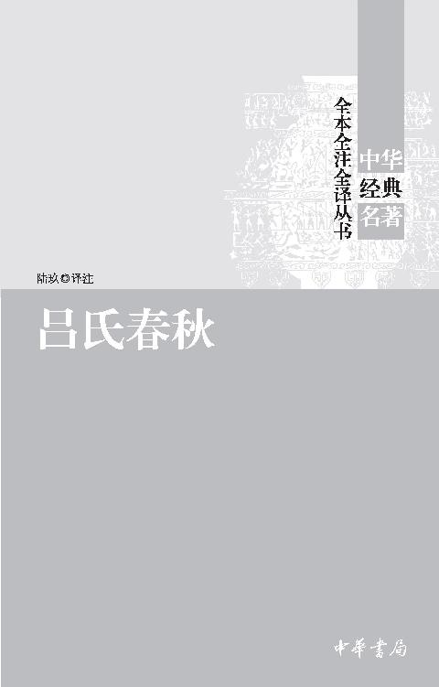

# 书名
 

*图书在版编目（CIP）数据*

吕氏春秋／陆玖译注．—北京：中华书局，2011.10（2017.2重印）

（中华经典名著全本全注全译丛书）

ISBN 978-7-101-08120-6

Ⅰ．吕…　Ⅱ．陆…　Ⅲ．①杂家②吕氏春秋－注释③吕氏春秋－译文　Ⅳ．B229.2

中国版本图书馆CIP数据核字（2011）第153882号  

* * *

*书　　名*　吕氏春秋

*译注者*　陆　玖

*丛书名*　中华经典名著全本全注全译丛书

*责任编辑*　王水涣

*出版发行*　中华书局

（北京市丰台区太平桥西里38号　100073）

http://www.zhbc.com.cn

E-mail：zhbc@zhbc.com.cn

*印　　刷*　北京市白帆印务有限公司

*版　　次*　2011年10月北京第1版

2017年2月北京第8次印刷

*规　　格*　开本/880×1230毫米　1/32

印张31 7/8　字数550千字

*印　　数*　52001-62000册

*国际书号*　ISBN 978-7-101-08120-6

*定　　价*　70.00元

* * *

 # 前言

《吕氏春秋》是先秦的一部重要典籍，有着十分丰富的内容。它的哲学思想、政治思想以及它所保留的科学文化方面的历史资料，是我们民族的一份珍贵遗产，我们应该给予充分的重视，进行深入的研究。这对我们了解战国末期的思想政治文化状况，具有重要的意义。

## 一

《吕氏春秋》是秦相吕不韦召集诸门客集体编纂的一部著作。

吕不韦，濮阳人，阳翟的富商，家累千金。他曾在赵国的首都邯郸经商。当时秦国的庶子异人正在邯郸做人质。因为他在秦国的地位低下，赵国对他很不礼貌，其处境十分窘迫。吕不韦看到这种情况，认为时机到了，他说：“此奇货也，不可失。”当时秦昭襄王立安国君为太子，而安国君最宠幸的华阳夫人没有子嗣。吕不韦抓住这点，便游说异人，说可以帮助他回国登上王位。异人十分感激，说“必如君策，请得分秦国与君共之”。吕不韦通过各种手段，首先博得华阳夫人的信任，使子楚（华阳夫人是楚国人，异人改名子楚）成为安国君的太子。安国君继承王位不到一年便去世，子楚便顺利地成为秦国的国君，即庄襄王。庄襄王即位后，拜吕不韦为丞相，封为文信侯，食河南洛阳十万户。吕不韦一跃成为秦国最有权势的人。

吕不韦在庄襄王、秦王政时期为相十三年。庄襄王在位三年而死，秦王政即位时仅十三岁，尊吕不韦为相国，号称仲父。此时秦国的大政方针，都由吕不韦掌控。吕不韦主政时期，为秦国完成统一大业，作出了积极的贡献。吕不韦主张并致力于对六国的战争。他亲自率军消灭东周，使作为号召力的形式上的周天子不复存在，这是对东方诸侯的一次沉重打击。吕不韦主政时期，对六国发动一连串的战争，取得重大胜利，大大扩展了秦国的疆域，为秦国统一天下奠定了坚实的基础。在内政方面，吕不韦一反秦国传统的独尊法家的政策，广收天下之士，尤其是引进大量儒士。在经济上，吕不韦在主张尚农的同时，也鼓励工商，他曾说：“凡民自七尺以上者属诸三官，农攻粟，工攻器，贾攻货。”当时秦国的工商业者“礼抗万乘，名显天下”，都是吕不韦鼓励工商政策的结果。秦国经济的全面发展，为它消灭六国统一天下奠定了丰厚的物质基础。然而吕不韦内政方面的诸多政策，与秦王政是格格不入的。所以秦王政在亲政后的第二年，便以吕不韦牵连嫪毐与太后的事件为借口，免去了吕不韦的丞相之职，使他回河南封邑。两年以后，又怕他作乱，将他徙居蜀地。吕不韦见大势已去，便饮鸩自杀。

## 二

吕不韦在秦王政六年（前239），即秦王政亲政前两年，召集天下名士，共同编纂了《吕氏春秋》。吕不韦是这部书的主持人，这部书体现了他的思想。吕不韦为什么在这个时候做这样一部书呢？要弄清这个问题，还是要从当时的政治形势入手来分析。当时，秦国统一天下的大势已定，六国诸侯已无力阻挡这一历史潮流。吕不韦清楚地认识到这一形势，并且凭着他政治家的敏感，感到秦国统一天下已经不是很困难的事了，而保持住天下才是真正困难的事。他说：“胜非其难者也，持之其难者也。”作为相国的吕不韦，他必须考虑统一后的秦国如何治理？实行什么政策才能使秦国长治久安？吕不韦不同意用自秦孝公以来几乎处于独尊地位的法家思想作为治国的基本国策，他必须提出自己的理论，作为统一的秦帝国的治国纲领。这一部《吕氏春秋》就是他为秦帝国维持长治久安所提出的治国方略。他曾公开宣示自己的主张，将《吕氏春秋》“布咸阳市门，悬千金其上，延诸侯游士宾客有能增损一字者予千金”。吕不韦企图以相国之位，仲父之尊，迫使秦王政完全依照自己的主张行事，使自己的主张定于一尊，从而维持秦国的长治久安，也维持他自己的权势地位。如果说战国时期百家并起是与诸侯纷争的政治形势相适应的，那么，《吕氏春秋》也正是适应秦国统一天下的需要而出现的。

《吕氏春秋》是一部结构体系十分完备的著作，这在先秦著作中是绝无仅有的。全书分为三个部分：纪、览、论。“纪”按春夏秋冬十二个月分为十二纪，如春分三纪，孟春、仲春、季春。每纪包括五篇文章，总共60篇。“览”按照内容分为八览，每览八篇，八八六十四篇（第一览有始览缺一篇，现有63篇）。“论”也是按内容分为六论，每论六篇，六六三十六篇。还有一篇序意，即全书的序言（今本已残缺），放在十二纪后边。总括起来《吕氏春秋》全书共160篇，结构完整，自成体系。

## 三

《吕氏春秋》的哲学思想具有朴素的唯物主义和朴素的辩证法的性质。它明显地受到道家思想的影响，而又对道家思想进行了较大的改造，摒弃了道家思想中某些唯心的成分。

关于宇宙本源的认识，是战国时期各家学派争论的焦点。《吕氏春秋》继承并发挥了唯物主义的精气说，认为宇宙的本源是一种极其精微的物质即精气，这种精气又叫做太一，又称作道。正是由于这种精气或太一或道的运动和结合而产生千姿百态、性质迥异的天地万物。《吕氏春秋》在两千多年前，能够认识到宇宙是由物质的精气构成，是十分难能可贵的。

由于《吕氏春秋》对宇宙本源的认识，它对天道的认识也具有了唯物的性质。他认为天是由精气构成的自然的天，并不是什么有意志的万物的主宰。他认为“类同相召，气同则合，声比则应”，自然界中同类事物之间都有一种客观的联系，不是什么超物质的意识在起作用。

《吕氏春秋》不相信鬼神，不承认天命。它认为人的生死不是什么命中注定，而具有一种客观的必然性。他说：“凡生于天地之间，其必有死，所不免也。”《吕氏春秋》认为宇宙万物是不断运动的，而且没有终极。《吕氏春秋》还流露了对事物的辩证的认识。它认为事物是互相依存的，他说：“小之定也必恃大，大之安也必恃小，小大贵贱，交相为恃。”而且可以互相转化，这种转化是有一定的条件为前提的。没有适当的条件，转化就无法产生。

《吕氏春秋》的哲学思想具有朴素的唯物性质，也有一定的辩证色彩，值得深入研究，赋予它恰当的历史地位。

## 四

《吕氏春秋》作为治国纲领，提出了一整套的政治主张。它的政治主张的基础是“法天地”。它认为只有顺应天地自然的本性，才能达到清平盛世。因此，虚君实臣、民本德治成为《吕氏春秋》政治思想的核心。

《吕氏春秋》主张君道虚，臣道实。它认为人类应该按照天地的关系来建立君臣的关系。天无形而万物以成，君主就要如同天一样，没有具体的形象，是空灵无为的。君主要养性保真，以实现无为而治。君主为什么一定要无为呢？它认为，君主与众人一样，受到外界环境的制约而有局限性。要克服这种局限性，就必须充分发挥臣下的聪明才智，让臣下去各司其职。否则，君主有所为，就会使臣下阿主之为，有过则无以责之。所以他说：“君道无知无为而贤于有知有为。”君主的无为就是有为，就是无不为。怎样才能做到无为而无不为呢？《吕氏春秋》认为最主要的是君主加强自身的修养，治其身，反诸己。治身是治天下的根本。他说：“为国之本，在于为身。”其次是必须求贤用贤。他说：“古之善为君者，劳于论人而佚于官事，得其经也。”又说：“得贤人，国无不安，名无不荣。”第三是要正名审分设立官职，使百官各司其职，尽其力。“百官各处其职、治其事，以待主，主无不安矣；以此治国，国无不利矣”。

《吕氏春秋》除了提出虚君实臣的思想之外，还提出一整套以民本思想为基础、以仁政德治为核心的治国方略。

民本思想是儒家思想尤其是孟子思想中的重要组成部分。《吕氏春秋》吸收了儒家这种思想的精华，使之成为自己政治理论的重要方面。它认为，民众是国家存亡安危的关键，它说：“人主有能以民为务者，则天下归之矣。”治理天下首先要得民心，要得民心，就要切实地为民众攘除灾祸，创造福祉。它说：“古之君民者，仁义以治之，爱利以安之，忠信以导之，务除其灾，思致其福。”在民本思想的基础上，《吕氏春秋》提出了以德治为主，以赏罚为辅的方针。他认为用德政治国，民众就会亲近其上，就会为君主效死力。它说：“行德爱人，则民亲其上，民亲其上，则皆乐为其君死矣。”用德政治国，就会通达无阻，无往而不胜。同时，它认为在施行德政的前提下，赏罚可以作为一种辅助手段，但只是一种辅助手段而已，不可没有，也不可专恃。它反对以赏罚替代德政，它说：“严刑厚赏，此衰世之政也。”在《吕氏春秋》的德政思想中，教育和音乐占有特别突出的地位。三夏纪中集中阐述了教育和音乐对治国的重要作用。《吕氏春秋》有《劝学》篇，鼓励人们加强学习。它认为学习可以使人们知晓理义，做到忠孝。它说：“不知理义，生于不学。”同时有《尊师》篇，专门论述老师的重要作用以及为师的原则与方法。《吕氏春秋》也十分重视音乐，它认为音乐有潜移默化，移风易俗的功效。它说：“凡音乐通乎政，而移风平俗者也。”又说：“治世之音安以乐，其政平也；乱世之音怨以怒，其政乖也；亡国之音悲以哀，其政险也。”正因为音乐对政治有这么大的作用，所以在《吕氏春秋》的德治中，音乐占有十分突出的位置。

作为德政的补充，《吕氏春秋》主张顺应民心的义兵，诛暴君以振苦民。这种思想是与秦国要用战争平定六国统一天下相一致的。

总之，《吕氏春秋》的政治思想是以儒家思想为主导，以经过改造的道家思想为基础，兼采各家对它有用的成分融合而成的吕氏独特的政治思想。这种思想的产生适应了时代发展的需要。

## 五

《吕氏春秋》的价值，除了它的哲学思想和政治思想之外，还在于它保存了大量的先秦史料和科学文化方面的珍贵资料。研究战国史的著作，已多所利用《吕氏春秋》所保存的史料。这里不详述。仅就它所保留的科学文化方面的内容作些简单的介绍。

《吕氏春秋》保存了很多古代卫生医学方面的知识。他认为人体有“三百六十节、九窍、五藏、六府”，各个器官有各自的生理要求，能够满足它们的要求，疾病就不会发生。因此它要求人们在饮食、情欲、运动等各方面都要多所注意。比如在饮食方面，它要求饮食要按时，要无饥无饱，这样才能保养五脏，没有病灾。在情欲方面，它要求有所节制，不得擅行。在运动方面，强调精气的流通，身体要运动，否则精气就会郁结而生病。它说：“肥肉厚酒，务以自强，命之曰烂肠之食。”“靡曼皓齿，郑卫之音，务以自乐，命之曰伐性之斧。”“出则以车，入则以辇，务以自佚，命之曰招魔之机。”

《吕氏春秋》记述了音乐的起源及原始音乐。它详细论述了音乐起源的过程，说明了音乐与生活的直接关系。同时，它第一次比较全面地记载了我国乐律的六律六吕及其计算法的三分损益法，是研究古代音乐史的宝贵资料。

《吕氏春秋》还有不少天文历法方面的记载，它第一次完整地记载了九野及二十八宿的名称，并且记载了每月太阳、月亮所在的位次，以及与之相应的物候特征、节气的原始形态等。这些对研究古代天文物候都是十分可贵的。

特别需要说到的是，《吕氏春秋》有四篇关于农业的文章，它保留了我国最早的农业生产技术，是研究战国及其以前的农业发展情况的极其珍贵的资料。

《吕氏春秋》是一部研究中国古代文明的宝藏，值得我们深入地发掘和利用。

现在所能见到的《吕氏春秋》最早的版本是元代至正年间的刻本。明代出现一批刻本。通行的本子是清代乾隆五十三年（1788）毕沅的校本，这也是本书整理译注所采用的底本，参校以元至正刻本和明代弘治到万历年间的多种私人刻本。现在又有许维遹的《吕氏春秋集释》，陈奇猷的《吕氏春秋校释》等著作，后世整理者对通行本的文字常有一些改易补充，其中的合理改动，我们在此次整理译注过程中吸取，并在注释中有相应说明。

本书正文包括题解、原文、注释、译文四部分。原文一律采用简化汉字，若因简化字形没有原繁体字形对应的义项，而导致繁简字无法简单对应时，则保留了少量的繁体字和异体字形。注释不作繁琐考证，力求准确、简明。注释中，凡属假借字，写作“某通某”；属《异体字整理表》中没有废除的异体字，写作“某同某”；凡属古今字，写作“某同某”，译文以直译为主，少数地方若直译晦涩难解，则适当采用意译。

本次整理，以清乾隆五十三年（1788）毕沅新校本《吕氏春秋》为底本，参考了元明两代的众家旧刻本，注释方面较多参考了许维遹《吕氏春秋集释》等书，并尽量吸收前人及今人研究成果，在此一并致谢。本书内容广博，涉及不少专门问题，鉴于译注者知识面和水平有限，疏漏之处在所难免，希望各界方家不吝批评指正。

陆　玖

2011年5月

 # 目 录

## 前言

## 上　册

孟春纪第一

孟春

本生

重己

贵公

去私

仲春纪第二

仲春

贵生

情欲

当染

功名一作由道

季春纪第三

季春

尽数

先己

论人

圜道

孟夏纪第四

孟夏

劝学一作观师

尊师

诬徒一作诋役

用众一作善学

仲夏纪第五

仲夏

大乐

侈乐

适音一作和乐

古乐

季夏纪第六

季夏

音律

音初

制乐

明理

孟秋纪第七

孟秋

荡兵一作用兵

振乱

禁塞

怀宠

仲秋纪第八

仲秋

论威

简选

决胜

爱士一作慎穷

季秋纪第九

季秋

顺民

知士

审己

精通

孟冬纪第十

孟冬

节丧

安死

异宝

异用

仲冬纪第十一

仲冬

至忠

忠廉

当务

长见

季冬纪第十二

季冬

士节

介立一作立意

诚廉

不侵

序意一作廉孝

有始览第一

有始

应同旧作名类

去尤

听言

谨听

务本

谕大

孝行览第二

孝行

本味

首时一作胥时

义赏

长攻

慎人一作顺人

遇合

必己一作本知，一作不遇

慎大览第三

慎大

权勋

下贤

报更

顺说

不广

贵因

察今

先识览第四

先识

观世

知接

悔过

乐成

察微

去宥

正名

## 下　册

审分览第五

审分

君守

任数

勿躬

知度

慎势

不二

执一

审应览第六

审应

重言

精谕

离谓

淫辞

不屈

应言

具备

离俗览第七

离俗

高义

上德

用民

适威

为欲

贵信

举难

恃君览第八

恃君

长利

知分

召类

达郁

行论

骄恣

观表

开春论第一

开春

察贤

期贤

审为

爱类

贵卒

慎行论第二

慎行

无义

疑似

壹行

求人

察传

贵直论第三

贵直

直谏

知化

过理

壅塞

原乱

不苟论第四

不苟

赞能

自知

当赏

博志

贵当

似顺论第五

似顺

别类

有度

分职

处方

慎小

士容论第六

士容

务大

上农

任地

辩土

审时

 上　册

