 孟春纪第一

# 孟春

*【题解】*

本书十二月纪以阴阳五行学说为依据，阐明四季十二月的天文、历象、物候等自然现象，说明天子每月在衣食住行等方面所应遵守的规定，以及为顺应时气在郊庙祭祀、礼乐征伐、农事活动等方面所应发布的政令。要求天子行事制令都要“无变天之道，无绝地之理，无乱人之纪”。实际上，这十二月纪是作者构想的一年的施政纲领。本书十二月纪是阴阳明堂思想较早、较有系统的记载。

依五行学说，春季属木，阳气渐盛，万物萌生，是生养的季节。因此，天子发布政令要以宽厚仁恩为主旨，禁止杀伐伤生。天子要劝勉农桑，躬耕帝籍；要抚恤幼孤，赈济贫困；要演乐习舞，亲往观看。以此来顺应时气。

《孟春》、《仲春》、《季春》所统辖的十二篇文章都是以讲养生为主的。阐述养生的思想，也是为了与春天生养之季相应合。

**一曰：**

**孟春之月(1)，日在营室(2)，昏参中(3)，旦尾中(4)。其日甲乙(5)，其帝太皞(6)，其神句芒(7)，其虫鳞(8)，其音角(9)，律中太蔟(10)。其数八(11)，其味酸，其臭膻(12)，其祀户(13)，祭先脾。东风解冻(14)，蛰虫始振(15)，鱼上冰(16)，獭祭鱼(17)，候雁北。天子居青阳左个(18)，乘鸾辂(19)，驾苍龙(20)，载青旂(21)，衣青衣(22)，服青玉，食麦与羊(23)，其器疏以达(24)。**

*【注释】*

(1)孟春：春季的第一个月，即夏历正月。

(2)日在营室：指视太阳运行的位置在营室宿。营室，二十八宿之一，在今飞马座。

(3)参：二十八宿之一，在今猎户座。中：指中星，即晨昏时刻出现在正南方中天的星宿。

(4)旦：平明，拂晓。尾：二十八宿之一，在今天蝎座。

(5)其：指孟春。甲乙：五行说把四时、十天干与五行相配，春季属木，甲乙也属木，所以说“其日甲乙”。下文“其帝太皞”、“其神句芒”、“其虫鳞”、“其音角”、“其味酸”、“其臭膻”、“其祀户”等等，也都是把五帝、五神、五虫等配于五行之后，再配于四时。

(6)太皞（hào）：即伏羲氏，本书把它作为五帝之一，五行家说他以木德称王天下，被尊为东方之帝、木德之君。

(7)句（ɡōu）芒：少氏之子，名重，辅佐木德之帝，被尊为木德之神。

(8)虫：古时对动物的总称。鳞：五虫（羽毛甲鳞倮）之一，指鱼龙之类。

(9)角：五音（宫商角徵羽）之一。

(10)律：律管，即定音的竹管。中（zhònɡ）：相应。太蔟（còu）：古代十二律之一。十二律分为阳律（六律）、阴律（六吕），它们的名称是：黄钟、太蔟、姑洗、蕤宾、夷则、无射（六律）；大吕、夹钟、中吕、林钟、南吕、应钟（六吕）。据说古人把葭莩（jiāfú）的灰塞在律管里，某月到了，与它相应的律管里的灰就飞动起来，这就叫律中某某；孟春之月，太蔟管中的灰飞动起来，所以叫“律中太蔟”。

(11)八：指木之成数。阴阳五行说认为天地生成五行，一天生水，二地生火，三天生木，四地生金，五天生土；因为阴阳不相配不能相成，所以又六地成水，七天成火，八地成木，九天成金，十地成土。天生木之数是三，天地相配成木之数是八。

(12)臭（xiù）：气味。膻：五臭（膻焦香腥朽）之一。

(13)祀：祭祀。户：户祀，五祀（户灶中霤门行）之一。古人认为春天阳气上升，蛰伏的动物开始活动，由户而出，所以孟春要举行户祀。

(14)东风：春风。五方、春季都属木，所以称春风四时与五行相配，东方、为东风。

(15)蛰（zhé）虫：藏伏的动物。

(16)鱼上冰：冬天寒冷之时，鱼伏在深水处，孟春天气渐暖，鱼就向上游到冰层下。

(17)獭（tǎ）祭鱼：水獭将捕得的鱼陈列在水边，古人称之为“獭祭鱼”。祭，杀。

(18)青阳左个：东向明堂的北侧室。古代帝王居住及宣布政教的明堂，按五行构筑，东向的叫青阳，南向的叫明堂，西向的叫总章，北向的叫玄堂，中央的叫太庙。除太庙只有一个太室之外，其余的在正堂两侧各有一个侧室，叫“个”，左侧室叫“左个”，右侧室叫“右个”，中间的正堂也叫太庙。天子按四时、五行的运行，每月换一个居室。

(19)鸾辂（lù）：饰有鸾铃的车。鸾，鸾铃。辂，车。鸾本是青色凤鸟，这里称春天用的车为鸾辂，是取鸾凤色青。五色与五行相配，青属木，所以用青色的东西命名春天用的器物。下文的御用之物如青龙、青旋、青衣、青玉等都是为顺应春天的苍青之色。

(20)龙：高大的马。马高八尺以上为龙。

(21)载：（把旗帜）插在车上。旂（qí）：古代绘有龙纹的旗帜。

(22)衣（yì）青衣：穿着青色的衣服。

(23)食麦与羊：五谷（麦黍稷麻菽）、五畜（鸡羊牛犬豕）与五行相配，麦属木，羊属火。古人认为吃东西要顺应时气，安生养性，而春气贵在调和，但还有冬日的余寒，所以吃与春同属木的谷物，并用属火之畜来御寒。

(24)器：指宗庙所用的器具。疏以达：指器物镂刻的纹理空疏而通达。

*【译文】*

第一：

孟春正月，太阳的位置在营室宿；初昏时刻，参宿出现在南方中天；拂晓时刻，尾宿出现在南方中天。孟春在天干中属甲乙，主宰之帝是太皞，佐帝之神是句芒，应时的动物是龙鱼之类的鳞族，声音是中和的角音，音律与太蔟相应。这个月的数字是八，味道是酸，气味是膻，要举行的祭祀是户祭，祭祀时，祭品以脾脏为尊。春风吹融了冰雪，蛰伏的动物开始苏醒活动，鱼儿从深水向上游到冰层下，水獭开始捕鱼，候鸟大雁从南往北飞行。天子居住在东向明堂的左侧室，乘坐饰有用青凤命名的响铃的车子，车前驾着青色的马，车上插着绘有龙纹的青色旗帜；天子穿青色的衣服，佩戴青色的饰玉，吃的食物是麦子和羊肉，使用的器物纹理空疏而通达。

**是月也，以立春。先立春三日，太史谒之天子(1)，曰：“某日立春，盛德在木(2)。”天子乃斋。立春之日，天子亲率三公、九卿、诸侯、大夫(3)，以迎春于东郊；还，乃赏公卿、诸侯、大夫于朝。命相布德和令(4)，行庆施惠，下及兆民。庆赐遂行(5)，无有不当。乃命太史，守典奉法(6)，司天日月星辰之行，宿离不忒(7)，无失经纪(8)。以初为常(9)。**

*【注释】*

(1)太史：官名，负责记载史事、观测天文、制订历法等。谒：告。

(2)盛德：大德。古人认为春属木而有生育万物之德，所以说春季盛德在木。

(3)三公：辅佐天子的最高官吏，这里指太师、太傅、太保。九卿：指少师、少傅、少保、冢宰、司徒、宗伯、司马、司寇、司空。

(4)相：三公。和：通“宣”。

(5)庆赐：指应该褒奖赏赐之事。遂：通达。

(6)守典奉法：遵奉六典八法。典，指六典，即治典、礼典、刑典、教典、政典、事典。法，八法，即官属、官职、官联、官常、官成、官法、官刑、官计。六典八法是治理邦国官府的法则制度。

(7)宿：指太阳所在的位置。离：指月亮所经过的地方。忒（tè）：差错。

(8)经纪：纲常、法度，这里指日月星辰进退疾迟的度数。

(9)初：指作为历法计算起点的冬至点。当时人们认为冬至点在牵牛初度。常：法。

*【译文】*

这个月有立春的节气。立春前三天，太史向天子禀告说：“某日立春，大德在木。”天子于是斋戒，准备迎春。立春那天，天子亲自率领三公、九卿、诸侯、大夫到东郊去迎接春的降临；迎春礼毕归来，就在朝中赏赐公卿、诸侯、大夫。并命令相国宣布教化，发布禁令，实行褒奖，施予恩惠，一直施及所有百姓。褒奖赏赐之事，要通达施行，不要有不当之处。于是命令太史遵奉六典八法，主管推算日月星辰运行的工作；太阳所在的位置、月亮所经过的地方，以及日月星辰运行的度数和轨迹，要计算得没有一点差错和失误。制定历法仍以冬至点在牵牛初度为准则。

**是月也，天子乃以元日祈谷于上帝(1)。乃择元辰(2)，天子亲载耒耜(3)，措之参于保介之御间(4)，率三公、九卿、诸侯、大夫，躬耕帝籍田(5)。天子三推，三公五推，卿、诸侯、大夫九推。反(6)，执爵于太寝(7)，三公、九卿、诸侯、大夫皆御(8)，命曰“劳酒”。**

*【注释】*

(1)元日：吉日。

(2)元辰：吉辰。日为天干，辰为地支，所以有事于天（祈谷）用日，有事于地（耕帝籍）用辰。

(3)耒耜（sì）：农具，犁。犁柄叫耒，铧叫耜。

(4)措：放置。参于：疑当作参乘（shènɡ），“于”为“乘”字之坏脱。保介：车右，即站在车上右侧保护君主的武士。之：与。御：御者，驾车的人。车右和御者都是参乘。

(5)躬：亲自。帝籍田：古时，天子有农田千亩，用民力耕作，来生产祭祀上帝的黍稷，所以称这千亩农田为帝籍田。又简称“帝籍”或“籍田”。

(6)反：同“返”，返回。

(7)爵：饮酒器。太寝：祖庙。

(8)御：侍，指陪天子饮酒。

*【译文】*

这个月，天子在吉日向上帝祈求五谷丰登。并选择好的时辰，亲自用车装载着耒耜，放在参乘——车右和御者中间，率领三公、九卿、诸侯、大夫，到帝籍田亲自耕作。推耒耜入土，天子推三下，三公推五下，卿、诸侯、大夫推九下。礼毕返回，天子在祖庙举行宴饮，慰劳群臣，三公、九卿、诸侯、大夫都去侍酒。这次宴饮命名叫“劳酒”。

**是月也，天气下降，地气上腾，天地和同，草木繁动(1)。王布农事，命田舍东郊(2)，皆修封疆(3)，审端径术(4)。善相丘陵阪险原隰(5)，土地所宜，五谷所殖，以教道民(6)，必躬亲之。田事既饬(7)，先定准直(8)，农乃不惑。**

*【注释】*

(1)繁：萌。动：生。

(2)田：指田畯，古代主管农事的官。舍：住。

(3)封疆：疆界，这里指田地的界限。

(4)审：周密，详细。端：端正。径、术：都是小路，这里指田间的小路。

(5)相（xiànɡ）：考察。阪（bǎn）：大坡。险：高低不平的地方。原：广阔平坦的地方。隰（xí）：低洼潮湿的地方。

(6)道：同“导”，引导。

(7)饬（chì）：通“敕”，申明，告诫。

(8)准直：指农产品的价格标准。

*【译文】*

这个月，上天之气下降，地中之气上升，天地之气混同一体，草木开始萌发。国君宣布农功之事，命令农官住在东郊，监督农民整治田界，审视并端正田间小路；很好地考察丘陵、山地、平原、洼地，各类土地适宜种什么谷物，各种谷物应用什么方法种植，要用这些教诲引导农民，而且务必亲自去做。农功之事布置完毕，先确定农产品的价格标准，农民才没有疑惑。

**是月也，命乐正入学习舞(1)。乃修祭典，命祀山林川泽，牺牲无用牝(2)，禁止伐木；无覆巢，无杀孩虫、胎夭、飞鸟(3)，无麛无卵(4)；无聚大众，无置城郭，掩骼霾髊(5)。**

*【注释】*

(1)乐正：乐官之长。学：指太学。习舞：指教国子练习舞蹈。

(2)牺牲：供祭祀用的全色整个牲畜。牝（pìn）：雌性的禽兽，这里指母牲。古人认为春天是生养万物之时，所以禁止在祭祀山林川泽时用母畜做牺牲。

(3)孩虫：幼兽。孩，幼。胎夭：在母腹中的小兽。夭，麋子叫夭，泛指小兽。飞鸟：刚学飞的小鸟。

(4)麛（mí）：小鹿，泛指幼兽。卵：鸟卵。

(5)骼：枯骨。霾（mái）：埋。髊（cī）：带有腐肉的骨。孟春掩埋枯骨尸骸，表示顺应时气，崇尚仁恩。

*【译文】*

这个月，命令乐官进入太学教国子练习舞蹈。同时修订祭祀的规则，命令祭祀山林河流，不用母牲做祭品，禁止砍伐树木；不许捣翻鸟巢，不许杀害幼小的禽兽飞鸟，不许捕捉小兽和掏取鸟卵；不得聚集民众，不得建立城郭；要掩埋枯骨尸骸。

**是月也，不可以称兵，称兵必有天殃(1)。兵戎不起，不可以从我始。无变天之道，无绝地之理，无乱人之纪(2)。**

*【注释】*

(1)“不可”二句：称，举。古人认为孟春主生养，举兵杀戮有逆天道，所以要遭天殃。

(2)“无变天”三句：是说发布政令要顺应天地人三者的规律法则。纪，纲纪。

*【译文】*

这个月，不可以举兵征伐，举兵必定遭到天灾。在不能兴兵征伐的时节，兵戎之事不可以从我开始。发布政令不要违背自然的规律，不要无视土地的条件，不要扰乱人世的纲纪。

**孟春行夏令(1)，则风雨不时(2)，草木早槁，国乃有恐；行秋令，则民大疫，疾风暴雨数至，藜莠蓬蒿并兴(3)；行冬令，则水潦为败(4)，霜雪大挚(5)，首种不入(6)。**

*【注释】*

(1)令：指政令。

(2)不时：不合时。

(3)藜（lí）：像蒿一类的野草。莠（yǒu）：像谷子但不结实的野草。

(4)潦（lǎo）：雨水大的样子。

(5)挚（zhì）：伤害。

(6)首种：指过冬的麦子。入：收成。

*附《吕氏春秋》十二月纪五行相配表*
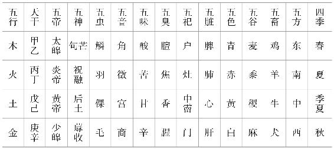 

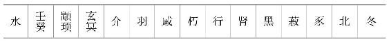 

*【译文】*

孟春正月如果发布应在夏天发布的政令，那么风雨就不能按时来去，草木就会过早干枯，人民就会感到惶恐；如果发布应在秋天发布的政令，那么，百姓就会遭受瘟疫，狂风暴雨就会多次袭来，野草就会蓬生；如果发布应在冬天发布的政令，那么大水就会毁害生物，霜雪就会严重地伤害庄稼，麦子就不能生成收获。

# 本生

*【题解】*

“本生”就是把保全生命作为根本。文章认为外物既可以养生，又可以伤生，而保全生命的方法在于正确地处理人与外物的关系。圣人重生轻物，“以物养性（生命）”，富贵之人则重物轻生，“以性养物”，这样做的结果必然导致伤生亡国。作者的这些议论，是为规劝骄奢淫逸的君主而发的，其思想主要源于杨朱一派的“贵己”学说。

**二曰：**

**始生之者，天也；养成之者，人也。能养天之所生而勿撄之谓天子(1)。天子之动也，以全天为故者也(2)。此官之所自立也。立官者，以全生也。今世之惑主，多官而反以害生，则失所为立之矣。譬之若修兵者，以备寇也。今修兵而反以自攻，则亦失所为修之矣。**

*【注释】*

(1)撄（yīnɡ）：触犯。

(2)天：指天所生育的生命。故：事。

*【译文】*

第二：

最初创造出生命的是天，养育生命并使它成长的是人。能够保养上天创造的生命而不摧残它，这样的人称作天子。天子一举一动都是把保全生命作为要务的。这是设立职官的由来。天子设立职官，正是用以保全生命啊。如今世上胡涂的君主，大量设立官职却反而因此妨害生命，这就失去设立职官的本来意义了。譬如整饬军备，是用以防备敌寇的。可是如今整饬军备却反而用以攻杀自己，那就失去了整饬军备的本来意义了。

**夫水之性清，土者抇之(1)，故不得清。人之性寿，物者抇之，故不得寿。物也者，所以养性也(2)，非所以性养也(3)。今世之人，惑者多以性养物，则不知轻重也(4)。不知轻重，则重者为轻，轻者为重矣。若此，则每动无不败。以此为君，悖；以此为臣，乱；以此为子，狂。三者国有一焉，无幸必亡。**

*【注释】*

(1)抇（ɡǔ）：搅浑，搅乱。

(2)性：生命。

(3)以性养：用生命供养外物。

(4)轻：喻物。重：喻身。

*【译文】*

水本来是清澈的，泥土使它浑浊，所以水无法保持清澈。人本来是可以长寿的，外物使他迷乱，所以人无法获得长寿。外物本应是供养生命的，不该损耗生命去追求它。可是如今世上胡涂的人多损耗生命去追求外物，这样做是不知轻重。不知轻重，就会把重的当作轻的，把轻的当作重的了。像这样，无论做什么，没有不失败的。持这种态度做君主，就会惑乱胡涂；持这种态度做臣子，就会败乱纲纪；持这种态度做儿子，就会狂放无礼。这三种情况，国家只要有其中一种，就无可幸免，必定灭亡。

今有声于此，耳听之必慊已(1)，听之则使人聋，必弗听。有色于此，目视之必慊已，视之则使人盲，必弗视。有味于此，口食之必慊已，食之则使人喑(2)，必弗食。是故圣人之于声色滋味也，利于性则取之，害于性则舍之，此全性之道也。世之贵富者，其于声色滋味也，多惑者。日夜求，幸而得之则遁焉(3)。遁焉，性恶得不伤？

*【注释】*

(1)慊（qiè）：满足，惬意。

(2)喑（yīn）：哑。

(3)遁：通“循”，这里指没有节制。

*【译文】*

假如有这样一种声音，耳朵听到它肯定感到惬意，但听了就会使人耳聋，人们一定不会去听。假如有这样一种颜色，眼睛看到它肯定感到惬意，但看了就会使人眼瞎，人们一定不会去看。假如有这样一种食物，嘴巴吃到它肯定感到惬意，但吃了就会使人声哑，人们一定不会去吃。因此，圣人对于声音、颜色、滋味这些东西，有利于生命的就取用，有害于生命的就舍弃，这是保全生命的方法。世上富贵的人，对于声色滋味这些东西，大多是胡涂的。他们日日夜夜地追求这些东西，幸运地得到了，就放纵自己不能自禁。这样，生命怎么能不受伤害？

万人操弓，共射一招(1)，招无不中。万物章章(2)，以害一生，生无不伤；以便一生(3)，生无不长。故圣人之制万物也，以全其天也。天全，则神和矣，目明矣，耳聪矣，鼻臭矣(4)，口敏矣，三百六十节皆通利矣(5)。若此人者，不言而信，不谋而当，不虑而得；精通乎天地，神覆乎宇宙；其于物无不受也，无不裹也，若天地然；上为天子而不骄，下为匹夫而不惛(6)。此之谓全德之人。

*【注释】*

(1)招：射的目标，箭靶。

(2)章章：繁盛的样子。

(3)便：利。

(4)臭（xiù）：这里指嗅觉灵敏。

(5)三百六十节：指人的周身所有关节。阴阳五行学说认为人的关节总数为三百六十五，与周天三百六十五度相应。这里是取其整数。利：通畅。

(6)惛（mèn）：通“闷”，忧闷。

*【译文】*

一万人拿着弓箭，共同射向一个目标，那个目标没有不被射中的。万物繁盛茂美，如果用以伤害一个生命，这个生命没有不被伤害的；如果用以长养一个生命，这个生命没有不成长的。所以圣人制约万物，是用以保全自己的生命。生命完好无损，精神就和谐了，眼睛就明亮了，听觉就灵敏了，嗅觉就敏锐了，口齿就伶俐了，全身的筋骨就通畅舒展了。像这样的人，不用说话就能取信于人，不用谋划就做得合适，不用思考就处事得当。他们的精气通达天地，心神覆盖宇宙。对于外物，他们无不承受，无不包容，就像天地一样。他们上做天子而不骄傲，下做百姓而不忧闷。像这样的人，称得上是德行完全的人。

贵富而不知道，适足以为患，不如贫贱。贫贱之致物也难，虽欲过之，奚由？出则以车，入则以辇(1)，务以自佚(2)，命之曰“招蹷之机”(3)。肥肉厚酒，务以自强，命之曰“烂肠之食”。靡曼皓齿(4)，郑卫之音(5)，务以自乐，命之曰“伐性之斧”。三患者，贵富之所致也。故古之人有不肯贵富者矣，由重生故也；非夸以名也，为其实也。则此论之不可不察也。

*【注释】*

(1)辇（niǎn）：人推挽的车。

(2)佚（yì）：同“逸”，逸乐。

(3)蹷（jué）：病名，这里指脚不能行走。

(4)靡曼皓齿：指美色。靡曼，皮肤细腻。皓，洁白。

(5)郑卫之音：春秋战国时郑、卫两国的民间音乐。从孔子“放郑声”、“郑声淫”起，古人历来都视之为淫靡之音、乱世之音。

*【译文】*

富贵而不懂得养生之道，恰恰足以成为祸患，与其这样，还不如贫贱。贫贱的人获得东西很难，即使想要过度地沉湎于物质享受之中，又从哪儿去弄到呢？出门乘车，进门坐辇，极力使自己安逸舒适，这种车辇应该叫做“招致脚病的器械”。吃肥肉，喝醇酒，极力勉强自己吃喝，这种酒肉应该叫做“腐烂肠子的食物”。迷恋女色，陶醉于淫靡之音，极力使自己尽享安乐，这种美色、音乐应该叫做“砍伐生命的利斧”。这三种祸患都是富贵所招致的。所以古代就有不肯富贵的人了，这是由于重视生命的缘故；并不是用轻视富贵的虚名来夸耀自己，而是为保全生命。既然这样，那么以上这些道理是不可不明察的。

# 重己

*【题解】*

本篇旨在劝说君主要珍重自己的生命。珍重生命的办法是顺生而行，适欲节性，衣食住行、游观娱乐都要适度，只有这样才能“长生久视”。文中批评了对生命“慎之而反害之者”和“弗知慎者”，指出他们不达性命之情，不别死生存亡，逆生而动，其结果必然“死殃残亡”。

从养生的角度看，顺生节欲的思想带有某些合理的因素。

三曰：

倕(1)，至巧也。人不爱倕之指，而爱己之指，有之利故也。人不爱昆山之玉、江汉之珠(2)，而爱己之一苍璧小玑(3)，有之利故也。今吾生之为我有，而利我亦大矣。论其贵贱，爵为天子，不足以比焉；论其轻重，富有天下，不可以易之；论其安危，一曙失之，终身不复得。此三者，有道者之所慎也。

*【注释】*

(1)倕（chuí）：相传是尧时的巧匠。

(2)昆山：昆仑山。据说昆仑山产的玉石，用炉炭烧三天三夜，色泽也不改变。因此古人用“昆山之玉”指代上好的美玉。江汉：长江、汉水。传说江汉有夜明珠，因此古人用“江汉之珠”指代上好的珍珠。

(3)苍璧：含石多的玉。玑（jī）：小而不圆的珍珠。

*【译文】*

第三：

倕是最巧的人，但是人们不爱惜倕的手指，却爱惜自己的手指，这是由于它属于自己所有而有利于自己的缘故。人们不爱惜昆山的美玉，江汉的明珠，却爱惜自己的一块次等玉石，一颗不圆的小珠，这是由于它属于自己所有而有利于自己的缘故。如今我的生命属于我所有，而给我带来的利益也是极大的。就贵贱而论，即使贵为天子，也不足以同它相比；就轻重而论，即使富有天下，也不能同它交换；就安危而论，一旦失掉它，终身不可再得到。正是由于这三个方面的原因，有道之人对生命特别小心谨慎。

有慎之而反害之者，不达乎性命之情也。不达乎性命之情，慎之何益？是师者之爱子也(1)，不免乎枕之以糠；是聋者之养婴儿也，方雷而窥之于堂。有殊弗知慎者？

*【注释】*

(1)师：乐官，古代由盲人担任。这里指代盲人。

*【译文】*

有人虽然对生命小心谨慎，却反而损害了生命，这是由于不通晓生命的天性的缘故。不通晓生命的天性，即使对生命小心谨慎，又有什么益处？这正如盲人爱儿子，竟免不了把他枕卧在谷糠里，而眯了婴儿的眼睛；又如聋子养育婴儿，正当响雷的时候却抱着他在堂上向外张望，而使婴儿受到更大的惊吓。这种情况同不知小心谨慎的人相比，其实际效果又有什么不同？

夫弗知慎者，是死生存亡可不可未始有别也。未始有别者，其所谓是未尝是，其所谓非未尝非。是其所谓非，非其所谓是，此之谓大惑。若此人者，天之所祸也。以此治身，必死必殃；以此治国，必残必亡。

夫死殃残亡，非自至也，惑召之也。寿长至常亦然。故有道者不察所召，而察其召之者，则其至不可禁矣。此论不可不熟。

*【译文】*

对生命不知小心爱惜的人，他们对死生、存亡、可与不可从来没有分辨清楚。他们认为正确的从来都不是正确的，他们认为错误的从来都不是错误的。他们把错误的东西当作是正确的，把正确的东西当作是错误的，这种情况叫做“大惑”。像这种人，正是上天降祸的对象。持这种态度修身，自身必定遭祸，必定死亡；持这种态度治理国家，国家必定残破，必定灭亡。

死亡、灾祸、残破、灭亡，这些东西都不是自己找上来的，而是惑乱所招致的。长寿的得来也常是这样。所以，有道之人不去考察招致的结果，而考察招致它们的原因，那么，结果的实现自然就不可遏止了。这个道理不可不深知。

使乌获疾引牛尾(1)，尾绝力勯(2)，而牛不可行，逆也。使五尺竖子引其棬(3)，而牛恣所以之，顺也。世之人主贵人，无贤不肖，莫不欲长生久视，而日逆其生，欲之何益？凡生之长也，顺之也；使生不顺者，欲也。故圣人必先适欲。

*【注释】*

(1)乌获：战国时秦国的力士，以勇力仕秦武王。

(2)勯（dān）：竭尽。

(3)五尺：古代尺小，当时的五尺约合今天一米多一些。棬（juàn）：同“桊”，牛鼻环。

*【译文】*

假使叫古代的大力士乌获用力拽牛尾，即使把力气用尽，把牛尾拽断，也不能让牛跟着走，这是违背牛的习性的缘故。如果叫一个小孩牵着牛鼻环，牛就会顺从地听任所往，这是由于顺应牛的习性的缘故。世上的人君、贵人，不论贤与不贤，没有不想长寿的。但是他们每日都在违背生命的天性，即使想要长寿，又有什么益处？大凡生命长久都是顺应它的天性的缘故，使生命不顺的是欲望，所以圣人一定首先节制欲望，使之适度。

室大则多阴，台高则多阳；多阴则蹷(1)，多阳则痿(2)。此阴阳不适之患也。是故先王不处大室，不为高台，味不众珍，衣不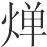热(3)。热则理塞，理塞则气不达；味众珍则胃充，胃充则中大鞔(4)，中大鞔而气不达。以此长生可得乎？昔先圣王之为苑囿园池也(5)，足以观望劳形而已矣(6)；其为宫室台榭也(7)，足以辟燥湿而已矣(8)；其为舆马衣裘也，足以逸身暖骸而已矣(9)；其为饮食酏醴也(10)，足以适味充虚而已矣；其为声色音乐也，足以安性自娱而已矣。五者，圣王之所以养性也，非好俭而恶费也，节乎性也。

*【注释】*

(1)蹷：这里指寒蹷，是一种手足逆冷的病症，古人认为是阴气盛所致。

(2)痿：一种肢体萎弱无力的病症，古人认为主要是阳气盛而五脏内热所致。蹷、痿之疾都会使人肢体不能活动。

(3)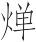（dǎn）：通“亶”，厚。

(4)中：指胸腹。鞔（mèn）：通“懑”，闷胀。

(5)苑（yuàn）、囿（yòu）：都是畜养禽兽的地方，大的叫苑，小的叫囿。

(6)劳形：活动身体。古人把劳形作为养生之道的一个重要内容。

(7)台：高而平的建筑物，一般供远眺、游观之用。榭（xiè）：建在高土台上的敞屋。

(8)辟：同“避”。

(9)骸：形骸，人的身体。

(10)酏（yí）：稀粥，可用来酿酒。醴（lǐ）：甜酒。

*【译文】*

房屋过大，阴气就会过盛；台过高，阳气就会过盛。阴气过盛就会生蹷疾，阳气过盛就会得痿病。这是阴阳不适度带来的祸患。因此，古代帝王不住大房，不筑高台，饮食不求丰盛珍异，衣服不求过厚过暖。衣服过厚过暖脉理就会闭结，脉理闭结气就会不通畅。饮食丰盛珍异胃就会过满，胃过满胸腹就会闷胀，胸腹闷胀气就会不通畅。在气不通畅的状态下还想求得长生，能办到吗？从前，先代圣王建造苑囿园池，规模只要足以游目眺望、活动身体就行了；他们修筑宫室台榭，大小高低只要足以避开干燥和潮湿就行了；他们制作车马衣裘，只要足以安身暖体就行了；他们置备饮食酏醴，只要足以合口味、饱饥肠就行了；他们创作音乐歌舞，只要足以使自己性情安乐就行了。这五个方面是圣王用来养生的。他们之所以要这样，并不是喜好节俭，厌恶糜费，而是为了调节性情使它适度啊。

# 贵公

*【题解】*

本篇旨在阐述君主治国、治天下“必先公”的道理。文章认为，君主只有先做到“公”，才能实现“天下平”，“平得于公”。文章提出，天地至公“生而弗子，成而弗有，万物皆被其泽，得其利，而莫知其所由始”，劝说君主效法天地，这与老子提倡的“生而弗有，为而弗恃，长而弗宰”的思想是一致的。文章提出：“天下非一人之天下也，天下之天下也。”这显然是针对君主而发的，但其目的仍在于强调“万民之主，不阿一人”，并非主张天下当由天下人治理。

四曰：

昔先圣王之治天下也，必先公。公则天下平矣(1)。平得于公。尝试观于上志(2)，有得天下者众矣，其得之以公，其失之必以偏。凡主之立也，生于公。故《鸿范》曰(3)：“无偏无党(4)，王道荡荡。无偏无颇(5)，遵王之义(6)。无或作好，遵王之道。无或作恶(7)，遵王之路。”

*【注释】*

(1)平：指政治清明安定。

(2)尝：试。“尝试”为同义连用。上志：古代记载。

(3)《鸿范》：《尚书·周书》中的一篇，一作《洪范》。鸿，大。范，法。

(4)无：通“毋”，不要。偏：不平。党：结党。

(5)颇：不正。

(6)遵：沿着……走。义：道理，法度。

(7)恶（wù）：憎恶。

*【译文】*

第四：

从前，先代圣王治理天下，一定把公正无私放在首位。做到公正无私，天下就安定了。天下获得安定是由于公正无私。试考察一下古代的记载，曾经取得天下的人是相当多的了。如果说他们取得天下是由于公正无私，那么他们丧失天下必定是由于偏颇有私。大凡立君的本意，都是出于公正无私。所以《鸿范》中说：“不要偏私，不要结党，王道多么平坦宽广。不要偏私，不要倾侧，遵循先王的法则。不要滥逞个人偏好，遵循先王的正道。不要滥逞个人怨怒，遵循先王的正路。”

天下，非一人之天下也，天下之天下也。阴阳之和，不长一类；甘露时雨，不私一物；万民之主，不阿一人。

伯禽将行(1)，请所以治鲁。周公曰(2)：“利而勿利也。”

荆人有遗弓者(3)，而不肯索，曰：“荆人遗之，荆人得之，又何索焉？”孔子闻之曰：“去其‘荆’而可矣。”老聃闻之曰(4)：“去其‘人’而可矣。”故老聃则至公矣。

天地大矣，生而弗子，成而弗有，万物皆被其泽，得其利，而莫知其所由始。此三皇五帝之德也(5)。

*【注释】*

(1)伯禽：周公旦之子，鲁国始祖。周公相成王，留在东都洛阳，成王封伯禽于鲁。

(2)周公：姬姓，名旦，周武王之弟，辅佐武王灭商，建立周王朝。相传周代的礼乐制度都是周公制定的。

(3)荆：古代楚国的别称。因楚国原建国于荆山一带，故名“荆”。

(4)老聃（dān）：春秋战国时楚人，曾为周藏书室史官。相传《老子》（又名《道德经》）一书为老聃所著。

(5)三皇五帝：传说中的远古帝王。一般的说法是，三皇指伏羲（xī）、神农、燧人，五帝指黄帝、颛顼（zhuānxū）、帝喾（kù）、尧、舜。本书十二月纪则以太皞（伏羲）、炎帝（神农）、黄帝、少皞、颛顼为五帝。

*【译文】*

天下不是某一个人的天下，而是天下人的天下。阴阳相和，不只长养一种物类。甘露时雨，不偏私某一种生物。万民之主，不偏袒某一个人。

伯禽将去鲁国，临行前请示治理鲁国的方法。周公说：“施利给人民而不谋取私利。”

有个荆人丢了弓，却不肯去寻找，他说：“荆人丢了它，荆人得到它，又何必寻找呢？”孔子听到这件事说：“他的话中去掉那个‘荆’字就合适了。”老聃听到以后说：“再去掉那个‘人’字就合适了。”像老聃这样的人，算是达到公的最高境界了。

天地是多么伟大啊，生育人民而不把他们视为自己的子孙，成就万物而不占为己有。万物都承受它的恩泽，得到它的好处，然而却没有哪一个知道这些是从哪里来的。这也正是三皇五帝的品德。

管仲有病(1)，桓公往问之(2)，曰：“仲父之病矣(3)。渍甚(4)，国人弗讳(5)，寡人将谁属国(6)？”管仲对曰：“昔者臣尽力竭智，犹未足以知之也；今病在于朝夕之中，臣奚能言？”桓公曰：“此大事也，愿仲父之教寡人也。”管仲敬诺，曰：“公谁欲相？”公曰：“鲍叔牙可乎？(7)”管仲对曰：“不可。夷吾善鲍叔牙。鲍叔牙之为人也，清廉洁直；视不己若者，不比于人(8)；一闻人之过，终身不忘。勿已(9)，则隰朋其可乎(10)？隰朋之为人也，上志而下求(11)，丑不若黄帝(12)，而哀不己若者。其于国也，有不闻也；其于物也，有不知也；其于人也，有不见也。勿已乎，则隰朋可也。”

*【注释】*

(1)管仲：春秋齐人，名夷吾，字仲。初事公子纠，与齐桓公为敌；后由鲍叔牙推荐，为桓公相，尊称“仲父”。

(2)桓公：指齐桓公。春秋齐国国君，姜姓，名小白，公元前685年—前643年在位，为春秋五霸之首。

(3)仲父之病矣：“病”上当有“疾”字。疾，病。病，病重。

(4)渍：病。

(5)国人弗讳：指发生国人不可避忌的事，即病死。国人，居住在国都的自由民。讳，避忌。

(6)属（zhǔ）：托付。

(7)鲍叔牙：齐大夫，管仲的好友，以知人著称。

(8)比：并列，齐等。

(9)勿已：等于说“不得已”。

(10)隰（xí）朋：齐大夫。

(11)上志：记识上世贤人而效法他们。下求：即下问。凡以能问于不能，以多问于少，以上问于下，都称“下问”。

(12)丑：用如动词，以……为羞耻。

*【译文】*

管仲有病，桓公去探问他，说：“仲父您的病相当重了。如果病情危急，发生国人无法避忌的事，我将把国家托付给谁呢？”管仲回答说：“过去我尽心竭力，尚且不足以明白这件事；如今病得危在旦夕，又怎么能谈论它呢？”桓公说：“这是大事啊，望您能教导我。”管仲恭敬地答应了，说：“您想用谁为相？”桓公说：“鲍叔牙行吗？”管仲回答说：“不行。我跟鲍叔牙很要好。鲍叔牙的为人，清白廉正；看待不如自己的人，不屑与之为伍；偶一闻知别人的过失，便终生不忘。不得已的话，隰朋大概还行吧。隰朋的为人，既能记识上世贤人而效法他们，又能不耻下问，自愧其德不如黄帝，又怜惜不如自己的人。他对于国政，不该打听的就不去打听；他对于事务，不需要了解的就不去了解；他对于别人，没必要关注的就不去关注。不得已的话，那么隰朋还行。”

夫相，大官也。处大官者，不欲小察(1)，不欲小智，故曰：大匠不斫，大庖不豆(2)，大勇不斗，大兵不寇。

桓公行公去私恶，用管子而为五伯长(3)；行私阿所爱，用竖刀而虫出于户(4)。

*【注释】*

(1)欲：应该。小察：在小处苛求。

(2)豆：古代食器，这里用如动词，置豆。

(3)五伯（bà）：通常写作“五霸”，指春秋时势力强大称雄一时的五个诸侯首领。通行的说法，五霸指齐桓、晋文、秦穆、宋襄、楚庄。本书《当染》等篇则把齐桓、晋文、楚庄、吴阖闾、越勾践列为春秋五霸。伯，长，首领。

(4)竖刀（diāo）：齐桓公的近侍。他书或作“竖刁”。虫出于户：桓公死，竖刀参与乱齐国，桓公五子争立，无人主丧，尸体停在床上六十多天不予殡殓，以至尸虫流出门外。

*【译文】*

国相，是一种很高的职位。居于高位的人，不应该在小处苛求，不应该玩弄小聪明。所以说：高超的木匠不去亲自动手砍削，高超的厨师不去亲自排列食器，大勇之人不去亲自格斗厮杀，正义之师不去劫掠为害。

桓公行公正，抛却私恨，起用管子而成为五霸之长；行偏私，庇护所爱，任用竖刀而致使死后国家大乱，不得殡殓，尸虫流出门外。

人之少也愚，其长也智。故智而用私，不若愚而用公。日醉而饰服(1)，私利而立公，贪戾而求王(2)，舜弗能为。

*【注释】*

(1)饰：通“饬（chì）”，整顿。服：指丧服制度。据礼，居丧不饮酒食肉。

(2)戾（lì）：贪暴。王（wànɡ）：成就王业。

*【译文】*

人年幼的时候愚昧，岁数大了聪明。如果聪明而用私，不如愚昧而行公。天天醉醺醺的却要整饬丧纪，自私自利却要树立公正，贪婪残暴却要称王天下，这些即使舜也办不到。

# 去私

*【题解】*

本篇以尧舜禅让、祁奚荐贤、腹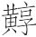诛子几个事例，从不同角度说明何谓去私；指出君主只有“诛暴而不私”，才能成就王霸之业。

从标题看，本篇当与《贵公》为同一主旨，但思想倾向不像《贵公》那样属于老子学派。文中记述的几则故事，今天仍可作为借鉴。

五曰：

天无私覆也，地无私载也，日月无私烛也(1)，四时无私行也。行其德而万物得遂长焉(2)。

*【注释】*

(1)烛：照明。

(2)遂：成。

*【译文】*

第五：

天覆盖万物，没有偏私；地承载万物，没有偏私；日月普照万物，没有偏私；春夏秋冬更迭交替，没有偏私。天地、日月、四季施与恩德，于是万物得以成长。

黄帝言曰：“声禁重，色禁重，衣禁重，香禁重，味禁重，室禁重。(1)”

*【注释】*

(1)声禁重……室禁重：大意是，音乐、色彩、衣服、香料、饮食、宫室都要适当，禁止过度。重，过甚。按：这段意思与上下文无关，通篇也无此意，疑为《重己》篇所引，后人转写错误而混入本篇。

*【译文】*

黄帝说过：“音乐禁止淫靡，色彩禁止眩目，衣服禁止厚热，香料禁止浓烈，饮食禁止丰美，宫室禁止高大。”

尧有子十人，不与其子而授舜；舜有子九人，不与其子而授禹：至公也。

*【译文】*

尧有十个儿子，但他不把帝位传给自己的儿子而传给了舜；舜有九个儿子，但他不把帝位传给自己的儿子而传给了禹：他们是最公正无私的了。

晋平公问于祁黄羊曰(1)：“南阳无令(2)，其谁可而为之？”祁黄羊对曰：“解狐可(3)。”平公曰：“解狐非子之雠邪(4)？”对曰：“君问可，非问臣之雠也。”平公曰：“善。”遂用之。国人称善焉(5)。居有间(6)，平公又问祁黄羊曰：“国无尉(7)，其谁可而为之？”对曰：“午可(8)。”平公曰：“午非子之子邪？”对曰：“君问可，非问臣之子也。”平公曰：“善。”又遂用之。国人称善焉。孔子闻之曰：“善哉，祁黄羊之论也！外举不避雠，内举不避子。”祁黄羊可谓公矣。

*【注释】*

(1)晋平公：春秋晋国国君，名彪，公元前557年—前532年在位。祁黄羊：晋大夫，名奚，字黄羊。据《左传·襄公三年》的记载，祁奚荐贤的事发生在晋悼公之时。

(2)南阳：古地名，在今河南济源一带。

(3)解（xiè）狐：晋大夫。

(4)雠（chóu）：仇敌。

(5)国人：居住在国都的自由民。

(6)有间：有一定时间。

(7)尉：军尉，平时管理军政，战时兼任主将的御者。

(8)午：指祁午，祁黄羊之子。

*【译文】*

晋平公问祁黄羊说：“南阳缺个县令，谁可以担任这个职务？”祁黄羊回答说：“解狐可以。”平公说：“解狐不是你的仇人吗？”祁黄羊回答说：“您问谁可以担任这个职务，不是问谁是我的仇人。”平公称赞说：“好！”就任用了解狐。国人对此都说好。过了一段时间，平公又问祁黄羊说：“国家缺个军尉，谁可以担任这个职务？”祁黄羊回答说：“祁午可以。”平公说：“祁午不是你的儿子吗？”回答说：“您问谁可以担任这个职务，不是问谁是我的儿子。”平公称赞说：“好！”就又任用了祁午。国人对此又都说好。孔子听说了这件事，说：“祁黄羊的这些话太好了！推举外人不回避仇敌，推举家人不回避儿子。”祁黄羊可称得上公正无私了。

墨者有钜子腹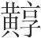(1)，居秦，其子杀人，秦惠王曰(2)：“先生之年长矣，非有他子也，寡人已令吏弗诛矣，先生之以此听寡人也。”腹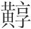对曰：“墨者之法曰：‘杀人者死，伤人者刑。’此所以禁杀伤人也。夫禁杀伤人者，天下之大义也。王虽为之赐，而令吏弗诛，腹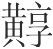不可不行墨者之法。”不许惠王，而遂杀之。子，人之所私也(3)。忍所私以行大义(4)，钜子可谓公矣。

*【注释】*

(1)墨者：指战国时的墨家学派，创始人为墨翟。钜子：等于说“大师”。战国时墨家对本学派有重大成就的人的称呼。他书或作“巨子”。腹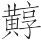（tūn）：人名。腹，姓；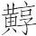，名。

(2)秦惠王：战国秦国国君，名驷，公元前337年—前311年在位。

(3)私：偏爱。

(4)忍：忍心，这里是忍心杀掉的意思。

*【译文】*

墨家有个大师腹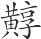住在秦国，他的儿子杀了人。秦惠王对腹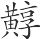说：“先生您的年纪已经很大了，又没有别的儿子，我已经下令给司法官不杀他了。希望先生您在这件事上听从我的话吧。”腹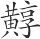回答说：“墨家的法律规定：‘杀人者处死，伤人者受刑。’这样做为的是严禁杀人、伤人。严禁杀人、伤人，这是天下的大理。大王您虽然赐给我恩惠，命令司法官不杀我的儿子，但是我腹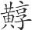却不可不执行墨家的法律。”腹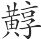没有应允惠王，最终杀了自己的儿子。儿子是人们所偏爱的，墨家大师腹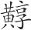为遵循天下的大理忍心杀掉自己心爱的儿子，可算得上公正无私了。

庖人调和而弗敢食，故可以为庖。若使庖人调和而食之，则不可以为庖矣。王伯之君亦然。诛暴而不私，以封天下之贤者，故可以为王伯。若使王伯之君诛暴而私之，则亦不可以为王伯矣。

*【译文】*

厨师调和五味而不敢私自食用，所以可以做厨师。假使厨师调和五味却私自把它吃掉，那么这样的人就不可以做厨师了。成就王霸之业的君主也是如此。他们诛杀暴君，自己却不占有他的土地，而是把它分封给有德之人，所以能够成就王霸之业。假使他们诛杀暴君却把他的土地占为己有，那么这样的君主也就不能成就王霸之业了。

