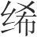
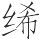
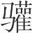
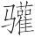
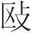
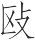
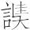

 孟夏纪第四

# 孟夏

*【题解】*

依五行学说，夏属火，是万物继续生长繁荣的时期。因此，天子发布政令应以宽厚为主。天子要“劳农劝民，无或失时”，“命农勉作，无伏于都”；要“断薄刑，决小罪，出轻系”，要祭祀山川百神，为民祈福。而“不可以兴土功，不可以合诸侯，不可以起兵动众”。

《孟夏》、《仲夏》、《季夏》三纪所统辖的文章，主要是有关教育和音乐的内容。因为古人认为人的成长离不开教育和音乐的教化。阐述这些内容，也是为了顺应时气。

一曰：

孟夏之月，日在毕(1)，昏翼中(2)，旦婺女中(3)。其日丙丁(4)，其帝炎帝(5)，其神祝融(6)，其虫羽(7)，其音徵(8)，律中仲吕(9)。其数七(10)，其性礼(11)，其事视(12)，其味苦，其臭焦，其祀灶(13)，祭先肺。蝼蝈鸣(14)，蚯蚓出，王菩生(15)，苦菜秀(16)。天子居明堂左个(17)，乘朱辂(18)，驾赤骝(19)，载赤旂，衣赤衣，服赤玉，食菽与鸡，其器高以觕(20)。

*【注释】*

(1)日在毕：指太阳的位置在毕宿。毕，星宿名，二十八宿之一，在今金牛座。

(2)翼：星宿名，二十八宿之一，在今巨蟹座。中：中星，即晨昏时刻出现在南方中天的星座。

(3)婺女：星宿名，二十八宿之一，又简称“女”，在今宝瓶座。

(4)丙丁：五行说认为夏季属火，丙丁也属火，所以说“其日丙丁”。下文“其帝炎帝，其神祝融，其虫羽，其音徵，其味苦，其臭焦，其祀灶”等也都是把五帝等先配五行再配四时的。

(5)炎帝：即神农氏，五帝之一，五行家说他以火德统治天下，被尊为南方火德之帝。

(6)祝融：颛顼氏之后，名吴回，曾为高辛氏火官，死后被尊为火德之神。

(7)羽：指凤鸟之类的羽族。

(8)徵（zhǐ）：五音之一。

(9)仲吕：十二律之一，属阴律。

(10)七：阴阳说认为，火生数为二，成数为七，这里指火的成数。参看《孟春》注。

(11)礼：五性（仁义礼智信）之一。

(12)视：五事（貌言视听思）之一。

(13)灶：五祀之一，指对灶神的祭祀。

(14)蝼蝈：蛤蟆，蛙的一种，似蟾蜍而小，初夏开始鸣叫。

(15)王菩（pú）：即栝楼，根和果实可入药。

(16)苦菜：一种野生草本植物。秀：开花。

(17)明堂左个：南向明堂的左侧室。

(18)朱辂（lù）：赤红色的车。辂，车。

(19)骝（liú）：黑鬣黑尾的红马。

(20)觕（cū）：大（依高诱说）。器物高而且大是顺应夏季长养之气。

*【译文】*

第一：

孟夏四月，太阳的位置在毕宿，黄昏时刻，翼宿出现在南方中天；拂晓时刻，女宿出现在南方中天。孟夏于天干属丙丁，主宰之帝是炎帝，佐帝之神是祝融，应时的动物是凤鸟之类的羽族，相配的声音是徵音，音律与仲吕相应。这个月的数字是七，情性是礼，修养身心所应做的事是视，味道是苦，气味是焦，要举行的祭祀是灶祭，祭祀时祭品以肺脏为尊。这个月，蛤蟆开始鸣叫，蚯蚓从土里钻出来，栝楼长出来了，苦菜开花了。天子住在南向明堂的左侧室，乘坐朱红色的车子，车前驾赤红色的马，车上插赤色的绘有龙纹的旗帜，天子穿赤色的衣服，佩戴赤色的饰玉，吃的食物是豆子和鸡，用的器物高而且大。

是月也，以立夏。先立夏三日，太史谒之天子曰：“某日立夏，盛德在火。”天子乃斋。立夏之日，天子亲率三公九卿大夫，以迎夏于南郊。还，乃行赏、封侯、庆赐，无不欣说(1)。乃命乐师习合礼乐(2)。命太尉赞杰俊(3)，遂贤良，举长大；行爵出禄(4)，必当其位。

*【注释】*

(1)说：同“悦”，高兴。

(2)乐师：即小乐正，乐官之副职。

(3)太尉：官名。赞，禀告，这里有举荐的意思。

(4)行爵：封爵。

*【译文】*

这个月有立夏的节气。立夏前三天，太史向天子禀告说：“某日立夏，大德在于火。”天子于是斋戒，准备迎夏。立夏那天，天子亲自率领三公九卿大夫到南郊迎接夏的来临。礼毕归来，于是赏赐功臣，分封爵位和土地，群臣无不欣喜快乐。命令乐师练习合演礼、乐。命令太尉向天子禀报才能出众的人，举荐德行超群的人、形体高大的人。封给爵位，给予俸禄，一定要与他们的地位相当。

是月也，继长增高(1)，无有坏隳。无起土功(2)，无发大众，无伐大树。

*【注释】*

(1)继长增高：这句是指草木生长繁茂。

(2)土功：指土木建筑。

*【译文】*

这个月，万物都在生长壮大，不要让它们毁坏。不要兴动土木工程，不要征发百姓，不要砍伐大树。

是月也，天子始(1)。命野虞出行田原，劳农劝民，无或失时；命司徒循行县鄙(2)，命农勉作，无伏于都。

*【注释】*

(1)（chī）：细葛布。指穿细葛布做的衣服。

(2)司徒：九卿之一，主管教化。县鄙：二千五百家为县，五百家为鄙。这里泛指天子领地之内。

*【译文】*

这个月，天子开始穿细葛布的衣服。命令主管山林田野的官吏出去视察田地原野，鼓励百姓努力耕作，不要失掉农时。命令主管教化的官吏巡视天子领地内的县邑，命令农夫努力耕作，不要藏伏在国都之中。

是月也，驱兽无害五谷，无大田猎，农乃升麦(1)。天子乃以彘尝麦(2)，先荐寝庙。

*【注释】*

(1)升：献。

(2)以彘尝麦：就着猪肉品尝麦子。

*【译文】*

这个月，要驱逐野兽，不要使它们伤害五谷。不要大规模进行狩猎。这个月，农民献上新麦，天子于是就着猪肉品尝麦子，在品尝之前先进献给祖庙。

是月也，聚蓄百药，糜草死(1)，麦秋至。断薄刑，决小罪，出轻系。蚕事既毕，后妃献茧(2)，乃收茧税，以桑为均(3)，贵贱少长如一，以给郊庙之祭服(4)。

*【注释】*

(1)糜草：即葶苈，一年生草本药用植物。

(2)献茧：指后妃献茧于天子，报告蚕事结束。

(3)以桑为均：意思是茧税应按桑的多少来均分，桑多多交税，桑少少交税。

(4)郊庙：郊指祭天，庙指祭祖。

*【译文】*

这个月，要积聚蓄藏各种草药。葶苈之类的草药枯死了，麦子成熟的季节来到了。对轻刑和罪小的犯人进行判决，释放不够判刑的犯人。蚕桑之事已经结束，后妃向天子献上蚕茧，于是向养蚕的人收取茧税，税按照桑树的多少来均分，贵贱长幼一视同仁，用这些税收来供给祭天祭祖时的祭服。

是月也，天子饮酎(1)，用礼乐。

*【注释】*

(1)酎（zhòu）：春天酿的醇酒。

*【译文】*

这个月，天子欢宴群臣，饮用酎酒，观看礼乐表演。

行之是令，而甘雨至三旬(1)。

*【注释】*

(1)至三旬：指十日一次，三旬降三次。

*【译文】*

实行与这个月的时令相应的政令，及时雨就会十天一至。

孟夏行秋令，则苦雨数来(1)，五谷不滋，四鄙入保(2)；行冬令，则草木早枯，后乃大水，败其城郭(3)；行春令，则虫蝗为败，暴风来格(4)，秀草不实(5)。

*【注释】*

(1)苦雨：指伤害庄稼的秋雨。

(2)鄙：边邑。保：城堡。

(3)城郭：内城叫城，外城叫郭。

(4)格：至，到。

(5)秀草：开花的草。实：结果实。

*【译文】*

孟夏如果实行应在秋天实行的政令，那么，伤害庄稼的苦雨就会频繁降落，各种谷物就不能生长，四方边境的百姓就会因敌寇侵扰而躲进城堡。如果实行应在冬天实行的政令，那么，草木就会过早地干枯，然后就有大水毁坏城郭。如果实行应在春天实行的政令，那么，虫螟就会成灾，风暴就会袭来，草木就会只开花不结实。

# 劝学*一作观师*

*【题解】*

本篇以及下面的《尊师》、《诬徒》两篇都是论述教学之道的，不过侧重点各有不同。本篇旨在勉励学习。文章指出，国君、父母极希望臣下、子女做到“忠孝”，臣下、子女极希望求得“显荣”，而要实现这些，只有通过学习。学习的关键在于尊师。“师尊”是搞好教学的前提，“胜理”、“行义”是做老师的要务。文章提出“圣人生于疾学”，这无疑是对圣人“生而知之”的否定。文章宣扬“忠孝”、“显荣”，并把颜渊事孔子作为尊师的楷模，这些都反映了作者的儒家思想。

二曰：

先王之教，莫荣于孝，莫显于忠。忠孝，人君人亲之所甚欲也(1)；显荣，人子人臣之所甚愿也。然而人君人亲不得其所欲，人子人臣不得其所愿，此生于不知理义。不知理义，生于不学。

*【注释】*

(1)人亲：指父母。

*【译文】*

第二：

先王的政教中，没有什么比孝更荣耀的了，没有什么比忠更显达的了。忠孝是作君主、父母的十分希望得到的东西，显荣是做子女、臣下的十分愿意获得的东西。然而，做君主、父母的却往往得不到他们所希望的忠孝，做子女、臣下的却往往得不到他们所向往的显荣，这是由于不懂得理义造成的。不懂得理义，是由于不学习的缘故。

学者师达而有材，吾未知其不为圣人。圣人之所在，则天下理焉(1)。在右则右重，在左则左重，是故古之圣王未有不尊师者也。尊师则不论其贵贱贫富矣。若此则名号显矣，德行彰矣。

*【注释】*

(1)理：治，特指政治清明安定。

*【译文】*

从师学习的人，如果他的老师通达而自己又有才能，我没听说过这样的人不成为圣人的。只要有圣人在，天下就太平安定了。圣人在这个地方，这个地方就受到尊重，圣人在那个地方，那个地方就受到尊重，因此古代的圣王没有不尊重老师的。尊重老师就不会计较他们的贵贱、贫富了。像这样，名号就显达了，德行就彰明了。

故师之教也，不争轻重尊卑贫富，而争于道。其人苟可，其事无不可。所求尽得，所欲尽成，此生于得圣人。圣人生于疾学(1)。不疾学而能为魁士名人者(2)，未之尝有也。

*【注释】*

(1)疾：努力，尽力。

(2)魁（kuí）士：贤能之士。魁，大，杰出。

*【译文】*

所以，老师施行教诲的时候，不计较学生的轻重、尊卑、贫富，而看重他们是否能接受理义。他们倘若能够接受理义，对他们的教诲就会无不合宜。所追求的全都能得到，所希望的全都能实现，这种情况只有在得到圣人之后才会发生。圣人是在努力学习中产生的，不努力学习而能成为贤士名人的，未曾有过。

疾学在于尊师。师尊则言信矣，道论矣。故往教者不化，召师者不化；自卑者不听，卑师者不听。师操不化不听之术，而以强教之，欲道之行、身之尊也，不亦远乎？学者处不化不听之势，而以自行，欲名之显、身之安也，是怀腐而欲香也，是入水而恶濡也。

*【译文】*

努力学习关键在于尊重老师。老师受到尊重，言语就会被人信从，道义就会被人称述而彰明了。因此，应召去教的老师不可能教化他人，呼唤老师来教的人不可能受到教化；自卑的老师不会被人听信，轻视老师的人不会听从教诲。老师如果采用不可能教化他人、不会被人听信的方法去勉强教育人，尽管想使自己的道义得以施行，使自身得以尊贵，不也差得太远了吗？从师学习的人处于不可能受到教化、不会听从教诲的地位，自己随意行事，尽管想使自己名声显赫，自身平安，这就如同怀揣腐臭的东西却希望芳香，进入水中却厌恶沾湿一样，怎么可能办得到呢？

凡说者，兑之也(1)，非说之也。今世之说者，多弗能兑，而反说之。夫弗能兑而反说，是拯溺而硾之以石也(2)，是救病而饮之以堇也(3)。使世益乱、不肖主重惑者(4)，从此生矣。

*【注释】*

(1)兑：悦。

(2)硾（zhuì）：使物下沉。

(3)救：治。堇（jǐn）：草名。有毒，可入药。

(4)重：深，甚。

*【译文】*

凡说教，应该使对方心情舒畅，而不是硬性说教。如今世上说教的人，大多不能使对方心情舒畅，却反去硬性说教。这样做就如同拯救溺水的人却把石头坠在他身上，如同医治病人却给病人喝下毒药一样，只会适得其反。社会越发混乱、不肖的君主更加昏惑就都由此产生了。

故为师之务，在于胜理(1)，在于行义。理胜义立则位尊矣，王公大人弗敢骄也，上至于天子，朝之而不惭。凡遇合也，合不可必。遗理释义，以要不可必(2)，而欲人之尊之也，不亦难乎？故师必胜理行义然后尊。

*【注释】*

(1)胜理：依循事理。

(2)要（yāo）：求。

*【译文】*

所以，做老师的要务在于依循事理，在于施行道义。只要事理被依循，道义得以树立，那么老师的地位就尊贵了。王公大人对他们不敢轻慢，即使上至于天子朝拜这样的老师也不会感到羞愧。大凡师徒相遇而和洽的情况不可能一定实现。如果遗弃事理，抛掉道义，去追求不一定实现的东西，却想要人们尊重他，这不也太难了吗？所以，老师一定要依循事理，施行道义，然后才能尊显。

曾子曰(1)：“君子行于道路，其有父者可知也，其有师者可知也。夫无父而无师者，馀若夫何哉(2)！”此言事师之犹事父也。曾点使曾参(3)，过期而不至，人皆见曾点曰：“无乃畏邪？(4)”曾点曰：“彼虽畏，我存，夫安敢畏？”孔子畏于匡(5)，颜渊后(6)，孔子曰：“吾以汝为死矣。”颜渊曰：“子在，回何敢死？”颜回之于孔子也，犹曾参之事父也。古之贤者与(7)，其尊师若此，故师尽智竭道以教。

*【注释】*

(1)曾子：指曾参，字子舆，春秋鲁国人，孔子的弟子。

(2)馀：指父、师而外的其他人。夫：彼，指上文“无父而无师者”。

(3)曾点：字晳（xī），曾参之父，孔子的弟子。

(4)畏：这里是横死的意思。

(5)畏：这里是被围困的意思。

(6)颜渊：名回，字子渊，孔子的弟子。

(7)与：语气词，表停顿。

*【译文】*

曾子说：“君子在道路上行走，其中父亲还在的可以看出来，其中有老师的也可以看出来。对那些父亲、老师都不在的，其他人又能怎么样呢？”曾点派他的儿子曾参外出，过了约定的时间却没有回来，人们都来看望曾点说：“怕不是遇难了吧。”曾点说：“即使他要死，我还活着，他怎么敢自己不小心遭祸而死！”孔子被围困在匡地，颜渊最后才到，孔子说：“我以为你死了。”颜渊说：“您还活着，我怎么敢死！”颜回对待孔子如同曾参侍奉父亲一样。古代的贤人，他们尊重老师达到这样的地步，所以老师尽心竭力地教诲他们。

# 尊师

*【题解】*

本篇旨在论述尊师与敬学。文章列举了古代十六位圣贤从师学习的事例，以及六位“刑戮死辱之人”从师学习而成为“天下名士显人”的事例，说明：无论是圣贤，还是不肖之人，只要尊重老师、努力学习，都能功垂后世，名扬青史。文章提出：“教也者，义之大者也；学也者，知之盛者也。”反映了儒家学派对于教学的高度重视。文章还详细地列举了尊师的具体做法，而把不尊师的人称作“背叛之人”，对他们给予了极大的蔑视。

三曰：

神农师悉诸(1)，黄帝师大挠(2)，帝颛顼师伯夷父(3)，帝喾师伯招(4)，帝尧师子州支父，帝舜师许由，禹师大成贽(5)，汤师小臣(6)，文王、武王师吕望、周公旦，齐桓公师管夷吾，晋文公师咎犯、随会(7)，秦穆公师百里奚、公孙枝(8)，楚庄王师孙叔敖、沈尹巫，吴王阖闾师伍子胥、文之仪，越王句践师范蠡、大夫种。此十圣人、六贤者未有不尊师者也(9)。今尊不至于帝，智不至于圣，而欲无尊师，奚由至哉？此五帝之所以绝，三代之所以灭。

*【注释】*

(1)悉诸：姓悉，名诸，传说为神农之师。

(2)大挠（náo）：传说为黄帝史官，始作甲子，创造了以干支相配纪日的方法。

(3)颛顼（zhuānxū）：传说中的古帝名，号高阳氏。伯夷父（fǔ）：传说为颛顼之师，又称伯夷。父，古代对男子的敬称、美称。

(4)喾（kù）：传说中的古帝名，号高辛氏。伯招：传说为帝喾之师。他书或作“柏招”。

(5)大成贽（zhì）：传说为禹的老师。

(6)小臣：指伊尹，商王朝的开国功臣。

(7)随会：即士会，字季，晋大夫，食采邑随及范，所以又称随会、随季或范季，死后称随武子、范武子。

(8)秦穆公：春秋时秦国国君，名任好。公元前659年—前621年在位，为春秋五霸之一。百里奚：姓百里，名奚，秦大夫。他书或作“百里傒”。公孙枝：姓公孙，名枝，字子桑，秦大夫。

(9)十圣人：指神农至武王的十位帝王。六贤者：指齐桓公至勾践的六位诸侯。

*【译文】*

第三：

神农以悉诸为师，黄帝以大挠为师，帝颛顼以伯夷父为师，帝喾以伯招为师，帝尧以子州支父为师，帝舜以许由为师，禹以大成贽为师，汤以小臣伊尹为师，文王、武王以吕望、周公旦为师，齐桓公以管夷吾为师，晋文公以咎犯、随会为师，秦穆公以百里奚、公孙枝为师，楚庄王以孙叔敖、沈尹巫为师，吴王阖闾以伍子胥、文之仪为师，越王勾践以范蠡、文种为师。这十位圣人、六位贤者没有不尊重老师的。如今，人们地位没有达到帝那样尊贵，才智没有达到圣明的境界，却不想尊奉老师，这怎么能获得尊显、达到圣明的境地呢？这正是五帝之所以废绝、三代之所以不可再现的原因。

且天生人也，而使其耳可以闻，不学，其闻不若聋；使其目可以见，不学，其见不若盲；使其口可以言，不学，其言不若爽(1)；使其心可以知，不学，其知不若狂。故凡学，非能益也，达天性也。能全天之所生而勿败之，是谓善学。

*【注释】*

(1)爽：口伤病不能言。

*【译文】*

况且，上天造就人，使人的耳朵可以听见，如果不学习，耳有所闻反不如耳聋听不见好；使人的眼睛可以看见，如果不学习，目有所见反不如眼瞎看不见好；使人的口可以说话，如果不学习，口有所言反不如口哑说不出话好；使人的心可以认知事物，如果不学习，心有所知反不如狂乱无知好。因此，凡学习，并不是能给人另增加什么，而是使人通达天性。能够保全天赋予人的本性而不使它受到伤害，这就叫做善于学习。

子张(1)，鲁之鄙家也；颜涿聚(2)，梁父之大盗也(3)；学于孔子。段干木，晋国之大驵也(4)，学于子夏。高何、县子石(5)，齐国之暴者也，指于乡曲(6)，学于子墨子。索卢参(7)，东方之巨狡也(8)，学于禽滑黎(9)。此六人者，刑戮死辱之人也。今非徒免于刑戮死辱也，由此为天下名士显人，以终其寿，王公大人从而礼之，此得之于学也。

*【注释】*

(1)子张：姓颛孙，名师，字子张，孔子的弟子。

(2)颜涿聚：春秋齐大夫。他书或作“颜烛邹”、“颜斫聚”。

(3)梁父（fǔ）：泰山下一座小山名，在今山东新泰西。

(4)驵（zǎnɡ）：牙侩，古时集市贸易中为买卖双方撮合从中取得佣金的人。

(5)高何、县子石：战国时人，墨子的弟子。

(6)指：指斥。乡曲：乡里。

(7)索卢参：复姓索卢，名参，墨家学派禽滑黎的弟子。

(8)狡：指狡诈的人。

(9)禽滑黎：墨子的弟子。他书多作“禽滑釐”。

*【译文】*

子张本是鲁国的鄙俗小人，颜涿聚本是梁父山上的大盗，他们求学于孔子。段干木本是晋国市场上的大牙侩，求学于子夏。高何、县子石本是齐国凶恶残暴的人，被乡里斥逐，求学于墨子。索卢参本是东方有名的狡诈之人，求学于禽滑黎。这六个人本是该受到刑罚、杀戮，蒙受耻辱的人。如今，由于从师学习，他们不仅免于刑罚、杀戮、耻辱，而且成为天下的知名之士、显达之人，得以终其天年，王公大人因而对他们以礼相待，这些都是得力于学习啊。

凡学，必务进业，心则无营(1)。疾讽诵(2)，谨司闻(3)，观愉(4)，问书意，顺耳目，不逆志，退思虑，求所谓，时辨说(5)，以论道，不苟辨，必中法，得之无矜(6)，失之无惭，必反其本。

*【注释】*

(1)营：通“荧（yínɡ）”，惑乱。

(2)讽：背诵。

(3)司（sì）：通“伺”，等候。

(4)（huān）：同“欢”。

(5)辨说：指推理。辨，通“辩”。

(6)矜：自负贤能。

*【译文】*

凡学习，一定务求增进学业，这样心中就没有疑惑了。要努力诵习，小心等候机会聆听教诲，看到老师欢悦的时候，请教书中的意旨，要顺适老师的耳目，不违背老师的心意；回来认真思考，探求老师所说的道理，要时时研讨分析，以求阐明老师所说的道理，不苟且巧辩，一定要合乎法度；有所得不要自夸，有所失不要惭愧，一定要回到自己的本性上来。

生则谨养，谨养之道，养心为贵(1)；死则敬祭，敬祭之术，时节为务(2)。此所以尊师也。治唐圃(3)，疾灌寖(4)，务种树(5)；织葩屦(6)，结罝网(7)，捆蒲苇(8)；之田野，力耕耘，事五谷；如山林，入川泽，取鱼鳖，求鸟兽。此所以尊师也。视舆马，慎驾御；适衣服，务轻暖；临饮食(9)，必蠲絜(10)；善调和，务甘肥；必恭敬，和颜色，审辞令；疾趋翔(11)，必严肃。此所以尊师也。

君子之学也，说义必称师以论道(12)，听从必尽力以光明。听从不尽力，命之曰背；说义不称师，命之曰叛。背叛之人，贤主弗内之于朝(13)，君子不与交友。

*【注释】*

(1)养心：这里指使老师心情愉快。《礼记·祭统》中说：“养则观其顺也”，古人认为奉养尊亲，当以顺其心为贵。

(2)时节：合于四时之节。

(3)唐圃：园地。唐，通“塘”，堤。圃，种植果木瓜菜的园子。

(4)寖：今作“浸”，灌溉。

(5)树：种植。

(6)葩：疑“萉（fèi）”字之误。萉屦：即后人所谓麻鞋。

(7)罝（jū）：捕兔网。

(8)捆：砸。编织蒲苇要边编边砸，使之牢固。

(9)临：治，备办。

(10)蠲（juān）：清洁。絜（jié）：同“洁”。

(11)趋翔：行步有节奏的样子。翔，通“跄（qiānɡ）”。

(12)义：通“议”。论：这里是阐明的意思。

(13)内（nà）：接纳。

*【译文】*

老师活着的时候要小心奉养，小心奉养的方法，以使老师欢娱为贵；老师死了要恭敬祭祀，恭敬祭祀的原则，以合于四时之节为要。这是尊重老师的做法。为老师修整园地，努力灌溉，积极种植；织麻鞋，结兽网，编蒲苇；到田野上，努力耕耘，种植五谷；走进山林，进入川泽，捕捉鱼鳖，猎取鸟兽。这是尊重老师的做法。为老师察看车马，小心驾驭；使衣服适宜，务求轻暖；备办饮食，一定清洁；好好调和五味，务求甘甜肥美；一定恭恭敬敬，和颜悦色，言辞审慎；力求行步快慢有节，一定恭敬庄重。这是尊重老师的做法。

君子学习，谈论道理一定称引老师的话来阐明道义，听从教诲一定尽心竭力去发扬光大。听从教诲而不尽心竭力去发扬它，这种行为叫做“背”；谈论道理而不称引老师的话去阐明它，这种行为叫做“叛”。有背叛行为的人，贤明的君主不接纳他们在朝为臣，君子不跟他们交往为友。

故教也者，义之大者也；学也者，知之盛者也(1)。义之大者，莫大于利人，利人莫大于教；知之盛者，莫大于成身，成身莫大于学。身成则为人子弗使而孝矣，为人臣弗令而忠矣，为人君弗强而平矣，有大势可以为天下正矣(2)。故子贡问孔子曰：“后世将何以称夫子？”孔子曰：“吾何足以称哉？勿已者(3)，则好学而不厌，好教而不倦，其惟此邪！”天子入太学祭先圣(4)，则齿尝为师者弗臣(5)，所以见敬学与尊师也。

*【注释】*

(1)知（zhì）：才智。这个意义后来写作“智”。盛：大。

(2)正：长，主。

(3)已：止。

(4)太学：这里指明堂。明堂，古代帝王宣明政教的地方。凡朝会、祭祀、庆赏、选士、养老、教学等大典均在此举行。关于古代的明堂，历代一些礼家认为，太庙、清庙、太室、太学为一事，似可信。

(5)齿：并列。

*【译文】*

因此，教育人是一件非常仁义的事，学习是一件非常聪明的事。仁义的事没有比给人带来利益更大的了，而给人带来利益最大的，没有什么能超过教育。聪明的事没有比修养身心更大的了，而修养身心最重要的，没有什么能超过学习。如果自身的修养完成了，那么，做子女的不用支使就孝顺了，做臣下的不用命令就忠诚了，做君主的不用勉强就公正了，其中形势最有利的就可以做天下的君主了。所以，子贡问孔子说：“后代将用什么话称道您呢？”孔子说：“我哪里值得称道呢？如果一定要说的话，那就是喜好学习而不满足，勤于教诲而不疲倦，大概仅此而已！”天子进入明堂祭祀先代圣人，与曾经做过自己老师的人并排站立，不把他们做臣子看待，这是用以显示敬重学习和尊重老师啊！

# 诬徒*一作诋役*

*【题解】*

就是欺骗弟子的意思，与所谓“诬徒”“诋役”“诬徒”义同。

本篇旨在论述教学的道理。文章提出，理想的教学效果应该是“使弟子安焉，乐焉，休焉，游焉，肃焉，严焉”，而要达到理想的教学效果，必须讲求教学方法。作者根据“人之情，不能乐其所不安，不能得于其所不乐”，提出了“视徒如己，反己以教”、等教学基本原则，这些都是很重要的。文“师徒同体”章以大量篇幅批评了不善于教学的老师“志气不和”、“喜怒无处”、“言谈日易”、“愎过自用”、趋炎附势，嫉妒成性的错误；批评了不善于求学的人“用心则不专”、“就业则不疾”、“辩论则不审”、“羁神于世”、“矜势好尤”的错误治学态度；从反面论证了教育与治学所应采取的正确的态度与方法。

四曰：

达师之教也，使弟子安焉、乐焉、休焉、游焉、肃焉、严焉(1)。此六者得于学，则邪辟之道塞矣，理义之术胜矣(2)；此六者不得于学，则君不能令于臣，父不能令于子，师不能令于徒。

人之情，不能乐其所不安，不能得于其所不乐。为之而乐矣，奚待贤者？虽不肖者犹若劝之(3)。为之而苦矣，奚待不肖者？虽贤者犹不能久。反诸人情，则得所以劝学矣。

子华子曰：“王者乐其所以王，亡者亦乐其所以亡，故烹兽不足以尽兽，嗜其脯则几矣(4)。”然则王者有嗜乎理义也(5)，亡者亦有嗜乎暴慢也。所嗜不同，故其祸福亦不同。

*【注释】*

(1)游：优游，悠闲自得。

(2)胜：等于说“行”。

(3)劝：努力从事。

(4)脯（fǔ）：干肉。

(5)有：这里有“专”的意思。

*【译文】*

第四：

通达事理的老师施行教育，能使学生安心、快乐、安闲、从容、庄重、严肃。这六方面在教学中实现了，那么邪僻的路就堵死了，正义之道就通行了。这六方面在教学中不能实现，那么君主就不能支使臣下，父亲就不能支使子女，老师就不能支使学生。

人之常情，不喜欢自己所不安心的事物，不能从自己所不喜欢的事物中有所得。一件事如果做起来就感到快乐，不用说贤人，即使不肖的人仍然会努力去做。一件事如果做起来就感到苦恼，不用说不肖的人，即使贤人同样不能持久。从人之常情出发，就会得到勉励人们学习的道理了。

子华子说：“成就王业的人乐意做那些使自己成就王业的事，国破家亡的人也乐意做那些使自己灭亡的事，所以煮食禽兽不可能把所煮的禽兽吃尽，人们专吃自己爱吃的肉就够了。”如此说来，成就王业的人专喜好理义，国破家亡的人专喜好暴慢。他们的喜好不同，因此他们所得到的祸福也不同。

不能教者：志气不和，取舍数变，固无恒心，若晏阴喜怒无处(1)；言谈日易，以恣自行；失之在己，不肯自非，愎过自用(2)，不可证移(3)；见亲权势及有富厚者(4)，不论其材，不察其行，而教之(5)，阿而谄之，若恐弗及；弟子居处修洁(6)，身状出伦(7)，闻识疏达(8)，就学敏疾(9)，本业几终者(10)，则从而抑之，难而悬之(11)，妒而恶之；弟子去则冀终，居则不安，归则愧于父母兄弟，出则惭于知友邑里，此学者之所悲也，此师徒相与异心也。人之情，恶异于己者，此师徒相与造怨尤也。人之情，不能亲其所怨，不能誉其所恶，学业之败也，道术之废也，从此生矣。

*【注释】*

(1)晏：清朗无云。处：常。

(2)愎（bì）过：坚持错误。愎，任性，执拗。

(3)证：谏。移：改变。

(4)权亲势：当作“亲权势”。

(5)：同“驱”，驰。

(6)居处：指平时，日常。修洁：指操守美善清白。

(7)身状：即身貌。出伦：出众。伦，同辈，同类。

(8)疏达：等于说“通达”，这里是广博的意思。

(9)就学：学生去向老师请教。敏：疾速。

(10)本业：指主要的学业。

(11)悬：这里有疏远的意思。

*【译文】*

不善于教育人的老师：心志不和谐，取舍一再变化，根本没有恒心，就像天气的晴阴一样喜怒无常；言谈一天一变，放纵自己的行为；过失在于自己，却不肯自我批评，坚持错误，自以为是，不能接受意见而有所改变；亲近尊贵富有的人，不衡量他们的才能，不考察他们的品行，急忙跑去教他们，迎合奉承他们，惟恐不及；对于学生中平时操守美善清白、品貌出众、见识广博、勤于向老师请教、接近完成学业的人，却由此压制他们，诘难、疏远他们，妒嫉厌恶他们。学生想要离去却又希望完成学业，而留下来又不安心，回家愧见父母兄弟，出门愧见挚友乡亲，这是求学的人所悲伤的，这是由于老师和学生彼此心志不同的缘故。人之常情，憎恶跟自己心志不合的人，这是老师和学生彼此结下怨恨的原因。人之常情，不能亲近自己所怨恨的人，不能称颂自己所憎恶的人，学业的败坏，道术的废弃，就由此产生了。

善教者则不然。视徒如己，反己以教，则得教之情矣(1)。所加于人，必可行于己，若此则师徒同体。人之情，爱同于己者，誉同于己者，助同于己者，学业之章明也(2)，道术之大行也，从此生矣。

*【注释】*

(1)情：真情，这里指教育的真谛。

(2)章：彰明。

*【译文】*

善于教育人的老师就不是这样。他们看待学生如同自己一样，设身处地施行教育，这样就掌握教育的真谛了。凡施加给别人的，自己一定能够做到，像这样，就做到师生一体了。人之常情，喜爱跟自己心志相同的人，称颂跟自己心志相同的人，帮助跟自己心志相同的人，学业的彰明，道术的弘扬，就由此产生了。

不能学者，从师苦而欲学之功也(1)，从师浅而欲学之深也。草木、鸡狗、牛马，不可谯诟遇之(2)，谯诟遇之，则亦谯诟报人(3)，又况乎达师与道术之言乎？故不能学者：遇师则不中(4)，用心则不专，好之则不深，就业则不疾，辩论则不审，教人则不精(5)；愠于师(6)，怀于俗(7)，羁神于世，矜势好尤(8)，故湛于巧智(9)，昏于小利，惑于嗜欲；问事则前后相悖，以章则有异心，以简则有相反；离则不能合，合则弗能离，事至则不能受(10)。此不能学者之患也。

*【注释】*

(1)苦（ɡǔ）：粗劣。功：精良。

(2)谯诟：疑即“诟（xìɡòu）”，粗暴、过分的意思。

(3)“谯诟”二句：草木无知，其“谯诟报人”之义正如《庄子·则阳》中所说：“昔予为禾，耕而卤莽之，则其实亦卤莽而报予；芸而灭裂之，其实亦灭裂而报予。”（为禾，种谷。卤莽，草率，粗糙。实，果实，指生穗结谷。芸，除草。灭裂，苟且，胡乱从事。）

(4)中：通“忠”。

(5)教：效法。

(6)于师愠（yùn）：当作“愠于师”。

(7)怀：安。

(8)矜（jīn）：自夸，自恃。

(9)湛（chén）：通“沉”，没，沉溺。

(10)事：从事，努力。至：极。受：这里有成的意思。

*【译文】*

不善于学习的人，跟随老师学习粗心大意，却想要学得精通；跟随老师学习浅尝辄止，却想要学得深入。草木、鸡狗、牛马，不可粗暴地对待它们，如果粗暴地对待它们，那它们也会粗暴地报复人。草木、鸡狗、牛马尚且如此，又何况对待通达事理的老师和有关道术的言论呢？所以，不善于学习的人：对待老师不忠诚，用心不专一，爱好不深入，求学不努力，辩论不明是非，效法别人不精心；怨恨老师，安于凡庸，精神被时务所束缚，自恃权势，好犯过失，所以沉溺于巧诈，迷恋于小利，惑乱于嗜欲；问事则前后矛盾，言辞详明则又与心相异，言辞简约则又与意相反；分散的事不会综合，复杂的事不会分析，即使再费力气也不能有所成就。这是不善于学习的人的弊病啊！

# 用众*一作善学*

*【题解】*

本篇旨在论述为学的道理。文章以齐王食鸡为喻，论述了博采众长的重要。指出：“物固莫不有长，莫不有短。人亦然。”因此，“无丑不能，无恶不知”，要善于“假人之长以补其短”。这些看法很有见地。作者把善学同君道联系起来，指出“取于众”是立君之本。文章强调众人的作用，指出：“以众勇无畏乎孟贲矣，以众力无畏乎乌获矣，以众视无畏乎离娄矣，以众知无畏乎尧、舜矣。”这反映了新兴统治阶级对民心民力的重视。

五曰：

善学者，若齐王之食鸡也，必食其跖数千而后足(1)；虽不足，犹若有跖。物固莫不有长，莫不有短。人亦然。故善学者，假人之长以补其短(2)。故假人者遂有天下。无丑不能(3)，无恶不知(4)。丑不能，恶不知，病矣(5)。不丑不能，不恶不知，尚矣(6)。虽桀、纣犹有可畏可取者，而况于贤者乎？

故学士曰(7)：辩议不可不为(8)。辩议而苟可为，是教也。教，大议也。辩议而不可为，是被褐而出(9)，衣锦而入(10)。

*【注释】*

(1)跖（zhí）：指鸡爪掌。

(2)假：凭借，利用。

(3)丑：以……为耻。

(4)恶（è）：与“丑”义同，用如意动。

(5)病：困窘。

(6)尚：上。

(7)学士：本指在学的贵族子弟，这里指有学问的人。

(8)不可不为：当作“不可为”。

(9)被褐：兽毛或粗麻制成的短衣，古时贫贱之人所穿。这里比喻没有学问，愚昧无知。

(10)锦：锦衣，华美的丝织衣裳，古时富贵之人所穿。这里比喻学业已成，贤明通达。

*【译文】*

第五：

善于学习的人像齐王吃鸡一样，一定要吃上几千鸡跖而后才满足，即使不够，仍然有鸡跖可供取食。事物本来无不有长处，无不有短处。人也是这样。所以，善于学习的人，能借用别人的长处来弥补自己的短处。因此，善于借用众人长处的人便能占有天下。不要把不能看作羞耻，不要把不知看作耻辱。以不能为耻，以不知为辱，就会陷入困境。不把不能看作羞耻，不把不知看作耻辱，这是最高明的。即使桀、纣那样的暴君尚且有令人敬畏、可取之处，更何况贤人呢？

所以有学问的人说：求学者不可使用辩议。如果说辨议可以使用的话，这是指施教而言。施教，才是需要大议的。求学者不使用辩议，就可以由无知变为贤达，这就像穿着破衣服出门，穿着华丽的衣服归来一样。

戎人生乎戎、长乎戎而戎言(1)，不知其所受之；楚人生乎楚、长乎楚而楚言，不知其所受之。今使楚人长乎戎，戎人长乎楚，则楚人戎言，戎人楚言矣。由是观之，吾未知亡国之主不可以为贤主也，其所生长者不可耳。故所生长不可不察也。

*【注释】*

(1)戎：古代泛指我国西部的少数民族。

*【译文】*

戎人生在戎地，长在戎地，而说戎人的语言，自己却不知是从谁那里学来的。楚人生在楚地，长在楚地，而说楚人的语言，自己却不知是从谁那里学来的。假如让楚人在戎地生长，让戎人在楚地生长，那么楚人就说戎人的语言，戎人就说楚人的语言了。由此看来，我不相信亡国的君主不可能成为贤明的君主，只不过是他们所生长的环境不允许罢了。因此，对于人们所生长的环境不可不注意考察啊！

天下无粹白之狐，而有粹白之裘，取之众白也。夫取于众，此三皇五帝之所以大立功名也。凡君之所以立，出乎众也。立已定而舍其众，是得其末而失其本。得其末而失其本，不闻安居。故以众勇无畏乎孟贲矣(1)，以众力无畏乎乌获矣，以众视无畏乎离娄矣(2)，以众知无畏乎尧、舜矣。夫以众者，此君人之大宝也。

田骈谓齐王曰(3)：“孟贲庶乎患术(4)，而边境弗患。”楚、魏之王辞言不说，而境内已修备矣，兵士已修用矣，得之众也。

*【注释】*

(1)孟贲：战国时卫国的勇士，据说可以“生拔牛角”。

(2)离娄：传说为黄帝时视力最好的人，“能见针末于百步之外”。一名“离朱”。

(3)田骈（pián）：战国时齐人，道家。《不二》作“陈骈”。陈、田古通。

(4)庶乎患术：几乎苦于无法。庶，庶几，几乎。术，策略，办法。

*【译文】*

天下没有纯白的狐狸，却有纯白的狐裘，这是从众多白狐狸的皮中取来制成的。善于取用优点于众人，这正是三皇五帝大建功名的原因。大凡君主的确立，都是凭借着众人的力量。君位一经确立就舍弃众人，这是得到细枝末节而丧失了根本。凡是得到细枝末节而丧失了根本的君主，从未听说过他的统治会安定稳固。所以，依靠众人的勇敢就不惧怕孟贲了，依靠众人的力气就不惧怕乌获了，依靠众人的眼力就不惧怕离娄了，依靠众人的智慧就不惧怕赶不上尧、舜了。依靠众人，这是统治百姓的根本大法。

田骈对齐王说：“即使孟贲对于众人的力量也感到忧虑，无可奈何，因而齐国的边境无须担忧。”楚国、魏国的君主不贵言辞，而国内备战的各种设施已经修整完备了，兵士已经训练有素可以打仗了，这都是得力于众人的力量啊！

