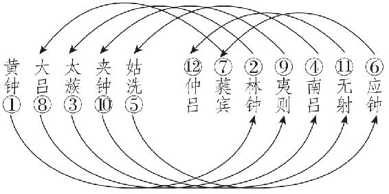
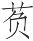
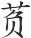
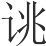
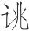
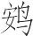
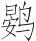
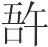

 季夏纪第六

# 季夏

*【题解】*

参见《孟夏纪》。另，本篇末尾有关于中央土的一段记述。五行说把五行、五方与四季相配，五行中的土、五方中的中央，于四季中无与相配，只得附于季夏之末，而且没有天子发布政令的规定。

一曰：

季夏之月，日在柳(1)，昏心中(2)，旦奎中。其日丙丁，其帝炎帝，其神祝融，其虫羽，其音徵，律中林钟(3)。其数七，其味苦，其臭焦，其祀灶，祭先肺。凉风始至，蟋蟀居宇，鹰乃学习(4)，腐草化为蚈(5)。天子居明堂右个(6)，乘朱辂，驾赤骝，载赤旂，衣朱衣，服赤玉，食菽与鸡，其器高以觕。

*【注释】*

(1)柳：星宿名，二十八宿之一，在今长蛇座。

(2)心：星宿名，二十八宿之一，在今天蝎座。

(3)林钟：十二律之一，属阴律。

(4)习：鸟练习飞。

(5)蚈（qiān）：萤火虫。萤火虫生于草中，古人不知，以为是腐草所化。

(6)明堂右个：南向明堂的右侧室。

*【译文】*

第一：

季夏六月，太阳的位置在柳宿。黄昏时刻，心宿出现在南方中天；拂晓时刻，奎宿出现在南方中天。季夏于天干属丙丁，主宰之帝是炎帝，佐帝之神是祝融，应时的动物是凤鸟之类的羽族，相配的声音是徵音，音律与林钟相应。这个月的数字是七，味道是苦，气味是焦，要举行的祭祀是灶祭，祭祀时祭品以肺脏为尊。这个月，凉风开始到来，蟋蟀住在屋檐下。鹰于是练习飞翔搏击，腐草化作萤火虫。天子住在南向明堂的右侧室，乘坐朱红色的车子，车前驾赤红色的马，车上插赤色的绘有龙纹的旗帜；天子穿赤色的衣服，佩戴赤色的饰玉，吃的食物是豆类和鸡，用的器物高而且大。

是月也，令渔师伐蛟取鼍(1)，升龟取鼋(2)。乃命虞人入材苇(3)。

*【注释】*

(1)渔师：掌管水产的官吏。鼍（tuó）：鳄鱼的一种，皮可以蒙鼓。

(2)升：登。古人认为龟是神灵，所以说“升”。鼋（yuán）：甲鱼，肉可食。

(3)虞人：掌管山林池泽的官，分为山虞、泽虞，山虞负责山林，泽虞负责池泽。这里的虞人当指泽虞。

*【译文】*

这个月，命令管渔业的官吏，杀蛟取鼍，献龟取鼋。命令掌管池泽的官吏收纳用来制作器物的芦苇。

是月也，令四监大夫合百县之秩刍(1)，以养牺牲(2)。令民无不咸出其力，以供皇天上帝、名山大川、四方之神，以祀宗庙社稷之灵，为民祈福。

*【注释】*

(1)四监大夫：周时制度，天子领地内分为百县，每县辖四郡，上大夫受县，下大夫受郡。这里的四监大夫指监四郡的县大夫。秩刍：按规定应交纳的刍草。

(2)牺牲：供祭祀用的全色牲畜。

*【译文】*

这个月，命令监管四郡的县大夫聚集各县按常规交纳的刍草，以此来饲养供祭祀用的牲畜。命令百姓都尽力收割聚集，以供祭祀皇天上帝、名山大川、四方神祇、宗庙社稷之用，为百姓祈求幸福。

是月也，命妇官染采(1)，黼黻文章(2)，必以法故，无或差忒，黑黄苍赤，莫不质良(3)，勿敢伪诈，以给郊庙祭祀之服，以为旗章(4)，以别贵贱等级之度。

*【注释】*

(1)妇官：主管治丝麻布帛之事的女官。

(2)黼（fǔ）：半黑半白的花纹。黻（fú）：半黑半青的花纹。文：半青半红的花纹。章：半红半白的花纹。

(3)质良：鲜艳良好。质，美。良，善。

(4)旗章：旌旗和名号。

*【译文】*

这个月，命令掌管布帛的女官负责印染彩色，各种图案的颜色搭配，一定要按照法规和习惯，不要有一点差错。黑黄苍赤各种颜色样样都鲜艳良好，不许有一点欺诈，用这些布帛供制作祭天祭祖时所穿的礼服，并用它们制作旌旗标志，以此来区分贵贱等级。

是月也，树木方盛，乃命虞人入山行木(1)，无或斩伐；不可以兴土功，不可以合诸侯，不可以起兵动众，无举大事，以摇荡于气(2)。无发令而干时(3)，以妨神农之事(4)。水潦盛昌，命神农将巡功(5)，举大事则有天殃。

*【注释】*

(1)虞人：这里指山虞。

(2)气：指土气。

(3)干时：违背农时。干，干犯，抵触。

(4)神农之事：指农事。

(5)神农：指农官。巡功：巡视田亩修治的情况。功，事。

*【译文】*

这个月，树木生长正茂盛，于是命令掌管山林的官吏到山里去巡视树木，不许人们砍伐；这个月，不可以兴工建筑，不可以会合诸侯，不可以兴师动众，不要有大的举动来摇动土气。不要发布侵扰农时的命令，从而损害农耕之事。这个月雨水正多，命令农官巡视田亩修治的情况。有违背农时的大举动，就会遭到天灾。

是月也，土润溽暑(1)，大雨时行，烧薙行水(2)，利以杀草，如以热汤(3)，可以粪田畴(4)，可以美土疆(5)。

*【注释】*

(1)溽（rù）暑：指盛暑湿热。溽，湿。暑，指暑热。

(2)烧薙（tì）：指除草后晒干烧掉。薙，除草。行水：引雨水浇灌。

(3)汤：开水。

(4)粪田畴：给耕地施肥。粪，施肥。田畴，已耕过的田地。

(5)美土疆：使土地肥美。疆，界畔。土疆，指土地。

*【译文】*

这个月，土地湿润，天气潮热，大雨常常降落，烧掉割下晒干的野草，灌上雨水，太阳一晒，就像用开水煮一样，这样有利于杀死野草，而且可以用它们肥田，改良土壤。

行之是令，是月甘雨三至(1)，三旬二日(2)。

*【注释】*

(1)三至：“三”字疑为衍文。

(2)三旬二日：大意是，除去晦朔两天，三旬中可以有二日降雨。

*【译文】*

实行这些政令，这个月就会下及时雨，除去晦朔，三旬中可以有两天降雨。

季夏行春令，则谷实解落，国多风欬，人乃迁徙；行秋令，则丘隰水潦(1)，禾稼不熟，乃多女灾(2)；行冬令，则寒气不时，鹰隼早鸷(3)，四鄙入保。

*【注释】*

(1)丘：高地。隰（xí）：低洼之地。

(2)女灾：指妇女不能生育之灾。

(3)隼（sǔn）：一种类似鹰的猛禽。鸷（zhì）：击杀飞鸟。

*【译文】*

季夏如果实行应在春天实行的政令，那么，谷物的籽实就会散落，国人就会伤风咳嗽，人们就会迁移搬家；如果实行应在秋天实行的政令，那么，高地洼地都会出现大水，庄稼就不能成熟，妇女多有不能生育之灾；如果实行应在冬天实行的政令，那么，寒冷之气就会不合时地到来，鹰隼等猛禽就会过早地击杀飞鸟，四方边邑的百姓就会为躲避敌寇而逃入城堡。

中央土(1)，其日戊己(2)，其帝黄帝(3)，其神后土(4)，其虫倮(5)，其音宫(6)，律中黄钟之宫(7)。其数五，其味甘，其臭香，其祀中霤(8)，祭先心。天子居太庙太室(9)，乘大辂，驾黄骝，载黄旂，衣黄衣，服黄玉，食稷与牛，其器圜以掩(10)。

*【注释】*

(1)中央土：中央于五行属土。

(2)其日戊己：中央于天干属戊己，所以说“其日戊己”。

(3)黄帝：即轩辕氏，五帝之一，五行家说他以土德王天下，被尊为中央之帝。

(4)后土：共工氏之子，名句龙，死后被尊为后土之神。

(5)倮（luǒ）：五虫之一，指麒麟之类的倮族。

(6)宫：五音之一。

(7)黄钟之宫：用黄钟律定的宫音。黄钟，十二律之一，属阳律。

(8)中霤（liù）：五祀之一，祭祀后土。中霤指屋的中央。

(9)太庙太室：南向居中的明堂。

(10)圜（yuán）：圆。指器中宽大。掩：遮掩，指器口小而敛缩。

*【译文】*

中央于五行属土，于天干属戊己，主宰之帝是黄帝，佐帝之神是后土，应时的动物是麒麟之类的裸族，相配的声音是宫音，音律与黄钟之宫相应。它的数字是五，味道是甜，气味是香，要举行的祭祀是中霤之祀，祭祀时祭品以心脏为尊。天子住在中央明堂的正室，乘坐木质大车，车前驾黄色的马，车上插黄色的绘有龙纹的旗帜，天子穿黄色的衣服，佩戴黄色的佩玉，吃的食物是稷和牛，用的器物中间宽大而口敛缩。

# 音律

*【题解】*

本篇旨在论述音律相生之理。十二律的名称最早见于《国语·周语》伶州鸠答周景王问，但论及十二律相生的“三分损益法”当属本篇为最早。本篇把乐律同历法联系起来，十二律同十二月相配，这当然是牵强附会，毫无科学根据的。阅读本篇可参阅本书“十二纪”各纪首篇。

二曰：

黄钟生林钟，林钟生太蔟，太蔟生南吕，南吕生姑洗，姑洗生应钟，应钟生蕤宾，蕤宾生大吕，大吕生夷则，夷则生夹钟，夹钟生无射，无射生仲吕(1)。三分所生，益之一分以上生。三分所生，去其一分以下生(2)。黄钟、大吕、太蔟、夹钟、姑洗、仲吕、蕤宾为上，林钟、夷则、南吕、无射、应钟为下(3)。

*【注释】*

(1)“黄钟”以下十一句：这一段讲音律相生的结果。黄钟、林钟、太蔟（còu）、南吕、姑洗（xiǎn）、应钟、蕤（ruí）宾、大吕、夷则、夹钟、无射（yì）、仲吕为古代音乐的十二调，即十二律。

(2)“三分”四句：这两句讲音律相生的方法，即“三分损益法”。所谓“三分所生”，就是把作为基准的音律的度数分为三等分。所谓“益之一分”，就是把已知的音律数（旧说为律管的长度）分为三等分之后，再增其一分，结果在三分之四的已知音律数上产生新的音律，这称为“上生”。所谓“去其一分”，就是把已知的音律数分为三等分之后，减去其一分，结果在三分之二已知音律数上产生新的音律，这称为“下生”。如：黄钟之管长九寸（这是晚周的尺度，一尺长约二十三厘米），将黄钟管长三分，减其一，得六寸，这就是林钟律的律管长度。这是“下生”。林钟管长三分增其一，得八寸，这就是太蔟律的律管长度。这是“上生”。

(3)“黄钟”二句：所谓某律“为上”，就是说某律是由“上生”而得；所谓某律“为下”，就是说某律是由“下生”而得。十二律上下相生的次序图示如下：

 

*【译文】*

第二：

由黄钟律生出林钟律，由林钟律生出太蔟律，由太蔟律生出南吕律，由南吕律生出姑洗律，由姑洗律生出应钟律，由应钟律生出蕤宾律，由蕤宾律生出大吕律，由大吕律生出夷则律，由夷则律生出夹钟律，由夹钟律生出无射律，由无射律生出仲吕律。把作为基准的音律度数分为三等分，再增加其中的一分，由此上生出新律。把作为基准的音律度数分为三等分，再减去其中的一分，由此下生出新律。黄钟、大吕、太蔟、夹钟、姑洗、仲吕、蕤宾等乐律是由上生而得，林钟、夷则、南吕、无射、应钟等乐律是由下生而得。

大圣至理之世(1)，天地之气，合而生风。日至则月钟其风(2)，以生十二律(3)。仲冬日短至(4)，则生黄钟。季冬生大吕。孟春生太蔟。仲春生夹钟。季春生姑洗。孟夏生仲吕。仲夏日长至，则生蕤宾。季夏生林钟。孟秋生夷则。仲秋生南吕。季秋生无射。孟冬生应钟。天地之风气正，则十二律定矣。

*【注释】*

(1)至理：等于说“至治”，最完美的政治局面。

(2)日至：指太阳运行到某一度次。如：孟春之月，日在营室；仲春之月，日在奎。

(3)以生十二律：古代把乐律同历法附会在一起，以十二律应十二月，其相配情况参见《孟春》注。

(4)日短至：指冬至。冬至那天白天最短。下文“日长至”指夏至。

*【译文】*

最圣明最完美的时代，天气与地气会合而产生了风。太阳每运行到一定度次，月亮就聚集该月之风，由此产生了十二乐律。仲冬，白天最短的冬至那天，产生出黄钟。季冬产生出大吕。孟春产生出太蔟。仲春产生出夹钟。季春产生出姑洗。孟夏产生出仲吕。仲夏，白天最长的夏至那天，产生出蕤宾。季夏产生出林钟。孟秋产生出夷则。仲秋产生出南吕。季秋产生出无射。孟冬产生出应钟。天气、地气会合产生的风纯正，十二律就确定了。

黄钟之月(1)，土事无作，慎无发盖，以固天闭地，阳气且泄。

大吕之月，数将几终(2)，岁且更起，而农民(3)，无有所使。

太蔟之月，阳气始生，草木繁动(4)，令农发土，无或失时。

夹钟之月，宽裕和平，行德去刑，无或作事(5)，以害群生。

姑洗之月，达道通路，沟渎修利，申之此令，嘉气趣至(6)。

仲吕之月，无聚大众，巡劝农事，草木方长，无携民心(7)。

蕤宾之月，阳气在上，安壮养侠(8)，本朝不静(9)，草木早槁。

林钟之月，草木盛满，阴将始刑(10)，无发大事，以将阳气(11)。

夷则之月，修法饬刑，选士厉兵，诘诛不义(12)，以怀远方(13)。

南吕之月，蛰虫入穴(14)，趣农收聚(15)，无敢懈怠，以多为务。

无射之月，疾断有罪，当法勿赦，无留狱讼，以亟以故(16)。

应钟之月，阴阳不通(17)，闭而为冬，修别丧纪(18)，审民所终。

*【注释】*

(1)黄钟之月：即律中黄钟之月（夏历十一月）。下文“大吕之月”、“太蔟之月”即律中大吕之月（夏历十二月）、律中太蔟之月（夏历正月），其余以此类推。

(2)几：近。

(3)而农民：“而”上当补“专”字。《月令》“专而农夫”。而，第二人称代词。

(4)繁动：萌动。

(5)事：指军事及土木之事。

(6)趣（cù）：急速。

(7)携：离。

(8)养侠：当是“养佼”之误。佼：健壮。

(9)本：指君子自身。朝：指朝廷百官。

(10)刑：杀。

(11)将：养。

(12)诘（jié）：责问。

(13)怀：安抚。

(14)蛰（zhé）虫：藏在泥土中过冬的虫豸（zhì）。

(15)趣（cù）：催促。

(16)以亟（jí）以故：意思是，要从速处理，要合于旧典。以，用。动词。亟，急，迫切。故，成例，旧典。

(17)阴阳不通：古人认为孟冬之月，天气上腾，地气下降，天地不通，所以说阴阳不通。

(18)别：区别。丧纪：丧事的法度，即《孟冬纪》中所说的丧服、棺椁、丘垄等方面贵贱的等级。

*【译文】*

律应黄钟的十一月，动土建筑的事不要进行，千万不可揭开盖藏之物，以便使天地封闭，否则，阳气将要泄露出去。

律应大吕的十二月，一年之数将近终结，新的一年即将重新开始，要让农民心志专一，不可有其他劳役。

律应太蔟的一月，阳气开始生发，草木萌动，命令农民破土耕种，不要错过农时。

律应夹钟的二月，要宽容和顺，施仁德，除刑罚，不可兴师动众，伤害众生。

律应姑洗的三月，要使道路通畅，疏浚沟渠，申明此令，美善之气就会迅速到来。

律应仲吕的四月，不要征集广大民众，要巡视农事，劝勉农事、草木正在生长，不可使人民对农事三心二意。

律应蕤宾的五月，阳气在上，要畜养丁壮，朝政如果不安，草木就会早枯。

律应林钟的六月，草木丰盛，阴气将要开始刑杀万物，不可举行大事，以便将养阳气。

律应夷则的七月，要修明法度，整饬刑罚，简选武士，磨砺兵器，声讨、诛杀不义之人，以安抚远方。

律应南吕的八月，蛰虫钻进洞穴，要催促农民收割聚藏，不可懈怠，务求多收多藏。

律应无射的九月，要迅速判决有罪的人，判罪法办的不要赦免，不要滞留诉讼案件，处理要从速，要合乎旧典。

律应应钟的十月，阴阳不通，天地闭塞而进入冬季，要饬正丧事的规格，按贵贱等级加以区别，要慎重处理百姓用以送终的一切事宜。

# 音初

*【题解】*

本篇旨在论述我国古代音乐东西南北诸音调的始创，所以题为“音初”。本篇保留了许多古代传说，有的富于神话色彩，这些对于研究我国古代音乐的发生发展很有参考价值。文章提出“凡音者，产乎人心者也”，并攻击作为新声的“郑卫之声”、“桑间之音”，这些都反映了儒家的音乐思想。

本篇与《古乐》篇虽然都是阐述我国古代音乐的发生发展史，但《古乐》篇旨在阐述我国古代乐舞的由来，而本篇旨在阐述我国古代各种音调的产生，二者各有侧重。

三曰：

夏后氏孔甲田于东阳山(1)。天大风，晦盲(2)，孔甲迷惑，入于民室。主人方乳(3)，或曰：“后来，是良日也，之子是必大吉(4)。”或曰：“不胜也(5)，之子是必有殃。”后乃取其子以归，曰：“以为余子，谁敢殃之？”子长成人，幕动坼橑(6)，斧斫斩其足，遂为守门者(7)。孔甲曰：“呜呼！有疾，命矣夫！”乃作为《破斧》之歌，实始为东音。

*【注释】*

(1)夏后氏孔甲：夏代君主，名孔甲。禹的第十四代孙，桀的曾祖。后，君。田：打猎。这个意义后来写作“畋”。东阳（fù）山：古地名。

(2)盲：冥，昏暗。

(3)乳：生子。

(4)是：通“实”。

(5)不胜：经受不住。

(6)幕：帐幕。坼（chè）：裂，使动用法。橑（lǎo）：屋椽。

(7)遂为守门者：古代多用断足者担任守门之职。

*【译文】*

第三：

夏君孔甲在东阳山打猎。天刮起大风，天色昏暗，孔甲迷失了方向，走进一家老百姓的屋子。这家人家正在生孩子，有人说：“君主到来，这是好日子啊，这个孩子一定大吉大利。”有人说：“怕享受不了这个福分啊，这个孩子一定会遭受祸害。”夏君就把这个孩子带了回去，说：“让他做我的儿子，谁敢害他？”孩子长大成人了，一次帐幕掀动，屋椽裂开，斧子掉下来砍断了他的脚，于是只好做守门之官。孔甲叹息道：“哎！有这样的残疾，是命里注定吧！”于是创作出《破斧》之歌。这是最早的东方音乐。

禹行功(1)，见涂山之女(2)。禹未之遇而巡省南土(3)。涂山氏之女乃令其妾候禹于涂山之阳。女乃作歌，歌曰：“候人兮猗”(4)，实始作为南音。周公及召公取风焉(5)，以为《周南》、《召南》(6)。

*【注释】*

(1)行功：巡视治水之事。行，这里是巡视的意思。功，事。

(2)涂山：相传为夏禹娶涂山氏之女及会合诸侯处。其地说法不一：一说在“会稽”（今浙江绍兴西北四十五里）；一说在“寿春东北”（今安徽怀远的当涂山）。

(3)遇：这里有以礼相待的意思。指举行结婚典礼。

(4)猗（yī）：语气词，等于说“兮”。

(5)取风：即采风。古代称民间歌谣为风，于是把搜集民间歌谣称为“采风”。

(6)周南、召南：《诗经·国风》中的第一、二两部分。

*【译文】*

禹巡视治水之事，途中遇到涂山氏之女。禹没有来得及与她举行婚礼，就到南方巡视去了。涂山氏之女就叫她的侍女在涂山南面迎候禹。她自己作了一首歌，歌中唱道：“候望人啊”，这是最早的南方音乐。周公和召公时曾在那里采风，就把它作为《周南》、《召南》。

周昭王亲将征荆(1)。辛馀靡长且多力，为王右(2)。还反涉汉，梁败，王及蔡公抎于汉中(3)。辛馀靡振王北济(4)，又反振蔡公。周公乃侯之于西翟(5)，实为长公(6)。殷整甲徙宅西河(7)，犹思故处，实始作为西音。长公继是音以处西山。秦缪公取风焉(8)，实始作为秦音。

*【注释】*

(1)周昭王：西周第四代国君，名瑕。荆：楚国的别称。

(2)右：车右，又称骖乘。车右都由勇士担任，任务是执干戈以御敌，并负责战争中的力役之事。

(3)抎（yǔn）：坠落。

(4)振：救。按：《史记·周本纪》记载：“昭王南巡狩，不返，卒于江上”，《左传·僖公四年》记载：“昭王南征而不复。”均与本篇所记不同。

(5)西翟（dí）：西方。

(6)长（zhǎnɡ）公：一方诸侯之长。

(7)殷整甲：商王河亶甲，名整。西河：古地名，在今河南内黄东南。

(8)秦缪（mù）公：即秦穆公。缪，通“穆”。

*【译文】*

周昭王亲自率领军队征伐荆国。辛馀靡身高力大，做昭王的车右。军队返回，渡汉水时桥坏了，昭王和蔡公坠落在汉水中。辛馀靡把昭王救起渡到北岸，又返回救起蔡公。周公于是封他在西方为诸侯，做一方诸侯之长。当初，殷整甲迁徙到西河居住，但还思念故土，于是最早创作了西方音乐。辛馀靡封侯后住在西翟之山，继承了这一音乐。秦穆公时曾在那里采风，开始把它作为秦国的音乐。

有娀氏有二佚女(1)，为之九成之台(2)，饮食必以鼓。帝令燕往视之，鸣若谥隘(3)。二女爱而争搏之，覆以玉筐。少选，发而视之，燕遗二卵，北飞，遂不反。二女作歌，一终曰(4)：“燕燕往飞”，实始作为北音。

*【注释】*

(1)有娀（sōnɡ）氏：远古氏族名。传说有娀氏有女简狄，是帝喾的次妃，生契（殷的祖先）。佚（yì）女：美女。

(2)九成：九重，九层。

(3)谥隘：象声词。像燕子鸣叫之声。

(4)一终：古乐章以奏诗一篇为一终，也叫一竟、一成。

*【译文】*

有娀氏有两位美貌的女子，给她们造起了九层高台，饮食一定用鼓乐陪伴。天帝让燕子去看看她们。燕子去了，发出谥隘的叫声。那两位女子很喜爱燕子，争着扑住它，用玉筐罩住。过了一会儿，揭开筐看它，燕子留下两个蛋，向北飞去，不再回来。那两位女子作了一首歌，歌中唱道：“燕子燕子展翅飞”，这是最早的北方音乐。

凡音者，产乎人心者也。感于心则荡乎音，音成于外而化乎内。是故闻其声而知其风，察其风而知其志，观其志而知其德。盛衰、贤不肖、君子小人皆形于乐，不可隐匿。故曰：乐之为观也，深矣。

*【译文】*

大凡音乐，是从人的内心产生出来的。心中有所感受，就会在音乐中表现出来，音乐表现于外而化育于内。因此，听到某一地区的音乐就可以了解它的风俗，考察它的风俗就可以知道它的志趣，观察它的志趣就可以知道它的德行。兴盛与衰亡、贤明与不肖、君子与小人都会在音乐中表现出来，不可隐藏。所以说：音乐作为一种观察的对象，它所反映的是相当深刻的了。

土弊则草木不长(1)，水烦则鱼鳖不大(2)，世浊则礼烦而乐淫。郑卫之声、桑间之音(3)，此乱国之所好，衰德之所说(4)。流辟、越、慆滥之音出(5)，则滔荡之气、邪慢之心感矣(6)；感则百奸众辟从此产矣。故君子反道以修德，正德以出乐，和乐以成顺。乐和而民乡方矣(7)。

*【注释】*

(1)弊：坏，恶劣。

(2)烦：搅扰。这里指水浑。

(3)郑卫之声：即郑卫之音，见《本生》注。桑间之音：又作“桑间濮上之音”。桑间在濮水之上。传说殷纣使东官延作靡靡之乐，殷亡，延在桑间投濮水自杀，后春秋时晋国乐官涓经过此地，听到水面上飘扬着音乐声，便记载下来，这就是桑间之音。后人用它代表亡国之音、靡靡之音。

(4)说（yuè）：喜悦。

(5)流辟：淫邪放纵。（tiǎo）越：声音飞荡。慆（tāo）滥：等于说“涤滥”，放荡过分。

(6)滔荡：放荡无羁。感：熏染。

(7)乡：通“向”，向往。方：道义。

*【译文】*

土质恶劣草木就不能生长，水流浑浊鱼鳖就不能长大，社会黑暗就会礼仪烦乱、音乐淫邪。郑卫之声、桑间之音，这是淫乱的国家所喜好的，是道德衰败的君主所欣赏的。只要淫邪、轻佻、放纵的音乐产生出来，放荡无羁的风气、邪恶轻慢的思想感情就要熏染人了。人们受到这种熏染，各种各样的邪恶就由此产生了。所以，君子回归正道修养品德，端正品德以创作音乐，使音乐和谐以使做事成就顺遂。音乐和谐了，人民就向往道义了。

# 制乐

*【题解】*

本篇文题与内容不一致，疑有错简。孙锵鸣说：“此篇历引成汤、文王、宋景公之事，与乐制初不相涉，疑必《明理》篇文而错简在此。‘欲观至乐’五句盖即下篇之首，与下篇‘乱世之主，乌闻至乐’首尾文正相应，其为一篇无疑。此二篇，除前篇‘欲观至乐’五句外，文当互易，而篇名则仍宜《制乐》在前，《明理》在后。”（见《〈吕氏春秋〉高注补正》）孙说言之成理，但缺乏证据，只能作为参考。

本篇提出了“欲观至乐，必于至治”的观点，这是值得重视的。文章历引了成汤、文王、宋景公逢凶化吉之事，旨在说明：人事善，妖异自当化除，事在人为。这也就是《明理》中所要阐明的“理”。

四曰：

欲观至乐，必于至治。其治厚者其乐治厚(1)，其治薄者其乐治薄，乱世则慢以乐矣(2)。

*【注释】*

(1)其乐治厚：疑当作“其乐厚”，下句“其乐治薄”疑当作“其乐薄”。

(2)慢以乐：当作“乐以慢”。慢，怠慢，轻忽。以，通“已”，已经。

*【译文】*

第四：

想要欣赏最完美的音乐，必定要有最完美的政治。国家治理美善的，它的音乐就美善；国家治理粗疏的，它的音乐就粗疏；至于乱世，音乐已经流于轻慢了。

今窒闭户牖，动天地，一室也。

*【译文】*

虽关闭门窗，在一室之中即可感动天地。

故成汤之时(1)，有谷生于庭，昏而生，比旦而大拱(2)。其吏请卜其故(3)。汤退卜者曰：“吾闻祥者福之先者也(4)，见祥而为不善，则福不至。妖者祸之先者也(5)，见妖而为善，则祸不至。”于是早期晏退，问疾吊丧(6)，务镇抚百姓(7)。三日而谷亡。故祸兮福之所倚，福兮祸之所伏(8)。圣人所独见，众人焉知其极？

*【注释】*

(1)成汤：即商汤，商开国之君。

(2)比：及。大拱：大如拱。拱，两手合围。

(3)卜：古人用火灼龟甲取兆，以预测吉凶，称卜。

(4)祥：吉凶的征兆。这里指吉兆。

(5)妖：怪异、反常的事物。

(6)吊：对有丧事或遭到灾祸的人表示哀悼、慰问。

(7)镇抚：安抚。

(8)“祸兮”二句：《老子·五十八章》中有此二句，意思是祸福互相依存，互相影响，互相转化。倚，依。伏，隐藏。

*【译文】*

成汤在位的时候，庭院里生出一棵奇异的谷子，黄昏时萌芽，等到天亮已经有两手合围那么粗了。汤的臣下请求占卜异谷出现的原因。汤辞退占卜的臣子说：“我听说，吉祥的事物是福的先兆，但是如果遇到吉兆却做不善的事，福就不会降临。怪异的事物是灾祸的先兆，但是如果遇到怪异而做善事，灾祸就不会降临。”于是他早上朝，晚退朝，探问病人，吊唁死者，务求安抚百姓。三日之后，庭院里的异谷消失了。所以说，祸是福所倚存的东西，福是祸所隐藏的处所。这个道理只有圣人才能认识到，一般人哪里会知道事物变化的终极？

周文王立国八年(1)，岁六月，文王寝疾五日而地动，东西南北不出国郊(2)。百吏皆请曰：“臣闻地之动，为人主也。今王寝疾五日而地动，四面不出周郊，群臣皆恐，曰‘请移之’。”文王曰：“若何其移之也？”对曰：“兴事动众(3)，以增国城，其可以移之乎！”文王曰：“不可。夫天之见妖也(4)，以罚有罪也。我必有罪，故天以此罚我也。今故兴事动众以增国城，是重吾罪也。不可。”文王曰(5)：“昌也请改行重善以移之(6)，其可以免乎！”于是谨其礼秩、皮革(7)，以交诸侯；饬其辞令、币帛(8)，以礼豪士(9)；颁其爵列、等级、田畴(10)，以赏群臣。无几何，疾乃止。文王即位八年而地动，已动之后四十三年。凡文王立国五十一年而终。此文王之所以止殃翦妖也(11)。

*【注释】*

(1)立：莅临。

(2)国：国都。郊：邑外为郊。周制，离都城五十里为近郊，百里为远郊。

(3)兴事：指征发徭役。

(4)见（xiàn）：显现。

(5)文王曰：这三个字盖因上文而衍。

(6)昌：周文王名昌。

(7)礼秩：礼仪法度。皮革：皮革、币帛在古代通常用作贵重的贡品或相互赠送的礼物。

(8)币：本为缯帛，后来用作聘物的车马玉帛等通称币。

(9)豪士：豪杰，才能出众的人。

(10)田畴：泛指已耕作的田地。分指则谷地为田，麻地为畴。

(11)翦：灭除。

*【译文】*

周文王即位八年了，这年六月，文王卧病在床五天而地震，震动范围东西南北不出国都四郊。百官都请求说：“我们听说，地之所以震动，是为君主的缘故。如今大王您卧病五天而地震，震动范围四面不超出国都四郊，群臣都十分恐惧，奏请说‘请王把灾祸移走’。”文王说：“怎么移走它呢？”臣子回答说：“征发徭役，发动民众，增筑国都的城墙，大概就可以把灾祸移走吧。”文王说：“不行。上天显现怪异是借以惩罚有罪的人。我必定有罪，所以天借此惩罚我。如今特为此征发徭役，发动民众，增筑国都城墙，这是加重我的罪过。这么办不行！我愿意改变过去的行为，增加美善的品德，来移走灾祸，或许可以免除灾祸吧。”于是文王慎重对待礼法、聘问，用以结交诸侯；整饬辞令、礼品，用以礼贤下士；颁布爵位、等级、田地，用以赏赐群臣。没过多久，文王的病就好了。文王即位八年而地震，地震之后又在位四十三年。文王共莅临王位五十一年而死。这是文王用以止息祸殃、灭除怪异的方法。

宋景公之时(1)，荧惑在心(2)，公惧，召子韦而问焉(3)，曰：“荧惑在心，何也？”子韦曰：“荧惑者，天罚也(4)；心者，宋之分野也(5)。祸当于君。虽然，可移于宰相。”公曰：“宰相，所与治国家也，而移死焉，不祥。”子韦曰：“可移于民。”公曰：“民死，寡人将谁为君乎？宁独死！”子韦曰：“可移于岁。”公曰：“岁害则民饥，民饥必死。为人君而杀其民以自活也，其谁以我为君乎？是寡人之命固尽已(6)，子无复言矣。”子韦还走(7)，北面载拜曰(8)：“臣敢贺君。天之处高而听卑。君有至德之言三，天必三赏君。今夕荧惑其徙三舍(9)，君延年二十一岁。”公曰：“子何以知之？”对曰：“有三善言，必有三赏，荧惑必三徙舍。舍行七星(10)，星一徙当一年，三七二十一，臣故曰君延年二十一岁矣。臣请伏于陛下以伺候之(11)。荧惑不徙，臣请死。”公曰：“可。”是夕荧惑果徙三舍。

*【注释】*

(1)宋景公：春秋宋国国君，名栾，公元前516年—前469年在位。

(2)荧（yínɡ）惑在心：火星出现在心宿的位置。荧惑，火星。心，心宿，二十八宿之一。

(3)子韦：宋国的太史。

(4)“荧惑”二句：古人认为荧惑为执法之星，主天罚。

(5)“心者”二句：古天文学说把天上的星宿位置跟地上州国的位置相对应，如心宿与宋国对应，就天文说，心宿是宋国的分星；就地上说，心宿是宋国的分野。古人迷信，常以天象的变异来比附州国的吉凶。“荧惑在心”则认为天将降罚给宋国。

(6)已：语气词，用于句尾表示确定。

(7)还（xuán）走：等于说“还辟”，逡巡避让，离开所立之处，表示敬畏惶恐。

(8)载：通“再”。

(9)徙：这里是后退的意思。舍：星运行停留之处。

(10)舍行七星：迁徙一舍当行经七颗星。

(11)伏：匍伏。这里是守候的意思。陛（bì）：帝王宫殿的台阶。伺候：候望，观察。

*【译文】*

宋景公在位的时候，火星出现在心宿的位置。景公害怕了，召见子韦，向他询问道：“火星出现在心宿，这是什么征兆呢？”子韦说：“火星代表上天的惩罚，心宿是宋国的分野，灾祸当降临在国君您的身上。虽然如此，灾祸可以转移给宰相。”景公说：“宰相是跟我一起治理国家的人，却要把死亡转移给他，这不吉利。”子韦说：“灾祸可以转移给百姓。”景公说：“百姓死了，我将给谁当国君呢？我宁肯独自去死！”子韦说：“还可以把灾祸转移给农业收成。”景公说：“农业收成受到损害，百姓就会遭受饥荒，百姓遭受饥荒必死。做为国君却杀害自己的百姓以求使自己活下去，那谁还会把我当作国君呢？这是我的命数本来已经到头了，你不要再说了！”子韦立刻离开所立之处，面向北拜两拜说：“我祝贺您！上天居于高处却可以听到地上的一切。您有符合最高尚道德的三句话，天一定奖赏您三次，今夜火星一定后退三舍，您可以延寿二十一年。”景公说：“你根据什么知道会这样呢？”子韦回答说：“您有三句美善之言，所以必得三次奖赏，因此火星一定后退三舍。每后退一舍要经过七颗星，一颗星代表一年，三七二十一年，所以我说您可以延寿二十一年。我请求守候在宫殿台阶之下观察火星，火星如不后退，我甘愿一死。”景公说：“可以。”当夜火星果然后退了三舍。

# 明理

*【题解】*

本篇与《制乐》篇阐述了同一个道理，即妖异的兴灭全在于人事的恶善，换句话说，人事善恶是决定祸福的因素。不过两篇文章阐述的角度不同。《制乐》是从正面阐述的，旨在说明人事善即可逢凶化吉；本篇是从反面阐述的，文章以大量的篇幅描述了“至乱”之世产生的各种妖异现象，旨在说明人事恶必然妖异丛生。

五曰：

五帝三王之于乐尽之矣(1)。乱国之主未尝知乐者，是常主也。夫有天赏得为主，而未尝得主之实，此之谓大悲。是正坐于夕室也(2)，其所谓正乃不正矣。

*【注释】*

(1)尽：极，达到顶点。

(2)夕室：偏相之室。这里泛指斜室、方位不正之室。夕，偏西。

*【译文】*

第五：

五帝三王在音乐方面已经达到尽善尽美了。而乱国的君主却从来不曾懂得音乐，这是凡庸的君主。获得上天的赏赐得以成为君主，然而却无君主之实，这是最可悲的。这就如同在方位不正的屋子里摆正座位一样，其所谓正，恰恰是不正。

凡生，非一气之化也；长，非一物之任也；成，非一形之功也(1)。故众正之所积，其福无不及也；众邪之所积，其祸无不逮也(2)。其风雨则不适，其甘雨则不降，其霜雪则不时，寒暑则不当，阴阳失次，四时易节(3)，人民淫烁不固(4)，禽兽胎消不殖，草木庳小不滋(5)，五谷萎败不成。其以为乐也，若之何哉？

*【注释】*

(1)形：形体，指物。

(2)逮：及，至。

(3)节：季节，节令。

(4)人民淫烁（shuò）不固：意思是，男女淫乱不能生育。烁，销烁，这里指胎气消散。

(5)庳（bì）：矮，短。

*【译文】*

万物的诞生，不是阴、阳二气之中一种气能够化育的；万物的生长，不是一种物能够承担的；万物的形成，不是一种东西的功劳。所以，大量正气积聚的地方，福没有不降临的；大量邪气积聚的地方，祸没有不发生的。邪恶积聚之处，那里的风雨不适，时雨不降，霜雪不合时令，寒暑失当，阴阳失去常规，四季次序颠倒，人民淫乱不能生育，禽兽胚胎消释不能繁殖，草木矮小不能生长，五谷枯萎不能结实。以此为素材创作音乐，会怎么样呢？

故至乱之化(1)：君臣相贼，长少相杀，父子相忍，弟兄相诬，知交相倒(2)，夫妻相冒(3)，日以相危，失人之纪(4)，心若禽兽，长邪苟利，不知义理。

*【注释】*

(1)化：习俗，风气。

(2)倒：逆，背叛。

(3)冒：犯，冲犯。

(4)人之纪：人伦，阶级社会里人的等级关系、道德关系。

*【译文】*

所以，极端混乱的社会，它的风气是：君臣互相残害，长少互相杀戮，父子残忍相待，弟兄互相欺骗，挚友互相背叛，夫妻互相冒犯。人们天天相互残害，丧失人伦，心如禽兽，长于邪恶，苟且求利，不懂理义。

其云状有若犬、若马、若白鹄、若众车；有其状若人，苍衣赤首，不动，其名曰天衡(1)；有其状若悬旍而赤(2)，其名曰云旍；有其状若众马以斗，其名曰滑马(3)；有其状若众植雚以长(4)，黄上白下，其名蚩尤之旗(5)。

*【注释】*

(1)天衡：与“天衝”同。天衝，《隋书·天文志》中说：岁星之精，流为天衝，“主灭位。”

(2)旍（jīnɡ）：同“旌”，用旄牛尾和彩色鸟羽作竿饰的旗。

(3)滑：不凝滞。

(4)植雚（huán）：属菌类，菌上如盖，下有曲柄，与旗相似，所以比作蚩尤之旗。

(5)蚩（chī）尤之旗：《隋书·天文志》中说：荧惑之精，流为蚩尤旗，为“乱国之王，众邪并积”所致。“主诛逆国。”蚩尤，神话中东方九黎族首领，曾与黄帝战于涿鹿（今河北涿鹿东南），失败被杀。

*【译文】*

它的云气形状有的像狗、像马、像白天鹅，像各种各样的车辆；有的像人，青色的衣服，红色的头，一动不动，它的名字叫“天衝”；有的像悬在空中的旌旗，颜色是红的，它的名字叫“云旌”；有的像许多匹马在争斗，它的名字叫“滑马”；有的像植雚而稍长，颜色上黄下白，它的名字叫“蚩尤之旗”。

其日有斗蚀(1)，有倍僪、有晕珥(2)，有不光，有不及景(3)，有众日并出，有昼盲(4)，有霄见(5)。

*【注释】*

(1)斗蚀：指日蚀。古人认为日蚀现象是两日共斗而相食造成的，所以称斗蚀。

(2)倍僪（jué）、晕珥：太阳周围的光气。在两旁反出为倍，在上反出为僪；在上内向为冠，两旁内向为珥。

(3)景：同“影”，日影。按：不光、不及影都是由于空中有浓厚的尘雾所致。

(4)盲：冥，昏暗。下文“有偏盲”中的“盲”与此同。

(5)霄：通“宵”，夜。见（xiàn）：显现。

*【译文】*

它的太阳有时发生日蚀，有时有倍僪、晕珥之类的光气，有时不发光，有时有光却不产生阴影，有时许多个太阳一齐在空中出现，有时白天昏暗，有时太阳在夜里出现。

其月有薄蚀(1)，有晖珥(2)，有偏盲，有四月并出，有二月并见，有小月承大月，有大月承小月，有月蚀星(3)，有出而无光。

*【注释】*

(1)薄蚀：指月蚀。古人认为由于日月迫近相掩，才发生了月亏食现象，所以称薄食。薄，迫近。

(2)晖（huī）珥：月亮周围的光气。

(3)月蚀星：指月光盖住星光，星光看不见了。蚀，侵蚀。

*【译文】*

它的月亮有时发生月蚀，有时有晖珥之类的光气，有时一侧昏暗，有时四个月亮一起出现，有时两个月亮一起出现，有时一起出现一大一小两个月亮，一上一下，或者小月棒托着大月，或者大月捧托着小月，有时月亮遮住星星，有时月出而无光。

其星有荧惑，有彗星，有天棓，有天欃，有天竹，有天英，有天干，有贼星，有斗星，有宾星(1)。

*【注释】*

(1)“其星”十句：荧惑与下面的彗星、天棓（bànɡ）、天欃（chán）、天竹、天英、天干、贼星、斗（dòu）星、宾星都是星名。古人把它们列为妖星，认为它们的出现，预示着人间必将发生灾祸。

*【译文】*

它的妖星有荧惑，有彗星，有天棓，有天欃，有天竹，有天英，有天干，有贼星，有斗星，有宾星。

其气有上不属天(1)，下不属地，有丰上杀下(2)，有若水之波，有若山之楫(3)；春则黄，夏则黑，秋则苍，冬则赤(4)。

*【注释】*

(1)属（zhǔ）：接连。

(2)杀：少，小。

(3)楫（jí）：林木。

(4)“春则”四句：这四句是说气不和，发生异常。依古人五行说，春气宜苍，夏气宜赤，季夏宜黄，秋气宜白，冬气宜黑。

*【译文】*

它的雾气有的上不连天，下不连地，有的上大下小，有的像水的波浪，有的像山的林木。春天是黄色，夏天是黑色，秋天是苍色，冬天是红色。

其妖孽有生如带，有鬼投其陴(1)，有菟生雉(2)，雉亦生(3)，有螟集其国(4)，其音匈匈，国有游蛇西东，马牛乃言，犬彘乃连(5)，有狼入于国，有人自天降，市有舞鸱(6)，国有行飞(7)，马有生角，雄鸡五足，有豕生而弥(8)，鸡卵多毈(9)，有社迁处，有豕生狗。

*【注释】*

(1)陴（pí）：城墙上的女墙。

(2)菟（tù）：通“兔”。

(3)（yàn）：同“”，小鸟名。

(4)螟（mínɡ）：螟蛾的幼虫，一种蛀食稻心的害虫。国：国都。

(5)连：合，指交配。

(6)鸱（chī）：鸱鸮（xiāo），猫头鹰一类的鸟。

(7)飞：义未详。有人认为通“蜚”。蜚，怪兽。

(8)弥（mí）：这里指蹄不生甲。

(9)毈（duàn）：鸡卵孵化不出。

*【译文】*

它的妖孽有的生得像带子，有鬼跳进城上的女墙，有兔子生出野鸡，野鸡又生出雀，有螟虫聚集在国都，发出匈匈的声音，国都内有游蛇忽西忽东四处乱窜，马牛竟开口说话，狗猪竟互相交配，有狼闯入国都，有妖人从天而降，市场上有飞舞的鸱鸮，国都内有横行的怪兽，有马长出犄角，雄鸡五只脚，有猪生下来蹄不生甲，鸡卵多孵化不出，有祭祀土神的场所自己移了地方，有猪生狗。

国有此物，其主不知惊惶亟革(1)，上帝降祸，凶灾必亟(2)。其残亡死丧，殄绝无类(3)，流散循饥无日矣(4)。此皆乱国之所生也，不能胜数，尽荆、越之竹，犹不能书。故子华子曰：“夫乱世之民，长短颉百疾(5)，民多疾疠，道多褓襁(6)，盲秃伛尪(7)，万怪皆生。”故乱世之主，乌闻至乐？不闻至乐，其乐不乐。

*【注释】*

(1)亟（jí）：疾，迅速。

(2)亟：通“极”，到极点。

(3)殄（tiǎn）：灭绝。无类：即“无遗类”。

(4)循：这里是大的意思。

(5)长短：无节度（依高诱注）。颉（xié）（wǔ）：疑与《庄子·徐无鬼》中“颉滑有实”中的“颉滑”义同。颉滑，错乱。

(6)褓襁（bǎoqiǎnɡ）：也作“襁褓”，这里指婴儿。褓，用以裹覆婴儿的被。襁，背负婴儿所用的织缕或布兜。

(7)伛（yǔ）：脊柱弯曲症，即驼背。尪（wānɡ）：骨骼弯曲症。胫、背、胸弯曲都叫尫。这里与“伛”相对，特指鸡胸。

*【译文】*

国家中有了以上这些怪异之物，君主不知惊惶，不知迅速改革，那么上帝降下灾祸，必定凶到极点。其国家灭亡，君主死丧，无一幸免，人民流离失散，遭受饥荒。这些都是混乱的国家发生的怪异现象，多得数也数不清，即使用尽楚、越生长的竹子也写不完。所以，子华子说：“乱世的百姓，没有节度，是非错乱，百病俱生。人民多疾病，道路多弃婴，瞎眼、秃头、驼背、鸡胸，各种各样的怪疾都产生了。”因此，乱世的君主怎么能听到完美的音乐？听不到最完美的音乐，它的音乐不会快乐。

