 仲秋纪第八

# 仲秋

*【题解】*

见《孟秋》。

一曰：

仲秋之月，日在角(1)，昏牵牛中，旦觜嶲中(2)。其日庚辛，其帝少皞，其神蓐收，其虫毛，其音商，律中南吕(3)。其数九，其味辛，其臭腥，其祀门，祭先肝。凉风生，候雁来，玄鸟归(4)，群鸟养羞(5)。天子居总章太庙(6)，乘戎路，驾白骆，载白旂，衣白衣，服白玉，食麻与犬，其器廉以深。

*【注释】*

(1)角：星宿名，二十八宿之一，在今室女座。

(2)觜嶲（xī）：星宿名，二十八宿之一，在今猎户座。

(3)南吕：十二律之一，属阴律。

(4)玄鸟：燕子。

(5)养羞：指鸟养护增生毛羽准备过冬。

(6)总章太庙：西向明堂的中央正室。

*【译文】*

第一：

仲秋八月，太阳的位置在角宿。初昏时刻，牵牛宿出现在南方中天；拂晓时刻，觜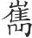宿出现在南方中天。仲秋于天干属庚辛，主宰之帝是少皞，佐帝之神是蓐收，应时的动物是老虎一类的毛族，相配的声音是商音，音律与南吕相应。这个月的数字是九，味道是辣，气味是腥，要举行的祭祀是门祭，祭祀时祭品以肝脏为尊。这个月凉风生，候雁从北来，燕子回南方，各类鸟儿都养护增生它们的羽毛来准备过冬。天子住在西向明堂的中央正室，乘坐白色的兵车，车前驾白色的马，车上插白色的绘有龙纹的旗帜；天子穿白色的衣服，佩戴白色的饰玉，吃的食物是麻籽和狗肉，用的器物锐利而深邃。

是月也，养衰老，授几杖(1)，行麋粥饮食(2)。乃命司服具饬衣裳(3)，文绣有常(4)，制有小大，度有短长，衣服有量，必循其故，冠带有常。命有司申严百刑，斩杀必当，无或枉桡(5)，枉桡不当，反受其殃。

*【注释】*

(1)几（jī）：坐时放在身边供凭依的小桌。

(2)行：赐予。麋（mí）粥：粥。麋，通“糜”，粥。

(3)司服：主管服制的官吏。衣：上衣。裳（chánɡ）：下衣。

(4)文：画。常：指固定的规格。古时制度，祭服上衣用画，下衣用绣。

(5)枉桡：都是弯曲的意思，这里“枉”指不按法律公正断案，“桡”指不按公理申明正义。

*【译文】*

这个月，要赡养衰老的人，授予他们几案和手杖，施与他们稀粥饮食。命令主管服制的官吏准备并整饬衣裳，祭服的文饰有固定的规格，大小长短有一定的制度，祭服之外的服装也有一定的尺寸，必须依照旧有的规定，随着服制的不同，冠带也有相应的固定规格。命令司法官重申严明各种刑罚，斩杀罪犯一定要恰当，不要曲法冤枉人。如果有曲法冤枉人的事，执法者要遭受灾祸。

是月也，乃命宰祝巡行牺牲(1)，视全具(2)，案刍豢(3)，瞻肥瘠，察物色，必比类(4)，量小大，视长短，皆中度。五者备当(5)，上帝其享。天子乃傩(6)，御佐疾(7)，以通秋气。以犬尝麻，先祭寝庙。

*【注释】*

(1)宰祝：即充人、太祝，官名，主管牺牲及祭祀。

(2)全具：指牺牲完整没有毁伤。

(3)刍豢（huàn）：指牺牲豢养的情况。刍，指用草喂养牛羊。豢，指用谷物喂养猪狗。

(4)比类：合乎旧例。

(5)五者：指全具、肥瘠、物色、小大、长短。

(6)傩（nuó）：祭祀名，逐除灾疫、不祥。

(7)御：止。佐疾：指疫疠。

*【译文】*

这个月，命令主管牺牲和祭祀的官吏巡视用来祭祀的牺牲，看看形体是否完整，喂养的情况如何，是肥是瘦，毛色是否纯一，一定要符合旧例；量量它们的大小，看看长短，也都要符合标准。形体、肥瘦、毛色、大小、长短都完全适当，上帝就享用这些祭品。天子于是举行傩祭，制止逐除疫疠，以通达金秋之气。就着狗肉品尝麻籽，并且先把它进献给祖庙。

是月也，可以筑城郭，建都邑(1)，穿窦窌(2)，修囷仓(3)。乃命有司趣民收敛(4)，务蓄菜，多积聚。乃劝种麦，无或失时，行罪无疑(5)。

*【注释】*

(1)都邑：城镇。有先君宗庙的叫都，没有的叫邑。

(2)窦：地穴。窌（jiào）：地窖。

(3)囷（qūn）仓：存放粮食的仓库。圆的叫囷，方的叫仓。

(4)趣：通“促”，催促。

(5)行：施予。

*【译文】*

这个月，可以修筑城郭，建置都邑，挖掘地窖，修葺仓廪。命令主管官吏督促百姓收敛谷物，努力储藏过冬的干菜，多多积聚柴草。要鼓励百姓及时种麦，不要错过农时；如果错过农时，一定要给以处罚。

是月也，日夜分(1)，雷乃始收声，蛰虫俯户(2)。杀气浸盛(3)，阳气日衰，水始涸。日夜分，则一度量，平权衡(4)，正钧石(5)，齐斗甬(6)。

*【注释】*

(1)日夜分：日夜各半。

(2)蛰虫：藏伏的动物。户：单扇的门，这里指洞穴口。

(3)杀气：阴气。浸：渐渐。

(4)权：秤锤。衡：秤杆。

(5)钧：三十斤。石：一百二十斤。

(6)斗甬：都是量器。甬，即“桶”字。

*【译文】*

这个月，日夜的时间相等，雷声渐渐消逝。蛰伏的动物藏在洞口。阴气渐渐旺盛，阳气日渐衰微，水开始干涸。日夜时间相等，要在此时统一和校正度量衡器具如秤锤、秤杆、斗、桶等。

是月也，易关市(1)，来商旅，入货贿(2)，以便民事。四方来杂(3)，远乡皆至，则财物不匮，上无乏用，百事乃遂。凡举事无逆天数(4)，必顺其时，乃因其类(5)。

*【注释】*

(1)易：减轻。关市：指关市的税收。

(2)货贿：钱财。

(3)杂：会集。

(4)事：指兴土功、合诸侯、举兵众之事。天数：天道，自然的规律。

(5)“必顺”二句：这句大意是要依事情的不同来确定何时做什么。

*【译文】*

这个月，要减轻关市的税收，招徕各地的商旅，收纳财物，以利于百姓的生产和生活。四方之人前来聚集，连偏远乡邑也全都到来，这样，财物就不缺乏，国家用费就不缺少，各种事情就能成功。做各种事情不要违背自然规律，一定要顺应天时，按照事情的类别，什么时候该做什么就做什么。

行之是令，白露降三旬。

*【译文】*

实行这个月的政令，白露降落，三旬每旬一次。

仲秋行春令，则秋雨不降，草木生荣(1)，国乃有大恐。行夏令，则其国旱，蛰虫不藏，五谷复生。行冬令，则风灾数起，收雷先行(2)，草木早死。

*【注释】*

(1)荣：花。

(2)先行：指先收声。

*【译文】*

仲秋如果实行应在春天实行的政令，那么，秋雨就不能降落，草木就会重新开花，国家就会有大的恐慌。如果实行应在夏天实行的政令，那么，国家就会出现旱灾，蛰伏的动物就不再藏伏，五谷就会重新萌发生长。如果实行应在冬天实行的政令，那么，风灾就会频频发生，雷声就会提前收敛，草木就会过早死亡。

# 论威

*【题解】*

本篇旨在论述战争之道。文章首先强调了“义”的重要性，指出“义”是“万事之纪”，战争自然也不例外，只要统一于“义”，就可使“三军一心”，号令无阻，无敌于天下了。其次强调了号令的重要性，指出“其令强者其敌弱，其令信者其敌诎”。文章还论述了有关战略战术的一些原则。如：“善谕威者，于其未发也”，“士民未合而威已谕矣”；“凡兵，欲急疾捷先”；“夫兵有大要，知谋物之不谋之不禁也”等等，这些军事思想都是很可贵的。

二曰：

义也者，万事之纪也，君臣、上下、亲疏之所由起也，治乱、安危、过胜之所在也(1)。过胜之(2)，勿求于他，必反于己。

*【注释】*

(1)过：等于说“败”。

(2)过胜之：句末承上文省略了“所在”二字。

*【译文】*

第二：

义是万事的法则，是君臣、长幼、亲疏产生的根基，是国家治乱、安危、胜败的关键。胜败的关键，不要向其他方面寻求，一定要在自己身上寻找。

人情欲生而恶死，欲荣而恶辱。死生荣辱之道一(1)，则三军之士可使一心矣。

*【注释】*

(1)一：统一。

*【译文】*

人的本性都是想要生存而厌恶死亡，想要荣耀而厌恶耻辱。死生、荣辱的原则统一于义，就可以使三军将士思想一致了。

凡军，欲其众也；心，欲其一也。三军一心，则令可使无敌矣。令能无敌者，其兵之于天下也，亦无敌矣。古之至兵(1)，民之重令也，重乎天下，贵乎天子。其藏于民心，捷于肌肤也(2)，深痛执固(3)，不可摇荡，物莫之能动。若此则敌胡足胜矣？故曰：其令强者其敌弱(4)，其令信者其敌诎(5)。先胜之于此(6)，则必胜之于彼矣。

*【注释】*

(1)至兵：最好的军队。指正义之师。

(2)捷：通“接”，接触、感觉的意思。

(3)深痛：深切。

(4)强：这里是不可冲犯的意思。

(5)信：通“伸”，这里是畅行无阻的意思。诎（qū）：通“屈”，屈服。

(6)此：这里指朝廷。下文“彼”指战场。

*【译文】*

凡军队，人数应该众多，军心应该一致。三军思想一致，就可以使号令畅行无阻了。号令能够畅行无阻的君主，他的军队也就无敌于天下了。古代的正义之师，人民尊重号令，看得比天下还重大，比天子还尊贵。号令藏于民心，感于肌肤，深切牢固，不可动摇，没有任何东西能够使它改变。像这样，敌人自然不战而溃，哪儿还值得一击呢？所以说：号令不可冲犯的军队，它的敌手必然软弱；号令畅行无阻的军队，它的敌手必然屈服。运筹帷幄就已经胜过了敌手，因此，在战场上战胜敌手就是必然的了。

凡兵，天下之凶器也(1)；勇，天下之凶德也(2)。举凶器，行凶德，犹不得已也(3)。举凶器必杀，杀，所以生之也；行凶德必威，威，所以慑之也(4)。敌慑民生，此义兵之所以隆也。故古之至兵，才民未合(5)，而威已谕矣，敌已服矣，岂必用桴鼓干戈哉(6)？故善谕威者，于其未发也，于其未通也(7)，窅窅乎冥冥(8)，莫知其情，此之谓至威之诚(9)。

*【注释】*

(1)凶器：兵器是杀伤人的工具，所以古称兵器为凶器。凶，杀伤人。

(2)凶德：勇武作为古代的一种道德，是体现在战争中的，而战争必杀伤人，所以古称勇武为凶德。

(3)犹：通“由”，由于。

(4)慑（shè）：恐惧。这里是使恐惧的意思。

(5)才民：疑是“士民”之误。士民，古代四民（士民、商民、农民、工民）之一。这里指士卒。合：古称交战为合。

(6)桴（fú）鼓：鼓槌和鼓。古时作战，击鼓以令进军。干：盾。

(7)通：这里是显露的意思。

(8)窅窅（yǎo）：义与“冥冥”相近，潜藏隐晦的样子。

(9)诚：实。

*【译文】*

凡兵器都是天下的凶器，勇武是天下的凶德。动用凶器，施行凶德，是由于不得已。动用凶器必定要杀人，杀恶人是使人民得以生存的手段；施行凶德必定要显示武力，显示武力是叫敌手畏惧的手段。敌手畏惧屈服，人民获得生存，这是正义之师兴盛的原因。所以，古代的正义之师出征，士兵尚未交锋，而威力就已经使人知道了，敌手就已经降服了，难道还一定用得着击鼓冲锋厮杀吗？所以，善于让人明白自己威力的，他的威力在他尚未发挥、尚未显示之前就已经产生作用了。深远难见，没有谁知道它的真实情况，这就是威力达到顶点的情形。

凡兵，欲急疾捷先。欲急疾捷先之道，在于知缓徐迟后而急疾捷先之分也(1)。急疾捷先，此所以决义兵之胜也。而不可久处，知其不可久处，则知所兔起凫举死之地矣(2)。虽有江河之险则凌之，虽有大山之塞则陷之。并气专精(3)，心无有虑，目无有视，耳无有闻，一诸武而已矣(4)。冉叔誓必死于田侯(5)，而齐国皆惧；豫让必死于襄子(6)，而赵氏皆恐；成荆致死于韩主，而周人皆畏(7)；又况乎万乘之国而有所诚必乎(8)？则何敌之有矣？刃未接而欲已得矣。敌人之悼惧惮恐、单荡精神(9)，尽矣，咸若狂魄，形性相离(10)，行不知所之，走不知所往，虽有险阻要塞、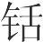兵利械(11)，心无敢据，意无敢处，此夏桀之所以死于南巢也(12)。今以木击木则拌(13)，以水投水则散，以冰投冰则沈(14)，以涂投涂则陷(15)，此疾徐先后之势也。

*【注释】*

(1)而：相当于“与”。

(2)兔起凫（fú）举：喻行动迅疾。起，疾跑。凫，水鸟名，俗称“野鸭”。举，起飞。死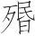（mèn）之地：指地势险恶的绝地。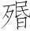，气绝。

(3)并（bǐnɡ）：同“屏”，抑止。专精：使精神专一。

(4)一：使……专一。诸：“之、于”的合音字。“之”代上文的心、目、耳。

(5)冉叔：战国时的义士。田侯：战国时齐国国君，田姓。

(6)豫让：春秋末年晋国人，晋卿智瑶的家臣。智氏被韩、赵、魏三家灭掉之后，他一再谋刺赵襄子，后事败自杀。襄子：名无恤（一作“毋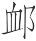”），赵简子之子，晋卿。他与韩、魏两家合谋，灭了智氏。

(7)“成荆”二句：其事未详。成荆，春秋时齐国的勇士，常与孟贲并提。他书或作“成（jiàn）”、“成庆”。

(8)必：坚决做到。

(9)悼：恐惧。单荡精神：精神衰弱动摇。

(10)离：违。

(11)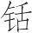（xiān）：锋利。械：器具，这里指兵器。

(12)南巢：古地名。据《史记·夏本纪》张守节正义，故址当在今安徽巢县。史传夏桀被成汤放逐，死于南巢。

(13)拌（pàn）：通“判”，分开。

(14)沈（chén）：同“沉”。

(15)涂：泥。这几句的意思是，在势均力敌的情况下，行动迅速、处于主动地位、先发制人的就占上风。

*【译文】*

凡用兵打仗，应该行动迅速，先发制人。要想行动迅速，先发制人，方法在于明辨迟缓落后与迅速抢先的区别。行动迅速、先发制人，这是决定正义之师胜利的因素。因而不可滞留一处，懂得军队不可滞留的道理，那就知道哪些地方是该迅速避开的死绝之地了。这样，纵有江河之险也可以凌越它，纵有大山险塞也能够攻陷它。要克敌制胜，只要精神专一，心里什么都不想，眼睛什么都不看，耳朵什么都不听，把心力、眼力、耳力都集中在军事上就行了。冉叔发誓一定要杀死齐侯，齐国君臣都十分恐惧；豫让决心要刺杀赵襄子，赵氏上下都很惊恐；成荆跟韩主拼命，周人都十分敬畏。一个人决心拼命尚且如此，又何况拥有兵车万辆的大国决心要达到目的呢？那还有什么人能够跟他抗衡呢？士兵尚未交锋而欲望就已经满足了。敌人恐惧害怕，精神衰竭、动摇，已经达到极点了。他们吓得都像是精神错乱一样，魂不守舍，行走不知目标，奔跑不知去处，纵有险阻要塞、坚甲利兵，心里也不敢依托，精神也无法安宁，这就是夏桀之所以死在南巢的缘故啊。假如用木头击打木头，后者就会裂开；把水注入水中，后者就会散开；把冰投向冰面，后者就会沉没；把泥抛向泥中，后者就会下陷；这就是快慢先后的必然态势。

夫兵有大要(1)，知谋物之不谋之不禁也(2)，则得之矣。专诸是也(3)，独手举剑至而已矣，吴王壹成(4)。又况乎义兵，多者数万，少者数千，密其躅路(5)，开敌之涂，则士岂特与专诸议哉(6)！

*【注释】*

(1)大要：指最关键之处。

(2)“知谋”句：懂得算计敌人考虑不到以及不防备的地方，即懂得“攻其无备，出其不意”（《孙子·始计》）。物，这里指敌方。第二个“之”字作连词用，相当于“与”。

(3)专诸：春秋时吴国人。他借献鱼之机，用藏在鱼腹中的匕首为吴公子光（阖闾）刺杀了吴王僚，自己也当场被杀。

(4)吴王壹成：专诸一举而成全了阖闾，使他当上吴王。

(5)躅（zhuó）：足迹。

(6)“则士”句：这句意思是说，正义之师的武士远远胜过专诸。议，这里是相提并论的意思。

*【译文】*

用兵有它的关键，如果懂得攻其无备，出其不意，那就掌握了用兵的关键了。专诸就是这样，他不过是独自一人手举剑落罢了，专诸仅一举就成全了阖闾，使他当上吴王。又何况正义之师呢？正义之师人数多的几万，少的也有几千，所到之处，足迹布满道路，在敌国畅行无阻，像这样的武士，专诸怎么能跟他们相提并论呢！

# 简选

*【题解】*

“简选”就是选拔的意思。本篇以历史上商汤、周武王、齐桓、晋文、阖庐称王称霸的事例论证了“简选精良”的必要。文章提出，“兵势险阻”、“兵甲器械”、精壮熟练的武士、训练有素的士卒，这四方面是“义兵之助”，“不可〔不〕为而不足专恃”。这一观点是相当精辟的，体现了朴素的辩证唯物主义的思想。孟子在战争问题上单纯强调了人的因素，提出了“可使制梃以挞秦楚之坚甲利兵”的观点，本篇可以说是对这种思想的批驳。

三曰：

世有言曰：“驱市人而战之(1)，可以胜人之厚禄教卒；老弱罢民，可以胜人之精士练材(2)；离散系系(3)，可以胜人之行陈整齐；锄耰白梃(4)，可以胜人之长铫利兵。(5)”此不通乎兵者之论。今有利剑于此，以刺则不中，以击则不及，与恶剑无择，为是斗因用恶剑则不可。简选精良，兵械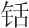利(6)，发之则不时，纵之则不当(7)，与恶卒无择，为是战因用恶卒则不可。王子庆忌、陈年犹欲剑之利也(8)。简选精良，兵械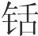利，令能将将之，古者有以王者、有以霸者矣，汤、武、齐桓、晋文、吴阖庐是矣。

*【注释】*

(1)市人：市场上的人。指临时聚集起来的乌合之众。

(2)练材：技艺熟练的勇武之士。

(3)系系：第二个“系”字疑为“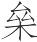”字之误。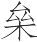：“累”的本字。累（léi），捆绑。系累，这里指囚犯。

(4)耰（yōu）：平土的农具。白梃：白茬的木棒。

(5)铫（tiáo）：古代兵器。一说即长矛。

(6)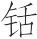（xiān）：锐利。

(7)纵：发。

(8)王子庆忌：春秋时吴王僚之子，以勇捷有力闻名。陈年：古代齐国的勇士。

*【译文】*

第三：

世上有一种言论说：“驱使市人作战，可以战胜禄秩丰厚的武士和受过训练的士兵；驱使老弱疲惫的百姓可以战胜精壮、熟练的武士；驱使散乱无纪的囚徒作战，可以战胜行列整齐的军队；使用锄耰木棒，可以战胜长矛利刃。”这是不通晓用兵之道的言论。假如有一把锋利的宝剑，由于技艺不精，拿它来刺却刺不中敌手，拿它去击却击不着目标，这同手持劣剑没有什么分别，但为此在搏斗时就使用劣剑却不可。选拔的士卒很精良，兵器很锐利，发动它们总不合时机，使用它们总不得适宜，这同使用劣等士卒没有什么分别，但为此在战争中就使用劣等士卒却不可。像王子庆忌、陈年那样的勇士，尚且还希望宝剑锋利，更何况一般人呢！选拔的士卒很精良，兵器很锐利，让有才干的将领统率它，古代有借此成就王业的，有借此成就霸业的，商汤、周武王、齐桓公、晋文公、吴王阖庐就是这样。

殷汤良车七十乘，必死六千人，以戊子战于郕(1)，遂禽推移、大牺，登自鸣条(2)，乃入巢门(3)，遂有夏。桀既奔走，于是行大仁慈，以恤黔首，反桀之事，遂其贤良(4)，顺民所喜，远近归之，故王天下。

*【注释】*

(1)郕（chénɡ）：古地名，在今山东汶上北。

(2)登：进发。鸣条：古地名，又名高侯原，在今山西运城安邑镇北。

(3)巢门：当是夏桀国都城门之名。

(4)遂：举荐。

*【译文】*

商汤率领精良的战车七十辆，不怕死的勇士六千人，在戊子那天与夏桀在郕地交战，抓住了桀臣推移、大牺。商汤进军鸣条，接着进入巢门，于是占有了夏的天下。夏桀已经逃跑了，在这时，商汤施行高度仁爱的举措，抚恤百姓，一反桀的所作所为，拔举夏的贤人，顺应人民的意愿，远近的人都归附了他，所以汤称王天下。

武王虎贲三千人(1)，简车三百乘，以要甲子之事于牧野(2)，而纣为禽。显贤者之位，进殷之遗老，而问民之所欲；行赏及禽兽，行罚不辟天子(3)；亲殷如周，视人如己。天下美其德，万民说其意，故立为天子。

*【注释】*

(1)虎贲（bēn）：勇士之称。

(2)要（yāo）：这里是成的意思。甲子之事：指周武王在甲子那天打败商纣的战事。牧野：古地名，在今河南淇县南。

(3)行罚不辟（bì）天子：指诛杀商纣。辟，同“避”。

*【译文】*

周武王率勇士三千人，精选的战车三百辆，甲子那天，在牧野打败了商纣的军队，纣被擒获。武王把贤人提拔到显贵的位置，举荐殷朝的遗老，询问人民的愿望；行赏及于禽兽，惩罚不避天子；亲近殷的士民百姓就像亲近周的士民百姓一样，看待别人就像看待自己一样。天下赞美他的德行，万民喜欢他的仁义，所以武王立为天子。

齐桓公良车三百乘，教卒万人，以为兵首，横行海内，天下莫之能禁，南至石梁(1)，西至酆郭(2)，北至令支(3)。中山亡邢(4)，狄人灭卫(5)，桓公更立邢于夷仪(6)，更立卫于楚丘(7)。

*【注释】*

(1)石梁：古地名。高诱注：“在彭城。”彭城在今江苏铜山县。

(2)酆郭：当作“酆鄗（hào）”。酆，在今陕西户县东。鄗，在今陕西西安市西南。

(3)令支：春秋时山戎属国，故址在今河北迁安一带。本书《有始》作“令疵”。

(4)中山：春秋时白狄别族国名，战国时为中山国，故址在今河北定县、唐县一带。邢：古国名，周公之子封于此，故址在今河北邢台境。据史书记载，齐桓公因邢遭受赤狄侵犯，于是把邢迁到夷仪，狄实际上并未灭邢，邢后为卫所灭。

(5)狄人灭卫：公元前660年，狄人杀卫懿公于荧泽，所以说“灭”。

(6)夷仪：古地名，在今山东聊城西。

(7)楚丘：古地名，在今河南滑县东。

*【译文】*

齐桓公率领精良的兵车三百辆，训练有素的士兵一万人，作为大军的前锋，纵横驰骋于四海之内，天下没有谁能够阻挡他，向南到达石梁，向西到达酆、鄗，向北到达令支。中山攻陷了邢国，狄人灭亡了卫国，桓公在夷仪重建起邢国，在楚丘重建起卫国。

晋文公造五两之士五乘(1)，锐卒千人，先以接敌，诸侯莫之能难(2)。反郑之埤(3)，东卫之亩(4)，尊天子于衡雍(5)。

*【注释】*

(1)两：这里有技能的意思（依高诱注）。五乘：兵车一乘，甲士三人，五乘合十五人。

(2)难（nàn）：拒，抵挡。

(3)反：覆，毁。埤（pì）：即“埤堄（nì）”，城上有孔（或呈凹凸形）的矮墙，也称“女墙”。

(4)亩：指田垄。

(5)衡雍：春秋郑地，在今河南原阳。

*【译文】*

晋文公训练出具有五种技能的甲士十五人，让他们率领精锐的步卒一千人作为前锋，先同敌人交锋，诸侯没有谁能够抵挡他。晋文公命令毁掉郑国城上的女墙，以便随时攻取，命令卫国的田垄一律东西向，以便自己的兵车通行无阻，并率领诸侯在衡雍尊奉周天子。

吴阖庐选多力者五百人，利趾者三千人(1)，以为前陈，与荆战，五战五胜，遂有郢(2)。东征至于庳庐(3)，西伐至于巴、蜀，北迫齐、晋，令行中国。

*【注释】*

(1)趾，脚。

(2)郢：春秋时楚国国都，故址在今湖北江陵西北。

(3)庳（bì）庐：古地名。

*【译文】*

吴王阖庐选拔力气大的五百人，跑得快的三千人作为军队的前锋，跟楚国交战，五战五胜，于是占领了楚国的国都郢。向东征伐一直打到庳庐，向西征伐一直打到巴、蜀，向北逼近齐国、晋国，号令在中原华夏各诸侯国畅行无阻。

故凡兵势险阻，欲其便也；兵甲器械，欲其利也；选练角材(1)，欲其精也；统率士民(2)，欲其教也。此四者，义兵之助也，时变之应也，不可为而不足专恃(3)。此胜之一策也。

*【注释】*

(1)角材：指武士。角，较量。

(2)士民：指士卒。

(3)不可为：据上下文意当作“不可不为”。专：独，单一。恃：依赖，凭借。

*【译文】*

所以，凡战争形势、山川险阻，用兵的人都希望它对自己有利；兵甲器械，都希望它锋利坚固；选拔、训练武士，都希望他们精锐强壮；统率士卒，都希望他们训练有素。这四个方面是正义之师的辅助，是适应时势变化的凭借，不能没有，也不能一味依赖它，这是取胜的一种策略。

# 决胜

*【题解】*

本篇旨在论述战争决胜之道。文章认为“义”，是战争之“本”，是决定战争胜负的根本；“智”、“勇”是战争之“干”，是决定战争胜负的重要因素；“义”、“智”、“勇”构成了用兵之道的主体，三者缺一不可。文章指出，“勇”和“怯”是可以变化的，即“民无常勇，亦无常怯”，有“气”则勇，无“气”则怯。“气”从何来，文章没有直说，综观全篇，显然是出于“义”。这些观点都是很有见地的。本篇提出了一些宝贵的战略战术原则，如：兵“贵其因”，“不可胜在己，可胜在彼”，“胜失之兵，必隐必微，必积必抟”等等。

四曰：

夫兵有本干(1)：必义，必智，必勇。义则敌孤独，敌孤独则上下虚(2)，民解落(3)；孤独则父兄怨，贤者诽，乱内作。智则知时化，知时化则知虚实盛衰之变，知先后远近纵舍之数(4)。勇则能决断，能决断则能若雷电飘风暴雨(5)，能若崩山破溃、别辨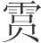坠(6)；若鸷鸟之击也，搏攫则殪，中木则碎。此以智得也(7)。

*【注释】*

(1)本干：植物的根和干，喻事物的主体。

(2)虚：指气虚，缺乏斗志。

(3)解落：离散。

(4)纵：发，放。舍：止，息。数：方法，策略。

(5)飘风：旋风。

(6)别辨：等于说“异变”。辨，通“变”。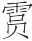（yǔn）坠：这里指陨星坠落。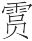，坠落。

(7)智：据上下文意当作“勇”。

*【译文】*

第四：

用兵之道有它的根本：一定要符合正义，一定要善用智谋，一定要勇猛果敢。符合正义，敌人就孤独无援，敌人孤独无援，上上下下就缺乏斗志，人民就会瓦解离散；孤独无援，君主的父兄就会怨恨，贤人就会非议，叛乱就会从内部发生。善用智谋就能知道时势的发展趋势，知道时势的发展趋势，就会知道虚实盛衰的变化，就会知道关于先后、远近、行止的策略。勇猛果敢就能临事果断，能临事果断，行动起来就能像雷电、旋风、暴雨，就能像山崩、溃决、异变、星坠，势不可挡；就像猛禽奋击，拍击抓取，禽兽就会毙命，击中树木，树木就会碎裂。这是靠勇猛果敢达到的。

夫民无常勇，亦无常怯。有气则实，实则勇；无气则虚，虚则怯。怯勇虚实，其由甚微，不可不知。勇则战，怯则北。战而胜者，战其勇者也；战而北者，战其怯者也。怯勇无常，倏忽往来(1)，而莫知其方(2)，惟圣人独见其所由然。故商、周以兴，桀、纣以亡。巧拙之所以相过(3)，以益民气与夺民气，以能斗众与不能斗众。军虽大，卒虽多，无益于胜。军大卒多而不能斗，众不若其寡也。夫众之为福也大，其为祸也亦大。譬之若渔深渊，其得鱼也大，其为害也亦大。善用兵者，诸边之内莫不与斗(4)，虽厮舆白徒(5)，方数百里皆来会战，势使之然也。幸也者(6)，审于战期而有以羁诱之也(7)。

*【注释】*

(1)倏（shū）忽：疾速的样子。

(2)方：道理。

(3)相过：这里指彼此截然不同。

(4)诸边之内：四境之内。与（yù）：参加。

(5)厮（sī）：古代干粗杂活的奴隶或仆役。舆（yú）：众。白徒：指未受过军事训练的人。

(6)幸：当作“势”，由于字划残缺而误。势：态势。

(7)羁（jī）诱：辖制引导。

*【译文】*

人民没有永恒不变的勇敢，也没有永恒不变的怯弱。士气饱满就内心充实，充实就会勇敢；士气丧失就内心空虚，空虚就会怯弱。怯弱与勇敢、空虚与充实，它们产生的缘由十分微妙，不可不知晓。勇敢就能奋力作战，怯弱就会临阵逃跑。打仗获胜的，是凭恃勇气而战；打仗败逃的，是心怀怯弱而战。怯弱与勇敢变化不定，变动疾速，没有谁知道其中的道理，惟独圣人知道它之所以这样的缘由。所以，商、周由此而兴盛，桀、纣由此而灭亡。用兵巧妙与笨拙的结局之所以彼此截然不同，是因为一个提高人民的士气，一个削弱人民的士气，一个善于使用民众作战，一个不会使用民众作战的缘故。后者军队虽然庞大，士兵虽然众多，但对于取胜没有什么益处。军队庞大，士兵众多，如果不能战斗，人多还不如人少。人数众多造福大，但如果带来灾祸，为害也大，这就好像在深渊中捕鱼一样，虽然可能捕到大鱼，但如果遇难，灾害也大。善于用兵的人，四境之内的人无不参战，即使是方圆几百里之内的奴仆以及没有受过训练的百姓都来参战，这是形势使他们这样的。形势的获得在于审慎地选择战争时机，并且有办法辖制引导战争的态势。

凡兵，贵其因也。因也者，因敌之险以为己固，因敌之谋以为己事。能审因而加(1)，胜则不可穷矣(2)。胜不可穷之谓神(3)，神则能不可胜也。夫兵，贵不可胜。不可胜在己，可胜在彼。圣人必在己者，不必在彼者，故执不可胜之术以遇不胜之敌(4)，若此，则兵无失矣。凡兵之胜，敌之失也。胜失之兵，必隐必微，必积必抟(5)。隐则胜阐矣，微则胜显矣，积则胜散矣，抟则胜离矣。诸搏攫柢噬之兽(6)，其用齿角爪牙也，必托于卑微隐蔽，此所以成胜。

*【注释】*

(1)加：指加兵于敌。

(2)胜则不可穷矣：当作“则胜不可穷矣”。

(3)神：指用兵神妙。

(4)不胜：当作“可胜”（依陶鸿庆说）。

(5)抟（zhuān）：古“专”字。专一，集中。

(6)柢：当作“抵”（依王念孙说）。抵，通“牴”，用角顶撞。

*【译文】*

凡用兵，贵在善于凭借。所谓凭借是指利用敌人的险阻作为自己坚固的要塞，利用敌人的谋划达到自己的目的。能够明察所凭借的条件再采取行动，那胜利就不可穷尽了。胜利不可穷尽叫做“神”，达到“神”的境界就能不可战胜了。用兵贵在不可被敌战胜。不可被敌战胜，根本原因在于己方，能够战胜敌人，根本原因在于敌方。圣人依赖己方的努力，而不依赖敌人的过失，所以，掌握着不可被战胜的策略，以此同可以战胜的敌人交锋，像这样，用兵就万无一失了。凡用兵获胜，都是敌人犯有过失的缘故。战胜犯有过失的军队，一定要隐蔽，一定要潜藏，一定要蓄积力量，一定要集中兵力。做到隐蔽就能战胜公开的敌人了，做到潜藏就能战胜暴露的敌人了，做到蓄积就能战胜力量零散的敌人了，做到集中就能战胜兵力分散的敌人了。各种依靠齿角爪牙抓取、顶撞、撕咬猎物的野兽，在它们使用齿角爪牙的时候，一定先要隐身缩形，这是它们成功取胜的原因。

# 爱士*一作慎穷*

*【题解】*

本篇旨在劝说君主“爱士”。文章以秦穆公、赵简子“行德爱人”而得到“野人”及士拼死报答的事例说明，贤主一定“怜人之困”、“哀人之穷”；君主只要做到“行德爱人”，人民就会“亲其上”，就会“乐为其君死矣”。文章反映了作者希望自己这一阶层受到君主赏识的愿望。

五曰：

衣人以其寒也，食人以其饥也。饥寒，人之大害也；救之，义也。人之困穷甚如饥寒(1)，故贤主必怜人之困也，必哀人之穷也。如此则名号显矣，国士得矣(2)。

*【注释】*

(1)如：相当“于”。

(2)国士：全国之内的优秀人物。

*【译文】*

第五：

给人衣穿是因为人们在受冻，给人饭吃是因为人们在挨饿。挨饿受冻是人的大灾，拯救挨饿受冻的人是正义的行为。人的艰难窘迫比起挨饿受冻来灾难更为深重，所以贤明的君主对陷入困境的人必定怜悯，对人遭受困厄必表痛惜。做到这一步，君主的名声就显赫了，国士就会归附了。

昔者，秦缪公乘马而车为败(1)，右服失而野人取之(2)。缪公自往求之，见野人方将食之于岐山之阳(3)。缪公叹曰：“食骏马之肉而不还饮酒(4)，余恐其伤女也！”于是遍饮而去。处一年，为韩原之战(5)。晋人已环缪公之车矣，晋梁由靡已扣缪公之左骖矣(6)，晋惠公之右路石奋杸而击缪公之甲(7)，中之者已六札矣(8)。野人之尝食马肉于岐山之阳者三百有余人，毕力为缪公疾斗于车下，遂大克晋，反获惠公以归。此《诗》之所谓曰“君君子则正，以行其德；君贱人则宽，以尽其力”者也(9)。人主其胡可以无务行德爱人乎？行德爱人，则民亲其上；民亲其上，则皆乐为其君死矣。

*【注释】*

(1)乘马：乘着马驾的车。败：坏。

(2)服：古代一车驾四马，居中的两匹称“服”，两边的称“骖（cān）”。失（yì）：同“佚”，狂奔。野人：与君子相对，这里指农夫。

(3)岐山：在今陕西岐山东北。

(4)还（xuán）：通“旋”，迅速，立刻。

(5)韩原：春秋晋地，在今山西芮城。

(6)梁由靡：晋大夫。据《史记·晋世家》记载，韩原之战，梁由靡为晋惠公驾车。

(7)晋惠公：春秋时晋国国君，名夷吾，公元前650年—前637年在位。右：车右，由勇士担任。杸：同“殳”，古代兵器，竹制，一端有棱。

(8)六札：六层革甲。当时革甲一般都是复叠七层。缪公之甲已被击穿六层，形势当是十分危急了。

(9)曰：当为衍文。这两句诗是逸诗，今本《诗经》未载。

*【译文】*

从前，有一次秦穆公乘马车出行，车坏了，右侧驾辕的马脱缰跑了，一群农夫抓住了它。穆公亲自去寻找那匹马，在岐山的南面看到农夫正要分食马肉。穆公叹息说：“吃了骏马的肉而不马上喝酒，我恐怕马肉会伤了你们的身体。”于是穆公给他们一一喝了酒，才离开。过了一年，秦、晋进行韩原之战。晋国士兵已经包围了秦穆公的兵车，晋国大夫梁由靡已经抓住穆公车上左边的马，晋惠公的车右路石举起长殳击中了穆公的铠甲，穆公的铠甲已被击穿了六层，在这危急时刻，曾在岐山之南分食马肉的农夫三百多人，在车下竭尽全力为穆公拼死搏斗。于是秦军大胜晋军，反而俘获了晋惠公带回秦国。这就是《诗》中所说的“给君子做国君就要平正无私，借以让他们施行仁德；给卑贱的人做国君就要宽容厚道，借以让他们竭尽全力”啊！君主怎么能不务求施行仁德、爱抚人民呢？君主施行仁德，爱抚人民，人民就爱戴他们；人民如果爱戴他们的君主，那就都乐意为他们去死了。

赵简子有两白骡而甚爱之(1)。阳城胥渠处广门之官(2)，夜款门而谒曰(3)：“主君之臣胥渠有疾(4)，医教之曰：‘得白骡之肝，病则止；不得则死。’”谒者入通(5)。董安于御于侧(6)，愠曰：“嘻！胥渠也。期吾君骡(7)，请即刑焉(8)。”简子曰：“夫杀人以活畜，不亦不仁乎？杀畜以活人，不亦仁乎？”于是召庖人杀白骡，取肝以与阳城胥渠。处无几何，赵兴兵而攻翟(9)。广门之官，左七百人，右七百人，皆先登而获甲首。人主其胡可以不好士？

*【注释】*

(1)赵简子：春秋末年晋卿，名鞅，谥号简子。又名志父，也称赵孟。

(2)阳城胥渠：赵简子的家臣，复姓阳城，名胥渠。处：居，任。广门：晋邑名。官：这里指小吏。

(3)款：叩，敲。谒（yè）：告。

(4)主君：古时国君、卿、大夫均可称主君。这里指赵简子。

(5)谒者：专管通报的小官。通：通报。

(6)董安于：赵简子的家臣。御：侍奉。

(7)期：希冀。这里是算计的意思。

(8)即刑：就刑，接受死刑。即，就，走近。

(9)翟（dí）：通“狄”，我国古代北方地区民族名。

*【译文】*

赵简子有两匹白骡，简子特别喜爱它们。阳城胥渠任广门邑的小吏，一天夜里来到简子的门前，叩门申述说：“主君的家臣胥渠病了，医生告诉他说：‘如果弄到白骡的肝吃了，病就能好；如果弄不到，就必死。’”负责通报的人进去通报给赵简子。董安于正在一旁侍奉，恼怒地说：“嘿！胥渠这个家伙！竟算计起我们主君的白骡来了。请您让他接受死刑！”简子说：“杀人以使牲畜活命，不也太不仁义了吗？杀掉牲畜以使人活命，不正是仁爱的体现吗？”于是呼唤厨师杀掉白骡，取出肝，送给阳城胥渠。过了没多久，赵简子举兵攻狄，广门邑的小吏，左队七百人，右队七百人都争先登上城头，并斩获敌方披甲武士的首级。由此看来，君主怎么可以不爱士呢？

凡敌人之来也，以求利也。今来而得死，且以走为利。敌皆以走为利，则刃无与接。故敌得生于我，则我得死于敌；敌得死于我，则我得生于敌。夫得生于敌，与敌得生于我，岂可不察哉？此兵之精者也。存亡死生决于知此而已矣。

*【译文】*

凡敌人来犯，都是为了追求利益；假如来犯而遭到覆灭，那将把退却看作有利了。如果敌人都把退却看作有利，那就用不着交锋了。所以，如果敌人从我们这里获得生存，那我们就要死在敌手；如果敌人死在我们手下，那我们就从敌人那里获得了生存。或是我们从敌人那里获得生存，或是敌人从我们这里获得生存，这其中的道理难道不该仔细研究吗？这是用兵的精妙所在，生死存亡只是取决于是否懂得这个道理罢了。

