 有始览第一

# 有始

*【题解】*

本篇阐述作者的自然观。

《仲夏纪·大乐》篇说：“太一出两仪，两仪出阴阳，阴阳变化，一上一下，离则复合，合则复离，是谓天常。”本篇可以说是这种思想的具体化。所谓“天地有始”，“天地合和，生之大经”，是论述天地万物产生过程的。文章认为，万物生于天地，就像人由母体产生一样，这叫做“大同”；而生成的万物又“殊形殊能异宜”，这叫做“众宜”。众物各依其异而得其所，这就是“平”。文章举天地山川有九野、九州、九山、九塞等，既是为了说明“众异”，同时也显示了当时的地理知识；而其中关于九野的叙述，第一次完整地记述了二十八宿的名字，反映了当时天文学的成就。

作者所以把《有始》放在八览之首，是因为本书以“法天地”为宗旨，把天地运行的自然之道作为人事的依据。本篇所说的“天斟万物，圣人览焉，以观其类”，用意也在于此。

一曰：

天地有始，天微以成(1)，地塞以形(2)。天地合和，生之大经也。以寒暑日月昼夜知之，以殊形殊能异宜说之。夫物合而成，离而生。知合知成，知离知生，则天地平矣(3)。平也者，皆当察其情，处其形。

*【注释】*

(1)微：指轻微之物。

(2)塞：指重浊之物。

(3)平：成，形成。

*【译文】*

第一：

天地有开始的时候，天是由轻微之物上升而形成，地是由重浊之物下沉而形成。天地交合，是万物生成的根本。由寒暑的变化、日月的运转、昼夜的交替可以知道这个道理，由万物不同的形体、不同的性能、不同的应用可以解释这个道理。万物都是由于天地交合而形成的，通过分离而产生的。知道交合而形成，知道分离而产生，那么就知道天地形成的道理了。要了解天地的形成，应当详察万物的实情，审度万物的形体。

天有九野(1)，地有九州，土有九山，山有九塞(2)，泽有九薮(3)，风有八等，水有六川。

*【注释】*

(1)九野：即九天，古代指天的中央及八方。野，星宿所在的星空区域。

(2)塞：险阻。

(3)薮（sǒu）：大泽。

*【译文】*

天有九野，地有九州，境内有九座高山，山有九处险隘，水泽有九大渊薮，风有八种，水有六大河流。

何谓九野？中央曰钧天(1)，其星角、亢、氐；东方曰苍天(2)，其星房、心、尾；东北曰变天(3)，其星箕、斗、牵牛(4)；北方曰玄天(5)，其星婺女、虚、危、营室；西北曰幽天(6)，其星东壁、奎、娄；西方曰颢天(7)，其星胃、昴、毕(8)；西南曰朱天(9)，其星觜巂、参、东井；南方曰炎天(10)，其星舆鬼、柳、七星(11)；东南曰阳天(12)，其星张、翼、轸(13)。

*【注释】*

(1)钧天：因为距其他八野均等，所以称钧天。钧，通“均”。

(2)苍天：东方属木，木色青，所以称为苍天。

(3)变天：东北为阴气之极，阳气之始，万物将从此而生，所以称为变天。

(4)箕：星宿名，二十八宿之一，在今人马座。

(5)玄天：北方属水，水色黑，所以称为玄天。

(6)幽天：西北即将至太阴，所以称为幽天。

(7)颢天：西方属金，金色白，所以称为颢天。颢，白。

(8)昴：星宿名，二十八宿之一，在今金牛座。

(9)朱天：西南为少阳，所以称为朱天。朱，阳。

(10)炎天：南方属火，火性炎上，所以称为炎天。

(11)舆鬼：星宿名，即鬼宿，二十八宿之一，今属巨蟹座。

(12)阳天：东南即将至太阳（东方为太阳），所以称为阳天。

(13)张：星宿名，二十八宿之一，在今长蛇座。

*【译文】*

什么是九野？天中央叫钧天，那里的星宿是角、亢、氐；东方叫苍天，那里的星宿是房、心、尾；东北叫变天，那里的星宿是箕、斗、牵牛；北方叫玄天，那里的星宿是婺女、虚、危、营室；西北叫幽天，那里的星宿是东壁、奎、娄；西方叫颢天，那里的星宿是胃、昴、毕；西南叫朱天，那里的星宿是觜巂、参、东井；南方叫炎天，那里的星宿是舆鬼、柳、七星；东南叫阳天，那里的星宿是张、翼、轸。

何谓九州？河、汉之间为豫州，周也；两河之间为冀州(1)，晋也；河、济之间为兖州，卫也；东方为青州，齐也；泗上为徐州(2)，鲁也；东南为扬州，越也；南方为荆州，楚也；西方为雍州，秦也；北方为幽州，燕也。

*【注释】*

(1)两河：指清河与西河。清河在今河北境内。西河，古人称冀州西边南北流向的黄河为西河。

(2)泗上：泗水之滨。

*【译文】*

什么是九州？黄河、汉水之间为豫州，是周王室的疆域。清河和西河之间为冀州，是晋国的疆域。黄河、济水之间为兖州，是卫国的疆域。东方为青州，是齐国的疆域。泗水以南为徐州，是鲁国的疆域。东南为扬州，是越国的疆域。南方为荆州，是楚国的疆域。西方为雍州，是秦国的疆域。北方为幽州，是燕国的疆域。

何谓九山？会稽、太山、王屋、首山、太华、岐山、太行、羊肠、孟门(1)。

*【注释】*

(1)会稽：山名。在今浙江绍兴东北。王屋：山名。在今山西阳城西南。首山：即首阳山。在今山西永济南。太华：即华山。羊肠：山名。在今山西晋城南。孟门：山名。在今陕西宜川东北。

*【译文】*

什么是九座高山？就是会稽山、泰山、王屋山、首阳山、太华山、岐山、太行山、羊肠山、孟门山。

何谓九塞？大汾、冥阨、荆阮、方城、殽、井陉、令疵、句注、居庸(1)。

*【注释】*

(1)大汾：险塞名，在晋国。冥阨：以及荆阮、方城都是险塞名。在楚国。殽：古险塞名。故址在今河南渑池西。井陉（xínɡ）：古险塞名。故址在今河北井陉北。令疵：古险塞名。在辽西。句注：古险塞名。故址在今山西雁门关西。

*【译文】*

什么是九处险隘？就是大汾、冥阨、荆阮、方城、殽、井陉、令疵、句注、居庸。

何谓九薮？吴之具区(1)，楚之云梦(2)，秦之阳华(3)，晋之大陆(4)，梁之圃田(5)，宋之孟诸(6)，齐之海隅(7)，赵之钜鹿(8)，燕之大昭(9)。

*【注释】*

(1)具区：古泽名。即今太湖。

(2)云梦：古泽名。故址在今湖北监利西北。

(3)阳华：古泽名。确址不详。

(4)大陆：古泽名。故址在今河南汲县一带。

(5)圃田：古泽名。故址在今河南中牟西。

(6)孟诸：古泽名。故址在今河南商丘东北。

(7)海隅：古泽名。故址在今山东蓬莱、掖县以西，沾化、无棣以北的广大地区。

(8)钜鹿：古泽名。故址在今河北隆尧、巨鹿、任县之间。

(9)大昭：古泽名。故址在今山西祁县西南。

*【译文】*

什么是九大渊薮？就是吴国的具区、楚国的云梦、秦国的阳华、晋国的大陆、梁国的圃田、宋国的孟诸、齐国的海隅、赵国的钜鹿、燕国的大昭。

何谓八风？东北曰炎风，东方曰滔风，东南曰熏风，南方曰巨风，西南曰凄风，西方曰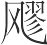风，西北曰厉风，北方曰寒风。

*【译文】*

什么是八风？东北风叫炎风，东风叫滔风，东南风叫熏风，南风叫巨风，西南风叫凄风，西风叫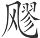风，西北风叫厉风，北风叫寒风。

何谓六川？河水、赤水、辽水、黑水、江水、淮水(1)。

*【注释】*

(1)赤水：不详。高诱说发源于昆仑山东南部。辽水：不详。高诱说发源于砥石山，从塞北向东流，直到辽东西南部入海。黑水：不详。高诱说发源于昆仑山西北部。

*【译文】*

什么是六大河流？就是河水、赤水、辽水、黑水、江水、淮水。

凡四海之内，东西二万八千里，南北二万六千里。水道八千里，受水者亦八千里。通谷六(1)，名川六百，陆注三千(2)，小水万数。

*【注释】*

(1)通谷：指大河，这里指最大的河流。

(2)陆注：疑为今之内陆河或季节河。

*【译文】*

整个四海之内，东西长两万八千里，南北长二万六千里。通航的河道八千里，受水的河道也是八千里。最大的河流六条，大河六百条，季节河三千条，小河流数以万计。

凡四极之内，东西五亿有九万七千里(1)，南北亦五亿有九万七千里。

*【注释】*

(1)亿：先秦时以十万称“亿”者居多。

*【译文】*

四极之内，东西长五十九万七千里，南北长也是五十九万七千里。

极星与天俱游(1)，而天枢不移(2)。冬至日行远道(3)，周行四极(4)，命曰玄明(5)。夏至日行近道(6)，乃参于上(7)。当枢之下无昼夜。白民之南(8)，建木之下(9)，日中无影，呼而无响，盖天地之中也。

*【注释】*

(1)极星：即北极璇玑，又称“帝星”，今为小熊座。与天俱游：指日月星辰围绕北天极作周日运动。

(2)天枢：指北天极。

(3)远道：日月星辰以北天极为圆心作周日运动，太阳每年在空中划出约365个圆形轨迹，取其中七个，冬至那天划出的圆形轨迹离北天极最远，所以称作“远道”。

(4)周行四极：地与日月星辰在一年中浮动，能达到东西南北四个极限点，各自的轨迹又是圆形，所以叫“周行四极”。

(5)玄明：大明。

(6)近道：太阳绕北天极作周日运动，夏至那天所划出的圆形轨迹离北天极最近，所以称作“近道”。

(7)参于上：意思是太阳此时正当头顶之上。参，值。

(8)白民：古代传说中的海外国名。

(9)建木：古代传说中的一种树名，在白民国之南。

*【译文】*

极星和天一起运行，而北天极不移动。冬至这天，太阳运行在离北天极最远的圆形轨迹上，环行于四个极限点，称为玄明。夏至这天，太阳运行在离北天极最近的圆形轨迹上，太阳正值人的上方。在天极的下面，没有昼夜的区别。在白民国以南，建木的下面，中午没有影子，呼叫时没有声音，因为这里是天地的中心。

天地万物，一人之身也，此之谓大同。众耳目鼻口也，众五谷寒暑也。此之谓众异，则万物备也。天斟万物(1)，圣人览焉，以观其类。解在乎天地之所以形(2)，雷电之所以生，阴阳材物之精(3)，人民禽兽之所安平。

*【注释】*

(1)斟：聚积。

(2)解在乎：意思是，（对这问题的）解释体现在（……方面）。

(3)材：裁制，生成。这句意思是阴阳生成万物的精妙。

*【译文】*

天地万物，如同一个人的身体，这就叫高度同一。人有耳目鼻口，天地万物有五谷寒暑。这些叫做各种差异，这样，万物就齐备了。上天聚积万物，圣人考察万物从而了解它们的类别。对这个道理的解释体现在天地之所以形成、雷电之所以发生、阴阳变化而生成万物、人民禽兽各得其所等方面。

# 应同*旧作名类*

*【题解】*

所谓“应同”，指的是事物都因同类而相应。文章列举大量的自然现象以及社会现象，揭示了“类固相召，气同则合，声比相应”的规律。文章所说的事物之间的应和，指的是事物之间的客观联系。文章从这种唯物主义的观点出发，指出人的吉凶福祸，国家的治乱存亡，是人们自身行为所造成的，而不是“命”决定的。文章批判了众人不知“祸福之所自来”而“以为命”的胡涂观念，主张尽人事努力以避祸求福。对君主来说，就是要致力于“治”，只有国治才足以制止他国的侵伐。

本篇首段的论述源于邹衍的五德终始说，其目的在于借五行说鼓励秦国统治者顺应形势，统一天下，代周而王。文中所谓“代火者必将水，……水气至而不知数备，将徙于土”，正是要告诫秦国统治者不要失掉统一天下的时机。

二曰：

凡帝王者之将兴也，天必先见祥乎下民。黄帝之时，天先见大螾大蝼(1)。黄帝曰：“土气胜。”土气胜，故其色尚黄，其事则土。及禹之时，天先见草木秋冬不杀(2)。禹曰：“木气胜。”木气胜，故其色尚青，其事则木。及汤之时，天先见金刃生于水。汤曰：“金气胜。”金气胜，故其色尚白，其事则金。及文王之时，天先见火赤乌衔丹书集于周社(3)。文王曰：“火气胜。”火气胜，故其色尚赤，其事则火。代火者必将水，天且先见水气胜。水气胜，故其色尚黑，其事则水。水气至而不知数备，将徙于土。

*【注释】*

(1)螾（yǐn）：同“蚓”，蚯蚓。蝼：蝼蛄。

(2)杀：凋零。

(3)火赤乌：指由火幻化而成的赤色乌鸦。集：止。社：本指土神，这里指祭土神的地方。

*【译文】*

第二：

凡是古代称帝称王的将要兴起，上天必定先向人们显示出征兆来。黄帝的时候，上天先显现出大蚯蚓大蝼蛄。黄帝说：“这表明土气旺盛。”土气旺盛，所以黄帝时的服色崇尚黄色，做事情取法土的颜色。到夏禹的时候，上天先显现出草木秋冬时节不凋零的景象。夏禹说：“这表明木气旺盛。”木气旺盛，所以夏朝的服色崇尚青色，做事情取法木的颜色。到汤的时候，上天先显现水中出现刀剑的景象。商汤说：“这表明金气旺盛。”金气旺盛，所以商朝的服色崇尚白色，做事情取法金的颜色。到周文王的时候，上天先显现由火幻化的红色乌鸦衔着丹书停在周的社坛上。周文王说：“这表明火气旺盛。”火气旺盛，所以周朝的服色崇尚红色，做事情取法火的颜色。代替火的必将是水，上天将先显现水气旺盛的景象。水气旺盛，所以新王朝的服色应该崇尚黑色，做事情应该取法水的颜色。如果水气到来，却不知气数已经具备，从而取法于水，那么，气数必将转移到土上去。

天为者时，而不助农于下(1)。类固相召(2)，气同则合，声比则应(3)。鼓宫而宫动，鼓角而角动。平地注水，水流湿；均薪施火，火就燥；山云草莽，水云鱼鳞，旱云烟火，雨云水波，无不皆类其所生以示人。故以龙致雨，以形逐影(4)。师之所处，必生棘楚(5)。祸福之所自来，众人以为命，安知其所？

*【注释】*

(1)“天为”二句：此句与上下文义不连贯，恐有脱文。

(2)固：当作“同”。

(3)比：并，这里是“同”的意思。

(4)以形逐影：凭着形体寻找影子。

(5)棘楚：指丛生多刺的灌木。楚，荆，丛生的灌木。

*【译文】*

天有四时的运行，但并不帮助违背农时的农事。物类相同的就互相招引，气味相同的就互相投合，声音相同的就互相响应。敲击此处宫音，彼处宫音就随之振动；敲击此处角音，彼处角音就随之振动。在同样平的地面上灌水，水先向潮湿的地方流；在铺放均匀的柴草上点火，火先向干燥的地方燃烧；山上的云呈现草莽的形状，水上的云呈现鱼鳞的形状，干旱时的云就像燃烧的烟火，阴雨时的云就像荡漾的水波。这些都无不依赖它们赖以生成的东西来显示给人们。所以用龙就能招来雨，凭形体就能找到影子，军队经过的地方，必定生长出荆棘来。祸福的到来，一般人认为是“命”，哪里知道祸福到来的缘由？

夫覆巢毁卵，则凤凰不至；刳兽食胎(1)，则麒麟不来；干泽涸渔，则龟龙不往。物之从同，不可为记。子不遮乎亲(2)，臣不遮乎君。君同则来(3)，异则去。故君虽尊，以白为黑，臣不能听；父虽亲，以黑为白，子不能从。

*【注释】*

(1)刳（kū）：剖开而挖空。

(2)遮：遏制。

(3)君：当为衍文。

*【译文】*

掀翻鸟巢，毁坏鸟卵，那么凤凰就不会再来；剖开兽腹，吃掉兽胎，那么麒麟就不会再来；弄干池泽来捕鱼，那么龟龙就不会再去。事物同类相从的情况，难以尽述。儿子不会一味受父亲遏制，臣子不会一味受君主遏制。志同道合就在一起，否则就离开。所以君主虽然尊贵，如果把白当成黑，臣子就不能听从；父亲虽然亲近，如果把黑当成白，儿子也不能依从。

黄帝曰：“芒芒昧昧(1)，因天之威(2)，与元同气(3)。”故曰同气贤于同义，同义贤于同力，同力贤于同居，同居贤于同名。帝者同气，王者同义，霸者同力，勤者同居则薄矣，亡者同名则粗矣(4)。其智弥粗者，其所同弥粗；其智弥精者，其所同弥精。故凡用意不可不精。夫精，五帝三王之所以成也。成齐类同皆有合(5)，故尧为善而众善至，桀为非而众非来。

*【注释】*

(1)芒芒昧昧：广大纯厚的样子。

(2)因：循，顺。威：则，法则。

(3)元：天。

(4)粗（cū）：低劣。

(5)成：疑涉上文而衍。齐类同皆有合：大意是同类事物都能相聚合。齐，等。

*【译文】*

黄帝说：“广大纯厚，是因为遵循了上天的法则，与上天同气的缘故。”所以说同气胜过同义，同义胜过同力，同力胜过同居，同居胜过同名。称帝的人同气，称王的人同义，称霸的人同力。辛劳的君主同存于世，而德行就不厚道了，亡国的君主不仁不义，而德行就低劣了。智慧越是低劣的人，与之相应的就越是低劣；智慧越是精微的人，与之相应的就越是精微。所以凡思虑不可以不精微。精微，是五帝三王之所以成就帝业的原因。事物只要同类，都能互相聚合。所以尧做好事因而所有好事都归到他身上，桀干坏事因而所有坏事都归到他身上。

《商箴》云(1)：“天降灾布祥，并有其职(2)。”以言祸福人或召之也。故国乱非独乱也，又必召寇。独乱未必亡也，召寇则无以存矣。凡兵之用也，用于利，用于义。攻乱则服(3)，服则攻者利；攻乱则义，义则攻者荣。荣且利，中主犹且为之，况于贤主乎？故割地宝器，卑辞屈服，不足以止攻，惟治为足(4)。治则为利者不攻矣，为名者不伐矣。凡人之攻伐也，非为利则固为名也。名实不得，国虽强大者，曷为攻矣？解在乎史墨来而辍不袭卫(5)，赵简子可谓知动静矣(6)！

*【注释】*

(1)《商箴》：古书名。久已亡佚。

(2)职：主。

(3)服：指被攻之国归服。

(4)惟治为足：大意是，只有国家治理得好，才足以制止敌人的攻伐。治，指国家治理得好。

(5)史墨：春秋时晋国史官。辍：停止。史墨来辍不袭卫事详见《召类》篇，史墨作“史默”。

(6)赵简子：晋国正卿。知动静：知道该动即动，该止即止的道理。

*【译文】*

《商箴》上说：“上天降灾祸施吉祥，都有一定的对象。”这是说，祸福是人招致的。所以国家混乱不仅仅是混乱，又必定会招来外患。国家仅仅混乱未必会灭亡，招致外患就无法保存了。凡是用兵作战，都是用于有利的地方，用于符合道义的地方。攻打混乱的国家就容易使之屈服，敌国屈服，那么进攻的国家就得利；攻打混乱的国家就符合道义，符合道义，那么进攻的国家就荣耀。既荣耀又得利，具有中等才能的君主尚且这样做，何况是贤明的君主呢？所以，割让土地献出宝器，言辞卑谦屈服于人，不足以制止别国的进攻，只有国家治理得好，才能制止别国的进攻。国家治理好了，那么图利的就不来进攻了，图名的就不来讨伐了。大凡人们进攻讨伐别的国家，不是图利就是图名。如果名利都不能得到，那么国家即使强大，又怎么会攻伐呢？这道理的解释体现在史墨去卫国了解情况回来，赵简子就停止进攻卫国这件事上，赵简子可以说是懂得该动则动该止则止的道理了。

# 去尤

*【题解】*

去尤，即去掉局限。本篇旨在阐明认识事物要去掉思想上的局限，做到兼听并观。文章认为，人们之所以不能正确认识事物，主要是因为囿于主观感觉和个人爱憎。文中列举的三个事例，充分说明了这个道理。文章引用《庄子·达生》的一段论述，进一步指出“有所殆者，必外有所重”，把造成认识主观片面的根源归结为存私欲、重外物，这与本书反复倡导的通晓“性命之情”是一致的。

本篇与《先识览·去宥》主旨相同，可参看。

三曰：

世之听者，多有所尤(1)。多有所尤，则听必悖矣。所以尤者多故，其要必因人所喜，与因人所恶。东面望者不见西墙，南乡视者不睹北方(2)，意有所在也。

*【注释】*

(1)尤：通“囿”，局限。

(2)乡：通“向”。

*【译文】*

第三：

世上凭着听闻下结论的人，大多有所局限。大多有所局限，那么凭听闻下的结论必定是谬误的了。受局限有很多的原因，其关键必定在于人有所喜爱和有所憎恶。面向东望的人，看不见西面的墙；朝南看的人，望不见北方。这是因为心意专于一方啊。

人有亡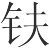者(1)，意其邻之子。视其行步，窃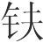也；颜色，窃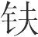也；言语，窃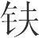也；动作态度，无为而不窃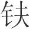也。抇其谷而得其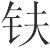(2)，他日复见其邻之子，动作态度，无似窃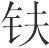者。其邻之子非变也，己则变矣。变也者无他，有所尤也。

*【注释】*

(1)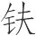（fū）：斧子。

(2)抇（hú）：掘。谷：坑。

*【译文】*

有一个丢了斧子的人，怀疑是邻居的儿子偷的。看他走路的样子，像偷斧子的；看他的脸色，像偷斧子的；听他说话，像偷斧子的；看他的举止神态，没有一样不像偷斧子的。这个人挖坑的时候，找到了自己的斧子。过了几天，又看见邻居的儿子，举止神态，没有一样像偷了斧子的。邻居的儿子没有改变，他自己改变了。他改变的原因没有别的，是因为原来有所局限。

邾之故法(1)，为甲裳以帛(2)。公息忌谓邾君曰(3)：“不若以组(4)。凡甲之所以为固者，以满窍也。今窍满矣，而任力者半耳。且组则不然，窍满则尽任力矣。”邾君以为然，曰：“将何所以得组也？”公息忌对曰：“上用之，则民为之矣。”邾君曰：“善。”下令，令官为甲必以组。公息忌知说之行也，因令其家皆为组。人有伤之者曰：“公息忌之所以欲用组者，其家多为组也。”邾君不说，于是复下令，令官为甲无以组。此邾君之有所尤也。为甲以组而便，公息忌虽多为组，何伤也？以组不便，公息忌虽无为组，亦何益也？为组与不为组，不足以累公息忌之说(5)。用组之心，不可不察也。

*【注释】*

(1)邾（zhū）：古国名，亦称“邾娄”，后改称“邹”。周武王封颛顼之后于邾，后为楚所灭。故城在今山东邹城东南。

(2)为甲裳以帛：用帛来联缀战衣。甲，铠甲，护身的战衣。裳，下衣。帛，丝织品。

(3)公息忌：人名。

(4)组：用丝编织的绳带。

(5)累：这里是损害的意思。

*【译文】*

邾国的旧法，制作铠甲用帛来连缀。公息忌对邾君说：“不如用丝绳来连缀。大凡铠甲之所以牢固，是因为铠甲连缀的缝隙都塞满了。现在铠甲连缀的缝隙虽然塞满了，可是只能承受应该承受的力的一半。然而用丝绳来连缀就不是这样，只要连缀的缝隙塞满了，就能承受全部应该承受的力了。”邾君以为他说得对，说：“将从哪里得到丝绳呢？”公息忌回答说：“君主使用它，那么人民就会制造它了。”邾君说：“好！”于是下命令，命令有关官吏制作铠甲一定要用丝绳连缀。公息忌知道自己的主张得以实行，于是就让他的家人都制造丝绳。有诋毁他的人说：“公息忌之所以建议用丝绳，是因为他家制造了很多丝绳。”邾君听了很不高兴，于是又下达命令，命令有关官吏制铠甲不要用丝绳连缀。这是邾君有所局限啊。制铠甲用丝绳连缀如果有好处，公息忌即使大量制造丝绳，有什么妨碍呢？如果用丝绳连缀没有好处，公息忌即使没有制造丝绳，又有什么益处呢？公息忌制造丝绳或不制造丝绳，都不足以损害公息忌的主张。使用丝绳的本意，不可以不考察清楚啊。

鲁有恶者(1)，其父出而见商咄(2)，反而告其邻曰(3)：“商咄不若吾子矣。”且其子至恶也，商咄至美也。彼以至美不如至恶，尤乎爱也。故知美之恶，知恶之美，然后能知美恶矣。《庄子》曰(4)：“以瓦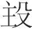者翔(5)，以钩者战，以黄金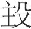者殆。其祥一也(6)，而有所殆者，必外有所重者也。外有所重者泄(7)，盖内掘(8)。”鲁人可谓外有重矣。解在乎齐人之欲得金也，及秦墨者之相妒也(9)，皆有所乎尤也。

*【注释】*

(1)恶：丑陋。

(2)商咄：人名，以貌美著称。

(3)反：同“返”。

(4)“《庄子》”以下数句：引文见《庄子·达生》篇，文字有出入。

(5)瓦：陶器，土烧之器。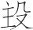：字书无此字，当为“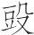”字之误。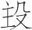，古文“投”字。这里是下赌注的意思。翔：这里是安详、坦然的意思。

(6)祥：善，这里指赌技精巧。

(7)泄：狎，亲近。

(8)内掘：内心不安。掘，不安详。

(9)“解在”二句：两事详见《去宥》篇。前事言齐人欲得金而夺人之金，徒见金不见人；后者言秦墨者相妒，致使秦惠王偏听偏信。两事都是“有所尤”造成的。

*【译文】*

鲁国有个丑陋的人，他的父亲出门看见美男子商咄，回来以后告诉他的邻居说：“商咄不如我儿子。”然而他儿子是极丑陋的，商咄是极漂亮的，他却认为极漂亮的不如极丑陋的，这是被自己的偏爱所局限。所以，知道了漂亮可以被认为是丑陋，丑陋可以被认为是漂亮，然后就能知道什么是漂亮，什么是丑陋了。《庄子》说：“用瓦器作赌注的内心坦然，用衣带钩作赌注的心里发慌，用黄金作赌注的感到迷惑。他们的赌技是一样的，然而之所以感到迷惑，必然是因为对外物有所看重。对外物有所看重，就会对它亲近，因而内心就会不安详。”那个鲁国人可以说是对外物有所看重了。这道理体现在齐国人想得到金子，以及秦国的墨者互相忌妒上，这些都是因为有所局限啊。

老聃则得之矣(1)，若植木而立乎独，必不合于俗，则何可扩矣(2)。

*【注释】*

(1)老聃：即老子。

(2)扩：扩充，这里指由于受到外物的干扰而心神不安。

*【译文】*

老聃就懂得这个道理，他像直立的木头一样自行其是，这样必然与世俗不合，那么还能有什么能使他内心不安呢？

# 听言

*【题解】*

本篇旨在论述君主听取议论要分辨善与不善，认为“善不善不分，乱莫大焉”。文章首先指出，当世的君主所以嗜好攻伐诛杀以求利索地，一个重要原因是不能区分善与不善。作者认为，判断善与不善，标准是看是否本于“爱利”，即爱民利民。君主能分清言论的善恶，做到择善而从，就可以统一天下了。文章最后着重说明，要做到“听言”，必须“习其心”，“习之于学问”，强调了学习的重要。

四曰：

听言不可不察，不察则善不善不分。善不善不分，乱莫大焉。三代分善不善，故王。今天下弥衰，圣王之道废绝。世主多盛其欢乐，大其钟鼓，侈其台榭苑囿(1)，以夺人财；轻用民死，以行其忿。老弱冻馁，夭膌壮狡(2)，汔尽穷屈(3)，加以死虏。攻无罪之国以索地，诛不辜之民以求利，而欲宗庙之安也，社稷之不危也，不亦难乎？

*【注释】*

(1)苑囿：养禽兽植林木的地方。

(2)夭膌（jí）壮狡：使强壮有力的人夭折瘦弱。夭，早死。膌，通“瘠”，瘦弱。狡，强壮有力。

(3)汔（qì）：几，几乎。穷屈（jué）：穷尽，走投无路。

*【译文】*

第四：

听到话不可不考察；不考察，那么好和不好就不能分辨。好和不好不能分辨，祸乱没有比这更大的了。夏、商、周三代能分辨好和不好，所以能称王天下。如今世道更加衰微，圣王之道被废弃灭绝。当世的君主尽情寻欢作乐，把钟鼓等乐器造得很大，把台榭园林修得很豪华，因而耗费了人民的钱财；他们随随便便让百姓去送命，来发泄自己的愤怒。年老体弱的人受冻挨饿，强壮有力的人被弄得夭折瘦弱，几乎都到了走投无路的地步，又把死亡和被俘的命运加在他们身上。攻打没有罪的国家以便掠取土地，杀死没有罪的百姓以便夺取利益，这样做却想让宗庙平安，让国家不危险，不是很难吗？

今人曰：“某氏多货，其室培湿(1)，守狗死，其势可穴也。”则必非之矣。曰：“某国饥，其城郭庳(2)，其守具寡，可袭而篡之。”则不非之。乃不知类矣。

*【注释】*

(1)培：房屋的后墙。

(2)庳（bì）：低矮。

*【译文】*

假如有人说：“某某人有很多财物，他家房屋的后墙很潮湿，看家的狗死了，这是可以挖墙洞的好机会”，那么一定要责备这个人。如果说：“某某国遇到荒年，它的城墙低矮，它的防守器具很少，可以偷袭并且夺取它”，对这样的人却不责备，这就是不知道类比了。

《周书》曰(1)：“往者不可及，来者不可待，贤明其世，谓之天子。”故当今之世，有能分善不善者，其王不难矣。善不善本于利，本于爱，爱利之为道大矣。夫流于海者，行之旬月，见似人者而喜矣。及其期年也(2)，见其所尝见物于中国者而喜矣。夫去人滋久，而思人滋深欤！乱世之民，其去圣王亦久矣。其愿见之，日夜无间。故贤王秀士之欲忧黔首者(3)，不可不务也。

*【注释】*

(1)《周书》：古逸书。

(2)期（jī）年：一周年。

(3)黔首：战国及秦代对百姓的称谓。

*【译文】*

《周书》中说：“逝去的不可追回，未来的不可等待，能使世道贤明的，就叫做天子。”所以在今天的社会上，有能分辨好和不好的，他称王天下是不难的。区分好和不好的关键在于爱，在于利，爱和利作为原则来说是太大了。在海上漂泊的人，漂行一个月，看到像人的东西就很高兴了。等到漂行一年，看到曾在中原之国看到过的东西就很高兴了。这就是离开人越久，想念人就越厉害吧！混乱社会的人民，他们离开圣王也已经很久了。他们希望见到圣王的心情，白天黑夜都不间断。所以那些想为百姓忧虑的贤明君主和杰出人士，不可不在这方面努力啊。

功先名，事先功，言先事。不知事，恶能听言(1)？不知情，恶能当言(2)？其与人谷言也，其有辩乎，其无辩乎(3)？

*【注释】*

(1)恶（wū）：何。

(2)当：相合，相称。

(3)“其与”三句：此句义不可通。当作“其与夫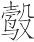（kòu）音也，其有辩乎，其无辩乎”。“人”为“夫”字之误，“谷（繁体作‘穀’）言”为“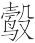音”之误。《庄子·齐物论》作：“其以为异于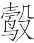音，亦有辩乎，其无辩乎？”文意与此正同。全句意谓，不能听言，与不能当言，那么人言与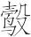音就没有区别了。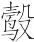音，鸟初孵出时的叫声。辩，通“辨”，区别。

*【译文】*

功绩先于名声，事情先于功绩，言论先于事情。不了解事情的实质，怎么能听信言论？不了解内情，怎么能使言论与事实相符？如果不能这样，那么人言与鸟音，是有区别呢，还是没有区别呢？

造父始习于大豆(1)，蠭门始习于甘蝇(2)，御大豆，射甘蝇，而不徙人，以为性者也(3)。不徙之，所以致远追急也(4)，所以除害禁暴也。凡人亦必有所习其心，然后能听说。不习其心，习之于学问。不学而能听说者，古今无有也。解在乎白圭之非惠子也(5)，公孙龙之说燕昭王以偃兵及应空洛之遇也(6)，孔穿之议公孙龙(7)，翟翦之难惠子之法(8)。此四士者之议，皆多故矣，不可不独论(9)。

*【注释】*

(1)造父、大豆：都是古代善于驾车的人。大豆，他书或作“泰豆”。

(2)蠭（pánɡ）门、甘蝇：都是古代善于射箭的人。蠭门，他书或作“蠭蒙”、“逢蒙”等。

(3)“而不”二句：即以不徙人为性。大意是：不向别人学习，而专门向他们学习，以便学得他们的技术。

(4)致远追急：指驭术之功效。下句“除害禁暴”指射术之功效。

(5)白圭：名丹，字圭，魏人。惠子：惠施，宋人，仕魏。白圭非惠子之事见《不屈》篇。

(6)公孙龙：魏人，战国时名家的代表人物。燕昭王：战国时燕国君主，公元前311年—前279年在位。偃：止息，消除。公孙龙说燕昭王以偃兵之事见《应言》篇。应空洛之遇事见《淫辞》篇，该篇作“空雄”，当为“空雒”（雒同“洛”）之误。空洛，地名。遇，盟会。

(7)孔穿：字子高，孔子的后代。孔穿议公孙龙之事见《淫辞》篇。

(8)翟翦：魏国人，翟黄（又作翟璜）的后代。翟翦难惠子之事见《淫辞》篇。

(9)独论：等于说熟论。

*【译文】*

造父最初向大豆学习，蠭门最初向甘蝇学习，向大豆学习驾车，向甘蝇学习射箭，专心不渝，以此作为自己的本质。专心不渝，这是他们所以能学到致远追急的驭术、除暴禁害的射术的原因。大凡人也一定要修养自己的心性，然后才能正确听取别人的意见。不修养自己的心性，也要研习学问。不学习而能正确听取意见的，从古到今都没有。这道理体现在白圭非难惠子、公孙龙以消除战争劝说燕昭王以及应付秦赵的空洛盟约、孔穿非议公孙龙、翟翦责难惠子制订的法令等方面。这四个人的议论，都包含着充足的理由，对此是不可不认真辨察清楚的。

# 谨听

*【题解】*

本篇承上篇《听言》，继续论述君主“听言”的问题，着重指出君主应该“礼有道之士”。以便“通乎己之不足”。文章通过“贤主”和“亡国之主”的比较，说明君主要做到“听言”，必须“反性命之情”，正确认识自己，了解自己的不足，而不能“自贤而少人”。文章指出，“不知而自以为知，百祸之宗也”，告诫君主应该“不知则问，不能则学”，强调君主应该求贤礼士，以贤者为师。

五曰：

昔者禹一沐而三捉发(1)，一食而三起，以礼有道之士，通乎己之不足也。通乎己之不足，则不与物争矣。愉易平静以待之，使夫自得之；因然而然之，使夫自言之。亡国之主反此，乃自贤而少人。少人则说者持容而不极(2)，听者自多而不得。虽有天下，何益焉？是乃冥之昭(3)，乱之定，毁之成，危之宁。故殷周以亡，比干以死(4)，悖而不足以举。

*【注释】*

(1)一沐而三捉发：与下文“一食而三起”都是形容为延揽人材而操心忙碌。本篇及《淮南子·汜论》以为夏禹事，《史记·鲁世家》以为周公事。其实未必实有其事，只是极言礼贤下士而已。沐，洗发。捉，握。

(2)持容：矜持。极：尽，指尽言。

(3)冥之昭：以冥为昭，即把昏暗当成光明。下文“乱之定”、“毁之成”、危之宁”结构与此同。

(4)比干以死：指比干因劝谏纣被剖心而死。

*【译文】*

第五：

从前禹洗一次头要多次握住头发停下来，吃一顿饭要多次站起身来，以便依礼节对待有道之士，弄懂自己所不懂的东西。弄懂了自己所不懂的东西，就能不与外物相争了。贤主用欢悦平和的态度对待有道之士，使他们各得其所；一切都顺其自然，让他们尽情讲话。亡国之君与此相反，他们认为自己贤明，轻视别人。轻视别人，那么游说的人就矜持而不尽情劝说了。听取意见的人只看重自己，因而就会一无所得。这样，即使享有天下，又有什么好处呢？这实际上就是把昏暗当成光明，把混乱当成安定，把毁坏当成成功，把危险当成安宁。所以商周因此而被灭亡，比干因此而被处死，如此悖乱的事举不胜举。

故人主之性，莫过乎所疑(1)，而过于其所不疑；不过乎所不知，而过于其所以知。故虽不疑，虽已知，必察之以法，揆之以量，验之以数(2)。若此则是非无所失，而举措无所过矣。夫尧恶得贤天下而试舜(3)？舜恶得贤天下而试禹？断之于耳而已矣。耳之可以断也，反性命之情也(4)。今夫惑者，非知反性命之情，其次非知观于五帝三王之所以成也，则奚自知其世之不可也？奚自知其身之不逮也？太上知之，其次知其不知。不知则问，不能则学。《周箴》曰(5)：“夫自念斯学，德未暮。”学贤问(6)，三代之所以昌也。不知而自以为知，百祸之宗也。

*【注释】*

(1)莫过乎所疑：不会在自己有所怀疑的地方犯错误。

(2)数：术数，古人关于天文、历算、占卜等方面的学问。

(3)“夫尧”句：尧怎样在天下得到贤人而任用舜呢。恶：何。试：用。

(4)反：同“返”，返回，回归。

(5)周箴：古逸书。

(6)学贤问：义不可通，疑有脱误。或以为“贤”当作“且”。似是。

*【译文】*

所以，君主的常情是，不会在有所怀疑的地方犯过错，反而会在无所怀疑的地方犯过错；不会在有所不知的地方犯过错，反而会在已经知道的地方犯过错。所以，即使是不怀疑的，即使是已经知道的，也一定要用法令加以考察，用度量加以测定，用术数加以验证。这样去做了，那么是非就不会判断错误，举止就没有过错了。尧怎样在天下选取贤人而任用了舜呢？舜怎样在天下选取贤人而任用了禹呢？只是根据耳朵的听闻做出决断罢了。凭耳朵可以决断，是由于复归人的本性的缘故。现在那些昏惑的人，不知道复归人的本性，其次不知道观察五帝三王之所以成就帝业的原因，那又从哪里知道世道不好呢？从哪里知道自身赶不上五帝三王呢？最上等的是无所不知，次一等的是知道自己有所不知。不知就要问，不会就要学。《周箴》中说：“只要自己对这些问题经常思考，修养道德就不算晚。”勤学好问，这是夏商周三代所以昌盛的原因。不知道却自以为知道，这是各种祸患的根源。

名不徒立，功不自成，国不虚存，必有贤者。贤者之道，牟而难知(1)，妙而难见。故见贤者而不耸，则不惕于心。不惕于心，则知之不深。不深知贤者之所言，不祥莫大焉。

*【注释】*

(1)牟：大。

*【译文】*

名誉不会平白无故地树立，功劳不会自然而然地建成，国家不会凭空保存，一定要有贤德之人才行。贤德之人的思想，博大而难以知晓，精妙而难以了解。所以看到贤德之人而不恭敬，就不能动心。不能动心，那么了解得就不深刻。不能深刻地了解贤德之人所说的话，没有比这更不吉利的了。

主贤世治，则贤者在上；主不肖世乱，则贤者在下。今周室既灭，而天子已绝(1)。乱莫大于无天子。无天子，则强者胜弱，众者暴寡，以兵相残，不得休息。今之世当之矣。故当今之世，求有道之士，则于四海之内，山谷之中，僻远幽闲之所，若此则幸于得之矣。得之，则何欲而不得？何为而不成？太公钓于滋泉(2)，遭纣之世也，故文王得之而王。文王，千乘也(3)；纣，天子也。天子失之，而千乘得之，知之与不知也。诸众齐民(4)，不待知而使，不待礼而令。若夫有道之士，必礼必知，然后其智能可尽。解在乎胜书之说周公(5)，可谓能听矣；齐桓公之见小臣稷(6)，魏文侯之见田子方也(7)，皆可谓能礼士矣。

*【注释】*

(1)天子已绝：秦昭王五十二年西周亡，名义上的天子遂灭绝；而秦始皇二十六年始为皇帝。“天子已绝”即指西周亡后至始皇称皇帝之前这一段时间。

(2)滋泉：也作“兹泉”，泉名。在渭水旁。

(3)千乘（shènɡ）：指称诸侯。古代实行车战，以拥有的兵车多少作为衡量国家大小的标准。天子万乘，诸侯千乘。

(4)诸众齐民：那些普通人。齐民：指平民百姓。

(5)“解在”句：胜书说周公事见《精谕》篇。胜书以不言说周公，周公听从了，使纣无以加罪于周。

(6)“齐桓”句：齐桓公见小臣稷事见《下贤》篇。齐桓公一日之内数次去见小臣稷，而小臣稷不见他。随行之人劝桓公不要再去，桓公不听，终于见到了小臣稷。

(7)“魏文”句：魏文侯之见田子方，当为“魏文侯之见段干木”之误，事见《下贤》篇。魏文侯去见段干木，站得疲倦了也不敢歇息。

*【译文】*

君主贤明，世道太平，那么贤德之人就在上位；君主不贤明，世道混乱，那么贤德之人就在下位。现在周王室已经灭亡，天子已经断绝。混乱没有什么比没有天子更大的了。没有天子，那么势力强的就会战胜势力弱的，人多的就会危害人少的，用军队互相残杀，不得止息。现在的社会正是这样的情形。所以在当今的社会上，要寻求有道之人，就要到四海边，山谷中，偏远幽静的地方，这样，或许有幸得到这样的人。得到了这样的人，那么想要什么不能得到？想做什么不能成功？太公望在滋泉钓鱼，正遭逢纣的时代，所以周文王得到了他因而能称王天下。文王是诸侯，纣是天子。天子失去了他，而诸侯却得到了他，这是了解与不了解造成的。那些平民百姓，不用等了解就可以役使，不用以礼相待就可以使唤。至于有道之人，一定要以礼相待，一定要了解他们，然后他们的智慧才能才可以完全发挥出来。这道理体现在胜书劝说周公上，周公可以说是能听从劝说了；体现在齐桓公去见小臣稷，魏文侯去见段干木上，他们都可以说是能礼贤下士了。

# 务本

*【题解】*

本篇论述臣道，指出为臣者应致力于根本。作者所说的根本，包含两层意思：第一，“荣富非自至也，缘功伐也”，即功劳是荣富之本。臣子要求得个人的荣华富贵，必须首先致力于为国家、为君主建立功业。反之，舍公利而求私利，就会“欲荣而愈辱，欲安而益危”。第二，“用己者未必是也，而莫若其自身贤”，即修身自贤又是治国治官之本。人臣要想得到国家任用而建立功名，必须从加强自身修养做起，躬行孝亲笃友等儒家之道。反之，舍弃自身修养，就会带来祸患。

六曰：

尝试观上古记，三王之佐，其名无不荣者，其实无不安者，功大也。《诗》云(1)：“有晻凄凄(2)，兴云祁祁(3)。雨我公田(4)，遂及我私(5)。”三王之佐，皆能以公及其私矣。俗主之佐，其欲名实也，与三王之佐同，而其名无不辱者，其实无不危者，无公故也。皆患其身不贵于国也，而不患其主之不贵于天下也；皆患其家之不富也，而不患其国之不大也。此所以欲荣而愈辱，欲安而益危。安危荣辱之本在于主，主之本在于宗庙，宗庙之本在于民，民之治乱在于有司(6)。《易》曰(7)：“复自道，何其咎，吉(8)。”以言本无异，则动卒有喜。今处官则荒乱，临财则贪得，列近则持谏(9)，将众则罢怯(10)，以此厚望于主，岂不难哉！

*【注释】*

(1)《诗》云：引诗见《诗经·小雅·大田》。

(2)晻（yǎn）：阴雨。今本《诗经》作“渰”。凄凄：寒凉的样子。

(3)祁祁：众多的样子。这里形容浓云密布。

(4)公田：古代实行井田制，中间的部分属于公田。

(5)私：指私田。井田制中，公田以外的部分为私田。

(6)有司：古代官府分曹理事，各有专司，所以把主管某方面事务的官吏叫“有司”。这里指百官。

(7)《易》曰：引文见《周易·小畜》。

(8)“复自”三句：这是《小畜》初九的爻辞。

(9)列：指官位。持谏：疑为“持谀”之误。持谀，玩弄阿谀奉承的手段。

(10)将众：领兵。罢：通“疲”，软弱。

*【译文】*

第六：

试看上世古书，禹、汤、文武的辅佐之臣声誉没有不荣耀的，地位没有不安稳的，这是由于他们功劳大的缘故。《诗经》上说：“阴雨绵绵天气凉，浓云滚滚布天上。好雨落在公田里，一并下在私田上。”禹、汤、文武的辅佐之臣都能凭借有功于公家，从而获得自己的私利。平庸君主的辅臣，他们希望得到名誉地位的心情跟三王的辅佐之臣是相同的，可是他们的名声没有不蒙受耻辱的，他们的地位没有不陷入险境的，这是由于他们没有为公家立功的缘故。他们都忧虑自身不能在国内显贵，却不忧虑自己的君主不能在天下显贵；他们都忧虑自己的家庭不能富足，却不忧虑自己的国家领土不能扩大。这就是他们希望荣耀反而更加耻辱，希望安稳反而更加危险的原因。安危荣辱的根本在于君主，君主的根本在于宗庙，宗庙的根本在于人民，人民治理得好坏在于百官。《周易》中说：“按照正常的轨道返回，周而复始，有什么灾祸！吉利。”这是说只要根本没有变异，那么一举一动终究会有喜庆。如今世人居官就放纵悖乱，面对钱财就贪得无厌，官位得以接近君主就阿谀奉承，统率军队就软弱怯懦，凭着这些想从君主那里满足奢望，难道不是很难吗？

今有人于此，修身会计则可耻(1)，临财物资尽则为己(2)，若此而富者，非盗则无所取。故荣富非自至也，缘功伐也(3)。今功伐甚薄而所望厚，诬也；无功伐而求荣富，诈也。诈诬之道，君子不由。

*【注释】*

(1)会计：计量财物数量。此指廉洁理财。

(2)尽：通“赆”，财货。

(3)伐：与“功”同义，功劳。

*【译文】*

假如有这样一个人，认为修养自身、廉洁理财是可耻的，面对钱财就要据为己有，像这样来富足的，除非偷盗，否则无法取得财富。因此，荣华富贵不是自己到来的，是靠功劳得来的。如今世人功劳很少而企望很大，这是欺骗；没有功劳而谋求荣华富贵，这是诈取。欺骗、诈取的方法，君子不采用。

人之议多曰：“上用我，则国必无患。”用己者未必是也，而莫若其身自贤。而己犹有患，用己于国，恶得无患乎？己，所制也；释其所制而夺乎其所不制(1)，悖。未得治国治官可也。若夫内事亲，外交友，必可得也。苟事亲未孝，交友未笃(2)，是所未得，恶能善之矣？故论人无以其所未得，而用其所已得，可以知其所未得矣。

*【注释】*

(1)释：放弃。夺：当为“奋”字之误。奋：奋力。所不制：指治国治官之事。

(2)笃：忠诚，厚道。

*【译文】*

人们的议论大都说：“君主如果任用我，那么国家就必定没有祸患。”其实如果真的任用他，未必是这样。对于这些人来说，没有什么比使自身贤明更重要的了。如果他自己尚且有祸患，任用他治理国家，怎么能没有祸患呢？自身是自己所能制约的，放弃自己力所能及的事，却去奋力于自己力所不及的事，这就叫悖谬。悖谬的人，不让他们治理国家、管理官吏是合宜的。至于在家侍奉父母，在外结交朋友，是一定可以做到的。如果侍奉父母不孝顺，结交朋友不诚挚，这些都未能做到，怎么能称赞他呢？所以评论人不要根据他未能做到的事，而要根据他已经做到的事，这样就可以知道他尚未能做到的事情了。

古之事君者，必先服能，然后任；必反情(1)，然后受。主虽过与，臣不徒取。《大雅》曰(2)：“上帝临汝(3)，无贰尔心(4)。”以言忠臣之行也。解在郑君之问被瞻之义也(5)，薄疑应卫嗣君以无重税(6)。此二士者，皆近知本矣。

*【注释】*

(1)反情：指内省，省察自己。

(2)《大雅》曰：引诗见《诗经·大雅·大明》。

(3)临：从高处往低处看，引申为监视。

(4)贰：用如使动，使……不专一。

(5)“解在”句：参见《务大》篇。郑君，指郑穆公。被瞻之义，指被瞻不死君难，不随君亡的主张。被瞻，郑大夫，事郑文公。

(6)“薄疑”句：参见《审应览》。薄疑，疑是卫臣。卫嗣君，卫平侯之子，秦贬其称为君。

*【译文】*

古代侍奉君主的人，一定先贡献才能，然后才担任官职；一定先省察自己，然后才接受俸禄。君主即使多给俸禄，臣子也不无故接受。《大雅》中说：“上帝监视着你们，你们不要有贰心。”这说的是忠臣的品行。这个道理体现在郑君问被瞻的主张、薄疑以不要加重赋税回答卫嗣君两件事上。被瞻、薄疑这两位士人，都接近于知道根本了。

# 谕大

*【题解】*

所谓“谕大”，意思是要了解“大”的重要。文章指出，“小之定也必恃大，大之安也必恃小”，“小大贵贱”是“交相为恃”的，而“定贱小在于贵大”。文章以舜、禹、汤、武王等古代圣贤为例，说明任何事情的成功，都是由于所追求的目标远大。指出，确立了远大目标，即便远大目标实现不了，但只要不懈努力必有所成，即所谓“夫大义之不成，既有成已”。本篇之意仍在于讨论治国之术与为臣之道。

本篇与《务大》篇内容多有重复，可参阅该篇。

七曰：

昔舜欲旗古今而不成(1)，既足以成帝矣；禹欲帝而不成，既足以正殊俗矣；汤欲继禹而不成，既足以服四荒矣；武王欲及汤而不成，既足以王道矣(2)；五伯欲继三王而不成，既足以为诸侯长矣；孔丘、墨翟欲行大道于世而不成，既足以成显名矣。夫大义之不成，既有成矣已(3)。

*【注释】*

(1)旗古今：包罗古今的意思。旗，旧校说：“旗一作‘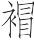’，一作‘揭’。按作“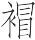”是。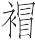，通“冒”，覆盖，这里是包罗的意思。

(2)既足以王道矣：此句当有脱误。《务大》篇作“既足以王通达矣”，此句当据以订正。通达：指舟车人力所能到达之处。

(3)既有成矣已：《务大》篇无“矣”字，此处“矣”字疑衍。

*【译文】*

第七：

从前舜想要包罗古今，虽然不能成功，却已经足以成就帝业了；禹想要成就帝业，虽然不能成功，却已经足以使异方之俗得到匡正了；汤想要继承禹的事业，虽然不能成功，却已经足以使四方荒远之地归服了；周武王想赶上汤的事业，虽然不能成功，却已经足以在舟车所通、人迹所至之处称王了；五霸想要继承三王的事业，虽然不能成功，却已经足以成为诸侯的盟主了；孔丘、墨翟想要在世上推行自己的政治主张，虽然不能成功，却已经足以成就显赫的名声了。他们所追求的远大理想虽然不能成功，却已经足以有所成就了。

《夏书》曰(1)：“天子之德广运，乃神，乃武乃文。”故务在事，事在大。地大则有常祥、不庭、歧母、群抵、天翟、不周(2)，山大则有虎、豹、熊、螇蛆(3)，水大则有蛟、龙、鼋、鼍、鳣、鲔(4)。《商书》曰(5)：“五世之庙，可以观怪。万夫之长，可以生谋。”空中之无泽陂也(6)，井中之无大鱼也，新林之无长木也。凡谋物之成也，必由广大众多长久，信也。

*【注释】*

(1)《夏书》：古逸书。引文今见于伪古文《尚书·大禹谟》，文字略有出入。

(2)常祥、不庭、歧母、群抵、天翟、不周：都是山名，所在不详。可参阅《山海经》。

(3)螇蛆：当是兽名。毕沅说“或是猨狙”。猨狙，猿猴。

(4)鼋（yuán）：大龟。鼍（tuó）：鼍龙，鳄鱼的一种，俗称“猪婆龙”。鳣（zhān）、鲔（wěi）：两种大鱼。

(5)《商书》：古逸书。

(6)空：通“孔”，小洞穴。陂（bēi）：池。

*【译文】*

《夏书》上说：“天子的功德，广大深远，玄妙神奇，既勇武又文雅。”所以，事业的成功在于做，做的关键在于目标远大。地大了，就有常祥、不庭、歧母、群抵、天翟、不周等高山；山大了，就有虎、豹、熊、猿猴等野兽；水大了，就有蛟龙、鼋、鼍、鳣、鲔等水族。《商书》上说：“五代的祖庙，可以看到鬼怪。万人的首领，可以产生计谋。”孔穴中没有池沼，水井中没有大鱼，新林中没有大树。凡是谋划事情取得成功的，必定是着眼于广大、众多、长久，这是确定无疑的。

季子曰(1)：“燕雀争善处于一屋之下，子母相哺也，姁姁焉相乐也(2)，自以为安矣。灶突决，则火上焚栋，燕雀颜色不变，是何也？乃不知祸之将及己也。”为人臣免于燕雀之智者寡矣。夫为人臣者，进其爵禄富贵，父子兄弟相与比周于一国，姁姁焉相乐也，以危其社稷。其为灶突近也，而终不知也，其与燕雀之智不异矣。故曰：“天下大乱(3)，无有安国(4)；一国尽乱，无有安家(5)；一家皆乱，无有安身。”此之谓也。故小之定也必恃大，大之安也必恃小。小大贵贱，交相为恃，然后皆得其乐。定贱小在于贵大，解在乎薄疑说卫嗣君以王术(6)，杜赫说周昭文君以安天下(7)，及匡章之难惠子以王齐王也(8)。

*【注释】*

(1)季子：人名，生平不详。

(2)姁姁（xǔxǔ）焉：喜悦自得的样子。

(3)天下：指天子统辖的范围。

(4)国：指诸侯统辖的范围。

(5)家：指大夫统辖的范围，即采邑。

(6)“薄疑”句：参见《务大》篇。薄疑以“乌获举千钧，又况一斤”为喻，以“千钧”喻王术，以“一斤”喻治国，说明掌握了王术（“大义”），治国（小事）极易。强调了贵大之意。

(7)“杜赫”句：参见《务大》篇。杜赫，周人。周昭文君，战国时东周之君。周昭文君愿学安定周国之道，杜赫用安定天下之道劝说他，其意仍在于明“务大”之旨。

(8)“及匡”句：参见《爱类》篇。匡章，齐人，曾为齐威王、齐宣王将。惠子，姓惠名施，宋人，曾为梁惠王相，庄子的朋友。本文取匡章责难惠子尊齐王之事以说明贵大之旨。

*【译文】*

季子说：“燕雀在一处屋顶之下争夺好地方，母鸟哺育着幼鸟，都欢乐自得，自以为很安全了。灶的烟囱裂了，火冒了出来向上烧着了房梁，可是燕雀却安然自若，这是为什么呢？是不知道灾祸将要降到自己身上啊。”当臣子的能够避免燕雀那样见识的人太少了。当臣子的，只顾增加自己的爵禄富贵，父子兄弟在一国之中结党营私，欢乐自得，以危害他们的国家。他们离灶上的烟囱很近，可是却始终不知道，他们和燕雀的见识没有什么不同了。所以说：“天下大乱了，就没有安定的国家；整个国家都乱了，就没有安定的采邑；整个采邑都乱了，就没有平安的个人。”说的就是这种情况啊。所以，小的想要获得安定必定依赖大的，大的想要获得安定必定依赖小的。小和大，贵和贱，彼此互相依赖，然后才能都得到安乐。使贱、小获得安定在于贵、大。这个道理体现在薄疑用成就王业的方法劝说卫嗣君、杜赫用安定天下的方法劝说周昭文君，以及匡章责难惠子尊齐王为王这些事上。

