 孝行览第二

# 孝行

*【题解】*

本篇主要阐述孝道为治国之本。文章反复说明孝道的重要，把孝说成“三皇五帝之本务，万事之纪”，视孝为“民之本教”，执守孝道可以使“百善至，百邪去，天下从”。作者认为，天子的爱民，臣民的忠君、交友、勇战，治国的各种方策，乃至仁、义、礼、信、强等道德观念，无一不是以孝为基础的，无一不是孝道的推广扩充。对于“孝”的具体内容，文章从爱身全体、“五养”、“三难”等方面，作了详细的论述。本篇可以说是关于儒家孝道的专论。自曾子论孝以下，文字与《礼记》的《祭义》基本相同。

本览八篇，都是围绕修身治国问题，从不同角度论述行为和结果、主观与客观的关系的。

一曰：

凡为天下，治国家，必务本而后末。所谓本者，非耕耘种殖之谓，务其人也。务其人，非贫而富之，寡而众之，务其本也。务本莫贵于孝。人主孝，则名章荣(1)，下服听，天下誉；人臣孝，则事君忠，处官廉，临难死；士民孝，则耕芸疾，守战固，不罢北(2)。夫孝，三皇五帝之本务，而万事之纪也。

*【注释】*

(1)章：同“彰”，卓著。

(2)罢：通“疲”，疲困。北：战败逃跑。

*【译文】*

第一：

凡是统治天下，治理国家，必先致力于根本，而把非根本的东西放在后边。所谓根本，不是说的耕耘种植，而是致力于人事。致力于人事，不是说人民贫困而让它富足，人口稀少而让它众多，而是致力于根本。致力于根本，没有比孝道更重要的了。君主做到孝，那么名声就卓著荣耀，臣下就会服从，天下就会赞誉；臣子做到孝，那么侍奉君主就会忠诚，居官就会清廉，面临灾难就能献身；士人百姓做到孝，那么耕耘就用力，攻必克，守必固，不疲困，不败逃。孝道，是三皇五帝的根本，是各种事情的纲纪。

夫执一术而百善至、百邪去、天下从者，其惟孝也！故论人必先以所亲，而后及所疏；必先以所重，而后及所轻。今有人于此，行于亲重(1)，而不简慢于轻疏，则是笃谨孝道。先王之所以治天下也。故爱其亲，不敢恶人；敬其亲，不敢慢人。爱敬尽于事亲，光耀加于百姓，究于四海(2)，此天子之孝也。

*【注释】*

(1)亲重：即上文说的“所亲”、“所重”。下文“轻疏”指“所轻”、“所疏”。

(2)究：穷，极。

*【译文】*

掌握一种原则因而所有的好事都会出现，所有的坏事都能去掉，普天之下都会顺从，大概只有孝道吧！所以评论人一定先根据他对亲近之人的态度，然后再推及到他对疏远之人的态度；一定先依据他对关系重要之人的态度，然后再推及到他对关系轻微之人的态度。假如有这样一个人，对跟他关系亲近重要的人行孝道，而对跟他关系轻微疏远的人也不怠慢，那么这就是笃厚谨慎于孝道了。这就是先王用来治理天下的方法啊。所以，热爱自己的亲人，不敢厌恶别人；尊敬自己的亲人，不敢怠慢别人。把热爱尊敬全都用在侍奉亲人上，把光明施加在百姓身上，推广到普天下，这就是天子的孝道啊。

曾子曰：“身者，父母之遗体也(1)。行父母之遗体，敢不敬乎？居处不庄，非孝也；事君不忠，非孝也；莅官不敬，非孝也；朋友不笃，非孝也；战陈无勇(2)，非孝也。五行不遂，灾及乎亲，敢不敬乎？”《商书》曰(3)：“刑三百，罪莫重于不孝。”

*【注释】*

(1)父母之遗体：身体乃父母所生，所以把自己的身体说成“父母之遗体”。遗，遗留。

(2)陈（zhèn）：同“阵”，军阵。

(3)《商书》：当为古逸书。

*【译文】*

曾子说：“人的身体是父母所生。使用父母给予的身体，怎敢不谨慎呢？平居不恭敬，不是孝顺；侍奉君主不忠诚，不是孝顺；居官不谨慎，不是孝顺；交友不诚实，不是孝顺；临战不勇敢，不是孝顺。上面五种情况不能做到，灾祸就会连累到亲人，怎敢不谨慎呢？”《商书》上说：“刑法三百条，罪过没有比不孝顺更重的了。”

曾子曰：“先王之所以治天下者五：贵德、贵贵、贵老、敬长、慈幼。此五者，先王之所以定天下也。所谓贵德，为其近于圣也；所谓贵贵，为其近于君也；所谓贵老，为其近于亲也；所谓敬长，为其近于兄也；所谓慈幼，为其近于弟也。”

*【译文】*

曾子说：“先王用来治理天下的方法有五条：尊崇有道德的人，尊崇地位尊贵的人，尊敬老人，尊敬年长的，爱护年幼的。这五条，就是先王用来使天下安定的方法。所以尊崇有道德的人，是因为他接近于圣贤；所以尊崇地位尊贵的人，是因为他接近于君主；所以尊敬老人，是因他接近于父母；所以尊敬年长的，是因为他接近于兄长；所以爱护年幼的，是因为他接近于弟弟。”

曾子曰：“父母生之，子弗敢杀；父母置之，子弗敢废；父母全之，子弗敢阙(1)。故舟而不游(2)，道而不径(3)，能全支体(4)，以守宗庙，可谓孝矣。”

*【注释】*

(1)阙：同“缺”，损，这里是毁坏的意思。

(2)舟而不游：渡水时乘船而不游涉。这样可以免于水淹。舟，乘船。

(3)道而不径：走路时走大路而不走小路。这样可以免于危险。径，走小路。

(4)支：同“肢”，四肢。

*【译文】*

曾子说：“父母生下了自身，儿子不敢毁坏；父母养育了自身，儿子不敢废弃；父母保全了自身，儿子不敢损伤。所以渡水时乘船而不游涉，走路时走大路而不走小路。能保全四肢身体，以便守住祖庙，可以叫做孝顺了。”

养有五道：修宫室，安床笫(1)，节饮食，养体之道也；树五色，施五采，列文章(2)，养目之道也；正六律(3)，和五声(4)，杂八音(5)，养耳之道也；熟五谷，烹六畜(6)，和煎调，养口之道也；和颜色，说言语(7)，敬进退，养志之道也。此五者，代进而序用之，可谓善养矣。

*【注释】*

(1)床笫（zǐ）：床铺，泛指卧具。笫，床上的席子。

(2)文章：古代绘画，青与赤相间谓之“文”，白与赤相间谓之“章”。这里的“文章”指错综华美的花纹。

(3)六律：古代用竹管的长短把乐音按高低分为十二类，又分阴阳各六，阳声叫六律，阴声叫六吕。这里的“六律”指乐律。

(4)五声：宫、商、角、徵（zhǐ）、羽谓之“五声”。

(5)八音：古代对乐器的统称，即金、土、丝、匏、石、革、木、竹。这里的“八音”泛指音乐。

(6)六畜：指马、牛、羊、猪、狗、鸡。

(7)说：同“悦”，喜悦。

*【译文】*

养身之道有五条：修葺房屋，使卧具安适，节制饮食，这是保养身体的方法；树立五色，设置五彩，排列花纹，这是保养眼睛的方法；使六律准确，使五声和谐，使八音协调，这是保养耳朵的方法；把饭做熟，把肉煮熟，调和味道，这是保养嘴的方法；面色和悦，言语动听，举止恭敬，这是保养意志的方法。这五条，依次更替实行，就可以叫做善于保养身体了。

乐正子春下堂而伤足(1)，瘳而数月不出(2)，犹有忧色。门人问之曰：“夫子下堂而伤足，瘳而数月不出，犹有忧色，敢问其故？”乐正子春曰：“善乎而问之(3)！吾闻之曾子，曾子闻之仲尼：父母全而生之，子全而归之，不亏其身，不损其形，可谓孝矣。君子无行咫步而忘之(4)。余忘孝道，是以忧。”故曰，身者非其私有也，严亲之遗躬也(5)。

*【注释】*

(1)乐正子春：姓乐正，名子春，战国时人，曾参的学生。

(2)瘳（chōu）：病愈。

(3)而：尔，你们。

(4)咫步：极言距离之近。古代以八寸为咫。

(5)躬：身体。

*【译文】*

乐正子春下堂时伤了脚，脚好了却几个月不出门，脸上仍然有忧愁的神色。学生们问他说：“先生您下堂时伤了脚，脚好了却几个月不出门，脸上仍然有忧愁的神色，请问这是什么缘故？”乐正子春说：“你们问这个问得好啊！我从曾子那里听说过，曾子又从孔子那里听说过这样的话：父母完好地把儿子生下来，儿子要完好地把身体归还父母，不亏损自己的身子，不毁坏自己的形体，这可以叫做孝顺了。君子一举一动都不忘记孝道。我忘记了孝道，因此才忧愁。”所以说，身体不是自己私有的，而是父母亲留给的。

民之本教曰孝，其行孝曰养。养可能也，敬为难；敬可能也，安为难；安可能也，卒为难。父母既没(1)，敬行其身，无遗父母恶名，可谓能终矣。仁者，仁此者也；礼者，履此者也(2)；义者，宜此者也；信者，信此者也；强者，强此者也；乐自顺此生也，刑自逆此作也。

*【注释】*

(1)没：同“殁”，死。

(2)履：行，做。

*【译文】*

人民根本的教养是孝顺，实行孝道就是奉养。奉养父母是可以做到的，从内心对父母恭敬就比较难做到了；从内心对父母恭敬是可以做到的，使父母安宁就比较难做到了；使父母安宁是可以做到的，能始终如一就比较难做到了。父母死了以后，自己行为谨慎，不要带给父母坏名声，可以叫做能善始善终了。所谓仁，就是以孝道为仁；所谓礼，就是以行孝道为礼；所谓义，就是以孝道为宜；所谓信，就是以孝道为信；所谓强，就是以孝道为强。欢乐自然会由于实行孝道而产生，刑罚自然会由于违背孝道而施行。

# 本味

*【题解】*

本篇从得贤的角度论述治国必须务本的思想。文章首先说明君主立功名的根本在于得贤，而后指出得贤必须知贤、礼贤，由此引出伊尹以至味说汤的故事。伊尹“说汤以至味”，文辞恢闳诡谲，而其用意不过是说明调和五味必须有术，君主要备享天下至味必须“知道”、“成己”，仍旧归结到务本上来。篇名为“本味”，就是在追求至味时应该务本的意思。

二曰：

求之其本，经旬必得；求之其末，劳而无功。功名之立，由事之本也，得贤之化也。非贤，其孰知乎事化？故曰其本在得贤。

*【译文】*

第二：

做事情从根本做起，经过短时间必定有收获；从枝节做起，就会劳而无功。功名的建立，是由于抓住了事物的根本，得到了贤人的教化。不是贤人，谁懂得事情的教化呢？所以说，建立功名的根本在于得到贤人。

有侁氏女子采桑(1)，得婴儿于空桑之中，献之其君。其君令烰人养之(2)，察其所以然。曰：“其母居伊水之上(3)，孕，梦有神告之曰：‘臼出水而东走，毋顾！’明日，视臼出水，告其邻，东走十里而顾，其邑尽为水，身因化为空桑。故命之曰伊尹(4)。”此伊尹生空桑之故也。长而贤。汤闻伊尹，使人请之有侁氏，有侁氏不可。伊尹亦欲归汤，汤于是请取妇为婚(5)。有侁氏喜，以伊尹媵女(6)。故贤主之求有道之士，无不以也；有道之士求贤主，无不行也。相得然后乐(7)。不谋而亲，不约而信，相为殚智竭力，犯危行苦，志欢乐之。此功名所以大成也。固不独(8)，士有孤而自恃，人主有奋而好独者(9)，则名号必废熄，社稷必危殆。故黄帝立四面，尧、舜得伯阳、续耳然后成(10)。

*【注释】*

(1)有侁（shēn）氏：即有莘氏，古部族名。侁，通“莘”。

(2)烰（fú）人：庖人，厨师。

(3)伊水：水名，即伊河，源出河南卢氏县，东北流入洛河。

(4)伊尹：名挚，商汤臣。

(5)取：同“娶”，娶妻。

(6)媵（yìnɡ）女：指做有氏之女的陪嫁臣仆。媵，随嫁。

(7)相得：指贤主得有道之士、有道之士得贤主。

(8)固：本来，必定。

(9)奋：矜，自负。

(10)伯阳、续耳：相传都是尧时的贤人。

*【译文】*

有侁氏的女子采摘桑叶，在中空的桑树里捡到一个婴儿，把他献给了自己的君主。君主命厨师哺育这个婴儿，并让他去了解事情的原委。厨师向君主报告说：“婴儿的母亲住在伊水边，怀了孕，梦见天神告诉她说：‘臼里如果出了水就向东跑，不要回头看！’第二天，她看到臼里出了水，就把情况告诉了她的邻居，向东跑了十里，回头一看，她的村子全被水淹没。于是她的身体变成了一棵中空的桑树。因此给这个婴儿起名叫伊尹。”这就是伊尹出生在空桑之中的缘由。伊尹长大了很贤德。商汤听说伊尹贤德，就派人向有侁氏请求要伊尹，有侁氏不答应。伊尹也想归附汤，汤于是就请求娶有侁氏女为妻，结为婚姻。有侁氏很高兴，就把伊尹作为女子陪嫁的奴仆给了汤。所以，贤明的君主为求得有道之士，没有什么办法不可使用；有道之士为归依贤明的君主，没有什么事不能做。贤明的君主和有道之士各如其愿，然后彼此都很快乐。他们事先不谋划就能亲密无间，不约定就能恪守信用，共同尽心竭力，承担危难和劳苦，内心却以此为乐。这就是成就极大功名的原因。贤明的君主、有道之士本来不会孤独，士如果孤独傲慢，君主如果骄傲而且喜好孤独，那么名声必定被毁灭，国家必定遭危险。所以黄帝派人去四方寻求贤人立为辅佐，尧、舜得到伯阳、续耳，然后成就了帝业。

凡贤人之德，有以知之也。伯牙鼓琴(1)，钟子期听之(2)。方鼓琴而志在太山(3)，钟子期曰：“善哉乎鼓琴！巍巍乎若太山。”少选之间，而志在流水，钟子期又曰：“善哉乎鼓琴！汤汤乎若流水(4)。”钟子期死，伯牙破琴绝弦，终身不复鼓琴，以为世无足复为鼓琴者。非独琴若此也，贤者亦然。虽有贤者，而无礼以接之，贤奚由尽忠？犹御之不善，骥不自千里也(5)。

*【注释】*

(1)伯牙：春秋时楚国人，善弹琴，相传《高山流水》就是他的作品。鼓：弹奏。

(2)钟子期：姓钟，名期，子是古代男子的通称。春秋时楚国人。

(3)志在太山：志向在登大山。太山，即“大山”。

(4)汤汤（shānɡshānɡ）乎：水大流急的样子。

(5)自：自己，自身。

*【译文】*

大凡贤德之人的品德，是有办法了解的。伯牙弹琴，钟子期听。刚开始弹琴时表现出攀登高山的志向，钟子期说：“弹琴弹得太好了！就像高山一样巍峨！”过了一会儿，琴声表现出随流水奔流的志向，钟子期又说：“弹琴弹得太好了！就像流水一样激荡！”钟子期死了以后，伯牙摔坏了琴，弄断了弦，终身不再弹琴，认为世上再没有值得为之弹琴的人。不仅弹琴是这样，寻求贤德的人也是这样。即便是有贤德的人，如果不以礼相待，贤德的人怎样尽忠呢？这就如同御手不好，良马也不会自己跑千里一样。

汤得伊尹，祓之于庙(1)，爝以爟火(2)，衅以牺豭(3)。明日，设朝而见之。说汤以至味，汤曰：“可对而为乎(4)？”对曰：“君之国小，不足以具之，为天子然后可具。夫三群之虫(5)，水居者腥，肉玃者臊(6)，草食者膻。臭恶犹美(7)，皆有所以。凡味之本，水最为始。五味三材(8)，九沸九变，火为之纪。时疾时徐，灭腥去臊除膻，必以其胜，无失其理(9)。调和之事，必以甘酸苦辛咸，先后多少，其齐甚微(10)，皆有自起。鼎中之变，精妙微纤，口弗能言，志不能喻，若射御之微，阴阳之化，四时之数。故久而不弊(11)，熟而不烂，甘而不噮(12)，酸而不酷，咸而不减，辛而不烈，澹而不薄(13)，肥而不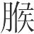(14)。肉之美者：猩猩之唇，獾獾之炙(15)，隽燕之翠(16)，述荡之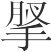(17)，旄象之约(18)。流沙之西(19)，丹山之南(20)，有凤之丸，沃民所食(21)。鱼之美者：洞庭之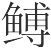(22)，东海之鲕(23)。醴水之鱼(24)，名曰朱鳖，六足、有珠、百碧(25)。雚水之鱼(26)，名曰鳐(27)，其状若鲤而有翼，常从西海夜飞游于东海。菜之美者，昆仑之，寿木之华。指姑之东(28)，中容之国(29)，有赤木玄木之叶焉。余瞀之南(30)，南极之崖，有菜，其名曰嘉树，其色若碧。阳华之芸(31)，云梦之芹(32)，具区之菁(33)。浸渊之草(34)，名曰土英。和之美者(35)：阳朴之姜(36)，招摇之桂(37)，越骆之菌(38)，鳣鲔之醢(39)，大夏之盐(40)，宰揭之露(41)，其色如玉，长泽之卵(42)。饭之美者：玄山之禾(43)，不周之粟，阳山之穄(44)，南海之秬(45)。水之美者：三危之露(46)，昆仑之井，沮江之丘(47)，名曰摇水(48)，白山之水，高泉之山(49)，其上有涌泉焉，冀州之原。果之美者：沙棠之实(50)。常山之北(51)，投渊之上(52)，有百果焉，群帝所食。箕山之东(53)，青鸟之所，有甘栌焉。江浦之橘，云梦之柚，汉上石耳(54)。所以致之，马之美者，青龙之匹(55)，遗风之乘。非先为天子，不可得而具。天子不可强为，必先知道。道者止彼在己(56)，己成而天子成，天子成则至味具。故审近所以知远也，成己所以成人也。圣人之道要矣(57)，岂越越多业哉(58)？”

*【注释】*

(1)祓（fú）：古代为除邪而举行仪式。

(2)爝（jué）：束苇为炬，燃炬以祓除不祥。爟（ɡuàn）火：祓除不祥的火。

(3)衅（xìn）：指以牲血涂祭器。牺豭（jiā）：祭祀用的纯色雄猪。牺，祭祀用的纯色牲畜。

(4)可对而为乎：当作“可得而为乎”。

(5)三群之虫：指下文的水居者（鱼鳖之属）、肉玃者（鹰雕之属）、草食者（獐鹿之属）。群，群居。虫，泛指各种动物。

(6)玃：通“攫”（jué）。用爪抓取。

(7)臭（xiù）：气味。

(8)五味：咸、苦、酸、辛、甘。三材：指水、木、火。

(9)理：指火候适中。

(10)齐（jì）：同“剂”，剂量，调剂。

(11)弊：通“敝”，败，坏。

(12)噮（yuàn）：足，厚，这里是过厚的意思。

(13)澹：通“淡”，清淡。

(14)肥而不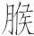：大意是说肥而不腻。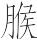，字书无考。《集韵》引伊尹曰“肥而不臒”，《酉阳杂俎》作“肥而不腴”。

(15)獾獾：鸟名。《山海经·南山经》作“灌灌”。炙：通“跖”，指鸟的脚掌。

(16)隽燕：当作“巂燕”，鸟名。翠：鸟尾肉。

(17)述荡：兽名。《山海经·大荒南经》作“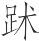踢”。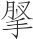（wàn）：通“腕”，这里指兽的小腿。

(18)约：指短尾。

(19)流沙：古地名。在敦煌西。

(20)丹山：古地名。在南方。

(21)沃民：沃民国，在西方。

(22)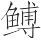（pū）：鱼名。

(23)鲕（ér）：鱼名。

(24)醴水：水名，在湖南省西北部。

(25)有珠：指能吐珠。百碧：疑为“青碧”之误。碧，青玉。

(26)雚（ɡuàn）水：古水名。在西方。《山海经·西山经》作“观水”。

(27)鳐（yáo）：鱼名。

(28)指姑：即姑余，山名。在东南方。

(29)中容之国：古代方国名。

(30)余瞀（mào）：古山名。传说在南方。

(31)芸：菜名。

(32)芹：一种水生野菜。

(33)菁：菜名。

(34)浸渊：古池泽名。其地不详。

(35)和：调和，这里指调和五味的调料。

(36)阳朴：地名。传说在蜀郡。

(37)招摇：山名。传说在桂阳。

(38)越骆：当作“骆越”。骆，越的别名。菌：通“箘”（jùn）。竹笋。

(39)鳣（zhān）：即鲟鱼。鲔（wěi）：古书上指鲟鱼。鳣和鲔都是大鱼。醢（hǎi）：肉酱。

(40)大夏：古泽名。或说是山名，传说在西方。

(41)宰揭：古山名。其处不详。

(42)长泽：古泽名。传说在西方。

(43)玄山：古山名。其处不详。

(44)阳山：指昆仑山之南，山南曰阳，故称“阳山”。穄（jì）：也叫糜子，即黍之不粘者。

(45)秬（jù）：黑黍。

(46)三危：古山名。传说在西方。

(47)沮江之丘：沮江边的山丘。沮江，水名。

(48)摇水：古水名。

(49)高泉：古山名。传说在西方。

(50)沙棠：树木名。生于昆仑山。

(51)常山：即恒山。汉避文帝刘恒讳、宋避真宗赵恒讳，改名常山。为五岳中的北岳。在今河北曲阳西北。

(52)投渊：水名。

(53)箕山：山名。传说中尧时的许由隐居于此山。在今河南登封东南。

(54)汉：汉水。石耳：菜名。

(55)青龙：骏马名。下文的“遗风”也是骏马名。

(56)止：当为“亡”字之误。彼：别人。亡彼在己，意思是，不在别人而在于自己。

(57)要：约，简约。

(58)越越：用力的样子。业：事。

*【译文】*

汤得到伊尹之后，在宗庙里举行祓除灾邪的仪式，点燃苇束消除不祥，用纯色雄猪的血涂祭器。第二天，汤在朝堂上接见伊尹。伊尹为汤讲述美味，汤说：“可以得到并制作这些美味吗？”伊尹回答说：“您的国家小，不足以具备这些东西，当了天子然后才可以具备。三类动物，生活在水里的动物腥，吃肉的动物臊，吃草的动物膻。气味不好的仍然可以使之变好，这些都各有原因。调和味道的根本，首先在于用水。五种味道，三样材料，多次煮沸，多次变化，火是关键。火时而炽热，时而微弱，一定要用火除去腥味、臊味、膻味，但火候要适中，不要过度。调和味道，必定要用甜酸苦辣咸。先放后放，放多放少，调料的剂量很小，这些都有一定的规定。鼎中味道的变化，精妙细微，既不能言传，又不能意会，就如同射技御技的精微、阴阳二气的交合、四季的变化一样。所以，时间长，但不毁坏；做得熟，但不超过火候；甜，但不过度；酸，但不过分；咸，但不减损原味；辣，但不浓烈；清淡，但不过薄；肥，但不腻。肉中的美味，有猩猩的嘴唇，獾獾的脚掌，巂燕的尾肉，述荡的小腿，旄牛大象的短尾，以及流沙西边、丹山南边出产的沃国人所食用的凤凰卵。鱼中的美味，有洞庭湖的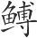鱼，东海的鲕鱼，醴水中长着六只脚、能吐珠子、青翠色的名叫朱鳖的鱼，雚水中形状像鲤鱼可是却有翅膀、经常夜里从西海飞到东海的名叫鳐的鱼。菜中的美味，有昆仑山的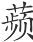菜，寿木的花果，指姑东边、中容国里的红树黑树的树叶。余瞀南边、南极边上颜色像碧玉一样的名叫嘉树的菜，阳华池的芸菜，云梦泽的水芹，具区泽的菁菜，浸渊的名叫土英的草。调料中的美味，有阳朴的姜，招摇的桂，骆越的笋，鳣鱼鲔鱼做的肉酱，大夏的盐，宰揭的洁白如玉的露，大泽的鸟卵。粮食中的美味，有玄山的禾谷，不周山的小米，阳山的糜子，南海的黑黍。水中的美味，有三危山的露水，昆仑山的泉水，沮江边山丘上名叫摇水的泉水，白山的水，高泉山上冀州之水源头的涌泉。水果中的美味，有沙棠树的果实，常山北边、投渊上面先帝们享用的各种果实，箕山东边、青鸟居住之处的甜山楂，长江边的橘子，云梦泽畔的柚子，汉水旁的石耳。运来这些水果，要用青龙马和遗风马。不先当天子，就不可能具备这些美味。天子不可以勉强去当，必须先懂得大道。具备大道不在别人，而在于自己。自己具备了大道，因而就能成为天子。能成为天子，那么美味就齐备了。所以，审察近的就可以了解远的，自己具备了大道就可以教化别人。圣人的办法很简约，哪里用得着费力去做许多事情呢？”

# 首时*一作胥时*

*【题解】*

首时，一作“胥时”（胥通“须”），按作“胥时”是。胥时即等待时机之意。

本篇说明成就功名需要有一定的时机。时机未到，要屈身蓄势，耐心等待；时机已到，就要当机立断，应时而作。文章强调，“圣人之所贵唯时也”，“事之难易，不在小大，务在知时”。文章所举的诸多事例，都是为了证明成就大事必须等待恰当时机。从文章的具体内容看，这里所说的“时”，主要指客观形势和条件而言。

三曰：

圣人之于事，似缓而急(1)，似迟而速，以待时。王季历困而死(2)，文王苦之，有不忘羑里之丑(3)，时未可也。武王事之，夙夜不懈，亦不忘玉门之辱(4)。立十二年，而成甲子之事(5)。时固不易得。太公望(6)，东夷之士也(7)，欲定一世而无其主。闻文王贤，故钓于渭以观之。伍子胥欲见吴王而不得(8)，客有言之于王子光者(9)，见之而恶其貌，不听其说而辞之。客请之王子光，王子光曰：“其貌适吾所甚恶也。”客以闻伍子胥，伍子胥曰：“此易故也。愿令王子居于堂上，重帷而见其衣若手(10)，请因说之。”王子许。伍子胥说之半，王子光举帷，搏其手而与之坐。说毕，王子光大说。伍子胥以为有吴国者，必王子光也，退而耕于野。七年，王子光代吴王僚为王。任子胥，子胥乃修法制，下贤良(11)，选练士，习战斗。六年，然后大胜楚于柏举(12)。九战九胜，追北千里。昭王出奔随(13)，遂有郢(14)。亲射王宫，鞭荆平之坟三百。乡之耕(15)，非忘其父之雠也(16)，待时也。墨者有田鸠(17)，欲见秦惠王(18)，留秦三年而弗得见。客有言之于楚王者，往见楚王。楚王说之，与将军之节以如秦(19)。至，因见惠王。告人曰：“之秦之道，乃之楚乎！”固有近之而远、远之而近者。时亦然。有汤武之贤，而无桀纣之时，不成；有桀纣之时，而无汤武之贤，亦不成。圣人之见时，若步之与影不可离。

*【注释】*

(1)缓：迟，这里指无为。急：速，这里指成功。

(2)王季历：大（tài）王之子，文王之父。困而死：为国事辛劳而死。

(3)有：通“又”。羑（yǒu）里之丑：指文王被纣拘于羑里之事。羑里，古地名，故址在今河南汤阴北。丑，耻。

(4)不忘玉门之辱：指武王不忘文王被骂于玉门的耻辱。

(5)甲子之事：武王伐纣，于甲子日在牧野大败殷军，纣自焚而死，商遂灭亡。“甲子之事”即指此而言。

(6)太公望：即姜尚，号太公望。

(7)东夷之士：太公望是东海上人，所以这里称他为“东夷之士”。东夷，我国古代对东方民族的称呼。

(8)伍子胥：名员（yún），字子胥，春秋时楚国大夫伍奢次子。伍奢及其长子被楚平王杀害，伍子胥逃到吴国。吴王：指吴王僚，吴王夷昧之子（一说为庶兄），公元前526年—前515年在位，后被专诸刺死。

(9)王子光：即吴王阖闾，公元前514年—前496年在位。

(10)“重帷”句：意思是，自己在帷幕之中只露出衣服和手来，这样王子光就看不到自己的容貌了。重帷，两层帐幕。见，现，显露。若，和。

(11)下贤良：指礼贤下士。

(12)柏举：楚国南部的边邑。

(13)昭王：楚平王之子，公元前515年—前488年在位。随：国名。春秋时成为楚国的附庸，在今湖北随州。

(14)郢：楚国国都，在今湖北江陵西北。

(15)乡：通“向”，先前。

(16)雠：通“仇”。

(17)田鸠：即田俅，齐国人。

(18)秦惠王：秦孝公之子，名驷，公元前337年—前311年在位。

(19)节：符节，古代使者用作凭证的东西。

*【译文】*

第三：

圣人做事情，好像很迟缓，无所作为，而实际却很迅速，能够成功，这是为了等待时机。王季历为国事辛劳而死，周文王很痛苦，又不忘被纣拘于羑里的耻辱，他所以没有讨伐纣，是因为时机尚未成熟。武王臣事商纣，从早到晚都不敢懈怠，也不忘文王被骂于玉门的耻辱。武王继位十二年，终于在甲子日大败殷军。时机本来就不易得到。太公望是东夷人，他想平定天下，可是找不到贤明的君主。他听说文王贤明，所以到渭水边钓鱼，以便观察文王。伍子胥想见吴王僚，但没能见到，有个门客对王子光讲了伍子胥的情况，王子光见到伍子胥却讨厌他的相貌，不听他讲话就谢绝了他。门客问王子光为什么这样，王子光说：“他的相貌正是我特别讨厌的。”门客把这话告诉了伍子胥，伍子胥说：“这是容易的事情。希望让王子光坐在堂上，我在两层帷幕里只露出衣服和手来，请让我借此同他谈话。”王子光答应了。伍子胥谈话谈了一半，王子光就掀起帷幕，握住他的手，跟他一起坐下。伍子胥说完了，王子光非常高兴。伍子胥认为享有吴国的，必定是王子光，回去以后就在乡间耕作。过了七年，王子光取代吴王僚当了吴王。他任用伍子胥，伍子胥于是就整顿法度，举用贤良，简选精兵，演习战斗。过了六年，然后才在柏举大胜楚国，九战九胜，追赶楚国的败军追了千余里。楚昭王逃到随，吴军于是占领了郢都。伍子胥亲自箭射楚王宫，鞭打楚平王之墓三百下，以报杀父杀兄之仇。他先前耕作，并不是忘记了杀父之仇，而是在等待时机。墨家有个叫田鸠的，想见秦惠王，在秦国呆了三年但没能见到。有个客人把这情况告诉了楚王，田鸠就去见楚王。楚王很喜欢他，给了他将军的符节让他到秦国去。他到了秦国，于是见到了惠王。他告诉别人说：“到秦国来见惠王的途径，竟然是要先到楚国去啊！”事情本来就有离得近反而被疏远、离得远反而能接近的。时机也是这样。有商汤、武王那样的贤德，而没有桀、纣无道那样的时机，就不能成就王业；有桀、纣无道那样的时机，而没有商汤、武王那样的贤德，也不能成就王业。圣人与时机的关系，就像步行时影与身不可分离一样。

故有道之士未遇时，隐匿分窜，勤以待时。时至，有从布衣而为天子者(1)，有从千乘而得天下者(2)，有从卑贱而佐三王者(3)，有从匹夫而报万乘者(4)。故圣人之所贵，唯时也。水冻方固，后稷不种(5)，后稷之种必待春。故人虽智而不遇时，无功。方叶之茂美，终日采之而不知；秋霜既下，众林皆羸(6)。事之难易，不在小大，务在知时。郑子阳之难(7)，猘狗溃之(8)；齐高、国之难(9)，失牛溃之(10)。众因之以杀子阳、高、国。当其时，狗牛犹可以为人唱(11)，而况乎以人为唱乎？

*【注释】*

(1)“有从”句：指舜从百姓而成为天子。

(2)“有从”句：指商汤、武王从诸侯而得到有天下。千乘，指诸侯。

(3)“有从”句：指太公望、伊尹、傅说从低贱的地位而成为三王的辅佐。傅说，商王武丁的大臣，原为从事版筑的奴隶，后被武丁任为相，治理国政。

(4)“有从”句：指豫让为智伯刺杀赵襄子之事。豫让，智伯的家臣。赵襄子灭智伯，豫让漆身吞炭，变音容，几次行刺赵襄子而未成，后请斩襄子之衣而自杀。万乘，赵襄子专晋国政，有兵车万乘。

(5)后稷：名弃，周的始祖。稷本是掌农业的官员，尧任命弃为稷。后，君。周人尊称弃为“后稷”。

(6)羸（léi）：瘦弱，这里指树叶落尽。

(7)郑子阳：郑相，驷氏之后。《史记》称“驷子阳”。

(8)猘（zhì）狗：疯狗。溃：乱。本书《适威》篇说：“子阳好严。有过而折弓者，恐必死，遂应猘狗而杀子阳。”

(9)高、国：指齐国的贵族高氏、国氏。

(10)失牛溃之：指借追失牛之乱而杀死高氏、国氏。

(11)唱：通“倡”，先导。

*【译文】*

所以，有道之士没有遇到时机，就到处隐匿藏伏起来，甘受劳苦，等待时机。时机一到，有的从平民而成为天子，有的从诸侯而得到天下，有的从卑贱的地位进而辅佐三王，有的从普通百姓进而能向万乘之主报仇。所以圣人所看重的，只是时机。冰冻得正坚固时，后稷不去耕种；后稷耕种，一定要等待春天到来。所以人即使有智慧，但如果遇不到时机，也不能建立功业。正当树叶长得繁茂的时候，整天采摘也采不光；等到秋霜降下以后，所有树林里树叶都落下来了。事情的难易，不在于大小，关键在于掌握时机。郑国的子阳遇难，正发生在追逐疯狗的混乱时候；齐国的高氏、国氏遇难，正发生在追赶逃窜之牛的时候。众人乘着混乱杀死了子阳和高氏、国氏。遇上合适的时机，狗和牛尚且可以作为人们发难的先导，更何况以人为先导呢？

饥马盈厩，嗼然，未见刍也(1)；饥狗盈窖，嗼然，未见骨也。见骨与刍，动不可禁。乱世之民，嗼然，未见贤者也；见贤人，则往不可止。往者非其形心之谓乎？齐以东帝困于天下(2)，而鲁取徐州；邯郸以寿陵困于万民(3)，而卫取茧氏(4)。以鲁卫之细，而皆得志于大国，遇其时也。故贤主秀士之欲忧黔首者，乱世当之矣。天不再与，时不久留，能不两工，事在当之。

*【注释】*

(1)刍：喂牲畜的草。

(2)“齐以”句：指公元前288年齐湣王称东帝，导致燕国联合秦、楚、韩、赵、魏五国伐齐，湣王出奔之事。

(3)“邯郸”句：指赵肃侯因修陵寝扰民而万民不附。邯郸，代指赵。寿陵，寝陵之名。

(4)茧氏：赵邑。

*【译文】*

饥饿的马充满了马棚，默然无声，是因为它们没有见到草；饥饿的狗充满了狗窝，默然无声，是因为它们没有见到骨头。如果见到骨头和草，那么它们就会争抢，不能制止。混乱世道的人民，默然无声，是因为他们没有见到贤人。如果见到贤人，那么他们就会归附，不能制止。他们归附贤人，难道不是身心都归附吗？齐湣王因为僭称东帝而被天下诸侯弄得困窘不堪，而鲁国夺取了徐州；赵肃侯因为修建寝陵扰民，人民都不亲附他，而卫国夺取了茧氏。凭着鲁国、卫国那样的小国，却都能从大国那里占到便宜，是因为遇到了时机。所以贤明的君主和杰出的人士想为百姓忧虑的，遇到混乱的世道，正是合适的时机。上天不会给人两次机会，时机不会长期停留，人的才能不会在做事时两方面都同时达到精巧，事情的成功在于适逢其时。

# 义赏

*【题解】*

义赏，即按道义而行赏赐。文章指出，赏罚是君主役使臣民的手段，其得当与否是关系到教化能否成功的大事，不可不慎重。文章举晋文公和赵襄子施行赏赐为例，着重说明行赏所要依据的原则，就是要以礼义为上，而以功利为下。作者认为，礼义是“百世之利”，而功利只是“一时之务”，只有尊崇礼义，才是掌握了“胜之所成”。

本篇所阐明的重礼义、轻功利的观点，是典型的儒家思想，与法家重功利的主张是针锋相对的。《韩非子·难一》即对晋文公和赵襄子义赏的事情及儒家的观点进行了驳难，认为是“不知善赏”。

四曰：

春气至则草木产，秋气至则草木落。产与落，或使之，非自然也。故使之者至，物无不为；使之者不至，物无可为。古之人审其所以使，故物莫不为用。

*【译文】*

第四：

春气到来草木就生长，秋气到来草木就凋零。生长与凋零，是节气支配的，不是它们自然而然会这样的。所以支配者一出现，万物没有不随之变化的；支配者不出现，万物没有可以变化的。古人能够审察支配者的情况，所以万物没有不被自己利用的。

赏罚之柄，此上之所以使也。其所以加者义，则忠信亲爱之道彰。久彰而愈长，民之安之若性，此之谓教成。教成，则虽有厚赏严威弗能禁。故善教者，义以赏罚而教成(1)，教成而赏罚弗能禁。用赏罚不当亦然。奸伪贼乱贪戾之道兴，久兴而不息，民之雠之若性(2)。戎夷胡貉巴越之民是以(3)，虽有厚赏严罚弗能禁。郢人之以两版垣也，吴起变之而见恶(4)。赏罚易而民安乐。氐羌之民(5)，其虏也，不忧其系累，而忧其死不焚也。皆成乎邪也。故赏罚之所加，不可不慎。且成而贼民(6)。

*【注释】*

(1)“义以”句：指施加赏罚符合道义，那么教化就能成功。

(2)雠（chóu）：匹敌，等同。

(3)戎夷胡貉巴越：都是古代的少数民族。

(4)恶：怨恨。

(5)氐羌：都是古代的少数民族。

(6)“郢人”十三句：上面一段意义不能贯通，当系传写中变乱次序。原文应为：“郢人之以两版垣也，吴起变之而见恶；氐羌之民，其虏也，不忧其系累，而忧其死不焚也。皆成乎邪也，且成而贼民。赏罚易而民安乐。故赏罚之所加，不可不慎。”

*【译文】*

赏罚的权力，这是由君主所掌握的。施加赏罚符合道义，那么忠诚守信相亲相爱的原则就会彰明。长久彰明而且日益增加，人们就像出于本性一样信守它，这就叫做教化成功。教化成功了，即使有厚赏严刑也不能禁止人们去行善。所以善于进行教化的人，根据道义施行赏罚，因而教化能够成功。教化成功了，即使施行赏罚也不能禁止人们去行善。施行赏罚不恰当也是这样。奸诈虚伪贼乱贪暴的原则兴起，长期兴起而且不能平息，人们就像出于本性一样照此去做，这就跟戎夷胡貉巴越等族的人一样了，即使有厚赏严刑也不能禁止人们这样做。郢人用两块夹板筑土墙，吴起改变了这种方法因而遭到怨恨；氐族羌族的人，他们被俘虏以后，不担心被捆绑，却担心死后不能被焚烧。这些都是由于邪曲造成的。况且，邪曲形成了，就会对人民有害处。用赏罚改变邪曲之事，人民就会感到安乐。所以施加赏罚，不可不慎重啊。

昔晋文公将与楚人战于城濮(1)，召咎犯而问曰(2)：“楚众我寡，奈何而可？”咎犯对曰：“臣闻繁礼之君，不足于文(3)；繁战之君，不足于诈。君亦诈之而已。”文公以咎犯言告雍季(4)，雍季曰：“竭泽而渔，岂不获得？而明年无鱼；焚薮而田(5)，岂不获得？而明年无兽。诈伪之道，虽今偷可(6)，后将无复，非长术也。”文公用咎犯之言，而败楚人于城濮。反而为赏，雍季在上。左右谏曰：“城濮之功，咎犯之谋也。君用其言而赏后其身，或者不可乎(7)！”文公曰：“雍季之言，百世之利也；咎犯之言，一时之务也。焉有以一时之务先百世之利者乎？”孔子闻之，曰：“临难用诈，足以却敌；反而尊贤，足以报德。文公虽不终(8)，始足以霸矣。”赏重则民移之(9)，民移之则成焉。成乎诈，其成毁，其胜败。天下胜者众矣，而霸者乃五。文公处其一，知胜之所成也。胜而不知胜之所成，与无胜同。秦胜于戎，而败乎殽(10)；楚胜于诸夏(11)，而败乎柏举(12)。武王得之矣，故一胜而王天下。众诈盈国，不可以为安，患非独外也。

*【注释】*

(1)城濮：春秋卫地名，在今河南范县南。

(2)咎犯：狐偃，字子犯，晋文公之舅，所以称舅犯。咎，通“舅”。

(3)文：指礼乐的盛大。

(4)雍季：人名，事迹不详。

(5)薮（sǒu）：指沼泽地。田：同“畋”，打猎。

(6)偷：苟且。

(7)或者：或许，也许。

(8)不终：不能坚持到最后，即不能始终这样做。

(9)移：羡慕。

(10)殽：崤山，分东西二崤。在今河南西部。

(11)楚胜于诸夏：指公元前597年楚国在邲打败晋国。诸夏，指中原地区的国家。

(12)败乎柏举：指楚昭王在柏举被吴国打败。

*【译文】*

从前晋文公要跟楚国人在城濮作战，召来咎犯问他说：“楚国兵多，我国兵少，怎样做才可以取胜？”咎犯回答说：“我听说礼仪繁杂的君主，对于礼仪的盛大从不感到满足；作战频繁的君主，对于诡诈之术从不感到满足。您对楚国实行诈术就行了。”文公把咎犯的话告诉了雍季，雍季说：“把池塘弄干了来捕鱼，怎能不获得鱼？可是第二年就没有鱼了；把沼泽地烧光了来打猎，怎能不获得野兽？可是第二年就没有野兽了。诈骗的方法，虽说现在可以苟且使用，以后就不能再使用了，这不是长久之计。”文公采纳了咎犯的意见，因而在城濮打败了楚国人。回来以后行赏，雍季居首位。文公身边的人劝谏说：“城濮之战的胜利，是由于采用了咎犯的谋略。您采纳了他的意见，可是行赏却把他放在后边，这或许不可以吧！”文公说：“雍季的话，对百世有利；咎犯的话，只适用于一时。哪有把只适用于一时的放在对百世有利的前面的道理呢？”孔子听到这件事以后，说：“遇到危难用诈术，足以打退敌人；回来以后尊崇贤人，足以报答恩德。文公虽然不能坚持到底，却足以成就霸业了。”赏赐重，人民就羡慕；人民羡慕，就能成功。靠诈术成功，即便成功了，最终也必定毁坏；即便胜利了，最终也必定失败。普天下取得过胜利的人很多，可是成就霸业的才五个。文公作为其中的一个，知道胜利是如何取得的。取得了胜利如果不知道胜利是如何取得的，那就跟没有取得胜利一样。秦国战胜了戎，但却在殽打了败仗；楚国战胜了中原国家，但却在柏举打了败仗。周武王懂得这个道理，所以打了一次胜仗就称王于天下了。各种诈术充满国家，国家不可能安定，祸患不只是来自国外啊。

赵襄子出围(1)，赏有功者五人，高赦为首(2)。张孟谈曰(3)：“晋阳之事，赦无大功，赏而为首，何也？”襄子曰：“寡人之国危，社稷殆，身在忧约之中，与寡人交而不失君臣之礼者，惟赦。吾是以先之。”仲尼闻之(4)，曰：“襄子可谓善赏矣！赏一人，而天下之为人臣莫敢失礼。”为六军则不可易(5)。北取代(6)，东迫齐，令张孟谈逾城潜行，与魏桓、韩康期而击智伯(7)，断其头以为觞(8)，遂定三家(9)，岂非用赏罚当邪？

*【注释】*

(1)赵襄子出围：智伯率韩、魏两家围赵襄子于晋阳，襄子令家臣张孟谈与韩、魏两家暗中联系，灭掉智氏。赵襄子，名毋恤，赵简子之子。

(2)高赦：赵襄子家臣。

(3)张孟谈：赵襄子家臣。

(4)仲尼闻之：赵襄子事发生在孔子死后，此处当系伪托。

(5)六军：周时制度，天子设有六军，诸侯国依大小设有三军二军一军等。后周室衰微，大诸侯国军队的建制已不只三军。这里六军泛指军队。易：轻慢。

(6)代：战国时国名。在今河北蔚县一带。后为赵襄子所灭。

(7)魏桓：即魏桓子，名驹。韩康：即韩康子，名虎。期：约定日期。

(8)觞（shānɡ）：古代酒器。

(9)三家：指韩、赵、魏。

*【译文】*

赵襄子从晋阳的围困中出来以后，赏赐五个有功劳的人，高赦为首。张孟谈说：“晋阳之事，高赦没有大功，赏赐时却以他为首，这是为什么呢？”襄子说：“我的国家社稷遇到危险，我自身陷于忧困之中，跟我交往而不失君臣之礼的，只有高赦。我因此把他放在最前边。”孔子听到这件事以后，说：“襄子可以说是善于赏赐了。赏赐了一个人，天下那些当臣子的就没人敢于失礼了。”赵襄子用这种办法治理军队，军队就不敢轻慢。他向北攻取代国，向东威逼齐国，让张孟谈越出城墙暗中去跟魏桓、韩康约定日期共同攻打智伯，胜利以后砍下智伯的头制作酒器，终于奠定了三家分晋的局面，难道不是施行赏罚恰当吗？

# 长攻

*【题解】*

长攻，当作“长功”，即以建功为上之意。本篇以越王勾践灭吴、楚王取蔡、赵襄子灭代为例，着重说明存亡成败都带有偶然性。因此，有时不循理义而行也可获得成功，为后世所称道。篇名“长功”，用意即在于此。对于这种“不备遵理”以求功名的做法，作者虽然认为“有失”，但又不得不给予某种程度的肯定。这种见解，与全书崇尚礼义的思想颇不合，而与“成者为首，不成者为尾”（《庄子·盗跖》）的思想接近，这可以视为作者对统治者注重功利、崇尚权诈的妥协和让步。

为了论证成功有赖于机遇，文章开头就指出存亡治乱等“必有其遇”，“各一则不设”，说明作者看到了矛盾双方互相依存和制约的关系。但是，作者把矛盾双方的相遇看作天意即人力所不能左右、无法预知的偶然，这就陷入了天命论。

五曰：

凡治乱存亡，安危强弱，必有其遇，然后可成，各一则不设(1)。故桀纣虽不肖，其亡，遇汤武也。遇汤武，天也，非桀纣之不肖也。汤武虽贤，其王，遇桀纣也。遇桀纣，天也，非汤武之贤也。若桀纣不遇汤武，未必亡也。桀纣不亡，虽不肖，辱未至于此。若使汤武不遇桀纣，未必王也。汤武不王，虽贤，显未至于此。故人主有大功，不闻不肖；亡国之主，不闻贤。譬之若良农，辩土地之宜(2)，谨耕耨之事，未必收也。然而收者，必此人也始，在于遇时雨。遇时雨，天也，非良农所能为也。

*【注释】*

(1)各一则不设：意思是，如果彼此相同，就不能实现这些（即治乱存亡安危强弱）了。一，一律，相同。设，施行。

(2)辩：通“辨”，辨别。

*【译文】*

第五：

凡治和乱，存和亡，安和危，强和弱，一定要彼此相遇，然后才能成功。如果彼此相同，就不可能成功。所以，桀、纣虽然不贤德，但他们之所以被灭亡，是因为遇上了商汤、武王。遇上商汤、武王，这是天意，不是因为桀、纣不贤德。商汤、武王虽然贤德，但他们之所以能成就王业，是因为遇上了桀、纣。遇上桀、纣，这是天意，不是因为商汤、武王贤德。如果桀、纣不遇上商汤、武王，未必会灭亡。桀、纣如果不灭亡，他们即使不贤德，耻辱也不至于到这种地步。假使商汤、武王不遇上桀、纣，未必会成就王业。商汤、武王如果不成就王业，他们即使贤德，显耀也不至于到这种地步。所以，君主有大功，就听不到他有什么不好；亡国的君主，就听不到他有什么好。这就好比优秀的农民，他们善于区分土地适宜种植什么，勤勤恳恳地耕种锄草，但未必能有收获。然而有收获的，一定首先是这些人。收获的关键在于遇上及时雨。遇上及时雨，这是靠上天，不是优秀农民所能做到的。

越国大饥，王恐(1)，召范蠡而谋(2)。范蠡曰：“王何患焉？今之饥，此越之福而吴之祸也。夫吴国甚富，而财有余，其王年少(3)，智寡才轻，好须臾之名，不思后患。王若重币卑辞以请籴于吴(4)，则食可得也。食得，其卒越必有吴，而王何患焉？”越王曰：“善！”乃使人请食于吴。吴王将与之，伍子胥进谏曰：“不可与也！夫吴之与越，接土邻境，道易人通，仇雠敌战之国也(5)。非吴丧越，越必丧吴。若燕秦齐晋，山处陆居，岂能逾五湖九江越十七厄以有吴哉(6)？故曰非吴丧越，越必丧吴。今将输之粟，与之食，是长吾雠而养吾仇也(7)。财匮而民怨，悔无及也。不若勿与而攻之，固其数也。此昔吾先王之所以霸(8)。且夫饥，代事也，犹渊之与阪(9)，谁国无有？”吴王曰：“不然。吾闻之，义兵不攻，服，仁者食饥饿(10)。今服而攻之，非义兵也；饥而不食，非仁体也。不仁不义，虽得十越，吾不为也。”遂与之食。不出三年，而吴亦饥。使人请食于越，越王弗与，乃攻之，夫差为禽(11)。

*【注释】*

(1)王：指越王勾践。

(2)范蠡：越大夫，辅佐越王勾践，灭掉吴国。

(3)王：指吴王夫差。

(4)币：礼物。籴（dí）：买进粮食，这里指借粮。

(5)仇雠（chóuchóu）：仇人。

(6)厄（è）：险要之地。

(7)雠：匹敌，对手。

(8)先王：指吴王阖闾。

(9)阪（bǎn）：山坡。

(10)食（sì）饥饿：给饥饿的人粮食吃。

(11)禽：同“擒”，擒获。

*【译文】*

越国遇上大灾年，越王很害怕，召范蠡来商量。范蠡说：“您对此何必忧虑呢？如今的荒年，这是越国的福气，却是吴国的灾祸。吴国很富足，钱财有余，它的君主年少，缺少智谋和才能，喜欢一时的虚名，不思虑后患。您如果用贵重的礼物、谦卑的言辞去向吴国请求借粮，那么粮食就可以得到了。得到粮食，最终越国必定会占有吴国，您对此何必忧虑呢？”越王说：“好！”于是就派人向吴国请求借粮。吴王将要给越国粮食，伍子胥劝阻说：“不可给越国粮食。吴国与越国，土地相接，边境相邻，道路平坦，人民往来频繁，是势均力敌的仇国。不是吴国灭掉越国，就必定是越国灭掉吴国。像燕国、秦国、齐国、晋国，它们处于高山陆地，怎能跨越五湖九江穿过十七处险阻来占有吴国呢？所以说，不是吴国灭掉越国，就必定是越国灭掉吴国。现在要送给它粮食，给它吃的，这是长我们对手的锐气、养活我们的仇人啊。国家钱财缺乏，人民怨恨，后悔就来不及了。不如不给它粮食而去攻打它，这本来是普通的道理。这就是从前我们的先王所以成就霸业的原因啊。再说闹饥荒，这是交替出现的事，就如同深渊和山坡一样，哪个国家没有？”吴王说：“不对。我听说过，正义的军队不攻打已经归服了的国家，仁德的人给饥饿的人粮食吃。现在越国归服了却去攻打它，这不是正义的军队；越国闹饥荒却不给它粮食吃，这不是仁德的事情。不仁不义，即使得到十个越国，我也不去做。”于是就给了越国粮食。没有过三年，吴国也遇到灾年，派人向越国请求借粮，越王不给，却来攻打吴国，吴王夫差被擒。

楚王欲取息与蔡(1)，乃先佯善蔡侯，而与之谋曰：“吾欲得息，奈何？”蔡侯曰：“息夫人，吾妻之姨也(2)。吾请为飨息侯与其妻者(3)，而与王俱，因而袭之。”楚王曰：“诺。”于是与蔡侯以飨礼入于息，因与俱，遂取息。旋舍于蔡(4)，又取蔡。

*【注释】*

(1)楚王：指楚文王。息：国名，为楚所灭，在今河南息县一带。蔡：国名，周武王弟叔度及其子胡受封之地，在今河南上蔡、新蔡一带。

(2)妻之姨：妻妹。

(3)飨（xiǎnɡ）：用酒食款待人。

(4)旋：返，还。舍：军队临时驻扎。

*【译文】*

楚王想夺取息国和蔡国，于是就假装跟蔡侯友好，跟他商量说：“我想得到息国，该怎么办？”蔡侯说：“息侯的夫人，是我妻子的妹妹。请让我替您宴飨息侯和他的妻子，跟您一起去，您乘机偷袭息国。”楚王说：“好吧。”于是楚王与蔡侯带着宴飨用的食品进入息国，楚国军队与他们同行，乘机夺取了息国。楚军回师驻扎在蔡国，又夺取了蔡国。

赵简子病(1)，召太子而告之曰：“我死已葬，服衰而上夏屋之山以望(2)。”太子敬诺。简子死，已葬，服衰，召大臣而告之曰：“愿登夏屋以望。”大臣皆谏曰：“登夏屋以望，是游也。服衰以游，不可。”襄子曰：“此先君之命也，寡人弗敢废。”群臣敬诺。襄子上于夏屋，以望代俗，其乐甚美。于是襄子曰：“先君必以此教之也。”及归，虑所以取代，乃先善之。代君好色，请以其姊妻之，代君许诺。姊已往，所以善代者乃万故(3)。马郡宜马(4)，代君以善马奉襄子。襄子谒于代君而请觞之(5)。马郡尽(6)。先令舞者置兵其羽中(7)，数百人。先具大金斗(8)。代君至，酒酣，反斗而击之，一成，脑涂地。舞者操兵以斗，尽杀其从者。因以代君之车迎其妻，其妻遥闻之状，磨笄以自刺(9)。故赵氏至今有刺笄之证(10)，与反斗之号。

*【注释】*

(1)赵简子：即赵鞅，赵襄子之父，晋卿。

(2)服衰（cuī）：穿上丧服。衰，古代丧服，用粗麻布制作，披于胸前。后来写作“缞”。夏屋之山：即夏屋山，在今山西代县一带。

(3)善：好，这里是讨好的意思。故：事。

(4)马郡：代地产马，所以称之为“马郡”。宜马：适宜养马。

(5)谒：告诉。觞（shānɡ）：飨，用酒食款待人。

(6)马郡尽：与上下文不能相连，当在上文“代君以善马奉襄子”之下。

(7)羽：舞者所持舞具。

(8)斗：古代酒器。

(9)笄（jī）：簪子。

(10)刺笄之证：当作“刺笄之山”。

*【译文】*

赵简子病重，召见太子告诉他说：“等我死了，安葬完毕，你穿着孝服登上夏屋山去观望。”太子恭恭敬敬地答应了。简子死了，安葬完毕以后，太子穿着孝服，召见大臣们并且告诉他们说：“我想登上夏屋山去观望。”大臣们都劝阻说：“登上夏屋山去观望，这就是出游啊。穿着孝服出游，不可以。”襄子说：“这是先君的命令，我不敢废止。”大臣们都恭恭敬敬地答应了。襄子登上夏屋山，观看代国的风土人情，看到代国一派欢乐景象。于是襄子说：“先君必定是用这种办法来教诲我啊。”等到回来以后，思考夺取代国的方法，于是就先友好地对待代国。代国君主爱好女色，襄子就请求把姐姐嫁给代国君主为妻，代国君主答应了。襄子的姐姐嫁给代国君主以后，襄子事事都讨好代国。代地适宜养马，代国君主把好马奉献给襄子，代地的马都送光了。襄子告诉代国君主，请求宴飨他。事先命令几百个跳舞的人把兵器藏在舞具之中，并准备好大的酒器金斗。代国君主来了，喝酒喝到正畅快的时候，把金斗翻过来击打代国君主，只一下，代君脑浆就流了一地。跳舞的人拿着兵器搏斗，把代君的随从全都杀死了。于是就用代君的车子去迎接他的妻子，他的妻子在远处听说代君死亡的情形，就磨尖簪子自刺而死。所以赵国至今有“刺笄山”和“反斗”的名号。

此三君者(1)，其有所自而得之(2)，不备遵理(3)，然而后世称之，有功故也。有功于此而无其失，虽王可也。

*【注释】*

(1)三君：指上文提到的越王勾践、赵襄子。楚文王、

(2)有所自：指有使用的方法。

(3)备：完全。

*【译文】*

这三位君主，他们都有办法得到自己所需要的东西，并不完全按照常理行事，然而后世都称赞他们，这是因为他们有成就的缘故。如果有成就而又没有缺失，他们即使称王天下，也是可以的。

# 慎人*一作顺人*

*【题解】*

上篇重点强调成事在天的一面，本篇则重点强调谋事在人的一面。文章开始即明确指出：“功名大立，天也。为是故，因不慎其人，不可。”舜、禹、汤、武王的成功，固然是由于遇时，但也离不开人为的努力。文章举百里奚被秦穆公任用之事，说明君主欲求贤士，必须不拘一格，广泛寻求。最后文章通过孔子厄于陈蔡之间的故事说明，所谓人为努力，就是要致力于“得道”，加强品德修养，这样，不管穷达贫富，就都能得其乐了。

六曰：

功名大立，天也。为是故，因不慎其人，不可。夫舜遇尧，天也。舜耕于历山(1)，陶于河滨，钓于雷泽(2)，天下说之，秀士从之，人也。夫禹遇舜，天也。禹周于天下，以求贤者，事利黔首，水潦川泽之湛滞壅塞可通者(3)，禹尽为之，人也。夫汤遇桀，武遇纣，天也。汤、武修身积善为义，以忧苦于民，人也。

*【注释】*

(1)历山：山名。名历山者有多处，大多附会为舜耕作的遗址。此处似指今山东历城南的历山，又名舜耕山、千佛山。

(2)雷泽：古泽名，即雷夏，在今山东菏泽东北。

(3)湛：通“沉”，沉积。

*【译文】*

第六：

能显赫地建立功名，靠的是天意。因为这个缘故，就不慎重地对待人为的努力，是不行的。舜遇到尧，是天意。舜在历山耕种，在黄河边制作陶器，在雷泽钓鱼，天下人很喜欢他，杰出的人士都跟随着他，这是人为努力的结果。禹遇到舜，是天意。禹周游天下，以便寻求贤德之人，做对百姓有利的事情。那些淤积阻塞的积水河流湖泊，凡是可以疏通的，禹全都疏通了，这是人为的努力。汤遇上桀，武王遇上纣，是天意。汤、武王修养自身品德，积善行义，为百姓忧虑劳苦，这是人为的努力。

舜之耕渔，其贤不肖与为天子同。其未遇时也，以其徒属掘地财，取水利(1)，编蒲苇，结罘网(2)，手足胼胝不居(3)，然后免于冻馁之患。其遇时也，登为天子，贤士归之，万民誉之，丈夫女子，振振殷殷(4)，无不戴说。舜自为诗曰：“普天之下，莫非王土；率土之滨，莫非王臣(5)。”所以见尽有之也。尽有之，贤非加也；尽无之，贤非损也。时使然也。

*【注释】*

(1)水利：指鱼鳖。

(2)罘（fú）：捕兽的网。

(3)胼胝（piánzhī）：手掌和脚底磨起的茧子。居：止，休息。

(4)振振殷殷：形容喜悦的样子。

(5)“普天”四句：上面的诗句亦见《诗经·小雅·北山》（普，《诗经》作“溥”）。此言舜所作，或为假托。

*【译文】*

舜种地捕鱼的时候，他的贤与不肖的情况同当天子时是一样的。他在没有遇到有利时机的时候，带领自己的下属种五谷，捕鱼鳖，编蒲苇，织鱼网，手和脚磨出茧子都不休息，然后才免于冻饿之苦。他在遇到有利时机的时候，即位当了天子，贤德的人全归附他，所有的人都赞誉他，男男女女都非常高兴，没有不爱戴他喜欢他的。舜亲自做诗道：“普天之下尽归依，无处不是王的土地；四海之内皆归顺，无人不是王的臣民。”用以表明自己全都占有了。全都占有了，他的贤德并没有增加；全都没有占有，他的贤德并没有减损。这是时机的有无使他这样的。

百里奚之未遇时也(1)，亡虢而虏晋(2)，饭牛于秦，传鬻以五羊之皮(3)。公孙枝得而说之(4)，献诸缪公(5)，三日，请属事焉(6)。缪公曰：“买之五羊之皮而属事焉，无乃为天下笑乎！”公孙枝对曰：“信贤而任之，君之明也；让贤而下之，臣之忠也。君为明君，臣为忠臣。彼信贤，境内将服，敌国且畏，夫谁暇笑哉？”缪公遂用之。谋无不当，举必有功，非加贤也。使百里奚虽贤，无得缪公，必无此名矣。今焉知世之无百里奚哉？故人主之欲求士者，不可不务博也。

*【注释】*

(1)百里奚：春秋时人，百里氏（一说百氏，字里，名奚）。据《史记·秦本纪》载，他原为虞大夫，虞亡时被晋虏去，作为陪嫁之臣送入秦。后出走，为楚人所执，秦穆公以五张牡黑羊皮赎回，用为大夫，称“五大夫”。后辅佐穆公建立霸业。

(2)亡虢：当为“亡虞”，指从虞国出亡。按亡虞之说本《孟子·万章上》，那里说，百里奚“知虞公之将亡而先去之”。

(3)传鬻（yù）：转卖。

(4)公孙枝：春秋时秦国大夫。

(5)缪公：指秦穆公，公元前659年—前621年在位。缪，通“穆”。

(6)属（zhǔ）事：指委任官职。属，委托。

*【译文】*

百里奚没有遇到有利时机的时候，从虞国逃出，被晋国俘虏，后来在秦国喂牛，以五张羊皮的价格被转卖。公孙枝得到百里奚以后很喜欢他，把他推荐给秦穆公，过了三天，请求委任他官职。穆公说：“用五张羊皮买了他来却委任他官职，恐怕要被天下人耻笑吧！”公孙枝回答说：“信任贤人而任用他，这是君主的英明；让位给贤人而自己甘居贤人之下，这是臣子的忠诚。君主是英明的君主，臣子是忠诚的臣子。他如果真的贤德，国内都将顺服，敌国都将畏惧，谁还会有闲暇耻笑呢？”穆公于是就任用了百里奚。他出谋略无不得当，做事情必定成功，这并不是他的贤德增加了。百里奚即使贤德，如果不被穆公得到，必定没有这样的名声。现在怎么知道世上没有百里奚这样的人呢？所以君主中想要寻求贤士的人，不可不广泛地去寻求。

孔子穷于陈、蔡之间，七日不尝食，藜羹不糁(1)。宰予备矣(2)，孔子弦歌于室，颜回择菜于外(3)。子路与子贡相与而言曰(4)：“夫子逐于鲁，削迹于卫(5)，伐树于宋(6)，穷于陈、蔡。杀夫子者无罪，藉夫子者不禁(7)，夫子弦歌鼓舞，未尝绝音。盖君子之无所丑也若此乎？”颜回无以对，入以告孔子。孔子憱然推琴(8)，喟然而叹曰(9)：“由与赐小人也！召，吾语之。”子路与子贡入，子贡曰：“如此者，可谓穷矣！”孔子曰：“是何言也？君子达于道之谓达，穷于道之谓穷。今丘也拘仁义之道(10)，以遭乱世之患，其所也(11)，何穷之谓？故内省而不疚于道，临难而不失其德，大寒既至，霜雪既降，吾是以知松柏之茂也。昔桓公得之莒(12)，文公得之曹(13)，越王得之会稽(14)。陈、蔡之厄，于丘其幸乎！”孔子烈然返瑟而弦(15)，子路抗然执干而舞(16)。子贡曰：“吾不知天之高也，不知地之下也。”古之得道者，穷亦乐，达亦乐，所乐非穷达也。道得于此，则穷达一也，为寒暑风雨之序矣(17)。故许由虞乎颍阳(18)，而共伯得乎共首(19)。

*【注释】*

(1)藜羹：指煮的野菜。藜，一种野菜，嫩叶可食。糁（sǎn）：以米和羹。

(2)宰予：字子我，孔子的学生。备：当作“惫”，疲困，这里指饿坏了。

(3)颜回：字子渊，孔子的学生。

(4)子路：仲由，字子路，孔子的学生。子贡：端木赐，字子贡，孔子的学生。

(5)削迹：指隐居。

(6)伐树于宋：按《史记·孔子世家》：“孔子去曹，适宋，与弟子习礼大树下。宋司马桓魋欲杀孔子，拔其树，孔子去。”这里的“伐树于宋”即指此事而言。

(7)藉：凌辱，欺侮。

(8)憱（cù）然：不高兴的样子。

(9)喟（kuì）然：叹气的样子。

(10)拘：这里是固守的意思。

(11)其所也：这里是适得其所之意。所，处所。

(12)桓公得之莒：指齐桓公遭无知之难，出奔莒而萌生复国称霸之心。得之，指生霸心。

(13)文公得之曹：指晋文公遭骊姬之谗，出亡过曹而萌生复国称霸之心。

(14)越王得之会稽：指越王勾践被吴王夫差打败，栖于会稽山而萌生复国称霸之心。

(15)烈然：威严的样子。返：更，重新。

(16)抗然：威武的样子。干：盾，这里因为舞具。

(17)为：如。序：更代。

(18)许由：尧时的贤人。相传尧要把君位让给他，他逃至箕山下农耕而食。尧又请他当九州之长，他到颍水边洗耳，表示不愿听到这种话。虞：乐。颍阳：颍水之北。箕山在颍水之北，许由耕于箕山，自得其乐，所以说他“虞乎颍阳”。

(19)共伯：即共伯和，西周时共国君主，名和。周厉王被国人逐出，他摄行王事，号共和元年。十四年后，周宣王即位，他归共国，逍遥得志于共首山。共首：即共首山，本书《诚廉》篇作“共头”，在今河南商丘西。

*【译文】*

孔子在陈国、蔡国之间处于困境，七天没吃粮食，煮的野菜里没有米粒。宰予饿坏了，孔子在屋里用瑟伴奏唱歌，颜回在外面择野菜。子路跟子贡一起说道：“先生在鲁国被逐，在卫国隐居，在宋国树下习礼时被人伐倒树，在陈国、蔡国遇到困境。要杀先生的人没有罪，凌辱先生的人不被禁止，而先生歌声从未中止过。君子竟是这样没有感到羞耻吗？”颜回无话回答，进屋把这些话告诉了孔子。孔子很不高兴地推开瑟，叹息着说：“仲由和端木赐是小人啊！叫他们来，我跟他们说话。”子路和子贡进来了，子贡说：“像现在这种情况，可以说是困窘了。”孔子说：“这是什么话呢？君子在道义上通达叫做通达，在道义上困窘叫做困窘。现在我固守仁义的原则，因而遭受混乱世道的祸患，这正是我应该得到的处境，怎么能叫困窘呢？所以，反省自己，在道义上不感到内疚；面临灾难，不丧失自己的品德；严寒到来，霜雪降落以后，我因此知道松柏的旺盛。从前齐桓公因出奔莒国而萌生复国称霸之心，晋文公因出亡曹国而萌生复国称霸之心，越王勾践因受会稽之耻而萌生复国称霸之心。在陈国、蔡国遇到的困境，对我大概是幸运吧！”孔子威严地重新拿起瑟弹起来，子路威武地拿着盾牌跳起舞来。子贡说：“我不知天的高远，不知地的广大啊。”古代得道的人，困窘时也高兴，显达时也高兴，高兴的不是困窘和显达。如果自身得到了道，那么困窘和显达都是一样的，就像寒暑风雨交替出现一样。所以许由在颍水之北自得其乐，共伯在共首山逍遥自得。

# 遇合

*【题解】*

所谓“遇合”，指受到君主赏识。本篇旨在说明，由于君主各有所好，因而士人遇合无常。文章指出，君子虽然追求功名，但他们不图苟且侥幸，“必待合而后行”。但君主对他们往往不了解，不爱慕，使他们得不到赏识，而愚昧的人反而得到重用。这就像越王偏偏喜欢野音，海上之人专门喜欢逐臭等情形一样。文章说：“夫不宜遇而遇者，则必废；宜遇而不遇者，此国之所以乱、世之所以衰也。”对君主用人上的昏聩惑乱提出了批评和警告。

七曰：

凡遇(1)，合也(2)。时不合，必待合而后行。故比翼之鸟死乎木，比目之鱼死乎海。孔子周流海内，再干世主，如齐至卫，所见八十余君。委质为弟子者三千人(3)，达徒七十人。七十人者，万乘之主得一人用可为师，不为无人。以此游，仅至于鲁司寇(4)。此天子之所以时绝也，诸侯之所以大乱也。乱则愚者之多幸也，幸则必不胜其任矣。任久不胜，则幸反为祸。其幸大者，其祸亦大，非祸独及己也。故君子不处幸，不为苟，必审诸己然后任，任然后动。

*【注释】*

(1)遇：指得到君主赏识。

(2)合：指合于时机。

(3)委质：指初次拜见尊长时献上礼物。质，同“贽”，古代初次拜见尊长时所送的礼物。

(4)司寇：古代官职名，掌刑法。

*【译文】*

第七：

凡是受到赏识，一定是有合适的时机。时机不合适，一定要等待合适的时机然后再行动。所以，比翼鸟最终死在树上，比目鱼最终死在海里。孔子周游天下，多次向当世君主谋求官职，到过齐国卫国，谒见过八十多个君主。献上见面礼给他当学生的有三千人，其中成绩卓著的学生有七十人。这七十个人，拥有万辆兵车的大国君主得到任何一个都可以把他当成老师，这不能说没有人才。然而孔子带领这些人周游，做官仅仅做到鲁国的司寇。不任用圣人，这就是周天子之所以应时灭绝的原因，这就是诸侯之所以大乱的原因。混乱，那么愚昧的人就多被侥幸任用。侥幸任用，那就必定不能胜任了。长期不能胜任，那么侥幸反而成为祸害。越侥幸的，祸害也就越大，并不是祸害偏偏让自己赶上。所以君子不存侥幸心理，不做苟且之事，一定慎重考虑自己的能力然后再担当职务，担当职务然后再行动。

凡能听说者，必达乎论议者也。世主之能识论议者寡，所遇恶得不苟(1)？凡能听音者，必达于五声。人之能知五声者寡，所善恶得不苟？客有以吹籁见越王者(2)，羽、角、宫、徵、商不缪(3)，越王不善；为野音(4)，而反善之。

*【注释】*

(1)恶（wū）：何，怎么。

(2)籁（lài）：古代一种管乐器。

(3)缪：通“谬”，错乱。

(4)野音：指鄙俗之音。

*【译文】*

凡是能听从劝说的人，一定是通晓议论的人。世上的君主能识别议论的人很少，他们所赏识的人怎能不是苟且求荣的呢？凡是能欣赏音乐的人，一定通晓五音。人能懂五音的很少，他们所喜欢的怎能不是鄙俗之音？宾客中有个靠吹箫谒见越王的人，羽、角、宫、徵、商五音吹得一点儿不走调，越王却认为不好；吹奏鄙野之音，越王反而认为好。

说之道亦有如此者也。人有为人妻者，人告其父母曰：“嫁不必生也(1)，衣器之物，可外藏之，以备不生。”其父母以为然，于是令其女常外藏。姑妐知之(2)，曰：“为我妇而有外心，不可畜(3)。”因出之。妇之父母以谓为己谋者，以为忠，终身善之，亦不知所以然矣。宗庙之灭，天下之失，亦由此矣。

*【注释】*

(1)生：指生子。古代妇人无子即可被休弃，所以下文劝其外藏衣物，以备不生。

(2)姑妐（zhōnɡ）：公婆。姑，夫之母。妐，夫之父。

(3)畜：容留。

*【译文】*

劝说人的事也有像这种情形的。有个给人家当妻子的人，有人告诉她的父母说：“出嫁以后不一定生孩子，衣服器具等物品，可以拿到外边藏起来，以防备不生孩子被休弃。”她的父母认为这人说得对，于是就让女儿经常把财物拿到外边藏起来。公婆知道了这事，说：“当我们的儿媳妇却有外心，不可以留着她。”于是就休弃了她。这个女子的父母把女儿被休弃的事告诉了给自己出主意的人，认为这个人对自己忠诚，终身与他交好，最终也不知道女儿被休弃的原因。宗庙的毁灭，天下的丧失，也是由于这样的原因。

故曰：遇合也无常，说适然也(1)。若人之于色也，无不知说美者，而美者未必遇也。故嫫母执乎黄帝(2)，黄帝曰：“厉女德而弗忘(3)，与女正而弗衰(4)，虽恶奚伤？”若人之于滋味，无不说甘脆，而甘脆未必受也。文王嗜昌蒲菹(5)，孔子闻而服之(6)，缩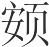而食之(7)。三年，然后胜之。人有大臭者(8)，其亲戚兄弟妻妾知识，无能与居者。自苦而居海上。海上人有说其臭者，昼夜随之而弗能去。

*【注释】*

(1)说（yuè）：同“悦”，喜欢。适然：偶然。

(2)嫫母：古代丑女，相传为黄帝之妻。他书或作“嫫姆”、“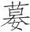母”。执：这里是亲厚的意思。

(3)厉：磨砺。女（rǔ）：你。

(4)正：通“政”。

(5)昌蒲菹（zū）：腌制的菖蒲根。昌蒲，即菖蒲，这里指菖蒲根。菹，腌菜。

(6)而服：当为衍文。

(7)缩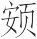（è）：皱眉。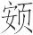，鼻梁。

(8)大臭：一种腋病，即狐臭。

*【译文】*

所以说，受到君主赏识是不固定的，被人喜欢也是偶然的。就像人们对于女色一样，没有不知道喜欢长得漂亮的，可是长得漂亮的未必能遇上。所以嫫母受到黄帝的亲厚，黄帝说：“修养你的品德，不要停止，付与你内宫之政，不疏远你，虽然长得丑陋又有什么妨碍？”就像人们对于滋味一样，没有人不喜欢又甜又脆的东西，可是又甜又脆的东西有的人未必受用。周文王爱吃菖蒲做的腌菜，孔子听了，皱着眉才吃下去。过了三年，才吃习惯。有个有狐臭的人，他的父母、兄弟、妻子、朋友，没有人能跟他在一起居住。他自己感到很痛苦，就住在海边。海边有喜欢他的臭味的人，日夜跟随着他不离开。

说亦有若此者。陈有恶人焉，曰敦洽雠麋，椎颡广颜(1)，色如漆赭，垂眼临鼻，长肘而盭(2)。陈侯见而甚说之，外使治其国，内使制其身。楚合诸侯，陈侯病，不能往，使敦洽雠麋往谢焉。楚王怪其名而先见之。客有进状有恶其名言有恶状(3)。楚王怒，合大夫而告之，曰：“陈侯不知其不可使，是不知也；知而使之，是侮也。侮且不智，不可不攻也。”兴师伐陈，三月然后丧。恶足以骇人，言足以丧国，而友之足于陈侯而无上也(4)，至于亡而友不衰。

*【注释】*

(1)椎颡（sǎnɡ）：尖顶。椎，椎击器具，这里是尖的意思。颡，额。广颜：宽额。颜，两眉之间。

(2)“长肘”句：“盭”（lì）下当脱“股”字。盭股，两腿歪向两旁。盭，乖戾。股，大腿。

(3)“客有”句：此句义不可通，原文当作“客进，状有恶其名，言有恶其状”。有，通“又”。

(4)“友之”句：意思是，陈侯喜欢敦洽雠麋到极点，没有人能赶上他了。

*【译文】*

喜欢人也有像这种情形的。陈国有个丑陋的人，叫敦洽雠麋，尖顶宽额，面色黑红，眼珠下垂，接近鼻子，胳膊很长，大腿向两侧弯曲。陈侯看到了，很喜欢他，在宫外让他治理国家，在宫内让他管理自己的饮食起居。楚国盟会诸侯，陈侯有病，不能前往，派敦洽雠麋去向楚国道歉。楚王对他的名字感到奇怪，就先接见了他。他进去了，相貌又丑陋，说话又粗野。楚王很生气，召来大夫们，告诉他们说：“陈侯不知道这个人不可以派遣，这就是不明智；知道这个人不可以派遣却还要派遣，这就是轻慢。轻慢而且不明智，不可不攻打他。”于是发兵攻打陈国，过了三个月然后灭掉了陈国。丑陋足以惊吓别人，言论足以丧失国家，可是陈侯却对他喜爱到极点，没有人能超过他了，直到亡国，喜爱的程度都不减弱。

夫不宜遇而遇者，则必废(1)。宜遇而不遇者，此国之所以乱、世之所以衰也。天下之民，其苦愁劳务从此生。

*【注释】*

(1)废：指不能长久得到赏识、被废弃。

*【译文】*

不应该受赏识却受到赏识的，那就一定会被废弃。应该受赏识却没有受到赏识的，这就是国家之所以混乱、世道之所以衰微的原因。天下的百姓，他们的愁苦劳碌就由此产生了。

凡举人之本，太上以志，其次以事，其次以功。三者弗能，国必残亡，群孽大至，身必死殃，年得至七十、九十犹尚幸。圣贤之后(1)，反而孽民(2)，是以贼其身，岂能独哉(3)？

*【注释】*

(1)圣贤之后：指陈国。陈国君为舜之苗裔，所以这样说。

(2)孽民：害民。孽，病，害。

(3)岂能独哉：哪只是独自受害呢？言外之意是还要害及其民。

*【译文】*

大凡举荐人的根本，最上等的是凭道德，其次是凭事业，其次是凭功绩。这三种人不能举荐上来，国家一定会残破灭亡，各种灾祸就会一齐到来，自身一定会遭殃，能活到七十岁九十岁，就是侥幸的了。圣贤的后代，反而给人民带来危害，因此残害到自身，哪只是独自受危害呢？连人民也要跟着受害啊！

# 必己*一作本知，一作不遇*

*【题解】*

本篇进一步发挥前几篇“遇合无常”、“慎人”等思想，阐述了“外物不可必”、“君子必在己者”的见解。所谓“外物不可必”，是指外物不可倚仗，因为外在事物没有定则，千变万化，同一行为或事物，在不同的条件下会引出不同的结果。对此，文中列举同几个事例加以论证。而所谓“必己”，就是要“得道”和加强自身修养。具体说来，就是“与时俱化”，“以禾（和）为量”，“物物而不物于物”，即顺应自然，虚己待物，而不是执守“万物之情”、“人伦之传”。

本篇开头两节文字，与《庄子》中的《外物》、《山木》基本相同，全篇思想也属道家一派，是以消极的态度处世待物的。

八曰：

外物不可必。故龙逄诛(1)，比干戮(2)，箕子狂(3)，恶来死(4)，桀纣亡。人主莫不欲其臣之忠，而忠未必信。故伍员流乎江(5)，苌弘死(6)，藏其血三年而为碧。亲莫不欲其子之孝，而孝未必爱。故孝己疑(7)，曾子悲(8)。

*【注释】*

(1)龙逄（pánɡ）：又作“龙逢”，即关龙逢，传说中夏时的贤臣，因谏桀而被杀。

(2)比干：纣的叔父，因屡谏纣王，被剖心而死。

(3)箕子：纣的叔伯，封于箕，所以称“箕子”。纣荒淫无道，箕子屡谏不听，又不肯出走“彰君之恶”，于是佯狂以避祸。狂：疯癫。

(4)恶来：纣之谀臣，后被武王杀死。

(5)伍员流乎江：指伍子胥因劝谏吴王拒绝越国求和而被赐死后，吴王用皮口袋装上他的尸体投入江中，使其顺江而浮流。

(6)苌弘：又称“苌叔”，周敬王的大夫，在晋卿内讧中帮助范氏，后被周人杀死。传说苌弘的血三年化为碧玉。

(7)孝己：殷王高宗之子，遭后母之难，忧苦而死。

(8)曾子：曾参，对父母孝顺，却常遭父母打，近于死地，所以悲泣。

*【译文】*

第八：

外物不可依仗。所以龙逄被杀，比干遇害，箕子装疯，恶来被处死，桀、纣遭灭亡。君主没有不希望自己的臣子忠诚的，可是忠诚却不一定受到君主信任。所以伍员的尸体被投入江中，苌弘被杀死，他的血藏了三年化为碧玉。父母没有不希望自己的儿子孝顺的，可是孝顺却不一定受到父母喜爱。所以孝己被怀疑，曾子因遭父母打而悲伤。

庄子行于山中，见木甚美长大，枝叶盛茂，伐木者止其旁而弗取。问其故，曰：“无所可用。”庄子曰：“此以不材得终其天年矣。”出于山，及邑，舍故人之家(1)。故人喜，具酒肉，令竖子为杀雁飨之(2)。竖子请曰：“其一雁能鸣，一雁不能鸣，请奚杀？”主人之公曰(3)：“杀其不能鸣者。”明日，弟子问于庄子曰：“昔者山中之木以不材得终天年，主人之雁以不材死，先生将何以处(4)？”庄子笑曰：“周将处于材不材之间(5)。材不材之间，似之而非也，故未免乎累。若夫道德则不然。无讶无訾(6)，一龙一蛇，与时俱化，而无肯专为；一上一下，以禾为量(7)，而浮游乎万物之祖(8)，物物而不物于物，则胡可得而累？此神农、黄帝之所法。若夫万物之情、人伦之传则不然(9)。成则毁，大则衰，廉则剉(10)，尊则亏，直则骫(11)，合则离，爱则隳(12)，多智则谋，不肖则欺，胡可得而必？”

*【注释】*

(1)舍：止宿。

(2)竖子：童仆。雁：鹅。飨：以酒食款待人。

(3)公：指父亲。

(4)先生将何以处：大意是，您将在材与不材两者间处于哪一边。处：居。

(5)周：庄子自称其名。

(6)讶：惊异。訾（zǐ）：毁谤非议。

(7)以禾为量：依《庄子·山木》，当作“以和为量”。和，和同，指顺应自然。

(8)祖：始。

(9)人伦之传：指人伦相传之道，即流传下来的人与人之间的准则。

(10)廉：锋利。剉（cuò）：缺损。

(11)骫（wěi）：本指骨弯曲，泛指弯曲。

(12)隳（huī）：废。

*【译文】*

庄子在山里行走，看到一棵树长得很好很高大，枝叶很茂盛，伐树的人站在树旁却不伐取它。问他是什么缘故，他说：“没有什么用处。”庄子说：“这棵树因为不成材而得以终其天年了。”从山里出来，到了村子里，住在老朋友家里。老朋友很高兴，准备酒肉，让童仆为他杀鹅款待他。童仆请示说：“一只鹅能叫，一只鹅不能叫，请问杀哪一只？”主人的父亲说：“杀那只不能叫的。”第二天，学生向庄子问道：“昨天山里的树因为不成材而得以终其天年，主人的鹅因为不成材而被杀死，先生您将在成材与不成材这两者间处于哪一边呢？”庄子笑着说：“我将处于成材与不成材之间。成材与不成材之间，似乎是合适的位置，其实不是，所以也不能免于祸害。至于具备了道德，就不是这样了。既没有惊讶，又没有毁辱，时而为龙，时而为蛇，随时势一起变化，而不肯专为一物；时而上，时而下，以顺应自然为准则，遨游于虚无之境，主宰外物而不为外物所主宰，又怎么可能受祸害？这就是神农、黄帝所取法的处世准则。至于万物之情，人伦相传之道，就不是这样了。成功了就会毁坏，强大了就会衰微，锋利了就会缺损，尊崇了就会损伤，直了就会弯曲，聚合了就会离散，受到宠爱就会被废弃，智谋多就会受算计，不贤德就会受欺侮，这些怎么可以依仗？

牛缺居上地(1)，大儒也。下之邯郸，遇盗于耦沙之中(2)。盗求其橐中之载(3)，则与之；求其车马，则与之；求其衣被，则与之。牛缺步而去，盗相谓曰：“此天下之显人也，今辱之如此，此必诉我于万乘之主。万乘之主必以国诛我，我必不生，不若相与追而杀之，以灭其迹。”于是相与趋之，行三十里，及而杀之。此以知故也。

*【注释】*

(1)牛缺：秦国人。上地：地名，约在今陕西绥德一带。

(2)耦沙：即“湡水”，又称“沙河”。源出太行山，在今河北省境内。

(3)橐（tuó）：口袋。载：此指装着的财物。

*【译文】*

牛缺居住在上地，是个知识渊博的儒者。他到邯郸去，在湡水一带遇上盗贼。盗贼要他袋子里装的财物，他给了他们；要他的车马，他给了他们；要他的衣服什物，他给了他们。牛缺步行离开以后，盗贼们相互说道：“这是个天下杰出的人，现在这样侮辱他，他一定要向大国君主诉说我们的所作所为，大国君主一定要用全国的力量讨伐我们，我们一定不能活命。不如一起追上他，把他杀死，灭掉踪迹。”于是就一起追赶他，追了三十里，追上他，把他杀死了。这是因为牛缺让盗贼知道了自己是贤人的缘故。

孟贲过于河(1)，先其五(2)。船人怒，而以楫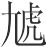其头(3)，顾不知其孟贲也。中河，孟贲瞋目而视船人(4)，发植，目裂，鬓指，舟中之人尽扬播入于河(5)。使船人知其孟贲，弗敢直视，涉无先者，又况于辱之乎？此以不知故也。

*【注释】*

(1)孟贲（bēn）：古代勇士。

(2)先其五：指孟贲不按次序，抢先上了船。五，通“伍”，行列。

(3)楫（jí）：船桨。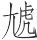：通“毃（què）”，击头。

(4)瞋（chēn）目：瞪大眼睛。

(5)扬：骚动。播：散开。

*【译文】*

孟贲渡河，抢在队伍前边上了船。船工很生气，用桨敲他的头，不知道他是孟贲。到了河中间，孟贲瞪大了眼睛看着船工，头发直立起来，眼眶都瞪裂了，鬓发竖立起来。船上的人都骚动着躲开，掉到了河里。假使船工知道他是孟贲，连正眼看他都不敢，也没有人敢在他之前渡河，更何况侮辱他呢？这是因为孟贲没有让船工知道自己是孟贲的缘故。

知与不知，皆不足恃，其惟和调近之。犹未可必。盖有不辨和调者，则和调有不免也。宋桓司马有宝珠(1)，抵罪出亡。王使人问珠之所在(2)，曰：“投之池中。”于是竭池而求之，无得，鱼死焉。此言祸福之相及也。纣为不善于商，而祸充天地，和调何益？

*【注释】*

(1)宋桓司马：指桓魋（tuí）。按：《左传·哀公十一年》：“太叔疾臣向魋纳美珠焉，与之城。宋公求珠，魋不与，由是得罪。”当是传闻不同。

(2)王：指宋景公。春秋时宋国君未称王，这里可能是误记。

*【译文】*

让人知道与不让人知道，都不足以依靠，大概只有和调才近于免除祸患，但还是不足以依仗。这是因为有不能辨识和调的，那么和调仍然不能免于祸患。宋国的桓魋有颗宝珠，他犯了罪逃亡在外，宋景公派人问他宝珠在哪里，他说：“把它扔到池塘里了。”于是弄干了池塘来寻找宝珠，没有找到，鱼却都死了。这表明祸和福是相互依存的。纣在商朝干坏事，祸患充满天地之间，和调又有什么用处？

张毅好恭(1)，门闾帷薄聚居众无不趋(2)，舆隶姻媾小童无不敬(3)，以定其身。不终其寿，内热而死。单豹好术(4)，离俗弃尘，不食谷实，不衣芮温(5)，身处山林岩堀(6)，以全其生。不尽其年，而虎食之。孔子行道而息，马逸，食人之稼，野人取其马。子贡请往说之，毕辞，野人不听。有鄙人始事孔子者(7)，曰：“请往说之。”因谓野人曰：“子不耕于东海，吾不耕于西海也(8)，吾马何得不食子之禾？”其野人大说，相谓曰：“说亦皆如此其辩也！独如向之人？”解马而与之。说如此其无方也而犹行，外物岂可必哉？

*【注释】*

(1)张毅：鲁国好礼之人。处世恭敬，安养身形，然而内热相攻而死。

(2)帷薄：帐幔，帘子，指人居住之处。聚居众：聚集众人之处。趋：快步走，表示恭敬。《淮南子·人间》亦载此事，录以备考：“张毅好恭，过宫室廊庙必趋，见门闾聚众必下，厮徒马圉，皆与伉礼，然不终其寿，内热而死。”

(3)舆隶：指奴隶或差役。姻媾：由婚姻关系而结成的亲戚。

(4)单豹：鲁国隐士，居于山林，不争名利，虽到老年仍有童子之色。后遭饿虎，被吃掉。

(5)芮（ruì）：粗的丝绵。温：通“缊”，旧絮。

(6)堀（kū）：同“窟”，穴。

(7)鄙人：指边远地区的人。

(8)“子不”二句：这两句义不可通，疑有脱误。《淮南子·人间》作：“子耕东海，至于西海。”其义较明。

*【译文】*

张毅喜欢恭敬待人，经过门闾、帷幕及人聚集处无不快步走过，对待奴隶、姻亲及童仆没有不尊敬的，以便使自身平安。但是他的寿命却不长，因内热而死去。单豹喜欢道术，超尘离俗，不吃五谷，不穿丝絮，住在山林岩穴之中，以便保全自己的生命。可是却不能终其天年，被老虎吃掉了。孔子在路上行走，休息时，马跑了，吃了人家的庄稼，种田人牵走他的马。子贡请求去劝说那个人，把话都说尽了，可是种田人不听从。有个刚侍奉孔子的边远地区的人说：“请让我去劝说他。”于是他对那个种田人说：“您耕种的土地从东海一直到西海，我们的马怎么能不吃您的庄稼？”那个种田人非常高兴，对他说：“说的话竟这样的善辩！哪像刚才那个人呢？”解下马交给了他。劝说人如此不讲方式尚且行得通，外物怎么可以依仗呢？

君子之自行也，敬人而不必见敬，爱人而不必见爱。敬爱人者，己也；见敬爱者，人也。君子必在己者，不必在人者也。必在己，无不遇矣。

*【译文】*

君子自己的作为是，尊敬别人而不一定被别人尊敬，热爱别人而不一定被别人热爱。尊敬热爱别人，在于自己；被别人尊敬热爱，在于别人。君子依仗在于自己的东西，不依仗在于别人的东西。依仗在于自己的东西，就能无所不通了。

