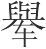
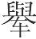
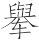
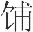
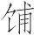

 慎大览第三

# 慎大

*【题解】*

所谓“慎大”，即谨慎地对待强大。本篇主旨在于告诫君主在强大之时和胜利面前应该谨慎。作者认为，强大和胜利是“小邻国”、“胜其敌”的结果，因此必然“多患多怨”。贤明的君主看到强大之中潜伏着败亡的危险，所以“愈大愈惧，愈强愈恐”，“于安思危，于达思穷，于得思丧”，商汤、周武王、赵襄子这些“贤主”都是如此。文章最后进一步指出：“胜非其难者也，持之其难者也”，持胜之道在于时时忧惧。从本篇的论述中，可以看到老子“福祸相倚”、“知雄守雌”的辩证法思想的影响。

文章所阐发的“于安思危”、以忧持胜的思想，应该是历史经验的正确总结，即使在今天，也是应该引起重视的。

一曰：

贤主愈大愈惧，愈强愈恐。凡大者，小邻国也；强者，胜其敌也。胜其敌则多怨，小邻国则多患。多患多怨，国虽强大，恶得不惧？恶得不恐？故贤主于安思危，于达思穷，于得思丧。《周书》曰(1)：“若临深渊，若履薄冰(2)。”以言慎事也。

*【注释】*

(1)《周书》：古逸书。

(2)“若临”二句：这两句《诗经·小雅·小旻》作“如临深渊，如履薄冰”。

*【译文】*

第一：

贤明的君主，领土越广大越感到恐惧，力量越强盛越感到害怕。凡领土广大的，都是侵削邻国的结果；力量强盛的，都是战胜敌国的结果。战胜敌国，就会招致很多怨恨；侵削邻国，就会招致很多憎恶。怨恨的多了，憎恶的多了，国家即使强大，怎么能不恐惧？怎么能不害怕？所以贤明的君主在平安的时候就想到危险，在显赫的时候就想到困窘，在有所得的时候就想到有所失。《周书》上说：“就像面临深渊一样，就像脚踩薄冰一样。”这是说做事情要小心谨慎。

桀为无道，暴戾顽贪，天下颤恐而患之，言者不同，纷纷分分(1)。其情难得。干辛任威(2)，凌轹诸侯(3)，以及兆民。贤良郁怨，杀彼龙逢，以服群凶(4)。众庶泯泯(5)，皆有远志。莫敢直言，其生若惊。大臣同患，弗周而畔(6)。桀愈自贤，矜过善非(7)，主道重塞，国人大崩。汤乃惕惧，忧天下之不宁，欲令伊尹往视旷夏(8)，恐其不信，汤由亲自射伊尹。伊尹奔夏三年，反报于亳(9)，曰：“桀迷惑于末嬉(10)，好彼琬、琰(11)，不恤其众。众志不堪，上下相疾，民心积怨，皆曰：‘上天弗恤，夏命其卒。’”汤谓伊尹曰：“若告我旷夏尽如诗(12)。”汤与伊尹盟，以示必灭夏。伊尹又复往视旷夏，听于末嬉。末嬉言曰：“今昔天子梦西方有日，东方有日，两日相与斗，西方日胜，东方日不胜。”伊尹以告汤。商涸旱，汤犹发师，以信伊尹之盟。故令师从东方出于国西以进(13)。未接刃而桀走。逐之至大沙(14)。身体离散，为天下戮。不可正谏，虽后悔之，将可奈何？汤立为天子，夏民大说，如得慈亲。朝不易位，农不去畴(15)，商不变肆，亲郼如夏(16)。此之谓至公，此之谓至安，此之谓至信。尽行伊尹之盟，不避旱殃，祖伊尹世世享商(17)。

*【注释】*

(1)分分：当作“介介”，怨恨的意思。

(2)干辛：桀之谀臣。任：放纵。

(3)凌轹（lì）：欺压、干犯。轹，车轮辗过，这里指欺压。

(4)凶：通“讻”。争吵不止，这里指群臣的谏诤。

(5)泯泯（mǐn）：纷乱的样子。

(6)弗周：不亲附。周，亲和。畔：通“叛”。

(7)矜：自夸。善：以……为善。

(8)旷夏：大国夏。旷，大。

(9)亳（bó）：古邑名，商汤的都城。在今河南偃师。

(10)末嬉：有施氏之女，嫁给桀，很得桀的宠信。它书或作“妺喜”。

(11)琬、琰：桀的宠妾。

(12)若：你。诗：指有韵之文，即上文“上天弗恤，夏命其卒”。

(13)东方：指汤所居之地亳。亳在夏桀东方，所以这样称呼。国西：指夏桀的国都（今洛阳）之西。这句大意是，为了应验“西方日胜”之梦，汤从亳发兵到桀国都之西，然后从西方向桀进攻。

(14)大沙：地名，即南巢，位于当时华夏各族所居地区的南方。在今安徽巢县西南。

(15)畴：田亩。

(16)郼（yī）：汤为天子之前的封国。这句大意是，夏民得以安居乐业，所以亲近殷商如同亲近自己的民族一样。

(17)祖：对始建功德者的尊称。享：指受祭祀。因伊尹对商有大功，所以世代在商享受祭祀。

*【译文】*

夏桀不行德政，暴虐贪婪。天下人都惊恐、忧虑。人们议论纷纷，混乱不堪，满腹怨恨。天子却很难知道人们的真情。干辛肆意逞威风，欺凌诸侯，连及百姓。贤良之人心中忧郁怨恨，夏桀于是杀死了关龙逢，想以此来压服群臣诤谏。人们动乱起来，都有远走的打算。没有谁敢于直言，都不得安生。大臣们怀有共同的忧患，不亲附桀都想离叛。夏桀越发自以为是，炫耀自己的错误，夸饰自己的缺点。为君之道被重重阻塞，国人分崩离析。面对这种情况，汤感到很恐惧，忧虑天下不得安宁，想让伊尹到夏去观察动静，担心夏不相信伊尹，于是扬言自己亲自射杀伊尹。伊尹逃亡到夏，过了三年，回到亳，禀报说：“桀被末嬉迷惑，又喜欢爱妾琬、琰，不怜悯大众。大家都不堪忍受了，在上位的与在下位的互相痛恨，人民心里充满了怨气，都说：‘上天不保佑夏，夏的命运就要完了。’”汤对伊尹说：“你告诉我的夏国情况都像诗里唱的一样。”汤与伊尹订立了盟约，用以表明一定灭掉夏国。伊尹又去观察夏的动静，很受末嬉信任。末嬉说道：“昨天夜里天子梦见西方有个太阳，东方有个太阳，两个太阳互相争斗，西方的太阳胜利了，东方的太阳没有胜利。”伊尹把这话报告了汤。这时正值商遭遇旱灾，汤仍然发兵攻夏，以便信守和伊尹订立的盟约。他命令军队从亳绕到桀的国都之西，然后发起进攻。还没有交战，桀就逃跑了。汤追赶他到大沙。桀身首离散，被天下人耻笑。当初不听劝谏，即使后来懊悔了，又将怎么样呢？汤做了天子，夏的百姓非常高兴，就像得到慈父一般。朝廷不更换官位，农民不离开田亩，商贾不改变商肆，人民亲近殷就如同亲近夏一样。这就叫极公正，这就叫极安定，这就叫极守信用。汤完全依照和伊尹订立的盟约去做了，不躲避旱灾，因此让伊尹世世代代在商享受祭祀。

武王胜殷，入殷，未下(1)，命封黄帝之后于铸(2)，封帝尧之后于黎(3)，封帝舜之后于陈。下，命封夏后之后于杞(4)，立成汤之后于宋，以奉桑林(5)。武王乃恐惧，太息流涕，命周公旦进殷之遗老，而问殷之亡故，又问众之所说、民之所欲。殷之遗老对曰：“欲复盘庚之政(6)。”武王于是复盘庚之政，发巨桥之粟(7)，赋鹿台之钱(8)，以示民无私。出拘救罪，分财弃责(9)，以振穷困(10)。封比干之墓(11)，靖箕子之宫(12)，表商容之闾(13)，徒过者趋，车过者下。三日之内，与谋之士，封为诸侯，诸大夫赏以书社(14)，庶士施政去赋(15)。然后济于河，西归报于庙(16)。乃税马于华山(17)，税牛于桃林(18)，马弗复乘，牛弗复服。衅鼓旗甲兵(19)，藏之府库，终身不复用。此武王之德也。故周明堂外户不闭，示天下不藏也。唯不藏也，可以守至藏(20)。

*【注释】*

(1)（yú）：同“舆”，车。

(2)铸：古国名。《史记》作“祝”。《礼记·乐记》：“封帝尧之后于祝。”盖传说不同。

(3)黎：古国名。《史记》作“蓟”。《礼记·乐记》：“封黄帝之后于蓟。”也属传闻不同。

(4)夏后：夏君。指大禹。杞：古国名。

(5)桑林：汤祈祷的地方。

(6)盘庚：商汤的第九代孙，是商的中兴君主。

(7)巨桥：粮仓名，纣储粮于此。故址在今河北曲周东北。

(8)赋：布施。鹿台：钱库名，纣藏钱财于此。

(9)责（zhài）：同“债”，债务。

(10)振：同“赈”，救济。

(11)封：堆土使高大。比干忠心谏纣而被杀，武王为表彰他的忠诚，所以把他的坟墓修得很高。

(12)靖：通“旌”，彰明。宫：室。

(13)商容：商代贤人，相传被纣废黜。

(14)书社：古代二十五家为一社，在册籍上书写社人姓名，称为“书社”。这里借指一定数量的土地（包括附于土地的人口）。

(15)施政：通“弛征”（依孙锵鸣说）。减轻赋税。

(16)西归：指归于丰镐。庙：指文王庙。

(17)税：释，放。华山：阳华山，在今陕西商洛南。

(18)桃林：古地域名，其地约相当于河南灵宝以西、陕西潼关以东地区。

(19)衅（xìn）：古代的一种祭礼，杀牲并用它的血涂抹钟鼓等器物。

(20)至藏：指至德，最完美的品德。

*【译文】*

周武王战胜了殷商，进入殷都，还没有下车，就命令把黄帝的后代封到铸，把帝尧的后代封到黎，把帝舜的后代封到陈。下了车，命令把大禹的后代封到杞，立汤的后代为宋的国君，以便承续桑林的祭祀。此时，武王仍然很恐惧，长叹一声，流下了眼泪，命令周公旦领来殷商的遗老，问他们商灭亡的原因，又问民众喜欢什么，希望什么。商的遗老回答说：“希望恢复盘庚的政治。”武王于是就恢复了盘庚的政治，散发巨桥的米粟，施舍鹿台的钱财，以此向人民表示自己没有私心。释放被拘禁的人，挽救犯了罪的人。分发钱财，免除债务，以此来救济贫困之人。又把比干的坟墓修得高大，使箕子的住宅显赫彰明，在商容的闾里竖起标志，行人要加快脚步，乘车的人要下车。三天之内，参与谋划伐商的贤士都封为诸侯，那些大夫们都赏给了土地，普通的士人也都减免了赋税。然后武王才渡过黄河，回到丰镐，到祖庙内报功。于是把马放到阳华山，把牛放到桃林，不再让马牛驾车服役，又把战鼓、军旗、铠甲、兵器涂上牲血，藏进府库，终身不再使用。这就是武王的仁德。周天子明堂的大门不关闭，向天下人表明没有私藏。只有没有私藏，才可以保持最高尚的品德。

武王胜殷，得二虏而问焉，曰：“若国有妖乎？”一虏对曰：“吾国有妖，昼见星而天雨血(1)，此吾国之妖也。”一虏对曰：“此则妖也，虽然，非其大者也。吾国之妖甚大者，子不听父，弟不听兄，君令不行，此妖之大者也。”武王避席再拜之。此非贵虏也，贵其言也。故《易》曰：“愬愬履虎尾(2)，终吉。”

*【注释】*

(1)雨（yù）：降落。血：指像血一样红色的雨。

(2)愬愬：恐惧的样子。引这两句是告诫君主行事应小心谨慎。今本《周易·履》作“履虎尾愬愬，终吉”。

*【译文】*

武王战胜殷商后，得到两个俘虏，问他们说：“你们国家有怪异的事吗？”一个俘虏回答说：“我们国家有怪异的事，白天出现星星，天上降下血雨，这就是我们国家的怪异之事。”另一个俘虏回答说：“这诚然是怪异之事，虽说如此，但还不是大的怪异之事。我们国家特大的怪异是儿子不顺从父亲，弟弟不服从兄长，君主的命令不能实行。这才算最大的怪异之事。”武王离开坐席，向他行再拜之礼。这不是认为俘虏尊贵，而是认为他的言论可贵。所以《周易》上说：“一举一动都战战兢兢，像踩着老虎尾巴一样，最终必定吉祥。”

赵襄子攻翟(1)，胜老人、中人(2)，使使者来谒之，襄子方食抟饭(3)，有忧色。左右曰：“一朝而两城下，此人之所以喜也，今君有忧色，何也？”襄子曰：“江河之大也，不过三日。飘风暴雨(4)，日中不须臾。今赵氏之德行，无所于积，一朝而两城下，亡其及我乎！”孔子闻之曰：“赵氏其昌乎！”

*【注释】*

(1)翟：国名。《国语·晋语九》作“赵襄子使新稚穆子伐狄”。

(2)老人：当作“左人”。左人、中人：都邑名。

(3)抟（tuán）饭：弄成团的饭。

(4)飘风：旋风。这句是本老子“飘风不终朝、骤雨不终日”之意，用以说明强大之物不易持久。

*【译文】*

赵襄子派新稚穆子攻打翟国，攻下了左人城、中人城。新稚穆子派使者回来报告襄子，襄子正在吃抟成团的饭，听了以后脸上现出忧愁的神色。身边的人说：“一下子攻下两座城，这是人们感到高兴的事，现在您却忧愁，这是为什么呢？”襄子说：“长江黄河涨水，不超过三天就会退落，疾风暴雨，不能整天刮整天下。现在我们赵氏的品德，没有丰厚的蓄积，一下子攻下两座城，灭亡恐怕要让我赶上了！”孔子听到这件事以后说：“赵氏大概要昌盛了吧！”

夫忧所以为昌也，而喜所以为亡也。胜非其难者也，持之其难者也。贤主以此持胜，故其福及后世。齐荆吴越，皆尝胜矣，而卒取亡，不达乎持胜也。唯有道之主能持胜。孔子之劲(1)，举国门之关，而不肯以力闻。墨子为守攻，公输般服(2)，而不肯以兵知。善持胜者，以术强弱。

*【注释】*

(1)劲（jìnɡ）：坚强有力。

(2)“墨子”二句：公输般为楚国造云梯，要攻打宋国，墨子听说后去劝阻。公输般九次攻城，墨子九次打退他；公输般守城，墨子九次攻下。事见《墨子·公输》。公输般，古代巧匠。

*【译文】*

忧虑是昌盛的基础，喜悦是灭亡的前提。取得胜利不是困难的事，保持住胜利才是困难的事。贤明的君主依照这种认识保持住胜利，所以他的福分能传到子孙后代。齐国、楚国、吴国、越国，都曾经胜利过，可是最终都遭到了灭亡，这是因为它们不懂得如何保持胜利啊。只有有道的君主，才能保持住胜利。孔子力气那样大，能举起国都城门的门闩，却不肯以力气大闻名天下。墨子善于攻城守城，使公输般折服，却不肯以善于用兵被人知晓。善于保持住胜利的人，有办法使弱小变成强大。

# 权勋

*【题解】*

所谓权勋，意思是衡量事功的大小。作者把忠、利分为大小两类，认为小忠小利是妨害大忠大利的，这叫做“利不可两，忠不可兼”。因此，圣人应该权衡利弊得失，“去小取大”。文章所举的具体事例，都是不懂得“权勋”之理，取小忠小利而招致国灭身亡。本篇主旨即在于提醒统治者吸取历史教训，遇事要根据国治身安的根本利益来决定取舍。

二曰：

利不可两，忠不可兼。不去小利，则大利不得；不去小忠，则大忠不至。故小利，大利之残也；小忠，大忠之贼也。圣人去小取大。

*【译文】*

第二：

利不可两得，忠不可兼备。不抛弃小利，大利就不能得到；不抛弃小忠，大忠就不能实现。所以小利是大利的祸害，小忠是大忠的祸害。圣人抛弃小的，选取大的。

昔荆龚王与晋厉公战于鄢陵(1)，荆师败，龚王伤。临战，司马子反渴而求饮(2)，竖阳谷操黍酒而进之(3)，子反叱曰：“訾(4)！退，酒也！”竖阳谷对曰：“非酒也。”子反曰：“亟退却也(5)！”竖阳谷又曰：“非酒也。”子反受而饮之。子反之为人也嗜酒，甘而不能绝于口，以醉。战既罢，龚王欲复战而谋，使召司马子反，子反辞以心疾。龚王驾而往视之，入幄中，闻酒臭而还(6)，曰：“今日之战，不穀亲伤(7)，所恃者司马也，而司马又若此，是忘荆国之社稷，而不恤吾众也。不穀无与复战矣。”于是罢师去之，斩司马子反以为戮(8)。故竖阳谷之进酒也，非以醉子反也，其心以忠也，而适足以杀之。故曰：小忠，大忠之贼也。

*【注释】*

(1)荆龚王：即楚共王，楚庄王之子，公元前590年—前560年在位。晋厉公：晋景公之子，公元前580年—前573年在位。鄢陵：地名，在今河南鄢陵西北。

(2)司马：官名。掌管军政。子反：楚公子侧之子。司马子反是这次战斗的楚军主帅。

(3)竖：童仆。阳谷：人名。他书或作“谷阳”。

(4)訾（zī）：呵叱的声音。

(5)亟：速，急。

(6)臭（xiù）：气味。

(7)不穀：诸侯的谦称。

(8)戮：陈尸。

*【译文】*

从前楚龚王与晋厉公在鄢陵作战。楚军打败了，龚王受了伤。当初，战斗即将开始之际，司马子反渴了，要水喝，童仆阳谷拿着黍子酿的酒送给他，子反呵斥道：“哼！拿下去，这是酒！”童仆阳谷回答说：“这不是酒。”子反说：“赶快拿下去！”童仆阳谷又说：“这不是酒。”子反接过来喝了。子反为人酷爱喝酒，他觉得味道甘美，喝起来就不能自止，因而喝醉了。战斗停下来以后，龚王想重新交战而商量对策，派人去叫司马子反，司马子反借口心痛没有去。龚王乘车去看他，一进帐中，闻到酒味就回去了，说道：“今天的战斗，我自己受了伤，所依靠的就是司马了，可是司马又这样，他这是忘记了楚国的社稷，而又不忧虑我们这些人。我不与晋人再战了。”于是收兵离去。回去以后，杀了司马子反，并陈尸示众。童仆阳谷送上酒，并不是要把子反灌醉，他心里认为这是忠于子反，却恰好因此害了他。所以说：小忠，是大忠的祸害。

昔者晋献公使荀息假道于虞以伐虢(1)。荀息曰：“请以垂棘之璧与屈产之乘(2)，以赂虞公，而求假道焉，必可得也。”献公曰：“夫垂棘之璧，吾先君之宝也；屈产之乘，寡人之骏也。若受吾币而不吾假道(3)，将奈何？”荀息曰：“不然。彼若不吾假道，必不吾受也；若受我而假我道，是犹取之内府而藏之外府也(4)，犹取之内皂而著之外皂也(5)。君奚患焉？”献公许之。乃使荀息以屈产之乘为庭实(6)，而加以垂棘之璧，以假道于虞而伐虢。虞公滥于宝与马而欲许之(7)。宫之奇谏曰(8)：“不可许也。虞之与虢也，若车之有辅也(9)，车依辅，辅亦依车。虞虢之势是也。先人有言曰：‘唇竭而齿寒。’夫虢之不亡也，恃虞；虞之不亡也，亦恃虢也。若假之道，则虢朝亡而虞夕从之矣。奈何其假之道也？”虞公弗听，而假之道。荀息伐虢，克之。还反伐虞，又克之。荀息操璧牵马而报。献公喜曰：“璧则犹是也，马齿亦薄长矣(10)。”故曰：小利，大利之残也。

*【注释】*

(1)晋献公：晋武公之子，公元前676年至公元前651年在位。荀息：晋大夫。假道：借路。虞：国名。姬姓，在今山西平陆北。虢：国名。又名北虢，姬姓，在今山西平陆。

(2)垂棘之璧：垂棘出产的美玉。垂棘，地名，产美玉。屈产之乘：屈邑产的骏马。屈，晋地名，出骏马。乘，四马叫乘。

(3)币：礼物。指上文的璧、马。

(4)内府：君主储藏财物之处。外府：国中内府之外藏财物的府库。这里以外府喻虞，是把虞国看作晋国所有了。下文用外皂喻虞同。

(5)皂：通“槽”，牛马槽。

(6)庭实：诸侯间相互聘问，把礼物陈于中庭，叫庭实。

(7)滥：贪。

(8)宫之奇：虞大夫。

(9)车：齿床。辅：颊骨。二者互相依存。

(10)马齿：指马的年龄。薄：微。

*【译文】*

从前，晋献公派荀息向虞国借路以便攻打虢国，荀息说：“请您把垂棘出产的璧玉和屈邑出产的四匹马送给虞公，向他要求借路，一定可以得到允许。”献公说：“那垂棘出产的璧玉，是我们先君的宝贝啊；屈邑出产的四匹马，是我的骏马啊。如果虞国接受了我们的礼物而不借给我们路，那将怎么办？”荀息说：“不会这样。他如果不借给我们路，一定不会接受我们的礼物；如果接受了我们的礼物借给我们路，这就如同我们把璧玉从宫中的府库拿出来放到宫外的府库里去，把骏马从宫中的马槽旁牵出来拴到宫外的马槽旁去。您对此又忧虑什么呢？”献公答应了，派荀息把屈邑出产的四匹骏马，再加上垂棘出产的璧玉作为礼物献给虞公，来向虞国借路攻打虢国。虞公贪图宝玉和骏马，想答应荀息。宫之奇劝谏说：“不可以答应。虞国和虢国，就像牙床骨和颊骨一样，互相依存。虞国和虢国的形势就是这样。古人有话说：‘嘴唇没有了，牙齿就会感到寒冷。’虢国不被灭亡，靠着有虞国；虞国不被灭亡，也靠着有虢国啊。如果借路给晋国，那么虢国早晨灭亡，虞国晚上也就会跟着灭亡了。怎么可以借路给晋国呢？”虞公不听，借路给晋国。荀息攻打虢国，战胜了虢国。返回的时候攻打虞国，又战胜了虞国。荀息拿着璧玉牵着骏马回来禀报。献公高兴地说：“玉璧还是老样子，只是马的年齿稍长了一些。”所以说：小利，是大利的祸害。

中山之国有禸繇者(1)，智伯欲攻之而无道也(2)，为铸大钟，方车二轨以遗之(3)。禸繇之君将斩岸堙谿以迎钟(4)。赤章蔓枝谏曰(5)：“诗云(6)：‘唯则定国。’我胡以得是于智伯？夫智伯之为人也，贪而无信，必欲攻我而无道也，故为大钟，方车二轨以遗君。君因斩岸堙谿以迎钟，师必随之。”弗听，有顷谏之。君曰：“大国为欢，而子逆之，不祥。子释之(7)。”赤章蔓枝曰：“为人臣不忠贞，罪也；忠贞不用，远身可也。”断毂而行(8)，至卫七日而禸繇亡。欲钟之心胜也。欲钟之心胜，则安禸繇之说塞矣。凡听说所胜不可不审也。故太上先胜(9)。

*【注释】*

(1)禸繇（róuyóu）：春秋时国名。在今山西盂县一带。他书或作“仇酋”、“仇由”、“厹由”、“仇犹”。

(2)智伯：指智襄子，晋大夫。

(3)方车：两车并排。方，并列。

(4)岸：水边高地。堙（yīn）：堵塞。

(5)赤章蔓枝：禸繇国之臣。

(6)《诗》云：下引诗是逸诗。

(7)释：置，放下。这里是停下来，不要再说了的意思。

(8)断毂（ɡǔ）：砍掉车轴两头长出的部分。毂，车轮中心圆木，中间有孔用来穿轴。这里指车轴的两端。断毂而行是因为山路狭窄。

(9)先：当作“无”。

*【译文】*

中山国内有个禸繇国，智伯想攻打它却无路可通，就铸造了一个大钟，用两辆车并排装载着去送给它。禸繇的君主要削平高地填平谿谷来迎接大钟。赤章蔓枝劝谏说：“古诗说：‘只有遵循确定的准则才能使国家安定。’我们凭什么从智伯那里得到这东西？智伯的为人，贪婪而且不守信用，一定是他想攻打我们而没有路，所以铸造了大钟，用两辆车并排装载着来送给您。您于是削平高地填平谿谷来迎接大钟，这样，智伯的军队必定跟随着到来。”禸繇的君主不听，过了一会，赤章蔓枝又劝谏。禸繇的君主说：“大国要跟你交好，而你却拒绝人家，这不吉祥。你不要再说了。”赤章蔓枝说：“当臣子的不忠贞，这是罪过；忠贞而不被信用，脱身远去是可以的了。”于是，他砍掉车轴两端就出发了，到了卫国七天，禸繇就灭亡了。这是因为禸繇的君主想得到钟的心情太过分了。想得到钟的心情太过分，那么安定禸繇的主张就被阻塞了。凡听取劝说自己过分行为的意见不可不慎重啊。所以最好不要有过分的欲望。

昌国君将五国之兵以攻齐(1)。齐使触子将(2)，以迎天下之兵于济上。齐王欲战，使人赴触子，耻而訾之曰(3)：“不战，必刬若类(4)，掘若垄(5)！”触子苦之，欲齐军之败，于是以天下兵战。战合，击金而却之(6)。卒北，天下兵乘之(7)。触子因以一乘去，莫知其所，不闻其声。达子又帅其余卒以军于秦周(8)，无以赏，使人请金于齐王。齐王怒曰：“若残竖子之类(9)，恶能给若金？”与燕人战，大败。达子死，齐王走莒。燕人逐北入国，相与争金于美唐甚多(10)。此贪于小利以失大利者也(11)。

*【注释】*

(1)昌国君：燕昭王亚卿乐毅，因功封于昌国，号昌国君。将：率领。五国：指秦楚韩赵魏。

(2)触子：齐国将领。他书或作“蜀子”、“向子”。

(3)訾（zǐ）：非难。

(4)刬（chǎn）：铲除，消灭。

(5)垄：坟墓。

(6)金：指金属制的乐器。古代作战时，鸣金是退兵的信号。

(7)乘：追击、践踏的意思。

(8)达子：齐人。军：驻扎。秦周：齐地名。

(9)残：残余。竖子：小子，骂人的话。

(10)美唐：当是齐国藏金的地方。

(11)小利：指金。大利：指国。

*【译文】*

昌国君乐毅率领五国的军队去攻打齐国。齐国派触子领兵，在济水边迎击各诸侯国的军队。齐王想开战，派人到触子那里去，羞辱并且斥责他说：“不开战，我一定灭掉你们这些人，挖掉你的祖坟！”触子对此很愤恨，想让齐军战败，于是跟各诸侯国的军队开战。刚一交战，触子就鸣金要齐军撤退。齐军败逃，诸侯军追击齐军。触子于是乘一辆兵车离开了，没有人知道他去了哪里，也听不到他的信息。达子又率领残兵驻扎在秦周，没有东西赏赐士卒，就派人向齐王请求金钱。齐王愤怒地说：“你们这些残存下来的家伙，怎么能供给你们金钱？”齐军与燕国人交战，被打得大败。达子战死了，齐王逃到了莒。燕国人追赶败逃的齐兵进入齐国国都，在美唐一起夺抢了很多金钱。这是贪图小利因而丧失了大利啊。

# 下贤

*【题解】*

本篇旨在论述君主应该礼贤下士。

文章歌颂了得道之人的高尚情操，赞美他们不把贫贱富贵放在心上，“以天为法，以德为行，以道为宗，与物变化而无所终穷”。对于这种“精充天地而不竭”、“神覆宇宙而无望”的贤士，君主应该如何以礼相待？文章列举了尧北面而问善绻、周公抱少主朝见贫困之士、齐桓公多次往见小臣稷、郑子产师事壶丘子林、魏文侯见段干木“立倦而不敢息”等事例，说明礼贤的关键在于“至公”，在于“节欲”，礼贤首先要“去其帝王之色”。

本篇“下贤”的思想源于儒家，而关于“得道之人”以及“道”的论述，显然是受了道家的影响。

三曰：

有道之士，固骄人主；人主之不肖者，亦骄有道之士。日以相骄，奚时相得？若儒墨之议与齐荆之服矣(1)。

*【注释】*

(1)儒墨之议：指儒墨互相非议。齐荆之服：指齐楚互相不服。

*【译文】*

第三：

有道的士人，本来就傲视君主；不贤明的君主，也傲视有道的士人。他们天天这样互相傲视，什么时候才能相投合？这就像儒家墨家互相非议和齐国楚国彼此不服一样。

贤主则不然。士虽骄之，而己愈礼之，士安得不归之？士所归，天下从之，帝(1)。帝也者，天下之适也(2)；王也者，天下之往也。得道之人，贵为天子而不骄倨，富有天下而不骋夸，卑为布衣而不瘁摄(3)，贫无衣食而不忧慑。恳乎其诚自有也，觉乎其不疑有以也，桀乎其必不渝移也(4)，循乎其与阴阳化也，匆匆乎其心之坚固也(5)，空空乎其不为巧故也(6)，迷乎其志气之远也(7)，昏乎其深而不测也，确乎其节之不庳也(8)，就就乎其不肯自是也(9)，鹄乎其羞用智虑也(10)，假乎其轻俗诽誉也(11)。以天为法，以德为行，以道为宗，与物变化而无所终穷，精充天地而不竭，神覆宇宙而无望。莫知其始，莫知其终，莫知其门，莫知其端，莫知其源。其大无外(12)，其小无内(13)。此之谓至贵。士有若此者，五帝弗得而友，三王弗得而师。去其帝王之色，则近可得之矣。

*【注释】*

(1)“帝”：“帝”字当为衍文。

(2)适：往。

(3)瘁摄：失意屈辱，这里是感到失意屈辱的意思。

(4)桀：突出。

(5)匆匆：明确的样子。

(6)空空：诚实的样子。巧故：诈伪之事。

(7)迷：通“弥”，远。

(8)确：刚强。庳（bì）：低下。

(9)就就（yóuyóu）：犹豫的样子，这里指行事谨慎。

(10)鹄：通“浩”，大。

(11)假：通“遐”，远。

(12)其大无外：指道大则无所不包。

(13)其小无内：指道微则微小至极。

*【译文】*

贤明的君主就不是这样。士人虽然傲视自己，而自己却越发以礼对待他们，这样，士人怎能不归附呢？士人归附了，天下人就会跟着他们归附。所谓帝，是指天下人都来亲附；所谓王，是指天下人都来归服。得道的人，尊贵到做天子而不骄横傲慢，富足到有天下而不放纵自夸，卑下到当平民而不感到失意屈辱，贫困到无衣食而不忧愁恐惧。他们诚恳坦荡，确实掌握了大道；他们大彻大悟，遇事不疑，必有依据；他们卓尔不群，坚守信念，绝不改变；他们顺应天道，随阴阳一起变化；他们明察事理，意志坚定牢固；他们忠厚淳朴，不行诈伪之事；他们志向远大，高远无边；他们思想深邃，深不可测；他们刚毅坚强，节操高尚；他们做事谨慎，不肯自以为是；他们光明正大，耻于运用智谋；他们胸襟宽广，看轻世俗的诽谤赞誉。他们以天为法则，以德为品行，以道为根本。他们随万物变化而没有穷尽，精神充满天地，没有尽竭，布满宇宙，无边无际。他们所具有的“道”，没有谁知道何时开始，没有谁知道何时终结，没有谁知道它的门径，没有谁知道它的开端，没有谁知道它的本源。道大至无所不包，小至微乎其微。这就叫做无比珍贵。士人能达到这种境界，五帝也不能和他交友，三王也不得以他为师。如果丢开帝王尊贵的神态，那就差不多能够和他们交友、以他们为师了。

尧不以帝见善绻(1)，北面而问焉(2)。尧，天子也；善绻，布衣也。何故礼之若此其甚也？善绻，得道之士也。得道之人，不可骄也。尧论其德行达智而弗若，故北面而问焉。此之谓至公。非至公其孰能礼贤？

*【注释】*

(1)善绻（quǎn）：尧时的有道之士。

(2)北面：面向北。古代以面向南为尊，君主面南而坐，臣子面北而侍。尧北面而问善绻，是为了表示尊敬。

*【译文】*

尧不以帝王的身份去见善绻，面朝北恭敬地向他请教。尧是天子，善绻是平民。尧为什么这样过分地礼遇他呢？因为善绻是得道的人。对得道的人，不可傲视。尧衡量自己的德行智谋不如善绻，所以面向北恭敬地向他请教。这就叫做无比公正。不是无比公正，谁又能礼遇贤者？

周公旦，文王之子也，武王之弟也，成王之叔父也。所朝于穷巷之中、瓮牖之下者七十人(1)。文王造之而未遂，武王遂之而未成，周公旦抱少主而成之(2)，故曰成王不唯以身下士邪？

*【注释】*

(1)穷巷：陋巷。瓮牗（wènɡyǒu）：用破瓮遮蔽窗户，形容贫困简陋。瓮，陶制盛物器皿。牖，窗户。

(2)少主：指周成王。成王继位时尚年幼，周公负成王以听政。

*【译文】*

周公旦是周文王的儿子，周武王的弟弟，周成王的叔父。他朝见过住在穷巷陋室里的人有七十个。这件事，文王开了头而没有做到，武王做了而没有完成，周公旦辅佐年幼的成王才真正完成。这不正说明成王亲自礼贤下士吗？

齐桓公见小臣稷(1)，一日三至弗得见。从者曰：“万乘之主，见布衣之士，一日三至而弗得见，亦可以止矣。”桓公曰：“不然。士骜禄爵者(2)，固轻其主；其主骜霸王者，亦轻其士。纵夫子骜禄爵，吾庸敢骜霸王乎？”遂见之，不可止。世多举桓公之内行(3)，内行虽不修，霸亦可矣。诚行之此论，而内行修，王犹少。

*【注释】*

(1)小臣稷：春秋时齐国的隐士，复姓小臣，名稷。

(2)骜：通“傲”，傲视，轻视。

(3)内行：指私生活。

*【译文】*

齐桓公去见小臣稷，一天去三次都没能见到。跟随的人说：“大国的君主去见一个平民，一天去了三次都没能见到，就算了吧。”桓公说：“不对。看轻爵位俸禄的士人，本来轻视君主；看轻王霸之业的君主，也轻视士人。纵使先生他看轻俸禄爵位，我怎么敢看轻王霸之业呢？”桓公终于见到了小臣稷，随从没能阻止住。世人大多指责桓公的私生活，他的私生活虽然不检点，但有如此好士之心，称霸也是可以的。如果真的按上述原则去做，而且私生活又检点，就是称王恐怕还不止。

子产相郑(1)，往见壶丘子林(2)，与其弟子坐必以年，是倚其相于门也(3)。夫相万乘之国而能遗之(4)，谋志论行而以心与人相索，其唯子产乎！故相郑十八年(5)，刑三人，杀二人。桃李之垂于行者，莫之援也；锥刀之遗于道者，莫之举也。

*【注释】*

(1)子产：郑国相公孙侨，字子产。

(2)壶丘子林：郑国的高士，复姓壶丘，名子林。

(3)是：此。倚：置。这几句的大意是，子产去拜见壶丘子林，与他的弟子按年龄的长幼排定座次，不因自己是相而居上座，这好像把相的尊贵放在门外似的。

(4)遗之：指扔掉相的架子。

(5)十八年：《左传》谓子产相郑二十二年，《史记·循吏列传》作二十六年。

*【译文】*

子产在郑国当相，去见壶丘子林，跟他的学生们坐在一起，一定按年龄就座。这是把相位的尊贵放在一边而不凭它去居上座。身为大国的相，而能丢掉相的架子，谈论思想，议论品行，真心实意地与人探索，大概只有子产能这样吧！他在郑国做了十八年相，仅处罚三个人，杀死两个人。桃李下垂到路上，也没有谁去摘；锥刀丢在道上，也没有谁去拾。

魏文侯见段干木(1)，立倦而不敢息。反见翟黄(2)，踞于堂而与之言(3)。翟黄不说，文侯曰：“段干木官之则不肯，禄之则不受；今女欲官则相位，欲禄则上卿。既受吾实，又责吾礼(4)，无乃难乎！”故贤主之畜人也，不肯受实者其礼之。礼士莫高乎节欲，欲节则令行矣。文侯可谓好礼士矣。好礼士，故南胜荆于连堤(5)，东胜齐于长城(6)，虏齐侯，献诸天子。天子赏文侯以上闻(7)。

*【注释】*

(1)魏文侯：战国时，魏国始立之侯，公元前446年—前396年在位。段干木：战国时魏国隐士。

(2)翟黄：魏文侯上卿。

(3)踞：非正规的“坐”（正规的坐姿是两膝着地，臀部靠在脚后跟上），坐时，臀部和两足底着地，状似簸箕，故又称“箕踞”。这是一种不恭敬的姿势。

(4)责：求，要求。

(5)连堤：楚地名。

(6)长城：指齐境内的长城。

(7)上闻：指始列为侯，名字上闻于天子。

*【译文】*

魏文侯去见段干木，站得疲倦了却不敢休息。回来以后见翟黄，箕踞于堂上跟他谈话。翟黄很不高兴，文侯说：“段干木，让他做官他不肯做，给他俸禄他不接受；现在你想当官就身居相位，想得俸禄就得到上卿的俸禄。你既接受了我给你的官职俸禄，又要求我以礼相待，恐怕很难办到吧！”所以贤明的君主对待人，不肯接受官职俸禄的就以礼相待。礼遇士人没有比节制自己的欲望更好的了，欲望受到节制，命令就可以执行了。魏文侯可以说是喜好以礼待士了，喜好以礼待士，所以向南能在连堤战胜楚国，向东能在长城战胜齐国，俘虏齐侯，把他献给周天子。周天子奖赏文侯，封他为诸侯。

# 报更

*【题解】*

“报更”即酬报、偿还的意思，谓礼贤下士定将得到厚报。

本篇旨在论述君主与天下贤者为伍的重要性。文章列举了赵盾救助骫桑之饿人而使自身免于难、周昭文君礼遇张仪而使自己得以显荣、孟尝君礼遇淳于髡而使封邑得以保全等事例，说明君主礼贤下士，士必当舍身相报。礼贤下士是君主大立功名、安国免身的必由之道。

四曰：

国虽小，其食足以食天下之贤者，其车足以乘天下之贤者，其财足以礼天下之贤者。与天下之贤者为徒(1)，此文王之所以王也。今虽未能王，其以为安也，不亦易乎！此赵宣孟之所以免也(2)，周昭文君之所以显也(3)，孟尝君之所以却荆兵也(4)。古之大立功名与安国免身者，其道无他，其必此之由也。堪士不可以骄恣屈也(5)。

*【注释】*

(1)为徒：指在一起。徒，徒党。

(2)赵宣孟：即赵盾，谥宣子，春秋时晋国正卿。免：指免于难。

(3)周昭文君：战国时东周国国君。

(4)孟尝君：战国时齐国公子田文，封于薛，孟尝君是他的封号。

(5)堪：通“媅（dān）”，乐，喜爱。

*【译文】*

第四：

国家即使小，它的粮食也足以供养天下的贤士，它的车辆也足以乘载天下的贤士，它的钱财也足以礼遇天下的贤士。与天下的贤士为伍，这是周文王称王天下的原因。现在虽然不能称王，以它来安定国家，不是很容易做到吗！与贤士为伍，这是赵宣子免于被杀、周昭文君达到显荣、孟尝君使楚军退却的根本原因。古代建立功名和安定国家、免除自身灾难的人，没有别的途径，必定是遵循这个准则。喜欢贤士不可以用骄横的态度屈致。

昔赵宣孟将上之绛(1)，见骫桑之下有饿人卧不能起者(2)，宣孟止车，为之下食，蠲而之(3)，再咽而后能视。宣孟问之曰：“女何为而饿若是？”对曰：“臣宦于绛(4)，归而粮绝，羞行乞而憎自取，故至于此。”宣孟与脯一朐(5)，拜受而弗敢食也。问其故，对曰：“臣有老母，将以遗之。”宣孟曰：“斯食之(6)，吾更与女。”乃复赐之脯二束，与钱百，而遂去之。处二年，晋灵公欲杀宣孟，伏士于房中以待之(7)。因发酒于宣孟，宣孟知之，中饮而出。灵公令房中之士疾追而杀之。一人追疾，先及孟宣之面，曰：“嘻，君轝(8)！吾请为君反死。”宣孟曰：“而名为谁(9)？”反走对曰(10)：“何以名为？臣骫桑下之饿人也。”还斗而死。宣孟遂活。此《书》之所谓“德几无小”者也(11)。宣孟德一士，犹活其身，而况德万人乎？故《诗》曰：“赳赳武夫，公侯干城。”(12)“济济多士，文王以宁。”(13)人主胡可以不务哀士？士其难知，唯博之为可，博则无所遁矣。

*【注释】*

(1)上：从地势低的地方到地势高的地方去叫“上”。绛：即故绛，晋国当时的都城，在今山西翼城东南。

(2)骫（wěi）桑：蟠曲的桑树。

(3)蠲（juān）：清洁。指弄干净。：通“哺”，给人食物吃。

(4)宦：当仆隶。

(5)脯：干肉。朐（qú）：弯曲的干肉。

(6)斯：尽。

(7)房：正室两侧的房舍。

(8)轝（yú）：车，这里指乘车。

(9)而：你。

(10)反走：退避以示恭敬。

(11)德几无小：此句当是逸《书》文。

(12)“赳赳”二句：见《诗经·周南·兔罝》。赳赳：雄壮的样子。干：盾牌。

(13)“济济”二句：见《诗经·大雅·文王》。济济：众多的样子。

*【译文】*

从前，赵宣子赵盾将要到国都绛邑去，看见一棵弯曲的桑树下，有一个饿病躺在那里起不来的人，宣子停下车，让人给他准备食物，把食物弄干净给他吃。他咽下两口后才能睁开眼看。宣子问他说：“你为什么饿到这种地步？”他回答说：“我在绛给人做仆隶，回家的路上断了粮，羞于去乞讨，又厌恶私自拿取别人的食物，所以才饿到这种地步。”宣子给了他一块干肉，他跪拜着接受了却不敢吃。问他为什么，他回答说：“我有老母亲，想把这些干肉送给她。”宣子说：“你全都吃了它，我另外再给你。”于是又赠给他两束干肉和一百枚钱，于是就离开了。过了二年，晋灵公想杀死宣子，在房中埋伏了兵士，等待宣子到来。灵公于是请宣子饮酒，宣子知道了灵公的意图，酒喝到一半就走了出去。灵公命令房中的兵士赶快追上去杀死他。有一个人追得很快，先追到宣子跟前，说：“喂，您快上车逃走！我愿为您回去拼命。”宣子说：“你名字叫什么？”那人避开回答说：“问名字干什么？我是骫桑下饿病的那个人啊。”他返回身去与灵公的兵士搏斗而死。宣子于是得以活命。这就是《尚书》上所说的“恩德无所谓小”的意思啊。宣子对一个人施恩德，尚且能使自身活命，更何况对万人施恩德呢。所以《诗经》上说：“雄赳赳的武士，是公侯的屏障。”“人才济济，文王因此安康。”君主怎么可以不致力于爱怜贤士呢？贤士是很难了解的，只有广泛地寻求才可以，广泛地寻找，就不会失掉了。

张仪，魏氏余子也(1)。将西游于秦，过东周。客有语之于昭文君者，曰：“魏氏人张仪，材士也，将西游于秦，愿君之礼貌之也。”昭文君见而谓之曰：“闻客之秦，寡人之国小，不足以留客。虽游，然岂必遇哉？客或不遇，请为寡人而一归也。国虽小，请与客共之。”张仪还走，北面再拜。张仪行，昭文君送而资之。至于秦，留有间(2)，惠王说而相之。张仪所德于天下者，无若昭文君。周，千乘也，重过万乘也。令秦惠王师之。逢泽之会(3)，魏王尝为御，韩王为右。名号至今不忘，此张仪之力也。

*【注释】*

(1)余子：大夫的庶子。

(2)有间（jiàn）：短时间，一段时间。

(3)逢泽之会：指秦在逢泽盟会诸侯。逢泽，泽薮名，故址在今河南开封东南。

*【译文】*

张仪是魏国大夫的庶子，将要向西到秦国去游说，路过东周。宾客中有个人把这情况告诉昭文君说：“魏国人张仪，是个很有才干的人，将要向西到秦国游说，希望您对他以礼相待。”昭文君会见张仪并且对他说：“听说客人要到秦国去，我的国家小，不足以留住客人。即便游说秦国，然而难道一定会受到赏识吗？客人倘或得不到赏识，请看在我的面上再回来。我的国家虽然小，愿与您共同掌管。”张仪退避，面向北拜了两拜。张仪走时，昭文君给他送行并且资助钱财。张仪到了秦国，呆了一段时间，秦惠王很喜欢他，让他当了相。张仪感激昭文君，胜过他感激天下任何人。周是个小国，张仪看待它超过了大国。他让秦惠王以昭文君为师。秦国在逢泽盟会诸侯的时候，魏王曾给昭文君当御者，韩王给昭文君当车右。昭文君的名号至今没有被忘掉，这都是张仪的力量啊。

孟尝君前在于薛(1)，荆人攻之。淳于髡为齐使于荆(2)，还反，过于薛，孟尝君令人礼貌而亲郊送之，谓淳于髡曰：“荆人攻薛，夫子弗为忧，文无以复侍矣。”淳于髡曰：“敬闻命矣。”至于齐，毕报，王曰：“何见于荆？”对曰：“荆甚固(3)，而薛亦不量其力。”王曰：“何谓也？”对曰：“薛不量其力，而为先王立清庙(4)。荆固而攻薛，薛清庙必危。故曰薛不量其力，而荆亦甚固。”齐王知颜色(5)，曰：“嘻！先君之庙在焉！”疾举兵救之，由是薛遂全。颠蹶之请(6)，坐拜之谒，虽得则薄矣。故善说者，陈其势，言其方，见人之急也，若自在危厄之中，岂用强力哉？强力则鄙矣。说之不听也，任不独在所说，亦在说者。

*【注释】*

(1)薛：孟尝君封地，故城在今山东滕州东南。

(2)淳于髡：齐国大夫，以博学著称。

(3)固：本指独占，这里是贪婪的意思。

(4)清庙：宗庙。宗庙肃然清静，故称清庙。

(5)齐王：指齐宣王，齐威王之子，公元前320年—公元前302年在位。知颜色：变了脸色。知，显现。

(6)颠蹶：仆倒。

*【译文】*

孟尝君从前在薛的时候，楚国人攻打薛。淳于髡为齐国出使楚国，返回的时候，路过薛。孟尝君让人以礼相待，并亲自到郊外送他，对他说：“楚国人攻打薛，如果先生您不为此担忧，我将没有办法再侍奉您了。”淳于髡说：“我遵命了。”到了齐国，禀报完毕，齐王说：“到楚国见到了什么？”淳于髡回答说：“楚国很贪婪，薛也不自量力。”齐王说：“说的是什么意思？”淳于髡回答说：“薛不自量力，给先王立了宗庙。楚国贪婪而攻打薛，薛的宗庙必定危险。所以说薛不自量力，楚国也太贪婪。”齐王变了脸色，说：“哎呀！先王的宗庙在那里呢！”于是赶快发兵援救薛，因此薛才得以保全。趴在地上请求，跪拜着请求，即使能得到援救也是很少的。所以善于劝说的人，陈述形势，讲述主张，看到别人危急，就像自己处于危难之中一样，这样，哪里用得着极力劝说呢？极力劝说就鄙陋了。劝说而不被听从，责任不单单在被劝说的人，也在劝说者自己。

# 顺说

*【题解】*

本篇论述的是劝说君主的方法，其方法就是“顺说”。“顺说”之意在于“因人之力以为自力，因其来而与来，因其往而与往”，就是要善于揣摩君主的心理，顺其思路，因势利导，以达到自己的目的。文章列举的惠盎说宋康王行孔墨之道、田赞说荆王息甲兵、管仲引导役人唱歌以免祸等事例，都说明了“顺说”的必要。

五曰：

善说者若巧士，因人之力以自为力，因其来而与来，因其往而与往，不设形象，与生与长，而言之与响(1)。与盛与衰，以之所归(2)。力虽多，材虽劲，以制其命。顺风而呼，声不加疾也；际高而望(3)，目不加明也。所因便也。

*【注释】*

(1)而：如。响：回声。

(2)所归：终极目的。

(3)际：到，接近。

*【译文】*

第五：

善于劝说的人像灵巧的人一样，借用别人的力量而把它当作自己的力量，顺着他的来势加以引导，顺着他的去势加以推动，不露形迹，随着他的出现而出现，随着他的发展而发展，如同言语与回声一样相随。随着他的兴盛而兴盛，随着他的衰微而衰微，以便达到自己的目的。尽管他的力量很大，才能很强，也能控制他的命运。顺着风呼叫，声音并没有更大，可是能从远处听到；登上高处观望，眼睛并没有更亮，然而可以看到远处。这是因为凭借的东西有利啊。

惠盎见宋康王(1)，康王蹀足謦欬(2)，疾言曰：“寡人之所说者，勇有力也，不说为仁义者。客将何以教寡人？”惠盎对曰：“臣有道于此：使人虽勇，刺之不入；虽有力，击之弗中。大王独无意邪？”王曰：“善！此寡人所欲闻也。”惠盎曰：“夫刺之不入，击之不中，此犹辱也。臣有道于此：使人虽有勇，弗敢刺；虽有力，不敢击。大王独无意邪？”王曰：“善！此寡人之所欲知也。”惠盎曰：“夫不敢刺，不敢击，非无其志也。臣有道于此：使人本无其志也。大王独无意邪？”王曰：“善！此寡人之所愿也。”惠盎曰：“夫无其志也，未有爱利之心也。臣有道于此：使天下丈夫女子莫不欢然皆欲爱利之。此其贤于勇有力也，居四累之上(3)。大王独无意邪？”王曰：“此寡人之所欲得也。”惠盎对曰：“孔、墨是也。孔丘、墨翟，无地为君(4)，无官为长。天下丈夫女子莫不延颈举踵，而愿安利之。今大王，万乘之主也，诚有其志，则四境之内皆得其利矣，其贤于孔、墨也远矣。”宋王无以应。惠盎趋而出，宋王谓左右曰：“辨矣(5)！客之以说服寡人也。”宋王，俗主也，而心犹可服，因矣。因则贫贱可以胜富贵矣，小弱可以制强大矣。

*【注释】*

(1)惠盎：战国时期宋国人。宋康王：名偃，即宋君偃，公元前337年—前286年在位。

(2)蹀（dié）足：顿足。謦欬（qǐnɡkài）：咳嗽。

(3)四累：指上面提到的四种行为（刺击、不敢刺击、无志刺击、未有爱利之心），因为这四种行为有害于世，所以称之为“四累”。

(4)无地为君：指没有领土，但却能象君主一样得到尊荣。

(5)辨：通“辩”。

*【译文】*

惠盎谒见宋康王，康王跺着脚，咳嗽着，大声说：“我所喜欢的是勇武有力的人，不喜欢行仁义的人。客人将有何见教啊？”惠盎回答说：“我有这样的道术：使人虽然勇武，却刺不进您的身体；虽然有力，却击不中您。大王您难道无意于这种道术吗？”康王说：“好！这是我想要听的。”惠盎说：“虽然刺不进您的身体，击不中您，但您还是受侮辱了。我有这样的道术：使人虽然勇武，却不敢刺您；虽然有力，却不敢击您。大王您难道无意于这种道术吗？”康王说：“好！这是我想知道的。”惠盎说：“那些人虽然不敢刺，不敢击，并不是没有这样的想法啊。我有这样的道术：使人根本就没有这样的想法。大王您难道无意于这种道术吗？”康王说：“好！这是我所希望的。”惠盎说：“那些人虽然没有这样的想法，却没有爱您使您有利的心。我有这样的道术：使天下的男子女子都愉快地爱您使您有利。这就胜过了勇武有力，居于上面说到的四种行为之上了。大王您难道无意于这种道术吗？”康王说：“这是我想要得到的。”惠盎回答说：“孔丘、墨翟就能这样。孔丘、墨翟，他们没有领土，但却能像当君主一样得到尊荣；他们没有官职，但却能像当官长一样受到尊敬。天下的男子女子没有谁不伸长脖子、抬起脚跟盼望他们，希望他们平安顺利。现在大王您是拥有万辆兵车大国的君主，如果真有这样的志向，那么四方边境之内就都能得到您的利益了，百姓对您的爱戴就能远远超过孔丘、墨翟了。”宋王无话来回答。惠盎快步走了出去，宋王对身边的人说：“很善辩啊！客人用言论说服了我。”宋王是个平庸的君主，可是他的心还是可以说服，这是因为惠盎能因势利导。能因势利导，那么贫贱的就可以胜过富贵的，弱小的就可以制服强大的了。

田赞衣补衣而见荆王(1)，荆王曰：“先生之衣，何其恶也？”田赞对曰：“衣又有恶于此者也。”荆王曰：“可得而闻乎？”对曰：“甲恶于此。”王曰：“何谓也？”对曰：“冬日则寒，夏日则暑，衣无恶乎甲者。赞也贫，故衣恶也。今大王，万乘之主也，富贵无敌，而好衣民以甲，臣弗得也。意者为其义邪(2)？甲之事，兵之事也，刈人之颈(3)，刳人之腹(4)，隳人之城郭，刑人之父子也。其名又甚不荣。意者为其实邪？苟虑害人，人亦必虑害之；苟虑危人，人亦必虑危之。其实人则甚不安。之二者，臣为大王无取焉。”荆王无以应。说虽未大行，田赞可谓能立其方矣。若夫偃息之义(5)，则未之识也。

*【注释】*

(1)田赞：齐国人。

(2)意者：抑或，料想。

(3)刈（yì）：砍断。

(4)刳（kū）：剖挖。

(5)偃（yǎn）息之义：指段干木隐居不仕而安魏国。偃息，安卧。

*【译文】*

田赞穿着破旧衣服去见楚王，楚王说：“先生您的衣服怎么这么破旧呢？”田赞回答说：“衣服还有比这更坏的呢？”楚王说：“可以让我听听吗？”田赞回答说：“铠甲比这更坏。”楚王说：“这是什么意思呢？”田赞回答说：“冬天穿上冷，夏天穿上热，衣服没有比铠甲更坏的了。我很贫困，所以穿的衣服很坏。现在大王您是大国的君主，富贵无比，却喜欢拿铠甲让人们穿，我不赞成这样。或许是为了行仁义吗？铠甲的事，是有关战争的事啊，是砍断人家的脖子，挖空人家的肚子，毁坏人家的城池，杀死人家的父子啊。那名声又很不荣耀。或许是为了得到实际利益吗？如果谋划害别人，别人也必定谋划害自己；如果谋划让别人遭到危险，别人也必定谋划让自己遭到危险。其实很不安全。这两种情况，我认为大王您还是不要选择。”楚王无话来回答。主张虽然没有广泛实行，田赞可以说是能够树立自己的主张了。至于段干木隐居不仕而使魏国安全，那田赞还达不到这种地步。

管子得于鲁(1)，鲁束缚而槛之(2)，使役人载而送之齐，皆讴歌而引。管子恐鲁之止而杀己也，欲速至齐，因谓役人曰：“我为汝唱，汝为我和。”其所唱适宜走，役人不倦，而取道甚速。管子可谓能因矣，役人得其所欲，己亦得其所欲。以此术也，是用万乘之国，其霸犹少(3)，桓公则难与往也(4)。

*【注释】*

(1)“管子”句：齐遭无知之难，公子纠奔鲁，管仲傅之。后公子小白在齐国即位（即齐桓公），胁迫鲁杀死公子纠，把管仲送交齐国。“管子得于鲁”即指此而言。

(2)槛：关人的囚笼。此指关在囚笼中。

(3)其霸犹少：意思是，不仅仅至于成就霸业。

(4)难与往：指难以跟他（桓公）达到成就王业的地步。

*【译文】*

管仲在鲁国被捉住，鲁国捆起他把他装在囚笼里，派差役用车载着把他送到齐国去，差役全都唱着歌拉车。管仲担心鲁国留下并且杀死自己，想赶快到达齐国，于是就对差役们说：“我给你们领唱，你们应和我。”他唱的歌节拍适合快走，差役们不觉得疲倦，因而走路走得很快。管仲可以说是能利用差役唱歌了，差役满足了自己的希望，管仲也达到了自己的目的。使用这个方法，治理拥有万辆兵车的大国，成就霸业尚且不止，只不过齐桓公这个人难以辅佐他成就王业罢了。

# 不广

*【题解】*

所谓“不广”（广通“旷”），即不废弃人为的努力。本篇旨在论述人为的努力不可旷废的道理。文章指出，虽然成就功业要靠时势，靠天意，但“人事”不可废，“成亦可，不成亦可”，都要做到“以其所能托其所不能”。文章以管仲之虑、宁越之言、咎犯之谋为例具体说明尽人事的必要。文章最后把尽人事的基点落在“知大礼”上，反映出作者的儒家思想。

六曰：

智者之举事必因时，时不可必成，其人事则不广(1)。成亦可，不成亦可，以其所能托其所不能，若舟之与车。北方有兽，名曰蹶(2)，鼠前而兔后，趋则跲(3)，走则颠，常为蛩蛩距虚取甘草以与之(4)。蹶有患害也，蛩蛩距虚必负而走。此以其所能托其所不能。

*【注释】*

(1)广：通“旷”，废弃。

(2)蹶：通“蟨”（jué），兽名，他书或作“蟨”。

(3)跲（jiá）：牵绊，绊倒。

(4)蛩蛩（qiónɡqiónɡ）距虚：古代传说中的兽名，前足高，善走而不善求食。与蹶互相依赖生存。或以为“蛩蛩距虚”为二兽名。

*【译文】*

第六：

明智的人做事情一定要凭借时机，时机不一定能得到，但人为的努力却不可废弃。得到时机也好，得不到时机也好，用自己能做到的弥补自己不能做到的，就像船和车互相弥补其不足一样。北方有一种野兽，名叫蹶，前腿像鼠一样短，后腿像兔一样长，走快了就绊脚，一跑就跌倒，常常替蛩蛩距虚采鲜美的草，采了以后就给它。蹶有祸患的时候，蛩蛩距虚一定背着它逃走。这就是用自己能做到的来弥补自己不能做到的。

鲍叔、管仲、召忽(1)，三人相善，欲相与定齐国，以公子纠为必立。召忽曰：“吾三人者于齐国也，譬之若鼎之有足，去一焉则不成。且小白则必不立矣，不若三人佐公子纠也。”管仲曰：“不可。夫国人恶公子纠之母，以及公子纠；公子小白无母，而国人怜之。事未可知，不若令一人事公子小白。夫有齐国，必此二公子也。”故令鲍叔傅公子小白，管子、召忽居公子纠所。公子纠外物则固难必(2)。虽然，管子之虑近之矣。若是而犹不全也，其天邪！人事则尽之矣。

*【注释】*

(1)鲍叔：即鲍叔牙，春秋时齐国大夫，以善知人著称。管仲：名夷吾，字仲，由鲍叔牙举荐，为齐桓公相。召（shào）忽：周召公之后，仕于齐，遭齐之乱，与管仲傅公子纠奔鲁，后公子纠被杀，召忽殉难。

(2)固难必：指公子纠在外，不能说一定能成为齐国之主。这里用庄子“外物不可必”之意。

*【译文】*

鲍叔、管仲、召忽三个人彼此很友好，想一起安定齐国，认为公子纠一定能立为君主。召忽说：“我们三个人对于齐国来说，就如同鼎有三足一样，少一个也不成。况且公子小白一定不会立为君主，不如三个人都辅佐公子纠。”管仲说：“不行。齐国人厌恶公子纠的母亲，因而连及公子纠；公子小白没有母亲了，因而齐国人爱怜他。事情如何尚未可知，不如让一个人侍奉公子小白。将来享有齐国的，一定是这两位公子中的一个。”所以让鲍叔当公子小白的老师，管仲、召忽留在公子纠那里。公子纠在外边，不能说一定成为齐国的君主。虽说如此，管仲的考虑还是差不多的。这样做了如果还不能完备，那大概是天意吧！人为的努力算是用尽了。

齐攻廪丘(1)。赵使孔青将死士而救之(2)，与齐人战，大败之。齐将死，得车二千，得尸三万，以为二京(3)。宁越谓孔青曰(4)：“惜矣，不如归尸以内攻之(5)。越闻之，古善战者，莎随贲服(6)。却舍延尸(7)，彼得尸而财费乏。车甲尽于战，府库尽于葬，此之谓内攻之。”孔青曰：“敌齐不尸则如何？”宁越曰：“战而不胜，其罪一；与人出而不与人入，其罪二；与之尸而弗取，其罪三。民以此三者怨上，上无以使下，下无以事上，是之谓重攻之。”宁越可谓知用文武矣。用武则以力胜，用文则以德胜。文武尽胜，何敌之不服？

*【注释】*

(1)廪丘：原为齐邑，后属赵。在今河南范县一带。

(2)孔青：赵将。

(3)京：人工堆成的高丘，这里指战胜者收集敌尸封土而成的高丘。

(4)宁越：赵国中牟人，曾为周威公师。

(5)归尸以内攻之：意思是，归还齐国尸体，齐人必怨其上，且葬死者必将耗其钱财，所以说“内攻之”。内攻，从内部进攻它。

(6)莎随：相守，不进不退。贲服：犹言进退。此句大意是该坚守就坚守，该进退就进退。

(7)却舍：后退三十里。舍，三十里为一舍。延尸：使敌军收尸。延，纳。

*【译文】*

齐国攻打廪丘。赵国派孔青率领敢死的勇士去援救，跟齐国人作战，把齐国人打得大败。齐国的将帅被打死，孔青得到战车两千辆，尸体三万具，把这些尸体封土堆成两个高丘。宁越对孔青说：“太可惜了，不如把尸体归还给齐国而从内部攻击它。我听说过，古代善于作战的人，该坚守就坚守，该进退就进退。我军后退三十里，给敌军以收尸的机会，他们收尸埋葬就会财用匮乏。战车铠甲在战争中丧失尽了，府库里的钱财在安葬战死者时用光了，这就叫做从内部攻击它。”孔青说：“齐人如果不来收尸，那该怎么办？”宁越说：“作战不能取胜，这是他们的第一条罪状；率领士兵出去作战却不能带领士兵回来，这是他们的第二条罪状；给他们尸体却不收取，这是他们的第三条罪状。人民将因为这三条怨恨在上位的人。在上位的人没有办法役使在下位的，在下位的人又无从侍奉在上位的，这就叫做双重地攻击它。”宁越可以说是懂得运用文武两种办法了。用武就凭力量取胜，用文就凭仁德取胜。用文用武都能取胜，什么样的敌人能不归服？

晋文公欲合诸侯，咎犯曰：“不可。天下未知君之义也。”公曰：“何若？”咎犯曰：“天子避叔带之难(1)，出居于郑。君奚不纳之，以定大义，且以树誉。”文公曰：“吾其能乎？”咎犯曰：“事若能成，继文之业，定武之功(2)，辟土安疆，于此乎在矣；事若不成，补周室之阙(3)，勤天子之难，成教垂名，于此乎在矣。君其勿疑！”文公听之，遂与草中之戎、骊土之翟(4)，定天子于成周(5)。于是天子赐之南阳之地(6)，遂霸诸侯。举事义且利，以立大功，文公可谓智矣。此咎犯之谋也。出亡十七年，反国四年而霸，其听皆如咎犯者邪？

*【注释】*

(1)天子：指周襄王。叔带之难：周襄王同母弟叔带在周作乱，襄王出奔郑，此事历史上称作叔带之难。

(2)文：指晋文侯，文侯辅佐周平王东迁，受珪瓒秬鬯。武：指曲沃武公，公子重耳的祖父，灭晋侯缗，统一晋国。

(3)阙：同“缺”，缺点，过失。

(4)草中、骊土：二邑名，在晋东。戎、翟：古代部族名。

(5)成周：即洛邑。在今河南洛阳。

(6)南阳：古地域名，因在太行山南、黄河之北，故名南阳。相当现在河南济源至获嘉一带。

*【译文】*

晋文公打算盟会诸侯，咎犯说：“不行。天下人还不了解您的道义啊。”文公说：“应该怎么做？”咎犯说：“天子躲避叔带的灾难，流亡在郑国。您何不送他回去，以此确立大义，而且借此树立自己的声誉。”文公说：“我能做到吗？”咎犯说：“事情如果能做成，那么继承文侯的事业，确立武公的功绩，开拓土地，安定边疆，就全在此一举了；事情如果不能做成，那么弥补周王室的过失，忧虑周天子的灾难，成就教化，留名青史，也全在此一举了。您还是不要犹豫了！”文公听从了他的主张，于是就跟草中的戎族人、骊土的狄族人一起，把周天子安置在成周。天子于是赐给他南阳那里的土地，文公从而称霸诸侯。做事情既符合道义又有利，因而立了大功，文公可以算是明智了。这都是咎犯的计谋啊。文公出亡十七年，返回晋国四年就称霸诸侯，他听信的大概都是咎犯那样的人吧？

管子、鲍叔佐齐桓公举事，齐之东鄙人有常致苦者。管子死，竖刁、易牙用(1)，国之人常致不苦，不知致苦。卒为齐国良工，泽及子孙，知大礼。知大礼，虽不知国可也。

*【注释】*

(1)竖刁、易牙：齐桓公臣，管仲死后，二人专权；桓公死后，二人又相与作乱。

*【译文】*

管仲、鲍叔辅佐齐桓公治理国事时，齐国东方边境地区的人有经常向上反映困苦情况的。管仲死了，竖刁、易牙掌权，国内的人经常向上反映不困苦的情况，不敢反映困苦的情况。管仲终于成为齐国的优秀人物，他的恩泽施及子孙后代，是因为他懂得大礼。懂得大礼，即使不懂得国事也是可以的。

# 贵因

*【题解】*

所谓“贵因”，是重视凭借、利用外物，顺应客观情势的意思。本篇列举的事例，都是为了论述“因则功”、“因则无敌”的思想。禹“因水之力”平治洪水，尧“因人之心”禅让帝位，汤、武“因民之欲”取代夏、商等事例，着重说明要善于凭借、利用外物；禹往裸国、墨子见荆王、孔子道弥子瑕见釐夫人等事例，着重强调要顺应客观情势。这种“贵因”的思想，在今天仍有一定的借鉴意义。

七曰：

三代所宝莫如因，因则无敌。禹通三江五湖，决伊阙(1)，沟回陆(2)，注之东海，因水之力也。舜一徙成邑(3)，再徙成都，三徙成国，而尧授之禅位(4)，因人之心也。汤、武以千乘制夏、商，因民之欲也。如秦者立而至，有车也；适越者坐而至，有舟也。秦、越，远涂也(5)，竫立安坐而至者(6)，因其械也。

*【注释】*

(1)伊阙：山名，又名“塞阙山”、“龙门山”。因两山相对如门阙，伊水流经其间，故名“伊阙”。

(2)沟回陆：当作“迵沟陆”（依王念孙说），指疏通沟道。迵（tónɡ），通达。陆，道。

(3)邑：与下文的“都”都指古代的区域单位，邑小都大。这几句意思是，舜受到人民拥戴，人民都归附他。

(4)禅（shàn）：把帝王之位传让给他人。

(5)涂：同“途”，路途。

(6)竫（jìnɡ）：安静。

*【译文】*

第七：

夏商周三代最宝贵的东西莫过于顺应、凭借外物了，顺应、凭借外物就能所向无敌。禹疏通三江五湖，凿开伊阙山，使水道畅通，让水流入东海，是顺应了水的力量。舜迁移一次形成城邑，迁移两次形成都城，迁移了三次形成国家，因而尧把帝位让给了他，是顺应了人心。汤、武王凭着诸侯国的地位制服了夏、商，是顺应了人民的愿望。到秦国去的人站在车上就能到达，是因为有车；到越国去的人坐在船上就能到达，是因为有船。到秦国、越国去，路途遥远，安静地站着、坐着就能到达，是因为凭借着车船等交通工具。

武王使人候殷(1)，反报岐周曰(2)：“殷其乱矣！”武王曰：“其乱焉至？”对曰：“谗慝胜良(3)。”武王曰：“尚未也。”又复往，反报曰：“其乱加矣！”武王曰：“焉至？”对曰：“贤者出走矣。”武王曰：“尚未也。”又往，反报曰：“其乱甚矣！”武王曰：“焉至？”对曰：“百姓不敢诽怨矣(4)。”武王曰：“嘻！”遽告太公(5)，太公对曰：“谗慝胜良，命曰戮(6)；贤者出走，命曰崩；百姓不敢诽怨，命曰刑胜。其乱至矣，不可以驾矣(7)。”故选车三百，虎贲三千(8)，朝要甲子之期(9)，而纣为禽。则武王固知其无与为敌也。因其所用，何敌之有矣？

*【注释】*

(1)候：刺探。

(2)岐周：城邑名。周武王的曾祖父古公亶父自豳迁于岐山下周原，筑城郭，因名岐周。故址在今陕西岐山东北。

(3)谗慝（tè）：邪恶，此指邪恶之人。良：贤良，此指贤良之人。

(4)诽：责备。

(5)遽：速。

(6)戮：暴乱。

(7)驾：同“加”，增加。

(8)虎贲：勇士。

(9)朝：朝会。要：约定。甲子之期：甲子日。武王伐纣，于甲子日兵至牧野。

*【译文】*

周武王派人刺探殷商的动静，那人回到岐周禀报说：“殷商大概要出现混乱了！”武王说：“它的混乱达到什么程度？”那人回答说：“邪恶的人胜过了忠良的人。”武王说：“混乱还没有达到极点。”那人又去刺探，回来禀报说：“它的混乱程度加重了！”武王说：“达到什么程度？”那人回答说：“贤德的人都出逃了。”武王说：“混乱还没有达到极点。”那人又去刺探，回来禀报说：“它的混乱很厉害了！”武王说：“达到什么程度？”那人回答说：“老百姓都不敢讲批评、怨恨的话了。”武王说：“啊！”赶快把这种情况告诉太公望，太公望回答说：“邪恶的人胜过了忠良的人，叫做暴乱；贤德的人出逃，叫做崩溃；老百姓不敢讲批评、怨恨的话，叫做刑法苛刻。它的混乱达到极点了，已经无以复加了。”因此挑选了战车三百辆，勇士三千名，以甲子日为期兵至牧野，而纣王被擒获了。这样看来，武王本来就知道纣王无法与自己为敌。善于利用敌方的力量，还有什么敌手呢？

武王至鲔水(1)，殷使胶鬲候周师(2)，武王见之。胶鬲曰：“西伯将何之(3)？无欺我也。”武王曰：“不子欺，将之殷也。”胶鬲曰：“朅至(4)？”武王曰：“将以甲子至殷郊，子以是报矣！”胶鬲行。天雨，日夜不休，武王疾行不辍。军师皆谏曰：“卒病(5)，请休之。”武王曰：“吾已令胶鬲以甲子之期报其主矣，今甲子不至，是令胶鬲不信也。胶鬲不信也，其主必杀之。吾疾行，以救胶鬲之死也。”武王果以甲子至殷郊，殷已先陈矣。至殷，因战，大克之。此武王之义也。人为人之所欲(6)，己为人之所恶(7)，先陈何益？适令武王不耕而获。

*【注释】*

(1)鲔（wěi）水：水名。在河南巩义北。武王伐纣时经过此处。

(2)胶鬲（ɡé）：原隐居于商，后经文王推举而为纣臣。

(3)西伯：本指周文王。文王在殷商时为西伯。殷代州之长官曰“伯”，文王为雍州（在西方）之伯，故称“西伯”。这里的“西伯”指周武王。

(4)朅（hé）：通“曷”，何。

(5)病：疲困。

(6)人为人之所欲：指武王做人想要做的事（伐纣）。

(7)己为人之所恶：指纣王自己做人们所厌恶的事。己：指纣王。

*【译文】*

武王伐纣到了鲔水，殷商派胶鬲刺探周国军队的情况，武王会见了他。胶鬲说：“您将要到哪里去？不要欺骗我。”武王说：“不欺骗你，我将要到殷去。”胶鬲说：“哪一天到达？”武王说：“将在甲子日到达殷都郊外，你拿这话去禀报吧！”胶鬲走了。天下起雨来，日夜不停，武王加速行军，不停止前进。军官们都劝谏说：“士兵们很疲惫，请让他们休息休息。”武王说：“我已经让胶鬲把甲子日到达殷都郊外禀报给他的君主了，如果甲子日不能到达，这就是让胶鬲没有信用。胶鬲没有信用，他的君主一定会杀死他。我加速行军，是为了救胶鬲的命啊。”武王果然在甲子日到达了殷都郊外，殷商已经先摆好阵势了。武王到达以后，就开始交战，把殷商打得大败。这就是武王的仁义。武王做的是人们所希望的事情，纣王自己做的却是人们所厌恶的事情，事先摆好阵势又有什么用处？正好让武王不战而获胜。

武王入殷，闻殷有长者，武王往见之，而问殷之所以亡。殷长者对曰：“王欲知之，则请以日中为期。”武王与周公旦明日早要期，则弗得也。武王怪之，周公曰：“吾已知之矣。此君子也。取不能其主(1)，有以其恶告王(2)，不忍为也。若夫期而不当，言而不信，此殷之所以亡也。已以此告王矣。”

*【注释】*

(1)取：选取，采取。能：亲近，亲善。

(2)有：通“又”。

*【译文】*

武王进入殷都，听说殷都有个德高望重的人，武王就去会见他，问他殷商之所以灭亡的原因。那个德高望重的人回答说：“您如果想要知道，那就请定于明天日中之时相见。”武王和周公旦第二天早于约定的时间，却没有见到那个人。武王感到很奇怪，周公说：“我已经知道他的意思了。这是个君子啊。他本来就采取不亲近自己君主的态度，现在又要把自己君主的坏处告诉您，他不忍心这样做。至于约定了日期却不如期赴约，说了话却不守信用，这是殷商之所以灭亡的原因。他已经用这种方式把殷商灭亡的原因告诉您了。”

夫审天者，察列星而知四时，因也；推历者，视月行而知晦朔(1)，因也；禹之裸国，裸入衣出，因也；墨子见荆王，衣锦吹笙，因也；孔子道弥子瑕见釐夫人(2)，因也；汤、武遭乱世，临苦民，扬其义，成其功，因也。故因则功，专则拙。因者无敌。国虽大，民虽众，何益？

*【注释】*

(1)晦：夏历每月的最后一天。朔：夏历每月的第一天。

(2)道：由。弥子瑕：卫灵公的宠臣。釐（xī）夫人：当指卫灵公夫人南子。

*【译文】*

观测天象的人，观察众星运行的情况就能知道四季，是因为有所凭借；推算历法的人，观看月亮运行的情况就能知道晦日、朔日，是因为有所凭借；禹到裸体国去，裸体进去，出来以后再穿衣服，是为了顺应那里的习俗；墨子见楚王，穿上华丽衣服，吹起笙，是为了顺应楚王的爱好；孔子通过弥子瑕去见釐夫人，是为了借此实行自己的主张；汤、武王遇上混乱的世道，面对贫苦的人民，发扬自己的道义，成就自己的功业，是因为顺应、凭借外物的缘故。所以顺应、凭借外物，就能成功；专凭个人的力量，就会失败。顺应、依凭外物的人所向无敌，在这样的人面前，国土即使广大，人口即使众多，又有什么益处？

# 察今

*【题解】*

本篇旨在阐述因时变法的主张。题为“察今”，既是对“法先王”主张的否定，同时又强调了考察当令社会的实际是制定法度的依据。文章指出，先王之法“不可得而法”，并非先王之法不贤，而是由于时势变化了，因此，法度也应随之变化。文章列举了荆人欲袭宋、楚人有涉江者、有过于江上者等寓言故事，说明如果因循守旧，不知变化，那是非常荒谬的，其结果必然失败。

本篇反对泥古不化、墨守成法，主张“世变时移，变法宜矣”，具有朴素辩证法的因素，符合当时登上统治地位的新兴地主阶级的政治需要，在历史上有一定进步意义。

八曰：

上胡不法先王之法？非不贤也，为其不可得而法。先王之法，经乎上世而来者也，人或益之，人或损之，胡可得而法？虽人弗损益，犹若不可得而法。东夏之命(1)，古今之法，言异而典殊。故古之命多不通乎今之言者，今之法多不合乎古之法者。殊俗之民，有似于此。其所欲同，其所为异。口惽之命不愉(2)，若舟车衣冠滋味声色之不同。人以自是，反以相诽。天下之学者多辩，言利辞倒，不求其实，务以相毁，以胜为故(3)。先王之法，胡可得而法？虽可得，犹若不可法。

*【注释】*

(1)东：指东夷，东方少数民族。夏：指华夏，中原各国。命：名，指事物的名称。

(2)口惽之命：指方言。惽，通“吻”。愉：通“渝”，改变。这句是说，各地方言的差别是存在的。

(3)故：事。

*【译文】*

第八：

当今的君主为什么不效法先王的法度？并不是先王的法度不好，是因为它不可能被效法。先王的法度，是经过前代流传下来的，有的人增补过它，有的人删削过它，怎么可能被效法？即使人们没有增补、删削过，还是不可能被效法。东夷和华夏对事物的名称、言词不同；古代和现代的法度、典制不一样。所以古代的名称与现在的叫法大多不相通，现在的法度与古代的法度大多不相合。不同习俗的人民，与这种情况相似。他们所要实现的愿望相同，他们的所作所为却不同。各地的方言不能改变，如同船、车、衣、帽、美味、音乐、色彩的不同一样。可是人们却自以为是，反过来又互相责难。天下有学识的人大都善辩，言谈锋利，是非颠倒，不求符合实际，致力于互相诋毁，以争胜为能事。先王的法度，怎么可能被效法呢？即使可能，还是不可以效法。

凡先王之法，有要于时也(1)。时不与法俱至，法虽今而至，犹若不可法。故择先王之成法(2)，而法其所以为法。先王之所以为法者，何也？先王之所以为法者，人也，而己亦人也，故察己则可以知人，察今则可以知古。古今一也，人与我同耳。有道之士，贵以近知远，以今知古，以所见知所不见。故审堂下之阴(3)，而知日月之行，阴阳之变；见瓶水之冰，而知天下之寒，鱼鳖之藏也；尝一脟肉(4)，而知一镬之味(5)，一鼎之调。

*【注释】*

(1)要于时：与时代相合。要，合。

(2)择：通“释”，放弃，丢开。

(3)阴：指日影、月影。

(4)一脟（luán）肉：一块肉。脟，同“脔”，切成块状的肉。

(5)镬（huò）：无足的鼎，与下文的“鼎”，都是古代煮肉器具。

*【译文】*

凡是先王的法度，都是与当时的时势相符合的。时势不能与法度一起流传下来，法度虽然流传到现在，还是不可以效法。所以要放弃先王的现成法度，而取法他们制定法度的依据。先王制定法度的依据是什么呢？先王制定法度的依据是人，而自己也是人，所以考察自己就可以知道别人，考察现在就可以知道古代。古今的道理是一样的，别人与自己是相同的。通晓事理的人，他们的可贵之处在于由近的推知远的，由现在的推知古代的，由见到的推知见不到的。所以，观察堂屋下面的阴影，就可以知道日月运行的情况，阴阳变化的情况；看到瓶里的水结的冰，就知道天下已经寒冷，鱼鳖已经潜藏了；尝一块肉，就可以知道一锅肉的味道，一鼎肉味道的调和情况。

荆人欲袭宋，使人先表澭水(1)。澭水暴益(2)，荆人弗知，循表而夜涉，溺死者千有余人，军惊而坏都舍(3)。向其先表之时可导也(4)，今水已变而益多矣，荆人尚犹循表而导之，此其所以败也。今世之主法先王之法也，有似于此。其时已与先王之法亏矣(5)，而曰此先王之法也，而法之，以此为治，岂不悲哉？

*【注释】*

(1)表：做标记。下文“循表”之“表”指标记。澭水：古水名，也作“灉水”。其故道为黄河所淤塞，已无遗迹可寻，当在今河南省境内。

(2)暴：突然。益：同“溢”，水满外溢。

(3)而：如。都舍：都市里的房子。

(4)向：从前。可导：指可以沿着标记渡过去。

(5)亏：通“诡”，异。

*【译文】*

楚国人想偷袭宋国，派人先在澭水中设置渡河的标志。澭水突然上涨，楚国人不知道，按照标志夜里渡河，淹死的有一千多人，军队惊乱的状况就像城市里的房屋倒坍一样。当初他们事先设置标志的时候，是可以沿着标志渡河的，现在河水已经发生变化上涨了，楚国人还按照标志渡河，这就是他们所以失败的原因。现在的君主要效法先王的法度，与这种情况相似。他所处的时代已经与先王的法度不适应了，却还说，这是先王的法度，应该效法它。用这种办法治理国家，难道不是很可悲吗？

故治国无法则乱，守法而弗变则悖，悖乱不可以持国。世易时移，变法宜矣。譬之若良医，病万变，药亦万变。病变而药不变，向之寿民，今为殇子矣。故凡举事必循法以动，变法者因时而化，若此论则无过务矣。夫不敢议法者，众庶也；以死守法者，有司也；因时变法者，贤主也。是故有天下七十一圣(1)，其法皆不同。非务相反也，时势异也。故曰良剑期乎断，不期乎镆铘(2)；良马期乎千里，不期乎骥骜(3)。夫成功名者，此先王之千里也。

*【注释】*

(1)七十一圣：指古代的圣贤君主。

(2)镆铘：（mòyé）：宝剑名。

(3)骥骜（jì’ào）：千里马名。

*【译文】*

所以，治理国家没有法度就会出现混乱，死守法度不加改变就会发生谬误，出现谬误和混乱，是不能保守住国家的。社会变化了，时代发展了，变法是应该的了。这就像高明的医生一样，病万变，药也应该万变。病变了药却不变，本来可以长寿的人，如今就会成为短命的人了。所以凡是做事情一定要依照法度行动，变法的人要随着时代而变化，如果懂得这个道理，那就没有错误的事了。那些不敢议论法度的，是一般的百姓；死守法度的，是各种官吏；顺应时代变法的，是贤明的君主。因此，古代享有天下的七十一位圣贤君主，他们的法度都不相同。并不是他们一定要彼此相反，而是因为时代和形势不同了。所以说，好剑期求它能砍断东西，不一定期求它是镆铘那样的宝剑；好马期求它能行千里远，不一定期求它是骥骜那样的宝马。成就功名，这正是先王所追求的目标啊。

楚人有涉江者，其剑自舟中坠于水，遽契其舟(1)，曰：“是吾剑之所从坠。”舟止，从其所契者入水求之。舟已行矣，而剑不行，求剑若此，不亦惑乎？以故法为其国，与此同。时已徙矣，而法不徙，以此为治，岂不难哉？

*【注释】*

(1)遽：速。契：刻。

*【译文】*

楚国人有个渡江的，他的剑从船上掉到水里，他急忙在船边刻记号，说：“这里是我的剑掉下去的地方。”船停了，就从他刻记号的地方下水去找剑。船已经移动了，可是剑却没有移动，像这样寻找剑，不是太胡涂了吗？用旧法来治理自己的国家，与这个人相同。时代已经改变了，可是法度却不随着改变，想用这种办法治理好国家，难道不是很难吗？

有过于江上者，见人方引婴儿而欲投之江中，婴儿啼。人问其故，曰：“此其父善游。”其父虽善游，其子岂遽善游哉(1)？以此任物，亦必悖矣。荆国之为政，有似于此。

*【注释】*

(1)岂遽：等于说“岂”。

*【译文】*

有个从江边经过的人，看见一个人正拉着小孩想把他扔到江中，小孩哭起来。人们问这人为什么，他说：“这个小孩的父亲善于游泳。”小孩的父亲虽然善于游泳，那小孩难道就善于游泳吗？用这种方法来处理事物，也一定是荒谬的了。楚国处理政事的情况，与此相似。

