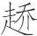
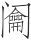
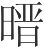
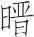
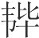
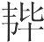
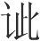
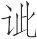

 先识览第四

# 先识

*【题解】*

《先识览》八篇主要论述与君道有关的认识论、方法论。

第一篇《先识》论述君主要识贤、任贤。贤人能够洞察事物，事先看到事物的发展趋势。国家如果将要灭亡，君主不听贤人的谏戒，他们就会离开这个国家。这一点，古今都是一致的。文章列举了夏太史令终古“出奔如商”、殷内史向挚“出亡之周”、晋太史屠黍“归周”等事例，生动有力地说明，有道的贤者之所以先离开所在的国家，是因为他们预见到这些国家有将要灭亡的危险，而这些国家的君主又不采纳他们的忠言。通过这些事例，清楚地表明，君主任用贤人，善于听取贤人意见的重要意义，君主应该把这些当作治国的要务。

一曰：

凡国之亡也，有道者必先去，古今一也。地从于城，城从于民，民从于贤。故贤主得贤者而民得，民得而城得，城得而地得。夫地得岂必足行其地、人说其民哉？得其要而已矣。

*【译文】*

第一：

凡是国家濒于灭亡的时候，有道之人一定会先离开，古今都是一样的。土地的归属取决于城邑的归属，城邑的归属取决于人民的归属，人民的归属取决于贤人的归属。所以，贤明的君主得到贤人辅佐，人民自然就得到了；得到人民，城邑自然就得到了；得到城邑，土地自然就得到了。土地的获得难道一定要亲自去巡视那里，亲自劝说那里的人民吗？只要得到根本就够了。

夏太史令终古出其图法(1)，执而泣之。夏桀迷惑，暴乱愈甚。太史令终古乃出奔如商(2)。汤喜而告诸侯曰：“夏王无道，暴虐百姓，穷其父兄(3)，耻其功臣，轻其贤良，弃义听谗，众庶咸怨，守法之臣(4)，自归于商。”

*【注释】*

(1)太史令：官职名。掌典册、祭祀、天文历算等。终古：人名。图法：图录和法典。

(2)“太史”句：传说桀凿池为夜宫，男女杂处，三旬不理朝政。终古执其图法泣谏，桀不听，终古遂出奔商。如，到……去。

(3)穷：困窘。

(4)守法之臣：指夏太史令终古。守法，掌管法典。

*【译文】*

夏朝的太史令终古拿出图录法典，抱着哭泣。夏桀执迷不悟，更加暴虐荒淫。终古于是出逃投奔商。商汤高兴地告诉诸侯说：“夏王无道，残害百姓，逼迫父兄，侮辱功臣，轻慢贤人，抛弃礼义，听信谗言。众人都怨恨他，他的掌管法典的臣子已自行归顺了商。”

殷内史向挚见纣之愈乱迷惑也(1)，于是载其图法，出亡之周(2)。武王大说，以告诸侯曰：“商王大乱，沈于酒德(3)，辟远箕子(4)，爰近姑与息(5)。妲己为政(6)，赏罚无方(7)，不用法式，杀三不辜(8)，民大不服。守法之臣，出奔周国(9)。”

*【注释】*

(1)内史：官职名。掌著作简册、策命官爵等。向挚：人名。

(2)之：到……去。

(3)酒德：酗酒的行为。

(4)辟：躲避。这个意义后来写作“避”。

(5)爰：乃。姑：妇女，指宠妃。息：小儿，这里指男宠。

(6)妲（dá）己：纣的宠妃。

(7)方：法则，原则。

(8)杀三不辜：指剖比干之心，折材士之股，刳（kū）孕妇而观其胞胎。不辜，无罪的人。

(9)周国：周的国都。

*【译文】*

殷商的内史向挚，看到纣王越来越淫乱昏惑，于是用车载着殷商图录法典出逃投奔周。武王非常高兴，把这事告诉诸侯说：“商王昏乱至极，沉湎于饮酒作乐，躲避疏远箕子，亲近妇女和小人，妲己参与政事，赏罚没有准则，不依法度行事，残杀三个无辜的人，人民大为不服。他的掌管图录法典的臣子已出逃到周的国都。”

晋太史屠黍见晋之乱也，见晋公之骄而无德义也，以其图法归周。周威公见而问焉(1)，曰：“天下之国孰先亡？”对曰：“晋先亡。”威公问其故，对曰：“臣比在晋也(2)，不敢直言，示晋公以天妖(3)，日月星辰之行多以不当。曰(4)：‘是何能为？’又示以人事多不义，百姓皆郁怨。曰：‘是何能伤？’又示以邻国不服，贤良不举。曰：‘是何能害？’如是，是不知所以亡也。故臣曰晋先亡也。”居三年，晋果亡(5)。威公又见屠黍而问焉，曰：“孰次之？”对曰：“中山次之(6)。”威公问其故，对曰：“天生民而令有别，有别，人之义也(7)，所异于禽兽麋鹿也，君臣上下之所以立也。中山之俗，以昼为夜，以夜继日，男女切倚(8)，固无休息，康乐(9)，歌谣好悲，其主弗知恶。此亡国之风也。臣故曰中山次之。”居二年，中山果亡。威公又见屠黍而问焉，曰：“孰次之？”屠黍不对。威公固问焉，对曰：“君次之。”威公乃惧，求国之长者，得义莳、田邑而礼之(10)，得史、赵骈以为谏臣(11)，去苛令三十九物(12)，以告屠黍。对曰：“其尚终君之身乎！”曰(13)：“臣闻之，国之兴也，天遗之贤人与极言之士(14)；国之亡也，天遗之乱人与善谀之士。”威公薨，肂九月不得葬(15)，周乃分为二(16)。故有道者之言也，不可不重也。

*【注释】*

(1)周威公：战国时小国西周国君。焉：之，代屠黍。

(2)比（bì）：近来。

(3)天妖：不吉祥的天象。妖，不祥的征兆。

(4)曰：主语是晋公。

(5)晋果亡：这里指晋幽公遇乱而死。

(6)中山：春秋时白狄别支鲜虞族建立的国家，战国时改称中山，位于今河北省中部偏西一带。

(7)人之义：指人伦。

(8)切（qiè）倚：耳鬓厮磨，互相偎依。形容十分亲昵。他书或作“切”。切，贴近。倚，依。

(9)康乐：“康乐”上当有“淫昏”二字，今本疑脱（依许维遹说）。康，安。

(10)义莳、田邑：都是当时的贤人。

(11)史、赵骈：都是当时的正直之人。

(12)物：事。

(13)曰：主语是屠黍，下文是进一步论述，故又用一“曰”字。

(14)极言：尽言，敢于把所有的话都说出来。

(15)肂（sì）：暂殡，把棺柩暂时埋在地中待以后安葬。

(16)周乃分为二：周威公死后，小国周分裂为西周、东周二小国。

*【译文】*

晋国的太史屠黍，看到晋国混乱，看到晋国君主骄横而没有德义，于是带着晋国的图录法典归顺周国。周威公接见他并问道：“天下的诸侯国哪个先灭亡？”屠黍回答说：“晋国先灭亡。”威公问其原因，屠黍回答说：“我前一段在晋国的时候，不敢直言劝谏，我拿天象的异常，日月星辰的运行多不合度次的反常现象启示晋君，他说：‘这些又能怎么样？’我又拿人事的处理大多不符合道义，百姓都烦闷怨恨的情况启示他，他说：‘这些又能有什么妨害？’我又拿邻国不归服，贤人得不到举用的情况启示他，他说：‘这些又能有什么危害？’像这样，就是不了解国家灭亡的原因啊。所以我说晋国先灭亡。”过了三年，晋国果然灭亡了。威公又接见屠黍，问他说：“哪一国接着要灭亡？”屠黍回答说：“中山国接着要灭亡。”威公问其原因，屠黍回答说：“上天生下人来就让男女有别。男女有别，这是人伦大义，是人与禽兽麋鹿不同的地方，是君臣上下所以确立的基础。中山国的习俗，以日为夜，夜以继日，男女耳鬓厮磨，互相偎依，没有止息之时，纵情安逸享乐，歌唱喜好悲声，对这种习俗，中山国的君主不知厌恶，这是亡国的风俗啊。所以我说中山国接着要灭亡。”过了两年，中山国果然灭亡了。威公又接见屠黍，问他说：“哪一国接着要灭亡？”屠黍不回答。威公坚持问他，他回答说：“您接着要灭亡。”威公这才害怕了，访求国中德高望重的人，得到义莳、田邑，对他们以礼相待，得到史、赵骈，让他们作谏官，废除了苛刻的法令三十九条。威公把这些情况告诉了屠黍，屠黍回答说：“这大概可以保您一生平安吧！”又说：“我听说过，国家将兴盛的时候，上天给它降下贤人和敢于直言相谏之人；国家将灭亡的时候，上天给它降下乱臣贼子和善于阿谀谄媚之徒。”威公死了，暂殡九个月不得安葬，周国于是分裂为两个小国。所以有道之人的话，不可以不重视啊。

周鼎著饕餮(1)，有首无身，食人未咽，害及其身，以言报更也(2)。为不善亦然。

*【注释】*

(1)饕餮（tāotiè）：古代传说中一种贪食的恶兽。钟鼎彝器上常铸刻其头部形状作为装饰。

(2)报更：报偿。这句的意思是说，寓告诫之义，“周鼎著饕餮”象征残害人者立刻得到报应，正如饕餮食人，尚未及咽，其身已残亡。

*【译文】*

周鼎铸上饕餮纹，有头没有身子，吃人未及下咽，祸害已连累自身，这是表明恶有恶报啊。做不善的事也是这样。

白圭之中山(1)，中山之王欲留之，白圭固辞，乘舆而去。又之齐，齐王欲留之仕，又辞而去。人问其故，曰：“之二国者皆将亡(2)。所学有五尽(3)。何谓五尽？曰：莫之必(4)，则信尽矣；莫之誉，则名尽矣；莫之爱，则亲尽矣；行者无粮，居者无食，则财尽矣；不能用人、又不能自用，则功尽矣。国有此五者，无幸必亡。中山、齐皆当此。”若使中山之王与齐王闻五尽而更之，则必不亡矣。其患不闻，虽闻之又不信。然则人主之务，在乎善听而已矣。夫五割而与赵，悉起而距军乎济上，未有益也。是弃其所以存，而造其所以亡也。

*【注释】*

(1)白圭：魏人。中山：指赵武灵王所灭的中山，与上文中山当属二国。

(2)之：此。

(3)所学：等于说“所闻”。

(4)必：相信。

*【译文】*

白圭到中山国，中山国的君主想要留下他，白圭坚决谢绝，乘车离开了。又到了齐国，齐国的君主想要留他做官，他又谢绝，离开了齐国。有人问他为什么，他说：“这两个国家都将要灭亡。我听说有‘五尽’，什么叫‘五尽’？就是：没有人信任他，那么信义就丧尽了；没有人赞誉他，那么名声就丧尽了；没有人喜爱他，那么亲人就丧尽了；行路的人没有干粮、居家的人没有食物，那么财物就丧尽了；不能任用人，又不能发挥自己的作用，那么功业就丧尽了。国家有这五种情况，必定灭亡，无可幸免。中山、齐国都正符合这五种情况。”假如让中山国的君主和齐国的君主闻知“五尽”，并改正自己的恶行，那就一定不会灭亡了。他们的祸患在于没有听到这些话，即使听到了又不相信。这样看来，君主需要努力做的，在善于听取意见罢了。中山国五次割让土地给赵国，齐湣王率领全部军队在济水一带抵御以燕国为首的五国军队，都没有什么益处，都没有逃脱国亡身死的下场。这是由于他们抛弃了那些能使国家生存的东西，而走上了使自己灭亡的道路。

# 观世

*【题解】*

本篇仍在论述君主必须求贤、知贤、礼贤的道理。有道之士不能被君主礼遇，是世道混乱的根本原因。因此，君主必须致力于访求有道之士。“得士”的关键在于君主要真正了解、礼遇、任用有道之士，只有这样，他们的聪明才智才能充分发挥出来。文章以晏子救人于厄为例，具体说明对待贤士应该采取的正确态度。文章最后举列子谢绝子阳之粟一例，意在赞扬有道之士的“先识”，赞扬他们能够预见到事物的发展变化，通晓“性命之情”，这与上篇“先识”之意是相通的。

二曰：

天下虽有有道之士，国犹少。千里而有一士，比肩也(1)；累世而有一圣人，继踵也。士与圣人之所自来，若此其难也，而治必待之，治奚由至(2)？虽幸而有，未必知也，不知则与无贤同。此治世之所以短，而乱世之所以长也。故王者不四(3)，霸者不六(4)，亡国相望，囚主相及。得士则无此之患。此周之所封四百余(5)，服国八百余，今无存者矣。虽存，皆尝亡矣。贤主知其若此也，故日慎一日，以终其世。譬之若登山，登山者，处已高矣，左右视，尚巍巍焉山在其上(6)。贤者之所与处，有似于此。身已贤矣，行已高矣，左右视，尚尽贤于己。故周公旦曰：“不如吾者，吾不与处，累我者也(7)；与我齐者，吾不与处，无益我者也。”惟贤者必与贤于己者处。贤者之可得与处也，礼之也。

*【注释】*

(1)比肩：并肩，肩靠着肩。

(2)奚：何。由：从。

(3)王者不四：这是对“三王”而言。

(4)霸者不六：这是对春秋“五霸”而言。

(5)封：指分封诸侯。

(6)巍巍焉：高峻的样子。焉，词尾。

(7)累：牵累。

*【译文】*

第二：

天下即使有有道之士，在一国里也很少。如果方圆千里有一个士，那就可以称得上是肩靠着肩了；如果几代出一个圣人，那就可以称得上是脚挨着脚了。士和圣人的出现，竟这样的困难，可是国家的安定却一定得依靠他们，像这样，国家安定的局面怎么能出现？即使幸或有贤人，也未必被人知道。有贤人而不被人知道，那就跟没有贤人一样。这就是安定的世道之所以很短，而混乱的世道之所以很长的原因啊。所以，自古成就王业的人没有出现四位，称霸诸侯的人没有出现六位，被灭亡的国家一个连着一个，被囚禁的君主一个接着一个。得到士就没有这样的祸患了。这就是为什么周朝所封的四百多个诸侯、归服的八百多个国家如今没有能存在的原因。即便有存在的，也都曾经灭亡过。贤明的君主知道这种情况，所以一天比一天谨慎，以保自己终身平安。比如说登山，登山的人，登到的地方已经很高了，向左右看看，高峻的山还在上边呢。贤人和人相处与此相似。自己已经很贤明了，品行已经很高尚了，向左右看看，还尽是超过自己的人。所以周公旦说：“不如我的人，我不跟他在一起，这是牵累我的人；跟我一样的人，我不跟他在一起，这是对我没有益处的人。”只有贤人一定跟超过自己的人在一起。跟贤人在一起是能够办到的，那就是以礼对待他们。

主贤世治，则贤者在上；主不肖世乱，则贤者在下。今周室既灭，天子既废，乱莫大于无天子。无天子则强者胜弱，众者暴寡，以兵相刬(1)，不得休息。而佞进(2)。今之世当之矣。故欲求有道之士，则于江河之上，山谷之中，僻远幽闲之所，若此则幸于得之矣。太公钓于滋泉(3)，遭纣之世也，故文王得之。文王，千乘也；纣，天子也。天子失之，而千乘得之，知之与不知也。诸众齐民(4)，不待知而使，不待礼而令。若夫有道之士，必礼必知，然后其智能可尽也。

*【注释】*

(1)刬（chǎn）：铲除，消灭。

(2)而佞进：疑当在上文“贤者在下”之下（依王念孙说）。佞，奸佞小人。进，受到举用。

(3)滋泉：水名。疑即今陕西渭水。

(4)齐民：平民。

*【译文】*

君主贤明，世道安定，贤人就在上位；君主不肖，世道混乱，贤人就在下位，而奸佞小人受到提拔重用。现在周王室已经灭亡，天子已经废黜，世道混乱没有比无天子更严重的了。没有天子，强大的就胜过弱小的，人多势众的就欺凌势孤力单的，用军队互相残杀，无法止息。如今的世道就正是这样。所以想要访求有道之士，就应该到江河之滨，山谷之中，僻远幽静之处去访求，这样或许有幸能得到他们。太公望在滋泉边钓鱼，是因为正遭逢纣当政的时代，所以周文王得到了他。文王只是拥有千辆兵车的诸侯，纣是天子。然而天子失去了太公，而诸侯却得到了太公，这是因为文王了解太公，而纣不了解太公啊。那些平民百姓，无须了解就可以役使他们，无须礼遇就可以命令他们。至于有道之士，一定要礼遇他们，一定要了解他们，然后才可以让他们把智慧才能全部献出来。

晏子之晋(1)，见反裘负刍息于涂者(2)，以为君子也，使人问焉，曰：“曷为而至此？”对曰：“齐人累之(3)，名为越石父。”晏子曰：“嘻！”遽解左骖以赎之(4)，载而与归。至舍，弗辞而入。越石父怒，请绝。晏子使人应之曰：“婴未尝得交也，今免子于患，吾于子犹未邪？”越石父曰：“吾闻君子屈乎不己知者(5)，而伸乎己知者。吾是以请绝也。”晏子乃出见之，曰：“向也见客之容而已，今也见客之志。婴闻察实者不留声(6)，观行者不讥辞(7)，婴可以辞而无弃乎(8)？”越石父曰：“夫子礼之，敢不敬从。”晏子遂以为客。俗人有功则德(9)，德则骄。今晏子功免人于厄矣(10)，而反屈下之，其去俗亦远矣。此令功之道也(11)。

*【注释】*

(1)晏子：名婴，字平仲，春秋时齐国大夫，后继任齐卿，历仕灵公、庄公、景公三世。

(2)反裘：翻穿皮衣。古人穿皮衣一般是毛朝外，这里的“反裘”指毛朝里穿，为的是爱惜毛。刍（chú）：喂牲口的草。涂：道路。

(3)累：通“缧”，本指拘系犯人的绳索，引申为囚禁。

(4)遽：立刻。骖：驾车时辕马两旁的马。

(5)不己知：不了解自己。“己”是“知”的宾语。下句“己知”，即知己之意。

(6)留：留意，这里有察的意思。

(7)讥：察，查问。辞：言辞。

(8)辞：谢罪。弃：被动用法，被拒绝。

(9)德：用如动词，自认为有德。

(10)厄：困境。

(11)令功：据《晏子春秋》、《新序》当作“全功”。

*【译文】*

晏子到晋国去，看见一个反穿皮衣背着草的人正停在路边。晏子认为这人是个君子，就派人问他说：“你为什么到了这里？”那人回答说：“我给齐人为奴，名叫越石父。”晏子听了以后说：“噢！”立刻解下车左边的马把这个人赎了出来，跟他一起乘车回去。到了馆舍，晏子不向他告辞就进去了。越石父很生气，请求与晏子绝交。晏子派人回答他说：“我不曾跟你交朋友啊。现在我从患难中把你解救出来，我对你还不可以吗？”越石父说：“我听说君子在不了解自己的人面前可以忍受屈辱，在已经了解自己的人面前就要挺胸做人。因此，我要跟您绝交。”晏子于是出来见他，说：“刚才只是看到客人的容貌罢了，现在才看到客人的心志。我听说考察人的实际的人不留意人的名声，观察人的行为的人不考虑人的言辞。我可以向您谢罪而不被拒绝吗？”越石父说：“先生您以礼对待我，我怎敢不恭敬从命！”晏子于是把他待为上宾。世俗之人有功劳就自以为对别人有恩德，自以为对别人有恩德就傲慢。现在晏子有从困境中解救人的功劳，却反而对被救之人很谦卑，他超出世俗已经相当远了。这就是保全功劳的方法啊。

子列子穷(1)，容貌有饥色。客有言之于郑子阳者，曰：“列御寇，盖有道之士也，居君之国而穷，君无乃为不好士乎？”郑子阳令官遗之粟数十秉(2)。子列子出见使者，再拜而辞。使者去，子列子入，其妻望而拊心曰(3)：“闻为有道者妻子，皆得逸乐。今妻子有饥色矣，君过而遗先生食(4)，先生又弗受也。岂非命也哉？”子列子笑而谓之曰：“君非自知我也，以人之言而遗我粟也，至已而罪我也(5)，有罪且以人言(6)。此吾所以不受也。”其卒民果作难，杀子阳。受人之养而不死其难，则不义；死其难，则死无道也。死无道，逆也。子列子除不义、去逆也，岂不远哉？且方有饥寒之患矣，而犹不苟取，先见其化也。先见其化而已动(7)，远乎性命之情也(8)。

*【注释】*

(1)子列子：即列子，列御寇，战国时郑人，道家人物。子，“夫子”之意，冠于列子之前，是对列子的尊称。

(2)秉：古量名，十六斛为一秉。

(3)望：怨。拊心：手拍胸膛，表示气愤。

(4)过：访，探望。

(5)已而：不久，表示时间短暂。

(6)有：通“又”。罪：当为衍文（依毕沅说）。

(7)已：通“以”。动：采取相应的行动，指谢绝子阳的馈赠。

(8)远：疑为“达”字之误（依毕沅说）。

*【译文】*

列子很贫困，脸上现出饥饿的气色。有个宾客把这种情况告诉给郑相子阳，说：“列御寇是有道之士，居住在您的国家却很贫困，您恐怕是不喜欢士吧？”子阳让官吏送给列子几百石粮食。列子出来会见使者，拜而又拜，谢绝了。使者离开了，列子进了门，他的妻子怨恨地捶着胸脯说：“听说有道之人的妻子儿女都能得到安乐。如今妻子儿女已经面有饥色了，相国派人探望并给先生您送来吃的，先生您又不接受。我们岂不是命中注定要受贫困吗？”列子笑着对她说：“相国自己并不了解我，是因为别人的话才送给我粮食，过不了多久，同样又将会因为别人的话治我的罪。这就是我不接受的原因。”后来人民果然发难，杀死了子阳。接受了人家的供养，却不为他遭难而死，就是不义，为他遭难而死，就是为无道之人而死。为无道之人而死，就是悖逆。列子免除不义、避开悖逆，岂不是很远吗？正当他有饥寒之苦的时候，尚且不肯随随便便地接受别人的馈赠，这是因为事先预见到了事情的发展变化。事先预见到事物的发展变化，从而采取相应的行动，这就通晓性命的真情了。

# 知接

*【题解】*

“知接”是智力所及的意思。本篇就是论述智力所及与知贤的道理的。人的智力所及，不能事事皆知，因此君主不能自以为智而应该举用贤人，采纳忠言，这样，国家、君主就不会有灭亡的危险了。文章以管仲有疾，桓公去探望一例赞扬了管仲的“先见其化”远见，及桓公晚年自以为智酿成的悲剧。

三曰：

人之目，以照见之也(1)，以瞑则与不见(2)，同(3)。其所以为照、所以为瞑异。瞑士未尝照(4)，故未尝见。瞑者目无由接也(5)，无由接而言见，(6)。智亦然。其所以接智、所以接不智同，其所能接、所不能接异。智者，其所能接远也；愚者，其所能接近也。所能接近而告之以远化，奚由相得？无由相得，说者虽工(7)，不能喻矣(8)。戎人见暴布者而问之曰(9)：“何以为之莽莽也(10)？”指麻而示之。怒曰：“孰之壤壤也(11)，可以为之莽莽也！”故亡国非无智士也，非无贤者也，其主无由接故也。无由接之患，自以为智，智必不接。今不接而自以为智，悖。若此则国无以存矣，主无以安矣。智无由接，而自知弗智，则不闻亡国，不闻危君。

*【注释】*

(1)照：同“昭”，明亮。这里指睁着眼睛。

(2)瞑：闭着眼睛。与：疑是衍文。

(3)同：指看见或看不见眼睛都是相同的。

(4)瞑士：即下文“瞑者”。

(5)无由接：没有办法接触外物。

(6)：同“谎”，诬妄，欺骗。

(7)工：指善辩。

(8)喻：用如使动，使……明白。

(9)暴（pù）：晒。这个意义后来写作“曝”。布：麻布。

(10)为：这里是织的意思。莽莽：长大的样子。

(11)孰：何。壤壤：纷乱的样子。

*【译文】*

第三：

人的眼睛，睁着才能看见东西，闭上就看不见，看见或看不见，眼睛是相同的。但接触外物时，或睁眼、或闭眼却是不同的。闭着眼睛不曾睁开，所以从未看见过。闭着眼睛无法与外物接触，无法与外物接触却说看见了，这是欺骗。智力也是这样。人们的智力达到或达不到，凭借的条件是相同的，但接触外物时，或聪明、或愚笨却是不同的。聪明的人，他们的智力所及范围很远；愚笨的人，他们的智力所及范围很近。智力所及范围很近的人，却告诉他长远的变化趋势，怎么能理解？对于无法理解的人，游说的人即使善辩，也无法让他明白。有个戎人看到一个晒布的，就问他说：“用什么东西织得这样长大呢？”那个人指着麻让戎人看。戎人生气地说：“哪里有这样乱纷纷的东西可以织得这样长大呢！”所以灭亡的国家不是没有聪明之士，也不是没有贤德之人，而是因为亡国的君主智力不及，无法接触他们的缘故啊。无法接触他们所带来的祸患是自以为聪明，这样智力势必达不到。如果智力达不到却又自以为聪明，这是胡涂。像这样，国家就无法生存了，君主就无法安定了。如果君主智力达不到，而自知智力不及，那样就不会有灭亡的国家，不会有处于险境的君主了。

管仲有疾，桓公往问之，曰：“仲父之疾病矣(1)，将何以教寡人？”管仲曰：“齐鄙人有谚曰：‘居者无载，行者无埋(2)。’今臣将有远行(3)，胡可以问？”桓公曰：“愿仲父之无让也。”管仲对曰：“愿君之远易牙、竖刁、常之巫、卫公子启方(4)。”公曰：“易牙烹其子以慊寡人(5)，犹尚可疑邪？”管仲对曰：“人之情，非不爱其子也，其子之忍(6)，又将何有于君？”公又曰：“竖刁自宫以近寡人，犹尚可疑邪？”管仲对曰：“人之情，非不爱其身也，其身之忍，又将何有于君？”公又曰：“常之巫审于死生，能去苛病，犹尚可疑邪？”管仲对曰：“死生，命也。苛病，失也(7)。君不任其命、守其本(8)，而恃常之巫，彼将以此无不为也。”公又曰：“卫公子启方事寡人十五年矣，其父死而不敢归哭，犹尚可疑邪？”管仲对曰：“人之情，非不爱其父也，其父之忍，又将何有于君？”公曰：“诺。”管仲死，尽逐之。食不甘，宫不治，苛病起，朝不肃(9)。居三年，公曰：“仲父不亦过乎！孰谓仲父尽之乎(10)！”于是皆复召而反(11)。明年，公有病，常之巫从中出曰：“公将以某日薨。”易牙、竖刁、常之巫相与作乱，塞宫门，筑高墙，不通人，矫以公令。有一妇人逾垣入，至公所。公曰：“我欲食。”妇人曰：“吾无所得。”公又曰：“我欲饮。”妇人曰：“吾无所得。”公曰：“何故？”对曰：“常之巫从中出曰：‘公将以某日薨。’易牙、竖刁、常之巫相与作乱，塞宫门，筑高墙，不通人，故无所得。卫公子启方以书社四十下卫(12)。”公慨焉叹，涕出曰：“嗟乎！圣人之所见，岂不远哉！若死者有知，我将何面目以见仲父乎？”蒙衣袂而绝乎寿宫(13)。虫流出于户，上盖以杨门之扇(14)，三月不葬(15)。此不卒听管仲之言也。桓公非轻难而恶管子也，无由接见也(16)。无由接，固却其忠言(17)，而爱其所尊贵也(18)。

*【注释】*

(1)仲父：桓公尊称管仲为“仲父”。病：病重，病危。

(2)“居者”二句：管仲引此俗谚意在说明，自己病危将死，不能再考虑其他无关的事情了。

(3)远行：指死。这是一种委婉的说法。

(4)常之巫：巫者。他书或作“堂巫”。启方：卫国的公子，在齐国做官，齐桓公的宠臣之一。他书或作“开方”。

(5)慊（qiè）：惬意，满足。这里用如使动。

(6)忍：狠心。此句为宾语前置句式，“其子”是“忍”的宾语，“之”复指前置的宾语。下文“其身之忍”、“其父之忍”句式与此句同。

(7)失：指精神失其守。

(8)任：听凭。

(9)肃：整饬。

(10)尽：指尽可听从。

(11)反：返，用如使动，让……回来。

(12)书社：古代二十五家为社，把社内人名登录在册，称之书社。下卫：降卫。

(13)袂（mèi）：衣袖。绝：气绝身亡。寿宫：宫中寝室。

(14)杨门：当是门名（依高诱说）。

(15)三月不葬：《史记·齐世家》、《左传》作“三月不殡，九月不葬”。殡，停柩。

(16)见：疑是衍文（依毕沅说）。

(17)固：通“故”。却：弃，不采纳。

(18)所尊贵：指易牙、竖刁、常之巫、卫公子启方等宠臣。

*【译文】*

管仲生了重病，桓公去探望他，说：“仲父您的病很严重了，您有什么话教诲我呢？”管仲说：“齐国的鄙野之人有句谚语说：‘家居的人不用准备外出时车上装载的东西，行路的人不用准备家居时需要埋藏的东西。’我将要永远地走了，哪还值得询问？”桓公说：“希望仲父您不要推辞。”管仲回答说：“希望您疏远易牙、竖刁、常之巫、卫公子启方。”桓公说：“易牙不惜煮了自己的儿子以满足我的口味，这样的人还可以怀疑吗？”管仲回答说：“人的本性不是不爱自己的儿子啊，他连自己的儿子都狠心煮死了，对您又能怎么样呢？”桓公又说：“竖刁自己阉割了自己以便接近侍奉我，这样的人还可以怀疑吗？”管仲回答说：“人的本性不是不爱自己的身体啊，他连自身都狠心阉割了，对您又怎么能热爱呢？”桓公又说：“常之巫能明察死生，能驱除鬼降给人的疾病，这样的人还可以怀疑吗？”管仲回答说：“死生是命中注定的，鬼降给人的疾病是由于精神失守引起的。您不听凭天命，守住根本，却依仗常之巫，他将借此无所不为了。”桓公又说：“卫公子启方侍奉我十五年了，他的父亲死了，他都不敢回去哭丧，这样的人还可以怀疑吗？”管仲回答说：“人的本性不是不爱自己的父亲啊，他连自己的父亲都那样狠心对待，对您又怎么能热爱呢？”桓公说：“好吧。”管仲死了，桓公把易牙等人全部驱逐了。桓公吃饭不香甜，后宫不安定，疫病四起，朝政混乱。过了三年，桓公说：“仲父也太过分了吧！谁说仲父的话都得听从呢！”于是又把易牙等人都召了回来。第二年，桓公病了，常之巫从宫内出来说：“君主将在某日去世。”易牙、竖刁、常之巫一起作乱，堵塞了宫门，筑起了高墙，不让人进去，假称这是桓公的命令。有一个妇人翻墙进入宫内，到了桓公那里。桓公说：“我想吃饭。”妇人说：“我没有地方能弄到饭。”桓公又说：“我想喝水。”妇人说：“我没有地方能弄到水。”桓公说：“这是为什么？”妇人回答说：“常之巫从宫内出来说：‘君主将在某日去世。’易牙、竖刁、常之巫一起作乱，堵塞了宫门，筑起了高墙，不让人进来，所以没有地方能弄到饭和水。卫公子启方带着四十社的土地和人口投降了卫国。”桓公慨然叹息，流着泪说：“唉！圣人所预见到的，难道不是很远吗！如果死者有知，我将有什么脸去见仲父呢？”于是用衣袖蒙住脸，死在寿宫。尸虫爬出门外，尸体上盖着杨门的门扇，过了三个月不能下葬。这是因为桓公不能始终听从管仲的话啊。桓公不是轻视灾难、厌恶管仲，而是智力不及，无法知道管仲的话是对的。正因为无法知道，所以不采纳管仲的忠言，反而亲近自己所宠信的那几个小人。

# 悔过

*【题解】*

本篇着重论述智所不至的危害及知错能改的重要性。秦穆公知有所不至，不听蹇叔之谏，以至全军覆没，三帅被俘。本篇以“悔过”为题，意在说明：君主“智不至”，依然能够成就一番事业，关键在于能够悔过自新。秦穆公终成霸业便是一个明证。

四曰：

穴深寻(1)，则人之臂必不能极矣。是何也？不至故也。智亦有所不至。所不至，说者虽辩，为道虽精，不能见矣。故箕子穷于商(2)，范蠡流乎江(3)。

*【注释】*

(1)寻：古代长度单位，八尺为寻。

(2)箕子穷于商：指箕子被商纣囚禁。箕子，商纣叔伯父，封国于箕，故称箕子。商纣暴虐，箕子谏不听，于是披发佯狂为奴，被纣囚禁。穷，困窘。

(3)范蠡流乎江：据《国语·越语下》记载，范蠡辅佐越王勾践灭吴后，“乘轻舟以浮于五湖”。流，浮。

*【译文】*

第四：

洞深八尺，那么人的手臂就不能探到底了。这是为什么呢？是因为手达不到的缘故。智力也有达不到的地方。智力达不到，游说的人即使善辩，阐发的道理即使精辟，也不能使他体会到。所以箕子被商纣囚禁，范蠡飘泊于三江五湖。

昔秦缪公兴师以袭郑(1)，蹇叔谏曰(2)：“不可。臣闻之，袭国邑，以车不过百里，以人不过三十里，皆以其气之与力之盛至(3)，是以犯敌能灭，去之能速。今行数千里，又绝诸侯之地以袭国，臣不知其可也。君其重图之(4)。”缪公不听也。蹇叔送师于门外而哭曰：“师乎！见其出而不见其入也。”蹇叔有子曰申与视，与师偕行。蹇叔谓其子曰：“晋若遏师必于殽(5)。女死，不于南方之岸(6)，必于北方之岸，为吾尸女之易(7)。缪公闻之，使人让蹇叔曰(8)：“寡人兴师，未知何如。今哭而送之，是哭吾师也。”蹇叔对曰：”“臣不敢哭师也。臣老矣，有子二人，皆与师行。比其反也(9)，非彼死，则臣必死矣，是故哭。”

*【注释】*

(1)秦缪公：即秦穆公，春秋五霸之一。缪，通“穆”。

(2)蹇（jiǎn）叔：秦穆公时任上大夫。

(3)（qiáo）：壮盛。

(4)其：表示委婉的语气词。重：深。图：谋，考虑。

(5)遏：这里是阻击的意思。殽（xiáo）：通“崤”，山名，在今河南洛宁西北。

(6)岸：山崖。

(7)尸：用如动词，给……收尸。女，你们。

(8)让：责备。

(9)比：及，等到。反：返回。

*【译文】*

从前，秦穆公发兵偷袭郑国，蹇叔劝阻说：“不可以。我听说过，偷袭他国城邑，用战车不能超过百里，用步兵不能超过三十里，都是凭着士兵士气旺盛和力量强盛时到达，因此进攻敌人就能够消灭他们，撤离战场就能够迅速离去。现在要行军几千里，又要穿越其他诸侯国的领土去偷袭他国，我不知道那怎么可以呢！您还是仔细慎重地考虑考虑吧。”穆公不听从他的意见。蹇叔送军队出征送到城门外，哭着说：“将士们啊！我看到你们出征却看不到你们回来啦！”蹇叔的两个儿子申和视跟军队一起出征。蹇叔对他的儿子们说：“晋国如果阻击我军，一定在崤山。你们战死的话，不死在南山边，就一定要死在北山边，以便我给你们收尸时容易识别。”穆公听说了这件事，派人责备蹇叔说：“我发兵出征，还不知道胜负如何。现在你却哭着送行，这是给我的军队哭丧啊。”蹇叔回答说：“我不敢给军队哭丧啊。我老了，有两个儿子都和军队一起出征。等到军队回来的时候，不是他们战死，就一定是我死了，因此我才哭。”

师行过周(1)，王孙满要门而窥之(2)，曰：“呜呼！是师必有疵(3)。若无疵，吾不复言道矣。夫秦非他(4)，周室之建国也。过天子之城，宜橐甲束兵(5)，左右皆下(6)，以为天子礼。今袀服回建(7)，左不轼而右之(8)，超乘者五百乘(9)，力则多矣，然而寡礼，安得无疵？”师过周而东。

*【注释】*

(1)周：指周的东都，即王城。

(2)王孙满：周大夫。要：通“（yuè）”，闭门上闩（依马叙伦说）。

(3)有疵：这里是遭到挫败的意思。

(4)他：其他的，别的。

(5)橐（tuó）甲：把铠甲装在口袋里。橐，口袋，用如动词。

(6)左右：春秋时作战，一般兵车乘甲士三人，驭者居中。左右指驭者两旁的甲士。

(7)袀（jūn）服：即“均服”，指军服上下颜色没有区别。袀，通“均”，上下同色。回建：指车上建置混乱。回，违背。建，兵车上的建置。

(8)左：车左。古时一般战车，御者居中，甲士居左。轼，车前横木。用如动词，扶轼。扶轼是表示敬义的礼节。右：车右，骖乘。“右下”似当作“右下之”。下车才能复有“超乘”的动作。

(9)超乘：跃上战车。这是一种无礼的举动。

*【译文】*

秦军行进经过周的都城，王孙满关上城门上了闩，从门缝里观看秦军，说：“哎呀！这支军队必遭挫折。如果它不遭挫折，以后我就不再议论‘道’了。秦国非他国可比，它是周王室分封的诸侯国。它的军队经过天子的都城，应该收藏起铠甲兵器，战车上驭者左右的甲士都应下车，以此表示向天子行礼。现在这支军队服装上下一色，兵车上建置混乱，左边的将士不凭轼致敬，右边的骖乘下车又跃上车的有五百乘之多。这些人力气固然是很大了，然而缺少礼仪，这样的军队怎么能不遭挫折？”秦军过了周的都城向东行进。

郑贾人弦高、奚施将西市于周，道遇秦师，曰：“嘻！师所从来者远矣。此必袭郑。”遽使奚施归告，乃矫郑伯之命以劳之(1)，曰：“寡君固闻大国之将至久矣(2)。大国不至，寡君与士卒窃为大国忧，日无所与焉(3)，惟恐士卒罢弊与糗粮匮乏(4)。何其久也！使人臣犒劳以璧，膳以十二牛(5)。”秦三帅对曰：“寡君之无使也(6)，使其三臣丙也、术也、视也于东边候之道(7)，过(8)，是以迷惑，陷入大国之地。”不敢固辞，再拜稽首受之(9)。三帅乃惧而谋曰：“我行数千里，数绝诸侯之地以袭人，未至而人已先知之矣，此其备必已盛矣。”还师去之。

*【注释】*

(1)矫：假称，假托。劳：慰劳。

(2)寡君：对别国谦称自己的国君。大国：对别国的尊敬说法，这里指秦国。

(3)日：每日。与：通“豫”（依高亨说），乐。

(4)罢弊：羸弱疲困。糗（qiǔ）粮：干粮。匮（kuì）：缺乏。

(5)膳：用如动词，作为膳食。

(6)寡君之无使也：我们的国君没有可派遣的人。这是客气话。

(7)丙：白乙丙。术：西乞术。视：孟明视。三人是这次战争中秦军的主帅。候：视察。：通“晋”，晋国。

(8)过：超过。这里是走过了的意思。

(9)稽（qǐ）首：古时的一种礼节。跪下，拱手至地，头也至地。整个过程较缓慢。

*【译文】*

郑国商人弦高、奚施西行到周的都城去做买卖，在路上遇到秦国军队，弦高说：“啊！这支军队是从很远的地方来的，这一定是去偷袭郑国。”于是立即让奚施回郑国报告，自己就假托郑国国君的命令去慰劳秦军。弦高说：“我们国君本来很早就听说贵国军队要来了。贵军没有来，我们国君和士兵私下替贵军担忧，每天都为此而心情不愉快，惟恐贵军士兵羸弱疲困，干粮缺乏。怎么这么久才到啊！我们国君派我用璧犒劳贵军，并献给贵军十二头牛作为膳食。”秦军三个主帅回答说：“我们的国君没有合适的人可派遣，派了他的三个臣子丙、术、视到东方察看晋国的道路。没想走过了头，因此迷了路，误入贵国境内。”不敢执意不收，拜而又拜，叩头于地，接受了犒劳的东西。秦军的三个主帅很担心，商议说：“我们行军几千里，多次穿越其他诸侯国的领土去偷袭人家，还没到，人家就已经先知道了，这样看来，他们的准备一定已经很充分了。”于是回师离开了郑国。

当是时也，晋文公适薨，未葬。先轸言于襄公曰(1)：“秦师不可不击也，臣请击之。”襄公曰：“先君薨，尸在堂，见秦师利而因击之，无乃非为人子之道欤！”先轸曰：“不吊吾丧，不忧吾哀，是死吾君而弱其孤也(2)。若是而击，可大强。臣请击之。”襄公不得已而许之。先轸遏秦师于殽而击之，大败之，获其三帅以归。

*【注释】*

(1)先轸（zhěn）：晋国的执政大臣，食邑在原（今河南济源西北），故又称“原轸”。襄公：晋襄公，晋文公之子，名欢，公元前627年—前621年在位。

(2)死吾君：意思是，背弃了我们死去的君主。弱：用如意动。这里有欺侮的意思。

*【译文】*

在这时，正赶上晋文公去世，还没有安葬。先轸对晋襄公说：“秦军不可不袭击，请您允许我去袭击它。”襄公说：“先君去世，尸体还在堂上，看到秦军有利可图就去袭击它，这恐怕不是作为儿子应该遵循的原则吧！”先轸说：“秦国对我们的丧事不表示慰问，对我们的哀痛不表示忧伤，这是背弃了我们的先君，欺侮您年幼。他们这样无情无义，我们去袭击它，可以使晋国大大强盛。请您允许我去袭击它。”襄公不得已才答应了他。先轸在崤山截住并攻击秦军，把它打得大败，俘获了秦军的三个主帅而回。

缪公闻之，素服庙临(1)，以说于众曰：“天不为秦国(2)，使寡人不用蹇叔之谏，以至于此患。”此缪公非欲败于殽也，智不至也。智不至则不信。言之不信，师之不反也从此生。故不至之为害大矣。

*【注释】*

(1)素服：穿上丧服。庙临（lìn）：到祖庙中将此事哭告祖先。临，哭。

(2)为：这里是帮助的意思。

*【译文】*

秦穆公听到这个消息，身穿丧服，到宗庙里哭告祖先，向众人说道：“上天不帮助秦国，才让我没有听从蹇叔的劝谏，以致遭到这样的祸患。”这并不是穆公想在崤山被打败，而是因为智力达不到啊。智力达不到就不相信蹇叔的话。不相信蹇叔的话，结果导致了秦军全军覆没。所以，智力达不到带来的危害真是太大了。

# 乐成

*【题解】*

本篇宣扬了“民不可与虑化举始，而可以乐成功”的观点，并夸大了贤主忠臣在事业成功上的决定作用。文章列举的禹决江水、孔子用于鲁、子产治郑、魏攻中山、史起治邺等事例都是为论证这一思想服务的。

五曰：

大智不形(1)，大器晚成(2)，大音希声(3)。

禹之决江水也，民聚瓦砾。事已成，功已立，为万世利。禹之所见者远也，而民莫之知。故民不可与虑化举始，而可以乐成功(4)。

孔子始用于鲁，鲁人鹥诵之曰(5)：“麛裘而(6)，投之无戾(7)。而麛裘，投之无邮(8)。”用三年，男子行乎涂右，女子行乎涂左(9)，财物之遗者，民莫之举。大智之用，固难逾也(10)。

子产始治郑(11)，使田有封洫(12)，都鄙有服(13)。民相与诵之曰：“我有田畴，而子产赋之。我有衣冠，而子产贮之(14)。孰杀子产，吾其与之(15)。”后三年，民又诵之曰：“我有田畴，而子产殖之(16)。我有子弟，而子产诲之。子产若死，其使谁嗣之？”

使郑简、鲁哀当民之诽也(17)，而因弗遂用，则国必无功矣，子产、孔子必无能矣。非徒不能也，虽罪施(18)，于民可也。今世皆称简公、哀公为贤，称子产、孔子为能。此二君者，达乎任人也。舟车之始见也，三世然后安之(19)。夫开善岂易哉(20)！故听无事治。事治之立也，人主贤也。

*【注释】*

(1)形：用如动词，表现出来。

(2)大器晚成：本指大材须积久始能成器。后多用以指人成就较晚。

(3)大音希声：最大的乐声反而听不出音响。希，少。以上二句见《老子》四十一章。

(4)以：与。

(5)鹥（yì）：通“繄”（依孙诒让说）。句中语气词。诵：这里是怨谤、讽诵的意思。

(6)麛（mí）裘而（bì）：穿着鹿皮衣和蔽膝。麛，小鹿。，朝服的蔽膝。按：古代麛裘为常服，为朝贺之服，二者不得共用。

(7)投：弃。戾：罪。

(8)邮：通“尤”，罪。

(9)涂：道路。这二句是说民知礼义。

(10)逾：通“喻”。知晓。

(11)子产：郑大夫，姓公孙，名侨，字子产，春秋时有名的政治家。

(12)封：田界。洫：水沟。

(13)都鄙有服：城邑、鄙野各有规定的服色。都，与“鄙”对文，泛指城邑。

(14)贮：古代一种财务税（依杨宽说，见《古史新探》）。

(15)与（yǔ）：帮助。

(16)殖：繁殖。这里指增加产量。

(17)郑简：郑简公，名嘉，春秋时郑国国君。鲁哀：鲁哀公，名蒋，春秋时鲁国国君。这两位君主分别是子产、孔子的国君。当：面对。（zǐ）：也作“訾”，毁谤，非议。

(18)罪施：被治罪。

(19)安：习惯。

(20)开：始。

*【译文】*

第五：

最大的智慧不显现，成大器的人出名晚，最优美的乐音难听见。

当禹疏导江水的时候，百姓却堆积瓦砾加以阻挡。等到治水的事业完成，功业建立以后，给子孙万代带来了好处。禹目光远大，可是百姓却没有谁知道这一点。所以，不可以跟普通的百姓商讨改变现状、进行创业开拓的大事，而可以跟他们享受成功的快乐。

孔子刚在鲁国被任用时，鲁国人怨恨地唱道：“穿着鹿皮衣又穿蔽膝，抛弃他没关系。穿着蔽膝又穿鹿皮裘，抛弃他没罪尤。”被任用三年之后，鲁国男子在道路右边行走，女子在道路左边行走；遗失了的财物，没有人拾取。大智的运用，本来就难以让人知晓啊。

子产开始治理郑国时，让田地有沟渠疆界，让城邑、鄙野各有规定的服色。人民一起怨恨地唱道：“我们有田亩，子产征军赋。我们有衣冠，子产收税赋。谁要杀子产，我们去帮助。”三年之后，人民又歌颂他说：“我们有田亩，子产让它增五谷。我们有子弟，子产对他施教育。子产若死去，让谁来接续？”

假使郑简公、鲁哀公面对人民的诽谤非议，就不再任用子产、孔子，那么国家一定无所成就，子产、孔子也一定无法施展才能。不只是不能施展才能，即使被治罪，人民也会赞同的。如今世上都称赞简公、哀公贤明，称赞子产、孔子有才能。这两位君主，很懂得任用人啊。舟、车开始出现的时候，人们都不习惯，过了三代人们才感到习惯。开始做好事难道容易吗！所以听信愚民之言，任何事都办不好。事业之所以成功，全在于君主贤明啊。

魏攻中山，乐羊将(1)。已得中山，还反报文侯(2)，有贵功之色(3)。文侯知之，命主书曰：“群臣宾客所献书者，操以进之。”主书举两箧以进(4)。令将军视之，书尽难攻中山之事也(5)。将军还走(6)，北面再拜曰：“中山之举，非臣之力，君之功也。”当此时也，论士殆之日几矣(7)，中山之不取也，奚宜二箧哉？一寸而亡矣(8)。文侯，贤主也，而犹若此，又况于中主邪？中主之患，不能勿为，而不可与莫为(9)。凡举无易之事(10)，气志视听动作无非是者，人臣且孰敢以非是邪疑为哉(11)？皆壹于为，则无败事矣。此汤、武之所以大立功于夏、商，而句践之所以能报其雠也。以小弱皆壹于为而犹若此(12)，又况于以强大乎！

*【注释】*

(1)乐羊：魏人，为魏文侯将。

(2)报：禀告。文侯：魏文侯，名斯，战国初期魏国国君。

(3)贵功：这里是夸功的意思。

(4)箧（qiè）：箱子一类的东西。

(5)难（nàn）：责难。

(6)还（xuán）走：转身退下几步，表示恭敬惶恐。

(7)论士：议论的人。殆：危害。几，近。

(8)一寸：极言书信之少之短。

(9)莫为：疑作“莫易”（依陶鸿庆说），不中途改变。

(10)举：行。无易：不中途改变。

(11)“人臣”句：大意是，臣下谁还敢认为不对而横加怀疑呢？“非是邪疑”是“以”的宾语。邪，歪曲。

(12)小弱：指汤、武、勾践。汤、武封地仅方百里，勾践臣事吴王夫差，故称小弱。

*【译文】*

魏国攻打中山国，乐羊为将。乐羊攻下中山国以后，回国向魏文侯报告，显出夸功骄傲的神色。文侯察觉到这一点，就命令主管文书的官吏说：“群臣和宾客献上的书信，都拿来送上。”主管文书的官吏搬着两箱书信送上来。文侯让乐将军看这些书信。书信都是责难攻打中山国这件事的。乐将军转身退下几步，向北拜而又拜说：“攻下中山国，不是我的力量，是君主您的功劳啊。”当乐羊攻打中山国的时候，议论的人对这件事的危害一天比一天严重，假使文侯相信了群臣宾客之言，认为中山国不可攻取，那么，哪里用得着两箱书信呢！只需一寸长的书信就足以让乐羊失去功劳了。文侯是贤明的君主，臣下尚且如此，更何况一般的君主呢？一般君主的祸患是，不能不让他去做，又不能让他中途不改变。君主凡是去做中途不改变的事情，思想意志、视听行动无不认为正确，臣下谁还敢认为不对而横加怀疑呢？君臣都专心去做，就没有做不成的事了。这就是汤、武王之所以在灭亡夏、商中大立功业，勾践之所以能够报仇的原因。只要君臣全都专心去做，凭仗弱小的国家尚且能如此，更何况凭仗强大的国家呢？

魏襄王与群臣饮(1)，酒酣，王为群臣祝，令群臣皆得志。史起兴而对曰(2)：“群臣或贤或不肖(3)，贤者得志则可，不肖者得志则不可。”王曰：“皆如西门豹之为人臣也(4)”。史起对曰：“魏氏之行田也以百亩(5)，邺独二百亩(6)，是田恶也。漳水在其旁，而西门豹弗知用，是其愚也。知而弗言，是不忠也。愚与不忠，不可效也。”魏王无以应之。明日，召史起而问焉，曰：“漳水犹可以灌邺田乎？”史起对曰：“可。”王曰：“子何不为寡人为之？”史起曰：“臣恐王之不能为也。”王曰：“子诚能为寡人为之，寡人尽听子矣。”史起敬诺，言之于王曰：“臣为之，民必大怨臣，大者死(7)，其次乃藉臣(8)。臣虽死藉，愿王之使他人遂之也(9)。”王曰：“诺。”使之为邺令。史起因往为之。邺民大怨，欲藉史起。史起不敢出而避之。王乃使他人遂为之。水已行，民大得其利，相与歌之曰：“邺有圣令，时为史公(10)。决漳水，灌邺旁。终古斥卤(11)，生之稻粱。”使民知可与不可，则无所用矣。贤主忠臣，不能导愚教陋，则名不冠后、实不及世矣。史起非不知化也，以忠于主也。魏襄王可谓能决善矣。诚能决善，众虽喧哗，而弗为变。功之难立也，其必由讻讻邪(12)！国之残亡，亦犹此也。故讻讻之中，不可不味也。中主以之讻讻也止善，贤主以之讻讻也立功。

*【注释】*

(1)魏襄王：名嗣，战国时魏国国君。

(2)史起：魏襄王之臣。兴：起，站起来。

(3)或：有的。

(4)西门豹：姓西门，名豹，魏文侯时曾为邺令。让人民开水渠，引漳水灌溉农田。

(5)行田：分配土地给人耕种。

(6)邺：魏地，在今河北临漳西南。

(7)死：其宾语“臣”涉下文省略。

(8)藉（jiè）：践踏，欺凌。

(9)遂：完成。

(10)时：通“是”，此。

(11)终古：久远，自古以来。斥卤：盐碱地。他书或作“舄（xì）卤”、“潟（xì）卤”。斥，指地咸卤。

(12)讻讻（xiōnɡxiōnɡ）：喧闹声。

*【译文】*

魏襄王跟臣子们一起喝酒，喝到正畅快的时候，魏王为臣子们祝酒，让臣子们都能得志。史起站起来回答说：“臣子有的贤明有的不肖，贤明的人得志可以，不肖的人得志就不可以。”魏王说：“让群臣都像西门豹那样当臣子。”史起回答说：“魏国分配给人民土地，每户一百亩，邺地偏偏给二百亩，这说明那里的土地不好。漳水在它的旁边，可是西门豹却不知利用，这说明他很愚蠢。知道这种情况却不报告，这说明他不忠。愚蠢和不忠，不可效法。”魏王无话回答他。第二天，召来史起问他说：“漳水还可以灌溉邺的田地吗？”史起回答说：“可以。”魏王说：“你何不替我去做这件事？”史起说：“我担心您不能做啊。”魏王说：“你如果真的能替我去做这件事，我全都听你的。”史起恭恭敬敬地答应了，并对魏王说：“我去做这件事，那里的人民一定非常怨恨我，严重了会弄死我，次之也会凌辱我。即使我被弄死或被凌辱，希望您派其他人继续完成这件事。”魏王说：“好吧。”派他去当邺令。史起于是去邺开始了引漳工程。邺地的人民非常怨恨史起，想要凌辱他。史起不敢出门，躲了起来。魏王就派别人最终完成了这一工程。水流到了田里，人民大大受益，一起歌颂他说：“邺地有贤令，此人是史公。引漳水，灌邺田。古来盐碱土，能长稻和谷。”假使人民知道什么可做，什么不可做，那就没有任用贤人的必要了。贤主忠臣，如果不能教导愚蠢鄙陋的人，那么名声就不能流传到后世，政绩也不能对当代有利了。史起不是不知道事物的发展趋势，他明知要遭到民众的怨恨，却还要治理漳水，是因为他忠于君主。魏襄王可说是能对善行做出决断了。如果真能对善行做出决断，那么众人即使喧哗，也不会因此而改变。功业之所以难于建立，大概一定是由于众人的吵吵闹闹吧！国家的残破灭亡，也是由于这个原因啊。所以在众人的吵吵闹闹之中，不可不加以研究体会。一般的君主因为众人的吵吵闹闹就停止了行善，贤明的君主却在众人的吵吵闹闹之中建立起功业。

# 察微

*【题解】*

本篇阐发了察微知著的道理。围绕“治乱存亡，其始若秋毫，察其秋毫，则大物不过矣。”这一观点从正反两方面举例加以论证，同时指出智士贤者应该处心积虑，考察事物的端倪，见微知著，防患于未然。还列举了吴楚卑梁之争、宋华元飨士而忘其御、鲁昭公听伤而不辨其义三则事例，说明小处不察，必酿成大患，以历史教训为借鉴，从反面强调了察微的重要。

六曰：

使治乱存亡若高山之与深溪，若白垩之与黑漆(1)，则无所用智，虽愚犹可矣。且治乱存亡则不然(2)。如可知，如可不知(3)；如可见，如可不见。故智士贤者相与积心愁虑以求之(4)，犹尚有管叔、蔡叔之事与东夷八国不听之谋(5)。故治乱存亡，其始若秋毫。察其秋毫，则大物不过矣。

*【注释】*

(1)白垩（è）：白色的土。

(2)且：等于说“而”。

(3)可不：当作“不可”（依毕沅说）。下句同。

(4)愁虑：等于说“积虑”。愁，通“揫”，聚积。

(5)“犹尚”句：管叔、蔡叔为周武王之弟，武王灭商后，分别封于管（今河南郑州）和蔡（今河南上蔡西南）。武王死，成王幼，周公摄政，管叔、蔡叔不服，和武庚（纣王之子）一起叛乱，东夷八国附从，不听王命。

*【译文】*

第六：

假使治和乱、存和亡的区别像高山和深谷，像白土和黑漆那样分明，那就没有必要运用智慧，即使蠢人也可以知道了。然而治和乱、存和亡的区别并不是这样。好像可知，又好像不可知；好像可见，又好像不可见。所以有才智的人、贤明的人都在千思百虑、用尽心思去探求治乱存亡的征兆，尽管如此，尚且有管叔、蔡叔的叛乱事件和东夷八国不听王命的阴谋。所以治乱存亡，它们刚刚出现的时候就像秋毫那样，能够明察秋毫，大事就不会出现过失了。

鲁国之法，鲁人为人臣妾于诸侯(1)，有能赎之者，取其金于府(2)。子贡赎鲁人于诸侯，来而让，不取其金。孔子曰：“赐失之矣(3)。自今以往，鲁人不赎人矣。”取其金，则无损于行；不取其金，则不复赎人矣。子路拯溺者，其人拜之以牛(4)，子路受之。孔子曰：“鲁人必拯溺者矣。”孔子见之以细，观化远也。

*【注释】*

(1)臣：男奴仆。妾：女奴仆。

(2)府：收藏钱财的地方。这里指公家府库。

(3)赐：孔子弟子子贡姓端木，名赐，字子贡。

(4)拜：谢。

*【译文】*

鲁国的法令规定，鲁国人在其他诸侯国给人当奴仆，有能赎出他们的，可以从国库中支取金钱。子贡从其他诸侯国赎出了做奴仆的鲁国人，回来却推辞，不支取金钱。孔子说：“端木赐做错了。从今以后，鲁国人不会再赎人了。”支取金钱，对品行并没有损害；不支取金钱，就不会有人再赎人了。子路救了一个溺水的人，那个人用牛来酬谢他，子路收下了牛。孔子说：“鲁国人一定会救溺水的人了。”孔子能从细小处看到结果，这是由于他对事物的发展变化观察得远啊。

楚之边邑曰卑梁，其处女与吴之边邑处女桑于境上，戏而伤卑梁之处女。卑梁人操其伤子以让吴人(1)，吴人应之不恭，怒，杀而去之。吴人往报之，尽屠其家。卑梁公怒(2)，曰：“吴人焉敢攻吾邑？”举兵反攻之，老弱尽杀之矣。吴王夷昧闻之(3)，怒，使人举兵侵楚之边邑，克夷而后去之。吴、楚以此大隆(4)。吴公子光又率师与楚人战于鸡父(5)，大败楚人，获其帅潘子臣、小帷子、陈夏啮(6)。又反伐郢，得荆平王之夫人以归，实为鸡父之战。凡持国，太上知始，其次知终，其次知中。三者不能，国必危，身必穷。《孝经》曰(7)：“高而不危，所以长守贵也；满而不溢，所以长守富也。富贵不离其身，然后能保其社稷，而和其民人。”楚不能之也。

*【注释】*

(1)子：指上文“处女”。古代男孩女孩都可称“子”。让：责备。

(2)卑梁公：卑梁邑的守邑大夫。楚僭称王，故守邑大夫都称公。

(3)夷昧：春秋时吴国国君，吴王寿梦之子，公元前530年—前527年在位。

(4)隆：通“哄（hònɡ）”，相斗（依孙诒让说）。

(5)公子光：吴王诸樊之子。鸡父：古地名，在今河南固始东南。

(6)潘子臣、小帷子：都是楚国大夫。陈夏啮（niè）：陈国大夫夏啮。鸡父之战，陈助楚，故其大夫为吴所擒。

(7)《孝经》曰：下引文见今《孝经·诸侯章》。

*【译文】*

楚国有个边境城邑叫卑梁，那里的姑娘与吴国边境城邑的姑娘一起在边境上采桑叶，嬉戏时，吴国的姑娘伤了卑梁的姑娘。卑梁人带着受伤的姑娘去责备吴国人，吴国人应答不恭敬，卑梁人很恼怒，杀死了那个吴国人就走了。吴国人去报复，把那个楚国人全家都杀死了。卑梁的守邑大夫大怒，说：“吴国人怎么竟敢攻打我的城邑？”发兵去攻打吴国人，连老弱全都杀死了。吴王夷昧听到这事以后大怒，派人率兵侵犯楚国的边境城邑，攻克楚国边邑，把它夷为平地，然后才离开。吴国、楚国因此展开大战。吴公子光又率领军队在鸡父跟楚国军队交战，把楚军打得大败，俘虏了楚军的主帅潘子臣、小帷子以及陈国的夏啮。又接着攻打郢，俘获了楚平王的夫人，把她带回吴国。这实际上还是鸡父之战的继续。凡是要守住国家，最上等的是洞察事情的开端，其次是预见到事情的结局，再次是随着事情的发展了解它。这三样都做不到，国家一定危险，自身一定困窘。《孝经》上说：“高却不倾危，因此能够长期保住尊贵；满却不外溢，因此能够长期保住富足。富贵不离身，然后才能保住国家，使人民和谐。”楚国恰恰不能做到这些。

郑公子归生率师伐宋(1)。宋华元率师应之大棘(2)，羊斟御(3)。明日将战，华元杀羊飨士，羊斟不与焉(4)。明日战，怒谓华元曰：“昨日之事，子为制(5)；今日之事，我为制。”遂驱入于郑师。宋师败绩，华元虏。夫弩机差以米则不发(6)。战，大机也。飨士而忘其御也，将以此败而为虏，岂不宜哉！故凡战必悉熟偏备(7)，知彼知己，然后可也。

*【注释】*

(1)归生：春秋时郑国大夫，字子家。

(2)华元：春秋时宋国大夫，历事文公、平公三君。大棘：宋邑。共公、故址在今河南柘城西北。

(3)羊斟：宋人，华元的驭手，后奔鲁。御：驾车。

(4)与（yù）：参与，在其中。

(5)制：这里是控制、掌握的意思。

(6)弩机：弩牙，弩上发箭的装置。弩，古代一种利用机械力量发射箭的弓。米：指一个米粒的长度。

(7)悉：全，都。偏：通“遍”。

*【译文】*

郑公子归生率领军队攻打宋国。宋国的华元率领军队在大棘迎敌，羊斟给他作驭手。第二天将要作战，华元杀了羊宴飨甲士，羊斟却不在其中。第二天作战的时候，羊斟愤怒地对华元说：“昨天宴飨的事由你掌握，今天驾车的事该由我掌握了。”于是把车一直赶进郑国军队里。宋国军队大败，华元被俘。弩牙相差一个米粒就不能发射。战争正像一个大的弩牙。宴飨甲士却忘了自己的驭手，将帅因此战败被俘，难道不是应该的吗？所以，凡作战一定要熟悉全部情况，做好全面准备，知己知彼，然后才可以作战。

鲁季氏与郈氏斗鸡(1)，郈氏介其鸡，季氏为之金距(2)。季氏之鸡不胜，季平子怒，因归郈氏之宫(3)，而益其宅。郈昭伯怒，伤之于昭公，曰：“禘于襄公之庙也(4)，舞者二人而已(5)，其余尽舞于季氏。季氏之舞道(6)，无上久矣。弗诛，必危社稷。”公怒，不审(7)，乃使郈昭伯将师徒以攻季氏，遂入其宫。仲孙氏、叔孙氏相与谋曰(8)：“无季氏，则吾族也死亡无日矣。”遂起甲以往(9)，陷西北隅以入之，三家为一，郈昭伯不胜而死。昭公惧，遂出奔齐，卒于乾侯(10)。鲁昭听伤而不辩其义(11)，惧以鲁国不胜季氏，而不知仲、叔氏之恐，而与季氏同患也。是不达乎人心也。不达乎人心，位虽尊，何益于安也？以鲁国恐不胜一季氏，况于三季(12)？同恶固相助(13)。权物若此其过也(14)，非独仲、叔氏也，鲁国皆恐。鲁国皆恐，则是与一国为敌也，其得至乾侯而卒犹远。

*【注释】*

(1)季氏：季孙氏，鲁国最有权势的贵族。此指季平子。郈（hòu）氏：鲁国公室。此指郈昭伯。

(2)为之金距：给鸡套上金属爪。之，代鸡。距，鸡爪。

(3)归：当是“侵”字之误（依孙人和说）。宫：室。

(4)禘（dì）：古代祭名。襄公：昭公之父。

(5)二人：当为“二八”之误（依毕沅校说）。古代舞制，天子八佾（舞蹈时八人一行，谓之一佾），诸侯六佾，大夫四佾。鲁本诸侯，礼当用六佾，今只用二佾，其余四佾为季氏占有。

(6)舞道：舞蹈的规矩。

(7)审：详察。

(8)仲孙氏、叔孙氏：都是鲁国的贵族，与季孙氏同族。

(9)起甲：发兵。甲，甲士。

(10)乾侯：晋邑，在今河北成安东南。

(11)辩：通“辨”，分辨。

(12)三季：三个季氏。指季孙氏、叔孙氏、仲孙氏。

(13)同恶（wù）：所厌恶的相同。这里指仲孙氏、叔孙氏、季孙氏都厌恶昭公。

(14)权：衡量。

*【译文】*

鲁国的季氏与郈氏斗鸡，郈氏给他的鸡披上甲，季氏给鸡套上金属爪。季氏的鸡没有斗胜，季平子很生气，于是侵占郈氏的房屋，扩大自己的住宅。郈昭伯非常恼怒，就在昭公面前诋毁季氏说：“在襄公之庙举行大祭的时候，舞蹈的人仅有十六人而已，其余的人都到季氏家去跳舞了。季氏家舞蹈人数超过规格，他目无君主已经很长时间了。不杀掉他，一定会危害国家。”昭公大怒，不加详察，就派郈昭伯率领军队去攻打季氏，攻入了他的庭院。仲孙氏、叔孙氏彼此商量说：“如果没有了季氏，那我们家族离灭亡就没有几天了。”于是发兵前往救助，攻破了院墙的西北角进入庭院，三家合兵一处，郈昭伯不能取胜而被杀死。昭公害怕了，于是逃亡到齐国，后来死在乾侯。鲁昭公听信诋毁季氏的话，却不分辨是否合乎道理，他只害怕凭着鲁国不能胜过季氏，却不知道仲孙氏，叔孙氏也很恐惧，他们与季孙氏是患难与共的。这是由于不了解人心啊。不了解人心，地位即便尊贵，对安全又有什么益处呢！凭借鲁国尚且害怕不能胜过一个季氏，更何况三个季氏呢？他们都厌恶昭公，本来就会互相救助。昭公权衡事情错误到如此地步，不只是仲孙氏、叔孙氏，整个鲁国都会感到恐惧。整个鲁国都感到恐惧，这就是与整个国家为敌了。昭公与整个国家为敌，在国内就该被杀，今得以死在乾侯，还算有幸死得远了呢！

# 去宥

*【题解】*

本篇旨在论述认识问题的方法，认为去掉主观偏见是正确认识客观事物的根本和关键。文章列举了秦惠王问唐姑果、荆威王学书于沈尹华、邻父有与人邻者、齐人有欲得金者事例，说明有主观偏见就会颠倒黑白，造成极大危害。本篇与《去尤》篇意旨相同。

七曰：

东方之墨者谢子，将西见秦惠王(1)。惠王问秦之墨者唐姑果。唐姑果恐王之亲谢子贤于己也，对曰：“谢子，东方之辩士也。其为人也甚险，将奋于说(2)，以取少主也(3)。”王因藏怒以待之。谢子至，说王，王弗听。谢子不说，遂辞而行。凡听言以求善也，所言苟善，虽奋于取少主，何损？所言不善，不奋于取少主，何益？不以善为之悫(4)，而徒以取少主为之悖，惠王失所以为听矣(5)。用志若是，见客虽劳，耳目虽弊(6)，犹不得所谓也。此史定所以得行其邪也(7)，此史定所以得饰鬼以人、罪杀不辜，群臣扰乱、国几大危也。人之老也，形益衰而智益盛。今惠王之老也，形与智皆衰邪？

*【注释】*

(1)秦惠王：即秦惠文王，战国时秦国国君，名驷，公元前337年—前311年在位。

(2)奋于说：竭力游说。

(3)少主：指惠王的太子。

(4)为：通“谓”，下句“为”与此同。悫（què）：忠诚。

(5)所以为听：指听言的目的。

(6)弊：疲惫。

(7)史定：秦史官，名定。行其邪：即指下文的“饰鬼以人、罪杀不辜”。

*【译文】*

第七：

东方墨家学派的谢子，将要到西方去见秦惠王。惠王向秦国墨家学派的唐姑果打听谢子的情况。唐姑果担心秦王亲近谢子超过自己，就回答说：“谢子是东方能言善辩的人。他为人很狡诈，他这次来，将竭力游说，以取得太子的欢心。”秦王于是心怀愤怒等待谢子的到来。谢子来了，游说秦王，秦王不听从他的意见。谢子很不高兴，于是就告辞走了。凡听人议论是为了听取好的意见，所说的意见如果好，即便是竭力想取得太子的欢心，又有什么损害？所说的意见如果不好，即便不是要竭力取得太子的欢心，又有什么益处？不因为他的意见好认为他忠诚，而只是因为他想取得太子的欢心就认为他悖逆，惠王丧失了所以要听取意见的目的了。像这样动用心思，会见宾客即使很劳苦，耳朵眼睛即使很疲惫，还是得不到宾客言谈的要旨。这就是史定之所以能够干邪僻之事的原因，这就是史定之所以能用人装扮成鬼、加罪杀戮无辜之人，以致群臣骚乱、国家几乎危亡的原因。人到了年老的时候，身体越来越衰弱，可是智慧越来越旺盛。现在惠王已到了老年，难道身体和智慧都衰竭了吗？

荆威王学书于沈尹华(1)，昭釐恶之(2)。威王好制(3)，有中谢佐制者(4)，为昭釐谓威王曰：“国人皆曰：王乃沈尹华之弟子也。”王不说，因疏沈尹华。中谢，细人也(5)，一言而令威王不闻先王之术，文学之士不得进，令昭釐得行其私。故细人之言，不可不察也。且数怒人主，以为奸人除路(6)，奸路已除，而恶壅却(7)，岂不难哉？夫激矢则远(8)，激水则旱(9)，激主则悖，悖则无君子矣。夫不可激者，其唯先有度。

*【注释】*

(1)荆威王：即楚威王，名熊商，公元前339年—前329年在位。书：指古代文献典籍。沈尹华：威王之臣。

(2)昭釐（xī）：当是威王之臣。

(3)制：成法，法制。

(4)中谢：官职名，侍奉帝王的近臣。

(5)细人：小人，指地位卑贱的人。

(6)除路：扫清仕进之路。

(7)壅却：指贤人的仕进之路被阻塞。

(8)激矢：这里指奋力向后引箭。

(9)激水则旱：阻遏水流，水势就猛。旱，通“悍”，猛。

*【译文】*

楚威王向沈尹华学习文献典籍，昭釐对此很忌恨。威王喜好法制，有个帮助制定法令的中谢官替昭釐对威王说：“国人都说：王是沈尹华的弟子。”威王很不高兴，于是就疏远了沈尹华。中谢官是地位卑贱的人，他说了一句话就让威王不能听到先王治国之道，使那些研习、精通古代文献典籍的人不得重用，让昭釐得以实现自己的阴谋。所以，对地位卑贱的人所说的话不可不明察啊。他们多次激怒人主，借此替奸人扫清仕进之路。奸人的仕进之路扫清了，却又厌恶贤人的仕进之路被阻塞，这难道不是很难吗？奋力向后拉箭，箭就射得远；阻遏水流，水势就猛；激怒君主，君主就会悖谬，君主悖谬就没有君子辅佐了。不可激怒的，大概只有心中早有准则的君主吧。

邻父有与人邻者(1)，有枯梧树，其邻之父言梧树之不善也(2)，邻人遽伐之。邻父因请而以为薪。其人不说曰：“邻者若此其险也，岂可为之邻哉？”此有所宥也(3)。夫请以为薪与弗请，此不可以疑枯梧树之善与不善也。

齐人有欲得金者，清旦，被衣冠(4)，往鬻金者之所，见人操金，攫而夺之。吏搏而束缚之，问曰：“人皆在焉，子攫人之金，何故？”对吏曰(5)：“殊不见人(6)，徒见金耳。”此真大有所宥也。

夫人有所宥者，固以昼为昏，以白为黑，以尧为桀。宥之为败亦大矣。亡国之主，其皆甚有所宥邪？故凡人必别宥然后知，别宥则能全其天矣(7)。

*【注释】*

(1)邻父：当涉下文而衍。

(2)父（fǔ）：古代对老年男子的尊称。

(3)宥：通“囿”，局限，闭塞。

(4)被（pī）：这里是穿戴的意思。这个意义后来写作“披”。

(5)吏：当是涉上文而衍（依孙人和说）。

(6)殊：极，很。这里有根本的意思。

(7)天：指身体。

*【译文】*

有个人与别人为邻，他家中有棵干枯的梧桐树，与他为邻的一位老者说这棵梧桐不好，他立刻就把它伐了。那位老者于是要那棵梧桐树，想拿去当柴烧。他不高兴地说：“这个邻居竟这样地险诈啊，怎么可以跟他做邻居呢？”这是有所蔽塞啊。要那棵梧桐把它作柴烧，或是不要，这些都不能作为怀疑梧桐树好还是不好的依据。

齐国有个想得到金子的人，清晨，穿上衣服，戴好帽子，到了卖金子的人那里，看见人拿着金子，抓住金子就夺了过来。吏役把他抓住捆了起来，问他说：“人都在这里，你就抓取人家的金子，这是为什么？”他回答说：“我根本没有看见人，只见到金子罢了。”这真是蔽塞到极点了。

有所蔽塞的人，本来就把昼当成夜，把白当成黑，把尧当成桀。蔽塞的害处真也太大了。亡国的君主大概都是蔽塞到极点了吧。所以，凡是人一定要能够区分什么是蔽塞，然后才能知道事物的全貌；能够区分什么是蔽塞，就能保全自身了。

# 正名

*【题解】*

本篇论述名与实的关系。文章指出名实相符国家就治理得好，名实不符国家就会混乱，“正名”是关系到国家生死存亡的大问题。需要指出的是，本篇的“正名”说与孔丘的“正名”说不同。孔丘提倡的“正名”是要以周礼为尺度，去纠正他认为不正常的社会秩序；而本篇的“正名”则是与下篇的“审分”相联系的，是要“按其实而审其名”，即依照客观实际来审察名分。

八曰：

名正则治(1)，名丧则乱(2)。使名丧者，淫说也(3)。说淫则可不可而然不然，是不是而非不非。故君子之说也，足以言贤者之实、不肖者之充而已矣(4)，足以喻治之所悖、乱之所由起而已矣(5)，足以知物之情、人之所获以生而已矣。

*【注释】*

(1)名：与“形”、“实”相对，指名称或名分。

(2)名丧：指名分不正。

(3)淫说：浮夸失实的言辞。

(4)充：实。

(5)悖：通“勃”，兴盛。

*【译文】*

第八：

名分合宜国家就治理得好，名分不正国家就混乱。使名分不正的是浮夸失实的言辞。言辞浮夸失实就会以不可为可，以不然为然，以不是为是，以不错为错。所以君子的言辞，足以说出贤人的贤明、不肖之人的不肖就行了，足以讲明治世之所以兴盛、乱世由何引起就行了，足以令人知晓事物的真情、人之所以能生存的原因就行了。

凡乱者，刑名不当也(1)。人主虽不肖，犹若用贤(2)，犹若听善，犹若为可者。其患在乎所谓贤从不肖也(3)，所为善而从邪辟(4)，所谓可从悖逆也。是刑名异充，而声实异谓也。夫贤不肖，善邪辟，可悖逆，国不乱，身不危，奚待也？

*【注释】*

(1)刑：通“形”，形体。这里有实际的意思。

(2)犹若：犹然，仍然。

(3)从：当作“徒”（依王念孙说）。下面两句中的“从”也当作“徒”。

(4)为：通“谓”。

*【译文】*

凡是混乱，都是由于名实不符造成的。君主即便不贤，也还是知道任用贤人，还是知道听从善言，还是知道做可行之事。他们的弊病就在于他们所认为的贤人只不过是不肖之人，他们所认为的善言只不过是邪僻之言，他们所认为的可行之事只不过是悖逆之事。这就是形名异实、名实不符。把不肖当成贤明，把邪僻当成善良，把悖逆当成可行，像这样，国家不混乱，自身不危殆，还等什么呢？

齐湣王是以知说士，而不知所谓士也。故尹文问其故(1)，而王无以应。此公玉丹之所以见信、而卓齿之所以见任也(2)。任卓齿而信公玉丹，岂非以自雠邪(3)？

尹文见齐王，齐王谓尹文曰：“寡人甚好士。”尹文曰：“愿闻何谓士。”王未有以应。尹文曰：“今有人于此，事亲则孝，事君则忠，交友则信，居乡则悌。有此四行者，可谓士乎？”齐王曰：“此真所谓士已。”尹文曰：“王得若人，肯以为臣乎？”王曰：“所愿而不能得也。”尹文曰：“使若人于庙朝中深见侮而不斗(4)，王将以为臣乎？”王曰：“否。大夫见侮而不斗(5)，则是辱也，辱则寡人弗以为臣矣。”尹文曰：“虽见侮而不斗，未失其四行也。未失其四行者，是未失其所以为士一矣。未失其所以为士一，而王以为臣，失其所以为士一(6)，而王不以为臣，则向之所谓士者，乃士乎？”王无以应。尹文曰：“今有人于此，将治其国，民有非则非之，民无非则非之，民有罪则罚之，民无罪则罚之，而恶民之难治，可乎？”王曰：“不可。”尹文曰：“窃观下吏之治齐也(7)，方若此也。”王曰：“使寡人治信若是，则民虽不治，寡人弗怨也。意者未至然乎！”尹文曰：“言之不敢无说(8)，请言其说。王之令曰：‘杀人者死，伤人者刑。’民有畏王之令、深见侮而不敢斗者，是全王之令也，而王曰：‘见侮而不敢斗，是辱也。’夫谓之辱者，非此之谓也。以为臣不以为臣者，罪之也。此无罪而王罚之也。”齐王无以应。论皆若此，故国残身危，走而之谷(9)，如卫。齐湣王，周室之孟侯也(10)，太公之所以老也(11)。桓公尝以此霸矣，管仲之辩名实审也(12)。

*【注释】*

(1)尹文：战国时齐人，其学说与黄老、申、韩之学相近。

(2)公玉丹：齐湣王之臣，其事可参见《审己》。见：表被动。卓齿：楚人，在齐国做官，齐湣王之臣。

(3)自雠：湣王宠信公玉丹、卓齿，行无道，后被卓齿所杀，所以这里说他“自雠”。雠，树立仇敌。

(4)庙朝：古代帝王、中朝之诸侯皆有三朝，即外朝、中朝、内朝。宗庙在左，聘享、命官等事都在这里进行，与朝廷出政令并重，故合称庙朝。这里是广庭大众的意思。

(5)大夫：当作“夫士”（依许维遹说）。

(6)“而王”二句：这十二个字当是衍文（依陈昌齐说）。

(7)下吏：实指齐湣王，这是一种委婉的说法。

(8)说：解说，道理。

(9)谷：齐邑。

(10)齐湣王，周室之孟侯也：衍“湣王”二字，当作“齐，周室之孟侯也”（依俞樾说）。孟侯，诸侯之长。按：这里就齐始封而言。

(11)太公：即太公望。老：养老。这里是得以寿终的意思。

(12)辩：通“辨”，辨别。

*【译文】*

齐湣王就是这样知道喜欢士，却不知道什么叫做士。所以尹文问他什么叫士，湣王无话回答。这就是公玉丹之所以被信任、卓齿之所以被任用的原因。任用卓齿，信任公玉丹，难道不是给自己安排仇人吗？

尹文谒见齐王，齐王对尹文说：“我非常喜欢士。”尹文说：“我希望听您说说什么样的人叫做士。”齐王没有话来回答。尹文说：“假如有这样一个人，侍奉父母很孝顺，侍奉君主很忠诚，结交朋友很守信用，住在乡里敬爱兄长。有这四种品行的人，可以叫做士吗？”齐王说：“这真是人们所说的士了。”尹文说：“您得到这个人，肯用他做臣子吗？”齐王说：“这是我所希望的，但却不能得到。”尹文说：“假如这个人在大庭广众之中受到莫大侮辱却不争斗，您还让他作臣子吗？”齐王说：“不。士受到侮辱却不争斗，这就是耻辱。甘心受辱，我就不让他做臣子了。”尹文说：“这个人虽然受到侮辱而不争斗，但他并没有丧失上述四种品行。没有丧失上述四种品行，这就是说没有丧失一点成为士的条件。没有丧失一点成为士的条件，可是大王您却不让他做臣子，那么您先前所认为的士还是士吗？”齐王无话回答。尹文说：“假如有这样一个人，将治理他的国家，人民有错误就责备他们，人民没有错误也责备他们，人民有罪就惩罚他们，人民没有罪也惩罚他们。这样做，反倒埋怨人民难于治理，可以吗？”齐王说：“不可以。”尹文说：“我私下观察您的臣属治理齐国，正像这样。”齐王说：“假如我治理国家真的像这样，那么人民即使治理不好，我也不怨恨。或许我还没有到达这个地步吧！”尹文说：“我既然这样说就不能没有理由，请允许我说一说理由。您的法令说：‘杀人的处死，伤人的受刑。’人民中有的敬畏您的法令，受到莫大侮辱而不敢争斗，这是顾全您的法令啊，可是您却说：‘受侮辱而不敢争斗，这是耻辱。’真正叫做耻辱的，不是说的这个。本该做臣子的，您却不让他做臣子，等于是惩罚他。这就是没有罪过而您却惩罚他啊。”齐王无话回答。湣王的议论都像这样，所以国家残破，自身危急，逃到谷邑，又到了卫国。齐国是周朝分封的诸侯之长，太公在这里得以寿终。桓公曾凭借齐国称霸诸侯，这是由于管仲辨察名实非常详明啊。

 下　册

