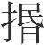
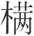
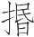
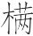
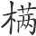

 慎行论第二

# 慎行

*【题解】*

本篇强调言行要以“义”为准则。文章把对待“义”和“利”的不同态度作为区分“君子”、“小人”的标准。这种观点与孔子“君子喻于义，小人喻于利”的标准相近，说：“君子计行虑为义，小人计行其（期）利”。

但是，作者并不是真正反对和抛弃功利的。其所以主张“计行虑义”，是因为这样做可获得“不利之利”，即治国治身这这一根本大利；其所以反对“计行其（期）利”，即不顾道义去追求私利，是因为这样做“乃不利”。文章举费无忌和庆封为例，说明背义求利终会招致灭亡，意在使“乱人”吸取教训。

一曰：

行不可不孰(1)。不孰，如赴深谿，虽悔无及。君子计行虑义，小人计行其利(2)，乃不利。有知不利之利者(3)，则可与言理矣。

*【注释】*

(1)孰：“熟”，这里是熟虑的意思。

(2)其：通“期”，期求。

(3)不利之利：不谋私利所带来的好处。

*【译文】*

第一：

行动不可不深思熟虑。不深思熟虑，就像跳入深谷，即使后悔也来不及。君子谋划行动时考虑道义，小人谋划行动时期求利益，结果反而不利。假如有人懂得不谋求利益实际上就包含着利益，那么就可以跟他谈论道义了。

荆平王有臣曰费无忌(1)，害太子建(2)，欲去之。王为建取妻于秦而美，无忌劝王夺。王已夺之，而疏太子。无忌说王曰：“晋之霸也，近于诸夏；而荆僻也，故不能与争。不若大城城父而置太子焉(3)，以求北方(4)，王收南方(5)，是得天下也。”王说，使太子居于城父。居一年，乃恶之曰：“建与连尹将以方城外反(6)。”王曰：“已为我子矣，又尚奚求？”对曰：“以妻事怨，且自以为犹宋也(7)。齐晋又辅之。将以害荆，其事已集矣。”王信之，使执连尹，太子建出奔。左尹郄宛(8)，国人说之。无忌又欲杀之，谓令尹子常曰(9)：“郄宛欲饮令尹酒。”又谓郄宛曰：“令尹欲饮酒于子之家。”郄宛曰：“我贱人也，不足以辱令尹(10)。令尹必来辱，我且何以给待之(11)？”无忌曰：“令尹好甲兵，子出而寘之门，令尹至，必观之已(12)，因以为酬(13)。”及飨日(14)，惟门左右而寘甲兵焉(15)。无忌因谓令尹曰：“吾几祸令尹。郄宛将杀令尹，甲在门矣。”令尹使人视之，信。遂攻郄宛，杀之。国人大怨，动作者莫不非令尹(16)。沈尹戍谓令尹曰(17)：“夫无忌，荆之谗人也。亡夫太子建，杀连尹奢，屏王之耳目(18)。今令尹又用之杀众不辜，以兴大谤，患几及令尹。”令尹子常曰：“是吾罪也，敢不良图？”乃杀费无忌，尽灭其族，以说其国(19)。动而不论其义，知害人而不知人害己也，以灭其族，费无忌之谓乎！

*【注释】*

(1)荆平王：楚平王，春秋楚国君，名熊居，公元前528年—前516年在位。费无忌：平王臣，姓费，名无忌。《左传》作“费无极”，为太子少师。

(2)害：嫉恨。

(3)城父（fǔ）：楚北部边邑，在今河南宝丰东四十里。

(4)北方：指北方宋、郑、鲁、卫等中原各国。

(5)南方：指吴越等国。

(6)连尹：楚官名。这里指伍奢。方城：山名，在今河南叶县南，春秋时为楚国北部要塞。外：城父在方城之北，所以称“外”。

(7)自以为犹宋：意思是自视为像宋那样的独立小国。

(8)左尹：楚官名，位在令尹之下。郄（xì）宛：楚大夫，字子恶。

(9)令尹：楚官名，百官之长。

(10)辱：这里是表示尊敬的委婉语。

(11)给（jǐ）：供给，这里是酬报的意思。

(12)已：句末语气词。

(13)酬：报献。这里指宴饮中主人劝客饮酒时报献宾客的礼物。

(14)飨（xiǎnɡ）：以酒食招待人。

(15)惟：通“帷”，设置帷幕。

(16)动作者：疑当作“进胙（zuò）者”，指卿大夫。胙，祭庙之肉。卿大夫祭祀后要把祭肉进献给国君，叫做“进胙”。非：批评，指责。

(17)沈尹戍：楚国沈县之尹（官长），名戍。《左传》作“沈尹戌”。

(18)屏：蔽，闭塞。

(19)说（yuè）其国：取悦于国人。

*【译文】*

楚平王有个臣子叫费无忌，嫉恨太子建，想除掉他。平王为太子建从秦国娶了个妻子，长得很美，费无忌就鼓动平王强占为己有。平王强占这个女子以后，就疏远了太子。费无忌又劝平王说：“晋国称霸，是因为靠近华夏各国，而楚国地域偏远，所以不能同晋国争霸。不如扩大城父，把太子安置在那里，以谋求北方各国的尊奉，您自己收取南方各国，这样就能得到天下了。”平王很高兴，让太子居住在城父。过了一年，费无忌又诋毁太子建说：“太子建和连尹伍奢将凭借方城以外作乱。”平王说：“他已经做了我的太子，还谋求什么？”费无忌回答说：“他因为您娶他妻子的事怨恨您，而且自以为就像宋国那样的独立小国一样。齐国和晋国又帮助他。他将要以此危害楚国，事情已经快要成功了。”平王相信了费无忌的话，派人逮捕了连尹伍奢。太子建出逃到国外。左尹郄宛，国人很爱戴他，费无忌又想杀掉郄宛。他对令尹子常说：“郄宛想请您喝酒。”又对郄宛说：“令尹想到你家来喝酒。”郄宛说：“我是个卑贱的人，不值得令尹光临。假如令尹一定屈尊光临，我该拿什么来招待他呢？”费无忌说：“令尹喜欢铠甲兵器，你把这些东西搬出来放在门口，令尹来了一定会观赏它们，你就乘势把这些东西作为礼物进献给他。”等到宴享这天，郄宛把门口两旁用帷幕遮起来，把铠甲兵器放在里边。费无忌于是对令尹说：“我差一点害了您。郄宛想杀您，已经把铠甲兵器藏在门口了。”令尹派人去察看，真是这样。于是派兵进攻郄宛，杀死了他。国人非常痛恨令尹，卿大夫没有一个人不指责他。沈尹戍对令尹说：“费无忌是楚国的谗谀小人，他逼迫太子建出亡，杀了连尹伍奢，掩蔽国君的耳目。现在您又听信他的话杀害了许多无辜的人，从而招致了各种严厉的指责，祸害很快就会来到您身上。”令尹子常说：“这是我的罪过，怎么敢不好好地想法对付呢？”于是杀死了费无忌，并把他的宗族全部诛灭，以此取悦于国人。做事情不讲道义，只知道害别人却不知道别人也会害自己，致使宗族被诛灭，指的就是费无忌吧！

崔杼与庆封谋杀齐庄公(1)。庄公死，更立景公(2)，崔杼相之。庆封又欲杀崔杼而代之相。于是椓崔杼之子(3)，令之争后(4)。崔杼之子相与私哄。崔杼往见庆封而告之。庆封谓崔杼曰：“且留，吾将兴甲以杀之。”因令卢满嫳兴甲以诛之(5)。尽杀崔杼之妻子及枝属，烧其室屋，报崔杼曰：“吾已诛之矣。”崔杼归，无归，因而自绞也。庆封相景公，景公苦之。庆封出猎，景公与陈无宇、公孙灶、公孙虿诛封(6)。庆封以其属斗，不胜，走如鲁。齐人以为让(7)，又去鲁而如吴，王予之朱方(8)。荆灵王闻之(9)，率诸侯以攻吴，围朱方，拔之。得庆封，负之斧质(10)，以徇于诸侯军(11)，因令其呼之曰：“毋或如齐庆封(12)，弑其君而弱其孤(13)，以亡其大夫(14)。”乃杀之。黄帝之贵而死，尧舜之贤而死，孟贲之勇而死，人固皆死，若庆封者，可谓重死矣(15)。身为僇(16)，支属不可以见(17)，行忮之故也(18)。

*【注释】*

(1)崔杼：春秋齐大夫，谥武子。庆封：齐大夫，字子家。齐庄公：春秋齐国君，名光，公元前553年—前548年在位。

(2)景公：齐景公，齐庄公弟，名杵臼，公元前547年—前490年在位。

(3)椓（zhuó）：挑拨（依毕沅说）。

(4)争后：争立为后嗣。

(5)卢满嫳（piè）：齐大夫，庆封之党。他书或作“卢蒲嫳”。

(6)陈无宇：齐大夫，谥桓子。公孙灶：齐大夫，字子雅。公孙虿（chài）：齐大夫，字子尾。灶、虿二人都是齐国宗室，于景公为伯叔。

(7)以为让：用接纳庆封事责备鲁。让，责备。

(8)朱方：春秋吴邑，在今江苏镇江丹徒镇南。

(9)荆灵王：楚灵王，春秋楚国君，初名围，即位后改名虔，公元前540年—前529年在位。

(10)质：杀人时垫于身下的砧板。

(11)徇（xùn）：巡行示众。

(12)或：句中语气词。

(13)弱：以……为弱，欺凌。孤：幼而无父，这里指新君景公。

(14)亡：通“盟”，盟誓。

(15)重（chónɡ）死：被戮为一死，戮前受辱为一死，所以说“重死”。

(16)僇：通“戮”。

(17)支属：义同“枝属”。宗族亲属。见：当作“完”，保全。

(18)忮（zhì）：嫉恨。

*【译文】*

崔杼和庆封合谋杀死了齐庄公。庄公死后，二人另立景公为君，由崔杼做相。庆封又想杀掉崔杼，自己代他为相。于是就挑拨崔杼的儿子们，让他们争夺继承人的资格。崔杼的儿子们私自争斗起来。崔杼去见庆封，告诉他这件事。庆封对崔杼说：“你姑且留在这里，我将派兵去把他们杀掉。”于是派了卢满嫳起兵去诛杀他们。卢满嫳把崔杼的妻儿老小以及宗族亲属全部杀光，烧了他的房屋住宅，回报崔杼说：“我已经把他们杀死了。”崔杼回去，已经无家可归，因而自缢而死。庆封做了齐景公的相，景公深以为苦。庆封外出打猎，景公乘机与陈无宇、公孙灶、公孙虿起兵讨伐庆封。庆封率领自己的家丁同景公交战，未能取胜，就逃到鲁国。齐国就这件事责备鲁国。庆封又离开鲁国去吴国，吴王把朱方邑封给了他。楚灵王听说了，就率领诸侯进攻吴国，包围朱方，攻占了它。灵王俘获了庆封，让他背着斧质在诸侯军中巡行示众，并让他喊道：“不要像齐国庆封那样，杀害他的君主，欺凌丧父的新君，强迫大夫盟誓！”然后才杀死了他。黄帝那样尊贵，最后也要死亡；尧舜那样贤圣，最后也要死亡；孟贲那样勇武，最后也要死亡；人本来都要死亡，但像庆封这样的人，受尽凌辱而死，可以说是死而又死了。自己被杀，宗族亲属也不能保全，这是嫉害别人的缘故。

凡乱人之动也，其始相助，后必相恶。为义者则不然，始而相与，久而相信，卒而相亲，后世以为法程。

*【译文】*

大凡邪恶的小人做事，开始的时候互相帮忙，而到后来一定互相憎恶。坚守道义的人却不是这样。他们开始时互相帮助，时间越长越互相信任，最后更是互相亲近。后代把他们作为效法的准则。

# 无义

*【题解】*

本篇主要是批判“小人”的见利忘义。文章列举了公孙鞅等人“欺交反主”的行为，虽一时得逞，但终为人所不齿，累及子孙，从而证明“趋利固不可必”。

本篇主题与上篇《慎行》一致，文中关于“义者，百事之始也，万利之本也”的论述，可以做上篇“不利之利”的注脚。

二曰：

先王之于论也极之矣。故义者，百事之始也，万利之本也，中智之所不及也。不及则不知，不知趋利(1)。趋利固不可必也(2)。公孙鞅、郑平、续经、公孙竭是已(3)。以义动则无旷事矣(4)，人臣与人臣谋为奸，犹或与之(5)；又况乎人主与其臣谋为义，其孰不与者？非独其臣也，天下皆且与之。

*【注释】*

(1)不知趋利：似当作“不知则趋利”，脱一“则”字。

(2)必：绝对相信、依赖。

(3)公孙鞅：即商鞅。郑平：当即《史记·范雎列传》中的郑安平，秦将，后降赵。续经：赵人。公孙竭：秦臣。

(4)旷：废。

(5)与（yǔ）：赞同。

*【译文】*

第二：

先王对于事理论述得非常透彻了。义是各种事情的开端，是一切利益的本源，这是才智平庸的人认识不到的。认识不到就不明事理，不明事理就会追逐私利。追逐私利的做法肯定是靠不住的。公孙鞅、郑平、续经、公孙竭等人的情形就是这样。根据道义去行动就不会有做不成的事情了。臣子与臣子谋划做坏事，尚且有人赞同；又何况国君和他的臣子谋划做符合道义的事，还会有谁不赞同呢？不只是他的臣子赞同，天下的人都将会赞同他。

公孙鞅之于秦，非父兄也，非有故也(1)，以能用也。欲堙之责(2)，非攻无以(3)。于是为秦将而攻魏。魏使公子卬将而当之(4)。公孙鞅之居魏也，固善公子卬。使人谓公子卬曰：“凡所为游而欲贵者，以公子之故也。今秦令鞅将，魏令公子当之，岂且忍相与战哉？公子言之公子之主，鞅请亦言之主，而皆罢军。”于是将归矣，使人谓公子曰：“归未有时相见，愿与公子坐而相去别也。”公子曰：“诺。”魏吏争之曰：“不可。”公子不听，遂相与坐。公孙鞅因伏卒与车骑以取公子卬。秦孝公薨，惠王立，以此疑公孙鞅之行，欲加罪焉。公孙鞅以其私属与母归魏，襄疵不受(5)，曰：“以君之反公子卬也，吾无道知君。”故士自行不可不审也。

*【注释】*

(1)故：旧交。

(2)堙（yīn）之责：对秦尽到责任。堙，塞。

(3)以：用，这里指所用的方法。

(4)公子卬（ánɡ）：战国魏人，魏惠王时为将。当：抵御。

(5)襄疵：魏人，魏惠王时曾为邺令。他书或作“穰疵”。

*【译文】*

公孙鞅对于秦王来说，既不是宗亲，又没有旧谊，只是凭着才能被任用的。他要对秦国尽职，除了进攻别的国家没有其他办法。于是为秦国统兵进攻魏国。魏国派公子卬率兵抵御秦军。公孙鞅在魏国时，原本和公子卬很要好。他派人对公子卬说：“我之所以出游并希望显贵，都是为了公子您的缘故。现在秦国让我统兵，魏国让公子同我相拒，难道我们忍心互相交战吗？请公子向公子的君主报告，我也向我的君主报告，双方都罢兵。”双方都准备回师的时候，公孙鞅又派人对公子卬说：“回去以后再也无日相见，希望同公子聚一聚再离别。”公子说：“好吧。”魏国的军校们谏诤说：“不能这样做。”公子卬不听。于是两人相聚叙旧。公孙鞅乘机埋伏下步卒车骑俘虏了公子卬。秦孝公死后，惠王即位，因为这件事而怀疑公孙鞅的品行，想加罪于公孙鞅。公孙鞅带着自己的家众与母亲返回魏国，魏国大臣襄疵不接纳，说：“因为您对公子卬背信弃义，我无法了解您。”所以，士人对自己的行为不可不审慎。

郑平于秦王(1)，臣也；其于应侯，交也(2)。欺交反主(3)，为利故也。方其为秦将也，天下所贵之无不以者，重也。重以得之，轻必失之。去秦将，入赵、魏，天下所贱之无不以也，所可羞无不以也。行方可贱可羞(4)，而无秦将之重，不穷奚待？

*【注释】*

(1)秦王：指秦昭王。

(2)应侯：即范雎，魏人，入秦为昭王相，封于应（今山西临猗），所以称为应侯。

(3)欺交反主：指郑平兵败降赵。郑平为秦将是范雎保举的。按：当时法律规定，被保举的人犯了罪，保举者要连坐，所以说郑平欺交。

(4)方：比并。

*【译文】*

郑平对秦王来说是臣子，对应侯来说是朋友。他欺骗朋友，背叛君主，是因为追求私利的缘故。当他做秦将的时候，天下认为尊贵显耀的事情没有一件不能做，这是因为他位尊权重。靠位尊权重得到的东西，一旦权位丧失，一定都会失去。郑平离开秦将的地位，进入赵国和魏国以后，天下认为轻贱的事情没有一件不做，天下认为羞耻的事情没有一件不做。行为降至可贱可耻一流，又没有做秦将时的重权尊位，不潦倒还等什么？

赵急求李欬(1)。李言续经与之俱如卫，抵公孙与(2)。公孙与见而与入(3)。续经因告卫吏使捕之。续经以仕赵五大夫(4)。人莫与同朝，子孙不可以交友。

*【注释】*

(1)李欬（kài）：人名。事未详。

(2)抵：归。公孙与：卫人，事未详。

(3)与（yǔ）：同意。入：接纳。

(4)五大夫：爵位名。

*【译文】*

赵国紧急搜捕李欬，李欬劝说续经跟他一起去卫国投奔公孙与。公孙与会见并同意接纳他们。续经乘机向卫国官员告发了李欬，让他们逮捕了李欬。续经靠这个在赵国做了五大夫。人们没有谁愿意跟他同朝为官，就连他的子孙也交不到朋友。

公孙竭与阴君之事(1)，而反告之樗里相国(2)，以仕秦五大夫。功非不大也，然而不得入三都(3)，又况乎无此其功而有行乎(4)！

*【注释】*

(1)与（yù）：参与。阴君之事：未详。

(2)樗（chū）里相国：即樗里疾，又称樗里子，战国时秦惠王异母弟，秦武王、昭王时为相。

(3)三都：指赵、卫、魏三国国都。

(4)无此其功而有行：“其”字疑当在“有”字之下。

*【译文】*

公孙竭参与阴君之事，却又反过来向相国樗里疾告发，靠这个在秦国做了五大夫。他的功劳并不是不大，但却为人们所鄙夷，不能进入赵、卫、魏三国国都。公孙竭告密立功尚且如此，又何况没有这种功劳而只有背信弃义的行为的人呢！

# 疑似

*【题解】*

本篇强调对相似之物要认真辨察。相似之物往往使人迷惑，不注意辨察就会造成严重后果。周幽王无寇击鼓而“失真寇”，黎丘丈人惑于奇鬼而“杀其真子”，都说明了辨察疑似之迹的重要。文章指出，对于疑似之迹，“察之必于其人”，即使是尧、舜、禹那样的圣贤，进入水泽也要问于牧童、渔师，因为他们了解得最清楚。

三曰：

使人大迷惑者，必物之相似也。玉人之所患，患石之似玉者；相剑者之所患，患剑之似吴干者(1)；贤主之所患，患人之博闻辩言而似通者。亡国之主似智，亡国之臣似忠。相似之物，此愚者之所大惑，而圣人之所加虑也，故墨子见歧道而哭之(2)。

*【注释】*

(1)吴干：宝剑名，传为春秋时吴人干将所铸，故称“吴干”，又名“干将”。

(2)“故墨”句：一说哭歧路的是杨朱。《淮南子·说林训》：“杨子见歧路而哭之，为其可以南可以北；墨子见练丝而哭之，为其可以黄可以黑”。

*【译文】*

第三：

让人深感迷惑的，一定是事物中那些相似的东西。玉工所忧虑的，是像玉一样的石头；相剑的人所忧虑的，是像吴干一样的剑；贤明的君主所忧虑的，是见闻广博、能言善辩像是通达事理的人。亡国的君主好像很聪明，亡国的臣子好像很忠诚。相似的事物，是愚昧的人深感迷惑、圣人也要用心思索的，所以墨子看见歧路而为之哭泣。

周宅酆、镐(1)，近戎人。与诸侯约：为高葆祷于王路(2)，置鼓其上，远近相闻；即戎寇至，传鼓相告，诸侯之兵皆至，救天子。戎寇当至(3)，幽王击鼓，诸侯之兵皆至，褒姒大说(4)，喜之。幽王欲褒姒之笑也，因数击鼓，诸侯之兵数至而无寇。至于后戎寇真至，幽王击鼓，诸侯兵不至，幽王之身乃死于丽山之下(5)，为天下笑。此夫以无寇失真寇者也。贤者有小恶以致大恶，褒姒之败，乃令幽王好小说以致大灭。故形骸相离，三公九卿出走。此褒姒之所用死，而平王所以东徙也(6)，秦襄、晋文之所以劳王劳而赐地也(7)。

*【注释】*

(1)宅：居。酆（fēnɡ）：周文王时周的国都，在今陕西户县东。字又作“丰”。镐（hào）：周武王的国都，又名镐京、宗周，在今陕西西安市西南，沣水东岸。

(2)葆：通“堡”，小城。祷：当为衍文。王路：大路。

(3)当：通“尝”，曾经。

(4)褒姒（bāosì）：周幽王宠妃，本为褒国女子，姒姓，周幽王伐褒时所得。

(5)丽（lí）山：在陕西临潼东南，又作“骊山”。

(6)平王：周平王，名宜臼，幽王子，公元前770年—前720年在位。幽王死，平王为避戎人，迁都于洛邑（今河南洛阳），是为东周。

(7)秦襄：秦襄公，公元前777年—前766年在位。晋文：晋文侯，名仇，公元前780年—前746年在位。劳王劳：下一“劳”字当为衍文。劳王，即勤王的意思。秦襄公、晋文侯都曾护卫平王东迁，有功于周王朝。

*【译文】*

周建都于丰、镐，靠近戎人。和诸侯约定：在大路上修筑高大的土堡，台上设置大鼓，使远近都能听到鼓声。如果戎兵入侵，就由近及远击鼓传告，诸侯的军队就都来援救天子。戎兵曾经来侵，周幽王击鼓，诸侯军队都如约而至，褒姒看了非常高兴，很喜欢幽王这种做法。幽王希望看到褒姒的笑客，于是屡屡击鼓，诸侯的军队多次到来，却没有敌兵。到后来戎兵真的来了，幽王击鼓，但诸侯的军队不再到来，幽王于是被杀死在骊山之下，被天下人耻笑。这是因为没有敌寇而乱击鼓，从而误了真的敌寇啊！贤明的人有小的过失尚且会招致大的灾祸，又何况不肖的人呢？褒姒败坏国事，是让幽王喜好无足轻重的欢乐而导致国灭身亡。所以幽王身首分离，三公九卿出逃。这也是褒姒所以身死、平王所以东迁的原因，也是秦襄公、晋文侯所以起兵勤王、被赐以土地的原因。

梁北有黎丘部(1)，有奇鬼焉，喜效人之子侄昆弟之状(2)。邑丈人有之市而醉归者，黎丘之鬼效其子之状，扶而道苦之(3)。丈人归，酒醒，而诮其子曰(4)：“吾为汝父也，岂谓不慈哉？我醉，汝道苦我，何故？”其子泣而触地曰(5)：“孽矣！无此事也。昔也往责于东邑(6)，人可问也。”其父信之，曰：“嘻！是必夫奇鬼也！我固尝闻之矣。”明日端复饮于市(7)，欲遇而刺杀之。明旦之市而醉，其真子恐其父之不能反也，遂逝迎之(8)。丈人望其真子，拔剑而刺之。丈人智惑于似其子者，而杀于真子。夫惑于似士者而失于真士，此黎丘丈人之智也。

*【注释】*

(1)梁：周时诸侯国，后为秦所灭。部：《后汉书·张衡传》李贤注引作“乡”。

(2)喜：当作“善”。子侄：当作“子姓”。指子孙。

(3)苦之：折磨他。

(4)诮（qiào）：责备。

(5)触地：指叩头。

(6)责：同“债”，讨债。

(7)端：故意。

(8)逝：往。

*【译文】*

梁国北部有个黎丘乡，那里有个奇鬼，善于模仿人的子孙兄弟的样子。乡中有个老者到市上去，喝醉了酒往家走，黎丘奇鬼模仿他儿子的样子，搀扶他回家，在路上苦苦折磨他。老者回到家里，酒醒后责问他的儿子说：“我是你的父亲，难道说不慈爱吗？我喝醉了，你在路上折磨我，这是为什么？”他的儿子哭着以头碰地说：“您遇到鬼怪了！没有这回事呀！昨天我去东乡讨债，这是可以问别人的。”父亲相信了儿子的话，说：“哼，这一定是那个奇鬼！我早就听人说起过它了。”第二天老者特意又到市上饮酒，希望再次遇见奇鬼，把它杀死。天刚亮就到市上去，又喝醉了，他的儿子怕父亲回不了家，就去接他。老者望见儿子，拔剑就刺。老者的思想被像他儿子的奇鬼所迷惑，从而杀死了自己的真儿子。那些被像是贤士的人所迷惑的人，错过了真正的贤士，这就像黎丘老者的思想一样啊！

疑似之迹，不可不察，察之必于其人也(1)。舜为御(2)，尧为左(3)，禹为右(4)，入于泽而问牧童，入于水而问渔师，奚故也？其知之审也。夫孪子之相似者，其母常识之，知之审也。

*【注释】*

(1)其人：指适当的人，即熟悉了解这方面情况的人。

(2)御：御者，驾车的人。

(3)左：古时乘车，尊者居左。

(4)右：车右，职责是保卫尊者。

*【译文】*

对于相似的现象，不可以不审察清楚。要审察清楚，一定要找熟悉了解情况的人。即使舜做车夫，尧做主人，禹做车右，进入草泽也要问牧童，到了水边也要问渔夫。什么缘故呢？因为他们对情况了解得清楚。孪生子长得很相像，但他们的母亲总是能够辨认，这是因为母亲对他们了解得清楚。

# 壹行

*【题解】*

“壹行”就是使言行诚信专一。作者认为，不论是国家还是个人，言行都应自始至终坚持一定的准则，使人可以信赖，这样才可成就大功。文章集中批评了那种言行反复无常的做法。

四曰：

先王所恶，无恶于不可知(1)。不可知，则君臣、父子、兄弟、朋友、夫妻之际败矣(2)。十际皆败，乱莫大焉。凡人伦，以十际为安者也，释十际则与麋鹿虎狼无以异，多勇者则为制耳矣。不可知，则知无安君、无乐亲矣(3)，无荣兄、无亲友、无尊夫矣。

*【注释】*

(1)不可知：指言行无信、反复无常，令人不可捉摸。

(2)际：界限，指人们各自应遵守的礼法和道德规范。败：坏。

(3)知：当是衍文。

*【译文】*

第四：

先王所厌恶的，莫过于言行反复无常。言行反复无常，君臣、父子、兄弟、朋友、夫妻各自的界限就要被破坏。十者的界限都遭到破坏，祸乱没有比这再大的了。大凡人与人之间的伦理关系，是靠十者的界限保持安定的。舍弃这十者的界限，人和麋鹿虎狼就没什么区别了，勇悍多力的人就会辖制别人了。言行反复无常。就没有人安定国君了，没有人取悦父母了，没有人敬重兄长了，没有人亲近朋友了，没有人尊敬丈夫了。

强大未必王也，而王必强大。王者之所藉以成也何？藉其威与其利。非强大则其威不威，其利不利。其威不威则不足以禁也，其利不利则不足以劝也(1)，故贤主必使其威利无敌。故以禁则必止，以劝则必为。威利敌，而忧苦民、行可知者王；威利无敌，而以行不知者亡。小弱而不可知，则强大疑之矣。人之情不能爱其所疑，小弱而大不爱，则无以存。故不可知之道，王者行之，废；强大行之，危；小弱行之，灭。

*【注释】*

(1)劝：鼓励（向善）。

*【译文】*

国家强大不一定称王天下，但称王天下一定要国家强大。称王天下的人赖以成功的是什么呢？是凭借他的威势和给人的利益。国家不强大，他的威势就不成其为威势，他的利益就不能给人好处。他的威势不成其为威势，就不足以禁止人们为恶；他的利益不成其为利益，就不足以鼓励人们行善。所以贤明的君主一定要使自己的威势和给人的利益都无可匹敌。因此，他禁止为恶，人们就一定住手；鼓励为善，人们就一定去做。双方威势和利益相当，那么为百姓忧虑辛劳、言行诚信可知的人就会统一天下；威势和利益无可匹敌，但言行反复无常，这样的人就会灭亡。国家弱小而言行又反复无常，强大的国家就会猜疑它了。人之常情，不能爱自己猜疑的人，国家弱小而又不被大国喜爱，就没有办法生存。所以，言行反复让人不可察知这种做法，称王天下的人实行它就会衰落，强大的国家实行它就会危险，弱小的国家实行它就会灭亡。

今行者见大树，必解衣县冠倚剑而寝其下。大树非人之情亲知交也，而安之若此者，信也。陵上巨木，人以为期(1)，易知故也。又况于士乎？士义可知故也(2)，则期为必矣。又况强大之国？强大之国诚可知，则其王不难矣。

*【注释】*

(1)期：约会。

(2)故也：当为衍文。

*【译文】*

行路的人看见大树，就一定会脱下外衣，挂上帽子，把佩剑靠在树边，躺在树下休息。大树并不是人们的亲朋好友，但人们却对它如此放心，是因为它可以信赖。高山上的大树，人们常用来作为约会之处，是因为它容易看到的缘故。树木尚且如此，又何况士人呢！士人的道义如果诚信可知，那么他为人所瞩目就是必然的了。士人尚且如此，又何况强大的国家呢！强大的国家确实诚信可知，那么它称王天下就不难了。

人之所乘船者，为其能浮而不能沈也(1)。世之所以贤君子者，为其能行义而不能行邪辟也。

*【注释】*

(1)沈：同“沉”。

*【译文】*

人们之所以乘船，是因为它能浮在水面而不会沉下去；世间之所以敬重君子，是因为他能实行信义而不会做邪恶的事。

孔子卜，得贲(1)。孔子曰：“不吉(2)。”子贡曰：“夫贲亦好矣(3)，何谓不吉乎？”孔子曰：“夫白而白，黑而黑，夫贲又何好乎？”故贤者所恶于物，无恶于无处(4)。

*【注释】*

(1)贲（bì）：卦名，六十四卦之一。

(2)不吉：“贲”是文饰的意思，其色斑驳不纯，这里说贲卦“不吉”，表示贵在纯粹专一。

(3)夫贲亦好矣：《周易》贲卦卦辞说：“小利有攸往”，所以子贡说“夫贲亦好矣”。

(4)处（chǔ）：审度，辨察。

*【译文】*

孔子占卜，得到贲卦。孔子说：“不吉利。”子贡说：“贲卦也很好了，为什么说不吉利呢？”孔子说：“白就应该是白，黑就应该是黑，贲卦又好在哪里呢？”所以贤者所厌恶的事物莫过于那些不纯粹专一的东西。

夫天下之所以恶，莫恶于不可知也。夫不可知，盗不与期，贼不与谋。盗贼大奸也，而犹所得匹偶(1)，又况于欲成大功乎？夫欲成大功，令天下皆轻劝而助之(2)，必之士可知。

*【注释】*

(1)所得：当作“得所”。

(2)轻：疾，迅猛。

*【译文】*

天下所厌恶的，莫过于言行反复无常。一个人如果言行反复无常，就连窃贼也不约他结伙，就连强盗也不与他谋议。窃贼强盗是非常邪恶的人，尚且要找合适的伙伴，又何况打算成就大功的人呢！想要成就大功，让天下人都竞相努力来帮助自己，一定要依赖于士的诚信专一。

# 求人

*【题解】*

本篇旨在阐发“贤主劳于求人而佚于治事”的政治主张，着重论述君主求贤的态度。作者把这种态度概括为八个字：“极卑极贱，极远极劳”，要君主屈尊下士，惟贤是举，不避遥远劳苦。即使如此，有些贤士仍然难以求致，坚辞天下的许由就是这样。因此，贤主求贤还需排除干扰，精诚专一，孜孜不息。最后，文章以皋子和郑国赖贤者得安为例，说明“身定、国安、天下治，必贤人”的道理。

五曰：

身定、国安、天下治，必贤人。古之有天下也者七十一圣，观于《春秋》，自鲁隐公以至哀公十有二世，其所以得之，所以失之，其术一也：得贤人，国无不安，名无不荣；失贤人，国无不危，名无不辱。

*【译文】*

第五：

要使自身安定、国家安宁、天下太平，必须依靠贤人。古代治理天下的共有七十一位圣王，从《春秋》看，自鲁隐公到鲁哀公共十二代，在那二百多年中，诸侯获得君位或失去君位，其道理是一样的：得到贤人，国家没有不安定的，名声没有不显荣的；失去贤人，国家没有不危险的，名声没有不耻辱的。

先王之索贤人，无不以也(1)。极卑极贱，极远极劳。虞用宫之奇、吴用伍子胥之言(2)，此二国者，虽至于今存可也。则是国可寿也。有能益人之寿者，则人莫不愿之；今寿国有道，而君人者而不求，过矣。

*【注释】*

(1)以：用。

(2)“虞用”二句：这是假设之辞。春秋时期，虞国国君没有听从宫之奇的劝谏，吴国国君没有听从伍子胥的劝谏，最终都导致了灭亡。

*【译文】*

先王为了寻求贤人，是无所不做的：他们可以对贤人极其谦卑，可以举用极为卑贱的人，可以到极远的地方去，可以付出极大的辛劳。假如虞国采用宫之奇的意见，吴国采用伍子胥的意见，这两个国家存在到今天也是可能的。由此看来，国运是可以使之长久的。如果有人能延长人的寿命，那么人们没有不愿意的；现在有办法使国运长久，而做君主的却不去努力寻求，这就错了。

尧传天下于舜，礼之诸侯，妻以二女(1)，臣以十子，身请北面朝之：至卑也。伊尹，庖厨之臣也(2)；傅说，殷之胥靡也(3)，皆上相天子：至贱也。禹东至榑木之地(4)，日出九津(5)，青羌之野(6)，攒树之所(7)，天之山(8)，鸟谷、青丘之乡(9)，黑齿之国(10)；南至交阯、孙朴续之国(11)，丹粟、漆树、沸水、漂漂、九阳之山(12)，羽人、裸民之处(13)，不死之乡(14)；西至三危之国(15)，巫山之下(16)，饮露吸气之民(17)，积金之山(18)，其肱、一臂、三面之乡(19)；北至人正之国(20)，夏海之穷(21)，衡山之上(22)，犬戎之国(23)，夸父之野(24)，禺强之所(25)，积水、积石之山(26)。不有懈堕(27)，忧其黔首，颜色黎黑，窍藏不通(28)，步不相过(29)，以求贤人，欲尽地利：至劳也。得陶、化益、真窥、横革、之交五人佐禹(30)，故功绩铭乎金石(31)，著于盘盂(32)。

*【注释】*

(1)妻：以女嫁人。

(2)臣：奴隶。

(3)胥靡：刑徒，受刑而罚作劳役的罪人。

(4)榑（fú）木：传说中的地名，即扶桑，太阳升起的地方，是东方的尽头。

(5)九津：当为传说中的山名，日出之处。津：崖。

(6)青羌之野：东方的原野。

(7)攒（cuán）：聚集。

(8)（mín）：抚。

(9)鸟谷：未详。疑作“旸谷”，传说太阳升起的地方。青丘：传说中东方海外之国，产九尾狐。

(10)黑齿之国：传说中东方国名，其民皆黑齿。

(11)交阯：古地名，指五岭以南，今广东、广西一带。孙朴续：未详，疑为二地名。

(12)丹粟：丹砂，因为形状如粟，故称“丹粟”。沸：泉水喷涌的样子。漂漂：水流急速的样子。九阳之山：南方山名。依五行学说，南方积阳，阳数终于九，故称“九阳之山”。

(13)羽人、裸民：神话传说中的两个国家，据说羽人国的人长着翅膀，裸民国的人不穿衣服。

(14)不死之乡：传说中的国家，据说那里的人长生不老。

(15)三危：神话中的西方山名，传说山上住着西王母的三只青鸟。

(16)巫山：山名，在今重庆巫山东，属巴山山脉。

(17)饮露吸气之民：以清虚之道养生全性的仙人。这里指其民所居之处。

(18)积金之山：西方山名。西方属金，所以称为“积金之山”。

(19)其肱：即“奇（jī）肱”。奇肱、一臂、三面：都是神话传说中的西方国家。奇肱国的人“一臂三目”，一臂国的人“一臂一目一鼻孔”，三面国人则生着三张脸。

(20)人正：地名，据说在北海。

(21)夏海：大海，指传说中的北海。夏，大。穷：尽头。

(22)衡山：传说中最北方的山。

(23)犬戎：神话传说中的北方之国。

(24)夸父（fǔ）：神话中的勇士，曾与太阳赛跑，半路渴死。

(25)禺强：北海之神，传说人面鸟身。

(26)积水：当为山名。积石：山名，大积石山在今青海省南部，小积石山在今甘肃临夏西北，传说禹疏导河水曾至此二山。

(27)堕：通“惰”，懈怠。

(28)窍：九窍。藏（zànɡ）：五脏。

(29)步不相过：走路后脚不能超过前脚，步子很小，行动很慢，形容非常疲惫。

(30)陶（yáo）：即皋陶。化益：即伯益。真窥：疑为“直竀（chēnɡ）”之讹，《荀子·成相》作“直成”。直成、横革、之交：禹的辅臣，事不详。

(31)金：钟鼎等铜器。石：指碑碣等。

(32)盘盂：两种器皿。用于盛物，古代亦于其上刻文纪功。

*【译文】*

尧把天下传给舜，在诸侯面前礼敬他，把两个女儿嫁给他，让自己的十个儿子给他做臣属，自己要求以臣子身份朝拜他：这是把自己降到最低下的地位了。伊尹是在厨房中服役的奴隶，傅说是殷商的刑徒，两个人都做了天子之相：这是举用最卑贱的人了。禹东行到达榑木之地，太阳升起的九津之山，青羌之野，林木茂密之处，耸入云天之山，鸟谷青丘之国，黑齿之国；南行到达交阯，孙朴续之国，盛产丹砂、生长漆树、泉水喷涌的九阳之山，羽人、裸民之国，不死之国；西行到达三危之国，巫山之下，饮露吸气之民所居之处，积金之山，奇肱、一臂、三面之国；北行到达人正之国，大海之滨，衡山之上，犬戎之国，夸父逐日之野，禺强居住之所，积水、积石之山。他四处奔走，毫不懈怠，为百姓忧虑，面色黧黑，周身不适，步履艰难，去寻求贤人，想要充分发挥土地的效益：这是辛劳到极点了。结果得到皋陶、伯益、直成、横革、之交五人为佐，所以功绩铭刻在金石上，书写在盘盂上，流传后世。

昔者尧朝许由于沛泽之中(1)，曰：“十日出而焦火不息(2)，不亦劳乎？夫子为天子，而天下已治矣，请属天下于夫子(3)。”许由辞曰：“为天下之不治与？而既已治矣。自为与？啁噍巢于林(4)，不过一枝；偃鼠饮于河，不过满腹。归已(5)，君乎！恶用天下？”遂之箕山之下(6)，颍水之阳(7)，耕而食，终身无经天下之色。故贤主之于贤者也，物莫之妨，戚爱习故不以害之(8)，故贤者聚焉。贤者所聚，天地不坏，鬼神不害，人事不谋，此五常之本事也(9)。

*【注释】*

(1)沛泽：水草丰茂的大泽。

(2)焦：通“爝”，火炬。

(3)属（zhǔ）：同“嘱”，交付，委托。

(4)啁噍（zhōujiāo）：鸟名，即鹪鹩（jiāoliáo），又名桃雀。

(5)已：句尾语气词。

(6)箕山：在河南登封东南，后世又名“许由山”。

(7)颍水：源出河南登封西南。阳：水的北岸。

(8)戚：亲属。爱：爱幸的人。习：近习，身边的人。故：故旧。

(9)五常：五种封建伦理道德，即父义、母慈、兄友、弟恭、子孝。

*【译文】*

从前尧到大泽之中拜见许由，说：“十个太阳都出来了，火把却还不熄灭，不是白费心力吗？您来做天子，天下一定能够大治，我愿把天下交给您治理。”许由推辞说：“这是为什么呢？要说是因为天下还不太平吧，可如今天下已经太平了；说是为了自己吧，要知道鹪鹩在树林中筑巢，树木再多，也只不过占据一棵树枝；偃鼠到河里喝水，河水再多，也只不过喝饱肚皮。您回去吧！我哪里用得着天下？”说罢，就去箕山脚下、颍水北岸种田为生，终生也没有过问天下的表示。所以贤明的君主任用贤者，不因外界事物而使它受到妨害，不因亲人、爱幸、近习、故旧而使之受到破坏，因而贤者聚集到他这里来。贤者所聚之处，天地不会降灾，鬼神不会作祟，人事用不着谋划。这是五种伦常道德的根本。

皋子(1)，众疑取国，召南宫虔、孔伯产而众口止(2)。

*【注释】*

(1)皋子：人名，当为贤者，其事未详。

(2)南宫虔、孔伯产：据文意，当是皋子罗致门下的贤者。

*【译文】*

人们怀疑皋子窃国，皋子召来了贤者南宫虔、孔伯产，那些议论才停止。

晋人欲攻郑，令叔向聘焉(1)，视其有人与无人。子产为之诗曰(2)：“子惠思我，褰裳涉洧(3)；子不我思，岂无他士(4)！”叔向归曰：“郑有人，子产在焉，不可攻也。秦、荆近，其诗有异心(5)，不可攻也。”晋人乃辍攻郑。孔子曰：“《诗》云：‘无竞惟人(6)。’子产一称而郑国免。”

*【注释】*

(1)聘：聘问，诸侯间派大夫问候修好。

(2)为之诗：子产所诵见《诗经·郑风·褰裳》。

(3)褰（qiān）：把衣服提起来。裳：下衣。洧（wěi）：水名，源出河南登封东阳城山，春秋时其地属郑。

(4)士：未婚男子。

(5)其诗有异心：子产以男女情爱喻晋郑两国关系，意思是说如果晋不与郑修好（“子不我思”），郑就将与他国结盟（“岂无他士”），所以说“其诗有异心”。在外交场合赋诗言志，这是春秋时期的普遍风气。

(6)无竞惟人：国家强大完全在于有贤人。无，发语词，无义。竞，强。诗句见《诗经·大雅·抑》。

*【译文】*

晋君想进攻郑国，派叔向到郑国聘问，借以察看郑国有没有贤人。子产对叔向诵诗说：“如果你心里思念我，就请提起衣服涉过洧河；如果你不再把我思念，难道就没有其他伴侣？”叔向回到晋国，说：“郑国有贤人，那里有子产在，进攻不得。郑国跟秦国楚国临近，子产赋的诗已流露出二心，郑国攻不得。”晋国于是停止攻郑。孔子说：“《诗经》上说：‘国家强大完全在于有贤人’，子产只是诵诗一首，而使郑国免遭灾难。”

# 察传

*【题解】*

“察传”就是对传言加以辨察，以定其是非。作者认为这是关系到国家生死存亡的大事。

那么如何才能弄清楚传言的是非呢？作者提出“缘物之情及人之情以为所闻”，即根据情理加以判断，那样就可以得到真实情况了。

六曰：

夫得言不可以不察。数传而白为黑，黑为白。故狗似玃(1)，玃似母猴(2)，母猴似人，人之与狗则远矣。此愚者之所以大过也。闻而审(3)，则为福矣；闻而不审，不若无闻矣。齐桓公闻管子于鲍叔，楚庄闻孙叔敖于沈尹筮，审之也，故国霸诸侯也。吴王闻越王句践于太宰嚭(4)，智伯闻赵襄子于张武(5)，不审也，故国亡身死也。

*【注释】*

(1)玃（jué）：兽名，似猕猴而形体较大。

(2)母猴：兽名，又称猕猴、沐猴。

(3)而：如果。审：审察。

(4)太宰嚭（pǐ）：伯嚭，春秋楚人，为吴王夫差太宰，所以称为“太宰嚭”。夫差败越之后，伯嚭接受越人贿赂，极力劝说夫差允许越国求和，使吴国终为越王勾践所灭。

(5)智伯：名瑶，春秋晋哀公卿。赵襄子：名无恤，晋卿。张武：智伯的家臣。张武劝智伯纠合韩康子、魏桓子把赵襄子围困在晋阳，后韩、赵、魏三家暗中联合，反灭了智伯。

*【译文】*

第六：

听到传闻不可不审察清楚。经过多次转述，白的就成了黑的，黑的就成了白的。狗像玃，玃像母猴，母猴像人，但是人和狗就差远了。这是愚蠢的人犯大错误的原因。听到传闻如果加以审察，就会带来好处；听到传闻如果不加审察，就不如没有听到。齐桓公从鲍叔那里听到关于管仲的情况，楚庄王从沈尹筮那里听到关于孙叔敖的情况，听到以后加以审察，所以称霸诸侯；吴王夫差从太宰嚭那里听到关于越王勾践的议论，智伯从张武那里听到关于赵襄子的议论，听到以后不加审察，所以国破身亡。

凡闻言必熟论，其于人必验之以理。鲁哀公问于孔子曰：“乐正夔一足(1)，信乎？”孔子曰：“昔者舜欲以乐传教于天下，乃令重黎举夔于草莽之中而进之(2)，舜以为乐正。夔于是正六律，和五声，以通八风(3)，而天下大服。重黎又欲益求人，舜曰：‘夫乐，天地之精也，得失之节也(4)，故唯圣人为能和。乐之本也(5)。夔能和之，以平天下，若夔者，一而足矣。’故曰‘夔一足’，非‘一足’也。”宋之丁氏，家无井而出溉汲，常一人居外。及其家穿井，告人曰：“吾穿井得一人。”有闻而传之者曰：“丁氏穿井得一人。”国人道之，闻之于宋君。宋君令人问之于丁氏。丁氏对曰：“得一人之使，非得一人于井中也。”求能之若此(6)，不若无闻也。子夏之晋，过卫，有读史记者曰(7)：“晋师三豕涉河”。子夏曰：“非也，是己亥也(8)。夫‘己’与‘三’相近，‘豕’与‘亥’相似”。至于晋而问之，则曰“晋师己亥涉河”也。

*【注释】*

(1)乐正：乐官之长。夔（kuí）：人名，善音律。

(2)重（chónɡ）黎：相传尧时掌管时令，后为舜臣。草莽：草野，指民间。

(3)通：调和。八风：八方之风。

(4)节：关键。

(5)乐之本也：这句话当作“和，乐之本也”，脱一“和”字。

(6)能：疑为“闻”字之误。

(7)史记：记载历史的书。

(8)己亥：干支纪日。

*【译文】*

凡是听到传闻一定要深入考察，涉及到人的传闻一定要用常理加以验证。鲁哀公问孔子说：“听说乐正夔只有一只脚，是真的吗？”孔子说：“从前舜想利用音乐把教化传布到天下，于是让重黎从民间把夔选拔出来，进荐给君主。舜任用他为乐正。于是夔正定六律，和谐五声，以调和八风，因而天下完全归服。重黎还想多找些像夔这样的人，舜说：‘音乐是天地之气的精华，是政治得失的关键，所以只有圣人才能使音乐和谐。和谐是音乐的根本。夔能使音乐和谐，用以安定天下。像夔这样的人，有一个就足够了。’所以说‘夔一足’，并不是说夔只有一只脚啊！”宋国有一户姓丁的人家，家里没有井，要外出打水，经常有一个专门负责打水的人在外。等到他家挖了井，就告诉别人说：“我挖井得到一个人。”有人听到了，传言说：“丁氏挖井挖得一个人。”国人谈论这件事，让宋国国君听到了，派人去问丁氏。丁氏说：“我是说得到一个人使唤，并不是从井里挖到一个人。”对传闻如果这样不得法地寻根究底，就不如没有听到。子夏到晋国去，路过卫国，听到有人读史书，说：“晋国军队三豕渡过黄河。”子夏说：“这是不对的。‘三豕’应是‘己亥’。‘己’和‘三’相近，‘豕’和‘亥’相似。”到了晋国一问，果然回答说晋国军队己亥那天渡过黄河。

辞多类非而是，多类是而非。是非之经(1)，不可不分。此圣人之所慎也。然则何以慎？缘物之情及人之情以为所闻，则得之矣。

*【注释】*

(1)经：界限。

*【译文】*

言辞有很多似乎错误其实是正确的，也有很多似乎正确其实是错误的。正确和错误的界限，不能不分清。这是连圣人都要慎重对待的。那么怎样慎重对待呢？就是要顺着自然的情理和人事的情理来考察听到的传闻，那样就可以得到真实的情况了。

