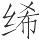
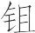
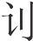
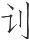

 贵直论第三

# 贵直

*【题解】*

封建社会中，君主能否虚心纳谏是关系功业成败、国家存亡的重要问题。对于这个问题，本书多处论及，本论大部分篇目则集中加以讨论。

本篇主要论述君主要尊崇直言敢谏之士，虚心听取他们的逆耳之言。文章赞扬了狐援、烛过这样的“直士”的耿介忠贞，同时以齐湣王和赵简子为例，说明对直士态度不同，结果也就不同。

一曰：

贤主所贵莫如士。所以贵士，为其直言也。言直则枉者见矣(1)。人主之患，欲闻枉而恶直言。是障其源而欲其水也，水奚自至？是贱其所欲而贵其所恶也(2)，所欲奚自来？

*【注释】*

(1)枉：邪曲。见（xiàn）：显露。

(2)所欲：指“闻枉”。所恶（wù）：指恶闻直言的做法。

*【译文】*

第一：

贤明的君主所崇尚的莫过于士人。之所以崇尚士人，是因为他们言谈正直。言谈正直，邪曲就会显现出来了。君主的弊病，在于想闻知邪曲却又厌恶正直之言。这就等于阻塞水源又想得到水，水又从何而来？这是轻贱自己想要得到的而尊尚自己所厌恶的，想要得到的又从何而来？

能意见齐宣王(1)。宣王曰：“寡人闻子好直，有之乎？”对曰：“意恶能直？意闻好直之士，家不处乱国，身不见污君。身今得见王(2)，而家宅乎齐，意恶能直？”宣王怒曰：“野士也！”将罪之。能意曰：“臣少而好事，长而行之，王胡不能与野士乎(3)，将以彰其所好耶？”王乃舍之。若能意者(4)，使谨乎论于主之侧，亦必不阿主。不阿(5)，主之所得岂少哉？此贤主之所求，而不肖主之所恶也。

*【注释】*

(1)能意：战国时齐国人，姓能，名意。

(2)身今得见王：当作“今身得见王”。

(3)与：用，听取。

(4)能意者：当作“若能意者”。

(5)不阿：当作“不阿主”。

*【译文】*

能意见齐宣王。宣王说：“我听说你喜好正直，有回事吗？”能意回答说：“我哪里能做到正直？我听说喜好正直的士人，家不住在政治混乱的国家，自身不见德行污浊的君主。如今我来见您，家又住在齐国，我哪里能算得上正直！”宣王生气地说：“真是个鄙野的家伙！”打算治他的罪。能意说：“我年少时喜好直言争辩，长大以后一直这样做，您为什么不能听取鄙野之士的言论，来彰明他们的爱好呢？”宣王于是赦免了他。像能意这样的人，如果让他在君主身边谨慎地议事，一定不会曲从君主。不曲从君主，君主得到的教益难道会少吗？这正是贤明的君主所追求的，不肖的君主所厌恶的。

狐援说齐湣王曰(1)：“殷之鼎陈于周之廷(2)，其社盖于周之屏(3)，其干戚之音在人之游(4)。亡国之音不得至于庙，亡国之社不得见于天，亡国之器陈于廷，所以为戒。王必勉之！其无使齐之大吕陈之廷(5)，无使太公之社盖之屏(6)，无使齐音充人之游。”齐王不受。狐援出而哭国三日，其辞曰：“先出也，衣纻(7)；后出也，满囹圄。吾今见民之洋洋然东走而不知所处(8)。”齐王问吏曰：“哭国之法若何？”吏曰：“斮(9)。”王曰：“行法！”吏陈斧质于东闾(10)，不欲杀之，而欲去之。狐援闻而蹶往过之(11)。吏曰：“哭国之法斮，先生之老欤？昏欤？”狐援曰：“曷为昏哉？”于是乃言曰：“有人自南方来，鲋入而鲵居(12)，使人之朝为草而国为墟(13)。殷有比干，吴有子胥，齐有狐援。已不用若言(14)，又斮之东闾，每斮者以吾参夫二子者乎(15)！”狐援非乐斮也，国已乱矣，上已悖矣，哀社稷与民人，故出若言。出若言非平论也，将以救败也，固嫌于危(16)。此触子之所以去之也，达子之所以死之也(17)。

*【注释】*

(1)狐援：战国齐臣，他书或作“狐咺”、“狐爰”。齐湣王：战国齐国君，名地，齐宣王子。

(2)鼎：古代一种礼器，被视为立国的重器，政权的象征。

(3)社：祭祀土神处，也是国家政权的象征。屏：屏障，这里指遮盖神社的棚屋之类。

(4)干戚之音：武舞的音乐。古代舞蹈分文、武两种，文舞执羽旄，武舞执干戚。干，盾牌。戚，大斧。这里以“干戚之音”指代殷商的宫廷音乐。游：游乐。

(5)大吕：齐钟名。

(6)太公：战国田齐的开国始祖，姓田，名和，原为齐康公相，后逐康公，取代姜姓自立为诸侯。

(7)衣纻（chīzhù）：意思是生活可得温饱。，用葛草纤维织成的较细的布。纻，用苎麻织的粗布。

(8)洋洋然：犹“茫茫然”，心神不定，无所依归的样子。

(9)斮（zhuó）：斩。

(10)东闾：齐国都的东门。

(11)蹶：跌倒，这里指走路跌跌撞撞。过：访，见。

(12)鲋（fù）入：像鲫鱼一样地进来。鲋，鲫鱼。鲫鱼体小，用以形容恭谨谦卑。鲵（ní）居：像鲸鲵一样地处于齐国。鲵，雌鲸。鲸体大，吞食小鱼，用以形容凶残。

(13)为草：变为草莽。狐援这些话当有所指。史载，齐湣王四十年（前284），燕、秦、韩、赵、魏等国伐齐，齐湣王奔卫。楚派淖（zhuō）齿率兵救齐，遂为湣王相，继而淖齿杀湣王，与燕国瓜分了齐国原来侵占的土地和宝器。狐援之言或与当时形势有关。《战国策·齐策》以狐咺（援）说湣王与湣王被杀事为一章。

(14)若：代词，这。

(15)每：当，将。参（sān）：使比并为三。

(16)嫌：近。危：言语惊人。

(17)触子、达子：都是齐湣王之臣，其事见《慎大览·权勋》篇。

*【译文】*

狐援劝齐湣王说：“殷商的九鼎被摆放在周的朝廷上，它的神社被盖上周的庐棚，它的舞乐被人们用在游乐中。亡国的音乐不准进入宗庙，亡国的神社不准见到天日，亡国的重器被摆放在朝廷上，这些都是用来警戒后人的。您一定要好自为之啊！千万不要让齐国的大吕摆在别国的朝廷，不要让太公建起的神社被人罩盖上庐棚，不要让齐国的音乐充斥在别人的游乐之中。”齐王不听他的劝谏。狐援离开朝廷以后，为国家即将到来的灾难哭了三天，哭道：“先离开的，尚可穿布衣；后离开的，遭难满监狱。我即将看到百姓仓惶东逃，不知道在哪里安居。”齐王问狱官说：“国家太平无事却给它哭丧的，按法令该治什么罪？”狱官回答说：“当斩。”齐王说：“照法令行事！”狱官把刑具摆在国都东门，不愿杀死狐援，只想把他吓跑。狐援听到这个消息，反倒跌跌撞撞地去见狱官。狱官说：“国家无事而为国哭丧的依法当斩，您这样做，是老糊涂了呢，还是头脑发昏呢？”狐援说：“怎么是发昏呢！”于是进一步说道：“有人从南方来，进来时像鲫鱼那样恭顺谦卑，住下以后却像鲸鲵那样凶狠残暴，使别人朝廷变为草莽，国都变为废墟。殷商有个比干，楚国有个伍子胥，齐国有个狐援。既不听我的这些话，又要在东门把我杀掉，这是要把我同比干、伍子胥比并为三吧！”狐援并不是乐于被杀，国家太混乱了，君主太昏愦了，他哀怜国家和人民，所以才说这样的话。这些话并不是持平之论，他是想用以挽救国家的危亡，所以讲的话才近于危言耸听。湣王不纳忠言却戮辱直士，这正是触子弃之而去的原因，也正是达子战败而死于齐难的原因。

赵简子攻卫，附郭(1)。自将兵，及战，且远立，又居于屏蔽犀橹之下(2)。鼓之而士不起。简子投桴而叹曰(3)：“呜呼！士之速弊一若此乎！”行人烛过免胄横戈而进曰(4)：“亦有君不能耳，士何弊之有？”简子艴然作色曰(5)：“寡人之无使，而身自将是众也，子亲谓寡人之无能，有说则可，无说则死！”对曰：“昔吾先君献公即位五年(6)，兼国十九，用此士也。惠公即位二年(7)，淫色暴慢，身好玉女，秦人袭我，逊去绛七十(8)，用此士也。文公即位二年，厎之以勇(9)，故三年而士尽果敢；城濮之战(10)，五败荆人，围卫取曹，拔石社(11)，定天子之位(12)，成尊名于天下，用此士也。亦有君不能耳，士何弊之有？”简子乃去屏蔽犀橹，而立于矢石之所及，一鼓而士毕乘之。简子曰：“与吾得革车千乘也(13)，不如闻行人烛过之一言。”行人烛过可谓能谏其君矣。战斗之上(14)，桴鼓方用，赏不加厚，罚不加重，一言而士皆乐为其上死。

*【注释】*

(1)附：迫近。郭：外城。

(2)屏蔽屏橹：当作“屏掩犀橹”。屏蔽，掩蔽物。犀橹：犀皮制作的大盾牌。

(3)桴（fú）：鼓槌。

(4)行人：官名，负责外交事务。胄：头盔。“免胄横戈”是手执武器、甲胄在身的臣下谒见君主时的礼节，以示恭敬。

(5)艴（bó）然：盛怒的样子。作色：因发怒脸上变色。

(6)献公：晋献公，春秋晋国君。

(7)惠公：晋惠公，晋献公之子。

(8)逊：逃遁。去：离，距离。绛：指新绛，晋国都，在今山西曲沃西南。

(9)厎（dǐ）：通“砥”，磨砺。

(10)城濮之战：公元前632年晋楚两国在城濮进行的一次战争，结果晋获全胜。城濮：春秋卫地，在今河南范县南。

(11)石社：地名，所在不详。

(12)定天子之位：晋文公元年（前636），周襄王之弟叔带率狄人伐周，襄王出奔郑。第二年，晋文公兴兵诛叔带，复纳襄王。“定天子之位”即指这件事。

(13)与：与其。革车：兵车。

(14)上：等于说“时”。

*【译文】*

赵简子进攻卫国，逼近外城。他亲自统率军队，可是到了交战的时候，却站得远远的，躲在屏障和盾牌后面。简子击鼓，士卒却动也不动。简子扔下鼓槌感叹道：“哎！士卒变坏竟然快到这个地步！”这时，行人烛过摘下头盔，横拿着戈走上前说：“只不过是您有些地方没能做到罢了，士卒有什么不好！”简子气得勃然变色，说：“我不委派他人而亲自统率这些士卒，你却当面说我无能。你说的有理便罢，没理就治你死罪！”烛过回答说：“从前我们先君献公，即位五年就兼并了十九个国家，用的就是这些士卒。惠公即位二年，纵情声色，残暴傲慢，喜好美女，秦人袭击我国，晋军溃逃到离绛城只有七十里的地方，用的也是这些士卒。文公即位二年，以勇武砥砺士卒，所以三年之后士卒都变得坚毅果敢；城濮之战，五次打败楚军，围困卫国，夺取曹国，攻占石社，安定天子的王位，显赫的名声扬于天下，用的还是这些士卒。所以说只不过是您有些地方没能做到罢了，士卒有什么不好？”简子于是离开屏障和盾牌，站立到箭矢可以射到的地方，只击鼓一通士卒就全都登上了城墙。简子说：“与其让我获得兵车千辆，不如听到行人烛过一席话！”行人烛过可算得上能劝谏他的君主了。正当击鼓酣战之时，赏赐不增多，刑罚不加重，只说了一席话，就使士卒都乐于为君上效死。

# 直谏

*【题解】*

本篇意在告诫君主，直士都是不求私利、敢于犯危的贤者，对此应予体察，使自己“可与言极言”，这样才能国存身安。齐桓公称霸、楚文王兼国三十九就是最好的例证。文章通过对鲍叔牙和葆申的赞扬，也为臣下树立了直言的榜样。

本篇与上篇立意相同，都是从君臣两个方面讨论听谏和进言的原则的。

二曰：

言极则怒，怒则说者危。非贤者孰肯犯危？而非贤者也，将以要利矣(1)；要利之人，犯危何益？故不肖主无贤者。无贤则不闻极言，不闻极言，则奸人比周(2)，百邪悉起。若此则无以存矣。凡国之存也，主之安也，必有以也(3)。不知所以，虽存必亡，虽安必危。所以不可不论也。

*【注释】*

(1)要（yāo）：求。

(2)比周：为私利而结合。

(3)以：因，原因。

*【译文】*

第二：

臣下直言不讳，君主就会发怒。君主一发怒，劝谏的人就危险了。除了贤明的人，谁肯去冒这危险？如果是不贤明的人，就要凭着进言谋求私利了。谋求私利的人，冒这危险有什么好处？所以不贤明的君主身边没有贤人。没有贤人就听不到不加隐讳的直言，听不到不加隐讳的直言，奸人就会结党营私，各种邪说恶行就会一起产生。像这样，国家就无法生存了。凡是国家的生存，君主的平安，肯定是有原因的。不了解这个原因，即使目前生存也必定要灭亡，即使目前平安也必定遭遇危险。所以其原因是不可不察知的。

齐桓公、管仲、鲍叔、宁戚相与饮。酒酣，桓公谓鲍叔曰：“何不起为寿(1)？”鲍叔奉杯而进曰：“使公毋忘出奔在于莒也，使管仲毋忘束缚而在于鲁也，使宁戚毋忘其饭牛而居于车下。”桓公避席再拜曰(2)：“寡人与大夫能皆毋忘夫子之言，则齐国之社稷幸于不殆矣！”当此时也，桓公可与言极言矣。可与言极言，故可与为霸。

*【注释】*

(1)为寿：敬酒并献祝寿之辞，这是古人饮酒时的一种礼节。

(2)避席：离开坐席，这是恭敬惶恐的表示。

*【译文】*

齐桓公、管仲、鲍叔牙、宁戚在一起喝酒。喝到尽兴时，桓公对鲍叔说：“何不起身敬酒祝寿？”鲍叔捧起酒杯上前敬酒说：“希望您不要忘记逃亡在莒国的情景，希望管仲不要忘记被囚禁在鲁国的情景，希望宁戚不要忘记自己喂牛住在车下的情景。”桓公离席对鲍叔再拜，说：“如果我和各位大夫能都不忘记您说的话，那么齐国的江山就能有幸不危险了！”在这个时候，桓公是可以尽情进言的了。正因为可以尽情进言，所以可以跟他一起成就霸业。

荆文王得茹黄之狗(1)，宛路之矰(2)，以畋于云梦(3)，三月不反。得丹之姬(4)，淫，期年不听朝(5)。葆申曰(6)：“先王卜以臣为葆，吉。今王得茹黄之狗，宛路之矰，畋三月不反；得丹之姬，淫，期年不听朝。王之罪当笞。”王曰：“不穀免衣襁褓而齿于诸侯(7)，愿请变更而无笞。”葆申曰：“臣承先王之令，不敢废也。王不受笞，是废先王之令也。臣宁抵罪于王，毋抵罪于先王。”王曰：“敬诺。”引席，王伏。葆申束细荆五十，跪而加之于背，如此者再，谓王：“起矣！”王曰：“有笞之名一也，遂致之(8)！”申曰：“臣闻君子耻之，小人痛之。耻之不变，痛之何益？”葆申趣出(9)，自流于渊，请死罪。文王曰：“此不穀之过也，葆申何罪？”王乃变更，召葆申，杀茹黄之狗，析宛路之矰(10)，放丹之姬。后荆国兼国三十九。令荆国广大至于此者，葆申之力也，极言之功也。

*【注释】*

(1)荆文王：楚文王，春秋楚国君。茹黄：猎犬名，他书或作“如黄”、“如簧”。

(2)宛路：竹名，即讽隑，细长而直，可做箭杆。矰（zēnɡ）：带丝绳的短箭。

(3)畋（tián）：打猎。云梦：古楚地薮泽名。

(4)丹：地名。《太平御览》卷二零六、《艺文类聚》四十六均引作“丹阳”。丹阳，在今湖北秭归。姬：美女。

(5)期（jī）年：一周年。

(6)葆申：名叫申的太葆。太葆，即太保，官名。

(7)衣：穿，裹。

(8)遂致之：索性真的抽打我吧！致，使实现。之，指代“笞”这一行为。

(9)趣（qū）：疾行，快步走。

(10)析：这里是折的意思。

*【译文】*

楚文王得到茹黄之狗和宛路之箭，就用它们到云梦泽去打猎，三个月不回来。又得到丹地的美女，纵情女色，整整一年不上朝听政。葆申说：“先王占卜让我做太葆，卦象吉利。如今您得到如黄之狗和宛路之箭，前去打猎，三个月不回来。又得到丹地的美女，纵情女色，一年不上朝听政。您的罪应该受到笞刑。”文王说：“我从离开襁褓就列位于诸侯，请您换一种刑法，不要鞭打我。”葆申说：“我敬受先王之命，不敢废弃。您不接受笞刑，这是废弃了先王之命。我宁可获罪于您，不能获罪于先王。”文王说：“遵命。”于是葆申拉过席子，文王伏在席上。葆申把五十根细荆条捆在一起，跪着放在文王的背上。像这样反复做了两次，而后对文王说：“请您起来吧！”文王说：“同样是有了受笞刑的名声，索性真的打我一顿吧！”葆申说：“我听说，对于君子，要使他心里感到羞耻；对于小人，要让他皮肉觉得疼痛。如果让您感到羞耻仍不能改正，那么让您觉得疼痛又有什么用处？”葆申说完，快步离开了朝廷，自行流放到深渊之滨，并请求文王治自己死罪。文王说：“这是我的过错，葆申有什么罪？”于是文王改弦更张，召回葆申，杀了茹黄之狗，折了宛路之箭，放了丹地的美女。后来楚国兼并了三十九个国家。使楚国疆土广阔到这种程度，这是葆申的力量，是直言切谏的功效。

# 知化

*【题解】*

本篇以吴王夫差国灭身亡的历史教训为例，说明君主贵在知化。所谓知化，就是要预见到事物发展变化的趋然趋势，而及早采取有针对性的措施。吴王夫差所以不能“知化”，除了好大喜功、贪图眼前利益之外，主要是因为顽固拒谏，作者着意告诫君主的也正是这一点。这种治国需要虚心纳谏、听取直言的主张，是同前两篇相承的。

三曰：

夫以勇事人者，以死也。未死而言死，不论(1)。以虽知之(2)，与勿知同。凡智之贵也，贵知化也(3)。人主之惑者则不然。化未至则不知；化已至，虽知之，与勿知一贯也(4)。

*【注释】*

(1)论：察，知。

(2)以：通“已”，指死亡之后。

(3)化：变化，指事物发展变化的必然趋势。

(4)一贯：一样。

*【译文】*

第三：

以勇力侍奉别人的人，将为别人而死。勇士没有死的时候谈论以死侍奉别人，人们不会了解；等到勇士真的死了以后，人们虽然已经了解了他，但为时已晚，和不了解是一样的。大凡智慧的可贵，就贵在能事先察知事物变化的趋势。君主中的胡涂人却不是这样，变化没有到来时不能预知，变化出现后，一切都来不及了，虽然知道了，其实和不知道是一样的。

事有可以过者(1)，有不可以过者。而身死国亡，则胡可以过？此贤主之所重，惑主之所轻也。所轻，国恶得不危？身恶得不困？危困之道，身死国亡，在于不先知化也。吴王夫差是也。子胥非不先知化也，谏而不听，故吴为丘墟，祸及阖庐(2)。

*【注释】*

(1)过：错，失误。

(2)阖庐：春秋吴国君，夫差之父。夫差国破身死，阖庐不得享受祭祀，所以说“祸及阖庐”。

*【译文】*

事情有些是可以失误的，有些是不可以失误的。对于会导致身死国亡的大事，怎么能够失误呢！这是贤明的君主所重视的，胡涂的君主所轻忽的。轻忽这一点，国家怎么能不危险，自身怎么能不困厄？行于危险困厄之道，遭致身死国亡，在于不能事先察知事物发展变化的趋势。吴王夫差就是这样。伍子胥并不是事先没有预知事物变化的趋势，但他劝谏夫差而夫差不听，所以吴国成为废墟，殃及先君阖庐。

吴王夫差将伐齐，子胥曰：“不可。夫齐之与吴也，习俗不同，言语不通，我得其地不能处，得其民不得使(1)。夫吴之与越也，接土邻境，壤交通属(2)，习俗同，言语通，我得其地能处之，得其民能使之。越于我亦然。夫吴、越之势不两立。越之于吴也，譬若心腹之疾也，虽无作，其伤深而在内也。夫齐之于吴也，疥癣之病也，不苦其已也(3)，且其无伤也。今释越而伐齐，譬之犹惧虎而刺猏(4)，虽胜之，其后患无央(5)。”太宰嚭曰：“不可。君王之令所以不行于上国者(6)，齐、晋也。君王若伐齐而胜之，徙其兵以临晋，晋必听命矣。是君王一举而服两国也，君王之令必行于上国。”夫差以为然，不听子胥之言，而用太宰嚭之谋。子胥曰：“天将亡吴矣，则使君王战而胜；天将不亡吴矣，则使君王战而不胜。”夫差不听。子胥两袪高蹶而出于廷(7)，曰：“嗟乎！吴朝必生荆棘矣！”夫差兴师伐齐，战于艾陵(8)，大败齐师，反而诛子胥。子胥将死，曰：“与！吾安得一目以视越人之入吴也？”乃自杀。夫差乃取其身而流之江，抉其目(9)，著之东门(10)，曰：“女胡视越人之入我也？”居数年，越报吴，残其国，绝其世，灭其社稷，夷其宗庙，夫差身为擒。夫差将死，曰：“死者如有知也，吾何面以见子胥于地下？”乃为幎以冒面而死(11)。夫患未至，则不可告也；患既至，虽知之无及矣。故夫差之知惭于子胥也，不若勿知。

*【注释】*

(1)不得使：据上下文，“得”当作“能”。

(2)通：当为“道”字之误。属（zhǔ）：连。

(3)已：治愈。

(4)猏（jiān）：同“豜”，三岁的猪。

(5)央：尽。

(6)上国：指中原地区各国，因地势高于吴越等南方国家，所以称“上国”。

(7)袪（qū）：举，这里指提起衣服。高蹶：高蹈，把脚抬得高高地走路。“两祛高蹶”是形容很生气的样子。

(8)艾陵：春秋齐地，在今山东莱芜东。

(9)抉（jué）：挖。

(10)著（zhuó）：附着，这里是挂的意思。

(11)幎（mì）：这里指幎目，覆盖死者面部的巾。冒：覆盖。

*【译文】*

吴王夫差将要进攻齐国，伍子胥说：“不行。齐国和吴国习俗不同，言语不通，即使我们得到齐国的土地也不能居住，得到齐国的百姓也不能役使。而吴国和越国疆土毗邻，田地交错，道路相连，习俗一样，言语相通。我们得到越国的土地能够居住，得到越国的百姓能够役使。越国对于我国也是如此。吴越两国从情势上看不能并存。越国对于吴国如同心腹之疾，即使一时没有发作，但它造成的伤害严重而且在体内。而齐国对于吴国只是癣疥之疾，不愁治不好，再说治不好也没什么伤害。现在舍弃越国去进攻齐国，这就像担心虎患却去猎杀野猪一样，即使获胜，但后患无穷。”太宰嚭说：“伍子胥的话不可听信。君王您的命令所以不能推行到中原各国，就是由于齐晋的缘故。君王如果进攻齐国并战胜了它，然后移兵晋国，以大军压境，晋国一定会俯首听命。君王这是一举而征服两个国家啊！这样，君王的命令一定可以在中原各国推行了。”夫差认为太宰嚭说得对，不听从子胥的意见，而采用了太宰嚭的计谋。伍子胥说：“上天如果将要灭亡吴国，就会让君王打胜仗；上天如果不想灭亡吴国，就会让君王打败仗。”夫差不听。伍子胥两手提起衣服，迈着大步从朝廷中走了出去，说：“唉！吴国的朝廷一定会生满荆棘了！”夫差兴兵伐齐，和齐军在艾陵交战，把齐军打得大败。回来以后就要杀伍子胥。伍子胥将死时说：“啊！我怎么才能留下一只眼睛看着越军入吴呢？”说完就自杀了。夫差把他的尸体投到江中冲走，把他的眼睛挖出来挂在国都的东门，说：“你怎么能看到越军侵入我的吴国？”过了几年，越人报复吴国，攻破了吴国的国都，灭绝了吴国的世系，毁灭了吴国的社稷，夷平了吴国的宗庙，夫差本人也被活捉。夫差临死时说：“死人如果有知的话，我在地下有什么脸面见子胥呢？”于是用巾盖上脸自杀了。胡涂的君王，祸患还没有到来时无法使他明白；祸患到来以后，他们即使知道了也来不及了。所以夫差死到临头才知道愧对伍子胥，还不如不知道。

# 过理

*【题解】*

本篇是总结亡国之君的经验教训以为当世君主借鉴的。文章开宗明义，指出“亡国之主一贯”，其共同点是“乐不适”。所谓“不适”，即思想行为不合礼义，有悖常理。篇名“过理”，也是这个意思。文章列举商纣王、晋灵公的凶残暴虐，齐湣王、宋康王的昏愦狂乱，客观上集中揭露了剥削阶级的凶残和腐朽没落。

四曰：

亡国之主一贯(1)。天时虽异，其事虽殊，所以亡同者(2)，乐不适也。乐不适则不可以存。

*【注释】*

(1)一贯：一样。

(2)所以亡同者：当作“所以亡者同”。

*【译文】*

第四：

亡国的君主都是一样的。天时虽然各异，行事虽然不同，但他们灭亡的原因相同，都是把不合礼义当作快乐。把不合礼义当作快乐，就不可能生存。

糟丘酒池(1)，肉圃为格(2)，雕柱而梏诸侯(3)，不适也。刑鬼侯之女而取其环(4)，截涉者胫而视其髓，杀梅伯而遗文王其醢(5)，不适也。文王貌受以告诸侯(6)。作为琁室(7)，筑为顷宫(8)，剖孕妇而观其化(9)，杀比干而视其心(10)，不适也。孔子闻之曰：“其窍通(11)，则比干不死矣。”夏、商之所以亡也。

*【注释】*

(1)糟丘：用酒糟堆起的小山。

(2)肉圃：肉林。为格：设置炮格。炮格，烤肉用的铜架。格，铜架。

(3)雕：通“铸”。铸柱，铸造铜柱。这是纣设置的一种酷刑。下面点火，让人爬行柱上。梏：通“酷”（依许维遹说）。虐害。

(4)刑：杀。鬼侯：商末诸侯，纣时为三公之一。鬼侯的女儿为商纣之妾。

(5)梅伯：纣时诸侯。遗（wèi）：送给。醢（hǎi）：肉酱。

(6)貌：表面。

(7)琁室：用美玉装饰的房屋。琁（xuán），美玉。据其他文献，作为琁室的是夏桀。

(8)顷宫：高大巍峨的宫殿。顷，通“倾”。形容高高耸立，好像要倾倒一样。

(9)化：指未成形的胎儿。

(10)比干：纣的叔父，多次力谏纣王，纣说：“我听说圣人的心有七窍，确实是这样吗？”于是剖比干之心。

(11)其：指纣。窍：心窍。

*【译文】*

商纣设置糟丘、酒池、肉圃、炮格，奢侈之极，又铸造铜柱以虐害诸侯，这是不合礼义的。商纣杀死鬼侯的女儿摘取她的玉环，截断涉水者的小腿观看他的骨髓，杀害梅伯，用他的尸体制作的肉酱送给文王，这是不合礼义的。文王表面接受下来，暗中把这件事告诉了其他诸侯。商纣建造琁室，修筑顷宫，剖开孕妇之腹观看她的胎儿，杀死比干观看他的心脏，这是不合礼义的。孔子听到商纣的暴行，说：“他的心窍如果通达，比干就不会被杀了。”这是商纣灭亡的原因。

晋灵公无道(1)，从上弹人，而观其避丸也。使宰人臑熊蹯(2)，不熟，杀之，令妇人载而过朝以示威，不适也。赵盾骤谏而不听(3)，公恶之，乃使沮麛(4)。沮麛见之不忍贼(5)，曰：“不忘恭敬，民之主也。贼民之主，不忠；弃君之命，不信。一于此，不若死。”乃触廷槐而死(6)。

*【注释】*

(1)晋灵公：春秋晋国君，文公之孙，暴虐无道，为臣下所杀。

(2)宰人：厨师。臑：通“胹（ér）”。煮。蹯（fán）：野兽的足掌。

(3)赵盾：春秋晋大夫，灵公时为正卿（执政大臣），谥宣子。骤：屡次。

(4)沮麛（jūmí）：灵公的武士，他书或作“麂”。

(5)贼：杀。

(6)廷：通“庭”，院子。

*【译文】*

晋灵公暴虐无道，从高处用弹弓射人，观看被射的人怎样躲避弹丸。他让厨师煮熊掌，熊掌没有煮熟，就把厨师杀了，命令妇人用车拉着尸体从朝廷中经过，借以显示淫威，不合礼义。赵盾多次劝谏也不听。灵公厌恶赵盾，就派沮麛去刺杀他。沮麛看到赵盾，不忍心杀害，说：“时刻不忘恭谨，这是百姓的主宰啊！杀害百姓的主宰，这是对百姓的不忠；抛弃国君的命令，这是对国君不守信用。两条中有一条，这不如死了好。”于是就在院中槐树上撞死了。

齐湣王亡居卫(1)，谓公玉丹曰(2)：“我何如主也？”玉丹对曰：“王贤主也。臣闻古人有辞天下而无恨色者(3)，臣闻其声，于王而见其实。王名称东帝(4)，实辨天下(5)。去国居卫，容貌充满(6)，颜色发扬(7)，无重国之意。”王曰：“甚善！丹知寡人。寡人自去国居卫也，带益三副矣(8)。”

*【注释】*

(1)齐湣王亡居卫：指齐湣王末年为燕秦等国所伐逃亡奔卫之事。

(2)公玉丹：湣王的幸臣，参见《季秋纪·审己》。

(3)辞：离别，这里是抛弃、失掉的意思。恨：遗憾。

(4)东帝：据《史记·田敬仲完世家》和《六国年表》所载，齐湣王三十六年（前288）自称东帝，秦武王同时自称西帝。

(5)辨：治理。

(6)充满：充盈，肌肉丰满。

(7)发扬：焕发。

(8)副：高诱注：“副或作倍”。带益三副：极言其肥。

*【译文】*

齐湣王逃亡，寓居卫国，对公玉丹说：“我是怎样的一个君主呢？”公玉丹回答说：“大王是个贤明的君主啊！我听说古时有人抛弃天下也没有憾色，从前我只是耳闻其名，今天在您身上眼见其实了。您名义上称为东帝，实际是平治天下，但离开齐国住到卫国以后，体貌丰盈，容光焕发，毫无看重国家的意思。”湣王说：“说得太好了！还是公玉丹了解我呀！我自从离开齐国居住在卫国，衣带已经增加三倍了！”

宋王筑为蘖帝，鸱夷血，高悬之，射著甲胄，从下，血坠流地(1)。左右皆贺曰：“王之贤过汤、武矣。汤、武胜人，今王胜天，贤不可以加矣。”宋王大说，饮酒。室中有呼万岁者，堂上尽应；堂上已应，堂下尽应；门外庭中闻之，莫敢不应。不适也。

*【注释】*

(1)“宋王”以下六句：此段文字错讹较多，不可通读，只能译其大意。《史记·宋微子世家》记述此事，作：“盛血以韦（皮革）囊，县（悬）而射之，命曰‘射天’。”宋王：指宋康王。蘖：通“（niè）”。高大的样子。帝：高诱说为“台”字之误。鸱（chī）夷：大的皮口袋，他书或作“鸱”。著（zhuó）：穿。胄：头盔。

*【译文】*

宋康王筑起高台，用大皮口袋盛上血，给它穿上铠甲头盔，高高地悬挂起来当作天帝，站在下边射它，血一直流到地上。左右侍从都祝贺说：“您的贤明超过商汤和周武王了！商汤、周武王只能胜人，如今您却能胜天，您的贤明无法超越了！”宋康王非常高兴，于是设宴饮酒。室中有人喊万岁，堂上的人都应和；堂上一应和，堂下的人也都应和；门外和庭院中的人听到了，没有谁敢不应和。这是不合礼义的。

# 壅塞

*【题解】*

本篇承《贵直》、《直谏》等篇，继续论述君主听言纳谏的重要性。

文章开篇明义，指出“亡国之主不可以直言”，继而列举了四位“壅塞”的君主，戎王沉湎于享乐，宋王拒不正视现实，齐王狂妄自大，宣王好人恭维。他们都不能听取直言，结果造成耳目心志的闭塞不通，最终导致国破身亡。

五曰：

亡国之主不可以直言。不可以直言，则过无道闻，而善无自至矣。无自至则壅(1)。

*【注释】*

(1)壅：阻塞，指思想闭塞不通。

*【译文】*

第五：

亡国的君主，不可直言相谏。不可直言相谏，过失就无法听到，贤人就无从到来。贤人无从到来，君主的思想就会壅塞不通。

秦缪公时，戎强大。秦缪公遗之女乐二八与良宰焉(1)。戎王大喜，以其故数饮食，日夜不休。左右有言秦寇之至者，因扜弓而射之(2)。秦寇果至，戎王醉而卧于樽下，卒生缚而擒之。未擒则不可知，已擒则又不知。虽善说者，犹若此何哉？

*【注释】*

(1)女乐（yuè）：女子歌舞队。二八：古代歌舞，八人为一行，叫一佾（yì），“二八”即二佾，二列。宰：宰夫，厨师。

(2)扜（yū）：把弓拉满。

*【译文】*

秦穆公时，戎人势力强大。秦穆公就送给他们十六人的女子歌舞队和技术高超的厨师。戎王非常高兴。因为这个缘故，不管白天黑夜，不停地大吃大喝。身边的人有谁说秦军将会到来，戎王就挽弓射他。后来秦军果然到了，这时戎王正醉卧在酒尊旁边，最终被秦军活活地捆起来捉住了。戎王被捉以前，不可能使他知道将会被捉；就是被捉以后，自己还睡在梦中，仍然不知道已经被捉。即使是善于劝谏的人，对于这样的君主，又有什么办法呢？

齐攻宋(1)，宋王使人候齐寇之所至(2)。使者还，曰：“齐寇近矣，国人恐矣。”左右皆谓宋王曰：“此所谓‘肉自生虫’者也(3)。以宋之强，齐兵之弱，恶能如此？”宋王因怒而诎杀之(4)。又使人往视齐寇，使者报如前，宋王又怒诎杀之。如此者三，其后又使人往视。齐寇近矣，国人恐矣。使者遇其兄，曰：“国危甚矣，若将安适？”其弟曰：“为王视齐寇。不意其近而国人恐如此也。今又私患，乡之先视齐寇者(5)，皆以寇之近也报而死；今也报其情，死，不报其情，又恐死。将若何？”其兄曰：“如报其情，有且先夫死者死，先夫亡者亡(6)。”于是报于王曰：“殊不知齐寇之所在(7)，国人甚安。”王大喜。左右皆曰：“乡之死者宜矣。”王多赐之金。寇至，王自投车上(8)，驰而走，此人得以富于他国。夫登山而视牛若羊，视羊若豚(9)。牛之性不若羊(10)，羊之性不若豚，所自视之势过也(11)。而因怒于牛羊之小也，此狂夫之大者。狂而以行赏罚，此戴氏之所以绝也(12)。

*【注释】*

(1)齐攻宋：此为战国时齐湣王灭宋之役，据《史记·六国年表》，事在齐湣王三十六年（前286）。

(2)宋王：指宋康王。候：伺探，侦察。

(3)肉自生虫：比喻无事自扰。

(4)诎（qū）：屈。

(5)乡（xiànɡ）：同“向”，从前，先前。

(6)“有且”二句：有（yòu），又。且，将。夫，指示代词，那。死者、亡者，指国破后被杀和逃亡的人。

(7)殊：极，非常。

(8)投：奔向。

(9)豚（tún）：小猪。

(10)性：实情，实质。

(11)所自视之势：所从视的地势。自，介词，从，由。

(12)戴氏：指宋国。宋本为子姓国，后政权为其国内贵族戴氏所篡夺，所以称宋国为戴氏。

*【译文】*

齐国进攻宋国，宋王派人去侦察齐军到了什么地方。派去的人回来说：“齐寇已经逼近了，国人已经恐慌了。”左右近臣都对宋王说：“这完全是俗话说的‘肉自己生出蛆虫’啊！凭着宋国的强大，齐兵的弱小，怎么可能这样？”于是宋王大怒，把派去的人屈杀了。接着又派人去察看，派去的人的回报仍像前一个人一样，宋王又大怒，把他屈杀了。这样的事接连发生了几次，之后又派人去察看。发现齐军确实已经逼近了，国人确实已经恐慌了。派去的人路上遇见了自己的哥哥。他的哥哥说：“国家已经十分危险了，你将要到哪儿去？”弟弟说：“替君王察看齐寇。没想到齐寇已经离得这么近，国人已经这么恐慌了。现在我担心的是，先前察看齐军动静的人，都是因为回报齐军迫近被屈杀了。如今我禀报真情是死，不禀报真情恐怕也是一死。将怎么办呢？”他的哥哥说：“如果禀报实情，你又将比那些因国破而死的人先死，比那些因国破而逃亡的人先逃亡。”于是这个派去的人向宋王禀报说：“根本没看到齐寇在哪里，国人也非常安定。”宋王十分高兴。左右近臣都说：“可见先前被杀的人是该杀的了！”宋王就赏赐给这个人许多钱财。齐军一到，宋王自己奔到车上，赶着车飞快地逃命去了，这个得到赏赐的人得以徙居他国，生活非常富足。登上高山往下看，就会觉得牛像羊一样，羊像小猪一样。牛实际上不像羊那样小，羊实际上不像小猪那样小，之所以觉得它们像羊或小猪一样，是因为观察它们时站的地势不对。如果因此对牛羊这样小而发怒，这种人可算是最大的狂夫。在狂乱状态下施行赏罚，这是宋国所以灭绝的原因。

齐王欲以淳于髡傅太子(1)，髡辞曰：“臣不肖，不足以当此大任也，王不若择国之长者而使之。”齐王曰：“子无辞也。寡人岂责子之令太子必如寡人也哉(2)？寡人固生而有之也。子为寡人令太子如尧乎？其如舜也(3)？”凡说之行也，道不智听智(4)，从自非受是也(5)。今自以贤过于尧舜，彼且胡可以开说哉？说必不入，不闻存君。

*【注释】*

(1)淳于髡（kūn）：战国齐人，姓淳于，名髡，博学善辩，滑稽多智，齐威王、宣王时游于稷下，被待以大夫之礼。傅：做老师。

(2)责：要求。

(3)其：表示选择问，还是。

(4)道：由，从。

(5)自非：自以为非。是：指正确的意见。

*【译文】*

齐王想用淳于髡做太子的老师，淳于髡推辞说：“我才德低下，不足以担当这样的重任，您不如挑选国中德高望重的人予以委派。”齐王说：“你不要推辞了。我哪能要求你让太子一定像我一样呢！我的贤德本来是天生就具备的。你替我把太子教得像尧那样？或者像舜那样？”凡是臣下的主张得以实行，都是因为君主能够从自以为愚的认识出发去听从别人高明的见解，能够从自以为非的认识出发去接受别人正确的意见。现在齐王自以为贤明超过了尧舜，这还怎么让人对他陈说劝谏呢？对臣下的劝谏如果一点也听不进去，没听说过这样的君主还能享有国家的。

齐宣王好射，说人之谓己能用强弓也。其尝所用不过三石(1)，以示左右，左右皆试引之，中关而止(2)。皆曰：“此不下九石，非王其孰能用是？”宣王之情，所用不过三石，而终身自以为用九石，岂不悲哉！非直士其孰能不阿主？世之直士，其寡不胜众，数也(3)。故乱国之主，患存乎用三石为九石也。

*【注释】*

(1)石（shí）：古代重量单位，一百二十斤为一石。

(2)中：半。关（wān）：把弓拉满。

(3)数：定数，常理。

*【译文】*

齐宣王爱好射箭，喜欢别人说自己能用硬弓。他平时所使用的弓力量不过三石，拿给左右侍从看，侍从们试着拉这张弓，都只拉到一半就停了下来，说：“这张弓的弓力不低于九石，除了您，谁还能用这样的弓！”宣王的实际情况是所用的弓不超过三石，但一辈子都自认为用的弓是九石，这难道不可悲吗！不是正直之士，有谁能做到不奉迎君主？世上的正直之士寡不敌众，这是情势注定的。所以说，给国家造成祸乱的君主，他们的弊病就在于用的弓实际只有三石而自以为是九石啊！

# 原乱

*【题解】*

“原乱”，意思是推究祸乱的根源。春秋时期，晋国从骊姬之乱开始，发生了一系列动乱，直到晋文公即位以后，动乱才得以平息。本篇即根据这一历史事实，指出国家一旦发生动乱，势必引起连锁反应，不会很快安定下来。那种认为祸乱可以“一而已”的想法，是不符合实际的。所以，随意制造祸乱的人“祸希不及身”。作者的目的是告诫君主要慎重持国，“虑福未及，虑祸〔过〕之”，不要轻启祸端。

六曰：

乱必有弟(1)。大乱五(2)，小乱三，乱三(3)。故《诗》曰“毋过乱门”(4)，所以远之也。虑福未及，虑祸之(5)，所以兒之也(6)。武王以武得之，以文持之(7)，倒戈弛弓，示天下不用兵，所以守之也。

*【注释】*

(1)弟：次序，这里指发展过程。

(2)五：与下两句的“三”都是泛指多次，不一定实指下文晋国之乱。

(3)：毕沅疑为“讨”字之误，译文姑依毕说。

(4)毋过乱门：这句话不见于今《诗经》。高诱认为是逸诗。《左传·昭公十九年》引作“谚曰”。

(5)虑祸之：当作“虑祸过之”，脱一“过”字。

(6)兒：当为“完”字之讹。完：保全。

(7)文：指礼乐教化。

*【译文】*

第六：

祸乱的发生一定有其发展过程。大乱多次发生以后，还会有数次小乱，然后经过数次讨伐祸乱，祸乱才能平息。所以古诗中说“不要从祸乱的门前走过”，这是远离祸乱的方法。对福祉宁可估计不足，对灾祸宁可估计过分，这是保全自身的方法。武王以武力得天下，以文德治天下，倒置干戈，松开弓弦，向天下表示不再用兵，这是保有天下的方法。

晋献公立骊姬以为夫人(1)，以奚齐为太子(2)。里克率国人以攻杀之(3)。荀息立其弟公子卓(4)。已葬(5)，里克又率国人攻杀之。于是晋无君。公子夷吾重赂秦以地而求入，秦缪公率师以纳之。晋人立以为君，是为惠公。惠公既定于晋，背秦德而不予地。秦缪公率师攻晋，晋惠公逆之(6)，与秦人战于韩原(7)。晋师大败，秦获惠公以归，囚之于灵台(8)。十月，乃与晋成(9)，归惠公而质太子圉(10)。太子圉逃归也。惠公死，圉立为君，是为怀公。秦缪公怒其逃归也，起奉公子重耳以攻怀公(11)，杀之于高梁(12)，而立重耳，是为文公。文公施舍，振废滞(13)，匡乏困(14)，救灾患，禁淫慝(15)，薄赋敛，宥罪戾(16)，节器用，用民以时，败荆人于城濮，定襄王(17)，释宋(18)，出穀戍(19)，外内皆服，而后晋乱止。故献公听骊姬，近梁五、优施(20)，杀太子申生，而大难随之者五(21)，三君死(22)，一君虏(23)，大臣卿士之死者以百数，离咎二十年(24)。

*【注释】*

(1)骊姬：骊戎国君的女儿，初为献公妾，后立为夫人，谗害太子申生等，乱晋国。

(2)奚齐：献公之子，骊姬所生。

(3)里克：晋大夫。

(4)荀息：晋大夫，奚齐的老师，晋献公临终曾向他托孤。公子卓：晋献公之子，骊姬之妹所生，又称卓子。

(5)已葬：指葬晋献公以后。里克杀奚齐在晋献公死而未葬的时候，已葬之后又杀公子卓。

(6)逆：迎。

(7)韩原：晋地，在今山西省境内。

(8)灵台：高台名。

(9)成：平，媾和。

(10)归：送回。质：以……为人质。圉（yǔ）：晋惠公太子的名字。

(11)起：举，扶植。奉：帮助。

(12)高梁：晋地，在今山西临汾东北。

(13)振：举，指起用。废：被废弃罢黜的人。滞：沉滞于下不得升迁的人。

(14)匡：救济。乏困：缺少资财的人。

(15)淫慝（tè）：邪恶。

(16)宥（yòu）：赦免。戾：罪。

(17)定襄王：指安定周襄王的王位。

(18)释宋：“宋”下当有“围”字。

(19)出穀戍：使驻守穀邑的楚军撤离。穀，春秋齐邑，在今山东东阿。

(20)梁五：人名。优施：名叫施的扮演杂戏的人。梁五、优施都是晋献公的嬖幸之臣。

(21)大难随之者五：指下文“三君死”、“一君虏”及惠公入晋为君后杀其大夫里克、丕郑等五次大的祸乱。

(22)三君：指奚齐、卓子、怀公。

(23)一君：指惠公。

(24)离：通“罹（lí）”，遭受。咎：灾祸。

*【译文】*

晋献公立骊姬为夫人，以奚齐为太子。献公刚死，里克就率领国人攻杀了奚齐。荀息又立奚齐的弟弟公子卓为君。安葬献公以后，里克又率领国人攻杀了公子卓。这时晋国没有君主，公子夷吾把土地当作厚礼送给秦国，以求借秦国的力量回国为君。秦穆公带领军队把他送入晋国。晋人立夷吾为国君，这就是惠公。惠公在晋国安定下来以后，背弃秦国的恩德，不给秦国土地。秦穆公率领军队进攻晋国，晋惠公迎敌，与秦军战于韩原。晋军大败，秦俘获晋惠公，带回秦国，囚禁在灵台。到了十月，才同晋媾和，释放惠公回国，而以他的太子圉为人质。后来太子圉逃回晋国。惠公死了，圉立为国君，这就是怀公。秦穆公恼怒太子圉逃回晋国，就扶植公子重耳，帮助他进攻怀公，把怀公杀死在高梁，立重耳为国君，这就是文公。文公施布德惠，举用被废黜的旧臣和长期不得升迁的人，救助钱财匮乏生活困难的人，赈济遭受灾荒祸患的人，禁绝邪恶，减轻赋税，赦免罪犯，减省器物用度，按时令使役民众，在城濮打败楚军，安定周襄王的王位，为宋国解围，使戍守穀邑的楚军撤离，国外国内都很敬服，而后晋国祸乱才停息。所以献公听信骊姬，宠幸梁五、优施，杀害太子申生，随之而来的大祸有五次，三个国君被杀，一个国君被俘，大臣卿士死于祸乱的数以百计，使晋国遭受灾祸二十年之久。

自上世以来，乱未尝一。而乱人之患也，皆曰一而已(1)，此事虑不同情也(2)。事虑不同情者，心异也。故凡作乱之人，祸希不及身(3)。

*【注释】*

(1)已：止。

(2)情：实情，实际。

(3)希：同“稀”，少。

*【译文】*

从上古以来，祸乱从来没有只发生一次就停息的。而作乱的人的弊病，正在于全都认为祸乱只发生一次就会停息。这种想法和事实不一致。想法和事实不一致，都是由于思想不符合实际造成的。所以凡是作乱的人，灾祸很少不降到自己身上。

