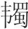
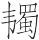
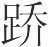
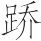
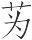
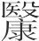
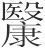
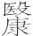
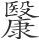
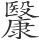

 仲春纪第二

# 仲春

**【题解】**

见《孟春》。

一曰：

仲春之月，日在奎(1)，昏弧中(2)，旦建星中(3)。其日甲乙，其帝太皞，其神句芒，其虫鳞，其音角，律中夹钟(4)。其数八，其味酸，其臭膻，其祀户，祭先脾。始雨水，桃李华(5)，苍庚鸣(6)，鹰化为鸠。天子居青阳太庙(7)，乘鸾辂，驾苍龙，载青旂，衣青衣，服青玉，食麦与羊，其器疏以达。

**【注释】**

(1)日在奎：指太阳的位置在奎宿。奎，二十八宿之一，在今仙女座。

(2)弧：星宿名，又名弧矢，在鬼宿之南，今属大犬及船尾座。

(3)建星：星宿名，在斗宿之上，今属人马座。

(4)夹钟：十二律之一。参看《孟春》注。

(5)华：花，开花。

(6)苍庚：黄鹂。

(7)青阳太庙：东向明堂的中间正室。参看《孟春》注。

**【译文】**

第一：

仲春二月，太阳的位置在奎宿。初昏时刻，弧矢星出现在南方中天；拂晓时刻，建星出现在南方中天。这个月在天干中属甲乙，主宰之帝是太皞，佐帝之神是句芒，应时的动物是龙鱼之类的鳞族，声音是中和的角音，音律与夹钟相应。这个月的数字是八，味道是酸，气味是膻，要举行的祭祀是户祭，祭祀时的祭品以脾脏为尊。这个月开始下雨，桃李开始开花，黄鹂开始鸣叫，天空中的鹰逐渐为布谷鸟取代。天子居住在东向明堂的正室，乘坐饰有用青凤命名的响铃的车子，车前驾青色的马，车上插绘有龙纹的青色的旗帜；天子穿青色的衣服，佩戴着青色的饰玉，吃的是麦子和羊，使用的器物纹理空疏而通达。

是月也，安萌牙(1)，养幼少，存诸孤；择元日，命人社(2)；命有司，省囹圄(3)，去桎梏(4)，无肆掠(5)，止狱讼。

**【注释】**

(1)萌牙：即萌芽。

(2)社：土神，意为祭祀土神，以祈求五谷丰登。

(3)有司：主管的官吏，这里指掌管刑法的官吏。囹圄（línɡyǔ）：牢狱。

(4)桎梏（zhìɡù）：刑具，在手上的叫梏，在脚上的叫桎。

(5)肆：陈列，这里指执行死刑后陈尸示众。掠：鞭笞。

**【译文】**

这个月，要保护植物的萌芽，养育儿童和少年，抚恤众多的孤儿。选择好的日子，命令老百姓祭祀土神。命令司法官减少关押的人犯，去掉手铐脚镣，不要杀人陈尸和鞭打犯人，制止诉讼之类的事情。

是月也，玄鸟至(1)，至之日，以太牢祀于高禖(2)。天子亲往，后妃率九嫔御(3)，乃礼天子所御(4)，带以弓(5)，授以弓矢(6)，于高禖之前。

**【注释】**

(1)玄鸟：燕子。相传有娀氏女简狄吞玄鸟卵而生契，因此后人把它作为男女婚娶的征兆，在它到来时祭祀媒神以求后嗣。

(2)太牢：祭品中牛羊豕（猪）三牲具备叫“太牢”。高禖（méi）：即郊禖。禖，主管嫁娶的媒神。因其祠在郊外，故称郊禖。

(3)嫔（pín）：古代宫廷中女官名。天子有一后、三夫人、九嫔、二十七世妇。这里九嫔泛指宫中所有女眷。御：侍从。

(4)天子所御：指天子所御幸而有孕的宫眷。

(5)弓（dú）：弓套。

(6)授以弓矢：把弓箭授给她。给有孕的女眷带上弓套，授予弓矢，是为了祈求能生男孩，因为弓矢之类都是男子勇士所用之具。

**【译文】**

这个月，燕子来到。燕子来到的那天，用牛羊豕三牲祭祀高禖之神。天子亲自前往，后妃率领宫中所有女眷陪从，在高禖神前为天子所御幸而有孕的女眷举行礼仪，给她们带上弓套，并授给她弓和箭。

是月也，日夜分(1)，雷乃发声，始电(2)。蛰虫咸动，开户始出(3)，先雷三日，奋铎以令于兆民曰(4)：“雷且发声，有不戒其容止者(5)，生子不备(6)，必有凶灾。”日夜分，则同度量，钧衡石(7)，角斗桶，正权概(8)。

**【注释】**

(1)日夜分：日夜时间相等。

(2)电：打闪。

(3)户：指穴。

(4)奋：振动。铎：指木铎，以木为舌的大铃。古代宣布政教法令，要巡行振鸣木铎以引起众人的警觉。

(5)容止：这里指男女房中事。

(6)备：完备。不备指生的小孩有先天残疾。

(7)钧：均等。衡：秤杆。石（shí）：重量单位，古代一百二十斤为一石。

(8)权：秤锤。概：平斗斛的木板。

**【译文】**

这个月，日夜平分，开始打雷，打闪。蛰伏的动物都苏醒了，开始从洞穴中钻出来。打雷的前三天，振动木铎向老百姓发布命令说：“凡是不警戒房中之事，在响雷时交合的，生下的孩子必有先天残疾，自己也必有凶险和灾祸。”日夜平分，所以要统一和校正各种度量衡器具。

是月也，耕者少舍(1)，乃修阖扇(2)。寝庙必备(3)。无作大事(4)，以妨农功。

**【注释】**

(1)少舍：稍稍休息。

(2)阖扇：门户。用木做的叫阖，用竹苇做的叫扇。

(3)寝庙：古代宗庙中前边祭祖的部分叫庙，后边住人的部分叫寝。

(4)大事：指战争。

**【译文】**

这个月，耕作的农夫稍事休息，修整门扇。祭祀先祖的寝庙一定要完整齐备。不要兴兵征伐，以免妨害农事。

是月也，无竭川泽，无漉陂池(1)，无焚山林。天子乃献羔开冰(2)，先荐寝庙(3)。上丁(4)，命乐正入舞舍采(5)；天子乃率三公、九卿、诸侯，亲往视之。中丁(6)，又命乐正入学习乐。

**【注释】**

(1)漉（lù）：竭，使干涸。陂（bēi）：积蓄水的池塘。

(2)献羔开冰：古人冬天凿下冰块，藏入冰窖，仲春二月，先要献上羊羔祭祀司寒之神，然后才能打开冰窖取冰。

(3)荐：向鬼神进献。

(4)上丁：一月之中的第一个丁日。

(5)舍：放置。采：指彩帛。

(6)中丁：一个月中旬的丁日。

**【译文】**

这个月，不要弄干河川沼泽及蓄水的池塘，不要焚烧山林。天子向司寒之神献上羔羊，打开冰窖，把冰先献给祖先。上旬的丁日，命令乐正进入国学教练舞蹈，把彩帛放在前边行祭祀先师的礼节。天子率领三公、九卿、诸侯亲自去观看。中旬的丁日，又命令乐正进入国学教练音乐。

是月也，祀不用牺牲(1)，用圭璧(2)，更皮币。

**【注释】**

(1)祀不用牺牲：指一般的祈祷之礼不用牺牲。上文提到祀高禖用太牢，开冰窖取冰用羔，都是天子举行的一年一度的大礼，不在此例。

(2)圭璧：祭祀时用作符信的玉器。圭，上尖下方的玉器。璧，圆形而中间有孔的玉器。

**【译文】**

这个月，一般的祭祀不用牲畜做祭品，而用玉圭、玉璧，或者用皮毛束帛来代替。

仲春行秋令，则其国大水，寒气总至(1)，寇戎来征(2)；行冬令，则阳气不胜(3)，麦乃不熟，民多相掠(4)；行夏令，则国乃大旱，暖气早来，虫螟为害(5)。

**【注释】**

(1)总：忽然。

(2)寇戎：来犯的敌军。

(3)胜：经受得住。

(4)掠：劫掠。

(5)虫螟：指吃庄稼心儿的虫子。

**【译文】**

仲春二月如果发布应在秋天发布的政令，国家就会洪水泛滥，寒气就会突然到来，敌寇就会来侵犯。如果发布应在冬天发布的政令，阳气就经受不住，麦子就不能成熟，百姓间就会频繁出现劫掠之事。如果发布应在夏天发布的政令，国家就会大旱，热气过早来到，庄稼就会遭到虫害。

# 贵生

**【题解】**

本篇旨在论述养生之道。文章提出，凡有害于生命的事就不去做，这就是养生的方法。文中列举的几个事例都是要说明天下“莫贵于生”。这种思想源于杨朱学派的“贵己”说。值得注意的是，文章结尾阐发道家人物子华子关于“迫生为下”的观点时，提出：“不义，迫生也。而迫生非独不义也，故曰迫生不若死。”这种把“生”与“义”联系起来，认为不义而生不如为义而死的思想已超出了杨朱“贵己”说的范围，显然是儒家思想的反映。

二曰：

圣人深虑天下，莫贵于生。夫耳目鼻口，生之役也(1)。耳虽欲声，目虽欲色，鼻虽欲芬香，口虽欲滋味，害于生则止。在四官者不欲，利于生者则弗为(2)。由此观之，耳目鼻口不得擅行，必有所制。譬之若官职，不得擅为，必有所制。此贵生之术也。

**【注释】**

(1)役：役使。

(2)弗：当是衍文。

**【译文】**

第二：

圣人深思熟虑天下的事，认为没有什么比生命更宝贵。耳目鼻口是受生命支配的。耳朵虽然想听乐音，眼睛虽然想看彩色，鼻子虽然想嗅芳香，嘴巴虽然想尝美味，但只要对生命有害就会被禁止。对于这四种器官来说，即使是本身不想做的，但只要有利于生命就去做。由此看来，耳目鼻口不能任意独行，必须有所制约。这就像各种职官，不得独断专行，必须要有所制约一样。这就是珍重生命的方法。

尧以天下让于子州支父(1)，子州支父对曰：“以我为天子犹可也(2)。虽然，我适有幽忧之病(3)，方将治之，未暇在天下也。”天下，重物也，而不以害其生，又况于他物乎？惟不以天下害其生者也，可以托天下。

**【注释】**

(1)子州支父（fǔ）：传说中的古代隐士，姓子，名州，字支父。

(2)犹：庶几，还。

(3)幽忧：深重的忧劳。

**【译文】**

尧把天下让给子州支父，子州支父回答说：“让我做天子还是可以的，虽是这样，但我现在正害着忧劳深重的病，正在治疗，没有余暇顾及天下。”天下是最珍贵的，可是圣人不因它而危害自己的生命，又何况其他的东西呢？只有不因天下而危害自己生命的人，才可以把天下托付给他。

越人三世杀其君，王子搜患之(1)，逃乎丹穴(2)。越国无君，求王子搜而不得，从之丹穴。王子搜不肯出。越人薰之以艾，乘之以王舆。王子搜援绥登车(3)，仰天而呼曰：“君乎！独不可以舍我乎？(4)”王子搜非恶为君也，恶为君之患也。若王子搜者，可谓不以国伤其生矣。此固越人之所欲得而为君也。

**【注释】**

(1)王子搜：战国时越王无颛（zhuān），“搜”为无颛的异名。毕沅据《竹书纪年》考证，无颛之前越国三代国君（不寿、朱句、无余）先后被杀。

(2)丹穴：采丹的矿井。

(3)援：拉。绥：车绥，上车时挽手所用的绳子。

(4)舍：舍弃。

**【译文】**

越国人连续杀了他们的三代国君，王子搜对此很是忧惧，于是逃到一个山洞里。越国没有国君，找不到王子搜，一直追寻到山洞。王子搜不肯出来，越国人就用燃着的艾草把他熏了出来，让他乘坐国君的车。王子搜拉着登车的绳子上车，仰望上天呼喊道：“国君啊！国君啊！难道不可以放过我吗？”王子搜并不是厌恶做国君，而是害怕做国君招致的祸患。像王子搜这样的人，可说是不肯因国家而伤害自己生命的了。这也正是越国人一定要找他做国君的原因。

鲁君闻颜阖得道之人也(1)，使人以币先焉(2)。颜阖守闾(3)，鹿布之衣(4)，而自饭牛。鲁君之使者至，颜阖自对之(5)。使者曰：“此颜阖之家耶？”颜阖对曰：“此阖之家也。”使者致币(6)，颜阖对曰：“恐听缪而遗使者罪(7)，不若审之(8)。”使者还反审之，复来求之，则不得已。故若颜阖者，非恶富贵也，由重生恶之也。世之人主多以贵富骄得道之人，其不相知，岂不悲哉？

**【注释】**

(1)颜阖（hé）：战国时鲁国的隐士。颜阖与鲁君事以及上文尧与子州支父、越人与王子搜之事均可参见《庄子·让王》。

(2)币：币帛。古人用以相互赠送、致意的礼物。先：事先致意。

(3)守：居。闾（lǘ）：周制，二十五家为里，里必有门，称作闾。这里代指住所。

(4)鹿：疑是“麤（cū）”字的省文。“麤”，今作“粗”。

(5)对：应答。

(6)致：献，送。

(7)缪：通“谬”，错。

(8)审：审核清楚。

**【译文】**

鲁国国君听说颜阖是个有道之人，想要请他出来做官，就派人带着礼物先去致意。颜阖住在陋巷，穿着粗布衣裳，自己喂牛。鲁君的使者来了，颜阖亲自接待他。使者问：“这是颜阖的家吗？”颜阖回答说：“这正是我的家。”使者送上礼物，颜阖说：“我担心您把名字听错了而会给您带来处罚，不如搞清楚再说。”使者回去查问清楚了，再来找颜阖，却找不到了。像颜阖这样的人，并不是本来就厌恶富贵，而是由于看重生命才厌恶它。世上的君主，大多凭借富贵傲视有道之人，他们竟如此地不了解有道之人，难道不太可悲了吗？

故曰：道之真(1)，以持身；其绪余(2)，以为国家；其土苴(3)，以治天下。由此观之，帝王之功，圣人之余事也，非所以完身养生之道也。今世俗之君子，危身弃生以徇物(4)，彼且奚以此之也(5)？彼且奚以此为也？

**【注释】**

(1)真：实质，根本。

(2)绪余：残余。绪，余。

(3)土苴（jū）：泥土草芥，比喻无足轻重的微贱之物。

(4)徇（xùn）：同“殉”，为某一目的而死。

(5)之：往。

**【译文】**

所以说：道的实体用来保全身体，它的剩余用来治理国家，它的渣滓用来治理天下。由此看来，帝王的功业是圣人闲暇之余的事，并不是用以全身养生的方法。如今世俗所谓的君子危害身体舍弃生命去追求外物，他们这样做要达到什么目的呢？他们又将采用什么手段达到目的呢？

凡圣人之动作也，必察其所以之与其所以为。今有人于此，以随侯之珠弹千仞之雀(1)，世必笑之。是何也？所用重，所要轻也(2)。夫生，岂特随侯珠之重也哉！

**【注释】**

(1)随侯之珠：相传随侯见一条大蛇伤断，给它敷药，后来大蛇从江中衔来一颗明珠报答他。后人把这颗明珠称作“随侯之珠”。随，汉东之国，姬姓。仞：古代长度单位。仞的长度说法不一。清人陶方琦《说文仞字八尺考》认为，周制一仞为八尺，汉制为七尺，东汉末则为五尺六寸。

(2)要（yāo）：求。

**【译文】**

大凡圣人有所举动的时候，必定明确知道所要达到的目的和达到目的所应采用的手段。假如有这样一个人，用随侯之珠去弹射千仞高的飞鸟，世上的人肯定会嘲笑他。这是为什么呢？这是因为他所耗费的太贵重，所追求的太轻微了啊。至于生命，其价值贵重又岂只是随侯珠所能相比的！

子华子曰(1)：“全生为上(2)，亏生次之(3)，死次之(4)，迫生为下(5)。”故所谓尊生者，全生之谓；所谓全生者，六欲皆得其宜也(6)。所谓亏生者，六欲分得其宜也(7)。亏生则于其尊之者薄矣(8)。其亏弥甚者也，其尊弥薄。所谓死者，无有所以知(9)，复其未生也。所谓迫生者，六欲莫得其宜也，皆获其所甚恶者。服是也，辱是也。辱莫大于不义，故不义，迫生也。而迫生非独不义也，故曰迫生不若死。奚以知其然也？耳闻所恶，不若无闻；目见所恶，不若无见。故雷则掩耳，电则掩目，此其比也(10)。凡六欲者，皆知其所甚恶，而必不得免，不若无有所以知。无有所以知者，死之谓也，故迫生不若死。嗜肉者，非腐鼠之谓也；嗜酒者，非败酒之谓也(11)；尊生者，非迫生之谓也。

**【注释】**

(1)子华子：古代道家人物。传说为战国时魏人，与韩昭釐侯同时。

(2)全生：保全生命的天性，使其顺应自然，即下文所说的“六欲皆得其宜”。

(3)亏生：指生命的天性由于受到外物的干扰而亏损，即下文所说的“六欲分得其宜”。亏，损耗，欠缺。

(4)死：这里不是指终其天年的自然死亡，而是指为坚守自己的志向而舍弃生命。

(5)迫生：这里指苟且偷生，使生命的天性完全受到压抑，即下文所说的“六欲莫得其宜”。

(6)六欲：指生、死及耳、目、口、鼻的欲望。

(7)分：一半。

(8)尊之者：指生命的天性。

(9)所以知：用以知道六欲的凭借，即知觉。

(10)比：相似。

(11)败：腐败变质。

**【译文】**

子华子说：“全生是最上等，亏生次一等，死又次一等，迫生是最低下的。”所以，所谓尊生，说的就是全生；所谓全生，是指六欲都能得到适宜。所谓亏生，是指六欲只有部分得到适宜。生命受到亏损，它的天性就会削弱；生命亏损得越厉害，它的天性削弱得也就越厉害。所谓死，是指没有了知觉，等于又回到它未生时的状态。所谓迫生，是指六欲没有一样得到适宜，六欲所得到的都是它们十分厌恶的东西。屈服属于这一类，耻辱属于这一类。在耻辱当中没有比不义更大的了。所以，不义就是迫生。但是迫生不仅仅是不义，所以说，迫生不如死。根据什么知道是这样呢？耳朵听到讨厌的声音，就不如什么也没听到；眼睛看到讨厌的东西，就不如什么也没见到。所以打雷的时候人们就会捂住耳朵，打闪的时候人们就会遮住眼睛。迫生不如死就像这种不如不听、不如不看的现象一样。六欲都知道自己十分厌恶的东西是什么，如果这些东西一定不可避免，那么就不如根本没有办法知道六欲。没有办法知道六欲就是死。因此迫生不如死。嗜好吃肉，不是说连腐臭的老鼠也吃；嗜好喝酒，不是说连变质的酒也喝；珍惜生命，不是说连迫生也算。

# 情欲

**【题解】**

本篇旨在论述节欲养生。文章指出，人的感情欲望是天生的，圣人与一般人的不同就在于圣人“得其情”，因此“生以寿长，声色滋味能久乐之”；俗主“亏情”，所以“每动为亡败”。“得其情”与“亏情”的关键就在于是否珍重自己的生命。本篇的思想近于荀子的“节欲”说。老、庄提倡的“无欲”、孟子提倡的“寡欲”，虽从根本上说也是要人们“节欲”但与本篇“节欲”思想仍有着程度的差别。文章还指出，“天地不能两”，因而功业与生命同样不能两全，从“法天地”的观点出发论述了“贵生”的主张。

三曰：

天生人而使有贪有欲。欲有情，情有节。圣人修节以止欲，故不过行其情也。故耳之欲五声，目之欲五色，口之欲五味，情也。此三者，贵贱、愚智、贤不肖欲之若一，虽神农、黄帝(1)，其与桀、纣同(2)。圣人之所以异者，得其情也。由贵生动，则得其情矣；不由贵生动，则失其情矣。此二者，死生存亡之本也。

**【注释】**

(1)神农：传说中的远古帝名。古史又称炎帝、烈山氏。黄帝：传说中的远古帝名，姬姓，号轩辕氏、有熊氏，是中原各族的共同祖先。古人把神农、黄帝看作圣王的代表。

(2)桀：夏代最末一个君主，名履癸。纣：商代最末一个君主，名受。古人把桀纣作为暴君的典型。

**【译文】**

第三：

天生育人而使人有贪心有欲望。欲望产生感情，感情具有节度。圣人修节度以克制欲望，所以不会放纵自己的感情。耳朵想听乐音，眼睛想看彩色，嘴巴想吃美味，这些都是情欲。这三方面，高贵的人和卑贱的人，愚笨的人和聪明的人，贤明的人和不肖的人，欲望都是同样的。即使是神农、黄帝，他们的情欲也跟夏桀、商纣相同。圣人之所以不同于一般人，是由于他们能够控制情欲使它适度。从尊生出发而行动，情欲就会适度；不从尊生出发而行动，情欲就会放纵。这两种情况是决定死生存亡的根本。

俗主亏情，故每动为亡败。耳不可赡，目不可厌，口不可满；身尽府种(1)，筋骨沈滞(2)，血脉壅塞，九窍寥寥(3)，曲失其宜(4)，虽有彭祖(5)，犹不能为也。其于物也，不可得之为欲，不可足之为求(6)，大失生本；民人怨谤，又树大雠；意气易动，然不固(7)；矜势好智，胸中欺诈；德义之缓，邪利之急(8)。身以困穷(9)，虽后悔之，尚将奚及？巧佞之近，端直之远，国家大危，悔前之过，犹不可反。闻言而惊，不得所由。百病怒起(10)，乱难时至。以此君人(11)，为身大忧。耳不乐声，目不乐色，口不甘味，与死无择(12)。

**【注释】**

(1)府种：通“腑肿”，即浮肿。

(2)沈（chén）滞：积滞而不通畅。沈，后代多写作“沉”。

(3)九窍：九孔。包括阳窍七（眼、耳、鼻、口）、阴窍二（大、小便处）。寥寥：空虚的样子。

(4)曲：周遍。

(5)彭祖：传说是颛顼（zhuānxū）帝玄孙陆终氏的第三子篯铿（jiānkēnɡ），善养生之道，活了八百岁，尧封之于彭城，故称彭祖。

(6)“不可”二句：等于说“欲不可得，求不可足”。有人认为“之为”在语法上标志宾语前置。

(7)（jué）然：流行疾速、不坚固的样子。

(8)德义之缓，邪利之急：等于说“缓德义，急邪利”。下文“巧佞之近，端直之远”与此句式相同，意为近巧佞，远端直。

(9)以：通“已”，已经。

(10)怒：盛，猛烈。

(11)君：给……做君。

(12)择：区别。

**【译文】**

世俗的君主放纵情欲，所以动辄灭亡。他们耳朵的欲望不可满足，眼睛的欲望不可满足，嘴巴的欲望不可满足，以致全身浮肿，筋骨积滞不通，血脉阻塞不畅，九窍空虚，全都丧失了正常的机能。到了这个地步，即使有彭祖在，也是无能为力的。世俗的君主对于外物，总是想得到不可得到的东西，追求不可满足的欲望，大大丧失生命的根本；百姓也会怨恨指责，这又给自己树起大敌。他们意志动摇，变化迅速而不坚定；夸耀权势，好弄智谋，胸怀欺诈，实行道德正义再拖延，追逐邪恶私利争先恐后，自身因而搞得走投无路。即使事后对此悔恨，还怎么来得及？他们亲近巧诈的人，疏远正直的人，致使国家处于极危险的境地，这时即使后悔以前的过错，已然不可挽回。闻知自己即将灭亡的话这才惊恐，却仍然不知这种后果由何而至。各种疾病暴发出来，反叛内乱时有发生。靠这些治理百姓，只能给自身带来极大的忧患。以至耳听乐音却不觉得快乐，眼看彩色却不觉得高兴，口吃美味却不觉得香甜，这实际上跟死没什么区别。

古人得道者，生以寿长，声色滋味能久乐之，奚故？论早定也(1)。论早定则知早啬(2)，知早啬则精不竭。秋早寒则冬必暖矣，春多雨则夏必旱矣。天地不能两(3)，而况于人类乎？人之与天地也同。万物之形虽异，其情一体也。故古之治身与天下者，必法天地也。

**【注释】**

(1)论：这里指贵生的信念。

(2)啬（sè）：爱惜。

(3)两：这里是两全的意思。

**【译文】**

古代的得道之人，生命得以长寿，乐音、彩色、美味能长久地享受，这是什么缘故。这是由于尊生的信念早确立的缘故。尊生的信念及早确立，就可以知道及早爱惜生命；知道及早爱惜生命，精神就不会衰竭。秋天早寒，冬天就必定温暖；春天多雨，夏天就必定干旱。天地尚且不能两全，又何况人类呢？在这一点上人跟天地相同。万物形状虽然各异，但它们的本性是一样的。所以，古代修养身心与治理天下的人一定效法天地。

尊，酌者众则速尽。万物之酌大贵之生者众矣(1)，故大贵之生常速尽。非徒万物酌之也，又损其生以资天下之人，而终不自知。功虽成乎外，而生亏乎内。耳不可以听，目不可以视，口不可以食，胸中大扰，妄言想见，临死之上，颠倒惊惧，不知所为。用心如此，岂不悲哉？

**【注释】**

(1)大贵之生：指君主的生命。

**【译文】**

酒樽中的酒，舀的人多，完的就快。万物之中消耗君主生命的太多了，所以君主的生命常常很快耗尽。不仅万物消耗它，君主自己又损耗它来为天下人操劳，而自己却始终不察觉。在外虽然功成名就，可是自身生命却已损耗。以致耳不能听，眼不能看，嘴不能吃，心中大乱，口说胡话，精神恍忽；临死之前，精神错乱，惊恐万状，不知自己在干什么。耗费心力到了这个地步，难道不可悲吗？

世人之事君者，皆以孙叔敖之遇荆庄王为幸(1)。自有道者论之则不然，此荆国之幸。荆庄王好周游田猎，驰骋弋射(2)，欢乐无遗，尽傅其境内之劳与诸侯之忧于孙叔敖(3)。孙叔敖日夜不息，不得以便生为故(4)，故使庄王功迹著乎竹帛，传乎后世。

**【注释】**

(1)孙叔敖：即（wěi）敖，字孙叔，春秋楚人，初隐居海滨，后为楚庄王令尹。遇：知遇，受到赏识。荆庄王：即楚庄王，春秋楚国国君，芈（mǐ）姓，名旅（或作吕、侣），公元前613年—前591年在位，为春秋五霸之一。

(2)弋（yì）：以绳系箭而射。

(3)傅：付。

(4)便：利。故：事。

**【译文】**

世上侍奉君主的人都把孙叔敖受到楚庄王的知遇看作是幸运的事。但是由有道之人来评论却不是这样，这只是楚国的幸运。楚庄王喜好四处游玩打猎，跑马射箭，欢乐无余，而把治国的辛苦和做诸侯的忧劳都推给了孙叔敖。孙叔敖日夜操劳不止，无法顾及养生之事。正因为这样，才使楚庄王的功绩载于史册，流传到后代。

# 当染

**【题解】**

本篇与《墨子·所染》篇文字基本相同。文章以染丝为喻，强调了环境对人的决定性作用。文中列举历史事例说明：“所染当”，君主就能成就王霸之业，士就能显荣于天下“所染不当”；，就会导致国破身辱。因此“劳于论人而佚于官事”，才是为君的正确方法。篇末将孔子、墨子及其后学并称，并持同样尊重的态度，这一点与《墨子·所染》篇不同。

四曰：

墨子见染素丝者而叹曰(1)：“染于苍则苍，染于黄则黄，所以入者变(2)，其色亦变，五入而以为五色矣。”故染不可不慎也。

**【注释】**

(1)墨子：名翟（dí），战国初鲁国人，墨家学派创始人。现存《墨子》五十三篇是墨翟的门徒根据他的遗教编纂而成。素丝：未经染色的生丝。

(2)所以入者：指染料。

**【译文】**

第四：

墨子曾看到染素丝的而叹息说：“放到青色染料中浸染，素丝就变成青色；放到黄色染料中浸染，素丝就变成黄色；用来放入的染料变了，素丝的颜色也随着变化，染五次就会变出五种颜色了。”所以，染色不可不慎重。

非独染丝然也，国亦有染(1)。舜染于许由、伯阳(2)，禹染于皋陶、伯益(3)，汤染于伊尹、仲虺(4)，武王染于太公望、周公旦(5)。此四王者，所染当，故王天下，立为天子，功名蔽天地。举天下之仁义显人，必称此四王者。夏桀染于干辛、歧踵戎(6)，殷纣染于崇侯、恶来(7)，周厉王染于虢公长父、荣夷终(8)，幽王染于虢公鼓、祭公敦(9)。此四王者，所染不当，故国残身死，为天下僇(10)。举天下之不义辱人，必称此四王者。齐桓公染于管仲、鲍叔，晋文公染于咎犯、郄偃(11)，荆庄王染于孙叔敖、沈尹蒸(12)，吴王阖庐染于伍员、文之仪(13)，越王句践染于范蠡、大夫种(14)。此五君者，所染当，故霸诸侯，功名传于后世。范吉射染于张柳朔、王生(15)，中行寅染于黄藉秦、高强(16)，吴王夫差染于王孙雄、太宰嚭(17)，智伯瑶染于智国、张武(18)，中山尚染于魏义、椻长(19)，宋康王染于唐鞅、田不禋(20)。此六君者，所染不当，故国皆残亡，身或死辱，宗庙不血食(21)，绝其后类，君臣离散，民人流亡。举天下之贪暴可羞人，必称此六君者。

**【注释】**

(1)染：这里用作比喻，是熏陶、熏染的意思。

(2)许由：古代传说中的高士。相传舜想把天下让给许由，许由不接受，逃隐于箕山。伯阳：传说为尧时的贤人，舜七友之一。

(3)皋陶（yáo）：舜的法官。伯益：舜臣，与皋陶同族。他书或作“伯翳”。

(4)汤：商朝的建立者，也称天乙。伊尹：商汤的大臣，原是汤妻陪嫁的奴隶，后辅佐汤灭桀，建立商朝，被尊为阿衡（宰相）。仲虺（huī）：汤的左相。

(5)武王：指周武王，姬姓，名发，文王之子，西周王朝的建立者。太公望：姜姓，吕氏，名尚，号太公望；周文王立他为师，武王尊他为师尚父；辅佐武王灭商，建立周王朝，被封于齐。

(6)干辛、歧踵戎：夏桀的两个臣子。

(7)崇侯：名虎。崇，国名。侯，爵位。恶来：嬴姓，飞廉之子。二人是殷纣的臣子。

(8)周厉王：周穆王的四世孙，名胡，因荒淫暴虐而被国人放逐。虢（ɡuó）公长父：周厉王的卿士，名长父。虢，国名。荣夷终：周厉王的卿士，名终。荣，国名。夷，谥号。

(9)幽王：指周幽王，宣王之子，名宫涅，公元前771年被犬戎杀于骊山下，西周从此灭亡。虢公鼓、祭（zhài）公敦：周幽王的两个卿士，名鼓、名敦。祭，国名。

(10)僇（lù）：同“戮”，辱。

(11)晋文公：春秋晋国国君，名重耳，献公之子，公元前636年—前628年在位，为春秋五霸之一。咎犯：即狐偃，晋卿，因是晋文公的舅父，也称舅犯。郄（xì）偃：当为“郭偃”，即卜偃，晋献公时为掌卜大夫。

(12)沈尹蒸：春秋时楚国大夫。沈，邑名，尹，官名。蒸，当作“筮”，人名。又作“沈尹巫”。沈尹筮把孙叔敖推荐给楚庄王。

(13)阖（hé）庐：春秋末年吴国国君，名光，公元前514年—前496年在位。或作“阖闾”。伍员（yún）：吴大夫，名员，字子胥，本楚国人，父兄为楚平王所杀，逃至吴国，后辅佐吴王阖庐击败强楚。文之仪：吴大夫，名之仪。

(14)句（ɡōu）践：春秋末年越国国君，公元前491年—前465年在位。按：本篇以齐桓公、晋文公、楚庄王、阖庐、勾践为春秋五霸。范蠡（lǐ）：越大夫，名蠡，别号陶朱公。大夫种：即文种（zhǒnɡ）。越大夫。二人辅佐勾践卧薪尝胆，发愤图强，终于灭掉吴国。

(15)范吉射：春秋时晋卿。公元前497年，范氏、中行氏联合发难，攻打赵氏，结果反被知氏、赵氏、韩氏、魏氏四家逐出晋国。张柳朔、王生：范吉射的两个家臣，都死于范氏之难。

(16)中行（hánɡ）寅：晋卿荀寅。黄藉秦、高强：荀寅的两个家臣。

(17)夫差：吴王阖庐之子，吴国国君；曾大败越国，后听信谗言，同意勾践的求和，终导致国灭身死。王孙雄：吴大夫。雄，当作“雒（luò）”。太宰嚭（pǐ）：吴太宰伯嚭。

(18)智伯瑶：名瑶，晋国荀首的后代，又称荀瑶，晋哀公时为执政大臣，谥襄子。智国、张武：智氏的两个家臣。他们劝说智伯纠合韩、魏，把赵襄子围在晋阳，结果韩魏赵三家暗地联合，反灭掉智氏。

(19)中山：春秋国名，为魏所灭。尚：人名，疑是中山最后一个国君中山桓公。魏义、椻（yàn）长：中山国的两个大夫。

(20)宋康王：战国时宋国最末一个国君，名偃，以荒淫贪暴著称，诸侯称他“桀宋”；即位四十七年（《史记》年表云四十三年），被齐、楚、魏三国所灭。唐鞅、田不禋（yīn）：宋大夫。

(21)血食：指受祭祀。古代祭祀用牲，故称血食。

**【译文】**

不仅染丝这样，国家也有类似于染丝的情形。舜受到许由、伯阳的熏染，禹受到皋陶、伯益的熏染，商汤受到伊尹、仲虺的熏染，武王受到太公望、周公旦的熏染。这四位帝王，因为所受的熏陶合宜得当，所以能够统治天下，立为天子，功名盖天地。凡列举天下仁义、显达之人，一定都推举这四位帝王。夏桀受到干辛、歧踵戎的熏染，殷纣受到崇侯、恶来的熏染，周厉王受到虢公长父、荣夷终的熏染，周幽王受到虢公鼓、祭公敦的熏染。这四位君王，因为所受的熏染不得当，结果国破身死，被天下人耻笑。凡列举天下不义、蒙受耻辱之人，一定都举这四位君王。齐桓公受到管仲、鲍叔牙的熏陶，晋文公受到咎犯、卜偃的熏染，楚庄王受到孙叔敖、沈尹筮的熏染，吴王阖庐受到伍员、文之仪的熏染，越王勾践受到范蠡、文种的熏染。这五位君主，因为所受的熏陶合宜得当，所以称霸诸侯，功业盛名流传到后代。范吉射受到张柳朔、王生的熏染，中行寅受到黄藉秦、高强的熏染，吴王夫差受到王孙雒、太宰嚭的熏染，智伯瑶受到智国、张武的熏染，中山尚受到魏义、椻长的熏染，宋康王受到唐鞅、田不禋的熏染。这六位君主，因为所受的熏染不得当，结果国家都破灭了，他们自身有的被杀，有的受辱，宗庙毁灭不能再享受祭祀，子孙断绝，君臣离散，人民流亡。凡列举天下贪婪残暴、蒙受耻辱之人，一定都举这六位君主。

凡为君，非为君而因荣也，非为君而因安也，以为行理也。行理生于当染。故古之善为君者，劳于论人而佚于官事(1)，得其经也。不能为君者，伤形费神，愁心劳耳目，国愈危，身愈辱，不知要故也。不知要故(2)，则所染不当；所染不当，理奚由至？六君者是已。六君者，非不重其国、爱其身也，所染不当也。存亡故不独是也(3)，帝王亦然(4)。

**【注释】**

(1)论：选择。

(2)故：疑承上文而衍。

(3)故：本来。是：指上文所列举的五霸、六君。

(4)帝王：指上文所列举的舜、禹、汤、武王、夏桀、殷纣、周厉王、幽王。

**【译文】**

大凡做君，不是为获得显荣，也不是为获得安适，而是为实施大道。大道的实施产生于熏染合宜得当。所以古代善于做君的把精力花费在选贤任能上，而对于官署政事则采取安然置之的态度，这是掌握了做君的正确方法。不善于做君的，伤身劳神，心中愁苦，耳目劳累，而国家却越来越危险，自身却蒙受越来越多的耻辱，这是由于不知道做君的关键所在的缘故。不知道做君的关键，所受的熏染就不会得当。所受的熏染不得当，大道从何而至？以上六个君主就是这样。那六位君主不是不看重自己的国家，也不是不爱惜自己，而是由于他们所受的熏染不得当啊。所受的熏染适当与否关系到存亡，不仅诸侯如此，帝王也是这样。

非独国有染也。孔子学于老聃、孟苏、夔靖叔(1)。鲁惠公使宰让请郊庙之礼于天子(2)，桓王使史角往(3)，惠公止之。其后在于鲁，墨子学焉。此二士者，无爵位以显人，无赏禄以利人。举天下之显荣者，必称此二士也。皆死久矣，从属弥众，弟子弥丰，充满天下。王公大人从而显之；有爱子弟者，随而学焉，无时乏绝。子贡、子夏、曾子学于孔子(4)，田子方学于子贡(5)，段干木学于子夏(6)，吴起学于曾子(7)；禽滑学于墨子(8)，许犯学于禽滑(9)，田系学于许犯(10)。孔墨之后学显荣于天下者众矣，不可胜数，皆所染者得当也。

**【注释】**

(1)孟苏、夔（kuí）靖叔：当是与孔子同时的两位有道之人。

(2)鲁惠公：春秋鲁国国君，名弗皇（一作“弗湟”），公元前768—前723年在位。宰让：鲁大夫。郊：祭天。庙：祭祖。天子：指周平王。

(3)桓王：当作“平王”。因惠公死于平王四十八年，其时桓王未立。如“桓王使史角往”，其时惠公已死，则又与下文“惠公止之”不合。史角：名叫角的史官。

(4)子贡：孔子的弟子，姓端木，名赐，字子贡。子夏：孔子的弟子，姓卜，名商，字子夏，相传曾为魏文侯的老师。曾子：孔子的弟子，名参（shēn），字子舆。

(5)田子方：战国时魏国的贤士，魏文侯尊他为师。

(6)段干木：战国时魏国的隐士，很受魏文侯的尊重。

(7)吴起：战国时魏国人，军事家。先为魏文侯将军，文侯死后，因遭陷害而逃到楚国，辅佐楚悼王变法图强，使楚国强盛一时。

(8)禽滑（ɡǔ）（读音未详）：墨子的弟子。他书或作“禽滑厘”、“禽滑黎”。

(9)许犯：墨家后学弟子。

(10)田系：墨家后学弟子。

**【译文】**

不仅国家有受染的情形，士也是这样。孔子向老聃、孟苏、夔靖叔学习。鲁惠公派宰让向天子请示郊祭、庙祭的礼仪，平王派名叫角的史官前往，惠公把他留了下来，他的后代在鲁国，墨子向他的后代学习。孔子、墨子这两位贤士，没有爵位来使别人显赫，没有赏赐俸禄来给别人带来好处，但是，列举天下显赫荣耀之人，一定都举这二位贤士。这二位贤士都死了很久了，而追随他们的人却更多了，他们的弟子越来越多，遍布天下。王公贵族因而宣扬他们；那些爱怜子弟的人，让他们的子弟跟随孔墨的门徒学习，没有一时中断过。子贡、子夏、曾子向孔子学习，田子方向子贡学习，段干木向子夏学习，吴起向曾子学习；禽滑向墨子学习，许犯向禽滑学习，田系向许犯学习。孔墨后学在天下显贵尊荣的太多了，数也数不尽，这都是由于所受的熏染得当啊。

# 功名**一作由道**

**【题解】**

本篇旨在论述为君之道。文章以大量生动的比喻说明：要达到目的，必“由其道”。条件具备了，方法对头了，自然水到渠成，否则徒劳无益。本篇劝戒君主要重视人心的向背，指出“欲为天子，民之所走，不可不察”，“所以示民，不可不异”，反映了作者的民本思想。

五曰：

由其道，功名之不可得逃，犹表之与影(1)，若呼之与响(2)。善钓者，出鱼乎十仞之下，饵香也；善弋者，下鸟乎百仞之上，弓良也；善为君者，蛮夷反舌殊俗异习皆服之(3)，德厚也。水泉深则鱼鳖归之，树木盛则飞鸟归之，庶草茂则禽兽归之，人主贤则豪杰归之。故圣王不务归之者，而务其所以归。

**【注释】**

(1)表：古代测日影、定时刻所立的标竿。

(2)响：回声。

(3)反舌：指四方各族语音与华夏不同。

**【译文】**

第五：

遵循正确的途径猎取功名，功名就无法逃脱，正像日影无法摆脱测日影用的标杆，回声必然伴随呼声一样。善于钓鱼的人能把鱼从十仞深的水下钓出来，这是由于钓饵香美的缘故；善于射猎的人能把鸟从百仞高的空中射下来，这是由于弓好的缘故；善于做君主的人能够使四方各族归顺他，这是由于恩德崇厚的缘故。水泉深广，鱼鳖就会游向那里；树木繁盛，飞鸟就会飞向那里；百草茂密，禽兽就会奔向那里；君主贤明，豪杰就会归依他。所以，圣明的君主不勉强使人们归依，而是尽力创造使人们归依的条件。

强令之笑不乐；强令之哭不悲；强令之为道也，可以成小(1)，而不可以成大。

**【注释】**

(1)小：这里指虚名。

**【译文】**

强制出来的笑不快乐，强制出来的哭不悲哀，强制命令这种做法只可以成就虚名，而不能成就大业。

缶醯黄(1)，蚋聚之(2)，有酸；徒水则必不可。以狸致鼠(3)，以冰致蝇，虽工，不能。以茹鱼去蝇(4)，蝇愈至，不可禁，以致之之道去之也。桀、纣以去之之道致之也，罚虽重，刑虽严，何益？

**【注释】**

(1)缶（fǒu）：瓦器。圆腹，小口，有盖，用以汲水或盛流质。醯（xī）：醋。

(2)蚋（ruì）：蚊类。

(3)狸（lí）：这里指猫。

(4)茹（rú）：腐臭。

**【译文】**

瓦器中的醋黄了，蚊子之类就聚在那里了，那是因为有酸味的缘故。如果只是水，就一定招不来它们。用猫招引老鼠，用冰招引苍蝇，纵然做法再精巧，也达不到目的。用臭鱼驱除苍蝇，苍蝇会越来越多，不可禁止，这是由于用招引它们的方法去驱除它们的缘故。桀纣企图用破坏太平安定的暴政求得太平安定的局面，惩罚即使再重，刑法即使再严，又有什么益处？

大寒既至，民暖是利(1)；大热在上，民清是走(2)。故民无常处，见利之聚(3)，无之去。欲为天子，民之所走，不可不察。今之世，至寒矣，至热矣，而民无走者，取则行钧也(4)。欲为天子，所以示民，不可不异也。行不异乱，虽信令(5)，民犹无走。民无走，则王者废矣，暴君幸矣，民绝望矣。故当今之世，有仁人在焉，不可而不此务(6)；有贤主，不可而不此事。

**【注释】**

(1)民暖是利：等于说“民利暖”。下句“民清是走”等于说“民走清”。

(2)走：奔向。

(3)见利之聚：等于说“聚见利”。聚于见利之处。下句“无之去”等于说“无去（利）”。

(4)取：意同“趣（qū）”，奔赴。钧：通“均”。

(5)信（shēn）：通“伸”。

(6)可而：相当于“可以”。

**【译文】**

严寒到了，人民就追求温暖；酷暑临头，人民就奔向清凉。因此，人民没有固定的居处，他们总是聚集在可以看到利益的地方，离开那些没有利益的地方。想要作天子，对于人民奔走的原因不可不仔细察辨。如今的人世，寒冷到极点了，炎热到极点了，而人民之所以不奔向谁，是由于是因为所要去的地方君主所作所为都是同样的坏啊！所以，想作天子，用来显示给人民的就不可不与此相区别。如果君主的言行与暴乱之君的没有什么区别，那么即使下命令，人民也不会趋附他。如果人民不趋附谁，那么，成就王业的人就不会出现了，暴君就庆幸了，人民就绝望了。所以，在今天的世上如果有仁义之人在，不可不勉力从事这件事；如果有贤明的君主在，不可不致力于这件事。

贤不肖不可以相分(1)，若命之不可易，若美恶之不可移。桀、纣贵为天子，富有天下，能尽害天下之民，而不能得贤名之(2)。关龙逢、王子比干能以要领之死争其上之过(3)，而不能与之贤名。名固不可以相分，必由其理。

**【注释】**

(1)不相分：“不”字误衍。分：分给。

(2)不能得贤名之：意思是，不能获得贤明之名。谥法：贼人多杀曰桀，残义损善曰纣。

(3)关龙逢（pénɡ）：夏桀之臣。传说夏桀暴虐无道，关龙逢极力劝谏，被桀所杀。王子比干：殷纣的叔伯父（一说纣的庶兄）。传说纣荒淫暴虐，比干犯颜强谏，被纣剖心而死。要：古“腰”字。领：脖子。争（zhènɡ）：诤谏。这个意义后来写作“诤”。

**【译文】**

贤明的名声与不肖的名声不能由别人给予，全由自己的言行而定，这就像命运不可更改，美恶不可移易一样。桀纣贵为天子，富有天下，能遍害天下的人，却不能为自己博得一个好名声。关龙逢、王子比干能以死谏诤其君的过错，却不能给他们争得好名声。名声本来就不能由别人给予，它只能遵循一定的途径获得。

