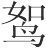
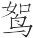
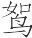
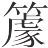
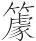
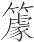
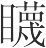
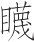
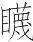

 季春纪第三

# 季春

**【题解】**

见《孟春》。

一曰：

季春之月，日在胃(1)，昏七星中(2)，旦牵牛中(3)。其日甲乙，其帝太皞，其神句芒，其虫鳞，其音角，律中姑洗(4)。其数八，其味酸，其臭膻，其祀户，祭先脾。桐始华，田鼠化为(5)；虹始见，萍始生。天子居青阳右个(6)，乘鸾辂，驾苍龙，载青旂，衣青衣，服青玉，食麦与羊，其器疏以达。

**【注释】**

(1)日在胃：指太阳的位置在胃宿。胃，星宿名，二十八宿之一，在今白羊座。

(2)七星：星宿名，即星宿，二十八宿之一，在今长蛇座。

(3)牵牛：星宿名，即牛宿，二十八宿之一，在今摩羯座。

(4)姑洗（xiǎn）：十二律之一，属阳律。参见《孟春纪》注。

(5)（rú）：鹌鹑之类的鸟。田鼠化为只是古人的一种传说。

(6)青阳右个：东向明堂的右侧室。

**【译文】**

第一：

季春三月，太阳的位置在胃宿。初昏时刻，星宿出现在南方中天；拂晓时刻，牛宿出现在南方中天。季春于天干属甲乙，主宰之帝是太皞，佐帝之神是句芒，应时的动物是龙鱼之类的鳞族，声音是中和的角音，音律与姑洗相应。这个月的数字是八，味道是酸，气味是膻，要举行的祭祀是户祭，祭祀时，祭品以脾脏为尊。这个月梧桐树开始开花，鼹鼠变成鹌鹑之类的鸟，彩虹开始出现，浮萍开始长出。天子居住在东向明堂的右侧室，乘坐饰有用青凤命名的响铃的车子，车前驾青色的马，车上插绘有龙纹的青色旗帜；天子穿青色的衣服，佩戴青色的饰玉，吃的是麦子和羊，使用的器物纹理空疏而通达。

是月也，天子乃荐鞠衣于先帝(1)，命舟牧覆舟(2)，五覆五反(3)，乃告舟备具于天子焉。天子焉始乘舟。荐鲔于寝庙(4)，乃为麦祈实。

**【注释】**

(1)鞠衣：指后妃们躬桑时穿的像初生的桑叶那种黄色的衣服。先帝：指太皞等古帝王。

(2)舟牧：主管船只的官。覆舟：指把船翻过来检查船底有无漏洞。

(3)反：翻转。

(4)鲔（wěi）：鱼名，即鲟鱼。寝庙：指宗庙。

**【译文】**

这个月，天子向太皞等先帝进献黄色的衣服，祈求蚕事如意。命令主管船只的官吏把船底翻过来检查，船底船身要反复检查五次，于是向天子报告船只已经齐备。天子于是开始乘船。向祖宗进献鲟鱼，祈求麦子籽实饱满。

是月也，生气方盛(1)，阳气发泄，生者毕出(2)，萌者尽达，不可以内(3)。天子布德行惠，命有司发仓窌(4)，赐贫穷，振乏绝(5)，开府库，出币帛，周天下，勉诸侯，聘名士，礼贤者。

**【注释】**

(1)生气：指使万物生长发育之气。

(2)生：一作“牙”，是。牙，萌芽。毕：都，全。

(3)内（nà）：纳入，指纳入财物。

(4)窌（jiào）：地窖。

(5)振：同“赈”，救济。乏绝：出门在外而无川资叫乏，居于家中而无饮食叫绝。

**【译文】**

这个月，春天的生养之气正盛，阳气向外发散，植物的萌芽都长出来了。这个时候，不能收纳财货。天子要施德行惠，命令主管官吏打开粮仓地窖，赐与贫困没有依靠的人，赈救缺乏资用衣食的人；打开储藏财物的仓库，拿出钱财，周济天下；鼓励诸侯聘用名士，对贤人以礼相待。

是月也，命司空曰(1)：“时雨将降，下水上腾，循行国邑(2)，周视原野，修利堤防，导达沟渎，开通道路，无有障塞；田猎罼弋(3)，罝罘罗网(4)，喂兽之药，无出九门(5)。”

**【注释】**

(1)司空：主管土地、建筑、道路等事的官，周代为六卿之一。

(2)循：巡视。国邑：国都和城邑。

(3)罼（bì）：捕捉禽兽的长柄网。弋：拴在生丝线上射出去以后可以收回的箭。

(4)罝罘（jūfú）：都是捕兔的网。罗：捕鸟的网。这里罝罘罗网泛指一切捕捉禽兽的网。

(5)无：通“毋”，不要。九门：天子的都城有十二个城门，东方主生养，东方三门本来就不许上述猎具出城，这里的九门指东方三门之外的南、西、北三方九个城门。

**【译文】**

这个月，天子命令司空说：“应时的雨水将要降落，地下水将向上翻涌，应该巡视国都和城邑，普遍地视察原野，整修堤防，疏通沟渠，开通道路，使之没有障碍壅塞。打猎所需要的各种网具，毒杀野兽的药，不能带出城去。

是月也，命野虞无伐桑柘(1)。鸣鸠拂其羽，戴任降于桑(2)，具栚曲筐(3)。后妃斋戒，亲东乡躬桑(4)。禁妇女无观(5)，省妇使(6)，劝蚕事。蚕事既登，分茧称丝效功(7)，以共郊庙之服(8)，无有敢堕(9)。

**【注释】**

(1)野虞：主管山林田野的官。柘（zhè）：柘树，叶子可以养蚕。

(2)戴任：鸟名。

(3)栚（zhèn）曲（jǔ）筐：都是采桑养蚕的用具。栚，放蚕薄的木架的横木。曲，蚕薄（蚕箔）。，圆底的筐。筐，方底的筐。

(4)东乡（xiànɡ）：向东方。乡，向。

(5)观：指游观。

(6)妇使：指妇女除养蚕之外的工作。

(7)效功：考核功效，即考核完成工作的情况。

(8)共：同“供”，供给。郊：指在郊外祭天。庙：指“供”在宗庙祭祖。

(9)堕：同“惰”，懈怠，懒惰。

**【译文】**

这个月，命令主管山林的官吏不要砍伐桑树、柘树。此时，斑鸠振翅高飞，戴任落在桑间。人们准备蚕薄、放蚕薄的支架以及各种采桑的筐篮。王后王妃斋戒身心，向东方亲自采摘桑叶。禁止妇女去游玩观赏，减少她们的杂役，鼓励她们采桑养蚕。蚕事已经完成，把蚕茧分给妇女，要她们缫丝，然后称量每人所缫之丝的轻重，考核她们的功效，用这些蚕丝来供给祭天祭祖所用的祭服，不许有人懈怠。

是月也，命工师令百工审五库之量(1)，金铁、皮革筋、角齿、羽箭干、脂胶丹漆，无或不良。百工咸理，监工日号(2)，无悖于时，无或作为淫巧(3)，以荡上心。

**【注释】**

(1)工师：统领百工的官。百工：指各种工匠。库：储藏器材的五种仓库，金铁为一库，皮革筋为一库，角齿为一库，羽箭杆为一库，脂胶丹漆为一库。

(2)监工：监督百工的官，由工师担任。日号：每日发布号令。

(3)淫巧：过分奇巧，这里指过分奇巧之物。淫，过分。

**【译文】**

这个月，命令主管百工的官吏让百工仔细检查各种库房中器材的数量和质量，金铁、皮革兽筋、兽角兽齿、羽毛箭杆、油脂粘胶丹砂油漆，不许质地不好。各种工匠都从事自己的工作，监督百工的官员每日发布号令，使所制器物不违背时宜，不得制作过分奇巧的器物，来勾动在上位者的奢望。

是月之末，择吉日，大合乐(1)，天子乃率三公、九卿、诸侯、大夫，亲往视之。

**【注释】**

(1)大合乐：各种音乐舞蹈同时演奏。

**【译文】**

这个月的月末，选择吉日，大规模地进行音乐舞蹈合演，天子亲自率领三公九卿诸侯大夫前去观看。

是月也，乃合纍牛、腾马、游牝于牧(1)。牺牲驹犊(2)，举书其数。国人傩(3)，九门磔禳(4)，以毕春气。

**【注释】**

(1)合：指牝牡交合。纍牛：公牛。腾马：公马。游牝：游动中的母牛母马。

(2)牺牲：用作祭品的纯色牲畜。

(3)傩（nuó）：驱除疫鬼的祭祀。

(4)磔（zhé）：割裂牺牲来祭神。禳（ránɡ）：祭祀以除去邪恶。

**【译文】**

这个月，使公牛公马与母牛母马在放牧中交配。选作祭品的牲畜和马驹牛犊，都记下它们的头数。国人举行驱逐灾疫的傩祭，在九门宰割牲畜攘除邪恶，以此来结束春气。

行之是令(1)，而甘雨至三旬(2)。

**【注释】**

(1)行之是令：行此月之政令。

(2)甘雨：及时雨。至三旬：甘雨一旬一至，三旬至三次。

**【译文】**

推行与这个月的时令相应的政令，及时雨就会降落，三旬降落三次。

季春行冬令，则寒气时发，草木皆肃(1)，国有大恐；行夏令，则民多疾疫，时雨不降，山陵不收(2)；行秋令，则天多沉阴，淫雨早降，兵革并起。

**【注释】**

(1)肃：衰落，萧疏。

(2)山陵不收：指在山陵所种植的谷物无收成。

**【译文】**

季春如果如果实行应在冬天实行的政令，那么，寒气就会时时发生，草木都会枝叶萧疏，国人就会惶恐不安；如果实行应在夏天实行的政令，那么，民间就会流行瘟疫，应时之雨就不能按时降落，山坡上的庄稼就不能收获；如果实行应在秋天实行的政令，那么，天气就会经常阴晦，淫雨就会过早降落，战事就会到处发生。

# 尽数

**【题解】**

本篇旨在论述养生之道。“尽数”就是终其寿数、终其天年的意思。文章指出，终其天年的关键在于“去害”，在于“知本”。作者认为五味、五情以及寒、热、燥、湿等自然环境，只要超过正常限度就会对生命造成危害。欲使年寿得长，就要“察阴阳之宜，辨万物之利以便去”，使“精神安乎形”。作者认为，“精气”是宇宙万物之本。正是由于精气的作用，构成了千姿百态、性质迥异的万物。这种朴素的唯物的“精气”说发生在二千多年以前，应该说是很可贵的。作者还从物质运动的角度看待疾病的发生，指出，“精气”在人体内的郁结是疾病产生的根源。本篇的名言“流水不腐，户枢不蝼”，至今脍炙人口，仍然富于教益。

二曰：

天生阴阳、寒暑、燥湿、四时之化、万物之变，莫不为利，莫不为害。圣人察阴阳之宜，辨万物之利以便生(1)，故精神安乎形，而年寿得长焉。长也者，非短而续之也，毕其数也(2)。毕数之务，在乎去害。何谓去害？大甘、大酸、大苦、大辛、大咸，五者充形则生害矣。大喜、大怒、大忧、大恐、大哀，五者接神则生害矣。大寒、大热、大燥、大湿、大风、大霖、大雾(3)，七者动精则生害矣。故凡养生，莫若知本，知本则疾无由至矣。

**【注释】**

(1)便生：给生命带来益处。便，利。

(2)数：指寿数，人的自然的寿命。

(3)霖：霖雨，连下几天的大雨。

**【译文】**

第二：

天生出阴阳、寒暑、燥湿、四时的更替、万物的变化，没有一样不给人带来益处，也没有一样不对人产生危害。圣人能洞察阴阳变化的合宜之处，能辨识万物的有利一面，以利于生命，因此，精神安守在形体之中，寿命能够长久。所谓长久，不是说延续本来短促的寿命，而是使寿命终其天年。终其天年的要务在于避害。什么叫避害？过甜、过酸、过苦、过辣、过咸，这五种东西充满形体，那么生命就受到危害了。过喜、过怒、过忧、过恐、过哀，这五种东西和精神交接，那么生命就受到危害了。过冷、过热、过燥、过湿、过多的风、过多的雨、过多的雾，这七种东西摇动人的精气，那么生命就受到危害了。所以，凡是养生，没有比懂得这个根本再重要的了，懂得了根本，疾病就无从产生了。

精气之集也(1)，必有入也(2)。集于羽鸟，与为飞扬(3)；集于走兽，与为流行(4)；集于珠玉，与为精朗(5)；集于树木，与为茂长；集于圣人，与为敻明(6)。精气之来也，因轻而扬之，因走而行之，因美而良之，因长而养之，因智而明之。

**【注释】**

(1)精气：指形成万物的阴阳元气。中国古代朴素的唯物观认为，精气是一种原始物质，它可以变化生成万物，而万物的生长变化是精气的表现和作用。

(2)入：这里指所入之形。

(3)与：等于说“因”，凭借。

(4)流：流动，这里引申为行走。

(5)精朗：据下文当作“精良”。

(6)敻（xiònɡ）明：聪明睿智。敻，远。

**【译文】**

精气聚集在一起，一定要有所寄托。聚集在飞禽上，便表现为飞翔；聚集在走兽上，便表现为行走；聚集在珠玉上，便表现为精美；聚集在树木上，便表现为繁茂；聚集在圣人身上，便表现为聪明睿智。精气到来，依附在轻盈的形体上就使它飞翔，依附在可以跑动的形体上就使它行走，依附在具有美好特性的形体上就使它精美，依附在具有生长特性的形体上就使它繁茂，依附在具有智慧的形体上就使它聪明。

流水不腐，户枢不蝼(1)，动也。形气亦然(2)。形不动则精不流，精不流则气郁。郁处头则为肿、为风(3)，处耳则为挶、为聋(4)，处目则为、为盲(5)，处鼻则为鼽、为窒(6)，处腹则为张、为疛(7)，处足则为痿、为蹷。

**【注释】**

(1)户枢（shū）：门上的转轴。蝼（lóu）：蝼蛄，天蝼。秦、晋之间谓之“蠹（dù）”。这里用如动词，生虫蛀蚀。

(2)气：我国古医家把人体生理上的新陈代谢、内部机能活动的原动力称作“气”。

(3)肿：指头肿。风：指面肿。

(4)挶（jū）：耳病。

(5)（miè）：眼眶红肿。

(6)鼽（qiú）、窒：都指鼻道堵塞不通。

(7)张（zhànɡ）：腹部胀满。这个意义后来写作“胀”。疛（zhǒu）：小腹疼痛。

**【译文】**

流动的水不会腐恶发臭，转动的门轴不会生虫朽烂，这是由于不断运动的缘故。人的形体、精气也是这样。形体不活动，体内的精气就不运行；精气不运行，气就滞积。滞积在头部就造成肿疾、风疾，滞积在耳部就造成挶疾、聋疾，滞积在眼部就造成疾、盲疾，滞积在鼻部就造成鼽疾、窒疾，滞积在腹部就造成胀疾、疛疾，滞积在脚部就造成痿疾、蹷疾。

轻水所，多秃与瘿人；重水所，多尰与躄人(1)；甘水所，多好与美人；辛水所，多疽与痤人(2)；苦水所，多尪与伛人(3)。

**【注释】**

(1)尰（zhǒnɡ）：脚肿。躄（bì）：不能行走。

(2)疽（jū）：结成块状的毒疮。浮浅者为痈（yōnɡ），深厚者为疽。痤（cuó）：痈。

(3)尪（wānɡ）：骨骼弯曲症。胫、背、胸骨骼弯曲都称“尪”。伛（yǔ）：脊背弯曲。

**【译文】**

水中含盐分及其他矿物质过少的地方，多有头上无发和颈上生瘤的人；水中含盐分及其他矿物质过多的地方，多有脚肿和痿躄不能行走的人；水味甜美的地方，多有美丽和健康的人；水味辛辣的地方，多有生长疽疮和痈疮的人；水味苦涩的地方，多有患鸡胸和驼背的人。

凡食，无强厚(1)，烈味重酒，是之谓疾首。食能以时，身必无灾。凡食之道，无饥无饱，是之谓五藏之葆(2)。口必甘味，和精端容，将之以神气(3)，百节虞欢(4)，咸进受气。饮必小咽，端直无戾。

**【注释】**

(1)味：涉下句而衍。强厚：指味道浓烈厚重的食物，即下文的“烈味”、“重酒”。

(2)五藏（zànɡ）：即五脏，指脾、肾、肺、肝、心。葆（bǎo）：安。古医家以“胃为五藏之本”，认为“五藏皆禀气于胃”。所以这里说“食之道，无饥无饱，是之谓五藏之葆”，意思是要使胃得到调和，胃调和，五脏就安适了。

(3)将：养。神气：即精气，精神。

(4)百节：指周身关节。本书《达郁》篇说，“凡人三百六十节”，说“百节”，称其全数。虞：娱，舒适。

**【译文】**

凡饮食，不要滋味过浓，不要吃厚味，不要饮烈酒，厚味烈酒是导致疾病的开端。饮食能有节制，身体必然没灾没病。饮食的原则，要保持不饥不饱的状态，这样五脏就能得到安适。一定要吃可口的食物；进食的时候，要精神和谐，仪容端正，用精气将养，这样，周身就舒适愉快，都受到了精气的滋养。饮食一定要小口下咽，坐要端正，不要扭曲歪斜。

今世上卜筮祷祠(1)，故疾病愈来。譬之若射者，射而不中，反修于招(2)，何益于中？夫以汤止沸，沸愈不止，去其火则止矣。故巫医毒药(3)，逐除治之，故古之人贱之也，为其末也。

**【注释】**

(1)上：尚，崇尚。卜筮（shì）：卜用龟甲，筮用蓍（shī）草。祷祠：祈神求福叫祷，得福后祭神报谢叫祠。

(2)招：箭靶。

(3)毒药：这里指治病的药物，其味多苦辛，故称毒药。

**【译文】**

如今社会上崇尚占卜祈祷，所以疾病反而愈增。这就像射箭的人，没有射中箭靶，不纠正自己的毛病，反而去修正箭靶的位置，这对射中箭靶能有什么帮助？用滚开的水阻止水的沸腾，沸腾越发阻止不住，撤去下面的火，沸腾自然就止住了。巫医、药物，其作用只能驱鬼治病，所以古人轻视这些东西，因为这些东西对于养生来说只是细枝末节啊。

# 先己

**【题解】**

本篇旨在论述君道。文章指出，为君治理天下，修养自身是根本，是第一位的，这就是“先己”的意思。“治身”的方法在于“无为”、“胜天”，即顺应自然，不求有所作为。这样，自然就会达到“身善”、“人善”、“百官已治”、“万民已利”的局面。

应该指出的是，本篇所提倡的“无为”只是针对国君说的，是与臣下的“有为”（见《君守》、《分职》、《有度》、《期贤》等篇）相一致的。因此，本篇提倡的“无为”与道家原来意义上的“无为”不完全相同，它只是《吕氏春秋》一书虚君实臣思想的反映罢了。

三曰：

汤问于伊尹曰：“欲取天下(1)，若何？”伊尹对曰：“欲取天下，天下不可取；可取，身将先取。”凡事之本，必先治身，啬其大宝(2)。用其新，弃其陈，腠理遂通(3)。精气日新，邪气尽去，及其天年。此之谓真人(4)。

**【注释】**

(1)取：等于说“为”、“治”。

(2)啬（sè）：爱惜。大宝：指上句的“身”。

(3)腠（còu）理：古医家指皮下肌肉之间的空隙和皮肤的纹理。

(4)真人：道家称存养本性的得道之人。

**【译文】**

第三：

汤问伊尹说：“要治理天下，该怎么办？”伊尹回答说：“一心只想治理天下，天下不可能治理好；如果说天下可以治理好的话，那首先要治理自身。”大凡做事的根本，一定要首先治理自身，爱惜自己的身体。不断吐故纳新，肌理就会保持畅通。精气日益增长，邪气完全除去，就会终其天年。这样的人叫做“真人”。

昔者，先圣王成其身而天下成，治其身而天下治。故善响者不于响于声，善影者不于影于形，为天下者不于天下于身。《诗》曰：“淑人君子，其仪不忒。其仪不忒，正是四国。”(1)言正诸身也。

**【注释】**

(1)“《诗》曰”以下数句：引诗见《诗经·曹风·鸤鸠》。淑，善良。忒（tè），差误。正，使……正。四国，四方各国。

**【译文】**

过去，先代圣王成就了自身，天下自然成就；端正了自身，天下自然太平安定。所以，改善回声的，所致力之处不在于回声，而在于产生回声的声音；改善影子的人，所不致力之处不在于影子，而在于产生影子的形体；治理天下的人，所不致力之处不在于天下，而在于自身。《诗》中说：“那个善人君子，他的仪容很端庄。他的仪容很端庄，给这四方各国做出榜样。”这说的正是端正自身啊。

故反其道而身善矣；行义则人善矣；乐备君道而百官已治矣(1)，万民已利矣。三者之成也，在于无为(2)。无为之道曰胜天(3)，义曰利身，君曰勿身(4)。勿身督听(5)，利身平静，胜天顺性。顺性则聪明寿长，平静则业进乐乡(6)，督听则奸塞不皇(7)。

**【注释】**

(1)备：通“服”，实施。

(2)无为：道家提倡的处世原则，即顺应自然，不求有所作为。

(3)胜天：听凭天道，任其自然。胜，等于说“任”，听凭的意思。天，天道。道家庄周学派认为：“无为为之之谓天”（见《庄子·天地》）。意思是，任其自然，不要有半点人为，这样对待一切，就可以说符合天道了。

(4)义曰利身，君曰勿身：这二句并承上文省“无为之”三字，按句意当是“无为之义曰利身，无为之君曰勿身”。

(5)督：正。这里是使……正的意思。

(6)乡：通“向”，趋向。

(7)皇：通“惶”，惶惑。

**【译文】**

因此，回心向道，自身就可以达到美好的境界了；行为合宜，就会受到他人的称赞了；乐施君道，百官就能治理好了，万民就能获得好处了。这三方面的成功，都在于实现无为。无为之道就是听任天道，无为之义就是要利于自身，无为之君凡事不亲自做。不亲自做就不会偏听，利于自身就会平和清静，听任天道就会顺应天性。顺应天性就会聪明长寿；平和清静就会事业发展，百姓乐于归依；不偏听就会奸邪闭塞，不至惶惑。

故上失其道，则边侵于敌；内失其行，名声堕于外。是故百仞之松，本伤于下而末槁于上；商、周之国，谋失于胸，令困于彼。故心得而听得，听得而事得，事得而功名得。五帝先道而后德，故德莫盛焉；三王先教而后杀(1)，故事莫功焉(2)；五伯先事而后兵(3)，故兵莫强焉。当今之世，巧谋并行，诈术递用，攻战不休，亡国辱主愈众，所事者末也。

**【注释】**

(1)三王：指夏禹、商汤、周文王、武王。

(2)功：本指器物精好，这里引申为美、善。

(3)五伯：即春秋五霸。

**【译文】**

所以，君主不行君道，边境就会遭受侵犯；在国内丧失德行，国外的名声就会败坏。百仞高的松树，下面树根受了伤，上面的枝叶必然干枯；商、周两代末世，国君心中计谋无当，政令在外自然难于推行。所以，内心得当听闻就得当，听闻得当政事就会处理得当；政事处理得当，所获功名就会得当。五帝把道放在首位，而把德放在其次，所以没有任何人的德行比五帝更美好的了。三王把教化放在首位，而把刑罚放在其次，所以没有任何人的功业比三王更出色的了。五霸把功业放在首位，而把武力征伐放在其次，所以没有任何人的军队比五霸更强大的了。当今世上，各种诡计一齐实施，奸诈骗术接连使用，攻战不止，灭亡的国家、蒙辱的君主越来越多，其原因就在于他们致力于细枝末节啊。

夏后相与有扈战于甘泽而不胜(1)。六卿请复之(2)，夏后相曰：“不可。吾地不浅，吾民不寡，战而不胜，是吾德薄而教不善也。”于是乎处不重席，食不贰味(3)，琴瑟不张，钟鼓不修，子女不饬(4)，亲亲长长，尊贤使能。期年而有扈氏服(5)。故欲胜人者，必先自胜；欲论人者，必先自论；欲知人者，必先自知。

**【注释】**

(1)夏后相：当是“夏后启”之讹。启，禹的儿子，姒（sì）姓。后，君。有扈：即下文有扈氏，古国名，故址在今陕西户县北。

(2)六卿：天子设六军，六军的主将称六卿。

(3)贰味：重（chónɡ）味，多种菜肴。

(4)饬：通“饰”，修饰打扮。

(5)期（jī）年：一周年。

**【译文】**

夏君启同有扈氏在甘泽交战，没有取胜。六卿请求再战，夏君启说：“不必再战了。我的土地并不小，我的人民也不少，但同有扈氏交战却没能取胜，这是由于我的恩德太少、教化不好的缘故啊！”于是夏君启居处不用两层席，吃饭不吃两样菜，琴瑟不陈设，钟鼓不整治，子女不修饰打扮，亲近亲族，敬爱长者，尊重贤人，任用能士。一年之后，有扈氏就归服了。因此，想要制服别人的人，一定先要克制自己；想要评论别人的人，一定先要评论自己；想要了解别人的人，一定先要了解自己。

《诗》曰：“执辔如组。(1)”孔子曰：“审此言也，可以为天下。”子贡曰：“何其躁也(2)！”孔子曰：“非谓其躁也，谓其为之于此，而成文于彼也(3)。”圣人组修其身而成文于天下矣(4)。故子华子曰：“丘陵成而穴者安矣，大水深渊成而鱼鳖安矣，松柏成而涂之人已荫矣。”

**【注释】**

(1)执辔（pèi）如组：引诗见《诗经·郑风·大叔于田》。辔，驾驭牲口的缰绳。组：编织。

(2)躁：急躁不安。子贡认为，这句诗的意思是说，驭手执辔动作像编织花纹一样，手不能停，所以他说，照此治理天下未免太急躁了。

(3)文：花纹。孔子说子贡误解了诗意。这句诗的意思是说，驭手执辔像编织花纹一样，织者只要编织手中的丝线，花纹自然成形于外；驭手只要调理好手中的缰绳，马自会在道上奔驰千里。

(4)组修其身：指修养自身。成文：比喻大业完成。

**【译文】**

《诗经》中说：“手执缰绳驭马如同编织花纹一样。”孔子说：“明悉这句话的含义，就可以治理天下了。”子贡说：“照《诗》中所说的去做，举止太急躁了吧！”孔子说：“这句诗不是说驭者动作急躁，而是说丝线在手中编织，而花纹却在手外成形。”圣人修养自身，而大业成就于天下。所以子华子说：“丘陵生成了，穴居的动物就安身了；大水深渊生成了，鱼鳖就安身了；松柏茂盛了，行人就在树阴下歇凉了。”

孔子见鲁哀公，哀公曰：“有语寡人曰：‘为国家者，为之堂上而已矣。’寡人以为迂言也。”孔子曰：“此非迂言也。丘闻之，得之于身者得之人(1)，失之于身者失之人。不出于门户而天下治者，其唯知反于己身者乎！”

**【注释】**

(1)得之人：等于说“得之于人”。下句“失之人”等于说“失之于人”。

**【译文】**

孔子谒见鲁哀公，哀公说：“有人告诉我说：‘治理国家的人，在朝堂之上治理就行了。’我认为这是迂阔之言。”孔子说：“这不是迂阔之言。我听说，自身有所得的人，在别人那里也会有所得；自身有所失的人，在别人那里也会有所失。不出门却把天下治理得很好，这恐怕只有懂得返回到自身修养的国君才能做到吧！”

# 论人

**【题解】**

本篇旨在论述君主“论人”的方法。“论人”就是衡量、识别人。文章指出，君主“论人”，最好的方法是“反诸己”，其次是“求诸人”。所谓“反诸己”就是向自身求得，就是让自己顺乎自然，处于“无为”的境界。这样就能知道事物的精微，事理的玄妙，就能“得一”，无往不胜。所谓“求诸人”，是说向别人寻求。文章指出，要听言观行，要在不同的环境中加以考察识别。对“论人”外要用“八观六验”，对内要用“六戚四隐”，这样“人之情伪、贪鄙、美恶无所失矣”。

四曰：

主道约，君守近。太上反诸己，其次求诸人。其索之弥远者(1)，其推之弥疏(2)；其求之弥强者，失之弥远。

**【注释】**

(1)之：代上文“主道”、“君守”。

(2)推：这里是离开、远离的意思。

**【译文】**

第四：

做君主的方法很简单，君主要遵守的原则就在近旁。首先是向自身求得，其次是向别人寻求。越向远处寻求的，离开它就越远；寻求它越花力气的，失掉它就越远。

何谓反诸己也？适耳目，节嗜欲，释智谋，去巧故(1)，而游意乎无穷之次(2)，事心乎自然之涂(3)。若此则无以害其天矣(4)。无以害其天则知精，知精则知神，知神之谓得一(5)。

**【注释】**

(1)巧故：伪诈。

(2)无穷之次：指无限的空间，即道家所推崇的虚无境界。次，泛指所在之处。

(3)事：等于说“立”。自然之涂：指无为的境界。自然，天然。涂，同“途”，路。

(4)天：指天性。

(5)一：指道。道家把“一”看作数之始，物之极，故称“一”为道。

**【译文】**

什么叫向自身求得呢？就是要使耳目适度，节制嗜好欲望，放弃智巧计谋，摒除虚浮伪诈，让自己的意识在无限的空间中遨游，让自己的思想立于无为的境界。像这样，就没有什么可以危害自己的天性了。自己的天性不受到损害，就能够知道事物的精微；知道事物的精微，就能够懂得事理的玄妙；懂得事理的玄妙就叫做得道。

凡彼万形，得一后成。故知一(1)，则应物变化，阔大渊深，不可测也；德行昭美，比于日月，不可息也；豪士时之(2)，远方来宾(3)，不可塞也；意气宣通(4)，无所束缚，不可收也(5)。故知知一，则复归于朴(6)，嗜欲易足，取养节薄(7)，不可得也(8)；离世自乐，中情洁白，不可量也(9)；威不能惧，严不能恐，不可服也。故知知一，则可动作当务(10)，与时周旋，不可极也(11)；举错以数(12)，取与遵理，不可惑也；言无遗者，集于肌肤(13)，不可革也；谗人困穷，贤者遂兴，不可匿也。故知知一，则若天地然，则何事之不胜？何物之不应？譬之若御者，反诸己，则车轻马利(14)，致远复食而不倦。

**【注释】**

(1)故知一：当重“知”字，作“故知知一”。知一：等于说“得一”。

(2)之：至。

(3)宾：归顺。

(4)意气：指精神、元气。宣：疏通。

(5)收：疑当作“牧”（依华沅说），守，束缚。

(6)朴：指本性。

(7)养：指养身之物。节：节制。薄：少。

(8)得：这里指被人占有、支配。

(9)量：疑为“墨”字之误。墨：染黑。

(10)当（dànɡ）务：与事合宜。

(11)极：穷，困窘。

(12)错：通“措”，安放。数：礼数，礼仪。

(13)集于肌肤：与肌肤相接为人所感知。集，通“接”。

(14)利：疾，快。

**【译文】**

所有那万物万形，得道而后才能生成。所以，懂得得道的道理，就会适应事物的变化，博大精深，不可测度；德行就会彰明美好，与日月并列，不可熄灭；豪杰贤士就会随时到来，从远方来归，不可遏止；精神、元气就会畅通，无所束缚，不可拘守。所以懂得得道的道理，就会返朴归真，嗜欲容易满足，所取养身之物少而有节制，不可支配；就会超脱世俗，怡然自乐，内心洁白，不可污染；就会威武不能使他恐惧，严厉不能使他害怕，不可屈服。所以懂得得道的道理，就会举动与事合宜，随着时势应酬交际，不可困窘；就会举止依照礼数，取与遵循事理，不可迷乱；就会言无过失，感于肌肤，不可改变；就会奸人窘困，贤者显达，不可隐匿。所以懂得得道的道理，就会像天地一样，那么，什么事情不能胜任？什么事情不能得当？这就像驾驭马车的人，反躬自求，就会车轻马快，即使跑很远的路再吃饭，中途也不会疲倦。

昔上世之亡主，以罪为在人，故日杀僇而不止(1)，以至于亡而不悟。三代之兴王，以罪为在己，故日功而不衰，以至于王。

**【注释】**

(1)僇（lù）：同“戮”，杀戮。

**【译文】**

过去，古代亡国的君主认为罪在别人，所以每天杀戮不停，以至于亡国仍不醒悟。夏、商、周三代的开国之君，认为罪在自己，所以每天勤于功业，从不松懈，以至于成就了王者大业。

何谓求诸人？人同类而智殊，贤不肖异，皆巧言辩辞以自防御，此不肖主之所以乱也。凡论人，通则观其所礼，贵则观其所进，富则观其所养，听则观其所行，止则观其所好，习则观其所言，穷则观其所不受，贱则观其所不为。喜之以验其守，乐之以验其僻，怒之以验其节，惧之以验其特，哀之以验其人(1)，苦之以验其志。八观六验，此贤主之所以论人也。论人者，又必以六戚四隐(2)。何谓六戚？父、母、兄、弟、妻、子。何谓四隐？交友、故旧、邑里、门郭(3)。内则用六戚四隐，外则用八观六验，人之情伪、贪鄙、美恶无所失矣(4)。譬之若逃雨污，无之而非是。此先圣王之所以知人也。

**【注释】**

(1)人：通“仁”。

(2)四隐：指四种亲近的人。隐，私。

(3)门郭：当作门郎。指左右亲近的人。

(4)情：真情。

**【译文】**

什么叫向别人寻求？人同类而智慧不同，贤与不肖相异。人们都用花言巧语来替自己防范，这是昏君惑乱的缘故。大凡衡量、评定人：如果他显达，就观察他礼遇的都是什么人；如果他尊贵，就观察他举荐的都是什么人；如果他富有，就观察他赡养的都是什么人；如果他听言，就观察他采纳的都是什么；如果他闲居在家，就观察他喜好的都是什么；如果他学习，就观察他说的都是什么；如果他困窘，就观察他不接受的都是什么；如果他贫贱，就观察他不做的都是什么。使他高兴，借以检验他的节操；使他快乐，借以检验他的邪念；使他发怒，借以检验他的气度；使他恐惧，借以检验他的品行；使他悲哀，借以检验他的爱心；使他困苦，借以检验他的意志。以上八种观察和六项检验，就是贤明的君主用以衡量、评定人的方法。衡量、评定别人又一定用六戚、四隐。什么叫六戚？即父、母、兄、弟、妻、子六种亲属。什么叫四隐？即朋友、熟人、乡邻、亲信四种亲近的人。在内凭着六戚、四隐，在外凭着八观、六验，这样人们的真伪、贪鄙、美恶就能完全知晓，没有遗漏了。就像是避雨一样，所往之处无一处没有雨水，无所逃避。这就是先代圣王用以识别人的方法。

# 圜道

**【题解】**

本篇以“圜道”为题，其旨仍是谈论君道。文章指出：“天道圜，地道方。圣王法之，所以立上下。”这是古人法天地思想的反映。本篇中的“天”，不是一切的最高主宰，也不是人格化的上帝，而是与“地”相对的自然物。文章以精气的运动、日月的运行、生物的生长衰杀、云气西行、水泉东流等为例，说明天道的性质和规律，这反映了古人对自然现象的朴素唯物的认识。文章说：“主执圜，臣处方，方圜不易。”指出君道与臣道的区别，强调君道与臣道不可颠倒。文章在论及“臣处方”时指出，“先王之立高官也，必使之方，方则分定，分定则下不相隐”，提出了君主立官的根本原则，并强调了百官各守其职的重要性。

五曰：

天道圜(1)，地道方(2)。圣王法之，所以立上下。何以说天道之圜也(3)？精气一上一下，圜周复杂(4)，无所稽留(5)，故曰天道圜。何以说地道之方也？万物殊类殊形，皆有分职，不能相为(6)，故曰地道方。主执圜，臣处方，方圜不易，其国乃昌。

**【注释】**

(1)圜：通“圆”，指周而复始，运而不穷。

(2)地道：关于地的道理、法则。方：端平正直。

(3)说：解释。

(4)杂：通“匝”，循环终始。

(5)稽：留止。

(6)相为：互相替代。

**【译文】**

第五：

天道圆，地道方。圣王效法它们，据以设立君臣上下。怎样解释天道圆呢？精气一上一下，环绕往复，循环不已，无所留止，所以说天道圆。怎样解释地道方呢？万物异类异形，都有各自的名分、职守，不能互相代替，所以说地道方。君主掌握圆道，臣下处守方道，方道圆道不颠倒改变，这样国家才能昌盛。

日夜一周(1)，圜道也。月躔二十八宿(2)，轸与角属(3)，圜道也。精行四时(4)，一上一下(5)，各与遇(6)，圜道也。物动则萌(7)，萌而生，生而长，长而大，大而成，成乃衰，衰乃杀，杀乃藏，圜道也。云气西行，云云然(8)，冬夏不辍；水泉东流，日夜不休；上不竭，下不满，小为大，重为轻，圜道也。黄帝曰(9)：“帝无常处也，有处者乃无处也。”以言不刑蹇(10)，圜道也。人之窍九，一有所居则八虚(11)，八虚甚久则身毙。故唯而听(12)，唯止；听而视，听止：以言说一(13)。一不欲留，留运为败(14)，圜道也。一也齐至贵(15)，莫知其原(16)，莫知其端，莫知其始，莫知其终，而万物以为宗(17)。圣王法之，以全其性，以定其正(18)，以出号令。令出于主口，官职受而行之，日夜不休，宣通下究(19)，瀸于民心(20)，遂于四方(21)，还周复归(22)，至于主所，圜道也。令圜，则可不可，善不善，无所壅矣。无所壅者，主道通也。故令者，人主之所以为命也，贤不肖、安危之所定也。

**【注释】**

(1)日夜一周：当为“日日夜一周”。“日”字当重。

(2)躔（chán）：指月亮运行与星辰会次。

(3)轸（zhěn）与角属（zhǔ）：二十八宿始于角宿，终于轸宿。属，连接。

(4)精行四时：精，精气，即阴阳之气。春夏为阳，秋冬为阴，所以说“精行四时”。

(5)一上一下：指阴气上腾，阳气下降。

(6)与遇：相合，会合。

(7)动：这里指有生机。

(8)云云然：云气周旋回转的样子。

(9)黄帝曰：战国时有很多托名为黄帝著的书出现，据《汉志》记载黄帝之书就有二十一家。这里的“黄帝曰”当是引自此类书文。

(10)刑蹇（jiǎn）：连绵词，义同“形倨”，颠仆障碍，不能行进。

(11)居：这里是壅闭的意思。虚：病。

(12)唯：本是应答之词，这里作“应答”讲。

(13)说一：专精于一官、一窍。说，通“锐”（依许维遹说）。

(14)留运：停止运行。

(15)一：指道。齐：应当为“者”字之误。

(16)原：“源”的本字。

(17)宗：本源。

(18)“以令”二句：“令”，一作“全”，“正”一作“生”。作“全”、“生”为是。

(19)宣：周遍，普遍。究：穷极，深入到底。

(20)瀸（jiān）：洽，合。

(21)遂：通达。

(22)还（xuán）：通“旋”，旋转。

**【译文】**

太阳一昼夜绕行一周，这是圆道。月亮历行二十八宿，始于角宿，终于轸宿，角宿与轸宿首尾相接，这是圆道。精气四季运行，阴气上腾，阳气下降，相合而成万物，这是圆道。万物有了活力就会萌发，萌发而后滋生，滋生而后成长，成长而后壮大，壮大而后成熟，成熟而后衰败，衰败而后死亡，死亡而后形迹消失，这是圆道。云气西行，纷纭回转，冬夏不止；水泉东流，日夜不停。上游的泉源永不枯竭，下游的大海永不满盈，小泉汇成大海，重水化作轻云，这是圆道。黄帝说：“天帝没有固定的居处。如果它固定在一处，就不会无所不在了。”这是说运行不止，这是圆道。人体共有九个孔窍，其中一窍闭塞，另外八窍就会有病。八窍病得厉害，时间久了，人就会死亡。所以，应答时若要听，应答就会停止；倾听时若要看，倾听就会停止。这是说要专精于一官一窍。一官一窍都不应停滞，停滞就成为祸灾，这是圆道。道是最高的，没有谁知道它的来源，也没有谁知道它的终极，没有谁知道它的开始，也没有谁知道它的归宿，然而万物都把它作为本源。圣王取法它，用来保全自己的天性，用来安定自己的生命，用来发号施令。号令从君主之口发出，百官接受而施行，日夜不停，普遍下达，深入到底，合于民心，通达四方，然后又旋转复回，回到君主那里，这是圆道。号令的施行符合圆道，不合宜的就能使它合宜，不好的就能使它美好，这样就没有壅闭之处了。没有壅闭之处就是君道畅通啊！所以，君主把号令当作生命来看待，臣下的贤与不肖、国家的安危都由它决定。

人之有形体四枝(1)，其能使之也，为其感而必知也(2)。感而不知，则形体四枝不使矣。人臣亦然。号令不感，则不得而使矣。有之而不使，不若无有。主也者，使非有者也，舜、禹、汤、武皆然。

**【注释】**

(1)枝：通“肢”。

(2)感：触动。

**【译文】**

人有形体四肢，人所以能够支使它们，是由于它们受到触动必定有感觉。如果受到触动而没有感觉，那么形体四肢就不会听从支使了。臣下也是这样。如果对君主的号令无动于衷，就无法支配他们了。有臣下却不听从支配，不如没有。所谓君主，就是要支配本不属于自己的臣下，舜、禹、汤、武王都是这样。

先王之立高官也，必使之方，方则分定，分定则下不相隐。尧舜，贤主也，皆以贤者为后，不肯与其子孙，犹若立官必使之方(1)。今世之人主，皆欲世勿失矣(2)，而与其子孙，立官不能使之方，以私欲乱之也，何哉？其所欲者之远，而所知者之近也。今五音之无不应也，其分审也。宫、徵、商、羽、角，各处其处，音皆调均(3)，不可以相违，此所以无不受也(4)。贤主之立官有似于此。百官各处其职、治其事以待主，主无不安矣；以此治国，国无不利矣；以此备患，患无由至矣。

**【注释】**

(1)犹若：等于说“犹然”，仍然。

(2)世：父死子继叫世。

(3)均：调和。

(4)受：这里有应和的意思。

**【译文】**

先王设立高官，一定要使他遵循臣道。做到遵循臣道，职分才能确定；职分确定了，臣下就不会有隐私壅蔽其上。尧舜是贤明的君主，他们都把贤人作为自己的继承人，不肯把帝位传给自己的子孙，然而设立官职仍然一定要使它遵循臣道。当今世上的君主，都想父子相传世世代代不失君位，从而把它传给自己的子孙。但他们设立官职反而不能使它遵循臣道，用私欲把它搞乱了，这是为什么呢？这是因为他们贪求的太远，而见识太短的缘故。五音无不应和，这是由于它们各自的乐律确定。宫、徵、商、羽、角各处在自己的位置上，音都调得很准确，不可有丝毫差误，这就是五音无不应和的缘故。贤主设立官职与此相似。百官各守其职，治理分内的事，以此侍奉君主，君主就没有不安宁的了；以此治理国家，国家就没有不兴旺的了；以此防备祸患，祸患就无从降临了。

