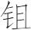

 仲夏纪第五

# 仲夏

**【题解】**

见《孟夏》“题解”。

一曰：

仲夏之月，日在东井(1)，昏亢中(2)，旦危中(3)。其日丙丁，其帝炎帝，其神祝融，其虫羽，其音徵，律中蕤宾(4)。其数七，其味苦，其臭焦，其祀灶，祭先肺。小暑至，螳螂生，䴗始鸣(5)，反舌无声(6)。天子居明堂太庙(7)，乘朱辂，驾赤骝，载赤旂，衣朱衣，服赤玉，食菽与鸡，其器高以觕，养壮狡。

**【注释】**

(1)东井：星宿名，二十八宿之一，又简称“井”，在今双子座。

(2)亢：星宿名，二十八宿之一，在今室女座。中：指中星。

(3)危：星宿名，二十八宿之一，在今宝瓶座及飞马座。

(4)蕤（ruí）宾：十二律之一，属阳律。

(5)䴗（jú）：伯劳鸟，夏至开始鸣叫，冬至而止，鸣叫的声音很难听。

(6)反舌：百舌鸟，立春开始鸣叫，夏至而止。叫声婉转，如百鸟之音。

(7)明堂太庙：南向明堂的中央正室。

**【译文】**

第一：

仲夏五月，太阳的位置在井宿。黄昏时刻，亢宿出现在南方中天；拂晓时刻，危宿出现在南方中天。仲夏于天干属丙丁，主宰之帝是炎帝，佐帝之神是祝融，应时的动物是凤鸟一类的羽族，相配的声音是徵音，音律与蕤宾相应。这个月的数字是七，味道是苦，气味是焦，要举行的祭祀是灶祭，祭祀时祭品以肺脏为尊。这个月，小暑节来到了，螳螂出现了，伯劳鸟开始鸣叫，百舌鸟寂然无声。天子住在南向明堂的中间正室，乘坐朱红色的车子，车前驾赤红色的马，车上插赤色的绘有龙纹的旗帜，天子穿着赤色的衣服，佩戴着赤色的饰玉，吃的是豆子和鸡，用的器物高而且大，供养力大勇猛的人。

是月也，命乐师修鼗鞞鼓(1)，均琴瑟管箫，执干戚戈羽(2)，调竽笙埙篪(3)，饬钟磬柷敔(4)。命有司为民祈祀山川百原(5)，大雩帝(6)，用盛乐。乃命百县雩祭祀百辟卿士有益于民者(7)，以祈谷实。农乃登黍。

**【注释】**

(1)鼗鞞（táopí）：用来指挥乐曲演奏的鼓。

(2)干：盾。戚：斧。羽：古时舞者所持的顶端插有羽毛的用来指挥的旗子，因为上边有羽毛，所以称羽。干戚戈羽都是舞具。

(3)竽笙：都是管乐器，竽三十六簧，笙大者十九簧，小者十三簧。埙（xūn）：古代陶制吹奏乐器。篪（chí）：竹制吹奏乐器。

(4)磬（qìnɡ）：石或玉制成的打击乐器。柷（zhù）：打击乐器，状如漆桶，中间有木椎，可以左右敲击，乐曲开始时击柷。敔（yǔ）：打击乐器，形状像伏虎，背上有铻，用杖刷击，乐曲结束时击敔。

(5)百原：众水的发源地。原，同“源”，水源。

(6)雩（yú）：旱时求雨的祭祀。帝：天帝。

(7)百县：天子领地内的百县大夫。百辟卿士：指前世的百君公卿。辟，君。这句意思是命令百县大夫祭祀对人民有功的前世百君公卿，祈求谷物籽实丰满。

**【译文】**

这个月，命令乐师修整鼗鼓鞞鼓，调节琴瑟管箫，营造干戚戈羽，调和竽笙埙篪，整饬钟磬柷敔。命令主管官吏为百姓祈求雨水，祭祀名山大川及众水之源，并且举行盛大的雩祭，使用众多的舞乐，演奏隆重的乐曲，向天帝祈求风调雨顺。命令天子领地内的各县大夫同时举行雩祭，祭祀前世有功于百姓的君主公卿，祈求五谷丰登。农民在这个月要进献黍子。

是月也，天子以雏尝黍，羞以含桃(1)，先荐寝庙。令民无刈蓝以染(2)，无烧炭，无暴布(3)，门闾无闭(4)，关市无索；挺重囚(5)，益其食，游牝别其群(6)，则絷腾驹(7)，班马正(8)。

**【注释】**

(1)羞：进献。含桃：樱桃。

(2)刈（yì）：割。蓝：草名，即蓼蓝，可以提炼青色。仲夏月因蓝草尚未长成，所以禁止刈割。

(3)暴（pù）布：晒布。暴，同“曝”，晒。此月炎热，晒布容易变脆而损坏。

(4)门：指城门。闾：里巷的门。门闾不闭是为顺阳气，便利人民出入。

(5)挺：缓。

(6)游：这里指放牧。牝（pìn）：母兽，这里指母马。因母马已怀孕，所以放牧时要使它们与其他马群分开。

(7)絷（zhí）：束缚马足。腾驹：公马。

(8)班：颁布。马正：即马政，有关养马的政令教化。正，通“政”。

**【译文】**

这个月，天子就着雏鸡品尝黍子，连同樱桃一起，先敬献于祖庙。命令百姓不要割蓝草来染东西，不要烧木炭，不要晒布匹，城门和闾门不要关闭，关口和集市不要征税，宽缓重罪的囚犯，增加他们的饮食。放牧时，把怀孕的母马与其他马群分开，要拴住公马，免得他们踢伤母马，要颁布有关养马的政令。

是月也，日长至(1)，阴阳争(2)，死生分(3)。君子斋戒，处必掩(4)，身欲静，止声色，无或进，薄滋味，无致和(5)，退嗜欲，定心气，百官静(6)，事无径(7)，以定晏阴之所成(8)。鹿角解，蝉始鸣，半夏生(9)，木堇荣(10)。

**【注释】**

(1)日长至：即夏至，一年中这一天白天最长，夜晚最短。

(2)阴阳争：仲夏之月，阳气覆盖在上，阴气升起在下，所以说阴阳相遇而争。

(3)死生分：阴阳相争，使物各有死生。

(4)处：居处。掩：深。为避暑气，居处必深。

(5)无致和：不要希望各种滋味都调和在一起。致，尽。和，调。

(6)百官：指身体各种器官。

(7)径：急速。

(8)晏阴：阳阴。晏，阳。这句大意是阴阳相争，未知所定，所以君子要安静无为，以待阴阳成败的确定。

(9)半夏：药草名，夏历五月而生。

(10)木堇（jǐn）：落叶灌木，花早晨开晚上闭。堇也写作槿。荣：花，开花。

**【译文】**

这个月，夏至到来，阴阳相争，死生相别。君子整洁身心，居处必深邃，身体要安静；禁止女色，不许嫔妃进御；减少美味，不要使它调和；去掉一切嗜欲，安定心气，各种器官安静无为，做事不要盲动，以待确定阴阳的成败。这个月，鹿角脱落了，蝉开始鸣叫，半夏长出，木槿开花。

是月也，无用火南方，可以居高明(1)，可以远眺望，可以登山陵，可以处台榭(2)。

**【注释】**

(1)高明：指楼观等高而明之处。

(2)台：高而上平的建筑物。榭：台上的高屋。

**【译文】**

这个月，不要在南方用火，可以住在楼阁，可以眺望远方，可以登上山陵，可以呆在台榭。

仲夏行冬令，则雹霰伤谷，道路不通，暴兵来至(1)；行春令，则五谷晚熟，百螣时起(2)，其国乃饥(3)；行秋令，则草木零落，果实早成，民殃于疫(4)。

**【注释】**

(1)暴兵：指不义之兵。暴，害。

(2)百螣（tè）：指各种类似蝗虫的害虫。螣，虫名，类似蝗虫，吃庄稼的叶子。

(3)饥：荒年。

(4)疫：疾疫。

**【译文】**

仲夏如果实行应在冬天实行的政令，那么，雹霰就会伤害五谷，道路就会毁坏不通，贼兵就会到来；如果实行应在春天实行的政令，那么，五谷就会晚熟，各种虫害就会时时发生，国家就会遇到饥荒；如果实行应在秋天实行的政令，那么，草木就会零落，果实就会过早成熟，百姓就会因疫病流行而遭受灾祸。

# 大乐

**【题解】**

本篇关于音乐的论述与《乐记》相通，反映了儒家的音乐思想。文中提出，“世之学者有非乐者矣，安由出哉”，显然是针对墨家“非乐”说而发的，是对墨家“非乐”思想的否定。

本篇的天道观在《吕氏春秋》中是比较完整的。文章说：“太一出两仪，两仪出阴阳。”认为宇宙间的一切东西，包括天地，都是由“太一”派生出来的，“太一”是天地万物之本。那么什么是“太一”呢？文章说：“道也者，至精也，不可为形，不可为名，强为之，谓之太一。”“道”就是“太一”。《圜道》中说：“一也者至贵，莫知其原，莫知其端，莫知其始，莫知其终，而万物以为宗。”可见，在《吕氏春秋》一书中，作为万物本原的“太一”、“道”、“一”，三者内涵是相同的。这与老子的“道生一，一生二，二生三，三生万物”存在根本不同。在老子学说中，“道”是“无”，是超乎“一”的虚构的观念。而在《吕氏春秋》中，“道”是“有”，是“太一”、“一”。因此，《吕氏春秋》中的自然观与宇宙起源说同《淮南子》中的“道始于一”是一致的，具有朴素唯物主义的性质。

关于宇宙变化的规律，本篇描述为“天地车轮，终则复始，极则复反”，这与《圜道》中的论述是一致的，陷入了简单的循环论。这种循环论，尽管在现在看来是十分浅陋的，但在当时，比之于那些认为万物永恒不变的观点来说，却已经是进步的了。

二曰：

音乐之所由来者远矣。生于度量(1)，本于太一。太一出两仪(2)，两仪出阴阳。阴阳变化，一上一下，合而成章(3)。浑浑沌沌(4)，离则复合，合则复离，是谓天常。天地车轮(5)，终则复始，极则复反，莫不咸当。日月星辰，或疾或徐，日月不同，以尽其行(6)。四时代兴，或暑或寒，或短或长，或柔或刚(7)。万物所出，造于太一，化于阴阳。萌芽始震，凝以形(8)。形体有处，莫不有声。声出于和，和出于适。和适先王定乐(9)，由此而生。

**【注释】**

(1)度量：指律管的长度、容积等。

(2)两仪：天地。

(3)章：等于说“形”。

(4)浑浑沌沌：古人想象中世界生成以前的元气状态。

(5)轮：转动。

(6)行：行度，指运行的轨道。

(7)柔：柔和。这里指万物生发的春夏二季。刚：刚厉。这里指万物肃杀的秋冬二季。

(8)（hán）：同“寒”，凝冻。

(9)和适：二字疑衍。先王：指尧、舜、禹、汤、文王、武王等。

**【译文】**

第二：

音乐的由来相当久远了，它产生于度量，本源于太一。太一生天地，天地生阴阳。阴阳变化，一上一下，会合而成形体。混混沌沌，离而复合，合而复离，这就叫做自然的永恒规律。天地像车轮一样转动，到尽头又重新开始，到终极又返回，无不恰到好处。日月星辰的运行，有的快，有的慢。日月轨道不同，都周而复始地运行在各自的轨道上。春夏秋冬四季更迭出现，有的季节炎热，有的季节寒冷；有的季节白天短，有的季节白天长；有的季节属柔，有的季节属刚。万物的产生，从太一开始，由阴阳生成。因阳而萌芽活动，因阴而凝冻成形。万物的形体各占一定的空间，无不发出声音。声音产生于和谐，和谐来源于合度。先王制定音乐，正是从这个原则出发。

天下太平，万物安宁。皆化其上(1)，乐乃可成。成乐有具(2)，必节嗜欲。嗜欲不辟(3)，乐乃可务。务乐有术，必由平出。平出于公，公出于道。故惟得道之人，其可与言乐乎！

**【注释】**

(1)上：当作“正”。

(2)具：准备。这里是条件的意思。

(3)辟：放纵。

**【译文】**

天下太平，万物安宁，一切都归化于正道，音乐才可以创作完成。创作音乐有条件，必须节制嗜欲。只有嗜欲不放纵，才可以专心从事音乐。从事音乐有方法，必须从平和出发。平和产生于公正，公正产生于道。所以只有得道的人，大概才可以跟他谈论音乐吧！

亡国戮民，非无乐也，其乐不乐。溺者非不笑也(1)，罪人非不歌也，狂者非不武也(2)，乱世之乐有似于此。君臣失位，父子失处(3)，夫妇失宜，民人呻吟，其以为乐也，若之何哉？

**【注释】**

(1)“溺者”句：《左传·哀公二十年》有“溺人必笑”句，这大概是当时的谚语。

(2)武：当作“舞”。这里是手足舞动的意思。

(3)失处：与“失位”义近，指丧失各自的本分，即父不行父道，子不行子道。

**【译文】**

被灭亡的国家，遭受屠戮的人民，不是没有音乐，只是他们的音乐并不表达欢乐。即将淹死的人不是不笑，即将处死的罪人不是不唱，精神狂乱的人不是不手舞足蹈，但是他们的笑、他们的唱、他们的舞蹈没有丝毫的欢乐。乱世的音乐与此相似。君臣地位颠倒，父子本分沦丧，夫妇关系失当，人民痛苦呻吟，在这种环境中创作音乐，又会怎样呢？

凡乐，天地之和、阴阳之调也。始生人者，天也，人无事焉。天使人有欲，人弗得不求；天使人有恶，人弗得不辟。欲与恶，所受于天也，人不得与焉(1)，不可变，不可易。世之学者，有非乐者矣(2)，安由出哉？

**【注释】**

(1)与（yù）：参与。

(2)非乐者：指墨家学派，《墨子》中有《非乐》篇。非，否定。

**【译文】**

凡音乐都是天地和谐、阴阳调和的产物。最初生成人的是天，人不得参与其事。天使人有了欲望，人不得不追求；天使人有了憎恶，人不得不躲避。人的欲望和憎恶是从天那里禀承下来的，人不能参与其事，这不可变更，不能改易。世上的学者有反对音乐的，他们的主张是根据什么产生的呢？

大乐(1)，君臣、父子、长少之所欢欣而说也。欢欣生于平，平生于道。道也者，视之不见，听之不闻，不可为状。有知不见之见、不闻之闻、无状之状者，则几于知之矣。道也者，至精也，不可为形，不可为名，强为之，谓之太一。

**【注释】**

(1)大乐：盛乐，指完美的音乐。

**【译文】**

大乐，是君臣、父子、老少所欢欣、喜悦的。欢欣从平和中产生，平和从道中产生。所谓道，看它，看不见；听它，听不到；也无法描绘出形状。有谁能够懂得在不见中包含着见，在不闻中包含着闻，在无形中包含着形，那他就差不多懂得道了。所谓道，是最精妙的，无法描绘出它的形状，无法给它命名，勉强给它起个名字，就叫它“太一”。

故一也者制令(1)，两也者从听(2)。先圣择两法一(3)，是以知万物之情。故能以一听政者，乐君臣，和远近，说黔首(4)，合宗亲(5)；能以一治其身者，免于灾，终其寿，全其天；能以一治其国者，奸邪去，贤者至，成大化(6)；能以一治天下者，寒暑适，风雨时，为圣人。故知一则明，明两则狂(7)。

**【注释】**

(1)一：即“太一”、“道”。

(2)两：指由“一”派生出的、非本原的东西。

(3)择：弃。法：用。

(4)黔首：战国及秦代对人民的称谓。黔，黧，黑色。

(5)宗亲：指同母兄弟。后世也指同宗亲属。

(6)大化：广远深入的教化。

(7)明两：等于说“用两”。明，显扬。

**【译文】**

所以“一”处于制约、支配的地位，“两”处于服从、听命的地位。先代圣人弃“两”用“一”，因此知道万物生成的真谛。所以，能够用“一”处理政事的，可以使君臣快乐，远近和睦，人民欢悦，兄弟和谐；能够用“一”修养身心的，可以免于灾害，终其天年，保全天性；能够用“一”治理国家的，可以使奸邪远离，贤人来归，实现大治；能够用“一”治理天下的，可以使寒暑适宜，风雨适时，成为圣人。所以懂得用“一”就聪明，持“两”就惑乱。

# 侈乐

**【题解】**

本篇旨在批判“侈乐”，体现了儒家“节乐”的思想。所谓“侈乐”，即违反平正和适的原则，“以巨为美，以众为观”，“和以桐过，不用度量”，一味追求感官刺激的音乐。文章说：“凡古圣王之所为贵乐者，为其乐也”，指出音乐的作用在于使人快乐。然而作为乱世产物的“侈乐”，非但不能使人快乐，反而引起人民的怨恨，伤害君主的生命，这就丧失了音乐的本来意义了。文章批评了纵欲的危害，指出“侈乐”的产生是纵欲的结果，如果“嗜欲无穷”，那么“贪鄙悖乱之心”、“淫佚奸诈之事”就都由此产生了。

三曰：

人莫不以其生生，而不知其所以生；人莫不以其知知，而不知其所以知。知其所以知之谓知道，不知其所以知之谓弃宝。弃宝者必离其咎(1)。世之人主，多以珠玉戈剑为宝，愈多而民愈怨，国人愈危(2)，身愈危累(3)，则失宝之情矣。乱世之乐与此同。为木革之声则若雷(4)，为金石之声则若霆(5)，为丝竹歌舞之声则若噪。以此骇心气、动耳目、摇荡生则可矣(6)，以此为乐则不乐。故乐愈侈，而民愈郁，国愈乱，主愈卑，则亦失乐之情矣。

**【注释】**

(1)离：通“罹（lí）”，遭。

(2)国人愈危：“人”字疑衍。

(3)身愈危累：“危”字疑衍。累，忧患，危难。

(4)木：八音之一。古代称金、石、丝、竹、匏（páo）、土、革、木这八种制造乐器的材料为八音。钟为金，磬为石，琴瑟为丝，箫管为竹，笙竽为匏，埙（xūn）为土，鼓为革，柷敔（yǔ）为木。

(5)霆：疾雷。

(6)生：性情。

**【译文】**

第三：

人无不依赖自己的生命生存，但是却不知道自己赖以生存的是什么；人无不依赖自己的知觉感知，但是却不知道自己赖以感知的是什么。知道自己能够感知的原因，就叫懂得道；不知道自己能够感知的原因，就叫舍弃宝物。舍弃宝物的人必定遭殃。世上的君主，大多把珍珠、玉石、长戈和利剑看作宝物。这些宝物越多，百姓就越怨恨，国家就越危险，君主自身就越有忧患，那就失掉了宝物的本来意义了。动乱时代的音乐与此相同。演奏木制、革制乐器的声音就像打雷，演奏铜制、石制乐器的声音就像霹雳，演奏丝竹乐器的声音、歌舞的声音就像喧哗。如果用这样的声音惊吓人的精神，震动人的耳目，摇荡人的性情，那是可以的；但是如果把这样的声音作为音乐，那就不能使人快乐了。所以音乐越是奢侈放纵，人民就越是抑郁不乐，国家就越是混乱，君主的地位就越是卑微，这样，也就失去音乐的本来意义了。

凡古圣王之所为贵乐者，为其乐也。夏桀、殷纣作为侈乐，大鼓、钟、磬、管、箫之音，以巨为美，以众为观(1)；诡殊瑰(2)，耳所未尝闻，目所未尝见，务以相过，不用度量。宋之衰也，作为千钟(3)；齐之衰也，作为大吕(4)；楚之衰也，作为巫音(5)。侈则侈矣，自有道者观之，则失乐之情。失乐之情，其乐不乐。乐不乐者，其民必怨，其生必伤。其生之与乐也，若冰之于炎日，反以自兵(6)。此生乎不知乐之情，而以侈为务故也。

**【注释】**

(1)观：景象。这里有壮观的意思。

(2)（chù）诡：奇异。殊瑰：异常的瑰丽。

(3)千钟：钟律之名。

(4)大吕：齐钟名，音协大吕之律，故名大吕。

(5)巫音：古代以舞降神的音乐。

(6)兵：伤害。

**【译文】**

古代圣王之所以重视音乐，是因为它能使人快乐。夏桀、殷纣制作奢侈放纵的音乐，随意增大鼓、钟、磬、管、箫等乐器的声音，把声音巨大当作美好，把乐器众多当作壮观；他们的音乐奇异瑰丽，人们的耳朵不曾听到过，眼睛不曾看到过；他们的音乐务求过分，不遵法度。宋国衰微的时候，制作千钟；齐国衰微的时候，制作大吕；楚国衰微的时候，制作巫音。这些音乐，盛大是够盛大了，然而在有道之人看来，却失去了音乐的真谛。失去了音乐的真谛，这样的音乐不能使人快乐。音乐不能使人快乐，人民必定生怨，生命必定受到伤害。生命相对于这种音乐，就像冰遇到炎热的太阳一样，反倒伤害了自己。产生这种后果是由于不懂得音乐的真谛，而致力于奢侈放纵的缘故啊。

乐之有情，譬之若肌肤形体之有情性也。有情性则必有性养矣(1)。寒、温、劳、逸、饥、饱，此六者非适也。凡养也者，瞻非适而以之适者也。能以久处其适，则生长矣。生也者，其身固静，感而后知，或使之也。遂而不返(2)，制乎嗜欲；制乎嗜欲无穷(3)，则必失其天矣。且夫嗜欲无穷，则必有贪鄙悖乱之心、淫佚奸诈之事矣。故强者劫弱，众者暴寡，勇者凌怯，壮者慠幼(4)，从此生矣。

**【注释】**

(1)性：通“生”。

(2)遂：顺。这里指顺其放纵之心。返：回，这里有收拢的意思。

(3)无穷：二字疑因下文而衍。

(4)慠（ào）：同“傲”。

**【译文】**

音乐有真谛，就像是肌肤身体有本性一样。有本性，就一定有生长、保养的问题了。寒冷、炎热、劳累、安逸、饥饿、饱足，这六种情况都不是适中。大凡保养，是指要看到不适中的情况，而使之达到适中。能够使生命长久地处于适中的环境，生命就长久了。生命这个东西，自身本是清静无知的，感受到外物而后才有知觉，这是由于有外物影响它啊！如果放纵其心而不约束，就会被嗜欲所牵制；如果被嗜欲所牵制，就必定危害身心了。再说，嗜欲无穷无尽，那就必然会产生贪婪、卑鄙、犯上作乱的思想，产生淫邪放纵、奸佞欺诈的事情了。所以，强横的劫掠弱小的，人多势众的侵害势孤力单的，勇猛的欺凌怯弱的，强壮的轻慢幼小的，诸如此类的事情就都由此而产生了。

# 适音**一作和乐**

**【题解】**

本篇旨在论述儒家“和乐”的思想。文章指出，“和乐”必须具备两个前提，一是“心适”，一是“音适”。“适心之务在于胜理”，而音适则是要做到“衷”，即声音大小、清浊要适中。这样，“以适听适”，即以畅快的心情听适中的乐音，就达到“和”的境界了。文章强调了音乐的作用，指出：“凡音乐，通乎政而移风平俗者也”，“故先王之制礼乐也，非特以欢耳目、极口腹之欲也，将教民平好恶、行理义也”。这反映了儒家对于音乐的特殊重视。本篇指出了“欲”与“乐”的区别，这可以说是我国最早提出的美学上的主客观关系的理论。

四曰：

耳之情欲声，心不乐，五音在前弗听；目之情欲色，心弗乐，五色在前弗视；鼻之情欲芬香，心弗乐，芬香在前弗嗅；口之情欲滋味，心弗乐，五味在前弗食(1)。欲之者，耳目鼻口也；乐之弗乐者(2)，心也。心必和平然后乐。心必乐，然后耳目鼻口有以欲之。故乐之务在于和心，和心在于行适。

**【注释】**

(1)五味：酸、苦、甘、辛、咸。这里泛指各种滋味。

(2)之：连词，相当“与”。

**【译文】**

第四：

耳朵的天性想要听音乐，如果心情不愉快，即使各种音乐在耳边也不听；眼睛的天性想要看彩色，如果心情不愉快，即使各种彩色在眼前也不看；鼻子的天性想要嗅芳香，如果心情不愉快，即使各种香气在身边也不嗅；嘴巴的天性想要尝滋味，如果心情不愉快，即使各种美味在嘴边也不吃。有各种欲望的是耳、目、鼻、口，而决定愉快或不愉快的是心情。心情必须平和然后才能愉快。心情必须愉快，然后耳、目、鼻、口才有各种欲望。所以，愉快的关键在于心情平和，心情平和的关键在于行为合宜适中。

夫乐有适，心亦有适。人之情：欲寿而恶夭，欲安而恶危，欲荣而恶辱，欲逸而恶劳。四欲得，四恶除，则心适矣。四欲之得也，在于胜理(1)。胜理以治身，则生全以(2)；生全则寿长矣。胜理以治国，则法立；法立则天下服矣。故适心之务在于胜理。

**【注释】**

(1)胜（shēnɡ）理：依循事物的规律。胜，等于说“任”。

(2)以：通“矣”。

**【译文】**

愉快有个适中问题，心情也有个适中问题。人的本性是，希望长寿而厌恶短命，希望安全而厌恶危险，希望荣誉而厌恶耻辱，希望安逸而厌恶烦劳。以上四种愿望得到满足，四种厌恶得以免除，心情就适中了。而四种愿望得以满足，在于依循事物的情理。依循事物的情理修身养性，天性就保全了；天性得以保全，寿命就长久了。依循事物的情理治理国家，法度就建立了；法度建立起来，天下就服从了。所以，使心情适中的关键在于依循事物的情理。

夫音亦有适：太巨则志荡，以荡听巨则耳不容，不容则横塞，横塞则振；太小则志嫌(1)，以嫌听小则耳不充，不充则不詹(2)，不詹则窕(3)；太清则志危(4)，以危听清则耳谿极(5)，谿极则不鉴(6)，不鉴则竭；太浊则志下，以下听浊则耳不收，不收则不抟(7)，不抟则怒。故太巨、太小、太清、太浊，皆非适也。何谓适？衷(8)，音之适也。何谓衷？大不出钧(9)，重不过石(10)，小大轻重之衷也。黄钟之宫，音之本也(11)，清浊之衷也。衷也者，适也。以适听适则和矣。乐无太(12)，平和者是也。

**【注释】**

(1)嫌：通“慊（qiàn）”，不满足。

(2)詹：通“赡”，足。

(3)窕（tiǎo）：细而不满。

(4)危：高。

(5)谿（xī）极：空虚疲困。

(6)鉴：察，鉴别。

(7)抟（zhuān）：专一。

(8)衷：中。指声音大小清浊适中。

(9)钧：通“均”，古代度量钟音律度的器具。

(10)石：古代重量单位，一百二十斤为一石。

(11)“黄钟”二句：古乐以律确定五音音高，用黄钟律所定的宫音，叫做黄钟之宫，又称黄钟宫。这是古乐中最基本的乐调之一。古乐中的十二律以黄钟之宫为本，用“三分损益法”（详见《音律》篇）依次相生。

(12)太：指上文“太巨”、“太小”、“太清”、“太浊”。

**【译文】**

音乐也有个适中问题。声音过大就会使人心志摇荡，以摇荡之心听巨大的声音，耳朵就容纳不了，容纳不了就会充溢阻塞，充溢阻塞，心志就会更加摇荡；声音过小就会使人心志得不到满足，以不满足之心听微小的声音，耳朵就充不满，充不满就感到不够，不够，心志就会更加不满足；声音过清就会使人心志高扬，以高扬之心听轻清之音，耳朵就会空虚疲困，空虚疲困就听不清，听不清，心志就会衰竭；声音过浊就会使人心志低下，以低下之心听重浊之音，耳朵就拢不住音，拢不住音就专一不了，专一不了就会动气。所以，音乐的声音过大、过小、过清、过浊都不合宜。什么叫合宜？适中，就是乐音的合宜。什么叫适中？钟音律度最大不超过均的标准，钟的重量最重不超过一石，这就是小大轻重适中。黄钟律的宫音是乐音的根本，是清浊的适中。适中就是适合中道。以适中的心情听适中的声音就和谐了。音乐各方面都不要过分，平正和谐才合宜。

故治世之音安以乐，其政平也；乱世之音怨以怒，其政乖也；亡国之音悲以哀，其政险也。凡音乐，通乎政而移风平俗者也。俗定而音乐化之矣。故有道之世，观其音而知其俗矣，观其俗而知其政矣，观其政而知其主矣(1)。故先王必托于音乐以论其教。清庙之瑟(2)，朱弦而疏越(3)，一唱而三叹(4)，有进乎音者矣。大飨之礼(5)，上玄尊而俎生鱼(6)，大羹不和(7)，有进乎味者也。故先王之制礼乐也，非特以欢耳目、极口腹之欲也，将教民平好恶、行理义也。

**【注释】**

(1)“观其”句：此句前原脱“观其俗而知其政矣”。

(2)清庙：宗庙。宗庙肃然清静，所以称为清庙。

(3)疏越（huó）：镂刻的小孔。疏，镂刻。越，穴，瑟底的小孔。

(4)一唱而三叹：宗庙奏乐，一人领唱，三人应和。唱，领唱，也作“倡”。叹，继声和唱。这里是说，宗庙祭祀，奏乐演唱规模很小。

(5)大飨（xiǎnɡ）：集合远近祖先神主于太庙合祭。

(6)玄尊：盛玄酒的酒器。玄酒，指上古行祭礼时所用的水。水本无色，古人习以为黑色，故称“玄酒”。俎（zǔ）：古代祭祀时用的礼器。这里是把……盛在俎中的意思。

(7)大（tài）羹：古代祭祀时所用的带汁的肉。古代大飨祭祀“上玄尊而俎生鱼，大羹不和”，这是表明先王崇尚饮食之本。

**【译文】**

所以，太平盛世的音乐安宁而快乐，是由于它的政治安定；动乱时代的音乐怨恨而愤怒，是由于它的政治乖谬；濒临灭亡的国家的音乐悲痛而哀愁，是由于它的政治险恶。大凡音乐，与政治相通，并起着移风易俗的作用。风俗的形成是音乐潜移默化的结果。所以，政治清明的时代，考察它的音乐就可以知道它的风俗了，考察它的风俗就可以知道它的政治了，考察它的政治就可以知道它的君主了。因此，先王一定要通过音乐来宣扬他们的教化。宗庙里演奏的瑟，安着朱红色的弦，底部刻有小孔；宗庙之乐，只由一人领唱，三人应和，其意义已经超出音乐本身了。举行大飨祭礼时，只献上盛水的酒器，俎中盛着生鱼，大羹不调和五味，其意义已经超出滋味本身了。所以，先王制定礼乐的目的，不仅仅是用来使耳目欢愉，尽力满足口腹的欲望，而是要教导人们端正好恶、实施理义啊。

# 古乐

**【题解】**

本篇旨在论述音乐发展的历史。文中保存了许多传说，虽然大都富有神话的意味，但在史料缺乏的情况下，对于我们研究音乐的产生与发展的历史，仍是很有价值的。文章结尾说：“故乐之所由来者尚矣，非独为一世之所造也。”这种以发展的眼光来看待音乐的历史的观点，在当时是难能可贵的。但本篇把音乐的产生、发展归结为“圣王”的功绩，则是唯心主义的音乐史观的反映。

五曰：

乐所由来者尚也，必不可废。有节，有侈，有正，有淫矣。贤者以昌，不肖者以亡。

**【译文】**

第五：

音乐的由来相当久远了，定然不可废弃。其中有的适中合宜，有的奢侈放纵，有的纯正，有的淫邪。贤人因音乐而发达昌盛，不肖的人因音乐而国灭身亡。

昔古朱襄氏之治天下也(1)，多风而阳气畜积，万物散解，果实不成，故士达作为五弦瑟(2)，以来阴气，以定群生。

**【注释】**

(1)朱襄氏：传说中远古部落名，其首领为炎帝。

(2)士达：朱襄氏之臣。

**【译文】**

古代，朱襄氏治理天下的时候，经常刮风，因而阳气过盛，万物散落解体，果实不能成熟，所以士达创造出五弦瑟，用以引来阴气，安定众生。

昔葛天氏之乐(1)，三人操牛尾，投足以歌八阕：一曰《载民》，二曰《玄鸟》，三曰《遂草木》，四曰《奋五谷》，五曰《敬天常》，六曰《达帝功》，七曰《依地德》，八曰《总万物之极》(2)。

**【注释】**

(1)葛天氏：传说中的远古部落名。这里指其部落首领。

(2)“一曰”八句：以上“八曰”为乐曲八章之名。八阕之乐是反映古代劳动人民生产斗争和原始宗教信仰的舞乐。第一章《载民》是歌颂负载人民的大地；第二章《玄鸟》是歌颂作为氏族标志的图腾——黑色的鸟；第三章《遂草木》是祝草木顺利地生长（遂：顺）；第四章《奋五谷》是祝五种谷物繁茂地生长（奋：茂盛）；第五章《敬天常》是表达他们对自然规律的敬畏；第六章《达帝功》是表达他们要通达天帝之功的愿望（达：通）；第七章《依地德》是表达他们要依照四时的旺气行事（地德：指四时的旺气）；第八章《总万物之极》是说明他们总的愿望是要使万物发展达到最高限度。

**【译文】**

古时葛天氏的音乐，演奏时，三人手持牛尾，踏着脚歌唱舞乐八章：第一章叫做“载民”，第二章叫做“玄鸟”，第三章叫做“遂草木”，第四章叫做“奋五谷”，第五章叫做“敬天常”，第六章叫做“达帝功”，第七章叫做“依地德”，第八章叫做“总万物之极”。

昔阴康氏之始(1)，阴多，滞伏而湛积(2)，水道壅塞，不行其序(3)，民气郁阏而滞著(4)，筋骨瑟缩不达，故作为舞以宣导之。

**【注释】**

(1)阴康氏：传说中的远古部落名。这里指其部落首领。

(2)湛（chén）：通“沉”，厚，浓。

(3)“水道”二句：当作“阳道壅塞，不行其序”。

(4)郁阏（è）：郁抑阻塞。滞著：不舒畅。

**【译文】**

古时阴康氏开始治理天下的时候，阴气过盛，凝滞不散，深深聚积，阳气阻塞不通，不能按正常规律运行，人民精神抑郁而不舒畅，筋骨蜷缩而不舒展，所以创作舞蹈来加以疏导。

昔黄帝令伶伦作为律(1)。伶伦自大夏之西(2)，乃之阮隃之阴(3)，取竹于嶰谿之谷(4)，以生空窍厚钧者(5)，断两节间——其长三寸九分——而吹之，以为黄钟之宫，吹曰舍少。次制十二筒，以之阮隃之下，听凤皇之鸣，以别十二律(6)。其雄鸣为六(7)，雌鸣亦六(8)，以比黄钟之宫，适合，黄钟之宫皆可以生之。故曰：黄钟之宫，律吕之本(9)。黄帝又命伶伦与荣将铸十二钟(10)，以和五音，以施英韶(11)。以仲春之月，乙卯之日，日在奎(12)，始奏之，命之曰《咸池》。

**【注释】**

(1)伶伦：传说为黄帝的乐官。伶，乐官。伦，人名。律：古代定音用的竹制律管，相传为伶伦所制。

(2)大夏：传说中古代西方的山。

(3)阮隃：当是“昆仑”之讹。

(4)嶰（xiè）谿：山谷之名。

(5)钧：通“均”。

(6)十二律：中国古代乐制中，以一个八度分为十二个不完全相等的半音，每个半音称为一“律”。

(7)雄鸣为六：指六阳律，即黄钟、太蔟（còu）、姑洗（xiǎn）、蕤（ruí）宾、夷则、无射（yì）。

(8)雌鸣亦六：指六阴律，即大吕、夹钟、仲吕、林钟、南吕、应钟。

(9)律吕：十二律中，阳律称律，阴律称吕。

(10)荣将：传说中的黄帝之臣。

(11)英韶（sháo）：指华美之音。韶，美好。

(12)日在奎：太阳的位置在奎宿。奎，二十八宿之一。

**【译文】**

古时，黄帝叫伶伦创制乐律。伶伦从大夏山的西方，到达昆仑山的北面，从嶰谿山谷中取来竹子，选择那些中空而壁厚均匀的，截取两个竹节中间的一段——其长度为三寸九分——而吹它，把发出的声音定为黄钟律的宫音，吹出来的声音是“舍少”。接着依次共制作了十二根竹管，带到昆仑山下，听凤凰的鸣叫，借以区别十二乐律。雄凤鸣叫有六个声音，雌凤鸣叫也有六个声音。把根据这些声音定出的乐律同黄钟律的宫音相比照，二者恰恰相合；这些声音都可以由黄钟律的宫音派生出来。所以说：黄钟律的宫音是乐律的本源。黄帝又令伶伦和荣将铸造十二口钟，用以和谐五音，借以展示华美的声音。在仲春之月，乙卯这天，太阳的位置在奎宿的时候，开始演奏它们，奏出的乐曲命名为“咸池”。

帝颛顼生自若水(1)，实处空桑(2)，乃登为帝。惟天之合，正风乃行，其音若熙熙凄凄锵锵。帝颛顼好其音，乃令飞龙作(3)，效八风之音，命之曰《承云》，以祭上帝。乃令先为乐倡(4)。乃偃寝(5)，以其尾鼓其腹，其音英英(6)。

**【注释】**

(1)若水：古水名，即今雅砻江。

(2)空桑：古地名。

(3)乃令飞龙作：“作”字后当补“乐”字。

(4)（tuó）：通“鼍”，即鳄，皮可制鼓。倡：始。古代奏乐始于击鼓，司击鼓，所以说先为乐始。

(5)偃：仰卧。

(6)英英：形容乐声和盛。

**【译文】**

古帝颛顼生在若水，住在空桑，他登上帝位。德行正与天合，八方纯正之风按时运行，它们发出熙熙、凄凄、锵锵的声音。颛顼喜好那些声音，于是就叫飞龙作乐，摹仿八方的风声，乐曲命名为“承云”，用以祭祀上帝。颛顼叫给乐曲领奏。就仰面躺下，用尾巴敲打自己的肚子，发出和盛的乐声。

帝喾命咸黑作为声(1)，歌《九招》、《六列》、《六英》。有倕作为鼙、鼓、钟、磬、吹苓、管、埙、篪、鼗、椎、钟(2)。帝喾乃令人抃(3)，或鼓鼙，击钟磬，吹笭，展管篪(4)。因令凤鸟、天翟舞之(5)。帝喾大喜，乃以康帝德(6)。

**【注释】**

(1)喾（kù）：传说中的五帝之一。咸黑：传说为帝喾之臣。

(2)有倕（chuí）：传说中的古代巧匠。有，名词词头。倕，人名。鼙（pí）：古代的小鼓。吹苓：“吹”字盖涉下文而衍。苓，当是“笭”之讹。笭，笙。埙（xūn）：古代吹奏乐器，陶制。篪（chí）：古代管乐器，竹制，单管，横吹。鼗（táo）：长柄摇鼓，古代打击乐器。椎（chuí）：捶击乐器的工具。钟：或作“衝”，“衝”疑是“衡”的讹字。衡，指悬钟的横木。

(3)抃（biàn）：两手相击。

(4)展：这里是演奏的意思。

(5)天翟（dí）：神话中的天鸟。翟，长尾巴的野鸡。

(6)康：褒扬，赞美。

**【译文】**

帝喾令咸黑作声乐，咸黑唱《九招》、《六列》、《六英》。倕又制作了鼙、鼓、钟、磬、笙、管、埙、篪、鼗等乐器及击钟的椎和悬钟的横木等。帝喾就让人演奏这些乐器，有的击鼙，有的敲钟、磬，有的吹笙，有的演奏管、篪；当时又让凤鸟、天鸟随乐舞蹈。帝喾非常高兴，就用这些乐舞来宣扬天帝的功德。

帝尧立，乃命质为乐(1)。质乃效山林谿谷之音以歌，乃以麋置缶而鼓之(2)，乃拊石击石(3)，以象上帝玉磬之音(4)，以致舞百兽。瞽叟乃拌五弦之瑟(5)，作以为十五弦之瑟。命之曰《大章》，以祭上帝。

**【注释】**

(1)质：传说为尧、舜时的乐官。

(2)（luò）：未经鞣制的皮革。缶（fǒu）：盛酒浆的瓦器，小口大腹。

(3)拊（fǔ）：击，拍。

(4)象：摹仿。

(5)瞽（ɡǔ）叟：舜的父亲。瞽，瞎子。拌（pàn）：分开。

**【译文】**

尧立为帝，便令质作乐。质于是摹仿山林溪谷的声音而作歌，又把麋鹿的皮蒙在瓦器上敲打它，并敲打石片，以摹仿天帝玉磬的声音，用以引来百兽舞蹈。瞽叟分解五弦瑟的弦数，制成十五弦瑟。演奏的乐曲命名为“大章”，用它祭祀天帝。

舜立，命延(1)，乃拌瞽叟之所为瑟，益之八弦，以为二十三弦之瑟。帝舜乃令质修《九招》、《六列》、《六英》，以明帝德。

**【注释】**

(1)延：相传为舜之臣。

**【译文】**

舜立为帝，令延改造乐器。延就分解瞽叟创制的瑟的弦数，又增加了八根弦，制成二十三弦瑟。舜还让质研习《九招》、《六列》、《六英》，用以彰明天帝的美德。

禹立，勤劳天下，日夜不懈。通大川，决壅塞，凿龙门(1)，降通漻水以导河(2)，疏三江五湖(3)，注之东海，以利黔首。于是命皋陶作为《夏籥》九成(4)，以昭其功。

**【注释】**

(1)龙门：地名，在今山西河津县西北。黄河至此，两岸峭壁对峙，形如阙门，故名龙门，又名禹门口。

(2)降：大。漻（liáo）水：指洪水。漻，流。河：黄河。

(3)三江：长江的三条支流。具体所指，历史上说法不一。这里当泛指长江水系。五湖：这里泛指太湖一带的湖泊。

(4)夏籥（yuè）：古乐名，即《大夏》。传说禹时乐舞《大夏》用龠伴奏，故又名《夏龠》。籥，同“龠”。九成：九段，又称“九奏”、“九变”。

**【译文】**

禹立为帝，为天下辛勤操劳，日夜不怠。疏通大河，决开壅塞，开凿龙门，大力疏通洪水把它导入黄河，并疏浚三江五湖，使水流入东海，以利于百姓。在这时，禹令皋陶创作《夏籥》九章，来宣扬他的功绩。

殷汤即位，夏为无道，暴虐万民，侵削诸侯，不用轨度，天下患之。汤于是率六州以讨桀罪(1)。功名大成，黔首安宁。汤乃命伊尹作为《大护》，歌《晨露》，修《九招》、《六列》(2)，以见其善。

**【注释】**

(1)六州：指古九州中的荆、兖、雍、豫、徐、扬六州。

(2)修九招、六列：据上文，“六列”之后疑脱“六英”二字。

**【译文】**

殷汤登上君位，当时夏桀胡作非为，残害百姓，侵掠诸侯，不按法度行事。天下人都痛恨他。汤于是率领六州诸侯讨伐桀的罪行。功名大成，百姓安宁。于是汤令伊尹创作了《大护》乐、《晨露》歌，并研习《九招》、《六列》、《六英》，用以展现他的美德。

周文王处岐(1)，诸侯去殷三淫而翼文王(2)。散宜生曰(3)：“殷可伐也。”文王弗许。周公旦乃作诗曰：“文王在上，於昭于天(4)。周虽旧邦，其命维新(5)。”以绳文王之德(6)。

武王即位，以六师伐殷(7)。六师未至，以锐兵克之于牧野(8)。归，乃荐俘馘于京太室(9)，乃命周公作为《大武》。

成王立，殷民反，王命周公践伐之(10)。商人服象(11)，为虐于东夷。周公遂以师逐之，至于江南。乃为《三象》，以嘉其德。

**【注释】**

(1)岐：古邑名，为周的祖先古公亶父（dǎnfǔ）所建，故址在今陕西岐山县东北。

(2)三淫：指暴君殷纣所做的三件残暴的事，即“剖比干之心，断材士之股，刳（kū）孕妇之胎”。

(3)散宜生：周文王之臣。

(4)於（wū）：叹词，表赞叹。

(5)“文王”四句：引诗见《诗经·大雅·文王》。

(6)绳：赞誉。

(7)六师：即“六军”。周制，天子有六军。

(8)牧野：古地名，在今河南淇县西南。

(9)荐：献。俘馘（ɡuó）：指被歼之敌。俘，俘虏。馘，从敌尸上割下来的左耳。京：国都。太室：太庙的中室。

(10)践：往。

(11)服：役使，驾御。

**【译文】**

周文王住在岐邑，诸侯纷纷叛离罪恶累累的殷纣而拥戴文王。散宜生说：“殷可以讨伐。”文王不答应。周公旦于是作诗道：“文王高高在上，德行昭明于天。岐周虽然古老，天命却是崭新。”用这首诗来称誉文王的德行。

武王即位，率领军队讨伐殷纣。大军还没有到达殷的都城，就凭精锐的士兵在牧野一举打败殷纣。班师归来，就在京城太庙中献上俘虏，禀报斩杀人数，于是令周公创作了《大武》乐。

成王即位，殷的遗民叛乱，成王令周公去讨伐他们。商人役使大象在东夷为害。周公率领军队追逐他们，一直追到江南。于是创作了《三象》乐，用以赞美他的功德。

故乐之所由来者尚矣，非独为一世之所造也。

**【译文】**

所以，音乐的由来相当久远了，不单单是哪一个时代所创制的啊。

