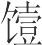
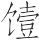
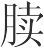
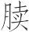
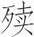
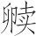

 孟秋纪第七

# 孟秋

**【题解】**

依五行学说，秋属金，是万物成熟凋落的季节。秋德肃杀，所以天子发布政令，应把惩治罪恶、征伐不义放在重要位置。“修法制，缮囹圄，具桎梏”，“戮有罪，严断刑”，“申严百刑，斩杀必当”；“专任有功，以征不义，诘诛暴慢，以明好恶”。此时，农事已经完成，可以建都邑，筑城郭，完堤防，修宫室。到了季秋，天气已寒凉，应保存民力，命其入室休息。天子要举行傩祭，却除灾疫，以通秋气。

《孟秋》、《仲秋》、《季秋》三纪所辖十二篇文章都是有关战争的，或与战争有联系的言论。

一曰：

孟秋之月，日在翼(1)，昏斗中(2)，旦毕中(3)。其日庚辛(4)，其帝少皞(5)，其神蓐收(6)，其虫毛(7)，其音商(8)，律中夷则(9)。其数九(10)，其味辛，其臭腥，其祀门(11)，祭先肝。凉风至，白露降，寒蝉鸣(12)，鹰乃祭鸟(13)，始用刑戮。天子居总章左个(14)，乘戎路(15)，驾白骆，载白旂，衣白衣，服白玉，食麻与犬，其器廉以深。

**【注释】**

(1)翼：星宿名，二十八宿之一，在今巨蟹座。

(2)斗：星宿名，二十八宿之一，在今人马座。

(3)毕：星宿名，二十八宿之一，在今金牛座。

(4)庚辛：五行说认为秋季属金，庚辛也属金，所以说“其日庚辛”。下文“其帝少皞，其神蓐收，其虫毛，其音商，其味辛，其臭腥，其祀门”等也都是先配五行再配四时。

(5)少皞：即金天氏，五帝之一，五行家说他以金德王天下，被尊为西方金德之帝。

(6)蓐（rù）收：少皞氏之子，名该，被尊为金德之神。

(7)毛：五虫之一，指老虎之类长毛的动物。

(8)商：五音之一。

(9)夷则：十二律之一，属阳律。

(10)九：阴阳说认为，金生数为四，成数为九，这里指金的成数。参看《孟春》注。

(11)门：五祀之一。古人认为秋由门入，所以要祭门。

(12)寒蝉：蝉的一种，色青而小，天凉时开始鸣叫。

(13)鹰乃祭鸟：鹰把击杀的飞鸟摆开，像祭祀时陈列祭品一样，古人称之为祭鸟。

(14)总章左个：西向明堂的左侧室。

(15)戎路：兵车，饰有白色。路，同“辂”，车。

**【译文】**

第一：

孟秋七月，太阳的位置在翼宿。初昏时刻，斗宿出现在南方中天；拂晓时刻，毕宿出现在南方中天。孟秋于天干属庚辛，主宰之帝是少皞，佐帝之神是蓐收，应时的动物是老虎之类的毛族，相配的声音是商音，音律与夷则相应。这个月的数字是九，味道是辣，气味是腥，要举行的祭祀是门祭，祭祀时祭品以肝脏为尊。这个月，凉风来到，白露降落，寒蝉鸣叫，鹰于是把捕杀的飞鸟摆开，像祭祀时陈列祭品一样。这个月开始使用刑罚和杀戮。天子住在西向明堂的左侧室，乘坐白色的兵车，车前驾白色的马，车上插白色的绘有龙纹的旗帜；天子穿白色的衣服，佩戴白色的饰玉。吃的食物是麻籽和狗肉，用的器物锐利而深邃。

是月也，以立秋。先立秋三日，大史谒之天子曰：“某日立秋，盛德在金。”天子乃斋。立秋之日，天子亲率三公九卿诸侯大夫，以迎秋于西郊。还，乃赏军率武人于朝(1)。天子乃命将帅，选士厉兵，简练桀俊，专任有功，以征不义，诘诛暴慢，以明好恶，巡彼远方(2)。

**【注释】**

(1)军率（shuài）：将帅。率，通“帅”。

(2)巡：顺，使归顺。远方：指天下。

**【译文】**

这个月有立秋的节气，在立秋前三天，太史向天子禀告说：“某日立秋，大德在于金。”于是天子斋戒，准备迎秋。立秋那天，天子亲自率领三公九卿诸侯大夫，到西郊去迎接秋的到来。迎秋归来，于是在朝廷赏赐将军和勇武之士。天子命令将帅挑选兵士，磨砺兵器，精选并训练杰出的人才，专一委任有功的将士，去征讨不义之人，追究诛伐凶恶怠慢之人，以表明爱憎，使天下人都来归顺。

是月也，命有司修法制，缮囹圄，具桎梏，禁止奸，慎罪邪(1)，务搏执(2)；命理瞻伤察创、视折审断(3)，决狱讼，必正平，戮有罪，严断刑。天地始肃，不可以赢(4)。

**【注释】**

(1)慎：警戒。

(2)搏执：捕获。

(3)理：指理官，即审理狱讼的法官。瞻、察、视、审：都有探视、察看的意思。伤：指皮破。创：指肉破。折：指骨折。断：指骨肉都折。

(4)赢：盛。

**【译文】**

这个月，命令主管官吏加强禁令，修缮牢狱，准备刑具，禁止奸邪之事，警戒有罪邪恶之人，务必捉拿拘捕他们。命令负责诉讼的官吏探视察看身体有创伤毁折的囚犯。判决诉讼，必须公正，杀戮有罪，从严断刑。这个月，天地开始有肃杀之气，不可以盛气骄盈。

是月也，农乃升谷，天子尝新(1)，先荐寝庙。命百官始收敛，完堤防(2)，谨壅塞，以备水潦；修宫室，坿墙垣(3)，补城郭。

**【注释】**

(1)尝新：指尝食新收获的谷物。古时所谓尝新都要先进献祖庙，祭祀祖先，然后再分享群臣。

(2)防：河堤。

(3)坿（fù）：培土加高。

**【译文】**

这个月，农民进献五谷。天子尝食新收获的谷物，首先要奉献给祖庙。这个月，命令百官要百姓收敛谷物，修缮堤坝，仔细检查水道有无堵塞，以防备大水为害；还要修葺宫室，加高院墙，修补城郭。

是月也，无以封侯、立大官，无割土地(1)，行重币(2)，出大使(3)。

**【注释】**

(1)无割土地：指不要赏赐人土地。

(2)重币：厚礼。

(3)大使：指帝王特派的临时使节。古人以为秋气收敛，上述封割之事都不宜做。

**【译文】**

这个月，不要分封诸侯，不要设置高官，不要赏赐人土地，不要馈送重礼，不要派出负有特殊使命的使节。

行之是令(1)，而凉风至三旬(2)。

**【注释】**

(1)行之是令：实行应在本月实行的政令。

(2)凉风至三旬：大意是凉风每旬一至，三旬三至。

**【译文】**

实行这些政令，凉风就会到来，三旬每旬来一次。

孟秋行冬令，则阴气大胜，介虫败谷(1)，戎兵乃来(2)；行春令，则其国乃旱，阳气复还，五谷不实；行夏令，则多火灾，寒热不节，民多疟疾。

**【注释】**

(1)介虫：指龟蟹之类有甲壳的动物。介，甲。

(2)戎兵：军队，指敌军。

**【译文】**

孟秋如果实行应在冬天实行的政令，那么，阴气就过于浓盛，有甲壳的动物就会毁害谷物，敌军就会来侵扰。如果实行应在春天实行的政令，那么，国家就会出现旱灾，阳气就会重新回来，五谷就不能结实。如果实行应在夏天实行的政令，那么，火灾就会频频发生，寒热就会失去节度，百姓就会患疟疾。

# 荡兵**一作用兵**

**【题解】**

“荡”是动的意思。本篇旨在阐述战争的缘起，属兵家言论。

文章批判了宋尹学派的“偃兵”之说，主张用“义兵”拯救天下。这在当时是具有进步意义的。首先，对“偃兵”说的批判打破了在阶级社会中“偃兵”的幻想；其次，用“义兵”代替“偃兵”是符合时代的潮流和人民的愿望的。孟子也提出过“仁义之师”，说过“仁者无敌”，但他始终幻想着仅用政治影响——“王道”就可以统一中国。在这一点上，《吕氏春秋》的“义兵”说可以说比孟子的“王道”说高了一筹。

二曰：

古圣王有义兵而无有偃兵(1)。兵之所自来者上矣，与始有民俱。凡兵也者，威也；威也者，力也。民之有威力，性也。性者，所受于天也，非人之所能为也。武者不能革，而工者不能移。

**【注释】**

(1)偃（yǎn）：止息。

**【译文】**

第二：

古代的圣王只有进行正义战争的，从未废止战争。战争的由来相当久远了，与人类刚刚产生的时候同时。大凡战争，靠的是威势，而威势靠的是力量。具有威势和力量是人的天性。人的天性是从上天那里禀承下来的，不是人力所能造成的。勇武的人不能使它改变，机巧的人不能使它移易。

兵所自来者久矣。黄、炎故用水火矣(1)，共工氏固次作难矣(2)，五帝固相与争矣。递兴废，胜者用事。人曰“蚩尤作兵”，蚩尤非作兵也，利其械矣(3)。未有蚩尤之时，民固剥林木以战矣(4)，胜者为长。长则犹不足治之，故立君。君又不足以治之，故立天子。天子之立也出于君，君之立也出于长，长之立也出于争。争斗之所自来者久矣，不可禁，不可止。故古之贤王有义兵而无有偃兵。

**【注释】**

(1)黄、炎故用水火矣：传说炎帝与黄帝争战，炎帝燃起大火，黄帝用水灭之。火，炎帝。传说中的古帝，姜姓，因以火德称王，故称炎帝，号神农氏。故：已经。

(2)共（ɡōnɡ）工氏：传说中古代的部族首领，与颛顼争为帝，失败被杀。次：通“恣”，恣意。

(3)械：兵器。

(4)剥：砍削。

**【译文】**

战争的由来相当久远了。黄帝、炎帝已经用水火争战了，共工氏已经恣意发难了，五帝之间已经互相争斗了。他们一个接一个地兴起、灭亡，胜利者统治天下。人们说“蚩尤创造了兵器”，其实，蚩尤并非创造了兵器，他只不过是把兵器改造得更锋利罢了。在蚩尤之前，人类已经砍削林木作为武器进行战争了。胜利者做首领。只有首领还不足以治理好百姓，所以设置君主。君主仍不足以治理好百姓，所以设置天子。天子的设置是在有君主的基础上产生的，君主的设置是在有首领的基础上产生的，首领的设置是在有争斗的基础上产生的。争斗的由来相当久远了，不可禁止，不可平息。所以，古代的贤王只有进行正义战争的，从未废止战争。

家无怒笞(1)，则竖子、婴儿之有过也立见；国无刑罚，则百姓之相侵也立见；天下无诛伐，则诸侯之相暴也立见(2)。故怒笞不可偃于家，刑罚不可偃于国，诛伐不可偃于天下，有巧有拙而已矣。故古之圣王有义兵而无有偃兵。

**【注释】**

(1)怒：斥责。笞（chī）：用鞭、杖、竹板抽打。

(2)暴：侵侮。

**【译文】**

家中如果没有训斥责打，僮仆、小儿犯过错的事就会立刻出现；国中如果没有刑罚，百姓互相侵夺的事就会立刻出现；天下如果没有征伐，诸侯互相侵犯的事就会立刻出现。所以，家中训斥责打不可废止，国中刑罚不可废止，天下征伐不可废止，只不过在使用上有的高明、有的笨拙罢了。所以，古代的圣王只有进行正义战争的，从未废止战争。

夫有以死者(1)，欲禁天下之食，悖；有以乘舟死者，欲禁天下之船，悖；有以用兵丧其国者，欲偃天下之兵，悖。夫兵不可偃也，譬之若水火然，善用之则为福，不能用之则为祸；若用药者然，得良药则活人，得恶药则杀人。义兵之为天下良药也亦大矣。

**【注释】**

(1)（yē）：通“噎”。

**【译文】**

有因为吃饭噎死的，如果因此就要废止天下的一切食物，这是荒谬的；有因为乘船淹死的，如果因此就要废止天下的一切船只，这是荒谬的；有因为进行战争而亡国的，如果因此就要废止天下的一切战争，这同样是荒谬的。战争是不可废止的。战争就像水和火一样，善于利用它就会造福于人，不善于利用它就会造成灾祸；还像用药给人治病一样，用良药就能把人救活，用毒药就能把人杀死。正义的战争正是治理天下的大大的良药啊！

且兵之所自来者远矣，未尝少选不用。贵贱、长少、贤不肖者相与同，有巨有微而已矣。察兵之微(1)：在心而未发，兵也；疾视，兵也；作色(2)，兵也；傲言，兵也；援推(3)，兵也；连反(4)，兵也；侈斗(5)，兵也；三军攻战，兵也。此八者皆兵也，微巨之争也(6)。今世之以偃兵疾说者，终身用兵而不自知，悖，故说虽强，谈虽辨(7)，文学虽博(8)，犹不见听。故古之圣王有义兵而无有偃兵。

**【注释】**

(1)兵：战争。这里是个含义很广的概念，既指争斗之心，又指争斗行为，也指狭义的战争。

(2)作色：指因生气而脸变颜色。

(3)援推：推挽。这里指以手相搏。援，拉。

(4)连反：当是以足相搏之义。

(5)侈斗：这里是群斗的意思。侈，恣意放纵。

(6)争：等于说“差”，差异。

(7)辨：通“辩”。

(8)文学：指文献经典。

**【译文】**

再说，战争的由来相当久远了，没有一刻不用。贵与贱、长与少、贤与不肖在用战争这一点上彼此是相同的，只是在使用上有大有小罢了。考察战争的细微之处：争斗之意隐藏在心中，只是尚未表露出来，这就是战争；怒目相视是战争；勃然变色是战争；言辞傲慢是战争；推拉相搏是战争；踢踹相斗是战争；聚众殴斗是战争，三军攻战是战争。以上这八种情况都是战争，只不过有小大之差罢了。如今世上极力游说废止战争的人，他们终身用兵，却不知道自己言行相背，因此，他们的游说虽然有力，言谈虽然雄辩，引用文献典籍虽然广博，仍然不被人听取采用。所以，古代的圣王只有进行正义战争的，从未废止战争。

兵诚义，以诛暴君而振苦民，民之说也，若孝子之见慈亲也，若饥者之见美食也；民之号呼而走之(1)，若强弩之射于深谿也(2)，若积大水而失其壅堤也。中主犹若不能有其民，而况于暴君乎？

**【注释】**

(1)走：奔向。

(2)谿：山谷。

**【译文】**

如果战争确实符合正义，用以诛杀暴君而拯救苦难的人民，那么人民对它的喜悦，就像孝子见到了慈爱的父母，像饥饿的人见到了甘美的食物；人民呼喊着奔向它，像强弩射向深谷，像蓄积的大水冲垮阻水的堤坝。在这种情况下，一般的君主尚且不能保有他的人民，更何况暴君呢？

# 振乱

**【题解】**

本篇鲜明地提出，只有依靠“义兵”攻伐无道，才能“振乱”，救民于苦难，批判了墨家“非攻”、“救守”、“非攻”“救守”的主张。墨家的主张反映了人民希望在和平环境中发展生产的愿望，揭露和斥责了兼并战争的不义，这在当时是有进步意义的。但是墨家学派企图以维持诸侯分裂的局面来实现这一愿望，这显然不合乎时代的潮流。本篇则反映了新兴地主阶级力图以“义兵”“攻伐”统一中国的雄心，这是符合历史发展趋势的。

三曰：

当今之世浊甚矣，黔首之苦不可以加矣。天子既绝(1)，贤者废伏，世主恣行(2)，与民相离，黔首无所告愬(3)。世有贤主秀士(4)，宜察此论也，则其兵为义矣。天下之民，且死者也而生，且辱者也而荣，且苦者也而逸。世主恣行，则中人将逃其君，去其亲，又况于不肖者乎？故义兵至，则世主不能有其民矣，人亲不能禁其子矣。

**【注释】**

(1)天子既绝：指周王室已经灭亡而秦尚未称帝之时。

(2)世主：指当世昏乱之君。

(3)告愬（sù）：诉说（痛苦、怨恨）。

(4)秀士：德才出众的人。秀，特异，出众。

**【译文】**

第三：

当今的社会混乱极了，人民的苦难无以复加了。周王室已经灭亡，贤人被废弃或隐匿起来，昏君恣意妄行，与人民离心离德，人民无处申诉自己的苦难。世上如有贤明的君主、优秀的士人，当明察这个道理，这样他们的军队就会伸张正义了。天下的百姓，将死的会因而得以新生，将蒙受耻辱的会因而得以荣光，将遭受苦难的会因而得以安逸。昏君恣意妄行，一般人都将逃离他们的国君，背离他们的父母，又何况那些不肖的人呢？因此，正义之师一到，昏君就无法保有自己的百姓了，做父母的就无法阻止自己的子女了。

凡为天下之民长也，虑莫如长有道而息无道(1)，赏有义而罚不义。今之世学者多非乎攻伐(2)。非攻伐而取救守(3)，取救守，则乡之所谓长有道而息无道(4)、赏有义而罚不义之术不行矣。天下之长民(5)，其利害在察此论也。

**【注释】**

(1)长（zhǎnɡ）：使发展壮大。

(2)学者：这里主要指研习墨家学说的人。《墨子》中有《非攻》篇。

(3)而：则，就。救守：与“攻伐”相对，救援防守。《墨子》中《公输》、《鲁问》等篇载有墨子救守的言行。

(4)乡（xiànɡ）：方才。

(5)长（zhǎnɡ）民：给人民做君主的人。长，君主，这里是给……做君主的意思。

**【译文】**

凡给天下百姓做君主的，考虑施政大计莫如扶植有道而消除无道，奖赏正义而惩罚不义。如今世上研习墨家之学的人多反对攻伐。反对攻伐就必然选取救守；如果选取救守，那么方才所说的扶植有道而消除无道、奖赏正义而惩罚不义的方针就无法实施了。给天下百姓做君主的，其利害全在于是否明察这个道理。

攻伐之与救守一实也(1)，而取舍人异。以辨说去之(2)，终无所定论。固不知，悖也；知而欺心，诬也。诬悖之士，虽辨无用矣。是非其所取而取其所非也(3)，是利之而反害之也，安之而反危之也。为天下之长患、致黔首之大害者(4)，若说为深(5)。夫以利天下之民为心者，不可以不熟察此论也。

**【注释】**

(1)一实：“攻伐”与“救守”虽然目的不同，名称不一，但都离不开用兵，所以说它们的实质是一样的。

(2)辨：通“辩”。

(3)是：指代反对“攻伐”的论调。非其所取而取其所非：其所取，指救守；其所非，指攻伐。但“攻伐之与救守一实也”，均为用兵，故其所非即其所取，其所取即其所非。

(4)长（chánɡ）患：与下句“大害”义近，深重的灾难。

(5)若：此。

**【译文】**

攻伐与救守，其实质一样，而或取或舍，人各不同。墨家之徒靠论辩排斥攻伐，最终也不会有结果的。如果他们本来就不知道自己主张的荒谬，那是胡涂；如果本来知道却自欺欺人，那是欺诈。搞欺诈的人，头脑胡涂的人，纵然善辩也没有什么用处。这种论调非难他们所取用的，而取用他们所非难的。虽想给人民带来利益，结果却反而害了他们，虽想使人民安定，结果却反而使他们处于危险之中。因此，给天下带来深重灾难、使人民遭受极大危害的事物中，要数这种论调危害最深了。那些把为天下百姓谋利益作为志向的人，不可不仔细地弄清这个道理。

夫攻伐之事，未有不攻无道而罚不义也。攻无道而伐不义，则福莫大焉，黔首利莫厚焉。禁之者，是息有道而伐有义也，是穷汤、武之事(1)，而遂桀、纣之过也(2)。凡人之所以恶为无道、不义者(3)，为其罚也；所以蕲有道、行有义者(4)，为其赏也。今无道、不义存，存者，赏之也；而有道、行义穷，穷者，罚之也。赏不善而罚善，欲民之治也，不亦难乎？故乱天下、害黔首者，若论为大。

**【注释】**

(1)穷：使……困厄。

(2)遂：通，与“穷”相对，这里是使……通达，即助长的意思。

(3)恶：等于说“畏”，害怕，不敢。

(4)蕲（qí）：通“祈”，求。

**【译文】**

攻伐之类的事，无一不是攻击无道、惩罚不义的。攻击无道、讨伐不义，自己获福没有比这更大的了，人民得利没有比这更多的了。禁止攻伐，这是消除有道，惩罚正义；这是阻挠商汤、周武王的事业，助长夏桀、商纣的罪恶啊。人们之所以不敢行无道、不义的事，为的是免遭惩罚；人们之所以祈求有道、行正义的事，为的是求得奖赏。如今行无道、不义的人安然存在，安然存在无异于奖赏他们；而有道的人、主持正义的人却陷入困境，陷入困境无异于惩罚他们。赏恶惩善，想要用这种办法把人民治理好，不也太难了吗？所以扰乱天下、危害人民的事物中，要数反对攻伐这种论调危害最大。

# 禁塞

**【题解】**

本篇旨在驳斥“救守”之说。文章指出，所谓“救守”，“未有不守无道而救不义也”，因此，“救守之说出”，使“不肖者益幸也，贤者益疑矣”。“不论其义，疾取救守”正是大乱天下的原因。本篇明确提出：“兵苟义，攻伐亦可，救守亦可；兵不义，攻伐不可，救守不可。”这里把“义”或“不义”看作对战争“取”或“非”的标准，反映了古人对战争认识上的进步。当然，本篇的目的仍在于以“攻伐”的合理性、正义性，证明“救守”的不合理性、非正义性，以便在政治上为秦征伐六国服务。本篇提出的作为衡量战争是非标准的“义”具有明确的时代和阶级的内涵，这是阅读时需要注意的。

四曰：

夫救守之心，未有不守无道而救不义也。守无道而救不义，则祸莫大焉，为天下之民害莫深焉。

**【译文】**

第四：

救守的本心，无一不是卫护无道之君，救援不义之主的。卫护无道之君，救援不义之主，祸患没有比这更大的了，给天下百姓造成危害没有比这更深重的了。

凡救守者，太上以说，其次以兵。以说则承从多群(1)，日夜思之，事心任精(2)，起则诵之，卧则梦之，自今单唇干肺(3)，费神伤魂，上称三皇五帝之业以愉其意，下称五伯名士之谋以信其事(4)，早朝晏罢(5)，以告制兵者(6)，行说语众(7)，以明其道。道毕说单而不行，则必反之兵矣。反之于兵，则必斗争之情(8)，必且杀人，是杀无罪之民以兴无道与不义者也。无道与不义者存，是长天下之害，而止天下之利。虽欲幸而胜，祸且始长(9)。

**【注释】**

(1)承从多群：当作“聚徒成群”（依许维遹说）。

(2)事：役使。任：用。

(3)今：疑是“令”字之误。单唇：唇力殚尽。单，通“殚”，尽。干肺：肺气枯竭。干，竭，尽。中国古代医家认为，肺是气之本，说话过多，肺气就要受到损伤。

(4)信：这里指验证，使……得到证明。

(5)晏罢：晚上退朝。罢，止。

(6)制：统领，支配。

(7)行：传布，宣扬。

(8)则必斗争之情：“斗争”二字当叠，应作“则必斗争，斗争之情”。情，真实情况。

(9)且：乃。

**【译文】**

凡主张救守的人，第一是用言辞，其次是用武力。用言辞劝说，就聚徒成群，日夜思虑，费心劳神，一起床就陈述它，睡着了还梦着它，把自己搞得唇焦肺燥，神损魂伤。他们上称三皇五帝的功业取悦于人，下举春秋五霸、知名人士的谋略证明自己的主张；从早上朝会到晚上退朝，都在劝说对方的主帅，宣扬自己的主张晓谕众人，以阐明自己的道理。一旦道理讲完，话语说尽，自己的主张仍然不被采用，就必然转而诉诸武力了。诉诸武力，势必爆发战争。战争的实质，必将杀人。这是屠杀无辜的人民以扶持无道之君和不义之主。无道之君和不义之主得以生存，这是助长天下的祸害而毁弃天下的利益。无道之君，不义之主虽妄图侥幸取胜，祸患却由此开始滋长。

先王之法曰：“为善者赏，为不善者罚。”古之道也，不可易。今不别其义与不义，而疾取救守，不义莫大焉，害天下之民者莫甚焉。故取攻伐者不可(1)，非攻伐不可；取救守不可，非救守不可；取惟义兵为可(2)。兵苟义，攻伐亦可，救守亦可；兵不义，攻伐不可，救守不可。

**【注释】**

(1)者：当为衍文。

(2)取：当为衍文。

**【译文】**

先王的法典说：“对行善的人给予奖赏，对作恶的人给予惩罚。”这是自古以来的原则，不可更改。如今不区分正义与不正义，却力主救守，不义的事没有比这更大的了，危害天下百姓的事没有比这更严重的了。因此，一概采用攻伐不可，一概反对攻伐也不可；一概采用救守不可，一概反对救守也不可；正确实施攻伐与救守，惟有正义之师才可以。军队如果是正义之师，那么攻伐可以，救守也可以；军队如果是不义之师，那么攻伐不可，救守也不可。

使夏桀、殷纣无道至于此者，幸也；使吴夫差、智伯瑶侵夺至于此者，幸也；使晋厉、陈灵、宋康不善至于此者(1)，幸也。若令桀、纣知必国亡身死，殄无后类，吾未知其厉为无道之至于此也(2)；吴王夫差、智伯瑶知必国为丘墟(3)，身为刑戮，吾未知其为不善无道侵夺之至于此也(4)；晋厉知必死于匠丽氏，陈灵知必死于夏徵舒，宋康知必死于温(5)，吾未知其为不善之至于此也。

**【注释】**

(1)晋厉：指晋厉公，春秋晋国国君，名寿曼，公元前581年—前573年在位。晋厉公七年（前574），厉公游于所宠大夫匠丽氏之家，被晋卿栾书、中行偃囚禁，第二年被杀。陈灵：指陈灵公，春秋陈国国君，名平国，公元前614年—前599年在位。灵公与其臣孔宁、仪行父都和夏姬私通，陈灵公十五年（前599），灵公与二臣在夏姬家饮酒时，被夏姬之子夏徵舒射杀。宋康：宋康王，见《仲春纪·当染》注。

(2)厉：疑是衍文。

(3)丘：废墟。

(4)不善无道：四字疑是衍文。

(5)温：战国时魏邑。

**【译文】**

致使夏桀、殷纣荒淫无道达到如此地步的是侥幸之心，致使吴王夫差、智伯瑶侵暴掠夺达到如此地步的是侥幸之心，致使晋厉公、陈灵公、宋康王作恶达到如此地步的也是侥幸之心。假如让桀、纣知道他们那样做的后果定然是国亡身死，断子绝孙，我不相信他们荒淫无道会到如此地步；假如吴王夫差、智伯瑶知道他们那样做的后果定然是国家成为废墟，自身遭到杀戮，我不相信他们侵暴掠夺会到如此地步；假如晋厉公知道他那样做必定会死在匠丽氏的家中，陈灵公知道他那样做必定会死于夏徵舒之手，宋康王知道他那样做必定会死在温邑，我不相信他们作恶会达到如此地步。

此七君者，大为无道不义，所残杀无罪之民者，不可为万数(1)。壮佼、老幼、胎之死者(2)，大实平原(3)，广湮深谿大谷，赴巨水，积灰填沟洫险阻(4)。犯流矢，蹈白刃，加之以冻饿饥寒之患，以至于今之世，为之愈甚。故暴骸骨无量数，为京丘若山陵(5)。世有兴主仁士，深意念此，亦可以痛心矣，亦可以悲哀矣。

**【注释】**

(1)不可为万数：不可以万为单位计数，极言其多。

(2)（dú）：同“”、“”，指流产的胎儿，死胎。

(3)实：满，遍。

(4)洫（xù）：田间水道。小的叫沟，大的叫洫。

(5)京丘：古代战争之后，胜者为了炫耀武功，收集敌人尸首，封土成高冢（zhǒnɡ），称为京丘，也称京观。京，高大。

**【译文】**

这七个国君大行无道和不义，他们残杀的无辜百姓多得数也数不清。青壮年、老人儿童以及母腹中的胎儿死去的遍及原野，填塞了深谷，流入大河，战火的积灰填平了沟洫险阻。人民冒着飞矢，踏着利刃，受着冻饿饥寒的煎熬，这种状况一直持续到现在，愈演愈烈。暴露在野外的尸骨多得无法计数，积尸封土筑成的坟冢像高大的山陵。世上如有奋发之君、仁义之士，深切地想到这些，也足以感到痛心了，也足以感到悲哀了。

察此其所自生，生于有道者之废，而无道者之恣行。夫无道者之恣行，幸矣。故世之患，不在救守，而在于不肖者之幸也。救守之说出，则不肖者益幸也，贤者益疑矣(1)。故大乱天下者，在于不论其义而疾取救守。

**【注释】**

(1)疑：这里是恐惧的意思。

**【译文】**

考察这种情况产生的根源，在于有道之人被废弃，而无道昏君恣意妄行。无道昏君恣意妄行，全是由于心存侥幸的缘故。所以，当今世上的祸患不在于救守本身，而在于不肖的人心存侥幸。救守的论调产生之后，不肖的人越发怀有侥幸之心了，贤人越发恐惧了。所以，大乱天下的，在于不管正义与否，而一味力主救守。

# 怀宠

**【题解】**

“怀宠”是以恩宠为手段使他人归附的意思。本篇旨在论述“义兵”的政策，阐明“义兵”“救民之死”、“除民之仇”、“顺天之道”的性质和任务。本篇所阐述的“义兵”的各项政策，如入于敌境不烧杀抢掠，攻克敌国，诛伐“不及其民”等等，目的都在于争得民心，以实现“兵不接刃而民服若化”的理想。

五曰：

凡君子之说也，非苟辨也；士之议也，非苟语也。必中理然后说，必当义然后议。故说义而王公大人益好理矣(1)，士民黔首益行义矣(2)。义理之道彰，则暴虐、奸诈、侵夺之术息也。暴虐、奸诈之与义理反也，其势不俱胜，不两立。

**【注释】**

(1)义：通“议”，议论。

(2)士民：这里指士。

**【译文】**

第五：

凡君子出言，都不苟且辩说；士人议论，都不苟且言谈。一定符合道理然后才出言，一定符合大义然后才议论。所以，君子和士人辩说议论，王公贵族就越发喜好道理了，士人百姓就越发遵行大义了。理义之道彰明了，暴虐、奸诈、侵夺之类的行径就会止息。暴虐、奸诈、侵夺与理义截然相反，其势不能两胜，不能并存。

故兵入于敌之境，则民知所庇矣(1)，黔首知不死矣。至于国邑之郊(2)，不虐五谷，不掘坟墓，不伐树木，不烧积聚，不焚室屋，不取六畜。得民虏奉而题归之(3)，以彰好恶；信与民期(4)，以夺敌资(5)。若此而犹有忧恨、冒疾、遂过、不听者(6)，虽行武焉亦可矣。

**【注释】**

(1)民：当作“士民”。士民，指士。

(2)国邑：国都和一般城邑。

(3)民虏：指俘获的敌国百姓。奉：送。题：疑为衍字。

(4)期：会，合。

(5)敌资：指敌方的民众。资，资本，凭借。

(6)忧恨：“忧”（繁体作“憂”）为“复”字之误。复，通“愎”。恨，通“佷（hěn）”。愎佷，固执，乖戾。冒疾：同“娼嫉”，妒嫉。遂过：坚持错误。遂，成。

**【译文】**

所以，正义之师进入敌国的境内，敌国的士人就知道保护者到了，百姓就知道不会死了。正义之师到了敌国国都及一般城邑的四郊，不祸害五谷，不刨坟掘墓，不砍伐树木，不烧掉积蓄的财物粮草，不焚毁房屋，不掠夺六畜。俘获敌国的百姓都一一送回，以此表明自己的爱憎；诚信与人民愿望相合，以此争取敌国的民众。像这样，如果还有顽固不化、妒忌、坚持错误、不归顺的人，那么即使对他们动用武力也是可以的。

先发声出号曰(1)：“兵之来也，以救民之死。子之在上无道(2)，据傲荒怠(3)，贪戾虐众，恣睢自用也(4)，辟远圣制(5)，謷丑先王(6)，排訾旧典(7)，上不顺天，下不惠民，征敛无期，求索无厌，罪杀不辜，庆赏不当。若此者，天之所诛也，人之所雠也，不当为君。今兵之来也，将以诛不当为君者也，以除民之雠而顺天之道也。民有逆天之道、卫人之雠者，身死家戮不赦。有能以家听者，禄之以家；以里听者，禄之以里；以乡听者，禄之以乡；以邑听者，禄之以邑(8)；以国听者，禄之以国。”

**【注释】**

(1)发声出号：等于后代的发布檄文。号，令。

(2)子：指称所伐国家的君主。

(3)据傲：傲慢。据，通“倨”。

(4)恣睢（zìsuī）：狂妄凶暴。

(5)辟（bì）：屏除。

(6)謷（áo）丑：诋毁。

(7)訾（zǐ）：毁谤，非议。

(8)邑：与上文的“里”、“乡”都是古代居民组织的单位。春秋战国，诸侯各有编制，名称内容均不统一。

**【译文】**

用兵之前，先发布檄文，檄文说：“大军到此，为拯救百姓的生命。昏君在上，荒淫无道，傲慢自大，迷乱怠惰，贪婪暴戾，残害民众，狂妄凶狠，自以为是，屏弃圣制，诋毁先王，排斥毁谤先代法典，上不顺承天意，下不爱抚百姓，征敛不止，责求无度，刑杀无辜，奖赏不当。像这样的人，是上天所要诛灭的，是人们共同仇恨的，根本不配做国君。如今大军到此，是要诛灭不配做国君的人，除掉人民的仇敌，以顺应上天的意旨。士民百姓中如有违背上天意旨，护卫人民仇敌的，一律处死，并杀死全家，绝不赦免。有能率领一家归顺的，赏给他一家作为俸禄；率领一里归顺的，赏给他一里作为俸禄；率领一乡归顺的，赏给他一乡作为俸禄；率领一邑归顺的，赏给他一邑作为俸禄；率领国都士民百姓归顺的，把国都赏给他作俸禄。”

故克其国，不及其民，独诛所诛而已矣。举其秀士而封侯之(1)，选其贤良而尊显之，求其孤寡而振恤之，见其长老而敬礼之。皆益其禄，加其级。论其罪人而救出之(2)；分府库之金，散仓廪之粟(3)，以镇抚其众，不私其财；问其丛社、大祠民之所不欲废者(4)，而复兴之，曲加其祀礼(5)。是以贤者荣其名，而长老说其礼，民怀其德(6)。

**【注释】**

(1)侯：封侯。

(2)论：判罪，审理。

(3)廪（lǐn）：米仓。

(4)丛社：草木繁茂的祭祀土神的地方。祠：祭神的庙堂。

(5)曲：婉转，多方设法。

(6)怀：安。

**【译文】**

所以，攻克敌国，不罪及士民百姓，只杀所当杀的人罢了。还要举荐敌国德才优异的人，赐给他们土地爵位；选拔敌国贤明有德的人，授予他们高官显位；寻找敌国的孤儿寡妇，救济他们；会见敌国的老年人，尊重他们，以礼相待。全部增加他们的俸禄级别。审理敌国的罪人，赦免释放他们；分发府库中的财物，散发仓廪中的粮食，用以安抚敌国的民众，不把敌国的财物占为己有；并询问敌国人民所不愿意废弃的草木繁茂的社宫以及太庙，恢复祭祀，并多方设法增加祭祀的礼仪。因此，贤人为自己名声显扬而荣耀，老人为自己受到礼遇而高兴，百姓为自己受到恩惠而安定。

今有人于此，能生一人(1)，则天下必争事之矣。义兵之生一人亦多矣(2)，人孰不说？故义兵至，则邻国之民归之若流水，诛国之民望之若父母，行地滋远，得民滋众，兵不接刃而民服若化(3)。

**【注释】**

(1)能生一人：疑当作“能生一死人”。

(2)一：当作“死”。

(3)若化：形容人民归附非常迅速。化，变化。

**【译文】**

假如这里有个人，能够使一死人复生，那天下的人一定争着事奉他了。正义之师救活的人也太多了，人们谁不喜欢？所以，正义之师一到，邻国的人民归向它就像流水一样，被伐国家的人民盼望它就像盼望父母一样。正义之师走得越远，获得的民众就越多，兵不血刃人民就迅速归服了。

