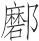
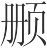
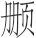
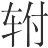
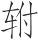
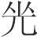
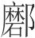
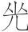
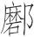

 季秋纪第九

# 季秋

**【题解】**

见《孟秋》。

一曰：

季秋之月，日在房(1)，昏虚中(2)，旦柳中。其日庚辛，其帝少皞，其神蓐收，其虫毛，其音商，律中无射(3)。其数九，其味辛，其臭腥，其祀门，祭先肝。候雁来，宾爵入大水为蛤(4)。菊有黄华，豺则祭兽戮禽(5)。天子居总章右个(6)，乘戎路，驾白骆，载白旂，衣白衣，服白玉，食麻与犬，其器廉以深。

**【注释】**

(1)房：星宿名，二十八宿之一，在今天蝎座。

(2)虚：星宿名，二十八宿之一，在今宝瓶座。

(3)无射（yì）：十二律之一，属阳律。

(4)宾爵（què）：指麻雀。爵，通“雀”。因麻雀栖息于人家房宇之间有似宾客，所以称为宾爵。大水：指海。蛤（ɡé）：蛤蜊。雀入海为蛤是古人一种不科学的说法。

(5)豺：兽名，黄色，似狗而尾长。祭兽：豺杀死野兽之后，四面摆开，像祭祀一样，古人称之为祭兽。祭，杀。戮：杀。禽：泛指鸟类。

(6)总章右个：西向明堂的右侧室。

**【译文】**

第一：

季秋九月，太阳的位置在房宿。初昏时刻，虚宿出现在南方中天；拂晓时刻，柳宿出现在南方中天。这个月于天干属庚辛，主宰之帝是少皞，佐帝之神是蓐收，应时的动物是老虎一类的毛族，相配的声音是商音，音律与无射相应。这个月的数字是九，味道是辣，气味是腥，要举行的祭祀是门祭，祭祀时祭品以肝脏为尊。这个月，候鸟从北方飞来，栖息于屋宇的麻雀钻进大海变成蛤蜊。秋菊开黄花。豺开始杀戮禽兽。天子住在西向明堂的右侧室，乘坐白色的兵车，车前驾白色的马，车上插白色的绘有龙纹的旗帜。天子穿白色的衣服，佩戴白色的饰玉，吃的食物是麻籽和狗肉，用的器物锐利而深邃。

是月也，申严号令，命百官贵贱无不务入，以会天地之藏，无有宣出(1)。命冢宰(2)，农事备收，举五种之要(3)。藏帝籍之收于神仓(4)，祗敬必饬(5)。

**【注释】**

(1)宣：疏散。

(2)冢（zhǒnɡ）宰：官名，六卿之一，也称太宰。负责治理邦国，统领百官。

(3)举：设立。要（yào）：账簿。

(4)帝籍之收：天子籍田中所收的谷物。帝籍，古时，天子有农田千亩，用民力耕作，生产祭祀上帝的黍稷，这些农田称为帝籍。神仓：储藏供祭祀上帝神祇所用谷物的谷仓。

(5)祗（zhī）：敬。饬：正。这句是说储藏籍田所收谷物入神仓时恭敬而不怠慢，端正而不偏邪。

**【译文】**

这个月，要重申严明各种号令。命令百官贵贱人等无不从事收敛的工作，来应合天地收藏的时气，不得有宣泄散出。命令太宰，在农作物全部收成之后，建立登记五谷的账簿。把天子籍田中收获的谷物藏入供祭祀上帝神祇所用谷物的谷仓，必须恭敬严肃。

是月也，霜始降，则百工休。乃命有司曰(1)：“寒气总至，民力不堪，其皆入室。”上丁(2)，入学习吹。

**【注释】**

(1)有司：指司徒。

(2)上丁：上旬的丁日。

**【译文】**

这个月，霜开始降落，各种工匠开始休整。同时命令司徒说：“寒气突然来到，百姓经受不起，让他们都进屋准备过冬。”这个月上旬的丁日，乐师进入太学练习吹籥及笙竽，演习礼乐。

是月也，大飨帝(1)，尝牺牲(2)，告备于天子(3)。合诸侯，制百县(4)，为来岁受朔日(5)，与诸侯所税于民，轻重之法，贡职之数(6)，以远近土地所宜为度，以给郊庙之事(7)，无有所私。

**【注释】**

(1)大飨帝：指遍祀五帝。飨，飨祭。帝，指五帝。

(2)尝牺牲：以牺牲尝祭群神。尝，秋祭名，指祭祀群神。

(3)告：禀告。备：齐备，指祭祀齐备。这几句大意是，天子亲飨五帝，使有司尝祭群神，事毕，有司向天子禀告祭祀已齐备。

(4)制：从，使跟从。百县：指天子领地内的各县。

(5)来岁：明年。秦以夏历十月（建亥之月）为岁首，九月为年终，所以天子于此月授明年的朔日。朔日：指每月初一。这一天日月合朔（即日月同在一个黄道经度上），所以称为朔。古人很重视朔日，每年年终，天子要向诸侯颁布来年十二个月的朔日，诸侯受飨之后把它藏在祖庙里，每月要告朔。

(6)贡职：指献给天子的贡赋。

(7)郊庙：泛指祭祀。祭天叫郊，祭祖叫庙。

**【译文】**

这个月，天子要遍祭五帝，并命令主管官吏用牺牲祭祀群神，事毕，主管官吏向天子禀告祭祀已经齐备。天子要聚会诸侯、百县大夫，向他们颁授来年的朔日，以及诸侯向百姓收税轻重的法规，诸侯向天子缴纳贡赋的多少；抽税轻重、纳贡多少都以远近和土地出产的情况为依据。这些东西供祭天祭祖之用，没有属于私有的。

是月也，天子乃教于田猎(1)，以习五戎、獀马(2)。命仆及七驺咸驾(3)，载旍旐舆(4)，受车以级，整设于屏外(5)；司徒搢扑(6)，北向以誓之。天子乃厉服厉饬(7)，执弓操矢以射。命主祠祭禽于四方(8)。

**【注释】**

(1)教于田猎：指在打猎中教习治兵之法。田，打猎。

(2)五戎：五种兵器，通常指刀、剑、矛、戟、矢。獀（sōu）：选择。

(3)仆：指田仆，田猎时负责驾御猎车的人。七驺（zōu）：指趣马，负责套马和卸马的人。

(4)旍（jīnɡ）：旌旗。旐（zhào）：绘有龟蛇的旗帜。舆：应作“旟”绘有鹰鸟的旗帜。这句大意是车上插着标志不同等级的各种旗帜。

(5)整：指按尊卑次序排好队列。屏：指猎场周围的树墙。

(6)司徒：官名，六卿之一，主管教化。搢（jìn）：插。扑：指戒尺一类教刑的用具。

(7)厉服：猛厉之服，指戎装。厉，猛。厉饬：指披挂的刀剑。饬，通“饰”，饰物。

(8)主祠：掌管祭祀的官吏。禽：指猎获的鸟兽。四方：指四方之神。

**【译文】**

这个月，天子借打猎教练治兵之法，熟悉各种兵器，选择良马。命令田仆和管套车卸马的吏役都来驾车，车上插着各种旗帜，参加田猎的人按照等级授予车辆，并按次序整齐地摆在屏垣之外。司徒把教刑用具插在衣带间，向北面告诫众人。天子穿着威武的戎装，佩戴着刀剑等饰物，拿着弓箭来射猎。命令主管祭祀的官吏用猎获的鸟兽祭祀四方之神。

是月也，草木黄落，乃伐薪为炭。蛰虫咸俯在穴，皆墐其户(1)。乃趣狱刑(2)，无留有罪，收禄秩之不当者(3)，共养之不宜者。

**【注释】**

(1)墐（jǐn）：用泥涂柴门，使之挡风。

(2)趣（cù）：通“促”，督促。狱刑：断案判刑。

(3)秩：指官爵。

**【译文】**

这个月，草木黄落了，可以砍伐木柴烧制木炭。蛰伏的动物都藏伏在洞穴里，封严它们的洞口。这个月，要督促诉讼断案的事，不要留下有罪应判决的案件。收缴那些无功之人不应得的俸禄和官爵，以及那些不应得到国家供养的人所得到的供养之物。

是月也，天子乃以犬尝稻，先荐寝庙(1)。

**【注释】**

(1)荐：向鬼神进献。寝庙：祖庙。

**【译文】**

这个月，天子就着狗肉品尝稻米，并首先进献给祖庙。

季秋行夏令，则其国大水，冬藏殃败(1)，民多鼽窒(2)；行冬令，则国多盗贼，边境不宁，土地分裂；行春令，则暖风来至，民气解堕(3)，师旅必兴(4)。

**【注释】**

(1)冬藏：指储藏起来准备过冬用的谷物菜蔬。

(2)鼽（qíu）：鼻不通。

(3)解堕：松懈懒惰。解，同“懈”。

(4)师旅：军队。古制，二千五百人为师，五百人为旅。

**【译文】**

季秋如果实行应在夏天实行的政令，那么，国家就会大水成灾，收藏起来准备过冬的谷物菜蔬就会毁坏，百姓就会出现鼻塞窒息的疾病。如果实行应在冬天实行的政令，那么，国家就会盗贼横生，边境就不能安宁，土地就会被侵削分割。如果实行应在春天实行的政令，那么暖风就会到来，百姓就会懈怠，战争就会发生。

# 顺民

**【题解】**

所谓“顺民”，是顺依民心的意思。文章列举历史上商汤用自己的身体作牺牲为民求雨；文王辞去纣封给他的千里之地，为民请除炮烙之刑；越王勾践“内亲群臣，下养百姓，以来其心”，终于“残吴二年而霸”等事例，说明了“先顺民心，故功名成”，以及“以德得民心”的道理。本篇承继了孟、荀重视民众的思想，反映了新兴地主阶级对民心的重视。

二曰：

先王先顺民心，故功名成。夫以德得民心以立大功名者，上世多有之矣。失民心而立功名者，未之曾有也。得民必有道(1)。万乘之国，百户之邑，民无有不说。取民之所说而民取矣，民之所说岂众哉？此取民之要也。

**【注释】**

(1)必：“心”字之误。

**【译文】**

第二：

先王首先顺依民心，所以功成名就。依靠仁德博取民心而建立大功、成就美名的，古代大有人在。失去民心而建立功名的却不曾有过。获得民心是有方法的。无论是具有万辆兵车的大国，还是仅有百户的小邑，人民无不有喜欢的事。只要做人民所喜欢的事，就是得民心了。人民所喜欢的事难道会很多吗？这是取得民心的关键。

昔者汤克夏而正天下(1)。天大旱，五年不收，汤乃以身祷于桑林(2)，曰：“余一人有罪(3)，无及万夫。万夫有罪，在余一人。无以一人之不敏(4)，使上帝鬼神伤民之命。”于是剪其发(5)，故其手(6)，以身为牺牲(7)，用祈福于上帝(8)。民乃甚说，雨乃大至。则汤达乎鬼神之化、人事之传也(9)。

**【注释】**

(1)正：这里是治理的意思。

(2)桑林：古地名。汤祀神之所。

(3)余一人：古代天子自称。

(4)不敏：不才，自谦之词。

(5)翦其发：剪去头发是古代的一种刑罚。

(6)：疑是“磿（lì）”字之误。磿，通“枥”，压挤。“枥手”是古代的一种刑罚。用绳联小木棍五根，套入手指收紧，状如后来的“拶（zǎn）指”。商汤自剪其发，自拶其手，以示自责。

(7)牺牲：供祭祀用的纯色体全的牲畜。

(8)用：以。

(9)传：转移。这里指转移的道理。

**【译文】**

从前，汤灭掉夏，治理天下。天大旱，五年没有收成。汤于是在桑林用自己的身体向神祈祷，说：“我一人有罪，不要祸及天下人；即使天下人有罪，罪责也都在我一人身上。不要因我一人不才，致使天帝鬼神伤害人民的生命。”于是汤剪断自己的头发，拶起自己的手指，把自己的身体作为牺牲，向天帝求福。人民于是非常高兴，大雨于是也下起来。汤可说是通晓鬼神的变化、人事的转移了。

文王处岐事纣，冤侮雅逊(1)，朝夕必时，上贡必适，祭祀必敬。纣喜，命文王称西伯(2)，赐之千里之地。文王载拜稽首而辞曰(3)：“愿为民请炮烙之刑(4)。”文王非恶千里之地，以为民请炮烙之刑，必欲得民心也。得民心则贤于千里之地(5)，故曰文王智矣。

**【注释】**

(1)冤侮：遭受冤枉、轻慢。雅：正，合乎规范。

(2)西伯：古代统领一方的长官称伯。文王统领雍州（古九州之一，包括今陕西北部、甘肃大部及青海一部），在西方，故称西伯。

(3)载拜：拜两拜。载，通“再”。稽（qǐ）首：古人最恭敬的礼节，动作近似于叩头，但要先拜，然后两手合抱按地，头伏在手前边的地上，并停留一会儿，整个动作都较缓慢。

(4)请炮烙之刑：请求除去炮烙之刑。炮烙，殷纣所用的酷刑。炮，烧烤。烙，当作“格”。格为铜器，格下烧炭，使犯人步行格上，堕入火中而死。后人改“格”为“烙”，解为烧灼之义。

(5)贤：胜过。

**【译文】**

文王居于岐山臣事纣王，虽遭冤枉侮慢，依然雅正恭顺，早晚朝拜不失其时，进献贡物一定合宜，祭祀一定诚敬。纣很高兴，封文王为西伯，赏他纵横千里的土地。文王再拜稽首，辞谢说：“我不要千里的土地，只愿替人民请求废除炮烙之刑。”文王并不是厌恶土地，用它替人民请求废除炮烙之刑，是一定要博得民心。得到民心，它的好处胜过纵横千里的土地。所以说，文王是相当明智了。

越王苦会稽之耻(1)，欲深得民心，以致必死于吴(2)。身不安枕席，口不甘厚味，目不视靡曼(3)，耳不听钟鼓。三年苦身劳力，焦唇干肺(4)，内亲群臣，下养百姓，以来其心(5)。有甘脆不足分，弗敢食；有酒流之江，与民同之。身亲耕而食，妻亲织而衣。味禁珍，衣禁袭(6)，色禁二。时出行路，从车载食，以视孤寡老弱之渍病、困穷、颜色愁悴、不赡者(7)，必身自食之。于是属诸大夫而告之曰(8)：“愿一与吴徼天下之衷(9)。今吴、越之国相与俱残(10)，士大夫履肝肺(11)，同日而死，孤与吴王接颈交臂而偾(12)，此孤之大愿也。若此而不可得也，内量吾国不足以伤吴，外事之诸侯不能害之(13)，则孤将弃国家，释群臣，服剑臂刃(14)，变容貌，易姓名，执箕帚而臣事之(15)，以与吴王争一旦之死。孤虽知要领不属(16)，首足异处，四枝布裂(17)，为天下戮(18)，孤之志必将出焉！”于是异日果与吴战于五湖(19)，吴师大败，遂大围王宫，城门不守，禽夫差，戮吴相(20)，残吴二年而霸。此先顺民心也。

**【注释】**

(1)越王：指越王勾践。会稽之耻：指越王勾践被吴王夫差战败，困于会稽，被迫屈膝求和一事。会稽，山名，在今浙江绍兴东南。

(2)致必死：决心舍命拼死的意思。

(3)靡曼：指美色。

(4)干肺：肺气枯竭。

(5)来：使……来（归依）。

(6)袭：衣外加衣。

(7)渍（zì）：病。

(8)属（zhǔ）：聚集。

(9)“愿一”句：这句的大意是，要与吴国一决胜负。下，疑是衍文。徼（yāo），求。衷，正。

(10)今：“令”字之误。残：毁灭。

(11)履肝肺：形容战争残酷激烈，多所杀伤。履，踏，踩。

(12)接颈交臂：描写肉搏之状。偾（fèn）：僵仆，这里指死。

(13)事：所事。

(14)服：佩带。臂：用如动词，持。

(15)臣：奴仆。

(16)要（yāo）领不属（zhǔ）：指受腰斩、斩首之刑。要，古“腰”字。领，脖子。属，连。

(17)四枝布裂：指车裂，即五马分尸，古代一种最残酷的刑罚。四枝，即四肢。布，分散。

(18)戮：辱。

(19)五湖：这里指太湖。

(20)吴相：指太宰嚭（pǐ）。

**【译文】**

越王深为会稽之耻而痛苦，想要深得民心，以求和吴国拼死一战。于是他身不安于枕席，口不尝食美味，眼不看美色，耳不听音乐。三年的时间，苦心劳力，唇干肺伤，对内爱抚群臣，对下休养百姓，以便使他们一心归顺自己。有甜美的食物，如不够分，自己不敢独自吃；有酒把它倒入江中，与人民共饮。靠自己亲身耕种吃饭，靠妻子亲手纺织穿衣。饮食禁求珍奇，衣服禁穿两层，衣饰禁用二色。时常出外巡视，随从车辆载着食物，去探望孤寡老弱中那些生病的、穷困的、面色憔悴的、饮食不足的人，一定亲自给他们食物吃。然后，他召集诸大夫，向他们宣告说：“我愿与吴国一决胜负。让吴、越两国一道毁灭，士大夫踏肝践肺同日战死，我跟吴王颈臂相交肉搏而亡，这是我最大的愿望。如果这些办不到，从国内考虑估量我们的国力不足以损伤吴国，从国外考虑结盟的诸侯也不能毁灭它，那么，我将抛弃国家，离开群臣，身带佩剑，手执利刃，改变容貌，更换姓名，手执箕帚，充当奴仆，侍奉吴王，以便跟吴王决死于一旦之间。我虽然知道这样做会遭致腰断颈绝，头脚异处，四肢分裂，被天下人所羞辱，但是我的志向一定要付诸实施！”后来越国终于与吴国在五湖决战，吴国军队大败，越国军队于是包围了吴王的王宫，攻下城门，活捉了夫差，杀死了吴相，灭掉吴国之后二年，越国称霸诸侯。这都是先顺依民心的结果啊。

齐庄子请攻越(1)，问于和子(2)。和子曰：“先君有遗令曰：‘无攻越。越，猛虎也。’”庄子曰：“虽猛虎也，而今已死矣。”和子曰以告鸮子(3)。鸮子曰：“已死矣，以为生。”故凡举事，必先审民心，然后可举。

**【注释】**

(1)齐庄子：即田庄子，田和之父，齐宣公之相。

(2)和子：春秋时齐国田常的曾孙田和，公元前386年始列为诸侯，为田姓齐国第一个国君。

(3)曰：疑是衍文（依孙人和说）。鸮（xiāo）子：齐国之相。

**【译文】**

齐庄子请求攻打越国，征求和子的意见。和子说：“先君有遗命说：‘不可攻打越国。越国是只猛虎。’”庄子说：“虽然是只猛虎，但是现在已经死了。”和子把这话告诉鸮子，鸮子说：“虽然已经死了，但人们还认为它活着。”所以，凡行事，一定要先考察民心，然后才可去做。

# 知士

**【题解】**

本篇向统治者陈言，士中有“千里之马”，有待贤主去发现。全篇以“静郭君善剂貌辨”，剂貌辨为静郭君“外生乐，趋患难”的事例说明，只要君主“能自知人”，那么被“知”之士是乐于为知己者赴汤蹈火的。文章以一半以上的篇幅记载了剂貌辨这位策辩之士的言谈举止，予以肯定赞扬，或多或少地反映了纵横家的思想与风貌。

静郭君善剂貌辨之事与《战国策·齐一》所载基本相同，可参见。

三曰：

今有千里之马于此，非得良工(1)，犹若弗取。良工之与马也，相得则然后成，譬之若桴之与鼓。夫士亦有千里，高节死义，此士之千里也。能使士得千里者(2)，其惟贤者也。

**【注释】**

(1)良工：这里指善于相马的人。

(2)待：当为“得”字之误。

**【译文】**

第三：

假如有日行千里的骏马，但如果遇不到善于相马的人，仍然不会被当作千里马使用。善于相马的人与千里马须互相依赖，然后才得以成名，就像鼓槌和鼓彼此相依一样。士中也有超群出众的千里马。气节高尚、为正义而献身的人就是士中的千里马。能够使士施展千里马的本领的，大概只有贤人吧。

静郭君善剂貌辨(1)。剂貌辨之为人也多訾(2)，门人弗说。士尉以证静郭君(3)，静郭君弗听，士尉辞而去。孟尝君窃以谏静郭君(4)，静郭君大怒曰：“刬而类(5)，揆吾家(6)，苟可以傔剂貌辨者(7)，吾无辞为也！”于是舍之上舍，令长子御(8)，朝暮进食。

**【注释】**

(1)静郭君：姓田名婴，号静郭君，战国时齐相，因受封于薛（在今山东滕州东南），又称薛公。他书或作“靖郭君”。剂貌辨：齐人，静郭君的门客。他书或作“齐貌辨”、“剧貌辨”。

(2)訾：通“疵（cī）”。过失。

(3)士尉：齐人，静郭君的门客。证：谏诤。

(4)孟尝君：静郭君之子，名文，号孟尝君。

(5)刬（chǎn）：铲除，消灭。而：尔，你（们）。

(6)揆（kuí）：通“睽”，离散（依王念孙说）。

(7)傔（qiàn）：满足。

(8)御：侍奉。

**【译文】**

静郭君很喜爱他的门客剂貌辨。剂貌辨为人毛病很多，其他门客都不喜欢他。士尉为此谏诤静郭君，静郭君不听，于是士尉告辞离开了静郭君的门下。孟尝君私下为此劝说静郭君，静郭君大怒说：“即使把你们都杀死，把我家拆得四分五裂，只要能让剂貌辨先生满足，我也在所不辞！”于是让剂貌辨住在上等客舍，让自己的长子侍奉他，早晚进献食物。

数年，威王薨(1)，宣王立(2)。静郭君之交，大不善于宣王，辞而之薛，与剂貌辨俱。留无几何，剂貌辨辞而行，请见宣王。静郭君曰：“王之不说婴也甚，公往，必得死焉。”剂貌辨曰：“固非求生也。请必行！”静郭君不能止。

**【注释】**

(1)威王：指齐威王。战国时齐国国君，姓田，名因齐，公元前356年—前320年在位。

(2)宣王：指齐宣王，齐威王之子，名辟疆，公元前319年—前301年在位。按：本文与《史记》所载不合。此处当从《战国策》，作“宣王薨，闵王立”。

**【译文】**

过了几年，齐宣王死了，齐闵王即位。静郭君的处世交往很不为闵王所赞许，静郭君辞官回到封地薛，仍跟剂貌辨在一起。在薛地住了没多久，剂貌辨辞行，请求去谒见闵王。静郭君说：“大王不喜欢我到极点了，您去必定遭到杀害。”剂貌辨说：“我本来就不是去求活命的。我一定要去！”静郭君劝阻不住他。

剂貌辨行，至于齐。宣王闻之，藏怒以待之。剂貌辨见，宣王曰：“子，静郭君之所听爱也？”剂貌辨答曰：“爱则有之，听则无有。王方为太子之时，辨谓静郭君曰：‘太子之不仁，过涿视(1)，若是者倍反。不若革太子，更立卫姬婴儿校师(2)。’静郭君泫而曰：‘不可，吾弗忍为也。’且静郭君听辨而为之也(3)，必无今日之患也。此为一也。至于薛，昭阳请以数倍之地易薛(4)，辨又曰：‘必听之。’静郭君曰：‘受薛于先王，虽恶于后王，吾独谓先王何乎？且先王之庙在薛，吾岂可以先王之庙予楚乎？’又不肯听辨。此为二也。”宣王太息，动于颜色(5)，曰：“静郭君之于寡人，一至此乎(6)！寡人少，殊不知此。客肯为寡人少来静郭君乎(7)？”剂貌辨答曰：“敬诺。”

**【注释】**

(1)过涿视：当作“过颐豕视”。过颐，下巴过宽，即所谓“耳后见腮”。颐，下巴。豖视，即相法所谓“下邪偷视”。过颐豕视，古人认为是不仁之相。

(2)校师：当是齐宣王的庶子，卫姬所生。

(3)且：相当于“若”。

(4)昭阳：战国时人，楚相。

(5)动：改变。颜色：指脸色。

(6)一：竟，乃。

(7)少：短时间，暂时。这样说是表示客气，意思是不敢长时间地烦扰对方。

**【译文】**

剂貌辨走了，到了齐国都城。闵王听说了，心怀恼怒等着他。剂貌辨拜见闵王，闵王说：“你就是静郭君言听计从、非常喜爱的那个人吧？”剂貌辨回答说：“喜爱是有，至于言听计从根本谈不上。当初大王正做太子的时候，我对静郭君说：‘太子耳后见腮，下斜偷视，相貌不仁，像这样的人背理行事。不如废掉太子，改立卫姬的幼子校师。’静郭君流着泪说：‘不行。我不忍心这样做。’如果静郭君听从我的话并这样做了，一定不会有今天的祸患。这是一个例证。回到薛地之后，楚相昭阳请求用大于薛几倍的土地交换薛地。我又说：‘一定要应允他。’静郭君说：‘我从先王那里承受了薛地，现在虽被后王所厌恶，但如果我把薛地换给别人，我在先王那里怎么交待呢？再说先王的宗庙在薛，我怎么可以把先王的宗庙给楚国呢？’他又不肯听我的话。这是第二个例证。”闵王长叹，显出很激动的神色，说：“静郭君对我竟爱到这个地步吗？我年纪幼小，这些都不知道。您愿意替我请静郭君稍稍来些日子吗？”剂貌辨回答说：“遵命。”

静郭君来，衣威王之服(1)，冠其冠，带其剑。宣王自迎静郭君于郊，望之而泣。静郭君至，因请相之。静郭君辞，不得已而受。十日，谢病强辞，三日而听。

**【注释】**

(1)威王之服：当是“宣王之服”，宣王所赐之服。下文“冠”、“剑”都是宣王所赐。

**【译文】**

静郭君来到国都，穿着宣王所赐的衣服，戴着宣王所赐的帽子，佩着宣王所赐的宝剑。闵王亲自到郊外迎接静郭君，远远望见他就流下泪来。静郭君到了以后，闵王就要求拜静郭君做齐相。静郭君再三辞谢，不得已才接受下来。十天之后，他托病辞官，极力推辞，三天之后闵王才应允。

当是时也，静郭君可谓能自知人矣(1)。能自知人，故非之弗为阻。此剂貌辨之所以外生乐、趋患难故也。

**【注释】**

(1)自知：不待他人教谕而知。

**【译文】**

在当时，静郭君可称得上善于亲自了解人了。正因为他善于亲自了解人，所以别人的非议妨碍不了他。这正是剂貌辨之所以把生命与欢乐置之度外，为静郭君奔赴患难的缘故。

# 审己

**【题解】**

本篇旨在论述“审己”的必要。所谓“审己”，就是求诸己而不求诸人，求诸内而不求诸外的意思。文章一开始就指出：“凡物之然也，必有故”，“先王、名士、达师”之所以超过一般人，就在于他们“知故”，即了解事物变化的原因。怎样才能做到这一点呢？文章通过子列子问射于关尹子的例子回答了这个问题，这就是要“审己”。文章还列举了柳下季、齐湣王、越王授三个人的事例，从正反两方面阐明了“审己”、“知故”的重要。本篇思想与关尹学派相通。

四曰：

凡物之然也，必有故。而不知其故(1)，虽当，与不知同，其卒必困。先王、名士、达师之所以过俗者，以其知也(2)。水出于山而走于海，水非恶山而欲海也，高下使之然也。稼生于野而藏于仓，稼非有欲也，人皆以之也(3)。

**【注释】**

(1)而：相当于“若”。

(2)知：知故，即知道事物之所以这样的原因。

(3)以：用。

**【译文】**

第四：

大凡物之所以这样，必有原因。如果不知道它的原因，即使做事得当，也和不知相同，最终必为外物所困。先代君王、知名之士、通达之师之所以超过平庸之辈，正是因为他们知道事物之所以这样的原因。水从山中流出奔向大海，并不是水厌恶山而向往海，而是山高海低的形势使它这样的。庄稼生在田野而贮藏在仓中，并不是庄稼有这种欲望，而是人们都需用它啊。

故子路掩雉而复释之(1)。

子列子常射中矣(2)，请之于关尹子(3)。关尹子曰：“知子之所以中乎？”答曰：“弗知也。”关尹子曰：“未可。”退而习之三年，又请。关尹子曰：“子知子之所以中乎？”子列子曰：“知之矣。”关尹子曰：“可矣，守而勿失。”非独射也，国之存也，国之亡也，身之贤也，身之不肖也，亦皆有以(4)。圣人不察存亡、贤不肖，而察其所以也。

**【注释】**

(1)子路：孔子的弟子仲由，字子路。掩，覆而取之，罩住。

(2)子列子：战国时郑人，姓列，名御寇。子，古代对男子的尊称。常：通“尝”。

(3)关尹子：古代道家人物，名喜，为函谷关令，故又称关令尹。现存《关尹子》九篇是后世假托之作。

(4)有以：有原因。

**【译文】**

所以子路罩住野鸡却又放了它，是由于自己尚未知道捉到它的原因。

子列子曾射中目标，于是向关尹子请教关于射箭的道理。关尹子问：“你知道你射中的道理吗？”子列子回答说：“不知道。”关尹子说：“现在还不能跟你谈论大道。”子列子回去练习射箭，练了三年，又去请教。关尹子问：“你知道你射中的道理吗？”子列子说：“知道了。”关尹子说：“可以了，你要奉守它而不要失掉。”不只射箭如此，国家的生存，国家的灭亡，人的贤明，人的不肖，也都各有原因。圣人不去考察存亡和贤不肖本身，而是考察造成它们这样的原因。

齐攻鲁，求岑鼎(1)。鲁君载他鼎以往。齐侯弗信而反之(2)，为非，使人告鲁侯曰：“柳下季以为是(3)，请因受之。”鲁君请于柳下季，柳下季答曰：“君之赂以欲岑鼎也(4)，以免国也。臣亦有国于此(5)。破臣之国以免君之国，此臣之所难也。”于是鲁君乃以真岑鼎往也。且柳下季可谓此能说矣(6)。非独存己之国也，又能存鲁君之国。

**【注释】**

(1)岑（cén）鼎：鲁国宝鼎，因形高而锐，类岑之形，故名岑鼎。岑，小而高的山。

(2)反：同“返”。

(3)柳下季：春秋时鲁国大夫展禽，字季，因食邑柳下，故称柳下季，谥惠，故又称柳下惠。

(4)赂以欲岑鼎：等于说“赂以所欲之岑鼎”。

(5)国：喻持守之物，这里指信誉。

(6)且：相当于“若”。此：疑是衍文。

**【译文】**

齐国攻打鲁国，索取鲁国的岑鼎。鲁君用车拉着另一只鼎送到齐国。齐侯不相信，把它退了回来，认为不是岑鼎，并派人告诉鲁侯说：“如果柳下季认为这是岑鼎，我愿意接受它。”鲁君向柳下季求助。柳下季答复说：“您答应齐侯把岑鼎送给他，为的是使国家免除灾难。我自己这里也有个‘国家’，这就是信誉。毁灭我的‘国家’来挽救您的国家，这是我难以办到的。”于是鲁君就把真的岑鼎运往齐国去了。像柳下季这样可称得上善于劝说国君了。不仅保持了自己的信誉这个“国家”，又能保存住鲁君的国家。

齐湣王亡居于卫(1)，昼日步足，谓公玉丹曰(2)：“我已亡矣，而不知其故。吾所以亡者，果何故哉？我当已(3)。”公玉丹答曰：“臣以王为已知之矣，王故尚未之知邪(4)？王之所以亡也者，以贤也。天下之王皆不肖，而恶王之贤也，因相与合兵而攻王。此王之所以亡也。”湣王慨焉太息曰：“贤固若是其苦邪？”此亦不知其所以也。此公玉丹之所以过也。

**【注释】**

(1)齐湣王：战国时齐国国君，姓田，名地（一作遂），公元前300年—前284年在位，一度与秦昭王并称东、西帝，后燕合五国之兵攻齐，齐湣王逃到卫国。

(2)公玉丹：齐湣王之臣。

(3)已：止，这里是克服的意思。

(4)故：等于说“乃”，竟，竟然。

**【译文】**

齐湣王流亡国外，住在卫国。有一次，白天散步，齐湣王对公玉丹说：“我已流亡国外了，却不知道流亡的原因。我之所以流亡，究竟是什么原因呢？我当纠正自己的过失。”公玉丹回答说：“我以为大王您已经知道了呢，您竟然还不知道吗？您之所以流亡国外，是因为您太贤明的缘故。天下的君主都不肖，因而憎恶大王您的贤明，于是他们互相勾结，合兵进攻大王。这就是大王您流亡的原因啊！”湣王很感慨，叹息说：“君主贤明原来要受这样的苦啊！”这也是不知道自己为什么灭亡啊！这正是公玉丹之所以能够蒙骗他的原因。

越王授有子四人(1)。越王之弟曰豫，欲尽杀之，而为之后(2)。恶其三人而杀之矣(3)。国人不说，大非上。又恶其一人而欲杀之，越王未之听。其子恐必死，因国人之欲逐豫，围王宫。越王太息曰：“余不听豫之言，以罹此难也。”亦不知所以亡也。

**【注释】**

(1)越王授：勾践六世孙无颛（zhuān）。疑即《贵生》篇的“王子搜”。

(2)后：指王位继承人。

(3)恶（wù）：诽谤，诋毁。

**【译文】**

越王授有四个儿子。越王的弟弟名叫豫，他想把越王的四个儿子全都杀掉，让自己成为越王的继承人。豫毁谤其中三子，让越王把他们杀掉了。国人很不满，纷纷指责王。豫又毁谤剩下的一子，想让越王杀掉他，越王没有听从豫的话。越王的儿子害怕自己被杀，于是借着国人的愿望把豫驱逐出国，并包围了王宫。越王叹息说：“我不听从豫的话，所以才遭到这样的灾祸。”这也是不知自己为什么灭亡啊。

# 精通

**【题解】**

所谓“精通”是指人的精气相通，即文中所说的“精或往来”的意思。本篇旨在谈君道。文章认为君主与民精气相通，因此，君主只要做到“以爱利民为心”、“行德乎己”，虽然“号令未出”，也必然会达到“天下皆延颈举踵”、“四荒咸饬乎仁”的大治局面。本篇力图以“精气”说解释某些精神、心理现象，这种探索是值得肯定的。

五曰：

人或谓兔丝无根(1)。兔丝非无根也，其根不属也(2)，伏苓是(3)。慈石召铁(4)，或引之也。树相近而靡(5)，或之也(6)。圣人南面而立，以爱利民为心，号令未出，而天下皆延颈举踵矣，则精通乎民也。夫贼害于人，人亦然。

**【注释】**

(1)兔丝：即菟丝，一种寄生的蔓草。

(2)属（zhǔ）：接连。

(3)伏苓：即茯苓，寄生在松树根上的一种块状菌。

(4)慈石：即磁石。古人认为，这种石可以吸铁，就像慈母吸引子女一样，故名“慈石”。

(5)靡：通“摩（mó）”，摩擦。

(6)（rǒng）：推。

**【译文】**

第五：

有人说菟丝没有根。其实菟丝不是没有根，只是它的根与它不相连，茯苓就是它的根。磁石招来铁，是有一种力在吸引它。树木彼此生得近了，就要互相摩擦，是有一种力在推它。圣人面南为君，以爱民利民之心，号令还没有发出，天下人就都伸长脖子，踮起脚跟殷切盼望了。这是圣人与人民精气相通的缘故。暴君伤害人民，人民也会有相应的反应。

今夫攻者，砥厉五兵(1)，侈衣美食(2)，发且有日矣，所被攻者不乐，非或闻之也，神者先告也(3)。身在乎秦，所亲爱在于齐，死而志气不安，精或往来也。

**【注释】**

(1)砥（dǐ）厉：磨石。细者为砥，粗者为厉。这里用如动词，磨砺。五兵：五种兵器。其说不一，通常指矛、戟、弓、剑、戈。

(2)侈衣美食：穿华丽之服，吃精美之食。古代打仗，将士出征前，往往赏赐丰厚，故有“侈衣美食”之举。

(3)神者先告也：按文义“神”下不当有“者”字。

**【译文】**

假如有个国家准备进攻他国，正在磨砺兵器，犒赏军队，距离出征没几天了，这时即将遭受进攻的国家肯定不会快乐，并不是他们有人听到了风声，而是精神先感知到了。一个人身在秦国，他所亲爱的人在齐国，如果在齐国的人死了，在秦国的人就会心神不安，这是精气互相往来的缘故啊！

德也者，万民之宰也。月也者，群阴之本也。月望则蚌蛤实(1)，群阴盈；月晦则蚌蛤虚(2)，群阴亏。夫月形乎天，而群阴化乎渊；圣人行德乎己，而四荒咸饬乎仁。

**【注释】**

(1)月望：月满。《释名·释天》说：“望，月满之名也。月大十六日，小十五日，日在东，月在西，遥相望也。”

(2)月晦：月光尽敛。时在农历的每月最后一日。

**【译文】**

品德是万民的主宰，月亮是各种属阴之物的根本。月满的时候，蚌蛤的肉就充实，各种属阴之物也都满盈；月光尽敛的时候，蚌蛤的肉就空虚，各种属阴之物也都亏缺。月相变化显现于天空，各种属阴之物都随着变化于深水之中。圣人修养自己的品德，四方荒远之地的人民都随着整饬自己，归向仁义。

养由基射(1)，中石，矢乃饮羽(2)，诚乎也。伯乐学相马(3)，所见无非马者，诚乎马也。宋之庖丁好解牛(4)，所见无非死牛者，三年而不见生牛，用刀十九年，刃若新研(5)，顺其理，诚乎牛也。

**【注释】**

(1)养由基：春秋时楚国大夫，以善射著称。（sì）：同“兕”。兽名，属犀牛类。一说即雌犀。

(2)饮羽：箭射入石中，尾部羽毛隐没不见。饮，没（mò）。

(3)伯乐：春秋秦穆公时人，以善相马著称。

(4)庖丁：名叫丁的厨师。解牛：分卸牛的肢体。庖丁解牛之事可参见《庄子·养生主》。

(5)：通“磨”。

**【译文】**

养由基射兕，射中石头，箭羽没入石中，这是由于他把石头当成兕，精神集中于兕的缘故。伯乐学相马，眼睛看到的除了马以外没有别的东西，这是由于他精神集中于马的缘故。宋国的庖丁喜好分解牛的肢体，眼睛看到的没有不是死牛的，整整三年眼前不见活牛，一把刀用了十九年，刀刃仍然锋利得像刚刚磨过，这是由于他分解牛的肢体时顺着牛的肌理，精神集中于牛的缘故。

钟子期夜闻击磬者而悲(1)，使人召而问之曰：“子何击磬之悲也？”答曰：“臣之父不幸而杀人，不得生；臣之母得生，而为公家为酒；臣之身得生，而为公家击磬。臣不睹臣之母三年矣。昔为舍氏睹臣之母(2)，量所以赎之则无有，而身固公家之财也，是故悲也。”钟子期叹嗟曰：“悲夫！悲夫！心非臂也，臂非椎、非石也(3)。悲存乎心而木石应之。”故君子诚乎此而谕乎彼，感乎己而发乎人，岂必强说乎哉？

**【注释】**

(1)钟子期：春秋时楚人。

(2)昔：夜。这里指昨天夜晚。舍氏：未详。《新序·四》记载此事与本文略有不同，“舍氏”，《新序》作“舍市”。

(3)椎（chuí）：击磬工具，木制。石：指磬。

**【译文】**

钟子期夜间听到有人击磬，发出悲哀之声，就派人把击磬的人叫来，问他说：“你击磬击出的声音怎么这么悲哀啊？”回答说：“我的父亲不幸杀了人，无法活命；我的母亲虽得以活命，却没入官府替公家造酒；我自身虽得以活命，却替公家击磬。我已经三年没有见到自己的母亲了。昨天晚上在舍氏见到了我的母亲，思量用什么来赎她却什么都没有，而且想到连自身也是公家的财产，因此心中悲哀。”钟子期叹息说：“可悲呀，可悲！心并不是手臂，手臂也不是椎，不是磬，但悲哀存于心中，而椎磬却能与它应和。”所以君子心中有所感，就会在外面表现出来，自己心中有所感，就可以影响到他人，哪里用得着一定要极力用言辞表述呢？

周有申喜者(1)，亡其母，闻乞人歌于门下而悲之，动于颜色，谓门者内乞人之歌者(2)，自觉而问焉(3)，曰：“何故而乞？”与之语，盖其母也。故父母之于子也，子之于父母也，一体而两分，同气而异息。若草莽之有华实也(4)，若树木之有根心也。虽异处而相通，隐志相及，痛疾相救，忧思相感，生则相欢，死则相哀，此之谓骨肉之亲。神出于忠而应乎心，两精相得，岂待言哉？

**【注释】**

(1)申喜：周人。

(2)内（nà）：同“纳”。

(3)自觉：疑是“自见”之误。

(4)莽：密生的草，也泛指草。

**【译文】**

有个叫申喜的周人，他的母亲失散了。有一天，他听到有个乞丐在门前唱歌，自己感到悲哀，脸色都变了。他告诉守门的人让唱歌的乞丐进来，亲自见她，并询问说：“什么原因使你落到求乞的地步？”交谈时才知道，那乞丐原来正是他的母亲。所以，无论父母对于子女来说，还是子女对于父母来说，实际都是一个整体而分为两处，精气相同而呼吸各异，就像草莽有花有果，树木有根有心一样。虽在异处却可彼此相通，潜藏于心中的志向互相联系，有病痛互相救护，有忧思互相感应，对方活着心里就高兴，对方死了心里就悲哀，这就叫做骨肉之亲。这种天性出于至诚，而彼此心中互相应和，两方精气相通，难道还要靠言语吗？

