 孟冬纪第十

# 孟冬

**【题解】**

依五行学说，冬属水，是万物收敛闭藏的季节。所以天子发布政令，必须顺应冬阴闭藏之气。要命令百官督促百姓收敛聚藏，如“有不收藏积聚者”，“取之不诘”；要加高城墙，警戒城门里门，“备边境，完要塞”，“涂阙庭门闾，筑囹圄，以助天地之闭藏”；要祭祀“皇天上帝社稷寝庙山林名川”，祈求来年丰收，天子要“与卿大夫饬国典，论时令，以待来岁之宜。”

《孟冬》、《仲冬》、《季冬》三纪所统辖的文章，多是《节丧》、《安死》之类的内容。《吕氏春秋》的作者认为人的忠信、廉洁的品质也与闭敛有关，所以也将《至忠》、《忠廉》、《士节》、《介立》等篇放在这三纪之内。

一曰：

孟冬之月，日在尾(1)，昏危中(2)，旦七星中(3)。其日壬癸(4)，其帝颛顼(5)，其神玄冥(6)，其虫介(7)，其音羽(8)，律中应钟(9)。其数六(10)，其味咸，其臭朽(11)，其祀行(12)，祭先肾。水始冰，地始冻，雉入大水为蜃(13)。虹藏不见。天子居玄堂左个(14)，乘玄辂，驾铁骊(15)，载玄旂，衣黑衣，服玄玉，食黍与彘(16)，其器宏以弇(17)。

**【注释】**

(1)尾：星宿名，二十八宿之一；在今天蝎座。

(2)危：星宿名，二十八宿之一，在今宝瓶座及飞马座。

(3)七星：星宿名，即星宿，二十八宿之一，在今长蛇座。

(4)壬癸：五行说认为冬季属水，壬癸也属水，所以说“其日壬癸”。下文“其帝颛顼，其神玄冥，其虫介，其音羽，其味咸，其臭朽，其祀行”等等也都是先配五行再配四时的。

(5)颛顼：即高阳氏，五帝之一。五行家认为他以水德王天下，被尊为北方水德之帝。

(6)玄冥：少皞之子，名循，被尊为水德之神。

(7)介：甲，指龟鳖之类有甲壳的动物。

(8)羽：五音之一。

(9)应钟：十二律之一，属阴律。

(10)六：阴阳说认为，水生数为一，成数为六，这里指水的成数。参看《孟春》注。

(11)朽：指若有若无的气味。

(12)行：五祀之一。行指门内之地。

(13)雉：山鸡。大水：这里指淮河。蜃（shèn）：蛤蜊。

(14)玄堂左个：北向明堂的左侧室。

(15)铁骊：黑色的马。铁，表示黑色。骊，黑色马。

(16)彘（zhì）：猪。

(17)弇：掩闭，这里指器物的口敛缩而小。

**【译文】**

孟冬之月，太阳的位置在尾宿。初昏时刻，危宿出现在南方中天；拂晓时刻，星宿出现在南方中天。孟冬于天干属壬癸，主宰之帝是颛顼，佐帝之神是玄冥，应时的动物是龟鳖之类的甲族，相配的声音是羽音，音律与应钟相应。这个月的数字是六，味道是咸，气味是朽，要举行的祭祀是行祭，祭祀时祭品以肾脏为尊。这个月水开始结冰，地开始封冻，山鸡钻入淮水变成蛤蜊，彩虹消失不再出现。天子住在北向明堂的左侧室，乘坐黑色的车，车前驾黑色的马，车上插黑色的绘有龙纹的旗帜，天子穿黑色的衣服，佩带黑色的饰玉。吃的食物是黍米和猪肉，使用的器物宏大而敛口。

是月也，以立冬。先立冬三日，太史谒之天子曰：“某日立冬，盛德在水。”天子乃斋。立冬之日，天子亲率三公九卿大夫，以迎冬于北郊。还，乃赏死事(1)，恤孤寡。

**【注释】**

(1)死事：指为国事而死。

**【译文】**

这个月有立冬的节气，立冬前三天，太史向天子禀告说：“某天立冬，大德在于水。”于是天子斋戒，准备迎冬。立冬那天，天子亲自率领三公九卿大夫，到北郊去迎接冬的到来。迎冬回来，赏赐为国捐躯的大臣的子孙，抚恤救济这些大臣遗留的孤儿寡妇。

是月也，命太卜祷祠龟策(1)，占兆审卦吉凶(2)。于是察阿上乱法者则罪之(3)，无有掩蔽。

**【注释】**

(1)太卜：掌管卜筮的官，又叫卜正。龟策：龟指龟甲，策指蓍草，都是占卜的用具。

(2)占：视。兆：占卜时龟甲上烧出的裂纹。审：仔细研究。卦：卦象。

(3)阿（ē）上：阿谀上司。

**【译文】**

这个月，命令掌管卜筮的太卜，祈祷于龟策，看兆象，算卦数，来考察吉凶。这时候，要察访那些曲意逢迎上司而扰乱法制的人，判他们的罪，不得有所包庇。

是月也，天子始裘，命有司曰：“天气上腾，地气下降，天地不通，闭而成冬。”命百官谨盖藏。命司徒循行积聚(1)，无有不敛；坿城郭(2)，戒门闾，修楗闭(3)，慎关籥(4)，固封玺(5)，备边境，完要塞，谨关梁，塞蹊径，饬丧纪，辨衣裳，审棺椁之厚薄(6)，营丘垄之小大、高卑、薄厚之度(7)，贵贱之等级。

**【注释】**

(1)循行：巡视。

(2)坿（fù）：增加。指加高加固城墙。

(3)楗：门上的木栓。闭：穿门闩的孔。

(4)关：当作“管”。管籥：锁硁。

(5)封玺（xǐ）：指盖有印章的加封处。

(6)棺：内棺。椁（ɡuǒ）：外棺。

(7)丘垄：坟墓。

**【译文】**

这个月，天子开始穿皮衣。命令主管官吏说：“天气上腾，地气下降，天地之气不能相通，封闭而形成冬天。”命令百官谨慎对待仓廪府库之事。命令司徒去各地巡视积聚的情况，不得有没积聚的谷物。要加高加固城墙，警戒城门里门，维修门闩门鼻，小心钥匙锁头，加固印封，守备边境，修葺要塞，谨慎关卡桥梁，堵住田间小路，整饬丧事的规格，分别随葬的衣服，审察棺椁的厚薄，营造坟墓的大小、高低、厚薄，都要按照贵贱的等级。

是月也，工师效功(1)，陈祭器，按度程，无或作为淫巧，以荡上心，必功致为上。物勒工名(2)，以考其诚；工有不当，必行其罪(3)，以穷其情。

**【注释】**

(1)工师：工官之长。效功：呈上百工所做的器物，意为考核功效。

(2)勒：刻。工：指制作器物的工匠。

(3)行：施予。

**【译文】**

这个月，命令工师献上百工制作的器物，考核工效；摆出他们制作的祭器，看是否依照法度程式。不得制作过于奇巧的器物来摇动在上位者的奢侈之心，一定要以精密为佳。器物要刻上工匠的名字，以此来考察他们是否信诚。如果有不精细之处，一定要加以治罪，来追究他们的诈巧之情。

是月也，大饮蒸(1)，天子乃祈来年于天宗(2)。大割(3)，祠于公社及门闾(4)，飨先祖五祀(5)，劳农夫以休息之。天子乃命将率讲武，肄射御、角力。

**【注释】**

(1)大饮：盛大的宴饮。蒸：祭名。这句意思是说，蒸祭结束后君臣大饮酒。

(2)天宗：指日月星辰。日为阳宗，月为阴宗，北辰为星宗。

(3)大割：指大杀祭祀用的牺牲。

(4)公社：官社、国社，即祭祀后土之神的地方。

(5)飨：飨祀。五祀：指户、灶、门、中霤、行等五种祭祀。

**【译文】**

这个月，天子诸侯与群臣在蒸祭之后，举行盛大的宴饮。天子向日月星辰等在天之神祈求明年五谷丰登。大杀牺牲，在官社及门闾祈祷，然后祭祀先祖、五祀，慰劳农夫，使他们休养生息。天子命令将帅讲习武事，教军士练习射箭、驾车，比试体力。

是月也，乃命水虞渔师收水泉池泽之赋(1)，无或敢侵削众庶兆民，以为天子取怨于下，其有若此者，行罪无赦。

**【注释】**

(1)水虞：掌管水利的官。渔师：掌管水产的官。赋：税。

**【译文】**

这个月，命令掌管水利水产的官吏向百姓收缴水泉池泽的赋税，不得擅自侵犯百姓的利益，给天子在百姓中结下怨恨。有敢于这样做的人，一定要治罪而不得宽赦。

孟冬行春令，则冻闭不密(1)，地气发泄，民多流亡。行夏令，则国多暴风，方冬不寒，蛰虫复出。行秋令，则雪霜不时，小兵时起(2)，土地侵削。

**【注释】**

(1)密：致密，这里指冰冻得结实。

(2)小兵：指小的战争。

**【译文】**

孟冬实行应在春天发布的政令，那么，冰封地冻就不牢固，地气就会宣泄散发，百姓就会多所流亡。如果实行应在夏天实行的政令，那么，国家就会多暴风，正处冬天而不寒冷，蛰伏的动物就会重新出来。如果实行应在秋天实行的政令，那么，霜雪就不能按时到来，小的战争就会不断发生，外寇就会侵扰边境。

# 节丧

**【题解】**

本篇提倡“节丧”，反对“厚葬”，其思想倾向属于墨家学派。但本篇主张“节丧”，出发点是“为死者虑”，是为了避免坟墓被掘，是为了“安死”。因此，文章结尾说，厚葬倘若真有利于死者，即使“贫国劳民”，也“不辞为也”。这种思想又是与墨家学说不同的。

二曰：

审知生，圣人之要也；审知死，圣人之极也(1)。知生也者，不以害生，养生之谓也；知死也者，不以害死，安死之谓也(2)。此二者，圣人之所独决也(3)。

**【注释】**

(1)极：通“亟”，急务。

(2)安死：使死者安宁。

(3)决：决断。这里有知晓的意思。

**【译文】**

第二：

洞察生命，是圣人的要事，洞察死亡，是圣人的急务。洞察生命，目的在于不以外物伤害生命，即为了养生；洞察死亡，目的在于不以外物损害死者，即为了安死。这两件事惟独圣人才能知晓。

凡生于天地之间，其必有死，所不免也。孝子之重其亲也，慈亲之爱其子也，痛于肌骨，性也。所重所爱，死而弃之沟壑，人之情不忍为也，故有葬死之义(1)。葬也者，藏也，慈亲孝子之所慎也。慎之者，以生人之心虑。以生人之心为死者虑也，莫如无动，莫如无发(2)。无发无动，莫如无有可利，则此之谓重闭(3)。

**【注释】**

(1)葬死：当作“葬送”（依孙人和说）。

(2)发：掘开。

(3)重闭：大闭，指永远埋藏。

**【译文】**

凡生活于天地间的事物，它们必然要有死亡，这是不可避免的。孝子尊重他们的父母，慈亲疼爱他们的子女，尊重、疼爱之心深入肌骨，这是天性。所尊重、所疼爱的人，死后却把他们抛入沟壑，这是人之常情所不忍心做的，因而产生了给死者安葬送终的道义。葬就是藏的意思，这是慈亲孝子应慎重对待的事。所谓慎重，就是说凭着活着的人的心思考虑。凭着活着的人的心思为死者考虑，没有比不使死者被扰动更重要了，没有比不让坟墓被掘开更重要了。而要达到这个目的，没有比让坟墓中无利可图更保险了，这就叫做大闭。

古之人有藏于广野深山而安者矣，非珠玉国宝之谓也，葬不可不藏也。葬浅则狐狸抇之(1)，深则及于水泉。故凡葬必于高陵之上，以避狐狸之患、水泉之湿。此则善矣，而忘奸邪、盗贼、寇乱之难，岂不惑哉？譬之若瞽师之避柱也(2)，避柱而疾触杙也(3)。狐狸、水泉、奸邪、盗贼、寇乱之患(4)，此杙之大者也。慈亲孝子避之者，得葬之情矣。

**【注释】**

(1)抇（hú）：发掘。

(2)瞽（ɡǔ）师：盲乐师。古代乐师多用瞽者担任，故称瞽师。瞽，目盲。

(3)杙（yì）：一头尖的短木，小木桩。

(4)狐狸、水泉：本文以柱喻“狐狸、水泉”，以杙喻“奸邪、盗贼、寇乱之难”，据文义，此处“狐狸、水泉”四字当衍。

**【译文】**

古代的人有葬于广野深山之中而平安至今的。使死者安葬，不是说要靠珠玉国宝，而是说葬不可不隐蔽埋藏。葬浅了，狐狸就会掘开它；葬深了，就会与泉水相接。所以，凡葬一定葬在高高的土山之上，以便避开狐狸的危害、泉水的浸渍。这样做好是好，但是如果忘了恶人、盗贼、匪乱的祸害，岂不是胡涂吗？这就像盲人乐师躲避柱子一样，虽然避开了柱子，却用力撞到了尖木桩上。恶人、盗贼、匪乱的祸害，那是大大的尖木桩啊！慈亲孝子埋葬死者能够避开那些祸害，就获得葬的本义了。

善棺椁(1)，所以避蝼蚁蛇虫也。今世俗大乱，之主愈侈其葬(2)，则心非为乎死者虑也，生者以相矜尚也。侈糜者以为荣，俭节者以为陋，不以便死为故(3)，而徒以生者之诽誉为务。此非慈亲孝子之心也。父虽死，孝子之重之不怠；子虽死，慈亲之爱之不懈。夫葬所爱所重，而以生者之所甚欲，其以安之也，若之何哉？

**【注释】**

(1)椁（ɡuǒ）：棺材外面套的大棺。

(2)之主：当作“人主”。

(3)便：利。故：事。

**【译文】**

使棺椁坚实，是为了避开蝼蚁蛇虫。如今社会风气大坏，君主行葬越来越奢侈，他们心中不是为死者考虑，而是活着的人借以彼此夸耀，争出人上。他们把奢侈浪费的行为看作光荣，把俭省节约的行为看作鄙陋，不把利于死者当回事，只是一心考虑活着的人的毁谤、赞誉，这不是慈亲孝子的想法。父母虽然死了，孝子对父母的尊重不会懈怠；子女虽然死了，慈亲对他们的疼爱不会减弱。埋葬所疼爱、所尊重的人，却用活着的人十分想得到的东西陪葬，想靠这些东西使死者安宁，其结果会怎么样呢？

民之于利也，犯流矢，蹈白刃，涉血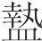肝以求之(1)。野人之无闻者，忍亲戚、兄弟、知交以求利。今无此之危，无此之丑，其为利甚厚，乘车食肉，泽及子孙。虽圣人犹不能禁，而况于乱？

**【注释】**

(1)涉（dié）血：流血。涉，意同“喋”。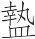（zhōu）肝：这里指残杀。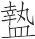，引击。

**【译文】**

百姓对于利，冒着飞箭，踩着利刃，流血残杀去追求它。鄙野之人未闻礼义的，残忍地对待父母、兄弟、朋友而去追求利。如今，刨坟掘墓没有这种危险，没有这种耻辱，而得利十分丰厚，可以乘车吃肉，恩惠延及子孙。这种情况即使是圣人尚且禁止不住，更何况昏乱之君呢？

国弥大，家弥富，葬弥厚。含珠鳞施(1)，玩好货宝(2)，钟鼎壶滥(3)，舆马衣被戈剑，不可胜其数。诸养生之具，无不从者。题凑之室(4)，棺椁数袭(5)，积石积炭，以环其外。奸人闻之，传以相告。上虽以严威重罪禁之，犹不可止。且死者弥久，生者弥疏；生者弥疏，则守者弥怠；守者弥怠而葬器如故，其势固不安矣。

**【注释】**

(1)含（hàn）珠：死者口中所含的珍珠。鳞施：玉制的葬服。把玉石琢成各种形状的小薄片，角上穿孔，联缀而成。因套在死者身上有如鱼鳞，故名“鳞施”，又名“玉匣”。

(2)玩好（hào）：赏玩、嗜好的物品。

(3)滥（jiàn）：通“鉴”，浴盆。

(4)题凑：古代天子的椁制，也赐用于大臣。椁室用大木累积而成，好像四面有檐的屋子，木的头都向内，故名题凑。题，头。凑，聚。

(5)袭：重（chónɡ），层。

**【译文】**

国越大，家越富，陪葬的器物就越丰厚。死者口含的珍珠、身穿的玉衣，赏玩、嗜好的物品，财货珍宝，钟鼎壶鉴，车马衣被戈剑，数也数不尽。各种养生之器无不随葬。题凑的椁室，里面棺椁数层，并堆积石头、木炭，环绕在棺椁之外。恶人闻知此事，互相传告。君主尽管用严刑重罚禁止他们，仍然禁止不住。再说，死者死去的时间越久远，活着的人对他的感情就越疏远；感情越疏远，守墓人就越懈怠；守墓人越来越懈怠，可是墓中陪葬的器物却同原来一样，这种形势当然就不安全了。

世俗之行丧，载之以大(1)，羽旄旌旗、如云偻翣以督之(2)，珠玉以佩之(3)，黼黻文章以饬之(4)，引绋者左右万人以行之(5)，以军制立之然后可(6)。以此观世(7)，则美矣，侈矣；以此为死，则不可也。苟便于死，则虽贫国劳民，若慈亲孝子者之所不辞为也。

**【注释】**

(1)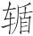（chūn）：载棺柩的车。

(2)羽旄旌旗：泛指各种旗帜。旄，竿顶用牦牛尾为饰的旗。旌，用牦牛尾和彩色鸟羽作竿饰的旗。如云偻（liǔ）翣（shà）：因偻翣之上画有云气，故称“如云偻翣”。偻，盖在柩车上的饰物。翣，用羽毛制成的伞形之物，有柄，灵车行时持之在两旁随行。督：正，这里有装饰的意思。

(3)佩：装饰。

(4)黼黻（fǔfú）：古代礼服上绘绣的花纹。黑白相间的花纹叫黼，黑与青相间的花纹叫黻。文章：错杂的色彩或花纹。古以青赤相配为文，赤白相配为章。饬：通“饰”。

(5)绋（fú）：牵引棺柩的绳索。古时送葬都执绋。

(6)军制：军法。

(7)观：显示给人看。

**【译文】**

世俗之人举行葬礼，用大车载着棺柩，各种旗帜、画有云气的偻翣相随，棺柩之上点缀着珠玉，涂饰了各种花纹。灵车左右执绋送葬的有万人，牵引灵车行进，这么多人得用军法指挥才行。举行这种葬礼给世人看，那是够美的了，够盛大的了；但是用这种葬礼安葬死者，那是不行的。倘若厚葬真有利于死者，那么即使它会使国家贫困、人民劳苦，慈亲孝子也是不会拒绝的。

# 安死

**【题解】**

本篇与《节丧》主旨相同，内容相似，实为一意而分为两篇。所谓“安死”是使死者安宁的意思。怎样才能做到“安死”呢？文章批评了世上厚葬的作法，根据“大墓无不”的现实，提出“以俭节葬死”的主张。文章指出：“先王之葬，必俭，必合，必同”，这样做不是“爱其费”，也不是“恶其劳”，而是“为死者虑”。只有“节丧”，才能实现“安死”，才算是真正的“爱人”。

三曰：

世之为丘垄也(1)，其高大若山，其树之若林，其设阙庭、为宫室、造宾阼也若都邑(2)。以此观世示富则可矣，以此为死则不可也。夫死，其视万岁犹一瞚也(3)。人之寿，久之不过百，中寿不过六十。以百与六十为无穷者之虑，其情必不相当矣。以无穷为死者之虑，则得之矣。

**【注释】**

(1)丘垄：坟墓。

(2)阙：墓阙，陵墓前两边的石牌坊。宾阼（zuò）：堂前东西阶。古代宾主相见，宾自西阶而上，主人立于东阶，故西阶称宾，东阶称阼。

(3)瞚（shùn）：同“瞬”，眨眼。

**【译文】**

第四：

世人建造坟墓，高大如山，坟墓上种树，茂密如林，墓地修建墓阙、庭院，建筑宫室，建造东西石阶，像都邑一样。用这些向世人夸耀财富，那是可以的；但是用这些安葬死者却不行。对于死者来说，看待一万年就像是一瞬。人的寿命，长的不超过百岁，一般的不超过六十岁。根据百岁或六十岁寿命的需要替无限久远的死者考虑，它们的实际情况必定不相适合。根据无限久远的需要替死者考虑，就掌握葬死的本义了。

今有人于此，为石铭置之垄上，曰：“此其中之物，具珠玉、玩好、财物、宝器甚多(1)，不可不抇，抇之必大富，世世乘车食肉。”人必相与笑之，以为大惑。世之厚葬也，有似于此。

**【注释】**

(1)具：置，备。宝器：珍贵的器物，多指鼎彝等传国重器。

**【译文】**

假如有这样一个人，制作一块刻字的石碑立在墓地上，写道：“这里面的器物，有珠玉、玩好、财物、宝器，十分丰富，不可不发掘，掘开它一定大富，可以世世代代乘车吃肉。”人们一定一起嘲笑他，认为这个人太胡涂。世上的厚葬与此相似。

自古及今，未有不亡之国也；无不亡之国者，是无不抇之墓也。以耳目所闻见，齐、荆、燕尝亡矣(1)，宋、中山已亡矣，赵、魏、韩皆亡矣(2)，其皆故国矣。自此以上者，亡国不可胜数，是故大墓无不抇也。而世皆争为之，岂不悲哉？

**【注释】**

(1)齐、荆、燕尝亡矣：史实未详。

(2)韩、赵、魏皆亡矣：此处记载与史实有出入。疑“亡”字当另有所指，未详。一说“亡”字用为国势乱弱、大权旁落、人主不能行其制之义。

**【译文】**

从古到今，没有不灭亡的国家；没有不灭亡的国家，这就没有不被挖掘的坟墓。就人们耳闻目睹来说，齐、楚、燕曾经灭亡过，宋、中山已经灭亡了，赵、魏、韩都灭亡了，它们都成了古国。从它们再往前，灭亡的国家数也数不尽，因此，大墓没有不被掘开的。但是世人却都争着造大墓，难道不可悲吗？

君之不令民(1)，父之不孝子，兄之不悌弟(2)，皆乡里之所釜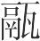者而逐之(3)。惮耕稼采薪之劳，不肯官人事(4)，而祈美衣侈食之乐，智巧穷屈(5)，无以为之，于是乎聚群多之徒，以深山广泽林薮(6)，扑击遏夺(7)，又视名丘大墓葬之厚者(8)，求舍便居(9)，以微抇之，日夜不休，必得所利，相与分之。夫有所爱所重，而令奸邪、盗贼、寇乱之人卒必辱之，此孝子、忠臣、亲父、交友之大事。

**【注释】**

(1)令：善。

(2)悌（tì）：敬爱兄长。

(3)所釜（fǔ）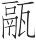（lì）者：用釜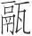吃饭的人。这里指所有的人。釜，古代炊器，类似于今天的锅。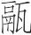，古代炊器，陶制，三足，中空。“釜”、“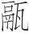”都用如动词。

(4)官：从事。人事：指耕稼、劳役一类的事。

(5)屈（jué）：竭，尽。

(6)薮（sǒu）：草木茂盛的沼泽地。

(7)遏：阻止，这里是拦劫的意思。

(8)名丘：与“大墓”同义。名，大。

(9)便居：方便有利的住所。

**【译文】**

国君的刁滑之民，父亲的不孝之子，兄长的违逆之弟，他们都是被乡里一致驱逐的人。他们害怕耕种、打柴之苦，不肯从事各种劳役，却追求锦衣玉食之乐；当智谋巧诈用尽，仍无法得到时，于是就聚集起很多人，凭借深山、大湖、树林和沼泽，拦路打劫；又探察葬器丰厚的大墓，想办法住到坟墓附近便于盗墓的住所，暗中挖掘，日夜不止，一定要获得其中的财物，一起瓜分。对所疼爱、所尊重的人，却让恶人、盗贼、匪寇终归必定凌辱他们，这是孝子、忠臣、慈父、挚友当忧虑的大事。

尧葬于谷林(1)，通树之(2)；舜葬于纪市(3)，不变其肆(4)；禹葬于会稽，不变人徒(5)。是故先王以俭节葬死也，非爱其费也，非恶其劳也，以为死者虑也。先王之所恶，惟死者之辱也。发则必辱，俭则不发。故先王之葬，必俭，必合，必同。何谓合？何谓同？葬于山林则合乎山林，葬于阪隰则同乎阪隰(6)。此之谓爱人。夫爱人者众，知爱人者寡。故宋未亡而东冢抇(7)，齐未亡而庄公冢抇。国安宁而犹若此，又况百世之后而国已亡乎？故孝子、忠臣、亲父、交友不可不察于此也。夫爱之而反危之，其此之谓乎！《诗》曰：“不敢暴虎，不敢冯河。人知其一，莫知其他(8)。”此言不知邻类也。

**【注释】**

(1)谷林：地名。传说尧葬于成阳（在今山东曹县东北），疑谷林即在成阳。

(2)通：遍。

(3)纪市：地名。传说舜葬于江南九疑（在今湖南宁远南），疑纪市即在九疑山下。

(4)肆：市上的作坊、店铺。

(5)变：动。这里是烦扰的意思。人徒：众人。

(6)阪（bǎn）：山坡。隰（xí）：潮湿的低洼地。

(7)东冢（zhǒnɡ）：指宋文公之墓，因墓在城东，故称东冢。冢，隆起的坟墓。

(8)“不敢”四句：引诗见《诗经·小雅·小旻（mín）》。暴虎，徒手搏虎。冯（pínɡ），徒涉。原诗指人们都知道“暴虎”、“冯河”的危险，因而不敢去做，却不知不畏惧小人也会招致祸害。这里取“人知其一，莫知其他”句意，批评世人只知爱死者，却不知爱法不当会带来其他祸害。

**【译文】**

尧葬在谷林，墓上处处种上树；舜葬在纪市，市上的作坊、店铺没有任何变动；禹葬在会稽，不烦扰众人。由此看来，先王以节俭的原则安葬死者，不是吝惜钱财，也不是嫌耗费人力，完全是为死者考虑。先王所嫌恶的，是死者受辱。坟墓如果被盗掘，死者肯定要受到凌辱，如果俭葬，墓就不会被盗掘。所以，先王安葬死者，一定要做到俭，一定做到合，一定做到同。什么叫合？什么叫同？葬于山林就与山林合为一体，葬于山坡或低湿之地，就与山坡或低湿之地环境相同。这就叫作爱人。爱人的人很多，但真正懂得爱人的人很少。所以，宋国还没有灭亡，东冢就被盗掘；齐国还没有灭亡，庄公的墓就被盗掘。国家安定尚且如此，又何况百世之后国家已经灭亡了呢？所以孝子、忠臣、慈父、挚友对此不可不明察。原本是敬爱死者，结果却反而害了他们，大概指的就是厚葬一类事吧。《诗》中说：“不敢徒手搏虎，不敢徒涉黄河。人们只知此一端，不知还有其他灾祸。”这是说不知类推啊！

故反以相非(1)，反以相是。其所非方其所是也，其所是方其所非也。是非未定，而喜怒斗争反为用矣。吾不非斗，不非争，而非所以斗，非所以争。故凡斗争者，是非已定之用也。今多不先定其是非，而先疾斗争，此惑之大者也。

**【注释】**

(1)“故反”以下十五句：此段内容与全文不合，疑他篇之文错简于此。

**【译文】**

所以，忽而翻转过去加以反对，忽而翻转过来表示赞同。他们所反对的正是他们所赞同过的，他们所赞同的正是他们所反对过的。是非尚未确定，而喜怒斗争反倒都用上了。我们不反对斗，也不反对争，但是反对驱使人们糊里糊涂斗、糊里糊涂争。因此，凡争斗，都是是非确定以后才采用的手段。如今人们大多不先确定是非，却先急急忙忙地争斗，这是最胡涂的。

鲁季孙有丧(1)，孔子往吊之。入门而左，从客也(2)。主人以玙璠收(3)，孔子径庭而趋(4)，历级而上，曰：“以宝玉收，譬之犹暴骸中原也(5)。”径庭历级，非礼也；虽然，以救过也(6)。

**【注释】**

(1)季孙：春秋时鲁国最有权势的贵族。丧：指季平子意如之丧。

(2)从客：就客位。

(3)主人：主丧之人，指季桓子，季平子之子，名斯。玙璠（yúfán）：鲁国的宝玉。收：殓，装殓。

(4)径庭：穿行，指自西阶之下越过中庭而向东行。

(5)暴骸（pùhái）：暴露。中原：原野之中。

(6)救：阻止。

**【译文】**

鲁国季孙氏举办丧事，孔子去吊丧。进门之后，站到左边，立于宾客的位置。主丧的季桓子用鲁国的宝玉装殓死者。孔子从西阶下穿过中庭快步向东，登东阶而上，说：“用宝玉装殓死者，就像是把尸体暴露在原野上一样。”穿过中庭，登阶而上是不合于宾客礼仪的；虽然不合礼仪，但孔子仍然这样做了，这是为了阻止过失啊！

# 异宝

**【题解】**

本篇摒弃了世俗关于“宝”的概念，主张以道德为宝。文章一开始就提出：“古之人非无宝也，其所宝者异也。”接着列举了三个例子加以论证：其一是孙叔敖“知不以利为利”，告诫其子“必无受利地”；其二是江上之丈人拒不接受伍员赠与的千金之剑；其三是宋子罕“以不受为宝”，拒不接受“野人”献上的宝玉。这三位古人“所宝者”与世人“异”，其原因何在？文章认为这是由于他们的智慧“异乎俗”的缘故。人的智力高低决定了人们对宝物价值的认识，正如本篇结尾所说：“其知弥精，其所取弥精；其知弥粗，其所取弥粗。”

四曰：

古之人非无宝也，其所宝者异也。

**【译文】**

第四：

古代的人不是没有宝物，只是他们看作宝物的东西与今人不同。

孙叔敖疾，将死，戒其子曰(1)：“王数封我矣，吾不受也。为我死(2)，王则封汝，必无受利地。楚、越之间有寝之丘者(3)，此其地不利，而名甚恶(4)。荆人畏鬼，而越人信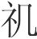(5)。可长有者，其唯此也。”孙叔敖死，王果以美地封其子，而子辞，请寝之丘，故至今不失。孙叔敖之知，知不以利为利矣。知以人之所恶为己之所喜，此有道者之所以异乎俗也。

**【注释】**

(1)戒：同“诫”。

(2)为：等于说“如”。

(3)寝之丘：春秋楚邑，在今河南固始、沈丘两县之间。

(4)而名甚恶：“寝丘”含有陵墓之义，所以这样说。恶，凶险。

(5)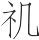（jī）：迷信鬼神和灾祥。

**【译文】**

孙叔敖病了，临死的时候告诫他的儿子说：“大王多次赐给我土地，我都没有接受。如果我死了，大王赐给你土地，你一定不要接受肥沃富饶的土地。楚国和越国之间有个寝丘，这个地方土地贫瘠，而且地名十分凶险。楚人畏惧鬼，而越人迷信鬼神和灾祥。所以，能够长久占有的封地，恐怕只有这块土地了。”孙叔敖死后，楚王果然把肥美的土地赐给他的儿子，但是孙叔敖的儿子谢绝了，请求赐给寝丘，所以这块土地至今没有失掉。孙叔敖的智慧，在于懂得不把世俗心目中的利益看作利益。懂得把别人所厌恶的东西当作自己所喜爱的东西，这就是有道之人之所以不同于世俗的原因。

五员亡(1)，荆急求之，登太行而望郑曰：“盖是国也，地险而民多知；其主，俗主也，不足与举。”去郑而之许，见许公而问所之。许公不应，东南向而唾(2)。五员载拜受赐(3)，曰：“知所之矣。”因如吴。过于荆，至江上，欲涉，见一丈人，刺小船(4)，方将渔，从而请焉(5)。丈人度之(6)，绝江(7)。问其名族(8)，则不肯告，解其剑以予丈人，曰：“此千金之剑也，愿献之丈人。”丈人不肯受，曰：“荆国之法，得五员者，爵执圭(9)，禄万檐(10)，金千镒(11)。昔者子胥过(12)，吾犹不取，今我何以子之千金剑为乎？”五员过于吴(13)，使人求之江上，则不能得也。每食必祭之，祝曰：“江上之丈人！天地至大矣，至众矣，将奚不有为也？而无以为(14)。为矣，而无以为之。名不可得而闻，身不可得而见，其惟江上之丈人乎！”

**【注释】**

(1)五员（yún）：即伍员。

(2)“许公”二句：许公想让伍员投奔吴国，但又不敢得罪楚国这个强大的近邻，所以“不应”，而以向吴国所在的东南方而唾示意。

(3)载：通“再”。

(4)刺：撑。

(5)从：就，走近。

(6)度：渡。

(7)绝：横渡，渡过。

(8)族：姓。

(9)执圭（ɡuī）：春秋时诸侯国爵位名称。圭，玉制礼器，上尖下方。也作“皀”。形制大小因爵位及用途不同而异。天子（或诸侯）把圭赐给功臣，让他们执圭朝见，故名“执圭”。

(10)檐（dān）：通“儋”，今作“担”，容积为一石。

(11)镒：古代重量单位，二十两为一镒。一说二十四两为一镒。

(12)子胥：伍员的字。老人揣度渡江人是伍员，故这样说作为拒绝接受赠剑的托词，并非一定真有此事。

(13)过：等于说“至”。

(14)无以为：等于说“无所以为”，即无所求的意思。

**【译文】**

伍员逃亡，楚国紧急追捕他。他登上太行山，遥望郑国说：“这个国家，地势险要而人民多有智慧；但是它的国君是个凡庸的君主，不足以跟他谋举大事。”伍员离开郑国，到了许国，拜见许公并询问自己宜去之地。许公不回答，向东南方吐了一口唾沫。伍员再拜接受赐教说：“我知道该去的地方了。”于是去往吴国。路过楚国，到了长江岸边，想要渡江。他看到一位老人，撑着小船，正在打鱼，于是走过去请求老人送他过江。老人摆渡他，横着渡过了长江。伍员问老人的姓名，老人却不肯告诉他。伍员解下自己的宝剑送给老人，说：“这是价值千金的宝剑，我愿意把它奉献给您。”老人不肯接受，说：“按照楚国的法令，捉到伍员的，授予执圭爵位，享受万石俸禄，赏给黄金千镒。从前伍员从这里经过，我尚且不捉他去领赏，如今我接受你价值千金的宝剑做什么呢？”伍员到了吴国，派人到江边去寻找那位老人，却无法找到了。伍员每次吃饭一定要祭祀那位老人，祷告说：“江上的老人啊！天地之德大到极点了，养育万物多到极点了，天地何所不为？却毫无所求。人世间，做了有利于别人的事，却毫无所求，名字无法得知，身影无法得见，达到这种境界的恐怕只有江边的老人吧！”

宋之野人耕而得玉，献之司城子罕(1)，子罕不受。野人请曰：“此野人之宝也，愿相国为之赐而受之也。”子罕曰：“子以玉为宝，我以不受为宝。”故宋国之长者曰：“子罕非无宝也，所宝者异也。”

**【注释】**

(1)司城子罕：春秋时宋国的执政大臣。司城，官名，即司空，相当于相国，执掌国政，为春秋时宋国所设置。

**【译文】**

宋国一个农夫耕地得到了一块玉，把它献给司城子罕，子罕不接受。农夫请求说：“这是我的宝物，希望相国赏小人脸而把它收下。”子罕说：“你把玉当作宝物，我把不接受别人的赠物当作宝物。”所以宋国德高望重的人说：“子罕不是没有宝物，只是他的宝物与别人不同啊！”

今以百金与抟黍以示儿子(1)，儿子必取抟黍矣；以和氏之璧与百金以示鄙人(2)，鄙人必取百金矣；以和氏之璧、道德之至言以示贤者，贤者必取至言矣。其知弥精，其所取弥精；其知弥粗，其所取弥粗。

**【注释】**

(1)抟（tuán）黍：捏成团的黄米饭。

(2)和氏之璧：春秋时楚人和氏（卞和）所得的宝玉。

**【译文】**

假如现在把百金和黄米饭团摆在小孩面前，小孩一定去抓黄米饭团了；把和氏之璧和百金摆在鄙陋无知的人面前，鄙陋无知的人一定拿走百金了；把和氏之璧和关于道德的至理名言摆在贤人面前，贤人一定听取至理名言了。他们的智慧越精深，所取的东西就越珍贵；他们的智慧越低下，所取的东西就越粗陋。

# 异用

**【题解】**

本篇论述人们对物的使用不同是“治乱、存亡、死生”的根本所在。文章主要列举了三位古代圣贤的事例：汤网收三面而得四十国；文王葬朽骨，博得天下人心；孔子以六尺之杖“谕贵贱之等，辨疏亲之义”。这三个例子强调了用物的核心在于尊礼义，讲仁爱，反映了作者的儒家思想。

五曰：

万物不同(1)，而用之于人异也，此治乱、存亡、死生之原(2)。故国广巨，兵强富，未必安也；尊贵高大(3)，未必显也：在于用之。桀、纣用其材而以成其亡，汤、武用其材而以成其王。

**【注释】**

(1)不：据通篇文意当为衍文（依陈昌齐说）。

(2)原：同“源”，根本。

(3)尊贵高大：当与《不侵》篇中的“尊贵富大”义同。

**【译文】**

第五：

万物对任何人都是同样的，但人们使用它们却各有不同，这是治乱、存亡、死生的根本所在。所以，国土广大，兵力强盛，未必安定；尊贵富有，未必显赫；关键在于如何使用它们。夏桀、商纣使用这些材物却造成了他们的灭亡，商汤、周武王使用这些材物而成就了他们的王业。

汤见祝网者，置四面，其祝曰：“从天坠者，从地出者，从四方来者，皆离吾网(1)。”汤曰：“嘻！尽之矣。非桀，其孰为此也？”汤收其三面，置其一面，更教祝曰：“昔蛛蝥作网罟(2)，今之人学纾(3)。欲左者左，欲右者右，欲高者高，欲下者下，吾取其犯命者。”汉南之国闻之曰：“汤之德及禽兽矣。”四十国归之。人置四面，未必得鸟；汤去其三面，置其一面，以网其四十国，非徒网鸟也。

**【注释】**

(1)离：通“罹（lí）”，遭，触。

(2)蛛蝥（máo）：虫名。秦晋之间称蜘蛛为蛛蝥。罟（ɡǔ）：网。

(3)纾：疑通“杼”（zhù），织布梭。这里是织的意思。

**【译文】**

商汤在郊外看见对网告的人，这具人四面设网，祷告说：“从天上落下来的，从地上钻出来的，从四方过来的，都撞到我的网上。”汤说：“嗐！真那样的话，禽兽就被杀光了。除了桀那样的暴君，谁还会做这种事呢？”汤收起三面的网，只在一面设网，重新教那人祷告说：“从前蜘蛛结网，现在人们也学着织。禽兽想向左去的就向左去，想向右去的就向右去，想向高处去的就向高处去，想向低处去的就向低处去，我只捕取那些触犯天命的。”汉水以南的国家闻知这件事说：“商汤的仁德延及禽兽了。”于是四十个国家归附了汤。别人在四面设网，未必能捕获到鸟；汤撤去三面的网，只在一面设网，却由此网得了四十个国家，不仅仅是网鸟啊！

周文王使人抇池，得死人之骸。吏以闻于文王，文王曰：“更葬之。”吏曰：“此无主矣。”文王曰：“有天下者，天下之主也；有一国者，一国之主也。今我非其主也(1)？”遂令吏以衣棺更葬之。天下闻之曰：“文王贤矣！泽及髊骨(2)，又况于人乎？”或得宝以危其国，文王得朽骨以喻其意，故圣人于物也无不材(3)。

**【注释】**

(1)也：通“邪”，表疑问。

(2)髊（cī）：同“骴”，肉未烂尽的骸骨。

(3)材：用如动词，以……为材。

**【译文】**

周文王派人掘池塘，挖出个死人的尸骨，官吏把此事禀告文王，文王说：“重新安葬他。”官吏说：“这具尸骨是没有主的。”文王说：“抚有天下的人是天下之主，抚有一国的人是一国之主。现在难道我不是它的主人吗？”于是让官吏用衣棺把那具尸骨改葬在它处。天下人闻知这件事说：“文王真贤明啊！他的恩泽延及死人的尸骨了，又何况活着的人呢？”有的人得到宝物却使自己的国家陷入危难，文王得具朽骨却能借它表明自己的心愿，所以，在圣人看来，物没有没用的。

孔子之弟子从远方来者，孔子荷杖而问之曰：“子之公不有恙乎？”搏杖而揖之(1)，问曰：“子之父母不有恙乎？”置杖而问曰(2)：“子之兄弟不有恙乎？”杙步而倍之(3)，问曰：“子之妻子不有恙乎？”故孔子以六尺之杖，谕贵贱之等，辨疏亲之义，又况于以尊位厚禄乎？

**【注释】**

(1)搏杖：持杖。

(2)置杖：等于说“拄杖”。置，立。

(3)杙（yì）步：当作“曳杖”。倍：通“背”，背向。

**【译文】**

孔子的弟子凡是从远方来的，孔子就扛着手杖问候他说：“你的祖父没灾没病吧？”然后持杖拱手行礼，问候说：“你的父母没灾没病吧？”然后拄着手杖问候说：“你的哥哥弟弟没灾没病吧？”最后拖着手杖转过身去，问候说：“你的妻子、孩子没灾没病吧？”所以，孔子仅用六尺长的手杖，就让人知道了贵贱的等级，辨明了亲疏的关系，又何况用尊贵的地位、丰厚的俸禄呢？

古之人贵能射也，以长幼养老也(1)。今之人贵能射也，以攻战侵夺也。其细者以劫弱暴寡也(2)，以遏夺为务也。仁人之得饴(3)，以养疾侍老也。跖与企足得饴(4)，以开闭取楗也(5)。

**【注释】**

(1)以长幼养老：古代射箭之礼，射中者让射不中者饮罚酒。酒在古代被视作养老养病之物，射者力求射中免饮，以示自己非老非病，不仅无须别人供养，还能供养老幼病弱之人。

(2)其细者：指“今之人”中地位卑微的小人。暴：欺侮。寡：指势孤力单的人。

(3)饴（yí）：用麦芽制成的糖稀。

(4)跖（zhí）：传说是春秋战国之际的奴隶起义领袖，先秦古籍中多诬之为“盗跖”。企足：即庄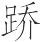，传说是战国时楚国的奴隶起义领袖。

(5)闭：门闩的孔。楗：关门的木闩。

**【译文】**

古代的人重视善射的技艺，用来抚养幼者，赡养老人。现在的人重视善射的技艺，却用来攻战侵夺。那卑微的小人更凭借善射的技艺掠夺弱小的人，欺侮势孤力单的人，把拦路抢劫当作职业。仁爱的人得到饴糖，用来保养病人，奉养老人。跖与庄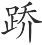弄到饴糖，却用来粘门闩开门，盗窃他人财物。

