 季冬纪第十二

# 季冬

**【题解】**

见《孟冬》。

一曰：

季冬之月，日在婺女(1)，昏娄中(2)，旦氐中(3)。其日壬癸，其帝颛顼，其神玄冥，其虫介，其音羽，律中大吕(4)。其数六，其味咸，其臭朽，其祀行，祭先肾。雁北乡(5)，鹊始巢，雉雊鸡乳(6)。天子居玄堂右个(7)，乘玄辂，驾铁骊，载玄旂，衣黑衣，服玄玉，食黍与彘，其器宏以弇。

**【注释】**

(1)婺女：星宿名，二十八宿之一，又简称“女”，在今宝瓶座。

(2)娄：星宿名，二十八宿之一，在今白羊座。

(3)氐：星宿名，二十八宿之一，在今天秤座。

(4)大吕：十二律之一，属阴律。

(5)乡：向。

(6)雊（ɡòu）：山鸡鸣叫。乳：鸟生子叫乳，这里指鸡孵小鸡。

(7)玄堂右个：北向明堂的右侧室。

**【译文】**

第一：

季冬之月，太阳的位置在婺女宿。黄昏时刻，娄宿出现在南方中天；拂晓时刻，氐宿出现在南方中天。季冬于天干属壬癸，主宰之帝是颛顼，佐帝之神是玄冥，应时的动物是龟鳖之类的甲族，相配的声音是羽音，音律与大吕相应。这个月的数字是六，味道是咸，气味是朽，要举行的祭祀是行祭，祭祀时祭品以肾脏为尊。这个月，大雁将要向北飞，喜鹊开始搭窝，山鸡鸣叫，家鸡孵卵。天子住在北向明堂的右侧室，乘坐黑色的车，车前驾黑色的马，车上插黑色的绘有龙纹的旗帜；天子穿黑色的衣服，佩戴黑色的饰玉，吃的食物是黍米和猪肉，使用的器物宏大而口敛。

命有司大傩(1)，旁磔(2)，出土牛，以送寒气。征鸟厉疾(3)，乃毕行山川之祀，及帝之大臣、天地之神祇(4)。

**【注释】**

(1)傩（nuó）：驱除灾疫的祭祀。

(2)旁磔（zhé）：在四方之门都割裂牺牲，举行祭祀，以攘除阴气。旁，遍。磔，割牲祭神。

(3)征鸟：远飞之鸟。征，远行。厉：高。

(4)帝之大臣：指有功于民的前世公卿。神：指天神。祇（qí）：指地神。

**【译文】**

天子命令主管官吏大规模举行傩祭，四方城门都割裂牺牲，并制作土牛，以此送寒冬之气。远飞的鸟飞得高而且快。普遍地举行对山川之神的祭祀以及对有功于民的先世公卿大臣、天神地神的祭祀。

是月也，命渔师始渔，天子亲往，乃尝鱼，先荐寝庙。冰方盛，水泽复(1)，命取冰。冰已入，令告民出五种。命司农计耦耕事(2)，修耒耜，具田器。命乐师大合吹而罢(3)。乃命四监收秩薪柴(4)，以供寝庙及百祀之薪燎(5)。

**【注释】**

(1)水泽：水聚积的洼地。复：重叠。这句意思是水泽之处冰一层层冻得很坚硬。

(2)司农：负责农业的官。耦（ǒu）耕：古代的一种耕作方法，两人各执耒耜合耕一尺宽的土地。

(3)乐师：乐官之长。大合吹：大规模合奏各种吹奏乐。

(4)四监：指四监大夫。周制，天子领地内有县有郡，一县辖四郡，每郡有一大夫监临。四监大夫即监临各郡的大夫。秩薪柴：按常规应交纳的薪柴。秩，常。

(5)薪燎：焚柴祭神的燎祭。

**【译文】**

这个月，命令负责捕鱼的官吏开始捕鱼，天子亲自前往观看，于是品尝刚捕到的鲜鱼，品尝之前，要先进献给祖庙。这时候，冰冻得正结实，积水的池泽层层冻结，于是命令凿取冰块。冰块藏入冰窖之后，命令有司告诉百姓从谷仓中拿出五谷，选择种子。命令负责农业的官吏，谋划耕作的事情，修缮犁铧，准备耕田的农具。命令乐官举行吹奏乐的大合奏，结束一年的训练。命令王畿内的郡县大夫收缴按常规应该交纳的木柴，来供给祖庙及各种祭祀举行燔燎。

是月也，日穷于次(1)，月穷于纪(2)，星回于天(3)。数将几终，岁将更始。专于农民，无有所使。天子乃与卿大夫饬国典，论时令，以待来岁之宜。乃命太史次诸侯之列(4)，赋之牺牲，以供皇天上帝社稷之享。乃命同姓之国，供寝庙之刍豢(5)；令宰历卿大夫至于庶民土田之数(6)，而赋之牺牲，以供山林名川之祀。凡在天下九州之民者(7)，无不咸献其力，以供皇天上帝社稷寝庙山林名川之祀。

**【注释】**

(1)穷：尽。次：指十二次。古人为了说明日月星辰的运行，把黄道附近一周天从西向东分为十二等分，每个等分给一个名称，如星纪，玄枵等，这叫十二次。季冬之月，日躔于玄枵，运行一年，又终于玄枵，所以说“日穷于次”。

(2)纪：指日月相会。

(3)回：返回。以上三句是说日月星辰运行一周天，又返回到原来的位置。

(4)次：编排。诸侯：这里指与天子异姓的诸侯国。列：次序。

(5)刍豢：指祭祀用的牺牲。牛羊叫刍，猪狗叫豢。

(6)宰：指小宰，太宰的属官，帮助太宰管理政令。历：排列，依次列出。

(7)九州：古时将天下分为九州，即冀、豫、雍、扬、兖、徐、幽、青、荆。

**【译文】**

这个月，日月星辰绕天一周，又都回到原来的位置。一年的天数接近终了，新的一年将要重新开始。要让农民专心筹备农事，不要差遣他们干别的事情。天子与公卿大夫整饬国家的法典，讨论按季节月份制定的政令，以此来准备明年应做之事。命令太史排列各异姓诸侯的次序，使他们按国家大小贡赋牺牲，以供给对皇天上帝及社稷之神的祭祀。命令同姓诸侯供给祭祀祖庙所用的牛羊犬豕。命令小宰依次列出从卿大夫到一般老百姓所有土地的数目，使他们贡赋牺牲，以供祭祀山林河流之神使用。凡是在天下九州的百姓，必须全部献出他们的力量，以供给对皇天上帝、社稷之神、先祖神主以及山林河流之神的祭祀。

行之是令，此谓一终(1)，三旬二日(2)。

**【注释】**

(1)一终：指一年终了。

(2)三旬二日：《季夏纪》有“甘雨三至，三旬二日”之语，此处上无所承，恐有脱文，也指雨雪而言。

**【译文】**

实行这些政令，这就算一年终了。……在三旬中有二日。

季冬行秋令，则白露蚤降(1)，介虫为妖，四鄙入保；行春令，则胎夭多伤(2)，国多固疾(3)，命之曰逆(4)；行夏令，则水潦败国，时雪不降，冰冻消释。

**【注释】**

(1)蚤：通“早”。

(2)胎夭：指在母腹中及刚出生的动物。

(3)固疾：久治不愈的病。固，同“痼”。

(4)逆：指违背时气。

**【译文】**

季冬如果实行应在秋天实行的政令，那么，白露就会过早降落，有甲壳的动物就会成灾，四方边邑的百姓就会为躲避来犯之敌而藏入城堡。如果实行应在春天实行的政令，那么，幼小的动物就会遭到损伤，国家就会流行久治不愈的疾病，给这种情况命名叫做“逆”。如果实行应在夏天实行的政令，那么，大水将为害国家，冬雪将不能按时降落，冰冻将会融化。

# 士节

**【题解】**

本篇以及《季冬纪》中的《介立》、《诚廉》、《不侵》都是谈士的节操的。本篇记述了齐国的隐士北郭骚悦服晏子之义、以死为晏子洗清冤诬的事迹，宣扬了士“当理不避其难，临患忘利，遗生行义”的节操，阐发了孟子“舍身取义”的思想。文章呼吁“欲立大功名”的人主当以寻找这样的士作为要务。

二曰：

士之为人，当理不避其难(1)，临患忘利，遗生行义，视死如归。有如此者，国君不得而友，天子不得而臣。大者定天下，其次定一国，必由如此人者也(2)。故人主之欲大立功名者，不可不务求此人也。贤主劳于求人，而佚于治事(3)。

**【注释】**

(1)当：面对。理：义。

(2)由：用。

(3)佚（yì）：通“逸”，安逸。

**【译文】**

第二：

士的为人，面对正义不避危难，面临祸患忘却私利，舍生行义，视死如归。有如此行为的人，国君不得与他交友，天子不得以他为臣。大至安定天下，其次安定一国，一定要用这样的人。所以君主想要大立功名的，不可不致力于访求这样的人。贤明的君主把精力花费在访求贤士上，而对治理政事则采取超脱的态度。

齐有北郭骚者(1)，结罘罔(2)，捆蒲苇(3)，织萉屦(4)，以养其母，犹不足，踵门见晏子曰(5)：“愿乞所以养母。”晏子之仆谓晏子曰：“此齐国之贤者也。其义不臣乎天子，不友乎诸侯，于利不苟取，于害不苟免。今乞所以养母，是说夫子之义也，必与之。”晏子使人分仓粟、分府金而遗之(6)，辞金而受粟。

**【注释】**

(1)北郭骚：春秋时齐国的隐士。北郭，姓；骚，名。

(2)罘（fú）：捕兽的网。罔：同“网”。

(3)捆：砸。编蒲苇时要边编边砸，使之牢固。

(4)萉屦（fèijù）：麻鞋。

(5)晏子：春秋时齐人，名婴，字平仲，继其父桓子为齐卿，后相景公，以节俭力行名显诸侯。

(6)府：国家储藏财物的地方。

**【译文】**

齐国有个叫北郭骚的，靠结兽网、编蒲苇、织麻鞋来奉养他的母亲，但仍不足以维持生活，于是他到晏子门上求见晏子说：“希望能得到奉养母亲的东西。”晏子的仆从对晏子说：“这个人是齐国的贤人。他志节高尚，不向天子称臣，不与诸侯交友，对于利不苟且取用，对于祸不苟且求免。现在他到您这儿来寻求奉养母亲的东西，这是悦服您的道义，您一定要给他。”晏子派人把仓中的粮食、府库中的金钱拿出来分给他，他谢绝了金钱而收下了粮食。

有间，晏子见疑于齐君，出奔，过北郭骚之门而辞。北郭骚沐浴而出(1)，见晏子曰：“夫子将焉适？”晏子曰：“见疑于齐君，将出奔。”北郭子曰：“夫子勉之矣。”晏子上车，太息而叹曰：“婴之亡岂不宜哉？亦不知士甚矣。”晏子行。

**【注释】**

(1)沐浴而出：表示恭敬有礼。沐浴，洗发洗身。

**【译文】**

过了不久，晏子被齐君猜忌，逃往国外，经过北郭骚的门前向他告别。北郭骚洗发浴身，恭敬地迎出来，见到晏子说：“您将要到哪儿去？”晏子说：“我受到齐君的猜忌，将要逃往国外。”北郭子说：“您好自为之吧。”晏子上了车，长叹一声说：“我逃亡国外难道不正应该吗？我也太不了解士了。”于是晏子走了。

北郭子召其友而告之曰：“说晏子之义，而尝乞所以养母焉。吾闻之曰：‘养及亲者，身伉其难(1)’。今晏子见疑，吾将以身死白之(2)。”著衣冠(3)，令其友操剑奉笥而从(4)，造于君庭(5)，求复者曰(6)：“晏子，天下之贤者也，去则齐国必侵矣。必见国之侵也，不若先死。请以头托白晏子也。”因谓其友曰：“盛吾头于笥中，奉以托。”退而自刎也。其友因奉以托。其友谓观者曰：“北郭子为国故死(7)，吾将为北郭子死也。”又退而自刎。

**【注释】**

(1)伉（kànɡ）：当，承担。

(2)白：这里是洗清冤诬的意思。

(3)著（zhuó）：穿着，穿戴。

(4)笥（sì）：苇或竹制的方形盛器。

(5)造：到……去。

(6)复者：指君庭门前负责传话通禀的下级官吏。

(7)国故：等于说“国难”，指国家遭受的凶丧、战争等重大变故。

**【译文】**

北郭子召来他的朋友，告诉他说：“我悦服晏子的道义，曾向他寻求奉养母亲的东西。我听说：‘奉养过自己父母的人，自己要承担他的危难。’如今晏子受到猜忌，我将用自己的死为他洗清冤诬。”北郭子穿戴好衣冠，让他的朋友拿着宝剑捧着竹匣跟随在后。走到国君朝廷门前，找到负责通禀的官吏说：“晏子是名闻天下的贤人，他若出亡，齐国必将遭受侵犯。与其看到国家必将遭受侵犯，不如先死。我愿把头托付给您来为晏子洗清冤诬。”于是对他的朋友说：“把我的头盛在竹匣中，捧去托付给那个官吏。”说罢，退下几步自刎而死。他的朋友于是捧着盛了头的竹匣上前，把它托付给了那个官吏，然后对旁观的人说：“北郭子为国难而死，我将为北郭子而死。”说罢，又退下几步自刎而死。

齐君闻之，大骇，乘驲而自追晏子(1)，及之国郊(2)，请而反之。晏子不得已而反，闻北郭骚之以死白己也，曰：“婴之亡岂不宜哉？亦愈不知士甚矣。”

**【注释】**

(1)驲（rì）：古代驿站专用的车。

(2)郊：上古时代国都城外百里以内称郊。

**【译文】**

齐君听说这件事，大为震惊，乘着驿车亲自去追赶晏子，在离国都不到百里的地方赶上了晏子，请求晏子回去。晏子不得已而返，听说北郭骚用死来替自己洗清冤诬，他感慨地说：“我逃亡国外难道不正应该吗？北郭骚之死说明我真是不了解士啊。”

# 介立**一作立意**

**【题解】**

所谓“介立”是独立的意思，本篇用以指士节操高洁，独立于世。文章介绍了介子推、爰旌目的事迹：介子推在晋文公出亡、“周流天下”、最窘迫最微贱的时候，一直追随文公左右，而当晋文公返国之后，却羞于受赏，隐居山中，终身不仕；爰旌目饿昏于道，宁死不吃盗丘之食。文章最后以韩、荆、赵三国“将帅贵人”、“士卒众庶”作为反衬，颂扬了士的“介立”。

三曰：

以贵富有人易，以贫贱有人难。今晋文公出亡(1)，周流天下，穷矣，贱矣，而介子推不去(2)，有以有之也。反国有万乘，而介子推去之，无以有之也。能其难，不能其易，此文公之所以不王也。

**【注释】**

(1)今：疑是“昔”字之误（依松皋圆说）。

(2)介子推：春秋时晋国的隐士。他曾跟随晋文公出亡十九年，文公返国后，他不肯受赏，与母亲一起隐居山中，终身不仕。《左传·僖公二十四年》、《史记·晋世家》关于介子推的记载与本篇有所不同。他书或作“介之推”、“介推”。

**【译文】**

第三：

靠富贵拥有追随者容易，靠贫贱拥有追随者很难。从前晋文公逃亡在外，遍行天下，困窘极了，贫贱极了，然而介子推一直不离开他，这是由于晋文公具有赖以拥有介子推的条件。晋文公返回晋国后，拥有万辆兵车，然而介子推却离开了他，这是由于当时的晋文公已没有赖以拥有介子推的条件了。困难的事情能做到，而容易的事情却做不到，这正是文公不能成就王业的原因啊！

晋文公反国，介子推不肯受赏，自为赋诗曰：“有龙于飞(1)，周遍天下。五蛇从之(2)，为之丞辅(3)。龙反其乡(4)，得其处所。四蛇从之，得其露雨(5)。一蛇羞之(6)，桥死于中野(7)。”悬书公门，而伏于山下(8)。文公闻之曰：“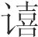！此必介子推也。”避舍变服(9)，令士庶人曰：“有能得介子推者，爵上卿，田百万。”或遇之山中，负釜盖簦(10)，问焉，曰：“请问介子推安在？”应之曰：“夫介子推苟不欲见而欲隐(11)，吾独焉知之？”遂背而行，终身不见。

**【注释】**

(1)有龙于飞：喻晋公子重耳（晋文公）出亡。于，词头，无义。

(2)五蛇：喻跟随公子重耳出亡的五位贤士：赵衰、狐偃、贾佗、魏犨（chōu）、介子推。

(3)丞：辅佐。

(4)龙反其乡：喻晋文公返国继位。

(5)露雨：喻恩泽。

(6)一蛇：喻介子推自己。

(7)桥死：疑是“槁死”（依毕沅校说）。中野：野外。

(8)伏：藏匿，这里指隐居。山：据《左传》、《史记》记载，当为绵上山，即今山西介休东南四十里的介山。

(9)避舍变服：古礼，国有凶丧祸乱之事，君主离开宫室居住，改穿凶丧之服。晋文公避舍变服以示引咎自责。

(10)釜（fǔ）：炊器，敛口，圆底，有的有二耳，像现在蒸锅的下半部分。簦（dēnɡ）：有长柄的笠，类似今天的伞。

(11)见（xiàn）：显现。这里是出仕的意思。

**【译文】**

晋文公返回晋国后，介子推不肯接受封赏，他为自己赋诗道：“有龙飞翔，遍行天下。五蛇追随，甘当辅佐。龙返故乡，得其归所。四蛇追随，享其恩泽。一蛇羞惭，枯死荒野。”他把这首诗悬挂在文公门前，自己隐居山下。文公闻知这件事说：“啊！这一定是介子推。”于是文公离开宫室居住，改穿凶丧之服，以示自责，并向士民百姓下令说：“有能找到介子推的，赏赐上卿爵位、田百万亩。”有人在山中遇到介子推，见他背着釜，上插一把长柄笠作为伞盖，就问他说：“请问介子推住在哪儿？”介子推回答说：“那介子推如果不想出仕而想要隐居，我怎么会知道他？”说罢就转过身走了，终生不做官。

人心之不同，岂不甚哉？今世之逐利者，早朝晏退，焦唇干嗌(1)，日夜思之，犹未之能得；今得之而务疾逃之，介子推之离俗远矣。

**【注释】**

(1)嗌（yì）：咽喉。

**【译文】**

人心不同难道不是十分悬殊吗？如今世上追逐私利的人，早早就上朝，很晚才退朝回来，口干舌燥，日夜思虑，仍然未能追逐到手。而今介子推可以得到名利却务求赶快避开它，介子推的节操超离世俗太远了。

东方有士焉，曰爰旌目，将有适也，而饿于道(1)。狐父之盗曰丘(2)，见而下壶餐以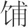之(3)。爰旌目三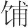之而后能视，曰：“子何为者也？”曰：“我狐父之人丘也。”爰旌目曰：“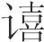！汝非盗耶？胡为而食我？吾义不食子之食也。”两手据地而吐之，不出，喀喀然遂伏地而死(4)。

**【注释】**

(1)饿：饿得奄奄一息。

(2)狐父（fǔ）：地名。在今江苏砀（dàng）山附近。丘：人名。

(3)壶餐：与“壶飧（sūn）”义同，盛在壶中的水泡饭。（bū）：通“哺”。给……吃，喂。下句的“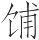”指咀嚼，吃。

(4)喀喀（kèkè）：象声词，形容呕吐之声。

**【译文】**

东方有个士名叫爰旌目，将要到某地去，却饿晕在路上。狐父那个地方一个名叫丘的强盗看见了，摘下盛有水泡饭的壶去喂他。爰旌目咽下三口之后眼睛才能看见，他问：“你是干什么的？”回答说：“我是狐父那个地方的人，名叫丘。”爰旌目说：“呔！你不是强盗吗？为什么给我吃东西？我信守节义决不吃你的食物！”说罢，两手抓地往外吐那咽下去的饭，吐不出来，喀喀地哎了一阵就趴在地上死了。

郑人之下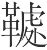也(1)，庄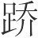之暴郢也(2)，秦人之围长平也(3)，韩、荆、赵，此三国者之将帅贵人皆多骄矣，其士卒众庶皆多壮矣，因相暴以相杀，脆弱者拜请以避死，其卒递而相食，不辨其义，冀幸以得活。如爰旌目已食而不死矣，恶其义而不肯不死(4)。今此相为谋(5)，岂不远哉？

**【注释】**

(1)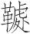（音未详）：邑名，据下文当是韩国之邑。

(2)庄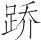：战国时楚国奴隶起义的领袖。

(3)秦人之围长平也：秦昭王四十七年（前260）秦将白起把赵括率领的赵国军队围困在长平（今山西高平西北），赵括被射死，赵军四十万人被俘活埋。

(4)恶其义：憎恶他的不义。

(5)今：盖“令”字之误。

**【译文】**

郑人攻陷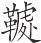邑的时候，庄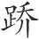劫掠郢都的时候，秦人围困长平的时候，韩、荆、赵这三个国家的将帅贵族都骄傲自恣，三国的士卒百姓都强壮有力，于是他们相互欺凌，自相残杀，而怯弱的人跪拜乞求免死，到最后，人们一个接一个地递相残食，根本不分辨正义与否，只希望侥幸得以活命。至于爰旌目，已经吃了食物，不会死了，但他憎恶狐父之盗的不义，因而不肯不死。若让三国的将士和爰旌目相比，他们之间相差得岂不是太远了吗！

# 诚廉

**【题解】**

本篇颂扬了伯夷、叔齐的气节。伯夷、叔齐反对武王伐纣，据《史记·伯夷列传》记载，他们曾“叩马而谏”；周灭商后，他们耻食周粟，饿死在首阳山。作者认为他们这种宁死“以洁吾行”的气节有如石之“坚”、丹之“赤”，是不可“夺”、不可磨灭的。当然，在今天看来，伯夷、叔齐逆历史潮流而动，他们的“气节”是不足取的。

四曰：

石可破也，而不可夺坚；丹可磨也(1)，而不可夺赤。坚与赤，性之有也。性也者，所受于天也，非择取而为之也。豪士之自好者，其不可漫以污也(2)，亦犹此也。

**【注释】**

(1)丹：朱砂。

(2)漫：污。以：相当于“而”。

**【译文】**

第四：

石头可以破开，然而不可改变它坚硬的性质，朱砂可以磨碎，然而不可改变它朱红的颜色。坚硬和朱红分别是石头、朱砂的本性所具有的。本性这个东西是从上天那里承受下来的，不是可以任意择取制造的。洁身自好的豪杰之士，他们的名节不可玷污也像这一样。

昔周之将兴也，有士二人，处于孤竹(1)，曰伯夷、叔齐(2)。二人相谓曰：“吾闻西方有偏伯焉(3)，似将有道者，今吾奚为处乎此哉？”二子西行如周，至于岐阳，则文王已殁矣。武王即位，观周德，则王使叔旦就胶鬲于四内(4)，而与之盟曰(5)：“加富三等(6)，就官一列。”为三书，同辞，血之以牲，埋一于四内，皆以一归(7)。又使保召公就微子开于共头之下(8)，而与之盟曰：“世为长侯(9)，守殷常祀，相奉桑林(10)，宜私孟诸(11)。”为三书，同辞，血之以牲，埋一于共头之下，皆以一归。伯夷、叔齐闻之，相视而笑曰：“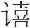！异乎哉！此非吾所谓道也。昔者神农氏之有天下也，时祀尽敬而不祈福也；其于人也，忠信尽治而无求焉；乐正与为正(12)，乐治与为治；不以人之坏自成也，不以人之庳自高也(13)。今周见殷之僻乱也，而遽为之正与治，上谋而行货(14)，阻丘而保威也(15)。割牲而盟以为信，因四内与共头以明行，扬梦以说众(16)，杀伐以要利，以此绍殷(17)，是以乱易暴也。吾闻古之士，遭乎治世，不避其任；遭乎乱世，不为苟在(18)。今天下暗，周德衰矣。与其并乎周以漫吾身也(19)，不若避之以洁吾行。”二子北行，至首阳之下而饿焉(20)。

**【注释】**

(1)孤竹：古国名，在今河北卢龙一带。

(2)伯夷、叔齐：商末孤竹君的两个儿子。相传孤竹君遗命立次子叔齐为继承人，叔齐让位给伯夷，伯夷不受，叔齐也不肯即位，二人相继逃走，后一起投奔周。

(3)偏伯：一方之长，指西伯姬昌。姬昌死后谥为文王。

(4)叔旦：即周公旦，武王之弟。就：到……去。胶鬲（ɡé）：殷的贤臣，最初贩卖鱼盐，后由周文王举荐给纣。四内：古地名。

(5)盟：在神前立誓缔约。

(6)富：俸禄。

(7)“为三”五句：古人为盟，“先凿地为方坎，杀牲于坎上，割牲左耳，盛以珠盘，又取血盛以玉敦，用血为盟书，成，乃歃血而读书”（见孔颖达《礼记·曲礼下》疏）。盟书备有几份，一份埋于盟所（或沉于河），与盟者各持一份而归，藏于祖庙或司盟之府。以：持。

(8)保召（shào）公：姬姓，名奭（shì），周武王之臣，因封地在召，故称召公或召伯。武王灭纣后，封召公于北燕。成公时任太保，故又称保召公。微子开：即微子启。共头：山名，又作“共首”，在今河南辉县境内。

(9)长（zhǎnɡ）侯：诸侯之长。

(10)相（xiànɡ）：等于说“使”。桑林：乐曲名，为殷天子祭祀之乐。

(11)孟诸：古泽名，在今河南商丘东北。

(12)与：因，就。

(13)庳（bì）：低下。

(14)行货：行贿，指与胶鬲、微子启盟誓中的“加富三等”、“宜私孟诸”之类。货，财物。

(15)阻丘：疑是“阻兵”。阻：恃，倚仗。

(16)扬梦：宣扬武王承受天命灭殷之梦。周文王妻太姒梦见商之庭长出荆棘，其子姬发取来周庭的梓树，植于宫阙之间，化为松柏棫柞。太姒惊醒，告诉文王。文王说：把姬发召来，在明堂拜谢吉梦，这个梦兆示姬发从皇天上帝那里承受了商的天命。

(17)绍：承继。

(18)在：存，生存。

(19)并：通“傍（bànɡ）”，依附。

(20)首阳：山名，在今山西永济南。饿：这里是饿死的意思。

**【译文】**

从前周朝将要兴起的时候，有两位贤士住在孤竹国，名叫伯夷、叔齐。两人一起议论说：“听说西方有个西伯，好像是个有道义的人，现在我们还呆在这儿干什么呢？”于是两人向西行到周国去，走到岐山之南，文王却已经死了。武王即位，宣示周德，派叔旦到四内去找胶鬲，跟他盟誓说：“让你俸禄增加三级，官居一等。”准备三份盟书，文辞相同，把牲血涂在盟书上，一份埋在四内，两人各持一份而归。武王又派保召公到共头山下去找微子启，跟他盟誓说：“让你世世代代做诸侯之长，奉守殷的各种例行祭祀，允许你供奉桑林之乐，把孟诸作为你的私人封地。”准备三份盟书，文辞相同，把牲血涂在盟书上，一份埋在共头山下，两人各持一份而归。伯夷、叔齐闻知这些，互相望着笑道：“嗐！跟我们原来听说的不一样啊！这不是我们所说的道。从前神农氏治理天下的时候，四时祭祀毕恭毕敬，但是不为求福；对于百姓，讲求忠信，尽心治理，而无所求；百姓乐于公正，就帮助他们实现公正，百姓乐于太平，就帮助他们实现太平；不利用别人的失败使自己成功，不利用别人的卑微使自己高尚。如今周看到殷邪僻淫乱，便急急忙忙地替它纠正，替它治理，这是崇尚计谋，借助贿赂，倚仗武力，维持威势。把杀牲盟誓当作诚信，依靠四内和共头之盟来彰显德行，宣扬吉梦取悦众人，靠屠杀攻伐攫取利益，用这些做法承继殷，这是用悖乱代替暴虐。我们听说古代的贤士，遭逢太平之世，不回避自己的责任；遭逢动乱之世，不苟且偷生。如今天下黑暗，周德已经衰微了。与其依附周使我们的名节遭到玷污，不如避开它使我们的德行清白高洁。”于是两人向北走，走到首阳山下饿死在那里。

人之情，莫不有重，莫不有轻。有所重则欲全之，有所轻则以养所重。伯夷、叔齐，此二士者，皆出身弃生以立其意(1)，轻重先定也。

**【注释】**

(1)出身：舍身。

**【译文】**

人之常情，无不有所重，无不有所轻。有所重就会保全它，有所轻就会拿它来保养自己所珍视的东西。伯夷、叔齐这两位贤士，都舍弃生命以坚守自己的节操，这是由于他们心目中的轻重早就确定了。

# 不侵

**【题解】**

所谓“不侵”，是指士凛然不可侵犯。本篇借豫让之口表明，士的“尽力竭智”、“不辞其患”是有条件的，“夫国士畜我者，我亦国士事之”；“夫众人畜我者，我亦众人事之”。为此，作者提醒人主，仅凭“尊贵富大”不足以招来士，要使士为自己效死力，“必自知士”。本篇夸大了士的作用，公孙弘关于士的一番议论显然是作者为自己这一阶层所作的自我标榜。

五曰：

天下轻于身，而士以身为人(1)。以身为人者，如此其重也，而人不知，以奚道相得(2)？贤主必自知士，故士尽力竭智，直言交争(3)，而不辞其患。豫让、公孙弘是矣(4)。当是时也，智伯、孟尝君知之矣(5)。世之人主，得地百里则喜，四境皆贺；得士则不喜，不知相贺：不通乎轻重也。汤、武，千乘也，而士皆归之。桀、纣，天子也，而士皆去之。孔、墨，布衣之士也，万乘之主、千乘之君不能与之争士也。自此观之，尊贵富大不足以来士矣，必自知之然后可。

**【注释】**

(1)以身为（wèi）人：为他人献出生命。

(2)以：不当有，疑为后人所加。奚道：何由。相得：互相投合。

(3)争：诤谏。

(4)公孙弘：战国时齐孟尝君的门客。

(5)智伯：指智伯瑶。

**【译文】**

第五：

天下比自身轻贱，而士却甘愿为他人献身。为他人献身的人是如此地难能可贵，如果人们不了解他们，那通过什么与他们情投意合？贤明的君主一定是亲自了解士，所以士能竭尽心力，直言相谏，而不避其祸。豫让、公孙弘就是这样的士。在当时，智伯、孟尝君可称得上是了解他们了。世上的君主得到百里的土地就满心欢喜，四境之内都来祝贺；而得到贤士却无动于衷，四境之内也不知表示祝贺：这是不晓得轻重啊。商汤、周武王起初只是拥有兵车千辆的诸侯，然而士都归附他们。夏桀、殷纣是天子，然而士都离开了他们。孔子、墨子是身穿布衣的庶人，然而拥有兵车万辆、千辆的君主却无法与他们争夺士。由此看来，尊贵富有不足以招来士，君主一定要亲自了解士，然后才行。

豫让之友谓豫让曰：“子之行何其惑也？子尝事范氏、中行氏(1)，诸侯尽灭之，而子不为报；至于智氏，而子必为之报，何故？”豫让曰：“我将告子其故。范氏、中行氏，我寒而不我衣，我饥而不我食，而时使我与千人共其养，是众人畜我也。夫众人畜我者，我亦众人事之。至于智氏则不然，出则乘我以车，入则足我以养，众人广朝(2)，而必加礼于吾所(3)，是国士畜我也。夫国士畜我者，我亦国士事之。”豫让，国士也，而犹以人之于己也为念，又况于中人乎？

**【注释】**

(1)范氏：即春秋时晋国的贵族士氏，因士会受范地为食邑，故称范氏。这里指范吉射。中行（hánɡ）氏：即春秋时晋国的贵族荀氏，因荀林父为中行主将，后以中行为氏。这里指中行寅。中行，春秋时晋国军制之名。晋置上中下三军，后又增置中行、右行、左行。

(2)朝：朝会。

(3)所：所在之处。

**【译文】**

豫让的朋友对豫让说：“你的行为怎么这样糊涂啊？你曾经侍奉过范氏、中行氏，诸侯把他们都灭掉了，而你并不曾替他们报仇；至于智氏，被灭之后你却一定要替他报仇；这是什么缘故？”豫让说：“让我告诉你其中的缘故。范氏、中行氏，在我受冻的时候却不给我衣穿，在我挨饿的时候却不给我饭吃，时常让我跟上千的门客一起接受相同的衣食，这是像养活众人一样地养活我。凡像对待众人一样地对待我的，我也像众人一样地回报他。至于智氏就不是这样，出门供给我车坐，在家供给我充足的衣食，在大庭广众之中，一定对我给予特殊的礼遇，这是像奉养国士那样地奉养我。凡像对待国士那样对待我的，我也像国士那样地报答他。”豫让是国士，尚且还念念不忘别人对待自己的态度，又何况一般人呢？

孟尝君为从(1)，公孙弘谓孟尝君曰：“君不若使人西观秦王。意者秦王帝王之主也(2)，君恐不得为臣，何暇从以难之(3)？意者秦王不肖主也，君从以难之未晚也。”孟尝君曰：“善。愿因请公往矣(4)。”公孙弘敬诺，以车十乘之秦。秦昭王闻之(5)，而欲丑之以辞，以观公孙弘。公孙弘见昭王，昭王曰：“薛之地小大几何(6)？”公孙弘对曰：“百里。”昭王笑曰：“寡人之国，地数千里，犹未敢以有难也。今孟尝君之地方百里，而因欲以难寡人犹可乎？”公孙弘对曰：“孟尝君好士，大王不好士。”昭王曰：“孟尝君之好士何如？”公孙弘对曰：“义不臣乎天子，不友乎诸侯，得意则不惭为人君，不得意则不肯为人臣，如此者三人。能治可为管、商之师，说义听行，其能致主霸王，如此者五人。万乘之严主辱其使者(7)，退而自刎也，必以其血污其衣，有如臣者七人。”昭王笑而谢焉，曰：“客胡为若此？寡人善孟尝君，欲客之必谨谕寡人之意也。”公孙弘敬诺。公孙弘可谓不侵矣。昭王，大王也；孟尝君，千乘也。立千乘之义而不可凌(8)，可谓士矣。

**【注释】**

(1)从（zònɡ）：同“纵”，指合纵。战国时秦在西方，六国在东，土地南北相连，故将联合六国抗秦称为合纵。

(2)意者：抑或。

(3)难（nàn）：抵抗，与……为敌。

(4)因：就。

(5)秦昭王：即秦昭襄王，战国时秦国国君，名稷，公元前306年—前251年在位。

(6)薛：齐邑，孟尝君的封地。

(7)严：尊，这里是威重的意思。

(8)凌：侮辱。

**【译文】**

孟尝君合纵抗秦，公孙弘对孟尝君说：“您不如派人到西方观察一下秦王。抑或秦王是个具有帝王之资的君主，您恐怕连做臣都不可得，哪里顾得上跟秦国作对呢？抑或秦王是个不肖的君主，那时您再合纵跟秦作对也不算晚。”孟尝君说：“好。那就请您去一趟。”公孙弘答应了，于是带着十辆车前往秦国。秦昭王听说此事，想用言辞羞辱公孙弘，借以观察他。公孙弘拜见昭王，昭王问：“薛这个地方面积有多大？”公孙弘回答说：“方百里。”昭王笑道：“我的国家土地纵横数千里，还不敢凭借它跟谁作对。如今孟尝君土地才百里见方，就想凭借它跟我作对，能行吗？”公孙弘回答说：“孟尝君喜好士，大王您不喜好士。”昭王说：“孟尝君喜好士又怎么样？”公孙弘回答说：“信守节义，不向天子称臣，不与诸侯交友，如果得志，做人君毫不惭愧，不得志，就连人臣也不肯做，像这样的士，孟尝君那里有三人。善于治国，可以作管仲、商鞅的老师，其主张如果被听从施行，就能使君主成就王、霸之业，像这样的士，孟尝君那里有五人。充任使者，如果遭到拥有万辆兵车的君主的侮辱，就退下自刎，但一定用自己的血染污对方的衣服，有如我这样的，孟尝君那里有七人。”昭王笑着道歉说：“您何必如此？我对孟尝君是很友好的，希望您一定要向他说明我的心意。”公孙弘答应了。公孙弘可称得上凛然不可侵犯了。昭王是秦国国君，孟尝君只是齐国之臣，公孙弘能在昭王面前为孟尝君仗义执言，不可凌辱，真可称得上士了。

# 序意**一作廉孝**

**【题解】**

本篇是《吕氏春秋》的后序，有残缺错简。前半只言十二纪；后半言赵襄子豫让事，与本篇无关，为他篇错入；而言八览、六论部分已亡佚。这大概就是后人将本篇从书末移置于此的缘故。本篇主要讲《吕氏春秋》编著的宗旨和意图。它备天地万物古今之事是要“纪治乱存亡也，知寿夭吉凶也”。它公开申明自己的理论根据是“法天地”的思想，它认为只要天地人三者都各得其所，就可以无为而行了。它特别提出要循其理，去其私，否则就会“福日衰，灾日隆”。

维秦八年(1)，岁在涒滩(2)，秋甲子朔(3)。朔之日，良人请问十二纪(4)。文信侯曰(5)：尝得学黄帝之所以诲颛顼矣(6)，“爰有大圜在上(7)，大矩在下(8)，汝能法之，为民父母。”盖闻古之清世，是法天地。凡十二纪者，所以纪治乱存亡也，所以知寿夭吉凶也。上揆之天，下验之地，中审之人，若此则是非可不可无所遁矣。

**【注释】**

(1)秦八年：指秦始皇八年。

(2)岁：岁星，这里指太岁。太岁是古人假想的与岁星相背运行的星体，它运行一周天正与赤道附近的十二次相合，古人以此记年。涒（tūn）滩：太岁年名，即申年。

(3)朔：每月的第一天叫朔。

(4)良人：君子。

(5)文信侯：指吕不韦，吕不韦被封为文信侯。

(6)颛顼（zhuānxū）：古代帝王名，黄帝之孙。

(7)大圜：指天。古人认为天圆地方。

(8)大矩：指地。

**【译文】**

秦始皇八年，太岁在涒滩，秋天，初一为甲子日。初一这天，君子请问十二纪的事。文信侯吕不韦说：曾经学到黄帝教诲颛顼的话，“有皇天在上，大地在下，你能够效法它们，可以做人民的父母了。”听说古代的清平盛世，都是效法天地。大凡十二纪，是用来记载国家的治乱存亡的，是用来了解人事的寿夭吉凶的。向上度量于天，向下检验于地，中间审察于人。能这样，那么对与不对、可以与不可以都没有失误了。

天曰顺，顺维生；地曰固，固维宁；人曰信，信维听。三者咸当，无为而行。行也者，行其理也(1)。行数(2)，循其理，平其私。夫私视使目盲，私听使耳聋，私虑使心狂。三者皆私设，精则智无由公(3)。智不公，则福日衰，灾日隆。以日倪而西望知之(4)。

**【注释】**

(1)理：当作“数”。数，指天数。

(2)行数：当作“行其数”。

(3)精：甚。

(4)倪：通“睨”，斜视，这里是斜的意思。西望：指太阳西落。

**【译文】**

天要顺行，顺行才能生万物；地要牢固，牢固万物才得安宁；人要诚信，诚信才能被听用。天地人三者都得当，就可以无为而行了。行的意思，就是行天之道。行天之道，顺地之理，人就可以去掉私心了。带着私心去看，就会使眼睛盲无所见；带着私心去听，就会使耳朵聋无所闻；带着私心去考虑问题，就会使心狂乱。眼睛、耳朵和心都为私而施用，严重了就会使思想不能公正。思想不公正，那么福就会一天天衰减，灾就会一天天兴盛。这个道理从太阳偏斜必定西落的现象中可以看出来。

赵襄子游于囿中，至于梁，马却不肯进。青荓为参乘(1)。襄子曰：“进视梁下，类有人。”青荓进视梁下，豫让却寝(2)，佯为死人。叱青荓曰：“去，长者吾且有事(3)。”青荓曰：“少而与子友，子且为大事，而我言之，是失相与友之道；子将贼吾君(4)，而我不言之，是失为人臣之道。如我者惟死为可。”乃退而自杀。青荓非乐死也，重失人臣之节，恶废交友之道也。青荓、豫让，可谓之友也。

**【注释】**

(1)青荓（píng）：人名。

(2)却：当作“卬”。卬，即“仰”字。

(3)长者：豫让自称。吾：当为衍文。事：指刺杀赵襄子。

(4)贼：杀。

**【译文】**

赵襄子在园囿中游玩，走到桥边，马停下来，不肯前进。这时青荓当参乘。襄子说：“去前边看看桥底下，像是有人。”青荓去前边看看桥下，豫让正仰面躺着，装作死人。他叱退青荓说：“离开，我将要干大事。”青荓说：“年轻时和你交朋友，你现在将要干大事，我如果说出这件事，这是失掉了交友之道；你要杀死我的君主，我如果不说出这件事，这是失掉了为臣之义。像我这样，只可以一死了。”于是退下去自杀了。青荓不是喜欢死，而是看重丧失人臣的节操，厌恶废弃交友的准则。青荓、豫让，可以算作朋友了。

