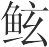
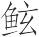
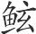
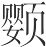
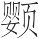
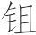
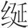
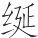
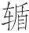
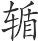

 审分览第五

# 审分

**【题解】**

本篇主要论述君主必须审正君臣的名分。审正君臣的名分，是国家大治的必要手段。君主不该“好治人官之事”，审分正名才是驾驭臣下的关键。“按其实而审其名，以求其情；听其言而察其类，无使放悖”，这就是审分正名的方法。本篇在内容上与《正名》篇是相互阐发的。

本览八篇，论述的都是为君之道，强调的是“虚君”思想。同时，也比较集中地吸收了法、术、势三派的学说。

一曰：

凡人主必审分(1)，然后治可以至，奸伪邪辟之涂可以息(2)，恶气苛疾无自至(3)。夫治身与治国，一理之术也。今以众地者(4)，公作则迟，有所匿其力也；分地则速，无所匿迟也。主亦有地，臣主同地，则臣有所匿其邪矣(5)，主无所避其累矣(6)。

**【注释】**

(1)分（fèn）：名分，职分。

(2)涂：途径。这个意义后来写作“途”。

(3)苛疾：恶疾，重病。无自：无从。

(4)地：用如动词，耕种土地。

(5)邪：私。

(6)累：负累。

**【译文】**

第一：

凡是君主，一定要明察君臣的职分，然后国家的安定才可以实现，奸诈邪僻的渠道才可以堵塞，浊气恶疾才无法出现。修养自身与治理国家，其方法道理是一样的。现在用许多人耕种土地，共同耕作就缓慢，这是因为人们有办法藏匿自己的力气；分开耕作就迅速，这是因为人们无法藏匿力气，无法缓慢耕作。君主治理国家也像种地一样，臣子和君主共同治理，臣子就有办法藏匿自己的阴私，君主就无法避开负累了。

凡为善难，任善易(1)。奚以知之？人与骥俱走，则人不胜骥矣；居于车上而任骥，则骥不胜人矣。人主好治人官之事，则是与骥俱走也，必多所不及矣。夫人主亦有居车(2)，无去车，则众善皆尽力竭能矣，谄谀诐贼巧佞之人无所窜其奸矣(3)，坚穷廉直忠敦之士毕竞劝骋骛矣(4)。人主之车，所以乘物也。察乘物之理，则四极可有(5)。不知乘物，而自怙恃，夺其智能(6)，多其教诏，而好自以(7)，若此则百官恫扰，少长相越，万邪并起，权威分移，不可以卒，不可以教，此亡国之风也。

**【注释】**

(1)任善：任用善人，即任用做善事的人。

(2)居车：居于车上。下句“去车”指离开车，即下车。

(3)诐（bì）：邪僻。窜：藏匿。

(4)坚：刚强。穷：当为“睿”字之误（依刘师培说）。睿，睿智，明智。劝：勉励，鼓励。骋骛：奔跑，这里是竭力效劳的意思。

(5)四极：四方边远之地。

(6)夺：当作“奋”（依陈昌齐、王念孙说）。奋：矜恃，矜夸。

(7)自以：自用，指凭自己的主观意图行事。

**【译文】**

凡是亲自去做善事就困难，任用别人做善事就容易。凭什么知道是这样？人与千里马一块跑，那么人不能胜过千里马；人坐在车上驾驭千里马，那么千里马就不能胜过人了。君主喜欢处理官吏职权范围内的事，这就是与千里马一块跑啊，必定远远赶不上。君主也必须像驾车的人一样坐在车上，不要离开车子，那么所有做善事的人就都会尽心竭力了，阿谀奉承、邪恶奸巧的人就无法藏匿其奸了，刚强睿智、忠诚淳朴的人就会争相努力去奔走效劳了。君主的车子，是用来载物的。明察了载物的道理，那么四方边远之地都可以占有；不懂得载物的道理，仗恃自己的能力，夸耀自己的才智，教令下得很多，好凭自己的意图行事，这样，各级官吏就都恐惧骚乱，长幼失序，各种邪恶一起出现，权威分散下移，不可以善终，不可以施教，这是亡国的风气啊。

王良之所以使马者(1)，约审之以控其辔(2)，而四马莫敢不尽力。有道之主，其所以使群臣者亦有辔。其辔何如？正名审分，是治之辔已。故按其实而审其名，以求其情；听其言而察其类，无使放悖。夫名多不当其实，而事多不当其用者，故人主不可以不审名分也。不审名分，是恶壅而愈塞也。壅塞之任，不在臣下，在于人主。尧、舜之臣不独义(3)，汤、禹之臣不独忠，得其数也(4)；桀、纣之臣不独鄙，幽、厉之臣不独辟，失其理也。

**【注释】**

(1)王良：春秋时晋国善于驾马的人。

(2)约：简要。控：控制，操纵。辔（pèi）：马缰绳。

(3)尧、舜之臣不独义：尧、舜的臣子不全都仁义。

(4)得其数：驾驭得法的意思。数，术。

**【译文】**

王良驾马的方法是，明察驾马的要领，握住马缰绳，因而四匹马没有敢不用尽力气的。有道术的君主，他驾驭臣子们也有“缰绳”。那“缰绳”是什么？辨正名称，明察职分，这就是治理臣子们的“缰绳”。所以，依照实际审察名称，以便求得真情，听其言论而考察其所行之事，不要让它们放纵悖逆。名称有很多不符合实际，所行之事有很多不切合实用的，所以君主不可不辨明名分。不辨明名分，这就是厌恶壅闭反而更加阻塞啊。阻塞的责任，不在臣子，在于君主。尧、舜的臣子并不全仁义，汤、禹的臣子并不全忠诚，他们能称王天下，是因为驾驭臣子得法啊；桀、纣的臣子并不全鄙陋，幽王、厉王的臣子并不全邪僻，他们亡国丧身，是因为驾驭臣子不得法啊。

今有人于此，求牛则名马，求马则名牛，所求必不得矣，而因用威怒，有司必诽怨矣(1)，牛马必扰乱矣。百官，众有司也；万物，群牛马也。不正其名，不分其职，而数用刑罚，乱莫大焉。夫说以智通，而实以过悗(2)；誉以高贤，而充以卑下；赞以洁白，而随以污德；任以公法，而处以贪枉；用以勇敢，而堙以罢怯(3)。此五者，皆以牛为马、以马为牛，名不正也。故名不正，则人主忧劳勤苦，而官职烦乱悖逆矣。国之亡也，名之伤也，从此生矣。白之顾益黑(4)，求之愈不得者，其此义邪！

**【注释】**

(1)有司：古代官府分曹理事，职有专司，所以把主管其事的官吏叫“有司”。

(2)过悗（mán）：过，当作“遇”。遇通“愚”（依王念孙说）。悗，迷惑。

(3)堙（yīn）：堵塞，充塞。罢：通“疲”。

(4)顾：反。

**【译文】**

假如有这样一个人，想找牛却呼马的名字，想找马却呼牛的名字，那么他所找的一定不能得到，而他却因此生气发威风，主管人员一定会怨恨他，牛马一定会受到扰乱。百官就如同众多的主管人员一样，万物就如同众多的牛马一样。不辨正他们的名称，不区别他们的职分，却频繁地使用刑罚，惑乱没有比这更大的了。称道一个人明智通达，实际上这人却愚蠢糊涂；称赞一个人高尚贤德，实际上这人却很卑下；赞誉一个人品德高洁，这人紧跟着表露的却是污秽品德；委任一个人掌公法，这人做起事来却贪赃枉法；由于表面勇敢任用一个人，而他内心却疲弱怯懦。这五种情况，都是以牛为马、以马为牛，都是名分不正啊。所以，名分不正，君主就忧愁劳苦，百官就混乱悖逆了。国家被灭亡，名声受损害，就由此产生出来了。想让它白，反倒更加黑了，想得到，却越发不能得到，大概都是这个道理吧！

故至治之务，在于正名。名正则人主不忧劳矣，不忧劳则不伤其耳目之主。问而不诏，知而不为，和而不矜，成而不处，止者不行，行者不止，因形而任之，不制于物，无肯为使，清静以公，神通乎六合(1)，德耀乎海外，意观乎无穷，誉流乎无止。此之谓定性于大湫(2)，命之曰无有(3)。故得道忘人，乃大得人也(4)，夫其非道也？知德忘知，乃大得知也，夫其非德也？至知不几，静乃明几也(5)，夫其不明也？大明不小事，假乃理事也(6)，夫其不假也？莫人不能(7)，全乃备能也，夫其不全也？是故于全乎去能，于假乎去事，于知乎去几，所知者妙矣。若此则能顺其天，意气得游乎寂寞之宇矣，形性得安乎自然之所矣。全乎万物而不宰(8)，泽被天下而莫知其所自姓，虽不备五者(9)，其好之者是也。

**【注释】**

(1)六合：指上、下、四方。下句的“海外”指四海之外。“六合”与“海外”都是极言其广大。

(2)性：命。大湫（qiū）：大窦，大的空洞。湫，空洞，这里指深邃幽微之处。

(3)无有：无形，这里指“道”而言。“道”无形，故曰“无有”。

(4)“故得”二句：得至道则能无为，无为则能忘人。无为而能治，人皆仰慕，则能大得人。

(5)几：机警，机敏。

(6)假：大。

(7)莫人：当为“真人”（依俞樾说），修真得道之人。

(8)宰：主宰。

(9)五者：指上文所说的“得道忘人”、“知德忘知”、“至知不几”、“大明不小事”、“莫人不能”等五种情况。

**【译文】**

所以国家大治需要做的事情，在于辨正名分。名分辨正了，那么君主就没有忧愁劳苦了，没有忧愁劳苦，就不会损伤耳目的天性了。多询问，却不专断地下指示。虽然知道怎样做，却不亲自去做。能和谐万物，却不自夸。事情做成了，却不居功。静止的东西不让它运动，运动的东西不让它静止。依照事物的特点加以使用，不为外物制约，不被外物役使。清静而公正，精神流传到天地四方，品德照耀到四海之外，思想永远不衰，美名流传不止。这就叫做把性命寄托在深邃幽远之处，命名为无形。所以，得道之人能忘掉别人，这样就非常得人心，那怎么能不算有道呢？知道自己有德，不在乎让人知道，这样就更能为人所知，那怎么能不算有德呢？非常有德的人外表不机敏，安然处之，机敏就会显露出来，那怎么能不算聪明呢？特别贤明的人不做小事，大事才去做，那怎么能不算伟大呢？修真得道的人无所能，但人们全都归附他，于是就无所不能了，那怎么能不算完美之人呢？因此，有了众人效力就无需事事都能做，做了大事就无需做小事，被人了解了就无需外表机敏，这样，所知道的就很微妙了。像这样，就能顺应天性，意气就可以在空廓寂静的宇宙中遨游了，形体就可以在自然的境界里获得安适了。包容万物却不去主宰，恩泽覆盖天下却没有谁知道从哪里开始的。这样，即使不具备上面说的五种情况，也可以说是爱好这些了。

# 君守

**【题解】**

本篇旨在论述君主所当执守的根本——清静无为，集中体现了“虚君”的思想。善于作君主的，不担当任何职务，不作任何具体的事情，只有这样才能充分发挥臣下的才智，否则就要招致尊卑颠倒、国家危亡的后果。

文章批判了“博闻”、“强识”之士，“坚白”、“无厚”之说，宣扬了老子的思想。

二曰：

得道者必静，静者无知，知乃无知(1)，可以言君道也。故曰中欲不出谓之扃(2)，外欲不入谓之闭。既扃而又闭，天之用密(3)。有准不以平，有绳不以正，天之大静。既静而又宁，可以为天下正(4)。

**【注释】**

(1)乃：若。

(2)扃（jiōnɡ）：关锁，关闭。

(3)天：指天性。密：宁静。

(4)正：主。

**【译文】**

第二：

得道的人一定清静，清静的人什么都不知道，知道就像不知道一样，这样就可以跟他谈论当君主的原则了。所以说，内心的欲望不显露出来叫做封锁，外面的欲望不进入内心叫做关闭。既封锁又关闭，天性由此得以宁静。有水准仪不用它测平，有墨绳不用它测直，天性因此非常清静。既清静又安宁，就可以当天下的主宰了。

身以盛心，心以盛智，智乎深藏，而实莫得窥乎！《鸿范》曰(1)：“惟天阴骘下民(2)。”阴之者，所以发之也(3)。故曰不出于户而知天下，不窥于牖而知天道。其出弥远者，其知弥少。故博闻之人、强识之士阙矣(4)，事耳目、深思虑之务败矣，坚白之察、无厚之辩外矣(5)。不出者，所以出之也；不为者，所以为之也。此之谓以阳召阴、以阴召阳(6)。东海之极，水至而反；夏热之下，化而为寒。故曰天无形(7)，而万物以成；至精无象(8)，而万物以化；大圣无事，而千官尽能。此乃谓不教之教，无言之诏。

**【注释】**

(1)《鸿范》：《尚书》里的一篇。

(2)阴：通“荫”，覆蔽，庇护。骘（zhì）：安定。

(3)发之：使之发，即使人民繁衍生息。

(4)识（zhì）：记，记忆。阙：缺，亏损。

(5)“坚白”二句：“坚白”和“无厚”都是春秋战国时期名家名辩的论题。

(6)“以阳”二句：当作“以阳召阴，以阴召阳”（依李宝洤说）。相反相成、无为而治之意。

(7)“故曰”句：“天”上当有“昊”（hào）字（依王念孙说）。昊天，即天。昊，元气博大的样子。

(8)象：当作“为”（依王念孙说）。

**【译文】**

身体是用来保藏心的，心是用来保藏智慧的。智慧被深深保藏着，因而实情就不能窥见啦！《鸿范》上说：“只有上天庇护人民并让人民安定。”庇护人民，是为了让人民繁衍生息。所以说，不出门就能知道天下事，不从窗户向外望就能知道天的运行规律。那些出去越远的人，他们知道的就越少。所以，见闻广博、记忆力强的，他们的智慧就欠缺了；致力于耳聪目明、深思熟虑的，他们的智慧就毁坏了；考察“坚白”、论辩“无厚”的，他们的智慧就丢弃了。不出门，正是为了达到出门的效果；不做事，正是为了实现做事的目的。这就叫做用阴气召来阳气、用阳气召来阴气。东海那样远，水流到那里还会回来；过了夏天的炎热以后，就会渐渐变得寒冷。所以说，广漠的上天虽没有形象，可是万物靠了它能生成；最精微的元气虽没有作为，可是万物靠了它能化育；非常圣明的人虽不做事，可是却让所有官吏都把才能使出来。这就叫做不进行教化的教化，不使用言语的诏告。

故有以知君之狂也，以其言之当也；有以知君之惑也，以其言之得也(1)。君也者，以无当为当，以无得为得者也。当与得不在于君，而在于臣。故善为君者无识(2)，其次无事。有识则有不备矣，有事则有不恢矣(3)。不备不恢，此官之所以疑，而邪之所从来也。今之为车者，数官然后成(4)。夫国岂特为车哉？众智众能之所持也，不可以一物一方安车也(5)。

**【注释】**

(1)“故有”四句：以上几句意思又见《任数》篇，表现的都是“君道无知无为”的思想。

(2)识：通“职”，官职。

(3)恢：周备，全面。

(4)数官然后成：古代做车，轮、舆、辕、轴等分别由不同部门去做，所以这里说“数官然后成”。官，官署。

(5)方：方法。“车”字当为衍文（依王念孙说）。

**【译文】**

所以，有办法知道君主狂妄，那就是根据他的言语恰当；有办法知道君主昏惑，那就是根据他的言语得体。所谓君主，就是以不求恰当为恰当、以不求得体为得体的人啊。恰当与得体不属于君主的范围，而属于臣子的范围。所以善于当君主的人不担当任何官职，其次是不做具体的事情。担当官职就会有不能完备的情况，做具体事情就会有不能周全的情况。不完备不周全，这是官吏之所以产生疑惑、邪僻之所以出现的原因。现在制造车子的，要经过许多有关部门然后才能造成。治理国家岂只像造车子啊！国家是靠众人的智慧和才能来维护的，不可以用一件事情一种方法使它安定下来。

夫一能应万，无方而出之务者(1)，唯有道者能之。鲁鄙人遗宋元王闭(2)，元王号令于国，有巧者皆来解闭。人莫之能解。兒说之弟子请往解之(3)，乃能解其一，不能解其一，且曰：“非可解而我不能解也，固不可解也。”问之鲁鄙人，鄙人曰：“然，固不可解也，我为之而知其不可解也。今不为而知其不可解也，是巧于我。”故如兒说之弟子者，以“不解”解之也(4)。郑大师文终日鼓瑟而兴(5)，再拜其瑟前曰：“我效于子(6)，效于不穷也。”故若大师文者，以其兽者先之，所以中之也(7)。

**【注释】**

(1)“无方”句：即无方而务出之，指没有方法却能做成事情。

(2)鄙人：鄙野之人，即边远地区的人。宋元王：即宋元公，名佐，公元前531年—前517年在位。闭：连环结，套在一起的两个绳结。

(3)兒（ní）说：宋国的善辩之人。

(4)“以不”句：意思是说，结本不可解，指出其不可解，也就是解决“不解”了绳结的问题。

(5)大（tài）师：古代乐官官职名。这个意义后来写作“太师”。文：大师之名。

(6)效：用，这里是学习的意思。

(7)“以其”二句：这两句颇费解，姑依李宝洤说做如下解释：以兽为喻，乃是取其无知之意。太师文学习鼓瑟，先使其心如兽一样冥然无知，顺应瑟的自然规律，因而能掌握鼓瑟的规律。

**【译文】**

能以不变应万变、不用任何方法却能做成事情的，只有有道之人才能这样。有个鲁国边鄙地区的人送给宋元王一个连环结，宋元王在国内传下号令，让灵巧的人都来解绳结。没有人能解开。兒说的学生请求去解绳结，只能解开其中的一个，不能解开另一个，并且说：“不是可以解开而我不能解开，这个绳结本来就不能解开。”向鲁国边鄙地区的人询问一下，他说：“是的，这个绳结本来不能解开，我打的这连环结，因而知道它不能解开。现在这人没有打这连环结，却知道它不能解开，这人比我巧啊。”所以像兒说的学生这样的人，是用“不可以解开”的回答解决了绳结的问题。郑国的太师文弹瑟弹了一整天，而后站起来。在瑟前拜了两拜说：“我学习你，学习你的音律变化无穷。”所以像太师文这样的人，先让自己的心如兽类一样冥然无知，所以才能掌握弹瑟的规律。

故思虑自心伤也(1)，智差自亡也(2)，奋能自殃(3)，其有处自狂也(4)。故至神逍遥倏忽(5)，而不见其容；至圣变习移俗，而莫知其所从；离世别群，而无不同(6)；君民孤寡，而不可障壅。此则奸邪之情得，而险陂谗慝谄谀巧佞之人无由入(7)。凡奸邪险陂之人，必有因也。何因哉？因主之为。人主好以己为，则守职者舍职而阿主之为矣(8)。阿主之为，有过则主无以责之，则人主日侵(9)，而人臣日得。是宜动者静，宜静者动也。尊之为卑，卑之为尊，从此生矣。此国之所以衰，而敌之所以攻之者也。

**【注释】**

(1)“故思”句：“心”字当为衍文（依陈昌齐说）。

(2)智差：智巧。差，巧诈。

(3)“奋能”句：“自殃”下当脱“也”字（依俞樾说）。

(4)有处：指有职位。处，居。

(5)倏（shū）忽：转瞬之间，形容时间短暂。

(6)同：和。

(7)陂（bì）：也作“诐”，邪佞，不正。

(8)阿：曲从，迎合。

(9)侵：侵夺，这里是受损害的意思。

**【译文】**

所以，思虑就会使自己受到损伤，智巧就会使自己遭到灭亡，逞能就会使自己遭遇祸殃，任职就会使自己变得狂妄。所以神妙至极就能逍遥自得，转瞬即逝，但人们却看不到它的形体；圣明至极就能移风易俗，但人们却不知道是跟随着什么改变的；超群出世，却没有不和谐的；治理人民，称孤道寡，却不受阻塞壅闭。这样，奸邪的实情就能了解，阴险邪僻、善进谗言、阿谀奉承、机巧虚诈之人就无法靠近了。凡是奸邪险恶的人，一定要有所凭借。凭借什么呢？就是凭借君主的亲自做事。君主喜欢亲自做事，那么担当官职的人就会放弃自己的职责去曲从君主所做的事了。曲从君主所做的事，有了过错，君主也就无法责备他，这样，君主就会一天天受损害，臣子就会一天天得志。这样就是该行动的却静止，该静止的却行动。尊贵的变为卑下的，卑下的变为尊贵的，这种现象就由此产生了。这就是国家所以衰弱、敌国所以进犯的原因啊。

奚仲作车(1)，苍颉作书(2)，后稷作稼(3)，皋陶作刑(4)，昆吾作陶(5)，夏作城(6)。此六人者，所作当矣，然而非主道者。故曰作者忧(7)，因者平。惟彼君道，得命之情，故任天下而不强(8)，此之谓全人(9)。

**【注释】**

(1)奚仲：传说中车的创造者，黄帝之后，任姓，为夏朝车正（掌管车的官员）。

(2)苍颉（jié）：又作“仓颉”，旧传为黄帝的史官，汉字的创造者。

(3)后稷：名弃，周的始祖。“后”是“君”的意思，“稷”本是主管农业的官。尧任命弃为稷，周人于是称之为“后稷”。

(4)皋陶（ɡāoyáo）：相传为东夷族首领，曾被舜任为掌管刑法的官。

(5)昆吾：己姓，善于制造陶器。

(6)（ɡǔn）：也作“鲧”（ɡǔn），传说中远古部落首领，禹之父，曾奉尧命治水，采用筑堤防的办法，九年未治平，被舜杀死。这里说他作城，当是古代传闻。

(7)忧：当作“扰”（依王念孙说）。扰：纷乱。

(8)强（qiǎnɡ）：勉强，费力。

(9)全人：全德之人。

**【译文】**

奚仲创造了车子，苍颉创造了文字，后稷发明了种庄稼，皋陶制定了刑法，昆吾创造了陶器，夏发明了筑城。这六个人，他们所创造的东西都是适宜的，然而却不是君主所应做的。所以说，创造的人忙乱，靠别人创造的人平静。只有掌握了当君主的原则，才能了解性命的真情，所以驾驭天下而不感到费力，这样的人就叫做完人。

# 任数

**【题解】**

本篇旨在论述“君术”，即君主驾驭臣下的权术和方法。文章提出：“因者，君术也；为者，臣道也。”意思是说，顺应自然，依靠臣下，无为而治，这是君主的统治之术；亲自做各种事情，这是臣子遵循的原则。不能君臣颠倒，君主去作臣子应该作的事。文章列举了申不害说昭釐侯，孔子困于陈、蔡之间等事例，说明人的耳目心智是有局限的，不足依恃。君主克服这种局限的方法就是要“去听”、“去视”、“去智”，要“清静待时”、“无知无为”，这样就可以耳聪、目明、智公，就可以达到大治的局面了。

三曰：

凡官者，以治为任(1)，以乱为罪。今乱而无责，则乱愈长矣。人主以好暴示能(2)，以好唱自奋(3)，人臣以不争持位(4)，以听从取容，是君代有司为有司也，是臣得后随以进其业(5)。君臣不定，耳虽闻不可以听，目虽见不可以视，心虽知不可以举(6)，势使之也。凡耳之闻也藉于静(7)，目之见也藉于昭(8)，心之知也藉于理。君臣易操(9)，则上之三官者废矣(10)。亡国之主，其耳非不可以闻也，其目非不可以见也，其心非不可以知也，君臣扰乱，上下不分别，虽闻曷闻？虽见曷见？虽知曷知？驰骋而因耳矣(11)，此愚者之所不至也。不至则不知，不知则不信。无骨者不可令知冰(12)。有土之君，能察此言也，则灾无由至矣。

**【注释】**

(1)任：胜任。

(2)暴（bào）：显露，显示。

(3)唱：倡导。奋：矜夸。

(4)争：谏诤。这个意义后来写作“诤”。持位：保住官职。

(5)进其业：指做“持位”、“取容”之事。

(6)举：指举荐人，选取人。

(7)藉（jiè）：凭借，依靠。

(8)昭：明亮。

(9)易操：交换彼此的职守。操，职守。

(10)三官：指上文所说的耳、目、心。

(11)驰骋：比喻无所拘束、无所不至。因：凭借。耳：语气词。

(12)“无骨”句：无骨之虫春生秋死，不知有冰雪。这里比喻愚君不可使知治国之道。

**【译文】**

第三：

凡是任用官吏，把治理得好看成能胜任，把治理得混乱看成有罪。如果治理得混乱却不加责备，那么混乱就更加厉害了。君主以好炫耀来显示自己的才能，以好做先导来自夸，臣子以不劝谏君主来保持官职，以曲意听从来求得容身，这是君主代替官吏去作官吏所应当作的事，这样臣子得以跟着干那些保持官职、曲意求容的事情。君臣的正常关系不确定，耳朵即使能听也无法听清，眼睛即使能看也无法看清，内心即使知道也无法选择，这是情势使他这样的。耳朵能听见是凭借着寂静，眼睛能看见是凭借着光明，内心能知道是凭借着义理。君臣如果交换了各自的职守，那么上面说的三种器官的功用就被废弃了。亡国的君主，他的耳朵不是不可以听到，他的眼睛不是不可以看到，他的内心不是不可以知道，君臣的职分混乱，上下不加分别，即使听到，又能真正听到什么？即使看到，又能真正看到什么？即使知道，又能真正知道什么？要达到随心所欲无所不至的境界，就得有所凭借啊，这是愚蠢君主的智慧所不能达到的。不能达到就不能知道，不能知道就不会相信。没有骨骼的虫子春生秋死，不可能让它知道有冰雪。拥有疆土的君主，能明察这些话，那么灾祸就无法到来了。

且夫耳目知巧固不足恃，惟修其数行其理为可。韩昭釐侯视所以祠庙之牲(1)，其豕小，昭釐侯令官更之。官以是豕来也，昭釐侯曰：“是非向者之豕邪(2)？”官无以对。命吏罪之。从者曰：“君王何以知之？”君曰：“吾以其耳也。”申不害闻之(3)，曰：“何以知其聋？以其耳之聪也；何以知其盲？以其目之明也；何以知其狂？以其言之当也。故曰去听无以闻则聪，去视无以见则明，去智无以知则公。去三者不任则治，三者任则乱。”以此言耳目心智之不足恃也。耳目心智，其所以知识甚阙(4)，其所以闻见甚浅。以浅阙博居天下，安殊俗，治万民，其说固不行。十里之间，而耳不能闻；帷墙之外，而目不能见；三亩之宫，而心不能知。其以东至开梧(5)，南抚多(6)，西服寿靡(7)，北怀儋耳(8)，若之何哉？故君人者，不可不察此言也。

**【注释】**

(1)韩昭釐侯：公元前362年—前333年在位。

(2)是：此。向者：刚才。

(3)申不害：战国时期郑国人，曾任韩昭侯相，主张法治，尤其注重“术”，即君主监督考核臣下、加强专制的方法。

(4)阙：缺。

(5)开梧：古代传说中的东极之国。

(6)多（yǐnɡ）：古代传说中的南极之国。

(7)寿靡：古代传说中的西极之国。

(8)儋（dān）耳：古代传说中的北极之国。

**【译文】**

再说，耳目智巧，本来就不足以依靠，只有讲求驾驭臣下的方法，按照义理行事才可以依靠。韩昭釐侯察看用来祭祀宗庙的牺牲，那猪很小，昭釐侯让官员用大猪替换小猪。那官员又把这头猪拿了来，昭釐侯说：“这不是刚才的猪吗？”那官员无话回答。昭釐侯就命令官吏治他的罪。昭釐侯的侍从说：“君王您根据什么知道的？”昭釐侯说：“我是根据猪的耳朵识别出来的。”申不害听到了这件事，说：“根据什么知道他聋？根据他的听觉好；根据什么知道他瞎？根据他的视力好；根据什么知道他狂？根据他的话得当。所以说，去掉听觉使之无法听见，那么听觉就灵敏了；去掉视觉使之无法看见，那么目光就敏锐了；去掉智慧使之无法知道，那么内心就公正无私了。去掉这三种东西不使用，就治理得好；使用这三种东西，就治理得乱。”以此说明耳目心智不足以依靠。耳目心智，它们所能了解认识的东西很贫乏，它们所能听到见到的东西很肤浅。凭着肤浅贫乏的知识占有广博的天下，使不同习俗的地区安定，治理全国人民，这种主张必定行不通。十里远的范围，耳朵就不能听到；帷幕墙壁的外面，眼睛就不能看见；三亩大的宫室里的情况，心就不能知道。凭着这些，往东到开梧国，往南安抚多国，往西让寿靡国归服，往北让儋耳国归依，那又会怎么样呢？所以当君主的，不可不明察这些话啊。

治乱安危存亡，其道固无二也。故至智弃智，至仁忘仁，至德不德。无言无思，静以待时，时至而应，心暇者胜。凡应之理，清净公素(1)，而正始卒(2)。焉此治纪(3)，无唱有和，无先有随。古之王者，其所为少，其所因多。因者，君术也；为者，臣道也。为则扰矣，因则静矣。因冬为寒，因夏为暑，君奚事哉？故曰君道无知无为，而贤于有知有为，则得之矣。

**【注释】**

(1)公素：公正质朴。素，质朴。

(2)卒：终。

(3)焉此：于此。焉，于。纪：纲纪，法纪。

**【译文】**

治乱安危存亡，本来就没有两种方法。所以，最大的聪明是丢掉聪明，最大的仁慈是忘掉仁慈，最高的道德是不要道德。不说话，不思虑，清静地等待时机，时机到来再行动，内心闲暇的人就能取胜。凡是行动，其准则是，清静无为，公正质朴，自始至终都端正。这样来整顿纲纪，就能做到虽然没有人倡导，但却有人应和，虽然没有人带头，但却有人跟随。古代称王的人，他们所做的事很少，所凭借的却很多。善于凭借，是当君主的方法；亲自做事，是当臣子的准则。亲自去做就会忙乱，善于凭借就会清静。顺应冬天而带来寒冷，顺应夏天而带来炎热，君主还要做什么事呢？所以说，当君主的原则是无知无为，却胜过有知有为，这样就算掌握了当君主的方法了。

有司请事于齐桓公，桓公曰：“以告仲父(1)。”有司又请，公曰：“告仲父。”若是三。习者曰(2)：“一则仲父，二则仲父，易哉为君(3)！”桓公曰：“吾未得仲父则难，已得仲父之后，曷为其不易也？”桓公得管子，事犹大易，又况于得道术乎？

**【注释】**

(1)仲父：指管仲。

(2)习者：指所亲近的臣子。习，近习。

(3)易哉为君：即“为君易哉”的倒装。

**【译文】**

主管官吏向齐桓公请示事情，桓公说：“把这事情告诉仲父去。”主管官吏又请示事情，桓公说：“告诉仲父去。”这种情况连续了三次。桓公的近臣说：“第一次请示，说让去找仲父；第二次请示，又说让去找仲父。这样看来，当君主太容易啦！”桓公说：“我没有得到仲父时很难，已经得到仲父之后，为什么不容易呢？”桓公得到管仲，做事情尚且非常容易，更何况得到道术呢？

孔子穷乎陈、蔡之间(1)，藜羹不斟(2)，七日不尝粒。昼寝。颜回索米，得而爨之，几熟，孔子望见颜回攫其甑中而食之(3)。选间(4)，食熟，谒孔子而进食。孔子佯为不见之。孔子起曰：“今者梦见先君，食洁而后馈(5)。”颜回对曰：“不可。向者煤炱入甑中(6)，弃食不祥，回攫而饭之(7)。”孔子叹曰：“所信者目也，而目犹不可信；所恃者心也，而心犹不足恃。弟子记之：知人固不易矣。”故知非难也，孔子之所以知人难也(8)。

**【注释】**

(1)陈、蔡：都是春秋时代的诸侯国。

(2)藜羹：带汤的野菜。斟：当作“糂”（依毕沅说）。糂（sǎn），以米和羹。

(3)攫（jué）：用手抓取。甑（zènɡ）：古代炊具，类似现在的蒸锅。

(4)选间：须臾，一会儿。

(5)馈：送给人食物，这里指献给鬼神祭品。

(6)炱（tái）：凝聚的烟尘。

(7)饭：吃。

(8)“孔子”句：“孔子之”三字当为衍文（依陶鸿庆说）。

**【译文】**

孔子被困在陈国、蔡国之间，只能吃些没有米粒的野菜，七天没有吃到粮食。孔子白天躺着睡觉。颜回去讨米，讨到米后烧火做饭，饭快熟了，孔子望见颜回抓取锅里的饭吃。过了一会儿，饭做熟了，颜回谒见孔子并且献上饭食，孔子假装没有看见颜回抓饭吃，起身说：“今天我梦见了先君，把饭食弄干净了然后去祭祀先君。”颜回回答说：“不行。刚才烟尘掉到锅里，扔掉沾着烟尘的食物不吉利，我抓出来吃了。”孔子叹息着说：“所相信的是眼睛，可是眼睛看到的还是不可以相信；所依靠的是心，可是心里揣度的还是不足以依靠。学生们记住：了解人本来就不容易呀。”所以，有所知并不难，掌握知人之术就难了。

# 勿躬

**【题解】**

“勿躬”，意思是君主不能亲躬人臣之事，这是本篇论述的中心思想。文章开始就劝说君主不要自蔽，而君主亲自作臣子该作的事，是最严重的“自蔽”行为。君主的职分就是修养自身的道德精神，并以此化育万物。这样，自然就能百官具治，百姓亲服，名号彰明。最后，文章以管仲“不任己之不能，而以尽五子之能”为例，告诫君主“无恃其能勇力诚信”，而要让百官“毕力竭智”。这样，就算是懂得君道了。

四曰：

人之意苟善，虽不知，可以为长。故李子曰(1)：“非狗则不得兔，兔化而狗，则不为兔(2)。”人君而好为人官，有似于此。其臣蔽之，人时禁之(3)；君自蔽，则莫之敢禁。夫自为人官，自蔽之精者也(4)。

祓篲日用而不藏于箧(5)，故用则衰，动则暗，作则倦。衰、暗、倦，三者非君道也。

**【注释】**

(1)李子：李悝（kuī），战国初期法家代表人物，曾任魏文侯相，主持变法，使魏国成为当时的强国之一。

(2)“非狗”三句：这几句是以狗、兔分别喻君、臣。大意是，非君主则不可驭臣子，如同非狗则不能获兔一样。君主如果自为人臣之事，则是君同于臣；君既同于臣，那么臣也就同于君了。臣同于君，君就无法驭臣了。这就如同兔化而为狗，狗也就无兔可获一样。

(3)时：不时，不断。

(4)精：甚。

(5)祓篲（fúhuì）：扫帚。箧（qiè）：箱子一类的东西。

**【译文】**

第四：

人的心意如果好，即使不懂得什么，也可以当君长。所以李悝说：“没有狗就不能捕获兔，兔如果变得和狗一样，那就无兔可捕了。”君主如果喜欢做臣子该做的事，就与此相似了。臣子蒙蔽君主，别人还能不断加以制止；君主自己蒙蔽自己，那就没有人敢于制止了。君主亲自做臣子该做的事，这是最严重的自己蒙蔽自己的行为。

扫帚每天要使用，因而不把它藏在箱子里。所以，君主思虑臣子职权范围内的事，心志就会衰竭；亲自去做臣子职权范围内的事，思想就会昏昧；亲自去做臣子该做的事，体力就会疲惫。衰竭、昏昧、疲惫，这三种情况，不是当君主应该实行的准则。

大桡作甲子(1)，黔如作虏首(2)，容成作历(3)，羲和作占日(4)，尚仪作占月(5)，后益作占岁(6)，胡曹作衣(7)，夷羿作弓(8)，祝融作市(9)，仪狄作酒(10)，高元作室(11)，虞姁作舟(12)，伯益作井(13)，赤冀作臼(14)，乘雅作驾(15)，寒哀作御(16)，王亥作服牛(17)，史皇作图(18)，巫彭作医(19)，巫咸作筮(20)。此二十官者，圣人之所以治天下也。圣王不能二十官之事，然而使二十官尽其巧，毕其能，圣王在上故也。圣王之所不能也，所以能之也；所不知也，所以知之也。养其神、修其德而化矣，岂必劳形愁弊耳目哉(21)？是故圣王之德，融乎若月之始出，极烛六合，而无所穷屈；昭乎若日之光，变化万物，而无所不行；神合乎太一(22)，生无所屈，而意不可障；精通乎鬼神，深微玄妙，而莫见其形。今日南面，百邪自正，而天下皆反其情，黔首毕乐其志，安育其性，而莫为不成。故善为君者，矜服性命之情(23)，而百官已治矣，黔首已亲矣，名号已章矣(24)。

**【注释】**

(1)大桡：传说中黄帝的臣子，曾创六十甲子以记日。

(2)黔如：他书未见，当是传说中的人名，其事未详。虏首：疑为“蔀（bù）首”（依毕沅说）。蔀首，古代历法的起算点。古代历法规定，十九年设置七个闰月，这叫做“章”，四章为“蔀”，一蔀七十六年，起算点为冬至日，即为“蔀首”。

(3)容成：传说中黄帝的臣子，历法的创造者。

(4)羲和：传说中黄帝的臣子，掌天文历法。

(5)尚仪：相传为訾氏女，帝喾妃，以善于占月之晦、朔、弦、望著称。

(6)后益：计算年岁方法的首创者。与下文“伯益”为二人。

(7)胡曹：传说中黄帝的臣子，衣服的首创者。

(8)夷羿：通常写作“后羿”，相传为夏代东夷族首领，名羿，以善射著称。

(9)祝融：颛顼氏之后，曾做高辛氏火官，死后被尊为火神。

(10)仪狄：传说中夏禹时的始作酒者。

(11)高元：传说中房屋的创造者。

(12)虞姁（xǔ）：传说中船的创造者。

(13)伯益：也称“益”，“伯益”，相传为舜臣，创造了打井的方法。

(14)赤冀：相传为神农氏的臣子，始作杵、臼，又作、耨、钱、镈、釜、甑、井、灶等。

(15)乘雅：《荀子·解蔽》作“乘杜”。杜为其名，因为他发明用马驾车，所以称之为“乘杜”。

(16)寒哀：《世本》作“韩哀”，人名。

(17)王亥：汤的七世祖，相传他开始从事畜牧业。服：驾驭。

(18)史皇：相传为黄帝史官。图：指图画物像，即绘画。

(19)巫彭：古代传说中的神医。

(20)巫咸：商王太戊的大臣，相传他发明了用蓍草占卦。筮（shì）：用蓍草占卦。

(21)愁：通“揫”，积。“愁”下当脱“虑”字（依许维遹说）。弊：通“蔽”，这里用如使动。

(22)太一：“道”的别名。“太”是至高至极，“一”是绝对惟一的意思。“太一”指创造天地万物的元气。

(23)矜：慎重。

(24)章：彰明。

**【译文】**

大桡创造了六十甲子记日，黔如创造了蔀首计算法，容成创造了历法，羲和创造了计算日子的方法，尚仪创造了计算月份的方法，后益创造了计算年份的方法，胡曹创造了衣服，夷羿创造了弓，祝融创造了市肆，仪狄创造了酒，高元创造了房屋，虞姁创造了船，伯益创造了井，赤冀创造了臼，乘雅创造了用马驾车，寒哀创造了驾车的技术，王亥创造了驾牛的方法，史皇创造了绘画，巫彭创造了医术，巫咸创造了占卜术。这二十位官员，正是圣人治理天下的依靠。圣贤的君王不能自己做二十位官员做的事，然而却能让二十位官员全部献出技艺和才能，这是因为圣贤君王居上位的缘故。圣贤君王有所不能，因此才有所能；有所不知，因此才有所知。修养自己的精神品德，自然就能化育万物了，哪里一定要使自身劳苦忧虑，把耳朵眼睛搞得疲惫不堪呢？因此，圣贤君王的品德，光灿灿地就像月亮刚出来，普遍照耀天地四方，没有照不到的地方；明亮亮地就像太阳的光芒，能化育万物，没有做不到的事情；精神与道符合，生命不受挫折，因而心志不可阻挡；精气与鬼神相通，深微玄妙，没有人能看出其形体来。这样，一旦君主南面而治，各种邪曲的事自然会得到匡正，天下的人都恢复自己的本性，老百姓都从内心感到高兴，安心培育自己的善性，因而做任何事就没有不成功的。所以，善于当君主的人，谨慎地保持住真情本性，因而各种官吏就能治理了，老百姓就能亲附了，名声就能显赫了。

管子复于桓公曰：“垦田大邑，辟土艺粟(1)，尽地力之利，臣不若宁速(2)，请置以为大田(3)。登降辞让，进退闲习，臣不若隰朋(4)，请置以为大行(5)。蚤入晏出(6)，犯君颜色，进谏必忠，不辟死亡，不重贵富，臣不如东郭牙(7)，请置以为大谏臣(8)。平原广城(9)，车不结轨(10)，士不旋踵，鼓之，三军之士视死如归，臣不若王子城父(11)，请置以为大司马(12)。决狱折中(13)，不杀不辜，不诬无罪，臣不若弦章(14)，请置以为大理(15)。君若欲治国强兵，则五子者足矣；君欲霸王，则夷吾在此。”桓公曰：“善。”令五子皆任其事，以受令于管子。十年，九合诸侯，一匡天下，皆夷吾与五子之能也。管子，人臣也，不任己之不能，而以尽五子之能，况于人主乎？人主知能不能之可以君民也，则幽诡愚险之言无不职矣(16)，百官有司之事毕力竭智矣。五帝三王之君民也，下固不过毕力竭智也。夫君人而知无恃其能勇力诚信，则近之矣。

**【注释】**

(1)艺：种植。

(2)宁速：即宁戚，春秋时卫国人。为人挽车至齐，于车下饭牛而歌，齐桓公拜为大夫。

(3)大田：官名，田官之长。

(4)隰（xí）朋：齐大夫，帮助管仲辅佐齐桓公成就霸业。

(5)大行：官名，掌接待宾客。

(6)晏：晚。

(7)东郭牙：齐桓公臣。

(8)大谏臣：谏官。

(9)城：当为“域”字（依毕沅说）。

(10)结：交，交错。轨：车辙。

(11)王子城父：当为齐襄公旧臣，后为齐桓公臣。

(12)大司马：官名，掌攻伐征战。

(13)折中：调节过与不及，使适中。

(14)弦章：即宾胥无，字子旗。

(15)大理：官名，掌治狱。

(16)幽：幽隐，隐蔽。诡：诈伪。愚：欺骗。职：通“识”。

**【译文】**

管子向桓公禀告说：“开垦田地，扩大城邑，开辟土地，种植谷物，充分利用地力，我不如宁速，请让他当大田。迎接宾客，熟悉升降、辞让、进退等各种礼仪，我不如隰朋，请让他当大行。早入朝，晚退朝，敢于触怒国君，忠心谏诤，不躲避死亡，不看重富贵，我不如东郭牙，请让他当大谏臣。在广阔的原野上作战，战车整齐行进而不错乱，士兵不退却，一击鼓进军，三军士兵都视死如归，我不如王子城父，请让他当大司马。断案恰当，不杀无辜之人，不冤屈无罪之人，我不如弦章，请让他当大理。您如果想治国强兵，那么这五个人就足够了；您要想成就霸王之业，那么有我在这里。”桓公说：“好。”就让五个人都担任了那些官职，接受管子的命令。过了十年，桓公多次盟会诸侯，使天下完全得到匡正，这些都是靠了管夷吾和五个人的才能啊。管子是臣子，他不担当自己不能做的事情，而让五个人把自己的才能都献出来，更何况君主呢？君主如果知道自己能做什么与不能做什么是可以治理人民的，那么隐蔽诈伪欺骗危险的言论就没有不能识别的了，各种官吏对自己主管的事情就会尽心竭力了。五帝三王治理人民时，在下位的本来不过是尽心竭力罢了。治理人民如果懂得不要依仗自己的才能、勇武、有力、诚实、守信，那就接近于君道了。

凡君也者，处平静，任德化，以听其要(1)。若此则形性弥嬴(2)，而耳目愈精；百官慎职，而莫敢愉(3)；人事其事，以充其名。名实相保，之谓知道。

**【注释】**

(1)听：治理。

(2)嬴：满，充盈。

(3)愉：通“偷”，苟且，懈怠。：通“延”，延缓，缓慢。

**【译文】**

凡是当君主的，应该处于平静之中，用道德去教化人民，治理最根本的东西。这样，从外表到内心就会更加充实，就会越发耳聪目明；各种官吏就会谨慎地对待职守，没有敢于苟且懈怠的；就能人人做好自己应做的事情，切合自己的名声。名声和实际相符，这就叫做懂得了道。

# 知度

**【题解】**

本篇主要论述君主要明察君主所应该执掌的事务，要知道治理百官的根本。这样才能达到做事少而国家治的结果。反之，君主如果“自智而愚人，自巧而拙人”，就会蔽塞重重，国破身亡。文章还通过赵襄子任用胆胥己等事例，说明君主必须依靠贤人，知人善任，才能成就王霸之业。在任人问题上，君主应当避免“任人而不能用之，用之而与不知者议之”等弊病。

五曰：

明君者，非遍见万物也，明于人主之所执也。有术之主者，非一自行之也(1)，知百官之要也。知百官之要，故事省而国治也。明于人主之所执，故权专而奸止。奸止则说者不来，而情谕矣。情者不饰，而事实见矣(2)。此谓之至治。至治之世，其民不好空言虚辞，不好淫学流说(3)。贤不肖各反其质，行其情，不雕其素(4)，蒙厚纯朴(5)，以事其上。若此，则工拙愚智勇惧可得以故易官，易官则各当其任矣。故有职者安其职，不听其议；无职者责其实，以验其辞。此二者审，则无用之言不入于朝矣。君服性命之情，去爱恶之心，用虚无为本，以听有用之言，谓之朝(6)。凡朝也者，相与召理义也，相与植法则也(7)。上服性命之情，则理义之士至矣，法则之用植矣，枉辟邪挠之人退矣，贪得伪诈之曹远矣(8)。故治天下之要，存乎除奸(9)；除奸之要，存乎治官；治官之要，存乎治道；治道之要，存乎知性命。故子华子曰(10)：“厚而不博，敬守一事，正性是喜。群众不周(11)，而务成一能。尽能既成，四夷乃平(12)。唯彼天符(13)，不周而周。此神农之所以长(14)，而尧舜之所以章也。”

**【注释】**

(1)一：一概。

(2)见（xiàn）：显露。

(3)淫学：指邪僻的学说。流说：流言，指无稽之谈。

(4)雕：雕饰。素：质朴。

(5)蒙厚：敦厚。蒙，通“厖”，厚。

(6)朝：听朝。

(7)植：树立，确立。

(8)曹：辈。

(9)存：存在，在。

(10)子华子：战国时期魏国人，思想属道家。

(11)群众：众人。周：合。

(12)四夷：指四方之国。

(13)天符：上天的符命，天命，天道。

(14)长：兴盛。

**【译文】**

第五：

能明察的君主，不是普遍地明察万事万物，而是明察君主所应掌握的东西。有道术的君主，不是一切都亲自去做，而是要明了治理百官的根本。明了治理百官的根本，所以事情少而国家太平。明察君主所应掌握的东西，因而大权独揽，奸邪止息。奸邪止息，那么游说的不来，而真情也能了解了。真情不加虚饰，而事实就能显现了。这就叫做最完美的政治。政治最完美的社会，人民不好说空话假话，不好邪说流言。贤德的与不贤德的各自都恢复其本来面目，依照真情行事，对本性不加雕饰，保持敦厚纯朴的品行，以此来侍奉自己的君主。这样，对灵巧的、拙笨的、愚蠢的、聪明的、勇敢的、怯懦的，就都可以因此而变动他们的官职。变动了官职，他们各自就能胜任自己的职务了。所以，对有职位的人就要求他们安于职位，不听他们的议论；对没有职位的人就要求他们的实际行动，用以检验他们的言论。这两种情况都明察了，那么无用之言就不能进入朝廷了。君主依照天性行事，去掉爱憎之心，以虚无为本，来听取有用之言，这就叫做听朝。凡是听朝，都是君臣共同招致理义，共同确立法度。君主依照天性行事，那么讲求理义的人就会到来了，法度的效用就会确立了，乖僻邪曲之人就会退去了，贪婪诈伪之徒就会远离了。所以，治理天下的关键在于除掉奸邪，除掉奸邪的关键在于治理官吏，治理官吏的关键在于研习道术，研习道术的关键在于懂得天性。所以子华子说：“君主应该求深入而不求广博，谨慎地守住根本，喜爱正性。与众人不相同，致力于学得驾驭臣下的能力。完全学到了这种能力，四方就会平定。只有那些符合天道的人，不求相同却能达到相同。这就是神农之所以兴盛，尧、舜之所以名声卓著的原因。”

人主自智而愚人，自巧而拙人，若此则愚拙者请矣(1)，巧智者诏矣(2)。诏多则请者愈多矣，请者愈多，且无不请也。主虽巧智，未无不知也。以未无不知，应无不请，其道固穷(3)。为人主而数穷于其下，将何以君人乎？穷而不知其穷，其患又将反以自多(4)，是之谓重塞之主(5)，无存国矣。故有道之主，因而不为，责而不诏，去想去意，静虚以待，不伐之言(6)，不夺之事，督名审实，官使自司，以不知为道，以奈何为实(7)。尧曰：“若何而为及日月之所烛(8)？”舜曰：“若何而服四荒之外？”禹曰：“若何而治青丘(9)，化九阳、奇怪之所际(10)？”

**【注释】**

(1)请：请示，此指凡事都向君主请示。

(2)巧智者：指人主。诏：上告下，教导。

(3)固：必然。穷：困窘。

(4)自多：自高自大。

(5)“是之”句：“重塞”当叠，今本误脱（依陈昌齐说）。

(6)伐：当为“代”字之误（依王念孙说）。

(7)奈何：与下文的“若何”义同，如何，怎样。实：旧校云：“一作宝。”作“宝”是。（依毕沅说）

(8)及：赶上，达到。烛：照耀。

(9)青丘：传说中的东方之国。

(10)九阳：传说中的南方山名。奇怪：当作“奇肱”（孙依诒让说），传说中的西方国名。

**【译文】**

君主认为自己聪明却认为别人愚蠢，认为自己灵巧却认为别人笨拙，这样，愚蠢笨拙的人就要请求指示了，灵巧聪明的人就要发布指示了。发布的指示越多，请求指示的就越多，请求指示的越多，就将无事不请求指示。君主即使灵巧聪明，也不能无所不知。凭着不能无所不知，应付无所不请，道术必定会困窘。当君主却经常被臣下弄得困窘，又将怎样治理人民呢？困窘了却不知道自己困窘，又将犯自高自大的错误。这就叫做受到双重阻塞。受到双重阻塞的君主，就不能保住国家了。所以有道术的君主，依靠臣子做事，自己却不亲自去做。要求臣子做事有成效，自己却不发布指示。去掉想象，去掉猜度，清静地等待时机。不代替臣子讲话，不抢夺臣子的事情做。审察名分和实际，官府之事让臣子自己管理。以不求知为根本，把询问臣子怎么办作为法宝。比如尧说：“怎样做才能像日月那样普照人间？”舜说：“怎样做才能使四方边远之处归服？”禹说：“怎样做才能治服青丘国，使九阳山、奇肱国受到教化？”

赵襄子之时，以任登为中牟令(1)。上计(2)，言于襄子曰：“中牟有士曰胆胥己(3)，请见之。”襄子见而以为中大夫。相国曰：“意者君耳而未之目邪(4)！为中大夫，若此其易也？非晋国之故(5)。”襄子曰：“吾举登也，已耳而目之矣。登所举，吾又耳而目之，是耳目人终无已也(6)。”遂不复问，而以为中大夫。襄子何为？任人，则贤者毕力。

**【注释】**

(1)任登：赵襄子之臣。中牟：古邑名，在今河南汤阴西。

(2)上计：古代考核地方官员政绩的方法。战国时，官员于年终须将赋税收入等写在木券上，呈送国君考核，叫做“上计”。

(3)胆胥己：人名。胆（繁体作“膽”）疑“瞻”字之误（依王念孙说）。

(4)耳而未之目：意思是，对这个人，只是耳闻，尚未亲眼见到其为人如何。“耳”和“目”都用如动词。

(5)故：故事，成例，老规矩。

(6)已：止。

**【译文】**

赵襄子当政之时，用任登当中牟令。他在上呈全年的账簿时，向襄子推荐道：“中牟有个人叫胆胥己，请您召见他。”襄子召见胆胥己并让他当中大夫。相国说：“我料想您对这个人只是耳闻，尚未亲眼见到其为人如何吧！当中大夫，竟是这样容易吗？这不是晋国的成法。”襄子说：“我提拔任登时，已经耳闻并且亲眼见到他的情况了。任登所举荐的人，我如果还要耳闻并且亲眼见到这人的实际情况，这样，用耳朵听、用眼睛观察人就无尽无休了。”于是就不再询问，而让胆胥己当了中大夫。襄子还需做什么呢？他只是任用人，那么贤德的人就把力量全部献出来了。

人主之患，必在任人而不能用之，用之而与不知者议之也。绝江者托于船，致远者托于骥，霸王者托于贤。伊尹、吕尚、管夷吾、百里奚，此霸王者之船骥也。释父兄与子弟，非疏之也；任庖人钓者与仇人仆虏(1)，非阿之也(2)。持社稷立功名之道，不得不然也。犹大匠之为宫室也，量小大而知材木矣，訾功丈而知人数矣(3)。故小臣、吕尚听(4)，而天下知殷、周之王也；管夷吾、百里奚听，而天下知齐、秦之霸也。岂特骥远哉(5)？

**【注释】**

(1)庖（páo）人：指伊尹。伊尹曾为庖厨之臣，所以这里称之为“庖人”。钓者：指吕尚。吕尚曾钓于滋水，所以称之为“钓者”。仇人：指管夷吾。他曾箭射公子小白（即齐桓公）中钩，所以称之为“仇人”。仆虏：指百里奚。他曾被俘并当过陪嫁之臣，所以称之为“仆虏”。

(2)阿：偏私。

(3)訾（zī）：估量。

(4)小臣：指伊尹，他被汤任为小臣（官名）。

(5)岂特骥远哉：当作“岂特船骥哉”。（依毕沅说）。

**【译文】**

君主的弊病，一定是委任人官职却不让他做事，或者让他做事却与不了解他的人议论他。横渡长江的人靠的是船，到远处去的人靠的是千里马，成就王霸大业之人靠的是贤人。伊尹、吕尚、管夷吾、百里奚，这些人就是成就王霸大业之人的船和千里马啊。不任用父兄与子弟，并不是疏远他们；任用厨师、钓鱼的人与仇人、奴仆，并不是偏爱他们。保住国家、建立功名的原则要求君主不得不这样啊。这就如同卓越的工匠建筑宫室一样，测量一下宫室的大小就知道需要的木材了，估量一下工程的大小尺寸就知道需要的人数了。所以小臣伊尹、吕尚被重用，天下人就知道殷、周要成就王业了；管夷吾、百里奚被重用，天下人就知道齐、秦要成就霸业了。他们哪只是船和千里马啊？

夫成王霸者固有人，亡国者亦有人。桀用羊辛(1)，纣用恶来(2)，宋用唐鞅(3)，齐用苏秦(4)，而天下知其亡。非其人而欲有功，譬之若夏至之日而欲夜之长也，射鱼指天而欲发之当也(5)。舜、禹犹若困，而况俗主乎？

**【注释】**

(1)羊辛：当作“干辛”，桀之邪臣。

(2)恶来：纣之谀臣。

(3)唐鞅：宋康王之臣。

(4)苏秦：战国时期东周人，字季子。他奉燕昭王命入齐从事反间活动，想让齐疲于对外战争，以便攻齐。后乐毅率六国军队攻齐，其反间活动暴露，被车裂而死。

(5)当：这里是射中的意思。

**【译文】**

成就王业霸业的当然要有人，亡国的也要有人。桀重用干辛，纣重用恶来，宋国重用唐鞅，齐国重用苏秦，因而天下人就知道他们要灭亡了。不任用贤人却想要建立功业，这就好像在夏至这一天却想让夜长，射鱼时冲着天却想射中一样。舜、禹对此尚且办不到，更何况平庸的君主呢？

# 慎势

**【题解】**

本篇旨在论述君主应当重视和利用权势，阐发了早期法家慎到的重势思想。文章指出，“位尊者其教受，威立者其奸止”，“王也者，势无敌也”，认为君主能够进行统治，全凭着地位的尊贵与权势的威重。如果失去了这些，就会处于危险的境地。文章以齐简公“失其术，无其势”因而国危身亡为例，与篇首“失之乎势，求之乎国，危”相呼应，劝告君主要“恃可恃”，从反面再次强调了权势的重要。

六曰：

失之乎数，求之乎信，疑；失之乎势，求之乎国，危。吞舟之鱼，陆处则不胜蝼蚁。权钧则不能相使，势等则不能相并(1)，治乱齐则不能相正(2)。故小大、轻重、少多、治乱，不可不察，此祸福之门也(3)。

**【注释】**

(1)并：兼并。

(2)齐：同。

(3)门：门径，途径。

**【译文】**

第六：

失去了驾驭臣下的方法，要求人们诚信，这是胡涂的；失去了君主的权势，仗恃着享有国家，这是危险的。能吞下船的大鱼，居于陆地就不能胜过蝼蛄蚂蚁。权力相同就不能役使对方，势力相等就不能兼并对方，治乱相同就不能匡正对方。所以对大小、轻重、多少、治乱，不可不审察清楚，这是通向祸福的门径。

凡冠带之国(1)，舟车之所通，不用象、译、狄鞮(2)，方三千里。古之王者，择天下之中而立国(3)，择国之中而立宫，择宫之中而立庙(4)。天下之地，方千里以为国，所以极治任也(5)。非不能大也，其大不若小，其多不若少。众封建(6)，非以私贤也，所以便势全威，所以博义，义博利则无敌(7)，无敌者安。故观于上世，其封建众者，其福长，其名彰。神农十七世有天下(8)，与天下同之也。

**【注释】**

(1)冠带之国：指文明开化的国家。冠带，戴帽子束带子，本指服制，引申为文明之称（当时边远地区的少数名族，服制与华夏异，故以为不开化）。

(2)象、译、狄鞮（dī）：古代通译四方民族语言的官。通南方之语者曰“象”，通北方之语者曰“译”，通西方之语者曰“狄鞮”。

(3)国：指王畿，王城附近周围千里的地域。下文“方千里以为国”之“国”同。

(4)庙：宗庙，祖庙。古人很看重祖庙，所以要“择宫之中而立庙”。

(5)极：顶点，这里用如动词，指达到最高程度。治任：治理国家的担子。任，担子。

(6)众：多。封建：分封、建立诸侯国。

(7)“所以”二句：此句当作“所以博义博利。义博利博则无敌”。

(8)“神农”句：三十年为一世，这里说“神农十七世有天下”，只是传说而已。

**【译文】**

凡是戴帽子束带子的文明国家，车船所能达到的地方，不用象、译、狄鞮等官员做翻译的地方，有三千里见方。古代称王的人，选择天下的正中来建立京畿，选择京畿的正中来建立宫廷，选择宫廷的正中来建立祖庙。在普天下，只把千里见方的地方作为京畿，是为了更好地担起治理国家的担子。京畿并不是不能扩大，但是大了不如小了好，多了不如少了好。多分封诸侯，不是因为偏爱贤德之人，而是为了有利于权势，保全住威严，是为了使道义和利益扩大。道义和利益扩大了，那就没有人与之为敌了。没有人与之为敌的人就安全。所以对前代考察一下，那些分封诸侯多的人，他们的福分就长久，他们的名声就显赫。神农享有天下十七世，是与天下人共同享有啊。

王者之封建也，弥近弥大，弥远弥小。海上有十里之诸侯。以大使小，以重使轻，以众使寡，此王者之所以家以完也(1)。故曰以滕、费则劳(2)，以邹、鲁则逸(3)，以宋、郑则犹倍日而驰也(4)，以齐、楚则举而加纲旃而已矣(5)。所用弥大，所欲弥易。汤其无郼(6)，武其无岐(7)，贤虽十全，不能成功。汤、武之贤，而犹藉知乎势，又况不及汤、武者乎？故以大畜小吉，以小畜大灭，以重使轻从，以轻使重凶。自此观之，夫欲定一世，安黔首之命，功名著乎槃盂，铭篆著乎壶鉴(8)，其势不厌尊，其实不厌多。多实尊势，贤士制之，以遇乱世，王犹尚少。

**【注释】**

(1)“此王”句：此句当作“此王者之家所以完义。”（依杨树达说）。古代王者以天下为家，所以才这样说。

(2)滕：小国，在今山东滕州西南。费：鲁国季氏的私邑，在今山东费县西北。

(3)邹：古国名，在今山东省邹城、济宁、金乡一带。邹、鲁比滕、费大，所以这里说“以邹、鲁则逸”。

(4)倍日而驰：一天跑两天的路，即兼程之意，这里是极言其快速。宋、郑比邹、鲁大，所以这样说。

(5)举而加纲旃（zhān）：举纲纪加之于小国。这里是极言其易。旃，之，这里代小国。齐、楚最大，所以这样说。

(6)郼（yī）：汤为天子前的封国。

(7)岐：古地名。周族古公亶父自豳迁于岐山下周原，后武王以此为基地灭商。

(8)铭篆：铭文。鉴：古代照形的器具，青铜制成，形似盆，盛水于其中，用以照形。以上两句讲建立文功武业。周代铜器所铸铭文，内容多是记功的。

**【译文】**

称王的人分封诸侯国，越近的就越大，越远的就越小。边远之处有十里大的诸侯国。用大的诸侯国役使小的诸侯国，用权势重的诸侯国役使权势轻的诸侯国，用人多的诸侯国役使人少的诸侯国，这就是称王的人能保全天下的原因。所以说，用滕、费役使别国就费力，用邹、鲁役使别国就省力，用宋、郑役使别国就加倍容易，用齐、楚役使别国就等于把纲纪加在它们身上罢了。所使用的诸侯国越大，实现自己的愿望就越容易。汤如果没有郼，武王如果没有岐，他们的贤德即使达到十全十美的程度，也不能成就功业。凭着汤、武王那样贤德，尚且需要借助于权势，更何况赶不上汤、武王的人呢？所以，用大的诸侯国役使小的诸侯国就吉祥，用小的诸侯国役使大的诸侯国就会灭亡，用权势重的诸侯国役使权势轻的诸侯国就顺从，用权势轻的诸侯国役使权势重的诸侯国就不吉祥。由此看来，想要使一世平定，使百姓安定，使功名刻铸在槃盂上，铭刻在壶鉴上，这样的人，他们对权势尊贵从不满足，他们对实力雄厚从不满足。有雄厚的实力，有尊贵的权势，有贤德之人辅佐，凭着这些，遇上乱世，至少也能成就王业。

天下之民穷矣苦矣。民之穷苦弥甚，王者之弥易。凡王也者，穷苦之救也。水用舟，陆用车，涂用(1)，沙用鸠(2)，山用樏(3)，因其势也者令行(4)，位尊者其教受，威立者其奸止，此畜人之道也。故以万乘令乎千乘易，以千乘令乎一家易(5)，以一家令乎一人易。尝识及此(6)，虽尧、舜不能。诸侯不欲臣于人，而不得已。其势不便，则奚以易臣(7)？权轻重，审大小，多建封，所以便其势也。王也者，势也。王也者，势无敌也。势有敌则王者废矣。有知小之愈于大、少之贤于多者，则知无敌矣。知无敌则似类嫌疑之道远矣(8)。故先王之法，立天子不使诸侯疑焉，立诸侯不使大夫疑焉，立適子不使庶孽疑焉(9)。疑生争，争生乱。是故诸侯失位则天下乱，大夫无等则朝廷乱，妻妾不分则家室乱，適孽无别则宗族乱。慎子曰(10)：“今一兔走，百人逐之，非一兔足为百人分也，由未定。由未定，尧且屈力(11)，而况众人乎？积兔满市，行者不顾，非不欲兔也，分已定矣。分已定，人虽鄙，不争。”故治天下及国，在乎定分而已矣。

**【注释】**

(1)涂：指泥泞的道路。（chūn）：古代用于泥泞路上的交通工具。

(2)鸠（jiū）：用于沙路的一种小车。

(3)樏（léi）：登山的用具。

(4)因其势也者令行：当作“因其势也。因势者其令行”（参毕沅说）。

(5)家：指大夫之家，即大夫的采地食邑。

(6)尝识及此：当作“尝试反此”（依毕沅说）。

(7)奚以易臣：怎样改变当臣属的地位。奚，何。

(8)嫌：近，与“似”义同。疑：通“拟”，相比拟，即僭越。下文几个“疑”字与此同。

(9)適子：正妻所生之子。適，通“嫡”。庶孽：二者是同义词，都指庶子，即非正妻所生之子。

(10)慎子：慎到，战国时期赵国人，法家代表人物，强调“势治”。其著作《慎子》早已亡佚，现存辑录七篇。

(11)屈：竭，尽。

**【译文】**

天下的人民很贫穷很困苦了。人民贫穷困苦越厉害，称王的人成就王业就越容易。凡是称王的，都是挽救人民的贫穷困苦啊。水里使用船，陆上使用车，泥泞路上使用，沙土路上使用鸠，山路上使用樏，这是为了顺应不同的形势。能因势利导的，命令就能执行；地位尊贵的，教化就能被接受；威严树立的，奸邪就能制止。这就是治理人的原则。所以，用拥有万辆兵车的国家对拥有千辆兵车的国家发号施令就容易，用拥有千辆兵车的国家对大夫之家发号施令就容易，用大夫之家对一人发号施令就容易。如果反过来，即使尧、舜也不能推行他们的教化。诸侯都不想臣服于人，可是却不得不这样。其地位如果不利，那么怎能改变当臣属的地位呢？称王的人权衡轻重，审察大小，多立诸侯，是为了使自己的地位有利。所谓称王，凭借的是权势。所谓称王，是权势无人与之抗衡。权势有人抗衡，那么称王的人就被废弃了。有知道小可以超过大、少可以胜过多的人，就知道怎样才能无人与之抗衡了。知道怎样才能无人与之抗衡，那么比拟僭越的事就会远远离开了。所以先王的法度是，立天子不让诸侯僭越，立诸侯不让大夫僭越，立嫡子不让庶子僭越。僭越就会产生争夺，争夺就会产生混乱。因此，诸侯丧失了爵位，天下就会混乱；大夫没有等级，朝廷就会混乱；妻妾不加区分，家庭就会混乱；嫡子庶子没有区别，宗族就会混乱。慎子说：“如果有一只兔子跑，就会有上百人追赶它，并不是一只兔子足以被上百人分，是由于兔子的归属没有确定。归属没有确定，尧尚且会竭力追赶，更何况一般人呢？兔子摆满市，走路的人看都不看，并不是不想要兔子，是由于归属已经确定了。归属已经确定，人即使鄙陋，也不争夺。”所以治理天下及国家，只在于确定职分罢了。

庄王围宋九月(1)，康王围宋五月(2)，声王围宋十月(3)。楚三围宋矣，而不能亡。非不可亡也，以宋攻楚(4)，奚时止矣？凡功之立也，贤不肖强弱治乱异也。

**【注释】**

(1)庄王：楚庄王，公元前613年—前591年在位。楚庄王围宋事在鲁宣公十四年（前595）。

(2)康王：楚康王，公元前559年—前545年在位。楚康王围宋事不载于史书。

(3)声王：楚声王，公元前407年—前402年在位。楚声王围宋事亦不载于史书。

(4)以宋攻楚：当作“以宋攻宋”（依陈昌齐说）。意思是，以一个象宋一样无德的国家（指楚国）去攻打宋国。

**【译文】**

楚庄王围困宋国九个月，楚康王围困宋国五个月，楚声王围困宋国十个月。楚国围困过宋国三次，却不能灭亡它。并不是不可以灭亡，拿一个像宋国一样无德的国家去攻打宋国，什么时候才能结束呢？凡是功业的建立，都是因为贤与不肖、强与弱、治与乱不相同啊。

齐简公有臣曰诸御鞅(1)，谏于简公曰：“陈成常与宰予(2)，之二臣者，甚相憎也。臣恐其相攻也。相攻唯固(3)，则危上矣。愿君之去一人也。”简公曰：“非而细人所能识也(4)。”居无几何，陈成常果攻宰予于庭，即简公于庙。简公喟焉太息曰：“余不能用鞅之言，以至此患也。”失其数，无其势，虽悔无听鞅也，与无悔同。是不知恃可恃，而恃不恃也。周鼎著象，为其理之通也。理通，君道也。

**【注释】**

(1)齐简公：公元前484年—前481年在位。诸御鞅：人名，齐简公臣。

(2)陈成常：即陈成子（又称“田常”、“田成子”），名恒（又作“常”），春秋时齐国大臣。简公四年，他杀死简公，拥立齐平公，任相国，专齐国政。按：“成”是谥号，此处不当如此称，当是衍文。宰予：字子我，孔子的学生。

(3)固：固执，执一不通。

(4)而：你。

**【译文】**

齐简公有个臣子叫诸御鞅，他向简公进谏说：“陈常与宰予，这两个臣子，彼此非常仇恨。我担心他们互相攻打。他们一味固执地要互相攻打，就会危害到君王。希望您罢免一个人。”简公说：“这不是你这样的浅陋之人所能知道的。”过了没多久，陈常果然在朝廷上攻打宰予，在宗庙里追上了简公。简公长叹着说：“我不能采纳诸御鞅的意见，以至于遭到这样的祸患。”失去了驾驭臣下的方法，丧失了君主的权势，虽然后悔没有听从诸御鞅的话，与不后悔的结果是一样的。这就是不知道依靠可以依靠的东西，却依靠不可依靠的东西。周鼎上刻铸物像，是为了让事理贯通。事理贯通，这是当君主应该掌握的原则啊。

# 不二

**【题解】**

本篇主要论述君主要集中统一，使愚智工拙皆尽力竭能，国家才能治理好而没有危险。文章明确提出：“一则治，异则乱；一则安，异则危。”如何做到“一”，文章开宗明义地提出“听群众人议以治国，国危无日矣”，并列举了老聃等十家的主张，他们各执一说，如果不加选择的听从他们的议论来治国，国家很快就会遭遇危险。正确的方法是，兼采众家之长，形成自己的主张，以此“齐万不同”，使“如出一穴”，这正是文章标题“不二”的意义所在。

本篇文意不完整，且与八览各篇长短不一，恐多有脱漏。

七曰：

听群众人议以治国(1)，国危无日矣。何以知其然也？老耽贵柔，孔子贵仁，墨翟贵廉(2)，关尹贵清(3)，子列子贵虚(4)，陈骈贵齐(5)，阳生贵己(6)，孙膑贵势(7)，王廖贵先(8)，兒良贵后(9)。此十人者，皆天下之豪士也。

**【注释】**

(1)群众人：即众人。

(2)墨翟：即墨子。墨子名翟。

(3)关尹：相传为春秋末期道家人物，曾为函谷关尹，故名“关尹”。

(4)子列子：即列子、列御寇，战国时期道家人物。

(5)陈骈：即田骈，战国时期齐国人，彭蒙的学生，与慎到同为一派。

(6)阳生：即杨朱，战国初期魏国人。

(7)孙膑：战国时期兵家代表人物，齐国人，孙武的后代。

(8)王廖：当为战国时期的兵家。他善将兵，战前仔细谋划，所以这里说他“贵先”。

(9)兒（ní）良：当为战国时期的兵家。他善兵家权谋之学，注重战后认真总结，所以这里说他“贵后”。按：此处文意未完，其下当有脱文。

**【译文】**

第七：

听从众人的议论来治理国家，国家很快就会遇到危险。根据什么知道会是这样呢？老耽崇尚柔弱，孔子崇尚仁德，墨翟崇尚节俭，关尹崇尚清静，列子崇尚虚无，陈骈崇尚齐同，阳生崇尚自身，孙膑崇尚势力，王廖崇尚先谋，兒良崇尚后发。这十个人，都是天下的豪杰之士。

有金鼓，所以一耳也；同法令，所以一心也；智者不得巧，愚者不得拙，所以一众也；勇者不得先，惧者不得后，所以一力也。故一则治，异则乱；一则安，异则危。夫能齐万不同，愚智工拙皆尽力竭能，如出乎一穴者(1)，其唯圣人矣乎！无术之智，不教之能，而恃强速贯习(2)，不足以成也。

**【注释】**

(1)如出乎一穴：这是比喻说法，意思是说从一个起点出发。

(2)速：敏捷。贯：贯通。习：熟习。

**【译文】**

军队里设置锣鼓，是为了用来统一士兵的听闻；法令一律，是为了用来统一人们的思想；聪明的人不得灵巧，愚蠢的人不得笨拙，是为了用来统一众人的智力；勇敢的人不得抢先，胆怯的人不得落后，是为了用来统一大家的力量。所以，统一就治理得好，不统一就治理得混乱，统一就平安，不统一就危险。能够使众多不同的事物齐同，使愚蠢、聪明、灵巧、笨拙的人都能用尽力气和才能，就像由一个起点出发一样的，大概只有圣人吧！没有驾驭臣下方法的智谋，不经过教化而具有的才能，依仗强力、敏捷、贯通、熟习，是不足以实现这些的。

# 执一

**【题解】**

所谓“执一”，就是执守根本。本篇旨在论述君主必须“执一”的道理。文章说：“天下必有天子，所以一之也。天子必执一，所以抟之也。一则治，两则乱。”这就是说，“执一”的目的是为了统一、集权，“执一”是实现大治的保证。执一就是加强自身修养，自身修养好了，国家、天下就能治理好。

八曰：

天地阴阳不革，而成万物不同。目不失其明，而见白黑之殊。耳不失其听(1)，而闻清浊之声。王者执一，而为万物正(2)。军必有将，所以一之也；国必有君，所以一之也；天下必有天子，所以一之也；天子必执一，所以抟之也(3)。一则治，两则乱。今御骊马者(4)，使四人人操一策(5)，则不可以出于门闾者(6)，不一也。

**【注释】**

(1)听：当作“聪”（依陈昌齐说）。

(2)正：主。

(3)抟：通“专”。

(4)骊马：并列驾车的马。古时一般以四马并驾一车。骊，并驾。

(5)策：马鞭。

(6)闾：街巷之门。

**【译文】**

第八：

天地阴阳不改变规律，生成的万物却各不相同。眼睛不丧失视力，就能看出黑白的差别；耳朵不丧失听力，就能听出清浊不同的乐音；称王的人掌握住根本，就能成为万物的主宰。军队一定要有将帅，这是为了统一军队的行动；国家一定要有君主，这是为了统一全国的行动；天下一定要有天子，这是为了统一天下的行动；天子一定要掌握住根本，这是为了使权力集中。统一就能治理好天下，不统一就会天下大乱。譬如并排驾驭四匹马，让四个人每人拿一根马鞭，那就连街门都出不去，这是因为行动不统一啊。

楚王问为国于詹子(1)，詹子对曰：“何闻为身，不闻为国。”詹子岂以国可无为哉？以为为国之本，在于为身。身为而家为，家为而国为，国为而天下为。故曰以身为家，以家为国，以国为天下。此四者，异位同本。故圣人之事，广之则极宇宙，穷日月，约之则无出乎身者也。慈亲不能传于子，忠臣不能入于君(2)，唯有其材者为近之。

**【注释】**

(1)为：治理。詹子：名何，当时的隐者。

(2)入：纳。

**【译文】**

楚王向詹何问如何治理国家，詹何回答说：“我只听说过如何修养自身，没有听说过如何治理国家。”詹何难道认为国家可以不要治理吗？他是认为治理国家的根本在于修养自身。自身修养好了，家庭就能治理好。家庭治理好了，国家就能治理好。国家治理好了，天下就能治理好。所以说，靠自身的修养来治理家庭，靠家庭的治理来治理国家，靠国家的治理来治理天下。这四种情况，所处的地位虽不一样，可根本却是相同的。所以圣人所做的事情，往大处说可以大到天地四方、日月所能照到之处，往简要处说只在于修养自身。慈父慈母不一定能把好品德传给儿子，忠臣的意见不一定能被君主听取，只有修养自身的儿子和君主才接近于做到这一点。

田骈以道术说齐(1)，齐王应之曰：“寡人所有者，齐国也，愿闻齐国之政。”田骈对曰：“臣之言，无政而可以得政。譬之若林木，无材而可以得材。愿王之自取齐国之政也。”骈犹浅言之也，博言之，岂独齐国之政哉？变化应求而皆有章，因性任物而莫不宜当，彭祖以寿，三代以昌，五帝以昭，神农以鸿(2)。

**【注释】**

(1)田骈：战国时齐国人，属道家。

(2)鸿：昌盛。

**【译文】**

田骈以道术劝说齐王，齐王回答他说：“我所拥有的只是齐国，希望听听如何治理齐国的政事。”田骈回答说：“我说的虽然没有政事，但可以由此推知政事。这就好像树木一样，本身虽不是木材，但可以由此得到木材。希望您从我的话中自己选取治理齐国政事的道理。”田骈还是就浅显的方面说的，就广博的方面而言，岂只是治理齐国的政事是如此呢？万物的变化应和，都是有规律的，根据其本性来使用万物，就没有什么不恰当不合适的，彭祖因此而长寿，三代因此而昌盛，五帝因此而卓著，神农因此而兴盛。

吴起谓商文曰(1)：“事君果有命矣夫！”商文曰：“何谓也？”吴起曰：“治四境之内，成训教，变习俗，使君臣有义，父子有序，子与我孰贤？”商文曰：“吾不若子。”曰：“今日置质为臣(2)，其主安重(3)；今日释玺辞官，其主安轻。子与我孰贤？”商文曰：“吾不若子。”曰：“士马成列，马与人敌，人在马前(4)，援桴一鼓(5)，使三军之士乐死若生，子与我孰贤？”商文曰：“吾不若子。”吴起曰：“三者子皆不吾若也，位则在吾上，命也夫事君(6)！”商文曰：“善。子问我，我亦问子。世变主少，群臣相疑，黔首不定，属之子乎，属之我乎？”吴起默然不对，少选(7)，曰：“与子。”商文曰：“是吾所以加于子之上已！”吴起见其所以长，而不见其所以短；知其所以贤，而不知其所以不肖。故胜于西河(8)，而困于王错(9)，倾造大难(10)，身不得死焉(11)。

夫吴胜于齐(12)，而不胜于越(13)。齐胜于宋(14)，而不胜于燕(15)。故凡能全国完身者，其唯知长短赢绌之化邪(16)！

**【注释】**

(1)商文：魏臣。

(2)置质：义同。质，古代初次见人时所送的礼物。这个意义后“委质”来写作“贽”。古代臣子献礼物于君主，表示献身的意思。

(3)安：乃，则。

(4)“马与”二句：义未详。据文意，似指士马成列将要发动进攻的具体情况。

(5)桴（fú）：鼓槌。鼓：击鼓。

(6)命也夫事君：即“事君命也夫”的倒装句。夫，表感叹的语气词。

(7)少选：一会儿。

(8)胜于西河：指吴起为魏夺取西河地。西河，地名，在今陕西东部黄河西岸一带。

(9)困于王错：为王错所困。指文侯死后，王错向武侯讲吴起的坏话，吴起被迫逃到楚国。

(10)倾造大难：不久遭遇大难。指吴起在楚国被旧贵族射死事。倾，通“顷”，不久。造，遭到。

(11)身不得死焉：自身不得善终。

(12)吴胜于齐：指吴王夫差在艾陵打败齐国。

(13)不胜于越：指吴王夫差被越王勾践打败。

(14)齐胜于宋：指齐湣王灭宋。

(15)不胜于燕：指齐湣王被乐毅率六国兵打败。

(16)赢绌：如同说“伸屈”。

**【译文】**

吴起对商文说：“侍奉君主果真是靠命运吧！”商文说：“您说的是什么意思？”吴起说：“治理全国，完成教化，改变习俗，使君臣之间有道义，父子之间有次序，您跟我比哪一个强些？”商文说：“我不如您。”吴起说：“一旦献身君主当臣子，君主的地位就尊贵；一旦交出印玺辞去官职，君主的地位就轻微。在这方面您跟我比哪一个强些？”商文说：“我不如您。”吴起说：“兵士战马已经排成行列，战马与人相匹敌，人在马的前面将要发起进攻，拿起鼓槌一击鼓，让三军的兵士视死如归，在这方面您跟我比哪一个强些？”商文说：“我不如您。”吴起说：“这三样您都不如我，职位却在我之上，侍奉君主果真是靠命运啊！”商文说：“好。您问我，我也问问您。世道改变，君主年少，臣子们疑虑重重，百姓们很不安定，遇到这种情况，把政权托付给您呢，还是托付给我呢？”吴起沉默不语，过了一会儿，说：“托付给您。”商文说：“这就是我的职位在您之上的原因啊。”吴起看到了自己的长处，却看不到自己的短处；知道自己的优点，却不知道自己的缺点。所以他能在西河打胜仗，但却被王错弄得处境困难，不久就遇到大难，自身不得善终。

吴国战胜了齐国，却不能战胜越国。齐国战胜了宋国，却不能战胜燕国。所以凡是能够保全国家和自身不被灭亡的，大概只有知道长短伸屈的变化才能做到吧！

