 审应览第六

# 审应

**【题解】**

《审应览》八篇，主旨在于劝说君主应该重言慎言，反对淫辞辩说。本篇论述君主应当详察自己的应对举止。作者认为，后三例中公孙龙、薄疑等的应对是得当的。这三例意在说明，君主言谈应对时要反躬自求，这是详察自己音容举止的正确方法。文章列举了鲁君问孔思、魏惠王使人谓韩昭侯、魏昭王问田诎等六例来证明这一观点。文章指出，这些君主由于不审“出声应容”，所以言语失当，而对于那些饰非遂过之言则无从辨察。

一曰：

人主出声应容(1)，不可不审。凡主有识，言不欲先。人唱我和，人先我随，以其出为之入，以其言为之名，取其实以责其名，则说者不敢妄言，而人生之所执其要矣(2)。

**【注释】**

(1)出声：说话。应容：脸上做出反应。

(2)执：掌握。要：根本。

**【译文】**

第一：

君主对自己的言语神态，不可不慎重。凡是有见识的君主，言谈时都不愿先开口。别人倡导，自己应和；别人先做，自己随着。根据他外在的表现，考察他的内心；根据他的言论，考察他的名声；根据他的实际，推求他的名声。这样，游说的人就不敢胡言乱语，而君主就能掌握住根本了。

孔思请行(1)，鲁君曰：“天下主亦犹寡人也，将焉之(2)？”孔思对曰：“盖闻君子犹鸟也，骇则举(3)。”鲁君曰：“主不肖而皆以然也，违不肖(4)，过不肖(5)，而自以为能论天下之主乎(6)？凡鸟之举也，去骇从不骇。去骇从不骇，未可知也。去骇从骇，则鸟何为举矣？”孔思之对鲁君也，亦过矣。

**【注释】**

(1)孔思：孔伋，字子思，孔子之孙。

(2)焉：何。之：往。

(3)举：这里是起飞的意思。

(4)违：离开。

(5)过：往。

(6)论：通“抡”，选择。

**【译文】**

孔思请求离开鲁国，鲁国君主说：“天下的君主也都像我一样啊，你将要到哪里去？”孔思回答说：“我听说君子就像鸟一样，受到惊吓就飞走。”鲁国君主说：“君主不贤德，天下都是这样啊。离开不贤德的君主，还到不贤德的君主那里去，你自己认为这是能选择天下的君主吗？凡是鸟飞走，都是离开惊吓它的地方还到惊吓它的地方去。惊吓与不惊吓，并不能知道。如果离开惊吓它的地方到不惊吓它的地方去，那么鸟为什么要飞走呢？”孔思那样回答鲁国君主，是不对的。

魏惠王使人谓韩昭侯曰(1)：“夫郑乃韩氏亡之也(2)，愿君之封其后也。此所谓存亡继绝之义。君若封之，则大名(3)。”昭侯患之，公子食我曰(4)：“臣请往对之。”公子食我至于魏，见魏王，曰：“大国命弊邑封郑之后(5)，弊邑不敢当也。弊邑为大国所患。昔出公之后声氏为晋公(6)，拘于铜鞮(7)，大国弗怜也，而使弊邑存亡继绝，弊邑不敢当也。”魏王惭曰：“固非寡人之志也，客请勿复言。”是举不义以行不义也。魏王虽无以应，韩之为不义，愈益厚也。公子食我之辩，适足以饰非遂过(8)。

**【注释】**

(1)魏惠王：公元前369年—前319年在位。韩昭侯：《任数》篇作“韩昭釐侯”。

(2)“夫郑”句：郑国是被韩哀侯（韩昭侯的祖父）灭亡的，所以这里这样说。

(3)大名：使名声显扬。大，用如使动。

(4)公子食我：人名。

(5)大国：对别国的尊称。弊邑：对别国谦称自己的国家。弊，通“敝”。

(6)出公：晋出公，公元前474年—前452年在位，为智伯及韩、魏、赵四卿所攻，出奔齐，死于途中。声氏：疑即静公（孙诒让说）。静公名俱酒，出公五世孙，立二年，韩、赵、魏三家分晋，静公迁为家人。

(7)铜鞮（dī）：地名，在今山西沁县南。

(8)饰非遂过：文过饰非的意思。遂，成。

**【译文】**

魏惠王派人对韩昭侯说：“郑国是韩国灭亡的，希望您封郑国君主的后代。这就是所说的使灭亡的国家得以存在、使灭绝的诸侯得以延续的道义。您如果封郑国君主的后代，您的名声就会显赫。”昭侯对此感到忧虑，公子食我说：“请您允许我去回答他。”公子食我到了魏国，见到魏王说：“贵国命令我国封郑国君主的后代，我国不敢应承。我国一向被贵国视为祸患。从前晋出公的后代声氏当晋国君主，后来被囚禁在铜鞮，贵国不怜悯他，却让我国保存灭亡的国家、延续灭绝的诸侯，我国不敢应承。”魏王惭愧地说：“这本来不是我的意思，请客人不要再说了。”这是举出别人的不义行为来为自己做不义的事辩解。魏王虽然无话回答，但韩国做不义的事却更加厉害了。公子食我的善辩，恰好足以文过饰非。

魏昭王问于田诎曰(1)：“寡人之在东宫之时，闻先生之议曰：‘为圣易。’有诸乎(2)？”田诎对曰：“臣之所举也(3)。”昭王曰：“然则先生圣于(4)？”田诎对曰：“未有功而知其圣也，是尧之知舜也；待其功而后知其舜也，是市人之知圣也(5)。今诎未有功，而王问诎曰‘若圣乎’，敢问王亦其尧邪？”昭王无以应。田诎之对，昭王固非曰“我知圣也”耳，问曰“先生其圣乎”，己因以知圣对昭王。昭王有非其有(6)，田诎不察。

**【注释】**

(1)魏昭王：公元前295年—前277年在位。田诎：魏昭王臣。

(2)诸：之。

(3)举：提出，说出。

(4)于：乎。

(5)“待其”二句：这两句当作“待其功而后知其圣也，是市人之知舜也。”今本“舜”“圣”二字互易（依陈昌齐说）。

(6)有非其有：这里指尧之知舜而言。

**【译文】**

魏昭王向田诎问道：“我在东宫当太子的时候，听到先生您议论说：‘当圣贤很容易。’有这样的话吗？”田诎回答说：“这是我说的话。”昭王说：“那么先生您是圣贤吗？”田诎回答说：“还没有功绩时就能知道这人是圣贤，这是尧对舜的了解；等到这人有了功绩然后才知道他是圣贤，这是一般人对舜的了解。现在我没有功绩，可是您却问我说‘你是圣贤吗’，请问您也是尧吗？”昭王无话回答。田诎回答昭王的时候，昭王本来不是说“我了解圣贤”，而是问他说“先生您是圣贤吗”，田诎自己于是就用了解圣贤的话回答昭王，这样，就使昭王享有了自己不应该享有的声誉，而田诎在对答时也不省察。

赵惠王谓公孙龙曰(1)：“寡人事偃兵十余年矣，而不成，兵不可偃乎？”公孙龙对曰：“偃兵之意，兼爱天下之心也。兼爱天下，不可以虚名为也，必有其实。今蔺、离石入秦(2)，而王缟素布总(3)；东攻齐得城，而王加膳置酒。秦得地而王布总，齐亡地而王加膳，所非兼爱之心也(4)。此偃兵之所以不成也。”今有人于此，无礼慢易而求敬，阿党不公而求令(5)，烦号数变而求静，暴戾贪得而求定，虽黄帝犹若困。

**【注释】**

(1)赵惠王：公元前298年—前266年在位。公孙龙：战国时期赵国人，属名家。

(2)蔺、离石：二县名，原属赵，后被秦夺去。其地在今山西省西部。

(3)缟素布总：指丧国之服。缟素，白色的丧服。布总，以布束发，是古人服丧时的一种装束。

(4)所：是，此。

(5)阿党：阿私，偏袒一方。令：善，好。

**【译文】**

赵惠王对公孙龙说：“我致力于消除战争有十多年了，可是却没有成功。战争不可以消除吗？”公孙龙回答说：“消除战争的本意，体现了兼爱天下人的思想。兼爱天下人，不可以靠虚名实现，一定要有实际。现在赵国的蔺、离石二县归属了秦国，您就穿上丧国之服；赵国向东攻打齐国夺取了城邑，您就安排酒筵加餐庆贺。秦国得到土地您就穿上丧服，齐国丧失土地您就加餐庆贺，这都不符合兼爱天下人的思想。这就是您致力消除战争之所以不能成功的原因啊。”假如有这样一个人，傲慢无礼却想受到尊敬，结党营私处事不公却想得到好名声，号令烦难屡次变更却想平静，乖戾残暴贪得无厌却想安定，即使是黄帝也会束手无策的。

卫嗣君欲重税以聚粟，民弗安，以告薄疑曰(1)：“民甚愚矣。夫聚粟也，将以为民也。其自藏之与在于上，奚择(2)？”薄疑曰：“不然。其在于民而君弗知(3)，其不如在上也；其在于上而民弗知，其不如在民也。”凡听必反诸己，审则令无不听矣。国久则固，固则难亡。今虞、夏、殷、周无存者(4)，皆不知反诸己也。

**【注释】**

(1)薄疑：卫嗣君之臣。

(2)奚：何。择：区别。

(3)知：晓得，这里是得到的意思。

(4)虞：即有虞氏，古部落名，其首领舜继尧而为帝，故又称虞舜。

**【译文】**

卫嗣君想加重赋税来聚积粮食，人民对此感到不安，他就把这种情况告诉薄疑说：“人民非常愚昧啊。我聚积粮食，是为人民着想。他们自己保存粮食与保存在官府里，有什么区别呢？”薄疑说：“不对。粮食保存在人民手里，您就不能得到，这就不如保存在官府里了；粮食保存在官府里，人民就不能得到，这就不如保存在人民手里了。”凡是听到某种意见一定要反躬自求，能详察，那么命令就没有不被听从的了。立国时间长了就稳固，国家稳固就难以灭亡。现在虞、夏、商、周没有一直存在下来的，都是因为不知道反躬自求啊。

公子沓相周(1)，申向说之而战(2)。公子沓訾之曰(3)：“申子说我而战，为吾相也夫？”申向曰：“向则不肖，虽然，公子年二十而相，见老者而使之战，请问孰病哉(4)？”公子沓无以应。战者，不习也；使人战者，严驵也(5)。意者恭节而人犹战，任不在贵者矣。故人虽时有自失者，犹无以易恭节。自失不足以难，以严驵则可。

**【注释】**

(1)公子沓：人名。

(2)申向：周人。战：战栗，恐惧。

(3)訾（zǐ）：毁谤非议。

(4)病：瑕疵，过失。

(5)严驵：严厉骄横。驵，通“怚（jù）”，骄。

**【译文】**

公子沓当周国的相，申向劝说他时战栗不止。公子沓责备他说：“您劝说我时战栗不止，是因为我是相吧？”申向说：“我很不贤德，虽说这样，但是您年纪二十岁就当了相，会见年老的人却让他战栗不止，请问这是谁的过错呢？”公子沓无话回答。战栗不止是因为不习惯见尊者，让人战栗不止是因为严厉骄横。倘或谦虚恭敬待人而别人还是战栗不止，那么责任就不在尊贵的人了。所以，别人虽说时常有犯过失的，但自己还是不能改变谦虚恭敬待人的态度。别人犯过失不足以责难，用严厉骄横的态度待人则应该责难。

# 重言

**【题解】**

本篇论述君主说话应该慎重。文章列举了殷高宗居丧三年不言、周成王桐叶封弟以及荆庄王“不鸣则已，一鸣惊人”等故事，说明“人主之言，不可不慎”，只有“重言”，才能做到言语不失误。齐桓公与管仲谋伐莒，谋未发而闻于国的例子，与下篇《精谕》相通。

二曰：

人主之言，不可不慎。高宗(1)，天子也，即位，谅闇三年不言(2)。卿大夫恐惧，患之。高宗乃言曰：“以余一人正四方(3)，余唯恐言之不类也(4)，兹故不言。”古之天子，其重言如此，故言无遗者。

**【注释】**

(1)高宗：殷王小乙（盘庚之弟）之子武丁，德义高厚，殷人尊之为“高宗”。

(2)谅闇（ān）：或作“谅阴”、“亮阴”等，指帝王居丧。

(3)余一人：古代天子自称。

(4)类：善。

**【译文】**

第二：

君主说话，不可不慎重。殷高宗是天子，即位以后，守孝三年不说话。卿、大夫们很恐惧，对此感到忧虑。高宗这才说道：“凭我自己的力量使四方得到匡正，我惟恐说的话不恰当啊，因此才不说话。”古代的天子，他们对说话慎重到如此地步，所以说的话没有失误的。

成王与唐叔虞燕居(1)，援梧叶以为珪(2)，而授唐叔虞曰：“余以此封女。”叔虞喜，以告周公。周公以请曰：“天子其封虞邪？”成王曰：“余一人与虞戏也。”周公对曰：“臣闻之，天子无戏言。天子言，则史书之，工诵之，士称之。”于是遂封叔虞于晋。周公旦可谓善说矣，一称而令成王益重言，明爱弟之义，有辅王室之固(3)。

**【注释】**

(1)成王：周成王，周武王之子。唐叔虞：成王之弟，封于唐（即后来的晋），故称“唐叔虞”。燕居：退朝而居，闲居。

(2)珪：也作“圭”，古玉名，诸侯用为守邑符信。

(3)有：通“又”。辅王室之固：古代诸侯乃天子屏障，叔虞封于晋，可藩屏周王室，使之巩固，所以这里这样说。

**【译文】**

周成王与唐叔虞闲居时，摘下梧桐叶子当珪，交给唐叔虞说：“我拿这个来封你。”叔虞很高兴，把这事告诉了周公。周公向成王请示说：“天子您封叔虞了吧？”成王说：“我是跟叔虞开玩笑呢。”周公回答说：“我听说过，天子没有开玩笑的话。天子一说话，史官就记下来，乐人就吟诵，士就颂扬。”成王于是就把叔虞封到晋。周公旦可以说是善于劝说了，他一劝说就让成王对言谈更加慎重，使爱护弟弟的情义彰明，又因为封叔虞于晋而使周王室更加稳固。

荆庄王立三年(1)，不听而好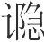(2)。成公贾入谏(3)，王曰：“不穀禁谏者，今子谏，何故？”王曰：“臣非敢谏也，愿与君王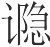也。”对曰：“胡不设不穀矣(4)？”对曰：“有鸟止于南方之阜，三年不动不飞不鸣，是何鸟也？”王射之(5)，曰：“有鸟止于南方之阜，其三年不动，将以定志意也；其不飞，将以长羽翼也；其不鸣，将以览民则也。是鸟虽无飞，飞将冲天；虽无鸣，鸣将骇人。贾出矣，不穀知之矣。”明日朝，所进者五人，所退者十人。群臣大说，荆国之众相贺也。故《诗》曰(6)：“何其久也，必有以也(7)。何其处也，必有与也(8)。”其庄王之谓邪！成公贾之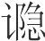也，贤于太宰嚭之说也。太宰嚭之说，听乎夫差，而吴国为墟(9)；成公贾之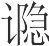，喻乎荆王，而荆国以霸。

**【注释】**

(1)荆庄王：即楚庄王，公元前613年—前591年在位。

(2)听：指听朝，听政。（yǐn）：隐语。

(3)成公贾：楚庄王之臣。

(4)设：施，行，这里有讲隐语之意。

(5)射：猜度，揣测。

(6)《诗》曰：下引诗句见《诗经·邶风·旄丘》，原诗作：“何其处也，必有与也。何其久也，必有以也。”

(7)有以：有原因。以，原因。

(8)处：居，安居。有与：义同“有以”。

(9)吴国为墟：指吴国被越国灭亡。

**【译文】**

楚庄王立为国君三年，不理政事，却爱好隐语。成公贾入朝劝谏，庄王说：“我禁止人们来劝谏，现在你却来劝谏，这是为什么？”成公贾回答说：“我不敢来劝谏，我希望跟您讲隐语。”庄王说：“你何不对我讲隐语呢？”成公贾回答说：“有只鸟停在南方的土山上，三年不动不飞不鸣，这是什么鸟啊？”庄王猜测说：“有只鸟停在南方的土山上，它之所以三年不动，是要借此安定意志；它之所以不飞，是要借此生长羽翼；它之所以不鸣，是要借此观察民间法度。这鸟虽然不飞，一飞就将冲上天空；虽然不鸣，一鸣就将使人惊恐。你出去吧，我知道隐语的含义了。”第二天上朝，提拔的有五个人，罢免的有十个人。臣子们都非常高兴，楚国的人们都互相庆贺。所以《诗》上说：“为什么这么久不行动呢，一定是有原因的。为什么安居不动呢，一定是有缘故的。”这大概说的就是庄王吧！成公贾讲的隐语，胜过太宰嚭劝说的言论。太宰嚭劝说的言论被夫差听从了，吴国因此成为废墟；成公贾讲的隐语，被楚王理解了，楚国因此称霸诸侯。

齐桓公与管仲谋伐莒(1)，谋未发而闻于国，桓公怪之，曰：“与仲父谋伐莒，谋未发而闻于国，其故何也？”管仲曰：“国必有圣人也。”桓公曰：“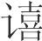！日之役者，有执蹠而上视者(2)，意者其是邪！”乃令复役，无得相代。少顷，东郭牙至。管仲曰：“此必是已。”乃令宾者延之而上(3)，分级而立。管子曰：“子邪言伐莒者？”对曰：“然。”管仲曰：“我不言伐莒，子何故言伐莒？”对曰：“臣闻君子善谋，小人善意(4)。臣窃意之也。”管仲曰：“我不言伐莒，子何以意之？”对曰：“臣闻君子有三色：显然喜乐者(5)，钟鼓之色也；湫然清静者(6)，衰绖之色也(7)；艴然充盈、手足矜者(8)，兵革之色也。日者臣望君之在台上也，艴然充盈、手足矜者，此兵革之色也。君呿而不唫(9)，所言者‘莒’也；君举臂而指，所当者莒也。臣窃以虑诸侯之不服者，其惟莒乎！故臣言之。”凡耳之闻，以声也。今不闻其声，而以其容与臂，是东郭牙不以耳听而闻也。桓公、管仲虽善匿，弗能隐矣。故圣人听于无声，视于无形。詹何、田子方、老耽是也(10)。

**【注释】**

(1)莒（jǔ）：西周时分封的诸侯国，战国初期为楚所灭，后属齐，在今山东莒县一带。

(2)蹠（zhí）：当指可以用足踏的耒。蹠，蹈，踏。，字书无考，疑为“枱”（sì）之异文（依孙诒让说）。枱，古代翻土农具上的木柄。

(3)宾者：即傧相，接引宾客和赞礼的人。延：引，领。

(4)意：猜测，揣度。

(5)显然：欢乐的样子。

(6)湫（jīu）然：清冷的样子。

(7)衰绖（cuīdié）：指丧服。衰，丧衣，以麻布制成。绖，围在头上、缠在腰间的散麻绳。

(8)艴（bó）然：恼怒的样子。矜：奋，挥动。

(9)呿（qù）：张口。唫（jìn）：闭口。

(10)詹何：道家人物。田子方：战国时人，学于子贡，崇尚礼义。老耽：即老聃，老子。

**【译文】**

齐桓公与管仲谋划攻打莒国，谋划的事尚未公布就被国人知道了，桓公感到很奇怪，说：“与仲父谋划攻打莒国，谋划的事尚未公布就被国人知道了，这是什么原因呢？”管仲说：“国内一定有聪明睿智的人。”桓公说：“嘻！那天服役的人中有拿着耒向上张望的，我料想大概就是这个人吧！”于是就命令那天服役的人再来服役，不得替代。过了一会儿，东郭牙来了。管仲说：“这一定是那个把消息传播出去的人了。”于是就派礼宾官员领他上来，管仲和他分宾主在左右台阶上站定。管仲说：“传播攻打莒国消息的是你吧？”东郭牙回答说：“是的。”管仲说：“我没有说过攻打莒国的话，你为什么要传播攻打莒国的消息呢？”东郭牙回答说：“我听说君子善于谋划，小人善于揣测，我是私下里揣测出来的。”管仲说：“我没有说过攻打莒国的话，你根据什么揣测出来的？”东郭牙回答说：“我听说君子有三种神色：面露喜悦之色，这是欣赏钟鼓等乐器时的神色；面带清冷安静之色，这是居丧时的神色；怒气冲冲、手足挥动，这是要用兵打仗的神色。那天我望见您在台上怒气冲冲、手足挥动，这就是要用兵打仗的神色。您的嘴张开了，没有闭上，这表明您所说的是‘莒’。您举起胳膊指点，被指的正是莒国。我私下考虑，诸侯当中不肯归服齐国的，大概只有莒国了吧！因此我就传播了攻打莒国的消息。”大凡耳朵能听到，是因为有声音。现在没有听到声音，却根据别人的面部表情与手臂动作了解别人的意图，这是东郭牙不靠耳朵就能听到别人的话啊。桓公、管仲虽然善于保守秘密，也不能掩盖住。所以，圣人能在无声之中有所闻，能在无形之中有所见。詹何、田子方、老耽就是这样啊。

# 精谕

**【题解】**

所谓“精谕”，是说人们的思想可以通过精神表现出来。文章一开始所举的一则寓言——海上之人有好蜻者，就是为了说明“精谕”的。文章所举例证，说明“圣人相谕不待言”，人的思想可以通过“容貌音声”、“行步气志”表现出来，圣贤之人对此能够体察，因而能做出正确的决断。因此主张“至言去言，至为无为”。

三曰：

圣人相谕不待言，有先言言者也(1)。

海上之人有好蜻者(2)，每居海上，从蜻游，蜻之至者百数而不止，前后左右尽蜻也，终日玩之而不去。其父告之曰：“闻蜻皆从女居(3)，取而来，吾将玩之。”明日之海上，而蜻无至者矣。

**【注释】**

(1)言言：第一个“言”是名词，第二个“言”是动词。

(2)蜻：通“青”，青鸟，一种水鸟（依王引之说）。

(3)居：处，在一起。

**【译文】**

第三：

圣人相互晓谕不需言语，思想可以先于言语表达出来。

海边有个喜欢青鸟的人，每当他停留在海边，总跟青鸟在一起嬉戏，飞来的青鸟数以百计都不止，前后左右尽是青鸟，整天玩赏它们，它们都不离开。他的父亲告诉他说：“听说青鸟都跟你在一起，你把它们带来，我也要玩赏它们。”第二天到了海边，青鸟没有一个飞来的了。

胜书说周公旦曰(1)：“廷小人众，徐言则不闻，疾言则人知之。徐言乎，疾言乎？”周公旦曰：“徐言。”胜书曰：“有事于此，而精言之而不明(2)，勿言之而不成。精言乎，勿言乎？”周公旦曰：“勿言。”故胜书能以不言说，而周公旦能以不言听。此之谓不言之听。不言之谋，不闻之事，殷虽恶周，不能疵矣。口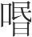不言(3)，以精相告，纣虽多心，弗能知矣。目视于无形，耳听于无声，商闻虽众，弗能窥矣。同恶同好，志皆有欲，虽为天子，弗能离矣。

**【注释】**

(1)胜书：人名。

(2)精：微。

(3)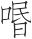（wěn）：同“吻”。

**【译文】**

胜书劝说周公旦道：“廷堂小而人很多，轻声说听不到，大声说别人就会知道。是轻声说呢，还是大声说呢？”周公旦说：“轻声说。”胜书说：“假如有件事情，隐微地说不能说明白，不说就不能办成。是隐微地说呢，还是不说呢？”周公旦说：“不说。”所以胜书能凭着不说话劝说周公，而周公旦也能凭着对方的不说话听懂他的意思。这就叫做不用别人说话就能听懂。不说出来的计谋，不能听到的事情，商虽然厌恶周，也不能挑毛病。嘴巴不讲话，通过神情告诉对方，纣虽然多心，也不能知道周的计谋。眼睛看到的都是无形的东西，耳朵听到的都是无声的东西，商朝探听消息的人虽然很多，也不能窥见周的秘密。听者与说者好恶相同，志欲一样，虽然是天子，也不能把他们隔断。

孔子见温伯雪子(1)，不言而出。子贡曰：“夫子之欲见温伯雪子好矣(2)，今也见之而不言，其故何也？”孔子曰：“若夫人者(3)，目击而道存矣(4)，不可以容声矣。”故未见其人而知其志，见其人而心与志皆见，天符同也(5)。圣人之相知，岂待言哉？

**【注释】**

(1)温伯雪子：当时的贤者。

(2)好：义未详。《庄子·田子方》作“久”，译文姑依《庄子》。

(3)夫：彼，那。

(4)击：触，接触。

(5)天符：天道。同：相合。

**【译文】**

孔子去见温伯雪子，不说话就出来了。子贡说：“先生您希望见到温伯雪子已经很久了，现在见到了却不说话，这是什么原因呢？”孔子说：“像那个人那样，用眼一看就知道他是有道之人，用不着再讲话了。”所以，还没有见到那个人就能知道他的志向，见到那个人以后他的内心与志向都能看清楚，这是因为彼此都与天道相合。圣人相互了解，哪里需要言语呢？

白公问于孔子曰(1)：“人可与微言乎(2)？”孔子不应。白公曰：“若以石投水，奚若？”孔子曰：“没人能取之。”白公曰：“若以水投水，奚若？”孔子曰：“淄、渑之合者(3)，易牙尝而知之(4)。”白公曰：“然则人不可与微言乎？”孔子曰：“胡为不可？唯知言之谓者为可耳(5)。”白公弗得也。知谓则不以言矣(6)。言者谓之属也。求鱼者濡，争兽者趋，非乐之也(7)。故至言去言，至为无为。浅智者之所争则末矣(8)。此白公之所以死于法室(9)。

**【注释】**

(1)白公：楚大夫，名胜，楚平王之孙，太子建之子。太子建因受陷害而出奔郑，后被郑人杀死。为报父仇，他谋划杀死楚国领兵救郑的令尹子西、司马子期。下文的问“微言”即指此。

(2)微言：不明言，以暗喻示意。

(3)淄、渑：齐国境内二水名。合：汇合。

(4)易牙：齐桓公近臣，善别滋味。

(5)谓：意思，思想。

(6)“知谓”句：“言”字当叠（依陶鸿庆说）。

(7)“求鱼”三句：以上几句是说，濡、趋是为了得鱼、得兽，如果不需濡、趋便可得鱼、得兽，人们就不会濡、趋了。以此喻言、谓的关系。

(8)末：微小，渺小。

(9)法室：刑室，监狱。

**【译文】**

白公向孔子问道：“可以跟人讲隐秘之言吗？”孔子不回答。白公说：“讲的隐秘之言就如同把石头投入水中一样不为人所知，怎么样？”孔子说：“在水中潜行的人能得到它。”白公说：“就如同把水倒入水中一样不为人所知，怎么样？”孔子说：“淄水、渑水汇合在一起，易牙尝尝就能区分它们。”白公说：“这样说来，那么不可以跟人讲隐秘之言了吗？”孔子说：“为什么不可以？只有懂得言语的真实含意的人才可以啊。”白公不懂得这些。懂得言语的真实含意就可以不用言语了，因为言语是表达思想的。捕鱼的要沾湿衣服，争抢野兽的要奔跑，并不是他们愿意沾湿衣服或奔跑。所以，最高境界的言语是抛弃言语，最高境界的作为是无所作为。才智短浅的人，他们所争的就很渺小了。这就是白公后来死在监狱里的原因。

齐桓公合诸侯，卫人后至。公朝而与管仲谋伐卫，退朝而入，卫姬望见君(1)，下堂再拜，请卫君之罪。公曰：“吾于卫无故(2)，子曷为请？”对曰：“妾望君之入也，足高气强，有伐国之志也。见妾而有动色，伐卫也。”明日君朝，揖管仲而进之。管仲曰：“君舍卫乎？”公曰：“仲父安识之？”管仲曰：“君之揖朝也恭，而言也徐，见臣而有惭色，臣是以知之。”君曰：“善。仲父治外，夫人治内，寡人知终不为诸侯笑矣。”桓公之所以匿者不言也，今管子乃以容貌音声，夫人乃以行步气志。桓公虽不言，若暗夜而烛燎也。

**【注释】**

(1)卫姬：齐桓公夫人，娶于卫，故称“卫姬”。

(2)故：事，指战争之事。

**【译文】**

齐桓公盟会诸侯，卫国人来晚了。桓公上朝时与管仲谋划攻打卫国。退朝以后进入内室，卫姬望见君主，下堂拜了两拜，为卫国君主请罪。桓公说：“我对卫国没有战事，你为什么要请罪？”卫姬回答说：“我望见您进来的时候，迈着大步，怒气冲冲，有攻打别国的意思。见到我就变了脸色，这表明是要攻打卫国啊。”第二天桓公上朝，向管仲行揖让之礼请他进来。管仲说：“您不攻打卫国了吧？”桓公说：“仲父您怎么知道的？”管仲说：“您升朝时行揖让之礼很恭敬，说话很和缓，见到我面有愧色，我因此知道的。”桓公说：“好。仲父治理宫外的事情，夫人治理宫内的事情，我知道自己终究不会被诸侯们耻笑了。”桓公用以掩盖自己意图的办法是不说话，现在管子却凭着容貌声音、夫人却凭着走路气质察觉到了。桓公虽然不说话，他的意图就像黑夜点燃烛火一样看得清楚明白。

晋襄公使人于周曰(1)：“弊邑寡君寝疾，卜以守龟(2)，曰：‘三涂为祟(3)。’弊邑寡君使下臣愿藉途而祈福焉。”天子许之，朝，礼使者事毕，客出。苌弘谓刘康公曰(4)：“夫祈福于三涂，而受礼于天子，此柔嘉之事也，而客武色，殆有他事，愿公备之也。”刘康公乃儆戎车卒士以待之(5)。晋果使祭事先，因令杨子将卒十二万而随之(6)，涉于棘津(7)，袭聊、阮、梁、蛮氏(8)，灭三国焉。此形名不相当，圣人之所察也，苌弘则审矣。故言不足以断小事(9)，唯知言之谓者可为(10)。

**【注释】**

(1)晋襄公：晋文公之子，公元前627年—前621年在位。

(2)守龟：占卜用的龟甲。

(3)三涂：古山名，在今河南嵩县西南、伊河北岸。这里的“三涂”指三涂山山神。祟：神降灾。

(4)苌弘：周景王、敬王大臣刘文公所属大夫。刘康公：周定王之子（一说为周匡王之子），食邑在“刘”，谥“康公”。刘在今河南偃师南。

(5)儆（jǐnɡ）：使人警惕。戎车：兵车，战车。

(6)杨子：晋国的将帅。

(7)棘津：此处当指孟津（依服虔说），古黄河渡口，在今河南孟州南。

(8)聊、阮、梁、蛮氏：小国名。

(9)“故言”句：“小”字当为衍文（依陶鸿庆说。）

(10)可为：当作“为可”（依王念孙说。）

**【译文】**

晋襄公派人去周朝说：“我国君主卧病不起，用龟甲占卜，卜兆说：‘是三涂山山神降下灾祸。’我国君主派我来，希望借条路去向三涂山山神求福。”周天子答应了他，于是升朝，按礼节接待完使者，宾客出去了。苌弘对刘康公说：“向三涂山山神求福，在天子这里受礼遇，这是温和美善的事情，可是宾客却表现出勇武之色，恐怕有别的事情，希望您加以防备。”刘康公就让战车士卒做好戒备等待着。晋国果然先做祭祀的事，趁机派杨子率领十二万士兵跟随着，渡过棘津，袭击聊、阮、梁、蛮氏等小国，灭掉了其中三国。这就是实际和名称不相符，这种情况是圣人所能明察的，苌弘对此就审察清楚了。所以单凭言语不足以决断事情，只有懂得了言语的真实含意才可以决断事情。

# 离谓

**【题解】**

所谓“离谓”，指的是言辞与思想相违背。本篇旨在论述“言意相离”的危害。文章指出，言辞是表达思想的，如果“言意相离”，必定凶险。流言泛滥，随意毁誉，贤与不肖不分，这正是乱国之俗。只有“以言观意”，“得其意则舍其言”才是正确的做法。

四曰：

言者以谕意也。言意相离，凶也。乱国之俗，甚多流言，而不顾其实，务以相毁，务以相誉，毁誉成党，众口熏天(1)，贤不肖不分。以此治国，贤主犹惑之也，又况乎不肖者乎？惑者之患，不自以为惑，故惑惑之中有晓焉(2)，冥冥之中有昭焉(3)。亡国之主，不自以为惑，故与桀、纣、幽、厉皆也(4)。然有亡者国(5)，无二道矣(6)。

**【注释】**

(1)熏天：形容气势之盛。熏，侵袭。

(2)惑惑：迷惑。

(3)冥冥：昏暗。

(4)皆：通“偕”，偕同，相同。

(5)者：通“诸”，之。

(6)无二道矣：没有另外的途径了。意思是，被灭亡的国家，都是由于“不自以为惑”。

**【译文】**

第四：

言语是为了表达意思的。言语和意思相违背，是凶险的。造成国家混乱的习俗是，流言很多，却不顾事实如何，一些人极力互相诋毁，一些人极力互相吹捧，诋毁的、吹捧的分别结成朋党，众口喧嚣，气势冲天，贤与不肖不能分辨。靠着这些来治理国家，贤明的君主尚且会感到困惑，更何况不贤明的君主呢？困惑之人的祸患是，自己不感到困惑。所以得道之人能在困惑之中悟出事物的道理，能在昏暗之中看到光明的境界。亡国的君主，自己不感到困惑，所以就与夏桀、商纣、周幽王、周厉王一样了。这样看来，那些遭到灭亡的国家，都是沿着这条路走的了。

郑国多相县以书者(1)，子产令无县书(2)，邓析致之(3)。子产令无致书，邓析倚之(4)。令无穷，则邓析应之亦无穷矣。是可不可无辨也。可不可无辨，而以赏罚，其罚愈疾，其乱愈疾。此为国之禁也。故辨而不当理则伪(5)，知而不当理则诈。诈伪之民，先王之所诛也。理也者，是非之宗也(6)。

洧水甚大(7)，郑之富人有溺者，人得其死者(8)。富人请赎之，其人求金甚多。以告邓析，邓析曰：“安之。人必莫之卖矣。”得死者患之，以告邓析，邓析又答之曰：“安之。此必无所更买矣。”夫伤忠臣者有似于此也。夫无功不得民，则以其无功不得民伤之；有功得民，则又以其有功得民伤之。人主之无度者，无以知此，岂不悲哉？比干、苌弘以此死，箕子、商容以此穷(9)，周公、召公以此疑(10)，范蠡、子胥以此流(11)，死生存亡安危，从此生矣。

子产治郑，邓析务难之，与民之有狱者约(12)：大狱一衣，小狱襦袴(13)。民之献衣襦袴而学讼者，不可胜数。以非为是，以是为非，是非无度，而可与不可日变。所欲胜因胜，所欲罪因罪。郑国大乱，民口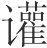哗。子产患之，于是杀邓析而戮之，民心乃服，是非乃定，法律乃行。今世之人，多欲治其国，而莫之诛邓析之类(14)，此所以欲治而愈乱也。

**【注释】**

(1)相县以书：指把法令悬挂出来以示人。县，悬挂，这个意义后来写作“悬”。书，当指邓析所作《竹刑》而言。

(2)子产：公孙侨，名侨，字子产，春秋时郑国执政大臣，实行过一系列政治改革。

(3)邓析：春秋末期郑国人，做过大夫，曾将刑法书于竹简，即《竹刑》。致：细密。这里有修饰之意。

(4)倚：偏颇，邪曲。这里用如动词。

(5)辨：通“辩”，善辩。

(6)宗：根本。

(7)洧（wěi）水：水名，即今双洎河，在河南省境内。

(8)死：尸，尸体。

(9)箕子：纣之诸父，因劝谏纣而被囚禁。商容：商代贵族，相传被纣废黜。穷：困窘。

(10)周公：即周公旦。召（shào）公：指召公奭（shì）。周公旦和召公奭都是周初大臣。武王死后，他们辅佐成王，管叔、蔡叔散布流言，他们因此而被怀疑。

(11)范蠡、子胥以此流：范蠡辅佐越王勾践灭吴后，泛舟五湖，所以这里说“流”。伍子胥因劝谏吴王夫差拒越求和，被赐死，死后其尸被装在口袋内流于江，所以这里也说“流”。

(12)狱：狱讼。

(13)襦（rú）：短衣。袴（kù）：胫衣，类似后来的裤子。“袴”的这一意义后来为“裤”所取代。

(14)莫之诛：即莫诛之。之，代词。

**【译文】**

郑国很多人把新法令悬挂起来，子产命令不要悬挂法令，邓析就对新法加以修饰。子产命令不要修饰新法，邓析就把新法弄得很偏颇。子产的命令无穷无尽，邓析对付的办法也就无穷无尽。这样一来，可以的与不可以的就无法辨别了。可以的与不可以的无法辨别，却用以施加赏罚，那么赏罚越厉害，混乱就会越厉害。这是治理国家的禁忌。所以，如果善辩但却不符合事理就会奸巧，如果聪明但却不符合事理就会狡诈。狡诈奸巧的人，是先王所惩处的人。事理，是判断是非的根本啊。

洧水很大，郑国有个富人淹死了，有人得到了这人的尸体。富人家里请求赎买尸体，得到尸体的那个人要的钱很多。富人家里把这情况告诉了邓析，邓析说：“你安心等待。那个人一定无处去卖尸体了。”得到尸体的人对此很担忧，把这情况告诉了邓析，邓析又回答说：“你安心等待。这人一定无处再去买尸体了。”那些诋毁忠臣的人，与此很相似。忠臣没有功劳不能得到人民拥护，就拿他们没有功劳不能得到人民拥护诋毁他们；他们有功劳得到人民拥护，就又拿他们有功劳得到人民拥护诋毁他们。君主中没有原则的，就无法了解这种情况。无法了解这种情况，难道不是很可悲吗？比干、苌弘就是因此而被杀死的，箕子、商容就是因此而困窘的，周公、召公就是因此而受到猜疑的，范蠡、伍子胥就是因此而泛舟五湖、流尸于江的。生死、存亡、安危，都由此产生出来了。

子产治理郑国，邓析极力刁难他，跟有狱讼的人约定：学习大的狱讼要送上一件上衣，学习小的狱讼要送上短衣下衣。献上上衣和短衣下衣以便学习狱讼的人不可胜数。把错的当成对的，把对的当成错的，对的错的没有标准，可以的与不可以的每天都在改变。想让人诉讼胜了就能让人诉讼胜了，想让人获罪就能让人获罪。郑国大乱，人民吵吵嚷嚷。子产对此感到忧虑，于是就杀死了邓析并且陈尸示众，民心才顺服了，是非才确定了，法律才实行了。如今世上的人，大都想治理好自己的国家，可是却不杀掉邓析之类的人，这就是想把国家治理好而国家却更加混乱的原因啊。

齐有事人者，所事有难而弗死也。遇故人于涂，故人曰：“固不死乎(1)？”对曰：“然。凡事人，以为利也。死不利，故不死。”故人曰：“子尚可以见人乎？”对曰：“子以死为顾可以见人乎？”是者数传。不死于其君长，大不义也，其辞犹不可服，辞之不足以断事也明矣。夫辞者，意之表也。鉴其表而弃其意，悖。故古之人，得其意则舍其言矣。听言者以言观意也，听言而意不可知，其与桥言无择(2)。

**【注释】**

(1)固：果真，诚然。

(2)桥：乖戾。择：区别。

**【译文】**

齐国有个侍奉人的人，所侍奉的人遇难他却不殉死。这个人在路上遇到熟人，熟人说：“你果真不殉死吗？”这个人回答说：“是的。凡是侍奉人，都是为了谋利。殉死不利，所以不殉死。”熟人说：“你这样还可以见人吗？”这个人回答说：“你认为殉死以后反而可以见人吗？”这样的话他多次传述。不为自己的君主上司殉死，是非常不义的，可是这个人还振振有词。凭言辞不足以决断事情，是很清楚的了。言辞是思想的外在表现，欣赏外在表现却抛弃思想，这是胡涂的。所以古人懂得了人的思想就用不着听他的言语了。听别人讲话是要通过其言语观察其思想。听别人讲话却不了解他的思想，那样的言语就与乖戾之言没有区别了。

齐人有淳于髡者(1)，以从说魏王(2)。魏王辩之(3)，约车十乘，将使之荆。辞而行，有以横说魏王(4)，魏王乃止其行。失从之意，又失横之事，夫其多能不若寡能，其有辩不若无辩。周鼎著倕而龁其指(5)，先王有以见大巧之不可为也。

**【注释】**

(1)淳于髡（kūn）：战国时期齐国人，以博学著称，曾被齐威王任为大夫。

(2)从：纵，即合纵（六国联合拒秦）。魏王：指魏惠王。

(3)辩之：以之为辩，认为他说得好。

(4)有：通“又”。横：即连横（六国分别事秦）。

(5)倕（chuí）：相传为尧时的巧匠。龁（hé）：咬。

**【译文】**

齐国人有个叫淳于髡的，他用合纵之术劝说魏王。魏王认为他说得好，就套好十辆车，要派他到楚国去。他告辞要走的时候，又用连横之术劝说魏王，魏王于是就不让他去了。既让合纵的主张落空，又让连横的事落空，那么他才能多就不如才能少，他有辩才就不如没有辩才。周鼎刻铸上倕的图像却让他咬断自己的手指，先王以此表明大巧是不可取的。

# 淫辞

**【题解】**

本篇旨在反对诡辩淫辞。文章指出，言辞是表达思想的，如果言辞与思想相背离，而君主又无法加以检验，那么下面的人就会“言行相诡”、“所言非所行”、“所行非所言”，这样会给国家带来极大的危害。文章列举的秦、赵相与约，孔穿、公孙龙相与论于平原君所等事例，都是为论证这一观点服务的。

五曰：

非辞无以相期(1)，从辞则乱。乱辞之中又有辞焉(2)，心之谓也。言不欺心，则近之矣。凡言者以谕心也。言心相离，而上无以参之(3)，则下多所言非所行也，所行非所言也。言行相诡，不祥莫大焉。

**【注释】**

(1)相期：这里是互相交往的意思。期，会合。

(2)“乱辞”句：“乱”字涉上文而衍（依陈昌齐说）。

(3)参：检验，考察。

**【译文】**

第五：

没有言辞就无法互相交往，只听信言辞就会发生混乱。言辞之中又有言辞，这指的就是思想。言语不违背思想，那就差不多了。凡是言语，都是为了表达思想的。言语和思想相背离，可是在上位的却无法考察，那么在下位的就多有很多言语与行动不相符，行为与言语不相符的情况。言语行动互相背离，没有什么比这更不吉祥的了。

空雄之遇(1)，秦、赵相与约，约曰：“自今以来，秦之所欲为，赵助之；赵之所欲为，秦助之。”居无几何，秦兴兵攻魏，赵欲救之。秦王不说(2)，使人让赵王曰(3)：“约曰：‘秦之所欲为，赵助之；赵之所欲为，秦助之。’今秦欲攻魏，而赵因欲救之，此非约也。”赵王以告平原君(4)，平原君以告公孙龙，公孙龙曰：“亦可以发使而让秦王曰：‘赵欲救之，今秦王独不助赵，此非约也。’”

**【注释】**

(1)空雄：当作“空雒”（依毕沅说），前《听言》篇作“空洛”（洛古作“雒”），可以为证。遇：盟会。

(2)秦王：指秦昭王。说：高兴。这个意义后来写作“悦”。

(3)让：责备。赵王：指赵惠文王。

(4)平原君：即赵胜，战国时期赵国贵族，惠文王之弟，封于东武城，号“平原君”，为赵相，有门客数千人。

**【译文】**

在空洛盟会的时候，秦国、赵国相互订立盟约，盟约说：“从今以后，秦国想做的事，赵国予以帮助；赵国想做的事，秦国予以帮助。”过了不久，秦国发兵攻打魏国，赵国想援救魏国。秦王很不高兴，派人责备赵王说：“盟约说：‘秦国想做的事，赵国予以帮助；赵国想做的事，秦国予以帮助。’现在秦国想攻打魏国，而赵国却想援救它，这不符合盟约。”赵王把这些话告诉了平原君，平原君把这些话告诉了公孙龙，公孙龙说：“赵王也可以派使臣去责备秦王说：‘赵国想援救魏国，现在秦国却偏偏不帮助赵国，这不符合盟约。’”

孔穿、公孙龙相与论于平原君所(1)，深而辩，至于藏三耳(2)，公孙龙言藏之三耳甚辩。孔穿不应，少选(3)，辞而出。明日，孔穿朝，平原君谓孔穿曰：“昔者公孙龙之言甚辩。”孔穿曰：“然。几能令藏三耳矣。虽然，难，愿得有问于君：谓藏三耳甚难而实非也，谓藏两耳甚易而实是也。不知君将从易而是者乎，将从难而非者乎？”平原君不应。明日，谓公孙龙曰：“公无与孔穿辩。”

**【注释】**

(1)孔穿：字子高，孔子的后代。

(2)藏三耳：《孔丛子·公孙龙》篇有“臧三耳”语。按“藏”即“臧”之借字，“臧”通“牂”（zānɡ），母羊。

(3)少选：一会儿。

**【译文】**

孔穿、公孙龙在平原君那里互相辩论，言辞精深而雄辩，谈到羊有三耳的命题，公孙龙说羊有三耳，说得头头是道。孔穿不回答，过了一会儿，就告辞走了。第二天，孔穿来见平原君，平原君对孔穿说：“昨天公孙龙说的话非常雄辩。”孔穿说：“是的。几乎能让羊有三耳了，尽管如此，这说法还是很难成立，我想问问您，说羊有三耳难度很大，而实际上却不是这样；说羊有两耳很容易，而事实确实是这样。不知您将赞同容易而正确的说法呢，还是赞同困难而不正确的说法呢？”平原君不回答。第二天，平原君对公孙龙说：“你不要跟孔穿辩论了。”

荆柱国庄伯令其父视(1)，曰：“日在天”；视其奚如，曰“正圆”；视其时，日“当今”。令谒者驾(2)，曰“无马”。令涓人取冠(3)，“进上”。问马齿(4)，圉人曰“齿十二与牙三十”(5)。人有任臣不亡者(6)，臣亡，庄伯决之，任者无罪(7)。

**【注释】**

(1)柱国：也称，战国时期楚国官职名，原为保卫国都之官，后“上柱国”为最高武官，其地位仅次于令尹。庄伯：人名。以下几句，文字难通，当有讹误。原文疑当作：“荆柱国庄伯令其父（父字疑误）视日，曰‘在天’；视其奚如，曰‘正圆”；视其时，曰‘当今’。令谒者驾，曰‘无马’。令涓人取冠，曰‘进上’。”（依陈昌齐、孙诒让说）这段文字义亦难晓。据上下文，讲的似乎都是所答非所问之事。庄伯前三问，其意都在问时辰早晚，而其父却以“在天”、“正圆”、“当今”回答。令谒者驾，是令其通报驾车者驾车，谒者误以为令己驾车，故以“无马”对。惟令涓人取冠事未详其义。

(2)谒者：官名，负责为国君传达命令。

(3)涓人：在君主左右掌管洒扫的人。

(4)马齿：本指马的牙齿，由于牙齿的生长情况与年龄有关，所以齿又指年龄。这里“问马齿”是问马的年龄。

(5)圉人：官名，掌养马刍牧之事。齿：门牙。牙：槽牙。马有齿十二个，牙十八个，合在一起共三十个。圉人不明庄伯问马年齿之意，而以马牙齿之实际数目作答，亦属答非所问。

(6)任：担保。臣：奴隶，奴仆。亡：逃跑。

(7)任者无罪：担保的人本应判罪，而庄伯断其无罪，可能是曲解了法律原文。但具体情况如何，则未详。

**【译文】**

楚国的柱国庄伯让父亲去看看太阳是早是晚，父亲却说“太阳在天上”；看看太阳怎么样了，却说“太阳正圆”；看看是什么时辰，却说“正是现在”。让谒者去传令驾车，却回答说“没有马”。让涓人去拿帽子，回答说“呈上去了”。问马的年齿，圉人却说“齿十二个，加上牙共三十个”。有个担保人家的奴仆不逃跑的人，奴仆逃跑了，庄伯判决，担保的人却没有罪。

宋有澄子者，亡缁衣(1)。求之涂，见妇人衣缁衣，援而弗舍，欲取其衣，曰：“今者我亡缁衣。”妇人曰：“公虽亡缁衣，此实吾所自为也。”澄子曰：“子不如速与我衣。昔吾所亡者，纺缁也(2)；今子之衣，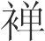缁也(3)。以缁当纺缁，子岂不得哉(4)？”

**【注释】**

(1)亡：丢失。淄衣：用黑色帛所做的朝服，也用以指黑色衣服。

(2)纺：纺帛，用纺丝的方法织成的丝织品。

(3)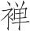（dān）：单衣，无里的衣服。

(4)得：合适，便宜。

**【译文】**

宋国有个叫澄子的，丢了一件黑色衣服。他到路上去寻找，看见一个妇女穿着黑色衣服，就抓住她不放手，要脱掉她的衣服，说：“如今我丢了件黑色衣服。”妇女说：“您虽然丢了黑色衣服，不过这件衣服确实是我自己做的。”澄子说：“你不如赶快把衣服给我。昨天我丢的是纺丝的黑衣服，如今你的衣服是单面的黑衣服。用单面的黑衣服抵偿纺丝的黑衣服，你难道还不占便宜吗？”

宋王谓其相唐鞅曰(1)：“寡人所杀戮者众矣，而群臣愈不畏，其故何也？”唐鞅对曰：“王之所罪，尽不善者也。罪不善，善者故为不畏。王欲群臣之畏也，不若无辨其善与不善而时罪之(2)，若此则群臣畏矣。”居无几何，宋君杀唐鞅。唐鞅之对也，不若无对。

**【注释】**

(1)宋王：指宋康王。唐鞅：宋康王相。

(2)时：时常，经常。

**【译文】**

宋王对他的相唐鞅说：“我杀死的人很多了，可是臣子们却越发不畏惧我，这是什么原因呢？”唐鞅回答说：“您治罪的，都是不好的人。对不好的人治罪，所以好人不畏惧。您想让臣子们畏惧您，不如不要区分好与不好，不断地治罪臣子，这样，臣子们就会畏惧了。”过了不久，宋国君主杀死了唐鞅。唐鞅的回答，还不如不回答。

惠子为魏惠王为法(1)。为法已成，以示诸民人，民人皆善之。献之惠王，惠王善之，以示翟翦(2)，翟翦曰：“善也。”惠王曰：“可行邪？”翟翦曰：“不可。”惠王曰：“善而不可行，何故？”翟翦对曰：“今举大木者，前呼舆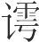(3)，后亦应之，此其于举大木者善矣。岂无郑、卫之音哉(4)？然不若此其宜也。夫国亦木之大者也(5)。”

**【注释】**

(1)惠子：即惠施。

(2)翟翦：魏国人，翟黄（又作“翟璜”）之后人。

(3)舆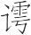（xū）：抬举重物时所唱的号子声。

(4)郑、卫之音：春秋战国时期郑、卫两国的民间音乐。

(5)“夫国”句：意思是，治理国家也像举大木一样，自有其宜用之法，而惠子之法如同郑、卫之音，众人虽善之，但不可行于国。

**【译文】**

惠子给魏惠王制定法令。法令已经制定完了，拿来让人们看，人们都认为法令很好。把法令献给惠王，惠王认为法令很好，拿来让翟翦看，翟翦说：“好啊。”惠王说：“可以实行吗？”翟翦说：“不可以。”惠王说：“好却不可以实行，为什么？”翟翦回答说：“如今抬大木头的，前面的唱号子，后面的来应和，这号子对于抬大木头的来说是很好了。难道没有郑国、卫国那样的音乐吗？然而唱那个不如唱这个适宜。治理国家也像抬大木头一样，自有其适宜的法令啊。”

# 不屈

**【题解】**

“不屈”是指言辞不可驳倒，难以穷尽。本篇论述巧言诡辩的危害。文章指出，善于辨察的人未必“得道”，尽管他们应对事物言辞难以穷尽，但未必有利于国家。辨察如果用以“达理明义”，那就会带来幸福；如果用以“饰非惑愚”，那就会带来灾祸。文章以惠子应对之辞为例，说明其言辞使君主受辱，使国家衰微。像惠子那样的人，对天下的危害是最大的，这就是本篇的结论。

六曰：

察士以为得道则未也(1)，虽然，其应物也，辞难穷矣。辞虽穷，其为祸福犹未可知。察而以达理明义，则察为福矣；察而以饰非惑愚(2)，则察为祸矣。古者之贵善御也(3)，以逐暴禁邪也。

**【注释】**

(1)察士：明察之士，此指善辩之人。

(2)惑愚：惑弄愚笨的人。

(3)贵善御：看重善于驾车的。贵，用如意动，以……为贵。

**【译文】**

第六：

明察的士人，认为他得到了道术，那倒未必。虽说这样，他对答事物，言辞是难以穷尽的。言辞即使穷尽了，这到底是祸是福，还是不可以知道。明察如果用以通晓事理弄清道义，那么明察就是福了；明察如果用以掩饰错误愚弄蠢人，那么明察就是祸了。古代之所以看重善于驾车的，是因为可以借以驱逐残暴的人、制止邪恶的事。

魏惠王谓惠子曰：“上世之有国，必贤者也。今寡人实不若先生，愿得传国。”惠子辞。王又固请曰：“寡人莫有之国于此者也(1)，而传之贤者，民之贪争之心止矣。欲先生之以此听寡人也。”惠子曰“：若王之言，则施不可而听矣(2)。王固万乘之主也，以国与人犹尚可(3)。今施，布衣也，可以有万乘之国而辞之，此其止贪争之心愈甚也。”惠王谓惠子曰：古之有国者，必贤者也。夫受而贤者，舜也，是欲惠子之为舜也；夫辞而贤者，许由也，是惠子欲为许由也；传而贤者，尧也，是惠王欲为尧也。尧、舜、许由之作，非独传舜而由辞也(4)，他行称此。今无其他，而欲为尧、舜、许由，故惠王布冠而拘于鄄(5)，齐威王几弗受(6)；惠子易衣变冠，乘舆而走，几不出乎魏境(7)。凡自行不可以幸为，必诚。

**【注释】**

(1)之：此。

(2)而：以。

(3)犹尚可：指尚且可以止贪争之心。

(4)“非独”句：大意是，不单单是尧把帝位传给舜而舜接受了，尧把帝位传给许由而许由谢绝了。

(5)“故惠”句：指魏惠王穿上丧国之服自拘于鄄，请求归服齐国。布冠，丧国之服饰。鄄，魏邑名，在今山东鄄城北。

(6)齐威王：田姓，战国时齐国君主，公元前356年—前320年在位。

(7)“几不”句：意思是说，几乎在魏国境内遇难。乎，于。

**【译文】**

魏惠王对惠子说：“前代享有国家的，一定是贤德的人。如今我确实不如先生您，我希望能把国家传给您。”惠子谢绝了，魏王又坚决请求道：“假如我不享有这个国家，而把它传给贤德的人，人们贪婪争夺的想法就可以制止了。希望先生您因此而听从我的话。”惠子说：“像您说的这样，那我就更不能听从您的话了。您本来是大国的君主，把国家让给别人尚且可以制止人们贪婪争夺的想法；如今我是个平民，可以享有大国却谢绝了，这样，那就更能制止人们贪婪争夺的想法了。”惠王对惠子说：古代享有国家的，一定是贤德的人。接受别人的国家而且自己又贤德的，是舜，这是想让惠子成为舜那样的人；谢绝享有别人的国家而且自己又贤德的，是许由，这是惠子想成为许由那样的人；把国家传给别人而且自己又贤德的，是尧，这是惠王想成为尧那样的人。尧、舜、许由所以名闻天下，不单单是尧把帝位传给舜而舜接受了，尧把帝位传给许由而许由谢绝了，他们其他的行为也与此相称。如今没有其他的行为，却想成为尧、舜、许由那样的人，所以后来惠王穿着丧国之服把自己拘禁在鄄请求归服齐国，齐威王几乎不肯接受他的归服；惠子改换了衣帽，乘车逃走，几乎逃不出魏国国境。大凡自己做事，不可以凭侥幸之心去行动，一定要诚恳。

匡章谓惠子于魏王之前曰(1)：“蝗螟，农夫得而杀之，奚故？为其害稼也。今公行，多者数百乘，步者数百人；少者数十乘，步者数十人。此无耕而食者，其害稼亦甚矣。”惠王曰：“惠子施也难以辞与公相应(2)。虽然，请言其志。”惠子曰：“今之城者，或者操大筑乎城上(3)，或负畚而赴乎城下，或操表掇以善睎望(4)。若施者，其操表掇者也。使工女化而为丝，不能治丝；使大匠化而为木，不能治木；使圣人化而为农夫，不能治农夫。施而治农夫者也(5)，公何事比施于螣螟乎？”惠子之治魏为本，其治不治。当惠王之时，五十战而二十败，所杀者不可胜数，大将、爱子有禽者也(6)。大术之愚，为天下笑，得举其讳(7)。乃请令周太史更著其名(8)。围邯郸三年而弗能取，士民罢潞(9)，国家空虚，天下之兵四至，众庶诽谤，诸侯不誉。谢于翟翦，而更听其谋，社稷乃存。名宝散出，土地四削，魏国从此衰矣。仲父，大名也；让国，大实也。说以不听不信。听而若此，不可谓工矣。不工而治，贼天下莫大焉。幸而独听于魏也。以贼天下为实，以治之为名，匡章之非，不亦可乎！

**【注释】**

(1)匡章：战国时齐将，齐威王、宣王、湣王时均有战功。

(2)惠子施：当是惠王对惠施的尊称。公：指匡章。

(3)筑：捣土的杵。

(4)表掇：本指用来表示分界的挂有毛皮的直木，因其为分界的标准，引申而有仪范、楷模、标志等意义。睎望：远望，观望，此指观望方位的斜正。睎，望。

(5)而：乃。

(6)大将、爱子有禽者：大将指钻荼、庞涓，爱子指太子申。禽，俘获。这个意义后来写作“擒”。

(7)讳：所隐讳的事情，此指过错。

(8)更著其名：魏惠王尊惠子为仲父，这里的“更著其名”指更改其仲父之名。

(9)罢潞：疲惫羸弱。罢，通“疲”。潞，通“路”。疲劳，羸弱。

**【译文】**

匡章在惠王面前对惠子说：“螟虫，农夫捉住就弄死它，为什么？因为它损害庄稼。如今您一行动，多的时候跟随着几百辆车、几百个步行的人，少的时候跟随着几十辆车、几十个步行的人。这些都是不耕而食的人，他们损害庄稼也太厉害了。”惠王说：“惠子很难用言辞回答您，虽然如此，还是请惠子谈谈自己的想法。”惠子说：“如今修筑城墙的，有的拿着大杵在城上捣土，有的背着畚箕在城下来来往往运土，有的拿着标志仔细观望方位的斜正。像我这样的，就是拿着标志的人啊。让善于织丝的女子变成丝，就不能织丝了；让巧匠变成木材，就不能处置木材了；让圣人变成农夫，就不能管理农夫了。我就是能管理农夫的人啊。您为什么把我比做螟虫呢？”惠子以治理魏国为根本，他却治理得不好。在惠王的时代，作战五十次却失败了二十次，被杀死的人不计其数，惠王的大将、爱子有被俘虏的。惠子治国之术的愚惑，被天下人耻笑，天下人都得以称举他的过错。惠王这才请求让周天子的太史改变惠子仲父的名号。惠王包围邯郸三年却不能攻下来，兵士和人民很疲惫，国家弄得很空虚，天下诸侯的救兵从四面到来解救邯郸之围，百姓们责难他，诸侯们不赞誉他。他向翟翦道歉，重新听取翟翦的计谋，国家才保住。名贵的宝物都失散到国外，土地被四邻割去，魏国从此衰弱了。仲父是显赫的名号，把国家让给别人是高尚的行动。惠子用不可听不可信之言劝说惠王。惠王如此听从意见，不能叫做善于听取意见。不善于听取意见却来治理国家，对天下人的危害没有比这更大的了。幸好惠子的话只是被魏国听从了。以危害天下人为实，却以治理国家为名，匡章非难惠子，不是应该的吗！

白圭新与惠子相见也，惠子说之以强(1)，白圭无以应。惠子出，白圭告人曰：“人有新取妇者(2)，妇至，宜安矜烟视媚行(3)。竖子操蕉火而钜(4)，新妇曰：‘蕉火大钜’。入于门，门中有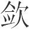陷(5)，新妇曰：‘塞之！将伤人之足。’此非不便之家氏也(6)，然而有大甚者。今惠子之遇我尚新，其说我有大甚者。”惠子闻之，曰：“不然。《诗》曰(7)：‘恺悌君子，民之父母。’恺者大也，悌者长也。君子之德，长且大者，则为民父母。父母之教子也，岂待久哉？何事比我于新妇乎？《诗》岂曰‘恺悌新妇’哉？”诽污因污，诽辟因辟(8)，是诽者与所非同也。白圭曰：惠子之遇我尚新，其说我有大甚者。惠子闻而诽之，因自以为为之父母，其非有甚于白圭亦有大甚者(9)。

**【注释】**

(1)白圭：魏人，名丹，字圭。强：强力，此指使国家强大。

(2)取：娶妻，这个意义后来写作“娶”。

(3)安矜：安稳持重。烟视：微视。人在烟中目不能张，故用以形容目微视之状。媚行：徐行。

(4)竖子：童仆。蕉火：通“爝火”，小火把。钜：大。

(5)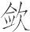（hān）：疑为“欿”字之误（依毕沅校说）。欿（kǎn），同“坎”，坑。

(6)之：于。家氏：夫家。

(7)《诗》曰：下引诗句见《诗经·大雅·泂酌》。“恺悌”作“岂弟”。

(8)辟：邪僻。这个意义后来写作“僻”。

(9)“其非”句：大意是，其错误比白圭说的太过分了还要严重。有，通“又”。

**【译文】**

白圭刚与惠子相见，惠子就用如何使国家强大来劝说他，白圭无话回答。惠子出去以后，白圭告诉别人说：“有个刚娶媳妇的人，媳妇到来时，应该安稳持重，微视慢行。童仆拿的火把烧得太旺，新媳妇说：‘火把太旺。’进了门，门里有陷坑，新媳妇说：‘填上它！它将跌伤人的腿。’这对于她的夫家不是没有利，然而太过分了些。如今惠子刚刚见到我，他劝说我的话太过分了些。”惠子听到这话以后，说：“不对。《诗》上说：‘具有恺悌之风的君子，如同人民的父母。’恺是大的意思，悌是长的意思。君子的品德，高尚盛大的，就可以成为人民的父母。父母教育孩子，哪里要等好久呢？为什么把我比做新媳妇呢？《诗》上难道说过‘具有恺悌之风的新媳妇’吗？”用污秽责难污秽，用邪僻责难邪僻，这样就是责难的人与被责难的人相同了。白圭说：惠子刚刚见到我，他劝说我的话太过分了些。惠子听到这话以后就责难他，于是自认为可以成为他的父母，那惠子的错误比白圭说的太过分了还要严重得多。

# 应言

**【题解】**

本篇列举的六个例子都是有关应对的。从中可以看出，作者主张，应对要善于抓住要害与实质，抓住对方言行方面的矛盾予以驳难，对方就会理屈词穷。文章劝告君主应该善于分析情势，依理判断，这样就能辨察那些谋求一己之利的虚言浮辞了。

七曰：

白圭谓魏王曰(1)：“市丘之鼎以烹鸡(2)，多洎之则淡而不可食(3)，少洎之则焦而不熟，然而视之蝺焉美(4)，无所可用。惠子之言，有似于此。”惠子闻之，曰：“不然。使三军饥而居鼎旁，适为之甑(5)，则莫宜之此鼎矣。”白圭闻之，曰：“无所可用者，意者徒加其甑邪？”白圭之论自悖，其少魏王大甚。以惠子之言踽焉美，无所可用，是魏王以言无所可用者为仲父也，是以言无所用者为美也。

**【注释】**

(1)魏王：指魏惠王。

(2)市丘之鼎：市丘所出之鼎，盖为当时大鼎。市丘，魏邑名，所在不详。

(3)洎（jì）：往锅里添水。

(4)蝺（qǔ）焉：高大美好的样子。

(5)甑：古代蒸食炊具，底部有许多透气的孔，置于鬲、釜之上蒸煮食物。

**【译文】**

第七：

白圭对魏王说：“用帝丘出产的大鼎来煮鸡，多加汤汁就会淡得没法吃，少加汤汁就会烧焦而且不熟，然而这鼎看起来非常高大漂亮，不过没有什么用处。惠子的话，就跟这大鼎相似。”惠子听到这话以后，说：“不对。假使三军士兵饥饿了停留在鼎旁边，恰好弄到了蒸饭用的大甑，和甑搭配起来蒸饭，就没有比这鼎更合适的了。”白圭听到这话以后，说：“没有什么用处的东西，想来只能在上面放上甑蒸饭用啦！”白圭的评论自然是错的，他太轻视魏王了。认为惠子的话只是说得漂亮，但没什么用处，这样就是魏王把说话没什么用处的人当成仲父了，这样就是把说话没什么用处的人当成完美的人了。

公孙龙说燕昭王以偃兵，昭王曰：“甚善。寡人愿与客计之。”公孙龙曰：“窃意大王之弗为也。”王曰：“何故？”公孙龙曰：“日者大王欲破齐(1)，诸天下之士其欲破齐者，大王尽养之；知齐之险阻要塞、君臣之际者，大王尽养之；虽知而弗欲破者，大王犹若弗养(2)。其卒果破齐以为功。今大王曰：我甚取偃兵。诸侯之士在大王之本朝者，尽善用兵者也。臣是以知大王之弗为也。”王无以应。

**【注释】**

(1)日者：往日，先前。

(2)犹若：还是。“弗养”当作“养之”。（依陶鸿庆说）

**【译文】**

公孙龙用如何消除战争的话劝说燕昭王，昭王说：“很好。我愿意跟宾客们商议这件事。”公孙龙说：“我私下里估计大王您不会消除战争的。”昭王说：“为什么？”公孙龙说：“从前大王您想打败齐国，天下杰出的人士中那些想打败齐国的人，大王您全都收养了他们；那些了解齐国的险阻要塞和君臣之间关系的人，大王您全都收养了他们；那些虽然了解这些情况但却不想打败齐国的人，大王您仍旧收养了他们。最后果然打败了齐国，并以此为功劳。如今大王您说：我很赞成消除战争。可是其他诸侯国的人士在大王您朝廷里的，都是善于用兵的人。我因此知道大王您不会消除战争的。”昭王无话回答。

司马喜难墨者师于中山王前以非攻(1)，曰：“先生之所术非攻夫(2)？”墨者师曰：“然。”曰：“今王兴兵而攻燕，先生将非王乎？”墨者师对曰：“然则相国是攻之乎(3)？”司马喜曰：“然。”墨者师曰：“今赵兴兵而攻中山，相国将是之乎？”司马喜无以应。

**【注释】**

(1)司马喜：中山国相。墨者师：墨家，名师。非攻：墨家学派的主张，即反对不义战争。

(2)所术：所信奉推行的主张。

(3)是：用如意动，以……为是，即赞成的意思。

**【译文】**

司马喜在中山国王前就“非攻”的主张诘责墨家学派名叫师的人，说：“先生您所主张的是‘非攻’吧？”师说：“是的。”司马喜说：“假如中山王发兵攻打燕国，先生您将责备国王吗？”师回答说：“这样说来，那么相国您赞成攻打燕国吗？”司马喜说：“是的。”师说：“假如赵国发兵攻打中山国，相国您也将赞成攻打中山国吗？”司马喜无话回答。

路说谓周颇曰(1)：“公不爱赵，天下必从。”周颇曰：“固欲天下之从也。天下从，则秦利也。”路说应之曰：“然则公欲秦之利夫？”周颇曰：“欲之。”路说曰：“公欲之，则胡不为从矣(2)？”

**【注释】**

(1)路说：人名。其事未详。周颇：人名。其事未详。

(2)“路说”以下数句：上面一段话，所指不详。译文姑依字面意义译出。

**【译文】**

路说对周颇说：“您如果不爱赵国，那么天下人一定会跟随您。”周颇说：“我本来想让天下人跟随我啊。天下人跟随我，那么秦国就有利。”路说回答他说：“这样说来，那么您想让秦国有利啦？”周颇说：“想让秦国有利。”路说说：“您想让秦国有利，那么为什么不因此而让天下人跟随您呢？”

魏令孟卬割绛、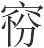、安邑之地以与秦王(1)。王喜，令起贾为孟卬求司徒于魏王(2)。魏王不说，应起贾曰：“卬，寡人之臣也。寡人宁以臧为司徒(3)，无用卬。愿大王之更以他人诏之也。”起贾出，遇孟卬于廷。曰：“公之事何如？”起贾曰：“公甚贱于公之主。公之主曰：宁用臧为司徒，无用公。”孟卬入见，谓魏王曰：“秦客何言？”王曰：“求以女为司徒。”孟卬曰：“王应之谓何？”王曰：“宁以臧，无用卬也。”孟卬太息曰：“宜矣王之制于秦也！王何疑秦之善臣也？以绛、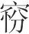、安邑令负牛书与秦(4)，犹乃善牛也。卬虽不肖，独不如牛乎？且王令三将军为臣先，曰：‘视卬如身(5)’，是臣重也。令二轻臣也(6)，令臣责(7)，卬虽贤，固能乎？”居三日，魏王乃听起贾。凡人主之与其大官也，为有益也。今割国之锱锤矣(8)，而因得大官，且何地以给之？大官，人臣之所欲也。孟卬令秦得其所欲，秦亦令孟卬得其所欲，责以偿矣(9)，尚有何责？魏虽强，犹不能责无责(10)，又况于弱？魏王之令乎孟卬为司徒，以弃其责，则拙也。

**【注释】**

(1)孟卬：当作“孟卯”（依毕沅说），齐人，仕于魏。绛：古邑名，战国魏地，在今山西新绛。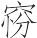：当为“汾”字异文（依毕沅说）。汾，古邑名。安邑：古邑名，战国初为魏国都，在今山西夏县西北。

(2)起贾：人名，其事迹不详。司徒：古代官名，掌管国家的土地和人民。

(3)臧：古代对奴隶的贱称。

(4)“以绛”句：让牛驮着绛、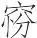、安邑的地图送给秦（古代以地予人，即将该地地图献给人）。负牛书，即使牛负书（书指地图）。

(5)身：指魏王自身。

(6)令二：当为“今王”之误（依俞樾说）。

(7)令臣责：意思是，日后让我去秦责求秦答应的东西。责，责求，索取。

(8)锱锤：比喻国家的小块土地。锱和锤都是古代重量单位，六铢等于一锱，八铢等于一锤（二十四铢为一两）。这里锱锤比喻小块的土地。

(9)责以偿矣：双方（秦与孟卯）所欠对方之债（土地与官职）都已偿还了。责，债务，这个意义后来写作“债”。以，同“已”。

(10)责无责：向不欠债者索债。前“责”，索取。后“责”，债。

**【译文】**

魏王派孟卯割让绛、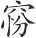、安邑等地给秦王。秦王很高兴，让起贾去向魏王为孟卯请求司徒的官职。魏王很不高兴，回答起贾说：“孟卯是我的臣子。我宁肯用奴仆当司徒，也不用孟卯。希望大王另用其他的人诏示我。”起贾出来，在庭院里遇到孟卯。孟卯说：“您说的事情怎么样？”起贾说：“您太受您的君主轻视了。您的君主说：宁肯用奴仆当司徒，也不用您。”孟卯进去谒见，对魏王说：“秦国客人说什么？”魏王说：“请求用你当司徒。”孟卯说：“您怎样回答他的？”魏王说：“我说‘宁肯任用奴仆，也不用孟卯’。”孟卯长叹道：“您受秦国控制是应该的了！您为什么要猜疑秦国善待我呢？把绛、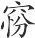、安邑的地图让牛驮着献给秦国，秦国尚且会好好对待牛。我虽然不好，难道还不如牛吗？况且，您让三位将军先去秦国为我致意，说‘看待孟卯如同看待我一样’，这是重视我啊。如今您轻视我，以后让我去索取秦国答应过的东西，我即使贤德，难道还能做到吗？”过了三天，魏王才答应了起贾的请求。大凡君主给人大的官职，是因为他有益于国家。如今割让国家一些土地，因而得到了大的官职，以后哪有那么多土地供他割让？大的官职，是臣子所希望得到的。孟卯让秦国得到了它所希望的土地，秦国也让孟卯得到了他所希望的官职。对方所欠的债已经偿还了，还有什么可索取的呢？魏国即使强大，也还不能向不欠债的索取债务，更何况它本身是弱小的国家呢？魏王让孟卯当了司徒，从而失掉了自己向秦国提出要求的地位，这就很笨拙了。

秦王立帝(1)，宜阳令许绾诞魏王(2)，魏王将入秦。魏敬谓王曰(3)：“以河内孰与梁重(4)？”王曰：“梁重。”又曰：“梁孰与身重？”王曰：“身重。”又曰：“若使秦求河内，则王将与之乎？”王曰：“弗与也。”魏敬曰：“河内，三论之下也(5)；身，三论之上也。秦索其下而王弗听，索其上而王听之，臣窃不取也。”王曰：“甚然。”乃辍行(6)。秦虽大胜于长平(7)，三年然后决，士民倦，粮食(8)。当此时也，两周全(9)，其北存，魏举陶削卫，地方六百，有之势是而入(10)，大蚤，奚待于魏敬之说也？夫未可以入而入，其患有将可以入而不入(11)。入与不入之时，不可不熟论也。

**【注释】**

(1)秦王立帝：指秦昭王立为西帝事。《史记·秦本纪》：“昭襄王十七年，王之宜阳。十九年，王为西帝，复去之。”

(2)宜阳：战国时韩邑，后归秦。许绾：秦臣（依高诱说）。诞：诈，欺骗。按：秦昭王实未称帝于天下，且称西帝不久“复去之”，许绾这样说，是为了骗魏王去朝拜。魏王：指魏昭王。

(3)魏敬：魏臣。

(4)河内：古地区名，此指魏国境内黄河以北地区。梁：即大梁，魏惠王自安邑迁都于此，在今河南省开封市西北。

(5)三论：指上文提到的河内、梁、身三种情况的比较。

(6)辍（chuò）：停止。

(7)秦虽大胜于长平：秦国虽然在长平大败赵军。长平，战国时赵邑，在今山西高平西北。

(8)粮食：后当脱一字（依毕沅说）。据文意，此句当是粮食匮乏之类的意思。

(9)两周全：指东周、西周尚未灭亡。

(10)有之势是：当作“有之是势”（依陈昌齐、陶鸿庆说），有这样的形势。是，此。

(11)有：通“又”。

**【译文】**

秦王立为帝，宜阳令许绾骗魏王，魏王要去秦朝拜。魏敬对魏王说：“拿河内和大梁比，哪一个重要？”魏王说：“大梁重要。”魏敬又说：“大梁跟您自身比，哪一个重要？”魏王说：“自身重要。”魏敬又说：“假如秦国索取河内，那么您将给它吗？”魏王说：“不给它。”魏敬说：“河内在三者之中占最下等，您自身在三者之中占最上等。秦国索取最下等的，您不答应，索取最上等的，您却答应了。我认为入秦是不可取的。”魏王说：“很对。”于是不去秦国了。秦国虽然在长平打了大胜仗，但打了三年然后才决定胜负，它的兵士和人民很疲惫，粮食很匮乏。正当那个时候，东周、西周两国尚未灭亡，大梁以北的地区仍未失去，魏国攻下了陶，夺取了卫国城邑，土地有六百里见方。具有这样的形势，却要去秦朝拜，那是太早了，何必要等魏敬劝说之后才不去秦朝拜呢？在不可去的时候却要去，这种祸患与将来可以去的时候却不去是一样的。去与不去的时机，不可不仔细考察啊。

# 具备

**【题解】**

本篇旨在论述建立功名必须具备条件。古代圣贤如汤、武、伊尹、太公也曾处于困境，那是因为他们不具备成功的条件，所以，“凡立功名，虽贤，必有其具，然后可成”。文中以大量篇幅叙述了宓子贱治亶父的事迹，说明怀有至诚之心，创造条件是宓子贱的成功根本。

八曰：

今有羿、蠭蒙、繁弱于此(1)，而无弦，则必不能中也。中非独弦也，而弦为中之具也(2)。夫立功名亦有具，不得其具，贤虽过汤、武，则劳而无功矣。汤尝约于郼、薄矣(3)，武王尝穷于毕、郢矣(4)，伊尹尝居于庖厨矣，太公尝隐于钓鱼矣。贤非衰也，智非愚也，皆无其具也。故凡立功名，虽贤，必有其具，然后可成。

**【注释】**

(1)羿：即后羿，传说中夏代东夷族的首领，以善射箭著称。蠭（pánɡ）蒙：也作“蠭门”、“逢蒙”，传说中夏代善于射箭的人，曾学射于羿。繁弱：古代良弓名。

(2)具：器具，这里指条件。

(3)约：穷困。薄：通“亳”。汤时的都城，故址在今河南商丘北。

(4)毕、郢：毕，即毕原，在今陕西咸阳北。郢，也作“程”，古邑名，周文王曾迁居于此。故址在今陕西咸阳东。

**【译文】**

假如有羿、蠭蒙这样的善射之人和繁弱这样的良弓，却没有弓弦，那么必定不能射中。射中不仅仅是靠了弓弦，可弓弦是射中的条件。建立功名也要有条件。不具备条件，即使贤德超过了汤、武王，那也会劳而无功。汤曾经在郼、亳受困，武王曾经在毕、郢受困窘，伊尹曾经在厨房里当仆隶，太公望曾经隐居钓鱼。他们的贤德并不是衰微了，他们的才智并不是愚蠢了，都是因为没有具备条件。所以凡是建立功名，即使贤德，也必定要具备条件，然后才可以成功。

宓子贱治亶父(1)，恐鲁君之听谗人，而令己不得行其术也，将辞而行，请近吏二人于鲁君与之俱。至于亶父，邑吏皆朝。宓子贱令吏二人书。吏方将书，宓子贱从旁时掣摇其肘，吏书之不善，则宓子贱为之怒。吏甚患之，辞而请归。宓子贱曰：“子之书甚不善，子勉归矣(2)！”二吏归报于君，曰：“宓子不可为书。”君曰：“何故？”吏对曰：“宓子使臣书，而时掣摇臣之肘，书恶而有甚怒(3)，吏皆笑宓子。此臣所以辞而去也。”鲁君太息而叹曰：“宓子以此谏寡人之不肖也。寡人之乱子(4)，而令宓子不得行其术，必数有之矣。微二人(5)，寡人几过。”遂发所爱而令之亶父，告宓子曰：“自今以来，亶父非寡人之有也，子之有也。有便于亶父者，子决为之矣。五岁而言其要(6)。”宓子敬诺，乃得行其术于亶父。三年，巫马旗短褐衣弊裘而往观化于亶父(7)，见夜渔者，得则舍之。巫马旗问焉，曰：“渔为得也，今子得而舍之，何也？”对曰：“宓子不欲人之取小鱼也。所舍者小鱼也。”巫马旗归，告孔子曰：“宓子之德至矣，使民暗行若有严刑于旁。敢问宓子何以至于此？”孔子曰：“丘尝与之言曰：‘诚乎此者刑乎彼(8)’。宓子必行此术于亶父也。”夫宓子之得行此术也，鲁君后得之也。鲁君后得之者，宓子先有其备也。先有其备，岂遽必哉(9)？此鲁君之贤也。

**【注释】**

(1)宓（作姓古读fú，今读mì）子贱：孔子弟子宓不齐，字子贱。亶父（dǎnfǔ）：即单父，春秋时鲁邑，在今山东单县。

(2)勉：尽力，这里是赶快的意思。

(3)有：通“又”。

(4)乱子：当作“乱宓子”，“宓”字误脱（依陶鸿庆说）。

(5)微：假如没有。

(6)言其要：报告施政的主要情况。要，要点。

(7)巫马旗：通作“巫马期”，孔子的弟子。短褐：古代平民所穿的粗陋衣服。短，通“裋（shù）”，僮仆所穿的衣服。褐，粗毛编织的衣服。衣（yì）：穿。弊裘：破旧的皮衣。弊，通“敝”。

(8)诚乎此者刑乎彼：即诚于心而形于外之意。刑，通“形”。

(9)岂遽：义同“岂”，难道。

**【译文】**

宓子贱去治理亶父，担心鲁国君主听信谗人的坏话，从而使自己不能实行自己的主张，将要告辞走的时候，向鲁国君主请求君主身边的两个官吏跟自己一起去。到了亶父，亶父的官吏都来朝见。宓子贱让那两个官吏书写。官吏刚要书写，宓子贱从旁边不时地摇动他们的胳膊肘，官吏写得很不好，宓子贱就为此而发怒。官吏对此厌恨，就告辞请求回去。宓子贱说：“你们写得很不好，你们赶快回去吧！”两个官吏回去以后向鲁国君主禀报说：“宓子这个人不可以给他书写。”鲁国君主说：“为什么？”官吏回答说：“宓子让我们书写，却不时地摇动我们的胳膊肘，写得不好又大发脾气，亶父的官吏都因宓子这样做而发笑。这就是我们所以要告辞离开的原因。”鲁国君主长叹道：“宓子是用这种方式对我的缺点进行劝谏啊。我扰乱宓子，使宓子不能实行自己的主张，这样的事一定多次发生过了。假如没有这两个人，我几乎要犯错误。”于是就派所喜欢的人让他去亶父，告诉宓子说：“从今以后，亶父不归我所有，归你所有。有对亶父有利的事情，你自己决断去做吧。五年以后报告施政的要点。”宓子恭敬地答应了，这才得以在亶父实行自己的主张。过了三年，巫马旗穿着粗劣的衣服，到亶父去观察施行教化的情况，看到夜里捕鱼的人，得到鱼以后就扔回水里。巫马旗问他说：“捕鱼是为了得到鱼，现在你得到鱼却把它扔回水里，这是为什么呢？”那人回答说：“宓子不想让人们捕取小鱼。我扔回水里的都是小鱼。”巫马旗回去以后，告诉孔子说：“宓子的德政达到极点了，他能让人们黑夜中独自做事，就像有严刑在身旁一样不敢为非作歹。请问宓子用什么办法达到这种境地的？”孔子说：“我曾经跟他说过：‘自己内心赤诚，就能在外实行。’宓子一定是在亶父实行这个主张了。”宓子得以实行这个主张，是因为鲁国君主后来领悟到这一点。鲁国君主之所以后来能领悟到这一点，是因为宓子事先有了准备。事先有了准备，难道就一定能让君主领悟到吗？这就是鲁国君主的贤明之处啊。

三月婴儿，轩冕在前(1)，弗知欲也；斧钺在后(2)，弗知恶也；慈母之爱，谕焉。诚也。故诚有诚乃合于情，精有精乃通于天。乃通于天，水木石之性，皆可动也，又况于有血气者乎？故凡说与治之务莫若诚。听言哀者，不若见其哭也；听言怒者，不若见其斗也。说与治不诚，其动人心不神。

**【注释】**

(1)轩冕：古代卿大夫的车服。轩，古代大夫以上的人乘坐的车子。冕，古代大夫以上的人穿的礼服。

(2)钺：古代兵器，形似斧，比斧大。

**【译文】**

三个月的婴儿，轩冕在前边不知道羡慕，斧钺在后边不知道厌恶，对慈母的爱却能懂得。这是因为婴儿的心赤诚啊。所以诚而又诚才合乎真情，精而又精才与天性相通。与天性相通，水、木、石的本性都可以改变，更何况有血气的人呢？所以凡是劝说别人与治理政事，要做的事没有比赤诚更重要的了。听别人说的话很悲哀，不如看到他哭泣；听别人说的话很愤怒，不如看到他搏斗。劝说别人与治理政事不赤诚，那就不能感化人心。

